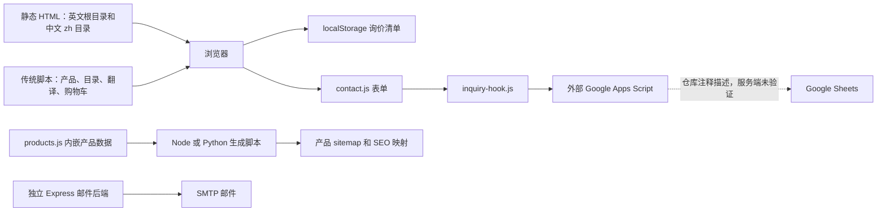

# WaiKwan 全面架构评估

评估日期：2026-09-10。范围：前端、内容数据、多语言、SEO、询价、部署、安全、性能、工程化和演进方案。

## 结论

建议采用“静态页面 + 构建时模板和内容模型 + 小型询价服务”的架构。先在现有代码上收敛数据和路由，再以一个页面类型试点 Astro 静态生成。当前代码体现的是 B2B 产品展示和询价业务，没有足够证据支持全站动态化、微服务或复杂订单平台。

这是一项基于现有业务的架构判断。若未来明确需要经销商登录、客户专属价格、库存、支付和订单处理，需要重新评估动态应用部分。

## 证据与边界

- GitHub 仓库：<https://github.com/a374340761-lgtm/wkan-website-real>。
- GitHub 插件已确认默认分支 main，提交为 `a70d0fbbb2de21b3106b74fa0e3ee872555c8417`，与本地 HEAD 一致；开始评估时工作区干净。
- 对同一提交的本地代码进行阅读和文件统计；没有修改业务代码、部署或提交真实询价。
- Git 跟踪文件 525 个，其中 HTML 193 个，`zh/` 下 HTML 86 个。这些数字包含兼容页、测试页等，不能视为有效索引页面数。
- 没有进行浏览器回归、在线性能测量或真实收件测试。无法由仓库确认生产托管平台、Apps Script 服务端实现、表格权限和备份、实际流量及监控状态。

## 当前系统

`contact-us.html:499` 和 `contact-us.html:500` 加载表单与 Apps Script 适配器；这条表单链路没有调用仓库中的 `/api/contact`。独立后端是否另有外部调用者无法确认。

## 各层评估

| 层面 | 已有基础 | 主要问题 | 建议 |
|---|---|---|---|
| 页面和组件 | 原生 HTML，静态交付简单 | 大量页面独立维护；公共页脚由运行时注入，内容与布局变更容易漂移 | 构建时共享 Header、Footer、产品卡和 SEO 组件 |
| JavaScript | 按业务拆分多个脚本，部分使用类和事件 | 全局 `window` 接口、内联事件及加载顺序形成隐式依赖 | 按目录、询价清单、语言、导航划分 ES Modules，页面只加载必要模块 |
| 产品数据 | `products.js` 是主要产品来源；SEO 映射已有生成器 | 数据嵌入 `ProductManager`，生成器需要执行并模拟浏览器环境或解析 JS；分类文件另有模型 | 独立产品数据与 schema；稳定 SKU；建立旧 ID 映射；生成目录和 SEO 产物 |
| 多语言 | 英文根路径、中文 `/zh/`，已有审计脚本 | HTML 镜像、翻译对象和 `MIRRORED_EN` 路径清单并存 | 页面清单统一生成语言路由、翻译校验和 hreflang |
| SEO | canonical、结构化数据、页面和产品 sitemap | HTML 内联、`seo.js`、详情脚本和部署配置共同决定 URL | 单一路由策略生成部署规则和元数据；详情正文优先预渲染 |
| 询价 | 提交 hook 隔离外部服务；超时、重复点击保护、未确认状态保留内容 | 服务端不在仓库；没有可验证的持久化回执、幂等和状态查询契约 | 服务端返回 inquiry_id 和明确收件状态；使用幂等键；补齐服务端源码和运维说明 |
| 购物车 | `wk_rfq_cart_v1` 有 schema 版本及旧存储迁移 | 属于单浏览器本地询价清单，无跨设备保障 | 保持轻量；提交时服务端验证 SKU 和数量，迁移时保留兼容 |
| 样式 | `main.css` 已拆成 12 个模块入口 | 全局覆盖仍多，目录组织不等于组件隔离；所有页面可能加载不相关样式 | 保留 tokens，明确组件所有权，页面样式按需加载，构建时合并压缩 |
| 部署 | CNAME、Netlify 和 Vercel 配置都存在 | 平台规则不一致；尚不能确认哪些配置在线生效 | 指定唯一生产平台，配置与上线回归匹配，发布目录只含公开产物 |
| 工程质量 | 已有 SEO、国际化检查脚本和重构路线图 | 未发现跟踪的 GitHub Actions 工作流；后端 package 没有 test/build 命令 | 建立统一校验入口，接入链接、语言、路由、关键转化流程检查 |
| 可观测性 | analytics 有同意门控和事件字段白名单 | 代码不安装统计标签；事件入队不等于真实上报，没有收件链路观测证据 | 分开监测前端转化与服务端持久化、通知失败 |

## 优先处理的问题

### P1：旧产品 URL 的路由契约冲突

`vercel.json` 将 `/product.html` 无条件重定向到 `/all-products.html`，而 `product.html:30` 起的脚本读取 `sku/id/open/pid/product/model`，映射到 `product-detail.html?sku=...`。

若部署使用该 Vercel 规则，服务器重定向发生在页面脚本执行前，页面级产品映射无法执行。Netlify 当前仅配置主域名跳转，因此相同仓库在不同平台存在不同入口行为。不能据此断言线上已经出现丢失产品上下文。

应制定旧 URL → 目标 SKU → 规范 URL 的统一映射，再同步服务端跳转、前端兼容、语言切换和 sitemap。抽查有 SKU、旧 ID、无参数、无效 ID、中英文五类入口。

### P1：询价可靠性需要服务端证据

`scripts/inquiry-hook.js` 设置 25 秒超时，并接受多种成功响应。现有代码已经避免“任何 HTTP 响应都显示成功”，也没有在网络异常后自动重试，这一点值得保留。

仍需证明外部服务确实先写入再返回确认。前端请求成功、服务端持久化成功、销售收到通知是三个不同状态。建议使用稳定 `inquiry_id` 和幂等键，服务端校验输入并记录状态。通知失败后异步重试；只有实现幂等后，才考虑安全的自动重试。

`contact.js` 的蜜罐仅由前端检查，不能用来证明服务端具备反滥用保护。Apps Script 的字段校验、限流、写表和备份均待核实。注释引用的 `INQUIRY-OPERATIONS.md` 未在跟踪文件中发现。

### P1：产品数据与展示代码耦合

`scripts/products.js:247` 起的类同时拥有内嵌产品数据和展示、筛选、询价相关逻辑。`scripts/build-product-sitemap.mjs` 通过 Node VM 模拟环境并实例化该类；Python 备用生成器解析 JS 文本。

这让数据生成依赖 UI 代码形状。应先抽离纯数据，提供 SKU 唯一性、分类合法性、图片存在性和中英必填字段校验；生成器只消费纯数据。现有 `product-seo-map.js` 是生成产物，不应另立人工维护的数据源。

### P2：性能成本可见，但尚无在线指标

首页直接引用的 `products.js`、`main.js` 和 `multilang.js` 源文件合计 709,525 字节，约 693 KiB，尚未包括其他脚本。这里是未压缩文件体积，不是线上传输量或执行耗时。产品和翻译整包进入公共页面，是按需拆分的明确候选。

本地 `images/` 有 135 个文件，总计 281,922,388 字节，约 269 MiB；这是资源目录总量，不能解释为单页下载量。应按页面实际使用的图片处理尺寸、现代格式、首屏优先级和懒加载。以移动端关键页的实际网络瀑布、LCP、INP、CLS 作为验收依据。

### P2：后端与运维说明漂移

README 强调 Express/Nodemailer，实际联系页使用 Apps Script。应明确正式询价链路，标记后端用途。若重新启用 Express，需修正直接拼接用户内容进邮件 HTML 的问题，并避免第一封邮件成功、第二封确认邮件失败后返回整体失败造成重复提交。当前后端按顺序发送两封邮件，没有持久化状态。

### P2：发布资源边界

公开仓库跟踪了价格表、设计文件和目录资料。是否全部预期公开需要业务判断；本次未检查文件内容。构建产物应采用公开资源白名单，避免将源文件和运维材料默认发布。仓库已公开的历史文件不因调整部署目录而变成私有。

## 方案比较

| 方案 | 适用场景 | 主要收益 | 成本与风险 | 本项目判断 |
|---|---|---|---|---|
| A：保留原生站，加入模板生成与模块化 | 需要快速改善并保护现有流量 | 迁移面小，可逐步消除重复 | 需自行建立构建约定与组件边界 | 最合适的近期行动 |
| B：Astro 静态生成 + 局部交互 + 小型询价服务 | 产品目录、双语内容、SEO 获客 | 模板与内容统一，正文静态输出，交互按需加载 | 页面迁移与旧 URL 兼容需要专项验证 | 推荐目标架构，先试点 |
| C：Next.js 混合渲染 + API/数据库 | 明确需要账号、客户价格和业务工作流 | 可在同一应用中支持更多动态能力 | 当前业务下增加迁移、服务端和缓存管理成本 | 有动态业务需求后再选 |
| D：微服务 | 多团队独立部署且存在独立扩容需求 | 独立交付与扩容 | 分布式数据、追踪和运维成本显著增加 | 当前没有采用依据 |

框架能力核对：Astro 的 islands 架构以静态 HTML 为主体、为交互部分加载 JavaScript，见 [Astro 官方文档](https://docs.astro.build/en/concepts/islands/)。Next.js 支持静态导出，但导出模式不支持依赖服务器的功能，见 [Next.js 官方文档](https://nextjs.org/docs/app/guides/static-exports)。因此 Next.js 本身并不意味着必须部署动态服务器；上述方案 C 比较的是明确采用动态能力的组合。

Headless CMS 是内容管理方式，可与 A/B/C 搭配，不需要单独当作全栈架构。只有业务人员需要脱离 Git 编辑产品、翻译和新闻时，再引入 CMS；初期结构化文件加预览和校验即可。

## 推荐边界

- 内容层：产品、分类、翻译、新闻、FAQ、媒体清单；统一 schema，SKU 稳定。
- 构建层：模板、语言路由、canonical、hreflang、结构化数据、sitemap；生成可部署目录。
- 浏览器层：筛选、搜索、图片交互、询价清单、表单；明确模块接口。
- 询价层：输入验证、反滥用、幂等、持久化、回执；通知作为可重试步骤。当前阶段可先补齐 Apps Script 契约，无需立刻迁移数据库。
- 运维层：版本化发布、预览环境、关键路径检查、回滚、询价失败告警及备份验证。

产品详情若继续用 `?sku=`，纯静态文件无法按查询参数预生成不同文件响应。近期保留兼容；预渲染单 SKU 详情时，为每个产品确定独立路径，并以专门迁移映射保留旧链接。这个 SEO 变更应单独发布，避免与样式和框架迁移捆绑。

## 分阶段实施与验收

1. **确认业务入口与收件。** 核实生产托管、Apps Script 源码和发布版本；定义 URL 和表单契约。验收：旧产品入口保留上下文，收件确认与服务端记录一致，失败状态可区分。
2. **原站收敛。** 抽离产品数据与路由清单，统一生成器，模块化脚本，校正 README。验收：SKU 与旧购物车兼容；中英文关键入口、询价字段和 SEO 输出不意外变化。
3. **静态模板试点。** 选择一个产品分类和其中少量详情，试用 Astro；形成预览对比。验收：正文可直接读取、无关键链接回归、必要交互正常，实际加载指标不退步。
4. **按模板扩大迁移。** 共用组件和样式逐步覆盖页面，输出公开资源目录。验收：页面清单全覆盖，canonical/hreflang/sitemap 相互一致，能回滚到上一发布。
5. **按需要升级业务服务。** 在协作、追踪或容量实际超出现有方案时增加数据库、CRM 或 CMS，不预先引入分布式服务。

CI 的最低有效检查：数据和图片引用合法性、链接与规范 URL 一致性、中英文对应关系、关键浏览器路径。询价用可控测试端点覆盖成功、拒绝、超时与重复请求，避免自动化向真实销售渠道发送测试线索。

## 关键代码索引

- [产品模型与管理器](../scripts/products.js)
- [目录交互](../scripts/all-products.js)
- [询价表单](../scripts/contact.js) 和 [外部适配器](../scripts/inquiry-hook.js)
- [本地询价清单](../scripts/cart.js)
- [语言路由](../scripts/bilingual-routing.js) 和 [翻译系统](../scripts/multilang.js)
- [SEO 逻辑](../scripts/seo.js) 与 [详情页](../product-detail.html)
- [Node 产品生成器](../scripts/build-product-sitemap.mjs) 和 [备用 Python 生成器](../scripts/build-product-sitemap.py)
- [Vercel 配置](../vercel.json)、[Netlify 配置](../netlify.toml) 和 [旧产品入口](../product.html)
- [样式入口](../styles/main.css)、[事件统计](../scripts/analytics.js)、[独立邮件后端](../backend/server.js)

以上相对链接用于报告随仓库移动后的阅读；代码证据对应上述固定提交。

## 实施状态（2026-09-10）

本报告之后完成的第一批改动：

- 移除 Vercel 对动态旧产品入口的抢先重定向，并使中英文 `products.html` 统一转向产品中心。
- 新增中文旧产品和帐篷入口；四个旧入口共用 `scripts/legacy-route.js`，保留 SKU、ID、语言路径和锚点。
- 询价负载新增 `inquiry_id` 和 `idempotency_key`，响应继续兼容现有 Apps Script。
- 新增 `docs/INQUIRY-OPERATIONS.md`、架构校验脚本和 GitHub Actions 工作流。
- README 已改为描述真实生产链路，Express 后端标记为备用实现。

产品纯数据抽离和 Astro 试点尚未开始，适合在本批改动上线验证后分开实施。
