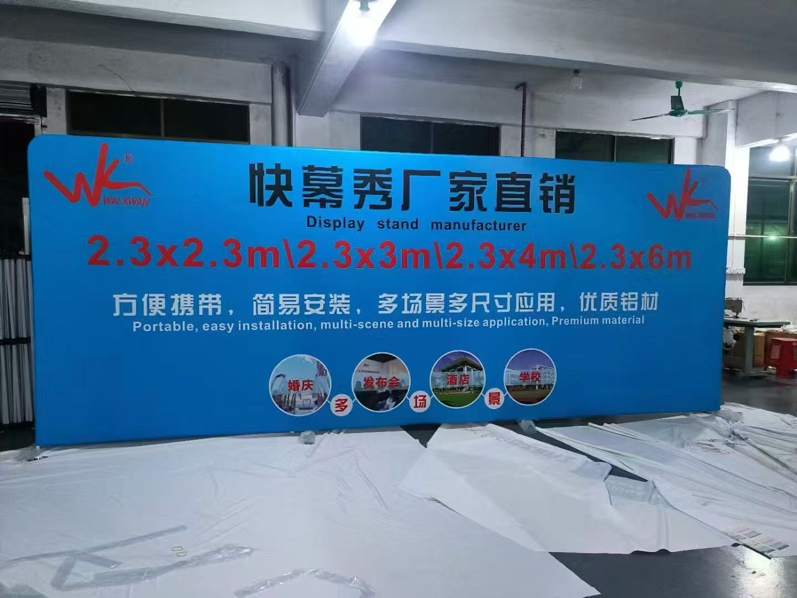

# i18n Audit Report

Generated: 2026-01-28 15:50:35

Max findings cap: 5000 (report may be truncated if exceeded)

## Summary Counts

| Severity | Count |
|---|---:|
| P0 | 0 |
| P1 | 68 |
| P2 | 2104 |

## Findings

### P1

- **html_zh_contains_english_token** - all-products.html:223
  - Snippet: <li><a href="index.html#top3">热销尺寸 Top3Top 3 Sizes</a></li>
  - Reason: An element marked as .zh contains English token 'Top' (len>=3) not in allowed list.
  - Suggestion: Translate to Chinese or split into zh/en spans; keep allowed brand/model/material/unit tokens only.
- **html_zh_contains_english_token** - flag-type.html:88
  - Snippet: <li><a href="index.html#top3">热销尺寸 Top3Top 3 Sizes</a></li>
  - Reason: An element marked as .zh contains English token 'Top' (len>=3) not in allowed list.
  - Suggestion: Translate to Chinese or split into zh/en spans; keep allowed brand/model/material/unit tokens only.
- **html_zh_contains_english_token** - index.html:80
  - Snippet: <li><a href="#top3">热销尺寸 Top3Top 3 Sizes</a></li>
  - Reason: An element marked as .zh contains English token 'Top' (len>=3) not in allowed list.
  - Suggestion: Translate to Chinese or split into zh/en spans; keep allowed brand/model/material/unit tokens only.
- **html_zh_contains_english_token** - index.html:397
  - Snippet: 热销产品（Top 3）
  - Reason: An element marked as .zh contains English token 'Top' (len>=3) not in allowed list.
  - Suggestion: Translate to Chinese or split into zh/en spans; keep allowed brand/model/material/unit tokens only.
- **html_zh_contains_english_token** - index.html:410
  - Snippet: Top 1 · Display System
  - Reason: An element marked as .zh contains English token 'Top' (len>=3) not in allowed list.
  - Suggestion: Translate to Chinese or split into zh/en spans; keep allowed brand/model/material/unit tokens only.
- **html_zh_contains_english_token** - index.html:442
  - Snippet: Top 2 · Flags
  - Reason: An element marked as .zh contains English token 'Top' (len>=3) not in allowed list.
  - Suggestion: Translate to Chinese or split into zh/en spans; keep allowed brand/model/material/unit tokens only.
- **html_zh_contains_english_token** - index.html:475
  - Snippet: Top 3 · Tents
  - Reason: An element marked as .zh contains English token 'Top' (len>=3) not in allowed list.
  - Suggestion: Translate to Chinese or split into zh/en spans; keep allowed brand/model/material/unit tokens only.
- **html_zh_contains_english_token** - product-center.html:89
  - Snippet: <li><a href="index.html#top3">热销尺寸 Top3Top 3 Sizes</a></li>
  - Reason: An element marked as .zh contains English token 'Top' (len>=3) not in allowed list.
  - Suggestion: Translate to Chinese or split into zh/en spans; keep allowed brand/model/material/unit tokens only.
- **zh_value_contains_english_token** - scripts/multilang.js:75
  - Snippet: hero_title: hero_title: 'Canopy Tents • Flags • Display Systems',
  - Reason: Chinese dictionary value contains English token 'Canopy' (len>=3) not in allowed list.
  - Suggestion: If 'Canopy' is not a brand/model/material/unit, translate it to Chinese or split into zh/en spans.
- **zh_value_contains_english_token** - scripts/multilang.js:107
  - Snippet: home_trusted_by_title: 
  - Reason: Chinese dictionary value contains English token 'Trusted' (len>=3) not in allowed list.
  - Suggestion: If 'Trusted' is not a brand/model/material/unit, translate it to Chinese or split into zh/en spans.
- **zh_value_contains_english_token** - scripts/multilang.js:176
  - Snippet: about_intro: about_intro: '广西伟群帐篷制造有限公司是一家专注于帐篷、沙滩旗、快幕秀（Pop-up Display）及户外品牌展示系统研发与制造的源头工厂。公司深耕便携式户外展示行业25年以上，为全球客户提供稳定、高效、可定制的展示解决方案。',
  - Reason: Chinese dictionary value contains English token 'Pop' (len>=3) not in allowed list.
  - Suggestion: If 'Pop' is not a brand/model/material/unit, translate it to Chinese or split into zh/en spans.
- **zh_value_contains_english_token** - scripts/multilang.js:177
  - Snippet: about_intro_rest: about_intro_rest: '公司深耕便携式户外展示行业<strong>25年以上</strong>，为全球客户提供稳定、高效、可定制的展示解决方案。',
  - Reason: Chinese dictionary value contains English token 'strong' (len>=3) not in allowed list.
  - Suggestion: If 'strong' is not a brand/model/material/unit, translate it to Chinese or split into zh/en spans.
- **zh_value_contains_english_token** - scripts/multilang.js:189
  - Snippet: about_product_1: about_product_1: '帐篷系列（Pop-up Tent / Marquee / Event Tent）',
  - Reason: Chinese dictionary value contains English token 'Pop' (len>=3) not in allowed list.
  - Suggestion: If 'Pop' is not a brand/model/material/unit, translate it to Chinese or split into zh/en spans.
- **zh_value_contains_english_token** - scripts/multilang.js:190
  - Snippet: about_product_2: about_product_2: '沙滩旗及旗杆系列（Feather Flag / Teardrop Flag）',
  - Reason: Chinese dictionary value contains English token 'Feather' (len>=3) not in allowed list.
  - Suggestion: If 'Feather' is not a brand/model/material/unit, translate it to Chinese or split into zh/en spans.
- **zh_value_contains_english_token** - scripts/multilang.js:191
  - Snippet: about_product_3: about_product_3: '快幕秀展示系统（Pop-up Display）',
  - Reason: Chinese dictionary value contains English token 'Pop' (len>=3) not in allowed list.
  - Suggestion: If 'Pop' is not a brand/model/material/unit, translate it to Chinese or split into zh/en spans.
- **zh_value_contains_english_token** - scripts/multilang.js:224
  - Snippet: sizes_tent_title: sizes_tent_title: '快装帐篷（Pop-up Canopy Tent）',
  - Reason: Chinese dictionary value contains English token 'Pop' (len>=3) not in allowed list.
  - Suggestion: If 'Pop' is not a brand/model/material/unit, translate it to Chinese or split into zh/en spans.
- **zh_value_contains_english_token** - scripts/multilang.js:225
  - Snippet: sizes_giant_title: sizes_giant_title: '大型活动帐篷（Large Event / Giant Tent）',
  - Reason: Chinese dictionary value contains English token 'Large' (len>=3) not in allowed list.
  - Suggestion: If 'Large' is not a brand/model/material/unit, translate it to Chinese or split into zh/en spans.
- **zh_value_contains_english_token** - scripts/multilang.js:226
  - Snippet: sizes_display_title: sizes_display_title: '快幕秀展示系统（Pop-up Display / Quick Display）',
  - Reason: Chinese dictionary value contains English token 'Pop' (len>=3) not in allowed list.
  - Suggestion: If 'Pop' is not a brand/model/material/unit, translate it to Chinese or split into zh/en spans.
- **zh_value_contains_english_token** - scripts/multilang.js:253
  - Snippet: sizes_note: sizes_note: '以上尺寸为常规参考，欢迎联系我们获取定制方案\nStandard sizes are for reference only. Contact us for custom solutions.',
  - Reason: Chinese dictionary value contains English token 'nStandard' (len>=3) not in allowed list.
  - Suggestion: If 'nStandard' is not a brand/model/material/unit, translate it to Chinese or split into zh/en spans.
- **zh_value_contains_english_token** - scripts/multilang.js:258
  - Snippet: size_category_tent_title: size_category_tent_title: '快装帐篷（Pop-up Canopy Tent）',
  - Reason: Chinese dictionary value contains English token 'Pop' (len>=3) not in allowed list.
  - Suggestion: If 'Pop' is not a brand/model/material/unit, translate it to Chinese or split into zh/en spans.
- **zh_value_contains_english_token** - scripts/multilang.js:259
  - Snippet: size_category_large_title: size_category_large_title: '大型活动帐篷（Large Event Tent / Giant Tent）',
  - Reason: Chinese dictionary value contains English token 'Large' (len>=3) not in allowed list.
  - Suggestion: If 'Large' is not a brand/model/material/unit, translate it to Chinese or split into zh/en spans.
- **zh_value_contains_english_token** - scripts/multilang.js:260
  - Snippet: size_category_display_title: size_category_display_title: '快幕秀展示系统（Pop-up Display / Quick Display）',
  - Reason: Chinese dictionary value contains English token 'Pop' (len>=3) not in allowed list.
  - Suggestion: If 'Pop' is not a brand/model/material/unit, translate it to Chinese or split into zh/en spans.
- **zh_value_contains_english_token** - scripts/multilang.js:284
  - Snippet: size_cta_text_en: size_cta_text_en: 'Standard sizes are for reference only. Contact us for custom solutions.',
  - Reason: Chinese dictionary value contains English token 'Standard' (len>=3) not in allowed list.
  - Suggestion: If 'Standard' is not a brand/model/material/unit, translate it to Chinese or split into zh/en spans.
- **zh_value_contains_english_token** - scripts/multilang.js:290
  - Snippet: testimonial_1_name: testimonial_1_name: 'David T.',
  - Reason: Chinese dictionary value contains English token 'David' (len>=3) not in allowed list.
  - Suggestion: If 'David' is not a brand/model/material/unit, translate it to Chinese or split into zh/en spans.
- **zh_value_contains_english_token** - scripts/multilang.js:293
  - Snippet: testimonial_2_name: testimonial_2_name: 'Antonio C.',
  - Reason: Chinese dictionary value contains English token 'Antonio' (len>=3) not in allowed list.
  - Suggestion: If 'Antonio' is not a brand/model/material/unit, translate it to Chinese or split into zh/en spans.
- **zh_value_contains_english_token** - scripts/multilang.js:296
  - Snippet: testimonial_3_name: testimonial_3_name: 'Owen B.',
  - Reason: Chinese dictionary value contains English token 'Owen' (len>=3) not in allowed list.
  - Suggestion: If 'Owen' is not a brand/model/material/unit, translate it to Chinese or split into zh/en spans.
- **zh_value_contains_english_token** - scripts/multilang.js:302
  - Snippet: products_subtitle_en: products_subtitle_en: 'Tents · Flags · Pop-up Displays · Outdoor Branding Systems',
  - Reason: Chinese dictionary value contains English token 'Tents' (len>=3) not in allowed list.
  - Suggestion: If 'Tents' is not a brand/model/material/unit, translate it to Chinese or split into zh/en spans.
- **zh_value_contains_english_token** - scripts/multilang.js:318
  - Snippet: products_category_tents_desc_en: products_category_tents_desc_en: 'A full range of tent solutions designed for promotions, exhibitions and outdoor events. Custom sizes and branding options available.',
  - Reason: Chinese dictionary value contains English token 'full' (len>=3) not in allowed list.
  - Suggestion: If 'full' is not a brand/model/material/unit, translate it to Chinese or split into zh/en spans.
- **zh_value_contains_english_token** - scripts/multilang.js:321
  - Snippet: products_category_flags_desc_en: products_category_flags_desc_en: 'A variety of beach flag shapes and pole systems for outdoor promotion, events and branding, with multiple printing options.',
  - Reason: Chinese dictionary value contains English token 'variety' (len>=3) not in allowed list.
  - Suggestion: If 'variety' is not a brand/model/material/unit, translate it to Chinese or split into zh/en spans.
- **zh_value_contains_english_token** - scripts/multilang.js:324
  - Snippet: products_category_displays_desc_en: products_category_displays_desc_en: 'Portable pop-up display systems designed for exhibitions, backdrops and brand presentations. Lightweight structure with replaceable graphics.',
  - Reason: Chinese dictionary value contains English token 'Portable' (len>=3) not in allowed list.
  - Suggestion: If 'Portable' is not a brand/model/material/unit, translate it to Chinese or split into zh/en spans.
- **zh_value_contains_english_token** - scripts/multilang.js:327
  - Snippet: products_category_accessories_desc_en: products_category_accessories_desc_en: 'Table covers, fabric banners and display accessories designed to complete outdoor branding systems.',
  - Reason: Chinese dictionary value contains English token 'Table' (len>=3) not in allowed list.
  - Suggestion: If 'Table' is not a brand/model/material/unit, translate it to Chinese or split into zh/en spans.
- **zh_value_contains_english_token** - scripts/multilang.js:330
  - Snippet: products_category_custom_desc_en: products_category_custom_desc_en: 'Full customization available from structure and size to graphic printing, tailored to different markets and project requirements.',
  - Reason: Chinese dictionary value contains English token 'Full' (len>=3) not in allowed list.
  - Suggestion: If 'Full' is not a brand/model/material/unit, translate it to Chinese or split into zh/en spans.
- **zh_value_contains_english_token** - scripts/multilang.js:332
  - Snippet: products_cta_text_en: products_cta_text_en: 'All products are customizable. Contact us for detailed specifications and quotations.',
  - Reason: Chinese dictionary value contains English token 'All' (len>=3) not in allowed list.
  - Suggestion: If 'All' is not a brand/model/material/unit, translate it to Chinese or split into zh/en spans.
- **zh_value_contains_english_token** - scripts/multilang.js:333
  - Snippet: products_cta_button: products_cta_button: 'Get a Quote',
  - Reason: Chinese dictionary value contains English token 'Get' (len>=3) not in allowed list.
  - Suggestion: If 'Get' is not a brand/model/material/unit, translate it to Chinese or split into zh/en spans.
- **zh_value_contains_english_token** - scripts/multilang.js:401
  - Snippet: lang_name_en: lang_name_en: 'English',
  - Reason: Chinese dictionary value contains English token 'English' (len>=3) not in allowed list.
  - Suggestion: If 'English' is not a brand/model/material/unit, translate it to Chinese or split into zh/en spans.
- **zh_value_contains_english_token** - scripts/multilang.js:416
  - Snippet: nav_top3_sizes: nav_top3_sizes: '热销尺寸 Top3',
  - Reason: Chinese dictionary value contains English token 'Top' (len>=3) not in allowed list.
  - Suggestion: If 'Top' is not a brand/model/material/unit, translate it to Chinese or split into zh/en spans.
- **zh_value_contains_english_token** - scripts/multilang.js:430
  - Snippet: cookie_title: cookie_title: 'Cookie 设置',
  - Reason: Chinese dictionary value contains English token 'Cookie' (len>=3) not in allowed list.
  - Suggestion: If 'Cookie' is not a brand/model/material/unit, translate it to Chinese or split into zh/en spans.
- **zh_value_contains_english_token** - scripts/multilang.js:431
  - Snippet: cookie_text: cookie_text: '我们使用 Cookie 来保障网站正常运行，并在您同意的情况下用于偏好与分析，以改善体验。您可以随时调整设置。',
  - Reason: Chinese dictionary value contains English token 'Cookie' (len>=3) not in allowed list.
  - Suggestion: If 'Cookie' is not a brand/model/material/unit, translate it to Chinese or split into zh/en spans.
- **zh_value_contains_english_token** - scripts/multilang.js:435
  - Snippet: cookie_settings_title: cookie_settings_title: 'Cookie 偏好设置',
  - Reason: Chinese dictionary value contains English token 'Cookie' (len>=3) not in allowed list.
  - Suggestion: If 'Cookie' is not a brand/model/material/unit, translate it to Chinese or split into zh/en spans.
- **zh_value_contains_english_token** - scripts/multilang.js:436
  - Snippet: cookie_category_necessary: cookie_category_necessary: '必要 Cookie（始终启用）',
  - Reason: Chinese dictionary value contains English token 'Cookie' (len>=3) not in allowed list.
  - Suggestion: If 'Cookie' is not a brand/model/material/unit, translate it to Chinese or split into zh/en spans.
- **zh_value_contains_english_token** - scripts/multilang.js:437
  - Snippet: cookie_category_preferences: cookie_category_preferences: '偏好 Cookie（例如：客户识别）',
  - Reason: Chinese dictionary value contains English token 'Cookie' (len>=3) not in allowed list.
  - Suggestion: If 'Cookie' is not a brand/model/material/unit, translate it to Chinese or split into zh/en spans.
- **zh_value_contains_english_token** - scripts/multilang.js:438
  - Snippet: cookie_category_analytics: cookie_category_analytics: '统计分析 Cookie',
  - Reason: Chinese dictionary value contains English token 'Cookie' (len>=3) not in allowed list.
  - Suggestion: If 'Cookie' is not a brand/model/material/unit, translate it to Chinese or split into zh/en spans.
- **zh_value_contains_english_token** - scripts/multilang.js:453
  - Snippet: view_type_brochure_source_17: view_type_brochure_source_17: '来源：目录图片 17.png',
  - Reason: Chinese dictionary value contains English token 'png' (len>=3) not in allowed list.
  - Suggestion: If 'png' is not a brand/model/material/unit, translate it to Chinese or split into zh/en spans.
- **zh_value_contains_english_token** - scripts/multilang.js:498
  - Snippet: contact_seo_text: contact_seo_text: 'Contact Guangxi WaiKwan Tent Manufacturing Co., Ltd today to discuss your custom tent and display project requirements.',
  - Reason: Chinese dictionary value contains English token 'Contact' (len>=3) not in allowed list.
  - Suggestion: If 'Contact' is not a brand/model/material/unit, translate it to Chinese or split into zh/en spans.
- **zh_value_contains_english_token** - scripts/multilang.js:500
  - Snippet: contact_address_title: contact_address_title: '地址 Address',
  - Reason: Chinese dictionary value contains English token 'Address' (len>=3) not in allowed list.
  - Suggestion: If 'Address' is not a brand/model/material/unit, translate it to Chinese or split into zh/en spans.
- **zh_value_contains_english_token** - scripts/multilang.js:501
  - Snippet: contact_address_value: contact_address_value: 'Address: Daping Changtangao, Luyin Village, Gucheng Town, Luchuan County, Yulin City, China',
  - Reason: Chinese dictionary value contains English token 'Address' (len>=3) not in allowed list.
  - Suggestion: If 'Address' is not a brand/model/material/unit, translate it to Chinese or split into zh/en spans.
- **zh_value_contains_english_token** - scripts/multilang.js:502
  - Snippet: contact_address: contact_address: '2nd Xuweiqian Building, Bridge South xilian Dong Cun Gaosha Development District, Nanhai Danzao, Foshan, China', // 兼容旧key
  - Reason: Chinese dictionary value contains English token 'Xuweiqian' (len>=3) not in allowed list.
  - Suggestion: If 'Xuweiqian' is not a brand/model/material/unit, translate it to Chinese or split into zh/en spans.
- **zh_value_contains_english_token** - scripts/multilang.js:510
  - Snippet: contact_whatsapp_note: contact_whatsapp_note: '扫码添加 WhatsApp 咨询 / Scan to chat on WhatsApp',
  - Reason: Chinese dictionary value contains English token 'Scan' (len>=3) not in allowed list.
  - Suggestion: If 'Scan' is not a brand/model/material/unit, translate it to Chinese or split into zh/en spans.
- **zh_value_contains_english_token** - scripts/multilang.js:511
  - Snippet: wechat_label: wechat_label: 'WeChat',
  - Reason: Chinese dictionary value contains English token 'WeChat' (len>=3) not in allowed list.
  - Suggestion: If 'WeChat' is not a brand/model/material/unit, translate it to Chinese or split into zh/en spans.
- **zh_value_contains_english_token** - scripts/multilang.js:512
  - Snippet: contact_wechat_title: contact_wechat_title: '微信 WeChat',
  - Reason: Chinese dictionary value contains English token 'WeChat' (len>=3) not in allowed list.
  - Suggestion: If 'WeChat' is not a brand/model/material/unit, translate it to Chinese or split into zh/en spans.
- **zh_value_contains_english_token** - scripts/multilang.js:513
  - Snippet: contact_wechat_note: contact_wechat_note: '扫码添加微信咨询 / Scan to add on WeChat',
  - Reason: Chinese dictionary value contains English token 'Scan' (len>=3) not in allowed list.
  - Suggestion: If 'Scan' is not a brand/model/material/unit, translate it to Chinese or split into zh/en spans.
- **zh_value_contains_english_token** - scripts/multilang.js:577
  - Snippet: logo_since: logo_since: 'Since 2010',
  - Reason: Chinese dictionary value contains English token 'Since' (len>=3) not in allowed list.
  - Suggestion: If 'Since' is not a brand/model/material/unit, translate it to Chinese or split into zh/en spans.
- **zh_value_contains_english_token** - scripts/multilang.js:602
  - Snippet: footer_company_line_en: footer_company_line_en: 'Guangxi WaiKwan Tent Manufacturing Co., Ltd · Since 2010',
  - Reason: Chinese dictionary value contains English token 'Guangxi' (len>=3) not in allowed list.
  - Suggestion: If 'Guangxi' is not a brand/model/material/unit, translate it to Chinese or split into zh/en spans.
- **zh_value_contains_english_token** - scripts/multilang.js:603
  - Snippet: footer_findus: footer_findus: '地址 Find Us',
  - Reason: Chinese dictionary value contains English token 'Find' (len>=3) not in allowed list.
  - Suggestion: If 'Find' is not a brand/model/material/unit, translate it to Chinese or split into zh/en spans.
- **zh_value_contains_english_token** - scripts/multilang.js:604
  - Snippet: footer_address: footer_address: 'Address: Daping Changtangao, Luyin Village, Gucheng Town, Luchuan County, Yulin City, China',
  - Reason: Chinese dictionary value contains English token 'Address' (len>=3) not in allowed list.
  - Suggestion: If 'Address' is not a brand/model/material/unit, translate it to Chinese or split into zh/en spans.
- **zh_value_contains_english_token** - scripts/multilang.js:605
  - Snippet: footer_contact: footer_contact: '联系 Contact',
  - Reason: Chinese dictionary value contains English token 'Contact' (len>=3) not in allowed list.
  - Suggestion: If 'Contact' is not a brand/model/material/unit, translate it to Chinese or split into zh/en spans.
- **zh_value_contains_english_token** - scripts/multilang.js:606
  - Snippet: footer_companyinfo: footer_companyinfo: '公司信息 Company Info',
  - Reason: Chinese dictionary value contains English token 'Company' (len>=3) not in allowed list.
  - Suggestion: If 'Company' is not a brand/model/material/unit, translate it to Chinese or split into zh/en spans.
- **zh_value_contains_english_token** - scripts/multilang.js:607
  - Snippet: footer_about: footer_about: '关于我们 About Us',
  - Reason: Chinese dictionary value contains English token 'About' (len>=3) not in allowed list.
  - Suggestion: If 'About' is not a brand/model/material/unit, translate it to Chinese or split into zh/en spans.
- **zh_value_contains_english_token** - scripts/multilang.js:608
  - Snippet: footer_products: footer_products: '产品中心 Products',
  - Reason: Chinese dictionary value contains English token 'Products' (len>=3) not in allowed list.
  - Suggestion: If 'Products' is not a brand/model/material/unit, translate it to Chinese or split into zh/en spans.
- **zh_value_contains_english_token** - scripts/multilang.js:609
  - Snippet: footer_contactus: footer_contactus: '联系我们 Contact Us',
  - Reason: Chinese dictionary value contains English token 'Contact' (len>=3) not in allowed list.
  - Suggestion: If 'Contact' is not a brand/model/material/unit, translate it to Chinese or split into zh/en spans.
- **zh_value_contains_english_token** - scripts/multilang.js:610
  - Snippet: footer_ask_title: footer_ask_title: '产品/设计咨询 Ask anything…',
  - Reason: Chinese dictionary value contains English token 'Ask' (len>=3) not in allowed list.
  - Suggestion: If 'Ask' is not a brand/model/material/unit, translate it to Chinese or split into zh/en spans.
- **zh_value_contains_english_token** - scripts/multilang.js:611
  - Snippet: footer_ask_text: footer_ask_text: '请告诉我们产品类型、尺寸、数量与印刷需求，我们将在 24 小时内回复 / We reply within 24 hours.',
  - Reason: Chinese dictionary value contains English token 'reply' (len>=3) not in allowed list.
  - Suggestion: If 'reply' is not a brand/model/material/unit, translate it to Chinese or split into zh/en spans.
- **zh_value_contains_english_token** - scripts/multilang.js:612
  - Snippet: footer_ask_btn: footer_ask_btn: '获取报价 Get a Quote',
  - Reason: Chinese dictionary value contains English token 'Get' (len>=3) not in allowed list.
  - Suggestion: If 'Get' is not a brand/model/material/unit, translate it to Chinese or split into zh/en spans.
- **zh_value_contains_english_token** - scripts/multilang.js:613
  - Snippet: footer_ask_btn2: footer_ask_btn2: 'WhatsApp 咨询 WhatsApp Now',
  - Reason: Chinese dictionary value contains English token 'Now' (len>=3) not in allowed list.
  - Suggestion: If 'Now' is not a brand/model/material/unit, translate it to Chinese or split into zh/en spans.
- **zh_value_contains_english_token** - scripts/multilang.js:614
  - Snippet: footer_copyright: footer_copyright: '© 2026 广西伟群帐篷制造有限公司 / Guangxi WaiKwan Tent Manufacturing Co., Ltd. 保留所有权利 All Rights Reserved.',
  - Reason: Chinese dictionary value contains English token 'Guangxi' (len>=3) not in allowed list.
  - Suggestion: If 'Guangxi' is not a brand/model/material/unit, translate it to Chinese or split into zh/en spans.
- **zh_value_contains_english_token** - scripts/multilang.js:615
  - Snippet: footer_terms: footer_terms: '条款 Terms',
  - Reason: Chinese dictionary value contains English token 'Terms' (len>=3) not in allowed list.
  - Suggestion: If 'Terms' is not a brand/model/material/unit, translate it to Chinese or split into zh/en spans.
- **zh_value_contains_english_token** - scripts/multilang.js:616
  - Snippet: footer_privacy: footer_privacy: '隐私 Privacy',
  - Reason: Chinese dictionary value contains English token 'Privacy' (len>=3) not in allowed list.
  - Suggestion: If 'Privacy' is not a brand/model/material/unit, translate it to Chinese or split into zh/en spans.
- **zh_value_contains_english_token** - scripts/multilang.js:617
  - Snippet: footer_sitemap: footer_sitemap: '站点地图 Site Map',
  - Reason: Chinese dictionary value contains English token 'Site' (len>=3) not in allowed list.
  - Suggestion: If 'Site' is not a brand/model/material/unit, translate it to Chinese or split into zh/en spans.

### P2

- **html_hardcoded_english_outside_lang_wrapper** - all-products.html:6
  - Snippet: <title>All Products - Search & Browse | Wai Kwan</title>
  - Reason: English text appears outside .en wrapper/i18n key (e.g., 'All').
  - Suggestion: Wrap in a .en element (paired with .zh), or replace with data-i18n key.
- **html_hardcoded_english_outside_lang_wrapper** - all-products.html:156
  - Snippet: <button data-lang="en" data-lang-option="en">English</button>
  - Reason: English text appears outside .en wrapper/i18n key (e.g., 'English').
  - Suggestion: Wrap in a .en element (paired with .zh), or replace with data-i18n key.
- **html_hardcoded_cjk_outside_lang_wrapper** - all-products.html:157
  - Snippet: <button data-lang="zh" data-lang-option="zh">中文</button>
  - Reason: CJK appears in user-visible HTML line not under a .zh wrapper or i18n key.
  - Suggestion: Wrap in a .zh element (paired with .en), or replace with data-i18n key.
- **html_hardcoded_cjk_outside_lang_wrapper** - all-products.html:158
  - Snippet: <button data-lang="ja" data-lang-option="ja">日本語</button>
  - Reason: CJK appears in user-visible HTML line not under a .zh wrapper or i18n key.
  - Suggestion: Wrap in a .zh element (paired with .en), or replace with data-i18n key.
- **html_hardcoded_cjk_outside_lang_wrapper** - all-products.html:166
  - Snippet: <button class="lang-btn active" data-lang="zh">中文</button>
  - Reason: CJK appears in user-visible HTML line not under a .zh wrapper or i18n key.
  - Suggestion: Wrap in a .zh element (paired with .en), or replace with data-i18n key.
- **html_hardcoded_english_outside_lang_wrapper** - all-products.html:167
  - Snippet: <button class="lang-btn" data-lang="en">English</button>
  - Reason: English text appears outside .en wrapper/i18n key (e.g., 'English').
  - Suggestion: Wrap in a .en element (paired with .zh), or replace with data-i18n key.
- **html_hardcoded_cjk_outside_lang_wrapper** - all-products.html:168
  - Snippet: <button class="lang-btn" data-lang="ja">日本語</button>
  - Reason: CJK appears in user-visible HTML line not under a .zh wrapper or i18n key.
  - Suggestion: Wrap in a .zh element (paired with .en), or replace with data-i18n key.
- **html_hardcoded_english_outside_lang_wrapper** - all-products.html:242
  - Snippet: <button type="button" class="lang-item" data-lang="en" data-lang-option="en">English</button>
  - Reason: English text appears outside .en wrapper/i18n key (e.g., 'English').
  - Suggestion: Wrap in a .en element (paired with .zh), or replace with data-i18n key.
- **html_hardcoded_cjk_outside_lang_wrapper** - all-products.html:243
  - Snippet: <button type="button" class="lang-item" data-lang="zh" data-lang-option="zh">中文</button>
  - Reason: CJK appears in user-visible HTML line not under a .zh wrapper or i18n key.
  - Suggestion: Wrap in a .zh element (paired with .en), or replace with data-i18n key.
- **html_hardcoded_cjk_outside_lang_wrapper** - all-products.html:244
  - Snippet: <button type="button" class="lang-item" data-lang="ja" data-lang-option="ja">日本語</button>
  - Reason: CJK appears in user-visible HTML line not under a .zh wrapper or i18n key.
  - Suggestion: Wrap in a .zh element (paired with .en), or replace with data-i18n key.
- **html_hardcoded_english_outside_lang_wrapper** - all-products.html:267
  - Snippet: <input id="searchInput" type="text"
  - Reason: English text appears outside .en wrapper/i18n key (e.g., 'input').
  - Suggestion: Wrap in a .en element (paired with .zh), or replace with data-i18n key.
- **html_hardcoded_english_outside_lang_wrapper** - all-products.html:268
  - Snippet: placeholder=""
  - Reason: English text appears outside .en wrapper/i18n key (e.g., 'placeholder').
  - Suggestion: Wrap in a .en element (paired with .zh), or replace with data-i18n key.
- **html_hardcoded_english_outside_lang_wrapper** - all-products.html:299
  - Snippet: Guangxi WaiKwan Tent Manufacturing Co., Ltd · Since 2010
  - Reason: English text appears outside .en wrapper/i18n key (e.g., 'Guangxi').
  - Suggestion: Wrap in a .en element (paired with .zh), or replace with data-i18n key.
- **html_hardcoded_english_outside_lang_wrapper** - all-products.html:306
  - Snippet: Daping Changtangao, Luyin Village, 
  - Reason: English text appears outside .en wrapper/i18n key (e.g., 'Daping').
  - Suggestion: Wrap in a .en element (paired with .zh), or replace with data-i18n key.
- **html_hardcoded_english_outside_lang_wrapper** - all-products.html:307
  - Snippet: Gucheng Town, Luchuan County, 
  - Reason: English text appears outside .en wrapper/i18n key (e.g., 'Gucheng').
  - Suggestion: Wrap in a .en element (paired with .zh), or replace with data-i18n key.
- **html_hardcoded_english_outside_lang_wrapper** - all-products.html:308
  - Snippet: Yulin City, China
  - Reason: English text appears outside .en wrapper/i18n key (e.g., 'Yulin').
  - Suggestion: Wrap in a .en element (paired with .zh), or replace with data-i18n key.
- **html_hardcoded_english_outside_lang_wrapper** - all-products.html:314
  - Snippet: a374340761@gmail.com
  - Reason: English text appears outside .en wrapper/i18n key (e.g., 'gmail').
  - Suggestion: Wrap in a .en element (paired with .zh), or replace with data-i18n key.
- **html_hardcoded_english_outside_lang_wrapper** - all-products.html:320
  - Snippet: WeChat: massifmyth
  - Reason: English text appears outside .en wrapper/i18n key (e.g., 'WeChat').
  - Suggestion: Wrap in a .en element (paired with .zh), or replace with data-i18n key.
- **html_hardcoded_english_outside_lang_wrapper** - all-products.html:334
  - Snippet: Ask anything about products or designs…
  - Reason: English text appears outside .en wrapper/i18n key (e.g., 'Ask').
  - Suggestion: Wrap in a .en element (paired with .zh), or replace with data-i18n key.
- **html_hardcoded_english_outside_lang_wrapper** - all-products.html:338
  - Snippet: Tell us your product type, size, quantity and printing needs. We will reply within 24 hours.
  - Reason: English text appears outside .en wrapper/i18n key (e.g., 'Tell').
  - Suggestion: Wrap in a .en element (paired with .zh), or replace with data-i18n key.
- **html_hardcoded_english_outside_lang_wrapper** - all-products.html:342
  - Snippet: Get a Quote
  - Reason: English text appears outside .en wrapper/i18n key (e.g., 'Get').
  - Suggestion: Wrap in a .en element (paired with .zh), or replace with data-i18n key.
- **html_hardcoded_english_outside_lang_wrapper** - all-products.html:345
  - Snippet: WhatsApp Now
  - Reason: English text appears outside .en wrapper/i18n key (e.g., 'Now').
  - Suggestion: Wrap in a .en element (paired with .zh), or replace with data-i18n key.
- **html_hardcoded_english_outside_lang_wrapper** - all-products.html:353
  - Snippet: © 2026 Guangxi WaiKwan Tent Manufacturing Co., Ltd. All Rights Reserved.
  - Reason: English text appears outside .en wrapper/i18n key (e.g., 'Guangxi').
  - Suggestion: Wrap in a .en element (paired with .zh), or replace with data-i18n key.
- **js_hardcoded_cjk_string** - backend/server.js:31
  - Snippet: error: '请求过于频繁，请稍后再试'
  - Reason: CJK appears in a JS string literal; this will be hardcoded in all languages.
  - Suggestion: Move the text into HTML .zh/.en blocks or use wkI18n.t(KEY) with dictionary entries.
- **js_hardcoded_cjk_string** - backend/server.js:46
  - Snippet: body('name').trim().isLength({ min: 2, max: 50 }).withMessage('姓名长度应在2-50字符之间'),
  - Reason: CJK appears in a JS string literal; this will be hardcoded in all languages.
  - Suggestion: Move the text into HTML .zh/.en blocks or use wkI18n.t(KEY) with dictionary entries.
- **js_hardcoded_cjk_string** - backend/server.js:47
  - Snippet: body('email').isEmail().normalizeEmail().withMessage('请输入有效的邮箱地址'),
  - Reason: CJK appears in a JS string literal; this will be hardcoded in all languages.
  - Suggestion: Move the text into HTML .zh/.en blocks or use wkI18n.t(KEY) with dictionary entries.
- **js_hardcoded_cjk_string** - backend/server.js:48
  - Snippet: body('phone').optional().isMobilePhone('zh-CN').withMessage('请输入有效的手机号码'),
  - Reason: CJK appears in a JS string literal; this will be hardcoded in all languages.
  - Suggestion: Move the text into HTML .zh/.en blocks or use wkI18n.t(KEY) with dictionary entries.
- **js_hardcoded_cjk_string** - backend/server.js:49
  - Snippet: body('message').trim().isLength({ min: 10, max: 1000 }).withMessage('消息长度应在10-1000字符之间')
  - Reason: CJK appears in a JS string literal; this will be hardcoded in all languages.
  - Suggestion: Move the text into HTML .zh/.en blocks or use wkI18n.t(KEY) with dictionary entries.
- **js_hardcoded_cjk_string** - backend/server.js:60
  - Snippet: message: '输入验证失败',
  - Reason: CJK appears in a JS string literal; this will be hardcoded in all languages.
  - Suggestion: Move the text into HTML .zh/.en blocks or use wkI18n.t(KEY) with dictionary entries.
- **js_hardcoded_english_string** - backend/server.js:73
  - Snippet: 

  - Reason: English sentence/label appears in a JS string literal (e.g., 'font').
  - Suggestion: Move the text into HTML .zh/.en blocks or use wkI18n.t(KEY) with dictionary entries.
- **js_hardcoded_english_string** - backend/server.js:75
  - Snippet: 

  - Reason: English sentence/label appears in a JS string literal (e.g., 'background').
  - Suggestion: Move the text into HTML .zh/.en blocks or use wkI18n.t(KEY) with dictionary entries.
- **js_hardcoded_cjk_string** - backend/server.js:78
  - Snippet: 
<strong>电话:</strong> ${phone || '未提供'}

  - Reason: CJK appears in a JS string literal; this will be hardcoded in all languages.
  - Suggestion: Move the text into HTML .zh/.en blocks or use wkI18n.t(KEY) with dictionary entries.
- **js_hardcoded_english_string** - backend/server.js:80
  - Snippet: 

  - Reason: English sentence/label appears in a JS string literal (e.g., 'background').
  - Suggestion: Move the text into HTML .zh/.en blocks or use wkI18n.t(KEY) with dictionary entries.
- **js_hardcoded_english_string** - backend/server.js:84
  - Snippet: 

  - Reason: English sentence/label appears in a JS string literal (e.g., 'color').
  - Suggestion: Move the text into HTML .zh/.en blocks or use wkI18n.t(KEY) with dictionary entries.
- **js_hardcoded_cjk_string** - backend/server.js:99
  - Snippet: subject: '感谢您的咨询 - 广西伟群帐篷制造有限公司',
  - Reason: CJK appears in a JS string literal; this will be hardcoded in all languages.
  - Suggestion: Move the text into HTML .zh/.en blocks or use wkI18n.t(KEY) with dictionary entries.
- **js_hardcoded_english_string** - backend/server.js:101
  - Snippet: 

  - Reason: English sentence/label appears in a JS string literal (e.g., 'font').
  - Suggestion: Move the text into HTML .zh/.en blocks or use wkI18n.t(KEY) with dictionary entries.
- **js_hardcoded_english_string** - backend/server.js:102
  - Snippet: 

  - Reason: English sentence/label appears in a JS string literal (e.g., 'background').
  - Suggestion: Move the text into HTML .zh/.en blocks or use wkI18n.t(KEY) with dictionary entries.
- **js_hardcoded_english_string** - backend/server.js:103
  - Snippet: <h1 style="margin: 0; font-size: 24px;">广西伟群帐篷制造有限公司</h1>
  - Reason: English sentence/label appears in a JS string literal (e.g., 'margin').
  - Suggestion: Move the text into HTML .zh/.en blocks or use wkI18n.t(KEY) with dictionary entries.
- **js_hardcoded_english_string** - backend/server.js:104
  - Snippet: 
专业户外家具制造商

  - Reason: English sentence/label appears in a JS string literal (e.g., 'margin').
  - Suggestion: Move the text into HTML .zh/.en blocks or use wkI18n.t(KEY) with dictionary entries.
- **js_hardcoded_english_string** - backend/server.js:106
  - Snippet: 

  - Reason: English sentence/label appears in a JS string literal (e.g., 'background').
  - Suggestion: Move the text into HTML .zh/.en blocks or use wkI18n.t(KEY) with dictionary entries.
- **js_hardcoded_english_string** - backend/server.js:111
  - Snippet: 

  - Reason: English sentence/label appears in a JS string literal (e.g., 'background').
  - Suggestion: Move the text into HTML .zh/.en blocks or use wkI18n.t(KEY) with dictionary entries.
- **js_hardcoded_english_string** - backend/server.js:112
  - Snippet: <h3 style="color: #1e3c72; margin-top: 0;">您的咨询内容：</h3>
  - Reason: English sentence/label appears in a JS string literal (e.g., 'color').
  - Suggestion: Move the text into HTML .zh/.en blocks or use wkI18n.t(KEY) with dictionary entries.
- **js_hardcoded_english_string** - backend/server.js:113
  - Snippet: 
${message}

  - Reason: English sentence/label appears in a JS string literal (e.g., 'white').
  - Suggestion: Move the text into HTML .zh/.en blocks or use wkI18n.t(KEY) with dictionary entries.
- **js_hardcoded_english_string** - backend/server.js:116
  - Snippet: 

  - Reason: English sentence/label appears in a JS string literal (e.g., 'background').
  - Suggestion: Move the text into HTML .zh/.en blocks or use wkI18n.t(KEY) with dictionary entries.
- **js_hardcoded_english_string** - backend/server.js:117
  - Snippet: <h4 style="color: #1e3c72; margin-top: 0;">联系方式：</h4>
  - Reason: English sentence/label appears in a JS string literal (e.g., 'color').
  - Suggestion: Move the text into HTML .zh/.en blocks or use wkI18n.t(KEY) with dictionary entries.
- **js_hardcoded_english_string** - backend/server.js:126
  - Snippet: 

  - Reason: English sentence/label appears in a JS string literal (e.g., 'text').
  - Suggestion: Move the text into HTML .zh/.en blocks or use wkI18n.t(KEY) with dictionary entries.
- **js_hardcoded_english_string** - backend/server.js:127
  - Snippet: 

  - Reason: English sentence/label appears in a JS string literal (e.g., 'color').
  - Suggestion: Move the text into HTML .zh/.en blocks or use wkI18n.t(KEY) with dictionary entries.
- **js_hardcoded_cjk_string** - backend/server.js:140
  - Snippet: message: '消息发送成功！我们将在24小时内与您联系。'
  - Reason: CJK appears in a JS string literal; this will be hardcoded in all languages.
  - Suggestion: Move the text into HTML .zh/.en blocks or use wkI18n.t(KEY) with dictionary entries.
- **js_hardcoded_cjk_string** - backend/server.js:144
  - Snippet: console.error('邮件发送失败:', error);
  - Reason: CJK appears in a JS string literal; this will be hardcoded in all languages.
  - Suggestion: Move the text into HTML .zh/.en blocks or use wkI18n.t(KEY) with dictionary entries.
- **js_hardcoded_cjk_string** - backend/server.js:147
  - Snippet: message: '服务器错误，请稍后重试'
  - Reason: CJK appears in a JS string literal; this will be hardcoded in all languages.
  - Suggestion: Move the text into HTML .zh/.en blocks or use wkI18n.t(KEY) with dictionary entries.
- **js_hardcoded_cjk_string** - backend/server.js:156
  - Snippet: message: '服务器运行正常',
  - Reason: CJK appears in a JS string literal; this will be hardcoded in all languages.
  - Suggestion: Move the text into HTML .zh/.en blocks or use wkI18n.t(KEY) with dictionary entries.
- **js_hardcoded_cjk_string** - backend/server.js:165
  - Snippet: message: '接口不存在'
  - Reason: CJK appears in a JS string literal; this will be hardcoded in all languages.
  - Suggestion: Move the text into HTML .zh/.en blocks or use wkI18n.t(KEY) with dictionary entries.
- **js_hardcoded_cjk_string** - backend/server.js:171
  - Snippet: console.error('服务器错误:', error);
  - Reason: CJK appears in a JS string literal; this will be hardcoded in all languages.
  - Suggestion: Move the text into HTML .zh/.en blocks or use wkI18n.t(KEY) with dictionary entries.
- **js_hardcoded_cjk_string** - backend/server.js:174
  - Snippet: message: '服务器内部错误'
  - Reason: CJK appears in a JS string literal; this will be hardcoded in all languages.
  - Suggestion: Move the text into HTML .zh/.en blocks or use wkI18n.t(KEY) with dictionary entries.
- **html_hardcoded_english_outside_lang_wrapper** - flag-type.html:6
  - Snippet: <title>Flag Type - Wai Kwan</title>
  - Reason: English text appears outside .en wrapper/i18n key (e.g., 'Flag').
  - Suggestion: Wrap in a .en element (paired with .zh), or replace with data-i18n key.
- **html_hardcoded_english_outside_lang_wrapper** - flag-type.html:18
  - Snippet: <h2>Welcome</h2>
  - Reason: English text appears outside .en wrapper/i18n key (e.g., 'Welcome').
  - Suggestion: Wrap in a .en element (paired with .zh), or replace with data-i18n key.
- **html_hardcoded_english_outside_lang_wrapper** - flag-type.html:19
  - Snippet: 
Please select your language

  - Reason: English text appears outside .en wrapper/i18n key (e.g., 'Please').
  - Suggestion: Wrap in a .en element (paired with .zh), or replace with data-i18n key.
- **html_hardcoded_english_outside_lang_wrapper** - flag-type.html:21
  - Snippet: <button data-lang="en">English</button>
  - Reason: English text appears outside .en wrapper/i18n key (e.g., 'English').
  - Suggestion: Wrap in a .en element (paired with .zh), or replace with data-i18n key.
- **html_hardcoded_cjk_outside_lang_wrapper** - flag-type.html:22
  - Snippet: <button data-lang="zh">中文</button>
  - Reason: CJK appears in user-visible HTML line not under a .zh wrapper or i18n key.
  - Suggestion: Wrap in a .zh element (paired with .en), or replace with data-i18n key.
- **html_hardcoded_cjk_outside_lang_wrapper** - flag-type.html:23
  - Snippet: <button data-lang="ja">日本語</button>
  - Reason: CJK appears in user-visible HTML line not under a .zh wrapper or i18n key.
  - Suggestion: Wrap in a .zh element (paired with .en), or replace with data-i18n key.
- **html_hardcoded_cjk_outside_lang_wrapper** - flag-type.html:31
  - Snippet: <button class="lang-btn active" data-lang="zh">中文</button>
  - Reason: CJK appears in user-visible HTML line not under a .zh wrapper or i18n key.
  - Suggestion: Wrap in a .zh element (paired with .en), or replace with data-i18n key.
- **html_hardcoded_english_outside_lang_wrapper** - flag-type.html:32
  - Snippet: <button class="lang-btn" data-lang="en">English</button>
  - Reason: English text appears outside .en wrapper/i18n key (e.g., 'English').
  - Suggestion: Wrap in a .en element (paired with .zh), or replace with data-i18n key.
- **html_hardcoded_cjk_outside_lang_wrapper** - flag-type.html:33
  - Snippet: <button class="lang-btn" data-lang="ja">日本語</button>
  - Reason: CJK appears in user-visible HTML line not under a .zh wrapper or i18n key.
  - Suggestion: Wrap in a .zh element (paired with .en), or replace with data-i18n key.
- **html_hardcoded_english_outside_lang_wrapper** - flag-type.html:70
  - Snippet: <a href="product-center.html?cat=tents">Tents</a>
  - Reason: English text appears outside .en wrapper/i18n key (e.g., 'Tents').
  - Suggestion: Wrap in a .en element (paired with .zh), or replace with data-i18n key.
- **html_hardcoded_english_outside_lang_wrapper** - flag-type.html:71
  - Snippet: <a href="product-center.html?cat=flags">Beach Flags &amp; Poles</a>
  - Reason: English text appears outside .en wrapper/i18n key (e.g., 'Beach').
  - Suggestion: Wrap in a .en element (paired with .zh), or replace with data-i18n key.
- **html_hardcoded_english_outside_lang_wrapper** - flag-type.html:72
  - Snippet: <a href="product-center.html?cat=displays">Pop-up Displays</a>
  - Reason: English text appears outside .en wrapper/i18n key (e.g., 'Pop').
  - Suggestion: Wrap in a .en element (paired with .zh), or replace with data-i18n key.
- **html_hardcoded_english_outside_lang_wrapper** - flag-type.html:73
  - Snippet: <a href="product-center.html?cat=accessories">Accessories</a>
  - Reason: English text appears outside .en wrapper/i18n key (e.g., 'Accessories').
  - Suggestion: Wrap in a .en element (paired with .zh), or replace with data-i18n key.
- **html_hardcoded_english_outside_lang_wrapper** - flag-type.html:76
  - Snippet: <a href="racegate-type.html">Race Gate</a>
  - Reason: English text appears outside .en wrapper/i18n key (e.g., 'Race').
  - Suggestion: Wrap in a .en element (paired with .zh), or replace with data-i18n key.
- **html_hardcoded_english_outside_lang_wrapper** - flag-type.html:77
  - Snippet: <a href="product-center.html?notice=category_unavailable">Replacement Parts</a>
  - Reason: English text appears outside .en wrapper/i18n key (e.g., 'Replacement').
  - Suggestion: Wrap in a .en element (paired with .zh), or replace with data-i18n key.
- **html_hardcoded_english_outside_lang_wrapper** - flag-type.html:107
  - Snippet: <button type="button" class="lang-item" data-lang="en" data-lang-option="en">English</button>
  - Reason: English text appears outside .en wrapper/i18n key (e.g., 'English').
  - Suggestion: Wrap in a .en element (paired with .zh), or replace with data-i18n key.
- **html_hardcoded_cjk_outside_lang_wrapper** - flag-type.html:108
  - Snippet: <button type="button" class="lang-item" data-lang="zh" data-lang-option="zh">中文</button>
  - Reason: CJK appears in user-visible HTML line not under a .zh wrapper or i18n key.
  - Suggestion: Wrap in a .zh element (paired with .en), or replace with data-i18n key.
- **html_hardcoded_cjk_outside_lang_wrapper** - flag-type.html:109
  - Snippet: <button type="button" class="lang-item" data-lang="ja" data-lang-option="ja">日本語</button>
  - Reason: CJK appears in user-visible HTML line not under a .zh wrapper or i18n key.
  - Suggestion: Wrap in a .zh element (paired with .en), or replace with data-i18n key.
- **html_hardcoded_english_outside_lang_wrapper** - flag-type.html:124
  - Snippet: <a href="product-center.html?cat=flags">Beach Flags &amp; Poles</a>
  - Reason: English text appears outside .en wrapper/i18n key (e.g., 'Beach').
  - Suggestion: Wrap in a .en element (paired with .zh), or replace with data-i18n key.
- **html_hardcoded_english_outside_lang_wrapper** - flag-type.html:126
  - Snippet: View Type
  - Reason: English text appears outside .en wrapper/i18n key (e.g., 'View').
  - Suggestion: Wrap in a .en element (paired with .zh), or replace with data-i18n key.
- **html_hardcoded_english_outside_lang_wrapper** - flag-type.html:149
  - Snippet: <a class="contact-bottom__link" href="mailto:a374340761@gmail.com">a374340761@gmail.com</a>
  - Reason: English text appears outside .en wrapper/i18n key (e.g., 'gmail').
  - Suggestion: Wrap in a .en element (paired with .zh), or replace with data-i18n key.
- **html_hardcoded_english_outside_lang_wrapper** - flag-type.html:151
  - Snippet: 
WeChat: massifmyth

  - Reason: English text appears outside .en wrapper/i18n key (e.g., 'WeChat').
  - Suggestion: Wrap in a .en element (paired with .zh), or replace with data-i18n key.
- **html_hardcoded_english_outside_lang_wrapper** - index.html:6
  - Snippet: <title>Custom Canopy Tent & Display System Manufacturer | Guangxi WaiKwan Tent Manufacturing Co., Ltd</title>
  - Reason: English text appears outside .en wrapper/i18n key (e.g., 'Custom').
  - Suggestion: Wrap in a .en element (paired with .zh), or replace with data-i18n key.
- **html_hardcoded_english_outside_lang_wrapper** - index.html:19
  - Snippet: <h2>Welcome</h2>
  - Reason: English text appears outside .en wrapper/i18n key (e.g., 'Welcome').
  - Suggestion: Wrap in a .en element (paired with .zh), or replace with data-i18n key.
- **html_hardcoded_english_outside_lang_wrapper** - index.html:20
  - Snippet: 
Please select your language

  - Reason: English text appears outside .en wrapper/i18n key (e.g., 'Please').
  - Suggestion: Wrap in a .en element (paired with .zh), or replace with data-i18n key.
- **html_hardcoded_english_outside_lang_wrapper** - index.html:23
  - Snippet: <button data-lang="en">English</button>
  - Reason: English text appears outside .en wrapper/i18n key (e.g., 'English').
  - Suggestion: Wrap in a .en element (paired with .zh), or replace with data-i18n key.
- **html_hardcoded_cjk_outside_lang_wrapper** - index.html:24
  - Snippet: <button data-lang="zh">中文</button>
  - Reason: CJK appears in user-visible HTML line not under a .zh wrapper or i18n key.
  - Suggestion: Wrap in a .zh element (paired with .en), or replace with data-i18n key.
- **html_hardcoded_cjk_outside_lang_wrapper** - index.html:25
  - Snippet: <button data-lang="ja">日本語</button>
  - Reason: CJK appears in user-visible HTML line not under a .zh wrapper or i18n key.
  - Suggestion: Wrap in a .zh element (paired with .en), or replace with data-i18n key.
- **html_hardcoded_english_outside_lang_wrapper** - index.html:105
  - Snippet: <button type="button" class="lang-item" data-lang="en" data-lang-option="en">English</button>
  - Reason: English text appears outside .en wrapper/i18n key (e.g., 'English').
  - Suggestion: Wrap in a .en element (paired with .zh), or replace with data-i18n key.
- **html_hardcoded_cjk_outside_lang_wrapper** - index.html:106
  - Snippet: <button type="button" class="lang-item" data-lang="zh" data-lang-option="zh">中文</button>
  - Reason: CJK appears in user-visible HTML line not under a .zh wrapper or i18n key.
  - Suggestion: Wrap in a .zh element (paired with .en), or replace with data-i18n key.
- **html_hardcoded_cjk_outside_lang_wrapper** - index.html:107
  - Snippet: <button type="button" class="lang-item" data-lang="ja" data-lang-option="ja">日本語</button>
  - Reason: CJK appears in user-visible HTML line not under a .zh wrapper or i18n key.
  - Suggestion: Wrap in a .zh element (paired with .en), or replace with data-i18n key.
- **html_hardcoded_english_outside_lang_wrapper** - index.html:277
  - Snippet: <strong>Guangxi WaiKwan Tent Manufacturing Co., Ltd</strong> is a professional manufacturer of tents, beach flags and pop-up display systems, established in 2010.
  - Reason: English text appears outside .en wrapper/i18n key (e.g., 'Guangxi').
  - Suggestion: Wrap in a .en element (paired with .zh), or replace with data-i18n key.
- **html_hardcoded_english_outside_lang_wrapper** - index.html:386
  - Snippet: Pop-up Display Backdrop</h2>
  - Reason: English text appears outside .en wrapper/i18n key (e.g., 'Pop').
  - Suggestion: Wrap in a .en element (paired with .zh), or replace with data-i18n key.
- **html_hardcoded_english_outside_lang_wrapper** - index.html:412
  - Snippet: 
Portable pop-up display systems for exhibitions and events. Fast setup, lightweight structure, replaceable graphics.

  - Reason: English text appears outside .en wrapper/i18n key (e.g., 'Portable').
  - Suggestion: Wrap in a .en element (paired with .zh), or replace with data-i18n key.
- **html_hardcoded_english_outside_lang_wrapper** - index.html:420
  - Snippet: 
MATERIAL

  - Reason: English text appears outside .en wrapper/i18n key (e.g., 'MATERIAL').
  - Suggestion: Wrap in a .en element (paired with .zh), or replace with data-i18n key.
- **html_hardcoded_english_outside_lang_wrapper** - index.html:421
  - Snippet: 
Aluminum frame + Fabric graphic

  - Reason: English text appears outside .en wrapper/i18n key (e.g., 'frame').
  - Suggestion: Wrap in a .en element (paired with .zh), or replace with data-i18n key.
- **html_hardcoded_english_outside_lang_wrapper** - index.html:425
  - Snippet: 
7–15 days (sample) · 15–25 days (bulk)

  - Reason: English text appears outside .en wrapper/i18n key (e.g., 'days').
  - Suggestion: Wrap in a .en element (paired with .zh), or replace with data-i18n key.
- **html_hardcoded_english_outside_lang_wrapper** - index.html:430
  - Snippet: <a href="products-lightbox.html" class="btn-view">View Details</a>
  - Reason: English text appears outside .en wrapper/i18n key (e.g., 'View').
  - Suggestion: Wrap in a .en element (paired with .zh), or replace with data-i18n key.
- **html_hardcoded_english_outside_lang_wrapper** - index.html:443
  - Snippet: <h2 class="top-seller-title">Feather & Teardrop Flags</h2>
  - Reason: English text appears outside .en wrapper/i18n key (e.g., 'Feather').
  - Suggestion: Wrap in a .en element (paired with .zh), or replace with data-i18n key.
- **html_hardcoded_english_outside_lang_wrapper** - index.html:444
  - Snippet: 
Outdoor promotional flags with durable poles, multiple bases, and vibrant dye-sublimation printing.

  - Reason: English text appears outside .en wrapper/i18n key (e.g., 'Outdoor').
  - Suggestion: Wrap in a .en element (paired with .zh), or replace with data-i18n key.
- **html_hardcoded_english_outside_lang_wrapper** - index.html:452
  - Snippet: 
MATERIAL

  - Reason: English text appears outside .en wrapper/i18n key (e.g., 'MATERIAL').
  - Suggestion: Wrap in a .en element (paired with .zh), or replace with data-i18n key.
- **html_hardcoded_english_outside_lang_wrapper** - index.html:453
  - Snippet: 
Polyester flag fabric + Aluminum / carbon fiber pole

  - Reason: English text appears outside .en wrapper/i18n key (e.g., 'Polyester').
  - Suggestion: Wrap in a .en element (paired with .zh), or replace with data-i18n key.
- **html_hardcoded_english_outside_lang_wrapper** - index.html:457
  - Snippet: 
7–15 days (sample) · 15–25 days (bulk)

  - Reason: English text appears outside .en wrapper/i18n key (e.g., 'days').
  - Suggestion: Wrap in a .en element (paired with .zh), or replace with data-i18n key.
- **html_hardcoded_english_outside_lang_wrapper** - index.html:462
  - Snippet: <a href="products-flags.html" class="btn-view">View Details</a>
  - Reason: English text appears outside .en wrapper/i18n key (e.g., 'View').
  - Suggestion: Wrap in a .en element (paired with .zh), or replace with data-i18n key.
- **html_hardcoded_english_outside_lang_wrapper** - index.html:463
  - Snippet: <a href="#contact" class="btn-quote">Get Quote</a>
  - Reason: English text appears outside .en wrapper/i18n key (e.g., 'Get').
  - Suggestion: Wrap in a .en element (paired with .zh), or replace with data-i18n key.
- **html_hardcoded_english_outside_lang_wrapper** - index.html:476
  - Snippet: <h2 class="top-seller-title">Pop Up Event Tents</h2>
  - Reason: English text appears outside .en wrapper/i18n key (e.g., 'Pop').
  - Suggestion: Wrap in a .en element (paired with .zh), or replace with data-i18n key.
- **html_hardcoded_english_outside_lang_wrapper** - index.html:477
  - Snippet: 
Fast setup pop-up canopy tents for events, promotions, and trade shows. OEM/custom branding available.

  - Reason: English text appears outside .en wrapper/i18n key (e.g., 'Fast').
  - Suggestion: Wrap in a .en element (paired with .zh), or replace with data-i18n key.
- **html_hardcoded_english_outside_lang_wrapper** - index.html:485
  - Snippet: 
MATERIAL

  - Reason: English text appears outside .en wrapper/i18n key (e.g., 'MATERIAL').
  - Suggestion: Wrap in a .en element (paired with .zh), or replace with data-i18n key.
- **html_hardcoded_english_outside_lang_wrapper** - index.html:486
  - Snippet: 
Aluminum / steel frame + Printed canopy fabric

  - Reason: English text appears outside .en wrapper/i18n key (e.g., 'frame').
  - Suggestion: Wrap in a .en element (paired with .zh), or replace with data-i18n key.
- **html_hardcoded_english_outside_lang_wrapper** - index.html:490
  - Snippet: 
7–15 days (sample) · 15–25 days (bulk)

  - Reason: English text appears outside .en wrapper/i18n key (e.g., 'days').
  - Suggestion: Wrap in a .en element (paired with .zh), or replace with data-i18n key.
- **html_hardcoded_english_outside_lang_wrapper** - index.html:495
  - Snippet: <a href="products-tents.html" class="btn-view">View Details</a>
  - Reason: English text appears outside .en wrapper/i18n key (e.g., 'View').
  - Suggestion: Wrap in a .en element (paired with .zh), or replace with data-i18n key.
- **html_hardcoded_english_outside_lang_wrapper** - index.html:713
  - Snippet: Daping Changtangao, Luyin Village, Gucheng Town, Luchuan County, Yulin City, China
  - Reason: English text appears outside .en wrapper/i18n key (e.g., 'Daping').
  - Suggestion: Wrap in a .en element (paired with .zh), or replace with data-i18n key.
- **html_hardcoded_english_outside_lang_wrapper** - index.html:722
  - Snippet: href="https://wa.me/8613824540280"
  - Reason: English text appears outside .en wrapper/i18n key (e.g., 'href').
  - Suggestion: Wrap in a .en element (paired with .zh), or replace with data-i18n key.
- **html_hardcoded_english_outside_lang_wrapper** - index.html:723
  - Snippet: target="_blank"
  - Reason: English text appears outside .en wrapper/i18n key (e.g., 'target').
  - Suggestion: Wrap in a .en element (paired with .zh), or replace with data-i18n key.
- **html_hardcoded_english_outside_lang_wrapper** - index.html:724
  - Snippet: class="contact-link"
  - Reason: English text appears outside .en wrapper/i18n key (e.g., 'class').
  - Suggestion: Wrap in a .en element (paired with .zh), or replace with data-i18n key.
- **html_hardcoded_english_outside_lang_wrapper** - index.html:729
  - Snippet: a374340761@gmail.com</a>
  - Reason: English text appears outside .en wrapper/i18n key (e.g., 'gmail').
  - Suggestion: Wrap in a .en element (paired with .zh), or replace with data-i18n key.
- **html_hardcoded_english_outside_lang_wrapper** - index.html:753
  - Snippet: 
massifmyth

  - Reason: English text appears outside .en wrapper/i18n key (e.g., 'massifmyth').
  - Suggestion: Wrap in a .en element (paired with .zh), or replace with data-i18n key.
- **html_hardcoded_english_outside_lang_wrapper** - index.html:758
  - Snippet: Scan to add on WeChat
  - Reason: English text appears outside .en wrapper/i18n key (e.g., 'Scan').
  - Suggestion: Wrap in a .en element (paired with .zh), or replace with data-i18n key.
- **html_hardcoded_english_outside_lang_wrapper** - index.html:768
  - Snippet: ✅ Sent successfully. We will reply within 24 hours.
  - Reason: English text appears outside .en wrapper/i18n key (e.g., 'Sent').
  - Suggestion: Wrap in a .en element (paired with .zh), or replace with data-i18n key.
- **html_hardcoded_english_outside_lang_wrapper** - index.html:814
  - Snippet: <button type="reset" class="btn btn-secondary">Reset</button>
  - Reason: English text appears outside .en wrapper/i18n key (e.g., 'Reset').
  - Suggestion: Wrap in a .en element (paired with .zh), or replace with data-i18n key.
- **html_hardcoded_english_outside_lang_wrapper** - index.html:822
  - Snippet: Looking for a reliable manufacturer of custom tents, flags or display systems? Contact Guangxi WaiKwan Tent Manufacturing Co., Ltd today to discuss your project.
  - Reason: English text appears outside .en wrapper/i18n key (e.g., 'Looking').
  - Suggestion: Wrap in a .en element (paired with .zh), or replace with data-i18n key.
- **html_hardcoded_cjk_outside_lang_wrapper** - index.html:835
  - Snippet: 广西伟群帐篷制造有限公司
  - Reason: CJK appears in user-visible HTML line not under a .zh wrapper or i18n key.
  - Suggestion: Wrap in a .zh element (paired with .en), or replace with data-i18n key.
- **html_hardcoded_english_outside_lang_wrapper** - index.html:838
  - Snippet: Guangxi WaiKwan Tent Manufacturing Co., Ltd · Since 2010
  - Reason: English text appears outside .en wrapper/i18n key (e.g., 'Guangxi').
  - Suggestion: Wrap in a .en element (paired with .zh), or replace with data-i18n key.
- **html_hardcoded_english_outside_lang_wrapper** - index.html:845
  - Snippet: Daping Changtangao, Luyin Village, 
  - Reason: English text appears outside .en wrapper/i18n key (e.g., 'Daping').
  - Suggestion: Wrap in a .en element (paired with .zh), or replace with data-i18n key.
- **html_hardcoded_english_outside_lang_wrapper** - index.html:846
  - Snippet: Gucheng Town, Luchuan County, 
  - Reason: English text appears outside .en wrapper/i18n key (e.g., 'Gucheng').
  - Suggestion: Wrap in a .en element (paired with .zh), or replace with data-i18n key.
- **html_hardcoded_english_outside_lang_wrapper** - index.html:847
  - Snippet: Yulin City, China
  - Reason: English text appears outside .en wrapper/i18n key (e.g., 'Yulin').
  - Suggestion: Wrap in a .en element (paired with .zh), or replace with data-i18n key.
- **html_hardcoded_english_outside_lang_wrapper** - index.html:853
  - Snippet: a374340761@gmail.com
  - Reason: English text appears outside .en wrapper/i18n key (e.g., 'gmail').
  - Suggestion: Wrap in a .en element (paired with .zh), or replace with data-i18n key.
- **html_hardcoded_english_outside_lang_wrapper** - index.html:859
  - Snippet: WeChat: massifmyth
  - Reason: English text appears outside .en wrapper/i18n key (e.g., 'WeChat').
  - Suggestion: Wrap in a .en element (paired with .zh), or replace with data-i18n key.
- **html_hardcoded_english_outside_lang_wrapper** - index.html:873
  - Snippet: Ask anything about products or designs…
  - Reason: English text appears outside .en wrapper/i18n key (e.g., 'Ask').
  - Suggestion: Wrap in a .en element (paired with .zh), or replace with data-i18n key.
- **html_hardcoded_english_outside_lang_wrapper** - index.html:877
  - Snippet: Tell us your product type, size, quantity and printing needs. We will reply within 24 hours.
  - Reason: English text appears outside .en wrapper/i18n key (e.g., 'Tell').
  - Suggestion: Wrap in a .en element (paired with .zh), or replace with data-i18n key.
- **html_hardcoded_english_outside_lang_wrapper** - index.html:881
  - Snippet: Get a Quote
  - Reason: English text appears outside .en wrapper/i18n key (e.g., 'Get').
  - Suggestion: Wrap in a .en element (paired with .zh), or replace with data-i18n key.
- **html_hardcoded_english_outside_lang_wrapper** - index.html:884
  - Snippet: WhatsApp Now
  - Reason: English text appears outside .en wrapper/i18n key (e.g., 'Now').
  - Suggestion: Wrap in a .en element (paired with .zh), or replace with data-i18n key.
- **html_hardcoded_english_outside_lang_wrapper** - index.html:892
  - Snippet: © 2025 Guangxi WaiKwan Tent Manufacturing Co., Ltd. All Rights Reserved.
  - Reason: English text appears outside .en wrapper/i18n key (e.g., 'Guangxi').
  - Suggestion: Wrap in a .en element (paired with .zh), or replace with data-i18n key.
- **html_hardcoded_cjk_outside_lang_wrapper** - product.html:6
  - Snippet: <title>Product Detail - 广西伟群帐篷制造有限公司</title>
  - Reason: CJK appears in user-visible HTML line not under a .zh wrapper or i18n key.
  - Suggestion: Wrap in a .zh element (paired with .en), or replace with data-i18n key.
- **html_hardcoded_cjk_outside_lang_wrapper** - product.html:43
  - Snippet: <button class="lang-btn" data-lang="zh" aria-pressed="false">中文</button>
  - Reason: CJK appears in user-visible HTML line not under a .zh wrapper or i18n key.
  - Suggestion: Wrap in a .zh element (paired with .en), or replace with data-i18n key.
- **html_hardcoded_english_outside_lang_wrapper** - product.html:44
  - Snippet: <button class="lang-btn active" data-lang="en" aria-pressed="true">English</button>
  - Reason: English text appears outside .en wrapper/i18n key (e.g., 'English').
  - Suggestion: Wrap in a .en element (paired with .zh), or replace with data-i18n key.
- **html_hardcoded_cjk_outside_lang_wrapper** - product.html:45
  - Snippet: <button class="lang-btn" data-lang="ja" aria-pressed="false">日本語</button>
  - Reason: CJK appears in user-visible HTML line not under a .zh wrapper or i18n key.
  - Suggestion: Wrap in a .zh element (paired with .en), or replace with data-i18n key.
- **html_hardcoded_cjk_outside_lang_wrapper** - product.html:181
  - Snippet: 广西伟群帐篷制造有限公司
  - Reason: CJK appears in user-visible HTML line not under a .zh wrapper or i18n key.
  - Suggestion: Wrap in a .zh element (paired with .en), or replace with data-i18n key.
- **html_hardcoded_english_outside_lang_wrapper** - product.html:184
  - Snippet: Guangxi WaiKwan Tent Manufacturing Co., Ltd · Since 2010
  - Reason: English text appears outside .en wrapper/i18n key (e.g., 'Guangxi').
  - Suggestion: Wrap in a .en element (paired with .zh), or replace with data-i18n key.
- **html_hardcoded_english_outside_lang_wrapper** - product.html:191
  - Snippet: Daping Changtangao, Luyin Village, 
  - Reason: English text appears outside .en wrapper/i18n key (e.g., 'Daping').
  - Suggestion: Wrap in a .en element (paired with .zh), or replace with data-i18n key.
- **html_hardcoded_english_outside_lang_wrapper** - product.html:192
  - Snippet: Gucheng Town, Luchuan County, 
  - Reason: English text appears outside .en wrapper/i18n key (e.g., 'Gucheng').
  - Suggestion: Wrap in a .en element (paired with .zh), or replace with data-i18n key.
- **html_hardcoded_english_outside_lang_wrapper** - product.html:193
  - Snippet: Yulin City, China
  - Reason: English text appears outside .en wrapper/i18n key (e.g., 'Yulin').
  - Suggestion: Wrap in a .en element (paired with .zh), or replace with data-i18n key.
- **html_hardcoded_english_outside_lang_wrapper** - product.html:199
  - Snippet: a374340761@gmail.com
  - Reason: English text appears outside .en wrapper/i18n key (e.g., 'gmail').
  - Suggestion: Wrap in a .en element (paired with .zh), or replace with data-i18n key.
- **html_hardcoded_english_outside_lang_wrapper** - product.html:205
  - Snippet: WeChat: massifmyth
  - Reason: English text appears outside .en wrapper/i18n key (e.g., 'WeChat').
  - Suggestion: Wrap in a .en element (paired with .zh), or replace with data-i18n key.
- **html_hardcoded_english_outside_lang_wrapper** - product.html:219
  - Snippet: Ask anything about products or designs…
  - Reason: English text appears outside .en wrapper/i18n key (e.g., 'Ask').
  - Suggestion: Wrap in a .en element (paired with .zh), or replace with data-i18n key.
- **html_hardcoded_english_outside_lang_wrapper** - product.html:223
  - Snippet: Tell us your product type, size, quantity and printing needs. We will reply within 24 hours.
  - Reason: English text appears outside .en wrapper/i18n key (e.g., 'Tell').
  - Suggestion: Wrap in a .en element (paired with .zh), or replace with data-i18n key.
- **html_hardcoded_english_outside_lang_wrapper** - product.html:227
  - Snippet: Get a Quote
  - Reason: English text appears outside .en wrapper/i18n key (e.g., 'Get').
  - Suggestion: Wrap in a .en element (paired with .zh), or replace with data-i18n key.
- **html_hardcoded_english_outside_lang_wrapper** - product.html:230
  - Snippet: WhatsApp Now
  - Reason: English text appears outside .en wrapper/i18n key (e.g., 'Now').
  - Suggestion: Wrap in a .en element (paired with .zh), or replace with data-i18n key.
- **html_hardcoded_english_outside_lang_wrapper** - product.html:238
  - Snippet: © 2026 Guangxi WaiKwan Tent Manufacturing Co., Ltd. All Rights Reserved.
  - Reason: English text appears outside .en wrapper/i18n key (e.g., 'Guangxi').
  - Suggestion: Wrap in a .en element (paired with .zh), or replace with data-i18n key.
- **html_hardcoded_english_outside_lang_wrapper** - product-center.html:6
  - Snippet: <title>Product Center - Custom Canopy Tents, Beach Flags & Pop-up Displays | Wai Kwan</title>
  - Reason: English text appears outside .en wrapper/i18n key (e.g., 'Product').
  - Suggestion: Wrap in a .en element (paired with .zh), or replace with data-i18n key.
- **html_hardcoded_english_outside_lang_wrapper** - product-center.html:22
  - Snippet: <button data-lang="en" data-lang-option="en">English</button>
  - Reason: English text appears outside .en wrapper/i18n key (e.g., 'English').
  - Suggestion: Wrap in a .en element (paired with .zh), or replace with data-i18n key.
- **html_hardcoded_cjk_outside_lang_wrapper** - product-center.html:23
  - Snippet: <button data-lang="zh" data-lang-option="zh">中文</button>
  - Reason: CJK appears in user-visible HTML line not under a .zh wrapper or i18n key.
  - Suggestion: Wrap in a .zh element (paired with .en), or replace with data-i18n key.
- **html_hardcoded_cjk_outside_lang_wrapper** - product-center.html:24
  - Snippet: <button data-lang="ja" data-lang-option="ja">日本語</button>
  - Reason: CJK appears in user-visible HTML line not under a .zh wrapper or i18n key.
  - Suggestion: Wrap in a .zh element (paired with .en), or replace with data-i18n key.
- **html_hardcoded_cjk_outside_lang_wrapper** - product-center.html:32
  - Snippet: <button class="lang-btn active" data-lang="zh">中文</button>
  - Reason: CJK appears in user-visible HTML line not under a .zh wrapper or i18n key.
  - Suggestion: Wrap in a .zh element (paired with .en), or replace with data-i18n key.
- **html_hardcoded_english_outside_lang_wrapper** - product-center.html:33
  - Snippet: <button class="lang-btn" data-lang="en">English</button>
  - Reason: English text appears outside .en wrapper/i18n key (e.g., 'English').
  - Suggestion: Wrap in a .en element (paired with .zh), or replace with data-i18n key.
- **html_hardcoded_cjk_outside_lang_wrapper** - product-center.html:34
  - Snippet: <button class="lang-btn" data-lang="ja">日本語</button>
  - Reason: CJK appears in user-visible HTML line not under a .zh wrapper or i18n key.
  - Suggestion: Wrap in a .zh element (paired with .en), or replace with data-i18n key.
- **html_hardcoded_english_outside_lang_wrapper** - product-center.html:108
  - Snippet: <button type="button" class="lang-item" data-lang="en" data-lang-option="en">English</button>
  - Reason: English text appears outside .en wrapper/i18n key (e.g., 'English').
  - Suggestion: Wrap in a .en element (paired with .zh), or replace with data-i18n key.
- **html_hardcoded_cjk_outside_lang_wrapper** - product-center.html:109
  - Snippet: <button type="button" class="lang-item" data-lang="zh" data-lang-option="zh">中文</button>
  - Reason: CJK appears in user-visible HTML line not under a .zh wrapper or i18n key.
  - Suggestion: Wrap in a .zh element (paired with .en), or replace with data-i18n key.
- **html_hardcoded_cjk_outside_lang_wrapper** - product-center.html:110
  - Snippet: <button type="button" class="lang-item" data-lang="ja" data-lang-option="ja">日本語</button>
  - Reason: CJK appears in user-visible HTML line not under a .zh wrapper or i18n key.
  - Suggestion: Wrap in a .zh element (paired with .en), or replace with data-i18n key.
- **html_hardcoded_english_outside_lang_wrapper** - product-center.html:292
  - Snippet: Guangxi WaiKwan Tent Manufacturing Co., Ltd · Since 2010
  - Reason: English text appears outside .en wrapper/i18n key (e.g., 'Guangxi').
  - Suggestion: Wrap in a .en element (paired with .zh), or replace with data-i18n key.
- **html_hardcoded_english_outside_lang_wrapper** - product-center.html:299
  - Snippet: Daping Changtangao, Luyin Village, 
  - Reason: English text appears outside .en wrapper/i18n key (e.g., 'Daping').
  - Suggestion: Wrap in a .en element (paired with .zh), or replace with data-i18n key.
- **html_hardcoded_english_outside_lang_wrapper** - product-center.html:300
  - Snippet: Gucheng Town, Luchuan County, 
  - Reason: English text appears outside .en wrapper/i18n key (e.g., 'Gucheng').
  - Suggestion: Wrap in a .en element (paired with .zh), or replace with data-i18n key.
- **html_hardcoded_english_outside_lang_wrapper** - product-center.html:301
  - Snippet: Yulin City, China
  - Reason: English text appears outside .en wrapper/i18n key (e.g., 'Yulin').
  - Suggestion: Wrap in a .en element (paired with .zh), or replace with data-i18n key.
- **html_hardcoded_english_outside_lang_wrapper** - product-center.html:307
  - Snippet: a374340761@gmail.com
  - Reason: English text appears outside .en wrapper/i18n key (e.g., 'gmail').
  - Suggestion: Wrap in a .en element (paired with .zh), or replace with data-i18n key.
- **html_hardcoded_english_outside_lang_wrapper** - product-center.html:313
  - Snippet: WeChat: massifmyth
  - Reason: English text appears outside .en wrapper/i18n key (e.g., 'WeChat').
  - Suggestion: Wrap in a .en element (paired with .zh), or replace with data-i18n key.
- **html_hardcoded_english_outside_lang_wrapper** - product-center.html:327
  - Snippet: Ask anything about products or designs…
  - Reason: English text appears outside .en wrapper/i18n key (e.g., 'Ask').
  - Suggestion: Wrap in a .en element (paired with .zh), or replace with data-i18n key.
- **html_hardcoded_english_outside_lang_wrapper** - product-center.html:331
  - Snippet: Tell us your product type, size, quantity and printing needs. We will reply within 24 hours.
  - Reason: English text appears outside .en wrapper/i18n key (e.g., 'Tell').
  - Suggestion: Wrap in a .en element (paired with .zh), or replace with data-i18n key.
- **html_hardcoded_english_outside_lang_wrapper** - product-center.html:335
  - Snippet: Get a Quote
  - Reason: English text appears outside .en wrapper/i18n key (e.g., 'Get').
  - Suggestion: Wrap in a .en element (paired with .zh), or replace with data-i18n key.
- **html_hardcoded_english_outside_lang_wrapper** - product-center.html:338
  - Snippet: WhatsApp Now
  - Reason: English text appears outside .en wrapper/i18n key (e.g., 'Now').
  - Suggestion: Wrap in a .en element (paired with .zh), or replace with data-i18n key.
- **html_hardcoded_english_outside_lang_wrapper** - product-center.html:346
  - Snippet: © 2026 Guangxi WaiKwan Tent Manufacturing Co., Ltd. All Rights Reserved.
  - Reason: English text appears outside .en wrapper/i18n key (e.g., 'Guangxi').
  - Suggestion: Wrap in a .en element (paired with .zh), or replace with data-i18n key.
- **html_hardcoded_cjk_outside_lang_wrapper** - product-detail.html:6
  - Snippet: <title>Product Detail - 广西伟群帐篷制造有限公司</title>
  - Reason: CJK appears in user-visible HTML line not under a .zh wrapper or i18n key.
  - Suggestion: Wrap in a .zh element (paired with .en), or replace with data-i18n key.
- **html_hardcoded_cjk_outside_lang_wrapper** - product-detail.html:43
  - Snippet: <button class="lang-btn" data-lang="zh" aria-pressed="false">中文</button>
  - Reason: CJK appears in user-visible HTML line not under a .zh wrapper or i18n key.
  - Suggestion: Wrap in a .zh element (paired with .en), or replace with data-i18n key.
- **html_hardcoded_english_outside_lang_wrapper** - product-detail.html:44
  - Snippet: <button class="lang-btn active" data-lang="en" aria-pressed="true">English</button>
  - Reason: English text appears outside .en wrapper/i18n key (e.g., 'English').
  - Suggestion: Wrap in a .en element (paired with .zh), or replace with data-i18n key.
- **html_hardcoded_cjk_outside_lang_wrapper** - product-detail.html:45
  - Snippet: <button class="lang-btn" data-lang="ja" aria-pressed="false">日本語</button>
  - Reason: CJK appears in user-visible HTML line not under a .zh wrapper or i18n key.
  - Suggestion: Wrap in a .zh element (paired with .en), or replace with data-i18n key.
- **html_hardcoded_cjk_outside_lang_wrapper** - product-detail.html:185
  - Snippet: 广西伟群帐篷制造有限公司
  - Reason: CJK appears in user-visible HTML line not under a .zh wrapper or i18n key.
  - Suggestion: Wrap in a .zh element (paired with .en), or replace with data-i18n key.
- **html_hardcoded_english_outside_lang_wrapper** - product-detail.html:188
  - Snippet: Guangxi WaiKwan Tent Manufacturing Co., Ltd · Since 2010
  - Reason: English text appears outside .en wrapper/i18n key (e.g., 'Guangxi').
  - Suggestion: Wrap in a .en element (paired with .zh), or replace with data-i18n key.
- **html_hardcoded_english_outside_lang_wrapper** - product-detail.html:195
  - Snippet: Daping Changtangao, Luyin Village, 
  - Reason: English text appears outside .en wrapper/i18n key (e.g., 'Daping').
  - Suggestion: Wrap in a .en element (paired with .zh), or replace with data-i18n key.
- **html_hardcoded_english_outside_lang_wrapper** - product-detail.html:196
  - Snippet: Gucheng Town, Luchuan County, 
  - Reason: English text appears outside .en wrapper/i18n key (e.g., 'Gucheng').
  - Suggestion: Wrap in a .en element (paired with .zh), or replace with data-i18n key.
- **html_hardcoded_english_outside_lang_wrapper** - product-detail.html:197
  - Snippet: Yulin City, China
  - Reason: English text appears outside .en wrapper/i18n key (e.g., 'Yulin').
  - Suggestion: Wrap in a .en element (paired with .zh), or replace with data-i18n key.
- **html_hardcoded_english_outside_lang_wrapper** - product-detail.html:203
  - Snippet: a374340761@gmail.com
  - Reason: English text appears outside .en wrapper/i18n key (e.g., 'gmail').
  - Suggestion: Wrap in a .en element (paired with .zh), or replace with data-i18n key.
- **html_hardcoded_english_outside_lang_wrapper** - product-detail.html:209
  - Snippet: WeChat: massifmyth
  - Reason: English text appears outside .en wrapper/i18n key (e.g., 'WeChat').
  - Suggestion: Wrap in a .en element (paired with .zh), or replace with data-i18n key.
- **html_hardcoded_english_outside_lang_wrapper** - product-detail.html:223
  - Snippet: Ask anything about products or designs…
  - Reason: English text appears outside .en wrapper/i18n key (e.g., 'Ask').
  - Suggestion: Wrap in a .en element (paired with .zh), or replace with data-i18n key.
- **html_hardcoded_english_outside_lang_wrapper** - product-detail.html:227
  - Snippet: Tell us your product type, size, quantity and printing needs. We will reply within 24 hours.
  - Reason: English text appears outside .en wrapper/i18n key (e.g., 'Tell').
  - Suggestion: Wrap in a .en element (paired with .zh), or replace with data-i18n key.
- **html_hardcoded_english_outside_lang_wrapper** - product-detail.html:231
  - Snippet: Get a Quote
  - Reason: English text appears outside .en wrapper/i18n key (e.g., 'Get').
  - Suggestion: Wrap in a .en element (paired with .zh), or replace with data-i18n key.
- **html_hardcoded_english_outside_lang_wrapper** - product-detail.html:234
  - Snippet: WhatsApp Now
  - Reason: English text appears outside .en wrapper/i18n key (e.g., 'Now').
  - Suggestion: Wrap in a .en element (paired with .zh), or replace with data-i18n key.
- **html_hardcoded_english_outside_lang_wrapper** - product-detail.html:242
  - Snippet: © 2026 Guangxi WaiKwan Tent Manufacturing Co., Ltd. All Rights Reserved.
  - Reason: English text appears outside .en wrapper/i18n key (e.g., 'Guangxi').
  - Suggestion: Wrap in a .en element (paired with .zh), or replace with data-i18n key.
- **html_hardcoded_english_outside_lang_wrapper** - products.html:6
  - Snippet: <title>Redirecting…</title>
  - Reason: English text appears outside .en wrapper/i18n key (e.g., 'Redirecting').
  - Suggestion: Wrap in a .en element (paired with .zh), or replace with data-i18n key.
- **html_hardcoded_english_outside_lang_wrapper** - products.html:12
  - Snippet: 
Redirecting to <a href="product-center.html">Product Center</a>…

  - Reason: English text appears outside .en wrapper/i18n key (e.g., 'Redirecting').
  - Suggestion: Wrap in a .en element (paired with .zh), or replace with data-i18n key.
- **html_hardcoded_english_outside_lang_wrapper** - products-custom.html:6
  - Snippet: <title>Custom Products | OEM & ODM Services</title>
  - Reason: English text appears outside .en wrapper/i18n key (e.g., 'Custom').
  - Suggestion: Wrap in a .en element (paired with .zh), or replace with data-i18n key.
- **html_hardcoded_english_outside_lang_wrapper** - products-custom.html:10
  - Snippet: 
Redirecting to <a href="product-center.html?cat=custom">Products - Custom</a>...

  - Reason: English text appears outside .en wrapper/i18n key (e.g., 'Redirecting').
  - Suggestion: Wrap in a .en element (paired with .zh), or replace with data-i18n key.
- **html_hardcoded_english_outside_lang_wrapper** - products-displays.html:6
  - Snippet: <title>Portable Display Systems | Exhibition Displays</title>
  - Reason: English text appears outside .en wrapper/i18n key (e.g., 'Portable').
  - Suggestion: Wrap in a .en element (paired with .zh), or replace with data-i18n key.
- **html_hardcoded_english_outside_lang_wrapper** - products-displays.html:10
  - Snippet: 
Redirecting to <a href="product-center.html?cat=displays">Products - Displays</a>...

  - Reason: English text appears outside .en wrapper/i18n key (e.g., 'Redirecting').
  - Suggestion: Wrap in a .en element (paired with .zh), or replace with data-i18n key.
- **html_hardcoded_english_outside_lang_wrapper** - products-flags.html:6
  - Snippet: <title>Custom Advertising Flags | Feather & Teardrop Flags</title>
  - Reason: English text appears outside .en wrapper/i18n key (e.g., 'Custom').
  - Suggestion: Wrap in a .en element (paired with .zh), or replace with data-i18n key.
- **html_hardcoded_english_outside_lang_wrapper** - products-flags.html:10
  - Snippet: 
Redirecting to <a href="product-center.html?cat=flags">Products - Flags</a>...

  - Reason: English text appears outside .en wrapper/i18n key (e.g., 'Redirecting').
  - Suggestion: Wrap in a .en element (paired with .zh), or replace with data-i18n key.
- **html_hardcoded_english_outside_lang_wrapper** - products-furniture.html:6
  - Snippet: <title>Outdoor Furniture | Foldable Tables & Chairs</title>
  - Reason: English text appears outside .en wrapper/i18n key (e.g., 'Outdoor').
  - Suggestion: Wrap in a .en element (paired with .zh), or replace with data-i18n key.
- **html_hardcoded_english_outside_lang_wrapper** - products-furniture.html:10
  - Snippet: 
Redirecting to <a href="furniture-type.html?type=table-chair-stool-toilet">Products - Furniture</a>...

  - Reason: English text appears outside .en wrapper/i18n key (e.g., 'Redirecting').
  - Suggestion: Wrap in a .en element (paired with .zh), or replace with data-i18n key.
- **html_hardcoded_english_outside_lang_wrapper** - products-inflatable.html:6
  - Snippet: <title>Inflatable Products | Custom Inflatable Displays</title>
  - Reason: English text appears outside .en wrapper/i18n key (e.g., 'Inflatable').
  - Suggestion: Wrap in a .en element (paired with .zh), or replace with data-i18n key.
- **html_hardcoded_english_outside_lang_wrapper** - products-inflatable.html:10
  - Snippet: 
Redirecting to <a href="product-center.html?cat=inflatable">Products - Inflatables</a>...

  - Reason: English text appears outside .en wrapper/i18n key (e.g., 'Redirecting').
  - Suggestion: Wrap in a .en element (paired with .zh), or replace with data-i18n key.
- **html_hardcoded_english_outside_lang_wrapper** - products-lightbox.html:6
  - Snippet: <title>Lightbox Systems | LED Display Solutions</title>
  - Reason: English text appears outside .en wrapper/i18n key (e.g., 'Lightbox').
  - Suggestion: Wrap in a .en element (paired with .zh), or replace with data-i18n key.
- **html_hardcoded_english_outside_lang_wrapper** - products-lightbox.html:10
  - Snippet: 
Redirecting to <a href="product-center.html?cat=lightbox">Products - Lightbox</a>...

  - Reason: English text appears outside .en wrapper/i18n key (e.g., 'Redirecting').
  - Suggestion: Wrap in a .en element (paired with .zh), or replace with data-i18n key.
- **html_hardcoded_english_outside_lang_wrapper** - products-tents.html:6
  - Snippet: <title>Products - Tents</title>
  - Reason: English text appears outside .en wrapper/i18n key (e.g., 'Products').
  - Suggestion: Wrap in a .en element (paired with .zh), or replace with data-i18n key.
- **html_hardcoded_english_outside_lang_wrapper** - products-tents.html:11
  - Snippet: <h1>Products — Tents</h1>
  - Reason: English text appears outside .en wrapper/i18n key (e.g., 'Products').
  - Suggestion: Wrap in a .en element (paired with .zh), or replace with data-i18n key.
- **html_hardcoded_english_outside_lang_wrapper** - products-tents.html:18
  - Snippet: <h3>30 — Iron Frame</h3>
  - Reason: English text appears outside .en wrapper/i18n key (e.g., 'Frame').
  - Suggestion: Wrap in a .en element (paired with .zh), or replace with data-i18n key.
- **html_hardcoded_english_outside_lang_wrapper** - products-tents.html:19
  - Snippet: 
Durable 30 square tube iron frame tent — economical option for rental and short events.

  - Reason: English text appears outside .en wrapper/i18n key (e.g., 'Durable').
  - Suggestion: Wrap in a .en element (paired with .zh), or replace with data-i18n key.
- **html_hardcoded_english_outside_lang_wrapper** - products-tents.html:21
  - Snippet: <label>Fabric:
  - Reason: English text appears outside .en wrapper/i18n key (e.g., 'Fabric').
  - Suggestion: Wrap in a .en element (paired with .zh), or replace with data-i18n key.
- **html_hardcoded_english_outside_lang_wrapper** - products-tents.html:27
  - Snippet: <label>Accessories:
  - Reason: English text appears outside .en wrapper/i18n key (e.g., 'Accessories').
  - Suggestion: Wrap in a .en element (paired with .zh), or replace with data-i18n key.
- **html_hardcoded_english_outside_lang_wrapper** - products-tents.html:29
  - Snippet: <option value="">None</option>
  - Reason: English text appears outside .en wrapper/i18n key (e.g., 'None').
  - Suggestion: Wrap in a .en element (paired with .zh), or replace with data-i18n key.
- **html_hardcoded_english_outside_lang_wrapper** - products-tents.html:35
  - Snippet: <button class="btn btn-primary quick-quote" data-type="30">Get Quote</button>
  - Reason: English text appears outside .en wrapper/i18n key (e.g., 'Get').
  - Suggestion: Wrap in a .en element (paired with .zh), or replace with data-i18n key.
- **html_hardcoded_english_outside_lang_wrapper** - products-tents.html:40
  - Snippet: <strong>Sizes & weights</strong>
  - Reason: English text appears outside .en wrapper/i18n key (e.g., 'Sizes').
  - Suggestion: Wrap in a .en element (paired with .zh), or replace with data-i18n key.
- **html_hardcoded_english_outside_lang_wrapper** - products-tents.html:55
  - Snippet: <h3>40 — Hexagon Aluminum</h3>
  - Reason: English text appears outside .en wrapper/i18n key (e.g., 'Hexagon').
  - Suggestion: Wrap in a .en element (paired with .zh), or replace with data-i18n key.
- **html_hardcoded_english_outside_lang_wrapper** - products-tents.html:56
  - Snippet: 
40 hexagon aluminum frame tent — lightweight, corrosion resistant.

  - Reason: English text appears outside .en wrapper/i18n key (e.g., 'hexagon').
  - Suggestion: Wrap in a .en element (paired with .zh), or replace with data-i18n key.
- **html_hardcoded_english_outside_lang_wrapper** - products-tents.html:58
  - Snippet: <label>Fabric:
  - Reason: English text appears outside .en wrapper/i18n key (e.g., 'Fabric').
  - Suggestion: Wrap in a .en element (paired with .zh), or replace with data-i18n key.
- **html_hardcoded_english_outside_lang_wrapper** - products-tents.html:64
  - Snippet: <label>Accessories:
  - Reason: English text appears outside .en wrapper/i18n key (e.g., 'Accessories').
  - Suggestion: Wrap in a .en element (paired with .zh), or replace with data-i18n key.
- **html_hardcoded_english_outside_lang_wrapper** - products-tents.html:66
  - Snippet: <option value="">None</option>
  - Reason: English text appears outside .en wrapper/i18n key (e.g., 'None').
  - Suggestion: Wrap in a .en element (paired with .zh), or replace with data-i18n key.
- **html_hardcoded_english_outside_lang_wrapper** - products-tents.html:72
  - Snippet: <button class="btn btn-primary quick-quote" data-type="40">Get Quote</button>
  - Reason: English text appears outside .en wrapper/i18n key (e.g., 'Get').
  - Suggestion: Wrap in a .en element (paired with .zh), or replace with data-i18n key.
- **html_hardcoded_english_outside_lang_wrapper** - products-tents.html:77
  - Snippet: <strong>Sizes & weights</strong>
  - Reason: English text appears outside .en wrapper/i18n key (e.g., 'Sizes').
  - Suggestion: Wrap in a .en element (paired with .zh), or replace with data-i18n key.
- **html_hardcoded_english_outside_lang_wrapper** - products-tents.html:93
  - Snippet: <h3>50 — Heavy-duty Aluminum</h3>
  - Reason: English text appears outside .en wrapper/i18n key (e.g., 'Heavy').
  - Suggestion: Wrap in a .en element (paired with .zh), or replace with data-i18n key.
- **html_hardcoded_english_outside_lang_wrapper** - products-tents.html:94
  - Snippet: 
50 hexagon aluminum frame tent — maximum strength for larger spans and events.

  - Reason: English text appears outside .en wrapper/i18n key (e.g., 'hexagon').
  - Suggestion: Wrap in a .en element (paired with .zh), or replace with data-i18n key.
- **html_hardcoded_english_outside_lang_wrapper** - products-tents.html:96
  - Snippet: <label>Fabric:
  - Reason: English text appears outside .en wrapper/i18n key (e.g., 'Fabric').
  - Suggestion: Wrap in a .en element (paired with .zh), or replace with data-i18n key.
- **html_hardcoded_english_outside_lang_wrapper** - products-tents.html:102
  - Snippet: <label>Accessories:
  - Reason: English text appears outside .en wrapper/i18n key (e.g., 'Accessories').
  - Suggestion: Wrap in a .en element (paired with .zh), or replace with data-i18n key.
- **html_hardcoded_english_outside_lang_wrapper** - products-tents.html:104
  - Snippet: <option value="">None</option>
  - Reason: English text appears outside .en wrapper/i18n key (e.g., 'None').
  - Suggestion: Wrap in a .en element (paired with .zh), or replace with data-i18n key.
- **html_hardcoded_english_outside_lang_wrapper** - products-tents.html:110
  - Snippet: <button class="btn btn-primary quick-quote" data-type="50">Get Quote</button>
  - Reason: English text appears outside .en wrapper/i18n key (e.g., 'Get').
  - Suggestion: Wrap in a .en element (paired with .zh), or replace with data-i18n key.
- **html_hardcoded_english_outside_lang_wrapper** - products-tents.html:115
  - Snippet: <strong>Sizes & weights</strong>
  - Reason: English text appears outside .en wrapper/i18n key (e.g., 'Sizes').
  - Suggestion: Wrap in a .en element (paired with .zh), or replace with data-i18n key.
- **html_hardcoded_english_outside_lang_wrapper** - products-tents.html:133
  - Snippet: <a href="index.html" class="btn secondary">← Back to Home</a>
  - Reason: English text appears outside .en wrapper/i18n key (e.g., 'Back').
  - Suggestion: Wrap in a .en element (paired with .zh), or replace with data-i18n key.
- **html_hardcoded_english_outside_lang_wrapper** - racegate-type.html:6
  - Snippet: <title>Race Gate - Wai Kwan</title>
  - Reason: English text appears outside .en wrapper/i18n key (e.g., 'Race').
  - Suggestion: Wrap in a .en element (paired with .zh), or replace with data-i18n key.
- **html_hardcoded_english_outside_lang_wrapper** - racegate-type.html:124
  - Snippet: Daping Changtangao, Luyin Village, 
  - Reason: English text appears outside .en wrapper/i18n key (e.g., 'Daping').
  - Suggestion: Wrap in a .en element (paired with .zh), or replace with data-i18n key.
- **html_hardcoded_english_outside_lang_wrapper** - racegate-type.html:125
  - Snippet: Gucheng Town, Luchuan County, 
  - Reason: English text appears outside .en wrapper/i18n key (e.g., 'Gucheng').
  - Suggestion: Wrap in a .en element (paired with .zh), or replace with data-i18n key.
- **html_hardcoded_english_outside_lang_wrapper** - racegate-type.html:126
  - Snippet: Yulin City, China
  - Reason: English text appears outside .en wrapper/i18n key (e.g., 'Yulin').
  - Suggestion: Wrap in a .en element (paired with .zh), or replace with data-i18n key.
- **html_hardcoded_english_outside_lang_wrapper** - racegate-type.html:131
  - Snippet: <a class="contact-bottom__link" href="mailto:a374340761@gmail.com">a374340761@gmail.com</a>
  - Reason: English text appears outside .en wrapper/i18n key (e.g., 'gmail').
  - Suggestion: Wrap in a .en element (paired with .zh), or replace with data-i18n key.
- **html_hardcoded_english_outside_lang_wrapper** - racegate-type.html:133
  - Snippet: 
WeChat: massifmyth

  - Reason: English text appears outside .en wrapper/i18n key (e.g., 'WeChat').
  - Suggestion: Wrap in a .en element (paired with .zh), or replace with data-i18n key.
- **js_hardcoded_cjk_string** - scripts/accessories-page.js:106
  - Snippet: name: '待补充',
  - Reason: CJK appears in a JS string literal; this will be hardcoded in all languages.
  - Suggestion: Move the text into HTML .zh/.en blocks or use wkI18n.t(KEY) with dictionary entries.
- **js_hardcoded_cjk_string** - scripts/accessories-page.js:123
  - Snippet: if (lang.startsWith('zh')) return p.nameZh || p.name || p.nameEn || p.model || '待补充';
  - Reason: CJK appears in a JS string literal; this will be hardcoded in all languages.
  - Suggestion: Move the text into HTML .zh/.en blocks or use wkI18n.t(KEY) with dictionary entries.
- **js_hardcoded_english_string** - scripts/accessories-page.js:166
  - Snippet: detailsLink.className = 'btn btn-secondary product-details-btn';
  - Reason: English sentence/label appears in a JS string literal (e.g., 'btn').
  - Suggestion: Move the text into HTML .zh/.en blocks or use wkI18n.t(KEY) with dictionary entries.
- **js_hardcoded_english_string** - scripts/accessories-page.js:218
  - Snippet: search.placeholder = lang.startsWith('zh') ? '搜索配件' : 'Search accessories';
  - Reason: English sentence/label appears in a JS string literal (e.g., 'Search').
  - Suggestion: Move the text into HTML .zh/.en blocks or use wkI18n.t(KEY) with dictionary entries.
- **js_hardcoded_cjk_string** - scripts/accessories-page.js:218
  - Snippet: search.placeholder = lang.startsWith('zh') ? '搜索配件' : 'Search accessories';
  - Reason: CJK appears in a JS string literal; this will be hardcoded in all languages.
  - Suggestion: Move the text into HTML .zh/.en blocks or use wkI18n.t(KEY) with dictionary entries.
- **js_hardcoded_english_string** - scripts/all-products.js:3
  - Snippet: 'use strict';
  - Reason: English sentence/label appears in a JS string literal (e.g., 'use').
  - Suggestion: Move the text into HTML .zh/.en blocks or use wkI18n.t(KEY) with dictionary entries.
- **js_hardcoded_english_string** - scripts/all-products.js:22
  - Snippet: console.warn('All Products: Using fallback data. ProductManager not found.');
  - Reason: English sentence/label appears in a JS string literal (e.g., 'All').
  - Suggestion: Move the text into HTML .zh/.en blocks or use wkI18n.t(KEY) with dictionary entries.
- **js_hardcoded_cjk_string** - scripts/all-products.js:27
  - Snippet: name: '帐篷',
  - Reason: CJK appears in a JS string literal; this will be hardcoded in all languages.
  - Suggestion: Move the text into HTML .zh/.en blocks or use wkI18n.t(KEY) with dictionary entries.
- **js_hardcoded_english_string** - scripts/all-products.js:30
  - Snippet: tags: 'pop-up tent, event tent, exhibition',
  - Reason: English sentence/label appears in a JS string literal (e.g., 'pop').
  - Suggestion: Move the text into HTML .zh/.en blocks or use wkI18n.t(KEY) with dictionary entries.
- **js_hardcoded_cjk_string** - scripts/all-products.js:36
  - Snippet: name: '伟群牌沙滩旗杆',
  - Reason: CJK appears in a JS string literal; this will be hardcoded in all languages.
  - Suggestion: Move the text into HTML .zh/.en blocks or use wkI18n.t(KEY) with dictionary entries.
- **js_hardcoded_english_string** - scripts/all-products.js:37
  - Snippet: nameEn: 'Weiqun Beach Flag Poles',
  - Reason: English sentence/label appears in a JS string literal (e.g., 'Weiqun').
  - Suggestion: Move the text into HTML .zh/.en blocks or use wkI18n.t(KEY) with dictionary entries.
- **js_hardcoded_english_string** - scripts/all-products.js:39
  - Snippet: tags: 'beach flag, pole, 2.8m',
  - Reason: English sentence/label appears in a JS string literal (e.g., 'beach').
  - Suggestion: Move the text into HTML .zh/.en blocks or use wkI18n.t(KEY) with dictionary entries.
- **js_hardcoded_cjk_string** - scripts/all-products.js:45
  - Snippet: name: '帐篷框架',
  - Reason: CJK appears in a JS string literal; this will be hardcoded in all languages.
  - Suggestion: Move the text into HTML .zh/.en blocks or use wkI18n.t(KEY) with dictionary entries.
- **js_hardcoded_english_string** - scripts/all-products.js:46
  - Snippet: nameEn: 'Tent Frame',
  - Reason: English sentence/label appears in a JS string literal (e.g., 'Tent').
  - Suggestion: Move the text into HTML .zh/.en blocks or use wkI18n.t(KEY) with dictionary entries.
- **js_hardcoded_english_string** - scripts/all-products.js:48
  - Snippet: tags: 'aluminum frame, quick assembly',
  - Reason: English sentence/label appears in a JS string literal (e.g., 'frame').
  - Suggestion: Move the text into HTML .zh/.en blocks or use wkI18n.t(KEY) with dictionary entries.
- **js_hardcoded_cjk_string** - scripts/all-products.js:54
  - Snippet: name: '快幕秀',
  - Reason: CJK appears in a JS string literal; this will be hardcoded in all languages.
  - Suggestion: Move the text into HTML .zh/.en blocks or use wkI18n.t(KEY) with dictionary entries.
- **js_hardcoded_english_string** - scripts/all-products.js:55
  - Snippet: nameEn: 'Pop-up Display',
  - Reason: English sentence/label appears in a JS string literal (e.g., 'Pop').
  - Suggestion: Move the text into HTML .zh/.en blocks or use wkI18n.t(KEY) with dictionary entries.
- **js_hardcoded_english_string** - scripts/all-products.js:57
  - Snippet: tags: 'backdrop, display, 3m',
  - Reason: English sentence/label appears in a JS string literal (e.g., 'backdrop').
  - Suggestion: Move the text into HTML .zh/.en blocks or use wkI18n.t(KEY) with dictionary entries.
- **js_hardcoded_cjk_string** - scripts/all-products.js:63
  - Snippet: name: '弹性桌布',
  - Reason: CJK appears in a JS string literal; this will be hardcoded in all languages.
  - Suggestion: Move the text into HTML .zh/.en blocks or use wkI18n.t(KEY) with dictionary entries.
- **js_hardcoded_english_string** - scripts/all-products.js:64
  - Snippet: nameEn: 'Stretchy Table Cloth',
  - Reason: English sentence/label appears in a JS string literal (e.g., 'Stretchy').
  - Suggestion: Move the text into HTML .zh/.en blocks or use wkI18n.t(KEY) with dictionary entries.
- **js_hardcoded_english_string** - scripts/all-products.js:66
  - Snippet: tags: 'table cover, fabric',
  - Reason: English sentence/label appears in a JS string literal (e.g., 'table').
  - Suggestion: Move the text into HTML .zh/.en blocks or use wkI18n.t(KEY) with dictionary entries.
- **js_hardcoded_cjk_string** - scripts/all-products.js:72
  - Snippet: name: '定制解决方案',
  - Reason: CJK appears in a JS string literal; this will be hardcoded in all languages.
  - Suggestion: Move the text into HTML .zh/.en blocks or use wkI18n.t(KEY) with dictionary entries.
- **js_hardcoded_english_string** - scripts/all-products.js:73
  - Snippet: nameEn: 'Custom Solutions',
  - Reason: English sentence/label appears in a JS string literal (e.g., 'Custom').
  - Suggestion: Move the text into HTML .zh/.en blocks or use wkI18n.t(KEY) with dictionary entries.
- **js_hardcoded_english_string** - scripts/all-products.js:75
  - Snippet: tags: 'OEM, ODM, customization',
  - Reason: English sentence/label appears in a JS string literal (e.g., 'customization').
  - Suggestion: Move the text into HTML .zh/.en blocks or use wkI18n.t(KEY) with dictionary entries.
- **js_hardcoded_english_string** - scripts/all-products.js:91
  - Snippet: console.warn('All Products page elements not found');
  - Reason: English sentence/label appears in a JS string literal (e.g., 'All').
  - Suggestion: Move the text into HTML .zh/.en blocks or use wkI18n.t(KEY) with dictionary entries.
- **js_hardcoded_english_string** - scripts/all-products.js:151
  - Snippet: invalidCatNoticeEl.innerHTML = '
Category not available yet. Showing all categories.
';
  - Reason: English sentence/label appears in a JS string literal (e.g., 'data').
  - Suggestion: Move the text into HTML .zh/.en blocks or use wkI18n.t(KEY) with dictionary entries.
- **js_hardcoded_english_string** - scripts/all-products.js:167
  - Snippet: tentTypeNoticeEl.innerHTML = '
This tent type has no mapped products yet.
';
  - Reason: English sentence/label appears in a JS string literal (e.g., 'data').
  - Suggestion: Move the text into HTML .zh/.en blocks or use wkI18n.t(KEY) with dictionary entries.
- **js_hardcoded_english_string** - scripts/all-products.js:242
  - Snippet: "沙滩旗": ["beach flag", "beach flags", "feather flag", "feather flags", "teardrop flag", "teardrop flags", "swooper flag"],
  - Reason: English sentence/label appears in a JS string literal (e.g., 'beach').
  - Suggestion: Move the text into HTML .zh/.en blocks or use wkI18n.t(KEY) with dictionary entries.
- **js_hardcoded_cjk_string** - scripts/all-products.js:242
  - Snippet: "沙滩旗": ["beach flag", "beach flags", "feather flag", "feather flags", "teardrop flag", "teardrop flags", "swooper flag"],
  - Reason: CJK appears in a JS string literal; this will be hardcoded in all languages.
  - Suggestion: Move the text into HTML .zh/.en blocks or use wkI18n.t(KEY) with dictionary entries.
- **js_hardcoded_english_string** - scripts/all-products.js:243
  - Snippet: "羽毛旗": ["feather flag", "feather flags", "beach flag"],
  - Reason: English sentence/label appears in a JS string literal (e.g., 'feather').
  - Suggestion: Move the text into HTML .zh/.en blocks or use wkI18n.t(KEY) with dictionary entries.
- **js_hardcoded_cjk_string** - scripts/all-products.js:243
  - Snippet: "羽毛旗": ["feather flag", "feather flags", "beach flag"],
  - Reason: CJK appears in a JS string literal; this will be hardcoded in all languages.
  - Suggestion: Move the text into HTML .zh/.en blocks or use wkI18n.t(KEY) with dictionary entries.
- **js_hardcoded_english_string** - scripts/all-products.js:244
  - Snippet: "滴水旗": ["teardrop flag", "teardrop flags", "beach flag", "teardrop banner"],
  - Reason: English sentence/label appears in a JS string literal (e.g., 'teardrop').
  - Suggestion: Move the text into HTML .zh/.en blocks or use wkI18n.t(KEY) with dictionary entries.
- **js_hardcoded_cjk_string** - scripts/all-products.js:244
  - Snippet: "滴水旗": ["teardrop flag", "teardrop flags", "beach flag", "teardrop banner"],
  - Reason: CJK appears in a JS string literal; this will be hardcoded in all languages.
  - Suggestion: Move the text into HTML .zh/.en blocks or use wkI18n.t(KEY) with dictionary entries.
- **js_hardcoded_cjk_string** - scripts/all-products.js:245
  - Snippet: "水滴旗": ["teardrop flag", "teardrop flags", "beach flag"],
  - Reason: CJK appears in a JS string literal; this will be hardcoded in all languages.
  - Suggestion: Move the text into HTML .zh/.en blocks or use wkI18n.t(KEY) with dictionary entries.
- **js_hardcoded_english_string** - scripts/all-products.js:245
  - Snippet: "水滴旗": ["teardrop flag", "teardrop flags", "beach flag"],
  - Reason: English sentence/label appears in a JS string literal (e.g., 'teardrop').
  - Suggestion: Move the text into HTML .zh/.en blocks or use wkI18n.t(KEY) with dictionary entries.
- **js_hardcoded_english_string** - scripts/all-products.js:246
  - Snippet: "沙滩旗杆": ["flag pole", "flagpole", "beach flag pole", "beach flagpole", "pole", "mast"],
  - Reason: English sentence/label appears in a JS string literal (e.g., 'flag').
  - Suggestion: Move the text into HTML .zh/.en blocks or use wkI18n.t(KEY) with dictionary entries.
- **js_hardcoded_cjk_string** - scripts/all-products.js:246
  - Snippet: "沙滩旗杆": ["flag pole", "flagpole", "beach flag pole", "beach flagpole", "pole", "mast"],
  - Reason: CJK appears in a JS string literal; this will be hardcoded in all languages.
  - Suggestion: Move the text into HTML .zh/.en blocks or use wkI18n.t(KEY) with dictionary entries.
- **js_hardcoded_cjk_string** - scripts/all-products.js:247
  - Snippet: "旗杆": ["flag pole", "flagpole", "pole", "mast"],
  - Reason: CJK appears in a JS string literal; this will be hardcoded in all languages.
  - Suggestion: Move the text into HTML .zh/.en blocks or use wkI18n.t(KEY) with dictionary entries.
- **js_hardcoded_english_string** - scripts/all-products.js:247
  - Snippet: "旗杆": ["flag pole", "flagpole", "pole", "mast"],
  - Reason: English sentence/label appears in a JS string literal (e.g., 'flag').
  - Suggestion: Move the text into HTML .zh/.en blocks or use wkI18n.t(KEY) with dictionary entries.
- **js_hardcoded_english_string** - scripts/all-products.js:249
  - Snippet: "玻纤杆": ["fiberglass pole", "fiberglass", "glass fiber pole", "glassfiber pole", "frp pole", "fiberglass mast"],
  - Reason: English sentence/label appears in a JS string literal (e.g., 'pole').
  - Suggestion: Move the text into HTML .zh/.en blocks or use wkI18n.t(KEY) with dictionary entries.
- **js_hardcoded_cjk_string** - scripts/all-products.js:249
  - Snippet: "玻纤杆": ["fiberglass pole", "fiberglass", "glass fiber pole", "glassfiber pole", "frp pole", "fiberglass mast"],
  - Reason: CJK appears in a JS string literal; this will be hardcoded in all languages.
  - Suggestion: Move the text into HTML .zh/.en blocks or use wkI18n.t(KEY) with dictionary entries.
- **js_hardcoded_cjk_string** - scripts/all-products.js:250
  - Snippet: "玻璃纤维": ["fiberglass", "frp", "glass fiber"],
  - Reason: CJK appears in a JS string literal; this will be hardcoded in all languages.
  - Suggestion: Move the text into HTML .zh/.en blocks or use wkI18n.t(KEY) with dictionary entries.
- **js_hardcoded_english_string** - scripts/all-products.js:250
  - Snippet: "玻璃纤维": ["fiberglass", "frp", "glass fiber"],
  - Reason: English sentence/label appears in a JS string literal (e.g., 'glass').
  - Suggestion: Move the text into HTML .zh/.en blocks or use wkI18n.t(KEY) with dictionary entries.
- **js_hardcoded_cjk_string** - scripts/all-products.js:253
  - Snippet: "折叠帐篷": ["pop up tent", "popup tent", "folding tent", "instant tent", "canopy tent", "event tent", "gazebo"],
  - Reason: CJK appears in a JS string literal; this will be hardcoded in all languages.
  - Suggestion: Move the text into HTML .zh/.en blocks or use wkI18n.t(KEY) with dictionary entries.
- **js_hardcoded_english_string** - scripts/all-products.js:253
  - Snippet: "折叠帐篷": ["pop up tent", "popup tent", "folding tent", "instant tent", "canopy tent", "event tent", "gazebo"],
  - Reason: English sentence/label appears in a JS string literal (e.g., 'pop').
  - Suggestion: Move the text into HTML .zh/.en blocks or use wkI18n.t(KEY) with dictionary entries.
- **js_hardcoded_english_string** - scripts/all-products.js:254
  - Snippet: "广告帐篷": ["canopy tent", "custom canopy", "printed canopy", "branding tent", "event tent", "gazebo"],
  - Reason: English sentence/label appears in a JS string literal (e.g., 'canopy').
  - Suggestion: Move the text into HTML .zh/.en blocks or use wkI18n.t(KEY) with dictionary entries.
- **js_hardcoded_cjk_string** - scripts/all-products.js:254
  - Snippet: "广告帐篷": ["canopy tent", "custom canopy", "printed canopy", "branding tent", "event tent", "gazebo"],
  - Reason: CJK appears in a JS string literal; this will be hardcoded in all languages.
  - Suggestion: Move the text into HTML .zh/.en blocks or use wkI18n.t(KEY) with dictionary entries.
- **js_hardcoded_english_string** - scripts/all-products.js:255
  - Snippet: "充气帐篷": ["inflatable tent", "air tent", "blow up tent", "pneumatic tent", "inflatable canopy", "inflatable gazebo"],
  - Reason: English sentence/label appears in a JS string literal (e.g., 'inflatable').
  - Suggestion: Move the text into HTML .zh/.en blocks or use wkI18n.t(KEY) with dictionary entries.
- **js_hardcoded_cjk_string** - scripts/all-products.js:255
  - Snippet: "充气帐篷": ["inflatable tent", "air tent", "blow up tent", "pneumatic tent", "inflatable canopy", "inflatable gazebo"],
  - Reason: CJK appears in a JS string literal; this will be hardcoded in all languages.
  - Suggestion: Move the text into HTML .zh/.en blocks or use wkI18n.t(KEY) with dictionary entries.
- **js_hardcoded_english_string** - scripts/all-products.js:258
  - Snippet: "展会快幕秀": ["pop up display", "popup display", "pop-up display", "display backdrop", "backdrop", "tension fabric backdrop", "fabric backdrop", "trade show backdrop", "display wall", "exhibition backdrop"],
  - Reason: English sentence/label appears in a JS string literal (e.g., 'pop').
  - Suggestion: Move the text into HTML .zh/.en blocks or use wkI18n.t(KEY) with dictionary entries.
- **js_hardcoded_cjk_string** - scripts/all-products.js:258
  - Snippet: "展会快幕秀": ["pop up display", "popup display", "pop-up display", "display backdrop", "backdrop", "tension fabric backdrop", "fabric backdrop", "trade show backdrop", "display wall", "exhibition backdrop"],
  - Reason: CJK appears in a JS string literal; this will be hardcoded in all languages.
  - Suggestion: Move the text into HTML .zh/.en blocks or use wkI18n.t(KEY) with dictionary entries.
- **js_hardcoded_english_string** - scripts/all-products.js:259
  - Snippet: "快幕秀": ["pop up display", "popup display", "display backdrop", "backdrop", "tension fabric backdrop", "display wall"],
  - Reason: English sentence/label appears in a JS string literal (e.g., 'pop').
  - Suggestion: Move the text into HTML .zh/.en blocks or use wkI18n.t(KEY) with dictionary entries.
- **js_hardcoded_cjk_string** - scripts/all-products.js:259
  - Snippet: "快幕秀": ["pop up display", "popup display", "display backdrop", "backdrop", "tension fabric backdrop", "display wall"],
  - Reason: CJK appears in a JS string literal; this will be hardcoded in all languages.
  - Suggestion: Move the text into HTML .zh/.en blocks or use wkI18n.t(KEY) with dictionary entries.
- **js_hardcoded_english_string** - scripts/all-products.js:260
  - Snippet: "拉网展架": ["pop up display", "popup display", "pop-up stand", "display stand", "display system", "folding display", "expandable display"],
  - Reason: English sentence/label appears in a JS string literal (e.g., 'pop').
  - Suggestion: Move the text into HTML .zh/.en blocks or use wkI18n.t(KEY) with dictionary entries.
- **js_hardcoded_cjk_string** - scripts/all-products.js:260
  - Snippet: "拉网展架": ["pop up display", "popup display", "pop-up stand", "display stand", "display system", "folding display", "expandable display"],
  - Reason: CJK appears in a JS string literal; this will be hardcoded in all languages.
  - Suggestion: Move the text into HTML .zh/.en blocks or use wkI18n.t(KEY) with dictionary entries.
- **js_hardcoded_cjk_string** - scripts/all-products.js:261
  - Snippet: "展架": ["display stand", "display system", "trade show display", "exhibition display"],
  - Reason: CJK appears in a JS string literal; this will be hardcoded in all languages.
  - Suggestion: Move the text into HTML .zh/.en blocks or use wkI18n.t(KEY) with dictionary entries.
- **js_hardcoded_english_string** - scripts/all-products.js:261
  - Snippet: "展架": ["display stand", "display system", "trade show display", "exhibition display"],
  - Reason: English sentence/label appears in a JS string literal (e.g., 'display').
  - Suggestion: Move the text into HTML .zh/.en blocks or use wkI18n.t(KEY) with dictionary entries.
- **js_hardcoded_english_string** - scripts/all-products.js:262
  - Snippet: "展会": ["trade show", "exhibition", "event", "booth"],
  - Reason: English sentence/label appears in a JS string literal (e.g., 'trade').
  - Suggestion: Move the text into HTML .zh/.en blocks or use wkI18n.t(KEY) with dictionary entries.
- **js_hardcoded_cjk_string** - scripts/all-products.js:262
  - Snippet: "展会": ["trade show", "exhibition", "event", "booth"],
  - Reason: CJK appears in a JS string literal; this will be hardcoded in all languages.
  - Suggestion: Move the text into HTML .zh/.en blocks or use wkI18n.t(KEY) with dictionary entries.
- **js_hardcoded_english_string** - scripts/all-products.js:265
  - Snippet: "展架灯箱": ["lightbox", "light box", "display lightbox", "backlit display", "led lightbox", "portable lightbox", "trade show lightbox"],
  - Reason: English sentence/label appears in a JS string literal (e.g., 'light').
  - Suggestion: Move the text into HTML .zh/.en blocks or use wkI18n.t(KEY) with dictionary entries.
- **js_hardcoded_cjk_string** - scripts/all-products.js:265
  - Snippet: "展架灯箱": ["lightbox", "light box", "display lightbox", "backlit display", "led lightbox", "portable lightbox", "trade show lightbox"],
  - Reason: CJK appears in a JS string literal; this will be hardcoded in all languages.
  - Suggestion: Move the text into HTML .zh/.en blocks or use wkI18n.t(KEY) with dictionary entries.
- **js_hardcoded_cjk_string** - scripts/all-products.js:266
  - Snippet: "卡布灯箱": ["seg lightbox", "seg", "silicone edge graphic", "silicone edge", "fabric lightbox", "led lightbox", "seg frame", "seg display"],
  - Reason: CJK appears in a JS string literal; this will be hardcoded in all languages.
  - Suggestion: Move the text into HTML .zh/.en blocks or use wkI18n.t(KEY) with dictionary entries.
- **js_hardcoded_english_string** - scripts/all-products.js:266
  - Snippet: "卡布灯箱": ["seg lightbox", "seg", "silicone edge graphic", "silicone edge", "fabric lightbox", "led lightbox", "seg frame", "seg display"],
  - Reason: English sentence/label appears in a JS string literal (e.g., 'seg').
  - Suggestion: Move the text into HTML .zh/.en blocks or use wkI18n.t(KEY) with dictionary entries.
- **js_hardcoded_english_string** - scripts/all-products.js:269
  - Snippet: "户外遮阳伞": ["outdoor umbrella", "patio umbrella", "market umbrella", "sun umbrella", "parasol", "cantilever umbrella", "garden umbrella"],
  - Reason: English sentence/label appears in a JS string literal (e.g., 'outdoor').
  - Suggestion: Move the text into HTML .zh/.en blocks or use wkI18n.t(KEY) with dictionary entries.
- **js_hardcoded_cjk_string** - scripts/all-products.js:269
  - Snippet: "户外遮阳伞": ["outdoor umbrella", "patio umbrella", "market umbrella", "sun umbrella", "parasol", "cantilever umbrella", "garden umbrella"],
  - Reason: CJK appears in a JS string literal; this will be hardcoded in all languages.
  - Suggestion: Move the text into HTML .zh/.en blocks or use wkI18n.t(KEY) with dictionary entries.
- **js_hardcoded_english_string** - scripts/all-products.js:270
  - Snippet: "伞底座": ["umbrella base", "base", "stand base", "weight base", "water base", "cross base"],
  - Reason: English sentence/label appears in a JS string literal (e.g., 'umbrella').
  - Suggestion: Move the text into HTML .zh/.en blocks or use wkI18n.t(KEY) with dictionary entries.
- **js_hardcoded_cjk_string** - scripts/all-products.js:270
  - Snippet: "伞底座": ["umbrella base", "base", "stand base", "weight base", "water base", "cross base"],
  - Reason: CJK appears in a JS string literal; this will be hardcoded in all languages.
  - Suggestion: Move the text into HTML .zh/.en blocks or use wkI18n.t(KEY) with dictionary entries.
- **js_hardcoded_english_string** - scripts/all-products.js:273
  - Snippet: "A字板": ["a-frame", "a frame", "a board", "sandwich board", "sidewalk sign", "pavement sign", "folding sign"],
  - Reason: English sentence/label appears in a JS string literal (e.g., 'sandwich').
  - Suggestion: Move the text into HTML .zh/.en blocks or use wkI18n.t(KEY) with dictionary entries.
- **js_hardcoded_cjk_string** - scripts/all-products.js:273
  - Snippet: "A字板": ["a-frame", "a frame", "a board", "sandwich board", "sidewalk sign", "pavement sign", "folding sign"],
  - Reason: CJK appears in a JS string literal; this will be hardcoded in all languages.
  - Suggestion: Move the text into HTML .zh/.en blocks or use wkI18n.t(KEY) with dictionary entries.
- **js_hardcoded_english_string** - scripts/all-products.js:276
  - Snippet: "广告展示用品": ["advertising display", "display products", "promo display", "promotional display", "marketing display", "branding products", "event display"],
  - Reason: English sentence/label appears in a JS string literal (e.g., 'advertising').
  - Suggestion: Move the text into HTML .zh/.en blocks or use wkI18n.t(KEY) with dictionary entries.
- **js_hardcoded_cjk_string** - scripts/all-products.js:276
  - Snippet: "广告展示用品": ["advertising display", "display products", "promo display", "promotional display", "marketing display", "branding products", "event display"],
  - Reason: CJK appears in a JS string literal; this will be hardcoded in all languages.
  - Suggestion: Move the text into HTML .zh/.en blocks or use wkI18n.t(KEY) with dictionary entries.
- **js_hardcoded_english_string** - scripts/all-products.js:277
  - Snippet: "展会器材厂家": ["trade show supplier", "exhibition supplier", "manufacturer", "factory", "direct factory", "oem", "odm", "custom manufacturer"],
  - Reason: English sentence/label appears in a JS string literal (e.g., 'trade').
  - Suggestion: Move the text into HTML .zh/.en blocks or use wkI18n.t(KEY) with dictionary entries.
- **js_hardcoded_cjk_string** - scripts/all-products.js:277
  - Snippet: "展会器材厂家": ["trade show supplier", "exhibition supplier", "manufacturer", "factory", "direct factory", "oem", "odm", "custom manufacturer"],
  - Reason: CJK appears in a JS string literal; this will be hardcoded in all languages.
  - Suggestion: Move the text into HTML .zh/.en blocks or use wkI18n.t(KEY) with dictionary entries.
- **js_hardcoded_english_string** - scripts/all-products.js:278
  - Snippet: "厂家": ["manufacturer", "factory", "direct factory", "oem", "odm"]
  - Reason: English sentence/label appears in a JS string literal (e.g., 'direct').
  - Suggestion: Move the text into HTML .zh/.en blocks or use wkI18n.t(KEY) with dictionary entries.
- **js_hardcoded_cjk_string** - scripts/all-products.js:278
  - Snippet: "厂家": ["manufacturer", "factory", "direct factory", "oem", "odm"]
  - Reason: CJK appears in a JS string literal; this will be hardcoded in all languages.
  - Suggestion: Move the text into HTML .zh/.en blocks or use wkI18n.t(KEY) with dictionary entries.
- **js_hardcoded_english_string** - scripts/all-products.js:395
  - Snippet: // ③ 如果用户直接输入英文（如 "seg lightbox"），也把整句加入（提升命中）
  - Reason: English sentence/label appears in a JS string literal (e.g., 'seg').
  - Suggestion: Move the text into HTML .zh/.en blocks or use wkI18n.t(KEY) with dictionary entries.
- **js_hardcoded_english_string** - scripts/all-products.js:449
  - Snippet: specs.push('');
  - Reason: English sentence/label appears in a JS string literal (e.g., 'span').
  - Suggestion: Move the text into HTML .zh/.en blocks or use wkI18n.t(KEY) with dictionary entries.
- **js_hardcoded_english_string** - scripts/all-products.js:450
  - Snippet: specs.push('');
  - Reason: English sentence/label appears in a JS string literal (e.g., 'span').
  - Suggestion: Move the text into HTML .zh/.en blocks or use wkI18n.t(KEY) with dictionary entries.
- **js_hardcoded_english_string** - scripts/all-products.js:451
  - Snippet: specs.push('');
  - Reason: English sentence/label appears in a JS string literal (e.g., 'span').
  - Suggestion: Move the text into HTML .zh/.en blocks or use wkI18n.t(KEY) with dictionary entries.
- **js_hardcoded_english_string** - scripts/all-products.js:480
  - Snippet: specs.push('');
  - Reason: English sentence/label appears in a JS string literal (e.g., 'span').
  - Suggestion: Move the text into HTML .zh/.en blocks or use wkI18n.t(KEY) with dictionary entries.
- **js_hardcoded_english_string** - scripts/all-products.js:483
  - Snippet: specs.push('');
  - Reason: English sentence/label appears in a JS string literal (e.g., 'span').
  - Suggestion: Move the text into HTML .zh/.en blocks or use wkI18n.t(KEY) with dictionary entries.
- **js_hardcoded_english_string** - scripts/all-products.js:485
  - Snippet: specs.push('');
  - Reason: English sentence/label appears in a JS string literal (e.g., 'span').
  - Suggestion: Move the text into HTML .zh/.en blocks or use wkI18n.t(KEY) with dictionary entries.
- **js_hardcoded_english_string** - scripts/all-products.js:486
  - Snippet: specs.push('');
  - Reason: English sentence/label appears in a JS string literal (e.g., 'span').
  - Suggestion: Move the text into HTML .zh/.en blocks or use wkI18n.t(KEY) with dictionary entries.
- **js_hardcoded_english_string** - scripts/all-products.js:487
  - Snippet: specs.push('');
  - Reason: English sentence/label appears in a JS string literal (e.g., 'span').
  - Suggestion: Move the text into HTML .zh/.en blocks or use wkI18n.t(KEY) with dictionary entries.
- **js_hardcoded_english_string** - scripts/all-products.js:489
  - Snippet: specs.push('');
  - Reason: English sentence/label appears in a JS string literal (e.g., 'span').
  - Suggestion: Move the text into HTML .zh/.en blocks or use wkI18n.t(KEY) with dictionary entries.
- **js_hardcoded_english_string** - scripts/all-products.js:500
  - Snippet: imgHtml = `

`;
  - Reason: English sentence/label appears in a JS string literal (e.g., 'background').
  - Suggestion: Move the text into HTML .zh/.en blocks or use wkI18n.t(KEY) with dictionary entries.
- **js_hardcoded_english_string** - scripts/all-products.js:515
  - Snippet: 
  - Reason: English sentence/label appears in a JS string literal (e.g., 'btn').
  - Suggestion: Move the text into HTML .zh/.en blocks or use wkI18n.t(KEY) with dictionary entries.
- **js_hardcoded_english_string** - scripts/all-products.js:516
  - Snippet: 
  - Reason: English sentence/label appears in a JS string literal (e.g., 'btn').
  - Suggestion: Move the text into HTML .zh/.en blocks or use wkI18n.t(KEY) with dictionary entries.
- **js_hardcoded_cjk_string** - scripts/all-products.js:622
  - Snippet: if (parts.includes('wk-t30') || parts.includes('30方管') || parts.includes('30 square')) return 'folding30';
  - Reason: CJK appears in a JS string literal; this will be hardcoded in all languages.
  - Suggestion: Move the text into HTML .zh/.en blocks or use wkI18n.t(KEY) with dictionary entries.
- **js_hardcoded_cjk_string** - scripts/all-products.js:623
  - Snippet: if (parts.includes('wk-t40') || parts.includes('40六角') || parts.includes('40 hex')) return 'folding40';
  - Reason: CJK appears in a JS string literal; this will be hardcoded in all languages.
  - Suggestion: Move the text into HTML .zh/.en blocks or use wkI18n.t(KEY) with dictionary entries.
- **js_hardcoded_cjk_string** - scripts/all-products.js:624
  - Snippet: if (parts.includes('wk-t50') || parts.includes('50六角') || parts.includes('50 hex')) return 'folding50';
  - Reason: CJK appears in a JS string literal; this will be hardcoded in all languages.
  - Suggestion: Move the text into HTML .zh/.en blocks or use wkI18n.t(KEY) with dictionary entries.
- **js_hardcoded_cjk_string** - scripts/all-products.js:625
  - Snippet: if (parts.includes('star tent') || parts.includes('星')) return 'star';
  - Reason: CJK appears in a JS string literal; this will be hardcoded in all languages.
  - Suggestion: Move the text into HTML .zh/.en blocks or use wkI18n.t(KEY) with dictionary entries.
- **js_hardcoded_english_string** - scripts/all-products.js:625
  - Snippet: if (parts.includes('star tent') || parts.includes('星')) return 'star';
  - Reason: English sentence/label appears in a JS string literal (e.g., 'star').
  - Suggestion: Move the text into HTML .zh/.en blocks or use wkI18n.t(KEY) with dictionary entries.
- **js_hardcoded_cjk_string** - scripts/all-products.js:626
  - Snippet: if (parts.includes('awning') || parts.includes('天幕')) return 'awning';
  - Reason: CJK appears in a JS string literal; this will be hardcoded in all languages.
  - Suggestion: Move the text into HTML .zh/.en blocks or use wkI18n.t(KEY) with dictionary entries.
- **js_hardcoded_cjk_string** - scripts/all-products.js:627
  - Snippet: if (parts.includes('six-sided') || parts.includes('six sided') || parts.includes('six_sided') || parts.includes('六边')) return 'six_sided';
  - Reason: CJK appears in a JS string literal; this will be hardcoded in all languages.
  - Suggestion: Move the text into HTML .zh/.en blocks or use wkI18n.t(KEY) with dictionary entries.
- **js_hardcoded_english_string** - scripts/all-products.js:627
  - Snippet: if (parts.includes('six-sided') || parts.includes('six sided') || parts.includes('six_sided') || parts.includes('六边')) return 'six_sided';
  - Reason: English sentence/label appears in a JS string literal (e.g., 'six').
  - Suggestion: Move the text into HTML .zh/.en blocks or use wkI18n.t(KEY) with dictionary entries.
- **js_hardcoded_english_string** - scripts/all-products.js:666
  - Snippet: <a class="tent-type-card${active ? ' is-active' : ''}" href="${href}">
  - Reason: English sentence/label appears in a JS string literal (e.g., 'tent').
  - Suggestion: Move the text into HTML .zh/.en blocks or use wkI18n.t(KEY) with dictionary entries.
- **js_hardcoded_english_string** - scripts/all-products.js:674
  - Snippet: View Type
  - Reason: English sentence/label appears in a JS string literal (e.g., 'btn').
  - Suggestion: Move the text into HTML .zh/.en blocks or use wkI18n.t(KEY) with dictionary entries.
- **js_hardcoded_english_string** - scripts/all-products.js:770
  - Snippet: console.warn('All Products: No products found. Check ProductManager initialization.');
  - Reason: English sentence/label appears in a JS string literal (e.g., 'All').
  - Suggestion: Move the text into HTML .zh/.en blocks or use wkI18n.t(KEY) with dictionary entries.
- **js_hardcoded_english_string** - scripts/all-products.js:771
  - Snippet: grid.innerHTML = '

';
  - Reason: English sentence/label appears in a JS string literal (e.g., 'div').
  - Suggestion: Move the text into HTML .zh/.en blocks or use wkI18n.t(KEY) with dictionary entries.
- **js_hardcoded_cjk_string** - scripts/all-products.js:787
  - Snippet: tents: { en: 'Tents', zh: '帐篷' },
  - Reason: CJK appears in a JS string literal; this will be hardcoded in all languages.
  - Suggestion: Move the text into HTML .zh/.en blocks or use wkI18n.t(KEY) with dictionary entries.
- **js_hardcoded_cjk_string** - scripts/all-products.js:788
  - Snippet: flags: { en: 'Beach Flags', zh: '沙滩旗' },
  - Reason: CJK appears in a JS string literal; this will be hardcoded in all languages.
  - Suggestion: Move the text into HTML .zh/.en blocks or use wkI18n.t(KEY) with dictionary entries.
- **js_hardcoded_english_string** - scripts/all-products.js:788
  - Snippet: flags: { en: 'Beach Flags', zh: '沙滩旗' },
  - Reason: English sentence/label appears in a JS string literal (e.g., 'Beach').
  - Suggestion: Move the text into HTML .zh/.en blocks or use wkI18n.t(KEY) with dictionary entries.
- **js_hardcoded_cjk_string** - scripts/all-products.js:789
  - Snippet: displays: { en: 'Pop-up Display', zh: '快幕秀' },
  - Reason: CJK appears in a JS string literal; this will be hardcoded in all languages.
  - Suggestion: Move the text into HTML .zh/.en blocks or use wkI18n.t(KEY) with dictionary entries.
- **js_hardcoded_english_string** - scripts/all-products.js:789
  - Snippet: displays: { en: 'Pop-up Display', zh: '快幕秀' },
  - Reason: English sentence/label appears in a JS string literal (e.g., 'Pop').
  - Suggestion: Move the text into HTML .zh/.en blocks or use wkI18n.t(KEY) with dictionary entries.
- **js_hardcoded_cjk_string** - scripts/all-products.js:790
  - Snippet: accessories: { en: 'Accessories', zh: '配件' },
  - Reason: CJK appears in a JS string literal; this will be hardcoded in all languages.
  - Suggestion: Move the text into HTML .zh/.en blocks or use wkI18n.t(KEY) with dictionary entries.
- **js_hardcoded_cjk_string** - scripts/all-products.js:791
  - Snippet: custom: { en: 'Custom', zh: '定制' },
  - Reason: CJK appears in a JS string literal; this will be hardcoded in all languages.
  - Suggestion: Move the text into HTML .zh/.en blocks or use wkI18n.t(KEY) with dictionary entries.
- **js_hardcoded_cjk_string** - scripts/all-products.js:792
  - Snippet: racegate: { en: 'Race Gate', zh: '竞速拱门' }
  - Reason: CJK appears in a JS string literal; this will be hardcoded in all languages.
  - Suggestion: Move the text into HTML .zh/.en blocks or use wkI18n.t(KEY) with dictionary entries.
- **js_hardcoded_english_string** - scripts/all-products.js:792
  - Snippet: racegate: { en: 'Race Gate', zh: '竞速拱门' }
  - Reason: English sentence/label appears in a JS string literal (e.g., 'Race').
  - Suggestion: Move the text into HTML .zh/.en blocks or use wkI18n.t(KEY) with dictionary entries.
- **js_hardcoded_english_string** - scripts/cart.js:157
  - Snippet: modal.className = 'modal cart-modal';
  - Reason: English sentence/label appears in a JS string literal (e.g., 'modal').
  - Suggestion: Move the text into HTML .zh/.en blocks or use wkI18n.t(KEY) with dictionary entries.
- **js_hardcoded_english_string** - scripts/cart.js:159
  - Snippet: 

  - Reason: English sentence/label appears in a JS string literal (e.g., 'modal').
  - Suggestion: Move the text into HTML .zh/.en blocks or use wkI18n.t(KEY) with dictionary entries.
- **js_hardcoded_english_string** - scripts/cart.js:173
  - Snippet: <button class="btn btn-secondary" onclick="window.shoppingCart.clearCart()" data-translate="cart_clear">清空购物车</button>
  - Reason: English sentence/label appears in a JS string literal (e.g., 'btn').
  - Suggestion: Move the text into HTML .zh/.en blocks or use wkI18n.t(KEY) with dictionary entries.
- **js_hardcoded_english_string** - scripts/cart.js:174
  - Snippet: <button class="btn btn-primary" onclick="window.shoppingCart.checkout()" data-translate="cart_checkout">联系询价</button>
  - Reason: English sentence/label appears in a JS string literal (e.g., 'btn').
  - Suggestion: Move the text into HTML .zh/.en blocks or use wkI18n.t(KEY) with dictionary entries.
- **js_hardcoded_english_string** - scripts/cart.js:198
  - Snippet: <i class="fas fa-shopping-cart"></i>
  - Reason: English sentence/label appears in a JS string literal (e.g., 'fas').
  - Suggestion: Move the text into HTML .zh/.en blocks or use wkI18n.t(KEY) with dictionary entries.
- **js_hardcoded_english_string** - scripts/cart.js:214
  - Snippet: <i class="fas fa-${this.getProductIcon(item.category)}"></i>
  - Reason: English sentence/label appears in a JS string literal (e.g., 'fas').
  - Suggestion: Move the text into HTML .zh/.en blocks or use wkI18n.t(KEY) with dictionary entries.
- **js_hardcoded_english_string** - scripts/cart.js:221
  - Snippet: <button class="quantity-btn" onclick="window.shoppingCart.updateQuantity(${item.id}, ${item.quantity - 1})">-</button>
  - Reason: English sentence/label appears in a JS string literal (e.g., 'window').
  - Suggestion: Move the text into HTML .zh/.en blocks or use wkI18n.t(KEY) with dictionary entries.
- **js_hardcoded_english_string** - scripts/cart.js:223
  - Snippet: <button class="quantity-btn" onclick="window.shoppingCart.updateQuantity(${item.id}, ${item.quantity + 1})">+</button>
  - Reason: English sentence/label appears in a JS string literal (e.g., 'window').
  - Suggestion: Move the text into HTML .zh/.en blocks or use wkI18n.t(KEY) with dictionary entries.
- **js_hardcoded_cjk_string** - scripts/cart.js:225
  - Snippet: <button class="cart-item-remove" onclick="window.shoppingCart.removeItem(${item.id})" title="移除">
  - Reason: CJK appears in a JS string literal; this will be hardcoded in all languages.
  - Suggestion: Move the text into HTML .zh/.en blocks or use wkI18n.t(KEY) with dictionary entries.
- **js_hardcoded_english_string** - scripts/cart.js:226
  - Snippet: <i class="fas fa-times"></i>
  - Reason: English sentence/label appears in a JS string literal (e.g., 'fas').
  - Suggestion: Move the text into HTML .zh/.en blocks or use wkI18n.t(KEY) with dictionary entries.
- **js_hardcoded_cjk_string** - scripts/cart.js:238
  - Snippet: // 由于价格是文本格式（如"起价 ¥599/套"），这里只显示商品数量
  - Reason: CJK appears in a JS string literal; this will be hardcoded in all languages.
  - Suggestion: Move the text into HTML .zh/.en blocks or use wkI18n.t(KEY) with dictionary entries.
- **js_hardcoded_english_string** - scripts/contact.js:59
  - Snippet: console.log("FINAL PAYLOAD:", Object.fromEntries(fd.entries()));
  - Reason: English sentence/label appears in a JS string literal (e.g., 'PAYLOAD').
  - Suggestion: Move the text into HTML .zh/.en blocks or use wkI18n.t(KEY) with dictionary entries.
- **js_hardcoded_english_string** - scripts/dome-type.js:2
  - Snippet: 'use strict';
  - Reason: English sentence/label appears in a JS string literal (e.g., 'use').
  - Suggestion: Move the text into HTML .zh/.en blocks or use wkI18n.t(KEY) with dictionary entries.
- **js_hardcoded_cjk_string** - scripts/dome-type.js:4
  - Snippet: const BROCHURE = encodeURI('images/广西伟群帐篷制造有限公司2025allpagepng/17.png');
  - Reason: CJK appears in a JS string literal; this will be hardcoded in all languages.
  - Suggestion: Move the text into HTML .zh/.en blocks or use wkI18n.t(KEY) with dictionary entries.
- **js_hardcoded_english_string** - scripts/dome-type.js:8
  - Snippet: { id: 31201, category: 'tents', model: 'WK-TENT188', nameZh: '车顶帐篷', nameEn: 'Car Tent', icon: 'fa-campground' },
  - Reason: English sentence/label appears in a JS string literal (e.g., 'Car').
  - Suggestion: Move the text into HTML .zh/.en blocks or use wkI18n.t(KEY) with dictionary entries.
- **js_hardcoded_cjk_string** - scripts/dome-type.js:8
  - Snippet: { id: 31201, category: 'tents', model: 'WK-TENT188', nameZh: '车顶帐篷', nameEn: 'Car Tent', icon: 'fa-campground' },
  - Reason: CJK appears in a JS string literal; this will be hardcoded in all languages.
  - Suggestion: Move the text into HTML .zh/.en blocks or use wkI18n.t(KEY) with dictionary entries.
- **js_hardcoded_english_string** - scripts/dome-type.js:9
  - Snippet: { id: 31202, category: 'tents', model: 'WK-TENT190', nameZh: '户外更衣室', nameEn: 'Outdoor Dressing Room', icon: 'fa-person-shelter' },
  - Reason: English sentence/label appears in a JS string literal (e.g., 'Outdoor').
  - Suggestion: Move the text into HTML .zh/.en blocks or use wkI18n.t(KEY) with dictionary entries.
- **js_hardcoded_cjk_string** - scripts/dome-type.js:9
  - Snippet: { id: 31202, category: 'tents', model: 'WK-TENT190', nameZh: '户外更衣室', nameEn: 'Outdoor Dressing Room', icon: 'fa-person-shelter' },
  - Reason: CJK appears in a JS string literal; this will be hardcoded in all languages.
  - Suggestion: Move the text into HTML .zh/.en blocks or use wkI18n.t(KEY) with dictionary entries.
- **js_hardcoded_english_string** - scripts/dome-type.js:10
  - Snippet: { id: 31203, category: 'furniture', model: 'WK-C56', nameZh: '方形折叠收纳篮', nameEn: 'Square Folding Clothes Basket', icon: 'fa-box-archive' },
  - Reason: English sentence/label appears in a JS string literal (e.g., 'Square').
  - Suggestion: Move the text into HTML .zh/.en blocks or use wkI18n.t(KEY) with dictionary entries.
- **js_hardcoded_cjk_string** - scripts/dome-type.js:10
  - Snippet: { id: 31203, category: 'furniture', model: 'WK-C56', nameZh: '方形折叠收纳篮', nameEn: 'Square Folding Clothes Basket', icon: 'fa-box-archive' },
  - Reason: CJK appears in a JS string literal; this will be hardcoded in all languages.
  - Suggestion: Move the text into HTML .zh/.en blocks or use wkI18n.t(KEY) with dictionary entries.
- **js_hardcoded_english_string** - scripts/dome-type.js:11
  - Snippet: { id: 31204, category: 'furniture', model: 'WK-C59', nameZh: '圆形折叠收纳篮', nameEn: 'Round Folding Clothes Basket', icon: 'fa-box-archive' },
  - Reason: English sentence/label appears in a JS string literal (e.g., 'Round').
  - Suggestion: Move the text into HTML .zh/.en blocks or use wkI18n.t(KEY) with dictionary entries.
- **js_hardcoded_cjk_string** - scripts/dome-type.js:11
  - Snippet: { id: 31204, category: 'furniture', model: 'WK-C59', nameZh: '圆形折叠收纳篮', nameEn: 'Round Folding Clothes Basket', icon: 'fa-box-archive' },
  - Reason: CJK appears in a JS string literal; this will be hardcoded in all languages.
  - Suggestion: Move the text into HTML .zh/.en blocks or use wkI18n.t(KEY) with dictionary entries.
- **js_hardcoded_english_string** - scripts/dome-type.js:12
  - Snippet: { id: 31205, category: 'furniture', model: 'WK-C35', nameZh: '圆形折叠收纳篮', nameEn: 'Round Folding Clothes Basket', icon: 'fa-box-archive' }
  - Reason: English sentence/label appears in a JS string literal (e.g., 'Round').
  - Suggestion: Move the text into HTML .zh/.en blocks or use wkI18n.t(KEY) with dictionary entries.
- **js_hardcoded_cjk_string** - scripts/dome-type.js:12
  - Snippet: { id: 31205, category: 'furniture', model: 'WK-C35', nameZh: '圆形折叠收纳篮', nameEn: 'Round Folding Clothes Basket', icon: 'fa-box-archive' }
  - Reason: CJK appears in a JS string literal; this will be hardcoded in all languages.
  - Suggestion: Move the text into HTML .zh/.en blocks or use wkI18n.t(KEY) with dictionary entries.
- **js_hardcoded_english_string** - scripts/dome-type.js:36
  - Snippet: 

  - Reason: English sentence/label appears in a JS string literal (e.g., 'max').
  - Suggestion: Move the text into HTML .zh/.en blocks or use wkI18n.t(KEY) with dictionary entries.
- **js_hardcoded_english_string** - scripts/dome-type.js:39
  - Snippet: 

  - Reason: English sentence/label appears in a JS string literal (e.g., 'font').
  - Suggestion: Move the text into HTML .zh/.en blocks or use wkI18n.t(KEY) with dictionary entries.
- **js_hardcoded_english_string** - scripts/dome-type.js:40
  - Snippet: 
  - Reason: English sentence/label appears in a JS string literal (e.g., 'width').
  - Suggestion: Move the text into HTML .zh/.en blocks or use wkI18n.t(KEY) with dictionary entries.
- **js_hardcoded_english_string** - scripts/dome-type.js:120
  - Snippet: 

  - Reason: English sentence/label appears in a JS string literal (e.g., 'display').
  - Suggestion: Move the text into HTML .zh/.en blocks or use wkI18n.t(KEY) with dictionary entries.
- **js_hardcoded_english_string** - scripts/dome-type.js:121
  - Snippet: 

  - Reason: English sentence/label appears in a JS string literal (e.g., 'width').
  - Suggestion: Move the text into HTML .zh/.en blocks or use wkI18n.t(KEY) with dictionary entries.
- **js_hardcoded_english_string** - scripts/dome-type.js:122
  - Snippet: <i class="fa-solid ${safeHtml(icon)}"></i>
  - Reason: English sentence/label appears in a JS string literal (e.g., 'solid').
  - Suggestion: Move the text into HTML .zh/.en blocks or use wkI18n.t(KEY) with dictionary entries.
- **js_hardcoded_english_string** - scripts/dome-type.js:125
  - Snippet: 

  - Reason: English sentence/label appears in a JS string literal (e.g., 'display').
  - Suggestion: Move the text into HTML .zh/.en blocks or use wkI18n.t(KEY) with dictionary entries.
- **js_hardcoded_english_string** - scripts/dome-type.js:127
  - Snippet: 
  - Reason: English sentence/label appears in a JS string literal (e.g., 'font').
  - Suggestion: Move the text into HTML .zh/.en blocks or use wkI18n.t(KEY) with dictionary entries.
- **js_hardcoded_english_string** - scripts/dome-type.js:129
  - Snippet: ${model ? `
: ${safeHtml(model)}
` : ''}
  - Reason: English sentence/label appears in a JS string literal (e.g., 'color').
  - Suggestion: Move the text into HTML .zh/.en blocks or use wkI18n.t(KEY) with dictionary entries.
- **js_hardcoded_english_string** - scripts/dome-type.js:132
  - Snippet: 
  - Reason: English sentence/label appears in a JS string literal (e.g., 'btn').
  - Suggestion: Move the text into HTML .zh/.en blocks or use wkI18n.t(KEY) with dictionary entries.
- **js_hardcoded_english_string** - scripts/flag-type.js:3
  - Snippet: 'use strict';
  - Reason: English sentence/label appears in a JS string literal (e.g., 'use').
  - Suggestion: Move the text into HTML .zh/.en blocks or use wkI18n.t(KEY) with dictionary entries.
- **js_hardcoded_english_string** - scripts/flag-type.js:15
  - Snippet: 

  - Reason: English sentence/label appears in a JS string literal (e.g., 'max').
  - Suggestion: Move the text into HTML .zh/.en blocks or use wkI18n.t(KEY) with dictionary entries.
- **js_hardcoded_english_string** - scripts/flag-type.js:21
  - Snippet: 
  - Reason: English sentence/label appears in a JS string literal (e.g., 'width').
  - Suggestion: Move the text into HTML .zh/.en blocks or use wkI18n.t(KEY) with dictionary entries.
- **js_hardcoded_english_string** - scripts/flag-type.js:140
  - Snippet: const title = lang === 'zh' ? '选择版本' : 'Choose Version';
  - Reason: English sentence/label appears in a JS string literal (e.g., 'Choose').
  - Suggestion: Move the text into HTML .zh/.en blocks or use wkI18n.t(KEY) with dictionary entries.
- **js_hardcoded_cjk_string** - scripts/flag-type.js:140
  - Snippet: const title = lang === 'zh' ? '选择版本' : 'Choose Version';
  - Reason: CJK appears in a JS string literal; this will be hardcoded in all languages.
  - Suggestion: Move the text into HTML .zh/.en blocks or use wkI18n.t(KEY) with dictionary entries.
- **js_hardcoded_english_string** - scripts/flag-type.js:147
  - Snippet: const cls = v.key === activeKey ? 'btn btn-primary' : 'btn btn-secondary';
  - Reason: English sentence/label appears in a JS string literal (e.g., 'btn').
  - Suggestion: Move the text into HTML .zh/.en blocks or use wkI18n.t(KEY) with dictionary entries.
- **js_hardcoded_english_string** - scripts/flag-type.js:153
  - Snippet: 

  - Reason: English sentence/label appears in a JS string literal (e.g., 'margin').
  - Suggestion: Move the text into HTML .zh/.en blocks or use wkI18n.t(KEY) with dictionary entries.
- **js_hardcoded_english_string** - scripts/flag-type.js:154
  - Snippet: 
${title}

  - Reason: English sentence/label appears in a JS string literal (e.g., 'font').
  - Suggestion: Move the text into HTML .zh/.en blocks or use wkI18n.t(KEY) with dictionary entries.
- **js_hardcoded_english_string** - scripts/flag-type.js:155
  - Snippet: 
${buttons}

  - Reason: English sentence/label appears in a JS string literal (e.g., 'display').
  - Suggestion: Move the text into HTML .zh/.en blocks or use wkI18n.t(KEY) with dictionary entries.
- **js_hardcoded_english_string** - scripts/flag-type.js:201
  - Snippet: const title = lang === 'zh' ? '产品介绍' : 'Product Story';
  - Reason: English sentence/label appears in a JS string literal (e.g., 'Product').
  - Suggestion: Move the text into HTML .zh/.en blocks or use wkI18n.t(KEY) with dictionary entries.
- **js_hardcoded_cjk_string** - scripts/flag-type.js:201
  - Snippet: const title = lang === 'zh' ? '产品介绍' : 'Product Story';
  - Reason: CJK appears in a JS string literal; this will be hardcoded in all languages.
  - Suggestion: Move the text into HTML .zh/.en blocks or use wkI18n.t(KEY) with dictionary entries.
- **js_hardcoded_cjk_string** - scripts/flag-type.js:217
  - Snippet: ? '旗杆配件示例图 / Catalog Examples'
  - Reason: CJK appears in a JS string literal; this will be hardcoded in all languages.
  - Suggestion: Move the text into HTML .zh/.en blocks or use wkI18n.t(KEY) with dictionary entries.
- **js_hardcoded_english_string** - scripts/flag-type.js:218
  - Snippet: : 'Catalog Examples';
  - Reason: English sentence/label appears in a JS string literal (e.g., 'Catalog').
  - Suggestion: Move the text into HTML .zh/.en blocks or use wkI18n.t(KEY) with dictionary entries.
- **js_hardcoded_cjk_string** - scripts/flag-type.js:221
  - Snippet: ? '以下示例图为画册页截图，用于快速查看沙滩旗底座与配件款式（可点击放大）。'
  - Reason: CJK appears in a JS string literal; this will be hardcoded in all languages.
  - Suggestion: Move the text into HTML .zh/.en blocks or use wkI18n.t(KEY) with dictionary entries.
- **js_hardcoded_english_string** - scripts/flag-type.js:222
  - Snippet: : 'Example catalog pages for quick reference (click to open).';
  - Reason: English sentence/label appears in a JS string literal (e.g., 'Example').
  - Suggestion: Move the text into HTML .zh/.en blocks or use wkI18n.t(KEY) with dictionary entries.
- **js_hardcoded_english_string** - scripts/flag-type.js:228
  - Snippet: 

  - Reason: English sentence/label appears in a JS string literal (e.g., 'grid').
  - Suggestion: Move the text into HTML .zh/.en blocks or use wkI18n.t(KEY) with dictionary entries.
- **js_hardcoded_english_string** - scripts/flag-type.js:246
  - Snippet: 

  - Reason: English sentence/label appears in a JS string literal (e.g., 'grid').
  - Suggestion: Move the text into HTML .zh/.en blocks or use wkI18n.t(KEY) with dictionary entries.
- **js_hardcoded_english_string** - scripts/flag-type.js:247
  - Snippet: <button type="button" data-wk-image="${src}" data-wk-title="" aria-label="Open image" style="border:none;background:transparent;padding:0;display:block;width:100%;cursor:zoom-in;">
  - Reason: English sentence/label appears in a JS string literal (e.g., 'Open').
  - Suggestion: Move the text into HTML .zh/.en blocks or use wkI18n.t(KEY) with dictionary entries.
- **js_hardcoded_english_string** - scripts/flag-type.js:262
  - Snippet: const title = lang === 'zh' ? '产品画册参考' : 'Brochure PDF Guide';
  - Reason: English sentence/label appears in a JS string literal (e.g., 'Brochure').
  - Suggestion: Move the text into HTML .zh/.en blocks or use wkI18n.t(KEY) with dictionary entries.
- **js_hardcoded_cjk_string** - scripts/flag-type.js:262
  - Snippet: const title = lang === 'zh' ? '产品画册参考' : 'Brochure PDF Guide';
  - Reason: CJK appears in a JS string literal; this will be hardcoded in all languages.
  - Suggestion: Move the text into HTML .zh/.en blocks or use wkI18n.t(KEY) with dictionary entries.
- **js_hardcoded_english_string** - scripts/flag-type.js:266
  - Snippet: 

  - Reason: English sentence/label appears in a JS string literal (e.g., 'grid').
  - Suggestion: Move the text into HTML .zh/.en blocks or use wkI18n.t(KEY) with dictionary entries.
- **js_hardcoded_english_string** - scripts/flag-type.js:271
  - Snippet: <button type="button" data-wk-image="${s}" data-wk-title="${safe(title)}" aria-label="Open brochure image" style="border:none;background:transparent;padding:0;display:block;width:100%;cursor:zoom-in;">
  - Reason: English sentence/label appears in a JS string literal (e.g., 'Open').
  - Suggestion: Move the text into HTML .zh/.en blocks or use wkI18n.t(KEY) with dictionary entries.
- **js_hardcoded_cjk_string** - scripts/flag-type.js:303
  - Snippet: 
${lang === 'zh' ? '型号参数' : 'Models & Specs'}

  - Reason: CJK appears in a JS string literal; this will be hardcoded in all languages.
  - Suggestion: Move the text into HTML .zh/.en blocks or use wkI18n.t(KEY) with dictionary entries.
- **js_hardcoded_english_string** - scripts/flag-type.js:303
  - Snippet: 
${lang === 'zh' ? '型号参数' : 'Models & Specs'}

  - Reason: English sentence/label appears in a JS string literal (e.g., 'Models').
  - Suggestion: Move the text into HTML .zh/.en blocks or use wkI18n.t(KEY) with dictionary entries.
- **js_hardcoded_english_string** - scripts/flag-type.js:342
  - Snippet: root.innerHTML = '

';
  - Reason: English sentence/label appears in a JS string literal (e.g., 'div').
  - Suggestion: Move the text into HTML .zh/.en blocks or use wkI18n.t(KEY) with dictionary entries.
- **js_hardcoded_english_string** - scripts/flag-types.js:4
  - Snippet: 'use strict';
  - Reason: English sentence/label appears in a JS string literal (e.g., 'use').
  - Suggestion: Move the text into HTML .zh/.en blocks or use wkI18n.t(KEY) with dictionary entries.
- **js_hardcoded_english_string** - scripts/flag-types.js:17
  - Snippet: nameEn: 'Beach Flag Poles (Fiberglass Pole)',
  - Reason: English sentence/label appears in a JS string literal (e.g., 'Beach').
  - Suggestion: Move the text into HTML .zh/.en blocks or use wkI18n.t(KEY) with dictionary entries.
- **js_hardcoded_cjk_string** - scripts/flag-types.js:18
  - Snippet: nameZh: '沙滩旗杆（玻纤杆）',
  - Reason: CJK appears in a JS string literal; this will be hardcoded in all languages.
  - Suggestion: Move the text into HTML .zh/.en blocks or use wkI18n.t(KEY) with dictionary entries.
- **js_hardcoded_english_string** - scripts/flag-types.js:19
  - Snippet: hubDescEn: 'Modular fiberglass poles with multiple heights for teardrop/feather flags.',
  - Reason: English sentence/label appears in a JS string literal (e.g., 'Modular').
  - Suggestion: Move the text into HTML .zh/.en blocks or use wkI18n.t(KEY) with dictionary entries.
- **js_hardcoded_cjk_string** - scripts/flag-types.js:20
  - Snippet: hubDescZh: '多段式玻纤旗杆，多种高度可选，适配水滴/刀旗。',
  - Reason: CJK appears in a JS string literal; this will be hardcoded in all languages.
  - Suggestion: Move the text into HTML .zh/.en blocks or use wkI18n.t(KEY) with dictionary entries.
- **js_hardcoded_english_string** - scripts/flag-types.js:21
  - Snippet: storyEn: 'The third generation beach flag poles. Multiple heights available for different flag shapes.',
  - Reason: English sentence/label appears in a JS string literal (e.g., 'The').
  - Suggestion: Move the text into HTML .zh/.en blocks or use wkI18n.t(KEY) with dictionary entries.
- **js_hardcoded_cjk_string** - scripts/flag-types.js:22
  - Snippet: storyZh: '第三代沙滩旗杆，多种高度可选，适配不同旗形。',
  - Reason: CJK appears in a JS string literal; this will be hardcoded in all languages.
  - Suggestion: Move the text into HTML .zh/.en blocks or use wkI18n.t(KEY) with dictionary entries.
- **js_hardcoded_english_string** - scripts/flag-types.js:23
  - Snippet: heroImage: FLAG_HERO('Beach Flag Poles Fiberglass Pole Aluminium Fiberglass hero.png'),
  - Reason: English sentence/label appears in a JS string literal (e.g., 'Beach').
  - Suggestion: Move the text into HTML .zh/.en blocks or use wkI18n.t(KEY) with dictionary entries.
- **js_hardcoded_english_string** - scripts/flag-types.js:27
  - Snippet: titleEn: 'Available Heights (Flag Poles)',
  - Reason: English sentence/label appears in a JS string literal (e.g., 'Available').
  - Suggestion: Move the text into HTML .zh/.en blocks or use wkI18n.t(KEY) with dictionary entries.
- **js_hardcoded_cjk_string** - scripts/flag-types.js:28
  - Snippet: titleZh: '可选高度（Flag Poles）',
  - Reason: CJK appears in a JS string literal; this will be hardcoded in all languages.
  - Suggestion: Move the text into HTML .zh/.en blocks or use wkI18n.t(KEY) with dictionary entries.
- **js_hardcoded_cjk_string** - scripts/flag-types.js:34
  - Snippet: titleZh: '材质',
  - Reason: CJK appears in a JS string literal; this will be hardcoded in all languages.
  - Suggestion: Move the text into HTML .zh/.en blocks or use wkI18n.t(KEY) with dictionary entries.
- **js_hardcoded_english_string** - scripts/flag-types.js:35
  - Snippet: textEn: 'Fiberglass pole',
  - Reason: English sentence/label appears in a JS string literal (e.g., 'pole').
  - Suggestion: Move the text into HTML .zh/.en blocks or use wkI18n.t(KEY) with dictionary entries.
- **js_hardcoded_cjk_string** - scripts/flag-types.js:36
  - Snippet: textZh: '玻璃纤维（玻纤杆）'
  - Reason: CJK appears in a JS string literal; this will be hardcoded in all languages.
  - Suggestion: Move the text into HTML .zh/.en blocks or use wkI18n.t(KEY) with dictionary entries.
- **js_hardcoded_cjk_string** - scripts/flag-types.js:41
  - Snippet: { key: 'model', labelEn: 'Model', labelZh: '型号' },
  - Reason: CJK appears in a JS string literal; this will be hardcoded in all languages.
  - Suggestion: Move the text into HTML .zh/.en blocks or use wkI18n.t(KEY) with dictionary entries.
- **js_hardcoded_cjk_string** - scripts/flag-types.js:42
  - Snippet: { key: 'style', labelEn: 'Style', labelZh: '高度' },
  - Reason: CJK appears in a JS string literal; this will be hardcoded in all languages.
  - Suggestion: Move the text into HTML .zh/.en blocks or use wkI18n.t(KEY) with dictionary entries.
- **js_hardcoded_cjk_string** - scripts/flag-types.js:43
  - Snippet: { key: 'description', labelEn: 'Description', labelZh: '描述' },
  - Reason: CJK appears in a JS string literal; this will be hardcoded in all languages.
  - Suggestion: Move the text into HTML .zh/.en blocks or use wkI18n.t(KEY) with dictionary entries.
- **js_hardcoded_cjk_string** - scripts/flag-types.js:44
  - Snippet: { key: 'poleSize', labelEn: 'Pole Size', labelZh: '杆长' },
  - Reason: CJK appears in a JS string literal; this will be hardcoded in all languages.
  - Suggestion: Move the text into HTML .zh/.en blocks or use wkI18n.t(KEY) with dictionary entries.
- **js_hardcoded_english_string** - scripts/flag-types.js:44
  - Snippet: { key: 'poleSize', labelEn: 'Pole Size', labelZh: '杆长' },
  - Reason: English sentence/label appears in a JS string literal (e.g., 'Pole').
  - Suggestion: Move the text into HTML .zh/.en blocks or use wkI18n.t(KEY) with dictionary entries.
- **js_hardcoded_cjk_string** - scripts/flag-types.js:45
  - Snippet: { key: 'flagSize', labelEn: 'Flag Size (Teardrop / Feather)', labelZh: '旗面尺寸（水滴/刀旗）' },
  - Reason: CJK appears in a JS string literal; this will be hardcoded in all languages.
  - Suggestion: Move the text into HTML .zh/.en blocks or use wkI18n.t(KEY) with dictionary entries.
- **js_hardcoded_english_string** - scripts/flag-types.js:45
  - Snippet: { key: 'flagSize', labelEn: 'Flag Size (Teardrop / Feather)', labelZh: '旗面尺寸（水滴/刀旗）' },
  - Reason: English sentence/label appears in a JS string literal (e.g., 'Flag').
  - Suggestion: Move the text into HTML .zh/.en blocks or use wkI18n.t(KEY) with dictionary entries.
- **js_hardcoded_cjk_string** - scripts/flag-types.js:46
  - Snippet: { key: 'packing', labelEn: 'Packing', labelZh: '装箱' },
  - Reason: CJK appears in a JS string literal; this will be hardcoded in all languages.
  - Suggestion: Move the text into HTML .zh/.en blocks or use wkI18n.t(KEY) with dictionary entries.
- **js_hardcoded_cjk_string** - scripts/flag-types.js:47
  - Snippet: { key: 'carton', labelEn: 'Carton Size', labelZh: '箱规' },
  - Reason: CJK appears in a JS string literal; this will be hardcoded in all languages.
  - Suggestion: Move the text into HTML .zh/.en blocks or use wkI18n.t(KEY) with dictionary entries.
- **js_hardcoded_english_string** - scripts/flag-types.js:47
  - Snippet: { key: 'carton', labelEn: 'Carton Size', labelZh: '箱规' },
  - Reason: English sentence/label appears in a JS string literal (e.g., 'Carton').
  - Suggestion: Move the text into HTML .zh/.en blocks or use wkI18n.t(KEY) with dictionary entries.
- **js_hardcoded_cjk_string** - scripts/flag-types.js:48
  - Snippet: { key: 'weight', labelEn: 'Weight', labelZh: '重量' }
  - Reason: CJK appears in a JS string literal; this will be hardcoded in all languages.
  - Suggestion: Move the text into HTML .zh/.en blocks or use wkI18n.t(KEY) with dictionary entries.
- **js_hardcoded_english_string** - scripts/flag-types.js:51
  - Snippet: { model: 'WK-XS', style: '2.3m', description: '2PCS Fiberglass Pole', poleSize: '115cm×2', flagSize: '50×160cm / 50×180cm', packing: '50pcs', carton: '120×25×19cm', weight: '14kg' },
  - Reason: English sentence/label appears in a JS string literal (e.g., 'Pole').
  - Suggestion: Move the text into HTML .zh/.en blocks or use wkI18n.t(KEY) with dictionary entries.
- **js_hardcoded_english_string** - scripts/flag-types.js:52
  - Snippet: { model: 'WK-S', style: '2.8m', description: '3PCS Fiberglass Pole', poleSize: '55cm + 115cm×2', flagSize: '70×165cm / 50×200cm', packing: '40pcs', carton: '120×25×19cm', weight: '16kg' },
  - Reason: English sentence/label appears in a JS string literal (e.g., 'Pole').
  - Suggestion: Move the text into HTML .zh/.en blocks or use wkI18n.t(KEY) with dictionary entries.
- **js_hardcoded_english_string** - scripts/flag-types.js:53
  - Snippet: { model: 'WK-M', style: '3.4m', description: '3PCS Fiberglass Pole', poleSize: '115cm×3', flagSize: '90×200cm / 60×250cm', packing: '30pcs', carton: '120×25×19cm', weight: '20.5kg' },
  - Reason: English sentence/label appears in a JS string literal (e.g., 'Pole').
  - Suggestion: Move the text into HTML .zh/.en blocks or use wkI18n.t(KEY) with dictionary entries.
- **js_hardcoded_english_string** - scripts/flag-types.js:54
  - Snippet: { model: 'WK-L', style: '4.5m', description: '4PCS Fiberglass Pole', poleSize: '115cm×4', flagSize: '100×280cm / 70×370cm', packing: '20pcs', carton: '120×25×19cm', weight: '22kg' },
  - Reason: English sentence/label appears in a JS string literal (e.g., 'Pole').
  - Suggestion: Move the text into HTML .zh/.en blocks or use wkI18n.t(KEY) with dictionary entries.
- **js_hardcoded_english_string** - scripts/flag-types.js:55
  - Snippet: { model: 'WK-XL', style: '5.5m', description: '5PCS Fiberglass Pole', poleSize: '115cm×5', flagSize: '125×350cm / 75×450cm', packing: '15pcs', carton: '120×25×19cm', weight: '21.6kg' },
  - Reason: English sentence/label appears in a JS string literal (e.g., 'Pole').
  - Suggestion: Move the text into HTML .zh/.en blocks or use wkI18n.t(KEY) with dictionary entries.
- **js_hardcoded_english_string** - scripts/flag-types.js:56
  - Snippet: { model: 'WK-XXL', style: '6.5m', description: '6PCS Fiberglass Pole', poleSize: '115cm×6', flagSize: '130×400cm / 80×500cm', packing: '10pcs', carton: '120×25×19cm', weight: '20kg' }
  - Reason: English sentence/label appears in a JS string literal (e.g., 'Pole').
  - Suggestion: Move the text into HTML .zh/.en blocks or use wkI18n.t(KEY) with dictionary entries.
- **js_hardcoded_english_string** - scripts/flag-types.js:62
  - Snippet: nameEn: 'Beach Flag Poles (Aluminium + Fiberglass)',
  - Reason: English sentence/label appears in a JS string literal (e.g., 'Beach').
  - Suggestion: Move the text into HTML .zh/.en blocks or use wkI18n.t(KEY) with dictionary entries.
- **js_hardcoded_cjk_string** - scripts/flag-types.js:63
  - Snippet: nameZh: '沙滩旗杆（铝管 + 玻纤）',
  - Reason: CJK appears in a JS string literal; this will be hardcoded in all languages.
  - Suggestion: Move the text into HTML .zh/.en blocks or use wkI18n.t(KEY) with dictionary entries.
- **js_hardcoded_english_string** - scripts/flag-types.js:64
  - Snippet: hubDescEn: 'Aluminium sections + fiberglass sections. Two versions available.',
  - Reason: English sentence/label appears in a JS string literal (e.g., 'sections').
  - Suggestion: Move the text into HTML .zh/.en blocks or use wkI18n.t(KEY) with dictionary entries.
- **js_hardcoded_cjk_string** - scripts/flag-types.js:65
  - Snippet: hubDescZh: '铝管段 + 玻纤段组合，两种版本可选。',
  - Reason: CJK appears in a JS string literal; this will be hardcoded in all languages.
  - Suggestion: Move the text into HTML .zh/.en blocks or use wkI18n.t(KEY) with dictionary entries.
- **js_hardcoded_english_string** - scripts/flag-types.js:66
  - Snippet: storyEn: 'Hybrid aluminium + fiberglass poles for improved rigidity and portability.',
  - Reason: English sentence/label appears in a JS string literal (e.g., 'Hybrid').
  - Suggestion: Move the text into HTML .zh/.en blocks or use wkI18n.t(KEY) with dictionary entries.
- **js_hardcoded_cjk_string** - scripts/flag-types.js:67
  - Snippet: storyZh: '铝管与玻纤组合旗杆，兼顾强度与便携。',
  - Reason: CJK appears in a JS string literal; this will be hardcoded in all languages.
  - Suggestion: Move the text into HTML .zh/.en blocks or use wkI18n.t(KEY) with dictionary entries.
- **js_hardcoded_english_string** - scripts/flag-types.js:68
  - Snippet: heroImage: FLAG_HERO('Beach Flag Poles Fiberglass Pole Aluminium Fiberglass hero.png'),
  - Reason: English sentence/label appears in a JS string literal (e.g., 'Beach').
  - Suggestion: Move the text into HTML .zh/.en blocks or use wkI18n.t(KEY) with dictionary entries.
- **js_hardcoded_cjk_string** - scripts/flag-types.js:74
  - Snippet: labelZh: '版本一',
  - Reason: CJK appears in a JS string literal; this will be hardcoded in all languages.
  - Suggestion: Move the text into HTML .zh/.en blocks or use wkI18n.t(KEY) with dictionary entries.
- **js_hardcoded_cjk_string** - scripts/flag-types.js:77
  - Snippet: { key: 'model', labelEn: 'Model', labelZh: '型号' },
  - Reason: CJK appears in a JS string literal; this will be hardcoded in all languages.
  - Suggestion: Move the text into HTML .zh/.en blocks or use wkI18n.t(KEY) with dictionary entries.
- **js_hardcoded_cjk_string** - scripts/flag-types.js:78
  - Snippet: { key: 'style', labelEn: 'Style', labelZh: '高度' },
  - Reason: CJK appears in a JS string literal; this will be hardcoded in all languages.
  - Suggestion: Move the text into HTML .zh/.en blocks or use wkI18n.t(KEY) with dictionary entries.
- **js_hardcoded_cjk_string** - scripts/flag-types.js:79
  - Snippet: { key: 'description', labelEn: 'Description', labelZh: '描述' },
  - Reason: CJK appears in a JS string literal; this will be hardcoded in all languages.
  - Suggestion: Move the text into HTML .zh/.en blocks or use wkI18n.t(KEY) with dictionary entries.
- **js_hardcoded_cjk_string** - scripts/flag-types.js:80
  - Snippet: { key: 'poleSize', labelEn: 'Pole Size', labelZh: '杆长' },
  - Reason: CJK appears in a JS string literal; this will be hardcoded in all languages.
  - Suggestion: Move the text into HTML .zh/.en blocks or use wkI18n.t(KEY) with dictionary entries.
- **js_hardcoded_english_string** - scripts/flag-types.js:80
  - Snippet: { key: 'poleSize', labelEn: 'Pole Size', labelZh: '杆长' },
  - Reason: English sentence/label appears in a JS string literal (e.g., 'Pole').
  - Suggestion: Move the text into HTML .zh/.en blocks or use wkI18n.t(KEY) with dictionary entries.
- **js_hardcoded_cjk_string** - scripts/flag-types.js:81
  - Snippet: { key: 'flagSize', labelEn: 'Flag Size', labelZh: '旗面尺寸' },
  - Reason: CJK appears in a JS string literal; this will be hardcoded in all languages.
  - Suggestion: Move the text into HTML .zh/.en blocks or use wkI18n.t(KEY) with dictionary entries.
- **js_hardcoded_english_string** - scripts/flag-types.js:81
  - Snippet: { key: 'flagSize', labelEn: 'Flag Size', labelZh: '旗面尺寸' },
  - Reason: English sentence/label appears in a JS string literal (e.g., 'Flag').
  - Suggestion: Move the text into HTML .zh/.en blocks or use wkI18n.t(KEY) with dictionary entries.
- **js_hardcoded_cjk_string** - scripts/flag-types.js:82
  - Snippet: { key: 'packing', labelEn: 'Packing', labelZh: '装箱' },
  - Reason: CJK appears in a JS string literal; this will be hardcoded in all languages.
  - Suggestion: Move the text into HTML .zh/.en blocks or use wkI18n.t(KEY) with dictionary entries.
- **js_hardcoded_cjk_string** - scripts/flag-types.js:83
  - Snippet: { key: 'carton', labelEn: 'Carton Size', labelZh: '箱规' },
  - Reason: CJK appears in a JS string literal; this will be hardcoded in all languages.
  - Suggestion: Move the text into HTML .zh/.en blocks or use wkI18n.t(KEY) with dictionary entries.
- **js_hardcoded_english_string** - scripts/flag-types.js:83
  - Snippet: { key: 'carton', labelEn: 'Carton Size', labelZh: '箱规' },
  - Reason: English sentence/label appears in a JS string literal (e.g., 'Carton').
  - Suggestion: Move the text into HTML .zh/.en blocks or use wkI18n.t(KEY) with dictionary entries.
- **js_hardcoded_cjk_string** - scripts/flag-types.js:84
  - Snippet: { key: 'weight', labelEn: 'Weight', labelZh: '重量' }
  - Reason: CJK appears in a JS string literal; this will be hardcoded in all languages.
  - Suggestion: Move the text into HTML .zh/.en blocks or use wkI18n.t(KEY) with dictionary entries.
- **js_hardcoded_english_string** - scripts/flag-types.js:87
  - Snippet: { model: 'AD-S', style: '2.8m', description: '2 pcs Aluminium Poles + 2 pcs Fiberglass Poles', poleSize: '66cm×2 + 70cm + 90cm', flagSize: '70×170cm', packing: '25pcs', carton: '94×25×15cm', weight: '11.3kg' },
  - Reason: English sentence/label appears in a JS string literal (e.g., 'pcs').
  - Suggestion: Move the text into HTML .zh/.en blocks or use wkI18n.t(KEY) with dictionary entries.
- **js_hardcoded_english_string** - scripts/flag-types.js:88
  - Snippet: { model: 'AD-M', style: '3.4m', description: '2 pcs Aluminium Poles + 2 pcs Fiberglass Poles', poleSize: '86cm×2 + 90cm×2', flagSize: '90×200cm', packing: '25pcs', carton: '94×25×15cm', weight: '12kg' },
  - Reason: English sentence/label appears in a JS string literal (e.g., 'pcs').
  - Suggestion: Move the text into HTML .zh/.en blocks or use wkI18n.t(KEY) with dictionary entries.
- **js_hardcoded_english_string** - scripts/flag-types.js:89
  - Snippet: { model: 'AD-L', style: '4.5m', description: '2 pcs Aluminium Poles + 2 pcs Fiberglass Poles', poleSize: '110cm×2 + 115cm×2', flagSize: '100×280cm', packing: '35pcs', carton: '123×26×19cm', weight: '20kg' },
  - Reason: English sentence/label appears in a JS string literal (e.g., 'pcs').
  - Suggestion: Move the text into HTML .zh/.en blocks or use wkI18n.t(KEY) with dictionary entries.
- **js_hardcoded_english_string** - scripts/flag-types.js:90
  - Snippet: { model: 'AD-XL', style: '5.5m', description: '2 pcs Aluminium Poles + 2 pcs Fiberglass Poles', poleSize: '110cm×3 + 115cm×2', flagSize: '125×350cm', packing: '20pcs', carton: '123×26×19cm', weight: '17kg' }
  - Reason: English sentence/label appears in a JS string literal (e.g., 'pcs').
  - Suggestion: Move the text into HTML .zh/.en blocks or use wkI18n.t(KEY) with dictionary entries.
- **js_hardcoded_cjk_string** - scripts/flag-types.js:97
  - Snippet: labelZh: '版本二',
  - Reason: CJK appears in a JS string literal; this will be hardcoded in all languages.
  - Suggestion: Move the text into HTML .zh/.en blocks or use wkI18n.t(KEY) with dictionary entries.
- **js_hardcoded_cjk_string** - scripts/flag-types.js:100
  - Snippet: { key: 'model', labelEn: 'Model', labelZh: '型号' },
  - Reason: CJK appears in a JS string literal; this will be hardcoded in all languages.
  - Suggestion: Move the text into HTML .zh/.en blocks or use wkI18n.t(KEY) with dictionary entries.
- **js_hardcoded_cjk_string** - scripts/flag-types.js:101
  - Snippet: { key: 'style', labelEn: 'Style', labelZh: '高度' },
  - Reason: CJK appears in a JS string literal; this will be hardcoded in all languages.
  - Suggestion: Move the text into HTML .zh/.en blocks or use wkI18n.t(KEY) with dictionary entries.
- **js_hardcoded_cjk_string** - scripts/flag-types.js:102
  - Snippet: { key: 'description', labelEn: 'Description', labelZh: '描述' },
  - Reason: CJK appears in a JS string literal; this will be hardcoded in all languages.
  - Suggestion: Move the text into HTML .zh/.en blocks or use wkI18n.t(KEY) with dictionary entries.
- **js_hardcoded_cjk_string** - scripts/flag-types.js:103
  - Snippet: { key: 'poleSize', labelEn: 'Pole Size', labelZh: '杆长' },
  - Reason: CJK appears in a JS string literal; this will be hardcoded in all languages.
  - Suggestion: Move the text into HTML .zh/.en blocks or use wkI18n.t(KEY) with dictionary entries.
- **js_hardcoded_english_string** - scripts/flag-types.js:103
  - Snippet: { key: 'poleSize', labelEn: 'Pole Size', labelZh: '杆长' },
  - Reason: English sentence/label appears in a JS string literal (e.g., 'Pole').
  - Suggestion: Move the text into HTML .zh/.en blocks or use wkI18n.t(KEY) with dictionary entries.
- **js_hardcoded_english_string** - scripts/flag-types.js:104
  - Snippet: { key: 'flagSize', labelEn: 'Flag Size', labelZh: '旗面尺寸' },
  - Reason: English sentence/label appears in a JS string literal (e.g., 'Flag').
  - Suggestion: Move the text into HTML .zh/.en blocks or use wkI18n.t(KEY) with dictionary entries.
- **js_hardcoded_cjk_string** - scripts/flag-types.js:104
  - Snippet: { key: 'flagSize', labelEn: 'Flag Size', labelZh: '旗面尺寸' },
  - Reason: CJK appears in a JS string literal; this will be hardcoded in all languages.
  - Suggestion: Move the text into HTML .zh/.en blocks or use wkI18n.t(KEY) with dictionary entries.
- **js_hardcoded_cjk_string** - scripts/flag-types.js:105
  - Snippet: { key: 'packing', labelEn: 'Packing', labelZh: '装箱' },
  - Reason: CJK appears in a JS string literal; this will be hardcoded in all languages.
  - Suggestion: Move the text into HTML .zh/.en blocks or use wkI18n.t(KEY) with dictionary entries.
- **js_hardcoded_english_string** - scripts/flag-types.js:106
  - Snippet: { key: 'carton', labelEn: 'Carton Size', labelZh: '箱规' },
  - Reason: English sentence/label appears in a JS string literal (e.g., 'Carton').
  - Suggestion: Move the text into HTML .zh/.en blocks or use wkI18n.t(KEY) with dictionary entries.
- **js_hardcoded_cjk_string** - scripts/flag-types.js:106
  - Snippet: { key: 'carton', labelEn: 'Carton Size', labelZh: '箱规' },
  - Reason: CJK appears in a JS string literal; this will be hardcoded in all languages.
  - Suggestion: Move the text into HTML .zh/.en blocks or use wkI18n.t(KEY) with dictionary entries.
- **js_hardcoded_cjk_string** - scripts/flag-types.js:107
  - Snippet: { key: 'weight', labelEn: 'Weight', labelZh: '重量' }
  - Reason: CJK appears in a JS string literal; this will be hardcoded in all languages.
  - Suggestion: Move the text into HTML .zh/.en blocks or use wkI18n.t(KEY) with dictionary entries.
- **js_hardcoded_english_string** - scripts/flag-types.js:110
  - Snippet: { model: 'AD-S', style: '2.8m', description: '2 pcs Aluminium Poles + 1 pcs Fiberglass Pole', poleSize: '93cm×2 + 94cm', flagSize: '50×200cm', packing: '40pcs', carton: '94×25×15cm', weight: '14kg' },
  - Reason: English sentence/label appears in a JS string literal (e.g., 'pcs').
  - Suggestion: Move the text into HTML .zh/.en blocks or use wkI18n.t(KEY) with dictionary entries.
- **js_hardcoded_english_string** - scripts/flag-types.js:111
  - Snippet: { model: 'AD-M', style: '3.4m', description: '2 pcs Aluminium Poles + 1 pcs Fiberglass Pole', poleSize: '110cm×2 + 115cm', flagSize: '60×250cm', packing: '40pcs', carton: '123×26×19cm', weight: '17kg' },
  - Reason: English sentence/label appears in a JS string literal (e.g., 'pcs').
  - Suggestion: Move the text into HTML .zh/.en blocks or use wkI18n.t(KEY) with dictionary entries.
- **js_hardcoded_english_string** - scripts/flag-types.js:112
  - Snippet: { model: 'AD-L', style: '4.5m', description: '2 pcs Aluminium Poles + 1 pcs Fiberglass Pole', poleSize: '110cm×3 + 115cm', flagSize: '70×370cm', packing: '30pcs', carton: '123×26×19cm', weight: '17.9kg' },
  - Reason: English sentence/label appears in a JS string literal (e.g., 'pcs').
  - Suggestion: Move the text into HTML .zh/.en blocks or use wkI18n.t(KEY) with dictionary entries.
- **js_hardcoded_english_string** - scripts/flag-types.js:113
  - Snippet: { model: 'AD-XL', style: '5.5m', description: '2 pcs Aluminium Poles + 1 pcs Fiberglass Pole', poleSize: '110cm×4 + 115cm', flagSize: '75×450cm', packing: '20pcs', carton: '123×26×19cm', weight: '17.6kg' }
  - Reason: English sentence/label appears in a JS string literal (e.g., 'pcs').
  - Suggestion: Move the text into HTML .zh/.en blocks or use wkI18n.t(KEY) with dictionary entries.
- **js_hardcoded_english_string** - scripts/flag-types.js:121
  - Snippet: nameEn: 'Teardrop Beach Flag Poles (Fully Fiberglass)',
  - Reason: English sentence/label appears in a JS string literal (e.g., 'Teardrop').
  - Suggestion: Move the text into HTML .zh/.en blocks or use wkI18n.t(KEY) with dictionary entries.
- **js_hardcoded_cjk_string** - scripts/flag-types.js:122
  - Snippet: nameZh: '水滴型沙滩旗杆（全玻纤）',
  - Reason: CJK appears in a JS string literal; this will be hardcoded in all languages.
  - Suggestion: Move the text into HTML .zh/.en blocks or use wkI18n.t(KEY) with dictionary entries.
- **js_hardcoded_english_string** - scripts/flag-types.js:123
  - Snippet: hubDescEn: 'Fully fiberglass teardrop poles for outdoor use.',
  - Reason: English sentence/label appears in a JS string literal (e.g., 'Fully').
  - Suggestion: Move the text into HTML .zh/.en blocks or use wkI18n.t(KEY) with dictionary entries.
- **js_hardcoded_cjk_string** - scripts/flag-types.js:124
  - Snippet: hubDescZh: '全玻纤水滴旗杆，适合户外活动。',
  - Reason: CJK appears in a JS string literal; this will be hardcoded in all languages.
  - Suggestion: Move the text into HTML .zh/.en blocks or use wkI18n.t(KEY) with dictionary entries.
- **js_hardcoded_english_string** - scripts/flag-types.js:125
  - Snippet: storyEn: 'Fully fiberglass pole sets for teardrop beach flags.',
  - Reason: English sentence/label appears in a JS string literal (e.g., 'Fully').
  - Suggestion: Move the text into HTML .zh/.en blocks or use wkI18n.t(KEY) with dictionary entries.
- **js_hardcoded_cjk_string** - scripts/flag-types.js:126
  - Snippet: storyZh: '全玻纤旗杆套装（水滴旗）。',
  - Reason: CJK appears in a JS string literal; this will be hardcoded in all languages.
  - Suggestion: Move the text into HTML .zh/.en blocks or use wkI18n.t(KEY) with dictionary entries.
- **js_hardcoded_cjk_string** - scripts/flag-types.js:131
  - Snippet: { key: 'model', labelEn: 'Model', labelZh: '型号' },
  - Reason: CJK appears in a JS string literal; this will be hardcoded in all languages.
  - Suggestion: Move the text into HTML .zh/.en blocks or use wkI18n.t(KEY) with dictionary entries.
- **js_hardcoded_cjk_string** - scripts/flag-types.js:132
  - Snippet: { key: 'style', labelEn: 'Style', labelZh: '高度' },
  - Reason: CJK appears in a JS string literal; this will be hardcoded in all languages.
  - Suggestion: Move the text into HTML .zh/.en blocks or use wkI18n.t(KEY) with dictionary entries.
- **js_hardcoded_cjk_string** - scripts/flag-types.js:133
  - Snippet: { key: 'description', labelEn: 'Description', labelZh: '描述' },
  - Reason: CJK appears in a JS string literal; this will be hardcoded in all languages.
  - Suggestion: Move the text into HTML .zh/.en blocks or use wkI18n.t(KEY) with dictionary entries.
- **js_hardcoded_cjk_string** - scripts/flag-types.js:134
  - Snippet: { key: 'poleSize', labelEn: 'Pole Size', labelZh: '杆长' },
  - Reason: CJK appears in a JS string literal; this will be hardcoded in all languages.
  - Suggestion: Move the text into HTML .zh/.en blocks or use wkI18n.t(KEY) with dictionary entries.
- **js_hardcoded_english_string** - scripts/flag-types.js:134
  - Snippet: { key: 'poleSize', labelEn: 'Pole Size', labelZh: '杆长' },
  - Reason: English sentence/label appears in a JS string literal (e.g., 'Pole').
  - Suggestion: Move the text into HTML .zh/.en blocks or use wkI18n.t(KEY) with dictionary entries.
- **js_hardcoded_english_string** - scripts/flag-types.js:135
  - Snippet: { key: 'flagSize', labelEn: 'Flag Size', labelZh: '旗面尺寸' },
  - Reason: English sentence/label appears in a JS string literal (e.g., 'Flag').
  - Suggestion: Move the text into HTML .zh/.en blocks or use wkI18n.t(KEY) with dictionary entries.
- **js_hardcoded_cjk_string** - scripts/flag-types.js:135
  - Snippet: { key: 'flagSize', labelEn: 'Flag Size', labelZh: '旗面尺寸' },
  - Reason: CJK appears in a JS string literal; this will be hardcoded in all languages.
  - Suggestion: Move the text into HTML .zh/.en blocks or use wkI18n.t(KEY) with dictionary entries.
- **js_hardcoded_cjk_string** - scripts/flag-types.js:136
  - Snippet: { key: 'packing', labelEn: 'Packing', labelZh: '装箱' },
  - Reason: CJK appears in a JS string literal; this will be hardcoded in all languages.
  - Suggestion: Move the text into HTML .zh/.en blocks or use wkI18n.t(KEY) with dictionary entries.
- **js_hardcoded_english_string** - scripts/flag-types.js:137
  - Snippet: { key: 'carton', labelEn: 'Carton Size', labelZh: '箱规' },
  - Reason: English sentence/label appears in a JS string literal (e.g., 'Carton').
  - Suggestion: Move the text into HTML .zh/.en blocks or use wkI18n.t(KEY) with dictionary entries.
- **js_hardcoded_cjk_string** - scripts/flag-types.js:137
  - Snippet: { key: 'carton', labelEn: 'Carton Size', labelZh: '箱规' },
  - Reason: CJK appears in a JS string literal; this will be hardcoded in all languages.
  - Suggestion: Move the text into HTML .zh/.en blocks or use wkI18n.t(KEY) with dictionary entries.
- **js_hardcoded_cjk_string** - scripts/flag-types.js:138
  - Snippet: { key: 'weight', labelEn: 'Weight', labelZh: '重量' }
  - Reason: CJK appears in a JS string literal; this will be hardcoded in all languages.
  - Suggestion: Move the text into HTML .zh/.en blocks or use wkI18n.t(KEY) with dictionary entries.
- **js_hardcoded_english_string** - scripts/flag-types.js:141
  - Snippet: { model: 'AD-D1', style: '2.9m', description: '2 fiberglass poles', poleSize: '149cm + 149cm', flagSize: '80×195cm', packing: '20pcs', carton: '153×24×22cm', weight: '19kg' },
  - Reason: English sentence/label appears in a JS string literal (e.g., 'poles').
  - Suggestion: Move the text into HTML .zh/.en blocks or use wkI18n.t(KEY) with dictionary entries.
- **js_hardcoded_english_string** - scripts/flag-types.js:142
  - Snippet: { model: 'AD-D2', style: '4.3m', description: '3 fiberglass poles', poleSize: '149cm×2 + 148cm', flagSize: '100×310cm', packing: '10pcs', carton: '153×22×14cm', weight: '12kg' },
  - Reason: English sentence/label appears in a JS string literal (e.g., 'poles').
  - Suggestion: Move the text into HTML .zh/.en blocks or use wkI18n.t(KEY) with dictionary entries.
- **js_hardcoded_english_string** - scripts/flag-types.js:143
  - Snippet: { model: 'AD-D3', style: '5.6m', description: '4 fiberglass poles', poleSize: '149cm×3 + 148cm', flagSize: '120×360cm', packing: '10pcs', carton: '153×22×14cm', weight: '14.6kg' }
  - Reason: English sentence/label appears in a JS string literal (e.g., 'poles').
  - Suggestion: Move the text into HTML .zh/.en blocks or use wkI18n.t(KEY) with dictionary entries.
- **js_hardcoded_english_string** - scripts/flag-types.js:149
  - Snippet: nameEn: 'Feather Beach Flag Poles (Fully Fiberglass)',
  - Reason: English sentence/label appears in a JS string literal (e.g., 'Feather').
  - Suggestion: Move the text into HTML .zh/.en blocks or use wkI18n.t(KEY) with dictionary entries.
- **js_hardcoded_cjk_string** - scripts/flag-types.js:150
  - Snippet: nameZh: '刀型沙滩旗杆（全玻纤）',
  - Reason: CJK appears in a JS string literal; this will be hardcoded in all languages.
  - Suggestion: Move the text into HTML .zh/.en blocks or use wkI18n.t(KEY) with dictionary entries.
- **js_hardcoded_english_string** - scripts/flag-types.js:151
  - Snippet: hubDescEn: 'Fully fiberglass feather poles for outdoor use.',
  - Reason: English sentence/label appears in a JS string literal (e.g., 'Fully').
  - Suggestion: Move the text into HTML .zh/.en blocks or use wkI18n.t(KEY) with dictionary entries.
- **js_hardcoded_cjk_string** - scripts/flag-types.js:152
  - Snippet: hubDescZh: '全玻纤刀旗杆，适合户外活动。',
  - Reason: CJK appears in a JS string literal; this will be hardcoded in all languages.
  - Suggestion: Move the text into HTML .zh/.en blocks or use wkI18n.t(KEY) with dictionary entries.
- **js_hardcoded_english_string** - scripts/flag-types.js:153
  - Snippet: storyEn: 'Fully fiberglass pole sets for feather beach flags.',
  - Reason: English sentence/label appears in a JS string literal (e.g., 'Fully').
  - Suggestion: Move the text into HTML .zh/.en blocks or use wkI18n.t(KEY) with dictionary entries.
- **js_hardcoded_cjk_string** - scripts/flag-types.js:154
  - Snippet: storyZh: '全玻纤旗杆套装（刀旗）。',
  - Reason: CJK appears in a JS string literal; this will be hardcoded in all languages.
  - Suggestion: Move the text into HTML .zh/.en blocks or use wkI18n.t(KEY) with dictionary entries.
- **js_hardcoded_cjk_string** - scripts/flag-types.js:159
  - Snippet: { key: 'model', labelEn: 'Model', labelZh: '型号' },
  - Reason: CJK appears in a JS string literal; this will be hardcoded in all languages.
  - Suggestion: Move the text into HTML .zh/.en blocks or use wkI18n.t(KEY) with dictionary entries.
- **js_hardcoded_cjk_string** - scripts/flag-types.js:160
  - Snippet: { key: 'style', labelEn: 'Style', labelZh: '高度' },
  - Reason: CJK appears in a JS string literal; this will be hardcoded in all languages.
  - Suggestion: Move the text into HTML .zh/.en blocks or use wkI18n.t(KEY) with dictionary entries.
- **js_hardcoded_cjk_string** - scripts/flag-types.js:161
  - Snippet: { key: 'description', labelEn: 'Description', labelZh: '描述' },
  - Reason: CJK appears in a JS string literal; this will be hardcoded in all languages.
  - Suggestion: Move the text into HTML .zh/.en blocks or use wkI18n.t(KEY) with dictionary entries.
- **js_hardcoded_cjk_string** - scripts/flag-types.js:162
  - Snippet: { key: 'poleSize', labelEn: 'Pole Size', labelZh: '杆长' },
  - Reason: CJK appears in a JS string literal; this will be hardcoded in all languages.
  - Suggestion: Move the text into HTML .zh/.en blocks or use wkI18n.t(KEY) with dictionary entries.
- **js_hardcoded_english_string** - scripts/flag-types.js:162
  - Snippet: { key: 'poleSize', labelEn: 'Pole Size', labelZh: '杆长' },
  - Reason: English sentence/label appears in a JS string literal (e.g., 'Pole').
  - Suggestion: Move the text into HTML .zh/.en blocks or use wkI18n.t(KEY) with dictionary entries.
- **js_hardcoded_cjk_string** - scripts/flag-types.js:163
  - Snippet: { key: 'flagSize', labelEn: 'Flag Size', labelZh: '旗面尺寸' },
  - Reason: CJK appears in a JS string literal; this will be hardcoded in all languages.
  - Suggestion: Move the text into HTML .zh/.en blocks or use wkI18n.t(KEY) with dictionary entries.
- **js_hardcoded_english_string** - scripts/flag-types.js:163
  - Snippet: { key: 'flagSize', labelEn: 'Flag Size', labelZh: '旗面尺寸' },
  - Reason: English sentence/label appears in a JS string literal (e.g., 'Flag').
  - Suggestion: Move the text into HTML .zh/.en blocks or use wkI18n.t(KEY) with dictionary entries.
- **js_hardcoded_cjk_string** - scripts/flag-types.js:164
  - Snippet: { key: 'packing', labelEn: 'Packing', labelZh: '装箱' },
  - Reason: CJK appears in a JS string literal; this will be hardcoded in all languages.
  - Suggestion: Move the text into HTML .zh/.en blocks or use wkI18n.t(KEY) with dictionary entries.
- **js_hardcoded_cjk_string** - scripts/flag-types.js:165
  - Snippet: { key: 'carton', labelEn: 'Carton Size', labelZh: '箱规' },
  - Reason: CJK appears in a JS string literal; this will be hardcoded in all languages.
  - Suggestion: Move the text into HTML .zh/.en blocks or use wkI18n.t(KEY) with dictionary entries.
- **js_hardcoded_english_string** - scripts/flag-types.js:165
  - Snippet: { key: 'carton', labelEn: 'Carton Size', labelZh: '箱规' },
  - Reason: English sentence/label appears in a JS string literal (e.g., 'Carton').
  - Suggestion: Move the text into HTML .zh/.en blocks or use wkI18n.t(KEY) with dictionary entries.
- **js_hardcoded_cjk_string** - scripts/flag-types.js:166
  - Snippet: { key: 'weight', labelEn: 'Weight', labelZh: '重量' }
  - Reason: CJK appears in a JS string literal; this will be hardcoded in all languages.
  - Suggestion: Move the text into HTML .zh/.en blocks or use wkI18n.t(KEY) with dictionary entries.
- **js_hardcoded_english_string** - scripts/flag-types.js:169
  - Snippet: { model: 'AD-A1', style: '2.9m', description: '2 fiberglass poles', poleSize: '149cm + 149cm', flagSize: '65×210cm', packing: '20pcs', carton: '153×24×22cm', weight: '19kg' },
  - Reason: English sentence/label appears in a JS string literal (e.g., 'poles').
  - Suggestion: Move the text into HTML .zh/.en blocks or use wkI18n.t(KEY) with dictionary entries.
- **js_hardcoded_english_string** - scripts/flag-types.js:170
  - Snippet: { model: 'AD-A2', style: '3.9m', description: '3 fiberglass poles', poleSize: '136cm×3', flagSize: '75×320cm', packing: '10pcs', carton: '153×22×13cm', weight: '11.5kg' },
  - Reason: English sentence/label appears in a JS string literal (e.g., 'poles').
  - Suggestion: Move the text into HTML .zh/.en blocks or use wkI18n.t(KEY) with dictionary entries.
- **js_hardcoded_english_string** - scripts/flag-types.js:171
  - Snippet: { model: 'AD-A3', style: '5.1m', description: '4 fiberglass poles', poleSize: '136cm×4', flagSize: '80×420cm', packing: '10pcs', carton: '153×22×14cm', weight: '14.5kg' }
  - Reason: English sentence/label appears in a JS string literal (e.g., 'poles').
  - Suggestion: Move the text into HTML .zh/.en blocks or use wkI18n.t(KEY) with dictionary entries.
- **js_hardcoded_english_string** - scripts/flag-types.js:177
  - Snippet: nameEn: 'Outdoor Giant Flag (Water Base)',
  - Reason: English sentence/label appears in a JS string literal (e.g., 'Outdoor').
  - Suggestion: Move the text into HTML .zh/.en blocks or use wkI18n.t(KEY) with dictionary entries.
- **js_hardcoded_cjk_string** - scripts/flag-types.js:178
  - Snippet: nameZh: '户外注水旗杆（Giant Flag）',
  - Reason: CJK appears in a JS string literal; this will be hardcoded in all languages.
  - Suggestion: Move the text into HTML .zh/.en blocks or use wkI18n.t(KEY) with dictionary entries.
- **js_hardcoded_english_string** - scripts/flag-types.js:179
  - Snippet: hubDescEn: 'Telescopic aluminium pole with water-filled base for stability.',
  - Reason: English sentence/label appears in a JS string literal (e.g., 'Telescopic').
  - Suggestion: Move the text into HTML .zh/.en blocks or use wkI18n.t(KEY) with dictionary entries.
- **js_hardcoded_cjk_string** - scripts/flag-types.js:180
  - Snippet: hubDescZh: '伸缩铝旗杆 + 注水底座，适合户外高可视展示。',
  - Reason: CJK appears in a JS string literal; this will be hardcoded in all languages.
  - Suggestion: Move the text into HTML .zh/.en blocks or use wkI18n.t(KEY) with dictionary entries.
- **js_hardcoded_english_string** - scripts/flag-types.js:182
  - Snippet: 'The giant flagpole is ideal for outdoor events, conferences and sports events.',
  - Reason: English sentence/label appears in a JS string literal (e.g., 'The').
  - Suggestion: Move the text into HTML .zh/.en blocks or use wkI18n.t(KEY) with dictionary entries.
- **js_hardcoded_english_string** - scripts/flag-types.js:183
  - Snippet: 'The telescopic aluminium flag pole fits into a plastic molded base that can be filled with water for stability.',
  - Reason: English sentence/label appears in a JS string literal (e.g., 'The').
  - Suggestion: Move the text into HTML .zh/.en blocks or use wkI18n.t(KEY) with dictionary entries.
- **js_hardcoded_english_string** - scripts/flag-types.js:184
  - Snippet: 'The flag is held on using a top cap and rings and can rotate with the wind direction.'
  - Reason: English sentence/label appears in a JS string literal (e.g., 'The').
  - Suggestion: Move the text into HTML .zh/.en blocks or use wkI18n.t(KEY) with dictionary entries.
- **js_hardcoded_cjk_string** - scripts/flag-types.js:187
  - Snippet: '户外注水旗杆适用于户外活动、会议、体育赛事等场景。',
  - Reason: CJK appears in a JS string literal; this will be hardcoded in all languages.
  - Suggestion: Move the text into HTML .zh/.en blocks or use wkI18n.t(KEY) with dictionary entries.
- **js_hardcoded_cjk_string** - scripts/flag-types.js:188
  - Snippet: '伸缩铝旗杆插入可注水底座以增强稳定性。',
  - Reason: CJK appears in a JS string literal; this will be hardcoded in all languages.
  - Suggestion: Move the text into HTML .zh/.en blocks or use wkI18n.t(KEY) with dictionary entries.
- **js_hardcoded_cjk_string** - scripts/flag-types.js:189
  - Snippet: '旗面通过顶帽与环固定，可随风向自由旋转。'
  - Reason: CJK appears in a JS string literal; this will be hardcoded in all languages.
  - Suggestion: Move the text into HTML .zh/.en blocks or use wkI18n.t(KEY) with dictionary entries.
- **js_hardcoded_english_string** - scripts/flag-types.js:191
  - Snippet: heroImage: FLAG_HERO('Outdoor Giant Flaghero.png'),
  - Reason: English sentence/label appears in a JS string literal (e.g., 'Outdoor').
  - Suggestion: Move the text into HTML .zh/.en blocks or use wkI18n.t(KEY) with dictionary entries.
- **js_hardcoded_cjk_string** - scripts/flag-types.js:195
  - Snippet: { key: 'model', labelEn: 'Model', labelZh: '型号' },
  - Reason: CJK appears in a JS string literal; this will be hardcoded in all languages.
  - Suggestion: Move the text into HTML .zh/.en blocks or use wkI18n.t(KEY) with dictionary entries.
- **js_hardcoded_cjk_string** - scripts/flag-types.js:196
  - Snippet: { key: 'frameSize', labelEn: 'Frame Size (m)', labelZh: '旗杆高度（m）' },
  - Reason: CJK appears in a JS string literal; this will be hardcoded in all languages.
  - Suggestion: Move the text into HTML .zh/.en blocks or use wkI18n.t(KEY) with dictionary entries.
- **js_hardcoded_english_string** - scripts/flag-types.js:196
  - Snippet: { key: 'frameSize', labelEn: 'Frame Size (m)', labelZh: '旗杆高度（m）' },
  - Reason: English sentence/label appears in a JS string literal (e.g., 'Frame').
  - Suggestion: Move the text into HTML .zh/.en blocks or use wkI18n.t(KEY) with dictionary entries.
- **js_hardcoded_cjk_string** - scripts/flag-types.js:197
  - Snippet: { key: 'graphicSize', labelEn: 'Graphic Size (m)', labelZh: '旗面尺寸（m）' },
  - Reason: CJK appears in a JS string literal; this will be hardcoded in all languages.
  - Suggestion: Move the text into HTML .zh/.en blocks or use wkI18n.t(KEY) with dictionary entries.
- **js_hardcoded_english_string** - scripts/flag-types.js:197
  - Snippet: { key: 'graphicSize', labelEn: 'Graphic Size (m)', labelZh: '旗面尺寸（m）' },
  - Reason: English sentence/label appears in a JS string literal (e.g., 'Graphic').
  - Suggestion: Move the text into HTML .zh/.en blocks or use wkI18n.t(KEY) with dictionary entries.
- **js_hardcoded_cjk_string** - scripts/flag-types.js:198
  - Snippet: { key: 'nw', labelEn: 'N.W (kg)', labelZh: '净重（kg）' },
  - Reason: CJK appears in a JS string literal; this will be hardcoded in all languages.
  - Suggestion: Move the text into HTML .zh/.en blocks or use wkI18n.t(KEY) with dictionary entries.
- **js_hardcoded_cjk_string** - scripts/flag-types.js:199
  - Snippet: { key: 'gw', labelEn: 'G.W (kg)', labelZh: '毛重（kg）' },
  - Reason: CJK appears in a JS string literal; this will be hardcoded in all languages.
  - Suggestion: Move the text into HTML .zh/.en blocks or use wkI18n.t(KEY) with dictionary entries.
- **js_hardcoded_cjk_string** - scripts/flag-types.js:200
  - Snippet: { key: 'pcs', labelEn: 'Pcs/ctn', labelZh: '装箱' },
  - Reason: CJK appears in a JS string literal; this will be hardcoded in all languages.
  - Suggestion: Move the text into HTML .zh/.en blocks or use wkI18n.t(KEY) with dictionary entries.
- **js_hardcoded_cjk_string** - scripts/flag-types.js:201
  - Snippet: { key: 'packing', labelEn: 'Packing size (cm)', labelZh: '包装尺寸（cm）' }
  - Reason: CJK appears in a JS string literal; this will be hardcoded in all languages.
  - Suggestion: Move the text into HTML .zh/.en blocks or use wkI18n.t(KEY) with dictionary entries.
- **js_hardcoded_english_string** - scripts/flag-types.js:201
  - Snippet: { key: 'packing', labelEn: 'Packing size (cm)', labelZh: '包装尺寸（cm）' }
  - Reason: English sentence/label appears in a JS string literal (e.g., 'Packing').
  - Suggestion: Move the text into HTML .zh/.en blocks or use wkI18n.t(KEY) with dictionary entries.
- **js_hardcoded_english_string** - scripts/flag-types.js:211
  - Snippet: titleEn: 'Water Base',
  - Reason: English sentence/label appears in a JS string literal (e.g., 'Water').
  - Suggestion: Move the text into HTML .zh/.en blocks or use wkI18n.t(KEY) with dictionary entries.
- **js_hardcoded_cjk_string** - scripts/flag-types.js:212
  - Snippet: titleZh: '注水底座',
  - Reason: CJK appears in a JS string literal; this will be hardcoded in all languages.
  - Suggestion: Move the text into HTML .zh/.en blocks or use wkI18n.t(KEY) with dictionary entries.
- **js_hardcoded_english_string** - scripts/flag-types.js:220
  - Snippet: nameEn: 'Square Flag Pole (Fiberglass)',
  - Reason: English sentence/label appears in a JS string literal (e.g., 'Square').
  - Suggestion: Move the text into HTML .zh/.en blocks or use wkI18n.t(KEY) with dictionary entries.
- **js_hardcoded_cjk_string** - scripts/flag-types.js:221
  - Snippet: nameZh: '方型沙滩旗杆（玻纤）',
  - Reason: CJK appears in a JS string literal; this will be hardcoded in all languages.
  - Suggestion: Move the text into HTML .zh/.en blocks or use wkI18n.t(KEY) with dictionary entries.
- **js_hardcoded_english_string** - scripts/flag-types.js:222
  - Snippet: hubDescEn: 'Square fiberglass poles for rectangle/square flags.',
  - Reason: English sentence/label appears in a JS string literal (e.g., 'Square').
  - Suggestion: Move the text into HTML .zh/.en blocks or use wkI18n.t(KEY) with dictionary entries.
- **js_hardcoded_cjk_string** - scripts/flag-types.js:223
  - Snippet: hubDescZh: '方型玻纤旗杆，适配方旗/矩形旗。',
  - Reason: CJK appears in a JS string literal; this will be hardcoded in all languages.
  - Suggestion: Move the text into HTML .zh/.en blocks or use wkI18n.t(KEY) with dictionary entries.
- **js_hardcoded_english_string** - scripts/flag-types.js:224
  - Snippet: storyEn: 'Square flag poles in fiberglass material.',
  - Reason: English sentence/label appears in a JS string literal (e.g., 'Square').
  - Suggestion: Move the text into HTML .zh/.en blocks or use wkI18n.t(KEY) with dictionary entries.
- **js_hardcoded_cjk_string** - scripts/flag-types.js:225
  - Snippet: storyZh: '方型沙滩旗杆（玻纤材质）。',
  - Reason: CJK appears in a JS string literal; this will be hardcoded in all languages.
  - Suggestion: Move the text into HTML .zh/.en blocks or use wkI18n.t(KEY) with dictionary entries.
- **js_hardcoded_cjk_string** - scripts/flag-types.js:230
  - Snippet: { key: 'material', labelEn: 'Material', labelZh: '材质' },
  - Reason: CJK appears in a JS string literal; this will be hardcoded in all languages.
  - Suggestion: Move the text into HTML .zh/.en blocks or use wkI18n.t(KEY) with dictionary entries.
- **js_hardcoded_cjk_string** - scripts/flag-types.js:231
  - Snippet: { key: 'model', labelEn: 'Model', labelZh: '型号' },
  - Reason: CJK appears in a JS string literal; this will be hardcoded in all languages.
  - Suggestion: Move the text into HTML .zh/.en blocks or use wkI18n.t(KEY) with dictionary entries.
- **js_hardcoded_cjk_string** - scripts/flag-types.js:232
  - Snippet: { key: 'length', labelEn: 'Length', labelZh: '长度' },
  - Reason: CJK appears in a JS string literal; this will be hardcoded in all languages.
  - Suggestion: Move the text into HTML .zh/.en blocks or use wkI18n.t(KEY) with dictionary entries.
- **js_hardcoded_cjk_string** - scripts/flag-types.js:233
  - Snippet: { key: 'graphicSize', labelEn: 'Graphic Size', labelZh: '旗面尺寸' },
  - Reason: CJK appears in a JS string literal; this will be hardcoded in all languages.
  - Suggestion: Move the text into HTML .zh/.en blocks or use wkI18n.t(KEY) with dictionary entries.
- **js_hardcoded_english_string** - scripts/flag-types.js:233
  - Snippet: { key: 'graphicSize', labelEn: 'Graphic Size', labelZh: '旗面尺寸' },
  - Reason: English sentence/label appears in a JS string literal (e.g., 'Graphic').
  - Suggestion: Move the text into HTML .zh/.en blocks or use wkI18n.t(KEY) with dictionary entries.
- **js_hardcoded_cjk_string** - scripts/flag-types.js:234
  - Snippet: { key: 'packing', labelEn: 'Packing', labelZh: '装箱' },
  - Reason: CJK appears in a JS string literal; this will be hardcoded in all languages.
  - Suggestion: Move the text into HTML .zh/.en blocks or use wkI18n.t(KEY) with dictionary entries.
- **js_hardcoded_cjk_string** - scripts/flag-types.js:235
  - Snippet: { key: 'carton', labelEn: 'Carton Size', labelZh: '箱规' },
  - Reason: CJK appears in a JS string literal; this will be hardcoded in all languages.
  - Suggestion: Move the text into HTML .zh/.en blocks or use wkI18n.t(KEY) with dictionary entries.
- **js_hardcoded_english_string** - scripts/flag-types.js:235
  - Snippet: { key: 'carton', labelEn: 'Carton Size', labelZh: '箱规' },
  - Reason: English sentence/label appears in a JS string literal (e.g., 'Carton').
  - Suggestion: Move the text into HTML .zh/.en blocks or use wkI18n.t(KEY) with dictionary entries.
- **js_hardcoded_cjk_string** - scripts/flag-types.js:236
  - Snippet: { key: 'weight', labelEn: 'Weight', labelZh: '重量' }
  - Reason: CJK appears in a JS string literal; this will be hardcoded in all languages.
  - Suggestion: Move the text into HTML .zh/.en blocks or use wkI18n.t(KEY) with dictionary entries.
- **js_hardcoded_english_string** - scripts/flag-types.js:247
  - Snippet: nameEn: 'Aluminium Beach Flag Pole — Semicircle',
  - Reason: English sentence/label appears in a JS string literal (e.g., 'Beach').
  - Suggestion: Move the text into HTML .zh/.en blocks or use wkI18n.t(KEY) with dictionary entries.
- **js_hardcoded_cjk_string** - scripts/flag-types.js:248
  - Snippet: nameZh: '铝合金沙滩旗杆（半圆）',
  - Reason: CJK appears in a JS string literal; this will be hardcoded in all languages.
  - Suggestion: Move the text into HTML .zh/.en blocks or use wkI18n.t(KEY) with dictionary entries.
- **js_hardcoded_english_string** - scripts/flag-types.js:249
  - Snippet: hubDescEn: 'American aluminium pole (semicircle).',
  - Reason: English sentence/label appears in a JS string literal (e.g., 'American').
  - Suggestion: Move the text into HTML .zh/.en blocks or use wkI18n.t(KEY) with dictionary entries.
- **js_hardcoded_cjk_string** - scripts/flag-types.js:250
  - Snippet: hubDescZh: '美式铝杆（半圆）。',
  - Reason: CJK appears in a JS string literal; this will be hardcoded in all languages.
  - Suggestion: Move the text into HTML .zh/.en blocks or use wkI18n.t(KEY) with dictionary entries.
- **js_hardcoded_english_string** - scripts/flag-types.js:251
  - Snippet: storyEn: 'Semicircle American aluminium poles. Optional diameters/thickness available.',
  - Reason: English sentence/label appears in a JS string literal (e.g., 'Semicircle').
  - Suggestion: Move the text into HTML .zh/.en blocks or use wkI18n.t(KEY) with dictionary entries.
- **js_hardcoded_cjk_string** - scripts/flag-types.js:252
  - Snippet: storyZh: '半圆美式铝杆，可选不同直径/壁厚。',
  - Reason: CJK appears in a JS string literal; this will be hardcoded in all languages.
  - Suggestion: Move the text into HTML .zh/.en blocks or use wkI18n.t(KEY) with dictionary entries.
- **js_hardcoded_cjk_string** - scripts/flag-types.js:257
  - Snippet: { key: 'model', labelEn: 'Model', labelZh: '型号' },
  - Reason: CJK appears in a JS string literal; this will be hardcoded in all languages.
  - Suggestion: Move the text into HTML .zh/.en blocks or use wkI18n.t(KEY) with dictionary entries.
- **js_hardcoded_cjk_string** - scripts/flag-types.js:258
  - Snippet: { key: 'height', labelEn: 'Height', labelZh: '高度' },
  - Reason: CJK appears in a JS string literal; this will be hardcoded in all languages.
  - Suggestion: Move the text into HTML .zh/.en blocks or use wkI18n.t(KEY) with dictionary entries.
- **js_hardcoded_cjk_string** - scripts/flag-types.js:259
  - Snippet: { key: 'diameter', labelEn: 'Diameter', labelZh: '直径' },
  - Reason: CJK appears in a JS string literal; this will be hardcoded in all languages.
  - Suggestion: Move the text into HTML .zh/.en blocks or use wkI18n.t(KEY) with dictionary entries.
- **js_hardcoded_cjk_string** - scripts/flag-types.js:260
  - Snippet: { key: 'thickness', labelEn: 'Thickness', labelZh: '壁厚' },
  - Reason: CJK appears in a JS string literal; this will be hardcoded in all languages.
  - Suggestion: Move the text into HTML .zh/.en blocks or use wkI18n.t(KEY) with dictionary entries.
- **js_hardcoded_cjk_string** - scripts/flag-types.js:261
  - Snippet: { key: 'carton', labelEn: 'Carton Size', labelZh: '箱规' },
  - Reason: CJK appears in a JS string literal; this will be hardcoded in all languages.
  - Suggestion: Move the text into HTML .zh/.en blocks or use wkI18n.t(KEY) with dictionary entries.
- **js_hardcoded_english_string** - scripts/flag-types.js:261
  - Snippet: { key: 'carton', labelEn: 'Carton Size', labelZh: '箱规' },
  - Reason: English sentence/label appears in a JS string literal (e.g., 'Carton').
  - Suggestion: Move the text into HTML .zh/.en blocks or use wkI18n.t(KEY) with dictionary entries.
- **js_hardcoded_cjk_string** - scripts/flag-types.js:262
  - Snippet: { key: 'weight', labelEn: 'Weight', labelZh: '重量' },
  - Reason: CJK appears in a JS string literal; this will be hardcoded in all languages.
  - Suggestion: Move the text into HTML .zh/.en blocks or use wkI18n.t(KEY) with dictionary entries.
- **js_hardcoded_cjk_string** - scripts/flag-types.js:263
  - Snippet: { key: 'quantity', labelEn: 'Quantity', labelZh: '装箱数量' }
  - Reason: CJK appears in a JS string literal; this will be hardcoded in all languages.
  - Suggestion: Move the text into HTML .zh/.en blocks or use wkI18n.t(KEY) with dictionary entries.
- **js_hardcoded_english_string** - scripts/flag-types.js:273
  - Snippet: titleEn: 'Optional Diameter / Thickness',
  - Reason: English sentence/label appears in a JS string literal (e.g., 'Optional').
  - Suggestion: Move the text into HTML .zh/.en blocks or use wkI18n.t(KEY) with dictionary entries.
- **js_hardcoded_cjk_string** - scripts/flag-types.js:274
  - Snippet: titleZh: '可选直径/壁厚',
  - Reason: CJK appears in a JS string literal; this will be hardcoded in all languages.
  - Suggestion: Move the text into HTML .zh/.en blocks or use wkI18n.t(KEY) with dictionary entries.
- **js_hardcoded_english_string** - scripts/flag-types.js:282
  - Snippet: nameEn: 'Aluminium Beach Flag Pole — Square',
  - Reason: English sentence/label appears in a JS string literal (e.g., 'Beach').
  - Suggestion: Move the text into HTML .zh/.en blocks or use wkI18n.t(KEY) with dictionary entries.
- **js_hardcoded_cjk_string** - scripts/flag-types.js:283
  - Snippet: nameZh: '铝合金沙滩旗杆（方型）',
  - Reason: CJK appears in a JS string literal; this will be hardcoded in all languages.
  - Suggestion: Move the text into HTML .zh/.en blocks or use wkI18n.t(KEY) with dictionary entries.
- **js_hardcoded_english_string** - scripts/flag-types.js:284
  - Snippet: hubDescEn: 'American aluminium pole (square).',
  - Reason: English sentence/label appears in a JS string literal (e.g., 'American').
  - Suggestion: Move the text into HTML .zh/.en blocks or use wkI18n.t(KEY) with dictionary entries.
- **js_hardcoded_cjk_string** - scripts/flag-types.js:285
  - Snippet: hubDescZh: '美式铝杆（方型）。',
  - Reason: CJK appears in a JS string literal; this will be hardcoded in all languages.
  - Suggestion: Move the text into HTML .zh/.en blocks or use wkI18n.t(KEY) with dictionary entries.
- **js_hardcoded_english_string** - scripts/flag-types.js:286
  - Snippet: storyEn: 'Square American aluminium poles. Optional diameters/thickness available.',
  - Reason: English sentence/label appears in a JS string literal (e.g., 'Square').
  - Suggestion: Move the text into HTML .zh/.en blocks or use wkI18n.t(KEY) with dictionary entries.
- **js_hardcoded_cjk_string** - scripts/flag-types.js:287
  - Snippet: storyZh: '方型美式铝杆，可选不同直径/壁厚。',
  - Reason: CJK appears in a JS string literal; this will be hardcoded in all languages.
  - Suggestion: Move the text into HTML .zh/.en blocks or use wkI18n.t(KEY) with dictionary entries.
- **js_hardcoded_cjk_string** - scripts/flag-types.js:292
  - Snippet: { key: 'model', labelEn: 'Model', labelZh: '型号' },
  - Reason: CJK appears in a JS string literal; this will be hardcoded in all languages.
  - Suggestion: Move the text into HTML .zh/.en blocks or use wkI18n.t(KEY) with dictionary entries.
- **js_hardcoded_cjk_string** - scripts/flag-types.js:293
  - Snippet: { key: 'height', labelEn: 'Height', labelZh: '高度' },
  - Reason: CJK appears in a JS string literal; this will be hardcoded in all languages.
  - Suggestion: Move the text into HTML .zh/.en blocks or use wkI18n.t(KEY) with dictionary entries.
- **js_hardcoded_cjk_string** - scripts/flag-types.js:294
  - Snippet: { key: 'diameter', labelEn: 'Diameter', labelZh: '直径' },
  - Reason: CJK appears in a JS string literal; this will be hardcoded in all languages.
  - Suggestion: Move the text into HTML .zh/.en blocks or use wkI18n.t(KEY) with dictionary entries.
- **js_hardcoded_cjk_string** - scripts/flag-types.js:295
  - Snippet: { key: 'thickness', labelEn: 'Thickness', labelZh: '壁厚' },
  - Reason: CJK appears in a JS string literal; this will be hardcoded in all languages.
  - Suggestion: Move the text into HTML .zh/.en blocks or use wkI18n.t(KEY) with dictionary entries.
- **js_hardcoded_cjk_string** - scripts/flag-types.js:296
  - Snippet: { key: 'carton', labelEn: 'Carton Size', labelZh: '箱规' },
  - Reason: CJK appears in a JS string literal; this will be hardcoded in all languages.
  - Suggestion: Move the text into HTML .zh/.en blocks or use wkI18n.t(KEY) with dictionary entries.
- **js_hardcoded_english_string** - scripts/flag-types.js:296
  - Snippet: { key: 'carton', labelEn: 'Carton Size', labelZh: '箱规' },
  - Reason: English sentence/label appears in a JS string literal (e.g., 'Carton').
  - Suggestion: Move the text into HTML .zh/.en blocks or use wkI18n.t(KEY) with dictionary entries.
- **js_hardcoded_cjk_string** - scripts/flag-types.js:297
  - Snippet: { key: 'weight', labelEn: 'Weight', labelZh: '重量' },
  - Reason: CJK appears in a JS string literal; this will be hardcoded in all languages.
  - Suggestion: Move the text into HTML .zh/.en blocks or use wkI18n.t(KEY) with dictionary entries.
- **js_hardcoded_cjk_string** - scripts/flag-types.js:298
  - Snippet: { key: 'quantity', labelEn: 'Quantity', labelZh: '装箱数量' }
  - Reason: CJK appears in a JS string literal; this will be hardcoded in all languages.
  - Suggestion: Move the text into HTML .zh/.en blocks or use wkI18n.t(KEY) with dictionary entries.
- **js_hardcoded_english_string** - scripts/flag-types.js:308
  - Snippet: titleEn: 'Optional Diameter / Thickness',
  - Reason: English sentence/label appears in a JS string literal (e.g., 'Optional').
  - Suggestion: Move the text into HTML .zh/.en blocks or use wkI18n.t(KEY) with dictionary entries.
- **js_hardcoded_cjk_string** - scripts/flag-types.js:309
  - Snippet: titleZh: '可选直径/壁厚',
  - Reason: CJK appears in a JS string literal; this will be hardcoded in all languages.
  - Suggestion: Move the text into HTML .zh/.en blocks or use wkI18n.t(KEY) with dictionary entries.
- **js_hardcoded_english_string** - scripts/flag-types.js:317
  - Snippet: nameEn: 'Aluminium Beach Flag Pole — New Feather',
  - Reason: English sentence/label appears in a JS string literal (e.g., 'Beach').
  - Suggestion: Move the text into HTML .zh/.en blocks or use wkI18n.t(KEY) with dictionary entries.
- **js_hardcoded_cjk_string** - scripts/flag-types.js:318
  - Snippet: nameZh: '铝合金沙滩旗杆（新型刀旗）',
  - Reason: CJK appears in a JS string literal; this will be hardcoded in all languages.
  - Suggestion: Move the text into HTML .zh/.en blocks or use wkI18n.t(KEY) with dictionary entries.
- **js_hardcoded_english_string** - scripts/flag-types.js:319
  - Snippet: hubDescEn: 'New feather aluminium poles in 3m/4m/5m.',
  - Reason: English sentence/label appears in a JS string literal (e.g., 'New').
  - Suggestion: Move the text into HTML .zh/.en blocks or use wkI18n.t(KEY) with dictionary entries.
- **js_hardcoded_cjk_string** - scripts/flag-types.js:320
  - Snippet: hubDescZh: '新型刀旗铝杆，3m/4m/5m 可选。',
  - Reason: CJK appears in a JS string literal; this will be hardcoded in all languages.
  - Suggestion: Move the text into HTML .zh/.en blocks or use wkI18n.t(KEY) with dictionary entries.
- **js_hardcoded_english_string** - scripts/flag-types.js:321
  - Snippet: storyEn: 'New feather aluminium poles with defined graphic sizes.',
  - Reason: English sentence/label appears in a JS string literal (e.g., 'New').
  - Suggestion: Move the text into HTML .zh/.en blocks or use wkI18n.t(KEY) with dictionary entries.
- **js_hardcoded_cjk_string** - scripts/flag-types.js:322
  - Snippet: storyZh: '新型刀旗铝杆，对应旗面尺寸明确。',
  - Reason: CJK appears in a JS string literal; this will be hardcoded in all languages.
  - Suggestion: Move the text into HTML .zh/.en blocks or use wkI18n.t(KEY) with dictionary entries.
- **js_hardcoded_cjk_string** - scripts/flag-types.js:327
  - Snippet: { key: 'model', labelEn: 'Model', labelZh: '型号' },
  - Reason: CJK appears in a JS string literal; this will be hardcoded in all languages.
  - Suggestion: Move the text into HTML .zh/.en blocks or use wkI18n.t(KEY) with dictionary entries.
- **js_hardcoded_cjk_string** - scripts/flag-types.js:328
  - Snippet: { key: 'material', labelEn: 'Material', labelZh: '材质' },
  - Reason: CJK appears in a JS string literal; this will be hardcoded in all languages.
  - Suggestion: Move the text into HTML .zh/.en blocks or use wkI18n.t(KEY) with dictionary entries.
- **js_hardcoded_cjk_string** - scripts/flag-types.js:329
  - Snippet: { key: 'height', labelEn: 'Height', labelZh: '高度' },
  - Reason: CJK appears in a JS string literal; this will be hardcoded in all languages.
  - Suggestion: Move the text into HTML .zh/.en blocks or use wkI18n.t(KEY) with dictionary entries.
- **js_hardcoded_cjk_string** - scripts/flag-types.js:330
  - Snippet: { key: 'graphicSize', labelEn: 'Graphic Size', labelZh: '旗面尺寸' },
  - Reason: CJK appears in a JS string literal; this will be hardcoded in all languages.
  - Suggestion: Move the text into HTML .zh/.en blocks or use wkI18n.t(KEY) with dictionary entries.
- **js_hardcoded_english_string** - scripts/flag-types.js:330
  - Snippet: { key: 'graphicSize', labelEn: 'Graphic Size', labelZh: '旗面尺寸' },
  - Reason: English sentence/label appears in a JS string literal (e.g., 'Graphic').
  - Suggestion: Move the text into HTML .zh/.en blocks or use wkI18n.t(KEY) with dictionary entries.
- **js_hardcoded_cjk_string** - scripts/flag-types.js:331
  - Snippet: { key: 'quantity', labelEn: 'Quantity', labelZh: '装箱' },
  - Reason: CJK appears in a JS string literal; this will be hardcoded in all languages.
  - Suggestion: Move the text into HTML .zh/.en blocks or use wkI18n.t(KEY) with dictionary entries.
- **js_hardcoded_cjk_string** - scripts/flag-types.js:332
  - Snippet: { key: 'carton', labelEn: 'Carton Size', labelZh: '箱规' },
  - Reason: CJK appears in a JS string literal; this will be hardcoded in all languages.
  - Suggestion: Move the text into HTML .zh/.en blocks or use wkI18n.t(KEY) with dictionary entries.
- **js_hardcoded_english_string** - scripts/flag-types.js:332
  - Snippet: { key: 'carton', labelEn: 'Carton Size', labelZh: '箱规' },
  - Reason: English sentence/label appears in a JS string literal (e.g., 'Carton').
  - Suggestion: Move the text into HTML .zh/.en blocks or use wkI18n.t(KEY) with dictionary entries.
- **js_hardcoded_cjk_string** - scripts/flag-types.js:333
  - Snippet: { key: 'weight', labelEn: 'Weight', labelZh: '重量' }
  - Reason: CJK appears in a JS string literal; this will be hardcoded in all languages.
  - Suggestion: Move the text into HTML .zh/.en blocks or use wkI18n.t(KEY) with dictionary entries.
- **js_hardcoded_english_string** - scripts/flag-types.js:344
  - Snippet: nameEn: 'Aluminium Beach Flag Pole — Feather/Teardrop',
  - Reason: English sentence/label appears in a JS string literal (e.g., 'Beach').
  - Suggestion: Move the text into HTML .zh/.en blocks or use wkI18n.t(KEY) with dictionary entries.
- **js_hardcoded_cjk_string** - scripts/flag-types.js:345
  - Snippet: nameZh: '铝合金沙滩旗杆（刀旗/水滴）',
  - Reason: CJK appears in a JS string literal; this will be hardcoded in all languages.
  - Suggestion: Move the text into HTML .zh/.en blocks or use wkI18n.t(KEY) with dictionary entries.
- **js_hardcoded_english_string** - scripts/flag-types.js:346
  - Snippet: hubDescEn: 'American aluminium poles for feather/teardrop styles.',
  - Reason: English sentence/label appears in a JS string literal (e.g., 'American').
  - Suggestion: Move the text into HTML .zh/.en blocks or use wkI18n.t(KEY) with dictionary entries.
- **js_hardcoded_cjk_string** - scripts/flag-types.js:347
  - Snippet: hubDescZh: '美式铝杆（刀旗/水滴）。',
  - Reason: CJK appears in a JS string literal; this will be hardcoded in all languages.
  - Suggestion: Move the text into HTML .zh/.en blocks or use wkI18n.t(KEY) with dictionary entries.
- **js_hardcoded_english_string** - scripts/flag-types.js:348
  - Snippet: storyEn: 'American aluminium poles for feather/teardrop flags.',
  - Reason: English sentence/label appears in a JS string literal (e.g., 'American').
  - Suggestion: Move the text into HTML .zh/.en blocks or use wkI18n.t(KEY) with dictionary entries.
- **js_hardcoded_cjk_string** - scripts/flag-types.js:349
  - Snippet: storyZh: '刀旗/水滴旗美式铝杆。',
  - Reason: CJK appears in a JS string literal; this will be hardcoded in all languages.
  - Suggestion: Move the text into HTML .zh/.en blocks or use wkI18n.t(KEY) with dictionary entries.
- **js_hardcoded_cjk_string** - scripts/flag-types.js:354
  - Snippet: { key: 'model', labelEn: 'Model', labelZh: '型号' },
  - Reason: CJK appears in a JS string literal; this will be hardcoded in all languages.
  - Suggestion: Move the text into HTML .zh/.en blocks or use wkI18n.t(KEY) with dictionary entries.
- **js_hardcoded_cjk_string** - scripts/flag-types.js:355
  - Snippet: { key: 'height', labelEn: 'Height', labelZh: '高度' },
  - Reason: CJK appears in a JS string literal; this will be hardcoded in all languages.
  - Suggestion: Move the text into HTML .zh/.en blocks or use wkI18n.t(KEY) with dictionary entries.
- **js_hardcoded_cjk_string** - scripts/flag-types.js:356
  - Snippet: { key: 'diameter', labelEn: 'Diameter', labelZh: '直径' },
  - Reason: CJK appears in a JS string literal; this will be hardcoded in all languages.
  - Suggestion: Move the text into HTML .zh/.en blocks or use wkI18n.t(KEY) with dictionary entries.
- **js_hardcoded_cjk_string** - scripts/flag-types.js:357
  - Snippet: { key: 'thickness', labelEn: 'Thickness', labelZh: '壁厚' },
  - Reason: CJK appears in a JS string literal; this will be hardcoded in all languages.
  - Suggestion: Move the text into HTML .zh/.en blocks or use wkI18n.t(KEY) with dictionary entries.
- **js_hardcoded_cjk_string** - scripts/flag-types.js:358
  - Snippet: { key: 'carton', labelEn: 'Carton Size', labelZh: '箱规' },
  - Reason: CJK appears in a JS string literal; this will be hardcoded in all languages.
  - Suggestion: Move the text into HTML .zh/.en blocks or use wkI18n.t(KEY) with dictionary entries.
- **js_hardcoded_english_string** - scripts/flag-types.js:358
  - Snippet: { key: 'carton', labelEn: 'Carton Size', labelZh: '箱规' },
  - Reason: English sentence/label appears in a JS string literal (e.g., 'Carton').
  - Suggestion: Move the text into HTML .zh/.en blocks or use wkI18n.t(KEY) with dictionary entries.
- **js_hardcoded_cjk_string** - scripts/flag-types.js:359
  - Snippet: { key: 'weight', labelEn: 'Weight', labelZh: '重量' },
  - Reason: CJK appears in a JS string literal; this will be hardcoded in all languages.
  - Suggestion: Move the text into HTML .zh/.en blocks or use wkI18n.t(KEY) with dictionary entries.
- **js_hardcoded_cjk_string** - scripts/flag-types.js:360
  - Snippet: { key: 'quantity', labelEn: 'Quantity', labelZh: '装箱数量' }
  - Reason: CJK appears in a JS string literal; this will be hardcoded in all languages.
  - Suggestion: Move the text into HTML .zh/.en blocks or use wkI18n.t(KEY) with dictionary entries.
- **js_hardcoded_english_string** - scripts/flag-types.js:370
  - Snippet: titleEn: 'Optional Diameter / Thickness',
  - Reason: English sentence/label appears in a JS string literal (e.g., 'Optional').
  - Suggestion: Move the text into HTML .zh/.en blocks or use wkI18n.t(KEY) with dictionary entries.
- **js_hardcoded_cjk_string** - scripts/flag-types.js:371
  - Snippet: titleZh: '可选直径/壁厚',
  - Reason: CJK appears in a JS string literal; this will be hardcoded in all languages.
  - Suggestion: Move the text into HTML .zh/.en blocks or use wkI18n.t(KEY) with dictionary entries.
- **js_hardcoded_english_string** - scripts/flag-types.js:382
  - Snippet: nameEn: 'Backpack Flags & Street/Display Flags',
  - Reason: English sentence/label appears in a JS string literal (e.g., 'Backpack').
  - Suggestion: Move the text into HTML .zh/.en blocks or use wkI18n.t(KEY) with dictionary entries.
- **js_hardcoded_cjk_string** - scripts/flag-types.js:383
  - Snippet: nameZh: '背包旗 & 街旗 / 展示旗',
  - Reason: CJK appears in a JS string literal; this will be hardcoded in all languages.
  - Suggestion: Move the text into HTML .zh/.en blocks or use wkI18n.t(KEY) with dictionary entries.
- **js_hardcoded_english_string** - scripts/flag-types.js:384
  - Snippet: hubDescEn: 'Portable backpack flags, street flags and compact display flag systems for outdoor promotion.',
  - Reason: English sentence/label appears in a JS string literal (e.g., 'Portable').
  - Suggestion: Move the text into HTML .zh/.en blocks or use wkI18n.t(KEY) with dictionary entries.
- **js_hardcoded_cjk_string** - scripts/flag-types.js:385
  - Snippet: hubDescZh: '背包旗、街旗与便携展示旗系统，适合户外推广与活动宣传。',
  - Reason: CJK appears in a JS string literal; this will be hardcoded in all languages.
  - Suggestion: Move the text into HTML .zh/.en blocks or use wkI18n.t(KEY) with dictionary entries.
- **js_hardcoded_english_string** - scripts/flag-types.js:387
  - Snippet: 'Portable flag solutions for street marketing, events, and brand promotion.',
  - Reason: English sentence/label appears in a JS string literal (e.g., 'Portable').
  - Suggestion: Move the text into HTML .zh/.en blocks or use wkI18n.t(KEY) with dictionary entries.
- **js_hardcoded_english_string** - scripts/flag-types.js:388
  - Snippet: 'Includes backpack flag series and street/display flag series with multiple shapes and models.'
  - Reason: English sentence/label appears in a JS string literal (e.g., 'Includes').
  - Suggestion: Move the text into HTML .zh/.en blocks or use wkI18n.t(KEY) with dictionary entries.
- **js_hardcoded_cjk_string** - scripts/flag-types.js:391
  - Snippet: '便携式旗帜展示解决方案，适用于街头推广、活动宣传与品牌展示。',
  - Reason: CJK appears in a JS string literal; this will be hardcoded in all languages.
  - Suggestion: Move the text into HTML .zh/.en blocks or use wkI18n.t(KEY) with dictionary entries.
- **js_hardcoded_cjk_string** - scripts/flag-types.js:392
  - Snippet: '包含背包旗系列与街旗/展示旗系列，多种造型与型号可选。'
  - Reason: CJK appears in a JS string literal; this will be hardcoded in all languages.
  - Suggestion: Move the text into HTML .zh/.en blocks or use wkI18n.t(KEY) with dictionary entries.
- **js_hardcoded_english_string** - scripts/flag-types.js:394
  - Snippet: heroImage: FLAG_HERO('Backpack Flagshero.png'),
  - Reason: English sentence/label appears in a JS string literal (e.g., 'Backpack').
  - Suggestion: Move the text into HTML .zh/.en blocks or use wkI18n.t(KEY) with dictionary entries.
- **js_hardcoded_english_string** - scripts/flag-types.js:398
  - Snippet: titleEn: 'Backpack Flag Series',
  - Reason: English sentence/label appears in a JS string literal (e.g., 'Backpack').
  - Suggestion: Move the text into HTML .zh/.en blocks or use wkI18n.t(KEY) with dictionary entries.
- **js_hardcoded_cjk_string** - scripts/flag-types.js:399
  - Snippet: titleZh: '背包旗系列',
  - Reason: CJK appears in a JS string literal; this will be hardcoded in all languages.
  - Suggestion: Move the text into HTML .zh/.en blocks or use wkI18n.t(KEY) with dictionary entries.
- **js_hardcoded_english_string** - scripts/flag-types.js:401
  - Snippet: 'BACKPACK FLAG SERIES',
  - Reason: English sentence/label appears in a JS string literal (e.g., 'BACKPACK').
  - Suggestion: Move the text into HTML .zh/.en blocks or use wkI18n.t(KEY) with dictionary entries.
- **js_hardcoded_english_string** - scripts/flag-types.js:402
  - Snippet: 'Backpack Flags / Street Flags / Display Flags',
  - Reason: English sentence/label appears in a JS string literal (e.g., 'Backpack').
  - Suggestion: Move the text into HTML .zh/.en blocks or use wkI18n.t(KEY) with dictionary entries.
- **js_hardcoded_english_string** - scripts/flag-types.js:404
  - Snippet: '1. Backpack Flags – Teardrop',
  - Reason: English sentence/label appears in a JS string literal (e.g., 'Backpack').
  - Suggestion: Move the text into HTML .zh/.en blocks or use wkI18n.t(KEY) with dictionary entries.
- **js_hardcoded_english_string** - scripts/flag-types.js:406
  - Snippet: 'Type: Backpack Flag (Teardrop Shape)',
  - Reason: English sentence/label appears in a JS string literal (e.g., 'Type').
  - Suggestion: Move the text into HTML .zh/.en blocks or use wkI18n.t(KEY) with dictionary entries.
- **js_hardcoded_english_string** - scripts/flag-types.js:407
  - Snippet: 'Flag size: 55 × 105 cm',
  - Reason: English sentence/label appears in a JS string literal (e.g., 'Flag').
  - Suggestion: Move the text into HTML .zh/.en blocks or use wkI18n.t(KEY) with dictionary entries.
- **js_hardcoded_english_string** - scripts/flag-types.js:409
  - Snippet: '2. Backpack Flags – Feather',
  - Reason: English sentence/label appears in a JS string literal (e.g., 'Backpack').
  - Suggestion: Move the text into HTML .zh/.en blocks or use wkI18n.t(KEY) with dictionary entries.
- **js_hardcoded_english_string** - scripts/flag-types.js:411
  - Snippet: 'Type: Backpack Flag (Feather Shape)',
  - Reason: English sentence/label appears in a JS string literal (e.g., 'Type').
  - Suggestion: Move the text into HTML .zh/.en blocks or use wkI18n.t(KEY) with dictionary entries.
- **js_hardcoded_english_string** - scripts/flag-types.js:412
  - Snippet: 'Flag size: 40 × 110 cm',
  - Reason: English sentence/label appears in a JS string literal (e.g., 'Flag').
  - Suggestion: Move the text into HTML .zh/.en blocks or use wkI18n.t(KEY) with dictionary entries.
- **js_hardcoded_english_string** - scripts/flag-types.js:414
  - Snippet: '3. Backpack Flags – Square',
  - Reason: English sentence/label appears in a JS string literal (e.g., 'Backpack').
  - Suggestion: Move the text into HTML .zh/.en blocks or use wkI18n.t(KEY) with dictionary entries.
- **js_hardcoded_english_string** - scripts/flag-types.js:416
  - Snippet: 'Type: Backpack Flag (Square)',
  - Reason: English sentence/label appears in a JS string literal (e.g., 'Type').
  - Suggestion: Move the text into HTML .zh/.en blocks or use wkI18n.t(KEY) with dictionary entries.
- **js_hardcoded_english_string** - scripts/flag-types.js:417
  - Snippet: 'Flag size: 40 × 125 cm',
  - Reason: English sentence/label appears in a JS string literal (e.g., 'Flag').
  - Suggestion: Move the text into HTML .zh/.en blocks or use wkI18n.t(KEY) with dictionary entries.
- **js_hardcoded_english_string** - scripts/flag-types.js:419
  - Snippet: '4. Backpack Flags – X Type',
  - Reason: English sentence/label appears in a JS string literal (e.g., 'Backpack').
  - Suggestion: Move the text into HTML .zh/.en blocks or use wkI18n.t(KEY) with dictionary entries.
- **js_hardcoded_english_string** - scripts/flag-types.js:421
  - Snippet: 'Type: Backpack Flag (X Structure)',
  - Reason: English sentence/label appears in a JS string literal (e.g., 'Type').
  - Suggestion: Move the text into HTML .zh/.en blocks or use wkI18n.t(KEY) with dictionary entries.
- **js_hardcoded_english_string** - scripts/flag-types.js:422
  - Snippet: 'Flag size: 45 × 120 cm',
  - Reason: English sentence/label appears in a JS string literal (e.g., 'Flag').
  - Suggestion: Move the text into HTML .zh/.en blocks or use wkI18n.t(KEY) with dictionary entries.
- **js_hardcoded_english_string** - scripts/flag-types.js:424
  - Snippet: 'Package size (without individual packaging): 61 × 55 × 46 cm',
  - Reason: English sentence/label appears in a JS string literal (e.g., 'Package').
  - Suggestion: Move the text into HTML .zh/.en blocks or use wkI18n.t(KEY) with dictionary entries.
- **js_hardcoded_english_string** - scripts/flag-types.js:425
  - Snippet: 'Packing quantity: 10 pcs / carton',
  - Reason: English sentence/label appears in a JS string literal (e.g., 'Packing').
  - Suggestion: Move the text into HTML .zh/.en blocks or use wkI18n.t(KEY) with dictionary entries.
- **js_hardcoded_english_string** - scripts/flag-types.js:426
  - Snippet: 'Gross weight: 16.5 kg',
  - Reason: English sentence/label appears in a JS string literal (e.g., 'Gross').
  - Suggestion: Move the text into HTML .zh/.en blocks or use wkI18n.t(KEY) with dictionary entries.
- **js_hardcoded_english_string** - scripts/flag-types.js:428
  - Snippet: '5. Backpack (Back)',
  - Reason: English sentence/label appears in a JS string literal (e.g., 'Backpack').
  - Suggestion: Move the text into HTML .zh/.en blocks or use wkI18n.t(KEY) with dictionary entries.
- **js_hardcoded_english_string** - scripts/flag-types.js:429
  - Snippet: 'Type: Backpack (Rear View)',
  - Reason: English sentence/label appears in a JS string literal (e.g., 'Type').
  - Suggestion: Move the text into HTML .zh/.en blocks or use wkI18n.t(KEY) with dictionary entries.
- **js_hardcoded_english_string** - scripts/flag-types.js:430
  - Snippet: 'Ergonomic backpack structure',
  - Reason: English sentence/label appears in a JS string literal (e.g., 'Ergonomic').
  - Suggestion: Move the text into HTML .zh/.en blocks or use wkI18n.t(KEY) with dictionary entries.
- **js_hardcoded_english_string** - scripts/flag-types.js:431
  - Snippet: 'Designed for long-time outdoor promotion use',
  - Reason: English sentence/label appears in a JS string literal (e.g., 'Designed').
  - Suggestion: Move the text into HTML .zh/.en blocks or use wkI18n.t(KEY) with dictionary entries.
- **js_hardcoded_english_string** - scripts/flag-types.js:433
  - Snippet: '6. Carry Bag',
  - Reason: English sentence/label appears in a JS string literal (e.g., 'Carry').
  - Suggestion: Move the text into HTML .zh/.en blocks or use wkI18n.t(KEY) with dictionary entries.
- **js_hardcoded_english_string** - scripts/flag-types.js:434
  - Snippet: 'Type: Carry / Storage Bag',
  - Reason: English sentence/label appears in a JS string literal (e.g., 'Type').
  - Suggestion: Move the text into HTML .zh/.en blocks or use wkI18n.t(KEY) with dictionary entries.
- **js_hardcoded_english_string** - scripts/flag-types.js:435
  - Snippet: 'Used for backpack flag storage and transportation',
  - Reason: English sentence/label appears in a JS string literal (e.g., 'Used').
  - Suggestion: Move the text into HTML .zh/.en blocks or use wkI18n.t(KEY) with dictionary entries.
- **js_hardcoded_english_string** - scripts/flag-types.js:436
  - Snippet: 'Durable fabric, easy to carry',
  - Reason: English sentence/label appears in a JS string literal (e.g., 'Durable').
  - Suggestion: Move the text into HTML .zh/.en blocks or use wkI18n.t(KEY) with dictionary entries.
- **js_hardcoded_english_string** - scripts/flag-types.js:438
  - Snippet: '7. Inflatable Backpack',
  - Reason: English sentence/label appears in a JS string literal (e.g., 'Inflatable').
  - Suggestion: Move the text into HTML .zh/.en blocks or use wkI18n.t(KEY) with dictionary entries.
- **js_hardcoded_english_string** - scripts/flag-types.js:439
  - Snippet: 'Product Code: WK-L60A / WK-L60B',
  - Reason: English sentence/label appears in a JS string literal (e.g., 'Product').
  - Suggestion: Move the text into HTML .zh/.en blocks or use wkI18n.t(KEY) with dictionary entries.
- **js_hardcoded_english_string** - scripts/flag-types.js:440
  - Snippet: 'Type: Inflatable Advertising Backpack',
  - Reason: English sentence/label appears in a JS string literal (e.g., 'Type').
  - Suggestion: Move the text into HTML .zh/.en blocks or use wkI18n.t(KEY) with dictionary entries.
- **js_hardcoded_english_string** - scripts/flag-types.js:441
  - Snippet: '• WK-L60A: 80 × 80 cm; 3 kg; Carton 60 × 35 × 25 cm; 2 pcs/carton',
  - Reason: English sentence/label appears in a JS string literal (e.g., 'Carton').
  - Suggestion: Move the text into HTML .zh/.en blocks or use wkI18n.t(KEY) with dictionary entries.
- **js_hardcoded_english_string** - scripts/flag-types.js:442
  - Snippet: '• WK-L60B: 100 × 135 cm; 5.5 kg; Carton 180 × 150 cm; 2 pcs/carton',
  - Reason: English sentence/label appears in a JS string literal (e.g., 'Carton').
  - Suggestion: Move the text into HTML .zh/.en blocks or use wkI18n.t(KEY) with dictionary entries.
- **js_hardcoded_english_string** - scripts/flag-types.js:444
  - Snippet: '8. LED Backpack',
  - Reason: English sentence/label appears in a JS string literal (e.g., 'Backpack').
  - Suggestion: Move the text into HTML .zh/.en blocks or use wkI18n.t(KEY) with dictionary entries.
- **js_hardcoded_english_string** - scripts/flag-types.js:445
  - Snippet: 'Product Code: WK-L70',
  - Reason: English sentence/label appears in a JS string literal (e.g., 'Product').
  - Suggestion: Move the text into HTML .zh/.en blocks or use wkI18n.t(KEY) with dictionary entries.
- **js_hardcoded_english_string** - scripts/flag-types.js:446
  - Snippet: 'Type: LED Advertising Backpack',
  - Reason: English sentence/label appears in a JS string literal (e.g., 'Type').
  - Suggestion: Move the text into HTML .zh/.en blocks or use wkI18n.t(KEY) with dictionary entries.
- **js_hardcoded_english_string** - scripts/flag-types.js:447
  - Snippet: 'Carton size: 105 × 45 × 35 cm',
  - Reason: English sentence/label appears in a JS string literal (e.g., 'Carton').
  - Suggestion: Move the text into HTML .zh/.en blocks or use wkI18n.t(KEY) with dictionary entries.
- **js_hardcoded_english_string** - scripts/flag-types.js:449
  - Snippet: 'Graphic size options:',
  - Reason: English sentence/label appears in a JS string literal (e.g., 'Graphic').
  - Suggestion: Move the text into HTML .zh/.en blocks or use wkI18n.t(KEY) with dictionary entries.
- **js_hardcoded_cjk_string** - scripts/flag-types.js:454
  - Snippet: '背包旗系列（Backpack Flag Series）',
  - Reason: CJK appears in a JS string literal; this will be hardcoded in all languages.
  - Suggestion: Move the text into HTML .zh/.en blocks or use wkI18n.t(KEY) with dictionary entries.
- **js_hardcoded_cjk_string** - scripts/flag-types.js:455
  - Snippet: '背包旗 / 街旗 / 展示旗',
  - Reason: CJK appears in a JS string literal; this will be hardcoded in all languages.
  - Suggestion: Move the text into HTML .zh/.en blocks or use wkI18n.t(KEY) with dictionary entries.
- **js_hardcoded_cjk_string** - scripts/flag-types.js:457
  - Snippet: '1）背包旗—水滴型',
  - Reason: CJK appears in a JS string literal; this will be hardcoded in all languages.
  - Suggestion: Move the text into HTML .zh/.en blocks or use wkI18n.t(KEY) with dictionary entries.
- **js_hardcoded_cjk_string** - scripts/flag-types.js:458
  - Snippet: '型号：WK-C16a',
  - Reason: CJK appears in a JS string literal; this will be hardcoded in all languages.
  - Suggestion: Move the text into HTML .zh/.en blocks or use wkI18n.t(KEY) with dictionary entries.
- **js_hardcoded_cjk_string** - scripts/flag-types.js:459
  - Snippet: '类型：背包旗（水滴形）',
  - Reason: CJK appears in a JS string literal; this will be hardcoded in all languages.
  - Suggestion: Move the text into HTML .zh/.en blocks or use wkI18n.t(KEY) with dictionary entries.
- **js_hardcoded_cjk_string** - scripts/flag-types.js:460
  - Snippet: '旗面尺寸：55 × 105 cm',
  - Reason: CJK appears in a JS string literal; this will be hardcoded in all languages.
  - Suggestion: Move the text into HTML .zh/.en blocks or use wkI18n.t(KEY) with dictionary entries.
- **js_hardcoded_cjk_string** - scripts/flag-types.js:462
  - Snippet: '2）背包旗—刀型',
  - Reason: CJK appears in a JS string literal; this will be hardcoded in all languages.
  - Suggestion: Move the text into HTML .zh/.en blocks or use wkI18n.t(KEY) with dictionary entries.
- **js_hardcoded_cjk_string** - scripts/flag-types.js:463
  - Snippet: '型号：WK-C16b',
  - Reason: CJK appears in a JS string literal; this will be hardcoded in all languages.
  - Suggestion: Move the text into HTML .zh/.en blocks or use wkI18n.t(KEY) with dictionary entries.
- **js_hardcoded_cjk_string** - scripts/flag-types.js:464
  - Snippet: '类型：背包旗（刀旗形）',
  - Reason: CJK appears in a JS string literal; this will be hardcoded in all languages.
  - Suggestion: Move the text into HTML .zh/.en blocks or use wkI18n.t(KEY) with dictionary entries.
- **js_hardcoded_cjk_string** - scripts/flag-types.js:465
  - Snippet: '旗面尺寸：40 × 110 cm',
  - Reason: CJK appears in a JS string literal; this will be hardcoded in all languages.
  - Suggestion: Move the text into HTML .zh/.en blocks or use wkI18n.t(KEY) with dictionary entries.
- **js_hardcoded_cjk_string** - scripts/flag-types.js:467
  - Snippet: '3）背包旗—方形',
  - Reason: CJK appears in a JS string literal; this will be hardcoded in all languages.
  - Suggestion: Move the text into HTML .zh/.en blocks or use wkI18n.t(KEY) with dictionary entries.
- **js_hardcoded_cjk_string** - scripts/flag-types.js:468
  - Snippet: '型号：WK-C16c',
  - Reason: CJK appears in a JS string literal; this will be hardcoded in all languages.
  - Suggestion: Move the text into HTML .zh/.en blocks or use wkI18n.t(KEY) with dictionary entries.
- **js_hardcoded_cjk_string** - scripts/flag-types.js:469
  - Snippet: '类型：背包旗（方形）',
  - Reason: CJK appears in a JS string literal; this will be hardcoded in all languages.
  - Suggestion: Move the text into HTML .zh/.en blocks or use wkI18n.t(KEY) with dictionary entries.
- **js_hardcoded_cjk_string** - scripts/flag-types.js:470
  - Snippet: '旗面尺寸：40 × 125 cm',
  - Reason: CJK appears in a JS string literal; this will be hardcoded in all languages.
  - Suggestion: Move the text into HTML .zh/.en blocks or use wkI18n.t(KEY) with dictionary entries.
- **js_hardcoded_cjk_string** - scripts/flag-types.js:472
  - Snippet: '4）背包旗—X 型',
  - Reason: CJK appears in a JS string literal; this will be hardcoded in all languages.
  - Suggestion: Move the text into HTML .zh/.en blocks or use wkI18n.t(KEY) with dictionary entries.
- **js_hardcoded_cjk_string** - scripts/flag-types.js:473
  - Snippet: '型号：WK-C16x',
  - Reason: CJK appears in a JS string literal; this will be hardcoded in all languages.
  - Suggestion: Move the text into HTML .zh/.en blocks or use wkI18n.t(KEY) with dictionary entries.
- **js_hardcoded_cjk_string** - scripts/flag-types.js:474
  - Snippet: '类型：背包旗（X 结构）',
  - Reason: CJK appears in a JS string literal; this will be hardcoded in all languages.
  - Suggestion: Move the text into HTML .zh/.en blocks or use wkI18n.t(KEY) with dictionary entries.
- **js_hardcoded_cjk_string** - scripts/flag-types.js:475
  - Snippet: '旗面尺寸：45 × 120 cm',
  - Reason: CJK appears in a JS string literal; this will be hardcoded in all languages.
  - Suggestion: Move the text into HTML .zh/.en blocks or use wkI18n.t(KEY) with dictionary entries.
- **js_hardcoded_cjk_string** - scripts/flag-types.js:477
  - Snippet: '包装尺寸（无单个包装）：61 × 55 × 46 cm',
  - Reason: CJK appears in a JS string literal; this will be hardcoded in all languages.
  - Suggestion: Move the text into HTML .zh/.en blocks or use wkI18n.t(KEY) with dictionary entries.
- **js_hardcoded_cjk_string** - scripts/flag-types.js:478
  - Snippet: '装箱数量：10 件 / 箱',
  - Reason: CJK appears in a JS string literal; this will be hardcoded in all languages.
  - Suggestion: Move the text into HTML .zh/.en blocks or use wkI18n.t(KEY) with dictionary entries.
- **js_hardcoded_cjk_string** - scripts/flag-types.js:479
  - Snippet: '毛重：16.5 kg',
  - Reason: CJK appears in a JS string literal; this will be hardcoded in all languages.
  - Suggestion: Move the text into HTML .zh/.en blocks or use wkI18n.t(KEY) with dictionary entries.
- **js_hardcoded_cjk_string** - scripts/flag-types.js:481
  - Snippet: '5）背包（背面）',
  - Reason: CJK appears in a JS string literal; this will be hardcoded in all languages.
  - Suggestion: Move the text into HTML .zh/.en blocks or use wkI18n.t(KEY) with dictionary entries.
- **js_hardcoded_cjk_string** - scripts/flag-types.js:482
  - Snippet: '类型：背包（后视）',
  - Reason: CJK appears in a JS string literal; this will be hardcoded in all languages.
  - Suggestion: Move the text into HTML .zh/.en blocks or use wkI18n.t(KEY) with dictionary entries.
- **js_hardcoded_cjk_string** - scripts/flag-types.js:483
  - Snippet: '人体工学背负结构',
  - Reason: CJK appears in a JS string literal; this will be hardcoded in all languages.
  - Suggestion: Move the text into HTML .zh/.en blocks or use wkI18n.t(KEY) with dictionary entries.
- **js_hardcoded_cjk_string** - scripts/flag-types.js:484
  - Snippet: '适合长时间户外推广使用',
  - Reason: CJK appears in a JS string literal; this will be hardcoded in all languages.
  - Suggestion: Move the text into HTML .zh/.en blocks or use wkI18n.t(KEY) with dictionary entries.
- **js_hardcoded_cjk_string** - scripts/flag-types.js:486
  - Snippet: '6）手提/收纳袋',
  - Reason: CJK appears in a JS string literal; this will be hardcoded in all languages.
  - Suggestion: Move the text into HTML .zh/.en blocks or use wkI18n.t(KEY) with dictionary entries.
- **js_hardcoded_cjk_string** - scripts/flag-types.js:487
  - Snippet: '类型：手提 / 收纳袋',
  - Reason: CJK appears in a JS string literal; this will be hardcoded in all languages.
  - Suggestion: Move the text into HTML .zh/.en blocks or use wkI18n.t(KEY) with dictionary entries.
- **js_hardcoded_cjk_string** - scripts/flag-types.js:488
  - Snippet: '用于背包旗收纳与运输',
  - Reason: CJK appears in a JS string literal; this will be hardcoded in all languages.
  - Suggestion: Move the text into HTML .zh/.en blocks or use wkI18n.t(KEY) with dictionary entries.
- **js_hardcoded_cjk_string** - scripts/flag-types.js:489
  - Snippet: '面料耐用，携带方便',
  - Reason: CJK appears in a JS string literal; this will be hardcoded in all languages.
  - Suggestion: Move the text into HTML .zh/.en blocks or use wkI18n.t(KEY) with dictionary entries.
- **js_hardcoded_cjk_string** - scripts/flag-types.js:491
  - Snippet: '7）充气背包',
  - Reason: CJK appears in a JS string literal; this will be hardcoded in all languages.
  - Suggestion: Move the text into HTML .zh/.en blocks or use wkI18n.t(KEY) with dictionary entries.
- **js_hardcoded_cjk_string** - scripts/flag-types.js:492
  - Snippet: '产品编号：WK-L60A / WK-L60B',
  - Reason: CJK appears in a JS string literal; this will be hardcoded in all languages.
  - Suggestion: Move the text into HTML .zh/.en blocks or use wkI18n.t(KEY) with dictionary entries.
- **js_hardcoded_cjk_string** - scripts/flag-types.js:493
  - Snippet: '类型：充气广告背包',
  - Reason: CJK appears in a JS string literal; this will be hardcoded in all languages.
  - Suggestion: Move the text into HTML .zh/.en blocks or use wkI18n.t(KEY) with dictionary entries.
- **js_hardcoded_cjk_string** - scripts/flag-types.js:494
  - Snippet: '• WK-L60A：80 × 80 cm；3 kg；箱规 60 × 35 × 25 cm；2 件/箱',
  - Reason: CJK appears in a JS string literal; this will be hardcoded in all languages.
  - Suggestion: Move the text into HTML .zh/.en blocks or use wkI18n.t(KEY) with dictionary entries.
- **js_hardcoded_cjk_string** - scripts/flag-types.js:495
  - Snippet: '• WK-L60B：100 × 135 cm；5.5 kg；箱规 180 × 150 cm；2 件/箱',
  - Reason: CJK appears in a JS string literal; this will be hardcoded in all languages.
  - Suggestion: Move the text into HTML .zh/.en blocks or use wkI18n.t(KEY) with dictionary entries.
- **js_hardcoded_cjk_string** - scripts/flag-types.js:497
  - Snippet: '8）LED 背包',
  - Reason: CJK appears in a JS string literal; this will be hardcoded in all languages.
  - Suggestion: Move the text into HTML .zh/.en blocks or use wkI18n.t(KEY) with dictionary entries.
- **js_hardcoded_cjk_string** - scripts/flag-types.js:498
  - Snippet: '产品编号：WK-L70',
  - Reason: CJK appears in a JS string literal; this will be hardcoded in all languages.
  - Suggestion: Move the text into HTML .zh/.en blocks or use wkI18n.t(KEY) with dictionary entries.
- **js_hardcoded_cjk_string** - scripts/flag-types.js:499
  - Snippet: '类型：LED 广告背包',
  - Reason: CJK appears in a JS string literal; this will be hardcoded in all languages.
  - Suggestion: Move the text into HTML .zh/.en blocks or use wkI18n.t(KEY) with dictionary entries.
- **js_hardcoded_cjk_string** - scripts/flag-types.js:500
  - Snippet: '箱规：105 × 45 × 35 cm',
  - Reason: CJK appears in a JS string literal; this will be hardcoded in all languages.
  - Suggestion: Move the text into HTML .zh/.en blocks or use wkI18n.t(KEY) with dictionary entries.
- **js_hardcoded_cjk_string** - scripts/flag-types.js:501
  - Snippet: '重量：7.8 kg',
  - Reason: CJK appears in a JS string literal; this will be hardcoded in all languages.
  - Suggestion: Move the text into HTML .zh/.en blocks or use wkI18n.t(KEY) with dictionary entries.
- **js_hardcoded_cjk_string** - scripts/flag-types.js:502
  - Snippet: '画面尺寸可选：',
  - Reason: CJK appears in a JS string literal; this will be hardcoded in all languages.
  - Suggestion: Move the text into HTML .zh/.en blocks or use wkI18n.t(KEY) with dictionary entries.
- **js_hardcoded_cjk_string** - scripts/flag-types.js:503
  - Snippet: '正面：75 × 70 cm',
  - Reason: CJK appears in a JS string literal; this will be hardcoded in all languages.
  - Suggestion: Move the text into HTML .zh/.en blocks or use wkI18n.t(KEY) with dictionary entries.
- **js_hardcoded_cjk_string** - scripts/flag-types.js:504
  - Snippet: '背面：80 × 75 cm'
  - Reason: CJK appears in a JS string literal; this will be hardcoded in all languages.
  - Suggestion: Move the text into HTML .zh/.en blocks or use wkI18n.t(KEY) with dictionary entries.
- **js_hardcoded_english_string** - scripts/flag-types.js:508
  - Snippet: titleEn: 'Street Flag / Display Flag Series',
  - Reason: English sentence/label appears in a JS string literal (e.g., 'Street').
  - Suggestion: Move the text into HTML .zh/.en blocks or use wkI18n.t(KEY) with dictionary entries.
- **js_hardcoded_cjk_string** - scripts/flag-types.js:509
  - Snippet: titleZh: '街旗 / 展示旗系列',
  - Reason: CJK appears in a JS string literal; this will be hardcoded in all languages.
  - Suggestion: Move the text into HTML .zh/.en blocks or use wkI18n.t(KEY) with dictionary entries.
- **js_hardcoded_english_string** - scripts/flag-types.js:511
  - Snippet: 'STREET FLAG / DISPLAY FLAG SERIES',
  - Reason: English sentence/label appears in a JS string literal (e.g., 'DISPLAY').
  - Suggestion: Move the text into HTML .zh/.en blocks or use wkI18n.t(KEY) with dictionary entries.
- **js_hardcoded_english_string** - scripts/flag-types.js:513
  - Snippet: '9. Street Teardrop Flag',
  - Reason: English sentence/label appears in a JS string literal (e.g., 'Street').
  - Suggestion: Move the text into HTML .zh/.en blocks or use wkI18n.t(KEY) with dictionary entries.
- **js_hardcoded_english_string** - scripts/flag-types.js:515
  - Snippet: 'Pole size: 100 cm',
  - Reason: English sentence/label appears in a JS string literal (e.g., 'Pole').
  - Suggestion: Move the text into HTML .zh/.en blocks or use wkI18n.t(KEY) with dictionary entries.
- **js_hardcoded_english_string** - scripts/flag-types.js:516
  - Snippet: 'Height after assembly: 78 cm',
  - Reason: English sentence/label appears in a JS string literal (e.g., 'Height').
  - Suggestion: Move the text into HTML .zh/.en blocks or use wkI18n.t(KEY) with dictionary entries.
- **js_hardcoded_english_string** - scripts/flag-types.js:518
  - Snippet: 'Package size (without individual packaging): 60 × 50 × 30 cm',
  - Reason: English sentence/label appears in a JS string literal (e.g., 'Package').
  - Suggestion: Move the text into HTML .zh/.en blocks or use wkI18n.t(KEY) with dictionary entries.
- **js_hardcoded_english_string** - scripts/flag-types.js:519
  - Snippet: 'Packing quantity: 100 sets / box',
  - Reason: English sentence/label appears in a JS string literal (e.g., 'Packing').
  - Suggestion: Move the text into HTML .zh/.en blocks or use wkI18n.t(KEY) with dictionary entries.
- **js_hardcoded_english_string** - scripts/flag-types.js:520
  - Snippet: 'Gross weight: 19.7 kg',
  - Reason: English sentence/label appears in a JS string literal (e.g., 'Gross').
  - Suggestion: Move the text into HTML .zh/.en blocks or use wkI18n.t(KEY) with dictionary entries.
- **js_hardcoded_english_string** - scripts/flag-types.js:522
  - Snippet: '10. Lantern Banner',
  - Reason: English sentence/label appears in a JS string literal (e.g., 'Lantern').
  - Suggestion: Move the text into HTML .zh/.en blocks or use wkI18n.t(KEY) with dictionary entries.
- **js_hardcoded_english_string** - scripts/flag-types.js:524
  - Snippet: 'Type: Lantern Advertising Banner',
  - Reason: English sentence/label appears in a JS string literal (e.g., 'Type').
  - Suggestion: Move the text into HTML .zh/.en blocks or use wkI18n.t(KEY) with dictionary entries.
- **js_hardcoded_english_string** - scripts/flag-types.js:525
  - Snippet: 'Height after assembly: 2.4 m',
  - Reason: English sentence/label appears in a JS string literal (e.g., 'Height').
  - Suggestion: Move the text into HTML .zh/.en blocks or use wkI18n.t(KEY) with dictionary entries.
- **js_hardcoded_english_string** - scripts/flag-types.js:527
  - Snippet: 'Style: 3 sides',
  - Reason: English sentence/label appears in a JS string literal (e.g., 'Style').
  - Suggestion: Move the text into HTML .zh/.en blocks or use wkI18n.t(KEY) with dictionary entries.
- **js_hardcoded_english_string** - scripts/flag-types.js:528
  - Snippet: 'Package size (without individual packaging): 180 × 15 × 10 cm',
  - Reason: English sentence/label appears in a JS string literal (e.g., 'Package').
  - Suggestion: Move the text into HTML .zh/.en blocks or use wkI18n.t(KEY) with dictionary entries.
- **js_hardcoded_english_string** - scripts/flag-types.js:529
  - Snippet: 'Packing quantity: 25 sets / box',
  - Reason: English sentence/label appears in a JS string literal (e.g., 'Packing').
  - Suggestion: Move the text into HTML .zh/.en blocks or use wkI18n.t(KEY) with dictionary entries.
- **js_hardcoded_english_string** - scripts/flag-types.js:530
  - Snippet: 'Gross weight: 12.4 kg',
  - Reason: English sentence/label appears in a JS string literal (e.g., 'Gross').
  - Suggestion: Move the text into HTML .zh/.en blocks or use wkI18n.t(KEY) with dictionary entries.
- **js_hardcoded_english_string** - scripts/flag-types.js:532
  - Snippet: '11. Street Flag – Teardrop Shape',
  - Reason: English sentence/label appears in a JS string literal (e.g., 'Street').
  - Suggestion: Move the text into HTML .zh/.en blocks or use wkI18n.t(KEY) with dictionary entries.
- **js_hardcoded_english_string** - scripts/flag-types.js:534
  - Snippet: 'Pole size: 100 cm',
  - Reason: English sentence/label appears in a JS string literal (e.g., 'Pole').
  - Suggestion: Move the text into HTML .zh/.en blocks or use wkI18n.t(KEY) with dictionary entries.
- **js_hardcoded_english_string** - scripts/flag-types.js:535
  - Snippet: 'Height after assembly: 78 cm',
  - Reason: English sentence/label appears in a JS string literal (e.g., 'Height').
  - Suggestion: Move the text into HTML .zh/.en blocks or use wkI18n.t(KEY) with dictionary entries.
- **js_hardcoded_english_string** - scripts/flag-types.js:537
  - Snippet: 'Package size: 62 × 40 × 40 cm (PP bag)',
  - Reason: English sentence/label appears in a JS string literal (e.g., 'Package').
  - Suggestion: Move the text into HTML .zh/.en blocks or use wkI18n.t(KEY) with dictionary entries.
- **js_hardcoded_english_string** - scripts/flag-types.js:538
  - Snippet: 'Packing quantity: 100 sets / box',
  - Reason: English sentence/label appears in a JS string literal (e.g., 'Packing').
  - Suggestion: Move the text into HTML .zh/.en blocks or use wkI18n.t(KEY) with dictionary entries.
- **js_hardcoded_english_string** - scripts/flag-types.js:539
  - Snippet: 'Gross weight: 10.5 kg',
  - Reason: English sentence/label appears in a JS string literal (e.g., 'Gross').
  - Suggestion: Move the text into HTML .zh/.en blocks or use wkI18n.t(KEY) with dictionary entries.
- **js_hardcoded_english_string** - scripts/flag-types.js:541
  - Snippet: '12. Wall Flag',
  - Reason: English sentence/label appears in a JS string literal (e.g., 'Wall').
  - Suggestion: Move the text into HTML .zh/.en blocks or use wkI18n.t(KEY) with dictionary entries.
- **js_hardcoded_english_string** - scripts/flag-types.js:543
  - Snippet: 'Type: Wall Mounted Flag',
  - Reason: English sentence/label appears in a JS string literal (e.g., 'Type').
  - Suggestion: Move the text into HTML .zh/.en blocks or use wkI18n.t(KEY) with dictionary entries.
- **js_hardcoded_english_string** - scripts/flag-types.js:544
  - Snippet: 'Structure: base pipe, strap, pole, top cap and flag',
  - Reason: English sentence/label appears in a JS string literal (e.g., 'Structure').
  - Suggestion: Move the text into HTML .zh/.en blocks or use wkI18n.t(KEY) with dictionary entries.
- **js_hardcoded_english_string** - scripts/flag-types.js:545
  - Snippet: 'Unfolded size: 52 × 60 cm',
  - Reason: English sentence/label appears in a JS string literal (e.g., 'Unfolded').
  - Suggestion: Move the text into HTML .zh/.en blocks or use wkI18n.t(KEY) with dictionary entries.
- **js_hardcoded_english_string** - scripts/flag-types.js:546
  - Snippet: 'Package size (without individual packaging): 61 × 47 × 30 cm',
  - Reason: English sentence/label appears in a JS string literal (e.g., 'Package').
  - Suggestion: Move the text into HTML .zh/.en blocks or use wkI18n.t(KEY) with dictionary entries.
- **js_hardcoded_english_string** - scripts/flag-types.js:547
  - Snippet: 'Packing quantity: 150 sets / box',
  - Reason: English sentence/label appears in a JS string literal (e.g., 'Packing').
  - Suggestion: Move the text into HTML .zh/.en blocks or use wkI18n.t(KEY) with dictionary entries.
- **js_hardcoded_english_string** - scripts/flag-types.js:548
  - Snippet: 'Gross weight: 22 kg',
  - Reason: English sentence/label appears in a JS string literal (e.g., 'Gross').
  - Suggestion: Move the text into HTML .zh/.en blocks or use wkI18n.t(KEY) with dictionary entries.
- **js_hardcoded_english_string** - scripts/flag-types.js:550
  - Snippet: '13. Table Flags',
  - Reason: English sentence/label appears in a JS string literal (e.g., 'Table').
  - Suggestion: Move the text into HTML .zh/.en blocks or use wkI18n.t(KEY) with dictionary entries.
- **js_hardcoded_english_string** - scripts/flag-types.js:552
  - Snippet: 'Type: Table Flag',
  - Reason: English sentence/label appears in a JS string literal (e.g., 'Type').
  - Suggestion: Move the text into HTML .zh/.en blocks or use wkI18n.t(KEY) with dictionary entries.
- **js_hardcoded_english_string** - scripts/flag-types.js:553
  - Snippet: 'Pole size: 55 cm',
  - Reason: English sentence/label appears in a JS string literal (e.g., 'Pole').
  - Suggestion: Move the text into HTML .zh/.en blocks or use wkI18n.t(KEY) with dictionary entries.
- **js_hardcoded_english_string** - scripts/flag-types.js:555
  - Snippet: 'Package size (without individual packaging): 60 × 50 × 30 cm',
  - Reason: English sentence/label appears in a JS string literal (e.g., 'Package').
  - Suggestion: Move the text into HTML .zh/.en blocks or use wkI18n.t(KEY) with dictionary entries.
- **js_hardcoded_english_string** - scripts/flag-types.js:556
  - Snippet: 'Packing quantity: 100 sets / box',
  - Reason: English sentence/label appears in a JS string literal (e.g., 'Packing').
  - Suggestion: Move the text into HTML .zh/.en blocks or use wkI18n.t(KEY) with dictionary entries.
- **js_hardcoded_english_string** - scripts/flag-types.js:557
  - Snippet: 'Gross weight: 19.7 kg',
  - Reason: English sentence/label appears in a JS string literal (e.g., 'Gross').
  - Suggestion: Move the text into HTML .zh/.en blocks or use wkI18n.t(KEY) with dictionary entries.
- **js_hardcoded_english_string** - scripts/flag-types.js:559
  - Snippet: '14. Street Pole Flags',
  - Reason: English sentence/label appears in a JS string literal (e.g., 'Street').
  - Suggestion: Move the text into HTML .zh/.en blocks or use wkI18n.t(KEY) with dictionary entries.
- **js_hardcoded_english_string** - scripts/flag-types.js:561
  - Snippet: '• WK-S80: Straight Street Pole; Aluminum alloy; 60 × 120 cm; 1.7 kg',
  - Reason: English sentence/label appears in a JS string literal (e.g., 'Straight').
  - Suggestion: Move the text into HTML .zh/.en blocks or use wkI18n.t(KEY) with dictionary entries.
- **js_hardcoded_english_string** - scripts/flag-types.js:562
  - Snippet: '• WK-S81: Straight Street Pole; Aluminum alloy; 60 × 120 cm; 1.7 kg',
  - Reason: English sentence/label appears in a JS string literal (e.g., 'Straight').
  - Suggestion: Move the text into HTML .zh/.en blocks or use wkI18n.t(KEY) with dictionary entries.
- **js_hardcoded_english_string** - scripts/flag-types.js:563
  - Snippet: '• WK-S82: Feather Street Pole; Full fiberglass; 50 × 120 cm; 2.3 kg'
  - Reason: English sentence/label appears in a JS string literal (e.g., 'Feather').
  - Suggestion: Move the text into HTML .zh/.en blocks or use wkI18n.t(KEY) with dictionary entries.
- **js_hardcoded_cjk_string** - scripts/flag-types.js:566
  - Snippet: '街旗 / 展示旗系列（Street / Display Flag Series）',
  - Reason: CJK appears in a JS string literal; this will be hardcoded in all languages.
  - Suggestion: Move the text into HTML .zh/.en blocks or use wkI18n.t(KEY) with dictionary entries.
- **js_hardcoded_cjk_string** - scripts/flag-types.js:568
  - Snippet: '9）街头水滴旗',
  - Reason: CJK appears in a JS string literal; this will be hardcoded in all languages.
  - Suggestion: Move the text into HTML .zh/.en blocks or use wkI18n.t(KEY) with dictionary entries.
- **js_hardcoded_cjk_string** - scripts/flag-types.js:569
  - Snippet: '型号：AD-22',
  - Reason: CJK appears in a JS string literal; this will be hardcoded in all languages.
  - Suggestion: Move the text into HTML .zh/.en blocks or use wkI18n.t(KEY) with dictionary entries.
- **js_hardcoded_cjk_string** - scripts/flag-types.js:570
  - Snippet: '杆长：100 cm',
  - Reason: CJK appears in a JS string literal; this will be hardcoded in all languages.
  - Suggestion: Move the text into HTML .zh/.en blocks or use wkI18n.t(KEY) with dictionary entries.
- **js_hardcoded_cjk_string** - scripts/flag-types.js:571
  - Snippet: '组装后高度：78 cm',
  - Reason: CJK appears in a JS string literal; this will be hardcoded in all languages.
  - Suggestion: Move the text into HTML .zh/.en blocks or use wkI18n.t(KEY) with dictionary entries.
- **js_hardcoded_cjk_string** - scripts/flag-types.js:572
  - Snippet: '重量：0.18 kg',
  - Reason: CJK appears in a JS string literal; this will be hardcoded in all languages.
  - Suggestion: Move the text into HTML .zh/.en blocks or use wkI18n.t(KEY) with dictionary entries.
- **js_hardcoded_cjk_string** - scripts/flag-types.js:573
  - Snippet: '包装尺寸（无单个包装）：60 × 50 × 30 cm',
  - Reason: CJK appears in a JS string literal; this will be hardcoded in all languages.
  - Suggestion: Move the text into HTML .zh/.en blocks or use wkI18n.t(KEY) with dictionary entries.
- **js_hardcoded_cjk_string** - scripts/flag-types.js:574
  - Snippet: '装箱数量：100 套 / 箱',
  - Reason: CJK appears in a JS string literal; this will be hardcoded in all languages.
  - Suggestion: Move the text into HTML .zh/.en blocks or use wkI18n.t(KEY) with dictionary entries.
- **js_hardcoded_cjk_string** - scripts/flag-types.js:575
  - Snippet: '毛重：19.7 kg',
  - Reason: CJK appears in a JS string literal; this will be hardcoded in all languages.
  - Suggestion: Move the text into HTML .zh/.en blocks or use wkI18n.t(KEY) with dictionary entries.
- **js_hardcoded_cjk_string** - scripts/flag-types.js:577
  - Snippet: '10）灯笼旗（Lantern Banner）',
  - Reason: CJK appears in a JS string literal; this will be hardcoded in all languages.
  - Suggestion: Move the text into HTML .zh/.en blocks or use wkI18n.t(KEY) with dictionary entries.
- **js_hardcoded_cjk_string** - scripts/flag-types.js:578
  - Snippet: '型号：AD-C17',
  - Reason: CJK appears in a JS string literal; this will be hardcoded in all languages.
  - Suggestion: Move the text into HTML .zh/.en blocks or use wkI18n.t(KEY) with dictionary entries.
- **js_hardcoded_cjk_string** - scripts/flag-types.js:579
  - Snippet: '类型：灯笼广告旗',
  - Reason: CJK appears in a JS string literal; this will be hardcoded in all languages.
  - Suggestion: Move the text into HTML .zh/.en blocks or use wkI18n.t(KEY) with dictionary entries.
- **js_hardcoded_cjk_string** - scripts/flag-types.js:580
  - Snippet: '组装后高度：2.4 m',
  - Reason: CJK appears in a JS string literal; this will be hardcoded in all languages.
  - Suggestion: Move the text into HTML .zh/.en blocks or use wkI18n.t(KEY) with dictionary entries.
- **js_hardcoded_cjk_string** - scripts/flag-types.js:581
  - Snippet: '重量：5.5 kg',
  - Reason: CJK appears in a JS string literal; this will be hardcoded in all languages.
  - Suggestion: Move the text into HTML .zh/.en blocks or use wkI18n.t(KEY) with dictionary entries.
- **js_hardcoded_cjk_string** - scripts/flag-types.js:582
  - Snippet: '样式：三面',
  - Reason: CJK appears in a JS string literal; this will be hardcoded in all languages.
  - Suggestion: Move the text into HTML .zh/.en blocks or use wkI18n.t(KEY) with dictionary entries.
- **js_hardcoded_cjk_string** - scripts/flag-types.js:583
  - Snippet: '包装尺寸（无单个包装）：180 × 15 × 10 cm',
  - Reason: CJK appears in a JS string literal; this will be hardcoded in all languages.
  - Suggestion: Move the text into HTML .zh/.en blocks or use wkI18n.t(KEY) with dictionary entries.
- **js_hardcoded_cjk_string** - scripts/flag-types.js:584
  - Snippet: '装箱数量：25 套 / 箱',
  - Reason: CJK appears in a JS string literal; this will be hardcoded in all languages.
  - Suggestion: Move the text into HTML .zh/.en blocks or use wkI18n.t(KEY) with dictionary entries.
- **js_hardcoded_cjk_string** - scripts/flag-types.js:585
  - Snippet: '毛重：12.4 kg',
  - Reason: CJK appears in a JS string literal; this will be hardcoded in all languages.
  - Suggestion: Move the text into HTML .zh/.en blocks or use wkI18n.t(KEY) with dictionary entries.
- **js_hardcoded_cjk_string** - scripts/flag-types.js:587
  - Snippet: '11）街旗—水滴型',
  - Reason: CJK appears in a JS string literal; this will be hardcoded in all languages.
  - Suggestion: Move the text into HTML .zh/.en blocks or use wkI18n.t(KEY) with dictionary entries.
- **js_hardcoded_cjk_string** - scripts/flag-types.js:588
  - Snippet: '型号：AD-23',
  - Reason: CJK appears in a JS string literal; this will be hardcoded in all languages.
  - Suggestion: Move the text into HTML .zh/.en blocks or use wkI18n.t(KEY) with dictionary entries.
- **js_hardcoded_cjk_string** - scripts/flag-types.js:589
  - Snippet: '杆长：100 cm',
  - Reason: CJK appears in a JS string literal; this will be hardcoded in all languages.
  - Suggestion: Move the text into HTML .zh/.en blocks or use wkI18n.t(KEY) with dictionary entries.
- **js_hardcoded_cjk_string** - scripts/flag-types.js:590
  - Snippet: '组装后高度：78 cm',
  - Reason: CJK appears in a JS string literal; this will be hardcoded in all languages.
  - Suggestion: Move the text into HTML .zh/.en blocks or use wkI18n.t(KEY) with dictionary entries.
- **js_hardcoded_cjk_string** - scripts/flag-types.js:591
  - Snippet: '重量：0.18 kg',
  - Reason: CJK appears in a JS string literal; this will be hardcoded in all languages.
  - Suggestion: Move the text into HTML .zh/.en blocks or use wkI18n.t(KEY) with dictionary entries.
- **js_hardcoded_cjk_string** - scripts/flag-types.js:592
  - Snippet: '包装尺寸：62 × 40 × 40 cm（PP 袋）',
  - Reason: CJK appears in a JS string literal; this will be hardcoded in all languages.
  - Suggestion: Move the text into HTML .zh/.en blocks or use wkI18n.t(KEY) with dictionary entries.
- **js_hardcoded_cjk_string** - scripts/flag-types.js:593
  - Snippet: '装箱数量：100 套 / 箱',
  - Reason: CJK appears in a JS string literal; this will be hardcoded in all languages.
  - Suggestion: Move the text into HTML .zh/.en blocks or use wkI18n.t(KEY) with dictionary entries.
- **js_hardcoded_cjk_string** - scripts/flag-types.js:594
  - Snippet: '毛重：10.5 kg',
  - Reason: CJK appears in a JS string literal; this will be hardcoded in all languages.
  - Suggestion: Move the text into HTML .zh/.en blocks or use wkI18n.t(KEY) with dictionary entries.
- **js_hardcoded_cjk_string** - scripts/flag-types.js:596
  - Snippet: '12）墙旗（Wall Flag）',
  - Reason: CJK appears in a JS string literal; this will be hardcoded in all languages.
  - Suggestion: Move the text into HTML .zh/.en blocks or use wkI18n.t(KEY) with dictionary entries.
- **js_hardcoded_cjk_string** - scripts/flag-types.js:597
  - Snippet: '型号：AD-21',
  - Reason: CJK appears in a JS string literal; this will be hardcoded in all languages.
  - Suggestion: Move the text into HTML .zh/.en blocks or use wkI18n.t(KEY) with dictionary entries.
- **js_hardcoded_cjk_string** - scripts/flag-types.js:598
  - Snippet: '类型：壁挂旗',
  - Reason: CJK appears in a JS string literal; this will be hardcoded in all languages.
  - Suggestion: Move the text into HTML .zh/.en blocks or use wkI18n.t(KEY) with dictionary entries.
- **js_hardcoded_cjk_string** - scripts/flag-types.js:599
  - Snippet: '结构：底管、绑带、旗杆、顶帽及旗面',
  - Reason: CJK appears in a JS string literal; this will be hardcoded in all languages.
  - Suggestion: Move the text into HTML .zh/.en blocks or use wkI18n.t(KEY) with dictionary entries.
- **js_hardcoded_cjk_string** - scripts/flag-types.js:600
  - Snippet: '展开尺寸：52 × 60 cm',
  - Reason: CJK appears in a JS string literal; this will be hardcoded in all languages.
  - Suggestion: Move the text into HTML .zh/.en blocks or use wkI18n.t(KEY) with dictionary entries.
- **js_hardcoded_cjk_string** - scripts/flag-types.js:601
  - Snippet: '包装尺寸（无单个包装）：61 × 47 × 30 cm',
  - Reason: CJK appears in a JS string literal; this will be hardcoded in all languages.
  - Suggestion: Move the text into HTML .zh/.en blocks or use wkI18n.t(KEY) with dictionary entries.
- **js_hardcoded_cjk_string** - scripts/flag-types.js:602
  - Snippet: '装箱数量：150 套 / 箱',
  - Reason: CJK appears in a JS string literal; this will be hardcoded in all languages.
  - Suggestion: Move the text into HTML .zh/.en blocks or use wkI18n.t(KEY) with dictionary entries.
- **js_hardcoded_cjk_string** - scripts/flag-types.js:603
  - Snippet: '毛重：22 kg',
  - Reason: CJK appears in a JS string literal; this will be hardcoded in all languages.
  - Suggestion: Move the text into HTML .zh/.en blocks or use wkI18n.t(KEY) with dictionary entries.
- **js_hardcoded_cjk_string** - scripts/flag-types.js:605
  - Snippet: '13）桌旗（Table Flags）',
  - Reason: CJK appears in a JS string literal; this will be hardcoded in all languages.
  - Suggestion: Move the text into HTML .zh/.en blocks or use wkI18n.t(KEY) with dictionary entries.
- **js_hardcoded_cjk_string** - scripts/flag-types.js:606
  - Snippet: '型号：AD-23-B / AD-23-C',
  - Reason: CJK appears in a JS string literal; this will be hardcoded in all languages.
  - Suggestion: Move the text into HTML .zh/.en blocks or use wkI18n.t(KEY) with dictionary entries.
- **js_hardcoded_cjk_string** - scripts/flag-types.js:607
  - Snippet: '类型：桌面旗',
  - Reason: CJK appears in a JS string literal; this will be hardcoded in all languages.
  - Suggestion: Move the text into HTML .zh/.en blocks or use wkI18n.t(KEY) with dictionary entries.
- **js_hardcoded_cjk_string** - scripts/flag-types.js:608
  - Snippet: '杆长：55 cm',
  - Reason: CJK appears in a JS string literal; this will be hardcoded in all languages.
  - Suggestion: Move the text into HTML .zh/.en blocks or use wkI18n.t(KEY) with dictionary entries.
- **js_hardcoded_cjk_string** - scripts/flag-types.js:609
  - Snippet: '重量：0.18 kg',
  - Reason: CJK appears in a JS string literal; this will be hardcoded in all languages.
  - Suggestion: Move the text into HTML .zh/.en blocks or use wkI18n.t(KEY) with dictionary entries.
- **js_hardcoded_cjk_string** - scripts/flag-types.js:610
  - Snippet: '包装尺寸（无单个包装）：60 × 50 × 30 cm',
  - Reason: CJK appears in a JS string literal; this will be hardcoded in all languages.
  - Suggestion: Move the text into HTML .zh/.en blocks or use wkI18n.t(KEY) with dictionary entries.
- **js_hardcoded_cjk_string** - scripts/flag-types.js:611
  - Snippet: '装箱数量：100 套 / 箱',
  - Reason: CJK appears in a JS string literal; this will be hardcoded in all languages.
  - Suggestion: Move the text into HTML .zh/.en blocks or use wkI18n.t(KEY) with dictionary entries.
- **js_hardcoded_cjk_string** - scripts/flag-types.js:612
  - Snippet: '毛重：19.7 kg',
  - Reason: CJK appears in a JS string literal; this will be hardcoded in all languages.
  - Suggestion: Move the text into HTML .zh/.en blocks or use wkI18n.t(KEY) with dictionary entries.
- **js_hardcoded_cjk_string** - scripts/flag-types.js:614
  - Snippet: '14）路灯旗（Street Pole Flags）',
  - Reason: CJK appears in a JS string literal; this will be hardcoded in all languages.
  - Suggestion: Move the text into HTML .zh/.en blocks or use wkI18n.t(KEY) with dictionary entries.
- **js_hardcoded_cjk_string** - scripts/flag-types.js:615
  - Snippet: '型号：WK-S80 / WK-S81 / WK-S82',
  - Reason: CJK appears in a JS string literal; this will be hardcoded in all languages.
  - Suggestion: Move the text into HTML .zh/.en blocks or use wkI18n.t(KEY) with dictionary entries.
- **js_hardcoded_cjk_string** - scripts/flag-types.js:616
  - Snippet: '• WK-S80：直杆路灯旗；材质：铝合金；尺寸：60 × 120 cm；重量：1.7 kg',
  - Reason: CJK appears in a JS string literal; this will be hardcoded in all languages.
  - Suggestion: Move the text into HTML .zh/.en blocks or use wkI18n.t(KEY) with dictionary entries.
- **js_hardcoded_cjk_string** - scripts/flag-types.js:617
  - Snippet: '• WK-S81：直杆路灯旗；材质：铝合金；尺寸：60 × 120 cm；重量：1.7 kg',
  - Reason: CJK appears in a JS string literal; this will be hardcoded in all languages.
  - Suggestion: Move the text into HTML .zh/.en blocks or use wkI18n.t(KEY) with dictionary entries.
- **js_hardcoded_cjk_string** - scripts/flag-types.js:618
  - Snippet: '• WK-S82：刀型路灯旗；材质：全玻纤；尺寸：50 × 120 cm；重量：2.3 kg'
  - Reason: CJK appears in a JS string literal; this will be hardcoded in all languages.
  - Suggestion: Move the text into HTML .zh/.en blocks or use wkI18n.t(KEY) with dictionary entries.
- **js_hardcoded_english_string** - scripts/flag-types.js:628
  - Snippet: nameEn: 'Beach Flag Bases & Accessories',
  - Reason: English sentence/label appears in a JS string literal (e.g., 'Beach').
  - Suggestion: Move the text into HTML .zh/.en blocks or use wkI18n.t(KEY) with dictionary entries.
- **js_hardcoded_cjk_string** - scripts/flag-types.js:629
  - Snippet: nameZh: '沙滩旗底座 & 配件',
  - Reason: CJK appears in a JS string literal; this will be hardcoded in all languages.
  - Suggestion: Move the text into HTML .zh/.en blocks or use wkI18n.t(KEY) with dictionary entries.
- **js_hardcoded_english_string** - scripts/flag-types.js:630
  - Snippet: hubDescEn: 'Cross bases, water bases, ground spikes, rotors and carrying bags.',
  - Reason: English sentence/label appears in a JS string literal (e.g., 'Cross').
  - Suggestion: Move the text into HTML .zh/.en blocks or use wkI18n.t(KEY) with dictionary entries.
- **js_hardcoded_cjk_string** - scripts/flag-types.js:631
  - Snippet: hubDescZh: '十字底座、注水底座、地插、转动轴与收纳袋。',
  - Reason: CJK appears in a JS string literal; this will be hardcoded in all languages.
  - Suggestion: Move the text into HTML .zh/.en blocks or use wkI18n.t(KEY) with dictionary entries.
- **js_hardcoded_english_string** - scripts/flag-types.js:632
  - Snippet: storyEn: 'A full range of bases and accessories for beach flags.',
  - Reason: English sentence/label appears in a JS string literal (e.g., 'full').
  - Suggestion: Move the text into HTML .zh/.en blocks or use wkI18n.t(KEY) with dictionary entries.
- **js_hardcoded_cjk_string** - scripts/flag-types.js:633
  - Snippet: storyZh: '沙滩旗配套底座与配件全系列。',
  - Reason: CJK appears in a JS string literal; this will be hardcoded in all languages.
  - Suggestion: Move the text into HTML .zh/.en blocks or use wkI18n.t(KEY) with dictionary entries.
- **js_hardcoded_cjk_string** - scripts/flag-types.js:638
  - Snippet: { key: 'group', labelEn: 'Group', labelZh: '分类' },
  - Reason: CJK appears in a JS string literal; this will be hardcoded in all languages.
  - Suggestion: Move the text into HTML .zh/.en blocks or use wkI18n.t(KEY) with dictionary entries.
- **js_hardcoded_cjk_string** - scripts/flag-types.js:639
  - Snippet: { key: 'name', labelEn: 'Item', labelZh: '名称' },
  - Reason: CJK appears in a JS string literal; this will be hardcoded in all languages.
  - Suggestion: Move the text into HTML .zh/.en blocks or use wkI18n.t(KEY) with dictionary entries.
- **js_hardcoded_cjk_string** - scripts/flag-types.js:640
  - Snippet: { key: 'model', labelEn: 'Model', labelZh: '型号' },
  - Reason: CJK appears in a JS string literal; this will be hardcoded in all languages.
  - Suggestion: Move the text into HTML .zh/.en blocks or use wkI18n.t(KEY) with dictionary entries.
- **js_hardcoded_cjk_string** - scripts/flag-types.js:641
  - Snippet: { key: 'material', labelEn: 'Material', labelZh: '材质' },
  - Reason: CJK appears in a JS string literal; this will be hardcoded in all languages.
  - Suggestion: Move the text into HTML .zh/.en blocks or use wkI18n.t(KEY) with dictionary entries.
- **js_hardcoded_cjk_string** - scripts/flag-types.js:642
  - Snippet: { key: 'color', labelEn: 'Color', labelZh: '颜色' },
  - Reason: CJK appears in a JS string literal; this will be hardcoded in all languages.
  - Suggestion: Move the text into HTML .zh/.en blocks or use wkI18n.t(KEY) with dictionary entries.
- **js_hardcoded_cjk_string** - scripts/flag-types.js:643
  - Snippet: { key: 'weight', labelEn: 'Weight', labelZh: '重量' },
  - Reason: CJK appears in a JS string literal; this will be hardcoded in all languages.
  - Suggestion: Move the text into HTML .zh/.en blocks or use wkI18n.t(KEY) with dictionary entries.
- **js_hardcoded_cjk_string** - scripts/flag-types.js:644
  - Snippet: { key: 'size', labelEn: 'Size / Unfold', labelZh: '尺寸/展开' },
  - Reason: CJK appears in a JS string literal; this will be hardcoded in all languages.
  - Suggestion: Move the text into HTML .zh/.en blocks or use wkI18n.t(KEY) with dictionary entries.
- **js_hardcoded_english_string** - scripts/flag-types.js:644
  - Snippet: { key: 'size', labelEn: 'Size / Unfold', labelZh: '尺寸/展开' },
  - Reason: English sentence/label appears in a JS string literal (e.g., 'Size').
  - Suggestion: Move the text into HTML .zh/.en blocks or use wkI18n.t(KEY) with dictionary entries.
- **js_hardcoded_cjk_string** - scripts/flag-types.js:645
  - Snippet: { key: 'carton', labelEn: 'Carton / Pack', labelZh: '箱规/包装' },
  - Reason: CJK appears in a JS string literal; this will be hardcoded in all languages.
  - Suggestion: Move the text into HTML .zh/.en blocks or use wkI18n.t(KEY) with dictionary entries.
- **js_hardcoded_english_string** - scripts/flag-types.js:645
  - Snippet: { key: 'carton', labelEn: 'Carton / Pack', labelZh: '箱规/包装' },
  - Reason: English sentence/label appears in a JS string literal (e.g., 'Carton').
  - Suggestion: Move the text into HTML .zh/.en blocks or use wkI18n.t(KEY) with dictionary entries.
- **js_hardcoded_cjk_string** - scripts/flag-types.js:646
  - Snippet: { key: 'packing', labelEn: 'Packing Qty', labelZh: '装箱数量' },
  - Reason: CJK appears in a JS string literal; this will be hardcoded in all languages.
  - Suggestion: Move the text into HTML .zh/.en blocks or use wkI18n.t(KEY) with dictionary entries.
- **js_hardcoded_english_string** - scripts/flag-types.js:646
  - Snippet: { key: 'packing', labelEn: 'Packing Qty', labelZh: '装箱数量' },
  - Reason: English sentence/label appears in a JS string literal (e.g., 'Packing').
  - Suggestion: Move the text into HTML .zh/.en blocks or use wkI18n.t(KEY) with dictionary entries.
- **js_hardcoded_cjk_string** - scripts/flag-types.js:647
  - Snippet: { key: 'gross', labelEn: 'Gross Weight', labelZh: '毛重' }
  - Reason: CJK appears in a JS string literal; this will be hardcoded in all languages.
  - Suggestion: Move the text into HTML .zh/.en blocks or use wkI18n.t(KEY) with dictionary entries.
- **js_hardcoded_english_string** - scripts/flag-types.js:647
  - Snippet: { key: 'gross', labelEn: 'Gross Weight', labelZh: '毛重' }
  - Reason: English sentence/label appears in a JS string literal (e.g., 'Gross').
  - Suggestion: Move the text into HTML .zh/.en blocks or use wkI18n.t(KEY) with dictionary entries.
- **js_hardcoded_english_string** - scripts/flag-types.js:650
  - Snippet: { group: 'Cross Base', name: 'Cross base – without rotor', model: 'AD-C4', material: 'Powder coat iron', color: 'Black / Grey', weight: '2.2kg', size: 'Unfold: 60cm', carton: '61×13×11.5cm', packing: '10 sets/box', gross: '22.5kg' },
  - Reason: English sentence/label appears in a JS string literal (e.g., 'Cross').
  - Suggestion: Move the text into HTML .zh/.en blocks or use wkI18n.t(KEY) with dictionary entries.
- **js_hardcoded_english_string** - scripts/flag-types.js:651
  - Snippet: { group: 'Cross Base', name: 'Cross base – with rotor', model: 'AD-C3', material: 'Powder coat iron', color: 'Black / Grey', weight: '2.8kg', size: 'Unfold: 60cm', carton: '61×13×11.5cm', packing: '10 sets/box', gross: '28.5kg' },
  - Reason: English sentence/label appears in a JS string literal (e.g., 'Cross').
  - Suggestion: Move the text into HTML .zh/.en blocks or use wkI18n.t(KEY) with dictionary entries.
- **js_hardcoded_english_string** - scripts/flag-types.js:652
  - Snippet: { group: 'Cross Base', name: 'XL Cross base – with rotor', model: 'AD-C3A', material: 'Powder coat iron', color: 'Black / Grey', weight: '3.8kg', size: 'Unfold: 82cm', carton: '86×20×12cm', packing: '6 sets/box', gross: '23.5kg' },
  - Reason: English sentence/label appears in a JS string literal (e.g., 'Cross').
  - Suggestion: Move the text into HTML .zh/.en blocks or use wkI18n.t(KEY) with dictionary entries.
- **js_hardcoded_english_string** - scripts/flag-types.js:654
  - Snippet: { group: 'Cross Base', name: 'Iron tube cross base – with rotor', model: 'AD-C5', material: 'Coating iron', color: 'Black / Grey', weight: '1.55kg', size: 'Unfold: 80cm', carton: '83×22.5×21cm', packing: '10 sets/box', gross: '19.5kg' },
  - Reason: English sentence/label appears in a JS string literal (e.g., 'Cross').
  - Suggestion: Move the text into HTML .zh/.en blocks or use wkI18n.t(KEY) with dictionary entries.
- **js_hardcoded_english_string** - scripts/flag-types.js:655
  - Snippet: { group: 'Cross Base', name: 'Aluminium cross base – with rotor', model: 'AD-C2', material: 'Aluminium + Plastic + Iron', color: 'Grey', weight: '0.7kg', size: 'Unfold: 80cm', carton: '52×35×25cm', packing: '20 sets/box', gross: '15kg' },
  - Reason: English sentence/label appears in a JS string literal (e.g., 'Cross').
  - Suggestion: Move the text into HTML .zh/.en blocks or use wkI18n.t(KEY) with dictionary entries.
- **js_hardcoded_english_string** - scripts/flag-types.js:657
  - Snippet: { group: 'Cross Base', name: 'Chrome plating cross base – with rotor (large)', model: 'AD-C1', material: 'Chromeplate iron + zinc', color: 'Silvery', weight: '3.0kg', size: 'Unfold: 98cm', carton: '60×21×13cm / 53.5×20×29cm', packing: '6 sets/box', gross: '18.5kg' },
  - Reason: English sentence/label appears in a JS string literal (e.g., 'Cross').
  - Suggestion: Move the text into HTML .zh/.en blocks or use wkI18n.t(KEY) with dictionary entries.
- **js_hardcoded_english_string** - scripts/flag-types.js:658
  - Snippet: { group: 'Cross Base', name: 'Chrome plating cross base – with rotor (small)', model: 'AD-C1A', material: 'Chromeplate iron + zinc', color: 'Silvery', weight: '3.0kg', size: 'Unfold: 82cm', carton: '52×21×13cm / 53.5×20×29cm', packing: '6 sets/box', gross: '19.5kg' },
  - Reason: English sentence/label appears in a JS string literal (e.g., 'Cross').
  - Suggestion: Move the text into HTML .zh/.en blocks or use wkI18n.t(KEY) with dictionary entries.
- **js_hardcoded_english_string** - scripts/flag-types.js:660
  - Snippet: { group: 'Car Base', name: 'Car Base', model: 'AD-C11', material: 'Iron with coating + chrome plate', color: 'Black', weight: '2.45kg', size: 'Unfold: 49.5×40×18.5cm', carton: '55×55×12cm', packing: '10 sets/box', gross: '26kg' },
  - Reason: English sentence/label appears in a JS string literal (e.g., 'Car').
  - Suggestion: Move the text into HTML .zh/.en blocks or use wkI18n.t(KEY) with dictionary entries.
- **js_hardcoded_english_string** - scripts/flag-types.js:662
  - Snippet: { group: 'Water Base', name: 'Water bag', model: 'AD-C20', material: 'PVC', color: 'Black / Grey', weight: '0.20kg', size: 'Unfold: 51cm (Capacity 10kg)', carton: '-', packing: '100 sets/box', gross: '20.5kg' },
  - Reason: English sentence/label appears in a JS string literal (e.g., 'Water').
  - Suggestion: Move the text into HTML .zh/.en blocks or use wkI18n.t(KEY) with dictionary entries.
- **js_hardcoded_english_string** - scripts/flag-types.js:663
  - Snippet: { group: 'Water Base', name: 'Water base (gray white)', model: 'AD-C13', material: 'Blow molding', color: 'Gray white', weight: '20kg', size: 'Unfold: 45×45×14cm', carton: '-', packing: '6 sets/box', gross: '9.6kg' },
  - Reason: English sentence/label appears in a JS string literal (e.g., 'Water').
  - Suggestion: Move the text into HTML .zh/.en blocks or use wkI18n.t(KEY) with dictionary entries.
- **js_hardcoded_english_string** - scripts/flag-types.js:664
  - Snippet: { group: 'Water Base', name: 'Water base (black)', model: 'AD-C14', material: 'Blow molding', color: 'Gray', weight: '20kg', size: 'Unfold: 45×45×14cm', carton: '-', packing: '6 sets/box', gross: '9.6kg' },
  - Reason: English sentence/label appears in a JS string literal (e.g., 'Water').
  - Suggestion: Move the text into HTML .zh/.en blocks or use wkI18n.t(KEY) with dictionary entries.
- **js_hardcoded_english_string** - scripts/flag-types.js:665
  - Snippet: { group: 'Water Base', name: 'Water base (blue)', model: 'AD-C15', material: 'Blow molding', color: 'Blue', weight: '12kg', size: 'Unfold: 45×45×14cm', carton: '-', packing: '10 sets/box', gross: '8.5kg' },
  - Reason: English sentence/label appears in a JS string literal (e.g., 'Water').
  - Suggestion: Move the text into HTML .zh/.en blocks or use wkI18n.t(KEY) with dictionary entries.
- **js_hardcoded_english_string** - scripts/flag-types.js:666
  - Snippet: { group: 'Water Base', name: 'Water Base (Black) - thickened', model: 'AD-C36', material: 'Plastic and iron', color: 'Black', weight: '1.3kg', size: 'Size: 40cm', carton: '90×45×47.5cm', packing: '12 pcs/carton', gross: '18.5kg' },
  - Reason: English sentence/label appears in a JS string literal (e.g., 'Water').
  - Suggestion: Move the text into HTML .zh/.en blocks or use wkI18n.t(KEY) with dictionary entries.
- **js_hardcoded_english_string** - scripts/flag-types.js:668
  - Snippet: { group: 'Ground Spike', name: 'Ground Spike (with rotor)', model: 'AD-C7', material: 'Chromeplate iron + zinc', color: 'Silvery', weight: '1.3kg', size: 'Unfold: 50cm', carton: '52×19.5×10.5cm', packing: '20 sets/box', gross: '20.5kg' },
  - Reason: English sentence/label appears in a JS string literal (e.g., 'Ground').
  - Suggestion: Move the text into HTML .zh/.en blocks or use wkI18n.t(KEY) with dictionary entries.
- **js_hardcoded_english_string** - scripts/flag-types.js:669
  - Snippet: { group: 'Ground Spike', name: 'Plastic Ground Drill', model: 'AD-C6', material: 'Plastic + iron', color: 'Black', weight: '0.65kg', size: 'Unfold: 55cm', carton: '60×50×31cm', packing: '25 sets/box', gross: '17.0kg' },
  - Reason: English sentence/label appears in a JS string literal (e.g., 'Ground').
  - Suggestion: Move the text into HTML .zh/.en blocks or use wkI18n.t(KEY) with dictionary entries.
- **js_hardcoded_english_string** - scripts/flag-types.js:670
  - Snippet: { group: 'Ground Spike', name: 'Bending Ground Spike', model: 'AD-C26', material: 'Chroming iron', color: 'Silver', weight: '1.3kg', size: 'Size: 60cm', carton: '61×20×12cm', packing: '12 pcs/carton', gross: '17kg' },
  - Reason: English sentence/label appears in a JS string literal (e.g., 'Ground').
  - Suggestion: Move the text into HTML .zh/.en blocks or use wkI18n.t(KEY) with dictionary entries.
- **js_hardcoded_english_string** - scripts/flag-types.js:671
  - Snippet: { group: 'Ground Spike', name: 'Simple Bending Ground Spike', model: 'AD-C27', material: 'Chroming iron', color: 'Silver', weight: '0.65kg', size: 'Size: 52cm', carton: '53×20×12cm', packing: '25 pcs/carton', gross: '17kg' },
  - Reason: English sentence/label appears in a JS string literal (e.g., 'Ground').
  - Suggestion: Move the text into HTML .zh/.en blocks or use wkI18n.t(KEY) with dictionary entries.
- **js_hardcoded_english_string** - scripts/flag-types.js:672
  - Snippet: { group: 'Ground Spike', name: 'Simple Ground Spike', model: 'AD-C28', material: 'Chroming iron', color: 'Silver', weight: '0.75kg', size: 'Size: 60cm', carton: '61×20×12cm', packing: '25 pcs/carton', gross: '19.5kg' },
  - Reason: English sentence/label appears in a JS string literal (e.g., 'Ground').
  - Suggestion: Move the text into HTML .zh/.en blocks or use wkI18n.t(KEY) with dictionary entries.
- **js_hardcoded_english_string** - scripts/flag-types.js:673
  - Snippet: { group: 'Ground Spike', name: 'Full Aluminum Flag Ground Spike', model: 'AD-C26-1', material: 'Chroming iron', color: 'Silver', weight: '1.3kg', size: 'Size: 60cm', carton: '61×20×12cm', packing: '12 pcs/carton', gross: '17kg' },
  - Reason: English sentence/label appears in a JS string literal (e.g., 'Ground').
  - Suggestion: Move the text into HTML .zh/.en blocks or use wkI18n.t(KEY) with dictionary entries.
- **js_hardcoded_english_string** - scripts/flag-types.js:674
  - Snippet: { group: 'Ground Spike', name: 'Iron Ground Drill', model: 'AD-C6A', material: 'Iron with coating chrome plate', color: '-', weight: '1.2kg', size: 'Size: 50cm', carton: '52×35×35cm', packing: '12 pcs', gross: '16kg' },
  - Reason: English sentence/label appears in a JS string literal (e.g., 'Ground').
  - Suggestion: Move the text into HTML .zh/.en blocks or use wkI18n.t(KEY) with dictionary entries.
- **js_hardcoded_english_string** - scripts/flag-types.js:676
  - Snippet: { group: 'Rotor', name: 'Rotor', model: 'AD-24', material: 'Iron with chrome-plating', color: 'Silvery', weight: '0.55kg', size: 'Unfold: 38×14×15cm', carton: '22×21.9cm', packing: '25 sets/box', gross: '15kg' },
  - Reason: English sentence/label appears in a JS string literal (e.g., 'with').
  - Suggestion: Move the text into HTML .zh/.en blocks or use wkI18n.t(KEY) with dictionary entries.
- **js_hardcoded_english_string** - scripts/flag-types.js:678
  - Snippet: { group: 'Carrying Bag', name: 'Carrying Bag (Small) for aluminium+fiberglass poles', model: 'AD-C14', material: '-', color: '-', weight: '-', size: '92×30cm', carton: '61×55×46cm', packing: '60 pcs', gross: '31kg' },
  - Reason: English sentence/label appears in a JS string literal (e.g., 'Carrying').
  - Suggestion: Move the text into HTML .zh/.en blocks or use wkI18n.t(KEY) with dictionary entries.
- **js_hardcoded_english_string** - scripts/flag-types.js:679
  - Snippet: { group: 'Carrying Bag', name: 'Carrying Bag (Large) for aluminium+fiberglass poles', model: 'AD-C15', material: '-', color: '-', weight: '-', size: '121×30cm', carton: '61×55×46cm', packing: '50 pcs', gross: '26kg' },
  - Reason: English sentence/label appears in a JS string literal (e.g., 'Carrying').
  - Suggestion: Move the text into HTML .zh/.en blocks or use wkI18n.t(KEY) with dictionary entries.
- **js_hardcoded_english_string** - scripts/flag-types.js:680
  - Snippet: { group: 'Carrying Bag', name: 'Fully fiberglass pole Carrying Bag', model: 'AD-C22', material: '-', color: '-', weight: '-', size: '152×15×3cm', carton: '-', packing: '-', gross: '-' }
  - Reason: English sentence/label appears in a JS string literal (e.g., 'Carrying').
  - Suggestion: Move the text into HTML .zh/.en blocks or use wkI18n.t(KEY) with dictionary entries.
- **js_hardcoded_english_string** - scripts/furniture-type.js:2
  - Snippet: 'use strict';
  - Reason: English sentence/label appears in a JS string literal (e.g., 'use').
  - Suggestion: Move the text into HTML .zh/.en blocks or use wkI18n.t(KEY) with dictionary entries.
- **js_hardcoded_cjk_string** - scripts/furniture-type.js:4
  - Snippet: const BROCHURE = encodeURI('images/广西伟群帐篷制造有限公司2025allpagepng/17.png');
  - Reason: CJK appears in a JS string literal; this will be hardcoded in all languages.
  - Suggestion: Move the text into HTML .zh/.en blocks or use wkI18n.t(KEY) with dictionary entries.
- **js_hardcoded_english_string** - scripts/furniture-type.js:27
  - Snippet: 

  - Reason: English sentence/label appears in a JS string literal (e.g., 'max').
  - Suggestion: Move the text into HTML .zh/.en blocks or use wkI18n.t(KEY) with dictionary entries.
- **js_hardcoded_english_string** - scripts/furniture-type.js:30
  - Snippet: 

  - Reason: English sentence/label appears in a JS string literal (e.g., 'font').
  - Suggestion: Move the text into HTML .zh/.en blocks or use wkI18n.t(KEY) with dictionary entries.
- **js_hardcoded_english_string** - scripts/furniture-type.js:31
  - Snippet: 
  - Reason: English sentence/label appears in a JS string literal (e.g., 'width').
  - Suggestion: Move the text into HTML .zh/.en blocks or use wkI18n.t(KEY) with dictionary entries.
- **js_hardcoded_english_string** - scripts/furniture-type.js:94
  - Snippet: wrap.innerHTML = '

';
  - Reason: English sentence/label appears in a JS string literal (e.g., 'div').
  - Suggestion: Move the text into HTML .zh/.en blocks or use wkI18n.t(KEY) with dictionary entries.
- **js_hardcoded_english_string** - scripts/furniture-type.js:108
  - Snippet: 

  - Reason: English sentence/label appears in a JS string literal (e.g., 'display').
  - Suggestion: Move the text into HTML .zh/.en blocks or use wkI18n.t(KEY) with dictionary entries.
- **js_hardcoded_english_string** - scripts/furniture-type.js:109
  - Snippet: 

  - Reason: English sentence/label appears in a JS string literal (e.g., 'width').
  - Suggestion: Move the text into HTML .zh/.en blocks or use wkI18n.t(KEY) with dictionary entries.
- **js_hardcoded_english_string** - scripts/furniture-type.js:110
  - Snippet: <i class="fa-solid fa-chair"></i>
  - Reason: English sentence/label appears in a JS string literal (e.g., 'solid').
  - Suggestion: Move the text into HTML .zh/.en blocks or use wkI18n.t(KEY) with dictionary entries.
- **js_hardcoded_english_string** - scripts/furniture-type.js:114
  - Snippet: ${model ? `
: ${safe(model)}
` : ''}
  - Reason: English sentence/label appears in a JS string literal (e.g., 'color').
  - Suggestion: Move the text into HTML .zh/.en blocks or use wkI18n.t(KEY) with dictionary entries.
- **js_hardcoded_english_string** - scripts/furniture-type.js:117
  - Snippet: 
  - Reason: English sentence/label appears in a JS string literal (e.g., 'btn').
  - Suggestion: Move the text into HTML .zh/.en blocks or use wkI18n.t(KEY) with dictionary entries.
- **js_hardcoded_english_string** - scripts/furniture-type.js:136
  - Snippet: const title = getCurrentLang() === 'zh' ? '产品画册参考' : 'Brochure PDF Guide';
  - Reason: English sentence/label appears in a JS string literal (e.g., 'Brochure').
  - Suggestion: Move the text into HTML .zh/.en blocks or use wkI18n.t(KEY) with dictionary entries.
- **js_hardcoded_cjk_string** - scripts/furniture-type.js:136
  - Snippet: const title = getCurrentLang() === 'zh' ? '产品画册参考' : 'Brochure PDF Guide';
  - Reason: CJK appears in a JS string literal; this will be hardcoded in all languages.
  - Suggestion: Move the text into HTML .zh/.en blocks or use wkI18n.t(KEY) with dictionary entries.
- **js_hardcoded_english_string** - scripts/get-quote-footer.js:1
  - Snippet: // Injects the shared bottom "Get a Quote" footer on pages that don't include it.
  - Reason: English sentence/label appears in a JS string literal (e.g., 'Get').
  - Suggestion: Move the text into HTML .zh/.en blocks or use wkI18n.t(KEY) with dictionary entries.
- **js_hardcoded_english_string** - scripts/get-quote-footer.js:2
  - Snippet: // Also normalizes footer links so "Get a Quote" always jumps to index.html#contact.
  - Reason: English sentence/label appears in a JS string literal (e.g., 'Get').
  - Suggestion: Move the text into HTML .zh/.en blocks or use wkI18n.t(KEY) with dictionary entries.
- **js_hardcoded_english_string** - scripts/get-quote-footer.js:5
  - Snippet: 'use strict';
  - Reason: English sentence/label appears in a JS string literal (e.g., 'use').
  - Suggestion: Move the text into HTML .zh/.en blocks or use wkI18n.t(KEY) with dictionary entries.
- **js_hardcoded_english_string** - scripts/get-quote-footer.js:79
  - Snippet: <a href="https://wa.me/8613824540280" target="_blank" class="contact-bottom__btn contact-bottom__btn--ghost" data-i18n="footer_ask_btn2">WhatsApp Now</a>
  - Reason: English sentence/label appears in a JS string literal (e.g., 'contact').
  - Suggestion: Move the text into HTML .zh/.en blocks or use wkI18n.t(KEY) with dictionary entries.
- **js_hardcoded_english_string** - scripts/main.js:133
  - Snippet: 

  - Reason: English sentence/label appears in a JS string literal (e.g., 'flex').
  - Suggestion: Move the text into HTML .zh/.en blocks or use wkI18n.t(KEY) with dictionary entries.
- **js_hardcoded_english_string** - scripts/main.js:138
  - Snippet: <button type="button" class="btn btn-secondary" data-wk-cookie="reject" data-translate="cookie_reject_all"></button>
  - Reason: English sentence/label appears in a JS string literal (e.g., 'btn').
  - Suggestion: Move the text into HTML .zh/.en blocks or use wkI18n.t(KEY) with dictionary entries.
- **js_hardcoded_english_string** - scripts/main.js:139
  - Snippet: <button type="button" class="btn btn-secondary" data-wk-cookie="customize" data-translate="cookie_customize"></button>
  - Reason: English sentence/label appears in a JS string literal (e.g., 'btn').
  - Suggestion: Move the text into HTML .zh/.en blocks or use wkI18n.t(KEY) with dictionary entries.
- **js_hardcoded_english_string** - scripts/main.js:140
  - Snippet: <button type="button" class="btn btn-primary" data-wk-cookie="accept" data-translate="cookie_accept_all"></button>
  - Reason: English sentence/label appears in a JS string literal (e.g., 'btn').
  - Suggestion: Move the text into HTML .zh/.en blocks or use wkI18n.t(KEY) with dictionary entries.
- **js_hardcoded_english_string** - scripts/main.js:154
  - Snippet: <button type="button" class="btn btn-secondary" data-wk-cookie="close" data-translate="cookie_close"></button>
  - Reason: English sentence/label appears in a JS string literal (e.g., 'btn').
  - Suggestion: Move the text into HTML .zh/.en blocks or use wkI18n.t(KEY) with dictionary entries.
- **js_hardcoded_english_string** - scripts/main.js:171
  - Snippet: <button type="button" class="btn btn-primary" data-wk-cookie="save" data-translate="cookie_save"></button>
  - Reason: English sentence/label appears in a JS string literal (e.g., 'btn').
  - Suggestion: Move the text into HTML .zh/.en blocks or use wkI18n.t(KEY) with dictionary entries.
- **js_hardcoded_english_string** - scripts/main.js:249
  - Snippet: '<svg xmlns="http://www.w3.org/2000/svg" width="1200" height="800" viewBox="0 0 1200 800">'
  - Reason: English sentence/label appears in a JS string literal (e.g., 'svg').
  - Suggestion: Move the text into HTML .zh/.en blocks or use wkI18n.t(KEY) with dictionary entries.
- **js_hardcoded_english_string** - scripts/main.js:250
  - Snippet: + '<defs><linearGradient id="g" x1="0" y1="0" x2="0" y2="1">'
  - Reason: English sentence/label appears in a JS string literal (e.g., 'defs').
  - Suggestion: Move the text into HTML .zh/.en blocks or use wkI18n.t(KEY) with dictionary entries.
- **js_hardcoded_english_string** - scripts/main.js:251
  - Snippet: + '<stop offset="0" stop-color="#f1f5f9"/>'
  - Reason: English sentence/label appears in a JS string literal (e.g., 'stop').
  - Suggestion: Move the text into HTML .zh/.en blocks or use wkI18n.t(KEY) with dictionary entries.
- **js_hardcoded_english_string** - scripts/main.js:252
  - Snippet: + '<stop offset="1" stop-color="#e2e8f0"/>'
  - Reason: English sentence/label appears in a JS string literal (e.g., 'stop').
  - Suggestion: Move the text into HTML .zh/.en blocks or use wkI18n.t(KEY) with dictionary entries.
- **js_hardcoded_english_string** - scripts/main.js:254
  - Snippet: + '<rect width="1200" height="800" fill="url(#g)"/>'
  - Reason: English sentence/label appears in a JS string literal (e.g., 'rect').
  - Suggestion: Move the text into HTML .zh/.en blocks or use wkI18n.t(KEY) with dictionary entries.
- **js_hardcoded_english_string** - scripts/main.js:255
  - Snippet: + '<rect x="120" y="120" width="960" height="560" rx="28" fill="#ffffff" opacity="0.55"/>'
  - Reason: English sentence/label appears in a JS string literal (e.g., 'rect').
  - Suggestion: Move the text into HTML .zh/.en blocks or use wkI18n.t(KEY) with dictionary entries.
- **js_hardcoded_english_string** - scripts/main.js:256
  - Snippet: + '<path d="M420 510l110-140 120 150 90-90 160 190H420z" fill="#cbd5e1"/>'
  - Reason: English sentence/label appears in a JS string literal (e.g., 'path').
  - Suggestion: Move the text into HTML .zh/.en blocks or use wkI18n.t(KEY) with dictionary entries.
- **js_hardcoded_english_string** - scripts/main.js:257
  - Snippet: + '<circle cx="470" cy="350" r="46" fill="#cbd5e1"/>'
  - Reason: English sentence/label appears in a JS string literal (e.g., 'circle').
  - Suggestion: Move the text into HTML .zh/.en blocks or use wkI18n.t(KEY) with dictionary entries.
- **js_hardcoded_cjk_string** - scripts/main.js:314
  - Snippet: { image: 'images/hero/伟群快幕秀照片.jpeg?v=20260123', keyPrefix: 'home_hero_3', variant: 'light' }
  - Reason: CJK appears in a JS string literal; this will be hardcoded in all languages.
  - Suggestion: Move the text into HTML .zh/.en blocks or use wkI18n.t(KEY) with dictionary entries.
- **js_hardcoded_english_string** - scripts/main.js:343
  - Snippet: 

  - Reason: English sentence/label appears in a JS string literal (e.g., 'hero').
  - Suggestion: Move the text into HTML .zh/.en blocks or use wkI18n.t(KEY) with dictionary entries.
- **js_hardcoded_english_string** - scripts/main.js:349
  - Snippet: 
  - Reason: English sentence/label appears in a JS string literal (e.g., 'btn').
  - Suggestion: Move the text into HTML .zh/.en blocks or use wkI18n.t(KEY) with dictionary entries.
- **js_hardcoded_english_string** - scripts/main.js:350
  - Snippet: 
  - Reason: English sentence/label appears in a JS string literal (e.g., 'btn').
  - Suggestion: Move the text into HTML .zh/.en blocks or use wkI18n.t(KEY) with dictionary entries.
- **js_hardcoded_english_string** - scripts/main.js:440
  - Snippet: { id: 'racegate', img: encodeURI('images/products/racegate/V Race Gate/hero.png'), titleKey: 'home_cat_racegate_title', descKey: 'home_cat_racegate_desc' },
  - Reason: English sentence/label appears in a JS string literal (e.g., 'images').
  - Suggestion: Move the text into HTML .zh/.en blocks or use wkI18n.t(KEY) with dictionary entries.
- **js_hardcoded_english_string** - scripts/main.js:447
  - Snippet: a.className = 'wk-card wk-cat-card';
  - Reason: English sentence/label appears in a JS string literal (e.g., 'card').
  - Suggestion: Move the text into HTML .zh/.en blocks or use wkI18n.t(KEY) with dictionary entries.
- **js_hardcoded_english_string** - scripts/main.js:459
  - Snippet: <i class="fas fa-layer-group"></i>
  - Reason: English sentence/label appears in a JS string literal (e.g., 'fas').
  - Suggestion: Move the text into HTML .zh/.en blocks or use wkI18n.t(KEY) with dictionary entries.
- **js_hardcoded_english_string** - scripts/main.js:515
  - Snippet: badge.className = 'wk-logo-badge wk-logo-badge--text';
  - Reason: English sentence/label appears in a JS string literal (e.g., 'logo').
  - Suggestion: Move the text into HTML .zh/.en blocks or use wkI18n.t(KEY) with dictionary entries.
- **js_hardcoded_english_string** - scripts/main.js:601
  - Snippet: card.className = 'wk-card wk-product-card';
  - Reason: English sentence/label appears in a JS string literal (e.g., 'card').
  - Suggestion: Move the text into HTML .zh/.en blocks or use wkI18n.t(KEY) with dictionary entries.
- **js_hardcoded_english_string** - scripts/main.js:614
  - Snippet: 
  - Reason: English sentence/label appears in a JS string literal (e.g., 'btn').
  - Suggestion: Move the text into HTML .zh/.en blocks or use wkI18n.t(KEY) with dictionary entries.
- **js_hardcoded_english_string** - scripts/main.js:648
  - Snippet: a.className = 'wk-card wk-resource-card';
  - Reason: English sentence/label appears in a JS string literal (e.g., 'card').
  - Suggestion: Move the text into HTML .zh/.en blocks or use wkI18n.t(KEY) with dictionary entries.
- **js_hardcoded_english_string** - scripts/main.js:664
  - Snippet: const navLinks = document.querySelectorAll('.nav-menu a');
  - Reason: English sentence/label appears in a JS string literal (e.g., 'nav').
  - Suggestion: Move the text into HTML .zh/.en blocks or use wkI18n.t(KEY) with dictionary entries.
- **js_hardcoded_english_string** - scripts/main.js:740
  - Snippet: if (e.target.closest('a.nav-link, .dropdown-menu a, .category-card a')) {
  - Reason: English sentence/label appears in a JS string literal (e.g., 'nav').
  - Suggestion: Move the text into HTML .zh/.en blocks or use wkI18n.t(KEY) with dictionary entries.
- **js_hardcoded_english_string** - scripts/main.js:814
  - Snippet: const menus = Array.from(document.querySelectorAll('.nav-item-dropdown .dropdown-menu'));
  - Reason: English sentence/label appears in a JS string literal (e.g., 'nav').
  - Suggestion: Move the text into HTML .zh/.en blocks or use wkI18n.t(KEY) with dictionary entries.
- **js_hardcoded_english_string** - scripts/main.js:870
  - Snippet: const menus = Array.from(document.querySelectorAll('.nav-item-dropdown .dropdown-menu'));
  - Reason: English sentence/label appears in a JS string literal (e.g., 'nav').
  - Suggestion: Move the text into HTML .zh/.en blocks or use wkI18n.t(KEY) with dictionary entries.
- **js_hardcoded_english_string** - scripts/main.js:884
  - Snippet: { type: 'folding30', nameEn: '30 Square Tube Frame Iron', nameZh: '30 方管铁架' },
  - Reason: English sentence/label appears in a JS string literal (e.g., 'Square').
  - Suggestion: Move the text into HTML .zh/.en blocks or use wkI18n.t(KEY) with dictionary entries.
- **js_hardcoded_cjk_string** - scripts/main.js:884
  - Snippet: { type: 'folding30', nameEn: '30 Square Tube Frame Iron', nameZh: '30 方管铁架' },
  - Reason: CJK appears in a JS string literal; this will be hardcoded in all languages.
  - Suggestion: Move the text into HTML .zh/.en blocks or use wkI18n.t(KEY) with dictionary entries.
- **js_hardcoded_cjk_string** - scripts/main.js:885
  - Snippet: { type: 'folding40', nameEn: '40 Hexagon Aluminum Frame', nameZh: '40 六角铝合金架' },
  - Reason: CJK appears in a JS string literal; this will be hardcoded in all languages.
  - Suggestion: Move the text into HTML .zh/.en blocks or use wkI18n.t(KEY) with dictionary entries.
- **js_hardcoded_english_string** - scripts/main.js:885
  - Snippet: { type: 'folding40', nameEn: '40 Hexagon Aluminum Frame', nameZh: '40 六角铝合金架' },
  - Reason: English sentence/label appears in a JS string literal (e.g., 'Hexagon').
  - Suggestion: Move the text into HTML .zh/.en blocks or use wkI18n.t(KEY) with dictionary entries.
- **js_hardcoded_english_string** - scripts/main.js:886
  - Snippet: { type: 'folding50', nameEn: '50 Hexagon Aluminum Frame', nameZh: '50 六角铝合金架' },
  - Reason: English sentence/label appears in a JS string literal (e.g., 'Hexagon').
  - Suggestion: Move the text into HTML .zh/.en blocks or use wkI18n.t(KEY) with dictionary entries.
- **js_hardcoded_cjk_string** - scripts/main.js:886
  - Snippet: { type: 'folding50', nameEn: '50 Hexagon Aluminum Frame', nameZh: '50 六角铝合金架' },
  - Reason: CJK appears in a JS string literal; this will be hardcoded in all languages.
  - Suggestion: Move the text into HTML .zh/.en blocks or use wkI18n.t(KEY) with dictionary entries.
- **js_hardcoded_cjk_string** - scripts/main.js:887
  - Snippet: { type: 'star_1', nameEn: 'Star Tent (Type 1)', nameZh: '星星帐篷（款式1）' },
  - Reason: CJK appears in a JS string literal; this will be hardcoded in all languages.
  - Suggestion: Move the text into HTML .zh/.en blocks or use wkI18n.t(KEY) with dictionary entries.
- **js_hardcoded_english_string** - scripts/main.js:887
  - Snippet: { type: 'star_1', nameEn: 'Star Tent (Type 1)', nameZh: '星星帐篷（款式1）' },
  - Reason: English sentence/label appears in a JS string literal (e.g., 'Star').
  - Suggestion: Move the text into HTML .zh/.en blocks or use wkI18n.t(KEY) with dictionary entries.
- **js_hardcoded_cjk_string** - scripts/main.js:888
  - Snippet: { type: 'star_2', nameEn: 'Star Tent (Type 2)', nameZh: '星星帐篷（款式2）' },
  - Reason: CJK appears in a JS string literal; this will be hardcoded in all languages.
  - Suggestion: Move the text into HTML .zh/.en blocks or use wkI18n.t(KEY) with dictionary entries.
- **js_hardcoded_english_string** - scripts/main.js:888
  - Snippet: { type: 'star_2', nameEn: 'Star Tent (Type 2)', nameZh: '星星帐篷（款式2）' },
  - Reason: English sentence/label appears in a JS string literal (e.g., 'Star').
  - Suggestion: Move the text into HTML .zh/.en blocks or use wkI18n.t(KEY) with dictionary entries.
- **js_hardcoded_english_string** - scripts/main.js:889
  - Snippet: { type: 'awning', nameEn: 'Awning Tent', nameZh: '天幕帐篷' },
  - Reason: English sentence/label appears in a JS string literal (e.g., 'Awning').
  - Suggestion: Move the text into HTML .zh/.en blocks or use wkI18n.t(KEY) with dictionary entries.
- **js_hardcoded_cjk_string** - scripts/main.js:889
  - Snippet: { type: 'awning', nameEn: 'Awning Tent', nameZh: '天幕帐篷' },
  - Reason: CJK appears in a JS string literal; this will be hardcoded in all languages.
  - Suggestion: Move the text into HTML .zh/.en blocks or use wkI18n.t(KEY) with dictionary entries.
- **js_hardcoded_english_string** - scripts/main.js:890
  - Snippet: { type: 'six_sided', nameEn: 'Six-sided Tent', nameZh: '六边帐篷' },
  - Reason: English sentence/label appears in a JS string literal (e.g., 'Six').
  - Suggestion: Move the text into HTML .zh/.en blocks or use wkI18n.t(KEY) with dictionary entries.
- **js_hardcoded_cjk_string** - scripts/main.js:890
  - Snippet: { type: 'six_sided', nameEn: 'Six-sided Tent', nameZh: '六边帐篷' },
  - Reason: CJK appears in a JS string literal; this will be hardcoded in all languages.
  - Suggestion: Move the text into HTML .zh/.en blocks or use wkI18n.t(KEY) with dictionary entries.
- **js_hardcoded_english_string** - scripts/main.js:891
  - Snippet: { type: 'inflatable', nameEn: 'Inflatable Tent', nameZh: '充气帐篷' }
  - Reason: English sentence/label appears in a JS string literal (e.g., 'Inflatable').
  - Suggestion: Move the text into HTML .zh/.en blocks or use wkI18n.t(KEY) with dictionary entries.
- **js_hardcoded_cjk_string** - scripts/main.js:891
  - Snippet: { type: 'inflatable', nameEn: 'Inflatable Tent', nameZh: '充气帐篷' }
  - Reason: CJK appears in a JS string literal; this will be hardcoded in all languages.
  - Suggestion: Move the text into HTML .zh/.en blocks or use wkI18n.t(KEY) with dictionary entries.
- **js_hardcoded_english_string** - scripts/main.js:930
  - Snippet: const noHover = !!(window.matchMedia && window.matchMedia('(hover: none)').matches);
  - Reason: English sentence/label appears in a JS string literal (e.g., 'hover').
  - Suggestion: Move the text into HTML .zh/.en blocks or use wkI18n.t(KEY) with dictionary entries.
- **js_hardcoded_english_string** - scripts/main.js:1005
  - Snippet: const menus = Array.from(document.querySelectorAll('.nav-item-dropdown .dropdown-menu'));
  - Reason: English sentence/label appears in a JS string literal (e.g., 'nav').
  - Suggestion: Move the text into HTML .zh/.en blocks or use wkI18n.t(KEY) with dictionary entries.
- **js_hardcoded_english_string** - scripts/main.js:1009
  - Snippet: { type: 'fiberglass_pole', label: 'Fiberglass Pole' },
  - Reason: English sentence/label appears in a JS string literal (e.g., 'Pole').
  - Suggestion: Move the text into HTML .zh/.en blocks or use wkI18n.t(KEY) with dictionary entries.
- **js_hardcoded_english_string** - scripts/main.js:1011
  - Snippet: { type: 'fully_fiberglass_teardrop', label: 'Fully Fiberglass (Teardrop)' },
  - Reason: English sentence/label appears in a JS string literal (e.g., 'Fully').
  - Suggestion: Move the text into HTML .zh/.en blocks or use wkI18n.t(KEY) with dictionary entries.
- **js_hardcoded_english_string** - scripts/main.js:1012
  - Snippet: { type: 'fully_fiberglass_feather', label: 'Fully Fiberglass (Feather)' },
  - Reason: English sentence/label appears in a JS string literal (e.g., 'Fully').
  - Suggestion: Move the text into HTML .zh/.en blocks or use wkI18n.t(KEY) with dictionary entries.
- **js_hardcoded_english_string** - scripts/main.js:1013
  - Snippet: { type: 'outdoor_giant_flag', label: 'Outdoor Giant Flag' },
  - Reason: English sentence/label appears in a JS string literal (e.g., 'Outdoor').
  - Suggestion: Move the text into HTML .zh/.en blocks or use wkI18n.t(KEY) with dictionary entries.
- **js_hardcoded_english_string** - scripts/main.js:1014
  - Snippet: { type: 'square_flag_pole_fiberglass', label: 'Square Flag Pole (Fiberglass)' },
  - Reason: English sentence/label appears in a JS string literal (e.g., 'Square').
  - Suggestion: Move the text into HTML .zh/.en blocks or use wkI18n.t(KEY) with dictionary entries.
- **js_hardcoded_english_string** - scripts/main.js:1015
  - Snippet: { type: 'alu_pole_semicircle', label: 'Aluminium Pole (Semicircle)' },
  - Reason: English sentence/label appears in a JS string literal (e.g., 'Pole').
  - Suggestion: Move the text into HTML .zh/.en blocks or use wkI18n.t(KEY) with dictionary entries.
- **js_hardcoded_english_string** - scripts/main.js:1016
  - Snippet: { type: 'alu_pole_square', label: 'Aluminium Pole (Square)' },
  - Reason: English sentence/label appears in a JS string literal (e.g., 'Pole').
  - Suggestion: Move the text into HTML .zh/.en blocks or use wkI18n.t(KEY) with dictionary entries.
- **js_hardcoded_english_string** - scripts/main.js:1017
  - Snippet: { type: 'alu_pole_new_feather', label: 'Aluminium Pole (New Feather)' },
  - Reason: English sentence/label appears in a JS string literal (e.g., 'Pole').
  - Suggestion: Move the text into HTML .zh/.en blocks or use wkI18n.t(KEY) with dictionary entries.
- **js_hardcoded_english_string** - scripts/main.js:1018
  - Snippet: { type: 'alu_pole_feather', label: 'Aluminium Pole (Feather/Teardrop)' },
  - Reason: English sentence/label appears in a JS string literal (e.g., 'Pole').
  - Suggestion: Move the text into HTML .zh/.en blocks or use wkI18n.t(KEY) with dictionary entries.
- **js_hardcoded_english_string** - scripts/main.js:1019
  - Snippet: { type: 'flag_bases_accessories', label: 'Bases & Accessories' }
  - Reason: English sentence/label appears in a JS string literal (e.g., 'Bases').
  - Suggestion: Move the text into HTML .zh/.en blocks or use wkI18n.t(KEY) with dictionary entries.
- **js_hardcoded_english_string** - scripts/main.js:1092
  - Snippet: const menus = Array.from(document.querySelectorAll('.nav-item-dropdown .dropdown-menu'));
  - Reason: English sentence/label appears in a JS string literal (e.g., 'nav').
  - Suggestion: Move the text into HTML .zh/.en blocks or use wkI18n.t(KEY) with dictionary entries.
- **js_hardcoded_english_string** - scripts/main.js:1108
  - Snippet: const noHover = !!(window.matchMedia && window.matchMedia('(hover: none)').matches);
  - Reason: English sentence/label appears in a JS string literal (e.g., 'hover').
  - Suggestion: Move the text into HTML .zh/.en blocks or use wkI18n.t(KEY) with dictionary entries.
- **js_hardcoded_cjk_string** - scripts/main.js:1118
  - Snippet: { href: 'product-center.html?cat=displays&open=42001', zh: 'A字架（A-Frame）', en: 'A-Frame' },
  - Reason: CJK appears in a JS string literal; this will be hardcoded in all languages.
  - Suggestion: Move the text into HTML .zh/.en blocks or use wkI18n.t(KEY) with dictionary entries.
- **js_hardcoded_english_string** - scripts/main.js:1119
  - Snippet: { href: 'product-center.html?cat=displays&open=42002', zh: 'A字架背板系统（Backdrop）', en: 'A-Frame Backdrop System' }
  - Reason: English sentence/label appears in a JS string literal (e.g., 'Frame').
  - Suggestion: Move the text into HTML .zh/.en blocks or use wkI18n.t(KEY) with dictionary entries.
- **js_hardcoded_cjk_string** - scripts/main.js:1119
  - Snippet: { href: 'product-center.html?cat=displays&open=42002', zh: 'A字架背板系统（Backdrop）', en: 'A-Frame Backdrop System' }
  - Reason: CJK appears in a JS string literal; this will be hardcoded in all languages.
  - Suggestion: Move the text into HTML .zh/.en blocks or use wkI18n.t(KEY) with dictionary entries.
- **js_hardcoded_english_string** - scripts/main.js:1197
  - Snippet: const navLinks = document.querySelectorAll('.nav-menu a');
  - Reason: English sentence/label appears in a JS string literal (e.g., 'nav').
  - Suggestion: Move the text into HTML .zh/.en blocks or use wkI18n.t(KEY) with dictionary entries.
- **js_hardcoded_english_string** - scripts/main.js:1235
  - Snippet: const animateElements = document.querySelectorAll('.service-item, .product-item, .stat-item');
  - Reason: English sentence/label appears in a JS string literal (e.g., 'service').
  - Suggestion: Move the text into HTML .zh/.en blocks or use wkI18n.t(KEY) with dictionary entries.
- **js_hardcoded_english_string** - scripts/main.js:1310
  - Snippet: downloadBtn.className = 'btn btn-secondary';
  - Reason: English sentence/label appears in a JS string literal (e.g., 'btn').
  - Suggestion: Move the text into HTML .zh/.en blocks or use wkI18n.t(KEY) with dictionary entries.
- **js_hardcoded_english_string** - scripts/main.js:1311
  - Snippet: downloadBtn.innerHTML = '<i class="fas fa-download"></i> ';
  - Reason: English sentence/label appears in a JS string literal (e.g., 'class').
  - Suggestion: Move the text into HTML .zh/.en blocks or use wkI18n.t(KEY) with dictionary entries.
- **js_hardcoded_english_string** - scripts/main.js:1326
  - Snippet: const forms = document.querySelectorAll('.contact-form form');
  - Reason: English sentence/label appears in a JS string literal (e.g., 'contact').
  - Suggestion: Move the text into HTML .zh/.en blocks or use wkI18n.t(KEY) with dictionary entries.
- **js_hardcoded_english_string** - scripts/main.js:1332
  - Snippet: const inputs = form.querySelectorAll('input, textarea');
  - Reason: English sentence/label appears in a JS string literal (e.g., 'input').
  - Suggestion: Move the text into HTML .zh/.en blocks or use wkI18n.t(KEY) with dictionary entries.
- **js_hardcoded_cjk_string** - scripts/main.js:1366
  - Snippet: showFieldError(field, '此字段为必填项');
  - Reason: CJK appears in a JS string literal; this will be hardcoded in all languages.
  - Suggestion: Move the text into HTML .zh/.en blocks or use wkI18n.t(KEY) with dictionary entries.
- **js_hardcoded_cjk_string** - scripts/main.js:1374
  - Snippet: showFieldError(field, '请输入有效的邮箱地址');
  - Reason: CJK appears in a JS string literal; this will be hardcoded in all languages.
  - Suggestion: Move the text into HTML .zh/.en blocks or use wkI18n.t(KEY) with dictionary entries.
- **js_hardcoded_english_string** - scripts/main.js:1427
  - Snippet: formMessage.className = 'form-message success';
  - Reason: English sentence/label appears in a JS string literal (e.g., 'form').
  - Suggestion: Move the text into HTML .zh/.en blocks or use wkI18n.t(KEY) with dictionary entries.
- **js_hardcoded_english_string** - scripts/main.js:1498
  - Snippet: <a class="btn btn-primary" href="${s.ctaHref}">
  - Reason: English sentence/label appears in a JS string literal (e.g., 'btn').
  - Suggestion: Move the text into HTML .zh/.en blocks or use wkI18n.t(KEY) with dictionary entries.
- **js_hardcoded_english_string** - scripts/main.js:1507
  - Snippet: 

  - Reason: English sentence/label appears in a JS string literal (e.g., 'hero').
  - Suggestion: Move the text into HTML .zh/.en blocks or use wkI18n.t(KEY) with dictionary entries.
- **js_hardcoded_english_string** - scripts/main.js:1533
  - Snippet: fallback.className = 'hero-sz-slide is-active';
  - Reason: English sentence/label appears in a JS string literal (e.g., 'hero').
  - Suggestion: Move the text into HTML .zh/.en blocks or use wkI18n.t(KEY) with dictionary entries.
- **js_hardcoded_english_string** - scripts/main.js:1543
  - Snippet: 
  - Reason: English sentence/label appears in a JS string literal (e.g., 'Hero').
  - Suggestion: Move the text into HTML .zh/.en blocks or use wkI18n.t(KEY) with dictionary entries.
- **js_hardcoded_cjk_string** - scripts/main.js:1543
  - Snippet: 
  - Reason: CJK appears in a JS string literal; this will be hardcoded in all languages.
  - Suggestion: Move the text into HTML .zh/.en blocks or use wkI18n.t(KEY) with dictionary entries.
- **js_hardcoded_cjk_string** - scripts/main.js:1664
  - Snippet: if (k.includes('racegate') || k.includes('race-gate') || raw.includes('拱门') || raw.includes('竞速')) return 'racegate';
  - Reason: CJK appears in a JS string literal; this will be hardcoded in all languages.
  - Suggestion: Move the text into HTML .zh/.en blocks or use wkI18n.t(KEY) with dictionary entries.
- **js_hardcoded_cjk_string** - scripts/main.js:1667
  - Snippet: if (k.includes('accessor') || raw.includes('配件')) return 'accessories';
  - Reason: CJK appears in a JS string literal; this will be hardcoded in all languages.
  - Suggestion: Move the text into HTML .zh/.en blocks or use wkI18n.t(KEY) with dictionary entries.
- **js_hardcoded_cjk_string** - scripts/main.js:1670
  - Snippet: if (k.includes('tent') || raw.includes('帐篷')) return 'tents';
  - Reason: CJK appears in a JS string literal; this will be hardcoded in all languages.
  - Suggestion: Move the text into HTML .zh/.en blocks or use wkI18n.t(KEY) with dictionary entries.
- **js_hardcoded_cjk_string** - scripts/main.js:1673
  - Snippet: if (k.includes('flag') || raw.includes('沙滩旗') || raw.includes('旗杆')) return 'flags';
  - Reason: CJK appears in a JS string literal; this will be hardcoded in all languages.
  - Suggestion: Move the text into HTML .zh/.en blocks or use wkI18n.t(KEY) with dictionary entries.
- **js_hardcoded_cjk_string** - scripts/main.js:1676
  - Snippet: if (k.includes('display') || raw.includes('快幕秀') || raw.includes('展架')) return 'displays';
  - Reason: CJK appears in a JS string literal; this will be hardcoded in all languages.
  - Suggestion: Move the text into HTML .zh/.en blocks or use wkI18n.t(KEY) with dictionary entries.
- **js_hardcoded_english_string** - scripts/main.js:1714
  - Snippet: 

  - Reason: English sentence/label appears in a JS string literal (e.g., 'Search').
  - Suggestion: Move the text into HTML .zh/.en blocks or use wkI18n.t(KEY) with dictionary entries.
- **js_hardcoded_english_string** - scripts/main.js:1716
  - Snippet: <i class="fas fa-times"></i>
  - Reason: English sentence/label appears in a JS string literal (e.g., 'fas').
  - Suggestion: Move the text into HTML .zh/.en blocks or use wkI18n.t(KEY) with dictionary entries.
- **js_hardcoded_english_string** - scripts/main.js:1725
  - Snippet: <input id="searchOverlayInput" type="text" placeholder="Search tents / flags / displays..." autocomplete="off" />
  - Reason: English sentence/label appears in a JS string literal (e.g., 'Search').
  - Suggestion: Move the text into HTML .zh/.en blocks or use wkI18n.t(KEY) with dictionary entries.
- **js_hardcoded_english_string** - scripts/main.js:1726
  - Snippet: <button id="searchOverlayGo" class="btn btn-primary" type="button">
  - Reason: English sentence/label appears in a JS string literal (e.g., 'btn').
  - Suggestion: Move the text into HTML .zh/.en blocks or use wkI18n.t(KEY) with dictionary entries.
- **used_key_missing_translation** - scripts/multilang.js:1
  - Snippet: key: ${catKey}
  - Reason: data-i18n/data-translate key is used but missing translations: en, zh.
  - Suggestion: Define key in: en, zh translations.
- **used_key_missing_translation** - scripts/multilang.js:1
  - Snippet: key: ${it.titleKey}
  - Reason: data-i18n/data-translate key is used but missing translations: en, zh.
  - Suggestion: Define key in: en, zh translations.
- **used_key_missing_translation** - scripts/multilang.js:1
  - Snippet: key: ${c.titleKey}
  - Reason: data-i18n/data-translate key is used but missing translations: en, zh.
  - Suggestion: Define key in: en, zh translations.
- **used_key_missing_translation** - scripts/multilang.js:1
  - Snippet: key: ${c.descKey}
  - Reason: data-i18n/data-translate key is used but missing translations: en, zh.
  - Suggestion: Define key in: en, zh translations.
- **used_key_missing_translation** - scripts/multilang.js:1
  - Snippet: key: about_intro_rest
  - Reason: data-i18n/data-translate key is used but missing translations: en.
  - Suggestion: Define key in: en translations.
- **used_key_missing_translation** - scripts/multilang.js:1
  - Snippet: key: contact_info_title
  - Reason: data-i18n/data-translate key is used but missing translations: en, zh.
  - Suggestion: Define key in: en, zh translations.
- **used_key_missing_translation** - scripts/multilang.js:1
  - Snippet: key: ${it.descKey}
  - Reason: data-i18n/data-translate key is used but missing translations: en, zh.
  - Suggestion: Define key in: en, zh translations.
- **used_key_missing_translation** - scripts/multilang.js:1
  - Snippet: key: contact_form_title
  - Reason: data-i18n/data-translate key is used but missing translations: en, zh.
  - Suggestion: Define key in: en, zh translations.
- **used_key_missing_translation** - scripts/multilang.js:1
  - Snippet: key: ${key}
  - Reason: data-i18n/data-translate key is used but missing translations: en, zh.
  - Suggestion: Define key in: en, zh translations.
- **used_key_missing_translation** - scripts/multilang.js:1
  - Snippet: key: tents_hub_inflatable_title
  - Reason: data-i18n/data-translate key is used but missing translations: en, zh.
  - Suggestion: Define key in: en, zh translations.
- **used_key_missing_translation** - scripts/multilang.js:1
  - Snippet: key: tents_details_title
  - Reason: data-i18n/data-translate key is used but missing translations: en, zh.
  - Suggestion: Define key in: en, zh translations.
- **used_key_missing_translation** - scripts/multilang.js:1
  - Snippet: key: tents_details_subtitle
  - Reason: data-i18n/data-translate key is used but missing translations: en, zh.
  - Suggestion: Define key in: en, zh translations.
- **used_key_missing_translation** - scripts/multilang.js:1
  - Snippet: key: ${subtitleKey}
  - Reason: data-i18n/data-translate key is used but missing translations: en, zh.
  - Suggestion: Define key in: en, zh translations.
- **used_key_missing_translation** - scripts/multilang.js:1
  - Snippet: key: ${titleKey}
  - Reason: data-i18n/data-translate key is used but missing translations: en, zh.
  - Suggestion: Define key in: en, zh translations.
- **used_key_missing_translation** - scripts/multilang.js:1
  - Snippet: key: ${badgeKey}
  - Reason: data-i18n/data-translate key is used but missing translations: en, zh.
  - Suggestion: Define key in: en, zh translations.
- **used_key_missing_translation** - scripts/multilang.js:1
  - Snippet: key: ${kickerKey}
  - Reason: data-i18n/data-translate key is used but missing translations: en, zh.
  - Suggestion: Define key in: en, zh translations.
- **missing_en_key** - scripts/multilang.js:41
  - Snippet: key: about_intro_rest
  - Reason: Key exists in zh dictionary but not en.
  - Suggestion: Add this key to en translations.
- **missing_zh_key** - scripts/multilang.js:634
  - Snippet: key: category_displays
  - Reason: Key exists in en dictionary but not zh.
  - Suggestion: Add this key to zh translations.
- **missing_zh_key** - scripts/multilang.js:634
  - Snippet: key: category_frames
  - Reason: Key exists in en dictionary but not zh.
  - Suggestion: Add this key to zh translations.
- **missing_zh_key** - scripts/multilang.js:634
  - Snippet: key: category_lightbox
  - Reason: Key exists in en dictionary but not zh.
  - Suggestion: Add this key to zh translations.
- **js_hardcoded_english_string** - scripts/product-center.js:3
  - Snippet: 'use strict';
  - Reason: English sentence/label appears in a JS string literal (e.g., 'use').
  - Suggestion: Move the text into HTML .zh/.en blocks or use wkI18n.t(KEY) with dictionary entries.
- **js_hardcoded_english_string** - scripts/product-center.js:155
  - Snippet: bar.style.cssText = 'max-width:980px;margin:0 auto 16px;display:flex;gap:10px;flex-wrap:wrap;justify-content:center;';
  - Reason: English sentence/label appears in a JS string literal (e.g., 'max').
  - Suggestion: Move the text into HTML .zh/.en blocks or use wkI18n.t(KEY) with dictionary entries.
- **js_hardcoded_cjk_string** - scripts/product-center.js:157
  - Snippet: <a class="btn btn-secondary" href="all-products.html?cat=tents&tag=stock">${getCurrentLang() === 'zh' ? '查看现货帐篷' : 'View Stock Tents'}</a>
  - Reason: CJK appears in a JS string literal; this will be hardcoded in all languages.
  - Suggestion: Move the text into HTML .zh/.en blocks or use wkI18n.t(KEY) with dictionary entries.
- **js_hardcoded_english_string** - scripts/product-center.js:157
  - Snippet: <a class="btn btn-secondary" href="all-products.html?cat=tents&tag=stock">${getCurrentLang() === 'zh' ? '查看现货帐篷' : 'View Stock Tents'}</a>
  - Reason: English sentence/label appears in a JS string literal (e.g., 'btn').
  - Suggestion: Move the text into HTML .zh/.en blocks or use wkI18n.t(KEY) with dictionary entries.
- **js_hardcoded_english_string** - scripts/product-center.js:158
  - Snippet: <a class="btn btn-secondary" href="all-products.html?cat=tents">${getCurrentLang() === 'zh' ? '查看帐篷全部产品' : 'View All Tents'}</a>
  - Reason: English sentence/label appears in a JS string literal (e.g., 'btn').
  - Suggestion: Move the text into HTML .zh/.en blocks or use wkI18n.t(KEY) with dictionary entries.
- **js_hardcoded_cjk_string** - scripts/product-center.js:158
  - Snippet: <a class="btn btn-secondary" href="all-products.html?cat=tents">${getCurrentLang() === 'zh' ? '查看帐篷全部产品' : 'View All Tents'}</a>
  - Reason: CJK appears in a JS string literal; this will be hardcoded in all languages.
  - Suggestion: Move the text into HTML .zh/.en blocks or use wkI18n.t(KEY) with dictionary entries.
- **js_hardcoded_cjk_string** - scripts/product-center.js:282
  - Snippet: const title = (lang === 'zh') ? '请选择小类目' : 'Choose a Subcategory';
  - Reason: CJK appears in a JS string literal; this will be hardcoded in all languages.
  - Suggestion: Move the text into HTML .zh/.en blocks or use wkI18n.t(KEY) with dictionary entries.
- **js_hardcoded_english_string** - scripts/product-center.js:282
  - Snippet: const title = (lang === 'zh') ? '请选择小类目' : 'Choose a Subcategory';
  - Reason: English sentence/label appears in a JS string literal (e.g., 'Choose').
  - Suggestion: Move the text into HTML .zh/.en blocks or use wkI18n.t(KEY) with dictionary entries.
- **js_hardcoded_cjk_string** - scripts/product-center.js:283
  - Snippet: const desc = (lang === 'zh') ? '只显示该大类下的全部小类目入口。' : 'Showing subcategories under this category.';
  - Reason: CJK appears in a JS string literal; this will be hardcoded in all languages.
  - Suggestion: Move the text into HTML .zh/.en blocks or use wkI18n.t(KEY) with dictionary entries.
- **js_hardcoded_english_string** - scripts/product-center.js:283
  - Snippet: const desc = (lang === 'zh') ? '只显示该大类下的全部小类目入口。' : 'Showing subcategories under this category.';
  - Reason: English sentence/label appears in a JS string literal (e.g., 'Showing').
  - Suggestion: Move the text into HTML .zh/.en blocks or use wkI18n.t(KEY) with dictionary entries.
- **js_hardcoded_cjk_string** - scripts/product-center.js:284
  - Snippet: const viewAllText = (lang === 'zh') ? '查看该大类全部产品' : 'View all in this category';
  - Reason: CJK appears in a JS string literal; this will be hardcoded in all languages.
  - Suggestion: Move the text into HTML .zh/.en blocks or use wkI18n.t(KEY) with dictionary entries.
- **js_hardcoded_english_string** - scripts/product-center.js:284
  - Snippet: const viewAllText = (lang === 'zh') ? '查看该大类全部产品' : 'View all in this category';
  - Reason: English sentence/label appears in a JS string literal (e.g., 'View').
  - Suggestion: Move the text into HTML .zh/.en blocks or use wkI18n.t(KEY) with dictionary entries.
- **js_hardcoded_english_string** - scripts/product-center.js:292
  - Snippet: 
${desc}

  - Reason: English sentence/label appears in a JS string literal (e.g., 'text').
  - Suggestion: Move the text into HTML .zh/.en blocks or use wkI18n.t(KEY) with dictionary entries.
- **js_hardcoded_english_string** - scripts/product-center.js:293
  - Snippet: 

  - Reason: English sentence/label appears in a JS string literal (e.g., 'text').
  - Suggestion: Move the text into HTML .zh/.en blocks or use wkI18n.t(KEY) with dictionary entries.
- **js_hardcoded_english_string** - scripts/product-center.js:294
  - Snippet: <a class="btn btn-secondary" href="${viewAllHref}">${viewAllText}</a>
  - Reason: English sentence/label appears in a JS string literal (e.g., 'btn').
  - Suggestion: Move the text into HTML .zh/.en blocks or use wkI18n.t(KEY) with dictionary entries.
- **js_hardcoded_english_string** - scripts/product-center.js:305
  - Snippet: <a class="wk-card" href="${href}" style="display:block;padding:16px 16px;text-decoration:none;">
  - Reason: English sentence/label appears in a JS string literal (e.g., 'display').
  - Suggestion: Move the text into HTML .zh/.en blocks or use wkI18n.t(KEY) with dictionary entries.
- **js_hardcoded_english_string** - scripts/product-center.js:320
  - Snippet: 
${desc}

  - Reason: English sentence/label appears in a JS string literal (e.g., 'text').
  - Suggestion: Move the text into HTML .zh/.en blocks or use wkI18n.t(KEY) with dictionary entries.
- **js_hardcoded_english_string** - scripts/product-center.js:321
  - Snippet: 
${cardsHtml}

  - Reason: English sentence/label appears in a JS string literal (e.g., 'display').
  - Suggestion: Move the text into HTML .zh/.en blocks or use wkI18n.t(KEY) with dictionary entries.
- **js_hardcoded_english_string** - scripts/product-center.js:322
  - Snippet: 

  - Reason: English sentence/label appears in a JS string literal (e.g., 'text').
  - Suggestion: Move the text into HTML .zh/.en blocks or use wkI18n.t(KEY) with dictionary entries.
- **js_hardcoded_english_string** - scripts/product-center.js:323
  - Snippet: <a class="btn btn-secondary" href="${viewAllHref}">${viewAllText}</a>
  - Reason: English sentence/label appears in a JS string literal (e.g., 'btn').
  - Suggestion: Move the text into HTML .zh/.en blocks or use wkI18n.t(KEY) with dictionary entries.
- **js_hardcoded_english_string** - scripts/product-center.js:332
  - Snippet: if (w <= 640) grid.style.gridTemplateColumns = 'repeat(1, minmax(0, 1fr))';
  - Reason: English sentence/label appears in a JS string literal (e.g., 'repeat').
  - Suggestion: Move the text into HTML .zh/.en blocks or use wkI18n.t(KEY) with dictionary entries.
- **js_hardcoded_english_string** - scripts/product-center.js:333
  - Snippet: else if (w <= 980) grid.style.gridTemplateColumns = 'repeat(2, minmax(0, 1fr))';
  - Reason: English sentence/label appears in a JS string literal (e.g., 'repeat').
  - Suggestion: Move the text into HTML .zh/.en blocks or use wkI18n.t(KEY) with dictionary entries.
- **js_hardcoded_english_string** - scripts/product-center.js:334
  - Snippet: else grid.style.gridTemplateColumns = 'repeat(3, minmax(0, 1fr))';
  - Reason: English sentence/label appears in a JS string literal (e.g., 'repeat').
  - Suggestion: Move the text into HTML .zh/.en blocks or use wkI18n.t(KEY) with dictionary entries.
- **js_hardcoded_english_string** - scripts/product-center.js:413
  - Snippet: <a class="btn btn-secondary" href="${viewTypeHref}" data-translate="view_type_button">View Type</a>
  - Reason: English sentence/label appears in a JS string literal (e.g., 'btn').
  - Suggestion: Move the text into HTML .zh/.en blocks or use wkI18n.t(KEY) with dictionary entries.
- **js_hardcoded_english_string** - scripts/product-center.js:434
  - Snippet: renderFlagsHubSection('flags_hub_poles_title', 'Beach Flags & Poles', poles),
  - Reason: English sentence/label appears in a JS string literal (e.g., 'Beach').
  - Suggestion: Move the text into HTML .zh/.en blocks or use wkI18n.t(KEY) with dictionary entries.
- **js_hardcoded_english_string** - scripts/product-center.js:435
  - Snippet: renderFlagsHubSection('flags_hub_special_title', 'Backpack & Street Flags', special),
  - Reason: English sentence/label appears in a JS string literal (e.g., 'Backpack').
  - Suggestion: Move the text into HTML .zh/.en blocks or use wkI18n.t(KEY) with dictionary entries.
- **js_hardcoded_english_string** - scripts/product-center.js:436
  - Snippet: renderFlagsHubSection('flags_hub_accessories_title', 'Bases & Accessories', accessories),
  - Reason: English sentence/label appears in a JS string literal (e.g., 'Bases').
  - Suggestion: Move the text into HTML .zh/.en blocks or use wkI18n.t(KEY) with dictionary entries.
- **js_hardcoded_english_string** - scripts/product-center.js:479
  - Snippet: <a class="btn btn-secondary" href="${viewTypeHref}" data-translate="view_type_button">View Type</a>
  - Reason: English sentence/label appears in a JS string literal (e.g., 'btn').
  - Suggestion: Move the text into HTML .zh/.en blocks or use wkI18n.t(KEY) with dictionary entries.
- **js_hardcoded_english_string** - scripts/product-center.js:504
  - Snippet: renderHubSection('tents_hub_folding_title', 'Folding Tents', folding),
  - Reason: English sentence/label appears in a JS string literal (e.g., 'Folding').
  - Suggestion: Move the text into HTML .zh/.en blocks or use wkI18n.t(KEY) with dictionary entries.
- **js_hardcoded_english_string** - scripts/product-center.js:505
  - Snippet: renderHubSection('tents_hub_event_title', 'Event Tents', event),
  - Reason: English sentence/label appears in a JS string literal (e.g., 'Event').
  - Suggestion: Move the text into HTML .zh/.en blocks or use wkI18n.t(KEY) with dictionary entries.
- **js_hardcoded_english_string** - scripts/product-center.js:506
  - Snippet: renderHubSection('tents_hub_inflatable_title', 'Inflatable Tents', inflatableSummary)
  - Reason: English sentence/label appears in a JS string literal (e.g., 'Inflatable').
  - Suggestion: Move the text into HTML .zh/.en blocks or use wkI18n.t(KEY) with dictionary entries.
- **js_hardcoded_english_string** - scripts/product-detail.js:201
  - Snippet: const backLink = document.querySelector('#productNotFound a[href^="all-products.html"]');
  - Reason: English sentence/label appears in a JS string literal (e.g., 'productNotFound').
  - Suggestion: Move the text into HTML .zh/.en blocks or use wkI18n.t(KEY) with dictionary entries.
- **js_hardcoded_english_string** - scripts/product-detail.js:220
  - Snippet: this.parentElement.innerHTML = `<i class="fas fa-${icon}" style="font-size:6rem;color:var(--primary-color);"></i>`;
  - Reason: English sentence/label appears in a JS string literal (e.g., 'fas').
  - Suggestion: Move the text into HTML .zh/.en blocks or use wkI18n.t(KEY) with dictionary entries.
- **js_hardcoded_english_string** - scripts/product-detail.js:287
  - Snippet: th.style.borderBottom = '1px solid #eaeaea';
  - Reason: English sentence/label appears in a JS string literal (e.g., 'solid').
  - Suggestion: Move the text into HTML .zh/.en blocks or use wkI18n.t(KEY) with dictionary entries.
- **js_hardcoded_english_string** - scripts/product-detail.js:296
  - Snippet: th.style.borderBottom = '1px solid #eaeaea';
  - Reason: English sentence/label appears in a JS string literal (e.g., 'solid').
  - Suggestion: Move the text into HTML .zh/.en blocks or use wkI18n.t(KEY) with dictionary entries.
- **js_hardcoded_english_string** - scripts/product-detail.js:371
  - Snippet: th.style.borderBottom = '1px solid #eaeaea';
  - Reason: English sentence/label appears in a JS string literal (e.g., 'solid').
  - Suggestion: Move the text into HTML .zh/.en blocks or use wkI18n.t(KEY) with dictionary entries.
- **js_hardcoded_cjk_string** - scripts/product-detail.js:412
  - Snippet: title.textContent = '产品画册参考';
  - Reason: CJK appears in a JS string literal; this will be hardcoded in all languages.
  - Suggestion: Move the text into HTML .zh/.en blocks or use wkI18n.t(KEY) with dictionary entries.
- **js_hardcoded_cjk_string** - scripts/product-detail.js:420
  - Snippet: ? '参考目录图片（用于对照款式与参数）'
  - Reason: CJK appears in a JS string literal; this will be hardcoded in all languages.
  - Suggestion: Move the text into HTML .zh/.en blocks or use wkI18n.t(KEY) with dictionary entries.
- **js_hardcoded_english_string** - scripts/product-detail.js:421
  - Snippet: : 'Catalog reference image (for style/spec reference)';
  - Reason: English sentence/label appears in a JS string literal (e.g., 'Catalog').
  - Suggestion: Move the text into HTML .zh/.en blocks or use wkI18n.t(KEY) with dictionary entries.
- **js_hardcoded_cjk_string** - scripts/product-detail.js:426
  - Snippet: img.alt = (product.referenceImageLabel || '产品画册参考');
  - Reason: CJK appears in a JS string literal; this will be hardcoded in all languages.
  - Suggestion: Move the text into HTML .zh/.en blocks or use wkI18n.t(KEY) with dictionary entries.
- **js_hardcoded_english_string** - scripts/product-detail.js:432
  - Snippet: img.style.border = '1px solid #eee';
  - Reason: English sentence/label appears in a JS string literal (e.g., 'solid').
  - Suggestion: Move the text into HTML .zh/.en blocks or use wkI18n.t(KEY) with dictionary entries.
- **js_hardcoded_cjk_string** - scripts/product-detail.js:455
  - Snippet: ['Model/型号', product.model || ''],
  - Reason: CJK appears in a JS string literal; this will be hardcoded in all languages.
  - Suggestion: Move the text into HTML .zh/.en blocks or use wkI18n.t(KEY) with dictionary entries.
- **js_hardcoded_cjk_string** - scripts/product-detail.js:456
  - Snippet: ['Name/名称', name || ''],
  - Reason: CJK appears in a JS string literal; this will be hardcoded in all languages.
  - Suggestion: Move the text into HTML .zh/.en blocks or use wkI18n.t(KEY) with dictionary entries.
- **js_hardcoded_cjk_string** - scripts/product-detail.js:457
  - Snippet: ['Color/颜色', specObj.Color || specObj.color || ''],
  - Reason: CJK appears in a JS string literal; this will be hardcoded in all languages.
  - Suggestion: Move the text into HTML .zh/.en blocks or use wkI18n.t(KEY) with dictionary entries.
- **js_hardcoded_cjk_string** - scripts/product-detail.js:458
  - Snippet: ['Size/尺寸', specObj.Size || specObj.size || ''],
  - Reason: CJK appears in a JS string literal; this will be hardcoded in all languages.
  - Suggestion: Move the text into HTML .zh/.en blocks or use wkI18n.t(KEY) with dictionary entries.
- **js_hardcoded_cjk_string** - scripts/product-detail.js:459
  - Snippet: ['Weight/重量', specObj.Weight || specObj.weight || ''],
  - Reason: CJK appears in a JS string literal; this will be hardcoded in all languages.
  - Suggestion: Move the text into HTML .zh/.en blocks or use wkI18n.t(KEY) with dictionary entries.
- **js_hardcoded_cjk_string** - scripts/product-detail.js:460
  - Snippet: ['Carton/外箱', specObj.Carton || specObj.carton || ''],
  - Reason: CJK appears in a JS string literal; this will be hardcoded in all languages.
  - Suggestion: Move the text into HTML .zh/.en blocks or use wkI18n.t(KEY) with dictionary entries.
- **js_hardcoded_cjk_string** - scripts/product-detail.js:461
  - Snippet: ['Quantity/数量', specObj.Quantity || specObj.quantity || '']
  - Reason: CJK appears in a JS string literal; this will be hardcoded in all languages.
  - Suggestion: Move the text into HTML .zh/.en blocks or use wkI18n.t(KEY) with dictionary entries.
- **js_hardcoded_english_string** - scripts/product-detail.js:474
  - Snippet: th.style.borderBottom = '1px solid #eee';
  - Reason: English sentence/label appears in a JS string literal (e.g., 'solid').
  - Suggestion: Move the text into HTML .zh/.en blocks or use wkI18n.t(KEY) with dictionary entries.
- **js_hardcoded_english_string** - scripts/product-detail.js:478
  - Snippet: td.style.borderBottom = '1px solid #eee';
  - Reason: English sentence/label appears in a JS string literal (e.g., 'solid').
  - Suggestion: Move the text into HTML .zh/.en blocks or use wkI18n.t(KEY) with dictionary entries.
- **js_hardcoded_cjk_string** - scripts/product-detail.js:479
  - Snippet: td.textContent = val || (getCurrentLang() === 'zh' ? '待补充' : 'TBD');
  - Reason: CJK appears in a JS string literal; this will be hardcoded in all languages.
  - Suggestion: Move the text into HTML .zh/.en blocks or use wkI18n.t(KEY) with dictionary entries.
- **js_hardcoded_english_string** - scripts/product-detail.js:540
  - Snippet: ? `<a href="${product.pdf}" target="_blank" class="btn btn-primary" data-translate="btn_download_pdf">下载PDF</a>`
  - Reason: English sentence/label appears in a JS string literal (e.g., 'btn').
  - Suggestion: Move the text into HTML .zh/.en blocks or use wkI18n.t(KEY) with dictionary entries.
- **js_hardcoded_english_string** - scripts/product-detail.js:577
  - Snippet: document.querySelectorAll('.tab, .tab-panel').forEach(el => {
  - Reason: English sentence/label appears in a JS string literal (e.g., 'tab').
  - Suggestion: Move the text into HTML .zh/.en blocks or use wkI18n.t(KEY) with dictionary entries.
- **js_hardcoded_english_string** - scripts/product-detail.js:601
  - Snippet: grid.innerHTML = '

';
  - Reason: English sentence/label appears in a JS string literal (e.g., 'data').
  - Suggestion: Move the text into HTML .zh/.en blocks or use wkI18n.t(KEY) with dictionary entries.
- **js_hardcoded_cjk_string** - scripts/products.js:7
  - Snippet: image: 'images/hero/伟群快幕秀照片.jpeg',
  - Reason: CJK appears in a JS string literal; this will be hardcoded in all languages.
  - Suggestion: Move the text into HTML .zh/.en blocks or use wkI18n.t(KEY) with dictionary entries.
- **js_hardcoded_english_string** - scripts/products.js:8
  - Snippet: alt: 'Pop-up Display System',
  - Reason: English sentence/label appears in a JS string literal (e.g., 'Pop').
  - Suggestion: Move the text into HTML .zh/.en blocks or use wkI18n.t(KEY) with dictionary entries.
- **js_hardcoded_cjk_string** - scripts/products.js:9
  - Snippet: kickerZh: '畅销产品 · 展示系统',
  - Reason: CJK appears in a JS string literal; this will be hardcoded in all languages.
  - Suggestion: Move the text into HTML .zh/.en blocks or use wkI18n.t(KEY) with dictionary entries.
- **js_hardcoded_english_string** - scripts/products.js:10
  - Snippet: kickerEn: 'Top Seller · Display System',
  - Reason: English sentence/label appears in a JS string literal (e.g., 'Top').
  - Suggestion: Move the text into HTML .zh/.en blocks or use wkI18n.t(KEY) with dictionary entries.
- **js_hardcoded_cjk_string** - scripts/products.js:11
  - Snippet: titleZh: '快幕秀展示系统',
  - Reason: CJK appears in a JS string literal; this will be hardcoded in all languages.
  - Suggestion: Move the text into HTML .zh/.en blocks or use wkI18n.t(KEY) with dictionary entries.
- **js_hardcoded_english_string** - scripts/products.js:12
  - Snippet: titleEn: 'Pop-up Display Backdrop',
  - Reason: English sentence/label appears in a JS string literal (e.g., 'Pop').
  - Suggestion: Move the text into HTML .zh/.en blocks or use wkI18n.t(KEY) with dictionary entries.
- **js_hardcoded_cjk_string** - scripts/products.js:13
  - Snippet: subZh: '适用于展会、活动与品牌推广的快速搭建展示系统，轻便易携带，画面可更换。',
  - Reason: CJK appears in a JS string literal; this will be hardcoded in all languages.
  - Suggestion: Move the text into HTML .zh/.en blocks or use wkI18n.t(KEY) with dictionary entries.
- **js_hardcoded_english_string** - scripts/products.js:14
  - Snippet: subEn: 'Portable pop-up display systems for exhibitions and events. Fast setup, lightweight structure, replaceable graphics.',
  - Reason: English sentence/label appears in a JS string literal (e.g., 'Portable').
  - Suggestion: Move the text into HTML .zh/.en blocks or use wkI18n.t(KEY) with dictionary entries.
- **js_hardcoded_english_string** - scripts/products.js:17
  - Snippet: { label: 'Material', valueZh: '铝合金框架 + 布喷画面', valueEn: 'Aluminum frame + Fabric graphic' },
  - Reason: English sentence/label appears in a JS string literal (e.g., 'frame').
  - Suggestion: Move the text into HTML .zh/.en blocks or use wkI18n.t(KEY) with dictionary entries.
- **js_hardcoded_cjk_string** - scripts/products.js:17
  - Snippet: { label: 'Material', valueZh: '铝合金框架 + 布喷画面', valueEn: 'Aluminum frame + Fabric graphic' },
  - Reason: CJK appears in a JS string literal; this will be hardcoded in all languages.
  - Suggestion: Move the text into HTML .zh/.en blocks or use wkI18n.t(KEY) with dictionary entries.
- **js_hardcoded_cjk_string** - scripts/products.js:18
  - Snippet: { label: 'Lead Time', valueZh: '样品 7–15 天｜大货 15–25 天', valueEn: '7–15 days (sample) · 15–25 days (bulk)' }
  - Reason: CJK appears in a JS string literal; this will be hardcoded in all languages.
  - Suggestion: Move the text into HTML .zh/.en blocks or use wkI18n.t(KEY) with dictionary entries.
- **js_hardcoded_english_string** - scripts/products.js:18
  - Snippet: { label: 'Lead Time', valueZh: '样品 7–15 天｜大货 15–25 天', valueEn: '7–15 days (sample) · 15–25 days (bulk)' }
  - Reason: English sentence/label appears in a JS string literal (e.g., 'Lead').
  - Suggestion: Move the text into HTML .zh/.en blocks or use wkI18n.t(KEY) with dictionary entries.
- **js_hardcoded_cjk_string** - scripts/products.js:21
  - Snippet: ctaTextZh: '查看详情',
  - Reason: CJK appears in a JS string literal; this will be hardcoded in all languages.
  - Suggestion: Move the text into HTML .zh/.en blocks or use wkI18n.t(KEY) with dictionary entries.
- **js_hardcoded_english_string** - scripts/products.js:22
  - Snippet: ctaTextEn: 'View Details'
  - Reason: English sentence/label appears in a JS string literal (e.g., 'View').
  - Suggestion: Move the text into HTML .zh/.en blocks or use wkI18n.t(KEY) with dictionary entries.
- **js_hardcoded_english_string** - scripts/products.js:27
  - Snippet: alt: 'Beach Flags',
  - Reason: English sentence/label appears in a JS string literal (e.g., 'Beach').
  - Suggestion: Move the text into HTML .zh/.en blocks or use wkI18n.t(KEY) with dictionary entries.
- **js_hardcoded_cjk_string** - scripts/products.js:28
  - Snippet: kickerZh: '畅销产品 · 户外广告',
  - Reason: CJK appears in a JS string literal; this will be hardcoded in all languages.
  - Suggestion: Move the text into HTML .zh/.en blocks or use wkI18n.t(KEY) with dictionary entries.
- **js_hardcoded_english_string** - scripts/products.js:29
  - Snippet: kickerEn: 'Top Seller · Outdoor Advertising',
  - Reason: English sentence/label appears in a JS string literal (e.g., 'Top').
  - Suggestion: Move the text into HTML .zh/.en blocks or use wkI18n.t(KEY) with dictionary entries.
- **js_hardcoded_cjk_string** - scripts/products.js:30
  - Snippet: titleZh: '沙滩旗 / 刀旗',
  - Reason: CJK appears in a JS string literal; this will be hardcoded in all languages.
  - Suggestion: Move the text into HTML .zh/.en blocks or use wkI18n.t(KEY) with dictionary entries.
- **js_hardcoded_english_string** - scripts/products.js:31
  - Snippet: titleEn: 'Beach Flags',
  - Reason: English sentence/label appears in a JS string literal (e.g., 'Beach').
  - Suggestion: Move the text into HTML .zh/.en blocks or use wkI18n.t(KEY) with dictionary entries.
- **js_hardcoded_cjk_string** - scripts/products.js:32
  - Snippet: subZh: '高辨识度户外广告旗帜，适用于活动、商铺门口与展会引流。',
  - Reason: CJK appears in a JS string literal; this will be hardcoded in all languages.
  - Suggestion: Move the text into HTML .zh/.en blocks or use wkI18n.t(KEY) with dictionary entries.
- **js_hardcoded_english_string** - scripts/products.js:33
  - Snippet: subEn: 'High-visibility advertising flags ideal for outdoor promotions, storefronts and events.',
  - Reason: English sentence/label appears in a JS string literal (e.g., 'High').
  - Suggestion: Move the text into HTML .zh/.en blocks or use wkI18n.t(KEY) with dictionary entries.
- **js_hardcoded_english_string** - scripts/products.js:35
  - Snippet: { label: 'Type', valueZh: '羽毛 · 刀旗 · 矩形', valueEn: 'Feather · Teardrop · Rectangle' },
  - Reason: English sentence/label appears in a JS string literal (e.g., 'Feather').
  - Suggestion: Move the text into HTML .zh/.en blocks or use wkI18n.t(KEY) with dictionary entries.
- **js_hardcoded_cjk_string** - scripts/products.js:35
  - Snippet: { label: 'Type', valueZh: '羽毛 · 刀旗 · 矩形', valueEn: 'Feather · Teardrop · Rectangle' },
  - Reason: CJK appears in a JS string literal; this will be hardcoded in all languages.
  - Suggestion: Move the text into HTML .zh/.en blocks or use wkI18n.t(KEY) with dictionary entries.
- **js_hardcoded_cjk_string** - scripts/products.js:36
  - Snippet: { label: 'Size', valueZh: '2m / 3m / 4m / 5m（可定制）', valueEn: '2m / 3m / 4m / 5m (custom available)' },
  - Reason: CJK appears in a JS string literal; this will be hardcoded in all languages.
  - Suggestion: Move the text into HTML .zh/.en blocks or use wkI18n.t(KEY) with dictionary entries.
- **js_hardcoded_english_string** - scripts/products.js:36
  - Snippet: { label: 'Size', valueZh: '2m / 3m / 4m / 5m（可定制）', valueEn: '2m / 3m / 4m / 5m (custom available)' },
  - Reason: English sentence/label appears in a JS string literal (e.g., 'custom').
  - Suggestion: Move the text into HTML .zh/.en blocks or use wkI18n.t(KEY) with dictionary entries.
- **js_hardcoded_cjk_string** - scripts/products.js:37
  - Snippet: { label: 'Application', valueZh: '展会 · 商业推广 · 户外活动', valueEn: 'Events · Promotions · Outdoor use' }
  - Reason: CJK appears in a JS string literal; this will be hardcoded in all languages.
  - Suggestion: Move the text into HTML .zh/.en blocks or use wkI18n.t(KEY) with dictionary entries.
- **js_hardcoded_english_string** - scripts/products.js:37
  - Snippet: { label: 'Application', valueZh: '展会 · 商业推广 · 户外活动', valueEn: 'Events · Promotions · Outdoor use' }
  - Reason: English sentence/label appears in a JS string literal (e.g., 'Events').
  - Suggestion: Move the text into HTML .zh/.en blocks or use wkI18n.t(KEY) with dictionary entries.
- **js_hardcoded_cjk_string** - scripts/products.js:40
  - Snippet: ctaTextZh: '查看详情',
  - Reason: CJK appears in a JS string literal; this will be hardcoded in all languages.
  - Suggestion: Move the text into HTML .zh/.en blocks or use wkI18n.t(KEY) with dictionary entries.
- **js_hardcoded_english_string** - scripts/products.js:41
  - Snippet: ctaTextEn: 'View Details'
  - Reason: English sentence/label appears in a JS string literal (e.g., 'View').
  - Suggestion: Move the text into HTML .zh/.en blocks or use wkI18n.t(KEY) with dictionary entries.
- **js_hardcoded_english_string** - scripts/products.js:46
  - Snippet: alt: 'Custom Canopy Tent',
  - Reason: English sentence/label appears in a JS string literal (e.g., 'Custom').
  - Suggestion: Move the text into HTML .zh/.en blocks or use wkI18n.t(KEY) with dictionary entries.
- **js_hardcoded_cjk_string** - scripts/products.js:47
  - Snippet: kickerZh: '畅销产品 · 户外帐篷',
  - Reason: CJK appears in a JS string literal; this will be hardcoded in all languages.
  - Suggestion: Move the text into HTML .zh/.en blocks or use wkI18n.t(KEY) with dictionary entries.
- **js_hardcoded_english_string** - scripts/products.js:48
  - Snippet: kickerEn: 'Top Seller · Event Tent',
  - Reason: English sentence/label appears in a JS string literal (e.g., 'Top').
  - Suggestion: Move the text into HTML .zh/.en blocks or use wkI18n.t(KEY) with dictionary entries.
- **js_hardcoded_cjk_string** - scripts/products.js:49
  - Snippet: titleZh: '定制广告帐篷',
  - Reason: CJK appears in a JS string literal; this will be hardcoded in all languages.
  - Suggestion: Move the text into HTML .zh/.en blocks or use wkI18n.t(KEY) with dictionary entries.
- **js_hardcoded_english_string** - scripts/products.js:50
  - Snippet: titleEn: 'Custom Canopy Tent',
  - Reason: English sentence/label appears in a JS string literal (e.g., 'Custom').
  - Suggestion: Move the text into HTML .zh/.en blocks or use wkI18n.t(KEY) with dictionary entries.
- **js_hardcoded_cjk_string** - scripts/products.js:51
  - Snippet: subZh: '适用于展会、赛事与商业活动的高强度折叠帐篷，支持全方位品牌定制。',
  - Reason: CJK appears in a JS string literal; this will be hardcoded in all languages.
  - Suggestion: Move the text into HTML .zh/.en blocks or use wkI18n.t(KEY) with dictionary entries.
- **js_hardcoded_english_string** - scripts/products.js:52
  - Snippet: subEn: 'Heavy-duty folding tents for exhibitions, sports and promotions, fully customizable with your branding.',
  - Reason: English sentence/label appears in a JS string literal (e.g., 'Heavy').
  - Suggestion: Move the text into HTML .zh/.en blocks or use wkI18n.t(KEY) with dictionary entries.
- **js_hardcoded_cjk_string** - scripts/products.js:55
  - Snippet: { label: 'Frame', valueZh: '铝合金 / 加厚钢架', valueEn: 'Aluminum / Heavy-duty steel' },
  - Reason: CJK appears in a JS string literal; this will be hardcoded in all languages.
  - Suggestion: Move the text into HTML .zh/.en blocks or use wkI18n.t(KEY) with dictionary entries.
- **js_hardcoded_english_string** - scripts/products.js:55
  - Snippet: { label: 'Frame', valueZh: '铝合金 / 加厚钢架', valueEn: 'Aluminum / Heavy-duty steel' },
  - Reason: English sentence/label appears in a JS string literal (e.g., 'Heavy').
  - Suggestion: Move the text into HTML .zh/.en blocks or use wkI18n.t(KEY) with dictionary entries.
- **js_hardcoded_cjk_string** - scripts/products.js:56
  - Snippet: { label: 'Customization', valueZh: 'LOGO 印刷 · 颜色定制 · 配件可选', valueEn: 'Logo printing · Color options · Accessories' }
  - Reason: CJK appears in a JS string literal; this will be hardcoded in all languages.
  - Suggestion: Move the text into HTML .zh/.en blocks or use wkI18n.t(KEY) with dictionary entries.
- **js_hardcoded_english_string** - scripts/products.js:56
  - Snippet: { label: 'Customization', valueZh: 'LOGO 印刷 · 颜色定制 · 配件可选', valueEn: 'Logo printing · Color options · Accessories' }
  - Reason: English sentence/label appears in a JS string literal (e.g., 'Logo').
  - Suggestion: Move the text into HTML .zh/.en blocks or use wkI18n.t(KEY) with dictionary entries.
- **js_hardcoded_cjk_string** - scripts/products.js:59
  - Snippet: ctaTextZh: '查看详情',
  - Reason: CJK appears in a JS string literal; this will be hardcoded in all languages.
  - Suggestion: Move the text into HTML .zh/.en blocks or use wkI18n.t(KEY) with dictionary entries.
- **js_hardcoded_english_string** - scripts/products.js:60
  - Snippet: ctaTextEn: 'View Details'
  - Reason: English sentence/label appears in a JS string literal (e.g., 'View').
  - Suggestion: Move the text into HTML .zh/.en blocks or use wkI18n.t(KEY) with dictionary entries.
- **js_hardcoded_cjk_string** - scripts/products.js:74
  - Snippet: name: '30方管铁架帐篷',
  - Reason: CJK appears in a JS string literal; this will be hardcoded in all languages.
  - Suggestion: Move the text into HTML .zh/.en blocks or use wkI18n.t(KEY) with dictionary entries.
- **js_hardcoded_english_string** - scripts/products.js:75
  - Snippet: nameEn: '30 Square Tube Iron Frame Tent',
  - Reason: English sentence/label appears in a JS string literal (e.g., 'Square').
  - Suggestion: Move the text into HTML .zh/.en blocks or use wkI18n.t(KEY) with dictionary entries.
- **js_hardcoded_cjk_string** - scripts/products.js:76
  - Snippet: nameZh: '30方管铁架帐篷',
  - Reason: CJK appears in a JS string literal; this will be hardcoded in all languages.
  - Suggestion: Move the text into HTML .zh/.en blocks or use wkI18n.t(KEY) with dictionary entries.
- **js_hardcoded_english_string** - scripts/products.js:77
  - Snippet: shortEn: 'Durable 30 square tube iron frame tent; waterproof and fire-retardant.',
  - Reason: English sentence/label appears in a JS string literal (e.g., 'Durable').
  - Suggestion: Move the text into HTML .zh/.en blocks or use wkI18n.t(KEY) with dictionary entries.
- **js_hardcoded_cjk_string** - scripts/products.js:78
  - Snippet: shortZh: '30方管铁架，防水阻燃，适合短期活动与租赁。',
  - Reason: CJK appears in a JS string literal; this will be hardcoded in all languages.
  - Suggestion: Move the text into HTML .zh/.en blocks or use wkI18n.t(KEY) with dictionary entries.
- **js_hardcoded_cjk_string** - scripts/products.js:79
  - Snippet: short: '30方管铁架，防水阻燃，适合短期活动与租赁。',
  - Reason: CJK appears in a JS string literal; this will be hardcoded in all languages.
  - Suggestion: Move the text into HTML .zh/.en blocks or use wkI18n.t(KEY) with dictionary entries.
- **js_hardcoded_english_string** - scripts/products.js:80
  - Snippet: descriptionEn: 'Economical pop-up canopy tent with 30 square tube iron frame. Great for rentals and short-term events. Optional 300D/600D fabric and custom printing.',
  - Reason: English sentence/label appears in a JS string literal (e.g., 'Economical').
  - Suggestion: Move the text into HTML .zh/.en blocks or use wkI18n.t(KEY) with dictionary entries.
- **js_hardcoded_cjk_string** - scripts/products.js:81
  - Snippet: descriptionZh: '30方管铁架快开帐篷，经济耐用，适合租赁与短期活动。可选300D/600D面料及定制印刷。',
  - Reason: CJK appears in a JS string literal; this will be hardcoded in all languages.
  - Suggestion: Move the text into HTML .zh/.en blocks or use wkI18n.t(KEY) with dictionary entries.
- **js_hardcoded_cjk_string** - scripts/products.js:82
  - Snippet: description: '30方管铁架快开帐篷，经济耐用，适合租赁与短期活动。可选300D/600D面料及定制印刷。',
  - Reason: CJK appears in a JS string literal; this will be hardcoded in all languages.
  - Suggestion: Move the text into HTML .zh/.en blocks or use wkI18n.t(KEY) with dictionary entries.
- **js_hardcoded_cjk_string** - scripts/products.js:84
  - Snippet: materialZh: '铁',
  - Reason: CJK appears in a JS string literal; this will be hardcoded in all languages.
  - Suggestion: Move the text into HTML .zh/.en blocks or use wkI18n.t(KEY) with dictionary entries.
- **js_hardcoded_cjk_string** - scripts/products.js:109
  - Snippet: frameMaterial: { value: 'iron', detailEn: '30 square tube iron frame — robust and economical.', detailZh: '30方管铁架 — 结实且经济' },
  - Reason: CJK appears in a JS string literal; this will be hardcoded in all languages.
  - Suggestion: Move the text into HTML .zh/.en blocks or use wkI18n.t(KEY) with dictionary entries.
- **js_hardcoded_english_string** - scripts/products.js:109
  - Snippet: frameMaterial: { value: 'iron', detailEn: '30 square tube iron frame — robust and economical.', detailZh: '30方管铁架 — 结实且经济' },
  - Reason: English sentence/label appears in a JS string literal (e.g., 'square').
  - Suggestion: Move the text into HTML .zh/.en blocks or use wkI18n.t(KEY) with dictionary entries.
- **js_hardcoded_cjk_string** - scripts/products.js:111
  - Snippet: printing: [ { value: 'printed', labelEn: 'Printed', labelZh: '印刷' }, { value: 'plain', labelEn: 'Plain', labelZh: '无印' } ]
  - Reason: CJK appears in a JS string literal; this will be hardcoded in all languages.
  - Suggestion: Move the text into HTML .zh/.en blocks or use wkI18n.t(KEY) with dictionary entries.
- **js_hardcoded_cjk_string** - scripts/products.js:122
  - Snippet: searchableKeywords: ['WK-T30I','WK-T30H','WK-T30A','WK-T30B','WK-T30C','WK-T30D','WK-T30E','WK-T30','30','30square','iron','30方管'],
  - Reason: CJK appears in a JS string literal; this will be hardcoded in all languages.
  - Suggestion: Move the text into HTML .zh/.en blocks or use wkI18n.t(KEY) with dictionary entries.
- **js_hardcoded_cjk_string** - scripts/products.js:123
  - Snippet: keywords: ['WK-T30','30','30square','iron','30方管'],
  - Reason: CJK appears in a JS string literal; this will be hardcoded in all languages.
  - Suggestion: Move the text into HTML .zh/.en blocks or use wkI18n.t(KEY) with dictionary entries.
- **js_hardcoded_english_string** - scripts/products.js:124
  - Snippet: tags: 'WK-T30, WK-T30I, WK-T30H, WK-T30A, WK-T30B, WK-T30C, WK-T30D, WK-T30E, 30, iron, folding tent, stock',
  - Reason: English sentence/label appears in a JS string literal (e.g., 'folding').
  - Suggestion: Move the text into HTML .zh/.en blocks or use wkI18n.t(KEY) with dictionary entries.
- **js_hardcoded_cjk_string** - scripts/products.js:125
  - Snippet: price: '询价'
  - Reason: CJK appears in a JS string literal; this will be hardcoded in all languages.
  - Suggestion: Move the text into HTML .zh/.en blocks or use wkI18n.t(KEY) with dictionary entries.
- **js_hardcoded_cjk_string** - scripts/products.js:133
  - Snippet: name: 'A字架（A-Frame）',
  - Reason: CJK appears in a JS string literal; this will be hardcoded in all languages.
  - Suggestion: Move the text into HTML .zh/.en blocks or use wkI18n.t(KEY) with dictionary entries.
- **js_hardcoded_cjk_string** - scripts/products.js:135
  - Snippet: nameZh: 'A字架（A-Frame）',
  - Reason: CJK appears in a JS string literal; this will be hardcoded in all languages.
  - Suggestion: Move the text into HTML .zh/.en blocks or use wkI18n.t(KEY) with dictionary entries.
- **js_hardcoded_cjk_string** - scripts/products.js:136
  - Snippet: short: 'A字架展示系统，可用于活动背板与品牌画面展示。',
  - Reason: CJK appears in a JS string literal; this will be hardcoded in all languages.
  - Suggestion: Move the text into HTML .zh/.en blocks or use wkI18n.t(KEY) with dictionary entries.
- **js_hardcoded_english_string** - scripts/products.js:137
  - Snippet: shortEn: 'A-frame display system for event branding and backdrop graphics.',
  - Reason: English sentence/label appears in a JS string literal (e.g., 'frame').
  - Suggestion: Move the text into HTML .zh/.en blocks or use wkI18n.t(KEY) with dictionary entries.
- **js_hardcoded_cjk_string** - scripts/products.js:138
  - Snippet: shortZh: 'A字架展示系统，可用于活动背板与品牌画面展示。',
  - Reason: CJK appears in a JS string literal; this will be hardcoded in all languages.
  - Suggestion: Move the text into HTML .zh/.en blocks or use wkI18n.t(KEY) with dictionary entries.
- **js_hardcoded_cjk_string** - scripts/products.js:139
  - Snippet: description: 'A字架展示系统（AD-H18 系列）。支持多种型号尺寸与多种画面形状/尺寸选项，适用于活动、展会与户外展示。',
  - Reason: CJK appears in a JS string literal; this will be hardcoded in all languages.
  - Suggestion: Move the text into HTML .zh/.en blocks or use wkI18n.t(KEY) with dictionary entries.
- **js_hardcoded_english_string** - scripts/products.js:140
  - Snippet: descriptionEn: 'A-frame display system (AD-H18 series). Multiple model sizes plus multiple graphic shape/size options for events, exhibitions and outdoor displays.',
  - Reason: English sentence/label appears in a JS string literal (e.g., 'frame').
  - Suggestion: Move the text into HTML .zh/.en blocks or use wkI18n.t(KEY) with dictionary entries.
- **js_hardcoded_cjk_string** - scripts/products.js:141
  - Snippet: descriptionZh: 'A字架展示系统（AD-H18 系列）。支持多种型号尺寸与多种画面形状/尺寸选项，适用于活动、展会与户外展示。',
  - Reason: CJK appears in a JS string literal; this will be hardcoded in all languages.
  - Suggestion: Move the text into HTML .zh/.en blocks or use wkI18n.t(KEY) with dictionary entries.
- **js_hardcoded_cjk_string** - scripts/products.js:147
  - Snippet: titleZh: '形状与尺寸（S / M / L）',
  - Reason: CJK appears in a JS string literal; this will be hardcoded in all languages.
  - Suggestion: Move the text into HTML .zh/.en blocks or use wkI18n.t(KEY) with dictionary entries.
- **js_hardcoded_english_string** - scripts/products.js:148
  - Snippet: titleEn: 'Shape Types & Sizes (S / M / L)',
  - Reason: English sentence/label appears in a JS string literal (e.g., 'Shape').
  - Suggestion: Move the text into HTML .zh/.en blocks or use wkI18n.t(KEY) with dictionary entries.
- **js_hardcoded_cjk_string** - scripts/products.js:150
  - Snippet: { key: 'type', labelZh: '类型', labelEn: 'Type' },
  - Reason: CJK appears in a JS string literal; this will be hardcoded in all languages.
  - Suggestion: Move the text into HTML .zh/.en blocks or use wkI18n.t(KEY) with dictionary entries.
- **js_hardcoded_cjk_string** - scripts/products.js:167
  - Snippet: titleZh: 'A字架型号参数',
  - Reason: CJK appears in a JS string literal; this will be hardcoded in all languages.
  - Suggestion: Move the text into HTML .zh/.en blocks or use wkI18n.t(KEY) with dictionary entries.
- **js_hardcoded_english_string** - scripts/products.js:168
  - Snippet: titleEn: 'A-Frame Models',
  - Reason: English sentence/label appears in a JS string literal (e.g., 'Frame').
  - Suggestion: Move the text into HTML .zh/.en blocks or use wkI18n.t(KEY) with dictionary entries.
- **js_hardcoded_cjk_string** - scripts/products.js:170
  - Snippet: { key: 'model', labelZh: '型号', labelEn: 'Model' },
  - Reason: CJK appears in a JS string literal; this will be hardcoded in all languages.
  - Suggestion: Move the text into HTML .zh/.en blocks or use wkI18n.t(KEY) with dictionary entries.
- **js_hardcoded_cjk_string** - scripts/products.js:171
  - Snippet: { key: 'size', labelZh: '尺寸', labelEn: 'Size' },
  - Reason: CJK appears in a JS string literal; this will be hardcoded in all languages.
  - Suggestion: Move the text into HTML .zh/.en blocks or use wkI18n.t(KEY) with dictionary entries.
- **js_hardcoded_cjk_string** - scripts/products.js:172
  - Snippet: { key: 'carton', labelZh: '外箱尺寸', labelEn: 'Carton Size' },
  - Reason: CJK appears in a JS string literal; this will be hardcoded in all languages.
  - Suggestion: Move the text into HTML .zh/.en blocks or use wkI18n.t(KEY) with dictionary entries.
- **js_hardcoded_english_string** - scripts/products.js:172
  - Snippet: { key: 'carton', labelZh: '外箱尺寸', labelEn: 'Carton Size' },
  - Reason: English sentence/label appears in a JS string literal (e.g., 'Carton').
  - Suggestion: Move the text into HTML .zh/.en blocks or use wkI18n.t(KEY) with dictionary entries.
- **js_hardcoded_cjk_string** - scripts/products.js:173
  - Snippet: { key: 'qty', labelZh: '数量', labelEn: 'Quantity' },
  - Reason: CJK appears in a JS string literal; this will be hardcoded in all languages.
  - Suggestion: Move the text into HTML .zh/.en blocks or use wkI18n.t(KEY) with dictionary entries.
- **js_hardcoded_cjk_string** - scripts/products.js:174
  - Snippet: { key: 'weight', labelZh: '重量', labelEn: 'Weight' }
  - Reason: CJK appears in a JS string literal; this will be hardcoded in all languages.
  - Suggestion: Move the text into HTML .zh/.en blocks or use wkI18n.t(KEY) with dictionary entries.
- **js_hardcoded_cjk_string** - scripts/products.js:183
  - Snippet: keywords: ['A-Frame', 'A frame', 'AD-H18', 'backdrop', 'display', 'A字架', '背板', '活动展示'],
  - Reason: CJK appears in a JS string literal; this will be hardcoded in all languages.
  - Suggestion: Move the text into HTML .zh/.en blocks or use wkI18n.t(KEY) with dictionary entries.
- **js_hardcoded_english_string** - scripts/products.js:184
  - Snippet: tags: 'A-Frame, AD-H18A, AD-H18B, AD-H18C, backdrop, display',
  - Reason: English sentence/label appears in a JS string literal (e.g., 'Frame').
  - Suggestion: Move the text into HTML .zh/.en blocks or use wkI18n.t(KEY) with dictionary entries.
- **js_hardcoded_cjk_string** - scripts/products.js:185
  - Snippet: pdf: '广西伟群帐篷制造有限公司2025改.pdf',
  - Reason: CJK appears in a JS string literal; this will be hardcoded in all languages.
  - Suggestion: Move the text into HTML .zh/.en blocks or use wkI18n.t(KEY) with dictionary entries.
- **js_hardcoded_cjk_string** - scripts/products.js:186
  - Snippet: price: '询价'
  - Reason: CJK appears in a JS string literal; this will be hardcoded in all languages.
  - Suggestion: Move the text into HTML .zh/.en blocks or use wkI18n.t(KEY) with dictionary entries.
- **js_hardcoded_cjk_string** - scripts/products.js:193
  - Snippet: name: 'A字架背板系统（Backdrop）',
  - Reason: CJK appears in a JS string literal; this will be hardcoded in all languages.
  - Suggestion: Move the text into HTML .zh/.en blocks or use wkI18n.t(KEY) with dictionary entries.
- **js_hardcoded_english_string** - scripts/products.js:194
  - Snippet: nameEn: 'A-Frame Backdrop System',
  - Reason: English sentence/label appears in a JS string literal (e.g., 'Frame').
  - Suggestion: Move the text into HTML .zh/.en blocks or use wkI18n.t(KEY) with dictionary entries.
- **js_hardcoded_cjk_string** - scripts/products.js:195
  - Snippet: nameZh: 'A字架背板系统（Backdrop）',
  - Reason: CJK appears in a JS string literal; this will be hardcoded in all languages.
  - Suggestion: Move the text into HTML .zh/.en blocks or use wkI18n.t(KEY) with dictionary entries.
- **js_hardcoded_cjk_string** - scripts/products.js:196
  - Snippet: short: 'A字架背板系统，适合活动主视觉与背景展示。',
  - Reason: CJK appears in a JS string literal; this will be hardcoded in all languages.
  - Suggestion: Move the text into HTML .zh/.en blocks or use wkI18n.t(KEY) with dictionary entries.
- **js_hardcoded_english_string** - scripts/products.js:197
  - Snippet: shortEn: 'A-frame backdrop system for key visuals and event backdrops.',
  - Reason: English sentence/label appears in a JS string literal (e.g., 'frame').
  - Suggestion: Move the text into HTML .zh/.en blocks or use wkI18n.t(KEY) with dictionary entries.
- **js_hardcoded_cjk_string** - scripts/products.js:198
  - Snippet: shortZh: 'A字架背板系统，适合活动主视觉与背景展示。',
  - Reason: CJK appears in a JS string literal; this will be hardcoded in all languages.
  - Suggestion: Move the text into HTML .zh/.en blocks or use wkI18n.t(KEY) with dictionary entries.
- **js_hardcoded_cjk_string** - scripts/products.js:199
  - Snippet: description: 'Backdrop System（AD-H1）。提供 150 × 90 cm / 180 × 90 cm 两种尺寸，装箱信息见型号参数表。',
  - Reason: CJK appears in a JS string literal; this will be hardcoded in all languages.
  - Suggestion: Move the text into HTML .zh/.en blocks or use wkI18n.t(KEY) with dictionary entries.
- **js_hardcoded_english_string** - scripts/products.js:200
  - Snippet: descriptionEn: 'Backdrop System (AD-H1). Two size options: 150 × 90 cm / 180 × 90 cm. Packing details are listed in the model table.',
  - Reason: English sentence/label appears in a JS string literal (e.g., 'Backdrop').
  - Suggestion: Move the text into HTML .zh/.en blocks or use wkI18n.t(KEY) with dictionary entries.
- **js_hardcoded_cjk_string** - scripts/products.js:201
  - Snippet: descriptionZh: 'Backdrop System（AD-H1）。提供 150 × 90 cm / 180 × 90 cm 两种尺寸，装箱信息见型号参数表。',
  - Reason: CJK appears in a JS string literal; this will be hardcoded in all languages.
  - Suggestion: Move the text into HTML .zh/.en blocks or use wkI18n.t(KEY) with dictionary entries.
- **js_hardcoded_cjk_string** - scripts/products.js:207
  - Snippet: titleZh: 'Backdrop System 参数',
  - Reason: CJK appears in a JS string literal; this will be hardcoded in all languages.
  - Suggestion: Move the text into HTML .zh/.en blocks or use wkI18n.t(KEY) with dictionary entries.
- **js_hardcoded_english_string** - scripts/products.js:208
  - Snippet: titleEn: 'Backdrop System Specs',
  - Reason: English sentence/label appears in a JS string literal (e.g., 'Backdrop').
  - Suggestion: Move the text into HTML .zh/.en blocks or use wkI18n.t(KEY) with dictionary entries.
- **js_hardcoded_cjk_string** - scripts/products.js:210
  - Snippet: { key: 'model', labelZh: '型号', labelEn: 'Model' },
  - Reason: CJK appears in a JS string literal; this will be hardcoded in all languages.
  - Suggestion: Move the text into HTML .zh/.en blocks or use wkI18n.t(KEY) with dictionary entries.
- **js_hardcoded_cjk_string** - scripts/products.js:211
  - Snippet: { key: 'size', labelZh: '尺寸', labelEn: 'Size' },
  - Reason: CJK appears in a JS string literal; this will be hardcoded in all languages.
  - Suggestion: Move the text into HTML .zh/.en blocks or use wkI18n.t(KEY) with dictionary entries.
- **js_hardcoded_cjk_string** - scripts/products.js:212
  - Snippet: { key: 'carton', labelZh: '外箱尺寸', labelEn: 'Carton Size' },
  - Reason: CJK appears in a JS string literal; this will be hardcoded in all languages.
  - Suggestion: Move the text into HTML .zh/.en blocks or use wkI18n.t(KEY) with dictionary entries.
- **js_hardcoded_english_string** - scripts/products.js:212
  - Snippet: { key: 'carton', labelZh: '外箱尺寸', labelEn: 'Carton Size' },
  - Reason: English sentence/label appears in a JS string literal (e.g., 'Carton').
  - Suggestion: Move the text into HTML .zh/.en blocks or use wkI18n.t(KEY) with dictionary entries.
- **js_hardcoded_cjk_string** - scripts/products.js:213
  - Snippet: { key: 'qty', labelZh: '数量', labelEn: 'Quantity' },
  - Reason: CJK appears in a JS string literal; this will be hardcoded in all languages.
  - Suggestion: Move the text into HTML .zh/.en blocks or use wkI18n.t(KEY) with dictionary entries.
- **js_hardcoded_cjk_string** - scripts/products.js:214
  - Snippet: { key: 'weight', labelZh: '重量', labelEn: 'Weight' }
  - Reason: CJK appears in a JS string literal; this will be hardcoded in all languages.
  - Suggestion: Move the text into HTML .zh/.en blocks or use wkI18n.t(KEY) with dictionary entries.
- **js_hardcoded_english_string** - scripts/products.js:222
  - Snippet: keywords: ['Backdrop', 'Backdrop System', 'AD-H1', 'A-Frame', 'display', '背板', '背景板'],
  - Reason: English sentence/label appears in a JS string literal (e.g., 'Backdrop').
  - Suggestion: Move the text into HTML .zh/.en blocks or use wkI18n.t(KEY) with dictionary entries.
- **js_hardcoded_cjk_string** - scripts/products.js:222
  - Snippet: keywords: ['Backdrop', 'Backdrop System', 'AD-H1', 'A-Frame', 'display', '背板', '背景板'],
  - Reason: CJK appears in a JS string literal; this will be hardcoded in all languages.
  - Suggestion: Move the text into HTML .zh/.en blocks or use wkI18n.t(KEY) with dictionary entries.
- **js_hardcoded_english_string** - scripts/products.js:223
  - Snippet: tags: 'Backdrop System, AD-H1, A-Frame backdrop, display',
  - Reason: English sentence/label appears in a JS string literal (e.g., 'Backdrop').
  - Suggestion: Move the text into HTML .zh/.en blocks or use wkI18n.t(KEY) with dictionary entries.
- **js_hardcoded_cjk_string** - scripts/products.js:224
  - Snippet: pdf: '广西伟群帐篷制造有限公司2025改.pdf',
  - Reason: CJK appears in a JS string literal; this will be hardcoded in all languages.
  - Suggestion: Move the text into HTML .zh/.en blocks or use wkI18n.t(KEY) with dictionary entries.
- **js_hardcoded_cjk_string** - scripts/products.js:225
  - Snippet: price: '询价'
  - Reason: CJK appears in a JS string literal; this will be hardcoded in all languages.
  - Suggestion: Move the text into HTML .zh/.en blocks or use wkI18n.t(KEY) with dictionary entries.
- **js_hardcoded_cjk_string** - scripts/products.js:232
  - Snippet: name: '快幕秀布拉网',
  - Reason: CJK appears in a JS string literal; this will be hardcoded in all languages.
  - Suggestion: Move the text into HTML .zh/.en blocks or use wkI18n.t(KEY) with dictionary entries.
- **js_hardcoded_english_string** - scripts/products.js:233
  - Snippet: nameEn: 'Fabric Pop Up Display',
  - Reason: English sentence/label appears in a JS string literal (e.g., 'Fabric').
  - Suggestion: Move the text into HTML .zh/.en blocks or use wkI18n.t(KEY) with dictionary entries.
- **js_hardcoded_cjk_string** - scripts/products.js:234
  - Snippet: nameZh: '快幕秀布拉网',
  - Reason: CJK appears in a JS string literal; this will be hardcoded in all languages.
  - Suggestion: Move the text into HTML .zh/.en blocks or use wkI18n.t(KEY) with dictionary entries.
- **js_hardcoded_cjk_string** - scripts/products.js:235
  - Snippet: short: '便携式折叠结构，快速安装，适用于展会背景、品牌展示、活动使用。',
  - Reason: CJK appears in a JS string literal; this will be hardcoded in all languages.
  - Suggestion: Move the text into HTML .zh/.en blocks or use wkI18n.t(KEY) with dictionary entries.
- **js_hardcoded_english_string** - scripts/products.js:236
  - Snippet: shortEn: 'Portable folding structure with fast setup, ideal for exhibition backdrops, brand displays and events.',
  - Reason: English sentence/label appears in a JS string literal (e.g., 'Portable').
  - Suggestion: Move the text into HTML .zh/.en blocks or use wkI18n.t(KEY) with dictionary entries.
- **js_hardcoded_cjk_string** - scripts/products.js:237
  - Snippet: shortZh: '便携式折叠结构，快速安装，适用于展会背景、品牌展示、活动使用。',
  - Reason: CJK appears in a JS string literal; this will be hardcoded in all languages.
  - Suggestion: Move the text into HTML .zh/.en blocks or use wkI18n.t(KEY) with dictionary entries.
- **js_hardcoded_cjk_string** - scripts/products.js:238
  - Snippet: description: '快幕秀布拉网（Fabric Pop-up Display）是最典型、最正统的快幕秀产品。采用折叠式铝合金框架与拉网结构，用作背景墙/展会背板，快速展开、无需工具。常见尺寸：3m / 4m / 5m 宽。可更换画面，便携收纳包装。',
  - Reason: CJK appears in a JS string literal; this will be hardcoded in all languages.
  - Suggestion: Move the text into HTML .zh/.en blocks or use wkI18n.t(KEY) with dictionary entries.
- **js_hardcoded_english_string** - scripts/products.js:239
  - Snippet: descriptionEn: 'Fabric Pop-up Display is the most standard and authentic pop-up backdrop product. Features folding aluminum frame with tension fabric structure, used as backdrop wall for exhibitions. Tool-free quick setup. Common widths: 3m / 4m / 5m. Replaceable graphics with portable carrying case.',
  - Reason: English sentence/label appears in a JS string literal (e.g., 'Fabric').
  - Suggestion: Move the text into HTML .zh/.en blocks or use wkI18n.t(KEY) with dictionary entries.
- **js_hardcoded_cjk_string** - scripts/products.js:240
  - Snippet: descriptionZh: '快幕秀布拉网（Fabric Pop-up Display）是最典型、最正统的快幕秀产品。采用折叠式铝合金框架与拉网结构，用作背景墙/展会背板，快速展开、无需工具。常见尺寸：3m / 4m / 5m 宽。可更换画面，便携收纳包装。',
  - Reason: CJK appears in a JS string literal; this will be hardcoded in all languages.
  - Suggestion: Move the text into HTML .zh/.en blocks or use wkI18n.t(KEY) with dictionary entries.
- **js_hardcoded_cjk_string** - scripts/products.js:241
  - Snippet: image: encodeURI('images/广西伟群帐篷制造有限公司2025allpagepng/19.png'),
  - Reason: CJK appears in a JS string literal; this will be hardcoded in all languages.
  - Suggestion: Move the text into HTML .zh/.en blocks or use wkI18n.t(KEY) with dictionary entries.
- **js_hardcoded_cjk_string** - scripts/products.js:243
  - Snippet: encodeURI('images/广西伟群帐篷制造有限公司2025allpagepng/19.png')
  - Reason: CJK appears in a JS string literal; this will be hardcoded in all languages.
  - Suggestion: Move the text into HTML .zh/.en blocks or use wkI18n.t(KEY) with dictionary entries.
- **js_hardcoded_cjk_string** - scripts/products.js:246
  - Snippet: encodeURI('images/广西伟群帐篷制造有限公司2025allpagepng/19.png')
  - Reason: CJK appears in a JS string literal; this will be hardcoded in all languages.
  - Suggestion: Move the text into HTML .zh/.en blocks or use wkI18n.t(KEY) with dictionary entries.
- **js_hardcoded_cjk_string** - scripts/products.js:250
  - Snippet: titleZh: '产品特点',
  - Reason: CJK appears in a JS string literal; this will be hardcoded in all languages.
  - Suggestion: Move the text into HTML .zh/.en blocks or use wkI18n.t(KEY) with dictionary entries.
- **js_hardcoded_english_string** - scripts/products.js:251
  - Snippet: titleEn: 'Product Features',
  - Reason: English sentence/label appears in a JS string literal (e.g., 'Product').
  - Suggestion: Move the text into HTML .zh/.en blocks or use wkI18n.t(KEY) with dictionary entries.
- **js_hardcoded_cjk_string** - scripts/products.js:252
  - Snippet: description: '便携式折叠结构 · 快速安装 · 可更换画面 · 适用于展会背景、品牌展示、活动使用'
  - Reason: CJK appears in a JS string literal; this will be hardcoded in all languages.
  - Suggestion: Move the text into HTML .zh/.en blocks or use wkI18n.t(KEY) with dictionary entries.
- **js_hardcoded_cjk_string** - scripts/products.js:255
  - Snippet: titleZh: '配件展示',
  - Reason: CJK appears in a JS string literal; this will be hardcoded in all languages.
  - Suggestion: Move the text into HTML .zh/.en blocks or use wkI18n.t(KEY) with dictionary entries.
- **js_hardcoded_english_string** - scripts/products.js:256
  - Snippet: titleEn: 'Included Accessories',
  - Reason: English sentence/label appears in a JS string literal (e.g., 'Included').
  - Suggestion: Move the text into HTML .zh/.en blocks or use wkI18n.t(KEY) with dictionary entries.
- **js_hardcoded_cjk_string** - scripts/products.js:257
  - Snippet: items: ['铝合金折叠框架 / Aluminum folding frame', '画面布 / Fabric graphic', '便携收纳包 / Portable carrying bag']
  - Reason: CJK appears in a JS string literal; this will be hardcoded in all languages.
  - Suggestion: Move the text into HTML .zh/.en blocks or use wkI18n.t(KEY) with dictionary entries.
- **js_hardcoded_cjk_string** - scripts/products.js:260
  - Snippet: titleZh: '型号与规格',
  - Reason: CJK appears in a JS string literal; this will be hardcoded in all languages.
  - Suggestion: Move the text into HTML .zh/.en blocks or use wkI18n.t(KEY) with dictionary entries.
- **js_hardcoded_english_string** - scripts/products.js:261
  - Snippet: titleEn: 'Model & Specifications',
  - Reason: English sentence/label appears in a JS string literal (e.g., 'Model').
  - Suggestion: Move the text into HTML .zh/.en blocks or use wkI18n.t(KEY) with dictionary entries.
- **js_hardcoded_cjk_string** - scripts/products.js:263
  - Snippet: { key: 'model', labelZh: '型号', labelEn: 'Model' },
  - Reason: CJK appears in a JS string literal; this will be hardcoded in all languages.
  - Suggestion: Move the text into HTML .zh/.en blocks or use wkI18n.t(KEY) with dictionary entries.
- **js_hardcoded_cjk_string** - scripts/products.js:264
  - Snippet: { key: 'size', labelZh: '尺寸', labelEn: 'Size' },
  - Reason: CJK appears in a JS string literal; this will be hardcoded in all languages.
  - Suggestion: Move the text into HTML .zh/.en blocks or use wkI18n.t(KEY) with dictionary entries.
- **js_hardcoded_english_string** - scripts/products.js:265
  - Snippet: { key: 'carton', labelZh: '外箱尺寸', labelEn: 'Carton Size' },
  - Reason: English sentence/label appears in a JS string literal (e.g., 'Carton').
  - Suggestion: Move the text into HTML .zh/.en blocks or use wkI18n.t(KEY) with dictionary entries.
- **js_hardcoded_cjk_string** - scripts/products.js:265
  - Snippet: { key: 'carton', labelZh: '外箱尺寸', labelEn: 'Carton Size' },
  - Reason: CJK appears in a JS string literal; this will be hardcoded in all languages.
  - Suggestion: Move the text into HTML .zh/.en blocks or use wkI18n.t(KEY) with dictionary entries.
- **js_hardcoded_cjk_string** - scripts/products.js:266
  - Snippet: { key: 'qty', labelZh: '数量', labelEn: 'Quantity' },
  - Reason: CJK appears in a JS string literal; this will be hardcoded in all languages.
  - Suggestion: Move the text into HTML .zh/.en blocks or use wkI18n.t(KEY) with dictionary entries.
- **js_hardcoded_cjk_string** - scripts/products.js:267
  - Snippet: { key: 'weight', labelZh: '重量', labelEn: 'Weight' }
  - Reason: CJK appears in a JS string literal; this will be hardcoded in all languages.
  - Suggestion: Move the text into HTML .zh/.en blocks or use wkI18n.t(KEY) with dictionary entries.
- **js_hardcoded_english_string** - scripts/products.js:276
  - Snippet: keywords: ['快幕秀', '布拉网', 'pop up display', 'popup display', 'fabric display', 'backdrop', 'exhibition backdrop', 'WK-PO-01', 'trade show', 'portable display'],
  - Reason: English sentence/label appears in a JS string literal (e.g., 'pop').
  - Suggestion: Move the text into HTML .zh/.en blocks or use wkI18n.t(KEY) with dictionary entries.
- **js_hardcoded_cjk_string** - scripts/products.js:276
  - Snippet: keywords: ['快幕秀', '布拉网', 'pop up display', 'popup display', 'fabric display', 'backdrop', 'exhibition backdrop', 'WK-PO-01', 'trade show', 'portable display'],
  - Reason: CJK appears in a JS string literal; this will be hardcoded in all languages.
  - Suggestion: Move the text into HTML .zh/.en blocks or use wkI18n.t(KEY) with dictionary entries.
- **js_hardcoded_cjk_string** - scripts/products.js:277
  - Snippet: tags: 'Fabric Pop Up Display, 快幕秀, 布拉网, WK-PO-01, backdrop, exhibition',
  - Reason: CJK appears in a JS string literal; this will be hardcoded in all languages.
  - Suggestion: Move the text into HTML .zh/.en blocks or use wkI18n.t(KEY) with dictionary entries.
- **js_hardcoded_cjk_string** - scripts/products.js:278
  - Snippet: pdf: '广西伟群帐篷制造有限公司2025改.pdf',
  - Reason: CJK appears in a JS string literal; this will be hardcoded in all languages.
  - Suggestion: Move the text into HTML .zh/.en blocks or use wkI18n.t(KEY) with dictionary entries.
- **js_hardcoded_cjk_string** - scripts/products.js:279
  - Snippet: referenceImage: encodeURI('images/广西伟群帐篷制造有限公司2025allpagepng/19.png'),
  - Reason: CJK appears in a JS string literal; this will be hardcoded in all languages.
  - Suggestion: Move the text into HTML .zh/.en blocks or use wkI18n.t(KEY) with dictionary entries.
- **js_hardcoded_cjk_string** - scripts/products.js:280
  - Snippet: referenceImageLabel: '产品画册参考 / Product Catalog Reference',
  - Reason: CJK appears in a JS string literal; this will be hardcoded in all languages.
  - Suggestion: Move the text into HTML .zh/.en blocks or use wkI18n.t(KEY) with dictionary entries.
- **js_hardcoded_cjk_string** - scripts/products.js:281
  - Snippet: price: '询价'
  - Reason: CJK appears in a JS string literal; this will be hardcoded in all languages.
  - Suggestion: Move the text into HTML .zh/.en blocks or use wkI18n.t(KEY) with dictionary entries.
- **js_hardcoded_cjk_string** - scripts/products.js:288
  - Snippet: name: '快幕秀前台 / 张拉布前台',
  - Reason: CJK appears in a JS string literal; this will be hardcoded in all languages.
  - Suggestion: Move the text into HTML .zh/.en blocks or use wkI18n.t(KEY) with dictionary entries.
- **js_hardcoded_english_string** - scripts/products.js:289
  - Snippet: nameEn: 'Tension Fabric Counter',
  - Reason: English sentence/label appears in a JS string literal (e.g., 'Tension').
  - Suggestion: Move the text into HTML .zh/.en blocks or use wkI18n.t(KEY) with dictionary entries.
- **js_hardcoded_cjk_string** - scripts/products.js:290
  - Snippet: nameZh: '快幕秀前台 / 张拉布前台',
  - Reason: CJK appears in a JS string literal; this will be hardcoded in all languages.
  - Suggestion: Move the text into HTML .zh/.en blocks or use wkI18n.t(KEY) with dictionary entries.
- **js_hardcoded_cjk_string** - scripts/products.js:291
  - Snippet: short: '张拉布展示系统，可选发光/不发光，适用于前台/接待桌/展位家具。',
  - Reason: CJK appears in a JS string literal; this will be hardcoded in all languages.
  - Suggestion: Move the text into HTML .zh/.en blocks or use wkI18n.t(KEY) with dictionary entries.
- **js_hardcoded_english_string** - scripts/products.js:292
  - Snippet: shortEn: 'Tension fabric display system with optional illumination, ideal for reception counters and booth furniture.',
  - Reason: English sentence/label appears in a JS string literal (e.g., 'Tension').
  - Suggestion: Move the text into HTML .zh/.en blocks or use wkI18n.t(KEY) with dictionary entries.
- **js_hardcoded_cjk_string** - scripts/products.js:293
  - Snippet: shortZh: '张拉布展示系统，可选发光/不发光，适用于前台/接待桌/展位家具。',
  - Reason: CJK appears in a JS string literal; this will be hardcoded in all languages.
  - Suggestion: Move the text into HTML .zh/.en blocks or use wkI18n.t(KEY) with dictionary entries.
- **js_hardcoded_cjk_string** - scripts/products.js:294
  - Snippet: description: '张拉布前台（Tension Fabric Counter）是快幕秀展示系统的配套产品。采用同样的张拉布+快装结构，但用途是前台/接待桌/展位家具，不作为"背景墙"。支持发光与不发光两种模式，多重包装保护，夜间效果更佳。',
  - Reason: CJK appears in a JS string literal; this will be hardcoded in all languages.
  - Suggestion: Move the text into HTML .zh/.en blocks or use wkI18n.t(KEY) with dictionary entries.
- **js_hardcoded_english_string** - scripts/products.js:295
  - Snippet: descriptionEn: 'Tension Fabric Counter is an accessory product for pop-up display systems. Features the same tension fabric + quick-setup structure, but designed for reception counters, desks and booth furniture rather than backdrops. Available in illuminated and non-illuminated versions with multiple packaging protection. Enhanced visual appeal at night.',
  - Reason: English sentence/label appears in a JS string literal (e.g., 'Tension').
  - Suggestion: Move the text into HTML .zh/.en blocks or use wkI18n.t(KEY) with dictionary entries.
- **js_hardcoded_cjk_string** - scripts/products.js:296
  - Snippet: descriptionZh: '张拉布前台（Tension Fabric Counter）是快幕秀展示系统的配套产品。采用同样的张拉布+快装结构，但用途是前台/接待桌/展位家具，不作为"背景墙"。支持发光与不发光两种模式，多重包装保护，夜间效果更佳。',
  - Reason: CJK appears in a JS string literal; this will be hardcoded in all languages.
  - Suggestion: Move the text into HTML .zh/.en blocks or use wkI18n.t(KEY) with dictionary entries.
- **js_hardcoded_cjk_string** - scripts/products.js:297
  - Snippet: image: encodeURI('images/广西伟群帐篷制造有限公司2025allpagepng/19.png'),
  - Reason: CJK appears in a JS string literal; this will be hardcoded in all languages.
  - Suggestion: Move the text into HTML .zh/.en blocks or use wkI18n.t(KEY) with dictionary entries.
- **js_hardcoded_cjk_string** - scripts/products.js:299
  - Snippet: encodeURI('images/广西伟群帐篷制造有限公司2025allpagepng/19.png')
  - Reason: CJK appears in a JS string literal; this will be hardcoded in all languages.
  - Suggestion: Move the text into HTML .zh/.en blocks or use wkI18n.t(KEY) with dictionary entries.
- **js_hardcoded_cjk_string** - scripts/products.js:302
  - Snippet: encodeURI('images/广西伟群帐篷制造有限公司2025allpagepng/19.png')
  - Reason: CJK appears in a JS string literal; this will be hardcoded in all languages.
  - Suggestion: Move the text into HTML .zh/.en blocks or use wkI18n.t(KEY) with dictionary entries.
- **js_hardcoded_cjk_string** - scripts/products.js:306
  - Snippet: titleZh: '产品类型',
  - Reason: CJK appears in a JS string literal; this will be hardcoded in all languages.
  - Suggestion: Move the text into HTML .zh/.en blocks or use wkI18n.t(KEY) with dictionary entries.
- **js_hardcoded_english_string** - scripts/products.js:307
  - Snippet: titleEn: 'Product Types',
  - Reason: English sentence/label appears in a JS string literal (e.g., 'Product').
  - Suggestion: Move the text into HTML .zh/.en blocks or use wkI18n.t(KEY) with dictionary entries.
- **js_hardcoded_cjk_string** - scripts/products.js:308
  - Snippet: items: ['张拉布前台 / Fabric Counter', '前台桌 / Reception Desk']
  - Reason: CJK appears in a JS string literal; this will be hardcoded in all languages.
  - Suggestion: Move the text into HTML .zh/.en blocks or use wkI18n.t(KEY) with dictionary entries.
- **js_hardcoded_cjk_string** - scripts/products.js:311
  - Snippet: titleZh: '前台结构类型',
  - Reason: CJK appears in a JS string literal; this will be hardcoded in all languages.
  - Suggestion: Move the text into HTML .zh/.en blocks or use wkI18n.t(KEY) with dictionary entries.
- **js_hardcoded_english_string** - scripts/products.js:312
  - Snippet: titleEn: 'Counter Structure Types',
  - Reason: English sentence/label appears in a JS string literal (e.g., 'Counter').
  - Suggestion: Move the text into HTML .zh/.en blocks or use wkI18n.t(KEY) with dictionary entries.
- **js_hardcoded_cjk_string** - scripts/products.js:313
  - Snippet: items: ['方形 Square', '椭圆 Ellipse', '圆形 Round']
  - Reason: CJK appears in a JS string literal; this will be hardcoded in all languages.
  - Suggestion: Move the text into HTML .zh/.en blocks or use wkI18n.t(KEY) with dictionary entries.
- **js_hardcoded_cjk_string** - scripts/products.js:316
  - Snippet: titleZh: '产品特性',
  - Reason: CJK appears in a JS string literal; this will be hardcoded in all languages.
  - Suggestion: Move the text into HTML .zh/.en blocks or use wkI18n.t(KEY) with dictionary entries.
- **js_hardcoded_english_string** - scripts/products.js:317
  - Snippet: titleEn: 'Product Features',
  - Reason: English sentence/label appears in a JS string literal (e.g., 'Product').
  - Suggestion: Move the text into HTML .zh/.en blocks or use wkI18n.t(KEY) with dictionary entries.
- **js_hardcoded_cjk_string** - scripts/products.js:318
  - Snippet: description: 'Illuminated and non-illuminated both available（可选发光/不发光）· Luminous, moving, more gorgeous · Night is even more appealing'
  - Reason: CJK appears in a JS string literal; this will be hardcoded in all languages.
  - Suggestion: Move the text into HTML .zh/.en blocks or use wkI18n.t(KEY) with dictionary entries.
- **js_hardcoded_cjk_string** - scripts/products.js:321
  - Snippet: titleZh: '常规尺寸',
  - Reason: CJK appears in a JS string literal; this will be hardcoded in all languages.
  - Suggestion: Move the text into HTML .zh/.en blocks or use wkI18n.t(KEY) with dictionary entries.
- **js_hardcoded_english_string** - scripts/products.js:322
  - Snippet: titleEn: 'Standard Sizes',
  - Reason: English sentence/label appears in a JS string literal (e.g., 'Standard').
  - Suggestion: Move the text into HTML .zh/.en blocks or use wkI18n.t(KEY) with dictionary entries.
- **js_hardcoded_cjk_string** - scripts/products.js:326
  - Snippet: titleZh: '安装步骤',
  - Reason: CJK appears in a JS string literal; this will be hardcoded in all languages.
  - Suggestion: Move the text into HTML .zh/.en blocks or use wkI18n.t(KEY) with dictionary entries.
- **js_hardcoded_english_string** - scripts/products.js:327
  - Snippet: titleEn: 'Installation Steps',
  - Reason: English sentence/label appears in a JS string literal (e.g., 'Installation').
  - Suggestion: Move the text into HTML .zh/.en blocks or use wkI18n.t(KEY) with dictionary entries.
- **js_hardcoded_cjk_string** - scripts/products.js:329
  - Snippet: '取出所有配件 / Take out all the accessories',
  - Reason: CJK appears in a JS string literal; this will be hardcoded in all languages.
  - Suggestion: Move the text into HTML .zh/.en blocks or use wkI18n.t(KEY) with dictionary entries.
- **js_hardcoded_cjk_string** - scripts/products.js:330
  - Snippet: '连接杆 / Connecting rod',
  - Reason: CJK appears in a JS string literal; this will be hardcoded in all languages.
  - Suggestion: Move the text into HTML .zh/.en blocks or use wkI18n.t(KEY) with dictionary entries.
- **js_hardcoded_cjk_string** - scripts/products.js:331
  - Snippet: '互相紧密连接 / Each other closely',
  - Reason: CJK appears in a JS string literal; this will be hardcoded in all languages.
  - Suggestion: Move the text into HTML .zh/.en blocks or use wkI18n.t(KEY) with dictionary entries.
- **js_hardcoded_cjk_string** - scripts/products.js:332
  - Snippet: '杆插入底座固定 / The rod is inserted into the chassis fixed',
  - Reason: CJK appears in a JS string literal; this will be hardcoded in all languages.
  - Suggestion: Move the text into HTML .zh/.en blocks or use wkI18n.t(KEY) with dictionary entries.
- **js_hardcoded_cjk_string** - scripts/products.js:333
  - Snippet: '支架固定在弹力布上 / The bracket is attached on the elastic cloth',
  - Reason: CJK appears in a JS string literal; this will be hardcoded in all languages.
  - Suggestion: Move the text into HTML .zh/.en blocks or use wkI18n.t(KEY) with dictionary entries.
- **js_hardcoded_cjk_string** - scripts/products.js:334
  - Snippet: '安装完成 / Installation is completed'
  - Reason: CJK appears in a JS string literal; this will be hardcoded in all languages.
  - Suggestion: Move the text into HTML .zh/.en blocks or use wkI18n.t(KEY) with dictionary entries.
- **js_hardcoded_cjk_string** - scripts/products.js:338
  - Snippet: titleZh: '型号与规格',
  - Reason: CJK appears in a JS string literal; this will be hardcoded in all languages.
  - Suggestion: Move the text into HTML .zh/.en blocks or use wkI18n.t(KEY) with dictionary entries.
- **js_hardcoded_english_string** - scripts/products.js:339
  - Snippet: titleEn: 'Model & Specifications',
  - Reason: English sentence/label appears in a JS string literal (e.g., 'Model').
  - Suggestion: Move the text into HTML .zh/.en blocks or use wkI18n.t(KEY) with dictionary entries.
- **js_hardcoded_cjk_string** - scripts/products.js:341
  - Snippet: { key: 'model', labelZh: '型号', labelEn: 'Model' },
  - Reason: CJK appears in a JS string literal; this will be hardcoded in all languages.
  - Suggestion: Move the text into HTML .zh/.en blocks or use wkI18n.t(KEY) with dictionary entries.
- **js_hardcoded_cjk_string** - scripts/products.js:342
  - Snippet: { key: 'size', labelZh: '尺寸', labelEn: 'Size' },
  - Reason: CJK appears in a JS string literal; this will be hardcoded in all languages.
  - Suggestion: Move the text into HTML .zh/.en blocks or use wkI18n.t(KEY) with dictionary entries.
- **js_hardcoded_english_string** - scripts/products.js:343
  - Snippet: { key: 'graphic', labelZh: '画面尺寸', labelEn: 'Graphic Size' },
  - Reason: English sentence/label appears in a JS string literal (e.g., 'Graphic').
  - Suggestion: Move the text into HTML .zh/.en blocks or use wkI18n.t(KEY) with dictionary entries.
- **js_hardcoded_cjk_string** - scripts/products.js:343
  - Snippet: { key: 'graphic', labelZh: '画面尺寸', labelEn: 'Graphic Size' },
  - Reason: CJK appears in a JS string literal; this will be hardcoded in all languages.
  - Suggestion: Move the text into HTML .zh/.en blocks or use wkI18n.t(KEY) with dictionary entries.
- **js_hardcoded_english_string** - scripts/products.js:344
  - Snippet: { key: 'carton', labelZh: '外箱尺寸', labelEn: 'Carton Size' },
  - Reason: English sentence/label appears in a JS string literal (e.g., 'Carton').
  - Suggestion: Move the text into HTML .zh/.en blocks or use wkI18n.t(KEY) with dictionary entries.
- **js_hardcoded_cjk_string** - scripts/products.js:344
  - Snippet: { key: 'carton', labelZh: '外箱尺寸', labelEn: 'Carton Size' },
  - Reason: CJK appears in a JS string literal; this will be hardcoded in all languages.
  - Suggestion: Move the text into HTML .zh/.en blocks or use wkI18n.t(KEY) with dictionary entries.
- **js_hardcoded_cjk_string** - scripts/products.js:345
  - Snippet: { key: 'qty', labelZh: '数量', labelEn: 'Quantity' },
  - Reason: CJK appears in a JS string literal; this will be hardcoded in all languages.
  - Suggestion: Move the text into HTML .zh/.en blocks or use wkI18n.t(KEY) with dictionary entries.
- **js_hardcoded_cjk_string** - scripts/products.js:346
  - Snippet: { key: 'weight', labelZh: '重量', labelEn: 'Weight' }
  - Reason: CJK appears in a JS string literal; this will be hardcoded in all languages.
  - Suggestion: Move the text into HTML .zh/.en blocks or use wkI18n.t(KEY) with dictionary entries.
- **js_hardcoded_english_string** - scripts/products.js:355
  - Snippet: keywords: ['张拉布', '前台', 'tension fabric', 'fabric counter', 'reception counter', 'display counter', 'WK-PO-01-A', 'WK-PO-02-B', 'WK-PO-03-C', 'illuminated', 'booth furniture'],
  - Reason: English sentence/label appears in a JS string literal (e.g., 'tension').
  - Suggestion: Move the text into HTML .zh/.en blocks or use wkI18n.t(KEY) with dictionary entries.
- **js_hardcoded_cjk_string** - scripts/products.js:355
  - Snippet: keywords: ['张拉布', '前台', 'tension fabric', 'fabric counter', 'reception counter', 'display counter', 'WK-PO-01-A', 'WK-PO-02-B', 'WK-PO-03-C', 'illuminated', 'booth furniture'],
  - Reason: CJK appears in a JS string literal; this will be hardcoded in all languages.
  - Suggestion: Move the text into HTML .zh/.en blocks or use wkI18n.t(KEY) with dictionary entries.
- **js_hardcoded_cjk_string** - scripts/products.js:356
  - Snippet: tags: 'Tension Fabric Counter, 张拉布前台, Fabric Counter, counter, reception desk, exhibition counter',
  - Reason: CJK appears in a JS string literal; this will be hardcoded in all languages.
  - Suggestion: Move the text into HTML .zh/.en blocks or use wkI18n.t(KEY) with dictionary entries.
- **js_hardcoded_cjk_string** - scripts/products.js:357
  - Snippet: pdf: '广西伟群帐篷制造有限公司2025改.pdf',
  - Reason: CJK appears in a JS string literal; this will be hardcoded in all languages.
  - Suggestion: Move the text into HTML .zh/.en blocks or use wkI18n.t(KEY) with dictionary entries.
- **js_hardcoded_cjk_string** - scripts/products.js:358
  - Snippet: referenceImage: encodeURI('images/广西伟群帐篷制造有限公司2025allpagepng/19.png'),
  - Reason: CJK appears in a JS string literal; this will be hardcoded in all languages.
  - Suggestion: Move the text into HTML .zh/.en blocks or use wkI18n.t(KEY) with dictionary entries.
- **js_hardcoded_cjk_string** - scripts/products.js:359
  - Snippet: referenceImageLabel: '产品画册参考 / Product Catalog Reference',
  - Reason: CJK appears in a JS string literal; this will be hardcoded in all languages.
  - Suggestion: Move the text into HTML .zh/.en blocks or use wkI18n.t(KEY) with dictionary entries.
- **js_hardcoded_cjk_string** - scripts/products.js:360
  - Snippet: price: '询价'
  - Reason: CJK appears in a JS string literal; this will be hardcoded in all languages.
  - Suggestion: Move the text into HTML .zh/.en blocks or use wkI18n.t(KEY) with dictionary entries.
- **js_hardcoded_cjk_string** - scripts/products.js:369
  - Snippet: name: 'V型拱门',
  - Reason: CJK appears in a JS string literal; this will be hardcoded in all languages.
  - Suggestion: Move the text into HTML .zh/.en blocks or use wkI18n.t(KEY) with dictionary entries.
- **js_hardcoded_english_string** - scripts/products.js:370
  - Snippet: nameEn: 'V Race Gate',
  - Reason: English sentence/label appears in a JS string literal (e.g., 'Race').
  - Suggestion: Move the text into HTML .zh/.en blocks or use wkI18n.t(KEY) with dictionary entries.
- **js_hardcoded_cjk_string** - scripts/products.js:371
  - Snippet: nameZh: 'V型拱门',
  - Reason: CJK appears in a JS string literal; this will be hardcoded in all languages.
  - Suggestion: Move the text into HTML .zh/.en blocks or use wkI18n.t(KEY) with dictionary entries.
- **js_hardcoded_english_string** - scripts/products.js:372
  - Snippet: shortEn: 'Portable fiberglass race gate for events and racing. Sizes and packing specs from catalog.',
  - Reason: English sentence/label appears in a JS string literal (e.g., 'Portable').
  - Suggestion: Move the text into HTML .zh/.en blocks or use wkI18n.t(KEY) with dictionary entries.
- **js_hardcoded_cjk_string** - scripts/products.js:373
  - Snippet: shortZh: '玻璃钢竞速拱门，适用于赛事与活动。尺寸与装箱信息参考目录。',
  - Reason: CJK appears in a JS string literal; this will be hardcoded in all languages.
  - Suggestion: Move the text into HTML .zh/.en blocks or use wkI18n.t(KEY) with dictionary entries.
- **js_hardcoded_english_string** - scripts/products.js:374
  - Snippet: descriptionEn: 'Fiberglass race gate (V shape). Sizes, diameter, thickness, pack size and pack quantity are based on the catalog image (pdf_p9.png).',
  - Reason: English sentence/label appears in a JS string literal (e.g., 'race').
  - Suggestion: Move the text into HTML .zh/.en blocks or use wkI18n.t(KEY) with dictionary entries.
- **js_hardcoded_cjk_string** - scripts/products.js:375
  - Snippet: descriptionZh: '玻璃钢竞速拱门（V型）。尺寸、直径、厚度、箱规与装箱数量来自目录图片（pdf_p9.png）。',
  - Reason: CJK appears in a JS string literal; this will be hardcoded in all languages.
  - Suggestion: Move the text into HTML .zh/.en blocks or use wkI18n.t(KEY) with dictionary entries.
- **js_hardcoded_english_string** - scripts/products.js:376
  - Snippet: image: encodeURI('images/products/racegate/V Race Gate/hero.png'),
  - Reason: English sentence/label appears in a JS string literal (e.g., 'images').
  - Suggestion: Move the text into HTML .zh/.en blocks or use wkI18n.t(KEY) with dictionary entries.
- **js_hardcoded_english_string** - scripts/products.js:378
  - Snippet: encodeURI('images/products/racegate/V Race Gate/hero.png'),
  - Reason: English sentence/label appears in a JS string literal (e.g., 'images').
  - Suggestion: Move the text into HTML .zh/.en blocks or use wkI18n.t(KEY) with dictionary entries.
- **js_hardcoded_english_string** - scripts/products.js:382
  - Snippet: encodeURI('images/products/racegate/V Race Gate/hero.png'),
  - Reason: English sentence/label appears in a JS string literal (e.g., 'images').
  - Suggestion: Move the text into HTML .zh/.en blocks or use wkI18n.t(KEY) with dictionary entries.
- **js_hardcoded_cjk_string** - scripts/products.js:385
  - Snippet: pdf: '广西伟群帐篷制造有限公司2025改.pdf',
  - Reason: CJK appears in a JS string literal; this will be hardcoded in all languages.
  - Suggestion: Move the text into HTML .zh/.en blocks or use wkI18n.t(KEY) with dictionary entries.
- **js_hardcoded_english_string** - scripts/products.js:387
  - Snippet: headers: ['Model', 'Material', 'Size', 'Diameter', 'Thickness', 'Pack Size', 'Pack Quantity'],
  - Reason: English sentence/label appears in a JS string literal (e.g., 'Pack').
  - Suggestion: Move the text into HTML .zh/.en blocks or use wkI18n.t(KEY) with dictionary entries.
- **js_hardcoded_english_string** - scripts/products.js:389
  - Snippet: { Model: 'AD-R40A', Material: 'Fiberglass', Size: 'L 2.5*H 1.4m', Diameter: '8mm', Thickness: '2.5mm', 'Pack Size': '118*25*15cm', 'Pack Quantity': '10pcs/cartons' },
  - Reason: English sentence/label appears in a JS string literal (e.g., 'Pack').
  - Suggestion: Move the text into HTML .zh/.en blocks or use wkI18n.t(KEY) with dictionary entries.
- **js_hardcoded_english_string** - scripts/products.js:390
  - Snippet: { Model: 'AD-R40B', Material: 'Fiberglass', Size: 'L 3.1*H 1.9m', Diameter: '10mm', Thickness: '2.5mm', 'Pack Size': '118*25*22cm', 'Pack Quantity': '10pcs/cartons' },
  - Reason: English sentence/label appears in a JS string literal (e.g., 'Pack').
  - Suggestion: Move the text into HTML .zh/.en blocks or use wkI18n.t(KEY) with dictionary entries.
- **js_hardcoded_english_string** - scripts/products.js:391
  - Snippet: { Model: 'AD-R40C', Material: 'Fiberglass', Size: 'L 3.6*H 2.4m', Diameter: '12mm', Thickness: '2.5mm', 'Pack Size': '118*25*22cm', 'Pack Quantity': '10pcs/cartons' },
  - Reason: English sentence/label appears in a JS string literal (e.g., 'Pack').
  - Suggestion: Move the text into HTML .zh/.en blocks or use wkI18n.t(KEY) with dictionary entries.
- **js_hardcoded_english_string** - scripts/products.js:392
  - Snippet: { Model: 'AD-R40D', Material: 'Fiberglass', Size: 'L 5.5*H 3.0m', Diameter: '12mm', Thickness: '2.5mm', 'Pack Size': '118*30*25cm', 'Pack Quantity': '5pcs/cartons' }
  - Reason: English sentence/label appears in a JS string literal (e.g., 'Pack').
  - Suggestion: Move the text into HTML .zh/.en blocks or use wkI18n.t(KEY) with dictionary entries.
- **js_hardcoded_cjk_string** - scripts/products.js:395
  - Snippet: keywords: ['race gate', 'racegate', 'fpv', 'drone', '拱门', '竞速拱门', 'AD-R40A', 'AD-R40B', 'AD-R40C', 'AD-R40D', 'fiberglass', '玻璃钢'],
  - Reason: CJK appears in a JS string literal; this will be hardcoded in all languages.
  - Suggestion: Move the text into HTML .zh/.en blocks or use wkI18n.t(KEY) with dictionary entries.
- **js_hardcoded_english_string** - scripts/products.js:395
  - Snippet: keywords: ['race gate', 'racegate', 'fpv', 'drone', '拱门', '竞速拱门', 'AD-R40A', 'AD-R40B', 'AD-R40C', 'AD-R40D', 'fiberglass', '玻璃钢'],
  - Reason: English sentence/label appears in a JS string literal (e.g., 'race').
  - Suggestion: Move the text into HTML .zh/.en blocks or use wkI18n.t(KEY) with dictionary entries.
- **js_hardcoded_english_string** - scripts/products.js:396
  - Snippet: tags: 'RaceGate, Fiberglass',
  - Reason: English sentence/label appears in a JS string literal (e.g., 'RaceGate').
  - Suggestion: Move the text into HTML .zh/.en blocks or use wkI18n.t(KEY) with dictionary entries.
- **js_hardcoded_cjk_string** - scripts/products.js:397
  - Snippet: price: '询价'
  - Reason: CJK appears in a JS string literal; this will be hardcoded in all languages.
  - Suggestion: Move the text into HTML .zh/.en blocks or use wkI18n.t(KEY) with dictionary entries.
- **js_hardcoded_cjk_string** - scripts/products.js:404
  - Snippet: name: 'O型拱门',
  - Reason: CJK appears in a JS string literal; this will be hardcoded in all languages.
  - Suggestion: Move the text into HTML .zh/.en blocks or use wkI18n.t(KEY) with dictionary entries.
- **js_hardcoded_english_string** - scripts/products.js:405
  - Snippet: nameEn: 'O Race Gate',
  - Reason: English sentence/label appears in a JS string literal (e.g., 'Race').
  - Suggestion: Move the text into HTML .zh/.en blocks or use wkI18n.t(KEY) with dictionary entries.
- **js_hardcoded_cjk_string** - scripts/products.js:406
  - Snippet: nameZh: 'O型拱门',
  - Reason: CJK appears in a JS string literal; this will be hardcoded in all languages.
  - Suggestion: Move the text into HTML .zh/.en blocks or use wkI18n.t(KEY) with dictionary entries.
- **js_hardcoded_english_string** - scripts/products.js:407
  - Snippet: shortEn: 'Portable fiberglass race gate for events and racing. Sizes and packing specs from catalog.',
  - Reason: English sentence/label appears in a JS string literal (e.g., 'Portable').
  - Suggestion: Move the text into HTML .zh/.en blocks or use wkI18n.t(KEY) with dictionary entries.
- **js_hardcoded_cjk_string** - scripts/products.js:408
  - Snippet: shortZh: '玻璃钢竞速拱门，适用于赛事与活动。尺寸与装箱信息参考目录。',
  - Reason: CJK appears in a JS string literal; this will be hardcoded in all languages.
  - Suggestion: Move the text into HTML .zh/.en blocks or use wkI18n.t(KEY) with dictionary entries.
- **js_hardcoded_english_string** - scripts/products.js:409
  - Snippet: descriptionEn: 'Fiberglass race gate (O shape). Sizes, diameter, thickness, pack size and pack quantity are based on the catalog image (pdf_p9.png).',
  - Reason: English sentence/label appears in a JS string literal (e.g., 'race').
  - Suggestion: Move the text into HTML .zh/.en blocks or use wkI18n.t(KEY) with dictionary entries.
- **js_hardcoded_cjk_string** - scripts/products.js:410
  - Snippet: descriptionZh: '玻璃钢竞速拱门（O型）。尺寸、直径、厚度、箱规与装箱数量来自目录图片（pdf_p9.png）。',
  - Reason: CJK appears in a JS string literal; this will be hardcoded in all languages.
  - Suggestion: Move the text into HTML .zh/.en blocks or use wkI18n.t(KEY) with dictionary entries.
- **js_hardcoded_english_string** - scripts/products.js:411
  - Snippet: image: encodeURI('images/products/racegate/O Race Gate/hero.png'),
  - Reason: English sentence/label appears in a JS string literal (e.g., 'images').
  - Suggestion: Move the text into HTML .zh/.en blocks or use wkI18n.t(KEY) with dictionary entries.
- **js_hardcoded_english_string** - scripts/products.js:413
  - Snippet: encodeURI('images/products/racegate/O Race Gate/hero.png'),
  - Reason: English sentence/label appears in a JS string literal (e.g., 'images').
  - Suggestion: Move the text into HTML .zh/.en blocks or use wkI18n.t(KEY) with dictionary entries.
- **js_hardcoded_english_string** - scripts/products.js:417
  - Snippet: encodeURI('images/products/racegate/O Race Gate/hero.png'),
  - Reason: English sentence/label appears in a JS string literal (e.g., 'images').
  - Suggestion: Move the text into HTML .zh/.en blocks or use wkI18n.t(KEY) with dictionary entries.
- **js_hardcoded_cjk_string** - scripts/products.js:420
  - Snippet: pdf: '广西伟群帐篷制造有限公司2025改.pdf',
  - Reason: CJK appears in a JS string literal; this will be hardcoded in all languages.
  - Suggestion: Move the text into HTML .zh/.en blocks or use wkI18n.t(KEY) with dictionary entries.
- **js_hardcoded_english_string** - scripts/products.js:422
  - Snippet: headers: ['Model', 'Material', 'Size', 'Diameter', 'Thickness', 'Pack Size', 'Pack Quantity'],
  - Reason: English sentence/label appears in a JS string literal (e.g., 'Pack').
  - Suggestion: Move the text into HTML .zh/.en blocks or use wkI18n.t(KEY) with dictionary entries.
- **js_hardcoded_english_string** - scripts/products.js:424
  - Snippet: { Model: 'AD-R40A', Material: 'Fiberglass', Size: 'L 2.5*H 1.4m', Diameter: '8mm', Thickness: '2.5mm', 'Pack Size': '118*25*15cm', 'Pack Quantity': '10pcs/cartons' },
  - Reason: English sentence/label appears in a JS string literal (e.g., 'Pack').
  - Suggestion: Move the text into HTML .zh/.en blocks or use wkI18n.t(KEY) with dictionary entries.
- **js_hardcoded_english_string** - scripts/products.js:425
  - Snippet: { Model: 'AD-R40B', Material: 'Fiberglass', Size: 'L 3.1*H 1.9m', Diameter: '10mm', Thickness: '2.5mm', 'Pack Size': '118*25*22cm', 'Pack Quantity': '10pcs/cartons' },
  - Reason: English sentence/label appears in a JS string literal (e.g., 'Pack').
  - Suggestion: Move the text into HTML .zh/.en blocks or use wkI18n.t(KEY) with dictionary entries.
- **js_hardcoded_english_string** - scripts/products.js:426
  - Snippet: { Model: 'AD-R40C', Material: 'Fiberglass', Size: 'L 3.6*H 2.4m', Diameter: '12mm', Thickness: '2.5mm', 'Pack Size': '118*25*22cm', 'Pack Quantity': '10pcs/cartons' },
  - Reason: English sentence/label appears in a JS string literal (e.g., 'Pack').
  - Suggestion: Move the text into HTML .zh/.en blocks or use wkI18n.t(KEY) with dictionary entries.
- **js_hardcoded_english_string** - scripts/products.js:427
  - Snippet: { Model: 'AD-R40D', Material: 'Fiberglass', Size: 'L 5.5*H 3.0m', Diameter: '12mm', Thickness: '2.5mm', 'Pack Size': '118*30*25cm', 'Pack Quantity': '5pcs/cartons' }
  - Reason: English sentence/label appears in a JS string literal (e.g., 'Pack').
  - Suggestion: Move the text into HTML .zh/.en blocks or use wkI18n.t(KEY) with dictionary entries.
- **js_hardcoded_cjk_string** - scripts/products.js:430
  - Snippet: keywords: ['race gate', 'racegate', 'fpv', 'drone', '拱门', '竞速拱门', 'AD-R40A', 'AD-R40B', 'AD-R40C', 'AD-R40D', 'fiberglass', '玻璃钢'],
  - Reason: CJK appears in a JS string literal; this will be hardcoded in all languages.
  - Suggestion: Move the text into HTML .zh/.en blocks or use wkI18n.t(KEY) with dictionary entries.
- **js_hardcoded_english_string** - scripts/products.js:430
  - Snippet: keywords: ['race gate', 'racegate', 'fpv', 'drone', '拱门', '竞速拱门', 'AD-R40A', 'AD-R40B', 'AD-R40C', 'AD-R40D', 'fiberglass', '玻璃钢'],
  - Reason: English sentence/label appears in a JS string literal (e.g., 'race').
  - Suggestion: Move the text into HTML .zh/.en blocks or use wkI18n.t(KEY) with dictionary entries.
- **js_hardcoded_english_string** - scripts/products.js:431
  - Snippet: tags: 'RaceGate, Fiberglass',
  - Reason: English sentence/label appears in a JS string literal (e.g., 'RaceGate').
  - Suggestion: Move the text into HTML .zh/.en blocks or use wkI18n.t(KEY) with dictionary entries.
- **js_hardcoded_cjk_string** - scripts/products.js:432
  - Snippet: price: '询价'
  - Reason: CJK appears in a JS string literal; this will be hardcoded in all languages.
  - Suggestion: Move the text into HTML .zh/.en blocks or use wkI18n.t(KEY) with dictionary entries.
- **js_hardcoded_cjk_string** - scripts/products.js:439
  - Snippet: name: '半圆型拱门',
  - Reason: CJK appears in a JS string literal; this will be hardcoded in all languages.
  - Suggestion: Move the text into HTML .zh/.en blocks or use wkI18n.t(KEY) with dictionary entries.
- **js_hardcoded_english_string** - scripts/products.js:440
  - Snippet: nameEn: 'Semi-circle Race Gate',
  - Reason: English sentence/label appears in a JS string literal (e.g., 'Semi').
  - Suggestion: Move the text into HTML .zh/.en blocks or use wkI18n.t(KEY) with dictionary entries.
- **js_hardcoded_cjk_string** - scripts/products.js:441
  - Snippet: nameZh: '半圆型拱门',
  - Reason: CJK appears in a JS string literal; this will be hardcoded in all languages.
  - Suggestion: Move the text into HTML .zh/.en blocks or use wkI18n.t(KEY) with dictionary entries.
- **js_hardcoded_english_string** - scripts/products.js:442
  - Snippet: shortEn: 'Portable fiberglass race gate for events and racing. Sizes and packing specs from catalog.',
  - Reason: English sentence/label appears in a JS string literal (e.g., 'Portable').
  - Suggestion: Move the text into HTML .zh/.en blocks or use wkI18n.t(KEY) with dictionary entries.
- **js_hardcoded_cjk_string** - scripts/products.js:443
  - Snippet: shortZh: '玻璃钢竞速拱门，适用于赛事与活动。尺寸与装箱信息参考目录。',
  - Reason: CJK appears in a JS string literal; this will be hardcoded in all languages.
  - Suggestion: Move the text into HTML .zh/.en blocks or use wkI18n.t(KEY) with dictionary entries.
- **js_hardcoded_english_string** - scripts/products.js:444
  - Snippet: descriptionEn: 'Fiberglass race gate (semi-circle). Sizes, diameter, thickness, pack size and pack quantity are based on the catalog image (pdf_p9.png).',
  - Reason: English sentence/label appears in a JS string literal (e.g., 'race').
  - Suggestion: Move the text into HTML .zh/.en blocks or use wkI18n.t(KEY) with dictionary entries.
- **js_hardcoded_cjk_string** - scripts/products.js:445
  - Snippet: descriptionZh: '玻璃钢竞速拱门（半圆型）。尺寸、直径、厚度、箱规与装箱数量来自目录图片（pdf_p9.png）。',
  - Reason: CJK appears in a JS string literal; this will be hardcoded in all languages.
  - Suggestion: Move the text into HTML .zh/.en blocks or use wkI18n.t(KEY) with dictionary entries.
- **js_hardcoded_english_string** - scripts/products.js:446
  - Snippet: image: encodeURI('images/products/racegate/Semi-circle Race Gate/hero.png'),
  - Reason: English sentence/label appears in a JS string literal (e.g., 'images').
  - Suggestion: Move the text into HTML .zh/.en blocks or use wkI18n.t(KEY) with dictionary entries.
- **js_hardcoded_english_string** - scripts/products.js:448
  - Snippet: encodeURI('images/products/racegate/Semi-circle Race Gate/hero.png'),
  - Reason: English sentence/label appears in a JS string literal (e.g., 'images').
  - Suggestion: Move the text into HTML .zh/.en blocks or use wkI18n.t(KEY) with dictionary entries.
- **js_hardcoded_english_string** - scripts/products.js:452
  - Snippet: encodeURI('images/products/racegate/Semi-circle Race Gate/hero.png'),
  - Reason: English sentence/label appears in a JS string literal (e.g., 'images').
  - Suggestion: Move the text into HTML .zh/.en blocks or use wkI18n.t(KEY) with dictionary entries.
- **js_hardcoded_cjk_string** - scripts/products.js:455
  - Snippet: pdf: '广西伟群帐篷制造有限公司2025改.pdf',
  - Reason: CJK appears in a JS string literal; this will be hardcoded in all languages.
  - Suggestion: Move the text into HTML .zh/.en blocks or use wkI18n.t(KEY) with dictionary entries.
- **js_hardcoded_english_string** - scripts/products.js:457
  - Snippet: headers: ['Model', 'Material', 'Size', 'Diameter', 'Thickness', 'Pack Size', 'Pack Quantity'],
  - Reason: English sentence/label appears in a JS string literal (e.g., 'Pack').
  - Suggestion: Move the text into HTML .zh/.en blocks or use wkI18n.t(KEY) with dictionary entries.
- **js_hardcoded_english_string** - scripts/products.js:459
  - Snippet: { Model: 'AD-R40A', Material: 'Fiberglass', Size: 'L 2.5*H 1.4m', Diameter: '8mm', Thickness: '2.5mm', 'Pack Size': '118*25*15cm', 'Pack Quantity': '10pcs/cartons' },
  - Reason: English sentence/label appears in a JS string literal (e.g., 'Pack').
  - Suggestion: Move the text into HTML .zh/.en blocks or use wkI18n.t(KEY) with dictionary entries.
- **js_hardcoded_english_string** - scripts/products.js:460
  - Snippet: { Model: 'AD-R40B', Material: 'Fiberglass', Size: 'L 3.1*H 1.9m', Diameter: '10mm', Thickness: '2.5mm', 'Pack Size': '118*25*22cm', 'Pack Quantity': '10pcs/cartons' },
  - Reason: English sentence/label appears in a JS string literal (e.g., 'Pack').
  - Suggestion: Move the text into HTML .zh/.en blocks or use wkI18n.t(KEY) with dictionary entries.
- **js_hardcoded_english_string** - scripts/products.js:461
  - Snippet: { Model: 'AD-R40C', Material: 'Fiberglass', Size: 'L 3.6*H 2.4m', Diameter: '12mm', Thickness: '2.5mm', 'Pack Size': '118*25*22cm', 'Pack Quantity': '10pcs/cartons' },
  - Reason: English sentence/label appears in a JS string literal (e.g., 'Pack').
  - Suggestion: Move the text into HTML .zh/.en blocks or use wkI18n.t(KEY) with dictionary entries.
- **js_hardcoded_english_string** - scripts/products.js:462
  - Snippet: { Model: 'AD-R40D', Material: 'Fiberglass', Size: 'L 5.5*H 3.0m', Diameter: '12mm', Thickness: '2.5mm', 'Pack Size': '118*30*25cm', 'Pack Quantity': '5pcs/cartons' }
  - Reason: English sentence/label appears in a JS string literal (e.g., 'Pack').
  - Suggestion: Move the text into HTML .zh/.en blocks or use wkI18n.t(KEY) with dictionary entries.
- **js_hardcoded_cjk_string** - scripts/products.js:465
  - Snippet: keywords: ['race gate', 'racegate', 'fpv', 'drone', '拱门', '竞速拱门', 'AD-R40A', 'AD-R40B', 'AD-R40C', 'AD-R40D', 'fiberglass', '玻璃钢'],
  - Reason: CJK appears in a JS string literal; this will be hardcoded in all languages.
  - Suggestion: Move the text into HTML .zh/.en blocks or use wkI18n.t(KEY) with dictionary entries.
- **js_hardcoded_english_string** - scripts/products.js:465
  - Snippet: keywords: ['race gate', 'racegate', 'fpv', 'drone', '拱门', '竞速拱门', 'AD-R40A', 'AD-R40B', 'AD-R40C', 'AD-R40D', 'fiberglass', '玻璃钢'],
  - Reason: English sentence/label appears in a JS string literal (e.g., 'race').
  - Suggestion: Move the text into HTML .zh/.en blocks or use wkI18n.t(KEY) with dictionary entries.
- **js_hardcoded_english_string** - scripts/products.js:466
  - Snippet: tags: 'RaceGate, Fiberglass',
  - Reason: English sentence/label appears in a JS string literal (e.g., 'RaceGate').
  - Suggestion: Move the text into HTML .zh/.en blocks or use wkI18n.t(KEY) with dictionary entries.
- **js_hardcoded_cjk_string** - scripts/products.js:467
  - Snippet: price: '询价'
  - Reason: CJK appears in a JS string literal; this will be hardcoded in all languages.
  - Suggestion: Move the text into HTML .zh/.en blocks or use wkI18n.t(KEY) with dictionary entries.
- **js_hardcoded_cjk_string** - scripts/products.js:475
  - Snippet: name: '40六角铝合金架帐篷',
  - Reason: CJK appears in a JS string literal; this will be hardcoded in all languages.
  - Suggestion: Move the text into HTML .zh/.en blocks or use wkI18n.t(KEY) with dictionary entries.
- **js_hardcoded_english_string** - scripts/products.js:476
  - Snippet: nameEn: '40 Hexagon Aluminum Frame Tent',
  - Reason: English sentence/label appears in a JS string literal (e.g., 'Hexagon').
  - Suggestion: Move the text into HTML .zh/.en blocks or use wkI18n.t(KEY) with dictionary entries.
- **js_hardcoded_cjk_string** - scripts/products.js:477
  - Snippet: nameZh: '40六角铝合金架帐篷',
  - Reason: CJK appears in a JS string literal; this will be hardcoded in all languages.
  - Suggestion: Move the text into HTML .zh/.en blocks or use wkI18n.t(KEY) with dictionary entries.
- **js_hardcoded_english_string** - scripts/products.js:478
  - Snippet: shortEn: 'Hexagon 40 aluminum frame tent — lightweight and durable.',
  - Reason: English sentence/label appears in a JS string literal (e.g., 'Hexagon').
  - Suggestion: Move the text into HTML .zh/.en blocks or use wkI18n.t(KEY) with dictionary entries.
- **js_hardcoded_cjk_string** - scripts/products.js:479
  - Snippet: shortZh: '40六角铝合金框架，轻便耐用，适合常规活动使用。',
  - Reason: CJK appears in a JS string literal; this will be hardcoded in all languages.
  - Suggestion: Move the text into HTML .zh/.en blocks or use wkI18n.t(KEY) with dictionary entries.
- **js_hardcoded_cjk_string** - scripts/products.js:480
  - Snippet: short: '40六角铝合金框架，轻便耐用，适合常规活动使用。',
  - Reason: CJK appears in a JS string literal; this will be hardcoded in all languages.
  - Suggestion: Move the text into HTML .zh/.en blocks or use wkI18n.t(KEY) with dictionary entries.
- **js_hardcoded_english_string** - scripts/products.js:481
  - Snippet: descriptionEn: 'Pop-up canopy tent with 40 hexagon aluminum frame — lighter and corrosion-resistant. Supports multiple sizes with 300D/600D fabric and optional printing.',
  - Reason: English sentence/label appears in a JS string literal (e.g., 'Pop').
  - Suggestion: Move the text into HTML .zh/.en blocks or use wkI18n.t(KEY) with dictionary entries.
- **js_hardcoded_cjk_string** - scripts/products.js:482
  - Snippet: descriptionZh: '40六角铝合金快开帐篷，轻便耐腐蚀。多尺寸可选，支持300D/600D面料与定制印刷。',
  - Reason: CJK appears in a JS string literal; this will be hardcoded in all languages.
  - Suggestion: Move the text into HTML .zh/.en blocks or use wkI18n.t(KEY) with dictionary entries.
- **js_hardcoded_cjk_string** - scripts/products.js:483
  - Snippet: description: '40六角铝合金快开帐篷，轻便耐腐蚀。多尺寸可选，支持300D/600D面料与定制印刷。',
  - Reason: CJK appears in a JS string literal; this will be hardcoded in all languages.
  - Suggestion: Move the text into HTML .zh/.en blocks or use wkI18n.t(KEY) with dictionary entries.
- **js_hardcoded_cjk_string** - scripts/products.js:485
  - Snippet: materialZh: '铝合金',
  - Reason: CJK appears in a JS string literal; this will be hardcoded in all languages.
  - Suggestion: Move the text into HTML .zh/.en blocks or use wkI18n.t(KEY) with dictionary entries.
- **js_hardcoded_cjk_string** - scripts/products.js:507
  - Snippet: frameMaterial: { value: 'aluminum', detailEn: '40 hexagon aluminum frame — lighter, corrosion resistant.', detailZh: '40六角铝合金框架 — 更轻，耐腐蚀' },
  - Reason: CJK appears in a JS string literal; this will be hardcoded in all languages.
  - Suggestion: Move the text into HTML .zh/.en blocks or use wkI18n.t(KEY) with dictionary entries.
- **js_hardcoded_english_string** - scripts/products.js:507
  - Snippet: frameMaterial: { value: 'aluminum', detailEn: '40 hexagon aluminum frame — lighter, corrosion resistant.', detailZh: '40六角铝合金框架 — 更轻，耐腐蚀' },
  - Reason: English sentence/label appears in a JS string literal (e.g., 'hexagon').
  - Suggestion: Move the text into HTML .zh/.en blocks or use wkI18n.t(KEY) with dictionary entries.
- **js_hardcoded_cjk_string** - scripts/products.js:509
  - Snippet: printing: [ { value: 'printed', labelEn: 'Printed', labelZh: '印刷' }, { value: 'plain', labelEn: 'Plain', labelZh: '无印' } ]
  - Reason: CJK appears in a JS string literal; this will be hardcoded in all languages.
  - Suggestion: Move the text into HTML .zh/.en blocks or use wkI18n.t(KEY) with dictionary entries.
- **js_hardcoded_cjk_string** - scripts/products.js:522
  - Snippet: searchableKeywords: ['WK-T40I','WK-T40H','WK-T40A','WK-T40B','WK-T40C','WK-T40D','WK-T40E','WK-T40F','WK-T40G','WK-T40','40','40hexagon','aluminum','铝合金','六角'],
  - Reason: CJK appears in a JS string literal; this will be hardcoded in all languages.
  - Suggestion: Move the text into HTML .zh/.en blocks or use wkI18n.t(KEY) with dictionary entries.
- **js_hardcoded_cjk_string** - scripts/products.js:523
  - Snippet: keywords: ['WK-T40','40','40hexagon','aluminum','铝合金'],
  - Reason: CJK appears in a JS string literal; this will be hardcoded in all languages.
  - Suggestion: Move the text into HTML .zh/.en blocks or use wkI18n.t(KEY) with dictionary entries.
- **js_hardcoded_english_string** - scripts/products.js:524
  - Snippet: tags: 'WK-T40, WK-T40I, WK-T40H, WK-T40A, WK-T40B, WK-T40C, WK-T40D, WK-T40E, WK-T40F, WK-T40G, 40, aluminum, folding tent, stock',
  - Reason: English sentence/label appears in a JS string literal (e.g., 'folding').
  - Suggestion: Move the text into HTML .zh/.en blocks or use wkI18n.t(KEY) with dictionary entries.
- **js_hardcoded_cjk_string** - scripts/products.js:525
  - Snippet: price: '询价'
  - Reason: CJK appears in a JS string literal; this will be hardcoded in all languages.
  - Suggestion: Move the text into HTML .zh/.en blocks or use wkI18n.t(KEY) with dictionary entries.
- **js_hardcoded_cjk_string** - scripts/products.js:533
  - Snippet: name: '50六角铝合金架帐篷',
  - Reason: CJK appears in a JS string literal; this will be hardcoded in all languages.
  - Suggestion: Move the text into HTML .zh/.en blocks or use wkI18n.t(KEY) with dictionary entries.
- **js_hardcoded_english_string** - scripts/products.js:534
  - Snippet: nameEn: '50 Hexagon Aluminum Frame Tent',
  - Reason: English sentence/label appears in a JS string literal (e.g., 'Hexagon').
  - Suggestion: Move the text into HTML .zh/.en blocks or use wkI18n.t(KEY) with dictionary entries.
- **js_hardcoded_cjk_string** - scripts/products.js:535
  - Snippet: nameZh: '50六角铝合金架帐篷',
  - Reason: CJK appears in a JS string literal; this will be hardcoded in all languages.
  - Suggestion: Move the text into HTML .zh/.en blocks or use wkI18n.t(KEY) with dictionary entries.
- **js_hardcoded_english_string** - scripts/products.js:536
  - Snippet: shortEn: 'Heavy-duty 50 hexagon aluminum frame tent for larger events.',
  - Reason: English sentence/label appears in a JS string literal (e.g., 'Heavy').
  - Suggestion: Move the text into HTML .zh/.en blocks or use wkI18n.t(KEY) with dictionary entries.
- **js_hardcoded_cjk_string** - scripts/products.js:537
  - Snippet: shortZh: '50六角铝合金框架，承重更强，适合更大尺度活动。',
  - Reason: CJK appears in a JS string literal; this will be hardcoded in all languages.
  - Suggestion: Move the text into HTML .zh/.en blocks or use wkI18n.t(KEY) with dictionary entries.
- **js_hardcoded_cjk_string** - scripts/products.js:538
  - Snippet: short: '50六角铝合金框架，承重更强，适合更大尺度活动。',
  - Reason: CJK appears in a JS string literal; this will be hardcoded in all languages.
  - Suggestion: Move the text into HTML .zh/.en blocks or use wkI18n.t(KEY) with dictionary entries.
- **js_hardcoded_english_string** - scripts/products.js:539
  - Snippet: descriptionEn: 'Heavy-duty pop-up canopy with 50 hexagon aluminum frame for larger spans and frequent use. Multiple sizes available with 300D/600D fabric and optional printing.',
  - Reason: English sentence/label appears in a JS string literal (e.g., 'Heavy').
  - Suggestion: Move the text into HTML .zh/.en blocks or use wkI18n.t(KEY) with dictionary entries.
- **js_hardcoded_cjk_string** - scripts/products.js:540
  - Snippet: descriptionZh: '50六角铝合金快开帐篷，强度更高，适合更大跨度与高频使用。多尺寸可选，支持300D/600D面料与定制印刷。',
  - Reason: CJK appears in a JS string literal; this will be hardcoded in all languages.
  - Suggestion: Move the text into HTML .zh/.en blocks or use wkI18n.t(KEY) with dictionary entries.
- **js_hardcoded_cjk_string** - scripts/products.js:541
  - Snippet: description: '50六角铝合金快开帐篷，强度更高，适合更大跨度与高频使用。多尺寸可选，支持300D/600D面料与定制印刷。',
  - Reason: CJK appears in a JS string literal; this will be hardcoded in all languages.
  - Suggestion: Move the text into HTML .zh/.en blocks or use wkI18n.t(KEY) with dictionary entries.
- **js_hardcoded_cjk_string** - scripts/products.js:543
  - Snippet: materialZh: '铝合金',
  - Reason: CJK appears in a JS string literal; this will be hardcoded in all languages.
  - Suggestion: Move the text into HTML .zh/.en blocks or use wkI18n.t(KEY) with dictionary entries.
- **js_hardcoded_cjk_string** - scripts/products.js:564
  - Snippet: frameMaterial: { value: 'aluminum', detailEn: '50 hexagon aluminum frame — maximum strength for larger spans.', detailZh: '50六角铝合金框架 — 更大跨度的更高强度' },
  - Reason: CJK appears in a JS string literal; this will be hardcoded in all languages.
  - Suggestion: Move the text into HTML .zh/.en blocks or use wkI18n.t(KEY) with dictionary entries.
- **js_hardcoded_english_string** - scripts/products.js:564
  - Snippet: frameMaterial: { value: 'aluminum', detailEn: '50 hexagon aluminum frame — maximum strength for larger spans.', detailZh: '50六角铝合金框架 — 更大跨度的更高强度' },
  - Reason: English sentence/label appears in a JS string literal (e.g., 'hexagon').
  - Suggestion: Move the text into HTML .zh/.en blocks or use wkI18n.t(KEY) with dictionary entries.
- **js_hardcoded_cjk_string** - scripts/products.js:566
  - Snippet: printing: [ { value: 'printed', labelEn: 'Printed', labelZh: '印刷' }, { value: 'plain', labelEn: 'Plain', labelZh: '无印' } ]
  - Reason: CJK appears in a JS string literal; this will be hardcoded in all languages.
  - Suggestion: Move the text into HTML .zh/.en blocks or use wkI18n.t(KEY) with dictionary entries.
- **js_hardcoded_cjk_string** - scripts/products.js:578
  - Snippet: searchableKeywords: ['WK-T50H','WK-T50A','WK-T50B','WK-T50C','WK-T50D','WK-T50E','WK-T50F','WK-T50G','WK-T50','50','50hexagon','aluminum','铝合金','六角'],
  - Reason: CJK appears in a JS string literal; this will be hardcoded in all languages.
  - Suggestion: Move the text into HTML .zh/.en blocks or use wkI18n.t(KEY) with dictionary entries.
- **js_hardcoded_cjk_string** - scripts/products.js:579
  - Snippet: keywords: ['WK-T50','50','50hexagon','aluminum','铝合金'],
  - Reason: CJK appears in a JS string literal; this will be hardcoded in all languages.
  - Suggestion: Move the text into HTML .zh/.en blocks or use wkI18n.t(KEY) with dictionary entries.
- **js_hardcoded_english_string** - scripts/products.js:580
  - Snippet: tags: 'WK-T50, WK-T50H, WK-T50A, WK-T50B, WK-T50C, WK-T50D, WK-T50E, WK-T50F, WK-T50G, 50, aluminum, folding tent, stock',
  - Reason: English sentence/label appears in a JS string literal (e.g., 'folding').
  - Suggestion: Move the text into HTML .zh/.en blocks or use wkI18n.t(KEY) with dictionary entries.
- **js_hardcoded_cjk_string** - scripts/products.js:581
  - Snippet: price: '询价'
  - Reason: CJK appears in a JS string literal; this will be hardcoded in all languages.
  - Suggestion: Move the text into HTML .zh/.en blocks or use wkI18n.t(KEY) with dictionary entries.
- **js_hardcoded_cjk_string** - scripts/products.js:589
  - Snippet: name: '半围横杆 (AD-t01)',
  - Reason: CJK appears in a JS string literal; this will be hardcoded in all languages.
  - Suggestion: Move the text into HTML .zh/.en blocks or use wkI18n.t(KEY) with dictionary entries.
- **js_hardcoded_english_string** - scripts/products.js:590
  - Snippet: nameEn: 'Half Wall Support Pole (AD-t01)',
  - Reason: English sentence/label appears in a JS string literal (e.g., 'Half').
  - Suggestion: Move the text into HTML .zh/.en blocks or use wkI18n.t(KEY) with dictionary entries.
- **js_hardcoded_cjk_string** - scripts/products.js:593
  - Snippet: specsZh: { Color: '待补充', Size: '待补充', Weight: '待补充', Carton: '待补充', Quantity: '待补充' },
  - Reason: CJK appears in a JS string literal; this will be hardcoded in all languages.
  - Suggestion: Move the text into HTML .zh/.en blocks or use wkI18n.t(KEY) with dictionary entries.
- **js_hardcoded_cjk_string** - scripts/products.js:595
  - Snippet: keywords: ['accessory','accessories','tent accessories','配件','帐篷配件','AD-t01']
  - Reason: CJK appears in a JS string literal; this will be hardcoded in all languages.
  - Suggestion: Move the text into HTML .zh/.en blocks or use wkI18n.t(KEY) with dictionary entries.
- **js_hardcoded_english_string** - scripts/products.js:595
  - Snippet: keywords: ['accessory','accessories','tent accessories','配件','帐篷配件','AD-t01']
  - Reason: English sentence/label appears in a JS string literal (e.g., 'tent').
  - Suggestion: Move the text into HTML .zh/.en blocks or use wkI18n.t(KEY) with dictionary entries.
- **js_hardcoded_cjk_string** - scripts/products.js:601
  - Snippet: name: '压重水桶（方） (WK-T02)',
  - Reason: CJK appears in a JS string literal; this will be hardcoded in all languages.
  - Suggestion: Move the text into HTML .zh/.en blocks or use wkI18n.t(KEY) with dictionary entries.
- **js_hardcoded_english_string** - scripts/products.js:602
  - Snippet: nameEn: 'Water Weight (Square) (WK-T02)',
  - Reason: English sentence/label appears in a JS string literal (e.g., 'Water').
  - Suggestion: Move the text into HTML .zh/.en blocks or use wkI18n.t(KEY) with dictionary entries.
- **js_hardcoded_cjk_string** - scripts/products.js:605
  - Snippet: specsZh: { Color: '待补充', Size: '待补充', Weight: '待补充', Carton: '待补充', Quantity: '待补充' },
  - Reason: CJK appears in a JS string literal; this will be hardcoded in all languages.
  - Suggestion: Move the text into HTML .zh/.en blocks or use wkI18n.t(KEY) with dictionary entries.
- **js_hardcoded_cjk_string** - scripts/products.js:607
  - Snippet: keywords: ['accessory','accessories','tent accessories','配件','帐篷配件','WK-T02']
  - Reason: CJK appears in a JS string literal; this will be hardcoded in all languages.
  - Suggestion: Move the text into HTML .zh/.en blocks or use wkI18n.t(KEY) with dictionary entries.
- **js_hardcoded_english_string** - scripts/products.js:607
  - Snippet: keywords: ['accessory','accessories','tent accessories','配件','帐篷配件','WK-T02']
  - Reason: English sentence/label appears in a JS string literal (e.g., 'tent').
  - Suggestion: Move the text into HTML .zh/.en blocks or use wkI18n.t(KEY) with dictionary entries.
- **js_hardcoded_cjk_string** - scripts/products.js:613
  - Snippet: name: '帐篷配件（WK-T01A）',
  - Reason: CJK appears in a JS string literal; this will be hardcoded in all languages.
  - Suggestion: Move the text into HTML .zh/.en blocks or use wkI18n.t(KEY) with dictionary entries.
- **js_hardcoded_english_string** - scripts/products.js:614
  - Snippet: nameEn: 'Tent Accessory (WK-T01A)',
  - Reason: English sentence/label appears in a JS string literal (e.g., 'Tent').
  - Suggestion: Move the text into HTML .zh/.en blocks or use wkI18n.t(KEY) with dictionary entries.
- **js_hardcoded_cjk_string** - scripts/products.js:617
  - Snippet: specsZh: { Color: '待补充', Size: '待补充', Weight: '待补充', Carton: '待补充', Quantity: '待补充' },
  - Reason: CJK appears in a JS string literal; this will be hardcoded in all languages.
  - Suggestion: Move the text into HTML .zh/.en blocks or use wkI18n.t(KEY) with dictionary entries.
- **js_hardcoded_cjk_string** - scripts/products.js:619
  - Snippet: keywords: ['accessory','accessories','tent accessories','配件','帐篷配件','WK-T01A']
  - Reason: CJK appears in a JS string literal; this will be hardcoded in all languages.
  - Suggestion: Move the text into HTML .zh/.en blocks or use wkI18n.t(KEY) with dictionary entries.
- **js_hardcoded_english_string** - scripts/products.js:619
  - Snippet: keywords: ['accessory','accessories','tent accessories','配件','帐篷配件','WK-T01A']
  - Reason: English sentence/label appears in a JS string literal (e.g., 'tent').
  - Suggestion: Move the text into HTML .zh/.en blocks or use wkI18n.t(KEY) with dictionary entries.
- **js_hardcoded_cjk_string** - scripts/products.js:625
  - Snippet: name: '压重水桶（圆） (WK-T02A)',
  - Reason: CJK appears in a JS string literal; this will be hardcoded in all languages.
  - Suggestion: Move the text into HTML .zh/.en blocks or use wkI18n.t(KEY) with dictionary entries.
- **js_hardcoded_english_string** - scripts/products.js:626
  - Snippet: nameEn: 'Water Weight (Round) (WK-T02A)',
  - Reason: English sentence/label appears in a JS string literal (e.g., 'Water').
  - Suggestion: Move the text into HTML .zh/.en blocks or use wkI18n.t(KEY) with dictionary entries.
- **js_hardcoded_cjk_string** - scripts/products.js:629
  - Snippet: specsZh: { Color: '待补充', Size: '待补充', Weight: '待补充', Carton: '待补充', Quantity: '待补充' },
  - Reason: CJK appears in a JS string literal; this will be hardcoded in all languages.
  - Suggestion: Move the text into HTML .zh/.en blocks or use wkI18n.t(KEY) with dictionary entries.
- **js_hardcoded_cjk_string** - scripts/products.js:631
  - Snippet: keywords: ['accessory','accessories','tent accessories','配件','帐篷配件','WK-T02A']
  - Reason: CJK appears in a JS string literal; this will be hardcoded in all languages.
  - Suggestion: Move the text into HTML .zh/.en blocks or use wkI18n.t(KEY) with dictionary entries.
- **js_hardcoded_english_string** - scripts/products.js:631
  - Snippet: keywords: ['accessory','accessories','tent accessories','配件','帐篷配件','WK-T02A']
  - Reason: English sentence/label appears in a JS string literal (e.g., 'tent').
  - Suggestion: Move the text into HTML .zh/.en blocks or use wkI18n.t(KEY) with dictionary entries.
- **js_hardcoded_cjk_string** - scripts/products.js:637
  - Snippet: name: '帐篷配件（AD-t03）',
  - Reason: CJK appears in a JS string literal; this will be hardcoded in all languages.
  - Suggestion: Move the text into HTML .zh/.en blocks or use wkI18n.t(KEY) with dictionary entries.
- **js_hardcoded_english_string** - scripts/products.js:638
  - Snippet: nameEn: 'Tent Accessory (AD-t03)',
  - Reason: English sentence/label appears in a JS string literal (e.g., 'Tent').
  - Suggestion: Move the text into HTML .zh/.en blocks or use wkI18n.t(KEY) with dictionary entries.
- **js_hardcoded_cjk_string** - scripts/products.js:641
  - Snippet: specsZh: { Color: '待补充', Size: '待补充', Weight: '待补充', Carton: '待补充', Quantity: '待补充' },
  - Reason: CJK appears in a JS string literal; this will be hardcoded in all languages.
  - Suggestion: Move the text into HTML .zh/.en blocks or use wkI18n.t(KEY) with dictionary entries.
- **js_hardcoded_cjk_string** - scripts/products.js:643
  - Snippet: keywords: ['accessory','accessories','tent accessories','配件','帐篷配件','AD-t03']
  - Reason: CJK appears in a JS string literal; this will be hardcoded in all languages.
  - Suggestion: Move the text into HTML .zh/.en blocks or use wkI18n.t(KEY) with dictionary entries.
- **js_hardcoded_english_string** - scripts/products.js:643
  - Snippet: keywords: ['accessory','accessories','tent accessories','配件','帐篷配件','AD-t03']
  - Reason: English sentence/label appears in a JS string literal (e.g., 'tent').
  - Suggestion: Move the text into HTML .zh/.en blocks or use wkI18n.t(KEY) with dictionary entries.
- **js_hardcoded_cjk_string** - scripts/products.js:649
  - Snippet: name: '沙袋 (AD-t04)',
  - Reason: CJK appears in a JS string literal; this will be hardcoded in all languages.
  - Suggestion: Move the text into HTML .zh/.en blocks or use wkI18n.t(KEY) with dictionary entries.
- **js_hardcoded_english_string** - scripts/products.js:650
  - Snippet: nameEn: 'Sand Bag (AD-t04)',
  - Reason: English sentence/label appears in a JS string literal (e.g., 'Sand').
  - Suggestion: Move the text into HTML .zh/.en blocks or use wkI18n.t(KEY) with dictionary entries.
- **js_hardcoded_cjk_string** - scripts/products.js:653
  - Snippet: specsZh: { Color: '待补充', Size: '待补充', Weight: '待补充', Carton: '待补充', Quantity: '待补充' },
  - Reason: CJK appears in a JS string literal; this will be hardcoded in all languages.
  - Suggestion: Move the text into HTML .zh/.en blocks or use wkI18n.t(KEY) with dictionary entries.
- **js_hardcoded_cjk_string** - scripts/products.js:655
  - Snippet: keywords: ['accessory','accessories','tent accessories','配件','帐篷配件','AD-t04']
  - Reason: CJK appears in a JS string literal; this will be hardcoded in all languages.
  - Suggestion: Move the text into HTML .zh/.en blocks or use wkI18n.t(KEY) with dictionary entries.
- **js_hardcoded_english_string** - scripts/products.js:655
  - Snippet: keywords: ['accessory','accessories','tent accessories','配件','帐篷配件','AD-t04']
  - Reason: English sentence/label appears in a JS string literal (e.g., 'tent').
  - Suggestion: Move the text into HTML .zh/.en blocks or use wkI18n.t(KEY) with dictionary entries.
- **js_hardcoded_cjk_string** - scripts/products.js:661
  - Snippet: name: '帐篷配件（WK-T03A）',
  - Reason: CJK appears in a JS string literal; this will be hardcoded in all languages.
  - Suggestion: Move the text into HTML .zh/.en blocks or use wkI18n.t(KEY) with dictionary entries.
- **js_hardcoded_english_string** - scripts/products.js:662
  - Snippet: nameEn: 'Tent Accessory (WK-T03A)',
  - Reason: English sentence/label appears in a JS string literal (e.g., 'Tent').
  - Suggestion: Move the text into HTML .zh/.en blocks or use wkI18n.t(KEY) with dictionary entries.
- **js_hardcoded_cjk_string** - scripts/products.js:665
  - Snippet: specsZh: { Color: '待补充', Size: '待补充', Weight: '待补充', Carton: '待补充', Quantity: '待补充' },
  - Reason: CJK appears in a JS string literal; this will be hardcoded in all languages.
  - Suggestion: Move the text into HTML .zh/.en blocks or use wkI18n.t(KEY) with dictionary entries.
- **js_hardcoded_cjk_string** - scripts/products.js:667
  - Snippet: keywords: ['accessory','accessories','tent accessories','配件','帐篷配件','WK-T03A']
  - Reason: CJK appears in a JS string literal; this will be hardcoded in all languages.
  - Suggestion: Move the text into HTML .zh/.en blocks or use wkI18n.t(KEY) with dictionary entries.
- **js_hardcoded_english_string** - scripts/products.js:667
  - Snippet: keywords: ['accessory','accessories','tent accessories','配件','帐篷配件','WK-T03A']
  - Reason: English sentence/label appears in a JS string literal (e.g., 'tent').
  - Suggestion: Move the text into HTML .zh/.en blocks or use wkI18n.t(KEY) with dictionary entries.
- **js_hardcoded_cjk_string** - scripts/products.js:673
  - Snippet: name: '帐篷配件（WK-T03D）',
  - Reason: CJK appears in a JS string literal; this will be hardcoded in all languages.
  - Suggestion: Move the text into HTML .zh/.en blocks or use wkI18n.t(KEY) with dictionary entries.
- **js_hardcoded_english_string** - scripts/products.js:674
  - Snippet: nameEn: 'Tent Accessory (WK-T03D)',
  - Reason: English sentence/label appears in a JS string literal (e.g., 'Tent').
  - Suggestion: Move the text into HTML .zh/.en blocks or use wkI18n.t(KEY) with dictionary entries.
- **js_hardcoded_cjk_string** - scripts/products.js:677
  - Snippet: specsZh: { Color: '待补充', Size: '待补充', Weight: '待补充', Carton: '待补充', Quantity: '待补充' },
  - Reason: CJK appears in a JS string literal; this will be hardcoded in all languages.
  - Suggestion: Move the text into HTML .zh/.en blocks or use wkI18n.t(KEY) with dictionary entries.
- **js_hardcoded_cjk_string** - scripts/products.js:679
  - Snippet: keywords: ['accessory','accessories','tent accessories','配件','帐篷配件','WK-T03D']
  - Reason: CJK appears in a JS string literal; this will be hardcoded in all languages.
  - Suggestion: Move the text into HTML .zh/.en blocks or use wkI18n.t(KEY) with dictionary entries.
- **js_hardcoded_english_string** - scripts/products.js:679
  - Snippet: keywords: ['accessory','accessories','tent accessories','配件','帐篷配件','WK-T03D']
  - Reason: English sentence/label appears in a JS string literal (e.g., 'tent').
  - Suggestion: Move the text into HTML .zh/.en blocks or use wkI18n.t(KEY) with dictionary entries.
- **js_hardcoded_cjk_string** - scripts/products.js:685
  - Snippet: name: '帐篷配件（AD-t05）',
  - Reason: CJK appears in a JS string literal; this will be hardcoded in all languages.
  - Suggestion: Move the text into HTML .zh/.en blocks or use wkI18n.t(KEY) with dictionary entries.
- **js_hardcoded_english_string** - scripts/products.js:686
  - Snippet: nameEn: 'Tent Accessory (AD-t05)',
  - Reason: English sentence/label appears in a JS string literal (e.g., 'Tent').
  - Suggestion: Move the text into HTML .zh/.en blocks or use wkI18n.t(KEY) with dictionary entries.
- **js_hardcoded_cjk_string** - scripts/products.js:689
  - Snippet: specsZh: { Color: '待补充', Size: '待补充', Weight: '待补充', Carton: '待补充', Quantity: '待补充' },
  - Reason: CJK appears in a JS string literal; this will be hardcoded in all languages.
  - Suggestion: Move the text into HTML .zh/.en blocks or use wkI18n.t(KEY) with dictionary entries.
- **js_hardcoded_cjk_string** - scripts/products.js:691
  - Snippet: keywords: ['accessory','accessories','tent accessories','配件','帐篷配件','AD-t05']
  - Reason: CJK appears in a JS string literal; this will be hardcoded in all languages.
  - Suggestion: Move the text into HTML .zh/.en blocks or use wkI18n.t(KEY) with dictionary entries.
- **js_hardcoded_english_string** - scripts/products.js:691
  - Snippet: keywords: ['accessory','accessories','tent accessories','配件','帐篷配件','AD-t05']
  - Reason: English sentence/label appears in a JS string literal (e.g., 'tent').
  - Suggestion: Move the text into HTML .zh/.en blocks or use wkI18n.t(KEY) with dictionary entries.
- **js_hardcoded_cjk_string** - scripts/products.js:697
  - Snippet: name: '帐篷配件（AD-t06）',
  - Reason: CJK appears in a JS string literal; this will be hardcoded in all languages.
  - Suggestion: Move the text into HTML .zh/.en blocks or use wkI18n.t(KEY) with dictionary entries.
- **js_hardcoded_english_string** - scripts/products.js:698
  - Snippet: nameEn: 'Tent Accessory (AD-t06)',
  - Reason: English sentence/label appears in a JS string literal (e.g., 'Tent').
  - Suggestion: Move the text into HTML .zh/.en blocks or use wkI18n.t(KEY) with dictionary entries.
- **js_hardcoded_cjk_string** - scripts/products.js:701
  - Snippet: specsZh: { Color: '待补充', Size: '待补充', Weight: '待补充', Carton: '待补充', Quantity: '待补充' },
  - Reason: CJK appears in a JS string literal; this will be hardcoded in all languages.
  - Suggestion: Move the text into HTML .zh/.en blocks or use wkI18n.t(KEY) with dictionary entries.
- **js_hardcoded_cjk_string** - scripts/products.js:703
  - Snippet: keywords: ['accessory','accessories','tent accessories','配件','帐篷配件','AD-t06']
  - Reason: CJK appears in a JS string literal; this will be hardcoded in all languages.
  - Suggestion: Move the text into HTML .zh/.en blocks or use wkI18n.t(KEY) with dictionary entries.
- **js_hardcoded_english_string** - scripts/products.js:703
  - Snippet: keywords: ['accessory','accessories','tent accessories','配件','帐篷配件','AD-t06']
  - Reason: English sentence/label appears in a JS string literal (e.g., 'tent').
  - Suggestion: Move the text into HTML .zh/.en blocks or use wkI18n.t(KEY) with dictionary entries.
- **js_hardcoded_cjk_string** - scripts/products.js:709
  - Snippet: name: '帐篷配件（WK-T12-B）',
  - Reason: CJK appears in a JS string literal; this will be hardcoded in all languages.
  - Suggestion: Move the text into HTML .zh/.en blocks or use wkI18n.t(KEY) with dictionary entries.
- **js_hardcoded_english_string** - scripts/products.js:710
  - Snippet: nameEn: 'Tent Accessory (WK-T12-B)',
  - Reason: English sentence/label appears in a JS string literal (e.g., 'Tent').
  - Suggestion: Move the text into HTML .zh/.en blocks or use wkI18n.t(KEY) with dictionary entries.
- **js_hardcoded_cjk_string** - scripts/products.js:713
  - Snippet: specsZh: { Color: '待补充', Size: '待补充', Weight: '待补充', Carton: '待补充', Quantity: '待补充' },
  - Reason: CJK appears in a JS string literal; this will be hardcoded in all languages.
  - Suggestion: Move the text into HTML .zh/.en blocks or use wkI18n.t(KEY) with dictionary entries.
- **js_hardcoded_cjk_string** - scripts/products.js:715
  - Snippet: keywords: ['accessory','accessories','tent accessories','配件','帐篷配件','WK-T12-B']
  - Reason: CJK appears in a JS string literal; this will be hardcoded in all languages.
  - Suggestion: Move the text into HTML .zh/.en blocks or use wkI18n.t(KEY) with dictionary entries.
- **js_hardcoded_english_string** - scripts/products.js:715
  - Snippet: keywords: ['accessory','accessories','tent accessories','配件','帐篷配件','WK-T12-B']
  - Reason: English sentence/label appears in a JS string literal (e.g., 'tent').
  - Suggestion: Move the text into HTML .zh/.en blocks or use wkI18n.t(KEY) with dictionary entries.
- **js_hardcoded_cjk_string** - scripts/products.js:721
  - Snippet: name: '帐篷手提袋 (WK-T06-2)',
  - Reason: CJK appears in a JS string literal; this will be hardcoded in all languages.
  - Suggestion: Move the text into HTML .zh/.en blocks or use wkI18n.t(KEY) with dictionary entries.
- **js_hardcoded_english_string** - scripts/products.js:722
  - Snippet: nameEn: 'Tent Carry Bag (WK-T06-2)',
  - Reason: English sentence/label appears in a JS string literal (e.g., 'Tent').
  - Suggestion: Move the text into HTML .zh/.en blocks or use wkI18n.t(KEY) with dictionary entries.
- **js_hardcoded_cjk_string** - scripts/products.js:725
  - Snippet: specsZh: { Color: '待补充', Size: '待补充', Weight: '待补充', Carton: '待补充', Quantity: '待补充' },
  - Reason: CJK appears in a JS string literal; this will be hardcoded in all languages.
  - Suggestion: Move the text into HTML .zh/.en blocks or use wkI18n.t(KEY) with dictionary entries.
- **js_hardcoded_cjk_string** - scripts/products.js:727
  - Snippet: keywords: ['accessory','accessories','tent accessories','配件','帐篷配件','WK-T06-2']
  - Reason: CJK appears in a JS string literal; this will be hardcoded in all languages.
  - Suggestion: Move the text into HTML .zh/.en blocks or use wkI18n.t(KEY) with dictionary entries.
- **js_hardcoded_english_string** - scripts/products.js:727
  - Snippet: keywords: ['accessory','accessories','tent accessories','配件','帐篷配件','WK-T06-2']
  - Reason: English sentence/label appears in a JS string literal (e.g., 'tent').
  - Suggestion: Move the text into HTML .zh/.en blocks or use wkI18n.t(KEY) with dictionary entries.
- **js_hardcoded_cjk_string** - scripts/products.js:733
  - Snippet: name: '帐篷配件（AD-t07）',
  - Reason: CJK appears in a JS string literal; this will be hardcoded in all languages.
  - Suggestion: Move the text into HTML .zh/.en blocks or use wkI18n.t(KEY) with dictionary entries.
- **js_hardcoded_english_string** - scripts/products.js:734
  - Snippet: nameEn: 'Tent Accessory (AD-t07)',
  - Reason: English sentence/label appears in a JS string literal (e.g., 'Tent').
  - Suggestion: Move the text into HTML .zh/.en blocks or use wkI18n.t(KEY) with dictionary entries.
- **js_hardcoded_cjk_string** - scripts/products.js:737
  - Snippet: specsZh: { Color: '待补充', Size: '待补充', Weight: '待补充', Carton: '待补充', Quantity: '待补充' },
  - Reason: CJK appears in a JS string literal; this will be hardcoded in all languages.
  - Suggestion: Move the text into HTML .zh/.en blocks or use wkI18n.t(KEY) with dictionary entries.
- **js_hardcoded_cjk_string** - scripts/products.js:739
  - Snippet: keywords: ['accessory','accessories','tent accessories','配件','帐篷配件','AD-t07']
  - Reason: CJK appears in a JS string literal; this will be hardcoded in all languages.
  - Suggestion: Move the text into HTML .zh/.en blocks or use wkI18n.t(KEY) with dictionary entries.
- **js_hardcoded_english_string** - scripts/products.js:739
  - Snippet: keywords: ['accessory','accessories','tent accessories','配件','帐篷配件','AD-t07']
  - Reason: English sentence/label appears in a JS string literal (e.g., 'tent').
  - Suggestion: Move the text into HTML .zh/.en blocks or use wkI18n.t(KEY) with dictionary entries.
- **js_hardcoded_cjk_string** - scripts/products.js:745
  - Snippet: name: '帐篷配件（AD-t08）',
  - Reason: CJK appears in a JS string literal; this will be hardcoded in all languages.
  - Suggestion: Move the text into HTML .zh/.en blocks or use wkI18n.t(KEY) with dictionary entries.
- **js_hardcoded_english_string** - scripts/products.js:746
  - Snippet: nameEn: 'Tent Accessory (AD-t08)',
  - Reason: English sentence/label appears in a JS string literal (e.g., 'Tent').
  - Suggestion: Move the text into HTML .zh/.en blocks or use wkI18n.t(KEY) with dictionary entries.
- **js_hardcoded_cjk_string** - scripts/products.js:749
  - Snippet: specsZh: { Color: '待补充', Size: '待补充', Weight: '待补充', Carton: '待补充', Quantity: '待补充' },
  - Reason: CJK appears in a JS string literal; this will be hardcoded in all languages.
  - Suggestion: Move the text into HTML .zh/.en blocks or use wkI18n.t(KEY) with dictionary entries.
- **js_hardcoded_cjk_string** - scripts/products.js:751
  - Snippet: keywords: ['accessory','accessories','tent accessories','配件','帐篷配件','AD-t08']
  - Reason: CJK appears in a JS string literal; this will be hardcoded in all languages.
  - Suggestion: Move the text into HTML .zh/.en blocks or use wkI18n.t(KEY) with dictionary entries.
- **js_hardcoded_english_string** - scripts/products.js:751
  - Snippet: keywords: ['accessory','accessories','tent accessories','配件','帐篷配件','AD-t08']
  - Reason: English sentence/label appears in a JS string literal (e.g., 'tent').
  - Suggestion: Move the text into HTML .zh/.en blocks or use wkI18n.t(KEY) with dictionary entries.
- **js_hardcoded_cjk_string** - scripts/products.js:757
  - Snippet: name: '固定绳 (WK-T11)',
  - Reason: CJK appears in a JS string literal; this will be hardcoded in all languages.
  - Suggestion: Move the text into HTML .zh/.en blocks or use wkI18n.t(KEY) with dictionary entries.
- **js_hardcoded_english_string** - scripts/products.js:758
  - Snippet: nameEn: 'Tie Down Rope (WK-T11)',
  - Reason: English sentence/label appears in a JS string literal (e.g., 'Tie').
  - Suggestion: Move the text into HTML .zh/.en blocks or use wkI18n.t(KEY) with dictionary entries.
- **js_hardcoded_cjk_string** - scripts/products.js:761
  - Snippet: specsZh: { Color: '待补充', Size: '待补充', Weight: '待补充', Carton: '待补充', Quantity: '待补充' },
  - Reason: CJK appears in a JS string literal; this will be hardcoded in all languages.
  - Suggestion: Move the text into HTML .zh/.en blocks or use wkI18n.t(KEY) with dictionary entries.
- **js_hardcoded_cjk_string** - scripts/products.js:763
  - Snippet: keywords: ['accessory','accessories','tent accessories','配件','帐篷配件','WK-T11']
  - Reason: CJK appears in a JS string literal; this will be hardcoded in all languages.
  - Suggestion: Move the text into HTML .zh/.en blocks or use wkI18n.t(KEY) with dictionary entries.
- **js_hardcoded_english_string** - scripts/products.js:763
  - Snippet: keywords: ['accessory','accessories','tent accessories','配件','帐篷配件','WK-T11']
  - Reason: English sentence/label appears in a JS string literal (e.g., 'tent').
  - Suggestion: Move the text into HTML .zh/.en blocks or use wkI18n.t(KEY) with dictionary entries.
- **js_hardcoded_cjk_string** - scripts/products.js:769
  - Snippet: name: '固定绳 (WK-T11-A)',
  - Reason: CJK appears in a JS string literal; this will be hardcoded in all languages.
  - Suggestion: Move the text into HTML .zh/.en blocks or use wkI18n.t(KEY) with dictionary entries.
- **js_hardcoded_english_string** - scripts/products.js:770
  - Snippet: nameEn: 'Tie Down Rope (WK-T11-A)',
  - Reason: English sentence/label appears in a JS string literal (e.g., 'Tie').
  - Suggestion: Move the text into HTML .zh/.en blocks or use wkI18n.t(KEY) with dictionary entries.
- **js_hardcoded_cjk_string** - scripts/products.js:773
  - Snippet: specsZh: { Color: '待补充', Size: '待补充', Weight: '待补充', Carton: '待补充', Quantity: '待补充' },
  - Reason: CJK appears in a JS string literal; this will be hardcoded in all languages.
  - Suggestion: Move the text into HTML .zh/.en blocks or use wkI18n.t(KEY) with dictionary entries.
- **js_hardcoded_cjk_string** - scripts/products.js:775
  - Snippet: keywords: ['accessory','accessories','tent accessories','配件','帐篷配件','WK-T11-A']
  - Reason: CJK appears in a JS string literal; this will be hardcoded in all languages.
  - Suggestion: Move the text into HTML .zh/.en blocks or use wkI18n.t(KEY) with dictionary entries.
- **js_hardcoded_english_string** - scripts/products.js:775
  - Snippet: keywords: ['accessory','accessories','tent accessories','配件','帐篷配件','WK-T11-A']
  - Reason: English sentence/label appears in a JS string literal (e.g., 'tent').
  - Suggestion: Move the text into HTML .zh/.en blocks or use wkI18n.t(KEY) with dictionary entries.
- **js_hardcoded_cjk_string** - scripts/products.js:781
  - Snippet: name: '帐篷配件（AD-t09）',
  - Reason: CJK appears in a JS string literal; this will be hardcoded in all languages.
  - Suggestion: Move the text into HTML .zh/.en blocks or use wkI18n.t(KEY) with dictionary entries.
- **js_hardcoded_english_string** - scripts/products.js:782
  - Snippet: nameEn: 'Tent Accessory (AD-t09)',
  - Reason: English sentence/label appears in a JS string literal (e.g., 'Tent').
  - Suggestion: Move the text into HTML .zh/.en blocks or use wkI18n.t(KEY) with dictionary entries.
- **js_hardcoded_cjk_string** - scripts/products.js:785
  - Snippet: specsZh: { Color: '待补充', Size: '待补充', Weight: '待补充', Carton: '待补充', Quantity: '待补充' },
  - Reason: CJK appears in a JS string literal; this will be hardcoded in all languages.
  - Suggestion: Move the text into HTML .zh/.en blocks or use wkI18n.t(KEY) with dictionary entries.
- **js_hardcoded_cjk_string** - scripts/products.js:787
  - Snippet: keywords: ['accessory','accessories','tent accessories','配件','帐篷配件','AD-t09']
  - Reason: CJK appears in a JS string literal; this will be hardcoded in all languages.
  - Suggestion: Move the text into HTML .zh/.en blocks or use wkI18n.t(KEY) with dictionary entries.
- **js_hardcoded_english_string** - scripts/products.js:787
  - Snippet: keywords: ['accessory','accessories','tent accessories','配件','帐篷配件','AD-t09']
  - Reason: English sentence/label appears in a JS string literal (e.g., 'tent').
  - Suggestion: Move the text into HTML .zh/.en blocks or use wkI18n.t(KEY) with dictionary entries.
- **js_hardcoded_cjk_string** - scripts/products.js:793
  - Snippet: name: '帐篷配件（AD-t10）',
  - Reason: CJK appears in a JS string literal; this will be hardcoded in all languages.
  - Suggestion: Move the text into HTML .zh/.en blocks or use wkI18n.t(KEY) with dictionary entries.
- **js_hardcoded_english_string** - scripts/products.js:794
  - Snippet: nameEn: 'Tent Accessory (AD-t10)',
  - Reason: English sentence/label appears in a JS string literal (e.g., 'Tent').
  - Suggestion: Move the text into HTML .zh/.en blocks or use wkI18n.t(KEY) with dictionary entries.
- **js_hardcoded_cjk_string** - scripts/products.js:797
  - Snippet: specsZh: { Color: '待补充', Size: '待补充', Weight: '待补充', Carton: '待补充', Quantity: '待补充' },
  - Reason: CJK appears in a JS string literal; this will be hardcoded in all languages.
  - Suggestion: Move the text into HTML .zh/.en blocks or use wkI18n.t(KEY) with dictionary entries.
- **js_hardcoded_cjk_string** - scripts/products.js:799
  - Snippet: keywords: ['accessory','accessories','tent accessories','配件','帐篷配件','AD-t10']
  - Reason: CJK appears in a JS string literal; this will be hardcoded in all languages.
  - Suggestion: Move the text into HTML .zh/.en blocks or use wkI18n.t(KEY) with dictionary entries.
- **js_hardcoded_english_string** - scripts/products.js:799
  - Snippet: keywords: ['accessory','accessories','tent accessories','配件','帐篷配件','AD-t10']
  - Reason: English sentence/label appears in a JS string literal (e.g., 'tent').
  - Suggestion: Move the text into HTML .zh/.en blocks or use wkI18n.t(KEY) with dictionary entries.
- **js_hardcoded_cjk_string** - scripts/products.js:805
  - Snippet: name: '帐篷配件（WK-T05-1）',
  - Reason: CJK appears in a JS string literal; this will be hardcoded in all languages.
  - Suggestion: Move the text into HTML .zh/.en blocks or use wkI18n.t(KEY) with dictionary entries.
- **js_hardcoded_english_string** - scripts/products.js:806
  - Snippet: nameEn: 'Tent Accessory (WK-T05-1)',
  - Reason: English sentence/label appears in a JS string literal (e.g., 'Tent').
  - Suggestion: Move the text into HTML .zh/.en blocks or use wkI18n.t(KEY) with dictionary entries.
- **js_hardcoded_cjk_string** - scripts/products.js:809
  - Snippet: specsZh: { Color: '待补充', Size: '待补充', Weight: '待补充', Carton: '待补充', Quantity: '待补充' },
  - Reason: CJK appears in a JS string literal; this will be hardcoded in all languages.
  - Suggestion: Move the text into HTML .zh/.en blocks or use wkI18n.t(KEY) with dictionary entries.
- **js_hardcoded_cjk_string** - scripts/products.js:811
  - Snippet: keywords: ['accessory','accessories','tent accessories','配件','帐篷配件','WK-T05-1']
  - Reason: CJK appears in a JS string literal; this will be hardcoded in all languages.
  - Suggestion: Move the text into HTML .zh/.en blocks or use wkI18n.t(KEY) with dictionary entries.
- **js_hardcoded_english_string** - scripts/products.js:811
  - Snippet: keywords: ['accessory','accessories','tent accessories','配件','帐篷配件','WK-T05-1']
  - Reason: English sentence/label appears in a JS string literal (e.g., 'tent').
  - Suggestion: Move the text into HTML .zh/.en blocks or use wkI18n.t(KEY) with dictionary entries.
- **js_hardcoded_cjk_string** - scripts/products.js:817
  - Snippet: name: '帐篷配件（WK-T12）',
  - Reason: CJK appears in a JS string literal; this will be hardcoded in all languages.
  - Suggestion: Move the text into HTML .zh/.en blocks or use wkI18n.t(KEY) with dictionary entries.
- **js_hardcoded_english_string** - scripts/products.js:818
  - Snippet: nameEn: 'Tent Accessory (WK-T12)',
  - Reason: English sentence/label appears in a JS string literal (e.g., 'Tent').
  - Suggestion: Move the text into HTML .zh/.en blocks or use wkI18n.t(KEY) with dictionary entries.
- **js_hardcoded_cjk_string** - scripts/products.js:821
  - Snippet: specsZh: { Color: '待补充', Size: '待补充', Weight: '待补充', Carton: '待补充', Quantity: '待补充' },
  - Reason: CJK appears in a JS string literal; this will be hardcoded in all languages.
  - Suggestion: Move the text into HTML .zh/.en blocks or use wkI18n.t(KEY) with dictionary entries.
- **js_hardcoded_cjk_string** - scripts/products.js:823
  - Snippet: keywords: ['accessory','accessories','tent accessories','配件','帐篷配件','WK-T12']
  - Reason: CJK appears in a JS string literal; this will be hardcoded in all languages.
  - Suggestion: Move the text into HTML .zh/.en blocks or use wkI18n.t(KEY) with dictionary entries.
- **js_hardcoded_english_string** - scripts/products.js:823
  - Snippet: keywords: ['accessory','accessories','tent accessories','配件','帐篷配件','WK-T12']
  - Reason: English sentence/label appears in a JS string literal (e.g., 'tent').
  - Suggestion: Move the text into HTML .zh/.en blocks or use wkI18n.t(KEY) with dictionary entries.
- **js_hardcoded_cjk_string** - scripts/products.js:829
  - Snippet: name: '帐篷配件（WK-T13）',
  - Reason: CJK appears in a JS string literal; this will be hardcoded in all languages.
  - Suggestion: Move the text into HTML .zh/.en blocks or use wkI18n.t(KEY) with dictionary entries.
- **js_hardcoded_english_string** - scripts/products.js:830
  - Snippet: nameEn: 'Tent Accessory (WK-T13)',
  - Reason: English sentence/label appears in a JS string literal (e.g., 'Tent').
  - Suggestion: Move the text into HTML .zh/.en blocks or use wkI18n.t(KEY) with dictionary entries.
- **js_hardcoded_cjk_string** - scripts/products.js:833
  - Snippet: specsZh: { Color: '待补充', Size: '待补充', Weight: '待补充', Carton: '待补充', Quantity: '待补充' },
  - Reason: CJK appears in a JS string literal; this will be hardcoded in all languages.
  - Suggestion: Move the text into HTML .zh/.en blocks or use wkI18n.t(KEY) with dictionary entries.
- **js_hardcoded_cjk_string** - scripts/products.js:835
  - Snippet: keywords: ['accessory','accessories','tent accessories','配件','帐篷配件','WK-T13']
  - Reason: CJK appears in a JS string literal; this will be hardcoded in all languages.
  - Suggestion: Move the text into HTML .zh/.en blocks or use wkI18n.t(KEY) with dictionary entries.
- **js_hardcoded_english_string** - scripts/products.js:835
  - Snippet: keywords: ['accessory','accessories','tent accessories','配件','帐篷配件','WK-T13']
  - Reason: English sentence/label appears in a JS string literal (e.g., 'tent').
  - Suggestion: Move the text into HTML .zh/.en blocks or use wkI18n.t(KEY) with dictionary entries.
- **js_hardcoded_cjk_string** - scripts/products.js:841
  - Snippet: name: '帐篷配件（WK-T14）',
  - Reason: CJK appears in a JS string literal; this will be hardcoded in all languages.
  - Suggestion: Move the text into HTML .zh/.en blocks or use wkI18n.t(KEY) with dictionary entries.
- **js_hardcoded_english_string** - scripts/products.js:842
  - Snippet: nameEn: 'Tent Accessory (WK-T14)',
  - Reason: English sentence/label appears in a JS string literal (e.g., 'Tent').
  - Suggestion: Move the text into HTML .zh/.en blocks or use wkI18n.t(KEY) with dictionary entries.
- **js_hardcoded_cjk_string** - scripts/products.js:845
  - Snippet: specsZh: { Color: '待补充', Size: '待补充', Weight: '待补充', Carton: '待补充', Quantity: '待补充' },
  - Reason: CJK appears in a JS string literal; this will be hardcoded in all languages.
  - Suggestion: Move the text into HTML .zh/.en blocks or use wkI18n.t(KEY) with dictionary entries.
- **js_hardcoded_cjk_string** - scripts/products.js:847
  - Snippet: keywords: ['accessory','accessories','tent accessories','配件','帐篷配件','WK-T14']
  - Reason: CJK appears in a JS string literal; this will be hardcoded in all languages.
  - Suggestion: Move the text into HTML .zh/.en blocks or use wkI18n.t(KEY) with dictionary entries.
- **js_hardcoded_english_string** - scripts/products.js:847
  - Snippet: keywords: ['accessory','accessories','tent accessories','配件','帐篷配件','WK-T14']
  - Reason: English sentence/label appears in a JS string literal (e.g., 'tent').
  - Suggestion: Move the text into HTML .zh/.en blocks or use wkI18n.t(KEY) with dictionary entries.
- **js_hardcoded_cjk_string** - scripts/products.js:853
  - Snippet: name: '帐篷配件（WK-T15）',
  - Reason: CJK appears in a JS string literal; this will be hardcoded in all languages.
  - Suggestion: Move the text into HTML .zh/.en blocks or use wkI18n.t(KEY) with dictionary entries.
- **js_hardcoded_english_string** - scripts/products.js:854
  - Snippet: nameEn: 'Tent Accessory (WK-T15)',
  - Reason: English sentence/label appears in a JS string literal (e.g., 'Tent').
  - Suggestion: Move the text into HTML .zh/.en blocks or use wkI18n.t(KEY) with dictionary entries.
- **js_hardcoded_cjk_string** - scripts/products.js:857
  - Snippet: specsZh: { Color: '待补充', Size: '待补充', Weight: '待补充', Carton: '待补充', Quantity: '待补充' },
  - Reason: CJK appears in a JS string literal; this will be hardcoded in all languages.
  - Suggestion: Move the text into HTML .zh/.en blocks or use wkI18n.t(KEY) with dictionary entries.
- **js_hardcoded_cjk_string** - scripts/products.js:859
  - Snippet: keywords: ['accessory','accessories','tent accessories','配件','帐篷配件','WK-T15']
  - Reason: CJK appears in a JS string literal; this will be hardcoded in all languages.
  - Suggestion: Move the text into HTML .zh/.en blocks or use wkI18n.t(KEY) with dictionary entries.
- **js_hardcoded_english_string** - scripts/products.js:859
  - Snippet: keywords: ['accessory','accessories','tent accessories','配件','帐篷配件','WK-T15']
  - Reason: English sentence/label appears in a JS string literal (e.g., 'tent').
  - Suggestion: Move the text into HTML .zh/.en blocks or use wkI18n.t(KEY) with dictionary entries.
- **js_hardcoded_cjk_string** - scripts/products.js:865
  - Snippet: name: '帐篷配件（WK-T16）',
  - Reason: CJK appears in a JS string literal; this will be hardcoded in all languages.
  - Suggestion: Move the text into HTML .zh/.en blocks or use wkI18n.t(KEY) with dictionary entries.
- **js_hardcoded_english_string** - scripts/products.js:866
  - Snippet: nameEn: 'Tent Accessory (WK-T16)',
  - Reason: English sentence/label appears in a JS string literal (e.g., 'Tent').
  - Suggestion: Move the text into HTML .zh/.en blocks or use wkI18n.t(KEY) with dictionary entries.
- **js_hardcoded_cjk_string** - scripts/products.js:869
  - Snippet: specsZh: { Color: '待补充', Size: '待补充', Weight: '待补充', Carton: '待补充', Quantity: '待补充' },
  - Reason: CJK appears in a JS string literal; this will be hardcoded in all languages.
  - Suggestion: Move the text into HTML .zh/.en blocks or use wkI18n.t(KEY) with dictionary entries.
- **js_hardcoded_cjk_string** - scripts/products.js:871
  - Snippet: keywords: ['accessory','accessories','tent accessories','配件','帐篷配件','WK-T16']
  - Reason: CJK appears in a JS string literal; this will be hardcoded in all languages.
  - Suggestion: Move the text into HTML .zh/.en blocks or use wkI18n.t(KEY) with dictionary entries.
- **js_hardcoded_english_string** - scripts/products.js:871
  - Snippet: keywords: ['accessory','accessories','tent accessories','配件','帐篷配件','WK-T16']
  - Reason: English sentence/label appears in a JS string literal (e.g., 'tent').
  - Suggestion: Move the text into HTML .zh/.en blocks or use wkI18n.t(KEY) with dictionary entries.
- **js_hardcoded_cjk_string** - scripts/products.js:876
  - Snippet: name: '可折叠户外桌椅套装',
  - Reason: CJK appears in a JS string literal; this will be hardcoded in all languages.
  - Suggestion: Move the text into HTML .zh/.en blocks or use wkI18n.t(KEY) with dictionary entries.
- **js_hardcoded_english_string** - scripts/products.js:877
  - Snippet: nameEn: 'Foldable Outdoor Table and Chair Set',
  - Reason: English sentence/label appears in a JS string literal (e.g., 'Foldable').
  - Suggestion: Move the text into HTML .zh/.en blocks or use wkI18n.t(KEY) with dictionary entries.
- **js_hardcoded_cjk_string** - scripts/products.js:878
  - Snippet: nameJa: '折りたたみ式アウトドアテーブルチェアセット',
  - Reason: CJK appears in a JS string literal; this will be hardcoded in all languages.
  - Suggestion: Move the text into HTML .zh/.en blocks or use wkI18n.t(KEY) with dictionary entries.
- **js_hardcoded_cjk_string** - scripts/products.js:880
  - Snippet: description: '高品质可折叠户外桌椅套装，便携易用，适合各种户外活动',
  - Reason: CJK appears in a JS string literal; this will be hardcoded in all languages.
  - Suggestion: Move the text into HTML .zh/.en blocks or use wkI18n.t(KEY) with dictionary entries.
- **js_hardcoded_english_string** - scripts/products.js:881
  - Snippet: descriptionEn: 'High-quality foldable outdoor table and chair set, portable and easy to use, suitable for various outdoor activities',
  - Reason: English sentence/label appears in a JS string literal (e.g., 'High').
  - Suggestion: Move the text into HTML .zh/.en blocks or use wkI18n.t(KEY) with dictionary entries.
- **js_hardcoded_cjk_string** - scripts/products.js:882
  - Snippet: descriptionJa: '高品質折りたたみ式アウトドアテーブルチェアセット、ポータブルで使いやすく、様々なアウトドア活動に適しています',
  - Reason: CJK appears in a JS string literal; this will be hardcoded in all languages.
  - Suggestion: Move the text into HTML .zh/.en blocks or use wkI18n.t(KEY) with dictionary entries.
- **js_hardcoded_cjk_string** - scripts/products.js:885
  - Snippet: specs: ['铝合金材质', '防水面料', '快速折叠', '便携收纳'],
  - Reason: CJK appears in a JS string literal; this will be hardcoded in all languages.
  - Suggestion: Move the text into HTML .zh/.en blocks or use wkI18n.t(KEY) with dictionary entries.
- **js_hardcoded_english_string** - scripts/products.js:886
  - Snippet: specsEn: ['Aluminum Material', 'Waterproof Fabric', 'Quick Fold', 'Portable Storage'],
  - Reason: English sentence/label appears in a JS string literal (e.g., 'Material').
  - Suggestion: Move the text into HTML .zh/.en blocks or use wkI18n.t(KEY) with dictionary entries.
- **js_hardcoded_cjk_string** - scripts/products.js:887
  - Snippet: specsJa: ['アルミ素材', '防水生地', '高速折りたたみ', 'ポータブル収納'],
  - Reason: CJK appears in a JS string literal; this will be hardcoded in all languages.
  - Suggestion: Move the text into HTML .zh/.en blocks or use wkI18n.t(KEY) with dictionary entries.
- **js_hardcoded_cjk_string** - scripts/products.js:889
  - Snippet: price: '起价 ¥599/套'
  - Reason: CJK appears in a JS string literal; this will be hardcoded in all languages.
  - Suggestion: Move the text into HTML .zh/.en blocks or use wkI18n.t(KEY) with dictionary entries.
- **js_hardcoded_cjk_string** - scripts/products.js:898
  - Snippet: name: '对折桌（WK-Z122）',
  - Reason: CJK appears in a JS string literal; this will be hardcoded in all languages.
  - Suggestion: Move the text into HTML .zh/.en blocks or use wkI18n.t(KEY) with dictionary entries.
- **js_hardcoded_english_string** - scripts/products.js:899
  - Snippet: nameEn: 'Folding In Half Table (WK-Z122)',
  - Reason: English sentence/label appears in a JS string literal (e.g., 'Folding').
  - Suggestion: Move the text into HTML .zh/.en blocks or use wkI18n.t(KEY) with dictionary entries.
- **js_hardcoded_cjk_string** - scripts/products.js:900
  - Snippet: description: '便携式对折桌，适用于展会、活动与户外使用。',
  - Reason: CJK appears in a JS string literal; this will be hardcoded in all languages.
  - Suggestion: Move the text into HTML .zh/.en blocks or use wkI18n.t(KEY) with dictionary entries.
- **js_hardcoded_english_string** - scripts/products.js:901
  - Snippet: descriptionEn: 'Portable folding-in-half table for events, exhibitions and outdoor use.',
  - Reason: English sentence/label appears in a JS string literal (e.g., 'Portable').
  - Suggestion: Move the text into HTML .zh/.en blocks or use wkI18n.t(KEY) with dictionary entries.
- **js_hardcoded_cjk_string** - scripts/products.js:903
  - Snippet: specs: ['对折收纳', '便携', '适用活动/户外'],
  - Reason: CJK appears in a JS string literal; this will be hardcoded in all languages.
  - Suggestion: Move the text into HTML .zh/.en blocks or use wkI18n.t(KEY) with dictionary entries.
- **js_hardcoded_english_string** - scripts/products.js:904
  - Snippet: specsEn: ['Folds in half', 'Portable', 'For events/outdoor'],
  - Reason: English sentence/label appears in a JS string literal (e.g., 'Folds').
  - Suggestion: Move the text into HTML .zh/.en blocks or use wkI18n.t(KEY) with dictionary entries.
- **js_hardcoded_cjk_string** - scripts/products.js:905
  - Snippet: keywords: ['furniture', 'table', 'folding table', '对折桌', 'WK-Z122']
  - Reason: CJK appears in a JS string literal; this will be hardcoded in all languages.
  - Suggestion: Move the text into HTML .zh/.en blocks or use wkI18n.t(KEY) with dictionary entries.
- **js_hardcoded_english_string** - scripts/products.js:905
  - Snippet: keywords: ['furniture', 'table', 'folding table', '对折桌', 'WK-Z122']
  - Reason: English sentence/label appears in a JS string literal (e.g., 'folding').
  - Suggestion: Move the text into HTML .zh/.en blocks or use wkI18n.t(KEY) with dictionary entries.
- **js_hardcoded_cjk_string** - scripts/products.js:912
  - Snippet: name: '对折桌（WK-Z153）',
  - Reason: CJK appears in a JS string literal; this will be hardcoded in all languages.
  - Suggestion: Move the text into HTML .zh/.en blocks or use wkI18n.t(KEY) with dictionary entries.
- **js_hardcoded_english_string** - scripts/products.js:913
  - Snippet: nameEn: 'Folding In Half Table (WK-Z153)',
  - Reason: English sentence/label appears in a JS string literal (e.g., 'Folding').
  - Suggestion: Move the text into HTML .zh/.en blocks or use wkI18n.t(KEY) with dictionary entries.
- **js_hardcoded_cjk_string** - scripts/products.js:914
  - Snippet: description: '便携式对折桌，适用于展会、活动与户外使用。',
  - Reason: CJK appears in a JS string literal; this will be hardcoded in all languages.
  - Suggestion: Move the text into HTML .zh/.en blocks or use wkI18n.t(KEY) with dictionary entries.
- **js_hardcoded_english_string** - scripts/products.js:915
  - Snippet: descriptionEn: 'Portable folding-in-half table for events, exhibitions and outdoor use.',
  - Reason: English sentence/label appears in a JS string literal (e.g., 'Portable').
  - Suggestion: Move the text into HTML .zh/.en blocks or use wkI18n.t(KEY) with dictionary entries.
- **js_hardcoded_cjk_string** - scripts/products.js:917
  - Snippet: specs: ['对折收纳', '便携', '适用活动/户外'],
  - Reason: CJK appears in a JS string literal; this will be hardcoded in all languages.
  - Suggestion: Move the text into HTML .zh/.en blocks or use wkI18n.t(KEY) with dictionary entries.
- **js_hardcoded_english_string** - scripts/products.js:918
  - Snippet: specsEn: ['Folds in half', 'Portable', 'For events/outdoor'],
  - Reason: English sentence/label appears in a JS string literal (e.g., 'Folds').
  - Suggestion: Move the text into HTML .zh/.en blocks or use wkI18n.t(KEY) with dictionary entries.
- **js_hardcoded_cjk_string** - scripts/products.js:919
  - Snippet: keywords: ['furniture', 'table', 'folding table', '对折桌', 'WK-Z153']
  - Reason: CJK appears in a JS string literal; this will be hardcoded in all languages.
  - Suggestion: Move the text into HTML .zh/.en blocks or use wkI18n.t(KEY) with dictionary entries.
- **js_hardcoded_english_string** - scripts/products.js:919
  - Snippet: keywords: ['furniture', 'table', 'folding table', '对折桌', 'WK-Z153']
  - Reason: English sentence/label appears in a JS string literal (e.g., 'folding').
  - Suggestion: Move the text into HTML .zh/.en blocks or use wkI18n.t(KEY) with dictionary entries.
- **js_hardcoded_cjk_string** - scripts/products.js:926
  - Snippet: name: '对折桌（WK-Z183）',
  - Reason: CJK appears in a JS string literal; this will be hardcoded in all languages.
  - Suggestion: Move the text into HTML .zh/.en blocks or use wkI18n.t(KEY) with dictionary entries.
- **js_hardcoded_english_string** - scripts/products.js:927
  - Snippet: nameEn: 'Folding In Half Table (WK-Z183)',
  - Reason: English sentence/label appears in a JS string literal (e.g., 'Folding').
  - Suggestion: Move the text into HTML .zh/.en blocks or use wkI18n.t(KEY) with dictionary entries.
- **js_hardcoded_cjk_string** - scripts/products.js:928
  - Snippet: description: '便携式对折桌，适用于展会、活动与户外使用。',
  - Reason: CJK appears in a JS string literal; this will be hardcoded in all languages.
  - Suggestion: Move the text into HTML .zh/.en blocks or use wkI18n.t(KEY) with dictionary entries.
- **js_hardcoded_english_string** - scripts/products.js:929
  - Snippet: descriptionEn: 'Portable folding-in-half table for events, exhibitions and outdoor use.',
  - Reason: English sentence/label appears in a JS string literal (e.g., 'Portable').
  - Suggestion: Move the text into HTML .zh/.en blocks or use wkI18n.t(KEY) with dictionary entries.
- **js_hardcoded_cjk_string** - scripts/products.js:931
  - Snippet: specs: ['对折收纳', '便携', '适用活动/户外'],
  - Reason: CJK appears in a JS string literal; this will be hardcoded in all languages.
  - Suggestion: Move the text into HTML .zh/.en blocks or use wkI18n.t(KEY) with dictionary entries.
- **js_hardcoded_english_string** - scripts/products.js:932
  - Snippet: specsEn: ['Folds in half', 'Portable', 'For events/outdoor'],
  - Reason: English sentence/label appears in a JS string literal (e.g., 'Folds').
  - Suggestion: Move the text into HTML .zh/.en blocks or use wkI18n.t(KEY) with dictionary entries.
- **js_hardcoded_cjk_string** - scripts/products.js:933
  - Snippet: keywords: ['furniture', 'table', 'folding table', '对折桌', 'WK-Z183']
  - Reason: CJK appears in a JS string literal; this will be hardcoded in all languages.
  - Suggestion: Move the text into HTML .zh/.en blocks or use wkI18n.t(KEY) with dictionary entries.
- **js_hardcoded_english_string** - scripts/products.js:933
  - Snippet: keywords: ['furniture', 'table', 'folding table', '对折桌', 'WK-Z183']
  - Reason: English sentence/label appears in a JS string literal (e.g., 'folding').
  - Suggestion: Move the text into HTML .zh/.en blocks or use wkI18n.t(KEY) with dictionary entries.
- **js_hardcoded_cjk_string** - scripts/products.js:940
  - Snippet: name: '对折桌（WK-Z244）',
  - Reason: CJK appears in a JS string literal; this will be hardcoded in all languages.
  - Suggestion: Move the text into HTML .zh/.en blocks or use wkI18n.t(KEY) with dictionary entries.
- **js_hardcoded_english_string** - scripts/products.js:941
  - Snippet: nameEn: 'Folding In Half Table (WK-Z244)',
  - Reason: English sentence/label appears in a JS string literal (e.g., 'Folding').
  - Suggestion: Move the text into HTML .zh/.en blocks or use wkI18n.t(KEY) with dictionary entries.
- **js_hardcoded_cjk_string** - scripts/products.js:942
  - Snippet: description: '便携式对折桌，适用于展会、活动与户外使用。',
  - Reason: CJK appears in a JS string literal; this will be hardcoded in all languages.
  - Suggestion: Move the text into HTML .zh/.en blocks or use wkI18n.t(KEY) with dictionary entries.
- **js_hardcoded_english_string** - scripts/products.js:943
  - Snippet: descriptionEn: 'Portable folding-in-half table for events, exhibitions and outdoor use.',
  - Reason: English sentence/label appears in a JS string literal (e.g., 'Portable').
  - Suggestion: Move the text into HTML .zh/.en blocks or use wkI18n.t(KEY) with dictionary entries.
- **js_hardcoded_cjk_string** - scripts/products.js:945
  - Snippet: specs: ['对折收纳', '便携', '适用活动/户外'],
  - Reason: CJK appears in a JS string literal; this will be hardcoded in all languages.
  - Suggestion: Move the text into HTML .zh/.en blocks or use wkI18n.t(KEY) with dictionary entries.
- **js_hardcoded_english_string** - scripts/products.js:946
  - Snippet: specsEn: ['Folds in half', 'Portable', 'For events/outdoor'],
  - Reason: English sentence/label appears in a JS string literal (e.g., 'Folds').
  - Suggestion: Move the text into HTML .zh/.en blocks or use wkI18n.t(KEY) with dictionary entries.
- **js_hardcoded_cjk_string** - scripts/products.js:947
  - Snippet: keywords: ['furniture', 'table', 'folding table', '对折桌', 'WK-Z244']
  - Reason: CJK appears in a JS string literal; this will be hardcoded in all languages.
  - Suggestion: Move the text into HTML .zh/.en blocks or use wkI18n.t(KEY) with dictionary entries.
- **js_hardcoded_english_string** - scripts/products.js:947
  - Snippet: keywords: ['furniture', 'table', 'folding table', '对折桌', 'WK-Z244']
  - Reason: English sentence/label appears in a JS string literal (e.g., 'folding').
  - Suggestion: Move the text into HTML .zh/.en blocks or use wkI18n.t(KEY) with dictionary entries.
- **js_hardcoded_cjk_string** - scripts/products.js:954
  - Snippet: name: '方桌（WK-FZ88）',
  - Reason: CJK appears in a JS string literal; this will be hardcoded in all languages.
  - Suggestion: Move the text into HTML .zh/.en blocks or use wkI18n.t(KEY) with dictionary entries.
- **js_hardcoded_english_string** - scripts/products.js:955
  - Snippet: nameEn: 'Square Table (WK-FZ88)',
  - Reason: English sentence/label appears in a JS string literal (e.g., 'Square').
  - Suggestion: Move the text into HTML .zh/.en blocks or use wkI18n.t(KEY) with dictionary entries.
- **js_hardcoded_cjk_string** - scripts/products.js:956
  - Snippet: description: '方形便携桌，适用于活动、餐饮与户外使用。',
  - Reason: CJK appears in a JS string literal; this will be hardcoded in all languages.
  - Suggestion: Move the text into HTML .zh/.en blocks or use wkI18n.t(KEY) with dictionary entries.
- **js_hardcoded_english_string** - scripts/products.js:957
  - Snippet: descriptionEn: 'Square portable table for events, catering and outdoor use.',
  - Reason: English sentence/label appears in a JS string literal (e.g., 'Square').
  - Suggestion: Move the text into HTML .zh/.en blocks or use wkI18n.t(KEY) with dictionary entries.
- **js_hardcoded_cjk_string** - scripts/products.js:959
  - Snippet: specs: ['方形台面', '便携', '适用多场景'],
  - Reason: CJK appears in a JS string literal; this will be hardcoded in all languages.
  - Suggestion: Move the text into HTML .zh/.en blocks or use wkI18n.t(KEY) with dictionary entries.
- **js_hardcoded_english_string** - scripts/products.js:960
  - Snippet: specsEn: ['Square top', 'Portable', 'Multi-scenario use'],
  - Reason: English sentence/label appears in a JS string literal (e.g., 'Square').
  - Suggestion: Move the text into HTML .zh/.en blocks or use wkI18n.t(KEY) with dictionary entries.
- **js_hardcoded_cjk_string** - scripts/products.js:961
  - Snippet: keywords: ['furniture', 'table', 'square table', '方桌', 'WK-FZ88']
  - Reason: CJK appears in a JS string literal; this will be hardcoded in all languages.
  - Suggestion: Move the text into HTML .zh/.en blocks or use wkI18n.t(KEY) with dictionary entries.
- **js_hardcoded_english_string** - scripts/products.js:961
  - Snippet: keywords: ['furniture', 'table', 'square table', '方桌', 'WK-FZ88']
  - Reason: English sentence/label appears in a JS string literal (e.g., 'square').
  - Suggestion: Move the text into HTML .zh/.en blocks or use wkI18n.t(KEY) with dictionary entries.
- **js_hardcoded_cjk_string** - scripts/products.js:968
  - Snippet: name: '对折长凳（WK-Y183）',
  - Reason: CJK appears in a JS string literal; this will be hardcoded in all languages.
  - Suggestion: Move the text into HTML .zh/.en blocks or use wkI18n.t(KEY) with dictionary entries.
- **js_hardcoded_english_string** - scripts/products.js:969
  - Snippet: nameEn: 'Folding In Half Bench (WK-Y183)',
  - Reason: English sentence/label appears in a JS string literal (e.g., 'Folding').
  - Suggestion: Move the text into HTML .zh/.en blocks or use wkI18n.t(KEY) with dictionary entries.
- **js_hardcoded_cjk_string** - scripts/products.js:970
  - Snippet: description: '可折叠长凳，快速展开，适用于活动与户外。',
  - Reason: CJK appears in a JS string literal; this will be hardcoded in all languages.
  - Suggestion: Move the text into HTML .zh/.en blocks or use wkI18n.t(KEY) with dictionary entries.
- **js_hardcoded_english_string** - scripts/products.js:971
  - Snippet: descriptionEn: 'Folding-in-half bench with fast setup for events and outdoor use.',
  - Reason: English sentence/label appears in a JS string literal (e.g., 'Folding').
  - Suggestion: Move the text into HTML .zh/.en blocks or use wkI18n.t(KEY) with dictionary entries.
- **js_hardcoded_cjk_string** - scripts/products.js:973
  - Snippet: specs: ['对折收纳', '快速展开', '多人座位'],
  - Reason: CJK appears in a JS string literal; this will be hardcoded in all languages.
  - Suggestion: Move the text into HTML .zh/.en blocks or use wkI18n.t(KEY) with dictionary entries.
- **js_hardcoded_english_string** - scripts/products.js:974
  - Snippet: specsEn: ['Folds in half', 'Fast setup', 'Multi-seat'],
  - Reason: English sentence/label appears in a JS string literal (e.g., 'Folds').
  - Suggestion: Move the text into HTML .zh/.en blocks or use wkI18n.t(KEY) with dictionary entries.
- **js_hardcoded_cjk_string** - scripts/products.js:975
  - Snippet: keywords: ['furniture', 'bench', 'folding bench', '长凳', 'WK-Y183']
  - Reason: CJK appears in a JS string literal; this will be hardcoded in all languages.
  - Suggestion: Move the text into HTML .zh/.en blocks or use wkI18n.t(KEY) with dictionary entries.
- **js_hardcoded_english_string** - scripts/products.js:975
  - Snippet: keywords: ['furniture', 'bench', 'folding bench', '长凳', 'WK-Y183']
  - Reason: English sentence/label appears in a JS string literal (e.g., 'folding').
  - Suggestion: Move the text into HTML .zh/.en blocks or use wkI18n.t(KEY) with dictionary entries.
- **js_hardcoded_cjk_string** - scripts/products.js:982
  - Snippet: name: '折叠椅（WK-Y45）',
  - Reason: CJK appears in a JS string literal; this will be hardcoded in all languages.
  - Suggestion: Move the text into HTML .zh/.en blocks or use wkI18n.t(KEY) with dictionary entries.
- **js_hardcoded_english_string** - scripts/products.js:983
  - Snippet: nameEn: 'Folding Chair (WK-Y45)',
  - Reason: English sentence/label appears in a JS string literal (e.g., 'Folding').
  - Suggestion: Move the text into HTML .zh/.en blocks or use wkI18n.t(KEY) with dictionary entries.
- **js_hardcoded_cjk_string** - scripts/products.js:984
  - Snippet: description: '轻便折叠椅，适用于活动、展会与临时座位。',
  - Reason: CJK appears in a JS string literal; this will be hardcoded in all languages.
  - Suggestion: Move the text into HTML .zh/.en blocks or use wkI18n.t(KEY) with dictionary entries.
- **js_hardcoded_english_string** - scripts/products.js:985
  - Snippet: descriptionEn: 'Lightweight folding chair for events, exhibitions and temporary seating.',
  - Reason: English sentence/label appears in a JS string literal (e.g., 'Lightweight').
  - Suggestion: Move the text into HTML .zh/.en blocks or use wkI18n.t(KEY) with dictionary entries.
- **js_hardcoded_cjk_string** - scripts/products.js:987
  - Snippet: specs: ['折叠收纳', '轻便', '快速使用'],
  - Reason: CJK appears in a JS string literal; this will be hardcoded in all languages.
  - Suggestion: Move the text into HTML .zh/.en blocks or use wkI18n.t(KEY) with dictionary entries.
- **js_hardcoded_english_string** - scripts/products.js:988
  - Snippet: specsEn: ['Foldable', 'Lightweight', 'Ready to use'],
  - Reason: English sentence/label appears in a JS string literal (e.g., 'Ready').
  - Suggestion: Move the text into HTML .zh/.en blocks or use wkI18n.t(KEY) with dictionary entries.
- **js_hardcoded_cjk_string** - scripts/products.js:989
  - Snippet: keywords: ['furniture', 'chair', 'folding chair', '折叠椅', 'WK-Y45']
  - Reason: CJK appears in a JS string literal; this will be hardcoded in all languages.
  - Suggestion: Move the text into HTML .zh/.en blocks or use wkI18n.t(KEY) with dictionary entries.
- **js_hardcoded_english_string** - scripts/products.js:989
  - Snippet: keywords: ['furniture', 'chair', 'folding chair', '折叠椅', 'WK-Y45']
  - Reason: English sentence/label appears in a JS string literal (e.g., 'folding').
  - Suggestion: Move the text into HTML .zh/.en blocks or use wkI18n.t(KEY) with dictionary entries.
- **js_hardcoded_cjk_string** - scripts/products.js:996
  - Snippet: name: '折叠凳（WK-Y30A）',
  - Reason: CJK appears in a JS string literal; this will be hardcoded in all languages.
  - Suggestion: Move the text into HTML .zh/.en blocks or use wkI18n.t(KEY) with dictionary entries.
- **js_hardcoded_english_string** - scripts/products.js:997
  - Snippet: nameEn: 'Folding Stool (WK-Y30A)',
  - Reason: English sentence/label appears in a JS string literal (e.g., 'Folding').
  - Suggestion: Move the text into HTML .zh/.en blocks or use wkI18n.t(KEY) with dictionary entries.
- **js_hardcoded_cjk_string** - scripts/products.js:998
  - Snippet: description: '便携折叠凳，适用于户外、排队区和活动场景。',
  - Reason: CJK appears in a JS string literal; this will be hardcoded in all languages.
  - Suggestion: Move the text into HTML .zh/.en blocks or use wkI18n.t(KEY) with dictionary entries.
- **js_hardcoded_english_string** - scripts/products.js:999
  - Snippet: descriptionEn: 'Portable folding stool for outdoor use, queue areas and events.',
  - Reason: English sentence/label appears in a JS string literal (e.g., 'Portable').
  - Suggestion: Move the text into HTML .zh/.en blocks or use wkI18n.t(KEY) with dictionary entries.
- **js_hardcoded_cjk_string** - scripts/products.js:1001
  - Snippet: specs: ['折叠收纳', '便携', '稳固支撑'],
  - Reason: CJK appears in a JS string literal; this will be hardcoded in all languages.
  - Suggestion: Move the text into HTML .zh/.en blocks or use wkI18n.t(KEY) with dictionary entries.
- **js_hardcoded_english_string** - scripts/products.js:1002
  - Snippet: specsEn: ['Foldable', 'Portable', 'Stable support'],
  - Reason: English sentence/label appears in a JS string literal (e.g., 'Stable').
  - Suggestion: Move the text into HTML .zh/.en blocks or use wkI18n.t(KEY) with dictionary entries.
- **js_hardcoded_cjk_string** - scripts/products.js:1003
  - Snippet: keywords: ['furniture', 'stool', 'folding stool', '折叠凳', 'WK-Y30A']
  - Reason: CJK appears in a JS string literal; this will be hardcoded in all languages.
  - Suggestion: Move the text into HTML .zh/.en blocks or use wkI18n.t(KEY) with dictionary entries.
- **js_hardcoded_english_string** - scripts/products.js:1003
  - Snippet: keywords: ['furniture', 'stool', 'folding stool', '折叠凳', 'WK-Y30A']
  - Reason: English sentence/label appears in a JS string literal (e.g., 'folding').
  - Suggestion: Move the text into HTML .zh/.en blocks or use wkI18n.t(KEY) with dictionary entries.
- **js_hardcoded_cjk_string** - scripts/products.js:1010
  - Snippet: name: '圆桌（伞桌）（WK-YZ80）',
  - Reason: CJK appears in a JS string literal; this will be hardcoded in all languages.
  - Suggestion: Move the text into HTML .zh/.en blocks or use wkI18n.t(KEY) with dictionary entries.
- **js_hardcoded_english_string** - scripts/products.js:1011
  - Snippet: nameEn: 'Umbrella Round Table (WK-YZ80)',
  - Reason: English sentence/label appears in a JS string literal (e.g., 'Umbrella').
  - Suggestion: Move the text into HTML .zh/.en blocks or use wkI18n.t(KEY) with dictionary entries.
- **js_hardcoded_cjk_string** - scripts/products.js:1012
  - Snippet: description: '圆形伞桌，适合户外休闲与活动接待。',
  - Reason: CJK appears in a JS string literal; this will be hardcoded in all languages.
  - Suggestion: Move the text into HTML .zh/.en blocks or use wkI18n.t(KEY) with dictionary entries.
- **js_hardcoded_english_string** - scripts/products.js:1013
  - Snippet: descriptionEn: 'Round umbrella table for outdoor leisure and event reception.',
  - Reason: English sentence/label appears in a JS string literal (e.g., 'Round').
  - Suggestion: Move the text into HTML .zh/.en blocks or use wkI18n.t(KEY) with dictionary entries.
- **js_hardcoded_cjk_string** - scripts/products.js:1015
  - Snippet: specs: ['圆形台面', '适配遮阳伞', '户外使用'],
  - Reason: CJK appears in a JS string literal; this will be hardcoded in all languages.
  - Suggestion: Move the text into HTML .zh/.en blocks or use wkI18n.t(KEY) with dictionary entries.
- **js_hardcoded_english_string** - scripts/products.js:1016
  - Snippet: specsEn: ['Round top', 'Umbrella compatible', 'Outdoor use'],
  - Reason: English sentence/label appears in a JS string literal (e.g., 'Round').
  - Suggestion: Move the text into HTML .zh/.en blocks or use wkI18n.t(KEY) with dictionary entries.
- **js_hardcoded_english_string** - scripts/products.js:1017
  - Snippet: keywords: ['furniture', 'table', 'round table', 'umbrella table', '伞桌', 'WK-YZ80']
  - Reason: English sentence/label appears in a JS string literal (e.g., 'round').
  - Suggestion: Move the text into HTML .zh/.en blocks or use wkI18n.t(KEY) with dictionary entries.
- **js_hardcoded_cjk_string** - scripts/products.js:1017
  - Snippet: keywords: ['furniture', 'table', 'round table', 'umbrella table', '伞桌', 'WK-YZ80']
  - Reason: CJK appears in a JS string literal; this will be hardcoded in all languages.
  - Suggestion: Move the text into HTML .zh/.en blocks or use wkI18n.t(KEY) with dictionary entries.
- **js_hardcoded_cjk_string** - scripts/products.js:1024
  - Snippet: name: '圆形对折桌（WK-YZ120）',
  - Reason: CJK appears in a JS string literal; this will be hardcoded in all languages.
  - Suggestion: Move the text into HTML .zh/.en blocks or use wkI18n.t(KEY) with dictionary entries.
- **js_hardcoded_english_string** - scripts/products.js:1025
  - Snippet: nameEn: 'Round Folding In Half Table (WK-YZ120)',
  - Reason: English sentence/label appears in a JS string literal (e.g., 'Round').
  - Suggestion: Move the text into HTML .zh/.en blocks or use wkI18n.t(KEY) with dictionary entries.
- **js_hardcoded_cjk_string** - scripts/products.js:1026
  - Snippet: description: '圆形对折桌，便携收纳，适用于活动与户外。',
  - Reason: CJK appears in a JS string literal; this will be hardcoded in all languages.
  - Suggestion: Move the text into HTML .zh/.en blocks or use wkI18n.t(KEY) with dictionary entries.
- **js_hardcoded_english_string** - scripts/products.js:1027
  - Snippet: descriptionEn: 'Round folding-in-half table for events and outdoor use.',
  - Reason: English sentence/label appears in a JS string literal (e.g., 'Round').
  - Suggestion: Move the text into HTML .zh/.en blocks or use wkI18n.t(KEY) with dictionary entries.
- **js_hardcoded_cjk_string** - scripts/products.js:1029
  - Snippet: specs: ['圆形台面', '对折收纳', '便携'],
  - Reason: CJK appears in a JS string literal; this will be hardcoded in all languages.
  - Suggestion: Move the text into HTML .zh/.en blocks or use wkI18n.t(KEY) with dictionary entries.
- **js_hardcoded_english_string** - scripts/products.js:1030
  - Snippet: specsEn: ['Round top', 'Folds in half', 'Portable'],
  - Reason: English sentence/label appears in a JS string literal (e.g., 'Round').
  - Suggestion: Move the text into HTML .zh/.en blocks or use wkI18n.t(KEY) with dictionary entries.
- **js_hardcoded_english_string** - scripts/products.js:1031
  - Snippet: keywords: ['furniture', 'table', 'round table', 'folding table', '圆形对折桌', 'WK-YZ120']
  - Reason: English sentence/label appears in a JS string literal (e.g., 'round').
  - Suggestion: Move the text into HTML .zh/.en blocks or use wkI18n.t(KEY) with dictionary entries.
- **js_hardcoded_cjk_string** - scripts/products.js:1031
  - Snippet: keywords: ['furniture', 'table', 'round table', 'folding table', '圆形对折桌', 'WK-YZ120']
  - Reason: CJK appears in a JS string literal; this will be hardcoded in all languages.
  - Suggestion: Move the text into HTML .zh/.en blocks or use wkI18n.t(KEY) with dictionary entries.
- **js_hardcoded_cjk_string** - scripts/products.js:1038
  - Snippet: name: '圆形对折桌（WK-YZ150）',
  - Reason: CJK appears in a JS string literal; this will be hardcoded in all languages.
  - Suggestion: Move the text into HTML .zh/.en blocks or use wkI18n.t(KEY) with dictionary entries.
- **js_hardcoded_english_string** - scripts/products.js:1039
  - Snippet: nameEn: 'Round Folding In Half Table (WK-YZ150)',
  - Reason: English sentence/label appears in a JS string literal (e.g., 'Round').
  - Suggestion: Move the text into HTML .zh/.en blocks or use wkI18n.t(KEY) with dictionary entries.
- **js_hardcoded_cjk_string** - scripts/products.js:1040
  - Snippet: description: '圆形对折桌，便携收纳，适用于活动与户外。',
  - Reason: CJK appears in a JS string literal; this will be hardcoded in all languages.
  - Suggestion: Move the text into HTML .zh/.en blocks or use wkI18n.t(KEY) with dictionary entries.
- **js_hardcoded_english_string** - scripts/products.js:1041
  - Snippet: descriptionEn: 'Round folding-in-half table for events and outdoor use.',
  - Reason: English sentence/label appears in a JS string literal (e.g., 'Round').
  - Suggestion: Move the text into HTML .zh/.en blocks or use wkI18n.t(KEY) with dictionary entries.
- **js_hardcoded_cjk_string** - scripts/products.js:1043
  - Snippet: specs: ['圆形台面', '对折收纳', '便携'],
  - Reason: CJK appears in a JS string literal; this will be hardcoded in all languages.
  - Suggestion: Move the text into HTML .zh/.en blocks or use wkI18n.t(KEY) with dictionary entries.
- **js_hardcoded_english_string** - scripts/products.js:1044
  - Snippet: specsEn: ['Round top', 'Folds in half', 'Portable'],
  - Reason: English sentence/label appears in a JS string literal (e.g., 'Round').
  - Suggestion: Move the text into HTML .zh/.en blocks or use wkI18n.t(KEY) with dictionary entries.
- **js_hardcoded_cjk_string** - scripts/products.js:1045
  - Snippet: keywords: ['furniture', 'table', 'round table', 'folding table', '圆形对折桌', 'WK-YZ150']
  - Reason: CJK appears in a JS string literal; this will be hardcoded in all languages.
  - Suggestion: Move the text into HTML .zh/.en blocks or use wkI18n.t(KEY) with dictionary entries.
- **js_hardcoded_english_string** - scripts/products.js:1045
  - Snippet: keywords: ['furniture', 'table', 'round table', 'folding table', '圆形对折桌', 'WK-YZ150']
  - Reason: English sentence/label appears in a JS string literal (e.g., 'round').
  - Suggestion: Move the text into HTML .zh/.en blocks or use wkI18n.t(KEY) with dictionary entries.
- **js_hardcoded_cjk_string** - scripts/products.js:1052
  - Snippet: name: '圆形对折桌（WK-YZ180）',
  - Reason: CJK appears in a JS string literal; this will be hardcoded in all languages.
  - Suggestion: Move the text into HTML .zh/.en blocks or use wkI18n.t(KEY) with dictionary entries.
- **js_hardcoded_english_string** - scripts/products.js:1053
  - Snippet: nameEn: 'Round Folding In Half Table (WK-YZ180)',
  - Reason: English sentence/label appears in a JS string literal (e.g., 'Round').
  - Suggestion: Move the text into HTML .zh/.en blocks or use wkI18n.t(KEY) with dictionary entries.
- **js_hardcoded_cjk_string** - scripts/products.js:1054
  - Snippet: description: '圆形对折桌，便携收纳，适用于活动与户外。',
  - Reason: CJK appears in a JS string literal; this will be hardcoded in all languages.
  - Suggestion: Move the text into HTML .zh/.en blocks or use wkI18n.t(KEY) with dictionary entries.
- **js_hardcoded_english_string** - scripts/products.js:1055
  - Snippet: descriptionEn: 'Round folding-in-half table for events and outdoor use.',
  - Reason: English sentence/label appears in a JS string literal (e.g., 'Round').
  - Suggestion: Move the text into HTML .zh/.en blocks or use wkI18n.t(KEY) with dictionary entries.
- **js_hardcoded_cjk_string** - scripts/products.js:1057
  - Snippet: specs: ['圆形台面', '对折收纳', '便携'],
  - Reason: CJK appears in a JS string literal; this will be hardcoded in all languages.
  - Suggestion: Move the text into HTML .zh/.en blocks or use wkI18n.t(KEY) with dictionary entries.
- **js_hardcoded_english_string** - scripts/products.js:1058
  - Snippet: specsEn: ['Round top', 'Folds in half', 'Portable'],
  - Reason: English sentence/label appears in a JS string literal (e.g., 'Round').
  - Suggestion: Move the text into HTML .zh/.en blocks or use wkI18n.t(KEY) with dictionary entries.
- **js_hardcoded_english_string** - scripts/products.js:1059
  - Snippet: keywords: ['furniture', 'table', 'round table', 'folding table', '圆形对折桌', 'WK-YZ180']
  - Reason: English sentence/label appears in a JS string literal (e.g., 'round').
  - Suggestion: Move the text into HTML .zh/.en blocks or use wkI18n.t(KEY) with dictionary entries.
- **js_hardcoded_cjk_string** - scripts/products.js:1059
  - Snippet: keywords: ['furniture', 'table', 'round table', 'folding table', '圆形对折桌', 'WK-YZ180']
  - Reason: CJK appears in a JS string literal; this will be hardcoded in all languages.
  - Suggestion: Move the text into HTML .zh/.en blocks or use wkI18n.t(KEY) with dictionary entries.
- **js_hardcoded_cjk_string** - scripts/products.js:1066
  - Snippet: name: '鸡尾酒桌（WK-BZ80）',
  - Reason: CJK appears in a JS string literal; this will be hardcoded in all languages.
  - Suggestion: Move the text into HTML .zh/.en blocks or use wkI18n.t(KEY) with dictionary entries.
- **js_hardcoded_english_string** - scripts/products.js:1067
  - Snippet: nameEn: 'Cocktail Table (WK-BZ80)',
  - Reason: English sentence/label appears in a JS string literal (e.g., 'Cocktail').
  - Suggestion: Move the text into HTML .zh/.en blocks or use wkI18n.t(KEY) with dictionary entries.
- **js_hardcoded_cjk_string** - scripts/products.js:1068
  - Snippet: description: '高脚鸡尾酒桌，适用于展会接待、活动酒会与品牌推广。',
  - Reason: CJK appears in a JS string literal; this will be hardcoded in all languages.
  - Suggestion: Move the text into HTML .zh/.en blocks or use wkI18n.t(KEY) with dictionary entries.
- **js_hardcoded_english_string** - scripts/products.js:1069
  - Snippet: descriptionEn: 'High-top cocktail table for receptions, events and brand promotions.',
  - Reason: English sentence/label appears in a JS string literal (e.g., 'High').
  - Suggestion: Move the text into HTML .zh/.en blocks or use wkI18n.t(KEY) with dictionary entries.
- **js_hardcoded_cjk_string** - scripts/products.js:1071
  - Snippet: specs: ['高脚桌', '活动接待', '便携'],
  - Reason: CJK appears in a JS string literal; this will be hardcoded in all languages.
  - Suggestion: Move the text into HTML .zh/.en blocks or use wkI18n.t(KEY) with dictionary entries.
- **js_hardcoded_english_string** - scripts/products.js:1072
  - Snippet: specsEn: ['High-top', 'For receptions', 'Portable'],
  - Reason: English sentence/label appears in a JS string literal (e.g., 'For').
  - Suggestion: Move the text into HTML .zh/.en blocks or use wkI18n.t(KEY) with dictionary entries.
- **js_hardcoded_english_string** - scripts/products.js:1073
  - Snippet: keywords: ['furniture', 'table', 'cocktail table', 'bar table', '鸡尾酒桌', 'WK-BZ80']
  - Reason: English sentence/label appears in a JS string literal (e.g., 'cocktail').
  - Suggestion: Move the text into HTML .zh/.en blocks or use wkI18n.t(KEY) with dictionary entries.
- **js_hardcoded_cjk_string** - scripts/products.js:1073
  - Snippet: keywords: ['furniture', 'table', 'cocktail table', 'bar table', '鸡尾酒桌', 'WK-BZ80']
  - Reason: CJK appears in a JS string literal; this will be hardcoded in all languages.
  - Suggestion: Move the text into HTML .zh/.en blocks or use wkI18n.t(KEY) with dictionary entries.
- **js_hardcoded_cjk_string** - scripts/products.js:1080
  - Snippet: name: '吧椅（折叠）（WK-Y45A）',
  - Reason: CJK appears in a JS string literal; this will be hardcoded in all languages.
  - Suggestion: Move the text into HTML .zh/.en blocks or use wkI18n.t(KEY) with dictionary entries.
- **js_hardcoded_english_string** - scripts/products.js:1081
  - Snippet: nameEn: 'Bar Folding Chair (WK-Y45A)',
  - Reason: English sentence/label appears in a JS string literal (e.g., 'Bar').
  - Suggestion: Move the text into HTML .zh/.en blocks or use wkI18n.t(KEY) with dictionary entries.
- **js_hardcoded_cjk_string** - scripts/products.js:1082
  - Snippet: description: '折叠吧椅，适用于吧台、酒会与活动接待。',
  - Reason: CJK appears in a JS string literal; this will be hardcoded in all languages.
  - Suggestion: Move the text into HTML .zh/.en blocks or use wkI18n.t(KEY) with dictionary entries.
- **js_hardcoded_english_string** - scripts/products.js:1083
  - Snippet: descriptionEn: 'Folding bar chair for bars, receptions and events.',
  - Reason: English sentence/label appears in a JS string literal (e.g., 'Folding').
  - Suggestion: Move the text into HTML .zh/.en blocks or use wkI18n.t(KEY) with dictionary entries.
- **js_hardcoded_cjk_string** - scripts/products.js:1085
  - Snippet: specs: ['折叠收纳', '吧台/酒会', '便携'],
  - Reason: CJK appears in a JS string literal; this will be hardcoded in all languages.
  - Suggestion: Move the text into HTML .zh/.en blocks or use wkI18n.t(KEY) with dictionary entries.
- **js_hardcoded_english_string** - scripts/products.js:1087
  - Snippet: keywords: ['furniture', 'chair', 'bar chair', 'folding chair', '吧椅', 'WK-Y45A']
  - Reason: English sentence/label appears in a JS string literal (e.g., 'bar').
  - Suggestion: Move the text into HTML .zh/.en blocks or use wkI18n.t(KEY) with dictionary entries.
- **js_hardcoded_cjk_string** - scripts/products.js:1087
  - Snippet: keywords: ['furniture', 'chair', 'bar chair', 'folding chair', '吧椅', 'WK-Y45A']
  - Reason: CJK appears in a JS string literal; this will be hardcoded in all languages.
  - Suggestion: Move the text into HTML .zh/.en blocks or use wkI18n.t(KEY) with dictionary entries.
- **js_hardcoded_cjk_string** - scripts/products.js:1094
  - Snippet: name: '对折桌（WK-F115）',
  - Reason: CJK appears in a JS string literal; this will be hardcoded in all languages.
  - Suggestion: Move the text into HTML .zh/.en blocks or use wkI18n.t(KEY) with dictionary entries.
- **js_hardcoded_english_string** - scripts/products.js:1095
  - Snippet: nameEn: 'Folding Into Half Table (WK-F115)',
  - Reason: English sentence/label appears in a JS string literal (e.g., 'Folding').
  - Suggestion: Move the text into HTML .zh/.en blocks or use wkI18n.t(KEY) with dictionary entries.
- **js_hardcoded_cjk_string** - scripts/products.js:1096
  - Snippet: description: '对折桌，便携收纳，适用于活动/户外/临时用餐。',
  - Reason: CJK appears in a JS string literal; this will be hardcoded in all languages.
  - Suggestion: Move the text into HTML .zh/.en blocks or use wkI18n.t(KEY) with dictionary entries.
- **js_hardcoded_english_string** - scripts/products.js:1097
  - Snippet: descriptionEn: 'Folding-into-half table for events, outdoor use and temporary dining.',
  - Reason: English sentence/label appears in a JS string literal (e.g., 'Folding').
  - Suggestion: Move the text into HTML .zh/.en blocks or use wkI18n.t(KEY) with dictionary entries.
- **js_hardcoded_cjk_string** - scripts/products.js:1099
  - Snippet: specs: ['对折收纳', '便携', '多场景使用'],
  - Reason: CJK appears in a JS string literal; this will be hardcoded in all languages.
  - Suggestion: Move the text into HTML .zh/.en blocks or use wkI18n.t(KEY) with dictionary entries.
- **js_hardcoded_english_string** - scripts/products.js:1100
  - Snippet: specsEn: ['Folds in half', 'Portable', 'Multi-scenario'],
  - Reason: English sentence/label appears in a JS string literal (e.g., 'Folds').
  - Suggestion: Move the text into HTML .zh/.en blocks or use wkI18n.t(KEY) with dictionary entries.
- **js_hardcoded_cjk_string** - scripts/products.js:1101
  - Snippet: keywords: ['furniture', 'table', 'folding table', '对折桌', 'WK-F115']
  - Reason: CJK appears in a JS string literal; this will be hardcoded in all languages.
  - Suggestion: Move the text into HTML .zh/.en blocks or use wkI18n.t(KEY) with dictionary entries.
- **js_hardcoded_english_string** - scripts/products.js:1101
  - Snippet: keywords: ['furniture', 'table', 'folding table', '对折桌', 'WK-F115']
  - Reason: English sentence/label appears in a JS string literal (e.g., 'folding').
  - Suggestion: Move the text into HTML .zh/.en blocks or use wkI18n.t(KEY) with dictionary entries.
- **js_hardcoded_cjk_string** - scripts/products.js:1108
  - Snippet: name: '便携厕所（WK-PT20）',
  - Reason: CJK appears in a JS string literal; this will be hardcoded in all languages.
  - Suggestion: Move the text into HTML .zh/.en blocks or use wkI18n.t(KEY) with dictionary entries.
- **js_hardcoded_english_string** - scripts/products.js:1109
  - Snippet: nameEn: 'Portable Toilet (WK-PT20)',
  - Reason: English sentence/label appears in a JS string literal (e.g., 'Portable').
  - Suggestion: Move the text into HTML .zh/.en blocks or use wkI18n.t(KEY) with dictionary entries.
- **js_hardcoded_cjk_string** - scripts/products.js:1110
  - Snippet: description: '便携厕所，适用于露营、活动与临时户外场景。',
  - Reason: CJK appears in a JS string literal; this will be hardcoded in all languages.
  - Suggestion: Move the text into HTML .zh/.en blocks or use wkI18n.t(KEY) with dictionary entries.
- **js_hardcoded_english_string** - scripts/products.js:1111
  - Snippet: descriptionEn: 'Portable toilet for camping, events and temporary outdoor scenarios.',
  - Reason: English sentence/label appears in a JS string literal (e.g., 'Portable').
  - Suggestion: Move the text into HTML .zh/.en blocks or use wkI18n.t(KEY) with dictionary entries.
- **js_hardcoded_cjk_string** - scripts/products.js:1113
  - Snippet: specs: ['便携', '易清洁', '适合户外'],
  - Reason: CJK appears in a JS string literal; this will be hardcoded in all languages.
  - Suggestion: Move the text into HTML .zh/.en blocks or use wkI18n.t(KEY) with dictionary entries.
- **js_hardcoded_english_string** - scripts/products.js:1114
  - Snippet: specsEn: ['Portable', 'Easy to clean', 'Outdoor use'],
  - Reason: English sentence/label appears in a JS string literal (e.g., 'Easy').
  - Suggestion: Move the text into HTML .zh/.en blocks or use wkI18n.t(KEY) with dictionary entries.
- **js_hardcoded_cjk_string** - scripts/products.js:1115
  - Snippet: keywords: ['furniture', 'toilet', 'portable toilet', '便携厕所', 'WK-PT20']
  - Reason: CJK appears in a JS string literal; this will be hardcoded in all languages.
  - Suggestion: Move the text into HTML .zh/.en blocks or use wkI18n.t(KEY) with dictionary entries.
- **js_hardcoded_english_string** - scripts/products.js:1115
  - Snippet: keywords: ['furniture', 'toilet', 'portable toilet', '便携厕所', 'WK-PT20']
  - Reason: English sentence/label appears in a JS string literal (e.g., 'portable').
  - Suggestion: Move the text into HTML .zh/.en blocks or use wkI18n.t(KEY) with dictionary entries.
- **js_hardcoded_cjk_string** - scripts/products.js:1124
  - Snippet: name: '立体弹力桌布（4/5/6/8FT）',
  - Reason: CJK appears in a JS string literal; this will be hardcoded in all languages.
  - Suggestion: Move the text into HTML .zh/.en blocks or use wkI18n.t(KEY) with dictionary entries.
- **js_hardcoded_english_string** - scripts/products.js:1125
  - Snippet: nameEn: 'Three Dimensional Fabric Table Cover (4/5/6/8FT)',
  - Reason: English sentence/label appears in a JS string literal (e.g., 'Three').
  - Suggestion: Move the text into HTML .zh/.en blocks or use wkI18n.t(KEY) with dictionary entries.
- **js_hardcoded_cjk_string** - scripts/products.js:1126
  - Snippet: description: '用于桌椅的立体弹力布套，可按尺寸与图案定制（多色可选）。',
  - Reason: CJK appears in a JS string literal; this will be hardcoded in all languages.
  - Suggestion: Move the text into HTML .zh/.en blocks or use wkI18n.t(KEY) with dictionary entries.
- **js_hardcoded_english_string** - scripts/products.js:1127
  - Snippet: descriptionEn: '3D stretch fabric cover for tables/chairs. Custom size and graphics (multiple colors available).',
  - Reason: English sentence/label appears in a JS string literal (e.g., 'stretch').
  - Suggestion: Move the text into HTML .zh/.en blocks or use wkI18n.t(KEY) with dictionary entries.
- **js_hardcoded_cjk_string** - scripts/products.js:1129
  - Snippet: specs: ['尺寸：4FT / 5FT / 6FT / 8FT', '弹力面料', '支持定制印刷'],
  - Reason: CJK appears in a JS string literal; this will be hardcoded in all languages.
  - Suggestion: Move the text into HTML .zh/.en blocks or use wkI18n.t(KEY) with dictionary entries.
- **js_hardcoded_english_string** - scripts/products.js:1130
  - Snippet: specsEn: ['Sizes: 4FT / 5FT / 6FT / 8FT', 'Stretch fabric', 'Custom printing'],
  - Reason: English sentence/label appears in a JS string literal (e.g., 'Stretch').
  - Suggestion: Move the text into HTML .zh/.en blocks or use wkI18n.t(KEY) with dictionary entries.
- **js_hardcoded_english_string** - scripts/products.js:1131
  - Snippet: keywords: ['custom', 'cover', 'table cover', 'stretch', '3d fabric', '桌布', '弹力桌布']
  - Reason: English sentence/label appears in a JS string literal (e.g., 'table').
  - Suggestion: Move the text into HTML .zh/.en blocks or use wkI18n.t(KEY) with dictionary entries.
- **js_hardcoded_cjk_string** - scripts/products.js:1131
  - Snippet: keywords: ['custom', 'cover', 'table cover', 'stretch', '3d fabric', '桌布', '弹力桌布']
  - Reason: CJK appears in a JS string literal; this will be hardcoded in all languages.
  - Suggestion: Move the text into HTML .zh/.en blocks or use wkI18n.t(KEY) with dictionary entries.
- **js_hardcoded_cjk_string** - scripts/products.js:1138
  - Snippet: name: '方桌罩布（4/5/6/8FT）',
  - Reason: CJK appears in a JS string literal; this will be hardcoded in all languages.
  - Suggestion: Move the text into HTML .zh/.en blocks or use wkI18n.t(KEY) with dictionary entries.
- **js_hardcoded_english_string** - scripts/products.js:1139
  - Snippet: nameEn: 'Square Cover Fabric (4/5/6/8FT)',
  - Reason: English sentence/label appears in a JS string literal (e.g., 'Square').
  - Suggestion: Move the text into HTML .zh/.en blocks or use wkI18n.t(KEY) with dictionary entries.
- **js_hardcoded_cjk_string** - scripts/products.js:1140
  - Snippet: description: '方桌罩布，适配多种尺寸，可定制印刷与颜色。',
  - Reason: CJK appears in a JS string literal; this will be hardcoded in all languages.
  - Suggestion: Move the text into HTML .zh/.en blocks or use wkI18n.t(KEY) with dictionary entries.
- **js_hardcoded_english_string** - scripts/products.js:1141
  - Snippet: descriptionEn: 'Square table cover fabric with size options. Custom printing and colors available.',
  - Reason: English sentence/label appears in a JS string literal (e.g., 'Square').
  - Suggestion: Move the text into HTML .zh/.en blocks or use wkI18n.t(KEY) with dictionary entries.
- **js_hardcoded_cjk_string** - scripts/products.js:1143
  - Snippet: specs: ['尺寸：4FT / 5FT / 6FT / 8FT', '可定制印刷', '多色可选'],
  - Reason: CJK appears in a JS string literal; this will be hardcoded in all languages.
  - Suggestion: Move the text into HTML .zh/.en blocks or use wkI18n.t(KEY) with dictionary entries.
- **js_hardcoded_english_string** - scripts/products.js:1144
  - Snippet: specsEn: ['Sizes: 4FT / 5FT / 6FT / 8FT', 'Custom printing', 'Multiple colors'],
  - Reason: English sentence/label appears in a JS string literal (e.g., 'Custom').
  - Suggestion: Move the text into HTML .zh/.en blocks or use wkI18n.t(KEY) with dictionary entries.
- **js_hardcoded_cjk_string** - scripts/products.js:1145
  - Snippet: keywords: ['custom', 'cover', 'square cover', 'table cover', '方桌罩布']
  - Reason: CJK appears in a JS string literal; this will be hardcoded in all languages.
  - Suggestion: Move the text into HTML .zh/.en blocks or use wkI18n.t(KEY) with dictionary entries.
- **js_hardcoded_english_string** - scripts/products.js:1145
  - Snippet: keywords: ['custom', 'cover', 'square cover', 'table cover', '方桌罩布']
  - Reason: English sentence/label appears in a JS string literal (e.g., 'square').
  - Suggestion: Move the text into HTML .zh/.en blocks or use wkI18n.t(KEY) with dictionary entries.
- **js_hardcoded_cjk_string** - scripts/products.js:1152
  - Snippet: name: '方形桌布（4/5/6/8FT）',
  - Reason: CJK appears in a JS string literal; this will be hardcoded in all languages.
  - Suggestion: Move the text into HTML .zh/.en blocks or use wkI18n.t(KEY) with dictionary entries.
- **js_hardcoded_english_string** - scripts/products.js:1153
  - Snippet: nameEn: 'Square Fabric (4/5/6/8FT)',
  - Reason: English sentence/label appears in a JS string literal (e.g., 'Square').
  - Suggestion: Move the text into HTML .zh/.en blocks or use wkI18n.t(KEY) with dictionary entries.
- **js_hardcoded_cjk_string** - scripts/products.js:1154
  - Snippet: description: '方形桌布系列，尺寸可选，支持定制。',
  - Reason: CJK appears in a JS string literal; this will be hardcoded in all languages.
  - Suggestion: Move the text into HTML .zh/.en blocks or use wkI18n.t(KEY) with dictionary entries.
- **js_hardcoded_english_string** - scripts/products.js:1155
  - Snippet: descriptionEn: 'Square fabric series with size options and customization.',
  - Reason: English sentence/label appears in a JS string literal (e.g., 'Square').
  - Suggestion: Move the text into HTML .zh/.en blocks or use wkI18n.t(KEY) with dictionary entries.
- **js_hardcoded_cjk_string** - scripts/products.js:1157
  - Snippet: specs: ['尺寸：4FT / 5FT / 6FT / 8FT', '支持定制', '多色可选'],
  - Reason: CJK appears in a JS string literal; this will be hardcoded in all languages.
  - Suggestion: Move the text into HTML .zh/.en blocks or use wkI18n.t(KEY) with dictionary entries.
- **js_hardcoded_english_string** - scripts/products.js:1158
  - Snippet: specsEn: ['Sizes: 4FT / 5FT / 6FT / 8FT', 'Customizable', 'Multiple colors'],
  - Reason: English sentence/label appears in a JS string literal (e.g., 'Multiple').
  - Suggestion: Move the text into HTML .zh/.en blocks or use wkI18n.t(KEY) with dictionary entries.
- **js_hardcoded_english_string** - scripts/products.js:1159
  - Snippet: keywords: ['custom', 'fabric', 'square fabric', 'table cloth', '方形桌布']
  - Reason: English sentence/label appears in a JS string literal (e.g., 'square').
  - Suggestion: Move the text into HTML .zh/.en blocks or use wkI18n.t(KEY) with dictionary entries.
- **js_hardcoded_cjk_string** - scripts/products.js:1159
  - Snippet: keywords: ['custom', 'fabric', 'square fabric', 'table cloth', '方形桌布']
  - Reason: CJK appears in a JS string literal; this will be hardcoded in all languages.
  - Suggestion: Move the text into HTML .zh/.en blocks or use wkI18n.t(KEY) with dictionary entries.
- **js_hardcoded_cjk_string** - scripts/products.js:1166
  - Snippet: name: '立体对折桌布',
  - Reason: CJK appears in a JS string literal; this will be hardcoded in all languages.
  - Suggestion: Move the text into HTML .zh/.en blocks or use wkI18n.t(KEY) with dictionary entries.
- **js_hardcoded_english_string** - scripts/products.js:1167
  - Snippet: nameEn: '3D Folding In Half Table Fabric',
  - Reason: English sentence/label appears in a JS string literal (e.g., 'Folding').
  - Suggestion: Move the text into HTML .zh/.en blocks or use wkI18n.t(KEY) with dictionary entries.
- **js_hardcoded_cjk_string** - scripts/products.js:1168
  - Snippet: description: '适配对折桌的立体布套，支持定制印刷与多色选择。',
  - Reason: CJK appears in a JS string literal; this will be hardcoded in all languages.
  - Suggestion: Move the text into HTML .zh/.en blocks or use wkI18n.t(KEY) with dictionary entries.
- **js_hardcoded_english_string** - scripts/products.js:1169
  - Snippet: descriptionEn: '3D fabric cover for folding-in-half tables, customizable printing and colors.',
  - Reason: English sentence/label appears in a JS string literal (e.g., 'fabric').
  - Suggestion: Move the text into HTML .zh/.en blocks or use wkI18n.t(KEY) with dictionary entries.
- **js_hardcoded_cjk_string** - scripts/products.js:1171
  - Snippet: specs: ['立体版型', '适配对折桌', '可定制印刷'],
  - Reason: CJK appears in a JS string literal; this will be hardcoded in all languages.
  - Suggestion: Move the text into HTML .zh/.en blocks or use wkI18n.t(KEY) with dictionary entries.
- **js_hardcoded_english_string** - scripts/products.js:1172
  - Snippet: specsEn: ['3D fit', 'For folding tables', 'Custom printing'],
  - Reason: English sentence/label appears in a JS string literal (e.g., 'For').
  - Suggestion: Move the text into HTML .zh/.en blocks or use wkI18n.t(KEY) with dictionary entries.
- **js_hardcoded_cjk_string** - scripts/products.js:1173
  - Snippet: keywords: ['custom', 'cover', '3d', 'folding table', 'table fabric', '对折桌布']
  - Reason: CJK appears in a JS string literal; this will be hardcoded in all languages.
  - Suggestion: Move the text into HTML .zh/.en blocks or use wkI18n.t(KEY) with dictionary entries.
- **js_hardcoded_english_string** - scripts/products.js:1173
  - Snippet: keywords: ['custom', 'cover', '3d', 'folding table', 'table fabric', '对折桌布']
  - Reason: English sentence/label appears in a JS string literal (e.g., 'folding').
  - Suggestion: Move the text into HTML .zh/.en blocks or use wkI18n.t(KEY) with dictionary entries.
- **js_hardcoded_cjk_string** - scripts/products.js:1180
  - Snippet: name: '立体圆形对折桌布',
  - Reason: CJK appears in a JS string literal; this will be hardcoded in all languages.
  - Suggestion: Move the text into HTML .zh/.en blocks or use wkI18n.t(KEY) with dictionary entries.
- **js_hardcoded_english_string** - scripts/products.js:1181
  - Snippet: nameEn: '3D Round Folding In Half Table Fabric',
  - Reason: English sentence/label appears in a JS string literal (e.g., 'Round').
  - Suggestion: Move the text into HTML .zh/.en blocks or use wkI18n.t(KEY) with dictionary entries.
- **js_hardcoded_cjk_string** - scripts/products.js:1182
  - Snippet: description: '适配圆形对折桌的立体布套，支持定制印刷。',
  - Reason: CJK appears in a JS string literal; this will be hardcoded in all languages.
  - Suggestion: Move the text into HTML .zh/.en blocks or use wkI18n.t(KEY) with dictionary entries.
- **js_hardcoded_english_string** - scripts/products.js:1183
  - Snippet: descriptionEn: '3D fabric cover for round folding-in-half tables, customizable printing.',
  - Reason: English sentence/label appears in a JS string literal (e.g., 'fabric').
  - Suggestion: Move the text into HTML .zh/.en blocks or use wkI18n.t(KEY) with dictionary entries.
- **js_hardcoded_cjk_string** - scripts/products.js:1185
  - Snippet: specs: ['立体版型', '适配圆形对折桌', '可定制印刷'],
  - Reason: CJK appears in a JS string literal; this will be hardcoded in all languages.
  - Suggestion: Move the text into HTML .zh/.en blocks or use wkI18n.t(KEY) with dictionary entries.
- **js_hardcoded_english_string** - scripts/products.js:1186
  - Snippet: specsEn: ['3D fit', 'For round folding tables', 'Custom printing'],
  - Reason: English sentence/label appears in a JS string literal (e.g., 'For').
  - Suggestion: Move the text into HTML .zh/.en blocks or use wkI18n.t(KEY) with dictionary entries.
- **js_hardcoded_english_string** - scripts/products.js:1187
  - Snippet: keywords: ['custom', 'cover', '3d', 'round table', 'table fabric', '圆形对折桌布']
  - Reason: English sentence/label appears in a JS string literal (e.g., 'round').
  - Suggestion: Move the text into HTML .zh/.en blocks or use wkI18n.t(KEY) with dictionary entries.
- **js_hardcoded_cjk_string** - scripts/products.js:1187
  - Snippet: keywords: ['custom', 'cover', '3d', 'round table', 'table fabric', '圆形对折桌布']
  - Reason: CJK appears in a JS string literal; this will be hardcoded in all languages.
  - Suggestion: Move the text into HTML .zh/.en blocks or use wkI18n.t(KEY) with dictionary entries.
- **js_hardcoded_cjk_string** - scripts/products.js:1194
  - Snippet: name: '立体折叠椅套',
  - Reason: CJK appears in a JS string literal; this will be hardcoded in all languages.
  - Suggestion: Move the text into HTML .zh/.en blocks or use wkI18n.t(KEY) with dictionary entries.
- **js_hardcoded_english_string** - scripts/products.js:1195
  - Snippet: nameEn: '3D Folding Chair Fabric',
  - Reason: English sentence/label appears in a JS string literal (e.g., 'Folding').
  - Suggestion: Move the text into HTML .zh/.en blocks or use wkI18n.t(KEY) with dictionary entries.
- **js_hardcoded_cjk_string** - scripts/products.js:1196
  - Snippet: description: '适配折叠椅的立体布套，可定制印刷与颜色。',
  - Reason: CJK appears in a JS string literal; this will be hardcoded in all languages.
  - Suggestion: Move the text into HTML .zh/.en blocks or use wkI18n.t(KEY) with dictionary entries.
- **js_hardcoded_english_string** - scripts/products.js:1197
  - Snippet: descriptionEn: '3D fabric cover for folding chairs. Custom printing and colors available.',
  - Reason: English sentence/label appears in a JS string literal (e.g., 'fabric').
  - Suggestion: Move the text into HTML .zh/.en blocks or use wkI18n.t(KEY) with dictionary entries.
- **js_hardcoded_cjk_string** - scripts/products.js:1199
  - Snippet: specs: ['立体版型', '适配折叠椅', '可定制印刷'],
  - Reason: CJK appears in a JS string literal; this will be hardcoded in all languages.
  - Suggestion: Move the text into HTML .zh/.en blocks or use wkI18n.t(KEY) with dictionary entries.
- **js_hardcoded_english_string** - scripts/products.js:1200
  - Snippet: specsEn: ['3D fit', 'For folding chairs', 'Custom printing'],
  - Reason: English sentence/label appears in a JS string literal (e.g., 'For').
  - Suggestion: Move the text into HTML .zh/.en blocks or use wkI18n.t(KEY) with dictionary entries.
- **js_hardcoded_english_string** - scripts/products.js:1201
  - Snippet: keywords: ['custom', 'cover', 'chair cover', '3d', 'folding chair', '折叠椅套']
  - Reason: English sentence/label appears in a JS string literal (e.g., 'chair').
  - Suggestion: Move the text into HTML .zh/.en blocks or use wkI18n.t(KEY) with dictionary entries.
- **js_hardcoded_cjk_string** - scripts/products.js:1201
  - Snippet: keywords: ['custom', 'cover', 'chair cover', '3d', 'folding chair', '折叠椅套']
  - Reason: CJK appears in a JS string literal; this will be hardcoded in all languages.
  - Suggestion: Move the text into HTML .zh/.en blocks or use wkI18n.t(KEY) with dictionary entries.
- **js_hardcoded_cjk_string** - scripts/products.js:1208
  - Snippet: name: '立体鸡尾酒桌布',
  - Reason: CJK appears in a JS string literal; this will be hardcoded in all languages.
  - Suggestion: Move the text into HTML .zh/.en blocks or use wkI18n.t(KEY) with dictionary entries.
- **js_hardcoded_english_string** - scripts/products.js:1209
  - Snippet: nameEn: '3D Cocktail Table Fabric',
  - Reason: English sentence/label appears in a JS string literal (e.g., 'Cocktail').
  - Suggestion: Move the text into HTML .zh/.en blocks or use wkI18n.t(KEY) with dictionary entries.
- **js_hardcoded_cjk_string** - scripts/products.js:1210
  - Snippet: description: '适配鸡尾酒桌的立体桌布，支持多色与定制印刷。',
  - Reason: CJK appears in a JS string literal; this will be hardcoded in all languages.
  - Suggestion: Move the text into HTML .zh/.en blocks or use wkI18n.t(KEY) with dictionary entries.
- **js_hardcoded_english_string** - scripts/products.js:1211
  - Snippet: descriptionEn: '3D fabric cover for cocktail tables, multiple colors and custom printing.',
  - Reason: English sentence/label appears in a JS string literal (e.g., 'fabric').
  - Suggestion: Move the text into HTML .zh/.en blocks or use wkI18n.t(KEY) with dictionary entries.
- **js_hardcoded_cjk_string** - scripts/products.js:1213
  - Snippet: specs: ['立体版型', '适配鸡尾酒桌', '多色可选'],
  - Reason: CJK appears in a JS string literal; this will be hardcoded in all languages.
  - Suggestion: Move the text into HTML .zh/.en blocks or use wkI18n.t(KEY) with dictionary entries.
- **js_hardcoded_english_string** - scripts/products.js:1214
  - Snippet: specsEn: ['3D fit', 'For cocktail tables', 'Multiple colors'],
  - Reason: English sentence/label appears in a JS string literal (e.g., 'For').
  - Suggestion: Move the text into HTML .zh/.en blocks or use wkI18n.t(KEY) with dictionary entries.
- **js_hardcoded_english_string** - scripts/products.js:1215
  - Snippet: keywords: ['custom', 'cover', 'cocktail table', 'bar table', '3d', '鸡尾酒桌布']
  - Reason: English sentence/label appears in a JS string literal (e.g., 'cocktail').
  - Suggestion: Move the text into HTML .zh/.en blocks or use wkI18n.t(KEY) with dictionary entries.
- **js_hardcoded_cjk_string** - scripts/products.js:1215
  - Snippet: keywords: ['custom', 'cover', 'cocktail table', 'bar table', '3d', '鸡尾酒桌布']
  - Reason: CJK appears in a JS string literal; this will be hardcoded in all languages.
  - Suggestion: Move the text into HTML .zh/.en blocks or use wkI18n.t(KEY) with dictionary entries.
- **js_hardcoded_cjk_string** - scripts/products.js:1224
  - Snippet: name: '车顶帐篷（WK-TENT188）',
  - Reason: CJK appears in a JS string literal; this will be hardcoded in all languages.
  - Suggestion: Move the text into HTML .zh/.en blocks or use wkI18n.t(KEY) with dictionary entries.
- **js_hardcoded_english_string** - scripts/products.js:1225
  - Snippet: nameEn: 'Car Tent (WK-TENT188)',
  - Reason: English sentence/label appears in a JS string literal (e.g., 'Car').
  - Suggestion: Move the text into HTML .zh/.en blocks or use wkI18n.t(KEY) with dictionary entries.
- **js_hardcoded_cjk_string** - scripts/products.js:1226
  - Snippet: description: '车顶帐篷系列，便携收纳，适用于露营与户外出行。',
  - Reason: CJK appears in a JS string literal; this will be hardcoded in all languages.
  - Suggestion: Move the text into HTML .zh/.en blocks or use wkI18n.t(KEY) with dictionary entries.
- **js_hardcoded_english_string** - scripts/products.js:1227
  - Snippet: descriptionEn: 'Car tent series for camping and outdoor travel. Portable and easy to pack.',
  - Reason: English sentence/label appears in a JS string literal (e.g., 'Car').
  - Suggestion: Move the text into HTML .zh/.en blocks or use wkI18n.t(KEY) with dictionary entries.
- **js_hardcoded_cjk_string** - scripts/products.js:1229
  - Snippet: specs: ['尺寸：120×222×22CM', '重量：17KG', '纸箱：3×3M', '数量：1PCS'],
  - Reason: CJK appears in a JS string literal; this will be hardcoded in all languages.
  - Suggestion: Move the text into HTML .zh/.en blocks or use wkI18n.t(KEY) with dictionary entries.
- **js_hardcoded_english_string** - scripts/products.js:1230
  - Snippet: specsEn: ['Size: 120×222×22 CM', 'Weight: 17 KG', 'Carton: 3×3M', 'Qty: 1 PCS'],
  - Reason: English sentence/label appears in a JS string literal (e.g., 'Qty').
  - Suggestion: Move the text into HTML .zh/.en blocks or use wkI18n.t(KEY) with dictionary entries.
- **js_hardcoded_english_string** - scripts/products.js:1231
  - Snippet: keywords: ['tents', 'car tent', 'camping', 'WK-TENT188']
  - Reason: English sentence/label appears in a JS string literal (e.g., 'car').
  - Suggestion: Move the text into HTML .zh/.en blocks or use wkI18n.t(KEY) with dictionary entries.
- **js_hardcoded_cjk_string** - scripts/products.js:1238
  - Snippet: name: '户外更衣室（WK-TENT190）',
  - Reason: CJK appears in a JS string literal; this will be hardcoded in all languages.
  - Suggestion: Move the text into HTML .zh/.en blocks or use wkI18n.t(KEY) with dictionary entries.
- **js_hardcoded_english_string** - scripts/products.js:1239
  - Snippet: nameEn: 'Outdoor Dressing Room (WK-TENT190)',
  - Reason: English sentence/label appears in a JS string literal (e.g., 'Outdoor').
  - Suggestion: Move the text into HTML .zh/.en blocks or use wkI18n.t(KEY) with dictionary entries.
- **js_hardcoded_cjk_string** - scripts/products.js:1240
  - Snippet: description: '户外更衣室/淋浴帐篷，便携快速搭建。',
  - Reason: CJK appears in a JS string literal; this will be hardcoded in all languages.
  - Suggestion: Move the text into HTML .zh/.en blocks or use wkI18n.t(KEY) with dictionary entries.
- **js_hardcoded_english_string** - scripts/products.js:1241
  - Snippet: descriptionEn: 'Outdoor dressing room / privacy tent with quick setup.',
  - Reason: English sentence/label appears in a JS string literal (e.g., 'Outdoor').
  - Suggestion: Move the text into HTML .zh/.en blocks or use wkI18n.t(KEY) with dictionary entries.
- **js_hardcoded_cjk_string** - scripts/products.js:1243
  - Snippet: specs: ['尺寸：120×120×190CM', '重量：2.5KG', '纸箱：55×55×30CM', '数量：10PCS', '毛重：26KG'],
  - Reason: CJK appears in a JS string literal; this will be hardcoded in all languages.
  - Suggestion: Move the text into HTML .zh/.en blocks or use wkI18n.t(KEY) with dictionary entries.
- **js_hardcoded_english_string** - scripts/products.js:1244
  - Snippet: specsEn: ['Size: 120×120×190 CM', 'Weight: 2.5 KG', 'Carton: 55×55×30 CM', 'Qty: 10 PCS', 'G.W.: 26 KG'],
  - Reason: English sentence/label appears in a JS string literal (e.g., 'Qty').
  - Suggestion: Move the text into HTML .zh/.en blocks or use wkI18n.t(KEY) with dictionary entries.
- **js_hardcoded_english_string** - scripts/products.js:1245
  - Snippet: keywords: ['tents', 'privacy tent', 'dressing room', 'outdoor', 'WK-TENT190']
  - Reason: English sentence/label appears in a JS string literal (e.g., 'privacy').
  - Suggestion: Move the text into HTML .zh/.en blocks or use wkI18n.t(KEY) with dictionary entries.
- **js_hardcoded_cjk_string** - scripts/products.js:1252
  - Snippet: name: '方形折叠收纳篮（WK-C56）',
  - Reason: CJK appears in a JS string literal; this will be hardcoded in all languages.
  - Suggestion: Move the text into HTML .zh/.en blocks or use wkI18n.t(KEY) with dictionary entries.
- **js_hardcoded_english_string** - scripts/products.js:1253
  - Snippet: nameEn: 'Square Folding Clothes Basket (WK-C56)',
  - Reason: English sentence/label appears in a JS string literal (e.g., 'Square').
  - Suggestion: Move the text into HTML .zh/.en blocks or use wkI18n.t(KEY) with dictionary entries.
- **js_hardcoded_cjk_string** - scripts/products.js:1254
  - Snippet: description: '方形折叠收纳篮，便携收纳，适用于旅行与户外。',
  - Reason: CJK appears in a JS string literal; this will be hardcoded in all languages.
  - Suggestion: Move the text into HTML .zh/.en blocks or use wkI18n.t(KEY) with dictionary entries.
- **js_hardcoded_english_string** - scripts/products.js:1255
  - Snippet: descriptionEn: 'Square folding storage basket for travel and outdoor use.',
  - Reason: English sentence/label appears in a JS string literal (e.g., 'Square').
  - Suggestion: Move the text into HTML .zh/.en blocks or use wkI18n.t(KEY) with dictionary entries.
- **js_hardcoded_cjk_string** - scripts/products.js:1257
  - Snippet: specs: ['尺寸：34×34×56CM', '重量：0.22KG', '纸箱：50×50×35CM', '数量：50PCS', '毛重：12KG'],
  - Reason: CJK appears in a JS string literal; this will be hardcoded in all languages.
  - Suggestion: Move the text into HTML .zh/.en blocks or use wkI18n.t(KEY) with dictionary entries.
- **js_hardcoded_english_string** - scripts/products.js:1258
  - Snippet: specsEn: ['Size: 34×34×56 CM', 'Weight: 0.22 KG', 'Carton: 50×50×35 CM', 'Qty: 50 PCS', 'G.W.: 12 KG'],
  - Reason: English sentence/label appears in a JS string literal (e.g., 'Qty').
  - Suggestion: Move the text into HTML .zh/.en blocks or use wkI18n.t(KEY) with dictionary entries.
- **js_hardcoded_cjk_string** - scripts/products.js:1266
  - Snippet: name: '圆形折叠收纳篮（WK-C59）',
  - Reason: CJK appears in a JS string literal; this will be hardcoded in all languages.
  - Suggestion: Move the text into HTML .zh/.en blocks or use wkI18n.t(KEY) with dictionary entries.
- **js_hardcoded_english_string** - scripts/products.js:1267
  - Snippet: nameEn: 'Round Folding Clothes Basket (WK-C59)',
  - Reason: English sentence/label appears in a JS string literal (e.g., 'Round').
  - Suggestion: Move the text into HTML .zh/.en blocks or use wkI18n.t(KEY) with dictionary entries.
- **js_hardcoded_cjk_string** - scripts/products.js:1268
  - Snippet: description: '圆形折叠收纳篮，便携收纳，适用于旅行与户外。',
  - Reason: CJK appears in a JS string literal; this will be hardcoded in all languages.
  - Suggestion: Move the text into HTML .zh/.en blocks or use wkI18n.t(KEY) with dictionary entries.
- **js_hardcoded_english_string** - scripts/products.js:1269
  - Snippet: descriptionEn: 'Round folding storage basket for travel and outdoor use.',
  - Reason: English sentence/label appears in a JS string literal (e.g., 'Round').
  - Suggestion: Move the text into HTML .zh/.en blocks or use wkI18n.t(KEY) with dictionary entries.
- **js_hardcoded_cjk_string** - scripts/products.js:1271
  - Snippet: specs: ['尺寸：35×59CM', '重量：0.28KG', '纸箱：50×50×35CM', '数量：50PCS', '毛重：26KG'],
  - Reason: CJK appears in a JS string literal; this will be hardcoded in all languages.
  - Suggestion: Move the text into HTML .zh/.en blocks or use wkI18n.t(KEY) with dictionary entries.
- **js_hardcoded_english_string** - scripts/products.js:1272
  - Snippet: specsEn: ['Size: 35×59 CM', 'Weight: 0.28 KG', 'Carton: 50×50×35 CM', 'Qty: 50 PCS', 'G.W.: 26 KG'],
  - Reason: English sentence/label appears in a JS string literal (e.g., 'Qty').
  - Suggestion: Move the text into HTML .zh/.en blocks or use wkI18n.t(KEY) with dictionary entries.
- **js_hardcoded_cjk_string** - scripts/products.js:1280
  - Snippet: name: '圆形折叠收纳篮（WK-C35）',
  - Reason: CJK appears in a JS string literal; this will be hardcoded in all languages.
  - Suggestion: Move the text into HTML .zh/.en blocks or use wkI18n.t(KEY) with dictionary entries.
- **js_hardcoded_english_string** - scripts/products.js:1281
  - Snippet: nameEn: 'Round Folding Clothes Basket (WK-C35)',
  - Reason: English sentence/label appears in a JS string literal (e.g., 'Round').
  - Suggestion: Move the text into HTML .zh/.en blocks or use wkI18n.t(KEY) with dictionary entries.
- **js_hardcoded_cjk_string** - scripts/products.js:1282
  - Snippet: description: '圆形折叠收纳篮，便携收纳，适用于旅行与户外。',
  - Reason: CJK appears in a JS string literal; this will be hardcoded in all languages.
  - Suggestion: Move the text into HTML .zh/.en blocks or use wkI18n.t(KEY) with dictionary entries.
- **js_hardcoded_english_string** - scripts/products.js:1283
  - Snippet: descriptionEn: 'Round folding storage basket for travel and outdoor use.',
  - Reason: English sentence/label appears in a JS string literal (e.g., 'Round').
  - Suggestion: Move the text into HTML .zh/.en blocks or use wkI18n.t(KEY) with dictionary entries.
- **js_hardcoded_cjk_string** - scripts/products.js:1285
  - Snippet: specs: ['尺寸：28×35CM', '重量：0.35KG', '纸箱：48×48×43CM', '数量：60PCS', '毛重：23KG'],
  - Reason: CJK appears in a JS string literal; this will be hardcoded in all languages.
  - Suggestion: Move the text into HTML .zh/.en blocks or use wkI18n.t(KEY) with dictionary entries.
- **js_hardcoded_english_string** - scripts/products.js:1286
  - Snippet: specsEn: ['Size: 28×35 CM', 'Weight: 0.35 KG', 'Carton: 48×48×43 CM', 'Qty: 60 PCS', 'G.W.: 23 KG'],
  - Reason: English sentence/label appears in a JS string literal (e.g., 'Qty').
  - Suggestion: Move the text into HTML .zh/.en blocks or use wkI18n.t(KEY) with dictionary entries.
- **js_hardcoded_cjk_string** - scripts/products.js:1294
  - Snippet: tents: '广西伟群帐篷制造有限公司2025改.pdf',
  - Reason: CJK appears in a JS string literal; this will be hardcoded in all languages.
  - Suggestion: Move the text into HTML .zh/.en blocks or use wkI18n.t(KEY) with dictionary entries.
- **js_hardcoded_cjk_string** - scripts/products.js:1295
  - Snippet: default: '广西伟群帐篷制造有限公司2025改.pdf'
  - Reason: CJK appears in a JS string literal; this will be hardcoded in all languages.
  - Suggestion: Move the text into HTML .zh/.en blocks or use wkI18n.t(KEY) with dictionary entries.
- **js_hardcoded_cjk_string** - scripts/products.js:1381
  - Snippet: const mapZh = { iron: '铁架', steel: '钢架', aluminum: '铝合金', aluminium: '铝合金', fiberglass: '玻纤', carbon: '碳纤' };
  - Reason: CJK appears in a JS string literal; this will be hardcoded in all languages.
  - Suggestion: Move the text into HTML .zh/.en blocks or use wkI18n.t(KEY) with dictionary entries.
- **js_hardcoded_english_string** - scripts/products.js:1382
  - Snippet: const mapEn = { iron: 'steel/iron', steel: 'steel', aluminum: 'aluminum', aluminium: 'aluminum', fiberglass: 'fiberglass', carbon: 'carbon fiber' };
  - Reason: English sentence/label appears in a JS string literal (e.g., 'carbon').
  - Suggestion: Move the text into HTML .zh/.en blocks or use wkI18n.t(KEY) with dictionary entries.
- **js_hardcoded_cjk_string** - scripts/products.js:1410
  - Snippet: zh: ['展会与品牌推广', '体育赛事与活动现场', '户外促销/路演', '临时遮阳与接待区'],
  - Reason: CJK appears in a JS string literal; this will be hardcoded in all languages.
  - Suggestion: Move the text into HTML .zh/.en blocks or use wkI18n.t(KEY) with dictionary entries.
- **js_hardcoded_english_string** - scripts/products.js:1411
  - Snippet: en: ['Trade shows & brand activations', 'Sports events & race day setups', 'Outdoor promotions / roadshows', 'Temporary shade & reception areas']
  - Reason: English sentence/label appears in a JS string literal (e.g., 'Trade').
  - Suggestion: Move the text into HTML .zh/.en blocks or use wkI18n.t(KEY) with dictionary entries.
- **js_hardcoded_cjk_string** - scripts/products.js:1414
  - Snippet: zh: ['门店引流与活动指引', '赛事/展会标识', '户外广告展示', '品牌形象陈列'],
  - Reason: CJK appears in a JS string literal; this will be hardcoded in all languages.
  - Suggestion: Move the text into HTML .zh/.en blocks or use wkI18n.t(KEY) with dictionary entries.
- **js_hardcoded_english_string** - scripts/products.js:1415
  - Snippet: en: ['Retail traffic & wayfinding', 'Event / expo signage', 'Outdoor advertising display', 'Brand visibility']
  - Reason: English sentence/label appears in a JS string literal (e.g., 'Retail').
  - Suggestion: Move the text into HTML .zh/.en blocks or use wkI18n.t(KEY) with dictionary entries.
- **js_hardcoded_cjk_string** - scripts/products.js:1418
  - Snippet: zh: ['展会展台背景', '新品发布与路演', '商场快闪店', '会议与活动主视觉'],
  - Reason: CJK appears in a JS string literal; this will be hardcoded in all languages.
  - Suggestion: Move the text into HTML .zh/.en blocks or use wkI18n.t(KEY) with dictionary entries.
- **js_hardcoded_english_string** - scripts/products.js:1419
  - Snippet: en: ['Expo booth backdrops', 'Product launches & roadshows', 'Pop-up shops', 'Conference/event key visuals']
  - Reason: English sentence/label appears in a JS string literal (e.g., 'Expo').
  - Suggestion: Move the text into HTML .zh/.en blocks or use wkI18n.t(KEY) with dictionary entries.
- **js_hardcoded_cjk_string** - scripts/products.js:1422
  - Snippet: zh: ['帐篷配套加固与配重', '快速安装与收纳运输', '不同场地适配', '提升稳定性与使用寿命'],
  - Reason: CJK appears in a JS string literal; this will be hardcoded in all languages.
  - Suggestion: Move the text into HTML .zh/.en blocks or use wkI18n.t(KEY) with dictionary entries.
- **js_hardcoded_english_string** - scripts/products.js:1423
  - Snippet: en: ['Tent reinforcement & anchoring', 'Faster setup and transport', 'Different ground condition compatibility', 'Improve stability and service life']
  - Reason: English sentence/label appears in a JS string literal (e.g., 'Tent').
  - Suggestion: Move the text into HTML .zh/.en blocks or use wkI18n.t(KEY) with dictionary entries.
- **js_hardcoded_cjk_string** - scripts/products.js:1426
  - Snippet: zh: ['无人机竞速/穿越赛', '赛事起终点拱门', '活动入口与品牌陈列', '户外拍照打卡点'],
  - Reason: CJK appears in a JS string literal; this will be hardcoded in all languages.
  - Suggestion: Move the text into HTML .zh/.en blocks or use wkI18n.t(KEY) with dictionary entries.
- **js_hardcoded_english_string** - scripts/products.js:1427
  - Snippet: en: ['FPV drone racing', 'Start/finish gate', 'Event entrances & branding', 'Outdoor photo spot']
  - Reason: English sentence/label appears in a JS string literal (e.g., 'drone').
  - Suggestion: Move the text into HTML .zh/.en blocks or use wkI18n.t(KEY) with dictionary entries.
- **js_hardcoded_cjk_string** - scripts/products.js:1430
  - Snippet: zh: ['展会接待与洽谈区', '户外活动配套', '临时休息区', '活动搭建配套'],
  - Reason: CJK appears in a JS string literal; this will be hardcoded in all languages.
  - Suggestion: Move the text into HTML .zh/.en blocks or use wkI18n.t(KEY) with dictionary entries.
- **js_hardcoded_english_string** - scripts/products.js:1431
  - Snippet: en: ['Expo reception & meeting areas', 'Outdoor event support', 'Temporary rest areas', 'Event setup accessories']
  - Reason: English sentence/label appears in a JS string literal (e.g., 'Expo').
  - Suggestion: Move the text into HTML .zh/.en blocks or use wkI18n.t(KEY) with dictionary entries.
- **js_hardcoded_cjk_string** - scripts/products.js:1434
  - Snippet: zh: ['品牌定制项目', '异形结构与特殊尺寸', '多品类整套解决方案', '全球活动执行支持'],
  - Reason: CJK appears in a JS string literal; this will be hardcoded in all languages.
  - Suggestion: Move the text into HTML .zh/.en blocks or use wkI18n.t(KEY) with dictionary entries.
- **js_hardcoded_english_string** - scripts/products.js:1435
  - Snippet: en: ['Branded custom projects', 'Special structures & sizes', 'Full kit solutions', 'Global activation support']
  - Reason: English sentence/label appears in a JS string literal (e.g., 'Branded').
  - Suggestion: Move the text into HTML .zh/.en blocks or use wkI18n.t(KEY) with dictionary entries.
- **js_hardcoded_english_string** - scripts/products.js:1438
  - Snippet: return map[cat] || { zh: ['活动与展示场景'], en: ['Events and display scenarios'] };
  - Reason: English sentence/label appears in a JS string literal (e.g., 'Events').
  - Suggestion: Move the text into HTML .zh/.en blocks or use wkI18n.t(KEY) with dictionary entries.
- **js_hardcoded_cjk_string** - scripts/products.js:1438
  - Snippet: return map[cat] || { zh: ['活动与展示场景'], en: ['Events and display scenarios'] };
  - Reason: CJK appears in a JS string literal; this will be hardcoded in all languages.
  - Suggestion: Move the text into HTML .zh/.en blocks or use wkI18n.t(KEY) with dictionary entries.
- **js_hardcoded_cjk_string** - scripts/products.js:1458
  - Snippet: (cat === 'flags') ? '适配多种旗形与底座系统，支持LOGO与画面定制。' : '',
  - Reason: CJK appears in a JS string literal; this will be hardcoded in all languages.
  - Suggestion: Move the text into HTML .zh/.en blocks or use wkI18n.t(KEY) with dictionary entries.
- **js_hardcoded_cjk_string** - scripts/products.js:1459
  - Snippet: (cat === 'displays') ? '用于快速搭建的展示系统，可用于品牌主视觉与展台搭建。' : '',
  - Reason: CJK appears in a JS string literal; this will be hardcoded in all languages.
  - Suggestion: Move the text into HTML .zh/.en blocks or use wkI18n.t(KEY) with dictionary entries.
- **js_hardcoded_cjk_string** - scripts/products.js:1460
  - Snippet: (cat === 'racegate') ? '结构与规格参考产品型号表，支持项目定制与批量供货。' : '',
  - Reason: CJK appears in a JS string literal; this will be hardcoded in all languages.
  - Suggestion: Move the text into HTML .zh/.en blocks or use wkI18n.t(KEY) with dictionary entries.
- **js_hardcoded_cjk_string** - scripts/products.js:1461
  - Snippet: (cat === 'accessories') ? '用于提升主产品的稳定性、兼容性与使用便捷性。' : ''
  - Reason: CJK appears in a JS string literal; this will be hardcoded in all languages.
  - Suggestion: Move the text into HTML .zh/.en blocks or use wkI18n.t(KEY) with dictionary entries.
- **js_hardcoded_english_string** - scripts/products.js:1468
  - Snippet: (cat === 'flags') ? 'Compatible with multiple flag shapes and base systems. Custom logo/graphics supported.' : '',
  - Reason: English sentence/label appears in a JS string literal (e.g., 'Compatible').
  - Suggestion: Move the text into HTML .zh/.en blocks or use wkI18n.t(KEY) with dictionary entries.
- **js_hardcoded_english_string** - scripts/products.js:1469
  - Snippet: (cat === 'displays') ? 'Quick-setup display system for booth branding and key visuals.' : '',
  - Reason: English sentence/label appears in a JS string literal (e.g., 'Quick').
  - Suggestion: Move the text into HTML .zh/.en blocks or use wkI18n.t(KEY) with dictionary entries.
- **js_hardcoded_english_string** - scripts/products.js:1470
  - Snippet: (cat === 'racegate') ? 'Specs are based on the model table; customization and bulk supply available.' : '',
  - Reason: English sentence/label appears in a JS string literal (e.g., 'Specs').
  - Suggestion: Move the text into HTML .zh/.en blocks or use wkI18n.t(KEY) with dictionary entries.
- **js_hardcoded_english_string** - scripts/products.js:1471
  - Snippet: (cat === 'accessories') ? 'Designed to improve stability, compatibility and ease of use for the main products.' : ''
  - Reason: English sentence/label appears in a JS string literal (e.g., 'Designed').
  - Suggestion: Move the text into HTML .zh/.en blocks or use wkI18n.t(KEY) with dictionary entries.
- **js_hardcoded_cjk_string** - scripts/products.js:1477
  - Snippet: (cat === 'tents') ? '面料与印刷：可选不同面料克重与工艺（以实际需求确认）' : '',
  - Reason: CJK appears in a JS string literal; this will be hardcoded in all languages.
  - Suggestion: Move the text into HTML .zh/.en blocks or use wkI18n.t(KEY) with dictionary entries.
- **js_hardcoded_cjk_string** - scripts/products.js:1478
  - Snippet: (cat === 'tents') ? '结构与配件：可搭配侧墙、配重、收纳袋等配套' : '',
  - Reason: CJK appears in a JS string literal; this will be hardcoded in all languages.
  - Suggestion: Move the text into HTML .zh/.en blocks or use wkI18n.t(KEY) with dictionary entries.
- **js_hardcoded_cjk_string** - scripts/products.js:1479
  - Snippet: (cat === 'flags') ? '可选高度/旗形：刀旗/水滴/方旗等（以具体型号为准）' : '',
  - Reason: CJK appears in a JS string literal; this will be hardcoded in all languages.
  - Suggestion: Move the text into HTML .zh/.en blocks or use wkI18n.t(KEY) with dictionary entries.
- **js_hardcoded_cjk_string** - scripts/products.js:1480
  - Snippet: (cat === 'flags') ? '底座与固定：十字底座、注水底座、地插等（按场地选择）' : '',
  - Reason: CJK appears in a JS string literal; this will be hardcoded in all languages.
  - Suggestion: Move the text into HTML .zh/.en blocks or use wkI18n.t(KEY) with dictionary entries.
- **js_hardcoded_cjk_string** - scripts/products.js:1481
  - Snippet: (cat === 'racegate') ? '尺寸/管径/壁厚/箱规：见型号参数表' : '',
  - Reason: CJK appears in a JS string literal; this will be hardcoded in all languages.
  - Suggestion: Move the text into HTML .zh/.en blocks or use wkI18n.t(KEY) with dictionary entries.
- **js_hardcoded_cjk_string** - scripts/products.js:1482
  - Snippet: (cat === 'accessories') ? '材质/尺寸/装箱：以产品规格表为准' : ''
  - Reason: CJK appears in a JS string literal; this will be hardcoded in all languages.
  - Suggestion: Move the text into HTML .zh/.en blocks or use wkI18n.t(KEY) with dictionary entries.
- **js_hardcoded_english_string** - scripts/products.js:1487
  - Snippet: (cat === 'tents') ? 'Fabric & printing: multiple fabric weights and print options (confirm per project)' : '',
  - Reason: English sentence/label appears in a JS string literal (e.g., 'Fabric').
  - Suggestion: Move the text into HTML .zh/.en blocks or use wkI18n.t(KEY) with dictionary entries.
- **js_hardcoded_english_string** - scripts/products.js:1488
  - Snippet: (cat === 'tents') ? 'Structure & accessories: sidewalls, weights, bags and connectors available' : '',
  - Reason: English sentence/label appears in a JS string literal (e.g., 'Structure').
  - Suggestion: Move the text into HTML .zh/.en blocks or use wkI18n.t(KEY) with dictionary entries.
- **js_hardcoded_english_string** - scripts/products.js:1489
  - Snippet: (cat === 'flags') ? 'Height/shape options: feather/teardrop/square and more (by model)' : '',
  - Reason: English sentence/label appears in a JS string literal (e.g., 'Height').
  - Suggestion: Move the text into HTML .zh/.en blocks or use wkI18n.t(KEY) with dictionary entries.
- **js_hardcoded_english_string** - scripts/products.js:1490
  - Snippet: (cat === 'flags') ? 'Bases & anchoring: cross base, water base, ground spike, etc. (by venue)' : '',
  - Reason: English sentence/label appears in a JS string literal (e.g., 'Bases').
  - Suggestion: Move the text into HTML .zh/.en blocks or use wkI18n.t(KEY) with dictionary entries.
- **js_hardcoded_english_string** - scripts/products.js:1491
  - Snippet: (cat === 'racegate') ? 'Size/diameter/thickness/packing: see the model specification table' : '',
  - Reason: English sentence/label appears in a JS string literal (e.g., 'Size').
  - Suggestion: Move the text into HTML .zh/.en blocks or use wkI18n.t(KEY) with dictionary entries.
- **js_hardcoded_english_string** - scripts/products.js:1492
  - Snippet: (cat === 'accessories') ? 'Material/size/packing: refer to the specification table' : ''
  - Reason: English sentence/label appears in a JS string literal (e.g., 'Material').
  - Suggestion: Move the text into HTML .zh/.en blocks or use wkI18n.t(KEY) with dictionary entries.
- **js_hardcoded_cjk_string** - scripts/products.js:1649
  - Snippet: const searchRevealsSteel = q && (q.includes('steel') || q.includes('iron') || q.includes('steel') || q.includes('aluminium') || q.includes('铝') || q.includes('铁') || q.includes('钢') || q.includes('铁架') || q.includes('钢架'));
  - Reason: CJK appears in a JS string literal; this will be hardcoded in all languages.
  - Suggestion: Move the text into HTML .zh/.en blocks or use wkI18n.t(KEY) with dictionary entries.
- **js_hardcoded_english_string** - scripts/products.js:1780
  - Snippet: <i class="fas fa-${this.getProductIcon(product.category)}"></i>
  - Reason: English sentence/label appears in a JS string literal (e.g., 'fas').
  - Suggestion: Move the text into HTML .zh/.en blocks or use wkI18n.t(KEY) with dictionary entries.
- **js_hardcoded_english_string** - scripts/products.js:1790
  - Snippet: 
  - Reason: English sentence/label appears in a JS string literal (e.g., 'btn').
  - Suggestion: Move the text into HTML .zh/.en blocks or use wkI18n.t(KEY) with dictionary entries.
- **js_hardcoded_english_string** - scripts/products.js:1791
  - Snippet: <button class="btn btn-accent product-btn" onclick="window.addToCart(${product.id})">
  - Reason: English sentence/label appears in a JS string literal (e.g., 'btn').
  - Suggestion: Move the text into HTML .zh/.en blocks or use wkI18n.t(KEY) with dictionary entries.
- **js_hardcoded_english_string** - scripts/products.js:1792
  - Snippet: <i class="fas fa-shopping-cart"></i> ${t('btn_add_to_cart')}
  - Reason: English sentence/label appears in a JS string literal (e.g., 'fas').
  - Suggestion: Move the text into HTML .zh/.en blocks or use wkI18n.t(KEY) with dictionary entries.
- **js_hardcoded_english_string** - scripts/products.js:1794
  - Snippet: <button class="btn btn-secondary product-btn" onclick="window.productManager.downloadProductInfo(${product.id})">
  - Reason: English sentence/label appears in a JS string literal (e.g., 'btn').
  - Suggestion: Move the text into HTML .zh/.en blocks or use wkI18n.t(KEY) with dictionary entries.
- **js_hardcoded_english_string** - scripts/products.js:1795
  - Snippet: <i class="fas fa-download"></i> ${t('download_materials')}
  - Reason: English sentence/label appears in a JS string literal (e.g., 'fas').
  - Suggestion: Move the text into HTML .zh/.en blocks or use wkI18n.t(KEY) with dictionary entries.
- **js_hardcoded_english_string** - scripts/products.js:1951
  - Snippet: const categoryGroup = document.querySelector('.filter-group[data-filter="category"] .filter-options');
  - Reason: English sentence/label appears in a JS string literal (e.g., 'filter').
  - Suggestion: Move the text into HTML .zh/.en blocks or use wkI18n.t(KEY) with dictionary entries.
- **js_hardcoded_english_string** - scripts/products.js:1962
  - Snippet: const specsGroup = document.querySelector('.filter-group[data-filter="specs"] .filter-options');
  - Reason: English sentence/label appears in a JS string literal (e.g., 'filter').
  - Suggestion: Move the text into HTML .zh/.en blocks or use wkI18n.t(KEY) with dictionary entries.
- **js_hardcoded_english_string** - scripts/products.js:2091
  - Snippet: title: 'Custom Event Tents & Pop Up Canopies | Weiqun',
  - Reason: English sentence/label appears in a JS string literal (e.g., 'Custom').
  - Suggestion: Move the text into HTML .zh/.en blocks or use wkI18n.t(KEY) with dictionary entries.
- **js_hardcoded_english_string** - scripts/products.js:2092
  - Snippet: desc: 'High-quality custom event tents, pop up canopies and exhibition tents for outdoor promotion, trade shows and events. Professional tent manufacturing with various sizes and customization options.'
  - Reason: English sentence/label appears in a JS string literal (e.g., 'High').
  - Suggestion: Move the text into HTML .zh/.en blocks or use wkI18n.t(KEY) with dictionary entries.
- **js_hardcoded_english_string** - scripts/products.js:2095
  - Snippet: title: 'Custom Advertising Flags | Feather & Teardrop Flags | Weiqun',
  - Reason: English sentence/label appears in a JS string literal (e.g., 'Custom').
  - Suggestion: Move the text into HTML .zh/.en blocks or use wkI18n.t(KEY) with dictionary entries.
- **js_hardcoded_english_string** - scripts/products.js:2096
  - Snippet: desc: 'Custom feather flags, teardrop flags and advertising flags for outdoor branding and promotion. Professional flag poles and bases for trade shows and events.'
  - Reason: English sentence/label appears in a JS string literal (e.g., 'Custom').
  - Suggestion: Move the text into HTML .zh/.en blocks or use wkI18n.t(KEY) with dictionary entries.
- **js_hardcoded_english_string** - scripts/products.js:2099
  - Snippet: title: 'Portable Display Systems | Exhibition Displays | Weiqun',
  - Reason: English sentence/label appears in a JS string literal (e.g., 'Portable').
  - Suggestion: Move the text into HTML .zh/.en blocks or use wkI18n.t(KEY) with dictionary entries.
- **js_hardcoded_english_string** - scripts/products.js:2100
  - Snippet: desc: 'Portable display systems including pop up displays, backdrops and trade show display solutions. Quick setup and professional appearance for exhibitions.'
  - Reason: English sentence/label appears in a JS string literal (e.g., 'Portable').
  - Suggestion: Move the text into HTML .zh/.en blocks or use wkI18n.t(KEY) with dictionary entries.
- **js_hardcoded_english_string** - scripts/products.js:2103
  - Snippet: title: 'Lightbox Systems | LED Display Solutions | Weiqun',
  - Reason: English sentence/label appears in a JS string literal (e.g., 'Lightbox').
  - Suggestion: Move the text into HTML .zh/.en blocks or use wkI18n.t(KEY) with dictionary entries.
- **js_hardcoded_english_string** - scripts/products.js:2104
  - Snippet: desc: 'Professional lightbox systems and LED display solutions for advertising and branding. Custom sizes and designs available for your business needs.'
  - Reason: English sentence/label appears in a JS string literal (e.g., 'Professional').
  - Suggestion: Move the text into HTML .zh/.en blocks or use wkI18n.t(KEY) with dictionary entries.
- **js_hardcoded_english_string** - scripts/products.js:2107
  - Snippet: title: 'Inflatable Products | Custom Inflatable Displays | Weiqun',
  - Reason: English sentence/label appears in a JS string literal (e.g., 'Inflatable').
  - Suggestion: Move the text into HTML .zh/.en blocks or use wkI18n.t(KEY) with dictionary entries.
- **js_hardcoded_english_string** - scripts/products.js:2108
  - Snippet: desc: 'Custom inflatable displays and products for promotions and events. Eye-catching inflatable solutions for outdoor advertising and brand awareness.'
  - Reason: English sentence/label appears in a JS string literal (e.g., 'Custom').
  - Suggestion: Move the text into HTML .zh/.en blocks or use wkI18n.t(KEY) with dictionary entries.
- **js_hardcoded_english_string** - scripts/products.js:2111
  - Snippet: title: 'Accessories & Bases | Tent & Flag Accessories | Weiqun',
  - Reason: English sentence/label appears in a JS string literal (e.g., 'Accessories').
  - Suggestion: Move the text into HTML .zh/.en blocks or use wkI18n.t(KEY) with dictionary entries.
- **js_hardcoded_english_string** - scripts/products.js:2112
  - Snippet: desc: 'Professional tent and flag accessories including bases, poles, and hardware. Complete solutions for your outdoor display needs.'
  - Reason: English sentence/label appears in a JS string literal (e.g., 'Professional').
  - Suggestion: Move the text into HTML .zh/.en blocks or use wkI18n.t(KEY) with dictionary entries.
- **js_hardcoded_english_string** - scripts/products.js:2115
  - Snippet: title: 'Outdoor Furniture | Foldable Tables & Chairs | Weiqun',
  - Reason: English sentence/label appears in a JS string literal (e.g., 'Outdoor').
  - Suggestion: Move the text into HTML .zh/.en blocks or use wkI18n.t(KEY) with dictionary entries.
- **js_hardcoded_english_string** - scripts/products.js:2116
  - Snippet: desc: 'High-quality outdoor furniture including foldable tables and chairs. Portable and durable solutions for events and outdoor activities.'
  - Reason: English sentence/label appears in a JS string literal (e.g., 'High').
  - Suggestion: Move the text into HTML .zh/.en blocks or use wkI18n.t(KEY) with dictionary entries.
- **js_hardcoded_english_string** - scripts/products.js:2119
  - Snippet: title: 'Custom Products | OEM & ODM Services | Weiqun',
  - Reason: English sentence/label appears in a JS string literal (e.g., 'Custom').
  - Suggestion: Move the text into HTML .zh/.en blocks or use wkI18n.t(KEY) with dictionary entries.
- **js_hardcoded_english_string** - scripts/products.js:2120
  - Snippet: desc: 'Professional OEM and ODM services for custom outdoor furniture and display products. Tailored solutions to meet your specific requirements.'
  - Reason: English sentence/label appears in a JS string literal (e.g., 'Professional').
  - Suggestion: Move the text into HTML .zh/.en blocks or use wkI18n.t(KEY) with dictionary entries.
- **js_hardcoded_english_string** - scripts/products.js:2230
  - Snippet: document.querySelectorAll('.filter-group[data-filter] input[type="checkbox"]').forEach(input => {
  - Reason: English sentence/label appears in a JS string literal (e.g., 'filter').
  - Suggestion: Move the text into HTML .zh/.en blocks or use wkI18n.t(KEY) with dictionary entries.
- **js_hardcoded_english_string** - scripts/products.js:2339
  - Snippet: imageHtml = `

`;
  - Reason: English sentence/label appears in a JS string literal (e.g., 'background').
  - Suggestion: Move the text into HTML .zh/.en blocks or use wkI18n.t(KEY) with dictionary entries.
- **js_hardcoded_english_string** - scripts/products.js:2344
  - Snippet: imageHtml = `
<i class=\"fas fa-${imageIcon}\" style=\"font-size:4rem;color:var(--primary-color);display:flex;align-items:center;justify-content:center;height:100%;\"></i>
`;
  - Reason: English sentence/label appears in a JS string literal (e.g., 'fas').
  - Suggestion: Move the text into HTML .zh/.en blocks or use wkI18n.t(KEY) with dictionary entries.
- **js_hardcoded_english_string** - scripts/products.js:2352
  - Snippet: <a href="product-center.html?cat=${encodeURIComponent(product.category || 'all')}&open=${encodeURIComponent(product.id)}" style="text-decoration:none;color:inherit;">
  - Reason: English sentence/label appears in a JS string literal (e.g., 'product').
  - Suggestion: Move the text into HTML .zh/.en blocks or use wkI18n.t(KEY) with dictionary entries.
- **js_hardcoded_english_string** - scripts/products.js:2363
  - Snippet: <button class="btn btn-primary" data-action="quote" data-translate="btn_get_quote">Get Quote</button>
  - Reason: English sentence/label appears in a JS string literal (e.g., 'btn').
  - Suggestion: Move the text into HTML .zh/.en blocks or use wkI18n.t(KEY) with dictionary entries.
- **js_hardcoded_english_string** - scripts/products.js:2364
  - Snippet: <button class="btn btn-secondary" data-action="download" data-translate="btn_download">Download</button>
  - Reason: English sentence/label appears in a JS string literal (e.g., 'btn').
  - Suggestion: Move the text into HTML .zh/.en blocks or use wkI18n.t(KEY) with dictionary entries.
- **js_hardcoded_english_string** - scripts/products.js:2365
  - Snippet: <button class="btn btn-accent" data-action="cart" data-translate="btn_add_to_cart">Add to Cart</button>
  - Reason: English sentence/label appears in a JS string literal (e.g., 'btn').
  - Suggestion: Move the text into HTML .zh/.en blocks or use wkI18n.t(KEY) with dictionary entries.
- **js_hardcoded_cjk_string** - scripts/products.js:2448
  - Snippet: const defaultPdf = '广西伟群帐篷制造有限公司2025改.pdf';
  - Reason: CJK appears in a JS string literal; this will be hardcoded in all languages.
  - Suggestion: Move the text into HTML .zh/.en blocks or use wkI18n.t(KEY) with dictionary entries.
- **js_hardcoded_cjk_string** - scripts/products.js:2539
  - Snippet: // 优先用购物车里的商品（最像电商逻辑）；如果购物车为空，则用当前过滤结果的前 N 个当"候选"
  - Reason: CJK appears in a JS string literal; this will be hardcoded in all languages.
  - Suggestion: Move the text into HTML .zh/.en blocks or use wkI18n.t(KEY) with dictionary entries.
- **js_hardcoded_english_string** - scripts/products.js:2613
  - Snippet: lines.push('RFQ / Request for Quotation');
  - Reason: English sentence/label appears in a JS string literal (e.g., 'Request').
  - Suggestion: Move the text into HTML .zh/.en blocks or use wkI18n.t(KEY) with dictionary entries.
- **js_hardcoded_english_string** - scripts/products.js:2614
  - Snippet: lines.push('Preferred contact: WhatsApp or WeChat for faster response.');
  - Reason: English sentence/label appears in a JS string literal (e.g., 'Preferred').
  - Suggestion: Move the text into HTML .zh/.en blocks or use wkI18n.t(KEY) with dictionary entries.
- **js_hardcoded_english_string** - scripts/products.js:2622
  - Snippet: lines.push('Selected items:');
  - Reason: English sentence/label appears in a JS string literal (e.g., 'Selected').
  - Suggestion: Move the text into HTML .zh/.en blocks or use wkI18n.t(KEY) with dictionary entries.
- **js_hardcoded_english_string** - scripts/products.js:2629
  - Snippet: lines.push('Filter context (from products page):');
  - Reason: English sentence/label appears in a JS string literal (e.g., 'Filter').
  - Suggestion: Move the text into HTML .zh/.en blocks or use wkI18n.t(KEY) with dictionary entries.
- **js_hardcoded_english_string** - scripts/products.js:2636
  - Snippet: lines.push('Requirements / Message:');
  - Reason: English sentence/label appears in a JS string literal (e.g., 'Requirements').
  - Suggestion: Move the text into HTML .zh/.en blocks or use wkI18n.t(KEY) with dictionary entries.
- **js_hardcoded_english_string** - scripts/products.js:2640
  - Snippet: lines.push('Please quote with: unit price, printing options, MOQ, lead time, shipping terms (EXW/FOB/DDP), and sample policy.');
  - Reason: English sentence/label appears in a JS string literal (e.g., 'Please').
  - Suggestion: Move the text into HTML .zh/.en blocks or use wkI18n.t(KEY) with dictionary entries.
- **js_hardcoded_english_string** - scripts/products.js:2658
  - Snippet: const subject = encodeURIComponent('RFQ - Request a Quote');
  - Reason: English sentence/label appears in a JS string literal (e.g., 'Request').
  - Suggestion: Move the text into HTML .zh/.en blocks or use wkI18n.t(KEY) with dictionary entries.
- **js_hardcoded_english_string** - scripts/products.js:2665
  - Snippet: rows.push(['Product Name', 'Product ID', 'Category', 'Quantity'].join(','));
  - Reason: English sentence/label appears in a JS string literal (e.g., 'Product').
  - Suggestion: Move the text into HTML .zh/.en blocks or use wkI18n.t(KEY) with dictionary entries.
- **js_hardcoded_english_string** - scripts/products.js:2669
  - Snippet: const safe = (s) => `"${String(s ?? '').replaceAll('"', '""')}"`;
  - Reason: English sentence/label appears in a JS string literal (e.g., 'String').
  - Suggestion: Move the text into HTML .zh/.en blocks or use wkI18n.t(KEY) with dictionary entries.
- **js_hardcoded_cjk_string** - scripts/products.js:2702
  - Snippet: // 拿到"当前筛选后的产品列表"（用你 renderProducts 的同一套条件）
  - Reason: CJK appears in a JS string literal; this will be hardcoded in all languages.
  - Suggestion: Move the text into HTML .zh/.en blocks or use wkI18n.t(KEY) with dictionary entries.
- **js_hardcoded_english_string** - scripts/products.js:2821
  - Snippet: modal.className = 'modal product-modal';
  - Reason: English sentence/label appears in a JS string literal (e.g., 'modal').
  - Suggestion: Move the text into HTML .zh/.en blocks or use wkI18n.t(KEY) with dictionary entries.
- **js_hardcoded_english_string** - scripts/products.js:2823
  - Snippet: 

  - Reason: English sentence/label appears in a JS string literal (e.g., 'modal').
  - Suggestion: Move the text into HTML .zh/.en blocks or use wkI18n.t(KEY) with dictionary entries.
- **js_hardcoded_english_string** - scripts/products.js:2831
  - Snippet: <i class="fas fa-${this.getProductIcon(product.category)}"></i>
  - Reason: English sentence/label appears in a JS string literal (e.g., 'fas').
  - Suggestion: Move the text into HTML .zh/.en blocks or use wkI18n.t(KEY) with dictionary entries.
- **js_hardcoded_english_string** - scripts/products.js:2846
  - Snippet: <button class="btn btn-accent" onclick="window.addToCart(${product.id}); window.productManager.closeProductModal();">
  - Reason: English sentence/label appears in a JS string literal (e.g., 'btn').
  - Suggestion: Move the text into HTML .zh/.en blocks or use wkI18n.t(KEY) with dictionary entries.
- **js_hardcoded_english_string** - scripts/products.js:2847
  - Snippet: <i class="fas fa-shopping-cart"></i> 加入购物车
  - Reason: English sentence/label appears in a JS string literal (e.g., 'fas').
  - Suggestion: Move the text into HTML .zh/.en blocks or use wkI18n.t(KEY) with dictionary entries.
- **js_hardcoded_english_string** - scripts/products.js:2849
  - Snippet: <button class="btn btn-primary" onclick="window.productManager.downloadProductInfo(${product.id})">
  - Reason: English sentence/label appears in a JS string literal (e.g., 'btn').
  - Suggestion: Move the text into HTML .zh/.en blocks or use wkI18n.t(KEY) with dictionary entries.
- **js_hardcoded_english_string** - scripts/products.js:2850
  - Snippet: <i class="fas fa-download"></i> 下载详细资料
  - Reason: English sentence/label appears in a JS string literal (e.g., 'fas').
  - Suggestion: Move the text into HTML .zh/.en blocks or use wkI18n.t(KEY) with dictionary entries.
- **js_hardcoded_english_string** - scripts/products.js:2852
  - Snippet: <button class="btn btn-secondary" onclick="window.productManager.contactForQuote(${product.id})">
  - Reason: English sentence/label appears in a JS string literal (e.g., 'btn').
  - Suggestion: Move the text into HTML .zh/.en blocks or use wkI18n.t(KEY) with dictionary entries.
- **js_hardcoded_english_string** - scripts/products.js:2853
  - Snippet: <i class="fas fa-envelope"></i> 获取报价
  - Reason: English sentence/label appears in a JS string literal (e.g., 'fas').
  - Suggestion: Move the text into HTML .zh/.en blocks or use wkI18n.t(KEY) with dictionary entries.
- **js_hardcoded_cjk_string** - scripts/products.js:2884
  - Snippet: furniture: ['户外活动', '野餐聚会', '商务会议', '展览展示'],
  - Reason: CJK appears in a JS string literal; this will be hardcoded in all languages.
  - Suggestion: Move the text into HTML .zh/.en blocks or use wkI18n.t(KEY) with dictionary entries.
- **js_hardcoded_cjk_string** - scripts/products.js:2885
  - Snippet: tents: ['品牌推广', '活动庆典', '展览展示', '户外活动'],
  - Reason: CJK appears in a JS string literal; this will be hardcoded in all languages.
  - Suggestion: Move the text into HTML .zh/.en blocks or use wkI18n.t(KEY) with dictionary entries.
- **js_hardcoded_cjk_string** - scripts/products.js:2886
  - Snippet: flags: ['广告宣传', '品牌展示', '活动标识', '户外广告'],
  - Reason: CJK appears in a JS string literal; this will be hardcoded in all languages.
  - Suggestion: Move the text into HTML .zh/.en blocks or use wkI18n.t(KEY) with dictionary entries.
- **js_hardcoded_cjk_string** - scripts/products.js:2887
  - Snippet: custom: ['定制需求', '特殊活动', '品牌定制', '个性化服务']
  - Reason: CJK appears in a JS string literal; this will be hardcoded in all languages.
  - Suggestion: Move the text into HTML .zh/.en blocks or use wkI18n.t(KEY) with dictionary entries.
- **js_hardcoded_english_string** - scripts/products.js:3033
  - Snippet: o: 'O Race Gate',
  - Reason: English sentence/label appears in a JS string literal (e.g., 'Race').
  - Suggestion: Move the text into HTML .zh/.en blocks or use wkI18n.t(KEY) with dictionary entries.
- **js_hardcoded_english_string** - scripts/products.js:3034
  - Snippet: v: 'V Race Gate',
  - Reason: English sentence/label appears in a JS string literal (e.g., 'Race').
  - Suggestion: Move the text into HTML .zh/.en blocks or use wkI18n.t(KEY) with dictionary entries.
- **js_hardcoded_english_string** - scripts/products.js:3035
  - Snippet: semi: 'Semi-circle Race Gate'
  - Reason: English sentence/label appears in a JS string literal (e.g., 'Semi').
  - Suggestion: Move the text into HTML .zh/.en blocks or use wkI18n.t(KEY) with dictionary entries.
- **js_hardcoded_english_string** - scripts/products-tents.js:43
  - Snippet: 
  - Reason: English sentence/label appears in a JS string literal (e.g., 'btn').
  - Suggestion: Move the text into HTML .zh/.en blocks or use wkI18n.t(KEY) with dictionary entries.
- **js_hardcoded_english_string** - scripts/racegate-type.js:3
  - Snippet: 'use strict';
  - Reason: English sentence/label appears in a JS string literal (e.g., 'use').
  - Suggestion: Move the text into HTML .zh/.en blocks or use wkI18n.t(KEY) with dictionary entries.
- **js_hardcoded_cjk_string** - scripts/racegate-type.js:42
  - Snippet: <h2 style="margin: 1.5rem 0 0.75rem;" >${escapeHtml(t('型号与参数', 'Models & Specifications'))}</h2>
  - Reason: CJK appears in a JS string literal; this will be hardcoded in all languages.
  - Suggestion: Move the text into HTML .zh/.en blocks or use wkI18n.t(KEY) with dictionary entries.
- **js_hardcoded_english_string** - scripts/racegate-type.js:42
  - Snippet: <h2 style="margin: 1.5rem 0 0.75rem;" >${escapeHtml(t('型号与参数', 'Models & Specifications'))}</h2>
  - Reason: English sentence/label appears in a JS string literal (e.g., 'margin').
  - Suggestion: Move the text into HTML .zh/.en blocks or use wkI18n.t(KEY) with dictionary entries.
- **js_hardcoded_english_string** - scripts/racegate-type.js:43
  - Snippet: 

  - Reason: English sentence/label appears in a JS string literal (e.g., 'overflow').
  - Suggestion: Move the text into HTML .zh/.en blocks or use wkI18n.t(KEY) with dictionary entries.
- **js_hardcoded_english_string** - scripts/racegate-type.js:44
  - Snippet: <table style="width:100%; border-collapse:collapse; min-width: 760px;">
  - Reason: English sentence/label appears in a JS string literal (e.g., 'width').
  - Suggestion: Move the text into HTML .zh/.en blocks or use wkI18n.t(KEY) with dictionary entries.
- **js_hardcoded_english_string** - scripts/racegate-type.js:47
  - Snippet: ${headers.map(h => `<th style="text-align:left; padding:12px 14px; border-bottom:1px solid var(--border-color); font-weight:600; white-space:nowrap;">${escapeHtml(h)}</th>`).join('')}
  - Reason: English sentence/label appears in a JS string literal (e.g., 'text').
  - Suggestion: Move the text into HTML .zh/.en blocks or use wkI18n.t(KEY) with dictionary entries.
- **js_hardcoded_english_string** - scripts/racegate-type.js:55
  - Snippet: return `<td style="padding:12px 14px; border-bottom:1px solid rgba(0,0,0,0.06); white-space:nowrap;">${escapeHtml(String(v))}</td>`;
  - Reason: English sentence/label appears in a JS string literal (e.g., 'padding').
  - Suggestion: Move the text into HTML .zh/.en blocks or use wkI18n.t(KEY) with dictionary entries.
- **js_hardcoded_cjk_string** - scripts/racegate-type.js:71
  - Snippet: root.innerHTML = `

${escapeHtml(t('产品数据未加载，请刷新重试。', 'Product data not loaded. Please refresh.'))}

`;
  - Reason: CJK appears in a JS string literal; this will be hardcoded in all languages.
  - Suggestion: Move the text into HTML .zh/.en blocks or use wkI18n.t(KEY) with dictionary entries.
- **js_hardcoded_english_string** - scripts/racegate-type.js:71
  - Snippet: root.innerHTML = `

${escapeHtml(t('产品数据未加载，请刷新重试。', 'Product data not loaded. Please refresh.'))}

`;
  - Reason: English sentence/label appears in a JS string literal (e.g., 'Product').
  - Suggestion: Move the text into HTML .zh/.en blocks or use wkI18n.t(KEY) with dictionary entries.
- **js_hardcoded_english_string** - scripts/racegate-type.js:91
  - Snippet: <h3 style="margin:0 0 0.5rem 0;">${escapeHtml(name)}</h3>
  - Reason: English sentence/label appears in a JS string literal (e.g., 'margin').
  - Suggestion: Move the text into HTML .zh/.en blocks or use wkI18n.t(KEY) with dictionary entries.
- **js_hardcoded_english_string** - scripts/racegate-type.js:92
  - Snippet: ${desc ? `
${escapeHtml(desc)}
` : ''}
  - Reason: English sentence/label appears in a JS string literal (e.g., 'margin').
  - Suggestion: Move the text into HTML .zh/.en blocks or use wkI18n.t(KEY) with dictionary entries.
- **js_hardcoded_english_string** - scripts/racegate-type.js:94
  - Snippet: 
  - Reason: English sentence/label appears in a JS string literal (e.g., 'btn').
  - Suggestion: Move the text into HTML .zh/.en blocks or use wkI18n.t(KEY) with dictionary entries.
- **js_hardcoded_english_string** - scripts/racegate-type.js:95
  - Snippet: <a class="btn btn-primary" href="all-products.html?cat=racegate">${escapeHtml(t('在全部产品中查看', 'View in Browse Products'))}</a>
  - Reason: English sentence/label appears in a JS string literal (e.g., 'btn').
  - Suggestion: Move the text into HTML .zh/.en blocks or use wkI18n.t(KEY) with dictionary entries.
- **js_hardcoded_cjk_string** - scripts/racegate-type.js:95
  - Snippet: <a class="btn btn-primary" href="all-products.html?cat=racegate">${escapeHtml(t('在全部产品中查看', 'View in Browse Products'))}</a>
  - Reason: CJK appears in a JS string literal; this will be hardcoded in all languages.
  - Suggestion: Move the text into HTML .zh/.en blocks or use wkI18n.t(KEY) with dictionary entries.
- **js_hardcoded_cjk_string** - scripts/racegate-type.js:104
  - Snippet: <h1>${escapeHtml(t('竞速拱门 RaceGate', 'Race Gate'))}</h1>
  - Reason: CJK appears in a JS string literal; this will be hardcoded in all languages.
  - Suggestion: Move the text into HTML .zh/.en blocks or use wkI18n.t(KEY) with dictionary entries.
- **js_hardcoded_english_string** - scripts/racegate-type.js:104
  - Snippet: <h1>${escapeHtml(t('竞速拱门 RaceGate', 'Race Gate'))}</h1>
  - Reason: English sentence/label appears in a JS string literal (e.g., 'Race').
  - Suggestion: Move the text into HTML .zh/.en blocks or use wkI18n.t(KEY) with dictionary entries.
- **js_hardcoded_english_string** - scripts/racegate-type.js:105
  - Snippet: 

  - Reason: English sentence/label appears in a JS string literal (e.g., 'max').
  - Suggestion: Move the text into HTML .zh/.en blocks or use wkI18n.t(KEY) with dictionary entries.
- **js_hardcoded_english_string** - scripts/racegate-type.js:106
  - Snippet: ${escapeHtml(t('以下信息来自目录图片（pdf_p9.png）。', 'The information below is extracted from the catalog image (pdf_p9.png).'))}
  - Reason: English sentence/label appears in a JS string literal (e.g., 'The').
  - Suggestion: Move the text into HTML .zh/.en blocks or use wkI18n.t(KEY) with dictionary entries.
- **js_hardcoded_cjk_string** - scripts/racegate-type.js:106
  - Snippet: ${escapeHtml(t('以下信息来自目录图片（pdf_p9.png）。', 'The information below is extracted from the catalog image (pdf_p9.png).'))}
  - Reason: CJK appears in a JS string literal; this will be hardcoded in all languages.
  - Suggestion: Move the text into HTML .zh/.en blocks or use wkI18n.t(KEY) with dictionary entries.
- **js_hardcoded_english_string** - scripts/racegate-type.js:110
  - Snippet: 

  - Reason: English sentence/label appears in a JS string literal (e.g., 'max').
  - Suggestion: Move the text into HTML .zh/.en blocks or use wkI18n.t(KEY) with dictionary entries.
- **js_hardcoded_english_string** - scripts/racegate-type.js:111
  - Snippet: <figure style="margin: 1.25rem 0;">
  - Reason: English sentence/label appears in a JS string literal (e.g., 'margin').
  - Suggestion: Move the text into HTML .zh/.en blocks or use wkI18n.t(KEY) with dictionary entries.
- **js_hardcoded_english_string** - scripts/racegate-type.js:112
  - Snippet: 
  - Reason: English sentence/label appears in a JS string literal (e.g., 'RaceGate').
  - Suggestion: Move the text into HTML .zh/.en blocks or use wkI18n.t(KEY) with dictionary entries.
- **js_hardcoded_english_string** - scripts/racegate-type.js:115
  - Snippet: 

  - Reason: English sentence/label appears in a JS string literal (e.g., 'margin').
  - Suggestion: Move the text into HTML .zh/.en blocks or use wkI18n.t(KEY) with dictionary entries.
- **js_hardcoded_english_string** - scripts/six-sided-booth.js:3
  - Snippet: 'use strict';
  - Reason: English sentence/label appears in a JS string literal (e.g., 'use').
  - Suggestion: Move the text into HTML .zh/.en blocks or use wkI18n.t(KEY) with dictionary entries.
- **js_hardcoded_english_string** - scripts/tents.js:5
  - Snippet: name: "30 Square Tube Iron Frame Tent",
  - Reason: English sentence/label appears in a JS string literal (e.g., 'Square').
  - Suggestion: Move the text into HTML .zh/.en blocks or use wkI18n.t(KEY) with dictionary entries.
- **js_hardcoded_english_string** - scripts/tents.js:13
  - Snippet: name: "40 Hexagon Aluminum Frame Tent",
  - Reason: English sentence/label appears in a JS string literal (e.g., 'Hexagon').
  - Suggestion: Move the text into HTML .zh/.en blocks or use wkI18n.t(KEY) with dictionary entries.
- **js_hardcoded_english_string** - scripts/tents.js:21
  - Snippet: name: "50 Hexagon Aluminum Frame Tent",
  - Reason: English sentence/label appears in a JS string literal (e.g., 'Hexagon').
  - Suggestion: Move the text into HTML .zh/.en blocks or use wkI18n.t(KEY) with dictionary entries.
- **js_hardcoded_english_string** - scripts/tents.js:36
  - Snippet: 
  - Reason: English sentence/label appears in a JS string literal (e.g., 'btn').
  - Suggestion: Move the text into HTML .zh/.en blocks or use wkI18n.t(KEY) with dictionary entries.
- **js_hardcoded_english_string** - scripts/tents-details.js:4
  - Snippet: 'use strict';
  - Reason: English sentence/label appears in a JS string literal (e.g., 'use').
  - Suggestion: Move the text into HTML .zh/.en blocks or use wkI18n.t(KEY) with dictionary entries.
- **js_hardcoded_english_string** - scripts/tent-subcategories.js:4
  - Snippet: 'use strict';
  - Reason: English sentence/label appears in a JS string literal (e.g., 'use').
  - Suggestion: Move the text into HTML .zh/.en blocks or use wkI18n.t(KEY) with dictionary entries.
- **js_hardcoded_cjk_string** - scripts/tent-subcategories.js:8
  - Snippet: nameZh: '星星帐篷',
  - Reason: CJK appears in a JS string literal; this will be hardcoded in all languages.
  - Suggestion: Move the text into HTML .zh/.en blocks or use wkI18n.t(KEY) with dictionary entries.
- **js_hardcoded_english_string** - scripts/tent-subcategories.js:9
  - Snippet: nameEn: 'Star Tent',
  - Reason: English sentence/label appears in a JS string literal (e.g., 'Star').
  - Suggestion: Move the text into HTML .zh/.en blocks or use wkI18n.t(KEY) with dictionary entries.
- **js_hardcoded_cjk_string** - scripts/tent-subcategories.js:11
  - Snippet: descriptionZh: '防水阻燃',
  - Reason: CJK appears in a JS string literal; this will be hardcoded in all languages.
  - Suggestion: Move the text into HTML .zh/.en blocks or use wkI18n.t(KEY) with dictionary entries.
- **js_hardcoded_english_string** - scripts/tent-subcategories.js:13
  - Snippet: 'Connection method:',
  - Reason: English sentence/label appears in a JS string literal (e.g., 'Connection').
  - Suggestion: Move the text into HTML .zh/.en blocks or use wkI18n.t(KEY) with dictionary entries.
- **js_hardcoded_english_string** - scripts/tent-subcategories.js:14
  - Snippet: '• The interposer type connection method, the accessories is finished in galvanized steel.',
  - Reason: English sentence/label appears in a JS string literal (e.g., 'The').
  - Suggestion: Move the text into HTML .zh/.en blocks or use wkI18n.t(KEY) with dictionary entries.
- **js_hardcoded_english_string** - scripts/tent-subcategories.js:15
  - Snippet: '• Frame material, heavy-duty aluminum profile, with oxidation finished',
  - Reason: English sentence/label appears in a JS string literal (e.g., 'Frame').
  - Suggestion: Move the text into HTML .zh/.en blocks or use wkI18n.t(KEY) with dictionary entries.
- **js_hardcoded_english_string** - scripts/tent-subcategories.js:16
  - Snippet: '• Polyester, water proof and fire proof with UV resistance, 1 side PU coating',
  - Reason: English sentence/label appears in a JS string literal (e.g., 'Polyester').
  - Suggestion: Move the text into HTML .zh/.en blocks or use wkI18n.t(KEY) with dictionary entries.
- **js_hardcoded_english_string** - scripts/tent-subcategories.js:18
  - Snippet: '300D 400D 600D 900D oxford fabric',
  - Reason: English sentence/label appears in a JS string literal (e.g., 'fabric').
  - Suggestion: Move the text into HTML .zh/.en blocks or use wkI18n.t(KEY) with dictionary entries.
- **js_hardcoded_english_string** - scripts/tent-subcategories.js:19
  - Snippet: 'with PU coating',
  - Reason: English sentence/label appears in a JS string literal (e.g., 'with').
  - Suggestion: Move the text into HTML .zh/.en blocks or use wkI18n.t(KEY) with dictionary entries.
- **js_hardcoded_english_string** - scripts/tent-subcategories.js:22
  - Snippet: 'Water proof',
  - Reason: English sentence/label appears in a JS string literal (e.g., 'Water').
  - Suggestion: Move the text into HTML .zh/.en blocks or use wkI18n.t(KEY) with dictionary entries.
- **js_hardcoded_english_string** - scripts/tent-subcategories.js:23
  - Snippet: 'Fire retardant (DIN4102-1_B2&CPAI-84)'
  - Reason: English sentence/label appears in a JS string literal (e.g., 'Fire').
  - Suggestion: Move the text into HTML .zh/.en blocks or use wkI18n.t(KEY) with dictionary entries.
- **js_hardcoded_cjk_string** - scripts/tent-subcategories.js:29
  - Snippet: nameZh: '天幕帐篷',
  - Reason: CJK appears in a JS string literal; this will be hardcoded in all languages.
  - Suggestion: Move the text into HTML .zh/.en blocks or use wkI18n.t(KEY) with dictionary entries.
- **js_hardcoded_english_string** - scripts/tent-subcategories.js:30
  - Snippet: nameEn: 'Awning Tent',
  - Reason: English sentence/label appears in a JS string literal (e.g., 'Awning').
  - Suggestion: Move the text into HTML .zh/.en blocks or use wkI18n.t(KEY) with dictionary entries.
- **js_hardcoded_cjk_string** - scripts/tent-subcategories.js:37
  - Snippet: nameZh: '六边帐篷',
  - Reason: CJK appears in a JS string literal; this will be hardcoded in all languages.
  - Suggestion: Move the text into HTML .zh/.en blocks or use wkI18n.t(KEY) with dictionary entries.
- **js_hardcoded_english_string** - scripts/tent-subcategories.js:38
  - Snippet: nameEn: 'Six-sided Tent',
  - Reason: English sentence/label appears in a JS string literal (e.g., 'Six').
  - Suggestion: Move the text into HTML .zh/.en blocks or use wkI18n.t(KEY) with dictionary entries.
- **js_hardcoded_english_string** - scripts/tent-type.js:3
  - Snippet: 'use strict';
  - Reason: English sentence/label appears in a JS string literal (e.g., 'use').
  - Suggestion: Move the text into HTML .zh/.en blocks or use wkI18n.t(KEY) with dictionary entries.
- **js_hardcoded_cjk_string** - scripts/tent-type.js:105
  - Snippet: const title = lang === 'zh' ? '选择型号' : 'Choose Model';
  - Reason: CJK appears in a JS string literal; this will be hardcoded in all languages.
  - Suggestion: Move the text into HTML .zh/.en blocks or use wkI18n.t(KEY) with dictionary entries.
- **js_hardcoded_english_string** - scripts/tent-type.js:105
  - Snippet: const title = lang === 'zh' ? '选择型号' : 'Choose Model';
  - Reason: English sentence/label appears in a JS string literal (e.g., 'Choose').
  - Suggestion: Move the text into HTML .zh/.en blocks or use wkI18n.t(KEY) with dictionary entries.
- **js_hardcoded_english_string** - scripts/tent-type.js:113
  - Snippet: const cls = v.key === activeKey ? 'btn btn-primary' : 'btn btn-secondary';
  - Reason: English sentence/label appears in a JS string literal (e.g., 'btn').
  - Suggestion: Move the text into HTML .zh/.en blocks or use wkI18n.t(KEY) with dictionary entries.
- **js_hardcoded_english_string** - scripts/tent-type.js:118
  - Snippet: 

  - Reason: English sentence/label appears in a JS string literal (e.g., 'margin').
  - Suggestion: Move the text into HTML .zh/.en blocks or use wkI18n.t(KEY) with dictionary entries.
- **js_hardcoded_english_string** - scripts/tent-type.js:119
  - Snippet: 
${title}

  - Reason: English sentence/label appears in a JS string literal (e.g., 'font').
  - Suggestion: Move the text into HTML .zh/.en blocks or use wkI18n.t(KEY) with dictionary entries.
- **js_hardcoded_english_string** - scripts/tent-type.js:120
  - Snippet: 
${buttons}

  - Reason: English sentence/label appears in a JS string literal (e.g., 'display').
  - Suggestion: Move the text into HTML .zh/.en blocks or use wkI18n.t(KEY) with dictionary entries.
- **js_hardcoded_cjk_string** - scripts/tent-type.js:136
  - Snippet: { key: 'model', labelZh: '型号', labelEn: 'Model' },
  - Reason: CJK appears in a JS string literal; this will be hardcoded in all languages.
  - Suggestion: Move the text into HTML .zh/.en blocks or use wkI18n.t(KEY) with dictionary entries.
- **js_hardcoded_cjk_string** - scripts/tent-type.js:137
  - Snippet: { key: 'material', labelZh: '材质', labelEn: 'Material' },
  - Reason: CJK appears in a JS string literal; this will be hardcoded in all languages.
  - Suggestion: Move the text into HTML .zh/.en blocks or use wkI18n.t(KEY) with dictionary entries.
- **js_hardcoded_cjk_string** - scripts/tent-type.js:138
  - Snippet: { key: 'size', labelZh: '尺寸', labelEn: 'Size' },
  - Reason: CJK appears in a JS string literal; this will be hardcoded in all languages.
  - Suggestion: Move the text into HTML .zh/.en blocks or use wkI18n.t(KEY) with dictionary entries.
- **js_hardcoded_cjk_string** - scripts/tent-type.js:139
  - Snippet: { key: 'carton', labelZh: '装箱尺寸', labelEn: 'Carton Size' },
  - Reason: CJK appears in a JS string literal; this will be hardcoded in all languages.
  - Suggestion: Move the text into HTML .zh/.en blocks or use wkI18n.t(KEY) with dictionary entries.
- **js_hardcoded_english_string** - scripts/tent-type.js:139
  - Snippet: { key: 'carton', labelZh: '装箱尺寸', labelEn: 'Carton Size' },
  - Reason: English sentence/label appears in a JS string literal (e.g., 'Carton').
  - Suggestion: Move the text into HTML .zh/.en blocks or use wkI18n.t(KEY) with dictionary entries.
- **js_hardcoded_cjk_string** - scripts/tent-type.js:140
  - Snippet: { key: 'weight', labelZh: '重量', labelEn: 'Weight' }
  - Reason: CJK appears in a JS string literal; this will be hardcoded in all languages.
  - Suggestion: Move the text into HTML .zh/.en blocks or use wkI18n.t(KEY) with dictionary entries.
- **js_hardcoded_cjk_string** - scripts/tent-type.js:157
  - Snippet: const label = lang === 'zh' ? renderBilingual('材质', 'Material') : 'Material';
  - Reason: CJK appears in a JS string literal; this will be hardcoded in all languages.
  - Suggestion: Move the text into HTML .zh/.en blocks or use wkI18n.t(KEY) with dictionary entries.
- **js_hardcoded_cjk_string** - scripts/tent-type.js:166
  - Snippet: { key: 'model', labelZh: '型号', labelEn: 'Model' },
  - Reason: CJK appears in a JS string literal; this will be hardcoded in all languages.
  - Suggestion: Move the text into HTML .zh/.en blocks or use wkI18n.t(KEY) with dictionary entries.
- **js_hardcoded_cjk_string** - scripts/tent-type.js:167
  - Snippet: { key: 'name', labelZh: '名称', labelEn: 'Name' },
  - Reason: CJK appears in a JS string literal; this will be hardcoded in all languages.
  - Suggestion: Move the text into HTML .zh/.en blocks or use wkI18n.t(KEY) with dictionary entries.
- **js_hardcoded_cjk_string** - scripts/tent-type.js:168
  - Snippet: { key: 'size', labelZh: '尺寸', labelEn: 'Size' },
  - Reason: CJK appears in a JS string literal; this will be hardcoded in all languages.
  - Suggestion: Move the text into HTML .zh/.en blocks or use wkI18n.t(KEY) with dictionary entries.
- **js_hardcoded_cjk_string** - scripts/tent-type.js:169
  - Snippet: { key: 'weight', labelZh: '重量', labelEn: 'Weight' }
  - Reason: CJK appears in a JS string literal; this will be hardcoded in all languages.
  - Suggestion: Move the text into HTML .zh/.en blocks or use wkI18n.t(KEY) with dictionary entries.
- **js_hardcoded_english_string** - scripts/tent-type.js:219
  - Snippet: 
${lang === 'zh' ? '型号参数' : 'Models & Specs'}

  - Reason: English sentence/label appears in a JS string literal (e.g., 'Models').
  - Suggestion: Move the text into HTML .zh/.en blocks or use wkI18n.t(KEY) with dictionary entries.
- **js_hardcoded_cjk_string** - scripts/tent-type.js:219
  - Snippet: 
${lang === 'zh' ? '型号参数' : 'Models & Specs'}

  - Reason: CJK appears in a JS string literal; this will be hardcoded in all languages.
  - Suggestion: Move the text into HTML .zh/.en blocks or use wkI18n.t(KEY) with dictionary entries.
- **js_hardcoded_english_string** - scripts/tent-type.js:275
  - Snippet: const title = lang === 'zh' ? '产品介绍' : 'Product Story';
  - Reason: English sentence/label appears in a JS string literal (e.g., 'Product').
  - Suggestion: Move the text into HTML .zh/.en blocks or use wkI18n.t(KEY) with dictionary entries.
- **js_hardcoded_cjk_string** - scripts/tent-type.js:275
  - Snippet: const title = lang === 'zh' ? '产品介绍' : 'Product Story';
  - Reason: CJK appears in a JS string literal; this will be hardcoded in all languages.
  - Suggestion: Move the text into HTML .zh/.en blocks or use wkI18n.t(KEY) with dictionary entries.
- **js_hardcoded_english_string** - scripts/tent-type.js:297
  - Snippet: const title = lang === 'zh' ? '连接方式 / 面料说明' : 'Connection Method / Fabric';
  - Reason: English sentence/label appears in a JS string literal (e.g., 'Connection').
  - Suggestion: Move the text into HTML .zh/.en blocks or use wkI18n.t(KEY) with dictionary entries.
- **js_hardcoded_cjk_string** - scripts/tent-type.js:297
  - Snippet: const title = lang === 'zh' ? '连接方式 / 面料说明' : 'Connection Method / Fabric';
  - Reason: CJK appears in a JS string literal; this will be hardcoded in all languages.
  - Suggestion: Move the text into HTML .zh/.en blocks or use wkI18n.t(KEY) with dictionary entries.
- **js_hardcoded_cjk_string** - scripts/tent-type.js:329
  - Snippet: 
${lang === 'zh' ? '配件' : 'Accessories'}

  - Reason: CJK appears in a JS string literal; this will be hardcoded in all languages.
  - Suggestion: Move the text into HTML .zh/.en blocks or use wkI18n.t(KEY) with dictionary entries.
- **js_hardcoded_english_string** - scripts/tent-type.js:330
  - Snippet: 

  - Reason: English sentence/label appears in a JS string literal (e.g., 'grid').
  - Suggestion: Move the text into HTML .zh/.en blocks or use wkI18n.t(KEY) with dictionary entries.
- **js_hardcoded_english_string** - scripts/tent-type.js:334
  - Snippet: const cls = isStarAccessories ? 'tent-type-detail__visual tent-type-detail__visual--small' : 'tent-type-detail__visual';
  - Reason: English sentence/label appears in a JS string literal (e.g., 'tent').
  - Suggestion: Move the text into HTML .zh/.en blocks or use wkI18n.t(KEY) with dictionary entries.
- **js_hardcoded_english_string** - scripts/tent-type.js:335
  - Snippet: return ``;
  - Reason: English sentence/label appears in a JS string literal (e.g., 'cls').
  - Suggestion: Move the text into HTML .zh/.en blocks or use wkI18n.t(KEY) with dictionary entries.
- **js_hardcoded_cjk_string** - scripts/tent-type.js:351
  - Snippet: const title = lang === 'zh' ? '产品画册参考' : 'Brochure PDF Guide';
  - Reason: CJK appears in a JS string literal; this will be hardcoded in all languages.
  - Suggestion: Move the text into HTML .zh/.en blocks or use wkI18n.t(KEY) with dictionary entries.
- **js_hardcoded_english_string** - scripts/tent-type.js:351
  - Snippet: const title = lang === 'zh' ? '产品画册参考' : 'Brochure PDF Guide';
  - Reason: English sentence/label appears in a JS string literal (e.g., 'Brochure').
  - Suggestion: Move the text into HTML .zh/.en blocks or use wkI18n.t(KEY) with dictionary entries.
- **js_hardcoded_english_string** - scripts/tent-type.js:355
  - Snippet: 

  - Reason: English sentence/label appears in a JS string literal (e.g., 'grid').
  - Suggestion: Move the text into HTML .zh/.en blocks or use wkI18n.t(KEY) with dictionary entries.
- **js_hardcoded_english_string** - scripts/tent-type.js:356
  - Snippet: ${imgs.map((src) => ``).join('')}
  - Reason: English sentence/label appears in a JS string literal (e.g., 'tent').
  - Suggestion: Move the text into HTML .zh/.en blocks or use wkI18n.t(KEY) with dictionary entries.
- **js_hardcoded_english_string** - scripts/tent-type.js:366
  - Snippet: return `<a class="btn btn-secondary" href="${safe(l.href)}">${lang === 'zh' ? safe(l.labelZh) : safe(l.labelEn)}</a>`;
  - Reason: English sentence/label appears in a JS string literal (e.g., 'btn').
  - Suggestion: Move the text into HTML .zh/.en blocks or use wkI18n.t(KEY) with dictionary entries.
- **js_hardcoded_cjk_string** - scripts/tent-type.js:370
  - Snippet: 
${lang === 'zh' ? '更多' : 'More'}

  - Reason: CJK appears in a JS string literal; this will be hardcoded in all languages.
  - Suggestion: Move the text into HTML .zh/.en blocks or use wkI18n.t(KEY) with dictionary entries.
- **js_hardcoded_english_string** - scripts/tent-type.js:371
  - Snippet: 
${linksHtml}

  - Reason: English sentence/label appears in a JS string literal (e.g., 'display').
  - Suggestion: Move the text into HTML .zh/.en blocks or use wkI18n.t(KEY) with dictionary entries.
- **js_hardcoded_english_string** - scripts/tent-type.js:381
  - Snippet: 
${type ? 'This tent type is not available yet.' : 'Missing tent type.'}

  - Reason: English sentence/label appears in a JS string literal (e.g., 'This').
  - Suggestion: Move the text into HTML .zh/.en blocks or use wkI18n.t(KEY) with dictionary entries.
- **js_hardcoded_english_string** - scripts/tent-type.js:401
  - Snippet: bc.textContent = item ? (lang === 'zh' ? safe(item.nameZh) : safe(item.nameEn)) : 'View Type';
  - Reason: English sentence/label appears in a JS string literal (e.g., 'View').
  - Suggestion: Move the text into HTML .zh/.en blocks or use wkI18n.t(KEY) with dictionary entries.
- **js_hardcoded_english_string** - scripts/tent-type.js:413
  - Snippet: 

  - Reason: English sentence/label appears in a JS string literal (e.g., 'margin').
  - Suggestion: Move the text into HTML .zh/.en blocks or use wkI18n.t(KEY) with dictionary entries.
- **js_hardcoded_english_string** - scripts/tent-type.js:414
  - Snippet: 

  - Reason: English sentence/label appears in a JS string literal (e.g., 'border').
  - Suggestion: Move the text into HTML .zh/.en blocks or use wkI18n.t(KEY) with dictionary entries.
- **js_hardcoded_english_string** - scripts/tent-types.js:7
  - Snippet: 'use strict';
  - Reason: English sentence/label appears in a JS string literal (e.g., 'use').
  - Suggestion: Move the text into HTML .zh/.en blocks or use wkI18n.t(KEY) with dictionary entries.
- **js_hardcoded_english_string** - scripts/tent-types.js:19
  - Snippet: 'Connection method:',
  - Reason: English sentence/label appears in a JS string literal (e.g., 'Connection').
  - Suggestion: Move the text into HTML .zh/.en blocks or use wkI18n.t(KEY) with dictionary entries.
- **js_hardcoded_english_string** - scripts/tent-types.js:20
  - Snippet: '• The interposer type connection method, the accessories is finished in galvanized steel.',
  - Reason: English sentence/label appears in a JS string literal (e.g., 'The').
  - Suggestion: Move the text into HTML .zh/.en blocks or use wkI18n.t(KEY) with dictionary entries.
- **js_hardcoded_english_string** - scripts/tent-types.js:21
  - Snippet: '• Frame material, heavy-duty aluminum profile, with oxidation finished.',
  - Reason: English sentence/label appears in a JS string literal (e.g., 'Frame').
  - Suggestion: Move the text into HTML .zh/.en blocks or use wkI18n.t(KEY) with dictionary entries.
- **js_hardcoded_english_string** - scripts/tent-types.js:22
  - Snippet: '• Polyester, water proof and fire proof with UV resistance, 1 side PU coating.',
  - Reason: English sentence/label appears in a JS string literal (e.g., 'Polyester').
  - Suggestion: Move the text into HTML .zh/.en blocks or use wkI18n.t(KEY) with dictionary entries.
- **js_hardcoded_english_string** - scripts/tent-types.js:24
  - Snippet: '300D 400D 600D 900D oxford fabric',
  - Reason: English sentence/label appears in a JS string literal (e.g., 'fabric').
  - Suggestion: Move the text into HTML .zh/.en blocks or use wkI18n.t(KEY) with dictionary entries.
- **js_hardcoded_english_string** - scripts/tent-types.js:25
  - Snippet: 'with PU coating',
  - Reason: English sentence/label appears in a JS string literal (e.g., 'with').
  - Suggestion: Move the text into HTML .zh/.en blocks or use wkI18n.t(KEY) with dictionary entries.
- **js_hardcoded_english_string** - scripts/tent-types.js:28
  - Snippet: 'Water proof',
  - Reason: English sentence/label appears in a JS string literal (e.g., 'Water').
  - Suggestion: Move the text into HTML .zh/.en blocks or use wkI18n.t(KEY) with dictionary entries.
- **js_hardcoded_english_string** - scripts/tent-types.js:29
  - Snippet: 'Fire retardant (DIN4102-1_B2&CPAI-84)'
  - Reason: English sentence/label appears in a JS string literal (e.g., 'Fire').
  - Suggestion: Move the text into HTML .zh/.en blocks or use wkI18n.t(KEY) with dictionary entries.
- **js_hardcoded_cjk_string** - scripts/tent-types.js:32
  - Snippet: '连接方式：',
  - Reason: CJK appears in a JS string literal; this will be hardcoded in all languages.
  - Suggestion: Move the text into HTML .zh/.en blocks or use wkI18n.t(KEY) with dictionary entries.
- **js_hardcoded_cjk_string** - scripts/tent-types.js:33
  - Snippet: '• 插接式连接方式，配件为镀锌钢材。',
  - Reason: CJK appears in a JS string literal; this will be hardcoded in all languages.
  - Suggestion: Move the text into HTML .zh/.en blocks or use wkI18n.t(KEY) with dictionary entries.
- **js_hardcoded_cjk_string** - scripts/tent-types.js:34
  - Snippet: '• 框架材质：加厚铝型材，表面氧化处理。',
  - Reason: CJK appears in a JS string literal; this will be hardcoded in all languages.
  - Suggestion: Move the text into HTML .zh/.en blocks or use wkI18n.t(KEY) with dictionary entries.
- **js_hardcoded_cjk_string** - scripts/tent-types.js:35
  - Snippet: '• 面料：涤纶，防水阻燃，抗UV，单面PU涂层。',
  - Reason: CJK appears in a JS string literal; this will be hardcoded in all languages.
  - Suggestion: Move the text into HTML .zh/.en blocks or use wkI18n.t(KEY) with dictionary entries.
- **js_hardcoded_cjk_string** - scripts/tent-types.js:37
  - Snippet: '300D / 400D / 600D / 900D 牛津布',
  - Reason: CJK appears in a JS string literal; this will be hardcoded in all languages.
  - Suggestion: Move the text into HTML .zh/.en blocks or use wkI18n.t(KEY) with dictionary entries.
- **js_hardcoded_cjk_string** - scripts/tent-types.js:38
  - Snippet: 'PU 涂层',
  - Reason: CJK appears in a JS string literal; this will be hardcoded in all languages.
  - Suggestion: Move the text into HTML .zh/.en blocks or use wkI18n.t(KEY) with dictionary entries.
- **js_hardcoded_cjk_string** - scripts/tent-types.js:39
  - Snippet: 'UV 防护',
  - Reason: CJK appears in a JS string literal; this will be hardcoded in all languages.
  - Suggestion: Move the text into HTML .zh/.en blocks or use wkI18n.t(KEY) with dictionary entries.
- **js_hardcoded_cjk_string** - scripts/tent-types.js:41
  - Snippet: '防水',
  - Reason: CJK appears in a JS string literal; this will be hardcoded in all languages.
  - Suggestion: Move the text into HTML .zh/.en blocks or use wkI18n.t(KEY) with dictionary entries.
- **js_hardcoded_cjk_string** - scripts/tent-types.js:42
  - Snippet: '阻燃（DIN4102-1.B2 & CPAI-84）'
  - Reason: CJK appears in a JS string literal; this will be hardcoded in all languages.
  - Suggestion: Move the text into HTML .zh/.en blocks or use wkI18n.t(KEY) with dictionary entries.
- **js_hardcoded_cjk_string** - scripts/tent-types.js:56
  - Snippet: nameZh: '30 方管铁架',
  - Reason: CJK appears in a JS string literal; this will be hardcoded in all languages.
  - Suggestion: Move the text into HTML .zh/.en blocks or use wkI18n.t(KEY) with dictionary entries.
- **js_hardcoded_english_string** - scripts/tent-types.js:57
  - Snippet: nameEn: '30 Square Tube Iron Frame',
  - Reason: English sentence/label appears in a JS string literal (e.g., 'Square').
  - Suggestion: Move the text into HTML .zh/.en blocks or use wkI18n.t(KEY) with dictionary entries.
- **js_hardcoded_cjk_string** - scripts/tent-types.js:58
  - Snippet: hubDescZh: '高性价比折叠帐篷，适合促销与展会。',
  - Reason: CJK appears in a JS string literal; this will be hardcoded in all languages.
  - Suggestion: Move the text into HTML .zh/.en blocks or use wkI18n.t(KEY) with dictionary entries.
- **js_hardcoded_english_string** - scripts/tent-types.js:59
  - Snippet: hubDescEn: 'Cost-effective folding tent for promotions and exhibitions.',
  - Reason: English sentence/label appears in a JS string literal (e.g., 'Cost').
  - Suggestion: Move the text into HTML .zh/.en blocks or use wkI18n.t(KEY) with dictionary entries.
- **js_hardcoded_cjk_string** - scripts/tent-types.js:61
  - Snippet: '适用于展会、促销、赛事与户外活动的高性价比折叠帐篷。',
  - Reason: CJK appears in a JS string literal; this will be hardcoded in all languages.
  - Suggestion: Move the text into HTML .zh/.en blocks or use wkI18n.t(KEY) with dictionary entries.
- **js_hardcoded_cjk_string** - scripts/tent-types.js:62
  - Snippet: '结构稳固，搭建快速，支持顶布/围布全方位品牌印刷。',
  - Reason: CJK appears in a JS string literal; this will be hardcoded in all languages.
  - Suggestion: Move the text into HTML .zh/.en blocks or use wkI18n.t(KEY) with dictionary entries.
- **js_hardcoded_cjk_string** - scripts/tent-types.js:63
  - Snippet: '可选多种尺寸与配件，满足短期活动与租赁场景。'
  - Reason: CJK appears in a JS string literal; this will be hardcoded in all languages.
  - Suggestion: Move the text into HTML .zh/.en blocks or use wkI18n.t(KEY) with dictionary entries.
- **js_hardcoded_english_string** - scripts/tent-types.js:66
  - Snippet: 'A cost-effective folding tent for exhibitions, promotions, sports and outdoor events.',
  - Reason: English sentence/label appears in a JS string literal (e.g., 'cost').
  - Suggestion: Move the text into HTML .zh/.en blocks or use wkI18n.t(KEY) with dictionary entries.
- **js_hardcoded_english_string** - scripts/tent-types.js:67
  - Snippet: 'Fast setup with a stable structure, supporting full branding on canopy and sidewalls.',
  - Reason: English sentence/label appears in a JS string literal (e.g., 'Fast').
  - Suggestion: Move the text into HTML .zh/.en blocks or use wkI18n.t(KEY) with dictionary entries.
- **js_hardcoded_english_string** - scripts/tent-types.js:68
  - Snippet: 'Multiple sizes and accessories available for short-term events and rental use.'
  - Reason: English sentence/label appears in a JS string literal (e.g., 'Multiple').
  - Suggestion: Move the text into HTML .zh/.en blocks or use wkI18n.t(KEY) with dictionary entries.
- **js_hardcoded_cjk_string** - scripts/tent-types.js:71
  - Snippet: '常规尺寸：1.5×1.5M / 2×2M / 2×3M / 2.5×2.5M / 3×3M / 3×4.5M / 3×6M',
  - Reason: CJK appears in a JS string literal; this will be hardcoded in all languages.
  - Suggestion: Move the text into HTML .zh/.en blocks or use wkI18n.t(KEY) with dictionary entries.
- **js_hardcoded_cjk_string** - scripts/tent-types.js:72
  - Snippet: '参考重量：13KG / 15KG / 19KG / 16.5KG / 21KG / 27KG / 36KG'
  - Reason: CJK appears in a JS string literal; this will be hardcoded in all languages.
  - Suggestion: Move the text into HTML .zh/.en blocks or use wkI18n.t(KEY) with dictionary entries.
- **js_hardcoded_cjk_string** - scripts/tent-types.js:89
  - Snippet: materialZh: '铁',
  - Reason: CJK appears in a JS string literal; this will be hardcoded in all languages.
  - Suggestion: Move the text into HTML .zh/.en blocks or use wkI18n.t(KEY) with dictionary entries.
- **js_hardcoded_cjk_string** - scripts/tent-types.js:102
  - Snippet: nameZh: '40 六角铝合金架',
  - Reason: CJK appears in a JS string literal; this will be hardcoded in all languages.
  - Suggestion: Move the text into HTML .zh/.en blocks or use wkI18n.t(KEY) with dictionary entries.
- **js_hardcoded_english_string** - scripts/tent-types.js:103
  - Snippet: nameEn: '40 Hexagon Aluminum Frame',
  - Reason: English sentence/label appears in a JS string literal (e.g., 'Hexagon').
  - Suggestion: Move the text into HTML .zh/.en blocks or use wkI18n.t(KEY) with dictionary entries.
- **js_hardcoded_cjk_string** - scripts/tent-types.js:104
  - Snippet: hubDescZh: '轻便耐用铝合金折叠帐篷，适合高频使用。',
  - Reason: CJK appears in a JS string literal; this will be hardcoded in all languages.
  - Suggestion: Move the text into HTML .zh/.en blocks or use wkI18n.t(KEY) with dictionary entries.
- **js_hardcoded_english_string** - scripts/tent-types.js:105
  - Snippet: hubDescEn: 'Lightweight aluminum folding tent for frequent use.',
  - Reason: English sentence/label appears in a JS string literal (e.g., 'Lightweight').
  - Suggestion: Move the text into HTML .zh/.en blocks or use wkI18n.t(KEY) with dictionary entries.
- **js_hardcoded_cjk_string** - scripts/tent-types.js:107
  - Snippet: '铝合金框架更轻便耐用，适合频繁搭建与移动使用。',
  - Reason: CJK appears in a JS string literal; this will be hardcoded in all languages.
  - Suggestion: Move the text into HTML .zh/.en blocks or use wkI18n.t(KEY) with dictionary entries.
- **js_hardcoded_cjk_string** - scripts/tent-types.js:108
  - Snippet: '六角结构提升稳定性与抗风性能，适合品牌活动与户外推广。',
  - Reason: CJK appears in a JS string literal; this will be hardcoded in all languages.
  - Suggestion: Move the text into HTML .zh/.en blocks or use wkI18n.t(KEY) with dictionary entries.
- **js_hardcoded_cjk_string** - scripts/tent-types.js:109
  - Snippet: '支持多规格尺寸与配件组合，满足不同场地需求。'
  - Reason: CJK appears in a JS string literal; this will be hardcoded in all languages.
  - Suggestion: Move the text into HTML .zh/.en blocks or use wkI18n.t(KEY) with dictionary entries.
- **js_hardcoded_english_string** - scripts/tent-types.js:112
  - Snippet: 'A lightweight and durable aluminum-frame folding tent for frequent setup and transport.',
  - Reason: English sentence/label appears in a JS string literal (e.g., 'lightweight').
  - Suggestion: Move the text into HTML .zh/.en blocks or use wkI18n.t(KEY) with dictionary entries.
- **js_hardcoded_english_string** - scripts/tent-types.js:113
  - Snippet: 'Hexagon frame structure improves stability and wind resistance for outdoor promotions.',
  - Reason: English sentence/label appears in a JS string literal (e.g., 'Hexagon').
  - Suggestion: Move the text into HTML .zh/.en blocks or use wkI18n.t(KEY) with dictionary entries.
- **js_hardcoded_english_string** - scripts/tent-types.js:114
  - Snippet: 'Available in multiple sizes with accessory options to fit different venues.'
  - Reason: English sentence/label appears in a JS string literal (e.g., 'Available').
  - Suggestion: Move the text into HTML .zh/.en blocks or use wkI18n.t(KEY) with dictionary entries.
- **js_hardcoded_cjk_string** - scripts/tent-types.js:117
  - Snippet: '常规尺寸：1.5×1.5M / 2×2M / 2.5×2.5M / 3×3M / 3×4.5M / 3×6M / 4×4M / 4×6M / 4×8M',
  - Reason: CJK appears in a JS string literal; this will be hardcoded in all languages.
  - Suggestion: Move the text into HTML .zh/.en blocks or use wkI18n.t(KEY) with dictionary entries.
- **js_hardcoded_cjk_string** - scripts/tent-types.js:118
  - Snippet: '参考重量：12.5KG / 13KG / 16KG / 17KG / 20KG / 20.5KG / 26KG / 28KG / 33KG'
  - Reason: CJK appears in a JS string literal; this will be hardcoded in all languages.
  - Suggestion: Move the text into HTML .zh/.en blocks or use wkI18n.t(KEY) with dictionary entries.
- **js_hardcoded_cjk_string** - scripts/tent-types.js:136
  - Snippet: materialZh: '铝合金',
  - Reason: CJK appears in a JS string literal; this will be hardcoded in all languages.
  - Suggestion: Move the text into HTML .zh/.en blocks or use wkI18n.t(KEY) with dictionary entries.
- **js_hardcoded_cjk_string** - scripts/tent-types.js:149
  - Snippet: nameZh: '50 六角铝合金架',
  - Reason: CJK appears in a JS string literal; this will be hardcoded in all languages.
  - Suggestion: Move the text into HTML .zh/.en blocks or use wkI18n.t(KEY) with dictionary entries.
- **js_hardcoded_english_string** - scripts/tent-types.js:150
  - Snippet: nameEn: '50 Hexagon Aluminum Frame',
  - Reason: English sentence/label appears in a JS string literal (e.g., 'Hexagon').
  - Suggestion: Move the text into HTML .zh/.en blocks or use wkI18n.t(KEY) with dictionary entries.
- **js_hardcoded_cjk_string** - scripts/tent-types.js:151
  - Snippet: hubDescZh: '加厚铝合金重型折叠帐篷，适合大型活动。',
  - Reason: CJK appears in a JS string literal; this will be hardcoded in all languages.
  - Suggestion: Move the text into HTML .zh/.en blocks or use wkI18n.t(KEY) with dictionary entries.
- **js_hardcoded_english_string** - scripts/tent-types.js:152
  - Snippet: hubDescEn: 'Heavy-duty aluminum folding tent for larger events.',
  - Reason: English sentence/label appears in a JS string literal (e.g., 'Heavy').
  - Suggestion: Move the text into HTML .zh/.en blocks or use wkI18n.t(KEY) with dictionary entries.
- **js_hardcoded_cjk_string** - scripts/tent-types.js:154
  - Snippet: '更强承重与更大跨度的铝合金框架，适用于大型活动与高频使用。',
  - Reason: CJK appears in a JS string literal; this will be hardcoded in all languages.
  - Suggestion: Move the text into HTML .zh/.en blocks or use wkI18n.t(KEY) with dictionary entries.
- **js_hardcoded_cjk_string** - scripts/tent-types.js:155
  - Snippet: '适合更大尺寸组合，满足赛事、展会与商业推广的遮阳与展示需求。',
  - Reason: CJK appears in a JS string literal; this will be hardcoded in all languages.
  - Suggestion: Move the text into HTML .zh/.en blocks or use wkI18n.t(KEY) with dictionary entries.
- **js_hardcoded_cjk_string** - scripts/tent-types.js:156
  - Snippet: '支持定制印刷与配件扩展，打造完整品牌展示空间。'
  - Reason: CJK appears in a JS string literal; this will be hardcoded in all languages.
  - Suggestion: Move the text into HTML .zh/.en blocks or use wkI18n.t(KEY) with dictionary entries.
- **js_hardcoded_english_string** - scripts/tent-types.js:159
  - Snippet: 'A heavy-duty aluminum frame designed for larger spans and frequent use.',
  - Reason: English sentence/label appears in a JS string literal (e.g., 'heavy').
  - Suggestion: Move the text into HTML .zh/.en blocks or use wkI18n.t(KEY) with dictionary entries.
- **js_hardcoded_english_string** - scripts/tent-types.js:160
  - Snippet: 'Ideal for bigger event sizes, providing shade and branding visibility for promotions and exhibitions.',
  - Reason: English sentence/label appears in a JS string literal (e.g., 'Ideal').
  - Suggestion: Move the text into HTML .zh/.en blocks or use wkI18n.t(KEY) with dictionary entries.
- **js_hardcoded_english_string** - scripts/tent-types.js:161
  - Snippet: 'Supports custom printing and accessory upgrades for a complete branded setup.'
  - Reason: English sentence/label appears in a JS string literal (e.g., 'Supports').
  - Suggestion: Move the text into HTML .zh/.en blocks or use wkI18n.t(KEY) with dictionary entries.
- **js_hardcoded_cjk_string** - scripts/tent-types.js:164
  - Snippet: '常规尺寸：2×2M / 2.5×2.5M / 3×3M / 3×4.5M / 3×6M / 4×4M / 4×6M / 4×8M',
  - Reason: CJK appears in a JS string literal; this will be hardcoded in all languages.
  - Suggestion: Move the text into HTML .zh/.en blocks or use wkI18n.t(KEY) with dictionary entries.
- **js_hardcoded_cjk_string** - scripts/tent-types.js:165
  - Snippet: '参考重量：20KG / 22KG / 29KG / 36KG / 40KG / 51KG / 55KG / 67KG'
  - Reason: CJK appears in a JS string literal; this will be hardcoded in all languages.
  - Suggestion: Move the text into HTML .zh/.en blocks or use wkI18n.t(KEY) with dictionary entries.
- **js_hardcoded_cjk_string** - scripts/tent-types.js:182
  - Snippet: materialZh: '铝合金',
  - Reason: CJK appears in a JS string literal; this will be hardcoded in all languages.
  - Suggestion: Move the text into HTML .zh/.en blocks or use wkI18n.t(KEY) with dictionary entries.
- **js_hardcoded_cjk_string** - scripts/tent-types.js:197
  - Snippet: nameZh: '星星帐篷（款式1）',
  - Reason: CJK appears in a JS string literal; this will be hardcoded in all languages.
  - Suggestion: Move the text into HTML .zh/.en blocks or use wkI18n.t(KEY) with dictionary entries.
- **js_hardcoded_english_string** - scripts/tent-types.js:198
  - Snippet: nameEn: 'Star Tent (Type 1)',
  - Reason: English sentence/label appears in a JS string literal (e.g., 'Star').
  - Suggestion: Move the text into HTML .zh/.en blocks or use wkI18n.t(KEY) with dictionary entries.
- **js_hardcoded_cjk_string** - scripts/tent-types.js:199
  - Snippet: hubDescZh: '醒目造型，适合节庆活动与品牌快闪。',
  - Reason: CJK appears in a JS string literal; this will be hardcoded in all languages.
  - Suggestion: Move the text into HTML .zh/.en blocks or use wkI18n.t(KEY) with dictionary entries.
- **js_hardcoded_english_string** - scripts/tent-types.js:200
  - Snippet: hubDescEn: 'Eye-catching shape for festivals and brand pop-ups.',
  - Reason: English sentence/label appears in a JS string literal (e.g., 'Eye').
  - Suggestion: Move the text into HTML .zh/.en blocks or use wkI18n.t(KEY) with dictionary entries.
- **js_hardcoded_cjk_string** - scripts/tent-types.js:202
  - Snippet: '适用于节庆活动、广场推广与品牌快闪的高辨识度星形帐篷。',
  - Reason: CJK appears in a JS string literal; this will be hardcoded in all languages.
  - Suggestion: Move the text into HTML .zh/.en blocks or use wkI18n.t(KEY) with dictionary entries.
- **js_hardcoded_cjk_string** - scripts/tent-types.js:203
  - Snippet: '造型醒目，适合做主舞台、接待区或促销展示空间。',
  - Reason: CJK appears in a JS string literal; this will be hardcoded in all languages.
  - Suggestion: Move the text into HTML .zh/.en blocks or use wkI18n.t(KEY) with dictionary entries.
- **js_hardcoded_cjk_string** - scripts/tent-types.js:204
  - Snippet: '可选多种尺寸与材质组合，满足不同场地与预算。'
  - Reason: CJK appears in a JS string literal; this will be hardcoded in all languages.
  - Suggestion: Move the text into HTML .zh/.en blocks or use wkI18n.t(KEY) with dictionary entries.
- **js_hardcoded_english_string** - scripts/tent-types.js:207
  - Snippet: 'A high-visibility star-shaped tent for festivals, plaza promotions and brand pop-ups.',
  - Reason: English sentence/label appears in a JS string literal (e.g., 'high').
  - Suggestion: Move the text into HTML .zh/.en blocks or use wkI18n.t(KEY) with dictionary entries.
- **js_hardcoded_english_string** - scripts/tent-types.js:208
  - Snippet: 'Eye-catching silhouette for stage areas, reception zones or promotional booths.',
  - Reason: English sentence/label appears in a JS string literal (e.g., 'Eye').
  - Suggestion: Move the text into HTML .zh/.en blocks or use wkI18n.t(KEY) with dictionary entries.
- **js_hardcoded_english_string** - scripts/tent-types.js:209
  - Snippet: 'Multiple sizes and material options available for different venues and budgets.'
  - Reason: English sentence/label appears in a JS string literal (e.g., 'Multiple').
  - Suggestion: Move the text into HTML .zh/.en blocks or use wkI18n.t(KEY) with dictionary entries.
- **js_hardcoded_cjk_string** - scripts/tent-types.js:213
  - Snippet: { key: 'model', labelZh: '型号', labelEn: 'Model' },
  - Reason: CJK appears in a JS string literal; this will be hardcoded in all languages.
  - Suggestion: Move the text into HTML .zh/.en blocks or use wkI18n.t(KEY) with dictionary entries.
- **js_hardcoded_cjk_string** - scripts/tent-types.js:214
  - Snippet: { key: 'material', labelZh: '材质', labelEn: 'Material' },
  - Reason: CJK appears in a JS string literal; this will be hardcoded in all languages.
  - Suggestion: Move the text into HTML .zh/.en blocks or use wkI18n.t(KEY) with dictionary entries.
- **js_hardcoded_cjk_string** - scripts/tent-types.js:215
  - Snippet: { key: 'dimension', labelZh: '尺寸', labelEn: 'Dimension' },
  - Reason: CJK appears in a JS string literal; this will be hardcoded in all languages.
  - Suggestion: Move the text into HTML .zh/.en blocks or use wkI18n.t(KEY) with dictionary entries.
- **js_hardcoded_english_string** - scripts/tent-types.js:216
  - Snippet: { key: 'topHeight', labelZh: '顶高', labelEn: 'Top height' },
  - Reason: English sentence/label appears in a JS string literal (e.g., 'Top').
  - Suggestion: Move the text into HTML .zh/.en blocks or use wkI18n.t(KEY) with dictionary entries.
- **js_hardcoded_cjk_string** - scripts/tent-types.js:216
  - Snippet: { key: 'topHeight', labelZh: '顶高', labelEn: 'Top height' },
  - Reason: CJK appears in a JS string literal; this will be hardcoded in all languages.
  - Suggestion: Move the text into HTML .zh/.en blocks or use wkI18n.t(KEY) with dictionary entries.
- **js_hardcoded_cjk_string** - scripts/tent-types.js:217
  - Snippet: { key: 'doorHeight', labelZh: '门高', labelEn: 'Door height' },
  - Reason: CJK appears in a JS string literal; this will be hardcoded in all languages.
  - Suggestion: Move the text into HTML .zh/.en blocks or use wkI18n.t(KEY) with dictionary entries.
- **js_hardcoded_english_string** - scripts/tent-types.js:217
  - Snippet: { key: 'doorHeight', labelZh: '门高', labelEn: 'Door height' },
  - Reason: English sentence/label appears in a JS string literal (e.g., 'Door').
  - Suggestion: Move the text into HTML .zh/.en blocks or use wkI18n.t(KEY) with dictionary entries.
- **js_hardcoded_cjk_string** - scripts/tent-types.js:229
  - Snippet: descriptionZh: '防水阻燃',
  - Reason: CJK appears in a JS string literal; this will be hardcoded in all languages.
  - Suggestion: Move the text into HTML .zh/.en blocks or use wkI18n.t(KEY) with dictionary entries.
- **js_hardcoded_english_string** - scripts/tent-types.js:231
  - Snippet: descriptionEn: 'Waterproof & fire retardant',
  - Reason: English sentence/label appears in a JS string literal (e.g., 'Waterproof').
  - Suggestion: Move the text into HTML .zh/.en blocks or use wkI18n.t(KEY) with dictionary entries.
- **js_hardcoded_cjk_string** - scripts/tent-types.js:245
  - Snippet: nameZh: '星星帐篷（款式2）',
  - Reason: CJK appears in a JS string literal; this will be hardcoded in all languages.
  - Suggestion: Move the text into HTML .zh/.en blocks or use wkI18n.t(KEY) with dictionary entries.
- **js_hardcoded_english_string** - scripts/tent-types.js:246
  - Snippet: nameEn: 'Star Tent (Type 2)',
  - Reason: English sentence/label appears in a JS string literal (e.g., 'Star').
  - Suggestion: Move the text into HTML .zh/.en blocks or use wkI18n.t(KEY) with dictionary entries.
- **js_hardcoded_cjk_string** - scripts/tent-types.js:247
  - Snippet: hubDescZh: '连体组合空间方案，扩展展示与接待面积。',
  - Reason: CJK appears in a JS string literal; this will be hardcoded in all languages.
  - Suggestion: Move the text into HTML .zh/.en blocks or use wkI18n.t(KEY) with dictionary entries.
- **js_hardcoded_english_string** - scripts/tent-types.js:248
  - Snippet: hubDescEn: 'Connected-space star tent for larger usable area.',
  - Reason: English sentence/label appears in a JS string literal (e.g., 'Connected').
  - Suggestion: Move the text into HTML .zh/.en blocks or use wkI18n.t(KEY) with dictionary entries.
- **js_hardcoded_cjk_string** - scripts/tent-types.js:250
  - Snippet: '更适合做连体/组合式空间的星形帐篷方案，扩展展示与接待面积。',
  - Reason: CJK appears in a JS string literal; this will be hardcoded in all languages.
  - Suggestion: Move the text into HTML .zh/.en blocks or use wkI18n.t(KEY) with dictionary entries.
- **js_hardcoded_cjk_string** - scripts/tent-types.js:251
  - Snippet: '适用于大型活动、展会入口、品牌体验区等场景。',
  - Reason: CJK appears in a JS string literal; this will be hardcoded in all languages.
  - Suggestion: Move the text into HTML .zh/.en blocks or use wkI18n.t(KEY) with dictionary entries.
- **js_hardcoded_cjk_string** - scripts/tent-types.js:252
  - Snippet: '支持印刷与配件搭配，打造统一的品牌视觉。'
  - Reason: CJK appears in a JS string literal; this will be hardcoded in all languages.
  - Suggestion: Move the text into HTML .zh/.en blocks or use wkI18n.t(KEY) with dictionary entries.
- **js_hardcoded_english_string** - scripts/tent-types.js:255
  - Snippet: 'A star tent solution designed for connected/combined spaces to expand usable area.',
  - Reason: English sentence/label appears in a JS string literal (e.g., 'star').
  - Suggestion: Move the text into HTML .zh/.en blocks or use wkI18n.t(KEY) with dictionary entries.
- **js_hardcoded_english_string** - scripts/tent-types.js:256
  - Snippet: 'Great for large events, exhibition entrances and brand experience zones.',
  - Reason: English sentence/label appears in a JS string literal (e.g., 'Great').
  - Suggestion: Move the text into HTML .zh/.en blocks or use wkI18n.t(KEY) with dictionary entries.
- **js_hardcoded_english_string** - scripts/tent-types.js:257
  - Snippet: 'Supports printing and accessory options for a unified branded look.'
  - Reason: English sentence/label appears in a JS string literal (e.g., 'Supports').
  - Suggestion: Move the text into HTML .zh/.en blocks or use wkI18n.t(KEY) with dictionary entries.
- **js_hardcoded_cjk_string** - scripts/tent-types.js:261
  - Snippet: { key: 'model', labelZh: '型号', labelEn: 'Model' },
  - Reason: CJK appears in a JS string literal; this will be hardcoded in all languages.
  - Suggestion: Move the text into HTML .zh/.en blocks or use wkI18n.t(KEY) with dictionary entries.
- **js_hardcoded_cjk_string** - scripts/tent-types.js:262
  - Snippet: { key: 'material', labelZh: '材质', labelEn: 'Material' },
  - Reason: CJK appears in a JS string literal; this will be hardcoded in all languages.
  - Suggestion: Move the text into HTML .zh/.en blocks or use wkI18n.t(KEY) with dictionary entries.
- **js_hardcoded_cjk_string** - scripts/tent-types.js:263
  - Snippet: { key: 'dimension', labelZh: '尺寸', labelEn: 'Dimension' },
  - Reason: CJK appears in a JS string literal; this will be hardcoded in all languages.
  - Suggestion: Move the text into HTML .zh/.en blocks or use wkI18n.t(KEY) with dictionary entries.
- **js_hardcoded_english_string** - scripts/tent-types.js:264
  - Snippet: { key: 'topHeight', labelZh: '顶高', labelEn: 'Top height' },
  - Reason: English sentence/label appears in a JS string literal (e.g., 'Top').
  - Suggestion: Move the text into HTML .zh/.en blocks or use wkI18n.t(KEY) with dictionary entries.
- **js_hardcoded_cjk_string** - scripts/tent-types.js:264
  - Snippet: { key: 'topHeight', labelZh: '顶高', labelEn: 'Top height' },
  - Reason: CJK appears in a JS string literal; this will be hardcoded in all languages.
  - Suggestion: Move the text into HTML .zh/.en blocks or use wkI18n.t(KEY) with dictionary entries.
- **js_hardcoded_cjk_string** - scripts/tent-types.js:265
  - Snippet: { key: 'doorHeight', labelZh: '门高', labelEn: 'Door height' },
  - Reason: CJK appears in a JS string literal; this will be hardcoded in all languages.
  - Suggestion: Move the text into HTML .zh/.en blocks or use wkI18n.t(KEY) with dictionary entries.
- **js_hardcoded_english_string** - scripts/tent-types.js:265
  - Snippet: { key: 'doorHeight', labelZh: '门高', labelEn: 'Door height' },
  - Reason: English sentence/label appears in a JS string literal (e.g., 'Door').
  - Suggestion: Move the text into HTML .zh/.en blocks or use wkI18n.t(KEY) with dictionary entries.
- **js_hardcoded_cjk_string** - scripts/tent-types.js:266
  - Snippet: { key: 'w', labelZh: '宽', labelEn: 'W' },
  - Reason: CJK appears in a JS string literal; this will be hardcoded in all languages.
  - Suggestion: Move the text into HTML .zh/.en blocks or use wkI18n.t(KEY) with dictionary entries.
- **js_hardcoded_cjk_string** - scripts/tent-types.js:267
  - Snippet: { key: 'l', labelZh: '长', labelEn: 'L' },
  - Reason: CJK appears in a JS string literal; this will be hardcoded in all languages.
  - Suggestion: Move the text into HTML .zh/.en blocks or use wkI18n.t(KEY) with dictionary entries.
- **js_hardcoded_cjk_string** - scripts/tent-types.js:268
  - Snippet: { key: 'centerDistance', labelZh: '中心距', labelEn: 'centerdistance' }
  - Reason: CJK appears in a JS string literal; this will be hardcoded in all languages.
  - Suggestion: Move the text into HTML .zh/.en blocks or use wkI18n.t(KEY) with dictionary entries.
- **js_hardcoded_cjk_string** - scripts/tent-types.js:278
  - Snippet: descriptionZh: '防水阻燃',
  - Reason: CJK appears in a JS string literal; this will be hardcoded in all languages.
  - Suggestion: Move the text into HTML .zh/.en blocks or use wkI18n.t(KEY) with dictionary entries.
- **js_hardcoded_english_string** - scripts/tent-types.js:279
  - Snippet: descriptionEn: 'Waterproof & fire retardant',
  - Reason: English sentence/label appears in a JS string literal (e.g., 'Waterproof').
  - Suggestion: Move the text into HTML .zh/.en blocks or use wkI18n.t(KEY) with dictionary entries.
- **js_hardcoded_cjk_string** - scripts/tent-types.js:292
  - Snippet: nameZh: '天幕帐篷',
  - Reason: CJK appears in a JS string literal; this will be hardcoded in all languages.
  - Suggestion: Move the text into HTML .zh/.en blocks or use wkI18n.t(KEY) with dictionary entries.
- **js_hardcoded_english_string** - scripts/tent-types.js:293
  - Snippet: nameEn: 'Awning Tent',
  - Reason: English sentence/label appears in a JS string literal (e.g., 'Awning').
  - Suggestion: Move the text into HTML .zh/.en blocks or use wkI18n.t(KEY) with dictionary entries.
- **js_hardcoded_cjk_string** - scripts/tent-types.js:294
  - Snippet: hubDescZh: '开放式遮阳天幕，适合集市与路演活动。',
  - Reason: CJK appears in a JS string literal; this will be hardcoded in all languages.
  - Suggestion: Move the text into HTML .zh/.en blocks or use wkI18n.t(KEY) with dictionary entries.
- **js_hardcoded_english_string** - scripts/tent-types.js:295
  - Snippet: hubDescEn: 'Open awning canopy for markets and roadshows.',
  - Reason: English sentence/label appears in a JS string literal (e.g., 'Open').
  - Suggestion: Move the text into HTML .zh/.en blocks or use wkI18n.t(KEY) with dictionary entries.
- **js_hardcoded_cjk_string** - scripts/tent-types.js:297
  - Snippet: '适用于户外集市、露营活动与品牌路演的开放式遮阳天幕。',
  - Reason: CJK appears in a JS string literal; this will be hardcoded in all languages.
  - Suggestion: Move the text into HTML .zh/.en blocks or use wkI18n.t(KEY) with dictionary entries.
- **js_hardcoded_cjk_string** - scripts/tent-types.js:298
  - Snippet: '空间开阔，便于人流进出与展示陈列。',
  - Reason: CJK appears in a JS string literal; this will be hardcoded in all languages.
  - Suggestion: Move the text into HTML .zh/.en blocks or use wkI18n.t(KEY) with dictionary entries.
- **js_hardcoded_cjk_string** - scripts/tent-types.js:299
  - Snippet: '可根据场地选择不同尺寸，兼顾遮阳与视觉展示。'
  - Reason: CJK appears in a JS string literal; this will be hardcoded in all languages.
  - Suggestion: Move the text into HTML .zh/.en blocks or use wkI18n.t(KEY) with dictionary entries.
- **js_hardcoded_english_string** - scripts/tent-types.js:302
  - Snippet: 'An open, spacious awning tent ideal for outdoor markets, camping events and roadshows.',
  - Reason: English sentence/label appears in a JS string literal (e.g., 'open').
  - Suggestion: Move the text into HTML .zh/.en blocks or use wkI18n.t(KEY) with dictionary entries.
- **js_hardcoded_english_string** - scripts/tent-types.js:303
  - Snippet: 'Easy access for visitors and convenient for product display and interaction.',
  - Reason: English sentence/label appears in a JS string literal (e.g., 'Easy').
  - Suggestion: Move the text into HTML .zh/.en blocks or use wkI18n.t(KEY) with dictionary entries.
- **js_hardcoded_english_string** - scripts/tent-types.js:304
  - Snippet: 'Available in multiple sizes to balance shade coverage and branding visibility.'
  - Reason: English sentence/label appears in a JS string literal (e.g., 'Available').
  - Suggestion: Move the text into HTML .zh/.en blocks or use wkI18n.t(KEY) with dictionary entries.
- **js_hardcoded_cjk_string** - scripts/tent-types.js:308
  - Snippet: { key: 'model', labelZh: '型号', labelEn: 'Model' },
  - Reason: CJK appears in a JS string literal; this will be hardcoded in all languages.
  - Suggestion: Move the text into HTML .zh/.en blocks or use wkI18n.t(KEY) with dictionary entries.
- **js_hardcoded_cjk_string** - scripts/tent-types.js:309
  - Snippet: { key: 'material', labelZh: '材质', labelEn: 'Material' },
  - Reason: CJK appears in a JS string literal; this will be hardcoded in all languages.
  - Suggestion: Move the text into HTML .zh/.en blocks or use wkI18n.t(KEY) with dictionary entries.
- **js_hardcoded_cjk_string** - scripts/tent-types.js:310
  - Snippet: { key: 'dimension', labelZh: '尺寸', labelEn: 'Dimension' },
  - Reason: CJK appears in a JS string literal; this will be hardcoded in all languages.
  - Suggestion: Move the text into HTML .zh/.en blocks or use wkI18n.t(KEY) with dictionary entries.
- **js_hardcoded_english_string** - scripts/tent-types.js:311
  - Snippet: { key: 'cartonSize', labelZh: '外箱尺寸', labelEn: 'Carton Size' },
  - Reason: English sentence/label appears in a JS string literal (e.g., 'Carton').
  - Suggestion: Move the text into HTML .zh/.en blocks or use wkI18n.t(KEY) with dictionary entries.
- **js_hardcoded_cjk_string** - scripts/tent-types.js:311
  - Snippet: { key: 'cartonSize', labelZh: '外箱尺寸', labelEn: 'Carton Size' },
  - Reason: CJK appears in a JS string literal; this will be hardcoded in all languages.
  - Suggestion: Move the text into HTML .zh/.en blocks or use wkI18n.t(KEY) with dictionary entries.
- **js_hardcoded_cjk_string** - scripts/tent-types.js:312
  - Snippet: { key: 'weight', labelZh: '重量', labelEn: 'Weight' }
  - Reason: CJK appears in a JS string literal; this will be hardcoded in all languages.
  - Suggestion: Move the text into HTML .zh/.en blocks or use wkI18n.t(KEY) with dictionary entries.
- **js_hardcoded_cjk_string** - scripts/tent-types.js:321
  - Snippet: descriptionZh: '防水阻燃',
  - Reason: CJK appears in a JS string literal; this will be hardcoded in all languages.
  - Suggestion: Move the text into HTML .zh/.en blocks or use wkI18n.t(KEY) with dictionary entries.
- **js_hardcoded_english_string** - scripts/tent-types.js:322
  - Snippet: descriptionEn: 'Waterproof & fire retardant',
  - Reason: English sentence/label appears in a JS string literal (e.g., 'Waterproof').
  - Suggestion: Move the text into HTML .zh/.en blocks or use wkI18n.t(KEY) with dictionary entries.
- **js_hardcoded_cjk_string** - scripts/tent-types.js:335
  - Snippet: nameZh: '六边帐篷',
  - Reason: CJK appears in a JS string literal; this will be hardcoded in all languages.
  - Suggestion: Move the text into HTML .zh/.en blocks or use wkI18n.t(KEY) with dictionary entries.
- **js_hardcoded_english_string** - scripts/tent-types.js:336
  - Snippet: nameEn: 'Six-sided Tent',
  - Reason: English sentence/label appears in a JS string literal (e.g., 'Six').
  - Suggestion: Move the text into HTML .zh/.en blocks or use wkI18n.t(KEY) with dictionary entries.
- **js_hardcoded_cjk_string** - scripts/tent-types.js:337
  - Snippet: hubDescZh: '六边促销展示台，适合派发与商超促销。',
  - Reason: CJK appears in a JS string literal; this will be hardcoded in all languages.
  - Suggestion: Move the text into HTML .zh/.en blocks or use wkI18n.t(KEY) with dictionary entries.
- **js_hardcoded_english_string** - scripts/tent-types.js:338
  - Snippet: hubDescEn: 'Six-sided promo booth for sampling and retail.',
  - Reason: English sentence/label appears in a JS string literal (e.g., 'Six').
  - Suggestion: Move the text into HTML .zh/.en blocks or use wkI18n.t(KEY) with dictionary entries.
- **js_hardcoded_cjk_string** - scripts/tent-types.js:340
  - Snippet: '六边促销展示台方案，适用于商超促销、活动派发与户外展示。',
  - Reason: CJK appears in a JS string literal; this will be hardcoded in all languages.
  - Suggestion: Move the text into HTML .zh/.en blocks or use wkI18n.t(KEY) with dictionary entries.
- **js_hardcoded_cjk_string** - scripts/tent-types.js:341
  - Snippet: '结构稳定，搭配展示台面，便于陈列与互动。',
  - Reason: CJK appears in a JS string literal; this will be hardcoded in all languages.
  - Suggestion: Move the text into HTML .zh/.en blocks or use wkI18n.t(KEY) with dictionary entries.
- **js_hardcoded_cjk_string** - scripts/tent-types.js:342
  - Snippet: '可作为品牌主视觉点位，提升现场吸引力与识别度。'
  - Reason: CJK appears in a JS string literal; this will be hardcoded in all languages.
  - Suggestion: Move the text into HTML .zh/.en blocks or use wkI18n.t(KEY) with dictionary entries.
- **js_hardcoded_english_string** - scripts/tent-types.js:345
  - Snippet: 'A six-sided promotional booth solution for retail promotions, sampling and outdoor displays.',
  - Reason: English sentence/label appears in a JS string literal (e.g., 'six').
  - Suggestion: Move the text into HTML .zh/.en blocks or use wkI18n.t(KEY) with dictionary entries.
- **js_hardcoded_english_string** - scripts/tent-types.js:346
  - Snippet: 'Stable structure with a counter-style setup for product showcase and interaction.',
  - Reason: English sentence/label appears in a JS string literal (e.g., 'Stable').
  - Suggestion: Move the text into HTML .zh/.en blocks or use wkI18n.t(KEY) with dictionary entries.
- **js_hardcoded_english_string** - scripts/tent-types.js:347
  - Snippet: 'Works as a strong focal point to increase visibility and brand recognition on-site.'
  - Reason: English sentence/label appears in a JS string literal (e.g., 'Works').
  - Suggestion: Move the text into HTML .zh/.en blocks or use wkI18n.t(KEY) with dictionary entries.
- **js_hardcoded_cjk_string** - scripts/tent-types.js:351
  - Snippet: { key: 'model', labelZh: '型号', labelEn: 'Model' },
  - Reason: CJK appears in a JS string literal; this will be hardcoded in all languages.
  - Suggestion: Move the text into HTML .zh/.en blocks or use wkI18n.t(KEY) with dictionary entries.
- **js_hardcoded_cjk_string** - scripts/tent-types.js:352
  - Snippet: { key: 'name', labelZh: '名称', labelEn: 'Name' },
  - Reason: CJK appears in a JS string literal; this will be hardcoded in all languages.
  - Suggestion: Move the text into HTML .zh/.en blocks or use wkI18n.t(KEY) with dictionary entries.
- **js_hardcoded_cjk_string** - scripts/tent-types.js:353
  - Snippet: { key: 'material', labelZh: '材质', labelEn: 'Material' },
  - Reason: CJK appears in a JS string literal; this will be hardcoded in all languages.
  - Suggestion: Move the text into HTML .zh/.en blocks or use wkI18n.t(KEY) with dictionary entries.
- **js_hardcoded_cjk_string** - scripts/tent-types.js:354
  - Snippet: { key: 'size', labelZh: '尺寸', labelEn: 'Size' },
  - Reason: CJK appears in a JS string literal; this will be hardcoded in all languages.
  - Suggestion: Move the text into HTML .zh/.en blocks or use wkI18n.t(KEY) with dictionary entries.
- **js_hardcoded_cjk_string** - scripts/tent-types.js:355
  - Snippet: { key: 'weight', labelZh: '重量', labelEn: 'Weight' }
  - Reason: CJK appears in a JS string literal; this will be hardcoded in all languages.
  - Suggestion: Move the text into HTML .zh/.en blocks or use wkI18n.t(KEY) with dictionary entries.
- **js_hardcoded_english_string** - scripts/tent-types.js:358
  - Snippet: { model: 'WK-T80A', name: 'Six-sided Tent', material: 'iron', size: '3*3M', weight: '60KG' },
  - Reason: English sentence/label appears in a JS string literal (e.g., 'Six').
  - Suggestion: Move the text into HTML .zh/.en blocks or use wkI18n.t(KEY) with dictionary entries.
- **js_hardcoded_english_string** - scripts/tent-types.js:359
  - Snippet: { model: 'WK-T80B', name: 'Six-sided Tent', material: 'iron', size: '3*3M', weight: '60KG' },
  - Reason: English sentence/label appears in a JS string literal (e.g., 'Six').
  - Suggestion: Move the text into HTML .zh/.en blocks or use wkI18n.t(KEY) with dictionary entries.
- **js_hardcoded_english_string** - scripts/tent-types.js:360
  - Snippet: { model: 'WK-T80C', name: 'Six-sided Tent', material: 'iron', size: '3*3M', weight: '60KG' }
  - Reason: English sentence/label appears in a JS string literal (e.g., 'Six').
  - Suggestion: Move the text into HTML .zh/.en blocks or use wkI18n.t(KEY) with dictionary entries.
- **js_hardcoded_cjk_string** - scripts/tent-types.js:363
  - Snippet: descriptionZh: '六边促销展示台帐篷（更多细节后续补充）',
  - Reason: CJK appears in a JS string literal; this will be hardcoded in all languages.
  - Suggestion: Move the text into HTML .zh/.en blocks or use wkI18n.t(KEY) with dictionary entries.
- **js_hardcoded_english_string** - scripts/tent-types.js:364
  - Snippet: descriptionEn: 'Six-sided promotional booth tent (more details coming soon)',
  - Reason: English sentence/label appears in a JS string literal (e.g., 'Six').
  - Suggestion: Move the text into HTML .zh/.en blocks or use wkI18n.t(KEY) with dictionary entries.
- **js_hardcoded_english_string** - scripts/tent-types.js:366
  - Snippet: { href: 'six-sided-booth.html', labelZh: '查看详情页', labelEn: 'View product page' }
  - Reason: English sentence/label appears in a JS string literal (e.g., 'View').
  - Suggestion: Move the text into HTML .zh/.en blocks or use wkI18n.t(KEY) with dictionary entries.
- **js_hardcoded_cjk_string** - scripts/tent-types.js:366
  - Snippet: { href: 'six-sided-booth.html', labelZh: '查看详情页', labelEn: 'View product page' }
  - Reason: CJK appears in a JS string literal; this will be hardcoded in all languages.
  - Suggestion: Move the text into HTML .zh/.en blocks or use wkI18n.t(KEY) with dictionary entries.
- **js_hardcoded_english_string** - scripts/tent-types.js:377
  - Snippet: // UX: One "Inflatable Tent" type with internal AirTent size selection.
  - Reason: English sentence/label appears in a JS string literal (e.g., 'Inflatable').
  - Suggestion: Move the text into HTML .zh/.en blocks or use wkI18n.t(KEY) with dictionary entries.
- **js_hardcoded_cjk_string** - scripts/tent-types.js:381
  - Snippet: titleZh: '充气帐篷配件',
  - Reason: CJK appears in a JS string literal; this will be hardcoded in all languages.
  - Suggestion: Move the text into HTML .zh/.en blocks or use wkI18n.t(KEY) with dictionary entries.
- **js_hardcoded_english_string** - scripts/tent-types.js:382
  - Snippet: titleEn: 'Inflatable Tent Accessories',
  - Reason: English sentence/label appears in a JS string literal (e.g., 'Inflatable').
  - Suggestion: Move the text into HTML .zh/.en blocks or use wkI18n.t(KEY) with dictionary entries.
- **js_hardcoded_cjk_string** - scripts/tent-types.js:384
  - Snippet: '打气泵 & 工具：',
  - Reason: CJK appears in a JS string literal; this will be hardcoded in all languages.
  - Suggestion: Move the text into HTML .zh/.en blocks or use wkI18n.t(KEY) with dictionary entries.
- **js_hardcoded_cjk_string** - scripts/tent-types.js:385
  - Snippet: '• 电动打气筒（AD-T4）',
  - Reason: CJK appears in a JS string literal; this will be hardcoded in all languages.
  - Suggestion: Move the text into HTML .zh/.en blocks or use wkI18n.t(KEY) with dictionary entries.
- **js_hardcoded_cjk_string** - scripts/tent-types.js:386
  - Snippet: '• 手动气筒（AD-T5）',
  - Reason: CJK appears in a JS string literal; this will be hardcoded in all languages.
  - Suggestion: Move the text into HTML .zh/.en blocks or use wkI18n.t(KEY) with dictionary entries.
- **js_hardcoded_cjk_string** - scripts/tent-types.js:387
  - Snippet: '• 蓄电打气筒（AD-T6）',
  - Reason: CJK appears in a JS string literal; this will be hardcoded in all languages.
  - Suggestion: Move the text into HTML .zh/.en blocks or use wkI18n.t(KEY) with dictionary entries.
- **js_hardcoded_cjk_string** - scripts/tent-types.js:389
  - Snippet: '固定 & 锚固：',
  - Reason: CJK appears in a JS string literal; this will be hardcoded in all languages.
  - Suggestion: Move the text into HTML .zh/.en blocks or use wkI18n.t(KEY) with dictionary entries.
- **js_hardcoded_cjk_string** - scripts/tent-types.js:390
  - Snippet: '• 螺旋地钉（AD-T7）',
  - Reason: CJK appears in a JS string literal; this will be hardcoded in all languages.
  - Suggestion: Move the text into HTML .zh/.en blocks or use wkI18n.t(KEY) with dictionary entries.
- **js_hardcoded_cjk_string** - scripts/tent-types.js:391
  - Snippet: '• 绳子 + 地钉（AD-T8）',
  - Reason: CJK appears in a JS string literal; this will be hardcoded in all languages.
  - Suggestion: Move the text into HTML .zh/.en blocks or use wkI18n.t(KEY) with dictionary entries.
- **js_hardcoded_cjk_string** - scripts/tent-types.js:392
  - Snippet: '• 沙袋（AD-T9）',
  - Reason: CJK appears in a JS string literal; this will be hardcoded in all languages.
  - Suggestion: Move the text into HTML .zh/.en blocks or use wkI18n.t(KEY) with dictionary entries.
- **js_hardcoded_cjk_string** - scripts/tent-types.js:394
  - Snippet: '收纳包：',
  - Reason: CJK appears in a JS string literal; this will be hardcoded in all languages.
  - Suggestion: Move the text into HTML .zh/.en blocks or use wkI18n.t(KEY) with dictionary entries.
- **js_hardcoded_cjk_string** - scripts/tent-types.js:395
  - Snippet: '• 手提袋（AD-T1）',
  - Reason: CJK appears in a JS string literal; this will be hardcoded in all languages.
  - Suggestion: Move the text into HTML .zh/.en blocks or use wkI18n.t(KEY) with dictionary entries.
- **js_hardcoded_cjk_string** - scripts/tent-types.js:396
  - Snippet: '• 防水袋（AD-T2）',
  - Reason: CJK appears in a JS string literal; this will be hardcoded in all languages.
  - Suggestion: Move the text into HTML .zh/.en blocks or use wkI18n.t(KEY) with dictionary entries.
- **js_hardcoded_cjk_string** - scripts/tent-types.js:397
  - Snippet: '• 背包（AD-T3）'
  - Reason: CJK appears in a JS string literal; this will be hardcoded in all languages.
  - Suggestion: Move the text into HTML .zh/.en blocks or use wkI18n.t(KEY) with dictionary entries.
- **js_hardcoded_english_string** - scripts/tent-types.js:400
  - Snippet: 'Pumps & Tools',
  - Reason: English sentence/label appears in a JS string literal (e.g., 'Pumps').
  - Suggestion: Move the text into HTML .zh/.en blocks or use wkI18n.t(KEY) with dictionary entries.
- **js_hardcoded_english_string** - scripts/tent-types.js:401
  - Snippet: '• Electric Pump (Model: AD-T4)',
  - Reason: English sentence/label appears in a JS string literal (e.g., 'Electric').
  - Suggestion: Move the text into HTML .zh/.en blocks or use wkI18n.t(KEY) with dictionary entries.
- **js_hardcoded_english_string** - scripts/tent-types.js:402
  - Snippet: '• Hand Pump (Model: AD-T5)',
  - Reason: English sentence/label appears in a JS string literal (e.g., 'Hand').
  - Suggestion: Move the text into HTML .zh/.en blocks or use wkI18n.t(KEY) with dictionary entries.
- **js_hardcoded_english_string** - scripts/tent-types.js:403
  - Snippet: '• Rechargeable Electric Pump (Model: AD-T6)',
  - Reason: English sentence/label appears in a JS string literal (e.g., 'Rechargeable').
  - Suggestion: Move the text into HTML .zh/.en blocks or use wkI18n.t(KEY) with dictionary entries.
- **js_hardcoded_english_string** - scripts/tent-types.js:405
  - Snippet: 'Fixing & Anchoring',
  - Reason: English sentence/label appears in a JS string literal (e.g., 'Fixing').
  - Suggestion: Move the text into HTML .zh/.en blocks or use wkI18n.t(KEY) with dictionary entries.
- **js_hardcoded_english_string** - scripts/tent-types.js:406
  - Snippet: '• Ground Screw Peg (Model: AD-T7)',
  - Reason: English sentence/label appears in a JS string literal (e.g., 'Ground').
  - Suggestion: Move the text into HTML .zh/.en blocks or use wkI18n.t(KEY) with dictionary entries.
- **js_hardcoded_english_string** - scripts/tent-types.js:407
  - Snippet: '• Rope + Ground Peg (Model: AD-T8)',
  - Reason: English sentence/label appears in a JS string literal (e.g., 'Rope').
  - Suggestion: Move the text into HTML .zh/.en blocks or use wkI18n.t(KEY) with dictionary entries.
- **js_hardcoded_english_string** - scripts/tent-types.js:408
  - Snippet: '• Sand Bag (Model: AD-T9)',
  - Reason: English sentence/label appears in a JS string literal (e.g., 'Sand').
  - Suggestion: Move the text into HTML .zh/.en blocks or use wkI18n.t(KEY) with dictionary entries.
- **js_hardcoded_english_string** - scripts/tent-types.js:411
  - Snippet: '• Carry Bag (Model: AD-T1)',
  - Reason: English sentence/label appears in a JS string literal (e.g., 'Carry').
  - Suggestion: Move the text into HTML .zh/.en blocks or use wkI18n.t(KEY) with dictionary entries.
- **js_hardcoded_english_string** - scripts/tent-types.js:412
  - Snippet: '• Waterproof Bag (Model: AD-T2)',
  - Reason: English sentence/label appears in a JS string literal (e.g., 'Waterproof').
  - Suggestion: Move the text into HTML .zh/.en blocks or use wkI18n.t(KEY) with dictionary entries.
- **js_hardcoded_english_string** - scripts/tent-types.js:413
  - Snippet: '• Backpack (Model: AD-T3)'
  - Reason: English sentence/label appears in a JS string literal (e.g., 'Backpack').
  - Suggestion: Move the text into HTML .zh/.en blocks or use wkI18n.t(KEY) with dictionary entries.
- **js_hardcoded_cjk_string** - scripts/tent-types.js:417
  - Snippet: titleZh: '充气帐篷围布 / 连接件',
  - Reason: CJK appears in a JS string literal; this will be hardcoded in all languages.
  - Suggestion: Move the text into HTML .zh/.en blocks or use wkI18n.t(KEY) with dictionary entries.
- **js_hardcoded_english_string** - scripts/tent-types.js:418
  - Snippet: titleEn: 'Inflatable Tent Walls & Connectors',
  - Reason: English sentence/label appears in a JS string literal (e.g., 'Inflatable').
  - Suggestion: Move the text into HTML .zh/.en blocks or use wkI18n.t(KEY) with dictionary entries.
- **js_hardcoded_cjk_string** - scripts/tent-types.js:420
  - Snippet: '围布：',
  - Reason: CJK appears in a JS string literal; this will be hardcoded in all languages.
  - Suggestion: Move the text into HTML .zh/.en blocks or use wkI18n.t(KEY) with dictionary entries.
- **js_hardcoded_cjk_string** - scripts/tent-types.js:421
  - Snippet: '• 充气帐篷围布（AD-T27A）',
  - Reason: CJK appears in a JS string literal; this will be hardcoded in all languages.
  - Suggestion: Move the text into HTML .zh/.en blocks or use wkI18n.t(KEY) with dictionary entries.
- **js_hardcoded_cjk_string** - scripts/tent-types.js:422
  - Snippet: '• 充气帐篷门（AD-T28A）',
  - Reason: CJK appears in a JS string literal; this will be hardcoded in all languages.
  - Suggestion: Move the text into HTML .zh/.en blocks or use wkI18n.t(KEY) with dictionary entries.
- **js_hardcoded_cjk_string** - scripts/tent-types.js:423
  - Snippet: '• 充气带窗帐篷围布（AD-T29A）',
  - Reason: CJK appears in a JS string literal; this will be hardcoded in all languages.
  - Suggestion: Move the text into HTML .zh/.en blocks or use wkI18n.t(KEY) with dictionary entries.
- **js_hardcoded_cjk_string** - scripts/tent-types.js:425
  - Snippet: '连接 & 遮盖：',
  - Reason: CJK appears in a JS string literal; this will be hardcoded in all languages.
  - Suggestion: Move the text into HTML .zh/.en blocks or use wkI18n.t(KEY) with dictionary entries.
- **js_hardcoded_cjk_string** - scripts/tent-types.js:426
  - Snippet: '• 隧道连接（AD-T31A）',
  - Reason: CJK appears in a JS string literal; this will be hardcoded in all languages.
  - Suggestion: Move the text into HTML .zh/.en blocks or use wkI18n.t(KEY) with dictionary entries.
- **js_hardcoded_cjk_string** - scripts/tent-types.js:427
  - Snippet: '• 遮阳挡 / 遮阳棚（AD-T32A）'
  - Reason: CJK appears in a JS string literal; this will be hardcoded in all languages.
  - Suggestion: Move the text into HTML .zh/.en blocks or use wkI18n.t(KEY) with dictionary entries.
- **js_hardcoded_english_string** - scripts/tent-types.js:430
  - Snippet: 'Side Walls',
  - Reason: English sentence/label appears in a JS string literal (e.g., 'Side').
  - Suggestion: Move the text into HTML .zh/.en blocks or use wkI18n.t(KEY) with dictionary entries.
- **js_hardcoded_english_string** - scripts/tent-types.js:431
  - Snippet: '• Wall for Inflatable Tent (Model: AD-T27A)',
  - Reason: English sentence/label appears in a JS string literal (e.g., 'Wall').
  - Suggestion: Move the text into HTML .zh/.en blocks or use wkI18n.t(KEY) with dictionary entries.
- **js_hardcoded_english_string** - scripts/tent-types.js:432
  - Snippet: '• Door for Inflatable Tent (Model: AD-T28A)',
  - Reason: English sentence/label appears in a JS string literal (e.g., 'Door').
  - Suggestion: Move the text into HTML .zh/.en blocks or use wkI18n.t(KEY) with dictionary entries.
- **js_hardcoded_english_string** - scripts/tent-types.js:433
  - Snippet: '• Wall with Window for Inflatable Tent (Model: AD-T29A)',
  - Reason: English sentence/label appears in a JS string literal (e.g., 'Wall').
  - Suggestion: Move the text into HTML .zh/.en blocks or use wkI18n.t(KEY) with dictionary entries.
- **js_hardcoded_english_string** - scripts/tent-types.js:435
  - Snippet: 'Connections & Covers',
  - Reason: English sentence/label appears in a JS string literal (e.g., 'Connections').
  - Suggestion: Move the text into HTML .zh/.en blocks or use wkI18n.t(KEY) with dictionary entries.
- **js_hardcoded_english_string** - scripts/tent-types.js:436
  - Snippet: '• Tunnel Connection (Model: AD-T31A)',
  - Reason: English sentence/label appears in a JS string literal (e.g., 'Tunnel').
  - Suggestion: Move the text into HTML .zh/.en blocks or use wkI18n.t(KEY) with dictionary entries.
- **js_hardcoded_english_string** - scripts/tent-types.js:437
  - Snippet: '• Sun Block / Canopy Cover (Model: AD-T32A)'
  - Reason: English sentence/label appears in a JS string literal (e.g., 'Sun').
  - Suggestion: Move the text into HTML .zh/.en blocks or use wkI18n.t(KEY) with dictionary entries.
- **js_hardcoded_cjk_string** - scripts/tent-types.js:441
  - Snippet: titleZh: '充气帐篷结构款式',
  - Reason: CJK appears in a JS string literal; this will be hardcoded in all languages.
  - Suggestion: Move the text into HTML .zh/.en blocks or use wkI18n.t(KEY) with dictionary entries.
- **js_hardcoded_english_string** - scripts/tent-types.js:442
  - Snippet: titleEn: 'Inflatable Tent Structures & Variants',
  - Reason: English sentence/label appears in a JS string literal (e.g., 'Inflatable').
  - Suggestion: Move the text into HTML .zh/.en blocks or use wkI18n.t(KEY) with dictionary entries.
- **js_hardcoded_cjk_string** - scripts/tent-types.js:444
  - Snippet: '• LED 充气帐篷（AD-T18A）',
  - Reason: CJK appears in a JS string literal; this will be hardcoded in all languages.
  - Suggestion: Move the text into HTML .zh/.en blocks or use wkI18n.t(KEY) with dictionary entries.
- **js_hardcoded_cjk_string** - scripts/tent-types.js:445
  - Snippet: '• 外置门帐篷（AD-T19A）',
  - Reason: CJK appears in a JS string literal; this will be hardcoded in all languages.
  - Suggestion: Move the text into HTML .zh/.en blocks or use wkI18n.t(KEY) with dictionary entries.
- **js_hardcoded_cjk_string** - scripts/tent-types.js:446
  - Snippet: '• 四边门外置帐篷（AD-T21A）'
  - Reason: CJK appears in a JS string literal; this will be hardcoded in all languages.
  - Suggestion: Move the text into HTML .zh/.en blocks or use wkI18n.t(KEY) with dictionary entries.
- **js_hardcoded_english_string** - scripts/tent-types.js:449
  - Snippet: '• LED Inflatable Tent (Model: AD-T18A)',
  - Reason: English sentence/label appears in a JS string literal (e.g., 'Inflatable').
  - Suggestion: Move the text into HTML .zh/.en blocks or use wkI18n.t(KEY) with dictionary entries.
- **js_hardcoded_english_string** - scripts/tent-types.js:450
  - Snippet: '• Outside Door Inflatable Tent (Model: AD-T19A)',
  - Reason: English sentence/label appears in a JS string literal (e.g., 'Outside').
  - Suggestion: Move the text into HTML .zh/.en blocks or use wkI18n.t(KEY) with dictionary entries.
- **js_hardcoded_english_string** - scripts/tent-types.js:451
  - Snippet: '• Four-Leg Outside Door Inflatable Tent (Model: AD-T21A)'
  - Reason: English sentence/label appears in a JS string literal (e.g., 'Four').
  - Suggestion: Move the text into HTML .zh/.en blocks or use wkI18n.t(KEY) with dictionary entries.
- **js_hardcoded_cjk_string** - scripts/tent-types.js:455
  - Snippet: titleZh: '多联充气帐篷',
  - Reason: CJK appears in a JS string literal; this will be hardcoded in all languages.
  - Suggestion: Move the text into HTML .zh/.en blocks or use wkI18n.t(KEY) with dictionary entries.
- **js_hardcoded_english_string** - scripts/tent-types.js:456
  - Snippet: titleEn: 'Multi-Unit Inflatable Tents',
  - Reason: English sentence/label appears in a JS string literal (e.g., 'Multi').
  - Suggestion: Move the text into HTML .zh/.en blocks or use wkI18n.t(KEY) with dictionary entries.
- **js_hardcoded_cjk_string** - scripts/tent-types.js:458
  - Snippet: '• 双排连体（AD-T22A）',
  - Reason: CJK appears in a JS string literal; this will be hardcoded in all languages.
  - Suggestion: Move the text into HTML .zh/.en blocks or use wkI18n.t(KEY) with dictionary entries.
- **js_hardcoded_cjk_string** - scripts/tent-types.js:459
  - Snippet: '• 单排连体（AD-T23A）'
  - Reason: CJK appears in a JS string literal; this will be hardcoded in all languages.
  - Suggestion: Move the text into HTML .zh/.en blocks or use wkI18n.t(KEY) with dictionary entries.
- **js_hardcoded_english_string** - scripts/tent-types.js:462
  - Snippet: '• Double Row Inflatable Tent (Model: AD-T22A)',
  - Reason: English sentence/label appears in a JS string literal (e.g., 'Double').
  - Suggestion: Move the text into HTML .zh/.en blocks or use wkI18n.t(KEY) with dictionary entries.
- **js_hardcoded_english_string** - scripts/tent-types.js:463
  - Snippet: '• Single Row Inflatable Tent (Model: AD-T23A)'
  - Reason: English sentence/label appears in a JS string literal (e.g., 'Single').
  - Suggestion: Move the text into HTML .zh/.en blocks or use wkI18n.t(KEY) with dictionary entries.
- **js_hardcoded_cjk_string** - scripts/tent-types.js:467
  - Snippet: titleZh: '面料与性能',
  - Reason: CJK appears in a JS string literal; this will be hardcoded in all languages.
  - Suggestion: Move the text into HTML .zh/.en blocks or use wkI18n.t(KEY) with dictionary entries.
- **js_hardcoded_english_string** - scripts/tent-types.js:468
  - Snippet: titleEn: 'Fabric & Performance Information',
  - Reason: English sentence/label appears in a JS string literal (e.g., 'Fabric').
  - Suggestion: Move the text into HTML .zh/.en blocks or use wkI18n.t(KEY) with dictionary entries.
- **js_hardcoded_cjk_string** - scripts/tent-types.js:470
  - Snippet: '面料：300D / 400D / 600D / 900D 牛津布',
  - Reason: CJK appears in a JS string literal; this will be hardcoded in all languages.
  - Suggestion: Move the text into HTML .zh/.en blocks or use wkI18n.t(KEY) with dictionary entries.
- **js_hardcoded_cjk_string** - scripts/tent-types.js:471
  - Snippet: '涂层：PU 涂层',
  - Reason: CJK appears in a JS string literal; this will be hardcoded in all languages.
  - Suggestion: Move the text into HTML .zh/.en blocks or use wkI18n.t(KEY) with dictionary entries.
- **js_hardcoded_cjk_string** - scripts/tent-types.js:473
  - Snippet: '特性：',
  - Reason: CJK appears in a JS string literal; this will be hardcoded in all languages.
  - Suggestion: Move the text into HTML .zh/.en blocks or use wkI18n.t(KEY) with dictionary entries.
- **js_hardcoded_cjk_string** - scripts/tent-types.js:474
  - Snippet: '• 防紫外线（UV Protected）',
  - Reason: CJK appears in a JS string literal; this will be hardcoded in all languages.
  - Suggestion: Move the text into HTML .zh/.en blocks or use wkI18n.t(KEY) with dictionary entries.
- **js_hardcoded_cjk_string** - scripts/tent-types.js:475
  - Snippet: '• 防水（Waterproof）',
  - Reason: CJK appears in a JS string literal; this will be hardcoded in all languages.
  - Suggestion: Move the text into HTML .zh/.en blocks or use wkI18n.t(KEY) with dictionary entries.
- **js_hardcoded_cjk_string** - scripts/tent-types.js:476
  - Snippet: '• 阻燃（Fire Retardant）',
  - Reason: CJK appears in a JS string literal; this will be hardcoded in all languages.
  - Suggestion: Move the text into HTML .zh/.en blocks or use wkI18n.t(KEY) with dictionary entries.
- **js_hardcoded_cjk_string** - scripts/tent-types.js:478
  - Snippet: '标准：DIN4102-1, B2 & CPAI-84'
  - Reason: CJK appears in a JS string literal; this will be hardcoded in all languages.
  - Suggestion: Move the text into HTML .zh/.en blocks or use wkI18n.t(KEY) with dictionary entries.
- **js_hardcoded_english_string** - scripts/tent-types.js:481
  - Snippet: 'Fabric: 300D / 400D / 600D / 900D Oxford Fabric',
  - Reason: English sentence/label appears in a JS string literal (e.g., 'Fabric').
  - Suggestion: Move the text into HTML .zh/.en blocks or use wkI18n.t(KEY) with dictionary entries.
- **js_hardcoded_english_string** - scripts/tent-types.js:482
  - Snippet: 'Coating: PU Coating',
  - Reason: English sentence/label appears in a JS string literal (e.g., 'Coating').
  - Suggestion: Move the text into HTML .zh/.en blocks or use wkI18n.t(KEY) with dictionary entries.
- **js_hardcoded_english_string** - scripts/tent-types.js:487
  - Snippet: '• Fire Retardant',
  - Reason: English sentence/label appears in a JS string literal (e.g., 'Fire').
  - Suggestion: Move the text into HTML .zh/.en blocks or use wkI18n.t(KEY) with dictionary entries.
- **js_hardcoded_english_string** - scripts/tent-types.js:489
  - Snippet: 'Standard: DIN4102-1, B2 & CPAI-84'
  - Reason: English sentence/label appears in a JS string literal (e.g., 'Standard').
  - Suggestion: Move the text into HTML .zh/.en blocks or use wkI18n.t(KEY) with dictionary entries.
- **js_hardcoded_cjk_string** - scripts/tent-types.js:495
  - Snippet: hubDescZh: '快速充气搭建，适合活动与品牌展示。',
  - Reason: CJK appears in a JS string literal; this will be hardcoded in all languages.
  - Suggestion: Move the text into HTML .zh/.en blocks or use wkI18n.t(KEY) with dictionary entries.
- **js_hardcoded_english_string** - scripts/tent-types.js:496
  - Snippet: hubDescEn: 'Fast inflatable setup for events and branding.',
  - Reason: English sentence/label appears in a JS string literal (e.g., 'Fast').
  - Suggestion: Move the text into HTML .zh/.en blocks or use wkI18n.t(KEY) with dictionary entries.
- **js_hardcoded_cjk_string** - scripts/tent-types.js:498
  - Snippet: '充气帐篷系列：便携、快速搭建，适用于活动推广、展会展示与品牌快闪。',
  - Reason: CJK appears in a JS string literal; this will be hardcoded in all languages.
  - Suggestion: Move the text into HTML .zh/.en blocks or use wkI18n.t(KEY) with dictionary entries.
- **js_hardcoded_cjk_string** - scripts/tent-types.js:499
  - Snippet: '支持围布、连接件、灯光与多联组合，打造完整的品牌空间。'
  - Reason: CJK appears in a JS string literal; this will be hardcoded in all languages.
  - Suggestion: Move the text into HTML .zh/.en blocks or use wkI18n.t(KEY) with dictionary entries.
- **js_hardcoded_english_string** - scripts/tent-types.js:502
  - Snippet: 'Inflatable tent series: portable and fast to set up for promotions, exhibitions and brand activations.',
  - Reason: English sentence/label appears in a JS string literal (e.g., 'Inflatable').
  - Suggestion: Move the text into HTML .zh/.en blocks or use wkI18n.t(KEY) with dictionary entries.
- **js_hardcoded_english_string** - scripts/tent-types.js:503
  - Snippet: 'Supports walls, connectors, LED options and multi-unit combinations to build a complete branded space.'
  - Reason: English sentence/label appears in a JS string literal (e.g., 'Supports').
  - Suggestion: Move the text into HTML .zh/.en blocks or use wkI18n.t(KEY) with dictionary entries.
- **js_hardcoded_english_string** - scripts/tent-types.js:521
  - Snippet: labelEn: 'AirTent 9 sqm',
  - Reason: English sentence/label appears in a JS string literal (e.g., 'AirTent').
  - Suggestion: Move the text into HTML .zh/.en blocks or use wkI18n.t(KEY) with dictionary entries.
- **js_hardcoded_english_string** - scripts/tent-types.js:524
  - Snippet: material: 'TPU / Polyester',
  - Reason: English sentence/label appears in a JS string literal (e.g., 'Polyester').
  - Suggestion: Move the text into HTML .zh/.en blocks or use wkI18n.t(KEY) with dictionary entries.
- **js_hardcoded_english_string** - scripts/tent-types.js:533
  - Snippet: labelEn: 'AirTent 16 sqm',
  - Reason: English sentence/label appears in a JS string literal (e.g., 'AirTent').
  - Suggestion: Move the text into HTML .zh/.en blocks or use wkI18n.t(KEY) with dictionary entries.
- **js_hardcoded_english_string** - scripts/tent-types.js:536
  - Snippet: material: 'TPU / Polyester',
  - Reason: English sentence/label appears in a JS string literal (e.g., 'Polyester').
  - Suggestion: Move the text into HTML .zh/.en blocks or use wkI18n.t(KEY) with dictionary entries.
- **js_hardcoded_english_string** - scripts/tent-types.js:545
  - Snippet: labelEn: 'AirTent 25 sqm',
  - Reason: English sentence/label appears in a JS string literal (e.g., 'AirTent').
  - Suggestion: Move the text into HTML .zh/.en blocks or use wkI18n.t(KEY) with dictionary entries.
- **js_hardcoded_english_string** - scripts/tent-types.js:548
  - Snippet: material: 'TPU / Polyester',
  - Reason: English sentence/label appears in a JS string literal (e.g., 'Polyester').
  - Suggestion: Move the text into HTML .zh/.en blocks or use wkI18n.t(KEY) with dictionary entries.
- **js_hardcoded_english_string** - scripts/tent-types.js:557
  - Snippet: labelEn: 'AirTent 36 sqm',
  - Reason: English sentence/label appears in a JS string literal (e.g., 'AirTent').
  - Suggestion: Move the text into HTML .zh/.en blocks or use wkI18n.t(KEY) with dictionary entries.
- **js_hardcoded_english_string** - scripts/tent-types.js:560
  - Snippet: material: 'TPU / Polyester',
  - Reason: English sentence/label appears in a JS string literal (e.g., 'Polyester').
  - Suggestion: Move the text into HTML .zh/.en blocks or use wkI18n.t(KEY) with dictionary entries.
- **js_hardcoded_english_string** - scripts/tent-types.js:569
  - Snippet: labelEn: 'AirTent 64 sqm',
  - Reason: English sentence/label appears in a JS string literal (e.g., 'AirTent').
  - Suggestion: Move the text into HTML .zh/.en blocks or use wkI18n.t(KEY) with dictionary entries.
- **js_hardcoded_english_string** - scripts/tent-types.js:572
  - Snippet: material: 'TPU / Polyester',
  - Reason: English sentence/label appears in a JS string literal (e.g., 'Polyester').
  - Suggestion: Move the text into HTML .zh/.en blocks or use wkI18n.t(KEY) with dictionary entries.
- **js_hardcoded_cjk_string** - scripts/tent-types.js:583
  - Snippet: nameZh: '充气帐篷',
  - Reason: CJK appears in a JS string literal; this will be hardcoded in all languages.
  - Suggestion: Move the text into HTML .zh/.en blocks or use wkI18n.t(KEY) with dictionary entries.
- **js_hardcoded_english_string** - scripts/tent-types.js:584
  - Snippet: nameEn: 'Inflatable Tent',
  - Reason: English sentence/label appears in a JS string literal (e.g., 'Inflatable').
  - Suggestion: Move the text into HTML .zh/.en blocks or use wkI18n.t(KEY) with dictionary entries.
- **html_hardcoded_english_outside_lang_wrapper** - six-sided-booth.html:6
  - Snippet: <title>Six-sided Promotional Booth - Wai Kwan</title>
  - Reason: English text appears outside .en wrapper/i18n key (e.g., 'Six').
  - Suggestion: Wrap in a .en element (paired with .zh), or replace with data-i18n key.
- **html_hardcoded_cjk_outside_lang_wrapper** - six-sided-booth.html:134
  - Snippet: 广西伟群帐篷制造有限公司
  - Reason: CJK appears in user-visible HTML line not under a .zh wrapper or i18n key.
  - Suggestion: Wrap in a .zh element (paired with .en), or replace with data-i18n key.
- **html_hardcoded_english_outside_lang_wrapper** - six-sided-booth.html:137
  - Snippet: Guangxi WaiKwan Tent Manufacturing Co., Ltd · Since 2010
  - Reason: English text appears outside .en wrapper/i18n key (e.g., 'Guangxi').
  - Suggestion: Wrap in a .en element (paired with .zh), or replace with data-i18n key.
- **html_hardcoded_english_outside_lang_wrapper** - six-sided-booth.html:144
  - Snippet: Daping Changtangao, Luyin Village, 
  - Reason: English text appears outside .en wrapper/i18n key (e.g., 'Daping').
  - Suggestion: Wrap in a .en element (paired with .zh), or replace with data-i18n key.
- **html_hardcoded_english_outside_lang_wrapper** - six-sided-booth.html:145
  - Snippet: Gucheng Town, Luchuan County, 
  - Reason: English text appears outside .en wrapper/i18n key (e.g., 'Gucheng').
  - Suggestion: Wrap in a .en element (paired with .zh), or replace with data-i18n key.
- **html_hardcoded_english_outside_lang_wrapper** - six-sided-booth.html:146
  - Snippet: Yulin City, China
  - Reason: English text appears outside .en wrapper/i18n key (e.g., 'Yulin').
  - Suggestion: Wrap in a .en element (paired with .zh), or replace with data-i18n key.
- **html_hardcoded_english_outside_lang_wrapper** - six-sided-booth.html:152
  - Snippet: a374340761@gmail.com
  - Reason: English text appears outside .en wrapper/i18n key (e.g., 'gmail').
  - Suggestion: Wrap in a .en element (paired with .zh), or replace with data-i18n key.
- **html_hardcoded_english_outside_lang_wrapper** - six-sided-booth.html:158
  - Snippet: WeChat: massifmyth
  - Reason: English text appears outside .en wrapper/i18n key (e.g., 'WeChat').
  - Suggestion: Wrap in a .en element (paired with .zh), or replace with data-i18n key.
- **html_hardcoded_english_outside_lang_wrapper** - six-sided-booth.html:172
  - Snippet: Ask anything about products or designs…
  - Reason: English text appears outside .en wrapper/i18n key (e.g., 'Ask').
  - Suggestion: Wrap in a .en element (paired with .zh), or replace with data-i18n key.
- **html_hardcoded_english_outside_lang_wrapper** - six-sided-booth.html:176
  - Snippet: Tell us your product type, size, quantity and printing needs. We will reply within 24 hours.
  - Reason: English text appears outside .en wrapper/i18n key (e.g., 'Tell').
  - Suggestion: Wrap in a .en element (paired with .zh), or replace with data-i18n key.
- **html_hardcoded_english_outside_lang_wrapper** - six-sided-booth.html:180
  - Snippet: Get a Quote
  - Reason: English text appears outside .en wrapper/i18n key (e.g., 'Get').
  - Suggestion: Wrap in a .en element (paired with .zh), or replace with data-i18n key.
- **html_hardcoded_english_outside_lang_wrapper** - six-sided-booth.html:183
  - Snippet: WhatsApp Now
  - Reason: English text appears outside .en wrapper/i18n key (e.g., 'Now').
  - Suggestion: Wrap in a .en element (paired with .zh), or replace with data-i18n key.
- **html_hardcoded_english_outside_lang_wrapper** - six-sided-booth.html:191
  - Snippet: © 2026 Guangxi WaiKwan Tent Manufacturing Co., Ltd. All Rights Reserved.
  - Reason: English text appears outside .en wrapper/i18n key (e.g., 'Guangxi').
  - Suggestion: Wrap in a .en element (paired with .zh), or replace with data-i18n key.
- **html_hardcoded_english_outside_lang_wrapper** - tent-detail.html:4
  - Snippet: <title>Tent Details</title>
  - Reason: English text appears outside .en wrapper/i18n key (e.g., 'Tent').
  - Suggestion: Wrap in a .en element (paired with .zh), or replace with data-i18n key.
- **html_hardcoded_english_outside_lang_wrapper** - tent-detail.html:13
  - Snippet: <a href="product-center.html?cat=tents" class="btn">← Back to Tents</a>
  - Reason: English text appears outside .en wrapper/i18n key (e.g., 'Back').
  - Suggestion: Wrap in a .en element (paired with .zh), or replace with data-i18n key.
- **html_hardcoded_english_outside_lang_wrapper** - tent-detail.html:14
  - Snippet: <a href="index.html" class="btn secondary">🏠 Home</a>
  - Reason: English text appears outside .en wrapper/i18n key (e.g., 'Home').
  - Suggestion: Wrap in a .en element (paired with .zh), or replace with data-i18n key.
- **html_hardcoded_english_outside_lang_wrapper** - tent-type.html:6
  - Snippet: <title>Tent Type - Wai Kwan</title>
  - Reason: English text appears outside .en wrapper/i18n key (e.g., 'Tent').
  - Suggestion: Wrap in a .en element (paired with .zh), or replace with data-i18n key.
- **html_hardcoded_cjk_outside_lang_wrapper** - tent-type.html:120
  - Snippet: 广西伟群帐篷制造有限公司
  - Reason: CJK appears in user-visible HTML line not under a .zh wrapper or i18n key.
  - Suggestion: Wrap in a .zh element (paired with .en), or replace with data-i18n key.
- **html_hardcoded_english_outside_lang_wrapper** - tent-type.html:123
  - Snippet: Guangxi WaiKwan Tent Manufacturing Co., Ltd · Since 2010
  - Reason: English text appears outside .en wrapper/i18n key (e.g., 'Guangxi').
  - Suggestion: Wrap in a .en element (paired with .zh), or replace with data-i18n key.
- **html_hardcoded_english_outside_lang_wrapper** - tent-type.html:130
  - Snippet: Daping Changtangao, Luyin Village, 
  - Reason: English text appears outside .en wrapper/i18n key (e.g., 'Daping').
  - Suggestion: Wrap in a .en element (paired with .zh), or replace with data-i18n key.
- **html_hardcoded_english_outside_lang_wrapper** - tent-type.html:131
  - Snippet: Gucheng Town, Luchuan County, 
  - Reason: English text appears outside .en wrapper/i18n key (e.g., 'Gucheng').
  - Suggestion: Wrap in a .en element (paired with .zh), or replace with data-i18n key.
- **html_hardcoded_english_outside_lang_wrapper** - tent-type.html:132
  - Snippet: Yulin City, China
  - Reason: English text appears outside .en wrapper/i18n key (e.g., 'Yulin').
  - Suggestion: Wrap in a .en element (paired with .zh), or replace with data-i18n key.
- **html_hardcoded_english_outside_lang_wrapper** - tent-type.html:138
  - Snippet: a374340761@gmail.com
  - Reason: English text appears outside .en wrapper/i18n key (e.g., 'gmail').
  - Suggestion: Wrap in a .en element (paired with .zh), or replace with data-i18n key.
- **html_hardcoded_english_outside_lang_wrapper** - tent-type.html:144
  - Snippet: WeChat: massifmyth
  - Reason: English text appears outside .en wrapper/i18n key (e.g., 'WeChat').
  - Suggestion: Wrap in a .en element (paired with .zh), or replace with data-i18n key.
- **html_hardcoded_english_outside_lang_wrapper** - tent-type.html:158
  - Snippet: Ask anything about products or designs…
  - Reason: English text appears outside .en wrapper/i18n key (e.g., 'Ask').
  - Suggestion: Wrap in a .en element (paired with .zh), or replace with data-i18n key.
- **html_hardcoded_english_outside_lang_wrapper** - tent-type.html:162
  - Snippet: Tell us your product type, size, quantity and printing needs. We will reply within 24 hours.
  - Reason: English text appears outside .en wrapper/i18n key (e.g., 'Tell').
  - Suggestion: Wrap in a .en element (paired with .zh), or replace with data-i18n key.
- **html_hardcoded_english_outside_lang_wrapper** - tent-type.html:166
  - Snippet: Get a Quote
  - Reason: English text appears outside .en wrapper/i18n key (e.g., 'Get').
  - Suggestion: Wrap in a .en element (paired with .zh), or replace with data-i18n key.
- **html_hardcoded_english_outside_lang_wrapper** - tent-type.html:169
  - Snippet: WhatsApp Now
  - Reason: English text appears outside .en wrapper/i18n key (e.g., 'Now').
  - Suggestion: Wrap in a .en element (paired with .zh), or replace with data-i18n key.
- **html_hardcoded_english_outside_lang_wrapper** - tent-type.html:177
  - Snippet: © 2026 Guangxi WaiKwan Tent Manufacturing Co., Ltd. All Rights Reserved.
  - Reason: English text appears outside .en wrapper/i18n key (e.g., 'Guangxi').
  - Suggestion: Wrap in a .en element (paired with .zh), or replace with data-i18n key.
- **html_hardcoded_english_outside_lang_wrapper** - test_logo.html:6
  - Snippet: <title>Logo Test - WaiKwan Company</title>
  - Reason: English text appears outside .en wrapper/i18n key (e.g., 'Logo').
  - Suggestion: Wrap in a .en element (paired with .zh), or replace with data-i18n key.
- **html_hardcoded_english_outside_lang_wrapper** - test_logo.html:47
  - Snippet: <h1>WaiKwan Logo Test Page</h1>
  - Reason: English text appears outside .en wrapper/i18n key (e.g., 'Logo').
  - Suggestion: Wrap in a .en element (paired with .zh), or replace with data-i18n key.
- **html_hardcoded_english_outside_lang_wrapper** - test_logo.html:49
  - Snippet: <h2>Testing Your WaiKwan Logo:</h2>
  - Reason: English text appears outside .en wrapper/i18n key (e.g., 'Testing').
  - Suggestion: Wrap in a .en element (paired with .zh), or replace with data-i18n key.
- **html_hardcoded_english_outside_lang_wrapper** - test_logo.html:52
  - Snippet: <h3>Small Logo (60x48) - Navigation Bar</h3>
  - Reason: English text appears outside .en wrapper/i18n key (e.g., 'Small').
  - Suggestion: Wrap in a .en element (paired with .zh), or replace with data-i18n key.
- **html_hardcoded_cjk_outside_lang_wrapper** - test_logo.html:54
  - Snippet: 
❌ waikwan_logo_small.png 无法加载

  - Reason: CJK appears in user-visible HTML line not under a .zh wrapper or i18n key.
  - Suggestion: Wrap in a .zh element (paired with .en), or replace with data-i18n key.
- **html_hardcoded_cjk_outside_lang_wrapper** - test_logo.html:55
  - Snippet: 
✅ waikwan_logo_small.png 加载成功

  - Reason: CJK appears in user-visible HTML line not under a .zh wrapper or i18n key.
  - Suggestion: Wrap in a .zh element (paired with .en), or replace with data-i18n key.
- **html_hardcoded_english_outside_lang_wrapper** - test_logo.html:56
  - Snippet: 
File: waikwan_logo_small.png

  - Reason: English text appears outside .en wrapper/i18n key (e.g., 'File').
  - Suggestion: Wrap in a .en element (paired with .zh), or replace with data-i18n key.
- **html_hardcoded_english_outside_lang_wrapper** - test_logo.html:60
  - Snippet: <h3>Medium Logo (200x160) - Hero Section</h3>
  - Reason: English text appears outside .en wrapper/i18n key (e.g., 'Medium').
  - Suggestion: Wrap in a .en element (paired with .zh), or replace with data-i18n key.
- **html_hardcoded_cjk_outside_lang_wrapper** - test_logo.html:62
  - Snippet: 
❌ waikwan_logo_medium.png 无法加载

  - Reason: CJK appears in user-visible HTML line not under a .zh wrapper or i18n key.
  - Suggestion: Wrap in a .zh element (paired with .en), or replace with data-i18n key.
- **html_hardcoded_cjk_outside_lang_wrapper** - test_logo.html:63
  - Snippet: 
✅ waikwan_logo_medium.png 加载成功

  - Reason: CJK appears in user-visible HTML line not under a .zh wrapper or i18n key.
  - Suggestion: Wrap in a .zh element (paired with .en), or replace with data-i18n key.
- **html_hardcoded_english_outside_lang_wrapper** - test_logo.html:64
  - Snippet: 
File: waikwan_logo_medium.png

  - Reason: English text appears outside .en wrapper/i18n key (e.g., 'File').
  - Suggestion: Wrap in a .en element (paired with .zh), or replace with data-i18n key.
- **html_hardcoded_english_outside_lang_wrapper** - test_logo.html:68
  - Snippet: <h3>Large Logo (300x240) - About Section</h3>
  - Reason: English text appears outside .en wrapper/i18n key (e.g., 'Large').
  - Suggestion: Wrap in a .en element (paired with .zh), or replace with data-i18n key.
- **html_hardcoded_cjk_outside_lang_wrapper** - test_logo.html:70
  - Snippet: 
❌ waikwan_logo_large.png 无法加载

  - Reason: CJK appears in user-visible HTML line not under a .zh wrapper or i18n key.
  - Suggestion: Wrap in a .zh element (paired with .en), or replace with data-i18n key.
- **html_hardcoded_cjk_outside_lang_wrapper** - test_logo.html:71
  - Snippet: 
✅ waikwan_logo_large.png 加载成功

  - Reason: CJK appears in user-visible HTML line not under a .zh wrapper or i18n key.
  - Suggestion: Wrap in a .zh element (paired with .en), or replace with data-i18n key.
- **html_hardcoded_english_outside_lang_wrapper** - test_logo.html:72
  - Snippet: 
File: waikwan_logo_large.png

  - Reason: English text appears outside .en wrapper/i18n key (e.g., 'File').
  - Suggestion: Wrap in a .en element (paired with .zh), or replace with data-i18n key.
- **html_hardcoded_english_outside_lang_wrapper** - test_logo.html:75
  - Snippet: <h2>Original Logo File:</h2>
  - Reason: English text appears outside .en wrapper/i18n key (e.g., 'Original').
  - Suggestion: Wrap in a .en element (paired with .zh), or replace with data-i18n key.
- **html_hardcoded_english_outside_lang_wrapper** - test_logo.html:77
  - Snippet: <h3>Original Logo (Your Provided File)</h3>
  - Reason: English text appears outside .en wrapper/i18n key (e.g., 'Original').
  - Suggestion: Wrap in a .en element (paired with .zh), or replace with data-i18n key.
- **html_hardcoded_cjk_outside_lang_wrapper** - test_logo.html:79
  - Snippet: 
❌ wai kwan company logo.png 无法加载

  - Reason: CJK appears in user-visible HTML line not under a .zh wrapper or i18n key.
  - Suggestion: Wrap in a .zh element (paired with .en), or replace with data-i18n key.
- **html_hardcoded_cjk_outside_lang_wrapper** - test_logo.html:80
  - Snippet: 
✅ wai kwan company logo.png 加载成功

  - Reason: CJK appears in user-visible HTML line not under a .zh wrapper or i18n key.
  - Suggestion: Wrap in a .zh element (paired with .en), or replace with data-i18n key.
- **html_hardcoded_english_outside_lang_wrapper** - test_logo.html:81
  - Snippet: 
File: wai kwan company logo.png (This is your original logo file)

  - Reason: English text appears outside .en wrapper/i18n key (e.g., 'File').
  - Suggestion: Wrap in a .en element (paired with .zh), or replace with data-i18n key.
- **html_hardcoded_english_outside_lang_wrapper** - test_logo.html:85
  - Snippet: <h3>Navigation Bar Preview</h3>
  - Reason: English text appears outside .en wrapper/i18n key (e.g., 'Navigation').
  - Suggestion: Wrap in a .en element (paired with .zh), or replace with data-i18n key.
- **html_hardcoded_cjk_outside_lang_wrapper** - test_logo.html:89
  - Snippet: <h4 style="margin: 0; color: white;">广西伟群帐篷公司</h4>
  - Reason: CJK appears in user-visible HTML line not under a .zh wrapper or i18n key.
  - Suggestion: Wrap in a .zh element (paired with .en), or replace with data-i18n key.
- **html_hardcoded_cjk_outside_lang_wrapper** - test_logo.html:90
  - Snippet: 专业户外家具制造商
  - Reason: CJK appears in user-visible HTML line not under a .zh wrapper or i18n key.
  - Suggestion: Wrap in a .zh element (paired with .en), or replace with data-i18n key.
- **html_hardcoded_english_outside_lang_wrapper** - test_logo.html:93
  - Snippet: 
This shows how the logo will appear in the navigation bar

  - Reason: English text appears outside .en wrapper/i18n key (e.g., 'This').
  - Suggestion: Wrap in a .en element (paired with .zh), or replace with data-i18n key.
- **html_hardcoded_english_outside_lang_wrapper** - test_logo.html:97
  - Snippet: <h3>Hero Section Preview</h3>
  - Reason: English text appears outside .en wrapper/i18n key (e.g., 'Hero').
  - Suggestion: Wrap in a .en element (paired with .zh), or replace with data-i18n key.
- **html_hardcoded_cjk_outside_lang_wrapper** - test_logo.html:100
  - Snippet: <h2 style="color: white; margin: 0;">专业的户外家具制造解决方案</h2>
  - Reason: CJK appears in user-visible HTML line not under a .zh wrapper or i18n key.
  - Suggestion: Wrap in a .zh element (paired with .en), or replace with data-i18n key.
- **html_hardcoded_english_outside_lang_wrapper** - test_logo.html:101
  - Snippet: 
Professional Outdoor Furniture Manufacturing Solutions

  - Reason: English text appears outside .en wrapper/i18n key (e.g., 'Professional').
  - Suggestion: Wrap in a .en element (paired with .zh), or replace with data-i18n key.
- **html_hardcoded_english_outside_lang_wrapper** - test_logo.html:103
  - Snippet: 
This shows how the logo will appear in the hero section

  - Reason: English text appears outside .en wrapper/i18n key (e.g., 'This').
  - Suggestion: Wrap in a .en element (paired with .zh), or replace with data-i18n key.
- **html_hardcoded_cjk_outside_lang_wrapper** - test_stats.html:6
  - Snippet: <title>统计标签测试</title>
  - Reason: CJK appears in user-visible HTML line not under a .zh wrapper or i18n key.
  - Suggestion: Wrap in a .zh element (paired with .en), or replace with data-i18n key.
- **html_hardcoded_cjk_outside_lang_wrapper** - test_stats.html:65
  - Snippet: <h1>统计标签测试页面</h1>
  - Reason: CJK appears in user-visible HTML line not under a .zh wrapper or i18n key.
  - Suggestion: Wrap in a .zh element (paired with .en), or replace with data-i18n key.
- **html_hardcoded_cjk_outside_lang_wrapper** - test_stats.html:70
  - Snippet: 年经验
  - Reason: CJK appears in user-visible HTML line not under a .zh wrapper or i18n key.
  - Suggestion: Wrap in a .zh element (paired with .en), or replace with data-i18n key.
- **html_hardcoded_cjk_outside_lang_wrapper** - test_stats.html:74
  - Snippet: 客户
  - Reason: CJK appears in user-visible HTML line not under a .zh wrapper or i18n key.
  - Suggestion: Wrap in a .zh element (paired with .en), or replace with data-i18n key.
- **html_hardcoded_cjk_outside_lang_wrapper** - test_stats.html:78
  - Snippet: 产品
  - Reason: CJK appears in user-visible HTML line not under a .zh wrapper or i18n key.
  - Suggestion: Wrap in a .zh element (paired with .en), or replace with data-i18n key.
- **html_hardcoded_cjk_outside_lang_wrapper** - test_stats.html:83
  - Snippet: 如果您能看到上面的"年经验"、"客户"、"产品"标签，说明样式工作正常。
  - Reason: CJK appears in user-visible HTML line not under a .zh wrapper or i18n key.
  - Suggestion: Wrap in a .zh element (paired with .en), or replace with data-i18n key.

