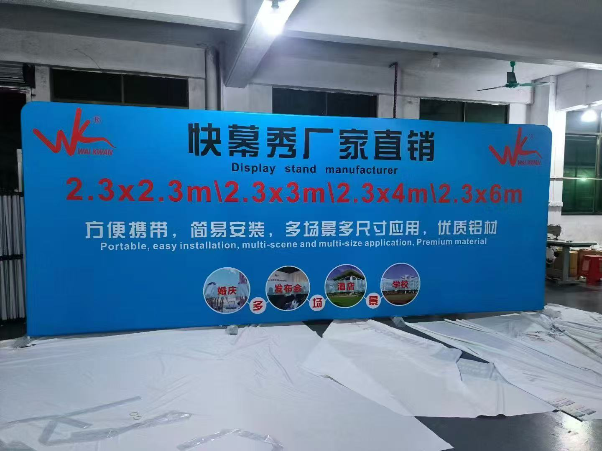

# i18n Language Separation Audit

Workspace: `E:\wkan-website-real`

## Summary

- P0: 23
- P1: 606
- P2: 602
- P3: 12714

## Notes

- This is a static, line-level audit. Some multi-line HTML fragments may require manual follow-up.
- Allowed tokens inside zh are treated as exceptions (brand/model/material/units list).
- This audit does not modify any copy or i18n system.

## P0 — English blocks contain Chinese (must fix)

These will surface Chinese characters under English mode.

- all-products.html:220 | `en_block_contains_han` | <li><a href="index.html#top3">热销尺寸 Top3Top 3 Sizes</a></li>
  - Suggestion: Wrap Han text in a sibling .zh span and add matching .en text, or replace with data-i18n key.
- flag-type.html:84 | `en_block_contains_han` | 产品中心Products
  - Suggestion: Wrap Han text in a sibling .zh span and add matching .en text, or replace with data-i18n key.
- flag-type.html:99 | `en_block_contains_han` | 全部产品Browse Products
  - Suggestion: Wrap Han text in a sibling .zh span and add matching .en text, or replace with data-i18n key.
- flag-type.html:105 | `en_block_contains_han` | <li><a href="index.html#top3">热销尺寸 Top3Top 3 Sizes</a></li>
  - Suggestion: Wrap Han text in a sibling .zh span and add matching .en text, or replace with data-i18n key.
- news/apppexpo-2026-shanghai.html:160 | `en_block_contains_han` | <a href="index.html">新闻资讯News</a>
  - Suggestion: Wrap Han text in a sibling .zh span and add matching .en text, or replace with data-i18n key.
- news/apppexpo-2026-shanghai.html:347 | `en_block_contains_han` | <li><a href="index.html">返回新闻列表All news &amp; updates</a></li>
  - Suggestion: Wrap Han text in a sibling .zh span and add matching .en text, or replace with data-i18n key.
- news/apppexpo-2026-shanghai.html:348 | `en_block_contains_han` | <li><a href="../product-center.html">浏览产品中心Browse products</a></li>
  - Suggestion: Wrap Han text in a sibling .zh span and add matching .en text, or replace with data-i18n key.
- news/apppexpo-2026-shanghai.html:349 | `en_block_contains_han` | <li><a href="../index.html#contact">联系询价Contact for a quote</a></li>
  - Suggestion: Wrap Han text in a sibling .zh span and add matching .en text, or replace with data-i18n key.
- product-center.html:114 | `en_block_contains_han` | <li><a href="index.html#top3">热销尺寸 Top3Top 3 Sizes</a></li>
  - Suggestion: Wrap Han text in a sibling .zh span and add matching .en text, or replace with data-i18n key.
- scripts/main.js:1962 | `en_block_contains_han` | Search搜索
  - Suggestion: Ensure English template has no Han; move Han into .zh or i18n key.
- scripts/multilang.js:910 | `en_translation_contains_han` | about_mission: 'Our Mission', // 兼容旧key
  - Suggestion: Replace with English-only translation, or move Han text to zh translation value.
- scripts/multilang.js:913 | `en_translation_contains_han` | about_vision: 'Our Vision', // 兼容旧key
  - Suggestion: Replace with English-only translation, or move Han text to zh translation value.
- scripts/multilang.js:986 | `en_translation_contains_han` | // 保留旧键名以兼容
  - Suggestion: Replace with English-only translation, or move Han text to zh translation value.
- scripts/multilang.js:1034 | `en_translation_contains_han` | // 标准 i18n key（统一命名）
  - Suggestion: Replace with English-only translation, or move Han text to zh translation value.
- scripts/multilang.js:1046 | `en_translation_contains_han` | // 兼容旧key
  - Suggestion: Replace with English-only translation, or move Han text to zh translation value.
- scripts/multilang.js:1277 | `en_translation_contains_han` | contact_address: 'Daping Changtangao, Luyin Village, Gucheng Town, Luchuan County, Yulin City, Guangxi, China', // 兼容旧key
  - Suggestion: Replace with English-only translation, or move Han text to zh translation value.
- scripts/multilang.js:1279 | `en_translation_contains_han` | contact_phone_title: 'Phone Number', // 兼容旧key
  - Suggestion: Replace with English-only translation, or move Han text to zh translation value.
- scripts/multilang.js:1281 | `en_translation_contains_han` | contact_email_title: 'Email Address', // 兼容旧key
  - Suggestion: Replace with English-only translation, or move Han text to zh translation value.
- scripts/multilang.js:1296 | `en_translation_contains_han` | form_name: 'Your Name', // 兼容旧key
  - Suggestion: Replace with English-only translation, or move Han text to zh translation value.
- scripts/multilang.js:1297 | `en_translation_contains_han` | form_email: 'Your Email', // 兼容旧key
  - Suggestion: Replace with English-only translation, or move Han text to zh translation value.
- scripts/multilang.js:1298 | `en_translation_contains_han` | form_phone: 'Phone Number', // 兼容旧key
  - Suggestion: Replace with English-only translation, or move Han text to zh translation value.
- scripts/multilang.js:1299 | `en_translation_contains_han` | form_message: 'Your Message', // 兼容旧key
  - Suggestion: Replace with English-only translation, or move Han text to zh translation value.
- scripts/multilang.js:1300 | `en_translation_contains_han` | form_submit: 'Send Message', // 兼容旧key
  - Suggestion: Replace with English-only translation, or move Han text to zh translation value.

## P1 — Chinese blocks contain English sentences (likely fix)

These will surface English text under Chinese mode (excluding allowed tokens).

- all-products.html:220 | `zh_block_contains_disallowed_en` | <li><a href="index.html#top3">热销尺寸 Top3Top 3 Sizes</a></li>
  - Suggestion: Replace English sentence in .zh with Chinese, keep only allowed tokens (e.g., OEM/ODM, 600D).
- flag-type.html:84 | `zh_block_contains_disallowed_en` | 产品中心Products
  - Suggestion: Replace English sentence in .zh with Chinese, keep only allowed tokens (e.g., OEM/ODM, 600D).
- flag-type.html:99 | `zh_block_contains_disallowed_en` | 全部产品Browse Products
  - Suggestion: Replace English sentence in .zh with Chinese, keep only allowed tokens (e.g., OEM/ODM, 600D).
- flag-type.html:105 | `zh_block_contains_disallowed_en` | <li><a href="index.html#top3">热销尺寸 Top3Top 3 Sizes</a></li>
  - Suggestion: Replace English sentence in .zh with Chinese, keep only allowed tokens (e.g., OEM/ODM, 600D).
- flag-type.html:150 | `zh_block_contains_disallowed_en` | 以下页面说明沙滩旗杆、底座、刀旗与水滴旗等型号，并配有画册与示例图；带 <strong>type</strong> 参数的链接可打开对应型号的参数表。筛选目录请用
  - Suggestion: Replace English sentence in .zh with Chinese, keep only allowed tokens (e.g., OEM/ODM, 600D).
- news/apppexpo-2026-shanghai.html:160 | `zh_block_contains_disallowed_en` | <a href="index.html">新闻资讯News</a>
  - Suggestion: Replace English sentence in .zh with Chinese, keep only allowed tokens (e.g., OEM/ODM, 600D).
- news/apppexpo-2026-shanghai.html:163 | `zh_block_contains_disallowed_en` | APPPEXPO 2026
  - Suggestion: Replace English sentence in .zh with Chinese, keep only allowed tokens (e.g., OEM/ODM, 600D).
- news/apppexpo-2026-shanghai.html:187 | `zh_block_contains_disallowed_en` | 伟群帐篷亮相上海 APPPEXPO 2026 展会
  - Suggestion: Replace English sentence in .zh with Chinese, keep only allowed tokens (e.g., OEM/ODM, 600D).
- news/apppexpo-2026-shanghai.html:347 | `zh_block_contains_disallowed_en` | <li><a href="index.html">返回新闻列表All news &amp; updates</a></li>
  - Suggestion: Replace English sentence in .zh with Chinese, keep only allowed tokens (e.g., OEM/ODM, 600D).
- news/apppexpo-2026-shanghai.html:348 | `zh_block_contains_disallowed_en` | <li><a href="../product-center.html">浏览产品中心Browse products</a></li>
  - Suggestion: Replace English sentence in .zh with Chinese, keep only allowed tokens (e.g., OEM/ODM, 600D).
- news/apppexpo-2026-shanghai.html:349 | `zh_block_contains_disallowed_en` | <li><a href="../index.html#contact">联系询价Contact for a quote</a></li>
  - Suggestion: Replace English sentence in .zh with Chinese, keep only allowed tokens (e.g., OEM/ODM, 600D).
- news/index.html:164 | `zh_block_contains_disallowed_en` | 伟群帐篷亮相上海 APPPEXPO 2026 展会
  - Suggestion: Replace English sentence in .zh with Chinese, keep only allowed tokens (e.g., OEM/ODM, 600D).
- news/index.html:169 | `zh_block_contains_disallowed_en` | 我们近期参加了上海 APPPEXPO 2026 展会，展示了沙滩旗、展示器材及定制品牌宣传产品，并与客户进行了现场交流。
  - Suggestion: Replace English sentence in .zh with Chinese, keep only allowed tokens (e.g., OEM/ODM, 600D).
- product-center.html:114 | `zh_block_contains_disallowed_en` | <li><a href="index.html#top3">热销尺寸 Top3Top 3 Sizes</a></li>
  - Suggestion: Replace English sentence in .zh with Chinese, keep only allowed tokens (e.g., OEM/ODM, 600D).
- scripts/main.js:1389 | `zh_block_contains_disallowed_en` | a.innerHTML = ``;
  - Suggestion: Keep only allowed tokens inside .zh, or split into .zh/.en spans / i18n key.
- scripts/main.js:1719 | `zh_block_contains_disallowed_en` | highlightsHtml += `

${h.label}

${h.valueZh}${h.valueEn}

`;
  - Suggestion: Keep only allowed tokens inside .zh, or split into .zh/.en spans / i18n key.
- scripts/main.js:1725 | `zh_block_contains_disallowed_en` | 
${s.kickerZh}${s.kickerEn}

  - Suggestion: Keep only allowed tokens inside .zh, or split into .zh/.en spans / i18n key.
- scripts/main.js:1727 | `zh_block_contains_disallowed_en` | <h2 class="hero-title">${s.titleZh}${s.titleEn}</h2>
  - Suggestion: Keep only allowed tokens inside .zh, or split into .zh/.en spans / i18n key.
- scripts/main.js:1728 | `zh_block_contains_disallowed_en` | 
${s.subZh}${s.subEn}

  - Suggestion: Keep only allowed tokens inside .zh, or split into .zh/.en spans / i18n key.
- scripts/main.js:1734 | `zh_block_contains_disallowed_en` | ${s.ctaTextZh}
  - Suggestion: Keep only allowed tokens inside .zh, or split into .zh/.en spans / i18n key.
- scripts/main.js:1956 | `zh_block_contains_disallowed_en` | 搜索产品
  - Suggestion: Keep only allowed tokens inside .zh, or split into .zh/.en spans / i18n key.
- scripts/main.js:1962 | `zh_block_contains_disallowed_en` | Search搜索
  - Suggestion: Keep only allowed tokens inside .zh, or split into .zh/.en spans / i18n key.
- scripts/main.js:1968 | `zh_block_contains_disallowed_en` | 提示：可试 “3x3 / 沙滩旗 / 快幕秀”.
  - Suggestion: Keep only allowed tokens inside .zh, or split into .zh/.en spans / i18n key.
- scripts/multilang.js:43 | `zh_translation_contains_disallowed_en` | nav_home: '首页',
  - Suggestion: Replace with Chinese-only translation (keep only allowed tokens like OEM/ODM, material codes).
- scripts/multilang.js:44 | `zh_translation_contains_disallowed_en` | nav_about: '公司介绍',
  - Suggestion: Replace with Chinese-only translation (keep only allowed tokens like OEM/ODM, material codes).
- scripts/multilang.js:45 | `zh_translation_contains_disallowed_en` | nav_products: '产品中心',
  - Suggestion: Replace with Chinese-only translation (keep only allowed tokens like OEM/ODM, material codes).
- scripts/multilang.js:46 | `zh_translation_contains_disallowed_en` | nav_services: '服务范围',
  - Suggestion: Replace with Chinese-only translation (keep only allowed tokens like OEM/ODM, material codes).
- scripts/multilang.js:47 | `zh_translation_contains_disallowed_en` | nav_contact: '联系我们',
  - Suggestion: Replace with Chinese-only translation (keep only allowed tokens like OEM/ODM, material codes).
- scripts/multilang.js:48 | `zh_translation_contains_disallowed_en` | nav_factory_strength: '工厂实力',
  - Suggestion: Replace with Chinese-only translation (keep only allowed tokens like OEM/ODM, material codes).
- scripts/multilang.js:49 | `zh_translation_contains_disallowed_en` | nav_core_categories: '核心分类',
  - Suggestion: Replace with Chinese-only translation (keep only allowed tokens like OEM/ODM, material codes).
- scripts/multilang.js:50 | `zh_translation_contains_disallowed_en` | nav_why_choose_us: '为什么选择我们',
  - Suggestion: Replace with Chinese-only translation (keep only allowed tokens like OEM/ODM, material codes).
- scripts/multilang.js:53 | `zh_translation_contains_disallowed_en` | language_gate_title: '欢迎',
  - Suggestion: Replace with Chinese-only translation (keep only allowed tokens like OEM/ODM, material codes).
- scripts/multilang.js:54 | `zh_translation_contains_disallowed_en` | language_gate_desc: '请选择语言',
  - Suggestion: Replace with Chinese-only translation (keep only allowed tokens like OEM/ODM, material codes).
- scripts/multilang.js:57 | `zh_translation_contains_disallowed_en` | products_cat_all: '全部分类',
  - Suggestion: Replace with Chinese-only translation (keep only allowed tokens like OEM/ODM, material codes).
- scripts/multilang.js:60 | `zh_translation_contains_disallowed_en` | spec_sizes_sml: '尺寸：S / M / L',
  - Suggestion: Replace with Chinese-only translation (keep only allowed tokens like OEM/ODM, material codes).
- scripts/multilang.js:61 | `zh_translation_contains_disallowed_en` | spec_print_single_double: '印刷：单面 / 双面',
  - Suggestion: Replace with Chinese-only translation (keep only allowed tokens like OEM/ODM, material codes).
- scripts/multilang.js:62 | `zh_translation_contains_disallowed_en` | spec_base_options: '底座可选',
  - Suggestion: Replace with Chinese-only translation (keep only allowed tokens like OEM/ODM, material codes).
- scripts/multilang.js:63 | `zh_translation_contains_disallowed_en` | spec_sizes_prefix: '尺寸：',
  - Suggestion: Replace with Chinese-only translation (keep only allowed tokens like OEM/ODM, material codes).
- scripts/multilang.js:64 | `zh_translation_contains_disallowed_en` | spec_weight_prefix: '重量：',
  - Suggestion: Replace with Chinese-only translation (keep only allowed tokens like OEM/ODM, material codes).
- scripts/multilang.js:65 | `zh_translation_contains_disallowed_en` | spec_sizes_default: '尺寸：3×3m / 3×6m',
  - Suggestion: Replace with Chinese-only translation (keep only allowed tokens like OEM/ODM, material codes).
- scripts/multilang.js:66 | `zh_translation_contains_disallowed_en` | spec_custom_print: '支持定制印刷',
  - Suggestion: Replace with Chinese-only translation (keep only allowed tokens like OEM/ODM, material codes).
- scripts/multilang.js:67 | `zh_translation_contains_disallowed_en` | spec_display_width: '宽度：3m / 4m / 5m',
  - Suggestion: Replace with Chinese-only translation (keep only allowed tokens like OEM/ODM, material codes).
- scripts/multilang.js:68 | `zh_translation_contains_disallowed_en` | spec_display_height: '高度：2.3m',
  - Suggestion: Replace with Chinese-only translation (keep only allowed tokens like OEM/ODM, material codes).
- scripts/multilang.js:69 | `zh_translation_contains_disallowed_en` | spec_display_shapes: '直形 / 弧形',
  - Suggestion: Replace with Chinese-only translation (keep only allowed tokens like OEM/ODM, material codes).
- scripts/multilang.js:70 | `zh_translation_contains_disallowed_en` | spec_customizable: '支持定制',
  - Suggestion: Replace with Chinese-only translation (keep only allowed tokens like OEM/ODM, material codes).
- scripts/multilang.js:73 | `zh_translation_contains_disallowed_en` | company_name: '广西伟群帐篷制造有限公司',
  - Suggestion: Replace with Chinese-only translation (keep only allowed tokens like OEM/ODM, material codes).
- scripts/multilang.js:74 | `zh_translation_contains_disallowed_en` | tagline: '帐篷、沙滩旗与展示系统源头制造工厂',
  - Suggestion: Replace with Chinese-only translation (keep only allowed tokens like OEM/ODM, material codes).
- scripts/multilang.js:77 | `zh_translation_contains_disallowed_en` | hero_badge: '专业制造',
  - Suggestion: Replace with Chinese-only translation (keep only allowed tokens like OEM/ODM, material codes).
- scripts/multilang.js:78 | `zh_translation_contains_disallowed_en` | hero_title: 'Canopy Tents • Flags • Display Systems',
  - Suggestion: Replace with Chinese-only translation (keep only allowed tokens like OEM/ODM, material codes).
- scripts/multilang.js:79 | `zh_translation_contains_disallowed_en` | hero_subtitle: '专注帐篷、沙滩旗与快幕秀等展示系统的研发与制造，为全球客户提供高品质可定制的展示解决方案',
  - Suggestion: Replace with Chinese-only translation (keep only allowed tokens like OEM/ODM, material codes).
- scripts/multilang.js:80 | `zh_translation_contains_disallowed_en` | btn_explore: '探索产品',
  - Suggestion: Replace with Chinese-only translation (keep only allowed tokens like OEM/ODM, material codes).
- scripts/multilang.js:81 | `zh_translation_contains_disallowed_en` | btn_contact: '联系我们',
  - Suggestion: Replace with Chinese-only translation (keep only allowed tokens like OEM/ODM, material codes).
- scripts/multilang.js:84 | `zh_translation_contains_disallowed_en` | home_hero_primary_cta: '获取报价',
  - Suggestion: Replace with Chinese-only translation (keep only allowed tokens like OEM/ODM, material codes).
- scripts/multilang.js:85 | `zh_translation_contains_disallowed_en` | home_hero_secondary_cta: '查看产品',
  - Suggestion: Replace with Chinese-only translation (keep only allowed tokens like OEM/ODM, material codes).
- scripts/multilang.js:87 | `zh_translation_contains_disallowed_en` | home_hero_1_kicker: '源头工厂 · OEM/ODM',
  - Suggestion: Replace with Chinese-only translation (keep only allowed tokens like OEM/ODM, material codes).
- scripts/multilang.js:88 | `zh_translation_contains_disallowed_en` | home_hero_1_title: '定制广告帐篷，快速交付',
  - Suggestion: Replace with Chinese-only translation (keep only allowed tokens like OEM/ODM, material codes).
- scripts/multilang.js:89 | `zh_translation_contains_disallowed_en` | home_hero_1_subtitle: '适用于展会、赛事与推广活动的折叠帐篷。源头工厂直供，支持 LOGO 全印、尺寸与配件定制。',
  - Suggestion: Replace with Chinese-only translation (keep only allowed tokens like OEM/ODM, material codes).
- scripts/multilang.js:91 | `zh_translation_contains_disallowed_en` | home_hero_2_kicker: '沙滩旗 · 户外引流',
  - Suggestion: Replace with Chinese-only translation (keep only allowed tokens like OEM/ODM, material codes).
- scripts/multilang.js:92 | `zh_translation_contains_disallowed_en` | home_hero_2_title: '高辨识度广告旗帜系统',
  - Suggestion: Replace with Chinese-only translation (keep only allowed tokens like OEM/ODM, material codes).
- scripts/multilang.js:93 | `zh_translation_contains_disallowed_en` | home_hero_2_subtitle: '羽毛旗/刀旗/矩形旗，搭配多种底座与旗杆材料，适配不同场地。',
  - Suggestion: Replace with Chinese-only translation (keep only allowed tokens like OEM/ODM, material codes).
- scripts/multilang.js:95 | `zh_translation_contains_disallowed_en` | home_hero_3_kicker: '展示系统 · 快速搭建',
  - Suggestion: Replace with Chinese-only translation (keep only allowed tokens like OEM/ODM, material codes).
- scripts/multilang.js:96 | `zh_translation_contains_disallowed_en` | home_hero_3_title: '便携式快幕秀展示背景墙',
  - Suggestion: Replace with Chinese-only translation (keep only allowed tokens like OEM/ODM, material codes).
- scripts/multilang.js:97 | `zh_translation_contains_disallowed_en` | home_hero_3_subtitle: '轻便结构，画面可更换，适用于展会背景、舞台与品牌形象展示。',
  - Suggestion: Replace with Chinese-only translation (keep only allowed tokens like OEM/ODM, material codes).
- scripts/multilang.js:99 | `zh_translation_contains_disallowed_en` | home_popular_categories_title: '核心产品分类',
  - Suggestion: Replace with Chinese-only translation (keep only allowed tokens like OEM/ODM, material codes).
- scripts/multilang.js:100 | `zh_translation_contains_disallowed_en` | home_popular_categories_subtitle: '快速进入五大核心品类，支持按类筛选与搜索。',
  - Suggestion: Replace with Chinese-only translation (keep only allowed tokens like OEM/ODM, material codes).
- scripts/multilang.js:101 | `zh_translation_contains_disallowed_en` | home_cat_cta: '浏览该分类',
  - Suggestion: Replace with Chinese-only translation (keep only allowed tokens like OEM/ODM, material codes).
- scripts/multilang.js:102 | `zh_translation_contains_disallowed_en` | home_cat_tents_title: '帐篷',
  - Suggestion: Replace with Chinese-only translation (keep only allowed tokens like OEM/ODM, material codes).
- scripts/multilang.js:103 | `zh_translation_contains_disallowed_en` | home_cat_tents_desc: '折叠帐篷与活动帐篷，支持品牌定制与配件选配。',
  - Suggestion: Replace with Chinese-only translation (keep only allowed tokens like OEM/ODM, material codes).
- scripts/multilang.js:104 | `zh_translation_contains_disallowed_en` | home_cat_flags_title: '旗帜与旗杆',
  - Suggestion: Replace with Chinese-only translation (keep only allowed tokens like OEM/ODM, material codes).
- scripts/multilang.js:105 | `zh_translation_contains_disallowed_en` | home_cat_flags_desc: '羽毛旗/刀旗/矩形旗 + 旗杆与多种底座系统。',
  - Suggestion: Replace with Chinese-only translation (keep only allowed tokens like OEM/ODM, material codes).
- scripts/multilang.js:106 | `zh_translation_contains_disallowed_en` | home_cat_displays_title: '展示系统',
  - Suggestion: Replace with Chinese-only translation (keep only allowed tokens like OEM/ODM, material codes).
- scripts/multilang.js:107 | `zh_translation_contains_disallowed_en` | home_cat_displays_desc: '背景墙、张拉布、灯箱等展示方案，适用于展会与品牌展示。',
  - Suggestion: Replace with Chinese-only translation (keep only allowed tokens like OEM/ODM, material codes).
- scripts/multilang.js:108 | `zh_translation_contains_disallowed_en` | home_cat_lightbox_title: '灯箱',
  - Suggestion: Replace with Chinese-only translation (keep only allowed tokens like OEM/ODM, material codes).
- scripts/multilang.js:109 | `zh_translation_contains_disallowed_en` | home_cat_lightbox_desc: '便携式灯箱与发光展示，支持画面更换与定制。',
  - Suggestion: Replace with Chinese-only translation (keep only allowed tokens like OEM/ODM, material codes).
- scripts/multilang.js:110 | `zh_translation_contains_disallowed_en` | home_cat_racegate_title: '竞速拱门',
  - Suggestion: Replace with Chinese-only translation (keep only allowed tokens like OEM/ODM, material codes).
- scripts/multilang.js:111 | `zh_translation_contains_disallowed_en` | home_cat_racegate_desc: '赛事与活动用拱门结构，便携耐用，支持不同规格。',
  - Suggestion: Replace with Chinese-only translation (keep only allowed tokens like OEM/ODM, material codes).
- scripts/multilang.js:112 | `zh_translation_contains_disallowed_en` | home_cat_accessories_title: '配件',
  - Suggestion: Replace with Chinese-only translation (keep only allowed tokens like OEM/ODM, material codes).
- scripts/multilang.js:113 | `zh_translation_contains_disallowed_en` | home_cat_accessories_desc: '侧墙、配重、收纳袋、连接件等一站式配套。',
  - Suggestion: Replace with Chinese-only translation (keep only allowed tokens like OEM/ODM, material codes).
- scripts/multilang.js:115 | `zh_translation_contains_disallowed_en` | home_trusted_by_title: '合作客户',
  - Suggestion: Replace with Chinese-only translation (keep only allowed tokens like OEM/ODM, material codes).
- scripts/multilang.js:116 | `zh_translation_contains_disallowed_en` | home_trusted_by_subtitle: '服务全球品牌、经销商与项目客户（示意）。',
  - Suggestion: Replace with Chinese-only translation (keep only allowed tokens like OEM/ODM, material codes).
- scripts/multilang.js:118 | `zh_translation_contains_disallowed_en` | home_trusted_badge_1: 'OEM 合作伙伴',
  - Suggestion: Replace with Chinese-only translation (keep only allowed tokens like OEM/ODM, material codes).
- scripts/multilang.js:119 | `zh_translation_contains_disallowed_en` | home_trusted_badge_2: '活动品牌',
  - Suggestion: Replace with Chinese-only translation (keep only allowed tokens like OEM/ODM, material codes).
- scripts/multilang.js:120 | `zh_translation_contains_disallowed_en` | home_trusted_badge_3: '经销商渠道',
  - Suggestion: Replace with Chinese-only translation (keep only allowed tokens like OEM/ODM, material codes).
- scripts/multilang.js:121 | `zh_translation_contains_disallowed_en` | home_trusted_badge_4: '零售门店',
  - Suggestion: Replace with Chinese-only translation (keep only allowed tokens like OEM/ODM, material codes).
- scripts/multilang.js:122 | `zh_translation_contains_disallowed_en` | home_trusted_badge_5: '赛事团队',
  - Suggestion: Replace with Chinese-only translation (keep only allowed tokens like OEM/ODM, material codes).
- scripts/multilang.js:123 | `zh_translation_contains_disallowed_en` | home_trusted_badge_6: '展会搭建',
  - Suggestion: Replace with Chinese-only translation (keep only allowed tokens like OEM/ODM, material codes).
- scripts/multilang.js:124 | `zh_translation_contains_disallowed_en` | home_trusted_badge_7: '广告印刷',
  - Suggestion: Replace with Chinese-only translation (keep only allowed tokens like OEM/ODM, material codes).
- scripts/multilang.js:125 | `zh_translation_contains_disallowed_en` | home_trusted_badge_8: '项目采购',
  - Suggestion: Replace with Chinese-only translation (keep only allowed tokens like OEM/ODM, material codes).
- scripts/multilang.js:126 | `zh_translation_contains_disallowed_en` | home_trusted_badge_9: '政府/机构',
  - Suggestion: Replace with Chinese-only translation (keep only allowed tokens like OEM/ODM, material codes).
- scripts/multilang.js:127 | `zh_translation_contains_disallowed_en` | home_trusted_badge_10: '跨境电商',
  - Suggestion: Replace with Chinese-only translation (keep only allowed tokens like OEM/ODM, material codes).
- scripts/multilang.js:129 | `zh_translation_contains_disallowed_en` | home_best_sellers_title: '畅销产品',
  - Suggestion: Replace with Chinese-only translation (keep only allowed tokens like OEM/ODM, material codes).
- scripts/multilang.js:130 | `zh_translation_contains_disallowed_en` | home_best_sellers_subtitle: '基于现有数据集规则自动推荐（可按需调整）。',
  - Suggestion: Replace with Chinese-only translation (keep only allowed tokens like OEM/ODM, material codes).
- scripts/multilang.js:131 | `zh_translation_contains_disallowed_en` | home_best_sellers_empty: '暂无可展示的产品。',
  - Suggestion: Replace with Chinese-only translation (keep only allowed tokens like OEM/ODM, material codes).
- scripts/multilang.js:132 | `zh_translation_contains_disallowed_en` | home_view_all_products: '查看全部产品',
  - Suggestion: Replace with Chinese-only translation (keep only allowed tokens like OEM/ODM, material codes).
- scripts/multilang.js:134 | `zh_translation_contains_disallowed_en` | home_factory_title: '为什么选择伟群',
  - Suggestion: Replace with Chinese-only translation (keep only allowed tokens like OEM/ODM, material codes).
- scripts/multilang.js:135 | `zh_translation_contains_disallowed_en` | home_factory_subtitle: '始于 2010，从打样到大货，我们提供稳定交付与可复制的品质控制。',
  - Suggestion: Replace with Chinese-only translation (keep only allowed tokens like OEM/ODM, material codes).
- scripts/multilang.js:136 | `zh_translation_contains_disallowed_en` | home_factory_f1_title: 'OEM / ODM',
  - Suggestion: Replace with Chinese-only translation (keep only allowed tokens like OEM/ODM, material codes).
- scripts/multilang.js:137 | `zh_translation_contains_disallowed_en` | home_factory_f1_desc: '支持结构、尺寸与品牌系统定制，适配不同市场需求。',
  - Suggestion: Replace with Chinese-only translation (keep only allowed tokens like OEM/ODM, material codes).
- scripts/multilang.js:138 | `zh_translation_contains_disallowed_en` | home_factory_f2_title: '自有印刷',
  - Suggestion: Replace with Chinese-only translation (keep only allowed tokens like OEM/ODM, material codes).
- scripts/multilang.js:139 | `zh_translation_contains_disallowed_en` | home_factory_f2_desc: '多工艺印刷与色彩控制，确保画面一致性与清晰度。',
  - Suggestion: Replace with Chinese-only translation (keep only allowed tokens like OEM/ODM, material codes).
- scripts/multilang.js:140 | `zh_translation_contains_disallowed_en` | home_factory_f3_title: '快速交期',
  - Suggestion: Replace with Chinese-only translation (keep only allowed tokens like OEM/ODM, material codes).
- scripts/multilang.js:141 | `zh_translation_contains_disallowed_en` | home_factory_f3_desc: '标准化流程与产能配置，适配紧急项目与批量订单。',
  - Suggestion: Replace with Chinese-only translation (keep only allowed tokens like OEM/ODM, material codes).
- scripts/multilang.js:142 | `zh_translation_contains_disallowed_en` | home_factory_f4_title: '质检与出口',
  - Suggestion: Replace with Chinese-only translation (keep only allowed tokens like OEM/ODM, material codes).
- scripts/multilang.js:143 | `zh_translation_contains_disallowed_en` | home_factory_f4_desc: '关键节点检测与装箱规范，支持全球发货与报关。',
  - Suggestion: Replace with Chinese-only translation (keep only allowed tokens like OEM/ODM, material codes).
- scripts/multilang.js:145 | `zh_translation_contains_disallowed_en` | home_why_title: '为什么选择我们',
  - Suggestion: Replace with Chinese-only translation (keep only allowed tokens like OEM/ODM, material codes).
- scripts/multilang.js:146 | `zh_translation_contains_disallowed_en` | home_why_subtitle: '面向 B2B 客户的制造与交付能力，覆盖从打样到批量的全流程。',
  - Suggestion: Replace with Chinese-only translation (keep only allowed tokens like OEM/ODM, material codes).
- scripts/multilang.js:147 | `zh_translation_contains_disallowed_en` | home_why_f1_title: 'OEM / ODM 能力',
  - Suggestion: Replace with Chinese-only translation (keep only allowed tokens like OEM/ODM, material codes).
- scripts/multilang.js:148 | `zh_translation_contains_disallowed_en` | home_why_f1_desc: '支持结构、尺寸与品牌系统定制，适配不同渠道与项目需求。',
  - Suggestion: Replace with Chinese-only translation (keep only allowed tokens like OEM/ODM, material codes).
- scripts/multilang.js:149 | `zh_translation_contains_disallowed_en` | home_why_f2_title: '印刷与颜色控制',
  - Suggestion: Replace with Chinese-only translation (keep only allowed tokens like OEM/ODM, material codes).
- scripts/multilang.js:150 | `zh_translation_contains_disallowed_en` | home_why_f2_desc: '多工艺印刷与打样确认，确保画面清晰与批次一致性。',
  - Suggestion: Replace with Chinese-only translation (keep only allowed tokens like OEM/ODM, material codes).
- scripts/multilang.js:151 | `zh_translation_contains_disallowed_en` | home_why_f3_title: '交期与排产',
  - Suggestion: Replace with Chinese-only translation (keep only allowed tokens like OEM/ODM, material codes).
- scripts/multilang.js:152 | `zh_translation_contains_disallowed_en` | home_why_f3_desc: '标准化流程与产能配置，适配紧急项目与批量订单。',
  - Suggestion: Replace with Chinese-only translation (keep only allowed tokens like OEM/ODM, material codes).
- scripts/multilang.js:153 | `zh_translation_contains_disallowed_en` | home_why_f4_title: '全球发货支持',
  - Suggestion: Replace with Chinese-only translation (keep only allowed tokens like OEM/ODM, material codes).
- scripts/multilang.js:154 | `zh_translation_contains_disallowed_en` | home_why_f4_desc: '稳定包装与装箱规范，支持海运/空运/快递等运输方案。',
  - Suggestion: Replace with Chinese-only translation (keep only allowed tokens like OEM/ODM, material codes).
- scripts/multilang.js:156 | `zh_translation_contains_disallowed_en` | home_social_export_title: '面向出口的交付经验',
  - Suggestion: Replace with Chinese-only translation (keep only allowed tokens like OEM/ODM, material codes).
- scripts/multilang.js:157 | `zh_translation_contains_disallowed_en` | home_social_export_desc: '熟悉国际项目常见包装、运输与沟通流程，便于跨境协作。',
  - Suggestion: Replace with Chinese-only translation (keep only allowed tokens like OEM/ODM, material codes).
- scripts/multilang.js:158 | `zh_translation_contains_disallowed_en` | home_social_clients_title: '多类型客户合作',
  - Suggestion: Replace with Chinese-only translation (keep only allowed tokens like OEM/ODM, material codes).
- scripts/multilang.js:159 | `zh_translation_contains_disallowed_en` | home_social_clients_desc: '服务品牌方、经销商、活动公司、展会搭建与项目采购客户。',
  - Suggestion: Replace with Chinese-only translation (keep only allowed tokens like OEM/ODM, material codes).
- scripts/multilang.js:161 | `zh_translation_contains_disallowed_en` | home_stat_years_value: '15+',
  - Suggestion: Replace with Chinese-only translation (keep only allowed tokens like OEM/ODM, material codes).
- scripts/multilang.js:162 | `zh_translation_contains_disallowed_en` | home_stat_years_label: '年制造经验',
  - Suggestion: Replace with Chinese-only translation (keep only allowed tokens like OEM/ODM, material codes).
- scripts/multilang.js:163 | `zh_translation_contains_disallowed_en` | home_stat_clients_value: '500+',
  - Suggestion: Replace with Chinese-only translation (keep only allowed tokens like OEM/ODM, material codes).
- scripts/multilang.js:164 | `zh_translation_contains_disallowed_en` | home_stat_clients_label: '全球客户',
  - Suggestion: Replace with Chinese-only translation (keep only allowed tokens like OEM/ODM, material codes).
- scripts/multilang.js:165 | `zh_translation_contains_disallowed_en` | home_stat_models_value: '200+',
  - Suggestion: Replace with Chinese-only translation (keep only allowed tokens like OEM/ODM, material codes).
- scripts/multilang.js:166 | `zh_translation_contains_disallowed_en` | home_stat_models_label: '产品型号',
  - Suggestion: Replace with Chinese-only translation (keep only allowed tokens like OEM/ODM, material codes).
- scripts/multilang.js:168 | `zh_translation_contains_disallowed_en` | home_resources_title: '资料与常见问题',
  - Suggestion: Replace with Chinese-only translation (keep only allowed tokens like OEM/ODM, material codes).
- scripts/multilang.js:169 | `zh_translation_contains_disallowed_en` | home_resources_subtitle: '快速了解定制流程、印刷文件与交付方式。',
  - Suggestion: Replace with Chinese-only translation (keep only allowed tokens like OEM/ODM, material codes).
- scripts/multilang.js:170 | `zh_translation_contains_disallowed_en` | home_resource_cta: '查看详情',
  - Suggestion: Replace with Chinese-only translation (keep only allowed tokens like OEM/ODM, material codes).
- scripts/multilang.js:171 | `zh_translation_contains_disallowed_en` | home_resource_1_title: 'MOQ 与交期',
  - Suggestion: Replace with Chinese-only translation (keep only allowed tokens like OEM/ODM, material codes).
- scripts/multilang.js:172 | `zh_translation_contains_disallowed_en` | home_resource_1_desc: '不同产品与工艺的起订量与交期说明。',
  - Suggestion: Replace with Chinese-only translation (keep only allowed tokens like OEM/ODM, material codes).
- scripts/multilang.js:173 | `zh_translation_contains_disallowed_en` | home_resource_2_title: '印刷与材质',
  - Suggestion: Replace with Chinese-only translation (keep only allowed tokens like OEM/ODM, material codes).
- scripts/multilang.js:174 | `zh_translation_contains_disallowed_en` | home_resource_2_desc: '常用布料、工艺与颜色控制要点。',
  - Suggestion: Replace with Chinese-only translation (keep only allowed tokens like OEM/ODM, material codes).
- scripts/multilang.js:175 | `zh_translation_contains_disallowed_en` | home_resource_3_title: '物流与包装',
  - Suggestion: Replace with Chinese-only translation (keep only allowed tokens like OEM/ODM, material codes).
- scripts/multilang.js:176 | `zh_translation_contains_disallowed_en` | home_resource_3_desc: '海运/空运/快递方案与装箱规范。',
  - Suggestion: Replace with Chinese-only translation (keep only allowed tokens like OEM/ODM, material codes).
- scripts/multilang.js:177 | `zh_translation_contains_disallowed_en` | home_resource_4_title: '设计文件',
  - Suggestion: Replace with Chinese-only translation (keep only allowed tokens like OEM/ODM, material codes).
- scripts/multilang.js:178 | `zh_translation_contains_disallowed_en` | home_resource_4_desc: '支持的文件格式与制作注意事项。',
  - Suggestion: Replace with Chinese-only translation (keep only allowed tokens like OEM/ODM, material codes).
- scripts/multilang.js:180 | `zh_translation_contains_disallowed_en` | home_faq_1_q: '起订量（MOQ）是多少？',
  - Suggestion: Replace with Chinese-only translation (keep only allowed tokens like OEM/ODM, material codes).
- scripts/multilang.js:181 | `zh_translation_contains_disallowed_en` | home_faq_1_a: '不同产品与工艺的 MOQ 不同。请提交需求，我们将提供对应 MOQ 与报价。',
  - Suggestion: Replace with Chinese-only translation (keep only allowed tokens like OEM/ODM, material codes).
- scripts/multilang.js:182 | `zh_translation_contains_disallowed_en` | home_faq_2_q: '支持哪些印刷工艺？',
  - Suggestion: Replace with Chinese-only translation (keep only allowed tokens like OEM/ODM, material codes).
- scripts/multilang.js:183 | `zh_translation_contains_disallowed_en` | home_faq_2_a: '支持数码印刷、丝网印刷、热转印等，具体以材质与数量为准。',
  - Suggestion: Replace with Chinese-only translation (keep only allowed tokens like OEM/ODM, material codes).
- scripts/multilang.js:184 | `zh_translation_contains_disallowed_en` | home_faq_3_q: '支持哪些发货方式？',
  - Suggestion: Replace with Chinese-only translation (keep only allowed tokens like OEM/ODM, material codes).
- scripts/multilang.js:185 | `zh_translation_contains_disallowed_en` | home_faq_3_a: '支持海运/空运/快递等方式，可按交期与预算建议方案。',
  - Suggestion: Replace with Chinese-only translation (keep only allowed tokens like OEM/ODM, material codes).
- scripts/multilang.js:186 | `zh_translation_contains_disallowed_en` | home_faq_4_q: '需要提供什么设计文件？',
  - Suggestion: Replace with Chinese-only translation (keep only allowed tokens like OEM/ODM, material codes).
- scripts/multilang.js:187 | `zh_translation_contains_disallowed_en` | home_faq_4_a: '建议提供 AI/PDF/EPS 等矢量文件；如仅有图片也可协助排版确认。',
  - Suggestion: Replace with Chinese-only translation (keep only allowed tokens like OEM/ODM, material codes).
- scripts/multilang.js:189 | `zh_translation_contains_disallowed_en` | home_cta_title: '准备开始您的项目？',
  - Suggestion: Replace with Chinese-only translation (keep only allowed tokens like OEM/ODM, material codes).
- scripts/multilang.js:190 | `zh_translation_contains_disallowed_en` | home_cta_subtitle: '告诉我们产品类型、尺寸、数量与印刷需求，我们会尽快回复。',
  - Suggestion: Replace with Chinese-only translation (keep only allowed tokens like OEM/ODM, material codes).
- scripts/multilang.js:191 | `zh_translation_contains_disallowed_en` | home_cta_primary: '获取报价',
  - Suggestion: Replace with Chinese-only translation (keep only allowed tokens like OEM/ODM, material codes).
- scripts/multilang.js:192 | `zh_translation_contains_disallowed_en` | home_cta_secondary: '前往产品中心',
  - Suggestion: Replace with Chinese-only translation (keep only allowed tokens like OEM/ODM, material codes).
- scripts/multilang.js:194 | `zh_translation_contains_disallowed_en` | home_sticky_quote: '获取报价',
  - Suggestion: Replace with Chinese-only translation (keep only allowed tokens like OEM/ODM, material codes).
- scripts/multilang.js:197 | `zh_translation_contains_disallowed_en` | about_title: '关于伟群',
  - Suggestion: Replace with Chinese-only translation (keep only allowed tokens like OEM/ODM, material codes).
- scripts/multilang.js:198 | `zh_translation_contains_disallowed_en` | about_subtitle: '帐篷、沙滩旗与展示系统的专业源头制造工厂',
  - Suggestion: Replace with Chinese-only translation (keep only allowed tokens like OEM/ODM, material codes).
- scripts/multilang.js:199 | `zh_translation_contains_disallowed_en` | about_intro: '广西伟群帐篷制造有限公司是一家专注于帐篷、沙滩旗、展示系统（Display Systems）及户外品牌展示系统研发与制造的源头工厂。公司深耕便携式户外展示行业25年以上，为全球客户提供稳定、高效、可定制的展示解决方案。',
  - Suggestion: Replace with Chinese-only translation (keep only allowed tokens like OEM/ODM, material codes).
- scripts/multilang.js:200 | `zh_translation_contains_disallowed_en` | about_intro_rest: '公司深耕便携式户外展示行业<strong>25年以上</strong>，为全球客户提供稳定、高效、可定制的展示解决方案。',
  - Suggestion: Replace with Chinese-only translation (keep only allowed tokens like OEM/ODM, material codes).
- scripts/multilang.js:201 | `zh_translation_contains_disallowed_en` | about_mission_title: '我们的使命',
  - Suggestion: Replace with Chinese-only translation (keep only allowed tokens like OEM/ODM, material codes).
- scripts/multilang.js:202 | `zh_translation_contains_disallowed_en` | about_mission: '我们的使命', // 兼容旧key
  - Suggestion: Replace with Chinese-only translation (keep only allowed tokens like OEM/ODM, material codes).
- scripts/multilang.js:203 | `zh_translation_contains_disallowed_en` | about_mission_text: '专注于帐篷、沙滩旗及便携式展示系统的研发与制造，为全球客户提供高品质、易安装、可定制的展示产品，帮助品牌在各类活动、展会与商业场景中实现更高效的曝光与传播。',
  - Suggestion: Replace with Chinese-only translation (keep only allowed tokens like OEM/ODM, material codes).
- scripts/multilang.js:204 | `zh_translation_contains_disallowed_en` | about_vision_title: '我们的愿景',
  - Suggestion: Replace with Chinese-only translation (keep only allowed tokens like OEM/ODM, material codes).
- scripts/multilang.js:205 | `zh_translation_contains_disallowed_en` | about_vision: '我们的愿景', // 兼容旧key
  - Suggestion: Replace with Chinese-only translation (keep only allowed tokens like OEM/ODM, material codes).
- scripts/multilang.js:206 | `zh_translation_contains_disallowed_en` | about_vision_text: '成为帐篷与展示系统领域值得信赖的全球制造合作伙伴，持续提升制造工艺与产品品质，为客户创造长期、稳定、可持续的商业价值。',
  - Suggestion: Replace with Chinese-only translation (keep only allowed tokens like OEM/ODM, material codes).
- scripts/multilang.js:207 | `zh_translation_contains_disallowed_en` | about_stat_years: '年制造经验',
  - Suggestion: Replace with Chinese-only translation (keep only allowed tokens like OEM/ODM, material codes).
- scripts/multilang.js:208 | `zh_translation_contains_disallowed_en` | about_stat_clients: '全球客户',
  - Suggestion: Replace with Chinese-only translation (keep only allowed tokens like OEM/ODM, material codes).
- scripts/multilang.js:209 | `zh_translation_contains_disallowed_en` | about_stat_products: '产品型号',
  - Suggestion: Replace with Chinese-only translation (keep only allowed tokens like OEM/ODM, material codes).
- scripts/multilang.js:210 | `zh_translation_contains_disallowed_en` | about_products_title: '产品与能力范围',
  - Suggestion: Replace with Chinese-only translation (keep only allowed tokens like OEM/ODM, material codes).
- scripts/multilang.js:211 | `zh_translation_contains_disallowed_en` | about_products_main: '主要产品系列：',
  - Suggestion: Replace with Chinese-only translation (keep only allowed tokens like OEM/ODM, material codes).
- scripts/multilang.js:212 | `zh_translation_contains_disallowed_en` | about_product_1: '帐篷系列（Pop-up Tent / Marquee / Event Tent）',
  - Suggestion: Replace with Chinese-only translation (keep only allowed tokens like OEM/ODM, material codes).
- scripts/multilang.js:213 | `zh_translation_contains_disallowed_en` | about_product_2: '沙滩旗及旗杆系列（Feather Flag / Teardrop Flag）',
  - Suggestion: Replace with Chinese-only translation (keep only allowed tokens like OEM/ODM, material codes).
- scripts/multilang.js:214 | `zh_translation_contains_disallowed_en` | about_product_3: '展示系统（Display Systems）',
  - Suggestion: Replace with Chinese-only translation (keep only allowed tokens like OEM/ODM, material codes).
- scripts/multilang.js:215 | `zh_translation_contains_disallowed_en` | about_product_4: '桌布、布艺展示及品牌配件',
  - Suggestion: Replace with Chinese-only translation (keep only allowed tokens like OEM/ODM, material codes).
- scripts/multilang.js:216 | `zh_translation_contains_disallowed_en` | about_product_5: '定制化品牌展示解决方案',
  - Suggestion: Replace with Chinese-only translation (keep only allowed tokens like OEM/ODM, material codes).
- scripts/multilang.js:217 | `zh_translation_contains_disallowed_en` | about_printing_title: '印刷与工艺：',
  - Suggestion: Replace with Chinese-only translation (keep only allowed tokens like OEM/ODM, material codes).
- scripts/multilang.js:218 | `zh_translation_contains_disallowed_en` | about_printing_1: '数码印刷 / 丝网印刷 / 热转印',
  - Suggestion: Replace with Chinese-only translation (keep only allowed tokens like OEM/ODM, material codes).
- scripts/multilang.js:219 | `zh_translation_contains_disallowed_en` | about_printing_2: '多种布料与结构可选',
  - Suggestion: Replace with Chinese-only translation (keep only allowed tokens like OEM/ODM, material codes).
- scripts/multilang.js:220 | `zh_translation_contains_disallowed_en` | about_printing_3: '严格的品质检测与一致性控制',
  - Suggestion: Replace with Chinese-only translation (keep only allowed tokens like OEM/ODM, material codes).
- scripts/multilang.js:221 | `zh_translation_contains_disallowed_en` | about_philosophy_title: '我们的理念',
  - Suggestion: Replace with Chinese-only translation (keep only allowed tokens like OEM/ODM, material codes).
- scripts/multilang.js:222 | `zh_translation_contains_disallowed_en` | about_philosophy_mission_label: '企业使命',
  - Suggestion: Replace with Chinese-only translation (keep only allowed tokens like OEM/ODM, material codes).
- scripts/multilang.js:223 | `zh_translation_contains_disallowed_en` | about_philosophy_mission: '弘扬品牌展示文化，助力客户商业成功',
  - Suggestion: Replace with Chinese-only translation (keep only allowed tokens like OEM/ODM, material codes).
- scripts/multilang.js:224 | `zh_translation_contains_disallowed_en` | about_philosophy_values_label: '经营理念',
  - Suggestion: Replace with Chinese-only translation (keep only allowed tokens like OEM/ODM, material codes).
- scripts/multilang.js:225 | `zh_translation_contains_disallowed_en` | about_philosophy_values: '诚信经营、持续创新、合作共赢',
  - Suggestion: Replace with Chinese-only translation (keep only allowed tokens like OEM/ODM, material codes).
- scripts/multilang.js:226 | `zh_translation_contains_disallowed_en` | about_philosophy_quality_label: '质量方针',
  - Suggestion: Replace with Chinese-only translation (keep only allowed tokens like OEM/ODM, material codes).
- scripts/multilang.js:227 | `zh_translation_contains_disallowed_en` | about_philosophy_quality: '品质稳定、交付准时、服务可靠',
  - Suggestion: Replace with Chinese-only translation (keep only allowed tokens like OEM/ODM, material codes).
- scripts/multilang.js:228 | `zh_translation_contains_disallowed_en` | about_philosophy_commitment_label: '质量承诺',
  - Suggestion: Replace with Chinese-only translation (keep only allowed tokens like OEM/ODM, material codes).
- scripts/multilang.js:229 | `zh_translation_contains_disallowed_en` | about_philosophy_commitment: '产品严格符合国际标准与客户要求，确保一致性与可靠性',
  - Suggestion: Replace with Chinese-only translation (keep only allowed tokens like OEM/ODM, material codes).
- scripts/multilang.js:230 | `zh_translation_contains_disallowed_en` | stat_years: '年制造经验',
  - Suggestion: Replace with Chinese-only translation (keep only allowed tokens like OEM/ODM, material codes).
- scripts/multilang.js:231 | `zh_translation_contains_disallowed_en` | stat_clients: '全球合作客户',
  - Suggestion: Replace with Chinese-only translation (keep only allowed tokens like OEM/ODM, material codes).
- scripts/multilang.js:232 | `zh_translation_contains_disallowed_en` | stat_products: '产品型号与解决方案',
  - Suggestion: Replace with Chinese-only translation (keep only allowed tokens like OEM/ODM, material codes).
- scripts/multilang.js:235 | `zh_translation_contains_disallowed_en` | feature_quality: '最高品质',
  - Suggestion: Replace with Chinese-only translation (keep only allowed tokens like OEM/ODM, material codes).
- scripts/multilang.js:236 | `zh_translation_contains_disallowed_en` | feature_quality_desc: '使用优质材料，严格质量控制，确保产品耐用可靠',
  - Suggestion: Replace with Chinese-only translation (keep only allowed tokens like OEM/ODM, material codes).
- scripts/multilang.js:237 | `zh_translation_contains_disallowed_en` | feature_fast: '快速交付',
  - Suggestion: Replace with Chinese-only translation (keep only allowed tokens like OEM/ODM, material codes).
- scripts/multilang.js:238 | `zh_translation_contains_disallowed_en` | feature_fast_desc: '高效生产流程，快速物流配送，确保及时送达',
  - Suggestion: Replace with Chinese-only translation (keep only allowed tokens like OEM/ODM, material codes).
- scripts/multilang.js:239 | `zh_translation_contains_disallowed_en` | feature_custom: '定制服务',
  - Suggestion: Replace with Chinese-only translation (keep only allowed tokens like OEM/ODM, material codes).
- scripts/multilang.js:240 | `zh_translation_contains_disallowed_en` | feature_custom_desc: '专业设计团队，支持OEM/ODM，满足您的个性化需求',
  - Suggestion: Replace with Chinese-only translation (keep only allowed tokens like OEM/ODM, material codes).
- scripts/multilang.js:241 | `zh_translation_contains_disallowed_en` | feature_global: '全球出口',
  - Suggestion: Replace with Chinese-only translation (keep only allowed tokens like OEM/ODM, material codes).
- scripts/multilang.js:242 | `zh_translation_contains_disallowed_en` | feature_global_desc: '产品出口至多个国家，丰富的国际市场经验',
  - Suggestion: Replace with Chinese-only translation (keep only allowed tokens like OEM/ODM, material codes).
- scripts/multilang.js:245 | `zh_translation_contains_disallowed_en` | sizes_title: '产品常规尺寸参考',
  - Suggestion: Replace with Chinese-only translation (keep only allowed tokens like OEM/ODM, material codes).
- scripts/multilang.js:246 | `zh_translation_contains_disallowed_en` | sizes_subtitle: '以下为常用标准尺寸，支持定制与模块化组合',
  - Suggestion: Replace with Chinese-only translation (keep only allowed tokens like OEM/ODM, material codes).
- scripts/multilang.js:247 | `zh_translation_contains_disallowed_en` | sizes_tent_title: '快装帐篷（Pop-up Canopy Tent）',
  - Suggestion: Replace with Chinese-only translation (keep only allowed tokens like OEM/ODM, material codes).
- scripts/multilang.js:248 | `zh_translation_contains_disallowed_en` | sizes_giant_title: '大型活动帐篷（Large Event / Giant Tent）',
  - Suggestion: Replace with Chinese-only translation (keep only allowed tokens like OEM/ODM, material codes).
- scripts/multilang.js:249 | `zh_translation_contains_disallowed_en` | sizes_display_title: '展示系统（Display Systems / Quick Display）',
  - Suggestion: Replace with Chinese-only translation (keep only allowed tokens like OEM/ODM, material codes).
- scripts/multilang.js:250 | `zh_translation_contains_disallowed_en` | sizes_tag_hot: '热销',
  - Suggestion: Replace with Chinese-only translation (keep only allowed tokens like OEM/ODM, material codes).
- scripts/multilang.js:251 | `zh_translation_contains_disallowed_en` | sizes_tag_modular: '模块拼接',
  - Suggestion: Replace with Chinese-only translation (keep only allowed tokens like OEM/ODM, material codes).
- scripts/multilang.js:252 | `zh_translation_contains_disallowed_en` | sizes_tag_fast: '快速搭建',
  - Suggestion: Replace with Chinese-only translation (keep only allowed tokens like OEM/ODM, material codes).
- scripts/multilang.js:253 | `zh_translation_contains_disallowed_en` | sizes_standard: '常规尺寸',
  - Suggestion: Replace with Chinese-only translation (keep only allowed tokens like OEM/ODM, material codes).
- scripts/multilang.js:254 | `zh_translation_contains_disallowed_en` | sizes_standard_combo: '常规组合尺寸',
  - Suggestion: Replace with Chinese-only translation (keep only allowed tokens like OEM/ODM, material codes).
- scripts/multilang.js:255 | `zh_translation_contains_disallowed_en` | sizes_standard_options: '常规规格',
  - Suggestion: Replace with Chinese-only translation (keep only allowed tokens like OEM/ODM, material codes).
- scripts/multilang.js:256 | `zh_translation_contains_disallowed_en` | sizes_features: '结构特点',
  - Suggestion: Replace with Chinese-only translation (keep only allowed tokens like OEM/ODM, material codes).
- scripts/multilang.js:257 | `zh_translation_contains_disallowed_en` | sizes_apps: '适用场景',
  - Suggestion: Replace with Chinese-only translation (keep only allowed tokens like OEM/ODM, material codes).
- scripts/multilang.js:258 | `zh_translation_contains_disallowed_en` | sizes_tent_f1: '折叠式铝合金或钢制框架',
  - Suggestion: Replace with Chinese-only translation (keep only allowed tokens like OEM/ODM, material codes).
- scripts/multilang.js:259 | `zh_translation_contains_disallowed_en` | sizes_tent_f2: '无需工具，快速安装',
  - Suggestion: Replace with Chinese-only translation (keep only allowed tokens like OEM/ODM, material codes).
- scripts/multilang.js:260 | `zh_translation_contains_disallowed_en` | sizes_tent_f3: '顶篷及围布支持定制印刷',
  - Suggestion: Replace with Chinese-only translation (keep only allowed tokens like OEM/ODM, material codes).
- scripts/multilang.js:261 | `zh_translation_contains_disallowed_en` | sizes_tent_app: '品牌推广、户外活动、促销展位、临时展示',
  - Suggestion: Replace with Chinese-only translation (keep only allowed tokens like OEM/ODM, material codes).
- scripts/multilang.js:262 | `zh_translation_contains_disallowed_en` | sizes_giant_custom: '更大尺寸支持模块化拼接定制',
  - Suggestion: Replace with Chinese-only translation (keep only allowed tokens like OEM/ODM, material codes).
- scripts/multilang.js:263 | `zh_translation_contains_disallowed_en` | sizes_giant_f1: '模块化拼接结构',
  - Suggestion: Replace with Chinese-only translation (keep only allowed tokens like OEM/ODM, material codes).
- scripts/multilang.js:264 | `zh_translation_contains_disallowed_en` | sizes_giant_f2: '高强度铝合金框架',
  - Suggestion: Replace with Chinese-only translation (keep only allowed tokens like OEM/ODM, material codes).
- scripts/multilang.js:265 | `zh_translation_contains_disallowed_en` | sizes_giant_f3: '可根据项目需求定制高度与跨度',
  - Suggestion: Replace with Chinese-only translation (keep only allowed tokens like OEM/ODM, material codes).
- scripts/multilang.js:266 | `zh_translation_contains_disallowed_en` | sizes_giant_app: '大型活动、商业展会、临时展馆、品牌发布',
  - Suggestion: Replace with Chinese-only translation (keep only allowed tokens like OEM/ODM, material codes).
- scripts/multilang.js:267 | `zh_translation_contains_disallowed_en` | sizes_display_s1: '宽度模块：3m / 4m / 5m',
  - Suggestion: Replace with Chinese-only translation (keep only allowed tokens like OEM/ODM, material codes).
- scripts/multilang.js:268 | `zh_translation_contains_disallowed_en` | sizes_display_s2: '结构形式：直型 / 弧形 / U 型',
  - Suggestion: Replace with Chinese-only translation (keep only allowed tokens like OEM/ODM, material codes).
- scripts/multilang.js:269 | `zh_translation_contains_disallowed_en` | sizes_display_s3: '单面或双面展示',
  - Suggestion: Replace with Chinese-only translation (keep only allowed tokens like OEM/ODM, material codes).
- scripts/multilang.js:270 | `zh_translation_contains_disallowed_en` | sizes_display_f1: '轻便可折叠结构',
  - Suggestion: Replace with Chinese-only translation (keep only allowed tokens like OEM/ODM, material codes).
- scripts/multilang.js:271 | `zh_translation_contains_disallowed_en` | sizes_display_f2: '快速安装，便于运输',
  - Suggestion: Replace with Chinese-only translation (keep only allowed tokens like OEM/ODM, material codes).
- scripts/multilang.js:272 | `zh_translation_contains_disallowed_en` | sizes_display_f3: '画面可更换，支持高精度印刷',
  - Suggestion: Replace with Chinese-only translation (keep only allowed tokens like OEM/ODM, material codes).
- scripts/multilang.js:273 | `zh_translation_contains_disallowed_en` | sizes_display_app: '展会展示、背景墙、品牌形象展示',
  - Suggestion: Replace with Chinese-only translation (keep only allowed tokens like OEM/ODM, material codes).
- scripts/multilang.js:274 | `zh_translation_contains_disallowed_en` | sizes_view_products: '查看产品',
  - Suggestion: Replace with Chinese-only translation (keep only allowed tokens like OEM/ODM, material codes).
- scripts/multilang.js:275 | `zh_translation_contains_disallowed_en` | sizes_get_quote: '获取报价',
  - Suggestion: Replace with Chinese-only translation (keep only allowed tokens like OEM/ODM, material codes).
- scripts/multilang.js:276 | `zh_translation_contains_disallowed_en` | sizes_note: '以上尺寸为常规参考，欢迎联系我们获取定制方案\nStandard sizes are for reference only. Contact us for custom solutions.',
  - Suggestion: Replace with Chinese-only translation (keep only allowed tokens like OEM/ODM, material codes).
- scripts/multilang.js:277 | `zh_translation_contains_disallowed_en` | sizes_cta: '获取报价',
  - Suggestion: Replace with Chinese-only translation (keep only allowed tokens like OEM/ODM, material codes).
- scripts/multilang.js:279 | `zh_translation_contains_disallowed_en` | popular_sizes_title: '产品常规尺寸参考',
  - Suggestion: Replace with Chinese-only translation (keep only allowed tokens like OEM/ODM, material codes).
- scripts/multilang.js:280 | `zh_translation_contains_disallowed_en` | popular_sizes_subtitle: '以下为常用标准尺寸，支持定制与模块化组合',
  - Suggestion: Replace with Chinese-only translation (keep only allowed tokens like OEM/ODM, material codes).
- scripts/multilang.js:281 | `zh_translation_contains_disallowed_en` | size_category_tent_title: '快装帐篷（Pop-up Canopy Tent）',
  - Suggestion: Replace with Chinese-only translation (keep only allowed tokens like OEM/ODM, material codes).
- scripts/multilang.js:282 | `zh_translation_contains_disallowed_en` | size_category_large_title: '大型活动帐篷（Large Event Tent / Giant Tent）',
  - Suggestion: Replace with Chinese-only translation (keep only allowed tokens like OEM/ODM, material codes).
- scripts/multilang.js:283 | `zh_translation_contains_disallowed_en` | size_category_display_title: '展示系统（Display Systems / Quick Display）',
  - Suggestion: Replace with Chinese-only translation (keep only allowed tokens like OEM/ODM, material codes).
- scripts/multilang.js:284 | `zh_translation_contains_disallowed_en` | size_standard_sizes: '常规尺寸：',
  - Suggestion: Replace with Chinese-only translation (keep only allowed tokens like OEM/ODM, material codes).
- scripts/multilang.js:285 | `zh_translation_contains_disallowed_en` | size_standard_combination: '常规组合尺寸：',
  - Suggestion: Replace with Chinese-only translation (keep only allowed tokens like OEM/ODM, material codes).
- scripts/multilang.js:286 | `zh_translation_contains_disallowed_en` | size_standard_options: '常规规格：',
  - Suggestion: Replace with Chinese-only translation (keep only allowed tokens like OEM/ODM, material codes).
- scripts/multilang.js:287 | `zh_translation_contains_disallowed_en` | size_features: '结构特点：',
  - Suggestion: Replace with Chinese-only translation (keep only allowed tokens like OEM/ODM, material codes).
- scripts/multilang.js:288 | `zh_translation_contains_disallowed_en` | size_product_features: '产品特点：',
  - Suggestion: Replace with Chinese-only translation (keep only allowed tokens like OEM/ODM, material codes).
- scripts/multilang.js:289 | `zh_translation_contains_disallowed_en` | size_applications: '适用场景：',
  - Suggestion: Replace with Chinese-only translation (keep only allowed tokens like OEM/ODM, material codes).
- scripts/multilang.js:290 | `zh_translation_contains_disallowed_en` | size_tent_feature_1: '折叠式铝合金或钢制框架',
  - Suggestion: Replace with Chinese-only translation (keep only allowed tokens like OEM/ODM, material codes).
- scripts/multilang.js:291 | `zh_translation_contains_disallowed_en` | size_tent_feature_2: '无需工具，快速安装',
  - Suggestion: Replace with Chinese-only translation (keep only allowed tokens like OEM/ODM, material codes).
- scripts/multilang.js:292 | `zh_translation_contains_disallowed_en` | size_tent_feature_3: '顶篷及围布支持定制印刷',
  - Suggestion: Replace with Chinese-only translation (keep only allowed tokens like OEM/ODM, material codes).
- scripts/multilang.js:293 | `zh_translation_contains_disallowed_en` | size_tent_applications: '品牌推广、户外活动、促销展位、临时展示',
  - Suggestion: Replace with Chinese-only translation (keep only allowed tokens like OEM/ODM, material codes).
- scripts/multilang.js:294 | `zh_translation_contains_disallowed_en` | size_category_large_note: '更大尺寸支持模块化拼接定制',
  - Suggestion: Replace with Chinese-only translation (keep only allowed tokens like OEM/ODM, material codes).
- scripts/multilang.js:295 | `zh_translation_contains_disallowed_en` | size_large_feature_1: '模块化拼接结构',
  - Suggestion: Replace with Chinese-only translation (keep only allowed tokens like OEM/ODM, material codes).
- scripts/multilang.js:296 | `zh_translation_contains_disallowed_en` | size_large_feature_2: '高强度铝合金框架',
  - Suggestion: Replace with Chinese-only translation (keep only allowed tokens like OEM/ODM, material codes).
- scripts/multilang.js:297 | `zh_translation_contains_disallowed_en` | size_large_feature_3: '可根据项目需求定制高度与跨度',
  - Suggestion: Replace with Chinese-only translation (keep only allowed tokens like OEM/ODM, material codes).
- scripts/multilang.js:298 | `zh_translation_contains_disallowed_en` | size_large_applications: '大型活动、商业展会、临时展馆、品牌发布',
  - Suggestion: Replace with Chinese-only translation (keep only allowed tokens like OEM/ODM, material codes).
- scripts/multilang.js:299 | `zh_translation_contains_disallowed_en` | size_display_option_1: '宽度模块：3 米 / 4 米 / 5 米',
  - Suggestion: Replace with Chinese-only translation (keep only allowed tokens like OEM/ODM, material codes).
- scripts/multilang.js:300 | `zh_translation_contains_disallowed_en` | size_display_option_2: '结构形式：直型 / 弧形 / U 型',
  - Suggestion: Replace with Chinese-only translation (keep only allowed tokens like OEM/ODM, material codes).
- scripts/multilang.js:301 | `zh_translation_contains_disallowed_en` | size_display_option_3: '单面或双面展示',
  - Suggestion: Replace with Chinese-only translation (keep only allowed tokens like OEM/ODM, material codes).
- scripts/multilang.js:302 | `zh_translation_contains_disallowed_en` | size_display_feature_1: '轻便可折叠结构',
  - Suggestion: Replace with Chinese-only translation (keep only allowed tokens like OEM/ODM, material codes).
- scripts/multilang.js:303 | `zh_translation_contains_disallowed_en` | size_display_feature_2: '快速安装，便于运输',
  - Suggestion: Replace with Chinese-only translation (keep only allowed tokens like OEM/ODM, material codes).
- scripts/multilang.js:304 | `zh_translation_contains_disallowed_en` | size_display_feature_3: '画面可更换，支持高精度印刷',
  - Suggestion: Replace with Chinese-only translation (keep only allowed tokens like OEM/ODM, material codes).
- scripts/multilang.js:305 | `zh_translation_contains_disallowed_en` | size_display_applications: '展会展示、背景墙、品牌形象展示',
  - Suggestion: Replace with Chinese-only translation (keep only allowed tokens like OEM/ODM, material codes).
- scripts/multilang.js:306 | `zh_translation_contains_disallowed_en` | size_cta_text: '以上尺寸为常规参考，欢迎联系我们获取定制方案',
  - Suggestion: Replace with Chinese-only translation (keep only allowed tokens like OEM/ODM, material codes).
- scripts/multilang.js:307 | `zh_translation_contains_disallowed_en` | size_cta_text_en: 'Standard sizes are for reference only. Contact us for custom solutions.',
  - Suggestion: Replace with Chinese-only translation (keep only allowed tokens like OEM/ODM, material codes).
- scripts/multilang.js:310 | `zh_translation_contains_disallowed_en` | testimonials_title: '客户评价',
  - Suggestion: Replace with Chinese-only translation (keep only allowed tokens like OEM/ODM, material codes).
- scripts/multilang.js:311 | `zh_translation_contains_disallowed_en` | testimonials_subtitle: '来自全球客户的真实反馈',
  - Suggestion: Replace with Chinese-only translation (keep only allowed tokens like OEM/ODM, material codes).
- scripts/multilang.js:312 | `zh_translation_contains_disallowed_en` | testimonial_1_text: '"产品质量非常好，服务专业，交付及时。我们非常满意与伟群的合作。"',
  - Suggestion: Replace with Chinese-only translation (keep only allowed tokens like OEM/ODM, material codes).
- scripts/multilang.js:313 | `zh_translation_contains_disallowed_en` | testimonial_1_name: 'David T.',
  - Suggestion: Replace with Chinese-only translation (keep only allowed tokens like OEM/ODM, material codes).
- scripts/multilang.js:314 | `zh_translation_contains_disallowed_en` | testimonial_1_role: '活动策划公司',
  - Suggestion: Replace with Chinese-only translation (keep only allowed tokens like OEM/ODM, material codes).
- scripts/multilang.js:315 | `zh_translation_contains_disallowed_en` | testimonial_2_text: '"定制服务非常专业，能够满足我们的特殊需求。产品质量超出预期。"',
  - Suggestion: Replace with Chinese-only translation (keep only allowed tokens like OEM/ODM, material codes).
- scripts/multilang.js:316 | `zh_translation_contains_disallowed_en` | testimonial_2_name: 'Antonio C.',
  - Suggestion: Replace with Chinese-only translation (keep only allowed tokens like OEM/ODM, material codes).
- scripts/multilang.js:317 | `zh_translation_contains_disallowed_en` | testimonial_2_role: '餐厅老板',
  - Suggestion: Replace with Chinese-only translation (keep only allowed tokens like OEM/ODM, material codes).
- scripts/multilang.js:318 | `zh_translation_contains_disallowed_en` | testimonial_3_text: '"团队非常专业，响应迅速。产品设计精美，完全符合我们的品牌形象。"',
  - Suggestion: Replace with Chinese-only translation (keep only allowed tokens like OEM/ODM, material codes).
- scripts/multilang.js:319 | `zh_translation_contains_disallowed_en` | testimonial_3_name: 'Owen B.',
  - Suggestion: Replace with Chinese-only translation (keep only allowed tokens like OEM/ODM, material codes).
- scripts/multilang.js:320 | `zh_translation_contains_disallowed_en` | testimonial_3_role: '娱乐行业',
  - Suggestion: Replace with Chinese-only translation (keep only allowed tokens like OEM/ODM, material codes).
- scripts/multilang.js:323 | `zh_translation_contains_disallowed_en` | products_title: '产品中心',
  - Suggestion: Replace with Chinese-only translation (keep only allowed tokens like OEM/ODM, material codes).
- scripts/multilang.js:324 | `zh_translation_contains_disallowed_en` | products_subtitle: '帐篷 · 沙滩旗 · 展示系统 · 户外品牌展示系统',
  - Suggestion: Replace with Chinese-only translation (keep only allowed tokens like OEM/ODM, material codes).
- scripts/multilang.js:325 | `zh_translation_contains_disallowed_en` | products_subtitle_en: 'Tents · Flags · Display Systems · Outdoor Branding Systems',
  - Suggestion: Replace with Chinese-only translation (keep only allowed tokens like OEM/ODM, material codes).
- scripts/multilang.js:327 | `zh_translation_contains_disallowed_en` | products_tents_title: '帐篷系列',
  - Suggestion: Replace with Chinese-only translation (keep only allowed tokens like OEM/ODM, material codes).
- scripts/multilang.js:328 | `zh_translation_contains_disallowed_en` | products_tents_desc: '提供多种规格与结构的帐篷产品，适用于促销活动、展会展示及大型户外活动，支持定制尺寸与品牌印刷。',
  - Suggestion: Replace with Chinese-only translation (keep only allowed tokens like OEM/ODM, material codes).
- scripts/multilang.js:329 | `zh_translation_contains_disallowed_en` | products_flags_title: '沙滩旗及旗杆',
  - Suggestion: Replace with Chinese-only translation (keep only allowed tokens like OEM/ODM, material codes).
- scripts/multilang.js:330 | `zh_translation_contains_disallowed_en` | products_flags_desc: '多种造型与尺寸的沙滩旗及旗杆系统，适合户外宣传、赛事活动及商业展示，支持多种印刷工艺。',
  - Suggestion: Replace with Chinese-only translation (keep only allowed tokens like OEM/ODM, material codes).
- scripts/multilang.js:331 | `zh_translation_contains_disallowed_en` | products_display_title: '展示系统',
  - Suggestion: Replace with Chinese-only translation (keep only allowed tokens like OEM/ODM, material codes).
- scripts/multilang.js:332 | `zh_translation_contains_disallowed_en` | products_display_desc: '便携式展示系统，适用于展会背景墙、品牌形象展示及室内外活动，结构轻便，画面可更换。',
  - Suggestion: Replace with Chinese-only translation (keep only allowed tokens like OEM/ODM, material codes).
- scripts/multilang.js:333 | `zh_translation_contains_disallowed_en` | products_accessories_title: '布艺展示及配件',
  - Suggestion: Replace with Chinese-only translation (keep only allowed tokens like OEM/ODM, material codes).
- scripts/multilang.js:334 | `zh_translation_contains_disallowed_en` | products_accessories_desc: '包括桌布、布艺横幅及展示配件，满足整体品牌展示系统的配套需求。',
  - Suggestion: Replace with Chinese-only translation (keep only allowed tokens like OEM/ODM, material codes).
- scripts/multilang.js:335 | `zh_translation_contains_disallowed_en` | products_custom_title: '定制展示解决方案',
  - Suggestion: Replace with Chinese-only translation (keep only allowed tokens like OEM/ODM, material codes).
- scripts/multilang.js:336 | `zh_translation_contains_disallowed_en` | products_custom_desc: '支持从结构、尺寸到画面印刷的全流程定制，满足不同市场与项目需求。',
  - Suggestion: Replace with Chinese-only translation (keep only allowed tokens like OEM/ODM, material codes).
- scripts/multilang.js:337 | `zh_translation_contains_disallowed_en` | products_cta: '获取报价',
  - Suggestion: Replace with Chinese-only translation (keep only allowed tokens like OEM/ODM, material codes).
- scripts/multilang.js:339 | `zh_translation_contains_disallowed_en` | products_category_tents_title: '帐篷系列',
  - Suggestion: Replace with Chinese-only translation (keep only allowed tokens like OEM/ODM, material codes).
- scripts/multilang.js:340 | `zh_translation_contains_disallowed_en` | products_category_tents_desc: '提供多种规格与结构的帐篷产品，适用于促销活动、展会展示及大型户外活动，支持定制尺寸与品牌印刷。',
  - Suggestion: Replace with Chinese-only translation (keep only allowed tokens like OEM/ODM, material codes).
- scripts/multilang.js:341 | `zh_translation_contains_disallowed_en` | products_category_tents_desc_en: 'A full range of tent solutions designed for promotions, exhibitions and outdoor events. Custom sizes and branding options available.',
  - Suggestion: Replace with Chinese-only translation (keep only allowed tokens like OEM/ODM, material codes).
- scripts/multilang.js:342 | `zh_translation_contains_disallowed_en` | products_category_flags_title: '沙滩旗及旗杆',
  - Suggestion: Replace with Chinese-only translation (keep only allowed tokens like OEM/ODM, material codes).
- scripts/multilang.js:343 | `zh_translation_contains_disallowed_en` | products_category_flags_desc: '多种造型与尺寸的沙滩旗及旗杆系统，适合户外宣传、赛事活动及商业展示，支持多种印刷工艺。',
  - Suggestion: Replace with Chinese-only translation (keep only allowed tokens like OEM/ODM, material codes).
- scripts/multilang.js:344 | `zh_translation_contains_disallowed_en` | products_category_flags_desc_en: 'A variety of beach flag shapes and pole systems for outdoor promotion, events and branding, with multiple printing options.',
  - Suggestion: Replace with Chinese-only translation (keep only allowed tokens like OEM/ODM, material codes).
- scripts/multilang.js:345 | `zh_translation_contains_disallowed_en` | products_category_displays_title: '展示系统',
  - Suggestion: Replace with Chinese-only translation (keep only allowed tokens like OEM/ODM, material codes).
- scripts/multilang.js:346 | `zh_translation_contains_disallowed_en` | products_category_displays_desc: '便携式展示系统：背景墙、张拉布、前台、灯箱等，适用于展会与品牌展示。',
  - Suggestion: Replace with Chinese-only translation (keep only allowed tokens like OEM/ODM, material codes).
- scripts/multilang.js:347 | `zh_translation_contains_disallowed_en` | products_category_displays_desc_en: 'Portable display systems: backdrops, tension fabric, counters and light boxes for trade shows and branding.',
  - Suggestion: Replace with Chinese-only translation (keep only allowed tokens like OEM/ODM, material codes).
- scripts/multilang.js:348 | `zh_translation_contains_disallowed_en` | products_category_accessories_title: '布艺展示及配件',
  - Suggestion: Replace with Chinese-only translation (keep only allowed tokens like OEM/ODM, material codes).
- scripts/multilang.js:349 | `zh_translation_contains_disallowed_en` | products_category_accessories_desc: '包括桌布、布艺横幅及展示配件，满足整体品牌展示系统的配套需求。',
  - Suggestion: Replace with Chinese-only translation (keep only allowed tokens like OEM/ODM, material codes).
- scripts/multilang.js:350 | `zh_translation_contains_disallowed_en` | products_category_accessories_desc_en: 'Table covers, fabric banners and display accessories designed to complete outdoor branding systems.',
  - Suggestion: Replace with Chinese-only translation (keep only allowed tokens like OEM/ODM, material codes).
- scripts/multilang.js:351 | `zh_translation_contains_disallowed_en` | products_category_custom_title: '定制展示解决方案',
  - Suggestion: Replace with Chinese-only translation (keep only allowed tokens like OEM/ODM, material codes).
- scripts/multilang.js:352 | `zh_translation_contains_disallowed_en` | products_category_custom_desc: '支持从结构、尺寸到画面印刷的全流程定制，满足不同市场与项目需求。',
  - Suggestion: Replace with Chinese-only translation (keep only allowed tokens like OEM/ODM, material codes).
- scripts/multilang.js:353 | `zh_translation_contains_disallowed_en` | products_category_custom_desc_en: 'Full customization available from structure and size to graphic printing, tailored to different markets and project requirements.',
  - Suggestion: Replace with Chinese-only translation (keep only allowed tokens like OEM/ODM, material codes).
- scripts/multilang.js:354 | `zh_translation_contains_disallowed_en` | products_cta_text: '所有产品均支持定制，欢迎联系我们获取详细规格与报价。',
  - Suggestion: Replace with Chinese-only translation (keep only allowed tokens like OEM/ODM, material codes).
- scripts/multilang.js:355 | `zh_translation_contains_disallowed_en` | products_cta_text_en: 'All products are customizable. Contact us for detailed specifications and quotations.',
  - Suggestion: Replace with Chinese-only translation (keep only allowed tokens like OEM/ODM, material codes).
- scripts/multilang.js:356 | `zh_translation_contains_disallowed_en` | products_cta_button: 'Get a Quote',
  - Suggestion: Replace with Chinese-only translation (keep only allowed tokens like OEM/ODM, material codes).
- scripts/multilang.js:357 | `zh_translation_contains_disallowed_en` | category_all: '全部产品',
  - Suggestion: Replace with Chinese-only translation (keep only allowed tokens like OEM/ODM, material codes).
- scripts/multilang.js:358 | `zh_translation_contains_disallowed_en` | category_furniture: '户外家具',
  - Suggestion: Replace with Chinese-only translation (keep only allowed tokens like OEM/ODM, material codes).
- scripts/multilang.js:359 | `zh_translation_contains_disallowed_en` | category_tents: '帐篷展示',
  - Suggestion: Replace with Chinese-only translation (keep only allowed tokens like OEM/ODM, material codes).
- scripts/multilang.js:360 | `zh_translation_contains_disallowed_en` | category_flags: '旗帜广告',
  - Suggestion: Replace with Chinese-only translation (keep only allowed tokens like OEM/ODM, material codes).
- scripts/multilang.js:361 | `zh_translation_contains_disallowed_en` | category_displays: '展示系统',
  - Suggestion: Replace with Chinese-only translation (keep only allowed tokens like OEM/ODM, material codes).
- scripts/multilang.js:362 | `zh_translation_contains_disallowed_en` | category_custom: '定制产品',
  - Suggestion: Replace with Chinese-only translation (keep only allowed tokens like OEM/ODM, material codes).
- scripts/multilang.js:363 | `zh_translation_contains_disallowed_en` | category_tablecloths: '桌布',
  - Suggestion: Replace with Chinese-only translation (keep only allowed tokens like OEM/ODM, material codes).
- scripts/multilang.js:364 | `zh_translation_contains_disallowed_en` | category_popup: '快幕秀',
  - Suggestion: Replace with Chinese-only translation (keep only allowed tokens like OEM/ODM, material codes).
- scripts/multilang.js:365 | `zh_translation_contains_disallowed_en` | category_lightbox: '灯箱系列',
  - Suggestion: Replace with Chinese-only translation (keep only allowed tokens like OEM/ODM, material codes).
- scripts/multilang.js:366 | `zh_translation_contains_disallowed_en` | menu_light_box_series: '灯箱系列',
  - Suggestion: Replace with Chinese-only translation (keep only allowed tokens like OEM/ODM, material codes).
- scripts/multilang.js:367 | `zh_translation_contains_disallowed_en` | cat_lightbox_title: '灯箱系列',
  - Suggestion: Replace with Chinese-only translation (keep only allowed tokens like OEM/ODM, material codes).
- scripts/multilang.js:368 | `zh_translation_contains_disallowed_en` | cat_lightbox_desc: 'LED 背光卡布灯箱系统，适用于展会、门店与展厅展示。',
  - Suggestion: Replace with Chinese-only translation (keep only allowed tokens like OEM/ODM, material codes).
- scripts/multilang.js:371 | `zh_translation_contains_disallowed_en` | category_advertising_arch: '广告拱门',
  - Suggestion: Replace with Chinese-only translation (keep only allowed tokens like OEM/ODM, material codes).
- scripts/multilang.js:372 | `zh_translation_contains_disallowed_en` | category_water_filled_a_poster_stand: '注水A字海报架',
  - Suggestion: Replace with Chinese-only translation (keep only allowed tokens like OEM/ODM, material codes).
- scripts/multilang.js:373 | `zh_translation_contains_disallowed_en` | cat_advertising_arch_title: '广告拱门',
  - Suggestion: Replace with Chinese-only translation (keep only allowed tokens like OEM/ODM, material codes).
- scripts/multilang.js:374 | `zh_translation_contains_disallowed_en` | cat_advertising_arch_desc: '赛事与活动入口广告拱门，多规格可选（以目录型号表为准）。',
  - Suggestion: Replace with Chinese-only translation (keep only allowed tokens like OEM/ODM, material codes).
- scripts/multilang.js:375 | `zh_translation_contains_disallowed_en` | cat_water_filled_a_poster_stand_title: '注水A字海报架',
  - Suggestion: Replace with Chinese-only translation (keep only allowed tokens like OEM/ODM, material codes).
- scripts/multilang.js:376 | `zh_translation_contains_disallowed_en` | cat_water_filled_a_poster_stand_desc: '可注水/注沙底座更稳固，适合户外人行道与门店引流。',
  - Suggestion: Replace with Chinese-only translation (keep only allowed tokens like OEM/ODM, material codes).
- scripts/multilang.js:378 | `zh_translation_contains_disallowed_en` | menu_displays_tension_fabric: '张拉布展示（张力布）',
  - Suggestion: Replace with Chinese-only translation (keep only allowed tokens like OEM/ODM, material codes).
- scripts/multilang.js:379 | `zh_translation_contains_disallowed_en` | menu_lightbox_round_tube: '圆管灯箱系列',
  - Suggestion: Replace with Chinese-only translation (keep only allowed tokens like OEM/ODM, material codes).
- scripts/multilang.js:380 | `zh_translation_contains_disallowed_en` | menu_lightbox_aluminum_profile: '铝型材卡布灯箱系列',
  - Suggestion: Replace with Chinese-only translation (keep only allowed tokens like OEM/ODM, material codes).
- scripts/multilang.js:381 | `zh_translation_contains_disallowed_en` | menu_lightbox_seg_net: '卡布拉网灯箱系列',
  - Suggestion: Replace with Chinese-only translation (keep only allowed tokens like OEM/ODM, material codes).
- scripts/multilang.js:382 | `zh_translation_contains_disallowed_en` | category_inflatable: '充气系列',
  - Suggestion: Replace with Chinese-only translation (keep only allowed tokens like OEM/ODM, material codes).
- scripts/multilang.js:383 | `zh_translation_contains_disallowed_en` | category_accessories: '底座/配件',
  - Suggestion: Replace with Chinese-only translation (keep only allowed tokens like OEM/ODM, material codes).
- scripts/multilang.js:384 | `zh_translation_contains_disallowed_en` | category_frames: '帐篷框架',
  - Suggestion: Replace with Chinese-only translation (keep only allowed tokens like OEM/ODM, material codes).
- scripts/multilang.js:387 | `zh_translation_contains_disallowed_en` | top_bar_text: '25+ 年制造经验 · 值得信赖的全球合作伙伴',
  - Suggestion: Replace with Chinese-only translation (keep only allowed tokens like OEM/ODM, material codes).
- scripts/multilang.js:390 | `zh_translation_contains_disallowed_en` | nav_products_by_size: '按尺寸',
  - Suggestion: Replace with Chinese-only translation (keep only allowed tokens like OEM/ODM, material codes).
- scripts/multilang.js:391 | `zh_translation_contains_disallowed_en` | nav_info: '信息',
  - Suggestion: Replace with Chinese-only translation (keep only allowed tokens like OEM/ODM, material codes).
- scripts/multilang.js:392 | `zh_translation_contains_disallowed_en` | nav_product_center: '产品中心',
  - Suggestion: Replace with Chinese-only translation (keep only allowed tokens like OEM/ODM, material codes).
- scripts/multilang.js:393 | `zh_translation_contains_disallowed_en` | nav_all_products: '全部产品',
  - Suggestion: Replace with Chinese-only translation (keep only allowed tokens like OEM/ODM, material codes).
- scripts/multilang.js:394 | `zh_translation_contains_disallowed_en` | nav_news: '新闻资讯',
  - Suggestion: Replace with Chinese-only translation (keep only allowed tokens like OEM/ODM, material codes).
- scripts/multilang.js:395 | `zh_translation_contains_disallowed_en` | footer_news: '新闻资讯',
  - Suggestion: Replace with Chinese-only translation (keep only allowed tokens like OEM/ODM, material codes).
- scripts/multilang.js:396 | `zh_translation_contains_disallowed_en` | home_news_title: '最新动态',
  - Suggestion: Replace with Chinese-only translation (keep only allowed tokens like OEM/ODM, material codes).
- scripts/multilang.js:397 | `zh_translation_contains_disallowed_en` | home_news_intro: '了解我们的近期展会、产品亮点与公司动态。',
  - Suggestion: Replace with Chinese-only translation (keep only allowed tokens like OEM/ODM, material codes).
- scripts/multilang.js:398 | `zh_translation_contains_disallowed_en` | home_news_feature_title: '伟群帐篷亮相上海 APPPEXPO 2026 展会',
  - Suggestion: Replace with Chinese-only translation (keep only allowed tokens like OEM/ODM, material codes).
- scripts/multilang.js:399 | `zh_translation_contains_disallowed_en` | home_news_feature_summary: '伟群帐篷参展上海 APPPEXPO 2026，现场展示沙滩旗、展示器材与定制品牌宣传方案，并与海内外客户面对面交流。',
  - Suggestion: Replace with Chinese-only translation (keep only allowed tokens like OEM/ODM, material codes).
- scripts/multilang.js:400 | `zh_translation_contains_disallowed_en` | home_news_btn_all: '查看全部动态',
  - Suggestion: Replace with Chinese-only translation (keep only allowed tokens like OEM/ODM, material codes).
- scripts/multilang.js:401 | `zh_translation_contains_disallowed_en` | home_news_btn_read: '阅读更多',
  - Suggestion: Replace with Chinese-only translation (keep only allowed tokens like OEM/ODM, material codes).
- scripts/multilang.js:402 | `zh_translation_contains_disallowed_en` | news_meta_label: '展会',
  - Suggestion: Replace with Chinese-only translation (keep only allowed tokens like OEM/ODM, material codes).
- scripts/multilang.js:403 | `zh_translation_contains_disallowed_en` | news_placeholder_1_title: '太阳伞、沙滩旗杆与旗杆底座',
  - Suggestion: Replace with Chinese-only translation (keep only allowed tokens like OEM/ODM, material codes).
- scripts/multilang.js:404 | `zh_translation_contains_disallowed_en` | news_placeholder_1_desc: '展会现场展示太阳伞、沙滩旗、旗杆及加重底座等户外展示与品牌陈列方案，适用于活动推广与商业陈列。',
  - Suggestion: Replace with Chinese-only translation (keep only allowed tokens like OEM/ODM, material codes).
- scripts/multilang.js:405 | `zh_translation_contains_disallowed_en` | news_placeholder_2_title: '帐篷架（Frame）与结构件展示',
  - Suggestion: Replace with Chinese-only translation (keep only allowed tokens like OEM/ODM, material codes).
- scripts/multilang.js:406 | `zh_translation_contains_disallowed_en` | news_placeholder_2_desc: '折叠帐篷铝架与框架结构在展台集中呈现，体现活动帐篷类产品的制造与配套能力。',
  - Suggestion: Replace with Chinese-only translation (keep only allowed tokens like OEM/ODM, material codes).
- scripts/multilang.js:407 | `zh_translation_contains_disallowed_en` | news_placeholder_1_img_alt: 'APPPEXPO 展会现场：太阳伞、沙滩旗杆与旗杆底座展示',
  - Suggestion: Replace with Chinese-only translation (keep only allowed tokens like OEM/ODM, material codes).
- scripts/multilang.js:408 | `zh_translation_contains_disallowed_en` | news_placeholder_2_img_alt: 'APPPEXPO 展会现场：折叠帐篷铝架与帐篷框架结构展示',
  - Suggestion: Replace with Chinese-only translation (keep only allowed tokens like OEM/ODM, material codes).
- scripts/multilang.js:409 | `zh_translation_contains_disallowed_en` | news_back: '返回新闻',
  - Suggestion: Replace with Chinese-only translation (keep only allowed tokens like OEM/ODM, material codes).
- scripts/multilang.js:410 | `zh_translation_contains_disallowed_en` | news_related: '相关动态',
  - Suggestion: Replace with Chinese-only translation (keep only allowed tokens like OEM/ODM, material codes).
- scripts/multilang.js:411 | `zh_translation_contains_disallowed_en` | news_apppexpo_feature_alt: '伟群帐篷 APPPEXPO 2026 上海展台',
  - Suggestion: Replace with Chinese-only translation (keep only allowed tokens like OEM/ODM, material codes).
- scripts/multilang.js:412 | `zh_translation_contains_disallowed_en` | product_center_title: '产品中心',
  - Suggestion: Replace with Chinese-only translation (keep only allowed tokens like OEM/ODM, material codes).
- scripts/multilang.js:413 | `zh_translation_contains_disallowed_en` | product_center_subtitle: '选择分类进入，或去"全部产品"搜索。',
  - Suggestion: Replace with Chinese-only translation (keep only allowed tokens like OEM/ODM, material codes).
- scripts/multilang.js:414 | `zh_translation_contains_disallowed_en` | back_to_product_center: '返回产品中心',
  - Suggestion: Replace with Chinese-only translation (keep only allowed tokens like OEM/ODM, material codes).
- scripts/multilang.js:415 | `zh_translation_contains_disallowed_en` | category_not_available: '该分类暂未开放，已为你显示全部分类。',
  - Suggestion: Replace with Chinese-only translation (keep only allowed tokens like OEM/ODM, material codes).
- scripts/multilang.js:417 | `zh_translation_contains_disallowed_en` | menu_tents: '帐篷',
  - Suggestion: Replace with Chinese-only translation (keep only allowed tokens like OEM/ODM, material codes).
- scripts/multilang.js:418 | `zh_translation_contains_disallowed_en` | menu_custom_tents: '定制帐篷',
  - Suggestion: Replace with Chinese-only translation (keep only allowed tokens like OEM/ODM, material codes).
- scripts/multilang.js:419 | `zh_translation_contains_disallowed_en` | menu_stock_tents: '现货帐篷',
  - Suggestion: Replace with Chinese-only translation (keep only allowed tokens like OEM/ODM, material codes).
- scripts/multilang.js:420 | `zh_translation_contains_disallowed_en` | menu_beach_flags: '沙滩旗及旗杆',
  - Suggestion: Replace with Chinese-only translation (keep only allowed tokens like OEM/ODM, material codes).
- scripts/multilang.js:421 | `zh_translation_contains_disallowed_en` | menu_popup_displays: '展示系统',
  - Suggestion: Replace with Chinese-only translation (keep only allowed tokens like OEM/ODM, material codes).
- scripts/multilang.js:422 | `zh_translation_contains_disallowed_en` | menu_popup_backdrop: '快幕秀布拉网 / 背景墙',
  - Suggestion: Replace with Chinese-only translation (keep only allowed tokens like OEM/ODM, material codes).
- scripts/multilang.js:423 | `zh_translation_contains_disallowed_en` | menu_popup_counter: '快幕秀前台 / 张拉布前台',
  - Suggestion: Replace with Chinese-only translation (keep only allowed tokens like OEM/ODM, material codes).
- scripts/multilang.js:424 | `zh_translation_contains_disallowed_en` | menu_popup_fabric_banner_stands: '立牌系列',
  - Suggestion: Replace with Chinese-only translation (keep only allowed tokens like OEM/ODM, material codes).
- scripts/multilang.js:425 | `zh_translation_contains_disallowed_en` | menu_popup_tfd_accessories: '配件系列',
  - Suggestion: Replace with Chinese-only translation (keep only allowed tokens like OEM/ODM, material codes).
- scripts/multilang.js:426 | `zh_translation_contains_disallowed_en` | menu_popup_tfd_straight_line_series: '直型系列',
  - Suggestion: Replace with Chinese-only translation (keep only allowed tokens like OEM/ODM, material codes).
- scripts/multilang.js:427 | `zh_translation_contains_disallowed_en` | menu_popup_tfd_c_shaped_series: 'C型系列',
  - Suggestion: Replace with Chinese-only translation (keep only allowed tokens like OEM/ODM, material codes).
- scripts/multilang.js:429 | `zh_translation_contains_disallowed_en` | menu_displays_roll_up_stand: '易拉宝',
  - Suggestion: Replace with Chinese-only translation (keep only allowed tokens like OEM/ODM, material codes).
- scripts/multilang.js:430 | `zh_translation_contains_disallowed_en` | menu_displays_promotion_counter: '促销台',
  - Suggestion: Replace with Chinese-only translation (keep only allowed tokens like OEM/ODM, material codes).
- scripts/multilang.js:432 | `zh_translation_contains_disallowed_en` | pdp_optional_accessories: '可选配件',
  - Suggestion: Replace with Chinese-only translation (keep only allowed tokens like OEM/ODM, material codes).
- scripts/multilang.js:433 | `zh_translation_contains_disallowed_en` | menu_displays_aframe: 'A字架（A-Frame）',
  - Suggestion: Replace with Chinese-only translation (keep only allowed tokens like OEM/ODM, material codes).
- scripts/multilang.js:434 | `zh_translation_contains_disallowed_en` | menu_displays_aframe_backdrop: 'A字架背板系统（Backdrop）',
  - Suggestion: Replace with Chinese-only translation (keep only allowed tokens like OEM/ODM, material codes).
- scripts/multilang.js:435 | `zh_translation_contains_disallowed_en` | menu_accessories: '配件',
  - Suggestion: Replace with Chinese-only translation (keep only allowed tokens like OEM/ODM, material codes).
- scripts/multilang.js:436 | `zh_translation_contains_disallowed_en` | menu_racegate: '竞速拱门',
  - Suggestion: Replace with Chinese-only translation (keep only allowed tokens like OEM/ODM, material codes).
- scripts/multilang.js:437 | `zh_translation_contains_disallowed_en` | menu_replacement_parts: '替换零件',
  - Suggestion: Replace with Chinese-only translation (keep only allowed tokens like OEM/ODM, material codes).
- scripts/multilang.js:438 | `zh_translation_contains_disallowed_en` | category_view_all: '查看该类全部',
  - Suggestion: Replace with Chinese-only translation (keep only allowed tokens like OEM/ODM, material codes).
- scripts/multilang.js:439 | `zh_translation_contains_disallowed_en` | category_search_products: '去搜索产品',
  - Suggestion: Replace with Chinese-only translation (keep only allowed tokens like OEM/ODM, material codes).
- scripts/multilang.js:440 | `zh_translation_contains_disallowed_en` | view_details: '查看详情',
  - Suggestion: Replace with Chinese-only translation (keep only allowed tokens like OEM/ODM, material codes).
- scripts/multilang.js:441 | `zh_translation_contains_disallowed_en` | tents_hub_folding_title: '折叠帐篷',
  - Suggestion: Replace with Chinese-only translation (keep only allowed tokens like OEM/ODM, material codes).
- scripts/multilang.js:442 | `zh_translation_contains_disallowed_en` | tents_hub_event_title: '活动帐篷',
  - Suggestion: Replace with Chinese-only translation (keep only allowed tokens like OEM/ODM, material codes).
- scripts/multilang.js:443 | `zh_translation_contains_disallowed_en` | tents_hub_accessories_title: '帐篷配件（全系列）',
  - Suggestion: Replace with Chinese-only translation (keep only allowed tokens like OEM/ODM, material codes).
- scripts/multilang.js:444 | `zh_translation_contains_disallowed_en` | flags_hub_poles_title: '沙滩旗与旗杆',
  - Suggestion: Replace with Chinese-only translation (keep only allowed tokens like OEM/ODM, material codes).
- scripts/multilang.js:445 | `zh_translation_contains_disallowed_en` | flags_hub_accessories_title: '底座与配件',
  - Suggestion: Replace with Chinese-only translation (keep only allowed tokens like OEM/ODM, material codes).
- scripts/multilang.js:446 | `zh_translation_contains_disallowed_en` | flags_hub_special_title: '背包旗与街旗/展示旗',
  - Suggestion: Replace with Chinese-only translation (keep only allowed tokens like OEM/ODM, material codes).
- scripts/multilang.js:447 | `zh_translation_contains_disallowed_en` | view_type_button: '查看该类型',
  - Suggestion: Replace with Chinese-only translation (keep only allowed tokens like OEM/ODM, material codes).
- scripts/multilang.js:448 | `zh_translation_contains_disallowed_en` | tent_types_title: '帐篷类型',
  - Suggestion: Replace with Chinese-only translation (keep only allowed tokens like OEM/ODM, material codes).
- scripts/multilang.js:449 | `zh_translation_contains_disallowed_en` | view_tent_type: '查看该类型',
  - Suggestion: Replace with Chinese-only translation (keep only allowed tokens like OEM/ODM, material codes).
- scripts/multilang.js:450 | `zh_translation_contains_disallowed_en` | tent_type_no_match: '该类型暂未关联到具体产品。',
  - Suggestion: Replace with Chinese-only translation (keep only allowed tokens like OEM/ODM, material codes).
- scripts/multilang.js:451 | `zh_translation_contains_disallowed_en` | products_no_results: '未找到匹配的产品',
  - Suggestion: Replace with Chinese-only translation (keep only allowed tokens like OEM/ODM, material codes).
- scripts/multilang.js:452 | `zh_translation_contains_disallowed_en` | products_page_retired_title: '此页面已迁移',
  - Suggestion: Replace with Chinese-only translation (keep only allowed tokens like OEM/ODM, material codes).
- scripts/multilang.js:453 | `zh_translation_contains_disallowed_en` | products_page_retired_text: '请访问：',
  - Suggestion: Replace with Chinese-only translation (keep only allowed tokens like OEM/ODM, material codes).
- scripts/multilang.js:456 | `zh_translation_contains_disallowed_en` | accessories_page_title: '配件',
  - Suggestion: Replace with Chinese-only translation (keep only allowed tokens like OEM/ODM, material codes).
- scripts/multilang.js:457 | `zh_translation_contains_disallowed_en` | accessories_search_placeholder: '搜索配件',
  - Suggestion: Replace with Chinese-only translation (keep only allowed tokens like OEM/ODM, material codes).
- scripts/multilang.js:458 | `zh_translation_contains_disallowed_en` | accessories_page_intro: '向下浏览配件并点击查看参数。',
  - Suggestion: Replace with Chinese-only translation (keep only allowed tokens like OEM/ODM, material codes).
- scripts/multilang.js:459 | `zh_translation_contains_disallowed_en` | accessories_coming_soon: '正在整理',
  - Suggestion: Replace with Chinese-only translation (keep only allowed tokens like OEM/ODM, material codes).
- scripts/multilang.js:460 | `zh_translation_contains_disallowed_en` | accessories_overview_alt: '配件概览',
  - Suggestion: Replace with Chinese-only translation (keep only allowed tokens like OEM/ODM, material codes).
- scripts/multilang.js:463 | `zh_translation_contains_disallowed_en` | btn_back: '返回',
  - Suggestion: Replace with Chinese-only translation (keep only allowed tokens like OEM/ODM, material codes).
- scripts/multilang.js:466 | `zh_translation_contains_disallowed_en` | aria_search: '搜索',
  - Suggestion: Replace with Chinese-only translation (keep only allowed tokens like OEM/ODM, material codes).
- scripts/multilang.js:467 | `zh_translation_contains_disallowed_en` | aria_account: '账户',
  - Suggestion: Replace with Chinese-only translation (keep only allowed tokens like OEM/ODM, material codes).
- scripts/multilang.js:468 | `zh_translation_contains_disallowed_en` | aria_cart: '购物车',
  - Suggestion: Replace with Chinese-only translation (keep only allowed tokens like OEM/ODM, material codes).
- scripts/multilang.js:469 | `zh_translation_contains_disallowed_en` | aria_language: '语言',
  - Suggestion: Replace with Chinese-only translation (keep only allowed tokens like OEM/ODM, material codes).
- scripts/multilang.js:470 | `zh_translation_contains_disallowed_en` | aria_select_language: '选择语言',
  - Suggestion: Replace with Chinese-only translation (keep only allowed tokens like OEM/ODM, material codes).
- scripts/multilang.js:471 | `zh_translation_contains_disallowed_en` | aria_breadcrumb: '面包屑导航',
  - Suggestion: Replace with Chinese-only translation (keep only allowed tokens like OEM/ODM, material codes).
- scripts/multilang.js:474 | `zh_translation_contains_disallowed_en` | lang_name_en: 'English',
  - Suggestion: Replace with Chinese-only translation (keep only allowed tokens like OEM/ODM, material codes).
- scripts/multilang.js:475 | `zh_translation_contains_disallowed_en` | lang_name_zh: '中文',
  - Suggestion: Replace with Chinese-only translation (keep only allowed tokens like OEM/ODM, material codes).
- scripts/multilang.js:476 | `zh_translation_contains_disallowed_en` | lang_name_ja: '日本語',
  - Suggestion: Replace with Chinese-only translation (keep only allowed tokens like OEM/ODM, material codes).
- scripts/multilang.js:477 | `zh_translation_contains_disallowed_en` | lang_name_ko: '한국어',
  - Suggestion: Replace with Chinese-only translation (keep only allowed tokens like OEM/ODM, material codes).
- scripts/multilang.js:480 | `zh_translation_contains_disallowed_en` | download_materials: '下载资料',
  - Suggestion: Replace with Chinese-only translation (keep only allowed tokens like OEM/ODM, material codes).
- scripts/multilang.js:483 | `zh_translation_contains_disallowed_en` | label_model: '型号',
  - Suggestion: Replace with Chinese-only translation (keep only allowed tokens like OEM/ODM, material codes).
- scripts/multilang.js:486 | `zh_translation_contains_disallowed_en` | flag_type_not_found: '未找到该旗帜类型。',
  - Suggestion: Replace with Chinese-only translation (keep only allowed tokens like OEM/ODM, material codes).
- scripts/multilang.js:489 | `zh_translation_contains_disallowed_en` | nav_top3_sizes: '热销尺寸 Top3',
  - Suggestion: Replace with Chinese-only translation (keep only allowed tokens like OEM/ODM, material codes).
- scripts/multilang.js:492 | `zh_translation_contains_disallowed_en` | six_sided_booth_name: '六边促销展示台',
  - Suggestion: Replace with Chinese-only translation (keep only allowed tokens like OEM/ODM, material codes).
- scripts/multilang.js:493 | `zh_translation_contains_disallowed_en` | six_sided_booth_title: '六边促销展示台（圆顶）',
  - Suggestion: Replace with Chinese-only translation (keep only allowed tokens like OEM/ODM, material codes).
- scripts/multilang.js:494 | `zh_translation_contains_disallowed_en` | six_sided_booth_specs: '型号：WK-T80B｜材质：铁｜尺寸：3×3M｜重量：60KG',
  - Suggestion: Replace with Chinese-only translation (keep only allowed tokens like OEM/ODM, material codes).
- scripts/multilang.js:495 | `zh_translation_contains_disallowed_en` | six_sided_booth_images_title: '产品图片',
  - Suggestion: Replace with Chinese-only translation (keep only allowed tokens like OEM/ODM, material codes).
- scripts/multilang.js:503 | `zh_translation_contains_disallowed_en` | cookie_title: 'Cookie 设置',
  - Suggestion: Replace with Chinese-only translation (keep only allowed tokens like OEM/ODM, material codes).
- scripts/multilang.js:504 | `zh_translation_contains_disallowed_en` | cookie_text: '我们使用 Cookie 来保障网站正常运行，并在您同意的情况下用于偏好与分析，以改善体验。您可以随时调整设置。',
  - Suggestion: Replace with Chinese-only translation (keep only allowed tokens like OEM/ODM, material codes).
- scripts/multilang.js:505 | `zh_translation_contains_disallowed_en` | cookie_accept_all: '全部接受',
  - Suggestion: Replace with Chinese-only translation (keep only allowed tokens like OEM/ODM, material codes).
- scripts/multilang.js:506 | `zh_translation_contains_disallowed_en` | cookie_reject_all: '全部拒绝',
  - Suggestion: Replace with Chinese-only translation (keep only allowed tokens like OEM/ODM, material codes).
- scripts/multilang.js:507 | `zh_translation_contains_disallowed_en` | cookie_customize: '自定义',
  - Suggestion: Replace with Chinese-only translation (keep only allowed tokens like OEM/ODM, material codes).
- scripts/multilang.js:508 | `zh_translation_contains_disallowed_en` | cookie_settings_title: 'Cookie 偏好设置',
  - Suggestion: Replace with Chinese-only translation (keep only allowed tokens like OEM/ODM, material codes).
- scripts/multilang.js:509 | `zh_translation_contains_disallowed_en` | cookie_category_necessary: '必要 Cookie（始终启用）',
  - Suggestion: Replace with Chinese-only translation (keep only allowed tokens like OEM/ODM, material codes).
- scripts/multilang.js:510 | `zh_translation_contains_disallowed_en` | cookie_category_preferences: '偏好 Cookie（例如：客户识别）',
  - Suggestion: Replace with Chinese-only translation (keep only allowed tokens like OEM/ODM, material codes).
- scripts/multilang.js:511 | `zh_translation_contains_disallowed_en` | cookie_category_analytics: '统计分析 Cookie',
  - Suggestion: Replace with Chinese-only translation (keep only allowed tokens like OEM/ODM, material codes).
- scripts/multilang.js:512 | `zh_translation_contains_disallowed_en` | cookie_save: '保存设置',
  - Suggestion: Replace with Chinese-only translation (keep only allowed tokens like OEM/ODM, material codes).
- scripts/multilang.js:513 | `zh_translation_contains_disallowed_en` | cookie_close: '关闭',
  - Suggestion: Replace with Chinese-only translation (keep only allowed tokens like OEM/ODM, material codes).
- scripts/multilang.js:516 | `zh_translation_contains_disallowed_en` | brand_since_2010: '始于2010',
  - Suggestion: Replace with Chinese-only translation (keep only allowed tokens like OEM/ODM, material codes).
- scripts/multilang.js:517 | `zh_translation_contains_disallowed_en` | form_submit_success: '感谢您的留言，我们已收到，将尽快与您联系。',
  - Suggestion: Replace with Chinese-only translation (keep only allowed tokens like OEM/ODM, material codes).
- scripts/multilang.js:520 | `zh_translation_contains_disallowed_en` | menu_table_chair_stool_toilet: '桌 / 椅 / 凳 / 厕所',
  - Suggestion: Replace with Chinese-only translation (keep only allowed tokens like OEM/ODM, material codes).
- scripts/multilang.js:521 | `zh_translation_contains_disallowed_en` | menu_dome_3_folders: 'DOME 3 折叠系列',
  - Suggestion: Replace with Chinese-only translation (keep only allowed tokens like OEM/ODM, material codes).
- scripts/multilang.js:524 | `zh_translation_contains_disallowed_en` | view_type_models: '型号清单',
  - Suggestion: Replace with Chinese-only translation (keep only allowed tokens like OEM/ODM, material codes).
- scripts/multilang.js:525 | `zh_translation_contains_disallowed_en` | view_type_brochure_ref: '产品画册参考',
  - Suggestion: Replace with Chinese-only translation (keep only allowed tokens like OEM/ODM, material codes).
- scripts/multilang.js:526 | `zh_translation_contains_disallowed_en` | view_type_brochure_source_17: '来源：目录图片 17.png',
  - Suggestion: Replace with Chinese-only translation (keep only allowed tokens like OEM/ODM, material codes).
- scripts/multilang.js:527 | `zh_translation_contains_disallowed_en` | view_type_page_title_furniture: '桌 / 椅 / 凳 / 厕所',
  - Suggestion: Replace with Chinese-only translation (keep only allowed tokens like OEM/ODM, material codes).
- scripts/multilang.js:528 | `zh_translation_contains_disallowed_en` | view_type_page_title_dome: 'DOME 3 折叠系列',
  - Suggestion: Replace with Chinese-only translation (keep only allowed tokens like OEM/ODM, material codes).
- scripts/multilang.js:529 | `zh_translation_contains_disallowed_en` | view_type_subtitle: '型号清单与画册参考（可点击图片放大）。',
  - Suggestion: Replace with Chinese-only translation (keep only allowed tokens like OEM/ODM, material codes).
- scripts/multilang.js:530 | `zh_translation_contains_disallowed_en` | view_type_browse_all_tents: '查看全部帐篷',
  - Suggestion: Replace with Chinese-only translation (keep only allowed tokens like OEM/ODM, material codes).
- scripts/multilang.js:531 | `zh_translation_contains_disallowed_en` | view_type_browse_all_furniture: '查看全部家具',
  - Suggestion: Replace with Chinese-only translation (keep only allowed tokens like OEM/ODM, material codes).
- scripts/multilang.js:532 | `zh_translation_contains_disallowed_en` | view_type_browse_all_furniture_products: '查看全部家具产品',
  - Suggestion: Replace with Chinese-only translation (keep only allowed tokens like OEM/ODM, material codes).
- scripts/multilang.js:535 | `zh_translation_contains_disallowed_en` | breadcrumb_home: '首页',
  - Suggestion: Replace with Chinese-only translation (keep only allowed tokens like OEM/ODM, material codes).
- scripts/multilang.js:536 | `zh_translation_contains_disallowed_en` | breadcrumb_products: '产品中心',
  - Suggestion: Replace with Chinese-only translation (keep only allowed tokens like OEM/ODM, material codes).
- scripts/multilang.js:537 | `zh_translation_contains_disallowed_en` | products_search_placeholder: '搜索产品（名称/关键词/规格）',
  - Suggestion: Replace with Chinese-only translation (keep only allowed tokens like OEM/ODM, material codes).
- scripts/multilang.js:538 | `zh_translation_contains_disallowed_en` | filters_title: '筛选',
  - Suggestion: Replace with Chinese-only translation (keep only allowed tokens like OEM/ODM, material codes).
- scripts/multilang.js:539 | `zh_translation_contains_disallowed_en` | filters_clear: '清空',
  - Suggestion: Replace with Chinese-only translation (keep only allowed tokens like OEM/ODM, material codes).
- scripts/multilang.js:540 | `zh_translation_contains_disallowed_en` | filters_category: '产品类目',
  - Suggestion: Replace with Chinese-only translation (keep only allowed tokens like OEM/ODM, material codes).
- scripts/multilang.js:541 | `zh_translation_contains_disallowed_en` | filters_quick_tags: '热门关键词',
  - Suggestion: Replace with Chinese-only translation (keep only allowed tokens like OEM/ODM, material codes).
- scripts/multilang.js:542 | `zh_translation_contains_disallowed_en` | sort_by: '排序',
  - Suggestion: Replace with Chinese-only translation (keep only allowed tokens like OEM/ODM, material codes).
- scripts/multilang.js:543 | `zh_translation_contains_disallowed_en` | sort_popular: '最受欢迎',
  - Suggestion: Replace with Chinese-only translation (keep only allowed tokens like OEM/ODM, material codes).
- scripts/multilang.js:544 | `zh_translation_contains_disallowed_en` | sort_new: '最新',
  - Suggestion: Replace with Chinese-only translation (keep only allowed tokens like OEM/ODM, material codes).
- scripts/multilang.js:545 | `zh_translation_contains_disallowed_en` | sort_name: '名称 A–Z',
  - Suggestion: Replace with Chinese-only translation (keep only allowed tokens like OEM/ODM, material codes).
- scripts/multilang.js:548 | `zh_translation_contains_disallowed_en` | product_categories_title: '产品分类',
  - Suggestion: Replace with Chinese-only translation (keep only allowed tokens like OEM/ODM, material codes).
- scripts/multilang.js:549 | `zh_translation_contains_disallowed_en` | category_tents_desc: '专业帐篷产品，适用于各种活动场景',
  - Suggestion: Replace with Chinese-only translation (keep only allowed tokens like OEM/ODM, material codes).
- scripts/multilang.js:550 | `zh_translation_contains_disallowed_en` | category_flags_desc: '沙滩旗、横幅等广告展示产品',
  - Suggestion: Replace with Chinese-only translation (keep only allowed tokens like OEM/ODM, material codes).
- scripts/multilang.js:551 | `zh_translation_contains_disallowed_en` | category_popup_desc: '快速搭建的展示系统',
  - Suggestion: Replace with Chinese-only translation (keep only allowed tokens like OEM/ODM, material codes).
- scripts/multilang.js:552 | `zh_translation_contains_disallowed_en` | category_furniture_desc: '可折叠桌椅等户外家具',
  - Suggestion: Replace with Chinese-only translation (keep only allowed tokens like OEM/ODM, material codes).
- scripts/multilang.js:553 | `zh_translation_contains_disallowed_en` | category_tablecloths_desc: '对折桌等配套桌布与罩布',
  - Suggestion: Replace with Chinese-only translation (keep only allowed tokens like OEM/ODM, material codes).
- scripts/multilang.js:554 | `zh_translation_contains_disallowed_en` | category_frames_desc: '专业帐篷框架和配件',
  - Suggestion: Replace with Chinese-only translation (keep only allowed tokens like OEM/ODM, material codes).
- scripts/multilang.js:555 | `zh_translation_contains_disallowed_en` | category_custom_desc: '根据需求定制专属产品',
  - Suggestion: Replace with Chinese-only translation (keep only allowed tokens like OEM/ODM, material codes).
- scripts/multilang.js:558 | `zh_translation_contains_disallowed_en` | services_title: '服务范围',
  - Suggestion: Replace with Chinese-only translation (keep only allowed tokens like OEM/ODM, material codes).
- scripts/multilang.js:559 | `zh_translation_contains_disallowed_en` | services_subtitle: '全方位的户外家具制造服务，从设计到成品',
  - Suggestion: Replace with Chinese-only translation (keep only allowed tokens like OEM/ODM, material codes).
- scripts/multilang.js:560 | `zh_translation_contains_disallowed_en` | service_design: '设计服务',
  - Suggestion: Replace with Chinese-only translation (keep only allowed tokens like OEM/ODM, material codes).
- scripts/multilang.js:561 | `zh_translation_contains_disallowed_en` | service_design_desc: '专业的产品设计团队，为您打造独特的户外家具解决方案',
  - Suggestion: Replace with Chinese-only translation (keep only allowed tokens like OEM/ODM, material codes).
- scripts/multilang.js:562 | `zh_translation_contains_disallowed_en` | service_manufacturing: '制造服务',
  - Suggestion: Replace with Chinese-only translation (keep only allowed tokens like OEM/ODM, material codes).
- scripts/multilang.js:563 | `zh_translation_contains_disallowed_en` | service_manufacturing_desc: '先进的制造设备，确保每一个户外家具产品都完美呈现',
  - Suggestion: Replace with Chinese-only translation (keep only allowed tokens like OEM/ODM, material codes).
- scripts/multilang.js:564 | `zh_translation_contains_disallowed_en` | service_customization: '定制服务',
  - Suggestion: Replace with Chinese-only translation (keep only allowed tokens like OEM/ODM, material codes).
- scripts/multilang.js:565 | `zh_translation_contains_disallowed_en` | service_customization_desc: '专业的产品定制服务，满足您的特殊需求和品牌要求',
  - Suggestion: Replace with Chinese-only translation (keep only allowed tokens like OEM/ODM, material codes).
- scripts/multilang.js:566 | `zh_translation_contains_disallowed_en` | service_delivery: '配送服务',
  - Suggestion: Replace with Chinese-only translation (keep only allowed tokens like OEM/ODM, material codes).
- scripts/multilang.js:567 | `zh_translation_contains_disallowed_en` | service_delivery_desc: '快速、安全的物流配送，确保帐篷产品及时送达',
  - Suggestion: Replace with Chinese-only translation (keep only allowed tokens like OEM/ODM, material codes).
- scripts/multilang.js:570 | `zh_translation_contains_disallowed_en` | contact_title: '联系我们',
  - Suggestion: Replace with Chinese-only translation (keep only allowed tokens like OEM/ODM, material codes).
- scripts/multilang.js:571 | `zh_translation_contains_disallowed_en` | contact_subtitle: '我们期待与您的合作',
  - Suggestion: Replace with Chinese-only translation (keep only allowed tokens like OEM/ODM, material codes).
- scripts/multilang.js:572 | `zh_translation_contains_disallowed_en` | contact_seo_text: 'Contact Guangxi WaiKwan Tent Manufacturing Co., Ltd today to discuss your custom tent and display project requirements.',
  - Suggestion: Replace with Chinese-only translation (keep only allowed tokens like OEM/ODM, material codes).
- scripts/multilang.js:573 | `zh_translation_contains_disallowed_en` | contact_address_label: '公司地址',
  - Suggestion: Replace with Chinese-only translation (keep only allowed tokens like OEM/ODM, material codes).
- scripts/multilang.js:574 | `zh_translation_contains_disallowed_en` | contact_address_title: '地址 Address',
  - Suggestion: Replace with Chinese-only translation (keep only allowed tokens like OEM/ODM, material codes).
- scripts/multilang.js:575 | `zh_translation_contains_disallowed_en` | contact_address_value: 'Address: Daping Changtangao, Luyin Village, Gucheng Town, Luchuan County, Yulin City, China',
  - Suggestion: Replace with Chinese-only translation (keep only allowed tokens like OEM/ODM, material codes).
- scripts/multilang.js:576 | `zh_translation_contains_disallowed_en` | contact_address: '2nd Xuweiqian Building, Bridge South xilian Dong Cun Gaosha Development District, Nanhai Danzao, Foshan, China', // 兼容旧key
  - Suggestion: Replace with Chinese-only translation (keep only allowed tokens like OEM/ODM, material codes).
- scripts/multilang.js:577 | `zh_translation_contains_disallowed_en` | contact_phone_label: '联系电话',
  - Suggestion: Replace with Chinese-only translation (keep only allowed tokens like OEM/ODM, material codes).
- scripts/multilang.js:578 | `zh_translation_contains_disallowed_en` | contact_phone_title: '联系电话', // 兼容旧key
  - Suggestion: Replace with Chinese-only translation (keep only allowed tokens like OEM/ODM, material codes).
- scripts/multilang.js:579 | `zh_translation_contains_disallowed_en` | contact_email_label: '电子邮箱',
  - Suggestion: Replace with Chinese-only translation (keep only allowed tokens like OEM/ODM, material codes).
- scripts/multilang.js:580 | `zh_translation_contains_disallowed_en` | contact_email_title: '电子邮箱', // 兼容旧key
  - Suggestion: Replace with Chinese-only translation (keep only allowed tokens like OEM/ODM, material codes).
- scripts/multilang.js:581 | `zh_translation_contains_disallowed_en` | contact_qr_title: '扫码联系',
  - Suggestion: Replace with Chinese-only translation (keep only allowed tokens like OEM/ODM, material codes).
- scripts/multilang.js:582 | `zh_translation_contains_disallowed_en` | whatsapp_label: 'WhatsApp',
  - Suggestion: Replace with Chinese-only translation (keep only allowed tokens like OEM/ODM, material codes).
- scripts/multilang.js:583 | `zh_translation_contains_disallowed_en` | contact_whatsapp_title: 'WhatsApp（WhatsApp）',
  - Suggestion: Replace with Chinese-only translation (keep only allowed tokens like OEM/ODM, material codes).
- scripts/multilang.js:584 | `zh_translation_contains_disallowed_en` | contact_whatsapp_note: '扫码添加 WhatsApp 咨询 / Scan to chat on WhatsApp',
  - Suggestion: Replace with Chinese-only translation (keep only allowed tokens like OEM/ODM, material codes).
- scripts/multilang.js:585 | `zh_translation_contains_disallowed_en` | wechat_label: 'WeChat',
  - Suggestion: Replace with Chinese-only translation (keep only allowed tokens like OEM/ODM, material codes).
- scripts/multilang.js:586 | `zh_translation_contains_disallowed_en` | contact_wechat_title: '微信 WeChat',
  - Suggestion: Replace with Chinese-only translation (keep only allowed tokens like OEM/ODM, material codes).
- scripts/multilang.js:587 | `zh_translation_contains_disallowed_en` | contact_wechat_note: '扫码添加微信咨询 / Scan to add on WeChat',
  - Suggestion: Replace with Chinese-only translation (keep only allowed tokens like OEM/ODM, material codes).
- scripts/multilang.js:590 | `zh_translation_contains_disallowed_en` | contact_form_name: '您的姓名',
  - Suggestion: Replace with Chinese-only translation (keep only allowed tokens like OEM/ODM, material codes).
- scripts/multilang.js:591 | `zh_translation_contains_disallowed_en` | contact_form_email: '您的邮箱',
  - Suggestion: Replace with Chinese-only translation (keep only allowed tokens like OEM/ODM, material codes).
- scripts/multilang.js:592 | `zh_translation_contains_disallowed_en` | contact_form_phone: '联系电话',
  - Suggestion: Replace with Chinese-only translation (keep only allowed tokens like OEM/ODM, material codes).
- scripts/multilang.js:593 | `zh_translation_contains_disallowed_en` | contact_form_message: '您的需求',
  - Suggestion: Replace with Chinese-only translation (keep only allowed tokens like OEM/ODM, material codes).
- scripts/multilang.js:594 | `zh_translation_contains_disallowed_en` | contact_form_submit: '发送消息',
  - Suggestion: Replace with Chinese-only translation (keep only allowed tokens like OEM/ODM, material codes).
- scripts/multilang.js:595 | `zh_translation_contains_disallowed_en` | form_name: '您的姓名', // 兼容旧key
  - Suggestion: Replace with Chinese-only translation (keep only allowed tokens like OEM/ODM, material codes).
- scripts/multilang.js:596 | `zh_translation_contains_disallowed_en` | form_email: '您的邮箱', // 兼容旧key
  - Suggestion: Replace with Chinese-only translation (keep only allowed tokens like OEM/ODM, material codes).
- scripts/multilang.js:597 | `zh_translation_contains_disallowed_en` | form_phone: '联系电话', // 兼容旧key
  - Suggestion: Replace with Chinese-only translation (keep only allowed tokens like OEM/ODM, material codes).
- scripts/multilang.js:598 | `zh_translation_contains_disallowed_en` | form_message: '您的需求', // 兼容旧key
  - Suggestion: Replace with Chinese-only translation (keep only allowed tokens like OEM/ODM, material codes).
- scripts/multilang.js:599 | `zh_translation_contains_disallowed_en` | form_submit: '发送消息', // 兼容旧key
  - Suggestion: Replace with Chinese-only translation (keep only allowed tokens like OEM/ODM, material codes).
- scripts/multilang.js:602 | `zh_translation_contains_disallowed_en` | inquiry_form_title: '获取报价',
  - Suggestion: Replace with Chinese-only translation (keep only allowed tokens like OEM/ODM, material codes).
- scripts/multilang.js:603 | `zh_translation_contains_disallowed_en` | inquiry_form_subtitle: '告诉我们您的项目需求，我们的团队将在24小时内回复您。',
  - Suggestion: Replace with Chinese-only translation (keep only allowed tokens like OEM/ODM, material codes).
- scripts/multilang.js:604 | `zh_translation_contains_disallowed_en` | inquiry_form_reset: '重置',
  - Suggestion: Replace with Chinese-only translation (keep only allowed tokens like OEM/ODM, material codes).
- scripts/multilang.js:605 | `zh_translation_contains_disallowed_en` | inquiry_form_unconfigured: '表单提交功能尚未接入。请先通过 WhatsApp 或邮箱联系我们，我们会在 24 小时内回复。',
  - Suggestion: Replace with Chinese-only translation (keep only allowed tokens like OEM/ODM, material codes).
- scripts/multilang.js:607 | `zh_translation_contains_disallowed_en` | contact_form_title: '获取报价',
  - Suggestion: Replace with Chinese-only translation (keep only allowed tokens like OEM/ODM, material codes).
- scripts/multilang.js:608 | `zh_translation_contains_disallowed_en` | contact_promise_24h: '我们将在 24 小时内回复（工作日更快）。',
  - Suggestion: Replace with Chinese-only translation (keep only allowed tokens like OEM/ODM, material codes).
- scripts/multilang.js:609 | `zh_translation_contains_disallowed_en` | contact_reply_24h_success: '消息已发送。我们将在 24 小时内回复。',
  - Suggestion: Replace with Chinese-only translation (keep only allowed tokens like OEM/ODM, material codes).
- scripts/multilang.js:612 | `zh_translation_contains_disallowed_en` | contact_next_title: '联系我们之后会发生什么？',
  - Suggestion: Replace with Chinese-only translation (keep only allowed tokens like OEM/ODM, material codes).
- scripts/multilang.js:613 | `zh_translation_contains_disallowed_en` | contact_next_step1_title: '需求确认',
  - Suggestion: Replace with Chinese-only translation (keep only allowed tokens like OEM/ODM, material codes).
- scripts/multilang.js:614 | `zh_translation_contains_disallowed_en` | contact_next_step1_desc: '我们确认产品规格、数量及使用场景。',
  - Suggestion: Replace with Chinese-only translation (keep only allowed tokens like OEM/ODM, material codes).
- scripts/multilang.js:615 | `zh_translation_contains_disallowed_en` | contact_next_step2_title: '24 小时内报价',
  - Suggestion: Replace with Chinese-only translation (keep only allowed tokens like OEM/ODM, material codes).
- scripts/multilang.js:616 | `zh_translation_contains_disallowed_en` | contact_next_step2_desc: '销售团队将在 24 小时内提供工厂直供报价。',
  - Suggestion: Replace with Chinese-only translation (keep only allowed tokens like OEM/ODM, material codes).
- scripts/multilang.js:617 | `zh_translation_contains_disallowed_en` | contact_next_step3_title: '安排打样或生产',
  - Suggestion: Replace with Chinese-only translation (keep only allowed tokens like OEM/ODM, material codes).
- scripts/multilang.js:618 | `zh_translation_contains_disallowed_en` | contact_next_step3_desc: '确认后安排打样或生产。',
  - Suggestion: Replace with Chinese-only translation (keep only allowed tokens like OEM/ODM, material codes).
- scripts/multilang.js:621 | `zh_translation_contains_disallowed_en` | trust_factory_direct: '源头工厂直供',
  - Suggestion: Replace with Chinese-only translation (keep only allowed tokens like OEM/ODM, material codes).
- scripts/multilang.js:622 | `zh_translation_contains_disallowed_en` | trust_no_middleman: '无中间商',
  - Suggestion: Replace with Chinese-only translation (keep only allowed tokens like OEM/ODM, material codes).
- scripts/multilang.js:623 | `zh_translation_contains_disallowed_en` | trust_oem_odm: '支持 OEM / ODM',
  - Suggestion: Replace with Chinese-only translation (keep only allowed tokens like OEM/ODM, material codes).
- scripts/multilang.js:624 | `zh_translation_contains_disallowed_en` | trust_export_experience: '具备全球市场出口经验',
  - Suggestion: Replace with Chinese-only translation (keep only allowed tokens like OEM/ODM, material codes).
- scripts/multilang.js:627 | `zh_translation_contains_disallowed_en` | inquiry_field_product_label: '产品 *',
  - Suggestion: Replace with Chinese-only translation (keep only allowed tokens like OEM/ODM, material codes).
- scripts/multilang.js:628 | `zh_translation_contains_disallowed_en` | inquiry_field_product_placeholder: '请选择或输入产品类别',
  - Suggestion: Replace with Chinese-only translation (keep only allowed tokens like OEM/ODM, material codes).
- scripts/multilang.js:629 | `zh_translation_contains_disallowed_en` | inquiry_field_quantity_label: '数量 *',
  - Suggestion: Replace with Chinese-only translation (keep only allowed tokens like OEM/ODM, material codes).
- scripts/multilang.js:630 | `zh_translation_contains_disallowed_en` | inquiry_field_quantity_placeholder: '请输入预估数量',
  - Suggestion: Replace with Chinese-only translation (keep only allowed tokens like OEM/ODM, material codes).
- scripts/multilang.js:631 | `zh_translation_contains_disallowed_en` | inquiry_field_market_label: '目标市场 / 国家 *',
  - Suggestion: Replace with Chinese-only translation (keep only allowed tokens like OEM/ODM, material codes).
- scripts/multilang.js:632 | `zh_translation_contains_disallowed_en` | inquiry_field_market_placeholder: '例如：美国 / 欧盟 / 澳大利亚',
  - Suggestion: Replace with Chinese-only translation (keep only allowed tokens like OEM/ODM, material codes).
- scripts/multilang.js:633 | `zh_translation_contains_disallowed_en` | inquiry_field_message_label: '留言（选填）',
  - Suggestion: Replace with Chinese-only translation (keep only allowed tokens like OEM/ODM, material codes).
- scripts/multilang.js:634 | `zh_translation_contains_disallowed_en` | inquiry_field_message_placeholder: '可填写：尺寸、用途、交期、LOGO 印刷要求等',
  - Suggestion: Replace with Chinese-only translation (keep only allowed tokens like OEM/ODM, material codes).
- scripts/multilang.js:635 | `zh_translation_contains_disallowed_en` | inquiry_helper_quantity_example: '例如：50 / 100 / 500 件',
  - Suggestion: Replace with Chinese-only translation (keep only allowed tokens like OEM/ODM, material codes).
- scripts/multilang.js:636 | `zh_translation_contains_disallowed_en` | inquiry_helper_size_example: '如适用，请注明尺寸',
  - Suggestion: Replace with Chinese-only translation (keep only allowed tokens like OEM/ODM, material codes).
- scripts/multilang.js:637 | `zh_translation_contains_disallowed_en` | inquiry_form_name: '您的姓名 *',
  - Suggestion: Replace with Chinese-only translation (keep only allowed tokens like OEM/ODM, material codes).
- scripts/multilang.js:638 | `zh_translation_contains_disallowed_en` | inquiry_form_email: '您的邮箱 *',
  - Suggestion: Replace with Chinese-only translation (keep only allowed tokens like OEM/ODM, material codes).
- scripts/multilang.js:639 | `zh_translation_contains_disallowed_en` | inquiry_form_company: '公司名称',
  - Suggestion: Replace with Chinese-only translation (keep only allowed tokens like OEM/ODM, material codes).
- scripts/multilang.js:640 | `zh_translation_contains_disallowed_en` | inquiry_form_country: '国家/地区 *',
  - Suggestion: Replace with Chinese-only translation (keep only allowed tokens like OEM/ODM, material codes).
- scripts/multilang.js:641 | `zh_translation_contains_disallowed_en` | inquiry_form_product_placeholder: '产品类别 *',
  - Suggestion: Replace with Chinese-only translation (keep only allowed tokens like OEM/ODM, material codes).
- scripts/multilang.js:642 | `zh_translation_contains_disallowed_en` | inquiry_form_product_tent: '帐篷',
  - Suggestion: Replace with Chinese-only translation (keep only allowed tokens like OEM/ODM, material codes).
- scripts/multilang.js:643 | `zh_translation_contains_disallowed_en` | inquiry_form_product_flag: '沙滩旗',
  - Suggestion: Replace with Chinese-only translation (keep only allowed tokens like OEM/ODM, material codes).
- scripts/multilang.js:644 | `zh_translation_contains_disallowed_en` | inquiry_form_product_display: '展示系统',
  - Suggestion: Replace with Chinese-only translation (keep only allowed tokens like OEM/ODM, material codes).
- scripts/multilang.js:645 | `zh_translation_contains_disallowed_en` | inquiry_form_product_custom: '定制展示解决方案',
  - Suggestion: Replace with Chinese-only translation (keep only allowed tokens like OEM/ODM, material codes).
- scripts/multilang.js:646 | `zh_translation_contains_disallowed_en` | inquiry_form_quantity_placeholder: '预估数量',
  - Suggestion: Replace with Chinese-only translation (keep only allowed tokens like OEM/ODM, material codes).
- scripts/multilang.js:647 | `zh_translation_contains_disallowed_en` | inquiry_form_quantity_sample: '样品订单',
  - Suggestion: Replace with Chinese-only translation (keep only allowed tokens like OEM/ODM, material codes).
- scripts/multilang.js:648 | `zh_translation_contains_disallowed_en` | inquiry_form_quantity_10_50: '10 – 50 件',
  - Suggestion: Replace with Chinese-only translation (keep only allowed tokens like OEM/ODM, material codes).
- scripts/multilang.js:649 | `zh_translation_contains_disallowed_en` | inquiry_form_quantity_50_200: '50 – 200 件',
  - Suggestion: Replace with Chinese-only translation (keep only allowed tokens like OEM/ODM, material codes).
- scripts/multilang.js:650 | `zh_translation_contains_disallowed_en` | inquiry_form_quantity_200: '200+ 件',
  - Suggestion: Replace with Chinese-only translation (keep only allowed tokens like OEM/ODM, material codes).
- scripts/multilang.js:651 | `zh_translation_contains_disallowed_en` | inquiry_form_printing_placeholder: '需要定制印刷吗？',
  - Suggestion: Replace with Chinese-only translation (keep only allowed tokens like OEM/ODM, material codes).
- scripts/multilang.js:652 | `zh_translation_contains_disallowed_en` | inquiry_form_printing_yes: '是',
  - Suggestion: Replace with Chinese-only translation (keep only allowed tokens like OEM/ODM, material codes).
- scripts/multilang.js:653 | `zh_translation_contains_disallowed_en` | inquiry_form_printing_no: '否',
  - Suggestion: Replace with Chinese-only translation (keep only allowed tokens like OEM/ODM, material codes).
- scripts/multilang.js:654 | `zh_translation_contains_disallowed_en` | inquiry_form_customer_placeholder: '我是...',
  - Suggestion: Replace with Chinese-only translation (keep only allowed tokens like OEM/ODM, material codes).
- scripts/multilang.js:655 | `zh_translation_contains_disallowed_en` | inquiry_form_customer_brand: '品牌方',
  - Suggestion: Replace with Chinese-only translation (keep only allowed tokens like OEM/ODM, material codes).
- scripts/multilang.js:656 | `zh_translation_contains_disallowed_en` | inquiry_form_customer_distributor: '经销商/批发商',
  - Suggestion: Replace with Chinese-only translation (keep only allowed tokens like OEM/ODM, material codes).
- scripts/multilang.js:657 | `zh_translation_contains_disallowed_en` | inquiry_form_customer_project: '活动/项目采购方',
  - Suggestion: Replace with Chinese-only translation (keep only allowed tokens like OEM/ODM, material codes).
- scripts/multilang.js:658 | `zh_translation_contains_disallowed_en` | inquiry_form_message: '请描述您的需求（尺寸、用途、时间等）*',
  - Suggestion: Replace with Chinese-only translation (keep only allowed tokens like OEM/ODM, material codes).
- scripts/multilang.js:659 | `zh_translation_contains_disallowed_en` | inquiry_form_submit: '发送询盘',
  - Suggestion: Replace with Chinese-only translation (keep only allowed tokens like OEM/ODM, material codes).
- scripts/multilang.js:660 | `zh_translation_contains_disallowed_en` | inquiry_form_sending: '提交中...',
  - Suggestion: Replace with Chinese-only translation (keep only allowed tokens like OEM/ODM, material codes).
- scripts/multilang.js:661 | `zh_translation_contains_disallowed_en` | inquiry_form_note: '我们尊重您的隐私。您的信息仅用于回复您的询盘。',
  - Suggestion: Replace with Chinese-only translation (keep only allowed tokens like OEM/ODM, material codes).
- scripts/multilang.js:662 | `zh_translation_contains_disallowed_en` | inquiry_form_success: '消息已发送。我们将在24小时内回复。',
  - Suggestion: Replace with Chinese-only translation (keep only allowed tokens like OEM/ODM, material codes).
- scripts/multilang.js:663 | `zh_translation_contains_disallowed_en` | inquiry_form_failed: '发送失败。请稍后重试。',
  - Suggestion: Replace with Chinese-only translation (keep only allowed tokens like OEM/ODM, material codes).
- scripts/multilang.js:666 | `zh_translation_contains_disallowed_en` | ui_copy: '复制',
  - Suggestion: Replace with Chinese-only translation (keep only allowed tokens like OEM/ODM, material codes).
- scripts/multilang.js:667 | `zh_translation_contains_disallowed_en` | ui_copied: '已复制！',
  - Suggestion: Replace with Chinese-only translation (keep only allowed tokens like OEM/ODM, material codes).
- scripts/multilang.js:668 | `zh_translation_contains_disallowed_en` | ui_items_unit: '个',
  - Suggestion: Replace with Chinese-only translation (keep only allowed tokens like OEM/ODM, material codes).
- scripts/multilang.js:669 | `zh_translation_contains_disallowed_en` | ui_tip_cart_items: '提示：这些条目来自您的购物车，您可以在此修改数量。',
  - Suggestion: Replace with Chinese-only translation (keep only allowed tokens like OEM/ODM, material codes).
- scripts/multilang.js:670 | `zh_translation_contains_disallowed_en` | ui_tip_cart_empty: '提示：您的购物车为空。已展示筛选后的热门产品。为获取更精准报价，请先将产品加入购物车。',
  - Suggestion: Replace with Chinese-only translation (keep only allowed tokens like OEM/ODM, material codes).
- scripts/multilang.js:671 | `zh_translation_contains_disallowed_en` | ui_copy_wechat_id: '复制微信号',
  - Suggestion: Replace with Chinese-only translation (keep only allowed tokens like OEM/ODM, material codes).
- scripts/multilang.js:672 | `zh_translation_contains_disallowed_en` | ui_overview: '概览',
  - Suggestion: Replace with Chinese-only translation (keep only allowed tokens like OEM/ODM, material codes).
- scripts/multilang.js:675 | `zh_translation_contains_disallowed_en` | spec_col_model: '型号',
  - Suggestion: Replace with Chinese-only translation (keep only allowed tokens like OEM/ODM, material codes).
- scripts/multilang.js:676 | `zh_translation_contains_disallowed_en` | spec_col_size: '尺寸',
  - Suggestion: Replace with Chinese-only translation (keep only allowed tokens like OEM/ODM, material codes).
- scripts/multilang.js:677 | `zh_translation_contains_disallowed_en` | spec_col_weight: '重量',
  - Suggestion: Replace with Chinese-only translation (keep only allowed tokens like OEM/ODM, material codes).
- scripts/multilang.js:680 | `zh_translation_contains_disallowed_en` | view_type_no_items_yet: '该系列暂无产品（数据尚未录入）。',
  - Suggestion: Replace with Chinese-only translation (keep only allowed tokens like OEM/ODM, material codes).
- scripts/multilang.js:681 | `zh_translation_contains_disallowed_en` | contact_seo_footer: '正在寻找可靠的定制帐篷、旗帜或展示系统制造商？立即联系伟群，讨论您的项目需求。',
  - Suggestion: Replace with Chinese-only translation (keep only allowed tokens like OEM/ODM, material codes).
- scripts/multilang.js:684 | `zh_translation_contains_disallowed_en` | logo_since: 'Since 2010',
  - Suggestion: Replace with Chinese-only translation (keep only allowed tokens like OEM/ODM, material codes).
- scripts/multilang.js:687 | `zh_translation_contains_disallowed_en` | footer_desc: '专业的户外家具制造服务提供商，致力于为客户提供最优质的产品和服务。',
  - Suggestion: Replace with Chinese-only translation (keep only allowed tokens like OEM/ODM, material codes).
- scripts/multilang.js:688 | `zh_translation_contains_disallowed_en` | footer_links_title: '快速链接',
  - Suggestion: Replace with Chinese-only translation (keep only allowed tokens like OEM/ODM, material codes).
- scripts/multilang.js:689 | `zh_translation_contains_disallowed_en` | footer_contact_title: '联系方式',
  - Suggestion: Replace with Chinese-only translation (keep only allowed tokens like OEM/ODM, material codes).
- scripts/multilang.js:690 | `zh_translation_contains_disallowed_en` | footer_rights: '保留所有权利。',
  - Suggestion: Replace with Chinese-only translation (keep only allowed tokens like OEM/ODM, material codes).
- scripts/multilang.js:693 | `zh_translation_contains_disallowed_en` | pdf_download_title: '下载产品资料',
  - Suggestion: Replace with Chinese-only translation (keep only allowed tokens like OEM/ODM, material codes).
- scripts/multilang.js:694 | `zh_translation_contains_disallowed_en` | pdf_download_desc: '点击下方按钮下载完整的产品目录和公司介绍。',
  - Suggestion: Replace with Chinese-only translation (keep only allowed tokens like OEM/ODM, material codes).
- scripts/multilang.js:695 | `zh_translation_contains_disallowed_en` | btn_download_pdf: '下载PDF',
  - Suggestion: Replace with Chinese-only translation (keep only allowed tokens like OEM/ODM, material codes).
- scripts/multilang.js:696 | `zh_translation_contains_disallowed_en` | btn_get_quote: '获取报价',
  - Suggestion: Replace with Chinese-only translation (keep only allowed tokens like OEM/ODM, material codes).
- scripts/multilang.js:697 | `zh_translation_contains_disallowed_en` | btn_download: '下载',
  - Suggestion: Replace with Chinese-only translation (keep only allowed tokens like OEM/ODM, material codes).
- scripts/multilang.js:698 | `zh_translation_contains_disallowed_en` | btn_add_to_cart: '加入购物车',
  - Suggestion: Replace with Chinese-only translation (keep only allowed tokens like OEM/ODM, material codes).
- scripts/multilang.js:701 | `zh_translation_contains_disallowed_en` | cart_title: '购物车',
  - Suggestion: Replace with Chinese-only translation (keep only allowed tokens like OEM/ODM, material codes).
- scripts/multilang.js:702 | `zh_translation_contains_disallowed_en` | cart_total: '总计:',
  - Suggestion: Replace with Chinese-only translation (keep only allowed tokens like OEM/ODM, material codes).
- scripts/multilang.js:703 | `zh_translation_contains_disallowed_en` | cart_clear: '清空购物车',
  - Suggestion: Replace with Chinese-only translation (keep only allowed tokens like OEM/ODM, material codes).
- scripts/multilang.js:704 | `zh_translation_contains_disallowed_en` | cart_checkout: '联系询价',
  - Suggestion: Replace with Chinese-only translation (keep only allowed tokens like OEM/ODM, material codes).
- scripts/multilang.js:705 | `zh_translation_contains_disallowed_en` | cart_empty: '购物车是空的',
  - Suggestion: Replace with Chinese-only translation (keep only allowed tokens like OEM/ODM, material codes).
- scripts/multilang.js:708 | `zh_translation_contains_disallowed_en` | footer_company_line_cn: '广西伟群帐篷制造有限公司',
  - Suggestion: Replace with Chinese-only translation (keep only allowed tokens like OEM/ODM, material codes).
- scripts/multilang.js:709 | `zh_translation_contains_disallowed_en` | footer_company_line_en: 'Guangxi WaiKwan Tent Manufacturing Co., Ltd · Since 2010',
  - Suggestion: Replace with Chinese-only translation (keep only allowed tokens like OEM/ODM, material codes).
- scripts/multilang.js:710 | `zh_translation_contains_disallowed_en` | footer_findus: '地址 Find Us',
  - Suggestion: Replace with Chinese-only translation (keep only allowed tokens like OEM/ODM, material codes).
- scripts/multilang.js:711 | `zh_translation_contains_disallowed_en` | footer_address: 'Address: Daping Changtangao, Luyin Village, Gucheng Town, Luchuan County, Yulin City, China',
  - Suggestion: Replace with Chinese-only translation (keep only allowed tokens like OEM/ODM, material codes).
- scripts/multilang.js:712 | `zh_translation_contains_disallowed_en` | footer_contact: '联系 Contact',
  - Suggestion: Replace with Chinese-only translation (keep only allowed tokens like OEM/ODM, material codes).
- scripts/multilang.js:713 | `zh_translation_contains_disallowed_en` | footer_companyinfo: '公司信息 Company Info',
  - Suggestion: Replace with Chinese-only translation (keep only allowed tokens like OEM/ODM, material codes).
- scripts/multilang.js:714 | `zh_translation_contains_disallowed_en` | footer_about: '关于我们 About Us',
  - Suggestion: Replace with Chinese-only translation (keep only allowed tokens like OEM/ODM, material codes).
- scripts/multilang.js:715 | `zh_translation_contains_disallowed_en` | footer_products: '产品中心 Products',
  - Suggestion: Replace with Chinese-only translation (keep only allowed tokens like OEM/ODM, material codes).
- scripts/multilang.js:716 | `zh_translation_contains_disallowed_en` | footer_contactus: '联系我们 Contact Us',
  - Suggestion: Replace with Chinese-only translation (keep only allowed tokens like OEM/ODM, material codes).
- scripts/multilang.js:717 | `zh_translation_contains_disallowed_en` | footer_ask_title: '产品/设计咨询 Ask anything…',
  - Suggestion: Replace with Chinese-only translation (keep only allowed tokens like OEM/ODM, material codes).
- scripts/multilang.js:718 | `zh_translation_contains_disallowed_en` | footer_ask_text: '请告诉我们产品类型、尺寸、数量与印刷需求，我们将在 24 小时内回复 / We reply within 24 hours.',
  - Suggestion: Replace with Chinese-only translation (keep only allowed tokens like OEM/ODM, material codes).
- scripts/multilang.js:719 | `zh_translation_contains_disallowed_en` | footer_ask_btn: '获取报价 Get a Quote',
  - Suggestion: Replace with Chinese-only translation (keep only allowed tokens like OEM/ODM, material codes).
- scripts/multilang.js:720 | `zh_translation_contains_disallowed_en` | footer_ask_btn2: 'WhatsApp 咨询 WhatsApp Now',
  - Suggestion: Replace with Chinese-only translation (keep only allowed tokens like OEM/ODM, material codes).
- scripts/multilang.js:721 | `zh_translation_contains_disallowed_en` | footer_copyright: '© 2026 广西伟群帐篷制造有限公司 / Guangxi WaiKwan Tent Manufacturing Co., Ltd. 保留所有权利 All Rights Reserved.',
  - Suggestion: Replace with Chinese-only translation (keep only allowed tokens like OEM/ODM, material codes).
- scripts/multilang.js:722 | `zh_translation_contains_disallowed_en` | footer_terms: '条款 Terms',
  - Suggestion: Replace with Chinese-only translation (keep only allowed tokens like OEM/ODM, material codes).
- scripts/multilang.js:723 | `zh_translation_contains_disallowed_en` | footer_privacy: '隐私 Privacy',
  - Suggestion: Replace with Chinese-only translation (keep only allowed tokens like OEM/ODM, material codes).
- scripts/multilang.js:724 | `zh_translation_contains_disallowed_en` | footer_sitemap: '站点地图 Site Map',
  - Suggestion: Replace with Chinese-only translation (keep only allowed tokens like OEM/ODM, material codes).
- scripts/multilang.js:727 | `zh_translation_contains_disallowed_en` | tab_desc: '产品描述',
  - Suggestion: Replace with Chinese-only translation (keep only allowed tokens like OEM/ODM, material codes).
- scripts/multilang.js:728 | `zh_translation_contains_disallowed_en` | tab_specs: '技术参数',
  - Suggestion: Replace with Chinese-only translation (keep only allowed tokens like OEM/ODM, material codes).
- scripts/multilang.js:729 | `zh_translation_contains_disallowed_en` | tab_apps: '应用场景',
  - Suggestion: Replace with Chinese-only translation (keep only allowed tokens like OEM/ODM, material codes).
- scripts/multilang.js:730 | `zh_translation_contains_disallowed_en` | tab_download: '资料下载',
  - Suggestion: Replace with Chinese-only translation (keep only allowed tokens like OEM/ODM, material codes).
- scripts/multilang.js:731 | `zh_translation_contains_disallowed_en` | related_products: '相关产品',
  - Suggestion: Replace with Chinese-only translation (keep only allowed tokens like OEM/ODM, material codes).
- scripts/multilang.js:732 | `zh_translation_contains_disallowed_en` | product_not_found_title: '未找到该产品',
  - Suggestion: Replace with Chinese-only translation (keep only allowed tokens like OEM/ODM, material codes).
- scripts/multilang.js:733 | `zh_translation_contains_disallowed_en` | product_not_found_desc: '该产品不存在或链接无效。',
  - Suggestion: Replace with Chinese-only translation (keep only allowed tokens like OEM/ODM, material codes).
- scripts/multilang.js:734 | `zh_translation_contains_disallowed_en` | back_to_products: '返回产品列表',
  - Suggestion: Replace with Chinese-only translation (keep only allowed tokens like OEM/ODM, material codes).
- scripts/multilang.js:735 | `zh_translation_contains_disallowed_en` | models_and_specs: '型号与参数',
  - Suggestion: Replace with Chinese-only translation (keep only allowed tokens like OEM/ODM, material codes).
- scripts/multilang.js:736 | `zh_translation_contains_disallowed_en` | no_specs: '暂无技术参数',
  - Suggestion: Replace with Chinese-only translation (keep only allowed tokens like OEM/ODM, material codes).
- scripts/multilang.js:737 | `zh_translation_contains_disallowed_en` | default_applications: '适用于各种户外活动和展览展示场景',
  - Suggestion: Replace with Chinese-only translation (keep only allowed tokens like OEM/ODM, material codes).
- scripts/multilang.js:738 | `zh_translation_contains_disallowed_en` | download_contact_us: '请联系我们获取详细产品资料',
  - Suggestion: Replace with Chinese-only translation (keep only allowed tokens like OEM/ODM, material codes).
- scripts/multilang.js:739 | `zh_translation_contains_disallowed_en` | no_related_products: '暂无相关产品'
  - Suggestion: Replace with Chinese-only translation (keep only allowed tokens like OEM/ODM, material codes).
- scripts/product-center.js:331 | `zh_block_contains_disallowed_en` | return ``;
  - Suggestion: Keep only allowed tokens inside .zh, or split into .zh/.en spans / i18n key.
- scripts/products.js:2515 | `zh_block_contains_disallowed_en` | 画册示例
  - Suggestion: Keep only allowed tokens inside .zh, or split into .zh/.en spans / i18n key.
- scripts/products.js:2519 | `zh_block_contains_disallowed_en` | ${subZh}
  - Suggestion: Keep only allowed tokens inside .zh, or split into .zh/.en spans / i18n key.
- tent-type.html:128 | `zh_block_contains_disallowed_en` | 以下页面列出折叠帐篷、充气帐篷与活动篷房等系列的尺寸、重量与面料说明；带 <strong>type</strong> 参数的链接会打开对应型号的详细说明与画册参考。
  - Suggestion: Replace English sentence in .zh with Chinese, keep only allowed tokens (e.g., OEM/ODM, 600D).

## P2 — Missing i18n keys / missing one language

Keys referenced in HTML/JS but not present for both zh/en.

- scripts/multilang.js:1 | `missing_key_in_en` | data-i18n key '${badgeKey}' missing in translations.en
  - Suggestion: Add '${badgeKey}' to translations.en in scripts/multilang.js.
- scripts/multilang.js:1 | `missing_key_in_en` | data-i18n key '${c.descKey}' missing in translations.en
  - Suggestion: Add '${c.descKey}' to translations.en in scripts/multilang.js.
- scripts/multilang.js:1 | `missing_key_in_en` | data-i18n key '${c.titleKey}' missing in translations.en
  - Suggestion: Add '${c.titleKey}' to translations.en in scripts/multilang.js.
- scripts/multilang.js:1 | `missing_key_in_en` | data-i18n key '${catKey}' missing in translations.en
  - Suggestion: Add '${catKey}' to translations.en in scripts/multilang.js.
- scripts/multilang.js:1 | `missing_key_in_en` | data-i18n key '${escapeHtml(titleKey)}' missing in translations.en
  - Suggestion: Add '${escapeHtml(titleKey)}' to translations.en in scripts/multilang.js.
- scripts/multilang.js:1 | `missing_key_in_en` | data-i18n key '${it.descKey}' missing in translations.en
  - Suggestion: Add '${it.descKey}' to translations.en in scripts/multilang.js.
- scripts/multilang.js:1 | `missing_key_in_en` | data-i18n key '${it.titleKey}' missing in translations.en
  - Suggestion: Add '${it.titleKey}' to translations.en in scripts/multilang.js.
- scripts/multilang.js:1 | `missing_key_in_en` | data-i18n key '${key}' missing in translations.en
  - Suggestion: Add '${key}' to translations.en in scripts/multilang.js.
- scripts/multilang.js:1 | `missing_key_in_en` | data-i18n key '${kickerKey}' missing in translations.en
  - Suggestion: Add '${kickerKey}' to translations.en in scripts/multilang.js.
- scripts/multilang.js:1 | `missing_key_in_en` | data-i18n key '${subtitleKey}' missing in translations.en
  - Suggestion: Add '${subtitleKey}' to translations.en in scripts/multilang.js.
- scripts/multilang.js:1 | `missing_key_in_en` | data-i18n key '${titleKey}' missing in translations.en
  - Suggestion: Add '${titleKey}' to translations.en in scripts/multilang.js.
- scripts/multilang.js:1 | `missing_key_in_en` | data-i18n key 'about_intro_rest' missing in translations.en
  - Suggestion: Add 'about_intro_rest' to translations.en in scripts/multilang.js.
- scripts/multilang.js:1 | `missing_key_in_en` | data-i18n key 'about_mission' missing in translations.en
  - Suggestion: Add 'about_mission' to translations.en in scripts/multilang.js.
- scripts/multilang.js:1 | `missing_key_in_en` | data-i18n key 'about_mission_text' missing in translations.en
  - Suggestion: Add 'about_mission_text' to translations.en in scripts/multilang.js.
- scripts/multilang.js:1 | `missing_key_in_en` | data-i18n key 'about_philosophy_commitment' missing in translations.en
  - Suggestion: Add 'about_philosophy_commitment' to translations.en in scripts/multilang.js.
- scripts/multilang.js:1 | `missing_key_in_en` | data-i18n key 'about_philosophy_commitment_label' missing in translations.en
  - Suggestion: Add 'about_philosophy_commitment_label' to translations.en in scripts/multilang.js.
- scripts/multilang.js:1 | `missing_key_in_en` | data-i18n key 'about_philosophy_mission' missing in translations.en
  - Suggestion: Add 'about_philosophy_mission' to translations.en in scripts/multilang.js.
- scripts/multilang.js:1 | `missing_key_in_en` | data-i18n key 'about_philosophy_mission_label' missing in translations.en
  - Suggestion: Add 'about_philosophy_mission_label' to translations.en in scripts/multilang.js.
- scripts/multilang.js:1 | `missing_key_in_en` | data-i18n key 'about_philosophy_quality' missing in translations.en
  - Suggestion: Add 'about_philosophy_quality' to translations.en in scripts/multilang.js.
- scripts/multilang.js:1 | `missing_key_in_en` | data-i18n key 'about_philosophy_quality_label' missing in translations.en
  - Suggestion: Add 'about_philosophy_quality_label' to translations.en in scripts/multilang.js.
- scripts/multilang.js:1 | `missing_key_in_en` | data-i18n key 'about_philosophy_title' missing in translations.en
  - Suggestion: Add 'about_philosophy_title' to translations.en in scripts/multilang.js.
- scripts/multilang.js:1 | `missing_key_in_en` | data-i18n key 'about_philosophy_values' missing in translations.en
  - Suggestion: Add 'about_philosophy_values' to translations.en in scripts/multilang.js.
- scripts/multilang.js:1 | `missing_key_in_en` | data-i18n key 'about_philosophy_values_label' missing in translations.en
  - Suggestion: Add 'about_philosophy_values_label' to translations.en in scripts/multilang.js.
- scripts/multilang.js:1 | `missing_key_in_en` | data-i18n key 'about_printing_1' missing in translations.en
  - Suggestion: Add 'about_printing_1' to translations.en in scripts/multilang.js.
- scripts/multilang.js:1 | `missing_key_in_en` | data-i18n key 'about_printing_2' missing in translations.en
  - Suggestion: Add 'about_printing_2' to translations.en in scripts/multilang.js.
- scripts/multilang.js:1 | `missing_key_in_en` | data-i18n key 'about_printing_3' missing in translations.en
  - Suggestion: Add 'about_printing_3' to translations.en in scripts/multilang.js.
- scripts/multilang.js:1 | `missing_key_in_en` | data-i18n key 'about_printing_title' missing in translations.en
  - Suggestion: Add 'about_printing_title' to translations.en in scripts/multilang.js.
- scripts/multilang.js:1 | `missing_key_in_en` | data-i18n key 'about_product_1' missing in translations.en
  - Suggestion: Add 'about_product_1' to translations.en in scripts/multilang.js.
- scripts/multilang.js:1 | `missing_key_in_en` | data-i18n key 'about_product_2' missing in translations.en
  - Suggestion: Add 'about_product_2' to translations.en in scripts/multilang.js.
- scripts/multilang.js:1 | `missing_key_in_en` | data-i18n key 'about_product_3' missing in translations.en
  - Suggestion: Add 'about_product_3' to translations.en in scripts/multilang.js.
- scripts/multilang.js:1 | `missing_key_in_en` | data-i18n key 'about_product_4' missing in translations.en
  - Suggestion: Add 'about_product_4' to translations.en in scripts/multilang.js.
- scripts/multilang.js:1 | `missing_key_in_en` | data-i18n key 'about_product_5' missing in translations.en
  - Suggestion: Add 'about_product_5' to translations.en in scripts/multilang.js.
- scripts/multilang.js:1 | `missing_key_in_en` | data-i18n key 'about_products_main' missing in translations.en
  - Suggestion: Add 'about_products_main' to translations.en in scripts/multilang.js.
- scripts/multilang.js:1 | `missing_key_in_en` | data-i18n key 'about_products_title' missing in translations.en
  - Suggestion: Add 'about_products_title' to translations.en in scripts/multilang.js.
- scripts/multilang.js:1 | `missing_key_in_en` | data-i18n key 'about_subtitle' missing in translations.en
  - Suggestion: Add 'about_subtitle' to translations.en in scripts/multilang.js.
- scripts/multilang.js:1 | `missing_key_in_en` | data-i18n key 'about_title' missing in translations.en
  - Suggestion: Add 'about_title' to translations.en in scripts/multilang.js.
- scripts/multilang.js:1 | `missing_key_in_en` | data-i18n key 'about_vision' missing in translations.en
  - Suggestion: Add 'about_vision' to translations.en in scripts/multilang.js.
- scripts/multilang.js:1 | `missing_key_in_en` | data-i18n key 'about_vision_text' missing in translations.en
  - Suggestion: Add 'about_vision_text' to translations.en in scripts/multilang.js.
- scripts/multilang.js:1 | `missing_key_in_en` | data-i18n key 'accessories_coming_soon' missing in translations.en
  - Suggestion: Add 'accessories_coming_soon' to translations.en in scripts/multilang.js.
- scripts/multilang.js:1 | `missing_key_in_en` | data-i18n key 'accessories_overview_alt' missing in translations.en
  - Suggestion: Add 'accessories_overview_alt' to translations.en in scripts/multilang.js.
- scripts/multilang.js:1 | `missing_key_in_en` | data-i18n key 'accessories_page_intro' missing in translations.en
  - Suggestion: Add 'accessories_page_intro' to translations.en in scripts/multilang.js.
- scripts/multilang.js:1 | `missing_key_in_en` | data-i18n key 'accessories_page_title' missing in translations.en
  - Suggestion: Add 'accessories_page_title' to translations.en in scripts/multilang.js.
- scripts/multilang.js:1 | `missing_key_in_en` | data-i18n key 'accessories_search_placeholder' missing in translations.en
  - Suggestion: Add 'accessories_search_placeholder' to translations.en in scripts/multilang.js.
- scripts/multilang.js:1 | `missing_key_in_en` | data-i18n key 'aria_account' missing in translations.en
  - Suggestion: Add 'aria_account' to translations.en in scripts/multilang.js.
- scripts/multilang.js:1 | `missing_key_in_en` | data-i18n key 'aria_breadcrumb' missing in translations.en
  - Suggestion: Add 'aria_breadcrumb' to translations.en in scripts/multilang.js.
- scripts/multilang.js:1 | `missing_key_in_en` | data-i18n key 'aria_cart' missing in translations.en
  - Suggestion: Add 'aria_cart' to translations.en in scripts/multilang.js.
- scripts/multilang.js:1 | `missing_key_in_en` | data-i18n key 'aria_language' missing in translations.en
  - Suggestion: Add 'aria_language' to translations.en in scripts/multilang.js.
- scripts/multilang.js:1 | `missing_key_in_en` | data-i18n key 'aria_search' missing in translations.en
  - Suggestion: Add 'aria_search' to translations.en in scripts/multilang.js.
- scripts/multilang.js:1 | `missing_key_in_en` | data-i18n key 'aria_select_language' missing in translations.en
  - Suggestion: Add 'aria_select_language' to translations.en in scripts/multilang.js.
- scripts/multilang.js:1 | `missing_key_in_en` | data-i18n key 'back_to_product_center' missing in translations.en
  - Suggestion: Add 'back_to_product_center' to translations.en in scripts/multilang.js.
- scripts/multilang.js:1 | `missing_key_in_en` | data-i18n key 'back_to_products' missing in translations.en
  - Suggestion: Add 'back_to_products' to translations.en in scripts/multilang.js.
- scripts/multilang.js:1 | `missing_key_in_en` | data-i18n key 'brand_since_2010' missing in translations.en
  - Suggestion: Add 'brand_since_2010' to translations.en in scripts/multilang.js.
- scripts/multilang.js:1 | `missing_key_in_en` | data-i18n key 'breadcrumb_home' missing in translations.en
  - Suggestion: Add 'breadcrumb_home' to translations.en in scripts/multilang.js.
- scripts/multilang.js:1 | `missing_key_in_en` | data-i18n key 'breadcrumb_products' missing in translations.en
  - Suggestion: Add 'breadcrumb_products' to translations.en in scripts/multilang.js.
- scripts/multilang.js:1 | `missing_key_in_en` | data-i18n key 'btn_add_to_cart' missing in translations.en
  - Suggestion: Add 'btn_add_to_cart' to translations.en in scripts/multilang.js.
- scripts/multilang.js:1 | `missing_key_in_en` | data-i18n key 'btn_back' missing in translations.en
  - Suggestion: Add 'btn_back' to translations.en in scripts/multilang.js.
- scripts/multilang.js:1 | `missing_key_in_en` | data-i18n key 'btn_download' missing in translations.en
  - Suggestion: Add 'btn_download' to translations.en in scripts/multilang.js.
- scripts/multilang.js:1 | `missing_key_in_en` | data-i18n key 'btn_download_pdf' missing in translations.en
  - Suggestion: Add 'btn_download_pdf' to translations.en in scripts/multilang.js.
- scripts/multilang.js:1 | `missing_key_in_en` | data-i18n key 'btn_explore' missing in translations.en
  - Suggestion: Add 'btn_explore' to translations.en in scripts/multilang.js.
- scripts/multilang.js:1 | `missing_key_in_en` | data-i18n key 'btn_get_quote' missing in translations.en
  - Suggestion: Add 'btn_get_quote' to translations.en in scripts/multilang.js.
- scripts/multilang.js:1 | `missing_key_in_en` | data-i18n key 'cart_checkout' missing in translations.en
  - Suggestion: Add 'cart_checkout' to translations.en in scripts/multilang.js.
- scripts/multilang.js:1 | `missing_key_in_en` | data-i18n key 'cart_clear' missing in translations.en
  - Suggestion: Add 'cart_clear' to translations.en in scripts/multilang.js.
- scripts/multilang.js:1 | `missing_key_in_en` | data-i18n key 'cart_empty' missing in translations.en
  - Suggestion: Add 'cart_empty' to translations.en in scripts/multilang.js.
- scripts/multilang.js:1 | `missing_key_in_en` | data-i18n key 'cart_title' missing in translations.en
  - Suggestion: Add 'cart_title' to translations.en in scripts/multilang.js.
- scripts/multilang.js:1 | `missing_key_in_en` | data-i18n key 'cart_total' missing in translations.en
  - Suggestion: Add 'cart_total' to translations.en in scripts/multilang.js.
- scripts/multilang.js:1 | `missing_key_in_en` | data-i18n key 'cat_advertising_arch_desc' missing in translations.en
  - Suggestion: Add 'cat_advertising_arch_desc' to translations.en in scripts/multilang.js.
- scripts/multilang.js:1 | `missing_key_in_en` | data-i18n key 'cat_advertising_arch_title' missing in translations.en
  - Suggestion: Add 'cat_advertising_arch_title' to translations.en in scripts/multilang.js.
- scripts/multilang.js:1 | `missing_key_in_en` | data-i18n key 'cat_lightbox_desc' missing in translations.en
  - Suggestion: Add 'cat_lightbox_desc' to translations.en in scripts/multilang.js.
- scripts/multilang.js:1 | `missing_key_in_en` | data-i18n key 'cat_lightbox_title' missing in translations.en
  - Suggestion: Add 'cat_lightbox_title' to translations.en in scripts/multilang.js.
- scripts/multilang.js:1 | `missing_key_in_en` | data-i18n key 'cat_water_filled_a_poster_stand_desc' missing in translations.en
  - Suggestion: Add 'cat_water_filled_a_poster_stand_desc' to translations.en in scripts/multilang.js.
- scripts/multilang.js:1 | `missing_key_in_en` | data-i18n key 'cat_water_filled_a_poster_stand_title' missing in translations.en
  - Suggestion: Add 'cat_water_filled_a_poster_stand_title' to translations.en in scripts/multilang.js.
- scripts/multilang.js:1 | `missing_key_in_en` | data-i18n key 'category_advertising_arch' missing in translations.en
  - Suggestion: Add 'category_advertising_arch' to translations.en in scripts/multilang.js.
- scripts/multilang.js:1 | `missing_key_in_en` | data-i18n key 'category_custom' missing in translations.en
  - Suggestion: Add 'category_custom' to translations.en in scripts/multilang.js.
- scripts/multilang.js:1 | `missing_key_in_en` | data-i18n key 'category_lightbox' missing in translations.en
  - Suggestion: Add 'category_lightbox' to translations.en in scripts/multilang.js.
- scripts/multilang.js:1 | `missing_key_in_en` | data-i18n key 'category_not_available' missing in translations.en
  - Suggestion: Add 'category_not_available' to translations.en in scripts/multilang.js.
- scripts/multilang.js:1 | `missing_key_in_en` | data-i18n key 'category_view_all' missing in translations.en
  - Suggestion: Add 'category_view_all' to translations.en in scripts/multilang.js.
- scripts/multilang.js:1 | `missing_key_in_en` | data-i18n key 'category_water_filled_a_poster_stand' missing in translations.en
  - Suggestion: Add 'category_water_filled_a_poster_stand' to translations.en in scripts/multilang.js.
- scripts/multilang.js:1 | `missing_key_in_en` | data-i18n key 'company_name' missing in translations.en
  - Suggestion: Add 'company_name' to translations.en in scripts/multilang.js.
- scripts/multilang.js:1 | `missing_key_in_en` | data-i18n key 'contact_address_title' missing in translations.en
  - Suggestion: Add 'contact_address_title' to translations.en in scripts/multilang.js.
- scripts/multilang.js:1 | `missing_key_in_en` | data-i18n key 'contact_address_value' missing in translations.en
  - Suggestion: Add 'contact_address_value' to translations.en in scripts/multilang.js.
- scripts/multilang.js:1 | `missing_key_in_en` | data-i18n key 'contact_email_label' missing in translations.en
  - Suggestion: Add 'contact_email_label' to translations.en in scripts/multilang.js.
- scripts/multilang.js:1 | `missing_key_in_en` | data-i18n key 'contact_form_title' missing in translations.en
  - Suggestion: Add 'contact_form_title' to translations.en in scripts/multilang.js.
- scripts/multilang.js:1 | `missing_key_in_en` | data-i18n key 'contact_info_title' missing in translations.en
  - Suggestion: Add 'contact_info_title' to translations.en in scripts/multilang.js.
- scripts/multilang.js:1 | `missing_key_in_en` | data-i18n key 'contact_next_step1_desc' missing in translations.en
  - Suggestion: Add 'contact_next_step1_desc' to translations.en in scripts/multilang.js.
- scripts/multilang.js:1 | `missing_key_in_en` | data-i18n key 'contact_next_step1_title' missing in translations.en
  - Suggestion: Add 'contact_next_step1_title' to translations.en in scripts/multilang.js.
- scripts/multilang.js:1 | `missing_key_in_en` | data-i18n key 'contact_next_step2_desc' missing in translations.en
  - Suggestion: Add 'contact_next_step2_desc' to translations.en in scripts/multilang.js.
- scripts/multilang.js:1 | `missing_key_in_en` | data-i18n key 'contact_next_step2_title' missing in translations.en
  - Suggestion: Add 'contact_next_step2_title' to translations.en in scripts/multilang.js.
- scripts/multilang.js:1 | `missing_key_in_en` | data-i18n key 'contact_next_step3_desc' missing in translations.en
  - Suggestion: Add 'contact_next_step3_desc' to translations.en in scripts/multilang.js.
- scripts/multilang.js:1 | `missing_key_in_en` | data-i18n key 'contact_next_step3_title' missing in translations.en
  - Suggestion: Add 'contact_next_step3_title' to translations.en in scripts/multilang.js.
- scripts/multilang.js:1 | `missing_key_in_en` | data-i18n key 'contact_next_title' missing in translations.en
  - Suggestion: Add 'contact_next_title' to translations.en in scripts/multilang.js.
- scripts/multilang.js:1 | `missing_key_in_en` | data-i18n key 'contact_promise_24h' missing in translations.en
  - Suggestion: Add 'contact_promise_24h' to translations.en in scripts/multilang.js.
- scripts/multilang.js:1 | `missing_key_in_en` | data-i18n key 'contact_reply_24h_success' missing in translations.en
  - Suggestion: Add 'contact_reply_24h_success' to translations.en in scripts/multilang.js.
- scripts/multilang.js:1 | `missing_key_in_en` | data-i18n key 'contact_seo_footer' missing in translations.en
  - Suggestion: Add 'contact_seo_footer' to translations.en in scripts/multilang.js.
- scripts/multilang.js:1 | `missing_key_in_en` | data-i18n key 'contact_seo_text' missing in translations.en
  - Suggestion: Add 'contact_seo_text' to translations.en in scripts/multilang.js.
- scripts/multilang.js:1 | `missing_key_in_en` | data-i18n key 'contact_subtitle' missing in translations.en
  - Suggestion: Add 'contact_subtitle' to translations.en in scripts/multilang.js.
- scripts/multilang.js:1 | `missing_key_in_en` | data-i18n key 'contact_title' missing in translations.en
  - Suggestion: Add 'contact_title' to translations.en in scripts/multilang.js.
- scripts/multilang.js:1 | `missing_key_in_en` | data-i18n key 'contact_wechat_note' missing in translations.en
  - Suggestion: Add 'contact_wechat_note' to translations.en in scripts/multilang.js.
- scripts/multilang.js:1 | `missing_key_in_en` | data-i18n key 'contact_wechat_title' missing in translations.en
  - Suggestion: Add 'contact_wechat_title' to translations.en in scripts/multilang.js.
- scripts/multilang.js:1 | `missing_key_in_en` | data-i18n key 'contact_whatsapp_note' missing in translations.en
  - Suggestion: Add 'contact_whatsapp_note' to translations.en in scripts/multilang.js.
- scripts/multilang.js:1 | `missing_key_in_en` | data-i18n key 'contact_whatsapp_title' missing in translations.en
  - Suggestion: Add 'contact_whatsapp_title' to translations.en in scripts/multilang.js.
- scripts/multilang.js:1 | `missing_key_in_en` | data-i18n key 'cookie_accept_all' missing in translations.en
  - Suggestion: Add 'cookie_accept_all' to translations.en in scripts/multilang.js.
- scripts/multilang.js:1 | `missing_key_in_en` | data-i18n key 'cookie_category_analytics' missing in translations.en
  - Suggestion: Add 'cookie_category_analytics' to translations.en in scripts/multilang.js.
- scripts/multilang.js:1 | `missing_key_in_en` | data-i18n key 'cookie_category_necessary' missing in translations.en
  - Suggestion: Add 'cookie_category_necessary' to translations.en in scripts/multilang.js.
- scripts/multilang.js:1 | `missing_key_in_en` | data-i18n key 'cookie_category_preferences' missing in translations.en
  - Suggestion: Add 'cookie_category_preferences' to translations.en in scripts/multilang.js.
- scripts/multilang.js:1 | `missing_key_in_en` | data-i18n key 'cookie_close' missing in translations.en
  - Suggestion: Add 'cookie_close' to translations.en in scripts/multilang.js.
- scripts/multilang.js:1 | `missing_key_in_en` | data-i18n key 'cookie_customize' missing in translations.en
  - Suggestion: Add 'cookie_customize' to translations.en in scripts/multilang.js.
- scripts/multilang.js:1 | `missing_key_in_en` | data-i18n key 'cookie_reject_all' missing in translations.en
  - Suggestion: Add 'cookie_reject_all' to translations.en in scripts/multilang.js.
- scripts/multilang.js:1 | `missing_key_in_en` | data-i18n key 'cookie_save' missing in translations.en
  - Suggestion: Add 'cookie_save' to translations.en in scripts/multilang.js.
- scripts/multilang.js:1 | `missing_key_in_en` | data-i18n key 'cookie_settings_title' missing in translations.en
  - Suggestion: Add 'cookie_settings_title' to translations.en in scripts/multilang.js.
- scripts/multilang.js:1 | `missing_key_in_en` | data-i18n key 'cookie_text' missing in translations.en
  - Suggestion: Add 'cookie_text' to translations.en in scripts/multilang.js.
- scripts/multilang.js:1 | `missing_key_in_en` | data-i18n key 'cookie_title' missing in translations.en
  - Suggestion: Add 'cookie_title' to translations.en in scripts/multilang.js.
- scripts/multilang.js:1 | `missing_key_in_en` | data-i18n key 'default_applications' missing in translations.en
  - Suggestion: Add 'default_applications' to translations.en in scripts/multilang.js.
- scripts/multilang.js:1 | `missing_key_in_en` | data-i18n key 'download_contact_us' missing in translations.en
  - Suggestion: Add 'download_contact_us' to translations.en in scripts/multilang.js.
- scripts/multilang.js:1 | `missing_key_in_en` | data-i18n key 'download_materials' missing in translations.en
  - Suggestion: Add 'download_materials' to translations.en in scripts/multilang.js.
- scripts/multilang.js:1 | `missing_key_in_en` | data-i18n key 'flag_type_not_found' missing in translations.en
  - Suggestion: Add 'flag_type_not_found' to translations.en in scripts/multilang.js.
- scripts/multilang.js:1 | `missing_key_in_en` | data-i18n key 'footer_about' missing in translations.en
  - Suggestion: Add 'footer_about' to translations.en in scripts/multilang.js.
- scripts/multilang.js:1 | `missing_key_in_en` | data-i18n key 'footer_address' missing in translations.en
  - Suggestion: Add 'footer_address' to translations.en in scripts/multilang.js.
- scripts/multilang.js:1 | `missing_key_in_en` | data-i18n key 'footer_ask_btn' missing in translations.en
  - Suggestion: Add 'footer_ask_btn' to translations.en in scripts/multilang.js.
- scripts/multilang.js:1 | `missing_key_in_en` | data-i18n key 'footer_ask_btn2' missing in translations.en
  - Suggestion: Add 'footer_ask_btn2' to translations.en in scripts/multilang.js.
- scripts/multilang.js:1 | `missing_key_in_en` | data-i18n key 'footer_ask_text' missing in translations.en
  - Suggestion: Add 'footer_ask_text' to translations.en in scripts/multilang.js.
- scripts/multilang.js:1 | `missing_key_in_en` | data-i18n key 'footer_ask_title' missing in translations.en
  - Suggestion: Add 'footer_ask_title' to translations.en in scripts/multilang.js.
- scripts/multilang.js:1 | `missing_key_in_en` | data-i18n key 'footer_company_line_cn' missing in translations.en
  - Suggestion: Add 'footer_company_line_cn' to translations.en in scripts/multilang.js.
- scripts/multilang.js:1 | `missing_key_in_en` | data-i18n key 'footer_company_line_en' missing in translations.en
  - Suggestion: Add 'footer_company_line_en' to translations.en in scripts/multilang.js.
- scripts/multilang.js:1 | `missing_key_in_en` | data-i18n key 'footer_companyinfo' missing in translations.en
  - Suggestion: Add 'footer_companyinfo' to translations.en in scripts/multilang.js.
- scripts/multilang.js:1 | `missing_key_in_en` | data-i18n key 'footer_contact' missing in translations.en
  - Suggestion: Add 'footer_contact' to translations.en in scripts/multilang.js.
- scripts/multilang.js:1 | `missing_key_in_en` | data-i18n key 'footer_contactus' missing in translations.en
  - Suggestion: Add 'footer_contactus' to translations.en in scripts/multilang.js.
- scripts/multilang.js:1 | `missing_key_in_en` | data-i18n key 'footer_copyright' missing in translations.en
  - Suggestion: Add 'footer_copyright' to translations.en in scripts/multilang.js.
- scripts/multilang.js:1 | `missing_key_in_en` | data-i18n key 'footer_findus' missing in translations.en
  - Suggestion: Add 'footer_findus' to translations.en in scripts/multilang.js.
- scripts/multilang.js:1 | `missing_key_in_en` | data-i18n key 'footer_news' missing in translations.en
  - Suggestion: Add 'footer_news' to translations.en in scripts/multilang.js.
- scripts/multilang.js:1 | `missing_key_in_en` | data-i18n key 'footer_privacy' missing in translations.en
  - Suggestion: Add 'footer_privacy' to translations.en in scripts/multilang.js.
- scripts/multilang.js:1 | `missing_key_in_en` | data-i18n key 'footer_products' missing in translations.en
  - Suggestion: Add 'footer_products' to translations.en in scripts/multilang.js.
- scripts/multilang.js:1 | `missing_key_in_en` | data-i18n key 'footer_sitemap' missing in translations.en
  - Suggestion: Add 'footer_sitemap' to translations.en in scripts/multilang.js.
- scripts/multilang.js:1 | `missing_key_in_en` | data-i18n key 'footer_terms' missing in translations.en
  - Suggestion: Add 'footer_terms' to translations.en in scripts/multilang.js.
- scripts/multilang.js:1 | `missing_key_in_en` | data-i18n key 'form_message' missing in translations.en
  - Suggestion: Add 'form_message' to translations.en in scripts/multilang.js.
- scripts/multilang.js:1 | `missing_key_in_en` | data-i18n key 'home_best_sellers_empty' missing in translations.en
  - Suggestion: Add 'home_best_sellers_empty' to translations.en in scripts/multilang.js.
- scripts/multilang.js:1 | `missing_key_in_en` | data-i18n key 'home_cat_cta' missing in translations.en
  - Suggestion: Add 'home_cat_cta' to translations.en in scripts/multilang.js.
- scripts/multilang.js:1 | `missing_key_in_en` | data-i18n key 'home_cat_racegate_title' missing in translations.en
  - Suggestion: Add 'home_cat_racegate_title' to translations.en in scripts/multilang.js.
- scripts/multilang.js:1 | `missing_key_in_en` | data-i18n key 'home_cat_tents_title' missing in translations.en
  - Suggestion: Add 'home_cat_tents_title' to translations.en in scripts/multilang.js.
- scripts/multilang.js:1 | `missing_key_in_en` | data-i18n key 'home_factory_f1_desc' missing in translations.en
  - Suggestion: Add 'home_factory_f1_desc' to translations.en in scripts/multilang.js.
- scripts/multilang.js:1 | `missing_key_in_en` | data-i18n key 'home_factory_f1_title' missing in translations.en
  - Suggestion: Add 'home_factory_f1_title' to translations.en in scripts/multilang.js.
- scripts/multilang.js:1 | `missing_key_in_en` | data-i18n key 'home_factory_f2_desc' missing in translations.en
  - Suggestion: Add 'home_factory_f2_desc' to translations.en in scripts/multilang.js.
- scripts/multilang.js:1 | `missing_key_in_en` | data-i18n key 'home_factory_f2_title' missing in translations.en
  - Suggestion: Add 'home_factory_f2_title' to translations.en in scripts/multilang.js.
- scripts/multilang.js:1 | `missing_key_in_en` | data-i18n key 'home_factory_f3_desc' missing in translations.en
  - Suggestion: Add 'home_factory_f3_desc' to translations.en in scripts/multilang.js.
- scripts/multilang.js:1 | `missing_key_in_en` | data-i18n key 'home_factory_f3_title' missing in translations.en
  - Suggestion: Add 'home_factory_f3_title' to translations.en in scripts/multilang.js.
- scripts/multilang.js:1 | `missing_key_in_en` | data-i18n key 'home_factory_f4_desc' missing in translations.en
  - Suggestion: Add 'home_factory_f4_desc' to translations.en in scripts/multilang.js.
- scripts/multilang.js:1 | `missing_key_in_en` | data-i18n key 'home_factory_f4_title' missing in translations.en
  - Suggestion: Add 'home_factory_f4_title' to translations.en in scripts/multilang.js.
- scripts/multilang.js:1 | `missing_key_in_en` | data-i18n key 'home_factory_subtitle' missing in translations.en
  - Suggestion: Add 'home_factory_subtitle' to translations.en in scripts/multilang.js.
- scripts/multilang.js:1 | `missing_key_in_en` | data-i18n key 'home_factory_title' missing in translations.en
  - Suggestion: Add 'home_factory_title' to translations.en in scripts/multilang.js.
- scripts/multilang.js:1 | `missing_key_in_en` | data-i18n key 'home_hero_primary_cta' missing in translations.en
  - Suggestion: Add 'home_hero_primary_cta' to translations.en in scripts/multilang.js.
- scripts/multilang.js:1 | `missing_key_in_en` | data-i18n key 'home_hero_secondary_cta' missing in translations.en
  - Suggestion: Add 'home_hero_secondary_cta' to translations.en in scripts/multilang.js.
- scripts/multilang.js:1 | `missing_key_in_en` | data-i18n key 'home_news_btn_all' missing in translations.en
  - Suggestion: Add 'home_news_btn_all' to translations.en in scripts/multilang.js.
- scripts/multilang.js:1 | `missing_key_in_en` | data-i18n key 'home_news_btn_read' missing in translations.en
  - Suggestion: Add 'home_news_btn_read' to translations.en in scripts/multilang.js.
- scripts/multilang.js:1 | `missing_key_in_en` | data-i18n key 'home_news_feature_summary' missing in translations.en
  - Suggestion: Add 'home_news_feature_summary' to translations.en in scripts/multilang.js.
- scripts/multilang.js:1 | `missing_key_in_en` | data-i18n key 'home_news_feature_title' missing in translations.en
  - Suggestion: Add 'home_news_feature_title' to translations.en in scripts/multilang.js.
- scripts/multilang.js:1 | `missing_key_in_en` | data-i18n key 'home_news_intro' missing in translations.en
  - Suggestion: Add 'home_news_intro' to translations.en in scripts/multilang.js.
- scripts/multilang.js:1 | `missing_key_in_en` | data-i18n key 'home_news_title' missing in translations.en
  - Suggestion: Add 'home_news_title' to translations.en in scripts/multilang.js.
- scripts/multilang.js:1 | `missing_key_in_en` | data-i18n key 'home_popular_categories_subtitle' missing in translations.en
  - Suggestion: Add 'home_popular_categories_subtitle' to translations.en in scripts/multilang.js.
- scripts/multilang.js:1 | `missing_key_in_en` | data-i18n key 'home_popular_categories_title' missing in translations.en
  - Suggestion: Add 'home_popular_categories_title' to translations.en in scripts/multilang.js.
- scripts/multilang.js:1 | `missing_key_in_en` | data-i18n key 'home_resource_cta' missing in translations.en
  - Suggestion: Add 'home_resource_cta' to translations.en in scripts/multilang.js.
- scripts/multilang.js:1 | `missing_key_in_en` | data-i18n key 'home_social_clients_desc' missing in translations.en
  - Suggestion: Add 'home_social_clients_desc' to translations.en in scripts/multilang.js.
- scripts/multilang.js:1 | `missing_key_in_en` | data-i18n key 'home_social_clients_title' missing in translations.en
  - Suggestion: Add 'home_social_clients_title' to translations.en in scripts/multilang.js.
- scripts/multilang.js:1 | `missing_key_in_en` | data-i18n key 'home_social_export_desc' missing in translations.en
  - Suggestion: Add 'home_social_export_desc' to translations.en in scripts/multilang.js.
- scripts/multilang.js:1 | `missing_key_in_en` | data-i18n key 'home_social_export_title' missing in translations.en
  - Suggestion: Add 'home_social_export_title' to translations.en in scripts/multilang.js.
- scripts/multilang.js:1 | `missing_key_in_en` | data-i18n key 'home_sticky_quote' missing in translations.en
  - Suggestion: Add 'home_sticky_quote' to translations.en in scripts/multilang.js.
- scripts/multilang.js:1 | `missing_key_in_en` | data-i18n key 'home_trusted_by_subtitle' missing in translations.en
  - Suggestion: Add 'home_trusted_by_subtitle' to translations.en in scripts/multilang.js.
- scripts/multilang.js:1 | `missing_key_in_en` | data-i18n key 'home_trusted_by_title' missing in translations.en
  - Suggestion: Add 'home_trusted_by_title' to translations.en in scripts/multilang.js.
- scripts/multilang.js:1 | `missing_key_in_en` | data-i18n key 'home_why_f1_desc' missing in translations.en
  - Suggestion: Add 'home_why_f1_desc' to translations.en in scripts/multilang.js.
- scripts/multilang.js:1 | `missing_key_in_en` | data-i18n key 'home_why_f1_title' missing in translations.en
  - Suggestion: Add 'home_why_f1_title' to translations.en in scripts/multilang.js.
- scripts/multilang.js:1 | `missing_key_in_en` | data-i18n key 'home_why_f2_desc' missing in translations.en
  - Suggestion: Add 'home_why_f2_desc' to translations.en in scripts/multilang.js.
- scripts/multilang.js:1 | `missing_key_in_en` | data-i18n key 'home_why_f2_title' missing in translations.en
  - Suggestion: Add 'home_why_f2_title' to translations.en in scripts/multilang.js.
- scripts/multilang.js:1 | `missing_key_in_en` | data-i18n key 'home_why_f3_desc' missing in translations.en
  - Suggestion: Add 'home_why_f3_desc' to translations.en in scripts/multilang.js.
- scripts/multilang.js:1 | `missing_key_in_en` | data-i18n key 'home_why_f3_title' missing in translations.en
  - Suggestion: Add 'home_why_f3_title' to translations.en in scripts/multilang.js.
- scripts/multilang.js:1 | `missing_key_in_en` | data-i18n key 'home_why_f4_desc' missing in translations.en
  - Suggestion: Add 'home_why_f4_desc' to translations.en in scripts/multilang.js.
- scripts/multilang.js:1 | `missing_key_in_en` | data-i18n key 'home_why_f4_title' missing in translations.en
  - Suggestion: Add 'home_why_f4_title' to translations.en in scripts/multilang.js.
- scripts/multilang.js:1 | `missing_key_in_en` | data-i18n key 'home_why_subtitle' missing in translations.en
  - Suggestion: Add 'home_why_subtitle' to translations.en in scripts/multilang.js.
- scripts/multilang.js:1 | `missing_key_in_en` | data-i18n key 'home_why_title' missing in translations.en
  - Suggestion: Add 'home_why_title' to translations.en in scripts/multilang.js.
- scripts/multilang.js:1 | `missing_key_in_en` | data-i18n key 'inquiry_field_market_label' missing in translations.en
  - Suggestion: Add 'inquiry_field_market_label' to translations.en in scripts/multilang.js.
- scripts/multilang.js:1 | `missing_key_in_en` | data-i18n key 'inquiry_field_market_placeholder' missing in translations.en
  - Suggestion: Add 'inquiry_field_market_placeholder' to translations.en in scripts/multilang.js.
- scripts/multilang.js:1 | `missing_key_in_en` | data-i18n key 'inquiry_field_message_label' missing in translations.en
  - Suggestion: Add 'inquiry_field_message_label' to translations.en in scripts/multilang.js.
- scripts/multilang.js:1 | `missing_key_in_en` | data-i18n key 'inquiry_field_message_placeholder' missing in translations.en
  - Suggestion: Add 'inquiry_field_message_placeholder' to translations.en in scripts/multilang.js.
- scripts/multilang.js:1 | `missing_key_in_en` | data-i18n key 'inquiry_field_product_label' missing in translations.en
  - Suggestion: Add 'inquiry_field_product_label' to translations.en in scripts/multilang.js.
- scripts/multilang.js:1 | `missing_key_in_en` | data-i18n key 'inquiry_field_product_placeholder' missing in translations.en
  - Suggestion: Add 'inquiry_field_product_placeholder' to translations.en in scripts/multilang.js.
- scripts/multilang.js:1 | `missing_key_in_en` | data-i18n key 'inquiry_field_quantity_label' missing in translations.en
  - Suggestion: Add 'inquiry_field_quantity_label' to translations.en in scripts/multilang.js.
- scripts/multilang.js:1 | `missing_key_in_en` | data-i18n key 'inquiry_field_quantity_placeholder' missing in translations.en
  - Suggestion: Add 'inquiry_field_quantity_placeholder' to translations.en in scripts/multilang.js.
- scripts/multilang.js:1 | `missing_key_in_en` | data-i18n key 'inquiry_form_email' missing in translations.en
  - Suggestion: Add 'inquiry_form_email' to translations.en in scripts/multilang.js.
- scripts/multilang.js:1 | `missing_key_in_en` | data-i18n key 'inquiry_form_failed' missing in translations.en
  - Suggestion: Add 'inquiry_form_failed' to translations.en in scripts/multilang.js.
- scripts/multilang.js:1 | `missing_key_in_en` | data-i18n key 'inquiry_form_name' missing in translations.en
  - Suggestion: Add 'inquiry_form_name' to translations.en in scripts/multilang.js.
- scripts/multilang.js:1 | `missing_key_in_en` | data-i18n key 'inquiry_form_reset' missing in translations.en
  - Suggestion: Add 'inquiry_form_reset' to translations.en in scripts/multilang.js.
- scripts/multilang.js:1 | `missing_key_in_en` | data-i18n key 'inquiry_form_sending' missing in translations.en
  - Suggestion: Add 'inquiry_form_sending' to translations.en in scripts/multilang.js.
- scripts/multilang.js:1 | `missing_key_in_en` | data-i18n key 'inquiry_form_submit' missing in translations.en
  - Suggestion: Add 'inquiry_form_submit' to translations.en in scripts/multilang.js.
- scripts/multilang.js:1 | `missing_key_in_en` | data-i18n key 'inquiry_form_success' missing in translations.en
  - Suggestion: Add 'inquiry_form_success' to translations.en in scripts/multilang.js.
- scripts/multilang.js:1 | `missing_key_in_en` | data-i18n key 'inquiry_form_unconfigured' missing in translations.en
  - Suggestion: Add 'inquiry_form_unconfigured' to translations.en in scripts/multilang.js.
- scripts/multilang.js:1 | `missing_key_in_en` | data-i18n key 'inquiry_helper_quantity_example' missing in translations.en
  - Suggestion: Add 'inquiry_helper_quantity_example' to translations.en in scripts/multilang.js.
- scripts/multilang.js:1 | `missing_key_in_en` | data-i18n key 'inquiry_helper_size_example' missing in translations.en
  - Suggestion: Add 'inquiry_helper_size_example' to translations.en in scripts/multilang.js.
- scripts/multilang.js:1 | `missing_key_in_en` | data-i18n key 'label_model' missing in translations.en
  - Suggestion: Add 'label_model' to translations.en in scripts/multilang.js.
- scripts/multilang.js:1 | `missing_key_in_en` | data-i18n key 'lang_name_en' missing in translations.en
  - Suggestion: Add 'lang_name_en' to translations.en in scripts/multilang.js.
- scripts/multilang.js:1 | `missing_key_in_en` | data-i18n key 'lang_name_ja' missing in translations.en
  - Suggestion: Add 'lang_name_ja' to translations.en in scripts/multilang.js.
- scripts/multilang.js:1 | `missing_key_in_en` | data-i18n key 'lang_name_ko' missing in translations.en
  - Suggestion: Add 'lang_name_ko' to translations.en in scripts/multilang.js.
- scripts/multilang.js:1 | `missing_key_in_en` | data-i18n key 'lang_name_zh' missing in translations.en
  - Suggestion: Add 'lang_name_zh' to translations.en in scripts/multilang.js.
- scripts/multilang.js:1 | `missing_key_in_en` | data-i18n key 'language_gate_desc' missing in translations.en
  - Suggestion: Add 'language_gate_desc' to translations.en in scripts/multilang.js.
- scripts/multilang.js:1 | `missing_key_in_en` | data-i18n key 'language_gate_title' missing in translations.en
  - Suggestion: Add 'language_gate_title' to translations.en in scripts/multilang.js.
- scripts/multilang.js:1 | `missing_key_in_en` | data-i18n key 'logo_since' missing in translations.en
  - Suggestion: Add 'logo_since' to translations.en in scripts/multilang.js.
- scripts/multilang.js:1 | `missing_key_in_en` | data-i18n key 'menu_accessories' missing in translations.en
  - Suggestion: Add 'menu_accessories' to translations.en in scripts/multilang.js.
- scripts/multilang.js:1 | `missing_key_in_en` | data-i18n key 'menu_beach_flags' missing in translations.en
  - Suggestion: Add 'menu_beach_flags' to translations.en in scripts/multilang.js.
- scripts/multilang.js:1 | `missing_key_in_en` | data-i18n key 'menu_custom_tents' missing in translations.en
  - Suggestion: Add 'menu_custom_tents' to translations.en in scripts/multilang.js.
- scripts/multilang.js:1 | `missing_key_in_en` | data-i18n key 'menu_dome_3_folders' missing in translations.en
  - Suggestion: Add 'menu_dome_3_folders' to translations.en in scripts/multilang.js.
- scripts/multilang.js:1 | `missing_key_in_en` | data-i18n key 'menu_light_box_series' missing in translations.en
  - Suggestion: Add 'menu_light_box_series' to translations.en in scripts/multilang.js.
- scripts/multilang.js:1 | `missing_key_in_en` | data-i18n key 'menu_popup_displays' missing in translations.en
  - Suggestion: Add 'menu_popup_displays' to translations.en in scripts/multilang.js.
- scripts/multilang.js:1 | `missing_key_in_en` | data-i18n key 'menu_racegate' missing in translations.en
  - Suggestion: Add 'menu_racegate' to translations.en in scripts/multilang.js.
- scripts/multilang.js:1 | `missing_key_in_en` | data-i18n key 'menu_replacement_parts' missing in translations.en
  - Suggestion: Add 'menu_replacement_parts' to translations.en in scripts/multilang.js.
- scripts/multilang.js:1 | `missing_key_in_en` | data-i18n key 'menu_stock_tents' missing in translations.en
  - Suggestion: Add 'menu_stock_tents' to translations.en in scripts/multilang.js.
- scripts/multilang.js:1 | `missing_key_in_en` | data-i18n key 'menu_table_chair_stool_toilet' missing in translations.en
  - Suggestion: Add 'menu_table_chair_stool_toilet' to translations.en in scripts/multilang.js.
- scripts/multilang.js:1 | `missing_key_in_en` | data-i18n key 'menu_tents' missing in translations.en
  - Suggestion: Add 'menu_tents' to translations.en in scripts/multilang.js.
- scripts/multilang.js:1 | `missing_key_in_en` | data-i18n key 'models_and_specs' missing in translations.en
  - Suggestion: Add 'models_and_specs' to translations.en in scripts/multilang.js.
- scripts/multilang.js:1 | `missing_key_in_en` | data-i18n key 'nav_about' missing in translations.en
  - Suggestion: Add 'nav_about' to translations.en in scripts/multilang.js.
- scripts/multilang.js:1 | `missing_key_in_en` | data-i18n key 'nav_all_products' missing in translations.en
  - Suggestion: Add 'nav_all_products' to translations.en in scripts/multilang.js.
- scripts/multilang.js:1 | `missing_key_in_en` | data-i18n key 'nav_contact' missing in translations.en
  - Suggestion: Add 'nav_contact' to translations.en in scripts/multilang.js.
- scripts/multilang.js:1 | `missing_key_in_en` | data-i18n key 'nav_core_categories' missing in translations.en
  - Suggestion: Add 'nav_core_categories' to translations.en in scripts/multilang.js.
- scripts/multilang.js:1 | `missing_key_in_en` | data-i18n key 'nav_factory_strength' missing in translations.en
  - Suggestion: Add 'nav_factory_strength' to translations.en in scripts/multilang.js.
- scripts/multilang.js:1 | `missing_key_in_en` | data-i18n key 'nav_home' missing in translations.en
  - Suggestion: Add 'nav_home' to translations.en in scripts/multilang.js.
- scripts/multilang.js:1 | `missing_key_in_en` | data-i18n key 'nav_info' missing in translations.en
  - Suggestion: Add 'nav_info' to translations.en in scripts/multilang.js.
- scripts/multilang.js:1 | `missing_key_in_en` | data-i18n key 'nav_news' missing in translations.en
  - Suggestion: Add 'nav_news' to translations.en in scripts/multilang.js.
- scripts/multilang.js:1 | `missing_key_in_en` | data-i18n key 'nav_product_center' missing in translations.en
  - Suggestion: Add 'nav_product_center' to translations.en in scripts/multilang.js.
- scripts/multilang.js:1 | `missing_key_in_en` | data-i18n key 'nav_products_by_size' missing in translations.en
  - Suggestion: Add 'nav_products_by_size' to translations.en in scripts/multilang.js.
- scripts/multilang.js:1 | `missing_key_in_en` | data-i18n key 'nav_services' missing in translations.en
  - Suggestion: Add 'nav_services' to translations.en in scripts/multilang.js.
- scripts/multilang.js:1 | `missing_key_in_en` | data-i18n key 'nav_top3_sizes' missing in translations.en
  - Suggestion: Add 'nav_top3_sizes' to translations.en in scripts/multilang.js.
- scripts/multilang.js:1 | `missing_key_in_en` | data-i18n key 'nav_why_choose_us' missing in translations.en
  - Suggestion: Add 'nav_why_choose_us' to translations.en in scripts/multilang.js.
- scripts/multilang.js:1 | `missing_key_in_en` | data-i18n key 'news_apppexpo_feature_alt' missing in translations.en
  - Suggestion: Add 'news_apppexpo_feature_alt' to translations.en in scripts/multilang.js.
- scripts/multilang.js:1 | `missing_key_in_en` | data-i18n key 'news_placeholder_1_desc' missing in translations.en
  - Suggestion: Add 'news_placeholder_1_desc' to translations.en in scripts/multilang.js.
- scripts/multilang.js:1 | `missing_key_in_en` | data-i18n key 'news_placeholder_1_img_alt' missing in translations.en
  - Suggestion: Add 'news_placeholder_1_img_alt' to translations.en in scripts/multilang.js.
- scripts/multilang.js:1 | `missing_key_in_en` | data-i18n key 'news_placeholder_1_title' missing in translations.en
  - Suggestion: Add 'news_placeholder_1_title' to translations.en in scripts/multilang.js.
- scripts/multilang.js:1 | `missing_key_in_en` | data-i18n key 'news_placeholder_2_desc' missing in translations.en
  - Suggestion: Add 'news_placeholder_2_desc' to translations.en in scripts/multilang.js.
- scripts/multilang.js:1 | `missing_key_in_en` | data-i18n key 'news_placeholder_2_img_alt' missing in translations.en
  - Suggestion: Add 'news_placeholder_2_img_alt' to translations.en in scripts/multilang.js.
- scripts/multilang.js:1 | `missing_key_in_en` | data-i18n key 'news_placeholder_2_title' missing in translations.en
  - Suggestion: Add 'news_placeholder_2_title' to translations.en in scripts/multilang.js.
- scripts/multilang.js:1 | `missing_key_in_en` | data-i18n key 'no_related_products' missing in translations.en
  - Suggestion: Add 'no_related_products' to translations.en in scripts/multilang.js.
- scripts/multilang.js:1 | `missing_key_in_en` | data-i18n key 'no_specs' missing in translations.en
  - Suggestion: Add 'no_specs' to translations.en in scripts/multilang.js.
- scripts/multilang.js:1 | `missing_key_in_en` | data-i18n key 'pdf_download_desc' missing in translations.en
  - Suggestion: Add 'pdf_download_desc' to translations.en in scripts/multilang.js.
- scripts/multilang.js:1 | `missing_key_in_en` | data-i18n key 'pdf_download_title' missing in translations.en
  - Suggestion: Add 'pdf_download_title' to translations.en in scripts/multilang.js.
- scripts/multilang.js:1 | `missing_key_in_en` | data-i18n key 'pdp_optional_accessories' missing in translations.en
  - Suggestion: Add 'pdp_optional_accessories' to translations.en in scripts/multilang.js.
- scripts/multilang.js:1 | `missing_key_in_en` | data-i18n key 'product_center_subtitle' missing in translations.en
  - Suggestion: Add 'product_center_subtitle' to translations.en in scripts/multilang.js.
- scripts/multilang.js:1 | `missing_key_in_en` | data-i18n key 'product_center_title' missing in translations.en
  - Suggestion: Add 'product_center_title' to translations.en in scripts/multilang.js.
- scripts/multilang.js:1 | `missing_key_in_en` | data-i18n key 'product_not_found_desc' missing in translations.en
  - Suggestion: Add 'product_not_found_desc' to translations.en in scripts/multilang.js.
- scripts/multilang.js:1 | `missing_key_in_en` | data-i18n key 'product_not_found_title' missing in translations.en
  - Suggestion: Add 'product_not_found_title' to translations.en in scripts/multilang.js.
- scripts/multilang.js:1 | `missing_key_in_en` | data-i18n key 'products_cat_all' missing in translations.en
  - Suggestion: Add 'products_cat_all' to translations.en in scripts/multilang.js.
- scripts/multilang.js:1 | `missing_key_in_en` | data-i18n key 'products_category_displays_desc' missing in translations.en
  - Suggestion: Add 'products_category_displays_desc' to translations.en in scripts/multilang.js.
- scripts/multilang.js:1 | `missing_key_in_en` | data-i18n key 'products_no_results' missing in translations.en
  - Suggestion: Add 'products_no_results' to translations.en in scripts/multilang.js.
- scripts/multilang.js:1 | `missing_key_in_en` | data-i18n key 'products_search_placeholder' missing in translations.en
  - Suggestion: Add 'products_search_placeholder' to translations.en in scripts/multilang.js.
- scripts/multilang.js:1 | `missing_key_in_en` | data-i18n key 'related_products' missing in translations.en
  - Suggestion: Add 'related_products' to translations.en in scripts/multilang.js.
- scripts/multilang.js:1 | `missing_key_in_en` | data-i18n key 'six_sided_booth_images_title' missing in translations.en
  - Suggestion: Add 'six_sided_booth_images_title' to translations.en in scripts/multilang.js.
- scripts/multilang.js:1 | `missing_key_in_en` | data-i18n key 'six_sided_booth_name' missing in translations.en
  - Suggestion: Add 'six_sided_booth_name' to translations.en in scripts/multilang.js.
- scripts/multilang.js:1 | `missing_key_in_en` | data-i18n key 'six_sided_booth_specs' missing in translations.en
  - Suggestion: Add 'six_sided_booth_specs' to translations.en in scripts/multilang.js.
- scripts/multilang.js:1 | `missing_key_in_en` | data-i18n key 'six_sided_booth_title' missing in translations.en
  - Suggestion: Add 'six_sided_booth_title' to translations.en in scripts/multilang.js.
- scripts/multilang.js:1 | `missing_key_in_en` | data-i18n key 'spec_base_options' missing in translations.en
  - Suggestion: Add 'spec_base_options' to translations.en in scripts/multilang.js.
- scripts/multilang.js:1 | `missing_key_in_en` | data-i18n key 'spec_col_model' missing in translations.en
  - Suggestion: Add 'spec_col_model' to translations.en in scripts/multilang.js.
- scripts/multilang.js:1 | `missing_key_in_en` | data-i18n key 'spec_custom_print' missing in translations.en
  - Suggestion: Add 'spec_custom_print' to translations.en in scripts/multilang.js.
- scripts/multilang.js:1 | `missing_key_in_en` | data-i18n key 'spec_customizable' missing in translations.en
  - Suggestion: Add 'spec_customizable' to translations.en in scripts/multilang.js.
- scripts/multilang.js:1 | `missing_key_in_en` | data-i18n key 'spec_display_height' missing in translations.en
  - Suggestion: Add 'spec_display_height' to translations.en in scripts/multilang.js.
- scripts/multilang.js:1 | `missing_key_in_en` | data-i18n key 'spec_display_shapes' missing in translations.en
  - Suggestion: Add 'spec_display_shapes' to translations.en in scripts/multilang.js.
- scripts/multilang.js:1 | `missing_key_in_en` | data-i18n key 'spec_display_width' missing in translations.en
  - Suggestion: Add 'spec_display_width' to translations.en in scripts/multilang.js.
- scripts/multilang.js:1 | `missing_key_in_en` | data-i18n key 'spec_print_single_double' missing in translations.en
  - Suggestion: Add 'spec_print_single_double' to translations.en in scripts/multilang.js.
- scripts/multilang.js:1 | `missing_key_in_en` | data-i18n key 'spec_sizes_default' missing in translations.en
  - Suggestion: Add 'spec_sizes_default' to translations.en in scripts/multilang.js.
- scripts/multilang.js:1 | `missing_key_in_en` | data-i18n key 'spec_sizes_sml' missing in translations.en
  - Suggestion: Add 'spec_sizes_sml' to translations.en in scripts/multilang.js.
- scripts/multilang.js:1 | `missing_key_in_en` | data-i18n key 'stat_clients' missing in translations.en
  - Suggestion: Add 'stat_clients' to translations.en in scripts/multilang.js.
- scripts/multilang.js:1 | `missing_key_in_en` | data-i18n key 'stat_products' missing in translations.en
  - Suggestion: Add 'stat_products' to translations.en in scripts/multilang.js.
- scripts/multilang.js:1 | `missing_key_in_en` | data-i18n key 'stat_years' missing in translations.en
  - Suggestion: Add 'stat_years' to translations.en in scripts/multilang.js.
- scripts/multilang.js:1 | `missing_key_in_en` | data-i18n key 'tab_apps' missing in translations.en
  - Suggestion: Add 'tab_apps' to translations.en in scripts/multilang.js.
- scripts/multilang.js:1 | `missing_key_in_en` | data-i18n key 'tab_desc' missing in translations.en
  - Suggestion: Add 'tab_desc' to translations.en in scripts/multilang.js.
- scripts/multilang.js:1 | `missing_key_in_en` | data-i18n key 'tab_download' missing in translations.en
  - Suggestion: Add 'tab_download' to translations.en in scripts/multilang.js.
- scripts/multilang.js:1 | `missing_key_in_en` | data-i18n key 'tab_specs' missing in translations.en
  - Suggestion: Add 'tab_specs' to translations.en in scripts/multilang.js.
- scripts/multilang.js:1 | `missing_key_in_en` | data-i18n key 'tent_type_no_match' missing in translations.en
  - Suggestion: Add 'tent_type_no_match' to translations.en in scripts/multilang.js.
- scripts/multilang.js:1 | `missing_key_in_en` | data-i18n key 'tents_details_subtitle' missing in translations.en
  - Suggestion: Add 'tents_details_subtitle' to translations.en in scripts/multilang.js.
- scripts/multilang.js:1 | `missing_key_in_en` | data-i18n key 'tents_details_title' missing in translations.en
  - Suggestion: Add 'tents_details_title' to translations.en in scripts/multilang.js.
- scripts/multilang.js:1 | `missing_key_in_en` | data-i18n key 'tents_hub_accessories_title' missing in translations.en
  - Suggestion: Add 'tents_hub_accessories_title' to translations.en in scripts/multilang.js.
- scripts/multilang.js:1 | `missing_key_in_en` | data-i18n key 'tents_hub_event_title' missing in translations.en
  - Suggestion: Add 'tents_hub_event_title' to translations.en in scripts/multilang.js.
- scripts/multilang.js:1 | `missing_key_in_en` | data-i18n key 'tents_hub_folding_title' missing in translations.en
  - Suggestion: Add 'tents_hub_folding_title' to translations.en in scripts/multilang.js.
- scripts/multilang.js:1 | `missing_key_in_en` | data-i18n key 'tents_hub_inflatable_title' missing in translations.en
  - Suggestion: Add 'tents_hub_inflatable_title' to translations.en in scripts/multilang.js.
- scripts/multilang.js:1 | `missing_key_in_en` | data-i18n key 'third_party_trademarks_disclaimer' missing in translations.en
  - Suggestion: Add 'third_party_trademarks_disclaimer' to translations.en in scripts/multilang.js.
- scripts/multilang.js:1 | `missing_key_in_en` | data-i18n key 'top_bar_text' missing in translations.en
  - Suggestion: Add 'top_bar_text' to translations.en in scripts/multilang.js.
- scripts/multilang.js:1 | `missing_key_in_en` | data-i18n key 'trust_export_experience' missing in translations.en
  - Suggestion: Add 'trust_export_experience' to translations.en in scripts/multilang.js.
- scripts/multilang.js:1 | `missing_key_in_en` | data-i18n key 'trust_factory_direct' missing in translations.en
  - Suggestion: Add 'trust_factory_direct' to translations.en in scripts/multilang.js.
- scripts/multilang.js:1 | `missing_key_in_en` | data-i18n key 'trust_no_middleman' missing in translations.en
  - Suggestion: Add 'trust_no_middleman' to translations.en in scripts/multilang.js.
- scripts/multilang.js:1 | `missing_key_in_en` | data-i18n key 'trust_oem_odm' missing in translations.en
  - Suggestion: Add 'trust_oem_odm' to translations.en in scripts/multilang.js.
- scripts/multilang.js:1 | `missing_key_in_en` | data-i18n key 'ui_copied' missing in translations.en
  - Suggestion: Add 'ui_copied' to translations.en in scripts/multilang.js.
- scripts/multilang.js:1 | `missing_key_in_en` | data-i18n key 'ui_copy' missing in translations.en
  - Suggestion: Add 'ui_copy' to translations.en in scripts/multilang.js.
- scripts/multilang.js:1 | `missing_key_in_en` | data-i18n key 'ui_copy_wechat_id' missing in translations.en
  - Suggestion: Add 'ui_copy_wechat_id' to translations.en in scripts/multilang.js.
- scripts/multilang.js:1 | `missing_key_in_en` | data-i18n key 'ui_items_unit' missing in translations.en
  - Suggestion: Add 'ui_items_unit' to translations.en in scripts/multilang.js.
- scripts/multilang.js:1 | `missing_key_in_en` | data-i18n key 'ui_overview' missing in translations.en
  - Suggestion: Add 'ui_overview' to translations.en in scripts/multilang.js.
- scripts/multilang.js:1 | `missing_key_in_en` | data-i18n key 'ui_tip_cart_empty' missing in translations.en
  - Suggestion: Add 'ui_tip_cart_empty' to translations.en in scripts/multilang.js.
- scripts/multilang.js:1 | `missing_key_in_en` | data-i18n key 'ui_tip_cart_items' missing in translations.en
  - Suggestion: Add 'ui_tip_cart_items' to translations.en in scripts/multilang.js.
- scripts/multilang.js:1 | `missing_key_in_en` | data-i18n key 'view_details' missing in translations.en
  - Suggestion: Add 'view_details' to translations.en in scripts/multilang.js.
- scripts/multilang.js:1 | `missing_key_in_en` | data-i18n key 'view_type_brochure_ref' missing in translations.en
  - Suggestion: Add 'view_type_brochure_ref' to translations.en in scripts/multilang.js.
- scripts/multilang.js:1 | `missing_key_in_en` | data-i18n key 'view_type_brochure_source_17' missing in translations.en
  - Suggestion: Add 'view_type_brochure_source_17' to translations.en in scripts/multilang.js.
- scripts/multilang.js:1 | `missing_key_in_en` | data-i18n key 'view_type_browse_all_furniture' missing in translations.en
  - Suggestion: Add 'view_type_browse_all_furniture' to translations.en in scripts/multilang.js.
- scripts/multilang.js:1 | `missing_key_in_en` | data-i18n key 'view_type_browse_all_furniture_products' missing in translations.en
  - Suggestion: Add 'view_type_browse_all_furniture_products' to translations.en in scripts/multilang.js.
- scripts/multilang.js:1 | `missing_key_in_en` | data-i18n key 'view_type_browse_all_tents' missing in translations.en
  - Suggestion: Add 'view_type_browse_all_tents' to translations.en in scripts/multilang.js.
- scripts/multilang.js:1 | `missing_key_in_en` | data-i18n key 'view_type_button' missing in translations.en
  - Suggestion: Add 'view_type_button' to translations.en in scripts/multilang.js.
- scripts/multilang.js:1 | `missing_key_in_en` | data-i18n key 'view_type_models' missing in translations.en
  - Suggestion: Add 'view_type_models' to translations.en in scripts/multilang.js.
- scripts/multilang.js:1 | `missing_key_in_en` | data-i18n key 'view_type_no_items_yet' missing in translations.en
  - Suggestion: Add 'view_type_no_items_yet' to translations.en in scripts/multilang.js.
- scripts/multilang.js:1 | `missing_key_in_en` | data-i18n key 'view_type_page_title_dome' missing in translations.en
  - Suggestion: Add 'view_type_page_title_dome' to translations.en in scripts/multilang.js.
- scripts/multilang.js:1 | `missing_key_in_en` | data-i18n key 'view_type_page_title_furniture' missing in translations.en
  - Suggestion: Add 'view_type_page_title_furniture' to translations.en in scripts/multilang.js.
- scripts/multilang.js:1 | `missing_key_in_en` | data-i18n key 'view_type_subtitle' missing in translations.en
  - Suggestion: Add 'view_type_subtitle' to translations.en in scripts/multilang.js.
- scripts/multilang.js:1 | `missing_key_in_zh` | data-i18n key '${badgeKey}' missing in translations.zh
  - Suggestion: Add '${badgeKey}' to translations.zh in scripts/multilang.js.
- scripts/multilang.js:1 | `missing_key_in_zh` | data-i18n key '${c.descKey}' missing in translations.zh
  - Suggestion: Add '${c.descKey}' to translations.zh in scripts/multilang.js.
- scripts/multilang.js:1 | `missing_key_in_zh` | data-i18n key '${c.titleKey}' missing in translations.zh
  - Suggestion: Add '${c.titleKey}' to translations.zh in scripts/multilang.js.
- scripts/multilang.js:1 | `missing_key_in_zh` | data-i18n key '${catKey}' missing in translations.zh
  - Suggestion: Add '${catKey}' to translations.zh in scripts/multilang.js.
- scripts/multilang.js:1 | `missing_key_in_zh` | data-i18n key '${escapeHtml(titleKey)}' missing in translations.zh
  - Suggestion: Add '${escapeHtml(titleKey)}' to translations.zh in scripts/multilang.js.
- scripts/multilang.js:1 | `missing_key_in_zh` | data-i18n key '${it.descKey}' missing in translations.zh
  - Suggestion: Add '${it.descKey}' to translations.zh in scripts/multilang.js.
- scripts/multilang.js:1 | `missing_key_in_zh` | data-i18n key '${it.titleKey}' missing in translations.zh
  - Suggestion: Add '${it.titleKey}' to translations.zh in scripts/multilang.js.
- scripts/multilang.js:1 | `missing_key_in_zh` | data-i18n key '${key}' missing in translations.zh
  - Suggestion: Add '${key}' to translations.zh in scripts/multilang.js.
- scripts/multilang.js:1 | `missing_key_in_zh` | data-i18n key '${kickerKey}' missing in translations.zh
  - Suggestion: Add '${kickerKey}' to translations.zh in scripts/multilang.js.
- scripts/multilang.js:1 | `missing_key_in_zh` | data-i18n key '${subtitleKey}' missing in translations.zh
  - Suggestion: Add '${subtitleKey}' to translations.zh in scripts/multilang.js.
- scripts/multilang.js:1 | `missing_key_in_zh` | data-i18n key '${titleKey}' missing in translations.zh
  - Suggestion: Add '${titleKey}' to translations.zh in scripts/multilang.js.
- scripts/multilang.js:1 | `missing_key_in_zh` | data-i18n key 'about_intro_rest' missing in translations.zh
  - Suggestion: Add 'about_intro_rest' to translations.zh in scripts/multilang.js.
- scripts/multilang.js:1 | `missing_key_in_zh` | data-i18n key 'about_mission' missing in translations.zh
  - Suggestion: Add 'about_mission' to translations.zh in scripts/multilang.js.
- scripts/multilang.js:1 | `missing_key_in_zh` | data-i18n key 'about_mission_text' missing in translations.zh
  - Suggestion: Add 'about_mission_text' to translations.zh in scripts/multilang.js.
- scripts/multilang.js:1 | `missing_key_in_zh` | data-i18n key 'about_philosophy_commitment' missing in translations.zh
  - Suggestion: Add 'about_philosophy_commitment' to translations.zh in scripts/multilang.js.
- scripts/multilang.js:1 | `missing_key_in_zh` | data-i18n key 'about_philosophy_commitment_label' missing in translations.zh
  - Suggestion: Add 'about_philosophy_commitment_label' to translations.zh in scripts/multilang.js.
- scripts/multilang.js:1 | `missing_key_in_zh` | data-i18n key 'about_philosophy_mission' missing in translations.zh
  - Suggestion: Add 'about_philosophy_mission' to translations.zh in scripts/multilang.js.
- scripts/multilang.js:1 | `missing_key_in_zh` | data-i18n key 'about_philosophy_mission_label' missing in translations.zh
  - Suggestion: Add 'about_philosophy_mission_label' to translations.zh in scripts/multilang.js.
- scripts/multilang.js:1 | `missing_key_in_zh` | data-i18n key 'about_philosophy_quality' missing in translations.zh
  - Suggestion: Add 'about_philosophy_quality' to translations.zh in scripts/multilang.js.
- scripts/multilang.js:1 | `missing_key_in_zh` | data-i18n key 'about_philosophy_quality_label' missing in translations.zh
  - Suggestion: Add 'about_philosophy_quality_label' to translations.zh in scripts/multilang.js.
- scripts/multilang.js:1 | `missing_key_in_zh` | data-i18n key 'about_philosophy_title' missing in translations.zh
  - Suggestion: Add 'about_philosophy_title' to translations.zh in scripts/multilang.js.
- scripts/multilang.js:1 | `missing_key_in_zh` | data-i18n key 'about_philosophy_values' missing in translations.zh
  - Suggestion: Add 'about_philosophy_values' to translations.zh in scripts/multilang.js.
- scripts/multilang.js:1 | `missing_key_in_zh` | data-i18n key 'about_philosophy_values_label' missing in translations.zh
  - Suggestion: Add 'about_philosophy_values_label' to translations.zh in scripts/multilang.js.
- scripts/multilang.js:1 | `missing_key_in_zh` | data-i18n key 'about_printing_1' missing in translations.zh
  - Suggestion: Add 'about_printing_1' to translations.zh in scripts/multilang.js.
- scripts/multilang.js:1 | `missing_key_in_zh` | data-i18n key 'about_printing_2' missing in translations.zh
  - Suggestion: Add 'about_printing_2' to translations.zh in scripts/multilang.js.
- scripts/multilang.js:1 | `missing_key_in_zh` | data-i18n key 'about_printing_3' missing in translations.zh
  - Suggestion: Add 'about_printing_3' to translations.zh in scripts/multilang.js.
- scripts/multilang.js:1 | `missing_key_in_zh` | data-i18n key 'about_printing_title' missing in translations.zh
  - Suggestion: Add 'about_printing_title' to translations.zh in scripts/multilang.js.
- scripts/multilang.js:1 | `missing_key_in_zh` | data-i18n key 'about_product_1' missing in translations.zh
  - Suggestion: Add 'about_product_1' to translations.zh in scripts/multilang.js.
- scripts/multilang.js:1 | `missing_key_in_zh` | data-i18n key 'about_product_2' missing in translations.zh
  - Suggestion: Add 'about_product_2' to translations.zh in scripts/multilang.js.
- scripts/multilang.js:1 | `missing_key_in_zh` | data-i18n key 'about_product_3' missing in translations.zh
  - Suggestion: Add 'about_product_3' to translations.zh in scripts/multilang.js.
- scripts/multilang.js:1 | `missing_key_in_zh` | data-i18n key 'about_product_4' missing in translations.zh
  - Suggestion: Add 'about_product_4' to translations.zh in scripts/multilang.js.
- scripts/multilang.js:1 | `missing_key_in_zh` | data-i18n key 'about_product_5' missing in translations.zh
  - Suggestion: Add 'about_product_5' to translations.zh in scripts/multilang.js.
- scripts/multilang.js:1 | `missing_key_in_zh` | data-i18n key 'about_products_main' missing in translations.zh
  - Suggestion: Add 'about_products_main' to translations.zh in scripts/multilang.js.
- scripts/multilang.js:1 | `missing_key_in_zh` | data-i18n key 'about_products_title' missing in translations.zh
  - Suggestion: Add 'about_products_title' to translations.zh in scripts/multilang.js.
- scripts/multilang.js:1 | `missing_key_in_zh` | data-i18n key 'about_subtitle' missing in translations.zh
  - Suggestion: Add 'about_subtitle' to translations.zh in scripts/multilang.js.
- scripts/multilang.js:1 | `missing_key_in_zh` | data-i18n key 'about_title' missing in translations.zh
  - Suggestion: Add 'about_title' to translations.zh in scripts/multilang.js.
- scripts/multilang.js:1 | `missing_key_in_zh` | data-i18n key 'about_vision' missing in translations.zh
  - Suggestion: Add 'about_vision' to translations.zh in scripts/multilang.js.
- scripts/multilang.js:1 | `missing_key_in_zh` | data-i18n key 'about_vision_text' missing in translations.zh
  - Suggestion: Add 'about_vision_text' to translations.zh in scripts/multilang.js.
- scripts/multilang.js:1 | `missing_key_in_zh` | data-i18n key 'accessories_coming_soon' missing in translations.zh
  - Suggestion: Add 'accessories_coming_soon' to translations.zh in scripts/multilang.js.
- scripts/multilang.js:1 | `missing_key_in_zh` | data-i18n key 'accessories_overview_alt' missing in translations.zh
  - Suggestion: Add 'accessories_overview_alt' to translations.zh in scripts/multilang.js.
- scripts/multilang.js:1 | `missing_key_in_zh` | data-i18n key 'accessories_page_intro' missing in translations.zh
  - Suggestion: Add 'accessories_page_intro' to translations.zh in scripts/multilang.js.
- scripts/multilang.js:1 | `missing_key_in_zh` | data-i18n key 'accessories_page_title' missing in translations.zh
  - Suggestion: Add 'accessories_page_title' to translations.zh in scripts/multilang.js.
- scripts/multilang.js:1 | `missing_key_in_zh` | data-i18n key 'accessories_search_placeholder' missing in translations.zh
  - Suggestion: Add 'accessories_search_placeholder' to translations.zh in scripts/multilang.js.
- scripts/multilang.js:1 | `missing_key_in_zh` | data-i18n key 'aria_account' missing in translations.zh
  - Suggestion: Add 'aria_account' to translations.zh in scripts/multilang.js.
- scripts/multilang.js:1 | `missing_key_in_zh` | data-i18n key 'aria_breadcrumb' missing in translations.zh
  - Suggestion: Add 'aria_breadcrumb' to translations.zh in scripts/multilang.js.
- scripts/multilang.js:1 | `missing_key_in_zh` | data-i18n key 'aria_cart' missing in translations.zh
  - Suggestion: Add 'aria_cart' to translations.zh in scripts/multilang.js.
- scripts/multilang.js:1 | `missing_key_in_zh` | data-i18n key 'aria_language' missing in translations.zh
  - Suggestion: Add 'aria_language' to translations.zh in scripts/multilang.js.
- scripts/multilang.js:1 | `missing_key_in_zh` | data-i18n key 'aria_search' missing in translations.zh
  - Suggestion: Add 'aria_search' to translations.zh in scripts/multilang.js.
- scripts/multilang.js:1 | `missing_key_in_zh` | data-i18n key 'aria_select_language' missing in translations.zh
  - Suggestion: Add 'aria_select_language' to translations.zh in scripts/multilang.js.
- scripts/multilang.js:1 | `missing_key_in_zh` | data-i18n key 'back_to_product_center' missing in translations.zh
  - Suggestion: Add 'back_to_product_center' to translations.zh in scripts/multilang.js.
- scripts/multilang.js:1 | `missing_key_in_zh` | data-i18n key 'back_to_products' missing in translations.zh
  - Suggestion: Add 'back_to_products' to translations.zh in scripts/multilang.js.
- scripts/multilang.js:1 | `missing_key_in_zh` | data-i18n key 'brand_since_2010' missing in translations.zh
  - Suggestion: Add 'brand_since_2010' to translations.zh in scripts/multilang.js.
- scripts/multilang.js:1 | `missing_key_in_zh` | data-i18n key 'breadcrumb_home' missing in translations.zh
  - Suggestion: Add 'breadcrumb_home' to translations.zh in scripts/multilang.js.
- scripts/multilang.js:1 | `missing_key_in_zh` | data-i18n key 'breadcrumb_products' missing in translations.zh
  - Suggestion: Add 'breadcrumb_products' to translations.zh in scripts/multilang.js.
- scripts/multilang.js:1 | `missing_key_in_zh` | data-i18n key 'btn_add_to_cart' missing in translations.zh
  - Suggestion: Add 'btn_add_to_cart' to translations.zh in scripts/multilang.js.
- scripts/multilang.js:1 | `missing_key_in_zh` | data-i18n key 'btn_back' missing in translations.zh
  - Suggestion: Add 'btn_back' to translations.zh in scripts/multilang.js.
- scripts/multilang.js:1 | `missing_key_in_zh` | data-i18n key 'btn_download' missing in translations.zh
  - Suggestion: Add 'btn_download' to translations.zh in scripts/multilang.js.
- scripts/multilang.js:1 | `missing_key_in_zh` | data-i18n key 'btn_download_pdf' missing in translations.zh
  - Suggestion: Add 'btn_download_pdf' to translations.zh in scripts/multilang.js.
- scripts/multilang.js:1 | `missing_key_in_zh` | data-i18n key 'btn_explore' missing in translations.zh
  - Suggestion: Add 'btn_explore' to translations.zh in scripts/multilang.js.
- scripts/multilang.js:1 | `missing_key_in_zh` | data-i18n key 'btn_get_quote' missing in translations.zh
  - Suggestion: Add 'btn_get_quote' to translations.zh in scripts/multilang.js.
- scripts/multilang.js:1 | `missing_key_in_zh` | data-i18n key 'cart_checkout' missing in translations.zh
  - Suggestion: Add 'cart_checkout' to translations.zh in scripts/multilang.js.
- scripts/multilang.js:1 | `missing_key_in_zh` | data-i18n key 'cart_clear' missing in translations.zh
  - Suggestion: Add 'cart_clear' to translations.zh in scripts/multilang.js.
- scripts/multilang.js:1 | `missing_key_in_zh` | data-i18n key 'cart_empty' missing in translations.zh
  - Suggestion: Add 'cart_empty' to translations.zh in scripts/multilang.js.
- scripts/multilang.js:1 | `missing_key_in_zh` | data-i18n key 'cart_title' missing in translations.zh
  - Suggestion: Add 'cart_title' to translations.zh in scripts/multilang.js.
- scripts/multilang.js:1 | `missing_key_in_zh` | data-i18n key 'cart_total' missing in translations.zh
  - Suggestion: Add 'cart_total' to translations.zh in scripts/multilang.js.
- scripts/multilang.js:1 | `missing_key_in_zh` | data-i18n key 'cat_advertising_arch_desc' missing in translations.zh
  - Suggestion: Add 'cat_advertising_arch_desc' to translations.zh in scripts/multilang.js.
- scripts/multilang.js:1 | `missing_key_in_zh` | data-i18n key 'cat_advertising_arch_title' missing in translations.zh
  - Suggestion: Add 'cat_advertising_arch_title' to translations.zh in scripts/multilang.js.
- scripts/multilang.js:1 | `missing_key_in_zh` | data-i18n key 'cat_lightbox_desc' missing in translations.zh
  - Suggestion: Add 'cat_lightbox_desc' to translations.zh in scripts/multilang.js.
- scripts/multilang.js:1 | `missing_key_in_zh` | data-i18n key 'cat_lightbox_title' missing in translations.zh
  - Suggestion: Add 'cat_lightbox_title' to translations.zh in scripts/multilang.js.
- scripts/multilang.js:1 | `missing_key_in_zh` | data-i18n key 'cat_water_filled_a_poster_stand_desc' missing in translations.zh
  - Suggestion: Add 'cat_water_filled_a_poster_stand_desc' to translations.zh in scripts/multilang.js.
- scripts/multilang.js:1 | `missing_key_in_zh` | data-i18n key 'cat_water_filled_a_poster_stand_title' missing in translations.zh
  - Suggestion: Add 'cat_water_filled_a_poster_stand_title' to translations.zh in scripts/multilang.js.
- scripts/multilang.js:1 | `missing_key_in_zh` | data-i18n key 'category_advertising_arch' missing in translations.zh
  - Suggestion: Add 'category_advertising_arch' to translations.zh in scripts/multilang.js.
- scripts/multilang.js:1 | `missing_key_in_zh` | data-i18n key 'category_custom' missing in translations.zh
  - Suggestion: Add 'category_custom' to translations.zh in scripts/multilang.js.
- scripts/multilang.js:1 | `missing_key_in_zh` | data-i18n key 'category_lightbox' missing in translations.zh
  - Suggestion: Add 'category_lightbox' to translations.zh in scripts/multilang.js.
- scripts/multilang.js:1 | `missing_key_in_zh` | data-i18n key 'category_not_available' missing in translations.zh
  - Suggestion: Add 'category_not_available' to translations.zh in scripts/multilang.js.
- scripts/multilang.js:1 | `missing_key_in_zh` | data-i18n key 'category_view_all' missing in translations.zh
  - Suggestion: Add 'category_view_all' to translations.zh in scripts/multilang.js.
- scripts/multilang.js:1 | `missing_key_in_zh` | data-i18n key 'category_water_filled_a_poster_stand' missing in translations.zh
  - Suggestion: Add 'category_water_filled_a_poster_stand' to translations.zh in scripts/multilang.js.
- scripts/multilang.js:1 | `missing_key_in_zh` | data-i18n key 'company_name' missing in translations.zh
  - Suggestion: Add 'company_name' to translations.zh in scripts/multilang.js.
- scripts/multilang.js:1 | `missing_key_in_zh` | data-i18n key 'contact_address_title' missing in translations.zh
  - Suggestion: Add 'contact_address_title' to translations.zh in scripts/multilang.js.
- scripts/multilang.js:1 | `missing_key_in_zh` | data-i18n key 'contact_address_value' missing in translations.zh
  - Suggestion: Add 'contact_address_value' to translations.zh in scripts/multilang.js.
- scripts/multilang.js:1 | `missing_key_in_zh` | data-i18n key 'contact_email_label' missing in translations.zh
  - Suggestion: Add 'contact_email_label' to translations.zh in scripts/multilang.js.
- scripts/multilang.js:1 | `missing_key_in_zh` | data-i18n key 'contact_form_title' missing in translations.zh
  - Suggestion: Add 'contact_form_title' to translations.zh in scripts/multilang.js.
- scripts/multilang.js:1 | `missing_key_in_zh` | data-i18n key 'contact_info_title' missing in translations.zh
  - Suggestion: Add 'contact_info_title' to translations.zh in scripts/multilang.js.
- scripts/multilang.js:1 | `missing_key_in_zh` | data-i18n key 'contact_next_step1_desc' missing in translations.zh
  - Suggestion: Add 'contact_next_step1_desc' to translations.zh in scripts/multilang.js.
- scripts/multilang.js:1 | `missing_key_in_zh` | data-i18n key 'contact_next_step1_title' missing in translations.zh
  - Suggestion: Add 'contact_next_step1_title' to translations.zh in scripts/multilang.js.
- scripts/multilang.js:1 | `missing_key_in_zh` | data-i18n key 'contact_next_step2_desc' missing in translations.zh
  - Suggestion: Add 'contact_next_step2_desc' to translations.zh in scripts/multilang.js.
- scripts/multilang.js:1 | `missing_key_in_zh` | data-i18n key 'contact_next_step2_title' missing in translations.zh
  - Suggestion: Add 'contact_next_step2_title' to translations.zh in scripts/multilang.js.
- scripts/multilang.js:1 | `missing_key_in_zh` | data-i18n key 'contact_next_step3_desc' missing in translations.zh
  - Suggestion: Add 'contact_next_step3_desc' to translations.zh in scripts/multilang.js.
- scripts/multilang.js:1 | `missing_key_in_zh` | data-i18n key 'contact_next_step3_title' missing in translations.zh
  - Suggestion: Add 'contact_next_step3_title' to translations.zh in scripts/multilang.js.
- scripts/multilang.js:1 | `missing_key_in_zh` | data-i18n key 'contact_next_title' missing in translations.zh
  - Suggestion: Add 'contact_next_title' to translations.zh in scripts/multilang.js.
- scripts/multilang.js:1 | `missing_key_in_zh` | data-i18n key 'contact_promise_24h' missing in translations.zh
  - Suggestion: Add 'contact_promise_24h' to translations.zh in scripts/multilang.js.
- scripts/multilang.js:1 | `missing_key_in_zh` | data-i18n key 'contact_reply_24h_success' missing in translations.zh
  - Suggestion: Add 'contact_reply_24h_success' to translations.zh in scripts/multilang.js.
- scripts/multilang.js:1 | `missing_key_in_zh` | data-i18n key 'contact_seo_footer' missing in translations.zh
  - Suggestion: Add 'contact_seo_footer' to translations.zh in scripts/multilang.js.
- scripts/multilang.js:1 | `missing_key_in_zh` | data-i18n key 'contact_seo_text' missing in translations.zh
  - Suggestion: Add 'contact_seo_text' to translations.zh in scripts/multilang.js.
- scripts/multilang.js:1 | `missing_key_in_zh` | data-i18n key 'contact_subtitle' missing in translations.zh
  - Suggestion: Add 'contact_subtitle' to translations.zh in scripts/multilang.js.
- scripts/multilang.js:1 | `missing_key_in_zh` | data-i18n key 'contact_title' missing in translations.zh
  - Suggestion: Add 'contact_title' to translations.zh in scripts/multilang.js.
- scripts/multilang.js:1 | `missing_key_in_zh` | data-i18n key 'contact_wechat_note' missing in translations.zh
  - Suggestion: Add 'contact_wechat_note' to translations.zh in scripts/multilang.js.
- scripts/multilang.js:1 | `missing_key_in_zh` | data-i18n key 'contact_wechat_title' missing in translations.zh
  - Suggestion: Add 'contact_wechat_title' to translations.zh in scripts/multilang.js.
- scripts/multilang.js:1 | `missing_key_in_zh` | data-i18n key 'contact_whatsapp_note' missing in translations.zh
  - Suggestion: Add 'contact_whatsapp_note' to translations.zh in scripts/multilang.js.
- scripts/multilang.js:1 | `missing_key_in_zh` | data-i18n key 'contact_whatsapp_title' missing in translations.zh
  - Suggestion: Add 'contact_whatsapp_title' to translations.zh in scripts/multilang.js.
- scripts/multilang.js:1 | `missing_key_in_zh` | data-i18n key 'cookie_accept_all' missing in translations.zh
  - Suggestion: Add 'cookie_accept_all' to translations.zh in scripts/multilang.js.
- scripts/multilang.js:1 | `missing_key_in_zh` | data-i18n key 'cookie_category_analytics' missing in translations.zh
  - Suggestion: Add 'cookie_category_analytics' to translations.zh in scripts/multilang.js.
- scripts/multilang.js:1 | `missing_key_in_zh` | data-i18n key 'cookie_category_necessary' missing in translations.zh
  - Suggestion: Add 'cookie_category_necessary' to translations.zh in scripts/multilang.js.
- scripts/multilang.js:1 | `missing_key_in_zh` | data-i18n key 'cookie_category_preferences' missing in translations.zh
  - Suggestion: Add 'cookie_category_preferences' to translations.zh in scripts/multilang.js.
- scripts/multilang.js:1 | `missing_key_in_zh` | data-i18n key 'cookie_close' missing in translations.zh
  - Suggestion: Add 'cookie_close' to translations.zh in scripts/multilang.js.
- scripts/multilang.js:1 | `missing_key_in_zh` | data-i18n key 'cookie_customize' missing in translations.zh
  - Suggestion: Add 'cookie_customize' to translations.zh in scripts/multilang.js.
- scripts/multilang.js:1 | `missing_key_in_zh` | data-i18n key 'cookie_reject_all' missing in translations.zh
  - Suggestion: Add 'cookie_reject_all' to translations.zh in scripts/multilang.js.
- scripts/multilang.js:1 | `missing_key_in_zh` | data-i18n key 'cookie_save' missing in translations.zh
  - Suggestion: Add 'cookie_save' to translations.zh in scripts/multilang.js.
- scripts/multilang.js:1 | `missing_key_in_zh` | data-i18n key 'cookie_settings_title' missing in translations.zh
  - Suggestion: Add 'cookie_settings_title' to translations.zh in scripts/multilang.js.
- scripts/multilang.js:1 | `missing_key_in_zh` | data-i18n key 'cookie_text' missing in translations.zh
  - Suggestion: Add 'cookie_text' to translations.zh in scripts/multilang.js.
- scripts/multilang.js:1 | `missing_key_in_zh` | data-i18n key 'cookie_title' missing in translations.zh
  - Suggestion: Add 'cookie_title' to translations.zh in scripts/multilang.js.
- scripts/multilang.js:1 | `missing_key_in_zh` | data-i18n key 'default_applications' missing in translations.zh
  - Suggestion: Add 'default_applications' to translations.zh in scripts/multilang.js.
- scripts/multilang.js:1 | `missing_key_in_zh` | data-i18n key 'download_contact_us' missing in translations.zh
  - Suggestion: Add 'download_contact_us' to translations.zh in scripts/multilang.js.
- scripts/multilang.js:1 | `missing_key_in_zh` | data-i18n key 'download_materials' missing in translations.zh
  - Suggestion: Add 'download_materials' to translations.zh in scripts/multilang.js.
- scripts/multilang.js:1 | `missing_key_in_zh` | data-i18n key 'flag_type_not_found' missing in translations.zh
  - Suggestion: Add 'flag_type_not_found' to translations.zh in scripts/multilang.js.
- scripts/multilang.js:1 | `missing_key_in_zh` | data-i18n key 'footer_about' missing in translations.zh
  - Suggestion: Add 'footer_about' to translations.zh in scripts/multilang.js.
- scripts/multilang.js:1 | `missing_key_in_zh` | data-i18n key 'footer_address' missing in translations.zh
  - Suggestion: Add 'footer_address' to translations.zh in scripts/multilang.js.
- scripts/multilang.js:1 | `missing_key_in_zh` | data-i18n key 'footer_ask_btn' missing in translations.zh
  - Suggestion: Add 'footer_ask_btn' to translations.zh in scripts/multilang.js.
- scripts/multilang.js:1 | `missing_key_in_zh` | data-i18n key 'footer_ask_btn2' missing in translations.zh
  - Suggestion: Add 'footer_ask_btn2' to translations.zh in scripts/multilang.js.
- scripts/multilang.js:1 | `missing_key_in_zh` | data-i18n key 'footer_ask_text' missing in translations.zh
  - Suggestion: Add 'footer_ask_text' to translations.zh in scripts/multilang.js.
- scripts/multilang.js:1 | `missing_key_in_zh` | data-i18n key 'footer_ask_title' missing in translations.zh
  - Suggestion: Add 'footer_ask_title' to translations.zh in scripts/multilang.js.
- scripts/multilang.js:1 | `missing_key_in_zh` | data-i18n key 'footer_company_line_cn' missing in translations.zh
  - Suggestion: Add 'footer_company_line_cn' to translations.zh in scripts/multilang.js.
- scripts/multilang.js:1 | `missing_key_in_zh` | data-i18n key 'footer_company_line_en' missing in translations.zh
  - Suggestion: Add 'footer_company_line_en' to translations.zh in scripts/multilang.js.
- scripts/multilang.js:1 | `missing_key_in_zh` | data-i18n key 'footer_companyinfo' missing in translations.zh
  - Suggestion: Add 'footer_companyinfo' to translations.zh in scripts/multilang.js.
- scripts/multilang.js:1 | `missing_key_in_zh` | data-i18n key 'footer_contact' missing in translations.zh
  - Suggestion: Add 'footer_contact' to translations.zh in scripts/multilang.js.
- scripts/multilang.js:1 | `missing_key_in_zh` | data-i18n key 'footer_contactus' missing in translations.zh
  - Suggestion: Add 'footer_contactus' to translations.zh in scripts/multilang.js.
- scripts/multilang.js:1 | `missing_key_in_zh` | data-i18n key 'footer_copyright' missing in translations.zh
  - Suggestion: Add 'footer_copyright' to translations.zh in scripts/multilang.js.
- scripts/multilang.js:1 | `missing_key_in_zh` | data-i18n key 'footer_findus' missing in translations.zh
  - Suggestion: Add 'footer_findus' to translations.zh in scripts/multilang.js.
- scripts/multilang.js:1 | `missing_key_in_zh` | data-i18n key 'footer_news' missing in translations.zh
  - Suggestion: Add 'footer_news' to translations.zh in scripts/multilang.js.
- scripts/multilang.js:1 | `missing_key_in_zh` | data-i18n key 'footer_privacy' missing in translations.zh
  - Suggestion: Add 'footer_privacy' to translations.zh in scripts/multilang.js.
- scripts/multilang.js:1 | `missing_key_in_zh` | data-i18n key 'footer_products' missing in translations.zh
  - Suggestion: Add 'footer_products' to translations.zh in scripts/multilang.js.
- scripts/multilang.js:1 | `missing_key_in_zh` | data-i18n key 'footer_sitemap' missing in translations.zh
  - Suggestion: Add 'footer_sitemap' to translations.zh in scripts/multilang.js.
- scripts/multilang.js:1 | `missing_key_in_zh` | data-i18n key 'footer_terms' missing in translations.zh
  - Suggestion: Add 'footer_terms' to translations.zh in scripts/multilang.js.
- scripts/multilang.js:1 | `missing_key_in_zh` | data-i18n key 'form_message' missing in translations.zh
  - Suggestion: Add 'form_message' to translations.zh in scripts/multilang.js.
- scripts/multilang.js:1 | `missing_key_in_zh` | data-i18n key 'home_best_sellers_empty' missing in translations.zh
  - Suggestion: Add 'home_best_sellers_empty' to translations.zh in scripts/multilang.js.
- scripts/multilang.js:1 | `missing_key_in_zh` | data-i18n key 'home_cat_cta' missing in translations.zh
  - Suggestion: Add 'home_cat_cta' to translations.zh in scripts/multilang.js.
- scripts/multilang.js:1 | `missing_key_in_zh` | data-i18n key 'home_cat_racegate_title' missing in translations.zh
  - Suggestion: Add 'home_cat_racegate_title' to translations.zh in scripts/multilang.js.
- scripts/multilang.js:1 | `missing_key_in_zh` | data-i18n key 'home_cat_tents_title' missing in translations.zh
  - Suggestion: Add 'home_cat_tents_title' to translations.zh in scripts/multilang.js.
- scripts/multilang.js:1 | `missing_key_in_zh` | data-i18n key 'home_factory_f1_desc' missing in translations.zh
  - Suggestion: Add 'home_factory_f1_desc' to translations.zh in scripts/multilang.js.
- scripts/multilang.js:1 | `missing_key_in_zh` | data-i18n key 'home_factory_f1_title' missing in translations.zh
  - Suggestion: Add 'home_factory_f1_title' to translations.zh in scripts/multilang.js.
- scripts/multilang.js:1 | `missing_key_in_zh` | data-i18n key 'home_factory_f2_desc' missing in translations.zh
  - Suggestion: Add 'home_factory_f2_desc' to translations.zh in scripts/multilang.js.
- scripts/multilang.js:1 | `missing_key_in_zh` | data-i18n key 'home_factory_f2_title' missing in translations.zh
  - Suggestion: Add 'home_factory_f2_title' to translations.zh in scripts/multilang.js.
- scripts/multilang.js:1 | `missing_key_in_zh` | data-i18n key 'home_factory_f3_desc' missing in translations.zh
  - Suggestion: Add 'home_factory_f3_desc' to translations.zh in scripts/multilang.js.
- scripts/multilang.js:1 | `missing_key_in_zh` | data-i18n key 'home_factory_f3_title' missing in translations.zh
  - Suggestion: Add 'home_factory_f3_title' to translations.zh in scripts/multilang.js.
- scripts/multilang.js:1 | `missing_key_in_zh` | data-i18n key 'home_factory_f4_desc' missing in translations.zh
  - Suggestion: Add 'home_factory_f4_desc' to translations.zh in scripts/multilang.js.
- scripts/multilang.js:1 | `missing_key_in_zh` | data-i18n key 'home_factory_f4_title' missing in translations.zh
  - Suggestion: Add 'home_factory_f4_title' to translations.zh in scripts/multilang.js.
- scripts/multilang.js:1 | `missing_key_in_zh` | data-i18n key 'home_factory_subtitle' missing in translations.zh
  - Suggestion: Add 'home_factory_subtitle' to translations.zh in scripts/multilang.js.
- scripts/multilang.js:1 | `missing_key_in_zh` | data-i18n key 'home_factory_title' missing in translations.zh
  - Suggestion: Add 'home_factory_title' to translations.zh in scripts/multilang.js.
- scripts/multilang.js:1 | `missing_key_in_zh` | data-i18n key 'home_hero_primary_cta' missing in translations.zh
  - Suggestion: Add 'home_hero_primary_cta' to translations.zh in scripts/multilang.js.
- scripts/multilang.js:1 | `missing_key_in_zh` | data-i18n key 'home_hero_secondary_cta' missing in translations.zh
  - Suggestion: Add 'home_hero_secondary_cta' to translations.zh in scripts/multilang.js.
- scripts/multilang.js:1 | `missing_key_in_zh` | data-i18n key 'home_news_btn_all' missing in translations.zh
  - Suggestion: Add 'home_news_btn_all' to translations.zh in scripts/multilang.js.
- scripts/multilang.js:1 | `missing_key_in_zh` | data-i18n key 'home_news_btn_read' missing in translations.zh
  - Suggestion: Add 'home_news_btn_read' to translations.zh in scripts/multilang.js.
- scripts/multilang.js:1 | `missing_key_in_zh` | data-i18n key 'home_news_feature_summary' missing in translations.zh
  - Suggestion: Add 'home_news_feature_summary' to translations.zh in scripts/multilang.js.
- scripts/multilang.js:1 | `missing_key_in_zh` | data-i18n key 'home_news_feature_title' missing in translations.zh
  - Suggestion: Add 'home_news_feature_title' to translations.zh in scripts/multilang.js.
- scripts/multilang.js:1 | `missing_key_in_zh` | data-i18n key 'home_news_intro' missing in translations.zh
  - Suggestion: Add 'home_news_intro' to translations.zh in scripts/multilang.js.
- scripts/multilang.js:1 | `missing_key_in_zh` | data-i18n key 'home_news_title' missing in translations.zh
  - Suggestion: Add 'home_news_title' to translations.zh in scripts/multilang.js.
- scripts/multilang.js:1 | `missing_key_in_zh` | data-i18n key 'home_popular_categories_subtitle' missing in translations.zh
  - Suggestion: Add 'home_popular_categories_subtitle' to translations.zh in scripts/multilang.js.
- scripts/multilang.js:1 | `missing_key_in_zh` | data-i18n key 'home_popular_categories_title' missing in translations.zh
  - Suggestion: Add 'home_popular_categories_title' to translations.zh in scripts/multilang.js.
- scripts/multilang.js:1 | `missing_key_in_zh` | data-i18n key 'home_resource_cta' missing in translations.zh
  - Suggestion: Add 'home_resource_cta' to translations.zh in scripts/multilang.js.
- scripts/multilang.js:1 | `missing_key_in_zh` | data-i18n key 'home_social_clients_desc' missing in translations.zh
  - Suggestion: Add 'home_social_clients_desc' to translations.zh in scripts/multilang.js.
- scripts/multilang.js:1 | `missing_key_in_zh` | data-i18n key 'home_social_clients_title' missing in translations.zh
  - Suggestion: Add 'home_social_clients_title' to translations.zh in scripts/multilang.js.
- scripts/multilang.js:1 | `missing_key_in_zh` | data-i18n key 'home_social_export_desc' missing in translations.zh
  - Suggestion: Add 'home_social_export_desc' to translations.zh in scripts/multilang.js.
- scripts/multilang.js:1 | `missing_key_in_zh` | data-i18n key 'home_social_export_title' missing in translations.zh
  - Suggestion: Add 'home_social_export_title' to translations.zh in scripts/multilang.js.
- scripts/multilang.js:1 | `missing_key_in_zh` | data-i18n key 'home_sticky_quote' missing in translations.zh
  - Suggestion: Add 'home_sticky_quote' to translations.zh in scripts/multilang.js.
- scripts/multilang.js:1 | `missing_key_in_zh` | data-i18n key 'home_trusted_by_subtitle' missing in translations.zh
  - Suggestion: Add 'home_trusted_by_subtitle' to translations.zh in scripts/multilang.js.
- scripts/multilang.js:1 | `missing_key_in_zh` | data-i18n key 'home_trusted_by_title' missing in translations.zh
  - Suggestion: Add 'home_trusted_by_title' to translations.zh in scripts/multilang.js.
- scripts/multilang.js:1 | `missing_key_in_zh` | data-i18n key 'home_why_f1_desc' missing in translations.zh
  - Suggestion: Add 'home_why_f1_desc' to translations.zh in scripts/multilang.js.
- scripts/multilang.js:1 | `missing_key_in_zh` | data-i18n key 'home_why_f1_title' missing in translations.zh
  - Suggestion: Add 'home_why_f1_title' to translations.zh in scripts/multilang.js.
- scripts/multilang.js:1 | `missing_key_in_zh` | data-i18n key 'home_why_f2_desc' missing in translations.zh
  - Suggestion: Add 'home_why_f2_desc' to translations.zh in scripts/multilang.js.
- scripts/multilang.js:1 | `missing_key_in_zh` | data-i18n key 'home_why_f2_title' missing in translations.zh
  - Suggestion: Add 'home_why_f2_title' to translations.zh in scripts/multilang.js.
- scripts/multilang.js:1 | `missing_key_in_zh` | data-i18n key 'home_why_f3_desc' missing in translations.zh
  - Suggestion: Add 'home_why_f3_desc' to translations.zh in scripts/multilang.js.
- scripts/multilang.js:1 | `missing_key_in_zh` | data-i18n key 'home_why_f3_title' missing in translations.zh
  - Suggestion: Add 'home_why_f3_title' to translations.zh in scripts/multilang.js.
- scripts/multilang.js:1 | `missing_key_in_zh` | data-i18n key 'home_why_f4_desc' missing in translations.zh
  - Suggestion: Add 'home_why_f4_desc' to translations.zh in scripts/multilang.js.
- scripts/multilang.js:1 | `missing_key_in_zh` | data-i18n key 'home_why_f4_title' missing in translations.zh
  - Suggestion: Add 'home_why_f4_title' to translations.zh in scripts/multilang.js.
- scripts/multilang.js:1 | `missing_key_in_zh` | data-i18n key 'home_why_subtitle' missing in translations.zh
  - Suggestion: Add 'home_why_subtitle' to translations.zh in scripts/multilang.js.
- scripts/multilang.js:1 | `missing_key_in_zh` | data-i18n key 'home_why_title' missing in translations.zh
  - Suggestion: Add 'home_why_title' to translations.zh in scripts/multilang.js.
- scripts/multilang.js:1 | `missing_key_in_zh` | data-i18n key 'inquiry_field_market_label' missing in translations.zh
  - Suggestion: Add 'inquiry_field_market_label' to translations.zh in scripts/multilang.js.
- scripts/multilang.js:1 | `missing_key_in_zh` | data-i18n key 'inquiry_field_market_placeholder' missing in translations.zh
  - Suggestion: Add 'inquiry_field_market_placeholder' to translations.zh in scripts/multilang.js.
- scripts/multilang.js:1 | `missing_key_in_zh` | data-i18n key 'inquiry_field_message_label' missing in translations.zh
  - Suggestion: Add 'inquiry_field_message_label' to translations.zh in scripts/multilang.js.
- scripts/multilang.js:1 | `missing_key_in_zh` | data-i18n key 'inquiry_field_message_placeholder' missing in translations.zh
  - Suggestion: Add 'inquiry_field_message_placeholder' to translations.zh in scripts/multilang.js.
- scripts/multilang.js:1 | `missing_key_in_zh` | data-i18n key 'inquiry_field_product_label' missing in translations.zh
  - Suggestion: Add 'inquiry_field_product_label' to translations.zh in scripts/multilang.js.
- scripts/multilang.js:1 | `missing_key_in_zh` | data-i18n key 'inquiry_field_product_placeholder' missing in translations.zh
  - Suggestion: Add 'inquiry_field_product_placeholder' to translations.zh in scripts/multilang.js.
- scripts/multilang.js:1 | `missing_key_in_zh` | data-i18n key 'inquiry_field_quantity_label' missing in translations.zh
  - Suggestion: Add 'inquiry_field_quantity_label' to translations.zh in scripts/multilang.js.
- scripts/multilang.js:1 | `missing_key_in_zh` | data-i18n key 'inquiry_field_quantity_placeholder' missing in translations.zh
  - Suggestion: Add 'inquiry_field_quantity_placeholder' to translations.zh in scripts/multilang.js.
- scripts/multilang.js:1 | `missing_key_in_zh` | data-i18n key 'inquiry_form_email' missing in translations.zh
  - Suggestion: Add 'inquiry_form_email' to translations.zh in scripts/multilang.js.
- scripts/multilang.js:1 | `missing_key_in_zh` | data-i18n key 'inquiry_form_failed' missing in translations.zh
  - Suggestion: Add 'inquiry_form_failed' to translations.zh in scripts/multilang.js.
- scripts/multilang.js:1 | `missing_key_in_zh` | data-i18n key 'inquiry_form_name' missing in translations.zh
  - Suggestion: Add 'inquiry_form_name' to translations.zh in scripts/multilang.js.
- scripts/multilang.js:1 | `missing_key_in_zh` | data-i18n key 'inquiry_form_reset' missing in translations.zh
  - Suggestion: Add 'inquiry_form_reset' to translations.zh in scripts/multilang.js.
- scripts/multilang.js:1 | `missing_key_in_zh` | data-i18n key 'inquiry_form_sending' missing in translations.zh
  - Suggestion: Add 'inquiry_form_sending' to translations.zh in scripts/multilang.js.
- scripts/multilang.js:1 | `missing_key_in_zh` | data-i18n key 'inquiry_form_submit' missing in translations.zh
  - Suggestion: Add 'inquiry_form_submit' to translations.zh in scripts/multilang.js.
- scripts/multilang.js:1 | `missing_key_in_zh` | data-i18n key 'inquiry_form_success' missing in translations.zh
  - Suggestion: Add 'inquiry_form_success' to translations.zh in scripts/multilang.js.
- scripts/multilang.js:1 | `missing_key_in_zh` | data-i18n key 'inquiry_form_unconfigured' missing in translations.zh
  - Suggestion: Add 'inquiry_form_unconfigured' to translations.zh in scripts/multilang.js.
- scripts/multilang.js:1 | `missing_key_in_zh` | data-i18n key 'inquiry_helper_quantity_example' missing in translations.zh
  - Suggestion: Add 'inquiry_helper_quantity_example' to translations.zh in scripts/multilang.js.
- scripts/multilang.js:1 | `missing_key_in_zh` | data-i18n key 'inquiry_helper_size_example' missing in translations.zh
  - Suggestion: Add 'inquiry_helper_size_example' to translations.zh in scripts/multilang.js.
- scripts/multilang.js:1 | `missing_key_in_zh` | data-i18n key 'label_model' missing in translations.zh
  - Suggestion: Add 'label_model' to translations.zh in scripts/multilang.js.
- scripts/multilang.js:1 | `missing_key_in_zh` | data-i18n key 'lang_name_en' missing in translations.zh
  - Suggestion: Add 'lang_name_en' to translations.zh in scripts/multilang.js.
- scripts/multilang.js:1 | `missing_key_in_zh` | data-i18n key 'lang_name_ja' missing in translations.zh
  - Suggestion: Add 'lang_name_ja' to translations.zh in scripts/multilang.js.
- scripts/multilang.js:1 | `missing_key_in_zh` | data-i18n key 'lang_name_ko' missing in translations.zh
  - Suggestion: Add 'lang_name_ko' to translations.zh in scripts/multilang.js.
- scripts/multilang.js:1 | `missing_key_in_zh` | data-i18n key 'lang_name_zh' missing in translations.zh
  - Suggestion: Add 'lang_name_zh' to translations.zh in scripts/multilang.js.
- scripts/multilang.js:1 | `missing_key_in_zh` | data-i18n key 'language_gate_desc' missing in translations.zh
  - Suggestion: Add 'language_gate_desc' to translations.zh in scripts/multilang.js.
- scripts/multilang.js:1 | `missing_key_in_zh` | data-i18n key 'language_gate_title' missing in translations.zh
  - Suggestion: Add 'language_gate_title' to translations.zh in scripts/multilang.js.
- scripts/multilang.js:1 | `missing_key_in_zh` | data-i18n key 'logo_since' missing in translations.zh
  - Suggestion: Add 'logo_since' to translations.zh in scripts/multilang.js.
- scripts/multilang.js:1 | `missing_key_in_zh` | data-i18n key 'menu_accessories' missing in translations.zh
  - Suggestion: Add 'menu_accessories' to translations.zh in scripts/multilang.js.
- scripts/multilang.js:1 | `missing_key_in_zh` | data-i18n key 'menu_beach_flags' missing in translations.zh
  - Suggestion: Add 'menu_beach_flags' to translations.zh in scripts/multilang.js.
- scripts/multilang.js:1 | `missing_key_in_zh` | data-i18n key 'menu_custom_tents' missing in translations.zh
  - Suggestion: Add 'menu_custom_tents' to translations.zh in scripts/multilang.js.
- scripts/multilang.js:1 | `missing_key_in_zh` | data-i18n key 'menu_dome_3_folders' missing in translations.zh
  - Suggestion: Add 'menu_dome_3_folders' to translations.zh in scripts/multilang.js.
- scripts/multilang.js:1 | `missing_key_in_zh` | data-i18n key 'menu_light_box_series' missing in translations.zh
  - Suggestion: Add 'menu_light_box_series' to translations.zh in scripts/multilang.js.
- scripts/multilang.js:1 | `missing_key_in_zh` | data-i18n key 'menu_popup_displays' missing in translations.zh
  - Suggestion: Add 'menu_popup_displays' to translations.zh in scripts/multilang.js.
- scripts/multilang.js:1 | `missing_key_in_zh` | data-i18n key 'menu_racegate' missing in translations.zh
  - Suggestion: Add 'menu_racegate' to translations.zh in scripts/multilang.js.
- scripts/multilang.js:1 | `missing_key_in_zh` | data-i18n key 'menu_replacement_parts' missing in translations.zh
  - Suggestion: Add 'menu_replacement_parts' to translations.zh in scripts/multilang.js.
- scripts/multilang.js:1 | `missing_key_in_zh` | data-i18n key 'menu_stock_tents' missing in translations.zh
  - Suggestion: Add 'menu_stock_tents' to translations.zh in scripts/multilang.js.
- scripts/multilang.js:1 | `missing_key_in_zh` | data-i18n key 'menu_table_chair_stool_toilet' missing in translations.zh
  - Suggestion: Add 'menu_table_chair_stool_toilet' to translations.zh in scripts/multilang.js.
- scripts/multilang.js:1 | `missing_key_in_zh` | data-i18n key 'menu_tents' missing in translations.zh
  - Suggestion: Add 'menu_tents' to translations.zh in scripts/multilang.js.
- scripts/multilang.js:1 | `missing_key_in_zh` | data-i18n key 'models_and_specs' missing in translations.zh
  - Suggestion: Add 'models_and_specs' to translations.zh in scripts/multilang.js.
- scripts/multilang.js:1 | `missing_key_in_zh` | data-i18n key 'nav_about' missing in translations.zh
  - Suggestion: Add 'nav_about' to translations.zh in scripts/multilang.js.
- scripts/multilang.js:1 | `missing_key_in_zh` | data-i18n key 'nav_all_products' missing in translations.zh
  - Suggestion: Add 'nav_all_products' to translations.zh in scripts/multilang.js.
- scripts/multilang.js:1 | `missing_key_in_zh` | data-i18n key 'nav_contact' missing in translations.zh
  - Suggestion: Add 'nav_contact' to translations.zh in scripts/multilang.js.
- scripts/multilang.js:1 | `missing_key_in_zh` | data-i18n key 'nav_core_categories' missing in translations.zh
  - Suggestion: Add 'nav_core_categories' to translations.zh in scripts/multilang.js.
- scripts/multilang.js:1 | `missing_key_in_zh` | data-i18n key 'nav_factory_strength' missing in translations.zh
  - Suggestion: Add 'nav_factory_strength' to translations.zh in scripts/multilang.js.
- scripts/multilang.js:1 | `missing_key_in_zh` | data-i18n key 'nav_home' missing in translations.zh
  - Suggestion: Add 'nav_home' to translations.zh in scripts/multilang.js.
- scripts/multilang.js:1 | `missing_key_in_zh` | data-i18n key 'nav_info' missing in translations.zh
  - Suggestion: Add 'nav_info' to translations.zh in scripts/multilang.js.
- scripts/multilang.js:1 | `missing_key_in_zh` | data-i18n key 'nav_news' missing in translations.zh
  - Suggestion: Add 'nav_news' to translations.zh in scripts/multilang.js.
- scripts/multilang.js:1 | `missing_key_in_zh` | data-i18n key 'nav_product_center' missing in translations.zh
  - Suggestion: Add 'nav_product_center' to translations.zh in scripts/multilang.js.
- scripts/multilang.js:1 | `missing_key_in_zh` | data-i18n key 'nav_products_by_size' missing in translations.zh
  - Suggestion: Add 'nav_products_by_size' to translations.zh in scripts/multilang.js.
- scripts/multilang.js:1 | `missing_key_in_zh` | data-i18n key 'nav_services' missing in translations.zh
  - Suggestion: Add 'nav_services' to translations.zh in scripts/multilang.js.
- scripts/multilang.js:1 | `missing_key_in_zh` | data-i18n key 'nav_top3_sizes' missing in translations.zh
  - Suggestion: Add 'nav_top3_sizes' to translations.zh in scripts/multilang.js.
- scripts/multilang.js:1 | `missing_key_in_zh` | data-i18n key 'nav_why_choose_us' missing in translations.zh
  - Suggestion: Add 'nav_why_choose_us' to translations.zh in scripts/multilang.js.
- scripts/multilang.js:1 | `missing_key_in_zh` | data-i18n key 'news_apppexpo_feature_alt' missing in translations.zh
  - Suggestion: Add 'news_apppexpo_feature_alt' to translations.zh in scripts/multilang.js.
- scripts/multilang.js:1 | `missing_key_in_zh` | data-i18n key 'news_placeholder_1_desc' missing in translations.zh
  - Suggestion: Add 'news_placeholder_1_desc' to translations.zh in scripts/multilang.js.
- scripts/multilang.js:1 | `missing_key_in_zh` | data-i18n key 'news_placeholder_1_img_alt' missing in translations.zh
  - Suggestion: Add 'news_placeholder_1_img_alt' to translations.zh in scripts/multilang.js.
- scripts/multilang.js:1 | `missing_key_in_zh` | data-i18n key 'news_placeholder_1_title' missing in translations.zh
  - Suggestion: Add 'news_placeholder_1_title' to translations.zh in scripts/multilang.js.
- scripts/multilang.js:1 | `missing_key_in_zh` | data-i18n key 'news_placeholder_2_desc' missing in translations.zh
  - Suggestion: Add 'news_placeholder_2_desc' to translations.zh in scripts/multilang.js.
- scripts/multilang.js:1 | `missing_key_in_zh` | data-i18n key 'news_placeholder_2_img_alt' missing in translations.zh
  - Suggestion: Add 'news_placeholder_2_img_alt' to translations.zh in scripts/multilang.js.
- scripts/multilang.js:1 | `missing_key_in_zh` | data-i18n key 'news_placeholder_2_title' missing in translations.zh
  - Suggestion: Add 'news_placeholder_2_title' to translations.zh in scripts/multilang.js.
- scripts/multilang.js:1 | `missing_key_in_zh` | data-i18n key 'no_related_products' missing in translations.zh
  - Suggestion: Add 'no_related_products' to translations.zh in scripts/multilang.js.
- scripts/multilang.js:1 | `missing_key_in_zh` | data-i18n key 'no_specs' missing in translations.zh
  - Suggestion: Add 'no_specs' to translations.zh in scripts/multilang.js.
- scripts/multilang.js:1 | `missing_key_in_zh` | data-i18n key 'pdf_download_desc' missing in translations.zh
  - Suggestion: Add 'pdf_download_desc' to translations.zh in scripts/multilang.js.
- scripts/multilang.js:1 | `missing_key_in_zh` | data-i18n key 'pdf_download_title' missing in translations.zh
  - Suggestion: Add 'pdf_download_title' to translations.zh in scripts/multilang.js.
- scripts/multilang.js:1 | `missing_key_in_zh` | data-i18n key 'pdp_optional_accessories' missing in translations.zh
  - Suggestion: Add 'pdp_optional_accessories' to translations.zh in scripts/multilang.js.
- scripts/multilang.js:1 | `missing_key_in_zh` | data-i18n key 'product_center_subtitle' missing in translations.zh
  - Suggestion: Add 'product_center_subtitle' to translations.zh in scripts/multilang.js.
- scripts/multilang.js:1 | `missing_key_in_zh` | data-i18n key 'product_center_title' missing in translations.zh
  - Suggestion: Add 'product_center_title' to translations.zh in scripts/multilang.js.
- scripts/multilang.js:1 | `missing_key_in_zh` | data-i18n key 'product_not_found_desc' missing in translations.zh
  - Suggestion: Add 'product_not_found_desc' to translations.zh in scripts/multilang.js.
- scripts/multilang.js:1 | `missing_key_in_zh` | data-i18n key 'product_not_found_title' missing in translations.zh
  - Suggestion: Add 'product_not_found_title' to translations.zh in scripts/multilang.js.
- scripts/multilang.js:1 | `missing_key_in_zh` | data-i18n key 'products_cat_all' missing in translations.zh
  - Suggestion: Add 'products_cat_all' to translations.zh in scripts/multilang.js.
- scripts/multilang.js:1 | `missing_key_in_zh` | data-i18n key 'products_category_displays_desc' missing in translations.zh
  - Suggestion: Add 'products_category_displays_desc' to translations.zh in scripts/multilang.js.
- scripts/multilang.js:1 | `missing_key_in_zh` | data-i18n key 'products_no_results' missing in translations.zh
  - Suggestion: Add 'products_no_results' to translations.zh in scripts/multilang.js.
- scripts/multilang.js:1 | `missing_key_in_zh` | data-i18n key 'products_search_placeholder' missing in translations.zh
  - Suggestion: Add 'products_search_placeholder' to translations.zh in scripts/multilang.js.
- scripts/multilang.js:1 | `missing_key_in_zh` | data-i18n key 'related_products' missing in translations.zh
  - Suggestion: Add 'related_products' to translations.zh in scripts/multilang.js.
- scripts/multilang.js:1 | `missing_key_in_zh` | data-i18n key 'six_sided_booth_images_title' missing in translations.zh
  - Suggestion: Add 'six_sided_booth_images_title' to translations.zh in scripts/multilang.js.
- scripts/multilang.js:1 | `missing_key_in_zh` | data-i18n key 'six_sided_booth_name' missing in translations.zh
  - Suggestion: Add 'six_sided_booth_name' to translations.zh in scripts/multilang.js.
- scripts/multilang.js:1 | `missing_key_in_zh` | data-i18n key 'six_sided_booth_specs' missing in translations.zh
  - Suggestion: Add 'six_sided_booth_specs' to translations.zh in scripts/multilang.js.
- scripts/multilang.js:1 | `missing_key_in_zh` | data-i18n key 'six_sided_booth_title' missing in translations.zh
  - Suggestion: Add 'six_sided_booth_title' to translations.zh in scripts/multilang.js.
- scripts/multilang.js:1 | `missing_key_in_zh` | data-i18n key 'spec_base_options' missing in translations.zh
  - Suggestion: Add 'spec_base_options' to translations.zh in scripts/multilang.js.
- scripts/multilang.js:1 | `missing_key_in_zh` | data-i18n key 'spec_col_model' missing in translations.zh
  - Suggestion: Add 'spec_col_model' to translations.zh in scripts/multilang.js.
- scripts/multilang.js:1 | `missing_key_in_zh` | data-i18n key 'spec_custom_print' missing in translations.zh
  - Suggestion: Add 'spec_custom_print' to translations.zh in scripts/multilang.js.
- scripts/multilang.js:1 | `missing_key_in_zh` | data-i18n key 'spec_customizable' missing in translations.zh
  - Suggestion: Add 'spec_customizable' to translations.zh in scripts/multilang.js.
- scripts/multilang.js:1 | `missing_key_in_zh` | data-i18n key 'spec_display_height' missing in translations.zh
  - Suggestion: Add 'spec_display_height' to translations.zh in scripts/multilang.js.
- scripts/multilang.js:1 | `missing_key_in_zh` | data-i18n key 'spec_display_shapes' missing in translations.zh
  - Suggestion: Add 'spec_display_shapes' to translations.zh in scripts/multilang.js.
- scripts/multilang.js:1 | `missing_key_in_zh` | data-i18n key 'spec_display_width' missing in translations.zh
  - Suggestion: Add 'spec_display_width' to translations.zh in scripts/multilang.js.
- scripts/multilang.js:1 | `missing_key_in_zh` | data-i18n key 'spec_print_single_double' missing in translations.zh
  - Suggestion: Add 'spec_print_single_double' to translations.zh in scripts/multilang.js.
- scripts/multilang.js:1 | `missing_key_in_zh` | data-i18n key 'spec_sizes_default' missing in translations.zh
  - Suggestion: Add 'spec_sizes_default' to translations.zh in scripts/multilang.js.
- scripts/multilang.js:1 | `missing_key_in_zh` | data-i18n key 'spec_sizes_sml' missing in translations.zh
  - Suggestion: Add 'spec_sizes_sml' to translations.zh in scripts/multilang.js.
- scripts/multilang.js:1 | `missing_key_in_zh` | data-i18n key 'stat_clients' missing in translations.zh
  - Suggestion: Add 'stat_clients' to translations.zh in scripts/multilang.js.
- scripts/multilang.js:1 | `missing_key_in_zh` | data-i18n key 'stat_products' missing in translations.zh
  - Suggestion: Add 'stat_products' to translations.zh in scripts/multilang.js.
- scripts/multilang.js:1 | `missing_key_in_zh` | data-i18n key 'stat_years' missing in translations.zh
  - Suggestion: Add 'stat_years' to translations.zh in scripts/multilang.js.
- scripts/multilang.js:1 | `missing_key_in_zh` | data-i18n key 'tab_apps' missing in translations.zh
  - Suggestion: Add 'tab_apps' to translations.zh in scripts/multilang.js.
- scripts/multilang.js:1 | `missing_key_in_zh` | data-i18n key 'tab_desc' missing in translations.zh
  - Suggestion: Add 'tab_desc' to translations.zh in scripts/multilang.js.
- scripts/multilang.js:1 | `missing_key_in_zh` | data-i18n key 'tab_download' missing in translations.zh
  - Suggestion: Add 'tab_download' to translations.zh in scripts/multilang.js.
- scripts/multilang.js:1 | `missing_key_in_zh` | data-i18n key 'tab_specs' missing in translations.zh
  - Suggestion: Add 'tab_specs' to translations.zh in scripts/multilang.js.
- scripts/multilang.js:1 | `missing_key_in_zh` | data-i18n key 'tent_type_no_match' missing in translations.zh
  - Suggestion: Add 'tent_type_no_match' to translations.zh in scripts/multilang.js.
- scripts/multilang.js:1 | `missing_key_in_zh` | data-i18n key 'tents_details_subtitle' missing in translations.zh
  - Suggestion: Add 'tents_details_subtitle' to translations.zh in scripts/multilang.js.
- scripts/multilang.js:1 | `missing_key_in_zh` | data-i18n key 'tents_details_title' missing in translations.zh
  - Suggestion: Add 'tents_details_title' to translations.zh in scripts/multilang.js.
- scripts/multilang.js:1 | `missing_key_in_zh` | data-i18n key 'tents_hub_accessories_title' missing in translations.zh
  - Suggestion: Add 'tents_hub_accessories_title' to translations.zh in scripts/multilang.js.
- scripts/multilang.js:1 | `missing_key_in_zh` | data-i18n key 'tents_hub_event_title' missing in translations.zh
  - Suggestion: Add 'tents_hub_event_title' to translations.zh in scripts/multilang.js.
- scripts/multilang.js:1 | `missing_key_in_zh` | data-i18n key 'tents_hub_folding_title' missing in translations.zh
  - Suggestion: Add 'tents_hub_folding_title' to translations.zh in scripts/multilang.js.
- scripts/multilang.js:1 | `missing_key_in_zh` | data-i18n key 'tents_hub_inflatable_title' missing in translations.zh
  - Suggestion: Add 'tents_hub_inflatable_title' to translations.zh in scripts/multilang.js.
- scripts/multilang.js:1 | `missing_key_in_zh` | data-i18n key 'third_party_trademarks_disclaimer' missing in translations.zh
  - Suggestion: Add 'third_party_trademarks_disclaimer' to translations.zh in scripts/multilang.js.
- scripts/multilang.js:1 | `missing_key_in_zh` | data-i18n key 'top_bar_text' missing in translations.zh
  - Suggestion: Add 'top_bar_text' to translations.zh in scripts/multilang.js.
- scripts/multilang.js:1 | `missing_key_in_zh` | data-i18n key 'trust_export_experience' missing in translations.zh
  - Suggestion: Add 'trust_export_experience' to translations.zh in scripts/multilang.js.
- scripts/multilang.js:1 | `missing_key_in_zh` | data-i18n key 'trust_factory_direct' missing in translations.zh
  - Suggestion: Add 'trust_factory_direct' to translations.zh in scripts/multilang.js.
- scripts/multilang.js:1 | `missing_key_in_zh` | data-i18n key 'trust_no_middleman' missing in translations.zh
  - Suggestion: Add 'trust_no_middleman' to translations.zh in scripts/multilang.js.
- scripts/multilang.js:1 | `missing_key_in_zh` | data-i18n key 'trust_oem_odm' missing in translations.zh
  - Suggestion: Add 'trust_oem_odm' to translations.zh in scripts/multilang.js.
- scripts/multilang.js:1 | `missing_key_in_zh` | data-i18n key 'ui_copied' missing in translations.zh
  - Suggestion: Add 'ui_copied' to translations.zh in scripts/multilang.js.
- scripts/multilang.js:1 | `missing_key_in_zh` | data-i18n key 'ui_copy' missing in translations.zh
  - Suggestion: Add 'ui_copy' to translations.zh in scripts/multilang.js.
- scripts/multilang.js:1 | `missing_key_in_zh` | data-i18n key 'ui_copy_wechat_id' missing in translations.zh
  - Suggestion: Add 'ui_copy_wechat_id' to translations.zh in scripts/multilang.js.
- scripts/multilang.js:1 | `missing_key_in_zh` | data-i18n key 'ui_items_unit' missing in translations.zh
  - Suggestion: Add 'ui_items_unit' to translations.zh in scripts/multilang.js.
- scripts/multilang.js:1 | `missing_key_in_zh` | data-i18n key 'ui_overview' missing in translations.zh
  - Suggestion: Add 'ui_overview' to translations.zh in scripts/multilang.js.
- scripts/multilang.js:1 | `missing_key_in_zh` | data-i18n key 'ui_tip_cart_empty' missing in translations.zh
  - Suggestion: Add 'ui_tip_cart_empty' to translations.zh in scripts/multilang.js.
- scripts/multilang.js:1 | `missing_key_in_zh` | data-i18n key 'ui_tip_cart_items' missing in translations.zh
  - Suggestion: Add 'ui_tip_cart_items' to translations.zh in scripts/multilang.js.
- scripts/multilang.js:1 | `missing_key_in_zh` | data-i18n key 'view_details' missing in translations.zh
  - Suggestion: Add 'view_details' to translations.zh in scripts/multilang.js.
- scripts/multilang.js:1 | `missing_key_in_zh` | data-i18n key 'view_type_brochure_ref' missing in translations.zh
  - Suggestion: Add 'view_type_brochure_ref' to translations.zh in scripts/multilang.js.
- scripts/multilang.js:1 | `missing_key_in_zh` | data-i18n key 'view_type_brochure_source_17' missing in translations.zh
  - Suggestion: Add 'view_type_brochure_source_17' to translations.zh in scripts/multilang.js.
- scripts/multilang.js:1 | `missing_key_in_zh` | data-i18n key 'view_type_browse_all_furniture' missing in translations.zh
  - Suggestion: Add 'view_type_browse_all_furniture' to translations.zh in scripts/multilang.js.
- scripts/multilang.js:1 | `missing_key_in_zh` | data-i18n key 'view_type_browse_all_furniture_products' missing in translations.zh
  - Suggestion: Add 'view_type_browse_all_furniture_products' to translations.zh in scripts/multilang.js.
- scripts/multilang.js:1 | `missing_key_in_zh` | data-i18n key 'view_type_browse_all_tents' missing in translations.zh
  - Suggestion: Add 'view_type_browse_all_tents' to translations.zh in scripts/multilang.js.
- scripts/multilang.js:1 | `missing_key_in_zh` | data-i18n key 'view_type_button' missing in translations.zh
  - Suggestion: Add 'view_type_button' to translations.zh in scripts/multilang.js.
- scripts/multilang.js:1 | `missing_key_in_zh` | data-i18n key 'view_type_models' missing in translations.zh
  - Suggestion: Add 'view_type_models' to translations.zh in scripts/multilang.js.
- scripts/multilang.js:1 | `missing_key_in_zh` | data-i18n key 'view_type_no_items_yet' missing in translations.zh
  - Suggestion: Add 'view_type_no_items_yet' to translations.zh in scripts/multilang.js.
- scripts/multilang.js:1 | `missing_key_in_zh` | data-i18n key 'view_type_page_title_dome' missing in translations.zh
  - Suggestion: Add 'view_type_page_title_dome' to translations.zh in scripts/multilang.js.
- scripts/multilang.js:1 | `missing_key_in_zh` | data-i18n key 'view_type_page_title_furniture' missing in translations.zh
  - Suggestion: Add 'view_type_page_title_furniture' to translations.zh in scripts/multilang.js.
- scripts/multilang.js:1 | `missing_key_in_zh` | data-i18n key 'view_type_subtitle' missing in translations.zh
  - Suggestion: Add 'view_type_subtitle' to translations.zh in scripts/multilang.js.

## P3 — Other mixed-language occurrences (manual review)

Hardcoded language outside .zh/.en blocks or i18n keys. Review to confirm user-facing impact.

- all-products.html:6 | `hardcoded_disallowed_en_outside_en` | <title>All Products | Search Canopy Tents, Beach Flags &amp; Display Hardware | Wai Kwan Tent</title>
  - Suggestion: If user-facing, wrap with .en/.zh spans or convert to data-i18n key.
- all-products.html:33 | `hardcoded_disallowed_en_outside_en` | .ap-wrap {
  - Suggestion: If user-facing, wrap with .en/.zh spans or convert to data-i18n key.
- all-products.html:34 | `hardcoded_disallowed_en_outside_en` | padding: 110px 0 60px;
  - Suggestion: If user-facing, wrap with .en/.zh spans or convert to data-i18n key.
- all-products.html:36 | `hardcoded_disallowed_en_outside_en` | .ap-head {
  - Suggestion: If user-facing, wrap with .en/.zh spans or convert to data-i18n key.
- all-products.html:37 | `hardcoded_disallowed_en_outside_en` | margin-bottom: 2rem;
  - Suggestion: If user-facing, wrap with .en/.zh spans or convert to data-i18n key.
- all-products.html:39 | `hardcoded_disallowed_en_outside_en` | .ap-head h1 {
  - Suggestion: If user-facing, wrap with .en/.zh spans or convert to data-i18n key.
- all-products.html:40 | `hardcoded_disallowed_en_outside_en` | font-size: 2rem;
  - Suggestion: If user-facing, wrap with .en/.zh spans or convert to data-i18n key.
- all-products.html:41 | `hardcoded_disallowed_en_outside_en` | margin-bottom: 1rem;
  - Suggestion: If user-facing, wrap with .en/.zh spans or convert to data-i18n key.
- all-products.html:43 | `hardcoded_disallowed_en_outside_en` | .ap-tools {
  - Suggestion: If user-facing, wrap with .en/.zh spans or convert to data-i18n key.
- all-products.html:44 | `hardcoded_disallowed_en_outside_en` | display: flex;
  - Suggestion: If user-facing, wrap with .en/.zh spans or convert to data-i18n key.
- all-products.html:45 | `hardcoded_disallowed_en_outside_en` | gap: 1rem;
  - Suggestion: If user-facing, wrap with .en/.zh spans or convert to data-i18n key.
- all-products.html:46 | `hardcoded_disallowed_en_outside_en` | margin-top: 1.5rem;
  - Suggestion: If user-facing, wrap with .en/.zh spans or convert to data-i18n key.
- all-products.html:47 | `hardcoded_disallowed_en_outside_en` | flex-wrap: wrap;
  - Suggestion: If user-facing, wrap with .en/.zh spans or convert to data-i18n key.
- all-products.html:49 | `hardcoded_disallowed_en_outside_en` | .ap-tools input[type="text"] {
  - Suggestion: If user-facing, wrap with .en/.zh spans or convert to data-i18n key.
- all-products.html:50 | `hardcoded_disallowed_en_outside_en` | flex: 1;
  - Suggestion: If user-facing, wrap with .en/.zh spans or convert to data-i18n key.
- all-products.html:51 | `hardcoded_disallowed_en_outside_en` | min-width: 250px;
  - Suggestion: If user-facing, wrap with .en/.zh spans or convert to data-i18n key.
- all-products.html:52 | `hardcoded_disallowed_en_outside_en` | padding: 12px 16px;
  - Suggestion: If user-facing, wrap with .en/.zh spans or convert to data-i18n key.
- all-products.html:53 | `hardcoded_disallowed_en_outside_en` | border: 1px solid var(--border-color);
  - Suggestion: If user-facing, wrap with .en/.zh spans or convert to data-i18n key.
- all-products.html:54 | `hardcoded_disallowed_en_outside_en` | border-radius: var(--radius-md);
  - Suggestion: If user-facing, wrap with .en/.zh spans or convert to data-i18n key.
- all-products.html:55 | `hardcoded_disallowed_en_outside_en` | font-size: 1rem;
  - Suggestion: If user-facing, wrap with .en/.zh spans or convert to data-i18n key.
- all-products.html:57 | `hardcoded_disallowed_en_outside_en` | .ap-tools select {
  - Suggestion: If user-facing, wrap with .en/.zh spans or convert to data-i18n key.
- all-products.html:58 | `hardcoded_disallowed_en_outside_en` | padding: 12px 16px;
  - Suggestion: If user-facing, wrap with .en/.zh spans or convert to data-i18n key.
- all-products.html:59 | `hardcoded_disallowed_en_outside_en` | border: 1px solid var(--border-color);
  - Suggestion: If user-facing, wrap with .en/.zh spans or convert to data-i18n key.
- all-products.html:60 | `hardcoded_disallowed_en_outside_en` | border-radius: var(--radius-md);
  - Suggestion: If user-facing, wrap with .en/.zh spans or convert to data-i18n key.
- all-products.html:61 | `hardcoded_disallowed_en_outside_en` | font-size: 1rem;
  - Suggestion: If user-facing, wrap with .en/.zh spans or convert to data-i18n key.
- all-products.html:62 | `hardcoded_disallowed_en_outside_en` | background: var(--bg-white);
  - Suggestion: If user-facing, wrap with .en/.zh spans or convert to data-i18n key.
- all-products.html:63 | `hardcoded_disallowed_en_outside_en` | cursor: pointer;
  - Suggestion: If user-facing, wrap with .en/.zh spans or convert to data-i18n key.
- all-products.html:65 | `hardcoded_disallowed_en_outside_en` | .ap-grid {
  - Suggestion: If user-facing, wrap with .en/.zh spans or convert to data-i18n key.
- all-products.html:66 | `hardcoded_disallowed_en_outside_en` | display: grid;
  - Suggestion: If user-facing, wrap with .en/.zh spans or convert to data-i18n key.
- all-products.html:67 | `hardcoded_disallowed_en_outside_en` | grid-template-columns: repeat(auto-fill, minmax(280px, 1fr));
  - Suggestion: If user-facing, wrap with .en/.zh spans or convert to data-i18n key.
- all-products.html:68 | `hardcoded_disallowed_en_outside_en` | gap: 1.5rem;
  - Suggestion: If user-facing, wrap with .en/.zh spans or convert to data-i18n key.
- all-products.html:69 | `hardcoded_disallowed_en_outside_en` | margin-top: 2rem;
  - Suggestion: If user-facing, wrap with .en/.zh spans or convert to data-i18n key.
- all-products.html:71 | `hardcoded_disallowed_en_outside_en` | /* ap-card/ap-img styling is unified in styles/main.css */
  - Suggestion: If user-facing, wrap with .en/.zh spans or convert to data-i18n key.
- all-products.html:72 | `hardcoded_disallowed_en_outside_en` | .ap-body {
  - Suggestion: If user-facing, wrap with .en/.zh spans or convert to data-i18n key.
- all-products.html:73 | `hardcoded_disallowed_en_outside_en` | padding: 1.5rem;
  - Suggestion: If user-facing, wrap with .en/.zh spans or convert to data-i18n key.
- all-products.html:75 | `hardcoded_disallowed_en_outside_en` | .ap-body h3 {
  - Suggestion: If user-facing, wrap with .en/.zh spans or convert to data-i18n key.
- all-products.html:76 | `hardcoded_disallowed_en_outside_en` | font-size: 1.1rem;
  - Suggestion: If user-facing, wrap with .en/.zh spans or convert to data-i18n key.
- all-products.html:77 | `hardcoded_disallowed_en_outside_en` | margin: 0 0 0.5rem 0;
  - Suggestion: If user-facing, wrap with .en/.zh spans or convert to data-i18n key.
- all-products.html:78 | `hardcoded_disallowed_en_outside_en` | color: var(--text-dark);
  - Suggestion: If user-facing, wrap with .en/.zh spans or convert to data-i18n key.
- all-products.html:80 | `hardcoded_disallowed_en_outside_en` | .ap-meta {
  - Suggestion: If user-facing, wrap with .en/.zh spans or convert to data-i18n key.
- all-products.html:81 | `hardcoded_disallowed_en_outside_en` | font-size: 0.9rem;
  - Suggestion: If user-facing, wrap with .en/.zh spans or convert to data-i18n key.
- all-products.html:82 | `hardcoded_disallowed_en_outside_en` | color: var(--text-light);
  - Suggestion: If user-facing, wrap with .en/.zh spans or convert to data-i18n key.
- all-products.html:83 | `hardcoded_disallowed_en_outside_en` | margin: 0.5rem 0 1rem 0;
  - Suggestion: If user-facing, wrap with .en/.zh spans or convert to data-i18n key.
- all-products.html:85 | `hardcoded_disallowed_en_outside_en` | .ap-btn {
  - Suggestion: If user-facing, wrap with .en/.zh spans or convert to data-i18n key.
- all-products.html:86 | `hardcoded_disallowed_en_outside_en` | display: inline-block;
  - Suggestion: If user-facing, wrap with .en/.zh spans or convert to data-i18n key.
- all-products.html:87 | `hardcoded_disallowed_en_outside_en` | padding: 10px 20px;
  - Suggestion: If user-facing, wrap with .en/.zh spans or convert to data-i18n key.
- all-products.html:88 | `hardcoded_disallowed_en_outside_en` | background: var(--primary-color);
  - Suggestion: If user-facing, wrap with .en/.zh spans or convert to data-i18n key.
- all-products.html:89 | `hardcoded_disallowed_en_outside_en` | color: white;
  - Suggestion: If user-facing, wrap with .en/.zh spans or convert to data-i18n key.
- all-products.html:90 | `hardcoded_disallowed_en_outside_en` | text-decoration: none;
  - Suggestion: If user-facing, wrap with .en/.zh spans or convert to data-i18n key.
- all-products.html:91 | `hardcoded_disallowed_en_outside_en` | border-radius: var(--radius-md);
  - Suggestion: If user-facing, wrap with .en/.zh spans or convert to data-i18n key.
- all-products.html:92 | `hardcoded_disallowed_en_outside_en` | font-size: 0.9rem;
  - Suggestion: If user-facing, wrap with .en/.zh spans or convert to data-i18n key.
- all-products.html:93 | `hardcoded_disallowed_en_outside_en` | transition: var(--transition-base);
  - Suggestion: If user-facing, wrap with .en/.zh spans or convert to data-i18n key.
- all-products.html:95 | `hardcoded_disallowed_en_outside_en` | .ap-btn:hover {
  - Suggestion: If user-facing, wrap with .en/.zh spans or convert to data-i18n key.
- all-products.html:96 | `hardcoded_disallowed_en_outside_en` | background: var(--primary-dark);
  - Suggestion: If user-facing, wrap with .en/.zh spans or convert to data-i18n key.
- all-products.html:98 | `hardcoded_disallowed_en_outside_en` | .ap-empty {
  - Suggestion: If user-facing, wrap with .en/.zh spans or convert to data-i18n key.
- all-products.html:99 | `hardcoded_disallowed_en_outside_en` | text-align: center;
  - Suggestion: If user-facing, wrap with .en/.zh spans or convert to data-i18n key.
- all-products.html:100 | `hardcoded_disallowed_en_outside_en` | padding: 3rem;
  - Suggestion: If user-facing, wrap with .en/.zh spans or convert to data-i18n key.
- all-products.html:101 | `hardcoded_disallowed_en_outside_en` | color: var(--text-light);
  - Suggestion: If user-facing, wrap with .en/.zh spans or convert to data-i18n key.
- all-products.html:103 | `hardcoded_disallowed_en_outside_en` | .product-specs {
  - Suggestion: If user-facing, wrap with .en/.zh spans or convert to data-i18n key.
- all-products.html:104 | `hardcoded_disallowed_en_outside_en` | display: flex;
  - Suggestion: If user-facing, wrap with .en/.zh spans or convert to data-i18n key.
- all-products.html:105 | `hardcoded_disallowed_en_outside_en` | flex-wrap: wrap;
  - Suggestion: If user-facing, wrap with .en/.zh spans or convert to data-i18n key.
- all-products.html:106 | `hardcoded_disallowed_en_outside_en` | gap: 6px;
  - Suggestion: If user-facing, wrap with .en/.zh spans or convert to data-i18n key.
- all-products.html:107 | `hardcoded_disallowed_en_outside_en` | margin: 0.75rem 0;
  - Suggestion: If user-facing, wrap with .en/.zh spans or convert to data-i18n key.
- all-products.html:109 | `hardcoded_disallowed_en_outside_en` | .product-specs .spec-tag {
  - Suggestion: If user-facing, wrap with .en/.zh spans or convert to data-i18n key.
- all-products.html:110 | `hardcoded_disallowed_en_outside_en` | background: var(--bg-light);
  - Suggestion: If user-facing, wrap with .en/.zh spans or convert to data-i18n key.
- all-products.html:111 | `hardcoded_disallowed_en_outside_en` | color: var(--text-light);
  - Suggestion: If user-facing, wrap with .en/.zh spans or convert to data-i18n key.
- all-products.html:112 | `hardcoded_disallowed_en_outside_en` | padding: 4px 10px;
  - Suggestion: If user-facing, wrap with .en/.zh spans or convert to data-i18n key.
- all-products.html:113 | `hardcoded_disallowed_en_outside_en` | border-radius: var(--radius-sm);
  - Suggestion: If user-facing, wrap with .en/.zh spans or convert to data-i18n key.
- all-products.html:114 | `hardcoded_disallowed_en_outside_en` | font-size: 0.85rem;
  - Suggestion: If user-facing, wrap with .en/.zh spans or convert to data-i18n key.
- all-products.html:115 | `hardcoded_disallowed_en_outside_en` | white-space: nowrap;
  - Suggestion: If user-facing, wrap with .en/.zh spans or convert to data-i18n key.
- all-products.html:117 | `hardcoded_disallowed_en_outside_en` | .product-actions {
  - Suggestion: If user-facing, wrap with .en/.zh spans or convert to data-i18n key.
- all-products.html:118 | `hardcoded_disallowed_en_outside_en` | display: flex;
  - Suggestion: If user-facing, wrap with .en/.zh spans or convert to data-i18n key.
- all-products.html:119 | `hardcoded_disallowed_en_outside_en` | gap: 10px;
  - Suggestion: If user-facing, wrap with .en/.zh spans or convert to data-i18n key.
- all-products.html:120 | `hardcoded_disallowed_en_outside_en` | margin-top: 1rem;
  - Suggestion: If user-facing, wrap with .en/.zh spans or convert to data-i18n key.
- all-products.html:122 | `hardcoded_disallowed_en_outside_en` | .product-actions .product-btn {
  - Suggestion: If user-facing, wrap with .en/.zh spans or convert to data-i18n key.
- all-products.html:123 | `hardcoded_disallowed_en_outside_en` | flex: 1;
  - Suggestion: If user-facing, wrap with .en/.zh spans or convert to data-i18n key.
- all-products.html:124 | `hardcoded_disallowed_en_outside_en` | text-align: center;
  - Suggestion: If user-facing, wrap with .en/.zh spans or convert to data-i18n key.
- all-products.html:125 | `hardcoded_disallowed_en_outside_en` | padding: 10px 16px;
  - Suggestion: If user-facing, wrap with .en/.zh spans or convert to data-i18n key.
- all-products.html:126 | `hardcoded_disallowed_en_outside_en` | font-size: 0.9rem;
  - Suggestion: If user-facing, wrap with .en/.zh spans or convert to data-i18n key.
- all-products.html:128 | `hardcoded_disallowed_en_outside_en` | @media (max-width: 768px) {
  - Suggestion: If user-facing, wrap with .en/.zh spans or convert to data-i18n key.
- all-products.html:129 | `hardcoded_disallowed_en_outside_en` | .ap-tools {
  - Suggestion: If user-facing, wrap with .en/.zh spans or convert to data-i18n key.
- all-products.html:130 | `hardcoded_disallowed_en_outside_en` | flex-direction: column;
  - Suggestion: If user-facing, wrap with .en/.zh spans or convert to data-i18n key.
- all-products.html:132 | `hardcoded_disallowed_en_outside_en` | .ap-tools input[type="text"],
  - Suggestion: If user-facing, wrap with .en/.zh spans or convert to data-i18n key.
- all-products.html:133 | `hardcoded_disallowed_en_outside_en` | .ap-tools select {
  - Suggestion: If user-facing, wrap with .en/.zh spans or convert to data-i18n key.
- all-products.html:134 | `hardcoded_disallowed_en_outside_en` | width: 100%;
  - Suggestion: If user-facing, wrap with .en/.zh spans or convert to data-i18n key.
- all-products.html:136 | `hardcoded_disallowed_en_outside_en` | .ap-grid {
  - Suggestion: If user-facing, wrap with .en/.zh spans or convert to data-i18n key.
- all-products.html:137 | `hardcoded_disallowed_en_outside_en` | grid-template-columns: 1fr;
  - Suggestion: If user-facing, wrap with .en/.zh spans or convert to data-i18n key.
- all-products.html:149 | `hardcoded_disallowed_en_outside_en` | <button data-lang="en" data-lang-option="en">English</button>
  - Suggestion: If user-facing, wrap with .en/.zh spans or convert to data-i18n key.
- all-products.html:150 | `hardcoded_han_outside_zh` | <button data-lang="zh" data-lang-option="zh">中文</button>
  - Suggestion: If user-facing, wrap with …… or convert to data-i18n.
- all-products.html:151 | `hardcoded_han_outside_zh` | <button data-lang="ja" data-lang-option="ja">日本語</button>
  - Suggestion: If user-facing, wrap with …… or convert to data-i18n.
- all-products.html:159 | `hardcoded_han_outside_zh` | <button class="lang-btn active" data-lang="zh">中文</button>
  - Suggestion: If user-facing, wrap with …… or convert to data-i18n.
- all-products.html:160 | `hardcoded_disallowed_en_outside_en` | <button class="lang-btn" data-lang="en">English</button>
  - Suggestion: If user-facing, wrap with .en/.zh spans or convert to data-i18n key.
- all-products.html:161 | `hardcoded_han_outside_zh` | <button class="lang-btn" data-lang="ja">日本語</button>
  - Suggestion: If user-facing, wrap with …… or convert to data-i18n.
- all-products.html:239 | `hardcoded_disallowed_en_outside_en` | <button type="button" class="lang-item" data-lang="en" data-lang-option="en">English</button>
  - Suggestion: If user-facing, wrap with .en/.zh spans or convert to data-i18n key.
- all-products.html:240 | `hardcoded_han_outside_zh` | <button type="button" class="lang-item" data-lang="zh" data-lang-option="zh">中文</button>
  - Suggestion: If user-facing, wrap with …… or convert to data-i18n.
- all-products.html:241 | `hardcoded_han_outside_zh` | <button type="button" class="lang-item" data-lang="ja" data-lang-option="ja">日本語</button>
  - Suggestion: If user-facing, wrap with …… or convert to data-i18n.
- all-products.html:264 | `hardcoded_disallowed_en_outside_en` | <input id="searchInput" type="text"
  - Suggestion: If user-facing, wrap with .en/.zh spans or convert to data-i18n key.
- all-products.html:265 | `hardcoded_disallowed_en_outside_en` | placeholder=""
  - Suggestion: If user-facing, wrap with .en/.zh spans or convert to data-i18n key.
- all-products.html:294 | `hardcoded_disallowed_en_outside_en` | <a href="product-center.html">product center</a>
  - Suggestion: If user-facing, wrap with .en/.zh spans or convert to data-i18n key.
- all-products.html:296 | `hardcoded_disallowed_en_outside_en` | <a href="seo/custom-printed-canopy-tent-manufacturer-oem-china.html">custom printed canopy OEM</a>
  - Suggestion: If user-facing, wrap with .en/.zh spans or convert to data-i18n key.
- all-products.html:298 | `hardcoded_disallowed_en_outside_en` | <a href="seo/portable-backdrop-display-system-supplier-wholesale.html">portable backdrop systems (wholesale)</a>
  - Suggestion: If user-facing, wrap with .en/.zh spans or convert to data-i18n key.
- all-products.html:300 | `hardcoded_disallowed_en_outside_en` | <a href="seo/event-feather-flag-printing-manufacturer-factory-direct.html">event feather flag printing</a>
  - Suggestion: If user-facing, wrap with .en/.zh spans or convert to data-i18n key.
- all-products.html:302 | `hardcoded_disallowed_en_outside_en` | <a href="site-map.html#seo-guides">full guide index</a>
  - Suggestion: If user-facing, wrap with .en/.zh spans or convert to data-i18n key.
- all-products.html:318 | `hardcoded_disallowed_en_outside_en` | Guangxi WaiKwan Tent Manufacturing Co., Ltd · Since 2010
  - Suggestion: If user-facing, wrap with .en/.zh spans or convert to data-i18n key.
- all-products.html:325 | `hardcoded_disallowed_en_outside_en` | Daping Changtangao, Luyin Village, 
  - Suggestion: If user-facing, wrap with .en/.zh spans or convert to data-i18n key.
- all-products.html:326 | `hardcoded_disallowed_en_outside_en` | Gucheng Town, Luchuan County, 
  - Suggestion: If user-facing, wrap with .en/.zh spans or convert to data-i18n key.
- all-products.html:327 | `hardcoded_disallowed_en_outside_en` | Yulin City, China
  - Suggestion: If user-facing, wrap with .en/.zh spans or convert to data-i18n key.
- all-products.html:333 | `hardcoded_disallowed_en_outside_en` | yishu@waikwantent.com
  - Suggestion: If user-facing, wrap with .en/.zh spans or convert to data-i18n key.
- all-products.html:339 | `hardcoded_disallowed_en_outside_en` | WeChat: massifmyth
  - Suggestion: If user-facing, wrap with .en/.zh spans or convert to data-i18n key.
- all-products.html:354 | `hardcoded_disallowed_en_outside_en` | Ask anything about products or designs…
  - Suggestion: If user-facing, wrap with .en/.zh spans or convert to data-i18n key.
- all-products.html:358 | `hardcoded_disallowed_en_outside_en` | Tell us your product type, size, quantity and printing needs. We will reply within 24 hours.
  - Suggestion: If user-facing, wrap with .en/.zh spans or convert to data-i18n key.
- all-products.html:362 | `hardcoded_disallowed_en_outside_en` | Get a Quote
  - Suggestion: If user-facing, wrap with .en/.zh spans or convert to data-i18n key.
- all-products.html:365 | `hardcoded_disallowed_en_outside_en` | WhatsApp Now
  - Suggestion: If user-facing, wrap with .en/.zh spans or convert to data-i18n key.
- all-products.html:373 | `hardcoded_disallowed_en_outside_en` | © 2026 Guangxi WaiKwan Tent Manufacturing Co., Ltd. All Rights Reserved.
  - Suggestion: If user-facing, wrap with .en/.zh spans or convert to data-i18n key.
- aluminum-folding-tent.html:6 | `hardcoded_disallowed_en_outside_en` | <title>Aluminum Folding Tent Supplier | Heavy Duty Pop Up Tent | WaiKwan</title>
  - Suggestion: If user-facing, wrap with .en/.zh spans or convert to data-i18n key.
- aluminum-folding-tent.html:37 | `hardcoded_disallowed_en_outside_en` | Factory direct · OEM/ODM · Reply within 24 hours
  - Suggestion: If user-facing, wrap with .en/.zh spans or convert to data-i18n key.
- aluminum-folding-tent.html:51 | `hardcoded_disallowed_en_outside_en` | 
Since 2010

  - Suggestion: If user-facing, wrap with .en/.zh spans or convert to data-i18n key.
- aluminum-folding-tent.html:58 | `hardcoded_disallowed_en_outside_en` | <li class="nav-item"><a href="product-center.html" class="nav-link">Product Center</a></li>
  - Suggestion: If user-facing, wrap with .en/.zh spans or convert to data-i18n key.
- aluminum-folding-tent.html:59 | `hardcoded_disallowed_en_outside_en` | <li class="nav-item"><a href="all-products.html?cat=tents" class="nav-link">Canopy Tents</a></li>
  - Suggestion: If user-facing, wrap with .en/.zh spans or convert to data-i18n key.
- aluminum-folding-tent.html:60 | `hardcoded_disallowed_en_outside_en` | <li class="nav-item"><a href="faq.html" class="nav-link">FAQ</a></li>
  - Suggestion: If user-facing, wrap with .en/.zh spans or convert to data-i18n key.
- aluminum-folding-tent.html:61 | `hardcoded_disallowed_en_outside_en` | <li class="nav-item"><a href="index.html#contact" class="nav-link">Contact</a></li>
  - Suggestion: If user-facing, wrap with .en/.zh spans or convert to data-i18n key.
- aluminum-folding-tent.html:71 | `hardcoded_disallowed_en_outside_en` | <h1>Aluminum Folding Tent Manufacturer</h1>
  - Suggestion: If user-facing, wrap with .en/.zh spans or convert to data-i18n key.
- aluminum-folding-tent.html:72 | `hardcoded_disallowed_en_outside_en` | 
An <strong>aluminum folding tent</strong> uses extruded aluminum legs and trusses for strength-to-weight balance—popular when buyers need a <strong>heavy duty canopy tent</strong> for repeated installs. Compared with…
  - Suggestion: If user-facing, wrap with .en/.zh spans or convert to data-i18n key.
- aluminum-folding-tent.html:73 | `hardcoded_disallowed_en_outside_en` | 
Use cases include outdoor promotions, sports events, festivals, commercial activations and industrial field operations that require reliable weather protection and clear brand visibility.

  - Suggestion: If user-facing, wrap with .en/.zh spans or convert to data-i18n key.
- aluminum-folding-tent.html:79 | `hardcoded_disallowed_en_outside_en` | <h3>Aluminum vs steel</h3>
  - Suggestion: If user-facing, wrap with .en/.zh spans or convert to data-i18n key.
- aluminum-folding-tent.html:80 | `hardcoded_disallowed_en_outside_en` | 
Aluminum: lighter handling, corrosion resistance. Steel: cost-focused strength for short-term or high-wind setups—pick based on schedule and budget.

  - Suggestion: If user-facing, wrap with .en/.zh spans or convert to data-i18n key.
- aluminum-folding-tent.html:84 | `hardcoded_disallowed_en_outside_en` | <h3>Canopy &amp; printing</h3>
  - Suggestion: If user-facing, wrap with .en/.zh spans or convert to data-i18n key.
- aluminum-folding-tent.html:85 | `hardcoded_disallowed_en_outside_en` | 
Water-resistant fabrics and full-color printing for <strong>heavy duty canopy tent</strong> programs.

  - Suggestion: If user-facing, wrap with .en/.zh spans or convert to data-i18n key.
- aluminum-folding-tent.html:89 | `hardcoded_disallowed_en_outside_en` | <h3>Events &amp; commercial</h3>
  - Suggestion: If user-facing, wrap with .en/.zh spans or convert to data-i18n key.
- aluminum-folding-tent.html:90 | `hardcoded_disallowed_en_outside_en` | 
3×3 m to larger footprints for hospitality, sampling and registration zones.

  - Suggestion: If user-facing, wrap with .en/.zh spans or convert to data-i18n key.
- aluminum-folding-tent.html:95 | `hardcoded_disallowed_en_outside_en` | 
Private-label frames, pantone-aligned canopies and export packing from factory.

  - Suggestion: If user-facing, wrap with .en/.zh spans or convert to data-i18n key.
- aluminum-folding-tent.html:100 | `hardcoded_disallowed_en_outside_en` | <a class="btn btn-primary" href="index.html?product=Aluminum%20Folding%20Tent#contact">Get a Quote</a>
  - Suggestion: If user-facing, wrap with .en/.zh spans or convert to data-i18n key.
- aluminum-folding-tent.html:102 | `hardcoded_disallowed_en_outside_en` | <a class="btn btn-secondary" href="all-products.html?cat=tents">Browse tent catalog</a>
  - Suggestion: If user-facing, wrap with .en/.zh spans or convert to data-i18n key.
- aluminum-folding-tent.html:106 | `hardcoded_disallowed_en_outside_en` | 
Browse all tent SKUs: <a href="all-products.html?cat=tents">folding and canopy tents (full listing)</a>.

  - Suggestion: If user-facing, wrap with .en/.zh spans or convert to data-i18n key.
- aluminum-folding-tent.html:107 | `hardcoded_disallowed_en_outside_en` | 
Guides: <a href="seo/aluminum-frame-pop-up-tent-factory-direct-export.html">aluminum frame pop up tent (factory export)</a> · <a href="seo/commercial-grade-pop-up-canopy-wholesale-supplie…
  - Suggestion: If user-facing, wrap with .en/.zh spans or convert to data-i18n key.
- aluminum-folding-tent.html:108 | `hardcoded_disallowed_en_outside_en` | Contact: <a href="mailto:yishu@waikwantent.com">yishu@waikwantent.com</a> · WhatsApp: <a href="https://wa.me/8613824540280" target="_blank" rel="noopener">+86 138 2454 0280</a>
  - Suggestion: If user-facing, wrap with .en/.zh spans or convert to data-i18n key.
- aluminum-folding-tent.html:116 | `hardcoded_disallowed_en_outside_en` | <h2>Related resources</h2>
  - Suggestion: If user-facing, wrap with .en/.zh spans or convert to data-i18n key.
- aluminum-folding-tent.html:117 | `hardcoded_disallowed_en_outside_en` | 
Tents, flags and buyer FAQs.

  - Suggestion: If user-facing, wrap with .en/.zh spans or convert to data-i18n key.
- aluminum-folding-tent.html:122 | `hardcoded_disallowed_en_outside_en` | <h3>Custom canopy tent manufacturer</h3>
  - Suggestion: If user-facing, wrap with .en/.zh spans or convert to data-i18n key.
- aluminum-folding-tent.html:123 | `hardcoded_disallowed_en_outside_en` | 
OEM/ODM overview, MOQ and export support.

  - Suggestion: If user-facing, wrap with .en/.zh spans or convert to data-i18n key.
- aluminum-folding-tent.html:126 | `hardcoded_disallowed_en_outside_en` | <h3>Tent types</h3>
  - Suggestion: If user-facing, wrap with .en/.zh spans or convert to data-i18n key.
- aluminum-folding-tent.html:127 | `hardcoded_disallowed_en_outside_en` | 
Frame and size orientation for buyers.

  - Suggestion: If user-facing, wrap with .en/.zh spans or convert to data-i18n key.
- aluminum-folding-tent.html:131 | `hardcoded_disallowed_en_outside_en` | 
How minimums work by model and printing.

  - Suggestion: If user-facing, wrap with .en/.zh spans or convert to data-i18n key.
- backend/server.js:1 | `hardcoded_disallowed_en_in_js` | const express = require('express');
  - Suggestion: If user-facing, replace with wkI18n.t('KEY') or split .zh/.en spans.
- backend/server.js:2 | `hardcoded_disallowed_en_in_js` | const cors = require('cors');
  - Suggestion: If user-facing, replace with wkI18n.t('KEY') or split .zh/.en spans.
- backend/server.js:3 | `hardcoded_disallowed_en_in_js` | const bodyParser = require('body-parser');
  - Suggestion: If user-facing, replace with wkI18n.t('KEY') or split .zh/.en spans.
- backend/server.js:4 | `hardcoded_disallowed_en_in_js` | const nodemailer = require('nodemailer');
  - Suggestion: If user-facing, replace with wkI18n.t('KEY') or split .zh/.en spans.
- backend/server.js:5 | `hardcoded_disallowed_en_in_js` | const rateLimit = require('express-rate-limit');
  - Suggestion: If user-facing, replace with wkI18n.t('KEY') or split .zh/.en spans.
- backend/server.js:6 | `hardcoded_disallowed_en_in_js` | const helmet = require('helmet');
  - Suggestion: If user-facing, replace with wkI18n.t('KEY') or split .zh/.en spans.
- backend/server.js:7 | `hardcoded_disallowed_en_in_js` | const { body, validationResult } = require('express-validator');
  - Suggestion: If user-facing, replace with wkI18n.t('KEY') or split .zh/.en spans.
- backend/server.js:8 | `hardcoded_disallowed_en_in_js` | require('dotenv').config();
  - Suggestion: If user-facing, replace with wkI18n.t('KEY') or split .zh/.en spans.
- backend/server.js:18 | `hardcoded_disallowed_en_in_js` | origin: process.env.FRONTEND_URL || 'http://localhost:3000',
  - Suggestion: If user-facing, replace with wkI18n.t('KEY') or split .zh/.en spans.
- backend/server.js:31 | `hardcoded_disallowed_en_in_js` | error: '请求过于频繁，请稍后再试'
  - Suggestion: If user-facing, replace with wkI18n.t('KEY') or split .zh/.en spans.
- backend/server.js:31 | `hardcoded_han_in_js` | error: '请求过于频繁，请稍后再试'
  - Suggestion: If user-facing, replace with wkI18n.t('KEY') or data-i18n in generated HTML.
- backend/server.js:37 | `hardcoded_disallowed_en_in_js` | service: 'gmail', // 或其他邮件服务
  - Suggestion: If user-facing, replace with wkI18n.t('KEY') or split .zh/.en spans.
- backend/server.js:37 | `hardcoded_han_in_js` | service: 'gmail', // 或其他邮件服务
  - Suggestion: If user-facing, replace with wkI18n.t('KEY') or data-i18n in generated HTML.
- backend/server.js:46 | `hardcoded_disallowed_en_in_js` | body('name').trim().isLength({ min: 2, max: 50 }).withMessage('姓名长度应在2-50字符之间'),
  - Suggestion: If user-facing, replace with wkI18n.t('KEY') or split .zh/.en spans.
- backend/server.js:46 | `hardcoded_han_in_js` | body('name').trim().isLength({ min: 2, max: 50 }).withMessage('姓名长度应在2-50字符之间'),
  - Suggestion: If user-facing, replace with wkI18n.t('KEY') or data-i18n in generated HTML.
- backend/server.js:47 | `hardcoded_disallowed_en_in_js` | body('email').isEmail().normalizeEmail().withMessage('请输入有效的邮箱地址'),
  - Suggestion: If user-facing, replace with wkI18n.t('KEY') or split .zh/.en spans.
- backend/server.js:47 | `hardcoded_han_in_js` | body('email').isEmail().normalizeEmail().withMessage('请输入有效的邮箱地址'),
  - Suggestion: If user-facing, replace with wkI18n.t('KEY') or data-i18n in generated HTML.
- backend/server.js:48 | `hardcoded_disallowed_en_in_js` | body('phone').optional().isMobilePhone('zh-CN').withMessage('请输入有效的手机号码'),
  - Suggestion: If user-facing, replace with wkI18n.t('KEY') or split .zh/.en spans.
- backend/server.js:48 | `hardcoded_han_in_js` | body('phone').optional().isMobilePhone('zh-CN').withMessage('请输入有效的手机号码'),
  - Suggestion: If user-facing, replace with wkI18n.t('KEY') or data-i18n in generated HTML.
- backend/server.js:49 | `hardcoded_disallowed_en_in_js` | body('message').trim().isLength({ min: 10, max: 1000 }).withMessage('消息长度应在10-1000字符之间')
  - Suggestion: If user-facing, replace with wkI18n.t('KEY') or split .zh/.en spans.
- backend/server.js:49 | `hardcoded_han_in_js` | body('message').trim().isLength({ min: 10, max: 1000 }).withMessage('消息长度应在10-1000字符之间')
  - Suggestion: If user-facing, replace with wkI18n.t('KEY') or data-i18n in generated HTML.
- backend/server.js:53 | `hardcoded_disallowed_en_in_js` | app.post('/api/contact', limiter, contactValidation, async (req, res) => {
  - Suggestion: If user-facing, replace with wkI18n.t('KEY') or split .zh/.en spans.
- backend/server.js:60 | `hardcoded_disallowed_en_in_js` | message: '输入验证失败',
  - Suggestion: If user-facing, replace with wkI18n.t('KEY') or split .zh/.en spans.
- backend/server.js:60 | `hardcoded_han_in_js` | message: '输入验证失败',
  - Suggestion: If user-facing, replace with wkI18n.t('KEY') or data-i18n in generated HTML.
- backend/server.js:70 | `hardcoded_disallowed_en_in_js` | to: 'a374340761@gmail.com', // 公司邮箱
  - Suggestion: If user-facing, replace with wkI18n.t('KEY') or split .zh/.en spans.
- backend/server.js:70 | `hardcoded_han_in_js` | to: 'a374340761@gmail.com', // 公司邮箱
  - Suggestion: If user-facing, replace with wkI18n.t('KEY') or data-i18n in generated HTML.
- backend/server.js:71 | `hardcoded_disallowed_en_in_js` | subject: `网站联系表单 - 来自 ${name}`,
  - Suggestion: If user-facing, replace with wkI18n.t('KEY') or split .zh/.en spans.
- backend/server.js:71 | `hardcoded_han_in_js` | subject: `网站联系表单 - 来自 ${name}`,
  - Suggestion: If user-facing, replace with wkI18n.t('KEY') or data-i18n in generated HTML.
- backend/server.js:73 | `hardcoded_disallowed_en_in_js` | 

  - Suggestion: If user-facing, replace with wkI18n.t('KEY') or split .zh/.en spans.
- backend/server.js:74 | `hardcoded_disallowed_en_in_js` | <h2 style="color: #1e3c72;">新的联系表单提交</h2>
  - Suggestion: If user-facing, replace with wkI18n.t('KEY') or split .zh/.en spans.
- backend/server.js:74 | `hardcoded_han_in_js` | <h2 style="color: #1e3c72;">新的联系表单提交</h2>
  - Suggestion: If user-facing, replace with wkI18n.t('KEY') or data-i18n in generated HTML.
- backend/server.js:75 | `hardcoded_disallowed_en_in_js` | 

  - Suggestion: If user-facing, replace with wkI18n.t('KEY') or split .zh/.en spans.
- backend/server.js:78 | `hardcoded_disallowed_en_in_js` | 
<strong>电话:</strong> ${phone || '未提供'}

  - Suggestion: If user-facing, replace with wkI18n.t('KEY') or split .zh/.en spans.
- backend/server.js:78 | `hardcoded_han_in_js` | 
<strong>电话:</strong> ${phone || '未提供'}

  - Suggestion: If user-facing, replace with wkI18n.t('KEY') or data-i18n in generated HTML.
- backend/server.js:80 | `hardcoded_disallowed_en_in_js` | 

  - Suggestion: If user-facing, replace with wkI18n.t('KEY') or split .zh/.en spans.
- backend/server.js:81 | `hardcoded_disallowed_en_in_js` | ${message.replace(/\n/g, ' ')}
  - Suggestion: If user-facing, replace with wkI18n.t('KEY') or split .zh/.en spans.
- backend/server.js:84 | `hardcoded_disallowed_en_in_js` | 

  - Suggestion: If user-facing, replace with wkI18n.t('KEY') or split .zh/.en spans.
- backend/server.js:99 | `hardcoded_disallowed_en_in_js` | subject: '感谢您的咨询 - 广西伟群帐篷制造有限公司',
  - Suggestion: If user-facing, replace with wkI18n.t('KEY') or split .zh/.en spans.
- backend/server.js:99 | `hardcoded_han_in_js` | subject: '感谢您的咨询 - 广西伟群帐篷制造有限公司',
  - Suggestion: If user-facing, replace with wkI18n.t('KEY') or data-i18n in generated HTML.
- backend/server.js:101 | `hardcoded_disallowed_en_in_js` | 

  - Suggestion: If user-facing, replace with wkI18n.t('KEY') or split .zh/.en spans.
- backend/server.js:102 | `hardcoded_disallowed_en_in_js` | 

  - Suggestion: If user-facing, replace with wkI18n.t('KEY') or split .zh/.en spans.
- backend/server.js:103 | `hardcoded_disallowed_en_in_js` | <h1 style="margin: 0; font-size: 24px;">广西伟群帐篷制造有限公司</h1>
  - Suggestion: If user-facing, replace with wkI18n.t('KEY') or split .zh/.en spans.
- backend/server.js:103 | `hardcoded_han_in_js` | <h1 style="margin: 0; font-size: 24px;">广西伟群帐篷制造有限公司</h1>
  - Suggestion: If user-facing, replace with wkI18n.t('KEY') or data-i18n in generated HTML.
- backend/server.js:104 | `hardcoded_disallowed_en_in_js` | 
专业户外家具制造商

  - Suggestion: If user-facing, replace with wkI18n.t('KEY') or split .zh/.en spans.
- backend/server.js:104 | `hardcoded_han_in_js` | 
专业户外家具制造商

  - Suggestion: If user-facing, replace with wkI18n.t('KEY') or data-i18n in generated HTML.
- backend/server.js:106 | `hardcoded_disallowed_en_in_js` | 

  - Suggestion: If user-facing, replace with wkI18n.t('KEY') or split .zh/.en spans.
- backend/server.js:107 | `hardcoded_disallowed_en_in_js` | <h2 style="color: #1e3c72;">感谢您的咨询！</h2>
  - Suggestion: If user-facing, replace with wkI18n.t('KEY') or split .zh/.en spans.
- backend/server.js:107 | `hardcoded_han_in_js` | <h2 style="color: #1e3c72;">感谢您的咨询！</h2>
  - Suggestion: If user-facing, replace with wkI18n.t('KEY') or data-i18n in generated HTML.
- backend/server.js:111 | `hardcoded_disallowed_en_in_js` | 

  - Suggestion: If user-facing, replace with wkI18n.t('KEY') or split .zh/.en spans.
- backend/server.js:112 | `hardcoded_disallowed_en_in_js` | <h3 style="color: #1e3c72; margin-top: 0;">您的咨询内容：</h3>
  - Suggestion: If user-facing, replace with wkI18n.t('KEY') or split .zh/.en spans.
- backend/server.js:112 | `hardcoded_han_in_js` | <h3 style="color: #1e3c72; margin-top: 0;">您的咨询内容：</h3>
  - Suggestion: If user-facing, replace with wkI18n.t('KEY') or data-i18n in generated HTML.
- backend/server.js:113 | `hardcoded_disallowed_en_in_js` | 
${message}

  - Suggestion: If user-facing, replace with wkI18n.t('KEY') or split .zh/.en spans.
- backend/server.js:116 | `hardcoded_disallowed_en_in_js` | 

  - Suggestion: If user-facing, replace with wkI18n.t('KEY') or split .zh/.en spans.
- backend/server.js:117 | `hardcoded_disallowed_en_in_js` | <h4 style="color: #1e3c72; margin-top: 0;">联系方式：</h4>
  - Suggestion: If user-facing, replace with wkI18n.t('KEY') or split .zh/.en spans.
- backend/server.js:117 | `hardcoded_han_in_js` | <h4 style="color: #1e3c72; margin-top: 0;">联系方式：</h4>
  - Suggestion: If user-facing, replace with wkI18n.t('KEY') or data-i18n in generated HTML.
- backend/server.js:126 | `hardcoded_disallowed_en_in_js` | 

  - Suggestion: If user-facing, replace with wkI18n.t('KEY') or split .zh/.en spans.
- backend/server.js:127 | `hardcoded_disallowed_en_in_js` | 

  - Suggestion: If user-facing, replace with wkI18n.t('KEY') or split .zh/.en spans.
- backend/server.js:140 | `hardcoded_disallowed_en_in_js` | message: '消息发送成功！我们将在24小时内与您联系。'
  - Suggestion: If user-facing, replace with wkI18n.t('KEY') or split .zh/.en spans.
- backend/server.js:140 | `hardcoded_han_in_js` | message: '消息发送成功！我们将在24小时内与您联系。'
  - Suggestion: If user-facing, replace with wkI18n.t('KEY') or data-i18n in generated HTML.
- backend/server.js:144 | `hardcoded_disallowed_en_in_js` | console.error('邮件发送失败:', error);
  - Suggestion: If user-facing, replace with wkI18n.t('KEY') or split .zh/.en spans.
- backend/server.js:144 | `hardcoded_han_in_js` | console.error('邮件发送失败:', error);
  - Suggestion: If user-facing, replace with wkI18n.t('KEY') or data-i18n in generated HTML.
- backend/server.js:147 | `hardcoded_disallowed_en_in_js` | message: '服务器错误，请稍后重试'
  - Suggestion: If user-facing, replace with wkI18n.t('KEY') or split .zh/.en spans.
- backend/server.js:147 | `hardcoded_han_in_js` | message: '服务器错误，请稍后重试'
  - Suggestion: If user-facing, replace with wkI18n.t('KEY') or data-i18n in generated HTML.
- backend/server.js:153 | `hardcoded_disallowed_en_in_js` | app.get('/api/health', (req, res) => {
  - Suggestion: If user-facing, replace with wkI18n.t('KEY') or split .zh/.en spans.
- backend/server.js:156 | `hardcoded_disallowed_en_in_js` | message: '服务器运行正常',
  - Suggestion: If user-facing, replace with wkI18n.t('KEY') or split .zh/.en spans.
- backend/server.js:156 | `hardcoded_han_in_js` | message: '服务器运行正常',
  - Suggestion: If user-facing, replace with wkI18n.t('KEY') or data-i18n in generated HTML.
- backend/server.js:162 | `hardcoded_disallowed_en_in_js` | app.use('*', (req, res) => {
  - Suggestion: If user-facing, replace with wkI18n.t('KEY') or split .zh/.en spans.
- backend/server.js:165 | `hardcoded_disallowed_en_in_js` | message: '接口不存在'
  - Suggestion: If user-facing, replace with wkI18n.t('KEY') or split .zh/.en spans.
- backend/server.js:165 | `hardcoded_han_in_js` | message: '接口不存在'
  - Suggestion: If user-facing, replace with wkI18n.t('KEY') or data-i18n in generated HTML.
- backend/server.js:171 | `hardcoded_disallowed_en_in_js` | console.error('服务器错误:', error);
  - Suggestion: If user-facing, replace with wkI18n.t('KEY') or split .zh/.en spans.
- backend/server.js:171 | `hardcoded_han_in_js` | console.error('服务器错误:', error);
  - Suggestion: If user-facing, replace with wkI18n.t('KEY') or data-i18n in generated HTML.
- backend/server.js:174 | `hardcoded_disallowed_en_in_js` | message: '服务器内部错误'
  - Suggestion: If user-facing, replace with wkI18n.t('KEY') or split .zh/.en spans.
- backend/server.js:174 | `hardcoded_han_in_js` | message: '服务器内部错误'
  - Suggestion: If user-facing, replace with wkI18n.t('KEY') or data-i18n in generated HTML.
- backend/server.js:179 | `hardcoded_disallowed_en_in_js` | console.log(`服务器运行在端口 ${PORT}`);
  - Suggestion: If user-facing, replace with wkI18n.t('KEY') or split .zh/.en spans.
- backend/server.js:179 | `hardcoded_han_in_js` | console.log(`服务器运行在端口 ${PORT}`);
  - Suggestion: If user-facing, replace with wkI18n.t('KEY') or data-i18n in generated HTML.
- backend/server.js:180 | `hardcoded_disallowed_en_in_js` | console.log(`健康检查: http://localhost:${PORT}/api/health`);
  - Suggestion: If user-facing, replace with wkI18n.t('KEY') or split .zh/.en spans.
- backend/server.js:180 | `hardcoded_han_in_js` | console.log(`健康检查: http://localhost:${PORT}/api/health`);
  - Suggestion: If user-facing, replace with wkI18n.t('KEY') or data-i18n in generated HTML.
- beach-flag-supplier.html:6 | `hardcoded_disallowed_en_outside_en` | <title>Beach Flag Supplier | Custom Feather & Teardrop Flags | WaiKwan</title>
  - Suggestion: If user-facing, wrap with .en/.zh spans or convert to data-i18n key.
- beach-flag-supplier.html:37 | `hardcoded_disallowed_en_outside_en` | Factory direct · Flags + poles + bases · Reply within 24 hours
  - Suggestion: If user-facing, wrap with .en/.zh spans or convert to data-i18n key.
- beach-flag-supplier.html:51 | `hardcoded_disallowed_en_outside_en` | 
Since 2010

  - Suggestion: If user-facing, wrap with .en/.zh spans or convert to data-i18n key.
- beach-flag-supplier.html:58 | `hardcoded_disallowed_en_outside_en` | <li class="nav-item"><a href="product-center.html" class="nav-link">Product Center</a></li>
  - Suggestion: If user-facing, wrap with .en/.zh spans or convert to data-i18n key.
- beach-flag-supplier.html:59 | `hardcoded_disallowed_en_outside_en` | <li class="nav-item"><a href="all-products.html?cat=flags" class="nav-link">Beach Flags</a></li>
  - Suggestion: If user-facing, wrap with .en/.zh spans or convert to data-i18n key.
- beach-flag-supplier.html:60 | `hardcoded_disallowed_en_outside_en` | <li class="nav-item"><a href="faq.html" class="nav-link">FAQ</a></li>
  - Suggestion: If user-facing, wrap with .en/.zh spans or convert to data-i18n key.
- beach-flag-supplier.html:61 | `hardcoded_disallowed_en_outside_en` | <li class="nav-item"><a href="index.html#contact" class="nav-link">Contact</a></li>
  - Suggestion: If user-facing, wrap with .en/.zh spans or convert to data-i18n key.
- beach-flag-supplier.html:71 | `hardcoded_disallowed_en_outside_en` | <h1>Beach Flags Supplier</h1>
  - Suggestion: If user-facing, wrap with .en/.zh spans or convert to data-i18n key.
- beach-flag-supplier.html:72 | `hardcoded_disallowed_en_outside_en` | 
Custom feather flags and teardrop flags with poles, bases and carry bags — factory-direct for events, retail and outdoor promotions.

  - Suggestion: If user-facing, wrap with .en/.zh spans or convert to data-i18n key.
- beach-flag-supplier.html:78 | `hardcoded_disallowed_en_outside_en` | <h3>Product Range</h3>
  - Suggestion: If user-facing, wrap with .en/.zh spans or convert to data-i18n key.
- beach-flag-supplier.html:79 | `hardcoded_disallowed_en_outside_en` | 
Feather flags, teardrop flags, rectangular flags, pole sets, bases (cross, water/sand, ground spike).

  - Suggestion: If user-facing, wrap with .en/.zh spans or convert to data-i18n key.
- beach-flag-supplier.html:84 | `hardcoded_disallowed_en_outside_en` | 
Low MOQ available for new designs. Bulk orders supported with stable color consistency.

  - Suggestion: If user-facing, wrap with .en/.zh spans or convert to data-i18n key.
- beach-flag-supplier.html:88 | `hardcoded_disallowed_en_outside_en` | <h3>Lead Time</h3>
  - Suggestion: If user-facing, wrap with .en/.zh spans or convert to data-i18n key.
- beach-flag-supplier.html:89 | `hardcoded_disallowed_en_outside_en` | 
Typical production 7–12 days after artwork approval. Pole/base stock options available.

  - Suggestion: If user-facing, wrap with .en/.zh spans or convert to data-i18n key.
- beach-flag-supplier.html:93 | `hardcoded_disallowed_en_outside_en` | <h3>Export Support</h3>
  - Suggestion: If user-facing, wrap with .en/.zh spans or convert to data-i18n key.
- beach-flag-supplier.html:94 | `hardcoded_disallowed_en_outside_en` | 
Export packing, barcode/label support, and shipping to US/EU/AU/SEA markets.

  - Suggestion: If user-facing, wrap with .en/.zh spans or convert to data-i18n key.
- beach-flag-supplier.html:99 | `hardcoded_disallowed_en_outside_en` | <a class="btn btn-primary" href="index.html?product=Beach%20Flag#contact">Get a Quote</a>
  - Suggestion: If user-facing, wrap with .en/.zh spans or convert to data-i18n key.
- beach-flag-supplier.html:101 | `hardcoded_disallowed_en_outside_en` | <a class="btn btn-secondary" href="all-products.html?cat=flags">Browse Flag Products</a>
  - Suggestion: If user-facing, wrap with .en/.zh spans or convert to data-i18n key.
- beach-flag-supplier.html:105 | `hardcoded_disallowed_en_outside_en` | Contact: <a href="mailto:yishu@waikwantent.com">yishu@waikwantent.com</a> · WhatsApp: <a href="https://wa.me/8613824540280" target="_blank" rel="noopener">+86 138 2454 0280</a> · WeChat: massifmyth
  - Suggestion: If user-facing, wrap with .en/.zh spans or convert to data-i18n key.
- beach-flag-supplier.html:108 | `hardcoded_disallowed_en_outside_en` | Long-form guides:
  - Suggestion: If user-facing, wrap with .en/.zh spans or convert to data-i18n key.
- beach-flag-supplier.html:109 | `hardcoded_disallowed_en_outside_en` | <a href="seo/beach-flag-manufacturer-wholesale-feather-teardrop-flags.html">wholesale feather &amp; teardrop flags</a>
  - Suggestion: If user-facing, wrap with .en/.zh spans or convert to data-i18n key.
- beach-flag-supplier.html:111 | `hardcoded_disallowed_en_outside_en` | <a href="seo/custom-printed-feather-flag-supplier-bulk-order-oem.html">bulk OEM feather flag printing</a>
  - Suggestion: If user-facing, wrap with .en/.zh spans or convert to data-i18n key.
- beach-flag-supplier.html:113 | `hardcoded_disallowed_en_outside_en` | <a href="site-map.html#seo-guides">all flag &amp; tent guides</a>
  - Suggestion: If user-facing, wrap with .en/.zh spans or convert to data-i18n key.
- beach-flag-supplier.html:121 | `hardcoded_disallowed_en_outside_en` | <h2>Common Buyer Requests</h2>
  - Suggestion: If user-facing, wrap with .en/.zh spans or convert to data-i18n key.
- beach-flag-supplier.html:122 | `hardcoded_disallowed_en_outside_en` | 
We help you choose the right fabric, printing and base so your flags stand well outdoors.

  - Suggestion: If user-facing, wrap with .en/.zh spans or convert to data-i18n key.
- beach-flag-supplier.html:127 | `hardcoded_disallowed_en_outside_en` | <h3>Fabric Options</h3>
  - Suggestion: If user-facing, wrap with .en/.zh spans or convert to data-i18n key.
- beach-flag-supplier.html:128 | `hardcoded_disallowed_en_outside_en` | 
Polyester flags for vivid printing. Single or double-sided solutions depending on usage.

  - Suggestion: If user-facing, wrap with .en/.zh spans or convert to data-i18n key.
- beach-flag-supplier.html:131 | `hardcoded_disallowed_en_outside_en` | <h3>Finishing</h3>
  - Suggestion: If user-facing, wrap with .en/.zh spans or convert to data-i18n key.
- beach-flag-supplier.html:132 | `hardcoded_disallowed_en_outside_en` | 
Reinforced pockets, hem stitching, and pole compatibility checked before shipping.

  - Suggestion: If user-facing, wrap with .en/.zh spans or convert to data-i18n key.
- beach-flag-supplier.html:135 | `hardcoded_disallowed_en_outside_en` | <h3>Bases</h3>
  - Suggestion: If user-facing, wrap with .en/.zh spans or convert to data-i18n key.
- beach-flag-supplier.html:136 | `hardcoded_disallowed_en_outside_en` | 
Cross base for indoor, water/sand base for outdoor, ground spike for grass/soil.

  - Suggestion: If user-facing, wrap with .en/.zh spans or convert to data-i18n key.
- beach-flag-supplier.html:139 | `hardcoded_disallowed_en_outside_en` | <h3>Packing</h3>
  - Suggestion: If user-facing, wrap with .en/.zh spans or convert to data-i18n key.
- beach-flag-supplier.html:140 | `hardcoded_disallowed_en_outside_en` | 
Carry bag included (optional). Retail packing and barcodes supported for chains.

  - Suggestion: If user-facing, wrap with .en/.zh spans or convert to data-i18n key.
- beach-flag-supplier.html:149 | `hardcoded_disallowed_en_outside_en` | <h2>FAQ Articles</h2>
  - Suggestion: If user-facing, wrap with .en/.zh spans or convert to data-i18n key.
- beach-flag-supplier.html:150 | `hardcoded_disallowed_en_outside_en` | 
Quick answers for artwork and shipping — helps your team place orders faster.

  - Suggestion: If user-facing, wrap with .en/.zh spans or convert to data-i18n key.
- beach-flag-supplier.html:155 | `hardcoded_disallowed_en_outside_en` | <h3>Artwork Files (AI/PDF)</h3>
  - Suggestion: If user-facing, wrap with .en/.zh spans or convert to data-i18n key.
- beach-flag-supplier.html:156 | `hardcoded_disallowed_en_outside_en` | 
How to send printing files, bleed, fonts, and color settings.

  - Suggestion: If user-facing, wrap with .en/.zh spans or convert to data-i18n key.
- beach-flag-supplier.html:159 | `hardcoded_disallowed_en_outside_en` | <h3>Color Matching</h3>
  - Suggestion: If user-facing, wrap with .en/.zh spans or convert to data-i18n key.
- beach-flag-supplier.html:160 | `hardcoded_disallowed_en_outside_en` | 
Why colors vary and how to control deviations across batches.

  - Suggestion: If user-facing, wrap with .en/.zh spans or convert to data-i18n key.
- beach-flag-supplier.html:163 | `hardcoded_disallowed_en_outside_en` | <h3>Shipping Methods</h3>
  - Suggestion: If user-facing, wrap with .en/.zh spans or convert to data-i18n key.
- beach-flag-supplier.html:164 | `hardcoded_disallowed_en_outside_en` | 
Express vs air vs sea, cost/time trade-offs and what we need from you.

  - Suggestion: If user-facing, wrap with .en/.zh spans or convert to data-i18n key.
- beach-flag-supplier.html:169 | `hardcoded_disallowed_en_outside_en` | <a class="btn btn-secondary" href="faq.html">View all FAQs</a>
  - Suggestion: If user-facing, wrap with .en/.zh spans or convert to data-i18n key.
- custom-canopy-tent-manufacturer.html:6 | `hardcoded_disallowed_en_outside_en` | <title>Custom Canopy Tent Manufacturer | OEM Pop Up Tents | WaiKwan</title>
  - Suggestion: If user-facing, wrap with .en/.zh spans or convert to data-i18n key.
- custom-canopy-tent-manufacturer.html:37 | `hardcoded_disallowed_en_outside_en` | Factory direct · OEM/ODM · Reply within 24 hours
  - Suggestion: If user-facing, wrap with .en/.zh spans or convert to data-i18n key.
- custom-canopy-tent-manufacturer.html:51 | `hardcoded_disallowed_en_outside_en` | 
Since 2010

  - Suggestion: If user-facing, wrap with .en/.zh spans or convert to data-i18n key.
- custom-canopy-tent-manufacturer.html:58 | `hardcoded_disallowed_en_outside_en` | <li class="nav-item"><a href="product-center.html" class="nav-link">Product Center</a></li>
  - Suggestion: If user-facing, wrap with .en/.zh spans or convert to data-i18n key.
- custom-canopy-tent-manufacturer.html:59 | `hardcoded_disallowed_en_outside_en` | <li class="nav-item"><a href="all-products.html?cat=tents" class="nav-link">Canopy Tents</a></li>
  - Suggestion: If user-facing, wrap with .en/.zh spans or convert to data-i18n key.
- custom-canopy-tent-manufacturer.html:60 | `hardcoded_disallowed_en_outside_en` | <li class="nav-item"><a href="faq.html" class="nav-link">FAQ</a></li>
  - Suggestion: If user-facing, wrap with .en/.zh spans or convert to data-i18n key.
- custom-canopy-tent-manufacturer.html:61 | `hardcoded_disallowed_en_outside_en` | <li class="nav-item"><a href="index.html#contact" class="nav-link">Contact</a></li>
  - Suggestion: If user-facing, wrap with .en/.zh spans or convert to data-i18n key.
- custom-canopy-tent-manufacturer.html:71 | `hardcoded_disallowed_en_outside_en` | <h1>Custom Canopy Tents Manufacturer</h1>
  - Suggestion: If user-facing, wrap with .en/.zh spans or convert to data-i18n key.
- custom-canopy-tent-manufacturer.html:72 | `hardcoded_disallowed_en_outside_en` | 
OEM/ODM printed pop up tents, event canopies and accessories — factory-direct from China, exporting worldwide.

  - Suggestion: If user-facing, wrap with .en/.zh spans or convert to data-i18n key.
- custom-canopy-tent-manufacturer.html:78 | `hardcoded_disallowed_en_outside_en` | <h3>Product Range</h3>
  - Suggestion: If user-facing, wrap with .en/.zh spans or convert to data-i18n key.
- custom-canopy-tent-manufacturer.html:79 | `hardcoded_disallowed_en_outside_en` | 
Pop up canopy tents, heavy-duty frames, custom printed canopies/walls, awnings and accessories.

  - Suggestion: If user-facing, wrap with .en/.zh spans or convert to data-i18n key.
- custom-canopy-tent-manufacturer.html:84 | `hardcoded_disallowed_en_outside_en` | 
Flexible MOQ depending on model and printing (commonly 1–5 sets for sample, 10+ for bulk).

  - Suggestion: If user-facing, wrap with .en/.zh spans or convert to data-i18n key.
- custom-canopy-tent-manufacturer.html:88 | `hardcoded_disallowed_en_outside_en` | <h3>Lead Time</h3>
  - Suggestion: If user-facing, wrap with .en/.zh spans or convert to data-i18n key.
- custom-canopy-tent-manufacturer.html:89 | `hardcoded_disallowed_en_outside_en` | 
Typical production 7–15 days after artwork approval. Rush options available.

  - Suggestion: If user-facing, wrap with .en/.zh spans or convert to data-i18n key.
- custom-canopy-tent-manufacturer.html:93 | `hardcoded_disallowed_en_outside_en` | <h3>Export Support</h3>
  - Suggestion: If user-facing, wrap with .en/.zh spans or convert to data-i18n key.
- custom-canopy-tent-manufacturer.html:94 | `hardcoded_disallowed_en_outside_en` | 
Export-ready packing, HS code support, sea/air/express shipping to US/EU/AU and more.

  - Suggestion: If user-facing, wrap with .en/.zh spans or convert to data-i18n key.
- custom-canopy-tent-manufacturer.html:99 | `hardcoded_disallowed_en_outside_en` | <a class="btn btn-primary" href="index.html?product=Custom%20Canopy%20Tent#contact">Get a Quote</a>
  - Suggestion: If user-facing, wrap with .en/.zh spans or convert to data-i18n key.
- custom-canopy-tent-manufacturer.html:101 | `hardcoded_disallowed_en_outside_en` | <a class="btn btn-secondary" href="all-products.html?cat=tents">Browse Tent Products</a>
  - Suggestion: If user-facing, wrap with .en/.zh spans or convert to data-i18n key.
- custom-canopy-tent-manufacturer.html:105 | `hardcoded_disallowed_en_outside_en` | Contact: <a href="mailto:yishu@waikwantent.com">yishu@waikwantent.com</a> · WhatsApp: <a href="https://wa.me/8613824540280" target="_blank" rel="noopener">+86 138 2454 0280</a> · WeChat: massifmyth
  - Suggestion: If user-facing, wrap with .en/.zh spans or convert to data-i18n key.
- custom-canopy-tent-manufacturer.html:113 | `hardcoded_disallowed_en_outside_en` | <h2>Popular Custom Options</h2>
  - Suggestion: If user-facing, wrap with .en/.zh spans or convert to data-i18n key.
- custom-canopy-tent-manufacturer.html:114 | `hardcoded_disallowed_en_outside_en` | 
Tell us your size, frame grade, printing needs and target market — we will recommend the best setup.

  - Suggestion: If user-facing, wrap with .en/.zh spans or convert to data-i18n key.
- custom-canopy-tent-manufacturer.html:118 | `hardcoded_disallowed_en_outside_en` | Heavy-duty frame focus: <a href="aluminum-folding-tent.html">aluminum folding tent</a> · Backlit displays: <a href="seg-light-box-manufacturer.html">SEG light box manufacturer</a> · Fabric backwalls: <a href="tension-fa…
  - Suggestion: If user-facing, wrap with .en/.zh spans or convert to data-i18n key.
- custom-canopy-tent-manufacturer.html:119 | `hardcoded_disallowed_en_outside_en` | Deeper reads: <a href="seo/custom-printed-canopy-tent-manufacturer-oem-china.html">custom printed canopy OEM (China)</a> · <a href="seo/folding-event-tent-supplier-wholesale-moq.html">folding event tent wholesale MOQ</a…
  - Suggestion: If user-facing, wrap with .en/.zh spans or convert to data-i18n key.
- custom-canopy-tent-manufacturer.html:124 | `hardcoded_disallowed_en_outside_en` | <h3>Sizes</h3>
  - Suggestion: If user-facing, wrap with .en/.zh spans or convert to data-i18n key.
- custom-canopy-tent-manufacturer.html:125 | `hardcoded_disallowed_en_outside_en` | 
10x10 ft, 10x15 ft, 10x20 ft (and metric sizes). Custom size supported.

  - Suggestion: If user-facing, wrap with .en/.zh spans or convert to data-i18n key.
- custom-canopy-tent-manufacturer.html:128 | `hardcoded_disallowed_en_outside_en` | <h3>Frames</h3>
  - Suggestion: If user-facing, wrap with .en/.zh spans or convert to data-i18n key.
- custom-canopy-tent-manufacturer.html:129 | `hardcoded_disallowed_en_outside_en` | 
Aluminum or steel frames; lightweight, heavy-duty, wind-resistant options.

  - Suggestion: If user-facing, wrap with .en/.zh spans or convert to data-i18n key.
- custom-canopy-tent-manufacturer.html:132 | `hardcoded_disallowed_en_outside_en` | <h3>Printing</h3>
  - Suggestion: If user-facing, wrap with .en/.zh spans or convert to data-i18n key.
- custom-canopy-tent-manufacturer.html:133 | `hardcoded_disallowed_en_outside_en` | 
Full color CMYK, single/double side, canopy + walls; UV resistant fabrics.

  - Suggestion: If user-facing, wrap with .en/.zh spans or convert to data-i18n key.
- custom-canopy-tent-manufacturer.html:136 | `hardcoded_disallowed_en_outside_en` | <h3>Accessories</h3>
  - Suggestion: If user-facing, wrap with .en/.zh spans or convert to data-i18n key.
- custom-canopy-tent-manufacturer.html:137 | `hardcoded_disallowed_en_outside_en` | 
Sandbags, stakes, wheeled bags, LED lights, awnings, connecting gutters.

  - Suggestion: If user-facing, wrap with .en/.zh spans or convert to data-i18n key.
- custom-canopy-tent-manufacturer.html:146 | `hardcoded_disallowed_en_outside_en` | <h2>Buyer FAQs (Recommended)</h2>
  - Suggestion: If user-facing, wrap with .en/.zh spans or convert to data-i18n key.
- custom-canopy-tent-manufacturer.html:147 | `hardcoded_disallowed_en_outside_en` | 
These pages help your team confirm specs faster and reduce mistakes on artwork and shipping.

  - Suggestion: If user-facing, wrap with .en/.zh spans or convert to data-i18n key.
- custom-canopy-tent-manufacturer.html:152 | `hardcoded_disallowed_en_outside_en` | <h3>What is your MOQ?</h3>
  - Suggestion: If user-facing, wrap with .en/.zh spans or convert to data-i18n key.
- custom-canopy-tent-manufacturer.html:153 | `hardcoded_disallowed_en_outside_en` | 
MOQ by model/printing, sample policy, and how to start small safely.

  - Suggestion: If user-facing, wrap with .en/.zh spans or convert to data-i18n key.
- custom-canopy-tent-manufacturer.html:156 | `hardcoded_disallowed_en_outside_en` | <h3>What is your lead time?</h3>
  - Suggestion: If user-facing, wrap with .en/.zh spans or convert to data-i18n key.
- custom-canopy-tent-manufacturer.html:157 | `hardcoded_disallowed_en_outside_en` | 
Typical production timeline and what affects delivery dates.

  - Suggestion: If user-facing, wrap with .en/.zh spans or convert to data-i18n key.
- custom-canopy-tent-manufacturer.html:160 | `hardcoded_disallowed_en_outside_en` | <h3>What artwork files do you need?</h3>
  - Suggestion: If user-facing, wrap with .en/.zh spans or convert to data-i18n key.
- custom-canopy-tent-manufacturer.html:161 | `hardcoded_disallowed_en_outside_en` | 
AI/PDF guidelines, bleed, fonts, and color profiles.

  - Suggestion: If user-facing, wrap with .en/.zh spans or convert to data-i18n key.
- custom-canopy-tent-manufacturer.html:166 | `hardcoded_disallowed_en_outside_en` | <a class="btn btn-secondary" href="faq.html">View all FAQs</a>
  - Suggestion: If user-facing, wrap with .en/.zh spans or convert to data-i18n key.
- dome-type.html:67 | `hardcoded_disallowed_en_outside_en` | DOME folder and dome-style structures pair with WaiKwan canopy lines for events and roadshows. Use the lists below to jump to SKUs, or open
  - Suggestion: If user-facing, wrap with .en/.zh spans or convert to data-i18n key.
- dome-type.html:68 | `hardcoded_disallowed_en_outside_en` | <a href="all-products.html?cat=tents">all canopy products</a> and
  - Suggestion: If user-facing, wrap with .en/.zh spans or convert to data-i18n key.
- dome-type.html:69 | `hardcoded_disallowed_en_outside_en` | <a href="product-center.html">product center</a> for the full catalog.
  - Suggestion: If user-facing, wrap with .en/.zh spans or convert to data-i18n key.
- faq-artwork-files.html:6 | `hardcoded_disallowed_en_outside_en` | <title>Artwork Files for Printing (AI/PDF) | WaiKwan FAQ</title>
  - Suggestion: If user-facing, wrap with .en/.zh spans or convert to data-i18n key.
- faq-artwork-files.html:53 | `hardcoded_disallowed_en_outside_en` | FAQ · Artwork Files
  - Suggestion: If user-facing, wrap with .en/.zh spans or convert to data-i18n key.
- faq-artwork-files.html:67 | `hardcoded_disallowed_en_outside_en` | 
Since 2010

  - Suggestion: If user-facing, wrap with .en/.zh spans or convert to data-i18n key.
- faq-artwork-files.html:74 | `hardcoded_disallowed_en_outside_en` | <li class="nav-item"><a href="faq.html" class="nav-link">All FAQs</a></li>
  - Suggestion: If user-facing, wrap with .en/.zh spans or convert to data-i18n key.
- faq-artwork-files.html:75 | `hardcoded_disallowed_en_outside_en` | <li class="nav-item"><a href="faq-color-matching.html" class="nav-link">Color Matching</a></li>
  - Suggestion: If user-facing, wrap with .en/.zh spans or convert to data-i18n key.
- faq-artwork-files.html:76 | `hardcoded_disallowed_en_outside_en` | <li class="nav-item"><a href="faq-lead-time.html" class="nav-link">Lead Time</a></li>
  - Suggestion: If user-facing, wrap with .en/.zh spans or convert to data-i18n key.
- faq-artwork-files.html:77 | `hardcoded_disallowed_en_outside_en` | <li class="nav-item"><a href="index.html#contact" class="nav-link">Contact</a></li>
  - Suggestion: If user-facing, wrap with .en/.zh spans or convert to data-i18n key.
- faq-artwork-files.html:87 | `hardcoded_disallowed_en_outside_en` | <a href="index.html">Home</a>
  - Suggestion: If user-facing, wrap with .en/.zh spans or convert to data-i18n key.
- faq-artwork-files.html:89 | `hardcoded_disallowed_en_outside_en` | <a href="faq.html">FAQ</a>
  - Suggestion: If user-facing, wrap with .en/.zh spans or convert to data-i18n key.
- faq-artwork-files.html:91 | `hardcoded_disallowed_en_outside_en` | Artwork Files
  - Suggestion: If user-facing, wrap with .en/.zh spans or convert to data-i18n key.
- faq-artwork-files.html:95 | `hardcoded_disallowed_en_outside_en` | <h1>What artwork files do you need for printing?</h1>
  - Suggestion: If user-facing, wrap with .en/.zh spans or convert to data-i18n key.
- faq-artwork-files.html:96 | `hardcoded_disallowed_en_outside_en` | 
Good files = faster proofing, fewer revisions, and more stable color results.

  - Suggestion: If user-facing, wrap with .en/.zh spans or convert to data-i18n key.
- faq-artwork-files.html:100 | `hardcoded_disallowed_en_outside_en` | <h2 style="margin-top:0;">Quick Answer</h2>
  - Suggestion: If user-facing, wrap with .en/.zh spans or convert to data-i18n key.
- faq-artwork-files.html:101 | `hardcoded_disallowed_en_outside_en` | 
Preferred files: <strong>AI</strong> or <strong>PDF</strong> (vector). Please outline fonts, embed images, and provide bleed if your design goes to the edge.

  - Suggestion: If user-facing, wrap with .en/.zh spans or convert to data-i18n key.
- faq-artwork-files.html:106 | `hardcoded_disallowed_en_outside_en` | <h2 style="margin-top:0;">Recommended checklist</h2>
  - Suggestion: If user-facing, wrap with .en/.zh spans or convert to data-i18n key.
- faq-artwork-files.html:108 | `hardcoded_disallowed_en_outside_en` | <li><strong>Format:</strong> AI / PDF (vector). If you only have PNG/JPG, use high resolution.</li>
  - Suggestion: If user-facing, wrap with .en/.zh spans or convert to data-i18n key.
- faq-artwork-files.html:109 | `hardcoded_disallowed_en_outside_en` | <li><strong>Fonts:</strong> Convert to outlines (or send font files).</li>
  - Suggestion: If user-facing, wrap with .en/.zh spans or convert to data-i18n key.
- faq-artwork-files.html:110 | `hardcoded_disallowed_en_outside_en` | <li><strong>Images:</strong> Embed or link correctly; avoid missing images.</li>
  - Suggestion: If user-facing, wrap with .en/.zh spans or convert to data-i18n key.
- faq-artwork-files.html:111 | `hardcoded_disallowed_en_outside_en` | <li><strong>Bleed:</strong> Add bleed if the print runs to the edge (we can advise per product).</li>
  - Suggestion: If user-facing, wrap with .en/.zh spans or convert to data-i18n key.
- faq-artwork-files.html:112 | `hardcoded_disallowed_en_outside_en` | <li><strong>Colors:</strong> CMYK preferred; if you have Pantone references, tell us.</li>
  - Suggestion: If user-facing, wrap with .en/.zh spans or convert to data-i18n key.
- faq-artwork-files.html:115 | `hardcoded_disallowed_en_outside_en` | <h3>Common reasons proofing gets delayed</h3>
  - Suggestion: If user-facing, wrap with .en/.zh spans or convert to data-i18n key.
- faq-artwork-files.html:117 | `hardcoded_disallowed_en_outside_en` | <li>Text not outlined and fonts are missing.</li>
  - Suggestion: If user-facing, wrap with .en/.zh spans or convert to data-i18n key.
- faq-artwork-files.html:118 | `hardcoded_disallowed_en_outside_en` | <li>Low-resolution images used for large prints.</li>
  - Suggestion: If user-facing, wrap with .en/.zh spans or convert to data-i18n key.
- faq-artwork-files.html:119 | `hardcoded_disallowed_en_outside_en` | <li>Design size not matching the actual template.</li>
  - Suggestion: If user-facing, wrap with .en/.zh spans or convert to data-i18n key.
- faq-artwork-files.html:123 | `hardcoded_disallowed_en_outside_en` | <a class="btn btn-primary" href="index.html?product=Artwork%20Files%20Question#contact">Send files / Ask for template</a>
  - Suggestion: If user-facing, wrap with .en/.zh spans or convert to data-i18n key.
- faq-artwork-files.html:124 | `hardcoded_disallowed_en_outside_en` | <a class="btn btn-secondary" href="faq-color-matching.html">Next: Color Matching</a>
  - Suggestion: If user-facing, wrap with .en/.zh spans or convert to data-i18n key.
- faq-artwork-files.html:130 | `hardcoded_disallowed_en_outside_en` | Related pages: <a href="custom-canopy-tent-manufacturer.html">Custom canopy tent manufacturer</a> · <a href="beach-flag-supplier.html">Beach flag supplier</a> · <a href="portable-display-systems.html">Portable display s…
  - Suggestion: If user-facing, wrap with .en/.zh spans or convert to data-i18n key.
- faq-color-matching.html:6 | `hardcoded_disallowed_en_outside_en` | <title>Color Matching & Color Difference | WaiKwan FAQ</title>
  - Suggestion: If user-facing, wrap with .en/.zh spans or convert to data-i18n key.
- faq-color-matching.html:53 | `hardcoded_disallowed_en_outside_en` | FAQ · Color Matching
  - Suggestion: If user-facing, wrap with .en/.zh spans or convert to data-i18n key.
- faq-color-matching.html:67 | `hardcoded_disallowed_en_outside_en` | 
Since 2010

  - Suggestion: If user-facing, wrap with .en/.zh spans or convert to data-i18n key.
- faq-color-matching.html:74 | `hardcoded_disallowed_en_outside_en` | <li class="nav-item"><a href="faq.html" class="nav-link">All FAQs</a></li>
  - Suggestion: If user-facing, wrap with .en/.zh spans or convert to data-i18n key.
- faq-color-matching.html:75 | `hardcoded_disallowed_en_outside_en` | <li class="nav-item"><a href="faq-artwork-files.html" class="nav-link">Artwork Files</a></li>
  - Suggestion: If user-facing, wrap with .en/.zh spans or convert to data-i18n key.
- faq-color-matching.html:77 | `hardcoded_disallowed_en_outside_en` | <li class="nav-item"><a href="index.html#contact" class="nav-link">Contact</a></li>
  - Suggestion: If user-facing, wrap with .en/.zh spans or convert to data-i18n key.
- faq-color-matching.html:87 | `hardcoded_disallowed_en_outside_en` | <a href="index.html">Home</a>
  - Suggestion: If user-facing, wrap with .en/.zh spans or convert to data-i18n key.
- faq-color-matching.html:89 | `hardcoded_disallowed_en_outside_en` | <a href="faq.html">FAQ</a>
  - Suggestion: If user-facing, wrap with .en/.zh spans or convert to data-i18n key.
- faq-color-matching.html:91 | `hardcoded_disallowed_en_outside_en` | Color Matching
  - Suggestion: If user-facing, wrap with .en/.zh spans or convert to data-i18n key.
- faq-color-matching.html:95 | `hardcoded_disallowed_en_outside_en` | <h1>How do you control color difference?</h1>
  - Suggestion: If user-facing, wrap with .en/.zh spans or convert to data-i18n key.
- faq-color-matching.html:96 | `hardcoded_disallowed_en_outside_en` | 
Color can look different on screens, fabrics, and under different lights. Here is how we reduce risks.

  - Suggestion: If user-facing, wrap with .en/.zh spans or convert to data-i18n key.
- faq-color-matching.html:100 | `hardcoded_disallowed_en_outside_en` | <h2 style="margin-top:0;">Quick Answer</h2>
  - Suggestion: If user-facing, wrap with .en/.zh spans or convert to data-i18n key.
- faq-color-matching.html:101 | `hardcoded_disallowed_en_outside_en` | 
Provide your brand color references (Pantone if available) and use vector files. We confirm proofs and keep records to maintain consistent results on repeat orders.

  - Suggestion: If user-facing, wrap with .en/.zh spans or convert to data-i18n key.
- faq-color-matching.html:106 | `hardcoded_disallowed_en_outside_en` | <h2 style="margin-top:0;">Why colors may vary</h2>
  - Suggestion: If user-facing, wrap with .en/.zh spans or convert to data-i18n key.
- faq-color-matching.html:108 | `hardcoded_disallowed_en_outside_en` | <li><strong>Screen vs print:</strong> monitors display RGB, printing uses CMYK.</li>
  - Suggestion: If user-facing, wrap with .en/.zh spans or convert to data-i18n key.
- faq-color-matching.html:109 | `hardcoded_disallowed_en_outside_en` | <li><strong>Fabric base:</strong> different fabrics absorb ink differently.</li>
  - Suggestion: If user-facing, wrap with .en/.zh spans or convert to data-i18n key.
- faq-color-matching.html:110 | `hardcoded_disallowed_en_outside_en` | <li><strong>Lighting:</strong> showroom light, outdoor light, and camera settings change appearance.</li>
  - Suggestion: If user-facing, wrap with .en/.zh spans or convert to data-i18n key.
- faq-color-matching.html:111 | `hardcoded_disallowed_en_outside_en` | <li><strong>Method:</strong> digital print, heat transfer, or screen print have different characteristics.</li>
  - Suggestion: If user-facing, wrap with .en/.zh spans or convert to data-i18n key.
- faq-color-matching.html:114 | `hardcoded_disallowed_en_outside_en` | <h3>Best practices for stable colors</h3>
  - Suggestion: If user-facing, wrap with .en/.zh spans or convert to data-i18n key.
- faq-color-matching.html:116 | `hardcoded_disallowed_en_outside_en` | <li>Send CMYK files; include Pantone references for key brand colors.</li>
  - Suggestion: If user-facing, wrap with .en/.zh spans or convert to data-i18n key.
- faq-color-matching.html:117 | `hardcoded_disallowed_en_outside_en` | <li>Approve a proof before mass production.</li>
  - Suggestion: If user-facing, wrap with .en/.zh spans or convert to data-i18n key.
- faq-color-matching.html:118 | `hardcoded_disallowed_en_outside_en` | <li>For repeat orders, keep the same fabric and printing method.</li>
  - Suggestion: If user-facing, wrap with .en/.zh spans or convert to data-i18n key.
- faq-color-matching.html:122 | `hardcoded_disallowed_en_outside_en` | <a class="btn btn-primary" href="index.html?product=Color%20Matching%20Question#contact">Ask about color matching</a>
  - Suggestion: If user-facing, wrap with .en/.zh spans or convert to data-i18n key.
- faq-color-matching.html:123 | `hardcoded_disallowed_en_outside_en` | <a class="btn btn-secondary" href="faq-shipping.html">Next: Shipping Options</a>
  - Suggestion: If user-facing, wrap with .en/.zh spans or convert to data-i18n key.
- faq-color-matching.html:129 | `hardcoded_disallowed_en_outside_en` | Related pages: <a href="custom-canopy-tent-manufacturer.html">Custom canopy tent manufacturer</a> · <a href="beach-flag-supplier.html">Beach flag supplier</a> · <a href="portable-display-systems.html">Portable display s…
  - Suggestion: If user-facing, wrap with .en/.zh spans or convert to data-i18n key.
- faq-lead-time.html:6 | `hardcoded_disallowed_en_outside_en` | <title>Lead Time (Production Time) | WaiKwan FAQ</title>
  - Suggestion: If user-facing, wrap with .en/.zh spans or convert to data-i18n key.
- faq-lead-time.html:53 | `hardcoded_disallowed_en_outside_en` | FAQ · Lead Time
  - Suggestion: If user-facing, wrap with .en/.zh spans or convert to data-i18n key.
- faq-lead-time.html:67 | `hardcoded_disallowed_en_outside_en` | 
Since 2010

  - Suggestion: If user-facing, wrap with .en/.zh spans or convert to data-i18n key.
- faq-lead-time.html:74 | `hardcoded_disallowed_en_outside_en` | <li class="nav-item"><a href="faq.html" class="nav-link">All FAQs</a></li>
  - Suggestion: If user-facing, wrap with .en/.zh spans or convert to data-i18n key.
- faq-lead-time.html:76 | `hardcoded_disallowed_en_outside_en` | <li class="nav-item"><a href="faq-shipping.html" class="nav-link">Shipping</a></li>
  - Suggestion: If user-facing, wrap with .en/.zh spans or convert to data-i18n key.
- faq-lead-time.html:77 | `hardcoded_disallowed_en_outside_en` | <li class="nav-item"><a href="index.html#contact" class="nav-link">Contact</a></li>
  - Suggestion: If user-facing, wrap with .en/.zh spans or convert to data-i18n key.
- faq-lead-time.html:87 | `hardcoded_disallowed_en_outside_en` | <a href="index.html">Home</a>
  - Suggestion: If user-facing, wrap with .en/.zh spans or convert to data-i18n key.
- faq-lead-time.html:89 | `hardcoded_disallowed_en_outside_en` | <a href="faq.html">FAQ</a>
  - Suggestion: If user-facing, wrap with .en/.zh spans or convert to data-i18n key.
- faq-lead-time.html:91 | `hardcoded_disallowed_en_outside_en` | Lead Time
  - Suggestion: If user-facing, wrap with .en/.zh spans or convert to data-i18n key.
- faq-lead-time.html:95 | `hardcoded_disallowed_en_outside_en` | <h1>What is your lead time?</h1>
  - Suggestion: If user-facing, wrap with .en/.zh spans or convert to data-i18n key.
- faq-lead-time.html:96 | `hardcoded_disallowed_en_outside_en` | 
Lead time = production time after artwork approval (not including shipping). Below is how to plan your timeline.

  - Suggestion: If user-facing, wrap with .en/.zh spans or convert to data-i18n key.
- faq-lead-time.html:100 | `hardcoded_disallowed_en_outside_en` | <h2 style="margin-top:0;">Quick Answer</h2>
  - Suggestion: If user-facing, wrap with .en/.zh spans or convert to data-i18n key.
- faq-lead-time.html:101 | `hardcoded_disallowed_en_outside_en` | 
Typical production is <strong>7–15 days</strong> after artwork approval. For urgent events, tell us your deadline and destination — we can recommend the fastest production + shipping method.<…
  - Suggestion: If user-facing, wrap with .en/.zh spans or convert to data-i18n key.
- faq-lead-time.html:106 | `hardcoded_disallowed_en_outside_en` | <h2 style="margin-top:0;">What affects lead time?</h2>
  - Suggestion: If user-facing, wrap with .en/.zh spans or convert to data-i18n key.
- faq-lead-time.html:108 | `hardcoded_disallowed_en_outside_en` | <li><strong>Order quantity</strong> and number of designs.</li>
  - Suggestion: If user-facing, wrap with .en/.zh spans or convert to data-i18n key.
- faq-lead-time.html:109 | `hardcoded_disallowed_en_outside_en` | <li><strong>Printing complexity</strong> (full color, double-sided, special finishing).</li>
  - Suggestion: If user-facing, wrap with .en/.zh spans or convert to data-i18n key.
- faq-lead-time.html:110 | `hardcoded_disallowed_en_outside_en` | <li><strong>Hardware availability</strong> (stock frames/poles can be faster).</li>
  - Suggestion: If user-facing, wrap with .en/.zh spans or convert to data-i18n key.
- faq-lead-time.html:111 | `hardcoded_disallowed_en_outside_en` | <li><strong>Artwork readiness</strong> (missing bleed/fonts can delay).</li>
  - Suggestion: If user-facing, wrap with .en/.zh spans or convert to data-i18n key.
- faq-lead-time.html:114 | `hardcoded_disallowed_en_outside_en` | <h3>How to avoid delays</h3>
  - Suggestion: If user-facing, wrap with .en/.zh spans or convert to data-i18n key.
- faq-lead-time.html:116 | `hardcoded_disallowed_en_outside_en` | <li>Send AI/PDF vector files; outline fonts; provide pantone references if needed.</li>
  - Suggestion: If user-facing, wrap with .en/.zh spans or convert to data-i18n key.
- faq-lead-time.html:117 | `hardcoded_disallowed_en_outside_en` | <li>Confirm sizes and accessories before production starts.</li>
  - Suggestion: If user-facing, wrap with .en/.zh spans or convert to data-i18n key.
- faq-lead-time.html:118 | `hardcoded_disallowed_en_outside_en` | <li>Choose shipping method early (express/air/sea).</li>
  - Suggestion: If user-facing, wrap with .en/.zh spans or convert to data-i18n key.
- faq-lead-time.html:122 | `hardcoded_disallowed_en_outside_en` | <a class="btn btn-primary" href="index.html?product=Lead%20Time%20Question#contact">Ask for a timeline</a>
  - Suggestion: If user-facing, wrap with .en/.zh spans or convert to data-i18n key.
- faq-lead-time.html:123 | `hardcoded_disallowed_en_outside_en` | <a class="btn btn-secondary" href="faq-artwork-files.html">Next: Artwork Files</a>
  - Suggestion: If user-facing, wrap with .en/.zh spans or convert to data-i18n key.
- faq-lead-time.html:129 | `hardcoded_disallowed_en_outside_en` | Related pages: <a href="custom-canopy-tent-manufacturer.html">Custom canopy tent manufacturer</a> · <a href="beach-flag-supplier.html">Beach flag supplier</a> · <a href="portable-display-systems.html">Portable display s…
  - Suggestion: If user-facing, wrap with .en/.zh spans or convert to data-i18n key.
- faq-moq.html:6 | `hardcoded_disallowed_en_outside_en` | <title>MOQ (Minimum Order Quantity) | WaiKwan FAQ</title>
  - Suggestion: If user-facing, wrap with .en/.zh spans or convert to data-i18n key.
- faq-moq.html:53 | `hardcoded_disallowed_en_outside_en` | FAQ · MOQ
  - Suggestion: If user-facing, wrap with .en/.zh spans or convert to data-i18n key.
- faq-moq.html:67 | `hardcoded_disallowed_en_outside_en` | 
Since 2010

  - Suggestion: If user-facing, wrap with .en/.zh spans or convert to data-i18n key.
- faq-moq.html:74 | `hardcoded_disallowed_en_outside_en` | <li class="nav-item"><a href="faq.html" class="nav-link">All FAQs</a></li>
  - Suggestion: If user-facing, wrap with .en/.zh spans or convert to data-i18n key.
- faq-moq.html:75 | `hardcoded_disallowed_en_outside_en` | <li class="nav-item"><a href="custom-canopy-tent-manufacturer.html" class="nav-link">Canopy Tents</a></li>
  - Suggestion: If user-facing, wrap with .en/.zh spans or convert to data-i18n key.
- faq-moq.html:76 | `hardcoded_disallowed_en_outside_en` | <li class="nav-item"><a href="beach-flag-supplier.html" class="nav-link">Beach Flags</a></li>
  - Suggestion: If user-facing, wrap with .en/.zh spans or convert to data-i18n key.
- faq-moq.html:77 | `hardcoded_disallowed_en_outside_en` | <li class="nav-item"><a href="portable-display-systems.html" class="nav-link">Display Systems</a></li>
  - Suggestion: If user-facing, wrap with .en/.zh spans or convert to data-i18n key.
- faq-moq.html:87 | `hardcoded_disallowed_en_outside_en` | <a href="index.html">Home</a>
  - Suggestion: If user-facing, wrap with .en/.zh spans or convert to data-i18n key.
- faq-moq.html:89 | `hardcoded_disallowed_en_outside_en` | <a href="faq.html">FAQ</a>
  - Suggestion: If user-facing, wrap with .en/.zh spans or convert to data-i18n key.
- faq-moq.html:95 | `hardcoded_disallowed_en_outside_en` | <h1>What is your MOQ (Minimum Order Quantity)?</h1>
  - Suggestion: If user-facing, wrap with .en/.zh spans or convert to data-i18n key.
- faq-moq.html:96 | `hardcoded_disallowed_en_outside_en` | 
MOQ depends on product model, printing method, and whether you need custom hardware or only custom graphics.

  - Suggestion: If user-facing, wrap with .en/.zh spans or convert to data-i18n key.
- faq-moq.html:100 | `hardcoded_disallowed_en_outside_en` | <h2 style="margin-top:0;">Quick Answer</h2>
  - Suggestion: If user-facing, wrap with .en/.zh spans or convert to data-i18n key.
- faq-moq.html:101 | `hardcoded_disallowed_en_outside_en` | 
We support low MOQ for samples and flexible MOQs for bulk orders. Share your product type, size, quantity target and market — we will propose the most economical MOQ.

  - Suggestion: If user-facing, wrap with .en/.zh spans or convert to data-i18n key.
- faq-moq.html:106 | `hardcoded_disallowed_en_outside_en` | <h2 style="margin-top:0;">Details</h2>
  - Suggestion: If user-facing, wrap with .en/.zh spans or convert to data-i18n key.
- faq-moq.html:108 | `hardcoded_disallowed_en_outside_en` | <li><strong>Printed fabric items</strong> (canopies/walls/flag fabrics) may have MOQ based on printing setup and fabric type.</li>
  - Suggestion: If user-facing, wrap with .en/.zh spans or convert to data-i18n key.
- faq-moq.html:109 | `hardcoded_disallowed_en_outside_en` | <li><strong>Hardware</strong> (frames, poles, bases) can sometimes ship from stock — MOQ is usually lower.</li>
  - Suggestion: If user-facing, wrap with .en/.zh spans or convert to data-i18n key.
- faq-moq.html:110 | `hardcoded_disallowed_en_outside_en` | <li><strong>Mixed orders</strong> (same model, multiple designs) are often possible; MOQ is calculated per design or per model.</li>
  - Suggestion: If user-facing, wrap with .en/.zh spans or convert to data-i18n key.
- faq-moq.html:113 | `hardcoded_disallowed_en_outside_en` | <h3>How to start small (recommended)</h3>
  - Suggestion: If user-facing, wrap with .en/.zh spans or convert to data-i18n key.
- faq-moq.html:115 | `hardcoded_disallowed_en_outside_en` | <li>Order 1 sample set to confirm size, materials, and printing.</li>
  - Suggestion: If user-facing, wrap with .en/.zh spans or convert to data-i18n key.
- faq-moq.html:116 | `hardcoded_disallowed_en_outside_en` | <li>Approve photos or a physical sample, then start bulk production.</li>
  - Suggestion: If user-facing, wrap with .en/.zh spans or convert to data-i18n key.
- faq-moq.html:120 | `hardcoded_disallowed_en_outside_en` | <a class="btn btn-primary" href="index.html?product=MOQ%20Question#contact">Ask for MOQ on your model</a>
  - Suggestion: If user-facing, wrap with .en/.zh spans or convert to data-i18n key.
- faq-moq.html:121 | `hardcoded_disallowed_en_outside_en` | <a class="btn btn-secondary" href="faq-lead-time.html">Next: Lead Time</a>
  - Suggestion: If user-facing, wrap with .en/.zh spans or convert to data-i18n key.
- faq-moq.html:127 | `hardcoded_disallowed_en_outside_en` | Related pages: <a href="custom-canopy-tent-manufacturer.html">Custom canopy tent manufacturer</a> · <a href="beach-flag-supplier.html">Beach flag supplier</a> · <a href="portable-display-systems.html">Portable display s…
  - Suggestion: If user-facing, wrap with .en/.zh spans or convert to data-i18n key.
- faq-samples.html:6 | `hardcoded_disallowed_en_outside_en` | <title>Samples Policy | WaiKwan FAQ</title>
  - Suggestion: If user-facing, wrap with .en/.zh spans or convert to data-i18n key.
- faq-samples.html:53 | `hardcoded_disallowed_en_outside_en` | FAQ · Samples
  - Suggestion: If user-facing, wrap with .en/.zh spans or convert to data-i18n key.
- faq-samples.html:67 | `hardcoded_disallowed_en_outside_en` | 
Since 2010

  - Suggestion: If user-facing, wrap with .en/.zh spans or convert to data-i18n key.
- faq-samples.html:74 | `hardcoded_disallowed_en_outside_en` | <li class="nav-item"><a href="faq.html" class="nav-link">All FAQs</a></li>
  - Suggestion: If user-facing, wrap with .en/.zh spans or convert to data-i18n key.
- faq-samples.html:76 | `hardcoded_disallowed_en_outside_en` | <li class="nav-item"><a href="faq-lead-time.html" class="nav-link">Lead Time</a></li>
  - Suggestion: If user-facing, wrap with .en/.zh spans or convert to data-i18n key.
- faq-samples.html:77 | `hardcoded_disallowed_en_outside_en` | <li class="nav-item"><a href="index.html#contact" class="nav-link">Contact</a></li>
  - Suggestion: If user-facing, wrap with .en/.zh spans or convert to data-i18n key.
- faq-samples.html:87 | `hardcoded_disallowed_en_outside_en` | <a href="index.html">Home</a>
  - Suggestion: If user-facing, wrap with .en/.zh spans or convert to data-i18n key.
- faq-samples.html:89 | `hardcoded_disallowed_en_outside_en` | <a href="faq.html">FAQ</a>
  - Suggestion: If user-facing, wrap with .en/.zh spans or convert to data-i18n key.
- faq-samples.html:91 | `hardcoded_disallowed_en_outside_en` | Samples
  - Suggestion: If user-facing, wrap with .en/.zh spans or convert to data-i18n key.
- faq-samples.html:95 | `hardcoded_disallowed_en_outside_en` | <h1>Do you offer samples?</h1>
  - Suggestion: If user-facing, wrap with .en/.zh spans or convert to data-i18n key.
- faq-samples.html:96 | `hardcoded_disallowed_en_outside_en` | 
Samples help confirm size, materials and printing before bulk production.

  - Suggestion: If user-facing, wrap with .en/.zh spans or convert to data-i18n key.
- faq-samples.html:100 | `hardcoded_disallowed_en_outside_en` | <h2 style="margin-top:0;">Quick Answer</h2>
  - Suggestion: If user-facing, wrap with .en/.zh spans or convert to data-i18n key.
- faq-samples.html:101 | `hardcoded_disallowed_en_outside_en` | 
Yes. We can provide samples for tents, flags and display systems. Sample charges depend on model/printing; shipping is usually paid by the buyer.

  - Suggestion: If user-facing, wrap with .en/.zh spans or convert to data-i18n key.
- faq-samples.html:106 | `hardcoded_disallowed_en_outside_en` | <h2 style="margin-top:0;">Typical sample flow</h2>
  - Suggestion: If user-facing, wrap with .en/.zh spans or convert to data-i18n key.
- faq-samples.html:108 | `hardcoded_disallowed_en_outside_en` | <li>Confirm product model, size, and accessories.</li>
  - Suggestion: If user-facing, wrap with .en/.zh spans or convert to data-i18n key.
- faq-samples.html:109 | `hardcoded_disallowed_en_outside_en` | <li>Send artwork file (AI/PDF recommended).</li>
  - Suggestion: If user-facing, wrap with .en/.zh spans or convert to data-i18n key.
- faq-samples.html:110 | `hardcoded_disallowed_en_outside_en` | <li>We produce the sample and send photos for confirmation.</li>
  - Suggestion: If user-facing, wrap with .en/.zh spans or convert to data-i18n key.
- faq-samples.html:111 | `hardcoded_disallowed_en_outside_en` | <li>Ship sample by express, then start bulk after approval.</li>
  - Suggestion: If user-facing, wrap with .en/.zh spans or convert to data-i18n key.
- faq-samples.html:114 | `hardcoded_disallowed_en_outside_en` | <h3>What to check on a sample</h3>
  - Suggestion: If user-facing, wrap with .en/.zh spans or convert to data-i18n key.
- faq-samples.html:116 | `hardcoded_disallowed_en_outside_en` | <li>Size and fitting (frame/pole compatibility).</li>
  - Suggestion: If user-facing, wrap with .en/.zh spans or convert to data-i18n key.
- faq-samples.html:117 | `hardcoded_disallowed_en_outside_en` | <li>Printing clarity and color expectations.</li>
  - Suggestion: If user-facing, wrap with .en/.zh spans or convert to data-i18n key.
- faq-samples.html:118 | `hardcoded_disallowed_en_outside_en` | <li>Stitching/finishing and packing method.</li>
  - Suggestion: If user-facing, wrap with .en/.zh spans or convert to data-i18n key.
- faq-samples.html:122 | `hardcoded_disallowed_en_outside_en` | <a class="btn btn-primary" href="index.html?product=Sample%20Request#contact">Request a sample</a>
  - Suggestion: If user-facing, wrap with .en/.zh spans or convert to data-i18n key.
- faq-samples.html:123 | `hardcoded_disallowed_en_outside_en` | <a class="btn btn-secondary" href="faq.html">Back to all FAQs</a>
  - Suggestion: If user-facing, wrap with .en/.zh spans or convert to data-i18n key.
- faq-samples.html:129 | `hardcoded_disallowed_en_outside_en` | Related pages: <a href="custom-canopy-tent-manufacturer.html">Custom canopy tent manufacturer</a> · <a href="beach-flag-supplier.html">Beach flag supplier</a> · <a href="portable-display-systems.html">Portable display s…
  - Suggestion: If user-facing, wrap with .en/.zh spans or convert to data-i18n key.
- faq-shipping.html:6 | `hardcoded_disallowed_en_outside_en` | <title>Shipping Options (Express / Air / Sea) | WaiKwan FAQ</title>
  - Suggestion: If user-facing, wrap with .en/.zh spans or convert to data-i18n key.
- faq-shipping.html:53 | `hardcoded_disallowed_en_outside_en` | FAQ · Shipping
  - Suggestion: If user-facing, wrap with .en/.zh spans or convert to data-i18n key.
- faq-shipping.html:67 | `hardcoded_disallowed_en_outside_en` | 
Since 2010

  - Suggestion: If user-facing, wrap with .en/.zh spans or convert to data-i18n key.
- faq-shipping.html:74 | `hardcoded_disallowed_en_outside_en` | <li class="nav-item"><a href="faq.html" class="nav-link">All FAQs</a></li>
  - Suggestion: If user-facing, wrap with .en/.zh spans or convert to data-i18n key.
- faq-shipping.html:75 | `hardcoded_disallowed_en_outside_en` | <li class="nav-item"><a href="faq-lead-time.html" class="nav-link">Lead Time</a></li>
  - Suggestion: If user-facing, wrap with .en/.zh spans or convert to data-i18n key.
- faq-shipping.html:77 | `hardcoded_disallowed_en_outside_en` | <li class="nav-item"><a href="index.html#contact" class="nav-link">Contact</a></li>
  - Suggestion: If user-facing, wrap with .en/.zh spans or convert to data-i18n key.
- faq-shipping.html:87 | `hardcoded_disallowed_en_outside_en` | <a href="index.html">Home</a>
  - Suggestion: If user-facing, wrap with .en/.zh spans or convert to data-i18n key.
- faq-shipping.html:89 | `hardcoded_disallowed_en_outside_en` | <a href="faq.html">FAQ</a>
  - Suggestion: If user-facing, wrap with .en/.zh spans or convert to data-i18n key.
- faq-shipping.html:91 | `hardcoded_disallowed_en_outside_en` | Shipping
  - Suggestion: If user-facing, wrap with .en/.zh spans or convert to data-i18n key.
- faq-shipping.html:95 | `hardcoded_disallowed_en_outside_en` | <h1>What shipping options do you offer?</h1>
  - Suggestion: If user-facing, wrap with .en/.zh spans or convert to data-i18n key.
- faq-shipping.html:96 | `hardcoded_disallowed_en_outside_en` | 
We can ship by express, air or sea. The best method depends on deadline, destination and cargo size/weight.

  - Suggestion: If user-facing, wrap with .en/.zh spans or convert to data-i18n key.
- faq-shipping.html:100 | `hardcoded_disallowed_en_outside_en` | <h2 style="margin-top:0;">Quick Answer</h2>
  - Suggestion: If user-facing, wrap with .en/.zh spans or convert to data-i18n key.
- faq-shipping.html:101 | `hardcoded_disallowed_en_outside_en` | 
For urgent deadlines, choose <strong>express</strong> or <strong>air</strong>. For heavy/bulk cargo, <strong>sea freight</strong> is the most economical.

  - Suggestion: If user-facing, wrap with .en/.zh spans or convert to data-i18n key.
- faq-shipping.html:106 | `hardcoded_disallowed_en_outside_en` | <h2 style="margin-top:0;">How to choose</h2>
  - Suggestion: If user-facing, wrap with .en/.zh spans or convert to data-i18n key.
- faq-shipping.html:108 | `hardcoded_disallowed_en_outside_en` | <li><strong>Express:</strong> fastest; suitable for samples or small orders.</li>
  - Suggestion: If user-facing, wrap with .en/.zh spans or convert to data-i18n key.
- faq-shipping.html:109 | `hardcoded_disallowed_en_outside_en` | <li><strong>Air freight:</strong> good balance for medium cargo when time is tight.</li>
  - Suggestion: If user-facing, wrap with .en/.zh spans or convert to data-i18n key.
- faq-shipping.html:110 | `hardcoded_disallowed_en_outside_en` | <li><strong>Sea freight:</strong> best for bulk orders; longer transit time.</li>
  - Suggestion: If user-facing, wrap with .en/.zh spans or convert to data-i18n key.
- faq-shipping.html:113 | `hardcoded_disallowed_en_outside_en` | <h3>Information we need to quote shipping correctly</h3>
  - Suggestion: If user-facing, wrap with .en/.zh spans or convert to data-i18n key.
- faq-shipping.html:115 | `hardcoded_disallowed_en_outside_en` | <li>Destination city + postal code.</li>
  - Suggestion: If user-facing, wrap with .en/.zh spans or convert to data-i18n key.
- faq-shipping.html:116 | `hardcoded_disallowed_en_outside_en` | <li>Product model, quantity, and accessories.</li>
  - Suggestion: If user-facing, wrap with .en/.zh spans or convert to data-i18n key.
- faq-shipping.html:117 | `hardcoded_disallowed_en_outside_en` | <li>Deadline (event date) and preferred delivery method.</li>
  - Suggestion: If user-facing, wrap with .en/.zh spans or convert to data-i18n key.
- faq-shipping.html:121 | `hardcoded_disallowed_en_outside_en` | <a class="btn btn-primary" href="index.html?product=Shipping%20Quote#contact">Ask for shipping quote</a>
  - Suggestion: If user-facing, wrap with .en/.zh spans or convert to data-i18n key.
- faq-shipping.html:122 | `hardcoded_disallowed_en_outside_en` | <a class="btn btn-secondary" href="faq-samples.html">Next: Samples</a>
  - Suggestion: If user-facing, wrap with .en/.zh spans or convert to data-i18n key.
- faq-shipping.html:128 | `hardcoded_disallowed_en_outside_en` | Related pages: <a href="custom-canopy-tent-manufacturer.html">Custom canopy tent manufacturer</a> · <a href="beach-flag-supplier.html">Beach flag supplier</a> · <a href="portable-display-systems.html">Portable display s…
  - Suggestion: If user-facing, wrap with .en/.zh spans or convert to data-i18n key.
- faq.html:6 | `hardcoded_disallowed_en_outside_en` | <title>FAQ | MOQ, Artwork Files, Color Matching & Shipping | WaiKwan</title>
  - Suggestion: If user-facing, wrap with .en/.zh spans or convert to data-i18n key.
- faq.html:52 | `hardcoded_disallowed_en_outside_en` | FAQ · MOQ · Artwork · Color · Shipping
  - Suggestion: If user-facing, wrap with .en/.zh spans or convert to data-i18n key.
- faq.html:66 | `hardcoded_disallowed_en_outside_en` | 
Since 2010

  - Suggestion: If user-facing, wrap with .en/.zh spans or convert to data-i18n key.
- faq.html:73 | `hardcoded_disallowed_en_outside_en` | <li class="nav-item"><a href="custom-canopy-tent-manufacturer.html" class="nav-link">Canopy Tent Manufacturer</a></li>
  - Suggestion: If user-facing, wrap with .en/.zh spans or convert to data-i18n key.
- faq.html:74 | `hardcoded_disallowed_en_outside_en` | <li class="nav-item"><a href="beach-flag-supplier.html" class="nav-link">Beach Flag Supplier</a></li>
  - Suggestion: If user-facing, wrap with .en/.zh spans or convert to data-i18n key.
- faq.html:75 | `hardcoded_disallowed_en_outside_en` | <li class="nav-item"><a href="portable-display-systems.html" class="nav-link">Display Systems</a></li>
  - Suggestion: If user-facing, wrap with .en/.zh spans or convert to data-i18n key.
- faq.html:76 | `hardcoded_disallowed_en_outside_en` | <li class="nav-item"><a href="index.html#contact" class="nav-link">Contact</a></li>
  - Suggestion: If user-facing, wrap with .en/.zh spans or convert to data-i18n key.
- faq.html:86 | `hardcoded_disallowed_en_outside_en` | <h1>Buyer FAQ</h1>
  - Suggestion: If user-facing, wrap with .en/.zh spans or convert to data-i18n key.
- faq.html:87 | `hardcoded_disallowed_en_outside_en` | 
Fast answers for MOQ, lead time, artwork files, color matching and shipping — so your team can place orders with fewer revisions.

  - Suggestion: If user-facing, wrap with .en/.zh spans or convert to data-i18n key.
- faq.html:92 | `hardcoded_disallowed_en_outside_en` | <h3>MOQ (Minimum Order Quantity)</h3>
  - Suggestion: If user-facing, wrap with .en/.zh spans or convert to data-i18n key.
- faq.html:93 | `hardcoded_disallowed_en_outside_en` | 
How MOQ works for printed products and how to start with samples.

  - Suggestion: If user-facing, wrap with .en/.zh spans or convert to data-i18n key.
- faq.html:96 | `hardcoded_disallowed_en_outside_en` | <h3>Lead Time</h3>
  - Suggestion: If user-facing, wrap with .en/.zh spans or convert to data-i18n key.
- faq.html:97 | `hardcoded_disallowed_en_outside_en` | 
Production timeline + what affects delivery dates.

  - Suggestion: If user-facing, wrap with .en/.zh spans or convert to data-i18n key.
- faq.html:100 | `hardcoded_disallowed_en_outside_en` | <h3>Artwork Files</h3>
  - Suggestion: If user-facing, wrap with .en/.zh spans or convert to data-i18n key.
- faq.html:101 | `hardcoded_disallowed_en_outside_en` | 
AI/PDF, bleed, fonts, and how to avoid delays.

  - Suggestion: If user-facing, wrap with .en/.zh spans or convert to data-i18n key.
- faq.html:104 | `hardcoded_disallowed_en_outside_en` | <h3>Color Matching</h3>
  - Suggestion: If user-facing, wrap with .en/.zh spans or convert to data-i18n key.
- faq.html:105 | `hardcoded_disallowed_en_outside_en` | 
Why colors can look different and how to control deviations.

  - Suggestion: If user-facing, wrap with .en/.zh spans or convert to data-i18n key.
- faq.html:108 | `hardcoded_disallowed_en_outside_en` | <h3>Shipping Options</h3>
  - Suggestion: If user-facing, wrap with .en/.zh spans or convert to data-i18n key.
- faq.html:109 | `hardcoded_disallowed_en_outside_en` | 
Express vs air vs sea: cost/time trade-offs and what we need from you.

  - Suggestion: If user-facing, wrap with .en/.zh spans or convert to data-i18n key.
- faq.html:112 | `hardcoded_disallowed_en_outside_en` | <h3>Samples</h3>
  - Suggestion: If user-facing, wrap with .en/.zh spans or convert to data-i18n key.
- faq.html:113 | `hardcoded_disallowed_en_outside_en` | 
Sample types, charges, and how we confirm quality before bulk orders.

  - Suggestion: If user-facing, wrap with .en/.zh spans or convert to data-i18n key.
- faq.html:118 | `hardcoded_disallowed_en_outside_en` | <a class="btn btn-primary" href="index.html#contact">Ask a Question / Get a Quote</a>
  - Suggestion: If user-facing, wrap with .en/.zh spans or convert to data-i18n key.
- faq.html:119 | `hardcoded_disallowed_en_outside_en` | <a class="btn btn-secondary" href="product-center.html">Browse Product Center</a>
  - Suggestion: If user-facing, wrap with .en/.zh spans or convert to data-i18n key.
- flag-type.html:6 | `hardcoded_disallowed_en_outside_en` | <title>Beach Flag Types &amp; Hardware | OEM Poles &amp; Bases | Wai Kwan Tent</title>
  - Suggestion: If user-facing, wrap with .en/.zh spans or convert to data-i18n key.
- flag-type.html:36 | `hardcoded_disallowed_en_outside_en` | <h2>Welcome</h2>
  - Suggestion: If user-facing, wrap with .en/.zh spans or convert to data-i18n key.
- flag-type.html:37 | `hardcoded_disallowed_en_outside_en` | 
Please select your language

  - Suggestion: If user-facing, wrap with .en/.zh spans or convert to data-i18n key.
- flag-type.html:39 | `hardcoded_disallowed_en_outside_en` | <button data-lang="en">English</button>
  - Suggestion: If user-facing, wrap with .en/.zh spans or convert to data-i18n key.
- flag-type.html:40 | `hardcoded_han_outside_zh` | <button data-lang="zh">中文</button>
  - Suggestion: If user-facing, wrap with …… or convert to data-i18n.
- flag-type.html:41 | `hardcoded_han_outside_zh` | <button data-lang="ja">日本語</button>
  - Suggestion: If user-facing, wrap with …… or convert to data-i18n.
- flag-type.html:49 | `hardcoded_han_outside_zh` | <button class="lang-btn active" data-lang="zh">中文</button>
  - Suggestion: If user-facing, wrap with …… or convert to data-i18n.
- flag-type.html:50 | `hardcoded_disallowed_en_outside_en` | <button class="lang-btn" data-lang="en">English</button>
  - Suggestion: If user-facing, wrap with .en/.zh spans or convert to data-i18n key.
- flag-type.html:51 | `hardcoded_han_outside_zh` | <button class="lang-btn" data-lang="ja">日本語</button>
  - Suggestion: If user-facing, wrap with …… or convert to data-i18n.
- flag-type.html:88 | `hardcoded_disallowed_en_outside_en` | <a href="product-center.html?cat=tents">Tents</a>
  - Suggestion: If user-facing, wrap with .en/.zh spans or convert to data-i18n key.
- flag-type.html:89 | `hardcoded_disallowed_en_outside_en` | <a href="product-center.html?cat=flags">Beach Flags &amp; Poles</a>
  - Suggestion: If user-facing, wrap with .en/.zh spans or convert to data-i18n key.
- flag-type.html:93 | `hardcoded_disallowed_en_outside_en` | <a href="racegate-type.html">Race Gate</a>
  - Suggestion: If user-facing, wrap with .en/.zh spans or convert to data-i18n key.
- flag-type.html:94 | `hardcoded_disallowed_en_outside_en` | <a href="product-center.html?notice=category_unavailable">Replacement Parts</a>
  - Suggestion: If user-facing, wrap with .en/.zh spans or convert to data-i18n key.
- flag-type.html:124 | `hardcoded_disallowed_en_outside_en` | <button type="button" class="lang-item" data-lang="en" data-lang-option="en">English</button>
  - Suggestion: If user-facing, wrap with .en/.zh spans or convert to data-i18n key.
- flag-type.html:125 | `hardcoded_han_outside_zh` | <button type="button" class="lang-item" data-lang="zh" data-lang-option="zh">中文</button>
  - Suggestion: If user-facing, wrap with …… or convert to data-i18n.
- flag-type.html:126 | `hardcoded_han_outside_zh` | <button type="button" class="lang-item" data-lang="ja" data-lang-option="ja">日本語</button>
  - Suggestion: If user-facing, wrap with …… or convert to data-i18n.
- flag-type.html:141 | `hardcoded_disallowed_en_outside_en` | <a href="product-center.html?cat=flags">Beach Flags &amp; Poles</a>
  - Suggestion: If user-facing, wrap with .en/.zh spans or convert to data-i18n key.
- flag-type.html:143 | `hardcoded_disallowed_en_outside_en` | View Type
  - Suggestion: If user-facing, wrap with .en/.zh spans or convert to data-i18n key.
- flag-type.html:150 | `hardcoded_disallowed_en_outside_en` | 以下页面说明沙滩旗杆、底座、刀旗与水滴旗等型号，并配有画册与示例图；带 <strong>type</strong> 参数的链接可打开对应型号的参数表。筛选目录请用
  - Suggestion: If user-facing, wrap with .en/.zh spans or convert to data-i18n key.
- flag-type.html:151 | `hardcoded_han_outside_zh` | <a href="all-products.html?cat=flags">全部沙滩旗</a>、
  - Suggestion: If user-facing, wrap with …… or convert to data-i18n.
- flag-type.html:152 | `hardcoded_han_outside_zh` | <a href="product-center.html?cat=flags">产品中心 — 沙滩旗</a>。
  - Suggestion: If user-facing, wrap with …… or convert to data-i18n.
- flag-type.html:154 | `hardcoded_disallowed_en_outside_en` | <a href="all-products.html?cat=flags">all beach flags</a>,
  - Suggestion: If user-facing, wrap with .en/.zh spans or convert to data-i18n key.
- flag-type.html:155 | `hardcoded_disallowed_en_outside_en` | <a href="product-center.html?cat=flags">product center — flags</a>, and the
  - Suggestion: If user-facing, wrap with .en/.zh spans or convert to data-i18n key.
- flag-type.html:156 | `hardcoded_disallowed_en_outside_en` | <a href="beach-flag-supplier.html">beach flag supplier</a> overview.
  - Suggestion: If user-facing, wrap with .en/.zh spans or convert to data-i18n key.
- flag-type.html:159 | `hardcoded_disallowed_en_outside_en` | Sourcing guides:
  - Suggestion: If user-facing, wrap with .en/.zh spans or convert to data-i18n key.
- flag-type.html:160 | `hardcoded_disallowed_en_outside_en` | <a href="seo/outdoor-promotional-flag-system-manufacturer-oem.html">outdoor promotional flag systems</a>
  - Suggestion: If user-facing, wrap with .en/.zh spans or convert to data-i18n key.
- flag-type.html:162 | `hardcoded_disallowed_en_outside_en` | <a href="seo/advertising-flag-pole-and-base-wholesale-supplier-b2b.html">flag poles &amp; bases (B2B wholesale)</a>
  - Suggestion: If user-facing, wrap with .en/.zh spans or convert to data-i18n key.
- flag-type.html:164 | `hardcoded_disallowed_en_outside_en` | <a href="site-map.html#seo-guides">all guides</a>
  - Suggestion: If user-facing, wrap with .en/.zh spans or convert to data-i18n key.
- flag-type.html:187 | `hardcoded_disallowed_en_outside_en` | <a class="contact-bottom__link" href="mailto:yishu@waikwantent.com">yishu@waikwantent.com</a>
  - Suggestion: If user-facing, wrap with .en/.zh spans or convert to data-i18n key.
- flag-type.html:189 | `hardcoded_disallowed_en_outside_en` | 
WeChat: massifmyth

  - Suggestion: If user-facing, wrap with .en/.zh spans or convert to data-i18n key.
- furniture-type.html:67 | `hardcoded_disallowed_en_outside_en` | Portable tables, chairs, stools and sanitation units for tents and outdoor events — OEM from WaiKwan with export packing. See also
  - Suggestion: If user-facing, wrap with .en/.zh spans or convert to data-i18n key.
- furniture-type.html:68 | `hardcoded_disallowed_en_outside_en` | <a href="all-products.html?cat=furniture">all furniture SKUs</a>,
  - Suggestion: If user-facing, wrap with .en/.zh spans or convert to data-i18n key.
- furniture-type.html:69 | `hardcoded_disallowed_en_outside_en` | <a href="tent-type.html">tent types</a>, and
  - Suggestion: If user-facing, wrap with .en/.zh spans or convert to data-i18n key.
- furniture-type.html:70 | `hardcoded_disallowed_en_outside_en` | <a href="product-center.html">product center</a>.
  - Suggestion: If user-facing, wrap with .en/.zh spans or convert to data-i18n key.
- googlead697dfed14475b1.html:1 | `hardcoded_disallowed_en_outside_en` | google-site-verification: googlead697dfed14475b1.html
  - Suggestion: If user-facing, wrap with .en/.zh spans or convert to data-i18n key.
- index.html:6 | `hardcoded_disallowed_en_outside_en` | <title>Custom Canopy Tents &amp; Display Systems Manufacturer | WaiKwan</title>
  - Suggestion: If user-facing, wrap with .en/.zh spans or convert to data-i18n key.
- index.html:38 | `hardcoded_disallowed_en_outside_en` | <h2>Welcome</h2>
  - Suggestion: If user-facing, wrap with .en/.zh spans or convert to data-i18n key.
- index.html:39 | `hardcoded_disallowed_en_outside_en` | 
Please select your language

  - Suggestion: If user-facing, wrap with .en/.zh spans or convert to data-i18n key.
- index.html:42 | `hardcoded_disallowed_en_outside_en` | <button data-lang="en">English</button>
  - Suggestion: If user-facing, wrap with .en/.zh spans or convert to data-i18n key.
- index.html:43 | `hardcoded_han_outside_zh` | <button data-lang="zh">中文</button>
  - Suggestion: If user-facing, wrap with …… or convert to data-i18n.
- index.html:44 | `hardcoded_han_outside_zh` | <button data-lang="ja">日本語</button>
  - Suggestion: If user-facing, wrap with …… or convert to data-i18n.
- index.html:107 | `hardcoded_disallowed_en_outside_en` | <li><a href="#buyer-resources">Buyer Resources</a></li>
  - Suggestion: If user-facing, wrap with .en/.zh spans or convert to data-i18n key.
- index.html:130 | `hardcoded_disallowed_en_outside_en` | <button type="button" class="lang-item" data-lang="en" data-lang-option="en">English</button>
  - Suggestion: If user-facing, wrap with .en/.zh spans or convert to data-i18n key.
- index.html:131 | `hardcoded_han_outside_zh` | <button type="button" class="lang-item" data-lang="zh" data-lang-option="zh">中文</button>
  - Suggestion: If user-facing, wrap with …… or convert to data-i18n.
- index.html:132 | `hardcoded_han_outside_zh` | <button type="button" class="lang-item" data-lang="ja" data-lang-option="ja">日本語</button>
  - Suggestion: If user-facing, wrap with …… or convert to data-i18n.
- index.html:151 | `hardcoded_disallowed_en_outside_en` | <h1 class="wk-seo-page-title">Custom Canopy Tents &amp; Display Systems Manufacturer | WaiKwan</h1>
  - Suggestion: If user-facing, wrap with .en/.zh spans or convert to data-i18n key.
- index.html:204 | `hardcoded_disallowed_en_outside_en` | Looking for a factory partner? Start here:
  - Suggestion: If user-facing, wrap with .en/.zh spans or convert to data-i18n key.
- index.html:205 | `hardcoded_disallowed_en_outside_en` | <a href="custom-canopy-tent-manufacturer.html">custom canopy tent manufacturer</a>,
  - Suggestion: If user-facing, wrap with .en/.zh spans or convert to data-i18n key.
- index.html:206 | `hardcoded_disallowed_en_outside_en` | <a href="beach-flag-supplier.html">beach flag supplier</a>,
  - Suggestion: If user-facing, wrap with .en/.zh spans or convert to data-i18n key.
- index.html:207 | `hardcoded_disallowed_en_outside_en` | <a href="portable-display-systems.html">portable display systems manufacturer</a>.
  - Suggestion: If user-facing, wrap with .en/.zh spans or convert to data-i18n key.
- index.html:208 | `hardcoded_disallowed_en_outside_en` | New buyers: read our <a href="faq.html">MOQ / artwork / shipping FAQ</a> first.
  - Suggestion: If user-facing, wrap with .en/.zh spans or convert to data-i18n key.
- index.html:247 | `hardcoded_disallowed_en_outside_en` | Fast start: send your size/quantity/artwork to get a quote, or use our guides:
  - Suggestion: If user-facing, wrap with .en/.zh spans or convert to data-i18n key.
- index.html:249 | `hardcoded_disallowed_en_outside_en` | <a href="faq-artwork-files.html">artwork files</a>,
  - Suggestion: If user-facing, wrap with .en/.zh spans or convert to data-i18n key.
- index.html:250 | `hardcoded_disallowed_en_outside_en` | <a href="faq-shipping.html">shipping options</a>.
  - Suggestion: If user-facing, wrap with .en/.zh spans or convert to data-i18n key.
- index.html:259 | `hardcoded_disallowed_en_outside_en` | <h2 id="home-guides-heading">Guides</h2>
  - Suggestion: If user-facing, wrap with .en/.zh spans or convert to data-i18n key.
- index.html:260 | `hardcoded_disallowed_en_outside_en` | 
Short B2B sourcing guides on OEM/ODM programs, export packing, and product specs — written for distributors and procurement teams.

  - Suggestion: If user-facing, wrap with .en/.zh spans or convert to data-i18n key.
- index.html:266 | `hardcoded_disallowed_en_outside_en` | <h3>SEG Fabric Light Box Manufacturer (B2B Custom Sizes)</h3>
  - Suggestion: If user-facing, wrap with .en/.zh spans or convert to data-i18n key.
- index.html:267 | `hardcoded_disallowed_en_outside_en` | 
Aluminum extrusions, backlit fabric and LED modules for retail, exhibitions and wholesale programs.

  - Suggestion: If user-facing, wrap with .en/.zh spans or convert to data-i18n key.
- index.html:268 | `hardcoded_disallowed_en_outside_en` | Read guide
  - Suggestion: If user-facing, wrap with .en/.zh spans or convert to data-i18n key.
- index.html:272 | `hardcoded_disallowed_en_outside_en` | <h3>Custom Printed Canopy Tent Manufacturer (OEM China)</h3>
  - Suggestion: If user-facing, wrap with .en/.zh spans or convert to data-i18n key.
- index.html:273 | `hardcoded_disallowed_en_outside_en` | 
Pop-up frames, branded canopies, bulk MOQ and export packing for distributors and brands.

  - Suggestion: If user-facing, wrap with .en/.zh spans or convert to data-i18n key.
- index.html:274 | `hardcoded_disallowed_en_outside_en` | Read guide
  - Suggestion: If user-facing, wrap with .en/.zh spans or convert to data-i18n key.
- index.html:278 | `hardcoded_disallowed_en_outside_en` | <h3>Portable Trade Show Booth Backdrop (Export)</h3>
  - Suggestion: If user-facing, wrap with .en/.zh spans or convert to data-i18n key.
- index.html:279 | `hardcoded_disallowed_en_outside_en` | 
Collapsible frames, printed skins and export cartons for distributors shipping globally.

  - Suggestion: If user-facing, wrap with .en/.zh spans or convert to data-i18n key.
- index.html:280 | `hardcoded_disallowed_en_outside_en` | Read guide
  - Suggestion: If user-facing, wrap with .en/.zh spans or convert to data-i18n key.
- index.html:284 | `hardcoded_disallowed_en_outside_en` | <h3>Aluminum Frame Pop-Up Tent (Factory Direct Export)</h3>
  - Suggestion: If user-facing, wrap with .en/.zh spans or convert to data-i18n key.
- index.html:285 | `hardcoded_disallowed_en_outside_en` | 
Lightweight hex profiles, branded canopies, walls and roller bags with OEM packing support.

  - Suggestion: If user-facing, wrap with .en/.zh spans or convert to data-i18n key.
- index.html:286 | `hardcoded_disallowed_en_outside_en` | Read guide
  - Suggestion: If user-facing, wrap with .en/.zh spans or convert to data-i18n key.
- index.html:290 | `hardcoded_disallowed_en_outside_en` | <h3>Event Feather Flag Printing (Factory Direct)</h3>
  - Suggestion: If user-facing, wrap with .en/.zh spans or convert to data-i18n key.
- index.html:291 | `hardcoded_disallowed_en_outside_en` | 
Dye-sublimation on polyester, pole kits and bases for events, agencies and wholesale buyers.

  - Suggestion: If user-facing, wrap with .en/.zh spans or convert to data-i18n key.
- index.html:292 | `hardcoded_disallowed_en_outside_en` | Read guide
  - Suggestion: If user-facing, wrap with .en/.zh spans or convert to data-i18n key.
- index.html:296 | `hardcoded_disallowed_en_outside_en` | <h3>Heavy Duty Gazebo Tent (Europe Shipping)</h3>
  - Suggestion: If user-facing, wrap with .en/.zh spans or convert to data-i18n key.
- index.html:297 | `hardcoded_disallowed_en_outside_en` | 
Reinforced frames, tops and sidewalls with export-friendly packing for EU destinations.

  - Suggestion: If user-facing, wrap with .en/.zh spans or convert to data-i18n key.
- index.html:298 | `hardcoded_disallowed_en_outside_en` | Read guide
  - Suggestion: If user-facing, wrap with .en/.zh spans or convert to data-i18n key.
- index.html:302 | `hardcoded_disallowed_en_outside_en` | <h3>Modular Exhibition Display Hardware (ODM)</h3>
  - Suggestion: If user-facing, wrap with .en/.zh spans or convert to data-i18n key.
- index.html:303 | `hardcoded_disallowed_en_outside_en` | 
Aluminum profiles, connectors and fabric or panel infills for booth builders and distributors.

  - Suggestion: If user-facing, wrap with .en/.zh spans or convert to data-i18n key.
- index.html:304 | `hardcoded_disallowed_en_outside_en` | Read guide
  - Suggestion: If user-facing, wrap with .en/.zh spans or convert to data-i18n key.
- index.html:308 | `hardcoded_disallowed_en_outside_en` | <h3>Tension Fabric Display Wall (OEM Trade Show)</h3>
  - Suggestion: If user-facing, wrap with .en/.zh spans or convert to data-i18n key.
- index.html:309 | `hardcoded_disallowed_en_outside_en` | 
Aluminum frames, SEG or pillowcase graphics and portable bags for exhibitors and wholesale buyers.

  - Suggestion: If user-facing, wrap with .en/.zh spans or convert to data-i18n key.
- index.html:310 | `hardcoded_disallowed_en_outside_en` | Read guide
  - Suggestion: If user-facing, wrap with .en/.zh spans or convert to data-i18n key.
- index.html:315 | `hardcoded_disallowed_en_outside_en` | <a class="btn btn-secondary" href="site-map.html#seo-guides">View all guides</a>
  - Suggestion: If user-facing, wrap with .en/.zh spans or convert to data-i18n key.
- index.html:318 | `hardcoded_disallowed_en_outside_en` | Browse products:
  - Suggestion: If user-facing, wrap with .en/.zh spans or convert to data-i18n key.
- index.html:319 | `hardcoded_disallowed_en_outside_en` | <a href="product-center.html">Product center</a> ·
  - Suggestion: If user-facing, wrap with .en/.zh spans or convert to data-i18n key.
- index.html:320 | `hardcoded_disallowed_en_outside_en` | <a href="all-products.html">All products</a> ·
  - Suggestion: If user-facing, wrap with .en/.zh spans or convert to data-i18n key.
- index.html:321 | `hardcoded_disallowed_en_outside_en` | <a href="all-products.html?cat=lightbox">Light box series</a> ·
  - Suggestion: If user-facing, wrap with .en/.zh spans or convert to data-i18n key.
- index.html:322 | `hardcoded_disallowed_en_outside_en` | <a href="all-products.html?cat=tents">Canopy tents</a> ·
  - Suggestion: If user-facing, wrap with .en/.zh spans or convert to data-i18n key.
- index.html:323 | `hardcoded_disallowed_en_outside_en` | <a href="news/index.html">News</a> ·
  - Suggestion: If user-facing, wrap with .en/.zh spans or convert to data-i18n key.
- index.html:324 | `hardcoded_disallowed_en_outside_en` | <a href="site-map.html">Site map</a>
  - Suggestion: If user-facing, wrap with .en/.zh spans or convert to data-i18n key.
- index.html:333 | `hardcoded_disallowed_en_outside_en` | <h2>Buyer Resources</h2>
  - Suggestion: If user-facing, wrap with .en/.zh spans or convert to data-i18n key.
- index.html:334 | `hardcoded_disallowed_en_outside_en` | 
Quick pages for MOQ, lead time, artwork files, color matching and shipping — plus keyword landing pages for fast supplier matching.

  - Suggestion: If user-facing, wrap with .en/.zh spans or convert to data-i18n key.
- index.html:340 | `hardcoded_disallowed_en_outside_en` | <h3>SEG light box manufacturer</h3>
  - Suggestion: If user-facing, wrap with .en/.zh spans or convert to data-i18n key.
- index.html:341 | `hardcoded_disallowed_en_outside_en` | 
SEG frames, fabric light boxes and backlit systems for retail and exhibitions.

  - Suggestion: If user-facing, wrap with .en/.zh spans or convert to data-i18n key.
- index.html:345 | `hardcoded_disallowed_en_outside_en` | <h3>tension fabric backwall</h3>
  - Suggestion: If user-facing, wrap with .en/.zh spans or convert to data-i18n key.
- index.html:346 | `hardcoded_disallowed_en_outside_en` | 
Trade show fabric backdrops: straight, curved and modular tension systems.

  - Suggestion: If user-facing, wrap with .en/.zh spans or convert to data-i18n key.
- index.html:350 | `hardcoded_disallowed_en_outside_en` | <h3>aluminum folding tent</h3>
  - Suggestion: If user-facing, wrap with .en/.zh spans or convert to data-i18n key.
- index.html:351 | `hardcoded_disallowed_en_outside_en` | 
Heavy-duty aluminum frames, waterproof canopies and custom printing.

  - Suggestion: If user-facing, wrap with .en/.zh spans or convert to data-i18n key.
- index.html:355 | `hardcoded_disallowed_en_outside_en` | <h3>Custom Canopy Tent Manufacturer</h3>
  - Suggestion: If user-facing, wrap with .en/.zh spans or convert to data-i18n key.
- index.html:356 | `hardcoded_disallowed_en_outside_en` | 
Product range, MOQ, lead time, export support and fast quote.

  - Suggestion: If user-facing, wrap with .en/.zh spans or convert to data-i18n key.
- index.html:360 | `hardcoded_disallowed_en_outside_en` | <h3>Beach Flag Supplier</h3>
  - Suggestion: If user-facing, wrap with .en/.zh spans or convert to data-i18n key.
- index.html:361 | `hardcoded_disallowed_en_outside_en` | 
Feather/teardrop flags with poles & bases, printing guidance.

  - Suggestion: If user-facing, wrap with .en/.zh spans or convert to data-i18n key.
- index.html:365 | `hardcoded_disallowed_en_outside_en` | <h3>Portable Display Systems</h3>
  - Suggestion: If user-facing, wrap with .en/.zh spans or convert to data-i18n key.
- index.html:366 | `hardcoded_disallowed_en_outside_en` | 
Trade show displays, counters, roll-up stands and kits.

  - Suggestion: If user-facing, wrap with .en/.zh spans or convert to data-i18n key.
- index.html:370 | `hardcoded_disallowed_en_outside_en` | <h3>FAQ (MOQ / Artwork / Shipping)</h3>
  - Suggestion: If user-facing, wrap with .en/.zh spans or convert to data-i18n key.
- index.html:371 | `hardcoded_disallowed_en_outside_en` | 
5–10 minute reading saves days of back-and-forth on specs.

  - Suggestion: If user-facing, wrap with .en/.zh spans or convert to data-i18n key.
- index.html:376 | `hardcoded_disallowed_en_outside_en` | <a class="btn btn-primary" href="index.html#contact">Get a Quote</a>
  - Suggestion: If user-facing, wrap with .en/.zh spans or convert to data-i18n key.
- index.html:377 | `hardcoded_disallowed_en_outside_en` | <a class="btn btn-secondary" href="faq-moq.html">Start with MOQ</a>
  - Suggestion: If user-facing, wrap with .en/.zh spans or convert to data-i18n key.
- index.html:384 | `hardcoded_disallowed_en_outside_en` | <a href="seg-light-box-manufacturer.html" style="color: var(--wk-red-700); font-weight: 600;">SEG light box manufacturer</a>
  - Suggestion: If user-facing, wrap with .en/.zh spans or convert to data-i18n key.
- index.html:385 | `hardcoded_disallowed_en_outside_en` | <a href="tension-fabric-backwall.html" style="color: var(--wk-red-700); font-weight: 600;">tension fabric backwall</a>
  - Suggestion: If user-facing, wrap with .en/.zh spans or convert to data-i18n key.
- index.html:386 | `hardcoded_disallowed_en_outside_en` | <a href="aluminum-folding-tent.html" style="color: var(--wk-red-700); font-weight: 600;">aluminum folding tent</a>
  - Suggestion: If user-facing, wrap with .en/.zh spans or convert to data-i18n key.
- index.html:387 | `hardcoded_disallowed_en_outside_en` | <a href="product-center.html?cat=tents" style="color: var(--wk-red-700); font-weight: 600;">Custom canopy tents manufacturer</a>
  - Suggestion: If user-facing, wrap with .en/.zh spans or convert to data-i18n key.
- index.html:388 | `hardcoded_disallowed_en_outside_en` | <a href="product-center.html?cat=flags" style="color: var(--wk-red-700); font-weight: 600;">Beach flags &amp; feather flag systems</a>
  - Suggestion: If user-facing, wrap with .en/.zh spans or convert to data-i18n key.
- index.html:389 | `hardcoded_disallowed_en_outside_en` | <a href="product-center.html?cat=displays" style="color: var(--wk-red-700); font-weight: 600;">Pop-up display systems &amp; trade show backwalls</a>
  - Suggestion: If user-facing, wrap with .en/.zh spans or convert to data-i18n key.
- index.html:390 | `hardcoded_disallowed_en_outside_en` | <a href="products-accessories.html" style="color: var(--wk-red-700); font-weight: 600;">Tent &amp; display accessories</a>
  - Suggestion: If user-facing, wrap with .en/.zh spans or convert to data-i18n key.
- index.html:391 | `hardcoded_disallowed_en_outside_en` | <a href="all-products.html" style="color: var(--wk-red-700); font-weight: 600;">All products catalog</a>
  - Suggestion: If user-facing, wrap with .en/.zh spans or convert to data-i18n key.
- index.html:392 | `hardcoded_disallowed_en_outside_en` | <a href="seo/trade-show-canopy-tent-manufacturer-for-distributors.html" style="color: var(--wk-red-700); font-weight: 600;">Trade show tent sourcing (B2B)</a>
  - Suggestion: If user-facing, wrap with .en/.zh spans or convert to data-i18n key.
- index.html:393 | `hardcoded_disallowed_en_outside_en` | <a href="seo/beach-flag-manufacturer-wholesale-feather-teardrop-flags.html" style="color: var(--wk-red-700); font-weight: 600;">Wholesale beach flag manufacturing</a>
  - Suggestion: If user-facing, wrap with .en/.zh spans or convert to data-i18n key.
- index.html:394 | `hardcoded_disallowed_en_outside_en` | <a href="seo/tension-fabric-display-wall-manufacturer-oem-trade-show.html" style="color: var(--wk-red-700); font-weight: 600;">OEM tension fabric displays</a>
  - Suggestion: If user-facing, wrap with .en/.zh spans or convert to data-i18n key.
- index.html:395 | `hardcoded_disallowed_en_outside_en` | <a href="site-map.html#seo-guides" style="color: var(--wk-red-700); font-weight: 600;">More B2B sourcing guides</a>
  - Suggestion: If user-facing, wrap with .en/.zh spans or convert to data-i18n key.
- index.html:486 | `hardcoded_disallowed_en_outside_en` | <strong>Guangxi WaiKwan Tent Manufacturing Co., Ltd</strong> is a professional manufacturer of tents, beach flags and display systems, established in 2010.
  - Suggestion: If user-facing, wrap with .en/.zh spans or convert to data-i18n key.
- index.html:571 | `hardcoded_disallowed_en_outside_en` | Daping Changtangao, Luyin Village, Gucheng Town, Luchuan County, Yulin City, China
  - Suggestion: If user-facing, wrap with .en/.zh spans or convert to data-i18n key.
- index.html:580 | `hardcoded_disallowed_en_outside_en` | href="https://wa.me/8613824540280"
  - Suggestion: If user-facing, wrap with .en/.zh spans or convert to data-i18n key.
- index.html:581 | `hardcoded_disallowed_en_outside_en` | target="_blank"
  - Suggestion: If user-facing, wrap with .en/.zh spans or convert to data-i18n key.
- index.html:582 | `hardcoded_disallowed_en_outside_en` | class="contact-link"
  - Suggestion: If user-facing, wrap with .en/.zh spans or convert to data-i18n key.
- index.html:587 | `hardcoded_disallowed_en_outside_en` | yishu@waikwantent.com</a>
  - Suggestion: If user-facing, wrap with .en/.zh spans or convert to data-i18n key.
- index.html:611 | `hardcoded_disallowed_en_outside_en` | 
massifmyth

  - Suggestion: If user-facing, wrap with .en/.zh spans or convert to data-i18n key.
- index.html:616 | `hardcoded_disallowed_en_outside_en` | Scan to add on WeChat
  - Suggestion: If user-facing, wrap with .en/.zh spans or convert to data-i18n key.
- index.html:708 | `hardcoded_disallowed_en_outside_en` | Looking for a reliable manufacturer of custom tents, flags or display systems? Contact Guangxi WaiKwan Tent Manufacturing Co., Ltd today to discuss your project.
  - Suggestion: If user-facing, wrap with .en/.zh spans or convert to data-i18n key.
- index.html:721 | `hardcoded_han_outside_zh` | 广西伟群帐篷制造有限公司
  - Suggestion: If user-facing, wrap with …… or convert to data-i18n.
- index.html:724 | `hardcoded_disallowed_en_outside_en` | Guangxi WaiKwan Tent Manufacturing Co., Ltd · Since 2010
  - Suggestion: If user-facing, wrap with .en/.zh spans or convert to data-i18n key.
- index.html:731 | `hardcoded_disallowed_en_outside_en` | Daping Changtangao, Luyin Village, 
  - Suggestion: If user-facing, wrap with .en/.zh spans or convert to data-i18n key.
- index.html:732 | `hardcoded_disallowed_en_outside_en` | Gucheng Town, Luchuan County, 
  - Suggestion: If user-facing, wrap with .en/.zh spans or convert to data-i18n key.
- index.html:733 | `hardcoded_disallowed_en_outside_en` | Yulin City, China
  - Suggestion: If user-facing, wrap with .en/.zh spans or convert to data-i18n key.
- index.html:739 | `hardcoded_disallowed_en_outside_en` | yishu@waikwantent.com
  - Suggestion: If user-facing, wrap with .en/.zh spans or convert to data-i18n key.
- index.html:745 | `hardcoded_disallowed_en_outside_en` | WeChat: massifmyth
  - Suggestion: If user-facing, wrap with .en/.zh spans or convert to data-i18n key.
- index.html:760 | `hardcoded_disallowed_en_outside_en` | Ask anything about products or designs…
  - Suggestion: If user-facing, wrap with .en/.zh spans or convert to data-i18n key.
- index.html:764 | `hardcoded_disallowed_en_outside_en` | Tell us your product type, size, quantity and printing needs. We will reply within 24 hours.
  - Suggestion: If user-facing, wrap with .en/.zh spans or convert to data-i18n key.
- index.html:768 | `hardcoded_disallowed_en_outside_en` | Get a Quote
  - Suggestion: If user-facing, wrap with .en/.zh spans or convert to data-i18n key.
- index.html:771 | `hardcoded_disallowed_en_outside_en` | WhatsApp Now
  - Suggestion: If user-facing, wrap with .en/.zh spans or convert to data-i18n key.
- index.html:779 | `hardcoded_disallowed_en_outside_en` | © 2025 Guangxi WaiKwan Tent Manufacturing Co., Ltd. All Rights Reserved.
  - Suggestion: If user-facing, wrap with .en/.zh spans or convert to data-i18n key.
- index.html:782 | `hardcoded_disallowed_en_outside_en` | <a href="faq.html" class="contact-bottom__link2">FAQ</a>
  - Suggestion: If user-facing, wrap with .en/.zh spans or convert to data-i18n key.
- index.html:783 | `hardcoded_disallowed_en_outside_en` | <a href="custom-canopy-tent-manufacturer.html" class="contact-bottom__link2">Canopy Tent Manufacturer</a>
  - Suggestion: If user-facing, wrap with .en/.zh spans or convert to data-i18n key.
- index.html:784 | `hardcoded_disallowed_en_outside_en` | <a href="beach-flag-supplier.html" class="contact-bottom__link2">Beach Flag Supplier</a>
  - Suggestion: If user-facing, wrap with .en/.zh spans or convert to data-i18n key.
- index.html:785 | `hardcoded_disallowed_en_outside_en` | <a href="portable-display-systems.html" class="contact-bottom__link2">Display Systems Manufacturer</a>
  - Suggestion: If user-facing, wrap with .en/.zh spans or convert to data-i18n key.
- index.html:786 | `hardcoded_disallowed_en_outside_en` | <a href="site-map.html#seo-guides" class="contact-bottom__link2">B2B Guides</a>
  - Suggestion: If user-facing, wrap with .en/.zh spans or convert to data-i18n key.
- index.html:810 | `hardcoded_disallowed_en_outside_en` | &times;
  - Suggestion: If user-facing, wrap with .en/.zh spans or convert to data-i18n key.
- index.original.html:6 | `hardcoded_disallowed_en_outside_en` | <title>Legacy redirect | WaiKwan</title>
  - Suggestion: If user-facing, wrap with .en/.zh spans or convert to data-i18n key.
- index.original.html:18 | `hardcoded_disallowed_en_outside_en` | 
Redirecting to <a href="index.html">Home</a>…

  - Suggestion: If user-facing, wrap with .en/.zh spans or convert to data-i18n key.
- index.wireframe.html:6 | `hardcoded_disallowed_en_outside_en` | <title>Wireframe redirect | WaiKwan</title>
  - Suggestion: If user-facing, wrap with .en/.zh spans or convert to data-i18n key.
- index.wireframe.html:18 | `hardcoded_disallowed_en_outside_en` | 
Redirecting to <a href="index.html">Home</a>…

  - Suggestion: If user-facing, wrap with .en/.zh spans or convert to data-i18n key.
- news/apppexpo-2026-shanghai.html:6 | `hardcoded_disallowed_en_outside_en` | <title>APPPEXPO 2026 Shanghai | Wai Kwan Tent — Beach Flags &amp; Display Hardware</title>
  - Suggestion: If user-facing, wrap with .en/.zh spans or convert to data-i18n key.
- news/apppexpo-2026-shanghai.html:67 | `hardcoded_disallowed_en_outside_en` | <button data-lang="en" data-lang-option="en">English</button>
  - Suggestion: If user-facing, wrap with .en/.zh spans or convert to data-i18n key.
- news/apppexpo-2026-shanghai.html:68 | `hardcoded_han_outside_zh` | <button data-lang="zh" data-lang-option="zh">中文</button>
  - Suggestion: If user-facing, wrap with …… or convert to data-i18n.
- news/apppexpo-2026-shanghai.html:69 | `hardcoded_han_outside_zh` | <button data-lang="ja" data-lang-option="ja">日本語</button>
  - Suggestion: If user-facing, wrap with …… or convert to data-i18n.
- news/apppexpo-2026-shanghai.html:142 | `hardcoded_disallowed_en_outside_en` | <button type="button" class="lang-item" data-lang="en" data-lang-option="en">English</button>
  - Suggestion: If user-facing, wrap with .en/.zh spans or convert to data-i18n key.
- news/apppexpo-2026-shanghai.html:143 | `hardcoded_han_outside_zh` | <button type="button" class="lang-item" data-lang="zh" data-lang-option="zh">中文</button>
  - Suggestion: If user-facing, wrap with …… or convert to data-i18n.
- news/apppexpo-2026-shanghai.html:144 | `hardcoded_han_outside_zh` | <button type="button" class="lang-item" data-lang="ja" data-lang-option="ja">日本語</button>
  - Suggestion: If user-facing, wrap with …… or convert to data-i18n.
- news/apppexpo-2026-shanghai.html:163 | `hardcoded_disallowed_en_outside_en` | APPPEXPO 2026
  - Suggestion: If user-facing, wrap with .en/.zh spans or convert to data-i18n key.
- news/apppexpo-2026-shanghai.html:177 | `hardcoded_disallowed_en_outside_en` | 伟群帐篷亮相上海 APPPEXPO 2026 展会
  - Suggestion: If user-facing, wrap with .en/.zh spans or convert to data-i18n key.
- news/apppexpo-2026-shanghai.html:195 | `hardcoded_disallowed_en_outside_en` | <i class="far fa-calendar" aria-hidden="true"></i> March 2026
  - Suggestion: If user-facing, wrap with .en/.zh spans or convert to data-i18n key.
- news/apppexpo-2026-shanghai.html:196 | `hardcoded_disallowed_en_outside_en` | <i class="fas fa-location-dot" aria-hidden="true"></i> Shanghai, China
  - Suggestion: If user-facing, wrap with .en/.zh spans or convert to data-i18n key.
- news/apppexpo-2026-shanghai.html:205 | `hardcoded_han_outside_zh` | <h2 id="overview-zh">展会概况</h2>
  - Suggestion: If user-facing, wrap with …… or convert to data-i18n.
- news/apppexpo-2026-shanghai.html:206 | `hardcoded_disallowed_en_outside_en` | 
2026年3月，伟群帐篷参加了在上海举办的 APPPEXPO 2026 展会，并在现场展示了公司一系列最新的展示与品牌宣传解决方案。这次展会为我们提供了一个与客户面对面交流、更加直观展示产品、并进一步加强与不同市场客户及合作伙伴联系的宝贵机会。

  - Suggestion: If user-facing, wrap with .en/.zh spans or convert to data-i18n key.
- news/apppexpo-2026-shanghai.html:206 | `hardcoded_han_outside_zh` | 
2026年3月，伟群帐篷参加了在上海举办的 APPPEXPO 2026 展会，并在现场展示了公司一系列最新的展示与品牌宣传解决方案。这次展会为我们提供了一个与客户面对面交流、更加直观展示产品、并进一步加强与不同市场客户及合作伙伴联系的宝贵机会。

  - Suggestion: If user-facing, wrap with …… or convert to data-i18n.
- news/apppexpo-2026-shanghai.html:209 | `hardcoded_disallowed_en_outside_en` | <h2 id="overview-en">Exhibition Overview</h2>
  - Suggestion: If user-facing, wrap with .en/.zh spans or convert to data-i18n key.
- news/apppexpo-2026-shanghai.html:210 | `hardcoded_disallowed_en_outside_en` | 
In March 2026, Wai Kwan Tent exhibited at APPPEXPO 2026 in Shanghai, presenting our latest display and branding solutions. The show gave us the opportunity to meet visitors in person, walk through product details on …
  - Suggestion: If user-facing, wrap with .en/.zh spans or convert to data-i18n key.
- news/apppexpo-2026-shanghai.html:214 | `hardcoded_han_outside_zh` | <h2 id="products-on-display">现场展示产品</h2>
  - Suggestion: If user-facing, wrap with …… or convert to data-i18n.
- news/apppexpo-2026-shanghai.html:215 | `hardcoded_han_outside_zh` | 
在本次展会中，我们重点展示了沙滩旗、旗杆、底座、活动展示器材及相关定制品牌宣传产品。这些产品广泛应用于户外广告、活动推广、零售陈列、展览展示以及商业品牌宣传等场景。

  - Suggestion: If user-facing, wrap with …… or convert to data-i18n.
- news/apppexpo-2026-shanghai.html:218 | `hardcoded_disallowed_en_outside_en` | <h2 id="products-on-display-en">Products on Display</h2>
  - Suggestion: If user-facing, wrap with .en/.zh spans or convert to data-i18n key.
- news/apppexpo-2026-shanghai.html:219 | `hardcoded_disallowed_en_outside_en` | 
On display were beach flags, flag poles, bases, event display hardware, and custom branding solutions. Typical applications include outdoor advertising, promotions, retail, exhibitions, and commercial branding.

  - Suggestion: If user-facing, wrap with .en/.zh spans or convert to data-i18n key.
- news/apppexpo-2026-shanghai.html:298 | `hardcoded_han_outside_zh` | <h2 id="meeting-zh">现场客户交流</h2>
  - Suggestion: If user-facing, wrap with …… or convert to data-i18n.
- news/apppexpo-2026-shanghai.html:299 | `hardcoded_han_outside_zh` | 
展会期间，许多到访客户对我们的产品质量、结构细节、便携性以及工厂制造能力表现出浓厚兴趣。通过面对面的交流，我们也进一步了解了不同地区客户对产品与服务的实际需求。

  - Suggestion: If user-facing, wrap with …… or convert to data-i18n.
- news/apppexpo-2026-shanghai.html:302 | `hardcoded_disallowed_en_outside_en` | <h2 id="meeting-en">Meeting Customers On Site</h2>
  - Suggestion: If user-facing, wrap with .en/.zh spans or convert to data-i18n key.
- news/apppexpo-2026-shanghai.html:303 | `hardcoded_disallowed_en_outside_en` | 
Visitors asked about product quality, structural details, portability, and our manufacturing capabilities. Conversations on the stand helped us clarify market needs and regional expectations.

  - Suggestion: If user-facing, wrap with .en/.zh spans or convert to data-i18n key.
- news/apppexpo-2026-shanghai.html:329 | `hardcoded_han_outside_zh` | <h2 id="ahead-zh">未来展望</h2>
  - Suggestion: If user-facing, wrap with …… or convert to data-i18n.
- news/apppexpo-2026-shanghai.html:330 | `hardcoded_han_outside_zh` | 
对我们而言，展会不仅仅是展示产品的平台，更是建立信任、交流想法、持续改进的重要机会。作为一家专注于帐篷、旗帜、展示系统以及 OEM / ODM 生产的制造商，伟群帐篷将继续为全球客户提供更可靠的产品与更高效的服务。

  - Suggestion: If user-facing, wrap with …… or convert to data-i18n.
- news/apppexpo-2026-shanghai.html:331 | `hardcoded_han_outside_zh` | 
感谢每一位在展会期间到访并与我们交流的朋友。期待未来与更多客户建立联系并展开合作。

  - Suggestion: If user-facing, wrap with …… or convert to data-i18n.
- news/apppexpo-2026-shanghai.html:334 | `hardcoded_disallowed_en_outside_en` | <h2 id="ahead-en">Looking Ahead</h2>
  - Suggestion: If user-facing, wrap with .en/.zh spans or convert to data-i18n key.
- news/apppexpo-2026-shanghai.html:335 | `hardcoded_disallowed_en_outside_en` | 
Trade shows are not only a venue for product display—they support trust, feedback, and continuous improvement. As an OEM/ODM manufacturer of tents, beach flags, display hardware, and related solutions, Wai Kwan Tent …
  - Suggestion: If user-facing, wrap with .en/.zh spans or convert to data-i18n key.
- news/apppexpo-2026-shanghai.html:336 | `hardcoded_disallowed_en_outside_en` | 
Thank you to everyone who visited our booth. We look forward to further collaboration.

  - Suggestion: If user-facing, wrap with .en/.zh spans or convert to data-i18n key.
- news/apppexpo-2026-shanghai.html:354 | `hardcoded_disallowed_en_outside_en` | <button type="button" id="newsLightboxClose" aria-label="Close">&times;</button>
  - Suggestion: If user-facing, wrap with .en/.zh spans or convert to data-i18n key.
- news/apppexpo-2026-shanghai.html:371 | `hardcoded_disallowed_en_outside_en` | Daping Changtangao, Luyin Village, 
  - Suggestion: If user-facing, wrap with .en/.zh spans or convert to data-i18n key.
- news/apppexpo-2026-shanghai.html:372 | `hardcoded_disallowed_en_outside_en` | Gucheng Town, Luchuan County, 
  - Suggestion: If user-facing, wrap with .en/.zh spans or convert to data-i18n key.
- news/apppexpo-2026-shanghai.html:373 | `hardcoded_disallowed_en_outside_en` | Yulin City, China
  - Suggestion: If user-facing, wrap with .en/.zh spans or convert to data-i18n key.
- news/apppexpo-2026-shanghai.html:378 | `hardcoded_disallowed_en_outside_en` | <a class="contact-bottom__link" href="mailto:yishu@waikwantent.com">yishu@waikwantent.com</a>
  - Suggestion: If user-facing, wrap with .en/.zh spans or convert to data-i18n key.
- news/apppexpo-2026-shanghai.html:380 | `hardcoded_disallowed_en_outside_en` | 
WeChat: massifmyth

  - Suggestion: If user-facing, wrap with .en/.zh spans or convert to data-i18n key.
- news/index.html:6 | `hardcoded_disallowed_en_outside_en` | <title>News &amp; Updates | Wai Kwan Tent — OEM Tent &amp; Display Manufacturer</title>
  - Suggestion: If user-facing, wrap with .en/.zh spans or convert to data-i18n key.
- news/index.html:41 | `hardcoded_disallowed_en_outside_en` | <button data-lang="en" data-lang-option="en">English</button>
  - Suggestion: If user-facing, wrap with .en/.zh spans or convert to data-i18n key.
- news/index.html:42 | `hardcoded_han_outside_zh` | <button data-lang="zh" data-lang-option="zh">中文</button>
  - Suggestion: If user-facing, wrap with …… or convert to data-i18n.
- news/index.html:43 | `hardcoded_han_outside_zh` | <button data-lang="ja" data-lang-option="ja">日本語</button>
  - Suggestion: If user-facing, wrap with …… or convert to data-i18n.
- news/index.html:116 | `hardcoded_disallowed_en_outside_en` | <button type="button" class="lang-item" data-lang="en" data-lang-option="en">English</button>
  - Suggestion: If user-facing, wrap with .en/.zh spans or convert to data-i18n key.
- news/index.html:117 | `hardcoded_han_outside_zh` | <button type="button" class="lang-item" data-lang="zh" data-lang-option="zh">中文</button>
  - Suggestion: If user-facing, wrap with …… or convert to data-i18n.
- news/index.html:118 | `hardcoded_han_outside_zh` | <button type="button" class="lang-item" data-lang="ja" data-lang-option="ja">日本語</button>
  - Suggestion: If user-facing, wrap with …… or convert to data-i18n.
- news/index.html:164 | `hardcoded_disallowed_en_outside_en` | 伟群帐篷亮相上海 APPPEXPO 2026 展会
  - Suggestion: If user-facing, wrap with .en/.zh spans or convert to data-i18n key.
- news/index.html:169 | `hardcoded_disallowed_en_outside_en` | 我们近期参加了上海 APPPEXPO 2026 展会，展示了沙滩旗、展示器材及定制品牌宣传产品，并与客户进行了现场交流。
  - Suggestion: If user-facing, wrap with .en/.zh spans or convert to data-i18n key.
- news/index.html:248 | `hardcoded_disallowed_en_outside_en` | Daping Changtangao, Luyin Village, 
  - Suggestion: If user-facing, wrap with .en/.zh spans or convert to data-i18n key.
- news/index.html:249 | `hardcoded_disallowed_en_outside_en` | Gucheng Town, Luchuan County, 
  - Suggestion: If user-facing, wrap with .en/.zh spans or convert to data-i18n key.
- news/index.html:250 | `hardcoded_disallowed_en_outside_en` | Yulin City, China
  - Suggestion: If user-facing, wrap with .en/.zh spans or convert to data-i18n key.
- news/index.html:255 | `hardcoded_disallowed_en_outside_en` | <a class="contact-bottom__link" href="mailto:yishu@waikwantent.com">yishu@waikwantent.com</a>
  - Suggestion: If user-facing, wrap with .en/.zh spans or convert to data-i18n key.
- news/index.html:257 | `hardcoded_disallowed_en_outside_en` | 
WeChat: massifmyth

  - Suggestion: If user-facing, wrap with .en/.zh spans or convert to data-i18n key.
- pop-up-display-stands.html:6 | `hardcoded_disallowed_en_outside_en` | <title>Pop Up Display Stands Supplier | Trade Show Display Manufacturer | WaiKwan</title>
  - Suggestion: If user-facing, wrap with .en/.zh spans or convert to data-i18n key.
- pop-up-display-stands.html:37 | `hardcoded_disallowed_en_outside_en` | Factory direct · OEM/ODM · Reply within 24 hours
  - Suggestion: If user-facing, wrap with .en/.zh spans or convert to data-i18n key.
- pop-up-display-stands.html:51 | `hardcoded_disallowed_en_outside_en` | 
Since 2010

  - Suggestion: If user-facing, wrap with .en/.zh spans or convert to data-i18n key.
- pop-up-display-stands.html:58 | `hardcoded_disallowed_en_outside_en` | <li class="nav-item"><a href="product-center.html" class="nav-link">Product Center</a></li>
  - Suggestion: If user-facing, wrap with .en/.zh spans or convert to data-i18n key.
- pop-up-display-stands.html:59 | `hardcoded_disallowed_en_outside_en` | <li class="nav-item"><a href="all-products.html?cat=displays" class="nav-link">Display Systems</a></li>
  - Suggestion: If user-facing, wrap with .en/.zh spans or convert to data-i18n key.
- pop-up-display-stands.html:60 | `hardcoded_disallowed_en_outside_en` | <li class="nav-item"><a href="faq.html" class="nav-link">FAQ</a></li>
  - Suggestion: If user-facing, wrap with .en/.zh spans or convert to data-i18n key.
- pop-up-display-stands.html:61 | `hardcoded_disallowed_en_outside_en` | <li class="nav-item"><a href="index.html#contact" class="nav-link">Contact</a></li>
  - Suggestion: If user-facing, wrap with .en/.zh spans or convert to data-i18n key.
- pop-up-display-stands.html:71 | `hardcoded_disallowed_en_outside_en` | <h1>Pop Up Display Stands Supplier</h1>
  - Suggestion: If user-facing, wrap with .en/.zh spans or convert to data-i18n key.
- pop-up-display-stands.html:72 | `hardcoded_disallowed_en_outside_en` | 
WaiKwan is a factory-direct <strong>pop up display stands</strong> supplier for brands, distributors and project buyers. We manufacture <strong>trade show display stands</strong> and <strong>custom pop up displays</s…
  - Suggestion: If user-facing, wrap with .en/.zh spans or convert to data-i18n key.
- pop-up-display-stands.html:73 | `hardcoded_disallowed_en_outside_en` | 
Whether you need a single booth kit or a repeatable program across regions, we support OEM and ODM: sizing, frame systems, printing methods and packing marks aligned to your market. Our team reviews structure, artwor…
  - Suggestion: If user-facing, wrap with .en/.zh spans or convert to data-i18n key.
- pop-up-display-stands.html:79 | `hardcoded_disallowed_en_outside_en` | <h3>Backdrop displays</h3>
  - Suggestion: If user-facing, wrap with .en/.zh spans or convert to data-i18n key.
- pop-up-display-stands.html:80 | `hardcoded_disallowed_en_outside_en` | 
Straight and curved <strong>pop up display stands</strong> with tension fabric or SEG graphics for key visuals and sponsor branding.

  - Suggestion: If user-facing, wrap with .en/.zh spans or convert to data-i18n key.
- pop-up-display-stands.html:84 | `hardcoded_disallowed_en_outside_en` | <h3>Counters</h3>
  - Suggestion: If user-facing, wrap with .en/.zh spans or convert to data-i18n key.
- pop-up-display-stands.html:85 | `hardcoded_disallowed_en_outside_en` | 
Portable promotion counters that pair with <strong>custom pop up displays</strong> for sampling, literature and staff workflow.

  - Suggestion: If user-facing, wrap with .en/.zh spans or convert to data-i18n key.
- pop-up-display-stands.html:89 | `hardcoded_disallowed_en_outside_en` | <h3>Light boxes</h3>
  - Suggestion: If user-facing, wrap with .en/.zh spans or convert to data-i18n key.
- pop-up-display-stands.html:90 | `hardcoded_disallowed_en_outside_en` | 
Backlit and edge-lit options to lift logos and campaign art on <strong>trade show display stands</strong> in busy aisles.

  - Suggestion: If user-facing, wrap with .en/.zh spans or convert to data-i18n key.
- pop-up-display-stands.html:94 | `hardcoded_disallowed_en_outside_en` | <h3>Export &amp; repeat builds</h3>
  - Suggestion: If user-facing, wrap with .en/.zh spans or convert to data-i18n key.
- pop-up-display-stands.html:95 | `hardcoded_disallowed_en_outside_en` | 
Flat-pack cartons, labeled parts lists and QC photos help teams rebuild the same <strong>pop up display stands</strong> show after show.

  - Suggestion: If user-facing, wrap with .en/.zh spans or convert to data-i18n key.
- pop-up-display-stands.html:100 | `hardcoded_disallowed_en_outside_en` | <a class="btn btn-primary" href="index.html?product=Portable%20Display%20Systems#contact">Get a Quote</a>
  - Suggestion: If user-facing, wrap with .en/.zh spans or convert to data-i18n key.
- pop-up-display-stands.html:102 | `hardcoded_disallowed_en_outside_en` | <a class="btn btn-secondary" href="all-products.html?cat=displays">Browse display products catalog</a>
  - Suggestion: If user-facing, wrap with .en/.zh spans or convert to data-i18n key.
- pop-up-display-stands.html:106 | `hardcoded_disallowed_en_outside_en` | 
Related: <a href="seg-light-box-manufacturer.html">SEG light box manufacturer</a> · <a href="tension-fabric-backwall.html">tension fabric backwall</a> · <a href="aluminum-folding-tent.htm…
  - Suggestion: If user-facing, wrap with .en/.zh spans or convert to data-i18n key.
- pop-up-display-stands.html:107 | `hardcoded_disallowed_en_outside_en` | Contact: <a href="mailto:yishu@waikwantent.com">yishu@waikwantent.com</a> · WhatsApp: <a href="https://wa.me/8613824540280" target="_blank" rel="noopener">+86 138 2454 0280</a> · WeChat: massifmyth
  - Suggestion: If user-facing, wrap with .en/.zh spans or convert to data-i18n key.
- pop-up-display-stands.html:115 | `hardcoded_disallowed_en_outside_en` | <h2>Applications</h2>
  - Suggestion: If user-facing, wrap with .en/.zh spans or convert to data-i18n key.
- pop-up-display-stands.html:116 | `hardcoded_disallowed_en_outside_en` | 
Where teams use our <strong>pop up display stands</strong> and <strong>custom pop up displays</strong> most often.

  - Suggestion: If user-facing, wrap with .en/.zh spans or convert to data-i18n key.
- pop-up-display-stands.html:121 | `hardcoded_disallowed_en_outside_en` | <h3>Exhibitions</h3>
  - Suggestion: If user-facing, wrap with .en/.zh spans or convert to data-i18n key.
- pop-up-display-stands.html:122 | `hardcoded_disallowed_en_outside_en` | 
Modular <strong>trade show display stands</strong> for booth footprints, sponsor walls and meeting corners — fast install and tear-down between cities.

  - Suggestion: If user-facing, wrap with .en/.zh spans or convert to data-i18n key.
- pop-up-display-stands.html:125 | `hardcoded_disallowed_en_outside_en` | <h3>Retail</h3>
  - Suggestion: If user-facing, wrap with .en/.zh spans or convert to data-i18n key.
- pop-up-display-stands.html:126 | `hardcoded_disallowed_en_outside_en` | 
In-store activations and seasonal campaigns using <strong>custom pop up displays</strong> with replaceable graphics for new drops.

  - Suggestion: If user-facing, wrap with .en/.zh spans or convert to data-i18n key.
- pop-up-display-stands.html:129 | `hardcoded_disallowed_en_outside_en` | <h3>Events</h3>
  - Suggestion: If user-facing, wrap with .en/.zh spans or convert to data-i18n key.
- pop-up-display-stands.html:130 | `hardcoded_disallowed_en_outside_en` | 
Outdoor and indoor events where portable <strong>pop up display stands</strong> must travel in standard cartons and assemble without specialized tools.

  - Suggestion: If user-facing, wrap with .en/.zh spans or convert to data-i18n key.
- pop-up-display-stands.html:139 | `hardcoded_disallowed_en_outside_en` | <h2>Get a Quote</h2>
  - Suggestion: If user-facing, wrap with .en/.zh spans or convert to data-i18n key.
- pop-up-display-stands.html:140 | `hardcoded_disallowed_en_outside_en` | 
<strong>What happens after you contact us?</strong>

  - Suggestion: If user-facing, wrap with .en/.zh spans or convert to data-i18n key.
- pop-up-display-stands.html:145 | `hardcoded_disallowed_en_outside_en` | <h3>1. Requirement review</h3>
  - Suggestion: If user-facing, wrap with .en/.zh spans or convert to data-i18n key.
- pop-up-display-stands.html:146 | `hardcoded_disallowed_en_outside_en` | 
We review your booth size, graphic intent and timeline — typically <strong>within 12 hours</strong> on business days.

  - Suggestion: If user-facing, wrap with .en/.zh spans or convert to data-i18n key.
- pop-up-display-stands.html:149 | `hardcoded_disallowed_en_outside_en` | <h3>2. Quotation</h3>
  - Suggestion: If user-facing, wrap with .en/.zh spans or convert to data-i18n key.
- pop-up-display-stands.html:150 | `hardcoded_disallowed_en_outside_en` | 
You receive pricing and options for frames, printing and packing — target <strong>within 24 hours</strong> after specs are clear.

  - Suggestion: If user-facing, wrap with .en/.zh spans or convert to data-i18n key.
- pop-up-display-stands.html:153 | `hardcoded_disallowed_en_outside_en` | <h3>3. Sample or production</h3>
  - Suggestion: If user-facing, wrap with .en/.zh spans or convert to data-i18n key.
- pop-up-display-stands.html:154 | `hardcoded_disallowed_en_outside_en` | 
We arrange samples when needed, then production with artwork checks and pre-shipment photos for your <strong>trade show display stands</strong>.

  - Suggestion: If user-facing, wrap with .en/.zh spans or convert to data-i18n key.
- pop-up-display-stands.html:159 | `hardcoded_disallowed_en_outside_en` | <a class="btn btn-primary" href="index.html#contact">Get a Quote</a>
  - Suggestion: If user-facing, wrap with .en/.zh spans or convert to data-i18n key.
- pop-up-display-stands.html:167 | `hardcoded_disallowed_en_outside_en` | <h2>Related resources</h2>
  - Suggestion: If user-facing, wrap with .en/.zh spans or convert to data-i18n key.
- pop-up-display-stands.html:168 | `hardcoded_disallowed_en_outside_en` | 
Artwork, timing and shipping for display projects.

  - Suggestion: If user-facing, wrap with .en/.zh spans or convert to data-i18n key.
- pop-up-display-stands.html:173 | `hardcoded_disallowed_en_outside_en` | <h3>Artwork files</h3>
  - Suggestion: If user-facing, wrap with .en/.zh spans or convert to data-i18n key.
- pop-up-display-stands.html:174 | `hardcoded_disallowed_en_outside_en` | 
AI/PDF, bleed and color guidance for display graphics.

  - Suggestion: If user-facing, wrap with .en/.zh spans or convert to data-i18n key.
- pop-up-display-stands.html:177 | `hardcoded_disallowed_en_outside_en` | <h3>Lead time</h3>
  - Suggestion: If user-facing, wrap with .en/.zh spans or convert to data-i18n key.
- pop-up-display-stands.html:178 | `hardcoded_disallowed_en_outside_en` | 
How to plan production and freight for exhibitions.

  - Suggestion: If user-facing, wrap with .en/.zh spans or convert to data-i18n key.
- pop-up-display-stands.html:181 | `hardcoded_disallowed_en_outside_en` | <h3>Portable display systems manufacturer</h3>
  - Suggestion: If user-facing, wrap with .en/.zh spans or convert to data-i18n key.
- pop-up-display-stands.html:182 | `hardcoded_disallowed_en_outside_en` | 
Broader overview of fabric displays, counters and roll-up stands.

  - Suggestion: If user-facing, wrap with .en/.zh spans or convert to data-i18n key.
- pop-up-display-stands.html:187 | `hardcoded_disallowed_en_outside_en` | <a class="btn btn-secondary" href="faq.html">View all FAQs</a>
  - Suggestion: If user-facing, wrap with .en/.zh spans or convert to data-i18n key.
- portable-display-systems.html:6 | `hardcoded_disallowed_en_outside_en` | <title>Portable Display Systems Manufacturer | Event & Trade Show Displays | WaiKwan</title>
  - Suggestion: If user-facing, wrap with .en/.zh spans or convert to data-i18n key.
- portable-display-systems.html:37 | `hardcoded_disallowed_en_outside_en` | Factory direct · Portable displays · Reply within 24 hours
  - Suggestion: If user-facing, wrap with .en/.zh spans or convert to data-i18n key.
- portable-display-systems.html:51 | `hardcoded_disallowed_en_outside_en` | 
Since 2010

  - Suggestion: If user-facing, wrap with .en/.zh spans or convert to data-i18n key.
- portable-display-systems.html:58 | `hardcoded_disallowed_en_outside_en` | <li class="nav-item"><a href="product-center.html" class="nav-link">Product Center</a></li>
  - Suggestion: If user-facing, wrap with .en/.zh spans or convert to data-i18n key.
- portable-display-systems.html:59 | `hardcoded_disallowed_en_outside_en` | <li class="nav-item"><a href="all-products.html?cat=displays" class="nav-link">Display Systems</a></li>
  - Suggestion: If user-facing, wrap with .en/.zh spans or convert to data-i18n key.
- portable-display-systems.html:60 | `hardcoded_disallowed_en_outside_en` | <li class="nav-item"><a href="faq.html" class="nav-link">FAQ</a></li>
  - Suggestion: If user-facing, wrap with .en/.zh spans or convert to data-i18n key.
- portable-display-systems.html:61 | `hardcoded_disallowed_en_outside_en` | <li class="nav-item"><a href="index.html#contact" class="nav-link">Contact</a></li>
  - Suggestion: If user-facing, wrap with .en/.zh spans or convert to data-i18n key.
- portable-display-systems.html:71 | `hardcoded_disallowed_en_outside_en` | <h1>Portable Display Systems Manufacturer</h1>
  - Suggestion: If user-facing, wrap with .en/.zh spans or convert to data-i18n key.
- portable-display-systems.html:72 | `hardcoded_disallowed_en_outside_en` | 
Event & trade show display systems with printing — counters, roll-up stands, fabric displays and custom setups.

  - Suggestion: If user-facing, wrap with .en/.zh spans or convert to data-i18n key.
- portable-display-systems.html:78 | `hardcoded_disallowed_en_outside_en` | <h3>Product Range</h3>
  - Suggestion: If user-facing, wrap with .en/.zh spans or convert to data-i18n key.
- portable-display-systems.html:79 | `hardcoded_disallowed_en_outside_en` | 
Pop-up display systems, fabric displays, promotion counters, roll-up stands, accessories.

  - Suggestion: If user-facing, wrap with .en/.zh spans or convert to data-i18n key.
- portable-display-systems.html:84 | `hardcoded_disallowed_en_outside_en` | 
Low MOQ depending on the item. Bulk orders supported with stable printing quality.

  - Suggestion: If user-facing, wrap with .en/.zh spans or convert to data-i18n key.
- portable-display-systems.html:88 | `hardcoded_disallowed_en_outside_en` | <h3>Lead Time</h3>
  - Suggestion: If user-facing, wrap with .en/.zh spans or convert to data-i18n key.
- portable-display-systems.html:89 | `hardcoded_disallowed_en_outside_en` | 
Typical 7–15 days after artwork approval. Faster for stocked hardware components.

  - Suggestion: If user-facing, wrap with .en/.zh spans or convert to data-i18n key.
- portable-display-systems.html:93 | `hardcoded_disallowed_en_outside_en` | <h3>Export Support</h3>
  - Suggestion: If user-facing, wrap with .en/.zh spans or convert to data-i18n key.
- portable-display-systems.html:94 | `hardcoded_disallowed_en_outside_en` | 
Flat-pack packing, QC photos, carton marks, and worldwide shipping options.

  - Suggestion: If user-facing, wrap with .en/.zh spans or convert to data-i18n key.
- portable-display-systems.html:99 | `hardcoded_disallowed_en_outside_en` | <a class="btn btn-primary" href="index.html?product=Portable%20Display%20Systems#contact">Get a Quote</a>
  - Suggestion: If user-facing, wrap with .en/.zh spans or convert to data-i18n key.
- portable-display-systems.html:101 | `hardcoded_disallowed_en_outside_en` | <a class="btn btn-secondary" href="all-products.html?cat=displays">Browse Display Products</a>
  - Suggestion: If user-facing, wrap with .en/.zh spans or convert to data-i18n key.
- portable-display-systems.html:105 | `hardcoded_disallowed_en_outside_en` | Contact: <a href="mailto:yishu@waikwantent.com">yishu@waikwantent.com</a> · WhatsApp: <a href="https://wa.me/8613824540280" target="_blank" rel="noopener">+86 138 2454 0280</a> · WeChat: massifmyth
  - Suggestion: If user-facing, wrap with .en/.zh spans or convert to data-i18n key.
- portable-display-systems.html:108 | `hardcoded_disallowed_en_outside_en` | B2B supplier pages: <a href="seg-light-box-manufacturer.html">SEG light box manufacturer</a> · <a href="tension-fabric-backwall.html">tension fabric backwall</a> · <a href="aluminum-folding-tent.html">aluminum folding t…
  - Suggestion: If user-facing, wrap with .en/.zh spans or convert to data-i18n key.
- portable-display-systems.html:109 | `hardcoded_disallowed_en_outside_en` | Deeper guides: <a href="seo/tension-fabric-display-wall-manufacturer-oem-trade-show.html">tension fabric walls (OEM)</a> · <a href="seo/portable-backdrop-display-system-supplier-wholesale.html">portable backdrop wholesa…
  - Suggestion: If user-facing, wrap with .en/.zh spans or convert to data-i18n key.
- portable-display-systems.html:117 | `hardcoded_disallowed_en_outside_en` | <h2>What We Supply</h2>
  - Suggestion: If user-facing, wrap with .en/.zh spans or convert to data-i18n key.
- portable-display-systems.html:118 | `hardcoded_disallowed_en_outside_en` | 
Choose a ready system or ask for a complete kit for your booth size and branding.

  - Suggestion: If user-facing, wrap with .en/.zh spans or convert to data-i18n key.
- portable-display-systems.html:123 | `hardcoded_disallowed_en_outside_en` | <h3>Fabric Displays</h3>
  - Suggestion: If user-facing, wrap with .en/.zh spans or convert to data-i18n key.
- portable-display-systems.html:124 | `hardcoded_disallowed_en_outside_en` | 
Lightweight aluminum frames + stretch fabric graphics for exhibitions.

  - Suggestion: If user-facing, wrap with .en/.zh spans or convert to data-i18n key.
- portable-display-systems.html:127 | `hardcoded_disallowed_en_outside_en` | <h3>Promotion Counters</h3>
  - Suggestion: If user-facing, wrap with .en/.zh spans or convert to data-i18n key.
- portable-display-systems.html:128 | `hardcoded_disallowed_en_outside_en` | 
Portable counters with wrap-around graphics for sampling and retail.

  - Suggestion: If user-facing, wrap with .en/.zh spans or convert to data-i18n key.
- portable-display-systems.html:131 | `hardcoded_disallowed_en_outside_en` | <h3>Roll-up Stands</h3>
  - Suggestion: If user-facing, wrap with .en/.zh spans or convert to data-i18n key.
- portable-display-systems.html:132 | `hardcoded_disallowed_en_outside_en` | 
Classic retractable banners for quick setup and easy transport.

  - Suggestion: If user-facing, wrap with .en/.zh spans or convert to data-i18n key.
- portable-display-systems.html:135 | `hardcoded_disallowed_en_outside_en` | <h3>Complete Kits</h3>
  - Suggestion: If user-facing, wrap with .en/.zh spans or convert to data-i18n key.
- portable-display-systems.html:136 | `hardcoded_disallowed_en_outside_en` | 
We can bundle canopy + flags + counters for event activation sets.

  - Suggestion: If user-facing, wrap with .en/.zh spans or convert to data-i18n key.
- portable-display-systems.html:145 | `hardcoded_disallowed_en_outside_en` | <h2>FAQ Articles</h2>
  - Suggestion: If user-facing, wrap with .en/.zh spans or convert to data-i18n key.
- portable-display-systems.html:146 | `hardcoded_disallowed_en_outside_en` | 
Artwork, color and shipping guidance for display projects.

  - Suggestion: If user-facing, wrap with .en/.zh spans or convert to data-i18n key.
- portable-display-systems.html:151 | `hardcoded_disallowed_en_outside_en` | <h3>Artwork Files</h3>
  - Suggestion: If user-facing, wrap with .en/.zh spans or convert to data-i18n key.
- portable-display-systems.html:152 | `hardcoded_disallowed_en_outside_en` | 
Preferred formats, bleed, fonts and how to avoid delays.

  - Suggestion: If user-facing, wrap with .en/.zh spans or convert to data-i18n key.
- portable-display-systems.html:155 | `hardcoded_disallowed_en_outside_en` | <h3>Lead Time</h3>
  - Suggestion: If user-facing, wrap with .en/.zh spans or convert to data-i18n key.
- portable-display-systems.html:156 | `hardcoded_disallowed_en_outside_en` | 
How to plan for exhibitions and shipping.

  - Suggestion: If user-facing, wrap with .en/.zh spans or convert to data-i18n key.
- portable-display-systems.html:159 | `hardcoded_disallowed_en_outside_en` | <h3>Shipping Options</h3>
  - Suggestion: If user-facing, wrap with .en/.zh spans or convert to data-i18n key.
- portable-display-systems.html:160 | `hardcoded_disallowed_en_outside_en` | 
Express vs air vs sea and how to choose.

  - Suggestion: If user-facing, wrap with .en/.zh spans or convert to data-i18n key.
- portable-display-systems.html:165 | `hardcoded_disallowed_en_outside_en` | <a class="btn btn-secondary" href="faq.html">View all FAQs</a>
  - Suggestion: If user-facing, wrap with .en/.zh spans or convert to data-i18n key.
- privacy.html:6 | `hardcoded_disallowed_en_outside_en` | <title>Privacy Policy | WaiKwan</title>
  - Suggestion: If user-facing, wrap with .en/.zh spans or convert to data-i18n key.
- privacy.html:36 | `hardcoded_disallowed_en_outside_en` | Privacy · 隐私
  - Suggestion: If user-facing, wrap with .en/.zh spans or convert to data-i18n key.
- privacy.html:36 | `hardcoded_han_outside_zh` | Privacy · 隐私
  - Suggestion: If user-facing, wrap with …… or convert to data-i18n.
- privacy.html:50 | `hardcoded_disallowed_en_outside_en` | 
Since 2010

  - Suggestion: If user-facing, wrap with .en/.zh spans or convert to data-i18n key.
- privacy.html:57 | `hardcoded_disallowed_en_outside_en` | <li class="nav-item"><a href="product-center.html" class="nav-link">Product Center</a></li>
  - Suggestion: If user-facing, wrap with .en/.zh spans or convert to data-i18n key.
- privacy.html:58 | `hardcoded_disallowed_en_outside_en` | <li class="nav-item"><a href="faq.html" class="nav-link">FAQ</a></li>
  - Suggestion: If user-facing, wrap with .en/.zh spans or convert to data-i18n key.
- privacy.html:59 | `hardcoded_disallowed_en_outside_en` | <li class="nav-item"><a href="site-map.html" class="nav-link">Site Map</a></li>
  - Suggestion: If user-facing, wrap with .en/.zh spans or convert to data-i18n key.
- privacy.html:60 | `hardcoded_disallowed_en_outside_en` | <li class="nav-item"><a href="index.html#contact" class="nav-link">Contact</a></li>
  - Suggestion: If user-facing, wrap with .en/.zh spans or convert to data-i18n key.
- privacy.html:70 | `hardcoded_disallowed_en_outside_en` | <a href="index.html">Home</a>
  - Suggestion: If user-facing, wrap with .en/.zh spans or convert to data-i18n key.
- privacy.html:72 | `hardcoded_disallowed_en_outside_en` | Privacy
  - Suggestion: If user-facing, wrap with .en/.zh spans or convert to data-i18n key.
- privacy.html:76 | `hardcoded_disallowed_en_outside_en` | <h1>Privacy Policy（隐私政策）</h1>
  - Suggestion: If user-facing, wrap with .en/.zh spans or convert to data-i18n key.
- privacy.html:76 | `hardcoded_han_outside_zh` | <h1>Privacy Policy（隐私政策）</h1>
  - Suggestion: If user-facing, wrap with …… or convert to data-i18n.
- privacy.html:77 | `hardcoded_disallowed_en_outside_en` | 
Last updated: 2026-02-02

  - Suggestion: If user-facing, wrap with .en/.zh spans or convert to data-i18n key.
- privacy.html:81 | `hardcoded_disallowed_en_outside_en` | 
This Privacy Policy explains how we collect, use, and share information when you use <strong>waikwantent.com</strong>.

  - Suggestion: If user-facing, wrap with .en/.zh spans or convert to data-i18n key.
- privacy.html:82 | `hardcoded_han_outside_zh` | 
本隐私政策说明我们如何收集、使用与共享您在使用本网站时提供的信息。

  - Suggestion: If user-facing, wrap with …… or convert to data-i18n.
- privacy.html:86 | `hardcoded_disallowed_en_outside_en` | <h2 style="margin-top:0;">1) What we collect</h2>
  - Suggestion: If user-facing, wrap with .en/.zh spans or convert to data-i18n key.
- privacy.html:88 | `hardcoded_disallowed_en_outside_en` | <li><strong>Inquiry info:</strong> name, email, product, quantity, target market, message (when you submit a quote request).</li>
  - Suggestion: If user-facing, wrap with .en/.zh spans or convert to data-i18n key.
- privacy.html:89 | `hardcoded_disallowed_en_outside_en` | <li><strong>Communication info:</strong> messages you send via email/WhatsApp/WeChat.</li>
  - Suggestion: If user-facing, wrap with .en/.zh spans or convert to data-i18n key.
- privacy.html:90 | `hardcoded_disallowed_en_outside_en` | <li><strong>Basic technical data:</strong> browser/device info and approximate location (standard server and security logs).</li>
  - Suggestion: If user-facing, wrap with .en/.zh spans or convert to data-i18n key.
- privacy.html:93 | `hardcoded_disallowed_en_outside_en` | <h2>2) How we use information</h2>
  - Suggestion: If user-facing, wrap with .en/.zh spans or convert to data-i18n key.
- privacy.html:95 | `hardcoded_disallowed_en_outside_en` | <li>To respond to inquiries and provide quotations, drawings, and order support.</li>
  - Suggestion: If user-facing, wrap with .en/.zh spans or convert to data-i18n key.
- privacy.html:96 | `hardcoded_disallowed_en_outside_en` | <li>To improve product recommendations and customer service.</li>
  - Suggestion: If user-facing, wrap with .en/.zh spans or convert to data-i18n key.
- privacy.html:97 | `hardcoded_disallowed_en_outside_en` | <li>To prevent spam/fraud and maintain Site security.</li>
  - Suggestion: If user-facing, wrap with .en/.zh spans or convert to data-i18n key.
- privacy.html:100 | `hardcoded_disallowed_en_outside_en` | <h2>3) Sharing</h2>
  - Suggestion: If user-facing, wrap with .en/.zh spans or convert to data-i18n key.
- privacy.html:101 | `hardcoded_disallowed_en_outside_en` | 
We do not sell personal information. We may share information with:

  - Suggestion: If user-facing, wrap with .en/.zh spans or convert to data-i18n key.
- privacy.html:103 | `hardcoded_disallowed_en_outside_en` | <li>Service providers used to operate communications and website infrastructure.</li>
  - Suggestion: If user-facing, wrap with .en/.zh spans or convert to data-i18n key.
- privacy.html:104 | `hardcoded_disallowed_en_outside_en` | <li>Shipping/forwarding partners when you request logistics quotes or place orders.</li>
  - Suggestion: If user-facing, wrap with .en/.zh spans or convert to data-i18n key.
- privacy.html:105 | `hardcoded_disallowed_en_outside_en` | <li>Authorities if required by law.</li>
  - Suggestion: If user-facing, wrap with .en/.zh spans or convert to data-i18n key.
- privacy.html:108 | `hardcoded_disallowed_en_outside_en` | <h2>4) International transfers</h2>
  - Suggestion: If user-facing, wrap with .en/.zh spans or convert to data-i18n key.
- privacy.html:109 | `hardcoded_disallowed_en_outside_en` | 
We operate in China and serve global customers. Your information may be processed in different countries depending on communication and service providers.

  - Suggestion: If user-facing, wrap with .en/.zh spans or convert to data-i18n key.
- privacy.html:111 | `hardcoded_disallowed_en_outside_en` | <h2>5) Data retention</h2>
  - Suggestion: If user-facing, wrap with .en/.zh spans or convert to data-i18n key.
- privacy.html:112 | `hardcoded_disallowed_en_outside_en` | 
We keep inquiry records as needed for business communications, quotation history, and compliance, then delete or anonymize when no longer needed.

  - Suggestion: If user-facing, wrap with .en/.zh spans or convert to data-i18n key.
- privacy.html:114 | `hardcoded_disallowed_en_outside_en` | <h2>6) Your choices</h2>
  - Suggestion: If user-facing, wrap with .en/.zh spans or convert to data-i18n key.
- privacy.html:116 | `hardcoded_disallowed_en_outside_en` | <li>You can request access, correction, or deletion of your information by contacting us.</li>
  - Suggestion: If user-facing, wrap with .en/.zh spans or convert to data-i18n key.
- privacy.html:117 | `hardcoded_disallowed_en_outside_en` | <li>You can opt out of non-essential marketing emails (if any) by replying or contacting us.</li>
  - Suggestion: If user-facing, wrap with .en/.zh spans or convert to data-i18n key.
- privacy.html:120 | `hardcoded_disallowed_en_outside_en` | <h2>7) Cookies</h2>
  - Suggestion: If user-facing, wrap with .en/.zh spans or convert to data-i18n key.
- privacy.html:121 | `hardcoded_disallowed_en_outside_en` | 
We may use essential cookies/local storage for language preference and basic site functionality. If we add analytics cookies later, we will update this policy.

  - Suggestion: If user-facing, wrap with .en/.zh spans or convert to data-i18n key.
- privacy.html:123 | `hardcoded_disallowed_en_outside_en` | <h2>8) Contact</h2>
  - Suggestion: If user-facing, wrap with .en/.zh spans or convert to data-i18n key.
- privacy.html:125 | `hardcoded_disallowed_en_outside_en` | Email: <a href="mailto:yishu@waikwantent.com">yishu@waikwantent.com</a> 
  - Suggestion: If user-facing, wrap with .en/.zh spans or convert to data-i18n key.
- privacy.html:130 | `hardcoded_disallowed_en_outside_en` | 
For purchasing questions, see <a href="faq.html">FAQ</a>.

  - Suggestion: If user-facing, wrap with .en/.zh spans or convert to data-i18n key.
- product-center.html:6 | `hardcoded_disallowed_en_outside_en` | <title>Products | Custom Canopy Tents, Beach Flags &amp; Display Hardware | Wai Kwan Tent</title>
  - Suggestion: If user-facing, wrap with .en/.zh spans or convert to data-i18n key.
- product-center.html:40 | `hardcoded_disallowed_en_outside_en` | <button data-lang="en" data-lang-option="en">English</button>
  - Suggestion: If user-facing, wrap with .en/.zh spans or convert to data-i18n key.
- product-center.html:41 | `hardcoded_han_outside_zh` | <button data-lang="zh" data-lang-option="zh">中文</button>
  - Suggestion: If user-facing, wrap with …… or convert to data-i18n.
- product-center.html:42 | `hardcoded_han_outside_zh` | <button data-lang="ja" data-lang-option="ja">日本語</button>
  - Suggestion: If user-facing, wrap with …… or convert to data-i18n.
- product-center.html:50 | `hardcoded_han_outside_zh` | <button class="lang-btn active" data-lang="zh">中文</button>
  - Suggestion: If user-facing, wrap with …… or convert to data-i18n.
- product-center.html:51 | `hardcoded_disallowed_en_outside_en` | <button class="lang-btn" data-lang="en">English</button>
  - Suggestion: If user-facing, wrap with .en/.zh spans or convert to data-i18n key.
- product-center.html:52 | `hardcoded_han_outside_zh` | <button class="lang-btn" data-lang="ja">日本語</button>
  - Suggestion: If user-facing, wrap with …… or convert to data-i18n.
- product-center.html:133 | `hardcoded_disallowed_en_outside_en` | <button type="button" class="lang-item" data-lang="en" data-lang-option="en">English</button>
  - Suggestion: If user-facing, wrap with .en/.zh spans or convert to data-i18n key.
- product-center.html:134 | `hardcoded_han_outside_zh` | <button type="button" class="lang-item" data-lang="zh" data-lang-option="zh">中文</button>
  - Suggestion: If user-facing, wrap with …… or convert to data-i18n.
- product-center.html:135 | `hardcoded_han_outside_zh` | <button type="button" class="lang-item" data-lang="ja" data-lang-option="ja">日本語</button>
  - Suggestion: If user-facing, wrap with …… or convert to data-i18n.
- product-center.html:338 | `hardcoded_disallowed_en_outside_en` | <h3>SEG light box manufacturer</h3>
  - Suggestion: If user-facing, wrap with .en/.zh spans or convert to data-i18n key.
- product-center.html:339 | `hardcoded_disallowed_en_outside_en` | 
SEG frames, fabric light boxes and backlit systems — factory direct.

  - Suggestion: If user-facing, wrap with .en/.zh spans or convert to data-i18n key.
- product-center.html:342 | `hardcoded_disallowed_en_outside_en` | <h3>tension fabric backwall</h3>
  - Suggestion: If user-facing, wrap with .en/.zh spans or convert to data-i18n key.
- product-center.html:343 | `hardcoded_disallowed_en_outside_en` | 
Trade show fabric backdrops: straight, curved and modular tension systems.

  - Suggestion: If user-facing, wrap with .en/.zh spans or convert to data-i18n key.
- product-center.html:346 | `hardcoded_disallowed_en_outside_en` | <h3>aluminum folding tent</h3>
  - Suggestion: If user-facing, wrap with .en/.zh spans or convert to data-i18n key.
- product-center.html:347 | `hardcoded_disallowed_en_outside_en` | 
Heavy-duty aluminum frames, waterproof canopies and custom printing.

  - Suggestion: If user-facing, wrap with .en/.zh spans or convert to data-i18n key.
- product-center.html:350 | `hardcoded_disallowed_en_outside_en` | <h3>Custom Canopy Tent Manufacturer</h3>
  - Suggestion: If user-facing, wrap with .en/.zh spans or convert to data-i18n key.
- product-center.html:351 | `hardcoded_disallowed_en_outside_en` | 
OEM/ODM canopy tents, MOQ & lead time, export support.

  - Suggestion: If user-facing, wrap with .en/.zh spans or convert to data-i18n key.
- product-center.html:354 | `hardcoded_disallowed_en_outside_en` | <h3>Beach Flag Supplier</h3>
  - Suggestion: If user-facing, wrap with .en/.zh spans or convert to data-i18n key.
- product-center.html:355 | `hardcoded_disallowed_en_outside_en` | 
Feather/teardrop flags with poles & bases, printing guidance.

  - Suggestion: If user-facing, wrap with .en/.zh spans or convert to data-i18n key.
- product-center.html:358 | `hardcoded_disallowed_en_outside_en` | <h3>Portable Display Systems</h3>
  - Suggestion: If user-facing, wrap with .en/.zh spans or convert to data-i18n key.
- product-center.html:359 | `hardcoded_disallowed_en_outside_en` | 
Trade show displays, counters, roll-up stands and kits.

  - Suggestion: If user-facing, wrap with .en/.zh spans or convert to data-i18n key.
- product-center.html:362 | `hardcoded_disallowed_en_outside_en` | <h3>Buyer FAQ</h3>
  - Suggestion: If user-facing, wrap with .en/.zh spans or convert to data-i18n key.
- product-center.html:363 | `hardcoded_disallowed_en_outside_en` | 
MOQ, artwork files, color matching and shipping options.

  - Suggestion: If user-facing, wrap with .en/.zh spans or convert to data-i18n key.
- product-center.html:367 | `hardcoded_disallowed_en_outside_en` | Sourcing guides:
  - Suggestion: If user-facing, wrap with .en/.zh spans or convert to data-i18n key.
- product-center.html:368 | `hardcoded_disallowed_en_outside_en` | <a href="seo/trade-show-canopy-tent-manufacturer-for-distributors.html">trade show canopy tents for distributors</a>
  - Suggestion: If user-facing, wrap with .en/.zh spans or convert to data-i18n key.
- product-center.html:370 | `hardcoded_disallowed_en_outside_en` | <a href="seo/beach-flag-manufacturer-wholesale-feather-teardrop-flags.html">wholesale feather &amp; teardrop flags</a>
  - Suggestion: If user-facing, wrap with .en/.zh spans or convert to data-i18n key.
- product-center.html:372 | `hardcoded_disallowed_en_outside_en` | <a href="seo/tension-fabric-display-wall-manufacturer-oem-trade-show.html">tension fabric display walls (OEM)</a>
  - Suggestion: If user-facing, wrap with .en/.zh spans or convert to data-i18n key.
- product-center.html:374 | `hardcoded_disallowed_en_outside_en` | <a href="site-map.html#seo-guides">all B2B guides</a>
  - Suggestion: If user-facing, wrap with .en/.zh spans or convert to data-i18n key.
- product-center.html:377 | `hardcoded_disallowed_en_outside_en` | Catalog hubs:
  - Suggestion: If user-facing, wrap with .en/.zh spans or convert to data-i18n key.
- product-center.html:378 | `hardcoded_disallowed_en_outside_en` | <a href="all-products.html">all products (search &amp; filter)</a>
  - Suggestion: If user-facing, wrap with .en/.zh spans or convert to data-i18n key.
- product-center.html:380 | `hardcoded_disallowed_en_outside_en` | <a href="news/index.html">company news</a>
  - Suggestion: If user-facing, wrap with .en/.zh spans or convert to data-i18n key.
- product-center.html:382 | `hardcoded_disallowed_en_outside_en` | <a href="site-map.html">site map</a>
  - Suggestion: If user-facing, wrap with .en/.zh spans or convert to data-i18n key.
- product-center.html:398 | `hardcoded_disallowed_en_outside_en` | Guangxi WaiKwan Tent Manufacturing Co., Ltd · Since 2010
  - Suggestion: If user-facing, wrap with .en/.zh spans or convert to data-i18n key.
- product-center.html:405 | `hardcoded_disallowed_en_outside_en` | Daping Changtangao, Luyin Village, 
  - Suggestion: If user-facing, wrap with .en/.zh spans or convert to data-i18n key.
- product-center.html:406 | `hardcoded_disallowed_en_outside_en` | Gucheng Town, Luchuan County, 
  - Suggestion: If user-facing, wrap with .en/.zh spans or convert to data-i18n key.
- product-center.html:407 | `hardcoded_disallowed_en_outside_en` | Yulin City, China
  - Suggestion: If user-facing, wrap with .en/.zh spans or convert to data-i18n key.
- product-center.html:413 | `hardcoded_disallowed_en_outside_en` | yishu@waikwantent.com
  - Suggestion: If user-facing, wrap with .en/.zh spans or convert to data-i18n key.
- product-center.html:419 | `hardcoded_disallowed_en_outside_en` | WeChat: massifmyth
  - Suggestion: If user-facing, wrap with .en/.zh spans or convert to data-i18n key.
- product-center.html:434 | `hardcoded_disallowed_en_outside_en` | Ask anything about products or designs…
  - Suggestion: If user-facing, wrap with .en/.zh spans or convert to data-i18n key.
- product-center.html:438 | `hardcoded_disallowed_en_outside_en` | Tell us your product type, size, quantity and printing needs. We will reply within 24 hours.
  - Suggestion: If user-facing, wrap with .en/.zh spans or convert to data-i18n key.
- product-center.html:442 | `hardcoded_disallowed_en_outside_en` | Get a Quote
  - Suggestion: If user-facing, wrap with .en/.zh spans or convert to data-i18n key.
- product-center.html:445 | `hardcoded_disallowed_en_outside_en` | WhatsApp Now
  - Suggestion: If user-facing, wrap with .en/.zh spans or convert to data-i18n key.
- product-center.html:453 | `hardcoded_disallowed_en_outside_en` | © 2026 Guangxi WaiKwan Tent Manufacturing Co., Ltd. All Rights Reserved.
  - Suggestion: If user-facing, wrap with .en/.zh spans or convert to data-i18n key.
- product-detail.html:6 | `hardcoded_disallowed_en_outside_en` | <title>Product | Wai Kwan Tent — OEM Tents, Beach Flags &amp; Display Hardware</title>
  - Suggestion: If user-facing, wrap with .en/.zh spans or convert to data-i18n key.
- product-detail.html:58 | `hardcoded_disallowed_en_outside_en` | <!-- Unified product detail page.
  - Suggestion: If user-facing, wrap with .en/.zh spans or convert to data-i18n key.
- product-detail.html:59 | `hardcoded_disallowed_en_outside_en` | Canonical URL format: product-detail.html?sku=XXXX
  - Suggestion: If user-facing, wrap with .en/.zh spans or convert to data-i18n key.
- product-detail.html:60 | `hardcoded_disallowed_en_outside_en` | (legacy params are normalized by scripts/product-detail.js) -->
  - Suggestion: If user-facing, wrap with .en/.zh spans or convert to data-i18n key.
- product-detail.html:73 | `hardcoded_han_outside_zh` | <button class="lang-btn" data-lang="zh" aria-pressed="false">中文</button>
  - Suggestion: If user-facing, wrap with …… or convert to data-i18n.
- product-detail.html:74 | `hardcoded_disallowed_en_outside_en` | <button class="lang-btn active" data-lang="en" aria-pressed="true">English</button>
  - Suggestion: If user-facing, wrap with .en/.zh spans or convert to data-i18n key.
- product-detail.html:75 | `hardcoded_han_outside_zh` | <button class="lang-btn" data-lang="ja" aria-pressed="false">日本語</button>
  - Suggestion: If user-facing, wrap with …… or convert to data-i18n.
- product-detail.html:223 | `hardcoded_han_outside_zh` | 广西伟群帐篷制造有限公司
  - Suggestion: If user-facing, wrap with …… or convert to data-i18n.
- product-detail.html:226 | `hardcoded_disallowed_en_outside_en` | Guangxi WaiKwan Tent Manufacturing Co., Ltd · Since 2010
  - Suggestion: If user-facing, wrap with .en/.zh spans or convert to data-i18n key.
- product-detail.html:233 | `hardcoded_disallowed_en_outside_en` | Daping Changtangao, Luyin Village, 
  - Suggestion: If user-facing, wrap with .en/.zh spans or convert to data-i18n key.
- product-detail.html:234 | `hardcoded_disallowed_en_outside_en` | Gucheng Town, Luchuan County, 
  - Suggestion: If user-facing, wrap with .en/.zh spans or convert to data-i18n key.
- product-detail.html:235 | `hardcoded_disallowed_en_outside_en` | Yulin City, China
  - Suggestion: If user-facing, wrap with .en/.zh spans or convert to data-i18n key.
- product-detail.html:241 | `hardcoded_disallowed_en_outside_en` | yishu@waikwantent.com
  - Suggestion: If user-facing, wrap with .en/.zh spans or convert to data-i18n key.
- product-detail.html:247 | `hardcoded_disallowed_en_outside_en` | WeChat: massifmyth
  - Suggestion: If user-facing, wrap with .en/.zh spans or convert to data-i18n key.
- product-detail.html:261 | `hardcoded_disallowed_en_outside_en` | Ask anything about products or designs…
  - Suggestion: If user-facing, wrap with .en/.zh spans or convert to data-i18n key.
- product-detail.html:265 | `hardcoded_disallowed_en_outside_en` | Tell us your product type, size, quantity and printing needs. We will reply within 24 hours.
  - Suggestion: If user-facing, wrap with .en/.zh spans or convert to data-i18n key.
- product-detail.html:269 | `hardcoded_disallowed_en_outside_en` | Get a Quote
  - Suggestion: If user-facing, wrap with .en/.zh spans or convert to data-i18n key.
- product-detail.html:272 | `hardcoded_disallowed_en_outside_en` | WhatsApp Now
  - Suggestion: If user-facing, wrap with .en/.zh spans or convert to data-i18n key.
- product-detail.html:280 | `hardcoded_disallowed_en_outside_en` | © 2026 Guangxi WaiKwan Tent Manufacturing Co., Ltd. All Rights Reserved.
  - Suggestion: If user-facing, wrap with .en/.zh spans or convert to data-i18n key.
- product-detail.html:295 | `hardcoded_disallowed_en_outside_en` | &times;
  - Suggestion: If user-facing, wrap with .en/.zh spans or convert to data-i18n key.
- product.html:6 | `hardcoded_disallowed_en_outside_en` | <title>Legacy product link — redirect | WaiKwan</title>
  - Suggestion: If user-facing, wrap with .en/.zh spans or convert to data-i18n key.
- product.html:61 | `hardcoded_han_outside_zh` | <button class="lang-btn" data-lang="zh" aria-pressed="false">中文</button>
  - Suggestion: If user-facing, wrap with …… or convert to data-i18n.
- product.html:62 | `hardcoded_disallowed_en_outside_en` | <button class="lang-btn active" data-lang="en" aria-pressed="true">English</button>
  - Suggestion: If user-facing, wrap with .en/.zh spans or convert to data-i18n key.
- product.html:63 | `hardcoded_han_outside_zh` | <button class="lang-btn" data-lang="ja" aria-pressed="false">日本語</button>
  - Suggestion: If user-facing, wrap with …… or convert to data-i18n.
- product.html:198 | `hardcoded_han_outside_zh` | 广西伟群帐篷制造有限公司
  - Suggestion: If user-facing, wrap with …… or convert to data-i18n.
- product.html:201 | `hardcoded_disallowed_en_outside_en` | Guangxi WaiKwan Tent Manufacturing Co., Ltd · Since 2010
  - Suggestion: If user-facing, wrap with .en/.zh spans or convert to data-i18n key.
- product.html:208 | `hardcoded_disallowed_en_outside_en` | Daping Changtangao, Luyin Village, 
  - Suggestion: If user-facing, wrap with .en/.zh spans or convert to data-i18n key.
- product.html:209 | `hardcoded_disallowed_en_outside_en` | Gucheng Town, Luchuan County, 
  - Suggestion: If user-facing, wrap with .en/.zh spans or convert to data-i18n key.
- product.html:210 | `hardcoded_disallowed_en_outside_en` | Yulin City, China
  - Suggestion: If user-facing, wrap with .en/.zh spans or convert to data-i18n key.
- product.html:216 | `hardcoded_disallowed_en_outside_en` | yishu@waikwantent.com
  - Suggestion: If user-facing, wrap with .en/.zh spans or convert to data-i18n key.
- product.html:222 | `hardcoded_disallowed_en_outside_en` | WeChat: massifmyth
  - Suggestion: If user-facing, wrap with .en/.zh spans or convert to data-i18n key.
- product.html:236 | `hardcoded_disallowed_en_outside_en` | Ask anything about products or designs…
  - Suggestion: If user-facing, wrap with .en/.zh spans or convert to data-i18n key.
- product.html:240 | `hardcoded_disallowed_en_outside_en` | Tell us your product type, size, quantity and printing needs. We will reply within 24 hours.
  - Suggestion: If user-facing, wrap with .en/.zh spans or convert to data-i18n key.
- product.html:244 | `hardcoded_disallowed_en_outside_en` | Get a Quote
  - Suggestion: If user-facing, wrap with .en/.zh spans or convert to data-i18n key.
- product.html:247 | `hardcoded_disallowed_en_outside_en` | WhatsApp Now
  - Suggestion: If user-facing, wrap with .en/.zh spans or convert to data-i18n key.
- product.html:255 | `hardcoded_disallowed_en_outside_en` | © 2026 Guangxi WaiKwan Tent Manufacturing Co., Ltd. All Rights Reserved.
  - Suggestion: If user-facing, wrap with .en/.zh spans or convert to data-i18n key.
- product.html:270 | `hardcoded_disallowed_en_outside_en` | &times;
  - Suggestion: If user-facing, wrap with .en/.zh spans or convert to data-i18n key.
- products-accessories.html:148 | `hardcoded_disallowed_en_outside_en` | <a href="all-products.html?cat=accessories">All accessories (filtered)</a>
  - Suggestion: If user-facing, wrap with .en/.zh spans or convert to data-i18n key.
- products-accessories.html:150 | `hardcoded_disallowed_en_outside_en` | <a href="product-center.html">Product center</a>
  - Suggestion: If user-facing, wrap with .en/.zh spans or convert to data-i18n key.
- products-accessories.html:152 | `hardcoded_disallowed_en_outside_en` | <a href="tent-type.html">Tent types</a>
  - Suggestion: If user-facing, wrap with .en/.zh spans or convert to data-i18n key.
- products-accessories.html:160 | `hardcoded_disallowed_en_outside_en` | /* fixed-size overview to avoid layout thrashing */
  - Suggestion: If user-facing, wrap with .en/.zh spans or convert to data-i18n key.
- products-accessories.html:161 | `hardcoded_disallowed_en_outside_en` | #accessoriesOverviewImg { display:block; max-width:1100px; width:100%; height:auto; }
  - Suggestion: If user-facing, wrap with .en/.zh spans or convert to data-i18n key.
- products-custom.html:6 | `hardcoded_disallowed_en_outside_en` | <title>Custom Products | OEM & ODM Services</title>
  - Suggestion: If user-facing, wrap with .en/.zh spans or convert to data-i18n key.
- products-custom.html:16 | `hardcoded_disallowed_en_outside_en` | 
Redirecting to <a href="product-center.html?cat=custom">Products - Custom</a>...

  - Suggestion: If user-facing, wrap with .en/.zh spans or convert to data-i18n key.
- products-displays.html:6 | `hardcoded_disallowed_en_outside_en` | <title>Portable Display Systems | Exhibition Displays</title>
  - Suggestion: If user-facing, wrap with .en/.zh spans or convert to data-i18n key.
- products-displays.html:16 | `hardcoded_disallowed_en_outside_en` | 
Redirecting to <a href="product-center.html?cat=displays">Products - Displays</a>...

  - Suggestion: If user-facing, wrap with .en/.zh spans or convert to data-i18n key.
- products-flags.html:6 | `hardcoded_disallowed_en_outside_en` | <title>Custom Advertising Flags | Feather & Teardrop Flags</title>
  - Suggestion: If user-facing, wrap with .en/.zh spans or convert to data-i18n key.
- products-flags.html:16 | `hardcoded_disallowed_en_outside_en` | 
Redirecting to <a href="product-center.html?cat=flags">Products - Flags</a>...

  - Suggestion: If user-facing, wrap with .en/.zh spans or convert to data-i18n key.
- products-furniture.html:6 | `hardcoded_disallowed_en_outside_en` | <title>Outdoor Furniture | Foldable Tables & Chairs</title>
  - Suggestion: If user-facing, wrap with .en/.zh spans or convert to data-i18n key.
- products-furniture.html:16 | `hardcoded_disallowed_en_outside_en` | 
Redirecting to <a href="furniture-type.html?type=table-chair-stool-toilet">Products - Furniture</a>...

  - Suggestion: If user-facing, wrap with .en/.zh spans or convert to data-i18n key.
- products-inflatable.html:6 | `hardcoded_disallowed_en_outside_en` | <title>Inflatable Products | Custom Inflatable Displays</title>
  - Suggestion: If user-facing, wrap with .en/.zh spans or convert to data-i18n key.
- products-inflatable.html:16 | `hardcoded_disallowed_en_outside_en` | 
Redirecting to <a href="product-center.html?cat=inflatable">Products - Inflatables</a>...

  - Suggestion: If user-facing, wrap with .en/.zh spans or convert to data-i18n key.
- products-lightbox.html:6 | `hardcoded_disallowed_en_outside_en` | <title>Lightbox Systems | LED Display Solutions</title>
  - Suggestion: If user-facing, wrap with .en/.zh spans or convert to data-i18n key.
- products-lightbox.html:16 | `hardcoded_disallowed_en_outside_en` | 
Redirecting to <a href="product-center.html?cat=lightbox">Products - Lightbox</a>...

  - Suggestion: If user-facing, wrap with .en/.zh spans or convert to data-i18n key.
- products-tents.html:6 | `hardcoded_disallowed_en_outside_en` | <title>Canopy &amp; Event Tents Catalog | OEM Manufacturer | WaiKwan</title>
  - Suggestion: If user-facing, wrap with .en/.zh spans or convert to data-i18n key.
- products-tents.html:30 | `hardcoded_disallowed_en_outside_en` | <h1>Products — Tents</h1>
  - Suggestion: If user-facing, wrap with .en/.zh spans or convert to data-i18n key.
- products-tents.html:37 | `hardcoded_disallowed_en_outside_en` | <h3>30 — Iron Frame</h3>
  - Suggestion: If user-facing, wrap with .en/.zh spans or convert to data-i18n key.
- products-tents.html:38 | `hardcoded_disallowed_en_outside_en` | 
Durable 30 square tube iron frame tent — economical option for rental and short events.

  - Suggestion: If user-facing, wrap with .en/.zh spans or convert to data-i18n key.
- products-tents.html:40 | `hardcoded_disallowed_en_outside_en` | <label>Fabric:
  - Suggestion: If user-facing, wrap with .en/.zh spans or convert to data-i18n key.
- products-tents.html:42 | `hardcoded_disallowed_en_outside_en` | <option value="300D">300D</option>
  - Suggestion: If user-facing, wrap with .en/.zh spans or convert to data-i18n key.
- products-tents.html:43 | `hardcoded_disallowed_en_outside_en` | <option value="600D">600D</option>
  - Suggestion: If user-facing, wrap with .en/.zh spans or convert to data-i18n key.
- products-tents.html:46 | `hardcoded_disallowed_en_outside_en` | <label>Accessories:
  - Suggestion: If user-facing, wrap with .en/.zh spans or convert to data-i18n key.
- products-tents.html:48 | `hardcoded_disallowed_en_outside_en` | <option value="">None</option>
  - Suggestion: If user-facing, wrap with .en/.zh spans or convert to data-i18n key.
- products-tents.html:54 | `hardcoded_disallowed_en_outside_en` | <button class="btn btn-primary quick-quote" data-type="30">Get Quote</button>
  - Suggestion: If user-facing, wrap with .en/.zh spans or convert to data-i18n key.
- products-tents.html:59 | `hardcoded_disallowed_en_outside_en` | <strong>Sizes & weights</strong>
  - Suggestion: If user-facing, wrap with .en/.zh spans or convert to data-i18n key.
- products-tents.html:74 | `hardcoded_disallowed_en_outside_en` | <h3>40 — Hexagon Aluminum</h3>
  - Suggestion: If user-facing, wrap with .en/.zh spans or convert to data-i18n key.
- products-tents.html:75 | `hardcoded_disallowed_en_outside_en` | 
40 hexagon aluminum frame tent — lightweight, corrosion resistant.

  - Suggestion: If user-facing, wrap with .en/.zh spans or convert to data-i18n key.
- products-tents.html:77 | `hardcoded_disallowed_en_outside_en` | <label>Fabric:
  - Suggestion: If user-facing, wrap with .en/.zh spans or convert to data-i18n key.
- products-tents.html:79 | `hardcoded_disallowed_en_outside_en` | <option value="300D">300D</option>
  - Suggestion: If user-facing, wrap with .en/.zh spans or convert to data-i18n key.
- products-tents.html:80 | `hardcoded_disallowed_en_outside_en` | <option value="600D">600D</option>
  - Suggestion: If user-facing, wrap with .en/.zh spans or convert to data-i18n key.
- products-tents.html:83 | `hardcoded_disallowed_en_outside_en` | <label>Accessories:
  - Suggestion: If user-facing, wrap with .en/.zh spans or convert to data-i18n key.
- products-tents.html:85 | `hardcoded_disallowed_en_outside_en` | <option value="">None</option>
  - Suggestion: If user-facing, wrap with .en/.zh spans or convert to data-i18n key.
- products-tents.html:91 | `hardcoded_disallowed_en_outside_en` | <button class="btn btn-primary quick-quote" data-type="40">Get Quote</button>
  - Suggestion: If user-facing, wrap with .en/.zh spans or convert to data-i18n key.
- products-tents.html:96 | `hardcoded_disallowed_en_outside_en` | <strong>Sizes & weights</strong>
  - Suggestion: If user-facing, wrap with .en/.zh spans or convert to data-i18n key.
- products-tents.html:112 | `hardcoded_disallowed_en_outside_en` | <h3>50 — Heavy-duty Aluminum</h3>
  - Suggestion: If user-facing, wrap with .en/.zh spans or convert to data-i18n key.
- products-tents.html:113 | `hardcoded_disallowed_en_outside_en` | 
50 hexagon aluminum frame tent — maximum strength for larger spans and events.

  - Suggestion: If user-facing, wrap with .en/.zh spans or convert to data-i18n key.
- products-tents.html:115 | `hardcoded_disallowed_en_outside_en` | <label>Fabric:
  - Suggestion: If user-facing, wrap with .en/.zh spans or convert to data-i18n key.
- products-tents.html:117 | `hardcoded_disallowed_en_outside_en` | <option value="300D">300D</option>
  - Suggestion: If user-facing, wrap with .en/.zh spans or convert to data-i18n key.
- products-tents.html:118 | `hardcoded_disallowed_en_outside_en` | <option value="600D">600D</option>
  - Suggestion: If user-facing, wrap with .en/.zh spans or convert to data-i18n key.
- products-tents.html:121 | `hardcoded_disallowed_en_outside_en` | <label>Accessories:
  - Suggestion: If user-facing, wrap with .en/.zh spans or convert to data-i18n key.
- products-tents.html:123 | `hardcoded_disallowed_en_outside_en` | <option value="">None</option>
  - Suggestion: If user-facing, wrap with .en/.zh spans or convert to data-i18n key.
- products-tents.html:129 | `hardcoded_disallowed_en_outside_en` | <button class="btn btn-primary quick-quote" data-type="50">Get Quote</button>
  - Suggestion: If user-facing, wrap with .en/.zh spans or convert to data-i18n key.
- products-tents.html:134 | `hardcoded_disallowed_en_outside_en` | <strong>Sizes & weights</strong>
  - Suggestion: If user-facing, wrap with .en/.zh spans or convert to data-i18n key.
- products-tents.html:152 | `hardcoded_disallowed_en_outside_en` | <a href="index.html" class="btn secondary">← Back to Home</a>
  - Suggestion: If user-facing, wrap with .en/.zh spans or convert to data-i18n key.
- products-tents.html:157 | `hardcoded_disallowed_en_outside_en` | This page focuses on three stocked frame lines (30 / 40 / 50) with selectable fabric and accessories. For PDF-style model pages, long-form copy, and variant tables, use the
  - Suggestion: If user-facing, wrap with .en/.zh spans or convert to data-i18n key.
- products-tents.html:158 | `hardcoded_disallowed_en_outside_en` | <a href="tent-type.html">tent types guide</a> (pick a model via the <strong>type</strong> URL parameter). The
  - Suggestion: If user-facing, wrap with .en/.zh spans or convert to data-i18n key.
- products-tents.html:159 | `hardcoded_disallowed_en_outside_en` | <a href="all-products.html?cat=tents">all products — tents</a> grid lists every canopy SKU in the catalog.
  - Suggestion: If user-facing, wrap with .en/.zh spans or convert to data-i18n key.
- products.html:6 | `hardcoded_disallowed_en_outside_en` | <title>Redirect to product center | WaiKwan</title>
  - Suggestion: If user-facing, wrap with .en/.zh spans or convert to data-i18n key.
- products.html:19 | `hardcoded_disallowed_en_outside_en` | 
Redirecting to <a href="product-center.html">Product Center</a>…

  - Suggestion: If user-facing, wrap with .en/.zh spans or convert to data-i18n key.
- racegate-type.html:6 | `hardcoded_disallowed_en_outside_en` | <title>Race Gate - Wai Kwan</title>
  - Suggestion: If user-facing, wrap with .en/.zh spans or convert to data-i18n key.
- racegate-type.html:125 | `hardcoded_disallowed_en_outside_en` | WaiKwan supplies inflatable and framed race gates for events, marathons and sponsor branding. Explore models below, or open the
  - Suggestion: If user-facing, wrap with .en/.zh spans or convert to data-i18n key.
- racegate-type.html:126 | `hardcoded_disallowed_en_outside_en` | <a href="all-products.html?cat=racegate">race gate catalog</a>,
  - Suggestion: If user-facing, wrap with .en/.zh spans or convert to data-i18n key.
- racegate-type.html:127 | `hardcoded_disallowed_en_outside_en` | <a href="tent-type.html">tent types overview</a>, and
  - Suggestion: If user-facing, wrap with .en/.zh spans or convert to data-i18n key.
- racegate-type.html:128 | `hardcoded_disallowed_en_outside_en` | <a href="product-center.html">product center</a> for related display hardware.
  - Suggestion: If user-facing, wrap with .en/.zh spans or convert to data-i18n key.
- racegate-type.html:148 | `hardcoded_disallowed_en_outside_en` | Daping Changtangao, Luyin Village, 
  - Suggestion: If user-facing, wrap with .en/.zh spans or convert to data-i18n key.
- racegate-type.html:149 | `hardcoded_disallowed_en_outside_en` | Gucheng Town, Luchuan County, 
  - Suggestion: If user-facing, wrap with .en/.zh spans or convert to data-i18n key.
- racegate-type.html:150 | `hardcoded_disallowed_en_outside_en` | Yulin City, China
  - Suggestion: If user-facing, wrap with .en/.zh spans or convert to data-i18n key.
- racegate-type.html:155 | `hardcoded_disallowed_en_outside_en` | <a class="contact-bottom__link" href="mailto:yishu@waikwantent.com">yishu@waikwantent.com</a>
  - Suggestion: If user-facing, wrap with .en/.zh spans or convert to data-i18n key.
- racegate-type.html:157 | `hardcoded_disallowed_en_outside_en` | 
WeChat: massifmyth

  - Suggestion: If user-facing, wrap with .en/.zh spans or convert to data-i18n key.
- scripts/accessories-page.js:8 | `hardcoded_disallowed_en_in_js` | const SPRITE = './images/products/accessories/canopy-tent-accessories-and-replacement-parts.png';
  - Suggestion: If user-facing, replace with wkI18n.t('KEY') or split .zh/.en spans.
- scripts/accessories-page.js:13 | `hardcoded_disallowed_en_in_js` | const htmlLang = (document.documentElement.lang || '').toLowerCase();
  - Suggestion: If user-facing, replace with wkI18n.t('KEY') or split .zh/.en spans.
- scripts/accessories-page.js:14 | `hardcoded_disallowed_en_in_js` | const bodyLang = (document.body && (document.body.dataset.lang || document.body.getAttribute('data-lang') || '')) || '';
  - Suggestion: If user-facing, replace with wkI18n.t('KEY') or split .zh/.en spans.
- scripts/accessories-page.js:15 | `hardcoded_disallowed_en_in_js` | const ml = (window.multiLang && typeof window.multiLang.getCurrentLanguage === 'function')
  - Suggestion: If user-facing, replace with wkI18n.t('KEY') or split .zh/.en spans.
- scripts/accessories-page.js:16 | `hardcoded_disallowed_en_in_js` | ? (window.multiLang.getCurrentLanguage() || '')
  - Suggestion: If user-facing, replace with wkI18n.t('KEY') or split .zh/.en spans.
- scripts/accessories-page.js:18 | `hardcoded_disallowed_en_in_js` | return (ml || bodyLang || htmlLang || 'en').toLowerCase();
  - Suggestion: If user-facing, replace with wkI18n.t('KEY') or split .zh/.en spans.
- scripts/accessories-page.js:30 | `hardcoded_disallowed_en_in_js` | if (document.getElementById('__accessories_page_css')) return;
  - Suggestion: If user-facing, replace with wkI18n.t('KEY') or split .zh/.en spans.
- scripts/accessories-page.js:49 | `hardcoded_disallowed_en_in_js` | background-image:url("${SPRITE}");
  - Suggestion: If user-facing, replace with wkI18n.t('KEY') or split .zh/.en spans.
- scripts/accessories-page.js:54 | `hardcoded_disallowed_en_in_js` | const s = document.createElement('style');
  - Suggestion: If user-facing, replace with wkI18n.t('KEY') or split .zh/.en spans.
- scripts/accessories-page.js:55 | `hardcoded_disallowed_en_in_js` | s.id = '__accessories_page_css';
  - Suggestion: If user-facing, replace with wkI18n.t('KEY') or split .zh/.en spans.
- scripts/accessories-page.js:83 | `hardcoded_disallowed_en_in_js` | id: `missing-${r}-${c}`,
  - Suggestion: If user-facing, replace with wkI18n.t('KEY') or split .zh/.en spans.
- scripts/accessories-page.js:84 | `hardcoded_disallowed_en_in_js` | model: 'TBD',
  - Suggestion: If user-facing, replace with wkI18n.t('KEY') or split .zh/.en spans.
- scripts/accessories-page.js:85 | `hardcoded_disallowed_en_in_js` | name: '待补充',
  - Suggestion: If user-facing, replace with wkI18n.t('KEY') or split .zh/.en spans.
- scripts/accessories-page.js:85 | `hardcoded_han_in_js` | name: '待补充',
  - Suggestion: If user-facing, replace with wkI18n.t('KEY') or data-i18n in generated HTML.
- scripts/accessories-page.js:86 | `hardcoded_disallowed_en_in_js` | nameEn: 'TBD',
  - Suggestion: If user-facing, replace with wkI18n.t('KEY') or split .zh/.en spans.
- scripts/accessories-page.js:88 | `hardcoded_disallowed_en_in_js` | keywords: ['accessories']
  - Suggestion: If user-facing, replace with wkI18n.t('KEY') or split .zh/.en spans.
- scripts/accessories-page.js:98 | `hardcoded_disallowed_en_in_js` | return `${x}% ${y}%`;
  - Suggestion: If user-facing, replace with wkI18n.t('KEY') or split .zh/.en spans.
- scripts/accessories-page.js:102 | `hardcoded_disallowed_en_in_js` | if (lang.startsWith('zh')) return p.nameZh || p.name || p.nameEn || p.model || '待补充';
  - Suggestion: If user-facing, replace with wkI18n.t('KEY') or split .zh/.en spans.
- scripts/accessories-page.js:102 | `hardcoded_han_in_js` | if (lang.startsWith('zh')) return p.nameZh || p.name || p.nameEn || p.model || '待补充';
  - Suggestion: If user-facing, replace with wkI18n.t('KEY') or data-i18n in generated HTML.
- scripts/accessories-page.js:103 | `hardcoded_disallowed_en_in_js` | return p.nameEn || p.name || p.nameZh || p.model || 'TBD';
  - Suggestion: If user-facing, replace with wkI18n.t('KEY') or split .zh/.en spans.
- scripts/accessories-page.js:110 | `hardcoded_disallowed_en_in_js` | (p.model || ''),
  - Suggestion: If user-facing, replace with wkI18n.t('KEY') or split .zh/.en spans.
- scripts/accessories-page.js:111 | `hardcoded_disallowed_en_in_js` | (p.nameZh || p.name || ''),
  - Suggestion: If user-facing, replace with wkI18n.t('KEY') or split .zh/.en spans.
- scripts/accessories-page.js:112 | `hardcoded_disallowed_en_in_js` | (p.nameEn || ''),
  - Suggestion: If user-facing, replace with wkI18n.t('KEY') or split .zh/.en spans.
- scripts/accessories-page.js:114 | `hardcoded_disallowed_en_in_js` | ].join(' ').toLowerCase();
  - Suggestion: If user-facing, replace with wkI18n.t('KEY') or split .zh/.en spans.
- scripts/accessories-page.js:123 | `hardcoded_disallowed_en_in_js` | const card = document.createElement('article');
  - Suggestion: If user-facing, replace with wkI18n.t('KEY') or split .zh/.en spans.
- scripts/accessories-page.js:124 | `hardcoded_disallowed_en_in_js` | card.className = 'ap-card';
  - Suggestion: If user-facing, replace with wkI18n.t('KEY') or split .zh/.en spans.
- scripts/accessories-page.js:126 | `hardcoded_disallowed_en_in_js` | const hero = document.createElement('div');
  - Suggestion: If user-facing, replace with wkI18n.t('KEY') or split .zh/.en spans.
- scripts/accessories-page.js:127 | `hardcoded_disallowed_en_in_js` | hero.className = 'ap-img';
  - Suggestion: If user-facing, replace with wkI18n.t('KEY') or split .zh/.en spans.
- scripts/accessories-page.js:129 | `hardcoded_disallowed_en_in_js` | const sprite = document.createElement('div');
  - Suggestion: If user-facing, replace with wkI18n.t('KEY') or split .zh/.en spans.
- scripts/accessories-page.js:130 | `hardcoded_disallowed_en_in_js` | sprite.className = 'sprite-thumb';
  - Suggestion: If user-facing, replace with wkI18n.t('KEY') or split .zh/.en spans.
- scripts/accessories-page.js:134 | `hardcoded_disallowed_en_in_js` | const body = document.createElement('div');
  - Suggestion: If user-facing, replace with wkI18n.t('KEY') or split .zh/.en spans.
- scripts/accessories-page.js:135 | `hardcoded_disallowed_en_in_js` | body.className = 'ap-body';
  - Suggestion: If user-facing, replace with wkI18n.t('KEY') or split .zh/.en spans.
- scripts/accessories-page.js:137 | `hardcoded_disallowed_en_in_js` | const title = document.createElement('h3');
  - Suggestion: If user-facing, replace with wkI18n.t('KEY') or split .zh/.en spans.
- scripts/accessories-page.js:140 | `hardcoded_disallowed_en_in_js` | const model = document.createElement('p');
  - Suggestion: If user-facing, replace with wkI18n.t('KEY') or split .zh/.en spans.
- scripts/accessories-page.js:141 | `hardcoded_disallowed_en_in_js` | model.className = 'ap-meta';
  - Suggestion: If user-facing, replace with wkI18n.t('KEY') or split .zh/.en spans.
- scripts/accessories-page.js:142 | `hardcoded_disallowed_en_in_js` | model.textContent = p.model || '';
  - Suggestion: If user-facing, replace with wkI18n.t('KEY') or split .zh/.en spans.
- scripts/accessories-page.js:144 | `hardcoded_disallowed_en_in_js` | const actions = document.createElement('div');
  - Suggestion: If user-facing, replace with wkI18n.t('KEY') or split .zh/.en spans.
- scripts/accessories-page.js:145 | `hardcoded_disallowed_en_in_js` | actions.className = 'ap-actions';
  - Suggestion: If user-facing, replace with wkI18n.t('KEY') or split .zh/.en spans.
- scripts/accessories-page.js:147 | `hardcoded_disallowed_en_in_js` | const detailsLink = document.createElement('a');
  - Suggestion: If user-facing, replace with wkI18n.t('KEY') or split .zh/.en spans.
- scripts/accessories-page.js:148 | `hardcoded_disallowed_en_in_js` | detailsLink.className = 'btn btn-secondary product-details-btn';
  - Suggestion: If user-facing, replace with wkI18n.t('KEY') or split .zh/.en spans.
- scripts/accessories-page.js:149 | `hardcoded_disallowed_en_in_js` | detailsLink.href = `product-detail.html?sku=${encodeURIComponent(id)}`;
  - Suggestion: If user-facing, replace with wkI18n.t('KEY') or split .zh/.en spans.
- scripts/accessories-page.js:150 | `hardcoded_disallowed_en_in_js` | detailsLink.setAttribute('data-translate', 'view_details');
  - Suggestion: If user-facing, replace with wkI18n.t('KEY') or split .zh/.en spans.
- scripts/accessories-page.js:151 | `hardcoded_disallowed_en_in_js` | detailsLink.textContent = '';
  - Suggestion: If user-facing, replace with wkI18n.t('KEY') or split .zh/.en spans.
- scripts/accessories-page.js:154 | `hardcoded_disallowed_en_in_js` | location.href = `product-detail.html?sku=${encodeURIComponent(id)}`;
  - Suggestion: If user-facing, replace with wkI18n.t('KEY') or split .zh/.en spans.
- scripts/accessories-page.js:157 | `hardcoded_disallowed_en_in_js` | hero.addEventListener('click', go);
  - Suggestion: If user-facing, replace with wkI18n.t('KEY') or split .zh/.en spans.
- scripts/accessories-page.js:158 | `hardcoded_disallowed_en_in_js` | title.addEventListener('click', go);
  - Suggestion: If user-facing, replace with wkI18n.t('KEY') or split .zh/.en spans.
- scripts/accessories-page.js:171 | `hardcoded_disallowed_en_in_js` | const grid = document.getElementById('accessoriesGrid');
  - Suggestion: If user-facing, replace with wkI18n.t('KEY') or split .zh/.en spans.
- scripts/accessories-page.js:172 | `hardcoded_disallowed_en_in_js` | const empty = document.getElementById('accessoriesEmpty');
  - Suggestion: If user-facing, replace with wkI18n.t('KEY') or split .zh/.en spans.
- scripts/accessories-page.js:175 | `hardcoded_disallowed_en_in_js` | grid.classList.add('ap-grid');
  - Suggestion: If user-facing, replace with wkI18n.t('KEY') or split .zh/.en spans.
- scripts/accessories-page.js:176 | `hardcoded_disallowed_en_in_js` | grid.innerHTML = '';
  - Suggestion: If user-facing, replace with wkI18n.t('KEY') or split .zh/.en spans.
- scripts/accessories-page.js:183 | `hardcoded_disallowed_en_in_js` | if (window.multiLang && typeof window.multiLang.translatePage === 'function') {
  - Suggestion: If user-facing, replace with wkI18n.t('KEY') or split .zh/.en spans.
- scripts/accessories-page.js:187 | `hardcoded_disallowed_en_in_js` | if (empty) empty.style.display = (list.length ? 'none' : 'block');
  - Suggestion: If user-facing, replace with wkI18n.t('KEY') or split .zh/.en spans.
- scripts/accessories-page.js:197 | `hardcoded_disallowed_en_in_js` | const search = document.getElementById('accessoriesSearch');
  - Suggestion: If user-facing, replace with wkI18n.t('KEY') or split .zh/.en spans.
- scripts/accessories-page.js:200 | `hardcoded_disallowed_en_in_js` | search.placeholder = lang.startsWith('zh') ? '搜索配件' : 'Search accessories';
  - Suggestion: If user-facing, replace with wkI18n.t('KEY') or split .zh/.en spans.
- scripts/accessories-page.js:200 | `hardcoded_han_in_js` | search.placeholder = lang.startsWith('zh') ? '搜索配件' : 'Search accessories';
  - Suggestion: If user-facing, replace with wkI18n.t('KEY') or data-i18n in generated HTML.
- scripts/accessories-page.js:201 | `hardcoded_disallowed_en_in_js` | search.addEventListener('input', () => {
  - Suggestion: If user-facing, replace with wkI18n.t('KEY') or split .zh/.en spans.
- scripts/accessories-page.js:202 | `hardcoded_disallowed_en_in_js` | const q = search.value || '';
  - Suggestion: If user-facing, replace with wkI18n.t('KEY') or split .zh/.en spans.
- scripts/accessories-page.js:208 | `hardcoded_disallowed_en_in_js` | if (document.readyState === 'loading') document.addEventListener('DOMContentLoaded', init);
  - Suggestion: If user-facing, replace with wkI18n.t('KEY') or split .zh/.en spans.
- scripts/all-products.js:3 | `hardcoded_disallowed_en_in_js` | 'use strict';
  - Suggestion: If user-facing, replace with wkI18n.t('KEY') or split .zh/.en spans.
- scripts/all-products.js:22 | `hardcoded_disallowed_en_in_js` | console.warn('All Products: Using fallback data. ProductManager not found.');
  - Suggestion: If user-facing, replace with wkI18n.t('KEY') or split .zh/.en spans.
- scripts/all-products.js:26 | `hardcoded_disallowed_en_in_js` | category: 'tents',
  - Suggestion: If user-facing, replace with wkI18n.t('KEY') or split .zh/.en spans.
- scripts/all-products.js:27 | `hardcoded_disallowed_en_in_js` | name: '帐篷',
  - Suggestion: If user-facing, replace with wkI18n.t('KEY') or split .zh/.en spans.
- scripts/all-products.js:27 | `hardcoded_han_in_js` | name: '帐篷',
  - Suggestion: If user-facing, replace with wkI18n.t('KEY') or data-i18n in generated HTML.
- scripts/all-products.js:28 | `hardcoded_disallowed_en_in_js` | nameEn: 'Tent',
  - Suggestion: If user-facing, replace with wkI18n.t('KEY') or split .zh/.en spans.
- scripts/all-products.js:29 | `hardcoded_disallowed_en_in_js` | model: 'WK-T-1',
  - Suggestion: If user-facing, replace with wkI18n.t('KEY') or split .zh/.en spans.
- scripts/all-products.js:30 | `hardcoded_disallowed_en_in_js` | tags: 'pop-up tent, event tent, exhibition',
  - Suggestion: If user-facing, replace with wkI18n.t('KEY') or split .zh/.en spans.
- scripts/all-products.js:31 | `hardcoded_disallowed_en_in_js` | image: 'images/page_24_img_6.png'
  - Suggestion: If user-facing, replace with wkI18n.t('KEY') or split .zh/.en spans.
- scripts/all-products.js:35 | `hardcoded_disallowed_en_in_js` | category: 'flags',
  - Suggestion: If user-facing, replace with wkI18n.t('KEY') or split .zh/.en spans.
- scripts/all-products.js:36 | `hardcoded_disallowed_en_in_js` | name: '伟群牌沙滩旗杆',
  - Suggestion: If user-facing, replace with wkI18n.t('KEY') or split .zh/.en spans.
- scripts/all-products.js:36 | `hardcoded_han_in_js` | name: '伟群牌沙滩旗杆',
  - Suggestion: If user-facing, replace with wkI18n.t('KEY') or data-i18n in generated HTML.
- scripts/all-products.js:37 | `hardcoded_disallowed_en_in_js` | nameEn: 'Weiqun Beach Flag Poles',
  - Suggestion: If user-facing, replace with wkI18n.t('KEY') or split .zh/.en spans.
- scripts/all-products.js:38 | `hardcoded_disallowed_en_in_js` | model: 'WK-FLAG-S',
  - Suggestion: If user-facing, replace with wkI18n.t('KEY') or split .zh/.en spans.
- scripts/all-products.js:39 | `hardcoded_disallowed_en_in_js` | tags: 'beach flag, pole, 2.8m',
  - Suggestion: If user-facing, replace with wkI18n.t('KEY') or split .zh/.en spans.
- scripts/all-products.js:40 | `hardcoded_disallowed_en_in_js` | image: 'images/page_24_img_15.png'
  - Suggestion: If user-facing, replace with wkI18n.t('KEY') or split .zh/.en spans.
- scripts/all-products.js:44 | `hardcoded_disallowed_en_in_js` | category: 'tents',
  - Suggestion: If user-facing, replace with wkI18n.t('KEY') or split .zh/.en spans.
- scripts/all-products.js:45 | `hardcoded_disallowed_en_in_js` | name: '帐篷框架',
  - Suggestion: If user-facing, replace with wkI18n.t('KEY') or split .zh/.en spans.
- scripts/all-products.js:45 | `hardcoded_han_in_js` | name: '帐篷框架',
  - Suggestion: If user-facing, replace with wkI18n.t('KEY') or data-i18n in generated HTML.
- scripts/all-products.js:46 | `hardcoded_disallowed_en_in_js` | nameEn: 'Tent Frame',
  - Suggestion: If user-facing, replace with wkI18n.t('KEY') or split .zh/.en spans.
- scripts/all-products.js:47 | `hardcoded_disallowed_en_in_js` | model: 'WK-FRAME',
  - Suggestion: If user-facing, replace with wkI18n.t('KEY') or split .zh/.en spans.
- scripts/all-products.js:48 | `hardcoded_disallowed_en_in_js` | tags: 'aluminum frame, quick assembly',
  - Suggestion: If user-facing, replace with wkI18n.t('KEY') or split .zh/.en spans.
- scripts/all-products.js:49 | `hardcoded_disallowed_en_in_js` | image: 'images/page_24_img_6.png'
  - Suggestion: If user-facing, replace with wkI18n.t('KEY') or split .zh/.en spans.
- scripts/all-products.js:53 | `hardcoded_disallowed_en_in_js` | category: 'displays',
  - Suggestion: If user-facing, replace with wkI18n.t('KEY') or split .zh/.en spans.
- scripts/all-products.js:54 | `hardcoded_disallowed_en_in_js` | name: '快幕秀',
  - Suggestion: If user-facing, replace with wkI18n.t('KEY') or split .zh/.en spans.
- scripts/all-products.js:54 | `hardcoded_han_in_js` | name: '快幕秀',
  - Suggestion: If user-facing, replace with wkI18n.t('KEY') or data-i18n in generated HTML.
- scripts/all-products.js:55 | `hardcoded_disallowed_en_in_js` | nameEn: 'Display Systems',
  - Suggestion: If user-facing, replace with wkI18n.t('KEY') or split .zh/.en spans.
- scripts/all-products.js:56 | `hardcoded_disallowed_en_in_js` | model: 'WK-DISPLAY-3M',
  - Suggestion: If user-facing, replace with wkI18n.t('KEY') or split .zh/.en spans.
- scripts/all-products.js:57 | `hardcoded_disallowed_en_in_js` | tags: 'backdrop, display, 3m',
  - Suggestion: If user-facing, replace with wkI18n.t('KEY') or split .zh/.en spans.
- scripts/all-products.js:58 | `hardcoded_disallowed_en_in_js` | image: 'images/page_24_img_10.png'
  - Suggestion: If user-facing, replace with wkI18n.t('KEY') or split .zh/.en spans.
- scripts/all-products.js:62 | `hardcoded_disallowed_en_in_js` | category: 'accessories',
  - Suggestion: If user-facing, replace with wkI18n.t('KEY') or split .zh/.en spans.
- scripts/all-products.js:63 | `hardcoded_disallowed_en_in_js` | name: '弹性桌布',
  - Suggestion: If user-facing, replace with wkI18n.t('KEY') or split .zh/.en spans.
- scripts/all-products.js:63 | `hardcoded_han_in_js` | name: '弹性桌布',
  - Suggestion: If user-facing, replace with wkI18n.t('KEY') or data-i18n in generated HTML.
- scripts/all-products.js:64 | `hardcoded_disallowed_en_in_js` | nameEn: 'Stretchy Table Cloth',
  - Suggestion: If user-facing, replace with wkI18n.t('KEY') or split .zh/.en spans.
- scripts/all-products.js:65 | `hardcoded_disallowed_en_in_js` | model: 'WK-TABLE',
  - Suggestion: If user-facing, replace with wkI18n.t('KEY') or split .zh/.en spans.
- scripts/all-products.js:66 | `hardcoded_disallowed_en_in_js` | tags: 'table cover, fabric',
  - Suggestion: If user-facing, replace with wkI18n.t('KEY') or split .zh/.en spans.
- scripts/all-products.js:67 | `hardcoded_disallowed_en_in_js` | image: 'images/page_24_img_10.png'
  - Suggestion: If user-facing, replace with wkI18n.t('KEY') or split .zh/.en spans.
- scripts/all-products.js:71 | `hardcoded_disallowed_en_in_js` | category: 'custom',
  - Suggestion: If user-facing, replace with wkI18n.t('KEY') or split .zh/.en spans.
- scripts/all-products.js:72 | `hardcoded_disallowed_en_in_js` | name: '定制解决方案',
  - Suggestion: If user-facing, replace with wkI18n.t('KEY') or split .zh/.en spans.
- scripts/all-products.js:72 | `hardcoded_han_in_js` | name: '定制解决方案',
  - Suggestion: If user-facing, replace with wkI18n.t('KEY') or data-i18n in generated HTML.
- scripts/all-products.js:73 | `hardcoded_disallowed_en_in_js` | nameEn: 'Custom Solutions',
  - Suggestion: If user-facing, replace with wkI18n.t('KEY') or split .zh/.en spans.
- scripts/all-products.js:74 | `hardcoded_disallowed_en_in_js` | model: 'WK-CUSTOM',
  - Suggestion: If user-facing, replace with wkI18n.t('KEY') or split .zh/.en spans.
- scripts/all-products.js:75 | `hardcoded_disallowed_en_in_js` | tags: 'OEM, ODM, customization',
  - Suggestion: If user-facing, replace with wkI18n.t('KEY') or split .zh/.en spans.
- scripts/all-products.js:76 | `hardcoded_disallowed_en_in_js` | image: 'images/page_24_img_6.png'
  - Suggestion: If user-facing, replace with wkI18n.t('KEY') or split .zh/.en spans.
- scripts/all-products.js:81 | `hardcoded_disallowed_en_in_js` | const grid = document.getElementById('productsGrid');
  - Suggestion: If user-facing, replace with wkI18n.t('KEY') or split .zh/.en spans.
- scripts/all-products.js:82 | `hardcoded_disallowed_en_in_js` | const searchInput = document.getElementById('searchInput');
  - Suggestion: If user-facing, replace with wkI18n.t('KEY') or split .zh/.en spans.
- scripts/all-products.js:83 | `hardcoded_disallowed_en_in_js` | const catSelect = document.getElementById('catSelect');
  - Suggestion: If user-facing, replace with wkI18n.t('KEY') or split .zh/.en spans.
- scripts/all-products.js:84 | `hardcoded_disallowed_en_in_js` | const emptyState = document.getElementById('emptyState');
  - Suggestion: If user-facing, replace with wkI18n.t('KEY') or split .zh/.en spans.
- scripts/all-products.js:91 | `hardcoded_disallowed_en_in_js` | console.warn('All Products page elements not found');
  - Suggestion: If user-facing, replace with wkI18n.t('KEY') or split .zh/.en spans.
- scripts/all-products.js:95 | `hardcoded_disallowed_en_in_js` | const DEFAULT_PAGE_TITLE = 'All Products | Search Canopy Tents, Beach Flags & Display Hardware | Wai Kwan Tent';
  - Suggestion: If user-facing, replace with wkI18n.t('KEY') or split .zh/.en spans.
- scripts/all-products.js:96 | `hardcoded_disallowed_en_in_js` | const DEFAULT_META_DESC = 'Search and browse OEM/ODM products: custom canopy tents, beach flags, display hardware, and accessories. Factory-direct pricing — request a quote.';
  - Suggestion: If user-facing, replace with wkI18n.t('KEY') or split .zh/.en spans.
- scripts/all-products.js:97 | `hardcoded_disallowed_en_in_js` | const DEFAULT_OG_TITLE = 'All Products | Wai Kwan Tent';
  - Suggestion: If user-facing, replace with wkI18n.t('KEY') or split .zh/.en spans.
- scripts/all-products.js:98 | `hardcoded_disallowed_en_in_js` | const DEFAULT_OG_DESC = 'Search tents, beach flags, display hardware, and accessories — OEM/ODM from factory.';
  - Suggestion: If user-facing, replace with wkI18n.t('KEY') or split .zh/.en spans.
- scripts/all-products.js:99 | `hardcoded_disallowed_en_in_js` | const DEFAULT_TW_TITLE = 'All Products | Wai Kwan Tent';
  - Suggestion: If user-facing, replace with wkI18n.t('KEY') or split .zh/.en spans.
- scripts/all-products.js:100 | `hardcoded_disallowed_en_in_js` | const DEFAULT_TW_DESC = 'Search OEM/ODM canopy tents, beach flags, and display hardware.';
  - Suggestion: If user-facing, replace with wkI18n.t('KEY') or split .zh/.en spans.
- scripts/all-products.js:105 | `hardcoded_disallowed_en_in_js` | return url.searchParams.get('cat') || url.searchParams.get('category') || 'all';
  - Suggestion: If user-facing, replace with wkI18n.t('KEY') or split .zh/.en spans.
- scripts/all-products.js:111 | `hardcoded_disallowed_en_in_js` | if (value === null || value === undefined || value === '' || value === false) url.searchParams.delete(key);
  - Suggestion: If user-facing, replace with wkI18n.t('KEY') or split .zh/.en spans.
- scripts/all-products.js:115 | `hardcoded_disallowed_en_in_js` | if (url.searchParams.get('cat') === 'all') url.searchParams.delete('cat');
  - Suggestion: If user-facing, replace with wkI18n.t('KEY') or split .zh/.en spans.
- scripts/all-products.js:116 | `hardcoded_disallowed_en_in_js` | const next = url.pathname + (url.searchParams.toString() ? `?${url.searchParams.toString()}` : '') + url.hash;
  - Suggestion: If user-facing, replace with wkI18n.t('KEY') or split .zh/.en spans.
- scripts/all-products.js:117 | `hardcoded_disallowed_en_in_js` | window.history.replaceState({}, '', next);
  - Suggestion: If user-facing, replace with wkI18n.t('KEY') or split .zh/.en spans.
- scripts/all-products.js:122 | `hardcoded_disallowed_en_in_js` | tents: 'home_cat_tents_title',
  - Suggestion: If user-facing, replace with wkI18n.t('KEY') or split .zh/.en spans.
- scripts/all-products.js:123 | `hardcoded_disallowed_en_in_js` | flags: 'menu_beach_flags',
  - Suggestion: If user-facing, replace with wkI18n.t('KEY') or split .zh/.en spans.
- scripts/all-products.js:124 | `hardcoded_disallowed_en_in_js` | displays: 'menu_popup_displays',
  - Suggestion: If user-facing, replace with wkI18n.t('KEY') or split .zh/.en spans.
- scripts/all-products.js:125 | `hardcoded_disallowed_en_in_js` | lightbox: 'category_lightbox',
  - Suggestion: If user-facing, replace with wkI18n.t('KEY') or split .zh/.en spans.
- scripts/all-products.js:126 | `hardcoded_disallowed_en_in_js` | 'advertising-arch': 'category_advertising_arch',
  - Suggestion: If user-facing, replace with wkI18n.t('KEY') or split .zh/.en spans.
- scripts/all-products.js:127 | `hardcoded_disallowed_en_in_js` | 'water-filled-a-poster-stand': 'category_water_filled_a_poster_stand',
  - Suggestion: If user-facing, replace with wkI18n.t('KEY') or split .zh/.en spans.
- scripts/all-products.js:128 | `hardcoded_disallowed_en_in_js` | accessories: 'menu_accessories',
  - Suggestion: If user-facing, replace with wkI18n.t('KEY') or split .zh/.en spans.
- scripts/all-products.js:129 | `hardcoded_disallowed_en_in_js` | racegate: 'home_cat_racegate_title',
  - Suggestion: If user-facing, replace with wkI18n.t('KEY') or split .zh/.en spans.
- scripts/all-products.js:130 | `hardcoded_disallowed_en_in_js` | custom: 'category_custom'
  - Suggestion: If user-facing, replace with wkI18n.t('KEY') or split .zh/.en spans.
- scripts/all-products.js:137 | `hardcoded_disallowed_en_in_js` | const t = (key) => (window.multiLang && typeof window.multiLang.t === 'function' ? window.multiLang.t(key) : key);
  - Suggestion: If user-facing, replace with wkI18n.t('KEY') or split .zh/.en spans.
- scripts/all-products.js:139 | `hardcoded_disallowed_en_in_js` | const metaDesc = document.querySelector('meta[name="description"]');
  - Suggestion: If user-facing, replace with wkI18n.t('KEY') or split .zh/.en spans.
- scripts/all-products.js:140 | `hardcoded_disallowed_en_in_js` | const ogTitle = document.querySelector('meta[property="og:title"]');
  - Suggestion: If user-facing, replace with wkI18n.t('KEY') or split .zh/.en spans.
- scripts/all-products.js:141 | `hardcoded_disallowed_en_in_js` | const ogDesc = document.querySelector('meta[property="og:description"]');
  - Suggestion: If user-facing, replace with wkI18n.t('KEY') or split .zh/.en spans.
- scripts/all-products.js:142 | `hardcoded_disallowed_en_in_js` | const twTitle = document.querySelector('meta[name="twitter:title"]');
  - Suggestion: If user-facing, replace with wkI18n.t('KEY') or split .zh/.en spans.
- scripts/all-products.js:143 | `hardcoded_disallowed_en_in_js` | const twDesc = document.querySelector('meta[name="twitter:description"]');
  - Suggestion: If user-facing, replace with wkI18n.t('KEY') or split .zh/.en spans.
- scripts/all-products.js:145 | `hardcoded_disallowed_en_in_js` | if (!cat || cat === 'all') {
  - Suggestion: If user-facing, replace with wkI18n.t('KEY') or split .zh/.en spans.
- scripts/all-products.js:147 | `hardcoded_disallowed_en_in_js` | if (metaDesc) metaDesc.setAttribute('content', DEFAULT_META_DESC);
  - Suggestion: If user-facing, replace with wkI18n.t('KEY') or split .zh/.en spans.
- scripts/all-products.js:148 | `hardcoded_disallowed_en_in_js` | if (ogTitle) ogTitle.setAttribute('content', DEFAULT_OG_TITLE);
  - Suggestion: If user-facing, replace with wkI18n.t('KEY') or split .zh/.en spans.
- scripts/all-products.js:149 | `hardcoded_disallowed_en_in_js` | if (ogDesc) ogDesc.setAttribute('content', DEFAULT_OG_DESC);
  - Suggestion: If user-facing, replace with wkI18n.t('KEY') or split .zh/.en spans.
- scripts/all-products.js:150 | `hardcoded_disallowed_en_in_js` | if (twTitle) twTitle.setAttribute('content', DEFAULT_TW_TITLE);
  - Suggestion: If user-facing, replace with wkI18n.t('KEY') or split .zh/.en spans.
- scripts/all-products.js:151 | `hardcoded_disallowed_en_in_js` | if (twDesc) twDesc.setAttribute('content', DEFAULT_TW_DESC);
  - Suggestion: If user-facing, replace with wkI18n.t('KEY') or split .zh/.en spans.
- scripts/all-products.js:158 | `hardcoded_disallowed_en_in_js` | if (lang === 'zh') {
  - Suggestion: If user-facing, replace with wkI18n.t('KEY') or split .zh/.en spans.
- scripts/all-products.js:159 | `hardcoded_disallowed_en_in_js` | document.title = `${label} · 产品目录 | 伟群帐篷`;
  - Suggestion: If user-facing, replace with wkI18n.t('KEY') or split .zh/.en spans.
- scripts/all-products.js:159 | `hardcoded_han_in_js` | document.title = `${label} · 产品目录 | 伟群帐篷`;
  - Suggestion: If user-facing, replace with wkI18n.t('KEY') or data-i18n in generated HTML.
- scripts/all-products.js:160 | `hardcoded_disallowed_en_in_js` | const zhDesc = `在伟群工厂目录中按分类浏览「${label}」：OEM/ODM 定制、规格与报价。`;
  - Suggestion: If user-facing, replace with wkI18n.t('KEY') or split .zh/.en spans.
- scripts/all-products.js:160 | `hardcoded_han_in_js` | const zhDesc = `在伟群工厂目录中按分类浏览「${label}」：OEM/ODM 定制、规格与报价。`;
  - Suggestion: If user-facing, replace with wkI18n.t('KEY') or data-i18n in generated HTML.
- scripts/all-products.js:161 | `hardcoded_disallowed_en_in_js` | if (metaDesc) metaDesc.setAttribute('content', zhDesc);
  - Suggestion: If user-facing, replace with wkI18n.t('KEY') or split .zh/.en spans.
- scripts/all-products.js:162 | `hardcoded_disallowed_en_in_js` | if (ogTitle) ogTitle.setAttribute('content', `${label} · 产品目录 | 伟群帐篷`);
  - Suggestion: If user-facing, replace with wkI18n.t('KEY') or split .zh/.en spans.
- scripts/all-products.js:162 | `hardcoded_han_in_js` | if (ogTitle) ogTitle.setAttribute('content', `${label} · 产品目录 | 伟群帐篷`);
  - Suggestion: If user-facing, replace with wkI18n.t('KEY') or data-i18n in generated HTML.
- scripts/all-products.js:163 | `hardcoded_disallowed_en_in_js` | if (ogDesc) ogDesc.setAttribute('content', zhDesc);
  - Suggestion: If user-facing, replace with wkI18n.t('KEY') or split .zh/.en spans.
- scripts/all-products.js:164 | `hardcoded_disallowed_en_in_js` | if (twTitle) twTitle.setAttribute('content', `${label} · 产品目录 | 伟群帐篷`);
  - Suggestion: If user-facing, replace with wkI18n.t('KEY') or split .zh/.en spans.
- scripts/all-products.js:164 | `hardcoded_han_in_js` | if (twTitle) twTitle.setAttribute('content', `${label} · 产品目录 | 伟群帐篷`);
  - Suggestion: If user-facing, replace with wkI18n.t('KEY') or data-i18n in generated HTML.
- scripts/all-products.js:165 | `hardcoded_disallowed_en_in_js` | if (twDesc) twDesc.setAttribute('content', zhDesc);
  - Suggestion: If user-facing, replace with wkI18n.t('KEY') or split .zh/.en spans.
- scripts/all-products.js:169 | `hardcoded_disallowed_en_in_js` | document.title = `${label} | OEM Catalog | WaiKwan`;
  - Suggestion: If user-facing, replace with wkI18n.t('KEY') or split .zh/.en spans.
- scripts/all-products.js:170 | `hardcoded_disallowed_en_in_js` | const enDesc = `Browse ${label} in the WaiKwan factory catalog — OEM/ODM, specifications, and B2B quotes.`;
  - Suggestion: If user-facing, replace with wkI18n.t('KEY') or split .zh/.en spans.
- scripts/all-products.js:171 | `hardcoded_disallowed_en_in_js` | if (metaDesc) metaDesc.setAttribute('content', enDesc);
  - Suggestion: If user-facing, replace with wkI18n.t('KEY') or split .zh/.en spans.
- scripts/all-products.js:172 | `hardcoded_disallowed_en_in_js` | if (ogTitle) ogTitle.setAttribute('content', `${label} | Browse OEM | WaiKwan`);
  - Suggestion: If user-facing, replace with wkI18n.t('KEY') or split .zh/.en spans.
- scripts/all-products.js:173 | `hardcoded_disallowed_en_in_js` | if (ogDesc) ogDesc.setAttribute('content', enDesc);
  - Suggestion: If user-facing, replace with wkI18n.t('KEY') or split .zh/.en spans.
- scripts/all-products.js:174 | `hardcoded_disallowed_en_in_js` | if (twTitle) twTitle.setAttribute('content', `${label} | OEM Catalog | WaiKwan`);
  - Suggestion: If user-facing, replace with wkI18n.t('KEY') or split .zh/.en spans.
- scripts/all-products.js:175 | `hardcoded_disallowed_en_in_js` | if (twDesc) twDesc.setAttribute('content', enDesc);
  - Suggestion: If user-facing, replace with wkI18n.t('KEY') or split .zh/.en spans.
- scripts/all-products.js:179 | `hardcoded_disallowed_en_in_js` | if (!product) return '';
  - Suggestion: If user-facing, replace with wkI18n.t('KEY') or split .zh/.en spans.
- scripts/all-products.js:180 | `hardcoded_disallowed_en_in_js` | const sku = (product.sku != null && String(product.sku).trim() !== '') ? String(product.sku).trim() : '';
  - Suggestion: If user-facing, replace with wkI18n.t('KEY') or split .zh/.en spans.
- scripts/all-products.js:182 | `hardcoded_disallowed_en_in_js` | const id = (product.id != null && String(product.id).trim() !== '') ? String(product.id).trim() : '';
  - Suggestion: If user-facing, replace with wkI18n.t('KEY') or split .zh/.en spans.
- scripts/all-products.js:187 | `hardcoded_disallowed_en_in_js` | const s = (sku == null ? '' : String(sku)).trim();
  - Suggestion: If user-facing, replace with wkI18n.t('KEY') or split .zh/.en spans.
- scripts/all-products.js:188 | `hardcoded_disallowed_en_in_js` | if (!s) return '';
  - Suggestion: If user-facing, replace with wkI18n.t('KEY') or split .zh/.en spans.
- scripts/all-products.js:189 | `hardcoded_disallowed_en_in_js` | return `product-detail.html?sku=${encodeURIComponent(s)}`;
  - Suggestion: If user-facing, replace with wkI18n.t('KEY') or split .zh/.en spans.
- scripts/all-products.js:197 | `hardcoded_disallowed_en_in_js` | const sku = p.get('sku');
  - Suggestion: If user-facing, replace with wkI18n.t('KEY') or split .zh/.en spans.
- scripts/all-products.js:200 | `hardcoded_disallowed_en_in_js` | const legacy = p.get('id') || p.get('open') || p.get('pid') || p.get('product') || p.get('model');
  - Suggestion: If user-facing, replace with wkI18n.t('KEY') or split .zh/.en spans.
- scripts/all-products.js:201 | `hardcoded_disallowed_en_in_js` | return legacy || '';
  - Suggestion: If user-facing, replace with wkI18n.t('KEY') or split .zh/.en spans.
- scripts/all-products.js:203 | `hardcoded_disallowed_en_in_js` | return '';
  - Suggestion: If user-facing, replace with wkI18n.t('KEY') or split .zh/.en spans.
- scripts/all-products.js:209 | `hardcoded_disallowed_en_in_js` | document.addEventListener('click', (e) => {
  - Suggestion: If user-facing, replace with wkI18n.t('KEY') or split .zh/.en spans.
- scripts/all-products.js:210 | `hardcoded_disallowed_en_in_js` | const a = e.target && e.target.closest ? e.target.closest('a[href]') : null;
  - Suggestion: If user-facing, replace with wkI18n.t('KEY') or split .zh/.en spans.
- scripts/all-products.js:213 | `hardcoded_disallowed_en_in_js` | const isDetails = a.classList.contains('product-details-btn') || a.getAttribute('data-translate') === 'view_details';
  - Suggestion: If user-facing, replace with wkI18n.t('KEY') or split .zh/.en spans.
- scripts/all-products.js:216 | `hardcoded_disallowed_en_in_js` | const href = a.getAttribute('href') || '';
  - Suggestion: If user-facing, replace with wkI18n.t('KEY') or split .zh/.en spans.
- scripts/all-products.js:220 | `hardcoded_disallowed_en_in_js` | const skuFromData = a.getAttribute('data-sku') || (a.closest('[data-sku]') && a.closest('[data-sku]').getAttribute('data-sku')) || '';
  - Suggestion: If user-facing, replace with wkI18n.t('KEY') or split .zh/.en spans.
- scripts/all-products.js:222 | `hardcoded_disallowed_en_in_js` | const nextSku = (skuFromData || skuFromHref || '').trim();
  - Suggestion: If user-facing, replace with wkI18n.t('KEY') or split .zh/.en spans.
- scripts/all-products.js:232 | `hardcoded_disallowed_en_in_js` | const headingEl = document.getElementById('allProductsHeading');
  - Suggestion: If user-facing, replace with wkI18n.t('KEY') or split .zh/.en spans.
- scripts/all-products.js:233 | `hardcoded_disallowed_en_in_js` | const crumbEl = document.getElementById('allProductsBreadcrumbCurrent');
  - Suggestion: If user-facing, replace with wkI18n.t('KEY') or split .zh/.en spans.
- scripts/all-products.js:234 | `hardcoded_disallowed_en_in_js` | const t = (key) => (window.multiLang && typeof window.multiLang.t === 'function' ? window.multiLang.t(key) : key);
  - Suggestion: If user-facing, replace with wkI18n.t('KEY') or split .zh/.en spans.
- scripts/all-products.js:238 | `hardcoded_disallowed_en_in_js` | if (!cat || cat === 'all') {
  - Suggestion: If user-facing, replace with wkI18n.t('KEY') or split .zh/.en spans.
- scripts/all-products.js:239 | `hardcoded_disallowed_en_in_js` | if (headingEl) headingEl.textContent = t('nav_all_products');
  - Suggestion: If user-facing, replace with wkI18n.t('KEY') or split .zh/.en spans.
- scripts/all-products.js:240 | `hardcoded_disallowed_en_in_js` | if (crumbEl) crumbEl.textContent = t('nav_all_products');
  - Suggestion: If user-facing, replace with wkI18n.t('KEY') or split .zh/.en spans.
- scripts/all-products.js:253 | `hardcoded_disallowed_en_in_js` | invalidCatNoticeEl = document.createElement('div');
  - Suggestion: If user-facing, replace with wkI18n.t('KEY') or split .zh/.en spans.
- scripts/all-products.js:254 | `hardcoded_disallowed_en_in_js` | invalidCatNoticeEl.className = 'ap-empty';
  - Suggestion: If user-facing, replace with wkI18n.t('KEY') or split .zh/.en spans.
- scripts/all-products.js:255 | `hardcoded_disallowed_en_in_js` | invalidCatNoticeEl.style.display = 'none';
  - Suggestion: If user-facing, replace with wkI18n.t('KEY') or split .zh/.en spans.
- scripts/all-products.js:256 | `hardcoded_disallowed_en_in_js` | invalidCatNoticeEl.style.padding = '1rem 0 0';
  - Suggestion: If user-facing, replace with wkI18n.t('KEY') or split .zh/.en spans.
- scripts/all-products.js:257 | `hardcoded_disallowed_en_in_js` | invalidCatNoticeEl.innerHTML = '
Category not available yet. Showing all categories.
';
  - Suggestion: If user-facing, replace with wkI18n.t('KEY') or split .zh/.en spans.
- scripts/all-products.js:269 | `hardcoded_disallowed_en_in_js` | tentTypeNoticeEl = document.createElement('div');
  - Suggestion: If user-facing, replace with wkI18n.t('KEY') or split .zh/.en spans.
- scripts/all-products.js:270 | `hardcoded_disallowed_en_in_js` | tentTypeNoticeEl.className = 'ap-empty';
  - Suggestion: If user-facing, replace with wkI18n.t('KEY') or split .zh/.en spans.
- scripts/all-products.js:271 | `hardcoded_disallowed_en_in_js` | tentTypeNoticeEl.style.display = 'none';
  - Suggestion: If user-facing, replace with wkI18n.t('KEY') or split .zh/.en spans.
- scripts/all-products.js:272 | `hardcoded_disallowed_en_in_js` | tentTypeNoticeEl.style.padding = '1rem 0 0';
  - Suggestion: If user-facing, replace with wkI18n.t('KEY') or split .zh/.en spans.
- scripts/all-products.js:273 | `hardcoded_disallowed_en_in_js` | tentTypeNoticeEl.innerHTML = '
This tent type has no mapped products yet.
';
  - Suggestion: If user-facing, replace with wkI18n.t('KEY') or split .zh/.en spans.
- scripts/all-products.js:286 | `hardcoded_disallowed_en_in_js` | return url.searchParams.get('tag') || '';
  - Suggestion: If user-facing, replace with wkI18n.t('KEY') or split .zh/.en spans.
- scripts/all-products.js:292 | `hardcoded_disallowed_en_in_js` | return url.searchParams.get('type') || '';
  - Suggestion: If user-facing, replace with wkI18n.t('KEY') or split .zh/.en spans.
- scripts/all-products.js:298 | `hardcoded_disallowed_en_in_js` | const sub = url.searchParams.get('sub')
  - Suggestion: If user-facing, replace with wkI18n.t('KEY') or split .zh/.en spans.
- scripts/all-products.js:299 | `hardcoded_disallowed_en_in_js` | || url.searchParams.get('subcat')
  - Suggestion: If user-facing, replace with wkI18n.t('KEY') or split .zh/.en spans.
- scripts/all-products.js:300 | `hardcoded_disallowed_en_in_js` | || url.searchParams.get('subcategory')
  - Suggestion: If user-facing, replace with wkI18n.t('KEY') or split .zh/.en spans.
- scripts/all-products.js:301 | `hardcoded_disallowed_en_in_js` | || url.searchParams.get('series')
  - Suggestion: If user-facing, replace with wkI18n.t('KEY') or split .zh/.en spans.
- scripts/all-products.js:302 | `hardcoded_disallowed_en_in_js` | || url.searchParams.get('line')
  - Suggestion: If user-facing, replace with wkI18n.t('KEY') or split .zh/.en spans.
- scripts/all-products.js:303 | `hardcoded_disallowed_en_in_js` | || url.searchParams.get('collection')
  - Suggestion: If user-facing, replace with wkI18n.t('KEY') or split .zh/.en spans.
- scripts/all-products.js:307 | `hardcoded_disallowed_en_in_js` | const type = url.searchParams.get('type') || '';
  - Suggestion: If user-facing, replace with wkI18n.t('KEY') or split .zh/.en spans.
- scripts/all-products.js:308 | `hardcoded_disallowed_en_in_js` | if (!sub && cat && cat !== 'tents' && type) return type;
  - Suggestion: If user-facing, replace with wkI18n.t('KEY') or split .zh/.en spans.
- scripts/all-products.js:315 | `hardcoded_disallowed_en_in_js` | return url.searchParams.get('q') || url.searchParams.get('search') || '';
  - Suggestion: If user-facing, replace with wkI18n.t('KEY') or split .zh/.en spans.
- scripts/all-products.js:323 | `hardcoded_disallowed_en_in_js` | return document.documentElement.lang || 'en';
  - Suggestion: If user-facing, replace with wkI18n.t('KEY') or split .zh/.en spans.
- scripts/all-products.js:327 | `hardcoded_disallowed_en_in_js` | return /[\u3400-\u9FFF\uF900-\uFAFF]/.test(String(text || ''));
  - Suggestion: If user-facing, replace with wkI18n.t('KEY') or split .zh/.en spans.
- scripts/all-products.js:333 | `hardcoded_disallowed_en_in_js` | const legacy = product ? (product.name || '') : '';
  - Suggestion: If user-facing, replace with wkI18n.t('KEY') or split .zh/.en spans.
- scripts/all-products.js:334 | `hardcoded_disallowed_en_in_js` | if (lang === 'zh') return product.nameZh || (hasCjk(legacy) ? legacy : '') || '产品';
  - Suggestion: If user-facing, replace with wkI18n.t('KEY') or split .zh/.en spans.
- scripts/all-products.js:334 | `hardcoded_han_in_js` | if (lang === 'zh') return product.nameZh || (hasCjk(legacy) ? legacy : '') || '产品';
  - Suggestion: If user-facing, replace with wkI18n.t('KEY') or data-i18n in generated HTML.
- scripts/all-products.js:335 | `hardcoded_disallowed_en_in_js` | if (lang === 'en') return product.nameEn || (!hasCjk(legacy) ? legacy : '') || 'Product';
  - Suggestion: If user-facing, replace with wkI18n.t('KEY') or split .zh/.en spans.
- scripts/all-products.js:336 | `hardcoded_disallowed_en_in_js` | if (lang === 'ja') return product.nameJa || '';
  - Suggestion: If user-facing, replace with wkI18n.t('KEY') or split .zh/.en spans.
- scripts/all-products.js:337 | `hardcoded_disallowed_en_in_js` | if (lang === 'ko') return product.nameKo || '';
  - Suggestion: If user-facing, replace with wkI18n.t('KEY') or split .zh/.en spans.
- scripts/all-products.js:338 | `hardcoded_disallowed_en_in_js` | return product.nameEn || product.nameZh || legacy || 'Product';
  - Suggestion: If user-facing, replace with wkI18n.t('KEY') or split .zh/.en spans.
- scripts/all-products.js:342 | `hardcoded_disallowed_en_in_js` | return String(text == null ? '' : text)
  - Suggestion: If user-facing, replace with wkI18n.t('KEY') or split .zh/.en spans.
- scripts/all-products.js:343 | `hardcoded_disallowed_en_in_js` | .replaceAll('&', '&amp;')
  - Suggestion: If user-facing, replace with wkI18n.t('KEY') or split .zh/.en spans.
- scripts/all-products.js:344 | `hardcoded_disallowed_en_in_js` | .replaceAll('<', '&lt;')
  - Suggestion: If user-facing, replace with wkI18n.t('KEY') or split .zh/.en spans.
- scripts/all-products.js:345 | `hardcoded_disallowed_en_in_js` | .replaceAll('>', '&gt;')
  - Suggestion: If user-facing, replace with wkI18n.t('KEY') or split .zh/.en spans.
- scripts/all-products.js:346 | `hardcoded_disallowed_en_in_js` | .replaceAll('"', '&quot;')
  - Suggestion: If user-facing, replace with wkI18n.t('KEY') or split .zh/.en spans.
- scripts/all-products.js:347 | `hardcoded_disallowed_en_in_js` | .replaceAll("'", '&#39;');
  - Suggestion: If user-facing, replace with wkI18n.t('KEY') or split .zh/.en spans.
- scripts/all-products.js:353 | `hardcoded_disallowed_en_in_js` | "沙滩旗": ["beach flag", "beach flags", "feather flag", "feather flags", "teardrop flag", "teardrop flags", "swooper flag"],
  - Suggestion: If user-facing, replace with wkI18n.t('KEY') or split .zh/.en spans.
- scripts/all-products.js:353 | `hardcoded_han_in_js` | "沙滩旗": ["beach flag", "beach flags", "feather flag", "feather flags", "teardrop flag", "teardrop flags", "swooper flag"],
  - Suggestion: If user-facing, replace with wkI18n.t('KEY') or data-i18n in generated HTML.
- scripts/all-products.js:354 | `hardcoded_disallowed_en_in_js` | "羽毛旗": ["feather flag", "feather flags", "beach flag"],
  - Suggestion: If user-facing, replace with wkI18n.t('KEY') or split .zh/.en spans.
- scripts/all-products.js:354 | `hardcoded_han_in_js` | "羽毛旗": ["feather flag", "feather flags", "beach flag"],
  - Suggestion: If user-facing, replace with wkI18n.t('KEY') or data-i18n in generated HTML.
- scripts/all-products.js:355 | `hardcoded_disallowed_en_in_js` | "滴水旗": ["teardrop flag", "teardrop flags", "beach flag", "teardrop banner"],
  - Suggestion: If user-facing, replace with wkI18n.t('KEY') or split .zh/.en spans.
- scripts/all-products.js:355 | `hardcoded_han_in_js` | "滴水旗": ["teardrop flag", "teardrop flags", "beach flag", "teardrop banner"],
  - Suggestion: If user-facing, replace with wkI18n.t('KEY') or data-i18n in generated HTML.
- scripts/all-products.js:356 | `hardcoded_disallowed_en_in_js` | "水滴旗": ["teardrop flag", "teardrop flags", "beach flag"],
  - Suggestion: If user-facing, replace with wkI18n.t('KEY') or split .zh/.en spans.
- scripts/all-products.js:356 | `hardcoded_han_in_js` | "水滴旗": ["teardrop flag", "teardrop flags", "beach flag"],
  - Suggestion: If user-facing, replace with wkI18n.t('KEY') or data-i18n in generated HTML.
- scripts/all-products.js:357 | `hardcoded_disallowed_en_in_js` | "沙滩旗杆": ["flag pole", "flagpole", "beach flag pole", "beach flagpole", "pole", "mast"],
  - Suggestion: If user-facing, replace with wkI18n.t('KEY') or split .zh/.en spans.
- scripts/all-products.js:357 | `hardcoded_han_in_js` | "沙滩旗杆": ["flag pole", "flagpole", "beach flag pole", "beach flagpole", "pole", "mast"],
  - Suggestion: If user-facing, replace with wkI18n.t('KEY') or data-i18n in generated HTML.
- scripts/all-products.js:358 | `hardcoded_disallowed_en_in_js` | "旗杆": ["flag pole", "flagpole", "pole", "mast"],
  - Suggestion: If user-facing, replace with wkI18n.t('KEY') or split .zh/.en spans.
- scripts/all-products.js:358 | `hardcoded_han_in_js` | "旗杆": ["flag pole", "flagpole", "pole", "mast"],
  - Suggestion: If user-facing, replace with wkI18n.t('KEY') or data-i18n in generated HTML.
- scripts/all-products.js:360 | `hardcoded_disallowed_en_in_js` | "玻纤杆": ["fiberglass pole", "fiberglass", "glass fiber pole", "glassfiber pole", "frp pole", "fiberglass mast"],
  - Suggestion: If user-facing, replace with wkI18n.t('KEY') or split .zh/.en spans.
- scripts/all-products.js:360 | `hardcoded_han_in_js` | "玻纤杆": ["fiberglass pole", "fiberglass", "glass fiber pole", "glassfiber pole", "frp pole", "fiberglass mast"],
  - Suggestion: If user-facing, replace with wkI18n.t('KEY') or data-i18n in generated HTML.
- scripts/all-products.js:361 | `hardcoded_disallowed_en_in_js` | "玻璃纤维": ["fiberglass", "frp", "glass fiber"],
  - Suggestion: If user-facing, replace with wkI18n.t('KEY') or split .zh/.en spans.
- scripts/all-products.js:361 | `hardcoded_han_in_js` | "玻璃纤维": ["fiberglass", "frp", "glass fiber"],
  - Suggestion: If user-facing, replace with wkI18n.t('KEY') or data-i18n in generated HTML.
- scripts/all-products.js:364 | `hardcoded_disallowed_en_in_js` | "折叠帐篷": ["pop up tent", "popup tent", "folding tent", "instant tent", "canopy tent", "event tent", "gazebo"],
  - Suggestion: If user-facing, replace with wkI18n.t('KEY') or split .zh/.en spans.
- scripts/all-products.js:364 | `hardcoded_han_in_js` | "折叠帐篷": ["pop up tent", "popup tent", "folding tent", "instant tent", "canopy tent", "event tent", "gazebo"],
  - Suggestion: If user-facing, replace with wkI18n.t('KEY') or data-i18n in generated HTML.
- scripts/all-products.js:365 | `hardcoded_disallowed_en_in_js` | "广告帐篷": ["canopy tent", "custom canopy", "printed canopy", "branding tent", "event tent", "gazebo"],
  - Suggestion: If user-facing, replace with wkI18n.t('KEY') or split .zh/.en spans.
- scripts/all-products.js:365 | `hardcoded_han_in_js` | "广告帐篷": ["canopy tent", "custom canopy", "printed canopy", "branding tent", "event tent", "gazebo"],
  - Suggestion: If user-facing, replace with wkI18n.t('KEY') or data-i18n in generated HTML.
- scripts/all-products.js:366 | `hardcoded_disallowed_en_in_js` | "充气帐篷": ["inflatable tent", "air tent", "blow up tent", "pneumatic tent", "inflatable canopy", "inflatable gazebo"],
  - Suggestion: If user-facing, replace with wkI18n.t('KEY') or split .zh/.en spans.
- scripts/all-products.js:366 | `hardcoded_han_in_js` | "充气帐篷": ["inflatable tent", "air tent", "blow up tent", "pneumatic tent", "inflatable canopy", "inflatable gazebo"],
  - Suggestion: If user-facing, replace with wkI18n.t('KEY') or data-i18n in generated HTML.
- scripts/all-products.js:369 | `hardcoded_disallowed_en_in_js` | "展会快幕秀": ["pop up display", "popup display", "pop-up display", "display backdrop", "backdrop", "tension fabric backdrop", "fabric backdrop", "trade show backdrop", "display wall", "exhibition backdrop"],
  - Suggestion: If user-facing, replace with wkI18n.t('KEY') or split .zh/.en spans.
- scripts/all-products.js:369 | `hardcoded_han_in_js` | "展会快幕秀": ["pop up display", "popup display", "pop-up display", "display backdrop", "backdrop", "tension fabric backdrop", "fabric backdrop", "trade show backdrop", "display wall", "exhibition backdrop"],
  - Suggestion: If user-facing, replace with wkI18n.t('KEY') or data-i18n in generated HTML.
- scripts/all-products.js:370 | `hardcoded_disallowed_en_in_js` | "快幕秀": ["pop up display", "popup display", "display backdrop", "backdrop", "tension fabric backdrop", "display wall"],
  - Suggestion: If user-facing, replace with wkI18n.t('KEY') or split .zh/.en spans.
- scripts/all-products.js:370 | `hardcoded_han_in_js` | "快幕秀": ["pop up display", "popup display", "display backdrop", "backdrop", "tension fabric backdrop", "display wall"],
  - Suggestion: If user-facing, replace with wkI18n.t('KEY') or data-i18n in generated HTML.
- scripts/all-products.js:371 | `hardcoded_disallowed_en_in_js` | "拉网展架": ["pop up display", "popup display", "pop-up stand", "display stand", "display system", "folding display", "expandable display"],
  - Suggestion: If user-facing, replace with wkI18n.t('KEY') or split .zh/.en spans.
- scripts/all-products.js:371 | `hardcoded_han_in_js` | "拉网展架": ["pop up display", "popup display", "pop-up stand", "display stand", "display system", "folding display", "expandable display"],
  - Suggestion: If user-facing, replace with wkI18n.t('KEY') or data-i18n in generated HTML.
- scripts/all-products.js:372 | `hardcoded_disallowed_en_in_js` | "展架": ["display stand", "display system", "trade show display", "exhibition display"],
  - Suggestion: If user-facing, replace with wkI18n.t('KEY') or split .zh/.en spans.
- scripts/all-products.js:372 | `hardcoded_han_in_js` | "展架": ["display stand", "display system", "trade show display", "exhibition display"],
  - Suggestion: If user-facing, replace with wkI18n.t('KEY') or data-i18n in generated HTML.
- scripts/all-products.js:373 | `hardcoded_disallowed_en_in_js` | "展会": ["trade show", "exhibition", "event", "booth"],
  - Suggestion: If user-facing, replace with wkI18n.t('KEY') or split .zh/.en spans.
- scripts/all-products.js:373 | `hardcoded_han_in_js` | "展会": ["trade show", "exhibition", "event", "booth"],
  - Suggestion: If user-facing, replace with wkI18n.t('KEY') or data-i18n in generated HTML.
- scripts/all-products.js:376 | `hardcoded_disallowed_en_in_js` | "展架灯箱": ["lightbox", "light box", "display lightbox", "backlit display", "led lightbox", "portable lightbox", "trade show lightbox"],
  - Suggestion: If user-facing, replace with wkI18n.t('KEY') or split .zh/.en spans.
- scripts/all-products.js:376 | `hardcoded_han_in_js` | "展架灯箱": ["lightbox", "light box", "display lightbox", "backlit display", "led lightbox", "portable lightbox", "trade show lightbox"],
  - Suggestion: If user-facing, replace with wkI18n.t('KEY') or data-i18n in generated HTML.
- scripts/all-products.js:377 | `hardcoded_disallowed_en_in_js` | "卡布灯箱": ["seg lightbox", "seg", "silicone edge graphic", "silicone edge", "fabric lightbox", "led lightbox", "seg frame", "seg display"],
  - Suggestion: If user-facing, replace with wkI18n.t('KEY') or split .zh/.en spans.
- scripts/all-products.js:377 | `hardcoded_han_in_js` | "卡布灯箱": ["seg lightbox", "seg", "silicone edge graphic", "silicone edge", "fabric lightbox", "led lightbox", "seg frame", "seg display"],
  - Suggestion: If user-facing, replace with wkI18n.t('KEY') or data-i18n in generated HTML.
- scripts/all-products.js:380 | `hardcoded_disallowed_en_in_js` | "户外遮阳伞": ["outdoor umbrella", "patio umbrella", "market umbrella", "sun umbrella", "parasol", "cantilever umbrella", "garden umbrella"],
  - Suggestion: If user-facing, replace with wkI18n.t('KEY') or split .zh/.en spans.
- scripts/all-products.js:380 | `hardcoded_han_in_js` | "户外遮阳伞": ["outdoor umbrella", "patio umbrella", "market umbrella", "sun umbrella", "parasol", "cantilever umbrella", "garden umbrella"],
  - Suggestion: If user-facing, replace with wkI18n.t('KEY') or data-i18n in generated HTML.
- scripts/all-products.js:381 | `hardcoded_disallowed_en_in_js` | "伞底座": ["umbrella base", "base", "stand base", "weight base", "water base", "cross base"],
  - Suggestion: If user-facing, replace with wkI18n.t('KEY') or split .zh/.en spans.
- scripts/all-products.js:381 | `hardcoded_han_in_js` | "伞底座": ["umbrella base", "base", "stand base", "weight base", "water base", "cross base"],
  - Suggestion: If user-facing, replace with wkI18n.t('KEY') or data-i18n in generated HTML.
- scripts/all-products.js:384 | `hardcoded_disallowed_en_in_js` | "A字板": ["a-frame", "a frame", "a board", "sandwich board", "sidewalk sign", "pavement sign", "folding sign"],
  - Suggestion: If user-facing, replace with wkI18n.t('KEY') or split .zh/.en spans.
- scripts/all-products.js:384 | `hardcoded_han_in_js` | "A字板": ["a-frame", "a frame", "a board", "sandwich board", "sidewalk sign", "pavement sign", "folding sign"],
  - Suggestion: If user-facing, replace with wkI18n.t('KEY') or data-i18n in generated HTML.
- scripts/all-products.js:387 | `hardcoded_disallowed_en_in_js` | "广告展示用品": ["advertising display", "display products", "promo display", "promotional display", "marketing display", "branding products", "event display"],
  - Suggestion: If user-facing, replace with wkI18n.t('KEY') or split .zh/.en spans.
- scripts/all-products.js:387 | `hardcoded_han_in_js` | "广告展示用品": ["advertising display", "display products", "promo display", "promotional display", "marketing display", "branding products", "event display"],
  - Suggestion: If user-facing, replace with wkI18n.t('KEY') or data-i18n in generated HTML.
- scripts/all-products.js:388 | `hardcoded_disallowed_en_in_js` | "展会器材厂家": ["trade show supplier", "exhibition supplier", "manufacturer", "factory", "direct factory", "oem", "odm", "custom manufacturer"],
  - Suggestion: If user-facing, replace with wkI18n.t('KEY') or split .zh/.en spans.
- scripts/all-products.js:388 | `hardcoded_han_in_js` | "展会器材厂家": ["trade show supplier", "exhibition supplier", "manufacturer", "factory", "direct factory", "oem", "odm", "custom manufacturer"],
  - Suggestion: If user-facing, replace with wkI18n.t('KEY') or data-i18n in generated HTML.
- scripts/all-products.js:389 | `hardcoded_disallowed_en_in_js` | "厂家": ["manufacturer", "factory", "direct factory", "oem", "odm"]
  - Suggestion: If user-facing, replace with wkI18n.t('KEY') or split .zh/.en spans.
- scripts/all-products.js:389 | `hardcoded_han_in_js` | "厂家": ["manufacturer", "factory", "direct factory", "oem", "odm"]
  - Suggestion: If user-facing, replace with wkI18n.t('KEY') or data-i18n in generated HTML.
- scripts/all-products.js:434 | `hardcoded_disallowed_en_in_js` | if (Array.isArray(product.tags)) parts.push(product.tags.join(" "));
  - Suggestion: If user-facing, replace with wkI18n.t('KEY') or split .zh/.en spans.
- scripts/all-products.js:438 | `hardcoded_disallowed_en_in_js` | if (Array.isArray(product.keywords)) parts.push(product.keywords.join(" "));
  - Suggestion: If user-facing, replace with wkI18n.t('KEY') or split .zh/.en spans.
- scripts/all-products.js:447 | `hardcoded_disallowed_en_in_js` | return normalizeText(parts.filter(Boolean).join(" | "));
  - Suggestion: If user-facing, replace with wkI18n.t('KEY') or split .zh/.en spans.
- scripts/all-products.js:474 | `hardcoded_disallowed_en_in_js` | _cnTagsText: normalizeText(cnTags.join(" ")),
  - Suggestion: If user-facing, replace with wkI18n.t('KEY') or split .zh/.en spans.
- scripts/all-products.js:481 | `hardcoded_disallowed_en_in_js` | return (s || "")
  - Suggestion: If user-facing, replace with wkI18n.t('KEY') or split .zh/.en spans.
- scripts/all-products.js:484 | `hardcoded_disallowed_en_in_js` | .replace(/\s+/g, " ")
  - Suggestion: If user-facing, replace with wkI18n.t('KEY') or split .zh/.en spans.
- scripts/all-products.js:489 | `hardcoded_disallowed_en_in_js` | const raw = (rawQuery || "").toString().trim();
  - Suggestion: If user-facing, replace with wkI18n.t('KEY') or split .zh/.en spans.
- scripts/all-products.js:496 | `hardcoded_disallowed_en_in_js` | q.split(" ").filter(Boolean).forEach(t => terms.add(t));
  - Suggestion: If user-facing, replace with wkI18n.t('KEY') or split .zh/.en spans.
- scripts/all-products.js:518 | `hardcoded_disallowed_en_in_js` | [product._haystack, product._cnTagsText].filter(Boolean).join(" | ")
  - Suggestion: If user-facing, replace with wkI18n.t('KEY') or split .zh/.en spans.
- scripts/all-products.js:527 | `hardcoded_disallowed_en_in_js` | grid.style.display = hasItems ? 'grid' : 'none';
  - Suggestion: If user-facing, replace with wkI18n.t('KEY') or split .zh/.en spans.
- scripts/all-products.js:528 | `hardcoded_disallowed_en_in_js` | emptyState.style.display = hasItems ? 'none' : 'block';
  - Suggestion: If user-facing, replace with wkI18n.t('KEY') or split .zh/.en spans.
- scripts/all-products.js:531 | `hardcoded_disallowed_en_in_js` | grid.innerHTML = '';
  - Suggestion: If user-facing, replace with wkI18n.t('KEY') or split .zh/.en spans.
- scripts/all-products.js:535 | `hardcoded_disallowed_en_in_js` | const resolved = (window.WK_getProductCardImage && typeof window.WK_getProductCardImage === 'function')
  - Suggestion: If user-facing, replace with wkI18n.t('KEY') or split .zh/.en spans.
- scripts/all-products.js:539 | `hardcoded_disallowed_en_in_js` | let imgSrc = resolved || p.image || 'images/placeholder.png';
  - Suggestion: If user-facing, replace with wkI18n.t('KEY') or split .zh/.en spans.
- scripts/all-products.js:540 | `hardcoded_disallowed_en_in_js` | if (imgSrc && !imgSrc.startsWith('images/') && !imgSrc.startsWith('/') && !imgSrc.startsWith('./')) imgSrc = 'images/' + imgSrc;
  - Suggestion: If user-facing, replace with wkI18n.t('KEY') or split .zh/.en spans.
- scripts/all-products.js:542 | `hardcoded_disallowed_en_in_js` | let spriteSrc = p.image || '';
  - Suggestion: If user-facing, replace with wkI18n.t('KEY') or split .zh/.en spans.
- scripts/all-products.js:543 | `hardcoded_disallowed_en_in_js` | if (spriteSrc && !spriteSrc.startsWith('images/') && !spriteSrc.startsWith('/') && !spriteSrc.startsWith('./')) spriteSrc = 'images/' + spriteSrc;
  - Suggestion: If user-facing, replace with wkI18n.t('KEY') or split .zh/.en spans.
- scripts/all-products.js:544 | `hardcoded_disallowed_en_in_js` | const model = p.model || '';
  - Suggestion: If user-facing, replace with wkI18n.t('KEY') or split .zh/.en spans.
- scripts/all-products.js:545 | `hardcoded_disallowed_en_in_js` | const tags = p.tags || '';
  - Suggestion: If user-facing, replace with wkI18n.t('KEY') or split .zh/.en spans.
- scripts/all-products.js:548 | `hardcoded_disallowed_en_in_js` | const quoteUrl = `./index.html?product=${productParam}#contact`;
  - Suggestion: If user-facing, replace with wkI18n.t('KEY') or split .zh/.en spans.
- scripts/all-products.js:555 | `hardcoded_disallowed_en_in_js` | : `all-products.html?cat=${encodeURIComponent(p.category || 'all')}`;
  - Suggestion: If user-facing, replace with wkI18n.t('KEY') or split .zh/.en spans.
- scripts/all-products.js:559 | `hardcoded_disallowed_en_in_js` | if (p.category === 'flags') {
  - Suggestion: If user-facing, replace with wkI18n.t('KEY') or split .zh/.en spans.
- scripts/all-products.js:560 | `hardcoded_disallowed_en_in_js` | specs.push('');
  - Suggestion: If user-facing, replace with wkI18n.t('KEY') or split .zh/.en spans.
- scripts/all-products.js:561 | `hardcoded_disallowed_en_in_js` | specs.push('');
  - Suggestion: If user-facing, replace with wkI18n.t('KEY') or split .zh/.en spans.
- scripts/all-products.js:562 | `hardcoded_disallowed_en_in_js` | specs.push('');
  - Suggestion: If user-facing, replace with wkI18n.t('KEY') or split .zh/.en spans.
- scripts/all-products.js:563 | `hardcoded_disallowed_en_in_js` | } else if (p.category === 'tents') {
  - Suggestion: If user-facing, replace with wkI18n.t('KEY') or split .zh/.en spans.
- scripts/all-products.js:583 | `hardcoded_disallowed_en_in_js` | const shortSizes = uniqSizes.slice(0, 4).join(' / ') + (uniqSizes.length > 4 ? ' …' : '');
  - Suggestion: If user-facing, replace with wkI18n.t('KEY') or split .zh/.en spans.
- scripts/all-products.js:584 | `hardcoded_disallowed_en_in_js` | specs.push(`${safeText((window.multiLang && typeof window.multiLang.t === 'function') ? window.multiLang.t('spec_sizes_prefix') : 'Sizes:')} ${safeText(shortSizes)}`);
  - Suggestion: If user-facing, replace with wkI18n.t('KEY') or split .zh/.en spans.
- scripts/all-products.js:587 | `hardcoded_disallowed_en_in_js` | const shortWeights = uniqWeights.slice(0, 4).join(' / ') + (uniqWeights.length > 4 ? ' …' : '');
  - Suggestion: If user-facing, replace with wkI18n.t('KEY') or split .zh/.en spans.
- scripts/all-products.js:588 | `hardcoded_disallowed_en_in_js` | specs.push(`${safeText((window.multiLang && typeof window.multiLang.t === 'function') ? window.multiLang.t('spec_weight_prefix') : 'Weight:')} ${safeText(shortWeights)}`);
  - Suggestion: If user-facing, replace with wkI18n.t('KEY') or split .zh/.en spans.
- scripts/all-products.js:591 | `hardcoded_disallowed_en_in_js` | specs.push('');
  - Suggestion: If user-facing, replace with wkI18n.t('KEY') or split .zh/.en spans.
- scripts/all-products.js:594 | `hardcoded_disallowed_en_in_js` | specs.push('');
  - Suggestion: If user-facing, replace with wkI18n.t('KEY') or split .zh/.en spans.
- scripts/all-products.js:595 | `hardcoded_disallowed_en_in_js` | } else if (p.category === 'displays') {
  - Suggestion: If user-facing, replace with wkI18n.t('KEY') or split .zh/.en spans.
- scripts/all-products.js:596 | `hardcoded_disallowed_en_in_js` | specs.push('');
  - Suggestion: If user-facing, replace with wkI18n.t('KEY') or split .zh/.en spans.
- scripts/all-products.js:597 | `hardcoded_disallowed_en_in_js` | specs.push('');
  - Suggestion: If user-facing, replace with wkI18n.t('KEY') or split .zh/.en spans.
- scripts/all-products.js:598 | `hardcoded_disallowed_en_in_js` | specs.push('');
  - Suggestion: If user-facing, replace with wkI18n.t('KEY') or split .zh/.en spans.
- scripts/all-products.js:600 | `hardcoded_disallowed_en_in_js` | specs.push('');
  - Suggestion: If user-facing, replace with wkI18n.t('KEY') or split .zh/.en spans.
- scripts/all-products.js:604 | `hardcoded_disallowed_en_in_js` | let imgHtml = '';
  - Suggestion: If user-facing, replace with wkI18n.t('KEY') or split .zh/.en spans.
- scripts/all-products.js:611 | `hardcoded_disallowed_en_in_js` | imgHtml = `

`;
  - Suggestion: If user-facing, replace with wkI18n.t('KEY') or split .zh/.en spans.
- scripts/all-products.js:613 | `hardcoded_disallowed_en_in_js` | imgHtml = `

`;
  - Suggestion: If user-facing, replace with wkI18n.t('KEY') or split .zh/.en spans.
- scripts/all-products.js:617 | `hardcoded_disallowed_en_in_js` | <article class="ap-card" data-cat="${p.category}" data-sku="${safeText(preferredSku)}">
  - Suggestion: If user-facing, replace with wkI18n.t('KEY') or split .zh/.en spans.
- scripts/all-products.js:619 | `hardcoded_disallowed_en_in_js` | 

  - Suggestion: If user-facing, replace with wkI18n.t('KEY') or split .zh/.en spans.
- scripts/all-products.js:621 | `hardcoded_disallowed_en_in_js` | 
${model} ${tags ? '· ' + tags : ''}

  - Suggestion: If user-facing, replace with wkI18n.t('KEY') or split .zh/.en spans.
- scripts/all-products.js:622 | `hardcoded_disallowed_en_in_js` | 

  - Suggestion: If user-facing, replace with wkI18n.t('KEY') or split .zh/.en spans.
- scripts/all-products.js:623 | `hardcoded_disallowed_en_in_js` | ${specs.join('')}
  - Suggestion: If user-facing, replace with wkI18n.t('KEY') or split .zh/.en spans.
- scripts/all-products.js:625 | `hardcoded_disallowed_en_in_js` | 

  - Suggestion: If user-facing, replace with wkI18n.t('KEY') or split .zh/.en spans.
- scripts/all-products.js:626 | `hardcoded_disallowed_en_in_js` | 
  - Suggestion: If user-facing, replace with wkI18n.t('KEY') or split .zh/.en spans.
- scripts/all-products.js:627 | `hardcoded_disallowed_en_in_js` | 
  - Suggestion: If user-facing, replace with wkI18n.t('KEY') or split .zh/.en spans.
- scripts/all-products.js:632 | `hardcoded_disallowed_en_in_js` | }).join('');
  - Suggestion: If user-facing, replace with wkI18n.t('KEY') or split .zh/.en spans.
- scripts/all-products.js:635 | `hardcoded_disallowed_en_in_js` | if (window.multiLang && typeof window.multiLang.translatePage === 'function') {
  - Suggestion: If user-facing, replace with wkI18n.t('KEY') or split .zh/.en spans.
- scripts/all-products.js:647 | `hardcoded_disallowed_en_in_js` | if (window.multiLang && typeof window.multiLang.translatePage === 'function') {
  - Suggestion: If user-facing, replace with wkI18n.t('KEY') or split .zh/.en spans.
- scripts/all-products.js:654 | `hardcoded_disallowed_en_in_js` | tentsDetailsEl = document.createElement('section');
  - Suggestion: If user-facing, replace with wkI18n.t('KEY') or split .zh/.en spans.
- scripts/all-products.js:655 | `hardcoded_disallowed_en_in_js` | tentsDetailsEl.id = 'tentsDetails';
  - Suggestion: If user-facing, replace with wkI18n.t('KEY') or split .zh/.en spans.
- scripts/all-products.js:656 | `hardcoded_disallowed_en_in_js` | tentsDetailsEl.className = 'tents-details';
  - Suggestion: If user-facing, replace with wkI18n.t('KEY') or split .zh/.en spans.
- scripts/all-products.js:657 | `hardcoded_disallowed_en_in_js` | tentsDetailsEl.style.display = 'none';
  - Suggestion: If user-facing, replace with wkI18n.t('KEY') or split .zh/.en spans.
- scripts/all-products.js:666 | `hardcoded_disallowed_en_in_js` | const cat = (catSelect && catSelect.value) || 'all';
  - Suggestion: If user-facing, replace with wkI18n.t('KEY') or split .zh/.en spans.
- scripts/all-products.js:669 | `hardcoded_disallowed_en_in_js` | if (cat !== 'tents') {
  - Suggestion: If user-facing, replace with wkI18n.t('KEY') or split .zh/.en spans.
- scripts/all-products.js:670 | `hardcoded_disallowed_en_in_js` | container.style.display = 'none';
  - Suggestion: If user-facing, replace with wkI18n.t('KEY') or split .zh/.en spans.
- scripts/all-products.js:677 | `hardcoded_disallowed_en_in_js` | container.style.display = 'none';
  - Suggestion: If user-facing, replace with wkI18n.t('KEY') or split .zh/.en spans.
- scripts/all-products.js:681 | `hardcoded_disallowed_en_in_js` | container.style.display = '';
  - Suggestion: If user-facing, replace with wkI18n.t('KEY') or split .zh/.en spans.
- scripts/all-products.js:683 | `hardcoded_disallowed_en_in_js` | 

  - Suggestion: If user-facing, replace with wkI18n.t('KEY') or split .zh/.en spans.
- scripts/all-products.js:684 | `hardcoded_disallowed_en_in_js` | <h2 data-translate="tents_details_title">Tents Details</h2>
  - Suggestion: If user-facing, replace with wkI18n.t('KEY') or split .zh/.en spans.
- scripts/all-products.js:685 | `hardcoded_disallowed_en_in_js` | 
Fabric details and size references from the catalog.

  - Suggestion: If user-facing, replace with wkI18n.t('KEY') or split .zh/.en spans.
- scripts/all-products.js:687 | `hardcoded_disallowed_en_in_js` | 

  - Suggestion: If user-facing, replace with wkI18n.t('KEY') or split .zh/.en spans.
- scripts/all-products.js:692 | `hardcoded_disallowed_en_in_js` | <figure class="tents-details__card">
  - Suggestion: If user-facing, replace with wkI18n.t('KEY') or split .zh/.en spans.
- scripts/all-products.js:693 | `hardcoded_disallowed_en_in_js` | 
  - Suggestion: If user-facing, replace with wkI18n.t('KEY') or split .zh/.en spans.
- scripts/all-products.js:694 | `hardcoded_disallowed_en_in_js` | <figcaption class="tents-details__cap" data-translate="${key}"></figcaption>
  - Suggestion: If user-facing, replace with wkI18n.t('KEY') or split .zh/.en spans.
- scripts/all-products.js:697 | `hardcoded_disallowed_en_in_js` | }).join('')}
  - Suggestion: If user-facing, replace with wkI18n.t('KEY') or split .zh/.en spans.
- scripts/all-products.js:704 | `hardcoded_disallowed_en_in_js` | tentSubcategoriesEl = document.createElement('section');
  - Suggestion: If user-facing, replace with wkI18n.t('KEY') or split .zh/.en spans.
- scripts/all-products.js:705 | `hardcoded_disallowed_en_in_js` | tentSubcategoriesEl.id = 'tentSubcategories';
  - Suggestion: If user-facing, replace with wkI18n.t('KEY') or split .zh/.en spans.
- scripts/all-products.js:706 | `hardcoded_disallowed_en_in_js` | tentSubcategoriesEl.className = 'tent-types';
  - Suggestion: If user-facing, replace with wkI18n.t('KEY') or split .zh/.en spans.
- scripts/all-products.js:707 | `hardcoded_disallowed_en_in_js` | tentSubcategoriesEl.style.display = 'none';
  - Suggestion: If user-facing, replace with wkI18n.t('KEY') or split .zh/.en spans.
- scripts/all-products.js:718 | `hardcoded_disallowed_en_in_js` | if (product && (product.id === 2001 || product.id === '2001')) return 'folding30';
  - Suggestion: If user-facing, replace with wkI18n.t('KEY') or split .zh/.en spans.
- scripts/all-products.js:719 | `hardcoded_disallowed_en_in_js` | if (product && (product.id === 2002 || product.id === '2002')) return 'folding40';
  - Suggestion: If user-facing, replace with wkI18n.t('KEY') or split .zh/.en spans.
- scripts/all-products.js:720 | `hardcoded_disallowed_en_in_js` | if (product && (product.id === 2003 || product.id === '2003')) return 'folding50';
  - Suggestion: If user-facing, replace with wkI18n.t('KEY') or split .zh/.en spans.
- scripts/all-products.js:727 | `hardcoded_disallowed_en_in_js` | Array.isArray(product.gallery) ? product.gallery.join(' ') : '',
  - Suggestion: If user-facing, replace with wkI18n.t('KEY') or split .zh/.en spans.
- scripts/all-products.js:728 | `hardcoded_disallowed_en_in_js` | Array.isArray(product.tags) ? product.tags.join(' ') : product.tags,
  - Suggestion: If user-facing, replace with wkI18n.t('KEY') or split .zh/.en spans.
- scripts/all-products.js:729 | `hardcoded_disallowed_en_in_js` | Array.isArray(product.keywords) ? product.keywords.join(' ') : ''
  - Suggestion: If user-facing, replace with wkI18n.t('KEY') or split .zh/.en spans.
- scripts/all-products.js:730 | `hardcoded_disallowed_en_in_js` | ].filter(Boolean).join(' ').toLowerCase();
  - Suggestion: If user-facing, replace with wkI18n.t('KEY') or split .zh/.en spans.
- scripts/all-products.js:733 | `hardcoded_disallowed_en_in_js` | if (parts.includes('wk-t30') || parts.includes('30方管') || parts.includes('30 square')) return 'folding30';
  - Suggestion: If user-facing, replace with wkI18n.t('KEY') or split .zh/.en spans.
- scripts/all-products.js:733 | `hardcoded_han_in_js` | if (parts.includes('wk-t30') || parts.includes('30方管') || parts.includes('30 square')) return 'folding30';
  - Suggestion: If user-facing, replace with wkI18n.t('KEY') or data-i18n in generated HTML.
- scripts/all-products.js:734 | `hardcoded_disallowed_en_in_js` | if (parts.includes('wk-t40') || parts.includes('40六角') || parts.includes('40 hex')) return 'folding40';
  - Suggestion: If user-facing, replace with wkI18n.t('KEY') or split .zh/.en spans.
- scripts/all-products.js:734 | `hardcoded_han_in_js` | if (parts.includes('wk-t40') || parts.includes('40六角') || parts.includes('40 hex')) return 'folding40';
  - Suggestion: If user-facing, replace with wkI18n.t('KEY') or data-i18n in generated HTML.
- scripts/all-products.js:735 | `hardcoded_disallowed_en_in_js` | if (parts.includes('wk-t50') || parts.includes('50六角') || parts.includes('50 hex')) return 'folding50';
  - Suggestion: If user-facing, replace with wkI18n.t('KEY') or split .zh/.en spans.
- scripts/all-products.js:735 | `hardcoded_han_in_js` | if (parts.includes('wk-t50') || parts.includes('50六角') || parts.includes('50 hex')) return 'folding50';
  - Suggestion: If user-facing, replace with wkI18n.t('KEY') or data-i18n in generated HTML.
- scripts/all-products.js:736 | `hardcoded_disallowed_en_in_js` | if (parts.includes('star tent') || parts.includes('星')) return 'star';
  - Suggestion: If user-facing, replace with wkI18n.t('KEY') or split .zh/.en spans.
- scripts/all-products.js:736 | `hardcoded_han_in_js` | if (parts.includes('star tent') || parts.includes('星')) return 'star';
  - Suggestion: If user-facing, replace with wkI18n.t('KEY') or data-i18n in generated HTML.
- scripts/all-products.js:737 | `hardcoded_disallowed_en_in_js` | if (parts.includes('awning') || parts.includes('天幕')) return 'awning';
  - Suggestion: If user-facing, replace with wkI18n.t('KEY') or split .zh/.en spans.
- scripts/all-products.js:737 | `hardcoded_han_in_js` | if (parts.includes('awning') || parts.includes('天幕')) return 'awning';
  - Suggestion: If user-facing, replace with wkI18n.t('KEY') or data-i18n in generated HTML.
- scripts/all-products.js:738 | `hardcoded_disallowed_en_in_js` | if (parts.includes('six-sided') || parts.includes('six sided') || parts.includes('six_sided') || parts.includes('六边')) return 'six_sided';
  - Suggestion: If user-facing, replace with wkI18n.t('KEY') or split .zh/.en spans.
- scripts/all-products.js:738 | `hardcoded_han_in_js` | if (parts.includes('six-sided') || parts.includes('six sided') || parts.includes('six_sided') || parts.includes('六边')) return 'six_sided';
  - Suggestion: If user-facing, replace with wkI18n.t('KEY') or data-i18n in generated HTML.
- scripts/all-products.js:739 | `hardcoded_disallowed_en_in_js` | return '';
  - Suggestion: If user-facing, replace with wkI18n.t('KEY') or split .zh/.en spans.
- scripts/all-products.js:743 | `hardcoded_disallowed_en_in_js` | const cat = (catSelect && catSelect.value) || 'all';
  - Suggestion: If user-facing, replace with wkI18n.t('KEY') or split .zh/.en spans.
- scripts/all-products.js:746 | `hardcoded_disallowed_en_in_js` | if (cat !== 'tents') {
  - Suggestion: If user-facing, replace with wkI18n.t('KEY') or split .zh/.en spans.
- scripts/all-products.js:747 | `hardcoded_disallowed_en_in_js` | container.style.display = 'none';
  - Suggestion: If user-facing, replace with wkI18n.t('KEY') or split .zh/.en spans.
- scripts/all-products.js:752 | `hardcoded_disallowed_en_in_js` | if (!data || typeof data !== 'object') {
  - Suggestion: If user-facing, replace with wkI18n.t('KEY') or split .zh/.en spans.
- scripts/all-products.js:753 | `hardcoded_disallowed_en_in_js` | container.style.display = 'none';
  - Suggestion: If user-facing, replace with wkI18n.t('KEY') or split .zh/.en spans.
- scripts/all-products.js:761 | `hardcoded_disallowed_en_in_js` | const inflatable = inflatableAll.find((x) => x && x.type === 'inflatable')
  - Suggestion: If user-facing, replace with wkI18n.t('KEY') or split .zh/.en spans.
- scripts/all-products.js:762 | `hardcoded_disallowed_en_in_js` | ? [inflatableAll.find((x) => x && x.type === 'inflatable')]
  - Suggestion: If user-facing, replace with wkI18n.t('KEY') or split .zh/.en spans.
- scripts/all-products.js:766 | `hardcoded_disallowed_en_in_js` | const getTitle = (item) => (lang === 'zh' ? (item.nameZh || item.nameEn || '') : (item.nameEn || item.nameZh || ''));
  - Suggestion: If user-facing, replace with wkI18n.t('KEY') or split .zh/.en spans.
- scripts/all-products.js:767 | `hardcoded_disallowed_en_in_js` | const getDesc = (item) => (lang === 'zh' ? (item.descriptionZh || '') : (item.descriptionEn || ''));
  - Suggestion: If user-facing, replace with wkI18n.t('KEY') or split .zh/.en spans.
- scripts/all-products.js:771 | `hardcoded_disallowed_en_in_js` | const href = `all-products.html?cat=tents&type=${encodeURIComponent(urlType)}`;
  - Suggestion: If user-facing, replace with wkI18n.t('KEY') or split .zh/.en spans.
- scripts/all-products.js:777 | `hardcoded_disallowed_en_in_js` | <a class="tent-type-card${active ? ' is-active' : ''}" href="${href}">
  - Suggestion: If user-facing, replace with wkI18n.t('KEY') or split .zh/.en spans.
- scripts/all-products.js:778 | `hardcoded_disallowed_en_in_js` | 

  - Suggestion: If user-facing, replace with wkI18n.t('KEY') or split .zh/.en spans.
- scripts/all-products.js:779 | `hardcoded_disallowed_en_in_js` | 
  - Suggestion: If user-facing, replace with wkI18n.t('KEY') or split .zh/.en spans.
- scripts/all-products.js:781 | `hardcoded_disallowed_en_in_js` | 

  - Suggestion: If user-facing, replace with wkI18n.t('KEY') or split .zh/.en spans.
- scripts/all-products.js:782 | `hardcoded_disallowed_en_in_js` | 
${title}

  - Suggestion: If user-facing, replace with wkI18n.t('KEY') or split .zh/.en spans.
- scripts/all-products.js:783 | `hardcoded_disallowed_en_in_js` | ${desc ? `
${String(desc).replace(/\n/g, ' ')}
` : ''}
  - Suggestion: If user-facing, replace with wkI18n.t('KEY') or split .zh/.en spans.
- scripts/all-products.js:784 | `hardcoded_disallowed_en_in_js` | 

  - Suggestion: If user-facing, replace with wkI18n.t('KEY') or split .zh/.en spans.
- scripts/all-products.js:785 | `hardcoded_disallowed_en_in_js` | View Type
  - Suggestion: If user-facing, replace with wkI18n.t('KEY') or split .zh/.en spans.
- scripts/all-products.js:790 | `hardcoded_disallowed_en_in_js` | }).join('');
  - Suggestion: If user-facing, replace with wkI18n.t('KEY') or split .zh/.en spans.
- scripts/all-products.js:792 | `hardcoded_disallowed_en_in_js` | container.style.display = '';
  - Suggestion: If user-facing, replace with wkI18n.t('KEY') or split .zh/.en spans.
- scripts/all-products.js:794 | `hardcoded_disallowed_en_in_js` | 

  - Suggestion: If user-facing, replace with wkI18n.t('KEY') or split .zh/.en spans.
- scripts/all-products.js:795 | `hardcoded_disallowed_en_in_js` | <h2 class="tents-hub__title" data-translate="tents_hub_folding_title">Folding Tents</h2>
  - Suggestion: If user-facing, replace with wkI18n.t('KEY') or split .zh/.en spans.
- scripts/all-products.js:796 | `hardcoded_disallowed_en_in_js` | 
${renderCards(folding)}

  - Suggestion: If user-facing, replace with wkI18n.t('KEY') or split .zh/.en spans.
- scripts/all-products.js:798 | `hardcoded_disallowed_en_in_js` | 

  - Suggestion: If user-facing, replace with wkI18n.t('KEY') or split .zh/.en spans.
- scripts/all-products.js:799 | `hardcoded_disallowed_en_in_js` | <h2 class="tents-hub__title" data-translate="tents_hub_event_title">Event Tents</h2>
  - Suggestion: If user-facing, replace with wkI18n.t('KEY') or split .zh/.en spans.
- scripts/all-products.js:800 | `hardcoded_disallowed_en_in_js` | 
${renderCards(event)}

  - Suggestion: If user-facing, replace with wkI18n.t('KEY') or split .zh/.en spans.
- scripts/all-products.js:802 | `hardcoded_disallowed_en_in_js` | 

  - Suggestion: If user-facing, replace with wkI18n.t('KEY') or split .zh/.en spans.
- scripts/all-products.js:803 | `hardcoded_disallowed_en_in_js` | <h2 class="tents-hub__title" data-translate="tents_hub_inflatable_title">Inflatable Tents</h2>
  - Suggestion: If user-facing, replace with wkI18n.t('KEY') or split .zh/.en spans.
- scripts/all-products.js:804 | `hardcoded_disallowed_en_in_js` | 
${renderCards(inflatable)}

  - Suggestion: If user-facing, replace with wkI18n.t('KEY') or split .zh/.en spans.
- scripts/all-products.js:811 | `hardcoded_disallowed_en_in_js` | const q = (searchInput.value || '').trim();
  - Suggestion: If user-facing, replace with wkI18n.t('KEY') or split .zh/.en spans.
- scripts/all-products.js:822 | `hardcoded_disallowed_en_in_js` | type: (cat === 'tents') ? (tentType || null) : null,
  - Suggestion: If user-facing, replace with wkI18n.t('KEY') or split .zh/.en spans.
- scripts/all-products.js:824 | `hardcoded_disallowed_en_in_js` | sub: (cat && cat !== 'tents') ? (sub || null) : null
  - Suggestion: If user-facing, replace with wkI18n.t('KEY') or split .zh/.en spans.
- scripts/all-products.js:831 | `hardcoded_disallowed_en_in_js` | typeNotice.style.display = 'none';
  - Suggestion: If user-facing, replace with wkI18n.t('KEY') or split .zh/.en spans.
- scripts/all-products.js:835 | `hardcoded_disallowed_en_in_js` | const pCat = String(p.category || '').toLowerCase();
  - Suggestion: If user-facing, replace with wkI18n.t('KEY') or split .zh/.en spans.
- scripts/all-products.js:836 | `hardcoded_disallowed_en_in_js` | const requestedCat = String(cat || '').toLowerCase();
  - Suggestion: If user-facing, replace with wkI18n.t('KEY') or split .zh/.en spans.
- scripts/all-products.js:838 | `hardcoded_disallowed_en_in_js` | const hitCat = (requestedCat === 'all')
  - Suggestion: If user-facing, replace with wkI18n.t('KEY') or split .zh/.en spans.
- scripts/all-products.js:840 | `hardcoded_disallowed_en_in_js` | || (requestedCat === 'displays' && pCat === 'lightbox');
  - Suggestion: If user-facing, replace with wkI18n.t('KEY') or split .zh/.en spans.
- scripts/all-products.js:844 | `hardcoded_disallowed_en_in_js` | if (cat === 'tents' && tentType) {
  - Suggestion: If user-facing, replace with wkI18n.t('KEY') or split .zh/.en spans.
- scripts/all-products.js:851 | `hardcoded_disallowed_en_in_js` | const t = String(tag || '').toLowerCase();
  - Suggestion: If user-facing, replace with wkI18n.t('KEY') or split .zh/.en spans.
- scripts/all-products.js:852 | `hardcoded_disallowed_en_in_js` | const productTags = Array.isArray(p.tags) ? p.tags.join(' ') : (p.tags || '');
  - Suggestion: If user-facing, replace with wkI18n.t('KEY') or split .zh/.en spans.
- scripts/all-products.js:853 | `hardcoded_disallowed_en_in_js` | const productName = getProductName(p) || '';
  - Suggestion: If user-facing, replace with wkI18n.t('KEY') or split .zh/.en spans.
- scripts/all-products.js:854 | `hardcoded_disallowed_en_in_js` | const productModel = (p.model || '') || '';
  - Suggestion: If user-facing, replace with wkI18n.t('KEY') or split .zh/.en spans.
- scripts/all-products.js:855 | `hardcoded_disallowed_en_in_js` | const productType = (p.type || '') || '';
  - Suggestion: If user-facing, replace with wkI18n.t('KEY') or split .zh/.en spans.
- scripts/all-products.js:856 | `hardcoded_disallowed_en_in_js` | const productSub = (p.subcategory || p.subCategory || '') || '';
  - Suggestion: If user-facing, replace with wkI18n.t('KEY') or split .zh/.en spans.
- scripts/all-products.js:857 | `hardcoded_disallowed_en_in_js` | const searchText = `${productTags} ${productName} ${productModel} ${productType} ${productSub}`.toLowerCase();
  - Suggestion: If user-facing, replace with wkI18n.t('KEY') or split .zh/.en spans.
- scripts/all-products.js:866 | `hardcoded_disallowed_en_in_js` | if (sub && cat !== 'tents') {
  - Suggestion: If user-facing, replace with wkI18n.t('KEY') or split .zh/.en spans.
- scripts/all-products.js:867 | `hardcoded_disallowed_en_in_js` | const raw = (p.subCategory || p.subcategory || p.sub_category || p.series || p.type || p.subType || p.line || p.collection || '');
  - Suggestion: If user-facing, replace with wkI18n.t('KEY') or split .zh/.en spans.
- scripts/all-products.js:875 | `hardcoded_disallowed_en_in_js` | if (cat === 'tents' && tentType && filteredWithType.length === 0) {
  - Suggestion: If user-facing, replace with wkI18n.t('KEY') or split .zh/.en spans.
- scripts/all-products.js:876 | `hardcoded_disallowed_en_in_js` | typeNotice.style.display = 'block';
  - Suggestion: If user-facing, replace with wkI18n.t('KEY') or split .zh/.en spans.
- scripts/all-products.js:887 | `hardcoded_disallowed_en_in_js` | console.warn('All Products: No products found. Check ProductManager initialization.');
  - Suggestion: If user-facing, replace with wkI18n.t('KEY') or split .zh/.en spans.
- scripts/all-products.js:888 | `hardcoded_disallowed_en_in_js` | grid.innerHTML = '

';
  - Suggestion: If user-facing, replace with wkI18n.t('KEY') or split .zh/.en spans.
- scripts/all-products.js:897 | `hardcoded_disallowed_en_in_js` | updateHeadingAndBreadcrumb((catFromUrl && validCats.includes(catFromUrl)) ? catFromUrl : 'all');
  - Suggestion: If user-facing, replace with wkI18n.t('KEY') or split .zh/.en spans.
- scripts/all-products.js:904 | `hardcoded_disallowed_en_in_js` | tents: { en: 'Tents', zh: '帐篷' },
  - Suggestion: If user-facing, replace with wkI18n.t('KEY') or split .zh/.en spans.
- scripts/all-products.js:904 | `hardcoded_han_in_js` | tents: { en: 'Tents', zh: '帐篷' },
  - Suggestion: If user-facing, replace with wkI18n.t('KEY') or data-i18n in generated HTML.
- scripts/all-products.js:905 | `hardcoded_disallowed_en_in_js` | flags: { en: 'Beach Flags', zh: '沙滩旗' },
  - Suggestion: If user-facing, replace with wkI18n.t('KEY') or split .zh/.en spans.
- scripts/all-products.js:905 | `hardcoded_han_in_js` | flags: { en: 'Beach Flags', zh: '沙滩旗' },
  - Suggestion: If user-facing, replace with wkI18n.t('KEY') or data-i18n in generated HTML.
- scripts/all-products.js:906 | `hardcoded_disallowed_en_in_js` | displays: { en: 'Display Systems', zh: '展示系统' },
  - Suggestion: If user-facing, replace with wkI18n.t('KEY') or split .zh/.en spans.
- scripts/all-products.js:906 | `hardcoded_han_in_js` | displays: { en: 'Display Systems', zh: '展示系统' },
  - Suggestion: If user-facing, replace with wkI18n.t('KEY') or data-i18n in generated HTML.
- scripts/all-products.js:907 | `hardcoded_disallowed_en_in_js` | 'advertising-arch': { en: 'Advertising Arch', zh: '广告拱门' },
  - Suggestion: If user-facing, replace with wkI18n.t('KEY') or split .zh/.en spans.
- scripts/all-products.js:907 | `hardcoded_han_in_js` | 'advertising-arch': { en: 'Advertising Arch', zh: '广告拱门' },
  - Suggestion: If user-facing, replace with wkI18n.t('KEY') or data-i18n in generated HTML.
- scripts/all-products.js:908 | `hardcoded_disallowed_en_in_js` | 'water-filled-a-poster-stand': { en: 'Water Filled A Poster Stand', zh: '注水A字海报架' },
  - Suggestion: If user-facing, replace with wkI18n.t('KEY') or split .zh/.en spans.
- scripts/all-products.js:908 | `hardcoded_han_in_js` | 'water-filled-a-poster-stand': { en: 'Water Filled A Poster Stand', zh: '注水A字海报架' },
  - Suggestion: If user-facing, replace with wkI18n.t('KEY') or data-i18n in generated HTML.
- scripts/all-products.js:909 | `hardcoded_disallowed_en_in_js` | accessories: { en: 'Accessories', zh: '配件' },
  - Suggestion: If user-facing, replace with wkI18n.t('KEY') or split .zh/.en spans.
- scripts/all-products.js:909 | `hardcoded_han_in_js` | accessories: { en: 'Accessories', zh: '配件' },
  - Suggestion: If user-facing, replace with wkI18n.t('KEY') or data-i18n in generated HTML.
- scripts/all-products.js:910 | `hardcoded_disallowed_en_in_js` | custom: { en: 'Custom', zh: '定制' },
  - Suggestion: If user-facing, replace with wkI18n.t('KEY') or split .zh/.en spans.
- scripts/all-products.js:910 | `hardcoded_han_in_js` | custom: { en: 'Custom', zh: '定制' },
  - Suggestion: If user-facing, replace with wkI18n.t('KEY') or data-i18n in generated HTML.
- scripts/all-products.js:911 | `hardcoded_disallowed_en_in_js` | racegate: { en: 'Race Gate', zh: '竞速拱门' }
  - Suggestion: If user-facing, replace with wkI18n.t('KEY') or split .zh/.en spans.
- scripts/all-products.js:911 | `hardcoded_han_in_js` | racegate: { en: 'Race Gate', zh: '竞速拱门' }
  - Suggestion: If user-facing, replace with wkI18n.t('KEY') or data-i18n in generated HTML.
- scripts/all-products.js:919 | `hardcoded_disallowed_en_in_js` | const opt = document.createElement('option');
  - Suggestion: If user-facing, replace with wkI18n.t('KEY') or split .zh/.en spans.
- scripts/all-products.js:922 | `hardcoded_disallowed_en_in_js` | opt.textContent = mapped ? (lang === 'zh' ? mapped.zh : mapped.en) : cat;
  - Suggestion: If user-facing, replace with wkI18n.t('KEY') or split .zh/.en spans.
- scripts/all-products.js:930 | `hardcoded_disallowed_en_in_js` | const urlCatIsValid = (catFromUrl === 'all') || validCats.includes(catFromUrl);
  - Suggestion: If user-facing, replace with wkI18n.t('KEY') or split .zh/.en spans.
- scripts/all-products.js:931 | `hardcoded_disallowed_en_in_js` | notice.style.display = (!urlCatIsValid && catFromUrl !== 'all') ? 'block' : 'none';
  - Suggestion: If user-facing, replace with wkI18n.t('KEY') or split .zh/.en spans.
- scripts/all-products.js:935 | `hardcoded_disallowed_en_in_js` | if (urlCatIsValid && catFromUrl !== 'all') {
  - Suggestion: If user-facing, replace with wkI18n.t('KEY') or split .zh/.en spans.
- scripts/all-products.js:938 | `hardcoded_disallowed_en_in_js` | const opt = document.createElement('option');
  - Suggestion: If user-facing, replace with wkI18n.t('KEY') or split .zh/.en spans.
- scripts/all-products.js:945 | `hardcoded_disallowed_en_in_js` | catSelect.value = 'all';
  - Suggestion: If user-facing, replace with wkI18n.t('KEY') or split .zh/.en spans.
- scripts/all-products.js:960 | `hardcoded_disallowed_en_in_js` | searchInput.addEventListener('input', filterAndRender);
  - Suggestion: If user-facing, replace with wkI18n.t('KEY') or split .zh/.en spans.
- scripts/all-products.js:963 | `hardcoded_disallowed_en_in_js` | catSelect.addEventListener('change', filterAndRender);
  - Suggestion: If user-facing, replace with wkI18n.t('KEY') or split .zh/.en spans.
- scripts/all-products.js:966 | `hardcoded_disallowed_en_in_js` | document.addEventListener('languageChanged', () => {
  - Suggestion: If user-facing, replace with wkI18n.t('KEY') or split .zh/.en spans.
- scripts/all-products.js:969 | `hardcoded_disallowed_en_in_js` | if (window.multiLang && typeof window.multiLang.translatePage === 'function') {
  - Suggestion: If user-facing, replace with wkI18n.t('KEY') or split .zh/.en spans.
- scripts/all-products.js:975 | `hardcoded_disallowed_en_in_js` | if (window.multiLang && typeof window.multiLang.translatePage === 'function') {
  - Suggestion: If user-facing, replace with wkI18n.t('KEY') or split .zh/.en spans.
- scripts/all-products.js:981 | `hardcoded_disallowed_en_in_js` | if (document.readyState === 'loading') {
  - Suggestion: If user-facing, replace with wkI18n.t('KEY') or split .zh/.en spans.
- scripts/all-products.js:982 | `hardcoded_disallowed_en_in_js` | document.addEventListener('DOMContentLoaded', () => {
  - Suggestion: If user-facing, replace with wkI18n.t('KEY') or split .zh/.en spans.
- scripts/cart.js:16 | `hardcoded_disallowed_en_in_js` | const savedCart = localStorage.getItem('shoppingCart');
  - Suggestion: If user-facing, replace with wkI18n.t('KEY') or split .zh/.en spans.
- scripts/cart.js:28 | `hardcoded_disallowed_en_in_js` | localStorage.setItem('shoppingCart', JSON.stringify(this.items));
  - Suggestion: If user-facing, replace with wkI18n.t('KEY') or split .zh/.en spans.
- scripts/cart.js:92 | `hardcoded_disallowed_en_in_js` | const badge = document.querySelector('.cart-badge');
  - Suggestion: If user-facing, replace with wkI18n.t('KEY') or split .zh/.en spans.
- scripts/cart.js:96 | `hardcoded_disallowed_en_in_js` | badge.style.display = total > 0 ? 'block' : 'none';
  - Suggestion: If user-facing, replace with wkI18n.t('KEY') or split .zh/.en spans.
- scripts/cart.js:102 | `hardcoded_disallowed_en_in_js` | const cartBtn = document.getElementById('cartBtn');
  - Suggestion: If user-facing, replace with wkI18n.t('KEY') or split .zh/.en spans.
- scripts/cart.js:104 | `hardcoded_disallowed_en_in_js` | cartBtn.addEventListener('click', () => {
  - Suggestion: If user-facing, replace with wkI18n.t('KEY') or split .zh/.en spans.
- scripts/cart.js:112 | `hardcoded_disallowed_en_in_js` | const currentLang = window.multiLang ? window.multiLang.getCurrentLanguage() : 'zh';
  - Suggestion: If user-facing, replace with wkI18n.t('KEY') or split .zh/.en spans.
- scripts/cart.js:114 | `hardcoded_disallowed_en_in_js` | zh: `已将 ${product.name} 添加到购物车`,
  - Suggestion: If user-facing, replace with wkI18n.t('KEY') or split .zh/.en spans.
- scripts/cart.js:114 | `hardcoded_han_in_js` | zh: `已将 ${product.name} 添加到购物车`,
  - Suggestion: If user-facing, replace with wkI18n.t('KEY') or data-i18n in generated HTML.
- scripts/cart.js:115 | `hardcoded_disallowed_en_in_js` | en: `${product.nameEn || product.name} added to cart`,
  - Suggestion: If user-facing, replace with wkI18n.t('KEY') or split .zh/.en spans.
- scripts/cart.js:116 | `hardcoded_disallowed_en_in_js` | ja: `${product.nameJa || product.name} がカートに追加されました`,
  - Suggestion: If user-facing, replace with wkI18n.t('KEY') or split .zh/.en spans.
- scripts/cart.js:116 | `hardcoded_han_in_js` | ja: `${product.nameJa || product.name} がカートに追加されました`,
  - Suggestion: If user-facing, replace with wkI18n.t('KEY') or data-i18n in generated HTML.
- scripts/cart.js:117 | `hardcoded_disallowed_en_in_js` | ko: `${product.nameKo || product.name} 장바구니에 추가되었습니다`
  - Suggestion: If user-facing, replace with wkI18n.t('KEY') or split .zh/.en spans.
- scripts/cart.js:123 | `hardcoded_disallowed_en_in_js` | const notification = document.createElement('div');
  - Suggestion: If user-facing, replace with wkI18n.t('KEY') or split .zh/.en spans.
- scripts/cart.js:124 | `hardcoded_disallowed_en_in_js` | notification.className = 'cart-notification';
  - Suggestion: If user-facing, replace with wkI18n.t('KEY') or split .zh/.en spans.
- scripts/cart.js:130 | `hardcoded_disallowed_en_in_js` | notification.classList.add('show');
  - Suggestion: If user-facing, replace with wkI18n.t('KEY') or split .zh/.en spans.
- scripts/cart.js:135 | `hardcoded_disallowed_en_in_js` | notification.classList.remove('show');
  - Suggestion: If user-facing, replace with wkI18n.t('KEY') or split .zh/.en spans.
- scripts/cart.js:144 | `hardcoded_disallowed_en_in_js` | const modal = document.getElementById('cartModal');
  - Suggestion: If user-facing, replace with wkI18n.t('KEY') or split .zh/.en spans.
- scripts/cart.js:146 | `hardcoded_disallowed_en_in_js` | modal.style.display = 'block';
  - Suggestion: If user-facing, replace with wkI18n.t('KEY') or split .zh/.en spans.
- scripts/cart.js:155 | `hardcoded_disallowed_en_in_js` | const modal = document.createElement('div');
  - Suggestion: If user-facing, replace with wkI18n.t('KEY') or split .zh/.en spans.
- scripts/cart.js:156 | `hardcoded_disallowed_en_in_js` | modal.id = 'cartModal';
  - Suggestion: If user-facing, replace with wkI18n.t('KEY') or split .zh/.en spans.
- scripts/cart.js:157 | `hardcoded_disallowed_en_in_js` | modal.className = 'modal cart-modal';
  - Suggestion: If user-facing, replace with wkI18n.t('KEY') or split .zh/.en spans.
- scripts/cart.js:159 | `hardcoded_disallowed_en_in_js` | 

  - Suggestion: If user-facing, replace with wkI18n.t('KEY') or split .zh/.en spans.
- scripts/cart.js:160 | `hardcoded_disallowed_en_in_js` | 

  - Suggestion: If user-facing, replace with wkI18n.t('KEY') or split .zh/.en spans.
- scripts/cart.js:161 | `hardcoded_disallowed_en_in_js` | <h2 data-translate="cart_title">购物车</h2>
  - Suggestion: If user-facing, replace with wkI18n.t('KEY') or split .zh/.en spans.
- scripts/cart.js:161 | `hardcoded_han_in_js` | <h2 data-translate="cart_title">购物车</h2>
  - Suggestion: If user-facing, replace with wkI18n.t('KEY') or data-i18n in generated HTML.
- scripts/cart.js:162 | `hardcoded_disallowed_en_in_js` | &times;
  - Suggestion: If user-facing, replace with wkI18n.t('KEY') or split .zh/.en spans.
- scripts/cart.js:164 | `hardcoded_disallowed_en_in_js` | 

  - Suggestion: If user-facing, replace with wkI18n.t('KEY') or split .zh/.en spans.
- scripts/cart.js:167 | `hardcoded_disallowed_en_in_js` | 

  - Suggestion: If user-facing, replace with wkI18n.t('KEY') or split .zh/.en spans.
- scripts/cart.js:168 | `hardcoded_disallowed_en_in_js` | 

  - Suggestion: If user-facing, replace with wkI18n.t('KEY') or split .zh/.en spans.
- scripts/cart.js:169 | `hardcoded_disallowed_en_in_js` | <strong data-translate="cart_total">总计:</strong>
  - Suggestion: If user-facing, replace with wkI18n.t('KEY') or split .zh/.en spans.
- scripts/cart.js:169 | `hardcoded_han_in_js` | <strong data-translate="cart_total">总计:</strong>
  - Suggestion: If user-facing, replace with wkI18n.t('KEY') or data-i18n in generated HTML.
- scripts/cart.js:170 | `hardcoded_disallowed_en_in_js` | ¥0
  - Suggestion: If user-facing, replace with wkI18n.t('KEY') or split .zh/.en spans.
- scripts/cart.js:172 | `hardcoded_disallowed_en_in_js` | 

  - Suggestion: If user-facing, replace with wkI18n.t('KEY') or split .zh/.en spans.
- scripts/cart.js:173 | `hardcoded_disallowed_en_in_js` | <button class="btn btn-secondary" onclick="window.shoppingCart.clearCart()" data-translate="cart_clear">清空购物车</button>
  - Suggestion: If user-facing, replace with wkI18n.t('KEY') or split .zh/.en spans.
- scripts/cart.js:173 | `hardcoded_han_in_js` | <button class="btn btn-secondary" onclick="window.shoppingCart.clearCart()" data-translate="cart_clear">清空购物车</button>
  - Suggestion: If user-facing, replace with wkI18n.t('KEY') or data-i18n in generated HTML.
- scripts/cart.js:174 | `hardcoded_disallowed_en_in_js` | <button class="btn btn-primary" onclick="window.shoppingCart.checkout()" data-translate="cart_checkout">联系询价</button>
  - Suggestion: If user-facing, replace with wkI18n.t('KEY') or split .zh/.en spans.
- scripts/cart.js:174 | `hardcoded_han_in_js` | <button class="btn btn-primary" onclick="window.shoppingCart.checkout()" data-translate="cart_checkout">联系询价</button>
  - Suggestion: If user-facing, replace with wkI18n.t('KEY') or data-i18n in generated HTML.
- scripts/cart.js:183 | `hardcoded_disallowed_en_in_js` | modal.addEventListener('click', (e) => {
  - Suggestion: If user-facing, replace with wkI18n.t('KEY') or split .zh/.en spans.
- scripts/cart.js:192 | `hardcoded_disallowed_en_in_js` | const cartItemsContainer = document.getElementById('cartItems');
  - Suggestion: If user-facing, replace with wkI18n.t('KEY') or split .zh/.en spans.
- scripts/cart.js:197 | `hardcoded_disallowed_en_in_js` | 

  - Suggestion: If user-facing, replace with wkI18n.t('KEY') or split .zh/.en spans.
- scripts/cart.js:198 | `hardcoded_disallowed_en_in_js` | <i class="fas fa-shopping-cart"></i>
  - Suggestion: If user-facing, replace with wkI18n.t('KEY') or split .zh/.en spans.
- scripts/cart.js:199 | `hardcoded_disallowed_en_in_js` | 
购物车是空的

  - Suggestion: If user-facing, replace with wkI18n.t('KEY') or split .zh/.en spans.
- scripts/cart.js:199 | `hardcoded_han_in_js` | 
购物车是空的

  - Suggestion: If user-facing, replace with wkI18n.t('KEY') or data-i18n in generated HTML.
- scripts/cart.js:202 | `hardcoded_disallowed_en_in_js` | document.getElementById('cartTotalPrice').textContent = '¥0';
  - Suggestion: If user-facing, replace with wkI18n.t('KEY') or split .zh/.en spans.
- scripts/cart.js:206 | `hardcoded_disallowed_en_in_js` | const currentLang = window.multiLang ? window.multiLang.getCurrentLanguage() : 'zh';
  - Suggestion: If user-facing, replace with wkI18n.t('KEY') or split .zh/.en spans.
- scripts/cart.js:207 | `hardcoded_disallowed_en_in_js` | let html = '';
  - Suggestion: If user-facing, replace with wkI18n.t('KEY') or split .zh/.en spans.
- scripts/cart.js:212 | `hardcoded_disallowed_en_in_js` | 

  - Suggestion: If user-facing, replace with wkI18n.t('KEY') or split .zh/.en spans.
- scripts/cart.js:213 | `hardcoded_disallowed_en_in_js` | 

  - Suggestion: If user-facing, replace with wkI18n.t('KEY') or split .zh/.en spans.
- scripts/cart.js:214 | `hardcoded_disallowed_en_in_js` | <i class="fas fa-${this.getProductIcon(item.category)}"></i>
  - Suggestion: If user-facing, replace with wkI18n.t('KEY') or split .zh/.en spans.
- scripts/cart.js:216 | `hardcoded_disallowed_en_in_js` | 

  - Suggestion: If user-facing, replace with wkI18n.t('KEY') or split .zh/.en spans.
- scripts/cart.js:218 | `hardcoded_disallowed_en_in_js` | 
${item.price}

  - Suggestion: If user-facing, replace with wkI18n.t('KEY') or split .zh/.en spans.
- scripts/cart.js:220 | `hardcoded_disallowed_en_in_js` | 

  - Suggestion: If user-facing, replace with wkI18n.t('KEY') or split .zh/.en spans.
- scripts/cart.js:221 | `hardcoded_disallowed_en_in_js` | <button class="quantity-btn" onclick="window.shoppingCart.updateQuantity(${item.id}, ${item.quantity - 1})">-</button>
  - Suggestion: If user-facing, replace with wkI18n.t('KEY') or split .zh/.en spans.
- scripts/cart.js:223 | `hardcoded_disallowed_en_in_js` | <button class="quantity-btn" onclick="window.shoppingCart.updateQuantity(${item.id}, ${item.quantity + 1})">+</button>
  - Suggestion: If user-facing, replace with wkI18n.t('KEY') or split .zh/.en spans.
- scripts/cart.js:225 | `hardcoded_disallowed_en_in_js` | <button class="cart-item-remove" onclick="window.shoppingCart.removeItem(${item.id})" title="移除">
  - Suggestion: If user-facing, replace with wkI18n.t('KEY') or split .zh/.en spans.
- scripts/cart.js:225 | `hardcoded_han_in_js` | <button class="cart-item-remove" onclick="window.shoppingCart.removeItem(${item.id})" title="移除">
  - Suggestion: If user-facing, replace with wkI18n.t('KEY') or data-i18n in generated HTML.
- scripts/cart.js:226 | `hardcoded_disallowed_en_in_js` | <i class="fas fa-times"></i>
  - Suggestion: If user-facing, replace with wkI18n.t('KEY') or split .zh/.en spans.
- scripts/cart.js:240 | `hardcoded_disallowed_en_in_js` | const totalPriceEl = document.getElementById('cartTotalPrice');
  - Suggestion: If user-facing, replace with wkI18n.t('KEY') or split .zh/.en spans.
- scripts/cart.js:242 | `hardcoded_disallowed_en_in_js` | const currentLang = window.multiLang ? window.multiLang.getCurrentLanguage() : 'zh';
  - Suggestion: If user-facing, replace with wkI18n.t('KEY') or split .zh/.en spans.
- scripts/cart.js:244 | `hardcoded_disallowed_en_in_js` | zh: `${total} 件商品`,
  - Suggestion: If user-facing, replace with wkI18n.t('KEY') or split .zh/.en spans.
- scripts/cart.js:244 | `hardcoded_han_in_js` | zh: `${total} 件商品`,
  - Suggestion: If user-facing, replace with wkI18n.t('KEY') or data-i18n in generated HTML.
- scripts/cart.js:245 | `hardcoded_disallowed_en_in_js` | en: `${total} items`,
  - Suggestion: If user-facing, replace with wkI18n.t('KEY') or split .zh/.en spans.
- scripts/cart.js:246 | `hardcoded_disallowed_en_in_js` | ja: `${total} 点`,
  - Suggestion: If user-facing, replace with wkI18n.t('KEY') or split .zh/.en spans.
- scripts/cart.js:246 | `hardcoded_han_in_js` | ja: `${total} 点`,
  - Suggestion: If user-facing, replace with wkI18n.t('KEY') or data-i18n in generated HTML.
- scripts/cart.js:247 | `hardcoded_disallowed_en_in_js` | ko: `${total} 개 상품`
  - Suggestion: If user-facing, replace with wkI18n.t('KEY') or split .zh/.en spans.
- scripts/cart.js:267 | `hardcoded_disallowed_en_in_js` | furniture: 'chair',
  - Suggestion: If user-facing, replace with wkI18n.t('KEY') or split .zh/.en spans.
- scripts/cart.js:268 | `hardcoded_disallowed_en_in_js` | tents: 'home',
  - Suggestion: If user-facing, replace with wkI18n.t('KEY') or split .zh/.en spans.
- scripts/cart.js:269 | `hardcoded_disallowed_en_in_js` | flags: 'flag',
  - Suggestion: If user-facing, replace with wkI18n.t('KEY') or split .zh/.en spans.
- scripts/cart.js:270 | `hardcoded_disallowed_en_in_js` | custom: 'tools',
  - Suggestion: If user-facing, replace with wkI18n.t('KEY') or split .zh/.en spans.
- scripts/cart.js:271 | `hardcoded_disallowed_en_in_js` | popup: 'cube',
  - Suggestion: If user-facing, replace with wkI18n.t('KEY') or split .zh/.en spans.
- scripts/cart.js:272 | `hardcoded_disallowed_en_in_js` | frames: 'th'
  - Suggestion: If user-facing, replace with wkI18n.t('KEY') or split .zh/.en spans.
- scripts/cart.js:274 | `hardcoded_disallowed_en_in_js` | return icons[category] || 'home';
  - Suggestion: If user-facing, replace with wkI18n.t('KEY') or split .zh/.en spans.
- scripts/cart.js:279 | `hardcoded_disallowed_en_in_js` | const modal = document.getElementById('cartModal');
  - Suggestion: If user-facing, replace with wkI18n.t('KEY') or split .zh/.en spans.
- scripts/cart.js:281 | `hardcoded_disallowed_en_in_js` | modal.style.display = 'none';
  - Suggestion: If user-facing, replace with wkI18n.t('KEY') or split .zh/.en spans.
- scripts/cart.js:288 | `hardcoded_disallowed_en_in_js` | const contactSection = document.getElementById('contact');
  - Suggestion: If user-facing, replace with wkI18n.t('KEY') or split .zh/.en spans.
- scripts/cart.js:290 | `hardcoded_disallowed_en_in_js` | contactSection.scrollIntoView({ behavior: 'smooth' });
  - Suggestion: If user-facing, replace with wkI18n.t('KEY') or split .zh/.en spans.
- scripts/cart.js:294 | `hardcoded_disallowed_en_in_js` | const messageField = document.querySelector('textarea[data-translate-placeholder="form_message"]');
  - Suggestion: If user-facing, replace with wkI18n.t('KEY') or split .zh/.en spans.
- scripts/cart.js:296 | `hardcoded_disallowed_en_in_js` | const currentLang = window.multiLang ? window.multiLang.getCurrentLanguage() : 'zh';
  - Suggestion: If user-facing, replace with wkI18n.t('KEY') or split .zh/.en spans.
- scripts/cart.js:297 | `hardcoded_disallowed_en_in_js` | const productNames = this.items.map(item => this.getLocalizedName(item, currentLang)).join('、');
  - Suggestion: If user-facing, replace with wkI18n.t('KEY') or split .zh/.en spans.
- scripts/cart.js:299 | `hardcoded_disallowed_en_in_js` | zh: `我想了解以下产品的详细报价：${productNames}`,
  - Suggestion: If user-facing, replace with wkI18n.t('KEY') or split .zh/.en spans.
- scripts/cart.js:299 | `hardcoded_han_in_js` | zh: `我想了解以下产品的详细报价：${productNames}`,
  - Suggestion: If user-facing, replace with wkI18n.t('KEY') or data-i18n in generated HTML.
- scripts/cart.js:300 | `hardcoded_disallowed_en_in_js` | en: `I would like to get quotes for the following products: ${productNames}`,
  - Suggestion: If user-facing, replace with wkI18n.t('KEY') or split .zh/.en spans.
- scripts/cart.js:301 | `hardcoded_disallowed_en_in_js` | ja: `以下の製品の詳細見積もりをお願いします：${productNames}`,
  - Suggestion: If user-facing, replace with wkI18n.t('KEY') or split .zh/.en spans.
- scripts/cart.js:301 | `hardcoded_han_in_js` | ja: `以下の製品の詳細見積もりをお願いします：${productNames}`,
  - Suggestion: If user-facing, replace with wkI18n.t('KEY') or data-i18n in generated HTML.
- scripts/cart.js:302 | `hardcoded_disallowed_en_in_js` | ko: `다음 제품에 대한 자세한 견적을 원합니다: ${productNames}`
  - Suggestion: If user-facing, replace with wkI18n.t('KEY') or split .zh/.en spans.
- scripts/cart.js:312 | `hardcoded_disallowed_en_in_js` | document.addEventListener('DOMContentLoaded', () => {
  - Suggestion: If user-facing, replace with wkI18n.t('KEY') or split .zh/.en spans.
- scripts/contact.js:10 | `hardcoded_disallowed_en_in_js` | const value = el && typeof el.value === 'string' ? el.value : '';
  - Suggestion: If user-facing, replace with wkI18n.t('KEY') or split .zh/.en spans.
- scripts/contact.js:11 | `hardcoded_disallowed_en_in_js` | return String(value || '').trim();
  - Suggestion: If user-facing, replace with wkI18n.t('KEY') or split .zh/.en spans.
- scripts/contact.js:15 | `hardcoded_disallowed_en_in_js` | name: get('name'),
  - Suggestion: If user-facing, replace with wkI18n.t('KEY') or split .zh/.en spans.
- scripts/contact.js:16 | `hardcoded_disallowed_en_in_js` | email: get('email'),
  - Suggestion: If user-facing, replace with wkI18n.t('KEY') or split .zh/.en spans.
- scripts/contact.js:17 | `hardcoded_disallowed_en_in_js` | product: get('product'),
  - Suggestion: If user-facing, replace with wkI18n.t('KEY') or split .zh/.en spans.
- scripts/contact.js:18 | `hardcoded_disallowed_en_in_js` | quantity: get('quantity'),
  - Suggestion: If user-facing, replace with wkI18n.t('KEY') or split .zh/.en spans.
- scripts/contact.js:19 | `hardcoded_disallowed_en_in_js` | target_market: get('target_market'),
  - Suggestion: If user-facing, replace with wkI18n.t('KEY') or split .zh/.en spans.
- scripts/contact.js:20 | `hardcoded_disallowed_en_in_js` | message: get('message'),
  - Suggestion: If user-facing, replace with wkI18n.t('KEY') or split .zh/.en spans.
- scripts/contact.js:41 | `hardcoded_disallowed_en_in_js` | if (typeof window.WK_INQUIRY_SUBMIT === 'function') {
  - Suggestion: If user-facing, replace with wkI18n.t('KEY') or split .zh/.en spans.
- scripts/contact.js:44 | `hardcoded_disallowed_en_in_js` | return { ok: false, reason: 'hook_missing' };
  - Suggestion: If user-facing, replace with wkI18n.t('KEY') or split .zh/.en spans.
- scripts/contact.js:47 | `hardcoded_disallowed_en_in_js` | document.addEventListener("DOMContentLoaded", () => {
  - Suggestion: If user-facing, replace with wkI18n.t('KEY') or split .zh/.en spans.
- scripts/contact.js:48 | `hardcoded_disallowed_en_in_js` | const form = document.getElementById("getQuoteForm");
  - Suggestion: If user-facing, replace with wkI18n.t('KEY') or split .zh/.en spans.
- scripts/contact.js:51 | `hardcoded_disallowed_en_in_js` | const submitBtn = document.getElementById("contactSubmitBtn");
  - Suggestion: If user-facing, replace with wkI18n.t('KEY') or split .zh/.en spans.
- scripts/contact.js:52 | `hardcoded_disallowed_en_in_js` | const successBox = document.getElementById("contactSuccess");
  - Suggestion: If user-facing, replace with wkI18n.t('KEY') or split .zh/.en spans.
- scripts/contact.js:53 | `hardcoded_disallowed_en_in_js` | const msgBox = document.getElementById("formMessage");
  - Suggestion: If user-facing, replace with wkI18n.t('KEY') or split .zh/.en spans.
- scripts/contact.js:57 | `hardcoded_disallowed_en_in_js` | msgBox.style.display = "block";
  - Suggestion: If user-facing, replace with wkI18n.t('KEY') or split .zh/.en spans.
- scripts/contact.js:59 | `hardcoded_disallowed_en_in_js` | msgBox.style.color = ok ? "#1b7f3a" : "#b42318";
  - Suggestion: If user-facing, replace with wkI18n.t('KEY') or split .zh/.en spans.
- scripts/contact.js:62 | `hardcoded_disallowed_en_in_js` | form.addEventListener("submit", async (e) => {
  - Suggestion: If user-facing, replace with wkI18n.t('KEY') or split .zh/.en spans.
- scripts/contact.js:65 | `hardcoded_disallowed_en_in_js` | if (successBox) successBox.style.display = "none";
  - Suggestion: If user-facing, replace with wkI18n.t('KEY') or split .zh/.en spans.
- scripts/contact.js:66 | `hardcoded_disallowed_en_in_js` | if (msgBox) msgBox.style.display = "none";
  - Suggestion: If user-facing, replace with wkI18n.t('KEY') or split .zh/.en spans.
- scripts/contact.js:70 | `hardcoded_disallowed_en_in_js` | if (typeof form.checkValidity === 'function' && !form.checkValidity()) {
  - Suggestion: If user-facing, replace with wkI18n.t('KEY') or split .zh/.en spans.
- scripts/contact.js:71 | `hardcoded_disallowed_en_in_js` | if (typeof form.reportValidity === 'function') form.reportValidity();
  - Suggestion: If user-facing, replace with wkI18n.t('KEY') or split .zh/.en spans.
- scripts/contact.js:76 | `hardcoded_disallowed_en_in_js` | const honey = form.elements && form.elements['website'] ? String(form.elements['website'].value || '') : '';
  - Suggestion: If user-facing, replace with wkI18n.t('KEY') or split .zh/.en spans.
- scripts/contact.js:81 | `hardcoded_disallowed_en_in_js` | submitBtn.textContent = (window.wkI18n && typeof window.wkI18n.t === 'function')
  - Suggestion: If user-facing, replace with wkI18n.t('KEY') or split .zh/.en spans.
- scripts/contact.js:82 | `hardcoded_disallowed_en_in_js` | ? window.wkI18n.t('inquiry_form_sending')
  - Suggestion: If user-facing, replace with wkI18n.t('KEY') or split .zh/.en spans.
- scripts/contact.js:91 | `hardcoded_disallowed_en_in_js` | if (successBox) successBox.style.display = "block";
  - Suggestion: If user-facing, replace with wkI18n.t('KEY') or split .zh/.en spans.
- scripts/contact.js:92 | `hardcoded_disallowed_en_in_js` | setMsg((window.wkI18n && typeof window.wkI18n.t === 'function') ? window.wkI18n.t('inquiry_form_success') : '', true);
  - Suggestion: If user-facing, replace with wkI18n.t('KEY') or split .zh/.en spans.
- scripts/contact.js:98 | `hardcoded_disallowed_en_in_js` | const pending = (window.wkI18n && typeof window.wkI18n.t === 'function')
  - Suggestion: If user-facing, replace with wkI18n.t('KEY') or split .zh/.en spans.
- scripts/contact.js:99 | `hardcoded_disallowed_en_in_js` | ? window.wkI18n.t('inquiry_form_unconfigured')
  - Suggestion: If user-facing, replace with wkI18n.t('KEY') or split .zh/.en spans.
- scripts/contact.js:103 | `hardcoded_disallowed_en_in_js` | const base = (window.wkI18n && typeof window.wkI18n.t === 'function') ? window.wkI18n.t('inquiry_form_failed') : '';
  - Suggestion: If user-facing, replace with wkI18n.t('KEY') or split .zh/.en spans.
- scripts/contact.js:104 | `hardcoded_disallowed_en_in_js` | const detail = (err && (err.message || err)) ? ` ${err.message || err}` : '';
  - Suggestion: If user-facing, replace with wkI18n.t('KEY') or split .zh/.en spans.
- scripts/contact.js:105 | `hardcoded_disallowed_en_in_js` | const msg = `${base}${detail}`.trim();
  - Suggestion: If user-facing, replace with wkI18n.t('KEY') or split .zh/.en spans.
- scripts/contact.js:110 | `hardcoded_disallowed_en_in_js` | submitBtn.textContent = (window.wkI18n && typeof window.wkI18n.t === 'function')
  - Suggestion: If user-facing, replace with wkI18n.t('KEY') or split .zh/.en spans.
- scripts/contact.js:111 | `hardcoded_disallowed_en_in_js` | ? window.wkI18n.t('inquiry_form_submit')
  - Suggestion: If user-facing, replace with wkI18n.t('KEY') or split .zh/.en spans.
- scripts/dome-type.js:2 | `hardcoded_disallowed_en_in_js` | 'use strict';
  - Suggestion: If user-facing, replace with wkI18n.t('KEY') or split .zh/.en spans.
- scripts/dome-type.js:4 | `hardcoded_disallowed_en_in_js` | const BROCHURE = encodeURI('images/广西伟群帐篷制造有限公司2025allpagepng/17.png');
  - Suggestion: If user-facing, replace with wkI18n.t('KEY') or split .zh/.en spans.
- scripts/dome-type.js:4 | `hardcoded_han_in_js` | const BROCHURE = encodeURI('images/广西伟群帐篷制造有限公司2025allpagepng/17.png');
  - Suggestion: If user-facing, replace with wkI18n.t('KEY') or data-i18n in generated HTML.
- scripts/dome-type.js:8 | `hardcoded_disallowed_en_in_js` | { id: 31201, category: 'tents', model: 'WK-TENT188', nameZh: '车顶帐篷', nameEn: 'Car Tent', icon: 'fa-campground' },
  - Suggestion: If user-facing, replace with wkI18n.t('KEY') or split .zh/.en spans.
- scripts/dome-type.js:8 | `hardcoded_han_in_js` | { id: 31201, category: 'tents', model: 'WK-TENT188', nameZh: '车顶帐篷', nameEn: 'Car Tent', icon: 'fa-campground' },
  - Suggestion: If user-facing, replace with wkI18n.t('KEY') or data-i18n in generated HTML.
- scripts/dome-type.js:9 | `hardcoded_disallowed_en_in_js` | { id: 31202, category: 'tents', model: 'WK-TENT190', nameZh: '户外更衣室', nameEn: 'Outdoor Dressing Room', icon: 'fa-person-shelter' },
  - Suggestion: If user-facing, replace with wkI18n.t('KEY') or split .zh/.en spans.
- scripts/dome-type.js:9 | `hardcoded_han_in_js` | { id: 31202, category: 'tents', model: 'WK-TENT190', nameZh: '户外更衣室', nameEn: 'Outdoor Dressing Room', icon: 'fa-person-shelter' },
  - Suggestion: If user-facing, replace with wkI18n.t('KEY') or data-i18n in generated HTML.
- scripts/dome-type.js:10 | `hardcoded_disallowed_en_in_js` | { id: 31203, category: 'furniture', model: 'WK-C56', nameZh: '方形折叠收纳篮', nameEn: 'Square Folding Clothes Basket', icon: 'fa-box-archive' },
  - Suggestion: If user-facing, replace with wkI18n.t('KEY') or split .zh/.en spans.
- scripts/dome-type.js:10 | `hardcoded_han_in_js` | { id: 31203, category: 'furniture', model: 'WK-C56', nameZh: '方形折叠收纳篮', nameEn: 'Square Folding Clothes Basket', icon: 'fa-box-archive' },
  - Suggestion: If user-facing, replace with wkI18n.t('KEY') or data-i18n in generated HTML.
- scripts/dome-type.js:11 | `hardcoded_disallowed_en_in_js` | { id: 31204, category: 'furniture', model: 'WK-C59', nameZh: '圆形折叠收纳篮', nameEn: 'Round Folding Clothes Basket', icon: 'fa-box-archive' },
  - Suggestion: If user-facing, replace with wkI18n.t('KEY') or split .zh/.en spans.
- scripts/dome-type.js:11 | `hardcoded_han_in_js` | { id: 31204, category: 'furniture', model: 'WK-C59', nameZh: '圆形折叠收纳篮', nameEn: 'Round Folding Clothes Basket', icon: 'fa-box-archive' },
  - Suggestion: If user-facing, replace with wkI18n.t('KEY') or data-i18n in generated HTML.
- scripts/dome-type.js:12 | `hardcoded_disallowed_en_in_js` | { id: 31205, category: 'furniture', model: 'WK-C35', nameZh: '圆形折叠收纳篮', nameEn: 'Round Folding Clothes Basket', icon: 'fa-box-archive' }
  - Suggestion: If user-facing, replace with wkI18n.t('KEY') or split .zh/.en spans.
- scripts/dome-type.js:12 | `hardcoded_han_in_js` | { id: 31205, category: 'furniture', model: 'WK-C35', nameZh: '圆形折叠收纳篮', nameEn: 'Round Folding Clothes Basket', icon: 'fa-box-archive' }
  - Suggestion: If user-facing, replace with wkI18n.t('KEY') or data-i18n in generated HTML.
- scripts/dome-type.js:16 | `hardcoded_disallowed_en_in_js` | const htmlLang = (document.documentElement.getAttribute('lang') || '').toLowerCase();
  - Suggestion: If user-facing, replace with wkI18n.t('KEY') or split .zh/.en spans.
- scripts/dome-type.js:17 | `hardcoded_disallowed_en_in_js` | if (htmlLang === 'zh' || htmlLang === 'en') return htmlLang;
  - Suggestion: If user-facing, replace with wkI18n.t('KEY') or split .zh/.en spans.
- scripts/dome-type.js:19 | `hardcoded_disallowed_en_in_js` | const saved = (localStorage.getItem('site_language') || '').toLowerCase();
  - Suggestion: If user-facing, replace with wkI18n.t('KEY') or split .zh/.en spans.
- scripts/dome-type.js:20 | `hardcoded_disallowed_en_in_js` | if (saved === 'zh' || saved === 'en') return saved;
  - Suggestion: If user-facing, replace with wkI18n.t('KEY') or split .zh/.en spans.
- scripts/dome-type.js:24 | `hardcoded_disallowed_en_in_js` | return 'en';
  - Suggestion: If user-facing, replace with wkI18n.t('KEY') or split .zh/.en spans.
- scripts/dome-type.js:28 | `hardcoded_disallowed_en_in_js` | let modal = document.getElementById('wkImageModal');
  - Suggestion: If user-facing, replace with wkI18n.t('KEY') or split .zh/.en spans.
- scripts/dome-type.js:31 | `hardcoded_disallowed_en_in_js` | modal = document.createElement('div');
  - Suggestion: If user-facing, replace with wkI18n.t('KEY') or split .zh/.en spans.
- scripts/dome-type.js:32 | `hardcoded_disallowed_en_in_js` | modal.id = 'wkImageModal';
  - Suggestion: If user-facing, replace with wkI18n.t('KEY') or split .zh/.en spans.
- scripts/dome-type.js:33 | `hardcoded_disallowed_en_in_js` | modal.className = 'modal';
  - Suggestion: If user-facing, replace with wkI18n.t('KEY') or split .zh/.en spans.
- scripts/dome-type.js:34 | `hardcoded_disallowed_en_in_js` | modal.style.display = 'none';
  - Suggestion: If user-facing, replace with wkI18n.t('KEY') or split .zh/.en spans.
- scripts/dome-type.js:36 | `hardcoded_disallowed_en_in_js` | 

  - Suggestion: If user-facing, replace with wkI18n.t('KEY') or split .zh/.en spans.
- scripts/dome-type.js:37 | `hardcoded_disallowed_en_in_js` | &times;
  - Suggestion: If user-facing, replace with wkI18n.t('KEY') or split .zh/.en spans.
- scripts/dome-type.js:38 | `hardcoded_disallowed_en_in_js` | 

  - Suggestion: If user-facing, replace with wkI18n.t('KEY') or split .zh/.en spans.
- scripts/dome-type.js:39 | `hardcoded_disallowed_en_in_js` | 

  - Suggestion: If user-facing, replace with wkI18n.t('KEY') or split .zh/.en spans.
- scripts/dome-type.js:40 | `hardcoded_disallowed_en_in_js` | 
  - Suggestion: If user-facing, replace with wkI18n.t('KEY') or split .zh/.en spans.
- scripts/dome-type.js:47 | `hardcoded_disallowed_en_in_js` | const closeBtn = modal.querySelector('#wkImageModalClose');
  - Suggestion: If user-facing, replace with wkI18n.t('KEY') or split .zh/.en spans.
- scripts/dome-type.js:49 | `hardcoded_disallowed_en_in_js` | modal.style.display = 'none';
  - Suggestion: If user-facing, replace with wkI18n.t('KEY') or split .zh/.en spans.
- scripts/dome-type.js:50 | `hardcoded_disallowed_en_in_js` | document.body.style.overflow = '';
  - Suggestion: If user-facing, replace with wkI18n.t('KEY') or split .zh/.en spans.
- scripts/dome-type.js:53 | `hardcoded_disallowed_en_in_js` | closeBtn && closeBtn.addEventListener('click', close);
  - Suggestion: If user-facing, replace with wkI18n.t('KEY') or split .zh/.en spans.
- scripts/dome-type.js:54 | `hardcoded_disallowed_en_in_js` | modal.addEventListener('click', (e) => {
  - Suggestion: If user-facing, replace with wkI18n.t('KEY') or split .zh/.en spans.
- scripts/dome-type.js:57 | `hardcoded_disallowed_en_in_js` | document.addEventListener('keydown', (e) => {
  - Suggestion: If user-facing, replace with wkI18n.t('KEY') or split .zh/.en spans.
- scripts/dome-type.js:58 | `hardcoded_disallowed_en_in_js` | if (e.key === 'Escape' && modal.style.display !== 'none') close();
  - Suggestion: If user-facing, replace with wkI18n.t('KEY') or split .zh/.en spans.
- scripts/dome-type.js:66 | `hardcoded_disallowed_en_in_js` | const img = modal.querySelector('#wkImageModalImg');
  - Suggestion: If user-facing, replace with wkI18n.t('KEY') or split .zh/.en spans.
- scripts/dome-type.js:67 | `hardcoded_disallowed_en_in_js` | const titleEl = modal.querySelector('#wkImageModalTitle');
  - Suggestion: If user-facing, replace with wkI18n.t('KEY') or split .zh/.en spans.
- scripts/dome-type.js:69 | `hardcoded_disallowed_en_in_js` | if (titleEl) titleEl.textContent = title || '';
  - Suggestion: If user-facing, replace with wkI18n.t('KEY') or split .zh/.en spans.
- scripts/dome-type.js:72 | `hardcoded_disallowed_en_in_js` | modal.style.display = 'block';
  - Suggestion: If user-facing, replace with wkI18n.t('KEY') or split .zh/.en spans.
- scripts/dome-type.js:73 | `hardcoded_disallowed_en_in_js` | document.body.style.overflow = 'hidden';
  - Suggestion: If user-facing, replace with wkI18n.t('KEY') or split .zh/.en spans.
- scripts/dome-type.js:94 | `hardcoded_disallowed_en_in_js` | return String(s || '').replace(/</g, '&lt;').replace(/>/g, '&gt;');
  - Suggestion: If user-facing, replace with wkI18n.t('KEY') or split .zh/.en spans.
- scripts/dome-type.js:98 | `hardcoded_disallowed_en_in_js` | const wrap = document.getElementById('domeTypeList');
  - Suggestion: If user-facing, replace with wkI18n.t('KEY') or split .zh/.en spans.
- scripts/dome-type.js:104 | `hardcoded_disallowed_en_in_js` | wrap.innerHTML = `

`;
  - Suggestion: If user-facing, replace with wkI18n.t('KEY') or split .zh/.en spans.
- scripts/dome-type.js:105 | `hardcoded_disallowed_en_in_js` | if (window.multiLang && typeof window.multiLang.translatePage === 'function') {
  - Suggestion: If user-facing, replace with wkI18n.t('KEY') or split .zh/.en spans.
- scripts/dome-type.js:112 | `hardcoded_disallowed_en_in_js` | const name = lang === 'zh' ? (p.name || p.nameZh || p.nameEn || p.model) : (p.nameEn || p.name || p.nameZh || p.model);
  - Suggestion: If user-facing, replace with wkI18n.t('KEY') or split .zh/.en spans.
- scripts/dome-type.js:113 | `hardcoded_disallowed_en_in_js` | const model = p.model || '';
  - Suggestion: If user-facing, replace with wkI18n.t('KEY') or split .zh/.en spans.
- scripts/dome-type.js:114 | `hardcoded_disallowed_en_in_js` | const cat = String(p.category || '');
  - Suggestion: If user-facing, replace with wkI18n.t('KEY') or split .zh/.en spans.
- scripts/dome-type.js:115 | `hardcoded_disallowed_en_in_js` | const preferredSku = (p && p.sku != null && String(p.sku).trim() !== '') ? String(p.sku).trim() : (p && p.id != null ? String(p.id).trim() : '');
  - Suggestion: If user-facing, replace with wkI18n.t('KEY') or split .zh/.en spans.
- scripts/dome-type.js:116 | `hardcoded_disallowed_en_in_js` | const href = preferredSku ? `product-detail.html?sku=${encodeURIComponent(preferredSku)}` : 'all-products.html';
  - Suggestion: If user-facing, replace with wkI18n.t('KEY') or split .zh/.en spans.
- scripts/dome-type.js:117 | `hardcoded_disallowed_en_in_js` | const icon = p.icon || (cat === 'tents' ? 'fa-campground' : 'fa-chair');
  - Suggestion: If user-facing, replace with wkI18n.t('KEY') or split .zh/.en spans.
- scripts/dome-type.js:118 | `hardcoded_disallowed_en_in_js` | const badgeKey = cat === 'tents' ? 'home_cat_tents_title' : 'category_furniture';
  - Suggestion: If user-facing, replace with wkI18n.t('KEY') or split .zh/.en spans.
- scripts/dome-type.js:121 | `hardcoded_disallowed_en_in_js` | 

  - Suggestion: If user-facing, replace with wkI18n.t('KEY') or split .zh/.en spans.
- scripts/dome-type.js:122 | `hardcoded_disallowed_en_in_js` | 

  - Suggestion: If user-facing, replace with wkI18n.t('KEY') or split .zh/.en spans.
- scripts/dome-type.js:123 | `hardcoded_disallowed_en_in_js` | <i class="fa-solid ${safeHtml(icon)}"></i>
  - Suggestion: If user-facing, replace with wkI18n.t('KEY') or split .zh/.en spans.
- scripts/dome-type.js:125 | `hardcoded_disallowed_en_in_js` | 

  - Suggestion: If user-facing, replace with wkI18n.t('KEY') or split .zh/.en spans.
- scripts/dome-type.js:126 | `hardcoded_disallowed_en_in_js` | 

  - Suggestion: If user-facing, replace with wkI18n.t('KEY') or split .zh/.en spans.
- scripts/dome-type.js:127 | `hardcoded_disallowed_en_in_js` | 
${safeHtml(name)}

  - Suggestion: If user-facing, replace with wkI18n.t('KEY') or split .zh/.en spans.
- scripts/dome-type.js:128 | `hardcoded_disallowed_en_in_js` | 
  - Suggestion: If user-facing, replace with wkI18n.t('KEY') or split .zh/.en spans.
- scripts/dome-type.js:130 | `hardcoded_disallowed_en_in_js` | ${model ? `
: ${safeHtml(model)}
` : ''}
  - Suggestion: If user-facing, replace with wkI18n.t('KEY') or split .zh/.en spans.
- scripts/dome-type.js:133 | `hardcoded_disallowed_en_in_js` | 
  - Suggestion: If user-facing, replace with wkI18n.t('KEY') or split .zh/.en spans.
- scripts/dome-type.js:137 | `hardcoded_disallowed_en_in_js` | }).join('');
  - Suggestion: If user-facing, replace with wkI18n.t('KEY') or split .zh/.en spans.
- scripts/dome-type.js:139 | `hardcoded_disallowed_en_in_js` | if (window.multiLang && typeof window.multiLang.translatePage === 'function') {
  - Suggestion: If user-facing, replace with wkI18n.t('KEY') or split .zh/.en spans.
- scripts/dome-type.js:145 | `hardcoded_disallowed_en_in_js` | const img = document.getElementById('domeBrochureImg');
  - Suggestion: If user-facing, replace with wkI18n.t('KEY') or split .zh/.en spans.
- scripts/dome-type.js:146 | `hardcoded_disallowed_en_in_js` | const btn = document.getElementById('domeBrochureBtn');
  - Suggestion: If user-facing, replace with wkI18n.t('KEY') or split .zh/.en spans.
- scripts/dome-type.js:151 | `hardcoded_disallowed_en_in_js` | btn.addEventListener('click', () => {
  - Suggestion: If user-facing, replace with wkI18n.t('KEY') or split .zh/.en spans.
- scripts/dome-type.js:152 | `hardcoded_disallowed_en_in_js` | const title = (window.wkI18n && typeof window.wkI18n.t === 'function')
  - Suggestion: If user-facing, replace with wkI18n.t('KEY') or split .zh/.en spans.
- scripts/dome-type.js:153 | `hardcoded_disallowed_en_in_js` | ? window.wkI18n.t('view_type_brochure_ref')
  - Suggestion: If user-facing, replace with wkI18n.t('KEY') or split .zh/.en spans.
- scripts/dome-type.js:166 | `hardcoded_disallowed_en_in_js` | const items = all.filter((p) => String(p.subcategory || '') === 'dome-3-folders');
  - Suggestion: If user-facing, replace with wkI18n.t('KEY') or split .zh/.en spans.
- scripts/dome-type.js:171 | `hardcoded_disallowed_en_in_js` | document.addEventListener('DOMContentLoaded', init);
  - Suggestion: If user-facing, replace with wkI18n.t('KEY') or split .zh/.en spans.
- scripts/flag-type.js:3 | `hardcoded_disallowed_en_in_js` | 'use strict';
  - Suggestion: If user-facing, replace with wkI18n.t('KEY') or split .zh/.en spans.
- scripts/flag-type.js:6 | `hardcoded_disallowed_en_in_js` | let modal = document.getElementById('wkImageModal');
  - Suggestion: If user-facing, replace with wkI18n.t('KEY') or split .zh/.en spans.
- scripts/flag-type.js:9 | `hardcoded_disallowed_en_in_js` | modal = document.createElement('div');
  - Suggestion: If user-facing, replace with wkI18n.t('KEY') or split .zh/.en spans.
- scripts/flag-type.js:10 | `hardcoded_disallowed_en_in_js` | modal.id = 'wkImageModal';
  - Suggestion: If user-facing, replace with wkI18n.t('KEY') or split .zh/.en spans.
- scripts/flag-type.js:11 | `hardcoded_disallowed_en_in_js` | modal.className = 'modal';
  - Suggestion: If user-facing, replace with wkI18n.t('KEY') or split .zh/.en spans.
- scripts/flag-type.js:12 | `hardcoded_disallowed_en_in_js` | modal.setAttribute('role', 'dialog');
  - Suggestion: If user-facing, replace with wkI18n.t('KEY') or split .zh/.en spans.
- scripts/flag-type.js:13 | `hardcoded_disallowed_en_in_js` | modal.setAttribute('aria-modal', 'true');
  - Suggestion: If user-facing, replace with wkI18n.t('KEY') or split .zh/.en spans.
- scripts/flag-type.js:15 | `hardcoded_disallowed_en_in_js` | 

  - Suggestion: If user-facing, replace with wkI18n.t('KEY') or split .zh/.en spans.
- scripts/flag-type.js:16 | `hardcoded_disallowed_en_in_js` | 

  - Suggestion: If user-facing, replace with wkI18n.t('KEY') or split .zh/.en spans.
- scripts/flag-type.js:17 | `hardcoded_disallowed_en_in_js` | <h3 id="wkImageModalTitle" style="margin:0;"></h3>
  - Suggestion: If user-facing, replace with wkI18n.t('KEY') or split .zh/.en spans.
- scripts/flag-type.js:18 | `hardcoded_disallowed_en_in_js` | <button type="button" class="close-btn" aria-label="Close">×</button>
  - Suggestion: If user-facing, replace with wkI18n.t('KEY') or split .zh/.en spans.
- scripts/flag-type.js:20 | `hardcoded_disallowed_en_in_js` | 

  - Suggestion: If user-facing, replace with wkI18n.t('KEY') or split .zh/.en spans.
- scripts/flag-type.js:21 | `hardcoded_disallowed_en_in_js` | 
  - Suggestion: If user-facing, replace with wkI18n.t('KEY') or split .zh/.en spans.
- scripts/flag-type.js:27 | `hardcoded_disallowed_en_in_js` | const closeBtn = modal.querySelector('.close-btn');
  - Suggestion: If user-facing, replace with wkI18n.t('KEY') or split .zh/.en spans.
- scripts/flag-type.js:28 | `hardcoded_disallowed_en_in_js` | const close = () => modal.classList.remove('show');
  - Suggestion: If user-facing, replace with wkI18n.t('KEY') or split .zh/.en spans.
- scripts/flag-type.js:29 | `hardcoded_disallowed_en_in_js` | if (closeBtn) closeBtn.addEventListener('click', close);
  - Suggestion: If user-facing, replace with wkI18n.t('KEY') or split .zh/.en spans.
- scripts/flag-type.js:30 | `hardcoded_disallowed_en_in_js` | modal.addEventListener('click', (e) => {
  - Suggestion: If user-facing, replace with wkI18n.t('KEY') or split .zh/.en spans.
- scripts/flag-type.js:33 | `hardcoded_disallowed_en_in_js` | document.addEventListener('keydown', (e) => {
  - Suggestion: If user-facing, replace with wkI18n.t('KEY') or split .zh/.en spans.
- scripts/flag-type.js:34 | `hardcoded_disallowed_en_in_js` | if (e.key === 'Escape') close();
  - Suggestion: If user-facing, replace with wkI18n.t('KEY') or split .zh/.en spans.
- scripts/flag-type.js:41 | `hardcoded_disallowed_en_in_js` | const s = (src || '').toString();
  - Suggestion: If user-facing, replace with wkI18n.t('KEY') or split .zh/.en spans.
- scripts/flag-type.js:45 | `hardcoded_disallowed_en_in_js` | const img = modal.querySelector('#wkImageModalImg');
  - Suggestion: If user-facing, replace with wkI18n.t('KEY') or split .zh/.en spans.
- scripts/flag-type.js:46 | `hardcoded_disallowed_en_in_js` | const h = modal.querySelector('#wkImageModalTitle');
  - Suggestion: If user-facing, replace with wkI18n.t('KEY') or split .zh/.en spans.
- scripts/flag-type.js:48 | `hardcoded_disallowed_en_in_js` | if (h) h.textContent = (title || '').toString();
  - Suggestion: If user-facing, replace with wkI18n.t('KEY') or split .zh/.en spans.
- scripts/flag-type.js:49 | `hardcoded_disallowed_en_in_js` | modal.classList.add('show');
  - Suggestion: If user-facing, replace with wkI18n.t('KEY') or split .zh/.en spans.
- scripts/flag-type.js:53 | `hardcoded_disallowed_en_in_js` | if (window.multiLang && typeof window.multiLang.getCurrentLanguage === 'function') {
  - Suggestion: If user-facing, replace with wkI18n.t('KEY') or split .zh/.en spans.
- scripts/flag-type.js:56 | `hardcoded_disallowed_en_in_js` | const htmlLang = (document.documentElement.getAttribute('lang') || '').toLowerCase();
  - Suggestion: If user-facing, replace with wkI18n.t('KEY') or split .zh/.en spans.
- scripts/flag-type.js:58 | `hardcoded_disallowed_en_in_js` | return 'en';
  - Suggestion: If user-facing, replace with wkI18n.t('KEY') or split .zh/.en spans.
- scripts/flag-type.js:63 | `hardcoded_disallowed_en_in_js` | return new URL(window.location.href).searchParams.get('type') || '';
  - Suggestion: If user-facing, replace with wkI18n.t('KEY') or split .zh/.en spans.
- scripts/flag-type.js:65 | `hardcoded_disallowed_en_in_js` | return '';
  - Suggestion: If user-facing, replace with wkI18n.t('KEY') or split .zh/.en spans.
- scripts/flag-type.js:71 | `hardcoded_disallowed_en_in_js` | return new URL(window.location.href).searchParams.get('variant') || '';
  - Suggestion: If user-facing, replace with wkI18n.t('KEY') or split .zh/.en spans.
- scripts/flag-type.js:73 | `hardcoded_disallowed_en_in_js` | return '';
  - Suggestion: If user-facing, replace with wkI18n.t('KEY') or split .zh/.en spans.
- scripts/flag-type.js:78 | `hardcoded_disallowed_en_in_js` | return (s || '').toString();
  - Suggestion: If user-facing, replace with wkI18n.t('KEY') or split .zh/.en spans.
- scripts/flag-type.js:89 | `hardcoded_disallowed_en_in_js` | parts.push(`
${paragraphLines.map((l) => safe(l)).join(' ')}
`);
  - Suggestion: If user-facing, replace with wkI18n.t('KEY') or split .zh/.en spans.
- scripts/flag-type.js:95 | `hardcoded_disallowed_en_in_js` | parts.push(`<ul class="tent-type-detail__list">${listItems.map((li) => `<li>${safe(li)}</li>`).join('')}</ul>`);
  - Suggestion: If user-facing, replace with wkI18n.t('KEY') or split .zh/.en spans.
- scripts/flag-type.js:108 | `hardcoded_disallowed_en_in_js` | listItems.push(line.replace(/^•\s*/, ''));
  - Suggestion: If user-facing, replace with wkI18n.t('KEY') or split .zh/.en spans.
- scripts/flag-type.js:117 | `hardcoded_disallowed_en_in_js` | return parts.join('');
  - Suggestion: If user-facing, replace with wkI18n.t('KEY') or split .zh/.en spans.
- scripts/flag-type.js:132 | `hardcoded_disallowed_en_in_js` | const wanted = (key || item.defaultVariant || item.variants[0].key || '').toString();
  - Suggestion: If user-facing, replace with wkI18n.t('KEY') or split .zh/.en spans.
- scripts/flag-type.js:138 | `hardcoded_disallowed_en_in_js` | if (!item || !Array.isArray(item.variants) || !item.variants.length) return '';
  - Suggestion: If user-facing, replace with wkI18n.t('KEY') or split .zh/.en spans.
- scripts/flag-type.js:140 | `hardcoded_disallowed_en_in_js` | const title = lang === 'zh' ? '选择版本' : 'Choose Version';
  - Suggestion: If user-facing, replace with wkI18n.t('KEY') or split .zh/.en spans.
- scripts/flag-type.js:140 | `hardcoded_han_in_js` | const title = lang === 'zh' ? '选择版本' : 'Choose Version';
  - Suggestion: If user-facing, replace with wkI18n.t('KEY') or data-i18n in generated HTML.
- scripts/flag-type.js:142 | `hardcoded_disallowed_en_in_js` | const activeKey = selected ? selected.key : '';
  - Suggestion: If user-facing, replace with wkI18n.t('KEY') or split .zh/.en spans.
- scripts/flag-type.js:146 | `hardcoded_disallowed_en_in_js` | const label = lang === 'zh' ? safe(v.labelZh || v.labelEn || v.key) : safe(v.labelEn || v.labelZh || v.key);
  - Suggestion: If user-facing, replace with wkI18n.t('KEY') or split .zh/.en spans.
- scripts/flag-type.js:147 | `hardcoded_disallowed_en_in_js` | const cls = v.key === activeKey ? 'btn btn-primary' : 'btn btn-secondary';
  - Suggestion: If user-facing, replace with wkI18n.t('KEY') or split .zh/.en spans.
- scripts/flag-type.js:148 | `hardcoded_disallowed_en_in_js` | return `<button type="button" class="${cls}" data-variant="${safe(v.key)}">${label}</button>`;
  - Suggestion: If user-facing, replace with wkI18n.t('KEY') or split .zh/.en spans.
- scripts/flag-type.js:150 | `hardcoded_disallowed_en_in_js` | .join(' ');
  - Suggestion: If user-facing, replace with wkI18n.t('KEY') or split .zh/.en spans.
- scripts/flag-type.js:153 | `hardcoded_disallowed_en_in_js` | 

  - Suggestion: If user-facing, replace with wkI18n.t('KEY') or split .zh/.en spans.
- scripts/flag-type.js:154 | `hardcoded_disallowed_en_in_js` | 
${title}

  - Suggestion: If user-facing, replace with wkI18n.t('KEY') or split .zh/.en spans.
- scripts/flag-type.js:155 | `hardcoded_disallowed_en_in_js` | 
${buttons}

  - Suggestion: If user-facing, replace with wkI18n.t('KEY') or split .zh/.en spans.
- scripts/flag-type.js:172 | `hardcoded_disallowed_en_in_js` | if (!item || !Array.isArray(item.infoBlocks) || !item.infoBlocks.length) return '';
  - Suggestion: If user-facing, replace with wkI18n.t('KEY') or split .zh/.en spans.
- scripts/flag-type.js:176 | `hardcoded_disallowed_en_in_js` | const title = lang === 'zh'
  - Suggestion: If user-facing, replace with wkI18n.t('KEY') or split .zh/.en spans.
- scripts/flag-type.js:177 | `hardcoded_disallowed_en_in_js` | ? (safe(b.titleZh) && safe(b.titleEn) ? `${safe(b.titleZh)} / ${safe(b.titleEn)}` : safe(b.titleZh || b.titleEn))
  - Suggestion: If user-facing, replace with wkI18n.t('KEY') or split .zh/.en spans.
- scripts/flag-type.js:180 | `hardcoded_disallowed_en_in_js` | const zh = safe(b.textZh || '');
  - Suggestion: If user-facing, replace with wkI18n.t('KEY') or split .zh/.en spans.
- scripts/flag-type.js:181 | `hardcoded_disallowed_en_in_js` | const en = safe(b.textEn || '');
  - Suggestion: If user-facing, replace with wkI18n.t('KEY') or split .zh/.en spans.
- scripts/flag-type.js:184 | `hardcoded_disallowed_en_in_js` | 

  - Suggestion: If user-facing, replace with wkI18n.t('KEY') or split .zh/.en spans.
- scripts/flag-type.js:185 | `hardcoded_disallowed_en_in_js` | 
${title}

  - Suggestion: If user-facing, replace with wkI18n.t('KEY') or split .zh/.en spans.
- scripts/flag-type.js:186 | `hardcoded_disallowed_en_in_js` | ${lang === 'zh'
  - Suggestion: If user-facing, replace with wkI18n.t('KEY') or split .zh/.en spans.
- scripts/flag-type.js:187 | `hardcoded_disallowed_en_in_js` | ? `${zh ? renderRichText(zh) : ''}${en ? renderRichText(en) : ''}`
  - Suggestion: If user-facing, replace with wkI18n.t('KEY') or split .zh/.en spans.
- scripts/flag-type.js:188 | `hardcoded_disallowed_en_in_js` | : `${renderRichText(en || zh)}`}
  - Suggestion: If user-facing, replace with wkI18n.t('KEY') or split .zh/.en spans.
- scripts/flag-type.js:192 | `hardcoded_disallowed_en_in_js` | .join('');
  - Suggestion: If user-facing, replace with wkI18n.t('KEY') or split .zh/.en spans.
- scripts/flag-type.js:197 | `hardcoded_disallowed_en_in_js` | if (!item) return '';
  - Suggestion: If user-facing, replace with wkI18n.t('KEY') or split .zh/.en spans.
- scripts/flag-type.js:198 | `hardcoded_disallowed_en_in_js` | const zh = safe(item.storyZh || '');
  - Suggestion: If user-facing, replace with wkI18n.t('KEY') or split .zh/.en spans.
- scripts/flag-type.js:199 | `hardcoded_disallowed_en_in_js` | const en = safe(item.storyEn || '');
  - Suggestion: If user-facing, replace with wkI18n.t('KEY') or split .zh/.en spans.
- scripts/flag-type.js:200 | `hardcoded_disallowed_en_in_js` | if (!zh && !en) return '';
  - Suggestion: If user-facing, replace with wkI18n.t('KEY') or split .zh/.en spans.
- scripts/flag-type.js:201 | `hardcoded_disallowed_en_in_js` | const title = lang === 'zh' ? '产品介绍' : 'Product Story';
  - Suggestion: If user-facing, replace with wkI18n.t('KEY') or split .zh/.en spans.
- scripts/flag-type.js:201 | `hardcoded_han_in_js` | const title = lang === 'zh' ? '产品介绍' : 'Product Story';
  - Suggestion: If user-facing, replace with wkI18n.t('KEY') or data-i18n in generated HTML.
- scripts/flag-type.js:203 | `hardcoded_disallowed_en_in_js` | 

  - Suggestion: If user-facing, replace with wkI18n.t('KEY') or split .zh/.en spans.
- scripts/flag-type.js:204 | `hardcoded_disallowed_en_in_js` | 
${title}

  - Suggestion: If user-facing, replace with wkI18n.t('KEY') or split .zh/.en spans.
- scripts/flag-type.js:205 | `hardcoded_disallowed_en_in_js` | ${lang === 'zh' ? `${zh ? renderRichText(zh) : ''}${en ? renderRichText(en) : ''}` : `${renderRichText(en || zh)}`}
  - Suggestion: If user-facing, replace with wkI18n.t('KEY') or split .zh/.en spans.
- scripts/flag-type.js:214 | `hardcoded_disallowed_en_in_js` | if (!imgs.length) return '';
  - Suggestion: If user-facing, replace with wkI18n.t('KEY') or split .zh/.en spans.
- scripts/flag-type.js:216 | `hardcoded_disallowed_en_in_js` | const title = lang === 'zh'
  - Suggestion: If user-facing, replace with wkI18n.t('KEY') or split .zh/.en spans.
- scripts/flag-type.js:217 | `hardcoded_disallowed_en_in_js` | ? safe(item.exampleImagesTitleZh || '旗杆配件示例图 / Catalog Examples')
  - Suggestion: If user-facing, replace with wkI18n.t('KEY') or split .zh/.en spans.
- scripts/flag-type.js:217 | `hardcoded_han_in_js` | ? safe(item.exampleImagesTitleZh || '旗杆配件示例图 / Catalog Examples')
  - Suggestion: If user-facing, replace with wkI18n.t('KEY') or data-i18n in generated HTML.
- scripts/flag-type.js:218 | `hardcoded_disallowed_en_in_js` | : safe(item.exampleImagesTitleEn || 'Catalog Examples');
  - Suggestion: If user-facing, replace with wkI18n.t('KEY') or split .zh/.en spans.
- scripts/flag-type.js:220 | `hardcoded_disallowed_en_in_js` | const subtitle = lang === 'zh'
  - Suggestion: If user-facing, replace with wkI18n.t('KEY') or split .zh/.en spans.
- scripts/flag-type.js:221 | `hardcoded_disallowed_en_in_js` | ? safe(item.exampleImagesSubtitleZh || '以下示例图为画册页截图，用于快速查看沙滩旗底座与配件款式（可点击放大）。')
  - Suggestion: If user-facing, replace with wkI18n.t('KEY') or split .zh/.en spans.
- scripts/flag-type.js:221 | `hardcoded_han_in_js` | ? safe(item.exampleImagesSubtitleZh || '以下示例图为画册页截图，用于快速查看沙滩旗底座与配件款式（可点击放大）。')
  - Suggestion: If user-facing, replace with wkI18n.t('KEY') or data-i18n in generated HTML.
- scripts/flag-type.js:222 | `hardcoded_disallowed_en_in_js` | : safe(item.exampleImagesSubtitleEn || 'Example catalog pages for quick reference (click to open).');
  - Suggestion: If user-facing, replace with wkI18n.t('KEY') or split .zh/.en spans.
- scripts/flag-type.js:225 | `hardcoded_disallowed_en_in_js` | 

  - Suggestion: If user-facing, replace with wkI18n.t('KEY') or split .zh/.en spans.
- scripts/flag-type.js:226 | `hardcoded_disallowed_en_in_js` | 
${title}

  - Suggestion: If user-facing, replace with wkI18n.t('KEY') or split .zh/.en spans.
- scripts/flag-type.js:227 | `hardcoded_disallowed_en_in_js` | 
${subtitle}

  - Suggestion: If user-facing, replace with wkI18n.t('KEY') or split .zh/.en spans.
- scripts/flag-type.js:228 | `hardcoded_disallowed_en_in_js` | 

  - Suggestion: If user-facing, replace with wkI18n.t('KEY') or split .zh/.en spans.
- scripts/flag-type.js:232 | `hardcoded_disallowed_en_in_js` | return ``;
  - Suggestion: If user-facing, replace with wkI18n.t('KEY') or split .zh/.en spans.
- scripts/flag-type.js:234 | `hardcoded_disallowed_en_in_js` | .join('')}
  - Suggestion: If user-facing, replace with wkI18n.t('KEY') or split .zh/.en spans.
- scripts/flag-type.js:241 | `hardcoded_disallowed_en_in_js` | if (!item) return '';
  - Suggestion: If user-facing, replace with wkI18n.t('KEY') or split .zh/.en spans.
- scripts/flag-type.js:242 | `hardcoded_disallowed_en_in_js` | const src = safe(item.heroImage || item.guideImage || (Array.isArray(item.guideImages) ? item.guideImages[0] : ''));
  - Suggestion: If user-facing, replace with wkI18n.t('KEY') or split .zh/.en spans.
- scripts/flag-type.js:243 | `hardcoded_disallowed_en_in_js` | if (!src) return '';
  - Suggestion: If user-facing, replace with wkI18n.t('KEY') or split .zh/.en spans.
- scripts/flag-type.js:245 | `hardcoded_disallowed_en_in_js` | 

  - Suggestion: If user-facing, replace with wkI18n.t('KEY') or split .zh/.en spans.
- scripts/flag-type.js:246 | `hardcoded_disallowed_en_in_js` | 

  - Suggestion: If user-facing, replace with wkI18n.t('KEY') or split .zh/.en spans.
- scripts/flag-type.js:247 | `hardcoded_disallowed_en_in_js` | 

  - Suggestion: If user-facing, replace with wkI18n.t('KEY') or split .zh/.en spans.
- scripts/flag-type.js:248 | `hardcoded_disallowed_en_in_js` | <button type="button" data-wk-image="${src}" data-wk-title="" aria-label="Open image" class="tent-type-detail__hero-btn">
  - Suggestion: If user-facing, replace with wkI18n.t('KEY') or split .zh/.en spans.
- scripts/flag-type.js:249 | `hardcoded_disallowed_en_in_js` | 
  - Suggestion: If user-facing, replace with wkI18n.t('KEY') or split .zh/.en spans.
- scripts/flag-type.js:262 | `hardcoded_disallowed_en_in_js` | if (!imgs.length) return '';
  - Suggestion: If user-facing, replace with wkI18n.t('KEY') or split .zh/.en spans.
- scripts/flag-type.js:264 | `hardcoded_disallowed_en_in_js` | const title = lang === 'zh' ? '产品画册参考' : 'Brochure PDF Guide';
  - Suggestion: If user-facing, replace with wkI18n.t('KEY') or split .zh/.en spans.
- scripts/flag-type.js:264 | `hardcoded_han_in_js` | const title = lang === 'zh' ? '产品画册参考' : 'Brochure PDF Guide';
  - Suggestion: If user-facing, replace with wkI18n.t('KEY') or data-i18n in generated HTML.
- scripts/flag-type.js:266 | `hardcoded_disallowed_en_in_js` | 

  - Suggestion: If user-facing, replace with wkI18n.t('KEY') or split .zh/.en spans.
- scripts/flag-type.js:267 | `hardcoded_disallowed_en_in_js` | 
${title}

  - Suggestion: If user-facing, replace with wkI18n.t('KEY') or split .zh/.en spans.
- scripts/flag-type.js:268 | `hardcoded_disallowed_en_in_js` | 

  - Suggestion: If user-facing, replace with wkI18n.t('KEY') or split .zh/.en spans.
- scripts/flag-type.js:273 | `hardcoded_disallowed_en_in_js` | <button type="button" data-wk-image="${s}" data-wk-title="${safe(title)}" aria-label="Open brochure image" style="border:none;background:transparent;padding:0;display:block;width:100%;cursor:zoom-in;">
  - Suggestion: If user-facing, replace with wkI18n.t('KEY') or split .zh/.en spans.
- scripts/flag-type.js:274 | `hardcoded_disallowed_en_in_js` | 
  - Suggestion: If user-facing, replace with wkI18n.t('KEY') or split .zh/.en spans.
- scripts/flag-type.js:278 | `hardcoded_disallowed_en_in_js` | .join('')}
  - Suggestion: If user-facing, replace with wkI18n.t('KEY') or split .zh/.en spans.
- scripts/flag-type.js:287 | `hardcoded_disallowed_en_in_js` | if (!table || !Array.isArray(table.columns) || !Array.isArray(table.rows)) return '';
  - Suggestion: If user-facing, replace with wkI18n.t('KEY') or split .zh/.en spans.
- scripts/flag-type.js:292 | `hardcoded_disallowed_en_in_js` | if (lang === 'zh' && c.labelZh && c.labelEn) return `<th>${safe(c.labelZh)} / ${safe(c.labelEn)}</th>`;
  - Suggestion: If user-facing, replace with wkI18n.t('KEY') or split .zh/.en spans.
- scripts/flag-type.js:293 | `hardcoded_disallowed_en_in_js` | return `<th>${safe(c.labelEn || c.labelZh || '')}</th>`;
  - Suggestion: If user-facing, replace with wkI18n.t('KEY') or split .zh/.en spans.
- scripts/flag-type.js:295 | `hardcoded_disallowed_en_in_js` | .join('');
  - Suggestion: If user-facing, replace with wkI18n.t('KEY') or split .zh/.en spans.
- scripts/flag-type.js:299 | `hardcoded_disallowed_en_in_js` | return `<tr>${cols.map((c) => `<td>${safe(row[c.key])}</td>`).join('')}</tr>`;
  - Suggestion: If user-facing, replace with wkI18n.t('KEY') or split .zh/.en spans.
- scripts/flag-type.js:301 | `hardcoded_disallowed_en_in_js` | .join('');
  - Suggestion: If user-facing, replace with wkI18n.t('KEY') or split .zh/.en spans.
- scripts/flag-type.js:304 | `hardcoded_disallowed_en_in_js` | 

  - Suggestion: If user-facing, replace with wkI18n.t('KEY') or split .zh/.en spans.
- scripts/flag-type.js:305 | `hardcoded_disallowed_en_in_js` | 
${lang === 'zh' ? '型号参数' : 'Models & Specs'}

  - Suggestion: If user-facing, replace with wkI18n.t('KEY') or split .zh/.en spans.
- scripts/flag-type.js:305 | `hardcoded_han_in_js` | 
${lang === 'zh' ? '型号参数' : 'Models & Specs'}

  - Suggestion: If user-facing, replace with wkI18n.t('KEY') or data-i18n in generated HTML.
- scripts/flag-type.js:306 | `hardcoded_disallowed_en_in_js` | 

  - Suggestion: If user-facing, replace with wkI18n.t('KEY') or split .zh/.en spans.
- scripts/flag-type.js:307 | `hardcoded_disallowed_en_in_js` | <table class="tent-type-detail__table">
  - Suggestion: If user-facing, replace with wkI18n.t('KEY') or split .zh/.en spans.
- scripts/flag-type.js:319 | `hardcoded_disallowed_en_in_js` | const title = lang === 'zh' ? safe(item.nameZh || item.nameEn) : safe(item.nameEn || item.nameZh);
  - Suggestion: If user-facing, replace with wkI18n.t('KEY') or split .zh/.en spans.
- scripts/flag-type.js:322 | `hardcoded_disallowed_en_in_js` | 

  - Suggestion: If user-facing, replace with wkI18n.t('KEY') or split .zh/.en spans.
- scripts/flag-type.js:323 | `hardcoded_disallowed_en_in_js` | 

  - Suggestion: If user-facing, replace with wkI18n.t('KEY') or split .zh/.en spans.
- scripts/flag-type.js:324 | `hardcoded_disallowed_en_in_js` | <h2 class="tent-type-detail__title">${title}</h2>
  - Suggestion: If user-facing, replace with wkI18n.t('KEY') or split .zh/.en spans.
- scripts/flag-type.js:339 | `hardcoded_disallowed_en_in_js` | const root = document.getElementById('flagTypeRoot');
  - Suggestion: If user-facing, replace with wkI18n.t('KEY') or split .zh/.en spans.
- scripts/flag-type.js:344 | `hardcoded_disallowed_en_in_js` | root.innerHTML = '

';
  - Suggestion: If user-facing, replace with wkI18n.t('KEY') or split .zh/.en spans.
- scripts/flag-type.js:345 | `hardcoded_disallowed_en_in_js` | if (window.multiLang && typeof window.multiLang.translatePage === 'function') {
  - Suggestion: If user-facing, replace with wkI18n.t('KEY') or split .zh/.en spans.
- scripts/flag-type.js:352 | `hardcoded_disallowed_en_in_js` | const bc = document.getElementById('flagTypeBreadcrumb');
  - Suggestion: If user-facing, replace with wkI18n.t('KEY') or split .zh/.en spans.
- scripts/flag-type.js:354 | `hardcoded_disallowed_en_in_js` | const fallback = (window.multiLang && typeof window.multiLang.t === 'function') ? window.multiLang.t('view_type_button') : '';
  - Suggestion: If user-facing, replace with wkI18n.t('KEY') or split .zh/.en spans.
- scripts/flag-type.js:355 | `hardcoded_disallowed_en_in_js` | bc.textContent = (getCurrentLang() === 'zh' ? (item.nameZh || item.nameEn || fallback) : (item.nameEn || item.nameZh || fallback));
  - Suggestion: If user-facing, replace with wkI18n.t('KEY') or split .zh/.en spans.
- scripts/flag-type.js:362 | `hardcoded_disallowed_en_in_js` | root.querySelectorAll('button[data-wk-image]').forEach((btn) => {
  - Suggestion: If user-facing, replace with wkI18n.t('KEY') or split .zh/.en spans.
- scripts/flag-type.js:363 | `hardcoded_disallowed_en_in_js` | btn.addEventListener('click', () => {
  - Suggestion: If user-facing, replace with wkI18n.t('KEY') or split .zh/.en spans.
- scripts/flag-type.js:364 | `hardcoded_disallowed_en_in_js` | const src = btn.getAttribute('data-wk-image') || '';
  - Suggestion: If user-facing, replace with wkI18n.t('KEY') or split .zh/.en spans.
- scripts/flag-type.js:365 | `hardcoded_disallowed_en_in_js` | const title = btn.getAttribute('data-wk-title') || '';
  - Suggestion: If user-facing, replace with wkI18n.t('KEY') or split .zh/.en spans.
- scripts/flag-type.js:370 | `hardcoded_disallowed_en_in_js` | root.querySelectorAll('button[data-variant]').forEach((btn) => {
  - Suggestion: If user-facing, replace with wkI18n.t('KEY') or split .zh/.en spans.
- scripts/flag-type.js:371 | `hardcoded_disallowed_en_in_js` | btn.addEventListener('click', () => {
  - Suggestion: If user-facing, replace with wkI18n.t('KEY') or split .zh/.en spans.
- scripts/flag-type.js:372 | `hardcoded_disallowed_en_in_js` | const k = btn.getAttribute('data-variant') || '';
  - Suggestion: If user-facing, replace with wkI18n.t('KEY') or split .zh/.en spans.
- scripts/flag-type.js:374 | `hardcoded_disallowed_en_in_js` | url.searchParams.set('variant', k);
  - Suggestion: If user-facing, replace with wkI18n.t('KEY') or split .zh/.en spans.
- scripts/flag-type.js:382 | `hardcoded_disallowed_en_in_js` | document.addEventListener('languageChanged', () => {
  - Suggestion: If user-facing, replace with wkI18n.t('KEY') or split .zh/.en spans.
- scripts/flag-type.js:388 | `hardcoded_disallowed_en_in_js` | if (document.readyState === 'loading') {
  - Suggestion: If user-facing, replace with wkI18n.t('KEY') or split .zh/.en spans.
- scripts/flag-type.js:389 | `hardcoded_disallowed_en_in_js` | document.addEventListener('DOMContentLoaded', init);
  - Suggestion: If user-facing, replace with wkI18n.t('KEY') or split .zh/.en spans.
- scripts/flag-types.js:4 | `hardcoded_disallowed_en_in_js` | 'use strict';
  - Suggestion: If user-facing, replace with wkI18n.t('KEY') or split .zh/.en spans.
- scripts/flag-types.js:7 | `hardcoded_disallowed_en_in_js` | const PDF_BASE = 'images/products/flags/page%20in%20pdf';
  - Suggestion: If user-facing, replace with wkI18n.t('KEY') or split .zh/.en spans.
- scripts/flag-types.js:9 | `hardcoded_disallowed_en_in_js` | const CATALOG_ALLPAGE_BASE = encodeURI('images/\u5e7f\u897f\u4f1f\u7fa4\u5e10\u7bf7\u5236\u9020\u6709\u9650\u516c\u53f82025allpagepng');
  - Suggestion: If user-facing, replace with wkI18n.t('KEY') or split .zh/.en spans.
- scripts/flag-types.js:11 | `hardcoded_disallowed_en_in_js` | const FLAG_HERO = (fileName) => encodeURI(`images/products/flags/hero/${fileName}`);
  - Suggestion: If user-facing, replace with wkI18n.t('KEY') or split .zh/.en spans.
- scripts/flag-types.js:13 | `hardcoded_disallowed_en_in_js` | const FLAG_ACCESSORIES_IMG = (fileName) => encodeURI(`images/products/flags/accessories/${fileName}`);
  - Suggestion: If user-facing, replace with wkI18n.t('KEY') or split .zh/.en spans.
- scripts/flag-types.js:18 | `hardcoded_disallowed_en_in_js` | type: 'fiberglass_pole',
  - Suggestion: If user-facing, replace with wkI18n.t('KEY') or split .zh/.en spans.
- scripts/flag-types.js:19 | `hardcoded_disallowed_en_in_js` | nameEn: 'Beach Flag Poles (Fiberglass Pole)',
  - Suggestion: If user-facing, replace with wkI18n.t('KEY') or split .zh/.en spans.
- scripts/flag-types.js:20 | `hardcoded_disallowed_en_in_js` | nameZh: '沙滩旗杆（玻纤杆）',
  - Suggestion: If user-facing, replace with wkI18n.t('KEY') or split .zh/.en spans.
- scripts/flag-types.js:20 | `hardcoded_han_in_js` | nameZh: '沙滩旗杆（玻纤杆）',
  - Suggestion: If user-facing, replace with wkI18n.t('KEY') or data-i18n in generated HTML.
- scripts/flag-types.js:21 | `hardcoded_disallowed_en_in_js` | hubDescEn: 'Modular fiberglass poles with multiple heights for teardrop/feather flags.',
  - Suggestion: If user-facing, replace with wkI18n.t('KEY') or split .zh/.en spans.
- scripts/flag-types.js:22 | `hardcoded_disallowed_en_in_js` | hubDescZh: '多段式玻纤旗杆，多种高度可选，适配水滴/刀旗。',
  - Suggestion: If user-facing, replace with wkI18n.t('KEY') or split .zh/.en spans.
- scripts/flag-types.js:22 | `hardcoded_han_in_js` | hubDescZh: '多段式玻纤旗杆，多种高度可选，适配水滴/刀旗。',
  - Suggestion: If user-facing, replace with wkI18n.t('KEY') or data-i18n in generated HTML.
- scripts/flag-types.js:23 | `hardcoded_disallowed_en_in_js` | storyEn: 'The third generation beach flag poles. Multiple heights available for different flag shapes.',
  - Suggestion: If user-facing, replace with wkI18n.t('KEY') or split .zh/.en spans.
- scripts/flag-types.js:24 | `hardcoded_disallowed_en_in_js` | storyZh: '第三代沙滩旗杆，多种高度可选，适配不同旗形。',
  - Suggestion: If user-facing, replace with wkI18n.t('KEY') or split .zh/.en spans.
- scripts/flag-types.js:24 | `hardcoded_han_in_js` | storyZh: '第三代沙滩旗杆，多种高度可选，适配不同旗形。',
  - Suggestion: If user-facing, replace with wkI18n.t('KEY') or data-i18n in generated HTML.
- scripts/flag-types.js:25 | `hardcoded_disallowed_en_in_js` | heroImage: FLAG_HERO('beach-flag-poles-fiberglass-pole-hero.png'),
  - Suggestion: If user-facing, replace with wkI18n.t('KEY') or split .zh/.en spans.
- scripts/flag-types.js:26 | `hardcoded_disallowed_en_in_js` | guideImage: `${PDF_BASE}/10.png`,
  - Suggestion: If user-facing, replace with wkI18n.t('KEY') or split .zh/.en spans.
- scripts/flag-types.js:29 | `hardcoded_disallowed_en_in_js` | titleEn: 'Available Heights (Flag Poles)',
  - Suggestion: If user-facing, replace with wkI18n.t('KEY') or split .zh/.en spans.
- scripts/flag-types.js:30 | `hardcoded_disallowed_en_in_js` | titleZh: '可选高度（Flag Poles）',
  - Suggestion: If user-facing, replace with wkI18n.t('KEY') or split .zh/.en spans.
- scripts/flag-types.js:30 | `hardcoded_han_in_js` | titleZh: '可选高度（Flag Poles）',
  - Suggestion: If user-facing, replace with wkI18n.t('KEY') or data-i18n in generated HTML.
- scripts/flag-types.js:31 | `hardcoded_disallowed_en_in_js` | textEn: ['2.3m', '2.8m', '3.4m', '4.5m', '5.5m', '6.5m'].join('\n'),
  - Suggestion: If user-facing, replace with wkI18n.t('KEY') or split .zh/.en spans.
- scripts/flag-types.js:32 | `hardcoded_disallowed_en_in_js` | textZh: ['2.3m', '2.8m', '3.4m', '4.5m', '5.5m', '6.5m'].join('\n')
  - Suggestion: If user-facing, replace with wkI18n.t('KEY') or split .zh/.en spans.
- scripts/flag-types.js:35 | `hardcoded_disallowed_en_in_js` | titleEn: 'Material',
  - Suggestion: If user-facing, replace with wkI18n.t('KEY') or split .zh/.en spans.
- scripts/flag-types.js:36 | `hardcoded_disallowed_en_in_js` | titleZh: '材质',
  - Suggestion: If user-facing, replace with wkI18n.t('KEY') or split .zh/.en spans.
- scripts/flag-types.js:36 | `hardcoded_han_in_js` | titleZh: '材质',
  - Suggestion: If user-facing, replace with wkI18n.t('KEY') or data-i18n in generated HTML.
- scripts/flag-types.js:37 | `hardcoded_disallowed_en_in_js` | textEn: 'Fiberglass pole',
  - Suggestion: If user-facing, replace with wkI18n.t('KEY') or split .zh/.en spans.
- scripts/flag-types.js:38 | `hardcoded_disallowed_en_in_js` | textZh: '玻璃纤维（玻纤杆）'
  - Suggestion: If user-facing, replace with wkI18n.t('KEY') or split .zh/.en spans.
- scripts/flag-types.js:38 | `hardcoded_han_in_js` | textZh: '玻璃纤维（玻纤杆）'
  - Suggestion: If user-facing, replace with wkI18n.t('KEY') or data-i18n in generated HTML.
- scripts/flag-types.js:43 | `hardcoded_disallowed_en_in_js` | { key: 'model', labelEn: 'Model', labelZh: '型号' },
  - Suggestion: If user-facing, replace with wkI18n.t('KEY') or split .zh/.en spans.
- scripts/flag-types.js:43 | `hardcoded_han_in_js` | { key: 'model', labelEn: 'Model', labelZh: '型号' },
  - Suggestion: If user-facing, replace with wkI18n.t('KEY') or data-i18n in generated HTML.
- scripts/flag-types.js:44 | `hardcoded_disallowed_en_in_js` | { key: 'style', labelEn: 'Style', labelZh: '高度' },
  - Suggestion: If user-facing, replace with wkI18n.t('KEY') or split .zh/.en spans.
- scripts/flag-types.js:44 | `hardcoded_han_in_js` | { key: 'style', labelEn: 'Style', labelZh: '高度' },
  - Suggestion: If user-facing, replace with wkI18n.t('KEY') or data-i18n in generated HTML.
- scripts/flag-types.js:45 | `hardcoded_disallowed_en_in_js` | { key: 'description', labelEn: 'Description', labelZh: '描述' },
  - Suggestion: If user-facing, replace with wkI18n.t('KEY') or split .zh/.en spans.
- scripts/flag-types.js:45 | `hardcoded_han_in_js` | { key: 'description', labelEn: 'Description', labelZh: '描述' },
  - Suggestion: If user-facing, replace with wkI18n.t('KEY') or data-i18n in generated HTML.
- scripts/flag-types.js:46 | `hardcoded_disallowed_en_in_js` | { key: 'poleSize', labelEn: 'Pole Size', labelZh: '杆长' },
  - Suggestion: If user-facing, replace with wkI18n.t('KEY') or split .zh/.en spans.
- scripts/flag-types.js:46 | `hardcoded_han_in_js` | { key: 'poleSize', labelEn: 'Pole Size', labelZh: '杆长' },
  - Suggestion: If user-facing, replace with wkI18n.t('KEY') or data-i18n in generated HTML.
- scripts/flag-types.js:47 | `hardcoded_disallowed_en_in_js` | { key: 'flagSize', labelEn: 'Flag Size (Teardrop / Feather)', labelZh: '旗面尺寸（水滴/刀旗）' },
  - Suggestion: If user-facing, replace with wkI18n.t('KEY') or split .zh/.en spans.
- scripts/flag-types.js:47 | `hardcoded_han_in_js` | { key: 'flagSize', labelEn: 'Flag Size (Teardrop / Feather)', labelZh: '旗面尺寸（水滴/刀旗）' },
  - Suggestion: If user-facing, replace with wkI18n.t('KEY') or data-i18n in generated HTML.
- scripts/flag-types.js:48 | `hardcoded_disallowed_en_in_js` | { key: 'packing', labelEn: 'Packing', labelZh: '装箱' },
  - Suggestion: If user-facing, replace with wkI18n.t('KEY') or split .zh/.en spans.
- scripts/flag-types.js:48 | `hardcoded_han_in_js` | { key: 'packing', labelEn: 'Packing', labelZh: '装箱' },
  - Suggestion: If user-facing, replace with wkI18n.t('KEY') or data-i18n in generated HTML.
- scripts/flag-types.js:49 | `hardcoded_disallowed_en_in_js` | { key: 'carton', labelEn: 'Carton Size', labelZh: '箱规' },
  - Suggestion: If user-facing, replace with wkI18n.t('KEY') or split .zh/.en spans.
- scripts/flag-types.js:49 | `hardcoded_han_in_js` | { key: 'carton', labelEn: 'Carton Size', labelZh: '箱规' },
  - Suggestion: If user-facing, replace with wkI18n.t('KEY') or data-i18n in generated HTML.
- scripts/flag-types.js:50 | `hardcoded_disallowed_en_in_js` | { key: 'weight', labelEn: 'Weight', labelZh: '重量' }
  - Suggestion: If user-facing, replace with wkI18n.t('KEY') or split .zh/.en spans.
- scripts/flag-types.js:50 | `hardcoded_han_in_js` | { key: 'weight', labelEn: 'Weight', labelZh: '重量' }
  - Suggestion: If user-facing, replace with wkI18n.t('KEY') or data-i18n in generated HTML.
- scripts/flag-types.js:53 | `hardcoded_disallowed_en_in_js` | { model: 'WK-XS', style: '2.3m', description: '2PCS Fiberglass Pole', poleSize: '115cm×2', flagSize: '50×160cm / 50×180cm', packing: '50pcs', carton: '120×25×19cm', weight: '14kg' },
  - Suggestion: If user-facing, replace with wkI18n.t('KEY') or split .zh/.en spans.
- scripts/flag-types.js:54 | `hardcoded_disallowed_en_in_js` | { model: 'WK-S', style: '2.8m', description: '3PCS Fiberglass Pole', poleSize: '55cm + 115cm×2', flagSize: '70×165cm / 50×200cm', packing: '40pcs', carton: '120×25×19cm', weight: '16kg' },
  - Suggestion: If user-facing, replace with wkI18n.t('KEY') or split .zh/.en spans.
- scripts/flag-types.js:55 | `hardcoded_disallowed_en_in_js` | { model: 'WK-M', style: '3.4m', description: '3PCS Fiberglass Pole', poleSize: '115cm×3', flagSize: '90×200cm / 60×250cm', packing: '30pcs', carton: '120×25×19cm', weight: '20.5kg' },
  - Suggestion: If user-facing, replace with wkI18n.t('KEY') or split .zh/.en spans.
- scripts/flag-types.js:56 | `hardcoded_disallowed_en_in_js` | { model: 'WK-L', style: '4.5m', description: '4PCS Fiberglass Pole', poleSize: '115cm×4', flagSize: '100×280cm / 70×370cm', packing: '20pcs', carton: '120×25×19cm', weight: '22kg' },
  - Suggestion: If user-facing, replace with wkI18n.t('KEY') or split .zh/.en spans.
- scripts/flag-types.js:57 | `hardcoded_disallowed_en_in_js` | { model: 'WK-XL', style: '5.5m', description: '5PCS Fiberglass Pole', poleSize: '115cm×5', flagSize: '125×350cm / 75×450cm', packing: '15pcs', carton: '120×25×19cm', weight: '21.6kg' },
  - Suggestion: If user-facing, replace with wkI18n.t('KEY') or split .zh/.en spans.
- scripts/flag-types.js:58 | `hardcoded_disallowed_en_in_js` | { model: 'WK-XXL', style: '6.5m', description: '6PCS Fiberglass Pole', poleSize: '115cm×6', flagSize: '130×400cm / 80×500cm', packing: '10pcs', carton: '120×25×19cm', weight: '20kg' }
  - Suggestion: If user-facing, replace with wkI18n.t('KEY') or split .zh/.en spans.
- scripts/flag-types.js:63 | `hardcoded_disallowed_en_in_js` | type: 'alu_fiberglass_pole',
  - Suggestion: If user-facing, replace with wkI18n.t('KEY') or split .zh/.en spans.
- scripts/flag-types.js:64 | `hardcoded_disallowed_en_in_js` | nameEn: 'Beach Flag Poles (Aluminium + Fiberglass)',
  - Suggestion: If user-facing, replace with wkI18n.t('KEY') or split .zh/.en spans.
- scripts/flag-types.js:65 | `hardcoded_disallowed_en_in_js` | nameZh: '沙滩旗杆（铝管 + 玻纤）',
  - Suggestion: If user-facing, replace with wkI18n.t('KEY') or split .zh/.en spans.
- scripts/flag-types.js:65 | `hardcoded_han_in_js` | nameZh: '沙滩旗杆（铝管 + 玻纤）',
  - Suggestion: If user-facing, replace with wkI18n.t('KEY') or data-i18n in generated HTML.
- scripts/flag-types.js:66 | `hardcoded_disallowed_en_in_js` | hubDescEn: 'Aluminium sections + fiberglass sections. Two versions available.',
  - Suggestion: If user-facing, replace with wkI18n.t('KEY') or split .zh/.en spans.
- scripts/flag-types.js:67 | `hardcoded_disallowed_en_in_js` | hubDescZh: '铝管段 + 玻纤段组合，两种版本可选。',
  - Suggestion: If user-facing, replace with wkI18n.t('KEY') or split .zh/.en spans.
- scripts/flag-types.js:67 | `hardcoded_han_in_js` | hubDescZh: '铝管段 + 玻纤段组合，两种版本可选。',
  - Suggestion: If user-facing, replace with wkI18n.t('KEY') or data-i18n in generated HTML.
- scripts/flag-types.js:68 | `hardcoded_disallowed_en_in_js` | storyEn: 'Hybrid aluminium + fiberglass poles for improved rigidity and portability.',
  - Suggestion: If user-facing, replace with wkI18n.t('KEY') or split .zh/.en spans.
- scripts/flag-types.js:69 | `hardcoded_disallowed_en_in_js` | storyZh: '铝管与玻纤组合旗杆，兼顾强度与便携。',
  - Suggestion: If user-facing, replace with wkI18n.t('KEY') or split .zh/.en spans.
- scripts/flag-types.js:69 | `hardcoded_han_in_js` | storyZh: '铝管与玻纤组合旗杆，兼顾强度与便携。',
  - Suggestion: If user-facing, replace with wkI18n.t('KEY') or data-i18n in generated HTML.
- scripts/flag-types.js:70 | `hardcoded_disallowed_en_in_js` | heroImage: FLAG_HERO('beach-flag-poles-fiberglass-pole-hero.png'),
  - Suggestion: If user-facing, replace with wkI18n.t('KEY') or split .zh/.en spans.
- scripts/flag-types.js:71 | `hardcoded_disallowed_en_in_js` | guideImage: `${PDF_BASE}/10.png`,
  - Suggestion: If user-facing, replace with wkI18n.t('KEY') or split .zh/.en spans.
- scripts/flag-types.js:74 | `hardcoded_disallowed_en_in_js` | key: 'v1',
  - Suggestion: If user-facing, replace with wkI18n.t('KEY') or split .zh/.en spans.
- scripts/flag-types.js:75 | `hardcoded_disallowed_en_in_js` | labelEn: 'Version 1',
  - Suggestion: If user-facing, replace with wkI18n.t('KEY') or split .zh/.en spans.
- scripts/flag-types.js:76 | `hardcoded_disallowed_en_in_js` | labelZh: '版本一',
  - Suggestion: If user-facing, replace with wkI18n.t('KEY') or split .zh/.en spans.
- scripts/flag-types.js:76 | `hardcoded_han_in_js` | labelZh: '版本一',
  - Suggestion: If user-facing, replace with wkI18n.t('KEY') or data-i18n in generated HTML.
- scripts/flag-types.js:79 | `hardcoded_disallowed_en_in_js` | { key: 'model', labelEn: 'Model', labelZh: '型号' },
  - Suggestion: If user-facing, replace with wkI18n.t('KEY') or split .zh/.en spans.
- scripts/flag-types.js:79 | `hardcoded_han_in_js` | { key: 'model', labelEn: 'Model', labelZh: '型号' },
  - Suggestion: If user-facing, replace with wkI18n.t('KEY') or data-i18n in generated HTML.
- scripts/flag-types.js:80 | `hardcoded_disallowed_en_in_js` | { key: 'style', labelEn: 'Style', labelZh: '高度' },
  - Suggestion: If user-facing, replace with wkI18n.t('KEY') or split .zh/.en spans.
- scripts/flag-types.js:80 | `hardcoded_han_in_js` | { key: 'style', labelEn: 'Style', labelZh: '高度' },
  - Suggestion: If user-facing, replace with wkI18n.t('KEY') or data-i18n in generated HTML.
- scripts/flag-types.js:81 | `hardcoded_disallowed_en_in_js` | { key: 'description', labelEn: 'Description', labelZh: '描述' },
  - Suggestion: If user-facing, replace with wkI18n.t('KEY') or split .zh/.en spans.
- scripts/flag-types.js:81 | `hardcoded_han_in_js` | { key: 'description', labelEn: 'Description', labelZh: '描述' },
  - Suggestion: If user-facing, replace with wkI18n.t('KEY') or data-i18n in generated HTML.
- scripts/flag-types.js:82 | `hardcoded_disallowed_en_in_js` | { key: 'poleSize', labelEn: 'Pole Size', labelZh: '杆长' },
  - Suggestion: If user-facing, replace with wkI18n.t('KEY') or split .zh/.en spans.
- scripts/flag-types.js:82 | `hardcoded_han_in_js` | { key: 'poleSize', labelEn: 'Pole Size', labelZh: '杆长' },
  - Suggestion: If user-facing, replace with wkI18n.t('KEY') or data-i18n in generated HTML.
- scripts/flag-types.js:83 | `hardcoded_disallowed_en_in_js` | { key: 'flagSize', labelEn: 'Flag Size', labelZh: '旗面尺寸' },
  - Suggestion: If user-facing, replace with wkI18n.t('KEY') or split .zh/.en spans.
- scripts/flag-types.js:83 | `hardcoded_han_in_js` | { key: 'flagSize', labelEn: 'Flag Size', labelZh: '旗面尺寸' },
  - Suggestion: If user-facing, replace with wkI18n.t('KEY') or data-i18n in generated HTML.
- scripts/flag-types.js:84 | `hardcoded_disallowed_en_in_js` | { key: 'packing', labelEn: 'Packing', labelZh: '装箱' },
  - Suggestion: If user-facing, replace with wkI18n.t('KEY') or split .zh/.en spans.
- scripts/flag-types.js:84 | `hardcoded_han_in_js` | { key: 'packing', labelEn: 'Packing', labelZh: '装箱' },
  - Suggestion: If user-facing, replace with wkI18n.t('KEY') or data-i18n in generated HTML.
- scripts/flag-types.js:85 | `hardcoded_disallowed_en_in_js` | { key: 'carton', labelEn: 'Carton Size', labelZh: '箱规' },
  - Suggestion: If user-facing, replace with wkI18n.t('KEY') or split .zh/.en spans.
- scripts/flag-types.js:85 | `hardcoded_han_in_js` | { key: 'carton', labelEn: 'Carton Size', labelZh: '箱规' },
  - Suggestion: If user-facing, replace with wkI18n.t('KEY') or data-i18n in generated HTML.
- scripts/flag-types.js:86 | `hardcoded_disallowed_en_in_js` | { key: 'weight', labelEn: 'Weight', labelZh: '重量' }
  - Suggestion: If user-facing, replace with wkI18n.t('KEY') or split .zh/.en spans.
- scripts/flag-types.js:86 | `hardcoded_han_in_js` | { key: 'weight', labelEn: 'Weight', labelZh: '重量' }
  - Suggestion: If user-facing, replace with wkI18n.t('KEY') or data-i18n in generated HTML.
- scripts/flag-types.js:89 | `hardcoded_disallowed_en_in_js` | { model: 'AD-S', style: '2.8m', description: '2 pcs Aluminium Poles + 2 pcs Fiberglass Poles', poleSize: '66cm×2 + 70cm + 90cm', flagSize: '70×170cm', packing: '25pcs', carton: '94×25×15cm', weight: '11.3kg' },
  - Suggestion: If user-facing, replace with wkI18n.t('KEY') or split .zh/.en spans.
- scripts/flag-types.js:90 | `hardcoded_disallowed_en_in_js` | { model: 'AD-M', style: '3.4m', description: '2 pcs Aluminium Poles + 2 pcs Fiberglass Poles', poleSize: '86cm×2 + 90cm×2', flagSize: '90×200cm', packing: '25pcs', carton: '94×25×15cm', weight: '12kg' },
  - Suggestion: If user-facing, replace with wkI18n.t('KEY') or split .zh/.en spans.
- scripts/flag-types.js:91 | `hardcoded_disallowed_en_in_js` | { model: 'AD-L', style: '4.5m', description: '2 pcs Aluminium Poles + 2 pcs Fiberglass Poles', poleSize: '110cm×2 + 115cm×2', flagSize: '100×280cm', packing: '35pcs', carton: '123×26×19cm', weight: '20kg' },
  - Suggestion: If user-facing, replace with wkI18n.t('KEY') or split .zh/.en spans.
- scripts/flag-types.js:92 | `hardcoded_disallowed_en_in_js` | { model: 'AD-XL', style: '5.5m', description: '2 pcs Aluminium Poles + 2 pcs Fiberglass Poles', poleSize: '110cm×3 + 115cm×2', flagSize: '125×350cm', packing: '20pcs', carton: '123×26×19cm', weight: '17kg' }
  - Suggestion: If user-facing, replace with wkI18n.t('KEY') or split .zh/.en spans.
- scripts/flag-types.js:97 | `hardcoded_disallowed_en_in_js` | key: 'v2',
  - Suggestion: If user-facing, replace with wkI18n.t('KEY') or split .zh/.en spans.
- scripts/flag-types.js:98 | `hardcoded_disallowed_en_in_js` | labelEn: 'Version 2',
  - Suggestion: If user-facing, replace with wkI18n.t('KEY') or split .zh/.en spans.
- scripts/flag-types.js:99 | `hardcoded_disallowed_en_in_js` | labelZh: '版本二',
  - Suggestion: If user-facing, replace with wkI18n.t('KEY') or split .zh/.en spans.
- scripts/flag-types.js:99 | `hardcoded_han_in_js` | labelZh: '版本二',
  - Suggestion: If user-facing, replace with wkI18n.t('KEY') or data-i18n in generated HTML.
- scripts/flag-types.js:102 | `hardcoded_disallowed_en_in_js` | { key: 'model', labelEn: 'Model', labelZh: '型号' },
  - Suggestion: If user-facing, replace with wkI18n.t('KEY') or split .zh/.en spans.
- scripts/flag-types.js:102 | `hardcoded_han_in_js` | { key: 'model', labelEn: 'Model', labelZh: '型号' },
  - Suggestion: If user-facing, replace with wkI18n.t('KEY') or data-i18n in generated HTML.
- scripts/flag-types.js:103 | `hardcoded_disallowed_en_in_js` | { key: 'style', labelEn: 'Style', labelZh: '高度' },
  - Suggestion: If user-facing, replace with wkI18n.t('KEY') or split .zh/.en spans.
- scripts/flag-types.js:103 | `hardcoded_han_in_js` | { key: 'style', labelEn: 'Style', labelZh: '高度' },
  - Suggestion: If user-facing, replace with wkI18n.t('KEY') or data-i18n in generated HTML.
- scripts/flag-types.js:104 | `hardcoded_disallowed_en_in_js` | { key: 'description', labelEn: 'Description', labelZh: '描述' },
  - Suggestion: If user-facing, replace with wkI18n.t('KEY') or split .zh/.en spans.
- scripts/flag-types.js:104 | `hardcoded_han_in_js` | { key: 'description', labelEn: 'Description', labelZh: '描述' },
  - Suggestion: If user-facing, replace with wkI18n.t('KEY') or data-i18n in generated HTML.
- scripts/flag-types.js:105 | `hardcoded_disallowed_en_in_js` | { key: 'poleSize', labelEn: 'Pole Size', labelZh: '杆长' },
  - Suggestion: If user-facing, replace with wkI18n.t('KEY') or split .zh/.en spans.
- scripts/flag-types.js:105 | `hardcoded_han_in_js` | { key: 'poleSize', labelEn: 'Pole Size', labelZh: '杆长' },
  - Suggestion: If user-facing, replace with wkI18n.t('KEY') or data-i18n in generated HTML.
- scripts/flag-types.js:106 | `hardcoded_disallowed_en_in_js` | { key: 'flagSize', labelEn: 'Flag Size', labelZh: '旗面尺寸' },
  - Suggestion: If user-facing, replace with wkI18n.t('KEY') or split .zh/.en spans.
- scripts/flag-types.js:106 | `hardcoded_han_in_js` | { key: 'flagSize', labelEn: 'Flag Size', labelZh: '旗面尺寸' },
  - Suggestion: If user-facing, replace with wkI18n.t('KEY') or data-i18n in generated HTML.
- scripts/flag-types.js:107 | `hardcoded_disallowed_en_in_js` | { key: 'packing', labelEn: 'Packing', labelZh: '装箱' },
  - Suggestion: If user-facing, replace with wkI18n.t('KEY') or split .zh/.en spans.
- scripts/flag-types.js:107 | `hardcoded_han_in_js` | { key: 'packing', labelEn: 'Packing', labelZh: '装箱' },
  - Suggestion: If user-facing, replace with wkI18n.t('KEY') or data-i18n in generated HTML.
- scripts/flag-types.js:108 | `hardcoded_disallowed_en_in_js` | { key: 'carton', labelEn: 'Carton Size', labelZh: '箱规' },
  - Suggestion: If user-facing, replace with wkI18n.t('KEY') or split .zh/.en spans.
- scripts/flag-types.js:108 | `hardcoded_han_in_js` | { key: 'carton', labelEn: 'Carton Size', labelZh: '箱规' },
  - Suggestion: If user-facing, replace with wkI18n.t('KEY') or data-i18n in generated HTML.
- scripts/flag-types.js:109 | `hardcoded_disallowed_en_in_js` | { key: 'weight', labelEn: 'Weight', labelZh: '重量' }
  - Suggestion: If user-facing, replace with wkI18n.t('KEY') or split .zh/.en spans.
- scripts/flag-types.js:109 | `hardcoded_han_in_js` | { key: 'weight', labelEn: 'Weight', labelZh: '重量' }
  - Suggestion: If user-facing, replace with wkI18n.t('KEY') or data-i18n in generated HTML.
- scripts/flag-types.js:112 | `hardcoded_disallowed_en_in_js` | { model: 'AD-S', style: '2.8m', description: '2 pcs Aluminium Poles + 1 pcs Fiberglass Pole', poleSize: '93cm×2 + 94cm', flagSize: '50×200cm', packing: '40pcs', carton: '94×25×15cm', weight: '14kg' },
  - Suggestion: If user-facing, replace with wkI18n.t('KEY') or split .zh/.en spans.
- scripts/flag-types.js:113 | `hardcoded_disallowed_en_in_js` | { model: 'AD-M', style: '3.4m', description: '2 pcs Aluminium Poles + 1 pcs Fiberglass Pole', poleSize: '110cm×2 + 115cm', flagSize: '60×250cm', packing: '40pcs', carton: '123×26×19cm', weight: '17kg' },
  - Suggestion: If user-facing, replace with wkI18n.t('KEY') or split .zh/.en spans.
- scripts/flag-types.js:114 | `hardcoded_disallowed_en_in_js` | { model: 'AD-L', style: '4.5m', description: '2 pcs Aluminium Poles + 1 pcs Fiberglass Pole', poleSize: '110cm×3 + 115cm', flagSize: '70×370cm', packing: '30pcs', carton: '123×26×19cm', weight: '17.9kg' },
  - Suggestion: If user-facing, replace with wkI18n.t('KEY') or split .zh/.en spans.
- scripts/flag-types.js:115 | `hardcoded_disallowed_en_in_js` | { model: 'AD-XL', style: '5.5m', description: '2 pcs Aluminium Poles + 1 pcs Fiberglass Pole', poleSize: '110cm×4 + 115cm', flagSize: '75×450cm', packing: '20pcs', carton: '123×26×19cm', weight: '17.6kg' }
  - Suggestion: If user-facing, replace with wkI18n.t('KEY') or split .zh/.en spans.
- scripts/flag-types.js:122 | `hardcoded_disallowed_en_in_js` | type: 'fully_fiberglass_teardrop',
  - Suggestion: If user-facing, replace with wkI18n.t('KEY') or split .zh/.en spans.
- scripts/flag-types.js:123 | `hardcoded_disallowed_en_in_js` | nameEn: 'Teardrop Beach Flag Poles (Fully Fiberglass)',
  - Suggestion: If user-facing, replace with wkI18n.t('KEY') or split .zh/.en spans.
- scripts/flag-types.js:124 | `hardcoded_disallowed_en_in_js` | nameZh: '水滴型沙滩旗杆（全玻纤）',
  - Suggestion: If user-facing, replace with wkI18n.t('KEY') or split .zh/.en spans.
- scripts/flag-types.js:124 | `hardcoded_han_in_js` | nameZh: '水滴型沙滩旗杆（全玻纤）',
  - Suggestion: If user-facing, replace with wkI18n.t('KEY') or data-i18n in generated HTML.
- scripts/flag-types.js:125 | `hardcoded_disallowed_en_in_js` | hubDescEn: 'Fully fiberglass teardrop poles for outdoor use.',
  - Suggestion: If user-facing, replace with wkI18n.t('KEY') or split .zh/.en spans.
- scripts/flag-types.js:126 | `hardcoded_disallowed_en_in_js` | hubDescZh: '全玻纤水滴旗杆，适合户外活动。',
  - Suggestion: If user-facing, replace with wkI18n.t('KEY') or split .zh/.en spans.
- scripts/flag-types.js:126 | `hardcoded_han_in_js` | hubDescZh: '全玻纤水滴旗杆，适合户外活动。',
  - Suggestion: If user-facing, replace with wkI18n.t('KEY') or data-i18n in generated HTML.
- scripts/flag-types.js:127 | `hardcoded_disallowed_en_in_js` | storyEn: 'Fully fiberglass pole sets for teardrop beach flags.',
  - Suggestion: If user-facing, replace with wkI18n.t('KEY') or split .zh/.en spans.
- scripts/flag-types.js:128 | `hardcoded_disallowed_en_in_js` | storyZh: '全玻纤旗杆套装（水滴旗）。',
  - Suggestion: If user-facing, replace with wkI18n.t('KEY') or split .zh/.en spans.
- scripts/flag-types.js:128 | `hardcoded_han_in_js` | storyZh: '全玻纤旗杆套装（水滴旗）。',
  - Suggestion: If user-facing, replace with wkI18n.t('KEY') or data-i18n in generated HTML.
- scripts/flag-types.js:129 | `hardcoded_disallowed_en_in_js` | heroImage: FLAG_HERO('teardrop-beach-flag-pole-outdoor-display-hero.jpg'),
  - Suggestion: If user-facing, replace with wkI18n.t('KEY') or split .zh/.en spans.
- scripts/flag-types.js:130 | `hardcoded_disallowed_en_in_js` | guideImage: `${PDF_BASE}/11.png`,
  - Suggestion: If user-facing, replace with wkI18n.t('KEY') or split .zh/.en spans.
- scripts/flag-types.js:133 | `hardcoded_disallowed_en_in_js` | { key: 'model', labelEn: 'Model', labelZh: '型号' },
  - Suggestion: If user-facing, replace with wkI18n.t('KEY') or split .zh/.en spans.
- scripts/flag-types.js:133 | `hardcoded_han_in_js` | { key: 'model', labelEn: 'Model', labelZh: '型号' },
  - Suggestion: If user-facing, replace with wkI18n.t('KEY') or data-i18n in generated HTML.
- scripts/flag-types.js:134 | `hardcoded_disallowed_en_in_js` | { key: 'style', labelEn: 'Style', labelZh: '高度' },
  - Suggestion: If user-facing, replace with wkI18n.t('KEY') or split .zh/.en spans.
- scripts/flag-types.js:134 | `hardcoded_han_in_js` | { key: 'style', labelEn: 'Style', labelZh: '高度' },
  - Suggestion: If user-facing, replace with wkI18n.t('KEY') or data-i18n in generated HTML.
- scripts/flag-types.js:135 | `hardcoded_disallowed_en_in_js` | { key: 'description', labelEn: 'Description', labelZh: '描述' },
  - Suggestion: If user-facing, replace with wkI18n.t('KEY') or split .zh/.en spans.
- scripts/flag-types.js:135 | `hardcoded_han_in_js` | { key: 'description', labelEn: 'Description', labelZh: '描述' },
  - Suggestion: If user-facing, replace with wkI18n.t('KEY') or data-i18n in generated HTML.
- scripts/flag-types.js:136 | `hardcoded_disallowed_en_in_js` | { key: 'poleSize', labelEn: 'Pole Size', labelZh: '杆长' },
  - Suggestion: If user-facing, replace with wkI18n.t('KEY') or split .zh/.en spans.
- scripts/flag-types.js:136 | `hardcoded_han_in_js` | { key: 'poleSize', labelEn: 'Pole Size', labelZh: '杆长' },
  - Suggestion: If user-facing, replace with wkI18n.t('KEY') or data-i18n in generated HTML.
- scripts/flag-types.js:137 | `hardcoded_disallowed_en_in_js` | { key: 'flagSize', labelEn: 'Flag Size', labelZh: '旗面尺寸' },
  - Suggestion: If user-facing, replace with wkI18n.t('KEY') or split .zh/.en spans.
- scripts/flag-types.js:137 | `hardcoded_han_in_js` | { key: 'flagSize', labelEn: 'Flag Size', labelZh: '旗面尺寸' },
  - Suggestion: If user-facing, replace with wkI18n.t('KEY') or data-i18n in generated HTML.
- scripts/flag-types.js:138 | `hardcoded_disallowed_en_in_js` | { key: 'packing', labelEn: 'Packing', labelZh: '装箱' },
  - Suggestion: If user-facing, replace with wkI18n.t('KEY') or split .zh/.en spans.
- scripts/flag-types.js:138 | `hardcoded_han_in_js` | { key: 'packing', labelEn: 'Packing', labelZh: '装箱' },
  - Suggestion: If user-facing, replace with wkI18n.t('KEY') or data-i18n in generated HTML.
- scripts/flag-types.js:139 | `hardcoded_disallowed_en_in_js` | { key: 'carton', labelEn: 'Carton Size', labelZh: '箱规' },
  - Suggestion: If user-facing, replace with wkI18n.t('KEY') or split .zh/.en spans.
- scripts/flag-types.js:139 | `hardcoded_han_in_js` | { key: 'carton', labelEn: 'Carton Size', labelZh: '箱规' },
  - Suggestion: If user-facing, replace with wkI18n.t('KEY') or data-i18n in generated HTML.
- scripts/flag-types.js:140 | `hardcoded_disallowed_en_in_js` | { key: 'weight', labelEn: 'Weight', labelZh: '重量' }
  - Suggestion: If user-facing, replace with wkI18n.t('KEY') or split .zh/.en spans.
- scripts/flag-types.js:140 | `hardcoded_han_in_js` | { key: 'weight', labelEn: 'Weight', labelZh: '重量' }
  - Suggestion: If user-facing, replace with wkI18n.t('KEY') or data-i18n in generated HTML.
- scripts/flag-types.js:143 | `hardcoded_disallowed_en_in_js` | { model: 'AD-D1', style: '2.9m', description: '2 fiberglass poles', poleSize: '149cm + 149cm', flagSize: '80×195cm', packing: '20pcs', carton: '153×24×22cm', weight: '19kg' },
  - Suggestion: If user-facing, replace with wkI18n.t('KEY') or split .zh/.en spans.
- scripts/flag-types.js:144 | `hardcoded_disallowed_en_in_js` | { model: 'AD-D2', style: '4.3m', description: '3 fiberglass poles', poleSize: '149cm×2 + 148cm', flagSize: '100×310cm', packing: '10pcs', carton: '153×22×14cm', weight: '12kg' },
  - Suggestion: If user-facing, replace with wkI18n.t('KEY') or split .zh/.en spans.
- scripts/flag-types.js:145 | `hardcoded_disallowed_en_in_js` | { model: 'AD-D3', style: '5.6m', description: '4 fiberglass poles', poleSize: '149cm×3 + 148cm', flagSize: '120×360cm', packing: '10pcs', carton: '153×22×14cm', weight: '14.6kg' }
  - Suggestion: If user-facing, replace with wkI18n.t('KEY') or split .zh/.en spans.
- scripts/flag-types.js:150 | `hardcoded_disallowed_en_in_js` | type: 'fully_fiberglass_feather',
  - Suggestion: If user-facing, replace with wkI18n.t('KEY') or split .zh/.en spans.
- scripts/flag-types.js:151 | `hardcoded_disallowed_en_in_js` | nameEn: 'Feather Beach Flag Poles (Fully Fiberglass)',
  - Suggestion: If user-facing, replace with wkI18n.t('KEY') or split .zh/.en spans.
- scripts/flag-types.js:152 | `hardcoded_disallowed_en_in_js` | nameZh: '刀型沙滩旗杆（全玻纤）',
  - Suggestion: If user-facing, replace with wkI18n.t('KEY') or split .zh/.en spans.
- scripts/flag-types.js:152 | `hardcoded_han_in_js` | nameZh: '刀型沙滩旗杆（全玻纤）',
  - Suggestion: If user-facing, replace with wkI18n.t('KEY') or data-i18n in generated HTML.
- scripts/flag-types.js:153 | `hardcoded_disallowed_en_in_js` | hubDescEn: 'Fully fiberglass feather poles for outdoor use.',
  - Suggestion: If user-facing, replace with wkI18n.t('KEY') or split .zh/.en spans.
- scripts/flag-types.js:154 | `hardcoded_disallowed_en_in_js` | hubDescZh: '全玻纤刀旗杆，适合户外活动。',
  - Suggestion: If user-facing, replace with wkI18n.t('KEY') or split .zh/.en spans.
- scripts/flag-types.js:154 | `hardcoded_han_in_js` | hubDescZh: '全玻纤刀旗杆，适合户外活动。',
  - Suggestion: If user-facing, replace with wkI18n.t('KEY') or data-i18n in generated HTML.
- scripts/flag-types.js:155 | `hardcoded_disallowed_en_in_js` | storyEn: 'Fully fiberglass pole sets for feather beach flags.',
  - Suggestion: If user-facing, replace with wkI18n.t('KEY') or split .zh/.en spans.
- scripts/flag-types.js:156 | `hardcoded_disallowed_en_in_js` | storyZh: '全玻纤旗杆套装（刀旗）。',
  - Suggestion: If user-facing, replace with wkI18n.t('KEY') or split .zh/.en spans.
- scripts/flag-types.js:156 | `hardcoded_han_in_js` | storyZh: '全玻纤旗杆套装（刀旗）。',
  - Suggestion: If user-facing, replace with wkI18n.t('KEY') or data-i18n in generated HTML.
- scripts/flag-types.js:157 | `hardcoded_disallowed_en_in_js` | heroImage: FLAG_HERO('feather-flag-hero.png'),
  - Suggestion: If user-facing, replace with wkI18n.t('KEY') or split .zh/.en spans.
- scripts/flag-types.js:158 | `hardcoded_disallowed_en_in_js` | guideImage: `${PDF_BASE}/11.png`,
  - Suggestion: If user-facing, replace with wkI18n.t('KEY') or split .zh/.en spans.
- scripts/flag-types.js:161 | `hardcoded_disallowed_en_in_js` | { key: 'model', labelEn: 'Model', labelZh: '型号' },
  - Suggestion: If user-facing, replace with wkI18n.t('KEY') or split .zh/.en spans.
- scripts/flag-types.js:161 | `hardcoded_han_in_js` | { key: 'model', labelEn: 'Model', labelZh: '型号' },
  - Suggestion: If user-facing, replace with wkI18n.t('KEY') or data-i18n in generated HTML.
- scripts/flag-types.js:162 | `hardcoded_disallowed_en_in_js` | { key: 'style', labelEn: 'Style', labelZh: '高度' },
  - Suggestion: If user-facing, replace with wkI18n.t('KEY') or split .zh/.en spans.
- scripts/flag-types.js:162 | `hardcoded_han_in_js` | { key: 'style', labelEn: 'Style', labelZh: '高度' },
  - Suggestion: If user-facing, replace with wkI18n.t('KEY') or data-i18n in generated HTML.
- scripts/flag-types.js:163 | `hardcoded_disallowed_en_in_js` | { key: 'description', labelEn: 'Description', labelZh: '描述' },
  - Suggestion: If user-facing, replace with wkI18n.t('KEY') or split .zh/.en spans.
- scripts/flag-types.js:163 | `hardcoded_han_in_js` | { key: 'description', labelEn: 'Description', labelZh: '描述' },
  - Suggestion: If user-facing, replace with wkI18n.t('KEY') or data-i18n in generated HTML.
- scripts/flag-types.js:164 | `hardcoded_disallowed_en_in_js` | { key: 'poleSize', labelEn: 'Pole Size', labelZh: '杆长' },
  - Suggestion: If user-facing, replace with wkI18n.t('KEY') or split .zh/.en spans.
- scripts/flag-types.js:164 | `hardcoded_han_in_js` | { key: 'poleSize', labelEn: 'Pole Size', labelZh: '杆长' },
  - Suggestion: If user-facing, replace with wkI18n.t('KEY') or data-i18n in generated HTML.
- scripts/flag-types.js:165 | `hardcoded_disallowed_en_in_js` | { key: 'flagSize', labelEn: 'Flag Size', labelZh: '旗面尺寸' },
  - Suggestion: If user-facing, replace with wkI18n.t('KEY') or split .zh/.en spans.
- scripts/flag-types.js:165 | `hardcoded_han_in_js` | { key: 'flagSize', labelEn: 'Flag Size', labelZh: '旗面尺寸' },
  - Suggestion: If user-facing, replace with wkI18n.t('KEY') or data-i18n in generated HTML.
- scripts/flag-types.js:166 | `hardcoded_disallowed_en_in_js` | { key: 'packing', labelEn: 'Packing', labelZh: '装箱' },
  - Suggestion: If user-facing, replace with wkI18n.t('KEY') or split .zh/.en spans.
- scripts/flag-types.js:166 | `hardcoded_han_in_js` | { key: 'packing', labelEn: 'Packing', labelZh: '装箱' },
  - Suggestion: If user-facing, replace with wkI18n.t('KEY') or data-i18n in generated HTML.
- scripts/flag-types.js:167 | `hardcoded_disallowed_en_in_js` | { key: 'carton', labelEn: 'Carton Size', labelZh: '箱规' },
  - Suggestion: If user-facing, replace with wkI18n.t('KEY') or split .zh/.en spans.
- scripts/flag-types.js:167 | `hardcoded_han_in_js` | { key: 'carton', labelEn: 'Carton Size', labelZh: '箱规' },
  - Suggestion: If user-facing, replace with wkI18n.t('KEY') or data-i18n in generated HTML.
- scripts/flag-types.js:168 | `hardcoded_disallowed_en_in_js` | { key: 'weight', labelEn: 'Weight', labelZh: '重量' }
  - Suggestion: If user-facing, replace with wkI18n.t('KEY') or split .zh/.en spans.
- scripts/flag-types.js:168 | `hardcoded_han_in_js` | { key: 'weight', labelEn: 'Weight', labelZh: '重量' }
  - Suggestion: If user-facing, replace with wkI18n.t('KEY') or data-i18n in generated HTML.
- scripts/flag-types.js:171 | `hardcoded_disallowed_en_in_js` | { model: 'AD-A1', style: '2.9m', description: '2 fiberglass poles', poleSize: '149cm + 149cm', flagSize: '65×210cm', packing: '20pcs', carton: '153×24×22cm', weight: '19kg' },
  - Suggestion: If user-facing, replace with wkI18n.t('KEY') or split .zh/.en spans.
- scripts/flag-types.js:172 | `hardcoded_disallowed_en_in_js` | { model: 'AD-A2', style: '3.9m', description: '3 fiberglass poles', poleSize: '136cm×3', flagSize: '75×320cm', packing: '10pcs', carton: '153×22×13cm', weight: '11.5kg' },
  - Suggestion: If user-facing, replace with wkI18n.t('KEY') or split .zh/.en spans.
- scripts/flag-types.js:173 | `hardcoded_disallowed_en_in_js` | { model: 'AD-A3', style: '5.1m', description: '4 fiberglass poles', poleSize: '136cm×4', flagSize: '80×420cm', packing: '10pcs', carton: '153×22×14cm', weight: '14.5kg' }
  - Suggestion: If user-facing, replace with wkI18n.t('KEY') or split .zh/.en spans.
- scripts/flag-types.js:178 | `hardcoded_disallowed_en_in_js` | type: 'outdoor_giant_flag',
  - Suggestion: If user-facing, replace with wkI18n.t('KEY') or split .zh/.en spans.
- scripts/flag-types.js:179 | `hardcoded_disallowed_en_in_js` | nameEn: 'Outdoor Giant Flag (Water Base)',
  - Suggestion: If user-facing, replace with wkI18n.t('KEY') or split .zh/.en spans.
- scripts/flag-types.js:180 | `hardcoded_disallowed_en_in_js` | nameZh: '户外注水旗杆（Giant Flag）',
  - Suggestion: If user-facing, replace with wkI18n.t('KEY') or split .zh/.en spans.
- scripts/flag-types.js:180 | `hardcoded_han_in_js` | nameZh: '户外注水旗杆（Giant Flag）',
  - Suggestion: If user-facing, replace with wkI18n.t('KEY') or data-i18n in generated HTML.
- scripts/flag-types.js:181 | `hardcoded_disallowed_en_in_js` | hubDescEn: 'Telescopic aluminium pole with water-filled base for stability.',
  - Suggestion: If user-facing, replace with wkI18n.t('KEY') or split .zh/.en spans.
- scripts/flag-types.js:182 | `hardcoded_disallowed_en_in_js` | hubDescZh: '伸缩铝旗杆 + 注水底座，适合户外高可视展示。',
  - Suggestion: If user-facing, replace with wkI18n.t('KEY') or split .zh/.en spans.
- scripts/flag-types.js:182 | `hardcoded_han_in_js` | hubDescZh: '伸缩铝旗杆 + 注水底座，适合户外高可视展示。',
  - Suggestion: If user-facing, replace with wkI18n.t('KEY') or data-i18n in generated HTML.
- scripts/flag-types.js:184 | `hardcoded_disallowed_en_in_js` | 'The giant flagpole is ideal for outdoor events, conferences and sports events.',
  - Suggestion: If user-facing, replace with wkI18n.t('KEY') or split .zh/.en spans.
- scripts/flag-types.js:185 | `hardcoded_disallowed_en_in_js` | 'The telescopic aluminium flag pole fits into a plastic molded base that can be filled with water for stability.',
  - Suggestion: If user-facing, replace with wkI18n.t('KEY') or split .zh/.en spans.
- scripts/flag-types.js:186 | `hardcoded_disallowed_en_in_js` | 'The flag is held on using a top cap and rings and can rotate with the wind direction.'
  - Suggestion: If user-facing, replace with wkI18n.t('KEY') or split .zh/.en spans.
- scripts/flag-types.js:187 | `hardcoded_disallowed_en_in_js` | ].join('\n'),
  - Suggestion: If user-facing, replace with wkI18n.t('KEY') or split .zh/.en spans.
- scripts/flag-types.js:189 | `hardcoded_han_in_js` | '户外注水旗杆适用于户外活动、会议、体育赛事等场景。',
  - Suggestion: If user-facing, replace with wkI18n.t('KEY') or data-i18n in generated HTML.
- scripts/flag-types.js:190 | `hardcoded_han_in_js` | '伸缩铝旗杆插入可注水底座以增强稳定性。',
  - Suggestion: If user-facing, replace with wkI18n.t('KEY') or data-i18n in generated HTML.
- scripts/flag-types.js:191 | `hardcoded_han_in_js` | '旗面通过顶帽与环固定，可随风向自由旋转。'
  - Suggestion: If user-facing, replace with wkI18n.t('KEY') or data-i18n in generated HTML.
- scripts/flag-types.js:192 | `hardcoded_disallowed_en_in_js` | ].join('\n'),
  - Suggestion: If user-facing, replace with wkI18n.t('KEY') or split .zh/.en spans.
- scripts/flag-types.js:193 | `hardcoded_disallowed_en_in_js` | heroImage: FLAG_HERO('outdoor-giant-flag-pole-display-hero.png'),
  - Suggestion: If user-facing, replace with wkI18n.t('KEY') or split .zh/.en spans.
- scripts/flag-types.js:194 | `hardcoded_disallowed_en_in_js` | guideImage: `${PDF_BASE}/12.png`,
  - Suggestion: If user-facing, replace with wkI18n.t('KEY') or split .zh/.en spans.
- scripts/flag-types.js:197 | `hardcoded_disallowed_en_in_js` | { key: 'model', labelEn: 'Model', labelZh: '型号' },
  - Suggestion: If user-facing, replace with wkI18n.t('KEY') or split .zh/.en spans.
- scripts/flag-types.js:197 | `hardcoded_han_in_js` | { key: 'model', labelEn: 'Model', labelZh: '型号' },
  - Suggestion: If user-facing, replace with wkI18n.t('KEY') or data-i18n in generated HTML.
- scripts/flag-types.js:198 | `hardcoded_disallowed_en_in_js` | { key: 'frameSize', labelEn: 'Frame Size (m)', labelZh: '旗杆高度（m）' },
  - Suggestion: If user-facing, replace with wkI18n.t('KEY') or split .zh/.en spans.
- scripts/flag-types.js:198 | `hardcoded_han_in_js` | { key: 'frameSize', labelEn: 'Frame Size (m)', labelZh: '旗杆高度（m）' },
  - Suggestion: If user-facing, replace with wkI18n.t('KEY') or data-i18n in generated HTML.
- scripts/flag-types.js:199 | `hardcoded_disallowed_en_in_js` | { key: 'graphicSize', labelEn: 'Graphic Size (m)', labelZh: '旗面尺寸（m）' },
  - Suggestion: If user-facing, replace with wkI18n.t('KEY') or split .zh/.en spans.
- scripts/flag-types.js:199 | `hardcoded_han_in_js` | { key: 'graphicSize', labelEn: 'Graphic Size (m)', labelZh: '旗面尺寸（m）' },
  - Suggestion: If user-facing, replace with wkI18n.t('KEY') or data-i18n in generated HTML.
- scripts/flag-types.js:200 | `hardcoded_disallowed_en_in_js` | { key: 'nw', labelEn: 'N.W (kg)', labelZh: '净重（kg）' },
  - Suggestion: If user-facing, replace with wkI18n.t('KEY') or split .zh/.en spans.
- scripts/flag-types.js:200 | `hardcoded_han_in_js` | { key: 'nw', labelEn: 'N.W (kg)', labelZh: '净重（kg）' },
  - Suggestion: If user-facing, replace with wkI18n.t('KEY') or data-i18n in generated HTML.
- scripts/flag-types.js:201 | `hardcoded_disallowed_en_in_js` | { key: 'gw', labelEn: 'G.W (kg)', labelZh: '毛重（kg）' },
  - Suggestion: If user-facing, replace with wkI18n.t('KEY') or split .zh/.en spans.
- scripts/flag-types.js:201 | `hardcoded_han_in_js` | { key: 'gw', labelEn: 'G.W (kg)', labelZh: '毛重（kg）' },
  - Suggestion: If user-facing, replace with wkI18n.t('KEY') or data-i18n in generated HTML.
- scripts/flag-types.js:202 | `hardcoded_disallowed_en_in_js` | { key: 'pcs', labelEn: 'Pcs/ctn', labelZh: '装箱' },
  - Suggestion: If user-facing, replace with wkI18n.t('KEY') or split .zh/.en spans.
- scripts/flag-types.js:202 | `hardcoded_han_in_js` | { key: 'pcs', labelEn: 'Pcs/ctn', labelZh: '装箱' },
  - Suggestion: If user-facing, replace with wkI18n.t('KEY') or data-i18n in generated HTML.
- scripts/flag-types.js:203 | `hardcoded_disallowed_en_in_js` | { key: 'packing', labelEn: 'Packing size (cm)', labelZh: '包装尺寸（cm）' }
  - Suggestion: If user-facing, replace with wkI18n.t('KEY') or split .zh/.en spans.
- scripts/flag-types.js:203 | `hardcoded_han_in_js` | { key: 'packing', labelEn: 'Packing size (cm)', labelZh: '包装尺寸（cm）' }
  - Suggestion: If user-facing, replace with wkI18n.t('KEY') or data-i18n in generated HTML.
- scripts/flag-types.js:206 | `hardcoded_disallowed_en_in_js` | { model: 'AD-11Z01', frameSize: '3', graphicSize: '0.6 × 1.8', nw: '19', gw: '21', pcs: '20 / 1', packing: '71×71×57 / 15×15×154' },
  - Suggestion: If user-facing, replace with wkI18n.t('KEY') or split .zh/.en spans.
- scripts/flag-types.js:207 | `hardcoded_disallowed_en_in_js` | { model: 'AD-11Z02', frameSize: '5', graphicSize: '1.2 × 3.5', nw: '17.5', gw: '20', pcs: '1 / 2', packing: '81×42×43 / 13×13×164' },
  - Suggestion: If user-facing, replace with wkI18n.t('KEY') or split .zh/.en spans.
- scripts/flag-types.js:208 | `hardcoded_disallowed_en_in_js` | { model: 'AD-11Z03', frameSize: '7', graphicSize: '1.2 × 5', nw: '23', gw: '25', pcs: '1 / 2', packing: '81×42×43 / 13×13×164' }
  - Suggestion: If user-facing, replace with wkI18n.t('KEY') or split .zh/.en spans.
- scripts/flag-types.js:213 | `hardcoded_disallowed_en_in_js` | titleEn: 'Water Base',
  - Suggestion: If user-facing, replace with wkI18n.t('KEY') or split .zh/.en spans.
- scripts/flag-types.js:214 | `hardcoded_disallowed_en_in_js` | titleZh: '注水底座',
  - Suggestion: If user-facing, replace with wkI18n.t('KEY') or split .zh/.en spans.
- scripts/flag-types.js:214 | `hardcoded_han_in_js` | titleZh: '注水底座',
  - Suggestion: If user-facing, replace with wkI18n.t('KEY') or data-i18n in generated HTML.
- scripts/flag-types.js:215 | `hardcoded_disallowed_en_in_js` | textEn: 'AD-11Z (B-01)\nAD-11Z (B-02)',
  - Suggestion: If user-facing, replace with wkI18n.t('KEY') or split .zh/.en spans.
- scripts/flag-types.js:216 | `hardcoded_disallowed_en_in_js` | textZh: 'AD-11Z (B-01)\nAD-11Z (B-02)'
  - Suggestion: If user-facing, replace with wkI18n.t('KEY') or split .zh/.en spans.
- scripts/flag-types.js:221 | `hardcoded_disallowed_en_in_js` | type: 'square_flag_pole_fiberglass',
  - Suggestion: If user-facing, replace with wkI18n.t('KEY') or split .zh/.en spans.
- scripts/flag-types.js:222 | `hardcoded_disallowed_en_in_js` | nameEn: 'Square Flag Pole (Fiberglass)',
  - Suggestion: If user-facing, replace with wkI18n.t('KEY') or split .zh/.en spans.
- scripts/flag-types.js:223 | `hardcoded_disallowed_en_in_js` | nameZh: '方型沙滩旗杆（玻纤）',
  - Suggestion: If user-facing, replace with wkI18n.t('KEY') or split .zh/.en spans.
- scripts/flag-types.js:223 | `hardcoded_han_in_js` | nameZh: '方型沙滩旗杆（玻纤）',
  - Suggestion: If user-facing, replace with wkI18n.t('KEY') or data-i18n in generated HTML.
- scripts/flag-types.js:224 | `hardcoded_disallowed_en_in_js` | hubDescEn: 'Square fiberglass poles for rectangle/square flags.',
  - Suggestion: If user-facing, replace with wkI18n.t('KEY') or split .zh/.en spans.
- scripts/flag-types.js:225 | `hardcoded_disallowed_en_in_js` | hubDescZh: '方型玻纤旗杆，适配方旗/矩形旗。',
  - Suggestion: If user-facing, replace with wkI18n.t('KEY') or split .zh/.en spans.
- scripts/flag-types.js:225 | `hardcoded_han_in_js` | hubDescZh: '方型玻纤旗杆，适配方旗/矩形旗。',
  - Suggestion: If user-facing, replace with wkI18n.t('KEY') or data-i18n in generated HTML.
- scripts/flag-types.js:226 | `hardcoded_disallowed_en_in_js` | storyEn: 'Square flag poles in fiberglass material.',
  - Suggestion: If user-facing, replace with wkI18n.t('KEY') or split .zh/.en spans.
- scripts/flag-types.js:227 | `hardcoded_disallowed_en_in_js` | storyZh: '方型沙滩旗杆（玻纤材质）。',
  - Suggestion: If user-facing, replace with wkI18n.t('KEY') or split .zh/.en spans.
- scripts/flag-types.js:227 | `hardcoded_han_in_js` | storyZh: '方型沙滩旗杆（玻纤材质）。',
  - Suggestion: If user-facing, replace with wkI18n.t('KEY') or data-i18n in generated HTML.
- scripts/flag-types.js:228 | `hardcoded_disallowed_en_in_js` | heroImage: FLAG_HERO('square-flag-pole-fiberglass-outdoor-display-hero.png'),
  - Suggestion: If user-facing, replace with wkI18n.t('KEY') or split .zh/.en spans.
- scripts/flag-types.js:229 | `hardcoded_disallowed_en_in_js` | guideImage: `${PDF_BASE}/12.png`,
  - Suggestion: If user-facing, replace with wkI18n.t('KEY') or split .zh/.en spans.
- scripts/flag-types.js:232 | `hardcoded_disallowed_en_in_js` | { key: 'material', labelEn: 'Material', labelZh: '材质' },
  - Suggestion: If user-facing, replace with wkI18n.t('KEY') or split .zh/.en spans.
- scripts/flag-types.js:232 | `hardcoded_han_in_js` | { key: 'material', labelEn: 'Material', labelZh: '材质' },
  - Suggestion: If user-facing, replace with wkI18n.t('KEY') or data-i18n in generated HTML.
- scripts/flag-types.js:233 | `hardcoded_disallowed_en_in_js` | { key: 'model', labelEn: 'Model', labelZh: '型号' },
  - Suggestion: If user-facing, replace with wkI18n.t('KEY') or split .zh/.en spans.
- scripts/flag-types.js:233 | `hardcoded_han_in_js` | { key: 'model', labelEn: 'Model', labelZh: '型号' },
  - Suggestion: If user-facing, replace with wkI18n.t('KEY') or data-i18n in generated HTML.
- scripts/flag-types.js:234 | `hardcoded_disallowed_en_in_js` | { key: 'length', labelEn: 'Length', labelZh: '长度' },
  - Suggestion: If user-facing, replace with wkI18n.t('KEY') or split .zh/.en spans.
- scripts/flag-types.js:234 | `hardcoded_han_in_js` | { key: 'length', labelEn: 'Length', labelZh: '长度' },
  - Suggestion: If user-facing, replace with wkI18n.t('KEY') or data-i18n in generated HTML.
- scripts/flag-types.js:235 | `hardcoded_disallowed_en_in_js` | { key: 'graphicSize', labelEn: 'Graphic Size', labelZh: '旗面尺寸' },
  - Suggestion: If user-facing, replace with wkI18n.t('KEY') or split .zh/.en spans.
- scripts/flag-types.js:235 | `hardcoded_han_in_js` | { key: 'graphicSize', labelEn: 'Graphic Size', labelZh: '旗面尺寸' },
  - Suggestion: If user-facing, replace with wkI18n.t('KEY') or data-i18n in generated HTML.
- scripts/flag-types.js:236 | `hardcoded_disallowed_en_in_js` | { key: 'packing', labelEn: 'Packing', labelZh: '装箱' },
  - Suggestion: If user-facing, replace with wkI18n.t('KEY') or split .zh/.en spans.
- scripts/flag-types.js:236 | `hardcoded_han_in_js` | { key: 'packing', labelEn: 'Packing', labelZh: '装箱' },
  - Suggestion: If user-facing, replace with wkI18n.t('KEY') or data-i18n in generated HTML.
- scripts/flag-types.js:237 | `hardcoded_disallowed_en_in_js` | { key: 'carton', labelEn: 'Carton Size', labelZh: '箱规' },
  - Suggestion: If user-facing, replace with wkI18n.t('KEY') or split .zh/.en spans.
- scripts/flag-types.js:237 | `hardcoded_han_in_js` | { key: 'carton', labelEn: 'Carton Size', labelZh: '箱规' },
  - Suggestion: If user-facing, replace with wkI18n.t('KEY') or data-i18n in generated HTML.
- scripts/flag-types.js:238 | `hardcoded_disallowed_en_in_js` | { key: 'weight', labelEn: 'Weight', labelZh: '重量' }
  - Suggestion: If user-facing, replace with wkI18n.t('KEY') or split .zh/.en spans.
- scripts/flag-types.js:238 | `hardcoded_han_in_js` | { key: 'weight', labelEn: 'Weight', labelZh: '重量' }
  - Suggestion: If user-facing, replace with wkI18n.t('KEY') or data-i18n in generated HTML.
- scripts/flag-types.js:241 | `hardcoded_disallowed_en_in_js` | { material: 'Fiberglass', model: 'AD-F10A', length: '2.1m', graphicSize: '165×70cm', packing: '10pcs', carton: '152×22×22cm', weight: '17kg' },
  - Suggestion: If user-facing, replace with wkI18n.t('KEY') or split .zh/.en spans.
- scripts/flag-types.js:242 | `hardcoded_disallowed_en_in_js` | { material: 'Fiberglass', model: 'AD-F10B', length: '3.0m', graphicSize: '245×70cm', packing: '10pcs', carton: '152×22×22cm', weight: '19kg' },
  - Suggestion: If user-facing, replace with wkI18n.t('KEY') or split .zh/.en spans.
- scripts/flag-types.js:243 | `hardcoded_disallowed_en_in_js` | { material: 'Fiberglass', model: 'AD-F10C', length: '4.2m', graphicSize: '345×70cm', packing: '10pcs', carton: '152×22×22cm', weight: '20kg' }
  - Suggestion: If user-facing, replace with wkI18n.t('KEY') or split .zh/.en spans.
- scripts/flag-types.js:248 | `hardcoded_disallowed_en_in_js` | type: 'alu_pole_semicircle',
  - Suggestion: If user-facing, replace with wkI18n.t('KEY') or split .zh/.en spans.
- scripts/flag-types.js:249 | `hardcoded_disallowed_en_in_js` | nameEn: 'Aluminium Beach Flag Pole — Semicircle',
  - Suggestion: If user-facing, replace with wkI18n.t('KEY') or split .zh/.en spans.
- scripts/flag-types.js:250 | `hardcoded_disallowed_en_in_js` | nameZh: '铝合金沙滩旗杆（半圆）',
  - Suggestion: If user-facing, replace with wkI18n.t('KEY') or split .zh/.en spans.
- scripts/flag-types.js:250 | `hardcoded_han_in_js` | nameZh: '铝合金沙滩旗杆（半圆）',
  - Suggestion: If user-facing, replace with wkI18n.t('KEY') or data-i18n in generated HTML.
- scripts/flag-types.js:251 | `hardcoded_disallowed_en_in_js` | hubDescEn: 'American aluminium pole (semicircle).',
  - Suggestion: If user-facing, replace with wkI18n.t('KEY') or split .zh/.en spans.
- scripts/flag-types.js:252 | `hardcoded_disallowed_en_in_js` | hubDescZh: '美式铝杆（半圆）。',
  - Suggestion: If user-facing, replace with wkI18n.t('KEY') or split .zh/.en spans.
- scripts/flag-types.js:252 | `hardcoded_han_in_js` | hubDescZh: '美式铝杆（半圆）。',
  - Suggestion: If user-facing, replace with wkI18n.t('KEY') or data-i18n in generated HTML.
- scripts/flag-types.js:253 | `hardcoded_disallowed_en_in_js` | storyEn: 'Semicircle American aluminium poles. Optional diameters/thickness available.',
  - Suggestion: If user-facing, replace with wkI18n.t('KEY') or split .zh/.en spans.
- scripts/flag-types.js:254 | `hardcoded_disallowed_en_in_js` | storyZh: '半圆美式铝杆，可选不同直径/壁厚。',
  - Suggestion: If user-facing, replace with wkI18n.t('KEY') or split .zh/.en spans.
- scripts/flag-types.js:254 | `hardcoded_han_in_js` | storyZh: '半圆美式铝杆，可选不同直径/壁厚。',
  - Suggestion: If user-facing, replace with wkI18n.t('KEY') or data-i18n in generated HTML.
- scripts/flag-types.js:255 | `hardcoded_disallowed_en_in_js` | heroImage: FLAG_HERO('semicircle-flag-shape-size-guide-hero.png'),
  - Suggestion: If user-facing, replace with wkI18n.t('KEY') or split .zh/.en spans.
- scripts/flag-types.js:256 | `hardcoded_disallowed_en_in_js` | guideImage: `${PDF_BASE}/13.png`,
  - Suggestion: If user-facing, replace with wkI18n.t('KEY') or split .zh/.en spans.
- scripts/flag-types.js:259 | `hardcoded_disallowed_en_in_js` | { key: 'model', labelEn: 'Model', labelZh: '型号' },
  - Suggestion: If user-facing, replace with wkI18n.t('KEY') or split .zh/.en spans.
- scripts/flag-types.js:259 | `hardcoded_han_in_js` | { key: 'model', labelEn: 'Model', labelZh: '型号' },
  - Suggestion: If user-facing, replace with wkI18n.t('KEY') or data-i18n in generated HTML.
- scripts/flag-types.js:260 | `hardcoded_disallowed_en_in_js` | { key: 'height', labelEn: 'Height', labelZh: '高度' },
  - Suggestion: If user-facing, replace with wkI18n.t('KEY') or split .zh/.en spans.
- scripts/flag-types.js:260 | `hardcoded_han_in_js` | { key: 'height', labelEn: 'Height', labelZh: '高度' },
  - Suggestion: If user-facing, replace with wkI18n.t('KEY') or data-i18n in generated HTML.
- scripts/flag-types.js:261 | `hardcoded_disallowed_en_in_js` | { key: 'diameter', labelEn: 'Diameter', labelZh: '直径' },
  - Suggestion: If user-facing, replace with wkI18n.t('KEY') or split .zh/.en spans.
- scripts/flag-types.js:261 | `hardcoded_han_in_js` | { key: 'diameter', labelEn: 'Diameter', labelZh: '直径' },
  - Suggestion: If user-facing, replace with wkI18n.t('KEY') or data-i18n in generated HTML.
- scripts/flag-types.js:262 | `hardcoded_disallowed_en_in_js` | { key: 'thickness', labelEn: 'Thickness', labelZh: '壁厚' },
  - Suggestion: If user-facing, replace with wkI18n.t('KEY') or split .zh/.en spans.
- scripts/flag-types.js:262 | `hardcoded_han_in_js` | { key: 'thickness', labelEn: 'Thickness', labelZh: '壁厚' },
  - Suggestion: If user-facing, replace with wkI18n.t('KEY') or data-i18n in generated HTML.
- scripts/flag-types.js:263 | `hardcoded_disallowed_en_in_js` | { key: 'carton', labelEn: 'Carton Size', labelZh: '箱规' },
  - Suggestion: If user-facing, replace with wkI18n.t('KEY') or split .zh/.en spans.
- scripts/flag-types.js:263 | `hardcoded_han_in_js` | { key: 'carton', labelEn: 'Carton Size', labelZh: '箱规' },
  - Suggestion: If user-facing, replace with wkI18n.t('KEY') or data-i18n in generated HTML.
- scripts/flag-types.js:264 | `hardcoded_disallowed_en_in_js` | { key: 'weight', labelEn: 'Weight', labelZh: '重量' },
  - Suggestion: If user-facing, replace with wkI18n.t('KEY') or split .zh/.en spans.
- scripts/flag-types.js:264 | `hardcoded_han_in_js` | { key: 'weight', labelEn: 'Weight', labelZh: '重量' },
  - Suggestion: If user-facing, replace with wkI18n.t('KEY') or data-i18n in generated HTML.
- scripts/flag-types.js:265 | `hardcoded_disallowed_en_in_js` | { key: 'quantity', labelEn: 'Quantity', labelZh: '装箱数量' }
  - Suggestion: If user-facing, replace with wkI18n.t('KEY') or split .zh/.en spans.
- scripts/flag-types.js:265 | `hardcoded_han_in_js` | { key: 'quantity', labelEn: 'Quantity', labelZh: '装箱数量' }
  - Suggestion: If user-facing, replace with wkI18n.t('KEY') or data-i18n in generated HTML.
- scripts/flag-types.js:268 | `hardcoded_disallowed_en_in_js` | { model: 'WK-36A', height: '3.3M', diameter: 'Ø25', thickness: '1mm', carton: '120×23×18cm', weight: '23kg', quantity: '20pcs/carton' },
  - Suggestion: If user-facing, replace with wkI18n.t('KEY') or split .zh/.en spans.
- scripts/flag-types.js:269 | `hardcoded_disallowed_en_in_js` | { model: 'WK-36B', height: '4.4M', diameter: 'Ø25', thickness: '1mm', carton: '120×23×18cm', weight: '20.4kg', quantity: '15pcs/carton' },
  - Suggestion: If user-facing, replace with wkI18n.t('KEY') or split .zh/.en spans.
- scripts/flag-types.js:270 | `hardcoded_disallowed_en_in_js` | { model: 'WK-36C', height: '5.5M', diameter: 'Ø25', thickness: '1mm', carton: '120×23×18cm', weight: '11kg', quantity: '15pcs/carton' }
  - Suggestion: If user-facing, replace with wkI18n.t('KEY') or split .zh/.en spans.
- scripts/flag-types.js:275 | `hardcoded_disallowed_en_in_js` | titleEn: 'Optional Diameter / Thickness',
  - Suggestion: If user-facing, replace with wkI18n.t('KEY') or split .zh/.en spans.
- scripts/flag-types.js:276 | `hardcoded_disallowed_en_in_js` | titleZh: '可选直径/壁厚',
  - Suggestion: If user-facing, replace with wkI18n.t('KEY') or split .zh/.en spans.
- scripts/flag-types.js:276 | `hardcoded_han_in_js` | titleZh: '可选直径/壁厚',
  - Suggestion: If user-facing, replace with wkI18n.t('KEY') or data-i18n in generated HTML.
- scripts/flag-types.js:277 | `hardcoded_disallowed_en_in_js` | textEn: 'Ø26 / Ø28\n1.2mm / 1.5mm',
  - Suggestion: If user-facing, replace with wkI18n.t('KEY') or split .zh/.en spans.
- scripts/flag-types.js:278 | `hardcoded_disallowed_en_in_js` | textZh: 'Ø26 / Ø28\n1.2mm / 1.5mm'
  - Suggestion: If user-facing, replace with wkI18n.t('KEY') or split .zh/.en spans.
- scripts/flag-types.js:283 | `hardcoded_disallowed_en_in_js` | type: 'alu_pole_square',
  - Suggestion: If user-facing, replace with wkI18n.t('KEY') or split .zh/.en spans.
- scripts/flag-types.js:284 | `hardcoded_disallowed_en_in_js` | nameEn: 'Aluminium Beach Flag Pole — Square',
  - Suggestion: If user-facing, replace with wkI18n.t('KEY') or split .zh/.en spans.
- scripts/flag-types.js:285 | `hardcoded_disallowed_en_in_js` | nameZh: '铝合金沙滩旗杆（方型）',
  - Suggestion: If user-facing, replace with wkI18n.t('KEY') or split .zh/.en spans.
- scripts/flag-types.js:285 | `hardcoded_han_in_js` | nameZh: '铝合金沙滩旗杆（方型）',
  - Suggestion: If user-facing, replace with wkI18n.t('KEY') or data-i18n in generated HTML.
- scripts/flag-types.js:286 | `hardcoded_disallowed_en_in_js` | hubDescEn: 'American aluminium pole (square).',
  - Suggestion: If user-facing, replace with wkI18n.t('KEY') or split .zh/.en spans.
- scripts/flag-types.js:287 | `hardcoded_disallowed_en_in_js` | hubDescZh: '美式铝杆（方型）。',
  - Suggestion: If user-facing, replace with wkI18n.t('KEY') or split .zh/.en spans.
- scripts/flag-types.js:287 | `hardcoded_han_in_js` | hubDescZh: '美式铝杆（方型）。',
  - Suggestion: If user-facing, replace with wkI18n.t('KEY') or data-i18n in generated HTML.
- scripts/flag-types.js:288 | `hardcoded_disallowed_en_in_js` | storyEn: 'Square American aluminium poles. Optional diameters/thickness available.',
  - Suggestion: If user-facing, replace with wkI18n.t('KEY') or split .zh/.en spans.
- scripts/flag-types.js:289 | `hardcoded_disallowed_en_in_js` | storyZh: '方型美式铝杆，可选不同直径/壁厚。',
  - Suggestion: If user-facing, replace with wkI18n.t('KEY') or split .zh/.en spans.
- scripts/flag-types.js:289 | `hardcoded_han_in_js` | storyZh: '方型美式铝杆，可选不同直径/壁厚。',
  - Suggestion: If user-facing, replace with wkI18n.t('KEY') or data-i18n in generated HTML.
- scripts/flag-types.js:290 | `hardcoded_disallowed_en_in_js` | heroImage: FLAG_HERO('square-flag-shape-size-guide-hero.png'),
  - Suggestion: If user-facing, replace with wkI18n.t('KEY') or split .zh/.en spans.
- scripts/flag-types.js:291 | `hardcoded_disallowed_en_in_js` | guideImage: `${PDF_BASE}/13.png`,
  - Suggestion: If user-facing, replace with wkI18n.t('KEY') or split .zh/.en spans.
- scripts/flag-types.js:294 | `hardcoded_disallowed_en_in_js` | { key: 'model', labelEn: 'Model', labelZh: '型号' },
  - Suggestion: If user-facing, replace with wkI18n.t('KEY') or split .zh/.en spans.
- scripts/flag-types.js:294 | `hardcoded_han_in_js` | { key: 'model', labelEn: 'Model', labelZh: '型号' },
  - Suggestion: If user-facing, replace with wkI18n.t('KEY') or data-i18n in generated HTML.
- scripts/flag-types.js:295 | `hardcoded_disallowed_en_in_js` | { key: 'height', labelEn: 'Height', labelZh: '高度' },
  - Suggestion: If user-facing, replace with wkI18n.t('KEY') or split .zh/.en spans.
- scripts/flag-types.js:295 | `hardcoded_han_in_js` | { key: 'height', labelEn: 'Height', labelZh: '高度' },
  - Suggestion: If user-facing, replace with wkI18n.t('KEY') or data-i18n in generated HTML.
- scripts/flag-types.js:296 | `hardcoded_disallowed_en_in_js` | { key: 'diameter', labelEn: 'Diameter', labelZh: '直径' },
  - Suggestion: If user-facing, replace with wkI18n.t('KEY') or split .zh/.en spans.
- scripts/flag-types.js:296 | `hardcoded_han_in_js` | { key: 'diameter', labelEn: 'Diameter', labelZh: '直径' },
  - Suggestion: If user-facing, replace with wkI18n.t('KEY') or data-i18n in generated HTML.
- scripts/flag-types.js:297 | `hardcoded_disallowed_en_in_js` | { key: 'thickness', labelEn: 'Thickness', labelZh: '壁厚' },
  - Suggestion: If user-facing, replace with wkI18n.t('KEY') or split .zh/.en spans.
- scripts/flag-types.js:297 | `hardcoded_han_in_js` | { key: 'thickness', labelEn: 'Thickness', labelZh: '壁厚' },
  - Suggestion: If user-facing, replace with wkI18n.t('KEY') or data-i18n in generated HTML.
- scripts/flag-types.js:298 | `hardcoded_disallowed_en_in_js` | { key: 'carton', labelEn: 'Carton Size', labelZh: '箱规' },
  - Suggestion: If user-facing, replace with wkI18n.t('KEY') or split .zh/.en spans.
- scripts/flag-types.js:298 | `hardcoded_han_in_js` | { key: 'carton', labelEn: 'Carton Size', labelZh: '箱规' },
  - Suggestion: If user-facing, replace with wkI18n.t('KEY') or data-i18n in generated HTML.
- scripts/flag-types.js:299 | `hardcoded_disallowed_en_in_js` | { key: 'weight', labelEn: 'Weight', labelZh: '重量' },
  - Suggestion: If user-facing, replace with wkI18n.t('KEY') or split .zh/.en spans.
- scripts/flag-types.js:299 | `hardcoded_han_in_js` | { key: 'weight', labelEn: 'Weight', labelZh: '重量' },
  - Suggestion: If user-facing, replace with wkI18n.t('KEY') or data-i18n in generated HTML.
- scripts/flag-types.js:300 | `hardcoded_disallowed_en_in_js` | { key: 'quantity', labelEn: 'Quantity', labelZh: '装箱数量' }
  - Suggestion: If user-facing, replace with wkI18n.t('KEY') or split .zh/.en spans.
- scripts/flag-types.js:300 | `hardcoded_han_in_js` | { key: 'quantity', labelEn: 'Quantity', labelZh: '装箱数量' }
  - Suggestion: If user-facing, replace with wkI18n.t('KEY') or data-i18n in generated HTML.
- scripts/flag-types.js:303 | `hardcoded_disallowed_en_in_js` | { model: 'WK-33A', height: '3.3M', diameter: 'Ø25', thickness: '1mm', carton: '120×23×18cm', weight: '23kg', quantity: '20pcs/carton' },
  - Suggestion: If user-facing, replace with wkI18n.t('KEY') or split .zh/.en spans.
- scripts/flag-types.js:304 | `hardcoded_disallowed_en_in_js` | { model: 'WK-33B', height: '4.4M', diameter: 'Ø25', thickness: '1mm', carton: '120×23×18cm', weight: '20.4kg', quantity: '15pcs/carton' },
  - Suggestion: If user-facing, replace with wkI18n.t('KEY') or split .zh/.en spans.
- scripts/flag-types.js:305 | `hardcoded_disallowed_en_in_js` | { model: 'WK-33C', height: '5.5M', diameter: 'Ø25', thickness: '1mm', carton: '120×23×18cm', weight: '11kg', quantity: '15pcs/carton' }
  - Suggestion: If user-facing, replace with wkI18n.t('KEY') or split .zh/.en spans.
- scripts/flag-types.js:310 | `hardcoded_disallowed_en_in_js` | titleEn: 'Optional Diameter / Thickness',
  - Suggestion: If user-facing, replace with wkI18n.t('KEY') or split .zh/.en spans.
- scripts/flag-types.js:311 | `hardcoded_disallowed_en_in_js` | titleZh: '可选直径/壁厚',
  - Suggestion: If user-facing, replace with wkI18n.t('KEY') or split .zh/.en spans.
- scripts/flag-types.js:311 | `hardcoded_han_in_js` | titleZh: '可选直径/壁厚',
  - Suggestion: If user-facing, replace with wkI18n.t('KEY') or data-i18n in generated HTML.
- scripts/flag-types.js:312 | `hardcoded_disallowed_en_in_js` | textEn: 'Ø26 / Ø28\n1.2mm / 1.5mm',
  - Suggestion: If user-facing, replace with wkI18n.t('KEY') or split .zh/.en spans.
- scripts/flag-types.js:313 | `hardcoded_disallowed_en_in_js` | textZh: 'Ø26 / Ø28\n1.2mm / 1.5mm'
  - Suggestion: If user-facing, replace with wkI18n.t('KEY') or split .zh/.en spans.
- scripts/flag-types.js:318 | `hardcoded_disallowed_en_in_js` | type: 'alu_pole_new_feather',
  - Suggestion: If user-facing, replace with wkI18n.t('KEY') or split .zh/.en spans.
- scripts/flag-types.js:319 | `hardcoded_disallowed_en_in_js` | nameEn: 'Aluminium Beach Flag Pole — New Feather',
  - Suggestion: If user-facing, replace with wkI18n.t('KEY') or split .zh/.en spans.
- scripts/flag-types.js:320 | `hardcoded_disallowed_en_in_js` | nameZh: '铝合金沙滩旗杆（新型刀旗）',
  - Suggestion: If user-facing, replace with wkI18n.t('KEY') or split .zh/.en spans.
- scripts/flag-types.js:320 | `hardcoded_han_in_js` | nameZh: '铝合金沙滩旗杆（新型刀旗）',
  - Suggestion: If user-facing, replace with wkI18n.t('KEY') or data-i18n in generated HTML.
- scripts/flag-types.js:321 | `hardcoded_disallowed_en_in_js` | hubDescEn: 'New feather aluminium poles in 3m/4m/5m.',
  - Suggestion: If user-facing, replace with wkI18n.t('KEY') or split .zh/.en spans.
- scripts/flag-types.js:322 | `hardcoded_disallowed_en_in_js` | hubDescZh: '新型刀旗铝杆，3m/4m/5m 可选。',
  - Suggestion: If user-facing, replace with wkI18n.t('KEY') or split .zh/.en spans.
- scripts/flag-types.js:322 | `hardcoded_han_in_js` | hubDescZh: '新型刀旗铝杆，3m/4m/5m 可选。',
  - Suggestion: If user-facing, replace with wkI18n.t('KEY') or data-i18n in generated HTML.
- scripts/flag-types.js:323 | `hardcoded_disallowed_en_in_js` | storyEn: 'New feather aluminium poles with defined graphic sizes.',
  - Suggestion: If user-facing, replace with wkI18n.t('KEY') or split .zh/.en spans.
- scripts/flag-types.js:324 | `hardcoded_disallowed_en_in_js` | storyZh: '新型刀旗铝杆，对应旗面尺寸明确。',
  - Suggestion: If user-facing, replace with wkI18n.t('KEY') or split .zh/.en spans.
- scripts/flag-types.js:324 | `hardcoded_han_in_js` | storyZh: '新型刀旗铝杆，对应旗面尺寸明确。',
  - Suggestion: If user-facing, replace with wkI18n.t('KEY') or data-i18n in generated HTML.
- scripts/flag-types.js:325 | `hardcoded_disallowed_en_in_js` | heroImage: FLAG_HERO('newfeather-flag-hero.png'),
  - Suggestion: If user-facing, replace with wkI18n.t('KEY') or split .zh/.en spans.
- scripts/flag-types.js:326 | `hardcoded_disallowed_en_in_js` | guideImage: `${PDF_BASE}/13.png`,
  - Suggestion: If user-facing, replace with wkI18n.t('KEY') or split .zh/.en spans.
- scripts/flag-types.js:329 | `hardcoded_disallowed_en_in_js` | { key: 'model', labelEn: 'Model', labelZh: '型号' },
  - Suggestion: If user-facing, replace with wkI18n.t('KEY') or split .zh/.en spans.
- scripts/flag-types.js:329 | `hardcoded_han_in_js` | { key: 'model', labelEn: 'Model', labelZh: '型号' },
  - Suggestion: If user-facing, replace with wkI18n.t('KEY') or data-i18n in generated HTML.
- scripts/flag-types.js:330 | `hardcoded_disallowed_en_in_js` | { key: 'material', labelEn: 'Material', labelZh: '材质' },
  - Suggestion: If user-facing, replace with wkI18n.t('KEY') or split .zh/.en spans.
- scripts/flag-types.js:330 | `hardcoded_han_in_js` | { key: 'material', labelEn: 'Material', labelZh: '材质' },
  - Suggestion: If user-facing, replace with wkI18n.t('KEY') or data-i18n in generated HTML.
- scripts/flag-types.js:331 | `hardcoded_disallowed_en_in_js` | { key: 'height', labelEn: 'Height', labelZh: '高度' },
  - Suggestion: If user-facing, replace with wkI18n.t('KEY') or split .zh/.en spans.
- scripts/flag-types.js:331 | `hardcoded_han_in_js` | { key: 'height', labelEn: 'Height', labelZh: '高度' },
  - Suggestion: If user-facing, replace with wkI18n.t('KEY') or data-i18n in generated HTML.
- scripts/flag-types.js:332 | `hardcoded_disallowed_en_in_js` | { key: 'graphicSize', labelEn: 'Graphic Size', labelZh: '旗面尺寸' },
  - Suggestion: If user-facing, replace with wkI18n.t('KEY') or split .zh/.en spans.
- scripts/flag-types.js:332 | `hardcoded_han_in_js` | { key: 'graphicSize', labelEn: 'Graphic Size', labelZh: '旗面尺寸' },
  - Suggestion: If user-facing, replace with wkI18n.t('KEY') or data-i18n in generated HTML.
- scripts/flag-types.js:333 | `hardcoded_disallowed_en_in_js` | { key: 'quantity', labelEn: 'Quantity', labelZh: '装箱' },
  - Suggestion: If user-facing, replace with wkI18n.t('KEY') or split .zh/.en spans.
- scripts/flag-types.js:333 | `hardcoded_han_in_js` | { key: 'quantity', labelEn: 'Quantity', labelZh: '装箱' },
  - Suggestion: If user-facing, replace with wkI18n.t('KEY') or data-i18n in generated HTML.
- scripts/flag-types.js:334 | `hardcoded_disallowed_en_in_js` | { key: 'carton', labelEn: 'Carton Size', labelZh: '箱规' },
  - Suggestion: If user-facing, replace with wkI18n.t('KEY') or split .zh/.en spans.
- scripts/flag-types.js:334 | `hardcoded_han_in_js` | { key: 'carton', labelEn: 'Carton Size', labelZh: '箱规' },
  - Suggestion: If user-facing, replace with wkI18n.t('KEY') or data-i18n in generated HTML.
- scripts/flag-types.js:335 | `hardcoded_disallowed_en_in_js` | { key: 'weight', labelEn: 'Weight', labelZh: '重量' }
  - Suggestion: If user-facing, replace with wkI18n.t('KEY') or split .zh/.en spans.
- scripts/flag-types.js:335 | `hardcoded_han_in_js` | { key: 'weight', labelEn: 'Weight', labelZh: '重量' }
  - Suggestion: If user-facing, replace with wkI18n.t('KEY') or data-i18n in generated HTML.
- scripts/flag-types.js:338 | `hardcoded_disallowed_en_in_js` | { model: 'AD-42A', material: 'Aluminium', height: '3M', graphicSize: '70×220cm', quantity: '25pcs', carton: '120×25×22cm', weight: '13kg' },
  - Suggestion: If user-facing, replace with wkI18n.t('KEY') or split .zh/.en spans.
- scripts/flag-types.js:339 | `hardcoded_disallowed_en_in_js` | { model: 'AD-42B', material: 'Aluminium', height: '4M', graphicSize: '75×320cm', quantity: '20pcs', carton: '120×25×22cm', weight: '15kg' },
  - Suggestion: If user-facing, replace with wkI18n.t('KEY') or split .zh/.en spans.
- scripts/flag-types.js:340 | `hardcoded_disallowed_en_in_js` | { model: 'AD-42C', material: 'Aluminium', height: '5M', graphicSize: '75×420cm', quantity: '15pcs', carton: '120×25×22cm', weight: '17kg' }
  - Suggestion: If user-facing, replace with wkI18n.t('KEY') or split .zh/.en spans.
- scripts/flag-types.js:345 | `hardcoded_disallowed_en_in_js` | type: 'alu_pole_feather',
  - Suggestion: If user-facing, replace with wkI18n.t('KEY') or split .zh/.en spans.
- scripts/flag-types.js:346 | `hardcoded_disallowed_en_in_js` | nameEn: 'Aluminium Beach Flag Pole — Feather/Teardrop',
  - Suggestion: If user-facing, replace with wkI18n.t('KEY') or split .zh/.en spans.
- scripts/flag-types.js:347 | `hardcoded_disallowed_en_in_js` | nameZh: '铝合金沙滩旗杆（刀旗/水滴）',
  - Suggestion: If user-facing, replace with wkI18n.t('KEY') or split .zh/.en spans.
- scripts/flag-types.js:347 | `hardcoded_han_in_js` | nameZh: '铝合金沙滩旗杆（刀旗/水滴）',
  - Suggestion: If user-facing, replace with wkI18n.t('KEY') or data-i18n in generated HTML.
- scripts/flag-types.js:348 | `hardcoded_disallowed_en_in_js` | hubDescEn: 'American aluminium poles for feather/teardrop styles.',
  - Suggestion: If user-facing, replace with wkI18n.t('KEY') or split .zh/.en spans.
- scripts/flag-types.js:349 | `hardcoded_disallowed_en_in_js` | hubDescZh: '美式铝杆（刀旗/水滴）。',
  - Suggestion: If user-facing, replace with wkI18n.t('KEY') or split .zh/.en spans.
- scripts/flag-types.js:349 | `hardcoded_han_in_js` | hubDescZh: '美式铝杆（刀旗/水滴）。',
  - Suggestion: If user-facing, replace with wkI18n.t('KEY') or data-i18n in generated HTML.
- scripts/flag-types.js:350 | `hardcoded_disallowed_en_in_js` | storyEn: 'American aluminium poles for feather/teardrop flags.',
  - Suggestion: If user-facing, replace with wkI18n.t('KEY') or split .zh/.en spans.
- scripts/flag-types.js:351 | `hardcoded_disallowed_en_in_js` | storyZh: '刀旗/水滴旗美式铝杆。',
  - Suggestion: If user-facing, replace with wkI18n.t('KEY') or split .zh/.en spans.
- scripts/flag-types.js:351 | `hardcoded_han_in_js` | storyZh: '刀旗/水滴旗美式铝杆。',
  - Suggestion: If user-facing, replace with wkI18n.t('KEY') or data-i18n in generated HTML.
- scripts/flag-types.js:352 | `hardcoded_disallowed_en_in_js` | heroImage: FLAG_HERO('feather-flag-hero.png'),
  - Suggestion: If user-facing, replace with wkI18n.t('KEY') or split .zh/.en spans.
- scripts/flag-types.js:353 | `hardcoded_disallowed_en_in_js` | guideImage: `${PDF_BASE}/13.png`,
  - Suggestion: If user-facing, replace with wkI18n.t('KEY') or split .zh/.en spans.
- scripts/flag-types.js:356 | `hardcoded_disallowed_en_in_js` | { key: 'model', labelEn: 'Model', labelZh: '型号' },
  - Suggestion: If user-facing, replace with wkI18n.t('KEY') or split .zh/.en spans.
- scripts/flag-types.js:356 | `hardcoded_han_in_js` | { key: 'model', labelEn: 'Model', labelZh: '型号' },
  - Suggestion: If user-facing, replace with wkI18n.t('KEY') or data-i18n in generated HTML.
- scripts/flag-types.js:357 | `hardcoded_disallowed_en_in_js` | { key: 'height', labelEn: 'Height', labelZh: '高度' },
  - Suggestion: If user-facing, replace with wkI18n.t('KEY') or split .zh/.en spans.
- scripts/flag-types.js:357 | `hardcoded_han_in_js` | { key: 'height', labelEn: 'Height', labelZh: '高度' },
  - Suggestion: If user-facing, replace with wkI18n.t('KEY') or data-i18n in generated HTML.
- scripts/flag-types.js:358 | `hardcoded_disallowed_en_in_js` | { key: 'diameter', labelEn: 'Diameter', labelZh: '直径' },
  - Suggestion: If user-facing, replace with wkI18n.t('KEY') or split .zh/.en spans.
- scripts/flag-types.js:358 | `hardcoded_han_in_js` | { key: 'diameter', labelEn: 'Diameter', labelZh: '直径' },
  - Suggestion: If user-facing, replace with wkI18n.t('KEY') or data-i18n in generated HTML.
- scripts/flag-types.js:359 | `hardcoded_disallowed_en_in_js` | { key: 'thickness', labelEn: 'Thickness', labelZh: '壁厚' },
  - Suggestion: If user-facing, replace with wkI18n.t('KEY') or split .zh/.en spans.
- scripts/flag-types.js:359 | `hardcoded_han_in_js` | { key: 'thickness', labelEn: 'Thickness', labelZh: '壁厚' },
  - Suggestion: If user-facing, replace with wkI18n.t('KEY') or data-i18n in generated HTML.
- scripts/flag-types.js:360 | `hardcoded_disallowed_en_in_js` | { key: 'carton', labelEn: 'Carton Size', labelZh: '箱规' },
  - Suggestion: If user-facing, replace with wkI18n.t('KEY') or split .zh/.en spans.
- scripts/flag-types.js:360 | `hardcoded_han_in_js` | { key: 'carton', labelEn: 'Carton Size', labelZh: '箱规' },
  - Suggestion: If user-facing, replace with wkI18n.t('KEY') or data-i18n in generated HTML.
- scripts/flag-types.js:361 | `hardcoded_disallowed_en_in_js` | { key: 'weight', labelEn: 'Weight', labelZh: '重量' },
  - Suggestion: If user-facing, replace with wkI18n.t('KEY') or split .zh/.en spans.
- scripts/flag-types.js:361 | `hardcoded_han_in_js` | { key: 'weight', labelEn: 'Weight', labelZh: '重量' },
  - Suggestion: If user-facing, replace with wkI18n.t('KEY') or data-i18n in generated HTML.
- scripts/flag-types.js:362 | `hardcoded_disallowed_en_in_js` | { key: 'quantity', labelEn: 'Quantity', labelZh: '装箱数量' }
  - Suggestion: If user-facing, replace with wkI18n.t('KEY') or split .zh/.en spans.
- scripts/flag-types.js:362 | `hardcoded_han_in_js` | { key: 'quantity', labelEn: 'Quantity', labelZh: '装箱数量' }
  - Suggestion: If user-facing, replace with wkI18n.t('KEY') or data-i18n in generated HTML.
- scripts/flag-types.js:365 | `hardcoded_disallowed_en_in_js` | { model: 'AD-39A', height: '3.3M', diameter: 'Ø25', thickness: '1mm', carton: '120×23×18cm', weight: '11kg', quantity: '15pcs/carton' },
  - Suggestion: If user-facing, replace with wkI18n.t('KEY') or split .zh/.en spans.
- scripts/flag-types.js:366 | `hardcoded_disallowed_en_in_js` | { model: 'AD-39B', height: '4.4M', diameter: 'Ø25', thickness: '1mm', carton: '120×23×18cm', weight: '20.4kg', quantity: '15pcs/carton' },
  - Suggestion: If user-facing, replace with wkI18n.t('KEY') or split .zh/.en spans.
- scripts/flag-types.js:367 | `hardcoded_disallowed_en_in_js` | { model: 'AD-39C', height: '5.5M', diameter: 'Ø25', thickness: '1mm', carton: '120×23×18cm', weight: '23kg', quantity: '20pcs/carton' }
  - Suggestion: If user-facing, replace with wkI18n.t('KEY') or split .zh/.en spans.
- scripts/flag-types.js:372 | `hardcoded_disallowed_en_in_js` | titleEn: 'Optional Diameter / Thickness',
  - Suggestion: If user-facing, replace with wkI18n.t('KEY') or split .zh/.en spans.
- scripts/flag-types.js:373 | `hardcoded_disallowed_en_in_js` | titleZh: '可选直径/壁厚',
  - Suggestion: If user-facing, replace with wkI18n.t('KEY') or split .zh/.en spans.
- scripts/flag-types.js:373 | `hardcoded_han_in_js` | titleZh: '可选直径/壁厚',
  - Suggestion: If user-facing, replace with wkI18n.t('KEY') or data-i18n in generated HTML.
- scripts/flag-types.js:374 | `hardcoded_disallowed_en_in_js` | textEn: 'Ø26 / Ø28\n1.2mm / 1.5mm',
  - Suggestion: If user-facing, replace with wkI18n.t('KEY') or split .zh/.en spans.
- scripts/flag-types.js:375 | `hardcoded_disallowed_en_in_js` | textZh: 'Ø26 / Ø28\n1.2mm / 1.5mm'
  - Suggestion: If user-facing, replace with wkI18n.t('KEY') or split .zh/.en spans.
- scripts/flag-types.js:383 | `hardcoded_disallowed_en_in_js` | type: 'backpack_street_flags',
  - Suggestion: If user-facing, replace with wkI18n.t('KEY') or split .zh/.en spans.
- scripts/flag-types.js:384 | `hardcoded_disallowed_en_in_js` | nameEn: 'Backpack Flags & Street/Display Flags',
  - Suggestion: If user-facing, replace with wkI18n.t('KEY') or split .zh/.en spans.
- scripts/flag-types.js:385 | `hardcoded_disallowed_en_in_js` | nameZh: '背包旗 & 街旗 / 展示旗',
  - Suggestion: If user-facing, replace with wkI18n.t('KEY') or split .zh/.en spans.
- scripts/flag-types.js:385 | `hardcoded_han_in_js` | nameZh: '背包旗 & 街旗 / 展示旗',
  - Suggestion: If user-facing, replace with wkI18n.t('KEY') or data-i18n in generated HTML.
- scripts/flag-types.js:386 | `hardcoded_disallowed_en_in_js` | hubDescEn: 'Portable backpack flags, street flags and compact display flag systems for outdoor promotion.',
  - Suggestion: If user-facing, replace with wkI18n.t('KEY') or split .zh/.en spans.
- scripts/flag-types.js:387 | `hardcoded_disallowed_en_in_js` | hubDescZh: '背包旗、街旗与便携展示旗系统，适合户外推广与活动宣传。',
  - Suggestion: If user-facing, replace with wkI18n.t('KEY') or split .zh/.en spans.
- scripts/flag-types.js:387 | `hardcoded_han_in_js` | hubDescZh: '背包旗、街旗与便携展示旗系统，适合户外推广与活动宣传。',
  - Suggestion: If user-facing, replace with wkI18n.t('KEY') or data-i18n in generated HTML.
- scripts/flag-types.js:389 | `hardcoded_disallowed_en_in_js` | 'Portable flag solutions for street marketing, events, and brand promotion.',
  - Suggestion: If user-facing, replace with wkI18n.t('KEY') or split .zh/.en spans.
- scripts/flag-types.js:390 | `hardcoded_disallowed_en_in_js` | 'Includes backpack flag series and street/display flag series with multiple shapes and models.'
  - Suggestion: If user-facing, replace with wkI18n.t('KEY') or split .zh/.en spans.
- scripts/flag-types.js:391 | `hardcoded_disallowed_en_in_js` | ].join('\n'),
  - Suggestion: If user-facing, replace with wkI18n.t('KEY') or split .zh/.en spans.
- scripts/flag-types.js:393 | `hardcoded_han_in_js` | '便携式旗帜展示解决方案，适用于街头推广、活动宣传与品牌展示。',
  - Suggestion: If user-facing, replace with wkI18n.t('KEY') or data-i18n in generated HTML.
- scripts/flag-types.js:394 | `hardcoded_han_in_js` | '包含背包旗系列与街旗/展示旗系列，多种造型与型号可选。'
  - Suggestion: If user-facing, replace with wkI18n.t('KEY') or data-i18n in generated HTML.
- scripts/flag-types.js:395 | `hardcoded_disallowed_en_in_js` | ].join('\n'),
  - Suggestion: If user-facing, replace with wkI18n.t('KEY') or split .zh/.en spans.
- scripts/flag-types.js:396 | `hardcoded_disallowed_en_in_js` | heroImage: FLAG_HERO('backpack-flags-street-display-flags-hero.png'),
  - Suggestion: If user-facing, replace with wkI18n.t('KEY') or split .zh/.en spans.
- scripts/flag-types.js:397 | `hardcoded_disallowed_en_in_js` | guideImage: `${PDF_BASE}/16.png`,
  - Suggestion: If user-facing, replace with wkI18n.t('KEY') or split .zh/.en spans.
- scripts/flag-types.js:400 | `hardcoded_disallowed_en_in_js` | titleEn: 'Backpack Flag Series',
  - Suggestion: If user-facing, replace with wkI18n.t('KEY') or split .zh/.en spans.
- scripts/flag-types.js:401 | `hardcoded_disallowed_en_in_js` | titleZh: '背包旗系列',
  - Suggestion: If user-facing, replace with wkI18n.t('KEY') or split .zh/.en spans.
- scripts/flag-types.js:401 | `hardcoded_han_in_js` | titleZh: '背包旗系列',
  - Suggestion: If user-facing, replace with wkI18n.t('KEY') or data-i18n in generated HTML.
- scripts/flag-types.js:403 | `hardcoded_disallowed_en_in_js` | 'BACKPACK FLAG SERIES',
  - Suggestion: If user-facing, replace with wkI18n.t('KEY') or split .zh/.en spans.
- scripts/flag-types.js:404 | `hardcoded_disallowed_en_in_js` | 'Backpack Flags / Street Flags / Display Flags',
  - Suggestion: If user-facing, replace with wkI18n.t('KEY') or split .zh/.en spans.
- scripts/flag-types.js:406 | `hardcoded_disallowed_en_in_js` | '1. Backpack Flags – Teardrop',
  - Suggestion: If user-facing, replace with wkI18n.t('KEY') or split .zh/.en spans.
- scripts/flag-types.js:407 | `hardcoded_disallowed_en_in_js` | 'Model: WK-C16a',
  - Suggestion: If user-facing, replace with wkI18n.t('KEY') or split .zh/.en spans.
- scripts/flag-types.js:408 | `hardcoded_disallowed_en_in_js` | 'Type: Backpack Flag (Teardrop Shape)',
  - Suggestion: If user-facing, replace with wkI18n.t('KEY') or split .zh/.en spans.
- scripts/flag-types.js:409 | `hardcoded_disallowed_en_in_js` | 'Flag size: 55 × 105 cm',
  - Suggestion: If user-facing, replace with wkI18n.t('KEY') or split .zh/.en spans.
- scripts/flag-types.js:411 | `hardcoded_disallowed_en_in_js` | '2. Backpack Flags – Feather',
  - Suggestion: If user-facing, replace with wkI18n.t('KEY') or split .zh/.en spans.
- scripts/flag-types.js:412 | `hardcoded_disallowed_en_in_js` | 'Model: WK-C16b',
  - Suggestion: If user-facing, replace with wkI18n.t('KEY') or split .zh/.en spans.
- scripts/flag-types.js:413 | `hardcoded_disallowed_en_in_js` | 'Type: Backpack Flag (Feather Shape)',
  - Suggestion: If user-facing, replace with wkI18n.t('KEY') or split .zh/.en spans.
- scripts/flag-types.js:414 | `hardcoded_disallowed_en_in_js` | 'Flag size: 40 × 110 cm',
  - Suggestion: If user-facing, replace with wkI18n.t('KEY') or split .zh/.en spans.
- scripts/flag-types.js:416 | `hardcoded_disallowed_en_in_js` | '3. Backpack Flags – Square',
  - Suggestion: If user-facing, replace with wkI18n.t('KEY') or split .zh/.en spans.
- scripts/flag-types.js:417 | `hardcoded_disallowed_en_in_js` | 'Model: WK-C16c',
  - Suggestion: If user-facing, replace with wkI18n.t('KEY') or split .zh/.en spans.
- scripts/flag-types.js:418 | `hardcoded_disallowed_en_in_js` | 'Type: Backpack Flag (Square)',
  - Suggestion: If user-facing, replace with wkI18n.t('KEY') or split .zh/.en spans.
- scripts/flag-types.js:419 | `hardcoded_disallowed_en_in_js` | 'Flag size: 40 × 125 cm',
  - Suggestion: If user-facing, replace with wkI18n.t('KEY') or split .zh/.en spans.
- scripts/flag-types.js:421 | `hardcoded_disallowed_en_in_js` | '4. Backpack Flags – X Type',
  - Suggestion: If user-facing, replace with wkI18n.t('KEY') or split .zh/.en spans.
- scripts/flag-types.js:422 | `hardcoded_disallowed_en_in_js` | 'Model: WK-C16x',
  - Suggestion: If user-facing, replace with wkI18n.t('KEY') or split .zh/.en spans.
- scripts/flag-types.js:423 | `hardcoded_disallowed_en_in_js` | 'Type: Backpack Flag (X Structure)',
  - Suggestion: If user-facing, replace with wkI18n.t('KEY') or split .zh/.en spans.
- scripts/flag-types.js:424 | `hardcoded_disallowed_en_in_js` | 'Flag size: 45 × 120 cm',
  - Suggestion: If user-facing, replace with wkI18n.t('KEY') or split .zh/.en spans.
- scripts/flag-types.js:426 | `hardcoded_disallowed_en_in_js` | 'Package size (without individual packaging): 61 × 55 × 46 cm',
  - Suggestion: If user-facing, replace with wkI18n.t('KEY') or split .zh/.en spans.
- scripts/flag-types.js:427 | `hardcoded_disallowed_en_in_js` | 'Packing quantity: 10 pcs / carton',
  - Suggestion: If user-facing, replace with wkI18n.t('KEY') or split .zh/.en spans.
- scripts/flag-types.js:428 | `hardcoded_disallowed_en_in_js` | 'Gross weight: 16.5 kg',
  - Suggestion: If user-facing, replace with wkI18n.t('KEY') or split .zh/.en spans.
- scripts/flag-types.js:430 | `hardcoded_disallowed_en_in_js` | '5. Backpack (Back)',
  - Suggestion: If user-facing, replace with wkI18n.t('KEY') or split .zh/.en spans.
- scripts/flag-types.js:431 | `hardcoded_disallowed_en_in_js` | 'Type: Backpack (Rear View)',
  - Suggestion: If user-facing, replace with wkI18n.t('KEY') or split .zh/.en spans.
- scripts/flag-types.js:432 | `hardcoded_disallowed_en_in_js` | 'Ergonomic backpack structure',
  - Suggestion: If user-facing, replace with wkI18n.t('KEY') or split .zh/.en spans.
- scripts/flag-types.js:433 | `hardcoded_disallowed_en_in_js` | 'Designed for long-time outdoor promotion use',
  - Suggestion: If user-facing, replace with wkI18n.t('KEY') or split .zh/.en spans.
- scripts/flag-types.js:435 | `hardcoded_disallowed_en_in_js` | '6. Carry Bag',
  - Suggestion: If user-facing, replace with wkI18n.t('KEY') or split .zh/.en spans.
- scripts/flag-types.js:436 | `hardcoded_disallowed_en_in_js` | 'Type: Carry / Storage Bag',
  - Suggestion: If user-facing, replace with wkI18n.t('KEY') or split .zh/.en spans.
- scripts/flag-types.js:437 | `hardcoded_disallowed_en_in_js` | 'Used for backpack flag storage and transportation',
  - Suggestion: If user-facing, replace with wkI18n.t('KEY') or split .zh/.en spans.
- scripts/flag-types.js:438 | `hardcoded_disallowed_en_in_js` | 'Durable fabric, easy to carry',
  - Suggestion: If user-facing, replace with wkI18n.t('KEY') or split .zh/.en spans.
- scripts/flag-types.js:440 | `hardcoded_disallowed_en_in_js` | '7. Inflatable Backpack',
  - Suggestion: If user-facing, replace with wkI18n.t('KEY') or split .zh/.en spans.
- scripts/flag-types.js:441 | `hardcoded_disallowed_en_in_js` | 'Product Code: WK-L60A / WK-L60B',
  - Suggestion: If user-facing, replace with wkI18n.t('KEY') or split .zh/.en spans.
- scripts/flag-types.js:442 | `hardcoded_disallowed_en_in_js` | 'Type: Inflatable Advertising Backpack',
  - Suggestion: If user-facing, replace with wkI18n.t('KEY') or split .zh/.en spans.
- scripts/flag-types.js:443 | `hardcoded_disallowed_en_in_js` | '• WK-L60A: 80 × 80 cm; 3 kg; Carton 60 × 35 × 25 cm; 2 pcs/carton',
  - Suggestion: If user-facing, replace with wkI18n.t('KEY') or split .zh/.en spans.
- scripts/flag-types.js:444 | `hardcoded_disallowed_en_in_js` | '• WK-L60B: 100 × 135 cm; 5.5 kg; Carton 180 × 150 cm; 2 pcs/carton',
  - Suggestion: If user-facing, replace with wkI18n.t('KEY') or split .zh/.en spans.
- scripts/flag-types.js:446 | `hardcoded_disallowed_en_in_js` | '8. LED Backpack',
  - Suggestion: If user-facing, replace with wkI18n.t('KEY') or split .zh/.en spans.
- scripts/flag-types.js:447 | `hardcoded_disallowed_en_in_js` | 'Product Code: WK-L70',
  - Suggestion: If user-facing, replace with wkI18n.t('KEY') or split .zh/.en spans.
- scripts/flag-types.js:448 | `hardcoded_disallowed_en_in_js` | 'Type: LED Advertising Backpack',
  - Suggestion: If user-facing, replace with wkI18n.t('KEY') or split .zh/.en spans.
- scripts/flag-types.js:449 | `hardcoded_disallowed_en_in_js` | 'Carton size: 105 × 45 × 35 cm',
  - Suggestion: If user-facing, replace with wkI18n.t('KEY') or split .zh/.en spans.
- scripts/flag-types.js:450 | `hardcoded_disallowed_en_in_js` | 'Weight: 7.8 kg',
  - Suggestion: If user-facing, replace with wkI18n.t('KEY') or split .zh/.en spans.
- scripts/flag-types.js:451 | `hardcoded_disallowed_en_in_js` | 'Graphic size options:',
  - Suggestion: If user-facing, replace with wkI18n.t('KEY') or split .zh/.en spans.
- scripts/flag-types.js:452 | `hardcoded_disallowed_en_in_js` | 'Front: 75 × 70 cm',
  - Suggestion: If user-facing, replace with wkI18n.t('KEY') or split .zh/.en spans.
- scripts/flag-types.js:453 | `hardcoded_disallowed_en_in_js` | 'Back: 80 × 75 cm'
  - Suggestion: If user-facing, replace with wkI18n.t('KEY') or split .zh/.en spans.
- scripts/flag-types.js:454 | `hardcoded_disallowed_en_in_js` | ].join('\n'),
  - Suggestion: If user-facing, replace with wkI18n.t('KEY') or split .zh/.en spans.
- scripts/flag-types.js:456 | `hardcoded_disallowed_en_in_js` | '背包旗系列（Backpack Flag Series）',
  - Suggestion: If user-facing, replace with wkI18n.t('KEY') or split .zh/.en spans.
- scripts/flag-types.js:456 | `hardcoded_han_in_js` | '背包旗系列（Backpack Flag Series）',
  - Suggestion: If user-facing, replace with wkI18n.t('KEY') or data-i18n in generated HTML.
- scripts/flag-types.js:457 | `hardcoded_han_in_js` | '背包旗 / 街旗 / 展示旗',
  - Suggestion: If user-facing, replace with wkI18n.t('KEY') or data-i18n in generated HTML.
- scripts/flag-types.js:459 | `hardcoded_han_in_js` | '1）背包旗—水滴型',
  - Suggestion: If user-facing, replace with wkI18n.t('KEY') or data-i18n in generated HTML.
- scripts/flag-types.js:460 | `hardcoded_disallowed_en_in_js` | '型号：WK-C16a',
  - Suggestion: If user-facing, replace with wkI18n.t('KEY') or split .zh/.en spans.
- scripts/flag-types.js:460 | `hardcoded_han_in_js` | '型号：WK-C16a',
  - Suggestion: If user-facing, replace with wkI18n.t('KEY') or data-i18n in generated HTML.
- scripts/flag-types.js:461 | `hardcoded_han_in_js` | '类型：背包旗（水滴形）',
  - Suggestion: If user-facing, replace with wkI18n.t('KEY') or data-i18n in generated HTML.
- scripts/flag-types.js:462 | `hardcoded_han_in_js` | '旗面尺寸：55 × 105 cm',
  - Suggestion: If user-facing, replace with wkI18n.t('KEY') or data-i18n in generated HTML.
- scripts/flag-types.js:464 | `hardcoded_han_in_js` | '2）背包旗—刀型',
  - Suggestion: If user-facing, replace with wkI18n.t('KEY') or data-i18n in generated HTML.
- scripts/flag-types.js:465 | `hardcoded_disallowed_en_in_js` | '型号：WK-C16b',
  - Suggestion: If user-facing, replace with wkI18n.t('KEY') or split .zh/.en spans.
- scripts/flag-types.js:465 | `hardcoded_han_in_js` | '型号：WK-C16b',
  - Suggestion: If user-facing, replace with wkI18n.t('KEY') or data-i18n in generated HTML.
- scripts/flag-types.js:466 | `hardcoded_han_in_js` | '类型：背包旗（刀旗形）',
  - Suggestion: If user-facing, replace with wkI18n.t('KEY') or data-i18n in generated HTML.
- scripts/flag-types.js:467 | `hardcoded_han_in_js` | '旗面尺寸：40 × 110 cm',
  - Suggestion: If user-facing, replace with wkI18n.t('KEY') or data-i18n in generated HTML.
- scripts/flag-types.js:469 | `hardcoded_han_in_js` | '3）背包旗—方形',
  - Suggestion: If user-facing, replace with wkI18n.t('KEY') or data-i18n in generated HTML.
- scripts/flag-types.js:470 | `hardcoded_disallowed_en_in_js` | '型号：WK-C16c',
  - Suggestion: If user-facing, replace with wkI18n.t('KEY') or split .zh/.en spans.
- scripts/flag-types.js:470 | `hardcoded_han_in_js` | '型号：WK-C16c',
  - Suggestion: If user-facing, replace with wkI18n.t('KEY') or data-i18n in generated HTML.
- scripts/flag-types.js:471 | `hardcoded_han_in_js` | '类型：背包旗（方形）',
  - Suggestion: If user-facing, replace with wkI18n.t('KEY') or data-i18n in generated HTML.
- scripts/flag-types.js:472 | `hardcoded_han_in_js` | '旗面尺寸：40 × 125 cm',
  - Suggestion: If user-facing, replace with wkI18n.t('KEY') or data-i18n in generated HTML.
- scripts/flag-types.js:474 | `hardcoded_disallowed_en_in_js` | '4）背包旗—X 型',
  - Suggestion: If user-facing, replace with wkI18n.t('KEY') or split .zh/.en spans.
- scripts/flag-types.js:474 | `hardcoded_han_in_js` | '4）背包旗—X 型',
  - Suggestion: If user-facing, replace with wkI18n.t('KEY') or data-i18n in generated HTML.
- scripts/flag-types.js:475 | `hardcoded_disallowed_en_in_js` | '型号：WK-C16x',
  - Suggestion: If user-facing, replace with wkI18n.t('KEY') or split .zh/.en spans.
- scripts/flag-types.js:475 | `hardcoded_han_in_js` | '型号：WK-C16x',
  - Suggestion: If user-facing, replace with wkI18n.t('KEY') or data-i18n in generated HTML.
- scripts/flag-types.js:476 | `hardcoded_disallowed_en_in_js` | '类型：背包旗（X 结构）',
  - Suggestion: If user-facing, replace with wkI18n.t('KEY') or split .zh/.en spans.
- scripts/flag-types.js:476 | `hardcoded_han_in_js` | '类型：背包旗（X 结构）',
  - Suggestion: If user-facing, replace with wkI18n.t('KEY') or data-i18n in generated HTML.
- scripts/flag-types.js:477 | `hardcoded_han_in_js` | '旗面尺寸：45 × 120 cm',
  - Suggestion: If user-facing, replace with wkI18n.t('KEY') or data-i18n in generated HTML.
- scripts/flag-types.js:479 | `hardcoded_han_in_js` | '包装尺寸（无单个包装）：61 × 55 × 46 cm',
  - Suggestion: If user-facing, replace with wkI18n.t('KEY') or data-i18n in generated HTML.
- scripts/flag-types.js:480 | `hardcoded_han_in_js` | '装箱数量：10 件 / 箱',
  - Suggestion: If user-facing, replace with wkI18n.t('KEY') or data-i18n in generated HTML.
- scripts/flag-types.js:481 | `hardcoded_han_in_js` | '毛重：16.5 kg',
  - Suggestion: If user-facing, replace with wkI18n.t('KEY') or data-i18n in generated HTML.
- scripts/flag-types.js:483 | `hardcoded_han_in_js` | '5）背包（背面）',
  - Suggestion: If user-facing, replace with wkI18n.t('KEY') or data-i18n in generated HTML.
- scripts/flag-types.js:484 | `hardcoded_han_in_js` | '类型：背包（后视）',
  - Suggestion: If user-facing, replace with wkI18n.t('KEY') or data-i18n in generated HTML.
- scripts/flag-types.js:485 | `hardcoded_han_in_js` | '人体工学背负结构',
  - Suggestion: If user-facing, replace with wkI18n.t('KEY') or data-i18n in generated HTML.
- scripts/flag-types.js:486 | `hardcoded_han_in_js` | '适合长时间户外推广使用',
  - Suggestion: If user-facing, replace with wkI18n.t('KEY') or data-i18n in generated HTML.
- scripts/flag-types.js:488 | `hardcoded_han_in_js` | '6）手提/收纳袋',
  - Suggestion: If user-facing, replace with wkI18n.t('KEY') or data-i18n in generated HTML.
- scripts/flag-types.js:489 | `hardcoded_han_in_js` | '类型：手提 / 收纳袋',
  - Suggestion: If user-facing, replace with wkI18n.t('KEY') or data-i18n in generated HTML.
- scripts/flag-types.js:490 | `hardcoded_han_in_js` | '用于背包旗收纳与运输',
  - Suggestion: If user-facing, replace with wkI18n.t('KEY') or data-i18n in generated HTML.
- scripts/flag-types.js:491 | `hardcoded_han_in_js` | '面料耐用，携带方便',
  - Suggestion: If user-facing, replace with wkI18n.t('KEY') or data-i18n in generated HTML.
- scripts/flag-types.js:493 | `hardcoded_han_in_js` | '7）充气背包',
  - Suggestion: If user-facing, replace with wkI18n.t('KEY') or data-i18n in generated HTML.
- scripts/flag-types.js:494 | `hardcoded_disallowed_en_in_js` | '产品编号：WK-L60A / WK-L60B',
  - Suggestion: If user-facing, replace with wkI18n.t('KEY') or split .zh/.en spans.
- scripts/flag-types.js:494 | `hardcoded_han_in_js` | '产品编号：WK-L60A / WK-L60B',
  - Suggestion: If user-facing, replace with wkI18n.t('KEY') or data-i18n in generated HTML.
- scripts/flag-types.js:495 | `hardcoded_han_in_js` | '类型：充气广告背包',
  - Suggestion: If user-facing, replace with wkI18n.t('KEY') or data-i18n in generated HTML.
- scripts/flag-types.js:496 | `hardcoded_disallowed_en_in_js` | '• WK-L60A：80 × 80 cm；3 kg；箱规 60 × 35 × 25 cm；2 件/箱',
  - Suggestion: If user-facing, replace with wkI18n.t('KEY') or split .zh/.en spans.
- scripts/flag-types.js:496 | `hardcoded_han_in_js` | '• WK-L60A：80 × 80 cm；3 kg；箱规 60 × 35 × 25 cm；2 件/箱',
  - Suggestion: If user-facing, replace with wkI18n.t('KEY') or data-i18n in generated HTML.
- scripts/flag-types.js:497 | `hardcoded_disallowed_en_in_js` | '• WK-L60B：100 × 135 cm；5.5 kg；箱规 180 × 150 cm；2 件/箱',
  - Suggestion: If user-facing, replace with wkI18n.t('KEY') or split .zh/.en spans.
- scripts/flag-types.js:497 | `hardcoded_han_in_js` | '• WK-L60B：100 × 135 cm；5.5 kg；箱规 180 × 150 cm；2 件/箱',
  - Suggestion: If user-facing, replace with wkI18n.t('KEY') or data-i18n in generated HTML.
- scripts/flag-types.js:499 | `hardcoded_disallowed_en_in_js` | '8）LED 背包',
  - Suggestion: If user-facing, replace with wkI18n.t('KEY') or split .zh/.en spans.
- scripts/flag-types.js:499 | `hardcoded_han_in_js` | '8）LED 背包',
  - Suggestion: If user-facing, replace with wkI18n.t('KEY') or data-i18n in generated HTML.
- scripts/flag-types.js:500 | `hardcoded_disallowed_en_in_js` | '产品编号：WK-L70',
  - Suggestion: If user-facing, replace with wkI18n.t('KEY') or split .zh/.en spans.
- scripts/flag-types.js:500 | `hardcoded_han_in_js` | '产品编号：WK-L70',
  - Suggestion: If user-facing, replace with wkI18n.t('KEY') or data-i18n in generated HTML.
- scripts/flag-types.js:501 | `hardcoded_disallowed_en_in_js` | '类型：LED 广告背包',
  - Suggestion: If user-facing, replace with wkI18n.t('KEY') or split .zh/.en spans.
- scripts/flag-types.js:501 | `hardcoded_han_in_js` | '类型：LED 广告背包',
  - Suggestion: If user-facing, replace with wkI18n.t('KEY') or data-i18n in generated HTML.
- scripts/flag-types.js:502 | `hardcoded_han_in_js` | '箱规：105 × 45 × 35 cm',
  - Suggestion: If user-facing, replace with wkI18n.t('KEY') or data-i18n in generated HTML.
- scripts/flag-types.js:503 | `hardcoded_han_in_js` | '重量：7.8 kg',
  - Suggestion: If user-facing, replace with wkI18n.t('KEY') or data-i18n in generated HTML.
- scripts/flag-types.js:504 | `hardcoded_han_in_js` | '画面尺寸可选：',
  - Suggestion: If user-facing, replace with wkI18n.t('KEY') or data-i18n in generated HTML.
- scripts/flag-types.js:505 | `hardcoded_han_in_js` | '正面：75 × 70 cm',
  - Suggestion: If user-facing, replace with wkI18n.t('KEY') or data-i18n in generated HTML.
- scripts/flag-types.js:506 | `hardcoded_han_in_js` | '背面：80 × 75 cm'
  - Suggestion: If user-facing, replace with wkI18n.t('KEY') or data-i18n in generated HTML.
- scripts/flag-types.js:507 | `hardcoded_disallowed_en_in_js` | ].join('\n')
  - Suggestion: If user-facing, replace with wkI18n.t('KEY') or split .zh/.en spans.
- scripts/flag-types.js:510 | `hardcoded_disallowed_en_in_js` | titleEn: 'Street Flag / Display Flag Series',
  - Suggestion: If user-facing, replace with wkI18n.t('KEY') or split .zh/.en spans.
- scripts/flag-types.js:511 | `hardcoded_disallowed_en_in_js` | titleZh: '街旗 / 展示旗系列',
  - Suggestion: If user-facing, replace with wkI18n.t('KEY') or split .zh/.en spans.
- scripts/flag-types.js:511 | `hardcoded_han_in_js` | titleZh: '街旗 / 展示旗系列',
  - Suggestion: If user-facing, replace with wkI18n.t('KEY') or data-i18n in generated HTML.
- scripts/flag-types.js:513 | `hardcoded_disallowed_en_in_js` | 'STREET FLAG / DISPLAY FLAG SERIES',
  - Suggestion: If user-facing, replace with wkI18n.t('KEY') or split .zh/.en spans.
- scripts/flag-types.js:515 | `hardcoded_disallowed_en_in_js` | '9. Street Teardrop Flag',
  - Suggestion: If user-facing, replace with wkI18n.t('KEY') or split .zh/.en spans.
- scripts/flag-types.js:516 | `hardcoded_disallowed_en_in_js` | 'Model: AD-22',
  - Suggestion: If user-facing, replace with wkI18n.t('KEY') or split .zh/.en spans.
- scripts/flag-types.js:517 | `hardcoded_disallowed_en_in_js` | 'Pole size: 100 cm',
  - Suggestion: If user-facing, replace with wkI18n.t('KEY') or split .zh/.en spans.
- scripts/flag-types.js:518 | `hardcoded_disallowed_en_in_js` | 'Height after assembly: 78 cm',
  - Suggestion: If user-facing, replace with wkI18n.t('KEY') or split .zh/.en spans.
- scripts/flag-types.js:519 | `hardcoded_disallowed_en_in_js` | 'Weight: 0.18 kg',
  - Suggestion: If user-facing, replace with wkI18n.t('KEY') or split .zh/.en spans.
- scripts/flag-types.js:520 | `hardcoded_disallowed_en_in_js` | 'Package size (without individual packaging): 60 × 50 × 30 cm',
  - Suggestion: If user-facing, replace with wkI18n.t('KEY') or split .zh/.en spans.
- scripts/flag-types.js:521 | `hardcoded_disallowed_en_in_js` | 'Packing quantity: 100 sets / box',
  - Suggestion: If user-facing, replace with wkI18n.t('KEY') or split .zh/.en spans.
- scripts/flag-types.js:522 | `hardcoded_disallowed_en_in_js` | 'Gross weight: 19.7 kg',
  - Suggestion: If user-facing, replace with wkI18n.t('KEY') or split .zh/.en spans.
- scripts/flag-types.js:524 | `hardcoded_disallowed_en_in_js` | '10. Lantern Banner',
  - Suggestion: If user-facing, replace with wkI18n.t('KEY') or split .zh/.en spans.
- scripts/flag-types.js:525 | `hardcoded_disallowed_en_in_js` | 'Model: AD-C17',
  - Suggestion: If user-facing, replace with wkI18n.t('KEY') or split .zh/.en spans.
- scripts/flag-types.js:526 | `hardcoded_disallowed_en_in_js` | 'Type: Lantern Advertising Banner',
  - Suggestion: If user-facing, replace with wkI18n.t('KEY') or split .zh/.en spans.
- scripts/flag-types.js:527 | `hardcoded_disallowed_en_in_js` | 'Height after assembly: 2.4 m',
  - Suggestion: If user-facing, replace with wkI18n.t('KEY') or split .zh/.en spans.
- scripts/flag-types.js:528 | `hardcoded_disallowed_en_in_js` | 'Weight: 5.5 kg',
  - Suggestion: If user-facing, replace with wkI18n.t('KEY') or split .zh/.en spans.
- scripts/flag-types.js:529 | `hardcoded_disallowed_en_in_js` | 'Style: 3 sides',
  - Suggestion: If user-facing, replace with wkI18n.t('KEY') or split .zh/.en spans.
- scripts/flag-types.js:530 | `hardcoded_disallowed_en_in_js` | 'Package size (without individual packaging): 180 × 15 × 10 cm',
  - Suggestion: If user-facing, replace with wkI18n.t('KEY') or split .zh/.en spans.
- scripts/flag-types.js:531 | `hardcoded_disallowed_en_in_js` | 'Packing quantity: 25 sets / box',
  - Suggestion: If user-facing, replace with wkI18n.t('KEY') or split .zh/.en spans.
- scripts/flag-types.js:532 | `hardcoded_disallowed_en_in_js` | 'Gross weight: 12.4 kg',
  - Suggestion: If user-facing, replace with wkI18n.t('KEY') or split .zh/.en spans.
- scripts/flag-types.js:534 | `hardcoded_disallowed_en_in_js` | '11. Street Flag – Teardrop Shape',
  - Suggestion: If user-facing, replace with wkI18n.t('KEY') or split .zh/.en spans.
- scripts/flag-types.js:535 | `hardcoded_disallowed_en_in_js` | 'Model: AD-23',
  - Suggestion: If user-facing, replace with wkI18n.t('KEY') or split .zh/.en spans.
- scripts/flag-types.js:536 | `hardcoded_disallowed_en_in_js` | 'Pole size: 100 cm',
  - Suggestion: If user-facing, replace with wkI18n.t('KEY') or split .zh/.en spans.
- scripts/flag-types.js:537 | `hardcoded_disallowed_en_in_js` | 'Height after assembly: 78 cm',
  - Suggestion: If user-facing, replace with wkI18n.t('KEY') or split .zh/.en spans.
- scripts/flag-types.js:538 | `hardcoded_disallowed_en_in_js` | 'Weight: 0.18 kg',
  - Suggestion: If user-facing, replace with wkI18n.t('KEY') or split .zh/.en spans.
- scripts/flag-types.js:539 | `hardcoded_disallowed_en_in_js` | 'Package size: 62 × 40 × 40 cm (PP bag)',
  - Suggestion: If user-facing, replace with wkI18n.t('KEY') or split .zh/.en spans.
- scripts/flag-types.js:540 | `hardcoded_disallowed_en_in_js` | 'Packing quantity: 100 sets / box',
  - Suggestion: If user-facing, replace with wkI18n.t('KEY') or split .zh/.en spans.
- scripts/flag-types.js:541 | `hardcoded_disallowed_en_in_js` | 'Gross weight: 10.5 kg',
  - Suggestion: If user-facing, replace with wkI18n.t('KEY') or split .zh/.en spans.
- scripts/flag-types.js:543 | `hardcoded_disallowed_en_in_js` | '12. Wall Flag',
  - Suggestion: If user-facing, replace with wkI18n.t('KEY') or split .zh/.en spans.
- scripts/flag-types.js:544 | `hardcoded_disallowed_en_in_js` | 'Model: AD-21',
  - Suggestion: If user-facing, replace with wkI18n.t('KEY') or split .zh/.en spans.
- scripts/flag-types.js:545 | `hardcoded_disallowed_en_in_js` | 'Type: Wall Mounted Flag',
  - Suggestion: If user-facing, replace with wkI18n.t('KEY') or split .zh/.en spans.
- scripts/flag-types.js:546 | `hardcoded_disallowed_en_in_js` | 'Structure: base pipe, strap, pole, top cap and flag',
  - Suggestion: If user-facing, replace with wkI18n.t('KEY') or split .zh/.en spans.
- scripts/flag-types.js:547 | `hardcoded_disallowed_en_in_js` | 'Unfolded size: 52 × 60 cm',
  - Suggestion: If user-facing, replace with wkI18n.t('KEY') or split .zh/.en spans.
- scripts/flag-types.js:548 | `hardcoded_disallowed_en_in_js` | 'Package size (without individual packaging): 61 × 47 × 30 cm',
  - Suggestion: If user-facing, replace with wkI18n.t('KEY') or split .zh/.en spans.
- scripts/flag-types.js:549 | `hardcoded_disallowed_en_in_js` | 'Packing quantity: 150 sets / box',
  - Suggestion: If user-facing, replace with wkI18n.t('KEY') or split .zh/.en spans.
- scripts/flag-types.js:550 | `hardcoded_disallowed_en_in_js` | 'Gross weight: 22 kg',
  - Suggestion: If user-facing, replace with wkI18n.t('KEY') or split .zh/.en spans.
- scripts/flag-types.js:552 | `hardcoded_disallowed_en_in_js` | '13. Table Flags',
  - Suggestion: If user-facing, replace with wkI18n.t('KEY') or split .zh/.en spans.
- scripts/flag-types.js:553 | `hardcoded_disallowed_en_in_js` | 'Model: AD-23-B / AD-23-C',
  - Suggestion: If user-facing, replace with wkI18n.t('KEY') or split .zh/.en spans.
- scripts/flag-types.js:554 | `hardcoded_disallowed_en_in_js` | 'Type: Table Flag',
  - Suggestion: If user-facing, replace with wkI18n.t('KEY') or split .zh/.en spans.
- scripts/flag-types.js:555 | `hardcoded_disallowed_en_in_js` | 'Pole size: 55 cm',
  - Suggestion: If user-facing, replace with wkI18n.t('KEY') or split .zh/.en spans.
- scripts/flag-types.js:556 | `hardcoded_disallowed_en_in_js` | 'Weight: 0.18 kg',
  - Suggestion: If user-facing, replace with wkI18n.t('KEY') or split .zh/.en spans.
- scripts/flag-types.js:557 | `hardcoded_disallowed_en_in_js` | 'Package size (without individual packaging): 60 × 50 × 30 cm',
  - Suggestion: If user-facing, replace with wkI18n.t('KEY') or split .zh/.en spans.
- scripts/flag-types.js:558 | `hardcoded_disallowed_en_in_js` | 'Packing quantity: 100 sets / box',
  - Suggestion: If user-facing, replace with wkI18n.t('KEY') or split .zh/.en spans.
- scripts/flag-types.js:559 | `hardcoded_disallowed_en_in_js` | 'Gross weight: 19.7 kg',
  - Suggestion: If user-facing, replace with wkI18n.t('KEY') or split .zh/.en spans.
- scripts/flag-types.js:561 | `hardcoded_disallowed_en_in_js` | '14. Street Pole Flags',
  - Suggestion: If user-facing, replace with wkI18n.t('KEY') or split .zh/.en spans.
- scripts/flag-types.js:562 | `hardcoded_disallowed_en_in_js` | 'Models: WK-S80 / WK-S81 / WK-S82',
  - Suggestion: If user-facing, replace with wkI18n.t('KEY') or split .zh/.en spans.
- scripts/flag-types.js:563 | `hardcoded_disallowed_en_in_js` | '• WK-S80: Straight Street Pole; Aluminum alloy; 60 × 120 cm; 1.7 kg',
  - Suggestion: If user-facing, replace with wkI18n.t('KEY') or split .zh/.en spans.
- scripts/flag-types.js:564 | `hardcoded_disallowed_en_in_js` | '• WK-S81: Straight Street Pole; Aluminum alloy; 60 × 120 cm; 1.7 kg',
  - Suggestion: If user-facing, replace with wkI18n.t('KEY') or split .zh/.en spans.
- scripts/flag-types.js:565 | `hardcoded_disallowed_en_in_js` | '• WK-S82: Feather Street Pole; Full fiberglass; 50 × 120 cm; 2.3 kg'
  - Suggestion: If user-facing, replace with wkI18n.t('KEY') or split .zh/.en spans.
- scripts/flag-types.js:566 | `hardcoded_disallowed_en_in_js` | ].join('\n'),
  - Suggestion: If user-facing, replace with wkI18n.t('KEY') or split .zh/.en spans.
- scripts/flag-types.js:568 | `hardcoded_disallowed_en_in_js` | '街旗 / 展示旗系列（Street / Display Flag Series）',
  - Suggestion: If user-facing, replace with wkI18n.t('KEY') or split .zh/.en spans.
- scripts/flag-types.js:568 | `hardcoded_han_in_js` | '街旗 / 展示旗系列（Street / Display Flag Series）',
  - Suggestion: If user-facing, replace with wkI18n.t('KEY') or data-i18n in generated HTML.
- scripts/flag-types.js:570 | `hardcoded_han_in_js` | '9）街头水滴旗',
  - Suggestion: If user-facing, replace with wkI18n.t('KEY') or data-i18n in generated HTML.
- scripts/flag-types.js:571 | `hardcoded_disallowed_en_in_js` | '型号：AD-22',
  - Suggestion: If user-facing, replace with wkI18n.t('KEY') or split .zh/.en spans.
- scripts/flag-types.js:571 | `hardcoded_han_in_js` | '型号：AD-22',
  - Suggestion: If user-facing, replace with wkI18n.t('KEY') or data-i18n in generated HTML.
- scripts/flag-types.js:572 | `hardcoded_han_in_js` | '杆长：100 cm',
  - Suggestion: If user-facing, replace with wkI18n.t('KEY') or data-i18n in generated HTML.
- scripts/flag-types.js:573 | `hardcoded_han_in_js` | '组装后高度：78 cm',
  - Suggestion: If user-facing, replace with wkI18n.t('KEY') or data-i18n in generated HTML.
- scripts/flag-types.js:574 | `hardcoded_han_in_js` | '重量：0.18 kg',
  - Suggestion: If user-facing, replace with wkI18n.t('KEY') or data-i18n in generated HTML.
- scripts/flag-types.js:575 | `hardcoded_han_in_js` | '包装尺寸（无单个包装）：60 × 50 × 30 cm',
  - Suggestion: If user-facing, replace with wkI18n.t('KEY') or data-i18n in generated HTML.
- scripts/flag-types.js:576 | `hardcoded_han_in_js` | '装箱数量：100 套 / 箱',
  - Suggestion: If user-facing, replace with wkI18n.t('KEY') or data-i18n in generated HTML.
- scripts/flag-types.js:577 | `hardcoded_han_in_js` | '毛重：19.7 kg',
  - Suggestion: If user-facing, replace with wkI18n.t('KEY') or data-i18n in generated HTML.
- scripts/flag-types.js:579 | `hardcoded_disallowed_en_in_js` | '10）灯笼旗（Lantern Banner）',
  - Suggestion: If user-facing, replace with wkI18n.t('KEY') or split .zh/.en spans.
- scripts/flag-types.js:579 | `hardcoded_han_in_js` | '10）灯笼旗（Lantern Banner）',
  - Suggestion: If user-facing, replace with wkI18n.t('KEY') or data-i18n in generated HTML.
- scripts/flag-types.js:580 | `hardcoded_disallowed_en_in_js` | '型号：AD-C17',
  - Suggestion: If user-facing, replace with wkI18n.t('KEY') or split .zh/.en spans.
- scripts/flag-types.js:580 | `hardcoded_han_in_js` | '型号：AD-C17',
  - Suggestion: If user-facing, replace with wkI18n.t('KEY') or data-i18n in generated HTML.
- scripts/flag-types.js:581 | `hardcoded_han_in_js` | '类型：灯笼广告旗',
  - Suggestion: If user-facing, replace with wkI18n.t('KEY') or data-i18n in generated HTML.
- scripts/flag-types.js:582 | `hardcoded_han_in_js` | '组装后高度：2.4 m',
  - Suggestion: If user-facing, replace with wkI18n.t('KEY') or data-i18n in generated HTML.
- scripts/flag-types.js:583 | `hardcoded_han_in_js` | '重量：5.5 kg',
  - Suggestion: If user-facing, replace with wkI18n.t('KEY') or data-i18n in generated HTML.
- scripts/flag-types.js:584 | `hardcoded_han_in_js` | '样式：三面',
  - Suggestion: If user-facing, replace with wkI18n.t('KEY') or data-i18n in generated HTML.
- scripts/flag-types.js:585 | `hardcoded_han_in_js` | '包装尺寸（无单个包装）：180 × 15 × 10 cm',
  - Suggestion: If user-facing, replace with wkI18n.t('KEY') or data-i18n in generated HTML.
- scripts/flag-types.js:586 | `hardcoded_han_in_js` | '装箱数量：25 套 / 箱',
  - Suggestion: If user-facing, replace with wkI18n.t('KEY') or data-i18n in generated HTML.
- scripts/flag-types.js:587 | `hardcoded_han_in_js` | '毛重：12.4 kg',
  - Suggestion: If user-facing, replace with wkI18n.t('KEY') or data-i18n in generated HTML.
- scripts/flag-types.js:589 | `hardcoded_han_in_js` | '11）街旗—水滴型',
  - Suggestion: If user-facing, replace with wkI18n.t('KEY') or data-i18n in generated HTML.
- scripts/flag-types.js:590 | `hardcoded_disallowed_en_in_js` | '型号：AD-23',
  - Suggestion: If user-facing, replace with wkI18n.t('KEY') or split .zh/.en spans.
- scripts/flag-types.js:590 | `hardcoded_han_in_js` | '型号：AD-23',
  - Suggestion: If user-facing, replace with wkI18n.t('KEY') or data-i18n in generated HTML.
- scripts/flag-types.js:591 | `hardcoded_han_in_js` | '杆长：100 cm',
  - Suggestion: If user-facing, replace with wkI18n.t('KEY') or data-i18n in generated HTML.
- scripts/flag-types.js:592 | `hardcoded_han_in_js` | '组装后高度：78 cm',
  - Suggestion: If user-facing, replace with wkI18n.t('KEY') or data-i18n in generated HTML.
- scripts/flag-types.js:593 | `hardcoded_han_in_js` | '重量：0.18 kg',
  - Suggestion: If user-facing, replace with wkI18n.t('KEY') or data-i18n in generated HTML.
- scripts/flag-types.js:594 | `hardcoded_disallowed_en_in_js` | '包装尺寸：62 × 40 × 40 cm（PP 袋）',
  - Suggestion: If user-facing, replace with wkI18n.t('KEY') or split .zh/.en spans.
- scripts/flag-types.js:594 | `hardcoded_han_in_js` | '包装尺寸：62 × 40 × 40 cm（PP 袋）',
  - Suggestion: If user-facing, replace with wkI18n.t('KEY') or data-i18n in generated HTML.
- scripts/flag-types.js:595 | `hardcoded_han_in_js` | '装箱数量：100 套 / 箱',
  - Suggestion: If user-facing, replace with wkI18n.t('KEY') or data-i18n in generated HTML.
- scripts/flag-types.js:596 | `hardcoded_han_in_js` | '毛重：10.5 kg',
  - Suggestion: If user-facing, replace with wkI18n.t('KEY') or data-i18n in generated HTML.
- scripts/flag-types.js:598 | `hardcoded_disallowed_en_in_js` | '12）墙旗（Wall Flag）',
  - Suggestion: If user-facing, replace with wkI18n.t('KEY') or split .zh/.en spans.
- scripts/flag-types.js:598 | `hardcoded_han_in_js` | '12）墙旗（Wall Flag）',
  - Suggestion: If user-facing, replace with wkI18n.t('KEY') or data-i18n in generated HTML.
- scripts/flag-types.js:599 | `hardcoded_disallowed_en_in_js` | '型号：AD-21',
  - Suggestion: If user-facing, replace with wkI18n.t('KEY') or split .zh/.en spans.
- scripts/flag-types.js:599 | `hardcoded_han_in_js` | '型号：AD-21',
  - Suggestion: If user-facing, replace with wkI18n.t('KEY') or data-i18n in generated HTML.
- scripts/flag-types.js:600 | `hardcoded_han_in_js` | '类型：壁挂旗',
  - Suggestion: If user-facing, replace with wkI18n.t('KEY') or data-i18n in generated HTML.
- scripts/flag-types.js:601 | `hardcoded_han_in_js` | '结构：底管、绑带、旗杆、顶帽及旗面',
  - Suggestion: If user-facing, replace with wkI18n.t('KEY') or data-i18n in generated HTML.
- scripts/flag-types.js:602 | `hardcoded_han_in_js` | '展开尺寸：52 × 60 cm',
  - Suggestion: If user-facing, replace with wkI18n.t('KEY') or data-i18n in generated HTML.
- scripts/flag-types.js:603 | `hardcoded_han_in_js` | '包装尺寸（无单个包装）：61 × 47 × 30 cm',
  - Suggestion: If user-facing, replace with wkI18n.t('KEY') or data-i18n in generated HTML.
- scripts/flag-types.js:604 | `hardcoded_han_in_js` | '装箱数量：150 套 / 箱',
  - Suggestion: If user-facing, replace with wkI18n.t('KEY') or data-i18n in generated HTML.
- scripts/flag-types.js:605 | `hardcoded_han_in_js` | '毛重：22 kg',
  - Suggestion: If user-facing, replace with wkI18n.t('KEY') or data-i18n in generated HTML.
- scripts/flag-types.js:607 | `hardcoded_disallowed_en_in_js` | '13）桌旗（Table Flags）',
  - Suggestion: If user-facing, replace with wkI18n.t('KEY') or split .zh/.en spans.
- scripts/flag-types.js:607 | `hardcoded_han_in_js` | '13）桌旗（Table Flags）',
  - Suggestion: If user-facing, replace with wkI18n.t('KEY') or data-i18n in generated HTML.
- scripts/flag-types.js:608 | `hardcoded_disallowed_en_in_js` | '型号：AD-23-B / AD-23-C',
  - Suggestion: If user-facing, replace with wkI18n.t('KEY') or split .zh/.en spans.
- scripts/flag-types.js:608 | `hardcoded_han_in_js` | '型号：AD-23-B / AD-23-C',
  - Suggestion: If user-facing, replace with wkI18n.t('KEY') or data-i18n in generated HTML.
- scripts/flag-types.js:609 | `hardcoded_han_in_js` | '类型：桌面旗',
  - Suggestion: If user-facing, replace with wkI18n.t('KEY') or data-i18n in generated HTML.
- scripts/flag-types.js:610 | `hardcoded_han_in_js` | '杆长：55 cm',
  - Suggestion: If user-facing, replace with wkI18n.t('KEY') or data-i18n in generated HTML.
- scripts/flag-types.js:611 | `hardcoded_han_in_js` | '重量：0.18 kg',
  - Suggestion: If user-facing, replace with wkI18n.t('KEY') or data-i18n in generated HTML.
- scripts/flag-types.js:612 | `hardcoded_han_in_js` | '包装尺寸（无单个包装）：60 × 50 × 30 cm',
  - Suggestion: If user-facing, replace with wkI18n.t('KEY') or data-i18n in generated HTML.
- scripts/flag-types.js:613 | `hardcoded_han_in_js` | '装箱数量：100 套 / 箱',
  - Suggestion: If user-facing, replace with wkI18n.t('KEY') or data-i18n in generated HTML.
- scripts/flag-types.js:614 | `hardcoded_han_in_js` | '毛重：19.7 kg',
  - Suggestion: If user-facing, replace with wkI18n.t('KEY') or data-i18n in generated HTML.
- scripts/flag-types.js:616 | `hardcoded_disallowed_en_in_js` | '14）路灯旗（Street Pole Flags）',
  - Suggestion: If user-facing, replace with wkI18n.t('KEY') or split .zh/.en spans.
- scripts/flag-types.js:616 | `hardcoded_han_in_js` | '14）路灯旗（Street Pole Flags）',
  - Suggestion: If user-facing, replace with wkI18n.t('KEY') or data-i18n in generated HTML.
- scripts/flag-types.js:617 | `hardcoded_disallowed_en_in_js` | '型号：WK-S80 / WK-S81 / WK-S82',
  - Suggestion: If user-facing, replace with wkI18n.t('KEY') or split .zh/.en spans.
- scripts/flag-types.js:617 | `hardcoded_han_in_js` | '型号：WK-S80 / WK-S81 / WK-S82',
  - Suggestion: If user-facing, replace with wkI18n.t('KEY') or data-i18n in generated HTML.
- scripts/flag-types.js:618 | `hardcoded_disallowed_en_in_js` | '• WK-S80：直杆路灯旗；材质：铝合金；尺寸：60 × 120 cm；重量：1.7 kg',
  - Suggestion: If user-facing, replace with wkI18n.t('KEY') or split .zh/.en spans.
- scripts/flag-types.js:618 | `hardcoded_han_in_js` | '• WK-S80：直杆路灯旗；材质：铝合金；尺寸：60 × 120 cm；重量：1.7 kg',
  - Suggestion: If user-facing, replace with wkI18n.t('KEY') or data-i18n in generated HTML.
- scripts/flag-types.js:619 | `hardcoded_disallowed_en_in_js` | '• WK-S81：直杆路灯旗；材质：铝合金；尺寸：60 × 120 cm；重量：1.7 kg',
  - Suggestion: If user-facing, replace with wkI18n.t('KEY') or split .zh/.en spans.
- scripts/flag-types.js:619 | `hardcoded_han_in_js` | '• WK-S81：直杆路灯旗；材质：铝合金；尺寸：60 × 120 cm；重量：1.7 kg',
  - Suggestion: If user-facing, replace with wkI18n.t('KEY') or data-i18n in generated HTML.
- scripts/flag-types.js:620 | `hardcoded_disallowed_en_in_js` | '• WK-S82：刀型路灯旗；材质：全玻纤；尺寸：50 × 120 cm；重量：2.3 kg'
  - Suggestion: If user-facing, replace with wkI18n.t('KEY') or split .zh/.en spans.
- scripts/flag-types.js:620 | `hardcoded_han_in_js` | '• WK-S82：刀型路灯旗；材质：全玻纤；尺寸：50 × 120 cm；重量：2.3 kg'
  - Suggestion: If user-facing, replace with wkI18n.t('KEY') or data-i18n in generated HTML.
- scripts/flag-types.js:621 | `hardcoded_disallowed_en_in_js` | ].join('\n')
  - Suggestion: If user-facing, replace with wkI18n.t('KEY') or split .zh/.en spans.
- scripts/flag-types.js:629 | `hardcoded_disallowed_en_in_js` | type: 'flag_bases_accessories',
  - Suggestion: If user-facing, replace with wkI18n.t('KEY') or split .zh/.en spans.
- scripts/flag-types.js:630 | `hardcoded_disallowed_en_in_js` | nameEn: 'Beach Flag Bases & Accessories',
  - Suggestion: If user-facing, replace with wkI18n.t('KEY') or split .zh/.en spans.
- scripts/flag-types.js:631 | `hardcoded_disallowed_en_in_js` | nameZh: '沙滩旗底座 & 配件',
  - Suggestion: If user-facing, replace with wkI18n.t('KEY') or split .zh/.en spans.
- scripts/flag-types.js:631 | `hardcoded_han_in_js` | nameZh: '沙滩旗底座 & 配件',
  - Suggestion: If user-facing, replace with wkI18n.t('KEY') or data-i18n in generated HTML.
- scripts/flag-types.js:632 | `hardcoded_disallowed_en_in_js` | hubDescEn: 'Cross bases, water bases, ground spikes, rotors and carrying bags.',
  - Suggestion: If user-facing, replace with wkI18n.t('KEY') or split .zh/.en spans.
- scripts/flag-types.js:633 | `hardcoded_disallowed_en_in_js` | hubDescZh: '十字底座、注水底座、地插、转动轴与收纳袋。',
  - Suggestion: If user-facing, replace with wkI18n.t('KEY') or split .zh/.en spans.
- scripts/flag-types.js:633 | `hardcoded_han_in_js` | hubDescZh: '十字底座、注水底座、地插、转动轴与收纳袋。',
  - Suggestion: If user-facing, replace with wkI18n.t('KEY') or data-i18n in generated HTML.
- scripts/flag-types.js:634 | `hardcoded_disallowed_en_in_js` | storyEn: 'A full range of bases and accessories for beach flags.',
  - Suggestion: If user-facing, replace with wkI18n.t('KEY') or split .zh/.en spans.
- scripts/flag-types.js:635 | `hardcoded_disallowed_en_in_js` | storyZh: '沙滩旗配套底座与配件全系列。',
  - Suggestion: If user-facing, replace with wkI18n.t('KEY') or split .zh/.en spans.
- scripts/flag-types.js:635 | `hardcoded_han_in_js` | storyZh: '沙滩旗配套底座与配件全系列。',
  - Suggestion: If user-facing, replace with wkI18n.t('KEY') or data-i18n in generated HTML.
- scripts/flag-types.js:637 | `hardcoded_disallowed_en_in_js` | heroImage: 'images/products/accessories/flag-accessories/beach-flag-bases-accessories-hero.png',
  - Suggestion: If user-facing, replace with wkI18n.t('KEY') or split .zh/.en spans.
- scripts/flag-types.js:640 | `hardcoded_disallowed_en_in_js` | FLAG_ACCESSORIES_IMG('beach-flag-poles-ground-stakes-cross-bases-hardware-kit.png'),
  - Suggestion: If user-facing, replace with wkI18n.t('KEY') or split .zh/.en spans.
- scripts/flag-types.js:641 | `hardcoded_disallowed_en_in_js` | FLAG_ACCESSORIES_IMG('beach-flag-bases-metal-plates-water-bags-accessories-overview.png'),
  - Suggestion: If user-facing, replace with wkI18n.t('KEY') or split .zh/.en spans.
- scripts/flag-types.js:642 | `hardcoded_disallowed_en_in_js` | FLAG_ACCESSORIES_IMG('beach-flag-poles-feather-flag-poles-display.png'),
  - Suggestion: If user-facing, replace with wkI18n.t('KEY') or split .zh/.en spans.
- scripts/flag-types.js:643 | `hardcoded_disallowed_en_in_js` | `${CATALOG_ALLPAGE_BASE}/14.png`,
  - Suggestion: If user-facing, replace with wkI18n.t('KEY') or split .zh/.en spans.
- scripts/flag-types.js:644 | `hardcoded_disallowed_en_in_js` | `${CATALOG_ALLPAGE_BASE}/15.png`
  - Suggestion: If user-facing, replace with wkI18n.t('KEY') or split .zh/.en spans.
- scripts/flag-types.js:646 | `hardcoded_disallowed_en_in_js` | exampleImagesTitleZh: '实物图 / 画册页对照',
  - Suggestion: If user-facing, replace with wkI18n.t('KEY') or split .zh/.en spans.
- scripts/flag-types.js:646 | `hardcoded_han_in_js` | exampleImagesTitleZh: '实物图 / 画册页对照',
  - Suggestion: If user-facing, replace with wkI18n.t('KEY') or data-i18n in generated HTML.
- scripts/flag-types.js:647 | `hardcoded_disallowed_en_in_js` | exampleImagesTitleEn: 'Product photos & catalog pages',
  - Suggestion: If user-facing, replace with wkI18n.t('KEY') or split .zh/.en spans.
- scripts/flag-types.js:648 | `hardcoded_disallowed_en_in_js` | exampleImagesSubtitleZh: '含沙滩旗底座与配件实物图，并附画册第 14/15 页，便于对照款式与参数（可点击放大）。',
  - Suggestion: If user-facing, replace with wkI18n.t('KEY') or split .zh/.en spans.
- scripts/flag-types.js:648 | `hardcoded_han_in_js` | exampleImagesSubtitleZh: '含沙滩旗底座与配件实物图，并附画册第 14/15 页，便于对照款式与参数（可点击放大）。',
  - Suggestion: If user-facing, replace with wkI18n.t('KEY') or data-i18n in generated HTML.
- scripts/flag-types.js:649 | `hardcoded_disallowed_en_in_js` | exampleImagesSubtitleEn: 'Real-life photos plus catalog pages 14–15 for quick reference (click to open).',
  - Suggestion: If user-facing, replace with wkI18n.t('KEY') or split .zh/.en spans.
- scripts/flag-types.js:652 | `hardcoded_disallowed_en_in_js` | { key: 'group', labelEn: 'Group', labelZh: '分类' },
  - Suggestion: If user-facing, replace with wkI18n.t('KEY') or split .zh/.en spans.
- scripts/flag-types.js:652 | `hardcoded_han_in_js` | { key: 'group', labelEn: 'Group', labelZh: '分类' },
  - Suggestion: If user-facing, replace with wkI18n.t('KEY') or data-i18n in generated HTML.
- scripts/flag-types.js:653 | `hardcoded_disallowed_en_in_js` | { key: 'name', labelEn: 'Item', labelZh: '名称' },
  - Suggestion: If user-facing, replace with wkI18n.t('KEY') or split .zh/.en spans.
- scripts/flag-types.js:653 | `hardcoded_han_in_js` | { key: 'name', labelEn: 'Item', labelZh: '名称' },
  - Suggestion: If user-facing, replace with wkI18n.t('KEY') or data-i18n in generated HTML.
- scripts/flag-types.js:654 | `hardcoded_disallowed_en_in_js` | { key: 'model', labelEn: 'Model', labelZh: '型号' },
  - Suggestion: If user-facing, replace with wkI18n.t('KEY') or split .zh/.en spans.
- scripts/flag-types.js:654 | `hardcoded_han_in_js` | { key: 'model', labelEn: 'Model', labelZh: '型号' },
  - Suggestion: If user-facing, replace with wkI18n.t('KEY') or data-i18n in generated HTML.
- scripts/flag-types.js:655 | `hardcoded_disallowed_en_in_js` | { key: 'material', labelEn: 'Material', labelZh: '材质' },
  - Suggestion: If user-facing, replace with wkI18n.t('KEY') or split .zh/.en spans.
- scripts/flag-types.js:655 | `hardcoded_han_in_js` | { key: 'material', labelEn: 'Material', labelZh: '材质' },
  - Suggestion: If user-facing, replace with wkI18n.t('KEY') or data-i18n in generated HTML.
- scripts/flag-types.js:656 | `hardcoded_disallowed_en_in_js` | { key: 'color', labelEn: 'Color', labelZh: '颜色' },
  - Suggestion: If user-facing, replace with wkI18n.t('KEY') or split .zh/.en spans.
- scripts/flag-types.js:656 | `hardcoded_han_in_js` | { key: 'color', labelEn: 'Color', labelZh: '颜色' },
  - Suggestion: If user-facing, replace with wkI18n.t('KEY') or data-i18n in generated HTML.
- scripts/flag-types.js:657 | `hardcoded_disallowed_en_in_js` | { key: 'weight', labelEn: 'Weight', labelZh: '重量' },
  - Suggestion: If user-facing, replace with wkI18n.t('KEY') or split .zh/.en spans.
- scripts/flag-types.js:657 | `hardcoded_han_in_js` | { key: 'weight', labelEn: 'Weight', labelZh: '重量' },
  - Suggestion: If user-facing, replace with wkI18n.t('KEY') or data-i18n in generated HTML.
- scripts/flag-types.js:658 | `hardcoded_disallowed_en_in_js` | { key: 'size', labelEn: 'Size / Unfold', labelZh: '尺寸/展开' },
  - Suggestion: If user-facing, replace with wkI18n.t('KEY') or split .zh/.en spans.
- scripts/flag-types.js:658 | `hardcoded_han_in_js` | { key: 'size', labelEn: 'Size / Unfold', labelZh: '尺寸/展开' },
  - Suggestion: If user-facing, replace with wkI18n.t('KEY') or data-i18n in generated HTML.
- scripts/flag-types.js:659 | `hardcoded_disallowed_en_in_js` | { key: 'carton', labelEn: 'Carton / Pack', labelZh: '箱规/包装' },
  - Suggestion: If user-facing, replace with wkI18n.t('KEY') or split .zh/.en spans.
- scripts/flag-types.js:659 | `hardcoded_han_in_js` | { key: 'carton', labelEn: 'Carton / Pack', labelZh: '箱规/包装' },
  - Suggestion: If user-facing, replace with wkI18n.t('KEY') or data-i18n in generated HTML.
- scripts/flag-types.js:660 | `hardcoded_disallowed_en_in_js` | { key: 'packing', labelEn: 'Packing Qty', labelZh: '装箱数量' },
  - Suggestion: If user-facing, replace with wkI18n.t('KEY') or split .zh/.en spans.
- scripts/flag-types.js:660 | `hardcoded_han_in_js` | { key: 'packing', labelEn: 'Packing Qty', labelZh: '装箱数量' },
  - Suggestion: If user-facing, replace with wkI18n.t('KEY') or data-i18n in generated HTML.
- scripts/flag-types.js:661 | `hardcoded_disallowed_en_in_js` | { key: 'gross', labelEn: 'Gross Weight', labelZh: '毛重' }
  - Suggestion: If user-facing, replace with wkI18n.t('KEY') or split .zh/.en spans.
- scripts/flag-types.js:661 | `hardcoded_han_in_js` | { key: 'gross', labelEn: 'Gross Weight', labelZh: '毛重' }
  - Suggestion: If user-facing, replace with wkI18n.t('KEY') or data-i18n in generated HTML.
- scripts/flag-types.js:664 | `hardcoded_disallowed_en_in_js` | { group: 'Cross Base', name: 'Cross base – without rotor', model: 'AD-C4', material: 'Powder coat iron', color: 'Black / Grey', weight: '2.2kg', size: 'Unfold: 60cm', carton: '61×13×11.5cm', packing: '10 sets/box', gros…
  - Suggestion: If user-facing, replace with wkI18n.t('KEY') or split .zh/.en spans.
- scripts/flag-types.js:665 | `hardcoded_disallowed_en_in_js` | { group: 'Cross Base', name: 'Cross base – with rotor', model: 'AD-C3', material: 'Powder coat iron', color: 'Black / Grey', weight: '2.8kg', size: 'Unfold: 60cm', carton: '61×13×11.5cm', packing: '10 sets/box', gross: …
  - Suggestion: If user-facing, replace with wkI18n.t('KEY') or split .zh/.en spans.
- scripts/flag-types.js:666 | `hardcoded_disallowed_en_in_js` | { group: 'Cross Base', name: 'XL Cross base – with rotor', model: 'AD-C3A', material: 'Powder coat iron', color: 'Black / Grey', weight: '3.8kg', size: 'Unfold: 82cm', carton: '86×20×12cm', packing: '6 sets/box', gross:…
  - Suggestion: If user-facing, replace with wkI18n.t('KEY') or split .zh/.en spans.
- scripts/flag-types.js:668 | `hardcoded_disallowed_en_in_js` | { group: 'Cross Base', name: 'Iron tube cross base – with rotor', model: 'AD-C5', material: 'Coating iron', color: 'Black / Grey', weight: '1.55kg', size: 'Unfold: 80cm', carton: '83×22.5×21cm', packing: '10 sets/box', …
  - Suggestion: If user-facing, replace with wkI18n.t('KEY') or split .zh/.en spans.
- scripts/flag-types.js:669 | `hardcoded_disallowed_en_in_js` | { group: 'Cross Base', name: 'Aluminium cross base – with rotor', model: 'AD-C2', material: 'Aluminium + Plastic + Iron', color: 'Grey', weight: '0.7kg', size: 'Unfold: 80cm', carton: '52×35×25cm', packing: '20 sets/box…
  - Suggestion: If user-facing, replace with wkI18n.t('KEY') or split .zh/.en spans.
- scripts/flag-types.js:671 | `hardcoded_disallowed_en_in_js` | { group: 'Cross Base', name: 'Chrome plating cross base – with rotor (large)', model: 'AD-C1', material: 'Chromeplate iron + zinc', color: 'Silvery', weight: '3.0kg', size: 'Unfold: 98cm', carton: '60×21×13cm / 53.5×20×…
  - Suggestion: If user-facing, replace with wkI18n.t('KEY') or split .zh/.en spans.
- scripts/flag-types.js:672 | `hardcoded_disallowed_en_in_js` | { group: 'Cross Base', name: 'Chrome plating cross base – with rotor (small)', model: 'AD-C1A', material: 'Chromeplate iron + zinc', color: 'Silvery', weight: '3.0kg', size: 'Unfold: 82cm', carton: '52×21×13cm / 53.5×20…
  - Suggestion: If user-facing, replace with wkI18n.t('KEY') or split .zh/.en spans.
- scripts/flag-types.js:674 | `hardcoded_disallowed_en_in_js` | { group: 'Car Base', name: 'Car Base', model: 'AD-C11', material: 'Iron with coating + chrome plate', color: 'Black', weight: '2.45kg', size: 'Unfold: 49.5×40×18.5cm', carton: '55×55×12cm', packing: '10 sets/box', gross…
  - Suggestion: If user-facing, replace with wkI18n.t('KEY') or split .zh/.en spans.
- scripts/flag-types.js:676 | `hardcoded_disallowed_en_in_js` | { group: 'Water Base', name: 'Water bag', model: 'AD-C20', material: 'PVC', color: 'Black / Grey', weight: '0.20kg', size: 'Unfold: 51cm (Capacity 10kg)', carton: '-', packing: '100 sets/box', gross: '20.5kg' },
  - Suggestion: If user-facing, replace with wkI18n.t('KEY') or split .zh/.en spans.
- scripts/flag-types.js:677 | `hardcoded_disallowed_en_in_js` | { group: 'Water Base', name: 'Water base (gray white)', model: 'AD-C13', material: 'Blow molding', color: 'Gray white', weight: '20kg', size: 'Unfold: 45×45×14cm', carton: '-', packing: '6 sets/box', gross: '9.6kg' },
  - Suggestion: If user-facing, replace with wkI18n.t('KEY') or split .zh/.en spans.
- scripts/flag-types.js:678 | `hardcoded_disallowed_en_in_js` | { group: 'Water Base', name: 'Water base (black)', model: 'AD-C14', material: 'Blow molding', color: 'Gray', weight: '20kg', size: 'Unfold: 45×45×14cm', carton: '-', packing: '6 sets/box', gross: '9.6kg' },
  - Suggestion: If user-facing, replace with wkI18n.t('KEY') or split .zh/.en spans.
- scripts/flag-types.js:679 | `hardcoded_disallowed_en_in_js` | { group: 'Water Base', name: 'Water base (blue)', model: 'AD-C15', material: 'Blow molding', color: 'Blue', weight: '12kg', size: 'Unfold: 45×45×14cm', carton: '-', packing: '10 sets/box', gross: '8.5kg' },
  - Suggestion: If user-facing, replace with wkI18n.t('KEY') or split .zh/.en spans.
- scripts/flag-types.js:680 | `hardcoded_disallowed_en_in_js` | { group: 'Water Base', name: 'Water Base (Black) - thickened', model: 'AD-C36', material: 'Plastic and iron', color: 'Black', weight: '1.3kg', size: 'Size: 40cm', carton: '90×45×47.5cm', packing: '12 pcs/carton', gross:…
  - Suggestion: If user-facing, replace with wkI18n.t('KEY') or split .zh/.en spans.
- scripts/flag-types.js:682 | `hardcoded_disallowed_en_in_js` | { group: 'Ground Spike', name: 'Ground Spike (with rotor)', model: 'AD-C7', material: 'Chromeplate iron + zinc', color: 'Silvery', weight: '1.3kg', size: 'Unfold: 50cm', carton: '52×19.5×10.5cm', packing: '20 sets/box',…
  - Suggestion: If user-facing, replace with wkI18n.t('KEY') or split .zh/.en spans.
- scripts/flag-types.js:683 | `hardcoded_disallowed_en_in_js` | { group: 'Ground Spike', name: 'Plastic Ground Drill', model: 'AD-C6', material: 'Plastic + iron', color: 'Black', weight: '0.65kg', size: 'Unfold: 55cm', carton: '60×50×31cm', packing: '25 sets/box', gross: '17.0kg' },
  - Suggestion: If user-facing, replace with wkI18n.t('KEY') or split .zh/.en spans.
- scripts/flag-types.js:684 | `hardcoded_disallowed_en_in_js` | { group: 'Ground Spike', name: 'Bending Ground Spike', model: 'AD-C26', material: 'Chroming iron', color: 'Silver', weight: '1.3kg', size: 'Size: 60cm', carton: '61×20×12cm', packing: '12 pcs/carton', gross: '17kg' },
  - Suggestion: If user-facing, replace with wkI18n.t('KEY') or split .zh/.en spans.
- scripts/flag-types.js:685 | `hardcoded_disallowed_en_in_js` | { group: 'Ground Spike', name: 'Simple Bending Ground Spike', model: 'AD-C27', material: 'Chroming iron', color: 'Silver', weight: '0.65kg', size: 'Size: 52cm', carton: '53×20×12cm', packing: '25 pcs/carton', gross: '17…
  - Suggestion: If user-facing, replace with wkI18n.t('KEY') or split .zh/.en spans.
- scripts/flag-types.js:686 | `hardcoded_disallowed_en_in_js` | { group: 'Ground Spike', name: 'Simple Ground Spike', model: 'AD-C28', material: 'Chroming iron', color: 'Silver', weight: '0.75kg', size: 'Size: 60cm', carton: '61×20×12cm', packing: '25 pcs/carton', gross: '19.5kg' },
  - Suggestion: If user-facing, replace with wkI18n.t('KEY') or split .zh/.en spans.
- scripts/flag-types.js:687 | `hardcoded_disallowed_en_in_js` | { group: 'Ground Spike', name: 'Full Aluminum Flag Ground Spike', model: 'AD-C26-1', material: 'Chroming iron', color: 'Silver', weight: '1.3kg', size: 'Size: 60cm', carton: '61×20×12cm', packing: '12 pcs/carton', gross…
  - Suggestion: If user-facing, replace with wkI18n.t('KEY') or split .zh/.en spans.
- scripts/flag-types.js:688 | `hardcoded_disallowed_en_in_js` | { group: 'Ground Spike', name: 'Iron Ground Drill', model: 'AD-C6A', material: 'Iron with coating chrome plate', color: '-', weight: '1.2kg', size: 'Size: 50cm', carton: '52×35×35cm', packing: '12 pcs', gross: '16kg' },
  - Suggestion: If user-facing, replace with wkI18n.t('KEY') or split .zh/.en spans.
- scripts/flag-types.js:690 | `hardcoded_disallowed_en_in_js` | { group: 'Rotor', name: 'Rotor', model: 'AD-24', material: 'Iron with chrome-plating', color: 'Silvery', weight: '0.55kg', size: 'Unfold: 38×14×15cm', carton: '22×21.9cm', packing: '25 sets/box', gross: '15kg' },
  - Suggestion: If user-facing, replace with wkI18n.t('KEY') or split .zh/.en spans.
- scripts/flag-types.js:692 | `hardcoded_disallowed_en_in_js` | { group: 'Carrying Bag', name: 'Carrying Bag (Small) for aluminium+fiberglass poles', model: 'AD-C14', material: '-', color: '-', weight: '-', size: '92×30cm', carton: '61×55×46cm', packing: '60 pcs', gross: '31kg' },
  - Suggestion: If user-facing, replace with wkI18n.t('KEY') or split .zh/.en spans.
- scripts/flag-types.js:693 | `hardcoded_disallowed_en_in_js` | { group: 'Carrying Bag', name: 'Carrying Bag (Large) for aluminium+fiberglass poles', model: 'AD-C15', material: '-', color: '-', weight: '-', size: '121×30cm', carton: '61×55×46cm', packing: '50 pcs', gross: '26kg' },
  - Suggestion: If user-facing, replace with wkI18n.t('KEY') or split .zh/.en spans.
- scripts/flag-types.js:694 | `hardcoded_disallowed_en_in_js` | { group: 'Carrying Bag', name: 'Fully fiberglass pole Carrying Bag', model: 'AD-C22', material: '-', color: '-', weight: '-', size: '152×15×3cm', carton: '-', packing: '-', gross: '-' }
  - Suggestion: If user-facing, replace with wkI18n.t('KEY') or split .zh/.en spans.
- scripts/furniture-type.js:2 | `hardcoded_disallowed_en_in_js` | 'use strict';
  - Suggestion: If user-facing, replace with wkI18n.t('KEY') or split .zh/.en spans.
- scripts/furniture-type.js:4 | `hardcoded_disallowed_en_in_js` | const BROCHURE = encodeURI('images/广西伟群帐篷制造有限公司2025allpagepng/17.png');
  - Suggestion: If user-facing, replace with wkI18n.t('KEY') or split .zh/.en spans.
- scripts/furniture-type.js:4 | `hardcoded_han_in_js` | const BROCHURE = encodeURI('images/广西伟群帐篷制造有限公司2025allpagepng/17.png');
  - Suggestion: If user-facing, replace with wkI18n.t('KEY') or data-i18n in generated HTML.
- scripts/furniture-type.js:7 | `hardcoded_disallowed_en_in_js` | const htmlLang = (document.documentElement.getAttribute('lang') || '').toLowerCase();
  - Suggestion: If user-facing, replace with wkI18n.t('KEY') or split .zh/.en spans.
- scripts/furniture-type.js:8 | `hardcoded_disallowed_en_in_js` | if (htmlLang === 'zh' || htmlLang === 'en') return htmlLang;
  - Suggestion: If user-facing, replace with wkI18n.t('KEY') or split .zh/.en spans.
- scripts/furniture-type.js:10 | `hardcoded_disallowed_en_in_js` | const saved = (localStorage.getItem('site_language') || '').toLowerCase();
  - Suggestion: If user-facing, replace with wkI18n.t('KEY') or split .zh/.en spans.
- scripts/furniture-type.js:11 | `hardcoded_disallowed_en_in_js` | if (saved === 'zh' || saved === 'en') return saved;
  - Suggestion: If user-facing, replace with wkI18n.t('KEY') or split .zh/.en spans.
- scripts/furniture-type.js:15 | `hardcoded_disallowed_en_in_js` | return 'en';
  - Suggestion: If user-facing, replace with wkI18n.t('KEY') or split .zh/.en spans.
- scripts/furniture-type.js:19 | `hardcoded_disallowed_en_in_js` | let modal = document.getElementById('wkImageModal');
  - Suggestion: If user-facing, replace with wkI18n.t('KEY') or split .zh/.en spans.
- scripts/furniture-type.js:22 | `hardcoded_disallowed_en_in_js` | modal = document.createElement('div');
  - Suggestion: If user-facing, replace with wkI18n.t('KEY') or split .zh/.en spans.
- scripts/furniture-type.js:23 | `hardcoded_disallowed_en_in_js` | modal.id = 'wkImageModal';
  - Suggestion: If user-facing, replace with wkI18n.t('KEY') or split .zh/.en spans.
- scripts/furniture-type.js:24 | `hardcoded_disallowed_en_in_js` | modal.className = 'modal';
  - Suggestion: If user-facing, replace with wkI18n.t('KEY') or split .zh/.en spans.
- scripts/furniture-type.js:25 | `hardcoded_disallowed_en_in_js` | modal.style.display = 'none';
  - Suggestion: If user-facing, replace with wkI18n.t('KEY') or split .zh/.en spans.
- scripts/furniture-type.js:27 | `hardcoded_disallowed_en_in_js` | 

  - Suggestion: If user-facing, replace with wkI18n.t('KEY') or split .zh/.en spans.
- scripts/furniture-type.js:28 | `hardcoded_disallowed_en_in_js` | &times;
  - Suggestion: If user-facing, replace with wkI18n.t('KEY') or split .zh/.en spans.
- scripts/furniture-type.js:29 | `hardcoded_disallowed_en_in_js` | 

  - Suggestion: If user-facing, replace with wkI18n.t('KEY') or split .zh/.en spans.
- scripts/furniture-type.js:30 | `hardcoded_disallowed_en_in_js` | 

  - Suggestion: If user-facing, replace with wkI18n.t('KEY') or split .zh/.en spans.
- scripts/furniture-type.js:31 | `hardcoded_disallowed_en_in_js` | 
  - Suggestion: If user-facing, replace with wkI18n.t('KEY') or split .zh/.en spans.
- scripts/furniture-type.js:38 | `hardcoded_disallowed_en_in_js` | const closeBtn = modal.querySelector('#wkImageModalClose');
  - Suggestion: If user-facing, replace with wkI18n.t('KEY') or split .zh/.en spans.
- scripts/furniture-type.js:40 | `hardcoded_disallowed_en_in_js` | modal.style.display = 'none';
  - Suggestion: If user-facing, replace with wkI18n.t('KEY') or split .zh/.en spans.
- scripts/furniture-type.js:41 | `hardcoded_disallowed_en_in_js` | document.body.style.overflow = '';
  - Suggestion: If user-facing, replace with wkI18n.t('KEY') or split .zh/.en spans.
- scripts/furniture-type.js:44 | `hardcoded_disallowed_en_in_js` | closeBtn && closeBtn.addEventListener('click', close);
  - Suggestion: If user-facing, replace with wkI18n.t('KEY') or split .zh/.en spans.
- scripts/furniture-type.js:45 | `hardcoded_disallowed_en_in_js` | modal.addEventListener('click', (e) => {
  - Suggestion: If user-facing, replace with wkI18n.t('KEY') or split .zh/.en spans.
- scripts/furniture-type.js:48 | `hardcoded_disallowed_en_in_js` | document.addEventListener('keydown', (e) => {
  - Suggestion: If user-facing, replace with wkI18n.t('KEY') or split .zh/.en spans.
- scripts/furniture-type.js:49 | `hardcoded_disallowed_en_in_js` | if (e.key === 'Escape' && modal.style.display !== 'none') close();
  - Suggestion: If user-facing, replace with wkI18n.t('KEY') or split .zh/.en spans.
- scripts/furniture-type.js:57 | `hardcoded_disallowed_en_in_js` | const img = modal.querySelector('#wkImageModalImg');
  - Suggestion: If user-facing, replace with wkI18n.t('KEY') or split .zh/.en spans.
- scripts/furniture-type.js:58 | `hardcoded_disallowed_en_in_js` | const titleEl = modal.querySelector('#wkImageModalTitle');
  - Suggestion: If user-facing, replace with wkI18n.t('KEY') or split .zh/.en spans.
- scripts/furniture-type.js:60 | `hardcoded_disallowed_en_in_js` | if (titleEl) titleEl.textContent = title || '';
  - Suggestion: If user-facing, replace with wkI18n.t('KEY') or split .zh/.en spans.
- scripts/furniture-type.js:63 | `hardcoded_disallowed_en_in_js` | modal.style.display = 'block';
  - Suggestion: If user-facing, replace with wkI18n.t('KEY') or split .zh/.en spans.
- scripts/furniture-type.js:64 | `hardcoded_disallowed_en_in_js` | document.body.style.overflow = 'hidden';
  - Suggestion: If user-facing, replace with wkI18n.t('KEY') or split .zh/.en spans.
- scripts/furniture-type.js:85 | `hardcoded_disallowed_en_in_js` | const wrap = document.getElementById('furnitureTypeList');
  - Suggestion: If user-facing, replace with wkI18n.t('KEY') or split .zh/.en spans.
- scripts/furniture-type.js:91 | `hardcoded_disallowed_en_in_js` | const items = all.filter((p) => String(p.category || '') === 'furniture' && String(p.subcategory || '') === 'table-chair-stool-toilet');
  - Suggestion: If user-facing, replace with wkI18n.t('KEY') or split .zh/.en spans.
- scripts/furniture-type.js:94 | `hardcoded_disallowed_en_in_js` | wrap.innerHTML = '

';
  - Suggestion: If user-facing, replace with wkI18n.t('KEY') or split .zh/.en spans.
- scripts/furniture-type.js:95 | `hardcoded_disallowed_en_in_js` | if (window.multiLang && typeof window.multiLang.translatePage === 'function') {
  - Suggestion: If user-facing, replace with wkI18n.t('KEY') or split .zh/.en spans.
- scripts/furniture-type.js:101 | `hardcoded_disallowed_en_in_js` | const safe = (s) => String(s || '').replace(/</g, '&lt;').replace(/>/g, '&gt;');
  - Suggestion: If user-facing, replace with wkI18n.t('KEY') or split .zh/.en spans.
- scripts/furniture-type.js:104 | `hardcoded_disallowed_en_in_js` | const name = lang === 'zh' ? (p.name || p.nameEn || p.model) : (p.nameEn || p.name || p.model);
  - Suggestion: If user-facing, replace with wkI18n.t('KEY') or split .zh/.en spans.
- scripts/furniture-type.js:105 | `hardcoded_disallowed_en_in_js` | const model = p.model || '';
  - Suggestion: If user-facing, replace with wkI18n.t('KEY') or split .zh/.en spans.
- scripts/furniture-type.js:106 | `hardcoded_disallowed_en_in_js` | const preferredSku = (p && p.sku != null && String(p.sku).trim() !== '') ? String(p.sku).trim() : (p && p.id != null ? String(p.id).trim() : '');
  - Suggestion: If user-facing, replace with wkI18n.t('KEY') or split .zh/.en spans.
- scripts/furniture-type.js:107 | `hardcoded_disallowed_en_in_js` | const href = preferredSku ? `product-detail.html?sku=${encodeURIComponent(preferredSku)}` : 'all-products.html?cat=furniture';
  - Suggestion: If user-facing, replace with wkI18n.t('KEY') or split .zh/.en spans.
- scripts/furniture-type.js:109 | `hardcoded_disallowed_en_in_js` | 

  - Suggestion: If user-facing, replace with wkI18n.t('KEY') or split .zh/.en spans.
- scripts/furniture-type.js:110 | `hardcoded_disallowed_en_in_js` | 

  - Suggestion: If user-facing, replace with wkI18n.t('KEY') or split .zh/.en spans.
- scripts/furniture-type.js:111 | `hardcoded_disallowed_en_in_js` | <i class="fa-solid fa-chair"></i>
  - Suggestion: If user-facing, replace with wkI18n.t('KEY') or split .zh/.en spans.
- scripts/furniture-type.js:113 | `hardcoded_disallowed_en_in_js` | 

  - Suggestion: If user-facing, replace with wkI18n.t('KEY') or split .zh/.en spans.
- scripts/furniture-type.js:114 | `hardcoded_disallowed_en_in_js` | 
${safe(name)}

  - Suggestion: If user-facing, replace with wkI18n.t('KEY') or split .zh/.en spans.
- scripts/furniture-type.js:115 | `hardcoded_disallowed_en_in_js` | ${model ? `
: ${safe(model)}
` : ''}
  - Suggestion: If user-facing, replace with wkI18n.t('KEY') or split .zh/.en spans.
- scripts/furniture-type.js:118 | `hardcoded_disallowed_en_in_js` | 
  - Suggestion: If user-facing, replace with wkI18n.t('KEY') or split .zh/.en spans.
- scripts/furniture-type.js:122 | `hardcoded_disallowed_en_in_js` | }).join('');
  - Suggestion: If user-facing, replace with wkI18n.t('KEY') or split .zh/.en spans.
- scripts/furniture-type.js:124 | `hardcoded_disallowed_en_in_js` | if (window.multiLang && typeof window.multiLang.translatePage === 'function') {
  - Suggestion: If user-facing, replace with wkI18n.t('KEY') or split .zh/.en spans.
- scripts/furniture-type.js:130 | `hardcoded_disallowed_en_in_js` | const img = document.getElementById('furnitureBrochureImg');
  - Suggestion: If user-facing, replace with wkI18n.t('KEY') or split .zh/.en spans.
- scripts/furniture-type.js:131 | `hardcoded_disallowed_en_in_js` | const btn = document.getElementById('furnitureBrochureBtn');
  - Suggestion: If user-facing, replace with wkI18n.t('KEY') or split .zh/.en spans.
- scripts/furniture-type.js:136 | `hardcoded_disallowed_en_in_js` | btn.addEventListener('click', () => {
  - Suggestion: If user-facing, replace with wkI18n.t('KEY') or split .zh/.en spans.
- scripts/furniture-type.js:137 | `hardcoded_disallowed_en_in_js` | const title = getCurrentLang() === 'zh' ? '产品画册参考' : 'Brochure PDF Guide';
  - Suggestion: If user-facing, replace with wkI18n.t('KEY') or split .zh/.en spans.
- scripts/furniture-type.js:137 | `hardcoded_han_in_js` | const title = getCurrentLang() === 'zh' ? '产品画册参考' : 'Brochure PDF Guide';
  - Suggestion: If user-facing, replace with wkI18n.t('KEY') or data-i18n in generated HTML.
- scripts/furniture-type.js:147 | `hardcoded_disallowed_en_in_js` | document.addEventListener('DOMContentLoaded', init);
  - Suggestion: If user-facing, replace with wkI18n.t('KEY') or split .zh/.en spans.
- scripts/get-quote-footer.js:5 | `hardcoded_disallowed_en_in_js` | 'use strict';
  - Suggestion: If user-facing, replace with wkI18n.t('KEY') or split .zh/.en spans.
- scripts/get-quote-footer.js:8 | `hardcoded_disallowed_en_in_js` | const metas = Array.from(document.getElementsByTagName('meta'));
  - Suggestion: If user-facing, replace with wkI18n.t('KEY') or split .zh/.en spans.
- scripts/get-quote-footer.js:10 | `hardcoded_disallowed_en_in_js` | const httpEquiv = (m.getAttribute('http-equiv') || '').toLowerCase();
  - Suggestion: If user-facing, replace with wkI18n.t('KEY') or split .zh/.en spans.
- scripts/get-quote-footer.js:11 | `hardcoded_disallowed_en_in_js` | if (httpEquiv !== 'refresh') return false;
  - Suggestion: If user-facing, replace with wkI18n.t('KEY') or split .zh/.en spans.
- scripts/get-quote-footer.js:12 | `hardcoded_disallowed_en_in_js` | const content = m.getAttribute('content') || '';
  - Suggestion: If user-facing, replace with wkI18n.t('KEY') or split .zh/.en spans.
- scripts/get-quote-footer.js:21 | `hardcoded_disallowed_en_in_js` | const hasContactHere = !!document.getElementById('contact');
  - Suggestion: If user-facing, replace with wkI18n.t('KEY') or split .zh/.en spans.
- scripts/get-quote-footer.js:22 | `hardcoded_disallowed_en_in_js` | const hasAboutHere = !!document.getElementById('about');
  - Suggestion: If user-facing, replace with wkI18n.t('KEY') or split .zh/.en spans.
- scripts/get-quote-footer.js:24 | `hardcoded_disallowed_en_in_js` | container.querySelectorAll('a[href="#contact"]').forEach((a) => {
  - Suggestion: If user-facing, replace with wkI18n.t('KEY') or split .zh/.en spans.
- scripts/get-quote-footer.js:25 | `hardcoded_disallowed_en_in_js` | if (!hasContactHere) a.setAttribute('href', 'index.html#contact');
  - Suggestion: If user-facing, replace with wkI18n.t('KEY') or split .zh/.en spans.
- scripts/get-quote-footer.js:28 | `hardcoded_disallowed_en_in_js` | container.querySelectorAll('a[href="#about"]').forEach((a) => {
  - Suggestion: If user-facing, replace with wkI18n.t('KEY') or split .zh/.en spans.
- scripts/get-quote-footer.js:29 | `hardcoded_disallowed_en_in_js` | if (!hasAboutHere) a.setAttribute('href', 'index.html#about');
  - Suggestion: If user-facing, replace with wkI18n.t('KEY') or split .zh/.en spans.
- scripts/get-quote-footer.js:33 | `hardcoded_disallowed_en_in_js` | container.querySelectorAll('a[data-i18n="footer_terms"]').forEach((a) => {
  - Suggestion: If user-facing, replace with wkI18n.t('KEY') or split .zh/.en spans.
- scripts/get-quote-footer.js:34 | `hardcoded_disallowed_en_in_js` | const href = (a.getAttribute('href') || '').trim();
  - Suggestion: If user-facing, replace with wkI18n.t('KEY') or split .zh/.en spans.
- scripts/get-quote-footer.js:35 | `hardcoded_disallowed_en_in_js` | if (!href || href === '#') a.setAttribute('href', 'terms.html');
  - Suggestion: If user-facing, replace with wkI18n.t('KEY') or split .zh/.en spans.
- scripts/get-quote-footer.js:38 | `hardcoded_disallowed_en_in_js` | container.querySelectorAll('a[data-i18n="footer_privacy"]').forEach((a) => {
  - Suggestion: If user-facing, replace with wkI18n.t('KEY') or split .zh/.en spans.
- scripts/get-quote-footer.js:39 | `hardcoded_disallowed_en_in_js` | const href = (a.getAttribute('href') || '').trim();
  - Suggestion: If user-facing, replace with wkI18n.t('KEY') or split .zh/.en spans.
- scripts/get-quote-footer.js:40 | `hardcoded_disallowed_en_in_js` | if (!href || href === '#') a.setAttribute('href', 'privacy.html');
  - Suggestion: If user-facing, replace with wkI18n.t('KEY') or split .zh/.en spans.
- scripts/get-quote-footer.js:43 | `hardcoded_disallowed_en_in_js` | container.querySelectorAll('a[data-i18n="footer_sitemap"]').forEach((a) => {
  - Suggestion: If user-facing, replace with wkI18n.t('KEY') or split .zh/.en spans.
- scripts/get-quote-footer.js:44 | `hardcoded_disallowed_en_in_js` | const href = (a.getAttribute('href') || '').trim();
  - Suggestion: If user-facing, replace with wkI18n.t('KEY') or split .zh/.en spans.
- scripts/get-quote-footer.js:45 | `hardcoded_disallowed_en_in_js` | if (!href || href === '#') a.setAttribute('href', 'site-map.html');
  - Suggestion: If user-facing, replace with wkI18n.t('KEY') or split .zh/.en spans.
- scripts/get-quote-footer.js:50 | `hardcoded_disallowed_en_in_js` | const section = document.createElement('section');
  - Suggestion: If user-facing, replace with wkI18n.t('KEY') or split .zh/.en spans.
- scripts/get-quote-footer.js:51 | `hardcoded_disallowed_en_in_js` | section.className = 'contact-bottom';
  - Suggestion: If user-facing, replace with wkI18n.t('KEY') or split .zh/.en spans.
- scripts/get-quote-footer.js:55 | `hardcoded_disallowed_en_in_js` | 

  - Suggestion: If user-facing, replace with wkI18n.t('KEY') or split .zh/.en spans.
- scripts/get-quote-footer.js:56 | `hardcoded_disallowed_en_in_js` | 

  - Suggestion: If user-facing, replace with wkI18n.t('KEY') or split .zh/.en spans.
- scripts/get-quote-footer.js:58 | `hardcoded_disallowed_en_in_js` | 

  - Suggestion: If user-facing, replace with wkI18n.t('KEY') or split .zh/.en spans.
- scripts/get-quote-footer.js:59 | `hardcoded_disallowed_en_in_js` | 

  - Suggestion: If user-facing, replace with wkI18n.t('KEY') or split .zh/.en spans.
- scripts/get-quote-footer.js:60 | `hardcoded_disallowed_en_in_js` | 
Guangxi WaiKwan Tent Manufacturing Co., Ltd

  - Suggestion: If user-facing, replace with wkI18n.t('KEY') or split .zh/.en spans.
- scripts/get-quote-footer.js:61 | `hardcoded_disallowed_en_in_js` | 
Guangxi WaiKwan Tent Manufacturing Co., Ltd · Since 2010

  - Suggestion: If user-facing, replace with wkI18n.t('KEY') or split .zh/.en spans.
- scripts/get-quote-footer.js:63 | `hardcoded_disallowed_en_in_js` | 

  - Suggestion: If user-facing, replace with wkI18n.t('KEY') or split .zh/.en spans.
- scripts/get-quote-footer.js:64 | `hardcoded_disallowed_en_in_js` | 

  - Suggestion: If user-facing, replace with wkI18n.t('KEY') or split .zh/.en spans.
- scripts/get-quote-footer.js:65 | `hardcoded_disallowed_en_in_js` | 
Find Us

  - Suggestion: If user-facing, replace with wkI18n.t('KEY') or split .zh/.en spans.
- scripts/get-quote-footer.js:66 | `hardcoded_disallowed_en_in_js` | 
Daping Changtangao, Luyin Village, Gucheng Town, Luchuan County, Yulin City, China

  - Suggestion: If user-facing, replace with wkI18n.t('KEY') or split .zh/.en spans.
- scripts/get-quote-footer.js:68 | `hardcoded_disallowed_en_in_js` | 

  - Suggestion: If user-facing, replace with wkI18n.t('KEY') or split .zh/.en spans.
- scripts/get-quote-footer.js:69 | `hardcoded_disallowed_en_in_js` | 
Contact

  - Suggestion: If user-facing, replace with wkI18n.t('KEY') or split .zh/.en spans.
- scripts/get-quote-footer.js:70 | `hardcoded_disallowed_en_in_js` | <a class="contact-bottom__link" href="mailto:yishu@waikwantent.com">
  - Suggestion: If user-facing, replace with wkI18n.t('KEY') or split .zh/.en spans.
- scripts/get-quote-footer.js:73 | `hardcoded_disallowed_en_in_js` | <a class="contact-bottom__link" href="https://wa.me/8613824540280" target="_blank">
  - Suggestion: If user-facing, replace with wkI18n.t('KEY') or split .zh/.en spans.
- scripts/get-quote-footer.js:76 | `hardcoded_disallowed_en_in_js` | 

  - Suggestion: If user-facing, replace with wkI18n.t('KEY') or split .zh/.en spans.
- scripts/get-quote-footer.js:80 | `hardcoded_disallowed_en_in_js` | 

  - Suggestion: If user-facing, replace with wkI18n.t('KEY') or split .zh/.en spans.
- scripts/get-quote-footer.js:81 | `hardcoded_disallowed_en_in_js` | 
Company Info

  - Suggestion: If user-facing, replace with wkI18n.t('KEY') or split .zh/.en spans.
- scripts/get-quote-footer.js:82 | `hardcoded_disallowed_en_in_js` | <a class="contact-bottom__link" href="index.html#about" data-i18n="footer_about">About Us</a>
  - Suggestion: If user-facing, replace with wkI18n.t('KEY') or split .zh/.en spans.
- scripts/get-quote-footer.js:83 | `hardcoded_disallowed_en_in_js` | <a class="contact-bottom__link" href="product-center.html" data-i18n="footer_products">Products</a>
  - Suggestion: If user-facing, replace with wkI18n.t('KEY') or split .zh/.en spans.
- scripts/get-quote-footer.js:84 | `hardcoded_disallowed_en_in_js` | <a class="contact-bottom__link" href="index.html#contact" data-i18n="footer_contactus">Contact Us</a>
  - Suggestion: If user-facing, replace with wkI18n.t('KEY') or split .zh/.en spans.
- scripts/get-quote-footer.js:89 | `hardcoded_disallowed_en_in_js` | 

  - Suggestion: If user-facing, replace with wkI18n.t('KEY') or split .zh/.en spans.
- scripts/get-quote-footer.js:90 | `hardcoded_disallowed_en_in_js` | 
Ask anything about products or designs…

  - Suggestion: If user-facing, replace with wkI18n.t('KEY') or split .zh/.en spans.
- scripts/get-quote-footer.js:91 | `hardcoded_disallowed_en_in_js` | 

  - Suggestion: If user-facing, replace with wkI18n.t('KEY') or split .zh/.en spans.
- scripts/get-quote-footer.js:92 | `hardcoded_disallowed_en_in_js` | 
Tell us your product type, size, quantity and printing needs. We will reply within 24 hours.

  - Suggestion: If user-facing, replace with wkI18n.t('KEY') or split .zh/.en spans.
- scripts/get-quote-footer.js:93 | `hardcoded_disallowed_en_in_js` | 

  - Suggestion: If user-facing, replace with wkI18n.t('KEY') or split .zh/.en spans.
- scripts/get-quote-footer.js:94 | `hardcoded_disallowed_en_in_js` | <a href="index.html#contact" class="contact-bottom__btn" data-i18n="footer_ask_btn">Get a Quote</a>
  - Suggestion: If user-facing, replace with wkI18n.t('KEY') or split .zh/.en spans.
- scripts/get-quote-footer.js:95 | `hardcoded_disallowed_en_in_js` | <a href="https://wa.me/8613824540280" target="_blank" class="contact-bottom__btn contact-bottom__btn--ghost" data-i18n="footer_ask_btn2">WhatsApp Now</a>
  - Suggestion: If user-facing, replace with wkI18n.t('KEY') or split .zh/.en spans.
- scripts/get-quote-footer.js:100 | `hardcoded_disallowed_en_in_js` | 

  - Suggestion: If user-facing, replace with wkI18n.t('KEY') or split .zh/.en spans.
- scripts/get-quote-footer.js:101 | `hardcoded_disallowed_en_in_js` | 
© 2026 Guangxi WaiKwan Tent Manufacturing Co., Ltd. All Rights Reserved.

  - Suggestion: If user-facing, replace with wkI18n.t('KEY') or split .zh/.en spans.
- scripts/get-quote-footer.js:102 | `hardcoded_disallowed_en_in_js` | 

  - Suggestion: If user-facing, replace with wkI18n.t('KEY') or split .zh/.en spans.
- scripts/get-quote-footer.js:103 | `hardcoded_disallowed_en_in_js` | <a href="faq.html" class="contact-bottom__link2">FAQ</a>
  - Suggestion: If user-facing, replace with wkI18n.t('KEY') or split .zh/.en spans.
- scripts/get-quote-footer.js:104 | `hardcoded_disallowed_en_in_js` | <a href="custom-canopy-tent-manufacturer.html" class="contact-bottom__link2">Canopy Tent Manufacturer</a>
  - Suggestion: If user-facing, replace with wkI18n.t('KEY') or split .zh/.en spans.
- scripts/get-quote-footer.js:105 | `hardcoded_disallowed_en_in_js` | <a href="beach-flag-supplier.html" class="contact-bottom__link2">Beach Flag Supplier</a>
  - Suggestion: If user-facing, replace with wkI18n.t('KEY') or split .zh/.en spans.
- scripts/get-quote-footer.js:106 | `hardcoded_disallowed_en_in_js` | <a href="portable-display-systems.html" class="contact-bottom__link2">Display Systems Manufacturer</a>
  - Suggestion: If user-facing, replace with wkI18n.t('KEY') or split .zh/.en spans.
- scripts/get-quote-footer.js:107 | `hardcoded_disallowed_en_in_js` | <a href="site-map.html#seo-guides" class="contact-bottom__link2">B2B Guides</a>
  - Suggestion: If user-facing, replace with wkI18n.t('KEY') or split .zh/.en spans.
- scripts/get-quote-footer.js:108 | `hardcoded_disallowed_en_in_js` | <a href="terms.html" class="contact-bottom__link2" data-i18n="footer_terms">Terms</a>
  - Suggestion: If user-facing, replace with wkI18n.t('KEY') or split .zh/.en spans.
- scripts/get-quote-footer.js:109 | `hardcoded_disallowed_en_in_js` | <a href="privacy.html" class="contact-bottom__link2" data-i18n="footer_privacy">Privacy Policy</a>
  - Suggestion: If user-facing, replace with wkI18n.t('KEY') or split .zh/.en spans.
- scripts/get-quote-footer.js:110 | `hardcoded_disallowed_en_in_js` | <a href="site-map.html" class="contact-bottom__link2" data-i18n="footer_sitemap">Site Map</a>
  - Suggestion: If user-facing, replace with wkI18n.t('KEY') or split .zh/.en spans.
- scripts/get-quote-footer.js:122 | `hardcoded_disallowed_en_in_js` | const existing = document.querySelector('.contact-bottom');
  - Suggestion: If user-facing, replace with wkI18n.t('KEY') or split .zh/.en spans.
- scripts/get-quote-footer.js:133 | `hardcoded_disallowed_en_in_js` | if (document.readyState === 'loading') {
  - Suggestion: If user-facing, replace with wkI18n.t('KEY') or split .zh/.en spans.
- scripts/get-quote-footer.js:134 | `hardcoded_disallowed_en_in_js` | document.addEventListener('DOMContentLoaded', ensureFooter);
  - Suggestion: If user-facing, replace with wkI18n.t('KEY') or split .zh/.en spans.
- scripts/inquiry-hook.js:7 | `hardcoded_disallowed_en_in_js` | const ENDPOINT = "https://script.google.com/macros/s/AKfycbwLKD0KmUD1fa93ZV3fUzvb1vxOWQYp1N2iJO_QPZF3FxnOSrcpGBqlAN5kFMzUXm7E/exec";
  - Suggestion: If user-facing, replace with wkI18n.t('KEY') or split .zh/.en spans.
- scripts/inquiry-hook.js:10 | `hardcoded_disallowed_en_in_js` | throw new Error("Inquiry submit endpoint not configured");
  - Suggestion: If user-facing, replace with wkI18n.t('KEY') or split .zh/.en spans.
- scripts/inquiry-hook.js:25 | `hardcoded_disallowed_en_in_js` | method: "POST",
  - Suggestion: If user-facing, replace with wkI18n.t('KEY') or split .zh/.en spans.
- scripts/inquiry-hook.js:27 | `hardcoded_disallowed_en_in_js` | "Content-Type": "application/x-www-form-urlencoded;charset=UTF-8",
  - Suggestion: If user-facing, replace with wkI18n.t('KEY') or split .zh/.en spans.
- scripts/inquiry-hook.js:34 | `hardcoded_disallowed_en_in_js` | if (!res.ok || (text && text.toLowerCase().includes("error"))) {
  - Suggestion: If user-facing, replace with wkI18n.t('KEY') or split .zh/.en spans.
- scripts/inquiry-hook.js:35 | `hardcoded_disallowed_en_in_js` | throw new Error(text || "Inquiry submission failed");
  - Suggestion: If user-facing, replace with wkI18n.t('KEY') or split .zh/.en spans.
- scripts/main.js:2 | `hardcoded_disallowed_en_in_js` | document.addEventListener('DOMContentLoaded', function() {
  - Suggestion: If user-facing, replace with wkI18n.t('KEY') or split .zh/.en spans.
- scripts/main.js:25 | `hardcoded_disallowed_en_in_js` | const WK_COOKIE_CONSENT = 'wk_cookie_consent';
  - Suggestion: If user-facing, replace with wkI18n.t('KEY') or split .zh/.en spans.
- scripts/main.js:26 | `hardcoded_disallowed_en_in_js` | const WK_CUSTOMER_ID = 'wk_customer_id';
  - Suggestion: If user-facing, replace with wkI18n.t('KEY') or split .zh/.en spans.
- scripts/main.js:31 | `hardcoded_disallowed_en_in_js` | const encoded = encodeURIComponent(String(value ?? ''));
  - Suggestion: If user-facing, replace with wkI18n.t('KEY') or split .zh/.en spans.
- scripts/main.js:32 | `hardcoded_disallowed_en_in_js` | document.cookie = `${encodeURIComponent(name)}=${encoded}; Max-Age=${maxAge}; Path=/; SameSite=Lax`;
  - Suggestion: If user-facing, replace with wkI18n.t('KEY') or split .zh/.en spans.
- scripts/main.js:38 | `hardcoded_disallowed_en_in_js` | const target = `${encodeURIComponent(name)}=`;
  - Suggestion: If user-facing, replace with wkI18n.t('KEY') or split .zh/.en spans.
- scripts/main.js:39 | `hardcoded_disallowed_en_in_js` | const parts = String(document.cookie || '').split(';');
  - Suggestion: If user-facing, replace with wkI18n.t('KEY') or split .zh/.en spans.
- scripts/main.js:45 | `hardcoded_disallowed_en_in_js` | return '';
  - Suggestion: If user-facing, replace with wkI18n.t('KEY') or split .zh/.en spans.
- scripts/main.js:50 | `hardcoded_disallowed_en_in_js` | if (window.crypto && typeof window.crypto.getRandomValues === 'function') {
  - Suggestion: If user-facing, replace with wkI18n.t('KEY') or split .zh/.en spans.
- scripts/main.js:53 | `hardcoded_disallowed_en_in_js` | return Array.from(bytes).map(b => b.toString(16).padStart(2, '0')).join('');
  - Suggestion: If user-facing, replace with wkI18n.t('KEY') or split .zh/.en spans.
- scripts/main.js:64 | `hardcoded_disallowed_en_in_js` | if (!obj || typeof obj !== 'object') return null;
  - Suggestion: If user-facing, replace with wkI18n.t('KEY') or split .zh/.en spans.
- scripts/main.js:96 | `hardcoded_disallowed_en_in_js` | if (window.multiLang && typeof window.multiLang.translatePage === 'function') {
  - Suggestion: If user-facing, replace with wkI18n.t('KEY') or split .zh/.en spans.
- scripts/main.js:112 | `hardcoded_disallowed_en_in_js` | if (document.getElementById('wkCookieBanner')) return;
  - Suggestion: If user-facing, replace with wkI18n.t('KEY') or split .zh/.en spans.
- scripts/main.js:120 | `hardcoded_disallowed_en_in_js` | const modal = document.getElementById('wkCookieModal');
  - Suggestion: If user-facing, replace with wkI18n.t('KEY') or split .zh/.en spans.
- scripts/main.js:121 | `hardcoded_disallowed_en_in_js` | if (modal) modal.classList.add('is-open');
  - Suggestion: If user-facing, replace with wkI18n.t('KEY') or split .zh/.en spans.
- scripts/main.js:128 | `hardcoded_disallowed_en_in_js` | const banner = document.createElement('div');
  - Suggestion: If user-facing, replace with wkI18n.t('KEY') or split .zh/.en spans.
- scripts/main.js:129 | `hardcoded_disallowed_en_in_js` | banner.id = 'wkCookieBanner';
  - Suggestion: If user-facing, replace with wkI18n.t('KEY') or split .zh/.en spans.
- scripts/main.js:130 | `hardcoded_disallowed_en_in_js` | banner.className = 'wk-cookie-banner';
  - Suggestion: If user-facing, replace with wkI18n.t('KEY') or split .zh/.en spans.
- scripts/main.js:132 | `hardcoded_disallowed_en_in_js` | 

  - Suggestion: If user-facing, replace with wkI18n.t('KEY') or split .zh/.en spans.
- scripts/main.js:133 | `hardcoded_disallowed_en_in_js` | 

  - Suggestion: If user-facing, replace with wkI18n.t('KEY') or split .zh/.en spans.
- scripts/main.js:134 | `hardcoded_disallowed_en_in_js` | 

  - Suggestion: If user-facing, replace with wkI18n.t('KEY') or split .zh/.en spans.
- scripts/main.js:135 | `hardcoded_disallowed_en_in_js` | 

  - Suggestion: If user-facing, replace with wkI18n.t('KEY') or split .zh/.en spans.
- scripts/main.js:137 | `hardcoded_disallowed_en_in_js` | 

  - Suggestion: If user-facing, replace with wkI18n.t('KEY') or split .zh/.en spans.
- scripts/main.js:138 | `hardcoded_disallowed_en_in_js` | <button type="button" class="btn btn-secondary" data-wk-cookie="reject" data-translate="cookie_reject_all"></button>
  - Suggestion: If user-facing, replace with wkI18n.t('KEY') or split .zh/.en spans.
- scripts/main.js:139 | `hardcoded_disallowed_en_in_js` | <button type="button" class="btn btn-secondary" data-wk-cookie="customize" data-translate="cookie_customize"></button>
  - Suggestion: If user-facing, replace with wkI18n.t('KEY') or split .zh/.en spans.
- scripts/main.js:140 | `hardcoded_disallowed_en_in_js` | <button type="button" class="btn btn-primary" data-wk-cookie="accept" data-translate="cookie_accept_all"></button>
  - Suggestion: If user-facing, replace with wkI18n.t('KEY') or split .zh/.en spans.
- scripts/main.js:147 | `hardcoded_disallowed_en_in_js` | const modal = document.createElement('div');
  - Suggestion: If user-facing, replace with wkI18n.t('KEY') or split .zh/.en spans.
- scripts/main.js:148 | `hardcoded_disallowed_en_in_js` | modal.id = 'wkCookieModal';
  - Suggestion: If user-facing, replace with wkI18n.t('KEY') or split .zh/.en spans.
- scripts/main.js:149 | `hardcoded_disallowed_en_in_js` | modal.className = 'wk-cookie-modal';
  - Suggestion: If user-facing, replace with wkI18n.t('KEY') or split .zh/.en spans.
- scripts/main.js:151 | `hardcoded_disallowed_en_in_js` | 

  - Suggestion: If user-facing, replace with wkI18n.t('KEY') or split .zh/.en spans.
- scripts/main.js:152 | `hardcoded_disallowed_en_in_js` | 

  - Suggestion: If user-facing, replace with wkI18n.t('KEY') or split .zh/.en spans.
- scripts/main.js:153 | `hardcoded_disallowed_en_in_js` | 

  - Suggestion: If user-facing, replace with wkI18n.t('KEY') or split .zh/.en spans.
- scripts/main.js:154 | `hardcoded_disallowed_en_in_js` | <button type="button" class="btn btn-secondary" data-wk-cookie="close" data-translate="cookie_close"></button>
  - Suggestion: If user-facing, replace with wkI18n.t('KEY') or split .zh/.en spans.
- scripts/main.js:156 | `hardcoded_disallowed_en_in_js` | 

  - Suggestion: If user-facing, replace with wkI18n.t('KEY') or split .zh/.en spans.
- scripts/main.js:157 | `hardcoded_disallowed_en_in_js` | 

  - Suggestion: If user-facing, replace with wkI18n.t('KEY') or split .zh/.en spans.
- scripts/main.js:158 | `hardcoded_disallowed_en_in_js` | 

  - Suggestion: If user-facing, replace with wkI18n.t('KEY') or split .zh/.en spans.
- scripts/main.js:159 | `hardcoded_disallowed_en_in_js` | <input type="checkbox" checked disabled aria-hidden="true" />
  - Suggestion: If user-facing, replace with wkI18n.t('KEY') or split .zh/.en spans.
- scripts/main.js:161 | `hardcoded_disallowed_en_in_js` | 

  - Suggestion: If user-facing, replace with wkI18n.t('KEY') or split .zh/.en spans.
- scripts/main.js:162 | `hardcoded_disallowed_en_in_js` | 

  - Suggestion: If user-facing, replace with wkI18n.t('KEY') or split .zh/.en spans.
- scripts/main.js:163 | `hardcoded_disallowed_en_in_js` | <input id="wkCookiePref" type="checkbox" />
  - Suggestion: If user-facing, replace with wkI18n.t('KEY') or split .zh/.en spans.
- scripts/main.js:165 | `hardcoded_disallowed_en_in_js` | 

  - Suggestion: If user-facing, replace with wkI18n.t('KEY') or split .zh/.en spans.
- scripts/main.js:166 | `hardcoded_disallowed_en_in_js` | 

  - Suggestion: If user-facing, replace with wkI18n.t('KEY') or split .zh/.en spans.
- scripts/main.js:167 | `hardcoded_disallowed_en_in_js` | <input id="wkCookieAnalytics" type="checkbox" />
  - Suggestion: If user-facing, replace with wkI18n.t('KEY') or split .zh/.en spans.
- scripts/main.js:170 | `hardcoded_disallowed_en_in_js` | 

  - Suggestion: If user-facing, replace with wkI18n.t('KEY') or split .zh/.en spans.
- scripts/main.js:171 | `hardcoded_disallowed_en_in_js` | <button type="button" class="btn btn-primary" data-wk-cookie="save" data-translate="cookie_save"></button>
  - Suggestion: If user-facing, replace with wkI18n.t('KEY') or split .zh/.en spans.
- scripts/main.js:177 | `hardcoded_disallowed_en_in_js` | const closeModal = () => modal.classList.remove('is-open');
  - Suggestion: If user-facing, replace with wkI18n.t('KEY') or split .zh/.en spans.
- scripts/main.js:178 | `hardcoded_disallowed_en_in_js` | const openModal = () => modal.classList.add('is-open');
  - Suggestion: If user-facing, replace with wkI18n.t('KEY') or split .zh/.en spans.
- scripts/main.js:191 | `hardcoded_disallowed_en_in_js` | banner.querySelectorAll('[data-wk-cookie]').forEach((el) => {
  - Suggestion: If user-facing, replace with wkI18n.t('KEY') or split .zh/.en spans.
- scripts/main.js:192 | `hardcoded_disallowed_en_in_js` | el.addEventListener('click', () => {
  - Suggestion: If user-facing, replace with wkI18n.t('KEY') or split .zh/.en spans.
- scripts/main.js:193 | `hardcoded_disallowed_en_in_js` | const action = el.getAttribute('data-wk-cookie');
  - Suggestion: If user-facing, replace with wkI18n.t('KEY') or split .zh/.en spans.
- scripts/main.js:194 | `hardcoded_disallowed_en_in_js` | if (action === 'accept') setAndApply({ necessary: true, preferences: true, analytics: true });
  - Suggestion: If user-facing, replace with wkI18n.t('KEY') or split .zh/.en spans.
- scripts/main.js:195 | `hardcoded_disallowed_en_in_js` | if (action === 'reject') setAndApply({ necessary: true, preferences: false, analytics: false });
  - Suggestion: If user-facing, replace with wkI18n.t('KEY') or split .zh/.en spans.
- scripts/main.js:196 | `hardcoded_disallowed_en_in_js` | if (action === 'customize') openModal();
  - Suggestion: If user-facing, replace with wkI18n.t('KEY') or split .zh/.en spans.
- scripts/main.js:200 | `hardcoded_disallowed_en_in_js` | modal.addEventListener('click', (e) => {
  - Suggestion: If user-facing, replace with wkI18n.t('KEY') or split .zh/.en spans.
- scripts/main.js:204 | `hardcoded_disallowed_en_in_js` | modal.querySelectorAll('[data-wk-cookie]').forEach((el) => {
  - Suggestion: If user-facing, replace with wkI18n.t('KEY') or split .zh/.en spans.
- scripts/main.js:205 | `hardcoded_disallowed_en_in_js` | el.addEventListener('click', () => {
  - Suggestion: If user-facing, replace with wkI18n.t('KEY') or split .zh/.en spans.
- scripts/main.js:206 | `hardcoded_disallowed_en_in_js` | const action = el.getAttribute('data-wk-cookie');
  - Suggestion: If user-facing, replace with wkI18n.t('KEY') or split .zh/.en spans.
- scripts/main.js:207 | `hardcoded_disallowed_en_in_js` | if (action === 'close') closeModal();
  - Suggestion: If user-facing, replace with wkI18n.t('KEY') or split .zh/.en spans.
- scripts/main.js:208 | `hardcoded_disallowed_en_in_js` | if (action === 'save') {
  - Suggestion: If user-facing, replace with wkI18n.t('KEY') or split .zh/.en spans.
- scripts/main.js:209 | `hardcoded_disallowed_en_in_js` | const preferences = !!document.getElementById('wkCookiePref')?.checked;
  - Suggestion: If user-facing, replace with wkI18n.t('KEY') or split .zh/.en spans.
- scripts/main.js:210 | `hardcoded_disallowed_en_in_js` | const analytics = !!document.getElementById('wkCookieAnalytics')?.checked;
  - Suggestion: If user-facing, replace with wkI18n.t('KEY') or split .zh/.en spans.
- scripts/main.js:227 | `hardcoded_disallowed_en_in_js` | const hasHomeHooks = !!document.getElementById('heroSlider');
  - Suggestion: If user-facing, replace with wkI18n.t('KEY') or split .zh/.en spans.
- scripts/main.js:228 | `hardcoded_disallowed_en_in_js` | const isHome = (document.body && document.body.classList.contains('home')) || hasHomeHooks;
  - Suggestion: If user-facing, replace with wkI18n.t('KEY') or split .zh/.en spans.
- scripts/main.js:240 | `hardcoded_disallowed_en_in_js` | if (window.multiLang && typeof window.multiLang.translatePage === 'function') {
  - Suggestion: If user-facing, replace with wkI18n.t('KEY') or split .zh/.en spans.
- scripts/main.js:247 | `hardcoded_disallowed_en_in_js` | 'data:image/svg+xml;utf8,' +
  - Suggestion: If user-facing, replace with wkI18n.t('KEY') or split .zh/.en spans.
- scripts/main.js:249 | `hardcoded_disallowed_en_in_js` | '<svg xmlns="http://www.w3.org/2000/svg" width="1200" height="800" viewBox="0 0 1200 800">'
  - Suggestion: If user-facing, replace with wkI18n.t('KEY') or split .zh/.en spans.
- scripts/main.js:250 | `hardcoded_disallowed_en_in_js` | + '<defs><linearGradient id="g" x1="0" y1="0" x2="0" y2="1">'
  - Suggestion: If user-facing, replace with wkI18n.t('KEY') or split .zh/.en spans.
- scripts/main.js:251 | `hardcoded_disallowed_en_in_js` | + '<stop offset="0" stop-color="#f1f5f9"/>'
  - Suggestion: If user-facing, replace with wkI18n.t('KEY') or split .zh/.en spans.
- scripts/main.js:252 | `hardcoded_disallowed_en_in_js` | + '<stop offset="1" stop-color="#e2e8f0"/>'
  - Suggestion: If user-facing, replace with wkI18n.t('KEY') or split .zh/.en spans.
- scripts/main.js:253 | `hardcoded_disallowed_en_in_js` | + '</linearGradient></defs>'
  - Suggestion: If user-facing, replace with wkI18n.t('KEY') or split .zh/.en spans.
- scripts/main.js:254 | `hardcoded_disallowed_en_in_js` | + '<rect width="1200" height="800" fill="url(#g)"/>'
  - Suggestion: If user-facing, replace with wkI18n.t('KEY') or split .zh/.en spans.
- scripts/main.js:255 | `hardcoded_disallowed_en_in_js` | + '<rect x="120" y="120" width="960" height="560" rx="28" fill="#ffffff" opacity="0.55"/>'
  - Suggestion: If user-facing, replace with wkI18n.t('KEY') or split .zh/.en spans.
- scripts/main.js:256 | `hardcoded_disallowed_en_in_js` | + '<path d="M420 510l110-140 120 150 90-90 160 190H420z" fill="#cbd5e1"/>'
  - Suggestion: If user-facing, replace with wkI18n.t('KEY') or split .zh/.en spans.
- scripts/main.js:257 | `hardcoded_disallowed_en_in_js` | + '<circle cx="470" cy="350" r="46" fill="#cbd5e1"/>'
  - Suggestion: If user-facing, replace with wkI18n.t('KEY') or split .zh/.en spans.
- scripts/main.js:258 | `hardcoded_disallowed_en_in_js` | + '</svg>'
  - Suggestion: If user-facing, replace with wkI18n.t('KEY') or split .zh/.en spans.
- scripts/main.js:263 | `hardcoded_disallowed_en_in_js` | if (window.multiLang && typeof window.multiLang.getCurrentLanguage === 'function') {
  - Suggestion: If user-facing, replace with wkI18n.t('KEY') or split .zh/.en spans.
- scripts/main.js:264 | `hardcoded_disallowed_en_in_js` | return window.multiLang.getCurrentLanguage() || 'en';
  - Suggestion: If user-facing, replace with wkI18n.t('KEY') or split .zh/.en spans.
- scripts/main.js:267 | `hardcoded_disallowed_en_in_js` | return document.documentElement.lang || 'en';
  - Suggestion: If user-facing, replace with wkI18n.t('KEY') or split .zh/.en spans.
- scripts/main.js:284 | `hardcoded_disallowed_en_in_js` | const lang = (getCurrentLangSafe() || 'en').toLowerCase();
  - Suggestion: If user-facing, replace with wkI18n.t('KEY') or split .zh/.en spans.
- scripts/main.js:285 | `hardcoded_disallowed_en_in_js` | if (!product) return '';
  - Suggestion: If user-facing, replace with wkI18n.t('KEY') or split .zh/.en spans.
- scripts/main.js:287 | `hardcoded_disallowed_en_in_js` | if (lang === 'zh') return product[`${baseKey}Zh`] || base || '';
  - Suggestion: If user-facing, replace with wkI18n.t('KEY') or split .zh/.en spans.
- scripts/main.js:288 | `hardcoded_disallowed_en_in_js` | if (lang === 'en') return product[`${baseKey}En`] || base || '';
  - Suggestion: If user-facing, replace with wkI18n.t('KEY') or split .zh/.en spans.
- scripts/main.js:289 | `hardcoded_disallowed_en_in_js` | if (lang === 'ja') return product[`${baseKey}Ja`] || product[`${baseKey}En`] || base || '';
  - Suggestion: If user-facing, replace with wkI18n.t('KEY') or split .zh/.en spans.
- scripts/main.js:290 | `hardcoded_disallowed_en_in_js` | if (lang === 'ko') return product[`${baseKey}Ko`] || product[`${baseKey}En`] || base || '';
  - Suggestion: If user-facing, replace with wkI18n.t('KEY') or split .zh/.en spans.
- scripts/main.js:291 | `hardcoded_disallowed_en_in_js` | return product[`${baseKey}En`] || product[`${baseKey}Zh`] || base || '';
  - Suggestion: If user-facing, replace with wkI18n.t('KEY') or split .zh/.en spans.
- scripts/main.js:296 | `hardcoded_disallowed_en_in_js` | tents: 'category_tents',
  - Suggestion: If user-facing, replace with wkI18n.t('KEY') or split .zh/.en spans.
- scripts/main.js:297 | `hardcoded_disallowed_en_in_js` | flags: 'category_flags',
  - Suggestion: If user-facing, replace with wkI18n.t('KEY') or split .zh/.en spans.
- scripts/main.js:298 | `hardcoded_disallowed_en_in_js` | displays: 'category_displays',
  - Suggestion: If user-facing, replace with wkI18n.t('KEY') or split .zh/.en spans.
- scripts/main.js:299 | `hardcoded_disallowed_en_in_js` | accessories: 'category_accessories',
  - Suggestion: If user-facing, replace with wkI18n.t('KEY') or split .zh/.en spans.
- scripts/main.js:300 | `hardcoded_disallowed_en_in_js` | furniture: 'category_furniture',
  - Suggestion: If user-facing, replace with wkI18n.t('KEY') or split .zh/.en spans.
- scripts/main.js:301 | `hardcoded_disallowed_en_in_js` | custom: 'category_custom',
  - Suggestion: If user-facing, replace with wkI18n.t('KEY') or split .zh/.en spans.
- scripts/main.js:302 | `hardcoded_disallowed_en_in_js` | lightbox: 'category_lightbox',
  - Suggestion: If user-facing, replace with wkI18n.t('KEY') or split .zh/.en spans.
- scripts/main.js:303 | `hardcoded_disallowed_en_in_js` | inflatable: 'category_inflatable'
  - Suggestion: If user-facing, replace with wkI18n.t('KEY') or split .zh/.en spans.
- scripts/main.js:305 | `hardcoded_disallowed_en_in_js` | return map[String(cat || '').trim()] || '';
  - Suggestion: If user-facing, replace with wkI18n.t('KEY') or split .zh/.en spans.
- scripts/main.js:314 | `hardcoded_disallowed_en_in_js` | { image: 'images/hero/pop-up-canopy-tent-10x10-blue-trade-show-booth.png', keyPrefix: 'home_hero_1' },
  - Suggestion: If user-facing, replace with wkI18n.t('KEY') or split .zh/.en spans.
- scripts/main.js:315 | `hardcoded_disallowed_en_in_js` | { image: 'images/hero/custom-beach-flags-feather-teardrop-flags-outdoor.png', keyPrefix: 'home_hero_2' },
  - Suggestion: If user-facing, replace with wkI18n.t('KEY') or split .zh/.en spans.
- scripts/main.js:317 | `hardcoded_disallowed_en_in_js` | { image: 'images/hero/aluminum-profile-fabric-light-box-display-wall.jpeg?v=20260123', keyPrefix: 'home_hero_3', variant: 'light' }
  - Suggestion: If user-facing, replace with wkI18n.t('KEY') or split .zh/.en spans.
- scripts/main.js:317 | `hardcoded_han_in_js` | { image: 'images/hero/aluminum-profile-fabric-light-box-display-wall.jpeg?v=20260123', keyPrefix: 'home_hero_3', variant: 'light' }
  - Suggestion: If user-facing, replace with wkI18n.t('KEY') or data-i18n in generated HTML.
- scripts/main.js:322 | `hardcoded_disallowed_en_in_js` | const root = document.getElementById('heroSlider');
  - Suggestion: If user-facing, replace with wkI18n.t('KEY') or split .zh/.en spans.
- scripts/main.js:326 | `hardcoded_disallowed_en_in_js` | root.innerHTML = '';
  - Suggestion: If user-facing, replace with wkI18n.t('KEY') or split .zh/.en spans.
- scripts/main.js:329 | `hardcoded_disallowed_en_in_js` | const slide = document.createElement('article');
  - Suggestion: If user-facing, replace with wkI18n.t('KEY') or split .zh/.en spans.
- scripts/main.js:330 | `hardcoded_disallowed_en_in_js` | slide.className = 'wk-hero-slide' + (i === 0 ? ' is-active' : '');
  - Suggestion: If user-facing, replace with wkI18n.t('KEY') or split .zh/.en spans.
- scripts/main.js:331 | `hardcoded_disallowed_en_in_js` | slide.setAttribute('data-index', String(i));
  - Suggestion: If user-facing, replace with wkI18n.t('KEY') or split .zh/.en spans.
- scripts/main.js:333 | `hardcoded_disallowed_en_in_js` | const bgUrl = encodeURI(String(s.image || ''));
  - Suggestion: If user-facing, replace with wkI18n.t('KEY') or split .zh/.en spans.
- scripts/main.js:334 | `hardcoded_disallowed_en_in_js` | if (String(s.variant || '').toLowerCase() === 'light') {
  - Suggestion: If user-facing, replace with wkI18n.t('KEY') or split .zh/.en spans.
- scripts/main.js:335 | `hardcoded_disallowed_en_in_js` | slide.classList.add('wk-hero-slide--light');
  - Suggestion: If user-facing, replace with wkI18n.t('KEY') or split .zh/.en spans.
- scripts/main.js:337 | `hardcoded_disallowed_en_in_js` | slide.style.setProperty('--wk-hero-bg', `url("${bgUrl}")`);
  - Suggestion: If user-facing, replace with wkI18n.t('KEY') or split .zh/.en spans.
- scripts/main.js:339 | `hardcoded_disallowed_en_in_js` | const titleKey = `${s.keyPrefix}_title`;
  - Suggestion: If user-facing, replace with wkI18n.t('KEY') or split .zh/.en spans.
- scripts/main.js:340 | `hardcoded_disallowed_en_in_js` | const subtitleKey = `${s.keyPrefix}_subtitle`;
  - Suggestion: If user-facing, replace with wkI18n.t('KEY') or split .zh/.en spans.
- scripts/main.js:341 | `hardcoded_disallowed_en_in_js` | const kickerKey = `${s.keyPrefix}_kicker`;
  - Suggestion: If user-facing, replace with wkI18n.t('KEY') or split .zh/.en spans.
- scripts/main.js:344 | `hardcoded_disallowed_en_in_js` | 

  - Suggestion: If user-facing, replace with wkI18n.t('KEY') or split .zh/.en spans.
- scripts/main.js:345 | `hardcoded_disallowed_en_in_js` | 

  - Suggestion: If user-facing, replace with wkI18n.t('KEY') or split .zh/.en spans.
- scripts/main.js:346 | `hardcoded_disallowed_en_in_js` | 

  - Suggestion: If user-facing, replace with wkI18n.t('KEY') or split .zh/.en spans.
- scripts/main.js:347 | `hardcoded_disallowed_en_in_js` | 

  - Suggestion: If user-facing, replace with wkI18n.t('KEY') or split .zh/.en spans.
- scripts/main.js:348 | `hardcoded_disallowed_en_in_js` | 

  - Suggestion: If user-facing, replace with wkI18n.t('KEY') or split .zh/.en spans.
- scripts/main.js:349 | `hardcoded_disallowed_en_in_js` | <h1 class="wk-hero-title" data-translate="${titleKey}"></h1>
  - Suggestion: If user-facing, replace with wkI18n.t('KEY') or split .zh/.en spans.
- scripts/main.js:350 | `hardcoded_disallowed_en_in_js` | 

  - Suggestion: If user-facing, replace with wkI18n.t('KEY') or split .zh/.en spans.
- scripts/main.js:351 | `hardcoded_disallowed_en_in_js` | 

  - Suggestion: If user-facing, replace with wkI18n.t('KEY') or split .zh/.en spans.
- scripts/main.js:352 | `hardcoded_disallowed_en_in_js` | 
  - Suggestion: If user-facing, replace with wkI18n.t('KEY') or split .zh/.en spans.
- scripts/main.js:353 | `hardcoded_disallowed_en_in_js` | 
  - Suggestion: If user-facing, replace with wkI18n.t('KEY') or split .zh/.en spans.
- scripts/main.js:360 | `hardcoded_disallowed_en_in_js` | const bgEl = slide.querySelector('.wk-hero-bg');
  - Suggestion: If user-facing, replace with wkI18n.t('KEY') or split .zh/.en spans.
- scripts/main.js:361 | `hardcoded_disallowed_en_in_js` | if (bgEl) bgEl.style.backgroundImage = `url("${bgUrl}")`;
  - Suggestion: If user-facing, replace with wkI18n.t('KEY') or split .zh/.en spans.
- scripts/main.js:366 | `hardcoded_disallowed_en_in_js` | const dotsWrap = document.getElementById('heroDots');
  - Suggestion: If user-facing, replace with wkI18n.t('KEY') or split .zh/.en spans.
- scripts/main.js:368 | `hardcoded_disallowed_en_in_js` | dotsWrap.innerHTML = '';
  - Suggestion: If user-facing, replace with wkI18n.t('KEY') or split .zh/.en spans.
- scripts/main.js:370 | `hardcoded_disallowed_en_in_js` | const b = document.createElement('button');
  - Suggestion: If user-facing, replace with wkI18n.t('KEY') or split .zh/.en spans.
- scripts/main.js:371 | `hardcoded_disallowed_en_in_js` | b.type = 'button';
  - Suggestion: If user-facing, replace with wkI18n.t('KEY') or split .zh/.en spans.
- scripts/main.js:372 | `hardcoded_disallowed_en_in_js` | b.className = 'wk-hero-dot' + (i === 0 ? ' is-active' : '');
  - Suggestion: If user-facing, replace with wkI18n.t('KEY') or split .zh/.en spans.
- scripts/main.js:373 | `hardcoded_disallowed_en_in_js` | b.setAttribute('aria-label', `Slide ${i + 1}`);
  - Suggestion: If user-facing, replace with wkI18n.t('KEY') or split .zh/.en spans.
- scripts/main.js:374 | `hardcoded_disallowed_en_in_js` | b.addEventListener('click', () => window.__wkHeroGoTo && window.__wkHeroGoTo(i, true));
  - Suggestion: If user-facing, replace with wkI18n.t('KEY') or split .zh/.en spans.
- scripts/main.js:381 | `hardcoded_disallowed_en_in_js` | const root = document.getElementById('heroSlider');
  - Suggestion: If user-facing, replace with wkI18n.t('KEY') or split .zh/.en spans.
- scripts/main.js:384 | `hardcoded_disallowed_en_in_js` | const slides = Array.from(root.querySelectorAll('.wk-hero-slide'));
  - Suggestion: If user-facing, replace with wkI18n.t('KEY') or split .zh/.en spans.
- scripts/main.js:387 | `hardcoded_disallowed_en_in_js` | const prevBtn = document.getElementById('heroPrev');
  - Suggestion: If user-facing, replace with wkI18n.t('KEY') or split .zh/.en spans.
- scripts/main.js:388 | `hardcoded_disallowed_en_in_js` | const nextBtn = document.getElementById('heroNext');
  - Suggestion: If user-facing, replace with wkI18n.t('KEY') or split .zh/.en spans.
- scripts/main.js:389 | `hardcoded_disallowed_en_in_js` | const dotsWrap = document.getElementById('heroDots');
  - Suggestion: If user-facing, replace with wkI18n.t('KEY') or split .zh/.en spans.
- scripts/main.js:391 | `hardcoded_disallowed_en_in_js` | let idx = slides.findIndex((s) => s.classList.contains('is-active'));
  - Suggestion: If user-facing, replace with wkI18n.t('KEY') or split .zh/.en spans.
- scripts/main.js:395 | `hardcoded_disallowed_en_in_js` | slides.forEach((s, k) => s.classList.toggle('is-active', k === i));
  - Suggestion: If user-facing, replace with wkI18n.t('KEY') or split .zh/.en spans.
- scripts/main.js:397 | `hardcoded_disallowed_en_in_js` | Array.from(dotsWrap.children).forEach((d, k) => d.classList.toggle('is-active', k === i));
  - Suggestion: If user-facing, replace with wkI18n.t('KEY') or split .zh/.en spans.
- scripts/main.js:420 | `hardcoded_disallowed_en_in_js` | prevBtn && prevBtn.addEventListener('click', () => goTo(idx - 1, true));
  - Suggestion: If user-facing, replace with wkI18n.t('KEY') or split .zh/.en spans.
- scripts/main.js:421 | `hardcoded_disallowed_en_in_js` | nextBtn && nextBtn.addEventListener('click', () => goTo(idx + 1, true));
  - Suggestion: If user-facing, replace with wkI18n.t('KEY') or split .zh/.en spans.
- scripts/main.js:424 | `hardcoded_disallowed_en_in_js` | root.addEventListener('mouseenter', stop);
  - Suggestion: If user-facing, replace with wkI18n.t('KEY') or split .zh/.en spans.
- scripts/main.js:425 | `hardcoded_disallowed_en_in_js` | root.addEventListener('mouseleave', start);
  - Suggestion: If user-facing, replace with wkI18n.t('KEY') or split .zh/.en spans.
- scripts/main.js:435 | `hardcoded_disallowed_en_in_js` | const grid = document.getElementById('homeCategoryGrid');
  - Suggestion: If user-facing, replace with wkI18n.t('KEY') or split .zh/.en spans.
- scripts/main.js:441 | `hardcoded_disallowed_en_in_js` | { id: 'displays', img: encodeURI('images/hero/aluminum-profile-fabric-light-box-display-wall.jpeg?v=20260123'), titleKey: 'home_cat_displays_title', descKey: 'home_cat_displays_desc' },
  - Suggestion: If user-facing, replace with wkI18n.t('KEY') or split .zh/.en spans.
- scripts/main.js:441 | `hardcoded_han_in_js` | { id: 'displays', img: encodeURI('images/hero/aluminum-profile-fabric-light-box-display-wall.jpeg?v=20260123'), titleKey: 'home_cat_displays_title', descKey: 'home_cat_displays_desc' },
  - Suggestion: If user-facing, replace with wkI18n.t('KEY') or data-i18n in generated HTML.
- scripts/main.js:442 | `hardcoded_disallowed_en_in_js` | { id: 'tents', img: 'images/hero/pop-up-canopy-tent-10x10-blue-trade-show-booth.png', titleKey: 'home_cat_tents_title', descKey: 'home_cat_tents_desc' },
  - Suggestion: If user-facing, replace with wkI18n.t('KEY') or split .zh/.en spans.
- scripts/main.js:443 | `hardcoded_disallowed_en_in_js` | { id: 'flags', img: 'images/hero/custom-beach-flags-feather-teardrop-flags-outdoor.png', titleKey: 'home_cat_flags_title', descKey: 'home_cat_flags_desc' },
  - Suggestion: If user-facing, replace with wkI18n.t('KEY') or split .zh/.en spans.
- scripts/main.js:444 | `hardcoded_disallowed_en_in_js` | { id: 'lightbox', img: 'news/images/APPPEXPO2026/apppexpo-2026-shanghai-10.jpg', titleKey: 'home_cat_lightbox_title', descKey: 'home_cat_lightbox_desc' },
  - Suggestion: If user-facing, replace with wkI18n.t('KEY') or split .zh/.en spans.
- scripts/main.js:445 | `hardcoded_disallowed_en_in_js` | { id: 'accessories', img: 'images/products/accessories/flag-accessories/beach-flag-bases-accessories-hero.png', titleKey: 'home_cat_accessories_title', descKey: 'home_cat_accessories_desc' }
  - Suggestion: If user-facing, replace with wkI18n.t('KEY') or split .zh/.en spans.
- scripts/main.js:448 | `hardcoded_disallowed_en_in_js` | grid.innerHTML = '';
  - Suggestion: If user-facing, replace with wkI18n.t('KEY') or split .zh/.en spans.
- scripts/main.js:450 | `hardcoded_disallowed_en_in_js` | const a = document.createElement('a');
  - Suggestion: If user-facing, replace with wkI18n.t('KEY') or split .zh/.en spans.
- scripts/main.js:451 | `hardcoded_disallowed_en_in_js` | a.className = c.id === 'lightbox' ? 'wk-card wk-cat-card wk-cat-card--lightbox' : 'wk-card wk-cat-card';
  - Suggestion: If user-facing, replace with wkI18n.t('KEY') or split .zh/.en spans.
- scripts/main.js:452 | `hardcoded_disallowed_en_in_js` | a.href = `./all-products.html?cat=${encodeURIComponent(c.id)}`;
  - Suggestion: If user-facing, replace with wkI18n.t('KEY') or split .zh/.en spans.
- scripts/main.js:459 | `hardcoded_disallowed_en_in_js` | 
  - Suggestion: If user-facing, replace with wkI18n.t('KEY') or split .zh/.en spans.
- scripts/main.js:462 | `hardcoded_disallowed_en_in_js` | 

  - Suggestion: If user-facing, replace with wkI18n.t('KEY') or split .zh/.en spans.
- scripts/main.js:463 | `hardcoded_disallowed_en_in_js` | <i class="fas fa-layer-group"></i>
  - Suggestion: If user-facing, replace with wkI18n.t('KEY') or split .zh/.en spans.
- scripts/main.js:468 | `hardcoded_disallowed_en_in_js` | 

  - Suggestion: If user-facing, replace with wkI18n.t('KEY') or split .zh/.en spans.
- scripts/main.js:471 | `hardcoded_disallowed_en_in_js` | 

  - Suggestion: If user-facing, replace with wkI18n.t('KEY') or split .zh/.en spans.
- scripts/main.js:472 | `hardcoded_disallowed_en_in_js` | <h3 class="wk-card-title" data-translate="${c.titleKey}"></h3>
  - Suggestion: If user-facing, replace with wkI18n.t('KEY') or split .zh/.en spans.
- scripts/main.js:473 | `hardcoded_disallowed_en_in_js` | 

  - Suggestion: If user-facing, replace with wkI18n.t('KEY') or split .zh/.en spans.
- scripts/main.js:474 | `hardcoded_disallowed_en_in_js` | 

  - Suggestion: If user-facing, replace with wkI18n.t('KEY') or split .zh/.en spans.
- scripts/main.js:485 | `hardcoded_disallowed_en_in_js` | const grid = document.getElementById('trustedByGrid');
  - Suggestion: If user-facing, replace with wkI18n.t('KEY') or split .zh/.en spans.
- scripts/main.js:491 | `hardcoded_disallowed_en_in_js` | grid.innerHTML = '';
  - Suggestion: If user-facing, replace with wkI18n.t('KEY') or split .zh/.en spans.
- scripts/main.js:492 | `hardcoded_disallowed_en_in_js` | grid.removeAttribute('aria-hidden');
  - Suggestion: If user-facing, replace with wkI18n.t('KEY') or split .zh/.en spans.
- scripts/main.js:496 | `hardcoded_disallowed_en_in_js` | const item = document.createElement('div');
  - Suggestion: If user-facing, replace with wkI18n.t('KEY') or split .zh/.en spans.
- scripts/main.js:497 | `hardcoded_disallowed_en_in_js` | item.className = 'wk-logo-badge';
  - Suggestion: If user-facing, replace with wkI18n.t('KEY') or split .zh/.en spans.
- scripts/main.js:498 | `hardcoded_disallowed_en_in_js` | item.innerHTML = ``;
  - Suggestion: If user-facing, replace with wkI18n.t('KEY') or split .zh/.en spans.
- scripts/main.js:505 | `hardcoded_disallowed_en_in_js` | 'home_trusted_badge_1',
  - Suggestion: If user-facing, replace with wkI18n.t('KEY') or split .zh/.en spans.
- scripts/main.js:506 | `hardcoded_disallowed_en_in_js` | 'home_trusted_badge_2',
  - Suggestion: If user-facing, replace with wkI18n.t('KEY') or split .zh/.en spans.
- scripts/main.js:507 | `hardcoded_disallowed_en_in_js` | 'home_trusted_badge_3',
  - Suggestion: If user-facing, replace with wkI18n.t('KEY') or split .zh/.en spans.
- scripts/main.js:508 | `hardcoded_disallowed_en_in_js` | 'home_trusted_badge_4',
  - Suggestion: If user-facing, replace with wkI18n.t('KEY') or split .zh/.en spans.
- scripts/main.js:509 | `hardcoded_disallowed_en_in_js` | 'home_trusted_badge_5',
  - Suggestion: If user-facing, replace with wkI18n.t('KEY') or split .zh/.en spans.
- scripts/main.js:510 | `hardcoded_disallowed_en_in_js` | 'home_trusted_badge_6',
  - Suggestion: If user-facing, replace with wkI18n.t('KEY') or split .zh/.en spans.
- scripts/main.js:511 | `hardcoded_disallowed_en_in_js` | 'home_trusted_badge_7',
  - Suggestion: If user-facing, replace with wkI18n.t('KEY') or split .zh/.en spans.
- scripts/main.js:512 | `hardcoded_disallowed_en_in_js` | 'home_trusted_badge_8',
  - Suggestion: If user-facing, replace with wkI18n.t('KEY') or split .zh/.en spans.
- scripts/main.js:513 | `hardcoded_disallowed_en_in_js` | 'home_trusted_badge_9',
  - Suggestion: If user-facing, replace with wkI18n.t('KEY') or split .zh/.en spans.
- scripts/main.js:514 | `hardcoded_disallowed_en_in_js` | 'home_trusted_badge_10'
  - Suggestion: If user-facing, replace with wkI18n.t('KEY') or split .zh/.en spans.
- scripts/main.js:518 | `hardcoded_disallowed_en_in_js` | const badge = document.createElement('div');
  - Suggestion: If user-facing, replace with wkI18n.t('KEY') or split .zh/.en spans.
- scripts/main.js:519 | `hardcoded_disallowed_en_in_js` | badge.className = 'wk-logo-badge wk-logo-badge--text';
  - Suggestion: If user-facing, replace with wkI18n.t('KEY') or split .zh/.en spans.
- scripts/main.js:520 | `hardcoded_disallowed_en_in_js` | badge.setAttribute('data-translate', k);
  - Suggestion: If user-facing, replace with wkI18n.t('KEY') or split .zh/.en spans.
- scripts/main.js:535 | `hardcoded_disallowed_en_in_js` | const hasRank = list.some((p) => p && typeof p.rank === 'number');
  - Suggestion: If user-facing, replace with wkI18n.t('KEY') or split .zh/.en spans.
- scripts/main.js:540 | `hardcoded_disallowed_en_in_js` | const ra = (a && typeof a.rank === 'number') ? a.rank : Number.POSITIVE_INFINITY;
  - Suggestion: If user-facing, replace with wkI18n.t('KEY') or split .zh/.en spans.
- scripts/main.js:541 | `hardcoded_disallowed_en_in_js` | const rb = (b && typeof b.rank === 'number') ? b.rank : Number.POSITIVE_INFINITY;
  - Suggestion: If user-facing, replace with wkI18n.t('KEY') or split .zh/.en spans.
- scripts/main.js:543 | `hardcoded_disallowed_en_in_js` | return String((a && a.id) || '').localeCompare(String((b && b.id) || ''));
  - Suggestion: If user-facing, replace with wkI18n.t('KEY') or split .zh/.en spans.
- scripts/main.js:555 | `hardcoded_disallowed_en_in_js` | const keywords = ['best', 'bestseller', 'hot', 'popular', 'top', 'recommended'];
  - Suggestion: If user-facing, replace with wkI18n.t('KEY') or split .zh/.en spans.
- scripts/main.js:557 | `hardcoded_disallowed_en_in_js` | const tags = (p && p.tags) ? String(p.tags) : '';
  - Suggestion: If user-facing, replace with wkI18n.t('KEY') or split .zh/.en spans.
- scripts/main.js:558 | `hardcoded_disallowed_en_in_js` | const kw = Array.isArray(p && p.keywords) ? p.keywords.join(' ') : (p && p.keywords ? String(p.keywords) : '');
  - Suggestion: If user-facing, replace with wkI18n.t('KEY') or split .zh/.en spans.
- scripts/main.js:559 | `hardcoded_disallowed_en_in_js` | const model = (p && p.model) ? String(p.model) : '';
  - Suggestion: If user-facing, replace with wkI18n.t('KEY') or split .zh/.en spans.
- scripts/main.js:560 | `hardcoded_disallowed_en_in_js` | const name = (p && (p.nameEn || p.name || '')) ? String(p.nameEn || p.name || '') : '';
  - Suggestion: If user-facing, replace with wkI18n.t('KEY') or split .zh/.en spans.
- scripts/main.js:561 | `hardcoded_disallowed_en_in_js` | const hay = `${tags} ${kw} ${model} ${name}`.toLowerCase();
  - Suggestion: If user-facing, replace with wkI18n.t('KEY') or split .zh/.en spans.
- scripts/main.js:573 | `hardcoded_disallowed_en_in_js` | const grid = document.getElementById('bestSellersGrid');
  - Suggestion: If user-facing, replace with wkI18n.t('KEY') or split .zh/.en spans.
- scripts/main.js:577 | `hardcoded_disallowed_en_in_js` | grid.innerHTML = '';
  - Suggestion: If user-facing, replace with wkI18n.t('KEY') or split .zh/.en spans.
- scripts/main.js:580 | `hardcoded_disallowed_en_in_js` | const empty = document.createElement('div');
  - Suggestion: If user-facing, replace with wkI18n.t('KEY') or split .zh/.en spans.
- scripts/main.js:581 | `hardcoded_disallowed_en_in_js` | empty.className = 'wk-empty';
  - Suggestion: If user-facing, replace with wkI18n.t('KEY') or split .zh/.en spans.
- scripts/main.js:582 | `hardcoded_disallowed_en_in_js` | empty.setAttribute('data-translate', 'home_best_sellers_empty');
  - Suggestion: If user-facing, replace with wkI18n.t('KEY') or split .zh/.en spans.
- scripts/main.js:589 | `hardcoded_disallowed_en_in_js` | const name = getLocalizedField(safeProduct, 'name') || String(safeProduct.model || safeProduct.id || '');
  - Suggestion: If user-facing, replace with wkI18n.t('KEY') or split .zh/.en spans.
- scripts/main.js:590 | `hardcoded_disallowed_en_in_js` | const shortDesc = getLocalizedField(safeProduct, 'short') || getLocalizedField(safeProduct, 'description') || '';
  - Suggestion: If user-facing, replace with wkI18n.t('KEY') or split .zh/.en spans.
- scripts/main.js:591 | `hardcoded_disallowed_en_in_js` | const resolved = (window.WK_getProductCardImage && typeof window.WK_getProductCardImage === 'function')
  - Suggestion: If user-facing, replace with wkI18n.t('KEY') or split .zh/.en spans.
- scripts/main.js:594 | `hardcoded_disallowed_en_in_js` | const img = resolved || safeProduct.image || (Array.isArray(safeProduct.images) ? safeProduct.images[0] : '') || WK_PLACEHOLDER_IMG;
  - Suggestion: If user-facing, replace with wkI18n.t('KEY') or split .zh/.en spans.
- scripts/main.js:598 | `hardcoded_disallowed_en_in_js` | const preferredSku = (safeProduct && safeProduct.sku != null && String(safeProduct.sku).trim() !== '')
  - Suggestion: If user-facing, replace with wkI18n.t('KEY') or split .zh/.en spans.
- scripts/main.js:600 | `hardcoded_disallowed_en_in_js` | : (safeProduct && safeProduct.id != null ? String(safeProduct.id).trim() : '');
  - Suggestion: If user-facing, replace with wkI18n.t('KEY') or split .zh/.en spans.
- scripts/main.js:602 | `hardcoded_disallowed_en_in_js` | ? `product-detail.html?sku=${encodeURIComponent(preferredSku)}`
  - Suggestion: If user-facing, replace with wkI18n.t('KEY') or split .zh/.en spans.
- scripts/main.js:603 | `hardcoded_disallowed_en_in_js` | : `./all-products.html?cat=${encodeURIComponent(safeProduct.category || 'all')}`;
  - Suggestion: If user-facing, replace with wkI18n.t('KEY') or split .zh/.en spans.
- scripts/main.js:605 | `hardcoded_disallowed_en_in_js` | const card = document.createElement('div');
  - Suggestion: If user-facing, replace with wkI18n.t('KEY') or split .zh/.en spans.
- scripts/main.js:606 | `hardcoded_disallowed_en_in_js` | card.className = 'wk-card wk-product-card';
  - Suggestion: If user-facing, replace with wkI18n.t('KEY') or split .zh/.en spans.
- scripts/main.js:608 | `hardcoded_disallowed_en_in_js` | <a class="wk-product-media" href="${detailHref}" aria-label="${String(name).replace(/"/g, '&quot;')}">
  - Suggestion: If user-facing, replace with wkI18n.t('KEY') or split .zh/.en spans.
- scripts/main.js:609 | `hardcoded_disallowed_en_in_js` | 
  - Suggestion: If user-facing, replace with wkI18n.t('KEY') or split .zh/.en spans.
- scripts/main.js:611 | `hardcoded_disallowed_en_in_js` | 

  - Suggestion: If user-facing, replace with wkI18n.t('KEY') or split .zh/.en spans.
- scripts/main.js:612 | `hardcoded_disallowed_en_in_js` | 
${name}

  - Suggestion: If user-facing, replace with wkI18n.t('KEY') or split .zh/.en spans.
- scripts/main.js:613 | `hardcoded_disallowed_en_in_js` | 

  - Suggestion: If user-facing, replace with wkI18n.t('KEY') or split .zh/.en spans.
- scripts/main.js:614 | `hardcoded_disallowed_en_in_js` | ${safeProduct.model ? `${String(safeProduct.model)}` : ''}
  - Suggestion: If user-facing, replace with wkI18n.t('KEY') or split .zh/.en spans.
- scripts/main.js:615 | `hardcoded_disallowed_en_in_js` | ${catKey ? `` : ''}
  - Suggestion: If user-facing, replace with wkI18n.t('KEY') or split .zh/.en spans.
- scripts/main.js:617 | `hardcoded_disallowed_en_in_js` | ${shortDesc ? `
${String(shortDesc).replace(/</g, '&lt;').replace(/>/g, '&gt;')}
` : ''}
  - Suggestion: If user-facing, replace with wkI18n.t('KEY') or split .zh/.en spans.
- scripts/main.js:618 | `hardcoded_disallowed_en_in_js` | 

  - Suggestion: If user-facing, replace with wkI18n.t('KEY') or split .zh/.en spans.
- scripts/main.js:619 | `hardcoded_disallowed_en_in_js` | 
  - Suggestion: If user-facing, replace with wkI18n.t('KEY') or split .zh/.en spans.
- scripts/main.js:630 | `hardcoded_disallowed_en_in_js` | if (window.multiLang && typeof window.multiLang.translatePage === 'function') {
  - Suggestion: If user-facing, replace with wkI18n.t('KEY') or split .zh/.en spans.
- scripts/main.js:640 | `hardcoded_disallowed_en_in_js` | const grid = document.getElementById('resourcesGrid');
  - Suggestion: If user-facing, replace with wkI18n.t('KEY') or split .zh/.en spans.
- scripts/main.js:644 | `hardcoded_disallowed_en_in_js` | { href: '#faq-moq', titleKey: 'home_resource_1_title', descKey: 'home_resource_1_desc' },
  - Suggestion: If user-facing, replace with wkI18n.t('KEY') or split .zh/.en spans.
- scripts/main.js:645 | `hardcoded_disallowed_en_in_js` | { href: '#faq-printing', titleKey: 'home_resource_2_title', descKey: 'home_resource_2_desc' },
  - Suggestion: If user-facing, replace with wkI18n.t('KEY') or split .zh/.en spans.
- scripts/main.js:646 | `hardcoded_disallowed_en_in_js` | { href: '#faq-shipping', titleKey: 'home_resource_3_title', descKey: 'home_resource_3_desc' },
  - Suggestion: If user-facing, replace with wkI18n.t('KEY') or split .zh/.en spans.
- scripts/main.js:647 | `hardcoded_disallowed_en_in_js` | { href: '#faq-files', titleKey: 'home_resource_4_title', descKey: 'home_resource_4_desc' }
  - Suggestion: If user-facing, replace with wkI18n.t('KEY') or split .zh/.en spans.
- scripts/main.js:650 | `hardcoded_disallowed_en_in_js` | grid.innerHTML = '';
  - Suggestion: If user-facing, replace with wkI18n.t('KEY') or split .zh/.en spans.
- scripts/main.js:652 | `hardcoded_disallowed_en_in_js` | const a = document.createElement('a');
  - Suggestion: If user-facing, replace with wkI18n.t('KEY') or split .zh/.en spans.
- scripts/main.js:653 | `hardcoded_disallowed_en_in_js` | a.className = 'wk-card wk-resource-card';
  - Suggestion: If user-facing, replace with wkI18n.t('KEY') or split .zh/.en spans.
- scripts/main.js:656 | `hardcoded_disallowed_en_in_js` | 

  - Suggestion: If user-facing, replace with wkI18n.t('KEY') or split .zh/.en spans.
- scripts/main.js:657 | `hardcoded_disallowed_en_in_js` | <h3 class="wk-card-title" data-translate="${it.titleKey}"></h3>
  - Suggestion: If user-facing, replace with wkI18n.t('KEY') or split .zh/.en spans.
- scripts/main.js:658 | `hardcoded_disallowed_en_in_js` | 

  - Suggestion: If user-facing, replace with wkI18n.t('KEY') or split .zh/.en spans.
- scripts/main.js:659 | `hardcoded_disallowed_en_in_js` | 

  - Suggestion: If user-facing, replace with wkI18n.t('KEY') or split .zh/.en spans.
- scripts/main.js:668 | `hardcoded_disallowed_en_in_js` | const navbar = document.querySelector('.navbar');
  - Suggestion: If user-facing, replace with wkI18n.t('KEY') or split .zh/.en spans.
- scripts/main.js:669 | `hardcoded_disallowed_en_in_js` | const navLinks = document.querySelectorAll('.nav-menu a');
  - Suggestion: If user-facing, replace with wkI18n.t('KEY') or split .zh/.en spans.
- scripts/main.js:670 | `hardcoded_disallowed_en_in_js` | const hamburger = document.querySelector('.hamburger');
  - Suggestion: If user-facing, replace with wkI18n.t('KEY') or split .zh/.en spans.
- scripts/main.js:671 | `hardcoded_disallowed_en_in_js` | const navMenu = document.querySelector('.nav-menu');
  - Suggestion: If user-facing, replace with wkI18n.t('KEY') or split .zh/.en spans.
- scripts/main.js:672 | `hardcoded_disallowed_en_in_js` | const categoryCards = document.querySelectorAll('.category-card');
  - Suggestion: If user-facing, replace with wkI18n.t('KEY') or split .zh/.en spans.
- scripts/main.js:675 | `hardcoded_disallowed_en_in_js` | window.addEventListener('scroll', () => {
  - Suggestion: If user-facing, replace with wkI18n.t('KEY') or split .zh/.en spans.
- scripts/main.js:677 | `hardcoded_disallowed_en_in_js` | navbar.classList.add('scrolled');
  - Suggestion: If user-facing, replace with wkI18n.t('KEY') or split .zh/.en spans.
- scripts/main.js:679 | `hardcoded_disallowed_en_in_js` | navbar.classList.remove('scrolled');
  - Suggestion: If user-facing, replace with wkI18n.t('KEY') or split .zh/.en spans.
- scripts/main.js:686 | `hardcoded_disallowed_en_in_js` | tents: 'product-center.html?cat=tents',
  - Suggestion: If user-facing, replace with wkI18n.t('KEY') or split .zh/.en spans.
- scripts/main.js:687 | `hardcoded_disallowed_en_in_js` | flags: 'product-center.html?cat=flags',
  - Suggestion: If user-facing, replace with wkI18n.t('KEY') or split .zh/.en spans.
- scripts/main.js:688 | `hardcoded_disallowed_en_in_js` | displays: 'products-displays.html',
  - Suggestion: If user-facing, replace with wkI18n.t('KEY') or split .zh/.en spans.
- scripts/main.js:689 | `hardcoded_disallowed_en_in_js` | accessories: 'products-accessories.html',
  - Suggestion: If user-facing, replace with wkI18n.t('KEY') or split .zh/.en spans.
- scripts/main.js:690 | `hardcoded_disallowed_en_in_js` | furniture: 'furniture-type.html?type=table-chair-stool-toilet',
  - Suggestion: If user-facing, replace with wkI18n.t('KEY') or split .zh/.en spans.
- scripts/main.js:691 | `hardcoded_disallowed_en_in_js` | custom: 'products-custom.html',
  - Suggestion: If user-facing, replace with wkI18n.t('KEY') or split .zh/.en spans.
- scripts/main.js:695 | `hardcoded_disallowed_en_in_js` | card.addEventListener('click', (e) => {
  - Suggestion: If user-facing, replace with wkI18n.t('KEY') or split .zh/.en spans.
- scripts/main.js:697 | `hardcoded_disallowed_en_in_js` | if (card.getAttribute('onclick')) return;
  - Suggestion: If user-facing, replace with wkI18n.t('KEY') or split .zh/.en spans.
- scripts/main.js:699 | `hardcoded_disallowed_en_in_js` | const category = (card.dataset.category || '').trim();
  - Suggestion: If user-facing, replace with wkI18n.t('KEY') or split .zh/.en spans.
- scripts/main.js:712 | `hardcoded_disallowed_en_in_js` | document.body.style.overflow = locked ? 'hidden' : '';
  - Suggestion: If user-facing, replace with wkI18n.t('KEY') or split .zh/.en spans.
- scripts/main.js:713 | `hardcoded_disallowed_en_in_js` | document.body.style.height = locked ? '100%' : '';
  - Suggestion: If user-facing, replace with wkI18n.t('KEY') or split .zh/.en spans.
- scripts/main.js:714 | `hardcoded_disallowed_en_in_js` | document.documentElement.style.overflow = locked ? 'hidden' : '';
  - Suggestion: If user-facing, replace with wkI18n.t('KEY') or split .zh/.en spans.
- scripts/main.js:716 | `hardcoded_disallowed_en_in_js` | document.body.classList.add('no-scroll');
  - Suggestion: If user-facing, replace with wkI18n.t('KEY') or split .zh/.en spans.
- scripts/main.js:718 | `hardcoded_disallowed_en_in_js` | document.body.classList.remove('no-scroll');
  - Suggestion: If user-facing, replace with wkI18n.t('KEY') or split .zh/.en spans.
- scripts/main.js:723 | `hardcoded_disallowed_en_in_js` | if (navMenu) navMenu.classList.remove('active');
  - Suggestion: If user-facing, replace with wkI18n.t('KEY') or split .zh/.en spans.
- scripts/main.js:724 | `hardcoded_disallowed_en_in_js` | if (hamburger) hamburger.classList.remove('active');
  - Suggestion: If user-facing, replace with wkI18n.t('KEY') or split .zh/.en spans.
- scripts/main.js:726 | `hardcoded_disallowed_en_in_js` | document.querySelectorAll('.dropdown-item-with-submenu.is-open').forEach((el) => {
  - Suggestion: If user-facing, replace with wkI18n.t('KEY') or split .zh/.en spans.
- scripts/main.js:727 | `hardcoded_disallowed_en_in_js` | el.classList.remove('is-open');
  - Suggestion: If user-facing, replace with wkI18n.t('KEY') or split .zh/.en spans.
- scripts/main.js:728 | `hardcoded_disallowed_en_in_js` | const a = el.querySelector('a[aria-expanded]');
  - Suggestion: If user-facing, replace with wkI18n.t('KEY') or split .zh/.en spans.
- scripts/main.js:729 | `hardcoded_disallowed_en_in_js` | if (a) a.setAttribute('aria-expanded', 'false');
  - Suggestion: If user-facing, replace with wkI18n.t('KEY') or split .zh/.en spans.
- scripts/main.js:736 | `hardcoded_disallowed_en_in_js` | hamburger.addEventListener('click', () => {
  - Suggestion: If user-facing, replace with wkI18n.t('KEY') or split .zh/.en spans.
- scripts/main.js:737 | `hardcoded_disallowed_en_in_js` | const isOpen = navMenu.classList.toggle('active');
  - Suggestion: If user-facing, replace with wkI18n.t('KEY') or split .zh/.en spans.
- scripts/main.js:738 | `hardcoded_disallowed_en_in_js` | hamburger.classList.toggle('active', isOpen);
  - Suggestion: If user-facing, replace with wkI18n.t('KEY') or split .zh/.en spans.
- scripts/main.js:743 | `hardcoded_disallowed_en_in_js` | if (isOpen && window.multiLang && typeof window.multiLang.translatePage === 'function') {
  - Suggestion: If user-facing, replace with wkI18n.t('KEY') or split .zh/.en spans.
- scripts/main.js:750 | `hardcoded_disallowed_en_in_js` | document.addEventListener('click', (e) => {
  - Suggestion: If user-facing, replace with wkI18n.t('KEY') or split .zh/.en spans.
- scripts/main.js:751 | `hardcoded_disallowed_en_in_js` | if (e.target.closest('a.nav-link, .dropdown-menu a, .category-card a')) {
  - Suggestion: If user-facing, replace with wkI18n.t('KEY') or split .zh/.en spans.
- scripts/main.js:757 | `hardcoded_disallowed_en_in_js` | document.addEventListener('keydown', (e) => {
  - Suggestion: If user-facing, replace with wkI18n.t('KEY') or split .zh/.en spans.
- scripts/main.js:758 | `hardcoded_disallowed_en_in_js` | if (e.key === 'Escape') {
  - Suggestion: If user-facing, replace with wkI18n.t('KEY') or split .zh/.en spans.
- scripts/main.js:786 | `hardcoded_disallowed_en_in_js` | link.addEventListener('click', (e) => {
  - Suggestion: If user-facing, replace with wkI18n.t('KEY') or split .zh/.en spans.
- scripts/main.js:787 | `hardcoded_disallowed_en_in_js` | const href = link.getAttribute('href') || '';
  - Suggestion: If user-facing, replace with wkI18n.t('KEY') or split .zh/.en spans.
- scripts/main.js:788 | `hardcoded_disallowed_en_in_js` | if (!href.startsWith('#')) return;
  - Suggestion: If user-facing, replace with wkI18n.t('KEY') or split .zh/.en spans.
- scripts/main.js:799 | `hardcoded_disallowed_en_in_js` | behavior: 'smooth'
  - Suggestion: If user-facing, replace with wkI18n.t('KEY') or split .zh/.en spans.
- scripts/main.js:803 | `hardcoded_disallowed_en_in_js` | if (navMenu.classList.contains('active')) {
  - Suggestion: If user-facing, replace with wkI18n.t('KEY') or split .zh/.en spans.
- scripts/main.js:804 | `hardcoded_disallowed_en_in_js` | navMenu.classList.remove('active');
  - Suggestion: If user-facing, replace with wkI18n.t('KEY') or split .zh/.en spans.
- scripts/main.js:805 | `hardcoded_disallowed_en_in_js` | hamburger.classList.remove('active');
  - Suggestion: If user-facing, replace with wkI18n.t('KEY') or split .zh/.en spans.
- scripts/main.js:812 | `hardcoded_disallowed_en_in_js` | window.addEventListener('scroll', highlightCurrentSection);
  - Suggestion: If user-facing, replace with wkI18n.t('KEY') or split .zh/.en spans.
- scripts/main.js:816 | `hardcoded_disallowed_en_in_js` | const path = location.pathname.split('/').pop() || location.href.split('/').pop();
  - Suggestion: If user-facing, replace with wkI18n.t('KEY') or split .zh/.en spans.
- scripts/main.js:817 | `hardcoded_disallowed_en_in_js` | document.querySelectorAll('[data-nav]').forEach(a => {
  - Suggestion: If user-facing, replace with wkI18n.t('KEY') or split .zh/.en spans.
- scripts/main.js:818 | `hardcoded_disallowed_en_in_js` | a.classList.remove('active');
  - Suggestion: If user-facing, replace with wkI18n.t('KEY') or split .zh/.en spans.
- scripts/main.js:819 | `hardcoded_disallowed_en_in_js` | const navValue = a.getAttribute('data-nav');
  - Suggestion: If user-facing, replace with wkI18n.t('KEY') or split .zh/.en spans.
- scripts/main.js:820 | `hardcoded_disallowed_en_in_js` | if ((path === 'product-center.html' && navValue === 'product-center') ||
  - Suggestion: If user-facing, replace with wkI18n.t('KEY') or split .zh/.en spans.
- scripts/main.js:821 | `hardcoded_disallowed_en_in_js` | (path === 'all-products.html' && navValue === 'all-products')) {
  - Suggestion: If user-facing, replace with wkI18n.t('KEY') or split .zh/.en spans.
- scripts/main.js:822 | `hardcoded_disallowed_en_in_js` | a.classList.add('active');
  - Suggestion: If user-facing, replace with wkI18n.t('KEY') or split .zh/.en spans.
- scripts/main.js:831 | `hardcoded_disallowed_en_in_js` | const menus = Array.from(document.querySelectorAll('.nav-item-dropdown .dropdown-menu'));
  - Suggestion: If user-facing, replace with wkI18n.t('KEY') or split .zh/.en spans.
- scripts/main.js:836 | `hardcoded_disallowed_en_in_js` | href: 'furniture-type.html?type=table-chair-stool-toilet',
  - Suggestion: If user-facing, replace with wkI18n.t('KEY') or split .zh/.en spans.
- scripts/main.js:837 | `hardcoded_disallowed_en_in_js` | key: 'menu_table_chair_stool_toilet'
  - Suggestion: If user-facing, replace with wkI18n.t('KEY') or split .zh/.en spans.
- scripts/main.js:840 | `hardcoded_disallowed_en_in_js` | href: 'dome-type.html?type=dome-3-folders',
  - Suggestion: If user-facing, replace with wkI18n.t('KEY') or split .zh/.en spans.
- scripts/main.js:841 | `hardcoded_disallowed_en_in_js` | key: 'menu_dome_3_folders'
  - Suggestion: If user-facing, replace with wkI18n.t('KEY') or split .zh/.en spans.
- scripts/main.js:846 | `hardcoded_disallowed_en_in_js` | const links = Array.from(menu.querySelectorAll('a[href]'));
  - Suggestion: If user-facing, replace with wkI18n.t('KEY') or split .zh/.en spans.
- scripts/main.js:847 | `hardcoded_disallowed_en_in_js` | const hasTents = links.some((a) => (a.getAttribute('href') || '').toLowerCase().includes('cat=tents'));
  - Suggestion: If user-facing, replace with wkI18n.t('KEY') or split .zh/.en spans.
- scripts/main.js:848 | `hardcoded_disallowed_en_in_js` | const hasFlags = links.some((a) => (a.getAttribute('href') || '').toLowerCase().includes('cat=flags'));
  - Suggestion: If user-facing, replace with wkI18n.t('KEY') or split .zh/.en spans.
- scripts/main.js:855 | `hardcoded_disallowed_en_in_js` | const existing = Array.from(menu.querySelectorAll('a[href]')).map((a) => a.getAttribute('href') || '');
  - Suggestion: If user-facing, replace with wkI18n.t('KEY') or split .zh/.en spans.
- scripts/main.js:856 | `hardcoded_disallowed_en_in_js` | const raceGateLink = Array.from(menu.querySelectorAll('a[href]')).find((a) => (a.getAttribute('href') || '') === 'racegate-type.html');
  - Suggestion: If user-facing, replace with wkI18n.t('KEY') or split .zh/.en spans.
- scripts/main.js:860 | `hardcoded_disallowed_en_in_js` | const a = document.createElement('a');
  - Suggestion: If user-facing, replace with wkI18n.t('KEY') or split .zh/.en spans.
- scripts/main.js:864 | `hardcoded_disallowed_en_in_js` | const zh = document.createElement('span');
  - Suggestion: If user-facing, replace with wkI18n.t('KEY') or split .zh/.en spans.
- scripts/main.js:865 | `hardcoded_disallowed_en_in_js` | zh.className = 'zh';
  - Suggestion: If user-facing, replace with wkI18n.t('KEY') or split .zh/.en spans.
- scripts/main.js:866 | `hardcoded_disallowed_en_in_js` | zh.setAttribute('data-translate', x.key);
  - Suggestion: If user-facing, replace with wkI18n.t('KEY') or split .zh/.en spans.
- scripts/main.js:868 | `hardcoded_disallowed_en_in_js` | const en = document.createElement('span');
  - Suggestion: If user-facing, replace with wkI18n.t('KEY') or split .zh/.en spans.
- scripts/main.js:869 | `hardcoded_disallowed_en_in_js` | en.className = 'en';
  - Suggestion: If user-facing, replace with wkI18n.t('KEY') or split .zh/.en spans.
- scripts/main.js:870 | `hardcoded_disallowed_en_in_js` | en.setAttribute('data-translate', x.key);
  - Suggestion: If user-facing, replace with wkI18n.t('KEY') or split .zh/.en spans.
- scripts/main.js:887 | `hardcoded_disallowed_en_in_js` | const menus = Array.from(document.querySelectorAll('.nav-item-dropdown .dropdown-menu'));
  - Suggestion: If user-facing, replace with wkI18n.t('KEY') or split .zh/.en spans.
- scripts/main.js:892 | `hardcoded_disallowed_en_in_js` | if (window.multiLang && typeof window.multiLang.getCurrentLanguage === 'function') {
  - Suggestion: If user-facing, replace with wkI18n.t('KEY') or split .zh/.en spans.
- scripts/main.js:893 | `hardcoded_disallowed_en_in_js` | return (window.multiLang.getCurrentLanguage() || 'en').toLowerCase();
  - Suggestion: If user-facing, replace with wkI18n.t('KEY') or split .zh/.en spans.
- scripts/main.js:896 | `hardcoded_disallowed_en_in_js` | const htmlLang = (document.documentElement.getAttribute('lang') || '').toLowerCase();
  - Suggestion: If user-facing, replace with wkI18n.t('KEY') or split .zh/.en spans.
- scripts/main.js:897 | `hardcoded_disallowed_en_in_js` | return htmlLang || 'en';
  - Suggestion: If user-facing, replace with wkI18n.t('KEY') or split .zh/.en spans.
- scripts/main.js:901 | `hardcoded_disallowed_en_in_js` | { type: 'folding30', nameEn: '30 Square Tube Frame Iron', nameZh: '30 方管铁架' },
  - Suggestion: If user-facing, replace with wkI18n.t('KEY') or split .zh/.en spans.
- scripts/main.js:901 | `hardcoded_han_in_js` | { type: 'folding30', nameEn: '30 Square Tube Frame Iron', nameZh: '30 方管铁架' },
  - Suggestion: If user-facing, replace with wkI18n.t('KEY') or data-i18n in generated HTML.
- scripts/main.js:902 | `hardcoded_disallowed_en_in_js` | { type: 'folding40', nameEn: '40 Hexagon Aluminum Frame', nameZh: '40 六角铝合金架' },
  - Suggestion: If user-facing, replace with wkI18n.t('KEY') or split .zh/.en spans.
- scripts/main.js:902 | `hardcoded_han_in_js` | { type: 'folding40', nameEn: '40 Hexagon Aluminum Frame', nameZh: '40 六角铝合金架' },
  - Suggestion: If user-facing, replace with wkI18n.t('KEY') or data-i18n in generated HTML.
- scripts/main.js:903 | `hardcoded_disallowed_en_in_js` | { type: 'folding50', nameEn: '50 Hexagon Aluminum Frame', nameZh: '50 六角铝合金架' },
  - Suggestion: If user-facing, replace with wkI18n.t('KEY') or split .zh/.en spans.
- scripts/main.js:903 | `hardcoded_han_in_js` | { type: 'folding50', nameEn: '50 Hexagon Aluminum Frame', nameZh: '50 六角铝合金架' },
  - Suggestion: If user-facing, replace with wkI18n.t('KEY') or data-i18n in generated HTML.
- scripts/main.js:904 | `hardcoded_disallowed_en_in_js` | { type: 'star_1', nameEn: 'Star Tent (Type 1)', nameZh: '星星帐篷（款式1）' },
  - Suggestion: If user-facing, replace with wkI18n.t('KEY') or split .zh/.en spans.
- scripts/main.js:904 | `hardcoded_han_in_js` | { type: 'star_1', nameEn: 'Star Tent (Type 1)', nameZh: '星星帐篷（款式1）' },
  - Suggestion: If user-facing, replace with wkI18n.t('KEY') or data-i18n in generated HTML.
- scripts/main.js:905 | `hardcoded_disallowed_en_in_js` | { type: 'star_2', nameEn: 'Star Tent (Type 2)', nameZh: '星星帐篷（款式2）' },
  - Suggestion: If user-facing, replace with wkI18n.t('KEY') or split .zh/.en spans.
- scripts/main.js:905 | `hardcoded_han_in_js` | { type: 'star_2', nameEn: 'Star Tent (Type 2)', nameZh: '星星帐篷（款式2）' },
  - Suggestion: If user-facing, replace with wkI18n.t('KEY') or data-i18n in generated HTML.
- scripts/main.js:906 | `hardcoded_disallowed_en_in_js` | { type: 'awning', nameEn: 'Awning Tent', nameZh: '天幕帐篷' },
  - Suggestion: If user-facing, replace with wkI18n.t('KEY') or split .zh/.en spans.
- scripts/main.js:906 | `hardcoded_han_in_js` | { type: 'awning', nameEn: 'Awning Tent', nameZh: '天幕帐篷' },
  - Suggestion: If user-facing, replace with wkI18n.t('KEY') or data-i18n in generated HTML.
- scripts/main.js:907 | `hardcoded_disallowed_en_in_js` | { type: 'six_sided', nameEn: 'Six-sided Tent', nameZh: '六边帐篷' },
  - Suggestion: If user-facing, replace with wkI18n.t('KEY') or split .zh/.en spans.
- scripts/main.js:907 | `hardcoded_han_in_js` | { type: 'six_sided', nameEn: 'Six-sided Tent', nameZh: '六边帐篷' },
  - Suggestion: If user-facing, replace with wkI18n.t('KEY') or data-i18n in generated HTML.
- scripts/main.js:908 | `hardcoded_disallowed_en_in_js` | { type: 'inflatable', nameEn: 'Inflatable Tent', nameZh: '充气帐篷' }
  - Suggestion: If user-facing, replace with wkI18n.t('KEY') or split .zh/.en spans.
- scripts/main.js:908 | `hardcoded_han_in_js` | { type: 'inflatable', nameEn: 'Inflatable Tent', nameZh: '充气帐篷' }
  - Suggestion: If user-facing, replace with wkI18n.t('KEY') or data-i18n in generated HTML.
- scripts/main.js:939 | `hardcoded_disallowed_en_in_js` | const key = String(type || '').trim();
  - Suggestion: If user-facing, replace with wkI18n.t('KEY') or split .zh/.en spans.
- scripts/main.js:941 | `hardcoded_disallowed_en_in_js` | if (productId != null) return `product-detail.html?sku=${encodeURIComponent(productId)}`;
  - Suggestion: If user-facing, replace with wkI18n.t('KEY') or split .zh/.en spans.
- scripts/main.js:942 | `hardcoded_disallowed_en_in_js` | return `tent-type.html?type=${encodeURIComponent(key)}`;
  - Suggestion: If user-facing, replace with wkI18n.t('KEY') or split .zh/.en spans.
- scripts/main.js:946 | `hardcoded_disallowed_en_in_js` | const navMenu = document.querySelector('.nav-menu');
  - Suggestion: If user-facing, replace with wkI18n.t('KEY') or split .zh/.en spans.
- scripts/main.js:947 | `hardcoded_disallowed_en_in_js` | const isMobileMenuOpen = !!(navMenu && navMenu.classList.contains('active'));
  - Suggestion: If user-facing, replace with wkI18n.t('KEY') or split .zh/.en spans.
- scripts/main.js:948 | `hardcoded_disallowed_en_in_js` | const noHover = !!(window.matchMedia && window.matchMedia('(hover: none)').matches);
  - Suggestion: If user-facing, replace with wkI18n.t('KEY') or split .zh/.en spans.
- scripts/main.js:954 | `hardcoded_disallowed_en_in_js` | if (menu.querySelector('.dropdown-item-with-submenu[data-tents-submenu="1"]')) return;
  - Suggestion: If user-facing, replace with wkI18n.t('KEY') or split .zh/.en spans.
- scripts/main.js:956 | `hardcoded_disallowed_en_in_js` | const links = Array.from(menu.querySelectorAll('a[href]'));
  - Suggestion: If user-facing, replace with wkI18n.t('KEY') or split .zh/.en spans.
- scripts/main.js:958 | `hardcoded_disallowed_en_in_js` | const href = (a.getAttribute('href') || '').toLowerCase();
  - Suggestion: If user-facing, replace with wkI18n.t('KEY') or split .zh/.en spans.
- scripts/main.js:959 | `hardcoded_disallowed_en_in_js` | return href.includes('cat=tents') || href.includes('category=tents');
  - Suggestion: If user-facing, replace with wkI18n.t('KEY') or split .zh/.en spans.
- scripts/main.js:964 | `hardcoded_disallowed_en_in_js` | const wrapper = document.createElement('div');
  - Suggestion: If user-facing, replace with wkI18n.t('KEY') or split .zh/.en spans.
- scripts/main.js:965 | `hardcoded_disallowed_en_in_js` | wrapper.className = 'dropdown-item-with-submenu';
  - Suggestion: If user-facing, replace with wkI18n.t('KEY') or split .zh/.en spans.
- scripts/main.js:966 | `hardcoded_disallowed_en_in_js` | wrapper.setAttribute('data-tents-submenu', '1');
  - Suggestion: If user-facing, replace with wkI18n.t('KEY') or split .zh/.en spans.
- scripts/main.js:974 | `hardcoded_disallowed_en_in_js` | tentsLink.setAttribute('aria-haspopup', 'true');
  - Suggestion: If user-facing, replace with wkI18n.t('KEY') or split .zh/.en spans.
- scripts/main.js:975 | `hardcoded_disallowed_en_in_js` | tentsLink.setAttribute('aria-expanded', 'false');
  - Suggestion: If user-facing, replace with wkI18n.t('KEY') or split .zh/.en spans.
- scripts/main.js:978 | `hardcoded_disallowed_en_in_js` | if (!tentsLink.querySelector('.wk-submenu-caret')) {
  - Suggestion: If user-facing, replace with wkI18n.t('KEY') or split .zh/.en spans.
- scripts/main.js:979 | `hardcoded_disallowed_en_in_js` | const caret = document.createElement('span');
  - Suggestion: If user-facing, replace with wkI18n.t('KEY') or split .zh/.en spans.
- scripts/main.js:980 | `hardcoded_disallowed_en_in_js` | caret.className = 'wk-submenu-caret';
  - Suggestion: If user-facing, replace with wkI18n.t('KEY') or split .zh/.en spans.
- scripts/main.js:981 | `hardcoded_disallowed_en_in_js` | caret.textContent = '›';
  - Suggestion: If user-facing, replace with wkI18n.t('KEY') or split .zh/.en spans.
- scripts/main.js:985 | `hardcoded_disallowed_en_in_js` | const sub = document.createElement('div');
  - Suggestion: If user-facing, replace with wkI18n.t('KEY') or split .zh/.en spans.
- scripts/main.js:986 | `hardcoded_disallowed_en_in_js` | sub.className = 'dropdown-submenu';
  - Suggestion: If user-facing, replace with wkI18n.t('KEY') or split .zh/.en spans.
- scripts/main.js:989 | `hardcoded_disallowed_en_in_js` | const overview = document.createElement('a');
  - Suggestion: If user-facing, replace with wkI18n.t('KEY') or split .zh/.en spans.
- scripts/main.js:990 | `hardcoded_disallowed_en_in_js` | overview.href = 'product-center.html?cat=tents';
  - Suggestion: If user-facing, replace with wkI18n.t('KEY') or split .zh/.en spans.
- scripts/main.js:991 | `hardcoded_disallowed_en_in_js` | overview.setAttribute('data-translate', 'ui_overview');
  - Suggestion: If user-facing, replace with wkI18n.t('KEY') or split .zh/.en spans.
- scripts/main.js:992 | `hardcoded_disallowed_en_in_js` | overview.textContent = '';
  - Suggestion: If user-facing, replace with wkI18n.t('KEY') or split .zh/.en spans.
- scripts/main.js:998 | `hardcoded_disallowed_en_in_js` | const a = document.createElement('a');
  - Suggestion: If user-facing, replace with wkI18n.t('KEY') or split .zh/.en spans.
- scripts/main.js:1002 | `hardcoded_disallowed_en_in_js` | const zh = document.createElement('span');
  - Suggestion: If user-facing, replace with wkI18n.t('KEY') or split .zh/.en spans.
- scripts/main.js:1003 | `hardcoded_disallowed_en_in_js` | zh.className = 'zh';
  - Suggestion: If user-facing, replace with wkI18n.t('KEY') or split .zh/.en spans.
- scripts/main.js:1005 | `hardcoded_disallowed_en_in_js` | const en = document.createElement('span');
  - Suggestion: If user-facing, replace with wkI18n.t('KEY') or split .zh/.en spans.
- scripts/main.js:1006 | `hardcoded_disallowed_en_in_js` | en.className = 'en';
  - Suggestion: If user-facing, replace with wkI18n.t('KEY') or split .zh/.en spans.
- scripts/main.js:1014 | `hardcoded_disallowed_en_in_js` | const accessoriesLink = document.createElement('a');
  - Suggestion: If user-facing, replace with wkI18n.t('KEY') or split .zh/.en spans.
- scripts/main.js:1015 | `hardcoded_disallowed_en_in_js` | accessoriesLink.href = 'tent-type.html?type=tent_accessories';
  - Suggestion: If user-facing, replace with wkI18n.t('KEY') or split .zh/.en spans.
- scripts/main.js:1016 | `hardcoded_disallowed_en_in_js` | accessoriesLink.setAttribute('data-translate', 'menu_accessories');
  - Suggestion: If user-facing, replace with wkI18n.t('KEY') or split .zh/.en spans.
- scripts/main.js:1017 | `hardcoded_disallowed_en_in_js` | accessoriesLink.textContent = '';
  - Suggestion: If user-facing, replace with wkI18n.t('KEY') or split .zh/.en spans.
- scripts/main.js:1022 | `hardcoded_disallowed_en_in_js` | if (window.multiLang && typeof window.multiLang.translatePage === 'function') {
  - Suggestion: If user-facing, replace with wkI18n.t('KEY') or split .zh/.en spans.
- scripts/main.js:1027 | `hardcoded_disallowed_en_in_js` | tentsLink.addEventListener('click', (e) => {
  - Suggestion: If user-facing, replace with wkI18n.t('KEY') or split .zh/.en spans.
- scripts/main.js:1030 | `hardcoded_disallowed_en_in_js` | const isOpen = wrapper.classList.toggle('is-open');
  - Suggestion: If user-facing, replace with wkI18n.t('KEY') or split .zh/.en spans.
- scripts/main.js:1031 | `hardcoded_disallowed_en_in_js` | tentsLink.setAttribute('aria-expanded', isOpen ? 'true' : 'false');
  - Suggestion: If user-facing, replace with wkI18n.t('KEY') or split .zh/.en spans.
- scripts/main.js:1038 | `hardcoded_disallowed_en_in_js` | const menus = Array.from(document.querySelectorAll('.nav-item-dropdown .dropdown-menu'));
  - Suggestion: If user-facing, replace with wkI18n.t('KEY') or split .zh/.en spans.
- scripts/main.js:1042 | `hardcoded_disallowed_en_in_js` | { type: 'fiberglass_pole', nameEn: 'Fiberglass Pole', nameZh: '玻璃纤维旗杆' },
  - Suggestion: If user-facing, replace with wkI18n.t('KEY') or split .zh/.en spans.
- scripts/main.js:1042 | `hardcoded_han_in_js` | { type: 'fiberglass_pole', nameEn: 'Fiberglass Pole', nameZh: '玻璃纤维旗杆' },
  - Suggestion: If user-facing, replace with wkI18n.t('KEY') or data-i18n in generated HTML.
- scripts/main.js:1043 | `hardcoded_disallowed_en_in_js` | { type: 'alu_fiberglass_pole', nameEn: 'Aluminium + Fiberglass', nameZh: '铝合金 + 玻璃纤维' },
  - Suggestion: If user-facing, replace with wkI18n.t('KEY') or split .zh/.en spans.
- scripts/main.js:1043 | `hardcoded_han_in_js` | { type: 'alu_fiberglass_pole', nameEn: 'Aluminium + Fiberglass', nameZh: '铝合金 + 玻璃纤维' },
  - Suggestion: If user-facing, replace with wkI18n.t('KEY') or data-i18n in generated HTML.
- scripts/main.js:1044 | `hardcoded_disallowed_en_in_js` | { type: 'fully_fiberglass_teardrop', nameEn: 'Fully Fiberglass (Teardrop)', nameZh: '全玻璃纤维（泪滴）' },
  - Suggestion: If user-facing, replace with wkI18n.t('KEY') or split .zh/.en spans.
- scripts/main.js:1044 | `hardcoded_han_in_js` | { type: 'fully_fiberglass_teardrop', nameEn: 'Fully Fiberglass (Teardrop)', nameZh: '全玻璃纤维（泪滴）' },
  - Suggestion: If user-facing, replace with wkI18n.t('KEY') or data-i18n in generated HTML.
- scripts/main.js:1045 | `hardcoded_disallowed_en_in_js` | { type: 'fully_fiberglass_feather', nameEn: 'Fully Fiberglass (Feather)', nameZh: '全玻璃纤维（羽毛）' },
  - Suggestion: If user-facing, replace with wkI18n.t('KEY') or split .zh/.en spans.
- scripts/main.js:1045 | `hardcoded_han_in_js` | { type: 'fully_fiberglass_feather', nameEn: 'Fully Fiberglass (Feather)', nameZh: '全玻璃纤维（羽毛）' },
  - Suggestion: If user-facing, replace with wkI18n.t('KEY') or data-i18n in generated HTML.
- scripts/main.js:1046 | `hardcoded_disallowed_en_in_js` | { type: 'outdoor_giant_flag', nameEn: 'Outdoor Giant Flag', nameZh: '户外巨型旗' },
  - Suggestion: If user-facing, replace with wkI18n.t('KEY') or split .zh/.en spans.
- scripts/main.js:1046 | `hardcoded_han_in_js` | { type: 'outdoor_giant_flag', nameEn: 'Outdoor Giant Flag', nameZh: '户外巨型旗' },
  - Suggestion: If user-facing, replace with wkI18n.t('KEY') or data-i18n in generated HTML.
- scripts/main.js:1047 | `hardcoded_disallowed_en_in_js` | { type: 'square_flag_pole_fiberglass', nameEn: 'Square Flag Pole (Fiberglass)', nameZh: '方形旗杆（玻璃纤维）' },
  - Suggestion: If user-facing, replace with wkI18n.t('KEY') or split .zh/.en spans.
- scripts/main.js:1047 | `hardcoded_han_in_js` | { type: 'square_flag_pole_fiberglass', nameEn: 'Square Flag Pole (Fiberglass)', nameZh: '方形旗杆（玻璃纤维）' },
  - Suggestion: If user-facing, replace with wkI18n.t('KEY') or data-i18n in generated HTML.
- scripts/main.js:1048 | `hardcoded_disallowed_en_in_js` | { type: 'alu_pole_semicircle', nameEn: 'Aluminium Pole (Semicircle)', nameZh: '铝合金旗杆（半圆）' },
  - Suggestion: If user-facing, replace with wkI18n.t('KEY') or split .zh/.en spans.
- scripts/main.js:1048 | `hardcoded_han_in_js` | { type: 'alu_pole_semicircle', nameEn: 'Aluminium Pole (Semicircle)', nameZh: '铝合金旗杆（半圆）' },
  - Suggestion: If user-facing, replace with wkI18n.t('KEY') or data-i18n in generated HTML.
- scripts/main.js:1049 | `hardcoded_disallowed_en_in_js` | { type: 'alu_pole_square', nameEn: 'Aluminium Pole (Square)', nameZh: '铝合金旗杆（方形）' },
  - Suggestion: If user-facing, replace with wkI18n.t('KEY') or split .zh/.en spans.
- scripts/main.js:1049 | `hardcoded_han_in_js` | { type: 'alu_pole_square', nameEn: 'Aluminium Pole (Square)', nameZh: '铝合金旗杆（方形）' },
  - Suggestion: If user-facing, replace with wkI18n.t('KEY') or data-i18n in generated HTML.
- scripts/main.js:1050 | `hardcoded_disallowed_en_in_js` | { type: 'alu_pole_new_feather', nameEn: 'Aluminium Pole (New Feather)', nameZh: '铝合金旗杆（新羽毛）' },
  - Suggestion: If user-facing, replace with wkI18n.t('KEY') or split .zh/.en spans.
- scripts/main.js:1050 | `hardcoded_han_in_js` | { type: 'alu_pole_new_feather', nameEn: 'Aluminium Pole (New Feather)', nameZh: '铝合金旗杆（新羽毛）' },
  - Suggestion: If user-facing, replace with wkI18n.t('KEY') or data-i18n in generated HTML.
- scripts/main.js:1051 | `hardcoded_disallowed_en_in_js` | { type: 'alu_pole_feather', nameEn: 'Aluminium Pole (Feather/Teardrop)', nameZh: '铝合金旗杆（羽毛/泪滴）' },
  - Suggestion: If user-facing, replace with wkI18n.t('KEY') or split .zh/.en spans.
- scripts/main.js:1051 | `hardcoded_han_in_js` | { type: 'alu_pole_feather', nameEn: 'Aluminium Pole (Feather/Teardrop)', nameZh: '铝合金旗杆（羽毛/泪滴）' },
  - Suggestion: If user-facing, replace with wkI18n.t('KEY') or data-i18n in generated HTML.
- scripts/main.js:1052 | `hardcoded_disallowed_en_in_js` | { type: 'flag_bases_accessories', nameEn: 'Bases & Accessories', nameZh: '底座与配件' }
  - Suggestion: If user-facing, replace with wkI18n.t('KEY') or split .zh/.en spans.
- scripts/main.js:1052 | `hardcoded_han_in_js` | { type: 'flag_bases_accessories', nameEn: 'Bases & Accessories', nameZh: '底座与配件' }
  - Suggestion: If user-facing, replace with wkI18n.t('KEY') or data-i18n in generated HTML.
- scripts/main.js:1070 | `hardcoded_disallowed_en_in_js` | if (menu.querySelector('.dropdown-item-with-submenu[data-flags-submenu="1"]')) return;
  - Suggestion: If user-facing, replace with wkI18n.t('KEY') or split .zh/.en spans.
- scripts/main.js:1072 | `hardcoded_disallowed_en_in_js` | const links = Array.from(menu.querySelectorAll('a[href]'));
  - Suggestion: If user-facing, replace with wkI18n.t('KEY') or split .zh/.en spans.
- scripts/main.js:1074 | `hardcoded_disallowed_en_in_js` | const href = (a.getAttribute('href') || '').toLowerCase();
  - Suggestion: If user-facing, replace with wkI18n.t('KEY') or split .zh/.en spans.
- scripts/main.js:1075 | `hardcoded_disallowed_en_in_js` | return href.includes('cat=flags') || href.includes('category=flags');
  - Suggestion: If user-facing, replace with wkI18n.t('KEY') or split .zh/.en spans.
- scripts/main.js:1080 | `hardcoded_disallowed_en_in_js` | const wrapper = document.createElement('div');
  - Suggestion: If user-facing, replace with wkI18n.t('KEY') or split .zh/.en spans.
- scripts/main.js:1081 | `hardcoded_disallowed_en_in_js` | wrapper.className = 'dropdown-item-with-submenu';
  - Suggestion: If user-facing, replace with wkI18n.t('KEY') or split .zh/.en spans.
- scripts/main.js:1082 | `hardcoded_disallowed_en_in_js` | wrapper.setAttribute('data-flags-submenu', '1');
  - Suggestion: If user-facing, replace with wkI18n.t('KEY') or split .zh/.en spans.
- scripts/main.js:1091 | `hardcoded_disallowed_en_in_js` | if (!flagsLink.querySelector('.wk-submenu-caret')) {
  - Suggestion: If user-facing, replace with wkI18n.t('KEY') or split .zh/.en spans.
- scripts/main.js:1092 | `hardcoded_disallowed_en_in_js` | const caret = document.createElement('span');
  - Suggestion: If user-facing, replace with wkI18n.t('KEY') or split .zh/.en spans.
- scripts/main.js:1093 | `hardcoded_disallowed_en_in_js` | caret.className = 'wk-submenu-caret';
  - Suggestion: If user-facing, replace with wkI18n.t('KEY') or split .zh/.en spans.
- scripts/main.js:1094 | `hardcoded_disallowed_en_in_js` | caret.textContent = '›';
  - Suggestion: If user-facing, replace with wkI18n.t('KEY') or split .zh/.en spans.
- scripts/main.js:1098 | `hardcoded_disallowed_en_in_js` | const sub = document.createElement('div');
  - Suggestion: If user-facing, replace with wkI18n.t('KEY') or split .zh/.en spans.
- scripts/main.js:1099 | `hardcoded_disallowed_en_in_js` | sub.className = 'dropdown-submenu';
  - Suggestion: If user-facing, replace with wkI18n.t('KEY') or split .zh/.en spans.
- scripts/main.js:1103 | `hardcoded_disallowed_en_in_js` | const overview = document.createElement('a');
  - Suggestion: If user-facing, replace with wkI18n.t('KEY') or split .zh/.en spans.
- scripts/main.js:1104 | `hardcoded_disallowed_en_in_js` | overview.href = 'product-center.html?cat=flags';
  - Suggestion: If user-facing, replace with wkI18n.t('KEY') or split .zh/.en spans.
- scripts/main.js:1105 | `hardcoded_disallowed_en_in_js` | overview.setAttribute('data-translate', 'ui_overview');
  - Suggestion: If user-facing, replace with wkI18n.t('KEY') or split .zh/.en spans.
- scripts/main.js:1106 | `hardcoded_disallowed_en_in_js` | overview.textContent = '';
  - Suggestion: If user-facing, replace with wkI18n.t('KEY') or split .zh/.en spans.
- scripts/main.js:1110 | `hardcoded_disallowed_en_in_js` | const a = document.createElement('a');
  - Suggestion: If user-facing, replace with wkI18n.t('KEY') or split .zh/.en spans.
- scripts/main.js:1111 | `hardcoded_disallowed_en_in_js` | a.href = `flag-type.html?type=${encodeURIComponent(t.type)}`;
  - Suggestion: If user-facing, replace with wkI18n.t('KEY') or split .zh/.en spans.
- scripts/main.js:1114 | `hardcoded_disallowed_en_in_js` | const zh = document.createElement('span');
  - Suggestion: If user-facing, replace with wkI18n.t('KEY') or split .zh/.en spans.
- scripts/main.js:1115 | `hardcoded_disallowed_en_in_js` | zh.className = 'zh';
  - Suggestion: If user-facing, replace with wkI18n.t('KEY') or split .zh/.en spans.
- scripts/main.js:1117 | `hardcoded_disallowed_en_in_js` | const en = document.createElement('span');
  - Suggestion: If user-facing, replace with wkI18n.t('KEY') or split .zh/.en spans.
- scripts/main.js:1118 | `hardcoded_disallowed_en_in_js` | en.className = 'en';
  - Suggestion: If user-facing, replace with wkI18n.t('KEY') or split .zh/.en spans.
- scripts/main.js:1127 | `hardcoded_disallowed_en_in_js` | if (window.multiLang && typeof window.multiLang.translatePage === 'function') {
  - Suggestion: If user-facing, replace with wkI18n.t('KEY') or split .zh/.en spans.
- scripts/main.js:1135 | `hardcoded_disallowed_en_in_js` | const menus = Array.from(document.querySelectorAll('.nav-item-dropdown .dropdown-menu'));
  - Suggestion: If user-facing, replace with wkI18n.t('KEY') or split .zh/.en spans.
- scripts/main.js:1140 | `hardcoded_disallowed_en_in_js` | if (window.multiLang && typeof window.multiLang.getCurrentLanguage === 'function') {
  - Suggestion: If user-facing, replace with wkI18n.t('KEY') or split .zh/.en spans.
- scripts/main.js:1141 | `hardcoded_disallowed_en_in_js` | return (window.multiLang.getCurrentLanguage() || 'en').toLowerCase();
  - Suggestion: If user-facing, replace with wkI18n.t('KEY') or split .zh/.en spans.
- scripts/main.js:1144 | `hardcoded_disallowed_en_in_js` | const htmlLang = (document.documentElement.getAttribute('lang') || '').toLowerCase();
  - Suggestion: If user-facing, replace with wkI18n.t('KEY') or split .zh/.en spans.
- scripts/main.js:1145 | `hardcoded_disallowed_en_in_js` | return htmlLang || 'en';
  - Suggestion: If user-facing, replace with wkI18n.t('KEY') or split .zh/.en spans.
- scripts/main.js:1149 | `hardcoded_disallowed_en_in_js` | const navMenu = document.querySelector('.nav-menu');
  - Suggestion: If user-facing, replace with wkI18n.t('KEY') or split .zh/.en spans.
- scripts/main.js:1150 | `hardcoded_disallowed_en_in_js` | const isMobileMenuOpen = !!(navMenu && navMenu.classList.contains('active'));
  - Suggestion: If user-facing, replace with wkI18n.t('KEY') or split .zh/.en spans.
- scripts/main.js:1151 | `hardcoded_disallowed_en_in_js` | const noHover = !!(window.matchMedia && window.matchMedia('(hover: none)').matches);
  - Suggestion: If user-facing, replace with wkI18n.t('KEY') or split .zh/.en spans.
- scripts/main.js:1157 | `hardcoded_disallowed_en_in_js` | { href: 'all-products.html?cat=displays&sub=popup', translateKey: 'menu_popup_backdrop' },
  - Suggestion: If user-facing, replace with wkI18n.t('KEY') or split .zh/.en spans.
- scripts/main.js:1158 | `hardcoded_disallowed_en_in_js` | { href: 'all-products.html?cat=displays&sub=counter', translateKey: 'menu_popup_counter' },
  - Suggestion: If user-facing, replace with wkI18n.t('KEY') or split .zh/.en spans.
- scripts/main.js:1159 | `hardcoded_disallowed_en_in_js` | { href: 'all-products.html?cat=displays&sub=tension-fabric', translateKey: 'menu_displays_tension_fabric' },
  - Suggestion: If user-facing, replace with wkI18n.t('KEY') or split .zh/.en spans.
- scripts/main.js:1160 | `hardcoded_disallowed_en_in_js` | { href: 'all-products.html?cat=displays&sub=fabric-banner-stands', translateKey: 'menu_popup_fabric_banner_stands' },
  - Suggestion: If user-facing, replace with wkI18n.t('KEY') or split .zh/.en spans.
- scripts/main.js:1161 | `hardcoded_disallowed_en_in_js` | { href: 'all-products.html?cat=displays&sub=tfd-straight-line', translateKey: 'menu_popup_tfd_straight_line_series' },
  - Suggestion: If user-facing, replace with wkI18n.t('KEY') or split .zh/.en spans.
- scripts/main.js:1162 | `hardcoded_disallowed_en_in_js` | { href: 'all-products.html?cat=displays&sub=tfd-c-shaped', translateKey: 'menu_popup_tfd_c_shaped_series' },
  - Suggestion: If user-facing, replace with wkI18n.t('KEY') or split .zh/.en spans.
- scripts/main.js:1163 | `hardcoded_disallowed_en_in_js` | { href: 'all-products.html?cat=displays&sub=tfd-accessories', translateKey: 'menu_popup_tfd_accessories' },
  - Suggestion: If user-facing, replace with wkI18n.t('KEY') or split .zh/.en spans.
- scripts/main.js:1166 | `hardcoded_disallowed_en_in_js` | { href: 'product-center.html?cat=lightbox', translateKey: 'menu_light_box_series' },
  - Suggestion: If user-facing, replace with wkI18n.t('KEY') or split .zh/.en spans.
- scripts/main.js:1169 | `hardcoded_disallowed_en_in_js` | { href: 'all-products.html?cat=displays&sub=roll-up-stand', translateKey: 'menu_displays_roll_up_stand' },
  - Suggestion: If user-facing, replace with wkI18n.t('KEY') or split .zh/.en spans.
- scripts/main.js:1170 | `hardcoded_disallowed_en_in_js` | { href: 'all-products.html?cat=displays&sub=promotion-counter', translateKey: 'menu_displays_promotion_counter' },
  - Suggestion: If user-facing, replace with wkI18n.t('KEY') or split .zh/.en spans.
- scripts/main.js:1173 | `hardcoded_disallowed_en_in_js` | { href: `product-detail.html?sku=${encodeURIComponent('42001')}`, translateKey: 'menu_displays_aframe' },
  - Suggestion: If user-facing, replace with wkI18n.t('KEY') or split .zh/.en spans.
- scripts/main.js:1174 | `hardcoded_disallowed_en_in_js` | { href: `product-detail.html?sku=${encodeURIComponent('42002')}`, translateKey: 'menu_displays_aframe_backdrop' }
  - Suggestion: If user-facing, replace with wkI18n.t('KEY') or split .zh/.en spans.
- scripts/main.js:1179 | `hardcoded_disallowed_en_in_js` | if (menu.querySelector('.dropdown-item-with-submenu[data-displays-submenu="1"]')) return;
  - Suggestion: If user-facing, replace with wkI18n.t('KEY') or split .zh/.en spans.
- scripts/main.js:1181 | `hardcoded_disallowed_en_in_js` | const links = Array.from(menu.querySelectorAll('a[href]'));
  - Suggestion: If user-facing, replace with wkI18n.t('KEY') or split .zh/.en spans.
- scripts/main.js:1183 | `hardcoded_disallowed_en_in_js` | const href = (a.getAttribute('href') || '').toLowerCase();
  - Suggestion: If user-facing, replace with wkI18n.t('KEY') or split .zh/.en spans.
- scripts/main.js:1184 | `hardcoded_disallowed_en_in_js` | return href.includes('cat=displays') || href.includes('category=displays');
  - Suggestion: If user-facing, replace with wkI18n.t('KEY') or split .zh/.en spans.
- scripts/main.js:1189 | `hardcoded_disallowed_en_in_js` | const wrapper = document.createElement('div');
  - Suggestion: If user-facing, replace with wkI18n.t('KEY') or split .zh/.en spans.
- scripts/main.js:1190 | `hardcoded_disallowed_en_in_js` | wrapper.className = 'dropdown-item-with-submenu';
  - Suggestion: If user-facing, replace with wkI18n.t('KEY') or split .zh/.en spans.
- scripts/main.js:1191 | `hardcoded_disallowed_en_in_js` | wrapper.setAttribute('data-displays-submenu', '1');
  - Suggestion: If user-facing, replace with wkI18n.t('KEY') or split .zh/.en spans.
- scripts/main.js:1199 | `hardcoded_disallowed_en_in_js` | displaysLink.setAttribute('aria-haspopup', 'true');
  - Suggestion: If user-facing, replace with wkI18n.t('KEY') or split .zh/.en spans.
- scripts/main.js:1200 | `hardcoded_disallowed_en_in_js` | displaysLink.setAttribute('aria-expanded', 'false');
  - Suggestion: If user-facing, replace with wkI18n.t('KEY') or split .zh/.en spans.
- scripts/main.js:1203 | `hardcoded_disallowed_en_in_js` | if (!displaysLink.querySelector('.wk-submenu-caret')) {
  - Suggestion: If user-facing, replace with wkI18n.t('KEY') or split .zh/.en spans.
- scripts/main.js:1204 | `hardcoded_disallowed_en_in_js` | const caret = document.createElement('span');
  - Suggestion: If user-facing, replace with wkI18n.t('KEY') or split .zh/.en spans.
- scripts/main.js:1205 | `hardcoded_disallowed_en_in_js` | caret.className = 'wk-submenu-caret';
  - Suggestion: If user-facing, replace with wkI18n.t('KEY') or split .zh/.en spans.
- scripts/main.js:1206 | `hardcoded_disallowed_en_in_js` | caret.textContent = '›';
  - Suggestion: If user-facing, replace with wkI18n.t('KEY') or split .zh/.en spans.
- scripts/main.js:1210 | `hardcoded_disallowed_en_in_js` | const sub = document.createElement('div');
  - Suggestion: If user-facing, replace with wkI18n.t('KEY') or split .zh/.en spans.
- scripts/main.js:1211 | `hardcoded_disallowed_en_in_js` | sub.className = 'dropdown-submenu';
  - Suggestion: If user-facing, replace with wkI18n.t('KEY') or split .zh/.en spans.
- scripts/main.js:1214 | `hardcoded_disallowed_en_in_js` | const overview = document.createElement('a');
  - Suggestion: If user-facing, replace with wkI18n.t('KEY') or split .zh/.en spans.
- scripts/main.js:1215 | `hardcoded_disallowed_en_in_js` | overview.href = displaysLink.getAttribute('href') || 'product-center.html?cat=displays';
  - Suggestion: If user-facing, replace with wkI18n.t('KEY') or split .zh/.en spans.
- scripts/main.js:1216 | `hardcoded_disallowed_en_in_js` | overview.setAttribute('data-translate', 'ui_overview');
  - Suggestion: If user-facing, replace with wkI18n.t('KEY') or split .zh/.en spans.
- scripts/main.js:1217 | `hardcoded_disallowed_en_in_js` | overview.textContent = '';
  - Suggestion: If user-facing, replace with wkI18n.t('KEY') or split .zh/.en spans.
- scripts/main.js:1221 | `hardcoded_disallowed_en_in_js` | const a = document.createElement('a');
  - Suggestion: If user-facing, replace with wkI18n.t('KEY') or split .zh/.en spans.
- scripts/main.js:1224 | `hardcoded_disallowed_en_in_js` | a.setAttribute('data-translate', it.translateKey);
  - Suggestion: If user-facing, replace with wkI18n.t('KEY') or split .zh/.en spans.
- scripts/main.js:1225 | `hardcoded_disallowed_en_in_js` | a.textContent = '';
  - Suggestion: If user-facing, replace with wkI18n.t('KEY') or split .zh/.en spans.
- scripts/main.js:1227 | `hardcoded_disallowed_en_in_js` | const zh = document.createElement('span');
  - Suggestion: If user-facing, replace with wkI18n.t('KEY') or split .zh/.en spans.
- scripts/main.js:1228 | `hardcoded_disallowed_en_in_js` | zh.className = 'zh';
  - Suggestion: If user-facing, replace with wkI18n.t('KEY') or split .zh/.en spans.
- scripts/main.js:1229 | `hardcoded_disallowed_en_in_js` | zh.textContent = it.zh || it.en || '';
  - Suggestion: If user-facing, replace with wkI18n.t('KEY') or split .zh/.en spans.
- scripts/main.js:1230 | `hardcoded_disallowed_en_in_js` | const en = document.createElement('span');
  - Suggestion: If user-facing, replace with wkI18n.t('KEY') or split .zh/.en spans.
- scripts/main.js:1231 | `hardcoded_disallowed_en_in_js` | en.className = 'en';
  - Suggestion: If user-facing, replace with wkI18n.t('KEY') or split .zh/.en spans.
- scripts/main.js:1232 | `hardcoded_disallowed_en_in_js` | en.textContent = it.en || it.zh || '';
  - Suggestion: If user-facing, replace with wkI18n.t('KEY') or split .zh/.en spans.
- scripts/main.js:1241 | `hardcoded_disallowed_en_in_js` | if (window.multiLang && typeof window.multiLang.translatePage === 'function') {
  - Suggestion: If user-facing, replace with wkI18n.t('KEY') or split .zh/.en spans.
- scripts/main.js:1246 | `hardcoded_disallowed_en_in_js` | displaysLink.addEventListener('click', (e) => {
  - Suggestion: If user-facing, replace with wkI18n.t('KEY') or split .zh/.en spans.
- scripts/main.js:1249 | `hardcoded_disallowed_en_in_js` | const isOpen = wrapper.classList.toggle('is-open');
  - Suggestion: If user-facing, replace with wkI18n.t('KEY') or split .zh/.en spans.
- scripts/main.js:1250 | `hardcoded_disallowed_en_in_js` | displaysLink.setAttribute('aria-expanded', isOpen ? 'true' : 'false');
  - Suggestion: If user-facing, replace with wkI18n.t('KEY') or split .zh/.en spans.
- scripts/main.js:1257 | `hardcoded_disallowed_en_in_js` | if (!label) return '';
  - Suggestion: If user-facing, replace with wkI18n.t('KEY') or split .zh/.en spans.
- scripts/main.js:1259 | `hardcoded_disallowed_en_in_js` | s = s.replace(/\s*[（(][^)）]*WK-[^)）]*[）)]\s*$/u, '').trim();
  - Suggestion: If user-facing, replace with wkI18n.t('KEY') or split .zh/.en spans.
- scripts/main.js:1264 | `hardcoded_disallowed_en_in_js` | const menus = Array.from(document.querySelectorAll('.nav-item-dropdown .dropdown-menu'));
  - Suggestion: If user-facing, replace with wkI18n.t('KEY') or split .zh/.en spans.
- scripts/main.js:1268 | `hardcoded_disallowed_en_in_js` | const navMenu = document.querySelector('.nav-menu');
  - Suggestion: If user-facing, replace with wkI18n.t('KEY') or split .zh/.en spans.
- scripts/main.js:1269 | `hardcoded_disallowed_en_in_js` | const isMobileMenuOpen = !!(navMenu && navMenu.classList.contains('active'));
  - Suggestion: If user-facing, replace with wkI18n.t('KEY') or split .zh/.en spans.
- scripts/main.js:1270 | `hardcoded_disallowed_en_in_js` | const noHover = !!(window.matchMedia && window.matchMedia('(hover: none)').matches);
  - Suggestion: If user-facing, replace with wkI18n.t('KEY') or split .zh/.en spans.
- scripts/main.js:1288 | `hardcoded_disallowed_en_in_js` | if (menu.querySelector('.dropdown-item-with-submenu[data-furniture-submenu="1"]')) return;
  - Suggestion: If user-facing, replace with wkI18n.t('KEY') or split .zh/.en spans.
- scripts/main.js:1290 | `hardcoded_disallowed_en_in_js` | const links = Array.from(menu.querySelectorAll('a[href]'));
  - Suggestion: If user-facing, replace with wkI18n.t('KEY') or split .zh/.en spans.
- scripts/main.js:1292 | `hardcoded_disallowed_en_in_js` | const href = (a.getAttribute('href') || '').toLowerCase();
  - Suggestion: If user-facing, replace with wkI18n.t('KEY') or split .zh/.en spans.
- scripts/main.js:1293 | `hardcoded_disallowed_en_in_js` | return href.includes('furniture-type.html') && href.includes('table-chair-stool-toilet');
  - Suggestion: If user-facing, replace with wkI18n.t('KEY') or split .zh/.en spans.
- scripts/main.js:1299 | `hardcoded_disallowed_en_in_js` | p && String(p.category || '') === 'furniture' && String(p.subcategory || '') === 'table-chair-stool-toilet'
  - Suggestion: If user-facing, replace with wkI18n.t('KEY') or split .zh/.en spans.
- scripts/main.js:1303 | `hardcoded_disallowed_en_in_js` | const wrapper = document.createElement('div');
  - Suggestion: If user-facing, replace with wkI18n.t('KEY') or split .zh/.en spans.
- scripts/main.js:1304 | `hardcoded_disallowed_en_in_js` | wrapper.className = 'dropdown-item-with-submenu';
  - Suggestion: If user-facing, replace with wkI18n.t('KEY') or split .zh/.en spans.
- scripts/main.js:1305 | `hardcoded_disallowed_en_in_js` | wrapper.setAttribute('data-furniture-submenu', '1');
  - Suggestion: If user-facing, replace with wkI18n.t('KEY') or split .zh/.en spans.
- scripts/main.js:1312 | `hardcoded_disallowed_en_in_js` | furnitureLink.setAttribute('aria-haspopup', 'true');
  - Suggestion: If user-facing, replace with wkI18n.t('KEY') or split .zh/.en spans.
- scripts/main.js:1313 | `hardcoded_disallowed_en_in_js` | furnitureLink.setAttribute('aria-expanded', 'false');
  - Suggestion: If user-facing, replace with wkI18n.t('KEY') or split .zh/.en spans.
- scripts/main.js:1315 | `hardcoded_disallowed_en_in_js` | if (!furnitureLink.querySelector('.wk-submenu-caret')) {
  - Suggestion: If user-facing, replace with wkI18n.t('KEY') or split .zh/.en spans.
- scripts/main.js:1316 | `hardcoded_disallowed_en_in_js` | const caret = document.createElement('span');
  - Suggestion: If user-facing, replace with wkI18n.t('KEY') or split .zh/.en spans.
- scripts/main.js:1317 | `hardcoded_disallowed_en_in_js` | caret.className = 'wk-submenu-caret';
  - Suggestion: If user-facing, replace with wkI18n.t('KEY') or split .zh/.en spans.
- scripts/main.js:1318 | `hardcoded_disallowed_en_in_js` | caret.textContent = '›';
  - Suggestion: If user-facing, replace with wkI18n.t('KEY') or split .zh/.en spans.
- scripts/main.js:1322 | `hardcoded_disallowed_en_in_js` | const sub = document.createElement('div');
  - Suggestion: If user-facing, replace with wkI18n.t('KEY') or split .zh/.en spans.
- scripts/main.js:1323 | `hardcoded_disallowed_en_in_js` | sub.className = 'dropdown-submenu';
  - Suggestion: If user-facing, replace with wkI18n.t('KEY') or split .zh/.en spans.
- scripts/main.js:1325 | `hardcoded_disallowed_en_in_js` | const overview = document.createElement('a');
  - Suggestion: If user-facing, replace with wkI18n.t('KEY') or split .zh/.en spans.
- scripts/main.js:1326 | `hardcoded_disallowed_en_in_js` | overview.href = 'furniture-type.html?type=table-chair-stool-toilet';
  - Suggestion: If user-facing, replace with wkI18n.t('KEY') or split .zh/.en spans.
- scripts/main.js:1327 | `hardcoded_disallowed_en_in_js` | overview.setAttribute('data-translate', 'ui_overview');
  - Suggestion: If user-facing, replace with wkI18n.t('KEY') or split .zh/.en spans.
- scripts/main.js:1328 | `hardcoded_disallowed_en_in_js` | overview.textContent = '';
  - Suggestion: If user-facing, replace with wkI18n.t('KEY') or split .zh/.en spans.
- scripts/main.js:1332 | `hardcoded_disallowed_en_in_js` | const a = document.createElement('a');
  - Suggestion: If user-facing, replace with wkI18n.t('KEY') or split .zh/.en spans.
- scripts/main.js:1333 | `hardcoded_disallowed_en_in_js` | const preferredSku = (p.sku != null && String(p.sku).trim() !== '')
  - Suggestion: If user-facing, replace with wkI18n.t('KEY') or split .zh/.en spans.
- scripts/main.js:1335 | `hardcoded_disallowed_en_in_js` | : (p.id != null ? String(p.id).trim() : '');
  - Suggestion: If user-facing, replace with wkI18n.t('KEY') or split .zh/.en spans.
- scripts/main.js:1336 | `hardcoded_disallowed_en_in_js` | a.href = preferredSku ? `product-detail.html?sku=${encodeURIComponent(preferredSku)}` : 'all-products.html?cat=furniture';
  - Suggestion: If user-facing, replace with wkI18n.t('KEY') or split .zh/.en spans.
- scripts/main.js:1338 | `hardcoded_disallowed_en_in_js` | const zh = document.createElement('span');
  - Suggestion: If user-facing, replace with wkI18n.t('KEY') or split .zh/.en spans.
- scripts/main.js:1339 | `hardcoded_disallowed_en_in_js` | zh.className = 'zh';
  - Suggestion: If user-facing, replace with wkI18n.t('KEY') or split .zh/.en spans.
- scripts/main.js:1340 | `hardcoded_disallowed_en_in_js` | zh.textContent = stripWkModelSuffixInNavLabel(p.nameZh || p.name || p.nameEn || p.model || '');
  - Suggestion: If user-facing, replace with wkI18n.t('KEY') or split .zh/.en spans.
- scripts/main.js:1341 | `hardcoded_disallowed_en_in_js` | const en = document.createElement('span');
  - Suggestion: If user-facing, replace with wkI18n.t('KEY') or split .zh/.en spans.
- scripts/main.js:1342 | `hardcoded_disallowed_en_in_js` | en.className = 'en';
  - Suggestion: If user-facing, replace with wkI18n.t('KEY') or split .zh/.en spans.
- scripts/main.js:1343 | `hardcoded_disallowed_en_in_js` | en.textContent = stripWkModelSuffixInNavLabel(p.nameEn || p.name || p.nameZh || p.model || '');
  - Suggestion: If user-facing, replace with wkI18n.t('KEY') or split .zh/.en spans.
- scripts/main.js:1351 | `hardcoded_disallowed_en_in_js` | furnitureLink.addEventListener('click', (e) => {
  - Suggestion: If user-facing, replace with wkI18n.t('KEY') or split .zh/.en spans.
- scripts/main.js:1354 | `hardcoded_disallowed_en_in_js` | const isOpen = wrapper.classList.toggle('is-open');
  - Suggestion: If user-facing, replace with wkI18n.t('KEY') or split .zh/.en spans.
- scripts/main.js:1355 | `hardcoded_disallowed_en_in_js` | furnitureLink.setAttribute('aria-expanded', isOpen ? 'true' : 'false');
  - Suggestion: If user-facing, replace with wkI18n.t('KEY') or split .zh/.en spans.
- scripts/main.js:1359 | `hardcoded_disallowed_en_in_js` | if (window.multiLang && typeof window.multiLang.translatePage === 'function') {
  - Suggestion: If user-facing, replace with wkI18n.t('KEY') or split .zh/.en spans.
- scripts/main.js:1368 | `hardcoded_disallowed_en_in_js` | const menus = Array.from(document.querySelectorAll('.nav-item-dropdown .dropdown-menu'));
  - Suggestion: If user-facing, replace with wkI18n.t('KEY') or split .zh/.en spans.
- scripts/main.js:1373 | `hardcoded_disallowed_en_in_js` | const links = Array.from(menu.querySelectorAll('a[href]'));
  - Suggestion: If user-facing, replace with wkI18n.t('KEY') or split .zh/.en spans.
- scripts/main.js:1374 | `hardcoded_disallowed_en_in_js` | const hasTents = links.some((a) => (a.getAttribute('href') || '').toLowerCase().includes('cat=tents') || (a.getAttribute('href') || '').toLowerCase().includes('category=tents'));
  - Suggestion: If user-facing, replace with wkI18n.t('KEY') or split .zh/.en spans.
- scripts/main.js:1375 | `hardcoded_disallowed_en_in_js` | const hasFlags = links.some((a) => (a.getAttribute('href') || '').toLowerCase().includes('cat=flags') || (a.getAttribute('href') || '').toLowerCase().includes('category=flags'));
  - Suggestion: If user-facing, replace with wkI18n.t('KEY') or split .zh/.en spans.
- scripts/main.js:1380 | `hardcoded_disallowed_en_in_js` | return Array.from(menu.querySelectorAll('a[href]')).some((a) => {
  - Suggestion: If user-facing, replace with wkI18n.t('KEY') or split .zh/.en spans.
- scripts/main.js:1381 | `hardcoded_disallowed_en_in_js` | const href = (a.getAttribute('href') || '').toLowerCase();
  - Suggestion: If user-facing, replace with wkI18n.t('KEY') or split .zh/.en spans.
- scripts/main.js:1382 | `hardcoded_disallowed_en_in_js` | return href.includes('product-center.html') && (href.includes('cat=lightbox') || href.includes('category=lightbox'));
  - Suggestion: If user-facing, replace with wkI18n.t('KEY') or split .zh/.en spans.
- scripts/main.js:1387 | `hardcoded_disallowed_en_in_js` | const a = document.createElement('a');
  - Suggestion: If user-facing, replace with wkI18n.t('KEY') or split .zh/.en spans.
- scripts/main.js:1388 | `hardcoded_disallowed_en_in_js` | a.href = 'product-center.html?cat=lightbox';
  - Suggestion: If user-facing, replace with wkI18n.t('KEY') or split .zh/.en spans.
- scripts/main.js:1398 | `hardcoded_disallowed_en_in_js` | const links = Array.from(menu.querySelectorAll('a[href]'));
  - Suggestion: If user-facing, replace with wkI18n.t('KEY') or split .zh/.en spans.
- scripts/main.js:1400 | `hardcoded_disallowed_en_in_js` | const href = (a.getAttribute('href') || '').toLowerCase();
  - Suggestion: If user-facing, replace with wkI18n.t('KEY') or split .zh/.en spans.
- scripts/main.js:1401 | `hardcoded_disallowed_en_in_js` | return href.includes('cat=displays') || href.includes('category=displays');
  - Suggestion: If user-facing, replace with wkI18n.t('KEY') or split .zh/.en spans.
- scripts/main.js:1417 | `hardcoded_disallowed_en_in_js` | const lightboxLink = Array.from(menu.querySelectorAll('a[href]')).find((a) => {
  - Suggestion: If user-facing, replace with wkI18n.t('KEY') or split .zh/.en spans.
- scripts/main.js:1418 | `hardcoded_disallowed_en_in_js` | const href = (a.getAttribute('href') || '').toLowerCase();
  - Suggestion: If user-facing, replace with wkI18n.t('KEY') or split .zh/.en spans.
- scripts/main.js:1419 | `hardcoded_disallowed_en_in_js` | return href.includes('cat=lightbox') || href.includes('category=lightbox');
  - Suggestion: If user-facing, replace with wkI18n.t('KEY') or split .zh/.en spans.
- scripts/main.js:1424 | `hardcoded_disallowed_en_in_js` | if (window.multiLang && typeof window.multiLang.translatePage === 'function') {
  - Suggestion: If user-facing, replace with wkI18n.t('KEY') or split .zh/.en spans.
- scripts/main.js:1431 | `hardcoded_disallowed_en_in_js` | const sections = document.querySelectorAll('section[id]');
  - Suggestion: If user-facing, replace with wkI18n.t('KEY') or split .zh/.en spans.
- scripts/main.js:1432 | `hardcoded_disallowed_en_in_js` | const navLinks = document.querySelectorAll('.nav-menu a');
  - Suggestion: If user-facing, replace with wkI18n.t('KEY') or split .zh/.en spans.
- scripts/main.js:1434 | `hardcoded_disallowed_en_in_js` | let current = '';
  - Suggestion: If user-facing, replace with wkI18n.t('KEY') or split .zh/.en spans.
- scripts/main.js:1441 | `hardcoded_disallowed_en_in_js` | current = section.getAttribute('id');
  - Suggestion: If user-facing, replace with wkI18n.t('KEY') or split .zh/.en spans.
- scripts/main.js:1446 | `hardcoded_disallowed_en_in_js` | link.classList.remove('active');
  - Suggestion: If user-facing, replace with wkI18n.t('KEY') or split .zh/.en spans.
- scripts/main.js:1447 | `hardcoded_disallowed_en_in_js` | if (link.getAttribute('href') === `#${current}`) {
  - Suggestion: If user-facing, replace with wkI18n.t('KEY') or split .zh/.en spans.
- scripts/main.js:1448 | `hardcoded_disallowed_en_in_js` | link.classList.add('active');
  - Suggestion: If user-facing, replace with wkI18n.t('KEY') or split .zh/.en spans.
- scripts/main.js:1458 | `hardcoded_disallowed_en_in_js` | rootMargin: '0px 0px -50px 0px'
  - Suggestion: If user-facing, replace with wkI18n.t('KEY') or split .zh/.en spans.
- scripts/main.js:1464 | `hardcoded_disallowed_en_in_js` | entry.target.classList.add('animate-in');
  - Suggestion: If user-facing, replace with wkI18n.t('KEY') or split .zh/.en spans.
- scripts/main.js:1470 | `hardcoded_disallowed_en_in_js` | const animateElements = document.querySelectorAll('.service-item, .product-item, .stat-item');
  - Suggestion: If user-facing, replace with wkI18n.t('KEY') or split .zh/.en spans.
- scripts/main.js:1476 | `hardcoded_disallowed_en_in_js` | window.addEventListener('scroll', () => {
  - Suggestion: If user-facing, replace with wkI18n.t('KEY') or split .zh/.en spans.
- scripts/main.js:1478 | `hardcoded_disallowed_en_in_js` | const parallaxElements = document.querySelectorAll('.hero-image');
  - Suggestion: If user-facing, replace with wkI18n.t('KEY') or split .zh/.en spans.
- scripts/main.js:1482 | `hardcoded_disallowed_en_in_js` | element.style.transform = `translateY(${scrolled * speed}px)`;
  - Suggestion: If user-facing, replace with wkI18n.t('KEY') or split .zh/.en spans.
- scripts/main.js:1489 | `hardcoded_disallowed_en_in_js` | const backToTopBtn = document.getElementById('backToTop');
  - Suggestion: If user-facing, replace with wkI18n.t('KEY') or split .zh/.en spans.
- scripts/main.js:1492 | `hardcoded_disallowed_en_in_js` | window.addEventListener('scroll', () => {
  - Suggestion: If user-facing, replace with wkI18n.t('KEY') or split .zh/.en spans.
- scripts/main.js:1494 | `hardcoded_disallowed_en_in_js` | backToTopBtn.classList.add('show');
  - Suggestion: If user-facing, replace with wkI18n.t('KEY') or split .zh/.en spans.
- scripts/main.js:1496 | `hardcoded_disallowed_en_in_js` | backToTopBtn.classList.remove('show');
  - Suggestion: If user-facing, replace with wkI18n.t('KEY') or split .zh/.en spans.
- scripts/main.js:1500 | `hardcoded_disallowed_en_in_js` | backToTopBtn.addEventListener('click', () => {
  - Suggestion: If user-facing, replace with wkI18n.t('KEY') or split .zh/.en spans.
- scripts/main.js:1503 | `hardcoded_disallowed_en_in_js` | behavior: 'smooth'
  - Suggestion: If user-facing, replace with wkI18n.t('KEY') or split .zh/.en spans.
- scripts/main.js:1511 | `hardcoded_disallowed_en_in_js` | const modal = document.getElementById('pdfModal');
  - Suggestion: If user-facing, replace with wkI18n.t('KEY') or split .zh/.en spans.
- scripts/main.js:1512 | `hardcoded_disallowed_en_in_js` | const closeBtn = document.querySelector('.close');
  - Suggestion: If user-facing, replace with wkI18n.t('KEY') or split .zh/.en spans.
- scripts/main.js:1516 | `hardcoded_disallowed_en_in_js` | closeBtn.addEventListener('click', () => {
  - Suggestion: If user-facing, replace with wkI18n.t('KEY') or split .zh/.en spans.
- scripts/main.js:1517 | `hardcoded_disallowed_en_in_js` | modal.style.display = 'none';
  - Suggestion: If user-facing, replace with wkI18n.t('KEY') or split .zh/.en spans.
- scripts/main.js:1521 | `hardcoded_disallowed_en_in_js` | window.addEventListener('click', (e) => {
  - Suggestion: If user-facing, replace with wkI18n.t('KEY') or split .zh/.en spans.
- scripts/main.js:1523 | `hardcoded_disallowed_en_in_js` | modal.style.display = 'none';
  - Suggestion: If user-facing, replace with wkI18n.t('KEY') or split .zh/.en spans.
- scripts/main.js:1528 | `hardcoded_disallowed_en_in_js` | document.addEventListener('keydown', (e) => {
  - Suggestion: If user-facing, replace with wkI18n.t('KEY') or split .zh/.en spans.
- scripts/main.js:1529 | `hardcoded_disallowed_en_in_js` | if (e.key === 'Escape' && modal.style.display === 'block') {
  - Suggestion: If user-facing, replace with wkI18n.t('KEY') or split .zh/.en spans.
- scripts/main.js:1530 | `hardcoded_disallowed_en_in_js` | modal.style.display = 'none';
  - Suggestion: If user-facing, replace with wkI18n.t('KEY') or split .zh/.en spans.
- scripts/main.js:1541 | `hardcoded_disallowed_en_in_js` | const productItems = document.querySelectorAll('.product-item');
  - Suggestion: If user-facing, replace with wkI18n.t('KEY') or split .zh/.en spans.
- scripts/main.js:1544 | `hardcoded_disallowed_en_in_js` | const downloadBtn = document.createElement('button');
  - Suggestion: If user-facing, replace with wkI18n.t('KEY') or split .zh/.en spans.
- scripts/main.js:1545 | `hardcoded_disallowed_en_in_js` | downloadBtn.className = 'btn btn-secondary';
  - Suggestion: If user-facing, replace with wkI18n.t('KEY') or split .zh/.en spans.
- scripts/main.js:1546 | `hardcoded_disallowed_en_in_js` | downloadBtn.innerHTML = '<i class="fas fa-download"></i> ';
  - Suggestion: If user-facing, replace with wkI18n.t('KEY') or split .zh/.en spans.
- scripts/main.js:1547 | `hardcoded_disallowed_en_in_js` | downloadBtn.addEventListener('click', () => {
  - Suggestion: If user-facing, replace with wkI18n.t('KEY') or split .zh/.en spans.
- scripts/main.js:1548 | `hardcoded_disallowed_en_in_js` | document.getElementById('pdfModal').style.display = 'block';
  - Suggestion: If user-facing, replace with wkI18n.t('KEY') or split .zh/.en spans.
- scripts/main.js:1551 | `hardcoded_disallowed_en_in_js` | const productInfo = item.querySelector('.product-info');
  - Suggestion: If user-facing, replace with wkI18n.t('KEY') or split .zh/.en spans.
- scripts/main.js:1561 | `hardcoded_disallowed_en_in_js` | const forms = document.querySelectorAll('.contact-form form');
  - Suggestion: If user-facing, replace with wkI18n.t('KEY') or split .zh/.en spans.
- scripts/main.js:1565 | `hardcoded_disallowed_en_in_js` | if (form.id === 'getQuoteForm') return;
  - Suggestion: If user-facing, replace with wkI18n.t('KEY') or split .zh/.en spans.
- scripts/main.js:1567 | `hardcoded_disallowed_en_in_js` | const inputs = form.querySelectorAll('input, textarea');
  - Suggestion: If user-facing, replace with wkI18n.t('KEY') or split .zh/.en spans.
- scripts/main.js:1570 | `hardcoded_disallowed_en_in_js` | input.addEventListener('blur', validateField);
  - Suggestion: If user-facing, replace with wkI18n.t('KEY') or split .zh/.en spans.
- scripts/main.js:1571 | `hardcoded_disallowed_en_in_js` | input.addEventListener('input', clearValidation);
  - Suggestion: If user-facing, replace with wkI18n.t('KEY') or split .zh/.en spans.
- scripts/main.js:1574 | `hardcoded_disallowed_en_in_js` | form.addEventListener('submit', (e) => {
  - Suggestion: If user-facing, replace with wkI18n.t('KEY') or split .zh/.en spans.
- scripts/main.js:1597 | `hardcoded_disallowed_en_in_js` | field.classList.remove('error');
  - Suggestion: If user-facing, replace with wkI18n.t('KEY') or split .zh/.en spans.
- scripts/main.js:1600 | `hardcoded_disallowed_en_in_js` | if (field.hasAttribute('required') && !value) {
  - Suggestion: If user-facing, replace with wkI18n.t('KEY') or split .zh/.en spans.
- scripts/main.js:1601 | `hardcoded_disallowed_en_in_js` | showFieldError(field, '此字段为必填项');
  - Suggestion: If user-facing, replace with wkI18n.t('KEY') or split .zh/.en spans.
- scripts/main.js:1601 | `hardcoded_han_in_js` | showFieldError(field, '此字段为必填项');
  - Suggestion: If user-facing, replace with wkI18n.t('KEY') or data-i18n in generated HTML.
- scripts/main.js:1606 | `hardcoded_disallowed_en_in_js` | if (field.type === 'email' && value) {
  - Suggestion: If user-facing, replace with wkI18n.t('KEY') or split .zh/.en spans.
- scripts/main.js:1609 | `hardcoded_disallowed_en_in_js` | showFieldError(field, '请输入有效的邮箱地址');
  - Suggestion: If user-facing, replace with wkI18n.t('KEY') or split .zh/.en spans.
- scripts/main.js:1609 | `hardcoded_han_in_js` | showFieldError(field, '请输入有效的邮箱地址');
  - Suggestion: If user-facing, replace with wkI18n.t('KEY') or data-i18n in generated HTML.
- scripts/main.js:1620 | `hardcoded_disallowed_en_in_js` | field.classList.remove('error');
  - Suggestion: If user-facing, replace with wkI18n.t('KEY') or split .zh/.en spans.
- scripts/main.js:1622 | `hardcoded_disallowed_en_in_js` | const errorMsg = field.parentNode.querySelector('.error-message');
  - Suggestion: If user-facing, replace with wkI18n.t('KEY') or split .zh/.en spans.
- scripts/main.js:1630 | `hardcoded_disallowed_en_in_js` | field.classList.add('error');
  - Suggestion: If user-facing, replace with wkI18n.t('KEY') or split .zh/.en spans.
- scripts/main.js:1633 | `hardcoded_disallowed_en_in_js` | const existingError = field.parentNode.querySelector('.error-message');
  - Suggestion: If user-facing, replace with wkI18n.t('KEY') or split .zh/.en spans.
- scripts/main.js:1639 | `hardcoded_disallowed_en_in_js` | const errorDiv = document.createElement('div');
  - Suggestion: If user-facing, replace with wkI18n.t('KEY') or split .zh/.en spans.
- scripts/main.js:1640 | `hardcoded_disallowed_en_in_js` | errorDiv.className = 'error-message';
  - Suggestion: If user-facing, replace with wkI18n.t('KEY') or split .zh/.en spans.
- scripts/main.js:1647 | `hardcoded_disallowed_en_in_js` | const formMessage = document.getElementById('formMessage');
  - Suggestion: If user-facing, replace with wkI18n.t('KEY') or split .zh/.en spans.
- scripts/main.js:1650 | `hardcoded_disallowed_en_in_js` | const submitBtn = form.querySelector('button[type="submit"]');
  - Suggestion: If user-facing, replace with wkI18n.t('KEY') or split .zh/.en spans.
- scripts/main.js:1652 | `hardcoded_disallowed_en_in_js` | submitBtn.textContent = (window.wkI18n && typeof window.wkI18n.t === 'function')
  - Suggestion: If user-facing, replace with wkI18n.t('KEY') or split .zh/.en spans.
- scripts/main.js:1653 | `hardcoded_disallowed_en_in_js` | ? window.wkI18n.t('inquiry_form_sending')
  - Suggestion: If user-facing, replace with wkI18n.t('KEY') or split .zh/.en spans.
- scripts/main.js:1661 | `hardcoded_disallowed_en_in_js` | formMessage.style.display = 'block';
  - Suggestion: If user-facing, replace with wkI18n.t('KEY') or split .zh/.en spans.
- scripts/main.js:1662 | `hardcoded_disallowed_en_in_js` | formMessage.className = 'form-message success';
  - Suggestion: If user-facing, replace with wkI18n.t('KEY') or split .zh/.en spans.
- scripts/main.js:1663 | `hardcoded_disallowed_en_in_js` | formMessage.textContent = (window.wkI18n && typeof window.wkI18n.t === 'function')
  - Suggestion: If user-facing, replace with wkI18n.t('KEY') or split .zh/.en spans.
- scripts/main.js:1664 | `hardcoded_disallowed_en_in_js` | ? window.wkI18n.t('inquiry_form_success')
  - Suggestion: If user-facing, replace with wkI18n.t('KEY') or split .zh/.en spans.
- scripts/main.js:1678 | `hardcoded_disallowed_en_in_js` | formMessage.style.display = 'none';
  - Suggestion: If user-facing, replace with wkI18n.t('KEY') or split .zh/.en spans.
- scripts/main.js:1691 | `hardcoded_disallowed_en_in_js` | const video = document.querySelector('.hero-video-bg');
  - Suggestion: If user-facing, replace with wkI18n.t('KEY') or split .zh/.en spans.
- scripts/main.js:1693 | `hardcoded_disallowed_en_in_js` | video.addEventListener('loadeddata', () => {
  - Suggestion: If user-facing, replace with wkI18n.t('KEY') or split .zh/.en spans.
- scripts/main.js:1703 | `hardcoded_disallowed_en_in_js` | const track = document.getElementById('heroSzTrack');
  - Suggestion: If user-facing, replace with wkI18n.t('KEY') or split .zh/.en spans.
- scripts/main.js:1710 | `hardcoded_disallowed_en_in_js` | track.innerHTML = '';
  - Suggestion: If user-facing, replace with wkI18n.t('KEY') or split .zh/.en spans.
- scripts/main.js:1713 | `hardcoded_disallowed_en_in_js` | const article = document.createElement('article');
  - Suggestion: If user-facing, replace with wkI18n.t('KEY') or split .zh/.en spans.
- scripts/main.js:1714 | `hardcoded_disallowed_en_in_js` | article.className = 'hero-sz-slide' + (i === 0 ? ' is-active' : '');
  - Suggestion: If user-facing, replace with wkI18n.t('KEY') or split .zh/.en spans.
- scripts/main.js:1715 | `hardcoded_disallowed_en_in_js` | article.setAttribute('data-slide', i);
  - Suggestion: If user-facing, replace with wkI18n.t('KEY') or split .zh/.en spans.
- scripts/main.js:1717 | `hardcoded_disallowed_en_in_js` | let highlightsHtml = '';
  - Suggestion: If user-facing, replace with wkI18n.t('KEY') or split .zh/.en spans.
- scripts/main.js:1723 | `hardcoded_disallowed_en_in_js` | 

  - Suggestion: If user-facing, replace with wkI18n.t('KEY') or split .zh/.en spans.
- scripts/main.js:1724 | `hardcoded_disallowed_en_in_js` | 

  - Suggestion: If user-facing, replace with wkI18n.t('KEY') or split .zh/.en spans.
- scripts/main.js:1730 | `hardcoded_disallowed_en_in_js` | 
${highlightsHtml}

  - Suggestion: If user-facing, replace with wkI18n.t('KEY') or split .zh/.en spans.
- scripts/main.js:1732 | `hardcoded_disallowed_en_in_js` | 

  - Suggestion: If user-facing, replace with wkI18n.t('KEY') or split .zh/.en spans.
- scripts/main.js:1733 | `hardcoded_disallowed_en_in_js` | <a class="btn btn-primary" href="${s.ctaHref}">
  - Suggestion: If user-facing, replace with wkI18n.t('KEY') or split .zh/.en spans.
- scripts/main.js:1734 | `hardcoded_disallowed_en_in_js` | ${s.ctaTextZh}
  - Suggestion: If user-facing, replace with wkI18n.t('KEY') or split .zh/.en spans.
- scripts/main.js:1741 | `hardcoded_disallowed_en_in_js` | 

  - Suggestion: If user-facing, replace with wkI18n.t('KEY') or split .zh/.en spans.
- scripts/main.js:1742 | `hardcoded_disallowed_en_in_js` | 

  - Suggestion: If user-facing, replace with wkI18n.t('KEY') or split .zh/.en spans.
- scripts/main.js:1743 | `hardcoded_disallowed_en_in_js` | 
  - Suggestion: If user-facing, replace with wkI18n.t('KEY') or split .zh/.en spans.
- scripts/main.js:1754 | `hardcoded_disallowed_en_in_js` | const track = document.getElementById('heroSzTrack');
  - Suggestion: If user-facing, replace with wkI18n.t('KEY') or split .zh/.en spans.
- scripts/main.js:1756 | `hardcoded_disallowed_en_in_js` | let slides = Array.from(track.querySelectorAll('.hero-sz-slide'));
  - Suggestion: If user-facing, replace with wkI18n.t('KEY') or split .zh/.en spans.
- scripts/main.js:1757 | `hardcoded_disallowed_en_in_js` | const dotsWrap = document.getElementById('heroSzDots');
  - Suggestion: If user-facing, replace with wkI18n.t('KEY') or split .zh/.en spans.
- scripts/main.js:1758 | `hardcoded_disallowed_en_in_js` | const prevBtn = document.getElementById('heroSzPrev');
  - Suggestion: If user-facing, replace with wkI18n.t('KEY') or split .zh/.en spans.
- scripts/main.js:1759 | `hardcoded_disallowed_en_in_js` | const nextBtn = document.getElementById('heroSzNext');
  - Suggestion: If user-facing, replace with wkI18n.t('KEY') or split .zh/.en spans.
- scripts/main.js:1760 | `hardcoded_disallowed_en_in_js` | let idx = slides.findIndex(s => s.classList.contains('is-active'));
  - Suggestion: If user-facing, replace with wkI18n.t('KEY') or split .zh/.en spans.
- scripts/main.js:1767 | `hardcoded_disallowed_en_in_js` | const fallback = document.createElement('article');
  - Suggestion: If user-facing, replace with wkI18n.t('KEY') or split .zh/.en spans.
- scripts/main.js:1768 | `hardcoded_disallowed_en_in_js` | fallback.className = 'hero-sz-slide is-active';
  - Suggestion: If user-facing, replace with wkI18n.t('KEY') or split .zh/.en spans.
- scripts/main.js:1769 | `hardcoded_disallowed_en_in_js` | fallback.setAttribute('data-slide', 0);
  - Suggestion: If user-facing, replace with wkI18n.t('KEY') or split .zh/.en spans.
- scripts/main.js:1771 | `hardcoded_disallowed_en_in_js` | 

  - Suggestion: If user-facing, replace with wkI18n.t('KEY') or split .zh/.en spans.
- scripts/main.js:1772 | `hardcoded_disallowed_en_in_js` | 
Welcome

  - Suggestion: If user-facing, replace with wkI18n.t('KEY') or split .zh/.en spans.
- scripts/main.js:1773 | `hardcoded_disallowed_en_in_js` | <h1 class="hero-sz-title">Wai Kwan Tent</h1>
  - Suggestion: If user-facing, replace with wkI18n.t('KEY') or split .zh/.en spans.
- scripts/main.js:1774 | `hardcoded_disallowed_en_in_js` | 
OEM/ODM canopy tents, beach flags &amp; display hardware — direct from factory

  - Suggestion: If user-facing, replace with wkI18n.t('KEY') or split .zh/.en spans.
- scripts/main.js:1776 | `hardcoded_disallowed_en_in_js` | 

  - Suggestion: If user-facing, replace with wkI18n.t('KEY') or split .zh/.en spans.
- scripts/main.js:1777 | `hardcoded_disallowed_en_in_js` | 

  - Suggestion: If user-facing, replace with wkI18n.t('KEY') or split .zh/.en spans.
- scripts/main.js:1778 | `hardcoded_disallowed_en_in_js` | 
  - Suggestion: If user-facing, replace with wkI18n.t('KEY') or split .zh/.en spans.
- scripts/main.js:1778 | `hardcoded_han_in_js` | 
  - Suggestion: If user-facing, replace with wkI18n.t('KEY') or data-i18n in generated HTML.
- scripts/main.js:1785 | `hardcoded_disallowed_en_in_js` | if (dotsWrap) dotsWrap.style.display = 'none';
  - Suggestion: If user-facing, replace with wkI18n.t('KEY') or split .zh/.en spans.
- scripts/main.js:1786 | `hardcoded_disallowed_en_in_js` | if (prevBtn) prevBtn.style.display = 'none';
  - Suggestion: If user-facing, replace with wkI18n.t('KEY') or split .zh/.en spans.
- scripts/main.js:1787 | `hardcoded_disallowed_en_in_js` | if (nextBtn) nextBtn.style.display = 'none';
  - Suggestion: If user-facing, replace with wkI18n.t('KEY') or split .zh/.en spans.
- scripts/main.js:1792 | `hardcoded_disallowed_en_in_js` | dotsWrap.innerHTML = '';
  - Suggestion: If user-facing, replace with wkI18n.t('KEY') or split .zh/.en spans.
- scripts/main.js:1794 | `hardcoded_disallowed_en_in_js` | const b = document.createElement('button');
  - Suggestion: If user-facing, replace with wkI18n.t('KEY') or split .zh/.en spans.
- scripts/main.js:1795 | `hardcoded_disallowed_en_in_js` | b.className = 'hero-sz-dot' + (i === idx ? ' is-active' : '');
  - Suggestion: If user-facing, replace with wkI18n.t('KEY') or split .zh/.en spans.
- scripts/main.js:1796 | `hardcoded_disallowed_en_in_js` | b.type = 'button';
  - Suggestion: If user-facing, replace with wkI18n.t('KEY') or split .zh/.en spans.
- scripts/main.js:1797 | `hardcoded_disallowed_en_in_js` | b.addEventListener('click', () => go(i, true));
  - Suggestion: If user-facing, replace with wkI18n.t('KEY') or split .zh/.en spans.
- scripts/main.js:1803 | `hardcoded_disallowed_en_in_js` | slides.forEach((s, k) => s.classList.toggle('is-active', k === i));
  - Suggestion: If user-facing, replace with wkI18n.t('KEY') or split .zh/.en spans.
- scripts/main.js:1806 | `hardcoded_disallowed_en_in_js` | d.classList.remove('is-active');
  - Suggestion: If user-facing, replace with wkI18n.t('KEY') or split .zh/.en spans.
- scripts/main.js:1810 | `hardcoded_disallowed_en_in_js` | d.classList.add('is-active');
  - Suggestion: If user-facing, replace with wkI18n.t('KEY') or split .zh/.en spans.
- scripts/main.js:1822 | `hardcoded_disallowed_en_in_js` | prevBtn && prevBtn.addEventListener('click', () => go(idx - 1, true));
  - Suggestion: If user-facing, replace with wkI18n.t('KEY') or split .zh/.en spans.
- scripts/main.js:1823 | `hardcoded_disallowed_en_in_js` | nextBtn && nextBtn.addEventListener('click', () => go(idx + 1, true));
  - Suggestion: If user-facing, replace with wkI18n.t('KEY') or split .zh/.en spans.
- scripts/main.js:1838 | `hardcoded_disallowed_en_in_js` | const shell = document.querySelector('.hero-sz-track');
  - Suggestion: If user-facing, replace with wkI18n.t('KEY') or split .zh/.en spans.
- scripts/main.js:1839 | `hardcoded_disallowed_en_in_js` | shell && shell.addEventListener('mouseenter', stop);
  - Suggestion: If user-facing, replace with wkI18n.t('KEY') or split .zh/.en spans.
- scripts/main.js:1840 | `hardcoded_disallowed_en_in_js` | shell && shell.addEventListener('mouseleave', start);
  - Suggestion: If user-facing, replace with wkI18n.t('KEY') or split .zh/.en spans.
- scripts/main.js:1850 | `hardcoded_disallowed_en_in_js` | const searchBtn = document.getElementById('searchBtn');
  - Suggestion: If user-facing, replace with wkI18n.t('KEY') or split .zh/.en spans.
- scripts/main.js:1857 | `hardcoded_disallowed_en_in_js` | return location.pathname.endsWith('all-products.html');
  - Suggestion: If user-facing, replace with wkI18n.t('KEY') or split .zh/.en spans.
- scripts/main.js:1861 | `hardcoded_disallowed_en_in_js` | return (s || '')
  - Suggestion: If user-facing, replace with wkI18n.t('KEY') or split .zh/.en spans.
- scripts/main.js:1864 | `hardcoded_disallowed_en_in_js` | .replace(/\s+/g, '')
  - Suggestion: If user-facing, replace with wkI18n.t('KEY') or split .zh/.en spans.
- scripts/main.js:1865 | `hardcoded_disallowed_en_in_js` | .replace(/_/g, '-')
  - Suggestion: If user-facing, replace with wkI18n.t('KEY') or split .zh/.en spans.
- scripts/main.js:1866 | `hardcoded_disallowed_en_in_js` | .replace(/[–—]/g, '-')
  - Suggestion: If user-facing, replace with wkI18n.t('KEY') or split .zh/.en spans.
- scripts/main.js:1872 | `hardcoded_disallowed_en_in_js` | if (!k) return '';
  - Suggestion: If user-facing, replace with wkI18n.t('KEY') or split .zh/.en spans.
- scripts/main.js:1875 | `hardcoded_disallowed_en_in_js` | if (k.includes('wk-t30') || k.includes('t30') || k.includes('30square') || k.includes('squaretubeframeiron')) return 'folding30';
  - Suggestion: If user-facing, replace with wkI18n.t('KEY') or split .zh/.en spans.
- scripts/main.js:1876 | `hardcoded_disallowed_en_in_js` | if (k.includes('wk-t40') || k.includes('t40') || k.includes('40hexagon') || k.includes('hexagonaluminum')) return 'folding40';
  - Suggestion: If user-facing, replace with wkI18n.t('KEY') or split .zh/.en spans.
- scripts/main.js:1877 | `hardcoded_disallowed_en_in_js` | if (k.includes('wk-t50') || k.includes('t50') || k.includes('50hexagon') || k.includes('hexagonaluminumframe')) return 'folding50';
  - Suggestion: If user-facing, replace with wkI18n.t('KEY') or split .zh/.en spans.
- scripts/main.js:1880 | `hardcoded_disallowed_en_in_js` | if (k.includes('star') || k.includes('star-tent') || k.includes('adt10')) return 'star_1';
  - Suggestion: If user-facing, replace with wkI18n.t('KEY') or split .zh/.en spans.
- scripts/main.js:1881 | `hardcoded_disallowed_en_in_js` | if (k.includes('adt11')) return 'star_2';
  - Suggestion: If user-facing, replace with wkI18n.t('KEY') or split .zh/.en spans.
- scripts/main.js:1884 | `hardcoded_disallowed_en_in_js` | if (k.includes('awning') || k.includes('awning-tent') || k.includes('adt12')) return 'awning';
  - Suggestion: If user-facing, replace with wkI18n.t('KEY') or split .zh/.en spans.
- scripts/main.js:1887 | `hardcoded_disallowed_en_in_js` | if (k.includes('six') && k.includes('side')) return 'six_sided';
  - Suggestion: If user-facing, replace with wkI18n.t('KEY') or split .zh/.en spans.
- scripts/main.js:1888 | `hardcoded_disallowed_en_in_js` | if (k.includes('six-sided') || k.includes('sixsided') || k.includes('wk-t80') || k.includes('t80b')) return 'six_sided';
  - Suggestion: If user-facing, replace with wkI18n.t('KEY') or split .zh/.en spans.
- scripts/main.js:1890 | `hardcoded_disallowed_en_in_js` | return '';
  - Suggestion: If user-facing, replace with wkI18n.t('KEY') or split .zh/.en spans.
- scripts/main.js:1894 | `hardcoded_disallowed_en_in_js` | const raw = (keywordRaw || '').toString();
  - Suggestion: If user-facing, replace with wkI18n.t('KEY') or split .zh/.en spans.
- scripts/main.js:1896 | `hardcoded_disallowed_en_in_js` | if (!k) return '';
  - Suggestion: If user-facing, replace with wkI18n.t('KEY') or split .zh/.en spans.
- scripts/main.js:1899 | `hardcoded_disallowed_en_in_js` | if (k.includes('racegate') || k.includes('race-gate') || raw.includes('拱门') || raw.includes('竞速')) return 'racegate';
  - Suggestion: If user-facing, replace with wkI18n.t('KEY') or split .zh/.en spans.
- scripts/main.js:1899 | `hardcoded_han_in_js` | if (k.includes('racegate') || k.includes('race-gate') || raw.includes('拱门') || raw.includes('竞速')) return 'racegate';
  - Suggestion: If user-facing, replace with wkI18n.t('KEY') or data-i18n in generated HTML.
- scripts/main.js:1902 | `hardcoded_disallowed_en_in_js` | if (k.includes('accessor') || raw.includes('配件')) return 'accessories';
  - Suggestion: If user-facing, replace with wkI18n.t('KEY') or split .zh/.en spans.
- scripts/main.js:1902 | `hardcoded_han_in_js` | if (k.includes('accessor') || raw.includes('配件')) return 'accessories';
  - Suggestion: If user-facing, replace with wkI18n.t('KEY') or data-i18n in generated HTML.
- scripts/main.js:1905 | `hardcoded_disallowed_en_in_js` | if (k.includes('tent') || raw.includes('帐篷')) return 'tents';
  - Suggestion: If user-facing, replace with wkI18n.t('KEY') or split .zh/.en spans.
- scripts/main.js:1905 | `hardcoded_han_in_js` | if (k.includes('tent') || raw.includes('帐篷')) return 'tents';
  - Suggestion: If user-facing, replace with wkI18n.t('KEY') or data-i18n in generated HTML.
- scripts/main.js:1908 | `hardcoded_disallowed_en_in_js` | if (k.includes('flag') || raw.includes('沙滩旗') || raw.includes('旗杆')) return 'flags';
  - Suggestion: If user-facing, replace with wkI18n.t('KEY') or split .zh/.en spans.
- scripts/main.js:1908 | `hardcoded_han_in_js` | if (k.includes('flag') || raw.includes('沙滩旗') || raw.includes('旗杆')) return 'flags';
  - Suggestion: If user-facing, replace with wkI18n.t('KEY') or data-i18n in generated HTML.
- scripts/main.js:1911 | `hardcoded_disallowed_en_in_js` | if (k.includes('display') || raw.includes('快幕秀') || raw.includes('展架')) return 'displays';
  - Suggestion: If user-facing, replace with wkI18n.t('KEY') or split .zh/.en spans.
- scripts/main.js:1911 | `hardcoded_han_in_js` | if (k.includes('display') || raw.includes('快幕秀') || raw.includes('展架')) return 'displays';
  - Suggestion: If user-facing, replace with wkI18n.t('KEY') or data-i18n in generated HTML.
- scripts/main.js:1913 | `hardcoded_disallowed_en_in_js` | return '';
  - Suggestion: If user-facing, replace with wkI18n.t('KEY') or split .zh/.en spans.
- scripts/main.js:1917 | `hardcoded_disallowed_en_in_js` | const keyword = (q || '').trim();
  - Suggestion: If user-facing, replace with wkI18n.t('KEY') or split .zh/.en spans.
- scripts/main.js:1920 | `hardcoded_disallowed_en_in_js` | window.location.href = `tent-type.html?type=${encodeURIComponent(tentType)}`;
  - Suggestion: If user-facing, replace with wkI18n.t('KEY') or split .zh/.en spans.
- scripts/main.js:1925 | `hardcoded_disallowed_en_in_js` | if (cat === 'racegate') {
  - Suggestion: If user-facing, replace with wkI18n.t('KEY') or split .zh/.en spans.
- scripts/main.js:1926 | `hardcoded_disallowed_en_in_js` | window.location.href = 'racegate-type.html';
  - Suggestion: If user-facing, replace with wkI18n.t('KEY') or split .zh/.en spans.
- scripts/main.js:1931 | `hardcoded_disallowed_en_in_js` | ? `all-products.html?cat=${encodeURIComponent(cat)}&q=${encodeURIComponent(keyword)}`
  - Suggestion: If user-facing, replace with wkI18n.t('KEY') or split .zh/.en spans.
- scripts/main.js:1932 | `hardcoded_disallowed_en_in_js` | : `all-products.html?cat=${encodeURIComponent(cat)}`;
  - Suggestion: If user-facing, replace with wkI18n.t('KEY') or split .zh/.en spans.
- scripts/main.js:1937 | `hardcoded_disallowed_en_in_js` | ? `all-products.html?q=${encodeURIComponent(keyword)}`
  - Suggestion: If user-facing, replace with wkI18n.t('KEY') or split .zh/.en spans.
- scripts/main.js:1938 | `hardcoded_disallowed_en_in_js` | : `all-products.html`;
  - Suggestion: If user-facing, replace with wkI18n.t('KEY') or split .zh/.en spans.
- scripts/main.js:1943 | `hardcoded_disallowed_en_in_js` | let overlay = document.getElementById('searchOverlay');
  - Suggestion: If user-facing, replace with wkI18n.t('KEY') or split .zh/.en spans.
- scripts/main.js:1945 | `hardcoded_disallowed_en_in_js` | overlay = document.createElement('div');
  - Suggestion: If user-facing, replace with wkI18n.t('KEY') or split .zh/.en spans.
- scripts/main.js:1946 | `hardcoded_disallowed_en_in_js` | overlay.id = 'searchOverlay';
  - Suggestion: If user-facing, replace with wkI18n.t('KEY') or split .zh/.en spans.
- scripts/main.js:1947 | `hardcoded_disallowed_en_in_js` | overlay.className = 'search-overlay';
  - Suggestion: If user-facing, replace with wkI18n.t('KEY') or split .zh/.en spans.
- scripts/main.js:1949 | `hardcoded_disallowed_en_in_js` | 

  - Suggestion: If user-facing, replace with wkI18n.t('KEY') or split .zh/.en spans.
- scripts/main.js:1950 | `hardcoded_disallowed_en_in_js` | <button class="search-close" type="button" aria-label="Close">
  - Suggestion: If user-facing, replace with wkI18n.t('KEY') or split .zh/.en spans.
- scripts/main.js:1951 | `hardcoded_disallowed_en_in_js` | <i class="fas fa-times"></i>
  - Suggestion: If user-facing, replace with wkI18n.t('KEY') or split .zh/.en spans.
- scripts/main.js:1954 | `hardcoded_disallowed_en_in_js` | 

  - Suggestion: If user-facing, replace with wkI18n.t('KEY') or split .zh/.en spans.
- scripts/main.js:1956 | `hardcoded_disallowed_en_in_js` | 搜索产品
  - Suggestion: If user-facing, replace with wkI18n.t('KEY') or split .zh/.en spans.
- scripts/main.js:1959 | `hardcoded_disallowed_en_in_js` | 

  - Suggestion: If user-facing, replace with wkI18n.t('KEY') or split .zh/.en spans.
- scripts/main.js:1960 | `hardcoded_disallowed_en_in_js` | <input id="searchOverlayInput" type="text" data-translate-placeholder="products_search_placeholder" placeholder="" autocomplete="off" />
  - Suggestion: If user-facing, replace with wkI18n.t('KEY') or split .zh/.en spans.
- scripts/main.js:1961 | `hardcoded_disallowed_en_in_js` | <button id="searchOverlayGo" class="btn btn-primary" type="button">
  - Suggestion: If user-facing, replace with wkI18n.t('KEY') or split .zh/.en spans.
- scripts/main.js:1966 | `hardcoded_disallowed_en_in_js` | 

  - Suggestion: If user-facing, replace with wkI18n.t('KEY') or split .zh/.en spans.
- scripts/main.js:1968 | `hardcoded_disallowed_en_in_js` | 提示：可试 “3x3 / 沙滩旗 / 快幕秀”.
  - Suggestion: If user-facing, replace with wkI18n.t('KEY') or split .zh/.en spans.
- scripts/main.js:1975 | `hardcoded_disallowed_en_in_js` | if (window.multiLang && typeof window.multiLang.translatePage === 'function') {
  - Suggestion: If user-facing, replace with wkI18n.t('KEY') or split .zh/.en spans.
- scripts/main.js:1980 | `hardcoded_disallowed_en_in_js` | const input = overlay.querySelector('#searchOverlayInput');
  - Suggestion: If user-facing, replace with wkI18n.t('KEY') or split .zh/.en spans.
- scripts/main.js:1981 | `hardcoded_disallowed_en_in_js` | const goBtn = overlay.querySelector('#searchOverlayGo');
  - Suggestion: If user-facing, replace with wkI18n.t('KEY') or split .zh/.en spans.
- scripts/main.js:1982 | `hardcoded_disallowed_en_in_js` | const closeBtn = overlay.querySelector('.search-close');
  - Suggestion: If user-facing, replace with wkI18n.t('KEY') or split .zh/.en spans.
- scripts/main.js:1985 | `hardcoded_disallowed_en_in_js` | overlay.classList.add('open');
  - Suggestion: If user-facing, replace with wkI18n.t('KEY') or split .zh/.en spans.
- scripts/main.js:1986 | `hardcoded_disallowed_en_in_js` | document.body.classList.add('no-scroll');
  - Suggestion: If user-facing, replace with wkI18n.t('KEY') or split .zh/.en spans.
- scripts/main.js:1991 | `hardcoded_disallowed_en_in_js` | overlay.classList.remove('open');
  - Suggestion: If user-facing, replace with wkI18n.t('KEY') or split .zh/.en spans.
- scripts/main.js:1992 | `hardcoded_disallowed_en_in_js` | document.body.classList.remove('no-scroll');
  - Suggestion: If user-facing, replace with wkI18n.t('KEY') or split .zh/.en spans.
- scripts/main.js:1993 | `hardcoded_disallowed_en_in_js` | if (input) input.value = '';
  - Suggestion: If user-facing, replace with wkI18n.t('KEY') or split .zh/.en spans.
- scripts/main.js:1997 | `hardcoded_disallowed_en_in_js` | searchBtn.addEventListener('click', () => {
  - Suggestion: If user-facing, replace with wkI18n.t('KEY') or split .zh/.en spans.
- scripts/main.js:2000 | `hardcoded_disallowed_en_in_js` | const pageInput = document.getElementById('searchInput');
  - Suggestion: If user-facing, replace with wkI18n.t('KEY') or split .zh/.en spans.
- scripts/main.js:2003 | `hardcoded_disallowed_en_in_js` | pageInput.scrollIntoView({ behavior: 'smooth', block: 'center' });
  - Suggestion: If user-facing, replace with wkI18n.t('KEY') or split .zh/.en spans.
- scripts/main.js:2011 | `hardcoded_disallowed_en_in_js` | closeBtn && closeBtn.addEventListener('click', close);
  - Suggestion: If user-facing, replace with wkI18n.t('KEY') or split .zh/.en spans.
- scripts/main.js:2012 | `hardcoded_disallowed_en_in_js` | overlay.addEventListener('click', (e) => {
  - Suggestion: If user-facing, replace with wkI18n.t('KEY') or split .zh/.en spans.
- scripts/main.js:2016 | `hardcoded_disallowed_en_in_js` | document.addEventListener('keydown', (e) => {
  - Suggestion: If user-facing, replace with wkI18n.t('KEY') or split .zh/.en spans.
- scripts/main.js:2017 | `hardcoded_disallowed_en_in_js` | if (!overlay.classList.contains('open')) return;
  - Suggestion: If user-facing, replace with wkI18n.t('KEY') or split .zh/.en spans.
- scripts/main.js:2018 | `hardcoded_disallowed_en_in_js` | if (e.key === 'Escape') close();
  - Suggestion: If user-facing, replace with wkI18n.t('KEY') or split .zh/.en spans.
- scripts/main.js:2019 | `hardcoded_disallowed_en_in_js` | if (e.key === 'Enter') goToSearch(input.value);
  - Suggestion: If user-facing, replace with wkI18n.t('KEY') or split .zh/.en spans.
- scripts/main.js:2023 | `hardcoded_disallowed_en_in_js` | goBtn && goBtn.addEventListener('click', () => goToSearch(input.value));
  - Suggestion: If user-facing, replace with wkI18n.t('KEY') or split .zh/.en spans.
- scripts/multilang.js:4 | `hardcoded_disallowed_en_in_js` | const LANG_KEY = 'site_language';
  - Suggestion: If user-facing, replace with wkI18n.t('KEY') or split .zh/.en spans.
- scripts/multilang.js:5 | `hardcoded_disallowed_en_in_js` | const DEFAULT_LANG = 'en';
  - Suggestion: If user-facing, replace with wkI18n.t('KEY') or split .zh/.en spans.
- scripts/multilang.js:8 | `hardcoded_disallowed_en_in_js` | const ENABLED_LANGS = ['en', 'zh']; // 将来要开：['en','zh','ja','ko']
  - Suggestion: If user-facing, replace with wkI18n.t('KEY') or split .zh/.en spans.
- scripts/multilang.js:8 | `hardcoded_han_in_js` | const ENABLED_LANGS = ['en', 'zh']; // 将来要开：['en','zh','ja','ko']
  - Suggestion: If user-facing, replace with wkI18n.t('KEY') or data-i18n in generated HTML.
- scripts/multilang.js:12 | `hardcoded_disallowed_en_in_js` | en: 'Guangxi WaiKwan Tent',
  - Suggestion: If user-facing, replace with wkI18n.t('KEY') or split .zh/.en spans.
- scripts/multilang.js:13 | `hardcoded_disallowed_en_in_js` | zh: '广西伟群帐篷制造有限公司',
  - Suggestion: If user-facing, replace with wkI18n.t('KEY') or split .zh/.en spans.
- scripts/multilang.js:13 | `hardcoded_han_in_js` | zh: '广西伟群帐篷制造有限公司',
  - Suggestion: If user-facing, replace with wkI18n.t('KEY') or data-i18n in generated HTML.
- scripts/multilang.js:32 | `hardcoded_disallowed_en_in_js` | if (window.multiLang && typeof window.multiLang.switchLanguage === 'function') {
  - Suggestion: If user-facing, replace with wkI18n.t('KEY') or split .zh/.en spans.
- scripts/multilang.js:43 | `hardcoded_disallowed_en_in_js` | nav_home: '首页',
  - Suggestion: If user-facing, replace with wkI18n.t('KEY') or split .zh/.en spans.
- scripts/multilang.js:43 | `hardcoded_han_in_js` | nav_home: '首页',
  - Suggestion: If user-facing, replace with wkI18n.t('KEY') or data-i18n in generated HTML.
- scripts/multilang.js:44 | `hardcoded_disallowed_en_in_js` | nav_about: '公司介绍',
  - Suggestion: If user-facing, replace with wkI18n.t('KEY') or split .zh/.en spans.
- scripts/multilang.js:44 | `hardcoded_han_in_js` | nav_about: '公司介绍',
  - Suggestion: If user-facing, replace with wkI18n.t('KEY') or data-i18n in generated HTML.
- scripts/multilang.js:45 | `hardcoded_disallowed_en_in_js` | nav_products: '产品中心',
  - Suggestion: If user-facing, replace with wkI18n.t('KEY') or split .zh/.en spans.
- scripts/multilang.js:45 | `hardcoded_han_in_js` | nav_products: '产品中心',
  - Suggestion: If user-facing, replace with wkI18n.t('KEY') or data-i18n in generated HTML.
- scripts/multilang.js:46 | `hardcoded_disallowed_en_in_js` | nav_services: '服务范围',
  - Suggestion: If user-facing, replace with wkI18n.t('KEY') or split .zh/.en spans.
- scripts/multilang.js:46 | `hardcoded_han_in_js` | nav_services: '服务范围',
  - Suggestion: If user-facing, replace with wkI18n.t('KEY') or data-i18n in generated HTML.
- scripts/multilang.js:47 | `hardcoded_disallowed_en_in_js` | nav_contact: '联系我们',
  - Suggestion: If user-facing, replace with wkI18n.t('KEY') or split .zh/.en spans.
- scripts/multilang.js:47 | `hardcoded_han_in_js` | nav_contact: '联系我们',
  - Suggestion: If user-facing, replace with wkI18n.t('KEY') or data-i18n in generated HTML.
- scripts/multilang.js:48 | `hardcoded_disallowed_en_in_js` | nav_factory_strength: '工厂实力',
  - Suggestion: If user-facing, replace with wkI18n.t('KEY') or split .zh/.en spans.
- scripts/multilang.js:48 | `hardcoded_han_in_js` | nav_factory_strength: '工厂实力',
  - Suggestion: If user-facing, replace with wkI18n.t('KEY') or data-i18n in generated HTML.
- scripts/multilang.js:49 | `hardcoded_disallowed_en_in_js` | nav_core_categories: '核心分类',
  - Suggestion: If user-facing, replace with wkI18n.t('KEY') or split .zh/.en spans.
- scripts/multilang.js:49 | `hardcoded_han_in_js` | nav_core_categories: '核心分类',
  - Suggestion: If user-facing, replace with wkI18n.t('KEY') or data-i18n in generated HTML.
- scripts/multilang.js:50 | `hardcoded_disallowed_en_in_js` | nav_why_choose_us: '为什么选择我们',
  - Suggestion: If user-facing, replace with wkI18n.t('KEY') or split .zh/.en spans.
- scripts/multilang.js:50 | `hardcoded_han_in_js` | nav_why_choose_us: '为什么选择我们',
  - Suggestion: If user-facing, replace with wkI18n.t('KEY') or data-i18n in generated HTML.
- scripts/multilang.js:53 | `hardcoded_disallowed_en_in_js` | language_gate_title: '欢迎',
  - Suggestion: If user-facing, replace with wkI18n.t('KEY') or split .zh/.en spans.
- scripts/multilang.js:53 | `hardcoded_han_in_js` | language_gate_title: '欢迎',
  - Suggestion: If user-facing, replace with wkI18n.t('KEY') or data-i18n in generated HTML.
- scripts/multilang.js:54 | `hardcoded_disallowed_en_in_js` | language_gate_desc: '请选择语言',
  - Suggestion: If user-facing, replace with wkI18n.t('KEY') or split .zh/.en spans.
- scripts/multilang.js:54 | `hardcoded_han_in_js` | language_gate_desc: '请选择语言',
  - Suggestion: If user-facing, replace with wkI18n.t('KEY') or data-i18n in generated HTML.
- scripts/multilang.js:57 | `hardcoded_disallowed_en_in_js` | products_cat_all: '全部分类',
  - Suggestion: If user-facing, replace with wkI18n.t('KEY') or split .zh/.en spans.
- scripts/multilang.js:57 | `hardcoded_han_in_js` | products_cat_all: '全部分类',
  - Suggestion: If user-facing, replace with wkI18n.t('KEY') or data-i18n in generated HTML.
- scripts/multilang.js:60 | `hardcoded_disallowed_en_in_js` | spec_sizes_sml: '尺寸：S / M / L',
  - Suggestion: If user-facing, replace with wkI18n.t('KEY') or split .zh/.en spans.
- scripts/multilang.js:60 | `hardcoded_han_in_js` | spec_sizes_sml: '尺寸：S / M / L',
  - Suggestion: If user-facing, replace with wkI18n.t('KEY') or data-i18n in generated HTML.
- scripts/multilang.js:61 | `hardcoded_disallowed_en_in_js` | spec_print_single_double: '印刷：单面 / 双面',
  - Suggestion: If user-facing, replace with wkI18n.t('KEY') or split .zh/.en spans.
- scripts/multilang.js:61 | `hardcoded_han_in_js` | spec_print_single_double: '印刷：单面 / 双面',
  - Suggestion: If user-facing, replace with wkI18n.t('KEY') or data-i18n in generated HTML.
- scripts/multilang.js:62 | `hardcoded_disallowed_en_in_js` | spec_base_options: '底座可选',
  - Suggestion: If user-facing, replace with wkI18n.t('KEY') or split .zh/.en spans.
- scripts/multilang.js:62 | `hardcoded_han_in_js` | spec_base_options: '底座可选',
  - Suggestion: If user-facing, replace with wkI18n.t('KEY') or data-i18n in generated HTML.
- scripts/multilang.js:63 | `hardcoded_disallowed_en_in_js` | spec_sizes_prefix: '尺寸：',
  - Suggestion: If user-facing, replace with wkI18n.t('KEY') or split .zh/.en spans.
- scripts/multilang.js:63 | `hardcoded_han_in_js` | spec_sizes_prefix: '尺寸：',
  - Suggestion: If user-facing, replace with wkI18n.t('KEY') or data-i18n in generated HTML.
- scripts/multilang.js:64 | `hardcoded_disallowed_en_in_js` | spec_weight_prefix: '重量：',
  - Suggestion: If user-facing, replace with wkI18n.t('KEY') or split .zh/.en spans.
- scripts/multilang.js:64 | `hardcoded_han_in_js` | spec_weight_prefix: '重量：',
  - Suggestion: If user-facing, replace with wkI18n.t('KEY') or data-i18n in generated HTML.
- scripts/multilang.js:65 | `hardcoded_disallowed_en_in_js` | spec_sizes_default: '尺寸：3×3m / 3×6m',
  - Suggestion: If user-facing, replace with wkI18n.t('KEY') or split .zh/.en spans.
- scripts/multilang.js:65 | `hardcoded_han_in_js` | spec_sizes_default: '尺寸：3×3m / 3×6m',
  - Suggestion: If user-facing, replace with wkI18n.t('KEY') or data-i18n in generated HTML.
- scripts/multilang.js:66 | `hardcoded_disallowed_en_in_js` | spec_custom_print: '支持定制印刷',
  - Suggestion: If user-facing, replace with wkI18n.t('KEY') or split .zh/.en spans.
- scripts/multilang.js:66 | `hardcoded_han_in_js` | spec_custom_print: '支持定制印刷',
  - Suggestion: If user-facing, replace with wkI18n.t('KEY') or data-i18n in generated HTML.
- scripts/multilang.js:67 | `hardcoded_disallowed_en_in_js` | spec_display_width: '宽度：3m / 4m / 5m',
  - Suggestion: If user-facing, replace with wkI18n.t('KEY') or split .zh/.en spans.
- scripts/multilang.js:67 | `hardcoded_han_in_js` | spec_display_width: '宽度：3m / 4m / 5m',
  - Suggestion: If user-facing, replace with wkI18n.t('KEY') or data-i18n in generated HTML.
- scripts/multilang.js:68 | `hardcoded_disallowed_en_in_js` | spec_display_height: '高度：2.3m',
  - Suggestion: If user-facing, replace with wkI18n.t('KEY') or split .zh/.en spans.
- scripts/multilang.js:68 | `hardcoded_han_in_js` | spec_display_height: '高度：2.3m',
  - Suggestion: If user-facing, replace with wkI18n.t('KEY') or data-i18n in generated HTML.
- scripts/multilang.js:69 | `hardcoded_disallowed_en_in_js` | spec_display_shapes: '直形 / 弧形',
  - Suggestion: If user-facing, replace with wkI18n.t('KEY') or split .zh/.en spans.
- scripts/multilang.js:69 | `hardcoded_han_in_js` | spec_display_shapes: '直形 / 弧形',
  - Suggestion: If user-facing, replace with wkI18n.t('KEY') or data-i18n in generated HTML.
- scripts/multilang.js:70 | `hardcoded_disallowed_en_in_js` | spec_customizable: '支持定制',
  - Suggestion: If user-facing, replace with wkI18n.t('KEY') or split .zh/.en spans.
- scripts/multilang.js:70 | `hardcoded_han_in_js` | spec_customizable: '支持定制',
  - Suggestion: If user-facing, replace with wkI18n.t('KEY') or data-i18n in generated HTML.
- scripts/multilang.js:73 | `hardcoded_disallowed_en_in_js` | company_name: '广西伟群帐篷制造有限公司',
  - Suggestion: If user-facing, replace with wkI18n.t('KEY') or split .zh/.en spans.
- scripts/multilang.js:73 | `hardcoded_han_in_js` | company_name: '广西伟群帐篷制造有限公司',
  - Suggestion: If user-facing, replace with wkI18n.t('KEY') or data-i18n in generated HTML.
- scripts/multilang.js:74 | `hardcoded_disallowed_en_in_js` | tagline: '帐篷、沙滩旗与展示系统源头制造工厂',
  - Suggestion: If user-facing, replace with wkI18n.t('KEY') or split .zh/.en spans.
- scripts/multilang.js:74 | `hardcoded_han_in_js` | tagline: '帐篷、沙滩旗与展示系统源头制造工厂',
  - Suggestion: If user-facing, replace with wkI18n.t('KEY') or data-i18n in generated HTML.
- scripts/multilang.js:77 | `hardcoded_disallowed_en_in_js` | hero_badge: '专业制造',
  - Suggestion: If user-facing, replace with wkI18n.t('KEY') or split .zh/.en spans.
- scripts/multilang.js:77 | `hardcoded_han_in_js` | hero_badge: '专业制造',
  - Suggestion: If user-facing, replace with wkI18n.t('KEY') or data-i18n in generated HTML.
- scripts/multilang.js:78 | `hardcoded_disallowed_en_in_js` | hero_title: 'Canopy Tents • Flags • Display Systems',
  - Suggestion: If user-facing, replace with wkI18n.t('KEY') or split .zh/.en spans.
- scripts/multilang.js:79 | `hardcoded_disallowed_en_in_js` | hero_subtitle: '专注帐篷、沙滩旗与快幕秀等展示系统的研发与制造，为全球客户提供高品质可定制的展示解决方案',
  - Suggestion: If user-facing, replace with wkI18n.t('KEY') or split .zh/.en spans.
- scripts/multilang.js:79 | `hardcoded_han_in_js` | hero_subtitle: '专注帐篷、沙滩旗与快幕秀等展示系统的研发与制造，为全球客户提供高品质可定制的展示解决方案',
  - Suggestion: If user-facing, replace with wkI18n.t('KEY') or data-i18n in generated HTML.
- scripts/multilang.js:80 | `hardcoded_disallowed_en_in_js` | btn_explore: '探索产品',
  - Suggestion: If user-facing, replace with wkI18n.t('KEY') or split .zh/.en spans.
- scripts/multilang.js:80 | `hardcoded_han_in_js` | btn_explore: '探索产品',
  - Suggestion: If user-facing, replace with wkI18n.t('KEY') or data-i18n in generated HTML.
- scripts/multilang.js:81 | `hardcoded_disallowed_en_in_js` | btn_contact: '联系我们',
  - Suggestion: If user-facing, replace with wkI18n.t('KEY') or split .zh/.en spans.
- scripts/multilang.js:81 | `hardcoded_han_in_js` | btn_contact: '联系我们',
  - Suggestion: If user-facing, replace with wkI18n.t('KEY') or data-i18n in generated HTML.
- scripts/multilang.js:84 | `hardcoded_disallowed_en_in_js` | home_hero_primary_cta: '获取报价',
  - Suggestion: If user-facing, replace with wkI18n.t('KEY') or split .zh/.en spans.
- scripts/multilang.js:84 | `hardcoded_han_in_js` | home_hero_primary_cta: '获取报价',
  - Suggestion: If user-facing, replace with wkI18n.t('KEY') or data-i18n in generated HTML.
- scripts/multilang.js:85 | `hardcoded_disallowed_en_in_js` | home_hero_secondary_cta: '查看产品',
  - Suggestion: If user-facing, replace with wkI18n.t('KEY') or split .zh/.en spans.
- scripts/multilang.js:85 | `hardcoded_han_in_js` | home_hero_secondary_cta: '查看产品',
  - Suggestion: If user-facing, replace with wkI18n.t('KEY') or data-i18n in generated HTML.
- scripts/multilang.js:87 | `hardcoded_disallowed_en_in_js` | home_hero_1_kicker: '源头工厂 · OEM/ODM',
  - Suggestion: If user-facing, replace with wkI18n.t('KEY') or split .zh/.en spans.
- scripts/multilang.js:87 | `hardcoded_han_in_js` | home_hero_1_kicker: '源头工厂 · OEM/ODM',
  - Suggestion: If user-facing, replace with wkI18n.t('KEY') or data-i18n in generated HTML.
- scripts/multilang.js:88 | `hardcoded_disallowed_en_in_js` | home_hero_1_title: '定制广告帐篷，快速交付',
  - Suggestion: If user-facing, replace with wkI18n.t('KEY') or split .zh/.en spans.
- scripts/multilang.js:88 | `hardcoded_han_in_js` | home_hero_1_title: '定制广告帐篷，快速交付',
  - Suggestion: If user-facing, replace with wkI18n.t('KEY') or data-i18n in generated HTML.
- scripts/multilang.js:89 | `hardcoded_disallowed_en_in_js` | home_hero_1_subtitle: '适用于展会、赛事与推广活动的折叠帐篷。源头工厂直供，支持 LOGO 全印、尺寸与配件定制。',
  - Suggestion: If user-facing, replace with wkI18n.t('KEY') or split .zh/.en spans.
- scripts/multilang.js:89 | `hardcoded_han_in_js` | home_hero_1_subtitle: '适用于展会、赛事与推广活动的折叠帐篷。源头工厂直供，支持 LOGO 全印、尺寸与配件定制。',
  - Suggestion: If user-facing, replace with wkI18n.t('KEY') or data-i18n in generated HTML.
- scripts/multilang.js:91 | `hardcoded_disallowed_en_in_js` | home_hero_2_kicker: '沙滩旗 · 户外引流',
  - Suggestion: If user-facing, replace with wkI18n.t('KEY') or split .zh/.en spans.
- scripts/multilang.js:91 | `hardcoded_han_in_js` | home_hero_2_kicker: '沙滩旗 · 户外引流',
  - Suggestion: If user-facing, replace with wkI18n.t('KEY') or data-i18n in generated HTML.
- scripts/multilang.js:92 | `hardcoded_disallowed_en_in_js` | home_hero_2_title: '高辨识度广告旗帜系统',
  - Suggestion: If user-facing, replace with wkI18n.t('KEY') or split .zh/.en spans.
- scripts/multilang.js:92 | `hardcoded_han_in_js` | home_hero_2_title: '高辨识度广告旗帜系统',
  - Suggestion: If user-facing, replace with wkI18n.t('KEY') or data-i18n in generated HTML.
- scripts/multilang.js:93 | `hardcoded_disallowed_en_in_js` | home_hero_2_subtitle: '羽毛旗/刀旗/矩形旗，搭配多种底座与旗杆材料，适配不同场地。',
  - Suggestion: If user-facing, replace with wkI18n.t('KEY') or split .zh/.en spans.
- scripts/multilang.js:93 | `hardcoded_han_in_js` | home_hero_2_subtitle: '羽毛旗/刀旗/矩形旗，搭配多种底座与旗杆材料，适配不同场地。',
  - Suggestion: If user-facing, replace with wkI18n.t('KEY') or data-i18n in generated HTML.
- scripts/multilang.js:95 | `hardcoded_disallowed_en_in_js` | home_hero_3_kicker: '展示系统 · 快速搭建',
  - Suggestion: If user-facing, replace with wkI18n.t('KEY') or split .zh/.en spans.
- scripts/multilang.js:95 | `hardcoded_han_in_js` | home_hero_3_kicker: '展示系统 · 快速搭建',
  - Suggestion: If user-facing, replace with wkI18n.t('KEY') or data-i18n in generated HTML.
- scripts/multilang.js:96 | `hardcoded_disallowed_en_in_js` | home_hero_3_title: '便携式快幕秀展示背景墙',
  - Suggestion: If user-facing, replace with wkI18n.t('KEY') or split .zh/.en spans.
- scripts/multilang.js:96 | `hardcoded_han_in_js` | home_hero_3_title: '便携式快幕秀展示背景墙',
  - Suggestion: If user-facing, replace with wkI18n.t('KEY') or data-i18n in generated HTML.
- scripts/multilang.js:97 | `hardcoded_disallowed_en_in_js` | home_hero_3_subtitle: '轻便结构，画面可更换，适用于展会背景、舞台与品牌形象展示。',
  - Suggestion: If user-facing, replace with wkI18n.t('KEY') or split .zh/.en spans.
- scripts/multilang.js:97 | `hardcoded_han_in_js` | home_hero_3_subtitle: '轻便结构，画面可更换，适用于展会背景、舞台与品牌形象展示。',
  - Suggestion: If user-facing, replace with wkI18n.t('KEY') or data-i18n in generated HTML.
- scripts/multilang.js:99 | `hardcoded_disallowed_en_in_js` | home_popular_categories_title: '核心产品分类',
  - Suggestion: If user-facing, replace with wkI18n.t('KEY') or split .zh/.en spans.
- scripts/multilang.js:99 | `hardcoded_han_in_js` | home_popular_categories_title: '核心产品分类',
  - Suggestion: If user-facing, replace with wkI18n.t('KEY') or data-i18n in generated HTML.
- scripts/multilang.js:100 | `hardcoded_disallowed_en_in_js` | home_popular_categories_subtitle: '快速进入五大核心品类，支持按类筛选与搜索。',
  - Suggestion: If user-facing, replace with wkI18n.t('KEY') or split .zh/.en spans.
- scripts/multilang.js:100 | `hardcoded_han_in_js` | home_popular_categories_subtitle: '快速进入五大核心品类，支持按类筛选与搜索。',
  - Suggestion: If user-facing, replace with wkI18n.t('KEY') or data-i18n in generated HTML.
- scripts/multilang.js:101 | `hardcoded_disallowed_en_in_js` | home_cat_cta: '浏览该分类',
  - Suggestion: If user-facing, replace with wkI18n.t('KEY') or split .zh/.en spans.
- scripts/multilang.js:101 | `hardcoded_han_in_js` | home_cat_cta: '浏览该分类',
  - Suggestion: If user-facing, replace with wkI18n.t('KEY') or data-i18n in generated HTML.
- scripts/multilang.js:102 | `hardcoded_disallowed_en_in_js` | home_cat_tents_title: '帐篷',
  - Suggestion: If user-facing, replace with wkI18n.t('KEY') or split .zh/.en spans.
- scripts/multilang.js:102 | `hardcoded_han_in_js` | home_cat_tents_title: '帐篷',
  - Suggestion: If user-facing, replace with wkI18n.t('KEY') or data-i18n in generated HTML.
- scripts/multilang.js:103 | `hardcoded_disallowed_en_in_js` | home_cat_tents_desc: '折叠帐篷与活动帐篷，支持品牌定制与配件选配。',
  - Suggestion: If user-facing, replace with wkI18n.t('KEY') or split .zh/.en spans.
- scripts/multilang.js:103 | `hardcoded_han_in_js` | home_cat_tents_desc: '折叠帐篷与活动帐篷，支持品牌定制与配件选配。',
  - Suggestion: If user-facing, replace with wkI18n.t('KEY') or data-i18n in generated HTML.
- scripts/multilang.js:104 | `hardcoded_disallowed_en_in_js` | home_cat_flags_title: '旗帜与旗杆',
  - Suggestion: If user-facing, replace with wkI18n.t('KEY') or split .zh/.en spans.
- scripts/multilang.js:104 | `hardcoded_han_in_js` | home_cat_flags_title: '旗帜与旗杆',
  - Suggestion: If user-facing, replace with wkI18n.t('KEY') or data-i18n in generated HTML.
- scripts/multilang.js:105 | `hardcoded_disallowed_en_in_js` | home_cat_flags_desc: '羽毛旗/刀旗/矩形旗 + 旗杆与多种底座系统。',
  - Suggestion: If user-facing, replace with wkI18n.t('KEY') or split .zh/.en spans.
- scripts/multilang.js:105 | `hardcoded_han_in_js` | home_cat_flags_desc: '羽毛旗/刀旗/矩形旗 + 旗杆与多种底座系统。',
  - Suggestion: If user-facing, replace with wkI18n.t('KEY') or data-i18n in generated HTML.
- scripts/multilang.js:106 | `hardcoded_disallowed_en_in_js` | home_cat_displays_title: '展示系统',
  - Suggestion: If user-facing, replace with wkI18n.t('KEY') or split .zh/.en spans.
- scripts/multilang.js:106 | `hardcoded_han_in_js` | home_cat_displays_title: '展示系统',
  - Suggestion: If user-facing, replace with wkI18n.t('KEY') or data-i18n in generated HTML.
- scripts/multilang.js:107 | `hardcoded_disallowed_en_in_js` | home_cat_displays_desc: '背景墙、张拉布、灯箱等展示方案，适用于展会与品牌展示。',
  - Suggestion: If user-facing, replace with wkI18n.t('KEY') or split .zh/.en spans.
- scripts/multilang.js:107 | `hardcoded_han_in_js` | home_cat_displays_desc: '背景墙、张拉布、灯箱等展示方案，适用于展会与品牌展示。',
  - Suggestion: If user-facing, replace with wkI18n.t('KEY') or data-i18n in generated HTML.
- scripts/multilang.js:108 | `hardcoded_disallowed_en_in_js` | home_cat_lightbox_title: '灯箱',
  - Suggestion: If user-facing, replace with wkI18n.t('KEY') or split .zh/.en spans.
- scripts/multilang.js:108 | `hardcoded_han_in_js` | home_cat_lightbox_title: '灯箱',
  - Suggestion: If user-facing, replace with wkI18n.t('KEY') or data-i18n in generated HTML.
- scripts/multilang.js:109 | `hardcoded_disallowed_en_in_js` | home_cat_lightbox_desc: '便携式灯箱与发光展示，支持画面更换与定制。',
  - Suggestion: If user-facing, replace with wkI18n.t('KEY') or split .zh/.en spans.
- scripts/multilang.js:109 | `hardcoded_han_in_js` | home_cat_lightbox_desc: '便携式灯箱与发光展示，支持画面更换与定制。',
  - Suggestion: If user-facing, replace with wkI18n.t('KEY') or data-i18n in generated HTML.
- scripts/multilang.js:110 | `hardcoded_disallowed_en_in_js` | home_cat_racegate_title: '竞速拱门',
  - Suggestion: If user-facing, replace with wkI18n.t('KEY') or split .zh/.en spans.
- scripts/multilang.js:110 | `hardcoded_han_in_js` | home_cat_racegate_title: '竞速拱门',
  - Suggestion: If user-facing, replace with wkI18n.t('KEY') or data-i18n in generated HTML.
- scripts/multilang.js:111 | `hardcoded_disallowed_en_in_js` | home_cat_racegate_desc: '赛事与活动用拱门结构，便携耐用，支持不同规格。',
  - Suggestion: If user-facing, replace with wkI18n.t('KEY') or split .zh/.en spans.
- scripts/multilang.js:111 | `hardcoded_han_in_js` | home_cat_racegate_desc: '赛事与活动用拱门结构，便携耐用，支持不同规格。',
  - Suggestion: If user-facing, replace with wkI18n.t('KEY') or data-i18n in generated HTML.
- scripts/multilang.js:112 | `hardcoded_disallowed_en_in_js` | home_cat_accessories_title: '配件',
  - Suggestion: If user-facing, replace with wkI18n.t('KEY') or split .zh/.en spans.
- scripts/multilang.js:112 | `hardcoded_han_in_js` | home_cat_accessories_title: '配件',
  - Suggestion: If user-facing, replace with wkI18n.t('KEY') or data-i18n in generated HTML.
- scripts/multilang.js:113 | `hardcoded_disallowed_en_in_js` | home_cat_accessories_desc: '侧墙、配重、收纳袋、连接件等一站式配套。',
  - Suggestion: If user-facing, replace with wkI18n.t('KEY') or split .zh/.en spans.
- scripts/multilang.js:113 | `hardcoded_han_in_js` | home_cat_accessories_desc: '侧墙、配重、收纳袋、连接件等一站式配套。',
  - Suggestion: If user-facing, replace with wkI18n.t('KEY') or data-i18n in generated HTML.
- scripts/multilang.js:115 | `hardcoded_disallowed_en_in_js` | home_trusted_by_title: '合作客户',
  - Suggestion: If user-facing, replace with wkI18n.t('KEY') or split .zh/.en spans.
- scripts/multilang.js:115 | `hardcoded_han_in_js` | home_trusted_by_title: '合作客户',
  - Suggestion: If user-facing, replace with wkI18n.t('KEY') or data-i18n in generated HTML.
- scripts/multilang.js:116 | `hardcoded_disallowed_en_in_js` | home_trusted_by_subtitle: '服务全球品牌、经销商与项目客户（示意）。',
  - Suggestion: If user-facing, replace with wkI18n.t('KEY') or split .zh/.en spans.
- scripts/multilang.js:116 | `hardcoded_han_in_js` | home_trusted_by_subtitle: '服务全球品牌、经销商与项目客户（示意）。',
  - Suggestion: If user-facing, replace with wkI18n.t('KEY') or data-i18n in generated HTML.
- scripts/multilang.js:118 | `hardcoded_disallowed_en_in_js` | home_trusted_badge_1: 'OEM 合作伙伴',
  - Suggestion: If user-facing, replace with wkI18n.t('KEY') or split .zh/.en spans.
- scripts/multilang.js:118 | `hardcoded_han_in_js` | home_trusted_badge_1: 'OEM 合作伙伴',
  - Suggestion: If user-facing, replace with wkI18n.t('KEY') or data-i18n in generated HTML.
- scripts/multilang.js:119 | `hardcoded_disallowed_en_in_js` | home_trusted_badge_2: '活动品牌',
  - Suggestion: If user-facing, replace with wkI18n.t('KEY') or split .zh/.en spans.
- scripts/multilang.js:119 | `hardcoded_han_in_js` | home_trusted_badge_2: '活动品牌',
  - Suggestion: If user-facing, replace with wkI18n.t('KEY') or data-i18n in generated HTML.
- scripts/multilang.js:120 | `hardcoded_disallowed_en_in_js` | home_trusted_badge_3: '经销商渠道',
  - Suggestion: If user-facing, replace with wkI18n.t('KEY') or split .zh/.en spans.
- scripts/multilang.js:120 | `hardcoded_han_in_js` | home_trusted_badge_3: '经销商渠道',
  - Suggestion: If user-facing, replace with wkI18n.t('KEY') or data-i18n in generated HTML.
- scripts/multilang.js:121 | `hardcoded_disallowed_en_in_js` | home_trusted_badge_4: '零售门店',
  - Suggestion: If user-facing, replace with wkI18n.t('KEY') or split .zh/.en spans.
- scripts/multilang.js:121 | `hardcoded_han_in_js` | home_trusted_badge_4: '零售门店',
  - Suggestion: If user-facing, replace with wkI18n.t('KEY') or data-i18n in generated HTML.
- scripts/multilang.js:122 | `hardcoded_disallowed_en_in_js` | home_trusted_badge_5: '赛事团队',
  - Suggestion: If user-facing, replace with wkI18n.t('KEY') or split .zh/.en spans.
- scripts/multilang.js:122 | `hardcoded_han_in_js` | home_trusted_badge_5: '赛事团队',
  - Suggestion: If user-facing, replace with wkI18n.t('KEY') or data-i18n in generated HTML.
- scripts/multilang.js:123 | `hardcoded_disallowed_en_in_js` | home_trusted_badge_6: '展会搭建',
  - Suggestion: If user-facing, replace with wkI18n.t('KEY') or split .zh/.en spans.
- scripts/multilang.js:123 | `hardcoded_han_in_js` | home_trusted_badge_6: '展会搭建',
  - Suggestion: If user-facing, replace with wkI18n.t('KEY') or data-i18n in generated HTML.
- scripts/multilang.js:124 | `hardcoded_disallowed_en_in_js` | home_trusted_badge_7: '广告印刷',
  - Suggestion: If user-facing, replace with wkI18n.t('KEY') or split .zh/.en spans.
- scripts/multilang.js:124 | `hardcoded_han_in_js` | home_trusted_badge_7: '广告印刷',
  - Suggestion: If user-facing, replace with wkI18n.t('KEY') or data-i18n in generated HTML.
- scripts/multilang.js:125 | `hardcoded_disallowed_en_in_js` | home_trusted_badge_8: '项目采购',
  - Suggestion: If user-facing, replace with wkI18n.t('KEY') or split .zh/.en spans.
- scripts/multilang.js:125 | `hardcoded_han_in_js` | home_trusted_badge_8: '项目采购',
  - Suggestion: If user-facing, replace with wkI18n.t('KEY') or data-i18n in generated HTML.
- scripts/multilang.js:126 | `hardcoded_disallowed_en_in_js` | home_trusted_badge_9: '政府/机构',
  - Suggestion: If user-facing, replace with wkI18n.t('KEY') or split .zh/.en spans.
- scripts/multilang.js:126 | `hardcoded_han_in_js` | home_trusted_badge_9: '政府/机构',
  - Suggestion: If user-facing, replace with wkI18n.t('KEY') or data-i18n in generated HTML.
- scripts/multilang.js:127 | `hardcoded_disallowed_en_in_js` | home_trusted_badge_10: '跨境电商',
  - Suggestion: If user-facing, replace with wkI18n.t('KEY') or split .zh/.en spans.
- scripts/multilang.js:127 | `hardcoded_han_in_js` | home_trusted_badge_10: '跨境电商',
  - Suggestion: If user-facing, replace with wkI18n.t('KEY') or data-i18n in generated HTML.
- scripts/multilang.js:129 | `hardcoded_disallowed_en_in_js` | home_best_sellers_title: '畅销产品',
  - Suggestion: If user-facing, replace with wkI18n.t('KEY') or split .zh/.en spans.
- scripts/multilang.js:129 | `hardcoded_han_in_js` | home_best_sellers_title: '畅销产品',
  - Suggestion: If user-facing, replace with wkI18n.t('KEY') or data-i18n in generated HTML.
- scripts/multilang.js:130 | `hardcoded_disallowed_en_in_js` | home_best_sellers_subtitle: '基于现有数据集规则自动推荐（可按需调整）。',
  - Suggestion: If user-facing, replace with wkI18n.t('KEY') or split .zh/.en spans.
- scripts/multilang.js:130 | `hardcoded_han_in_js` | home_best_sellers_subtitle: '基于现有数据集规则自动推荐（可按需调整）。',
  - Suggestion: If user-facing, replace with wkI18n.t('KEY') or data-i18n in generated HTML.
- scripts/multilang.js:131 | `hardcoded_disallowed_en_in_js` | home_best_sellers_empty: '暂无可展示的产品。',
  - Suggestion: If user-facing, replace with wkI18n.t('KEY') or split .zh/.en spans.
- scripts/multilang.js:131 | `hardcoded_han_in_js` | home_best_sellers_empty: '暂无可展示的产品。',
  - Suggestion: If user-facing, replace with wkI18n.t('KEY') or data-i18n in generated HTML.
- scripts/multilang.js:132 | `hardcoded_disallowed_en_in_js` | home_view_all_products: '查看全部产品',
  - Suggestion: If user-facing, replace with wkI18n.t('KEY') or split .zh/.en spans.
- scripts/multilang.js:132 | `hardcoded_han_in_js` | home_view_all_products: '查看全部产品',
  - Suggestion: If user-facing, replace with wkI18n.t('KEY') or data-i18n in generated HTML.
- scripts/multilang.js:134 | `hardcoded_disallowed_en_in_js` | home_factory_title: '为什么选择伟群',
  - Suggestion: If user-facing, replace with wkI18n.t('KEY') or split .zh/.en spans.
- scripts/multilang.js:134 | `hardcoded_han_in_js` | home_factory_title: '为什么选择伟群',
  - Suggestion: If user-facing, replace with wkI18n.t('KEY') or data-i18n in generated HTML.
- scripts/multilang.js:135 | `hardcoded_disallowed_en_in_js` | home_factory_subtitle: '始于 2010，从打样到大货，我们提供稳定交付与可复制的品质控制。',
  - Suggestion: If user-facing, replace with wkI18n.t('KEY') or split .zh/.en spans.
- scripts/multilang.js:135 | `hardcoded_han_in_js` | home_factory_subtitle: '始于 2010，从打样到大货，我们提供稳定交付与可复制的品质控制。',
  - Suggestion: If user-facing, replace with wkI18n.t('KEY') or data-i18n in generated HTML.
- scripts/multilang.js:136 | `hardcoded_disallowed_en_in_js` | home_factory_f1_title: 'OEM / ODM',
  - Suggestion: If user-facing, replace with wkI18n.t('KEY') or split .zh/.en spans.
- scripts/multilang.js:137 | `hardcoded_disallowed_en_in_js` | home_factory_f1_desc: '支持结构、尺寸与品牌系统定制，适配不同市场需求。',
  - Suggestion: If user-facing, replace with wkI18n.t('KEY') or split .zh/.en spans.
- scripts/multilang.js:137 | `hardcoded_han_in_js` | home_factory_f1_desc: '支持结构、尺寸与品牌系统定制，适配不同市场需求。',
  - Suggestion: If user-facing, replace with wkI18n.t('KEY') or data-i18n in generated HTML.
- scripts/multilang.js:138 | `hardcoded_disallowed_en_in_js` | home_factory_f2_title: '自有印刷',
  - Suggestion: If user-facing, replace with wkI18n.t('KEY') or split .zh/.en spans.
- scripts/multilang.js:138 | `hardcoded_han_in_js` | home_factory_f2_title: '自有印刷',
  - Suggestion: If user-facing, replace with wkI18n.t('KEY') or data-i18n in generated HTML.
- scripts/multilang.js:139 | `hardcoded_disallowed_en_in_js` | home_factory_f2_desc: '多工艺印刷与色彩控制，确保画面一致性与清晰度。',
  - Suggestion: If user-facing, replace with wkI18n.t('KEY') or split .zh/.en spans.
- scripts/multilang.js:139 | `hardcoded_han_in_js` | home_factory_f2_desc: '多工艺印刷与色彩控制，确保画面一致性与清晰度。',
  - Suggestion: If user-facing, replace with wkI18n.t('KEY') or data-i18n in generated HTML.
- scripts/multilang.js:140 | `hardcoded_disallowed_en_in_js` | home_factory_f3_title: '快速交期',
  - Suggestion: If user-facing, replace with wkI18n.t('KEY') or split .zh/.en spans.
- scripts/multilang.js:140 | `hardcoded_han_in_js` | home_factory_f3_title: '快速交期',
  - Suggestion: If user-facing, replace with wkI18n.t('KEY') or data-i18n in generated HTML.
- scripts/multilang.js:141 | `hardcoded_disallowed_en_in_js` | home_factory_f3_desc: '标准化流程与产能配置，适配紧急项目与批量订单。',
  - Suggestion: If user-facing, replace with wkI18n.t('KEY') or split .zh/.en spans.
- scripts/multilang.js:141 | `hardcoded_han_in_js` | home_factory_f3_desc: '标准化流程与产能配置，适配紧急项目与批量订单。',
  - Suggestion: If user-facing, replace with wkI18n.t('KEY') or data-i18n in generated HTML.
- scripts/multilang.js:142 | `hardcoded_disallowed_en_in_js` | home_factory_f4_title: '质检与出口',
  - Suggestion: If user-facing, replace with wkI18n.t('KEY') or split .zh/.en spans.
- scripts/multilang.js:142 | `hardcoded_han_in_js` | home_factory_f4_title: '质检与出口',
  - Suggestion: If user-facing, replace with wkI18n.t('KEY') or data-i18n in generated HTML.
- scripts/multilang.js:143 | `hardcoded_disallowed_en_in_js` | home_factory_f4_desc: '关键节点检测与装箱规范，支持全球发货与报关。',
  - Suggestion: If user-facing, replace with wkI18n.t('KEY') or split .zh/.en spans.
- scripts/multilang.js:143 | `hardcoded_han_in_js` | home_factory_f4_desc: '关键节点检测与装箱规范，支持全球发货与报关。',
  - Suggestion: If user-facing, replace with wkI18n.t('KEY') or data-i18n in generated HTML.
- scripts/multilang.js:145 | `hardcoded_disallowed_en_in_js` | home_why_title: '为什么选择我们',
  - Suggestion: If user-facing, replace with wkI18n.t('KEY') or split .zh/.en spans.
- scripts/multilang.js:145 | `hardcoded_han_in_js` | home_why_title: '为什么选择我们',
  - Suggestion: If user-facing, replace with wkI18n.t('KEY') or data-i18n in generated HTML.
- scripts/multilang.js:146 | `hardcoded_disallowed_en_in_js` | home_why_subtitle: '面向 B2B 客户的制造与交付能力，覆盖从打样到批量的全流程。',
  - Suggestion: If user-facing, replace with wkI18n.t('KEY') or split .zh/.en spans.
- scripts/multilang.js:146 | `hardcoded_han_in_js` | home_why_subtitle: '面向 B2B 客户的制造与交付能力，覆盖从打样到批量的全流程。',
  - Suggestion: If user-facing, replace with wkI18n.t('KEY') or data-i18n in generated HTML.
- scripts/multilang.js:147 | `hardcoded_disallowed_en_in_js` | home_why_f1_title: 'OEM / ODM 能力',
  - Suggestion: If user-facing, replace with wkI18n.t('KEY') or split .zh/.en spans.
- scripts/multilang.js:147 | `hardcoded_han_in_js` | home_why_f1_title: 'OEM / ODM 能力',
  - Suggestion: If user-facing, replace with wkI18n.t('KEY') or data-i18n in generated HTML.
- scripts/multilang.js:148 | `hardcoded_disallowed_en_in_js` | home_why_f1_desc: '支持结构、尺寸与品牌系统定制，适配不同渠道与项目需求。',
  - Suggestion: If user-facing, replace with wkI18n.t('KEY') or split .zh/.en spans.
- scripts/multilang.js:148 | `hardcoded_han_in_js` | home_why_f1_desc: '支持结构、尺寸与品牌系统定制，适配不同渠道与项目需求。',
  - Suggestion: If user-facing, replace with wkI18n.t('KEY') or data-i18n in generated HTML.
- scripts/multilang.js:149 | `hardcoded_disallowed_en_in_js` | home_why_f2_title: '印刷与颜色控制',
  - Suggestion: If user-facing, replace with wkI18n.t('KEY') or split .zh/.en spans.
- scripts/multilang.js:149 | `hardcoded_han_in_js` | home_why_f2_title: '印刷与颜色控制',
  - Suggestion: If user-facing, replace with wkI18n.t('KEY') or data-i18n in generated HTML.
- scripts/multilang.js:150 | `hardcoded_disallowed_en_in_js` | home_why_f2_desc: '多工艺印刷与打样确认，确保画面清晰与批次一致性。',
  - Suggestion: If user-facing, replace with wkI18n.t('KEY') or split .zh/.en spans.
- scripts/multilang.js:150 | `hardcoded_han_in_js` | home_why_f2_desc: '多工艺印刷与打样确认，确保画面清晰与批次一致性。',
  - Suggestion: If user-facing, replace with wkI18n.t('KEY') or data-i18n in generated HTML.
- scripts/multilang.js:151 | `hardcoded_disallowed_en_in_js` | home_why_f3_title: '交期与排产',
  - Suggestion: If user-facing, replace with wkI18n.t('KEY') or split .zh/.en spans.
- scripts/multilang.js:151 | `hardcoded_han_in_js` | home_why_f3_title: '交期与排产',
  - Suggestion: If user-facing, replace with wkI18n.t('KEY') or data-i18n in generated HTML.
- scripts/multilang.js:152 | `hardcoded_disallowed_en_in_js` | home_why_f3_desc: '标准化流程与产能配置，适配紧急项目与批量订单。',
  - Suggestion: If user-facing, replace with wkI18n.t('KEY') or split .zh/.en spans.
- scripts/multilang.js:152 | `hardcoded_han_in_js` | home_why_f3_desc: '标准化流程与产能配置，适配紧急项目与批量订单。',
  - Suggestion: If user-facing, replace with wkI18n.t('KEY') or data-i18n in generated HTML.
- scripts/multilang.js:153 | `hardcoded_disallowed_en_in_js` | home_why_f4_title: '全球发货支持',
  - Suggestion: If user-facing, replace with wkI18n.t('KEY') or split .zh/.en spans.
- scripts/multilang.js:153 | `hardcoded_han_in_js` | home_why_f4_title: '全球发货支持',
  - Suggestion: If user-facing, replace with wkI18n.t('KEY') or data-i18n in generated HTML.
- scripts/multilang.js:154 | `hardcoded_disallowed_en_in_js` | home_why_f4_desc: '稳定包装与装箱规范，支持海运/空运/快递等运输方案。',
  - Suggestion: If user-facing, replace with wkI18n.t('KEY') or split .zh/.en spans.
- scripts/multilang.js:154 | `hardcoded_han_in_js` | home_why_f4_desc: '稳定包装与装箱规范，支持海运/空运/快递等运输方案。',
  - Suggestion: If user-facing, replace with wkI18n.t('KEY') or data-i18n in generated HTML.
- scripts/multilang.js:156 | `hardcoded_disallowed_en_in_js` | home_social_export_title: '面向出口的交付经验',
  - Suggestion: If user-facing, replace with wkI18n.t('KEY') or split .zh/.en spans.
- scripts/multilang.js:156 | `hardcoded_han_in_js` | home_social_export_title: '面向出口的交付经验',
  - Suggestion: If user-facing, replace with wkI18n.t('KEY') or data-i18n in generated HTML.
- scripts/multilang.js:157 | `hardcoded_disallowed_en_in_js` | home_social_export_desc: '熟悉国际项目常见包装、运输与沟通流程，便于跨境协作。',
  - Suggestion: If user-facing, replace with wkI18n.t('KEY') or split .zh/.en spans.
- scripts/multilang.js:157 | `hardcoded_han_in_js` | home_social_export_desc: '熟悉国际项目常见包装、运输与沟通流程，便于跨境协作。',
  - Suggestion: If user-facing, replace with wkI18n.t('KEY') or data-i18n in generated HTML.
- scripts/multilang.js:158 | `hardcoded_disallowed_en_in_js` | home_social_clients_title: '多类型客户合作',
  - Suggestion: If user-facing, replace with wkI18n.t('KEY') or split .zh/.en spans.
- scripts/multilang.js:158 | `hardcoded_han_in_js` | home_social_clients_title: '多类型客户合作',
  - Suggestion: If user-facing, replace with wkI18n.t('KEY') or data-i18n in generated HTML.
- scripts/multilang.js:159 | `hardcoded_disallowed_en_in_js` | home_social_clients_desc: '服务品牌方、经销商、活动公司、展会搭建与项目采购客户。',
  - Suggestion: If user-facing, replace with wkI18n.t('KEY') or split .zh/.en spans.
- scripts/multilang.js:159 | `hardcoded_han_in_js` | home_social_clients_desc: '服务品牌方、经销商、活动公司、展会搭建与项目采购客户。',
  - Suggestion: If user-facing, replace with wkI18n.t('KEY') or data-i18n in generated HTML.
- scripts/multilang.js:161 | `hardcoded_disallowed_en_in_js` | home_stat_years_value: '15+',
  - Suggestion: If user-facing, replace with wkI18n.t('KEY') or split .zh/.en spans.
- scripts/multilang.js:162 | `hardcoded_disallowed_en_in_js` | home_stat_years_label: '年制造经验',
  - Suggestion: If user-facing, replace with wkI18n.t('KEY') or split .zh/.en spans.
- scripts/multilang.js:162 | `hardcoded_han_in_js` | home_stat_years_label: '年制造经验',
  - Suggestion: If user-facing, replace with wkI18n.t('KEY') or data-i18n in generated HTML.
- scripts/multilang.js:163 | `hardcoded_disallowed_en_in_js` | home_stat_clients_value: '500+',
  - Suggestion: If user-facing, replace with wkI18n.t('KEY') or split .zh/.en spans.
- scripts/multilang.js:164 | `hardcoded_disallowed_en_in_js` | home_stat_clients_label: '全球客户',
  - Suggestion: If user-facing, replace with wkI18n.t('KEY') or split .zh/.en spans.
- scripts/multilang.js:164 | `hardcoded_han_in_js` | home_stat_clients_label: '全球客户',
  - Suggestion: If user-facing, replace with wkI18n.t('KEY') or data-i18n in generated HTML.
- scripts/multilang.js:165 | `hardcoded_disallowed_en_in_js` | home_stat_models_value: '200+',
  - Suggestion: If user-facing, replace with wkI18n.t('KEY') or split .zh/.en spans.
- scripts/multilang.js:166 | `hardcoded_disallowed_en_in_js` | home_stat_models_label: '产品型号',
  - Suggestion: If user-facing, replace with wkI18n.t('KEY') or split .zh/.en spans.
- scripts/multilang.js:166 | `hardcoded_han_in_js` | home_stat_models_label: '产品型号',
  - Suggestion: If user-facing, replace with wkI18n.t('KEY') or data-i18n in generated HTML.
- scripts/multilang.js:168 | `hardcoded_disallowed_en_in_js` | home_resources_title: '资料与常见问题',
  - Suggestion: If user-facing, replace with wkI18n.t('KEY') or split .zh/.en spans.
- scripts/multilang.js:168 | `hardcoded_han_in_js` | home_resources_title: '资料与常见问题',
  - Suggestion: If user-facing, replace with wkI18n.t('KEY') or data-i18n in generated HTML.
- scripts/multilang.js:169 | `hardcoded_disallowed_en_in_js` | home_resources_subtitle: '快速了解定制流程、印刷文件与交付方式。',
  - Suggestion: If user-facing, replace with wkI18n.t('KEY') or split .zh/.en spans.
- scripts/multilang.js:169 | `hardcoded_han_in_js` | home_resources_subtitle: '快速了解定制流程、印刷文件与交付方式。',
  - Suggestion: If user-facing, replace with wkI18n.t('KEY') or data-i18n in generated HTML.
- scripts/multilang.js:170 | `hardcoded_disallowed_en_in_js` | home_resource_cta: '查看详情',
  - Suggestion: If user-facing, replace with wkI18n.t('KEY') or split .zh/.en spans.
- scripts/multilang.js:170 | `hardcoded_han_in_js` | home_resource_cta: '查看详情',
  - Suggestion: If user-facing, replace with wkI18n.t('KEY') or data-i18n in generated HTML.
- scripts/multilang.js:171 | `hardcoded_disallowed_en_in_js` | home_resource_1_title: 'MOQ 与交期',
  - Suggestion: If user-facing, replace with wkI18n.t('KEY') or split .zh/.en spans.
- scripts/multilang.js:171 | `hardcoded_han_in_js` | home_resource_1_title: 'MOQ 与交期',
  - Suggestion: If user-facing, replace with wkI18n.t('KEY') or data-i18n in generated HTML.
- scripts/multilang.js:172 | `hardcoded_disallowed_en_in_js` | home_resource_1_desc: '不同产品与工艺的起订量与交期说明。',
  - Suggestion: If user-facing, replace with wkI18n.t('KEY') or split .zh/.en spans.
- scripts/multilang.js:172 | `hardcoded_han_in_js` | home_resource_1_desc: '不同产品与工艺的起订量与交期说明。',
  - Suggestion: If user-facing, replace with wkI18n.t('KEY') or data-i18n in generated HTML.
- scripts/multilang.js:173 | `hardcoded_disallowed_en_in_js` | home_resource_2_title: '印刷与材质',
  - Suggestion: If user-facing, replace with wkI18n.t('KEY') or split .zh/.en spans.
- scripts/multilang.js:173 | `hardcoded_han_in_js` | home_resource_2_title: '印刷与材质',
  - Suggestion: If user-facing, replace with wkI18n.t('KEY') or data-i18n in generated HTML.
- scripts/multilang.js:174 | `hardcoded_disallowed_en_in_js` | home_resource_2_desc: '常用布料、工艺与颜色控制要点。',
  - Suggestion: If user-facing, replace with wkI18n.t('KEY') or split .zh/.en spans.
- scripts/multilang.js:174 | `hardcoded_han_in_js` | home_resource_2_desc: '常用布料、工艺与颜色控制要点。',
  - Suggestion: If user-facing, replace with wkI18n.t('KEY') or data-i18n in generated HTML.
- scripts/multilang.js:175 | `hardcoded_disallowed_en_in_js` | home_resource_3_title: '物流与包装',
  - Suggestion: If user-facing, replace with wkI18n.t('KEY') or split .zh/.en spans.
- scripts/multilang.js:175 | `hardcoded_han_in_js` | home_resource_3_title: '物流与包装',
  - Suggestion: If user-facing, replace with wkI18n.t('KEY') or data-i18n in generated HTML.
- scripts/multilang.js:176 | `hardcoded_disallowed_en_in_js` | home_resource_3_desc: '海运/空运/快递方案与装箱规范。',
  - Suggestion: If user-facing, replace with wkI18n.t('KEY') or split .zh/.en spans.
- scripts/multilang.js:176 | `hardcoded_han_in_js` | home_resource_3_desc: '海运/空运/快递方案与装箱规范。',
  - Suggestion: If user-facing, replace with wkI18n.t('KEY') or data-i18n in generated HTML.
- scripts/multilang.js:177 | `hardcoded_disallowed_en_in_js` | home_resource_4_title: '设计文件',
  - Suggestion: If user-facing, replace with wkI18n.t('KEY') or split .zh/.en spans.
- scripts/multilang.js:177 | `hardcoded_han_in_js` | home_resource_4_title: '设计文件',
  - Suggestion: If user-facing, replace with wkI18n.t('KEY') or data-i18n in generated HTML.
- scripts/multilang.js:178 | `hardcoded_disallowed_en_in_js` | home_resource_4_desc: '支持的文件格式与制作注意事项。',
  - Suggestion: If user-facing, replace with wkI18n.t('KEY') or split .zh/.en spans.
- scripts/multilang.js:178 | `hardcoded_han_in_js` | home_resource_4_desc: '支持的文件格式与制作注意事项。',
  - Suggestion: If user-facing, replace with wkI18n.t('KEY') or data-i18n in generated HTML.
- scripts/multilang.js:180 | `hardcoded_disallowed_en_in_js` | home_faq_1_q: '起订量（MOQ）是多少？',
  - Suggestion: If user-facing, replace with wkI18n.t('KEY') or split .zh/.en spans.
- scripts/multilang.js:180 | `hardcoded_han_in_js` | home_faq_1_q: '起订量（MOQ）是多少？',
  - Suggestion: If user-facing, replace with wkI18n.t('KEY') or data-i18n in generated HTML.
- scripts/multilang.js:181 | `hardcoded_disallowed_en_in_js` | home_faq_1_a: '不同产品与工艺的 MOQ 不同。请提交需求，我们将提供对应 MOQ 与报价。',
  - Suggestion: If user-facing, replace with wkI18n.t('KEY') or split .zh/.en spans.
- scripts/multilang.js:181 | `hardcoded_han_in_js` | home_faq_1_a: '不同产品与工艺的 MOQ 不同。请提交需求，我们将提供对应 MOQ 与报价。',
  - Suggestion: If user-facing, replace with wkI18n.t('KEY') or data-i18n in generated HTML.
- scripts/multilang.js:182 | `hardcoded_disallowed_en_in_js` | home_faq_2_q: '支持哪些印刷工艺？',
  - Suggestion: If user-facing, replace with wkI18n.t('KEY') or split .zh/.en spans.
- scripts/multilang.js:182 | `hardcoded_han_in_js` | home_faq_2_q: '支持哪些印刷工艺？',
  - Suggestion: If user-facing, replace with wkI18n.t('KEY') or data-i18n in generated HTML.
- scripts/multilang.js:183 | `hardcoded_disallowed_en_in_js` | home_faq_2_a: '支持数码印刷、丝网印刷、热转印等，具体以材质与数量为准。',
  - Suggestion: If user-facing, replace with wkI18n.t('KEY') or split .zh/.en spans.
- scripts/multilang.js:183 | `hardcoded_han_in_js` | home_faq_2_a: '支持数码印刷、丝网印刷、热转印等，具体以材质与数量为准。',
  - Suggestion: If user-facing, replace with wkI18n.t('KEY') or data-i18n in generated HTML.
- scripts/multilang.js:184 | `hardcoded_disallowed_en_in_js` | home_faq_3_q: '支持哪些发货方式？',
  - Suggestion: If user-facing, replace with wkI18n.t('KEY') or split .zh/.en spans.
- scripts/multilang.js:184 | `hardcoded_han_in_js` | home_faq_3_q: '支持哪些发货方式？',
  - Suggestion: If user-facing, replace with wkI18n.t('KEY') or data-i18n in generated HTML.
- scripts/multilang.js:185 | `hardcoded_disallowed_en_in_js` | home_faq_3_a: '支持海运/空运/快递等方式，可按交期与预算建议方案。',
  - Suggestion: If user-facing, replace with wkI18n.t('KEY') or split .zh/.en spans.
- scripts/multilang.js:185 | `hardcoded_han_in_js` | home_faq_3_a: '支持海运/空运/快递等方式，可按交期与预算建议方案。',
  - Suggestion: If user-facing, replace with wkI18n.t('KEY') or data-i18n in generated HTML.
- scripts/multilang.js:186 | `hardcoded_disallowed_en_in_js` | home_faq_4_q: '需要提供什么设计文件？',
  - Suggestion: If user-facing, replace with wkI18n.t('KEY') or split .zh/.en spans.
- scripts/multilang.js:186 | `hardcoded_han_in_js` | home_faq_4_q: '需要提供什么设计文件？',
  - Suggestion: If user-facing, replace with wkI18n.t('KEY') or data-i18n in generated HTML.
- scripts/multilang.js:187 | `hardcoded_disallowed_en_in_js` | home_faq_4_a: '建议提供 AI/PDF/EPS 等矢量文件；如仅有图片也可协助排版确认。',
  - Suggestion: If user-facing, replace with wkI18n.t('KEY') or split .zh/.en spans.
- scripts/multilang.js:187 | `hardcoded_han_in_js` | home_faq_4_a: '建议提供 AI/PDF/EPS 等矢量文件；如仅有图片也可协助排版确认。',
  - Suggestion: If user-facing, replace with wkI18n.t('KEY') or data-i18n in generated HTML.
- scripts/multilang.js:189 | `hardcoded_disallowed_en_in_js` | home_cta_title: '准备开始您的项目？',
  - Suggestion: If user-facing, replace with wkI18n.t('KEY') or split .zh/.en spans.
- scripts/multilang.js:189 | `hardcoded_han_in_js` | home_cta_title: '准备开始您的项目？',
  - Suggestion: If user-facing, replace with wkI18n.t('KEY') or data-i18n in generated HTML.
- scripts/multilang.js:190 | `hardcoded_disallowed_en_in_js` | home_cta_subtitle: '告诉我们产品类型、尺寸、数量与印刷需求，我们会尽快回复。',
  - Suggestion: If user-facing, replace with wkI18n.t('KEY') or split .zh/.en spans.
- scripts/multilang.js:190 | `hardcoded_han_in_js` | home_cta_subtitle: '告诉我们产品类型、尺寸、数量与印刷需求，我们会尽快回复。',
  - Suggestion: If user-facing, replace with wkI18n.t('KEY') or data-i18n in generated HTML.
- scripts/multilang.js:191 | `hardcoded_disallowed_en_in_js` | home_cta_primary: '获取报价',
  - Suggestion: If user-facing, replace with wkI18n.t('KEY') or split .zh/.en spans.
- scripts/multilang.js:191 | `hardcoded_han_in_js` | home_cta_primary: '获取报价',
  - Suggestion: If user-facing, replace with wkI18n.t('KEY') or data-i18n in generated HTML.
- scripts/multilang.js:192 | `hardcoded_disallowed_en_in_js` | home_cta_secondary: '前往产品中心',
  - Suggestion: If user-facing, replace with wkI18n.t('KEY') or split .zh/.en spans.
- scripts/multilang.js:192 | `hardcoded_han_in_js` | home_cta_secondary: '前往产品中心',
  - Suggestion: If user-facing, replace with wkI18n.t('KEY') or data-i18n in generated HTML.
- scripts/multilang.js:194 | `hardcoded_disallowed_en_in_js` | home_sticky_quote: '获取报价',
  - Suggestion: If user-facing, replace with wkI18n.t('KEY') or split .zh/.en spans.
- scripts/multilang.js:194 | `hardcoded_han_in_js` | home_sticky_quote: '获取报价',
  - Suggestion: If user-facing, replace with wkI18n.t('KEY') or data-i18n in generated HTML.
- scripts/multilang.js:197 | `hardcoded_disallowed_en_in_js` | about_title: '关于伟群',
  - Suggestion: If user-facing, replace with wkI18n.t('KEY') or split .zh/.en spans.
- scripts/multilang.js:197 | `hardcoded_han_in_js` | about_title: '关于伟群',
  - Suggestion: If user-facing, replace with wkI18n.t('KEY') or data-i18n in generated HTML.
- scripts/multilang.js:198 | `hardcoded_disallowed_en_in_js` | about_subtitle: '帐篷、沙滩旗与展示系统的专业源头制造工厂',
  - Suggestion: If user-facing, replace with wkI18n.t('KEY') or split .zh/.en spans.
- scripts/multilang.js:198 | `hardcoded_han_in_js` | about_subtitle: '帐篷、沙滩旗与展示系统的专业源头制造工厂',
  - Suggestion: If user-facing, replace with wkI18n.t('KEY') or data-i18n in generated HTML.
- scripts/multilang.js:199 | `hardcoded_disallowed_en_in_js` | about_intro: '广西伟群帐篷制造有限公司是一家专注于帐篷、沙滩旗、展示系统（Display Systems）及户外品牌展示系统研发与制造的源头工厂。公司深耕便携式户外展示行业25年以上，为全球客户提供稳定、高效、可定制的展示解决方案。',
  - Suggestion: If user-facing, replace with wkI18n.t('KEY') or split .zh/.en spans.
- scripts/multilang.js:199 | `hardcoded_han_in_js` | about_intro: '广西伟群帐篷制造有限公司是一家专注于帐篷、沙滩旗、展示系统（Display Systems）及户外品牌展示系统研发与制造的源头工厂。公司深耕便携式户外展示行业25年以上，为全球客户提供稳定、高效、可定制的展示解决方案。',
  - Suggestion: If user-facing, replace with wkI18n.t('KEY') or data-i18n in generated HTML.
- scripts/multilang.js:200 | `hardcoded_disallowed_en_in_js` | about_intro_rest: '公司深耕便携式户外展示行业<strong>25年以上</strong>，为全球客户提供稳定、高效、可定制的展示解决方案。',
  - Suggestion: If user-facing, replace with wkI18n.t('KEY') or split .zh/.en spans.
- scripts/multilang.js:200 | `hardcoded_han_in_js` | about_intro_rest: '公司深耕便携式户外展示行业<strong>25年以上</strong>，为全球客户提供稳定、高效、可定制的展示解决方案。',
  - Suggestion: If user-facing, replace with wkI18n.t('KEY') or data-i18n in generated HTML.
- scripts/multilang.js:201 | `hardcoded_disallowed_en_in_js` | about_mission_title: '我们的使命',
  - Suggestion: If user-facing, replace with wkI18n.t('KEY') or split .zh/.en spans.
- scripts/multilang.js:201 | `hardcoded_han_in_js` | about_mission_title: '我们的使命',
  - Suggestion: If user-facing, replace with wkI18n.t('KEY') or data-i18n in generated HTML.
- scripts/multilang.js:202 | `hardcoded_disallowed_en_in_js` | about_mission: '我们的使命', // 兼容旧key
  - Suggestion: If user-facing, replace with wkI18n.t('KEY') or split .zh/.en spans.
- scripts/multilang.js:202 | `hardcoded_han_in_js` | about_mission: '我们的使命', // 兼容旧key
  - Suggestion: If user-facing, replace with wkI18n.t('KEY') or data-i18n in generated HTML.
- scripts/multilang.js:203 | `hardcoded_disallowed_en_in_js` | about_mission_text: '专注于帐篷、沙滩旗及便携式展示系统的研发与制造，为全球客户提供高品质、易安装、可定制的展示产品，帮助品牌在各类活动、展会与商业场景中实现更高效的曝光与传播。',
  - Suggestion: If user-facing, replace with wkI18n.t('KEY') or split .zh/.en spans.
- scripts/multilang.js:203 | `hardcoded_han_in_js` | about_mission_text: '专注于帐篷、沙滩旗及便携式展示系统的研发与制造，为全球客户提供高品质、易安装、可定制的展示产品，帮助品牌在各类活动、展会与商业场景中实现更高效的曝光与传播。',
  - Suggestion: If user-facing, replace with wkI18n.t('KEY') or data-i18n in generated HTML.
- scripts/multilang.js:204 | `hardcoded_disallowed_en_in_js` | about_vision_title: '我们的愿景',
  - Suggestion: If user-facing, replace with wkI18n.t('KEY') or split .zh/.en spans.
- scripts/multilang.js:204 | `hardcoded_han_in_js` | about_vision_title: '我们的愿景',
  - Suggestion: If user-facing, replace with wkI18n.t('KEY') or data-i18n in generated HTML.
- scripts/multilang.js:205 | `hardcoded_disallowed_en_in_js` | about_vision: '我们的愿景', // 兼容旧key
  - Suggestion: If user-facing, replace with wkI18n.t('KEY') or split .zh/.en spans.
- scripts/multilang.js:205 | `hardcoded_han_in_js` | about_vision: '我们的愿景', // 兼容旧key
  - Suggestion: If user-facing, replace with wkI18n.t('KEY') or data-i18n in generated HTML.
- scripts/multilang.js:206 | `hardcoded_disallowed_en_in_js` | about_vision_text: '成为帐篷与展示系统领域值得信赖的全球制造合作伙伴，持续提升制造工艺与产品品质，为客户创造长期、稳定、可持续的商业价值。',
  - Suggestion: If user-facing, replace with wkI18n.t('KEY') or split .zh/.en spans.
- scripts/multilang.js:206 | `hardcoded_han_in_js` | about_vision_text: '成为帐篷与展示系统领域值得信赖的全球制造合作伙伴，持续提升制造工艺与产品品质，为客户创造长期、稳定、可持续的商业价值。',
  - Suggestion: If user-facing, replace with wkI18n.t('KEY') or data-i18n in generated HTML.
- scripts/multilang.js:207 | `hardcoded_disallowed_en_in_js` | about_stat_years: '年制造经验',
  - Suggestion: If user-facing, replace with wkI18n.t('KEY') or split .zh/.en spans.
- scripts/multilang.js:207 | `hardcoded_han_in_js` | about_stat_years: '年制造经验',
  - Suggestion: If user-facing, replace with wkI18n.t('KEY') or data-i18n in generated HTML.
- scripts/multilang.js:208 | `hardcoded_disallowed_en_in_js` | about_stat_clients: '全球客户',
  - Suggestion: If user-facing, replace with wkI18n.t('KEY') or split .zh/.en spans.
- scripts/multilang.js:208 | `hardcoded_han_in_js` | about_stat_clients: '全球客户',
  - Suggestion: If user-facing, replace with wkI18n.t('KEY') or data-i18n in generated HTML.
- scripts/multilang.js:209 | `hardcoded_disallowed_en_in_js` | about_stat_products: '产品型号',
  - Suggestion: If user-facing, replace with wkI18n.t('KEY') or split .zh/.en spans.
- scripts/multilang.js:209 | `hardcoded_han_in_js` | about_stat_products: '产品型号',
  - Suggestion: If user-facing, replace with wkI18n.t('KEY') or data-i18n in generated HTML.
- scripts/multilang.js:210 | `hardcoded_disallowed_en_in_js` | about_products_title: '产品与能力范围',
  - Suggestion: If user-facing, replace with wkI18n.t('KEY') or split .zh/.en spans.
- scripts/multilang.js:210 | `hardcoded_han_in_js` | about_products_title: '产品与能力范围',
  - Suggestion: If user-facing, replace with wkI18n.t('KEY') or data-i18n in generated HTML.
- scripts/multilang.js:211 | `hardcoded_disallowed_en_in_js` | about_products_main: '主要产品系列：',
  - Suggestion: If user-facing, replace with wkI18n.t('KEY') or split .zh/.en spans.
- scripts/multilang.js:211 | `hardcoded_han_in_js` | about_products_main: '主要产品系列：',
  - Suggestion: If user-facing, replace with wkI18n.t('KEY') or data-i18n in generated HTML.
- scripts/multilang.js:212 | `hardcoded_disallowed_en_in_js` | about_product_1: '帐篷系列（Pop-up Tent / Marquee / Event Tent）',
  - Suggestion: If user-facing, replace with wkI18n.t('KEY') or split .zh/.en spans.
- scripts/multilang.js:212 | `hardcoded_han_in_js` | about_product_1: '帐篷系列（Pop-up Tent / Marquee / Event Tent）',
  - Suggestion: If user-facing, replace with wkI18n.t('KEY') or data-i18n in generated HTML.
- scripts/multilang.js:213 | `hardcoded_disallowed_en_in_js` | about_product_2: '沙滩旗及旗杆系列（Feather Flag / Teardrop Flag）',
  - Suggestion: If user-facing, replace with wkI18n.t('KEY') or split .zh/.en spans.
- scripts/multilang.js:213 | `hardcoded_han_in_js` | about_product_2: '沙滩旗及旗杆系列（Feather Flag / Teardrop Flag）',
  - Suggestion: If user-facing, replace with wkI18n.t('KEY') or data-i18n in generated HTML.
- scripts/multilang.js:214 | `hardcoded_disallowed_en_in_js` | about_product_3: '展示系统（Display Systems）',
  - Suggestion: If user-facing, replace with wkI18n.t('KEY') or split .zh/.en spans.
- scripts/multilang.js:214 | `hardcoded_han_in_js` | about_product_3: '展示系统（Display Systems）',
  - Suggestion: If user-facing, replace with wkI18n.t('KEY') or data-i18n in generated HTML.
- scripts/multilang.js:215 | `hardcoded_disallowed_en_in_js` | about_product_4: '桌布、布艺展示及品牌配件',
  - Suggestion: If user-facing, replace with wkI18n.t('KEY') or split .zh/.en spans.
- scripts/multilang.js:215 | `hardcoded_han_in_js` | about_product_4: '桌布、布艺展示及品牌配件',
  - Suggestion: If user-facing, replace with wkI18n.t('KEY') or data-i18n in generated HTML.
- scripts/multilang.js:216 | `hardcoded_disallowed_en_in_js` | about_product_5: '定制化品牌展示解决方案',
  - Suggestion: If user-facing, replace with wkI18n.t('KEY') or split .zh/.en spans.
- scripts/multilang.js:216 | `hardcoded_han_in_js` | about_product_5: '定制化品牌展示解决方案',
  - Suggestion: If user-facing, replace with wkI18n.t('KEY') or data-i18n in generated HTML.
- scripts/multilang.js:217 | `hardcoded_disallowed_en_in_js` | about_printing_title: '印刷与工艺：',
  - Suggestion: If user-facing, replace with wkI18n.t('KEY') or split .zh/.en spans.
- scripts/multilang.js:217 | `hardcoded_han_in_js` | about_printing_title: '印刷与工艺：',
  - Suggestion: If user-facing, replace with wkI18n.t('KEY') or data-i18n in generated HTML.
- scripts/multilang.js:218 | `hardcoded_disallowed_en_in_js` | about_printing_1: '数码印刷 / 丝网印刷 / 热转印',
  - Suggestion: If user-facing, replace with wkI18n.t('KEY') or split .zh/.en spans.
- scripts/multilang.js:218 | `hardcoded_han_in_js` | about_printing_1: '数码印刷 / 丝网印刷 / 热转印',
  - Suggestion: If user-facing, replace with wkI18n.t('KEY') or data-i18n in generated HTML.
- scripts/multilang.js:219 | `hardcoded_disallowed_en_in_js` | about_printing_2: '多种布料与结构可选',
  - Suggestion: If user-facing, replace with wkI18n.t('KEY') or split .zh/.en spans.
- scripts/multilang.js:219 | `hardcoded_han_in_js` | about_printing_2: '多种布料与结构可选',
  - Suggestion: If user-facing, replace with wkI18n.t('KEY') or data-i18n in generated HTML.
- scripts/multilang.js:220 | `hardcoded_disallowed_en_in_js` | about_printing_3: '严格的品质检测与一致性控制',
  - Suggestion: If user-facing, replace with wkI18n.t('KEY') or split .zh/.en spans.
- scripts/multilang.js:220 | `hardcoded_han_in_js` | about_printing_3: '严格的品质检测与一致性控制',
  - Suggestion: If user-facing, replace with wkI18n.t('KEY') or data-i18n in generated HTML.
- scripts/multilang.js:221 | `hardcoded_disallowed_en_in_js` | about_philosophy_title: '我们的理念',
  - Suggestion: If user-facing, replace with wkI18n.t('KEY') or split .zh/.en spans.
- scripts/multilang.js:221 | `hardcoded_han_in_js` | about_philosophy_title: '我们的理念',
  - Suggestion: If user-facing, replace with wkI18n.t('KEY') or data-i18n in generated HTML.
- scripts/multilang.js:222 | `hardcoded_disallowed_en_in_js` | about_philosophy_mission_label: '企业使命',
  - Suggestion: If user-facing, replace with wkI18n.t('KEY') or split .zh/.en spans.
- scripts/multilang.js:222 | `hardcoded_han_in_js` | about_philosophy_mission_label: '企业使命',
  - Suggestion: If user-facing, replace with wkI18n.t('KEY') or data-i18n in generated HTML.
- scripts/multilang.js:223 | `hardcoded_disallowed_en_in_js` | about_philosophy_mission: '弘扬品牌展示文化，助力客户商业成功',
  - Suggestion: If user-facing, replace with wkI18n.t('KEY') or split .zh/.en spans.
- scripts/multilang.js:223 | `hardcoded_han_in_js` | about_philosophy_mission: '弘扬品牌展示文化，助力客户商业成功',
  - Suggestion: If user-facing, replace with wkI18n.t('KEY') or data-i18n in generated HTML.
- scripts/multilang.js:224 | `hardcoded_disallowed_en_in_js` | about_philosophy_values_label: '经营理念',
  - Suggestion: If user-facing, replace with wkI18n.t('KEY') or split .zh/.en spans.
- scripts/multilang.js:224 | `hardcoded_han_in_js` | about_philosophy_values_label: '经营理念',
  - Suggestion: If user-facing, replace with wkI18n.t('KEY') or data-i18n in generated HTML.
- scripts/multilang.js:225 | `hardcoded_disallowed_en_in_js` | about_philosophy_values: '诚信经营、持续创新、合作共赢',
  - Suggestion: If user-facing, replace with wkI18n.t('KEY') or split .zh/.en spans.
- scripts/multilang.js:225 | `hardcoded_han_in_js` | about_philosophy_values: '诚信经营、持续创新、合作共赢',
  - Suggestion: If user-facing, replace with wkI18n.t('KEY') or data-i18n in generated HTML.
- scripts/multilang.js:226 | `hardcoded_disallowed_en_in_js` | about_philosophy_quality_label: '质量方针',
  - Suggestion: If user-facing, replace with wkI18n.t('KEY') or split .zh/.en spans.
- scripts/multilang.js:226 | `hardcoded_han_in_js` | about_philosophy_quality_label: '质量方针',
  - Suggestion: If user-facing, replace with wkI18n.t('KEY') or data-i18n in generated HTML.
- scripts/multilang.js:227 | `hardcoded_disallowed_en_in_js` | about_philosophy_quality: '品质稳定、交付准时、服务可靠',
  - Suggestion: If user-facing, replace with wkI18n.t('KEY') or split .zh/.en spans.
- scripts/multilang.js:227 | `hardcoded_han_in_js` | about_philosophy_quality: '品质稳定、交付准时、服务可靠',
  - Suggestion: If user-facing, replace with wkI18n.t('KEY') or data-i18n in generated HTML.
- scripts/multilang.js:228 | `hardcoded_disallowed_en_in_js` | about_philosophy_commitment_label: '质量承诺',
  - Suggestion: If user-facing, replace with wkI18n.t('KEY') or split .zh/.en spans.
- scripts/multilang.js:228 | `hardcoded_han_in_js` | about_philosophy_commitment_label: '质量承诺',
  - Suggestion: If user-facing, replace with wkI18n.t('KEY') or data-i18n in generated HTML.
- scripts/multilang.js:229 | `hardcoded_disallowed_en_in_js` | about_philosophy_commitment: '产品严格符合国际标准与客户要求，确保一致性与可靠性',
  - Suggestion: If user-facing, replace with wkI18n.t('KEY') or split .zh/.en spans.
- scripts/multilang.js:229 | `hardcoded_han_in_js` | about_philosophy_commitment: '产品严格符合国际标准与客户要求，确保一致性与可靠性',
  - Suggestion: If user-facing, replace with wkI18n.t('KEY') or data-i18n in generated HTML.
- scripts/multilang.js:230 | `hardcoded_disallowed_en_in_js` | stat_years: '年制造经验',
  - Suggestion: If user-facing, replace with wkI18n.t('KEY') or split .zh/.en spans.
- scripts/multilang.js:230 | `hardcoded_han_in_js` | stat_years: '年制造经验',
  - Suggestion: If user-facing, replace with wkI18n.t('KEY') or data-i18n in generated HTML.
- scripts/multilang.js:231 | `hardcoded_disallowed_en_in_js` | stat_clients: '全球合作客户',
  - Suggestion: If user-facing, replace with wkI18n.t('KEY') or split .zh/.en spans.
- scripts/multilang.js:231 | `hardcoded_han_in_js` | stat_clients: '全球合作客户',
  - Suggestion: If user-facing, replace with wkI18n.t('KEY') or data-i18n in generated HTML.
- scripts/multilang.js:232 | `hardcoded_disallowed_en_in_js` | stat_products: '产品型号与解决方案',
  - Suggestion: If user-facing, replace with wkI18n.t('KEY') or split .zh/.en spans.
- scripts/multilang.js:232 | `hardcoded_han_in_js` | stat_products: '产品型号与解决方案',
  - Suggestion: If user-facing, replace with wkI18n.t('KEY') or data-i18n in generated HTML.
- scripts/multilang.js:235 | `hardcoded_disallowed_en_in_js` | feature_quality: '最高品质',
  - Suggestion: If user-facing, replace with wkI18n.t('KEY') or split .zh/.en spans.
- scripts/multilang.js:235 | `hardcoded_han_in_js` | feature_quality: '最高品质',
  - Suggestion: If user-facing, replace with wkI18n.t('KEY') or data-i18n in generated HTML.
- scripts/multilang.js:236 | `hardcoded_disallowed_en_in_js` | feature_quality_desc: '使用优质材料，严格质量控制，确保产品耐用可靠',
  - Suggestion: If user-facing, replace with wkI18n.t('KEY') or split .zh/.en spans.
- scripts/multilang.js:236 | `hardcoded_han_in_js` | feature_quality_desc: '使用优质材料，严格质量控制，确保产品耐用可靠',
  - Suggestion: If user-facing, replace with wkI18n.t('KEY') or data-i18n in generated HTML.
- scripts/multilang.js:237 | `hardcoded_disallowed_en_in_js` | feature_fast: '快速交付',
  - Suggestion: If user-facing, replace with wkI18n.t('KEY') or split .zh/.en spans.
- scripts/multilang.js:237 | `hardcoded_han_in_js` | feature_fast: '快速交付',
  - Suggestion: If user-facing, replace with wkI18n.t('KEY') or data-i18n in generated HTML.
- scripts/multilang.js:238 | `hardcoded_disallowed_en_in_js` | feature_fast_desc: '高效生产流程，快速物流配送，确保及时送达',
  - Suggestion: If user-facing, replace with wkI18n.t('KEY') or split .zh/.en spans.
- scripts/multilang.js:238 | `hardcoded_han_in_js` | feature_fast_desc: '高效生产流程，快速物流配送，确保及时送达',
  - Suggestion: If user-facing, replace with wkI18n.t('KEY') or data-i18n in generated HTML.
- scripts/multilang.js:239 | `hardcoded_disallowed_en_in_js` | feature_custom: '定制服务',
  - Suggestion: If user-facing, replace with wkI18n.t('KEY') or split .zh/.en spans.
- scripts/multilang.js:239 | `hardcoded_han_in_js` | feature_custom: '定制服务',
  - Suggestion: If user-facing, replace with wkI18n.t('KEY') or data-i18n in generated HTML.
- scripts/multilang.js:240 | `hardcoded_disallowed_en_in_js` | feature_custom_desc: '专业设计团队，支持OEM/ODM，满足您的个性化需求',
  - Suggestion: If user-facing, replace with wkI18n.t('KEY') or split .zh/.en spans.
- scripts/multilang.js:240 | `hardcoded_han_in_js` | feature_custom_desc: '专业设计团队，支持OEM/ODM，满足您的个性化需求',
  - Suggestion: If user-facing, replace with wkI18n.t('KEY') or data-i18n in generated HTML.
- scripts/multilang.js:241 | `hardcoded_disallowed_en_in_js` | feature_global: '全球出口',
  - Suggestion: If user-facing, replace with wkI18n.t('KEY') or split .zh/.en spans.
- scripts/multilang.js:241 | `hardcoded_han_in_js` | feature_global: '全球出口',
  - Suggestion: If user-facing, replace with wkI18n.t('KEY') or data-i18n in generated HTML.
- scripts/multilang.js:242 | `hardcoded_disallowed_en_in_js` | feature_global_desc: '产品出口至多个国家，丰富的国际市场经验',
  - Suggestion: If user-facing, replace with wkI18n.t('KEY') or split .zh/.en spans.
- scripts/multilang.js:242 | `hardcoded_han_in_js` | feature_global_desc: '产品出口至多个国家，丰富的国际市场经验',
  - Suggestion: If user-facing, replace with wkI18n.t('KEY') or data-i18n in generated HTML.
- scripts/multilang.js:245 | `hardcoded_disallowed_en_in_js` | sizes_title: '产品常规尺寸参考',
  - Suggestion: If user-facing, replace with wkI18n.t('KEY') or split .zh/.en spans.
- scripts/multilang.js:245 | `hardcoded_han_in_js` | sizes_title: '产品常规尺寸参考',
  - Suggestion: If user-facing, replace with wkI18n.t('KEY') or data-i18n in generated HTML.
- scripts/multilang.js:246 | `hardcoded_disallowed_en_in_js` | sizes_subtitle: '以下为常用标准尺寸，支持定制与模块化组合',
  - Suggestion: If user-facing, replace with wkI18n.t('KEY') or split .zh/.en spans.
- scripts/multilang.js:246 | `hardcoded_han_in_js` | sizes_subtitle: '以下为常用标准尺寸，支持定制与模块化组合',
  - Suggestion: If user-facing, replace with wkI18n.t('KEY') or data-i18n in generated HTML.
- scripts/multilang.js:247 | `hardcoded_disallowed_en_in_js` | sizes_tent_title: '快装帐篷（Pop-up Canopy Tent）',
  - Suggestion: If user-facing, replace with wkI18n.t('KEY') or split .zh/.en spans.
- scripts/multilang.js:247 | `hardcoded_han_in_js` | sizes_tent_title: '快装帐篷（Pop-up Canopy Tent）',
  - Suggestion: If user-facing, replace with wkI18n.t('KEY') or data-i18n in generated HTML.
- scripts/multilang.js:248 | `hardcoded_disallowed_en_in_js` | sizes_giant_title: '大型活动帐篷（Large Event / Giant Tent）',
  - Suggestion: If user-facing, replace with wkI18n.t('KEY') or split .zh/.en spans.
- scripts/multilang.js:248 | `hardcoded_han_in_js` | sizes_giant_title: '大型活动帐篷（Large Event / Giant Tent）',
  - Suggestion: If user-facing, replace with wkI18n.t('KEY') or data-i18n in generated HTML.
- scripts/multilang.js:249 | `hardcoded_disallowed_en_in_js` | sizes_display_title: '展示系统（Display Systems / Quick Display）',
  - Suggestion: If user-facing, replace with wkI18n.t('KEY') or split .zh/.en spans.
- scripts/multilang.js:249 | `hardcoded_han_in_js` | sizes_display_title: '展示系统（Display Systems / Quick Display）',
  - Suggestion: If user-facing, replace with wkI18n.t('KEY') or data-i18n in generated HTML.
- scripts/multilang.js:250 | `hardcoded_disallowed_en_in_js` | sizes_tag_hot: '热销',
  - Suggestion: If user-facing, replace with wkI18n.t('KEY') or split .zh/.en spans.
- scripts/multilang.js:250 | `hardcoded_han_in_js` | sizes_tag_hot: '热销',
  - Suggestion: If user-facing, replace with wkI18n.t('KEY') or data-i18n in generated HTML.
- scripts/multilang.js:251 | `hardcoded_disallowed_en_in_js` | sizes_tag_modular: '模块拼接',
  - Suggestion: If user-facing, replace with wkI18n.t('KEY') or split .zh/.en spans.
- scripts/multilang.js:251 | `hardcoded_han_in_js` | sizes_tag_modular: '模块拼接',
  - Suggestion: If user-facing, replace with wkI18n.t('KEY') or data-i18n in generated HTML.
- scripts/multilang.js:252 | `hardcoded_disallowed_en_in_js` | sizes_tag_fast: '快速搭建',
  - Suggestion: If user-facing, replace with wkI18n.t('KEY') or split .zh/.en spans.
- scripts/multilang.js:252 | `hardcoded_han_in_js` | sizes_tag_fast: '快速搭建',
  - Suggestion: If user-facing, replace with wkI18n.t('KEY') or data-i18n in generated HTML.
- scripts/multilang.js:253 | `hardcoded_disallowed_en_in_js` | sizes_standard: '常规尺寸',
  - Suggestion: If user-facing, replace with wkI18n.t('KEY') or split .zh/.en spans.
- scripts/multilang.js:253 | `hardcoded_han_in_js` | sizes_standard: '常规尺寸',
  - Suggestion: If user-facing, replace with wkI18n.t('KEY') or data-i18n in generated HTML.
- scripts/multilang.js:254 | `hardcoded_disallowed_en_in_js` | sizes_standard_combo: '常规组合尺寸',
  - Suggestion: If user-facing, replace with wkI18n.t('KEY') or split .zh/.en spans.
- scripts/multilang.js:254 | `hardcoded_han_in_js` | sizes_standard_combo: '常规组合尺寸',
  - Suggestion: If user-facing, replace with wkI18n.t('KEY') or data-i18n in generated HTML.
- scripts/multilang.js:255 | `hardcoded_disallowed_en_in_js` | sizes_standard_options: '常规规格',
  - Suggestion: If user-facing, replace with wkI18n.t('KEY') or split .zh/.en spans.
- scripts/multilang.js:255 | `hardcoded_han_in_js` | sizes_standard_options: '常规规格',
  - Suggestion: If user-facing, replace with wkI18n.t('KEY') or data-i18n in generated HTML.
- scripts/multilang.js:256 | `hardcoded_disallowed_en_in_js` | sizes_features: '结构特点',
  - Suggestion: If user-facing, replace with wkI18n.t('KEY') or split .zh/.en spans.
- scripts/multilang.js:256 | `hardcoded_han_in_js` | sizes_features: '结构特点',
  - Suggestion: If user-facing, replace with wkI18n.t('KEY') or data-i18n in generated HTML.
- scripts/multilang.js:257 | `hardcoded_disallowed_en_in_js` | sizes_apps: '适用场景',
  - Suggestion: If user-facing, replace with wkI18n.t('KEY') or split .zh/.en spans.
- scripts/multilang.js:257 | `hardcoded_han_in_js` | sizes_apps: '适用场景',
  - Suggestion: If user-facing, replace with wkI18n.t('KEY') or data-i18n in generated HTML.
- scripts/multilang.js:258 | `hardcoded_disallowed_en_in_js` | sizes_tent_f1: '折叠式铝合金或钢制框架',
  - Suggestion: If user-facing, replace with wkI18n.t('KEY') or split .zh/.en spans.
- scripts/multilang.js:258 | `hardcoded_han_in_js` | sizes_tent_f1: '折叠式铝合金或钢制框架',
  - Suggestion: If user-facing, replace with wkI18n.t('KEY') or data-i18n in generated HTML.
- scripts/multilang.js:259 | `hardcoded_disallowed_en_in_js` | sizes_tent_f2: '无需工具，快速安装',
  - Suggestion: If user-facing, replace with wkI18n.t('KEY') or split .zh/.en spans.
- scripts/multilang.js:259 | `hardcoded_han_in_js` | sizes_tent_f2: '无需工具，快速安装',
  - Suggestion: If user-facing, replace with wkI18n.t('KEY') or data-i18n in generated HTML.
- scripts/multilang.js:260 | `hardcoded_disallowed_en_in_js` | sizes_tent_f3: '顶篷及围布支持定制印刷',
  - Suggestion: If user-facing, replace with wkI18n.t('KEY') or split .zh/.en spans.
- scripts/multilang.js:260 | `hardcoded_han_in_js` | sizes_tent_f3: '顶篷及围布支持定制印刷',
  - Suggestion: If user-facing, replace with wkI18n.t('KEY') or data-i18n in generated HTML.
- scripts/multilang.js:261 | `hardcoded_disallowed_en_in_js` | sizes_tent_app: '品牌推广、户外活动、促销展位、临时展示',
  - Suggestion: If user-facing, replace with wkI18n.t('KEY') or split .zh/.en spans.
- scripts/multilang.js:261 | `hardcoded_han_in_js` | sizes_tent_app: '品牌推广、户外活动、促销展位、临时展示',
  - Suggestion: If user-facing, replace with wkI18n.t('KEY') or data-i18n in generated HTML.
- scripts/multilang.js:262 | `hardcoded_disallowed_en_in_js` | sizes_giant_custom: '更大尺寸支持模块化拼接定制',
  - Suggestion: If user-facing, replace with wkI18n.t('KEY') or split .zh/.en spans.
- scripts/multilang.js:262 | `hardcoded_han_in_js` | sizes_giant_custom: '更大尺寸支持模块化拼接定制',
  - Suggestion: If user-facing, replace with wkI18n.t('KEY') or data-i18n in generated HTML.
- scripts/multilang.js:263 | `hardcoded_disallowed_en_in_js` | sizes_giant_f1: '模块化拼接结构',
  - Suggestion: If user-facing, replace with wkI18n.t('KEY') or split .zh/.en spans.
- scripts/multilang.js:263 | `hardcoded_han_in_js` | sizes_giant_f1: '模块化拼接结构',
  - Suggestion: If user-facing, replace with wkI18n.t('KEY') or data-i18n in generated HTML.
- scripts/multilang.js:264 | `hardcoded_disallowed_en_in_js` | sizes_giant_f2: '高强度铝合金框架',
  - Suggestion: If user-facing, replace with wkI18n.t('KEY') or split .zh/.en spans.
- scripts/multilang.js:264 | `hardcoded_han_in_js` | sizes_giant_f2: '高强度铝合金框架',
  - Suggestion: If user-facing, replace with wkI18n.t('KEY') or data-i18n in generated HTML.
- scripts/multilang.js:265 | `hardcoded_disallowed_en_in_js` | sizes_giant_f3: '可根据项目需求定制高度与跨度',
  - Suggestion: If user-facing, replace with wkI18n.t('KEY') or split .zh/.en spans.
- scripts/multilang.js:265 | `hardcoded_han_in_js` | sizes_giant_f3: '可根据项目需求定制高度与跨度',
  - Suggestion: If user-facing, replace with wkI18n.t('KEY') or data-i18n in generated HTML.
- scripts/multilang.js:266 | `hardcoded_disallowed_en_in_js` | sizes_giant_app: '大型活动、商业展会、临时展馆、品牌发布',
  - Suggestion: If user-facing, replace with wkI18n.t('KEY') or split .zh/.en spans.
- scripts/multilang.js:266 | `hardcoded_han_in_js` | sizes_giant_app: '大型活动、商业展会、临时展馆、品牌发布',
  - Suggestion: If user-facing, replace with wkI18n.t('KEY') or data-i18n in generated HTML.
- scripts/multilang.js:267 | `hardcoded_disallowed_en_in_js` | sizes_display_s1: '宽度模块：3m / 4m / 5m',
  - Suggestion: If user-facing, replace with wkI18n.t('KEY') or split .zh/.en spans.
- scripts/multilang.js:267 | `hardcoded_han_in_js` | sizes_display_s1: '宽度模块：3m / 4m / 5m',
  - Suggestion: If user-facing, replace with wkI18n.t('KEY') or data-i18n in generated HTML.
- scripts/multilang.js:268 | `hardcoded_disallowed_en_in_js` | sizes_display_s2: '结构形式：直型 / 弧形 / U 型',
  - Suggestion: If user-facing, replace with wkI18n.t('KEY') or split .zh/.en spans.
- scripts/multilang.js:268 | `hardcoded_han_in_js` | sizes_display_s2: '结构形式：直型 / 弧形 / U 型',
  - Suggestion: If user-facing, replace with wkI18n.t('KEY') or data-i18n in generated HTML.
- scripts/multilang.js:269 | `hardcoded_disallowed_en_in_js` | sizes_display_s3: '单面或双面展示',
  - Suggestion: If user-facing, replace with wkI18n.t('KEY') or split .zh/.en spans.
- scripts/multilang.js:269 | `hardcoded_han_in_js` | sizes_display_s3: '单面或双面展示',
  - Suggestion: If user-facing, replace with wkI18n.t('KEY') or data-i18n in generated HTML.
- scripts/multilang.js:270 | `hardcoded_disallowed_en_in_js` | sizes_display_f1: '轻便可折叠结构',
  - Suggestion: If user-facing, replace with wkI18n.t('KEY') or split .zh/.en spans.
- scripts/multilang.js:270 | `hardcoded_han_in_js` | sizes_display_f1: '轻便可折叠结构',
  - Suggestion: If user-facing, replace with wkI18n.t('KEY') or data-i18n in generated HTML.
- scripts/multilang.js:271 | `hardcoded_disallowed_en_in_js` | sizes_display_f2: '快速安装，便于运输',
  - Suggestion: If user-facing, replace with wkI18n.t('KEY') or split .zh/.en spans.
- scripts/multilang.js:271 | `hardcoded_han_in_js` | sizes_display_f2: '快速安装，便于运输',
  - Suggestion: If user-facing, replace with wkI18n.t('KEY') or data-i18n in generated HTML.
- scripts/multilang.js:272 | `hardcoded_disallowed_en_in_js` | sizes_display_f3: '画面可更换，支持高精度印刷',
  - Suggestion: If user-facing, replace with wkI18n.t('KEY') or split .zh/.en spans.
- scripts/multilang.js:272 | `hardcoded_han_in_js` | sizes_display_f3: '画面可更换，支持高精度印刷',
  - Suggestion: If user-facing, replace with wkI18n.t('KEY') or data-i18n in generated HTML.
- scripts/multilang.js:273 | `hardcoded_disallowed_en_in_js` | sizes_display_app: '展会展示、背景墙、品牌形象展示',
  - Suggestion: If user-facing, replace with wkI18n.t('KEY') or split .zh/.en spans.
- scripts/multilang.js:273 | `hardcoded_han_in_js` | sizes_display_app: '展会展示、背景墙、品牌形象展示',
  - Suggestion: If user-facing, replace with wkI18n.t('KEY') or data-i18n in generated HTML.
- scripts/multilang.js:274 | `hardcoded_disallowed_en_in_js` | sizes_view_products: '查看产品',
  - Suggestion: If user-facing, replace with wkI18n.t('KEY') or split .zh/.en spans.
- scripts/multilang.js:274 | `hardcoded_han_in_js` | sizes_view_products: '查看产品',
  - Suggestion: If user-facing, replace with wkI18n.t('KEY') or data-i18n in generated HTML.
- scripts/multilang.js:275 | `hardcoded_disallowed_en_in_js` | sizes_get_quote: '获取报价',
  - Suggestion: If user-facing, replace with wkI18n.t('KEY') or split .zh/.en spans.
- scripts/multilang.js:275 | `hardcoded_han_in_js` | sizes_get_quote: '获取报价',
  - Suggestion: If user-facing, replace with wkI18n.t('KEY') or data-i18n in generated HTML.
- scripts/multilang.js:276 | `hardcoded_disallowed_en_in_js` | sizes_note: '以上尺寸为常规参考，欢迎联系我们获取定制方案\nStandard sizes are for reference only. Contact us for custom solutions.',
  - Suggestion: If user-facing, replace with wkI18n.t('KEY') or split .zh/.en spans.
- scripts/multilang.js:276 | `hardcoded_han_in_js` | sizes_note: '以上尺寸为常规参考，欢迎联系我们获取定制方案\nStandard sizes are for reference only. Contact us for custom solutions.',
  - Suggestion: If user-facing, replace with wkI18n.t('KEY') or data-i18n in generated HTML.
- scripts/multilang.js:277 | `hardcoded_disallowed_en_in_js` | sizes_cta: '获取报价',
  - Suggestion: If user-facing, replace with wkI18n.t('KEY') or split .zh/.en spans.
- scripts/multilang.js:277 | `hardcoded_han_in_js` | sizes_cta: '获取报价',
  - Suggestion: If user-facing, replace with wkI18n.t('KEY') or data-i18n in generated HTML.
- scripts/multilang.js:279 | `hardcoded_disallowed_en_in_js` | popular_sizes_title: '产品常规尺寸参考',
  - Suggestion: If user-facing, replace with wkI18n.t('KEY') or split .zh/.en spans.
- scripts/multilang.js:279 | `hardcoded_han_in_js` | popular_sizes_title: '产品常规尺寸参考',
  - Suggestion: If user-facing, replace with wkI18n.t('KEY') or data-i18n in generated HTML.
- scripts/multilang.js:280 | `hardcoded_disallowed_en_in_js` | popular_sizes_subtitle: '以下为常用标准尺寸，支持定制与模块化组合',
  - Suggestion: If user-facing, replace with wkI18n.t('KEY') or split .zh/.en spans.
- scripts/multilang.js:280 | `hardcoded_han_in_js` | popular_sizes_subtitle: '以下为常用标准尺寸，支持定制与模块化组合',
  - Suggestion: If user-facing, replace with wkI18n.t('KEY') or data-i18n in generated HTML.
- scripts/multilang.js:281 | `hardcoded_disallowed_en_in_js` | size_category_tent_title: '快装帐篷（Pop-up Canopy Tent）',
  - Suggestion: If user-facing, replace with wkI18n.t('KEY') or split .zh/.en spans.
- scripts/multilang.js:281 | `hardcoded_han_in_js` | size_category_tent_title: '快装帐篷（Pop-up Canopy Tent）',
  - Suggestion: If user-facing, replace with wkI18n.t('KEY') or data-i18n in generated HTML.
- scripts/multilang.js:282 | `hardcoded_disallowed_en_in_js` | size_category_large_title: '大型活动帐篷（Large Event Tent / Giant Tent）',
  - Suggestion: If user-facing, replace with wkI18n.t('KEY') or split .zh/.en spans.
- scripts/multilang.js:282 | `hardcoded_han_in_js` | size_category_large_title: '大型活动帐篷（Large Event Tent / Giant Tent）',
  - Suggestion: If user-facing, replace with wkI18n.t('KEY') or data-i18n in generated HTML.
- scripts/multilang.js:283 | `hardcoded_disallowed_en_in_js` | size_category_display_title: '展示系统（Display Systems / Quick Display）',
  - Suggestion: If user-facing, replace with wkI18n.t('KEY') or split .zh/.en spans.
- scripts/multilang.js:283 | `hardcoded_han_in_js` | size_category_display_title: '展示系统（Display Systems / Quick Display）',
  - Suggestion: If user-facing, replace with wkI18n.t('KEY') or data-i18n in generated HTML.
- scripts/multilang.js:284 | `hardcoded_disallowed_en_in_js` | size_standard_sizes: '常规尺寸：',
  - Suggestion: If user-facing, replace with wkI18n.t('KEY') or split .zh/.en spans.
- scripts/multilang.js:284 | `hardcoded_han_in_js` | size_standard_sizes: '常规尺寸：',
  - Suggestion: If user-facing, replace with wkI18n.t('KEY') or data-i18n in generated HTML.
- scripts/multilang.js:285 | `hardcoded_disallowed_en_in_js` | size_standard_combination: '常规组合尺寸：',
  - Suggestion: If user-facing, replace with wkI18n.t('KEY') or split .zh/.en spans.
- scripts/multilang.js:285 | `hardcoded_han_in_js` | size_standard_combination: '常规组合尺寸：',
  - Suggestion: If user-facing, replace with wkI18n.t('KEY') or data-i18n in generated HTML.
- scripts/multilang.js:286 | `hardcoded_disallowed_en_in_js` | size_standard_options: '常规规格：',
  - Suggestion: If user-facing, replace with wkI18n.t('KEY') or split .zh/.en spans.
- scripts/multilang.js:286 | `hardcoded_han_in_js` | size_standard_options: '常规规格：',
  - Suggestion: If user-facing, replace with wkI18n.t('KEY') or data-i18n in generated HTML.
- scripts/multilang.js:287 | `hardcoded_disallowed_en_in_js` | size_features: '结构特点：',
  - Suggestion: If user-facing, replace with wkI18n.t('KEY') or split .zh/.en spans.
- scripts/multilang.js:287 | `hardcoded_han_in_js` | size_features: '结构特点：',
  - Suggestion: If user-facing, replace with wkI18n.t('KEY') or data-i18n in generated HTML.
- scripts/multilang.js:288 | `hardcoded_disallowed_en_in_js` | size_product_features: '产品特点：',
  - Suggestion: If user-facing, replace with wkI18n.t('KEY') or split .zh/.en spans.
- scripts/multilang.js:288 | `hardcoded_han_in_js` | size_product_features: '产品特点：',
  - Suggestion: If user-facing, replace with wkI18n.t('KEY') or data-i18n in generated HTML.
- scripts/multilang.js:289 | `hardcoded_disallowed_en_in_js` | size_applications: '适用场景：',
  - Suggestion: If user-facing, replace with wkI18n.t('KEY') or split .zh/.en spans.
- scripts/multilang.js:289 | `hardcoded_han_in_js` | size_applications: '适用场景：',
  - Suggestion: If user-facing, replace with wkI18n.t('KEY') or data-i18n in generated HTML.
- scripts/multilang.js:290 | `hardcoded_disallowed_en_in_js` | size_tent_feature_1: '折叠式铝合金或钢制框架',
  - Suggestion: If user-facing, replace with wkI18n.t('KEY') or split .zh/.en spans.
- scripts/multilang.js:290 | `hardcoded_han_in_js` | size_tent_feature_1: '折叠式铝合金或钢制框架',
  - Suggestion: If user-facing, replace with wkI18n.t('KEY') or data-i18n in generated HTML.
- scripts/multilang.js:291 | `hardcoded_disallowed_en_in_js` | size_tent_feature_2: '无需工具，快速安装',
  - Suggestion: If user-facing, replace with wkI18n.t('KEY') or split .zh/.en spans.
- scripts/multilang.js:291 | `hardcoded_han_in_js` | size_tent_feature_2: '无需工具，快速安装',
  - Suggestion: If user-facing, replace with wkI18n.t('KEY') or data-i18n in generated HTML.
- scripts/multilang.js:292 | `hardcoded_disallowed_en_in_js` | size_tent_feature_3: '顶篷及围布支持定制印刷',
  - Suggestion: If user-facing, replace with wkI18n.t('KEY') or split .zh/.en spans.
- scripts/multilang.js:292 | `hardcoded_han_in_js` | size_tent_feature_3: '顶篷及围布支持定制印刷',
  - Suggestion: If user-facing, replace with wkI18n.t('KEY') or data-i18n in generated HTML.
- scripts/multilang.js:293 | `hardcoded_disallowed_en_in_js` | size_tent_applications: '品牌推广、户外活动、促销展位、临时展示',
  - Suggestion: If user-facing, replace with wkI18n.t('KEY') or split .zh/.en spans.
- scripts/multilang.js:293 | `hardcoded_han_in_js` | size_tent_applications: '品牌推广、户外活动、促销展位、临时展示',
  - Suggestion: If user-facing, replace with wkI18n.t('KEY') or data-i18n in generated HTML.
- scripts/multilang.js:294 | `hardcoded_disallowed_en_in_js` | size_category_large_note: '更大尺寸支持模块化拼接定制',
  - Suggestion: If user-facing, replace with wkI18n.t('KEY') or split .zh/.en spans.
- scripts/multilang.js:294 | `hardcoded_han_in_js` | size_category_large_note: '更大尺寸支持模块化拼接定制',
  - Suggestion: If user-facing, replace with wkI18n.t('KEY') or data-i18n in generated HTML.
- scripts/multilang.js:295 | `hardcoded_disallowed_en_in_js` | size_large_feature_1: '模块化拼接结构',
  - Suggestion: If user-facing, replace with wkI18n.t('KEY') or split .zh/.en spans.
- scripts/multilang.js:295 | `hardcoded_han_in_js` | size_large_feature_1: '模块化拼接结构',
  - Suggestion: If user-facing, replace with wkI18n.t('KEY') or data-i18n in generated HTML.
- scripts/multilang.js:296 | `hardcoded_disallowed_en_in_js` | size_large_feature_2: '高强度铝合金框架',
  - Suggestion: If user-facing, replace with wkI18n.t('KEY') or split .zh/.en spans.
- scripts/multilang.js:296 | `hardcoded_han_in_js` | size_large_feature_2: '高强度铝合金框架',
  - Suggestion: If user-facing, replace with wkI18n.t('KEY') or data-i18n in generated HTML.
- scripts/multilang.js:297 | `hardcoded_disallowed_en_in_js` | size_large_feature_3: '可根据项目需求定制高度与跨度',
  - Suggestion: If user-facing, replace with wkI18n.t('KEY') or split .zh/.en spans.
- scripts/multilang.js:297 | `hardcoded_han_in_js` | size_large_feature_3: '可根据项目需求定制高度与跨度',
  - Suggestion: If user-facing, replace with wkI18n.t('KEY') or data-i18n in generated HTML.
- scripts/multilang.js:298 | `hardcoded_disallowed_en_in_js` | size_large_applications: '大型活动、商业展会、临时展馆、品牌发布',
  - Suggestion: If user-facing, replace with wkI18n.t('KEY') or split .zh/.en spans.
- scripts/multilang.js:298 | `hardcoded_han_in_js` | size_large_applications: '大型活动、商业展会、临时展馆、品牌发布',
  - Suggestion: If user-facing, replace with wkI18n.t('KEY') or data-i18n in generated HTML.
- scripts/multilang.js:299 | `hardcoded_disallowed_en_in_js` | size_display_option_1: '宽度模块：3 米 / 4 米 / 5 米',
  - Suggestion: If user-facing, replace with wkI18n.t('KEY') or split .zh/.en spans.
- scripts/multilang.js:299 | `hardcoded_han_in_js` | size_display_option_1: '宽度模块：3 米 / 4 米 / 5 米',
  - Suggestion: If user-facing, replace with wkI18n.t('KEY') or data-i18n in generated HTML.
- scripts/multilang.js:300 | `hardcoded_disallowed_en_in_js` | size_display_option_2: '结构形式：直型 / 弧形 / U 型',
  - Suggestion: If user-facing, replace with wkI18n.t('KEY') or split .zh/.en spans.
- scripts/multilang.js:300 | `hardcoded_han_in_js` | size_display_option_2: '结构形式：直型 / 弧形 / U 型',
  - Suggestion: If user-facing, replace with wkI18n.t('KEY') or data-i18n in generated HTML.
- scripts/multilang.js:301 | `hardcoded_disallowed_en_in_js` | size_display_option_3: '单面或双面展示',
  - Suggestion: If user-facing, replace with wkI18n.t('KEY') or split .zh/.en spans.
- scripts/multilang.js:301 | `hardcoded_han_in_js` | size_display_option_3: '单面或双面展示',
  - Suggestion: If user-facing, replace with wkI18n.t('KEY') or data-i18n in generated HTML.
- scripts/multilang.js:302 | `hardcoded_disallowed_en_in_js` | size_display_feature_1: '轻便可折叠结构',
  - Suggestion: If user-facing, replace with wkI18n.t('KEY') or split .zh/.en spans.
- scripts/multilang.js:302 | `hardcoded_han_in_js` | size_display_feature_1: '轻便可折叠结构',
  - Suggestion: If user-facing, replace with wkI18n.t('KEY') or data-i18n in generated HTML.
- scripts/multilang.js:303 | `hardcoded_disallowed_en_in_js` | size_display_feature_2: '快速安装，便于运输',
  - Suggestion: If user-facing, replace with wkI18n.t('KEY') or split .zh/.en spans.
- scripts/multilang.js:303 | `hardcoded_han_in_js` | size_display_feature_2: '快速安装，便于运输',
  - Suggestion: If user-facing, replace with wkI18n.t('KEY') or data-i18n in generated HTML.
- scripts/multilang.js:304 | `hardcoded_disallowed_en_in_js` | size_display_feature_3: '画面可更换，支持高精度印刷',
  - Suggestion: If user-facing, replace with wkI18n.t('KEY') or split .zh/.en spans.
- scripts/multilang.js:304 | `hardcoded_han_in_js` | size_display_feature_3: '画面可更换，支持高精度印刷',
  - Suggestion: If user-facing, replace with wkI18n.t('KEY') or data-i18n in generated HTML.
- scripts/multilang.js:305 | `hardcoded_disallowed_en_in_js` | size_display_applications: '展会展示、背景墙、品牌形象展示',
  - Suggestion: If user-facing, replace with wkI18n.t('KEY') or split .zh/.en spans.
- scripts/multilang.js:305 | `hardcoded_han_in_js` | size_display_applications: '展会展示、背景墙、品牌形象展示',
  - Suggestion: If user-facing, replace with wkI18n.t('KEY') or data-i18n in generated HTML.
- scripts/multilang.js:306 | `hardcoded_disallowed_en_in_js` | size_cta_text: '以上尺寸为常规参考，欢迎联系我们获取定制方案',
  - Suggestion: If user-facing, replace with wkI18n.t('KEY') or split .zh/.en spans.
- scripts/multilang.js:306 | `hardcoded_han_in_js` | size_cta_text: '以上尺寸为常规参考，欢迎联系我们获取定制方案',
  - Suggestion: If user-facing, replace with wkI18n.t('KEY') or data-i18n in generated HTML.
- scripts/multilang.js:307 | `hardcoded_disallowed_en_in_js` | size_cta_text_en: 'Standard sizes are for reference only. Contact us for custom solutions.',
  - Suggestion: If user-facing, replace with wkI18n.t('KEY') or split .zh/.en spans.
- scripts/multilang.js:310 | `hardcoded_disallowed_en_in_js` | testimonials_title: '客户评价',
  - Suggestion: If user-facing, replace with wkI18n.t('KEY') or split .zh/.en spans.
- scripts/multilang.js:310 | `hardcoded_han_in_js` | testimonials_title: '客户评价',
  - Suggestion: If user-facing, replace with wkI18n.t('KEY') or data-i18n in generated HTML.
- scripts/multilang.js:311 | `hardcoded_disallowed_en_in_js` | testimonials_subtitle: '来自全球客户的真实反馈',
  - Suggestion: If user-facing, replace with wkI18n.t('KEY') or split .zh/.en spans.
- scripts/multilang.js:311 | `hardcoded_han_in_js` | testimonials_subtitle: '来自全球客户的真实反馈',
  - Suggestion: If user-facing, replace with wkI18n.t('KEY') or data-i18n in generated HTML.
- scripts/multilang.js:312 | `hardcoded_disallowed_en_in_js` | testimonial_1_text: '"产品质量非常好，服务专业，交付及时。我们非常满意与伟群的合作。"',
  - Suggestion: If user-facing, replace with wkI18n.t('KEY') or split .zh/.en spans.
- scripts/multilang.js:312 | `hardcoded_han_in_js` | testimonial_1_text: '"产品质量非常好，服务专业，交付及时。我们非常满意与伟群的合作。"',
  - Suggestion: If user-facing, replace with wkI18n.t('KEY') or data-i18n in generated HTML.
- scripts/multilang.js:313 | `hardcoded_disallowed_en_in_js` | testimonial_1_name: 'David T.',
  - Suggestion: If user-facing, replace with wkI18n.t('KEY') or split .zh/.en spans.
- scripts/multilang.js:314 | `hardcoded_disallowed_en_in_js` | testimonial_1_role: '活动策划公司',
  - Suggestion: If user-facing, replace with wkI18n.t('KEY') or split .zh/.en spans.
- scripts/multilang.js:314 | `hardcoded_han_in_js` | testimonial_1_role: '活动策划公司',
  - Suggestion: If user-facing, replace with wkI18n.t('KEY') or data-i18n in generated HTML.
- scripts/multilang.js:315 | `hardcoded_disallowed_en_in_js` | testimonial_2_text: '"定制服务非常专业，能够满足我们的特殊需求。产品质量超出预期。"',
  - Suggestion: If user-facing, replace with wkI18n.t('KEY') or split .zh/.en spans.
- scripts/multilang.js:315 | `hardcoded_han_in_js` | testimonial_2_text: '"定制服务非常专业，能够满足我们的特殊需求。产品质量超出预期。"',
  - Suggestion: If user-facing, replace with wkI18n.t('KEY') or data-i18n in generated HTML.
- scripts/multilang.js:316 | `hardcoded_disallowed_en_in_js` | testimonial_2_name: 'Antonio C.',
  - Suggestion: If user-facing, replace with wkI18n.t('KEY') or split .zh/.en spans.
- scripts/multilang.js:317 | `hardcoded_disallowed_en_in_js` | testimonial_2_role: '餐厅老板',
  - Suggestion: If user-facing, replace with wkI18n.t('KEY') or split .zh/.en spans.
- scripts/multilang.js:317 | `hardcoded_han_in_js` | testimonial_2_role: '餐厅老板',
  - Suggestion: If user-facing, replace with wkI18n.t('KEY') or data-i18n in generated HTML.
- scripts/multilang.js:318 | `hardcoded_disallowed_en_in_js` | testimonial_3_text: '"团队非常专业，响应迅速。产品设计精美，完全符合我们的品牌形象。"',
  - Suggestion: If user-facing, replace with wkI18n.t('KEY') or split .zh/.en spans.
- scripts/multilang.js:318 | `hardcoded_han_in_js` | testimonial_3_text: '"团队非常专业，响应迅速。产品设计精美，完全符合我们的品牌形象。"',
  - Suggestion: If user-facing, replace with wkI18n.t('KEY') or data-i18n in generated HTML.
- scripts/multilang.js:319 | `hardcoded_disallowed_en_in_js` | testimonial_3_name: 'Owen B.',
  - Suggestion: If user-facing, replace with wkI18n.t('KEY') or split .zh/.en spans.
- scripts/multilang.js:320 | `hardcoded_disallowed_en_in_js` | testimonial_3_role: '娱乐行业',
  - Suggestion: If user-facing, replace with wkI18n.t('KEY') or split .zh/.en spans.
- scripts/multilang.js:320 | `hardcoded_han_in_js` | testimonial_3_role: '娱乐行业',
  - Suggestion: If user-facing, replace with wkI18n.t('KEY') or data-i18n in generated HTML.
- scripts/multilang.js:323 | `hardcoded_disallowed_en_in_js` | products_title: '产品中心',
  - Suggestion: If user-facing, replace with wkI18n.t('KEY') or split .zh/.en spans.
- scripts/multilang.js:323 | `hardcoded_han_in_js` | products_title: '产品中心',
  - Suggestion: If user-facing, replace with wkI18n.t('KEY') or data-i18n in generated HTML.
- scripts/multilang.js:324 | `hardcoded_disallowed_en_in_js` | products_subtitle: '帐篷 · 沙滩旗 · 展示系统 · 户外品牌展示系统',
  - Suggestion: If user-facing, replace with wkI18n.t('KEY') or split .zh/.en spans.
- scripts/multilang.js:324 | `hardcoded_han_in_js` | products_subtitle: '帐篷 · 沙滩旗 · 展示系统 · 户外品牌展示系统',
  - Suggestion: If user-facing, replace with wkI18n.t('KEY') or data-i18n in generated HTML.
- scripts/multilang.js:325 | `hardcoded_disallowed_en_in_js` | products_subtitle_en: 'Tents · Flags · Display Systems · Outdoor Branding Systems',
  - Suggestion: If user-facing, replace with wkI18n.t('KEY') or split .zh/.en spans.
- scripts/multilang.js:327 | `hardcoded_disallowed_en_in_js` | products_tents_title: '帐篷系列',
  - Suggestion: If user-facing, replace with wkI18n.t('KEY') or split .zh/.en spans.
- scripts/multilang.js:327 | `hardcoded_han_in_js` | products_tents_title: '帐篷系列',
  - Suggestion: If user-facing, replace with wkI18n.t('KEY') or data-i18n in generated HTML.
- scripts/multilang.js:328 | `hardcoded_disallowed_en_in_js` | products_tents_desc: '提供多种规格与结构的帐篷产品，适用于促销活动、展会展示及大型户外活动，支持定制尺寸与品牌印刷。',
  - Suggestion: If user-facing, replace with wkI18n.t('KEY') or split .zh/.en spans.
- scripts/multilang.js:328 | `hardcoded_han_in_js` | products_tents_desc: '提供多种规格与结构的帐篷产品，适用于促销活动、展会展示及大型户外活动，支持定制尺寸与品牌印刷。',
  - Suggestion: If user-facing, replace with wkI18n.t('KEY') or data-i18n in generated HTML.
- scripts/multilang.js:329 | `hardcoded_disallowed_en_in_js` | products_flags_title: '沙滩旗及旗杆',
  - Suggestion: If user-facing, replace with wkI18n.t('KEY') or split .zh/.en spans.
- scripts/multilang.js:329 | `hardcoded_han_in_js` | products_flags_title: '沙滩旗及旗杆',
  - Suggestion: If user-facing, replace with wkI18n.t('KEY') or data-i18n in generated HTML.
- scripts/multilang.js:330 | `hardcoded_disallowed_en_in_js` | products_flags_desc: '多种造型与尺寸的沙滩旗及旗杆系统，适合户外宣传、赛事活动及商业展示，支持多种印刷工艺。',
  - Suggestion: If user-facing, replace with wkI18n.t('KEY') or split .zh/.en spans.
- scripts/multilang.js:330 | `hardcoded_han_in_js` | products_flags_desc: '多种造型与尺寸的沙滩旗及旗杆系统，适合户外宣传、赛事活动及商业展示，支持多种印刷工艺。',
  - Suggestion: If user-facing, replace with wkI18n.t('KEY') or data-i18n in generated HTML.
- scripts/multilang.js:331 | `hardcoded_disallowed_en_in_js` | products_display_title: '展示系统',
  - Suggestion: If user-facing, replace with wkI18n.t('KEY') or split .zh/.en spans.
- scripts/multilang.js:331 | `hardcoded_han_in_js` | products_display_title: '展示系统',
  - Suggestion: If user-facing, replace with wkI18n.t('KEY') or data-i18n in generated HTML.
- scripts/multilang.js:332 | `hardcoded_disallowed_en_in_js` | products_display_desc: '便携式展示系统，适用于展会背景墙、品牌形象展示及室内外活动，结构轻便，画面可更换。',
  - Suggestion: If user-facing, replace with wkI18n.t('KEY') or split .zh/.en spans.
- scripts/multilang.js:332 | `hardcoded_han_in_js` | products_display_desc: '便携式展示系统，适用于展会背景墙、品牌形象展示及室内外活动，结构轻便，画面可更换。',
  - Suggestion: If user-facing, replace with wkI18n.t('KEY') or data-i18n in generated HTML.
- scripts/multilang.js:333 | `hardcoded_disallowed_en_in_js` | products_accessories_title: '布艺展示及配件',
  - Suggestion: If user-facing, replace with wkI18n.t('KEY') or split .zh/.en spans.
- scripts/multilang.js:333 | `hardcoded_han_in_js` | products_accessories_title: '布艺展示及配件',
  - Suggestion: If user-facing, replace with wkI18n.t('KEY') or data-i18n in generated HTML.
- scripts/multilang.js:334 | `hardcoded_disallowed_en_in_js` | products_accessories_desc: '包括桌布、布艺横幅及展示配件，满足整体品牌展示系统的配套需求。',
  - Suggestion: If user-facing, replace with wkI18n.t('KEY') or split .zh/.en spans.
- scripts/multilang.js:334 | `hardcoded_han_in_js` | products_accessories_desc: '包括桌布、布艺横幅及展示配件，满足整体品牌展示系统的配套需求。',
  - Suggestion: If user-facing, replace with wkI18n.t('KEY') or data-i18n in generated HTML.
- scripts/multilang.js:335 | `hardcoded_disallowed_en_in_js` | products_custom_title: '定制展示解决方案',
  - Suggestion: If user-facing, replace with wkI18n.t('KEY') or split .zh/.en spans.
- scripts/multilang.js:335 | `hardcoded_han_in_js` | products_custom_title: '定制展示解决方案',
  - Suggestion: If user-facing, replace with wkI18n.t('KEY') or data-i18n in generated HTML.
- scripts/multilang.js:336 | `hardcoded_disallowed_en_in_js` | products_custom_desc: '支持从结构、尺寸到画面印刷的全流程定制，满足不同市场与项目需求。',
  - Suggestion: If user-facing, replace with wkI18n.t('KEY') or split .zh/.en spans.
- scripts/multilang.js:336 | `hardcoded_han_in_js` | products_custom_desc: '支持从结构、尺寸到画面印刷的全流程定制，满足不同市场与项目需求。',
  - Suggestion: If user-facing, replace with wkI18n.t('KEY') or data-i18n in generated HTML.
- scripts/multilang.js:337 | `hardcoded_disallowed_en_in_js` | products_cta: '获取报价',
  - Suggestion: If user-facing, replace with wkI18n.t('KEY') or split .zh/.en spans.
- scripts/multilang.js:337 | `hardcoded_han_in_js` | products_cta: '获取报价',
  - Suggestion: If user-facing, replace with wkI18n.t('KEY') or data-i18n in generated HTML.
- scripts/multilang.js:339 | `hardcoded_disallowed_en_in_js` | products_category_tents_title: '帐篷系列',
  - Suggestion: If user-facing, replace with wkI18n.t('KEY') or split .zh/.en spans.
- scripts/multilang.js:339 | `hardcoded_han_in_js` | products_category_tents_title: '帐篷系列',
  - Suggestion: If user-facing, replace with wkI18n.t('KEY') or data-i18n in generated HTML.
- scripts/multilang.js:340 | `hardcoded_disallowed_en_in_js` | products_category_tents_desc: '提供多种规格与结构的帐篷产品，适用于促销活动、展会展示及大型户外活动，支持定制尺寸与品牌印刷。',
  - Suggestion: If user-facing, replace with wkI18n.t('KEY') or split .zh/.en spans.
- scripts/multilang.js:340 | `hardcoded_han_in_js` | products_category_tents_desc: '提供多种规格与结构的帐篷产品，适用于促销活动、展会展示及大型户外活动，支持定制尺寸与品牌印刷。',
  - Suggestion: If user-facing, replace with wkI18n.t('KEY') or data-i18n in generated HTML.
- scripts/multilang.js:341 | `hardcoded_disallowed_en_in_js` | products_category_tents_desc_en: 'A full range of tent solutions designed for promotions, exhibitions and outdoor events. Custom sizes and branding options available.',
  - Suggestion: If user-facing, replace with wkI18n.t('KEY') or split .zh/.en spans.
- scripts/multilang.js:342 | `hardcoded_disallowed_en_in_js` | products_category_flags_title: '沙滩旗及旗杆',
  - Suggestion: If user-facing, replace with wkI18n.t('KEY') or split .zh/.en spans.
- scripts/multilang.js:342 | `hardcoded_han_in_js` | products_category_flags_title: '沙滩旗及旗杆',
  - Suggestion: If user-facing, replace with wkI18n.t('KEY') or data-i18n in generated HTML.
- scripts/multilang.js:343 | `hardcoded_disallowed_en_in_js` | products_category_flags_desc: '多种造型与尺寸的沙滩旗及旗杆系统，适合户外宣传、赛事活动及商业展示，支持多种印刷工艺。',
  - Suggestion: If user-facing, replace with wkI18n.t('KEY') or split .zh/.en spans.
- scripts/multilang.js:343 | `hardcoded_han_in_js` | products_category_flags_desc: '多种造型与尺寸的沙滩旗及旗杆系统，适合户外宣传、赛事活动及商业展示，支持多种印刷工艺。',
  - Suggestion: If user-facing, replace with wkI18n.t('KEY') or data-i18n in generated HTML.
- scripts/multilang.js:344 | `hardcoded_disallowed_en_in_js` | products_category_flags_desc_en: 'A variety of beach flag shapes and pole systems for outdoor promotion, events and branding, with multiple printing options.',
  - Suggestion: If user-facing, replace with wkI18n.t('KEY') or split .zh/.en spans.
- scripts/multilang.js:345 | `hardcoded_disallowed_en_in_js` | products_category_displays_title: '展示系统',
  - Suggestion: If user-facing, replace with wkI18n.t('KEY') or split .zh/.en spans.
- scripts/multilang.js:345 | `hardcoded_han_in_js` | products_category_displays_title: '展示系统',
  - Suggestion: If user-facing, replace with wkI18n.t('KEY') or data-i18n in generated HTML.
- scripts/multilang.js:346 | `hardcoded_disallowed_en_in_js` | products_category_displays_desc: '便携式展示系统：背景墙、张拉布、前台、灯箱等，适用于展会与品牌展示。',
  - Suggestion: If user-facing, replace with wkI18n.t('KEY') or split .zh/.en spans.
- scripts/multilang.js:346 | `hardcoded_han_in_js` | products_category_displays_desc: '便携式展示系统：背景墙、张拉布、前台、灯箱等，适用于展会与品牌展示。',
  - Suggestion: If user-facing, replace with wkI18n.t('KEY') or data-i18n in generated HTML.
- scripts/multilang.js:347 | `hardcoded_disallowed_en_in_js` | products_category_displays_desc_en: 'Portable display systems: backdrops, tension fabric, counters and light boxes for trade shows and branding.',
  - Suggestion: If user-facing, replace with wkI18n.t('KEY') or split .zh/.en spans.
- scripts/multilang.js:348 | `hardcoded_disallowed_en_in_js` | products_category_accessories_title: '布艺展示及配件',
  - Suggestion: If user-facing, replace with wkI18n.t('KEY') or split .zh/.en spans.
- scripts/multilang.js:348 | `hardcoded_han_in_js` | products_category_accessories_title: '布艺展示及配件',
  - Suggestion: If user-facing, replace with wkI18n.t('KEY') or data-i18n in generated HTML.
- scripts/multilang.js:349 | `hardcoded_disallowed_en_in_js` | products_category_accessories_desc: '包括桌布、布艺横幅及展示配件，满足整体品牌展示系统的配套需求。',
  - Suggestion: If user-facing, replace with wkI18n.t('KEY') or split .zh/.en spans.
- scripts/multilang.js:349 | `hardcoded_han_in_js` | products_category_accessories_desc: '包括桌布、布艺横幅及展示配件，满足整体品牌展示系统的配套需求。',
  - Suggestion: If user-facing, replace with wkI18n.t('KEY') or data-i18n in generated HTML.
- scripts/multilang.js:350 | `hardcoded_disallowed_en_in_js` | products_category_accessories_desc_en: 'Table covers, fabric banners and display accessories designed to complete outdoor branding systems.',
  - Suggestion: If user-facing, replace with wkI18n.t('KEY') or split .zh/.en spans.
- scripts/multilang.js:351 | `hardcoded_disallowed_en_in_js` | products_category_custom_title: '定制展示解决方案',
  - Suggestion: If user-facing, replace with wkI18n.t('KEY') or split .zh/.en spans.
- scripts/multilang.js:351 | `hardcoded_han_in_js` | products_category_custom_title: '定制展示解决方案',
  - Suggestion: If user-facing, replace with wkI18n.t('KEY') or data-i18n in generated HTML.
- scripts/multilang.js:352 | `hardcoded_disallowed_en_in_js` | products_category_custom_desc: '支持从结构、尺寸到画面印刷的全流程定制，满足不同市场与项目需求。',
  - Suggestion: If user-facing, replace with wkI18n.t('KEY') or split .zh/.en spans.
- scripts/multilang.js:352 | `hardcoded_han_in_js` | products_category_custom_desc: '支持从结构、尺寸到画面印刷的全流程定制，满足不同市场与项目需求。',
  - Suggestion: If user-facing, replace with wkI18n.t('KEY') or data-i18n in generated HTML.
- scripts/multilang.js:353 | `hardcoded_disallowed_en_in_js` | products_category_custom_desc_en: 'Full customization available from structure and size to graphic printing, tailored to different markets and project requirements.',
  - Suggestion: If user-facing, replace with wkI18n.t('KEY') or split .zh/.en spans.
- scripts/multilang.js:354 | `hardcoded_disallowed_en_in_js` | products_cta_text: '所有产品均支持定制，欢迎联系我们获取详细规格与报价。',
  - Suggestion: If user-facing, replace with wkI18n.t('KEY') or split .zh/.en spans.
- scripts/multilang.js:354 | `hardcoded_han_in_js` | products_cta_text: '所有产品均支持定制，欢迎联系我们获取详细规格与报价。',
  - Suggestion: If user-facing, replace with wkI18n.t('KEY') or data-i18n in generated HTML.
- scripts/multilang.js:355 | `hardcoded_disallowed_en_in_js` | products_cta_text_en: 'All products are customizable. Contact us for detailed specifications and quotations.',
  - Suggestion: If user-facing, replace with wkI18n.t('KEY') or split .zh/.en spans.
- scripts/multilang.js:356 | `hardcoded_disallowed_en_in_js` | products_cta_button: 'Get a Quote',
  - Suggestion: If user-facing, replace with wkI18n.t('KEY') or split .zh/.en spans.
- scripts/multilang.js:357 | `hardcoded_disallowed_en_in_js` | category_all: '全部产品',
  - Suggestion: If user-facing, replace with wkI18n.t('KEY') or split .zh/.en spans.
- scripts/multilang.js:357 | `hardcoded_han_in_js` | category_all: '全部产品',
  - Suggestion: If user-facing, replace with wkI18n.t('KEY') or data-i18n in generated HTML.
- scripts/multilang.js:358 | `hardcoded_disallowed_en_in_js` | category_furniture: '户外家具',
  - Suggestion: If user-facing, replace with wkI18n.t('KEY') or split .zh/.en spans.
- scripts/multilang.js:358 | `hardcoded_han_in_js` | category_furniture: '户外家具',
  - Suggestion: If user-facing, replace with wkI18n.t('KEY') or data-i18n in generated HTML.
- scripts/multilang.js:359 | `hardcoded_disallowed_en_in_js` | category_tents: '帐篷展示',
  - Suggestion: If user-facing, replace with wkI18n.t('KEY') or split .zh/.en spans.
- scripts/multilang.js:359 | `hardcoded_han_in_js` | category_tents: '帐篷展示',
  - Suggestion: If user-facing, replace with wkI18n.t('KEY') or data-i18n in generated HTML.
- scripts/multilang.js:360 | `hardcoded_disallowed_en_in_js` | category_flags: '旗帜广告',
  - Suggestion: If user-facing, replace with wkI18n.t('KEY') or split .zh/.en spans.
- scripts/multilang.js:360 | `hardcoded_han_in_js` | category_flags: '旗帜广告',
  - Suggestion: If user-facing, replace with wkI18n.t('KEY') or data-i18n in generated HTML.
- scripts/multilang.js:361 | `hardcoded_disallowed_en_in_js` | category_displays: '展示系统',
  - Suggestion: If user-facing, replace with wkI18n.t('KEY') or split .zh/.en spans.
- scripts/multilang.js:361 | `hardcoded_han_in_js` | category_displays: '展示系统',
  - Suggestion: If user-facing, replace with wkI18n.t('KEY') or data-i18n in generated HTML.
- scripts/multilang.js:362 | `hardcoded_disallowed_en_in_js` | category_custom: '定制产品',
  - Suggestion: If user-facing, replace with wkI18n.t('KEY') or split .zh/.en spans.
- scripts/multilang.js:362 | `hardcoded_han_in_js` | category_custom: '定制产品',
  - Suggestion: If user-facing, replace with wkI18n.t('KEY') or data-i18n in generated HTML.
- scripts/multilang.js:363 | `hardcoded_disallowed_en_in_js` | category_tablecloths: '桌布',
  - Suggestion: If user-facing, replace with wkI18n.t('KEY') or split .zh/.en spans.
- scripts/multilang.js:363 | `hardcoded_han_in_js` | category_tablecloths: '桌布',
  - Suggestion: If user-facing, replace with wkI18n.t('KEY') or data-i18n in generated HTML.
- scripts/multilang.js:364 | `hardcoded_disallowed_en_in_js` | category_popup: '快幕秀',
  - Suggestion: If user-facing, replace with wkI18n.t('KEY') or split .zh/.en spans.
- scripts/multilang.js:364 | `hardcoded_han_in_js` | category_popup: '快幕秀',
  - Suggestion: If user-facing, replace with wkI18n.t('KEY') or data-i18n in generated HTML.
- scripts/multilang.js:365 | `hardcoded_disallowed_en_in_js` | category_lightbox: '灯箱系列',
  - Suggestion: If user-facing, replace with wkI18n.t('KEY') or split .zh/.en spans.
- scripts/multilang.js:365 | `hardcoded_han_in_js` | category_lightbox: '灯箱系列',
  - Suggestion: If user-facing, replace with wkI18n.t('KEY') or data-i18n in generated HTML.
- scripts/multilang.js:366 | `hardcoded_disallowed_en_in_js` | menu_light_box_series: '灯箱系列',
  - Suggestion: If user-facing, replace with wkI18n.t('KEY') or split .zh/.en spans.
- scripts/multilang.js:366 | `hardcoded_han_in_js` | menu_light_box_series: '灯箱系列',
  - Suggestion: If user-facing, replace with wkI18n.t('KEY') or data-i18n in generated HTML.
- scripts/multilang.js:367 | `hardcoded_disallowed_en_in_js` | cat_lightbox_title: '灯箱系列',
  - Suggestion: If user-facing, replace with wkI18n.t('KEY') or split .zh/.en spans.
- scripts/multilang.js:367 | `hardcoded_han_in_js` | cat_lightbox_title: '灯箱系列',
  - Suggestion: If user-facing, replace with wkI18n.t('KEY') or data-i18n in generated HTML.
- scripts/multilang.js:368 | `hardcoded_disallowed_en_in_js` | cat_lightbox_desc: 'LED 背光卡布灯箱系统，适用于展会、门店与展厅展示。',
  - Suggestion: If user-facing, replace with wkI18n.t('KEY') or split .zh/.en spans.
- scripts/multilang.js:368 | `hardcoded_han_in_js` | cat_lightbox_desc: 'LED 背光卡布灯箱系统，适用于展会、门店与展厅展示。',
  - Suggestion: If user-facing, replace with wkI18n.t('KEY') or data-i18n in generated HTML.
- scripts/multilang.js:371 | `hardcoded_disallowed_en_in_js` | category_advertising_arch: '广告拱门',
  - Suggestion: If user-facing, replace with wkI18n.t('KEY') or split .zh/.en spans.
- scripts/multilang.js:371 | `hardcoded_han_in_js` | category_advertising_arch: '广告拱门',
  - Suggestion: If user-facing, replace with wkI18n.t('KEY') or data-i18n in generated HTML.
- scripts/multilang.js:372 | `hardcoded_disallowed_en_in_js` | category_water_filled_a_poster_stand: '注水A字海报架',
  - Suggestion: If user-facing, replace with wkI18n.t('KEY') or split .zh/.en spans.
- scripts/multilang.js:372 | `hardcoded_han_in_js` | category_water_filled_a_poster_stand: '注水A字海报架',
  - Suggestion: If user-facing, replace with wkI18n.t('KEY') or data-i18n in generated HTML.
- scripts/multilang.js:373 | `hardcoded_disallowed_en_in_js` | cat_advertising_arch_title: '广告拱门',
  - Suggestion: If user-facing, replace with wkI18n.t('KEY') or split .zh/.en spans.
- scripts/multilang.js:373 | `hardcoded_han_in_js` | cat_advertising_arch_title: '广告拱门',
  - Suggestion: If user-facing, replace with wkI18n.t('KEY') or data-i18n in generated HTML.
- scripts/multilang.js:374 | `hardcoded_disallowed_en_in_js` | cat_advertising_arch_desc: '赛事与活动入口广告拱门，多规格可选（以目录型号表为准）。',
  - Suggestion: If user-facing, replace with wkI18n.t('KEY') or split .zh/.en spans.
- scripts/multilang.js:374 | `hardcoded_han_in_js` | cat_advertising_arch_desc: '赛事与活动入口广告拱门，多规格可选（以目录型号表为准）。',
  - Suggestion: If user-facing, replace with wkI18n.t('KEY') or data-i18n in generated HTML.
- scripts/multilang.js:375 | `hardcoded_disallowed_en_in_js` | cat_water_filled_a_poster_stand_title: '注水A字海报架',
  - Suggestion: If user-facing, replace with wkI18n.t('KEY') or split .zh/.en spans.
- scripts/multilang.js:375 | `hardcoded_han_in_js` | cat_water_filled_a_poster_stand_title: '注水A字海报架',
  - Suggestion: If user-facing, replace with wkI18n.t('KEY') or data-i18n in generated HTML.
- scripts/multilang.js:376 | `hardcoded_disallowed_en_in_js` | cat_water_filled_a_poster_stand_desc: '可注水/注沙底座更稳固，适合户外人行道与门店引流。',
  - Suggestion: If user-facing, replace with wkI18n.t('KEY') or split .zh/.en spans.
- scripts/multilang.js:376 | `hardcoded_han_in_js` | cat_water_filled_a_poster_stand_desc: '可注水/注沙底座更稳固，适合户外人行道与门店引流。',
  - Suggestion: If user-facing, replace with wkI18n.t('KEY') or data-i18n in generated HTML.
- scripts/multilang.js:378 | `hardcoded_disallowed_en_in_js` | menu_displays_tension_fabric: '张拉布展示（张力布）',
  - Suggestion: If user-facing, replace with wkI18n.t('KEY') or split .zh/.en spans.
- scripts/multilang.js:378 | `hardcoded_han_in_js` | menu_displays_tension_fabric: '张拉布展示（张力布）',
  - Suggestion: If user-facing, replace with wkI18n.t('KEY') or data-i18n in generated HTML.
- scripts/multilang.js:379 | `hardcoded_disallowed_en_in_js` | menu_lightbox_round_tube: '圆管灯箱系列',
  - Suggestion: If user-facing, replace with wkI18n.t('KEY') or split .zh/.en spans.
- scripts/multilang.js:379 | `hardcoded_han_in_js` | menu_lightbox_round_tube: '圆管灯箱系列',
  - Suggestion: If user-facing, replace with wkI18n.t('KEY') or data-i18n in generated HTML.
- scripts/multilang.js:380 | `hardcoded_disallowed_en_in_js` | menu_lightbox_aluminum_profile: '铝型材卡布灯箱系列',
  - Suggestion: If user-facing, replace with wkI18n.t('KEY') or split .zh/.en spans.
- scripts/multilang.js:380 | `hardcoded_han_in_js` | menu_lightbox_aluminum_profile: '铝型材卡布灯箱系列',
  - Suggestion: If user-facing, replace with wkI18n.t('KEY') or data-i18n in generated HTML.
- scripts/multilang.js:381 | `hardcoded_disallowed_en_in_js` | menu_lightbox_seg_net: '卡布拉网灯箱系列',
  - Suggestion: If user-facing, replace with wkI18n.t('KEY') or split .zh/.en spans.
- scripts/multilang.js:381 | `hardcoded_han_in_js` | menu_lightbox_seg_net: '卡布拉网灯箱系列',
  - Suggestion: If user-facing, replace with wkI18n.t('KEY') or data-i18n in generated HTML.
- scripts/multilang.js:382 | `hardcoded_disallowed_en_in_js` | category_inflatable: '充气系列',
  - Suggestion: If user-facing, replace with wkI18n.t('KEY') or split .zh/.en spans.
- scripts/multilang.js:382 | `hardcoded_han_in_js` | category_inflatable: '充气系列',
  - Suggestion: If user-facing, replace with wkI18n.t('KEY') or data-i18n in generated HTML.
- scripts/multilang.js:383 | `hardcoded_disallowed_en_in_js` | category_accessories: '底座/配件',
  - Suggestion: If user-facing, replace with wkI18n.t('KEY') or split .zh/.en spans.
- scripts/multilang.js:383 | `hardcoded_han_in_js` | category_accessories: '底座/配件',
  - Suggestion: If user-facing, replace with wkI18n.t('KEY') or data-i18n in generated HTML.
- scripts/multilang.js:384 | `hardcoded_disallowed_en_in_js` | category_frames: '帐篷框架',
  - Suggestion: If user-facing, replace with wkI18n.t('KEY') or split .zh/.en spans.
- scripts/multilang.js:384 | `hardcoded_han_in_js` | category_frames: '帐篷框架',
  - Suggestion: If user-facing, replace with wkI18n.t('KEY') or data-i18n in generated HTML.
- scripts/multilang.js:387 | `hardcoded_disallowed_en_in_js` | top_bar_text: '25+ 年制造经验 · 值得信赖的全球合作伙伴',
  - Suggestion: If user-facing, replace with wkI18n.t('KEY') or split .zh/.en spans.
- scripts/multilang.js:387 | `hardcoded_han_in_js` | top_bar_text: '25+ 年制造经验 · 值得信赖的全球合作伙伴',
  - Suggestion: If user-facing, replace with wkI18n.t('KEY') or data-i18n in generated HTML.
- scripts/multilang.js:390 | `hardcoded_disallowed_en_in_js` | nav_products_by_size: '按尺寸',
  - Suggestion: If user-facing, replace with wkI18n.t('KEY') or split .zh/.en spans.
- scripts/multilang.js:390 | `hardcoded_han_in_js` | nav_products_by_size: '按尺寸',
  - Suggestion: If user-facing, replace with wkI18n.t('KEY') or data-i18n in generated HTML.
- scripts/multilang.js:391 | `hardcoded_disallowed_en_in_js` | nav_info: '信息',
  - Suggestion: If user-facing, replace with wkI18n.t('KEY') or split .zh/.en spans.
- scripts/multilang.js:391 | `hardcoded_han_in_js` | nav_info: '信息',
  - Suggestion: If user-facing, replace with wkI18n.t('KEY') or data-i18n in generated HTML.
- scripts/multilang.js:392 | `hardcoded_disallowed_en_in_js` | nav_product_center: '产品中心',
  - Suggestion: If user-facing, replace with wkI18n.t('KEY') or split .zh/.en spans.
- scripts/multilang.js:392 | `hardcoded_han_in_js` | nav_product_center: '产品中心',
  - Suggestion: If user-facing, replace with wkI18n.t('KEY') or data-i18n in generated HTML.
- scripts/multilang.js:393 | `hardcoded_disallowed_en_in_js` | nav_all_products: '全部产品',
  - Suggestion: If user-facing, replace with wkI18n.t('KEY') or split .zh/.en spans.
- scripts/multilang.js:393 | `hardcoded_han_in_js` | nav_all_products: '全部产品',
  - Suggestion: If user-facing, replace with wkI18n.t('KEY') or data-i18n in generated HTML.
- scripts/multilang.js:394 | `hardcoded_disallowed_en_in_js` | nav_news: '新闻资讯',
  - Suggestion: If user-facing, replace with wkI18n.t('KEY') or split .zh/.en spans.
- scripts/multilang.js:394 | `hardcoded_han_in_js` | nav_news: '新闻资讯',
  - Suggestion: If user-facing, replace with wkI18n.t('KEY') or data-i18n in generated HTML.
- scripts/multilang.js:395 | `hardcoded_disallowed_en_in_js` | footer_news: '新闻资讯',
  - Suggestion: If user-facing, replace with wkI18n.t('KEY') or split .zh/.en spans.
- scripts/multilang.js:395 | `hardcoded_han_in_js` | footer_news: '新闻资讯',
  - Suggestion: If user-facing, replace with wkI18n.t('KEY') or data-i18n in generated HTML.
- scripts/multilang.js:396 | `hardcoded_disallowed_en_in_js` | home_news_title: '最新动态',
  - Suggestion: If user-facing, replace with wkI18n.t('KEY') or split .zh/.en spans.
- scripts/multilang.js:396 | `hardcoded_han_in_js` | home_news_title: '最新动态',
  - Suggestion: If user-facing, replace with wkI18n.t('KEY') or data-i18n in generated HTML.
- scripts/multilang.js:397 | `hardcoded_disallowed_en_in_js` | home_news_intro: '了解我们的近期展会、产品亮点与公司动态。',
  - Suggestion: If user-facing, replace with wkI18n.t('KEY') or split .zh/.en spans.
- scripts/multilang.js:397 | `hardcoded_han_in_js` | home_news_intro: '了解我们的近期展会、产品亮点与公司动态。',
  - Suggestion: If user-facing, replace with wkI18n.t('KEY') or data-i18n in generated HTML.
- scripts/multilang.js:398 | `hardcoded_disallowed_en_in_js` | home_news_feature_title: '伟群帐篷亮相上海 APPPEXPO 2026 展会',
  - Suggestion: If user-facing, replace with wkI18n.t('KEY') or split .zh/.en spans.
- scripts/multilang.js:398 | `hardcoded_han_in_js` | home_news_feature_title: '伟群帐篷亮相上海 APPPEXPO 2026 展会',
  - Suggestion: If user-facing, replace with wkI18n.t('KEY') or data-i18n in generated HTML.
- scripts/multilang.js:399 | `hardcoded_disallowed_en_in_js` | home_news_feature_summary: '伟群帐篷参展上海 APPPEXPO 2026，现场展示沙滩旗、展示器材与定制品牌宣传方案，并与海内外客户面对面交流。',
  - Suggestion: If user-facing, replace with wkI18n.t('KEY') or split .zh/.en spans.
- scripts/multilang.js:399 | `hardcoded_han_in_js` | home_news_feature_summary: '伟群帐篷参展上海 APPPEXPO 2026，现场展示沙滩旗、展示器材与定制品牌宣传方案，并与海内外客户面对面交流。',
  - Suggestion: If user-facing, replace with wkI18n.t('KEY') or data-i18n in generated HTML.
- scripts/multilang.js:400 | `hardcoded_disallowed_en_in_js` | home_news_btn_all: '查看全部动态',
  - Suggestion: If user-facing, replace with wkI18n.t('KEY') or split .zh/.en spans.
- scripts/multilang.js:400 | `hardcoded_han_in_js` | home_news_btn_all: '查看全部动态',
  - Suggestion: If user-facing, replace with wkI18n.t('KEY') or data-i18n in generated HTML.
- scripts/multilang.js:401 | `hardcoded_disallowed_en_in_js` | home_news_btn_read: '阅读更多',
  - Suggestion: If user-facing, replace with wkI18n.t('KEY') or split .zh/.en spans.
- scripts/multilang.js:401 | `hardcoded_han_in_js` | home_news_btn_read: '阅读更多',
  - Suggestion: If user-facing, replace with wkI18n.t('KEY') or data-i18n in generated HTML.
- scripts/multilang.js:402 | `hardcoded_disallowed_en_in_js` | news_meta_label: '展会',
  - Suggestion: If user-facing, replace with wkI18n.t('KEY') or split .zh/.en spans.
- scripts/multilang.js:402 | `hardcoded_han_in_js` | news_meta_label: '展会',
  - Suggestion: If user-facing, replace with wkI18n.t('KEY') or data-i18n in generated HTML.
- scripts/multilang.js:403 | `hardcoded_disallowed_en_in_js` | news_placeholder_1_title: '太阳伞、沙滩旗杆与旗杆底座',
  - Suggestion: If user-facing, replace with wkI18n.t('KEY') or split .zh/.en spans.
- scripts/multilang.js:403 | `hardcoded_han_in_js` | news_placeholder_1_title: '太阳伞、沙滩旗杆与旗杆底座',
  - Suggestion: If user-facing, replace with wkI18n.t('KEY') or data-i18n in generated HTML.
- scripts/multilang.js:404 | `hardcoded_disallowed_en_in_js` | news_placeholder_1_desc: '展会现场展示太阳伞、沙滩旗、旗杆及加重底座等户外展示与品牌陈列方案，适用于活动推广与商业陈列。',
  - Suggestion: If user-facing, replace with wkI18n.t('KEY') or split .zh/.en spans.
- scripts/multilang.js:404 | `hardcoded_han_in_js` | news_placeholder_1_desc: '展会现场展示太阳伞、沙滩旗、旗杆及加重底座等户外展示与品牌陈列方案，适用于活动推广与商业陈列。',
  - Suggestion: If user-facing, replace with wkI18n.t('KEY') or data-i18n in generated HTML.
- scripts/multilang.js:405 | `hardcoded_disallowed_en_in_js` | news_placeholder_2_title: '帐篷架（Frame）与结构件展示',
  - Suggestion: If user-facing, replace with wkI18n.t('KEY') or split .zh/.en spans.
- scripts/multilang.js:405 | `hardcoded_han_in_js` | news_placeholder_2_title: '帐篷架（Frame）与结构件展示',
  - Suggestion: If user-facing, replace with wkI18n.t('KEY') or data-i18n in generated HTML.
- scripts/multilang.js:406 | `hardcoded_disallowed_en_in_js` | news_placeholder_2_desc: '折叠帐篷铝架与框架结构在展台集中呈现，体现活动帐篷类产品的制造与配套能力。',
  - Suggestion: If user-facing, replace with wkI18n.t('KEY') or split .zh/.en spans.
- scripts/multilang.js:406 | `hardcoded_han_in_js` | news_placeholder_2_desc: '折叠帐篷铝架与框架结构在展台集中呈现，体现活动帐篷类产品的制造与配套能力。',
  - Suggestion: If user-facing, replace with wkI18n.t('KEY') or data-i18n in generated HTML.
- scripts/multilang.js:407 | `hardcoded_disallowed_en_in_js` | news_placeholder_1_img_alt: 'APPPEXPO 展会现场：太阳伞、沙滩旗杆与旗杆底座展示',
  - Suggestion: If user-facing, replace with wkI18n.t('KEY') or split .zh/.en spans.
- scripts/multilang.js:407 | `hardcoded_han_in_js` | news_placeholder_1_img_alt: 'APPPEXPO 展会现场：太阳伞、沙滩旗杆与旗杆底座展示',
  - Suggestion: If user-facing, replace with wkI18n.t('KEY') or data-i18n in generated HTML.
- scripts/multilang.js:408 | `hardcoded_disallowed_en_in_js` | news_placeholder_2_img_alt: 'APPPEXPO 展会现场：折叠帐篷铝架与帐篷框架结构展示',
  - Suggestion: If user-facing, replace with wkI18n.t('KEY') or split .zh/.en spans.
- scripts/multilang.js:408 | `hardcoded_han_in_js` | news_placeholder_2_img_alt: 'APPPEXPO 展会现场：折叠帐篷铝架与帐篷框架结构展示',
  - Suggestion: If user-facing, replace with wkI18n.t('KEY') or data-i18n in generated HTML.
- scripts/multilang.js:409 | `hardcoded_disallowed_en_in_js` | news_back: '返回新闻',
  - Suggestion: If user-facing, replace with wkI18n.t('KEY') or split .zh/.en spans.
- scripts/multilang.js:409 | `hardcoded_han_in_js` | news_back: '返回新闻',
  - Suggestion: If user-facing, replace with wkI18n.t('KEY') or data-i18n in generated HTML.
- scripts/multilang.js:410 | `hardcoded_disallowed_en_in_js` | news_related: '相关动态',
  - Suggestion: If user-facing, replace with wkI18n.t('KEY') or split .zh/.en spans.
- scripts/multilang.js:410 | `hardcoded_han_in_js` | news_related: '相关动态',
  - Suggestion: If user-facing, replace with wkI18n.t('KEY') or data-i18n in generated HTML.
- scripts/multilang.js:411 | `hardcoded_disallowed_en_in_js` | news_apppexpo_feature_alt: '伟群帐篷 APPPEXPO 2026 上海展台',
  - Suggestion: If user-facing, replace with wkI18n.t('KEY') or split .zh/.en spans.
- scripts/multilang.js:411 | `hardcoded_han_in_js` | news_apppexpo_feature_alt: '伟群帐篷 APPPEXPO 2026 上海展台',
  - Suggestion: If user-facing, replace with wkI18n.t('KEY') or data-i18n in generated HTML.
- scripts/multilang.js:412 | `hardcoded_disallowed_en_in_js` | product_center_title: '产品中心',
  - Suggestion: If user-facing, replace with wkI18n.t('KEY') or split .zh/.en spans.
- scripts/multilang.js:412 | `hardcoded_han_in_js` | product_center_title: '产品中心',
  - Suggestion: If user-facing, replace with wkI18n.t('KEY') or data-i18n in generated HTML.
- scripts/multilang.js:413 | `hardcoded_disallowed_en_in_js` | product_center_subtitle: '选择分类进入，或去"全部产品"搜索。',
  - Suggestion: If user-facing, replace with wkI18n.t('KEY') or split .zh/.en spans.
- scripts/multilang.js:413 | `hardcoded_han_in_js` | product_center_subtitle: '选择分类进入，或去"全部产品"搜索。',
  - Suggestion: If user-facing, replace with wkI18n.t('KEY') or data-i18n in generated HTML.
- scripts/multilang.js:414 | `hardcoded_disallowed_en_in_js` | back_to_product_center: '返回产品中心',
  - Suggestion: If user-facing, replace with wkI18n.t('KEY') or split .zh/.en spans.
- scripts/multilang.js:414 | `hardcoded_han_in_js` | back_to_product_center: '返回产品中心',
  - Suggestion: If user-facing, replace with wkI18n.t('KEY') or data-i18n in generated HTML.
- scripts/multilang.js:415 | `hardcoded_disallowed_en_in_js` | category_not_available: '该分类暂未开放，已为你显示全部分类。',
  - Suggestion: If user-facing, replace with wkI18n.t('KEY') or split .zh/.en spans.
- scripts/multilang.js:415 | `hardcoded_han_in_js` | category_not_available: '该分类暂未开放，已为你显示全部分类。',
  - Suggestion: If user-facing, replace with wkI18n.t('KEY') or data-i18n in generated HTML.
- scripts/multilang.js:417 | `hardcoded_disallowed_en_in_js` | menu_tents: '帐篷',
  - Suggestion: If user-facing, replace with wkI18n.t('KEY') or split .zh/.en spans.
- scripts/multilang.js:417 | `hardcoded_han_in_js` | menu_tents: '帐篷',
  - Suggestion: If user-facing, replace with wkI18n.t('KEY') or data-i18n in generated HTML.
- scripts/multilang.js:418 | `hardcoded_disallowed_en_in_js` | menu_custom_tents: '定制帐篷',
  - Suggestion: If user-facing, replace with wkI18n.t('KEY') or split .zh/.en spans.
- scripts/multilang.js:418 | `hardcoded_han_in_js` | menu_custom_tents: '定制帐篷',
  - Suggestion: If user-facing, replace with wkI18n.t('KEY') or data-i18n in generated HTML.
- scripts/multilang.js:419 | `hardcoded_disallowed_en_in_js` | menu_stock_tents: '现货帐篷',
  - Suggestion: If user-facing, replace with wkI18n.t('KEY') or split .zh/.en spans.
- scripts/multilang.js:419 | `hardcoded_han_in_js` | menu_stock_tents: '现货帐篷',
  - Suggestion: If user-facing, replace with wkI18n.t('KEY') or data-i18n in generated HTML.
- scripts/multilang.js:420 | `hardcoded_disallowed_en_in_js` | menu_beach_flags: '沙滩旗及旗杆',
  - Suggestion: If user-facing, replace with wkI18n.t('KEY') or split .zh/.en spans.
- scripts/multilang.js:420 | `hardcoded_han_in_js` | menu_beach_flags: '沙滩旗及旗杆',
  - Suggestion: If user-facing, replace with wkI18n.t('KEY') or data-i18n in generated HTML.
- scripts/multilang.js:421 | `hardcoded_disallowed_en_in_js` | menu_popup_displays: '展示系统',
  - Suggestion: If user-facing, replace with wkI18n.t('KEY') or split .zh/.en spans.
- scripts/multilang.js:421 | `hardcoded_han_in_js` | menu_popup_displays: '展示系统',
  - Suggestion: If user-facing, replace with wkI18n.t('KEY') or data-i18n in generated HTML.
- scripts/multilang.js:422 | `hardcoded_disallowed_en_in_js` | menu_popup_backdrop: '快幕秀布拉网 / 背景墙',
  - Suggestion: If user-facing, replace with wkI18n.t('KEY') or split .zh/.en spans.
- scripts/multilang.js:422 | `hardcoded_han_in_js` | menu_popup_backdrop: '快幕秀布拉网 / 背景墙',
  - Suggestion: If user-facing, replace with wkI18n.t('KEY') or data-i18n in generated HTML.
- scripts/multilang.js:423 | `hardcoded_disallowed_en_in_js` | menu_popup_counter: '快幕秀前台 / 张拉布前台',
  - Suggestion: If user-facing, replace with wkI18n.t('KEY') or split .zh/.en spans.
- scripts/multilang.js:423 | `hardcoded_han_in_js` | menu_popup_counter: '快幕秀前台 / 张拉布前台',
  - Suggestion: If user-facing, replace with wkI18n.t('KEY') or data-i18n in generated HTML.
- scripts/multilang.js:424 | `hardcoded_disallowed_en_in_js` | menu_popup_fabric_banner_stands: '立牌系列',
  - Suggestion: If user-facing, replace with wkI18n.t('KEY') or split .zh/.en spans.
- scripts/multilang.js:424 | `hardcoded_han_in_js` | menu_popup_fabric_banner_stands: '立牌系列',
  - Suggestion: If user-facing, replace with wkI18n.t('KEY') or data-i18n in generated HTML.
- scripts/multilang.js:425 | `hardcoded_disallowed_en_in_js` | menu_popup_tfd_accessories: '配件系列',
  - Suggestion: If user-facing, replace with wkI18n.t('KEY') or split .zh/.en spans.
- scripts/multilang.js:425 | `hardcoded_han_in_js` | menu_popup_tfd_accessories: '配件系列',
  - Suggestion: If user-facing, replace with wkI18n.t('KEY') or data-i18n in generated HTML.
- scripts/multilang.js:426 | `hardcoded_disallowed_en_in_js` | menu_popup_tfd_straight_line_series: '直型系列',
  - Suggestion: If user-facing, replace with wkI18n.t('KEY') or split .zh/.en spans.
- scripts/multilang.js:426 | `hardcoded_han_in_js` | menu_popup_tfd_straight_line_series: '直型系列',
  - Suggestion: If user-facing, replace with wkI18n.t('KEY') or data-i18n in generated HTML.
- scripts/multilang.js:427 | `hardcoded_disallowed_en_in_js` | menu_popup_tfd_c_shaped_series: 'C型系列',
  - Suggestion: If user-facing, replace with wkI18n.t('KEY') or split .zh/.en spans.
- scripts/multilang.js:427 | `hardcoded_han_in_js` | menu_popup_tfd_c_shaped_series: 'C型系列',
  - Suggestion: If user-facing, replace with wkI18n.t('KEY') or data-i18n in generated HTML.
- scripts/multilang.js:429 | `hardcoded_disallowed_en_in_js` | menu_displays_roll_up_stand: '易拉宝',
  - Suggestion: If user-facing, replace with wkI18n.t('KEY') or split .zh/.en spans.
- scripts/multilang.js:429 | `hardcoded_han_in_js` | menu_displays_roll_up_stand: '易拉宝',
  - Suggestion: If user-facing, replace with wkI18n.t('KEY') or data-i18n in generated HTML.
- scripts/multilang.js:430 | `hardcoded_disallowed_en_in_js` | menu_displays_promotion_counter: '促销台',
  - Suggestion: If user-facing, replace with wkI18n.t('KEY') or split .zh/.en spans.
- scripts/multilang.js:430 | `hardcoded_han_in_js` | menu_displays_promotion_counter: '促销台',
  - Suggestion: If user-facing, replace with wkI18n.t('KEY') or data-i18n in generated HTML.
- scripts/multilang.js:432 | `hardcoded_disallowed_en_in_js` | pdp_optional_accessories: '可选配件',
  - Suggestion: If user-facing, replace with wkI18n.t('KEY') or split .zh/.en spans.
- scripts/multilang.js:432 | `hardcoded_han_in_js` | pdp_optional_accessories: '可选配件',
  - Suggestion: If user-facing, replace with wkI18n.t('KEY') or data-i18n in generated HTML.
- scripts/multilang.js:433 | `hardcoded_disallowed_en_in_js` | menu_displays_aframe: 'A字架（A-Frame）',
  - Suggestion: If user-facing, replace with wkI18n.t('KEY') or split .zh/.en spans.
- scripts/multilang.js:433 | `hardcoded_han_in_js` | menu_displays_aframe: 'A字架（A-Frame）',
  - Suggestion: If user-facing, replace with wkI18n.t('KEY') or data-i18n in generated HTML.
- scripts/multilang.js:434 | `hardcoded_disallowed_en_in_js` | menu_displays_aframe_backdrop: 'A字架背板系统（Backdrop）',
  - Suggestion: If user-facing, replace with wkI18n.t('KEY') or split .zh/.en spans.
- scripts/multilang.js:434 | `hardcoded_han_in_js` | menu_displays_aframe_backdrop: 'A字架背板系统（Backdrop）',
  - Suggestion: If user-facing, replace with wkI18n.t('KEY') or data-i18n in generated HTML.
- scripts/multilang.js:435 | `hardcoded_disallowed_en_in_js` | menu_accessories: '配件',
  - Suggestion: If user-facing, replace with wkI18n.t('KEY') or split .zh/.en spans.
- scripts/multilang.js:435 | `hardcoded_han_in_js` | menu_accessories: '配件',
  - Suggestion: If user-facing, replace with wkI18n.t('KEY') or data-i18n in generated HTML.
- scripts/multilang.js:436 | `hardcoded_disallowed_en_in_js` | menu_racegate: '竞速拱门',
  - Suggestion: If user-facing, replace with wkI18n.t('KEY') or split .zh/.en spans.
- scripts/multilang.js:436 | `hardcoded_han_in_js` | menu_racegate: '竞速拱门',
  - Suggestion: If user-facing, replace with wkI18n.t('KEY') or data-i18n in generated HTML.
- scripts/multilang.js:437 | `hardcoded_disallowed_en_in_js` | menu_replacement_parts: '替换零件',
  - Suggestion: If user-facing, replace with wkI18n.t('KEY') or split .zh/.en spans.
- scripts/multilang.js:437 | `hardcoded_han_in_js` | menu_replacement_parts: '替换零件',
  - Suggestion: If user-facing, replace with wkI18n.t('KEY') or data-i18n in generated HTML.
- scripts/multilang.js:438 | `hardcoded_disallowed_en_in_js` | category_view_all: '查看该类全部',
  - Suggestion: If user-facing, replace with wkI18n.t('KEY') or split .zh/.en spans.
- scripts/multilang.js:438 | `hardcoded_han_in_js` | category_view_all: '查看该类全部',
  - Suggestion: If user-facing, replace with wkI18n.t('KEY') or data-i18n in generated HTML.
- scripts/multilang.js:439 | `hardcoded_disallowed_en_in_js` | category_search_products: '去搜索产品',
  - Suggestion: If user-facing, replace with wkI18n.t('KEY') or split .zh/.en spans.
- scripts/multilang.js:439 | `hardcoded_han_in_js` | category_search_products: '去搜索产品',
  - Suggestion: If user-facing, replace with wkI18n.t('KEY') or data-i18n in generated HTML.
- scripts/multilang.js:440 | `hardcoded_disallowed_en_in_js` | view_details: '查看详情',
  - Suggestion: If user-facing, replace with wkI18n.t('KEY') or split .zh/.en spans.
- scripts/multilang.js:440 | `hardcoded_han_in_js` | view_details: '查看详情',
  - Suggestion: If user-facing, replace with wkI18n.t('KEY') or data-i18n in generated HTML.
- scripts/multilang.js:441 | `hardcoded_disallowed_en_in_js` | tents_hub_folding_title: '折叠帐篷',
  - Suggestion: If user-facing, replace with wkI18n.t('KEY') or split .zh/.en spans.
- scripts/multilang.js:441 | `hardcoded_han_in_js` | tents_hub_folding_title: '折叠帐篷',
  - Suggestion: If user-facing, replace with wkI18n.t('KEY') or data-i18n in generated HTML.
- scripts/multilang.js:442 | `hardcoded_disallowed_en_in_js` | tents_hub_event_title: '活动帐篷',
  - Suggestion: If user-facing, replace with wkI18n.t('KEY') or split .zh/.en spans.
- scripts/multilang.js:442 | `hardcoded_han_in_js` | tents_hub_event_title: '活动帐篷',
  - Suggestion: If user-facing, replace with wkI18n.t('KEY') or data-i18n in generated HTML.
- scripts/multilang.js:443 | `hardcoded_disallowed_en_in_js` | tents_hub_accessories_title: '帐篷配件（全系列）',
  - Suggestion: If user-facing, replace with wkI18n.t('KEY') or split .zh/.en spans.
- scripts/multilang.js:443 | `hardcoded_han_in_js` | tents_hub_accessories_title: '帐篷配件（全系列）',
  - Suggestion: If user-facing, replace with wkI18n.t('KEY') or data-i18n in generated HTML.
- scripts/multilang.js:444 | `hardcoded_disallowed_en_in_js` | flags_hub_poles_title: '沙滩旗与旗杆',
  - Suggestion: If user-facing, replace with wkI18n.t('KEY') or split .zh/.en spans.
- scripts/multilang.js:444 | `hardcoded_han_in_js` | flags_hub_poles_title: '沙滩旗与旗杆',
  - Suggestion: If user-facing, replace with wkI18n.t('KEY') or data-i18n in generated HTML.
- scripts/multilang.js:445 | `hardcoded_disallowed_en_in_js` | flags_hub_accessories_title: '底座与配件',
  - Suggestion: If user-facing, replace with wkI18n.t('KEY') or split .zh/.en spans.
- scripts/multilang.js:445 | `hardcoded_han_in_js` | flags_hub_accessories_title: '底座与配件',
  - Suggestion: If user-facing, replace with wkI18n.t('KEY') or data-i18n in generated HTML.
- scripts/multilang.js:446 | `hardcoded_disallowed_en_in_js` | flags_hub_special_title: '背包旗与街旗/展示旗',
  - Suggestion: If user-facing, replace with wkI18n.t('KEY') or split .zh/.en spans.
- scripts/multilang.js:446 | `hardcoded_han_in_js` | flags_hub_special_title: '背包旗与街旗/展示旗',
  - Suggestion: If user-facing, replace with wkI18n.t('KEY') or data-i18n in generated HTML.
- scripts/multilang.js:447 | `hardcoded_disallowed_en_in_js` | view_type_button: '查看该类型',
  - Suggestion: If user-facing, replace with wkI18n.t('KEY') or split .zh/.en spans.
- scripts/multilang.js:447 | `hardcoded_han_in_js` | view_type_button: '查看该类型',
  - Suggestion: If user-facing, replace with wkI18n.t('KEY') or data-i18n in generated HTML.
- scripts/multilang.js:448 | `hardcoded_disallowed_en_in_js` | tent_types_title: '帐篷类型',
  - Suggestion: If user-facing, replace with wkI18n.t('KEY') or split .zh/.en spans.
- scripts/multilang.js:448 | `hardcoded_han_in_js` | tent_types_title: '帐篷类型',
  - Suggestion: If user-facing, replace with wkI18n.t('KEY') or data-i18n in generated HTML.
- scripts/multilang.js:449 | `hardcoded_disallowed_en_in_js` | view_tent_type: '查看该类型',
  - Suggestion: If user-facing, replace with wkI18n.t('KEY') or split .zh/.en spans.
- scripts/multilang.js:449 | `hardcoded_han_in_js` | view_tent_type: '查看该类型',
  - Suggestion: If user-facing, replace with wkI18n.t('KEY') or data-i18n in generated HTML.
- scripts/multilang.js:450 | `hardcoded_disallowed_en_in_js` | tent_type_no_match: '该类型暂未关联到具体产品。',
  - Suggestion: If user-facing, replace with wkI18n.t('KEY') or split .zh/.en spans.
- scripts/multilang.js:450 | `hardcoded_han_in_js` | tent_type_no_match: '该类型暂未关联到具体产品。',
  - Suggestion: If user-facing, replace with wkI18n.t('KEY') or data-i18n in generated HTML.
- scripts/multilang.js:451 | `hardcoded_disallowed_en_in_js` | products_no_results: '未找到匹配的产品',
  - Suggestion: If user-facing, replace with wkI18n.t('KEY') or split .zh/.en spans.
- scripts/multilang.js:451 | `hardcoded_han_in_js` | products_no_results: '未找到匹配的产品',
  - Suggestion: If user-facing, replace with wkI18n.t('KEY') or data-i18n in generated HTML.
- scripts/multilang.js:452 | `hardcoded_disallowed_en_in_js` | products_page_retired_title: '此页面已迁移',
  - Suggestion: If user-facing, replace with wkI18n.t('KEY') or split .zh/.en spans.
- scripts/multilang.js:452 | `hardcoded_han_in_js` | products_page_retired_title: '此页面已迁移',
  - Suggestion: If user-facing, replace with wkI18n.t('KEY') or data-i18n in generated HTML.
- scripts/multilang.js:453 | `hardcoded_disallowed_en_in_js` | products_page_retired_text: '请访问：',
  - Suggestion: If user-facing, replace with wkI18n.t('KEY') or split .zh/.en spans.
- scripts/multilang.js:453 | `hardcoded_han_in_js` | products_page_retired_text: '请访问：',
  - Suggestion: If user-facing, replace with wkI18n.t('KEY') or data-i18n in generated HTML.
- scripts/multilang.js:456 | `hardcoded_disallowed_en_in_js` | accessories_page_title: '配件',
  - Suggestion: If user-facing, replace with wkI18n.t('KEY') or split .zh/.en spans.
- scripts/multilang.js:456 | `hardcoded_han_in_js` | accessories_page_title: '配件',
  - Suggestion: If user-facing, replace with wkI18n.t('KEY') or data-i18n in generated HTML.
- scripts/multilang.js:457 | `hardcoded_disallowed_en_in_js` | accessories_search_placeholder: '搜索配件',
  - Suggestion: If user-facing, replace with wkI18n.t('KEY') or split .zh/.en spans.
- scripts/multilang.js:457 | `hardcoded_han_in_js` | accessories_search_placeholder: '搜索配件',
  - Suggestion: If user-facing, replace with wkI18n.t('KEY') or data-i18n in generated HTML.
- scripts/multilang.js:458 | `hardcoded_disallowed_en_in_js` | accessories_page_intro: '向下浏览配件并点击查看参数。',
  - Suggestion: If user-facing, replace with wkI18n.t('KEY') or split .zh/.en spans.
- scripts/multilang.js:458 | `hardcoded_han_in_js` | accessories_page_intro: '向下浏览配件并点击查看参数。',
  - Suggestion: If user-facing, replace with wkI18n.t('KEY') or data-i18n in generated HTML.
- scripts/multilang.js:459 | `hardcoded_disallowed_en_in_js` | accessories_coming_soon: '正在整理',
  - Suggestion: If user-facing, replace with wkI18n.t('KEY') or split .zh/.en spans.
- scripts/multilang.js:459 | `hardcoded_han_in_js` | accessories_coming_soon: '正在整理',
  - Suggestion: If user-facing, replace with wkI18n.t('KEY') or data-i18n in generated HTML.
- scripts/multilang.js:460 | `hardcoded_disallowed_en_in_js` | accessories_overview_alt: '配件概览',
  - Suggestion: If user-facing, replace with wkI18n.t('KEY') or split .zh/.en spans.
- scripts/multilang.js:460 | `hardcoded_han_in_js` | accessories_overview_alt: '配件概览',
  - Suggestion: If user-facing, replace with wkI18n.t('KEY') or data-i18n in generated HTML.
- scripts/multilang.js:463 | `hardcoded_disallowed_en_in_js` | btn_back: '返回',
  - Suggestion: If user-facing, replace with wkI18n.t('KEY') or split .zh/.en spans.
- scripts/multilang.js:463 | `hardcoded_han_in_js` | btn_back: '返回',
  - Suggestion: If user-facing, replace with wkI18n.t('KEY') or data-i18n in generated HTML.
- scripts/multilang.js:466 | `hardcoded_disallowed_en_in_js` | aria_search: '搜索',
  - Suggestion: If user-facing, replace with wkI18n.t('KEY') or split .zh/.en spans.
- scripts/multilang.js:466 | `hardcoded_han_in_js` | aria_search: '搜索',
  - Suggestion: If user-facing, replace with wkI18n.t('KEY') or data-i18n in generated HTML.
- scripts/multilang.js:467 | `hardcoded_disallowed_en_in_js` | aria_account: '账户',
  - Suggestion: If user-facing, replace with wkI18n.t('KEY') or split .zh/.en spans.
- scripts/multilang.js:467 | `hardcoded_han_in_js` | aria_account: '账户',
  - Suggestion: If user-facing, replace with wkI18n.t('KEY') or data-i18n in generated HTML.
- scripts/multilang.js:468 | `hardcoded_disallowed_en_in_js` | aria_cart: '购物车',
  - Suggestion: If user-facing, replace with wkI18n.t('KEY') or split .zh/.en spans.
- scripts/multilang.js:468 | `hardcoded_han_in_js` | aria_cart: '购物车',
  - Suggestion: If user-facing, replace with wkI18n.t('KEY') or data-i18n in generated HTML.
- scripts/multilang.js:469 | `hardcoded_disallowed_en_in_js` | aria_language: '语言',
  - Suggestion: If user-facing, replace with wkI18n.t('KEY') or split .zh/.en spans.
- scripts/multilang.js:469 | `hardcoded_han_in_js` | aria_language: '语言',
  - Suggestion: If user-facing, replace with wkI18n.t('KEY') or data-i18n in generated HTML.
- scripts/multilang.js:470 | `hardcoded_disallowed_en_in_js` | aria_select_language: '选择语言',
  - Suggestion: If user-facing, replace with wkI18n.t('KEY') or split .zh/.en spans.
- scripts/multilang.js:470 | `hardcoded_han_in_js` | aria_select_language: '选择语言',
  - Suggestion: If user-facing, replace with wkI18n.t('KEY') or data-i18n in generated HTML.
- scripts/multilang.js:471 | `hardcoded_disallowed_en_in_js` | aria_breadcrumb: '面包屑导航',
  - Suggestion: If user-facing, replace with wkI18n.t('KEY') or split .zh/.en spans.
- scripts/multilang.js:471 | `hardcoded_han_in_js` | aria_breadcrumb: '面包屑导航',
  - Suggestion: If user-facing, replace with wkI18n.t('KEY') or data-i18n in generated HTML.
- scripts/multilang.js:474 | `hardcoded_disallowed_en_in_js` | lang_name_en: 'English',
  - Suggestion: If user-facing, replace with wkI18n.t('KEY') or split .zh/.en spans.
- scripts/multilang.js:475 | `hardcoded_disallowed_en_in_js` | lang_name_zh: '中文',
  - Suggestion: If user-facing, replace with wkI18n.t('KEY') or split .zh/.en spans.
- scripts/multilang.js:475 | `hardcoded_han_in_js` | lang_name_zh: '中文',
  - Suggestion: If user-facing, replace with wkI18n.t('KEY') or data-i18n in generated HTML.
- scripts/multilang.js:476 | `hardcoded_disallowed_en_in_js` | lang_name_ja: '日本語',
  - Suggestion: If user-facing, replace with wkI18n.t('KEY') or split .zh/.en spans.
- scripts/multilang.js:476 | `hardcoded_han_in_js` | lang_name_ja: '日本語',
  - Suggestion: If user-facing, replace with wkI18n.t('KEY') or data-i18n in generated HTML.
- scripts/multilang.js:477 | `hardcoded_disallowed_en_in_js` | lang_name_ko: '한국어',
  - Suggestion: If user-facing, replace with wkI18n.t('KEY') or split .zh/.en spans.
- scripts/multilang.js:480 | `hardcoded_disallowed_en_in_js` | download_materials: '下载资料',
  - Suggestion: If user-facing, replace with wkI18n.t('KEY') or split .zh/.en spans.
- scripts/multilang.js:480 | `hardcoded_han_in_js` | download_materials: '下载资料',
  - Suggestion: If user-facing, replace with wkI18n.t('KEY') or data-i18n in generated HTML.
- scripts/multilang.js:483 | `hardcoded_disallowed_en_in_js` | label_model: '型号',
  - Suggestion: If user-facing, replace with wkI18n.t('KEY') or split .zh/.en spans.
- scripts/multilang.js:483 | `hardcoded_han_in_js` | label_model: '型号',
  - Suggestion: If user-facing, replace with wkI18n.t('KEY') or data-i18n in generated HTML.
- scripts/multilang.js:486 | `hardcoded_disallowed_en_in_js` | flag_type_not_found: '未找到该旗帜类型。',
  - Suggestion: If user-facing, replace with wkI18n.t('KEY') or split .zh/.en spans.
- scripts/multilang.js:486 | `hardcoded_han_in_js` | flag_type_not_found: '未找到该旗帜类型。',
  - Suggestion: If user-facing, replace with wkI18n.t('KEY') or data-i18n in generated HTML.
- scripts/multilang.js:489 | `hardcoded_disallowed_en_in_js` | nav_top3_sizes: '热销尺寸 Top3',
  - Suggestion: If user-facing, replace with wkI18n.t('KEY') or split .zh/.en spans.
- scripts/multilang.js:489 | `hardcoded_han_in_js` | nav_top3_sizes: '热销尺寸 Top3',
  - Suggestion: If user-facing, replace with wkI18n.t('KEY') or data-i18n in generated HTML.
- scripts/multilang.js:492 | `hardcoded_disallowed_en_in_js` | six_sided_booth_name: '六边促销展示台',
  - Suggestion: If user-facing, replace with wkI18n.t('KEY') or split .zh/.en spans.
- scripts/multilang.js:492 | `hardcoded_han_in_js` | six_sided_booth_name: '六边促销展示台',
  - Suggestion: If user-facing, replace with wkI18n.t('KEY') or data-i18n in generated HTML.
- scripts/multilang.js:493 | `hardcoded_disallowed_en_in_js` | six_sided_booth_title: '六边促销展示台（圆顶）',
  - Suggestion: If user-facing, replace with wkI18n.t('KEY') or split .zh/.en spans.
- scripts/multilang.js:493 | `hardcoded_han_in_js` | six_sided_booth_title: '六边促销展示台（圆顶）',
  - Suggestion: If user-facing, replace with wkI18n.t('KEY') or data-i18n in generated HTML.
- scripts/multilang.js:494 | `hardcoded_disallowed_en_in_js` | six_sided_booth_specs: '型号：WK-T80B｜材质：铁｜尺寸：3×3M｜重量：60KG',
  - Suggestion: If user-facing, replace with wkI18n.t('KEY') or split .zh/.en spans.
- scripts/multilang.js:494 | `hardcoded_han_in_js` | six_sided_booth_specs: '型号：WK-T80B｜材质：铁｜尺寸：3×3M｜重量：60KG',
  - Suggestion: If user-facing, replace with wkI18n.t('KEY') or data-i18n in generated HTML.
- scripts/multilang.js:495 | `hardcoded_disallowed_en_in_js` | six_sided_booth_images_title: '产品图片',
  - Suggestion: If user-facing, replace with wkI18n.t('KEY') or split .zh/.en spans.
- scripts/multilang.js:495 | `hardcoded_han_in_js` | six_sided_booth_images_title: '产品图片',
  - Suggestion: If user-facing, replace with wkI18n.t('KEY') or data-i18n in generated HTML.
- scripts/multilang.js:499 | `hardcoded_disallowed_en_in_js` | '本网站中出现的第三方商标、标识及品牌名称均归其各自权利人所有。\n'
  - Suggestion: If user-facing, replace with wkI18n.t('KEY') or split .zh/.en spans.
- scripts/multilang.js:499 | `hardcoded_han_in_js` | '本网站中出现的第三方商标、标识及品牌名称均归其各自权利人所有。\n'
  - Suggestion: If user-facing, replace with wkI18n.t('KEY') or data-i18n in generated HTML.
- scripts/multilang.js:500 | `hardcoded_han_in_js` | + '其展示仅用于产品示例或识别说明，不构成任何形式的授权、合作或背书关系。',
  - Suggestion: If user-facing, replace with wkI18n.t('KEY') or data-i18n in generated HTML.
- scripts/multilang.js:503 | `hardcoded_disallowed_en_in_js` | cookie_title: 'Cookie 设置',
  - Suggestion: If user-facing, replace with wkI18n.t('KEY') or split .zh/.en spans.
- scripts/multilang.js:503 | `hardcoded_han_in_js` | cookie_title: 'Cookie 设置',
  - Suggestion: If user-facing, replace with wkI18n.t('KEY') or data-i18n in generated HTML.
- scripts/multilang.js:504 | `hardcoded_disallowed_en_in_js` | cookie_text: '我们使用 Cookie 来保障网站正常运行，并在您同意的情况下用于偏好与分析，以改善体验。您可以随时调整设置。',
  - Suggestion: If user-facing, replace with wkI18n.t('KEY') or split .zh/.en spans.
- scripts/multilang.js:504 | `hardcoded_han_in_js` | cookie_text: '我们使用 Cookie 来保障网站正常运行，并在您同意的情况下用于偏好与分析，以改善体验。您可以随时调整设置。',
  - Suggestion: If user-facing, replace with wkI18n.t('KEY') or data-i18n in generated HTML.
- scripts/multilang.js:505 | `hardcoded_disallowed_en_in_js` | cookie_accept_all: '全部接受',
  - Suggestion: If user-facing, replace with wkI18n.t('KEY') or split .zh/.en spans.
- scripts/multilang.js:505 | `hardcoded_han_in_js` | cookie_accept_all: '全部接受',
  - Suggestion: If user-facing, replace with wkI18n.t('KEY') or data-i18n in generated HTML.
- scripts/multilang.js:506 | `hardcoded_disallowed_en_in_js` | cookie_reject_all: '全部拒绝',
  - Suggestion: If user-facing, replace with wkI18n.t('KEY') or split .zh/.en spans.
- scripts/multilang.js:506 | `hardcoded_han_in_js` | cookie_reject_all: '全部拒绝',
  - Suggestion: If user-facing, replace with wkI18n.t('KEY') or data-i18n in generated HTML.
- scripts/multilang.js:507 | `hardcoded_disallowed_en_in_js` | cookie_customize: '自定义',
  - Suggestion: If user-facing, replace with wkI18n.t('KEY') or split .zh/.en spans.
- scripts/multilang.js:507 | `hardcoded_han_in_js` | cookie_customize: '自定义',
  - Suggestion: If user-facing, replace with wkI18n.t('KEY') or data-i18n in generated HTML.
- scripts/multilang.js:508 | `hardcoded_disallowed_en_in_js` | cookie_settings_title: 'Cookie 偏好设置',
  - Suggestion: If user-facing, replace with wkI18n.t('KEY') or split .zh/.en spans.
- scripts/multilang.js:508 | `hardcoded_han_in_js` | cookie_settings_title: 'Cookie 偏好设置',
  - Suggestion: If user-facing, replace with wkI18n.t('KEY') or data-i18n in generated HTML.
- scripts/multilang.js:509 | `hardcoded_disallowed_en_in_js` | cookie_category_necessary: '必要 Cookie（始终启用）',
  - Suggestion: If user-facing, replace with wkI18n.t('KEY') or split .zh/.en spans.
- scripts/multilang.js:509 | `hardcoded_han_in_js` | cookie_category_necessary: '必要 Cookie（始终启用）',
  - Suggestion: If user-facing, replace with wkI18n.t('KEY') or data-i18n in generated HTML.
- scripts/multilang.js:510 | `hardcoded_disallowed_en_in_js` | cookie_category_preferences: '偏好 Cookie（例如：客户识别）',
  - Suggestion: If user-facing, replace with wkI18n.t('KEY') or split .zh/.en spans.
- scripts/multilang.js:510 | `hardcoded_han_in_js` | cookie_category_preferences: '偏好 Cookie（例如：客户识别）',
  - Suggestion: If user-facing, replace with wkI18n.t('KEY') or data-i18n in generated HTML.
- scripts/multilang.js:511 | `hardcoded_disallowed_en_in_js` | cookie_category_analytics: '统计分析 Cookie',
  - Suggestion: If user-facing, replace with wkI18n.t('KEY') or split .zh/.en spans.
- scripts/multilang.js:511 | `hardcoded_han_in_js` | cookie_category_analytics: '统计分析 Cookie',
  - Suggestion: If user-facing, replace with wkI18n.t('KEY') or data-i18n in generated HTML.
- scripts/multilang.js:512 | `hardcoded_disallowed_en_in_js` | cookie_save: '保存设置',
  - Suggestion: If user-facing, replace with wkI18n.t('KEY') or split .zh/.en spans.
- scripts/multilang.js:512 | `hardcoded_han_in_js` | cookie_save: '保存设置',
  - Suggestion: If user-facing, replace with wkI18n.t('KEY') or data-i18n in generated HTML.
- scripts/multilang.js:513 | `hardcoded_disallowed_en_in_js` | cookie_close: '关闭',
  - Suggestion: If user-facing, replace with wkI18n.t('KEY') or split .zh/.en spans.
- scripts/multilang.js:513 | `hardcoded_han_in_js` | cookie_close: '关闭',
  - Suggestion: If user-facing, replace with wkI18n.t('KEY') or data-i18n in generated HTML.
- scripts/multilang.js:516 | `hardcoded_disallowed_en_in_js` | brand_since_2010: '始于2010',
  - Suggestion: If user-facing, replace with wkI18n.t('KEY') or split .zh/.en spans.
- scripts/multilang.js:516 | `hardcoded_han_in_js` | brand_since_2010: '始于2010',
  - Suggestion: If user-facing, replace with wkI18n.t('KEY') or data-i18n in generated HTML.
- scripts/multilang.js:517 | `hardcoded_disallowed_en_in_js` | form_submit_success: '感谢您的留言，我们已收到，将尽快与您联系。',
  - Suggestion: If user-facing, replace with wkI18n.t('KEY') or split .zh/.en spans.
- scripts/multilang.js:517 | `hardcoded_han_in_js` | form_submit_success: '感谢您的留言，我们已收到，将尽快与您联系。',
  - Suggestion: If user-facing, replace with wkI18n.t('KEY') or data-i18n in generated HTML.
- scripts/multilang.js:520 | `hardcoded_disallowed_en_in_js` | menu_table_chair_stool_toilet: '桌 / 椅 / 凳 / 厕所',
  - Suggestion: If user-facing, replace with wkI18n.t('KEY') or split .zh/.en spans.
- scripts/multilang.js:520 | `hardcoded_han_in_js` | menu_table_chair_stool_toilet: '桌 / 椅 / 凳 / 厕所',
  - Suggestion: If user-facing, replace with wkI18n.t('KEY') or data-i18n in generated HTML.
- scripts/multilang.js:521 | `hardcoded_disallowed_en_in_js` | menu_dome_3_folders: 'DOME 3 折叠系列',
  - Suggestion: If user-facing, replace with wkI18n.t('KEY') or split .zh/.en spans.
- scripts/multilang.js:521 | `hardcoded_han_in_js` | menu_dome_3_folders: 'DOME 3 折叠系列',
  - Suggestion: If user-facing, replace with wkI18n.t('KEY') or data-i18n in generated HTML.
- scripts/multilang.js:524 | `hardcoded_disallowed_en_in_js` | view_type_models: '型号清单',
  - Suggestion: If user-facing, replace with wkI18n.t('KEY') or split .zh/.en spans.
- scripts/multilang.js:524 | `hardcoded_han_in_js` | view_type_models: '型号清单',
  - Suggestion: If user-facing, replace with wkI18n.t('KEY') or data-i18n in generated HTML.
- scripts/multilang.js:525 | `hardcoded_disallowed_en_in_js` | view_type_brochure_ref: '产品画册参考',
  - Suggestion: If user-facing, replace with wkI18n.t('KEY') or split .zh/.en spans.
- scripts/multilang.js:525 | `hardcoded_han_in_js` | view_type_brochure_ref: '产品画册参考',
  - Suggestion: If user-facing, replace with wkI18n.t('KEY') or data-i18n in generated HTML.
- scripts/multilang.js:526 | `hardcoded_disallowed_en_in_js` | view_type_brochure_source_17: '来源：目录图片 17.png',
  - Suggestion: If user-facing, replace with wkI18n.t('KEY') or split .zh/.en spans.
- scripts/multilang.js:526 | `hardcoded_han_in_js` | view_type_brochure_source_17: '来源：目录图片 17.png',
  - Suggestion: If user-facing, replace with wkI18n.t('KEY') or data-i18n in generated HTML.
- scripts/multilang.js:527 | `hardcoded_disallowed_en_in_js` | view_type_page_title_furniture: '桌 / 椅 / 凳 / 厕所',
  - Suggestion: If user-facing, replace with wkI18n.t('KEY') or split .zh/.en spans.
- scripts/multilang.js:527 | `hardcoded_han_in_js` | view_type_page_title_furniture: '桌 / 椅 / 凳 / 厕所',
  - Suggestion: If user-facing, replace with wkI18n.t('KEY') or data-i18n in generated HTML.
- scripts/multilang.js:528 | `hardcoded_disallowed_en_in_js` | view_type_page_title_dome: 'DOME 3 折叠系列',
  - Suggestion: If user-facing, replace with wkI18n.t('KEY') or split .zh/.en spans.
- scripts/multilang.js:528 | `hardcoded_han_in_js` | view_type_page_title_dome: 'DOME 3 折叠系列',
  - Suggestion: If user-facing, replace with wkI18n.t('KEY') or data-i18n in generated HTML.
- scripts/multilang.js:529 | `hardcoded_disallowed_en_in_js` | view_type_subtitle: '型号清单与画册参考（可点击图片放大）。',
  - Suggestion: If user-facing, replace with wkI18n.t('KEY') or split .zh/.en spans.
- scripts/multilang.js:529 | `hardcoded_han_in_js` | view_type_subtitle: '型号清单与画册参考（可点击图片放大）。',
  - Suggestion: If user-facing, replace with wkI18n.t('KEY') or data-i18n in generated HTML.
- scripts/multilang.js:530 | `hardcoded_disallowed_en_in_js` | view_type_browse_all_tents: '查看全部帐篷',
  - Suggestion: If user-facing, replace with wkI18n.t('KEY') or split .zh/.en spans.
- scripts/multilang.js:530 | `hardcoded_han_in_js` | view_type_browse_all_tents: '查看全部帐篷',
  - Suggestion: If user-facing, replace with wkI18n.t('KEY') or data-i18n in generated HTML.
- scripts/multilang.js:531 | `hardcoded_disallowed_en_in_js` | view_type_browse_all_furniture: '查看全部家具',
  - Suggestion: If user-facing, replace with wkI18n.t('KEY') or split .zh/.en spans.
- scripts/multilang.js:531 | `hardcoded_han_in_js` | view_type_browse_all_furniture: '查看全部家具',
  - Suggestion: If user-facing, replace with wkI18n.t('KEY') or data-i18n in generated HTML.
- scripts/multilang.js:532 | `hardcoded_disallowed_en_in_js` | view_type_browse_all_furniture_products: '查看全部家具产品',
  - Suggestion: If user-facing, replace with wkI18n.t('KEY') or split .zh/.en spans.
- scripts/multilang.js:532 | `hardcoded_han_in_js` | view_type_browse_all_furniture_products: '查看全部家具产品',
  - Suggestion: If user-facing, replace with wkI18n.t('KEY') or data-i18n in generated HTML.
- scripts/multilang.js:535 | `hardcoded_disallowed_en_in_js` | breadcrumb_home: '首页',
  - Suggestion: If user-facing, replace with wkI18n.t('KEY') or split .zh/.en spans.
- scripts/multilang.js:535 | `hardcoded_han_in_js` | breadcrumb_home: '首页',
  - Suggestion: If user-facing, replace with wkI18n.t('KEY') or data-i18n in generated HTML.
- scripts/multilang.js:536 | `hardcoded_disallowed_en_in_js` | breadcrumb_products: '产品中心',
  - Suggestion: If user-facing, replace with wkI18n.t('KEY') or split .zh/.en spans.
- scripts/multilang.js:536 | `hardcoded_han_in_js` | breadcrumb_products: '产品中心',
  - Suggestion: If user-facing, replace with wkI18n.t('KEY') or data-i18n in generated HTML.
- scripts/multilang.js:537 | `hardcoded_disallowed_en_in_js` | products_search_placeholder: '搜索产品（名称/关键词/规格）',
  - Suggestion: If user-facing, replace with wkI18n.t('KEY') or split .zh/.en spans.
- scripts/multilang.js:537 | `hardcoded_han_in_js` | products_search_placeholder: '搜索产品（名称/关键词/规格）',
  - Suggestion: If user-facing, replace with wkI18n.t('KEY') or data-i18n in generated HTML.
- scripts/multilang.js:538 | `hardcoded_disallowed_en_in_js` | filters_title: '筛选',
  - Suggestion: If user-facing, replace with wkI18n.t('KEY') or split .zh/.en spans.
- scripts/multilang.js:538 | `hardcoded_han_in_js` | filters_title: '筛选',
  - Suggestion: If user-facing, replace with wkI18n.t('KEY') or data-i18n in generated HTML.
- scripts/multilang.js:539 | `hardcoded_disallowed_en_in_js` | filters_clear: '清空',
  - Suggestion: If user-facing, replace with wkI18n.t('KEY') or split .zh/.en spans.
- scripts/multilang.js:539 | `hardcoded_han_in_js` | filters_clear: '清空',
  - Suggestion: If user-facing, replace with wkI18n.t('KEY') or data-i18n in generated HTML.
- scripts/multilang.js:540 | `hardcoded_disallowed_en_in_js` | filters_category: '产品类目',
  - Suggestion: If user-facing, replace with wkI18n.t('KEY') or split .zh/.en spans.
- scripts/multilang.js:540 | `hardcoded_han_in_js` | filters_category: '产品类目',
  - Suggestion: If user-facing, replace with wkI18n.t('KEY') or data-i18n in generated HTML.
- scripts/multilang.js:541 | `hardcoded_disallowed_en_in_js` | filters_quick_tags: '热门关键词',
  - Suggestion: If user-facing, replace with wkI18n.t('KEY') or split .zh/.en spans.
- scripts/multilang.js:541 | `hardcoded_han_in_js` | filters_quick_tags: '热门关键词',
  - Suggestion: If user-facing, replace with wkI18n.t('KEY') or data-i18n in generated HTML.
- scripts/multilang.js:542 | `hardcoded_disallowed_en_in_js` | sort_by: '排序',
  - Suggestion: If user-facing, replace with wkI18n.t('KEY') or split .zh/.en spans.
- scripts/multilang.js:542 | `hardcoded_han_in_js` | sort_by: '排序',
  - Suggestion: If user-facing, replace with wkI18n.t('KEY') or data-i18n in generated HTML.
- scripts/multilang.js:543 | `hardcoded_disallowed_en_in_js` | sort_popular: '最受欢迎',
  - Suggestion: If user-facing, replace with wkI18n.t('KEY') or split .zh/.en spans.
- scripts/multilang.js:543 | `hardcoded_han_in_js` | sort_popular: '最受欢迎',
  - Suggestion: If user-facing, replace with wkI18n.t('KEY') or data-i18n in generated HTML.
- scripts/multilang.js:544 | `hardcoded_disallowed_en_in_js` | sort_new: '最新',
  - Suggestion: If user-facing, replace with wkI18n.t('KEY') or split .zh/.en spans.
- scripts/multilang.js:544 | `hardcoded_han_in_js` | sort_new: '最新',
  - Suggestion: If user-facing, replace with wkI18n.t('KEY') or data-i18n in generated HTML.
- scripts/multilang.js:545 | `hardcoded_disallowed_en_in_js` | sort_name: '名称 A–Z',
  - Suggestion: If user-facing, replace with wkI18n.t('KEY') or split .zh/.en spans.
- scripts/multilang.js:545 | `hardcoded_han_in_js` | sort_name: '名称 A–Z',
  - Suggestion: If user-facing, replace with wkI18n.t('KEY') or data-i18n in generated HTML.
- scripts/multilang.js:548 | `hardcoded_disallowed_en_in_js` | product_categories_title: '产品分类',
  - Suggestion: If user-facing, replace with wkI18n.t('KEY') or split .zh/.en spans.
- scripts/multilang.js:548 | `hardcoded_han_in_js` | product_categories_title: '产品分类',
  - Suggestion: If user-facing, replace with wkI18n.t('KEY') or data-i18n in generated HTML.
- scripts/multilang.js:549 | `hardcoded_disallowed_en_in_js` | category_tents_desc: '专业帐篷产品，适用于各种活动场景',
  - Suggestion: If user-facing, replace with wkI18n.t('KEY') or split .zh/.en spans.
- scripts/multilang.js:549 | `hardcoded_han_in_js` | category_tents_desc: '专业帐篷产品，适用于各种活动场景',
  - Suggestion: If user-facing, replace with wkI18n.t('KEY') or data-i18n in generated HTML.
- scripts/multilang.js:550 | `hardcoded_disallowed_en_in_js` | category_flags_desc: '沙滩旗、横幅等广告展示产品',
  - Suggestion: If user-facing, replace with wkI18n.t('KEY') or split .zh/.en spans.
- scripts/multilang.js:550 | `hardcoded_han_in_js` | category_flags_desc: '沙滩旗、横幅等广告展示产品',
  - Suggestion: If user-facing, replace with wkI18n.t('KEY') or data-i18n in generated HTML.
- scripts/multilang.js:551 | `hardcoded_disallowed_en_in_js` | category_popup_desc: '快速搭建的展示系统',
  - Suggestion: If user-facing, replace with wkI18n.t('KEY') or split .zh/.en spans.
- scripts/multilang.js:551 | `hardcoded_han_in_js` | category_popup_desc: '快速搭建的展示系统',
  - Suggestion: If user-facing, replace with wkI18n.t('KEY') or data-i18n in generated HTML.
- scripts/multilang.js:552 | `hardcoded_disallowed_en_in_js` | category_furniture_desc: '可折叠桌椅等户外家具',
  - Suggestion: If user-facing, replace with wkI18n.t('KEY') or split .zh/.en spans.
- scripts/multilang.js:552 | `hardcoded_han_in_js` | category_furniture_desc: '可折叠桌椅等户外家具',
  - Suggestion: If user-facing, replace with wkI18n.t('KEY') or data-i18n in generated HTML.
- scripts/multilang.js:553 | `hardcoded_disallowed_en_in_js` | category_tablecloths_desc: '对折桌等配套桌布与罩布',
  - Suggestion: If user-facing, replace with wkI18n.t('KEY') or split .zh/.en spans.
- scripts/multilang.js:553 | `hardcoded_han_in_js` | category_tablecloths_desc: '对折桌等配套桌布与罩布',
  - Suggestion: If user-facing, replace with wkI18n.t('KEY') or data-i18n in generated HTML.
- scripts/multilang.js:554 | `hardcoded_disallowed_en_in_js` | category_frames_desc: '专业帐篷框架和配件',
  - Suggestion: If user-facing, replace with wkI18n.t('KEY') or split .zh/.en spans.
- scripts/multilang.js:554 | `hardcoded_han_in_js` | category_frames_desc: '专业帐篷框架和配件',
  - Suggestion: If user-facing, replace with wkI18n.t('KEY') or data-i18n in generated HTML.
- scripts/multilang.js:555 | `hardcoded_disallowed_en_in_js` | category_custom_desc: '根据需求定制专属产品',
  - Suggestion: If user-facing, replace with wkI18n.t('KEY') or split .zh/.en spans.
- scripts/multilang.js:555 | `hardcoded_han_in_js` | category_custom_desc: '根据需求定制专属产品',
  - Suggestion: If user-facing, replace with wkI18n.t('KEY') or data-i18n in generated HTML.
- scripts/multilang.js:558 | `hardcoded_disallowed_en_in_js` | services_title: '服务范围',
  - Suggestion: If user-facing, replace with wkI18n.t('KEY') or split .zh/.en spans.
- scripts/multilang.js:558 | `hardcoded_han_in_js` | services_title: '服务范围',
  - Suggestion: If user-facing, replace with wkI18n.t('KEY') or data-i18n in generated HTML.
- scripts/multilang.js:559 | `hardcoded_disallowed_en_in_js` | services_subtitle: '全方位的户外家具制造服务，从设计到成品',
  - Suggestion: If user-facing, replace with wkI18n.t('KEY') or split .zh/.en spans.
- scripts/multilang.js:559 | `hardcoded_han_in_js` | services_subtitle: '全方位的户外家具制造服务，从设计到成品',
  - Suggestion: If user-facing, replace with wkI18n.t('KEY') or data-i18n in generated HTML.
- scripts/multilang.js:560 | `hardcoded_disallowed_en_in_js` | service_design: '设计服务',
  - Suggestion: If user-facing, replace with wkI18n.t('KEY') or split .zh/.en spans.
- scripts/multilang.js:560 | `hardcoded_han_in_js` | service_design: '设计服务',
  - Suggestion: If user-facing, replace with wkI18n.t('KEY') or data-i18n in generated HTML.
- scripts/multilang.js:561 | `hardcoded_disallowed_en_in_js` | service_design_desc: '专业的产品设计团队，为您打造独特的户外家具解决方案',
  - Suggestion: If user-facing, replace with wkI18n.t('KEY') or split .zh/.en spans.
- scripts/multilang.js:561 | `hardcoded_han_in_js` | service_design_desc: '专业的产品设计团队，为您打造独特的户外家具解决方案',
  - Suggestion: If user-facing, replace with wkI18n.t('KEY') or data-i18n in generated HTML.
- scripts/multilang.js:562 | `hardcoded_disallowed_en_in_js` | service_manufacturing: '制造服务',
  - Suggestion: If user-facing, replace with wkI18n.t('KEY') or split .zh/.en spans.
- scripts/multilang.js:562 | `hardcoded_han_in_js` | service_manufacturing: '制造服务',
  - Suggestion: If user-facing, replace with wkI18n.t('KEY') or data-i18n in generated HTML.
- scripts/multilang.js:563 | `hardcoded_disallowed_en_in_js` | service_manufacturing_desc: '先进的制造设备，确保每一个户外家具产品都完美呈现',
  - Suggestion: If user-facing, replace with wkI18n.t('KEY') or split .zh/.en spans.
- scripts/multilang.js:563 | `hardcoded_han_in_js` | service_manufacturing_desc: '先进的制造设备，确保每一个户外家具产品都完美呈现',
  - Suggestion: If user-facing, replace with wkI18n.t('KEY') or data-i18n in generated HTML.
- scripts/multilang.js:564 | `hardcoded_disallowed_en_in_js` | service_customization: '定制服务',
  - Suggestion: If user-facing, replace with wkI18n.t('KEY') or split .zh/.en spans.
- scripts/multilang.js:564 | `hardcoded_han_in_js` | service_customization: '定制服务',
  - Suggestion: If user-facing, replace with wkI18n.t('KEY') or data-i18n in generated HTML.
- scripts/multilang.js:565 | `hardcoded_disallowed_en_in_js` | service_customization_desc: '专业的产品定制服务，满足您的特殊需求和品牌要求',
  - Suggestion: If user-facing, replace with wkI18n.t('KEY') or split .zh/.en spans.
- scripts/multilang.js:565 | `hardcoded_han_in_js` | service_customization_desc: '专业的产品定制服务，满足您的特殊需求和品牌要求',
  - Suggestion: If user-facing, replace with wkI18n.t('KEY') or data-i18n in generated HTML.
- scripts/multilang.js:566 | `hardcoded_disallowed_en_in_js` | service_delivery: '配送服务',
  - Suggestion: If user-facing, replace with wkI18n.t('KEY') or split .zh/.en spans.
- scripts/multilang.js:566 | `hardcoded_han_in_js` | service_delivery: '配送服务',
  - Suggestion: If user-facing, replace with wkI18n.t('KEY') or data-i18n in generated HTML.
- scripts/multilang.js:567 | `hardcoded_disallowed_en_in_js` | service_delivery_desc: '快速、安全的物流配送，确保帐篷产品及时送达',
  - Suggestion: If user-facing, replace with wkI18n.t('KEY') or split .zh/.en spans.
- scripts/multilang.js:567 | `hardcoded_han_in_js` | service_delivery_desc: '快速、安全的物流配送，确保帐篷产品及时送达',
  - Suggestion: If user-facing, replace with wkI18n.t('KEY') or data-i18n in generated HTML.
- scripts/multilang.js:570 | `hardcoded_disallowed_en_in_js` | contact_title: '联系我们',
  - Suggestion: If user-facing, replace with wkI18n.t('KEY') or split .zh/.en spans.
- scripts/multilang.js:570 | `hardcoded_han_in_js` | contact_title: '联系我们',
  - Suggestion: If user-facing, replace with wkI18n.t('KEY') or data-i18n in generated HTML.
- scripts/multilang.js:571 | `hardcoded_disallowed_en_in_js` | contact_subtitle: '我们期待与您的合作',
  - Suggestion: If user-facing, replace with wkI18n.t('KEY') or split .zh/.en spans.
- scripts/multilang.js:571 | `hardcoded_han_in_js` | contact_subtitle: '我们期待与您的合作',
  - Suggestion: If user-facing, replace with wkI18n.t('KEY') or data-i18n in generated HTML.
- scripts/multilang.js:572 | `hardcoded_disallowed_en_in_js` | contact_seo_text: 'Contact Guangxi WaiKwan Tent Manufacturing Co., Ltd today to discuss your custom tent and display project requirements.',
  - Suggestion: If user-facing, replace with wkI18n.t('KEY') or split .zh/.en spans.
- scripts/multilang.js:573 | `hardcoded_disallowed_en_in_js` | contact_address_label: '公司地址',
  - Suggestion: If user-facing, replace with wkI18n.t('KEY') or split .zh/.en spans.
- scripts/multilang.js:573 | `hardcoded_han_in_js` | contact_address_label: '公司地址',
  - Suggestion: If user-facing, replace with wkI18n.t('KEY') or data-i18n in generated HTML.
- scripts/multilang.js:574 | `hardcoded_disallowed_en_in_js` | contact_address_title: '地址 Address',
  - Suggestion: If user-facing, replace with wkI18n.t('KEY') or split .zh/.en spans.
- scripts/multilang.js:574 | `hardcoded_han_in_js` | contact_address_title: '地址 Address',
  - Suggestion: If user-facing, replace with wkI18n.t('KEY') or data-i18n in generated HTML.
- scripts/multilang.js:575 | `hardcoded_disallowed_en_in_js` | contact_address_value: 'Address: Daping Changtangao, Luyin Village, Gucheng Town, Luchuan County, Yulin City, China',
  - Suggestion: If user-facing, replace with wkI18n.t('KEY') or split .zh/.en spans.
- scripts/multilang.js:576 | `hardcoded_disallowed_en_in_js` | contact_address: '2nd Xuweiqian Building, Bridge South xilian Dong Cun Gaosha Development District, Nanhai Danzao, Foshan, China', // 兼容旧key
  - Suggestion: If user-facing, replace with wkI18n.t('KEY') or split .zh/.en spans.
- scripts/multilang.js:576 | `hardcoded_han_in_js` | contact_address: '2nd Xuweiqian Building, Bridge South xilian Dong Cun Gaosha Development District, Nanhai Danzao, Foshan, China', // 兼容旧key
  - Suggestion: If user-facing, replace with wkI18n.t('KEY') or data-i18n in generated HTML.
- scripts/multilang.js:577 | `hardcoded_disallowed_en_in_js` | contact_phone_label: '联系电话',
  - Suggestion: If user-facing, replace with wkI18n.t('KEY') or split .zh/.en spans.
- scripts/multilang.js:577 | `hardcoded_han_in_js` | contact_phone_label: '联系电话',
  - Suggestion: If user-facing, replace with wkI18n.t('KEY') or data-i18n in generated HTML.
- scripts/multilang.js:578 | `hardcoded_disallowed_en_in_js` | contact_phone_title: '联系电话', // 兼容旧key
  - Suggestion: If user-facing, replace with wkI18n.t('KEY') or split .zh/.en spans.
- scripts/multilang.js:578 | `hardcoded_han_in_js` | contact_phone_title: '联系电话', // 兼容旧key
  - Suggestion: If user-facing, replace with wkI18n.t('KEY') or data-i18n in generated HTML.
- scripts/multilang.js:579 | `hardcoded_disallowed_en_in_js` | contact_email_label: '电子邮箱',
  - Suggestion: If user-facing, replace with wkI18n.t('KEY') or split .zh/.en spans.
- scripts/multilang.js:579 | `hardcoded_han_in_js` | contact_email_label: '电子邮箱',
  - Suggestion: If user-facing, replace with wkI18n.t('KEY') or data-i18n in generated HTML.
- scripts/multilang.js:580 | `hardcoded_disallowed_en_in_js` | contact_email_title: '电子邮箱', // 兼容旧key
  - Suggestion: If user-facing, replace with wkI18n.t('KEY') or split .zh/.en spans.
- scripts/multilang.js:580 | `hardcoded_han_in_js` | contact_email_title: '电子邮箱', // 兼容旧key
  - Suggestion: If user-facing, replace with wkI18n.t('KEY') or data-i18n in generated HTML.
- scripts/multilang.js:581 | `hardcoded_disallowed_en_in_js` | contact_qr_title: '扫码联系',
  - Suggestion: If user-facing, replace with wkI18n.t('KEY') or split .zh/.en spans.
- scripts/multilang.js:581 | `hardcoded_han_in_js` | contact_qr_title: '扫码联系',
  - Suggestion: If user-facing, replace with wkI18n.t('KEY') or data-i18n in generated HTML.
- scripts/multilang.js:582 | `hardcoded_disallowed_en_in_js` | whatsapp_label: 'WhatsApp',
  - Suggestion: If user-facing, replace with wkI18n.t('KEY') or split .zh/.en spans.
- scripts/multilang.js:583 | `hardcoded_disallowed_en_in_js` | contact_whatsapp_title: 'WhatsApp（WhatsApp）',
  - Suggestion: If user-facing, replace with wkI18n.t('KEY') or split .zh/.en spans.
- scripts/multilang.js:584 | `hardcoded_disallowed_en_in_js` | contact_whatsapp_note: '扫码添加 WhatsApp 咨询 / Scan to chat on WhatsApp',
  - Suggestion: If user-facing, replace with wkI18n.t('KEY') or split .zh/.en spans.
- scripts/multilang.js:584 | `hardcoded_han_in_js` | contact_whatsapp_note: '扫码添加 WhatsApp 咨询 / Scan to chat on WhatsApp',
  - Suggestion: If user-facing, replace with wkI18n.t('KEY') or data-i18n in generated HTML.
- scripts/multilang.js:585 | `hardcoded_disallowed_en_in_js` | wechat_label: 'WeChat',
  - Suggestion: If user-facing, replace with wkI18n.t('KEY') or split .zh/.en spans.
- scripts/multilang.js:586 | `hardcoded_disallowed_en_in_js` | contact_wechat_title: '微信 WeChat',
  - Suggestion: If user-facing, replace with wkI18n.t('KEY') or split .zh/.en spans.
- scripts/multilang.js:586 | `hardcoded_han_in_js` | contact_wechat_title: '微信 WeChat',
  - Suggestion: If user-facing, replace with wkI18n.t('KEY') or data-i18n in generated HTML.
- scripts/multilang.js:587 | `hardcoded_disallowed_en_in_js` | contact_wechat_note: '扫码添加微信咨询 / Scan to add on WeChat',
  - Suggestion: If user-facing, replace with wkI18n.t('KEY') or split .zh/.en spans.
- scripts/multilang.js:587 | `hardcoded_han_in_js` | contact_wechat_note: '扫码添加微信咨询 / Scan to add on WeChat',
  - Suggestion: If user-facing, replace with wkI18n.t('KEY') or data-i18n in generated HTML.
- scripts/multilang.js:590 | `hardcoded_disallowed_en_in_js` | contact_form_name: '您的姓名',
  - Suggestion: If user-facing, replace with wkI18n.t('KEY') or split .zh/.en spans.
- scripts/multilang.js:590 | `hardcoded_han_in_js` | contact_form_name: '您的姓名',
  - Suggestion: If user-facing, replace with wkI18n.t('KEY') or data-i18n in generated HTML.
- scripts/multilang.js:591 | `hardcoded_disallowed_en_in_js` | contact_form_email: '您的邮箱',
  - Suggestion: If user-facing, replace with wkI18n.t('KEY') or split .zh/.en spans.
- scripts/multilang.js:591 | `hardcoded_han_in_js` | contact_form_email: '您的邮箱',
  - Suggestion: If user-facing, replace with wkI18n.t('KEY') or data-i18n in generated HTML.
- scripts/multilang.js:592 | `hardcoded_disallowed_en_in_js` | contact_form_phone: '联系电话',
  - Suggestion: If user-facing, replace with wkI18n.t('KEY') or split .zh/.en spans.
- scripts/multilang.js:592 | `hardcoded_han_in_js` | contact_form_phone: '联系电话',
  - Suggestion: If user-facing, replace with wkI18n.t('KEY') or data-i18n in generated HTML.
- scripts/multilang.js:593 | `hardcoded_disallowed_en_in_js` | contact_form_message: '您的需求',
  - Suggestion: If user-facing, replace with wkI18n.t('KEY') or split .zh/.en spans.
- scripts/multilang.js:593 | `hardcoded_han_in_js` | contact_form_message: '您的需求',
  - Suggestion: If user-facing, replace with wkI18n.t('KEY') or data-i18n in generated HTML.
- scripts/multilang.js:594 | `hardcoded_disallowed_en_in_js` | contact_form_submit: '发送消息',
  - Suggestion: If user-facing, replace with wkI18n.t('KEY') or split .zh/.en spans.
- scripts/multilang.js:594 | `hardcoded_han_in_js` | contact_form_submit: '发送消息',
  - Suggestion: If user-facing, replace with wkI18n.t('KEY') or data-i18n in generated HTML.
- scripts/multilang.js:595 | `hardcoded_disallowed_en_in_js` | form_name: '您的姓名', // 兼容旧key
  - Suggestion: If user-facing, replace with wkI18n.t('KEY') or split .zh/.en spans.
- scripts/multilang.js:595 | `hardcoded_han_in_js` | form_name: '您的姓名', // 兼容旧key
  - Suggestion: If user-facing, replace with wkI18n.t('KEY') or data-i18n in generated HTML.
- scripts/multilang.js:596 | `hardcoded_disallowed_en_in_js` | form_email: '您的邮箱', // 兼容旧key
  - Suggestion: If user-facing, replace with wkI18n.t('KEY') or split .zh/.en spans.
- scripts/multilang.js:596 | `hardcoded_han_in_js` | form_email: '您的邮箱', // 兼容旧key
  - Suggestion: If user-facing, replace with wkI18n.t('KEY') or data-i18n in generated HTML.
- scripts/multilang.js:597 | `hardcoded_disallowed_en_in_js` | form_phone: '联系电话', // 兼容旧key
  - Suggestion: If user-facing, replace with wkI18n.t('KEY') or split .zh/.en spans.
- scripts/multilang.js:597 | `hardcoded_han_in_js` | form_phone: '联系电话', // 兼容旧key
  - Suggestion: If user-facing, replace with wkI18n.t('KEY') or data-i18n in generated HTML.
- scripts/multilang.js:598 | `hardcoded_disallowed_en_in_js` | form_message: '您的需求', // 兼容旧key
  - Suggestion: If user-facing, replace with wkI18n.t('KEY') or split .zh/.en spans.
- scripts/multilang.js:598 | `hardcoded_han_in_js` | form_message: '您的需求', // 兼容旧key
  - Suggestion: If user-facing, replace with wkI18n.t('KEY') or data-i18n in generated HTML.
- scripts/multilang.js:599 | `hardcoded_disallowed_en_in_js` | form_submit: '发送消息', // 兼容旧key
  - Suggestion: If user-facing, replace with wkI18n.t('KEY') or split .zh/.en spans.
- scripts/multilang.js:599 | `hardcoded_han_in_js` | form_submit: '发送消息', // 兼容旧key
  - Suggestion: If user-facing, replace with wkI18n.t('KEY') or data-i18n in generated HTML.
- scripts/multilang.js:602 | `hardcoded_disallowed_en_in_js` | inquiry_form_title: '获取报价',
  - Suggestion: If user-facing, replace with wkI18n.t('KEY') or split .zh/.en spans.
- scripts/multilang.js:602 | `hardcoded_han_in_js` | inquiry_form_title: '获取报价',
  - Suggestion: If user-facing, replace with wkI18n.t('KEY') or data-i18n in generated HTML.
- scripts/multilang.js:603 | `hardcoded_disallowed_en_in_js` | inquiry_form_subtitle: '告诉我们您的项目需求，我们的团队将在24小时内回复您。',
  - Suggestion: If user-facing, replace with wkI18n.t('KEY') or split .zh/.en spans.
- scripts/multilang.js:603 | `hardcoded_han_in_js` | inquiry_form_subtitle: '告诉我们您的项目需求，我们的团队将在24小时内回复您。',
  - Suggestion: If user-facing, replace with wkI18n.t('KEY') or data-i18n in generated HTML.
- scripts/multilang.js:604 | `hardcoded_disallowed_en_in_js` | inquiry_form_reset: '重置',
  - Suggestion: If user-facing, replace with wkI18n.t('KEY') or split .zh/.en spans.
- scripts/multilang.js:604 | `hardcoded_han_in_js` | inquiry_form_reset: '重置',
  - Suggestion: If user-facing, replace with wkI18n.t('KEY') or data-i18n in generated HTML.
- scripts/multilang.js:605 | `hardcoded_disallowed_en_in_js` | inquiry_form_unconfigured: '表单提交功能尚未接入。请先通过 WhatsApp 或邮箱联系我们，我们会在 24 小时内回复。',
  - Suggestion: If user-facing, replace with wkI18n.t('KEY') or split .zh/.en spans.
- scripts/multilang.js:605 | `hardcoded_han_in_js` | inquiry_form_unconfigured: '表单提交功能尚未接入。请先通过 WhatsApp 或邮箱联系我们，我们会在 24 小时内回复。',
  - Suggestion: If user-facing, replace with wkI18n.t('KEY') or data-i18n in generated HTML.
- scripts/multilang.js:607 | `hardcoded_disallowed_en_in_js` | contact_form_title: '获取报价',
  - Suggestion: If user-facing, replace with wkI18n.t('KEY') or split .zh/.en spans.
- scripts/multilang.js:607 | `hardcoded_han_in_js` | contact_form_title: '获取报价',
  - Suggestion: If user-facing, replace with wkI18n.t('KEY') or data-i18n in generated HTML.
- scripts/multilang.js:608 | `hardcoded_disallowed_en_in_js` | contact_promise_24h: '我们将在 24 小时内回复（工作日更快）。',
  - Suggestion: If user-facing, replace with wkI18n.t('KEY') or split .zh/.en spans.
- scripts/multilang.js:608 | `hardcoded_han_in_js` | contact_promise_24h: '我们将在 24 小时内回复（工作日更快）。',
  - Suggestion: If user-facing, replace with wkI18n.t('KEY') or data-i18n in generated HTML.
- scripts/multilang.js:609 | `hardcoded_disallowed_en_in_js` | contact_reply_24h_success: '消息已发送。我们将在 24 小时内回复。',
  - Suggestion: If user-facing, replace with wkI18n.t('KEY') or split .zh/.en spans.
- scripts/multilang.js:609 | `hardcoded_han_in_js` | contact_reply_24h_success: '消息已发送。我们将在 24 小时内回复。',
  - Suggestion: If user-facing, replace with wkI18n.t('KEY') or data-i18n in generated HTML.
- scripts/multilang.js:612 | `hardcoded_disallowed_en_in_js` | contact_next_title: '联系我们之后会发生什么？',
  - Suggestion: If user-facing, replace with wkI18n.t('KEY') or split .zh/.en spans.
- scripts/multilang.js:612 | `hardcoded_han_in_js` | contact_next_title: '联系我们之后会发生什么？',
  - Suggestion: If user-facing, replace with wkI18n.t('KEY') or data-i18n in generated HTML.
- scripts/multilang.js:613 | `hardcoded_disallowed_en_in_js` | contact_next_step1_title: '需求确认',
  - Suggestion: If user-facing, replace with wkI18n.t('KEY') or split .zh/.en spans.
- scripts/multilang.js:613 | `hardcoded_han_in_js` | contact_next_step1_title: '需求确认',
  - Suggestion: If user-facing, replace with wkI18n.t('KEY') or data-i18n in generated HTML.
- scripts/multilang.js:614 | `hardcoded_disallowed_en_in_js` | contact_next_step1_desc: '我们确认产品规格、数量及使用场景。',
  - Suggestion: If user-facing, replace with wkI18n.t('KEY') or split .zh/.en spans.
- scripts/multilang.js:614 | `hardcoded_han_in_js` | contact_next_step1_desc: '我们确认产品规格、数量及使用场景。',
  - Suggestion: If user-facing, replace with wkI18n.t('KEY') or data-i18n in generated HTML.
- scripts/multilang.js:615 | `hardcoded_disallowed_en_in_js` | contact_next_step2_title: '24 小时内报价',
  - Suggestion: If user-facing, replace with wkI18n.t('KEY') or split .zh/.en spans.
- scripts/multilang.js:615 | `hardcoded_han_in_js` | contact_next_step2_title: '24 小时内报价',
  - Suggestion: If user-facing, replace with wkI18n.t('KEY') or data-i18n in generated HTML.
- scripts/multilang.js:616 | `hardcoded_disallowed_en_in_js` | contact_next_step2_desc: '销售团队将在 24 小时内提供工厂直供报价。',
  - Suggestion: If user-facing, replace with wkI18n.t('KEY') or split .zh/.en spans.
- scripts/multilang.js:616 | `hardcoded_han_in_js` | contact_next_step2_desc: '销售团队将在 24 小时内提供工厂直供报价。',
  - Suggestion: If user-facing, replace with wkI18n.t('KEY') or data-i18n in generated HTML.
- scripts/multilang.js:617 | `hardcoded_disallowed_en_in_js` | contact_next_step3_title: '安排打样或生产',
  - Suggestion: If user-facing, replace with wkI18n.t('KEY') or split .zh/.en spans.
- scripts/multilang.js:617 | `hardcoded_han_in_js` | contact_next_step3_title: '安排打样或生产',
  - Suggestion: If user-facing, replace with wkI18n.t('KEY') or data-i18n in generated HTML.
- scripts/multilang.js:618 | `hardcoded_disallowed_en_in_js` | contact_next_step3_desc: '确认后安排打样或生产。',
  - Suggestion: If user-facing, replace with wkI18n.t('KEY') or split .zh/.en spans.
- scripts/multilang.js:618 | `hardcoded_han_in_js` | contact_next_step3_desc: '确认后安排打样或生产。',
  - Suggestion: If user-facing, replace with wkI18n.t('KEY') or data-i18n in generated HTML.
- scripts/multilang.js:621 | `hardcoded_disallowed_en_in_js` | trust_factory_direct: '源头工厂直供',
  - Suggestion: If user-facing, replace with wkI18n.t('KEY') or split .zh/.en spans.
- scripts/multilang.js:621 | `hardcoded_han_in_js` | trust_factory_direct: '源头工厂直供',
  - Suggestion: If user-facing, replace with wkI18n.t('KEY') or data-i18n in generated HTML.
- scripts/multilang.js:622 | `hardcoded_disallowed_en_in_js` | trust_no_middleman: '无中间商',
  - Suggestion: If user-facing, replace with wkI18n.t('KEY') or split .zh/.en spans.
- scripts/multilang.js:622 | `hardcoded_han_in_js` | trust_no_middleman: '无中间商',
  - Suggestion: If user-facing, replace with wkI18n.t('KEY') or data-i18n in generated HTML.
- scripts/multilang.js:623 | `hardcoded_disallowed_en_in_js` | trust_oem_odm: '支持 OEM / ODM',
  - Suggestion: If user-facing, replace with wkI18n.t('KEY') or split .zh/.en spans.
- scripts/multilang.js:623 | `hardcoded_han_in_js` | trust_oem_odm: '支持 OEM / ODM',
  - Suggestion: If user-facing, replace with wkI18n.t('KEY') or data-i18n in generated HTML.
- scripts/multilang.js:624 | `hardcoded_disallowed_en_in_js` | trust_export_experience: '具备全球市场出口经验',
  - Suggestion: If user-facing, replace with wkI18n.t('KEY') or split .zh/.en spans.
- scripts/multilang.js:624 | `hardcoded_han_in_js` | trust_export_experience: '具备全球市场出口经验',
  - Suggestion: If user-facing, replace with wkI18n.t('KEY') or data-i18n in generated HTML.
- scripts/multilang.js:627 | `hardcoded_disallowed_en_in_js` | inquiry_field_product_label: '产品 *',
  - Suggestion: If user-facing, replace with wkI18n.t('KEY') or split .zh/.en spans.
- scripts/multilang.js:627 | `hardcoded_han_in_js` | inquiry_field_product_label: '产品 *',
  - Suggestion: If user-facing, replace with wkI18n.t('KEY') or data-i18n in generated HTML.
- scripts/multilang.js:628 | `hardcoded_disallowed_en_in_js` | inquiry_field_product_placeholder: '请选择或输入产品类别',
  - Suggestion: If user-facing, replace with wkI18n.t('KEY') or split .zh/.en spans.
- scripts/multilang.js:628 | `hardcoded_han_in_js` | inquiry_field_product_placeholder: '请选择或输入产品类别',
  - Suggestion: If user-facing, replace with wkI18n.t('KEY') or data-i18n in generated HTML.
- scripts/multilang.js:629 | `hardcoded_disallowed_en_in_js` | inquiry_field_quantity_label: '数量 *',
  - Suggestion: If user-facing, replace with wkI18n.t('KEY') or split .zh/.en spans.
- scripts/multilang.js:629 | `hardcoded_han_in_js` | inquiry_field_quantity_label: '数量 *',
  - Suggestion: If user-facing, replace with wkI18n.t('KEY') or data-i18n in generated HTML.
- scripts/multilang.js:630 | `hardcoded_disallowed_en_in_js` | inquiry_field_quantity_placeholder: '请输入预估数量',
  - Suggestion: If user-facing, replace with wkI18n.t('KEY') or split .zh/.en spans.
- scripts/multilang.js:630 | `hardcoded_han_in_js` | inquiry_field_quantity_placeholder: '请输入预估数量',
  - Suggestion: If user-facing, replace with wkI18n.t('KEY') or data-i18n in generated HTML.
- scripts/multilang.js:631 | `hardcoded_disallowed_en_in_js` | inquiry_field_market_label: '目标市场 / 国家 *',
  - Suggestion: If user-facing, replace with wkI18n.t('KEY') or split .zh/.en spans.
- scripts/multilang.js:631 | `hardcoded_han_in_js` | inquiry_field_market_label: '目标市场 / 国家 *',
  - Suggestion: If user-facing, replace with wkI18n.t('KEY') or data-i18n in generated HTML.
- scripts/multilang.js:632 | `hardcoded_disallowed_en_in_js` | inquiry_field_market_placeholder: '例如：美国 / 欧盟 / 澳大利亚',
  - Suggestion: If user-facing, replace with wkI18n.t('KEY') or split .zh/.en spans.
- scripts/multilang.js:632 | `hardcoded_han_in_js` | inquiry_field_market_placeholder: '例如：美国 / 欧盟 / 澳大利亚',
  - Suggestion: If user-facing, replace with wkI18n.t('KEY') or data-i18n in generated HTML.
- scripts/multilang.js:633 | `hardcoded_disallowed_en_in_js` | inquiry_field_message_label: '留言（选填）',
  - Suggestion: If user-facing, replace with wkI18n.t('KEY') or split .zh/.en spans.
- scripts/multilang.js:633 | `hardcoded_han_in_js` | inquiry_field_message_label: '留言（选填）',
  - Suggestion: If user-facing, replace with wkI18n.t('KEY') or data-i18n in generated HTML.
- scripts/multilang.js:634 | `hardcoded_disallowed_en_in_js` | inquiry_field_message_placeholder: '可填写：尺寸、用途、交期、LOGO 印刷要求等',
  - Suggestion: If user-facing, replace with wkI18n.t('KEY') or split .zh/.en spans.
- scripts/multilang.js:634 | `hardcoded_han_in_js` | inquiry_field_message_placeholder: '可填写：尺寸、用途、交期、LOGO 印刷要求等',
  - Suggestion: If user-facing, replace with wkI18n.t('KEY') or data-i18n in generated HTML.
- scripts/multilang.js:635 | `hardcoded_disallowed_en_in_js` | inquiry_helper_quantity_example: '例如：50 / 100 / 500 件',
  - Suggestion: If user-facing, replace with wkI18n.t('KEY') or split .zh/.en spans.
- scripts/multilang.js:635 | `hardcoded_han_in_js` | inquiry_helper_quantity_example: '例如：50 / 100 / 500 件',
  - Suggestion: If user-facing, replace with wkI18n.t('KEY') or data-i18n in generated HTML.
- scripts/multilang.js:636 | `hardcoded_disallowed_en_in_js` | inquiry_helper_size_example: '如适用，请注明尺寸',
  - Suggestion: If user-facing, replace with wkI18n.t('KEY') or split .zh/.en spans.
- scripts/multilang.js:636 | `hardcoded_han_in_js` | inquiry_helper_size_example: '如适用，请注明尺寸',
  - Suggestion: If user-facing, replace with wkI18n.t('KEY') or data-i18n in generated HTML.
- scripts/multilang.js:637 | `hardcoded_disallowed_en_in_js` | inquiry_form_name: '您的姓名 *',
  - Suggestion: If user-facing, replace with wkI18n.t('KEY') or split .zh/.en spans.
- scripts/multilang.js:637 | `hardcoded_han_in_js` | inquiry_form_name: '您的姓名 *',
  - Suggestion: If user-facing, replace with wkI18n.t('KEY') or data-i18n in generated HTML.
- scripts/multilang.js:638 | `hardcoded_disallowed_en_in_js` | inquiry_form_email: '您的邮箱 *',
  - Suggestion: If user-facing, replace with wkI18n.t('KEY') or split .zh/.en spans.
- scripts/multilang.js:638 | `hardcoded_han_in_js` | inquiry_form_email: '您的邮箱 *',
  - Suggestion: If user-facing, replace with wkI18n.t('KEY') or data-i18n in generated HTML.
- scripts/multilang.js:639 | `hardcoded_disallowed_en_in_js` | inquiry_form_company: '公司名称',
  - Suggestion: If user-facing, replace with wkI18n.t('KEY') or split .zh/.en spans.
- scripts/multilang.js:639 | `hardcoded_han_in_js` | inquiry_form_company: '公司名称',
  - Suggestion: If user-facing, replace with wkI18n.t('KEY') or data-i18n in generated HTML.
- scripts/multilang.js:640 | `hardcoded_disallowed_en_in_js` | inquiry_form_country: '国家/地区 *',
  - Suggestion: If user-facing, replace with wkI18n.t('KEY') or split .zh/.en spans.
- scripts/multilang.js:640 | `hardcoded_han_in_js` | inquiry_form_country: '国家/地区 *',
  - Suggestion: If user-facing, replace with wkI18n.t('KEY') or data-i18n in generated HTML.
- scripts/multilang.js:641 | `hardcoded_disallowed_en_in_js` | inquiry_form_product_placeholder: '产品类别 *',
  - Suggestion: If user-facing, replace with wkI18n.t('KEY') or split .zh/.en spans.
- scripts/multilang.js:641 | `hardcoded_han_in_js` | inquiry_form_product_placeholder: '产品类别 *',
  - Suggestion: If user-facing, replace with wkI18n.t('KEY') or data-i18n in generated HTML.
- scripts/multilang.js:642 | `hardcoded_disallowed_en_in_js` | inquiry_form_product_tent: '帐篷',
  - Suggestion: If user-facing, replace with wkI18n.t('KEY') or split .zh/.en spans.
- scripts/multilang.js:642 | `hardcoded_han_in_js` | inquiry_form_product_tent: '帐篷',
  - Suggestion: If user-facing, replace with wkI18n.t('KEY') or data-i18n in generated HTML.
- scripts/multilang.js:643 | `hardcoded_disallowed_en_in_js` | inquiry_form_product_flag: '沙滩旗',
  - Suggestion: If user-facing, replace with wkI18n.t('KEY') or split .zh/.en spans.
- scripts/multilang.js:643 | `hardcoded_han_in_js` | inquiry_form_product_flag: '沙滩旗',
  - Suggestion: If user-facing, replace with wkI18n.t('KEY') or data-i18n in generated HTML.
- scripts/multilang.js:644 | `hardcoded_disallowed_en_in_js` | inquiry_form_product_display: '展示系统',
  - Suggestion: If user-facing, replace with wkI18n.t('KEY') or split .zh/.en spans.
- scripts/multilang.js:644 | `hardcoded_han_in_js` | inquiry_form_product_display: '展示系统',
  - Suggestion: If user-facing, replace with wkI18n.t('KEY') or data-i18n in generated HTML.
- scripts/multilang.js:645 | `hardcoded_disallowed_en_in_js` | inquiry_form_product_custom: '定制展示解决方案',
  - Suggestion: If user-facing, replace with wkI18n.t('KEY') or split .zh/.en spans.
- scripts/multilang.js:645 | `hardcoded_han_in_js` | inquiry_form_product_custom: '定制展示解决方案',
  - Suggestion: If user-facing, replace with wkI18n.t('KEY') or data-i18n in generated HTML.
- scripts/multilang.js:646 | `hardcoded_disallowed_en_in_js` | inquiry_form_quantity_placeholder: '预估数量',
  - Suggestion: If user-facing, replace with wkI18n.t('KEY') or split .zh/.en spans.
- scripts/multilang.js:646 | `hardcoded_han_in_js` | inquiry_form_quantity_placeholder: '预估数量',
  - Suggestion: If user-facing, replace with wkI18n.t('KEY') or data-i18n in generated HTML.
- scripts/multilang.js:647 | `hardcoded_disallowed_en_in_js` | inquiry_form_quantity_sample: '样品订单',
  - Suggestion: If user-facing, replace with wkI18n.t('KEY') or split .zh/.en spans.
- scripts/multilang.js:647 | `hardcoded_han_in_js` | inquiry_form_quantity_sample: '样品订单',
  - Suggestion: If user-facing, replace with wkI18n.t('KEY') or data-i18n in generated HTML.
- scripts/multilang.js:648 | `hardcoded_disallowed_en_in_js` | inquiry_form_quantity_10_50: '10 – 50 件',
  - Suggestion: If user-facing, replace with wkI18n.t('KEY') or split .zh/.en spans.
- scripts/multilang.js:648 | `hardcoded_han_in_js` | inquiry_form_quantity_10_50: '10 – 50 件',
  - Suggestion: If user-facing, replace with wkI18n.t('KEY') or data-i18n in generated HTML.
- scripts/multilang.js:649 | `hardcoded_disallowed_en_in_js` | inquiry_form_quantity_50_200: '50 – 200 件',
  - Suggestion: If user-facing, replace with wkI18n.t('KEY') or split .zh/.en spans.
- scripts/multilang.js:649 | `hardcoded_han_in_js` | inquiry_form_quantity_50_200: '50 – 200 件',
  - Suggestion: If user-facing, replace with wkI18n.t('KEY') or data-i18n in generated HTML.
- scripts/multilang.js:650 | `hardcoded_disallowed_en_in_js` | inquiry_form_quantity_200: '200+ 件',
  - Suggestion: If user-facing, replace with wkI18n.t('KEY') or split .zh/.en spans.
- scripts/multilang.js:650 | `hardcoded_han_in_js` | inquiry_form_quantity_200: '200+ 件',
  - Suggestion: If user-facing, replace with wkI18n.t('KEY') or data-i18n in generated HTML.
- scripts/multilang.js:651 | `hardcoded_disallowed_en_in_js` | inquiry_form_printing_placeholder: '需要定制印刷吗？',
  - Suggestion: If user-facing, replace with wkI18n.t('KEY') or split .zh/.en spans.
- scripts/multilang.js:651 | `hardcoded_han_in_js` | inquiry_form_printing_placeholder: '需要定制印刷吗？',
  - Suggestion: If user-facing, replace with wkI18n.t('KEY') or data-i18n in generated HTML.
- scripts/multilang.js:652 | `hardcoded_disallowed_en_in_js` | inquiry_form_printing_yes: '是',
  - Suggestion: If user-facing, replace with wkI18n.t('KEY') or split .zh/.en spans.
- scripts/multilang.js:652 | `hardcoded_han_in_js` | inquiry_form_printing_yes: '是',
  - Suggestion: If user-facing, replace with wkI18n.t('KEY') or data-i18n in generated HTML.
- scripts/multilang.js:653 | `hardcoded_disallowed_en_in_js` | inquiry_form_printing_no: '否',
  - Suggestion: If user-facing, replace with wkI18n.t('KEY') or split .zh/.en spans.
- scripts/multilang.js:653 | `hardcoded_han_in_js` | inquiry_form_printing_no: '否',
  - Suggestion: If user-facing, replace with wkI18n.t('KEY') or data-i18n in generated HTML.
- scripts/multilang.js:654 | `hardcoded_disallowed_en_in_js` | inquiry_form_customer_placeholder: '我是...',
  - Suggestion: If user-facing, replace with wkI18n.t('KEY') or split .zh/.en spans.
- scripts/multilang.js:654 | `hardcoded_han_in_js` | inquiry_form_customer_placeholder: '我是...',
  - Suggestion: If user-facing, replace with wkI18n.t('KEY') or data-i18n in generated HTML.
- scripts/multilang.js:655 | `hardcoded_disallowed_en_in_js` | inquiry_form_customer_brand: '品牌方',
  - Suggestion: If user-facing, replace with wkI18n.t('KEY') or split .zh/.en spans.
- scripts/multilang.js:655 | `hardcoded_han_in_js` | inquiry_form_customer_brand: '品牌方',
  - Suggestion: If user-facing, replace with wkI18n.t('KEY') or data-i18n in generated HTML.
- scripts/multilang.js:656 | `hardcoded_disallowed_en_in_js` | inquiry_form_customer_distributor: '经销商/批发商',
  - Suggestion: If user-facing, replace with wkI18n.t('KEY') or split .zh/.en spans.
- scripts/multilang.js:656 | `hardcoded_han_in_js` | inquiry_form_customer_distributor: '经销商/批发商',
  - Suggestion: If user-facing, replace with wkI18n.t('KEY') or data-i18n in generated HTML.
- scripts/multilang.js:657 | `hardcoded_disallowed_en_in_js` | inquiry_form_customer_project: '活动/项目采购方',
  - Suggestion: If user-facing, replace with wkI18n.t('KEY') or split .zh/.en spans.
- scripts/multilang.js:657 | `hardcoded_han_in_js` | inquiry_form_customer_project: '活动/项目采购方',
  - Suggestion: If user-facing, replace with wkI18n.t('KEY') or data-i18n in generated HTML.
- scripts/multilang.js:658 | `hardcoded_disallowed_en_in_js` | inquiry_form_message: '请描述您的需求（尺寸、用途、时间等）*',
  - Suggestion: If user-facing, replace with wkI18n.t('KEY') or split .zh/.en spans.
- scripts/multilang.js:658 | `hardcoded_han_in_js` | inquiry_form_message: '请描述您的需求（尺寸、用途、时间等）*',
  - Suggestion: If user-facing, replace with wkI18n.t('KEY') or data-i18n in generated HTML.
- scripts/multilang.js:659 | `hardcoded_disallowed_en_in_js` | inquiry_form_submit: '发送询盘',
  - Suggestion: If user-facing, replace with wkI18n.t('KEY') or split .zh/.en spans.
- scripts/multilang.js:659 | `hardcoded_han_in_js` | inquiry_form_submit: '发送询盘',
  - Suggestion: If user-facing, replace with wkI18n.t('KEY') or data-i18n in generated HTML.
- scripts/multilang.js:660 | `hardcoded_disallowed_en_in_js` | inquiry_form_sending: '提交中...',
  - Suggestion: If user-facing, replace with wkI18n.t('KEY') or split .zh/.en spans.
- scripts/multilang.js:660 | `hardcoded_han_in_js` | inquiry_form_sending: '提交中...',
  - Suggestion: If user-facing, replace with wkI18n.t('KEY') or data-i18n in generated HTML.
- scripts/multilang.js:661 | `hardcoded_disallowed_en_in_js` | inquiry_form_note: '我们尊重您的隐私。您的信息仅用于回复您的询盘。',
  - Suggestion: If user-facing, replace with wkI18n.t('KEY') or split .zh/.en spans.
- scripts/multilang.js:661 | `hardcoded_han_in_js` | inquiry_form_note: '我们尊重您的隐私。您的信息仅用于回复您的询盘。',
  - Suggestion: If user-facing, replace with wkI18n.t('KEY') or data-i18n in generated HTML.
- scripts/multilang.js:662 | `hardcoded_disallowed_en_in_js` | inquiry_form_success: '消息已发送。我们将在24小时内回复。',
  - Suggestion: If user-facing, replace with wkI18n.t('KEY') or split .zh/.en spans.
- scripts/multilang.js:662 | `hardcoded_han_in_js` | inquiry_form_success: '消息已发送。我们将在24小时内回复。',
  - Suggestion: If user-facing, replace with wkI18n.t('KEY') or data-i18n in generated HTML.
- scripts/multilang.js:663 | `hardcoded_disallowed_en_in_js` | inquiry_form_failed: '发送失败。请稍后重试。',
  - Suggestion: If user-facing, replace with wkI18n.t('KEY') or split .zh/.en spans.
- scripts/multilang.js:663 | `hardcoded_han_in_js` | inquiry_form_failed: '发送失败。请稍后重试。',
  - Suggestion: If user-facing, replace with wkI18n.t('KEY') or data-i18n in generated HTML.
- scripts/multilang.js:666 | `hardcoded_disallowed_en_in_js` | ui_copy: '复制',
  - Suggestion: If user-facing, replace with wkI18n.t('KEY') or split .zh/.en spans.
- scripts/multilang.js:666 | `hardcoded_han_in_js` | ui_copy: '复制',
  - Suggestion: If user-facing, replace with wkI18n.t('KEY') or data-i18n in generated HTML.
- scripts/multilang.js:667 | `hardcoded_disallowed_en_in_js` | ui_copied: '已复制！',
  - Suggestion: If user-facing, replace with wkI18n.t('KEY') or split .zh/.en spans.
- scripts/multilang.js:667 | `hardcoded_han_in_js` | ui_copied: '已复制！',
  - Suggestion: If user-facing, replace with wkI18n.t('KEY') or data-i18n in generated HTML.
- scripts/multilang.js:668 | `hardcoded_disallowed_en_in_js` | ui_items_unit: '个',
  - Suggestion: If user-facing, replace with wkI18n.t('KEY') or split .zh/.en spans.
- scripts/multilang.js:668 | `hardcoded_han_in_js` | ui_items_unit: '个',
  - Suggestion: If user-facing, replace with wkI18n.t('KEY') or data-i18n in generated HTML.
- scripts/multilang.js:669 | `hardcoded_disallowed_en_in_js` | ui_tip_cart_items: '提示：这些条目来自您的购物车，您可以在此修改数量。',
  - Suggestion: If user-facing, replace with wkI18n.t('KEY') or split .zh/.en spans.
- scripts/multilang.js:669 | `hardcoded_han_in_js` | ui_tip_cart_items: '提示：这些条目来自您的购物车，您可以在此修改数量。',
  - Suggestion: If user-facing, replace with wkI18n.t('KEY') or data-i18n in generated HTML.
- scripts/multilang.js:670 | `hardcoded_disallowed_en_in_js` | ui_tip_cart_empty: '提示：您的购物车为空。已展示筛选后的热门产品。为获取更精准报价，请先将产品加入购物车。',
  - Suggestion: If user-facing, replace with wkI18n.t('KEY') or split .zh/.en spans.
- scripts/multilang.js:670 | `hardcoded_han_in_js` | ui_tip_cart_empty: '提示：您的购物车为空。已展示筛选后的热门产品。为获取更精准报价，请先将产品加入购物车。',
  - Suggestion: If user-facing, replace with wkI18n.t('KEY') or data-i18n in generated HTML.
- scripts/multilang.js:671 | `hardcoded_disallowed_en_in_js` | ui_copy_wechat_id: '复制微信号',
  - Suggestion: If user-facing, replace with wkI18n.t('KEY') or split .zh/.en spans.
- scripts/multilang.js:671 | `hardcoded_han_in_js` | ui_copy_wechat_id: '复制微信号',
  - Suggestion: If user-facing, replace with wkI18n.t('KEY') or data-i18n in generated HTML.
- scripts/multilang.js:672 | `hardcoded_disallowed_en_in_js` | ui_overview: '概览',
  - Suggestion: If user-facing, replace with wkI18n.t('KEY') or split .zh/.en spans.
- scripts/multilang.js:672 | `hardcoded_han_in_js` | ui_overview: '概览',
  - Suggestion: If user-facing, replace with wkI18n.t('KEY') or data-i18n in generated HTML.
- scripts/multilang.js:675 | `hardcoded_disallowed_en_in_js` | spec_col_model: '型号',
  - Suggestion: If user-facing, replace with wkI18n.t('KEY') or split .zh/.en spans.
- scripts/multilang.js:675 | `hardcoded_han_in_js` | spec_col_model: '型号',
  - Suggestion: If user-facing, replace with wkI18n.t('KEY') or data-i18n in generated HTML.
- scripts/multilang.js:676 | `hardcoded_disallowed_en_in_js` | spec_col_size: '尺寸',
  - Suggestion: If user-facing, replace with wkI18n.t('KEY') or split .zh/.en spans.
- scripts/multilang.js:676 | `hardcoded_han_in_js` | spec_col_size: '尺寸',
  - Suggestion: If user-facing, replace with wkI18n.t('KEY') or data-i18n in generated HTML.
- scripts/multilang.js:677 | `hardcoded_disallowed_en_in_js` | spec_col_weight: '重量',
  - Suggestion: If user-facing, replace with wkI18n.t('KEY') or split .zh/.en spans.
- scripts/multilang.js:677 | `hardcoded_han_in_js` | spec_col_weight: '重量',
  - Suggestion: If user-facing, replace with wkI18n.t('KEY') or data-i18n in generated HTML.
- scripts/multilang.js:680 | `hardcoded_disallowed_en_in_js` | view_type_no_items_yet: '该系列暂无产品（数据尚未录入）。',
  - Suggestion: If user-facing, replace with wkI18n.t('KEY') or split .zh/.en spans.
- scripts/multilang.js:680 | `hardcoded_han_in_js` | view_type_no_items_yet: '该系列暂无产品（数据尚未录入）。',
  - Suggestion: If user-facing, replace with wkI18n.t('KEY') or data-i18n in generated HTML.
- scripts/multilang.js:681 | `hardcoded_disallowed_en_in_js` | contact_seo_footer: '正在寻找可靠的定制帐篷、旗帜或展示系统制造商？立即联系伟群，讨论您的项目需求。',
  - Suggestion: If user-facing, replace with wkI18n.t('KEY') or split .zh/.en spans.
- scripts/multilang.js:681 | `hardcoded_han_in_js` | contact_seo_footer: '正在寻找可靠的定制帐篷、旗帜或展示系统制造商？立即联系伟群，讨论您的项目需求。',
  - Suggestion: If user-facing, replace with wkI18n.t('KEY') or data-i18n in generated HTML.
- scripts/multilang.js:684 | `hardcoded_disallowed_en_in_js` | logo_since: 'Since 2010',
  - Suggestion: If user-facing, replace with wkI18n.t('KEY') or split .zh/.en spans.
- scripts/multilang.js:687 | `hardcoded_disallowed_en_in_js` | footer_desc: '专业的户外家具制造服务提供商，致力于为客户提供最优质的产品和服务。',
  - Suggestion: If user-facing, replace with wkI18n.t('KEY') or split .zh/.en spans.
- scripts/multilang.js:687 | `hardcoded_han_in_js` | footer_desc: '专业的户外家具制造服务提供商，致力于为客户提供最优质的产品和服务。',
  - Suggestion: If user-facing, replace with wkI18n.t('KEY') or data-i18n in generated HTML.
- scripts/multilang.js:688 | `hardcoded_disallowed_en_in_js` | footer_links_title: '快速链接',
  - Suggestion: If user-facing, replace with wkI18n.t('KEY') or split .zh/.en spans.
- scripts/multilang.js:688 | `hardcoded_han_in_js` | footer_links_title: '快速链接',
  - Suggestion: If user-facing, replace with wkI18n.t('KEY') or data-i18n in generated HTML.
- scripts/multilang.js:689 | `hardcoded_disallowed_en_in_js` | footer_contact_title: '联系方式',
  - Suggestion: If user-facing, replace with wkI18n.t('KEY') or split .zh/.en spans.
- scripts/multilang.js:689 | `hardcoded_han_in_js` | footer_contact_title: '联系方式',
  - Suggestion: If user-facing, replace with wkI18n.t('KEY') or data-i18n in generated HTML.
- scripts/multilang.js:690 | `hardcoded_disallowed_en_in_js` | footer_rights: '保留所有权利。',
  - Suggestion: If user-facing, replace with wkI18n.t('KEY') or split .zh/.en spans.
- scripts/multilang.js:690 | `hardcoded_han_in_js` | footer_rights: '保留所有权利。',
  - Suggestion: If user-facing, replace with wkI18n.t('KEY') or data-i18n in generated HTML.
- scripts/multilang.js:693 | `hardcoded_disallowed_en_in_js` | pdf_download_title: '下载产品资料',
  - Suggestion: If user-facing, replace with wkI18n.t('KEY') or split .zh/.en spans.
- scripts/multilang.js:693 | `hardcoded_han_in_js` | pdf_download_title: '下载产品资料',
  - Suggestion: If user-facing, replace with wkI18n.t('KEY') or data-i18n in generated HTML.
- scripts/multilang.js:694 | `hardcoded_disallowed_en_in_js` | pdf_download_desc: '点击下方按钮下载完整的产品目录和公司介绍。',
  - Suggestion: If user-facing, replace with wkI18n.t('KEY') or split .zh/.en spans.
- scripts/multilang.js:694 | `hardcoded_han_in_js` | pdf_download_desc: '点击下方按钮下载完整的产品目录和公司介绍。',
  - Suggestion: If user-facing, replace with wkI18n.t('KEY') or data-i18n in generated HTML.
- scripts/multilang.js:695 | `hardcoded_disallowed_en_in_js` | btn_download_pdf: '下载PDF',
  - Suggestion: If user-facing, replace with wkI18n.t('KEY') or split .zh/.en spans.
- scripts/multilang.js:695 | `hardcoded_han_in_js` | btn_download_pdf: '下载PDF',
  - Suggestion: If user-facing, replace with wkI18n.t('KEY') or data-i18n in generated HTML.
- scripts/multilang.js:696 | `hardcoded_disallowed_en_in_js` | btn_get_quote: '获取报价',
  - Suggestion: If user-facing, replace with wkI18n.t('KEY') or split .zh/.en spans.
- scripts/multilang.js:696 | `hardcoded_han_in_js` | btn_get_quote: '获取报价',
  - Suggestion: If user-facing, replace with wkI18n.t('KEY') or data-i18n in generated HTML.
- scripts/multilang.js:697 | `hardcoded_disallowed_en_in_js` | btn_download: '下载',
  - Suggestion: If user-facing, replace with wkI18n.t('KEY') or split .zh/.en spans.
- scripts/multilang.js:697 | `hardcoded_han_in_js` | btn_download: '下载',
  - Suggestion: If user-facing, replace with wkI18n.t('KEY') or data-i18n in generated HTML.
- scripts/multilang.js:698 | `hardcoded_disallowed_en_in_js` | btn_add_to_cart: '加入购物车',
  - Suggestion: If user-facing, replace with wkI18n.t('KEY') or split .zh/.en spans.
- scripts/multilang.js:698 | `hardcoded_han_in_js` | btn_add_to_cart: '加入购物车',
  - Suggestion: If user-facing, replace with wkI18n.t('KEY') or data-i18n in generated HTML.
- scripts/multilang.js:701 | `hardcoded_disallowed_en_in_js` | cart_title: '购物车',
  - Suggestion: If user-facing, replace with wkI18n.t('KEY') or split .zh/.en spans.
- scripts/multilang.js:701 | `hardcoded_han_in_js` | cart_title: '购物车',
  - Suggestion: If user-facing, replace with wkI18n.t('KEY') or data-i18n in generated HTML.
- scripts/multilang.js:702 | `hardcoded_disallowed_en_in_js` | cart_total: '总计:',
  - Suggestion: If user-facing, replace with wkI18n.t('KEY') or split .zh/.en spans.
- scripts/multilang.js:702 | `hardcoded_han_in_js` | cart_total: '总计:',
  - Suggestion: If user-facing, replace with wkI18n.t('KEY') or data-i18n in generated HTML.
- scripts/multilang.js:703 | `hardcoded_disallowed_en_in_js` | cart_clear: '清空购物车',
  - Suggestion: If user-facing, replace with wkI18n.t('KEY') or split .zh/.en spans.
- scripts/multilang.js:703 | `hardcoded_han_in_js` | cart_clear: '清空购物车',
  - Suggestion: If user-facing, replace with wkI18n.t('KEY') or data-i18n in generated HTML.
- scripts/multilang.js:704 | `hardcoded_disallowed_en_in_js` | cart_checkout: '联系询价',
  - Suggestion: If user-facing, replace with wkI18n.t('KEY') or split .zh/.en spans.
- scripts/multilang.js:704 | `hardcoded_han_in_js` | cart_checkout: '联系询价',
  - Suggestion: If user-facing, replace with wkI18n.t('KEY') or data-i18n in generated HTML.
- scripts/multilang.js:705 | `hardcoded_disallowed_en_in_js` | cart_empty: '购物车是空的',
  - Suggestion: If user-facing, replace with wkI18n.t('KEY') or split .zh/.en spans.
- scripts/multilang.js:705 | `hardcoded_han_in_js` | cart_empty: '购物车是空的',
  - Suggestion: If user-facing, replace with wkI18n.t('KEY') or data-i18n in generated HTML.
- scripts/multilang.js:708 | `hardcoded_disallowed_en_in_js` | footer_company_line_cn: '广西伟群帐篷制造有限公司',
  - Suggestion: If user-facing, replace with wkI18n.t('KEY') or split .zh/.en spans.
- scripts/multilang.js:708 | `hardcoded_han_in_js` | footer_company_line_cn: '广西伟群帐篷制造有限公司',
  - Suggestion: If user-facing, replace with wkI18n.t('KEY') or data-i18n in generated HTML.
- scripts/multilang.js:709 | `hardcoded_disallowed_en_in_js` | footer_company_line_en: 'Guangxi WaiKwan Tent Manufacturing Co., Ltd · Since 2010',
  - Suggestion: If user-facing, replace with wkI18n.t('KEY') or split .zh/.en spans.
- scripts/multilang.js:710 | `hardcoded_disallowed_en_in_js` | footer_findus: '地址 Find Us',
  - Suggestion: If user-facing, replace with wkI18n.t('KEY') or split .zh/.en spans.
- scripts/multilang.js:710 | `hardcoded_han_in_js` | footer_findus: '地址 Find Us',
  - Suggestion: If user-facing, replace with wkI18n.t('KEY') or data-i18n in generated HTML.
- scripts/multilang.js:711 | `hardcoded_disallowed_en_in_js` | footer_address: 'Address: Daping Changtangao, Luyin Village, Gucheng Town, Luchuan County, Yulin City, China',
  - Suggestion: If user-facing, replace with wkI18n.t('KEY') or split .zh/.en spans.
- scripts/multilang.js:712 | `hardcoded_disallowed_en_in_js` | footer_contact: '联系 Contact',
  - Suggestion: If user-facing, replace with wkI18n.t('KEY') or split .zh/.en spans.
- scripts/multilang.js:712 | `hardcoded_han_in_js` | footer_contact: '联系 Contact',
  - Suggestion: If user-facing, replace with wkI18n.t('KEY') or data-i18n in generated HTML.
- scripts/multilang.js:713 | `hardcoded_disallowed_en_in_js` | footer_companyinfo: '公司信息 Company Info',
  - Suggestion: If user-facing, replace with wkI18n.t('KEY') or split .zh/.en spans.
- scripts/multilang.js:713 | `hardcoded_han_in_js` | footer_companyinfo: '公司信息 Company Info',
  - Suggestion: If user-facing, replace with wkI18n.t('KEY') or data-i18n in generated HTML.
- scripts/multilang.js:714 | `hardcoded_disallowed_en_in_js` | footer_about: '关于我们 About Us',
  - Suggestion: If user-facing, replace with wkI18n.t('KEY') or split .zh/.en spans.
- scripts/multilang.js:714 | `hardcoded_han_in_js` | footer_about: '关于我们 About Us',
  - Suggestion: If user-facing, replace with wkI18n.t('KEY') or data-i18n in generated HTML.
- scripts/multilang.js:715 | `hardcoded_disallowed_en_in_js` | footer_products: '产品中心 Products',
  - Suggestion: If user-facing, replace with wkI18n.t('KEY') or split .zh/.en spans.
- scripts/multilang.js:715 | `hardcoded_han_in_js` | footer_products: '产品中心 Products',
  - Suggestion: If user-facing, replace with wkI18n.t('KEY') or data-i18n in generated HTML.
- scripts/multilang.js:716 | `hardcoded_disallowed_en_in_js` | footer_contactus: '联系我们 Contact Us',
  - Suggestion: If user-facing, replace with wkI18n.t('KEY') or split .zh/.en spans.
- scripts/multilang.js:716 | `hardcoded_han_in_js` | footer_contactus: '联系我们 Contact Us',
  - Suggestion: If user-facing, replace with wkI18n.t('KEY') or data-i18n in generated HTML.
- scripts/multilang.js:717 | `hardcoded_disallowed_en_in_js` | footer_ask_title: '产品/设计咨询 Ask anything…',
  - Suggestion: If user-facing, replace with wkI18n.t('KEY') or split .zh/.en spans.
- scripts/multilang.js:717 | `hardcoded_han_in_js` | footer_ask_title: '产品/设计咨询 Ask anything…',
  - Suggestion: If user-facing, replace with wkI18n.t('KEY') or data-i18n in generated HTML.
- scripts/multilang.js:718 | `hardcoded_disallowed_en_in_js` | footer_ask_text: '请告诉我们产品类型、尺寸、数量与印刷需求，我们将在 24 小时内回复 / We reply within 24 hours.',
  - Suggestion: If user-facing, replace with wkI18n.t('KEY') or split .zh/.en spans.
- scripts/multilang.js:718 | `hardcoded_han_in_js` | footer_ask_text: '请告诉我们产品类型、尺寸、数量与印刷需求，我们将在 24 小时内回复 / We reply within 24 hours.',
  - Suggestion: If user-facing, replace with wkI18n.t('KEY') or data-i18n in generated HTML.
- scripts/multilang.js:719 | `hardcoded_disallowed_en_in_js` | footer_ask_btn: '获取报价 Get a Quote',
  - Suggestion: If user-facing, replace with wkI18n.t('KEY') or split .zh/.en spans.
- scripts/multilang.js:719 | `hardcoded_han_in_js` | footer_ask_btn: '获取报价 Get a Quote',
  - Suggestion: If user-facing, replace with wkI18n.t('KEY') or data-i18n in generated HTML.
- scripts/multilang.js:720 | `hardcoded_disallowed_en_in_js` | footer_ask_btn2: 'WhatsApp 咨询 WhatsApp Now',
  - Suggestion: If user-facing, replace with wkI18n.t('KEY') or split .zh/.en spans.
- scripts/multilang.js:720 | `hardcoded_han_in_js` | footer_ask_btn2: 'WhatsApp 咨询 WhatsApp Now',
  - Suggestion: If user-facing, replace with wkI18n.t('KEY') or data-i18n in generated HTML.
- scripts/multilang.js:721 | `hardcoded_disallowed_en_in_js` | footer_copyright: '© 2026 广西伟群帐篷制造有限公司 / Guangxi WaiKwan Tent Manufacturing Co., Ltd. 保留所有权利 All Rights Reserved.',
  - Suggestion: If user-facing, replace with wkI18n.t('KEY') or split .zh/.en spans.
- scripts/multilang.js:721 | `hardcoded_han_in_js` | footer_copyright: '© 2026 广西伟群帐篷制造有限公司 / Guangxi WaiKwan Tent Manufacturing Co., Ltd. 保留所有权利 All Rights Reserved.',
  - Suggestion: If user-facing, replace with wkI18n.t('KEY') or data-i18n in generated HTML.
- scripts/multilang.js:722 | `hardcoded_disallowed_en_in_js` | footer_terms: '条款 Terms',
  - Suggestion: If user-facing, replace with wkI18n.t('KEY') or split .zh/.en spans.
- scripts/multilang.js:722 | `hardcoded_han_in_js` | footer_terms: '条款 Terms',
  - Suggestion: If user-facing, replace with wkI18n.t('KEY') or data-i18n in generated HTML.
- scripts/multilang.js:723 | `hardcoded_disallowed_en_in_js` | footer_privacy: '隐私 Privacy',
  - Suggestion: If user-facing, replace with wkI18n.t('KEY') or split .zh/.en spans.
- scripts/multilang.js:723 | `hardcoded_han_in_js` | footer_privacy: '隐私 Privacy',
  - Suggestion: If user-facing, replace with wkI18n.t('KEY') or data-i18n in generated HTML.
- scripts/multilang.js:724 | `hardcoded_disallowed_en_in_js` | footer_sitemap: '站点地图 Site Map',
  - Suggestion: If user-facing, replace with wkI18n.t('KEY') or split .zh/.en spans.
- scripts/multilang.js:724 | `hardcoded_han_in_js` | footer_sitemap: '站点地图 Site Map',
  - Suggestion: If user-facing, replace with wkI18n.t('KEY') or data-i18n in generated HTML.
- scripts/multilang.js:727 | `hardcoded_disallowed_en_in_js` | tab_desc: '产品描述',
  - Suggestion: If user-facing, replace with wkI18n.t('KEY') or split .zh/.en spans.
- scripts/multilang.js:727 | `hardcoded_han_in_js` | tab_desc: '产品描述',
  - Suggestion: If user-facing, replace with wkI18n.t('KEY') or data-i18n in generated HTML.
- scripts/multilang.js:728 | `hardcoded_disallowed_en_in_js` | tab_specs: '技术参数',
  - Suggestion: If user-facing, replace with wkI18n.t('KEY') or split .zh/.en spans.
- scripts/multilang.js:728 | `hardcoded_han_in_js` | tab_specs: '技术参数',
  - Suggestion: If user-facing, replace with wkI18n.t('KEY') or data-i18n in generated HTML.
- scripts/multilang.js:729 | `hardcoded_disallowed_en_in_js` | tab_apps: '应用场景',
  - Suggestion: If user-facing, replace with wkI18n.t('KEY') or split .zh/.en spans.
- scripts/multilang.js:729 | `hardcoded_han_in_js` | tab_apps: '应用场景',
  - Suggestion: If user-facing, replace with wkI18n.t('KEY') or data-i18n in generated HTML.
- scripts/multilang.js:730 | `hardcoded_disallowed_en_in_js` | tab_download: '资料下载',
  - Suggestion: If user-facing, replace with wkI18n.t('KEY') or split .zh/.en spans.
- scripts/multilang.js:730 | `hardcoded_han_in_js` | tab_download: '资料下载',
  - Suggestion: If user-facing, replace with wkI18n.t('KEY') or data-i18n in generated HTML.
- scripts/multilang.js:731 | `hardcoded_disallowed_en_in_js` | related_products: '相关产品',
  - Suggestion: If user-facing, replace with wkI18n.t('KEY') or split .zh/.en spans.
- scripts/multilang.js:731 | `hardcoded_han_in_js` | related_products: '相关产品',
  - Suggestion: If user-facing, replace with wkI18n.t('KEY') or data-i18n in generated HTML.
- scripts/multilang.js:732 | `hardcoded_disallowed_en_in_js` | product_not_found_title: '未找到该产品',
  - Suggestion: If user-facing, replace with wkI18n.t('KEY') or split .zh/.en spans.
- scripts/multilang.js:732 | `hardcoded_han_in_js` | product_not_found_title: '未找到该产品',
  - Suggestion: If user-facing, replace with wkI18n.t('KEY') or data-i18n in generated HTML.
- scripts/multilang.js:733 | `hardcoded_disallowed_en_in_js` | product_not_found_desc: '该产品不存在或链接无效。',
  - Suggestion: If user-facing, replace with wkI18n.t('KEY') or split .zh/.en spans.
- scripts/multilang.js:733 | `hardcoded_han_in_js` | product_not_found_desc: '该产品不存在或链接无效。',
  - Suggestion: If user-facing, replace with wkI18n.t('KEY') or data-i18n in generated HTML.
- scripts/multilang.js:734 | `hardcoded_disallowed_en_in_js` | back_to_products: '返回产品列表',
  - Suggestion: If user-facing, replace with wkI18n.t('KEY') or split .zh/.en spans.
- scripts/multilang.js:734 | `hardcoded_han_in_js` | back_to_products: '返回产品列表',
  - Suggestion: If user-facing, replace with wkI18n.t('KEY') or data-i18n in generated HTML.
- scripts/multilang.js:735 | `hardcoded_disallowed_en_in_js` | models_and_specs: '型号与参数',
  - Suggestion: If user-facing, replace with wkI18n.t('KEY') or split .zh/.en spans.
- scripts/multilang.js:735 | `hardcoded_han_in_js` | models_and_specs: '型号与参数',
  - Suggestion: If user-facing, replace with wkI18n.t('KEY') or data-i18n in generated HTML.
- scripts/multilang.js:736 | `hardcoded_disallowed_en_in_js` | no_specs: '暂无技术参数',
  - Suggestion: If user-facing, replace with wkI18n.t('KEY') or split .zh/.en spans.
- scripts/multilang.js:736 | `hardcoded_han_in_js` | no_specs: '暂无技术参数',
  - Suggestion: If user-facing, replace with wkI18n.t('KEY') or data-i18n in generated HTML.
- scripts/multilang.js:737 | `hardcoded_disallowed_en_in_js` | default_applications: '适用于各种户外活动和展览展示场景',
  - Suggestion: If user-facing, replace with wkI18n.t('KEY') or split .zh/.en spans.
- scripts/multilang.js:737 | `hardcoded_han_in_js` | default_applications: '适用于各种户外活动和展览展示场景',
  - Suggestion: If user-facing, replace with wkI18n.t('KEY') or data-i18n in generated HTML.
- scripts/multilang.js:738 | `hardcoded_disallowed_en_in_js` | download_contact_us: '请联系我们获取详细产品资料',
  - Suggestion: If user-facing, replace with wkI18n.t('KEY') or split .zh/.en spans.
- scripts/multilang.js:738 | `hardcoded_han_in_js` | download_contact_us: '请联系我们获取详细产品资料',
  - Suggestion: If user-facing, replace with wkI18n.t('KEY') or data-i18n in generated HTML.
- scripts/multilang.js:739 | `hardcoded_disallowed_en_in_js` | no_related_products: '暂无相关产品'
  - Suggestion: If user-facing, replace with wkI18n.t('KEY') or split .zh/.en spans.
- scripts/multilang.js:739 | `hardcoded_han_in_js` | no_related_products: '暂无相关产品'
  - Suggestion: If user-facing, replace with wkI18n.t('KEY') or data-i18n in generated HTML.
- scripts/multilang.js:743 | `hardcoded_disallowed_en_in_js` | nav_home: 'Home',
  - Suggestion: If user-facing, replace with wkI18n.t('KEY') or split .zh/.en spans.
- scripts/multilang.js:744 | `hardcoded_disallowed_en_in_js` | nav_about: 'About Us',
  - Suggestion: If user-facing, replace with wkI18n.t('KEY') or split .zh/.en spans.
- scripts/multilang.js:745 | `hardcoded_disallowed_en_in_js` | nav_products: 'Products',
  - Suggestion: If user-facing, replace with wkI18n.t('KEY') or split .zh/.en spans.
- scripts/multilang.js:746 | `hardcoded_disallowed_en_in_js` | nav_services: 'Services',
  - Suggestion: If user-facing, replace with wkI18n.t('KEY') or split .zh/.en spans.
- scripts/multilang.js:747 | `hardcoded_disallowed_en_in_js` | nav_contact: 'Contact',
  - Suggestion: If user-facing, replace with wkI18n.t('KEY') or split .zh/.en spans.
- scripts/multilang.js:748 | `hardcoded_disallowed_en_in_js` | nav_factory_strength: 'Factory Strength',
  - Suggestion: If user-facing, replace with wkI18n.t('KEY') or split .zh/.en spans.
- scripts/multilang.js:749 | `hardcoded_disallowed_en_in_js` | nav_core_categories: 'Core Categories',
  - Suggestion: If user-facing, replace with wkI18n.t('KEY') or split .zh/.en spans.
- scripts/multilang.js:750 | `hardcoded_disallowed_en_in_js` | nav_why_choose_us: 'Why Choose Us',
  - Suggestion: If user-facing, replace with wkI18n.t('KEY') or split .zh/.en spans.
- scripts/multilang.js:753 | `hardcoded_disallowed_en_in_js` | language_gate_title: 'Welcome',
  - Suggestion: If user-facing, replace with wkI18n.t('KEY') or split .zh/.en spans.
- scripts/multilang.js:754 | `hardcoded_disallowed_en_in_js` | language_gate_desc: 'Please select your language',
  - Suggestion: If user-facing, replace with wkI18n.t('KEY') or split .zh/.en spans.
- scripts/multilang.js:757 | `hardcoded_disallowed_en_in_js` | products_cat_all: 'All Categories',
  - Suggestion: If user-facing, replace with wkI18n.t('KEY') or split .zh/.en spans.
- scripts/multilang.js:760 | `hardcoded_disallowed_en_in_js` | spec_sizes_sml: 'Sizes: S / M / L',
  - Suggestion: If user-facing, replace with wkI18n.t('KEY') or split .zh/.en spans.
- scripts/multilang.js:761 | `hardcoded_disallowed_en_in_js` | spec_print_single_double: 'Print: Single / Double',
  - Suggestion: If user-facing, replace with wkI18n.t('KEY') or split .zh/.en spans.
- scripts/multilang.js:762 | `hardcoded_disallowed_en_in_js` | spec_base_options: 'Base Options',
  - Suggestion: If user-facing, replace with wkI18n.t('KEY') or split .zh/.en spans.
- scripts/multilang.js:763 | `hardcoded_disallowed_en_in_js` | spec_sizes_prefix: 'Sizes:',
  - Suggestion: If user-facing, replace with wkI18n.t('KEY') or split .zh/.en spans.
- scripts/multilang.js:764 | `hardcoded_disallowed_en_in_js` | spec_weight_prefix: 'Weight:',
  - Suggestion: If user-facing, replace with wkI18n.t('KEY') or split .zh/.en spans.
- scripts/multilang.js:765 | `hardcoded_disallowed_en_in_js` | spec_sizes_default: 'Sizes: 3×3m / 3×6m',
  - Suggestion: If user-facing, replace with wkI18n.t('KEY') or split .zh/.en spans.
- scripts/multilang.js:766 | `hardcoded_disallowed_en_in_js` | spec_custom_print: 'Custom Print',
  - Suggestion: If user-facing, replace with wkI18n.t('KEY') or split .zh/.en spans.
- scripts/multilang.js:767 | `hardcoded_disallowed_en_in_js` | spec_display_width: 'Width: 3m / 4m / 5m',
  - Suggestion: If user-facing, replace with wkI18n.t('KEY') or split .zh/.en spans.
- scripts/multilang.js:768 | `hardcoded_disallowed_en_in_js` | spec_display_height: 'Height: 2.3m',
  - Suggestion: If user-facing, replace with wkI18n.t('KEY') or split .zh/.en spans.
- scripts/multilang.js:769 | `hardcoded_disallowed_en_in_js` | spec_display_shapes: 'Straight / Curved',
  - Suggestion: If user-facing, replace with wkI18n.t('KEY') or split .zh/.en spans.
- scripts/multilang.js:770 | `hardcoded_disallowed_en_in_js` | spec_customizable: 'Customizable',
  - Suggestion: If user-facing, replace with wkI18n.t('KEY') or split .zh/.en spans.
- scripts/multilang.js:773 | `hardcoded_disallowed_en_in_js` | company_name: 'Guangxi WaiKwan Tent Manufacturing Co., Ltd',
  - Suggestion: If user-facing, replace with wkI18n.t('KEY') or split .zh/.en spans.
- scripts/multilang.js:774 | `hardcoded_disallowed_en_in_js` | tagline: 'Professional Source Manufacturer of Tents, Flags & Portable Display Systems',
  - Suggestion: If user-facing, replace with wkI18n.t('KEY') or split .zh/.en spans.
- scripts/multilang.js:777 | `hardcoded_disallowed_en_in_js` | hero_badge: 'Professional Manufacturing',
  - Suggestion: If user-facing, replace with wkI18n.t('KEY') or split .zh/.en spans.
- scripts/multilang.js:778 | `hardcoded_disallowed_en_in_js` | hero_title: 'Professional Source Manufacturer of Tents, Flags & Portable Display Systems',
  - Suggestion: If user-facing, replace with wkI18n.t('KEY') or split .zh/.en spans.
- scripts/multilang.js:779 | `hardcoded_disallowed_en_in_js` | hero_subtitle: 'Delivering reliable, customizable and easy-to-install tent and display solutions for global brands, distributors and project clients. OEM and ODM services available.',
  - Suggestion: If user-facing, replace with wkI18n.t('KEY') or split .zh/.en spans.
- scripts/multilang.js:780 | `hardcoded_disallowed_en_in_js` | btn_explore: 'Explore Products',
  - Suggestion: If user-facing, replace with wkI18n.t('KEY') or split .zh/.en spans.
- scripts/multilang.js:781 | `hardcoded_disallowed_en_in_js` | btn_contact: 'Contact Us',
  - Suggestion: If user-facing, replace with wkI18n.t('KEY') or split .zh/.en spans.
- scripts/multilang.js:784 | `hardcoded_disallowed_en_in_js` | home_hero_primary_cta: 'Get a Quote',
  - Suggestion: If user-facing, replace with wkI18n.t('KEY') or split .zh/.en spans.
- scripts/multilang.js:785 | `hardcoded_disallowed_en_in_js` | home_hero_secondary_cta: 'View Products',
  - Suggestion: If user-facing, replace with wkI18n.t('KEY') or split .zh/.en spans.
- scripts/multilang.js:787 | `hardcoded_disallowed_en_in_js` | home_hero_1_kicker: 'Factory Direct · OEM/ODM',
  - Suggestion: If user-facing, replace with wkI18n.t('KEY') or split .zh/.en spans.
- scripts/multilang.js:788 | `hardcoded_disallowed_en_in_js` | home_hero_1_title: 'Factory-Direct Custom Canopy Tents',
  - Suggestion: If user-facing, replace with wkI18n.t('KEY') or split .zh/.en spans.
- scripts/multilang.js:789 | `hardcoded_disallowed_en_in_js` | home_hero_1_subtitle: 'Fast setup folding tents for exhibitions, promotions and outdoor events. Full branding, sizes and accessories available with dependable lead times.',
  - Suggestion: If user-facing, replace with wkI18n.t('KEY') or split .zh/.en spans.
- scripts/multilang.js:791 | `hardcoded_disallowed_en_in_js` | home_hero_2_kicker: 'Beach Flags · High Visibility',
  - Suggestion: If user-facing, replace with wkI18n.t('KEY') or split .zh/.en spans.
- scripts/multilang.js:792 | `hardcoded_disallowed_en_in_js` | home_hero_2_title: 'Advertising Flag Systems That Convert',
  - Suggestion: If user-facing, replace with wkI18n.t('KEY') or split .zh/.en spans.
- scripts/multilang.js:793 | `hardcoded_disallowed_en_in_js` | home_hero_2_subtitle: 'Feather / teardrop / rectangle flags with multiple bases and pole materials for different venues.',
  - Suggestion: If user-facing, replace with wkI18n.t('KEY') or split .zh/.en spans.
- scripts/multilang.js:795 | `hardcoded_disallowed_en_in_js` | home_hero_3_kicker: 'Display Systems · Fast Setup',
  - Suggestion: If user-facing, replace with wkI18n.t('KEY') or split .zh/.en spans.
- scripts/multilang.js:796 | `hardcoded_disallowed_en_in_js` | home_hero_3_title: 'Portable Display Backdrops',
  - Suggestion: If user-facing, replace with wkI18n.t('KEY') or split .zh/.en spans.
- scripts/multilang.js:797 | `hardcoded_disallowed_en_in_js` | home_hero_3_subtitle: 'Lightweight structure with replaceable graphics — ideal for trade shows, stages and brand presentation.',
  - Suggestion: If user-facing, replace with wkI18n.t('KEY') or split .zh/.en spans.
- scripts/multilang.js:800 | `hardcoded_disallowed_en_in_js` | category_advertising_arch: 'Advertising Arch',
  - Suggestion: If user-facing, replace with wkI18n.t('KEY') or split .zh/.en spans.
- scripts/multilang.js:801 | `hardcoded_disallowed_en_in_js` | category_water_filled_a_poster_stand: 'Water Filled A Poster Stand',
  - Suggestion: If user-facing, replace with wkI18n.t('KEY') or split .zh/.en spans.
- scripts/multilang.js:802 | `hardcoded_disallowed_en_in_js` | cat_advertising_arch_title: 'Advertising Arch',
  - Suggestion: If user-facing, replace with wkI18n.t('KEY') or split .zh/.en spans.
- scripts/multilang.js:803 | `hardcoded_disallowed_en_in_js` | cat_advertising_arch_desc: 'Advertising arches for races and events with multiple size options (per catalog).',
  - Suggestion: If user-facing, replace with wkI18n.t('KEY') or split .zh/.en spans.
- scripts/multilang.js:804 | `hardcoded_disallowed_en_in_js` | cat_water_filled_a_poster_stand_title: 'Water Filled A Poster Stand',
  - Suggestion: If user-facing, replace with wkI18n.t('KEY') or split .zh/.en spans.
- scripts/multilang.js:805 | `hardcoded_disallowed_en_in_js` | cat_water_filled_a_poster_stand_desc: 'Fillable base for stability, great for outdoor sidewalk and storefront promotions.',
  - Suggestion: If user-facing, replace with wkI18n.t('KEY') or split .zh/.en spans.
- scripts/multilang.js:807 | `hardcoded_disallowed_en_in_js` | home_popular_categories_title: 'Core Product Categories',
  - Suggestion: If user-facing, replace with wkI18n.t('KEY') or split .zh/.en spans.
- scripts/multilang.js:808 | `hardcoded_disallowed_en_in_js` | home_popular_categories_subtitle: 'Jump into our five core product categories and filter instantly.',
  - Suggestion: If user-facing, replace with wkI18n.t('KEY') or split .zh/.en spans.
- scripts/multilang.js:809 | `hardcoded_disallowed_en_in_js` | home_cat_cta: 'Browse Category',
  - Suggestion: If user-facing, replace with wkI18n.t('KEY') or split .zh/.en spans.
- scripts/multilang.js:810 | `hardcoded_disallowed_en_in_js` | home_cat_tents_title: 'Tents',
  - Suggestion: If user-facing, replace with wkI18n.t('KEY') or split .zh/.en spans.
- scripts/multilang.js:811 | `hardcoded_disallowed_en_in_js` | home_cat_tents_desc: 'Folding event tents with branding and accessory options.',
  - Suggestion: If user-facing, replace with wkI18n.t('KEY') or split .zh/.en spans.
- scripts/multilang.js:812 | `hardcoded_disallowed_en_in_js` | home_cat_flags_title: 'Flags & Poles',
  - Suggestion: If user-facing, replace with wkI18n.t('KEY') or split .zh/.en spans.
- scripts/multilang.js:813 | `hardcoded_disallowed_en_in_js` | home_cat_flags_desc: 'Feather/teardrop/rectangle flags with pole and base systems.',
  - Suggestion: If user-facing, replace with wkI18n.t('KEY') or split .zh/.en spans.
- scripts/multilang.js:814 | `hardcoded_disallowed_en_in_js` | home_cat_displays_title: 'Display Systems',
  - Suggestion: If user-facing, replace with wkI18n.t('KEY') or split .zh/.en spans.
- scripts/multilang.js:815 | `hardcoded_disallowed_en_in_js` | home_cat_displays_desc: 'Portable backdrops and display solutions for exhibitions and events.',
  - Suggestion: If user-facing, replace with wkI18n.t('KEY') or split .zh/.en spans.
- scripts/multilang.js:816 | `hardcoded_disallowed_en_in_js` | home_cat_lightbox_title: 'Light Boxes',
  - Suggestion: If user-facing, replace with wkI18n.t('KEY') or split .zh/.en spans.
- scripts/multilang.js:817 | `hardcoded_disallowed_en_in_js` | home_cat_lightbox_desc: 'Portable light box displays with replaceable graphics and customization options.',
  - Suggestion: If user-facing, replace with wkI18n.t('KEY') or split .zh/.en spans.
- scripts/multilang.js:818 | `hardcoded_disallowed_en_in_js` | home_cat_racegate_title: 'Race Gate',
  - Suggestion: If user-facing, replace with wkI18n.t('KEY') or split .zh/.en spans.
- scripts/multilang.js:819 | `hardcoded_disallowed_en_in_js` | home_cat_racegate_desc: 'Portable event gates for races and promotions in multiple sizes.',
  - Suggestion: If user-facing, replace with wkI18n.t('KEY') or split .zh/.en spans.
- scripts/multilang.js:820 | `hardcoded_disallowed_en_in_js` | home_cat_accessories_title: 'Accessories',
  - Suggestion: If user-facing, replace with wkI18n.t('KEY') or split .zh/.en spans.
- scripts/multilang.js:821 | `hardcoded_disallowed_en_in_js` | home_cat_accessories_desc: 'Sidewalls, weights, bags, connectors and add-ons.',
  - Suggestion: If user-facing, replace with wkI18n.t('KEY') or split .zh/.en spans.
- scripts/multilang.js:823 | `hardcoded_disallowed_en_in_js` | home_trusted_by_title: 'Trusted by',
  - Suggestion: If user-facing, replace with wkI18n.t('KEY') or split .zh/.en spans.
- scripts/multilang.js:824 | `hardcoded_disallowed_en_in_js` | home_trusted_by_subtitle: 'Serving global brands, distributors and project clients (placeholder).',
  - Suggestion: If user-facing, replace with wkI18n.t('KEY') or split .zh/.en spans.
- scripts/multilang.js:826 | `hardcoded_disallowed_en_in_js` | home_trusted_badge_1: 'OEM Partners',
  - Suggestion: If user-facing, replace with wkI18n.t('KEY') or split .zh/.en spans.
- scripts/multilang.js:827 | `hardcoded_disallowed_en_in_js` | home_trusted_badge_2: 'Event Brands',
  - Suggestion: If user-facing, replace with wkI18n.t('KEY') or split .zh/.en spans.
- scripts/multilang.js:828 | `hardcoded_disallowed_en_in_js` | home_trusted_badge_3: 'Distributors',
  - Suggestion: If user-facing, replace with wkI18n.t('KEY') or split .zh/.en spans.
- scripts/multilang.js:829 | `hardcoded_disallowed_en_in_js` | home_trusted_badge_4: 'Retail',
  - Suggestion: If user-facing, replace with wkI18n.t('KEY') or split .zh/.en spans.
- scripts/multilang.js:830 | `hardcoded_disallowed_en_in_js` | home_trusted_badge_5: 'Sports Teams',
  - Suggestion: If user-facing, replace with wkI18n.t('KEY') or split .zh/.en spans.
- scripts/multilang.js:831 | `hardcoded_disallowed_en_in_js` | home_trusted_badge_6: 'Exhibitions',
  - Suggestion: If user-facing, replace with wkI18n.t('KEY') or split .zh/.en spans.
- scripts/multilang.js:832 | `hardcoded_disallowed_en_in_js` | home_trusted_badge_7: 'Print Shops',
  - Suggestion: If user-facing, replace with wkI18n.t('KEY') or split .zh/.en spans.
- scripts/multilang.js:833 | `hardcoded_disallowed_en_in_js` | home_trusted_badge_8: 'Project Buyers',
  - Suggestion: If user-facing, replace with wkI18n.t('KEY') or split .zh/.en spans.
- scripts/multilang.js:834 | `hardcoded_disallowed_en_in_js` | home_trusted_badge_9: 'Institutions',
  - Suggestion: If user-facing, replace with wkI18n.t('KEY') or split .zh/.en spans.
- scripts/multilang.js:835 | `hardcoded_disallowed_en_in_js` | home_trusted_badge_10: 'E-commerce',
  - Suggestion: If user-facing, replace with wkI18n.t('KEY') or split .zh/.en spans.
- scripts/multilang.js:837 | `hardcoded_disallowed_en_in_js` | home_best_sellers_title: 'Best Sellers',
  - Suggestion: If user-facing, replace with wkI18n.t('KEY') or split .zh/.en spans.
- scripts/multilang.js:838 | `hardcoded_disallowed_en_in_js` | home_best_sellers_subtitle: 'Auto-selected from the existing dataset using a deterministic rule.',
  - Suggestion: If user-facing, replace with wkI18n.t('KEY') or split .zh/.en spans.
- scripts/multilang.js:839 | `hardcoded_disallowed_en_in_js` | home_best_sellers_empty: 'No products to display yet.',
  - Suggestion: If user-facing, replace with wkI18n.t('KEY') or split .zh/.en spans.
- scripts/multilang.js:840 | `hardcoded_disallowed_en_in_js` | home_view_all_products: 'View All Products',
  - Suggestion: If user-facing, replace with wkI18n.t('KEY') or split .zh/.en spans.
- scripts/multilang.js:842 | `hardcoded_disallowed_en_in_js` | home_factory_title: 'Why WaiKwan',
  - Suggestion: If user-facing, replace with wkI18n.t('KEY') or split .zh/.en spans.
- scripts/multilang.js:843 | `hardcoded_disallowed_en_in_js` | home_factory_subtitle: 'Since 2010, we deliver consistent quality and dependable lead times from sampling to bulk production.',
  - Suggestion: If user-facing, replace with wkI18n.t('KEY') or split .zh/.en spans.
- scripts/multilang.js:844 | `hardcoded_disallowed_en_in_js` | home_factory_f1_title: 'OEM / ODM',
  - Suggestion: If user-facing, replace with wkI18n.t('KEY') or split .zh/.en spans.
- scripts/multilang.js:845 | `hardcoded_disallowed_en_in_js` | home_factory_f1_desc: 'Customize structure, size and branding to match your market requirements.',
  - Suggestion: If user-facing, replace with wkI18n.t('KEY') or split .zh/.en spans.
- scripts/multilang.js:846 | `hardcoded_disallowed_en_in_js` | home_factory_f2_title: 'In-house Printing',
  - Suggestion: If user-facing, replace with wkI18n.t('KEY') or split .zh/.en spans.
- scripts/multilang.js:847 | `hardcoded_disallowed_en_in_js` | home_factory_f2_desc: 'Multiple printing processes with color control for consistent, sharp graphics.',
  - Suggestion: If user-facing, replace with wkI18n.t('KEY') or split .zh/.en spans.
- scripts/multilang.js:848 | `hardcoded_disallowed_en_in_js` | home_factory_f3_title: 'Fast Lead Time',
  - Suggestion: If user-facing, replace with wkI18n.t('KEY') or split .zh/.en spans.
- scripts/multilang.js:849 | `hardcoded_disallowed_en_in_js` | home_factory_f3_desc: 'Standardized workflow and capacity planning for urgent and bulk orders.',
  - Suggestion: If user-facing, replace with wkI18n.t('KEY') or split .zh/.en spans.
- scripts/multilang.js:850 | `hardcoded_disallowed_en_in_js` | home_factory_f4_title: 'QC & Export',
  - Suggestion: If user-facing, replace with wkI18n.t('KEY') or split .zh/.en spans.
- scripts/multilang.js:851 | `hardcoded_disallowed_en_in_js` | home_factory_f4_desc: 'Inspection checkpoints and packing standards for reliable global shipping.',
  - Suggestion: If user-facing, replace with wkI18n.t('KEY') or split .zh/.en spans.
- scripts/multilang.js:853 | `hardcoded_disallowed_en_in_js` | home_why_title: 'Why Choose Us',
  - Suggestion: If user-facing, replace with wkI18n.t('KEY') or split .zh/.en spans.
- scripts/multilang.js:854 | `hardcoded_disallowed_en_in_js` | home_why_subtitle: 'B2B manufacturing and delivery capability from sampling to bulk orders.',
  - Suggestion: If user-facing, replace with wkI18n.t('KEY') or split .zh/.en spans.
- scripts/multilang.js:855 | `hardcoded_disallowed_en_in_js` | home_why_f1_title: 'OEM / ODM Capability',
  - Suggestion: If user-facing, replace with wkI18n.t('KEY') or split .zh/.en spans.
- scripts/multilang.js:856 | `hardcoded_disallowed_en_in_js` | home_why_f1_desc: 'Customize structure, size and branding to match your market or project needs.',
  - Suggestion: If user-facing, replace with wkI18n.t('KEY') or split .zh/.en spans.
- scripts/multilang.js:857 | `hardcoded_disallowed_en_in_js` | home_why_f2_title: 'Printing & Color Control',
  - Suggestion: If user-facing, replace with wkI18n.t('KEY') or split .zh/.en spans.
- scripts/multilang.js:858 | `hardcoded_disallowed_en_in_js` | home_why_f2_desc: 'Multiple printing processes with sampling confirmation for consistent graphics.',
  - Suggestion: If user-facing, replace with wkI18n.t('KEY') or split .zh/.en spans.
- scripts/multilang.js:859 | `hardcoded_disallowed_en_in_js` | home_why_f3_title: 'Lead Time Planning',
  - Suggestion: If user-facing, replace with wkI18n.t('KEY') or split .zh/.en spans.
- scripts/multilang.js:860 | `hardcoded_disallowed_en_in_js` | home_why_f3_desc: 'Standardized workflows and capacity planning for urgent and bulk orders.',
  - Suggestion: If user-facing, replace with wkI18n.t('KEY') or split .zh/.en spans.
- scripts/multilang.js:861 | `hardcoded_disallowed_en_in_js` | home_why_f4_title: 'Global Shipping Support',
  - Suggestion: If user-facing, replace with wkI18n.t('KEY') or split .zh/.en spans.
- scripts/multilang.js:862 | `hardcoded_disallowed_en_in_js` | home_why_f4_desc: 'Packing standards and logistics options (sea/air/express) for worldwide delivery.',
  - Suggestion: If user-facing, replace with wkI18n.t('KEY') or split .zh/.en spans.
- scripts/multilang.js:864 | `hardcoded_disallowed_en_in_js` | home_social_export_title: 'Export-Friendly Delivery',
  - Suggestion: If user-facing, replace with wkI18n.t('KEY') or split .zh/.en spans.
- scripts/multilang.js:865 | `hardcoded_disallowed_en_in_js` | home_social_export_desc: 'Experienced in packaging, logistics coordination and cross-border communication.',
  - Suggestion: If user-facing, replace with wkI18n.t('KEY') or split .zh/.en spans.
- scripts/multilang.js:866 | `hardcoded_disallowed_en_in_js` | home_social_clients_title: 'Built for B2B Clients',
  - Suggestion: If user-facing, replace with wkI18n.t('KEY') or split .zh/.en spans.
- scripts/multilang.js:867 | `hardcoded_disallowed_en_in_js` | home_social_clients_desc: 'Brands, distributors, event companies, exhibition builders and project buyers.',
  - Suggestion: If user-facing, replace with wkI18n.t('KEY') or split .zh/.en spans.
- scripts/multilang.js:869 | `hardcoded_disallowed_en_in_js` | home_stat_years_value: '15+',
  - Suggestion: If user-facing, replace with wkI18n.t('KEY') or split .zh/.en spans.
- scripts/multilang.js:870 | `hardcoded_disallowed_en_in_js` | home_stat_years_label: 'Years Experience',
  - Suggestion: If user-facing, replace with wkI18n.t('KEY') or split .zh/.en spans.
- scripts/multilang.js:871 | `hardcoded_disallowed_en_in_js` | home_stat_clients_value: '500+',
  - Suggestion: If user-facing, replace with wkI18n.t('KEY') or split .zh/.en spans.
- scripts/multilang.js:872 | `hardcoded_disallowed_en_in_js` | home_stat_clients_label: 'Clients Served',
  - Suggestion: If user-facing, replace with wkI18n.t('KEY') or split .zh/.en spans.
- scripts/multilang.js:873 | `hardcoded_disallowed_en_in_js` | home_stat_models_value: '200+',
  - Suggestion: If user-facing, replace with wkI18n.t('KEY') or split .zh/.en spans.
- scripts/multilang.js:874 | `hardcoded_disallowed_en_in_js` | home_stat_models_label: 'Product Models',
  - Suggestion: If user-facing, replace with wkI18n.t('KEY') or split .zh/.en spans.
- scripts/multilang.js:876 | `hardcoded_disallowed_en_in_js` | home_resources_title: 'Resources & FAQ',
  - Suggestion: If user-facing, replace with wkI18n.t('KEY') or split .zh/.en spans.
- scripts/multilang.js:877 | `hardcoded_disallowed_en_in_js` | home_resources_subtitle: 'Learn about customization, print files and delivery options.',
  - Suggestion: If user-facing, replace with wkI18n.t('KEY') or split .zh/.en spans.
- scripts/multilang.js:878 | `hardcoded_disallowed_en_in_js` | home_resource_cta: 'Learn More',
  - Suggestion: If user-facing, replace with wkI18n.t('KEY') or split .zh/.en spans.
- scripts/multilang.js:879 | `hardcoded_disallowed_en_in_js` | home_resource_1_title: 'MOQ & Lead Time',
  - Suggestion: If user-facing, replace with wkI18n.t('KEY') or split .zh/.en spans.
- scripts/multilang.js:880 | `hardcoded_disallowed_en_in_js` | home_resource_1_desc: 'MOQ and lead time notes across products and processes.',
  - Suggestion: If user-facing, replace with wkI18n.t('KEY') or split .zh/.en spans.
- scripts/multilang.js:881 | `hardcoded_disallowed_en_in_js` | home_resource_2_title: 'Printing & Materials',
  - Suggestion: If user-facing, replace with wkI18n.t('KEY') or split .zh/.en spans.
- scripts/multilang.js:882 | `hardcoded_disallowed_en_in_js` | home_resource_2_desc: 'Fabric options, print processes and color consistency tips.',
  - Suggestion: If user-facing, replace with wkI18n.t('KEY') or split .zh/.en spans.
- scripts/multilang.js:883 | `hardcoded_disallowed_en_in_js` | home_resource_3_title: 'Shipping & Packing',
  - Suggestion: If user-facing, replace with wkI18n.t('KEY') or split .zh/.en spans.
- scripts/multilang.js:884 | `hardcoded_disallowed_en_in_js` | home_resource_3_desc: 'Sea/air/express options with packing standards.',
  - Suggestion: If user-facing, replace with wkI18n.t('KEY') or split .zh/.en spans.
- scripts/multilang.js:885 | `hardcoded_disallowed_en_in_js` | home_resource_4_title: 'Artwork Files',
  - Suggestion: If user-facing, replace with wkI18n.t('KEY') or split .zh/.en spans.
- scripts/multilang.js:886 | `hardcoded_disallowed_en_in_js` | home_resource_4_desc: 'Supported file formats and production-ready requirements.',
  - Suggestion: If user-facing, replace with wkI18n.t('KEY') or split .zh/.en spans.
- scripts/multilang.js:888 | `hardcoded_disallowed_en_in_js` | home_faq_1_q: 'What is your MOQ?',
  - Suggestion: If user-facing, replace with wkI18n.t('KEY') or split .zh/.en spans.
- scripts/multilang.js:889 | `hardcoded_disallowed_en_in_js` | home_faq_1_a: 'MOQ depends on product and printing process. Share your requirements and we will confirm MOQ and pricing accordingly.',
  - Suggestion: If user-facing, replace with wkI18n.t('KEY') or split .zh/.en spans.
- scripts/multilang.js:890 | `hardcoded_disallowed_en_in_js` | home_faq_2_q: 'What printing methods do you offer?',
  - Suggestion: If user-facing, replace with wkI18n.t('KEY') or split .zh/.en spans.
- scripts/multilang.js:891 | `hardcoded_disallowed_en_in_js` | home_faq_2_a: 'We support common options such as digital printing, screen printing and heat transfer depending on material and quantity.',
  - Suggestion: If user-facing, replace with wkI18n.t('KEY') or split .zh/.en spans.
- scripts/multilang.js:892 | `hardcoded_disallowed_en_in_js` | home_faq_3_q: 'What shipping options are available?',
  - Suggestion: If user-facing, replace with wkI18n.t('KEY') or split .zh/.en spans.
- scripts/multilang.js:893 | `hardcoded_disallowed_en_in_js` | home_faq_3_a: 'Sea, air and express shipping are available. We can recommend a plan based on timeline and budget.',
  - Suggestion: If user-facing, replace with wkI18n.t('KEY') or split .zh/.en spans.
- scripts/multilang.js:894 | `hardcoded_disallowed_en_in_js` | home_faq_4_q: 'What artwork files do you need?',
  - Suggestion: If user-facing, replace with wkI18n.t('KEY') or split .zh/.en spans.
- scripts/multilang.js:895 | `hardcoded_disallowed_en_in_js` | home_faq_4_a: 'Vector files like AI/PDF/EPS are recommended. If you only have images, we can help with layout confirmation.',
  - Suggestion: If user-facing, replace with wkI18n.t('KEY') or split .zh/.en spans.
- scripts/multilang.js:897 | `hardcoded_disallowed_en_in_js` | home_cta_title: 'Ready to Start Your Project?',
  - Suggestion: If user-facing, replace with wkI18n.t('KEY') or split .zh/.en spans.
- scripts/multilang.js:898 | `hardcoded_disallowed_en_in_js` | home_cta_subtitle: 'Tell us product type, size, quantity and printing needs — we’ll get back to you quickly.',
  - Suggestion: If user-facing, replace with wkI18n.t('KEY') or split .zh/.en spans.
- scripts/multilang.js:899 | `hardcoded_disallowed_en_in_js` | home_cta_primary: 'Get a Quote',
  - Suggestion: If user-facing, replace with wkI18n.t('KEY') or split .zh/.en spans.
- scripts/multilang.js:900 | `hardcoded_disallowed_en_in_js` | home_cta_secondary: 'Go to Product Center',
  - Suggestion: If user-facing, replace with wkI18n.t('KEY') or split .zh/.en spans.
- scripts/multilang.js:902 | `hardcoded_disallowed_en_in_js` | home_sticky_quote: 'Get a Quote',
  - Suggestion: If user-facing, replace with wkI18n.t('KEY') or split .zh/.en spans.
- scripts/multilang.js:905 | `hardcoded_disallowed_en_in_js` | about_title: 'About Guangxi WaiKwan Tent Manufacturing Co., Ltd',
  - Suggestion: If user-facing, replace with wkI18n.t('KEY') or split .zh/.en spans.
- scripts/multilang.js:906 | `hardcoded_disallowed_en_in_js` | about_subtitle: 'Professional Source Manufacturer of Tents, Flags & Portable Display Systems',
  - Suggestion: If user-facing, replace with wkI18n.t('KEY') or split .zh/.en spans.
- scripts/multilang.js:907 | `hardcoded_disallowed_en_in_js` | about_intro: 'Guangxi WaiKwan Tent Manufacturing Co., Ltd is a professional source manufacturer specializing in tents, beach flags, display systems and portable outdoor branding systems. With over 25 years of manufactur…
  - Suggestion: If user-facing, replace with wkI18n.t('KEY') or split .zh/.en spans.
- scripts/multilang.js:908 | `hardcoded_disallowed_en_in_js` | about_intro_rest: 'With over <strong>25 years</strong> in portable outdoor display solutions, we deliver stable, efficient and customizable systems for customers worldwide.',
  - Suggestion: If user-facing, replace with wkI18n.t('KEY') or split .zh/.en spans.
- scripts/multilang.js:909 | `hardcoded_disallowed_en_in_js` | about_mission_title: 'Our Mission',
  - Suggestion: If user-facing, replace with wkI18n.t('KEY') or split .zh/.en spans.
- scripts/multilang.js:910 | `hardcoded_disallowed_en_in_js` | about_mission: 'Our Mission', // 兼容旧key
  - Suggestion: If user-facing, replace with wkI18n.t('KEY') or split .zh/.en spans.
- scripts/multilang.js:910 | `hardcoded_han_in_js` | about_mission: 'Our Mission', // 兼容旧key
  - Suggestion: If user-facing, replace with wkI18n.t('KEY') or data-i18n in generated HTML.
- scripts/multilang.js:911 | `hardcoded_disallowed_en_in_js` | about_mission_text: 'Our mission is to support brand visibility and marketing success by providing high-quality, customizable and easy-to-use tent and display solutions for events, exhibitions and outdoor promotions wor…
  - Suggestion: If user-facing, replace with wkI18n.t('KEY') or split .zh/.en spans.
- scripts/multilang.js:912 | `hardcoded_disallowed_en_in_js` | about_vision_title: 'Our Vision',
  - Suggestion: If user-facing, replace with wkI18n.t('KEY') or split .zh/.en spans.
- scripts/multilang.js:913 | `hardcoded_disallowed_en_in_js` | about_vision: 'Our Vision', // 兼容旧key
  - Suggestion: If user-facing, replace with wkI18n.t('KEY') or split .zh/.en spans.
- scripts/multilang.js:913 | `hardcoded_han_in_js` | about_vision: 'Our Vision', // 兼容旧key
  - Suggestion: If user-facing, replace with wkI18n.t('KEY') or data-i18n in generated HTML.
- scripts/multilang.js:914 | `hardcoded_disallowed_en_in_js` | about_vision_text: 'Our vision is to become a long-term, trusted manufacturing partner in the global tent and display system industry, delivering stable quality, flexible customization and sustainable value for our clie…
  - Suggestion: If user-facing, replace with wkI18n.t('KEY') or split .zh/.en spans.
- scripts/multilang.js:915 | `hardcoded_disallowed_en_in_js` | about_stat_years: 'Years Manufacturing Experience',
  - Suggestion: If user-facing, replace with wkI18n.t('KEY') or split .zh/.en spans.
- scripts/multilang.js:916 | `hardcoded_disallowed_en_in_js` | about_stat_clients: 'Global Clients',
  - Suggestion: If user-facing, replace with wkI18n.t('KEY') or split .zh/.en spans.
- scripts/multilang.js:917 | `hardcoded_disallowed_en_in_js` | about_stat_products: 'Product Models & Solutions',
  - Suggestion: If user-facing, replace with wkI18n.t('KEY') or split .zh/.en spans.
- scripts/multilang.js:918 | `hardcoded_disallowed_en_in_js` | about_products_title: 'Product Range & Capabilities',
  - Suggestion: If user-facing, replace with wkI18n.t('KEY') or split .zh/.en spans.
- scripts/multilang.js:919 | `hardcoded_disallowed_en_in_js` | about_products_main: 'Main Product Categories:',
  - Suggestion: If user-facing, replace with wkI18n.t('KEY') or split .zh/.en spans.
- scripts/multilang.js:920 | `hardcoded_disallowed_en_in_js` | about_product_1: 'Tents (Pop-up Tent, Marquee, Large Event Tent)',
  - Suggestion: If user-facing, replace with wkI18n.t('KEY') or split .zh/.en spans.
- scripts/multilang.js:921 | `hardcoded_disallowed_en_in_js` | about_product_2: 'Beach Flags & Flag Poles',
  - Suggestion: If user-facing, replace with wkI18n.t('KEY') or split .zh/.en spans.
- scripts/multilang.js:922 | `hardcoded_disallowed_en_in_js` | about_product_3: 'Display Systems',
  - Suggestion: If user-facing, replace with wkI18n.t('KEY') or split .zh/.en spans.
- scripts/multilang.js:923 | `hardcoded_disallowed_en_in_js` | about_product_4: 'Table covers, fabric displays and branding accessories',
  - Suggestion: If user-facing, replace with wkI18n.t('KEY') or split .zh/.en spans.
- scripts/multilang.js:924 | `hardcoded_disallowed_en_in_js` | about_product_5: 'Customized outdoor branding solutions',
  - Suggestion: If user-facing, replace with wkI18n.t('KEY') or split .zh/.en spans.
- scripts/multilang.js:925 | `hardcoded_disallowed_en_in_js` | about_printing_title: 'Printing & Production:',
  - Suggestion: If user-facing, replace with wkI18n.t('KEY') or split .zh/.en spans.
- scripts/multilang.js:926 | `hardcoded_disallowed_en_in_js` | about_printing_1: 'Digital printing, screen printing, heat transfer',
  - Suggestion: If user-facing, replace with wkI18n.t('KEY') or split .zh/.en spans.
- scripts/multilang.js:927 | `hardcoded_disallowed_en_in_js` | about_printing_2: 'Multiple fabric and structure options',
  - Suggestion: If user-facing, replace with wkI18n.t('KEY') or split .zh/.en spans.
- scripts/multilang.js:928 | `hardcoded_disallowed_en_in_js` | about_printing_3: 'Strict quality control and consistency standards',
  - Suggestion: If user-facing, replace with wkI18n.t('KEY') or split .zh/.en spans.
- scripts/multilang.js:929 | `hardcoded_disallowed_en_in_js` | about_philosophy_title: 'Our Philosophy',
  - Suggestion: If user-facing, replace with wkI18n.t('KEY') or split .zh/.en spans.
- scripts/multilang.js:930 | `hardcoded_disallowed_en_in_js` | about_philosophy_mission_label: 'Mission',
  - Suggestion: If user-facing, replace with wkI18n.t('KEY') or split .zh/.en spans.
- scripts/multilang.js:931 | `hardcoded_disallowed_en_in_js` | about_philosophy_mission: 'Supporting brand visibility and commercial success',
  - Suggestion: If user-facing, replace with wkI18n.t('KEY') or split .zh/.en spans.
- scripts/multilang.js:932 | `hardcoded_disallowed_en_in_js` | about_philosophy_values_label: 'Values',
  - Suggestion: If user-facing, replace with wkI18n.t('KEY') or split .zh/.en spans.
- scripts/multilang.js:933 | `hardcoded_disallowed_en_in_js` | about_philosophy_values: 'Integrity, innovation and long-term cooperation',
  - Suggestion: If user-facing, replace with wkI18n.t('KEY') or split .zh/.en spans.
- scripts/multilang.js:934 | `hardcoded_disallowed_en_in_js` | about_philosophy_quality_label: 'Quality Policy',
  - Suggestion: If user-facing, replace with wkI18n.t('KEY') or split .zh/.en spans.
- scripts/multilang.js:935 | `hardcoded_disallowed_en_in_js` | about_philosophy_quality: 'Stable quality, on-time delivery, reliable service',
  - Suggestion: If user-facing, replace with wkI18n.t('KEY') or split .zh/.en spans.
- scripts/multilang.js:936 | `hardcoded_disallowed_en_in_js` | about_philosophy_commitment_label: 'Quality Commitment',
  - Suggestion: If user-facing, replace with wkI18n.t('KEY') or split .zh/.en spans.
- scripts/multilang.js:937 | `hardcoded_disallowed_en_in_js` | about_philosophy_commitment: 'Products meet international standards and customer requirements',
  - Suggestion: If user-facing, replace with wkI18n.t('KEY') or split .zh/.en spans.
- scripts/multilang.js:938 | `hardcoded_disallowed_en_in_js` | stat_years: 'Years Manufacturing Experience',
  - Suggestion: If user-facing, replace with wkI18n.t('KEY') or split .zh/.en spans.
- scripts/multilang.js:939 | `hardcoded_disallowed_en_in_js` | stat_clients: 'Global Clients',
  - Suggestion: If user-facing, replace with wkI18n.t('KEY') or split .zh/.en spans.
- scripts/multilang.js:940 | `hardcoded_disallowed_en_in_js` | stat_products: 'Product Models & Solutions',
  - Suggestion: If user-facing, replace with wkI18n.t('KEY') or split .zh/.en spans.
- scripts/multilang.js:943 | `hardcoded_disallowed_en_in_js` | feature_quality: 'Highest Quality',
  - Suggestion: If user-facing, replace with wkI18n.t('KEY') or split .zh/.en spans.
- scripts/multilang.js:944 | `hardcoded_disallowed_en_in_js` | feature_quality_desc: 'Using premium materials, strict quality control, ensuring durable and reliable products',
  - Suggestion: If user-facing, replace with wkI18n.t('KEY') or split .zh/.en spans.
- scripts/multilang.js:945 | `hardcoded_disallowed_en_in_js` | feature_fast: 'Fast Delivery',
  - Suggestion: If user-facing, replace with wkI18n.t('KEY') or split .zh/.en spans.
- scripts/multilang.js:946 | `hardcoded_disallowed_en_in_js` | feature_fast_desc: 'Efficient production process, fast logistics delivery, ensuring timely arrival',
  - Suggestion: If user-facing, replace with wkI18n.t('KEY') or split .zh/.en spans.
- scripts/multilang.js:947 | `hardcoded_disallowed_en_in_js` | feature_custom: 'Customization Service',
  - Suggestion: If user-facing, replace with wkI18n.t('KEY') or split .zh/.en spans.
- scripts/multilang.js:948 | `hardcoded_disallowed_en_in_js` | feature_custom_desc: 'Professional design team, supporting OEM/ODM, meeting your personalized needs',
  - Suggestion: If user-facing, replace with wkI18n.t('KEY') or split .zh/.en spans.
- scripts/multilang.js:949 | `hardcoded_disallowed_en_in_js` | feature_global: 'Global Export',
  - Suggestion: If user-facing, replace with wkI18n.t('KEY') or split .zh/.en spans.
- scripts/multilang.js:950 | `hardcoded_disallowed_en_in_js` | feature_global_desc: 'Products exported to multiple countries, rich international market experience',
  - Suggestion: If user-facing, replace with wkI18n.t('KEY') or split .zh/.en spans.
- scripts/multilang.js:953 | `hardcoded_disallowed_en_in_js` | sizes_title: 'Standard Size Options',
  - Suggestion: If user-facing, replace with wkI18n.t('KEY') or split .zh/.en spans.
- scripts/multilang.js:954 | `hardcoded_disallowed_en_in_js` | sizes_subtitle: 'Standard sizes shown below. Custom sizes & modular combinations available.',
  - Suggestion: If user-facing, replace with wkI18n.t('KEY') or split .zh/.en spans.
- scripts/multilang.js:955 | `hardcoded_disallowed_en_in_js` | sizes_tent_title: 'Pop-up Canopy Tent',
  - Suggestion: If user-facing, replace with wkI18n.t('KEY') or split .zh/.en spans.
- scripts/multilang.js:956 | `hardcoded_disallowed_en_in_js` | sizes_giant_title: 'Large Event / Giant Tent',
  - Suggestion: If user-facing, replace with wkI18n.t('KEY') or split .zh/.en spans.
- scripts/multilang.js:957 | `hardcoded_disallowed_en_in_js` | sizes_display_title: 'Display Systems / Quick Display System',
  - Suggestion: If user-facing, replace with wkI18n.t('KEY') or split .zh/.en spans.
- scripts/multilang.js:958 | `hardcoded_disallowed_en_in_js` | sizes_tag_hot: 'Best Seller',
  - Suggestion: If user-facing, replace with wkI18n.t('KEY') or split .zh/.en spans.
- scripts/multilang.js:959 | `hardcoded_disallowed_en_in_js` | sizes_tag_modular: 'Modular',
  - Suggestion: If user-facing, replace with wkI18n.t('KEY') or split .zh/.en spans.
- scripts/multilang.js:960 | `hardcoded_disallowed_en_in_js` | sizes_tag_fast: 'Fast Setup',
  - Suggestion: If user-facing, replace with wkI18n.t('KEY') or split .zh/.en spans.
- scripts/multilang.js:961 | `hardcoded_disallowed_en_in_js` | sizes_standard: 'Standard Sizes',
  - Suggestion: If user-facing, replace with wkI18n.t('KEY') or split .zh/.en spans.
- scripts/multilang.js:962 | `hardcoded_disallowed_en_in_js` | sizes_standard_combo: 'Standard Combination Sizes',
  - Suggestion: If user-facing, replace with wkI18n.t('KEY') or split .zh/.en spans.
- scripts/multilang.js:963 | `hardcoded_disallowed_en_in_js` | sizes_standard_options: 'Standard Options',
  - Suggestion: If user-facing, replace with wkI18n.t('KEY') or split .zh/.en spans.
- scripts/multilang.js:964 | `hardcoded_disallowed_en_in_js` | sizes_features: 'Features',
  - Suggestion: If user-facing, replace with wkI18n.t('KEY') or split .zh/.en spans.
- scripts/multilang.js:965 | `hardcoded_disallowed_en_in_js` | sizes_apps: 'Applications',
  - Suggestion: If user-facing, replace with wkI18n.t('KEY') or split .zh/.en spans.
- scripts/multilang.js:966 | `hardcoded_disallowed_en_in_js` | sizes_tent_f1: 'Folding aluminum or steel frame',
  - Suggestion: If user-facing, replace with wkI18n.t('KEY') or split .zh/.en spans.
- scripts/multilang.js:967 | `hardcoded_disallowed_en_in_js` | sizes_tent_f2: 'Tool-free and fast installation',
  - Suggestion: If user-facing, replace with wkI18n.t('KEY') or split .zh/.en spans.
- scripts/multilang.js:968 | `hardcoded_disallowed_en_in_js` | sizes_tent_f3: 'Custom printed canopy and sidewalls available',
  - Suggestion: If user-facing, replace with wkI18n.t('KEY') or split .zh/.en spans.
- scripts/multilang.js:969 | `hardcoded_disallowed_en_in_js` | sizes_tent_app: 'Brand promotion, outdoor events, exhibitions and marketing activities',
  - Suggestion: If user-facing, replace with wkI18n.t('KEY') or split .zh/.en spans.
- scripts/multilang.js:970 | `hardcoded_disallowed_en_in_js` | sizes_giant_custom: 'Larger sizes available with modular connection',
  - Suggestion: If user-facing, replace with wkI18n.t('KEY') or split .zh/.en spans.
- scripts/multilang.js:971 | `hardcoded_disallowed_en_in_js` | sizes_giant_f1: 'Modular structure system',
  - Suggestion: If user-facing, replace with wkI18n.t('KEY') or split .zh/.en spans.
- scripts/multilang.js:972 | `hardcoded_disallowed_en_in_js` | sizes_giant_f2: 'Heavy-duty aluminum frame',
  - Suggestion: If user-facing, replace with wkI18n.t('KEY') or split .zh/.en spans.
- scripts/multilang.js:973 | `hardcoded_disallowed_en_in_js` | sizes_giant_f3: 'Custom span and height available',
  - Suggestion: If user-facing, replace with wkI18n.t('KEY') or split .zh/.en spans.
- scripts/multilang.js:974 | `hardcoded_disallowed_en_in_js` | sizes_giant_app: 'Large-scale events, exhibitions, temporary halls and brand showcases',
  - Suggestion: If user-facing, replace with wkI18n.t('KEY') or split .zh/.en spans.
- scripts/multilang.js:975 | `hardcoded_disallowed_en_in_js` | sizes_display_s1: 'Width modules: 3 m / 4 m / 5 m',
  - Suggestion: If user-facing, replace with wkI18n.t('KEY') or split .zh/.en spans.
- scripts/multilang.js:976 | `hardcoded_disallowed_en_in_js` | sizes_display_s2: 'Shapes: Straight / Curved / U-shape',
  - Suggestion: If user-facing, replace with wkI18n.t('KEY') or split .zh/.en spans.
- scripts/multilang.js:977 | `hardcoded_disallowed_en_in_js` | sizes_display_s3: 'Single-sided or double-sided display',
  - Suggestion: If user-facing, replace with wkI18n.t('KEY') or split .zh/.en spans.
- scripts/multilang.js:978 | `hardcoded_disallowed_en_in_js` | sizes_display_f1: 'Lightweight and portable structure',
  - Suggestion: If user-facing, replace with wkI18n.t('KEY') or split .zh/.en spans.
- scripts/multilang.js:979 | `hardcoded_disallowed_en_in_js` | sizes_display_f2: 'Fast setup and easy transportation',
  - Suggestion: If user-facing, replace with wkI18n.t('KEY') or split .zh/.en spans.
- scripts/multilang.js:980 | `hardcoded_disallowed_en_in_js` | sizes_display_f3: 'Replaceable graphics with high-resolution printing',
  - Suggestion: If user-facing, replace with wkI18n.t('KEY') or split .zh/.en spans.
- scripts/multilang.js:981 | `hardcoded_disallowed_en_in_js` | sizes_display_app: 'Trade shows, backdrop displays and brand presentation',
  - Suggestion: If user-facing, replace with wkI18n.t('KEY') or split .zh/.en spans.
- scripts/multilang.js:982 | `hardcoded_disallowed_en_in_js` | sizes_view_products: 'View Products',
  - Suggestion: If user-facing, replace with wkI18n.t('KEY') or split .zh/.en spans.
- scripts/multilang.js:983 | `hardcoded_disallowed_en_in_js` | sizes_get_quote: 'Get Quote',
  - Suggestion: If user-facing, replace with wkI18n.t('KEY') or split .zh/.en spans.
- scripts/multilang.js:984 | `hardcoded_disallowed_en_in_js` | sizes_note: 'Standard sizes are for reference only. Contact us for custom solutions.',
  - Suggestion: If user-facing, replace with wkI18n.t('KEY') or split .zh/.en spans.
- scripts/multilang.js:985 | `hardcoded_disallowed_en_in_js` | sizes_cta: 'Get a Quote',
  - Suggestion: If user-facing, replace with wkI18n.t('KEY') or split .zh/.en spans.
- scripts/multilang.js:987 | `hardcoded_disallowed_en_in_js` | popular_sizes_title: 'Standard Size Options',
  - Suggestion: If user-facing, replace with wkI18n.t('KEY') or split .zh/.en spans.
- scripts/multilang.js:988 | `hardcoded_disallowed_en_in_js` | popular_sizes_subtitle: 'Standard sizes shown below. Custom sizes & modular combinations available.',
  - Suggestion: If user-facing, replace with wkI18n.t('KEY') or split .zh/.en spans.
- scripts/multilang.js:989 | `hardcoded_disallowed_en_in_js` | size_category_tent_title: 'Pop-up Canopy Tent',
  - Suggestion: If user-facing, replace with wkI18n.t('KEY') or split .zh/.en spans.
- scripts/multilang.js:990 | `hardcoded_disallowed_en_in_js` | size_category_large_title: 'Large Event Tent / Giant Tent',
  - Suggestion: If user-facing, replace with wkI18n.t('KEY') or split .zh/.en spans.
- scripts/multilang.js:991 | `hardcoded_disallowed_en_in_js` | size_category_display_title: 'Display Systems / Quick Display System',
  - Suggestion: If user-facing, replace with wkI18n.t('KEY') or split .zh/.en spans.
- scripts/multilang.js:992 | `hardcoded_disallowed_en_in_js` | size_standard_sizes: 'Standard Sizes:',
  - Suggestion: If user-facing, replace with wkI18n.t('KEY') or split .zh/.en spans.
- scripts/multilang.js:993 | `hardcoded_disallowed_en_in_js` | size_standard_combination: 'Standard Combination Sizes:',
  - Suggestion: If user-facing, replace with wkI18n.t('KEY') or split .zh/.en spans.
- scripts/multilang.js:994 | `hardcoded_disallowed_en_in_js` | size_standard_options: 'Standard Options:',
  - Suggestion: If user-facing, replace with wkI18n.t('KEY') or split .zh/.en spans.
- scripts/multilang.js:995 | `hardcoded_disallowed_en_in_js` | size_features: 'Features:',
  - Suggestion: If user-facing, replace with wkI18n.t('KEY') or split .zh/.en spans.
- scripts/multilang.js:996 | `hardcoded_disallowed_en_in_js` | size_product_features: 'Features:',
  - Suggestion: If user-facing, replace with wkI18n.t('KEY') or split .zh/.en spans.
- scripts/multilang.js:997 | `hardcoded_disallowed_en_in_js` | size_applications: 'Applications:',
  - Suggestion: If user-facing, replace with wkI18n.t('KEY') or split .zh/.en spans.
- scripts/multilang.js:998 | `hardcoded_disallowed_en_in_js` | size_tent_feature_1: 'Folding aluminum or steel frame',
  - Suggestion: If user-facing, replace with wkI18n.t('KEY') or split .zh/.en spans.
- scripts/multilang.js:999 | `hardcoded_disallowed_en_in_js` | size_tent_feature_2: 'Tool-free and fast installation',
  - Suggestion: If user-facing, replace with wkI18n.t('KEY') or split .zh/.en spans.
- scripts/multilang.js:1000 | `hardcoded_disallowed_en_in_js` | size_tent_feature_3: 'Custom printed canopy and sidewalls available',
  - Suggestion: If user-facing, replace with wkI18n.t('KEY') or split .zh/.en spans.
- scripts/multilang.js:1001 | `hardcoded_disallowed_en_in_js` | size_tent_applications: 'Brand promotion, outdoor events, exhibitions and marketing activities',
  - Suggestion: If user-facing, replace with wkI18n.t('KEY') or split .zh/.en spans.
- scripts/multilang.js:1002 | `hardcoded_disallowed_en_in_js` | size_category_large_note: 'Larger sizes available with modular connection',
  - Suggestion: If user-facing, replace with wkI18n.t('KEY') or split .zh/.en spans.
- scripts/multilang.js:1003 | `hardcoded_disallowed_en_in_js` | size_large_feature_1: 'Modular structure system',
  - Suggestion: If user-facing, replace with wkI18n.t('KEY') or split .zh/.en spans.
- scripts/multilang.js:1004 | `hardcoded_disallowed_en_in_js` | size_large_feature_2: 'Heavy-duty aluminum frame',
  - Suggestion: If user-facing, replace with wkI18n.t('KEY') or split .zh/.en spans.
- scripts/multilang.js:1005 | `hardcoded_disallowed_en_in_js` | size_large_feature_3: 'Custom span and height available',
  - Suggestion: If user-facing, replace with wkI18n.t('KEY') or split .zh/.en spans.
- scripts/multilang.js:1006 | `hardcoded_disallowed_en_in_js` | size_large_applications: 'Large-scale events, exhibitions, temporary halls and brand showcases',
  - Suggestion: If user-facing, replace with wkI18n.t('KEY') or split .zh/.en spans.
- scripts/multilang.js:1007 | `hardcoded_disallowed_en_in_js` | size_display_option_1: 'Width modules: 3 m / 4 m / 5 m',
  - Suggestion: If user-facing, replace with wkI18n.t('KEY') or split .zh/.en spans.
- scripts/multilang.js:1008 | `hardcoded_disallowed_en_in_js` | size_display_option_2: 'Shapes: Straight / Curved / U-shape',
  - Suggestion: If user-facing, replace with wkI18n.t('KEY') or split .zh/.en spans.
- scripts/multilang.js:1009 | `hardcoded_disallowed_en_in_js` | size_display_option_3: 'Single-sided or double-sided display',
  - Suggestion: If user-facing, replace with wkI18n.t('KEY') or split .zh/.en spans.
- scripts/multilang.js:1010 | `hardcoded_disallowed_en_in_js` | size_display_feature_1: 'Lightweight and portable structure',
  - Suggestion: If user-facing, replace with wkI18n.t('KEY') or split .zh/.en spans.
- scripts/multilang.js:1011 | `hardcoded_disallowed_en_in_js` | size_display_feature_2: 'Fast setup and easy transportation',
  - Suggestion: If user-facing, replace with wkI18n.t('KEY') or split .zh/.en spans.
- scripts/multilang.js:1012 | `hardcoded_disallowed_en_in_js` | size_display_feature_3: 'Replaceable graphics with high-resolution printing',
  - Suggestion: If user-facing, replace with wkI18n.t('KEY') or split .zh/.en spans.
- scripts/multilang.js:1013 | `hardcoded_disallowed_en_in_js` | size_display_applications: 'Trade shows, backdrop displays and brand presentation',
  - Suggestion: If user-facing, replace with wkI18n.t('KEY') or split .zh/.en spans.
- scripts/multilang.js:1014 | `hardcoded_disallowed_en_in_js` | size_cta_text: 'Standard sizes are for reference only. Contact us for custom solutions.',
  - Suggestion: If user-facing, replace with wkI18n.t('KEY') or split .zh/.en spans.
- scripts/multilang.js:1015 | `hardcoded_disallowed_en_in_js` | size_cta_text_en: '',
  - Suggestion: If user-facing, replace with wkI18n.t('KEY') or split .zh/.en spans.
- scripts/multilang.js:1018 | `hardcoded_disallowed_en_in_js` | testimonials_title: 'Customer Reviews',
  - Suggestion: If user-facing, replace with wkI18n.t('KEY') or split .zh/.en spans.
- scripts/multilang.js:1019 | `hardcoded_disallowed_en_in_js` | testimonials_subtitle: 'Real feedback from customers worldwide',
  - Suggestion: If user-facing, replace with wkI18n.t('KEY') or split .zh/.en spans.
- scripts/multilang.js:1020 | `hardcoded_disallowed_en_in_js` | testimonial_1_text: '"Consistent product quality, responsive service, and on-time delivery. We have been pleased to work with Wai Kwan Tent."',
  - Suggestion: If user-facing, replace with wkI18n.t('KEY') or split .zh/.en spans.
- scripts/multilang.js:1021 | `hardcoded_disallowed_en_in_js` | testimonial_1_name: 'David T.',
  - Suggestion: If user-facing, replace with wkI18n.t('KEY') or split .zh/.en spans.
- scripts/multilang.js:1022 | `hardcoded_disallowed_en_in_js` | testimonial_1_role: 'Event Planning Company',
  - Suggestion: If user-facing, replace with wkI18n.t('KEY') or split .zh/.en spans.
- scripts/multilang.js:1023 | `hardcoded_disallowed_en_in_js` | testimonial_2_text: '"Strong customization support for our requirements, and finished goods consistently met our quality bar."',
  - Suggestion: If user-facing, replace with wkI18n.t('KEY') or split .zh/.en spans.
- scripts/multilang.js:1024 | `hardcoded_disallowed_en_in_js` | testimonial_2_name: 'Antonio C.',
  - Suggestion: If user-facing, replace with wkI18n.t('KEY') or split .zh/.en spans.
- scripts/multilang.js:1025 | `hardcoded_disallowed_en_in_js` | testimonial_2_role: 'Restaurant Owner',
  - Suggestion: If user-facing, replace with wkI18n.t('KEY') or split .zh/.en spans.
- scripts/multilang.js:1026 | `hardcoded_disallowed_en_in_js` | testimonial_3_text: '"Knowledgeable team with fast replies. The products aligned well with our brand guidelines."',
  - Suggestion: If user-facing, replace with wkI18n.t('KEY') or split .zh/.en spans.
- scripts/multilang.js:1027 | `hardcoded_disallowed_en_in_js` | testimonial_3_name: 'Owen B.',
  - Suggestion: If user-facing, replace with wkI18n.t('KEY') or split .zh/.en spans.
- scripts/multilang.js:1028 | `hardcoded_disallowed_en_in_js` | testimonial_3_role: 'Entertainment Industry',
  - Suggestion: If user-facing, replace with wkI18n.t('KEY') or split .zh/.en spans.
- scripts/multilang.js:1031 | `hardcoded_disallowed_en_in_js` | products_title: 'Products',
  - Suggestion: If user-facing, replace with wkI18n.t('KEY') or split .zh/.en spans.
- scripts/multilang.js:1032 | `hardcoded_disallowed_en_in_js` | products_subtitle: 'Tents · Flags · Display Systems · Outdoor Branding Systems',
  - Suggestion: If user-facing, replace with wkI18n.t('KEY') or split .zh/.en spans.
- scripts/multilang.js:1033 | `hardcoded_disallowed_en_in_js` | products_subtitle_en: '',
  - Suggestion: If user-facing, replace with wkI18n.t('KEY') or split .zh/.en spans.
- scripts/multilang.js:1035 | `hardcoded_disallowed_en_in_js` | products_tents_title: 'Tents',
  - Suggestion: If user-facing, replace with wkI18n.t('KEY') or split .zh/.en spans.
- scripts/multilang.js:1036 | `hardcoded_disallowed_en_in_js` | products_tents_desc: 'We offer a complete range of tent solutions including pop-up tents, marquees and large event tents. Designed for exhibitions, promotions and outdoor events, our tents are available in standard size…
  - Suggestion: If user-facing, replace with wkI18n.t('KEY') or split .zh/.en spans.
- scripts/multilang.js:1037 | `hardcoded_disallowed_en_in_js` | products_flags_title: 'Beach Flags & Poles',
  - Suggestion: If user-facing, replace with wkI18n.t('KEY') or split .zh/.en spans.
- scripts/multilang.js:1038 | `hardcoded_disallowed_en_in_js` | products_flags_desc: 'Our beach flag and pole systems are ideal for outdoor branding, sports events and commercial promotions. Multiple shapes, sizes and base options are available, with high-quality printing to ensure …
  - Suggestion: If user-facing, replace with wkI18n.t('KEY') or split .zh/.en spans.
- scripts/multilang.js:1039 | `hardcoded_disallowed_en_in_js` | products_display_title: 'Display Systems',
  - Suggestion: If user-facing, replace with wkI18n.t('KEY') or split .zh/.en spans.
- scripts/multilang.js:1040 | `hardcoded_disallowed_en_in_js` | products_display_desc: 'Our display systems provide portable and professional solutions for exhibitions, backdrops and brand presentations. Lightweight structures, fast setup and replaceable graphics make them ideal for…
  - Suggestion: If user-facing, replace with wkI18n.t('KEY') or split .zh/.en spans.
- scripts/multilang.js:1041 | `hardcoded_disallowed_en_in_js` | products_accessories_title: 'Fabric Displays & Accessories',
  - Suggestion: If user-facing, replace with wkI18n.t('KEY') or split .zh/.en spans.
- scripts/multilang.js:1042 | `hardcoded_disallowed_en_in_js` | products_accessories_desc: 'We supply a full range of fabric displays and accessories including table covers, banners and supporting components, designed to complete integrated outdoor branding systems.',
  - Suggestion: If user-facing, replace with wkI18n.t('KEY') or split .zh/.en spans.
- scripts/multilang.js:1043 | `hardcoded_disallowed_en_in_js` | products_custom_title: 'Custom Solutions',
  - Suggestion: If user-facing, replace with wkI18n.t('KEY') or split .zh/.en spans.
- scripts/multilang.js:1044 | `hardcoded_disallowed_en_in_js` | products_custom_desc: 'We provide OEM and ODM services, offering full customization from structure design and sizing to graphic printing. Our team works closely with clients to deliver tailored solutions for different m…
  - Suggestion: If user-facing, replace with wkI18n.t('KEY') or split .zh/.en spans.
- scripts/multilang.js:1045 | `hardcoded_disallowed_en_in_js` | products_cta: 'Get a Quote',
  - Suggestion: If user-facing, replace with wkI18n.t('KEY') or split .zh/.en spans.
- scripts/multilang.js:1047 | `hardcoded_disallowed_en_in_js` | products_category_tents_title: 'Tents',
  - Suggestion: If user-facing, replace with wkI18n.t('KEY') or split .zh/.en spans.
- scripts/multilang.js:1048 | `hardcoded_disallowed_en_in_js` | products_category_tents_desc: 'A full range of tent solutions designed for promotions, exhibitions and outdoor events. Custom sizes and branding options available.',
  - Suggestion: If user-facing, replace with wkI18n.t('KEY') or split .zh/.en spans.
- scripts/multilang.js:1049 | `hardcoded_disallowed_en_in_js` | products_category_tents_desc_en: '',
  - Suggestion: If user-facing, replace with wkI18n.t('KEY') or split .zh/.en spans.
- scripts/multilang.js:1050 | `hardcoded_disallowed_en_in_js` | products_category_flags_title: 'Beach Flags & Poles',
  - Suggestion: If user-facing, replace with wkI18n.t('KEY') or split .zh/.en spans.
- scripts/multilang.js:1051 | `hardcoded_disallowed_en_in_js` | products_category_flags_desc: 'A variety of beach flag shapes and pole systems for outdoor promotion, events and branding, with multiple printing options.',
  - Suggestion: If user-facing, replace with wkI18n.t('KEY') or split .zh/.en spans.
- scripts/multilang.js:1052 | `hardcoded_disallowed_en_in_js` | products_category_flags_desc_en: '',
  - Suggestion: If user-facing, replace with wkI18n.t('KEY') or split .zh/.en spans.
- scripts/multilang.js:1053 | `hardcoded_disallowed_en_in_js` | products_category_displays_title: 'Display Systems',
  - Suggestion: If user-facing, replace with wkI18n.t('KEY') or split .zh/.en spans.
- scripts/multilang.js:1054 | `hardcoded_disallowed_en_in_js` | products_category_displays_desc: 'Portable display systems including backdrops, tension fabric, counters and light boxes.',
  - Suggestion: If user-facing, replace with wkI18n.t('KEY') or split .zh/.en spans.
- scripts/multilang.js:1055 | `hardcoded_disallowed_en_in_js` | products_category_displays_desc_en: '',
  - Suggestion: If user-facing, replace with wkI18n.t('KEY') or split .zh/.en spans.
- scripts/multilang.js:1056 | `hardcoded_disallowed_en_in_js` | products_category_accessories_title: 'Fabric Displays & Accessories',
  - Suggestion: If user-facing, replace with wkI18n.t('KEY') or split .zh/.en spans.
- scripts/multilang.js:1057 | `hardcoded_disallowed_en_in_js` | products_category_accessories_desc: 'Table covers, fabric banners and display accessories designed to complete outdoor branding systems.',
  - Suggestion: If user-facing, replace with wkI18n.t('KEY') or split .zh/.en spans.
- scripts/multilang.js:1058 | `hardcoded_disallowed_en_in_js` | products_category_accessories_desc_en: '',
  - Suggestion: If user-facing, replace with wkI18n.t('KEY') or split .zh/.en spans.
- scripts/multilang.js:1059 | `hardcoded_disallowed_en_in_js` | products_category_custom_title: 'Custom Solutions',
  - Suggestion: If user-facing, replace with wkI18n.t('KEY') or split .zh/.en spans.
- scripts/multilang.js:1060 | `hardcoded_disallowed_en_in_js` | products_category_custom_desc: 'Full customization available from structure and size to graphic printing, tailored to different markets and project requirements.',
  - Suggestion: If user-facing, replace with wkI18n.t('KEY') or split .zh/.en spans.
- scripts/multilang.js:1061 | `hardcoded_disallowed_en_in_js` | products_category_custom_desc_en: '',
  - Suggestion: If user-facing, replace with wkI18n.t('KEY') or split .zh/.en spans.
- scripts/multilang.js:1062 | `hardcoded_disallowed_en_in_js` | products_cta_text: 'Contact us for specifications and a tailored quotation for your market.',
  - Suggestion: If user-facing, replace with wkI18n.t('KEY') or split .zh/.en spans.
- scripts/multilang.js:1063 | `hardcoded_disallowed_en_in_js` | products_cta_text_en: '',
  - Suggestion: If user-facing, replace with wkI18n.t('KEY') or split .zh/.en spans.
- scripts/multilang.js:1064 | `hardcoded_disallowed_en_in_js` | products_cta_button: 'Get a Quote',
  - Suggestion: If user-facing, replace with wkI18n.t('KEY') or split .zh/.en spans.
- scripts/multilang.js:1065 | `hardcoded_disallowed_en_in_js` | category_all: 'All Products',
  - Suggestion: If user-facing, replace with wkI18n.t('KEY') or split .zh/.en spans.
- scripts/multilang.js:1066 | `hardcoded_disallowed_en_in_js` | category_furniture: 'Outdoor Furniture',
  - Suggestion: If user-facing, replace with wkI18n.t('KEY') or split .zh/.en spans.
- scripts/multilang.js:1067 | `hardcoded_disallowed_en_in_js` | category_tents: 'Tent Display',
  - Suggestion: If user-facing, replace with wkI18n.t('KEY') or split .zh/.en spans.
- scripts/multilang.js:1068 | `hardcoded_disallowed_en_in_js` | category_flags: 'Flag Advertising',
  - Suggestion: If user-facing, replace with wkI18n.t('KEY') or split .zh/.en spans.
- scripts/multilang.js:1069 | `hardcoded_disallowed_en_in_js` | category_custom: 'Custom Products',
  - Suggestion: If user-facing, replace with wkI18n.t('KEY') or split .zh/.en spans.
- scripts/multilang.js:1070 | `hardcoded_disallowed_en_in_js` | category_tablecloths: 'Tablecloths',
  - Suggestion: If user-facing, replace with wkI18n.t('KEY') or split .zh/.en spans.
- scripts/multilang.js:1071 | `hardcoded_disallowed_en_in_js` | category_popup: 'Display Systems',
  - Suggestion: If user-facing, replace with wkI18n.t('KEY') or split .zh/.en spans.
- scripts/multilang.js:1072 | `hardcoded_disallowed_en_in_js` | category_displays: 'Display Systems',
  - Suggestion: If user-facing, replace with wkI18n.t('KEY') or split .zh/.en spans.
- scripts/multilang.js:1073 | `hardcoded_disallowed_en_in_js` | category_lightbox: 'Light Box Series',
  - Suggestion: If user-facing, replace with wkI18n.t('KEY') or split .zh/.en spans.
- scripts/multilang.js:1074 | `hardcoded_disallowed_en_in_js` | menu_light_box_series: 'Light Box Series',
  - Suggestion: If user-facing, replace with wkI18n.t('KEY') or split .zh/.en spans.
- scripts/multilang.js:1075 | `hardcoded_disallowed_en_in_js` | cat_lightbox_title: 'Light Box Series',
  - Suggestion: If user-facing, replace with wkI18n.t('KEY') or split .zh/.en spans.
- scripts/multilang.js:1076 | `hardcoded_disallowed_en_in_js` | cat_lightbox_desc: 'LED backlit SEG lightbox systems for trade shows, retail and showrooms.',
  - Suggestion: If user-facing, replace with wkI18n.t('KEY') or split .zh/.en spans.
- scripts/multilang.js:1078 | `hardcoded_disallowed_en_in_js` | menu_displays_tension_fabric: 'Tension Fabric Displays',
  - Suggestion: If user-facing, replace with wkI18n.t('KEY') or split .zh/.en spans.
- scripts/multilang.js:1079 | `hardcoded_disallowed_en_in_js` | menu_lightbox_round_tube: 'Round Tube Light Box Series',
  - Suggestion: If user-facing, replace with wkI18n.t('KEY') or split .zh/.en spans.
- scripts/multilang.js:1080 | `hardcoded_disallowed_en_in_js` | menu_lightbox_aluminum_profile: 'Aluminum Profile SEG Light Box Series',
  - Suggestion: If user-facing, replace with wkI18n.t('KEY') or split .zh/.en spans.
- scripts/multilang.js:1081 | `hardcoded_disallowed_en_in_js` | menu_lightbox_seg_net: 'SEG Net Light Box Series',
  - Suggestion: If user-facing, replace with wkI18n.t('KEY') or split .zh/.en spans.
- scripts/multilang.js:1082 | `hardcoded_disallowed_en_in_js` | category_inflatable: 'Inflatables',
  - Suggestion: If user-facing, replace with wkI18n.t('KEY') or split .zh/.en spans.
- scripts/multilang.js:1083 | `hardcoded_disallowed_en_in_js` | category_accessories: 'Accessories',
  - Suggestion: If user-facing, replace with wkI18n.t('KEY') or split .zh/.en spans.
- scripts/multilang.js:1084 | `hardcoded_disallowed_en_in_js` | category_frames: 'Tent Frame',
  - Suggestion: If user-facing, replace with wkI18n.t('KEY') or split .zh/.en spans.
- scripts/multilang.js:1087 | `hardcoded_disallowed_en_in_js` | top_bar_text: '25+ years of trusted manufacturing experience',
  - Suggestion: If user-facing, replace with wkI18n.t('KEY') or split .zh/.en spans.
- scripts/multilang.js:1090 | `hardcoded_disallowed_en_in_js` | nav_products_by_size: 'By Size',
  - Suggestion: If user-facing, replace with wkI18n.t('KEY') or split .zh/.en spans.
- scripts/multilang.js:1091 | `hardcoded_disallowed_en_in_js` | nav_info: 'Information',
  - Suggestion: If user-facing, replace with wkI18n.t('KEY') or split .zh/.en spans.
- scripts/multilang.js:1092 | `hardcoded_disallowed_en_in_js` | nav_product_center: 'Products',
  - Suggestion: If user-facing, replace with wkI18n.t('KEY') or split .zh/.en spans.
- scripts/multilang.js:1093 | `hardcoded_disallowed_en_in_js` | nav_all_products: 'Browse Products',
  - Suggestion: If user-facing, replace with wkI18n.t('KEY') or split .zh/.en spans.
- scripts/multilang.js:1094 | `hardcoded_disallowed_en_in_js` | nav_news: 'News',
  - Suggestion: If user-facing, replace with wkI18n.t('KEY') or split .zh/.en spans.
- scripts/multilang.js:1095 | `hardcoded_disallowed_en_in_js` | footer_news: 'News',
  - Suggestion: If user-facing, replace with wkI18n.t('KEY') or split .zh/.en spans.
- scripts/multilang.js:1096 | `hardcoded_disallowed_en_in_js` | home_news_title: 'Latest News',
  - Suggestion: If user-facing, replace with wkI18n.t('KEY') or split .zh/.en spans.
- scripts/multilang.js:1097 | `hardcoded_disallowed_en_in_js` | home_news_intro: 'Follow our recent exhibitions, product highlights, and company updates.',
  - Suggestion: If user-facing, replace with wkI18n.t('KEY') or split .zh/.en spans.
- scripts/multilang.js:1098 | `hardcoded_disallowed_en_in_js` | home_news_feature_title: 'Wai Kwan Tent Showcased at APPPEXPO 2026 in Shanghai',
  - Suggestion: If user-facing, replace with wkI18n.t('KEY') or split .zh/.en spans.
- scripts/multilang.js:1099 | `hardcoded_disallowed_en_in_js` | home_news_feature_summary: 'At APPPEXPO 2026 in Shanghai we presented beach flags, display hardware, and custom branding solutions, and met buyers on the show floor.',
  - Suggestion: If user-facing, replace with wkI18n.t('KEY') or split .zh/.en spans.
- scripts/multilang.js:1100 | `hardcoded_disallowed_en_in_js` | home_news_btn_all: 'View All News',
  - Suggestion: If user-facing, replace with wkI18n.t('KEY') or split .zh/.en spans.
- scripts/multilang.js:1101 | `hardcoded_disallowed_en_in_js` | home_news_btn_read: 'Read More',
  - Suggestion: If user-facing, replace with wkI18n.t('KEY') or split .zh/.en spans.
- scripts/multilang.js:1102 | `hardcoded_disallowed_en_in_js` | news_meta_label: 'Exhibition',
  - Suggestion: If user-facing, replace with wkI18n.t('KEY') or split .zh/.en spans.
- scripts/multilang.js:1103 | `hardcoded_disallowed_en_in_js` | news_placeholder_1_title: 'Parasols, Beach Flag Poles & Bases',
  - Suggestion: If user-facing, replace with wkI18n.t('KEY') or split .zh/.en spans.
- scripts/multilang.js:1104 | `hardcoded_disallowed_en_in_js` | news_placeholder_1_desc: 'Sun parasols, beach flags, poles, and weighted bases for outdoor branding and event display—shown on site at APPPEXPO Shanghai.',
  - Suggestion: If user-facing, replace with wkI18n.t('KEY') or split .zh/.en spans.
- scripts/multilang.js:1105 | `hardcoded_disallowed_en_in_js` | news_placeholder_2_title: 'Tent Frames & Structural Hardware',
  - Suggestion: If user-facing, replace with wkI18n.t('KEY') or split .zh/.en spans.
- scripts/multilang.js:1106 | `hardcoded_disallowed_en_in_js` | news_placeholder_2_desc: 'Folded aluminum pop-up tent frames and structural hardware on display—highlighting manufacturing-ready solutions for exhibitions and events.',
  - Suggestion: If user-facing, replace with wkI18n.t('KEY') or split .zh/.en spans.
- scripts/multilang.js:1107 | `hardcoded_disallowed_en_in_js` | news_placeholder_1_img_alt: 'APPPEXPO Shanghai — parasols, beach flag poles and bases on display',
  - Suggestion: If user-facing, replace with wkI18n.t('KEY') or split .zh/.en spans.
- scripts/multilang.js:1108 | `hardcoded_disallowed_en_in_js` | news_placeholder_2_img_alt: 'APPPEXPO Shanghai — folded tent frames and aluminum frame hardware',
  - Suggestion: If user-facing, replace with wkI18n.t('KEY') or split .zh/.en spans.
- scripts/multilang.js:1109 | `hardcoded_disallowed_en_in_js` | news_back: 'Back to News',
  - Suggestion: If user-facing, replace with wkI18n.t('KEY') or split .zh/.en spans.
- scripts/multilang.js:1110 | `hardcoded_disallowed_en_in_js` | news_related: 'Related updates',
  - Suggestion: If user-facing, replace with wkI18n.t('KEY') or split .zh/.en spans.
- scripts/multilang.js:1111 | `hardcoded_disallowed_en_in_js` | news_apppexpo_feature_alt: 'Wai Kwan Tent booth at APPPEXPO 2026 Shanghai',
  - Suggestion: If user-facing, replace with wkI18n.t('KEY') or split .zh/.en spans.
- scripts/multilang.js:1112 | `hardcoded_disallowed_en_in_js` | product_center_title: 'Product Center',
  - Suggestion: If user-facing, replace with wkI18n.t('KEY') or split .zh/.en spans.
- scripts/multilang.js:1113 | `hardcoded_disallowed_en_in_js` | product_center_subtitle: 'Browse categories or search in "All Products".',
  - Suggestion: If user-facing, replace with wkI18n.t('KEY') or split .zh/.en spans.
- scripts/multilang.js:1114 | `hardcoded_disallowed_en_in_js` | back_to_product_center: 'Back to Product Center',
  - Suggestion: If user-facing, replace with wkI18n.t('KEY') or split .zh/.en spans.
- scripts/multilang.js:1115 | `hardcoded_disallowed_en_in_js` | category_not_available: 'Category not available yet. Showing all categories.',
  - Suggestion: If user-facing, replace with wkI18n.t('KEY') or split .zh/.en spans.
- scripts/multilang.js:1117 | `hardcoded_disallowed_en_in_js` | menu_tents: 'Tents',
  - Suggestion: If user-facing, replace with wkI18n.t('KEY') or split .zh/.en spans.
- scripts/multilang.js:1118 | `hardcoded_disallowed_en_in_js` | menu_custom_tents: 'Custom Tents',
  - Suggestion: If user-facing, replace with wkI18n.t('KEY') or split .zh/.en spans.
- scripts/multilang.js:1119 | `hardcoded_disallowed_en_in_js` | menu_stock_tents: 'Stock Tents',
  - Suggestion: If user-facing, replace with wkI18n.t('KEY') or split .zh/.en spans.
- scripts/multilang.js:1120 | `hardcoded_disallowed_en_in_js` | menu_beach_flags: 'Beach Flags & Poles',
  - Suggestion: If user-facing, replace with wkI18n.t('KEY') or split .zh/.en spans.
- scripts/multilang.js:1121 | `hardcoded_disallowed_en_in_js` | menu_popup_displays: 'Display Systems',
  - Suggestion: If user-facing, replace with wkI18n.t('KEY') or split .zh/.en spans.
- scripts/multilang.js:1122 | `hardcoded_disallowed_en_in_js` | menu_popup_backdrop: 'Fabric Pop-up Backdrop',
  - Suggestion: If user-facing, replace with wkI18n.t('KEY') or split .zh/.en spans.
- scripts/multilang.js:1123 | `hardcoded_disallowed_en_in_js` | menu_popup_counter: 'Tension Fabric Counter',
  - Suggestion: If user-facing, replace with wkI18n.t('KEY') or split .zh/.en spans.
- scripts/multilang.js:1124 | `hardcoded_disallowed_en_in_js` | menu_popup_fabric_banner_stands: 'Fabric Banner Stands',
  - Suggestion: If user-facing, replace with wkI18n.t('KEY') or split .zh/.en spans.
- scripts/multilang.js:1125 | `hardcoded_disallowed_en_in_js` | menu_popup_tfd_accessories: 'Accessories',
  - Suggestion: If user-facing, replace with wkI18n.t('KEY') or split .zh/.en spans.
- scripts/multilang.js:1126 | `hardcoded_disallowed_en_in_js` | menu_popup_tfd_straight_line_series: 'Straight Line Series',
  - Suggestion: If user-facing, replace with wkI18n.t('KEY') or split .zh/.en spans.
- scripts/multilang.js:1127 | `hardcoded_disallowed_en_in_js` | menu_popup_tfd_c_shaped_series: 'C-Shaped Series',
  - Suggestion: If user-facing, replace with wkI18n.t('KEY') or split .zh/.en spans.
- scripts/multilang.js:1129 | `hardcoded_disallowed_en_in_js` | menu_displays_roll_up_stand: 'Roll Up Stand',
  - Suggestion: If user-facing, replace with wkI18n.t('KEY') or split .zh/.en spans.
- scripts/multilang.js:1130 | `hardcoded_disallowed_en_in_js` | menu_displays_promotion_counter: 'Promotion Counter',
  - Suggestion: If user-facing, replace with wkI18n.t('KEY') or split .zh/.en spans.
- scripts/multilang.js:1132 | `hardcoded_disallowed_en_in_js` | pdp_optional_accessories: 'Optional Accessories',
  - Suggestion: If user-facing, replace with wkI18n.t('KEY') or split .zh/.en spans.
- scripts/multilang.js:1133 | `hardcoded_disallowed_en_in_js` | menu_displays_aframe: 'A-Frame',
  - Suggestion: If user-facing, replace with wkI18n.t('KEY') or split .zh/.en spans.
- scripts/multilang.js:1134 | `hardcoded_disallowed_en_in_js` | menu_displays_aframe_backdrop: 'A-Frame Backdrop System',
  - Suggestion: If user-facing, replace with wkI18n.t('KEY') or split .zh/.en spans.
- scripts/multilang.js:1135 | `hardcoded_disallowed_en_in_js` | menu_accessories: 'Accessories',
  - Suggestion: If user-facing, replace with wkI18n.t('KEY') or split .zh/.en spans.
- scripts/multilang.js:1136 | `hardcoded_disallowed_en_in_js` | menu_racegate: 'Race Gate',
  - Suggestion: If user-facing, replace with wkI18n.t('KEY') or split .zh/.en spans.
- scripts/multilang.js:1137 | `hardcoded_disallowed_en_in_js` | menu_replacement_parts: 'Replacement Parts',
  - Suggestion: If user-facing, replace with wkI18n.t('KEY') or split .zh/.en spans.
- scripts/multilang.js:1138 | `hardcoded_disallowed_en_in_js` | category_view_all: 'View All',
  - Suggestion: If user-facing, replace with wkI18n.t('KEY') or split .zh/.en spans.
- scripts/multilang.js:1139 | `hardcoded_disallowed_en_in_js` | category_search_products: 'Search Products',
  - Suggestion: If user-facing, replace with wkI18n.t('KEY') or split .zh/.en spans.
- scripts/multilang.js:1140 | `hardcoded_disallowed_en_in_js` | view_details: 'View Details',
  - Suggestion: If user-facing, replace with wkI18n.t('KEY') or split .zh/.en spans.
- scripts/multilang.js:1141 | `hardcoded_disallowed_en_in_js` | tents_hub_folding_title: 'Folding Tents',
  - Suggestion: If user-facing, replace with wkI18n.t('KEY') or split .zh/.en spans.
- scripts/multilang.js:1142 | `hardcoded_disallowed_en_in_js` | tents_hub_event_title: 'Event Tents',
  - Suggestion: If user-facing, replace with wkI18n.t('KEY') or split .zh/.en spans.
- scripts/multilang.js:1143 | `hardcoded_disallowed_en_in_js` | tents_hub_accessories_title: 'Tent Accessories (Full Range)',
  - Suggestion: If user-facing, replace with wkI18n.t('KEY') or split .zh/.en spans.
- scripts/multilang.js:1144 | `hardcoded_disallowed_en_in_js` | flags_hub_poles_title: 'Beach Flags & Poles',
  - Suggestion: If user-facing, replace with wkI18n.t('KEY') or split .zh/.en spans.
- scripts/multilang.js:1145 | `hardcoded_disallowed_en_in_js` | flags_hub_special_title: 'Backpack & Street/Display Flags',
  - Suggestion: If user-facing, replace with wkI18n.t('KEY') or split .zh/.en spans.
- scripts/multilang.js:1146 | `hardcoded_disallowed_en_in_js` | flags_hub_accessories_title: 'Bases & Accessories',
  - Suggestion: If user-facing, replace with wkI18n.t('KEY') or split .zh/.en spans.
- scripts/multilang.js:1147 | `hardcoded_disallowed_en_in_js` | view_type_button: 'View Type',
  - Suggestion: If user-facing, replace with wkI18n.t('KEY') or split .zh/.en spans.
- scripts/multilang.js:1148 | `hardcoded_disallowed_en_in_js` | tent_types_title: 'Tent Types',
  - Suggestion: If user-facing, replace with wkI18n.t('KEY') or split .zh/.en spans.
- scripts/multilang.js:1149 | `hardcoded_disallowed_en_in_js` | view_tent_type: 'View Type',
  - Suggestion: If user-facing, replace with wkI18n.t('KEY') or split .zh/.en spans.
- scripts/multilang.js:1150 | `hardcoded_disallowed_en_in_js` | tent_type_no_match: 'This tent type has no mapped products yet.',
  - Suggestion: If user-facing, replace with wkI18n.t('KEY') or split .zh/.en spans.
- scripts/multilang.js:1151 | `hardcoded_disallowed_en_in_js` | products_no_results: 'No products found',
  - Suggestion: If user-facing, replace with wkI18n.t('KEY') or split .zh/.en spans.
- scripts/multilang.js:1152 | `hardcoded_disallowed_en_in_js` | products_page_retired_title: 'This page has been moved',
  - Suggestion: If user-facing, replace with wkI18n.t('KEY') or split .zh/.en spans.
- scripts/multilang.js:1153 | `hardcoded_disallowed_en_in_js` | products_page_retired_text: 'Please visit:',
  - Suggestion: If user-facing, replace with wkI18n.t('KEY') or split .zh/.en spans.
- scripts/multilang.js:1156 | `hardcoded_disallowed_en_in_js` | accessories_page_title: 'Accessories',
  - Suggestion: If user-facing, replace with wkI18n.t('KEY') or split .zh/.en spans.
- scripts/multilang.js:1157 | `hardcoded_disallowed_en_in_js` | accessories_search_placeholder: 'Search accessories',
  - Suggestion: If user-facing, replace with wkI18n.t('KEY') or split .zh/.en spans.
- scripts/multilang.js:1158 | `hardcoded_disallowed_en_in_js` | accessories_page_intro: 'Browse our accessories below and click any item to view specifications.',
  - Suggestion: If user-facing, replace with wkI18n.t('KEY') or split .zh/.en spans.
- scripts/multilang.js:1159 | `hardcoded_disallowed_en_in_js` | accessories_coming_soon: 'Coming soon',
  - Suggestion: If user-facing, replace with wkI18n.t('KEY') or split .zh/.en spans.
- scripts/multilang.js:1160 | `hardcoded_disallowed_en_in_js` | accessories_overview_alt: 'Accessories overview',
  - Suggestion: If user-facing, replace with wkI18n.t('KEY') or split .zh/.en spans.
- scripts/multilang.js:1163 | `hardcoded_disallowed_en_in_js` | btn_back: 'Back',
  - Suggestion: If user-facing, replace with wkI18n.t('KEY') or split .zh/.en spans.
- scripts/multilang.js:1166 | `hardcoded_disallowed_en_in_js` | aria_search: 'Search',
  - Suggestion: If user-facing, replace with wkI18n.t('KEY') or split .zh/.en spans.
- scripts/multilang.js:1167 | `hardcoded_disallowed_en_in_js` | aria_account: 'Account',
  - Suggestion: If user-facing, replace with wkI18n.t('KEY') or split .zh/.en spans.
- scripts/multilang.js:1168 | `hardcoded_disallowed_en_in_js` | aria_cart: 'Cart',
  - Suggestion: If user-facing, replace with wkI18n.t('KEY') or split .zh/.en spans.
- scripts/multilang.js:1169 | `hardcoded_disallowed_en_in_js` | aria_language: 'Language',
  - Suggestion: If user-facing, replace with wkI18n.t('KEY') or split .zh/.en spans.
- scripts/multilang.js:1170 | `hardcoded_disallowed_en_in_js` | aria_select_language: 'Select language',
  - Suggestion: If user-facing, replace with wkI18n.t('KEY') or split .zh/.en spans.
- scripts/multilang.js:1171 | `hardcoded_disallowed_en_in_js` | aria_breadcrumb: 'Breadcrumb',
  - Suggestion: If user-facing, replace with wkI18n.t('KEY') or split .zh/.en spans.
- scripts/multilang.js:1174 | `hardcoded_disallowed_en_in_js` | lang_name_en: 'English',
  - Suggestion: If user-facing, replace with wkI18n.t('KEY') or split .zh/.en spans.
- scripts/multilang.js:1175 | `hardcoded_disallowed_en_in_js` | lang_name_zh: 'Chinese',
  - Suggestion: If user-facing, replace with wkI18n.t('KEY') or split .zh/.en spans.
- scripts/multilang.js:1176 | `hardcoded_disallowed_en_in_js` | lang_name_ja: 'Japanese',
  - Suggestion: If user-facing, replace with wkI18n.t('KEY') or split .zh/.en spans.
- scripts/multilang.js:1177 | `hardcoded_disallowed_en_in_js` | lang_name_ko: 'Korean',
  - Suggestion: If user-facing, replace with wkI18n.t('KEY') or split .zh/.en spans.
- scripts/multilang.js:1180 | `hardcoded_disallowed_en_in_js` | download_materials: 'Download materials',
  - Suggestion: If user-facing, replace with wkI18n.t('KEY') or split .zh/.en spans.
- scripts/multilang.js:1183 | `hardcoded_disallowed_en_in_js` | label_model: 'Model',
  - Suggestion: If user-facing, replace with wkI18n.t('KEY') or split .zh/.en spans.
- scripts/multilang.js:1186 | `hardcoded_disallowed_en_in_js` | flag_type_not_found: 'Flag type not found.',
  - Suggestion: If user-facing, replace with wkI18n.t('KEY') or split .zh/.en spans.
- scripts/multilang.js:1189 | `hardcoded_disallowed_en_in_js` | nav_top3_sizes: 'Top 3 Sizes',
  - Suggestion: If user-facing, replace with wkI18n.t('KEY') or split .zh/.en spans.
- scripts/multilang.js:1192 | `hardcoded_disallowed_en_in_js` | six_sided_booth_name: 'Six-sided Promotional Booth',
  - Suggestion: If user-facing, replace with wkI18n.t('KEY') or split .zh/.en spans.
- scripts/multilang.js:1193 | `hardcoded_disallowed_en_in_js` | six_sided_booth_title: 'Six-sided Promotional Booth (Dome Top)',
  - Suggestion: If user-facing, replace with wkI18n.t('KEY') or split .zh/.en spans.
- scripts/multilang.js:1194 | `hardcoded_disallowed_en_in_js` | six_sided_booth_specs: 'Model: WK-T80B | Material: Iron | Size: 3×3M | Weight: 60KG',
  - Suggestion: If user-facing, replace with wkI18n.t('KEY') or split .zh/.en spans.
- scripts/multilang.js:1195 | `hardcoded_disallowed_en_in_js` | six_sided_booth_images_title: 'Product Images',
  - Suggestion: If user-facing, replace with wkI18n.t('KEY') or split .zh/.en spans.
- scripts/multilang.js:1199 | `hardcoded_disallowed_en_in_js` | 'All third-party trademarks, logos, and brand names shown on this website are the property of their respective owners.\n'
  - Suggestion: If user-facing, replace with wkI18n.t('KEY') or split .zh/.en spans.
- scripts/multilang.js:1200 | `hardcoded_disallowed_en_in_js` | + 'Their use does not imply any affiliation, endorsement, or sponsorship by Guangxi WaiKwan Tent Manufacturing Co., Ltd.\n'
  - Suggestion: If user-facing, replace with wkI18n.t('KEY') or split .zh/.en spans.
- scripts/multilang.js:1201 | `hardcoded_disallowed_en_in_js` | + 'They are displayed solely for identification and demonstration purposes.',
  - Suggestion: If user-facing, replace with wkI18n.t('KEY') or split .zh/.en spans.
- scripts/multilang.js:1204 | `hardcoded_disallowed_en_in_js` | cookie_title: 'Cookie Settings',
  - Suggestion: If user-facing, replace with wkI18n.t('KEY') or split .zh/.en spans.
- scripts/multilang.js:1205 | `hardcoded_disallowed_en_in_js` | cookie_text: 'We use cookies to ensure the website functions properly, and—only with your consent—for preferences and analytics to improve your experience. You can change your settings anytime.',
  - Suggestion: If user-facing, replace with wkI18n.t('KEY') or split .zh/.en spans.
- scripts/multilang.js:1206 | `hardcoded_disallowed_en_in_js` | cookie_accept_all: 'Accept all',
  - Suggestion: If user-facing, replace with wkI18n.t('KEY') or split .zh/.en spans.
- scripts/multilang.js:1207 | `hardcoded_disallowed_en_in_js` | cookie_reject_all: 'Reject all',
  - Suggestion: If user-facing, replace with wkI18n.t('KEY') or split .zh/.en spans.
- scripts/multilang.js:1208 | `hardcoded_disallowed_en_in_js` | cookie_customize: 'Customize',
  - Suggestion: If user-facing, replace with wkI18n.t('KEY') or split .zh/.en spans.
- scripts/multilang.js:1209 | `hardcoded_disallowed_en_in_js` | cookie_settings_title: 'Cookie Preferences',
  - Suggestion: If user-facing, replace with wkI18n.t('KEY') or split .zh/.en spans.
- scripts/multilang.js:1210 | `hardcoded_disallowed_en_in_js` | cookie_category_necessary: 'Necessary cookies (always on)',
  - Suggestion: If user-facing, replace with wkI18n.t('KEY') or split .zh/.en spans.
- scripts/multilang.js:1211 | `hardcoded_disallowed_en_in_js` | cookie_category_preferences: 'Preference cookies (e.g., customer identifier)',
  - Suggestion: If user-facing, replace with wkI18n.t('KEY') or split .zh/.en spans.
- scripts/multilang.js:1212 | `hardcoded_disallowed_en_in_js` | cookie_category_analytics: 'Analytics cookies',
  - Suggestion: If user-facing, replace with wkI18n.t('KEY') or split .zh/.en spans.
- scripts/multilang.js:1213 | `hardcoded_disallowed_en_in_js` | cookie_save: 'Save settings',
  - Suggestion: If user-facing, replace with wkI18n.t('KEY') or split .zh/.en spans.
- scripts/multilang.js:1214 | `hardcoded_disallowed_en_in_js` | cookie_close: 'Close',
  - Suggestion: If user-facing, replace with wkI18n.t('KEY') or split .zh/.en spans.
- scripts/multilang.js:1217 | `hardcoded_disallowed_en_in_js` | brand_since_2010: 'Since 2010',
  - Suggestion: If user-facing, replace with wkI18n.t('KEY') or split .zh/.en spans.
- scripts/multilang.js:1218 | `hardcoded_disallowed_en_in_js` | form_submit_success: 'Thank you — your message was sent. We will respond as soon as possible.',
  - Suggestion: If user-facing, replace with wkI18n.t('KEY') or split .zh/.en spans.
- scripts/multilang.js:1221 | `hardcoded_disallowed_en_in_js` | menu_table_chair_stool_toilet: 'Table / Chair / Stool / Toilet',
  - Suggestion: If user-facing, replace with wkI18n.t('KEY') or split .zh/.en spans.
- scripts/multilang.js:1222 | `hardcoded_disallowed_en_in_js` | menu_dome_3_folders: 'DOME 3 FOLDERS',
  - Suggestion: If user-facing, replace with wkI18n.t('KEY') or split .zh/.en spans.
- scripts/multilang.js:1225 | `hardcoded_disallowed_en_in_js` | view_type_models: 'Models',
  - Suggestion: If user-facing, replace with wkI18n.t('KEY') or split .zh/.en spans.
- scripts/multilang.js:1226 | `hardcoded_disallowed_en_in_js` | view_type_brochure_ref: 'Brochure PDF Guide',
  - Suggestion: If user-facing, replace with wkI18n.t('KEY') or split .zh/.en spans.
- scripts/multilang.js:1227 | `hardcoded_disallowed_en_in_js` | view_type_brochure_source_17: 'Source: catalog page 17.png',
  - Suggestion: If user-facing, replace with wkI18n.t('KEY') or split .zh/.en spans.
- scripts/multilang.js:1228 | `hardcoded_disallowed_en_in_js` | view_type_page_title_furniture: 'Table / Chair / Stool / Toilet',
  - Suggestion: If user-facing, replace with wkI18n.t('KEY') or split .zh/.en spans.
- scripts/multilang.js:1229 | `hardcoded_disallowed_en_in_js` | view_type_page_title_dome: 'DOME 3 FOLDERS',
  - Suggestion: If user-facing, replace with wkI18n.t('KEY') or split .zh/.en spans.
- scripts/multilang.js:1230 | `hardcoded_disallowed_en_in_js` | view_type_subtitle: 'Model list and catalog reference (click the image to zoom).',
  - Suggestion: If user-facing, replace with wkI18n.t('KEY') or split .zh/.en spans.
- scripts/multilang.js:1231 | `hardcoded_disallowed_en_in_js` | view_type_browse_all_tents: 'Browse all tents',
  - Suggestion: If user-facing, replace with wkI18n.t('KEY') or split .zh/.en spans.
- scripts/multilang.js:1232 | `hardcoded_disallowed_en_in_js` | view_type_browse_all_furniture: 'Browse all furniture',
  - Suggestion: If user-facing, replace with wkI18n.t('KEY') or split .zh/.en spans.
- scripts/multilang.js:1233 | `hardcoded_disallowed_en_in_js` | view_type_browse_all_furniture_products: 'Browse all furniture products',
  - Suggestion: If user-facing, replace with wkI18n.t('KEY') or split .zh/.en spans.
- scripts/multilang.js:1236 | `hardcoded_disallowed_en_in_js` | breadcrumb_home: 'Home',
  - Suggestion: If user-facing, replace with wkI18n.t('KEY') or split .zh/.en spans.
- scripts/multilang.js:1237 | `hardcoded_disallowed_en_in_js` | breadcrumb_products: 'Products',
  - Suggestion: If user-facing, replace with wkI18n.t('KEY') or split .zh/.en spans.
- scripts/multilang.js:1238 | `hardcoded_disallowed_en_in_js` | products_search_placeholder: 'Search products (name / keywords / specs)',
  - Suggestion: If user-facing, replace with wkI18n.t('KEY') or split .zh/.en spans.
- scripts/multilang.js:1239 | `hardcoded_disallowed_en_in_js` | filters_title: 'Filters',
  - Suggestion: If user-facing, replace with wkI18n.t('KEY') or split .zh/.en spans.
- scripts/multilang.js:1240 | `hardcoded_disallowed_en_in_js` | filters_clear: 'Clear',
  - Suggestion: If user-facing, replace with wkI18n.t('KEY') or split .zh/.en spans.
- scripts/multilang.js:1241 | `hardcoded_disallowed_en_in_js` | filters_category: 'Category',
  - Suggestion: If user-facing, replace with wkI18n.t('KEY') or split .zh/.en spans.
- scripts/multilang.js:1242 | `hardcoded_disallowed_en_in_js` | filters_quick_tags: 'Popular Keywords',
  - Suggestion: If user-facing, replace with wkI18n.t('KEY') or split .zh/.en spans.
- scripts/multilang.js:1243 | `hardcoded_disallowed_en_in_js` | sort_by: 'Sort by',
  - Suggestion: If user-facing, replace with wkI18n.t('KEY') or split .zh/.en spans.
- scripts/multilang.js:1244 | `hardcoded_disallowed_en_in_js` | sort_popular: 'Most Popular',
  - Suggestion: If user-facing, replace with wkI18n.t('KEY') or split .zh/.en spans.
- scripts/multilang.js:1245 | `hardcoded_disallowed_en_in_js` | sort_new: 'Newest',
  - Suggestion: If user-facing, replace with wkI18n.t('KEY') or split .zh/.en spans.
- scripts/multilang.js:1246 | `hardcoded_disallowed_en_in_js` | sort_name: 'Name A–Z',
  - Suggestion: If user-facing, replace with wkI18n.t('KEY') or split .zh/.en spans.
- scripts/multilang.js:1249 | `hardcoded_disallowed_en_in_js` | product_categories_title: 'Product Categories',
  - Suggestion: If user-facing, replace with wkI18n.t('KEY') or split .zh/.en spans.
- scripts/multilang.js:1250 | `hardcoded_disallowed_en_in_js` | category_tents_desc: 'Professional tent products for various event scenarios',
  - Suggestion: If user-facing, replace with wkI18n.t('KEY') or split .zh/.en spans.
- scripts/multilang.js:1251 | `hardcoded_disallowed_en_in_js` | category_flags_desc: 'Beach flags, poles, bases, and outdoor advertising display products',
  - Suggestion: If user-facing, replace with wkI18n.t('KEY') or split .zh/.en spans.
- scripts/multilang.js:1252 | `hardcoded_disallowed_en_in_js` | category_popup_desc: 'Quick-setup display systems',
  - Suggestion: If user-facing, replace with wkI18n.t('KEY') or split .zh/.en spans.
- scripts/multilang.js:1253 | `hardcoded_disallowed_en_in_js` | category_furniture_desc: 'Foldable tables and chairs for outdoor use',
  - Suggestion: If user-facing, replace with wkI18n.t('KEY') or split .zh/.en spans.
- scripts/multilang.js:1254 | `hardcoded_disallowed_en_in_js` | category_tablecloths_desc: 'Tablecloths and fitted covers for folding tables',
  - Suggestion: If user-facing, replace with wkI18n.t('KEY') or split .zh/.en spans.
- scripts/multilang.js:1255 | `hardcoded_disallowed_en_in_js` | category_frames_desc: 'Professional tent frames and accessories',
  - Suggestion: If user-facing, replace with wkI18n.t('KEY') or split .zh/.en spans.
- scripts/multilang.js:1256 | `hardcoded_disallowed_en_in_js` | category_custom_desc: 'Custom products tailored to your needs',
  - Suggestion: If user-facing, replace with wkI18n.t('KEY') or split .zh/.en spans.
- scripts/multilang.js:1259 | `hardcoded_disallowed_en_in_js` | services_title: 'Service Range',
  - Suggestion: If user-facing, replace with wkI18n.t('KEY') or split .zh/.en spans.
- scripts/multilang.js:1260 | `hardcoded_disallowed_en_in_js` | services_subtitle: 'Comprehensive outdoor furniture manufacturing services from design to finished product',
  - Suggestion: If user-facing, replace with wkI18n.t('KEY') or split .zh/.en spans.
- scripts/multilang.js:1261 | `hardcoded_disallowed_en_in_js` | service_design: 'Design Services',
  - Suggestion: If user-facing, replace with wkI18n.t('KEY') or split .zh/.en spans.
- scripts/multilang.js:1262 | `hardcoded_disallowed_en_in_js` | service_design_desc: 'Professional product design team to create unique outdoor furniture solutions for you',
  - Suggestion: If user-facing, replace with wkI18n.t('KEY') or split .zh/.en spans.
- scripts/multilang.js:1263 | `hardcoded_disallowed_en_in_js` | service_manufacturing: 'Manufacturing Services',
  - Suggestion: If user-facing, replace with wkI18n.t('KEY') or split .zh/.en spans.
- scripts/multilang.js:1264 | `hardcoded_disallowed_en_in_js` | service_manufacturing_desc: 'Advanced manufacturing equipment ensures every outdoor furniture product is perfectly presented',
  - Suggestion: If user-facing, replace with wkI18n.t('KEY') or split .zh/.en spans.
- scripts/multilang.js:1265 | `hardcoded_disallowed_en_in_js` | service_customization: 'Customization Services',
  - Suggestion: If user-facing, replace with wkI18n.t('KEY') or split .zh/.en spans.
- scripts/multilang.js:1266 | `hardcoded_disallowed_en_in_js` | service_customization_desc: 'Professional product customization services to meet your special needs and brand requirements',
  - Suggestion: If user-facing, replace with wkI18n.t('KEY') or split .zh/.en spans.
- scripts/multilang.js:1267 | `hardcoded_disallowed_en_in_js` | service_delivery: 'Delivery Services',
  - Suggestion: If user-facing, replace with wkI18n.t('KEY') or split .zh/.en spans.
- scripts/multilang.js:1268 | `hardcoded_disallowed_en_in_js` | service_delivery_desc: 'Fast and secure logistics delivery to ensure timely tent product delivery',
  - Suggestion: If user-facing, replace with wkI18n.t('KEY') or split .zh/.en spans.
- scripts/multilang.js:1271 | `hardcoded_disallowed_en_in_js` | contact_title: 'Contact Us',
  - Suggestion: If user-facing, replace with wkI18n.t('KEY') or split .zh/.en spans.
- scripts/multilang.js:1272 | `hardcoded_disallowed_en_in_js` | contact_subtitle: 'We look forward to working with you',
  - Suggestion: If user-facing, replace with wkI18n.t('KEY') or split .zh/.en spans.
- scripts/multilang.js:1273 | `hardcoded_disallowed_en_in_js` | contact_seo_text: 'Contact Guangxi WaiKwan Tent Manufacturing Co., Ltd today to discuss your custom tent and display project requirements.',
  - Suggestion: If user-facing, replace with wkI18n.t('KEY') or split .zh/.en spans.
- scripts/multilang.js:1274 | `hardcoded_disallowed_en_in_js` | contact_address_label: 'Address',
  - Suggestion: If user-facing, replace with wkI18n.t('KEY') or split .zh/.en spans.
- scripts/multilang.js:1275 | `hardcoded_disallowed_en_in_js` | contact_address_title: 'Address',
  - Suggestion: If user-facing, replace with wkI18n.t('KEY') or split .zh/.en spans.
- scripts/multilang.js:1276 | `hardcoded_disallowed_en_in_js` | contact_address_value: 'Daping Changtangao, Luyin Village, Gucheng Town, Luchuan County, Yulin City, China',
  - Suggestion: If user-facing, replace with wkI18n.t('KEY') or split .zh/.en spans.
- scripts/multilang.js:1277 | `hardcoded_disallowed_en_in_js` | contact_address: 'Daping Changtangao, Luyin Village, Gucheng Town, Luchuan County, Yulin City, Guangxi, China', // 兼容旧key
  - Suggestion: If user-facing, replace with wkI18n.t('KEY') or split .zh/.en spans.
- scripts/multilang.js:1277 | `hardcoded_han_in_js` | contact_address: 'Daping Changtangao, Luyin Village, Gucheng Town, Luchuan County, Yulin City, Guangxi, China', // 兼容旧key
  - Suggestion: If user-facing, replace with wkI18n.t('KEY') or data-i18n in generated HTML.
- scripts/multilang.js:1278 | `hardcoded_disallowed_en_in_js` | contact_phone_label: 'Phone',
  - Suggestion: If user-facing, replace with wkI18n.t('KEY') or split .zh/.en spans.
- scripts/multilang.js:1279 | `hardcoded_disallowed_en_in_js` | contact_phone_title: 'Phone Number', // 兼容旧key
  - Suggestion: If user-facing, replace with wkI18n.t('KEY') or split .zh/.en spans.
- scripts/multilang.js:1279 | `hardcoded_han_in_js` | contact_phone_title: 'Phone Number', // 兼容旧key
  - Suggestion: If user-facing, replace with wkI18n.t('KEY') or data-i18n in generated HTML.
- scripts/multilang.js:1280 | `hardcoded_disallowed_en_in_js` | contact_email_label: 'Email',
  - Suggestion: If user-facing, replace with wkI18n.t('KEY') or split .zh/.en spans.
- scripts/multilang.js:1281 | `hardcoded_disallowed_en_in_js` | contact_email_title: 'Email Address', // 兼容旧key
  - Suggestion: If user-facing, replace with wkI18n.t('KEY') or split .zh/.en spans.
- scripts/multilang.js:1281 | `hardcoded_han_in_js` | contact_email_title: 'Email Address', // 兼容旧key
  - Suggestion: If user-facing, replace with wkI18n.t('KEY') or data-i18n in generated HTML.
- scripts/multilang.js:1282 | `hardcoded_disallowed_en_in_js` | contact_qr_title: 'Scan to Contact',
  - Suggestion: If user-facing, replace with wkI18n.t('KEY') or split .zh/.en spans.
- scripts/multilang.js:1283 | `hardcoded_disallowed_en_in_js` | whatsapp_label: 'WhatsApp',
  - Suggestion: If user-facing, replace with wkI18n.t('KEY') or split .zh/.en spans.
- scripts/multilang.js:1284 | `hardcoded_disallowed_en_in_js` | contact_whatsapp_title: 'WhatsApp',
  - Suggestion: If user-facing, replace with wkI18n.t('KEY') or split .zh/.en spans.
- scripts/multilang.js:1285 | `hardcoded_disallowed_en_in_js` | contact_whatsapp_note: 'Scan to chat on WhatsApp',
  - Suggestion: If user-facing, replace with wkI18n.t('KEY') or split .zh/.en spans.
- scripts/multilang.js:1286 | `hardcoded_disallowed_en_in_js` | wechat_label: 'WeChat',
  - Suggestion: If user-facing, replace with wkI18n.t('KEY') or split .zh/.en spans.
- scripts/multilang.js:1287 | `hardcoded_disallowed_en_in_js` | contact_wechat_title: 'WeChat',
  - Suggestion: If user-facing, replace with wkI18n.t('KEY') or split .zh/.en spans.
- scripts/multilang.js:1288 | `hardcoded_disallowed_en_in_js` | contact_wechat_note: 'Scan to add on WeChat',
  - Suggestion: If user-facing, replace with wkI18n.t('KEY') or split .zh/.en spans.
- scripts/multilang.js:1291 | `hardcoded_disallowed_en_in_js` | contact_form_name: 'Your Name',
  - Suggestion: If user-facing, replace with wkI18n.t('KEY') or split .zh/.en spans.
- scripts/multilang.js:1292 | `hardcoded_disallowed_en_in_js` | contact_form_email: 'Your Email',
  - Suggestion: If user-facing, replace with wkI18n.t('KEY') or split .zh/.en spans.
- scripts/multilang.js:1293 | `hardcoded_disallowed_en_in_js` | contact_form_phone: 'Phone Number',
  - Suggestion: If user-facing, replace with wkI18n.t('KEY') or split .zh/.en spans.
- scripts/multilang.js:1294 | `hardcoded_disallowed_en_in_js` | contact_form_message: 'Your Message',
  - Suggestion: If user-facing, replace with wkI18n.t('KEY') or split .zh/.en spans.
- scripts/multilang.js:1295 | `hardcoded_disallowed_en_in_js` | contact_form_submit: 'Send Message',
  - Suggestion: If user-facing, replace with wkI18n.t('KEY') or split .zh/.en spans.
- scripts/multilang.js:1296 | `hardcoded_disallowed_en_in_js` | form_name: 'Your Name', // 兼容旧key
  - Suggestion: If user-facing, replace with wkI18n.t('KEY') or split .zh/.en spans.
- scripts/multilang.js:1296 | `hardcoded_han_in_js` | form_name: 'Your Name', // 兼容旧key
  - Suggestion: If user-facing, replace with wkI18n.t('KEY') or data-i18n in generated HTML.
- scripts/multilang.js:1297 | `hardcoded_disallowed_en_in_js` | form_email: 'Your Email', // 兼容旧key
  - Suggestion: If user-facing, replace with wkI18n.t('KEY') or split .zh/.en spans.
- scripts/multilang.js:1297 | `hardcoded_han_in_js` | form_email: 'Your Email', // 兼容旧key
  - Suggestion: If user-facing, replace with wkI18n.t('KEY') or data-i18n in generated HTML.
- scripts/multilang.js:1298 | `hardcoded_disallowed_en_in_js` | form_phone: 'Phone Number', // 兼容旧key
  - Suggestion: If user-facing, replace with wkI18n.t('KEY') or split .zh/.en spans.
- scripts/multilang.js:1298 | `hardcoded_han_in_js` | form_phone: 'Phone Number', // 兼容旧key
  - Suggestion: If user-facing, replace with wkI18n.t('KEY') or data-i18n in generated HTML.
- scripts/multilang.js:1299 | `hardcoded_disallowed_en_in_js` | form_message: 'Your Message', // 兼容旧key
  - Suggestion: If user-facing, replace with wkI18n.t('KEY') or split .zh/.en spans.
- scripts/multilang.js:1299 | `hardcoded_han_in_js` | form_message: 'Your Message', // 兼容旧key
  - Suggestion: If user-facing, replace with wkI18n.t('KEY') or data-i18n in generated HTML.
- scripts/multilang.js:1300 | `hardcoded_disallowed_en_in_js` | form_submit: 'Send Message', // 兼容旧key
  - Suggestion: If user-facing, replace with wkI18n.t('KEY') or split .zh/.en spans.
- scripts/multilang.js:1300 | `hardcoded_han_in_js` | form_submit: 'Send Message', // 兼容旧key
  - Suggestion: If user-facing, replace with wkI18n.t('KEY') or data-i18n in generated HTML.
- scripts/multilang.js:1303 | `hardcoded_disallowed_en_in_js` | inquiry_form_title: 'Get a Quote',
  - Suggestion: If user-facing, replace with wkI18n.t('KEY') or split .zh/.en spans.
- scripts/multilang.js:1304 | `hardcoded_disallowed_en_in_js` | inquiry_form_subtitle: 'Tell us about your project and our team will get back to you within 24 hours.',
  - Suggestion: If user-facing, replace with wkI18n.t('KEY') or split .zh/.en spans.
- scripts/multilang.js:1305 | `hardcoded_disallowed_en_in_js` | inquiry_form_reset: 'Reset',
  - Suggestion: If user-facing, replace with wkI18n.t('KEY') or split .zh/.en spans.
- scripts/multilang.js:1306 | `hardcoded_disallowed_en_in_js` | inquiry_form_unconfigured: 'Form submission is not connected yet. Please contact us via WhatsApp or email — we typically reply within 24 hours.',
  - Suggestion: If user-facing, replace with wkI18n.t('KEY') or split .zh/.en spans.
- scripts/multilang.js:1307 | `hardcoded_disallowed_en_in_js` | contact_form_title: 'Request a Quote',
  - Suggestion: If user-facing, replace with wkI18n.t('KEY') or split .zh/.en spans.
- scripts/multilang.js:1308 | `hardcoded_disallowed_en_in_js` | contact_promise_24h: 'We typically reply within 24 hours (often faster on business days).',
  - Suggestion: If user-facing, replace with wkI18n.t('KEY') or split .zh/.en spans.
- scripts/multilang.js:1309 | `hardcoded_disallowed_en_in_js` | contact_reply_24h_success: 'Sent successfully. We will reply within 24 hours.',
  - Suggestion: If user-facing, replace with wkI18n.t('KEY') or split .zh/.en spans.
- scripts/multilang.js:1312 | `hardcoded_disallowed_en_in_js` | contact_next_title: 'What Happens After You Contact Us?',
  - Suggestion: If user-facing, replace with wkI18n.t('KEY') or split .zh/.en spans.
- scripts/multilang.js:1313 | `hardcoded_disallowed_en_in_js` | contact_next_step1_title: 'Requirement Review',
  - Suggestion: If user-facing, replace with wkI18n.t('KEY') or split .zh/.en spans.
- scripts/multilang.js:1314 | `hardcoded_disallowed_en_in_js` | contact_next_step1_desc: 'We review your product, size, quantity, and application.',
  - Suggestion: If user-facing, replace with wkI18n.t('KEY') or split .zh/.en spans.
- scripts/multilang.js:1315 | `hardcoded_disallowed_en_in_js` | contact_next_step2_title: 'Quotation Within 24 Hours',
  - Suggestion: If user-facing, replace with wkI18n.t('KEY') or split .zh/.en spans.
- scripts/multilang.js:1316 | `hardcoded_disallowed_en_in_js` | contact_next_step2_desc: 'Our sales team provides a factory-direct quotation within 24 hours.',
  - Suggestion: If user-facing, replace with wkI18n.t('KEY') or split .zh/.en spans.
- scripts/multilang.js:1317 | `hardcoded_disallowed_en_in_js` | contact_next_step3_title: 'Sample or Production Arrangement',
  - Suggestion: If user-facing, replace with wkI18n.t('KEY') or split .zh/.en spans.
- scripts/multilang.js:1318 | `hardcoded_disallowed_en_in_js` | contact_next_step3_desc: 'Samples or production are arranged after confirmation.',
  - Suggestion: If user-facing, replace with wkI18n.t('KEY') or split .zh/.en spans.
- scripts/multilang.js:1321 | `hardcoded_disallowed_en_in_js` | trust_factory_direct: 'Factory Direct Manufacturer',
  - Suggestion: If user-facing, replace with wkI18n.t('KEY') or split .zh/.en spans.
- scripts/multilang.js:1322 | `hardcoded_disallowed_en_in_js` | trust_no_middleman: 'No Middleman',
  - Suggestion: If user-facing, replace with wkI18n.t('KEY') or split .zh/.en spans.
- scripts/multilang.js:1323 | `hardcoded_disallowed_en_in_js` | trust_oem_odm: 'OEM / ODM Supported',
  - Suggestion: If user-facing, replace with wkI18n.t('KEY') or split .zh/.en spans.
- scripts/multilang.js:1324 | `hardcoded_disallowed_en_in_js` | trust_export_experience: 'Export Experience for Global Markets',
  - Suggestion: If user-facing, replace with wkI18n.t('KEY') or split .zh/.en spans.
- scripts/multilang.js:1327 | `hardcoded_disallowed_en_in_js` | inquiry_field_product_label: 'Product *',
  - Suggestion: If user-facing, replace with wkI18n.t('KEY') or split .zh/.en spans.
- scripts/multilang.js:1328 | `hardcoded_disallowed_en_in_js` | inquiry_field_product_placeholder: 'Select or type product',
  - Suggestion: If user-facing, replace with wkI18n.t('KEY') or split .zh/.en spans.
- scripts/multilang.js:1329 | `hardcoded_disallowed_en_in_js` | inquiry_field_quantity_label: 'Quantity *',
  - Suggestion: If user-facing, replace with wkI18n.t('KEY') or split .zh/.en spans.
- scripts/multilang.js:1330 | `hardcoded_disallowed_en_in_js` | inquiry_field_quantity_placeholder: 'Enter estimated quantity',
  - Suggestion: If user-facing, replace with wkI18n.t('KEY') or split .zh/.en spans.
- scripts/multilang.js:1331 | `hardcoded_disallowed_en_in_js` | inquiry_field_market_label: 'Target Market / Country *',
  - Suggestion: If user-facing, replace with wkI18n.t('KEY') or split .zh/.en spans.
- scripts/multilang.js:1332 | `hardcoded_disallowed_en_in_js` | inquiry_field_market_placeholder: 'e.g. US / EU / AU',
  - Suggestion: If user-facing, replace with wkI18n.t('KEY') or split .zh/.en spans.
- scripts/multilang.js:1333 | `hardcoded_disallowed_en_in_js` | inquiry_field_message_label: 'Message (Optional)',
  - Suggestion: If user-facing, replace with wkI18n.t('KEY') or split .zh/.en spans.
- scripts/multilang.js:1334 | `hardcoded_disallowed_en_in_js` | inquiry_field_message_placeholder: 'Add size (if applicable), usage, timeline, logo printing or custom requirements',
  - Suggestion: If user-facing, replace with wkI18n.t('KEY') or split .zh/.en spans.
- scripts/multilang.js:1335 | `hardcoded_disallowed_en_in_js` | inquiry_helper_quantity_example: 'e.g. 50 / 100 / 500 pcs',
  - Suggestion: If user-facing, replace with wkI18n.t('KEY') or split .zh/.en spans.
- scripts/multilang.js:1336 | `hardcoded_disallowed_en_in_js` | inquiry_helper_size_example: 'Please specify size if applicable',
  - Suggestion: If user-facing, replace with wkI18n.t('KEY') or split .zh/.en spans.
- scripts/multilang.js:1337 | `hardcoded_disallowed_en_in_js` | inquiry_form_name: 'Your Name *',
  - Suggestion: If user-facing, replace with wkI18n.t('KEY') or split .zh/.en spans.
- scripts/multilang.js:1338 | `hardcoded_disallowed_en_in_js` | inquiry_form_email: 'Your Email *',
  - Suggestion: If user-facing, replace with wkI18n.t('KEY') or split .zh/.en spans.
- scripts/multilang.js:1339 | `hardcoded_disallowed_en_in_js` | inquiry_form_company: 'Company Name',
  - Suggestion: If user-facing, replace with wkI18n.t('KEY') or split .zh/.en spans.
- scripts/multilang.js:1340 | `hardcoded_disallowed_en_in_js` | inquiry_form_country: 'Country / Region *',
  - Suggestion: If user-facing, replace with wkI18n.t('KEY') or split .zh/.en spans.
- scripts/multilang.js:1341 | `hardcoded_disallowed_en_in_js` | inquiry_form_product_placeholder: 'Product Category *',
  - Suggestion: If user-facing, replace with wkI18n.t('KEY') or split .zh/.en spans.
- scripts/multilang.js:1342 | `hardcoded_disallowed_en_in_js` | inquiry_form_product_tent: 'Canopy Tent',
  - Suggestion: If user-facing, replace with wkI18n.t('KEY') or split .zh/.en spans.
- scripts/multilang.js:1343 | `hardcoded_disallowed_en_in_js` | inquiry_form_product_flag: 'Beach Flags',
  - Suggestion: If user-facing, replace with wkI18n.t('KEY') or split .zh/.en spans.
- scripts/multilang.js:1344 | `hardcoded_disallowed_en_in_js` | inquiry_form_product_display: 'Display Systems',
  - Suggestion: If user-facing, replace with wkI18n.t('KEY') or split .zh/.en spans.
- scripts/multilang.js:1345 | `hardcoded_disallowed_en_in_js` | inquiry_form_product_custom: 'Custom Display Solution',
  - Suggestion: If user-facing, replace with wkI18n.t('KEY') or split .zh/.en spans.
- scripts/multilang.js:1346 | `hardcoded_disallowed_en_in_js` | inquiry_form_quantity_placeholder: 'Estimated Quantity',
  - Suggestion: If user-facing, replace with wkI18n.t('KEY') or split .zh/.en spans.
- scripts/multilang.js:1347 | `hardcoded_disallowed_en_in_js` | inquiry_form_quantity_sample: 'Sample Order',
  - Suggestion: If user-facing, replace with wkI18n.t('KEY') or split .zh/.en spans.
- scripts/multilang.js:1348 | `hardcoded_disallowed_en_in_js` | inquiry_form_quantity_10_50: '10 – 50 pcs',
  - Suggestion: If user-facing, replace with wkI18n.t('KEY') or split .zh/.en spans.
- scripts/multilang.js:1349 | `hardcoded_disallowed_en_in_js` | inquiry_form_quantity_50_200: '50 – 200 pcs',
  - Suggestion: If user-facing, replace with wkI18n.t('KEY') or split .zh/.en spans.
- scripts/multilang.js:1350 | `hardcoded_disallowed_en_in_js` | inquiry_form_quantity_200: '200+ pcs',
  - Suggestion: If user-facing, replace with wkI18n.t('KEY') or split .zh/.en spans.
- scripts/multilang.js:1351 | `hardcoded_disallowed_en_in_js` | inquiry_form_printing_placeholder: 'Custom Printing Required?',
  - Suggestion: If user-facing, replace with wkI18n.t('KEY') or split .zh/.en spans.
- scripts/multilang.js:1352 | `hardcoded_disallowed_en_in_js` | inquiry_form_printing_yes: 'Yes',
  - Suggestion: If user-facing, replace with wkI18n.t('KEY') or split .zh/.en spans.
- scripts/multilang.js:1353 | `hardcoded_disallowed_en_in_js` | inquiry_form_printing_no: 'No',
  - Suggestion: If user-facing, replace with wkI18n.t('KEY') or split .zh/.en spans.
- scripts/multilang.js:1354 | `hardcoded_disallowed_en_in_js` | inquiry_form_customer_placeholder: 'I am a...',
  - Suggestion: If user-facing, replace with wkI18n.t('KEY') or split .zh/.en spans.
- scripts/multilang.js:1355 | `hardcoded_disallowed_en_in_js` | inquiry_form_customer_brand: 'Brand Owner',
  - Suggestion: If user-facing, replace with wkI18n.t('KEY') or split .zh/.en spans.
- scripts/multilang.js:1356 | `hardcoded_disallowed_en_in_js` | inquiry_form_customer_distributor: 'Distributor / Wholesaler',
  - Suggestion: If user-facing, replace with wkI18n.t('KEY') or split .zh/.en spans.
- scripts/multilang.js:1357 | `hardcoded_disallowed_en_in_js` | inquiry_form_customer_project: 'Event / Project Buyer',
  - Suggestion: If user-facing, replace with wkI18n.t('KEY') or split .zh/.en spans.
- scripts/multilang.js:1358 | `hardcoded_disallowed_en_in_js` | inquiry_form_message: 'Please describe your requirements (size, usage, timeline, etc.) *',
  - Suggestion: If user-facing, replace with wkI18n.t('KEY') or split .zh/.en spans.
- scripts/multilang.js:1359 | `hardcoded_disallowed_en_in_js` | inquiry_form_submit: 'Send Inquiry',
  - Suggestion: If user-facing, replace with wkI18n.t('KEY') or split .zh/.en spans.
- scripts/multilang.js:1360 | `hardcoded_disallowed_en_in_js` | inquiry_form_sending: 'Sending...',
  - Suggestion: If user-facing, replace with wkI18n.t('KEY') or split .zh/.en spans.
- scripts/multilang.js:1361 | `hardcoded_disallowed_en_in_js` | inquiry_form_note: 'We respect your privacy. Your information will only be used to respond to your inquiry.',
  - Suggestion: If user-facing, replace with wkI18n.t('KEY') or split .zh/.en spans.
- scripts/multilang.js:1362 | `hardcoded_disallowed_en_in_js` | inquiry_form_success: 'Message sent. We will reply within 24 hours.',
  - Suggestion: If user-facing, replace with wkI18n.t('KEY') or split .zh/.en spans.
- scripts/multilang.js:1363 | `hardcoded_disallowed_en_in_js` | inquiry_form_failed: 'Failed to send. Please try again later.',
  - Suggestion: If user-facing, replace with wkI18n.t('KEY') or split .zh/.en spans.
- scripts/multilang.js:1366 | `hardcoded_disallowed_en_in_js` | ui_copy: 'Copy',
  - Suggestion: If user-facing, replace with wkI18n.t('KEY') or split .zh/.en spans.
- scripts/multilang.js:1367 | `hardcoded_disallowed_en_in_js` | ui_copied: 'Copied!',
  - Suggestion: If user-facing, replace with wkI18n.t('KEY') or split .zh/.en spans.
- scripts/multilang.js:1368 | `hardcoded_disallowed_en_in_js` | ui_items_unit: 'items',
  - Suggestion: If user-facing, replace with wkI18n.t('KEY') or split .zh/.en spans.
- scripts/multilang.js:1369 | `hardcoded_disallowed_en_in_js` | ui_tip_cart_items: 'Tip: These items come from your cart. You can change quantity here.',
  - Suggestion: If user-facing, replace with wkI18n.t('KEY') or split .zh/.en spans.
- scripts/multilang.js:1370 | `hardcoded_disallowed_en_in_js` | ui_tip_cart_empty: 'Tip: Your cart is empty. Showing top filtered products. For precise RFQ, please add products to cart first.',
  - Suggestion: If user-facing, replace with wkI18n.t('KEY') or split .zh/.en spans.
- scripts/multilang.js:1371 | `hardcoded_disallowed_en_in_js` | ui_copy_wechat_id: 'Copy WeChat ID',
  - Suggestion: If user-facing, replace with wkI18n.t('KEY') or split .zh/.en spans.
- scripts/multilang.js:1372 | `hardcoded_disallowed_en_in_js` | ui_overview: 'Overview',
  - Suggestion: If user-facing, replace with wkI18n.t('KEY') or split .zh/.en spans.
- scripts/multilang.js:1375 | `hardcoded_disallowed_en_in_js` | spec_col_model: 'Model',
  - Suggestion: If user-facing, replace with wkI18n.t('KEY') or split .zh/.en spans.
- scripts/multilang.js:1376 | `hardcoded_disallowed_en_in_js` | spec_col_size: 'Size',
  - Suggestion: If user-facing, replace with wkI18n.t('KEY') or split .zh/.en spans.
- scripts/multilang.js:1377 | `hardcoded_disallowed_en_in_js` | spec_col_weight: 'Weight',
  - Suggestion: If user-facing, replace with wkI18n.t('KEY') or split .zh/.en spans.
- scripts/multilang.js:1380 | `hardcoded_disallowed_en_in_js` | view_type_no_items_yet: 'No items found for this series yet.',
  - Suggestion: If user-facing, replace with wkI18n.t('KEY') or split .zh/.en spans.
- scripts/multilang.js:1381 | `hardcoded_disallowed_en_in_js` | contact_seo_footer: 'Looking for a reliable manufacturer of custom tents, flags or display systems? Contact Guangxi WaiKwan Tent Manufacturing Co., Ltd today to discuss your project.',
  - Suggestion: If user-facing, replace with wkI18n.t('KEY') or split .zh/.en spans.
- scripts/multilang.js:1384 | `hardcoded_disallowed_en_in_js` | logo_since: 'Since 2010',
  - Suggestion: If user-facing, replace with wkI18n.t('KEY') or split .zh/.en spans.
- scripts/multilang.js:1387 | `hardcoded_disallowed_en_in_js` | footer_desc: 'Professional tent manufacturing service provider, committed to providing customers with the highest quality products and services.',
  - Suggestion: If user-facing, replace with wkI18n.t('KEY') or split .zh/.en spans.
- scripts/multilang.js:1388 | `hardcoded_disallowed_en_in_js` | footer_links_title: 'Quick Links',
  - Suggestion: If user-facing, replace with wkI18n.t('KEY') or split .zh/.en spans.
- scripts/multilang.js:1389 | `hardcoded_disallowed_en_in_js` | footer_contact_title: 'Contact Information',
  - Suggestion: If user-facing, replace with wkI18n.t('KEY') or split .zh/.en spans.
- scripts/multilang.js:1390 | `hardcoded_disallowed_en_in_js` | footer_rights: 'All rights reserved.',
  - Suggestion: If user-facing, replace with wkI18n.t('KEY') or split .zh/.en spans.
- scripts/multilang.js:1393 | `hardcoded_disallowed_en_in_js` | pdf_download_title: 'Download Product Information',
  - Suggestion: If user-facing, replace with wkI18n.t('KEY') or split .zh/.en spans.
- scripts/multilang.js:1394 | `hardcoded_disallowed_en_in_js` | pdf_download_desc: 'Click the button below to download the complete product catalog and company introduction.',
  - Suggestion: If user-facing, replace with wkI18n.t('KEY') or split .zh/.en spans.
- scripts/multilang.js:1395 | `hardcoded_disallowed_en_in_js` | btn_download_pdf: 'Download PDF',
  - Suggestion: If user-facing, replace with wkI18n.t('KEY') or split .zh/.en spans.
- scripts/multilang.js:1396 | `hardcoded_disallowed_en_in_js` | btn_get_quote: 'Get Quote',
  - Suggestion: If user-facing, replace with wkI18n.t('KEY') or split .zh/.en spans.
- scripts/multilang.js:1397 | `hardcoded_disallowed_en_in_js` | btn_download: 'Download',
  - Suggestion: If user-facing, replace with wkI18n.t('KEY') or split .zh/.en spans.
- scripts/multilang.js:1398 | `hardcoded_disallowed_en_in_js` | btn_add_to_cart: 'Add to Cart',
  - Suggestion: If user-facing, replace with wkI18n.t('KEY') or split .zh/.en spans.
- scripts/multilang.js:1401 | `hardcoded_disallowed_en_in_js` | cart_title: 'Shopping Cart',
  - Suggestion: If user-facing, replace with wkI18n.t('KEY') or split .zh/.en spans.
- scripts/multilang.js:1402 | `hardcoded_disallowed_en_in_js` | cart_total: 'Total:',
  - Suggestion: If user-facing, replace with wkI18n.t('KEY') or split .zh/.en spans.
- scripts/multilang.js:1403 | `hardcoded_disallowed_en_in_js` | cart_clear: 'Clear Cart',
  - Suggestion: If user-facing, replace with wkI18n.t('KEY') or split .zh/.en spans.
- scripts/multilang.js:1404 | `hardcoded_disallowed_en_in_js` | cart_checkout: 'Request Quote',
  - Suggestion: If user-facing, replace with wkI18n.t('KEY') or split .zh/.en spans.
- scripts/multilang.js:1405 | `hardcoded_disallowed_en_in_js` | cart_empty: 'Your cart is empty',
  - Suggestion: If user-facing, replace with wkI18n.t('KEY') or split .zh/.en spans.
- scripts/multilang.js:1408 | `hardcoded_disallowed_en_in_js` | footer_company_line_cn: 'Guangxi WaiKwan Tent Manufacturing Co., Ltd',
  - Suggestion: If user-facing, replace with wkI18n.t('KEY') or split .zh/.en spans.
- scripts/multilang.js:1409 | `hardcoded_disallowed_en_in_js` | footer_company_line_en: 'Guangxi WaiKwan Tent Manufacturing Co., Ltd · Since 2010',
  - Suggestion: If user-facing, replace with wkI18n.t('KEY') or split .zh/.en spans.
- scripts/multilang.js:1410 | `hardcoded_disallowed_en_in_js` | footer_findus: 'Find Us',
  - Suggestion: If user-facing, replace with wkI18n.t('KEY') or split .zh/.en spans.
- scripts/multilang.js:1411 | `hardcoded_disallowed_en_in_js` | footer_address: 'Daping Changtangao, Luyin Village, Gucheng Town, Luchuan County, Yulin City, China',
  - Suggestion: If user-facing, replace with wkI18n.t('KEY') or split .zh/.en spans.
- scripts/multilang.js:1412 | `hardcoded_disallowed_en_in_js` | footer_contact: 'Contact',
  - Suggestion: If user-facing, replace with wkI18n.t('KEY') or split .zh/.en spans.
- scripts/multilang.js:1413 | `hardcoded_disallowed_en_in_js` | footer_companyinfo: 'Company Info',
  - Suggestion: If user-facing, replace with wkI18n.t('KEY') or split .zh/.en spans.
- scripts/multilang.js:1414 | `hardcoded_disallowed_en_in_js` | footer_about: 'About Us',
  - Suggestion: If user-facing, replace with wkI18n.t('KEY') or split .zh/.en spans.
- scripts/multilang.js:1415 | `hardcoded_disallowed_en_in_js` | footer_products: 'Products',
  - Suggestion: If user-facing, replace with wkI18n.t('KEY') or split .zh/.en spans.
- scripts/multilang.js:1416 | `hardcoded_disallowed_en_in_js` | footer_contactus: 'Contact Us',
  - Suggestion: If user-facing, replace with wkI18n.t('KEY') or split .zh/.en spans.
- scripts/multilang.js:1417 | `hardcoded_disallowed_en_in_js` | footer_ask_title: 'Ask anything about products or designs…',
  - Suggestion: If user-facing, replace with wkI18n.t('KEY') or split .zh/.en spans.
- scripts/multilang.js:1418 | `hardcoded_disallowed_en_in_js` | footer_ask_text: 'Tell us your product type, size, quantity and printing needs. We will reply within 24 hours.',
  - Suggestion: If user-facing, replace with wkI18n.t('KEY') or split .zh/.en spans.
- scripts/multilang.js:1419 | `hardcoded_disallowed_en_in_js` | footer_ask_btn: 'Get a Quote',
  - Suggestion: If user-facing, replace with wkI18n.t('KEY') or split .zh/.en spans.
- scripts/multilang.js:1420 | `hardcoded_disallowed_en_in_js` | footer_ask_btn2: 'WhatsApp Now',
  - Suggestion: If user-facing, replace with wkI18n.t('KEY') or split .zh/.en spans.
- scripts/multilang.js:1421 | `hardcoded_disallowed_en_in_js` | footer_copyright: '© 2026 Guangxi WaiKwan Tent Manufacturing Co., Ltd. All Rights Reserved.',
  - Suggestion: If user-facing, replace with wkI18n.t('KEY') or split .zh/.en spans.
- scripts/multilang.js:1422 | `hardcoded_disallowed_en_in_js` | footer_terms: 'Terms',
  - Suggestion: If user-facing, replace with wkI18n.t('KEY') or split .zh/.en spans.
- scripts/multilang.js:1423 | `hardcoded_disallowed_en_in_js` | footer_privacy: 'Privacy Policy',
  - Suggestion: If user-facing, replace with wkI18n.t('KEY') or split .zh/.en spans.
- scripts/multilang.js:1424 | `hardcoded_disallowed_en_in_js` | footer_sitemap: 'Site Map',
  - Suggestion: If user-facing, replace with wkI18n.t('KEY') or split .zh/.en spans.
- scripts/multilang.js:1427 | `hardcoded_disallowed_en_in_js` | tab_desc: 'Description',
  - Suggestion: If user-facing, replace with wkI18n.t('KEY') or split .zh/.en spans.
- scripts/multilang.js:1428 | `hardcoded_disallowed_en_in_js` | tab_specs: 'Specifications',
  - Suggestion: If user-facing, replace with wkI18n.t('KEY') or split .zh/.en spans.
- scripts/multilang.js:1429 | `hardcoded_disallowed_en_in_js` | tab_apps: 'Applications',
  - Suggestion: If user-facing, replace with wkI18n.t('KEY') or split .zh/.en spans.
- scripts/multilang.js:1430 | `hardcoded_disallowed_en_in_js` | tab_download: 'Downloads',
  - Suggestion: If user-facing, replace with wkI18n.t('KEY') or split .zh/.en spans.
- scripts/multilang.js:1431 | `hardcoded_disallowed_en_in_js` | related_products: 'Related Products',
  - Suggestion: If user-facing, replace with wkI18n.t('KEY') or split .zh/.en spans.
- scripts/multilang.js:1432 | `hardcoded_disallowed_en_in_js` | product_not_found_title: 'Product not found',
  - Suggestion: If user-facing, replace with wkI18n.t('KEY') or split .zh/.en spans.
- scripts/multilang.js:1433 | `hardcoded_disallowed_en_in_js` | product_not_found_desc: 'The product you’re looking for doesn’t exist or the link is invalid.',
  - Suggestion: If user-facing, replace with wkI18n.t('KEY') or split .zh/.en spans.
- scripts/multilang.js:1434 | `hardcoded_disallowed_en_in_js` | back_to_products: 'Back to Products',
  - Suggestion: If user-facing, replace with wkI18n.t('KEY') or split .zh/.en spans.
- scripts/multilang.js:1435 | `hardcoded_disallowed_en_in_js` | models_and_specs: 'Models & Specifications',
  - Suggestion: If user-facing, replace with wkI18n.t('KEY') or split .zh/.en spans.
- scripts/multilang.js:1436 | `hardcoded_disallowed_en_in_js` | no_specs: 'No specifications available',
  - Suggestion: If user-facing, replace with wkI18n.t('KEY') or split .zh/.en spans.
- scripts/multilang.js:1437 | `hardcoded_disallowed_en_in_js` | default_applications: 'Suitable for various outdoor events and exhibition display scenarios.',
  - Suggestion: If user-facing, replace with wkI18n.t('KEY') or split .zh/.en spans.
- scripts/multilang.js:1438 | `hardcoded_disallowed_en_in_js` | download_contact_us: 'Please contact us for detailed product files.',
  - Suggestion: If user-facing, replace with wkI18n.t('KEY') or split .zh/.en spans.
- scripts/multilang.js:1439 | `hardcoded_disallowed_en_in_js` | no_related_products: 'No related products'
  - Suggestion: If user-facing, replace with wkI18n.t('KEY') or split .zh/.en spans.
- scripts/multilang.js:1443 | `hardcoded_disallowed_en_in_js` | top_bar_text: '15年以上の信頼できる製造経験',
  - Suggestion: If user-facing, replace with wkI18n.t('KEY') or split .zh/.en spans.
- scripts/multilang.js:1443 | `hardcoded_han_in_js` | top_bar_text: '15年以上の信頼できる製造経験',
  - Suggestion: If user-facing, replace with wkI18n.t('KEY') or data-i18n in generated HTML.
- scripts/multilang.js:1446 | `hardcoded_disallowed_en_in_js` | nav_home: 'ホーム',
  - Suggestion: If user-facing, replace with wkI18n.t('KEY') or split .zh/.en spans.
- scripts/multilang.js:1447 | `hardcoded_disallowed_en_in_js` | nav_about: '会社概要',
  - Suggestion: If user-facing, replace with wkI18n.t('KEY') or split .zh/.en spans.
- scripts/multilang.js:1447 | `hardcoded_han_in_js` | nav_about: '会社概要',
  - Suggestion: If user-facing, replace with wkI18n.t('KEY') or data-i18n in generated HTML.
- scripts/multilang.js:1448 | `hardcoded_disallowed_en_in_js` | nav_products: '製品センター',
  - Suggestion: If user-facing, replace with wkI18n.t('KEY') or split .zh/.en spans.
- scripts/multilang.js:1448 | `hardcoded_han_in_js` | nav_products: '製品センター',
  - Suggestion: If user-facing, replace with wkI18n.t('KEY') or data-i18n in generated HTML.
- scripts/multilang.js:1449 | `hardcoded_disallowed_en_in_js` | nav_services: 'サービス',
  - Suggestion: If user-facing, replace with wkI18n.t('KEY') or split .zh/.en spans.
- scripts/multilang.js:1450 | `hardcoded_disallowed_en_in_js` | nav_contact: 'お問い合わせ',
  - Suggestion: If user-facing, replace with wkI18n.t('KEY') or split .zh/.en spans.
- scripts/multilang.js:1450 | `hardcoded_han_in_js` | nav_contact: 'お問い合わせ',
  - Suggestion: If user-facing, replace with wkI18n.t('KEY') or data-i18n in generated HTML.
- scripts/multilang.js:1452 | `hardcoded_disallowed_en_in_js` | menu_custom_tents: 'カスタムテント',
  - Suggestion: If user-facing, replace with wkI18n.t('KEY') or split .zh/.en spans.
- scripts/multilang.js:1453 | `hardcoded_disallowed_en_in_js` | menu_stock_tents: '在庫テント',
  - Suggestion: If user-facing, replace with wkI18n.t('KEY') or split .zh/.en spans.
- scripts/multilang.js:1453 | `hardcoded_han_in_js` | menu_stock_tents: '在庫テント',
  - Suggestion: If user-facing, replace with wkI18n.t('KEY') or data-i18n in generated HTML.
- scripts/multilang.js:1454 | `hardcoded_disallowed_en_in_js` | menu_beach_flags: 'ビーチフラッグ・ポール',
  - Suggestion: If user-facing, replace with wkI18n.t('KEY') or split .zh/.en spans.
- scripts/multilang.js:1455 | `hardcoded_disallowed_en_in_js` | menu_popup_displays: 'ポップアップ展示',
  - Suggestion: If user-facing, replace with wkI18n.t('KEY') or split .zh/.en spans.
- scripts/multilang.js:1455 | `hardcoded_han_in_js` | menu_popup_displays: 'ポップアップ展示',
  - Suggestion: If user-facing, replace with wkI18n.t('KEY') or data-i18n in generated HTML.
- scripts/multilang.js:1456 | `hardcoded_disallowed_en_in_js` | menu_popup_fabric_banner_stands: 'バナースタンド',
  - Suggestion: If user-facing, replace with wkI18n.t('KEY') or split .zh/.en spans.
- scripts/multilang.js:1457 | `hardcoded_disallowed_en_in_js` | menu_popup_tfd_accessories: 'アクセサリー',
  - Suggestion: If user-facing, replace with wkI18n.t('KEY') or split .zh/.en spans.
- scripts/multilang.js:1458 | `hardcoded_disallowed_en_in_js` | menu_popup_tfd_straight_line_series: 'ストレート（直線）シリーズ',
  - Suggestion: If user-facing, replace with wkI18n.t('KEY') or split .zh/.en spans.
- scripts/multilang.js:1458 | `hardcoded_han_in_js` | menu_popup_tfd_straight_line_series: 'ストレート（直線）シリーズ',
  - Suggestion: If user-facing, replace with wkI18n.t('KEY') or data-i18n in generated HTML.
- scripts/multilang.js:1459 | `hardcoded_disallowed_en_in_js` | menu_popup_tfd_c_shaped_series: 'C型シリーズ',
  - Suggestion: If user-facing, replace with wkI18n.t('KEY') or split .zh/.en spans.
- scripts/multilang.js:1459 | `hardcoded_han_in_js` | menu_popup_tfd_c_shaped_series: 'C型シリーズ',
  - Suggestion: If user-facing, replace with wkI18n.t('KEY') or data-i18n in generated HTML.
- scripts/multilang.js:1461 | `hardcoded_disallowed_en_in_js` | pdp_optional_accessories: 'オプションアクセサリー',
  - Suggestion: If user-facing, replace with wkI18n.t('KEY') or split .zh/.en spans.
- scripts/multilang.js:1462 | `hardcoded_disallowed_en_in_js` | menu_displays_aframe: 'Aフレーム',
  - Suggestion: If user-facing, replace with wkI18n.t('KEY') or split .zh/.en spans.
- scripts/multilang.js:1463 | `hardcoded_disallowed_en_in_js` | menu_displays_aframe_backdrop: 'Aフレーム・バックドロップ',
  - Suggestion: If user-facing, replace with wkI18n.t('KEY') or split .zh/.en spans.
- scripts/multilang.js:1464 | `hardcoded_disallowed_en_in_js` | menu_accessories: 'アクセサリー',
  - Suggestion: If user-facing, replace with wkI18n.t('KEY') or split .zh/.en spans.
- scripts/multilang.js:1465 | `hardcoded_disallowed_en_in_js` | menu_replacement_parts: '交換パーツ',
  - Suggestion: If user-facing, replace with wkI18n.t('KEY') or split .zh/.en spans.
- scripts/multilang.js:1465 | `hardcoded_han_in_js` | menu_replacement_parts: '交換パーツ',
  - Suggestion: If user-facing, replace with wkI18n.t('KEY') or data-i18n in generated HTML.
- scripts/multilang.js:1468 | `hardcoded_disallowed_en_in_js` | company_name: '広西偉群',
  - Suggestion: If user-facing, replace with wkI18n.t('KEY') or split .zh/.en spans.
- scripts/multilang.js:1468 | `hardcoded_han_in_js` | company_name: '広西偉群',
  - Suggestion: If user-facing, replace with wkI18n.t('KEY') or data-i18n in generated HTML.
- scripts/multilang.js:1469 | `hardcoded_disallowed_en_in_js` | tagline: 'プロフェッショナル印刷サービス',
  - Suggestion: If user-facing, replace with wkI18n.t('KEY') or split .zh/.en spans.
- scripts/multilang.js:1469 | `hardcoded_han_in_js` | tagline: 'プロフェッショナル印刷サービス',
  - Suggestion: If user-facing, replace with wkI18n.t('KEY') or data-i18n in generated HTML.
- scripts/multilang.js:1472 | `hardcoded_disallowed_en_in_js` | hero_title: 'プロフェッショナル印刷ソリューション',
  - Suggestion: If user-facing, replace with wkI18n.t('KEY') or split .zh/.en spans.
- scripts/multilang.js:1472 | `hardcoded_han_in_js` | hero_title: 'プロフェッショナル印刷ソリューション',
  - Suggestion: If user-facing, replace with wkI18n.t('KEY') or data-i18n in generated HTML.
- scripts/multilang.js:1473 | `hardcoded_disallowed_en_in_js` | hero_subtitle: 'ブランドに高品質で革新的な印刷サービスを提供',
  - Suggestion: If user-facing, replace with wkI18n.t('KEY') or split .zh/.en spans.
- scripts/multilang.js:1473 | `hardcoded_han_in_js` | hero_subtitle: 'ブランドに高品質で革新的な印刷サービスを提供',
  - Suggestion: If user-facing, replace with wkI18n.t('KEY') or data-i18n in generated HTML.
- scripts/multilang.js:1474 | `hardcoded_disallowed_en_in_js` | btn_explore: '製品を探す',
  - Suggestion: If user-facing, replace with wkI18n.t('KEY') or split .zh/.en spans.
- scripts/multilang.js:1474 | `hardcoded_han_in_js` | btn_explore: '製品を探す',
  - Suggestion: If user-facing, replace with wkI18n.t('KEY') or data-i18n in generated HTML.
- scripts/multilang.js:1475 | `hardcoded_disallowed_en_in_js` | btn_contact: 'お問い合わせ',
  - Suggestion: If user-facing, replace with wkI18n.t('KEY') or split .zh/.en spans.
- scripts/multilang.js:1475 | `hardcoded_han_in_js` | btn_contact: 'お問い合わせ',
  - Suggestion: If user-facing, replace with wkI18n.t('KEY') or data-i18n in generated HTML.
- scripts/multilang.js:1478 | `hardcoded_disallowed_en_in_js` | about_title: '偉群について',
  - Suggestion: If user-facing, replace with wkI18n.t('KEY') or split .zh/.en spans.
- scripts/multilang.js:1478 | `hardcoded_han_in_js` | about_title: '偉群について',
  - Suggestion: If user-facing, replace with wkI18n.t('KEY') or data-i18n in generated HTML.
- scripts/multilang.js:1479 | `hardcoded_disallowed_en_in_js` | about_subtitle: 'テント、ビーチフラッグ、ディスプレイシステムの専門製造工場',
  - Suggestion: If user-facing, replace with wkI18n.t('KEY') or split .zh/.en spans.
- scripts/multilang.js:1479 | `hardcoded_han_in_js` | about_subtitle: 'テント、ビーチフラッグ、ディスプレイシステムの専門製造工場',
  - Suggestion: If user-facing, replace with wkI18n.t('KEY') or data-i18n in generated HTML.
- scripts/multilang.js:1480 | `hardcoded_disallowed_en_in_js` | about_mission: '私たちの使命',
  - Suggestion: If user-facing, replace with wkI18n.t('KEY') or split .zh/.en spans.
- scripts/multilang.js:1480 | `hardcoded_han_in_js` | about_mission: '私たちの使命',
  - Suggestion: If user-facing, replace with wkI18n.t('KEY') or data-i18n in generated HTML.
- scripts/multilang.js:1481 | `hardcoded_disallowed_en_in_js` | about_mission_text: 'テント、ビーチフラッグ、ポータブルディスプレイシステムの研究開発と製造に専念し、世界中の顧客に高品質でカスタマイズ可能なディスプレイソリューションを提供し、ブランドが様々なイベントや商業シーンで際立つことを支援します。',
  - Suggestion: If user-facing, replace with wkI18n.t('KEY') or split .zh/.en spans.
- scripts/multilang.js:1481 | `hardcoded_han_in_js` | about_mission_text: 'テント、ビーチフラッグ、ポータブルディスプレイシステムの研究開発と製造に専念し、世界中の顧客に高品質でカスタマイズ可能なディスプレイソリューションを提供し、ブランドが様々なイベントや商業シーンで際立つことを支援します。',
  - Suggestion: If user-facing, replace with wkI18n.t('KEY') or data-i18n in generated HTML.
- scripts/multilang.js:1482 | `hardcoded_disallowed_en_in_js` | about_vision: '私たちのビジョン',
  - Suggestion: If user-facing, replace with wkI18n.t('KEY') or split .zh/.en spans.
- scripts/multilang.js:1482 | `hardcoded_han_in_js` | about_vision: '私たちのビジョン',
  - Suggestion: If user-facing, replace with wkI18n.t('KEY') or data-i18n in generated HTML.
- scripts/multilang.js:1483 | `hardcoded_disallowed_en_in_js` | about_vision_text: 'テントとディスプレイシステム分野で信頼できるグローバル製造パートナーとなり、製造プロセスと製品品質を継続的に向上させ、顧客に長期的で安定した商業価値を創造します。',
  - Suggestion: If user-facing, replace with wkI18n.t('KEY') or split .zh/.en spans.
- scripts/multilang.js:1483 | `hardcoded_han_in_js` | about_vision_text: 'テントとディスプレイシステム分野で信頼できるグローバル製造パートナーとなり、製造プロセスと製品品質を継続的に向上させ、顧客に長期的で安定した商業価値を創造します。',
  - Suggestion: If user-facing, replace with wkI18n.t('KEY') or data-i18n in generated HTML.
- scripts/multilang.js:1484 | `hardcoded_disallowed_en_in_js` | stat_years: '年の製造経験',
  - Suggestion: If user-facing, replace with wkI18n.t('KEY') or split .zh/.en spans.
- scripts/multilang.js:1484 | `hardcoded_han_in_js` | stat_years: '年の製造経験',
  - Suggestion: If user-facing, replace with wkI18n.t('KEY') or data-i18n in generated HTML.
- scripts/multilang.js:1485 | `hardcoded_disallowed_en_in_js` | stat_clients: 'グローバルクライアント',
  - Suggestion: If user-facing, replace with wkI18n.t('KEY') or split .zh/.en spans.
- scripts/multilang.js:1486 | `hardcoded_disallowed_en_in_js` | stat_products: '製品モデル',
  - Suggestion: If user-facing, replace with wkI18n.t('KEY') or split .zh/.en spans.
- scripts/multilang.js:1486 | `hardcoded_han_in_js` | stat_products: '製品モデル',
  - Suggestion: If user-facing, replace with wkI18n.t('KEY') or data-i18n in generated HTML.
- scripts/multilang.js:1489 | `hardcoded_disallowed_en_in_js` | feature_quality: '最高品質',
  - Suggestion: If user-facing, replace with wkI18n.t('KEY') or split .zh/.en spans.
- scripts/multilang.js:1489 | `hardcoded_han_in_js` | feature_quality: '最高品質',
  - Suggestion: If user-facing, replace with wkI18n.t('KEY') or data-i18n in generated HTML.
- scripts/multilang.js:1490 | `hardcoded_disallowed_en_in_js` | feature_quality_desc: '高品質材料を使用し、厳格な品質管理により、製品の耐久性と信頼性を確保',
  - Suggestion: If user-facing, replace with wkI18n.t('KEY') or split .zh/.en spans.
- scripts/multilang.js:1490 | `hardcoded_han_in_js` | feature_quality_desc: '高品質材料を使用し、厳格な品質管理により、製品の耐久性と信頼性を確保',
  - Suggestion: If user-facing, replace with wkI18n.t('KEY') or data-i18n in generated HTML.
- scripts/multilang.js:1491 | `hardcoded_disallowed_en_in_js` | feature_fast: '迅速な配送',
  - Suggestion: If user-facing, replace with wkI18n.t('KEY') or split .zh/.en spans.
- scripts/multilang.js:1491 | `hardcoded_han_in_js` | feature_fast: '迅速な配送',
  - Suggestion: If user-facing, replace with wkI18n.t('KEY') or data-i18n in generated HTML.
- scripts/multilang.js:1492 | `hardcoded_disallowed_en_in_js` | feature_fast_desc: '効率的な生産プロセス、迅速な物流配送により、タイムリーな到着を確保',
  - Suggestion: If user-facing, replace with wkI18n.t('KEY') or split .zh/.en spans.
- scripts/multilang.js:1492 | `hardcoded_han_in_js` | feature_fast_desc: '効率的な生産プロセス、迅速な物流配送により、タイムリーな到着を確保',
  - Suggestion: If user-facing, replace with wkI18n.t('KEY') or data-i18n in generated HTML.
- scripts/multilang.js:1493 | `hardcoded_disallowed_en_in_js` | feature_custom: 'カスタマイズサービス',
  - Suggestion: If user-facing, replace with wkI18n.t('KEY') or split .zh/.en spans.
- scripts/multilang.js:1494 | `hardcoded_disallowed_en_in_js` | feature_custom_desc: 'プロフェッショナルなデザインチーム、OEM/ODM対応、お客様の個別ニーズに対応',
  - Suggestion: If user-facing, replace with wkI18n.t('KEY') or split .zh/.en spans.
- scripts/multilang.js:1494 | `hardcoded_han_in_js` | feature_custom_desc: 'プロフェッショナルなデザインチーム、OEM/ODM対応、お客様の個別ニーズに対応',
  - Suggestion: If user-facing, replace with wkI18n.t('KEY') or data-i18n in generated HTML.
- scripts/multilang.js:1495 | `hardcoded_disallowed_en_in_js` | feature_global: 'グローバル輸出',
  - Suggestion: If user-facing, replace with wkI18n.t('KEY') or split .zh/.en spans.
- scripts/multilang.js:1495 | `hardcoded_han_in_js` | feature_global: 'グローバル輸出',
  - Suggestion: If user-facing, replace with wkI18n.t('KEY') or data-i18n in generated HTML.
- scripts/multilang.js:1496 | `hardcoded_disallowed_en_in_js` | feature_global_desc: '複数の国に製品を輸出、豊富な国際市場経験',
  - Suggestion: If user-facing, replace with wkI18n.t('KEY') or split .zh/.en spans.
- scripts/multilang.js:1496 | `hardcoded_han_in_js` | feature_global_desc: '複数の国に製品を輸出、豊富な国際市場経験',
  - Suggestion: If user-facing, replace with wkI18n.t('KEY') or data-i18n in generated HTML.
- scripts/multilang.js:1499 | `hardcoded_disallowed_en_in_js` | sizes_title: 'Standard Size Options',
  - Suggestion: If user-facing, replace with wkI18n.t('KEY') or split .zh/.en spans.
- scripts/multilang.js:1500 | `hardcoded_disallowed_en_in_js` | sizes_subtitle: 'Standard sizes shown below. Custom sizes & modular combinations available.',
  - Suggestion: If user-facing, replace with wkI18n.t('KEY') or split .zh/.en spans.
- scripts/multilang.js:1501 | `hardcoded_disallowed_en_in_js` | sizes_tent_title: 'Pop-up Canopy Tent',
  - Suggestion: If user-facing, replace with wkI18n.t('KEY') or split .zh/.en spans.
- scripts/multilang.js:1502 | `hardcoded_disallowed_en_in_js` | sizes_giant_title: 'Large Event / Giant Tent',
  - Suggestion: If user-facing, replace with wkI18n.t('KEY') or split .zh/.en spans.
- scripts/multilang.js:1503 | `hardcoded_disallowed_en_in_js` | sizes_display_title: 'Pop-up Display / Quick Display System',
  - Suggestion: If user-facing, replace with wkI18n.t('KEY') or split .zh/.en spans.
- scripts/multilang.js:1504 | `hardcoded_disallowed_en_in_js` | sizes_tag_hot: 'Best Seller',
  - Suggestion: If user-facing, replace with wkI18n.t('KEY') or split .zh/.en spans.
- scripts/multilang.js:1505 | `hardcoded_disallowed_en_in_js` | sizes_tag_modular: 'Modular',
  - Suggestion: If user-facing, replace with wkI18n.t('KEY') or split .zh/.en spans.
- scripts/multilang.js:1506 | `hardcoded_disallowed_en_in_js` | sizes_tag_fast: 'Fast Setup',
  - Suggestion: If user-facing, replace with wkI18n.t('KEY') or split .zh/.en spans.
- scripts/multilang.js:1507 | `hardcoded_disallowed_en_in_js` | sizes_standard: 'Standard Sizes',
  - Suggestion: If user-facing, replace with wkI18n.t('KEY') or split .zh/.en spans.
- scripts/multilang.js:1508 | `hardcoded_disallowed_en_in_js` | sizes_standard_combo: 'Standard Combination Sizes',
  - Suggestion: If user-facing, replace with wkI18n.t('KEY') or split .zh/.en spans.
- scripts/multilang.js:1509 | `hardcoded_disallowed_en_in_js` | sizes_standard_options: 'Standard Options',
  - Suggestion: If user-facing, replace with wkI18n.t('KEY') or split .zh/.en spans.
- scripts/multilang.js:1510 | `hardcoded_disallowed_en_in_js` | sizes_features: 'Features',
  - Suggestion: If user-facing, replace with wkI18n.t('KEY') or split .zh/.en spans.
- scripts/multilang.js:1511 | `hardcoded_disallowed_en_in_js` | sizes_apps: 'Applications',
  - Suggestion: If user-facing, replace with wkI18n.t('KEY') or split .zh/.en spans.
- scripts/multilang.js:1512 | `hardcoded_disallowed_en_in_js` | sizes_tent_f1: 'Folding aluminum or steel frame',
  - Suggestion: If user-facing, replace with wkI18n.t('KEY') or split .zh/.en spans.
- scripts/multilang.js:1513 | `hardcoded_disallowed_en_in_js` | sizes_tent_f2: 'Tool-free and fast installation',
  - Suggestion: If user-facing, replace with wkI18n.t('KEY') or split .zh/.en spans.
- scripts/multilang.js:1514 | `hardcoded_disallowed_en_in_js` | sizes_tent_f3: 'Custom printed canopy and sidewalls available',
  - Suggestion: If user-facing, replace with wkI18n.t('KEY') or split .zh/.en spans.
- scripts/multilang.js:1515 | `hardcoded_disallowed_en_in_js` | sizes_tent_app: 'Brand promotion, outdoor events, exhibitions and marketing activities',
  - Suggestion: If user-facing, replace with wkI18n.t('KEY') or split .zh/.en spans.
- scripts/multilang.js:1516 | `hardcoded_disallowed_en_in_js` | sizes_giant_custom: 'Larger sizes available with modular connection',
  - Suggestion: If user-facing, replace with wkI18n.t('KEY') or split .zh/.en spans.
- scripts/multilang.js:1517 | `hardcoded_disallowed_en_in_js` | sizes_giant_f1: 'Modular structure system',
  - Suggestion: If user-facing, replace with wkI18n.t('KEY') or split .zh/.en spans.
- scripts/multilang.js:1518 | `hardcoded_disallowed_en_in_js` | sizes_giant_f2: 'Heavy-duty aluminum frame',
  - Suggestion: If user-facing, replace with wkI18n.t('KEY') or split .zh/.en spans.
- scripts/multilang.js:1519 | `hardcoded_disallowed_en_in_js` | sizes_giant_f3: 'Custom span and height available',
  - Suggestion: If user-facing, replace with wkI18n.t('KEY') or split .zh/.en spans.
- scripts/multilang.js:1520 | `hardcoded_disallowed_en_in_js` | sizes_giant_app: 'Large-scale events, exhibitions, temporary halls and brand showcases',
  - Suggestion: If user-facing, replace with wkI18n.t('KEY') or split .zh/.en spans.
- scripts/multilang.js:1521 | `hardcoded_disallowed_en_in_js` | sizes_display_s1: 'Width modules: 3 m / 4 m / 5 m',
  - Suggestion: If user-facing, replace with wkI18n.t('KEY') or split .zh/.en spans.
- scripts/multilang.js:1522 | `hardcoded_disallowed_en_in_js` | sizes_display_s2: 'Shapes: Straight / Curved / U-shape',
  - Suggestion: If user-facing, replace with wkI18n.t('KEY') or split .zh/.en spans.
- scripts/multilang.js:1523 | `hardcoded_disallowed_en_in_js` | sizes_display_s3: 'Single-sided or double-sided display',
  - Suggestion: If user-facing, replace with wkI18n.t('KEY') or split .zh/.en spans.
- scripts/multilang.js:1524 | `hardcoded_disallowed_en_in_js` | sizes_display_f1: 'Lightweight and portable structure',
  - Suggestion: If user-facing, replace with wkI18n.t('KEY') or split .zh/.en spans.
- scripts/multilang.js:1525 | `hardcoded_disallowed_en_in_js` | sizes_display_f2: 'Fast setup and easy transportation',
  - Suggestion: If user-facing, replace with wkI18n.t('KEY') or split .zh/.en spans.
- scripts/multilang.js:1526 | `hardcoded_disallowed_en_in_js` | sizes_display_f3: 'Replaceable graphics with high-resolution printing',
  - Suggestion: If user-facing, replace with wkI18n.t('KEY') or split .zh/.en spans.
- scripts/multilang.js:1527 | `hardcoded_disallowed_en_in_js` | sizes_display_app: 'Trade shows, backdrop displays and brand presentation',
  - Suggestion: If user-facing, replace with wkI18n.t('KEY') or split .zh/.en spans.
- scripts/multilang.js:1528 | `hardcoded_disallowed_en_in_js` | sizes_view_products: 'View Products',
  - Suggestion: If user-facing, replace with wkI18n.t('KEY') or split .zh/.en spans.
- scripts/multilang.js:1529 | `hardcoded_disallowed_en_in_js` | sizes_get_quote: 'Get Quote',
  - Suggestion: If user-facing, replace with wkI18n.t('KEY') or split .zh/.en spans.
- scripts/multilang.js:1530 | `hardcoded_disallowed_en_in_js` | sizes_note: 'Standard sizes are for reference only. Contact us for custom solutions.',
  - Suggestion: If user-facing, replace with wkI18n.t('KEY') or split .zh/.en spans.
- scripts/multilang.js:1531 | `hardcoded_disallowed_en_in_js` | sizes_cta: 'Get a Quote',
  - Suggestion: If user-facing, replace with wkI18n.t('KEY') or split .zh/.en spans.
- scripts/multilang.js:1534 | `hardcoded_disallowed_en_in_js` | popular_sizes_title: '製品標準サイズ参考',
  - Suggestion: If user-facing, replace with wkI18n.t('KEY') or split .zh/.en spans.
- scripts/multilang.js:1534 | `hardcoded_han_in_js` | popular_sizes_title: '製品標準サイズ参考',
  - Suggestion: If user-facing, replace with wkI18n.t('KEY') or data-i18n in generated HTML.
- scripts/multilang.js:1535 | `hardcoded_disallowed_en_in_js` | popular_sizes_subtitle: '以下は一般的な標準サイズです。カスタムサイズとモジュール組み合わせ対応可能',
  - Suggestion: If user-facing, replace with wkI18n.t('KEY') or split .zh/.en spans.
- scripts/multilang.js:1535 | `hardcoded_han_in_js` | popular_sizes_subtitle: '以下は一般的な標準サイズです。カスタムサイズとモジュール組み合わせ対応可能',
  - Suggestion: If user-facing, replace with wkI18n.t('KEY') or data-i18n in generated HTML.
- scripts/multilang.js:1536 | `hardcoded_disallowed_en_in_js` | size_category_tent_title: 'クイックセットアップテント（Pop-up Canopy Tent）',
  - Suggestion: If user-facing, replace with wkI18n.t('KEY') or split .zh/.en spans.
- scripts/multilang.js:1537 | `hardcoded_disallowed_en_in_js` | size_category_large_title: '大型イベントテント（Large Event Tent / Giant Tent）',
  - Suggestion: If user-facing, replace with wkI18n.t('KEY') or split .zh/.en spans.
- scripts/multilang.js:1537 | `hardcoded_han_in_js` | size_category_large_title: '大型イベントテント（Large Event Tent / Giant Tent）',
  - Suggestion: If user-facing, replace with wkI18n.t('KEY') or data-i18n in generated HTML.
- scripts/multilang.js:1538 | `hardcoded_disallowed_en_in_js` | size_category_display_title: 'クイックディスプレイシステム（Pop-up Display / Quick Display）',
  - Suggestion: If user-facing, replace with wkI18n.t('KEY') or split .zh/.en spans.
- scripts/multilang.js:1539 | `hardcoded_disallowed_en_in_js` | size_standard_sizes: '標準サイズ：',
  - Suggestion: If user-facing, replace with wkI18n.t('KEY') or split .zh/.en spans.
- scripts/multilang.js:1539 | `hardcoded_han_in_js` | size_standard_sizes: '標準サイズ：',
  - Suggestion: If user-facing, replace with wkI18n.t('KEY') or data-i18n in generated HTML.
- scripts/multilang.js:1540 | `hardcoded_disallowed_en_in_js` | size_standard_combination: '標準組み合わせサイズ：',
  - Suggestion: If user-facing, replace with wkI18n.t('KEY') or split .zh/.en spans.
- scripts/multilang.js:1540 | `hardcoded_han_in_js` | size_standard_combination: '標準組み合わせサイズ：',
  - Suggestion: If user-facing, replace with wkI18n.t('KEY') or data-i18n in generated HTML.
- scripts/multilang.js:1541 | `hardcoded_disallowed_en_in_js` | size_standard_options: '標準オプション：',
  - Suggestion: If user-facing, replace with wkI18n.t('KEY') or split .zh/.en spans.
- scripts/multilang.js:1541 | `hardcoded_han_in_js` | size_standard_options: '標準オプション：',
  - Suggestion: If user-facing, replace with wkI18n.t('KEY') or data-i18n in generated HTML.
- scripts/multilang.js:1542 | `hardcoded_disallowed_en_in_js` | size_features: '構造特徴：',
  - Suggestion: If user-facing, replace with wkI18n.t('KEY') or split .zh/.en spans.
- scripts/multilang.js:1542 | `hardcoded_han_in_js` | size_features: '構造特徴：',
  - Suggestion: If user-facing, replace with wkI18n.t('KEY') or data-i18n in generated HTML.
- scripts/multilang.js:1543 | `hardcoded_disallowed_en_in_js` | size_product_features: '製品特徴：',
  - Suggestion: If user-facing, replace with wkI18n.t('KEY') or split .zh/.en spans.
- scripts/multilang.js:1543 | `hardcoded_han_in_js` | size_product_features: '製品特徴：',
  - Suggestion: If user-facing, replace with wkI18n.t('KEY') or data-i18n in generated HTML.
- scripts/multilang.js:1544 | `hardcoded_disallowed_en_in_js` | size_applications: '適用シーン：',
  - Suggestion: If user-facing, replace with wkI18n.t('KEY') or split .zh/.en spans.
- scripts/multilang.js:1544 | `hardcoded_han_in_js` | size_applications: '適用シーン：',
  - Suggestion: If user-facing, replace with wkI18n.t('KEY') or data-i18n in generated HTML.
- scripts/multilang.js:1545 | `hardcoded_disallowed_en_in_js` | size_tent_feature_1: '折りたたみ式アルミニウムまたは鋼製フレーム',
  - Suggestion: If user-facing, replace with wkI18n.t('KEY') or split .zh/.en spans.
- scripts/multilang.js:1545 | `hardcoded_han_in_js` | size_tent_feature_1: '折りたたみ式アルミニウムまたは鋼製フレーム',
  - Suggestion: If user-facing, replace with wkI18n.t('KEY') or data-i18n in generated HTML.
- scripts/multilang.js:1546 | `hardcoded_disallowed_en_in_js` | size_tent_feature_2: '工具不要、迅速な設置',
  - Suggestion: If user-facing, replace with wkI18n.t('KEY') or split .zh/.en spans.
- scripts/multilang.js:1546 | `hardcoded_han_in_js` | size_tent_feature_2: '工具不要、迅速な設置',
  - Suggestion: If user-facing, replace with wkI18n.t('KEY') or data-i18n in generated HTML.
- scripts/multilang.js:1547 | `hardcoded_disallowed_en_in_js` | size_tent_feature_3: 'キャノピーとサイドウォールのカスタム印刷対応',
  - Suggestion: If user-facing, replace with wkI18n.t('KEY') or split .zh/.en spans.
- scripts/multilang.js:1547 | `hardcoded_han_in_js` | size_tent_feature_3: 'キャノピーとサイドウォールのカスタム印刷対応',
  - Suggestion: If user-facing, replace with wkI18n.t('KEY') or data-i18n in generated HTML.
- scripts/multilang.js:1548 | `hardcoded_disallowed_en_in_js` | size_tent_applications: 'ブランドプロモーション、屋外イベント、展示ブース、一時展示',
  - Suggestion: If user-facing, replace with wkI18n.t('KEY') or split .zh/.en spans.
- scripts/multilang.js:1548 | `hardcoded_han_in_js` | size_tent_applications: 'ブランドプロモーション、屋外イベント、展示ブース、一時展示',
  - Suggestion: If user-facing, replace with wkI18n.t('KEY') or data-i18n in generated HTML.
- scripts/multilang.js:1549 | `hardcoded_disallowed_en_in_js` | size_category_large_note: 'より大きなサイズはモジュール接続で対応可能',
  - Suggestion: If user-facing, replace with wkI18n.t('KEY') or split .zh/.en spans.
- scripts/multilang.js:1549 | `hardcoded_han_in_js` | size_category_large_note: 'より大きなサイズはモジュール接続で対応可能',
  - Suggestion: If user-facing, replace with wkI18n.t('KEY') or data-i18n in generated HTML.
- scripts/multilang.js:1550 | `hardcoded_disallowed_en_in_js` | size_large_feature_1: 'モジュラー式組み立て構造',
  - Suggestion: If user-facing, replace with wkI18n.t('KEY') or split .zh/.en spans.
- scripts/multilang.js:1550 | `hardcoded_han_in_js` | size_large_feature_1: 'モジュラー式組み立て構造',
  - Suggestion: If user-facing, replace with wkI18n.t('KEY') or data-i18n in generated HTML.
- scripts/multilang.js:1551 | `hardcoded_disallowed_en_in_js` | size_large_feature_2: '高強度アルミニウムフレーム',
  - Suggestion: If user-facing, replace with wkI18n.t('KEY') or split .zh/.en spans.
- scripts/multilang.js:1551 | `hardcoded_han_in_js` | size_large_feature_2: '高強度アルミニウムフレーム',
  - Suggestion: If user-facing, replace with wkI18n.t('KEY') or data-i18n in generated HTML.
- scripts/multilang.js:1552 | `hardcoded_disallowed_en_in_js` | size_large_feature_3: 'プロジェクト要件に応じて高さとスパンをカスタマイズ可能',
  - Suggestion: If user-facing, replace with wkI18n.t('KEY') or split .zh/.en spans.
- scripts/multilang.js:1552 | `hardcoded_han_in_js` | size_large_feature_3: 'プロジェクト要件に応じて高さとスパンをカスタマイズ可能',
  - Suggestion: If user-facing, replace with wkI18n.t('KEY') or data-i18n in generated HTML.
- scripts/multilang.js:1553 | `hardcoded_disallowed_en_in_js` | size_large_applications: '大型イベント、商業展示会、一時展示館、ブランド発表',
  - Suggestion: If user-facing, replace with wkI18n.t('KEY') or split .zh/.en spans.
- scripts/multilang.js:1553 | `hardcoded_han_in_js` | size_large_applications: '大型イベント、商業展示会、一時展示館、ブランド発表',
  - Suggestion: If user-facing, replace with wkI18n.t('KEY') or data-i18n in generated HTML.
- scripts/multilang.js:1554 | `hardcoded_disallowed_en_in_js` | size_display_option_1: '幅モジュール：3m / 4m / 5m',
  - Suggestion: If user-facing, replace with wkI18n.t('KEY') or split .zh/.en spans.
- scripts/multilang.js:1554 | `hardcoded_han_in_js` | size_display_option_1: '幅モジュール：3m / 4m / 5m',
  - Suggestion: If user-facing, replace with wkI18n.t('KEY') or data-i18n in generated HTML.
- scripts/multilang.js:1555 | `hardcoded_disallowed_en_in_js` | size_display_option_2: '構造形式：直線型 / 曲線型 / U字型',
  - Suggestion: If user-facing, replace with wkI18n.t('KEY') or split .zh/.en spans.
- scripts/multilang.js:1555 | `hardcoded_han_in_js` | size_display_option_2: '構造形式：直線型 / 曲線型 / U字型',
  - Suggestion: If user-facing, replace with wkI18n.t('KEY') or data-i18n in generated HTML.
- scripts/multilang.js:1556 | `hardcoded_disallowed_en_in_js` | size_display_option_3: '片面または両面展示',
  - Suggestion: If user-facing, replace with wkI18n.t('KEY') or split .zh/.en spans.
- scripts/multilang.js:1556 | `hardcoded_han_in_js` | size_display_option_3: '片面または両面展示',
  - Suggestion: If user-facing, replace with wkI18n.t('KEY') or data-i18n in generated HTML.
- scripts/multilang.js:1557 | `hardcoded_disallowed_en_in_js` | size_display_feature_1: '軽量で折りたたみ可能な構造',
  - Suggestion: If user-facing, replace with wkI18n.t('KEY') or split .zh/.en spans.
- scripts/multilang.js:1557 | `hardcoded_han_in_js` | size_display_feature_1: '軽量で折りたたみ可能な構造',
  - Suggestion: If user-facing, replace with wkI18n.t('KEY') or data-i18n in generated HTML.
- scripts/multilang.js:1558 | `hardcoded_disallowed_en_in_js` | size_display_feature_2: '迅速な設置、輸送が容易',
  - Suggestion: If user-facing, replace with wkI18n.t('KEY') or split .zh/.en spans.
- scripts/multilang.js:1558 | `hardcoded_han_in_js` | size_display_feature_2: '迅速な設置、輸送が容易',
  - Suggestion: If user-facing, replace with wkI18n.t('KEY') or data-i18n in generated HTML.
- scripts/multilang.js:1559 | `hardcoded_disallowed_en_in_js` | size_display_feature_3: 'グラフィック交換可能、高解像度印刷対応',
  - Suggestion: If user-facing, replace with wkI18n.t('KEY') or split .zh/.en spans.
- scripts/multilang.js:1559 | `hardcoded_han_in_js` | size_display_feature_3: 'グラフィック交換可能、高解像度印刷対応',
  - Suggestion: If user-facing, replace with wkI18n.t('KEY') or data-i18n in generated HTML.
- scripts/multilang.js:1560 | `hardcoded_disallowed_en_in_js` | size_display_applications: '展示会、背景壁、ブランドイメージ展示',
  - Suggestion: If user-facing, replace with wkI18n.t('KEY') or split .zh/.en spans.
- scripts/multilang.js:1560 | `hardcoded_han_in_js` | size_display_applications: '展示会、背景壁、ブランドイメージ展示',
  - Suggestion: If user-facing, replace with wkI18n.t('KEY') or data-i18n in generated HTML.
- scripts/multilang.js:1561 | `hardcoded_disallowed_en_in_js` | size_cta_text: '上記サイズは参考用です。カスタムソリューションについてはお問い合わせください。',
  - Suggestion: If user-facing, replace with wkI18n.t('KEY') or split .zh/.en spans.
- scripts/multilang.js:1561 | `hardcoded_han_in_js` | size_cta_text: '上記サイズは参考用です。カスタムソリューションについてはお問い合わせください。',
  - Suggestion: If user-facing, replace with wkI18n.t('KEY') or data-i18n in generated HTML.
- scripts/multilang.js:1562 | `hardcoded_disallowed_en_in_js` | size_cta_text_en: '',
  - Suggestion: If user-facing, replace with wkI18n.t('KEY') or split .zh/.en spans.
- scripts/multilang.js:1565 | `hardcoded_disallowed_en_in_js` | testimonials_title: 'お客様の声',
  - Suggestion: If user-facing, replace with wkI18n.t('KEY') or split .zh/.en spans.
- scripts/multilang.js:1565 | `hardcoded_han_in_js` | testimonials_title: 'お客様の声',
  - Suggestion: If user-facing, replace with wkI18n.t('KEY') or data-i18n in generated HTML.
- scripts/multilang.js:1566 | `hardcoded_disallowed_en_in_js` | testimonials_subtitle: '世界中のお客様からの実際のフィードバック',
  - Suggestion: If user-facing, replace with wkI18n.t('KEY') or split .zh/.en spans.
- scripts/multilang.js:1566 | `hardcoded_han_in_js` | testimonials_subtitle: '世界中のお客様からの実際のフィードバック',
  - Suggestion: If user-facing, replace with wkI18n.t('KEY') or data-i18n in generated HTML.
- scripts/multilang.js:1567 | `hardcoded_disallowed_en_in_js` | testimonial_1_text: '"製品品質は非常に優れており、サービスもプロフェッショナルで、配送も迅速でした。ウェイチュンとの協力に非常に満足しています。"',
  - Suggestion: If user-facing, replace with wkI18n.t('KEY') or split .zh/.en spans.
- scripts/multilang.js:1567 | `hardcoded_han_in_js` | testimonial_1_text: '"製品品質は非常に優れており、サービスもプロフェッショナルで、配送も迅速でした。ウェイチュンとの協力に非常に満足しています。"',
  - Suggestion: If user-facing, replace with wkI18n.t('KEY') or data-i18n in generated HTML.
- scripts/multilang.js:1568 | `hardcoded_disallowed_en_in_js` | testimonial_1_name: 'David T.',
  - Suggestion: If user-facing, replace with wkI18n.t('KEY') or split .zh/.en spans.
- scripts/multilang.js:1569 | `hardcoded_disallowed_en_in_js` | testimonial_1_role: 'イベント企画会社',
  - Suggestion: If user-facing, replace with wkI18n.t('KEY') or split .zh/.en spans.
- scripts/multilang.js:1569 | `hardcoded_han_in_js` | testimonial_1_role: 'イベント企画会社',
  - Suggestion: If user-facing, replace with wkI18n.t('KEY') or data-i18n in generated HTML.
- scripts/multilang.js:1570 | `hardcoded_disallowed_en_in_js` | testimonial_2_text: '"カスタマイズサービスは非常にプロフェッショナルで、私たちの特別なニーズに対応できました。製品品質は期待を超えました。"',
  - Suggestion: If user-facing, replace with wkI18n.t('KEY') or split .zh/.en spans.
- scripts/multilang.js:1570 | `hardcoded_han_in_js` | testimonial_2_text: '"カスタマイズサービスは非常にプロフェッショナルで、私たちの特別なニーズに対応できました。製品品質は期待を超えました。"',
  - Suggestion: If user-facing, replace with wkI18n.t('KEY') or data-i18n in generated HTML.
- scripts/multilang.js:1571 | `hardcoded_disallowed_en_in_js` | testimonial_2_name: 'Antonio C.',
  - Suggestion: If user-facing, replace with wkI18n.t('KEY') or split .zh/.en spans.
- scripts/multilang.js:1572 | `hardcoded_disallowed_en_in_js` | testimonial_2_role: 'レストランオーナー',
  - Suggestion: If user-facing, replace with wkI18n.t('KEY') or split .zh/.en spans.
- scripts/multilang.js:1573 | `hardcoded_disallowed_en_in_js` | testimonial_3_text: '"チームは非常にプロフェッショナルで、対応も迅速でした。製品デザインは美しく、私たちのブランドイメージに完全に一致しています。"',
  - Suggestion: If user-facing, replace with wkI18n.t('KEY') or split .zh/.en spans.
- scripts/multilang.js:1573 | `hardcoded_han_in_js` | testimonial_3_text: '"チームは非常にプロフェッショナルで、対応も迅速でした。製品デザインは美しく、私たちのブランドイメージに完全に一致しています。"',
  - Suggestion: If user-facing, replace with wkI18n.t('KEY') or data-i18n in generated HTML.
- scripts/multilang.js:1574 | `hardcoded_disallowed_en_in_js` | testimonial_3_name: 'Owen B.',
  - Suggestion: If user-facing, replace with wkI18n.t('KEY') or split .zh/.en spans.
- scripts/multilang.js:1575 | `hardcoded_disallowed_en_in_js` | testimonial_3_role: 'エンターテインメント業界',
  - Suggestion: If user-facing, replace with wkI18n.t('KEY') or split .zh/.en spans.
- scripts/multilang.js:1575 | `hardcoded_han_in_js` | testimonial_3_role: 'エンターテインメント業界',
  - Suggestion: If user-facing, replace with wkI18n.t('KEY') or data-i18n in generated HTML.
- scripts/multilang.js:1578 | `hardcoded_disallowed_en_in_js` | breadcrumb_home: 'ホーム',
  - Suggestion: If user-facing, replace with wkI18n.t('KEY') or split .zh/.en spans.
- scripts/multilang.js:1579 | `hardcoded_disallowed_en_in_js` | breadcrumb_products: '製品センター',
  - Suggestion: If user-facing, replace with wkI18n.t('KEY') or split .zh/.en spans.
- scripts/multilang.js:1579 | `hardcoded_han_in_js` | breadcrumb_products: '製品センター',
  - Suggestion: If user-facing, replace with wkI18n.t('KEY') or data-i18n in generated HTML.
- scripts/multilang.js:1580 | `hardcoded_disallowed_en_in_js` | products_search_placeholder: '製品を検索（名前/キーワード/仕様）',
  - Suggestion: If user-facing, replace with wkI18n.t('KEY') or split .zh/.en spans.
- scripts/multilang.js:1580 | `hardcoded_han_in_js` | products_search_placeholder: '製品を検索（名前/キーワード/仕様）',
  - Suggestion: If user-facing, replace with wkI18n.t('KEY') or data-i18n in generated HTML.
- scripts/multilang.js:1581 | `hardcoded_disallowed_en_in_js` | filters_title: 'フィルター',
  - Suggestion: If user-facing, replace with wkI18n.t('KEY') or split .zh/.en spans.
- scripts/multilang.js:1582 | `hardcoded_disallowed_en_in_js` | filters_clear: 'クリア',
  - Suggestion: If user-facing, replace with wkI18n.t('KEY') or split .zh/.en spans.
- scripts/multilang.js:1583 | `hardcoded_disallowed_en_in_js` | filters_category: 'カテゴリー',
  - Suggestion: If user-facing, replace with wkI18n.t('KEY') or split .zh/.en spans.
- scripts/multilang.js:1584 | `hardcoded_disallowed_en_in_js` | filters_quick_tags: '人気キーワード',
  - Suggestion: If user-facing, replace with wkI18n.t('KEY') or split .zh/.en spans.
- scripts/multilang.js:1584 | `hardcoded_han_in_js` | filters_quick_tags: '人気キーワード',
  - Suggestion: If user-facing, replace with wkI18n.t('KEY') or data-i18n in generated HTML.
- scripts/multilang.js:1585 | `hardcoded_disallowed_en_in_js` | sort_by: '並び替え',
  - Suggestion: If user-facing, replace with wkI18n.t('KEY') or split .zh/.en spans.
- scripts/multilang.js:1585 | `hardcoded_han_in_js` | sort_by: '並び替え',
  - Suggestion: If user-facing, replace with wkI18n.t('KEY') or data-i18n in generated HTML.
- scripts/multilang.js:1586 | `hardcoded_disallowed_en_in_js` | sort_popular: '人気順',
  - Suggestion: If user-facing, replace with wkI18n.t('KEY') or split .zh/.en spans.
- scripts/multilang.js:1586 | `hardcoded_han_in_js` | sort_popular: '人気順',
  - Suggestion: If user-facing, replace with wkI18n.t('KEY') or data-i18n in generated HTML.
- scripts/multilang.js:1587 | `hardcoded_disallowed_en_in_js` | sort_new: '新着',
  - Suggestion: If user-facing, replace with wkI18n.t('KEY') or split .zh/.en spans.
- scripts/multilang.js:1587 | `hardcoded_han_in_js` | sort_new: '新着',
  - Suggestion: If user-facing, replace with wkI18n.t('KEY') or data-i18n in generated HTML.
- scripts/multilang.js:1588 | `hardcoded_disallowed_en_in_js` | sort_name: '名前 A–Z',
  - Suggestion: If user-facing, replace with wkI18n.t('KEY') or split .zh/.en spans.
- scripts/multilang.js:1588 | `hardcoded_han_in_js` | sort_name: '名前 A–Z',
  - Suggestion: If user-facing, replace with wkI18n.t('KEY') or data-i18n in generated HTML.
- scripts/multilang.js:1591 | `hardcoded_disallowed_en_in_js` | products_title: '製品センター',
  - Suggestion: If user-facing, replace with wkI18n.t('KEY') or split .zh/.en spans.
- scripts/multilang.js:1591 | `hardcoded_han_in_js` | products_title: '製品センター',
  - Suggestion: If user-facing, replace with wkI18n.t('KEY') or data-i18n in generated HTML.
- scripts/multilang.js:1592 | `hardcoded_disallowed_en_in_js` | products_subtitle: '多様な印刷ソリューションで、様々なニーズに対応',
  - Suggestion: If user-facing, replace with wkI18n.t('KEY') or split .zh/.en spans.
- scripts/multilang.js:1592 | `hardcoded_han_in_js` | products_subtitle: '多様な印刷ソリューションで、様々なニーズに対応',
  - Suggestion: If user-facing, replace with wkI18n.t('KEY') or data-i18n in generated HTML.
- scripts/multilang.js:1593 | `hardcoded_disallowed_en_in_js` | category_displays: '展示システム',
  - Suggestion: If user-facing, replace with wkI18n.t('KEY') or split .zh/.en spans.
- scripts/multilang.js:1593 | `hardcoded_han_in_js` | category_displays: '展示システム',
  - Suggestion: If user-facing, replace with wkI18n.t('KEY') or data-i18n in generated HTML.
- scripts/multilang.js:1594 | `hardcoded_disallowed_en_in_js` | category_all: '全製品',
  - Suggestion: If user-facing, replace with wkI18n.t('KEY') or split .zh/.en spans.
- scripts/multilang.js:1594 | `hardcoded_han_in_js` | category_all: '全製品',
  - Suggestion: If user-facing, replace with wkI18n.t('KEY') or data-i18n in generated HTML.
- scripts/multilang.js:1595 | `hardcoded_disallowed_en_in_js` | category_displays: '展示システム',
  - Suggestion: If user-facing, replace with wkI18n.t('KEY') or split .zh/.en spans.
- scripts/multilang.js:1595 | `hardcoded_han_in_js` | category_displays: '展示システム',
  - Suggestion: If user-facing, replace with wkI18n.t('KEY') or data-i18n in generated HTML.
- scripts/multilang.js:1596 | `hardcoded_disallowed_en_in_js` | category_lightbox: 'ライトボックスシリーズ',
  - Suggestion: If user-facing, replace with wkI18n.t('KEY') or split .zh/.en spans.
- scripts/multilang.js:1597 | `hardcoded_disallowed_en_in_js` | menu_light_box_series: 'ライトボックスシリーズ',
  - Suggestion: If user-facing, replace with wkI18n.t('KEY') or split .zh/.en spans.
- scripts/multilang.js:1598 | `hardcoded_disallowed_en_in_js` | cat_lightbox_title: 'ライトボックスシリーズ',
  - Suggestion: If user-facing, replace with wkI18n.t('KEY') or split .zh/.en spans.
- scripts/multilang.js:1599 | `hardcoded_disallowed_en_in_js` | cat_lightbox_desc: '展示会・店舗向けのLEDバックライトSEGライトボックス。',
  - Suggestion: If user-facing, replace with wkI18n.t('KEY') or split .zh/.en spans.
- scripts/multilang.js:1599 | `hardcoded_han_in_js` | cat_lightbox_desc: '展示会・店舗向けのLEDバックライトSEGライトボックス。',
  - Suggestion: If user-facing, replace with wkI18n.t('KEY') or data-i18n in generated HTML.
- scripts/multilang.js:1601 | `hardcoded_disallowed_en_in_js` | menu_displays_tension_fabric: 'テンションファブリックディスプレイ',
  - Suggestion: If user-facing, replace with wkI18n.t('KEY') or split .zh/.en spans.
- scripts/multilang.js:1602 | `hardcoded_disallowed_en_in_js` | menu_lightbox_round_tube: '丸管ライトボックス',
  - Suggestion: If user-facing, replace with wkI18n.t('KEY') or split .zh/.en spans.
- scripts/multilang.js:1602 | `hardcoded_han_in_js` | menu_lightbox_round_tube: '丸管ライトボックス',
  - Suggestion: If user-facing, replace with wkI18n.t('KEY') or data-i18n in generated HTML.
- scripts/multilang.js:1603 | `hardcoded_disallowed_en_in_js` | menu_lightbox_aluminum_profile: 'アルミプロファイルSEGライトボックス',
  - Suggestion: If user-facing, replace with wkI18n.t('KEY') or split .zh/.en spans.
- scripts/multilang.js:1604 | `hardcoded_disallowed_en_in_js` | menu_lightbox_seg_net: 'SEGネットライトボックス',
  - Suggestion: If user-facing, replace with wkI18n.t('KEY') or split .zh/.en spans.
- scripts/multilang.js:1605 | `hardcoded_disallowed_en_in_js` | category_inflatable: 'インフレータブル製品',
  - Suggestion: If user-facing, replace with wkI18n.t('KEY') or split .zh/.en spans.
- scripts/multilang.js:1605 | `hardcoded_han_in_js` | category_inflatable: 'インフレータブル製品',
  - Suggestion: If user-facing, replace with wkI18n.t('KEY') or data-i18n in generated HTML.
- scripts/multilang.js:1606 | `hardcoded_disallowed_en_in_js` | category_accessories: 'アクセサリ',
  - Suggestion: If user-facing, replace with wkI18n.t('KEY') or split .zh/.en spans.
- scripts/multilang.js:1607 | `hardcoded_disallowed_en_in_js` | category_commercial: '商業印刷',
  - Suggestion: If user-facing, replace with wkI18n.t('KEY') or split .zh/.en spans.
- scripts/multilang.js:1607 | `hardcoded_han_in_js` | category_commercial: '商業印刷',
  - Suggestion: If user-facing, replace with wkI18n.t('KEY') or data-i18n in generated HTML.
- scripts/multilang.js:1608 | `hardcoded_disallowed_en_in_js` | category_packaging: '包装印刷',
  - Suggestion: If user-facing, replace with wkI18n.t('KEY') or split .zh/.en spans.
- scripts/multilang.js:1608 | `hardcoded_han_in_js` | category_packaging: '包装印刷',
  - Suggestion: If user-facing, replace with wkI18n.t('KEY') or data-i18n in generated HTML.
- scripts/multilang.js:1609 | `hardcoded_disallowed_en_in_js` | category_digital: 'デジタル印刷',
  - Suggestion: If user-facing, replace with wkI18n.t('KEY') or split .zh/.en spans.
- scripts/multilang.js:1609 | `hardcoded_han_in_js` | category_digital: 'デジタル印刷',
  - Suggestion: If user-facing, replace with wkI18n.t('KEY') or data-i18n in generated HTML.
- scripts/multilang.js:1610 | `hardcoded_disallowed_en_in_js` | category_large: '大型印刷',
  - Suggestion: If user-facing, replace with wkI18n.t('KEY') or split .zh/.en spans.
- scripts/multilang.js:1610 | `hardcoded_han_in_js` | category_large: '大型印刷',
  - Suggestion: If user-facing, replace with wkI18n.t('KEY') or data-i18n in generated HTML.
- scripts/multilang.js:1613 | `hardcoded_disallowed_en_in_js` | services_title: 'サービス範囲',
  - Suggestion: If user-facing, replace with wkI18n.t('KEY') or split .zh/.en spans.
- scripts/multilang.js:1613 | `hardcoded_han_in_js` | services_title: 'サービス範囲',
  - Suggestion: If user-facing, replace with wkI18n.t('KEY') or data-i18n in generated HTML.
- scripts/multilang.js:1614 | `hardcoded_disallowed_en_in_js` | services_subtitle: 'デザインから完成品まで、包括的な印刷サービス',
  - Suggestion: If user-facing, replace with wkI18n.t('KEY') or split .zh/.en spans.
- scripts/multilang.js:1614 | `hardcoded_han_in_js` | services_subtitle: 'デザインから完成品まで、包括的な印刷サービス',
  - Suggestion: If user-facing, replace with wkI18n.t('KEY') or data-i18n in generated HTML.
- scripts/multilang.js:1615 | `hardcoded_disallowed_en_in_js` | service_design: 'デザインサービス',
  - Suggestion: If user-facing, replace with wkI18n.t('KEY') or split .zh/.en spans.
- scripts/multilang.js:1616 | `hardcoded_disallowed_en_in_js` | service_design_desc: 'プロフェッショナルなグラフィックデザインチームが、ユニークなビジュアルアイデンティティを作成',
  - Suggestion: If user-facing, replace with wkI18n.t('KEY') or split .zh/.en spans.
- scripts/multilang.js:1616 | `hardcoded_han_in_js` | service_design_desc: 'プロフェッショナルなグラフィックデザインチームが、ユニークなビジュアルアイデンティティを作成',
  - Suggestion: If user-facing, replace with wkI18n.t('KEY') or data-i18n in generated HTML.
- scripts/multilang.js:1617 | `hardcoded_disallowed_en_in_js` | service_printing: '印刷サービス',
  - Suggestion: If user-facing, replace with wkI18n.t('KEY') or split .zh/.en spans.
- scripts/multilang.js:1617 | `hardcoded_han_in_js` | service_printing: '印刷サービス',
  - Suggestion: If user-facing, replace with wkI18n.t('KEY') or data-i18n in generated HTML.
- scripts/multilang.js:1618 | `hardcoded_disallowed_en_in_js` | service_printing_desc: '先進的な印刷設備で、すべての作品を完璧に表現',
  - Suggestion: If user-facing, replace with wkI18n.t('KEY') or split .zh/.en spans.
- scripts/multilang.js:1618 | `hardcoded_han_in_js` | service_printing_desc: '先進的な印刷設備で、すべての作品を完璧に表現',
  - Suggestion: If user-facing, replace with wkI18n.t('KEY') or data-i18n in generated HTML.
- scripts/multilang.js:1619 | `hardcoded_disallowed_en_in_js` | service_finishing: '仕上げサービス',
  - Suggestion: If user-facing, replace with wkI18n.t('KEY') or split .zh/.en spans.
- scripts/multilang.js:1619 | `hardcoded_han_in_js` | service_finishing: '仕上げサービス',
  - Suggestion: If user-facing, replace with wkI18n.t('KEY') or data-i18n in generated HTML.
- scripts/multilang.js:1620 | `hardcoded_disallowed_en_in_js` | service_finishing_desc: 'プロフェッショナルな製本、ラミネート、ホットスタンプなどの仕上げサービス',
  - Suggestion: If user-facing, replace with wkI18n.t('KEY') or split .zh/.en spans.
- scripts/multilang.js:1620 | `hardcoded_han_in_js` | service_finishing_desc: 'プロフェッショナルな製本、ラミネート、ホットスタンプなどの仕上げサービス',
  - Suggestion: If user-facing, replace with wkI18n.t('KEY') or data-i18n in generated HTML.
- scripts/multilang.js:1621 | `hardcoded_disallowed_en_in_js` | service_delivery: '配送サービス',
  - Suggestion: If user-facing, replace with wkI18n.t('KEY') or split .zh/.en spans.
- scripts/multilang.js:1621 | `hardcoded_han_in_js` | service_delivery: '配送サービス',
  - Suggestion: If user-facing, replace with wkI18n.t('KEY') or data-i18n in generated HTML.
- scripts/multilang.js:1622 | `hardcoded_disallowed_en_in_js` | service_delivery_desc: '迅速で安全な物流配送で、製品のタイムリーな配送を保証',
  - Suggestion: If user-facing, replace with wkI18n.t('KEY') or split .zh/.en spans.
- scripts/multilang.js:1622 | `hardcoded_han_in_js` | service_delivery_desc: '迅速で安全な物流配送で、製品のタイムリーな配送を保証',
  - Suggestion: If user-facing, replace with wkI18n.t('KEY') or data-i18n in generated HTML.
- scripts/multilang.js:1625 | `hardcoded_disallowed_en_in_js` | contact_title: 'お問い合わせ',
  - Suggestion: If user-facing, replace with wkI18n.t('KEY') or split .zh/.en spans.
- scripts/multilang.js:1625 | `hardcoded_han_in_js` | contact_title: 'お問い合わせ',
  - Suggestion: If user-facing, replace with wkI18n.t('KEY') or data-i18n in generated HTML.
- scripts/multilang.js:1626 | `hardcoded_disallowed_en_in_js` | contact_subtitle: '皆様とのご協力をお待ちしております',
  - Suggestion: If user-facing, replace with wkI18n.t('KEY') or split .zh/.en spans.
- scripts/multilang.js:1626 | `hardcoded_han_in_js` | contact_subtitle: '皆様とのご協力をお待ちしております',
  - Suggestion: If user-facing, replace with wkI18n.t('KEY') or data-i18n in generated HTML.
- scripts/multilang.js:1627 | `hardcoded_disallowed_en_in_js` | contact_address_title: '会社住所',
  - Suggestion: If user-facing, replace with wkI18n.t('KEY') or split .zh/.en spans.
- scripts/multilang.js:1627 | `hardcoded_han_in_js` | contact_address_title: '会社住所',
  - Suggestion: If user-facing, replace with wkI18n.t('KEY') or data-i18n in generated HTML.
- scripts/multilang.js:1628 | `hardcoded_disallowed_en_in_js` | contact_address: '2nd Xuweiqian Building, Bridge South xilian Dong Cun Gaosha Development District, Nanhai Danzao, Foshan, China',
  - Suggestion: If user-facing, replace with wkI18n.t('KEY') or split .zh/.en spans.
- scripts/multilang.js:1629 | `hardcoded_disallowed_en_in_js` | contact_phone_title: '電話番号',
  - Suggestion: If user-facing, replace with wkI18n.t('KEY') or split .zh/.en spans.
- scripts/multilang.js:1629 | `hardcoded_han_in_js` | contact_phone_title: '電話番号',
  - Suggestion: If user-facing, replace with wkI18n.t('KEY') or data-i18n in generated HTML.
- scripts/multilang.js:1630 | `hardcoded_disallowed_en_in_js` | contact_email_title: 'メールアドレス',
  - Suggestion: If user-facing, replace with wkI18n.t('KEY') or split .zh/.en spans.
- scripts/multilang.js:1633 | `hardcoded_disallowed_en_in_js` | form_name: 'お名前',
  - Suggestion: If user-facing, replace with wkI18n.t('KEY') or split .zh/.en spans.
- scripts/multilang.js:1633 | `hardcoded_han_in_js` | form_name: 'お名前',
  - Suggestion: If user-facing, replace with wkI18n.t('KEY') or data-i18n in generated HTML.
- scripts/multilang.js:1634 | `hardcoded_disallowed_en_in_js` | form_email: 'メールアドレス',
  - Suggestion: If user-facing, replace with wkI18n.t('KEY') or split .zh/.en spans.
- scripts/multilang.js:1635 | `hardcoded_disallowed_en_in_js` | form_phone: '電話番号',
  - Suggestion: If user-facing, replace with wkI18n.t('KEY') or split .zh/.en spans.
- scripts/multilang.js:1635 | `hardcoded_han_in_js` | form_phone: '電話番号',
  - Suggestion: If user-facing, replace with wkI18n.t('KEY') or data-i18n in generated HTML.
- scripts/multilang.js:1636 | `hardcoded_disallowed_en_in_js` | form_message: 'お問い合わせ内容',
  - Suggestion: If user-facing, replace with wkI18n.t('KEY') or split .zh/.en spans.
- scripts/multilang.js:1636 | `hardcoded_han_in_js` | form_message: 'お問い合わせ内容',
  - Suggestion: If user-facing, replace with wkI18n.t('KEY') or data-i18n in generated HTML.
- scripts/multilang.js:1637 | `hardcoded_disallowed_en_in_js` | form_submit: 'メッセージを送信',
  - Suggestion: If user-facing, replace with wkI18n.t('KEY') or split .zh/.en spans.
- scripts/multilang.js:1637 | `hardcoded_han_in_js` | form_submit: 'メッセージを送信',
  - Suggestion: If user-facing, replace with wkI18n.t('KEY') or data-i18n in generated HTML.
- scripts/multilang.js:1640 | `hardcoded_disallowed_en_in_js` | footer_desc: 'プロフェッショナル印刷サービスプロバイダーとして、お客様に最高品質の製品とサービスを提供することをお約束します。',
  - Suggestion: If user-facing, replace with wkI18n.t('KEY') or split .zh/.en spans.
- scripts/multilang.js:1640 | `hardcoded_han_in_js` | footer_desc: 'プロフェッショナル印刷サービスプロバイダーとして、お客様に最高品質の製品とサービスを提供することをお約束します。',
  - Suggestion: If user-facing, replace with wkI18n.t('KEY') or data-i18n in generated HTML.
- scripts/multilang.js:1641 | `hardcoded_disallowed_en_in_js` | footer_links_title: 'クイックリンク',
  - Suggestion: If user-facing, replace with wkI18n.t('KEY') or split .zh/.en spans.
- scripts/multilang.js:1642 | `hardcoded_disallowed_en_in_js` | footer_contact_title: '連絡先情報',
  - Suggestion: If user-facing, replace with wkI18n.t('KEY') or split .zh/.en spans.
- scripts/multilang.js:1642 | `hardcoded_han_in_js` | footer_contact_title: '連絡先情報',
  - Suggestion: If user-facing, replace with wkI18n.t('KEY') or data-i18n in generated HTML.
- scripts/multilang.js:1643 | `hardcoded_disallowed_en_in_js` | footer_rights: 'すべての権利を保有。',
  - Suggestion: If user-facing, replace with wkI18n.t('KEY') or split .zh/.en spans.
- scripts/multilang.js:1643 | `hardcoded_han_in_js` | footer_rights: 'すべての権利を保有。',
  - Suggestion: If user-facing, replace with wkI18n.t('KEY') or data-i18n in generated HTML.
- scripts/multilang.js:1646 | `hardcoded_disallowed_en_in_js` | pdf_download_title: '製品資料ダウンロード',
  - Suggestion: If user-facing, replace with wkI18n.t('KEY') or split .zh/.en spans.
- scripts/multilang.js:1646 | `hardcoded_han_in_js` | pdf_download_title: '製品資料ダウンロード',
  - Suggestion: If user-facing, replace with wkI18n.t('KEY') or data-i18n in generated HTML.
- scripts/multilang.js:1647 | `hardcoded_disallowed_en_in_js` | pdf_download_desc: '下のボタンをクリックして、完全な製品カタログと会社紹介をダウンロードしてください。',
  - Suggestion: If user-facing, replace with wkI18n.t('KEY') or split .zh/.en spans.
- scripts/multilang.js:1647 | `hardcoded_han_in_js` | pdf_download_desc: '下のボタンをクリックして、完全な製品カタログと会社紹介をダウンロードしてください。',
  - Suggestion: If user-facing, replace with wkI18n.t('KEY') or data-i18n in generated HTML.
- scripts/multilang.js:1648 | `hardcoded_disallowed_en_in_js` | btn_download_pdf: 'PDFダウンロード',
  - Suggestion: If user-facing, replace with wkI18n.t('KEY') or split .zh/.en spans.
- scripts/multilang.js:1649 | `hardcoded_disallowed_en_in_js` | btn_get_quote: '見積もりを取得',
  - Suggestion: If user-facing, replace with wkI18n.t('KEY') or split .zh/.en spans.
- scripts/multilang.js:1649 | `hardcoded_han_in_js` | btn_get_quote: '見積もりを取得',
  - Suggestion: If user-facing, replace with wkI18n.t('KEY') or data-i18n in generated HTML.
- scripts/multilang.js:1650 | `hardcoded_disallowed_en_in_js` | btn_download: 'ダウンロード',
  - Suggestion: If user-facing, replace with wkI18n.t('KEY') or split .zh/.en spans.
- scripts/multilang.js:1651 | `hardcoded_disallowed_en_in_js` | btn_add_to_cart: 'カートに追加',
  - Suggestion: If user-facing, replace with wkI18n.t('KEY') or split .zh/.en spans.
- scripts/multilang.js:1651 | `hardcoded_han_in_js` | btn_add_to_cart: 'カートに追加',
  - Suggestion: If user-facing, replace with wkI18n.t('KEY') or data-i18n in generated HTML.
- scripts/multilang.js:1654 | `hardcoded_disallowed_en_in_js` | tab_desc: '製品説明',
  - Suggestion: If user-facing, replace with wkI18n.t('KEY') or split .zh/.en spans.
- scripts/multilang.js:1654 | `hardcoded_han_in_js` | tab_desc: '製品説明',
  - Suggestion: If user-facing, replace with wkI18n.t('KEY') or data-i18n in generated HTML.
- scripts/multilang.js:1655 | `hardcoded_disallowed_en_in_js` | tab_specs: '技術仕様',
  - Suggestion: If user-facing, replace with wkI18n.t('KEY') or split .zh/.en spans.
- scripts/multilang.js:1655 | `hardcoded_han_in_js` | tab_specs: '技術仕様',
  - Suggestion: If user-facing, replace with wkI18n.t('KEY') or data-i18n in generated HTML.
- scripts/multilang.js:1656 | `hardcoded_disallowed_en_in_js` | tab_apps: '応用シーン',
  - Suggestion: If user-facing, replace with wkI18n.t('KEY') or split .zh/.en spans.
- scripts/multilang.js:1656 | `hardcoded_han_in_js` | tab_apps: '応用シーン',
  - Suggestion: If user-facing, replace with wkI18n.t('KEY') or data-i18n in generated HTML.
- scripts/multilang.js:1657 | `hardcoded_disallowed_en_in_js` | tab_download: '資料ダウンロード',
  - Suggestion: If user-facing, replace with wkI18n.t('KEY') or split .zh/.en spans.
- scripts/multilang.js:1657 | `hardcoded_han_in_js` | tab_download: '資料ダウンロード',
  - Suggestion: If user-facing, replace with wkI18n.t('KEY') or data-i18n in generated HTML.
- scripts/multilang.js:1658 | `hardcoded_disallowed_en_in_js` | related_products: '関連製品',
  - Suggestion: If user-facing, replace with wkI18n.t('KEY') or split .zh/.en spans.
- scripts/multilang.js:1658 | `hardcoded_han_in_js` | related_products: '関連製品',
  - Suggestion: If user-facing, replace with wkI18n.t('KEY') or data-i18n in generated HTML.
- scripts/multilang.js:1661 | `hardcoded_disallowed_en_in_js` | footer_company_line_cn: '広西偉群テント製造有限公司',
  - Suggestion: If user-facing, replace with wkI18n.t('KEY') or split .zh/.en spans.
- scripts/multilang.js:1661 | `hardcoded_han_in_js` | footer_company_line_cn: '広西偉群テント製造有限公司',
  - Suggestion: If user-facing, replace with wkI18n.t('KEY') or data-i18n in generated HTML.
- scripts/multilang.js:1662 | `hardcoded_disallowed_en_in_js` | footer_company_line_en: 'Guangxi WaiKwan Tent Manufacturing Co., Ltd · Since 2010',
  - Suggestion: If user-facing, replace with wkI18n.t('KEY') or split .zh/.en spans.
- scripts/multilang.js:1663 | `hardcoded_disallowed_en_in_js` | footer_findus: '所在地',
  - Suggestion: If user-facing, replace with wkI18n.t('KEY') or split .zh/.en spans.
- scripts/multilang.js:1663 | `hardcoded_han_in_js` | footer_findus: '所在地',
  - Suggestion: If user-facing, replace with wkI18n.t('KEY') or data-i18n in generated HTML.
- scripts/multilang.js:1664 | `hardcoded_disallowed_en_in_js` | footer_address: 'Daping Changtangao, Luyin Village, Gucheng Town, Luchuan County, Yulin City, China',
  - Suggestion: If user-facing, replace with wkI18n.t('KEY') or split .zh/.en spans.
- scripts/multilang.js:1665 | `hardcoded_disallowed_en_in_js` | footer_contact: '連絡先',
  - Suggestion: If user-facing, replace with wkI18n.t('KEY') or split .zh/.en spans.
- scripts/multilang.js:1665 | `hardcoded_han_in_js` | footer_contact: '連絡先',
  - Suggestion: If user-facing, replace with wkI18n.t('KEY') or data-i18n in generated HTML.
- scripts/multilang.js:1666 | `hardcoded_disallowed_en_in_js` | footer_companyinfo: '会社情報',
  - Suggestion: If user-facing, replace with wkI18n.t('KEY') or split .zh/.en spans.
- scripts/multilang.js:1666 | `hardcoded_han_in_js` | footer_companyinfo: '会社情報',
  - Suggestion: If user-facing, replace with wkI18n.t('KEY') or data-i18n in generated HTML.
- scripts/multilang.js:1667 | `hardcoded_disallowed_en_in_js` | footer_about: '会社概要',
  - Suggestion: If user-facing, replace with wkI18n.t('KEY') or split .zh/.en spans.
- scripts/multilang.js:1667 | `hardcoded_han_in_js` | footer_about: '会社概要',
  - Suggestion: If user-facing, replace with wkI18n.t('KEY') or data-i18n in generated HTML.
- scripts/multilang.js:1668 | `hardcoded_disallowed_en_in_js` | footer_products: '製品',
  - Suggestion: If user-facing, replace with wkI18n.t('KEY') or split .zh/.en spans.
- scripts/multilang.js:1668 | `hardcoded_han_in_js` | footer_products: '製品',
  - Suggestion: If user-facing, replace with wkI18n.t('KEY') or data-i18n in generated HTML.
- scripts/multilang.js:1669 | `hardcoded_disallowed_en_in_js` | footer_news: 'ニュース',
  - Suggestion: If user-facing, replace with wkI18n.t('KEY') or split .zh/.en spans.
- scripts/multilang.js:1670 | `hardcoded_disallowed_en_in_js` | footer_contactus: 'お問い合わせ',
  - Suggestion: If user-facing, replace with wkI18n.t('KEY') or split .zh/.en spans.
- scripts/multilang.js:1670 | `hardcoded_han_in_js` | footer_contactus: 'お問い合わせ',
  - Suggestion: If user-facing, replace with wkI18n.t('KEY') or data-i18n in generated HTML.
- scripts/multilang.js:1671 | `hardcoded_disallowed_en_in_js` | footer_ask_title: '製品・デザインについて何でもお尋ねください…',
  - Suggestion: If user-facing, replace with wkI18n.t('KEY') or split .zh/.en spans.
- scripts/multilang.js:1671 | `hardcoded_han_in_js` | footer_ask_title: '製品・デザインについて何でもお尋ねください…',
  - Suggestion: If user-facing, replace with wkI18n.t('KEY') or data-i18n in generated HTML.
- scripts/multilang.js:1672 | `hardcoded_disallowed_en_in_js` | footer_ask_text: '製品タイプ、サイズ、数量、印刷要件をお知らせください。24時間以内に返信いたします。',
  - Suggestion: If user-facing, replace with wkI18n.t('KEY') or split .zh/.en spans.
- scripts/multilang.js:1672 | `hardcoded_han_in_js` | footer_ask_text: '製品タイプ、サイズ、数量、印刷要件をお知らせください。24時間以内に返信いたします。',
  - Suggestion: If user-facing, replace with wkI18n.t('KEY') or data-i18n in generated HTML.
- scripts/multilang.js:1673 | `hardcoded_disallowed_en_in_js` | footer_ask_btn: '見積もりを取得',
  - Suggestion: If user-facing, replace with wkI18n.t('KEY') or split .zh/.en spans.
- scripts/multilang.js:1673 | `hardcoded_han_in_js` | footer_ask_btn: '見積もりを取得',
  - Suggestion: If user-facing, replace with wkI18n.t('KEY') or data-i18n in generated HTML.
- scripts/multilang.js:1674 | `hardcoded_disallowed_en_in_js` | footer_ask_btn2: 'WhatsAppで今すぐ',
  - Suggestion: If user-facing, replace with wkI18n.t('KEY') or split .zh/.en spans.
- scripts/multilang.js:1674 | `hardcoded_han_in_js` | footer_ask_btn2: 'WhatsAppで今すぐ',
  - Suggestion: If user-facing, replace with wkI18n.t('KEY') or data-i18n in generated HTML.
- scripts/multilang.js:1675 | `hardcoded_disallowed_en_in_js` | footer_copyright: '© 2026 広西偉群テント製造有限公司。全著作権所有。',
  - Suggestion: If user-facing, replace with wkI18n.t('KEY') or split .zh/.en spans.
- scripts/multilang.js:1675 | `hardcoded_han_in_js` | footer_copyright: '© 2026 広西偉群テント製造有限公司。全著作権所有。',
  - Suggestion: If user-facing, replace with wkI18n.t('KEY') or data-i18n in generated HTML.
- scripts/multilang.js:1676 | `hardcoded_disallowed_en_in_js` | footer_terms: '利用規約',
  - Suggestion: If user-facing, replace with wkI18n.t('KEY') or split .zh/.en spans.
- scripts/multilang.js:1676 | `hardcoded_han_in_js` | footer_terms: '利用規約',
  - Suggestion: If user-facing, replace with wkI18n.t('KEY') or data-i18n in generated HTML.
- scripts/multilang.js:1677 | `hardcoded_disallowed_en_in_js` | footer_privacy: 'プライバシーポリシー',
  - Suggestion: If user-facing, replace with wkI18n.t('KEY') or split .zh/.en spans.
- scripts/multilang.js:1678 | `hardcoded_disallowed_en_in_js` | footer_sitemap: 'サイトマップ'
  - Suggestion: If user-facing, replace with wkI18n.t('KEY') or split .zh/.en spans.
- scripts/multilang.js:1682 | `hardcoded_disallowed_en_in_js` | top_bar_text: '15년 이상의 신뢰할 수 있는 제조 경험',
  - Suggestion: If user-facing, replace with wkI18n.t('KEY') or split .zh/.en spans.
- scripts/multilang.js:1685 | `hardcoded_disallowed_en_in_js` | nav_home: '홈',
  - Suggestion: If user-facing, replace with wkI18n.t('KEY') or split .zh/.en spans.
- scripts/multilang.js:1686 | `hardcoded_disallowed_en_in_js` | nav_about: '회사소개',
  - Suggestion: If user-facing, replace with wkI18n.t('KEY') or split .zh/.en spans.
- scripts/multilang.js:1687 | `hardcoded_disallowed_en_in_js` | nav_products: '제품센터',
  - Suggestion: If user-facing, replace with wkI18n.t('KEY') or split .zh/.en spans.
- scripts/multilang.js:1688 | `hardcoded_disallowed_en_in_js` | nav_services: '서비스',
  - Suggestion: If user-facing, replace with wkI18n.t('KEY') or split .zh/.en spans.
- scripts/multilang.js:1689 | `hardcoded_disallowed_en_in_js` | nav_contact: '문의하기',
  - Suggestion: If user-facing, replace with wkI18n.t('KEY') or split .zh/.en spans.
- scripts/multilang.js:1691 | `hardcoded_disallowed_en_in_js` | menu_custom_tents: '맞춤 텐트',
  - Suggestion: If user-facing, replace with wkI18n.t('KEY') or split .zh/.en spans.
- scripts/multilang.js:1692 | `hardcoded_disallowed_en_in_js` | menu_stock_tents: '재고 텐트',
  - Suggestion: If user-facing, replace with wkI18n.t('KEY') or split .zh/.en spans.
- scripts/multilang.js:1693 | `hardcoded_disallowed_en_in_js` | menu_beach_flags: '비치 플래그 & 폴',
  - Suggestion: If user-facing, replace with wkI18n.t('KEY') or split .zh/.en spans.
- scripts/multilang.js:1694 | `hardcoded_disallowed_en_in_js` | menu_popup_displays: '팝업 디스플레이',
  - Suggestion: If user-facing, replace with wkI18n.t('KEY') or split .zh/.en spans.
- scripts/multilang.js:1695 | `hardcoded_disallowed_en_in_js` | menu_popup_fabric_banner_stands: '배너 스탠드',
  - Suggestion: If user-facing, replace with wkI18n.t('KEY') or split .zh/.en spans.
- scripts/multilang.js:1696 | `hardcoded_disallowed_en_in_js` | menu_popup_tfd_accessories: '액세서리',
  - Suggestion: If user-facing, replace with wkI18n.t('KEY') or split .zh/.en spans.
- scripts/multilang.js:1697 | `hardcoded_disallowed_en_in_js` | menu_popup_tfd_straight_line_series: '직선형 시리즈',
  - Suggestion: If user-facing, replace with wkI18n.t('KEY') or split .zh/.en spans.
- scripts/multilang.js:1698 | `hardcoded_disallowed_en_in_js` | menu_popup_tfd_c_shaped_series: 'C형 시리즈',
  - Suggestion: If user-facing, replace with wkI18n.t('KEY') or split .zh/.en spans.
- scripts/multilang.js:1700 | `hardcoded_disallowed_en_in_js` | pdp_optional_accessories: '선택 액세서리',
  - Suggestion: If user-facing, replace with wkI18n.t('KEY') or split .zh/.en spans.
- scripts/multilang.js:1701 | `hardcoded_disallowed_en_in_js` | menu_displays_aframe: 'A-프레임',
  - Suggestion: If user-facing, replace with wkI18n.t('KEY') or split .zh/.en spans.
- scripts/multilang.js:1702 | `hardcoded_disallowed_en_in_js` | menu_displays_aframe_backdrop: 'A-프레임 백드롭',
  - Suggestion: If user-facing, replace with wkI18n.t('KEY') or split .zh/.en spans.
- scripts/multilang.js:1703 | `hardcoded_disallowed_en_in_js` | menu_accessories: '액세서리',
  - Suggestion: If user-facing, replace with wkI18n.t('KEY') or split .zh/.en spans.
- scripts/multilang.js:1704 | `hardcoded_disallowed_en_in_js` | menu_replacement_parts: '교체 부품',
  - Suggestion: If user-facing, replace with wkI18n.t('KEY') or split .zh/.en spans.
- scripts/multilang.js:1707 | `hardcoded_disallowed_en_in_js` | company_name: '광시웨이췬',
  - Suggestion: If user-facing, replace with wkI18n.t('KEY') or split .zh/.en spans.
- scripts/multilang.js:1708 | `hardcoded_disallowed_en_in_js` | tagline: '전문 인쇄 서비스',
  - Suggestion: If user-facing, replace with wkI18n.t('KEY') or split .zh/.en spans.
- scripts/multilang.js:1711 | `hardcoded_disallowed_en_in_js` | hero_title: '전문 인쇄 솔루션',
  - Suggestion: If user-facing, replace with wkI18n.t('KEY') or split .zh/.en spans.
- scripts/multilang.js:1712 | `hardcoded_disallowed_en_in_js` | hero_subtitle: '브랜드를 위한 고품질, 혁신적인 인쇄 서비스 제공',
  - Suggestion: If user-facing, replace with wkI18n.t('KEY') or split .zh/.en spans.
- scripts/multilang.js:1713 | `hardcoded_disallowed_en_in_js` | btn_explore: '제품 둘러보기',
  - Suggestion: If user-facing, replace with wkI18n.t('KEY') or split .zh/.en spans.
- scripts/multilang.js:1714 | `hardcoded_disallowed_en_in_js` | btn_contact: '문의하기',
  - Suggestion: If user-facing, replace with wkI18n.t('KEY') or split .zh/.en spans.
- scripts/multilang.js:1717 | `hardcoded_disallowed_en_in_js` | about_title: '웨이췬에 대해',
  - Suggestion: If user-facing, replace with wkI18n.t('KEY') or split .zh/.en spans.
- scripts/multilang.js:1718 | `hardcoded_disallowed_en_in_js` | about_subtitle: '텐트, 비치 플래그 및 디스플레이 시스템 전문 제조 공장',
  - Suggestion: If user-facing, replace with wkI18n.t('KEY') or split .zh/.en spans.
- scripts/multilang.js:1719 | `hardcoded_disallowed_en_in_js` | about_mission: '우리의 사명',
  - Suggestion: If user-facing, replace with wkI18n.t('KEY') or split .zh/.en spans.
- scripts/multilang.js:1720 | `hardcoded_disallowed_en_in_js` | about_mission_text: '텐트, 비치 플래그 및 휴대용 디스플레이 시스템의 연구 개발 및 제조에 전념하여 전 세계 고객에게 고품질 및 맞춤형 디스플레이 솔루션을 제공하여 브랜드가 다양한 이벤트 및 상업적 시나리오에서 돋보이도록 돕습니다.',
  - Suggestion: If user-facing, replace with wkI18n.t('KEY') or split .zh/.en spans.
- scripts/multilang.js:1721 | `hardcoded_disallowed_en_in_js` | about_vision: '우리의 비전',
  - Suggestion: If user-facing, replace with wkI18n.t('KEY') or split .zh/.en spans.
- scripts/multilang.js:1722 | `hardcoded_disallowed_en_in_js` | about_vision_text: '텐트 및 디스플레이 시스템 분야에서 신뢰할 수 있는 글로벌 제조 파트너가 되어 제조 공정과 제품 품질을 지속적으로 향상시키고 고객에게 장기적이고 안정적인 상업적 가치를 창출합니다.',
  - Suggestion: If user-facing, replace with wkI18n.t('KEY') or split .zh/.en spans.
- scripts/multilang.js:1723 | `hardcoded_disallowed_en_in_js` | stat_years: '년 제조 경험',
  - Suggestion: If user-facing, replace with wkI18n.t('KEY') or split .zh/.en spans.
- scripts/multilang.js:1724 | `hardcoded_disallowed_en_in_js` | stat_clients: '글로벌 고객',
  - Suggestion: If user-facing, replace with wkI18n.t('KEY') or split .zh/.en spans.
- scripts/multilang.js:1725 | `hardcoded_disallowed_en_in_js` | stat_products: '제품 모델',
  - Suggestion: If user-facing, replace with wkI18n.t('KEY') or split .zh/.en spans.
- scripts/multilang.js:1728 | `hardcoded_disallowed_en_in_js` | feature_quality: '최고 품질',
  - Suggestion: If user-facing, replace with wkI18n.t('KEY') or split .zh/.en spans.
- scripts/multilang.js:1729 | `hardcoded_disallowed_en_in_js` | feature_quality_desc: '고품질 소재 사용, 엄격한 품질 관리로 제품의 내구성과 신뢰성 보장',
  - Suggestion: If user-facing, replace with wkI18n.t('KEY') or split .zh/.en spans.
- scripts/multilang.js:1730 | `hardcoded_disallowed_en_in_js` | feature_fast: '빠른 배송',
  - Suggestion: If user-facing, replace with wkI18n.t('KEY') or split .zh/.en spans.
- scripts/multilang.js:1731 | `hardcoded_disallowed_en_in_js` | feature_fast_desc: '효율적인 생산 프로세스, 빠른 물류 배송으로 적시 도착 보장',
  - Suggestion: If user-facing, replace with wkI18n.t('KEY') or split .zh/.en spans.
- scripts/multilang.js:1732 | `hardcoded_disallowed_en_in_js` | feature_custom: '맞춤 서비스',
  - Suggestion: If user-facing, replace with wkI18n.t('KEY') or split .zh/.en spans.
- scripts/multilang.js:1733 | `hardcoded_disallowed_en_in_js` | feature_custom_desc: '전문 디자인 팀, OEM/ODM 지원, 고객의 개별 요구사항 충족',
  - Suggestion: If user-facing, replace with wkI18n.t('KEY') or split .zh/.en spans.
- scripts/multilang.js:1734 | `hardcoded_disallowed_en_in_js` | feature_global: '글로벌 수출',
  - Suggestion: If user-facing, replace with wkI18n.t('KEY') or split .zh/.en spans.
- scripts/multilang.js:1735 | `hardcoded_disallowed_en_in_js` | feature_global_desc: '여러 국가로 제품 수출, 풍부한 국제 시장 경험',
  - Suggestion: If user-facing, replace with wkI18n.t('KEY') or split .zh/.en spans.
- scripts/multilang.js:1738 | `hardcoded_disallowed_en_in_js` | sizes_title: 'Standard Size Options',
  - Suggestion: If user-facing, replace with wkI18n.t('KEY') or split .zh/.en spans.
- scripts/multilang.js:1739 | `hardcoded_disallowed_en_in_js` | sizes_subtitle: 'Standard sizes shown below. Custom sizes & modular combinations available.',
  - Suggestion: If user-facing, replace with wkI18n.t('KEY') or split .zh/.en spans.
- scripts/multilang.js:1740 | `hardcoded_disallowed_en_in_js` | sizes_tent_title: 'Pop-up Canopy Tent',
  - Suggestion: If user-facing, replace with wkI18n.t('KEY') or split .zh/.en spans.
- scripts/multilang.js:1741 | `hardcoded_disallowed_en_in_js` | sizes_giant_title: 'Large Event / Giant Tent',
  - Suggestion: If user-facing, replace with wkI18n.t('KEY') or split .zh/.en spans.
- scripts/multilang.js:1742 | `hardcoded_disallowed_en_in_js` | sizes_display_title: 'Pop-up Display / Quick Display System',
  - Suggestion: If user-facing, replace with wkI18n.t('KEY') or split .zh/.en spans.
- scripts/multilang.js:1743 | `hardcoded_disallowed_en_in_js` | sizes_tag_hot: 'Best Seller',
  - Suggestion: If user-facing, replace with wkI18n.t('KEY') or split .zh/.en spans.
- scripts/multilang.js:1744 | `hardcoded_disallowed_en_in_js` | sizes_tag_modular: 'Modular',
  - Suggestion: If user-facing, replace with wkI18n.t('KEY') or split .zh/.en spans.
- scripts/multilang.js:1745 | `hardcoded_disallowed_en_in_js` | sizes_tag_fast: 'Fast Setup',
  - Suggestion: If user-facing, replace with wkI18n.t('KEY') or split .zh/.en spans.
- scripts/multilang.js:1746 | `hardcoded_disallowed_en_in_js` | sizes_standard: 'Standard Sizes',
  - Suggestion: If user-facing, replace with wkI18n.t('KEY') or split .zh/.en spans.
- scripts/multilang.js:1747 | `hardcoded_disallowed_en_in_js` | sizes_standard_combo: 'Standard Combination Sizes',
  - Suggestion: If user-facing, replace with wkI18n.t('KEY') or split .zh/.en spans.
- scripts/multilang.js:1748 | `hardcoded_disallowed_en_in_js` | sizes_standard_options: 'Standard Options',
  - Suggestion: If user-facing, replace with wkI18n.t('KEY') or split .zh/.en spans.
- scripts/multilang.js:1749 | `hardcoded_disallowed_en_in_js` | sizes_features: 'Features',
  - Suggestion: If user-facing, replace with wkI18n.t('KEY') or split .zh/.en spans.
- scripts/multilang.js:1750 | `hardcoded_disallowed_en_in_js` | sizes_apps: 'Applications',
  - Suggestion: If user-facing, replace with wkI18n.t('KEY') or split .zh/.en spans.
- scripts/multilang.js:1751 | `hardcoded_disallowed_en_in_js` | sizes_tent_f1: 'Folding aluminum or steel frame',
  - Suggestion: If user-facing, replace with wkI18n.t('KEY') or split .zh/.en spans.
- scripts/multilang.js:1752 | `hardcoded_disallowed_en_in_js` | sizes_tent_f2: 'Tool-free and fast installation',
  - Suggestion: If user-facing, replace with wkI18n.t('KEY') or split .zh/.en spans.
- scripts/multilang.js:1753 | `hardcoded_disallowed_en_in_js` | sizes_tent_f3: 'Custom printed canopy and sidewalls available',
  - Suggestion: If user-facing, replace with wkI18n.t('KEY') or split .zh/.en spans.
- scripts/multilang.js:1754 | `hardcoded_disallowed_en_in_js` | sizes_tent_app: 'Brand promotion, outdoor events, exhibitions and marketing activities',
  - Suggestion: If user-facing, replace with wkI18n.t('KEY') or split .zh/.en spans.
- scripts/multilang.js:1755 | `hardcoded_disallowed_en_in_js` | sizes_giant_custom: 'Larger sizes available with modular connection',
  - Suggestion: If user-facing, replace with wkI18n.t('KEY') or split .zh/.en spans.
- scripts/multilang.js:1756 | `hardcoded_disallowed_en_in_js` | sizes_giant_f1: 'Modular structure system',
  - Suggestion: If user-facing, replace with wkI18n.t('KEY') or split .zh/.en spans.
- scripts/multilang.js:1757 | `hardcoded_disallowed_en_in_js` | sizes_giant_f2: 'Heavy-duty aluminum frame',
  - Suggestion: If user-facing, replace with wkI18n.t('KEY') or split .zh/.en spans.
- scripts/multilang.js:1758 | `hardcoded_disallowed_en_in_js` | sizes_giant_f3: 'Custom span and height available',
  - Suggestion: If user-facing, replace with wkI18n.t('KEY') or split .zh/.en spans.
- scripts/multilang.js:1759 | `hardcoded_disallowed_en_in_js` | sizes_giant_app: 'Large-scale events, exhibitions, temporary halls and brand showcases',
  - Suggestion: If user-facing, replace with wkI18n.t('KEY') or split .zh/.en spans.
- scripts/multilang.js:1760 | `hardcoded_disallowed_en_in_js` | sizes_display_s1: 'Width modules: 3 m / 4 m / 5 m',
  - Suggestion: If user-facing, replace with wkI18n.t('KEY') or split .zh/.en spans.
- scripts/multilang.js:1761 | `hardcoded_disallowed_en_in_js` | sizes_display_s2: 'Shapes: Straight / Curved / U-shape',
  - Suggestion: If user-facing, replace with wkI18n.t('KEY') or split .zh/.en spans.
- scripts/multilang.js:1762 | `hardcoded_disallowed_en_in_js` | sizes_display_s3: 'Single-sided or double-sided display',
  - Suggestion: If user-facing, replace with wkI18n.t('KEY') or split .zh/.en spans.
- scripts/multilang.js:1763 | `hardcoded_disallowed_en_in_js` | sizes_display_f1: 'Lightweight and portable structure',
  - Suggestion: If user-facing, replace with wkI18n.t('KEY') or split .zh/.en spans.
- scripts/multilang.js:1764 | `hardcoded_disallowed_en_in_js` | sizes_display_f2: 'Fast setup and easy transportation',
  - Suggestion: If user-facing, replace with wkI18n.t('KEY') or split .zh/.en spans.
- scripts/multilang.js:1765 | `hardcoded_disallowed_en_in_js` | sizes_display_f3: 'Replaceable graphics with high-resolution printing',
  - Suggestion: If user-facing, replace with wkI18n.t('KEY') or split .zh/.en spans.
- scripts/multilang.js:1766 | `hardcoded_disallowed_en_in_js` | sizes_display_app: 'Trade shows, backdrop displays and brand presentation',
  - Suggestion: If user-facing, replace with wkI18n.t('KEY') or split .zh/.en spans.
- scripts/multilang.js:1767 | `hardcoded_disallowed_en_in_js` | sizes_view_products: 'View Products',
  - Suggestion: If user-facing, replace with wkI18n.t('KEY') or split .zh/.en spans.
- scripts/multilang.js:1768 | `hardcoded_disallowed_en_in_js` | sizes_get_quote: 'Get Quote',
  - Suggestion: If user-facing, replace with wkI18n.t('KEY') or split .zh/.en spans.
- scripts/multilang.js:1769 | `hardcoded_disallowed_en_in_js` | sizes_note: 'Standard sizes are for reference only. Contact us for custom solutions.',
  - Suggestion: If user-facing, replace with wkI18n.t('KEY') or split .zh/.en spans.
- scripts/multilang.js:1770 | `hardcoded_disallowed_en_in_js` | sizes_cta: 'Get a Quote',
  - Suggestion: If user-facing, replace with wkI18n.t('KEY') or split .zh/.en spans.
- scripts/multilang.js:1773 | `hardcoded_disallowed_en_in_js` | popular_sizes_title: '제품 표준 사이즈 참고',
  - Suggestion: If user-facing, replace with wkI18n.t('KEY') or split .zh/.en spans.
- scripts/multilang.js:1774 | `hardcoded_disallowed_en_in_js` | popular_sizes_subtitle: '아래는 일반적인 표준 사이즈입니다. 맞춤 사이즈 및 모듈 조합 가능',
  - Suggestion: If user-facing, replace with wkI18n.t('KEY') or split .zh/.en spans.
- scripts/multilang.js:1775 | `hardcoded_disallowed_en_in_js` | size_category_tent_title: '빠른 설치 텐트（Pop-up Canopy Tent）',
  - Suggestion: If user-facing, replace with wkI18n.t('KEY') or split .zh/.en spans.
- scripts/multilang.js:1776 | `hardcoded_disallowed_en_in_js` | size_category_large_title: '대형 이벤트 텐트（Large Event Tent / Giant Tent）',
  - Suggestion: If user-facing, replace with wkI18n.t('KEY') or split .zh/.en spans.
- scripts/multilang.js:1777 | `hardcoded_disallowed_en_in_js` | size_category_display_title: '빠른 디스플레이 시스템（Pop-up Display / Quick Display）',
  - Suggestion: If user-facing, replace with wkI18n.t('KEY') or split .zh/.en spans.
- scripts/multilang.js:1778 | `hardcoded_disallowed_en_in_js` | size_standard_sizes: '표준 사이즈：',
  - Suggestion: If user-facing, replace with wkI18n.t('KEY') or split .zh/.en spans.
- scripts/multilang.js:1779 | `hardcoded_disallowed_en_in_js` | size_standard_combination: '표준 조합 사이즈：',
  - Suggestion: If user-facing, replace with wkI18n.t('KEY') or split .zh/.en spans.
- scripts/multilang.js:1780 | `hardcoded_disallowed_en_in_js` | size_standard_options: '표준 옵션：',
  - Suggestion: If user-facing, replace with wkI18n.t('KEY') or split .zh/.en spans.
- scripts/multilang.js:1781 | `hardcoded_disallowed_en_in_js` | size_features: '구조 특징：',
  - Suggestion: If user-facing, replace with wkI18n.t('KEY') or split .zh/.en spans.
- scripts/multilang.js:1782 | `hardcoded_disallowed_en_in_js` | size_product_features: '제품 특징：',
  - Suggestion: If user-facing, replace with wkI18n.t('KEY') or split .zh/.en spans.
- scripts/multilang.js:1783 | `hardcoded_disallowed_en_in_js` | size_applications: '적용 시나리오：',
  - Suggestion: If user-facing, replace with wkI18n.t('KEY') or split .zh/.en spans.
- scripts/multilang.js:1784 | `hardcoded_disallowed_en_in_js` | size_tent_feature_1: '접이식 알루미늄 또는 강제 프레임',
  - Suggestion: If user-facing, replace with wkI18n.t('KEY') or split .zh/.en spans.
- scripts/multilang.js:1785 | `hardcoded_disallowed_en_in_js` | size_tent_feature_2: '도구 없이 빠른 설치',
  - Suggestion: If user-facing, replace with wkI18n.t('KEY') or split .zh/.en spans.
- scripts/multilang.js:1786 | `hardcoded_disallowed_en_in_js` | size_tent_feature_3: '천막 및 사이드월 맞춤 인쇄 가능',
  - Suggestion: If user-facing, replace with wkI18n.t('KEY') or split .zh/.en spans.
- scripts/multilang.js:1787 | `hardcoded_disallowed_en_in_js` | size_tent_applications: '브랜드 프로모션, 야외 이벤트, 전시 부스, 임시 전시',
  - Suggestion: If user-facing, replace with wkI18n.t('KEY') or split .zh/.en spans.
- scripts/multilang.js:1788 | `hardcoded_disallowed_en_in_js` | size_category_large_note: '더 큰 사이즈는 모듈 연결로 맞춤 제작 가능',
  - Suggestion: If user-facing, replace with wkI18n.t('KEY') or split .zh/.en spans.
- scripts/multilang.js:1789 | `hardcoded_disallowed_en_in_js` | size_large_feature_1: '모듈식 조립 구조',
  - Suggestion: If user-facing, replace with wkI18n.t('KEY') or split .zh/.en spans.
- scripts/multilang.js:1790 | `hardcoded_disallowed_en_in_js` | size_large_feature_2: '고강도 알루미늄 프레임',
  - Suggestion: If user-facing, replace with wkI18n.t('KEY') or split .zh/.en spans.
- scripts/multilang.js:1791 | `hardcoded_disallowed_en_in_js` | size_large_feature_3: '프로젝트 요구에 따라 높이와 스팬 맞춤 제작 가능',
  - Suggestion: If user-facing, replace with wkI18n.t('KEY') or split .zh/.en spans.
- scripts/multilang.js:1792 | `hardcoded_disallowed_en_in_js` | size_large_applications: '대형 이벤트, 상업 전시회, 임시 전시관, 브랜드 발표',
  - Suggestion: If user-facing, replace with wkI18n.t('KEY') or split .zh/.en spans.
- scripts/multilang.js:1793 | `hardcoded_disallowed_en_in_js` | size_display_option_1: '폭 모듈：3m / 4m / 5m',
  - Suggestion: If user-facing, replace with wkI18n.t('KEY') or split .zh/.en spans.
- scripts/multilang.js:1794 | `hardcoded_disallowed_en_in_js` | size_display_option_2: '구조 형태：직선형 / 곡선형 / U자형',
  - Suggestion: If user-facing, replace with wkI18n.t('KEY') or split .zh/.en spans.
- scripts/multilang.js:1795 | `hardcoded_disallowed_en_in_js` | size_display_option_3: '단면 또는 양면 전시',
  - Suggestion: If user-facing, replace with wkI18n.t('KEY') or split .zh/.en spans.
- scripts/multilang.js:1796 | `hardcoded_disallowed_en_in_js` | size_display_feature_1: '경량 접이식 구조',
  - Suggestion: If user-facing, replace with wkI18n.t('KEY') or split .zh/.en spans.
- scripts/multilang.js:1797 | `hardcoded_disallowed_en_in_js` | size_display_feature_2: '빠른 설치, 운송 용이',
  - Suggestion: If user-facing, replace with wkI18n.t('KEY') or split .zh/.en spans.
- scripts/multilang.js:1798 | `hardcoded_disallowed_en_in_js` | size_display_feature_3: '그래픽 교체 가능, 고해상도 인쇄 지원',
  - Suggestion: If user-facing, replace with wkI18n.t('KEY') or split .zh/.en spans.
- scripts/multilang.js:1799 | `hardcoded_disallowed_en_in_js` | size_display_applications: '전시회, 배경벽, 브랜드 이미지 전시',
  - Suggestion: If user-facing, replace with wkI18n.t('KEY') or split .zh/.en spans.
- scripts/multilang.js:1800 | `hardcoded_disallowed_en_in_js` | size_cta_text: '위 사이즈는 참고용입니다. 맞춤 솔루션은 문의해 주세요.',
  - Suggestion: If user-facing, replace with wkI18n.t('KEY') or split .zh/.en spans.
- scripts/multilang.js:1801 | `hardcoded_disallowed_en_in_js` | size_cta_text_en: '',
  - Suggestion: If user-facing, replace with wkI18n.t('KEY') or split .zh/.en spans.
- scripts/multilang.js:1804 | `hardcoded_disallowed_en_in_js` | testimonials_title: '고객 후기',
  - Suggestion: If user-facing, replace with wkI18n.t('KEY') or split .zh/.en spans.
- scripts/multilang.js:1805 | `hardcoded_disallowed_en_in_js` | testimonials_subtitle: '전 세계 고객들의 실제 피드백',
  - Suggestion: If user-facing, replace with wkI18n.t('KEY') or split .zh/.en spans.
- scripts/multilang.js:1806 | `hardcoded_disallowed_en_in_js` | testimonial_1_text: '"제품 품질이 매우 우수하고, 서비스도 전문적이며, 배송도 신속했습니다. 웨이췬과의 협력에 매우 만족합니다."',
  - Suggestion: If user-facing, replace with wkI18n.t('KEY') or split .zh/.en spans.
- scripts/multilang.js:1807 | `hardcoded_disallowed_en_in_js` | testimonial_1_name: 'David T.',
  - Suggestion: If user-facing, replace with wkI18n.t('KEY') or split .zh/.en spans.
- scripts/multilang.js:1808 | `hardcoded_disallowed_en_in_js` | testimonial_1_role: '이벤트 기획 회사',
  - Suggestion: If user-facing, replace with wkI18n.t('KEY') or split .zh/.en spans.
- scripts/multilang.js:1809 | `hardcoded_disallowed_en_in_js` | testimonial_2_text: '"맞춤 서비스가 매우 전문적이며, 우리의 특별한 요구사항을 충족할 수 있었습니다. 제품 품질은 기대를 뛰어넘었습니다."',
  - Suggestion: If user-facing, replace with wkI18n.t('KEY') or split .zh/.en spans.
- scripts/multilang.js:1810 | `hardcoded_disallowed_en_in_js` | testimonial_2_name: 'Antonio C.',
  - Suggestion: If user-facing, replace with wkI18n.t('KEY') or split .zh/.en spans.
- scripts/multilang.js:1811 | `hardcoded_disallowed_en_in_js` | testimonial_2_role: '레스토랑 사장',
  - Suggestion: If user-facing, replace with wkI18n.t('KEY') or split .zh/.en spans.
- scripts/multilang.js:1812 | `hardcoded_disallowed_en_in_js` | testimonial_3_text: '"팀이 매우 전문적이며, 대응도 신속했습니다. 제품 디자인이 아름답고, 우리의 브랜드 이미지와 완벽하게 일치합니다."',
  - Suggestion: If user-facing, replace with wkI18n.t('KEY') or split .zh/.en spans.
- scripts/multilang.js:1813 | `hardcoded_disallowed_en_in_js` | testimonial_3_name: 'Owen B.',
  - Suggestion: If user-facing, replace with wkI18n.t('KEY') or split .zh/.en spans.
- scripts/multilang.js:1814 | `hardcoded_disallowed_en_in_js` | testimonial_3_role: '엔터테인먼트 업계',
  - Suggestion: If user-facing, replace with wkI18n.t('KEY') or split .zh/.en spans.
- scripts/multilang.js:1817 | `hardcoded_disallowed_en_in_js` | breadcrumb_home: '홈',
  - Suggestion: If user-facing, replace with wkI18n.t('KEY') or split .zh/.en spans.
- scripts/multilang.js:1818 | `hardcoded_disallowed_en_in_js` | breadcrumb_products: '제품센터',
  - Suggestion: If user-facing, replace with wkI18n.t('KEY') or split .zh/.en spans.
- scripts/multilang.js:1819 | `hardcoded_disallowed_en_in_js` | products_search_placeholder: '제품 검색 (이름/키워드/사양)',
  - Suggestion: If user-facing, replace with wkI18n.t('KEY') or split .zh/.en spans.
- scripts/multilang.js:1820 | `hardcoded_disallowed_en_in_js` | filters_title: '필터',
  - Suggestion: If user-facing, replace with wkI18n.t('KEY') or split .zh/.en spans.
- scripts/multilang.js:1821 | `hardcoded_disallowed_en_in_js` | filters_clear: '지우기',
  - Suggestion: If user-facing, replace with wkI18n.t('KEY') or split .zh/.en spans.
- scripts/multilang.js:1822 | `hardcoded_disallowed_en_in_js` | filters_category: '카테고리',
  - Suggestion: If user-facing, replace with wkI18n.t('KEY') or split .zh/.en spans.
- scripts/multilang.js:1823 | `hardcoded_disallowed_en_in_js` | filters_quick_tags: '인기 키워드',
  - Suggestion: If user-facing, replace with wkI18n.t('KEY') or split .zh/.en spans.
- scripts/multilang.js:1824 | `hardcoded_disallowed_en_in_js` | sort_by: '정렬',
  - Suggestion: If user-facing, replace with wkI18n.t('KEY') or split .zh/.en spans.
- scripts/multilang.js:1825 | `hardcoded_disallowed_en_in_js` | sort_popular: '인기순',
  - Suggestion: If user-facing, replace with wkI18n.t('KEY') or split .zh/.en spans.
- scripts/multilang.js:1826 | `hardcoded_disallowed_en_in_js` | sort_new: '최신',
  - Suggestion: If user-facing, replace with wkI18n.t('KEY') or split .zh/.en spans.
- scripts/multilang.js:1827 | `hardcoded_disallowed_en_in_js` | sort_name: '이름 A–Z',
  - Suggestion: If user-facing, replace with wkI18n.t('KEY') or split .zh/.en spans.
- scripts/multilang.js:1830 | `hardcoded_disallowed_en_in_js` | products_title: '제품센터',
  - Suggestion: If user-facing, replace with wkI18n.t('KEY') or split .zh/.en spans.
- scripts/multilang.js:1831 | `hardcoded_disallowed_en_in_js` | products_subtitle: '다양한 인쇄 솔루션으로 다양한 요구사항 충족',
  - Suggestion: If user-facing, replace with wkI18n.t('KEY') or split .zh/.en spans.
- scripts/multilang.js:1832 | `hardcoded_disallowed_en_in_js` | category_all: '전체 제품',
  - Suggestion: If user-facing, replace with wkI18n.t('KEY') or split .zh/.en spans.
- scripts/multilang.js:1833 | `hardcoded_disallowed_en_in_js` | category_displays: '전시 시스템',
  - Suggestion: If user-facing, replace with wkI18n.t('KEY') or split .zh/.en spans.
- scripts/multilang.js:1834 | `hardcoded_disallowed_en_in_js` | category_lightbox: '라이트박스 시리즈',
  - Suggestion: If user-facing, replace with wkI18n.t('KEY') or split .zh/.en spans.
- scripts/multilang.js:1835 | `hardcoded_disallowed_en_in_js` | menu_light_box_series: '라이트박스 시리즈',
  - Suggestion: If user-facing, replace with wkI18n.t('KEY') or split .zh/.en spans.
- scripts/multilang.js:1836 | `hardcoded_disallowed_en_in_js` | cat_lightbox_title: '라이트박스 시리즈',
  - Suggestion: If user-facing, replace with wkI18n.t('KEY') or split .zh/.en spans.
- scripts/multilang.js:1837 | `hardcoded_disallowed_en_in_js` | cat_lightbox_desc: '전시회·리테일용 LED 백라이트 SEG 라이트박스.',
  - Suggestion: If user-facing, replace with wkI18n.t('KEY') or split .zh/.en spans.
- scripts/multilang.js:1839 | `hardcoded_disallowed_en_in_js` | menu_displays_tension_fabric: '텐션 패브릭 디스플레이',
  - Suggestion: If user-facing, replace with wkI18n.t('KEY') or split .zh/.en spans.
- scripts/multilang.js:1840 | `hardcoded_disallowed_en_in_js` | menu_lightbox_round_tube: '원형 튜브 라이트박스',
  - Suggestion: If user-facing, replace with wkI18n.t('KEY') or split .zh/.en spans.
- scripts/multilang.js:1841 | `hardcoded_disallowed_en_in_js` | menu_lightbox_aluminum_profile: '알루미늄 프로파일 SEG 라이트박스',
  - Suggestion: If user-facing, replace with wkI18n.t('KEY') or split .zh/.en spans.
- scripts/multilang.js:1842 | `hardcoded_disallowed_en_in_js` | menu_lightbox_seg_net: 'SEG 네트 라이트박스',
  - Suggestion: If user-facing, replace with wkI18n.t('KEY') or split .zh/.en spans.
- scripts/multilang.js:1843 | `hardcoded_disallowed_en_in_js` | category_inflatable: '인플레이터블 제품',
  - Suggestion: If user-facing, replace with wkI18n.t('KEY') or split .zh/.en spans.
- scripts/multilang.js:1844 | `hardcoded_disallowed_en_in_js` | category_accessories: '액세서리',
  - Suggestion: If user-facing, replace with wkI18n.t('KEY') or split .zh/.en spans.
- scripts/multilang.js:1845 | `hardcoded_disallowed_en_in_js` | category_commercial: '상업 인쇄',
  - Suggestion: If user-facing, replace with wkI18n.t('KEY') or split .zh/.en spans.
- scripts/multilang.js:1846 | `hardcoded_disallowed_en_in_js` | category_packaging: '포장 인쇄',
  - Suggestion: If user-facing, replace with wkI18n.t('KEY') or split .zh/.en spans.
- scripts/multilang.js:1847 | `hardcoded_disallowed_en_in_js` | category_digital: '디지털 인쇄',
  - Suggestion: If user-facing, replace with wkI18n.t('KEY') or split .zh/.en spans.
- scripts/multilang.js:1848 | `hardcoded_disallowed_en_in_js` | category_large: '대형 인쇄',
  - Suggestion: If user-facing, replace with wkI18n.t('KEY') or split .zh/.en spans.
- scripts/multilang.js:1851 | `hardcoded_disallowed_en_in_js` | services_title: '서비스 범위',
  - Suggestion: If user-facing, replace with wkI18n.t('KEY') or split .zh/.en spans.
- scripts/multilang.js:1852 | `hardcoded_disallowed_en_in_js` | services_subtitle: '디자인에서 완성품까지 전방위적인 인쇄 서비스',
  - Suggestion: If user-facing, replace with wkI18n.t('KEY') or split .zh/.en spans.
- scripts/multilang.js:1853 | `hardcoded_disallowed_en_in_js` | service_design: '디자인 서비스',
  - Suggestion: If user-facing, replace with wkI18n.t('KEY') or split .zh/.en spans.
- scripts/multilang.js:1854 | `hardcoded_disallowed_en_in_js` | service_design_desc: '전문 그래픽 디자인 팀이 고유한 비주얼 아이덴티티를 제작',
  - Suggestion: If user-facing, replace with wkI18n.t('KEY') or split .zh/.en spans.
- scripts/multilang.js:1855 | `hardcoded_disallowed_en_in_js` | service_printing: '인쇄 서비스',
  - Suggestion: If user-facing, replace with wkI18n.t('KEY') or split .zh/.en spans.
- scripts/multilang.js:1856 | `hardcoded_disallowed_en_in_js` | service_printing_desc: '첨단 인쇄 장비로 모든 작품을 완벽하게 표현',
  - Suggestion: If user-facing, replace with wkI18n.t('KEY') or split .zh/.en spans.
- scripts/multilang.js:1857 | `hardcoded_disallowed_en_in_js` | service_finishing: '후가공 서비스',
  - Suggestion: If user-facing, replace with wkI18n.t('KEY') or split .zh/.en spans.
- scripts/multilang.js:1858 | `hardcoded_disallowed_en_in_js` | service_finishing_desc: '전문적인 제본, 라미네이션, 황금박 등의 후가공 서비스',
  - Suggestion: If user-facing, replace with wkI18n.t('KEY') or split .zh/.en spans.
- scripts/multilang.js:1859 | `hardcoded_disallowed_en_in_js` | service_delivery: '배송 서비스',
  - Suggestion: If user-facing, replace with wkI18n.t('KEY') or split .zh/.en spans.
- scripts/multilang.js:1860 | `hardcoded_disallowed_en_in_js` | service_delivery_desc: '빠르고 안전한 물류 배송으로 제품의 적시 배송 보장',
  - Suggestion: If user-facing, replace with wkI18n.t('KEY') or split .zh/.en spans.
- scripts/multilang.js:1863 | `hardcoded_disallowed_en_in_js` | contact_title: '문의하기',
  - Suggestion: If user-facing, replace with wkI18n.t('KEY') or split .zh/.en spans.
- scripts/multilang.js:1864 | `hardcoded_disallowed_en_in_js` | contact_subtitle: '여러분과의 협력을 기대합니다',
  - Suggestion: If user-facing, replace with wkI18n.t('KEY') or split .zh/.en spans.
- scripts/multilang.js:1865 | `hardcoded_disallowed_en_in_js` | contact_address_title: '회사 주소',
  - Suggestion: If user-facing, replace with wkI18n.t('KEY') or split .zh/.en spans.
- scripts/multilang.js:1866 | `hardcoded_disallowed_en_in_js` | contact_address: '2nd Xuweiqian Building, Bridge South xilian Dong Cun Gaosha Development District, Nanhai Danzao, Foshan, China',
  - Suggestion: If user-facing, replace with wkI18n.t('KEY') or split .zh/.en spans.
- scripts/multilang.js:1867 | `hardcoded_disallowed_en_in_js` | contact_phone_title: '전화번호',
  - Suggestion: If user-facing, replace with wkI18n.t('KEY') or split .zh/.en spans.
- scripts/multilang.js:1868 | `hardcoded_disallowed_en_in_js` | contact_email_title: '이메일 주소',
  - Suggestion: If user-facing, replace with wkI18n.t('KEY') or split .zh/.en spans.
- scripts/multilang.js:1871 | `hardcoded_disallowed_en_in_js` | form_name: '성함',
  - Suggestion: If user-facing, replace with wkI18n.t('KEY') or split .zh/.en spans.
- scripts/multilang.js:1872 | `hardcoded_disallowed_en_in_js` | form_email: '이메일 주소',
  - Suggestion: If user-facing, replace with wkI18n.t('KEY') or split .zh/.en spans.
- scripts/multilang.js:1873 | `hardcoded_disallowed_en_in_js` | form_phone: '전화번호',
  - Suggestion: If user-facing, replace with wkI18n.t('KEY') or split .zh/.en spans.
- scripts/multilang.js:1874 | `hardcoded_disallowed_en_in_js` | form_message: '문의 내용',
  - Suggestion: If user-facing, replace with wkI18n.t('KEY') or split .zh/.en spans.
- scripts/multilang.js:1875 | `hardcoded_disallowed_en_in_js` | form_submit: '메시지 보내기',
  - Suggestion: If user-facing, replace with wkI18n.t('KEY') or split .zh/.en spans.
- scripts/multilang.js:1878 | `hardcoded_disallowed_en_in_js` | footer_desc: '전문 인쇄 서비스 제공업체로서 고객에게 최고 품질의 제품과 서비스를 제공하기 위해 최선을 다하겠습니다.',
  - Suggestion: If user-facing, replace with wkI18n.t('KEY') or split .zh/.en spans.
- scripts/multilang.js:1879 | `hardcoded_disallowed_en_in_js` | footer_links_title: '빠른 링크',
  - Suggestion: If user-facing, replace with wkI18n.t('KEY') or split .zh/.en spans.
- scripts/multilang.js:1880 | `hardcoded_disallowed_en_in_js` | footer_contact_title: '연락처 정보',
  - Suggestion: If user-facing, replace with wkI18n.t('KEY') or split .zh/.en spans.
- scripts/multilang.js:1881 | `hardcoded_disallowed_en_in_js` | footer_rights: '모든 권리 보유.',
  - Suggestion: If user-facing, replace with wkI18n.t('KEY') or split .zh/.en spans.
- scripts/multilang.js:1884 | `hardcoded_disallowed_en_in_js` | pdf_download_title: '제품 자료 다운로드',
  - Suggestion: If user-facing, replace with wkI18n.t('KEY') or split .zh/.en spans.
- scripts/multilang.js:1885 | `hardcoded_disallowed_en_in_js` | pdf_download_desc: '아래 버튼을 클릭하여 완전한 제품 카탈로그와 회사 소개를 다운로드하세요.',
  - Suggestion: If user-facing, replace with wkI18n.t('KEY') or split .zh/.en spans.
- scripts/multilang.js:1886 | `hardcoded_disallowed_en_in_js` | btn_download_pdf: 'PDF 다운로드',
  - Suggestion: If user-facing, replace with wkI18n.t('KEY') or split .zh/.en spans.
- scripts/multilang.js:1887 | `hardcoded_disallowed_en_in_js` | btn_get_quote: '견적 받기',
  - Suggestion: If user-facing, replace with wkI18n.t('KEY') or split .zh/.en spans.
- scripts/multilang.js:1888 | `hardcoded_disallowed_en_in_js` | btn_download: '다운로드',
  - Suggestion: If user-facing, replace with wkI18n.t('KEY') or split .zh/.en spans.
- scripts/multilang.js:1889 | `hardcoded_disallowed_en_in_js` | btn_add_to_cart: '장바구니에 추가',
  - Suggestion: If user-facing, replace with wkI18n.t('KEY') or split .zh/.en spans.
- scripts/multilang.js:1892 | `hardcoded_disallowed_en_in_js` | tab_desc: '제품 설명',
  - Suggestion: If user-facing, replace with wkI18n.t('KEY') or split .zh/.en spans.
- scripts/multilang.js:1893 | `hardcoded_disallowed_en_in_js` | tab_specs: '기술 사양',
  - Suggestion: If user-facing, replace with wkI18n.t('KEY') or split .zh/.en spans.
- scripts/multilang.js:1894 | `hardcoded_disallowed_en_in_js` | tab_apps: '응용 시나리오',
  - Suggestion: If user-facing, replace with wkI18n.t('KEY') or split .zh/.en spans.
- scripts/multilang.js:1895 | `hardcoded_disallowed_en_in_js` | tab_download: '자료 다운로드',
  - Suggestion: If user-facing, replace with wkI18n.t('KEY') or split .zh/.en spans.
- scripts/multilang.js:1896 | `hardcoded_disallowed_en_in_js` | related_products: '관련 제품',
  - Suggestion: If user-facing, replace with wkI18n.t('KEY') or split .zh/.en spans.
- scripts/multilang.js:1899 | `hardcoded_disallowed_en_in_js` | footer_company_line_cn: '광시웨이췬 텐트 제조 유한공사',
  - Suggestion: If user-facing, replace with wkI18n.t('KEY') or split .zh/.en spans.
- scripts/multilang.js:1900 | `hardcoded_disallowed_en_in_js` | footer_company_line_en: 'Guangxi WaiKwan Tent Manufacturing Co., Ltd · Since 2010',
  - Suggestion: If user-facing, replace with wkI18n.t('KEY') or split .zh/.en spans.
- scripts/multilang.js:1901 | `hardcoded_disallowed_en_in_js` | footer_findus: '위치',
  - Suggestion: If user-facing, replace with wkI18n.t('KEY') or split .zh/.en spans.
- scripts/multilang.js:1902 | `hardcoded_disallowed_en_in_js` | footer_address: 'Daping Changtangao, Luyin Village, Gucheng Town, Luchuan County, Yulin City, China',
  - Suggestion: If user-facing, replace with wkI18n.t('KEY') or split .zh/.en spans.
- scripts/multilang.js:1903 | `hardcoded_disallowed_en_in_js` | footer_contact: '연락처',
  - Suggestion: If user-facing, replace with wkI18n.t('KEY') or split .zh/.en spans.
- scripts/multilang.js:1904 | `hardcoded_disallowed_en_in_js` | footer_companyinfo: '회사 정보',
  - Suggestion: If user-facing, replace with wkI18n.t('KEY') or split .zh/.en spans.
- scripts/multilang.js:1905 | `hardcoded_disallowed_en_in_js` | footer_about: '회사 소개',
  - Suggestion: If user-facing, replace with wkI18n.t('KEY') or split .zh/.en spans.
- scripts/multilang.js:1906 | `hardcoded_disallowed_en_in_js` | footer_products: '제품',
  - Suggestion: If user-facing, replace with wkI18n.t('KEY') or split .zh/.en spans.
- scripts/multilang.js:1907 | `hardcoded_disallowed_en_in_js` | footer_news: '뉴스',
  - Suggestion: If user-facing, replace with wkI18n.t('KEY') or split .zh/.en spans.
- scripts/multilang.js:1908 | `hardcoded_disallowed_en_in_js` | footer_contactus: '문의하기',
  - Suggestion: If user-facing, replace with wkI18n.t('KEY') or split .zh/.en spans.
- scripts/multilang.js:1909 | `hardcoded_disallowed_en_in_js` | footer_ask_title: '제품 또는 디자인에 대해 무엇이든 물어보세요…',
  - Suggestion: If user-facing, replace with wkI18n.t('KEY') or split .zh/.en spans.
- scripts/multilang.js:1910 | `hardcoded_disallowed_en_in_js` | footer_ask_text: '제품 유형, 크기, 수량 및 인쇄 요구사항을 알려주세요. 24시간 이내에 답변드리겠습니다.',
  - Suggestion: If user-facing, replace with wkI18n.t('KEY') or split .zh/.en spans.
- scripts/multilang.js:1911 | `hardcoded_disallowed_en_in_js` | footer_ask_btn: '견적 받기',
  - Suggestion: If user-facing, replace with wkI18n.t('KEY') or split .zh/.en spans.
- scripts/multilang.js:1912 | `hardcoded_disallowed_en_in_js` | footer_ask_btn2: '지금 WhatsApp',
  - Suggestion: If user-facing, replace with wkI18n.t('KEY') or split .zh/.en spans.
- scripts/multilang.js:1913 | `hardcoded_disallowed_en_in_js` | footer_copyright: '© 2026 광시웨이췬 텐트 제조 유한공사. 모든 권리 보유.',
  - Suggestion: If user-facing, replace with wkI18n.t('KEY') or split .zh/.en spans.
- scripts/multilang.js:1914 | `hardcoded_disallowed_en_in_js` | footer_terms: '이용 약관',
  - Suggestion: If user-facing, replace with wkI18n.t('KEY') or split .zh/.en spans.
- scripts/multilang.js:1915 | `hardcoded_disallowed_en_in_js` | footer_privacy: '개인정보 보호정책',
  - Suggestion: If user-facing, replace with wkI18n.t('KEY') or split .zh/.en spans.
- scripts/multilang.js:1916 | `hardcoded_disallowed_en_in_js` | footer_sitemap: '사이트맵'
  - Suggestion: If user-facing, replace with wkI18n.t('KEY') or split .zh/.en spans.
- scripts/multilang.js:1933 | `hardcoded_disallowed_en_in_js` | button.addEventListener('click', (e) => {
  - Suggestion: If user-facing, replace with wkI18n.t('KEY') or split .zh/.en spans.
- scripts/multilang.js:1940 | `hardcoded_disallowed_en_in_js` | bind('.lang-btn');
  - Suggestion: If user-facing, replace with wkI18n.t('KEY') or split .zh/.en spans.
- scripts/multilang.js:1941 | `hardcoded_disallowed_en_in_js` | bind('.lang-item'); // ✅ 新增：支持下拉菜单语言项
  - Suggestion: If user-facing, replace with wkI18n.t('KEY') or split .zh/.en spans.
- scripts/multilang.js:1941 | `hardcoded_han_in_js` | bind('.lang-item'); // ✅ 新增：支持下拉菜单语言项
  - Suggestion: If user-facing, replace with wkI18n.t('KEY') or data-i18n in generated HTML.
- scripts/multilang.js:1946 | `hardcoded_disallowed_en_in_js` | t(key, fallback = '') {
  - Suggestion: If user-facing, replace with wkI18n.t('KEY') or split .zh/.en spans.
- scripts/multilang.js:1947 | `hardcoded_disallowed_en_in_js` | if (!key) return fallback || '';
  - Suggestion: If user-facing, replace with wkI18n.t('KEY') or split .zh/.en spans.
- scripts/multilang.js:1950 | `hardcoded_disallowed_en_in_js` | || (this.translations['en'] && this.translations['en'][key])
  - Suggestion: If user-facing, replace with wkI18n.t('KEY') or split .zh/.en spans.
- scripts/multilang.js:1966 | `hardcoded_disallowed_en_in_js` | document.dispatchEvent(new CustomEvent('languageChanged', { detail: { language: lang } }));
  - Suggestion: If user-facing, replace with wkI18n.t('KEY') or split .zh/.en spans.
- scripts/multilang.js:1968 | `hardcoded_disallowed_en_in_js` | console.warn('languageChanged event dispatch failed', err);
  - Suggestion: If user-facing, replace with wkI18n.t('KEY') or split .zh/.en spans.
- scripts/multilang.js:1974 | `hardcoded_disallowed_en_in_js` | document.querySelectorAll('.lang-btn, .lang-item').forEach(btn => {
  - Suggestion: If user-facing, replace with wkI18n.t('KEY') or split .zh/.en spans.
- scripts/multilang.js:1975 | `hardcoded_disallowed_en_in_js` | btn.classList.remove('active');
  - Suggestion: If user-facing, replace with wkI18n.t('KEY') or split .zh/.en spans.
- scripts/multilang.js:1976 | `hardcoded_disallowed_en_in_js` | btn.classList.remove('is-active');
  - Suggestion: If user-facing, replace with wkI18n.t('KEY') or split .zh/.en spans.
- scripts/multilang.js:1977 | `hardcoded_disallowed_en_in_js` | btn.setAttribute('aria-pressed', 'false');
  - Suggestion: If user-facing, replace with wkI18n.t('KEY') or split .zh/.en spans.
- scripts/multilang.js:1979 | `hardcoded_disallowed_en_in_js` | document.querySelectorAll(`[data-lang="${lang}"]`).forEach(active => {
  - Suggestion: If user-facing, replace with wkI18n.t('KEY') or split .zh/.en spans.
- scripts/multilang.js:1980 | `hardcoded_disallowed_en_in_js` | active.classList.add('active');
  - Suggestion: If user-facing, replace with wkI18n.t('KEY') or split .zh/.en spans.
- scripts/multilang.js:1981 | `hardcoded_disallowed_en_in_js` | active.classList.add('is-active'); // ✅ 下拉菜单高亮
  - Suggestion: If user-facing, replace with wkI18n.t('KEY') or split .zh/.en spans.
- scripts/multilang.js:1981 | `hardcoded_han_in_js` | active.classList.add('is-active'); // ✅ 下拉菜单高亮
  - Suggestion: If user-facing, replace with wkI18n.t('KEY') or data-i18n in generated HTML.
- scripts/multilang.js:1982 | `hardcoded_disallowed_en_in_js` | active.setAttribute('aria-pressed', 'true');
  - Suggestion: If user-facing, replace with wkI18n.t('KEY') or split .zh/.en spans.
- scripts/multilang.js:1988 | `hardcoded_disallowed_en_in_js` | const elements = document.querySelectorAll('[data-translate], [data-i18n]');
  - Suggestion: If user-facing, replace with wkI18n.t('KEY') or split .zh/.en spans.
- scripts/multilang.js:1995 | `hardcoded_disallowed_en_in_js` | || this.translations['en'][key] // 默认回退到英文
  - Suggestion: If user-facing, replace with wkI18n.t('KEY') or split .zh/.en spans.
- scripts/multilang.js:1995 | `hardcoded_han_in_js` | || this.translations['en'][key] // 默认回退到英文
  - Suggestion: If user-facing, replace with wkI18n.t('KEY') or data-i18n in generated HTML.
- scripts/multilang.js:1999 | `hardcoded_disallowed_en_in_js` | const icon = element.querySelector && element.querySelector('i') ? element.querySelector('i').outerHTML : '';
  - Suggestion: If user-facing, replace with wkI18n.t('KEY') or split .zh/.en spans.
- scripts/multilang.js:2005 | `hardcoded_disallowed_en_in_js` | element.innerHTML = `${text} ${icon}`;
  - Suggestion: If user-facing, replace with wkI18n.t('KEY') or split .zh/.en spans.
- scripts/multilang.js:2015 | `hardcoded_disallowed_en_in_js` | const placeholderElements = document.querySelectorAll('[data-translate-placeholder], [data-i18n-placeholder]');
  - Suggestion: If user-facing, replace with wkI18n.t('KEY') or split .zh/.en spans.
- scripts/multilang.js:2021 | `hardcoded_disallowed_en_in_js` | || this.translations['en'][key] // 默认回退到英文
  - Suggestion: If user-facing, replace with wkI18n.t('KEY') or split .zh/.en spans.
- scripts/multilang.js:2021 | `hardcoded_han_in_js` | || this.translations['en'][key] // 默认回退到英文
  - Suggestion: If user-facing, replace with wkI18n.t('KEY') or data-i18n in generated HTML.
- scripts/multilang.js:2027 | `hardcoded_disallowed_en_in_js` | const titleElements = document.querySelectorAll('[data-translate-title], [data-i18n-title]');
  - Suggestion: If user-facing, replace with wkI18n.t('KEY') or split .zh/.en spans.
- scripts/multilang.js:2033 | `hardcoded_disallowed_en_in_js` | || this.translations['en'][key]
  - Suggestion: If user-facing, replace with wkI18n.t('KEY') or split .zh/.en spans.
- scripts/multilang.js:2039 | `hardcoded_disallowed_en_in_js` | const altElements = document.querySelectorAll('[data-translate-alt], [data-i18n-alt]');
  - Suggestion: If user-facing, replace with wkI18n.t('KEY') or split .zh/.en spans.
- scripts/multilang.js:2045 | `hardcoded_disallowed_en_in_js` | || this.translations['en'][key]
  - Suggestion: If user-facing, replace with wkI18n.t('KEY') or split .zh/.en spans.
- scripts/multilang.js:2051 | `hardcoded_disallowed_en_in_js` | const ariaLabelElements = document.querySelectorAll('[data-translate-aria-label], [data-i18n-aria-label]');
  - Suggestion: If user-facing, replace with wkI18n.t('KEY') or split .zh/.en spans.
- scripts/multilang.js:2057 | `hardcoded_disallowed_en_in_js` | || this.translations['en'][key]
  - Suggestion: If user-facing, replace with wkI18n.t('KEY') or split .zh/.en spans.
- scripts/multilang.js:2059 | `hardcoded_disallowed_en_in_js` | element.setAttribute('aria-label', text);
  - Suggestion: If user-facing, replace with wkI18n.t('KEY') or split .zh/.en spans.
- scripts/multilang.js:2063 | `hardcoded_disallowed_en_in_js` | document.querySelectorAll('[data-company-cn]').forEach(el => {
  - Suggestion: If user-facing, replace with wkI18n.t('KEY') or split .zh/.en spans.
- scripts/multilang.js:2066 | `hardcoded_disallowed_en_in_js` | document.querySelectorAll('[data-company-en]').forEach(el => {
  - Suggestion: If user-facing, replace with wkI18n.t('KEY') or split .zh/.en spans.
- scripts/multilang.js:2072 | `hardcoded_disallowed_en_in_js` | document.querySelectorAll('[data-lang-option], [data-lang]').forEach(el => {
  - Suggestion: If user-facing, replace with wkI18n.t('KEY') or split .zh/.en spans.
- scripts/multilang.js:2073 | `hardcoded_disallowed_en_in_js` | const code = (el.getAttribute('data-lang-option') || el.getAttribute('data-lang') || '').toLowerCase();
  - Suggestion: If user-facing, replace with wkI18n.t('KEY') or split .zh/.en spans.
- scripts/multilang.js:2075 | `hardcoded_disallowed_en_in_js` | el.style.display = ENABLED_LANGS.includes(code) ? '' : 'none';
  - Suggestion: If user-facing, replace with wkI18n.t('KEY') or split .zh/.en spans.
- scripts/multilang.js:2081 | `hardcoded_disallowed_en_in_js` | const form = document.querySelector('.contact-form form');
  - Suggestion: If user-facing, replace with wkI18n.t('KEY') or split .zh/.en spans.
- scripts/multilang.js:2092 | `hardcoded_disallowed_en_in_js` | const key = 'form_submit_success';
  - Suggestion: If user-facing, replace with wkI18n.t('KEY') or split .zh/.en spans.
- scripts/multilang.js:2094 | `hardcoded_disallowed_en_in_js` | || this.translations['en'][key]
  - Suggestion: If user-facing, replace with wkI18n.t('KEY') or split .zh/.en spans.
- scripts/multilang.js:2099 | `hardcoded_disallowed_en_in_js` | const form = document.querySelector('.contact-form form');
  - Suggestion: If user-facing, replace with wkI18n.t('KEY') or split .zh/.en spans.
- scripts/multilang.js:2107 | `hardcoded_disallowed_en_in_js` | const rtlLanguages = ['ar', 'he', 'fa'];
  - Suggestion: If user-facing, replace with wkI18n.t('KEY') or split .zh/.en spans.
- scripts/multilang.js:2108 | `hardcoded_disallowed_en_in_js` | document.documentElement.dir = rtlLanguages.includes(lang) ? 'rtl' : 'ltr';
  - Suggestion: If user-facing, replace with wkI18n.t('KEY') or split .zh/.en spans.
- scripts/multilang.js:2113 | `hardcoded_disallowed_en_in_js` | document.body.classList.remove('lang-zh', 'lang-en', 'lang-ja', 'lang-ko');
  - Suggestion: If user-facing, replace with wkI18n.t('KEY') or split .zh/.en spans.
- scripts/multilang.js:2115 | `hardcoded_disallowed_en_in_js` | document.body.classList.add(`lang-${lang}`);
  - Suggestion: If user-facing, replace with wkI18n.t('KEY') or split .zh/.en spans.
- scripts/multilang.js:2119 | `hardcoded_disallowed_en_in_js` | const content = document.querySelector('main');
  - Suggestion: If user-facing, replace with wkI18n.t('KEY') or split .zh/.en spans.
- scripts/multilang.js:2120 | `hardcoded_disallowed_en_in_js` | content.classList.add('lang-transition');
  - Suggestion: If user-facing, replace with wkI18n.t('KEY') or split .zh/.en spans.
- scripts/multilang.js:2123 | `hardcoded_disallowed_en_in_js` | content.classList.remove('lang-transition');
  - Suggestion: If user-facing, replace with wkI18n.t('KEY') or split .zh/.en spans.
- scripts/multilang.js:2129 | `hardcoded_disallowed_en_in_js` | localStorage.setItem('site_language', lang);
  - Suggestion: If user-facing, replace with wkI18n.t('KEY') or split .zh/.en spans.
- scripts/multilang.js:2131 | `hardcoded_disallowed_en_in_js` | localStorage.setItem('siteLanguage', lang);
  - Suggestion: If user-facing, replace with wkI18n.t('KEY') or split .zh/.en spans.
- scripts/multilang.js:2132 | `hardcoded_disallowed_en_in_js` | localStorage.setItem('preferredLanguage', lang);
  - Suggestion: If user-facing, replace with wkI18n.t('KEY') or split .zh/.en spans.
- scripts/multilang.js:2160 | `hardcoded_disallowed_en_in_js` | document.addEventListener('DOMContentLoaded', () => {
  - Suggestion: If user-facing, replace with wkI18n.t('KEY') or split .zh/.en spans.
- scripts/multilang.js:2168 | `hardcoded_disallowed_en_in_js` | const lang = (ml && typeof ml.getCurrentLanguage === 'function') ? ml.getCurrentLanguage() : getLang();
  - Suggestion: If user-facing, replace with wkI18n.t('KEY') or split .zh/.en spans.
- scripts/multilang.js:2170 | `hardcoded_disallowed_en_in_js` | return (dict[lang] && dict[lang][key]) || (dict.en && dict.en[key]) || '';
  - Suggestion: If user-facing, replace with wkI18n.t('KEY') or split .zh/.en spans.
- scripts/multilang.js:2172 | `hardcoded_disallowed_en_in_js` | return '';
  - Suggestion: If user-facing, replace with wkI18n.t('KEY') or split .zh/.en spans.
- scripts/multilang.js:2175 | `hardcoded_disallowed_en_in_js` | lang: () => (window.multiLang && typeof window.multiLang.getCurrentLanguage === 'function')
  - Suggestion: If user-facing, replace with wkI18n.t('KEY') or split .zh/.en spans.
- scripts/multilang.js:2184 | `hardcoded_disallowed_en_in_js` | document.addEventListener('DOMContentLoaded', () => {
  - Suggestion: If user-facing, replace with wkI18n.t('KEY') or split .zh/.en spans.
- scripts/multilang.js:2194 | `hardcoded_disallowed_en_in_js` | if (window.multiLang && typeof window.multiLang.switchLanguage === 'function') {
  - Suggestion: If user-facing, replace with wkI18n.t('KEY') or split .zh/.en spans.
- scripts/multilang.js:2199 | `hardcoded_disallowed_en_in_js` | const gate = document.getElementById('languageGate');
  - Suggestion: If user-facing, replace with wkI18n.t('KEY') or split .zh/.en spans.
- scripts/multilang.js:2206 | `hardcoded_disallowed_en_in_js` | document.addEventListener('DOMContentLoaded', () => {
  - Suggestion: If user-facing, replace with wkI18n.t('KEY') or split .zh/.en spans.
- scripts/multilang.js:2207 | `hardcoded_disallowed_en_in_js` | const dd = document.getElementById('langDropdown');
  - Suggestion: If user-facing, replace with wkI18n.t('KEY') or split .zh/.en spans.
- scripts/multilang.js:2208 | `hardcoded_disallowed_en_in_js` | const btn = document.getElementById('langBtn');
  - Suggestion: If user-facing, replace with wkI18n.t('KEY') or split .zh/.en spans.
- scripts/multilang.js:2209 | `hardcoded_disallowed_en_in_js` | const menu = document.getElementById('langMenu');
  - Suggestion: If user-facing, replace with wkI18n.t('KEY') or split .zh/.en spans.
- scripts/multilang.js:2216 | `hardcoded_disallowed_en_in_js` | menu.querySelectorAll('.lang-item').forEach(item => {
  - Suggestion: If user-facing, replace with wkI18n.t('KEY') or split .zh/.en spans.
- scripts/multilang.js:2218 | `hardcoded_disallowed_en_in_js` | item.classList.toggle('is-active', isActive);
  - Suggestion: If user-facing, replace with wkI18n.t('KEY') or split .zh/.en spans.
- scripts/multilang.js:2219 | `hardcoded_disallowed_en_in_js` | item.classList.toggle('active', isActive);
  - Suggestion: If user-facing, replace with wkI18n.t('KEY') or split .zh/.en spans.
- scripts/multilang.js:2222 | `hardcoded_disallowed_en_in_js` | const open = () => dd.classList.add('open');
  - Suggestion: If user-facing, replace with wkI18n.t('KEY') or split .zh/.en spans.
- scripts/multilang.js:2223 | `hardcoded_disallowed_en_in_js` | const close = () => dd.classList.remove('open');
  - Suggestion: If user-facing, replace with wkI18n.t('KEY') or split .zh/.en spans.
- scripts/multilang.js:2226 | `hardcoded_disallowed_en_in_js` | btn.addEventListener('click', (e) => {
  - Suggestion: If user-facing, replace with wkI18n.t('KEY') or split .zh/.en spans.
- scripts/multilang.js:2228 | `hardcoded_disallowed_en_in_js` | dd.classList.toggle('open');
  - Suggestion: If user-facing, replace with wkI18n.t('KEY') or split .zh/.en spans.
- scripts/multilang.js:2232 | `hardcoded_disallowed_en_in_js` | menu.addEventListener('click', (e) => {
  - Suggestion: If user-facing, replace with wkI18n.t('KEY') or split .zh/.en spans.
- scripts/multilang.js:2237 | `hardcoded_disallowed_en_in_js` | document.addEventListener('click', close);
  - Suggestion: If user-facing, replace with wkI18n.t('KEY') or split .zh/.en spans.
- scripts/multilang.js:2240 | `hardcoded_disallowed_en_in_js` | menu.querySelectorAll('.lang-item').forEach(item => {
  - Suggestion: If user-facing, replace with wkI18n.t('KEY') or split .zh/.en spans.
- scripts/multilang.js:2241 | `hardcoded_disallowed_en_in_js` | item.addEventListener('click', () => {
  - Suggestion: If user-facing, replace with wkI18n.t('KEY') or split .zh/.en spans.
- scripts/multilang.js:2248 | `hardcoded_disallowed_en_in_js` | menu.querySelectorAll('.lang-item').forEach(i => {
  - Suggestion: If user-facing, replace with wkI18n.t('KEY') or split .zh/.en spans.
- scripts/multilang.js:2250 | `hardcoded_disallowed_en_in_js` | i.classList.toggle('is-active', isActive);
  - Suggestion: If user-facing, replace with wkI18n.t('KEY') or split .zh/.en spans.
- scripts/multilang.js:2251 | `hardcoded_disallowed_en_in_js` | i.classList.toggle('active', isActive);
  - Suggestion: If user-facing, replace with wkI18n.t('KEY') or split .zh/.en spans.
- scripts/multilang.js:2259 | `hardcoded_disallowed_en_in_js` | document.addEventListener('keydown', (e) => {
  - Suggestion: If user-facing, replace with wkI18n.t('KEY') or split .zh/.en spans.
- scripts/multilang.js:2260 | `hardcoded_disallowed_en_in_js` | if (e.key === 'Escape') close();
  - Suggestion: If user-facing, replace with wkI18n.t('KEY') or split .zh/.en spans.
- scripts/news-lightbox.js:5 | `hardcoded_disallowed_en_in_js` | const lb = document.getElementById('newsLightbox');
  - Suggestion: If user-facing, replace with wkI18n.t('KEY') or split .zh/.en spans.
- scripts/news-lightbox.js:8 | `hardcoded_disallowed_en_in_js` | const lbImg = lb.querySelector('img');
  - Suggestion: If user-facing, replace with wkI18n.t('KEY') or split .zh/.en spans.
- scripts/news-lightbox.js:9 | `hardcoded_disallowed_en_in_js` | const closeBtn = document.getElementById('newsLightboxClose');
  - Suggestion: If user-facing, replace with wkI18n.t('KEY') or split .zh/.en spans.
- scripts/news-lightbox.js:14 | `hardcoded_disallowed_en_in_js` | lbImg.alt = alt || '';
  - Suggestion: If user-facing, replace with wkI18n.t('KEY') or split .zh/.en spans.
- scripts/news-lightbox.js:15 | `hardcoded_disallowed_en_in_js` | lb.classList.add('is-open');
  - Suggestion: If user-facing, replace with wkI18n.t('KEY') or split .zh/.en spans.
- scripts/news-lightbox.js:16 | `hardcoded_disallowed_en_in_js` | document.body.style.overflow = 'hidden';
  - Suggestion: If user-facing, replace with wkI18n.t('KEY') or split .zh/.en spans.
- scripts/news-lightbox.js:20 | `hardcoded_disallowed_en_in_js` | lb.classList.remove('is-open');
  - Suggestion: If user-facing, replace with wkI18n.t('KEY') or split .zh/.en spans.
- scripts/news-lightbox.js:21 | `hardcoded_disallowed_en_in_js` | document.body.style.overflow = '';
  - Suggestion: If user-facing, replace with wkI18n.t('KEY') or split .zh/.en spans.
- scripts/news-lightbox.js:24 | `hardcoded_disallowed_en_in_js` | document.querySelectorAll('[data-news-lightbox]').forEach((wrap) => {
  - Suggestion: If user-facing, replace with wkI18n.t('KEY') or split .zh/.en spans.
- scripts/news-lightbox.js:26 | `hardcoded_disallowed_en_in_js` | const im = wrap.querySelector('img');
  - Suggestion: If user-facing, replace with wkI18n.t('KEY') or split .zh/.en spans.
- scripts/news-lightbox.js:30 | `hardcoded_disallowed_en_in_js` | wrap.addEventListener('click', open);
  - Suggestion: If user-facing, replace with wkI18n.t('KEY') or split .zh/.en spans.
- scripts/news-lightbox.js:31 | `hardcoded_disallowed_en_in_js` | wrap.addEventListener('keydown', (e) => {
  - Suggestion: If user-facing, replace with wkI18n.t('KEY') or split .zh/.en spans.
- scripts/news-lightbox.js:32 | `hardcoded_disallowed_en_in_js` | if (e.key === 'Enter' || e.key === ' ') {
  - Suggestion: If user-facing, replace with wkI18n.t('KEY') or split .zh/.en spans.
- scripts/news-lightbox.js:39 | `hardcoded_disallowed_en_in_js` | closeBtn?.addEventListener('click', closeLightbox);
  - Suggestion: If user-facing, replace with wkI18n.t('KEY') or split .zh/.en spans.
- scripts/news-lightbox.js:40 | `hardcoded_disallowed_en_in_js` | lb.addEventListener('click', (e) => {
  - Suggestion: If user-facing, replace with wkI18n.t('KEY') or split .zh/.en spans.
- scripts/news-lightbox.js:43 | `hardcoded_disallowed_en_in_js` | document.addEventListener('keydown', (e) => {
  - Suggestion: If user-facing, replace with wkI18n.t('KEY') or split .zh/.en spans.
- scripts/news-lightbox.js:44 | `hardcoded_disallowed_en_in_js` | if (e.key === 'Escape' && lb.classList.contains('is-open')) closeLightbox();
  - Suggestion: If user-facing, replace with wkI18n.t('KEY') or split .zh/.en spans.
- scripts/product-center.js:3 | `hardcoded_disallowed_en_in_js` | 'use strict';
  - Suggestion: If user-facing, replace with wkI18n.t('KEY') or split .zh/.en spans.
- scripts/product-center.js:17 | `hardcoded_disallowed_en_in_js` | const norm = (v) => (v == null ? '' : String(v)).trim();
  - Suggestion: If user-facing, replace with wkI18n.t('KEY') or split .zh/.en spans.
- scripts/product-center.js:19 | `hardcoded_disallowed_en_in_js` | open: norm(params.get('open')),
  - Suggestion: If user-facing, replace with wkI18n.t('KEY') or split .zh/.en spans.
- scripts/product-center.js:20 | `hardcoded_disallowed_en_in_js` | id: norm(params.get('id')),
  - Suggestion: If user-facing, replace with wkI18n.t('KEY') or split .zh/.en spans.
- scripts/product-center.js:21 | `hardcoded_disallowed_en_in_js` | sku: norm(params.get('sku')),
  - Suggestion: If user-facing, replace with wkI18n.t('KEY') or split .zh/.en spans.
- scripts/product-center.js:22 | `hardcoded_disallowed_en_in_js` | model: norm(params.get('model')),
  - Suggestion: If user-facing, replace with wkI18n.t('KEY') or split .zh/.en spans.
- scripts/product-center.js:23 | `hardcoded_disallowed_en_in_js` | name: norm(params.get('name')),
  - Suggestion: If user-facing, replace with wkI18n.t('KEY') or split .zh/.en spans.
- scripts/product-center.js:24 | `hardcoded_disallowed_en_in_js` | product: norm(params.get('product')),
  - Suggestion: If user-facing, replace with wkI18n.t('KEY') or split .zh/.en spans.
- scripts/product-center.js:25 | `hardcoded_disallowed_en_in_js` | pid: norm(params.get('pid')),
  - Suggestion: If user-facing, replace with wkI18n.t('KEY') or split .zh/.en spans.
- scripts/product-center.js:26 | `hardcoded_disallowed_en_in_js` | slug: norm(params.get('slug')),
  - Suggestion: If user-facing, replace with wkI18n.t('KEY') or split .zh/.en spans.
- scripts/product-center.js:27 | `hardcoded_disallowed_en_in_js` | cat: norm(params.get('cat')),
  - Suggestion: If user-facing, replace with wkI18n.t('KEY') or split .zh/.en spans.
- scripts/product-center.js:28 | `hardcoded_disallowed_en_in_js` | category: norm(params.get('category'))
  - Suggestion: If user-facing, replace with wkI18n.t('KEY') or split .zh/.en spans.
- scripts/product-center.js:39 | `hardcoded_disallowed_en_in_js` | if (v != null && String(v).trim() !== '') return String(v).trim();
  - Suggestion: If user-facing, replace with wkI18n.t('KEY') or split .zh/.en spans.
- scripts/product-center.js:41 | `hardcoded_disallowed_en_in_js` | return '';
  - Suggestion: If user-facing, replace with wkI18n.t('KEY') or split .zh/.en spans.
- scripts/product-center.js:52 | `hardcoded_disallowed_en_in_js` | pick(p, ['id', 'productId', 'product_id', 'pid']),
  - Suggestion: If user-facing, replace with wkI18n.t('KEY') or split .zh/.en spans.
- scripts/product-center.js:53 | `hardcoded_disallowed_en_in_js` | pick(p, ['sku', 'SKU', 'code', 'productCode']),
  - Suggestion: If user-facing, replace with wkI18n.t('KEY') or split .zh/.en spans.
- scripts/product-center.js:54 | `hardcoded_disallowed_en_in_js` | pick(p, ['model', 'Model']),
  - Suggestion: If user-facing, replace with wkI18n.t('KEY') or split .zh/.en spans.
- scripts/product-center.js:55 | `hardcoded_disallowed_en_in_js` | pick(p, ['slug', 'handle']),
  - Suggestion: If user-facing, replace with wkI18n.t('KEY') or split .zh/.en spans.
- scripts/product-center.js:56 | `hardcoded_disallowed_en_in_js` | pick(p, ['nameEn', 'nameZh', 'name', 'title'])
  - Suggestion: If user-facing, replace with wkI18n.t('KEY') or split .zh/.en spans.
- scripts/product-center.js:64 | `hardcoded_disallowed_en_in_js` | const n = pick(p2, ['nameEn', 'nameZh', 'name', 'title']).toLowerCase();
  - Suggestion: If user-facing, replace with wkI18n.t('KEY') or split .zh/.en spans.
- scripts/product-center.js:77 | `hardcoded_disallowed_en_in_js` | const preferredSku = (found && found.sku != null && String(found.sku).trim() !== '')
  - Suggestion: If user-facing, replace with wkI18n.t('KEY') or split .zh/.en spans.
- scripts/product-center.js:80 | `hardcoded_disallowed_en_in_js` | window.location.replace(`product-detail.html?sku=${encodeURIComponent(preferredSku)}`);
  - Suggestion: If user-facing, replace with wkI18n.t('KEY') or split .zh/.en spans.
- scripts/product-center.js:86 | `hardcoded_disallowed_en_in_js` | window.location.replace(`product-center.html?cat=${encodeURIComponent(catHint)}`);
  - Suggestion: If user-facing, replace with wkI18n.t('KEY') or split .zh/.en spans.
- scripts/product-center.js:90 | `hardcoded_disallowed_en_in_js` | window.location.replace(`all-products.html?q=${encodeURIComponent(key)}`);
  - Suggestion: If user-facing, replace with wkI18n.t('KEY') or split .zh/.en spans.
- scripts/product-center.js:107 | `hardcoded_disallowed_en_in_js` | const htmlLang = (document.documentElement.getAttribute('lang') || '').toLowerCase();
  - Suggestion: If user-facing, replace with wkI18n.t('KEY') or split .zh/.en spans.
- scripts/product-center.js:108 | `hardcoded_disallowed_en_in_js` | if (htmlLang === 'zh' || htmlLang === 'en') return htmlLang;
  - Suggestion: If user-facing, replace with wkI18n.t('KEY') or split .zh/.en spans.
- scripts/product-center.js:110 | `hardcoded_disallowed_en_in_js` | const saved = (localStorage.getItem('site_language') || '').toLowerCase();
  - Suggestion: If user-facing, replace with wkI18n.t('KEY') or split .zh/.en spans.
- scripts/product-center.js:111 | `hardcoded_disallowed_en_in_js` | if (saved === 'zh' || saved === 'en') return saved;
  - Suggestion: If user-facing, replace with wkI18n.t('KEY') or split .zh/.en spans.
- scripts/product-center.js:115 | `hardcoded_disallowed_en_in_js` | return 'en';
  - Suggestion: If user-facing, replace with wkI18n.t('KEY') or split .zh/.en spans.
- scripts/product-center.js:121 | `hardcoded_disallowed_en_in_js` | return p.get('cat') || p.get('category') || '';
  - Suggestion: If user-facing, replace with wkI18n.t('KEY') or split .zh/.en spans.
- scripts/product-center.js:123 | `hardcoded_disallowed_en_in_js` | return '';
  - Suggestion: If user-facing, replace with wkI18n.t('KEY') or split .zh/.en spans.
- scripts/product-center.js:129 | `hardcoded_disallowed_en_in_js` | return new URL(window.location.href).searchParams.get('notice') || '';
  - Suggestion: If user-facing, replace with wkI18n.t('KEY') or split .zh/.en spans.
- scripts/product-center.js:131 | `hardcoded_disallowed_en_in_js` | return '';
  - Suggestion: If user-facing, replace with wkI18n.t('KEY') or split .zh/.en spans.
- scripts/product-center.js:136 | `hardcoded_disallowed_en_in_js` | const cards = Array.from(document.querySelectorAll('.category-card'));
  - Suggestion: If user-facing, replace with wkI18n.t('KEY') or split .zh/.en spans.
- scripts/product-center.js:137 | `hardcoded_disallowed_en_in_js` | const backWrap = document.getElementById('productCenterBackWrap');
  - Suggestion: If user-facing, replace with wkI18n.t('KEY') or split .zh/.en spans.
- scripts/product-center.js:138 | `hardcoded_disallowed_en_in_js` | const noticeEl = document.getElementById('productCenterNotice');
  - Suggestion: If user-facing, replace with wkI18n.t('KEY') or split .zh/.en spans.
- scripts/product-center.js:142 | `hardcoded_disallowed_en_in_js` | if (cat === 'tents') {
  - Suggestion: If user-facing, replace with wkI18n.t('KEY') or split .zh/.en spans.
- scripts/product-center.js:143 | `hardcoded_disallowed_en_in_js` | const showcase = document.querySelector('.product-categories-showcase');
  - Suggestion: If user-facing, replace with wkI18n.t('KEY') or split .zh/.en spans.
- scripts/product-center.js:144 | `hardcoded_disallowed_en_in_js` | if (showcase) showcase.style.display = 'none';
  - Suggestion: If user-facing, replace with wkI18n.t('KEY') or split .zh/.en spans.
- scripts/product-center.js:146 | `hardcoded_disallowed_en_in_js` | card.style.display = 'none';
  - Suggestion: If user-facing, replace with wkI18n.t('KEY') or split .zh/.en spans.
- scripts/product-center.js:148 | `hardcoded_disallowed_en_in_js` | if (backWrap) backWrap.style.display = '';
  - Suggestion: If user-facing, replace with wkI18n.t('KEY') or split .zh/.en spans.
- scripts/product-center.js:149 | `hardcoded_disallowed_en_in_js` | if (noticeEl) noticeEl.style.display = notice ? '' : 'none';
  - Suggestion: If user-facing, replace with wkI18n.t('KEY') or split .zh/.en spans.
- scripts/product-center.js:154 | `hardcoded_disallowed_en_in_js` | if (notice === 'stock') {
  - Suggestion: If user-facing, replace with wkI18n.t('KEY') or split .zh/.en spans.
- scripts/product-center.js:155 | `hardcoded_disallowed_en_in_js` | const hub = document.getElementById('tentsHub');
  - Suggestion: If user-facing, replace with wkI18n.t('KEY') or split .zh/.en spans.
- scripts/product-center.js:157 | `hardcoded_disallowed_en_in_js` | const bar = document.createElement('div');
  - Suggestion: If user-facing, replace with wkI18n.t('KEY') or split .zh/.en spans.
- scripts/product-center.js:158 | `hardcoded_disallowed_en_in_js` | bar.style.cssText = 'max-width:980px;margin:0 auto 16px;display:flex;gap:10px;flex-wrap:wrap;justify-content:center;';
  - Suggestion: If user-facing, replace with wkI18n.t('KEY') or split .zh/.en spans.
- scripts/product-center.js:160 | `hardcoded_disallowed_en_in_js` | <a class="btn btn-secondary" href="all-products.html?cat=tents&tag=stock">${getCurrentLang() === 'zh' ? '查看现货帐篷' : 'View Stock Tents'}</a>
  - Suggestion: If user-facing, replace with wkI18n.t('KEY') or split .zh/.en spans.
- scripts/product-center.js:160 | `hardcoded_han_in_js` | <a class="btn btn-secondary" href="all-products.html?cat=tents&tag=stock">${getCurrentLang() === 'zh' ? '查看现货帐篷' : 'View Stock Tents'}</a>
  - Suggestion: If user-facing, replace with wkI18n.t('KEY') or data-i18n in generated HTML.
- scripts/product-center.js:161 | `hardcoded_disallowed_en_in_js` | <a class="btn btn-secondary" href="all-products.html?cat=tents">${getCurrentLang() === 'zh' ? '查看帐篷全部产品' : 'View All Tents'}</a>
  - Suggestion: If user-facing, replace with wkI18n.t('KEY') or split .zh/.en spans.
- scripts/product-center.js:161 | `hardcoded_han_in_js` | <a class="btn btn-secondary" href="all-products.html?cat=tents">${getCurrentLang() === 'zh' ? '查看帐篷全部产品' : 'View All Tents'}</a>
  - Suggestion: If user-facing, replace with wkI18n.t('KEY') or data-i18n in generated HTML.
- scripts/product-center.js:170 | `hardcoded_disallowed_en_in_js` | if (cat === 'flags') {
  - Suggestion: If user-facing, replace with wkI18n.t('KEY') or split .zh/.en spans.
- scripts/product-center.js:171 | `hardcoded_disallowed_en_in_js` | const showcase = document.querySelector('.product-categories-showcase');
  - Suggestion: If user-facing, replace with wkI18n.t('KEY') or split .zh/.en spans.
- scripts/product-center.js:172 | `hardcoded_disallowed_en_in_js` | if (showcase) showcase.style.display = 'none';
  - Suggestion: If user-facing, replace with wkI18n.t('KEY') or split .zh/.en spans.
- scripts/product-center.js:174 | `hardcoded_disallowed_en_in_js` | card.style.display = 'none';
  - Suggestion: If user-facing, replace with wkI18n.t('KEY') or split .zh/.en spans.
- scripts/product-center.js:176 | `hardcoded_disallowed_en_in_js` | if (backWrap) backWrap.style.display = '';
  - Suggestion: If user-facing, replace with wkI18n.t('KEY') or split .zh/.en spans.
- scripts/product-center.js:177 | `hardcoded_disallowed_en_in_js` | if (noticeEl) noticeEl.style.display = notice ? '' : 'none';
  - Suggestion: If user-facing, replace with wkI18n.t('KEY') or split .zh/.en spans.
- scripts/product-center.js:185 | `hardcoded_disallowed_en_in_js` | const hasCard = cards.some((card) => (card.dataset.category || '').trim() === cat);
  - Suggestion: If user-facing, replace with wkI18n.t('KEY') or split .zh/.en spans.
- scripts/product-center.js:187 | `hardcoded_disallowed_en_in_js` | const hasProducts = !!(pm && Array.isArray(pm.products) && pm.products.some((p) => p && String(p.category || '').toLowerCase() === String(cat).toLowerCase()));
  - Suggestion: If user-facing, replace with wkI18n.t('KEY') or split .zh/.en spans.
- scripts/product-center.js:192 | `hardcoded_disallowed_en_in_js` | card.style.display = '';
  - Suggestion: If user-facing, replace with wkI18n.t('KEY') or split .zh/.en spans.
- scripts/product-center.js:194 | `hardcoded_disallowed_en_in_js` | const showcase = document.querySelector('.product-categories-showcase');
  - Suggestion: If user-facing, replace with wkI18n.t('KEY') or split .zh/.en spans.
- scripts/product-center.js:195 | `hardcoded_disallowed_en_in_js` | if (showcase) showcase.style.display = '';
  - Suggestion: If user-facing, replace with wkI18n.t('KEY') or split .zh/.en spans.
- scripts/product-center.js:199 | `hardcoded_disallowed_en_in_js` | if (backWrap) backWrap.style.display = '';
  - Suggestion: If user-facing, replace with wkI18n.t('KEY') or split .zh/.en spans.
- scripts/product-center.js:200 | `hardcoded_disallowed_en_in_js` | if (noticeEl) noticeEl.style.display = '';
  - Suggestion: If user-facing, replace with wkI18n.t('KEY') or split .zh/.en spans.
- scripts/product-center.js:204 | `hardcoded_disallowed_en_in_js` | const showcase = document.querySelector('.product-categories-showcase');
  - Suggestion: If user-facing, replace with wkI18n.t('KEY') or split .zh/.en spans.
- scripts/product-center.js:205 | `hardcoded_disallowed_en_in_js` | if (showcase) showcase.style.display = 'none';
  - Suggestion: If user-facing, replace with wkI18n.t('KEY') or split .zh/.en spans.
- scripts/product-center.js:207 | `hardcoded_disallowed_en_in_js` | card.style.display = 'none';
  - Suggestion: If user-facing, replace with wkI18n.t('KEY') or split .zh/.en spans.
- scripts/product-center.js:209 | `hardcoded_disallowed_en_in_js` | if (backWrap) backWrap.style.display = '';
  - Suggestion: If user-facing, replace with wkI18n.t('KEY') or split .zh/.en spans.
- scripts/product-center.js:210 | `hardcoded_disallowed_en_in_js` | if (noticeEl) noticeEl.style.display = notice ? '' : 'none';
  - Suggestion: If user-facing, replace with wkI18n.t('KEY') or split .zh/.en spans.
- scripts/product-center.js:218 | `hardcoded_disallowed_en_in_js` | card.style.display = '';
  - Suggestion: If user-facing, replace with wkI18n.t('KEY') or split .zh/.en spans.
- scripts/product-center.js:220 | `hardcoded_disallowed_en_in_js` | const showcase = document.querySelector('.product-categories-showcase');
  - Suggestion: If user-facing, replace with wkI18n.t('KEY') or split .zh/.en spans.
- scripts/product-center.js:221 | `hardcoded_disallowed_en_in_js` | if (showcase) showcase.style.display = '';
  - Suggestion: If user-facing, replace with wkI18n.t('KEY') or split .zh/.en spans.
- scripts/product-center.js:225 | `hardcoded_disallowed_en_in_js` | if (backWrap) backWrap.style.display = notice ? '' : 'none';
  - Suggestion: If user-facing, replace with wkI18n.t('KEY') or split .zh/.en spans.
- scripts/product-center.js:226 | `hardcoded_disallowed_en_in_js` | if (noticeEl) noticeEl.style.display = notice ? '' : 'none';
  - Suggestion: If user-facing, replace with wkI18n.t('KEY') or split .zh/.en spans.
- scripts/product-center.js:232 | `hardcoded_disallowed_en_in_js` | let el = document.getElementById('subcatHub');
  - Suggestion: If user-facing, replace with wkI18n.t('KEY') or split .zh/.en spans.
- scripts/product-center.js:235 | `hardcoded_disallowed_en_in_js` | const anchor = document.querySelector('.section-header');
  - Suggestion: If user-facing, replace with wkI18n.t('KEY') or split .zh/.en spans.
- scripts/product-center.js:238 | `hardcoded_disallowed_en_in_js` | el = document.createElement('section');
  - Suggestion: If user-facing, replace with wkI18n.t('KEY') or split .zh/.en spans.
- scripts/product-center.js:239 | `hardcoded_disallowed_en_in_js` | el.id = 'subcatHub';
  - Suggestion: If user-facing, replace with wkI18n.t('KEY') or split .zh/.en spans.
- scripts/product-center.js:240 | `hardcoded_disallowed_en_in_js` | el.className = 'tents-hub';
  - Suggestion: If user-facing, replace with wkI18n.t('KEY') or split .zh/.en spans.
- scripts/product-center.js:246 | `hardcoded_disallowed_en_in_js` | const el = document.getElementById('subcatHub');
  - Suggestion: If user-facing, replace with wkI18n.t('KEY') or split .zh/.en spans.
- scripts/product-center.js:253 | `hardcoded_disallowed_en_in_js` | const target = String(cat || '').toLowerCase();
  - Suggestion: If user-facing, replace with wkI18n.t('KEY') or split .zh/.en spans.
- scripts/product-center.js:255 | `hardcoded_disallowed_en_in_js` | if (target === 'displays') {
  - Suggestion: If user-facing, replace with wkI18n.t('KEY') or split .zh/.en spans.
- scripts/product-center.js:257 | `hardcoded_disallowed_en_in_js` | const c = p && String(p.category || '').toLowerCase();
  - Suggestion: If user-facing, replace with wkI18n.t('KEY') or split .zh/.en spans.
- scripts/product-center.js:258 | `hardcoded_disallowed_en_in_js` | return c === 'displays' || c === 'lightbox';
  - Suggestion: If user-facing, replace with wkI18n.t('KEY') or split .zh/.en spans.
- scripts/product-center.js:261 | `hardcoded_disallowed_en_in_js` | return list.filter((p) => p && String(p.category || '').toLowerCase() === target);
  - Suggestion: If user-facing, replace with wkI18n.t('KEY') or split .zh/.en spans.
- scripts/product-center.js:265 | `hardcoded_disallowed_en_in_js` | const keys = ['subcategory', 'subCategory', 'sub_category', 'series', 'type', 'subType', 'line', 'collection'];
  - Suggestion: If user-facing, replace with wkI18n.t('KEY') or split .zh/.en spans.
- scripts/product-center.js:272 | `hardcoded_disallowed_en_in_js` | return '';
  - Suggestion: If user-facing, replace with wkI18n.t('KEY') or split .zh/.en spans.
- scripts/product-center.js:292 | `hardcoded_disallowed_en_in_js` | const title = (lang === 'zh') ? '请选择小类目' : 'Choose a Subcategory';
  - Suggestion: If user-facing, replace with wkI18n.t('KEY') or split .zh/.en spans.
- scripts/product-center.js:292 | `hardcoded_han_in_js` | const title = (lang === 'zh') ? '请选择小类目' : 'Choose a Subcategory';
  - Suggestion: If user-facing, replace with wkI18n.t('KEY') or data-i18n in generated HTML.
- scripts/product-center.js:293 | `hardcoded_disallowed_en_in_js` | const desc = (lang === 'zh') ? '只显示该大类下的全部小类目入口。' : 'Showing subcategories under this category.';
  - Suggestion: If user-facing, replace with wkI18n.t('KEY') or split .zh/.en spans.
- scripts/product-center.js:293 | `hardcoded_han_in_js` | const desc = (lang === 'zh') ? '只显示该大类下的全部小类目入口。' : 'Showing subcategories under this category.';
  - Suggestion: If user-facing, replace with wkI18n.t('KEY') or data-i18n in generated HTML.
- scripts/product-center.js:294 | `hardcoded_disallowed_en_in_js` | const viewAllText = (lang === 'zh') ? '查看该大类全部产品' : 'View all in this category';
  - Suggestion: If user-facing, replace with wkI18n.t('KEY') or split .zh/.en spans.
- scripts/product-center.js:294 | `hardcoded_han_in_js` | const viewAllText = (lang === 'zh') ? '查看该大类全部产品' : 'View all in this category';
  - Suggestion: If user-facing, replace with wkI18n.t('KEY') or data-i18n in generated HTML.
- scripts/product-center.js:296 | `hardcoded_disallowed_en_in_js` | const viewAllHref = `all-products.html?cat=${encodeURIComponent(cat)}`;
  - Suggestion: If user-facing, replace with wkI18n.t('KEY') or split .zh/.en spans.
- scripts/product-center.js:299 | `hardcoded_disallowed_en_in_js` | return String(s == null ? '' : s)
  - Suggestion: If user-facing, replace with wkI18n.t('KEY') or split .zh/.en spans.
- scripts/product-center.js:300 | `hardcoded_disallowed_en_in_js` | .replace(/&/g, '&amp;')
  - Suggestion: If user-facing, replace with wkI18n.t('KEY') or split .zh/.en spans.
- scripts/product-center.js:301 | `hardcoded_disallowed_en_in_js` | .replace(/</g, '&lt;')
  - Suggestion: If user-facing, replace with wkI18n.t('KEY') or split .zh/.en spans.
- scripts/product-center.js:302 | `hardcoded_disallowed_en_in_js` | .replace(/>/g, '&gt;')
  - Suggestion: If user-facing, replace with wkI18n.t('KEY') or split .zh/.en spans.
- scripts/product-center.js:303 | `hardcoded_disallowed_en_in_js` | .replace(/"/g, '&quot;')
  - Suggestion: If user-facing, replace with wkI18n.t('KEY') or split .zh/.en spans.
- scripts/product-center.js:304 | `hardcoded_disallowed_en_in_js` | .replace(/'/g, '&#39;');
  - Suggestion: If user-facing, replace with wkI18n.t('KEY') or split .zh/.en spans.
- scripts/product-center.js:308 | `hardcoded_disallowed_en_in_js` | const c = String(category || '').toLowerCase();
  - Suggestion: If user-facing, replace with wkI18n.t('KEY') or split .zh/.en spans.
- scripts/product-center.js:309 | `hardcoded_disallowed_en_in_js` | const vRaw = String(subValue || '').trim();
  - Suggestion: If user-facing, replace with wkI18n.t('KEY') or split .zh/.en spans.
- scripts/product-center.js:313 | `hardcoded_disallowed_en_in_js` | 'a-frame': 'menu_displays_aframe',
  - Suggestion: If user-facing, replace with wkI18n.t('KEY') or split .zh/.en spans.
- scripts/product-center.js:314 | `hardcoded_disallowed_en_in_js` | 'a-frame-backdrop': 'menu_displays_aframe_backdrop',
  - Suggestion: If user-facing, replace with wkI18n.t('KEY') or split .zh/.en spans.
- scripts/product-center.js:315 | `hardcoded_disallowed_en_in_js` | 'popup': 'menu_popup_backdrop',
  - Suggestion: If user-facing, replace with wkI18n.t('KEY') or split .zh/.en spans.
- scripts/product-center.js:316 | `hardcoded_disallowed_en_in_js` | 'counter': 'menu_popup_counter',
  - Suggestion: If user-facing, replace with wkI18n.t('KEY') or split .zh/.en spans.
- scripts/product-center.js:317 | `hardcoded_disallowed_en_in_js` | 'fabric-banner-stands': 'menu_popup_fabric_banner_stands',
  - Suggestion: If user-facing, replace with wkI18n.t('KEY') or split .zh/.en spans.
- scripts/product-center.js:318 | `hardcoded_disallowed_en_in_js` | 'tension-fabric': 'menu_displays_tension_fabric',
  - Suggestion: If user-facing, replace with wkI18n.t('KEY') or split .zh/.en spans.
- scripts/product-center.js:319 | `hardcoded_disallowed_en_in_js` | 'tfd-straight-line': 'menu_popup_tfd_straight_line_series',
  - Suggestion: If user-facing, replace with wkI18n.t('KEY') or split .zh/.en spans.
- scripts/product-center.js:320 | `hardcoded_disallowed_en_in_js` | 'tfd-c-shaped': 'menu_popup_tfd_c_shaped_series',
  - Suggestion: If user-facing, replace with wkI18n.t('KEY') or split .zh/.en spans.
- scripts/product-center.js:321 | `hardcoded_disallowed_en_in_js` | 'tfd-accessories': 'menu_popup_tfd_accessories'
  - Suggestion: If user-facing, replace with wkI18n.t('KEY') or split .zh/.en spans.
- scripts/product-center.js:324 | `hardcoded_disallowed_en_in_js` | 'round-tube-light-box': 'menu_lightbox_round_tube',
  - Suggestion: If user-facing, replace with wkI18n.t('KEY') or split .zh/.en spans.
- scripts/product-center.js:325 | `hardcoded_disallowed_en_in_js` | 'aluminum-profile-seg-light-box': 'menu_lightbox_aluminum_profile',
  - Suggestion: If user-facing, replace with wkI18n.t('KEY') or split .zh/.en spans.
- scripts/product-center.js:326 | `hardcoded_disallowed_en_in_js` | 'seg-net-light-box': 'menu_lightbox_seg_net'
  - Suggestion: If user-facing, replace with wkI18n.t('KEY') or split .zh/.en spans.
- scripts/product-center.js:338 | `hardcoded_disallowed_en_in_js` | 

  - Suggestion: If user-facing, replace with wkI18n.t('KEY') or split .zh/.en spans.
- scripts/product-center.js:339 | `hardcoded_disallowed_en_in_js` | <h2 class="tents-hub__title">${title}</h2>
  - Suggestion: If user-facing, replace with wkI18n.t('KEY') or split .zh/.en spans.
- scripts/product-center.js:340 | `hardcoded_disallowed_en_in_js` | 
${desc}

  - Suggestion: If user-facing, replace with wkI18n.t('KEY') or split .zh/.en spans.
- scripts/product-center.js:341 | `hardcoded_disallowed_en_in_js` | 

  - Suggestion: If user-facing, replace with wkI18n.t('KEY') or split .zh/.en spans.
- scripts/product-center.js:342 | `hardcoded_disallowed_en_in_js` | <a class="btn btn-secondary" href="${viewAllHref}">${viewAllText}</a>
  - Suggestion: If user-facing, replace with wkI18n.t('KEY') or split .zh/.en spans.
- scripts/product-center.js:350 | `hardcoded_disallowed_en_in_js` | const href = `all-products.html?cat=${encodeURIComponent(cat)}&sub=${encodeURIComponent(s.name)}`;
  - Suggestion: If user-facing, replace with wkI18n.t('KEY') or split .zh/.en spans.
- scripts/product-center.js:351 | `hardcoded_disallowed_en_in_js` | const countText = (lang === 'zh') ? `${s.count} 个产品` : `${s.count} items`;
  - Suggestion: If user-facing, replace with wkI18n.t('KEY') or split .zh/.en spans.
- scripts/product-center.js:351 | `hardcoded_han_in_js` | const countText = (lang === 'zh') ? `${s.count} 个产品` : `${s.count} items`;
  - Suggestion: If user-facing, replace with wkI18n.t('KEY') or data-i18n in generated HTML.
- scripts/product-center.js:353 | `hardcoded_disallowed_en_in_js` | <a class="wk-card" href="${href}" style="display:block;padding:16px 16px;text-decoration:none;">
  - Suggestion: If user-facing, replace with wkI18n.t('KEY') or split .zh/.en spans.
- scripts/product-center.js:354 | `hardcoded_disallowed_en_in_js` | 

  - Suggestion: If user-facing, replace with wkI18n.t('KEY') or split .zh/.en spans.
- scripts/product-center.js:356 | `hardcoded_disallowed_en_in_js` | 
${getSubLabelHtml(cat, s.name)}

  - Suggestion: If user-facing, replace with wkI18n.t('KEY') or split .zh/.en spans.
- scripts/product-center.js:357 | `hardcoded_disallowed_en_in_js` | 
${countText}

  - Suggestion: If user-facing, replace with wkI18n.t('KEY') or split .zh/.en spans.
- scripts/product-center.js:359 | `hardcoded_disallowed_en_in_js` | 
→

  - Suggestion: If user-facing, replace with wkI18n.t('KEY') or split .zh/.en spans.
- scripts/product-center.js:363 | `hardcoded_disallowed_en_in_js` | }).join('');
  - Suggestion: If user-facing, replace with wkI18n.t('KEY') or split .zh/.en spans.
- scripts/product-center.js:366 | `hardcoded_disallowed_en_in_js` | 

  - Suggestion: If user-facing, replace with wkI18n.t('KEY') or split .zh/.en spans.
- scripts/product-center.js:367 | `hardcoded_disallowed_en_in_js` | <h2 class="tents-hub__title" style="text-align:center;">${title}</h2>
  - Suggestion: If user-facing, replace with wkI18n.t('KEY') or split .zh/.en spans.
- scripts/product-center.js:368 | `hardcoded_disallowed_en_in_js` | 
${desc}

  - Suggestion: If user-facing, replace with wkI18n.t('KEY') or split .zh/.en spans.
- scripts/product-center.js:369 | `hardcoded_disallowed_en_in_js` | 
${cardsHtml}

  - Suggestion: If user-facing, replace with wkI18n.t('KEY') or split .zh/.en spans.
- scripts/product-center.js:370 | `hardcoded_disallowed_en_in_js` | 

  - Suggestion: If user-facing, replace with wkI18n.t('KEY') or split .zh/.en spans.
- scripts/product-center.js:371 | `hardcoded_disallowed_en_in_js` | <a class="btn btn-secondary" href="${viewAllHref}">${viewAllText}</a>
  - Suggestion: If user-facing, replace with wkI18n.t('KEY') or split .zh/.en spans.
- scripts/product-center.js:376 | `hardcoded_disallowed_en_in_js` | const grid = container.querySelector('#wkSubcatGrid');
  - Suggestion: If user-facing, replace with wkI18n.t('KEY') or split .zh/.en spans.
- scripts/product-center.js:380 | `hardcoded_disallowed_en_in_js` | if (w <= 640) grid.style.gridTemplateColumns = 'repeat(1, minmax(0, 1fr))';
  - Suggestion: If user-facing, replace with wkI18n.t('KEY') or split .zh/.en spans.
- scripts/product-center.js:381 | `hardcoded_disallowed_en_in_js` | else if (w <= 980) grid.style.gridTemplateColumns = 'repeat(2, minmax(0, 1fr))';
  - Suggestion: If user-facing, replace with wkI18n.t('KEY') or split .zh/.en spans.
- scripts/product-center.js:382 | `hardcoded_disallowed_en_in_js` | else grid.style.gridTemplateColumns = 'repeat(3, minmax(0, 1fr))';
  - Suggestion: If user-facing, replace with wkI18n.t('KEY') or split .zh/.en spans.
- scripts/product-center.js:385 | `hardcoded_disallowed_en_in_js` | window.addEventListener('resize', resize);
  - Suggestion: If user-facing, replace with wkI18n.t('KEY') or split .zh/.en spans.
- scripts/product-center.js:387 | `hardcoded_disallowed_en_in_js` | if (window.multiLang && typeof window.multiLang.translatePage === 'function') {
  - Suggestion: If user-facing, replace with wkI18n.t('KEY') or split .zh/.en spans.
- scripts/product-center.js:393 | `hardcoded_disallowed_en_in_js` | let el = document.getElementById('tentsHub');
  - Suggestion: If user-facing, replace with wkI18n.t('KEY') or split .zh/.en spans.
- scripts/product-center.js:396 | `hardcoded_disallowed_en_in_js` | const anchor = document.querySelector('.section-header');
  - Suggestion: If user-facing, replace with wkI18n.t('KEY') or split .zh/.en spans.
- scripts/product-center.js:399 | `hardcoded_disallowed_en_in_js` | el = document.createElement('section');
  - Suggestion: If user-facing, replace with wkI18n.t('KEY') or split .zh/.en spans.
- scripts/product-center.js:400 | `hardcoded_disallowed_en_in_js` | el.id = 'tentsHub';
  - Suggestion: If user-facing, replace with wkI18n.t('KEY') or split .zh/.en spans.
- scripts/product-center.js:401 | `hardcoded_disallowed_en_in_js` | el.className = 'tents-hub';
  - Suggestion: If user-facing, replace with wkI18n.t('KEY') or split .zh/.en spans.
- scripts/product-center.js:407 | `hardcoded_disallowed_en_in_js` | const el = document.getElementById('tentsHub');
  - Suggestion: If user-facing, replace with wkI18n.t('KEY') or split .zh/.en spans.
- scripts/product-center.js:412 | `hardcoded_disallowed_en_in_js` | let el = document.getElementById('flagsHub');
  - Suggestion: If user-facing, replace with wkI18n.t('KEY') or split .zh/.en spans.
- scripts/product-center.js:415 | `hardcoded_disallowed_en_in_js` | const anchor = document.querySelector('.section-header');
  - Suggestion: If user-facing, replace with wkI18n.t('KEY') or split .zh/.en spans.
- scripts/product-center.js:418 | `hardcoded_disallowed_en_in_js` | el = document.createElement('section');
  - Suggestion: If user-facing, replace with wkI18n.t('KEY') or split .zh/.en spans.
- scripts/product-center.js:419 | `hardcoded_disallowed_en_in_js` | el.id = 'flagsHub';
  - Suggestion: If user-facing, replace with wkI18n.t('KEY') or split .zh/.en spans.
- scripts/product-center.js:420 | `hardcoded_disallowed_en_in_js` | el.className = 'tents-hub';
  - Suggestion: If user-facing, replace with wkI18n.t('KEY') or split .zh/.en spans.
- scripts/product-center.js:426 | `hardcoded_disallowed_en_in_js` | const el = document.getElementById('flagsHub');
  - Suggestion: If user-facing, replace with wkI18n.t('KEY') or split .zh/.en spans.
- scripts/product-center.js:432 | `hardcoded_disallowed_en_in_js` | const safe = (s) => (s || '').toString();
  - Suggestion: If user-facing, replace with wkI18n.t('KEY') or split .zh/.en spans.
- scripts/product-center.js:435 | `hardcoded_disallowed_en_in_js` | const t = safe(s).replace(/\s+/g, ' ').trim();
  - Suggestion: If user-facing, replace with wkI18n.t('KEY') or split .zh/.en spans.
- scripts/product-center.js:436 | `hardcoded_disallowed_en_in_js` | if (!t) return '';
  - Suggestion: If user-facing, replace with wkI18n.t('KEY') or split .zh/.en spans.
- scripts/product-center.js:438 | `hardcoded_disallowed_en_in_js` | return t.slice(0, max - 1) + '…';
  - Suggestion: If user-facing, replace with wkI18n.t('KEY') or split .zh/.en spans.
- scripts/product-center.js:442 | `hardcoded_disallowed_en_in_js` | 

  - Suggestion: If user-facing, replace with wkI18n.t('KEY') or split .zh/.en spans.
- scripts/product-center.js:443 | `hardcoded_disallowed_en_in_js` | <h2 class="tents-hub__title" data-translate="${titleKey}">${titleFallback}</h2>
  - Suggestion: If user-facing, replace with wkI18n.t('KEY') or split .zh/.en spans.
- scripts/product-center.js:444 | `hardcoded_disallowed_en_in_js` | 

  - Suggestion: If user-facing, replace with wkI18n.t('KEY') or split .zh/.en spans.
- scripts/product-center.js:446 | `hardcoded_disallowed_en_in_js` | const title = lang === 'zh' ? safe(item.nameZh) : safe(item.nameEn);
  - Suggestion: If user-facing, replace with wkI18n.t('KEY') or split .zh/.en spans.
- scripts/product-center.js:447 | `hardcoded_disallowed_en_in_js` | const hubDesc = lang === 'zh' ? safe(item.hubDescZh) : safe(item.hubDescEn);
  - Suggestion: If user-facing, replace with wkI18n.t('KEY') or split .zh/.en spans.
- scripts/product-center.js:448 | `hardcoded_disallowed_en_in_js` | const rawDesc = lang === 'zh' ? safe(item.storyZh) : safe(item.storyEn);
  - Suggestion: If user-facing, replace with wkI18n.t('KEY') or split .zh/.en spans.
- scripts/product-center.js:449 | `hardcoded_disallowed_en_in_js` | const desc = shortText(hubDesc || (rawDesc || '').split(/\n/)[0] || '');
  - Suggestion: If user-facing, replace with wkI18n.t('KEY') or split .zh/.en spans.
- scripts/product-center.js:450 | `hardcoded_disallowed_en_in_js` | const href = `all-products.html?cat=flags&type=${encodeURIComponent(item.type)}`;
  - Suggestion: If user-facing, replace with wkI18n.t('KEY') or split .zh/.en spans.
- scripts/product-center.js:451 | `hardcoded_disallowed_en_in_js` | const viewTypeHref = `flag-type.html?type=${encodeURIComponent(item.type)}`;
  - Suggestion: If user-facing, replace with wkI18n.t('KEY') or split .zh/.en spans.
- scripts/product-center.js:453 | `hardcoded_disallowed_en_in_js` | 

  - Suggestion: If user-facing, replace with wkI18n.t('KEY') or split .zh/.en spans.
- scripts/product-center.js:454 | `hardcoded_disallowed_en_in_js` | <a class="tent-type-card__link" href="${href}" aria-label="${safe(title)}">
  - Suggestion: If user-facing, replace with wkI18n.t('KEY') or split .zh/.en spans.
- scripts/product-center.js:455 | `hardcoded_disallowed_en_in_js` | 

  - Suggestion: If user-facing, replace with wkI18n.t('KEY') or split .zh/.en spans.
- scripts/product-center.js:456 | `hardcoded_disallowed_en_in_js` | 
  - Suggestion: If user-facing, replace with wkI18n.t('KEY') or split .zh/.en spans.
- scripts/product-center.js:459 | `hardcoded_disallowed_en_in_js` | 

  - Suggestion: If user-facing, replace with wkI18n.t('KEY') or split .zh/.en spans.
- scripts/product-center.js:460 | `hardcoded_disallowed_en_in_js` | <a class="tent-type-card__link" href="${href}" style="text-decoration:none;color:inherit;">
  - Suggestion: If user-facing, replace with wkI18n.t('KEY') or split .zh/.en spans.
- scripts/product-center.js:461 | `hardcoded_disallowed_en_in_js` | 
${title}

  - Suggestion: If user-facing, replace with wkI18n.t('KEY') or split .zh/.en spans.
- scripts/product-center.js:462 | `hardcoded_disallowed_en_in_js` | ${desc ? `
${safe(desc)}
` : ''}
  - Suggestion: If user-facing, replace with wkI18n.t('KEY') or split .zh/.en spans.
- scripts/product-center.js:464 | `hardcoded_disallowed_en_in_js` | 

  - Suggestion: If user-facing, replace with wkI18n.t('KEY') or split .zh/.en spans.
- scripts/product-center.js:465 | `hardcoded_disallowed_en_in_js` | <a class="btn btn-secondary" href="${viewTypeHref}" data-translate="view_type_button">View Type</a>
  - Suggestion: If user-facing, replace with wkI18n.t('KEY') or split .zh/.en spans.
- scripts/product-center.js:470 | `hardcoded_disallowed_en_in_js` | }).join('')}
  - Suggestion: If user-facing, replace with wkI18n.t('KEY') or split .zh/.en spans.
- scripts/product-center.js:486 | `hardcoded_disallowed_en_in_js` | renderFlagsHubSection('flags_hub_poles_title', 'Beach Flags & Poles', poles),
  - Suggestion: If user-facing, replace with wkI18n.t('KEY') or split .zh/.en spans.
- scripts/product-center.js:487 | `hardcoded_disallowed_en_in_js` | renderFlagsHubSection('flags_hub_special_title', 'Backpack & Street Flags', special),
  - Suggestion: If user-facing, replace with wkI18n.t('KEY') or split .zh/.en spans.
- scripts/product-center.js:488 | `hardcoded_disallowed_en_in_js` | renderFlagsHubSection('flags_hub_accessories_title', 'Bases & Accessories', accessories),
  - Suggestion: If user-facing, replace with wkI18n.t('KEY') or split .zh/.en spans.
- scripts/product-center.js:489 | `hardcoded_disallowed_en_in_js` | ].join('');
  - Suggestion: If user-facing, replace with wkI18n.t('KEY') or split .zh/.en spans.
- scripts/product-center.js:491 | `hardcoded_disallowed_en_in_js` | if (window.multiLang && typeof window.multiLang.translatePage === 'function') {
  - Suggestion: If user-facing, replace with wkI18n.t('KEY') or split .zh/.en spans.
- scripts/product-center.js:500 | `hardcoded_disallowed_en_in_js` | const item = list.find((x) => x && x.type === 'tent_accessories');
  - Suggestion: If user-facing, replace with wkI18n.t('KEY') or split .zh/.en spans.
- scripts/product-center.js:501 | `hardcoded_disallowed_en_in_js` | if (!item) return '';
  - Suggestion: If user-facing, replace with wkI18n.t('KEY') or split .zh/.en spans.
- scripts/product-center.js:504 | `hardcoded_disallowed_en_in_js` | const safe = (s) => (s || '').toString();
  - Suggestion: If user-facing, replace with wkI18n.t('KEY') or split .zh/.en spans.
- scripts/product-center.js:505 | `hardcoded_disallowed_en_in_js` | const title = lang === 'zh' ? safe(item.nameZh) : safe(item.nameEn);
  - Suggestion: If user-facing, replace with wkI18n.t('KEY') or split .zh/.en spans.
- scripts/product-center.js:506 | `hardcoded_disallowed_en_in_js` | const hubDesc = lang === 'zh' ? safe(item.hubDescZh) : safe(item.hubDescEn);
  - Suggestion: If user-facing, replace with wkI18n.t('KEY') or split .zh/.en spans.
- scripts/product-center.js:508 | `hardcoded_disallowed_en_in_js` | const t = safe(s).replace(/\s+/g, ' ').trim();
  - Suggestion: If user-facing, replace with wkI18n.t('KEY') or split .zh/.en spans.
- scripts/product-center.js:509 | `hardcoded_disallowed_en_in_js` | if (!t) return '';
  - Suggestion: If user-facing, replace with wkI18n.t('KEY') or split .zh/.en spans.
- scripts/product-center.js:511 | `hardcoded_disallowed_en_in_js` | return t.slice(0, max - 1) + '…';
  - Suggestion: If user-facing, replace with wkI18n.t('KEY') or split .zh/.en spans.
- scripts/product-center.js:514 | `hardcoded_disallowed_en_in_js` | const href = 'all-products.html?cat=accessories';
  - Suggestion: If user-facing, replace with wkI18n.t('KEY') or split .zh/.en spans.
- scripts/product-center.js:515 | `hardcoded_disallowed_en_in_js` | const viewTypeHref = 'tent-type.html?type=tent_accessories';
  - Suggestion: If user-facing, replace with wkI18n.t('KEY') or split .zh/.en spans.
- scripts/product-center.js:518 | `hardcoded_disallowed_en_in_js` | 

  - Suggestion: If user-facing, replace with wkI18n.t('KEY') or split .zh/.en spans.
- scripts/product-center.js:519 | `hardcoded_disallowed_en_in_js` | <h2 class="tents-hub__title" data-translate="tents_hub_accessories_title">Tent Accessories</h2>
  - Suggestion: If user-facing, replace with wkI18n.t('KEY') or split .zh/.en spans.
- scripts/product-center.js:520 | `hardcoded_disallowed_en_in_js` | 

  - Suggestion: If user-facing, replace with wkI18n.t('KEY') or split .zh/.en spans.
- scripts/product-center.js:521 | `hardcoded_disallowed_en_in_js` | 

  - Suggestion: If user-facing, replace with wkI18n.t('KEY') or split .zh/.en spans.
- scripts/product-center.js:522 | `hardcoded_disallowed_en_in_js` | <a class="tent-type-card__link" href="${href}" aria-label="${safe(title)}">
  - Suggestion: If user-facing, replace with wkI18n.t('KEY') or split .zh/.en spans.
- scripts/product-center.js:523 | `hardcoded_disallowed_en_in_js` | 

  - Suggestion: If user-facing, replace with wkI18n.t('KEY') or split .zh/.en spans.
- scripts/product-center.js:524 | `hardcoded_disallowed_en_in_js` | 
  - Suggestion: If user-facing, replace with wkI18n.t('KEY') or split .zh/.en spans.
- scripts/product-center.js:527 | `hardcoded_disallowed_en_in_js` | 

  - Suggestion: If user-facing, replace with wkI18n.t('KEY') or split .zh/.en spans.
- scripts/product-center.js:528 | `hardcoded_disallowed_en_in_js` | <a class="tent-type-card__link" href="${href}" style="text-decoration:none;color:inherit;">
  - Suggestion: If user-facing, replace with wkI18n.t('KEY') or split .zh/.en spans.
- scripts/product-center.js:529 | `hardcoded_disallowed_en_in_js` | 
${title}

  - Suggestion: If user-facing, replace with wkI18n.t('KEY') or split .zh/.en spans.
- scripts/product-center.js:530 | `hardcoded_disallowed_en_in_js` | ${desc ? `
${safe(desc)}
` : ''}
  - Suggestion: If user-facing, replace with wkI18n.t('KEY') or split .zh/.en spans.
- scripts/product-center.js:532 | `hardcoded_disallowed_en_in_js` | 

  - Suggestion: If user-facing, replace with wkI18n.t('KEY') or split .zh/.en spans.
- scripts/product-center.js:533 | `hardcoded_disallowed_en_in_js` | <a class="btn btn-secondary" href="${viewTypeHref}" data-translate="view_type_button">View Type</a>
  - Suggestion: If user-facing, replace with wkI18n.t('KEY') or split .zh/.en spans.
- scripts/product-center.js:544 | `hardcoded_disallowed_en_in_js` | const safe = (s) => (s || '').toString();
  - Suggestion: If user-facing, replace with wkI18n.t('KEY') or split .zh/.en spans.
- scripts/product-center.js:547 | `hardcoded_disallowed_en_in_js` | const t = safe(s).replace(/\s+/g, ' ').trim();
  - Suggestion: If user-facing, replace with wkI18n.t('KEY') or split .zh/.en spans.
- scripts/product-center.js:548 | `hardcoded_disallowed_en_in_js` | if (!t) return '';
  - Suggestion: If user-facing, replace with wkI18n.t('KEY') or split .zh/.en spans.
- scripts/product-center.js:550 | `hardcoded_disallowed_en_in_js` | return t.slice(0, max - 1) + '…';
  - Suggestion: If user-facing, replace with wkI18n.t('KEY') or split .zh/.en spans.
- scripts/product-center.js:554 | `hardcoded_disallowed_en_in_js` | 

  - Suggestion: If user-facing, replace with wkI18n.t('KEY') or split .zh/.en spans.
- scripts/product-center.js:555 | `hardcoded_disallowed_en_in_js` | <h2 class="tents-hub__title" data-translate="${titleKey}">${titleFallback}</h2>
  - Suggestion: If user-facing, replace with wkI18n.t('KEY') or split .zh/.en spans.
- scripts/product-center.js:556 | `hardcoded_disallowed_en_in_js` | 

  - Suggestion: If user-facing, replace with wkI18n.t('KEY') or split .zh/.en spans.
- scripts/product-center.js:558 | `hardcoded_disallowed_en_in_js` | const title = lang === 'zh' ? safe(item.nameZh) : safe(item.nameEn);
  - Suggestion: If user-facing, replace with wkI18n.t('KEY') or split .zh/.en spans.
- scripts/product-center.js:559 | `hardcoded_disallowed_en_in_js` | const hubDesc = lang === 'zh' ? safe(item.hubDescZh) : safe(item.hubDescEn);
  - Suggestion: If user-facing, replace with wkI18n.t('KEY') or split .zh/.en spans.
- scripts/product-center.js:560 | `hardcoded_disallowed_en_in_js` | const rawDesc = lang === 'zh' ? safe(item.descriptionZh) : safe(item.descriptionEn);
  - Suggestion: If user-facing, replace with wkI18n.t('KEY') or split .zh/.en spans.
- scripts/product-center.js:561 | `hardcoded_disallowed_en_in_js` | const desc = shortText(hubDesc || rawDesc.split(/\n/)[0] || '');
  - Suggestion: If user-facing, replace with wkI18n.t('KEY') or split .zh/.en spans.
- scripts/product-center.js:562 | `hardcoded_disallowed_en_in_js` | const href = `all-products.html?cat=tents&type=${encodeURIComponent(item.type)}`;
  - Suggestion: If user-facing, replace with wkI18n.t('KEY') or split .zh/.en spans.
- scripts/product-center.js:563 | `hardcoded_disallowed_en_in_js` | const viewTypeHref = `tent-type.html?type=${encodeURIComponent(item.type)}`;
  - Suggestion: If user-facing, replace with wkI18n.t('KEY') or split .zh/.en spans.
- scripts/product-center.js:565 | `hardcoded_disallowed_en_in_js` | 

  - Suggestion: If user-facing, replace with wkI18n.t('KEY') or split .zh/.en spans.
- scripts/product-center.js:566 | `hardcoded_disallowed_en_in_js` | <a class="tent-type-card__link" href="${href}" aria-label="${safe(title)}">
  - Suggestion: If user-facing, replace with wkI18n.t('KEY') or split .zh/.en spans.
- scripts/product-center.js:567 | `hardcoded_disallowed_en_in_js` | 

  - Suggestion: If user-facing, replace with wkI18n.t('KEY') or split .zh/.en spans.
- scripts/product-center.js:568 | `hardcoded_disallowed_en_in_js` | 
  - Suggestion: If user-facing, replace with wkI18n.t('KEY') or split .zh/.en spans.
- scripts/product-center.js:571 | `hardcoded_disallowed_en_in_js` | 

  - Suggestion: If user-facing, replace with wkI18n.t('KEY') or split .zh/.en spans.
- scripts/product-center.js:572 | `hardcoded_disallowed_en_in_js` | <a class="tent-type-card__link" href="${href}" style="text-decoration:none;color:inherit;">
  - Suggestion: If user-facing, replace with wkI18n.t('KEY') or split .zh/.en spans.
- scripts/product-center.js:573 | `hardcoded_disallowed_en_in_js` | 
${title}

  - Suggestion: If user-facing, replace with wkI18n.t('KEY') or split .zh/.en spans.
- scripts/product-center.js:574 | `hardcoded_disallowed_en_in_js` | ${desc ? `
${safe(desc)}
` : ''}
  - Suggestion: If user-facing, replace with wkI18n.t('KEY') or split .zh/.en spans.
- scripts/product-center.js:576 | `hardcoded_disallowed_en_in_js` | 

  - Suggestion: If user-facing, replace with wkI18n.t('KEY') or split .zh/.en spans.
- scripts/product-center.js:577 | `hardcoded_disallowed_en_in_js` | <a class="btn btn-secondary" href="${viewTypeHref}" data-translate="view_type_button">View Type</a>
  - Suggestion: If user-facing, replace with wkI18n.t('KEY') or split .zh/.en spans.
- scripts/product-center.js:582 | `hardcoded_disallowed_en_in_js` | }).join('')}
  - Suggestion: If user-facing, replace with wkI18n.t('KEY') or split .zh/.en spans.
- scripts/product-center.js:597 | `hardcoded_disallowed_en_in_js` | const inflatableSummary = inflatable.find((x) => x && x.type === 'inflatable')
  - Suggestion: If user-facing, replace with wkI18n.t('KEY') or split .zh/.en spans.
- scripts/product-center.js:598 | `hardcoded_disallowed_en_in_js` | ? [inflatable.find((x) => x && x.type === 'inflatable')]
  - Suggestion: If user-facing, replace with wkI18n.t('KEY') or split .zh/.en spans.
- scripts/product-center.js:603 | `hardcoded_disallowed_en_in_js` | renderHubSection('tents_hub_folding_title', 'Folding Tents', folding),
  - Suggestion: If user-facing, replace with wkI18n.t('KEY') or split .zh/.en spans.
- scripts/product-center.js:604 | `hardcoded_disallowed_en_in_js` | renderHubSection('tents_hub_event_title', 'Event Tents', event),
  - Suggestion: If user-facing, replace with wkI18n.t('KEY') or split .zh/.en spans.
- scripts/product-center.js:605 | `hardcoded_disallowed_en_in_js` | renderHubSection('tents_hub_inflatable_title', 'Inflatable Tents', inflatableSummary)
  - Suggestion: If user-facing, replace with wkI18n.t('KEY') or split .zh/.en spans.
- scripts/product-center.js:606 | `hardcoded_disallowed_en_in_js` | ].join('');
  - Suggestion: If user-facing, replace with wkI18n.t('KEY') or split .zh/.en spans.
- scripts/product-center.js:608 | `hardcoded_disallowed_en_in_js` | if (window.multiLang && typeof window.multiLang.translatePage === 'function') {
  - Suggestion: If user-facing, replace with wkI18n.t('KEY') or split .zh/.en spans.
- scripts/product-center.js:620 | `hardcoded_disallowed_en_in_js` | document.addEventListener('languageChanged', () => {
  - Suggestion: If user-facing, replace with wkI18n.t('KEY') or split .zh/.en spans.
- scripts/product-center.js:621 | `hardcoded_disallowed_en_in_js` | if (getQueryCat() === 'tents') {
  - Suggestion: If user-facing, replace with wkI18n.t('KEY') or split .zh/.en spans.
- scripts/product-center.js:624 | `hardcoded_disallowed_en_in_js` | if (getQueryCat() === 'flags') {
  - Suggestion: If user-facing, replace with wkI18n.t('KEY') or split .zh/.en spans.
- scripts/product-center.js:630 | `hardcoded_disallowed_en_in_js` | if (document.readyState === 'loading') {
  - Suggestion: If user-facing, replace with wkI18n.t('KEY') or split .zh/.en spans.
- scripts/product-center.js:631 | `hardcoded_disallowed_en_in_js` | document.addEventListener('DOMContentLoaded', init);
  - Suggestion: If user-facing, replace with wkI18n.t('KEY') or split .zh/.en spans.
- scripts/product-detail.js:4 | `hardcoded_disallowed_en_in_js` | const WK_PREFERRED_ORIGIN = 'https://www.waikwantent.com';
  - Suggestion: If user-facing, replace with wkI18n.t('KEY') or split .zh/.en spans.
- scripts/product-detail.js:6 | `hardcoded_disallowed_en_in_js` | document.addEventListener('DOMContentLoaded', () => {
  - Suggestion: If user-facing, replace with wkI18n.t('KEY') or split .zh/.en spans.
- scripts/product-detail.js:11 | `hardcoded_disallowed_en_in_js` | const sku = (p.get('sku') || '').trim();
  - Suggestion: If user-facing, replace with wkI18n.t('KEY') or split .zh/.en spans.
- scripts/product-detail.js:12 | `hardcoded_disallowed_en_in_js` | const legacy = (p.get('id') || p.get('open') || p.get('pid') || p.get('product') || p.get('model') || '').trim();
  - Suggestion: If user-facing, replace with wkI18n.t('KEY') or split .zh/.en spans.
- scripts/product-detail.js:16 | `hardcoded_disallowed_en_in_js` | const needsCanonical = (!sku && legacy) || p.has('id') || p.has('open') || p.has('pid') || p.has('product') || p.has('model') || p.has('cat') || p.has('category');
  - Suggestion: If user-facing, replace with wkI18n.t('KEY') or split .zh/.en spans.
- scripts/product-detail.js:18 | `hardcoded_disallowed_en_in_js` | const target = new URL('product-detail.html', url);
  - Suggestion: If user-facing, replace with wkI18n.t('KEY') or split .zh/.en spans.
- scripts/product-detail.js:19 | `hardcoded_disallowed_en_in_js` | target.searchParams.set('sku', chosen);
  - Suggestion: If user-facing, replace with wkI18n.t('KEY') or split .zh/.en spans.
- scripts/product-detail.js:33 | `hardcoded_disallowed_en_in_js` | return String(s == null ? '' : s)
  - Suggestion: If user-facing, replace with wkI18n.t('KEY') or split .zh/.en spans.
- scripts/product-detail.js:34 | `hardcoded_disallowed_en_in_js` | .replace(/&/g, '&amp;')
  - Suggestion: If user-facing, replace with wkI18n.t('KEY') or split .zh/.en spans.
- scripts/product-detail.js:35 | `hardcoded_disallowed_en_in_js` | .replace(/</g, '&lt;')
  - Suggestion: If user-facing, replace with wkI18n.t('KEY') or split .zh/.en spans.
- scripts/product-detail.js:36 | `hardcoded_disallowed_en_in_js` | .replace(/>/g, '&gt;')
  - Suggestion: If user-facing, replace with wkI18n.t('KEY') or split .zh/.en spans.
- scripts/product-detail.js:37 | `hardcoded_disallowed_en_in_js` | .replace(/"/g, '&quot;')
  - Suggestion: If user-facing, replace with wkI18n.t('KEY') or split .zh/.en spans.
- scripts/product-detail.js:38 | `hardcoded_disallowed_en_in_js` | .replace(/'/g, '&#39;');
  - Suggestion: If user-facing, replace with wkI18n.t('KEY') or split .zh/.en spans.
- scripts/product-detail.js:43 | `hardcoded_disallowed_en_in_js` | if (!list.length) return '';
  - Suggestion: If user-facing, replace with wkI18n.t('KEY') or split .zh/.en spans.
- scripts/product-detail.js:44 | `hardcoded_disallowed_en_in_js` | return `<ul>${list.map((x) => `<li>${escapeHtml(x)}</li>`).join('')}</ul>`;
  - Suggestion: If user-facing, replace with wkI18n.t('KEY') or split .zh/.en spans.
- scripts/product-detail.js:51 | `hardcoded_disallowed_en_in_js` | if (lang === 'zh') {
  - Suggestion: If user-facing, replace with wkI18n.t('KEY') or split .zh/.en spans.
- scripts/product-detail.js:53 | `hardcoded_disallowed_en_in_js` | return `${zh || ''}${en ? `
${en}
` : ''}`;
  - Suggestion: If user-facing, replace with wkI18n.t('KEY') or split .zh/.en spans.
- scripts/product-detail.js:55 | `hardcoded_disallowed_en_in_js` | return en || zh || '';
  - Suggestion: If user-facing, replace with wkI18n.t('KEY') or split .zh/.en spans.
- scripts/product-detail.js:60 | `hardcoded_disallowed_en_in_js` | return window.multiLang ? window.multiLang.getCurrentLanguage() : 'en';
  - Suggestion: If user-facing, replace with wkI18n.t('KEY') or split .zh/.en spans.
- scripts/product-detail.js:62 | `hardcoded_disallowed_en_in_js` | return 'en';
  - Suggestion: If user-facing, replace with wkI18n.t('KEY') or split .zh/.en spans.
- scripts/product-detail.js:68 | `hardcoded_disallowed_en_in_js` | tents: 'home_cat_tents_title',
  - Suggestion: If user-facing, replace with wkI18n.t('KEY') or split .zh/.en spans.
- scripts/product-detail.js:69 | `hardcoded_disallowed_en_in_js` | flags: 'menu_beach_flags',
  - Suggestion: If user-facing, replace with wkI18n.t('KEY') or split .zh/.en spans.
- scripts/product-detail.js:70 | `hardcoded_disallowed_en_in_js` | displays: 'menu_popup_displays',
  - Suggestion: If user-facing, replace with wkI18n.t('KEY') or split .zh/.en spans.
- scripts/product-detail.js:71 | `hardcoded_disallowed_en_in_js` | lightbox: 'category_lightbox',
  - Suggestion: If user-facing, replace with wkI18n.t('KEY') or split .zh/.en spans.
- scripts/product-detail.js:72 | `hardcoded_disallowed_en_in_js` | 'advertising-arch': 'category_advertising_arch',
  - Suggestion: If user-facing, replace with wkI18n.t('KEY') or split .zh/.en spans.
- scripts/product-detail.js:73 | `hardcoded_disallowed_en_in_js` | 'water-filled-a-poster-stand': 'category_water_filled_a_poster_stand',
  - Suggestion: If user-facing, replace with wkI18n.t('KEY') or split .zh/.en spans.
- scripts/product-detail.js:74 | `hardcoded_disallowed_en_in_js` | accessories: 'menu_accessories',
  - Suggestion: If user-facing, replace with wkI18n.t('KEY') or split .zh/.en spans.
- scripts/product-detail.js:75 | `hardcoded_disallowed_en_in_js` | racegate: 'home_cat_racegate_title',
  - Suggestion: If user-facing, replace with wkI18n.t('KEY') or split .zh/.en spans.
- scripts/product-detail.js:76 | `hardcoded_disallowed_en_in_js` | inflatable: 'category_inflatable',
  - Suggestion: If user-facing, replace with wkI18n.t('KEY') or split .zh/.en spans.
- scripts/product-detail.js:77 | `hardcoded_disallowed_en_in_js` | furniture: 'category_furniture',
  - Suggestion: If user-facing, replace with wkI18n.t('KEY') or split .zh/.en spans.
- scripts/product-detail.js:78 | `hardcoded_disallowed_en_in_js` | custom: 'category_custom'
  - Suggestion: If user-facing, replace with wkI18n.t('KEY') or split .zh/.en spans.
- scripts/product-detail.js:80 | `hardcoded_disallowed_en_in_js` | const key = map[String(cat || '').toLowerCase()];
  - Suggestion: If user-facing, replace with wkI18n.t('KEY') or split .zh/.en spans.
- scripts/product-detail.js:81 | `hardcoded_disallowed_en_in_js` | if (!key) return String(cat || '');
  - Suggestion: If user-facing, replace with wkI18n.t('KEY') or split .zh/.en spans.
- scripts/product-detail.js:82 | `hardcoded_disallowed_en_in_js` | if (window.multiLang && typeof window.multiLang.t === 'function') return window.multiLang.t(key);
  - Suggestion: If user-facing, replace with wkI18n.t('KEY') or split .zh/.en spans.
- scripts/product-detail.js:83 | `hardcoded_disallowed_en_in_js` | return String(cat || '');
  - Suggestion: If user-facing, replace with wkI18n.t('KEY') or split .zh/.en spans.
- scripts/product-detail.js:88 | `hardcoded_disallowed_en_in_js` | const base = product[field] || '';
  - Suggestion: If user-facing, replace with wkI18n.t('KEY') or split .zh/.en spans.
- scripts/product-detail.js:89 | `hardcoded_disallowed_en_in_js` | const zhKey = `${field}Zh`;
  - Suggestion: If user-facing, replace with wkI18n.t('KEY') or split .zh/.en spans.
- scripts/product-detail.js:90 | `hardcoded_disallowed_en_in_js` | const enKey = `${field}En`;
  - Suggestion: If user-facing, replace with wkI18n.t('KEY') or split .zh/.en spans.
- scripts/product-detail.js:91 | `hardcoded_disallowed_en_in_js` | const jaKey = `${field}Ja`;
  - Suggestion: If user-facing, replace with wkI18n.t('KEY') or split .zh/.en spans.
- scripts/product-detail.js:92 | `hardcoded_disallowed_en_in_js` | const koKey = `${field}Ko`;
  - Suggestion: If user-facing, replace with wkI18n.t('KEY') or split .zh/.en spans.
- scripts/product-detail.js:94 | `hardcoded_disallowed_en_in_js` | if (lang === 'zh') return product[zhKey] || base || '';
  - Suggestion: If user-facing, replace with wkI18n.t('KEY') or split .zh/.en spans.
- scripts/product-detail.js:95 | `hardcoded_disallowed_en_in_js` | if (lang === 'en') return product[enKey] || base || '';
  - Suggestion: If user-facing, replace with wkI18n.t('KEY') or split .zh/.en spans.
- scripts/product-detail.js:96 | `hardcoded_disallowed_en_in_js` | if (lang === 'ja') return product[jaKey] || product[enKey] || base || '';
  - Suggestion: If user-facing, replace with wkI18n.t('KEY') or split .zh/.en spans.
- scripts/product-detail.js:97 | `hardcoded_disallowed_en_in_js` | if (lang === 'ko') return product[koKey] || product[enKey] || base || '';
  - Suggestion: If user-facing, replace with wkI18n.t('KEY') or split .zh/.en spans.
- scripts/product-detail.js:98 | `hardcoded_disallowed_en_in_js` | return product[enKey] || product[zhKey] || base || '';
  - Suggestion: If user-facing, replace with wkI18n.t('KEY') or split .zh/.en spans.
- scripts/product-detail.js:103 | `hardcoded_disallowed_en_in_js` | if (lang === 'en') return product.specsEn || product.specs || [];
  - Suggestion: If user-facing, replace with wkI18n.t('KEY') or split .zh/.en spans.
- scripts/product-detail.js:104 | `hardcoded_disallowed_en_in_js` | if (lang === 'ja') return product.specsJa || product.specs || [];
  - Suggestion: If user-facing, replace with wkI18n.t('KEY') or split .zh/.en spans.
- scripts/product-detail.js:105 | `hardcoded_disallowed_en_in_js` | if (lang === 'ko') return product.specsKo || product.specs || [];
  - Suggestion: If user-facing, replace with wkI18n.t('KEY') or split .zh/.en spans.
- scripts/product-detail.js:111 | `hardcoded_disallowed_en_in_js` | el.style.display = isVisible ? '' : 'none';
  - Suggestion: If user-facing, replace with wkI18n.t('KEY') or split .zh/.en spans.
- scripts/product-detail.js:128 | `hardcoded_disallowed_en_in_js` | window.location.replace('all-products.html');
  - Suggestion: If user-facing, replace with wkI18n.t('KEY') or split .zh/.en spans.
- scripts/product-detail.js:133 | `hardcoded_disallowed_en_in_js` | const requested = (params.get('sku') || '').trim();
  - Suggestion: If user-facing, replace with wkI18n.t('KEY') or split .zh/.en spans.
- scripts/product-detail.js:145 | `hardcoded_disallowed_en_in_js` | window.location.replace(`product-detail.html?sku=${encodeURIComponent(legacyMergedSku[requested])}`);
  - Suggestion: If user-facing, replace with wkI18n.t('KEY') or split .zh/.en spans.
- scripts/product-detail.js:150 | `hardcoded_disallowed_en_in_js` | const product = pm.products.find(p => p && String(p.sku || '').trim() === requested)
  - Suggestion: If user-facing, replace with wkI18n.t('KEY') or split .zh/.en spans.
- scripts/product-detail.js:159 | `hardcoded_disallowed_en_in_js` | const preferredSku = (product && product.sku != null && String(product.sku).trim() !== '')
  - Suggestion: If user-facing, replace with wkI18n.t('KEY') or split .zh/.en spans.
- scripts/product-detail.js:163 | `hardcoded_disallowed_en_in_js` | window.location.replace(`product-detail.html?sku=${encodeURIComponent(preferredSku)}`);
  - Suggestion: If user-facing, replace with wkI18n.t('KEY') or split .zh/.en spans.
- scripts/product-detail.js:168 | `hardcoded_disallowed_en_in_js` | const notFound = document.getElementById('productNotFound');
  - Suggestion: If user-facing, replace with wkI18n.t('KEY') or split .zh/.en spans.
- scripts/product-detail.js:169 | `hardcoded_disallowed_en_in_js` | const body = document.getElementById('productDetailBody');
  - Suggestion: If user-facing, replace with wkI18n.t('KEY') or split .zh/.en spans.
- scripts/product-detail.js:170 | `hardcoded_disallowed_en_in_js` | const tabs = document.getElementById('productTabs');
  - Suggestion: If user-facing, replace with wkI18n.t('KEY') or split .zh/.en spans.
- scripts/product-detail.js:171 | `hardcoded_disallowed_en_in_js` | const relatedSection = document.getElementById('relatedSection');
  - Suggestion: If user-facing, replace with wkI18n.t('KEY') or split .zh/.en spans.
- scripts/product-detail.js:177 | `hardcoded_disallowed_en_in_js` | const name = getLocalized(product, 'name');
  - Suggestion: If user-facing, replace with wkI18n.t('KEY') or split .zh/.en spans.
- scripts/product-detail.js:178 | `hardcoded_disallowed_en_in_js` | const description = getLocalized(product, 'description');
  - Suggestion: If user-facing, replace with wkI18n.t('KEY') or split .zh/.en spans.
- scripts/product-detail.js:179 | `hardcoded_disallowed_en_in_js` | const shortText = getLocalized(product, 'short');
  - Suggestion: If user-facing, replace with wkI18n.t('KEY') or split .zh/.en spans.
- scripts/product-detail.js:182 | `hardcoded_disallowed_en_in_js` | const detailContent = (pm && typeof pm.getProductDetailContent === 'function')
  - Suggestion: If user-facing, replace with wkI18n.t('KEY') or split .zh/.en spans.
- scripts/product-detail.js:186 | `hardcoded_disallowed_en_in_js` | const skuForCanonical = (product.sku != null && String(product.sku).trim() !== '')
  - Suggestion: If user-facing, replace with wkI18n.t('KEY') or split .zh/.en spans.
- scripts/product-detail.js:192 | `hardcoded_disallowed_en_in_js` | const companyName = (window.wkI18n && typeof window.wkI18n.t === 'function') ? window.wkI18n.t('company_name') : '';
  - Suggestion: If user-facing, replace with wkI18n.t('KEY') or split .zh/.en spans.
- scripts/product-detail.js:193 | `hardcoded_disallowed_en_in_js` | const lang = (window.multiLang && typeof window.multiLang.getCurrentLanguage === 'function')
  - Suggestion: If user-facing, replace with wkI18n.t('KEY') or split .zh/.en spans.
- scripts/product-detail.js:195 | `hardcoded_disallowed_en_in_js` | : 'en';
  - Suggestion: If user-facing, replace with wkI18n.t('KEY') or split .zh/.en spans.
- scripts/product-detail.js:196 | `hardcoded_disallowed_en_in_js` | const brandSuffix = lang === 'zh' ? (companyName || '伟群帐篷') : 'Tent & Display Manufacturer | WaiKwan';
  - Suggestion: If user-facing, replace with wkI18n.t('KEY') or split .zh/.en spans.
- scripts/product-detail.js:196 | `hardcoded_han_in_js` | const brandSuffix = lang === 'zh' ? (companyName || '伟群帐篷') : 'Tent & Display Manufacturer | WaiKwan';
  - Suggestion: If user-facing, replace with wkI18n.t('KEY') or data-i18n in generated HTML.
- scripts/product-detail.js:197 | `hardcoded_disallowed_en_in_js` | document.title = `${name} | ${brandSuffix}`;
  - Suggestion: If user-facing, replace with wkI18n.t('KEY') or split .zh/.en spans.
- scripts/product-detail.js:198 | `hardcoded_disallowed_en_in_js` | const metaDesc = document.querySelector('meta[name="description"]');
  - Suggestion: If user-facing, replace with wkI18n.t('KEY') or split .zh/.en spans.
- scripts/product-detail.js:199 | `hardcoded_disallowed_en_in_js` | const descForSeo = (shortText || description || `${name}`).trim();
  - Suggestion: If user-facing, replace with wkI18n.t('KEY') or split .zh/.en spans.
- scripts/product-detail.js:201 | `hardcoded_disallowed_en_in_js` | if (lang === 'zh') {
  - Suggestion: If user-facing, replace with wkI18n.t('KEY') or split .zh/.en spans.
- scripts/product-detail.js:204 | `hardcoded_disallowed_en_in_js` | const skuPart = skuForCanonical ? `SKU ${skuForCanonical}. ` : '';
  - Suggestion: If user-facing, replace with wkI18n.t('KEY') or split .zh/.en spans.
- scripts/product-detail.js:205 | `hardcoded_disallowed_en_in_js` | const catPart = (catLabel && String(catLabel).trim()) ? `${catLabel}. ` : '';
  - Suggestion: If user-facing, replace with wkI18n.t('KEY') or split .zh/.en spans.
- scripts/product-detail.js:206 | `hardcoded_disallowed_en_in_js` | const snippet = descForSeo.length > 220 ? `${descForSeo.slice(0, 217).trim()}…` : descForSeo;
  - Suggestion: If user-facing, replace with wkI18n.t('KEY') or split .zh/.en spans.
- scripts/product-detail.js:207 | `hardcoded_disallowed_en_in_js` | let en = `${skuPart}${name}. ${catPart}${snippet} OEM factory quotes, custom printing, export-ready packing.`.replace(/\s+/g, ' ').trim();
  - Suggestion: If user-facing, replace with wkI18n.t('KEY') or split .zh/.en spans.
- scripts/product-detail.js:208 | `hardcoded_disallowed_en_in_js` | if (en.length > 320) en = `${en.slice(0, 317)}…`;
  - Suggestion: If user-facing, replace with wkI18n.t('KEY') or split .zh/.en spans.
- scripts/product-detail.js:215 | `hardcoded_disallowed_en_in_js` | const canonicalProductUrl = `${BASE_URL}/product-detail.html?sku=${encodeURIComponent(skuForCanonical)}`;
  - Suggestion: If user-facing, replace with wkI18n.t('KEY') or split .zh/.en spans.
- scripts/product-detail.js:216 | `hardcoded_disallowed_en_in_js` | const linkCanonical = document.querySelector('link[rel="canonical"]');
  - Suggestion: If user-facing, replace with wkI18n.t('KEY') or split .zh/.en spans.
- scripts/product-detail.js:217 | `hardcoded_disallowed_en_in_js` | if (linkCanonical) linkCanonical.setAttribute('href', canonicalProductUrl);
  - Suggestion: If user-facing, replace with wkI18n.t('KEY') or split .zh/.en spans.
- scripts/product-detail.js:218 | `hardcoded_disallowed_en_in_js` | const ogUrlMeta = document.querySelector('meta[property="og:url"]');
  - Suggestion: If user-facing, replace with wkI18n.t('KEY') or split .zh/.en spans.
- scripts/product-detail.js:219 | `hardcoded_disallowed_en_in_js` | if (ogUrlMeta) ogUrlMeta.setAttribute('content', canonicalProductUrl);
  - Suggestion: If user-facing, replace with wkI18n.t('KEY') or split .zh/.en spans.
- scripts/product-detail.js:220 | `hardcoded_disallowed_en_in_js` | const ogTypeMeta = document.querySelector('meta[property="og:type"]');
  - Suggestion: If user-facing, replace with wkI18n.t('KEY') or split .zh/.en spans.
- scripts/product-detail.js:221 | `hardcoded_disallowed_en_in_js` | if (ogTypeMeta) ogTypeMeta.setAttribute('content', 'product');
  - Suggestion: If user-facing, replace with wkI18n.t('KEY') or split .zh/.en spans.
- scripts/product-detail.js:222 | `hardcoded_disallowed_en_in_js` | const ogTitleMeta = document.querySelector('meta[property="og:title"]');
  - Suggestion: If user-facing, replace with wkI18n.t('KEY') or split .zh/.en spans.
- scripts/product-detail.js:223 | `hardcoded_disallowed_en_in_js` | if (ogTitleMeta) ogTitleMeta.setAttribute('content', document.title);
  - Suggestion: If user-facing, replace with wkI18n.t('KEY') or split .zh/.en spans.
- scripts/product-detail.js:224 | `hardcoded_disallowed_en_in_js` | const ogDescMeta = document.querySelector('meta[property="og:description"]');
  - Suggestion: If user-facing, replace with wkI18n.t('KEY') or split .zh/.en spans.
- scripts/product-detail.js:226 | `hardcoded_disallowed_en_in_js` | const mc = metaDesc ? metaDesc.getAttribute('content') : '';
  - Suggestion: If user-facing, replace with wkI18n.t('KEY') or split .zh/.en spans.
- scripts/product-detail.js:227 | `hardcoded_disallowed_en_in_js` | ogDescMeta.setAttribute('content', mc || descForSeo);
  - Suggestion: If user-facing, replace with wkI18n.t('KEY') or split .zh/.en spans.
- scripts/product-detail.js:229 | `hardcoded_disallowed_en_in_js` | const twTitle = document.querySelector('meta[name="twitter:title"]');
  - Suggestion: If user-facing, replace with wkI18n.t('KEY') or split .zh/.en spans.
- scripts/product-detail.js:230 | `hardcoded_disallowed_en_in_js` | if (twTitle) twTitle.setAttribute('content', document.title);
  - Suggestion: If user-facing, replace with wkI18n.t('KEY') or split .zh/.en spans.
- scripts/product-detail.js:231 | `hardcoded_disallowed_en_in_js` | const twDesc = document.querySelector('meta[name="twitter:description"]');
  - Suggestion: If user-facing, replace with wkI18n.t('KEY') or split .zh/.en spans.
- scripts/product-detail.js:233 | `hardcoded_disallowed_en_in_js` | const mc2 = metaDesc ? metaDesc.getAttribute('content') : '';
  - Suggestion: If user-facing, replace with wkI18n.t('KEY') or split .zh/.en spans.
- scripts/product-detail.js:234 | `hardcoded_disallowed_en_in_js` | twDesc.setAttribute('content', mc2 || descForSeo);
  - Suggestion: If user-facing, replace with wkI18n.t('KEY') or split .zh/.en spans.
- scripts/product-detail.js:236 | `hardcoded_disallowed_en_in_js` | const twUrl = document.querySelector('meta[name="twitter:url"]');
  - Suggestion: If user-facing, replace with wkI18n.t('KEY') or split .zh/.en spans.
- scripts/product-detail.js:237 | `hardcoded_disallowed_en_in_js` | if (twUrl) twUrl.setAttribute('content', canonicalProductUrl);
  - Suggestion: If user-facing, replace with wkI18n.t('KEY') or split .zh/.en spans.
- scripts/product-detail.js:239 | `hardcoded_disallowed_en_in_js` | const toAbs = (p) => (p && !/^https?:\/\//i.test(p)) ? (BASE_URL + (p.charAt(0) === '/' ? '' : '/') + p) : (p || '');
  - Suggestion: If user-facing, replace with wkI18n.t('KEY') or split .zh/.en spans.
- scripts/product-detail.js:243 | `hardcoded_disallowed_en_in_js` | const primaryImagePath = imgsList[0] || product.image || '';
  - Suggestion: If user-facing, replace with wkI18n.t('KEY') or split .zh/.en spans.
- scripts/product-detail.js:244 | `hardcoded_disallowed_en_in_js` | const productImageAbs = primaryImagePath ? toAbs(primaryImagePath) : '';
  - Suggestion: If user-facing, replace with wkI18n.t('KEY') or split .zh/.en spans.
- scripts/product-detail.js:246 | `hardcoded_disallowed_en_in_js` | const ogIm = document.querySelector('meta[property="og:image"]');
  - Suggestion: If user-facing, replace with wkI18n.t('KEY') or split .zh/.en spans.
- scripts/product-detail.js:247 | `hardcoded_disallowed_en_in_js` | const twIm = document.querySelector('meta[name="twitter:image"]');
  - Suggestion: If user-facing, replace with wkI18n.t('KEY') or split .zh/.en spans.
- scripts/product-detail.js:248 | `hardcoded_disallowed_en_in_js` | if (ogIm) ogIm.setAttribute('content', productImageAbs);
  - Suggestion: If user-facing, replace with wkI18n.t('KEY') or split .zh/.en spans.
- scripts/product-detail.js:249 | `hardcoded_disallowed_en_in_js` | if (twIm) twIm.setAttribute('content', productImageAbs);
  - Suggestion: If user-facing, replace with wkI18n.t('KEY') or split .zh/.en spans.
- scripts/product-detail.js:253 | `hardcoded_disallowed_en_in_js` | let ld = document.getElementById('wk-product-jsonld');
  - Suggestion: If user-facing, replace with wkI18n.t('KEY') or split .zh/.en spans.
- scripts/product-detail.js:255 | `hardcoded_disallowed_en_in_js` | ld = document.createElement('script');
  - Suggestion: If user-facing, replace with wkI18n.t('KEY') or split .zh/.en spans.
- scripts/product-detail.js:256 | `hardcoded_disallowed_en_in_js` | ld.id = 'wk-product-jsonld';
  - Suggestion: If user-facing, replace with wkI18n.t('KEY') or split .zh/.en spans.
- scripts/product-detail.js:257 | `hardcoded_disallowed_en_in_js` | ld.type = 'application/ld+json';
  - Suggestion: If user-facing, replace with wkI18n.t('KEY') or split .zh/.en spans.
- scripts/product-detail.js:258 | `hardcoded_disallowed_en_in_js` | const catForSchema = String(product.category || '').trim();
  - Suggestion: If user-facing, replace with wkI18n.t('KEY') or split .zh/.en spans.
- scripts/product-detail.js:260 | `hardcoded_disallowed_en_in_js` | '@context': 'https://schema.org',
  - Suggestion: If user-facing, replace with wkI18n.t('KEY') or split .zh/.en spans.
- scripts/product-detail.js:261 | `hardcoded_disallowed_en_in_js` | '@type': 'Product',
  - Suggestion: If user-facing, replace with wkI18n.t('KEY') or split .zh/.en spans.
- scripts/product-detail.js:262 | `hardcoded_disallowed_en_in_js` | '@id': `${canonicalProductUrl}#product`,
  - Suggestion: If user-facing, replace with wkI18n.t('KEY') or split .zh/.en spans.
- scripts/product-detail.js:266 | `hardcoded_disallowed_en_in_js` | image: productImageAbs || toAbs('images/hero/pop-up-canopy-tent-10x10-blue-trade-show-booth.png'),
  - Suggestion: If user-facing, replace with wkI18n.t('KEY') or split .zh/.en spans.
- scripts/product-detail.js:267 | `hardcoded_disallowed_en_in_js` | sku: String(product.sku || product.id || ''),
  - Suggestion: If user-facing, replace with wkI18n.t('KEY') or split .zh/.en spans.
- scripts/product-detail.js:268 | `hardcoded_disallowed_en_in_js` | brand: { '@type': 'Brand', name: 'WaiKwan' },
  - Suggestion: If user-facing, replace with wkI18n.t('KEY') or split .zh/.en spans.
- scripts/product-detail.js:270 | `hardcoded_disallowed_en_in_js` | '@type': 'Organization',
  - Suggestion: If user-facing, replace with wkI18n.t('KEY') or split .zh/.en spans.
- scripts/product-detail.js:271 | `hardcoded_disallowed_en_in_js` | name: 'Guangxi WaiKwan Tent Manufacturing Co., Ltd',
  - Suggestion: If user-facing, replace with wkI18n.t('KEY') or split .zh/.en spans.
- scripts/product-detail.js:272 | `hardcoded_disallowed_en_in_js` | url: BASE_URL + '/'
  - Suggestion: If user-facing, replace with wkI18n.t('KEY') or split .zh/.en spans.
- scripts/product-detail.js:274 | `hardcoded_disallowed_en_in_js` | offers: { '@type': 'Offer', priceCurrency: 'USD', availability: 'https://schema.org/InStock', url: canonicalProductUrl }
  - Suggestion: If user-facing, replace with wkI18n.t('KEY') or split .zh/.en spans.
- scripts/product-detail.js:283 | `hardcoded_disallowed_en_in_js` | const bcNav = document.querySelector('.breadcrumbs');
  - Suggestion: If user-facing, replace with wkI18n.t('KEY') or split .zh/.en spans.
- scripts/product-detail.js:285 | `hardcoded_disallowed_en_in_js` | bcNav.innerHTML = '';
  - Suggestion: If user-facing, replace with wkI18n.t('KEY') or split .zh/.en spans.
- scripts/product-detail.js:287 | `hardcoded_disallowed_en_in_js` | const s = document.createElement('span');
  - Suggestion: If user-facing, replace with wkI18n.t('KEY') or split .zh/.en spans.
- scripts/product-detail.js:288 | `hardcoded_disallowed_en_in_js` | s.className = 'sep';
  - Suggestion: If user-facing, replace with wkI18n.t('KEY') or split .zh/.en spans.
- scripts/product-detail.js:289 | `hardcoded_disallowed_en_in_js` | s.textContent = '/';
  - Suggestion: If user-facing, replace with wkI18n.t('KEY') or split .zh/.en spans.
- scripts/product-detail.js:293 | `hardcoded_disallowed_en_in_js` | const aHome = document.createElement('a');
  - Suggestion: If user-facing, replace with wkI18n.t('KEY') or split .zh/.en spans.
- scripts/product-detail.js:294 | `hardcoded_disallowed_en_in_js` | aHome.href = 'index.html';
  - Suggestion: If user-facing, replace with wkI18n.t('KEY') or split .zh/.en spans.
- scripts/product-detail.js:295 | `hardcoded_disallowed_en_in_js` | aHome.setAttribute('data-translate', 'breadcrumb_home');
  - Suggestion: If user-facing, replace with wkI18n.t('KEY') or split .zh/.en spans.
- scripts/product-detail.js:296 | `hardcoded_disallowed_en_in_js` | aHome.textContent = '';
  - Suggestion: If user-facing, replace with wkI18n.t('KEY') or split .zh/.en spans.
- scripts/product-detail.js:298 | `hardcoded_disallowed_en_in_js` | const aProducts = document.createElement('a');
  - Suggestion: If user-facing, replace with wkI18n.t('KEY') or split .zh/.en spans.
- scripts/product-detail.js:299 | `hardcoded_disallowed_en_in_js` | aProducts.href = 'product-center.html';
  - Suggestion: If user-facing, replace with wkI18n.t('KEY') or split .zh/.en spans.
- scripts/product-detail.js:300 | `hardcoded_disallowed_en_in_js` | aProducts.setAttribute('data-translate', 'breadcrumb_products');
  - Suggestion: If user-facing, replace with wkI18n.t('KEY') or split .zh/.en spans.
- scripts/product-detail.js:301 | `hardcoded_disallowed_en_in_js` | aProducts.textContent = '';
  - Suggestion: If user-facing, replace with wkI18n.t('KEY') or split .zh/.en spans.
- scripts/product-detail.js:303 | `hardcoded_disallowed_en_in_js` | const aCat = document.createElement('a');
  - Suggestion: If user-facing, replace with wkI18n.t('KEY') or split .zh/.en spans.
- scripts/product-detail.js:304 | `hardcoded_disallowed_en_in_js` | aCat.href = `all-products.html?cat=${encodeURIComponent(product.category || '')}`;
  - Suggestion: If user-facing, replace with wkI18n.t('KEY') or split .zh/.en spans.
- scripts/product-detail.js:305 | `hardcoded_disallowed_en_in_js` | aCat.textContent = getCategoryLabel(product.category || '');
  - Suggestion: If user-facing, replace with wkI18n.t('KEY') or split .zh/.en spans.
- scripts/product-detail.js:307 | `hardcoded_disallowed_en_in_js` | const cur = document.createElement('span');
  - Suggestion: If user-facing, replace with wkI18n.t('KEY') or split .zh/.en spans.
- scripts/product-detail.js:308 | `hardcoded_disallowed_en_in_js` | cur.id = 'breadcrumbProduct';
  - Suggestion: If user-facing, replace with wkI18n.t('KEY') or split .zh/.en spans.
- scripts/product-detail.js:321 | `hardcoded_disallowed_en_in_js` | const bc = document.getElementById('breadcrumbProduct');
  - Suggestion: If user-facing, replace with wkI18n.t('KEY') or split .zh/.en spans.
- scripts/product-detail.js:326 | `hardcoded_disallowed_en_in_js` | const backLink = document.querySelector('#productNotFound a[href^="all-products.html"]');
  - Suggestion: If user-facing, replace with wkI18n.t('KEY') or split .zh/.en spans.
- scripts/product-detail.js:327 | `hardcoded_disallowed_en_in_js` | if (backLink) backLink.href = 'all-products.html';
  - Suggestion: If user-facing, replace with wkI18n.t('KEY') or split .zh/.en spans.
- scripts/product-detail.js:330 | `hardcoded_disallowed_en_in_js` | const nameEl = document.getElementById('productName');
  - Suggestion: If user-facing, replace with wkI18n.t('KEY') or split .zh/.en spans.
- scripts/product-detail.js:332 | `hardcoded_disallowed_en_in_js` | const descEl = document.getElementById('productDesc');
  - Suggestion: If user-facing, replace with wkI18n.t('KEY') or split .zh/.en spans.
- scripts/product-detail.js:334 | `hardcoded_disallowed_en_in_js` | let heroDesc = (shortText || description || '').trim();
  - Suggestion: If user-facing, replace with wkI18n.t('KEY') or split .zh/.en spans.
- scripts/product-detail.js:336 | `hardcoded_disallowed_en_in_js` | if (String(product.category) === 'displays' && String(product.subcategory) === 'counter') {
  - Suggestion: If user-facing, replace with wkI18n.t('KEY') or split .zh/.en spans.
- scripts/product-detail.js:338 | `hardcoded_disallowed_en_in_js` | const shapeNote = lang === 'zh'
  - Suggestion: If user-facing, replace with wkI18n.t('KEY') or split .zh/.en spans.
- scripts/product-detail.js:339 | `hardcoded_han_in_js` | ? ' 结构类型：圆桌、椭圆桌、矩形桌。'
  - Suggestion: If user-facing, replace with wkI18n.t('KEY') or data-i18n in generated HTML.
- scripts/product-detail.js:340 | `hardcoded_disallowed_en_in_js` | : ' Structure types: round, ellipse, and rectangular counters.';
  - Suggestion: If user-facing, replace with wkI18n.t('KEY') or split .zh/.en spans.
- scripts/product-detail.js:347 | `hardcoded_disallowed_en_in_js` | const imageEl = document.getElementById('productImage');
  - Suggestion: If user-facing, replace with wkI18n.t('KEY') or split .zh/.en spans.
- scripts/product-detail.js:348 | `hardcoded_disallowed_en_in_js` | const carouselEl = document.querySelector('.image-carousel');
  - Suggestion: If user-facing, replace with wkI18n.t('KEY') or split .zh/.en spans.
- scripts/product-detail.js:352 | `hardcoded_disallowed_en_in_js` | const primaryImage = imgs[0] || product.image || 'images/placeholder.png';
  - Suggestion: If user-facing, replace with wkI18n.t('KEY') or split .zh/.en spans.
- scripts/product-detail.js:357 | `hardcoded_disallowed_en_in_js` | const icon = pm.getProductIcon ? pm.getProductIcon(product.category) : 'box';
  - Suggestion: If user-facing, replace with wkI18n.t('KEY') or split .zh/.en spans.
- scripts/product-detail.js:358 | `hardcoded_disallowed_en_in_js` | this.style.display = 'none';
  - Suggestion: If user-facing, replace with wkI18n.t('KEY') or split .zh/.en spans.
- scripts/product-detail.js:359 | `hardcoded_disallowed_en_in_js` | this.parentElement.innerHTML = `<i class="fas fa-${icon}" style="font-size:6rem;color:var(--primary-color);"></i>`;
  - Suggestion: If user-facing, replace with wkI18n.t('KEY') or split .zh/.en spans.
- scripts/product-detail.js:363 | `hardcoded_disallowed_en_in_js` | carouselEl.innerHTML = '';
  - Suggestion: If user-facing, replace with wkI18n.t('KEY') or split .zh/.en spans.
- scripts/product-detail.js:366 | `hardcoded_disallowed_en_in_js` | carouselEl.querySelectorAll('img').forEach((n) => n.classList.remove('is-active'));
  - Suggestion: If user-facing, replace with wkI18n.t('KEY') or split .zh/.en spans.
- scripts/product-detail.js:367 | `hardcoded_disallowed_en_in_js` | if (activeEl) activeEl.classList.add('is-active');
  - Suggestion: If user-facing, replace with wkI18n.t('KEY') or split .zh/.en spans.
- scripts/product-detail.js:370 | `hardcoded_disallowed_en_in_js` | const imgEl = document.createElement('img');
  - Suggestion: If user-facing, replace with wkI18n.t('KEY') or split .zh/.en spans.
- scripts/product-detail.js:373 | `hardcoded_disallowed_en_in_js` | imgEl.loading = 'lazy';
  - Suggestion: If user-facing, replace with wkI18n.t('KEY') or split .zh/.en spans.
- scripts/product-detail.js:374 | `hardcoded_disallowed_en_in_js` | imgEl.setAttribute('role', 'button');
  - Suggestion: If user-facing, replace with wkI18n.t('KEY') or split .zh/.en spans.
- scripts/product-detail.js:376 | `hardcoded_disallowed_en_in_js` | imgEl.onerror = function() { this.style.display = 'none'; };
  - Suggestion: If user-facing, replace with wkI18n.t('KEY') or split .zh/.en spans.
- scripts/product-detail.js:377 | `hardcoded_disallowed_en_in_js` | imgEl.addEventListener('click', () => {
  - Suggestion: If user-facing, replace with wkI18n.t('KEY') or split .zh/.en spans.
- scripts/product-detail.js:384 | `hardcoded_disallowed_en_in_js` | imgEl.addEventListener('keydown', (e) => {
  - Suggestion: If user-facing, replace with wkI18n.t('KEY') or split .zh/.en spans.
- scripts/product-detail.js:385 | `hardcoded_disallowed_en_in_js` | if (e.key === 'Enter' || e.key === ' ') {
  - Suggestion: If user-facing, replace with wkI18n.t('KEY') or split .zh/.en spans.
- scripts/product-detail.js:392 | `hardcoded_disallowed_en_in_js` | const firstThumb = carouselEl.querySelector('img');
  - Suggestion: If user-facing, replace with wkI18n.t('KEY') or split .zh/.en spans.
- scripts/product-detail.js:397 | `hardcoded_disallowed_en_in_js` | const specsEl = document.getElementById('productSpecs');
  - Suggestion: If user-facing, replace with wkI18n.t('KEY') or split .zh/.en spans.
- scripts/product-detail.js:398 | `hardcoded_disallowed_en_in_js` | if (specsEl) specsEl.innerHTML = '';
  - Suggestion: If user-facing, replace with wkI18n.t('KEY') or split .zh/.en spans.
- scripts/product-detail.js:399 | `hardcoded_disallowed_en_in_js` | const variantsEl = document.getElementById('productVariants');
  - Suggestion: If user-facing, replace with wkI18n.t('KEY') or split .zh/.en spans.
- scripts/product-detail.js:400 | `hardcoded_disallowed_en_in_js` | if (variantsEl) variantsEl.innerHTML = '';
  - Suggestion: If user-facing, replace with wkI18n.t('KEY') or split .zh/.en spans.
- scripts/product-detail.js:406 | `hardcoded_disallowed_en_in_js` | const title = (lang === 'zh')
  - Suggestion: If user-facing, replace with wkI18n.t('KEY') or split .zh/.en spans.
- scripts/product-detail.js:407 | `hardcoded_disallowed_en_in_js` | ? (tableDef.titleZh || tableDef.title || '')
  - Suggestion: If user-facing, replace with wkI18n.t('KEY') or split .zh/.en spans.
- scripts/product-detail.js:408 | `hardcoded_disallowed_en_in_js` | : (tableDef.titleEn || tableDef.title || '');
  - Suggestion: If user-facing, replace with wkI18n.t('KEY') or split .zh/.en spans.
- scripts/product-detail.js:414 | `hardcoded_disallowed_en_in_js` | : (lang === 'zh' ? tableDef.headersZh : tableDef.headersEn);
  - Suggestion: If user-facing, replace with wkI18n.t('KEY') or split .zh/.en spans.
- scripts/product-detail.js:419 | `hardcoded_disallowed_en_in_js` | const wrap = document.createElement('div');
  - Suggestion: If user-facing, replace with wkI18n.t('KEY') or split .zh/.en spans.
- scripts/product-detail.js:422 | `hardcoded_disallowed_en_in_js` | const h3 = document.createElement('h3');
  - Suggestion: If user-facing, replace with wkI18n.t('KEY') or split .zh/.en spans.
- scripts/product-detail.js:424 | `hardcoded_disallowed_en_in_js` | h3.setAttribute('data-translate', titleKey);
  - Suggestion: If user-facing, replace with wkI18n.t('KEY') or split .zh/.en spans.
- scripts/product-detail.js:425 | `hardcoded_disallowed_en_in_js` | h3.textContent = '';
  - Suggestion: If user-facing, replace with wkI18n.t('KEY') or split .zh/.en spans.
- scripts/product-detail.js:432 | `hardcoded_disallowed_en_in_js` | const tbl = document.createElement('table');
  - Suggestion: If user-facing, replace with wkI18n.t('KEY') or split .zh/.en spans.
- scripts/product-detail.js:433 | `hardcoded_disallowed_en_in_js` | tbl.className = 'variants-table';
  - Suggestion: If user-facing, replace with wkI18n.t('KEY') or split .zh/.en spans.
- scripts/product-detail.js:434 | `hardcoded_disallowed_en_in_js` | tbl.style.width = '100%';
  - Suggestion: If user-facing, replace with wkI18n.t('KEY') or split .zh/.en spans.
- scripts/product-detail.js:435 | `hardcoded_disallowed_en_in_js` | tbl.style.borderCollapse = 'collapse';
  - Suggestion: If user-facing, replace with wkI18n.t('KEY') or split .zh/.en spans.
- scripts/product-detail.js:437 | `hardcoded_disallowed_en_in_js` | const thead = document.createElement('thead');
  - Suggestion: If user-facing, replace with wkI18n.t('KEY') or split .zh/.en spans.
- scripts/product-detail.js:438 | `hardcoded_disallowed_en_in_js` | const trh = document.createElement('tr');
  - Suggestion: If user-facing, replace with wkI18n.t('KEY') or split .zh/.en spans.
- scripts/product-detail.js:442 | `hardcoded_disallowed_en_in_js` | const th = document.createElement('th');
  - Suggestion: If user-facing, replace with wkI18n.t('KEY') or split .zh/.en spans.
- scripts/product-detail.js:443 | `hardcoded_disallowed_en_in_js` | th.style.textAlign = 'left';
  - Suggestion: If user-facing, replace with wkI18n.t('KEY') or split .zh/.en spans.
- scripts/product-detail.js:444 | `hardcoded_disallowed_en_in_js` | th.style.padding = '8px';
  - Suggestion: If user-facing, replace with wkI18n.t('KEY') or split .zh/.en spans.
- scripts/product-detail.js:445 | `hardcoded_disallowed_en_in_js` | th.style.borderBottom = '1px solid #eaeaea';
  - Suggestion: If user-facing, replace with wkI18n.t('KEY') or split .zh/.en spans.
- scripts/product-detail.js:446 | `hardcoded_disallowed_en_in_js` | th.textContent = (lang === 'zh') ? (c.labelZh || c.label || c.key || '') : (c.labelEn || c.label || c.key || '');
  - Suggestion: If user-facing, replace with wkI18n.t('KEY') or split .zh/.en spans.
- scripts/product-detail.js:451 | `hardcoded_disallowed_en_in_js` | const th = document.createElement('th');
  - Suggestion: If user-facing, replace with wkI18n.t('KEY') or split .zh/.en spans.
- scripts/product-detail.js:452 | `hardcoded_disallowed_en_in_js` | th.style.textAlign = 'left';
  - Suggestion: If user-facing, replace with wkI18n.t('KEY') or split .zh/.en spans.
- scripts/product-detail.js:453 | `hardcoded_disallowed_en_in_js` | th.style.padding = '8px';
  - Suggestion: If user-facing, replace with wkI18n.t('KEY') or split .zh/.en spans.
- scripts/product-detail.js:454 | `hardcoded_disallowed_en_in_js` | th.style.borderBottom = '1px solid #eaeaea';
  - Suggestion: If user-facing, replace with wkI18n.t('KEY') or split .zh/.en spans.
- scripts/product-detail.js:463 | `hardcoded_disallowed_en_in_js` | const tbody = document.createElement('tbody');
  - Suggestion: If user-facing, replace with wkI18n.t('KEY') or split .zh/.en spans.
- scripts/product-detail.js:465 | `hardcoded_disallowed_en_in_js` | const tr = document.createElement('tr');
  - Suggestion: If user-facing, replace with wkI18n.t('KEY') or split .zh/.en spans.
- scripts/product-detail.js:468 | `hardcoded_disallowed_en_in_js` | const td = document.createElement('td');
  - Suggestion: If user-facing, replace with wkI18n.t('KEY') or split .zh/.en spans.
- scripts/product-detail.js:469 | `hardcoded_disallowed_en_in_js` | td.style.padding = '8px';
  - Suggestion: If user-facing, replace with wkI18n.t('KEY') or split .zh/.en spans.
- scripts/product-detail.js:470 | `hardcoded_disallowed_en_in_js` | td.style.borderBottom = '1px solid #f3f3f3';
  - Suggestion: If user-facing, replace with wkI18n.t('KEY') or split .zh/.en spans.
- scripts/product-detail.js:472 | `hardcoded_disallowed_en_in_js` | td.textContent = val == null ? '' : String(val);
  - Suggestion: If user-facing, replace with wkI18n.t('KEY') or split .zh/.en spans.
- scripts/product-detail.js:477 | `hardcoded_disallowed_en_in_js` | const td = document.createElement('td');
  - Suggestion: If user-facing, replace with wkI18n.t('KEY') or split .zh/.en spans.
- scripts/product-detail.js:478 | `hardcoded_disallowed_en_in_js` | td.style.padding = '8px';
  - Suggestion: If user-facing, replace with wkI18n.t('KEY') or split .zh/.en spans.
- scripts/product-detail.js:479 | `hardcoded_disallowed_en_in_js` | td.style.borderBottom = '1px solid #f3f3f3';
  - Suggestion: If user-facing, replace with wkI18n.t('KEY') or split .zh/.en spans.
- scripts/product-detail.js:480 | `hardcoded_disallowed_en_in_js` | const key = (h || '').toString();
  - Suggestion: If user-facing, replace with wkI18n.t('KEY') or split .zh/.en spans.
- scripts/product-detail.js:481 | `hardcoded_disallowed_en_in_js` | const altKey = key.replace(/\s+/g, '');
  - Suggestion: If user-facing, replace with wkI18n.t('KEY') or split .zh/.en spans.
- scripts/product-detail.js:484 | `hardcoded_disallowed_en_in_js` | td.textContent = val == null ? '' : String(val);
  - Suggestion: If user-facing, replace with wkI18n.t('KEY') or split .zh/.en spans.
- scripts/product-detail.js:504 | `hardcoded_disallowed_en_in_js` | titleKey: 'models_and_specs',
  - Suggestion: If user-facing, replace with wkI18n.t('KEY') or split .zh/.en spans.
- scripts/product-detail.js:510 | `hardcoded_disallowed_en_in_js` | const tableTitle = document.createElement('h3');
  - Suggestion: If user-facing, replace with wkI18n.t('KEY') or split .zh/.en spans.
- scripts/product-detail.js:511 | `hardcoded_disallowed_en_in_js` | tableTitle.setAttribute('data-translate', 'models_and_specs');
  - Suggestion: If user-facing, replace with wkI18n.t('KEY') or split .zh/.en spans.
- scripts/product-detail.js:512 | `hardcoded_disallowed_en_in_js` | tableTitle.textContent = '';
  - Suggestion: If user-facing, replace with wkI18n.t('KEY') or split .zh/.en spans.
- scripts/product-detail.js:514 | `hardcoded_disallowed_en_in_js` | const tbl = document.createElement('table');
  - Suggestion: If user-facing, replace with wkI18n.t('KEY') or split .zh/.en spans.
- scripts/product-detail.js:515 | `hardcoded_disallowed_en_in_js` | tbl.className = 'variants-table';
  - Suggestion: If user-facing, replace with wkI18n.t('KEY') or split .zh/.en spans.
- scripts/product-detail.js:516 | `hardcoded_disallowed_en_in_js` | tbl.style.width = '100%';
  - Suggestion: If user-facing, replace with wkI18n.t('KEY') or split .zh/.en spans.
- scripts/product-detail.js:517 | `hardcoded_disallowed_en_in_js` | tbl.style.borderCollapse = 'collapse';
  - Suggestion: If user-facing, replace with wkI18n.t('KEY') or split .zh/.en spans.
- scripts/product-detail.js:519 | `hardcoded_disallowed_en_in_js` | const thead = document.createElement('thead');
  - Suggestion: If user-facing, replace with wkI18n.t('KEY') or split .zh/.en spans.
- scripts/product-detail.js:520 | `hardcoded_disallowed_en_in_js` | const trh = document.createElement('tr');
  - Suggestion: If user-facing, replace with wkI18n.t('KEY') or split .zh/.en spans.
- scripts/product-detail.js:522 | `hardcoded_disallowed_en_in_js` | { key: 'spec_col_model' },
  - Suggestion: If user-facing, replace with wkI18n.t('KEY') or split .zh/.en spans.
- scripts/product-detail.js:523 | `hardcoded_disallowed_en_in_js` | { key: 'spec_col_size' },
  - Suggestion: If user-facing, replace with wkI18n.t('KEY') or split .zh/.en spans.
- scripts/product-detail.js:524 | `hardcoded_disallowed_en_in_js` | { key: 'spec_col_weight' },
  - Suggestion: If user-facing, replace with wkI18n.t('KEY') or split .zh/.en spans.
- scripts/product-detail.js:526 | `hardcoded_disallowed_en_in_js` | const th = document.createElement('th');
  - Suggestion: If user-facing, replace with wkI18n.t('KEY') or split .zh/.en spans.
- scripts/product-detail.js:527 | `hardcoded_disallowed_en_in_js` | th.style.textAlign = 'left';
  - Suggestion: If user-facing, replace with wkI18n.t('KEY') or split .zh/.en spans.
- scripts/product-detail.js:528 | `hardcoded_disallowed_en_in_js` | th.style.padding = '8px';
  - Suggestion: If user-facing, replace with wkI18n.t('KEY') or split .zh/.en spans.
- scripts/product-detail.js:529 | `hardcoded_disallowed_en_in_js` | th.style.borderBottom = '1px solid #eaeaea';
  - Suggestion: If user-facing, replace with wkI18n.t('KEY') or split .zh/.en spans.
- scripts/product-detail.js:530 | `hardcoded_disallowed_en_in_js` | th.setAttribute('data-translate', key);
  - Suggestion: If user-facing, replace with wkI18n.t('KEY') or split .zh/.en spans.
- scripts/product-detail.js:531 | `hardcoded_disallowed_en_in_js` | th.textContent = '';
  - Suggestion: If user-facing, replace with wkI18n.t('KEY') or split .zh/.en spans.
- scripts/product-detail.js:537 | `hardcoded_disallowed_en_in_js` | const tbody = document.createElement('tbody');
  - Suggestion: If user-facing, replace with wkI18n.t('KEY') or split .zh/.en spans.
- scripts/product-detail.js:539 | `hardcoded_disallowed_en_in_js` | const tr = document.createElement('tr');
  - Suggestion: If user-facing, replace with wkI18n.t('KEY') or split .zh/.en spans.
- scripts/product-detail.js:540 | `hardcoded_disallowed_en_in_js` | const tdModel = document.createElement('td');
  - Suggestion: If user-facing, replace with wkI18n.t('KEY') or split .zh/.en spans.
- scripts/product-detail.js:541 | `hardcoded_disallowed_en_in_js` | tdModel.style.padding = '8px';
  - Suggestion: If user-facing, replace with wkI18n.t('KEY') or split .zh/.en spans.
- scripts/product-detail.js:542 | `hardcoded_disallowed_en_in_js` | tdModel.style.borderBottom = '1px solid #f3f3f3';
  - Suggestion: If user-facing, replace with wkI18n.t('KEY') or split .zh/.en spans.
- scripts/product-detail.js:543 | `hardcoded_disallowed_en_in_js` | tdModel.textContent = v.model || '';
  - Suggestion: If user-facing, replace with wkI18n.t('KEY') or split .zh/.en spans.
- scripts/product-detail.js:544 | `hardcoded_disallowed_en_in_js` | const tdSize = document.createElement('td');
  - Suggestion: If user-facing, replace with wkI18n.t('KEY') or split .zh/.en spans.
- scripts/product-detail.js:545 | `hardcoded_disallowed_en_in_js` | tdSize.style.padding = '8px';
  - Suggestion: If user-facing, replace with wkI18n.t('KEY') or split .zh/.en spans.
- scripts/product-detail.js:546 | `hardcoded_disallowed_en_in_js` | tdSize.style.borderBottom = '1px solid #f3f3f3';
  - Suggestion: If user-facing, replace with wkI18n.t('KEY') or split .zh/.en spans.
- scripts/product-detail.js:547 | `hardcoded_disallowed_en_in_js` | tdSize.textContent = v.size || '';
  - Suggestion: If user-facing, replace with wkI18n.t('KEY') or split .zh/.en spans.
- scripts/product-detail.js:548 | `hardcoded_disallowed_en_in_js` | const tdWeight = document.createElement('td');
  - Suggestion: If user-facing, replace with wkI18n.t('KEY') or split .zh/.en spans.
- scripts/product-detail.js:549 | `hardcoded_disallowed_en_in_js` | tdWeight.style.padding = '8px';
  - Suggestion: If user-facing, replace with wkI18n.t('KEY') or split .zh/.en spans.
- scripts/product-detail.js:550 | `hardcoded_disallowed_en_in_js` | tdWeight.style.borderBottom = '1px solid #f3f3f3';
  - Suggestion: If user-facing, replace with wkI18n.t('KEY') or split .zh/.en spans.
- scripts/product-detail.js:551 | `hardcoded_disallowed_en_in_js` | tdWeight.textContent = v.weight || '';
  - Suggestion: If user-facing, replace with wkI18n.t('KEY') or split .zh/.en spans.
- scripts/product-detail.js:563 | `hardcoded_disallowed_en_in_js` | const FURNITURE_CATALOG_BROCHURE = encodeURI('images/广西伟群帐篷制造有限公司2025allpagepng/17.png');
  - Suggestion: If user-facing, replace with wkI18n.t('KEY') or split .zh/.en spans.
- scripts/product-detail.js:563 | `hardcoded_han_in_js` | const FURNITURE_CATALOG_BROCHURE = encodeURI('images/广西伟群帐篷制造有限公司2025allpagepng/17.png');
  - Suggestion: If user-facing, replace with wkI18n.t('KEY') or data-i18n in generated HTML.
- scripts/product-detail.js:565 | `hardcoded_disallowed_en_in_js` | && String(product.category) === 'furniture'
  - Suggestion: If user-facing, replace with wkI18n.t('KEY') or split .zh/.en spans.
- scripts/product-detail.js:566 | `hardcoded_disallowed_en_in_js` | && String(product.subcategory) === 'table-chair-stool-toilet';
  - Suggestion: If user-facing, replace with wkI18n.t('KEY') or split .zh/.en spans.
- scripts/product-detail.js:568 | `hardcoded_disallowed_en_in_js` | || (isFurnitureTableChairCat ? FURNITURE_CATALOG_BROCHURE : '');
  - Suggestion: If user-facing, replace with wkI18n.t('KEY') or split .zh/.en spans.
- scripts/product-detail.js:571 | `hardcoded_disallowed_en_in_js` | const block = document.createElement('div');
  - Suggestion: If user-facing, replace with wkI18n.t('KEY') or split .zh/.en spans.
- scripts/product-detail.js:572 | `hardcoded_disallowed_en_in_js` | block.className = 'pdp-brochure-ref';
  - Suggestion: If user-facing, replace with wkI18n.t('KEY') or split .zh/.en spans.
- scripts/product-detail.js:573 | `hardcoded_disallowed_en_in_js` | block.style.marginTop = '18px';
  - Suggestion: If user-facing, replace with wkI18n.t('KEY') or split .zh/.en spans.
- scripts/product-detail.js:575 | `hardcoded_disallowed_en_in_js` | const title = document.createElement('h3');
  - Suggestion: If user-facing, replace with wkI18n.t('KEY') or split .zh/.en spans.
- scripts/product-detail.js:576 | `hardcoded_disallowed_en_in_js` | title.setAttribute('data-translate', 'view_type_brochure_ref');
  - Suggestion: If user-facing, replace with wkI18n.t('KEY') or split .zh/.en spans.
- scripts/product-detail.js:577 | `hardcoded_disallowed_en_in_js` | title.textContent = '';
  - Suggestion: If user-facing, replace with wkI18n.t('KEY') or split .zh/.en spans.
- scripts/product-detail.js:580 | `hardcoded_disallowed_en_in_js` | const caption = document.createElement('div');
  - Suggestion: If user-facing, replace with wkI18n.t('KEY') or split .zh/.en spans.
- scripts/product-detail.js:581 | `hardcoded_disallowed_en_in_js` | caption.style.marginTop = '4px';
  - Suggestion: If user-facing, replace with wkI18n.t('KEY') or split .zh/.en spans.
- scripts/product-detail.js:582 | `hardcoded_disallowed_en_in_js` | caption.style.opacity = '0.85';
  - Suggestion: If user-facing, replace with wkI18n.t('KEY') or split .zh/.en spans.
- scripts/product-detail.js:583 | `hardcoded_disallowed_en_in_js` | caption.style.fontSize = '13px';
  - Suggestion: If user-facing, replace with wkI18n.t('KEY') or split .zh/.en spans.
- scripts/product-detail.js:584 | `hardcoded_disallowed_en_in_js` | const capZh = document.createElement('span');
  - Suggestion: If user-facing, replace with wkI18n.t('KEY') or split .zh/.en spans.
- scripts/product-detail.js:585 | `hardcoded_disallowed_en_in_js` | capZh.className = 'zh';
  - Suggestion: If user-facing, replace with wkI18n.t('KEY') or split .zh/.en spans.
- scripts/product-detail.js:586 | `hardcoded_disallowed_en_in_js` | capZh.setAttribute('data-translate', 'view_type_brochure_source_17');
  - Suggestion: If user-facing, replace with wkI18n.t('KEY') or split .zh/.en spans.
- scripts/product-detail.js:587 | `hardcoded_disallowed_en_in_js` | const capEn = document.createElement('span');
  - Suggestion: If user-facing, replace with wkI18n.t('KEY') or split .zh/.en spans.
- scripts/product-detail.js:588 | `hardcoded_disallowed_en_in_js` | capEn.className = 'en';
  - Suggestion: If user-facing, replace with wkI18n.t('KEY') or split .zh/.en spans.
- scripts/product-detail.js:589 | `hardcoded_disallowed_en_in_js` | capEn.setAttribute('data-translate', 'view_type_brochure_source_17');
  - Suggestion: If user-facing, replace with wkI18n.t('KEY') or split .zh/.en spans.
- scripts/product-detail.js:594 | `hardcoded_disallowed_en_in_js` | const img = document.createElement('img');
  - Suggestion: If user-facing, replace with wkI18n.t('KEY') or split .zh/.en spans.
- scripts/product-detail.js:596 | `hardcoded_disallowed_en_in_js` | img.setAttribute('data-translate-alt', 'view_type_brochure_ref');
  - Suggestion: If user-facing, replace with wkI18n.t('KEY') or split .zh/.en spans.
- scripts/product-detail.js:597 | `hardcoded_disallowed_en_in_js` | img.loading = 'lazy';
  - Suggestion: If user-facing, replace with wkI18n.t('KEY') or split .zh/.en spans.
- scripts/product-detail.js:598 | `hardcoded_disallowed_en_in_js` | img.style.display = 'block';
  - Suggestion: If user-facing, replace with wkI18n.t('KEY') or split .zh/.en spans.
- scripts/product-detail.js:599 | `hardcoded_disallowed_en_in_js` | img.style.width = '100%';
  - Suggestion: If user-facing, replace with wkI18n.t('KEY') or split .zh/.en spans.
- scripts/product-detail.js:600 | `hardcoded_disallowed_en_in_js` | img.style.maxWidth = '920px';
  - Suggestion: If user-facing, replace with wkI18n.t('KEY') or split .zh/.en spans.
- scripts/product-detail.js:601 | `hardcoded_disallowed_en_in_js` | img.style.marginTop = '10px';
  - Suggestion: If user-facing, replace with wkI18n.t('KEY') or split .zh/.en spans.
- scripts/product-detail.js:602 | `hardcoded_disallowed_en_in_js` | img.style.border = '1px solid var(--border-color, #eee)';
  - Suggestion: If user-facing, replace with wkI18n.t('KEY') or split .zh/.en spans.
- scripts/product-detail.js:603 | `hardcoded_disallowed_en_in_js` | img.style.borderRadius = '10px';
  - Suggestion: If user-facing, replace with wkI18n.t('KEY') or split .zh/.en spans.
- scripts/product-detail.js:604 | `hardcoded_disallowed_en_in_js` | img.style.cursor = 'zoom-in';
  - Suggestion: If user-facing, replace with wkI18n.t('KEY') or split .zh/.en spans.
- scripts/product-detail.js:605 | `hardcoded_disallowed_en_in_js` | img.onerror = function() { this.style.display = 'none'; };
  - Suggestion: If user-facing, replace with wkI18n.t('KEY') or split .zh/.en spans.
- scripts/product-detail.js:606 | `hardcoded_disallowed_en_in_js` | img.addEventListener('click', () => {
  - Suggestion: If user-facing, replace with wkI18n.t('KEY') or split .zh/.en spans.
- scripts/product-detail.js:608 | `hardcoded_disallowed_en_in_js` | window.open(brochureSrc, '_blank', 'noopener');
  - Suggestion: If user-facing, replace with wkI18n.t('KEY') or split .zh/.en spans.
- scripts/product-detail.js:616 | `hardcoded_disallowed_en_in_js` | if (window.multiLang && typeof window.multiLang.translatePage === 'function') {
  - Suggestion: If user-facing, replace with wkI18n.t('KEY') or split .zh/.en spans.
- scripts/product-detail.js:625 | `hardcoded_disallowed_en_in_js` | const specZh = product.specsZh && typeof product.specsZh === 'object' ? product.specsZh : null;
  - Suggestion: If user-facing, replace with wkI18n.t('KEY') or split .zh/.en spans.
- scripts/product-detail.js:626 | `hardcoded_disallowed_en_in_js` | const specEn = product.specsEn && typeof product.specsEn === 'object' ? product.specsEn : null;
  - Suggestion: If user-facing, replace with wkI18n.t('KEY') or split .zh/.en spans.
- scripts/product-detail.js:629 | `hardcoded_disallowed_en_in_js` | if (lang === 'zh' && specZh && Object.keys(specZh).length > 0) {
  - Suggestion: If user-facing, replace with wkI18n.t('KEY') or split .zh/.en spans.
- scripts/product-detail.js:631 | `hardcoded_disallowed_en_in_js` | ['Model/型号', product.model || ''],
  - Suggestion: If user-facing, replace with wkI18n.t('KEY') or split .zh/.en spans.
- scripts/product-detail.js:631 | `hardcoded_han_in_js` | ['Model/型号', product.model || ''],
  - Suggestion: If user-facing, replace with wkI18n.t('KEY') or data-i18n in generated HTML.
- scripts/product-detail.js:632 | `hardcoded_disallowed_en_in_js` | ['Name/名称', name || ''],
  - Suggestion: If user-facing, replace with wkI18n.t('KEY') or split .zh/.en spans.
- scripts/product-detail.js:632 | `hardcoded_han_in_js` | ['Name/名称', name || ''],
  - Suggestion: If user-facing, replace with wkI18n.t('KEY') or data-i18n in generated HTML.
- scripts/product-detail.js:633 | `hardcoded_disallowed_en_in_js` | ...Object.entries(specZh).map(([k, v]) => [k, String(v == null ? '' : v)])
  - Suggestion: If user-facing, replace with wkI18n.t('KEY') or split .zh/.en spans.
- scripts/product-detail.js:636 | `hardcoded_disallowed_en_in_js` | const specObj = (lang === 'zh')
  - Suggestion: If user-facing, replace with wkI18n.t('KEY') or split .zh/.en spans.
- scripts/product-detail.js:640 | `hardcoded_disallowed_en_in_js` | ['Model/型号', product.model || ''],
  - Suggestion: If user-facing, replace with wkI18n.t('KEY') or split .zh/.en spans.
- scripts/product-detail.js:640 | `hardcoded_han_in_js` | ['Model/型号', product.model || ''],
  - Suggestion: If user-facing, replace with wkI18n.t('KEY') or data-i18n in generated HTML.
- scripts/product-detail.js:641 | `hardcoded_disallowed_en_in_js` | ['Name/名称', name || ''],
  - Suggestion: If user-facing, replace with wkI18n.t('KEY') or split .zh/.en spans.
- scripts/product-detail.js:641 | `hardcoded_han_in_js` | ['Name/名称', name || ''],
  - Suggestion: If user-facing, replace with wkI18n.t('KEY') or data-i18n in generated HTML.
- scripts/product-detail.js:642 | `hardcoded_disallowed_en_in_js` | ['Color/颜色', specObj.Color || specObj.color || specObj['颜色'] || ''],
  - Suggestion: If user-facing, replace with wkI18n.t('KEY') or split .zh/.en spans.
- scripts/product-detail.js:642 | `hardcoded_han_in_js` | ['Color/颜色', specObj.Color || specObj.color || specObj['颜色'] || ''],
  - Suggestion: If user-facing, replace with wkI18n.t('KEY') or data-i18n in generated HTML.
- scripts/product-detail.js:643 | `hardcoded_disallowed_en_in_js` | ['Size/尺寸', specObj.Size || specObj.size || specObj['尺寸'] || ''],
  - Suggestion: If user-facing, replace with wkI18n.t('KEY') or split .zh/.en spans.
- scripts/product-detail.js:643 | `hardcoded_han_in_js` | ['Size/尺寸', specObj.Size || specObj.size || specObj['尺寸'] || ''],
  - Suggestion: If user-facing, replace with wkI18n.t('KEY') or data-i18n in generated HTML.
- scripts/product-detail.js:644 | `hardcoded_disallowed_en_in_js` | ['Weight/重量', specObj.Weight || specObj.weight || specObj['重量'] || ''],
  - Suggestion: If user-facing, replace with wkI18n.t('KEY') or split .zh/.en spans.
- scripts/product-detail.js:644 | `hardcoded_han_in_js` | ['Weight/重量', specObj.Weight || specObj.weight || specObj['重量'] || ''],
  - Suggestion: If user-facing, replace with wkI18n.t('KEY') or data-i18n in generated HTML.
- scripts/product-detail.js:645 | `hardcoded_disallowed_en_in_js` | ['Carton/外箱', specObj.Carton || specObj.carton || specObj['外箱'] || ''],
  - Suggestion: If user-facing, replace with wkI18n.t('KEY') or split .zh/.en spans.
- scripts/product-detail.js:645 | `hardcoded_han_in_js` | ['Carton/外箱', specObj.Carton || specObj.carton || specObj['外箱'] || ''],
  - Suggestion: If user-facing, replace with wkI18n.t('KEY') or data-i18n in generated HTML.
- scripts/product-detail.js:646 | `hardcoded_disallowed_en_in_js` | ['Quantity/数量', specObj.Quantity || specObj.quantity || specObj['数量'] || '']
  - Suggestion: If user-facing, replace with wkI18n.t('KEY') or split .zh/.en spans.
- scripts/product-detail.js:646 | `hardcoded_han_in_js` | ['Quantity/数量', specObj.Quantity || specObj.quantity || specObj['数量'] || '']
  - Suggestion: If user-facing, replace with wkI18n.t('KEY') or data-i18n in generated HTML.
- scripts/product-detail.js:650 | `hardcoded_disallowed_en_in_js` | const table = document.createElement('table');
  - Suggestion: If user-facing, replace with wkI18n.t('KEY') or split .zh/.en spans.
- scripts/product-detail.js:651 | `hardcoded_disallowed_en_in_js` | table.className = 'pdp-spec-table';
  - Suggestion: If user-facing, replace with wkI18n.t('KEY') or split .zh/.en spans.
- scripts/product-detail.js:652 | `hardcoded_disallowed_en_in_js` | table.style.borderCollapse = 'collapse';
  - Suggestion: If user-facing, replace with wkI18n.t('KEY') or split .zh/.en spans.
- scripts/product-detail.js:653 | `hardcoded_disallowed_en_in_js` | table.style.width = '100%';
  - Suggestion: If user-facing, replace with wkI18n.t('KEY') or split .zh/.en spans.
- scripts/product-detail.js:655 | `hardcoded_disallowed_en_in_js` | const tr = document.createElement('tr');
  - Suggestion: If user-facing, replace with wkI18n.t('KEY') or split .zh/.en spans.
- scripts/product-detail.js:656 | `hardcoded_disallowed_en_in_js` | const th = document.createElement('th');
  - Suggestion: If user-facing, replace with wkI18n.t('KEY') or split .zh/.en spans.
- scripts/product-detail.js:657 | `hardcoded_disallowed_en_in_js` | th.style.textAlign = 'left';
  - Suggestion: If user-facing, replace with wkI18n.t('KEY') or split .zh/.en spans.
- scripts/product-detail.js:658 | `hardcoded_disallowed_en_in_js` | th.style.padding = '6px 8px';
  - Suggestion: If user-facing, replace with wkI18n.t('KEY') or split .zh/.en spans.
- scripts/product-detail.js:659 | `hardcoded_disallowed_en_in_js` | th.style.width = '36%';
  - Suggestion: If user-facing, replace with wkI18n.t('KEY') or split .zh/.en spans.
- scripts/product-detail.js:660 | `hardcoded_disallowed_en_in_js` | th.style.borderBottom = '1px solid #eee';
  - Suggestion: If user-facing, replace with wkI18n.t('KEY') or split .zh/.en spans.
- scripts/product-detail.js:662 | `hardcoded_disallowed_en_in_js` | const td = document.createElement('td');
  - Suggestion: If user-facing, replace with wkI18n.t('KEY') or split .zh/.en spans.
- scripts/product-detail.js:663 | `hardcoded_disallowed_en_in_js` | td.style.padding = '6px 8px';
  - Suggestion: If user-facing, replace with wkI18n.t('KEY') or split .zh/.en spans.
- scripts/product-detail.js:664 | `hardcoded_disallowed_en_in_js` | td.style.borderBottom = '1px solid #eee';
  - Suggestion: If user-facing, replace with wkI18n.t('KEY') or split .zh/.en spans.
- scripts/product-detail.js:665 | `hardcoded_disallowed_en_in_js` | td.textContent = val || (getCurrentLang() === 'zh' ? '待补充' : 'TBD');
  - Suggestion: If user-facing, replace with wkI18n.t('KEY') or split .zh/.en spans.
- scripts/product-detail.js:665 | `hardcoded_han_in_js` | td.textContent = val || (getCurrentLang() === 'zh' ? '待补充' : 'TBD');
  - Suggestion: If user-facing, replace with wkI18n.t('KEY') or data-i18n in generated HTML.
- scripts/product-detail.js:671 | `hardcoded_disallowed_en_in_js` | const tabDesc = document.getElementById('tab-desc');
  - Suggestion: If user-facing, replace with wkI18n.t('KEY') or split .zh/.en spans.
- scripts/product-detail.js:678 | `hardcoded_disallowed_en_in_js` | tabDesc.innerHTML = `
${escapeHtml((description || shortText || '').trim())}
`;
  - Suggestion: If user-facing, replace with wkI18n.t('KEY') or split .zh/.en spans.
- scripts/product-detail.js:681 | `hardcoded_disallowed_en_in_js` | const tabSpecs = document.getElementById('tab-specs');
  - Suggestion: If user-facing, replace with wkI18n.t('KEY') or split .zh/.en spans.
- scripts/product-detail.js:683 | `hardcoded_disallowed_en_in_js` | const extra = detailContent ? renderBilingual(detailContent.technical.zh, detailContent.technical.en) : '';
  - Suggestion: If user-facing, replace with wkI18n.t('KEY') or split .zh/.en spans.
- scripts/product-detail.js:684 | `hardcoded_disallowed_en_in_js` | tabSpecs.innerHTML = `${table.outerHTML}${extra ? `
${extra}
` : ''}`;
  - Suggestion: If user-facing, replace with wkI18n.t('KEY') or split .zh/.en spans.
- scripts/product-detail.js:688 | `hardcoded_disallowed_en_in_js` | const li = document.createElement('li');
  - Suggestion: If user-facing, replace with wkI18n.t('KEY') or split .zh/.en spans.
- scripts/product-detail.js:689 | `hardcoded_disallowed_en_in_js` | li.textContent = `• ${s}`;
  - Suggestion: If user-facing, replace with wkI18n.t('KEY') or split .zh/.en spans.
- scripts/product-detail.js:692 | `hardcoded_disallowed_en_in_js` | const tabDesc = document.getElementById('tab-desc');
  - Suggestion: If user-facing, replace with wkI18n.t('KEY') or split .zh/.en spans.
- scripts/product-detail.js:699 | `hardcoded_disallowed_en_in_js` | tabDesc.innerHTML = `
${escapeHtml((description || shortText || '').trim())}
`;
  - Suggestion: If user-facing, replace with wkI18n.t('KEY') or split .zh/.en spans.
- scripts/product-detail.js:702 | `hardcoded_disallowed_en_in_js` | const tabSpecs = document.getElementById('tab-specs');
  - Suggestion: If user-facing, replace with wkI18n.t('KEY') or split .zh/.en spans.
- scripts/product-detail.js:705 | `hardcoded_disallowed_en_in_js` | ? `<ul>${specs.map(s => `<li>${escapeHtml(s)}</li>`).join('')}</ul>`
  - Suggestion: If user-facing, replace with wkI18n.t('KEY') or split .zh/.en spans.
- scripts/product-detail.js:706 | `hardcoded_disallowed_en_in_js` | : `
暂无技术参数
`;
  - Suggestion: If user-facing, replace with wkI18n.t('KEY') or split .zh/.en spans.
- scripts/product-detail.js:706 | `hardcoded_han_in_js` | : `
暂无技术参数
`;
  - Suggestion: If user-facing, replace with wkI18n.t('KEY') or data-i18n in generated HTML.
- scripts/product-detail.js:707 | `hardcoded_disallowed_en_in_js` | const extra = detailContent ? renderBilingual(detailContent.technical.zh, detailContent.technical.en) : '';
  - Suggestion: If user-facing, replace with wkI18n.t('KEY') or split .zh/.en spans.
- scripts/product-detail.js:708 | `hardcoded_disallowed_en_in_js` | tabSpecs.innerHTML = `${listHtml}${extra ? `
${extra}
` : ''}`;
  - Suggestion: If user-facing, replace with wkI18n.t('KEY') or split .zh/.en spans.
- scripts/product-detail.js:715 | `hardcoded_disallowed_en_in_js` | const tabApps = document.getElementById('tab-apps');
  - Suggestion: If user-facing, replace with wkI18n.t('KEY') or split .zh/.en spans.
- scripts/product-detail.js:721 | `hardcoded_disallowed_en_in_js` | ? `<ul>${applications.map(app => `<li>${escapeHtml(app)}</li>`).join('')}</ul>`
  - Suggestion: If user-facing, replace with wkI18n.t('KEY') or split .zh/.en spans.
- scripts/product-detail.js:722 | `hardcoded_disallowed_en_in_js` | : `
适用于各种户外活动和展览展示场景
`;
  - Suggestion: If user-facing, replace with wkI18n.t('KEY') or split .zh/.en spans.
- scripts/product-detail.js:722 | `hardcoded_han_in_js` | : `
适用于各种户外活动和展览展示场景
`;
  - Suggestion: If user-facing, replace with wkI18n.t('KEY') or data-i18n in generated HTML.
- scripts/product-detail.js:727 | `hardcoded_disallowed_en_in_js` | const tabDownload = document.getElementById('tab-download');
  - Suggestion: If user-facing, replace with wkI18n.t('KEY') or split .zh/.en spans.
- scripts/product-detail.js:730 | `hardcoded_disallowed_en_in_js` | ? `<a href="${product.pdf}" target="_blank" class="btn btn-primary" data-translate="btn_download_pdf">下载PDF</a>`
  - Suggestion: If user-facing, replace with wkI18n.t('KEY') or split .zh/.en spans.
- scripts/product-detail.js:730 | `hardcoded_han_in_js` | ? `<a href="${product.pdf}" target="_blank" class="btn btn-primary" data-translate="btn_download_pdf">下载PDF</a>`
  - Suggestion: If user-facing, replace with wkI18n.t('KEY') or data-i18n in generated HTML.
- scripts/product-detail.js:731 | `hardcoded_disallowed_en_in_js` | : `
请联系我们获取详细产品资料
`;
  - Suggestion: If user-facing, replace with wkI18n.t('KEY') or split .zh/.en spans.
- scripts/product-detail.js:731 | `hardcoded_han_in_js` | : `
请联系我们获取详细产品资料
`;
  - Suggestion: If user-facing, replace with wkI18n.t('KEY') or data-i18n in generated HTML.
- scripts/product-detail.js:735 | `hardcoded_disallowed_en_in_js` | const btnQuote = document.getElementById('btnQuote');
  - Suggestion: If user-facing, replace with wkI18n.t('KEY') or split .zh/.en spans.
- scripts/product-detail.js:736 | `hardcoded_disallowed_en_in_js` | const btnDownload = document.getElementById('btnDownload');
  - Suggestion: If user-facing, replace with wkI18n.t('KEY') or split .zh/.en spans.
- scripts/product-detail.js:737 | `hardcoded_disallowed_en_in_js` | const btnCart = document.getElementById('btnCart');
  - Suggestion: If user-facing, replace with wkI18n.t('KEY') or split .zh/.en spans.
- scripts/product-detail.js:741 | `hardcoded_disallowed_en_in_js` | const urlModel = (new URLSearchParams(window.location.search)).get('model');
  - Suggestion: If user-facing, replace with wkI18n.t('KEY') or split .zh/.en spans.
- scripts/product-detail.js:742 | `hardcoded_disallowed_en_in_js` | const selectedModel = urlModel || (product.variants && product.variants[0] && product.variants[0].model) || product.model || '';
  - Suggestion: If user-facing, replace with wkI18n.t('KEY') or split .zh/.en spans.
- scripts/product-detail.js:744 | `hardcoded_disallowed_en_in_js` | localStorage.setItem('quote_prefill', JSON.stringify(prefill));
  - Suggestion: If user-facing, replace with wkI18n.t('KEY') or split .zh/.en spans.
- scripts/product-detail.js:765 | `hardcoded_disallowed_en_in_js` | document.querySelectorAll('.tab').forEach(btn => {
  - Suggestion: If user-facing, replace with wkI18n.t('KEY') or split .zh/.en spans.
- scripts/product-detail.js:766 | `hardcoded_disallowed_en_in_js` | btn.addEventListener('click', () => {
  - Suggestion: If user-facing, replace with wkI18n.t('KEY') or split .zh/.en spans.
- scripts/product-detail.js:767 | `hardcoded_disallowed_en_in_js` | document.querySelectorAll('.tab, .tab-panel').forEach(el => {
  - Suggestion: If user-facing, replace with wkI18n.t('KEY') or split .zh/.en spans.
- scripts/product-detail.js:768 | `hardcoded_disallowed_en_in_js` | el.classList.remove('active');
  - Suggestion: If user-facing, replace with wkI18n.t('KEY') or split .zh/.en spans.
- scripts/product-detail.js:770 | `hardcoded_disallowed_en_in_js` | btn.classList.add('active');
  - Suggestion: If user-facing, replace with wkI18n.t('KEY') or split .zh/.en spans.
- scripts/product-detail.js:771 | `hardcoded_disallowed_en_in_js` | const tabId = 'tab-' + btn.dataset.tab;
  - Suggestion: If user-facing, replace with wkI18n.t('KEY') or split .zh/.en spans.
- scripts/product-detail.js:773 | `hardcoded_disallowed_en_in_js` | if (panel) panel.classList.add('active');
  - Suggestion: If user-facing, replace with wkI18n.t('KEY') or split .zh/.en spans.
- scripts/product-detail.js:787 | `hardcoded_disallowed_en_in_js` | const grid = document.getElementById('relatedGrid');
  - Suggestion: If user-facing, replace with wkI18n.t('KEY') or split .zh/.en spans.
- scripts/product-detail.js:789 | `hardcoded_disallowed_en_in_js` | grid.innerHTML = '';
  - Suggestion: If user-facing, replace with wkI18n.t('KEY') or split .zh/.en spans.
- scripts/product-detail.js:796 | `hardcoded_disallowed_en_in_js` | grid.innerHTML = '

';
  - Suggestion: If user-facing, replace with wkI18n.t('KEY') or split .zh/.en spans.
- scripts/product-detail.js:801 | `hardcoded_disallowed_en_in_js` | if (window.multiLang && typeof window.multiLang.translatePage === 'function') {
  - Suggestion: If user-facing, replace with wkI18n.t('KEY') or split .zh/.en spans.
- scripts/product-detail.js:810 | `hardcoded_disallowed_en_in_js` | document.addEventListener('languageChanged', () => {
  - Suggestion: If user-facing, replace with wkI18n.t('KEY') or split .zh/.en spans.
- scripts/product-page.js:3 | `hardcoded_disallowed_en_in_js` | 'use strict';
  - Suggestion: If user-facing, replace with wkI18n.t('KEY') or split .zh/.en spans.
- scripts/product-page.js:6 | `hardcoded_disallowed_en_in_js` | return String(s == null ? '' : s)
  - Suggestion: If user-facing, replace with wkI18n.t('KEY') or split .zh/.en spans.
- scripts/product-page.js:7 | `hardcoded_disallowed_en_in_js` | .replace(/&/g, '&amp;')
  - Suggestion: If user-facing, replace with wkI18n.t('KEY') or split .zh/.en spans.
- scripts/product-page.js:8 | `hardcoded_disallowed_en_in_js` | .replace(/</g, '&lt;')
  - Suggestion: If user-facing, replace with wkI18n.t('KEY') or split .zh/.en spans.
- scripts/product-page.js:9 | `hardcoded_disallowed_en_in_js` | .replace(/>/g, '&gt;')
  - Suggestion: If user-facing, replace with wkI18n.t('KEY') or split .zh/.en spans.
- scripts/product-page.js:10 | `hardcoded_disallowed_en_in_js` | .replace(/"/g, '&quot;')
  - Suggestion: If user-facing, replace with wkI18n.t('KEY') or split .zh/.en spans.
- scripts/product-page.js:11 | `hardcoded_disallowed_en_in_js` | .replace(/'/g, '&#39;');
  - Suggestion: If user-facing, replace with wkI18n.t('KEY') or split .zh/.en spans.
- scripts/product-page.js:16 | `hardcoded_disallowed_en_in_js` | const l = window.multiLang && typeof window.multiLang.getCurrentLanguage === 'function'
  - Suggestion: If user-facing, replace with wkI18n.t('KEY') or split .zh/.en spans.
- scripts/product-page.js:18 | `hardcoded_disallowed_en_in_js` | : (document.documentElement.getAttribute('lang') || 'en');
  - Suggestion: If user-facing, replace with wkI18n.t('KEY') or split .zh/.en spans.
- scripts/product-page.js:19 | `hardcoded_disallowed_en_in_js` | return String(l || 'en').toLowerCase().startsWith('zh') ? 'zh' : 'en';
  - Suggestion: If user-facing, replace with wkI18n.t('KEY') or split .zh/.en spans.
- scripts/product-page.js:21 | `hardcoded_disallowed_en_in_js` | return 'en';
  - Suggestion: If user-facing, replace with wkI18n.t('KEY') or split .zh/.en spans.
- scripts/product-page.js:29 | `hardcoded_disallowed_en_in_js` | const t = String(text || '').trim();
  - Suggestion: If user-facing, replace with wkI18n.t('KEY') or split .zh/.en spans.
- scripts/product-page.js:30 | `hardcoded_disallowed_en_in_js` | if (!t) return '';
  - Suggestion: If user-facing, replace with wkI18n.t('KEY') or split .zh/.en spans.
- scripts/product-page.js:31 | `hardcoded_disallowed_en_in_js` | const parts = t.split(' / ');
  - Suggestion: If user-facing, replace with wkI18n.t('KEY') or split .zh/.en spans.
- scripts/product-page.js:33 | `hardcoded_disallowed_en_in_js` | return lang === 'zh' ? parts[0].trim() : parts[1].trim();
  - Suggestion: If user-facing, replace with wkI18n.t('KEY') or split .zh/.en spans.
- scripts/product-page.js:39 | `hardcoded_disallowed_en_in_js` | const list = Array.isArray(items) ? items.map(pickSide).map((x) => String(x || '').trim()).filter(Boolean) : [];
  - Suggestion: If user-facing, replace with wkI18n.t('KEY') or split .zh/.en spans.
- scripts/product-page.js:40 | `hardcoded_disallowed_en_in_js` | if (!list.length) return '';
  - Suggestion: If user-facing, replace with wkI18n.t('KEY') or split .zh/.en spans.
- scripts/product-page.js:41 | `hardcoded_disallowed_en_in_js` | return `<ul>${list.map((x) => `<li>${escapeHtml(x)}</li>`).join('')}</ul>`;
  - Suggestion: If user-facing, replace with wkI18n.t('KEY') or split .zh/.en spans.
- scripts/product-page.js:45 | `hardcoded_disallowed_en_in_js` | if (!tableDef) return '';
  - Suggestion: If user-facing, replace with wkI18n.t('KEY') or split .zh/.en spans.
- scripts/product-page.js:48 | `hardcoded_disallowed_en_in_js` | const title = (lang === 'zh')
  - Suggestion: If user-facing, replace with wkI18n.t('KEY') or split .zh/.en spans.
- scripts/product-page.js:49 | `hardcoded_disallowed_en_in_js` | ? (tableDef.titleZh || tableDef.title || '')
  - Suggestion: If user-facing, replace with wkI18n.t('KEY') or split .zh/.en spans.
- scripts/product-page.js:50 | `hardcoded_disallowed_en_in_js` | : (tableDef.titleEn || tableDef.title || '');
  - Suggestion: If user-facing, replace with wkI18n.t('KEY') or split .zh/.en spans.
- scripts/product-page.js:56 | `hardcoded_disallowed_en_in_js` | : (lang === 'zh' ? tableDef.headersZh : tableDef.headersEn);
  - Suggestion: If user-facing, replace with wkI18n.t('KEY') or split .zh/.en spans.
- scripts/product-page.js:60 | `hardcoded_disallowed_en_in_js` | const description = pickSide(lang === 'zh' ? (tableDef.descriptionZh || tableDef.description || '') : (tableDef.descriptionEn || tableDef.description || ''));
  - Suggestion: If user-facing, replace with wkI18n.t('KEY') or split .zh/.en spans.
- scripts/product-page.js:63 | `hardcoded_disallowed_en_in_js` | ? `<h3 data-translate="${escapeHtml(titleKey)}"></h3>`
  - Suggestion: If user-facing, replace with wkI18n.t('KEY') or split .zh/.en spans.
- scripts/product-page.js:64 | `hardcoded_disallowed_en_in_js` | : (title ? `<h3>${escapeHtml(pickSide(title))}</h3>` : '');
  - Suggestion: If user-facing, replace with wkI18n.t('KEY') or split .zh/.en spans.
- scripts/product-page.js:66 | `hardcoded_disallowed_en_in_js` | let bodyHtml = '';
  - Suggestion: If user-facing, replace with wkI18n.t('KEY') or split .zh/.en spans.
- scripts/product-page.js:69 | `hardcoded_disallowed_en_in_js` | bodyHtml += `
${escapeHtml(description)}
`;
  - Suggestion: If user-facing, replace with wkI18n.t('KEY') or split .zh/.en spans.
- scripts/product-page.js:77 | `hardcoded_disallowed_en_in_js` | bodyHtml += `<ol>${steps.map((s) => `<li>${escapeHtml(pickSide(s))}</li>`).join('')}</ol>`;
  - Suggestion: If user-facing, replace with wkI18n.t('KEY') or split .zh/.en spans.
- scripts/product-page.js:82 | `hardcoded_disallowed_en_in_js` | if ((!cols || !cols.length) && (!headerLabels || !headerLabels.length)) return '';
  - Suggestion: If user-facing, replace with wkI18n.t('KEY') or split .zh/.en spans.
- scripts/product-page.js:86 | `hardcoded_disallowed_en_in_js` | const label = (lang === 'zh') ? (c.labelZh || c.label || c.key) : (c.labelEn || c.label || c.key);
  - Suggestion: If user-facing, replace with wkI18n.t('KEY') or split .zh/.en spans.
- scripts/product-page.js:87 | `hardcoded_disallowed_en_in_js` | return `<th>${escapeHtml(pickSide(label))}</th>`;
  - Suggestion: If user-facing, replace with wkI18n.t('KEY') or split .zh/.en spans.
- scripts/product-page.js:88 | `hardcoded_disallowed_en_in_js` | }).join('');
  - Suggestion: If user-facing, replace with wkI18n.t('KEY') or split .zh/.en spans.
- scripts/product-page.js:91 | `hardcoded_disallowed_en_in_js` | return `<tr>${resolvedCols.map((c) => `<td>${escapeHtml(pickSide(r && r[c.key]))}</td>`).join('')}</tr>`;
  - Suggestion: If user-facing, replace with wkI18n.t('KEY') or split .zh/.en spans.
- scripts/product-page.js:92 | `hardcoded_disallowed_en_in_js` | }).join('');
  - Suggestion: If user-facing, replace with wkI18n.t('KEY') or split .zh/.en spans.
- scripts/product-page.js:95 | `hardcoded_disallowed_en_in_js` | 

  - Suggestion: If user-facing, replace with wkI18n.t('KEY') or split .zh/.en spans.
- scripts/product-page.js:96 | `hardcoded_disallowed_en_in_js` | <table class="pdp-spec-table" style="width:100%;border-collapse:collapse;">
  - Suggestion: If user-facing, replace with wkI18n.t('KEY') or split .zh/.en spans.
- scripts/product-page.js:108 | `hardcoded_disallowed_en_in_js` | if (!titleHtml && !bodyHtml) return '';
  - Suggestion: If user-facing, replace with wkI18n.t('KEY') or split .zh/.en spans.
- scripts/product-page.js:109 | `hardcoded_disallowed_en_in_js` | return `<section class="pdp-block" style="margin:0 0 18px;">${titleHtml}${bodyHtml}</section>`;
  - Suggestion: If user-facing, replace with wkI18n.t('KEY') or split .zh/.en spans.
- scripts/product-page.js:127 | `hardcoded_disallowed_en_in_js` | tents: 'home_cat_tents_title',
  - Suggestion: If user-facing, replace with wkI18n.t('KEY') or split .zh/.en spans.
- scripts/product-page.js:128 | `hardcoded_disallowed_en_in_js` | flags: 'menu_beach_flags',
  - Suggestion: If user-facing, replace with wkI18n.t('KEY') or split .zh/.en spans.
- scripts/product-page.js:129 | `hardcoded_disallowed_en_in_js` | displays: 'menu_popup_displays',
  - Suggestion: If user-facing, replace with wkI18n.t('KEY') or split .zh/.en spans.
- scripts/product-page.js:130 | `hardcoded_disallowed_en_in_js` | accessories: 'menu_accessories',
  - Suggestion: If user-facing, replace with wkI18n.t('KEY') or split .zh/.en spans.
- scripts/product-page.js:131 | `hardcoded_disallowed_en_in_js` | racegate: 'home_cat_racegate_title',
  - Suggestion: If user-facing, replace with wkI18n.t('KEY') or split .zh/.en spans.
- scripts/product-page.js:132 | `hardcoded_disallowed_en_in_js` | custom: 'category_custom'
  - Suggestion: If user-facing, replace with wkI18n.t('KEY') or split .zh/.en spans.
- scripts/product-page.js:134 | `hardcoded_disallowed_en_in_js` | return map[String(cat || '').toLowerCase()] || '';
  - Suggestion: If user-facing, replace with wkI18n.t('KEY') or split .zh/.en spans.
- scripts/product-page.js:139 | `hardcoded_disallowed_en_in_js` | const id = params.get('id') || '';
  - Suggestion: If user-facing, replace with wkI18n.t('KEY') or split .zh/.en spans.
- scripts/product-page.js:140 | `hardcoded_disallowed_en_in_js` | const catHint = params.get('cat') || params.get('category') || '';
  - Suggestion: If user-facing, replace with wkI18n.t('KEY') or split .zh/.en spans.
- scripts/product-page.js:143 | `hardcoded_disallowed_en_in_js` | const hub = catHint ? `product-center.html?cat=${encodeURIComponent(catHint)}` : 'product-center.html';
  - Suggestion: If user-facing, replace with wkI18n.t('KEY') or split .zh/.en spans.
- scripts/product-page.js:148 | `hardcoded_disallowed_en_in_js` | window.location.replace('all-products.html');
  - Suggestion: If user-facing, replace with wkI18n.t('KEY') or split .zh/.en spans.
- scripts/product-page.js:154 | `hardcoded_disallowed_en_in_js` | window.location.replace('all-products.html?q=' + encodeURIComponent(id));
  - Suggestion: If user-facing, replace with wkI18n.t('KEY') or split .zh/.en spans.
- scripts/product-page.js:160 | `hardcoded_disallowed_en_in_js` | if (pm && typeof pm.currentLanguage !== 'undefined') {
  - Suggestion: If user-facing, replace with wkI18n.t('KEY') or split .zh/.en spans.
- scripts/product-page.js:165 | `hardcoded_disallowed_en_in_js` | const name = pm.getLocalizedName ? pm.getLocalizedName(product) : pickSide(getLang() === 'zh' ? (product.nameZh || product.name) : (product.nameEn || product.name));
  - Suggestion: If user-facing, replace with wkI18n.t('KEY') or split .zh/.en spans.
- scripts/product-page.js:166 | `hardcoded_disallowed_en_in_js` | const shortText = pm.getLocalizedDescription ? pm.getLocalizedDescription(product) : pickSide(getLang() === 'zh' ? (product.shortZh || product.descriptionZh || product.short || product.description) : (product.shortEn ||…
  - Suggestion: If user-facing, replace with wkI18n.t('KEY') or split .zh/.en spans.
- scripts/product-page.js:168 | `hardcoded_disallowed_en_in_js` | const detailContent = (pm && typeof pm.getProductDetailContent === 'function')
  - Suggestion: If user-facing, replace with wkI18n.t('KEY') or split .zh/.en spans.
- scripts/product-page.js:173 | `hardcoded_disallowed_en_in_js` | document.title = name ? `${name} | Wai Kwan` : 'Product Detail | Wai Kwan';
  - Suggestion: If user-facing, replace with wkI18n.t('KEY') or split .zh/.en spans.
- scripts/product-page.js:174 | `hardcoded_disallowed_en_in_js` | const metaDesc = document.querySelector('meta[name="description"]');
  - Suggestion: If user-facing, replace with wkI18n.t('KEY') or split .zh/.en spans.
- scripts/product-page.js:175 | `hardcoded_disallowed_en_in_js` | if (metaDesc) metaDesc.content = (shortText || name || '').toString().slice(0, 180);
  - Suggestion: If user-facing, replace with wkI18n.t('KEY') or split .zh/.en spans.
- scripts/product-page.js:178 | `hardcoded_disallowed_en_in_js` | const bcNav = document.querySelector('.breadcrumbs');
  - Suggestion: If user-facing, replace with wkI18n.t('KEY') or split .zh/.en spans.
- scripts/product-page.js:181 | `hardcoded_disallowed_en_in_js` | const catLink = `product-center.html?cat=${encodeURIComponent(product.category || '')}`;
  - Suggestion: If user-facing, replace with wkI18n.t('KEY') or split .zh/.en spans.
- scripts/product-page.js:182 | `hardcoded_disallowed_en_in_js` | const catFallback = product.category ? String(product.category) : '';
  - Suggestion: If user-facing, replace with wkI18n.t('KEY') or split .zh/.en spans.
- scripts/product-page.js:184 | `hardcoded_disallowed_en_in_js` | 
  - Suggestion: If user-facing, replace with wkI18n.t('KEY') or split .zh/.en spans.
- scripts/product-page.js:185 | `hardcoded_disallowed_en_in_js` | /
  - Suggestion: If user-facing, replace with wkI18n.t('KEY') or split .zh/.en spans.
- scripts/product-page.js:186 | `hardcoded_disallowed_en_in_js` | 
  - Suggestion: If user-facing, replace with wkI18n.t('KEY') or split .zh/.en spans.
- scripts/product-page.js:188 | `hardcoded_disallowed_en_in_js` | /
  - Suggestion: If user-facing, replace with wkI18n.t('KEY') or split .zh/.en spans.
- scripts/product-page.js:189 | `hardcoded_disallowed_en_in_js` | <a href="${catLink}" ${catKey ? `data-translate="${catKey}"` : ''}>${catKey ? '' : escapeHtml(catFallback)}</a>
  - Suggestion: If user-facing, replace with wkI18n.t('KEY') or split .zh/.en spans.
- scripts/product-page.js:191 | `hardcoded_disallowed_en_in_js` | /
  - Suggestion: If user-facing, replace with wkI18n.t('KEY') or split .zh/.en spans.
- scripts/product-page.js:192 | `hardcoded_disallowed_en_in_js` | ${escapeHtml(name)}
  - Suggestion: If user-facing, replace with wkI18n.t('KEY') or split .zh/.en spans.
- scripts/product-page.js:195 | `hardcoded_disallowed_en_in_js` | const bc = document.getElementById('breadcrumbProduct');
  - Suggestion: If user-facing, replace with wkI18n.t('KEY') or split .zh/.en spans.
- scripts/product-page.js:200 | `hardcoded_disallowed_en_in_js` | const nameEl = document.getElementById('productName');
  - Suggestion: If user-facing, replace with wkI18n.t('KEY') or split .zh/.en spans.
- scripts/product-page.js:202 | `hardcoded_disallowed_en_in_js` | const descEl = document.getElementById('productDesc');
  - Suggestion: If user-facing, replace with wkI18n.t('KEY') or split .zh/.en spans.
- scripts/product-page.js:203 | `hardcoded_disallowed_en_in_js` | if (descEl) descEl.textContent = (shortText || '').trim();
  - Suggestion: If user-facing, replace with wkI18n.t('KEY') or split .zh/.en spans.
- scripts/product-page.js:206 | `hardcoded_disallowed_en_in_js` | const imageEl = document.getElementById('productImage');
  - Suggestion: If user-facing, replace with wkI18n.t('KEY') or split .zh/.en spans.
- scripts/product-page.js:207 | `hardcoded_disallowed_en_in_js` | const carouselEl = document.querySelector('.image-carousel');
  - Suggestion: If user-facing, replace with wkI18n.t('KEY') or split .zh/.en spans.
- scripts/product-page.js:209 | `hardcoded_disallowed_en_in_js` | const primary = imgs[0] || 'images/placeholder.png';
  - Suggestion: If user-facing, replace with wkI18n.t('KEY') or split .zh/.en spans.
- scripts/product-page.js:213 | `hardcoded_disallowed_en_in_js` | imageEl.onerror = function () { this.src = 'images/placeholder.png'; };
  - Suggestion: If user-facing, replace with wkI18n.t('KEY') or split .zh/.en spans.
- scripts/product-page.js:216 | `hardcoded_disallowed_en_in_js` | carouselEl.innerHTML = '';
  - Suggestion: If user-facing, replace with wkI18n.t('KEY') or split .zh/.en spans.
- scripts/product-page.js:218 | `hardcoded_disallowed_en_in_js` | const img = document.createElement('img');
  - Suggestion: If user-facing, replace with wkI18n.t('KEY') or split .zh/.en spans.
- scripts/product-page.js:221 | `hardcoded_disallowed_en_in_js` | img.loading = 'lazy';
  - Suggestion: If user-facing, replace with wkI18n.t('KEY') or split .zh/.en spans.
- scripts/product-page.js:222 | `hardcoded_disallowed_en_in_js` | img.onerror = function () { this.style.display = 'none'; };
  - Suggestion: If user-facing, replace with wkI18n.t('KEY') or split .zh/.en spans.
- scripts/product-page.js:223 | `hardcoded_disallowed_en_in_js` | img.addEventListener('click', () => {
  - Suggestion: If user-facing, replace with wkI18n.t('KEY') or split .zh/.en spans.
- scripts/product-page.js:231 | `hardcoded_disallowed_en_in_js` | const specsEl = document.getElementById('productSpecs');
  - Suggestion: If user-facing, replace with wkI18n.t('KEY') or split .zh/.en spans.
- scripts/product-page.js:233 | `hardcoded_disallowed_en_in_js` | specsEl.innerHTML = '';
  - Suggestion: If user-facing, replace with wkI18n.t('KEY') or split .zh/.en spans.
- scripts/product-page.js:235 | `hardcoded_disallowed_en_in_js` | const specObj = (lang === 'zh') ? (product.specsZh || null) : (product.specsEn || null);
  - Suggestion: If user-facing, replace with wkI18n.t('KEY') or split .zh/.en spans.
- scripts/product-page.js:236 | `hardcoded_disallowed_en_in_js` | if (specObj && typeof specObj === 'object') {
  - Suggestion: If user-facing, replace with wkI18n.t('KEY') or split .zh/.en spans.
- scripts/product-page.js:240 | `hardcoded_disallowed_en_in_js` | const li = document.createElement('li');
  - Suggestion: If user-facing, replace with wkI18n.t('KEY') or split .zh/.en spans.
- scripts/product-page.js:241 | `hardcoded_disallowed_en_in_js` | li.textContent = `${pickSide(k)}: ${pickSide(v)}`;
  - Suggestion: If user-facing, replace with wkI18n.t('KEY') or split .zh/.en spans.
- scripts/product-page.js:245 | `hardcoded_disallowed_en_in_js` | const specs = (lang === 'zh') ? (product.specs || []) : (product.specsEn || product.specs || []);
  - Suggestion: If user-facing, replace with wkI18n.t('KEY') or split .zh/.en spans.
- scripts/product-page.js:247 | `hardcoded_disallowed_en_in_js` | const li = document.createElement('li');
  - Suggestion: If user-facing, replace with wkI18n.t('KEY') or split .zh/.en spans.
- scripts/product-page.js:248 | `hardcoded_disallowed_en_in_js` | li.textContent = `• ${pickSide(s)}`;
  - Suggestion: If user-facing, replace with wkI18n.t('KEY') or split .zh/.en spans.
- scripts/product-page.js:255 | `hardcoded_disallowed_en_in_js` | const tabDesc = document.getElementById('tab-desc');
  - Suggestion: If user-facing, replace with wkI18n.t('KEY') or split .zh/.en spans.
- scripts/product-page.js:256 | `hardcoded_disallowed_en_in_js` | const tabSpecs = document.getElementById('tab-specs');
  - Suggestion: If user-facing, replace with wkI18n.t('KEY') or split .zh/.en spans.
- scripts/product-page.js:257 | `hardcoded_disallowed_en_in_js` | const tabApps = document.getElementById('tab-apps');
  - Suggestion: If user-facing, replace with wkI18n.t('KEY') or split .zh/.en spans.
- scripts/product-page.js:258 | `hardcoded_disallowed_en_in_js` | const tabDownload = document.getElementById('tab-download');
  - Suggestion: If user-facing, replace with wkI18n.t('KEY') or split .zh/.en spans.
- scripts/product-page.js:267 | `hardcoded_disallowed_en_in_js` | tabDesc.innerHTML = shortText ? `
${escapeHtml(shortText)}
` : '';
  - Suggestion: If user-facing, replace with wkI18n.t('KEY') or split .zh/.en spans.
- scripts/product-page.js:272 | `hardcoded_disallowed_en_in_js` | const techHtml = detailContent ? renderList(detailContent.technical && detailContent.technical[lang]) : '';
  - Suggestion: If user-facing, replace with wkI18n.t('KEY') or split .zh/.en spans.
- scripts/product-page.js:274 | `hardcoded_disallowed_en_in_js` | const tableHtml = tables.map(renderVariantTable).filter(Boolean).join('');
  - Suggestion: If user-facing, replace with wkI18n.t('KEY') or split .zh/.en spans.
- scripts/product-page.js:277 | `hardcoded_disallowed_en_in_js` | let optionalHtml = '';
  - Suggestion: If user-facing, replace with wkI18n.t('KEY') or split .zh/.en spans.
- scripts/product-page.js:279 | `hardcoded_disallowed_en_in_js` | if (ids.length && typeof pm.createProductElement === 'function') {
  - Suggestion: If user-facing, replace with wkI18n.t('KEY') or split .zh/.en spans.
- scripts/product-page.js:285 | `hardcoded_disallowed_en_in_js` | <section class="pdp-block" style="margin:0 0 18px;">
  - Suggestion: If user-facing, replace with wkI18n.t('KEY') or split .zh/.en spans.
- scripts/product-page.js:286 | `hardcoded_disallowed_en_in_js` | <h3 data-translate="pdp_optional_accessories"></h3>
  - Suggestion: If user-facing, replace with wkI18n.t('KEY') or split .zh/.en spans.
- scripts/product-page.js:287 | `hardcoded_disallowed_en_in_js` | 

  - Suggestion: If user-facing, replace with wkI18n.t('KEY') or split .zh/.en spans.
- scripts/product-page.js:291 | `hardcoded_disallowed_en_in_js` | const grid = document.getElementById('optionalAccessoriesGrid');
  - Suggestion: If user-facing, replace with wkI18n.t('KEY') or split .zh/.en spans.
- scripts/product-page.js:293 | `hardcoded_disallowed_en_in_js` | grid.innerHTML = '';
  - Suggestion: If user-facing, replace with wkI18n.t('KEY') or split .zh/.en spans.
- scripts/product-page.js:298 | `hardcoded_disallowed_en_in_js` | if (window.multiLang && typeof window.multiLang.translatePage === 'function') {
  - Suggestion: If user-facing, replace with wkI18n.t('KEY') or split .zh/.en spans.
- scripts/product-page.js:305 | `hardcoded_disallowed_en_in_js` | tabSpecs.innerHTML = `${tableHtml}${optionalHtml}${techHtml ? `<section class="pdp-block">${techHtml}</section>` : ''}`;
  - Suggestion: If user-facing, replace with wkI18n.t('KEY') or split .zh/.en spans.
- scripts/product-page.js:312 | `hardcoded_disallowed_en_in_js` | tabApps.innerHTML = `
${lang === 'zh' ? '适用于各种活动与展示场景。' : 'Suitable for events and display scenarios.'}
`;
  - Suggestion: If user-facing, replace with wkI18n.t('KEY') or split .zh/.en spans.
- scripts/product-page.js:312 | `hardcoded_han_in_js` | tabApps.innerHTML = `
${lang === 'zh' ? '适用于各种活动与展示场景。' : 'Suitable for events and display scenarios.'}
`;
  - Suggestion: If user-facing, replace with wkI18n.t('KEY') or data-i18n in generated HTML.
- scripts/product-page.js:318 | `hardcoded_disallowed_en_in_js` | ? ``
  - Suggestion: If user-facing, replace with wkI18n.t('KEY') or split .zh/.en spans.
- scripts/product-page.js:319 | `hardcoded_disallowed_en_in_js` | : `

`;
  - Suggestion: If user-facing, replace with wkI18n.t('KEY') or split .zh/.en spans.
- scripts/product-page.js:323 | `hardcoded_disallowed_en_in_js` | const btnQuote = document.getElementById('btnQuote');
  - Suggestion: If user-facing, replace with wkI18n.t('KEY') or split .zh/.en spans.
- scripts/product-page.js:324 | `hardcoded_disallowed_en_in_js` | const btnDownload = document.getElementById('btnDownload');
  - Suggestion: If user-facing, replace with wkI18n.t('KEY') or split .zh/.en spans.
- scripts/product-page.js:325 | `hardcoded_disallowed_en_in_js` | const btnCart = document.getElementById('btnCart');
  - Suggestion: If user-facing, replace with wkI18n.t('KEY') or split .zh/.en spans.
- scripts/product-page.js:331 | `hardcoded_disallowed_en_in_js` | document.querySelectorAll('.tab').forEach((btn) => {
  - Suggestion: If user-facing, replace with wkI18n.t('KEY') or split .zh/.en spans.
- scripts/product-page.js:332 | `hardcoded_disallowed_en_in_js` | btn.addEventListener('click', () => {
  - Suggestion: If user-facing, replace with wkI18n.t('KEY') or split .zh/.en spans.
- scripts/product-page.js:333 | `hardcoded_disallowed_en_in_js` | document.querySelectorAll('.tab, .tab-panel').forEach((el) => el.classList.remove('active'));
  - Suggestion: If user-facing, replace with wkI18n.t('KEY') or split .zh/.en spans.
- scripts/product-page.js:334 | `hardcoded_disallowed_en_in_js` | btn.classList.add('active');
  - Suggestion: If user-facing, replace with wkI18n.t('KEY') or split .zh/.en spans.
- scripts/product-page.js:335 | `hardcoded_disallowed_en_in_js` | const tabId = 'tab-' + btn.dataset.tab;
  - Suggestion: If user-facing, replace with wkI18n.t('KEY') or split .zh/.en spans.
- scripts/product-page.js:337 | `hardcoded_disallowed_en_in_js` | if (panel) panel.classList.add('active');
  - Suggestion: If user-facing, replace with wkI18n.t('KEY') or split .zh/.en spans.
- scripts/product-page.js:345 | `hardcoded_disallowed_en_in_js` | const relatedGrid = document.getElementById('relatedGrid');
  - Suggestion: If user-facing, replace with wkI18n.t('KEY') or split .zh/.en spans.
- scripts/product-page.js:347 | `hardcoded_disallowed_en_in_js` | relatedGrid.innerHTML = '';
  - Suggestion: If user-facing, replace with wkI18n.t('KEY') or split .zh/.en spans.
- scripts/product-page.js:354 | `hardcoded_disallowed_en_in_js` | if (window.multiLang && typeof window.multiLang.translatePage === 'function') {
  - Suggestion: If user-facing, replace with wkI18n.t('KEY') or split .zh/.en spans.
- scripts/product-page.js:361 | `hardcoded_disallowed_en_in_js` | if (document.readyState === 'loading') {
  - Suggestion: If user-facing, replace with wkI18n.t('KEY') or split .zh/.en spans.
- scripts/product-page.js:362 | `hardcoded_disallowed_en_in_js` | document.addEventListener('DOMContentLoaded', rerender);
  - Suggestion: If user-facing, replace with wkI18n.t('KEY') or split .zh/.en spans.
- scripts/product-page.js:367 | `hardcoded_disallowed_en_in_js` | document.addEventListener('languageChanged', () => {
  - Suggestion: If user-facing, replace with wkI18n.t('KEY') or split .zh/.en spans.
- scripts/products-tents.js:4 | `hardcoded_disallowed_en_in_js` | return /[\u3400-\u9FFF\uF900-\uFAFF]/.test(String(text || ''));
  - Suggestion: If user-facing, replace with wkI18n.t('KEY') or split .zh/.en spans.
- scripts/products-tents.js:13 | `hardcoded_disallowed_en_in_js` | try{ return window.multiLang ? window.multiLang.getCurrentLanguage() : (navigator.language||'en'); }catch(e){return 'en';}
  - Suggestion: If user-facing, replace with wkI18n.t('KEY') or split .zh/.en spans.
- scripts/products-tents.js:17 | `hardcoded_disallowed_en_in_js` | const container = document.getElementById('tentsContainer');
  - Suggestion: If user-facing, replace with wkI18n.t('KEY') or split .zh/.en spans.
- scripts/products-tents.js:19 | `hardcoded_disallowed_en_in_js` | container.innerHTML = '';
  - Suggestion: If user-facing, replace with wkI18n.t('KEY') or split .zh/.en spans.
- scripts/products-tents.js:23 | `hardcoded_disallowed_en_in_js` | const list = pm.products.filter(p => p.category === 'tents' && (!filterType || p.type === filterType));
  - Suggestion: If user-facing, replace with wkI18n.t('KEY') or split .zh/.en spans.
- scripts/products-tents.js:25 | `hardcoded_disallowed_en_in_js` | const grid = document.createElement('div');
  - Suggestion: If user-facing, replace with wkI18n.t('KEY') or split .zh/.en spans.
- scripts/products-tents.js:26 | `hardcoded_disallowed_en_in_js` | grid.className = 'tent-grid';
  - Suggestion: If user-facing, replace with wkI18n.t('KEY') or split .zh/.en spans.
- scripts/products-tents.js:29 | `hardcoded_disallowed_en_in_js` | const card = document.createElement('div');
  - Suggestion: If user-facing, replace with wkI18n.t('KEY') or split .zh/.en spans.
- scripts/products-tents.js:30 | `hardcoded_disallowed_en_in_js` | card.className = 'tent-card';
  - Suggestion: If user-facing, replace with wkI18n.t('KEY') or split .zh/.en spans.
- scripts/products-tents.js:32 | `hardcoded_disallowed_en_in_js` | const legacyName = p ? (p.name || '') : '';
  - Suggestion: If user-facing, replace with wkI18n.t('KEY') or split .zh/.en spans.
- scripts/products-tents.js:33 | `hardcoded_disallowed_en_in_js` | const zhName = (p && (p.nameZh || (hasCjk(legacyName) ? legacyName : ''))) || '';
  - Suggestion: If user-facing, replace with wkI18n.t('KEY') or split .zh/.en spans.
- scripts/products-tents.js:34 | `hardcoded_disallowed_en_in_js` | const enName = (p && (p.nameEn || (!hasCjk(legacyName) ? legacyName : ''))) || '';
  - Suggestion: If user-facing, replace with wkI18n.t('KEY') or split .zh/.en spans.
- scripts/products-tents.js:36 | `hardcoded_disallowed_en_in_js` | const hero = document.createElement('div');
  - Suggestion: If user-facing, replace with wkI18n.t('KEY') or split .zh/.en spans.
- scripts/products-tents.js:37 | `hardcoded_disallowed_en_in_js` | hero.className = 'ap-img';
  - Suggestion: If user-facing, replace with wkI18n.t('KEY') or split .zh/.en spans.
- scripts/products-tents.js:39 | `hardcoded_disallowed_en_in_js` | const img = document.createElement('img');
  - Suggestion: If user-facing, replace with wkI18n.t('KEY') or split .zh/.en spans.
- scripts/products-tents.js:41 | `hardcoded_disallowed_en_in_js` | img.alt = (lang && lang.startsWith('zh')) ? (zhName || '产品') : (enName || 'Product');
  - Suggestion: If user-facing, replace with wkI18n.t('KEY') or split .zh/.en spans.
- scripts/products-tents.js:41 | `hardcoded_han_in_js` | img.alt = (lang && lang.startsWith('zh')) ? (zhName || '产品') : (enName || 'Product');
  - Suggestion: If user-facing, replace with wkI18n.t('KEY') or data-i18n in generated HTML.
- scripts/products-tents.js:42 | `hardcoded_disallowed_en_in_js` | img.loading = 'lazy';
  - Suggestion: If user-facing, replace with wkI18n.t('KEY') or split .zh/.en spans.
- scripts/products-tents.js:43 | `hardcoded_disallowed_en_in_js` | img.onerror = function(){ this.src='images/placeholder.png'; };
  - Suggestion: If user-facing, replace with wkI18n.t('KEY') or split .zh/.en spans.
- scripts/products-tents.js:46 | `hardcoded_disallowed_en_in_js` | const h3 = document.createElement('h3');
  - Suggestion: If user-facing, replace with wkI18n.t('KEY') or split .zh/.en spans.
- scripts/products-tents.js:47 | `hardcoded_disallowed_en_in_js` | h3.textContent = (lang && lang.startsWith('zh')) ? (zhName || '产品') : (enName || 'Product');
  - Suggestion: If user-facing, replace with wkI18n.t('KEY') or split .zh/.en spans.
- scripts/products-tents.js:47 | `hardcoded_han_in_js` | h3.textContent = (lang && lang.startsWith('zh')) ? (zhName || '产品') : (enName || 'Product');
  - Suggestion: If user-facing, replace with wkI18n.t('KEY') or data-i18n in generated HTML.
- scripts/products-tents.js:49 | `hardcoded_disallowed_en_in_js` | const desc = document.createElement('p');
  - Suggestion: If user-facing, replace with wkI18n.t('KEY') or split .zh/.en spans.
- scripts/products-tents.js:50 | `hardcoded_disallowed_en_in_js` | desc.textContent = (lang && lang.startsWith('zh')) ? (p.shortZh || '') : (p.shortEn || '');
  - Suggestion: If user-facing, replace with wkI18n.t('KEY') or split .zh/.en spans.
- scripts/products-tents.js:52 | `hardcoded_disallowed_en_in_js` | const actions = document.createElement('div');
  - Suggestion: If user-facing, replace with wkI18n.t('KEY') or split .zh/.en spans.
- scripts/products-tents.js:53 | `hardcoded_disallowed_en_in_js` | actions.className = 'tent-actions';
  - Suggestion: If user-facing, replace with wkI18n.t('KEY') or split .zh/.en spans.
- scripts/products-tents.js:55 | `hardcoded_disallowed_en_in_js` | 
  - Suggestion: If user-facing, replace with wkI18n.t('KEY') or split .zh/.en spans.
- scripts/products-tents.js:56 | `hardcoded_disallowed_en_in_js` | <button class="btn" data-quote="${p.id}" data-translate="btn_get_quote"></button>
  - Suggestion: If user-facing, replace with wkI18n.t('KEY') or split .zh/.en spans.
- scripts/products-tents.js:57 | `hardcoded_disallowed_en_in_js` | <button class="btn" data-addcart="${p.id}" data-translate="btn_add_to_cart"></button>
  - Suggestion: If user-facing, replace with wkI18n.t('KEY') or split .zh/.en spans.
- scripts/products-tents.js:71 | `hardcoded_disallowed_en_in_js` | if (window.multiLang && typeof window.multiLang.translatePage === 'function') {
  - Suggestion: If user-facing, replace with wkI18n.t('KEY') or split .zh/.en spans.
- scripts/products-tents.js:76 | `hardcoded_disallowed_en_in_js` | container.querySelectorAll('[data-addcart]').forEach(btn=>{
  - Suggestion: If user-facing, replace with wkI18n.t('KEY') or split .zh/.en spans.
- scripts/products-tents.js:77 | `hardcoded_disallowed_en_in_js` | btn.addEventListener('click', ()=>{
  - Suggestion: If user-facing, replace with wkI18n.t('KEY') or split .zh/.en spans.
- scripts/products-tents.js:78 | `hardcoded_disallowed_en_in_js` | const id = btn.getAttribute('data-addcart');
  - Suggestion: If user-facing, replace with wkI18n.t('KEY') or split .zh/.en spans.
- scripts/products-tents.js:80 | `hardcoded_disallowed_en_in_js` | if (p && typeof pm.addToCart === 'function') pm.addToCart(p);
  - Suggestion: If user-facing, replace with wkI18n.t('KEY') or split .zh/.en spans.
- scripts/products-tents.js:84 | `hardcoded_disallowed_en_in_js` | container.querySelectorAll('[data-quote]').forEach(btn=>{
  - Suggestion: If user-facing, replace with wkI18n.t('KEY') or split .zh/.en spans.
- scripts/products-tents.js:85 | `hardcoded_disallowed_en_in_js` | btn.addEventListener('click', ()=>{
  - Suggestion: If user-facing, replace with wkI18n.t('KEY') or split .zh/.en spans.
- scripts/products-tents.js:86 | `hardcoded_disallowed_en_in_js` | const id = btn.getAttribute('data-quote');
  - Suggestion: If user-facing, replace with wkI18n.t('KEY') or split .zh/.en spans.
- scripts/products-tents.js:88 | `hardcoded_disallowed_en_in_js` | if (p && typeof pm.openInquiryModal === 'function') pm.openInquiryModal(p);
  - Suggestion: If user-facing, replace with wkI18n.t('KEY') or split .zh/.en spans.
- scripts/products-tents.js:94 | `hardcoded_disallowed_en_in_js` | const root = document.getElementById('tentsContainer');
  - Suggestion: If user-facing, replace with wkI18n.t('KEY') or split .zh/.en spans.
- scripts/products-tents.js:96 | `hardcoded_disallowed_en_in_js` | root.innerHTML = '';
  - Suggestion: If user-facing, replace with wkI18n.t('KEY') or split .zh/.en spans.
- scripts/products-tents.js:98 | `hardcoded_disallowed_en_in_js` | const tabs = document.createElement('div');
  - Suggestion: If user-facing, replace with wkI18n.t('KEY') or split .zh/.en spans.
- scripts/products-tents.js:99 | `hardcoded_disallowed_en_in_js` | tabs.className = 'tent-tabs';
  - Suggestion: If user-facing, replace with wkI18n.t('KEY') or split .zh/.en spans.
- scripts/products-tents.js:100 | `hardcoded_disallowed_en_in_js` | const btnStock = document.createElement('button');
  - Suggestion: If user-facing, replace with wkI18n.t('KEY') or split .zh/.en spans.
- scripts/products-tents.js:101 | `hardcoded_disallowed_en_in_js` | btnStock.className='active';
  - Suggestion: If user-facing, replace with wkI18n.t('KEY') or split .zh/.en spans.
- scripts/products-tents.js:102 | `hardcoded_disallowed_en_in_js` | btnStock.setAttribute('data-translate', 'menu_stock_tents');
  - Suggestion: If user-facing, replace with wkI18n.t('KEY') or split .zh/.en spans.
- scripts/products-tents.js:103 | `hardcoded_disallowed_en_in_js` | btnStock.textContent='';
  - Suggestion: If user-facing, replace with wkI18n.t('KEY') or split .zh/.en spans.
- scripts/products-tents.js:104 | `hardcoded_disallowed_en_in_js` | const btnCustom = document.createElement('button');
  - Suggestion: If user-facing, replace with wkI18n.t('KEY') or split .zh/.en spans.
- scripts/products-tents.js:105 | `hardcoded_disallowed_en_in_js` | btnCustom.setAttribute('data-translate', 'menu_custom_tents');
  - Suggestion: If user-facing, replace with wkI18n.t('KEY') or split .zh/.en spans.
- scripts/products-tents.js:106 | `hardcoded_disallowed_en_in_js` | btnCustom.textContent='';
  - Suggestion: If user-facing, replace with wkI18n.t('KEY') or split .zh/.en spans.
- scripts/products-tents.js:111 | `hardcoded_disallowed_en_in_js` | const content = document.createElement('div');
  - Suggestion: If user-facing, replace with wkI18n.t('KEY') or split .zh/.en spans.
- scripts/products-tents.js:112 | `hardcoded_disallowed_en_in_js` | content.id = 'tentsListContent';
  - Suggestion: If user-facing, replace with wkI18n.t('KEY') or split .zh/.en spans.
- scripts/products-tents.js:115 | `hardcoded_disallowed_en_in_js` | btnStock.addEventListener('click', ()=>{
  - Suggestion: If user-facing, replace with wkI18n.t('KEY') or split .zh/.en spans.
- scripts/products-tents.js:116 | `hardcoded_disallowed_en_in_js` | btnStock.classList.add('active'); btnCustom.classList.remove('active');
  - Suggestion: If user-facing, replace with wkI18n.t('KEY') or split .zh/.en spans.
- scripts/products-tents.js:117 | `hardcoded_disallowed_en_in_js` | renderCards(pm, 'stock');
  - Suggestion: If user-facing, replace with wkI18n.t('KEY') or split .zh/.en spans.
- scripts/products-tents.js:119 | `hardcoded_disallowed_en_in_js` | btnCustom.addEventListener('click', ()=>{
  - Suggestion: If user-facing, replace with wkI18n.t('KEY') or split .zh/.en spans.
- scripts/products-tents.js:120 | `hardcoded_disallowed_en_in_js` | btnCustom.classList.add('active'); btnStock.classList.remove('active');
  - Suggestion: If user-facing, replace with wkI18n.t('KEY') or split .zh/.en spans.
- scripts/products-tents.js:121 | `hardcoded_disallowed_en_in_js` | renderCards(pm, 'custom');
  - Suggestion: If user-facing, replace with wkI18n.t('KEY') or split .zh/.en spans.
- scripts/products-tents.js:125 | `hardcoded_disallowed_en_in_js` | renderCards(pm, 'stock');
  - Suggestion: If user-facing, replace with wkI18n.t('KEY') or split .zh/.en spans.
- scripts/products-tents.js:127 | `hardcoded_disallowed_en_in_js` | if (window.multiLang && typeof window.multiLang.translatePage === 'function') {
  - Suggestion: If user-facing, replace with wkI18n.t('KEY') or split .zh/.en spans.
- scripts/products-tents.js:132 | `hardcoded_disallowed_en_in_js` | document.addEventListener('DOMContentLoaded', ()=>{
  - Suggestion: If user-facing, replace with wkI18n.t('KEY') or split .zh/.en spans.
- scripts/products.js:6 | `hardcoded_disallowed_en_in_js` | id: 'displays',
  - Suggestion: If user-facing, replace with wkI18n.t('KEY') or split .zh/.en spans.
- scripts/products.js:7 | `hardcoded_disallowed_en_in_js` | image: 'images/hero/aluminum-profile-fabric-light-box-display-wall.jpeg',
  - Suggestion: If user-facing, replace with wkI18n.t('KEY') or split .zh/.en spans.
- scripts/products.js:7 | `hardcoded_han_in_js` | image: 'images/hero/aluminum-profile-fabric-light-box-display-wall.jpeg',
  - Suggestion: If user-facing, replace with wkI18n.t('KEY') or data-i18n in generated HTML.
- scripts/products.js:8 | `hardcoded_disallowed_en_in_js` | alt: 'Display Systems',
  - Suggestion: If user-facing, replace with wkI18n.t('KEY') or split .zh/.en spans.
- scripts/products.js:9 | `hardcoded_disallowed_en_in_js` | kickerZh: '畅销产品 · 展示系统',
  - Suggestion: If user-facing, replace with wkI18n.t('KEY') or split .zh/.en spans.
- scripts/products.js:9 | `hardcoded_han_in_js` | kickerZh: '畅销产品 · 展示系统',
  - Suggestion: If user-facing, replace with wkI18n.t('KEY') or data-i18n in generated HTML.
- scripts/products.js:10 | `hardcoded_disallowed_en_in_js` | kickerEn: 'Top Seller · Display Systems',
  - Suggestion: If user-facing, replace with wkI18n.t('KEY') or split .zh/.en spans.
- scripts/products.js:11 | `hardcoded_disallowed_en_in_js` | titleZh: '展示系统',
  - Suggestion: If user-facing, replace with wkI18n.t('KEY') or split .zh/.en spans.
- scripts/products.js:11 | `hardcoded_han_in_js` | titleZh: '展示系统',
  - Suggestion: If user-facing, replace with wkI18n.t('KEY') or data-i18n in generated HTML.
- scripts/products.js:12 | `hardcoded_disallowed_en_in_js` | titleEn: 'Display Systems',
  - Suggestion: If user-facing, replace with wkI18n.t('KEY') or split .zh/.en spans.
- scripts/products.js:13 | `hardcoded_disallowed_en_in_js` | subZh: '面向展会、活动与品牌推广的快速搭建展示系统：背景墙、张拉布、前台、灯箱等，轻便易携带，画面可更换。',
  - Suggestion: If user-facing, replace with wkI18n.t('KEY') or split .zh/.en spans.
- scripts/products.js:13 | `hardcoded_han_in_js` | subZh: '面向展会、活动与品牌推广的快速搭建展示系统：背景墙、张拉布、前台、灯箱等，轻便易携带，画面可更换。',
  - Suggestion: If user-facing, replace with wkI18n.t('KEY') or data-i18n in generated HTML.
- scripts/products.js:14 | `hardcoded_disallowed_en_in_js` | subEn: 'Quick-setup display systems for trade shows and events: backdrops, tension fabric, counters and light boxes. Portable, fast setup, replaceable graphics.',
  - Suggestion: If user-facing, replace with wkI18n.t('KEY') or split .zh/.en spans.
- scripts/products.js:16 | `hardcoded_disallowed_en_in_js` | { label: 'Size', valueZh: '2.3×2.3m · 2.3×3m · 2.3×4m · 2.3×6m', valueEn: '2.3×2.3m · 2.3×3m · 2.3×4m · 2.3×6m' },
  - Suggestion: If user-facing, replace with wkI18n.t('KEY') or split .zh/.en spans.
- scripts/products.js:17 | `hardcoded_disallowed_en_in_js` | { label: 'Material', valueZh: '铝合金框架 + 布喷画面', valueEn: 'Aluminum frame + Fabric graphic' },
  - Suggestion: If user-facing, replace with wkI18n.t('KEY') or split .zh/.en spans.
- scripts/products.js:17 | `hardcoded_han_in_js` | { label: 'Material', valueZh: '铝合金框架 + 布喷画面', valueEn: 'Aluminum frame + Fabric graphic' },
  - Suggestion: If user-facing, replace with wkI18n.t('KEY') or data-i18n in generated HTML.
- scripts/products.js:18 | `hardcoded_disallowed_en_in_js` | { label: 'Lead Time', valueZh: '样品 7–15 天｜大货 15–25 天', valueEn: '7–15 days (sample) · 15–25 days (bulk)' }
  - Suggestion: If user-facing, replace with wkI18n.t('KEY') or split .zh/.en spans.
- scripts/products.js:18 | `hardcoded_han_in_js` | { label: 'Lead Time', valueZh: '样品 7–15 天｜大货 15–25 天', valueEn: '7–15 days (sample) · 15–25 days (bulk)' }
  - Suggestion: If user-facing, replace with wkI18n.t('KEY') or data-i18n in generated HTML.
- scripts/products.js:20 | `hardcoded_disallowed_en_in_js` | ctaHref: './product-center.html?cat=displays',
  - Suggestion: If user-facing, replace with wkI18n.t('KEY') or split .zh/.en spans.
- scripts/products.js:21 | `hardcoded_disallowed_en_in_js` | ctaTextZh: '查看详情',
  - Suggestion: If user-facing, replace with wkI18n.t('KEY') or split .zh/.en spans.
- scripts/products.js:21 | `hardcoded_han_in_js` | ctaTextZh: '查看详情',
  - Suggestion: If user-facing, replace with wkI18n.t('KEY') or data-i18n in generated HTML.
- scripts/products.js:22 | `hardcoded_disallowed_en_in_js` | ctaTextEn: 'View Details'
  - Suggestion: If user-facing, replace with wkI18n.t('KEY') or split .zh/.en spans.
- scripts/products.js:25 | `hardcoded_disallowed_en_in_js` | id: 'flags',
  - Suggestion: If user-facing, replace with wkI18n.t('KEY') or split .zh/.en spans.
- scripts/products.js:26 | `hardcoded_disallowed_en_in_js` | image: 'images/hero/hero-flag.jpg',
  - Suggestion: If user-facing, replace with wkI18n.t('KEY') or split .zh/.en spans.
- scripts/products.js:27 | `hardcoded_disallowed_en_in_js` | alt: 'Beach Flags',
  - Suggestion: If user-facing, replace with wkI18n.t('KEY') or split .zh/.en spans.
- scripts/products.js:28 | `hardcoded_disallowed_en_in_js` | kickerZh: '畅销产品 · 户外广告',
  - Suggestion: If user-facing, replace with wkI18n.t('KEY') or split .zh/.en spans.
- scripts/products.js:28 | `hardcoded_han_in_js` | kickerZh: '畅销产品 · 户外广告',
  - Suggestion: If user-facing, replace with wkI18n.t('KEY') or data-i18n in generated HTML.
- scripts/products.js:29 | `hardcoded_disallowed_en_in_js` | kickerEn: 'Top Seller · Outdoor Advertising',
  - Suggestion: If user-facing, replace with wkI18n.t('KEY') or split .zh/.en spans.
- scripts/products.js:30 | `hardcoded_disallowed_en_in_js` | titleZh: '沙滩旗 / 刀旗',
  - Suggestion: If user-facing, replace with wkI18n.t('KEY') or split .zh/.en spans.
- scripts/products.js:30 | `hardcoded_han_in_js` | titleZh: '沙滩旗 / 刀旗',
  - Suggestion: If user-facing, replace with wkI18n.t('KEY') or data-i18n in generated HTML.
- scripts/products.js:31 | `hardcoded_disallowed_en_in_js` | titleEn: 'Beach Flags',
  - Suggestion: If user-facing, replace with wkI18n.t('KEY') or split .zh/.en spans.
- scripts/products.js:32 | `hardcoded_disallowed_en_in_js` | subZh: '高辨识度户外广告旗帜，适用于活动、商铺门口与展会引流。',
  - Suggestion: If user-facing, replace with wkI18n.t('KEY') or split .zh/.en spans.
- scripts/products.js:32 | `hardcoded_han_in_js` | subZh: '高辨识度户外广告旗帜，适用于活动、商铺门口与展会引流。',
  - Suggestion: If user-facing, replace with wkI18n.t('KEY') or data-i18n in generated HTML.
- scripts/products.js:33 | `hardcoded_disallowed_en_in_js` | subEn: 'High-visibility advertising flags ideal for outdoor promotions, storefronts and events.',
  - Suggestion: If user-facing, replace with wkI18n.t('KEY') or split .zh/.en spans.
- scripts/products.js:35 | `hardcoded_disallowed_en_in_js` | { label: 'Type', valueZh: '羽毛 · 刀旗 · 矩形', valueEn: 'Feather · Teardrop · Rectangle' },
  - Suggestion: If user-facing, replace with wkI18n.t('KEY') or split .zh/.en spans.
- scripts/products.js:35 | `hardcoded_han_in_js` | { label: 'Type', valueZh: '羽毛 · 刀旗 · 矩形', valueEn: 'Feather · Teardrop · Rectangle' },
  - Suggestion: If user-facing, replace with wkI18n.t('KEY') or data-i18n in generated HTML.
- scripts/products.js:36 | `hardcoded_disallowed_en_in_js` | { label: 'Size', valueZh: '2m / 3m / 4m / 5m（可定制）', valueEn: '2m / 3m / 4m / 5m (custom available)' },
  - Suggestion: If user-facing, replace with wkI18n.t('KEY') or split .zh/.en spans.
- scripts/products.js:36 | `hardcoded_han_in_js` | { label: 'Size', valueZh: '2m / 3m / 4m / 5m（可定制）', valueEn: '2m / 3m / 4m / 5m (custom available)' },
  - Suggestion: If user-facing, replace with wkI18n.t('KEY') or data-i18n in generated HTML.
- scripts/products.js:37 | `hardcoded_disallowed_en_in_js` | { label: 'Application', valueZh: '展会 · 商业推广 · 户外活动', valueEn: 'Events · Promotions · Outdoor use' }
  - Suggestion: If user-facing, replace with wkI18n.t('KEY') or split .zh/.en spans.
- scripts/products.js:37 | `hardcoded_han_in_js` | { label: 'Application', valueZh: '展会 · 商业推广 · 户外活动', valueEn: 'Events · Promotions · Outdoor use' }
  - Suggestion: If user-facing, replace with wkI18n.t('KEY') or data-i18n in generated HTML.
- scripts/products.js:39 | `hardcoded_disallowed_en_in_js` | ctaHref: './product-center.html?cat=flags',
  - Suggestion: If user-facing, replace with wkI18n.t('KEY') or split .zh/.en spans.
- scripts/products.js:40 | `hardcoded_disallowed_en_in_js` | ctaTextZh: '查看详情',
  - Suggestion: If user-facing, replace with wkI18n.t('KEY') or split .zh/.en spans.
- scripts/products.js:40 | `hardcoded_han_in_js` | ctaTextZh: '查看详情',
  - Suggestion: If user-facing, replace with wkI18n.t('KEY') or data-i18n in generated HTML.
- scripts/products.js:41 | `hardcoded_disallowed_en_in_js` | ctaTextEn: 'View Details'
  - Suggestion: If user-facing, replace with wkI18n.t('KEY') or split .zh/.en spans.
- scripts/products.js:44 | `hardcoded_disallowed_en_in_js` | id: 'tents',
  - Suggestion: If user-facing, replace with wkI18n.t('KEY') or split .zh/.en spans.
- scripts/products.js:45 | `hardcoded_disallowed_en_in_js` | image: 'images/hero/hero-tent.jpg',
  - Suggestion: If user-facing, replace with wkI18n.t('KEY') or split .zh/.en spans.
- scripts/products.js:46 | `hardcoded_disallowed_en_in_js` | alt: 'Custom Canopy Tent',
  - Suggestion: If user-facing, replace with wkI18n.t('KEY') or split .zh/.en spans.
- scripts/products.js:47 | `hardcoded_disallowed_en_in_js` | kickerZh: '畅销产品 · 户外帐篷',
  - Suggestion: If user-facing, replace with wkI18n.t('KEY') or split .zh/.en spans.
- scripts/products.js:47 | `hardcoded_han_in_js` | kickerZh: '畅销产品 · 户外帐篷',
  - Suggestion: If user-facing, replace with wkI18n.t('KEY') or data-i18n in generated HTML.
- scripts/products.js:48 | `hardcoded_disallowed_en_in_js` | kickerEn: 'Top Seller · Event Tent',
  - Suggestion: If user-facing, replace with wkI18n.t('KEY') or split .zh/.en spans.
- scripts/products.js:49 | `hardcoded_disallowed_en_in_js` | titleZh: '定制广告帐篷',
  - Suggestion: If user-facing, replace with wkI18n.t('KEY') or split .zh/.en spans.
- scripts/products.js:49 | `hardcoded_han_in_js` | titleZh: '定制广告帐篷',
  - Suggestion: If user-facing, replace with wkI18n.t('KEY') or data-i18n in generated HTML.
- scripts/products.js:50 | `hardcoded_disallowed_en_in_js` | titleEn: 'Custom Canopy Tent',
  - Suggestion: If user-facing, replace with wkI18n.t('KEY') or split .zh/.en spans.
- scripts/products.js:51 | `hardcoded_disallowed_en_in_js` | subZh: '适用于展会、赛事与商业活动的高强度折叠帐篷，支持全方位品牌定制。',
  - Suggestion: If user-facing, replace with wkI18n.t('KEY') or split .zh/.en spans.
- scripts/products.js:51 | `hardcoded_han_in_js` | subZh: '适用于展会、赛事与商业活动的高强度折叠帐篷，支持全方位品牌定制。',
  - Suggestion: If user-facing, replace with wkI18n.t('KEY') or data-i18n in generated HTML.
- scripts/products.js:52 | `hardcoded_disallowed_en_in_js` | subEn: 'Heavy-duty folding tents for exhibitions, sports and promotions, fully customizable with your branding.',
  - Suggestion: If user-facing, replace with wkI18n.t('KEY') or split .zh/.en spans.
- scripts/products.js:54 | `hardcoded_disallowed_en_in_js` | { label: 'Size', valueZh: '3×3m · 3×4.5m · 3×6m', valueEn: '3×3m · 3×4.5m · 3×6m' },
  - Suggestion: If user-facing, replace with wkI18n.t('KEY') or split .zh/.en spans.
- scripts/products.js:55 | `hardcoded_disallowed_en_in_js` | { label: 'Frame', valueZh: '铝合金 / 加厚钢架', valueEn: 'Aluminum / Heavy-duty steel' },
  - Suggestion: If user-facing, replace with wkI18n.t('KEY') or split .zh/.en spans.
- scripts/products.js:55 | `hardcoded_han_in_js` | { label: 'Frame', valueZh: '铝合金 / 加厚钢架', valueEn: 'Aluminum / Heavy-duty steel' },
  - Suggestion: If user-facing, replace with wkI18n.t('KEY') or data-i18n in generated HTML.
- scripts/products.js:56 | `hardcoded_disallowed_en_in_js` | { label: 'Customization', valueZh: 'LOGO 印刷 · 颜色定制 · 配件可选', valueEn: 'Logo printing · Color options · Accessories' }
  - Suggestion: If user-facing, replace with wkI18n.t('KEY') or split .zh/.en spans.
- scripts/products.js:56 | `hardcoded_han_in_js` | { label: 'Customization', valueZh: 'LOGO 印刷 · 颜色定制 · 配件可选', valueEn: 'Logo printing · Color options · Accessories' }
  - Suggestion: If user-facing, replace with wkI18n.t('KEY') or data-i18n in generated HTML.
- scripts/products.js:58 | `hardcoded_disallowed_en_in_js` | ctaHref: './product-center.html?cat=tents',
  - Suggestion: If user-facing, replace with wkI18n.t('KEY') or split .zh/.en spans.
- scripts/products.js:59 | `hardcoded_disallowed_en_in_js` | ctaTextZh: '查看详情',
  - Suggestion: If user-facing, replace with wkI18n.t('KEY') or split .zh/.en spans.
- scripts/products.js:59 | `hardcoded_han_in_js` | ctaTextZh: '查看详情',
  - Suggestion: If user-facing, replace with wkI18n.t('KEY') or data-i18n in generated HTML.
- scripts/products.js:60 | `hardcoded_disallowed_en_in_js` | ctaTextEn: 'View Details'
  - Suggestion: If user-facing, replace with wkI18n.t('KEY') or split .zh/.en spans.
- scripts/products.js:70 | `hardcoded_disallowed_en_in_js` | category: 'tents',
  - Suggestion: If user-facing, replace with wkI18n.t('KEY') or split .zh/.en spans.
- scripts/products.js:71 | `hardcoded_disallowed_en_in_js` | type: 'stock',
  - Suggestion: If user-facing, replace with wkI18n.t('KEY') or split .zh/.en spans.
- scripts/products.js:72 | `hardcoded_disallowed_en_in_js` | subcategory: 'stock',
  - Suggestion: If user-facing, replace with wkI18n.t('KEY') or split .zh/.en spans.
- scripts/products.js:73 | `hardcoded_disallowed_en_in_js` | model: 'WK-T30',
  - Suggestion: If user-facing, replace with wkI18n.t('KEY') or split .zh/.en spans.
- scripts/products.js:74 | `hardcoded_disallowed_en_in_js` | name: '30方管铁架帐篷',
  - Suggestion: If user-facing, replace with wkI18n.t('KEY') or split .zh/.en spans.
- scripts/products.js:74 | `hardcoded_han_in_js` | name: '30方管铁架帐篷',
  - Suggestion: If user-facing, replace with wkI18n.t('KEY') or data-i18n in generated HTML.
- scripts/products.js:75 | `hardcoded_disallowed_en_in_js` | nameEn: '30 Square Tube Iron Frame Tent',
  - Suggestion: If user-facing, replace with wkI18n.t('KEY') or split .zh/.en spans.
- scripts/products.js:76 | `hardcoded_disallowed_en_in_js` | nameZh: '30方管铁架帐篷',
  - Suggestion: If user-facing, replace with wkI18n.t('KEY') or split .zh/.en spans.
- scripts/products.js:76 | `hardcoded_han_in_js` | nameZh: '30方管铁架帐篷',
  - Suggestion: If user-facing, replace with wkI18n.t('KEY') or data-i18n in generated HTML.
- scripts/products.js:77 | `hardcoded_disallowed_en_in_js` | shortEn: 'Durable 30 square tube iron frame tent; waterproof and fire-retardant.',
  - Suggestion: If user-facing, replace with wkI18n.t('KEY') or split .zh/.en spans.
- scripts/products.js:78 | `hardcoded_disallowed_en_in_js` | shortZh: '30方管铁架，防水阻燃，适合短期活动与租赁。',
  - Suggestion: If user-facing, replace with wkI18n.t('KEY') or split .zh/.en spans.
- scripts/products.js:78 | `hardcoded_han_in_js` | shortZh: '30方管铁架，防水阻燃，适合短期活动与租赁。',
  - Suggestion: If user-facing, replace with wkI18n.t('KEY') or data-i18n in generated HTML.
- scripts/products.js:79 | `hardcoded_disallowed_en_in_js` | short: '30方管铁架，防水阻燃，适合短期活动与租赁。',
  - Suggestion: If user-facing, replace with wkI18n.t('KEY') or split .zh/.en spans.
- scripts/products.js:79 | `hardcoded_han_in_js` | short: '30方管铁架，防水阻燃，适合短期活动与租赁。',
  - Suggestion: If user-facing, replace with wkI18n.t('KEY') or data-i18n in generated HTML.
- scripts/products.js:80 | `hardcoded_disallowed_en_in_js` | descriptionEn: 'Economical pop-up canopy tent with 30 square tube iron frame. Great for rentals and short-term events. Optional 300D/600D fabric and custom printing.',
  - Suggestion: If user-facing, replace with wkI18n.t('KEY') or split .zh/.en spans.
- scripts/products.js:81 | `hardcoded_disallowed_en_in_js` | descriptionZh: '30方管铁架快开帐篷，经济耐用，适合租赁与短期活动。可选300D/600D面料及定制印刷。',
  - Suggestion: If user-facing, replace with wkI18n.t('KEY') or split .zh/.en spans.
- scripts/products.js:81 | `hardcoded_han_in_js` | descriptionZh: '30方管铁架快开帐篷，经济耐用，适合租赁与短期活动。可选300D/600D面料及定制印刷。',
  - Suggestion: If user-facing, replace with wkI18n.t('KEY') or data-i18n in generated HTML.
- scripts/products.js:82 | `hardcoded_disallowed_en_in_js` | description: '30方管铁架快开帐篷，经济耐用，适合租赁与短期活动。可选300D/600D面料及定制印刷。',
  - Suggestion: If user-facing, replace with wkI18n.t('KEY') or split .zh/.en spans.
- scripts/products.js:82 | `hardcoded_han_in_js` | description: '30方管铁架快开帐篷，经济耐用，适合租赁与短期活动。可选300D/600D面料及定制印刷。',
  - Suggestion: If user-facing, replace with wkI18n.t('KEY') or data-i18n in generated HTML.
- scripts/products.js:83 | `hardcoded_disallowed_en_in_js` | materialEn: 'Iron',
  - Suggestion: If user-facing, replace with wkI18n.t('KEY') or split .zh/.en spans.
- scripts/products.js:84 | `hardcoded_disallowed_en_in_js` | materialZh: '铁',
  - Suggestion: If user-facing, replace with wkI18n.t('KEY') or split .zh/.en spans.
- scripts/products.js:84 | `hardcoded_han_in_js` | materialZh: '铁',
  - Suggestion: If user-facing, replace with wkI18n.t('KEY') or data-i18n in generated HTML.
- scripts/products.js:85 | `hardcoded_disallowed_en_in_js` | image: 'images/products/tents/folding30/hero.png',
  - Suggestion: If user-facing, replace with wkI18n.t('KEY') or split .zh/.en spans.
- scripts/products.js:87 | `hardcoded_disallowed_en_in_js` | 'images/products/tents/folding30/hero.png',
  - Suggestion: If user-facing, replace with wkI18n.t('KEY') or split .zh/.en spans.
- scripts/products.js:88 | `hardcoded_disallowed_en_in_js` | 'images/products/tents/folding30/30square-tube-frame-iron-authenticaccessories.png',
  - Suggestion: If user-facing, replace with wkI18n.t('KEY') or split .zh/.en spans.
- scripts/products.js:89 | `hardcoded_disallowed_en_in_js` | 'images/products/tents/folding30/2D.png',
  - Suggestion: If user-facing, replace with wkI18n.t('KEY') or split .zh/.en spans.
- scripts/products.js:90 | `hardcoded_disallowed_en_in_js` | 'images/products/tents/folding30/Pop-up%20Canopy%20Tent%20hero.png'
  - Suggestion: If user-facing, replace with wkI18n.t('KEY') or split .zh/.en spans.
- scripts/products.js:93 | `hardcoded_disallowed_en_in_js` | 'images/products/tents/folding30/hero.png',
  - Suggestion: If user-facing, replace with wkI18n.t('KEY') or split .zh/.en spans.
- scripts/products.js:94 | `hardcoded_disallowed_en_in_js` | 'images/products/tents/folding30/30square-tube-frame-iron-authenticaccessories.png',
  - Suggestion: If user-facing, replace with wkI18n.t('KEY') or split .zh/.en spans.
- scripts/products.js:95 | `hardcoded_disallowed_en_in_js` | 'images/products/tents/folding30/2D.png',
  - Suggestion: If user-facing, replace with wkI18n.t('KEY') or split .zh/.en spans.
- scripts/products.js:96 | `hardcoded_disallowed_en_in_js` | 'images/products/tents/folding30/Pop-up%20Canopy%20Tent%20hero.png'
  - Suggestion: If user-facing, replace with wkI18n.t('KEY') or split .zh/.en spans.
- scripts/products.js:100 | `hardcoded_disallowed_en_in_js` | { model: 'WK-T30I', size: '1.5 × 1.5 M', weight: '13 KG' },
  - Suggestion: If user-facing, replace with wkI18n.t('KEY') or split .zh/.en spans.
- scripts/products.js:101 | `hardcoded_disallowed_en_in_js` | { model: 'WK-T30H', size: '2 × 2 M', weight: '15 KG' },
  - Suggestion: If user-facing, replace with wkI18n.t('KEY') or split .zh/.en spans.
- scripts/products.js:102 | `hardcoded_disallowed_en_in_js` | { model: 'WK-T30A', size: '2 × 3 M', weight: '19 KG' },
  - Suggestion: If user-facing, replace with wkI18n.t('KEY') or split .zh/.en spans.
- scripts/products.js:103 | `hardcoded_disallowed_en_in_js` | { model: 'WK-T30B', size: '2.5 × 2.5 M', weight: '16.5 KG' },
  - Suggestion: If user-facing, replace with wkI18n.t('KEY') or split .zh/.en spans.
- scripts/products.js:104 | `hardcoded_disallowed_en_in_js` | { model: 'WK-T30C', size: '3 × 3 M', weight: '21 KG' },
  - Suggestion: If user-facing, replace with wkI18n.t('KEY') or split .zh/.en spans.
- scripts/products.js:105 | `hardcoded_disallowed_en_in_js` | { model: 'WK-T30D', size: '3 × 4.5 M', weight: '27 KG' },
  - Suggestion: If user-facing, replace with wkI18n.t('KEY') or split .zh/.en spans.
- scripts/products.js:106 | `hardcoded_disallowed_en_in_js` | { model: 'WK-T30E', size: '3 × 6 M', weight: '36 KG' }
  - Suggestion: If user-facing, replace with wkI18n.t('KEY') or split .zh/.en spans.
- scripts/products.js:109 | `hardcoded_disallowed_en_in_js` | frameMaterial: { value: 'iron', detailEn: '30 square tube iron frame — robust and economical.', detailZh: '30方管铁架 — 结实且经济' },
  - Suggestion: If user-facing, replace with wkI18n.t('KEY') or split .zh/.en spans.
- scripts/products.js:109 | `hardcoded_han_in_js` | frameMaterial: { value: 'iron', detailEn: '30 square tube iron frame — robust and economical.', detailZh: '30方管铁架 — 结实且经济' },
  - Suggestion: If user-facing, replace with wkI18n.t('KEY') or data-i18n in generated HTML.
- scripts/products.js:110 | `hardcoded_disallowed_en_in_js` | fabric: [ { value: '300D', labelEn: '300D', labelZh: '300D' }, { value: '600D', labelEn: '600D', labelZh: '600D' } ],
  - Suggestion: If user-facing, replace with wkI18n.t('KEY') or split .zh/.en spans.
- scripts/products.js:111 | `hardcoded_disallowed_en_in_js` | printing: [ { value: 'printed', labelEn: 'Printed', labelZh: '印刷' }, { value: 'plain', labelEn: 'Plain', labelZh: '无印' } ]
  - Suggestion: If user-facing, replace with wkI18n.t('KEY') or split .zh/.en spans.
- scripts/products.js:111 | `hardcoded_han_in_js` | printing: [ { value: 'printed', labelEn: 'Printed', labelZh: '印刷' }, { value: 'plain', labelEn: 'Plain', labelZh: '无印' } ]
  - Suggestion: If user-facing, replace with wkI18n.t('KEY') or data-i18n in generated HTML.
- scripts/products.js:114 | `hardcoded_disallowed_en_in_js` | { size: '1.5 × 1.5 M', weight: '13 KG' },
  - Suggestion: If user-facing, replace with wkI18n.t('KEY') or split .zh/.en spans.
- scripts/products.js:115 | `hardcoded_disallowed_en_in_js` | { size: '2 × 2 M', weight: '15 KG' },
  - Suggestion: If user-facing, replace with wkI18n.t('KEY') or split .zh/.en spans.
- scripts/products.js:116 | `hardcoded_disallowed_en_in_js` | { size: '2 × 3 M', weight: '19 KG' },
  - Suggestion: If user-facing, replace with wkI18n.t('KEY') or split .zh/.en spans.
- scripts/products.js:117 | `hardcoded_disallowed_en_in_js` | { size: '2.5 × 2.5 M', weight: '16.5 KG' },
  - Suggestion: If user-facing, replace with wkI18n.t('KEY') or split .zh/.en spans.
- scripts/products.js:118 | `hardcoded_disallowed_en_in_js` | { size: '3 × 3 M', weight: '21 KG' },
  - Suggestion: If user-facing, replace with wkI18n.t('KEY') or split .zh/.en spans.
- scripts/products.js:119 | `hardcoded_disallowed_en_in_js` | { size: '3 × 4.5 M', weight: '27 KG' },
  - Suggestion: If user-facing, replace with wkI18n.t('KEY') or split .zh/.en spans.
- scripts/products.js:120 | `hardcoded_disallowed_en_in_js` | { size: '3 × 6 M', weight: '36 KG' }
  - Suggestion: If user-facing, replace with wkI18n.t('KEY') or split .zh/.en spans.
- scripts/products.js:122 | `hardcoded_disallowed_en_in_js` | searchableKeywords: ['WK-T30I','WK-T30H','WK-T30A','WK-T30B','WK-T30C','WK-T30D','WK-T30E','WK-T30','30','30square','iron','30方管'],
  - Suggestion: If user-facing, replace with wkI18n.t('KEY') or split .zh/.en spans.
- scripts/products.js:122 | `hardcoded_han_in_js` | searchableKeywords: ['WK-T30I','WK-T30H','WK-T30A','WK-T30B','WK-T30C','WK-T30D','WK-T30E','WK-T30','30','30square','iron','30方管'],
  - Suggestion: If user-facing, replace with wkI18n.t('KEY') or data-i18n in generated HTML.
- scripts/products.js:123 | `hardcoded_disallowed_en_in_js` | keywords: ['WK-T30','30','30square','iron','30方管'],
  - Suggestion: If user-facing, replace with wkI18n.t('KEY') or split .zh/.en spans.
- scripts/products.js:123 | `hardcoded_han_in_js` | keywords: ['WK-T30','30','30square','iron','30方管'],
  - Suggestion: If user-facing, replace with wkI18n.t('KEY') or data-i18n in generated HTML.
- scripts/products.js:124 | `hardcoded_disallowed_en_in_js` | tags: 'WK-T30, WK-T30I, WK-T30H, WK-T30A, WK-T30B, WK-T30C, WK-T30D, WK-T30E, 30, iron, folding tent, stock',
  - Suggestion: If user-facing, replace with wkI18n.t('KEY') or split .zh/.en spans.
- scripts/products.js:125 | `hardcoded_disallowed_en_in_js` | price: '询价'
  - Suggestion: If user-facing, replace with wkI18n.t('KEY') or split .zh/.en spans.
- scripts/products.js:125 | `hardcoded_han_in_js` | price: '询价'
  - Suggestion: If user-facing, replace with wkI18n.t('KEY') or data-i18n in generated HTML.
- scripts/products.js:130 | `hardcoded_disallowed_en_in_js` | category: 'displays',
  - Suggestion: If user-facing, replace with wkI18n.t('KEY') or split .zh/.en spans.
- scripts/products.js:131 | `hardcoded_disallowed_en_in_js` | subcategory: 'a-frame',
  - Suggestion: If user-facing, replace with wkI18n.t('KEY') or split .zh/.en spans.
- scripts/products.js:132 | `hardcoded_disallowed_en_in_js` | model: 'AD-H18 Series',
  - Suggestion: If user-facing, replace with wkI18n.t('KEY') or split .zh/.en spans.
- scripts/products.js:133 | `hardcoded_disallowed_en_in_js` | name: 'A字架（A-Frame）',
  - Suggestion: If user-facing, replace with wkI18n.t('KEY') or split .zh/.en spans.
- scripts/products.js:133 | `hardcoded_han_in_js` | name: 'A字架（A-Frame）',
  - Suggestion: If user-facing, replace with wkI18n.t('KEY') or data-i18n in generated HTML.
- scripts/products.js:134 | `hardcoded_disallowed_en_in_js` | nameEn: 'A-Frame',
  - Suggestion: If user-facing, replace with wkI18n.t('KEY') or split .zh/.en spans.
- scripts/products.js:135 | `hardcoded_disallowed_en_in_js` | nameZh: 'A字架（A-Frame）',
  - Suggestion: If user-facing, replace with wkI18n.t('KEY') or split .zh/.en spans.
- scripts/products.js:135 | `hardcoded_han_in_js` | nameZh: 'A字架（A-Frame）',
  - Suggestion: If user-facing, replace with wkI18n.t('KEY') or data-i18n in generated HTML.
- scripts/products.js:136 | `hardcoded_disallowed_en_in_js` | short: 'A字架展示系统，可用于活动背板与品牌画面展示。',
  - Suggestion: If user-facing, replace with wkI18n.t('KEY') or split .zh/.en spans.
- scripts/products.js:136 | `hardcoded_han_in_js` | short: 'A字架展示系统，可用于活动背板与品牌画面展示。',
  - Suggestion: If user-facing, replace with wkI18n.t('KEY') or data-i18n in generated HTML.
- scripts/products.js:137 | `hardcoded_disallowed_en_in_js` | shortEn: 'A-frame display system for event branding and backdrop graphics.',
  - Suggestion: If user-facing, replace with wkI18n.t('KEY') or split .zh/.en spans.
- scripts/products.js:138 | `hardcoded_disallowed_en_in_js` | shortZh: 'A字架展示系统，可用于活动背板与品牌画面展示。',
  - Suggestion: If user-facing, replace with wkI18n.t('KEY') or split .zh/.en spans.
- scripts/products.js:138 | `hardcoded_han_in_js` | shortZh: 'A字架展示系统，可用于活动背板与品牌画面展示。',
  - Suggestion: If user-facing, replace with wkI18n.t('KEY') or data-i18n in generated HTML.
- scripts/products.js:139 | `hardcoded_disallowed_en_in_js` | description: 'A字架展示系统（AD-H18 系列）。支持多种型号尺寸与多种画面形状/尺寸选项，适用于活动、展会与户外展示。',
  - Suggestion: If user-facing, replace with wkI18n.t('KEY') or split .zh/.en spans.
- scripts/products.js:139 | `hardcoded_han_in_js` | description: 'A字架展示系统（AD-H18 系列）。支持多种型号尺寸与多种画面形状/尺寸选项，适用于活动、展会与户外展示。',
  - Suggestion: If user-facing, replace with wkI18n.t('KEY') or data-i18n in generated HTML.
- scripts/products.js:140 | `hardcoded_disallowed_en_in_js` | descriptionEn: 'A-frame display system (AD-H18 series). Multiple model sizes plus multiple graphic shape/size options for events, exhibitions and outdoor displays.',
  - Suggestion: If user-facing, replace with wkI18n.t('KEY') or split .zh/.en spans.
- scripts/products.js:141 | `hardcoded_disallowed_en_in_js` | descriptionZh: 'A字架展示系统（AD-H18 系列）。支持多种型号尺寸与多种画面形状/尺寸选项，适用于活动、展会与户外展示。',
  - Suggestion: If user-facing, replace with wkI18n.t('KEY') or split .zh/.en spans.
- scripts/products.js:141 | `hardcoded_han_in_js` | descriptionZh: 'A字架展示系统（AD-H18 系列）。支持多种型号尺寸与多种画面形状/尺寸选项，适用于活动、展会与户外展示。',
  - Suggestion: If user-facing, replace with wkI18n.t('KEY') or data-i18n in generated HTML.
- scripts/products.js:143 | `hardcoded_disallowed_en_in_js` | image: 'images/products/displays/A Frame/pop-up-a-frame-banner-outdoor-event-display-hero.jpg',
  - Suggestion: If user-facing, replace with wkI18n.t('KEY') or split .zh/.en spans.
- scripts/products.js:145 | `hardcoded_disallowed_en_in_js` | 'images/products/displays/A Frame/pop-up-a-frame-banner-outdoor-event-display-hero.jpg',
  - Suggestion: If user-facing, replace with wkI18n.t('KEY') or split .zh/.en spans.
- scripts/products.js:146 | `hardcoded_disallowed_en_in_js` | 'images/products/displays/A Frame/pop-up-a-frame-banner-accessories-details.jpg'
  - Suggestion: If user-facing, replace with wkI18n.t('KEY') or split .zh/.en spans.
- scripts/products.js:146 | `hardcoded_han_in_js` | 'images/products/displays/A Frame/pop-up-a-frame-banner-accessories-details.jpg'
  - Suggestion: If user-facing, replace with wkI18n.t('KEY') or data-i18n in generated HTML.
- scripts/products.js:149 | `hardcoded_disallowed_en_in_js` | 'images/products/displays/A Frame/pop-up-a-frame-banner-outdoor-event-display-hero.jpg',
  - Suggestion: If user-facing, replace with wkI18n.t('KEY') or split .zh/.en spans.
- scripts/products.js:150 | `hardcoded_disallowed_en_in_js` | 'images/products/displays/A Frame/pop-up-a-frame-banner-accessories-details.jpg'
  - Suggestion: If user-facing, replace with wkI18n.t('KEY') or split .zh/.en spans.
- scripts/products.js:150 | `hardcoded_han_in_js` | 'images/products/displays/A Frame/pop-up-a-frame-banner-accessories-details.jpg'
  - Suggestion: If user-facing, replace with wkI18n.t('KEY') or data-i18n in generated HTML.
- scripts/products.js:152 | `hardcoded_disallowed_en_in_js` | referenceImage: 'images/products/displays/A Frame/pop-up-a-frame-banner-accessories-details.jpg',
  - Suggestion: If user-facing, replace with wkI18n.t('KEY') or split .zh/.en spans.
- scripts/products.js:152 | `hardcoded_han_in_js` | referenceImage: 'images/products/displays/A Frame/pop-up-a-frame-banner-accessories-details.jpg',
  - Suggestion: If user-facing, replace with wkI18n.t('KEY') or data-i18n in generated HTML.
- scripts/products.js:153 | `hardcoded_disallowed_en_in_js` | referenceImageLabel: 'A字架规格注释图 / A-Frame Specification Diagram',
  - Suggestion: If user-facing, replace with wkI18n.t('KEY') or split .zh/.en spans.
- scripts/products.js:153 | `hardcoded_han_in_js` | referenceImageLabel: 'A字架规格注释图 / A-Frame Specification Diagram',
  - Suggestion: If user-facing, replace with wkI18n.t('KEY') or data-i18n in generated HTML.
- scripts/products.js:156 | `hardcoded_disallowed_en_in_js` | titleZh: '形状与尺寸（S / M / L）',
  - Suggestion: If user-facing, replace with wkI18n.t('KEY') or split .zh/.en spans.
- scripts/products.js:156 | `hardcoded_han_in_js` | titleZh: '形状与尺寸（S / M / L）',
  - Suggestion: If user-facing, replace with wkI18n.t('KEY') or data-i18n in generated HTML.
- scripts/products.js:157 | `hardcoded_disallowed_en_in_js` | titleEn: 'Shape Types & Sizes (S / M / L)',
  - Suggestion: If user-facing, replace with wkI18n.t('KEY') or split .zh/.en spans.
- scripts/products.js:159 | `hardcoded_disallowed_en_in_js` | { key: 'type', labelZh: '类型', labelEn: 'Type' },
  - Suggestion: If user-facing, replace with wkI18n.t('KEY') or split .zh/.en spans.
- scripts/products.js:159 | `hardcoded_han_in_js` | { key: 'type', labelZh: '类型', labelEn: 'Type' },
  - Suggestion: If user-facing, replace with wkI18n.t('KEY') or data-i18n in generated HTML.
- scripts/products.js:160 | `hardcoded_disallowed_en_in_js` | { key: 's', labelZh: 'S', labelEn: 'S' },
  - Suggestion: If user-facing, replace with wkI18n.t('KEY') or split .zh/.en spans.
- scripts/products.js:161 | `hardcoded_disallowed_en_in_js` | { key: 'm', labelZh: 'M', labelEn: 'M' },
  - Suggestion: If user-facing, replace with wkI18n.t('KEY') or split .zh/.en spans.
- scripts/products.js:162 | `hardcoded_disallowed_en_in_js` | { key: 'l', labelZh: 'L', labelEn: 'L' }
  - Suggestion: If user-facing, replace with wkI18n.t('KEY') or split .zh/.en spans.
- scripts/products.js:165 | `hardcoded_disallowed_en_in_js` | { type: 'A', s: '70 × 120 cm', m: '100 × 200 cm', l: '110 × 260 cm' },
  - Suggestion: If user-facing, replace with wkI18n.t('KEY') or split .zh/.en spans.
- scripts/products.js:166 | `hardcoded_disallowed_en_in_js` | { type: 'B', s: '62 × 126 cm', m: '100 × 200 cm', l: '110 × 260 cm' },
  - Suggestion: If user-facing, replace with wkI18n.t('KEY') or split .zh/.en spans.
- scripts/products.js:167 | `hardcoded_disallowed_en_in_js` | { type: 'C', s: '100 × 100 cm', m: '120 × 120 cm', l: '150 × 150 cm' },
  - Suggestion: If user-facing, replace with wkI18n.t('KEY') or split .zh/.en spans.
- scripts/products.js:168 | `hardcoded_disallowed_en_in_js` | { type: 'D', s: '100 × 100 cm', m: '120 × 120 cm', l: '150 × 150 cm' },
  - Suggestion: If user-facing, replace with wkI18n.t('KEY') or split .zh/.en spans.
- scripts/products.js:169 | `hardcoded_disallowed_en_in_js` | { type: 'E', s: '', m: '80 × 120 cm', l: '110 × 220 cm' },
  - Suggestion: If user-facing, replace with wkI18n.t('KEY') or split .zh/.en spans.
- scripts/products.js:170 | `hardcoded_disallowed_en_in_js` | { type: 'F', s: '80 × 100 cm', m: '80 × 120 cm', l: '110 × 220 cm' },
  - Suggestion: If user-facing, replace with wkI18n.t('KEY') or split .zh/.en spans.
- scripts/products.js:171 | `hardcoded_disallowed_en_in_js` | { type: 'G', s: '80 × 100 cm', m: '80 × 120 cm', l: '110 × 220 cm' },
  - Suggestion: If user-facing, replace with wkI18n.t('KEY') or split .zh/.en spans.
- scripts/products.js:172 | `hardcoded_disallowed_en_in_js` | { type: 'H', s: '80 × 150 cm', m: '100 × 200 cm', l: '100 × 250 cm' }
  - Suggestion: If user-facing, replace with wkI18n.t('KEY') or split .zh/.en spans.
- scripts/products.js:176 | `hardcoded_disallowed_en_in_js` | titleZh: 'A字架型号参数',
  - Suggestion: If user-facing, replace with wkI18n.t('KEY') or split .zh/.en spans.
- scripts/products.js:176 | `hardcoded_han_in_js` | titleZh: 'A字架型号参数',
  - Suggestion: If user-facing, replace with wkI18n.t('KEY') or data-i18n in generated HTML.
- scripts/products.js:177 | `hardcoded_disallowed_en_in_js` | titleEn: 'A-Frame Models',
  - Suggestion: If user-facing, replace with wkI18n.t('KEY') or split .zh/.en spans.
- scripts/products.js:179 | `hardcoded_disallowed_en_in_js` | { key: 'model', labelZh: '型号', labelEn: 'Model' },
  - Suggestion: If user-facing, replace with wkI18n.t('KEY') or split .zh/.en spans.
- scripts/products.js:179 | `hardcoded_han_in_js` | { key: 'model', labelZh: '型号', labelEn: 'Model' },
  - Suggestion: If user-facing, replace with wkI18n.t('KEY') or data-i18n in generated HTML.
- scripts/products.js:180 | `hardcoded_disallowed_en_in_js` | { key: 'size', labelZh: '尺寸', labelEn: 'Size' },
  - Suggestion: If user-facing, replace with wkI18n.t('KEY') or split .zh/.en spans.
- scripts/products.js:180 | `hardcoded_han_in_js` | { key: 'size', labelZh: '尺寸', labelEn: 'Size' },
  - Suggestion: If user-facing, replace with wkI18n.t('KEY') or data-i18n in generated HTML.
- scripts/products.js:181 | `hardcoded_disallowed_en_in_js` | { key: 'carton', labelZh: '外箱尺寸', labelEn: 'Carton Size' },
  - Suggestion: If user-facing, replace with wkI18n.t('KEY') or split .zh/.en spans.
- scripts/products.js:181 | `hardcoded_han_in_js` | { key: 'carton', labelZh: '外箱尺寸', labelEn: 'Carton Size' },
  - Suggestion: If user-facing, replace with wkI18n.t('KEY') or data-i18n in generated HTML.
- scripts/products.js:182 | `hardcoded_disallowed_en_in_js` | { key: 'qty', labelZh: '数量', labelEn: 'Quantity' },
  - Suggestion: If user-facing, replace with wkI18n.t('KEY') or split .zh/.en spans.
- scripts/products.js:182 | `hardcoded_han_in_js` | { key: 'qty', labelZh: '数量', labelEn: 'Quantity' },
  - Suggestion: If user-facing, replace with wkI18n.t('KEY') or data-i18n in generated HTML.
- scripts/products.js:183 | `hardcoded_disallowed_en_in_js` | { key: 'weight', labelZh: '重量', labelEn: 'Weight' }
  - Suggestion: If user-facing, replace with wkI18n.t('KEY') or split .zh/.en spans.
- scripts/products.js:183 | `hardcoded_han_in_js` | { key: 'weight', labelZh: '重量', labelEn: 'Weight' }
  - Suggestion: If user-facing, replace with wkI18n.t('KEY') or data-i18n in generated HTML.
- scripts/products.js:186 | `hardcoded_disallowed_en_in_js` | { model: 'AD-H18A', size: '100 × 200 cm', carton: '125 × 14 × 11 cm', qty: '1', weight: '5.5 kg' },
  - Suggestion: If user-facing, replace with wkI18n.t('KEY') or split .zh/.en spans.
- scripts/products.js:187 | `hardcoded_disallowed_en_in_js` | { model: 'AD-H18B', size: '100 × 250 cm', carton: '125 × 14 × 11 cm', qty: '1', weight: '6.2 kg' },
  - Suggestion: If user-facing, replace with wkI18n.t('KEY') or split .zh/.en spans.
- scripts/products.js:188 | `hardcoded_disallowed_en_in_js` | { model: 'AD-H18C', size: '100 × 300 cm', carton: '100 × 24 × 11 cm', qty: '1', weight: '7.0 kg' }
  - Suggestion: If user-facing, replace with wkI18n.t('KEY') or split .zh/.en spans.
- scripts/products.js:192 | `hardcoded_disallowed_en_in_js` | keywords: ['A-Frame', 'A frame', 'AD-H18', 'backdrop', 'display', 'A字架', '背板', '活动展示'],
  - Suggestion: If user-facing, replace with wkI18n.t('KEY') or split .zh/.en spans.
- scripts/products.js:192 | `hardcoded_han_in_js` | keywords: ['A-Frame', 'A frame', 'AD-H18', 'backdrop', 'display', 'A字架', '背板', '活动展示'],
  - Suggestion: If user-facing, replace with wkI18n.t('KEY') or data-i18n in generated HTML.
- scripts/products.js:193 | `hardcoded_disallowed_en_in_js` | tags: 'A-Frame, AD-H18A, AD-H18B, AD-H18C, backdrop, display',
  - Suggestion: If user-facing, replace with wkI18n.t('KEY') or split .zh/.en spans.
- scripts/products.js:194 | `hardcoded_han_in_js` | pdf: '广西伟群帐篷制造有限公司2025改.pdf',
  - Suggestion: If user-facing, replace with wkI18n.t('KEY') or data-i18n in generated HTML.
- scripts/products.js:195 | `hardcoded_disallowed_en_in_js` | price: '询价'
  - Suggestion: If user-facing, replace with wkI18n.t('KEY') or split .zh/.en spans.
- scripts/products.js:195 | `hardcoded_han_in_js` | price: '询价'
  - Suggestion: If user-facing, replace with wkI18n.t('KEY') or data-i18n in generated HTML.
- scripts/products.js:199 | `hardcoded_disallowed_en_in_js` | category: 'displays',
  - Suggestion: If user-facing, replace with wkI18n.t('KEY') or split .zh/.en spans.
- scripts/products.js:200 | `hardcoded_disallowed_en_in_js` | subcategory: 'a-frame-backdrop',
  - Suggestion: If user-facing, replace with wkI18n.t('KEY') or split .zh/.en spans.
- scripts/products.js:201 | `hardcoded_disallowed_en_in_js` | model: 'AD-H1',
  - Suggestion: If user-facing, replace with wkI18n.t('KEY') or split .zh/.en spans.
- scripts/products.js:202 | `hardcoded_disallowed_en_in_js` | name: 'A字架背板系统（Backdrop）',
  - Suggestion: If user-facing, replace with wkI18n.t('KEY') or split .zh/.en spans.
- scripts/products.js:202 | `hardcoded_han_in_js` | name: 'A字架背板系统（Backdrop）',
  - Suggestion: If user-facing, replace with wkI18n.t('KEY') or data-i18n in generated HTML.
- scripts/products.js:203 | `hardcoded_disallowed_en_in_js` | nameEn: 'A-Frame Backdrop System',
  - Suggestion: If user-facing, replace with wkI18n.t('KEY') or split .zh/.en spans.
- scripts/products.js:204 | `hardcoded_disallowed_en_in_js` | nameZh: 'A字架背板系统（Backdrop）',
  - Suggestion: If user-facing, replace with wkI18n.t('KEY') or split .zh/.en spans.
- scripts/products.js:204 | `hardcoded_han_in_js` | nameZh: 'A字架背板系统（Backdrop）',
  - Suggestion: If user-facing, replace with wkI18n.t('KEY') or data-i18n in generated HTML.
- scripts/products.js:205 | `hardcoded_disallowed_en_in_js` | short: 'A字架背板系统，适合活动主视觉与背景展示。',
  - Suggestion: If user-facing, replace with wkI18n.t('KEY') or split .zh/.en spans.
- scripts/products.js:205 | `hardcoded_han_in_js` | short: 'A字架背板系统，适合活动主视觉与背景展示。',
  - Suggestion: If user-facing, replace with wkI18n.t('KEY') or data-i18n in generated HTML.
- scripts/products.js:206 | `hardcoded_disallowed_en_in_js` | shortEn: 'A-frame backdrop system for key visuals and event backdrops.',
  - Suggestion: If user-facing, replace with wkI18n.t('KEY') or split .zh/.en spans.
- scripts/products.js:207 | `hardcoded_disallowed_en_in_js` | shortZh: 'A字架背板系统，适合活动主视觉与背景展示。',
  - Suggestion: If user-facing, replace with wkI18n.t('KEY') or split .zh/.en spans.
- scripts/products.js:207 | `hardcoded_han_in_js` | shortZh: 'A字架背板系统，适合活动主视觉与背景展示。',
  - Suggestion: If user-facing, replace with wkI18n.t('KEY') or data-i18n in generated HTML.
- scripts/products.js:208 | `hardcoded_disallowed_en_in_js` | description: 'Backdrop System（AD-H1）。提供 150 × 90 cm / 180 × 90 cm 两种尺寸，装箱信息见型号参数表。',
  - Suggestion: If user-facing, replace with wkI18n.t('KEY') or split .zh/.en spans.
- scripts/products.js:208 | `hardcoded_han_in_js` | description: 'Backdrop System（AD-H1）。提供 150 × 90 cm / 180 × 90 cm 两种尺寸，装箱信息见型号参数表。',
  - Suggestion: If user-facing, replace with wkI18n.t('KEY') or data-i18n in generated HTML.
- scripts/products.js:209 | `hardcoded_disallowed_en_in_js` | descriptionEn: 'Backdrop System (AD-H1). Two size options: 150 × 90 cm / 180 × 90 cm. Packing details are listed in the model table.',
  - Suggestion: If user-facing, replace with wkI18n.t('KEY') or split .zh/.en spans.
- scripts/products.js:210 | `hardcoded_disallowed_en_in_js` | descriptionZh: 'Backdrop System（AD-H1）。提供 150 × 90 cm / 180 × 90 cm 两种尺寸，装箱信息见型号参数表。',
  - Suggestion: If user-facing, replace with wkI18n.t('KEY') or split .zh/.en spans.
- scripts/products.js:210 | `hardcoded_han_in_js` | descriptionZh: 'Backdrop System（AD-H1）。提供 150 × 90 cm / 180 × 90 cm 两种尺寸，装箱信息见型号参数表。',
  - Suggestion: If user-facing, replace with wkI18n.t('KEY') or data-i18n in generated HTML.
- scripts/products.js:211 | `hardcoded_disallowed_en_in_js` | image: 'images/placeholder.svg',
  - Suggestion: If user-facing, replace with wkI18n.t('KEY') or split .zh/.en spans.
- scripts/products.js:212 | `hardcoded_disallowed_en_in_js` | images: ['images/placeholder.svg'],
  - Suggestion: If user-facing, replace with wkI18n.t('KEY') or split .zh/.en spans.
- scripts/products.js:213 | `hardcoded_disallowed_en_in_js` | gallery: ['images/placeholder.svg'],
  - Suggestion: If user-facing, replace with wkI18n.t('KEY') or split .zh/.en spans.
- scripts/products.js:216 | `hardcoded_disallowed_en_in_js` | titleZh: 'Backdrop System 参数',
  - Suggestion: If user-facing, replace with wkI18n.t('KEY') or split .zh/.en spans.
- scripts/products.js:216 | `hardcoded_han_in_js` | titleZh: 'Backdrop System 参数',
  - Suggestion: If user-facing, replace with wkI18n.t('KEY') or data-i18n in generated HTML.
- scripts/products.js:217 | `hardcoded_disallowed_en_in_js` | titleEn: 'Backdrop System Specs',
  - Suggestion: If user-facing, replace with wkI18n.t('KEY') or split .zh/.en spans.
- scripts/products.js:219 | `hardcoded_disallowed_en_in_js` | { key: 'model', labelZh: '型号', labelEn: 'Model' },
  - Suggestion: If user-facing, replace with wkI18n.t('KEY') or split .zh/.en spans.
- scripts/products.js:219 | `hardcoded_han_in_js` | { key: 'model', labelZh: '型号', labelEn: 'Model' },
  - Suggestion: If user-facing, replace with wkI18n.t('KEY') or data-i18n in generated HTML.
- scripts/products.js:220 | `hardcoded_disallowed_en_in_js` | { key: 'size', labelZh: '尺寸', labelEn: 'Size' },
  - Suggestion: If user-facing, replace with wkI18n.t('KEY') or split .zh/.en spans.
- scripts/products.js:220 | `hardcoded_han_in_js` | { key: 'size', labelZh: '尺寸', labelEn: 'Size' },
  - Suggestion: If user-facing, replace with wkI18n.t('KEY') or data-i18n in generated HTML.
- scripts/products.js:221 | `hardcoded_disallowed_en_in_js` | { key: 'carton', labelZh: '外箱尺寸', labelEn: 'Carton Size' },
  - Suggestion: If user-facing, replace with wkI18n.t('KEY') or split .zh/.en spans.
- scripts/products.js:221 | `hardcoded_han_in_js` | { key: 'carton', labelZh: '外箱尺寸', labelEn: 'Carton Size' },
  - Suggestion: If user-facing, replace with wkI18n.t('KEY') or data-i18n in generated HTML.
- scripts/products.js:222 | `hardcoded_disallowed_en_in_js` | { key: 'qty', labelZh: '数量', labelEn: 'Quantity' },
  - Suggestion: If user-facing, replace with wkI18n.t('KEY') or split .zh/.en spans.
- scripts/products.js:222 | `hardcoded_han_in_js` | { key: 'qty', labelZh: '数量', labelEn: 'Quantity' },
  - Suggestion: If user-facing, replace with wkI18n.t('KEY') or data-i18n in generated HTML.
- scripts/products.js:223 | `hardcoded_disallowed_en_in_js` | { key: 'weight', labelZh: '重量', labelEn: 'Weight' }
  - Suggestion: If user-facing, replace with wkI18n.t('KEY') or split .zh/.en spans.
- scripts/products.js:223 | `hardcoded_han_in_js` | { key: 'weight', labelZh: '重量', labelEn: 'Weight' }
  - Suggestion: If user-facing, replace with wkI18n.t('KEY') or data-i18n in generated HTML.
- scripts/products.js:226 | `hardcoded_disallowed_en_in_js` | { model: 'AD-H1', size: '150 × 90 cm', carton: '105 × 11 × 26 cm', qty: '1 set', weight: '8.2 kg' },
  - Suggestion: If user-facing, replace with wkI18n.t('KEY') or split .zh/.en spans.
- scripts/products.js:227 | `hardcoded_disallowed_en_in_js` | { model: 'AD-H1', size: '180 × 90 cm', carton: '105 × 11 × 26 cm', qty: '1 set', weight: '8.2 kg' }
  - Suggestion: If user-facing, replace with wkI18n.t('KEY') or split .zh/.en spans.
- scripts/products.js:231 | `hardcoded_disallowed_en_in_js` | keywords: ['Backdrop', 'Backdrop System', 'AD-H1', 'A-Frame', 'display', '背板', '背景板'],
  - Suggestion: If user-facing, replace with wkI18n.t('KEY') or split .zh/.en spans.
- scripts/products.js:231 | `hardcoded_han_in_js` | keywords: ['Backdrop', 'Backdrop System', 'AD-H1', 'A-Frame', 'display', '背板', '背景板'],
  - Suggestion: If user-facing, replace with wkI18n.t('KEY') or data-i18n in generated HTML.
- scripts/products.js:232 | `hardcoded_disallowed_en_in_js` | tags: 'Backdrop System, AD-H1, A-Frame backdrop, display',
  - Suggestion: If user-facing, replace with wkI18n.t('KEY') or split .zh/.en spans.
- scripts/products.js:233 | `hardcoded_han_in_js` | pdf: '广西伟群帐篷制造有限公司2025改.pdf',
  - Suggestion: If user-facing, replace with wkI18n.t('KEY') or data-i18n in generated HTML.
- scripts/products.js:234 | `hardcoded_disallowed_en_in_js` | price: '询价'
  - Suggestion: If user-facing, replace with wkI18n.t('KEY') or split .zh/.en spans.
- scripts/products.js:234 | `hardcoded_han_in_js` | price: '询价'
  - Suggestion: If user-facing, replace with wkI18n.t('KEY') or data-i18n in generated HTML.
- scripts/products.js:238 | `hardcoded_disallowed_en_in_js` | category: 'displays',
  - Suggestion: If user-facing, replace with wkI18n.t('KEY') or split .zh/.en spans.
- scripts/products.js:239 | `hardcoded_disallowed_en_in_js` | subcategory: 'popup',
  - Suggestion: If user-facing, replace with wkI18n.t('KEY') or split .zh/.en spans.
- scripts/products.js:240 | `hardcoded_disallowed_en_in_js` | model: 'WK-PO-01',
  - Suggestion: If user-facing, replace with wkI18n.t('KEY') or split .zh/.en spans.
- scripts/products.js:241 | `hardcoded_disallowed_en_in_js` | name: '快幕秀布拉网',
  - Suggestion: If user-facing, replace with wkI18n.t('KEY') or split .zh/.en spans.
- scripts/products.js:241 | `hardcoded_han_in_js` | name: '快幕秀布拉网',
  - Suggestion: If user-facing, replace with wkI18n.t('KEY') or data-i18n in generated HTML.
- scripts/products.js:242 | `hardcoded_disallowed_en_in_js` | nameEn: 'Fabric Pop Up Display',
  - Suggestion: If user-facing, replace with wkI18n.t('KEY') or split .zh/.en spans.
- scripts/products.js:243 | `hardcoded_disallowed_en_in_js` | nameZh: '快幕秀布拉网',
  - Suggestion: If user-facing, replace with wkI18n.t('KEY') or split .zh/.en spans.
- scripts/products.js:243 | `hardcoded_han_in_js` | nameZh: '快幕秀布拉网',
  - Suggestion: If user-facing, replace with wkI18n.t('KEY') or data-i18n in generated HTML.
- scripts/products.js:244 | `hardcoded_disallowed_en_in_js` | short: '便携式折叠结构，快速安装，适用于展会背景、品牌展示、活动使用。',
  - Suggestion: If user-facing, replace with wkI18n.t('KEY') or split .zh/.en spans.
- scripts/products.js:244 | `hardcoded_han_in_js` | short: '便携式折叠结构，快速安装，适用于展会背景、品牌展示、活动使用。',
  - Suggestion: If user-facing, replace with wkI18n.t('KEY') or data-i18n in generated HTML.
- scripts/products.js:245 | `hardcoded_disallowed_en_in_js` | shortEn: 'Portable folding structure with fast setup, ideal for exhibition backdrops, brand displays and events.',
  - Suggestion: If user-facing, replace with wkI18n.t('KEY') or split .zh/.en spans.
- scripts/products.js:246 | `hardcoded_disallowed_en_in_js` | shortZh: '便携式折叠结构，快速安装，适用于展会背景、品牌展示、活动使用。',
  - Suggestion: If user-facing, replace with wkI18n.t('KEY') or split .zh/.en spans.
- scripts/products.js:246 | `hardcoded_han_in_js` | shortZh: '便携式折叠结构，快速安装，适用于展会背景、品牌展示、活动使用。',
  - Suggestion: If user-facing, replace with wkI18n.t('KEY') or data-i18n in generated HTML.
- scripts/products.js:247 | `hardcoded_disallowed_en_in_js` | description: '快幕秀布拉网（Fabric Pop-up Display）是最典型、最正统的快幕秀产品。采用折叠式铝合金框架与拉网结构，用作背景墙/展会背板，快速展开、无需工具。常见尺寸：3m / 4m / 5m 宽。可更换画面，便携收纳包装。',
  - Suggestion: If user-facing, replace with wkI18n.t('KEY') or split .zh/.en spans.
- scripts/products.js:247 | `hardcoded_han_in_js` | description: '快幕秀布拉网（Fabric Pop-up Display）是最典型、最正统的快幕秀产品。采用折叠式铝合金框架与拉网结构，用作背景墙/展会背板，快速展开、无需工具。常见尺寸：3m / 4m / 5m 宽。可更换画面，便携收纳包装。',
  - Suggestion: If user-facing, replace with wkI18n.t('KEY') or data-i18n in generated HTML.
- scripts/products.js:248 | `hardcoded_disallowed_en_in_js` | descriptionEn: 'Fabric Pop-up Display is the most standard and authentic pop-up backdrop product. Features folding aluminum frame with tension fabric structure, used as backdrop wall for exhibitions. Tool-free quick set…
  - Suggestion: If user-facing, replace with wkI18n.t('KEY') or split .zh/.en spans.
- scripts/products.js:249 | `hardcoded_disallowed_en_in_js` | descriptionZh: '快幕秀布拉网（Fabric Pop-up Display）是最典型、最正统的快幕秀产品。采用折叠式铝合金框架与拉网结构，用作背景墙/展会背板，快速展开、无需工具。常见尺寸：3m / 4m / 5m 宽。可更换画面，便携收纳包装。',
  - Suggestion: If user-facing, replace with wkI18n.t('KEY') or split .zh/.en spans.
- scripts/products.js:249 | `hardcoded_han_in_js` | descriptionZh: '快幕秀布拉网（Fabric Pop-up Display）是最典型、最正统的快幕秀产品。采用折叠式铝合金框架与拉网结构，用作背景墙/展会背板，快速展开、无需工具。常见尺寸：3m / 4m / 5m 宽。可更换画面，便携收纳包装。',
  - Suggestion: If user-facing, replace with wkI18n.t('KEY') or data-i18n in generated HTML.
- scripts/products.js:250 | `hardcoded_disallowed_en_in_js` | image: encodeURI('images/广西伟群帐篷制造有限公司2025allpagepng/19.png'),
  - Suggestion: If user-facing, replace with wkI18n.t('KEY') or split .zh/.en spans.
- scripts/products.js:250 | `hardcoded_han_in_js` | image: encodeURI('images/广西伟群帐篷制造有限公司2025allpagepng/19.png'),
  - Suggestion: If user-facing, replace with wkI18n.t('KEY') or data-i18n in generated HTML.
- scripts/products.js:252 | `hardcoded_disallowed_en_in_js` | encodeURI('images/广西伟群帐篷制造有限公司2025allpagepng/19.png')
  - Suggestion: If user-facing, replace with wkI18n.t('KEY') or split .zh/.en spans.
- scripts/products.js:252 | `hardcoded_han_in_js` | encodeURI('images/广西伟群帐篷制造有限公司2025allpagepng/19.png')
  - Suggestion: If user-facing, replace with wkI18n.t('KEY') or data-i18n in generated HTML.
- scripts/products.js:255 | `hardcoded_disallowed_en_in_js` | encodeURI('images/广西伟群帐篷制造有限公司2025allpagepng/19.png')
  - Suggestion: If user-facing, replace with wkI18n.t('KEY') or split .zh/.en spans.
- scripts/products.js:255 | `hardcoded_han_in_js` | encodeURI('images/广西伟群帐篷制造有限公司2025allpagepng/19.png')
  - Suggestion: If user-facing, replace with wkI18n.t('KEY') or data-i18n in generated HTML.
- scripts/products.js:259 | `hardcoded_disallowed_en_in_js` | titleZh: '产品特点',
  - Suggestion: If user-facing, replace with wkI18n.t('KEY') or split .zh/.en spans.
- scripts/products.js:259 | `hardcoded_han_in_js` | titleZh: '产品特点',
  - Suggestion: If user-facing, replace with wkI18n.t('KEY') or data-i18n in generated HTML.
- scripts/products.js:260 | `hardcoded_disallowed_en_in_js` | titleEn: 'Product Features',
  - Suggestion: If user-facing, replace with wkI18n.t('KEY') or split .zh/.en spans.
- scripts/products.js:261 | `hardcoded_disallowed_en_in_js` | description: '便携式折叠结构 · 快速安装 · 可更换画面 · 适用于展会背景、品牌展示、活动使用'
  - Suggestion: If user-facing, replace with wkI18n.t('KEY') or split .zh/.en spans.
- scripts/products.js:261 | `hardcoded_han_in_js` | description: '便携式折叠结构 · 快速安装 · 可更换画面 · 适用于展会背景、品牌展示、活动使用'
  - Suggestion: If user-facing, replace with wkI18n.t('KEY') or data-i18n in generated HTML.
- scripts/products.js:264 | `hardcoded_disallowed_en_in_js` | titleZh: '配件展示',
  - Suggestion: If user-facing, replace with wkI18n.t('KEY') or split .zh/.en spans.
- scripts/products.js:264 | `hardcoded_han_in_js` | titleZh: '配件展示',
  - Suggestion: If user-facing, replace with wkI18n.t('KEY') or data-i18n in generated HTML.
- scripts/products.js:265 | `hardcoded_disallowed_en_in_js` | titleEn: 'Included Accessories',
  - Suggestion: If user-facing, replace with wkI18n.t('KEY') or split .zh/.en spans.
- scripts/products.js:266 | `hardcoded_disallowed_en_in_js` | items: ['铝合金折叠框架 / Aluminum folding frame', '画面布 / Fabric graphic', '便携收纳包 / Portable carrying bag']
  - Suggestion: If user-facing, replace with wkI18n.t('KEY') or split .zh/.en spans.
- scripts/products.js:266 | `hardcoded_han_in_js` | items: ['铝合金折叠框架 / Aluminum folding frame', '画面布 / Fabric graphic', '便携收纳包 / Portable carrying bag']
  - Suggestion: If user-facing, replace with wkI18n.t('KEY') or data-i18n in generated HTML.
- scripts/products.js:269 | `hardcoded_disallowed_en_in_js` | titleZh: '型号与规格',
  - Suggestion: If user-facing, replace with wkI18n.t('KEY') or split .zh/.en spans.
- scripts/products.js:269 | `hardcoded_han_in_js` | titleZh: '型号与规格',
  - Suggestion: If user-facing, replace with wkI18n.t('KEY') or data-i18n in generated HTML.
- scripts/products.js:270 | `hardcoded_disallowed_en_in_js` | titleEn: 'Model & Specifications',
  - Suggestion: If user-facing, replace with wkI18n.t('KEY') or split .zh/.en spans.
- scripts/products.js:272 | `hardcoded_disallowed_en_in_js` | { key: 'model', labelZh: '型号', labelEn: 'Model' },
  - Suggestion: If user-facing, replace with wkI18n.t('KEY') or split .zh/.en spans.
- scripts/products.js:272 | `hardcoded_han_in_js` | { key: 'model', labelZh: '型号', labelEn: 'Model' },
  - Suggestion: If user-facing, replace with wkI18n.t('KEY') or data-i18n in generated HTML.
- scripts/products.js:273 | `hardcoded_disallowed_en_in_js` | { key: 'size', labelZh: '尺寸', labelEn: 'Size' },
  - Suggestion: If user-facing, replace with wkI18n.t('KEY') or split .zh/.en spans.
- scripts/products.js:273 | `hardcoded_han_in_js` | { key: 'size', labelZh: '尺寸', labelEn: 'Size' },
  - Suggestion: If user-facing, replace with wkI18n.t('KEY') or data-i18n in generated HTML.
- scripts/products.js:274 | `hardcoded_disallowed_en_in_js` | { key: 'carton', labelZh: '外箱尺寸', labelEn: 'Carton Size' },
  - Suggestion: If user-facing, replace with wkI18n.t('KEY') or split .zh/.en spans.
- scripts/products.js:274 | `hardcoded_han_in_js` | { key: 'carton', labelZh: '外箱尺寸', labelEn: 'Carton Size' },
  - Suggestion: If user-facing, replace with wkI18n.t('KEY') or data-i18n in generated HTML.
- scripts/products.js:275 | `hardcoded_disallowed_en_in_js` | { key: 'qty', labelZh: '数量', labelEn: 'Quantity' },
  - Suggestion: If user-facing, replace with wkI18n.t('KEY') or split .zh/.en spans.
- scripts/products.js:275 | `hardcoded_han_in_js` | { key: 'qty', labelZh: '数量', labelEn: 'Quantity' },
  - Suggestion: If user-facing, replace with wkI18n.t('KEY') or data-i18n in generated HTML.
- scripts/products.js:276 | `hardcoded_disallowed_en_in_js` | { key: 'weight', labelZh: '重量', labelEn: 'Weight' }
  - Suggestion: If user-facing, replace with wkI18n.t('KEY') or split .zh/.en spans.
- scripts/products.js:276 | `hardcoded_han_in_js` | { key: 'weight', labelZh: '重量', labelEn: 'Weight' }
  - Suggestion: If user-facing, replace with wkI18n.t('KEY') or data-i18n in generated HTML.
- scripts/products.js:279 | `hardcoded_disallowed_en_in_js` | { model: 'WK-PO-01', size: '225×225×30 CM', carton: '44×44×94 CM', qty: '1', weight: '8 KG' },
  - Suggestion: If user-facing, replace with wkI18n.t('KEY') or split .zh/.en spans.
- scripts/products.js:280 | `hardcoded_disallowed_en_in_js` | { model: 'WK-PO-01', size: '300×225×30 CM', carton: '45×45×105 CM', qty: '1', weight: '9 KG' },
  - Suggestion: If user-facing, replace with wkI18n.t('KEY') or split .zh/.en spans.
- scripts/products.js:281 | `hardcoded_disallowed_en_in_js` | { model: 'WK-PO-01', size: '375×225×30 CM', carton: '72×44×100 CM', qty: '1', weight: '12 KG' }
  - Suggestion: If user-facing, replace with wkI18n.t('KEY') or split .zh/.en spans.
- scripts/products.js:285 | `hardcoded_disallowed_en_in_js` | keywords: ['快幕秀', '布拉网', 'pop up display', 'popup display', 'fabric display', 'backdrop', 'exhibition backdrop', 'WK-PO-01', 'trade show', 'portable display'],
  - Suggestion: If user-facing, replace with wkI18n.t('KEY') or split .zh/.en spans.
- scripts/products.js:285 | `hardcoded_han_in_js` | keywords: ['快幕秀', '布拉网', 'pop up display', 'popup display', 'fabric display', 'backdrop', 'exhibition backdrop', 'WK-PO-01', 'trade show', 'portable display'],
  - Suggestion: If user-facing, replace with wkI18n.t('KEY') or data-i18n in generated HTML.
- scripts/products.js:286 | `hardcoded_disallowed_en_in_js` | tags: 'Fabric Pop Up Display, 快幕秀, 布拉网, WK-PO-01, backdrop, exhibition',
  - Suggestion: If user-facing, replace with wkI18n.t('KEY') or split .zh/.en spans.
- scripts/products.js:286 | `hardcoded_han_in_js` | tags: 'Fabric Pop Up Display, 快幕秀, 布拉网, WK-PO-01, backdrop, exhibition',
  - Suggestion: If user-facing, replace with wkI18n.t('KEY') or data-i18n in generated HTML.
- scripts/products.js:287 | `hardcoded_han_in_js` | pdf: '广西伟群帐篷制造有限公司2025改.pdf',
  - Suggestion: If user-facing, replace with wkI18n.t('KEY') or data-i18n in generated HTML.
- scripts/products.js:288 | `hardcoded_disallowed_en_in_js` | referenceImage: encodeURI('images/广西伟群帐篷制造有限公司2025allpagepng/19.png'),
  - Suggestion: If user-facing, replace with wkI18n.t('KEY') or split .zh/.en spans.
- scripts/products.js:288 | `hardcoded_han_in_js` | referenceImage: encodeURI('images/广西伟群帐篷制造有限公司2025allpagepng/19.png'),
  - Suggestion: If user-facing, replace with wkI18n.t('KEY') or data-i18n in generated HTML.
- scripts/products.js:289 | `hardcoded_disallowed_en_in_js` | referenceImageLabel: '产品画册参考 / Product Catalog Reference',
  - Suggestion: If user-facing, replace with wkI18n.t('KEY') or split .zh/.en spans.
- scripts/products.js:289 | `hardcoded_han_in_js` | referenceImageLabel: '产品画册参考 / Product Catalog Reference',
  - Suggestion: If user-facing, replace with wkI18n.t('KEY') or data-i18n in generated HTML.
- scripts/products.js:290 | `hardcoded_disallowed_en_in_js` | price: '询价'
  - Suggestion: If user-facing, replace with wkI18n.t('KEY') or split .zh/.en spans.
- scripts/products.js:290 | `hardcoded_han_in_js` | price: '询价'
  - Suggestion: If user-facing, replace with wkI18n.t('KEY') or data-i18n in generated HTML.
- scripts/products.js:294 | `hardcoded_disallowed_en_in_js` | category: 'displays',
  - Suggestion: If user-facing, replace with wkI18n.t('KEY') or split .zh/.en spans.
- scripts/products.js:295 | `hardcoded_disallowed_en_in_js` | subcategory: 'counter',
  - Suggestion: If user-facing, replace with wkI18n.t('KEY') or split .zh/.en spans.
- scripts/products.js:296 | `hardcoded_disallowed_en_in_js` | model: 'WK-PO-01-A/B/C',
  - Suggestion: If user-facing, replace with wkI18n.t('KEY') or split .zh/.en spans.
- scripts/products.js:297 | `hardcoded_disallowed_en_in_js` | name: '快幕秀前台 / 张拉布前台',
  - Suggestion: If user-facing, replace with wkI18n.t('KEY') or split .zh/.en spans.
- scripts/products.js:297 | `hardcoded_han_in_js` | name: '快幕秀前台 / 张拉布前台',
  - Suggestion: If user-facing, replace with wkI18n.t('KEY') or data-i18n in generated HTML.
- scripts/products.js:298 | `hardcoded_disallowed_en_in_js` | nameEn: 'Tension Fabric Counter',
  - Suggestion: If user-facing, replace with wkI18n.t('KEY') or split .zh/.en spans.
- scripts/products.js:299 | `hardcoded_disallowed_en_in_js` | nameZh: '快幕秀前台 / 张拉布前台',
  - Suggestion: If user-facing, replace with wkI18n.t('KEY') or split .zh/.en spans.
- scripts/products.js:299 | `hardcoded_han_in_js` | nameZh: '快幕秀前台 / 张拉布前台',
  - Suggestion: If user-facing, replace with wkI18n.t('KEY') or data-i18n in generated HTML.
- scripts/products.js:300 | `hardcoded_disallowed_en_in_js` | short: '张拉布展示系统，可选发光/不发光，适用于前台/接待桌/展位家具。',
  - Suggestion: If user-facing, replace with wkI18n.t('KEY') or split .zh/.en spans.
- scripts/products.js:300 | `hardcoded_han_in_js` | short: '张拉布展示系统，可选发光/不发光，适用于前台/接待桌/展位家具。',
  - Suggestion: If user-facing, replace with wkI18n.t('KEY') or data-i18n in generated HTML.
- scripts/products.js:301 | `hardcoded_disallowed_en_in_js` | shortEn: 'Tension fabric display system with optional illumination, ideal for reception counters and booth furniture.',
  - Suggestion: If user-facing, replace with wkI18n.t('KEY') or split .zh/.en spans.
- scripts/products.js:302 | `hardcoded_disallowed_en_in_js` | shortZh: '张拉布展示系统，可选发光/不发光，适用于前台/接待桌/展位家具。',
  - Suggestion: If user-facing, replace with wkI18n.t('KEY') or split .zh/.en spans.
- scripts/products.js:302 | `hardcoded_han_in_js` | shortZh: '张拉布展示系统，可选发光/不发光，适用于前台/接待桌/展位家具。',
  - Suggestion: If user-facing, replace with wkI18n.t('KEY') or data-i18n in generated HTML.
- scripts/products.js:303 | `hardcoded_disallowed_en_in_js` | description: '张拉布前台（Tension Fabric Counter）是展示系统的配套产品。采用同样的张拉布+快装结构，但用途是前台/接待桌/展位家具，不作为"背景墙"。支持发光与不发光两种模式，多重包装保护，夜间效果更佳。',
  - Suggestion: If user-facing, replace with wkI18n.t('KEY') or split .zh/.en spans.
- scripts/products.js:303 | `hardcoded_han_in_js` | description: '张拉布前台（Tension Fabric Counter）是展示系统的配套产品。采用同样的张拉布+快装结构，但用途是前台/接待桌/展位家具，不作为"背景墙"。支持发光与不发光两种模式，多重包装保护，夜间效果更佳。',
  - Suggestion: If user-facing, replace with wkI18n.t('KEY') or data-i18n in generated HTML.
- scripts/products.js:304 | `hardcoded_disallowed_en_in_js` | descriptionEn: 'Tension Fabric Counter is an accessory product for display systems. Features the same tension fabric + quick-setup structure, but designed for reception counters, desks and booth furniture rather than ba…
  - Suggestion: If user-facing, replace with wkI18n.t('KEY') or split .zh/.en spans.
- scripts/products.js:305 | `hardcoded_disallowed_en_in_js` | descriptionZh: '张拉布前台（Tension Fabric Counter）是展示系统的配套产品。采用同样的张拉布+快装结构，但用途是前台/接待桌/展位家具，不作为"背景墙"。支持发光与不发光两种模式，多重包装保护，夜间效果更佳。',
  - Suggestion: If user-facing, replace with wkI18n.t('KEY') or split .zh/.en spans.
- scripts/products.js:305 | `hardcoded_han_in_js` | descriptionZh: '张拉布前台（Tension Fabric Counter）是展示系统的配套产品。采用同样的张拉布+快装结构，但用途是前台/接待桌/展位家具，不作为"背景墙"。支持发光与不发光两种模式，多重包装保护，夜间效果更佳。',
  - Suggestion: If user-facing, replace with wkI18n.t('KEY') or data-i18n in generated HTML.
- scripts/products.js:306 | `hardcoded_disallowed_en_in_js` | image: encodeURI('images/products/displays/front desk/ellipse-shape-promotion-counter-frame-without-fabric.png'),
  - Suggestion: If user-facing, replace with wkI18n.t('KEY') or split .zh/.en spans.
- scripts/products.js:308 | `hardcoded_disallowed_en_in_js` | encodeURI('images/products/displays/front desk/ellipse-shape-promotion-counter-frame-without-fabric.png'),
  - Suggestion: If user-facing, replace with wkI18n.t('KEY') or split .zh/.en spans.
- scripts/products.js:309 | `hardcoded_disallowed_en_in_js` | encodeURI('images/products/displays/front desk/front desk rectangle without fabric.png')
  - Suggestion: If user-facing, replace with wkI18n.t('KEY') or split .zh/.en spans.
- scripts/products.js:312 | `hardcoded_disallowed_en_in_js` | encodeURI('images/products/displays/front desk/ellipse-shape-promotion-counter-frame-without-fabric.png'),
  - Suggestion: If user-facing, replace with wkI18n.t('KEY') or split .zh/.en spans.
- scripts/products.js:313 | `hardcoded_disallowed_en_in_js` | encodeURI('images/products/displays/front desk/front desk rectangle without fabric.png')
  - Suggestion: If user-facing, replace with wkI18n.t('KEY') or split .zh/.en spans.
- scripts/products.js:317 | `hardcoded_disallowed_en_in_js` | titleZh: '产品类型',
  - Suggestion: If user-facing, replace with wkI18n.t('KEY') or split .zh/.en spans.
- scripts/products.js:317 | `hardcoded_han_in_js` | titleZh: '产品类型',
  - Suggestion: If user-facing, replace with wkI18n.t('KEY') or data-i18n in generated HTML.
- scripts/products.js:318 | `hardcoded_disallowed_en_in_js` | titleEn: 'Product Types',
  - Suggestion: If user-facing, replace with wkI18n.t('KEY') or split .zh/.en spans.
- scripts/products.js:319 | `hardcoded_disallowed_en_in_js` | items: ['张拉布前台 / Fabric Counter', '前台桌 / Reception Desk']
  - Suggestion: If user-facing, replace with wkI18n.t('KEY') or split .zh/.en spans.
- scripts/products.js:319 | `hardcoded_han_in_js` | items: ['张拉布前台 / Fabric Counter', '前台桌 / Reception Desk']
  - Suggestion: If user-facing, replace with wkI18n.t('KEY') or data-i18n in generated HTML.
- scripts/products.js:322 | `hardcoded_disallowed_en_in_js` | titleZh: '前台结构类型',
  - Suggestion: If user-facing, replace with wkI18n.t('KEY') or split .zh/.en spans.
- scripts/products.js:322 | `hardcoded_han_in_js` | titleZh: '前台结构类型',
  - Suggestion: If user-facing, replace with wkI18n.t('KEY') or data-i18n in generated HTML.
- scripts/products.js:323 | `hardcoded_disallowed_en_in_js` | titleEn: 'Counter Structure Types',
  - Suggestion: If user-facing, replace with wkI18n.t('KEY') or split .zh/.en spans.
- scripts/products.js:324 | `hardcoded_disallowed_en_in_js` | items: ['方形 Square', '椭圆 Ellipse', '圆形 Round']
  - Suggestion: If user-facing, replace with wkI18n.t('KEY') or split .zh/.en spans.
- scripts/products.js:324 | `hardcoded_han_in_js` | items: ['方形 Square', '椭圆 Ellipse', '圆形 Round']
  - Suggestion: If user-facing, replace with wkI18n.t('KEY') or data-i18n in generated HTML.
- scripts/products.js:327 | `hardcoded_disallowed_en_in_js` | titleZh: '产品特性',
  - Suggestion: If user-facing, replace with wkI18n.t('KEY') or split .zh/.en spans.
- scripts/products.js:327 | `hardcoded_han_in_js` | titleZh: '产品特性',
  - Suggestion: If user-facing, replace with wkI18n.t('KEY') or data-i18n in generated HTML.
- scripts/products.js:328 | `hardcoded_disallowed_en_in_js` | titleEn: 'Product Features',
  - Suggestion: If user-facing, replace with wkI18n.t('KEY') or split .zh/.en spans.
- scripts/products.js:329 | `hardcoded_disallowed_en_in_js` | description: 'Illuminated and non-illuminated both available（可选发光/不发光）· Luminous, moving, more gorgeous · Night is even more appealing'
  - Suggestion: If user-facing, replace with wkI18n.t('KEY') or split .zh/.en spans.
- scripts/products.js:329 | `hardcoded_han_in_js` | description: 'Illuminated and non-illuminated both available（可选发光/不发光）· Luminous, moving, more gorgeous · Night is even more appealing'
  - Suggestion: If user-facing, replace with wkI18n.t('KEY') or data-i18n in generated HTML.
- scripts/products.js:332 | `hardcoded_disallowed_en_in_js` | titleZh: '常规尺寸',
  - Suggestion: If user-facing, replace with wkI18n.t('KEY') or split .zh/.en spans.
- scripts/products.js:332 | `hardcoded_han_in_js` | titleZh: '常规尺寸',
  - Suggestion: If user-facing, replace with wkI18n.t('KEY') or data-i18n in generated HTML.
- scripts/products.js:333 | `hardcoded_disallowed_en_in_js` | titleEn: 'Standard Sizes',
  - Suggestion: If user-facing, replace with wkI18n.t('KEY') or split .zh/.en spans.
- scripts/products.js:334 | `hardcoded_disallowed_en_in_js` | items: ['40 × 70 × 95 CM', '42 × 100 × 95 CM', '60 × 90 CM']
  - Suggestion: If user-facing, replace with wkI18n.t('KEY') or split .zh/.en spans.
- scripts/products.js:337 | `hardcoded_disallowed_en_in_js` | titleZh: '安装步骤',
  - Suggestion: If user-facing, replace with wkI18n.t('KEY') or split .zh/.en spans.
- scripts/products.js:337 | `hardcoded_han_in_js` | titleZh: '安装步骤',
  - Suggestion: If user-facing, replace with wkI18n.t('KEY') or data-i18n in generated HTML.
- scripts/products.js:338 | `hardcoded_disallowed_en_in_js` | titleEn: 'Installation Steps',
  - Suggestion: If user-facing, replace with wkI18n.t('KEY') or split .zh/.en spans.
- scripts/products.js:340 | `hardcoded_disallowed_en_in_js` | '取出所有配件 / Take out all the accessories',
  - Suggestion: If user-facing, replace with wkI18n.t('KEY') or split .zh/.en spans.
- scripts/products.js:340 | `hardcoded_han_in_js` | '取出所有配件 / Take out all the accessories',
  - Suggestion: If user-facing, replace with wkI18n.t('KEY') or data-i18n in generated HTML.
- scripts/products.js:341 | `hardcoded_disallowed_en_in_js` | '连接杆 / Connecting rod',
  - Suggestion: If user-facing, replace with wkI18n.t('KEY') or split .zh/.en spans.
- scripts/products.js:341 | `hardcoded_han_in_js` | '连接杆 / Connecting rod',
  - Suggestion: If user-facing, replace with wkI18n.t('KEY') or data-i18n in generated HTML.
- scripts/products.js:342 | `hardcoded_disallowed_en_in_js` | '互相紧密连接 / Each other closely',
  - Suggestion: If user-facing, replace with wkI18n.t('KEY') or split .zh/.en spans.
- scripts/products.js:342 | `hardcoded_han_in_js` | '互相紧密连接 / Each other closely',
  - Suggestion: If user-facing, replace with wkI18n.t('KEY') or data-i18n in generated HTML.
- scripts/products.js:343 | `hardcoded_disallowed_en_in_js` | '杆插入底座固定 / The rod is inserted into the chassis fixed',
  - Suggestion: If user-facing, replace with wkI18n.t('KEY') or split .zh/.en spans.
- scripts/products.js:343 | `hardcoded_han_in_js` | '杆插入底座固定 / The rod is inserted into the chassis fixed',
  - Suggestion: If user-facing, replace with wkI18n.t('KEY') or data-i18n in generated HTML.
- scripts/products.js:344 | `hardcoded_disallowed_en_in_js` | '支架固定在弹力布上 / The bracket is attached on the elastic cloth',
  - Suggestion: If user-facing, replace with wkI18n.t('KEY') or split .zh/.en spans.
- scripts/products.js:344 | `hardcoded_han_in_js` | '支架固定在弹力布上 / The bracket is attached on the elastic cloth',
  - Suggestion: If user-facing, replace with wkI18n.t('KEY') or data-i18n in generated HTML.
- scripts/products.js:345 | `hardcoded_disallowed_en_in_js` | '安装完成 / Installation is completed'
  - Suggestion: If user-facing, replace with wkI18n.t('KEY') or split .zh/.en spans.
- scripts/products.js:345 | `hardcoded_han_in_js` | '安装完成 / Installation is completed'
  - Suggestion: If user-facing, replace with wkI18n.t('KEY') or data-i18n in generated HTML.
- scripts/products.js:349 | `hardcoded_disallowed_en_in_js` | titleZh: '型号与规格',
  - Suggestion: If user-facing, replace with wkI18n.t('KEY') or split .zh/.en spans.
- scripts/products.js:349 | `hardcoded_han_in_js` | titleZh: '型号与规格',
  - Suggestion: If user-facing, replace with wkI18n.t('KEY') or data-i18n in generated HTML.
- scripts/products.js:350 | `hardcoded_disallowed_en_in_js` | titleEn: 'Model & Specifications',
  - Suggestion: If user-facing, replace with wkI18n.t('KEY') or split .zh/.en spans.
- scripts/products.js:352 | `hardcoded_disallowed_en_in_js` | { key: 'model', labelZh: '型号', labelEn: 'Model' },
  - Suggestion: If user-facing, replace with wkI18n.t('KEY') or split .zh/.en spans.
- scripts/products.js:352 | `hardcoded_han_in_js` | { key: 'model', labelZh: '型号', labelEn: 'Model' },
  - Suggestion: If user-facing, replace with wkI18n.t('KEY') or data-i18n in generated HTML.
- scripts/products.js:353 | `hardcoded_disallowed_en_in_js` | { key: 'size', labelZh: '尺寸', labelEn: 'Size' },
  - Suggestion: If user-facing, replace with wkI18n.t('KEY') or split .zh/.en spans.
- scripts/products.js:353 | `hardcoded_han_in_js` | { key: 'size', labelZh: '尺寸', labelEn: 'Size' },
  - Suggestion: If user-facing, replace with wkI18n.t('KEY') or data-i18n in generated HTML.
- scripts/products.js:354 | `hardcoded_disallowed_en_in_js` | { key: 'graphic', labelZh: '画面尺寸', labelEn: 'Graphic Size' },
  - Suggestion: If user-facing, replace with wkI18n.t('KEY') or split .zh/.en spans.
- scripts/products.js:354 | `hardcoded_han_in_js` | { key: 'graphic', labelZh: '画面尺寸', labelEn: 'Graphic Size' },
  - Suggestion: If user-facing, replace with wkI18n.t('KEY') or data-i18n in generated HTML.
- scripts/products.js:355 | `hardcoded_disallowed_en_in_js` | { key: 'carton', labelZh: '外箱尺寸', labelEn: 'Carton Size' },
  - Suggestion: If user-facing, replace with wkI18n.t('KEY') or split .zh/.en spans.
- scripts/products.js:355 | `hardcoded_han_in_js` | { key: 'carton', labelZh: '外箱尺寸', labelEn: 'Carton Size' },
  - Suggestion: If user-facing, replace with wkI18n.t('KEY') or data-i18n in generated HTML.
- scripts/products.js:356 | `hardcoded_disallowed_en_in_js` | { key: 'qty', labelZh: '数量', labelEn: 'Quantity' },
  - Suggestion: If user-facing, replace with wkI18n.t('KEY') or split .zh/.en spans.
- scripts/products.js:356 | `hardcoded_han_in_js` | { key: 'qty', labelZh: '数量', labelEn: 'Quantity' },
  - Suggestion: If user-facing, replace with wkI18n.t('KEY') or data-i18n in generated HTML.
- scripts/products.js:357 | `hardcoded_disallowed_en_in_js` | { key: 'weight', labelZh: '重量', labelEn: 'Weight' }
  - Suggestion: If user-facing, replace with wkI18n.t('KEY') or split .zh/.en spans.
- scripts/products.js:357 | `hardcoded_han_in_js` | { key: 'weight', labelZh: '重量', labelEn: 'Weight' }
  - Suggestion: If user-facing, replace with wkI18n.t('KEY') or data-i18n in generated HTML.
- scripts/products.js:360 | `hardcoded_disallowed_en_in_js` | { model: 'WK-PO-01-A', size: '39.5×95.5×100 CM', graphic: '104×140 CM', carton: '62×43.5×13.5 CM', qty: '1', weight: '7 KG' },
  - Suggestion: If user-facing, replace with wkI18n.t('KEY') or split .zh/.en spans.
- scripts/products.js:361 | `hardcoded_disallowed_en_in_js` | { model: 'WK-PO-02-B', size: '49.5×79.5×100 CM', graphic: '104×340 CM', carton: '84×53×13.5 CM', qty: '1', weight: '8 KG' },
  - Suggestion: If user-facing, replace with wkI18n.t('KEY') or split .zh/.en spans.
- scripts/products.js:362 | `hardcoded_disallowed_en_in_js` | { model: 'WK-PO-03-C', size: '59.5×95.5×100 CM', graphic: '104×185 CM', carton: '65×65×11 CM', qty: '1', weight: '7 KG' }
  - Suggestion: If user-facing, replace with wkI18n.t('KEY') or split .zh/.en spans.
- scripts/products.js:366 | `hardcoded_disallowed_en_in_js` | keywords: ['张拉布', '前台', 'tension fabric', 'fabric counter', 'reception counter', 'display counter', 'WK-PO-01-A', 'WK-PO-02-B', 'WK-PO-03-C', 'illuminated', 'booth furniture'],
  - Suggestion: If user-facing, replace with wkI18n.t('KEY') or split .zh/.en spans.
- scripts/products.js:366 | `hardcoded_han_in_js` | keywords: ['张拉布', '前台', 'tension fabric', 'fabric counter', 'reception counter', 'display counter', 'WK-PO-01-A', 'WK-PO-02-B', 'WK-PO-03-C', 'illuminated', 'booth furniture'],
  - Suggestion: If user-facing, replace with wkI18n.t('KEY') or data-i18n in generated HTML.
- scripts/products.js:367 | `hardcoded_disallowed_en_in_js` | tags: 'Tension Fabric Counter, 张拉布前台, Fabric Counter, counter, reception desk, exhibition counter',
  - Suggestion: If user-facing, replace with wkI18n.t('KEY') or split .zh/.en spans.
- scripts/products.js:367 | `hardcoded_han_in_js` | tags: 'Tension Fabric Counter, 张拉布前台, Fabric Counter, counter, reception desk, exhibition counter',
  - Suggestion: If user-facing, replace with wkI18n.t('KEY') or data-i18n in generated HTML.
- scripts/products.js:368 | `hardcoded_han_in_js` | pdf: '广西伟群帐篷制造有限公司2025改.pdf',
  - Suggestion: If user-facing, replace with wkI18n.t('KEY') or data-i18n in generated HTML.
- scripts/products.js:369 | `hardcoded_disallowed_en_in_js` | referenceImage: encodeURI('images/广西伟群帐篷制造有限公司2025allpagepng/19.png'),
  - Suggestion: If user-facing, replace with wkI18n.t('KEY') or split .zh/.en spans.
- scripts/products.js:369 | `hardcoded_han_in_js` | referenceImage: encodeURI('images/广西伟群帐篷制造有限公司2025allpagepng/19.png'),
  - Suggestion: If user-facing, replace with wkI18n.t('KEY') or data-i18n in generated HTML.
- scripts/products.js:370 | `hardcoded_disallowed_en_in_js` | referenceImageLabel: '产品画册参考 / Product Catalog Reference',
  - Suggestion: If user-facing, replace with wkI18n.t('KEY') or split .zh/.en spans.
- scripts/products.js:370 | `hardcoded_han_in_js` | referenceImageLabel: '产品画册参考 / Product Catalog Reference',
  - Suggestion: If user-facing, replace with wkI18n.t('KEY') or data-i18n in generated HTML.
- scripts/products.js:371 | `hardcoded_disallowed_en_in_js` | price: '询价'
  - Suggestion: If user-facing, replace with wkI18n.t('KEY') or split .zh/.en spans.
- scripts/products.js:371 | `hardcoded_han_in_js` | price: '询价'
  - Suggestion: If user-facing, replace with wkI18n.t('KEY') or data-i18n in generated HTML.
- scripts/products.js:377 | `hardcoded_disallowed_en_in_js` | category: 'displays',
  - Suggestion: If user-facing, replace with wkI18n.t('KEY') or split .zh/.en spans.
- scripts/products.js:378 | `hardcoded_disallowed_en_in_js` | subcategory: 'fabric-banner-stands',
  - Suggestion: If user-facing, replace with wkI18n.t('KEY') or split .zh/.en spans.
- scripts/products.js:379 | `hardcoded_disallowed_en_in_js` | model: 'WK-H-01',
  - Suggestion: If user-facing, replace with wkI18n.t('KEY') or split .zh/.en spans.
- scripts/products.js:380 | `hardcoded_disallowed_en_in_js` | sku: 'WK-H-01',
  - Suggestion: If user-facing, replace with wkI18n.t('KEY') or split .zh/.en spans.
- scripts/products.js:381 | `hardcoded_disallowed_en_in_js` | nameEn: 'Fabric Banner Stand (WK-H-01)',
  - Suggestion: If user-facing, replace with wkI18n.t('KEY') or split .zh/.en spans.
- scripts/products.js:382 | `hardcoded_disallowed_en_in_js` | nameZh: '立牌系列（WK-H-01）',
  - Suggestion: If user-facing, replace with wkI18n.t('KEY') or split .zh/.en spans.
- scripts/products.js:382 | `hardcoded_han_in_js` | nameZh: '立牌系列（WK-H-01）',
  - Suggestion: If user-facing, replace with wkI18n.t('KEY') or data-i18n in generated HTML.
- scripts/products.js:383 | `hardcoded_disallowed_en_in_js` | shortEn: 'Tension fabric banner stand for exhibitions and retail promotions.',
  - Suggestion: If user-facing, replace with wkI18n.t('KEY') or split .zh/.en spans.
- scripts/products.js:384 | `hardcoded_disallowed_en_in_js` | shortZh: '张力布立牌，适用于展会背景、门店陈列与活动展示。',
  - Suggestion: If user-facing, replace with wkI18n.t('KEY') or split .zh/.en spans.
- scripts/products.js:384 | `hardcoded_han_in_js` | shortZh: '张力布立牌，适用于展会背景、门店陈列与活动展示。',
  - Suggestion: If user-facing, replace with wkI18n.t('KEY') or data-i18n in generated HTML.
- scripts/products.js:385 | `hardcoded_disallowed_en_in_js` | descriptionEn: 'Portable tension fabric banner stand with aluminum frame and push-fit SEG graphic. Clean look, quick setup, easy graphic change.',
  - Suggestion: If user-facing, replace with wkI18n.t('KEY') or split .zh/.en spans.
- scripts/products.js:386 | `hardcoded_disallowed_en_in_js` | descriptionZh: '便携式张力布立牌，铝合金框架 + 卡槽式（SEG）画面安装。外观干净利落，安装快捷，画面易更换。',
  - Suggestion: If user-facing, replace with wkI18n.t('KEY') or split .zh/.en spans.
- scripts/products.js:386 | `hardcoded_han_in_js` | descriptionZh: '便携式张力布立牌，铝合金框架 + 卡槽式（SEG）画面安装。外观干净利落，安装快捷，画面易更换。',
  - Suggestion: If user-facing, replace with wkI18n.t('KEY') or data-i18n in generated HTML.
- scripts/products.js:387 | `hardcoded_disallowed_en_in_js` | image: 'images/products/displays/tension-fabric-displays/20.png',
  - Suggestion: If user-facing, replace with wkI18n.t('KEY') or split .zh/.en spans.
- scripts/products.js:388 | `hardcoded_disallowed_en_in_js` | images: ['images/products/displays/tension-fabric-displays/20.png'],
  - Suggestion: If user-facing, replace with wkI18n.t('KEY') or split .zh/.en spans.
- scripts/products.js:389 | `hardcoded_disallowed_en_in_js` | gallery: ['images/products/displays/tension-fabric-displays/20.png'],
  - Suggestion: If user-facing, replace with wkI18n.t('KEY') or split .zh/.en spans.
- scripts/products.js:391 | `hardcoded_disallowed_en_in_js` | Size: '80 × 200 CM',
  - Suggestion: If user-facing, replace with wkI18n.t('KEY') or split .zh/.en spans.
- scripts/products.js:392 | `hardcoded_disallowed_en_in_js` | 'Graphic Size': '83 × 205 CM',
  - Suggestion: If user-facing, replace with wkI18n.t('KEY') or split .zh/.en spans.
- scripts/products.js:393 | `hardcoded_disallowed_en_in_js` | Carton: '30 × 19 × 100 CM',
  - Suggestion: If user-facing, replace with wkI18n.t('KEY') or split .zh/.en spans.
- scripts/products.js:394 | `hardcoded_disallowed_en_in_js` | Quantity: '1',
  - Suggestion: If user-facing, replace with wkI18n.t('KEY') or split .zh/.en spans.
- scripts/products.js:395 | `hardcoded_disallowed_en_in_js` | Weight: '9 KG'
  - Suggestion: If user-facing, replace with wkI18n.t('KEY') or split .zh/.en spans.
- scripts/products.js:398 | `hardcoded_disallowed_en_in_js` | Size: '80 × 200 CM',
  - Suggestion: If user-facing, replace with wkI18n.t('KEY') or split .zh/.en spans.
- scripts/products.js:399 | `hardcoded_disallowed_en_in_js` | 'Graphic Size': '83 × 205 CM',
  - Suggestion: If user-facing, replace with wkI18n.t('KEY') or split .zh/.en spans.
- scripts/products.js:400 | `hardcoded_disallowed_en_in_js` | Carton: '30 × 19 × 100 CM',
  - Suggestion: If user-facing, replace with wkI18n.t('KEY') or split .zh/.en spans.
- scripts/products.js:401 | `hardcoded_disallowed_en_in_js` | Quantity: '1',
  - Suggestion: If user-facing, replace with wkI18n.t('KEY') or split .zh/.en spans.
- scripts/products.js:402 | `hardcoded_disallowed_en_in_js` | Weight: '9 KG'
  - Suggestion: If user-facing, replace with wkI18n.t('KEY') or split .zh/.en spans.
- scripts/products.js:405 | `hardcoded_disallowed_en_in_js` | 'Aluminum frame system with tension fabric graphic; clean modern look.',
  - Suggestion: If user-facing, replace with wkI18n.t('KEY') or split .zh/.en spans.
- scripts/products.js:406 | `hardcoded_disallowed_en_in_js` | 'Silicone edge / push-fit (SEG) graphic: silicone strip pressed into the frame channel for a drum-tight, wrinkle-reduced finish.',
  - Suggestion: If user-facing, replace with wkI18n.t('KEY') or split .zh/.en spans.
- scripts/products.js:407 | `hardcoded_disallowed_en_in_js` | 'Dye-sublimation printing on stretch fabric; vibrant colors; easy graphic change.',
  - Suggestion: If user-facing, replace with wkI18n.t('KEY') or split .zh/.en spans.
- scripts/products.js:408 | `hardcoded_disallowed_en_in_js` | 'Tool-free or minimal-tool setup; portable for trade shows; compatible with optional lighting and wheeled cases.'
  - Suggestion: If user-facing, replace with wkI18n.t('KEY') or split .zh/.en spans.
- scripts/products.js:411 | `hardcoded_han_in_js` | '铝合金框架 + 张力布画面，整体更轻便、外观更高级。',
  - Suggestion: If user-facing, replace with wkI18n.t('KEY') or data-i18n in generated HTML.
- scripts/products.js:412 | `hardcoded_disallowed_en_in_js` | '硅胶边条/卡槽式（Push-fit/SEG）安装：布边硅胶条压入框架槽口，画面更平整、减皱、边缘更干净。',
  - Suggestion: If user-facing, replace with wkI18n.t('KEY') or split .zh/.en spans.
- scripts/products.js:412 | `hardcoded_han_in_js` | '硅胶边条/卡槽式（Push-fit/SEG）安装：布边硅胶条压入框架槽口，画面更平整、减皱、边缘更干净。',
  - Suggestion: If user-facing, replace with wkI18n.t('KEY') or data-i18n in generated HTML.
- scripts/products.js:413 | `hardcoded_han_in_js` | '热升华印刷，色彩饱和；画面可更换，维护成本低。',
  - Suggestion: If user-facing, replace with wkI18n.t('KEY') or data-i18n in generated HTML.
- scripts/products.js:414 | `hardcoded_han_in_js` | '免工具/少工具快速安装，适用于展会、活动背景、店铺陈列；可搭配照明与收纳运输箱。'
  - Suggestion: If user-facing, replace with wkI18n.t('KEY') or data-i18n in generated HTML.
- scripts/products.js:416 | `hardcoded_disallowed_en_in_js` | applicationsEn: ['Trade shows & exhibitions', 'Retail promotions & storefront display', 'Event branding & photo area'],
  - Suggestion: If user-facing, replace with wkI18n.t('KEY') or split .zh/.en spans.
- scripts/products.js:417 | `hardcoded_disallowed_en_in_js` | applicationsZh: ['展会与展览展示', '门店促销与陈列', '活动品牌展示与拍照区'],
  - Suggestion: If user-facing, replace with wkI18n.t('KEY') or split .zh/.en spans.
- scripts/products.js:417 | `hardcoded_han_in_js` | applicationsZh: ['展会与展览展示', '门店促销与陈列', '活动品牌展示与拍照区'],
  - Suggestion: If user-facing, replace with wkI18n.t('KEY') or data-i18n in generated HTML.
- scripts/products.js:420 | `hardcoded_disallowed_en_in_js` | titleZh: '规格参数',
  - Suggestion: If user-facing, replace with wkI18n.t('KEY') or split .zh/.en spans.
- scripts/products.js:420 | `hardcoded_han_in_js` | titleZh: '规格参数',
  - Suggestion: If user-facing, replace with wkI18n.t('KEY') or data-i18n in generated HTML.
- scripts/products.js:421 | `hardcoded_disallowed_en_in_js` | titleEn: 'Specifications',
  - Suggestion: If user-facing, replace with wkI18n.t('KEY') or split .zh/.en spans.
- scripts/products.js:423 | `hardcoded_disallowed_en_in_js` | { key: 'model', labelZh: '型号', labelEn: 'Model' },
  - Suggestion: If user-facing, replace with wkI18n.t('KEY') or split .zh/.en spans.
- scripts/products.js:423 | `hardcoded_han_in_js` | { key: 'model', labelZh: '型号', labelEn: 'Model' },
  - Suggestion: If user-facing, replace with wkI18n.t('KEY') or data-i18n in generated HTML.
- scripts/products.js:424 | `hardcoded_disallowed_en_in_js` | { key: 'size', labelZh: '尺寸', labelEn: 'Size' },
  - Suggestion: If user-facing, replace with wkI18n.t('KEY') or split .zh/.en spans.
- scripts/products.js:424 | `hardcoded_han_in_js` | { key: 'size', labelZh: '尺寸', labelEn: 'Size' },
  - Suggestion: If user-facing, replace with wkI18n.t('KEY') or data-i18n in generated HTML.
- scripts/products.js:425 | `hardcoded_disallowed_en_in_js` | { key: 'graphic', labelZh: '画面尺寸', labelEn: 'Graphic Size' },
  - Suggestion: If user-facing, replace with wkI18n.t('KEY') or split .zh/.en spans.
- scripts/products.js:425 | `hardcoded_han_in_js` | { key: 'graphic', labelZh: '画面尺寸', labelEn: 'Graphic Size' },
  - Suggestion: If user-facing, replace with wkI18n.t('KEY') or data-i18n in generated HTML.
- scripts/products.js:426 | `hardcoded_disallowed_en_in_js` | { key: 'carton', labelZh: '外箱尺寸', labelEn: 'Carton Size' },
  - Suggestion: If user-facing, replace with wkI18n.t('KEY') or split .zh/.en spans.
- scripts/products.js:426 | `hardcoded_han_in_js` | { key: 'carton', labelZh: '外箱尺寸', labelEn: 'Carton Size' },
  - Suggestion: If user-facing, replace with wkI18n.t('KEY') or data-i18n in generated HTML.
- scripts/products.js:427 | `hardcoded_disallowed_en_in_js` | { key: 'qty', labelZh: '数量', labelEn: 'Quantity' },
  - Suggestion: If user-facing, replace with wkI18n.t('KEY') or split .zh/.en spans.
- scripts/products.js:427 | `hardcoded_han_in_js` | { key: 'qty', labelZh: '数量', labelEn: 'Quantity' },
  - Suggestion: If user-facing, replace with wkI18n.t('KEY') or data-i18n in generated HTML.
- scripts/products.js:428 | `hardcoded_disallowed_en_in_js` | { key: 'weight', labelZh: '重量', labelEn: 'Weight' }
  - Suggestion: If user-facing, replace with wkI18n.t('KEY') or split .zh/.en spans.
- scripts/products.js:428 | `hardcoded_han_in_js` | { key: 'weight', labelZh: '重量', labelEn: 'Weight' }
  - Suggestion: If user-facing, replace with wkI18n.t('KEY') or data-i18n in generated HTML.
- scripts/products.js:431 | `hardcoded_disallowed_en_in_js` | { model: 'WK-H-01', size: '80 × 200 CM', graphic: '83 × 205 CM', carton: '30 × 19 × 100 CM', qty: '1', weight: '9 KG' }
  - Suggestion: If user-facing, replace with wkI18n.t('KEY') or split .zh/.en spans.
- scripts/products.js:435 | `hardcoded_disallowed_en_in_js` | titleZh: '可选配件',
  - Suggestion: If user-facing, replace with wkI18n.t('KEY') or split .zh/.en spans.
- scripts/products.js:435 | `hardcoded_han_in_js` | titleZh: '可选配件',
  - Suggestion: If user-facing, replace with wkI18n.t('KEY') or data-i18n in generated HTML.
- scripts/products.js:436 | `hardcoded_disallowed_en_in_js` | titleEn: 'Optional Accessories',
  - Suggestion: If user-facing, replace with wkI18n.t('KEY') or split .zh/.en spans.
- scripts/products.js:437 | `hardcoded_disallowed_en_in_js` | items: ['照明灯套装 / Lighting kit', '收纳运输箱 / Transport cases']
  - Suggestion: If user-facing, replace with wkI18n.t('KEY') or split .zh/.en spans.
- scripts/products.js:437 | `hardcoded_han_in_js` | items: ['照明灯套装 / Lighting kit', '收纳运输箱 / Transport cases']
  - Suggestion: If user-facing, replace with wkI18n.t('KEY') or data-i18n in generated HTML.
- scripts/products.js:441 | `hardcoded_disallowed_en_in_js` | searchableKeywords: ['WK-H-01', 'WK H 01', 'fabric banner stand', 'tension fabric', 'seg', 'push-fit', '立牌', '立牌', '张力布', '快幕秀'],
  - Suggestion: If user-facing, replace with wkI18n.t('KEY') or split .zh/.en spans.
- scripts/products.js:441 | `hardcoded_han_in_js` | searchableKeywords: ['WK-H-01', 'WK H 01', 'fabric banner stand', 'tension fabric', 'seg', 'push-fit', '立牌', '立牌', '张力布', '快幕秀'],
  - Suggestion: If user-facing, replace with wkI18n.t('KEY') or data-i18n in generated HTML.
- scripts/products.js:442 | `hardcoded_disallowed_en_in_js` | keywords: ['WK-H-01', 'fabric banner stand', 'tension fabric', 'SEG', 'push-fit', '立牌', '张力布', '快幕秀'],
  - Suggestion: If user-facing, replace with wkI18n.t('KEY') or split .zh/.en spans.
- scripts/products.js:442 | `hardcoded_han_in_js` | keywords: ['WK-H-01', 'fabric banner stand', 'tension fabric', 'SEG', 'push-fit', '立牌', '张力布', '快幕秀'],
  - Suggestion: If user-facing, replace with wkI18n.t('KEY') or data-i18n in generated HTML.
- scripts/products.js:443 | `hardcoded_disallowed_en_in_js` | tags: 'WK-H-01, Fabric Banner Stand, tension fabric, SEG, push-fit, display',
  - Suggestion: If user-facing, replace with wkI18n.t('KEY') or split .zh/.en spans.
- scripts/products.js:444 | `hardcoded_disallowed_en_in_js` | referenceImage: encodeURI('images/广西伟群帐篷制造有限公司2025allpagepng/20.png'),
  - Suggestion: If user-facing, replace with wkI18n.t('KEY') or split .zh/.en spans.
- scripts/products.js:444 | `hardcoded_han_in_js` | referenceImage: encodeURI('images/广西伟群帐篷制造有限公司2025allpagepng/20.png'),
  - Suggestion: If user-facing, replace with wkI18n.t('KEY') or data-i18n in generated HTML.
- scripts/products.js:445 | `hardcoded_disallowed_en_in_js` | referenceImageLabel: '产品画册参考 / Product Catalog Reference',
  - Suggestion: If user-facing, replace with wkI18n.t('KEY') or split .zh/.en spans.
- scripts/products.js:445 | `hardcoded_han_in_js` | referenceImageLabel: '产品画册参考 / Product Catalog Reference',
  - Suggestion: If user-facing, replace with wkI18n.t('KEY') or data-i18n in generated HTML.
- scripts/products.js:446 | `hardcoded_disallowed_en_in_js` | price: '询价'
  - Suggestion: If user-facing, replace with wkI18n.t('KEY') or split .zh/.en spans.
- scripts/products.js:446 | `hardcoded_han_in_js` | price: '询价'
  - Suggestion: If user-facing, replace with wkI18n.t('KEY') or data-i18n in generated HTML.
- scripts/products.js:450 | `hardcoded_disallowed_en_in_js` | category: 'displays',
  - Suggestion: If user-facing, replace with wkI18n.t('KEY') or split .zh/.en spans.
- scripts/products.js:451 | `hardcoded_disallowed_en_in_js` | subcategory: 'fabric-banner-stands',
  - Suggestion: If user-facing, replace with wkI18n.t('KEY') or split .zh/.en spans.
- scripts/products.js:452 | `hardcoded_disallowed_en_in_js` | model: 'WK-H-02',
  - Suggestion: If user-facing, replace with wkI18n.t('KEY') or split .zh/.en spans.
- scripts/products.js:453 | `hardcoded_disallowed_en_in_js` | sku: 'WK-H-02',
  - Suggestion: If user-facing, replace with wkI18n.t('KEY') or split .zh/.en spans.
- scripts/products.js:454 | `hardcoded_disallowed_en_in_js` | nameEn: 'Fabric Banner Stand (WK-H-02)',
  - Suggestion: If user-facing, replace with wkI18n.t('KEY') or split .zh/.en spans.
- scripts/products.js:455 | `hardcoded_disallowed_en_in_js` | nameZh: '立牌系列（WK-H-02）',
  - Suggestion: If user-facing, replace with wkI18n.t('KEY') or split .zh/.en spans.
- scripts/products.js:455 | `hardcoded_han_in_js` | nameZh: '立牌系列（WK-H-02）',
  - Suggestion: If user-facing, replace with wkI18n.t('KEY') or data-i18n in generated HTML.
- scripts/products.js:456 | `hardcoded_disallowed_en_in_js` | shortEn: 'Lightweight tension fabric banner stand for events and brand displays.',
  - Suggestion: If user-facing, replace with wkI18n.t('KEY') or split .zh/.en spans.
- scripts/products.js:457 | `hardcoded_disallowed_en_in_js` | shortZh: '轻量化张力布立牌，适用于活动与品牌展示。',
  - Suggestion: If user-facing, replace with wkI18n.t('KEY') or split .zh/.en spans.
- scripts/products.js:457 | `hardcoded_han_in_js` | shortZh: '轻量化张力布立牌，适用于活动与品牌展示。',
  - Suggestion: If user-facing, replace with wkI18n.t('KEY') or data-i18n in generated HTML.
- scripts/products.js:458 | `hardcoded_disallowed_en_in_js` | descriptionEn: 'Portable tension fabric banner stand with aluminum frame and push-fit SEG graphic. Quick setup and easy graphic replacement.',
  - Suggestion: If user-facing, replace with wkI18n.t('KEY') or split .zh/.en spans.
- scripts/products.js:459 | `hardcoded_disallowed_en_in_js` | descriptionZh: '便携式张力布立牌，铝合金框架 + 卡槽式（SEG）画面安装。快速搭建，画面更换便捷。',
  - Suggestion: If user-facing, replace with wkI18n.t('KEY') or split .zh/.en spans.
- scripts/products.js:459 | `hardcoded_han_in_js` | descriptionZh: '便携式张力布立牌，铝合金框架 + 卡槽式（SEG）画面安装。快速搭建，画面更换便捷。',
  - Suggestion: If user-facing, replace with wkI18n.t('KEY') or data-i18n in generated HTML.
- scripts/products.js:460 | `hardcoded_disallowed_en_in_js` | image: 'images/products/displays/tension-fabric-displays/20.png',
  - Suggestion: If user-facing, replace with wkI18n.t('KEY') or split .zh/.en spans.
- scripts/products.js:461 | `hardcoded_disallowed_en_in_js` | images: ['images/products/displays/tension-fabric-displays/20.png'],
  - Suggestion: If user-facing, replace with wkI18n.t('KEY') or split .zh/.en spans.
- scripts/products.js:462 | `hardcoded_disallowed_en_in_js` | gallery: ['images/products/displays/tension-fabric-displays/20.png'],
  - Suggestion: If user-facing, replace with wkI18n.t('KEY') or split .zh/.en spans.
- scripts/products.js:464 | `hardcoded_disallowed_en_in_js` | Size: '80 × 200 CM',
  - Suggestion: If user-facing, replace with wkI18n.t('KEY') or split .zh/.en spans.
- scripts/products.js:465 | `hardcoded_disallowed_en_in_js` | 'Graphic Size': '83 × 205 CM',
  - Suggestion: If user-facing, replace with wkI18n.t('KEY') or split .zh/.en spans.
- scripts/products.js:466 | `hardcoded_disallowed_en_in_js` | Carton: '30 × 19 × 100 CM',
  - Suggestion: If user-facing, replace with wkI18n.t('KEY') or split .zh/.en spans.
- scripts/products.js:467 | `hardcoded_disallowed_en_in_js` | Quantity: '1',
  - Suggestion: If user-facing, replace with wkI18n.t('KEY') or split .zh/.en spans.
- scripts/products.js:468 | `hardcoded_disallowed_en_in_js` | Weight: '3.5 KG'
  - Suggestion: If user-facing, replace with wkI18n.t('KEY') or split .zh/.en spans.
- scripts/products.js:471 | `hardcoded_disallowed_en_in_js` | Size: '80 × 200 CM',
  - Suggestion: If user-facing, replace with wkI18n.t('KEY') or split .zh/.en spans.
- scripts/products.js:472 | `hardcoded_disallowed_en_in_js` | 'Graphic Size': '83 × 205 CM',
  - Suggestion: If user-facing, replace with wkI18n.t('KEY') or split .zh/.en spans.
- scripts/products.js:473 | `hardcoded_disallowed_en_in_js` | Carton: '30 × 19 × 100 CM',
  - Suggestion: If user-facing, replace with wkI18n.t('KEY') or split .zh/.en spans.
- scripts/products.js:474 | `hardcoded_disallowed_en_in_js` | Quantity: '1',
  - Suggestion: If user-facing, replace with wkI18n.t('KEY') or split .zh/.en spans.
- scripts/products.js:475 | `hardcoded_disallowed_en_in_js` | Weight: '3.5 KG'
  - Suggestion: If user-facing, replace with wkI18n.t('KEY') or split .zh/.en spans.
- scripts/products.js:478 | `hardcoded_disallowed_en_in_js` | 'Aluminum frame system with tension fabric graphic; clean modern look.',
  - Suggestion: If user-facing, replace with wkI18n.t('KEY') or split .zh/.en spans.
- scripts/products.js:479 | `hardcoded_disallowed_en_in_js` | 'Silicone edge / push-fit (SEG) graphic: silicone strip pressed into the frame channel for a drum-tight, wrinkle-reduced finish.',
  - Suggestion: If user-facing, replace with wkI18n.t('KEY') or split .zh/.en spans.
- scripts/products.js:480 | `hardcoded_disallowed_en_in_js` | 'Dye-sublimation printing on stretch fabric; vibrant colors; easy graphic change.',
  - Suggestion: If user-facing, replace with wkI18n.t('KEY') or split .zh/.en spans.
- scripts/products.js:481 | `hardcoded_disallowed_en_in_js` | 'Tool-free or minimal-tool setup; portable for trade shows; compatible with optional lighting and wheeled cases.'
  - Suggestion: If user-facing, replace with wkI18n.t('KEY') or split .zh/.en spans.
- scripts/products.js:484 | `hardcoded_han_in_js` | '铝合金框架 + 张力布画面，整体更轻便、外观更高级。',
  - Suggestion: If user-facing, replace with wkI18n.t('KEY') or data-i18n in generated HTML.
- scripts/products.js:485 | `hardcoded_disallowed_en_in_js` | '硅胶边条/卡槽式（Push-fit/SEG）安装：布边硅胶条压入框架槽口，画面更平整、减皱、边缘更干净。',
  - Suggestion: If user-facing, replace with wkI18n.t('KEY') or split .zh/.en spans.
- scripts/products.js:485 | `hardcoded_han_in_js` | '硅胶边条/卡槽式（Push-fit/SEG）安装：布边硅胶条压入框架槽口，画面更平整、减皱、边缘更干净。',
  - Suggestion: If user-facing, replace with wkI18n.t('KEY') or data-i18n in generated HTML.
- scripts/products.js:486 | `hardcoded_han_in_js` | '热升华印刷，色彩饱和；画面可更换，维护成本低。',
  - Suggestion: If user-facing, replace with wkI18n.t('KEY') or data-i18n in generated HTML.
- scripts/products.js:487 | `hardcoded_han_in_js` | '免工具/少工具快速安装，适用于展会、活动背景、店铺陈列；可搭配照明与收纳运输箱。'
  - Suggestion: If user-facing, replace with wkI18n.t('KEY') or data-i18n in generated HTML.
- scripts/products.js:489 | `hardcoded_disallowed_en_in_js` | applicationsEn: ['Trade shows & exhibitions', 'Retail promotions & storefront display', 'Event branding & photo area'],
  - Suggestion: If user-facing, replace with wkI18n.t('KEY') or split .zh/.en spans.
- scripts/products.js:490 | `hardcoded_disallowed_en_in_js` | applicationsZh: ['展会与展览展示', '门店促销与陈列', '活动品牌展示与拍照区'],
  - Suggestion: If user-facing, replace with wkI18n.t('KEY') or split .zh/.en spans.
- scripts/products.js:490 | `hardcoded_han_in_js` | applicationsZh: ['展会与展览展示', '门店促销与陈列', '活动品牌展示与拍照区'],
  - Suggestion: If user-facing, replace with wkI18n.t('KEY') or data-i18n in generated HTML.
- scripts/products.js:493 | `hardcoded_disallowed_en_in_js` | titleZh: '规格参数',
  - Suggestion: If user-facing, replace with wkI18n.t('KEY') or split .zh/.en spans.
- scripts/products.js:493 | `hardcoded_han_in_js` | titleZh: '规格参数',
  - Suggestion: If user-facing, replace with wkI18n.t('KEY') or data-i18n in generated HTML.
- scripts/products.js:494 | `hardcoded_disallowed_en_in_js` | titleEn: 'Specifications',
  - Suggestion: If user-facing, replace with wkI18n.t('KEY') or split .zh/.en spans.
- scripts/products.js:496 | `hardcoded_disallowed_en_in_js` | { key: 'model', labelZh: '型号', labelEn: 'Model' },
  - Suggestion: If user-facing, replace with wkI18n.t('KEY') or split .zh/.en spans.
- scripts/products.js:496 | `hardcoded_han_in_js` | { key: 'model', labelZh: '型号', labelEn: 'Model' },
  - Suggestion: If user-facing, replace with wkI18n.t('KEY') or data-i18n in generated HTML.
- scripts/products.js:497 | `hardcoded_disallowed_en_in_js` | { key: 'size', labelZh: '尺寸', labelEn: 'Size' },
  - Suggestion: If user-facing, replace with wkI18n.t('KEY') or split .zh/.en spans.
- scripts/products.js:497 | `hardcoded_han_in_js` | { key: 'size', labelZh: '尺寸', labelEn: 'Size' },
  - Suggestion: If user-facing, replace with wkI18n.t('KEY') or data-i18n in generated HTML.
- scripts/products.js:498 | `hardcoded_disallowed_en_in_js` | { key: 'graphic', labelZh: '画面尺寸', labelEn: 'Graphic Size' },
  - Suggestion: If user-facing, replace with wkI18n.t('KEY') or split .zh/.en spans.
- scripts/products.js:498 | `hardcoded_han_in_js` | { key: 'graphic', labelZh: '画面尺寸', labelEn: 'Graphic Size' },
  - Suggestion: If user-facing, replace with wkI18n.t('KEY') or data-i18n in generated HTML.
- scripts/products.js:499 | `hardcoded_disallowed_en_in_js` | { key: 'carton', labelZh: '外箱尺寸', labelEn: 'Carton Size' },
  - Suggestion: If user-facing, replace with wkI18n.t('KEY') or split .zh/.en spans.
- scripts/products.js:499 | `hardcoded_han_in_js` | { key: 'carton', labelZh: '外箱尺寸', labelEn: 'Carton Size' },
  - Suggestion: If user-facing, replace with wkI18n.t('KEY') or data-i18n in generated HTML.
- scripts/products.js:500 | `hardcoded_disallowed_en_in_js` | { key: 'qty', labelZh: '数量', labelEn: 'Quantity' },
  - Suggestion: If user-facing, replace with wkI18n.t('KEY') or split .zh/.en spans.
- scripts/products.js:500 | `hardcoded_han_in_js` | { key: 'qty', labelZh: '数量', labelEn: 'Quantity' },
  - Suggestion: If user-facing, replace with wkI18n.t('KEY') or data-i18n in generated HTML.
- scripts/products.js:501 | `hardcoded_disallowed_en_in_js` | { key: 'weight', labelZh: '重量', labelEn: 'Weight' }
  - Suggestion: If user-facing, replace with wkI18n.t('KEY') or split .zh/.en spans.
- scripts/products.js:501 | `hardcoded_han_in_js` | { key: 'weight', labelZh: '重量', labelEn: 'Weight' }
  - Suggestion: If user-facing, replace with wkI18n.t('KEY') or data-i18n in generated HTML.
- scripts/products.js:504 | `hardcoded_disallowed_en_in_js` | { model: 'WK-H-02', size: '80 × 200 CM', graphic: '83 × 205 CM', carton: '30 × 19 × 100 CM', qty: '1', weight: '3.5 KG' }
  - Suggestion: If user-facing, replace with wkI18n.t('KEY') or split .zh/.en spans.
- scripts/products.js:508 | `hardcoded_disallowed_en_in_js` | titleZh: '可选配件',
  - Suggestion: If user-facing, replace with wkI18n.t('KEY') or split .zh/.en spans.
- scripts/products.js:508 | `hardcoded_han_in_js` | titleZh: '可选配件',
  - Suggestion: If user-facing, replace with wkI18n.t('KEY') or data-i18n in generated HTML.
- scripts/products.js:509 | `hardcoded_disallowed_en_in_js` | titleEn: 'Optional Accessories',
  - Suggestion: If user-facing, replace with wkI18n.t('KEY') or split .zh/.en spans.
- scripts/products.js:510 | `hardcoded_disallowed_en_in_js` | items: ['照明灯套装 / Lighting kit', '收纳运输箱 / Transport cases']
  - Suggestion: If user-facing, replace with wkI18n.t('KEY') or split .zh/.en spans.
- scripts/products.js:510 | `hardcoded_han_in_js` | items: ['照明灯套装 / Lighting kit', '收纳运输箱 / Transport cases']
  - Suggestion: If user-facing, replace with wkI18n.t('KEY') or data-i18n in generated HTML.
- scripts/products.js:514 | `hardcoded_disallowed_en_in_js` | searchableKeywords: ['WK-H-02', 'WK H 02', 'fabric banner stand', 'tension fabric', 'seg', 'push-fit', '立牌', '立牌', '张力布', '快幕秀'],
  - Suggestion: If user-facing, replace with wkI18n.t('KEY') or split .zh/.en spans.
- scripts/products.js:514 | `hardcoded_han_in_js` | searchableKeywords: ['WK-H-02', 'WK H 02', 'fabric banner stand', 'tension fabric', 'seg', 'push-fit', '立牌', '立牌', '张力布', '快幕秀'],
  - Suggestion: If user-facing, replace with wkI18n.t('KEY') or data-i18n in generated HTML.
- scripts/products.js:515 | `hardcoded_disallowed_en_in_js` | keywords: ['WK-H-02', 'fabric banner stand', 'tension fabric', 'SEG', 'push-fit', '立牌', '张力布', '快幕秀'],
  - Suggestion: If user-facing, replace with wkI18n.t('KEY') or split .zh/.en spans.
- scripts/products.js:515 | `hardcoded_han_in_js` | keywords: ['WK-H-02', 'fabric banner stand', 'tension fabric', 'SEG', 'push-fit', '立牌', '张力布', '快幕秀'],
  - Suggestion: If user-facing, replace with wkI18n.t('KEY') or data-i18n in generated HTML.
- scripts/products.js:516 | `hardcoded_disallowed_en_in_js` | tags: 'WK-H-02, Fabric Banner Stand, tension fabric, SEG, push-fit, display',
  - Suggestion: If user-facing, replace with wkI18n.t('KEY') or split .zh/.en spans.
- scripts/products.js:517 | `hardcoded_disallowed_en_in_js` | referenceImage: encodeURI('images/广西伟群帐篷制造有限公司2025allpagepng/20.png'),
  - Suggestion: If user-facing, replace with wkI18n.t('KEY') or split .zh/.en spans.
- scripts/products.js:517 | `hardcoded_han_in_js` | referenceImage: encodeURI('images/广西伟群帐篷制造有限公司2025allpagepng/20.png'),
  - Suggestion: If user-facing, replace with wkI18n.t('KEY') or data-i18n in generated HTML.
- scripts/products.js:518 | `hardcoded_disallowed_en_in_js` | referenceImageLabel: '产品画册参考 / Product Catalog Reference',
  - Suggestion: If user-facing, replace with wkI18n.t('KEY') or split .zh/.en spans.
- scripts/products.js:518 | `hardcoded_han_in_js` | referenceImageLabel: '产品画册参考 / Product Catalog Reference',
  - Suggestion: If user-facing, replace with wkI18n.t('KEY') or data-i18n in generated HTML.
- scripts/products.js:519 | `hardcoded_disallowed_en_in_js` | price: '询价'
  - Suggestion: If user-facing, replace with wkI18n.t('KEY') or split .zh/.en spans.
- scripts/products.js:519 | `hardcoded_han_in_js` | price: '询价'
  - Suggestion: If user-facing, replace with wkI18n.t('KEY') or data-i18n in generated HTML.
- scripts/products.js:525 | `hardcoded_disallowed_en_in_js` | category: 'displays',
  - Suggestion: If user-facing, replace with wkI18n.t('KEY') or split .zh/.en spans.
- scripts/products.js:526 | `hardcoded_disallowed_en_in_js` | subcategory: 'tfd-straight-line',
  - Suggestion: If user-facing, replace with wkI18n.t('KEY') or split .zh/.en spans.
- scripts/products.js:527 | `hardcoded_disallowed_en_in_js` | model: 'WK-HZ',
  - Suggestion: If user-facing, replace with wkI18n.t('KEY') or split .zh/.en spans.
- scripts/products.js:528 | `hardcoded_disallowed_en_in_js` | sku: 'WK-HZ-STRAIGHT',
  - Suggestion: If user-facing, replace with wkI18n.t('KEY') or split .zh/.en spans.
- scripts/products.js:529 | `hardcoded_disallowed_en_in_js` | nameEn: 'Straight Line Tension Fabric Backwall (WK-HZ)',
  - Suggestion: If user-facing, replace with wkI18n.t('KEY') or split .zh/.en spans.
- scripts/products.js:530 | `hardcoded_disallowed_en_in_js` | nameZh: '直型系列（WK-HZ）',
  - Suggestion: If user-facing, replace with wkI18n.t('KEY') or split .zh/.en spans.
- scripts/products.js:530 | `hardcoded_han_in_js` | nameZh: '直型系列（WK-HZ）',
  - Suggestion: If user-facing, replace with wkI18n.t('KEY') or data-i18n in generated HTML.
- scripts/products.js:531 | `hardcoded_disallowed_en_in_js` | shortEn: 'Straight-line tension fabric backwall system for trade shows, booths and media walls.',
  - Suggestion: If user-facing, replace with wkI18n.t('KEY') or split .zh/.en spans.
- scripts/products.js:532 | `hardcoded_disallowed_en_in_js` | shortZh: '直型张力布背景墙系统，适用于展会、展台与媒体墙。',
  - Suggestion: If user-facing, replace with wkI18n.t('KEY') or split .zh/.en spans.
- scripts/products.js:532 | `hardcoded_han_in_js` | shortZh: '直型张力布背景墙系统，适用于展会、展台与媒体墙。',
  - Suggestion: If user-facing, replace with wkI18n.t('KEY') or data-i18n in generated HTML.
- scripts/products.js:533 | `hardcoded_disallowed_en_in_js` | descriptionEn: 'Straight Line Series tension fabric display with modular aluminum tube frame and SEG push-fit graphic. Fast setup, seamless full-bleed visual, and easy graphic replacement.',
  - Suggestion: If user-facing, replace with wkI18n.t('KEY') or split .zh/.en spans.
- scripts/products.js:534 | `hardcoded_disallowed_en_in_js` | descriptionZh: '直型系列张力布展示系统：模块化铝合金管结构 + SEG（卡槽式）画面压入。搭建快速，画面满版平整，可更换维护成本低。',
  - Suggestion: If user-facing, replace with wkI18n.t('KEY') or split .zh/.en spans.
- scripts/products.js:534 | `hardcoded_han_in_js` | descriptionZh: '直型系列张力布展示系统：模块化铝合金管结构 + SEG（卡槽式）画面压入。搭建快速，画面满版平整，可更换维护成本低。',
  - Suggestion: If user-facing, replace with wkI18n.t('KEY') or data-i18n in generated HTML.
- scripts/products.js:535 | `hardcoded_disallowed_en_in_js` | image: 'images/products/displays/tension-fabric-displays/tesionfacbricdisplacestraightlinehero.png',
  - Suggestion: If user-facing, replace with wkI18n.t('KEY') or split .zh/.en spans.
- scripts/products.js:537 | `hardcoded_disallowed_en_in_js` | 'images/products/displays/tension-fabric-displays/tesionfacbricdisplacestraightlinehero.png',
  - Suggestion: If user-facing, replace with wkI18n.t('KEY') or split .zh/.en spans.
- scripts/products.js:538 | `hardcoded_disallowed_en_in_js` | 'images/products/displays/tension-fabric-displays/Straight Line Tension Fabric Backwall-produced product.jpg'
  - Suggestion: If user-facing, replace with wkI18n.t('KEY') or split .zh/.en spans.
- scripts/products.js:541 | `hardcoded_disallowed_en_in_js` | 'images/products/displays/tension-fabric-displays/tesionfacbricdisplacestraightlinehero.png',
  - Suggestion: If user-facing, replace with wkI18n.t('KEY') or split .zh/.en spans.
- scripts/products.js:542 | `hardcoded_disallowed_en_in_js` | 'images/products/displays/tension-fabric-displays/Straight Line Tension Fabric Backwall-produced product.jpg'
  - Suggestion: If user-facing, replace with wkI18n.t('KEY') or split .zh/.en spans.
- scripts/products.js:545 | `hardcoded_disallowed_en_in_js` | '型号': 'WK-HZ',
  - Suggestion: If user-facing, replace with wkI18n.t('KEY') or split .zh/.en spans.
- scripts/products.js:545 | `hardcoded_han_in_js` | '型号': 'WK-HZ',
  - Suggestion: If user-facing, replace with wkI18n.t('KEY') or data-i18n in generated HTML.
- scripts/products.js:546 | `hardcoded_han_in_js` | '尺寸': '225×245 CM / 225×295 CM / 225×590 CM',
  - Suggestion: If user-facing, replace with wkI18n.t('KEY') or data-i18n in generated HTML.
- scripts/products.js:547 | `hardcoded_han_in_js` | '画面尺寸': '230×250 CM / 230×300 CM / 230×595 CM',
  - Suggestion: If user-facing, replace with wkI18n.t('KEY') or data-i18n in generated HTML.
- scripts/products.js:548 | `hardcoded_han_in_js` | '外箱尺寸': '28×28×80 CM',
  - Suggestion: If user-facing, replace with wkI18n.t('KEY') or data-i18n in generated HTML.
- scripts/products.js:549 | `hardcoded_han_in_js` | '数量': '1 套'
  - Suggestion: If user-facing, replace with wkI18n.t('KEY') or data-i18n in generated HTML.
- scripts/products.js:552 | `hardcoded_disallowed_en_in_js` | Model: 'WK-HZ',
  - Suggestion: If user-facing, replace with wkI18n.t('KEY') or split .zh/.en spans.
- scripts/products.js:553 | `hardcoded_disallowed_en_in_js` | Sizes: '225×245 CM / 225×295 CM / 225×590 CM',
  - Suggestion: If user-facing, replace with wkI18n.t('KEY') or split .zh/.en spans.
- scripts/products.js:554 | `hardcoded_disallowed_en_in_js` | 'Graphic Size': '230×250 CM / 230×300 CM / 230×595 CM',
  - Suggestion: If user-facing, replace with wkI18n.t('KEY') or split .zh/.en spans.
- scripts/products.js:555 | `hardcoded_disallowed_en_in_js` | Carton: '28×28×80 CM',
  - Suggestion: If user-facing, replace with wkI18n.t('KEY') or split .zh/.en spans.
- scripts/products.js:556 | `hardcoded_disallowed_en_in_js` | Quantity: '1 set'
  - Suggestion: If user-facing, replace with wkI18n.t('KEY') or split .zh/.en spans.
- scripts/products.js:559 | `hardcoded_disallowed_en_in_js` | 'Aluminum tube frame with modular snap-fit connections.',
  - Suggestion: If user-facing, replace with wkI18n.t('KEY') or split .zh/.en spans.
- scripts/products.js:560 | `hardcoded_disallowed_en_in_js` | 'Stretch tension fabric graphic with elastic property and silicone edge (SEG / push-fit system).',
  - Suggestion: If user-facing, replace with wkI18n.t('KEY') or split .zh/.en spans.
- scripts/products.js:561 | `hardcoded_disallowed_en_in_js` | 'Dye-sublimation printing for vivid colors and seamless full-bleed visuals.',
  - Suggestion: If user-facing, replace with wkI18n.t('KEY') or split .zh/.en spans.
- scripts/products.js:562 | `hardcoded_disallowed_en_in_js` | 'Wrinkle-resistant fabric under tension; easy graphic replacement.',
  - Suggestion: If user-facing, replace with wkI18n.t('KEY') or split .zh/.en spans.
- scripts/products.js:563 | `hardcoded_disallowed_en_in_js` | 'Tool-free or minimal-tool setup; portable and exhibition-ready.'
  - Suggestion: If user-facing, replace with wkI18n.t('KEY') or split .zh/.en spans.
- scripts/products.js:566 | `hardcoded_han_in_js` | '模块化铝合金管结构，插接式连接，稳固且便于运输。',
  - Suggestion: If user-facing, replace with wkI18n.t('KEY') or data-i18n in generated HTML.
- scripts/products.js:567 | `hardcoded_disallowed_en_in_js` | '高弹性张力布画面，硅胶边条（SEG / 卡槽式）压入框架，画面平整无褶皱。',
  - Suggestion: If user-facing, replace with wkI18n.t('KEY') or split .zh/.en spans.
- scripts/products.js:567 | `hardcoded_han_in_js` | '高弹性张力布画面，硅胶边条（SEG / 卡槽式）压入框架，画面平整无褶皱。',
  - Suggestion: If user-facing, replace with wkI18n.t('KEY') or data-i18n in generated HTML.
- scripts/products.js:568 | `hardcoded_han_in_js` | '热升华印刷，色彩饱和，支持满版展示。',
  - Suggestion: If user-facing, replace with wkI18n.t('KEY') or data-i18n in generated HTML.
- scripts/products.js:569 | `hardcoded_han_in_js` | '张力结构有效减少褶皱，画面可更换，维护成本低。',
  - Suggestion: If user-facing, replace with wkI18n.t('KEY') or data-i18n in generated HTML.
- scripts/products.js:570 | `hardcoded_han_in_js` | '免工具或少工具安装，适用于展会、活动背景与商业陈列。'
  - Suggestion: If user-facing, replace with wkI18n.t('KEY') or data-i18n in generated HTML.
- scripts/products.js:572 | `hardcoded_disallowed_en_in_js` | applicationsEn: ['Trade show backwalls', 'Exhibition booths', 'Brand promotion events', 'Retail & showroom displays', 'Media walls and photo backdrops'],
  - Suggestion: If user-facing, replace with wkI18n.t('KEY') or split .zh/.en spans.
- scripts/products.js:573 | `hardcoded_disallowed_en_in_js` | applicationsZh: ['展会背景墙', '展览展示系统', '品牌推广活动', '门店与展厅陈列', '拍照背景与媒体墙'],
  - Suggestion: If user-facing, replace with wkI18n.t('KEY') or split .zh/.en spans.
- scripts/products.js:573 | `hardcoded_han_in_js` | applicationsZh: ['展会背景墙', '展览展示系统', '品牌推广活动', '门店与展厅陈列', '拍照背景与媒体墙'],
  - Suggestion: If user-facing, replace with wkI18n.t('KEY') or data-i18n in generated HTML.
- scripts/products.js:576 | `hardcoded_disallowed_en_in_js` | titleZh: '型号与规格',
  - Suggestion: If user-facing, replace with wkI18n.t('KEY') or split .zh/.en spans.
- scripts/products.js:576 | `hardcoded_han_in_js` | titleZh: '型号与规格',
  - Suggestion: If user-facing, replace with wkI18n.t('KEY') or data-i18n in generated HTML.
- scripts/products.js:577 | `hardcoded_disallowed_en_in_js` | titleEn: 'Model & Specifications',
  - Suggestion: If user-facing, replace with wkI18n.t('KEY') or split .zh/.en spans.
- scripts/products.js:579 | `hardcoded_disallowed_en_in_js` | { key: 'model', labelZh: '型号', labelEn: 'Model' },
  - Suggestion: If user-facing, replace with wkI18n.t('KEY') or split .zh/.en spans.
- scripts/products.js:579 | `hardcoded_han_in_js` | { key: 'model', labelZh: '型号', labelEn: 'Model' },
  - Suggestion: If user-facing, replace with wkI18n.t('KEY') or data-i18n in generated HTML.
- scripts/products.js:580 | `hardcoded_disallowed_en_in_js` | { key: 'size', labelZh: '尺寸', labelEn: 'Size' },
  - Suggestion: If user-facing, replace with wkI18n.t('KEY') or split .zh/.en spans.
- scripts/products.js:580 | `hardcoded_han_in_js` | { key: 'size', labelZh: '尺寸', labelEn: 'Size' },
  - Suggestion: If user-facing, replace with wkI18n.t('KEY') or data-i18n in generated HTML.
- scripts/products.js:581 | `hardcoded_disallowed_en_in_js` | { key: 'graphic', labelZh: '画面尺寸', labelEn: 'Graphic Size' },
  - Suggestion: If user-facing, replace with wkI18n.t('KEY') or split .zh/.en spans.
- scripts/products.js:581 | `hardcoded_han_in_js` | { key: 'graphic', labelZh: '画面尺寸', labelEn: 'Graphic Size' },
  - Suggestion: If user-facing, replace with wkI18n.t('KEY') or data-i18n in generated HTML.
- scripts/products.js:582 | `hardcoded_disallowed_en_in_js` | { key: 'carton', labelZh: '外箱尺寸', labelEn: 'Carton Size' },
  - Suggestion: If user-facing, replace with wkI18n.t('KEY') or split .zh/.en spans.
- scripts/products.js:582 | `hardcoded_han_in_js` | { key: 'carton', labelZh: '外箱尺寸', labelEn: 'Carton Size' },
  - Suggestion: If user-facing, replace with wkI18n.t('KEY') or data-i18n in generated HTML.
- scripts/products.js:583 | `hardcoded_disallowed_en_in_js` | { key: 'qty', labelZh: '数量', labelEn: 'Quantity' },
  - Suggestion: If user-facing, replace with wkI18n.t('KEY') or split .zh/.en spans.
- scripts/products.js:583 | `hardcoded_han_in_js` | { key: 'qty', labelZh: '数量', labelEn: 'Quantity' },
  - Suggestion: If user-facing, replace with wkI18n.t('KEY') or data-i18n in generated HTML.
- scripts/products.js:584 | `hardcoded_disallowed_en_in_js` | { key: 'weight', labelZh: '重量', labelEn: 'Weight' }
  - Suggestion: If user-facing, replace with wkI18n.t('KEY') or split .zh/.en spans.
- scripts/products.js:584 | `hardcoded_han_in_js` | { key: 'weight', labelZh: '重量', labelEn: 'Weight' }
  - Suggestion: If user-facing, replace with wkI18n.t('KEY') or data-i18n in generated HTML.
- scripts/products.js:587 | `hardcoded_disallowed_en_in_js` | { model: 'WK-HZ', size: '225×245 CM', graphic: '230×250 CM', carton: '28×28×80 CM', qty: '1 set', weight: '10 KG' },
  - Suggestion: If user-facing, replace with wkI18n.t('KEY') or split .zh/.en spans.
- scripts/products.js:588 | `hardcoded_disallowed_en_in_js` | { model: 'WK-HZ', size: '225×295 CM', graphic: '230×300 CM', carton: '28×28×80 CM', qty: '1 set', weight: '13 KG' },
  - Suggestion: If user-facing, replace with wkI18n.t('KEY') or split .zh/.en spans.
- scripts/products.js:589 | `hardcoded_disallowed_en_in_js` | { model: 'WK-HZ', size: '225×590 CM', graphic: '230×595 CM', carton: '28×28×80 CM', qty: '1 set', weight: '17 KG' }
  - Suggestion: If user-facing, replace with wkI18n.t('KEY') or split .zh/.en spans.
- scripts/products.js:594 | `hardcoded_disallowed_en_in_js` | searchableKeywords: ['WK-HZ', 'WK HZ', 'straight line', 'backwall', 'tension fabric', 'SEG', 'push-fit', '直型系列', '快幕秀'],
  - Suggestion: If user-facing, replace with wkI18n.t('KEY') or split .zh/.en spans.
- scripts/products.js:594 | `hardcoded_han_in_js` | searchableKeywords: ['WK-HZ', 'WK HZ', 'straight line', 'backwall', 'tension fabric', 'SEG', 'push-fit', '直型系列', '快幕秀'],
  - Suggestion: If user-facing, replace with wkI18n.t('KEY') or data-i18n in generated HTML.
- scripts/products.js:595 | `hardcoded_disallowed_en_in_js` | keywords: ['WK-HZ', 'straight line', 'backwall', 'tension fabric', 'SEG', '直型系列', '快幕秀'],
  - Suggestion: If user-facing, replace with wkI18n.t('KEY') or split .zh/.en spans.
- scripts/products.js:595 | `hardcoded_han_in_js` | keywords: ['WK-HZ', 'straight line', 'backwall', 'tension fabric', 'SEG', '直型系列', '快幕秀'],
  - Suggestion: If user-facing, replace with wkI18n.t('KEY') or data-i18n in generated HTML.
- scripts/products.js:596 | `hardcoded_disallowed_en_in_js` | tags: 'WK-HZ, Straight Line Series, tension fabric, SEG, display backwall',
  - Suggestion: If user-facing, replace with wkI18n.t('KEY') or split .zh/.en spans.
- scripts/products.js:597 | `hardcoded_disallowed_en_in_js` | referenceImage: encodeURI('images/广西伟群帐篷制造有限公司2025allpagepng/21.png'),
  - Suggestion: If user-facing, replace with wkI18n.t('KEY') or split .zh/.en spans.
- scripts/products.js:597 | `hardcoded_han_in_js` | referenceImage: encodeURI('images/广西伟群帐篷制造有限公司2025allpagepng/21.png'),
  - Suggestion: If user-facing, replace with wkI18n.t('KEY') or data-i18n in generated HTML.
- scripts/products.js:598 | `hardcoded_disallowed_en_in_js` | referenceImageLabel: '产品画册参考 / Product Catalog Reference',
  - Suggestion: If user-facing, replace with wkI18n.t('KEY') or split .zh/.en spans.
- scripts/products.js:598 | `hardcoded_han_in_js` | referenceImageLabel: '产品画册参考 / Product Catalog Reference',
  - Suggestion: If user-facing, replace with wkI18n.t('KEY') or data-i18n in generated HTML.
- scripts/products.js:599 | `hardcoded_disallowed_en_in_js` | price: '询价'
  - Suggestion: If user-facing, replace with wkI18n.t('KEY') or split .zh/.en spans.
- scripts/products.js:599 | `hardcoded_han_in_js` | price: '询价'
  - Suggestion: If user-facing, replace with wkI18n.t('KEY') or data-i18n in generated HTML.
- scripts/products.js:605 | `hardcoded_disallowed_en_in_js` | category: 'displays',
  - Suggestion: If user-facing, replace with wkI18n.t('KEY') or split .zh/.en spans.
- scripts/products.js:606 | `hardcoded_disallowed_en_in_js` | subcategory: 'tension-fabric',
  - Suggestion: If user-facing, replace with wkI18n.t('KEY') or split .zh/.en spans.
- scripts/products.js:607 | `hardcoded_disallowed_en_in_js` | model: 'WK-HS',
  - Suggestion: If user-facing, replace with wkI18n.t('KEY') or split .zh/.en spans.
- scripts/products.js:608 | `hardcoded_disallowed_en_in_js` | sku: 'WK-HS',
  - Suggestion: If user-facing, replace with wkI18n.t('KEY') or split .zh/.en spans.
- scripts/products.js:609 | `hardcoded_disallowed_en_in_js` | seriesKey: 'tension_s_shaped',
  - Suggestion: If user-facing, replace with wkI18n.t('KEY') or split .zh/.en spans.
- scripts/products.js:610 | `hardcoded_disallowed_en_in_js` | nameEn: 'S-shaped Tension Fabric Display',
  - Suggestion: If user-facing, replace with wkI18n.t('KEY') or split .zh/.en spans.
- scripts/products.js:611 | `hardcoded_disallowed_en_in_js` | nameZh: 'S型张拉布展示（S型系列）',
  - Suggestion: If user-facing, replace with wkI18n.t('KEY') or split .zh/.en spans.
- scripts/products.js:611 | `hardcoded_han_in_js` | nameZh: 'S型张拉布展示（S型系列）',
  - Suggestion: If user-facing, replace with wkI18n.t('KEY') or data-i18n in generated HTML.
- scripts/products.js:612 | `hardcoded_disallowed_en_in_js` | shortEn: 'S-shaped tension fabric display for premium booth backwalls and brand backdrops.',
  - Suggestion: If user-facing, replace with wkI18n.t('KEY') or split .zh/.en spans.
- scripts/products.js:613 | `hardcoded_disallowed_en_in_js` | shortZh: 'S型张力布展示系统，适用于展会背景墙与品牌展示。',
  - Suggestion: If user-facing, replace with wkI18n.t('KEY') or split .zh/.en spans.
- scripts/products.js:613 | `hardcoded_han_in_js` | shortZh: 'S型张力布展示系统，适用于展会背景墙与品牌展示。',
  - Suggestion: If user-facing, replace with wkI18n.t('KEY') or data-i18n in generated HTML.
- scripts/products.js:614 | `hardcoded_disallowed_en_in_js` | descriptionEn: 'S-shaped tension fabric display with modular aluminum tube frame and SEG push-fit silicone edge graphic. Fast setup, seamless full-bleed visual, and easy graphic replacement.',
  - Suggestion: If user-facing, replace with wkI18n.t('KEY') or split .zh/.en spans.
- scripts/products.js:615 | `hardcoded_disallowed_en_in_js` | descriptionZh: 'S型张力布展示系统：模块化铝合金管结构 + SEG（卡槽式）硅胶边条压入。搭建快速，画面满版平整，可更换维护成本低。',
  - Suggestion: If user-facing, replace with wkI18n.t('KEY') or split .zh/.en spans.
- scripts/products.js:615 | `hardcoded_han_in_js` | descriptionZh: 'S型张力布展示系统：模块化铝合金管结构 + SEG（卡槽式）硅胶边条压入。搭建快速，画面满版平整，可更换维护成本低。',
  - Suggestion: If user-facing, replace with wkI18n.t('KEY') or data-i18n in generated HTML.
- scripts/products.js:616 | `hardcoded_disallowed_en_in_js` | image: 'images/products/displays/tension-fabric-displays/22.png',
  - Suggestion: If user-facing, replace with wkI18n.t('KEY') or split .zh/.en spans.
- scripts/products.js:617 | `hardcoded_disallowed_en_in_js` | images: ['images/products/displays/tension-fabric-displays/22.png'],
  - Suggestion: If user-facing, replace with wkI18n.t('KEY') or split .zh/.en spans.
- scripts/products.js:618 | `hardcoded_disallowed_en_in_js` | gallery: ['images/products/displays/tension-fabric-displays/22.png'],
  - Suggestion: If user-facing, replace with wkI18n.t('KEY') or split .zh/.en spans.
- scripts/products.js:620 | `hardcoded_disallowed_en_in_js` | '型号': 'WK-HS',
  - Suggestion: If user-facing, replace with wkI18n.t('KEY') or split .zh/.en spans.
- scripts/products.js:620 | `hardcoded_han_in_js` | '型号': 'WK-HS',
  - Suggestion: If user-facing, replace with wkI18n.t('KEY') or data-i18n in generated HTML.
- scripts/products.js:621 | `hardcoded_han_in_js` | '数量': '1 套'
  - Suggestion: If user-facing, replace with wkI18n.t('KEY') or data-i18n in generated HTML.
- scripts/products.js:624 | `hardcoded_disallowed_en_in_js` | Model: 'WK-HS',
  - Suggestion: If user-facing, replace with wkI18n.t('KEY') or split .zh/.en spans.
- scripts/products.js:625 | `hardcoded_disallowed_en_in_js` | Quantity: '1 set'
  - Suggestion: If user-facing, replace with wkI18n.t('KEY') or split .zh/.en spans.
- scripts/products.js:628 | `hardcoded_disallowed_en_in_js` | 'Aluminum tube frame with modular snap-fit connections.',
  - Suggestion: If user-facing, replace with wkI18n.t('KEY') or split .zh/.en spans.
- scripts/products.js:629 | `hardcoded_disallowed_en_in_js` | 'Stretch tension fabric graphic with elastic property and silicone edge (SEG / push-fit system).',
  - Suggestion: If user-facing, replace with wkI18n.t('KEY') or split .zh/.en spans.
- scripts/products.js:630 | `hardcoded_disallowed_en_in_js` | 'Dye-sublimation printing for vivid colors and seamless full-bleed visuals.',
  - Suggestion: If user-facing, replace with wkI18n.t('KEY') or split .zh/.en spans.
- scripts/products.js:631 | `hardcoded_disallowed_en_in_js` | 'Wrinkle-resistant fabric under tension; easy graphic replacement.',
  - Suggestion: If user-facing, replace with wkI18n.t('KEY') or split .zh/.en spans.
- scripts/products.js:632 | `hardcoded_disallowed_en_in_js` | 'Tool-free or minimal-tool setup; portable and exhibition-ready.'
  - Suggestion: If user-facing, replace with wkI18n.t('KEY') or split .zh/.en spans.
- scripts/products.js:635 | `hardcoded_han_in_js` | '模块化铝合金管结构，插接式连接，稳固且便于运输。',
  - Suggestion: If user-facing, replace with wkI18n.t('KEY') or data-i18n in generated HTML.
- scripts/products.js:636 | `hardcoded_disallowed_en_in_js` | '高弹性张力布画面，硅胶边条（SEG / 卡槽式）压入框架，画面平整无褶皱。',
  - Suggestion: If user-facing, replace with wkI18n.t('KEY') or split .zh/.en spans.
- scripts/products.js:636 | `hardcoded_han_in_js` | '高弹性张力布画面，硅胶边条（SEG / 卡槽式）压入框架，画面平整无褶皱。',
  - Suggestion: If user-facing, replace with wkI18n.t('KEY') or data-i18n in generated HTML.
- scripts/products.js:637 | `hardcoded_han_in_js` | '热升华印刷，色彩饱和，支持满版展示。',
  - Suggestion: If user-facing, replace with wkI18n.t('KEY') or data-i18n in generated HTML.
- scripts/products.js:638 | `hardcoded_han_in_js` | '张力结构有效减少褶皱，画面可更换，维护成本低。',
  - Suggestion: If user-facing, replace with wkI18n.t('KEY') or data-i18n in generated HTML.
- scripts/products.js:639 | `hardcoded_han_in_js` | '免工具或少工具安装，适用于展会、活动背景与商业陈列。'
  - Suggestion: If user-facing, replace with wkI18n.t('KEY') or data-i18n in generated HTML.
- scripts/products.js:641 | `hardcoded_disallowed_en_in_js` | applicationsEn: ['Trade show backwalls', 'Exhibition booths', 'Brand promotion events', 'Retail & showroom displays', 'Media walls and photo backdrops'],
  - Suggestion: If user-facing, replace with wkI18n.t('KEY') or split .zh/.en spans.
- scripts/products.js:642 | `hardcoded_disallowed_en_in_js` | applicationsZh: ['展会背景墙', '展览展示系统', '品牌推广活动', '门店与展厅陈列', '拍照背景与媒体墙'],
  - Suggestion: If user-facing, replace with wkI18n.t('KEY') or split .zh/.en spans.
- scripts/products.js:642 | `hardcoded_han_in_js` | applicationsZh: ['展会背景墙', '展览展示系统', '品牌推广活动', '门店与展厅陈列', '拍照背景与媒体墙'],
  - Suggestion: If user-facing, replace with wkI18n.t('KEY') or data-i18n in generated HTML.
- scripts/products.js:645 | `hardcoded_disallowed_en_in_js` | titleZh: '型号与规格',
  - Suggestion: If user-facing, replace with wkI18n.t('KEY') or split .zh/.en spans.
- scripts/products.js:645 | `hardcoded_han_in_js` | titleZh: '型号与规格',
  - Suggestion: If user-facing, replace with wkI18n.t('KEY') or data-i18n in generated HTML.
- scripts/products.js:646 | `hardcoded_disallowed_en_in_js` | titleEn: 'Model & Specifications',
  - Suggestion: If user-facing, replace with wkI18n.t('KEY') or split .zh/.en spans.
- scripts/products.js:648 | `hardcoded_disallowed_en_in_js` | { key: 'model', labelZh: '型号', labelEn: 'Model' },
  - Suggestion: If user-facing, replace with wkI18n.t('KEY') or split .zh/.en spans.
- scripts/products.js:648 | `hardcoded_han_in_js` | { key: 'model', labelZh: '型号', labelEn: 'Model' },
  - Suggestion: If user-facing, replace with wkI18n.t('KEY') or data-i18n in generated HTML.
- scripts/products.js:649 | `hardcoded_disallowed_en_in_js` | { key: 'size', labelZh: '尺寸', labelEn: 'Size' },
  - Suggestion: If user-facing, replace with wkI18n.t('KEY') or split .zh/.en spans.
- scripts/products.js:649 | `hardcoded_han_in_js` | { key: 'size', labelZh: '尺寸', labelEn: 'Size' },
  - Suggestion: If user-facing, replace with wkI18n.t('KEY') or data-i18n in generated HTML.
- scripts/products.js:650 | `hardcoded_disallowed_en_in_js` | { key: 'graphic', labelZh: '画面尺寸', labelEn: 'Graphic Size' },
  - Suggestion: If user-facing, replace with wkI18n.t('KEY') or split .zh/.en spans.
- scripts/products.js:650 | `hardcoded_han_in_js` | { key: 'graphic', labelZh: '画面尺寸', labelEn: 'Graphic Size' },
  - Suggestion: If user-facing, replace with wkI18n.t('KEY') or data-i18n in generated HTML.
- scripts/products.js:651 | `hardcoded_disallowed_en_in_js` | { key: 'carton', labelZh: '外箱尺寸', labelEn: 'Carton Size' },
  - Suggestion: If user-facing, replace with wkI18n.t('KEY') or split .zh/.en spans.
- scripts/products.js:651 | `hardcoded_han_in_js` | { key: 'carton', labelZh: '外箱尺寸', labelEn: 'Carton Size' },
  - Suggestion: If user-facing, replace with wkI18n.t('KEY') or data-i18n in generated HTML.
- scripts/products.js:652 | `hardcoded_disallowed_en_in_js` | { key: 'qty', labelZh: '数量', labelEn: 'Quantity' },
  - Suggestion: If user-facing, replace with wkI18n.t('KEY') or split .zh/.en spans.
- scripts/products.js:652 | `hardcoded_han_in_js` | { key: 'qty', labelZh: '数量', labelEn: 'Quantity' },
  - Suggestion: If user-facing, replace with wkI18n.t('KEY') or data-i18n in generated HTML.
- scripts/products.js:653 | `hardcoded_disallowed_en_in_js` | { key: 'weight', labelZh: '重量', labelEn: 'Weight' }
  - Suggestion: If user-facing, replace with wkI18n.t('KEY') or split .zh/.en spans.
- scripts/products.js:653 | `hardcoded_han_in_js` | { key: 'weight', labelZh: '重量', labelEn: 'Weight' }
  - Suggestion: If user-facing, replace with wkI18n.t('KEY') or data-i18n in generated HTML.
- scripts/products.js:656 | `hardcoded_disallowed_en_in_js` | { model: 'WK-HS', size: '225×295 CM', graphic: '230×320 CM', carton: '29×29.5×80 CM', qty: '1', weight: '13 KG' },
  - Suggestion: If user-facing, replace with wkI18n.t('KEY') or split .zh/.en spans.
- scripts/products.js:657 | `hardcoded_disallowed_en_in_js` | { model: 'WK-HS', size: '225×590 CM', graphic: '230×655 CM', carton: '29×52×80 CM', qty: '1', weight: '17 KG' }
  - Suggestion: If user-facing, replace with wkI18n.t('KEY') or split .zh/.en spans.
- scripts/products.js:662 | `hardcoded_disallowed_en_in_js` | searchableKeywords: ['WK-HS', 'S-shaped', 'tension fabric display', 'SEG', 'push-fit', 'S型', '张拉布', '张力布', '快幕秀'],
  - Suggestion: If user-facing, replace with wkI18n.t('KEY') or split .zh/.en spans.
- scripts/products.js:662 | `hardcoded_han_in_js` | searchableKeywords: ['WK-HS', 'S-shaped', 'tension fabric display', 'SEG', 'push-fit', 'S型', '张拉布', '张力布', '快幕秀'],
  - Suggestion: If user-facing, replace with wkI18n.t('KEY') or data-i18n in generated HTML.
- scripts/products.js:663 | `hardcoded_disallowed_en_in_js` | keywords: ['WK-HS', 'S-shaped', 'tension fabric', 'SEG', 'S型系列', '张拉布'],
  - Suggestion: If user-facing, replace with wkI18n.t('KEY') or split .zh/.en spans.
- scripts/products.js:663 | `hardcoded_han_in_js` | keywords: ['WK-HS', 'S-shaped', 'tension fabric', 'SEG', 'S型系列', '张拉布'],
  - Suggestion: If user-facing, replace with wkI18n.t('KEY') or data-i18n in generated HTML.
- scripts/products.js:664 | `hardcoded_disallowed_en_in_js` | tags: 'WK-HS, S-shaped series, tension fabric display, SEG',
  - Suggestion: If user-facing, replace with wkI18n.t('KEY') or split .zh/.en spans.
- scripts/products.js:665 | `hardcoded_disallowed_en_in_js` | referenceImage: encodeURI('images/广西伟群帐篷制造有限公司2025allpagepng/22.png'),
  - Suggestion: If user-facing, replace with wkI18n.t('KEY') or split .zh/.en spans.
- scripts/products.js:665 | `hardcoded_han_in_js` | referenceImage: encodeURI('images/广西伟群帐篷制造有限公司2025allpagepng/22.png'),
  - Suggestion: If user-facing, replace with wkI18n.t('KEY') or data-i18n in generated HTML.
- scripts/products.js:666 | `hardcoded_disallowed_en_in_js` | referenceImageLabel: '产品画册参考 / Product Catalog Reference',
  - Suggestion: If user-facing, replace with wkI18n.t('KEY') or split .zh/.en spans.
- scripts/products.js:666 | `hardcoded_han_in_js` | referenceImageLabel: '产品画册参考 / Product Catalog Reference',
  - Suggestion: If user-facing, replace with wkI18n.t('KEY') or data-i18n in generated HTML.
- scripts/products.js:667 | `hardcoded_disallowed_en_in_js` | price: '询价'
  - Suggestion: If user-facing, replace with wkI18n.t('KEY') or split .zh/.en spans.
- scripts/products.js:667 | `hardcoded_han_in_js` | price: '询价'
  - Suggestion: If user-facing, replace with wkI18n.t('KEY') or data-i18n in generated HTML.
- scripts/products.js:673 | `hardcoded_disallowed_en_in_js` | category: 'displays',
  - Suggestion: If user-facing, replace with wkI18n.t('KEY') or split .zh/.en spans.
- scripts/products.js:674 | `hardcoded_disallowed_en_in_js` | subcategory: 'tension-fabric',
  - Suggestion: If user-facing, replace with wkI18n.t('KEY') or split .zh/.en spans.
- scripts/products.js:675 | `hardcoded_disallowed_en_in_js` | model: 'WK-HB',
  - Suggestion: If user-facing, replace with wkI18n.t('KEY') or split .zh/.en spans.
- scripts/products.js:676 | `hardcoded_disallowed_en_in_js` | sku: 'WK-HB',
  - Suggestion: If user-facing, replace with wkI18n.t('KEY') or split .zh/.en spans.
- scripts/products.js:677 | `hardcoded_disallowed_en_in_js` | seriesKey: 'tension_hanging_banner',
  - Suggestion: If user-facing, replace with wkI18n.t('KEY') or split .zh/.en spans.
- scripts/products.js:678 | `hardcoded_disallowed_en_in_js` | nameEn: 'Tension Fabric Hanging Banner',
  - Suggestion: If user-facing, replace with wkI18n.t('KEY') or split .zh/.en spans.
- scripts/products.js:679 | `hardcoded_disallowed_en_in_js` | nameZh: '吊挂张拉布（吊环系列）',
  - Suggestion: If user-facing, replace with wkI18n.t('KEY') or split .zh/.en spans.
- scripts/products.js:679 | `hardcoded_han_in_js` | nameZh: '吊挂张拉布（吊环系列）',
  - Suggestion: If user-facing, replace with wkI18n.t('KEY') or data-i18n in generated HTML.
- scripts/products.js:680 | `hardcoded_disallowed_en_in_js` | shortEn: 'Hanging banners with tension fabric graphics for overhead branding at trade shows.',
  - Suggestion: If user-facing, replace with wkI18n.t('KEY') or split .zh/.en spans.
- scripts/products.js:681 | `hardcoded_disallowed_en_in_js` | shortZh: '吊挂张力布展示系统，用于展会顶部导视与品牌曝光。',
  - Suggestion: If user-facing, replace with wkI18n.t('KEY') or split .zh/.en spans.
- scripts/products.js:681 | `hardcoded_han_in_js` | shortZh: '吊挂张力布展示系统，用于展会顶部导视与品牌曝光。',
  - Suggestion: If user-facing, replace with wkI18n.t('KEY') or data-i18n in generated HTML.
- scripts/products.js:682 | `hardcoded_disallowed_en_in_js` | descriptionEn: 'Hanging banner system with tension fabric SEG graphics. Available in circle / rectangle / triangle shapes. Ideal for attracting attention above booths and guiding traffic.',
  - Suggestion: If user-facing, replace with wkI18n.t('KEY') or split .zh/.en spans.
- scripts/products.js:683 | `hardcoded_disallowed_en_in_js` | descriptionZh: '吊挂张力布展示系统，采用 SEG（卡槽式）画面结构，可选圆形/矩形/三角形造型，适合展位上方悬挂引流与品牌曝光。',
  - Suggestion: If user-facing, replace with wkI18n.t('KEY') or split .zh/.en spans.
- scripts/products.js:683 | `hardcoded_han_in_js` | descriptionZh: '吊挂张力布展示系统，采用 SEG（卡槽式）画面结构，可选圆形/矩形/三角形造型，适合展位上方悬挂引流与品牌曝光。',
  - Suggestion: If user-facing, replace with wkI18n.t('KEY') or data-i18n in generated HTML.
- scripts/products.js:684 | `hardcoded_disallowed_en_in_js` | image: 'images/products/displays/tension-fabric-displays/22.png',
  - Suggestion: If user-facing, replace with wkI18n.t('KEY') or split .zh/.en spans.
- scripts/products.js:685 | `hardcoded_disallowed_en_in_js` | images: ['images/products/displays/tension-fabric-displays/22.png'],
  - Suggestion: If user-facing, replace with wkI18n.t('KEY') or split .zh/.en spans.
- scripts/products.js:686 | `hardcoded_disallowed_en_in_js` | gallery: ['images/products/displays/tension-fabric-displays/22.png'],
  - Suggestion: If user-facing, replace with wkI18n.t('KEY') or split .zh/.en spans.
- scripts/products.js:688 | `hardcoded_han_in_js` | '造型': '圆形 / 矩形 / 三角形',
  - Suggestion: If user-facing, replace with wkI18n.t('KEY') or data-i18n in generated HTML.
- scripts/products.js:689 | `hardcoded_han_in_js` | '数量': '1 套'
  - Suggestion: If user-facing, replace with wkI18n.t('KEY') or data-i18n in generated HTML.
- scripts/products.js:692 | `hardcoded_disallowed_en_in_js` | Shapes: 'Circle / Rectangle / Triangle',
  - Suggestion: If user-facing, replace with wkI18n.t('KEY') or split .zh/.en spans.
- scripts/products.js:693 | `hardcoded_disallowed_en_in_js` | Quantity: '1 set'
  - Suggestion: If user-facing, replace with wkI18n.t('KEY') or split .zh/.en spans.
- scripts/products.js:696 | `hardcoded_disallowed_en_in_js` | 'Lightweight aluminum tube frame with snap-fit connections for quick assembly.',
  - Suggestion: If user-facing, replace with wkI18n.t('KEY') or split .zh/.en spans.
- scripts/products.js:697 | `hardcoded_disallowed_en_in_js` | 'SEG / push-fit silicone edge graphic for a clean, seamless look.',
  - Suggestion: If user-facing, replace with wkI18n.t('KEY') or split .zh/.en spans.
- scripts/products.js:698 | `hardcoded_disallowed_en_in_js` | 'Dye-sublimation printing for vibrant, full-bleed visuals.',
  - Suggestion: If user-facing, replace with wkI18n.t('KEY') or split .zh/.en spans.
- scripts/products.js:699 | `hardcoded_disallowed_en_in_js` | 'Overhead placement increases visibility and helps booth wayfinding.',
  - Suggestion: If user-facing, replace with wkI18n.t('KEY') or split .zh/.en spans.
- scripts/products.js:700 | `hardcoded_disallowed_en_in_js` | 'Reusable structure with replaceable graphics.'
  - Suggestion: If user-facing, replace with wkI18n.t('KEY') or split .zh/.en spans.
- scripts/products.js:703 | `hardcoded_han_in_js` | '轻量化铝合金管结构，插接式连接，便于快速安装。',
  - Suggestion: If user-facing, replace with wkI18n.t('KEY') or data-i18n in generated HTML.
- scripts/products.js:704 | `hardcoded_disallowed_en_in_js` | 'SEG / 卡槽式硅胶边条压入，画面平整、边缘干净。',
  - Suggestion: If user-facing, replace with wkI18n.t('KEY') or split .zh/.en spans.
- scripts/products.js:704 | `hardcoded_han_in_js` | 'SEG / 卡槽式硅胶边条压入，画面平整、边缘干净。',
  - Suggestion: If user-facing, replace with wkI18n.t('KEY') or data-i18n in generated HTML.
- scripts/products.js:705 | `hardcoded_han_in_js` | '热升华印刷，色彩饱和，支持满版展示。',
  - Suggestion: If user-facing, replace with wkI18n.t('KEY') or data-i18n in generated HTML.
- scripts/products.js:706 | `hardcoded_han_in_js` | '悬挂于展位上方，提高远距离可见度并引导人流。',
  - Suggestion: If user-facing, replace with wkI18n.t('KEY') or data-i18n in generated HTML.
- scripts/products.js:707 | `hardcoded_han_in_js` | '结构可重复使用，画面可更换。'
  - Suggestion: If user-facing, replace with wkI18n.t('KEY') or data-i18n in generated HTML.
- scripts/products.js:709 | `hardcoded_disallowed_en_in_js` | applicationsEn: ['Overhead booth branding', 'Trade show wayfinding', 'Retail ceiling signage', 'Event venue guidance'],
  - Suggestion: If user-facing, replace with wkI18n.t('KEY') or split .zh/.en spans.
- scripts/products.js:710 | `hardcoded_disallowed_en_in_js` | applicationsZh: ['展位顶部品牌展示', '展会导视引流', '门店吊顶标识', '活动场馆指引'],
  - Suggestion: If user-facing, replace with wkI18n.t('KEY') or split .zh/.en spans.
- scripts/products.js:710 | `hardcoded_han_in_js` | applicationsZh: ['展位顶部品牌展示', '展会导视引流', '门店吊顶标识', '活动场馆指引'],
  - Suggestion: If user-facing, replace with wkI18n.t('KEY') or data-i18n in generated HTML.
- scripts/products.js:713 | `hardcoded_disallowed_en_in_js` | titleZh: '型号与规格',
  - Suggestion: If user-facing, replace with wkI18n.t('KEY') or split .zh/.en spans.
- scripts/products.js:713 | `hardcoded_han_in_js` | titleZh: '型号与规格',
  - Suggestion: If user-facing, replace with wkI18n.t('KEY') or data-i18n in generated HTML.
- scripts/products.js:714 | `hardcoded_disallowed_en_in_js` | titleEn: 'Model & Specifications',
  - Suggestion: If user-facing, replace with wkI18n.t('KEY') or split .zh/.en spans.
- scripts/products.js:716 | `hardcoded_disallowed_en_in_js` | { key: 'model', labelZh: '型号', labelEn: 'Model' },
  - Suggestion: If user-facing, replace with wkI18n.t('KEY') or split .zh/.en spans.
- scripts/products.js:716 | `hardcoded_han_in_js` | { key: 'model', labelZh: '型号', labelEn: 'Model' },
  - Suggestion: If user-facing, replace with wkI18n.t('KEY') or data-i18n in generated HTML.
- scripts/products.js:717 | `hardcoded_disallowed_en_in_js` | { key: 'size', labelZh: '尺寸', labelEn: 'Size' },
  - Suggestion: If user-facing, replace with wkI18n.t('KEY') or split .zh/.en spans.
- scripts/products.js:717 | `hardcoded_han_in_js` | { key: 'size', labelZh: '尺寸', labelEn: 'Size' },
  - Suggestion: If user-facing, replace with wkI18n.t('KEY') or data-i18n in generated HTML.
- scripts/products.js:718 | `hardcoded_disallowed_en_in_js` | { key: 'graphic', labelZh: '画面尺寸', labelEn: 'Graphic Size' },
  - Suggestion: If user-facing, replace with wkI18n.t('KEY') or split .zh/.en spans.
- scripts/products.js:718 | `hardcoded_han_in_js` | { key: 'graphic', labelZh: '画面尺寸', labelEn: 'Graphic Size' },
  - Suggestion: If user-facing, replace with wkI18n.t('KEY') or data-i18n in generated HTML.
- scripts/products.js:719 | `hardcoded_disallowed_en_in_js` | { key: 'carton', labelZh: '外箱尺寸', labelEn: 'Carton Size' },
  - Suggestion: If user-facing, replace with wkI18n.t('KEY') or split .zh/.en spans.
- scripts/products.js:719 | `hardcoded_han_in_js` | { key: 'carton', labelZh: '外箱尺寸', labelEn: 'Carton Size' },
  - Suggestion: If user-facing, replace with wkI18n.t('KEY') or data-i18n in generated HTML.
- scripts/products.js:720 | `hardcoded_disallowed_en_in_js` | { key: 'qty', labelZh: '数量', labelEn: 'Quantity' },
  - Suggestion: If user-facing, replace with wkI18n.t('KEY') or split .zh/.en spans.
- scripts/products.js:720 | `hardcoded_han_in_js` | { key: 'qty', labelZh: '数量', labelEn: 'Quantity' },
  - Suggestion: If user-facing, replace with wkI18n.t('KEY') or data-i18n in generated HTML.
- scripts/products.js:721 | `hardcoded_disallowed_en_in_js` | { key: 'weight', labelZh: '重量', labelEn: 'Weight' }
  - Suggestion: If user-facing, replace with wkI18n.t('KEY') or split .zh/.en spans.
- scripts/products.js:721 | `hardcoded_han_in_js` | { key: 'weight', labelZh: '重量', labelEn: 'Weight' }
  - Suggestion: If user-facing, replace with wkI18n.t('KEY') or data-i18n in generated HTML.
- scripts/products.js:724 | `hardcoded_disallowed_en_in_js` | { model: 'WK-HB-1', size: '295×84 CM', graphic: '915×85 CM', carton: '待定 / TBD', qty: '1', weight: '待定 / TBD' },
  - Suggestion: If user-facing, replace with wkI18n.t('KEY') or split .zh/.en spans.
- scripts/products.js:724 | `hardcoded_han_in_js` | { model: 'WK-HB-1', size: '295×84 CM', graphic: '915×85 CM', carton: '待定 / TBD', qty: '1', weight: '待定 / TBD' },
  - Suggestion: If user-facing, replace with wkI18n.t('KEY') or data-i18n in generated HTML.
- scripts/products.js:725 | `hardcoded_disallowed_en_in_js` | { model: 'WK-HB-2', size: '237×93 CM', graphic: '915×94 CM', carton: '待定 / TBD', qty: '1', weight: '待定 / TBD' },
  - Suggestion: If user-facing, replace with wkI18n.t('KEY') or split .zh/.en spans.
- scripts/products.js:725 | `hardcoded_han_in_js` | { model: 'WK-HB-2', size: '237×93 CM', graphic: '915×94 CM', carton: '待定 / TBD', qty: '1', weight: '待定 / TBD' },
  - Suggestion: If user-facing, replace with wkI18n.t('KEY') or data-i18n in generated HTML.
- scripts/products.js:726 | `hardcoded_disallowed_en_in_js` | { model: 'WK-HB-3', size: '451×107 CM', graphic: '1337×108 CM', carton: '待定 / TBD', qty: '1', weight: '待定 / TBD' }
  - Suggestion: If user-facing, replace with wkI18n.t('KEY') or split .zh/.en spans.
- scripts/products.js:726 | `hardcoded_han_in_js` | { model: 'WK-HB-3', size: '451×107 CM', graphic: '1337×108 CM', carton: '待定 / TBD', qty: '1', weight: '待定 / TBD' }
  - Suggestion: If user-facing, replace with wkI18n.t('KEY') or data-i18n in generated HTML.
- scripts/products.js:731 | `hardcoded_disallowed_en_in_js` | searchableKeywords: ['WK-HB', 'WK-HB-1', 'WK-HB-2', 'WK-HB-3', 'hanging banner', 'tension fabric', 'SEG', '吊挂', '吊环', '快幕秀'],
  - Suggestion: If user-facing, replace with wkI18n.t('KEY') or split .zh/.en spans.
- scripts/products.js:731 | `hardcoded_han_in_js` | searchableKeywords: ['WK-HB', 'WK-HB-1', 'WK-HB-2', 'WK-HB-3', 'hanging banner', 'tension fabric', 'SEG', '吊挂', '吊环', '快幕秀'],
  - Suggestion: If user-facing, replace with wkI18n.t('KEY') or data-i18n in generated HTML.
- scripts/products.js:732 | `hardcoded_disallowed_en_in_js` | keywords: ['WK-HB', 'hanging banner', 'tension fabric', 'SEG', '吊挂张拉布'],
  - Suggestion: If user-facing, replace with wkI18n.t('KEY') or split .zh/.en spans.
- scripts/products.js:732 | `hardcoded_han_in_js` | keywords: ['WK-HB', 'hanging banner', 'tension fabric', 'SEG', '吊挂张拉布'],
  - Suggestion: If user-facing, replace with wkI18n.t('KEY') or data-i18n in generated HTML.
- scripts/products.js:733 | `hardcoded_disallowed_en_in_js` | tags: 'WK-HB, Hanging Banner, tension fabric, SEG',
  - Suggestion: If user-facing, replace with wkI18n.t('KEY') or split .zh/.en spans.
- scripts/products.js:734 | `hardcoded_disallowed_en_in_js` | referenceImage: encodeURI('images/广西伟群帐篷制造有限公司2025allpagepng/22.png'),
  - Suggestion: If user-facing, replace with wkI18n.t('KEY') or split .zh/.en spans.
- scripts/products.js:734 | `hardcoded_han_in_js` | referenceImage: encodeURI('images/广西伟群帐篷制造有限公司2025allpagepng/22.png'),
  - Suggestion: If user-facing, replace with wkI18n.t('KEY') or data-i18n in generated HTML.
- scripts/products.js:735 | `hardcoded_disallowed_en_in_js` | referenceImageLabel: '产品画册参考 / Product Catalog Reference',
  - Suggestion: If user-facing, replace with wkI18n.t('KEY') or split .zh/.en spans.
- scripts/products.js:735 | `hardcoded_han_in_js` | referenceImageLabel: '产品画册参考 / Product Catalog Reference',
  - Suggestion: If user-facing, replace with wkI18n.t('KEY') or data-i18n in generated HTML.
- scripts/products.js:736 | `hardcoded_disallowed_en_in_js` | price: '询价'
  - Suggestion: If user-facing, replace with wkI18n.t('KEY') or split .zh/.en spans.
- scripts/products.js:736 | `hardcoded_han_in_js` | price: '询价'
  - Suggestion: If user-facing, replace with wkI18n.t('KEY') or data-i18n in generated HTML.
- scripts/products.js:742 | `hardcoded_disallowed_en_in_js` | category: 'displays',
  - Suggestion: If user-facing, replace with wkI18n.t('KEY') or split .zh/.en spans.
- scripts/products.js:743 | `hardcoded_disallowed_en_in_js` | subcategory: 'tension-fabric',
  - Suggestion: If user-facing, replace with wkI18n.t('KEY') or split .zh/.en spans.
- scripts/products.js:744 | `hardcoded_disallowed_en_in_js` | model: 'WK-HZ',
  - Suggestion: If user-facing, replace with wkI18n.t('KEY') or split .zh/.en spans.
- scripts/products.js:745 | `hardcoded_disallowed_en_in_js` | sku: 'WK-HZ',
  - Suggestion: If user-facing, replace with wkI18n.t('KEY') or split .zh/.en spans.
- scripts/products.js:746 | `hardcoded_disallowed_en_in_js` | seriesKey: 'tension_curved_line',
  - Suggestion: If user-facing, replace with wkI18n.t('KEY') or split .zh/.en spans.
- scripts/products.js:747 | `hardcoded_disallowed_en_in_js` | nameEn: 'Curved Tension Fabric Display',
  - Suggestion: If user-facing, replace with wkI18n.t('KEY') or split .zh/.en spans.
- scripts/products.js:748 | `hardcoded_disallowed_en_in_js` | nameZh: '弧型张拉布展示（弧型系列）',
  - Suggestion: If user-facing, replace with wkI18n.t('KEY') or split .zh/.en spans.
- scripts/products.js:748 | `hardcoded_han_in_js` | nameZh: '弧型张拉布展示（弧型系列）',
  - Suggestion: If user-facing, replace with wkI18n.t('KEY') or data-i18n in generated HTML.
- scripts/products.js:749 | `hardcoded_disallowed_en_in_js` | shortEn: 'Curved tension fabric display for premium booth backdrops and photo walls.',
  - Suggestion: If user-facing, replace with wkI18n.t('KEY') or split .zh/.en spans.
- scripts/products.js:750 | `hardcoded_disallowed_en_in_js` | shortZh: '弧型张力布展示系统，适用于展位背景与拍照媒体墙。',
  - Suggestion: If user-facing, replace with wkI18n.t('KEY') or split .zh/.en spans.
- scripts/products.js:750 | `hardcoded_han_in_js` | shortZh: '弧型张力布展示系统，适用于展位背景与拍照媒体墙。',
  - Suggestion: If user-facing, replace with wkI18n.t('KEY') or data-i18n in generated HTML.
- scripts/products.js:751 | `hardcoded_disallowed_en_in_js` | descriptionEn: 'Curved line tension fabric display with modular aluminum tube frame and SEG push-fit silicone edge graphic. Smooth curved profile and seamless full-bleed fabric visuals.',
  - Suggestion: If user-facing, replace with wkI18n.t('KEY') or split .zh/.en spans.
- scripts/products.js:752 | `hardcoded_disallowed_en_in_js` | descriptionZh: '弧型张力布展示系统：模块化铝合金管结构 + SEG（卡槽式）硅胶边条压入。弧形轮廓更吸睛，画面满版平整。',
  - Suggestion: If user-facing, replace with wkI18n.t('KEY') or split .zh/.en spans.
- scripts/products.js:752 | `hardcoded_han_in_js` | descriptionZh: '弧型张力布展示系统：模块化铝合金管结构 + SEG（卡槽式）硅胶边条压入。弧形轮廓更吸睛，画面满版平整。',
  - Suggestion: If user-facing, replace with wkI18n.t('KEY') or data-i18n in generated HTML.
- scripts/products.js:753 | `hardcoded_disallowed_en_in_js` | image: 'images/products/displays/tension-fabric-displays/23.png',
  - Suggestion: If user-facing, replace with wkI18n.t('KEY') or split .zh/.en spans.
- scripts/products.js:754 | `hardcoded_disallowed_en_in_js` | images: ['images/products/displays/tension-fabric-displays/23.png'],
  - Suggestion: If user-facing, replace with wkI18n.t('KEY') or split .zh/.en spans.
- scripts/products.js:755 | `hardcoded_disallowed_en_in_js` | gallery: ['images/products/displays/tension-fabric-displays/23.png'],
  - Suggestion: If user-facing, replace with wkI18n.t('KEY') or split .zh/.en spans.
- scripts/products.js:757 | `hardcoded_disallowed_en_in_js` | '型号': 'WK-HZ',
  - Suggestion: If user-facing, replace with wkI18n.t('KEY') or split .zh/.en spans.
- scripts/products.js:757 | `hardcoded_han_in_js` | '型号': 'WK-HZ',
  - Suggestion: If user-facing, replace with wkI18n.t('KEY') or data-i18n in generated HTML.
- scripts/products.js:758 | `hardcoded_han_in_js` | '数量': '1 套'
  - Suggestion: If user-facing, replace with wkI18n.t('KEY') or data-i18n in generated HTML.
- scripts/products.js:761 | `hardcoded_disallowed_en_in_js` | Model: 'WK-HZ',
  - Suggestion: If user-facing, replace with wkI18n.t('KEY') or split .zh/.en spans.
- scripts/products.js:762 | `hardcoded_disallowed_en_in_js` | Quantity: '1 set'
  - Suggestion: If user-facing, replace with wkI18n.t('KEY') or split .zh/.en spans.
- scripts/products.js:765 | `hardcoded_disallowed_en_in_js` | 'Aluminum tube frame with modular snap-fit connections.',
  - Suggestion: If user-facing, replace with wkI18n.t('KEY') or split .zh/.en spans.
- scripts/products.js:766 | `hardcoded_disallowed_en_in_js` | 'Stretch tension fabric graphic with silicone edge (SEG / push-fit system) for a smooth, wrinkle-reduced finish.',
  - Suggestion: If user-facing, replace with wkI18n.t('KEY') or split .zh/.en spans.
- scripts/products.js:767 | `hardcoded_disallowed_en_in_js` | 'Dye-sublimation printing for vivid colors and seamless full-bleed visuals.',
  - Suggestion: If user-facing, replace with wkI18n.t('KEY') or split .zh/.en spans.
- scripts/products.js:768 | `hardcoded_disallowed_en_in_js` | 'Curved profile enhances booth presence and creates a premium backdrop look.',
  - Suggestion: If user-facing, replace with wkI18n.t('KEY') or split .zh/.en spans.
- scripts/products.js:769 | `hardcoded_disallowed_en_in_js` | 'Tool-free or minimal-tool setup; portable and exhibition-ready.'
  - Suggestion: If user-facing, replace with wkI18n.t('KEY') or split .zh/.en spans.
- scripts/products.js:772 | `hardcoded_han_in_js` | '模块化铝合金管结构，插接式连接，稳固且便于运输。',
  - Suggestion: If user-facing, replace with wkI18n.t('KEY') or data-i18n in generated HTML.
- scripts/products.js:773 | `hardcoded_disallowed_en_in_js` | '高弹性张力布画面，硅胶边条（SEG / 卡槽式）压入框架，画面平整无褶皱。',
  - Suggestion: If user-facing, replace with wkI18n.t('KEY') or split .zh/.en spans.
- scripts/products.js:773 | `hardcoded_han_in_js` | '高弹性张力布画面，硅胶边条（SEG / 卡槽式）压入框架，画面平整无褶皱。',
  - Suggestion: If user-facing, replace with wkI18n.t('KEY') or data-i18n in generated HTML.
- scripts/products.js:774 | `hardcoded_han_in_js` | '热升华印刷，色彩饱和，支持满版展示。',
  - Suggestion: If user-facing, replace with wkI18n.t('KEY') or data-i18n in generated HTML.
- scripts/products.js:775 | `hardcoded_han_in_js` | '弧形造型更醒目，适合作为高端背景与主视觉展示。',
  - Suggestion: If user-facing, replace with wkI18n.t('KEY') or data-i18n in generated HTML.
- scripts/products.js:776 | `hardcoded_han_in_js` | '免工具或少工具安装，适用于展会、活动背景与商业陈列。'
  - Suggestion: If user-facing, replace with wkI18n.t('KEY') or data-i18n in generated HTML.
- scripts/products.js:778 | `hardcoded_disallowed_en_in_js` | applicationsEn: ['Trade show backwalls', 'Exhibition booths', 'Brand promotion events', 'Retail & showroom displays', 'Media walls and photo backdrops'],
  - Suggestion: If user-facing, replace with wkI18n.t('KEY') or split .zh/.en spans.
- scripts/products.js:779 | `hardcoded_disallowed_en_in_js` | applicationsZh: ['展会背景墙', '展览展示系统', '品牌推广活动', '门店与展厅陈列', '拍照背景与媒体墙'],
  - Suggestion: If user-facing, replace with wkI18n.t('KEY') or split .zh/.en spans.
- scripts/products.js:779 | `hardcoded_han_in_js` | applicationsZh: ['展会背景墙', '展览展示系统', '品牌推广活动', '门店与展厅陈列', '拍照背景与媒体墙'],
  - Suggestion: If user-facing, replace with wkI18n.t('KEY') or data-i18n in generated HTML.
- scripts/products.js:782 | `hardcoded_disallowed_en_in_js` | titleZh: '型号与规格',
  - Suggestion: If user-facing, replace with wkI18n.t('KEY') or split .zh/.en spans.
- scripts/products.js:782 | `hardcoded_han_in_js` | titleZh: '型号与规格',
  - Suggestion: If user-facing, replace with wkI18n.t('KEY') or data-i18n in generated HTML.
- scripts/products.js:783 | `hardcoded_disallowed_en_in_js` | titleEn: 'Model & Specifications',
  - Suggestion: If user-facing, replace with wkI18n.t('KEY') or split .zh/.en spans.
- scripts/products.js:785 | `hardcoded_disallowed_en_in_js` | { key: 'model', labelZh: '型号', labelEn: 'Model' },
  - Suggestion: If user-facing, replace with wkI18n.t('KEY') or split .zh/.en spans.
- scripts/products.js:785 | `hardcoded_han_in_js` | { key: 'model', labelZh: '型号', labelEn: 'Model' },
  - Suggestion: If user-facing, replace with wkI18n.t('KEY') or data-i18n in generated HTML.
- scripts/products.js:786 | `hardcoded_disallowed_en_in_js` | { key: 'size', labelZh: '尺寸', labelEn: 'Size' },
  - Suggestion: If user-facing, replace with wkI18n.t('KEY') or split .zh/.en spans.
- scripts/products.js:786 | `hardcoded_han_in_js` | { key: 'size', labelZh: '尺寸', labelEn: 'Size' },
  - Suggestion: If user-facing, replace with wkI18n.t('KEY') or data-i18n in generated HTML.
- scripts/products.js:787 | `hardcoded_disallowed_en_in_js` | { key: 'graphic', labelZh: '画面尺寸', labelEn: 'Graphic Size' },
  - Suggestion: If user-facing, replace with wkI18n.t('KEY') or split .zh/.en spans.
- scripts/products.js:787 | `hardcoded_han_in_js` | { key: 'graphic', labelZh: '画面尺寸', labelEn: 'Graphic Size' },
  - Suggestion: If user-facing, replace with wkI18n.t('KEY') or data-i18n in generated HTML.
- scripts/products.js:788 | `hardcoded_disallowed_en_in_js` | { key: 'carton', labelZh: '外箱尺寸', labelEn: 'Carton Size' },
  - Suggestion: If user-facing, replace with wkI18n.t('KEY') or split .zh/.en spans.
- scripts/products.js:788 | `hardcoded_han_in_js` | { key: 'carton', labelZh: '外箱尺寸', labelEn: 'Carton Size' },
  - Suggestion: If user-facing, replace with wkI18n.t('KEY') or data-i18n in generated HTML.
- scripts/products.js:789 | `hardcoded_disallowed_en_in_js` | { key: 'qty', labelZh: '数量', labelEn: 'Quantity' },
  - Suggestion: If user-facing, replace with wkI18n.t('KEY') or split .zh/.en spans.
- scripts/products.js:789 | `hardcoded_han_in_js` | { key: 'qty', labelZh: '数量', labelEn: 'Quantity' },
  - Suggestion: If user-facing, replace with wkI18n.t('KEY') or data-i18n in generated HTML.
- scripts/products.js:790 | `hardcoded_disallowed_en_in_js` | { key: 'weight', labelZh: '重量', labelEn: 'Weight' }
  - Suggestion: If user-facing, replace with wkI18n.t('KEY') or split .zh/.en spans.
- scripts/products.js:790 | `hardcoded_han_in_js` | { key: 'weight', labelZh: '重量', labelEn: 'Weight' }
  - Suggestion: If user-facing, replace with wkI18n.t('KEY') or data-i18n in generated HTML.
- scripts/products.js:793 | `hardcoded_disallowed_en_in_js` | { model: 'WK-HZ', size: '225×245 CM', graphic: '230×265 CM', carton: '28×28×80 CM', qty: '1', weight: '10 KG' },
  - Suggestion: If user-facing, replace with wkI18n.t('KEY') or split .zh/.en spans.
- scripts/products.js:794 | `hardcoded_disallowed_en_in_js` | { model: 'WK-HZ', size: '225×300 CM', graphic: '230×325 CM', carton: '28×28×80 CM', qty: '1', weight: '13 KG' },
  - Suggestion: If user-facing, replace with wkI18n.t('KEY') or split .zh/.en spans.
- scripts/products.js:795 | `hardcoded_disallowed_en_in_js` | { model: 'WK-HZ', size: '225×600 CM', graphic: '230×658 CM', carton: '28×48×80 CM', qty: '1', weight: '17 KG' }
  - Suggestion: If user-facing, replace with wkI18n.t('KEY') or split .zh/.en spans.
- scripts/products.js:800 | `hardcoded_disallowed_en_in_js` | searchableKeywords: ['WK-HZ', 'curved line', 'curved tension fabric display', 'tension fabric', 'SEG', '弧型', '弧型系列', '张拉布', '快幕秀'],
  - Suggestion: If user-facing, replace with wkI18n.t('KEY') or split .zh/.en spans.
- scripts/products.js:800 | `hardcoded_han_in_js` | searchableKeywords: ['WK-HZ', 'curved line', 'curved tension fabric display', 'tension fabric', 'SEG', '弧型', '弧型系列', '张拉布', '快幕秀'],
  - Suggestion: If user-facing, replace with wkI18n.t('KEY') or data-i18n in generated HTML.
- scripts/products.js:801 | `hardcoded_disallowed_en_in_js` | keywords: ['WK-HZ', 'curved', 'tension fabric', 'SEG', '弧型系列', '张拉布'],
  - Suggestion: If user-facing, replace with wkI18n.t('KEY') or split .zh/.en spans.
- scripts/products.js:801 | `hardcoded_han_in_js` | keywords: ['WK-HZ', 'curved', 'tension fabric', 'SEG', '弧型系列', '张拉布'],
  - Suggestion: If user-facing, replace with wkI18n.t('KEY') or data-i18n in generated HTML.
- scripts/products.js:802 | `hardcoded_disallowed_en_in_js` | tags: 'WK-HZ, Curved line series, tension fabric display, SEG',
  - Suggestion: If user-facing, replace with wkI18n.t('KEY') or split .zh/.en spans.
- scripts/products.js:803 | `hardcoded_disallowed_en_in_js` | referenceImage: encodeURI('images/广西伟群帐篷制造有限公司2025allpagepng/23.png'),
  - Suggestion: If user-facing, replace with wkI18n.t('KEY') or split .zh/.en spans.
- scripts/products.js:803 | `hardcoded_han_in_js` | referenceImage: encodeURI('images/广西伟群帐篷制造有限公司2025allpagepng/23.png'),
  - Suggestion: If user-facing, replace with wkI18n.t('KEY') or data-i18n in generated HTML.
- scripts/products.js:804 | `hardcoded_disallowed_en_in_js` | referenceImageLabel: '产品画册参考 / Product Catalog Reference',
  - Suggestion: If user-facing, replace with wkI18n.t('KEY') or split .zh/.en spans.
- scripts/products.js:804 | `hardcoded_han_in_js` | referenceImageLabel: '产品画册参考 / Product Catalog Reference',
  - Suggestion: If user-facing, replace with wkI18n.t('KEY') or data-i18n in generated HTML.
- scripts/products.js:805 | `hardcoded_disallowed_en_in_js` | price: '询价'
  - Suggestion: If user-facing, replace with wkI18n.t('KEY') or split .zh/.en spans.
- scripts/products.js:805 | `hardcoded_han_in_js` | price: '询价'
  - Suggestion: If user-facing, replace with wkI18n.t('KEY') or data-i18n in generated HTML.
- scripts/products.js:811 | `hardcoded_disallowed_en_in_js` | category: 'displays',
  - Suggestion: If user-facing, replace with wkI18n.t('KEY') or split .zh/.en spans.
- scripts/products.js:812 | `hardcoded_disallowed_en_in_js` | subcategory: 'tfd-c-shaped',
  - Suggestion: If user-facing, replace with wkI18n.t('KEY') or split .zh/.en spans.
- scripts/products.js:813 | `hardcoded_disallowed_en_in_js` | model: 'WK-HC',
  - Suggestion: If user-facing, replace with wkI18n.t('KEY') or split .zh/.en spans.
- scripts/products.js:814 | `hardcoded_disallowed_en_in_js` | sku: 'WK-HC',
  - Suggestion: If user-facing, replace with wkI18n.t('KEY') or split .zh/.en spans.
- scripts/products.js:815 | `hardcoded_disallowed_en_in_js` | nameEn: 'C-Shaped Tension Fabric Backwall (WK-HC)',
  - Suggestion: If user-facing, replace with wkI18n.t('KEY') or split .zh/.en spans.
- scripts/products.js:816 | `hardcoded_disallowed_en_in_js` | nameZh: 'C型系列（WK-HC）',
  - Suggestion: If user-facing, replace with wkI18n.t('KEY') or split .zh/.en spans.
- scripts/products.js:816 | `hardcoded_han_in_js` | nameZh: 'C型系列（WK-HC）',
  - Suggestion: If user-facing, replace with wkI18n.t('KEY') or data-i18n in generated HTML.
- scripts/products.js:817 | `hardcoded_disallowed_en_in_js` | shortEn: 'C-shaped tension fabric backwall system for eye-catching booth backdrops and photo areas.',
  - Suggestion: If user-facing, replace with wkI18n.t('KEY') or split .zh/.en spans.
- scripts/products.js:818 | `hardcoded_disallowed_en_in_js` | shortZh: 'C型张力布背景墙系统，更具造型感，适用于展位背景与拍照区。',
  - Suggestion: If user-facing, replace with wkI18n.t('KEY') or split .zh/.en spans.
- scripts/products.js:818 | `hardcoded_han_in_js` | shortZh: 'C型张力布背景墙系统，更具造型感，适用于展位背景与拍照区。',
  - Suggestion: If user-facing, replace with wkI18n.t('KEY') or data-i18n in generated HTML.
- scripts/products.js:819 | `hardcoded_disallowed_en_in_js` | descriptionEn: 'C-Shaped Series tension fabric display with modular aluminum tube frame and SEG push-fit graphic. Curved profile draws attention while keeping a clean, seamless fabric finish.',
  - Suggestion: If user-facing, replace with wkI18n.t('KEY') or split .zh/.en spans.
- scripts/products.js:820 | `hardcoded_disallowed_en_in_js` | descriptionZh: 'C型系列张力布展示系统：模块化铝合金管结构 + SEG（卡槽式）画面压入。弧形轮廓更吸睛，画面平整干净。',
  - Suggestion: If user-facing, replace with wkI18n.t('KEY') or split .zh/.en spans.
- scripts/products.js:820 | `hardcoded_han_in_js` | descriptionZh: 'C型系列张力布展示系统：模块化铝合金管结构 + SEG（卡槽式）画面压入。弧形轮廓更吸睛，画面平整干净。',
  - Suggestion: If user-facing, replace with wkI18n.t('KEY') or data-i18n in generated HTML.
- scripts/products.js:821 | `hardcoded_disallowed_en_in_js` | image: 'images/products/displays/tension-fabric-displays/21.png',
  - Suggestion: If user-facing, replace with wkI18n.t('KEY') or split .zh/.en spans.
- scripts/products.js:822 | `hardcoded_disallowed_en_in_js` | images: ['images/products/displays/tension-fabric-displays/21.png'],
  - Suggestion: If user-facing, replace with wkI18n.t('KEY') or split .zh/.en spans.
- scripts/products.js:823 | `hardcoded_disallowed_en_in_js` | gallery: ['images/products/displays/tension-fabric-displays/21.png'],
  - Suggestion: If user-facing, replace with wkI18n.t('KEY') or split .zh/.en spans.
- scripts/products.js:825 | `hardcoded_disallowed_en_in_js` | '型号': 'WK-HC',
  - Suggestion: If user-facing, replace with wkI18n.t('KEY') or split .zh/.en spans.
- scripts/products.js:825 | `hardcoded_han_in_js` | '型号': 'WK-HC',
  - Suggestion: If user-facing, replace with wkI18n.t('KEY') or data-i18n in generated HTML.
- scripts/products.js:826 | `hardcoded_han_in_js` | '尺寸': '225×280 CM / 225×510 CM',
  - Suggestion: If user-facing, replace with wkI18n.t('KEY') or data-i18n in generated HTML.
- scripts/products.js:827 | `hardcoded_han_in_js` | '画面尺寸': '230×326 CM / 230×530 CM',
  - Suggestion: If user-facing, replace with wkI18n.t('KEY') or data-i18n in generated HTML.
- scripts/products.js:828 | `hardcoded_han_in_js` | '数量': '1 套'
  - Suggestion: If user-facing, replace with wkI18n.t('KEY') or data-i18n in generated HTML.
- scripts/products.js:831 | `hardcoded_disallowed_en_in_js` | Model: 'WK-HC',
  - Suggestion: If user-facing, replace with wkI18n.t('KEY') or split .zh/.en spans.
- scripts/products.js:832 | `hardcoded_disallowed_en_in_js` | Sizes: '225×280 CM / 225×510 CM',
  - Suggestion: If user-facing, replace with wkI18n.t('KEY') or split .zh/.en spans.
- scripts/products.js:833 | `hardcoded_disallowed_en_in_js` | 'Graphic Size': '230×326 CM / 230×530 CM',
  - Suggestion: If user-facing, replace with wkI18n.t('KEY') or split .zh/.en spans.
- scripts/products.js:834 | `hardcoded_disallowed_en_in_js` | Quantity: '1 set'
  - Suggestion: If user-facing, replace with wkI18n.t('KEY') or split .zh/.en spans.
- scripts/products.js:837 | `hardcoded_disallowed_en_in_js` | 'Aluminum tube frame with modular snap-fit connections.',
  - Suggestion: If user-facing, replace with wkI18n.t('KEY') or split .zh/.en spans.
- scripts/products.js:838 | `hardcoded_disallowed_en_in_js` | 'Stretch tension fabric graphic with silicone edge (SEG / push-fit system) for a smooth, wrinkle-reduced finish.',
  - Suggestion: If user-facing, replace with wkI18n.t('KEY') or split .zh/.en spans.
- scripts/products.js:839 | `hardcoded_disallowed_en_in_js` | 'Dye-sublimation printing for vibrant, full-bleed visuals.',
  - Suggestion: If user-facing, replace with wkI18n.t('KEY') or split .zh/.en spans.
- scripts/products.js:840 | `hardcoded_disallowed_en_in_js` | 'Curved C-shaped profile increases visibility and creates a premium backdrop look.',
  - Suggestion: If user-facing, replace with wkI18n.t('KEY') or split .zh/.en spans.
- scripts/products.js:841 | `hardcoded_disallowed_en_in_js` | 'Tool-free or minimal-tool setup; portable and exhibition-ready.'
  - Suggestion: If user-facing, replace with wkI18n.t('KEY') or split .zh/.en spans.
- scripts/products.js:844 | `hardcoded_han_in_js` | '模块化铝合金管结构，插接式连接，稳固且便于运输。',
  - Suggestion: If user-facing, replace with wkI18n.t('KEY') or data-i18n in generated HTML.
- scripts/products.js:845 | `hardcoded_disallowed_en_in_js` | '高弹性张力布画面，硅胶边条（SEG / 卡槽式）压入框架，画面更平整、减皱。',
  - Suggestion: If user-facing, replace with wkI18n.t('KEY') or split .zh/.en spans.
- scripts/products.js:845 | `hardcoded_han_in_js` | '高弹性张力布画面，硅胶边条（SEG / 卡槽式）压入框架，画面更平整、减皱。',
  - Suggestion: If user-facing, replace with wkI18n.t('KEY') or data-i18n in generated HTML.
- scripts/products.js:846 | `hardcoded_han_in_js` | '热升华印刷，色彩饱和，支持满版展示。',
  - Suggestion: If user-facing, replace with wkI18n.t('KEY') or data-i18n in generated HTML.
- scripts/products.js:847 | `hardcoded_disallowed_en_in_js` | 'C型弧形造型更醒目，适合作为高端背景与主视觉展示。',
  - Suggestion: If user-facing, replace with wkI18n.t('KEY') or split .zh/.en spans.
- scripts/products.js:847 | `hardcoded_han_in_js` | 'C型弧形造型更醒目，适合作为高端背景与主视觉展示。',
  - Suggestion: If user-facing, replace with wkI18n.t('KEY') or data-i18n in generated HTML.
- scripts/products.js:848 | `hardcoded_han_in_js` | '免工具或少工具安装，适用于展会、活动背景与商业陈列。'
  - Suggestion: If user-facing, replace with wkI18n.t('KEY') or data-i18n in generated HTML.
- scripts/products.js:850 | `hardcoded_disallowed_en_in_js` | applicationsEn: ['Trade show backwalls', 'Exhibition booths', 'Brand promotion events', 'Retail & showroom displays', 'Media walls and photo backdrops'],
  - Suggestion: If user-facing, replace with wkI18n.t('KEY') or split .zh/.en spans.
- scripts/products.js:851 | `hardcoded_disallowed_en_in_js` | applicationsZh: ['展会背景墙', '展览展示系统', '品牌推广活动', '门店与展厅陈列', '拍照背景与媒体墙'],
  - Suggestion: If user-facing, replace with wkI18n.t('KEY') or split .zh/.en spans.
- scripts/products.js:851 | `hardcoded_han_in_js` | applicationsZh: ['展会背景墙', '展览展示系统', '品牌推广活动', '门店与展厅陈列', '拍照背景与媒体墙'],
  - Suggestion: If user-facing, replace with wkI18n.t('KEY') or data-i18n in generated HTML.
- scripts/products.js:854 | `hardcoded_disallowed_en_in_js` | titleZh: '型号与规格',
  - Suggestion: If user-facing, replace with wkI18n.t('KEY') or split .zh/.en spans.
- scripts/products.js:854 | `hardcoded_han_in_js` | titleZh: '型号与规格',
  - Suggestion: If user-facing, replace with wkI18n.t('KEY') or data-i18n in generated HTML.
- scripts/products.js:855 | `hardcoded_disallowed_en_in_js` | titleEn: 'Model & Specifications',
  - Suggestion: If user-facing, replace with wkI18n.t('KEY') or split .zh/.en spans.
- scripts/products.js:857 | `hardcoded_disallowed_en_in_js` | { key: 'model', labelZh: '型号', labelEn: 'Model' },
  - Suggestion: If user-facing, replace with wkI18n.t('KEY') or split .zh/.en spans.
- scripts/products.js:857 | `hardcoded_han_in_js` | { key: 'model', labelZh: '型号', labelEn: 'Model' },
  - Suggestion: If user-facing, replace with wkI18n.t('KEY') or data-i18n in generated HTML.
- scripts/products.js:858 | `hardcoded_disallowed_en_in_js` | { key: 'size', labelZh: '尺寸', labelEn: 'Size' },
  - Suggestion: If user-facing, replace with wkI18n.t('KEY') or split .zh/.en spans.
- scripts/products.js:858 | `hardcoded_han_in_js` | { key: 'size', labelZh: '尺寸', labelEn: 'Size' },
  - Suggestion: If user-facing, replace with wkI18n.t('KEY') or data-i18n in generated HTML.
- scripts/products.js:859 | `hardcoded_disallowed_en_in_js` | { key: 'graphic', labelZh: '画面尺寸', labelEn: 'Graphic Size' },
  - Suggestion: If user-facing, replace with wkI18n.t('KEY') or split .zh/.en spans.
- scripts/products.js:859 | `hardcoded_han_in_js` | { key: 'graphic', labelZh: '画面尺寸', labelEn: 'Graphic Size' },
  - Suggestion: If user-facing, replace with wkI18n.t('KEY') or data-i18n in generated HTML.
- scripts/products.js:860 | `hardcoded_disallowed_en_in_js` | { key: 'carton', labelZh: '外箱尺寸', labelEn: 'Carton Size' },
  - Suggestion: If user-facing, replace with wkI18n.t('KEY') or split .zh/.en spans.
- scripts/products.js:860 | `hardcoded_han_in_js` | { key: 'carton', labelZh: '外箱尺寸', labelEn: 'Carton Size' },
  - Suggestion: If user-facing, replace with wkI18n.t('KEY') or data-i18n in generated HTML.
- scripts/products.js:861 | `hardcoded_disallowed_en_in_js` | { key: 'qty', labelZh: '数量', labelEn: 'Quantity' },
  - Suggestion: If user-facing, replace with wkI18n.t('KEY') or split .zh/.en spans.
- scripts/products.js:861 | `hardcoded_han_in_js` | { key: 'qty', labelZh: '数量', labelEn: 'Quantity' },
  - Suggestion: If user-facing, replace with wkI18n.t('KEY') or data-i18n in generated HTML.
- scripts/products.js:862 | `hardcoded_disallowed_en_in_js` | { key: 'weight', labelZh: '重量', labelEn: 'Weight' }
  - Suggestion: If user-facing, replace with wkI18n.t('KEY') or split .zh/.en spans.
- scripts/products.js:862 | `hardcoded_han_in_js` | { key: 'weight', labelZh: '重量', labelEn: 'Weight' }
  - Suggestion: If user-facing, replace with wkI18n.t('KEY') or data-i18n in generated HTML.
- scripts/products.js:865 | `hardcoded_disallowed_en_in_js` | { model: 'WK-HC', size: '225×280 CM', graphic: '230×326 CM', carton: '29×29.5×80 CM', qty: '1 set', weight: '13 KG' },
  - Suggestion: If user-facing, replace with wkI18n.t('KEY') or split .zh/.en spans.
- scripts/products.js:866 | `hardcoded_disallowed_en_in_js` | { model: 'WK-HC', size: '225×510 CM', graphic: '230×530 CM', carton: '29×52×80 CM', qty: '1 set', weight: '17 KG' }
  - Suggestion: If user-facing, replace with wkI18n.t('KEY') or split .zh/.en spans.
- scripts/products.js:871 | `hardcoded_disallowed_en_in_js` | searchableKeywords: ['WK-HC', 'WK HC', 'c-shaped', 'curved', 'backwall', 'tension fabric', 'SEG', 'C型系列', '快幕秀'],
  - Suggestion: If user-facing, replace with wkI18n.t('KEY') or split .zh/.en spans.
- scripts/products.js:871 | `hardcoded_han_in_js` | searchableKeywords: ['WK-HC', 'WK HC', 'c-shaped', 'curved', 'backwall', 'tension fabric', 'SEG', 'C型系列', '快幕秀'],
  - Suggestion: If user-facing, replace with wkI18n.t('KEY') or data-i18n in generated HTML.
- scripts/products.js:872 | `hardcoded_disallowed_en_in_js` | keywords: ['WK-HC', 'c-shaped', 'curved backwall', 'tension fabric', 'SEG', 'C型系列', '快幕秀'],
  - Suggestion: If user-facing, replace with wkI18n.t('KEY') or split .zh/.en spans.
- scripts/products.js:872 | `hardcoded_han_in_js` | keywords: ['WK-HC', 'c-shaped', 'curved backwall', 'tension fabric', 'SEG', 'C型系列', '快幕秀'],
  - Suggestion: If user-facing, replace with wkI18n.t('KEY') or data-i18n in generated HTML.
- scripts/products.js:873 | `hardcoded_disallowed_en_in_js` | tags: 'WK-HC, C-Shaped Series, tension fabric, SEG, curved backwall',
  - Suggestion: If user-facing, replace with wkI18n.t('KEY') or split .zh/.en spans.
- scripts/products.js:874 | `hardcoded_disallowed_en_in_js` | referenceImage: encodeURI('images/广西伟群帐篷制造有限公司2025allpagepng/21.png'),
  - Suggestion: If user-facing, replace with wkI18n.t('KEY') or split .zh/.en spans.
- scripts/products.js:874 | `hardcoded_han_in_js` | referenceImage: encodeURI('images/广西伟群帐篷制造有限公司2025allpagepng/21.png'),
  - Suggestion: If user-facing, replace with wkI18n.t('KEY') or data-i18n in generated HTML.
- scripts/products.js:875 | `hardcoded_disallowed_en_in_js` | referenceImageLabel: '产品画册参考 / Product Catalog Reference',
  - Suggestion: If user-facing, replace with wkI18n.t('KEY') or split .zh/.en spans.
- scripts/products.js:875 | `hardcoded_han_in_js` | referenceImageLabel: '产品画册参考 / Product Catalog Reference',
  - Suggestion: If user-facing, replace with wkI18n.t('KEY') or data-i18n in generated HTML.
- scripts/products.js:876 | `hardcoded_disallowed_en_in_js` | price: '询价'
  - Suggestion: If user-facing, replace with wkI18n.t('KEY') or split .zh/.en spans.
- scripts/products.js:876 | `hardcoded_han_in_js` | price: '询价'
  - Suggestion: If user-facing, replace with wkI18n.t('KEY') or data-i18n in generated HTML.
- scripts/products.js:880 | `hardcoded_disallowed_en_in_js` | category: 'displays',
  - Suggestion: If user-facing, replace with wkI18n.t('KEY') or split .zh/.en spans.
- scripts/products.js:881 | `hardcoded_disallowed_en_in_js` | subcategory: 'tfd-accessories',
  - Suggestion: If user-facing, replace with wkI18n.t('KEY') or split .zh/.en spans.
- scripts/products.js:882 | `hardcoded_disallowed_en_in_js` | model: 'WK-TFD-LIGHT',
  - Suggestion: If user-facing, replace with wkI18n.t('KEY') or split .zh/.en spans.
- scripts/products.js:883 | `hardcoded_disallowed_en_in_js` | sku: 'WK-TFD-LIGHT',
  - Suggestion: If user-facing, replace with wkI18n.t('KEY') or split .zh/.en spans.
- scripts/products.js:884 | `hardcoded_disallowed_en_in_js` | nameEn: 'Lighting System (WK-TFD-LIGHT)',
  - Suggestion: If user-facing, replace with wkI18n.t('KEY') or split .zh/.en spans.
- scripts/products.js:885 | `hardcoded_disallowed_en_in_js` | nameZh: '照明系统（WK-TFD-LIGHT）',
  - Suggestion: If user-facing, replace with wkI18n.t('KEY') or split .zh/.en spans.
- scripts/products.js:885 | `hardcoded_han_in_js` | nameZh: '照明系统（WK-TFD-LIGHT）',
  - Suggestion: If user-facing, replace with wkI18n.t('KEY') or data-i18n in generated HTML.
- scripts/products.js:886 | `hardcoded_disallowed_en_in_js` | shortEn: 'Optional lighting system for tension fabric displays: brighter visuals and stronger booth presence.',
  - Suggestion: If user-facing, replace with wkI18n.t('KEY') or split .zh/.en spans.
- scripts/products.js:887 | `hardcoded_disallowed_en_in_js` | shortZh: '展示系统可选照明套件：提升画面亮度与展位吸引力。',
  - Suggestion: If user-facing, replace with wkI18n.t('KEY') or split .zh/.en spans.
- scripts/products.js:887 | `hardcoded_han_in_js` | shortZh: '展示系统可选照明套件：提升画面亮度与展位吸引力。',
  - Suggestion: If user-facing, replace with wkI18n.t('KEY') or data-i18n in generated HTML.
- scripts/products.js:888 | `hardcoded_disallowed_en_in_js` | descriptionEn: 'Shared lighting accessories for tension fabric displays (banner stands, straight line series, C-shaped series). Includes LED spotlight, clamp-on light arm and power cable (final configuration depends on …
  - Suggestion: If user-facing, replace with wkI18n.t('KEY') or split .zh/.en spans.
- scripts/products.js:889 | `hardcoded_disallowed_en_in_js` | descriptionZh: '展示系统通用照明配件（立牌/直型/C型通用）：包含 LED 射灯、夹装式灯臂与电源线（具体配置按项目确定）。',
  - Suggestion: If user-facing, replace with wkI18n.t('KEY') or split .zh/.en spans.
- scripts/products.js:889 | `hardcoded_han_in_js` | descriptionZh: '展示系统通用照明配件（立牌/直型/C型通用）：包含 LED 射灯、夹装式灯臂与电源线（具体配置按项目确定）。',
  - Suggestion: If user-facing, replace with wkI18n.t('KEY') or data-i18n in generated HTML.
- scripts/products.js:890 | `hardcoded_disallowed_en_in_js` | image: 'images/products/displays/tension-fabric-displays/21.png',
  - Suggestion: If user-facing, replace with wkI18n.t('KEY') or split .zh/.en spans.
- scripts/products.js:891 | `hardcoded_disallowed_en_in_js` | images: ['images/products/displays/tension-fabric-displays/21.png'],
  - Suggestion: If user-facing, replace with wkI18n.t('KEY') or split .zh/.en spans.
- scripts/products.js:892 | `hardcoded_disallowed_en_in_js` | gallery: ['images/products/displays/tension-fabric-displays/21.png'],
  - Suggestion: If user-facing, replace with wkI18n.t('KEY') or split .zh/.en spans.
- scripts/products.js:894 | `hardcoded_disallowed_en_in_js` | '包含': 'LED 射灯 / 夹装式灯臂 / 电源线',
  - Suggestion: If user-facing, replace with wkI18n.t('KEY') or split .zh/.en spans.
- scripts/products.js:894 | `hardcoded_han_in_js` | '包含': 'LED 射灯 / 夹装式灯臂 / 电源线',
  - Suggestion: If user-facing, replace with wkI18n.t('KEY') or data-i18n in generated HTML.
- scripts/products.js:895 | `hardcoded_disallowed_en_in_js` | '适用': '立牌系列 / 直型系列 / C型系列（快幕秀）',
  - Suggestion: If user-facing, replace with wkI18n.t('KEY') or split .zh/.en spans.
- scripts/products.js:895 | `hardcoded_han_in_js` | '适用': '立牌系列 / 直型系列 / C型系列（快幕秀）',
  - Suggestion: If user-facing, replace with wkI18n.t('KEY') or data-i18n in generated HTML.
- scripts/products.js:896 | `hardcoded_han_in_js` | '备注': '具体数量与款式按项目确定'
  - Suggestion: If user-facing, replace with wkI18n.t('KEY') or data-i18n in generated HTML.
- scripts/products.js:899 | `hardcoded_disallowed_en_in_js` | Includes: 'LED spotlight / clamp-on light arm / power cable',
  - Suggestion: If user-facing, replace with wkI18n.t('KEY') or split .zh/.en spans.
- scripts/products.js:900 | `hardcoded_disallowed_en_in_js` | Compatibility: 'Banner stands / straight line series / C-shaped series (TFD)',
  - Suggestion: If user-facing, replace with wkI18n.t('KEY') or split .zh/.en spans.
- scripts/products.js:901 | `hardcoded_disallowed_en_in_js` | Note: 'Quantity and types depend on project'
  - Suggestion: If user-facing, replace with wkI18n.t('KEY') or split .zh/.en spans.
- scripts/products.js:905 | `hardcoded_disallowed_en_in_js` | titleZh: '组件清单',
  - Suggestion: If user-facing, replace with wkI18n.t('KEY') or split .zh/.en spans.
- scripts/products.js:905 | `hardcoded_han_in_js` | titleZh: '组件清单',
  - Suggestion: If user-facing, replace with wkI18n.t('KEY') or data-i18n in generated HTML.
- scripts/products.js:906 | `hardcoded_disallowed_en_in_js` | titleEn: 'Components',
  - Suggestion: If user-facing, replace with wkI18n.t('KEY') or split .zh/.en spans.
- scripts/products.js:907 | `hardcoded_disallowed_en_in_js` | items: ['LED 射灯 / LED spotlight', '夹装式灯臂 / Clamp-on light arm', '电源线 / Power cable']
  - Suggestion: If user-facing, replace with wkI18n.t('KEY') or split .zh/.en spans.
- scripts/products.js:907 | `hardcoded_han_in_js` | items: ['LED 射灯 / LED spotlight', '夹装式灯臂 / Clamp-on light arm', '电源线 / Power cable']
  - Suggestion: If user-facing, replace with wkI18n.t('KEY') or data-i18n in generated HTML.
- scripts/products.js:910 | `hardcoded_disallowed_en_in_js` | titleZh: '适用场景',
  - Suggestion: If user-facing, replace with wkI18n.t('KEY') or split .zh/.en spans.
- scripts/products.js:910 | `hardcoded_han_in_js` | titleZh: '适用场景',
  - Suggestion: If user-facing, replace with wkI18n.t('KEY') or data-i18n in generated HTML.
- scripts/products.js:911 | `hardcoded_disallowed_en_in_js` | titleEn: 'Applications',
  - Suggestion: If user-facing, replace with wkI18n.t('KEY') or split .zh/.en spans.
- scripts/products.js:912 | `hardcoded_disallowed_en_in_js` | items: ['展会背景补光', '门店陈列提升亮度', '活动主视觉照明']
  - Suggestion: If user-facing, replace with wkI18n.t('KEY') or split .zh/.en spans.
- scripts/products.js:912 | `hardcoded_han_in_js` | items: ['展会背景补光', '门店陈列提升亮度', '活动主视觉照明']
  - Suggestion: If user-facing, replace with wkI18n.t('KEY') or data-i18n in generated HTML.
- scripts/products.js:915 | `hardcoded_disallowed_en_in_js` | searchableKeywords: ['WK-TFD-LIGHT', 'tension fabric light', 'spotlight', 'lighting system', 'SEG light', '照明系统', '照明', '快幕秀 配件'],
  - Suggestion: If user-facing, replace with wkI18n.t('KEY') or split .zh/.en spans.
- scripts/products.js:915 | `hardcoded_han_in_js` | searchableKeywords: ['WK-TFD-LIGHT', 'tension fabric light', 'spotlight', 'lighting system', 'SEG light', '照明系统', '照明', '快幕秀 配件'],
  - Suggestion: If user-facing, replace with wkI18n.t('KEY') or data-i18n in generated HTML.
- scripts/products.js:916 | `hardcoded_disallowed_en_in_js` | keywords: ['WK-TFD-LIGHT', 'lighting system', 'tension fabric', 'spotlight', '照明系统', '快幕秀配件'],
  - Suggestion: If user-facing, replace with wkI18n.t('KEY') or split .zh/.en spans.
- scripts/products.js:916 | `hardcoded_han_in_js` | keywords: ['WK-TFD-LIGHT', 'lighting system', 'tension fabric', 'spotlight', '照明系统', '快幕秀配件'],
  - Suggestion: If user-facing, replace with wkI18n.t('KEY') or data-i18n in generated HTML.
- scripts/products.js:917 | `hardcoded_disallowed_en_in_js` | tags: 'WK-TFD-LIGHT, Lighting System, tension fabric displays, accessories',
  - Suggestion: If user-facing, replace with wkI18n.t('KEY') or split .zh/.en spans.
- scripts/products.js:918 | `hardcoded_disallowed_en_in_js` | referenceImage: encodeURI('images/广西伟群帐篷制造有限公司2025allpagepng/21.png'),
  - Suggestion: If user-facing, replace with wkI18n.t('KEY') or split .zh/.en spans.
- scripts/products.js:918 | `hardcoded_han_in_js` | referenceImage: encodeURI('images/广西伟群帐篷制造有限公司2025allpagepng/21.png'),
  - Suggestion: If user-facing, replace with wkI18n.t('KEY') or data-i18n in generated HTML.
- scripts/products.js:919 | `hardcoded_disallowed_en_in_js` | referenceImageLabel: '产品画册参考 / Product Catalog Reference',
  - Suggestion: If user-facing, replace with wkI18n.t('KEY') or split .zh/.en spans.
- scripts/products.js:919 | `hardcoded_han_in_js` | referenceImageLabel: '产品画册参考 / Product Catalog Reference',
  - Suggestion: If user-facing, replace with wkI18n.t('KEY') or data-i18n in generated HTML.
- scripts/products.js:920 | `hardcoded_disallowed_en_in_js` | price: '询价'
  - Suggestion: If user-facing, replace with wkI18n.t('KEY') or split .zh/.en spans.
- scripts/products.js:920 | `hardcoded_han_in_js` | price: '询价'
  - Suggestion: If user-facing, replace with wkI18n.t('KEY') or data-i18n in generated HTML.
- scripts/products.js:924 | `hardcoded_disallowed_en_in_js` | category: 'displays',
  - Suggestion: If user-facing, replace with wkI18n.t('KEY') or split .zh/.en spans.
- scripts/products.js:925 | `hardcoded_disallowed_en_in_js` | subcategory: 'tfd-accessories',
  - Suggestion: If user-facing, replace with wkI18n.t('KEY') or split .zh/.en spans.
- scripts/products.js:926 | `hardcoded_disallowed_en_in_js` | model: 'WK-TFD-CASE',
  - Suggestion: If user-facing, replace with wkI18n.t('KEY') or split .zh/.en spans.
- scripts/products.js:927 | `hardcoded_disallowed_en_in_js` | sku: 'WK-TFD-CASE',
  - Suggestion: If user-facing, replace with wkI18n.t('KEY') or split .zh/.en spans.
- scripts/products.js:928 | `hardcoded_disallowed_en_in_js` | nameEn: 'Transport & Storage System (WK-TFD-CASE)',
  - Suggestion: If user-facing, replace with wkI18n.t('KEY') or split .zh/.en spans.
- scripts/products.js:929 | `hardcoded_disallowed_en_in_js` | nameZh: '收纳运输系统（WK-TFD-CASE）',
  - Suggestion: If user-facing, replace with wkI18n.t('KEY') or split .zh/.en spans.
- scripts/products.js:929 | `hardcoded_han_in_js` | nameZh: '收纳运输系统（WK-TFD-CASE）',
  - Suggestion: If user-facing, replace with wkI18n.t('KEY') or data-i18n in generated HTML.
- scripts/products.js:930 | `hardcoded_disallowed_en_in_js` | shortEn: 'Shared transport and storage options for tension fabric display systems.',
  - Suggestion: If user-facing, replace with wkI18n.t('KEY') or split .zh/.en spans.
- scripts/products.js:931 | `hardcoded_disallowed_en_in_js` | shortZh: '展示系统通用收纳运输方案（软包/硬箱/带轮箱）。',
  - Suggestion: If user-facing, replace with wkI18n.t('KEY') or split .zh/.en spans.
- scripts/products.js:931 | `hardcoded_han_in_js` | shortZh: '展示系统通用收纳运输方案（软包/硬箱/带轮箱）。',
  - Suggestion: If user-facing, replace with wkI18n.t('KEY') or data-i18n in generated HTML.
- scripts/products.js:932 | `hardcoded_disallowed_en_in_js` | descriptionEn: 'Shared transport & storage accessories for tension fabric displays (banner stands, straight line series, C-shaped series). Includes soft carry bag, hard case and wheeled trolley case options (matched by …
  - Suggestion: If user-facing, replace with wkI18n.t('KEY') or split .zh/.en spans.
- scripts/products.js:933 | `hardcoded_disallowed_en_in_js` | descriptionZh: '展示系统通用收纳运输配件（立牌/直型/C型通用）：软包、硬箱、带轮拉杆箱等可选（按型号/尺寸匹配）。',
  - Suggestion: If user-facing, replace with wkI18n.t('KEY') or split .zh/.en spans.
- scripts/products.js:933 | `hardcoded_han_in_js` | descriptionZh: '展示系统通用收纳运输配件（立牌/直型/C型通用）：软包、硬箱、带轮拉杆箱等可选（按型号/尺寸匹配）。',
  - Suggestion: If user-facing, replace with wkI18n.t('KEY') or data-i18n in generated HTML.
- scripts/products.js:934 | `hardcoded_disallowed_en_in_js` | image: 'images/products/displays/tension-fabric-displays/21.png',
  - Suggestion: If user-facing, replace with wkI18n.t('KEY') or split .zh/.en spans.
- scripts/products.js:935 | `hardcoded_disallowed_en_in_js` | images: ['images/products/displays/tension-fabric-displays/21.png'],
  - Suggestion: If user-facing, replace with wkI18n.t('KEY') or split .zh/.en spans.
- scripts/products.js:936 | `hardcoded_disallowed_en_in_js` | gallery: ['images/products/displays/tension-fabric-displays/21.png'],
  - Suggestion: If user-facing, replace with wkI18n.t('KEY') or split .zh/.en spans.
- scripts/products.js:938 | `hardcoded_han_in_js` | '包含': '软包 / 硬箱 / 带轮拉杆箱',
  - Suggestion: If user-facing, replace with wkI18n.t('KEY') or data-i18n in generated HTML.
- scripts/products.js:939 | `hardcoded_han_in_js` | '优势': '便于运输与保护框架、画面与配件',
  - Suggestion: If user-facing, replace with wkI18n.t('KEY') or data-i18n in generated HTML.
- scripts/products.js:940 | `hardcoded_han_in_js` | '备注': '箱型按型号/尺寸匹配'
  - Suggestion: If user-facing, replace with wkI18n.t('KEY') or data-i18n in generated HTML.
- scripts/products.js:943 | `hardcoded_disallowed_en_in_js` | Includes: 'Soft carry bag / hard case / wheeled trolley case',
  - Suggestion: If user-facing, replace with wkI18n.t('KEY') or split .zh/.en spans.
- scripts/products.js:944 | `hardcoded_disallowed_en_in_js` | Benefit: 'Easy transport and protection for frames, graphics and parts',
  - Suggestion: If user-facing, replace with wkI18n.t('KEY') or split .zh/.en spans.
- scripts/products.js:945 | `hardcoded_disallowed_en_in_js` | Note: 'Case type depends on model/size'
  - Suggestion: If user-facing, replace with wkI18n.t('KEY') or split .zh/.en spans.
- scripts/products.js:949 | `hardcoded_disallowed_en_in_js` | titleZh: '箱包类型',
  - Suggestion: If user-facing, replace with wkI18n.t('KEY') or split .zh/.en spans.
- scripts/products.js:949 | `hardcoded_han_in_js` | titleZh: '箱包类型',
  - Suggestion: If user-facing, replace with wkI18n.t('KEY') or data-i18n in generated HTML.
- scripts/products.js:950 | `hardcoded_disallowed_en_in_js` | titleEn: 'Case Types',
  - Suggestion: If user-facing, replace with wkI18n.t('KEY') or split .zh/.en spans.
- scripts/products.js:951 | `hardcoded_disallowed_en_in_js` | items: ['软包 / Soft carry bag', '硬箱 / Hard case', '带轮拉杆箱 / Wheeled trolley case']
  - Suggestion: If user-facing, replace with wkI18n.t('KEY') or split .zh/.en spans.
- scripts/products.js:951 | `hardcoded_han_in_js` | items: ['软包 / Soft carry bag', '硬箱 / Hard case', '带轮拉杆箱 / Wheeled trolley case']
  - Suggestion: If user-facing, replace with wkI18n.t('KEY') or data-i18n in generated HTML.
- scripts/products.js:954 | `hardcoded_disallowed_en_in_js` | titleZh: '建议搭配',
  - Suggestion: If user-facing, replace with wkI18n.t('KEY') or split .zh/.en spans.
- scripts/products.js:954 | `hardcoded_han_in_js` | titleZh: '建议搭配',
  - Suggestion: If user-facing, replace with wkI18n.t('KEY') or data-i18n in generated HTML.
- scripts/products.js:955 | `hardcoded_disallowed_en_in_js` | titleEn: 'Recommended Pairing',
  - Suggestion: If user-facing, replace with wkI18n.t('KEY') or split .zh/.en spans.
- scripts/products.js:956 | `hardcoded_disallowed_en_in_js` | items: ['用于张力布展示系统/立牌/背景框架的运输与收纳']
  - Suggestion: If user-facing, replace with wkI18n.t('KEY') or split .zh/.en spans.
- scripts/products.js:956 | `hardcoded_han_in_js` | items: ['用于张力布展示系统/立牌/背景框架的运输与收纳']
  - Suggestion: If user-facing, replace with wkI18n.t('KEY') or data-i18n in generated HTML.
- scripts/products.js:959 | `hardcoded_disallowed_en_in_js` | searchableKeywords: ['WK-TFD-CASE', 'transport case', 'wheeled case', 'hard case', 'soft bag', '收纳运输', '收纳箱', '运输箱', '拉杆箱', '快幕秀 配件'],
  - Suggestion: If user-facing, replace with wkI18n.t('KEY') or split .zh/.en spans.
- scripts/products.js:959 | `hardcoded_han_in_js` | searchableKeywords: ['WK-TFD-CASE', 'transport case', 'wheeled case', 'hard case', 'soft bag', '收纳运输', '收纳箱', '运输箱', '拉杆箱', '快幕秀 配件'],
  - Suggestion: If user-facing, replace with wkI18n.t('KEY') or data-i18n in generated HTML.
- scripts/products.js:960 | `hardcoded_disallowed_en_in_js` | keywords: ['WK-TFD-CASE', 'transport', 'storage', 'wheeled case', 'carry bag', '收纳运输', '快幕秀配件'],
  - Suggestion: If user-facing, replace with wkI18n.t('KEY') or split .zh/.en spans.
- scripts/products.js:960 | `hardcoded_han_in_js` | keywords: ['WK-TFD-CASE', 'transport', 'storage', 'wheeled case', 'carry bag', '收纳运输', '快幕秀配件'],
  - Suggestion: If user-facing, replace with wkI18n.t('KEY') or data-i18n in generated HTML.
- scripts/products.js:961 | `hardcoded_disallowed_en_in_js` | tags: 'WK-TFD-CASE, Transport & Storage, tension fabric displays, accessories',
  - Suggestion: If user-facing, replace with wkI18n.t('KEY') or split .zh/.en spans.
- scripts/products.js:962 | `hardcoded_disallowed_en_in_js` | referenceImage: encodeURI('images/广西伟群帐篷制造有限公司2025allpagepng/21.png'),
  - Suggestion: If user-facing, replace with wkI18n.t('KEY') or split .zh/.en spans.
- scripts/products.js:962 | `hardcoded_han_in_js` | referenceImage: encodeURI('images/广西伟群帐篷制造有限公司2025allpagepng/21.png'),
  - Suggestion: If user-facing, replace with wkI18n.t('KEY') or data-i18n in generated HTML.
- scripts/products.js:963 | `hardcoded_disallowed_en_in_js` | referenceImageLabel: '产品画册参考 / Product Catalog Reference',
  - Suggestion: If user-facing, replace with wkI18n.t('KEY') or split .zh/.en spans.
- scripts/products.js:963 | `hardcoded_han_in_js` | referenceImageLabel: '产品画册参考 / Product Catalog Reference',
  - Suggestion: If user-facing, replace with wkI18n.t('KEY') or data-i18n in generated HTML.
- scripts/products.js:964 | `hardcoded_disallowed_en_in_js` | price: '询价'
  - Suggestion: If user-facing, replace with wkI18n.t('KEY') or split .zh/.en spans.
- scripts/products.js:964 | `hardcoded_han_in_js` | price: '询价'
  - Suggestion: If user-facing, replace with wkI18n.t('KEY') or data-i18n in generated HTML.
- scripts/products.js:970 | `hardcoded_disallowed_en_in_js` | category: 'racegate',
  - Suggestion: If user-facing, replace with wkI18n.t('KEY') or split .zh/.en spans.
- scripts/products.js:971 | `hardcoded_disallowed_en_in_js` | type: 'v',
  - Suggestion: If user-facing, replace with wkI18n.t('KEY') or split .zh/.en spans.
- scripts/products.js:972 | `hardcoded_disallowed_en_in_js` | model: 'RaceGate-V',
  - Suggestion: If user-facing, replace with wkI18n.t('KEY') or split .zh/.en spans.
- scripts/products.js:973 | `hardcoded_disallowed_en_in_js` | name: 'V型拱门',
  - Suggestion: If user-facing, replace with wkI18n.t('KEY') or split .zh/.en spans.
- scripts/products.js:973 | `hardcoded_han_in_js` | name: 'V型拱门',
  - Suggestion: If user-facing, replace with wkI18n.t('KEY') or data-i18n in generated HTML.
- scripts/products.js:974 | `hardcoded_disallowed_en_in_js` | nameEn: 'V Race Gate',
  - Suggestion: If user-facing, replace with wkI18n.t('KEY') or split .zh/.en spans.
- scripts/products.js:975 | `hardcoded_disallowed_en_in_js` | nameZh: 'V型拱门',
  - Suggestion: If user-facing, replace with wkI18n.t('KEY') or split .zh/.en spans.
- scripts/products.js:975 | `hardcoded_han_in_js` | nameZh: 'V型拱门',
  - Suggestion: If user-facing, replace with wkI18n.t('KEY') or data-i18n in generated HTML.
- scripts/products.js:976 | `hardcoded_disallowed_en_in_js` | shortEn: 'Portable fiberglass race gate for events and racing. Sizes and packing specs from catalog.',
  - Suggestion: If user-facing, replace with wkI18n.t('KEY') or split .zh/.en spans.
- scripts/products.js:977 | `hardcoded_disallowed_en_in_js` | shortZh: '玻璃钢竞速拱门，适用于赛事与活动。尺寸与装箱信息参考目录。',
  - Suggestion: If user-facing, replace with wkI18n.t('KEY') or split .zh/.en spans.
- scripts/products.js:977 | `hardcoded_han_in_js` | shortZh: '玻璃钢竞速拱门，适用于赛事与活动。尺寸与装箱信息参考目录。',
  - Suggestion: If user-facing, replace with wkI18n.t('KEY') or data-i18n in generated HTML.
- scripts/products.js:978 | `hardcoded_disallowed_en_in_js` | descriptionEn: 'Fiberglass race gate (V shape). Sizes, diameter, thickness, pack size and pack quantity are based on the catalog image (pdf_p9.png).',
  - Suggestion: If user-facing, replace with wkI18n.t('KEY') or split .zh/.en spans.
- scripts/products.js:979 | `hardcoded_disallowed_en_in_js` | descriptionZh: '玻璃钢竞速拱门（V型）。尺寸、直径、厚度、箱规与装箱数量来自目录图片（pdf_p9.png）。',
  - Suggestion: If user-facing, replace with wkI18n.t('KEY') or split .zh/.en spans.
- scripts/products.js:979 | `hardcoded_han_in_js` | descriptionZh: '玻璃钢竞速拱门（V型）。尺寸、直径、厚度、箱规与装箱数量来自目录图片（pdf_p9.png）。',
  - Suggestion: If user-facing, replace with wkI18n.t('KEY') or data-i18n in generated HTML.
- scripts/products.js:980 | `hardcoded_disallowed_en_in_js` | image: encodeURI('images/products/racegate/V Race Gate/hero.png'),
  - Suggestion: If user-facing, replace with wkI18n.t('KEY') or split .zh/.en spans.
- scripts/products.js:982 | `hardcoded_disallowed_en_in_js` | encodeURI('images/products/racegate/V Race Gate/hero.png'),
  - Suggestion: If user-facing, replace with wkI18n.t('KEY') or split .zh/.en spans.
- scripts/products.js:983 | `hardcoded_disallowed_en_in_js` | 'images/products/racegate/pdf_p9.png'
  - Suggestion: If user-facing, replace with wkI18n.t('KEY') or split .zh/.en spans.
- scripts/products.js:986 | `hardcoded_disallowed_en_in_js` | encodeURI('images/products/racegate/V Race Gate/hero.png'),
  - Suggestion: If user-facing, replace with wkI18n.t('KEY') or split .zh/.en spans.
- scripts/products.js:987 | `hardcoded_disallowed_en_in_js` | 'images/products/racegate/pdf_p9.png'
  - Suggestion: If user-facing, replace with wkI18n.t('KEY') or split .zh/.en spans.
- scripts/products.js:989 | `hardcoded_han_in_js` | pdf: '广西伟群帐篷制造有限公司2025改.pdf',
  - Suggestion: If user-facing, replace with wkI18n.t('KEY') or data-i18n in generated HTML.
- scripts/products.js:991 | `hardcoded_disallowed_en_in_js` | headers: ['Model', 'Material', 'Size', 'Diameter', 'Thickness', 'Pack Size', 'Pack Quantity'],
  - Suggestion: If user-facing, replace with wkI18n.t('KEY') or split .zh/.en spans.
- scripts/products.js:993 | `hardcoded_disallowed_en_in_js` | { Model: 'AD-R40A', Material: 'Fiberglass', Size: 'L 2.5*H 1.4m', Diameter: '8mm', Thickness: '2.5mm', 'Pack Size': '118*25*15cm', 'Pack Quantity': '10pcs/cartons' },
  - Suggestion: If user-facing, replace with wkI18n.t('KEY') or split .zh/.en spans.
- scripts/products.js:994 | `hardcoded_disallowed_en_in_js` | { Model: 'AD-R40B', Material: 'Fiberglass', Size: 'L 3.1*H 1.9m', Diameter: '10mm', Thickness: '2.5mm', 'Pack Size': '118*25*22cm', 'Pack Quantity': '10pcs/cartons' },
  - Suggestion: If user-facing, replace with wkI18n.t('KEY') or split .zh/.en spans.
- scripts/products.js:995 | `hardcoded_disallowed_en_in_js` | { Model: 'AD-R40C', Material: 'Fiberglass', Size: 'L 3.6*H 2.4m', Diameter: '12mm', Thickness: '2.5mm', 'Pack Size': '118*25*22cm', 'Pack Quantity': '10pcs/cartons' },
  - Suggestion: If user-facing, replace with wkI18n.t('KEY') or split .zh/.en spans.
- scripts/products.js:996 | `hardcoded_disallowed_en_in_js` | { Model: 'AD-R40D', Material: 'Fiberglass', Size: 'L 5.5*H 3.0m', Diameter: '12mm', Thickness: '2.5mm', 'Pack Size': '118*30*25cm', 'Pack Quantity': '5pcs/cartons' }
  - Suggestion: If user-facing, replace with wkI18n.t('KEY') or split .zh/.en spans.
- scripts/products.js:999 | `hardcoded_disallowed_en_in_js` | keywords: ['race gate', 'racegate', 'fpv', 'drone', '拱门', '竞速拱门', 'AD-R40A', 'AD-R40B', 'AD-R40C', 'AD-R40D', 'fiberglass', '玻璃钢'],
  - Suggestion: If user-facing, replace with wkI18n.t('KEY') or split .zh/.en spans.
- scripts/products.js:999 | `hardcoded_han_in_js` | keywords: ['race gate', 'racegate', 'fpv', 'drone', '拱门', '竞速拱门', 'AD-R40A', 'AD-R40B', 'AD-R40C', 'AD-R40D', 'fiberglass', '玻璃钢'],
  - Suggestion: If user-facing, replace with wkI18n.t('KEY') or data-i18n in generated HTML.
- scripts/products.js:1000 | `hardcoded_disallowed_en_in_js` | tags: 'RaceGate, Fiberglass',
  - Suggestion: If user-facing, replace with wkI18n.t('KEY') or split .zh/.en spans.
- scripts/products.js:1001 | `hardcoded_disallowed_en_in_js` | price: '询价'
  - Suggestion: If user-facing, replace with wkI18n.t('KEY') or split .zh/.en spans.
- scripts/products.js:1001 | `hardcoded_han_in_js` | price: '询价'
  - Suggestion: If user-facing, replace with wkI18n.t('KEY') or data-i18n in generated HTML.
- scripts/products.js:1005 | `hardcoded_disallowed_en_in_js` | category: 'racegate',
  - Suggestion: If user-facing, replace with wkI18n.t('KEY') or split .zh/.en spans.
- scripts/products.js:1006 | `hardcoded_disallowed_en_in_js` | type: 'o',
  - Suggestion: If user-facing, replace with wkI18n.t('KEY') or split .zh/.en spans.
- scripts/products.js:1007 | `hardcoded_disallowed_en_in_js` | model: 'RaceGate-O',
  - Suggestion: If user-facing, replace with wkI18n.t('KEY') or split .zh/.en spans.
- scripts/products.js:1008 | `hardcoded_disallowed_en_in_js` | name: 'O型拱门',
  - Suggestion: If user-facing, replace with wkI18n.t('KEY') or split .zh/.en spans.
- scripts/products.js:1008 | `hardcoded_han_in_js` | name: 'O型拱门',
  - Suggestion: If user-facing, replace with wkI18n.t('KEY') or data-i18n in generated HTML.
- scripts/products.js:1009 | `hardcoded_disallowed_en_in_js` | nameEn: 'O Race Gate',
  - Suggestion: If user-facing, replace with wkI18n.t('KEY') or split .zh/.en spans.
- scripts/products.js:1010 | `hardcoded_disallowed_en_in_js` | nameZh: 'O型拱门',
  - Suggestion: If user-facing, replace with wkI18n.t('KEY') or split .zh/.en spans.
- scripts/products.js:1010 | `hardcoded_han_in_js` | nameZh: 'O型拱门',
  - Suggestion: If user-facing, replace with wkI18n.t('KEY') or data-i18n in generated HTML.
- scripts/products.js:1011 | `hardcoded_disallowed_en_in_js` | shortEn: 'Portable fiberglass race gate for events and racing. Sizes and packing specs from catalog.',
  - Suggestion: If user-facing, replace with wkI18n.t('KEY') or split .zh/.en spans.
- scripts/products.js:1012 | `hardcoded_disallowed_en_in_js` | shortZh: '玻璃钢竞速拱门，适用于赛事与活动。尺寸与装箱信息参考目录。',
  - Suggestion: If user-facing, replace with wkI18n.t('KEY') or split .zh/.en spans.
- scripts/products.js:1012 | `hardcoded_han_in_js` | shortZh: '玻璃钢竞速拱门，适用于赛事与活动。尺寸与装箱信息参考目录。',
  - Suggestion: If user-facing, replace with wkI18n.t('KEY') or data-i18n in generated HTML.
- scripts/products.js:1013 | `hardcoded_disallowed_en_in_js` | descriptionEn: 'Fiberglass race gate (O shape). Sizes, diameter, thickness, pack size and pack quantity are based on the catalog image (pdf_p9.png).',
  - Suggestion: If user-facing, replace with wkI18n.t('KEY') or split .zh/.en spans.
- scripts/products.js:1014 | `hardcoded_disallowed_en_in_js` | descriptionZh: '玻璃钢竞速拱门（O型）。尺寸、直径、厚度、箱规与装箱数量来自目录图片（pdf_p9.png）。',
  - Suggestion: If user-facing, replace with wkI18n.t('KEY') or split .zh/.en spans.
- scripts/products.js:1014 | `hardcoded_han_in_js` | descriptionZh: '玻璃钢竞速拱门（O型）。尺寸、直径、厚度、箱规与装箱数量来自目录图片（pdf_p9.png）。',
  - Suggestion: If user-facing, replace with wkI18n.t('KEY') or data-i18n in generated HTML.
- scripts/products.js:1015 | `hardcoded_disallowed_en_in_js` | image: encodeURI('images/products/racegate/O Race Gate/hero.png'),
  - Suggestion: If user-facing, replace with wkI18n.t('KEY') or split .zh/.en spans.
- scripts/products.js:1017 | `hardcoded_disallowed_en_in_js` | encodeURI('images/products/racegate/O Race Gate/hero.png'),
  - Suggestion: If user-facing, replace with wkI18n.t('KEY') or split .zh/.en spans.
- scripts/products.js:1018 | `hardcoded_disallowed_en_in_js` | 'images/products/racegate/pdf_p9.png'
  - Suggestion: If user-facing, replace with wkI18n.t('KEY') or split .zh/.en spans.
- scripts/products.js:1021 | `hardcoded_disallowed_en_in_js` | encodeURI('images/products/racegate/O Race Gate/hero.png'),
  - Suggestion: If user-facing, replace with wkI18n.t('KEY') or split .zh/.en spans.
- scripts/products.js:1022 | `hardcoded_disallowed_en_in_js` | 'images/products/racegate/pdf_p9.png'
  - Suggestion: If user-facing, replace with wkI18n.t('KEY') or split .zh/.en spans.
- scripts/products.js:1024 | `hardcoded_han_in_js` | pdf: '广西伟群帐篷制造有限公司2025改.pdf',
  - Suggestion: If user-facing, replace with wkI18n.t('KEY') or data-i18n in generated HTML.
- scripts/products.js:1026 | `hardcoded_disallowed_en_in_js` | headers: ['Model', 'Material', 'Size', 'Diameter', 'Thickness', 'Pack Size', 'Pack Quantity'],
  - Suggestion: If user-facing, replace with wkI18n.t('KEY') or split .zh/.en spans.
- scripts/products.js:1028 | `hardcoded_disallowed_en_in_js` | { Model: 'AD-R40A', Material: 'Fiberglass', Size: 'L 2.5*H 1.4m', Diameter: '8mm', Thickness: '2.5mm', 'Pack Size': '118*25*15cm', 'Pack Quantity': '10pcs/cartons' },
  - Suggestion: If user-facing, replace with wkI18n.t('KEY') or split .zh/.en spans.
- scripts/products.js:1029 | `hardcoded_disallowed_en_in_js` | { Model: 'AD-R40B', Material: 'Fiberglass', Size: 'L 3.1*H 1.9m', Diameter: '10mm', Thickness: '2.5mm', 'Pack Size': '118*25*22cm', 'Pack Quantity': '10pcs/cartons' },
  - Suggestion: If user-facing, replace with wkI18n.t('KEY') or split .zh/.en spans.
- scripts/products.js:1030 | `hardcoded_disallowed_en_in_js` | { Model: 'AD-R40C', Material: 'Fiberglass', Size: 'L 3.6*H 2.4m', Diameter: '12mm', Thickness: '2.5mm', 'Pack Size': '118*25*22cm', 'Pack Quantity': '10pcs/cartons' },
  - Suggestion: If user-facing, replace with wkI18n.t('KEY') or split .zh/.en spans.
- scripts/products.js:1031 | `hardcoded_disallowed_en_in_js` | { Model: 'AD-R40D', Material: 'Fiberglass', Size: 'L 5.5*H 3.0m', Diameter: '12mm', Thickness: '2.5mm', 'Pack Size': '118*30*25cm', 'Pack Quantity': '5pcs/cartons' }
  - Suggestion: If user-facing, replace with wkI18n.t('KEY') or split .zh/.en spans.
- scripts/products.js:1034 | `hardcoded_disallowed_en_in_js` | keywords: ['race gate', 'racegate', 'fpv', 'drone', '拱门', '竞速拱门', 'AD-R40A', 'AD-R40B', 'AD-R40C', 'AD-R40D', 'fiberglass', '玻璃钢'],
  - Suggestion: If user-facing, replace with wkI18n.t('KEY') or split .zh/.en spans.
- scripts/products.js:1034 | `hardcoded_han_in_js` | keywords: ['race gate', 'racegate', 'fpv', 'drone', '拱门', '竞速拱门', 'AD-R40A', 'AD-R40B', 'AD-R40C', 'AD-R40D', 'fiberglass', '玻璃钢'],
  - Suggestion: If user-facing, replace with wkI18n.t('KEY') or data-i18n in generated HTML.
- scripts/products.js:1035 | `hardcoded_disallowed_en_in_js` | tags: 'RaceGate, Fiberglass',
  - Suggestion: If user-facing, replace with wkI18n.t('KEY') or split .zh/.en spans.
- scripts/products.js:1036 | `hardcoded_disallowed_en_in_js` | price: '询价'
  - Suggestion: If user-facing, replace with wkI18n.t('KEY') or split .zh/.en spans.
- scripts/products.js:1036 | `hardcoded_han_in_js` | price: '询价'
  - Suggestion: If user-facing, replace with wkI18n.t('KEY') or data-i18n in generated HTML.
- scripts/products.js:1042 | `hardcoded_disallowed_en_in_js` | category: 'lightbox',
  - Suggestion: If user-facing, replace with wkI18n.t('KEY') or split .zh/.en spans.
- scripts/products.js:1043 | `hardcoded_disallowed_en_in_js` | subcategory: 'round-tube-light-box',
  - Suggestion: If user-facing, replace with wkI18n.t('KEY') or split .zh/.en spans.
- scripts/products.js:1044 | `hardcoded_disallowed_en_in_js` | model: 'WK-LB-RT',
  - Suggestion: If user-facing, replace with wkI18n.t('KEY') or split .zh/.en spans.
- scripts/products.js:1045 | `hardcoded_disallowed_en_in_js` | sku: 'WK-LB-RT',
  - Suggestion: If user-facing, replace with wkI18n.t('KEY') or split .zh/.en spans.
- scripts/products.js:1046 | `hardcoded_disallowed_en_in_js` | nameEn: 'Round Tube Light Box Series',
  - Suggestion: If user-facing, replace with wkI18n.t('KEY') or split .zh/.en spans.
- scripts/products.js:1047 | `hardcoded_disallowed_en_in_js` | nameZh: '圆管灯箱系列',
  - Suggestion: If user-facing, replace with wkI18n.t('KEY') or split .zh/.en spans.
- scripts/products.js:1047 | `hardcoded_han_in_js` | nameZh: '圆管灯箱系列',
  - Suggestion: If user-facing, replace with wkI18n.t('KEY') or data-i18n in generated HTML.
- scripts/products.js:1048 | `hardcoded_disallowed_en_in_js` | shortEn: 'Portable LED backlit SEG light box with round-tube frame profile.',
  - Suggestion: If user-facing, replace with wkI18n.t('KEY') or split .zh/.en spans.
- scripts/products.js:1049 | `hardcoded_disallowed_en_in_js` | shortZh: '圆管结构 LED 背光卡布灯箱，便携模块化安装。',
  - Suggestion: If user-facing, replace with wkI18n.t('KEY') or split .zh/.en spans.
- scripts/products.js:1049 | `hardcoded_han_in_js` | shortZh: '圆管结构 LED 背光卡布灯箱，便携模块化安装。',
  - Suggestion: If user-facing, replace with wkI18n.t('KEY') or data-i18n in generated HTML.
- scripts/products.js:1050 | `hardcoded_disallowed_en_in_js` | descriptionEn: 'LED backlit light box series with aluminum frame and SEG silicone edge fabric graphic. Energy-efficient lighting, seamless visuals and quick graphic replacement. Custom sizes available.',
  - Suggestion: If user-facing, replace with wkI18n.t('KEY') or split .zh/.en spans.
- scripts/products.js:1051 | `hardcoded_disallowed_en_in_js` | descriptionZh: 'LED 背光灯箱系列：铝合金框架 + SEG（卡布）硅胶边条画面。发光均匀节能，画面无缝平整，画面可快速更换，支持定制尺寸。',
  - Suggestion: If user-facing, replace with wkI18n.t('KEY') or split .zh/.en spans.
- scripts/products.js:1051 | `hardcoded_han_in_js` | descriptionZh: 'LED 背光灯箱系列：铝合金框架 + SEG（卡布）硅胶边条画面。发光均匀节能，画面无缝平整，画面可快速更换，支持定制尺寸。',
  - Suggestion: If user-facing, replace with wkI18n.t('KEY') or data-i18n in generated HTML.
- scripts/products.js:1052 | `hardcoded_disallowed_en_in_js` | image: 'images/products/displays/tension-fabric-displays/23.png',
  - Suggestion: If user-facing, replace with wkI18n.t('KEY') or split .zh/.en spans.
- scripts/products.js:1053 | `hardcoded_disallowed_en_in_js` | images: ['images/products/displays/tension-fabric-displays/23.png'],
  - Suggestion: If user-facing, replace with wkI18n.t('KEY') or split .zh/.en spans.
- scripts/products.js:1054 | `hardcoded_disallowed_en_in_js` | gallery: ['images/products/displays/tension-fabric-displays/23.png'],
  - Suggestion: If user-facing, replace with wkI18n.t('KEY') or split .zh/.en spans.
- scripts/products.js:1056 | `hardcoded_han_in_js` | '尺寸': '支持定制',
  - Suggestion: If user-facing, replace with wkI18n.t('KEY') or data-i18n in generated HTML.
- scripts/products.js:1057 | `hardcoded_disallowed_en_in_js` | '光源': 'LED 背光',
  - Suggestion: If user-facing, replace with wkI18n.t('KEY') or split .zh/.en spans.
- scripts/products.js:1057 | `hardcoded_han_in_js` | '光源': 'LED 背光',
  - Suggestion: If user-facing, replace with wkI18n.t('KEY') or data-i18n in generated HTML.
- scripts/products.js:1058 | `hardcoded_disallowed_en_in_js` | '画面': 'SEG（卡布）布画'
  - Suggestion: If user-facing, replace with wkI18n.t('KEY') or split .zh/.en spans.
- scripts/products.js:1058 | `hardcoded_han_in_js` | '画面': 'SEG（卡布）布画'
  - Suggestion: If user-facing, replace with wkI18n.t('KEY') or data-i18n in generated HTML.
- scripts/products.js:1061 | `hardcoded_disallowed_en_in_js` | Size: 'Custom sizes available',
  - Suggestion: If user-facing, replace with wkI18n.t('KEY') or split .zh/.en spans.
- scripts/products.js:1062 | `hardcoded_disallowed_en_in_js` | Lighting: 'LED backlit',
  - Suggestion: If user-facing, replace with wkI18n.t('KEY') or split .zh/.en spans.
- scripts/products.js:1063 | `hardcoded_disallowed_en_in_js` | Graphic: 'SEG silicone edge fabric'
  - Suggestion: If user-facing, replace with wkI18n.t('KEY') or split .zh/.en spans.
- scripts/products.js:1066 | `hardcoded_disallowed_en_in_js` | 'Aluminum frame with round tube profile; modular structure for transport and setup.',
  - Suggestion: If user-facing, replace with wkI18n.t('KEY') or split .zh/.en spans.
- scripts/products.js:1067 | `hardcoded_disallowed_en_in_js` | 'SEG silicone edge fabric graphic for a clean, seamless finish.',
  - Suggestion: If user-facing, replace with wkI18n.t('KEY') or split .zh/.en spans.
- scripts/products.js:1068 | `hardcoded_disallowed_en_in_js` | 'LED backlit illumination for high-impact visuals; energy-efficient and durable.',
  - Suggestion: If user-facing, replace with wkI18n.t('KEY') or split .zh/.en spans.
- scripts/products.js:1069 | `hardcoded_disallowed_en_in_js` | 'Quick graphic replacement; ideal for frequent campaign updates.',
  - Suggestion: If user-facing, replace with wkI18n.t('KEY') or split .zh/.en spans.
- scripts/products.js:1070 | `hardcoded_disallowed_en_in_js` | 'Suitable for trade shows, retail and showroom environments.'
  - Suggestion: If user-facing, replace with wkI18n.t('KEY') or split .zh/.en spans.
- scripts/products.js:1073 | `hardcoded_han_in_js` | '圆管型材铝合金框架，模块化结构便于运输与安装。',
  - Suggestion: If user-facing, replace with wkI18n.t('KEY') or data-i18n in generated HTML.
- scripts/products.js:1074 | `hardcoded_disallowed_en_in_js` | 'SEG 卡布结构，硅胶边条压入，画面平整无缝。',
  - Suggestion: If user-facing, replace with wkI18n.t('KEY') or split .zh/.en spans.
- scripts/products.js:1074 | `hardcoded_han_in_js` | 'SEG 卡布结构，硅胶边条压入，画面平整无缝。',
  - Suggestion: If user-facing, replace with wkI18n.t('KEY') or data-i18n in generated HTML.
- scripts/products.js:1075 | `hardcoded_disallowed_en_in_js` | 'LED 背光发光均匀，节能耐用，视觉冲击力强。',
  - Suggestion: If user-facing, replace with wkI18n.t('KEY') or split .zh/.en spans.
- scripts/products.js:1075 | `hardcoded_han_in_js` | 'LED 背光发光均匀，节能耐用，视觉冲击力强。',
  - Suggestion: If user-facing, replace with wkI18n.t('KEY') or data-i18n in generated HTML.
- scripts/products.js:1076 | `hardcoded_han_in_js` | '画面可快速更换，适合频繁更换活动主视觉。',
  - Suggestion: If user-facing, replace with wkI18n.t('KEY') or data-i18n in generated HTML.
- scripts/products.js:1077 | `hardcoded_han_in_js` | '适用于展会、门店陈列、展厅与品牌展示。'
  - Suggestion: If user-facing, replace with wkI18n.t('KEY') or data-i18n in generated HTML.
- scripts/products.js:1079 | `hardcoded_disallowed_en_in_js` | applicationsEn: ['Trade shows', 'Retail displays', 'Showrooms', 'Brand activation events', 'Indoor advertising'],
  - Suggestion: If user-facing, replace with wkI18n.t('KEY') or split .zh/.en spans.
- scripts/products.js:1080 | `hardcoded_disallowed_en_in_js` | applicationsZh: ['展会展示', '门店陈列', '展厅展示', '品牌活动', '室内广告'],
  - Suggestion: If user-facing, replace with wkI18n.t('KEY') or split .zh/.en spans.
- scripts/products.js:1080 | `hardcoded_han_in_js` | applicationsZh: ['展会展示', '门店陈列', '展厅展示', '品牌活动', '室内广告'],
  - Suggestion: If user-facing, replace with wkI18n.t('KEY') or data-i18n in generated HTML.
- scripts/products.js:1081 | `hardcoded_disallowed_en_in_js` | referenceImage: encodeURI('images/广西伟群帐篷制造有限公司2025allpagepng/23.png'),
  - Suggestion: If user-facing, replace with wkI18n.t('KEY') or split .zh/.en spans.
- scripts/products.js:1081 | `hardcoded_han_in_js` | referenceImage: encodeURI('images/广西伟群帐篷制造有限公司2025allpagepng/23.png'),
  - Suggestion: If user-facing, replace with wkI18n.t('KEY') or data-i18n in generated HTML.
- scripts/products.js:1082 | `hardcoded_disallowed_en_in_js` | referenceImageLabel: '产品画册参考 / Product Catalog Reference',
  - Suggestion: If user-facing, replace with wkI18n.t('KEY') or split .zh/.en spans.
- scripts/products.js:1082 | `hardcoded_han_in_js` | referenceImageLabel: '产品画册参考 / Product Catalog Reference',
  - Suggestion: If user-facing, replace with wkI18n.t('KEY') or data-i18n in generated HTML.
- scripts/products.js:1083 | `hardcoded_disallowed_en_in_js` | price: '询价'
  - Suggestion: If user-facing, replace with wkI18n.t('KEY') or split .zh/.en spans.
- scripts/products.js:1083 | `hardcoded_han_in_js` | price: '询价'
  - Suggestion: If user-facing, replace with wkI18n.t('KEY') or data-i18n in generated HTML.
- scripts/products.js:1087 | `hardcoded_disallowed_en_in_js` | category: 'lightbox',
  - Suggestion: If user-facing, replace with wkI18n.t('KEY') or split .zh/.en spans.
- scripts/products.js:1088 | `hardcoded_disallowed_en_in_js` | subcategory: 'aluminum-profile-seg-light-box',
  - Suggestion: If user-facing, replace with wkI18n.t('KEY') or split .zh/.en spans.
- scripts/products.js:1089 | `hardcoded_disallowed_en_in_js` | model: 'WK-LB-AP',
  - Suggestion: If user-facing, replace with wkI18n.t('KEY') or split .zh/.en spans.
- scripts/products.js:1090 | `hardcoded_disallowed_en_in_js` | sku: 'WK-LB-AP',
  - Suggestion: If user-facing, replace with wkI18n.t('KEY') or split .zh/.en spans.
- scripts/products.js:1091 | `hardcoded_disallowed_en_in_js` | nameEn: 'Aluminum Profile SEG Light Box Series',
  - Suggestion: If user-facing, replace with wkI18n.t('KEY') or split .zh/.en spans.
- scripts/products.js:1092 | `hardcoded_disallowed_en_in_js` | nameZh: '铝型材卡布灯箱系列',
  - Suggestion: If user-facing, replace with wkI18n.t('KEY') or split .zh/.en spans.
- scripts/products.js:1092 | `hardcoded_han_in_js` | nameZh: '铝型材卡布灯箱系列',
  - Suggestion: If user-facing, replace with wkI18n.t('KEY') or data-i18n in generated HTML.
- scripts/products.js:1093 | `hardcoded_disallowed_en_in_js` | shortEn: 'SEG light box with aluminum profile frame and LED backlighting.',
  - Suggestion: If user-facing, replace with wkI18n.t('KEY') or split .zh/.en spans.
- scripts/products.js:1094 | `hardcoded_disallowed_en_in_js` | shortZh: '铝型材框架 LED 背光卡布灯箱，适用于品牌展示与零售陈列。',
  - Suggestion: If user-facing, replace with wkI18n.t('KEY') or split .zh/.en spans.
- scripts/products.js:1094 | `hardcoded_han_in_js` | shortZh: '铝型材框架 LED 背光卡布灯箱，适用于品牌展示与零售陈列。',
  - Suggestion: If user-facing, replace with wkI18n.t('KEY') or data-i18n in generated HTML.
- scripts/products.js:1095 | `hardcoded_disallowed_en_in_js` | descriptionEn: 'Professional SEG light box series using aluminum profiles, LED backlit modules and silicone edge fabric graphics. Seamless appearance, modular build and quick graphic replacement. Custom sizes available.…
  - Suggestion: If user-facing, replace with wkI18n.t('KEY') or split .zh/.en spans.
- scripts/products.js:1096 | `hardcoded_disallowed_en_in_js` | descriptionZh: '专业卡布灯箱系列：铝型材框架 + LED 背光模块 + SEG 硅胶边条布画。外观无缝平整，模块化结构，画面更换便捷，支持定制尺寸。',
  - Suggestion: If user-facing, replace with wkI18n.t('KEY') or split .zh/.en spans.
- scripts/products.js:1096 | `hardcoded_han_in_js` | descriptionZh: '专业卡布灯箱系列：铝型材框架 + LED 背光模块 + SEG 硅胶边条布画。外观无缝平整，模块化结构，画面更换便捷，支持定制尺寸。',
  - Suggestion: If user-facing, replace with wkI18n.t('KEY') or data-i18n in generated HTML.
- scripts/products.js:1098 | `hardcoded_disallowed_en_in_js` | image: 'images/products/light-box-series/aluminum-profile-seg-fabric-light-box-detail.jpg',
  - Suggestion: If user-facing, replace with wkI18n.t('KEY') or split .zh/.en spans.
- scripts/products.js:1100 | `hardcoded_disallowed_en_in_js` | 'images/products/light-box-series/aluminum-profile-seg-fabric-light-box-detail.jpg',
  - Suggestion: If user-facing, replace with wkI18n.t('KEY') or split .zh/.en spans.
- scripts/products.js:1101 | `hardcoded_disallowed_en_in_js` | 'images/products/displays/tension-fabric-displays/23.png'
  - Suggestion: If user-facing, replace with wkI18n.t('KEY') or split .zh/.en spans.
- scripts/products.js:1104 | `hardcoded_disallowed_en_in_js` | 'images/products/light-box-series/aluminum-profile-seg-fabric-light-box-detail.jpg',
  - Suggestion: If user-facing, replace with wkI18n.t('KEY') or split .zh/.en spans.
- scripts/products.js:1105 | `hardcoded_disallowed_en_in_js` | 'images/products/displays/tension-fabric-displays/23.png'
  - Suggestion: If user-facing, replace with wkI18n.t('KEY') or split .zh/.en spans.
- scripts/products.js:1108 | `hardcoded_han_in_js` | '尺寸': '支持定制',
  - Suggestion: If user-facing, replace with wkI18n.t('KEY') or data-i18n in generated HTML.
- scripts/products.js:1109 | `hardcoded_disallowed_en_in_js` | '光源': 'LED 背光',
  - Suggestion: If user-facing, replace with wkI18n.t('KEY') or split .zh/.en spans.
- scripts/products.js:1109 | `hardcoded_han_in_js` | '光源': 'LED 背光',
  - Suggestion: If user-facing, replace with wkI18n.t('KEY') or data-i18n in generated HTML.
- scripts/products.js:1110 | `hardcoded_disallowed_en_in_js` | '画面': 'SEG（卡布）布画'
  - Suggestion: If user-facing, replace with wkI18n.t('KEY') or split .zh/.en spans.
- scripts/products.js:1110 | `hardcoded_han_in_js` | '画面': 'SEG（卡布）布画'
  - Suggestion: If user-facing, replace with wkI18n.t('KEY') or data-i18n in generated HTML.
- scripts/products.js:1113 | `hardcoded_disallowed_en_in_js` | Size: 'Custom sizes available',
  - Suggestion: If user-facing, replace with wkI18n.t('KEY') or split .zh/.en spans.
- scripts/products.js:1114 | `hardcoded_disallowed_en_in_js` | Lighting: 'LED backlit',
  - Suggestion: If user-facing, replace with wkI18n.t('KEY') or split .zh/.en spans.
- scripts/products.js:1115 | `hardcoded_disallowed_en_in_js` | Graphic: 'SEG silicone edge fabric'
  - Suggestion: If user-facing, replace with wkI18n.t('KEY') or split .zh/.en spans.
- scripts/products.js:1118 | `hardcoded_disallowed_en_in_js` | 'Rigid aluminum profile frame for stable, premium presentation.',
  - Suggestion: If user-facing, replace with wkI18n.t('KEY') or split .zh/.en spans.
- scripts/products.js:1119 | `hardcoded_disallowed_en_in_js` | 'Uniform LED backlighting for bright, consistent illumination.',
  - Suggestion: If user-facing, replace with wkI18n.t('KEY') or split .zh/.en spans.
- scripts/products.js:1120 | `hardcoded_disallowed_en_in_js` | 'SEG silicone edge fabric graphics for seamless full-bleed visuals.',
  - Suggestion: If user-facing, replace with wkI18n.t('KEY') or split .zh/.en spans.
- scripts/products.js:1121 | `hardcoded_disallowed_en_in_js` | 'Modular assembly and easy transport for exhibitions and pop-up retail.',
  - Suggestion: If user-facing, replace with wkI18n.t('KEY') or split .zh/.en spans.
- scripts/products.js:1122 | `hardcoded_disallowed_en_in_js` | 'Quick-change graphics reduce maintenance cost and downtime.'
  - Suggestion: If user-facing, replace with wkI18n.t('KEY') or split .zh/.en spans.
- scripts/products.js:1125 | `hardcoded_han_in_js` | '铝型材框架稳固耐用，整体更显高端。',
  - Suggestion: If user-facing, replace with wkI18n.t('KEY') or data-i18n in generated HTML.
- scripts/products.js:1126 | `hardcoded_disallowed_en_in_js` | 'LED 背光发光均匀，亮度一致。',
  - Suggestion: If user-facing, replace with wkI18n.t('KEY') or split .zh/.en spans.
- scripts/products.js:1126 | `hardcoded_han_in_js` | 'LED 背光发光均匀，亮度一致。',
  - Suggestion: If user-facing, replace with wkI18n.t('KEY') or data-i18n in generated HTML.
- scripts/products.js:1127 | `hardcoded_disallowed_en_in_js` | 'SEG 卡布结构，画面无缝满版展示。',
  - Suggestion: If user-facing, replace with wkI18n.t('KEY') or split .zh/.en spans.
- scripts/products.js:1127 | `hardcoded_han_in_js` | 'SEG 卡布结构，画面无缝满版展示。',
  - Suggestion: If user-facing, replace with wkI18n.t('KEY') or data-i18n in generated HTML.
- scripts/products.js:1128 | `hardcoded_han_in_js` | '模块化组装，便于运输与现场安装。',
  - Suggestion: If user-facing, replace with wkI18n.t('KEY') or data-i18n in generated HTML.
- scripts/products.js:1129 | `hardcoded_han_in_js` | '画面更换快捷，降低维护成本与停机时间。'
  - Suggestion: If user-facing, replace with wkI18n.t('KEY') or data-i18n in generated HTML.
- scripts/products.js:1131 | `hardcoded_disallowed_en_in_js` | applicationsEn: ['Retail signage', 'Brand walls', 'Showrooms', 'Trade show booths', 'Indoor promotions'],
  - Suggestion: If user-facing, replace with wkI18n.t('KEY') or split .zh/.en spans.
- scripts/products.js:1132 | `hardcoded_disallowed_en_in_js` | applicationsZh: ['门店广告', '品牌形象墙', '展厅展示', '展会展位', '室内促销'],
  - Suggestion: If user-facing, replace with wkI18n.t('KEY') or split .zh/.en spans.
- scripts/products.js:1132 | `hardcoded_han_in_js` | applicationsZh: ['门店广告', '品牌形象墙', '展厅展示', '展会展位', '室内促销'],
  - Suggestion: If user-facing, replace with wkI18n.t('KEY') or data-i18n in generated HTML.
- scripts/products.js:1133 | `hardcoded_disallowed_en_in_js` | referenceImage: encodeURI('images/广西伟群帐篷制造有限公司2025allpagepng/23.png'),
  - Suggestion: If user-facing, replace with wkI18n.t('KEY') or split .zh/.en spans.
- scripts/products.js:1133 | `hardcoded_han_in_js` | referenceImage: encodeURI('images/广西伟群帐篷制造有限公司2025allpagepng/23.png'),
  - Suggestion: If user-facing, replace with wkI18n.t('KEY') or data-i18n in generated HTML.
- scripts/products.js:1134 | `hardcoded_disallowed_en_in_js` | referenceImageLabel: '产品画册参考 / Product Catalog Reference',
  - Suggestion: If user-facing, replace with wkI18n.t('KEY') or split .zh/.en spans.
- scripts/products.js:1134 | `hardcoded_han_in_js` | referenceImageLabel: '产品画册参考 / Product Catalog Reference',
  - Suggestion: If user-facing, replace with wkI18n.t('KEY') or data-i18n in generated HTML.
- scripts/products.js:1135 | `hardcoded_disallowed_en_in_js` | price: '询价'
  - Suggestion: If user-facing, replace with wkI18n.t('KEY') or split .zh/.en spans.
- scripts/products.js:1135 | `hardcoded_han_in_js` | price: '询价'
  - Suggestion: If user-facing, replace with wkI18n.t('KEY') or data-i18n in generated HTML.
- scripts/products.js:1139 | `hardcoded_disallowed_en_in_js` | category: 'lightbox',
  - Suggestion: If user-facing, replace with wkI18n.t('KEY') or split .zh/.en spans.
- scripts/products.js:1140 | `hardcoded_disallowed_en_in_js` | subcategory: 'seg-net-light-box',
  - Suggestion: If user-facing, replace with wkI18n.t('KEY') or split .zh/.en spans.
- scripts/products.js:1141 | `hardcoded_disallowed_en_in_js` | model: 'WK-LB-NET',
  - Suggestion: If user-facing, replace with wkI18n.t('KEY') or split .zh/.en spans.
- scripts/products.js:1142 | `hardcoded_disallowed_en_in_js` | sku: 'WK-LB-NET',
  - Suggestion: If user-facing, replace with wkI18n.t('KEY') or split .zh/.en spans.
- scripts/products.js:1143 | `hardcoded_disallowed_en_in_js` | nameEn: 'SEG Net Light Box Series',
  - Suggestion: If user-facing, replace with wkI18n.t('KEY') or split .zh/.en spans.
- scripts/products.js:1144 | `hardcoded_disallowed_en_in_js` | nameZh: '卡布拉网灯箱系列',
  - Suggestion: If user-facing, replace with wkI18n.t('KEY') or split .zh/.en spans.
- scripts/products.js:1144 | `hardcoded_han_in_js` | nameZh: '卡布拉网灯箱系列',
  - Suggestion: If user-facing, replace with wkI18n.t('KEY') or data-i18n in generated HTML.
- scripts/products.js:1145 | `hardcoded_disallowed_en_in_js` | shortEn: 'Large-format SEG net light box for wide backlit brand walls.',
  - Suggestion: If user-facing, replace with wkI18n.t('KEY') or split .zh/.en spans.
- scripts/products.js:1146 | `hardcoded_disallowed_en_in_js` | shortZh: '适用于大面积发光背景墙的卡布拉网灯箱系统。',
  - Suggestion: If user-facing, replace with wkI18n.t('KEY') or split .zh/.en spans.
- scripts/products.js:1146 | `hardcoded_han_in_js` | shortZh: '适用于大面积发光背景墙的卡布拉网灯箱系统。',
  - Suggestion: If user-facing, replace with wkI18n.t('KEY') or data-i18n in generated HTML.
- scripts/products.js:1147 | `hardcoded_disallowed_en_in_js` | descriptionEn: 'SEG net light box series designed for large backlit walls. Aluminum structure with LED backlighting and silicone edge fabric graphics. Seamless look, modular assembly and custom sizes available.',
  - Suggestion: If user-facing, replace with wkI18n.t('KEY') or split .zh/.en spans.
- scripts/products.js:1148 | `hardcoded_disallowed_en_in_js` | descriptionZh: '卡布拉网灯箱系列，适合大面积发光背景墙：铝合金结构 + LED 背光 + SEG 硅胶边条布画。外观无缝平整，模块化安装，支持定制尺寸。',
  - Suggestion: If user-facing, replace with wkI18n.t('KEY') or split .zh/.en spans.
- scripts/products.js:1148 | `hardcoded_han_in_js` | descriptionZh: '卡布拉网灯箱系列，适合大面积发光背景墙：铝合金结构 + LED 背光 + SEG 硅胶边条布画。外观无缝平整，模块化安装，支持定制尺寸。',
  - Suggestion: If user-facing, replace with wkI18n.t('KEY') or data-i18n in generated HTML.
- scripts/products.js:1149 | `hardcoded_disallowed_en_in_js` | image: 'images/products/displays/tension-fabric-displays/23.png',
  - Suggestion: If user-facing, replace with wkI18n.t('KEY') or split .zh/.en spans.
- scripts/products.js:1150 | `hardcoded_disallowed_en_in_js` | images: ['images/products/displays/tension-fabric-displays/23.png'],
  - Suggestion: If user-facing, replace with wkI18n.t('KEY') or split .zh/.en spans.
- scripts/products.js:1151 | `hardcoded_disallowed_en_in_js` | gallery: ['images/products/displays/tension-fabric-displays/23.png'],
  - Suggestion: If user-facing, replace with wkI18n.t('KEY') or split .zh/.en spans.
- scripts/products.js:1153 | `hardcoded_han_in_js` | '尺寸': '支持定制（大尺寸可拼接）',
  - Suggestion: If user-facing, replace with wkI18n.t('KEY') or data-i18n in generated HTML.
- scripts/products.js:1154 | `hardcoded_disallowed_en_in_js` | '光源': 'LED 背光',
  - Suggestion: If user-facing, replace with wkI18n.t('KEY') or split .zh/.en spans.
- scripts/products.js:1154 | `hardcoded_han_in_js` | '光源': 'LED 背光',
  - Suggestion: If user-facing, replace with wkI18n.t('KEY') or data-i18n in generated HTML.
- scripts/products.js:1155 | `hardcoded_disallowed_en_in_js` | '画面': 'SEG（卡布）布画'
  - Suggestion: If user-facing, replace with wkI18n.t('KEY') or split .zh/.en spans.
- scripts/products.js:1155 | `hardcoded_han_in_js` | '画面': 'SEG（卡布）布画'
  - Suggestion: If user-facing, replace with wkI18n.t('KEY') or data-i18n in generated HTML.
- scripts/products.js:1158 | `hardcoded_disallowed_en_in_js` | Size: 'Custom sizes available (modular for large formats)',
  - Suggestion: If user-facing, replace with wkI18n.t('KEY') or split .zh/.en spans.
- scripts/products.js:1159 | `hardcoded_disallowed_en_in_js` | Lighting: 'LED backlit',
  - Suggestion: If user-facing, replace with wkI18n.t('KEY') or split .zh/.en spans.
- scripts/products.js:1160 | `hardcoded_disallowed_en_in_js` | Graphic: 'SEG silicone edge fabric'
  - Suggestion: If user-facing, replace with wkI18n.t('KEY') or split .zh/.en spans.
- scripts/products.js:1163 | `hardcoded_disallowed_en_in_js` | 'Designed for large-format lightbox walls with modular expansion.',
  - Suggestion: If user-facing, replace with wkI18n.t('KEY') or split .zh/.en spans.
- scripts/products.js:1164 | `hardcoded_disallowed_en_in_js` | 'SEG fabric graphics provide a seamless, premium appearance.',
  - Suggestion: If user-facing, replace with wkI18n.t('KEY') or split .zh/.en spans.
- scripts/products.js:1165 | `hardcoded_disallowed_en_in_js` | 'LED backlighting for high brightness and consistent light distribution.',
  - Suggestion: If user-facing, replace with wkI18n.t('KEY') or split .zh/.en spans.
- scripts/products.js:1166 | `hardcoded_disallowed_en_in_js` | 'Fast assembly; ideal for exhibitions, retail and showrooms.',
  - Suggestion: If user-facing, replace with wkI18n.t('KEY') or split .zh/.en spans.
- scripts/products.js:1167 | `hardcoded_disallowed_en_in_js` | 'Replaceable graphics for campaigns and seasonal updates.'
  - Suggestion: If user-facing, replace with wkI18n.t('KEY') or split .zh/.en spans.
- scripts/products.js:1170 | `hardcoded_han_in_js` | '适合大尺寸灯箱背景墙，支持模块化拼接扩展。',
  - Suggestion: If user-facing, replace with wkI18n.t('KEY') or data-i18n in generated HTML.
- scripts/products.js:1171 | `hardcoded_disallowed_en_in_js` | 'SEG 卡布画面无缝平整，整体更显高级。',
  - Suggestion: If user-facing, replace with wkI18n.t('KEY') or split .zh/.en spans.
- scripts/products.js:1171 | `hardcoded_han_in_js` | 'SEG 卡布画面无缝平整，整体更显高级。',
  - Suggestion: If user-facing, replace with wkI18n.t('KEY') or data-i18n in generated HTML.
- scripts/products.js:1172 | `hardcoded_disallowed_en_in_js` | 'LED 背光亮度高、发光均匀。',
  - Suggestion: If user-facing, replace with wkI18n.t('KEY') or split .zh/.en spans.
- scripts/products.js:1172 | `hardcoded_han_in_js` | 'LED 背光亮度高、发光均匀。',
  - Suggestion: If user-facing, replace with wkI18n.t('KEY') or data-i18n in generated HTML.
- scripts/products.js:1173 | `hardcoded_han_in_js` | '安装快捷，适用于展会、门店与展厅。',
  - Suggestion: If user-facing, replace with wkI18n.t('KEY') or data-i18n in generated HTML.
- scripts/products.js:1174 | `hardcoded_han_in_js` | '画面可更换，适合活动与季节性更新。'
  - Suggestion: If user-facing, replace with wkI18n.t('KEY') or data-i18n in generated HTML.
- scripts/products.js:1176 | `hardcoded_disallowed_en_in_js` | applicationsEn: ['Large brand walls', 'Showrooms', 'Retail flagship stores', 'Exhibitions', 'Indoor advertising'],
  - Suggestion: If user-facing, replace with wkI18n.t('KEY') or split .zh/.en spans.
- scripts/products.js:1177 | `hardcoded_disallowed_en_in_js` | applicationsZh: ['大面积品牌形象墙', '展厅展示', '旗舰店陈列', '展会展示', '室内广告'],
  - Suggestion: If user-facing, replace with wkI18n.t('KEY') or split .zh/.en spans.
- scripts/products.js:1177 | `hardcoded_han_in_js` | applicationsZh: ['大面积品牌形象墙', '展厅展示', '旗舰店陈列', '展会展示', '室内广告'],
  - Suggestion: If user-facing, replace with wkI18n.t('KEY') or data-i18n in generated HTML.
- scripts/products.js:1178 | `hardcoded_disallowed_en_in_js` | referenceImage: encodeURI('images/广西伟群帐篷制造有限公司2025allpagepng/23.png'),
  - Suggestion: If user-facing, replace with wkI18n.t('KEY') or split .zh/.en spans.
- scripts/products.js:1178 | `hardcoded_han_in_js` | referenceImage: encodeURI('images/广西伟群帐篷制造有限公司2025allpagepng/23.png'),
  - Suggestion: If user-facing, replace with wkI18n.t('KEY') or data-i18n in generated HTML.
- scripts/products.js:1179 | `hardcoded_disallowed_en_in_js` | referenceImageLabel: '产品画册参考 / Product Catalog Reference',
  - Suggestion: If user-facing, replace with wkI18n.t('KEY') or split .zh/.en spans.
- scripts/products.js:1179 | `hardcoded_han_in_js` | referenceImageLabel: '产品画册参考 / Product Catalog Reference',
  - Suggestion: If user-facing, replace with wkI18n.t('KEY') or data-i18n in generated HTML.
- scripts/products.js:1180 | `hardcoded_disallowed_en_in_js` | price: '询价'
  - Suggestion: If user-facing, replace with wkI18n.t('KEY') or split .zh/.en spans.
- scripts/products.js:1180 | `hardcoded_han_in_js` | price: '询价'
  - Suggestion: If user-facing, replace with wkI18n.t('KEY') or data-i18n in generated HTML.
- scripts/products.js:1186 | `hardcoded_disallowed_en_in_js` | category: 'lightbox',
  - Suggestion: If user-facing, replace with wkI18n.t('KEY') or split .zh/.en spans.
- scripts/products.js:1187 | `hardcoded_disallowed_en_in_js` | subcategory: 'base-style-variant',
  - Suggestion: If user-facing, replace with wkI18n.t('KEY') or split .zh/.en spans.
- scripts/products.js:1188 | `hardcoded_disallowed_en_in_js` | model: 'WK-IS001',
  - Suggestion: If user-facing, replace with wkI18n.t('KEY') or split .zh/.en spans.
- scripts/products.js:1189 | `hardcoded_disallowed_en_in_js` | sku: 'WK-IS001',
  - Suggestion: If user-facing, replace with wkI18n.t('KEY') or split .zh/.en spans.
- scripts/products.js:1190 | `hardcoded_disallowed_en_in_js` | nameEn: 'Light Box Stand (Base Variant) - WK-IS001',
  - Suggestion: If user-facing, replace with wkI18n.t('KEY') or split .zh/.en spans.
- scripts/products.js:1191 | `hardcoded_disallowed_en_in_js` | nameZh: '灯箱展示架（底座款）- WK-IS001',
  - Suggestion: If user-facing, replace with wkI18n.t('KEY') or split .zh/.en spans.
- scripts/products.js:1191 | `hardcoded_han_in_js` | nameZh: '灯箱展示架（底座款）- WK-IS001',
  - Suggestion: If user-facing, replace with wkI18n.t('KEY') or data-i18n in generated HTML.
- scripts/products.js:1192 | `hardcoded_disallowed_en_in_js` | shortEn: 'Picture size: 60×80 CM. Different base design for different ground conditions.',
  - Suggestion: If user-facing, replace with wkI18n.t('KEY') or split .zh/.en spans.
- scripts/products.js:1193 | `hardcoded_disallowed_en_in_js` | shortZh: '画面尺寸：60×80 CM。不同底座设计适配不同场地。',
  - Suggestion: If user-facing, replace with wkI18n.t('KEY') or split .zh/.en spans.
- scripts/products.js:1193 | `hardcoded_han_in_js` | shortZh: '画面尺寸：60×80 CM。不同底座设计适配不同场地。',
  - Suggestion: If user-facing, replace with wkI18n.t('KEY') or data-i18n in generated HTML.
- scripts/products.js:1194 | `hardcoded_disallowed_en_in_js` | descriptionEn: 'A portable light box stand variant with quick-change fabric graphic. Designed as a base-style option for different ground conditions.',
  - Suggestion: If user-facing, replace with wkI18n.t('KEY') or split .zh/.en spans.
- scripts/products.js:1195 | `hardcoded_disallowed_en_in_js` | descriptionZh: '便携式灯箱展示架底座款，支持快速更换布画面，适配不同场地的底座方案之一。',
  - Suggestion: If user-facing, replace with wkI18n.t('KEY') or split .zh/.en spans.
- scripts/products.js:1195 | `hardcoded_han_in_js` | descriptionZh: '便携式灯箱展示架底座款，支持快速更换布画面，适配不同场地的底座方案之一。',
  - Suggestion: If user-facing, replace with wkI18n.t('KEY') or data-i18n in generated HTML.
- scripts/products.js:1196 | `hardcoded_disallowed_en_in_js` | image: 'images/products/light-box-series/hero.png',
  - Suggestion: If user-facing, replace with wkI18n.t('KEY') or split .zh/.en spans.
- scripts/products.js:1197 | `hardcoded_disallowed_en_in_js` | images: ['images/products/light-box-series/hero.png'],
  - Suggestion: If user-facing, replace with wkI18n.t('KEY') or split .zh/.en spans.
- scripts/products.js:1198 | `hardcoded_disallowed_en_in_js` | gallery: ['images/products/light-box-series/hero.png'],
  - Suggestion: If user-facing, replace with wkI18n.t('KEY') or split .zh/.en spans.
- scripts/products.js:1200 | `hardcoded_han_in_js` | '画面尺寸': '60 × 80 CM',
  - Suggestion: If user-facing, replace with wkI18n.t('KEY') or data-i18n in generated HTML.
- scripts/products.js:1201 | `hardcoded_disallowed_en_in_js` | '画面': '布画 / SEG（卡布）画面（按方案）',
  - Suggestion: If user-facing, replace with wkI18n.t('KEY') or split .zh/.en spans.
- scripts/products.js:1201 | `hardcoded_han_in_js` | '画面': '布画 / SEG（卡布）画面（按方案）',
  - Suggestion: If user-facing, replace with wkI18n.t('KEY') or data-i18n in generated HTML.
- scripts/products.js:1202 | `hardcoded_disallowed_en_in_js` | '背光': '可选 LED 背光',
  - Suggestion: If user-facing, replace with wkI18n.t('KEY') or split .zh/.en spans.
- scripts/products.js:1202 | `hardcoded_han_in_js` | '背光': '可选 LED 背光',
  - Suggestion: If user-facing, replace with wkI18n.t('KEY') or data-i18n in generated HTML.
- scripts/products.js:1203 | `hardcoded_han_in_js` | '底座': '金属底座（适合室内/硬地面）'
  - Suggestion: If user-facing, replace with wkI18n.t('KEY') or data-i18n in generated HTML.
- scripts/products.js:1206 | `hardcoded_disallowed_en_in_js` | Size: 'Picture Size: 60 × 80 CM',
  - Suggestion: If user-facing, replace with wkI18n.t('KEY') or split .zh/.en spans.
- scripts/products.js:1207 | `hardcoded_disallowed_en_in_js` | Graphic: 'Fabric graphic / SEG (by solution)',
  - Suggestion: If user-facing, replace with wkI18n.t('KEY') or split .zh/.en spans.
- scripts/products.js:1208 | `hardcoded_disallowed_en_in_js` | Backlit: 'Optional LED backlit',
  - Suggestion: If user-facing, replace with wkI18n.t('KEY') or split .zh/.en spans.
- scripts/products.js:1209 | `hardcoded_disallowed_en_in_js` | Base: 'Metal base (for indoor / hard floors)'
  - Suggestion: If user-facing, replace with wkI18n.t('KEY') or split .zh/.en spans.
- scripts/products.js:1212 | `hardcoded_disallowed_en_in_js` | 'Different base designs for different ground conditions (metal base / curved base / weighted base / floor standing base).',
  - Suggestion: If user-facing, replace with wkI18n.t('KEY') or split .zh/.en spans.
- scripts/products.js:1213 | `hardcoded_disallowed_en_in_js` | 'Quick-change fabric/SEG graphic for fast campaign updates.',
  - Suggestion: If user-facing, replace with wkI18n.t('KEY') or split .zh/.en spans.
- scripts/products.js:1214 | `hardcoded_disallowed_en_in_js` | 'Optional LED backlit for higher impact visuals.',
  - Suggestion: If user-facing, replace with wkI18n.t('KEY') or split .zh/.en spans.
- scripts/products.js:1215 | `hardcoded_disallowed_en_in_js` | 'Portable for trade shows, retail and indoor promotions.'
  - Suggestion: If user-facing, replace with wkI18n.t('KEY') or split .zh/.en spans.
- scripts/products.js:1218 | `hardcoded_han_in_js` | '不同底座设计适配不同场地（金属底座 / 弧形底座 / 配重底座 / 落地底座）。',
  - Suggestion: If user-facing, replace with wkI18n.t('KEY') or data-i18n in generated HTML.
- scripts/products.js:1219 | `hardcoded_disallowed_en_in_js` | '布画/SEG 卡布结构，画面可快速更换。',
  - Suggestion: If user-facing, replace with wkI18n.t('KEY') or split .zh/.en spans.
- scripts/products.js:1219 | `hardcoded_han_in_js` | '布画/SEG 卡布结构，画面可快速更换。',
  - Suggestion: If user-facing, replace with wkI18n.t('KEY') or data-i18n in generated HTML.
- scripts/products.js:1220 | `hardcoded_disallowed_en_in_js` | '可选 LED 背光，提升视觉效果。',
  - Suggestion: If user-facing, replace with wkI18n.t('KEY') or split .zh/.en spans.
- scripts/products.js:1220 | `hardcoded_han_in_js` | '可选 LED 背光，提升视觉效果。',
  - Suggestion: If user-facing, replace with wkI18n.t('KEY') or data-i18n in generated HTML.
- scripts/products.js:1221 | `hardcoded_han_in_js` | '适用于展会、零售门店与室内推广。'
  - Suggestion: If user-facing, replace with wkI18n.t('KEY') or data-i18n in generated HTML.
- scripts/products.js:1223 | `hardcoded_disallowed_en_in_js` | applicationsEn: ['Trade shows', 'Retail displays', 'Indoor promotions'],
  - Suggestion: If user-facing, replace with wkI18n.t('KEY') or split .zh/.en spans.
- scripts/products.js:1224 | `hardcoded_disallowed_en_in_js` | applicationsZh: ['展会展示', '门店陈列', '室内促销'],
  - Suggestion: If user-facing, replace with wkI18n.t('KEY') or split .zh/.en spans.
- scripts/products.js:1224 | `hardcoded_han_in_js` | applicationsZh: ['展会展示', '门店陈列', '室内促销'],
  - Suggestion: If user-facing, replace with wkI18n.t('KEY') or data-i18n in generated HTML.
- scripts/products.js:1225 | `hardcoded_disallowed_en_in_js` | referenceImage: encodeURI('images/广西伟群帐篷制造有限公司2025allpagepng/25.png'),
  - Suggestion: If user-facing, replace with wkI18n.t('KEY') or split .zh/.en spans.
- scripts/products.js:1225 | `hardcoded_han_in_js` | referenceImage: encodeURI('images/广西伟群帐篷制造有限公司2025allpagepng/25.png'),
  - Suggestion: If user-facing, replace with wkI18n.t('KEY') or data-i18n in generated HTML.
- scripts/products.js:1226 | `hardcoded_disallowed_en_in_js` | referenceImageLabel: '产品画册参考 / Product Catalog Reference',
  - Suggestion: If user-facing, replace with wkI18n.t('KEY') or split .zh/.en spans.
- scripts/products.js:1226 | `hardcoded_han_in_js` | referenceImageLabel: '产品画册参考 / Product Catalog Reference',
  - Suggestion: If user-facing, replace with wkI18n.t('KEY') or data-i18n in generated HTML.
- scripts/products.js:1227 | `hardcoded_disallowed_en_in_js` | price: '询价'
  - Suggestion: If user-facing, replace with wkI18n.t('KEY') or split .zh/.en spans.
- scripts/products.js:1227 | `hardcoded_han_in_js` | price: '询价'
  - Suggestion: If user-facing, replace with wkI18n.t('KEY') or data-i18n in generated HTML.
- scripts/products.js:1231 | `hardcoded_disallowed_en_in_js` | category: 'lightbox',
  - Suggestion: If user-facing, replace with wkI18n.t('KEY') or split .zh/.en spans.
- scripts/products.js:1232 | `hardcoded_disallowed_en_in_js` | subcategory: 'base-style-variant',
  - Suggestion: If user-facing, replace with wkI18n.t('KEY') or split .zh/.en spans.
- scripts/products.js:1233 | `hardcoded_disallowed_en_in_js` | model: 'WK-IS002',
  - Suggestion: If user-facing, replace with wkI18n.t('KEY') or split .zh/.en spans.
- scripts/products.js:1234 | `hardcoded_disallowed_en_in_js` | sku: 'WK-IS002',
  - Suggestion: If user-facing, replace with wkI18n.t('KEY') or split .zh/.en spans.
- scripts/products.js:1235 | `hardcoded_disallowed_en_in_js` | nameEn: 'Light Box Stand (Base Variant) - WK-IS002',
  - Suggestion: If user-facing, replace with wkI18n.t('KEY') or split .zh/.en spans.
- scripts/products.js:1236 | `hardcoded_disallowed_en_in_js` | nameZh: '灯箱展示架（底座款）- WK-IS002',
  - Suggestion: If user-facing, replace with wkI18n.t('KEY') or split .zh/.en spans.
- scripts/products.js:1236 | `hardcoded_han_in_js` | nameZh: '灯箱展示架（底座款）- WK-IS002',
  - Suggestion: If user-facing, replace with wkI18n.t('KEY') or data-i18n in generated HTML.
- scripts/products.js:1237 | `hardcoded_disallowed_en_in_js` | shortEn: 'Picture size: 60×80 CM. Curved base design for stable placement.',
  - Suggestion: If user-facing, replace with wkI18n.t('KEY') or split .zh/.en spans.
- scripts/products.js:1238 | `hardcoded_disallowed_en_in_js` | shortZh: '画面尺寸：60×80 CM。弧形底座设计，摆放更稳。',
  - Suggestion: If user-facing, replace with wkI18n.t('KEY') or split .zh/.en spans.
- scripts/products.js:1238 | `hardcoded_han_in_js` | shortZh: '画面尺寸：60×80 CM。弧形底座设计，摆放更稳。',
  - Suggestion: If user-facing, replace with wkI18n.t('KEY') or data-i18n in generated HTML.
- scripts/products.js:1239 | `hardcoded_disallowed_en_in_js` | descriptionEn: 'A portable light box stand variant with curved base design. Quick-change fabric/SEG graphic; optional LED backlit.',
  - Suggestion: If user-facing, replace with wkI18n.t('KEY') or split .zh/.en spans.
- scripts/products.js:1240 | `hardcoded_disallowed_en_in_js` | descriptionZh: '弧形底座款灯箱展示架，支持布画/SEG 画面快速更换，可选 LED 背光。',
  - Suggestion: If user-facing, replace with wkI18n.t('KEY') or split .zh/.en spans.
- scripts/products.js:1240 | `hardcoded_han_in_js` | descriptionZh: '弧形底座款灯箱展示架，支持布画/SEG 画面快速更换，可选 LED 背光。',
  - Suggestion: If user-facing, replace with wkI18n.t('KEY') or data-i18n in generated HTML.
- scripts/products.js:1241 | `hardcoded_disallowed_en_in_js` | image: 'images/products/light-box-series/hero.png',
  - Suggestion: If user-facing, replace with wkI18n.t('KEY') or split .zh/.en spans.
- scripts/products.js:1242 | `hardcoded_disallowed_en_in_js` | images: ['images/products/light-box-series/hero.png'],
  - Suggestion: If user-facing, replace with wkI18n.t('KEY') or split .zh/.en spans.
- scripts/products.js:1243 | `hardcoded_disallowed_en_in_js` | gallery: ['images/products/light-box-series/hero.png'],
  - Suggestion: If user-facing, replace with wkI18n.t('KEY') or split .zh/.en spans.
- scripts/products.js:1245 | `hardcoded_han_in_js` | '画面尺寸': '60 × 80 CM',
  - Suggestion: If user-facing, replace with wkI18n.t('KEY') or data-i18n in generated HTML.
- scripts/products.js:1246 | `hardcoded_disallowed_en_in_js` | '画面': '布画 / SEG（卡布）画面（按方案）',
  - Suggestion: If user-facing, replace with wkI18n.t('KEY') or split .zh/.en spans.
- scripts/products.js:1246 | `hardcoded_han_in_js` | '画面': '布画 / SEG（卡布）画面（按方案）',
  - Suggestion: If user-facing, replace with wkI18n.t('KEY') or data-i18n in generated HTML.
- scripts/products.js:1247 | `hardcoded_disallowed_en_in_js` | '背光': '可选 LED 背光',
  - Suggestion: If user-facing, replace with wkI18n.t('KEY') or split .zh/.en spans.
- scripts/products.js:1247 | `hardcoded_han_in_js` | '背光': '可选 LED 背光',
  - Suggestion: If user-facing, replace with wkI18n.t('KEY') or data-i18n in generated HTML.
- scripts/products.js:1248 | `hardcoded_han_in_js` | '底座': '弧形底座（适合公共区域与零售场景）'
  - Suggestion: If user-facing, replace with wkI18n.t('KEY') or data-i18n in generated HTML.
- scripts/products.js:1251 | `hardcoded_disallowed_en_in_js` | Size: 'Picture Size: 60 × 80 CM',
  - Suggestion: If user-facing, replace with wkI18n.t('KEY') or split .zh/.en spans.
- scripts/products.js:1252 | `hardcoded_disallowed_en_in_js` | Graphic: 'Fabric graphic / SEG (by solution)',
  - Suggestion: If user-facing, replace with wkI18n.t('KEY') or split .zh/.en spans.
- scripts/products.js:1253 | `hardcoded_disallowed_en_in_js` | Backlit: 'Optional LED backlit',
  - Suggestion: If user-facing, replace with wkI18n.t('KEY') or split .zh/.en spans.
- scripts/products.js:1254 | `hardcoded_disallowed_en_in_js` | Base: 'Curved base (for retail/public areas)'
  - Suggestion: If user-facing, replace with wkI18n.t('KEY') or split .zh/.en spans.
- scripts/products.js:1257 | `hardcoded_disallowed_en_in_js` | 'Different base designs for different ground conditions (metal base / curved base / weighted base / floor standing base).',
  - Suggestion: If user-facing, replace with wkI18n.t('KEY') or split .zh/.en spans.
- scripts/products.js:1258 | `hardcoded_disallowed_en_in_js` | 'Curved base style for stable placement and clean retail look.',
  - Suggestion: If user-facing, replace with wkI18n.t('KEY') or split .zh/.en spans.
- scripts/products.js:1259 | `hardcoded_disallowed_en_in_js` | 'Quick-change fabric/SEG graphic for fast updates.',
  - Suggestion: If user-facing, replace with wkI18n.t('KEY') or split .zh/.en spans.
- scripts/products.js:1260 | `hardcoded_disallowed_en_in_js` | 'Optional LED backlit.'
  - Suggestion: If user-facing, replace with wkI18n.t('KEY') or split .zh/.en spans.
- scripts/products.js:1263 | `hardcoded_han_in_js` | '不同底座设计适配不同场地（金属底座 / 弧形底座 / 配重底座 / 落地底座）。',
  - Suggestion: If user-facing, replace with wkI18n.t('KEY') or data-i18n in generated HTML.
- scripts/products.js:1264 | `hardcoded_han_in_js` | '弧形底座造型适合零售与公共区域陈列。',
  - Suggestion: If user-facing, replace with wkI18n.t('KEY') or data-i18n in generated HTML.
- scripts/products.js:1265 | `hardcoded_han_in_js` | '画面可快速更换，维护便捷。',
  - Suggestion: If user-facing, replace with wkI18n.t('KEY') or data-i18n in generated HTML.
- scripts/products.js:1266 | `hardcoded_disallowed_en_in_js` | '可选 LED 背光。'
  - Suggestion: If user-facing, replace with wkI18n.t('KEY') or split .zh/.en spans.
- scripts/products.js:1266 | `hardcoded_han_in_js` | '可选 LED 背光。'
  - Suggestion: If user-facing, replace with wkI18n.t('KEY') or data-i18n in generated HTML.
- scripts/products.js:1268 | `hardcoded_disallowed_en_in_js` | applicationsEn: ['Retail signage', 'Promotions', 'Indoor advertising'],
  - Suggestion: If user-facing, replace with wkI18n.t('KEY') or split .zh/.en spans.
- scripts/products.js:1269 | `hardcoded_disallowed_en_in_js` | applicationsZh: ['门店广告', '促销活动', '室内宣传'],
  - Suggestion: If user-facing, replace with wkI18n.t('KEY') or split .zh/.en spans.
- scripts/products.js:1269 | `hardcoded_han_in_js` | applicationsZh: ['门店广告', '促销活动', '室内宣传'],
  - Suggestion: If user-facing, replace with wkI18n.t('KEY') or data-i18n in generated HTML.
- scripts/products.js:1270 | `hardcoded_disallowed_en_in_js` | referenceImage: encodeURI('images/广西伟群帐篷制造有限公司2025allpagepng/25.png'),
  - Suggestion: If user-facing, replace with wkI18n.t('KEY') or split .zh/.en spans.
- scripts/products.js:1270 | `hardcoded_han_in_js` | referenceImage: encodeURI('images/广西伟群帐篷制造有限公司2025allpagepng/25.png'),
  - Suggestion: If user-facing, replace with wkI18n.t('KEY') or data-i18n in generated HTML.
- scripts/products.js:1271 | `hardcoded_disallowed_en_in_js` | referenceImageLabel: '产品画册参考 / Product Catalog Reference',
  - Suggestion: If user-facing, replace with wkI18n.t('KEY') or split .zh/.en spans.
- scripts/products.js:1271 | `hardcoded_han_in_js` | referenceImageLabel: '产品画册参考 / Product Catalog Reference',
  - Suggestion: If user-facing, replace with wkI18n.t('KEY') or data-i18n in generated HTML.
- scripts/products.js:1272 | `hardcoded_disallowed_en_in_js` | price: '询价'
  - Suggestion: If user-facing, replace with wkI18n.t('KEY') or split .zh/.en spans.
- scripts/products.js:1272 | `hardcoded_han_in_js` | price: '询价'
  - Suggestion: If user-facing, replace with wkI18n.t('KEY') or data-i18n in generated HTML.
- scripts/products.js:1276 | `hardcoded_disallowed_en_in_js` | category: 'lightbox',
  - Suggestion: If user-facing, replace with wkI18n.t('KEY') or split .zh/.en spans.
- scripts/products.js:1277 | `hardcoded_disallowed_en_in_js` | subcategory: 'base-style-variant',
  - Suggestion: If user-facing, replace with wkI18n.t('KEY') or split .zh/.en spans.
- scripts/products.js:1278 | `hardcoded_disallowed_en_in_js` | model: 'WK-IS003',
  - Suggestion: If user-facing, replace with wkI18n.t('KEY') or split .zh/.en spans.
- scripts/products.js:1279 | `hardcoded_disallowed_en_in_js` | sku: 'WK-IS003',
  - Suggestion: If user-facing, replace with wkI18n.t('KEY') or split .zh/.en spans.
- scripts/products.js:1280 | `hardcoded_disallowed_en_in_js` | nameEn: 'Light Box Stand (Base Variant) - WK-IS003',
  - Suggestion: If user-facing, replace with wkI18n.t('KEY') or split .zh/.en spans.
- scripts/products.js:1281 | `hardcoded_disallowed_en_in_js` | nameZh: '灯箱展示架（底座款）- WK-IS003',
  - Suggestion: If user-facing, replace with wkI18n.t('KEY') or split .zh/.en spans.
- scripts/products.js:1281 | `hardcoded_han_in_js` | nameZh: '灯箱展示架（底座款）- WK-IS003',
  - Suggestion: If user-facing, replace with wkI18n.t('KEY') or data-i18n in generated HTML.
- scripts/products.js:1282 | `hardcoded_disallowed_en_in_js` | shortEn: 'Picture size: 60×80 CM. Weighted base style for better wind resistance.',
  - Suggestion: If user-facing, replace with wkI18n.t('KEY') or split .zh/.en spans.
- scripts/products.js:1283 | `hardcoded_disallowed_en_in_js` | shortZh: '画面尺寸：60×80 CM。配重底座款，更适合抗风与人流区域。',
  - Suggestion: If user-facing, replace with wkI18n.t('KEY') or split .zh/.en spans.
- scripts/products.js:1283 | `hardcoded_han_in_js` | shortZh: '画面尺寸：60×80 CM。配重底座款，更适合抗风与人流区域。',
  - Suggestion: If user-facing, replace with wkI18n.t('KEY') or data-i18n in generated HTML.
- scripts/products.js:1284 | `hardcoded_disallowed_en_in_js` | descriptionEn: 'A portable light box stand with a weighted-base style option. Quick-change fabric/SEG graphic; optional LED backlit.',
  - Suggestion: If user-facing, replace with wkI18n.t('KEY') or split .zh/.en spans.
- scripts/products.js:1285 | `hardcoded_disallowed_en_in_js` | descriptionZh: '配重底座款灯箱展示架，支持布画/SEG 画面快速更换，可选 LED 背光。',
  - Suggestion: If user-facing, replace with wkI18n.t('KEY') or split .zh/.en spans.
- scripts/products.js:1285 | `hardcoded_han_in_js` | descriptionZh: '配重底座款灯箱展示架，支持布画/SEG 画面快速更换，可选 LED 背光。',
  - Suggestion: If user-facing, replace with wkI18n.t('KEY') or data-i18n in generated HTML.
- scripts/products.js:1286 | `hardcoded_disallowed_en_in_js` | image: 'images/products/light-box-series/hero.png',
  - Suggestion: If user-facing, replace with wkI18n.t('KEY') or split .zh/.en spans.
- scripts/products.js:1287 | `hardcoded_disallowed_en_in_js` | images: ['images/products/light-box-series/hero.png'],
  - Suggestion: If user-facing, replace with wkI18n.t('KEY') or split .zh/.en spans.
- scripts/products.js:1288 | `hardcoded_disallowed_en_in_js` | gallery: ['images/products/light-box-series/hero.png'],
  - Suggestion: If user-facing, replace with wkI18n.t('KEY') or split .zh/.en spans.
- scripts/products.js:1290 | `hardcoded_han_in_js` | '画面尺寸': '60 × 80 CM',
  - Suggestion: If user-facing, replace with wkI18n.t('KEY') or data-i18n in generated HTML.
- scripts/products.js:1291 | `hardcoded_disallowed_en_in_js` | '画面': '布画 / SEG（卡布）画面（按方案）',
  - Suggestion: If user-facing, replace with wkI18n.t('KEY') or split .zh/.en spans.
- scripts/products.js:1291 | `hardcoded_han_in_js` | '画面': '布画 / SEG（卡布）画面（按方案）',
  - Suggestion: If user-facing, replace with wkI18n.t('KEY') or data-i18n in generated HTML.
- scripts/products.js:1292 | `hardcoded_disallowed_en_in_js` | '背光': '可选 LED 背光',
  - Suggestion: If user-facing, replace with wkI18n.t('KEY') or split .zh/.en spans.
- scripts/products.js:1292 | `hardcoded_han_in_js` | '背光': '可选 LED 背光',
  - Suggestion: If user-facing, replace with wkI18n.t('KEY') or data-i18n in generated HTML.
- scripts/products.js:1293 | `hardcoded_han_in_js` | '底座': '配重底座（适合人流较大区域）'
  - Suggestion: If user-facing, replace with wkI18n.t('KEY') or data-i18n in generated HTML.
- scripts/products.js:1296 | `hardcoded_disallowed_en_in_js` | Size: 'Picture Size: 60 × 80 CM',
  - Suggestion: If user-facing, replace with wkI18n.t('KEY') or split .zh/.en spans.
- scripts/products.js:1297 | `hardcoded_disallowed_en_in_js` | Graphic: 'Fabric graphic / SEG (by solution)',
  - Suggestion: If user-facing, replace with wkI18n.t('KEY') or split .zh/.en spans.
- scripts/products.js:1298 | `hardcoded_disallowed_en_in_js` | Backlit: 'Optional LED backlit',
  - Suggestion: If user-facing, replace with wkI18n.t('KEY') or split .zh/.en spans.
- scripts/products.js:1299 | `hardcoded_disallowed_en_in_js` | Base: 'Weighted base style (for busier areas)'
  - Suggestion: If user-facing, replace with wkI18n.t('KEY') or split .zh/.en spans.
- scripts/products.js:1302 | `hardcoded_disallowed_en_in_js` | 'Different base designs for different ground conditions (metal base / curved base / weighted base / floor standing base).',
  - Suggestion: If user-facing, replace with wkI18n.t('KEY') or split .zh/.en spans.
- scripts/products.js:1303 | `hardcoded_disallowed_en_in_js` | 'Weighted-base style helps stability in busier areas.',
  - Suggestion: If user-facing, replace with wkI18n.t('KEY') or split .zh/.en spans.
- scripts/products.js:1304 | `hardcoded_disallowed_en_in_js` | 'Quick-change fabric/SEG graphic.',
  - Suggestion: If user-facing, replace with wkI18n.t('KEY') or split .zh/.en spans.
- scripts/products.js:1305 | `hardcoded_disallowed_en_in_js` | 'Optional LED backlit.'
  - Suggestion: If user-facing, replace with wkI18n.t('KEY') or split .zh/.en spans.
- scripts/products.js:1308 | `hardcoded_han_in_js` | '不同底座设计适配不同场地（金属底座 / 弧形底座 / 配重底座 / 落地底座）。',
  - Suggestion: If user-facing, replace with wkI18n.t('KEY') or data-i18n in generated HTML.
- scripts/products.js:1309 | `hardcoded_han_in_js` | '配重底座方案更适合人流较大区域，提高稳定性。',
  - Suggestion: If user-facing, replace with wkI18n.t('KEY') or data-i18n in generated HTML.
- scripts/products.js:1310 | `hardcoded_han_in_js` | '画面可快速更换。',
  - Suggestion: If user-facing, replace with wkI18n.t('KEY') or data-i18n in generated HTML.
- scripts/products.js:1311 | `hardcoded_disallowed_en_in_js` | '可选 LED 背光。'
  - Suggestion: If user-facing, replace with wkI18n.t('KEY') or split .zh/.en spans.
- scripts/products.js:1311 | `hardcoded_han_in_js` | '可选 LED 背光。'
  - Suggestion: If user-facing, replace with wkI18n.t('KEY') or data-i18n in generated HTML.
- scripts/products.js:1313 | `hardcoded_disallowed_en_in_js` | applicationsEn: ['Retail stores', 'Brand activation', 'Indoor displays'],
  - Suggestion: If user-facing, replace with wkI18n.t('KEY') or split .zh/.en spans.
- scripts/products.js:1314 | `hardcoded_disallowed_en_in_js` | applicationsZh: ['零售门店', '品牌推广', '室内展示'],
  - Suggestion: If user-facing, replace with wkI18n.t('KEY') or split .zh/.en spans.
- scripts/products.js:1314 | `hardcoded_han_in_js` | applicationsZh: ['零售门店', '品牌推广', '室内展示'],
  - Suggestion: If user-facing, replace with wkI18n.t('KEY') or data-i18n in generated HTML.
- scripts/products.js:1315 | `hardcoded_disallowed_en_in_js` | referenceImage: encodeURI('images/广西伟群帐篷制造有限公司2025allpagepng/25.png'),
  - Suggestion: If user-facing, replace with wkI18n.t('KEY') or split .zh/.en spans.
- scripts/products.js:1315 | `hardcoded_han_in_js` | referenceImage: encodeURI('images/广西伟群帐篷制造有限公司2025allpagepng/25.png'),
  - Suggestion: If user-facing, replace with wkI18n.t('KEY') or data-i18n in generated HTML.
- scripts/products.js:1316 | `hardcoded_disallowed_en_in_js` | referenceImageLabel: '产品画册参考 / Product Catalog Reference',
  - Suggestion: If user-facing, replace with wkI18n.t('KEY') or split .zh/.en spans.
- scripts/products.js:1316 | `hardcoded_han_in_js` | referenceImageLabel: '产品画册参考 / Product Catalog Reference',
  - Suggestion: If user-facing, replace with wkI18n.t('KEY') or data-i18n in generated HTML.
- scripts/products.js:1317 | `hardcoded_disallowed_en_in_js` | price: '询价'
  - Suggestion: If user-facing, replace with wkI18n.t('KEY') or split .zh/.en spans.
- scripts/products.js:1317 | `hardcoded_han_in_js` | price: '询价'
  - Suggestion: If user-facing, replace with wkI18n.t('KEY') or data-i18n in generated HTML.
- scripts/products.js:1321 | `hardcoded_disallowed_en_in_js` | category: 'lightbox',
  - Suggestion: If user-facing, replace with wkI18n.t('KEY') or split .zh/.en spans.
- scripts/products.js:1322 | `hardcoded_disallowed_en_in_js` | subcategory: 'base-style-variant',
  - Suggestion: If user-facing, replace with wkI18n.t('KEY') or split .zh/.en spans.
- scripts/products.js:1323 | `hardcoded_disallowed_en_in_js` | model: 'WK-IS004',
  - Suggestion: If user-facing, replace with wkI18n.t('KEY') or split .zh/.en spans.
- scripts/products.js:1324 | `hardcoded_disallowed_en_in_js` | sku: 'WK-IS004',
  - Suggestion: If user-facing, replace with wkI18n.t('KEY') or split .zh/.en spans.
- scripts/products.js:1325 | `hardcoded_disallowed_en_in_js` | nameEn: 'Light Box Stand (Base Variant) - WK-IS004',
  - Suggestion: If user-facing, replace with wkI18n.t('KEY') or split .zh/.en spans.
- scripts/products.js:1326 | `hardcoded_disallowed_en_in_js` | nameZh: '灯箱展示架（落地款）- WK-IS004',
  - Suggestion: If user-facing, replace with wkI18n.t('KEY') or split .zh/.en spans.
- scripts/products.js:1326 | `hardcoded_han_in_js` | nameZh: '灯箱展示架（落地款）- WK-IS004',
  - Suggestion: If user-facing, replace with wkI18n.t('KEY') or data-i18n in generated HTML.
- scripts/products.js:1327 | `hardcoded_disallowed_en_in_js` | shortEn: 'Picture size: 100×200 CM. Floor-standing base for large-format graphics.',
  - Suggestion: If user-facing, replace with wkI18n.t('KEY') or split .zh/.en spans.
- scripts/products.js:1328 | `hardcoded_disallowed_en_in_js` | shortZh: '画面尺寸：100×200 CM。落地底座款，适合大画面展示。',
  - Suggestion: If user-facing, replace with wkI18n.t('KEY') or split .zh/.en spans.
- scripts/products.js:1328 | `hardcoded_han_in_js` | shortZh: '画面尺寸：100×200 CM。落地底座款，适合大画面展示。',
  - Suggestion: If user-facing, replace with wkI18n.t('KEY') or data-i18n in generated HTML.
- scripts/products.js:1329 | `hardcoded_disallowed_en_in_js` | descriptionEn: 'A floor-standing light box stand variant for large-format graphics. Quick-change fabric/SEG graphic; optional LED backlit.',
  - Suggestion: If user-facing, replace with wkI18n.t('KEY') or split .zh/.en spans.
- scripts/products.js:1330 | `hardcoded_disallowed_en_in_js` | descriptionZh: '适合大尺寸画面的落地款灯箱展示架，支持布画/SEG 画面快速更换，可选 LED 背光。',
  - Suggestion: If user-facing, replace with wkI18n.t('KEY') or split .zh/.en spans.
- scripts/products.js:1330 | `hardcoded_han_in_js` | descriptionZh: '适合大尺寸画面的落地款灯箱展示架，支持布画/SEG 画面快速更换，可选 LED 背光。',
  - Suggestion: If user-facing, replace with wkI18n.t('KEY') or data-i18n in generated HTML.
- scripts/products.js:1331 | `hardcoded_disallowed_en_in_js` | image: 'images/products/light-box-series/hero.png',
  - Suggestion: If user-facing, replace with wkI18n.t('KEY') or split .zh/.en spans.
- scripts/products.js:1332 | `hardcoded_disallowed_en_in_js` | images: ['images/products/light-box-series/hero.png'],
  - Suggestion: If user-facing, replace with wkI18n.t('KEY') or split .zh/.en spans.
- scripts/products.js:1333 | `hardcoded_disallowed_en_in_js` | gallery: ['images/products/light-box-series/hero.png'],
  - Suggestion: If user-facing, replace with wkI18n.t('KEY') or split .zh/.en spans.
- scripts/products.js:1335 | `hardcoded_han_in_js` | '画面尺寸': '100 × 200 CM',
  - Suggestion: If user-facing, replace with wkI18n.t('KEY') or data-i18n in generated HTML.
- scripts/products.js:1336 | `hardcoded_disallowed_en_in_js` | '画面': '布画 / SEG（卡布）画面（按方案）',
  - Suggestion: If user-facing, replace with wkI18n.t('KEY') or split .zh/.en spans.
- scripts/products.js:1336 | `hardcoded_han_in_js` | '画面': '布画 / SEG（卡布）画面（按方案）',
  - Suggestion: If user-facing, replace with wkI18n.t('KEY') or data-i18n in generated HTML.
- scripts/products.js:1337 | `hardcoded_disallowed_en_in_js` | '背光': '可选 LED 背光',
  - Suggestion: If user-facing, replace with wkI18n.t('KEY') or split .zh/.en spans.
- scripts/products.js:1337 | `hardcoded_han_in_js` | '背光': '可选 LED 背光',
  - Suggestion: If user-facing, replace with wkI18n.t('KEY') or data-i18n in generated HTML.
- scripts/products.js:1338 | `hardcoded_han_in_js` | '底座': '落地底座（适合大画面与长期陈列）'
  - Suggestion: If user-facing, replace with wkI18n.t('KEY') or data-i18n in generated HTML.
- scripts/products.js:1341 | `hardcoded_disallowed_en_in_js` | Size: 'Picture Size: 100 × 200 CM',
  - Suggestion: If user-facing, replace with wkI18n.t('KEY') or split .zh/.en spans.
- scripts/products.js:1342 | `hardcoded_disallowed_en_in_js` | Graphic: 'Fabric graphic / SEG (by solution)',
  - Suggestion: If user-facing, replace with wkI18n.t('KEY') or split .zh/.en spans.
- scripts/products.js:1343 | `hardcoded_disallowed_en_in_js` | Backlit: 'Optional LED backlit',
  - Suggestion: If user-facing, replace with wkI18n.t('KEY') or split .zh/.en spans.
- scripts/products.js:1344 | `hardcoded_disallowed_en_in_js` | Base: 'Floor-standing base (for large-format / long-term display)'
  - Suggestion: If user-facing, replace with wkI18n.t('KEY') or split .zh/.en spans.
- scripts/products.js:1347 | `hardcoded_disallowed_en_in_js` | 'Different base designs for different ground conditions (metal base / curved base / weighted base / floor standing base).',
  - Suggestion: If user-facing, replace with wkI18n.t('KEY') or split .zh/.en spans.
- scripts/products.js:1348 | `hardcoded_disallowed_en_in_js` | 'Floor-standing structure for large-format graphic presentation.',
  - Suggestion: If user-facing, replace with wkI18n.t('KEY') or split .zh/.en spans.
- scripts/products.js:1349 | `hardcoded_disallowed_en_in_js` | 'Quick-change fabric/SEG graphic.',
  - Suggestion: If user-facing, replace with wkI18n.t('KEY') or split .zh/.en spans.
- scripts/products.js:1350 | `hardcoded_disallowed_en_in_js` | 'Optional LED backlit.'
  - Suggestion: If user-facing, replace with wkI18n.t('KEY') or split .zh/.en spans.
- scripts/products.js:1353 | `hardcoded_han_in_js` | '不同底座设计适配不同场地（金属底座 / 弧形底座 / 配重底座 / 落地底座）。',
  - Suggestion: If user-facing, replace with wkI18n.t('KEY') or data-i18n in generated HTML.
- scripts/products.js:1354 | `hardcoded_han_in_js` | '落地结构适合大尺寸画面展示与长期陈列。',
  - Suggestion: If user-facing, replace with wkI18n.t('KEY') or data-i18n in generated HTML.
- scripts/products.js:1355 | `hardcoded_han_in_js` | '画面可快速更换。',
  - Suggestion: If user-facing, replace with wkI18n.t('KEY') or data-i18n in generated HTML.
- scripts/products.js:1356 | `hardcoded_disallowed_en_in_js` | '可选 LED 背光。'
  - Suggestion: If user-facing, replace with wkI18n.t('KEY') or split .zh/.en spans.
- scripts/products.js:1356 | `hardcoded_han_in_js` | '可选 LED 背光。'
  - Suggestion: If user-facing, replace with wkI18n.t('KEY') or data-i18n in generated HTML.
- scripts/products.js:1358 | `hardcoded_disallowed_en_in_js` | applicationsEn: ['Retail flagship stores', 'Showrooms', 'Indoor advertising'],
  - Suggestion: If user-facing, replace with wkI18n.t('KEY') or split .zh/.en spans.
- scripts/products.js:1359 | `hardcoded_disallowed_en_in_js` | applicationsZh: ['旗舰店陈列', '展厅展示', '室内广告'],
  - Suggestion: If user-facing, replace with wkI18n.t('KEY') or split .zh/.en spans.
- scripts/products.js:1359 | `hardcoded_han_in_js` | applicationsZh: ['旗舰店陈列', '展厅展示', '室内广告'],
  - Suggestion: If user-facing, replace with wkI18n.t('KEY') or data-i18n in generated HTML.
- scripts/products.js:1360 | `hardcoded_disallowed_en_in_js` | referenceImage: encodeURI('images/广西伟群帐篷制造有限公司2025allpagepng/25.png'),
  - Suggestion: If user-facing, replace with wkI18n.t('KEY') or split .zh/.en spans.
- scripts/products.js:1360 | `hardcoded_han_in_js` | referenceImage: encodeURI('images/广西伟群帐篷制造有限公司2025allpagepng/25.png'),
  - Suggestion: If user-facing, replace with wkI18n.t('KEY') or data-i18n in generated HTML.
- scripts/products.js:1361 | `hardcoded_disallowed_en_in_js` | referenceImageLabel: '产品画册参考 / Product Catalog Reference',
  - Suggestion: If user-facing, replace with wkI18n.t('KEY') or split .zh/.en spans.
- scripts/products.js:1361 | `hardcoded_han_in_js` | referenceImageLabel: '产品画册参考 / Product Catalog Reference',
  - Suggestion: If user-facing, replace with wkI18n.t('KEY') or data-i18n in generated HTML.
- scripts/products.js:1362 | `hardcoded_disallowed_en_in_js` | price: '询价'
  - Suggestion: If user-facing, replace with wkI18n.t('KEY') or split .zh/.en spans.
- scripts/products.js:1362 | `hardcoded_han_in_js` | price: '询价'
  - Suggestion: If user-facing, replace with wkI18n.t('KEY') or data-i18n in generated HTML.
- scripts/products.js:1368 | `hardcoded_disallowed_en_in_js` | category: 'advertising-arch',
  - Suggestion: If user-facing, replace with wkI18n.t('KEY') or split .zh/.en spans.
- scripts/products.js:1369 | `hardcoded_disallowed_en_in_js` | subcategory: 'advertising-arch',
  - Suggestion: If user-facing, replace with wkI18n.t('KEY') or split .zh/.en spans.
- scripts/products.js:1370 | `hardcoded_disallowed_en_in_js` | model: 'WK-AD Series',
  - Suggestion: If user-facing, replace with wkI18n.t('KEY') or split .zh/.en spans.
- scripts/products.js:1371 | `hardcoded_disallowed_en_in_js` | sku: 'WK-AD',
  - Suggestion: If user-facing, replace with wkI18n.t('KEY') or split .zh/.en spans.
- scripts/products.js:1372 | `hardcoded_disallowed_en_in_js` | nameEn: 'Advertising Arch',
  - Suggestion: If user-facing, replace with wkI18n.t('KEY') or split .zh/.en spans.
- scripts/products.js:1373 | `hardcoded_disallowed_en_in_js` | nameZh: '广告拱门',
  - Suggestion: If user-facing, replace with wkI18n.t('KEY') or split .zh/.en spans.
- scripts/products.js:1373 | `hardcoded_han_in_js` | nameZh: '广告拱门',
  - Suggestion: If user-facing, replace with wkI18n.t('KEY') or data-i18n in generated HTML.
- scripts/products.js:1374 | `hardcoded_disallowed_en_in_js` | shortEn: 'Portable advertising arch structure for events and promotions. Specs are based on the catalog model table.',
  - Suggestion: If user-facing, replace with wkI18n.t('KEY') or split .zh/.en spans.
- scripts/products.js:1375 | `hardcoded_disallowed_en_in_js` | shortZh: '适用于赛事与活动的广告拱门结构，参数以目录型号表为准。',
  - Suggestion: If user-facing, replace with wkI18n.t('KEY') or split .zh/.en spans.
- scripts/products.js:1375 | `hardcoded_han_in_js` | shortZh: '适用于赛事与活动的广告拱门结构，参数以目录型号表为准。',
  - Suggestion: If user-facing, replace with wkI18n.t('KEY') or data-i18n in generated HTML.
- scripts/products.js:1376 | `hardcoded_disallowed_en_in_js` | descriptionEn: 'Advertising arch for event entrances and brand activation. Refer to the model/spec table for available sizes and packing information.',
  - Suggestion: If user-facing, replace with wkI18n.t('KEY') or split .zh/.en spans.
- scripts/products.js:1377 | `hardcoded_disallowed_en_in_js` | descriptionZh: '广告拱门适用于活动入口、赛事拱门与品牌展示。可选多种尺寸，装箱信息见型号参数表。',
  - Suggestion: If user-facing, replace with wkI18n.t('KEY') or split .zh/.en spans.
- scripts/products.js:1377 | `hardcoded_han_in_js` | descriptionZh: '广告拱门适用于活动入口、赛事拱门与品牌展示。可选多种尺寸，装箱信息见型号参数表。',
  - Suggestion: If user-facing, replace with wkI18n.t('KEY') or data-i18n in generated HTML.
- scripts/products.js:1378 | `hardcoded_disallowed_en_in_js` | image: 'images/products/advertising-arch/hero.png',
  - Suggestion: If user-facing, replace with wkI18n.t('KEY') or split .zh/.en spans.
- scripts/products.js:1379 | `hardcoded_disallowed_en_in_js` | images: ['images/products/advertising-arch/hero.png'],
  - Suggestion: If user-facing, replace with wkI18n.t('KEY') or split .zh/.en spans.
- scripts/products.js:1380 | `hardcoded_disallowed_en_in_js` | gallery: ['images/products/advertising-arch/hero.png'],
  - Suggestion: If user-facing, replace with wkI18n.t('KEY') or split .zh/.en spans.
- scripts/products.js:1383 | `hardcoded_disallowed_en_in_js` | titleKey: 'models_and_specs',
  - Suggestion: If user-facing, replace with wkI18n.t('KEY') or split .zh/.en spans.
- scripts/products.js:1385 | `hardcoded_disallowed_en_in_js` | { key: 'model', labelZh: '型号', labelEn: 'Model' },
  - Suggestion: If user-facing, replace with wkI18n.t('KEY') or split .zh/.en spans.
- scripts/products.js:1385 | `hardcoded_han_in_js` | { key: 'model', labelZh: '型号', labelEn: 'Model' },
  - Suggestion: If user-facing, replace with wkI18n.t('KEY') or data-i18n in generated HTML.
- scripts/products.js:1386 | `hardcoded_disallowed_en_in_js` | { key: 'size', labelZh: '尺寸', labelEn: 'Size' },
  - Suggestion: If user-facing, replace with wkI18n.t('KEY') or split .zh/.en spans.
- scripts/products.js:1386 | `hardcoded_han_in_js` | { key: 'size', labelZh: '尺寸', labelEn: 'Size' },
  - Suggestion: If user-facing, replace with wkI18n.t('KEY') or data-i18n in generated HTML.
- scripts/products.js:1387 | `hardcoded_disallowed_en_in_js` | { key: 'carton', labelZh: '箱规', labelEn: 'Carton Size' },
  - Suggestion: If user-facing, replace with wkI18n.t('KEY') or split .zh/.en spans.
- scripts/products.js:1387 | `hardcoded_han_in_js` | { key: 'carton', labelZh: '箱规', labelEn: 'Carton Size' },
  - Suggestion: If user-facing, replace with wkI18n.t('KEY') or data-i18n in generated HTML.
- scripts/products.js:1388 | `hardcoded_disallowed_en_in_js` | { key: 'qty', labelZh: '数量', labelEn: 'Quantity' },
  - Suggestion: If user-facing, replace with wkI18n.t('KEY') or split .zh/.en spans.
- scripts/products.js:1388 | `hardcoded_han_in_js` | { key: 'qty', labelZh: '数量', labelEn: 'Quantity' },
  - Suggestion: If user-facing, replace with wkI18n.t('KEY') or data-i18n in generated HTML.
- scripts/products.js:1389 | `hardcoded_disallowed_en_in_js` | { key: 'weight', labelZh: '重量', labelEn: 'Weight' }
  - Suggestion: If user-facing, replace with wkI18n.t('KEY') or split .zh/.en spans.
- scripts/products.js:1389 | `hardcoded_han_in_js` | { key: 'weight', labelZh: '重量', labelEn: 'Weight' }
  - Suggestion: If user-facing, replace with wkI18n.t('KEY') or data-i18n in generated HTML.
- scripts/products.js:1392 | `hardcoded_disallowed_en_in_js` | { model: 'WK-AD-01', size: '300 × 80 × 240 CM', carton: '150 × 20 × 20 CM', qty: '1', weight: '22 KG' },
  - Suggestion: If user-facing, replace with wkI18n.t('KEY') or split .zh/.en spans.
- scripts/products.js:1393 | `hardcoded_disallowed_en_in_js` | { model: 'WK-AD-02', size: '500 × 90 × 280 CM', carton: '150 × 25 × 20 CM', qty: '1', weight: '23 KG' },
  - Suggestion: If user-facing, replace with wkI18n.t('KEY') or split .zh/.en spans.
- scripts/products.js:1394 | `hardcoded_disallowed_en_in_js` | { model: 'WK-AD-03', size: '600 × 100 × 300 CM', carton: '150 × 25 × 20 CM', qty: '1', weight: '24.5 KG' }
  - Suggestion: If user-facing, replace with wkI18n.t('KEY') or split .zh/.en spans.
- scripts/products.js:1398 | `hardcoded_disallowed_en_in_js` | applicationsEn: ['Event entrances', 'Races & sports events', 'Outdoor promotions', 'Brand activation'],
  - Suggestion: If user-facing, replace with wkI18n.t('KEY') or split .zh/.en spans.
- scripts/products.js:1399 | `hardcoded_disallowed_en_in_js` | applicationsZh: ['活动入口', '赛事与运动活动', '户外促销', '品牌推广'],
  - Suggestion: If user-facing, replace with wkI18n.t('KEY') or split .zh/.en spans.
- scripts/products.js:1399 | `hardcoded_han_in_js` | applicationsZh: ['活动入口', '赛事与运动活动', '户外促销', '品牌推广'],
  - Suggestion: If user-facing, replace with wkI18n.t('KEY') or data-i18n in generated HTML.
- scripts/products.js:1400 | `hardcoded_disallowed_en_in_js` | referenceImage: encodeURI('images/广西伟群帐篷制造有限公司2025allpagepng/24.png'),
  - Suggestion: If user-facing, replace with wkI18n.t('KEY') or split .zh/.en spans.
- scripts/products.js:1400 | `hardcoded_han_in_js` | referenceImage: encodeURI('images/广西伟群帐篷制造有限公司2025allpagepng/24.png'),
  - Suggestion: If user-facing, replace with wkI18n.t('KEY') or data-i18n in generated HTML.
- scripts/products.js:1401 | `hardcoded_disallowed_en_in_js` | referenceImageLabel: '产品画册参考 / Product Catalog Reference',
  - Suggestion: If user-facing, replace with wkI18n.t('KEY') or split .zh/.en spans.
- scripts/products.js:1401 | `hardcoded_han_in_js` | referenceImageLabel: '产品画册参考 / Product Catalog Reference',
  - Suggestion: If user-facing, replace with wkI18n.t('KEY') or data-i18n in generated HTML.
- scripts/products.js:1402 | `hardcoded_disallowed_en_in_js` | price: '询价'
  - Suggestion: If user-facing, replace with wkI18n.t('KEY') or split .zh/.en spans.
- scripts/products.js:1402 | `hardcoded_han_in_js` | price: '询价'
  - Suggestion: If user-facing, replace with wkI18n.t('KEY') or data-i18n in generated HTML.
- scripts/products.js:1408 | `hardcoded_disallowed_en_in_js` | category: 'water-filled-a-poster-stand',
  - Suggestion: If user-facing, replace with wkI18n.t('KEY') or split .zh/.en spans.
- scripts/products.js:1409 | `hardcoded_disallowed_en_in_js` | subcategory: 'water-filled-a-poster-stand',
  - Suggestion: If user-facing, replace with wkI18n.t('KEY') or split .zh/.en spans.
- scripts/products.js:1410 | `hardcoded_disallowed_en_in_js` | model: 'WK-AP Series',
  - Suggestion: If user-facing, replace with wkI18n.t('KEY') or split .zh/.en spans.
- scripts/products.js:1411 | `hardcoded_disallowed_en_in_js` | sku: 'WK-AP',
  - Suggestion: If user-facing, replace with wkI18n.t('KEY') or split .zh/.en spans.
- scripts/products.js:1412 | `hardcoded_disallowed_en_in_js` | nameEn: 'Water Filled A Poster Stand',
  - Suggestion: If user-facing, replace with wkI18n.t('KEY') or split .zh/.en spans.
- scripts/products.js:1413 | `hardcoded_disallowed_en_in_js` | nameZh: '注水A字海报架',
  - Suggestion: If user-facing, replace with wkI18n.t('KEY') or split .zh/.en spans.
- scripts/products.js:1413 | `hardcoded_han_in_js` | nameZh: '注水A字海报架',
  - Suggestion: If user-facing, replace with wkI18n.t('KEY') or data-i18n in generated HTML.
- scripts/products.js:1414 | `hardcoded_disallowed_en_in_js` | shortEn: 'Water/sand fillable base for stability and outdoor sidewalk use. Specs are based on the catalog model table.',
  - Suggestion: If user-facing, replace with wkI18n.t('KEY') or split .zh/.en spans.
- scripts/products.js:1415 | `hardcoded_disallowed_en_in_js` | shortZh: '可注水/注沙底座提升稳定性，适合户外人行道广告。参数以目录型号表为准。',
  - Suggestion: If user-facing, replace with wkI18n.t('KEY') or split .zh/.en spans.
- scripts/products.js:1415 | `hardcoded_han_in_js` | shortZh: '可注水/注沙底座提升稳定性，适合户外人行道广告。参数以目录型号表为准。',
  - Suggestion: If user-facing, replace with wkI18n.t('KEY') or data-i18n in generated HTML.
- scripts/products.js:1416 | `hardcoded_disallowed_en_in_js` | descriptionEn: 'A water-filled A poster stand designed for outdoor advertising. Portable and easy to change graphics. Double-sided poster options depending on configuration.',
  - Suggestion: If user-facing, replace with wkI18n.t('KEY') or split .zh/.en spans.
- scripts/products.js:1417 | `hardcoded_disallowed_en_in_js` | descriptionZh: '注水 A 字海报架，面向户外广告场景。便携易安装，画面更换快捷，支持双面展示（按配置）。',
  - Suggestion: If user-facing, replace with wkI18n.t('KEY') or split .zh/.en spans.
- scripts/products.js:1417 | `hardcoded_han_in_js` | descriptionZh: '注水 A 字海报架，面向户外广告场景。便携易安装，画面更换快捷，支持双面展示（按配置）。',
  - Suggestion: If user-facing, replace with wkI18n.t('KEY') or data-i18n in generated HTML.
- scripts/products.js:1418 | `hardcoded_disallowed_en_in_js` | image: 'images/products/water-filled-a-poster-stand/hero.png',
  - Suggestion: If user-facing, replace with wkI18n.t('KEY') or split .zh/.en spans.
- scripts/products.js:1419 | `hardcoded_disallowed_en_in_js` | images: ['images/products/water-filled-a-poster-stand/hero.png'],
  - Suggestion: If user-facing, replace with wkI18n.t('KEY') or split .zh/.en spans.
- scripts/products.js:1420 | `hardcoded_disallowed_en_in_js` | gallery: ['images/products/water-filled-a-poster-stand/hero.png'],
  - Suggestion: If user-facing, replace with wkI18n.t('KEY') or split .zh/.en spans.
- scripts/products.js:1423 | `hardcoded_disallowed_en_in_js` | titleKey: 'models_and_specs',
  - Suggestion: If user-facing, replace with wkI18n.t('KEY') or split .zh/.en spans.
- scripts/products.js:1425 | `hardcoded_disallowed_en_in_js` | { key: 'model', labelZh: '型号', labelEn: 'Model' },
  - Suggestion: If user-facing, replace with wkI18n.t('KEY') or split .zh/.en spans.
- scripts/products.js:1425 | `hardcoded_han_in_js` | { key: 'model', labelZh: '型号', labelEn: 'Model' },
  - Suggestion: If user-facing, replace with wkI18n.t('KEY') or data-i18n in generated HTML.
- scripts/products.js:1426 | `hardcoded_disallowed_en_in_js` | { key: 'size', labelZh: '尺寸', labelEn: 'Size' },
  - Suggestion: If user-facing, replace with wkI18n.t('KEY') or split .zh/.en spans.
- scripts/products.js:1426 | `hardcoded_han_in_js` | { key: 'size', labelZh: '尺寸', labelEn: 'Size' },
  - Suggestion: If user-facing, replace with wkI18n.t('KEY') or data-i18n in generated HTML.
- scripts/products.js:1427 | `hardcoded_disallowed_en_in_js` | { key: 'carton', labelZh: '箱规', labelEn: 'Carton Size' },
  - Suggestion: If user-facing, replace with wkI18n.t('KEY') or split .zh/.en spans.
- scripts/products.js:1427 | `hardcoded_han_in_js` | { key: 'carton', labelZh: '箱规', labelEn: 'Carton Size' },
  - Suggestion: If user-facing, replace with wkI18n.t('KEY') or data-i18n in generated HTML.
- scripts/products.js:1428 | `hardcoded_disallowed_en_in_js` | { key: 'qty', labelZh: '数量', labelEn: 'Quantity' },
  - Suggestion: If user-facing, replace with wkI18n.t('KEY') or split .zh/.en spans.
- scripts/products.js:1428 | `hardcoded_han_in_js` | { key: 'qty', labelZh: '数量', labelEn: 'Quantity' },
  - Suggestion: If user-facing, replace with wkI18n.t('KEY') or data-i18n in generated HTML.
- scripts/products.js:1429 | `hardcoded_disallowed_en_in_js` | { key: 'weight', labelZh: '重量', labelEn: 'Weight' }
  - Suggestion: If user-facing, replace with wkI18n.t('KEY') or split .zh/.en spans.
- scripts/products.js:1429 | `hardcoded_han_in_js` | { key: 'weight', labelZh: '重量', labelEn: 'Weight' }
  - Suggestion: If user-facing, replace with wkI18n.t('KEY') or data-i18n in generated HTML.
- scripts/products.js:1432 | `hardcoded_disallowed_en_in_js` | { model: 'WK-AP-01', size: 'W60 × H90 CM', carton: '112 × 10.5 × 70 CM', qty: '1', weight: '9.5 KG' },
  - Suggestion: If user-facing, replace with wkI18n.t('KEY') or split .zh/.en spans.
- scripts/products.js:1433 | `hardcoded_disallowed_en_in_js` | { model: 'WK-AP-02', size: 'W55 × H73 CM', carton: '92 × 10 × 70 CM', qty: '1', weight: '5.5 KG' }
  - Suggestion: If user-facing, replace with wkI18n.t('KEY') or split .zh/.en spans.
- scripts/products.js:1438 | `hardcoded_disallowed_en_in_js` | 'Water/sand fillable base for stability in outdoor use.',
  - Suggestion: If user-facing, replace with wkI18n.t('KEY') or split .zh/.en spans.
- scripts/products.js:1439 | `hardcoded_disallowed_en_in_js` | 'Wind-resistant design (commonly via flexible connectors / spring mechanisms depending on build).',
  - Suggestion: If user-facing, replace with wkI18n.t('KEY') or split .zh/.en spans.
- scripts/products.js:1440 | `hardcoded_disallowed_en_in_js` | 'Double-sided poster display options depending on configuration.',
  - Suggestion: If user-facing, replace with wkI18n.t('KEY') or split .zh/.en spans.
- scripts/products.js:1441 | `hardcoded_disallowed_en_in_js` | 'Easy graphic change and portable for sidewalk advertising.'
  - Suggestion: If user-facing, replace with wkI18n.t('KEY') or split .zh/.en spans.
- scripts/products.js:1444 | `hardcoded_han_in_js` | '底座可注水/注沙，提高户外使用稳定性。',
  - Suggestion: If user-facing, replace with wkI18n.t('KEY') or data-i18n in generated HTML.
- scripts/products.js:1445 | `hardcoded_han_in_js` | '抗风设计（通常通过弹簧连接/柔性结构实现，具体以配置为准）。',
  - Suggestion: If user-facing, replace with wkI18n.t('KEY') or data-i18n in generated HTML.
- scripts/products.js:1446 | `hardcoded_han_in_js` | '支持双面海报展示方案（按配置）。',
  - Suggestion: If user-facing, replace with wkI18n.t('KEY') or data-i18n in generated HTML.
- scripts/products.js:1447 | `hardcoded_han_in_js` | '画面更换方便，适合户外人行道与门店引流。'
  - Suggestion: If user-facing, replace with wkI18n.t('KEY') or data-i18n in generated HTML.
- scripts/products.js:1449 | `hardcoded_disallowed_en_in_js` | applicationsEn: ['Sidewalk advertising', 'Retail storefront', 'Outdoor promotions'],
  - Suggestion: If user-facing, replace with wkI18n.t('KEY') or split .zh/.en spans.
- scripts/products.js:1450 | `hardcoded_disallowed_en_in_js` | applicationsZh: ['人行道广告', '门店门口', '户外促销'],
  - Suggestion: If user-facing, replace with wkI18n.t('KEY') or split .zh/.en spans.
- scripts/products.js:1450 | `hardcoded_han_in_js` | applicationsZh: ['人行道广告', '门店门口', '户外促销'],
  - Suggestion: If user-facing, replace with wkI18n.t('KEY') or data-i18n in generated HTML.
- scripts/products.js:1451 | `hardcoded_disallowed_en_in_js` | referenceImage: encodeURI('images/广西伟群帐篷制造有限公司2025allpagepng/24.png'),
  - Suggestion: If user-facing, replace with wkI18n.t('KEY') or split .zh/.en spans.
- scripts/products.js:1451 | `hardcoded_han_in_js` | referenceImage: encodeURI('images/广西伟群帐篷制造有限公司2025allpagepng/24.png'),
  - Suggestion: If user-facing, replace with wkI18n.t('KEY') or data-i18n in generated HTML.
- scripts/products.js:1452 | `hardcoded_disallowed_en_in_js` | referenceImageLabel: '产品画册参考 / Product Catalog Reference',
  - Suggestion: If user-facing, replace with wkI18n.t('KEY') or split .zh/.en spans.
- scripts/products.js:1452 | `hardcoded_han_in_js` | referenceImageLabel: '产品画册参考 / Product Catalog Reference',
  - Suggestion: If user-facing, replace with wkI18n.t('KEY') or data-i18n in generated HTML.
- scripts/products.js:1453 | `hardcoded_disallowed_en_in_js` | price: '询价'
  - Suggestion: If user-facing, replace with wkI18n.t('KEY') or split .zh/.en spans.
- scripts/products.js:1453 | `hardcoded_han_in_js` | price: '询价'
  - Suggestion: If user-facing, replace with wkI18n.t('KEY') or data-i18n in generated HTML.
- scripts/products.js:1459 | `hardcoded_disallowed_en_in_js` | category: 'displays',
  - Suggestion: If user-facing, replace with wkI18n.t('KEY') or split .zh/.en spans.
- scripts/products.js:1460 | `hardcoded_disallowed_en_in_js` | subcategory: 'roll-up-stand',
  - Suggestion: If user-facing, replace with wkI18n.t('KEY') or split .zh/.en spans.
- scripts/products.js:1461 | `hardcoded_disallowed_en_in_js` | model: 'Roll Up Stand',
  - Suggestion: If user-facing, replace with wkI18n.t('KEY') or split .zh/.en spans.
- scripts/products.js:1462 | `hardcoded_disallowed_en_in_js` | sku: 'WK-RUS',
  - Suggestion: If user-facing, replace with wkI18n.t('KEY') or split .zh/.en spans.
- scripts/products.js:1463 | `hardcoded_disallowed_en_in_js` | nameEn: 'Roll Up Stand',
  - Suggestion: If user-facing, replace with wkI18n.t('KEY') or split .zh/.en spans.
- scripts/products.js:1464 | `hardcoded_disallowed_en_in_js` | nameZh: '易拉宝',
  - Suggestion: If user-facing, replace with wkI18n.t('KEY') or split .zh/.en spans.
- scripts/products.js:1464 | `hardcoded_han_in_js` | nameZh: '易拉宝',
  - Suggestion: If user-facing, replace with wkI18n.t('KEY') or data-i18n in generated HTML.
- scripts/products.js:1465 | `hardcoded_disallowed_en_in_js` | shortEn: 'Retractable banner stand with anodized aluminum base. Tool-free setup with carry bag. Specs are based on the catalog model table.',
  - Suggestion: If user-facing, replace with wkI18n.t('KEY') or split .zh/.en spans.
- scripts/products.js:1466 | `hardcoded_disallowed_en_in_js` | shortZh: '铝合金底座易拉宝，收放式卷轴结构，无需工具快速安装，含收纳袋。参数以目录型号表为准。',
  - Suggestion: If user-facing, replace with wkI18n.t('KEY') or split .zh/.en spans.
- scripts/products.js:1466 | `hardcoded_han_in_js` | shortZh: '铝合金底座易拉宝，收放式卷轴结构，无需工具快速安装，含收纳袋。参数以目录型号表为准。',
  - Suggestion: If user-facing, replace with wkI18n.t('KEY') or data-i18n in generated HTML.
- scripts/products.js:1467 | `hardcoded_disallowed_en_in_js` | descriptionEn: 'Roll up banner stand for promotions and exhibitions. Designed for quick setup and easy transport.',
  - Suggestion: If user-facing, replace with wkI18n.t('KEY') or split .zh/.en spans.
- scripts/products.js:1468 | `hardcoded_disallowed_en_in_js` | descriptionZh: '易拉宝展示架，适用于促销与展会展示，安装快捷，便于携带。',
  - Suggestion: If user-facing, replace with wkI18n.t('KEY') or split .zh/.en spans.
- scripts/products.js:1468 | `hardcoded_han_in_js` | descriptionZh: '易拉宝展示架，适用于促销与展会展示，安装快捷，便于携带。',
  - Suggestion: If user-facing, replace with wkI18n.t('KEY') or data-i18n in generated HTML.
- scripts/products.js:1469 | `hardcoded_disallowed_en_in_js` | image: 'images/products/display-systems/roll-up-stand/hero.png',
  - Suggestion: If user-facing, replace with wkI18n.t('KEY') or split .zh/.en spans.
- scripts/products.js:1470 | `hardcoded_disallowed_en_in_js` | images: ['images/products/display-systems/roll-up-stand/hero.png'],
  - Suggestion: If user-facing, replace with wkI18n.t('KEY') or split .zh/.en spans.
- scripts/products.js:1471 | `hardcoded_disallowed_en_in_js` | gallery: ['images/products/display-systems/roll-up-stand/hero.png'],
  - Suggestion: If user-facing, replace with wkI18n.t('KEY') or split .zh/.en spans.
- scripts/products.js:1474 | `hardcoded_disallowed_en_in_js` | titleKey: 'models_and_specs',
  - Suggestion: If user-facing, replace with wkI18n.t('KEY') or split .zh/.en spans.
- scripts/products.js:1476 | `hardcoded_disallowed_en_in_js` | { key: 'model', labelZh: '型号', labelEn: 'Model' },
  - Suggestion: If user-facing, replace with wkI18n.t('KEY') or split .zh/.en spans.
- scripts/products.js:1476 | `hardcoded_han_in_js` | { key: 'model', labelZh: '型号', labelEn: 'Model' },
  - Suggestion: If user-facing, replace with wkI18n.t('KEY') or data-i18n in generated HTML.
- scripts/products.js:1477 | `hardcoded_disallowed_en_in_js` | { key: 'size', labelZh: '尺寸', labelEn: 'Size' },
  - Suggestion: If user-facing, replace with wkI18n.t('KEY') or split .zh/.en spans.
- scripts/products.js:1477 | `hardcoded_han_in_js` | { key: 'size', labelZh: '尺寸', labelEn: 'Size' },
  - Suggestion: If user-facing, replace with wkI18n.t('KEY') or data-i18n in generated HTML.
- scripts/products.js:1478 | `hardcoded_disallowed_en_in_js` | { key: 'carton', labelZh: '箱规', labelEn: 'Carton Size' },
  - Suggestion: If user-facing, replace with wkI18n.t('KEY') or split .zh/.en spans.
- scripts/products.js:1478 | `hardcoded_han_in_js` | { key: 'carton', labelZh: '箱规', labelEn: 'Carton Size' },
  - Suggestion: If user-facing, replace with wkI18n.t('KEY') or data-i18n in generated HTML.
- scripts/products.js:1479 | `hardcoded_disallowed_en_in_js` | { key: 'qty', labelZh: '数量', labelEn: 'Quantity' },
  - Suggestion: If user-facing, replace with wkI18n.t('KEY') or split .zh/.en spans.
- scripts/products.js:1479 | `hardcoded_han_in_js` | { key: 'qty', labelZh: '数量', labelEn: 'Quantity' },
  - Suggestion: If user-facing, replace with wkI18n.t('KEY') or data-i18n in generated HTML.
- scripts/products.js:1480 | `hardcoded_disallowed_en_in_js` | { key: 'weight', labelZh: '重量', labelEn: 'Weight' }
  - Suggestion: If user-facing, replace with wkI18n.t('KEY') or split .zh/.en spans.
- scripts/products.js:1480 | `hardcoded_han_in_js` | { key: 'weight', labelZh: '重量', labelEn: 'Weight' }
  - Suggestion: If user-facing, replace with wkI18n.t('KEY') or data-i18n in generated HTML.
- scripts/products.js:1483 | `hardcoded_disallowed_en_in_js` | { model: 'WK-RUS-01', size: '80 × 200 CM', carton: '36 × 24 × 92 CM', qty: '4 PCS', weight: '17 KG' },
  - Suggestion: If user-facing, replace with wkI18n.t('KEY') or split .zh/.en spans.
- scripts/products.js:1484 | `hardcoded_disallowed_en_in_js` | { model: 'WK-RUS-02', size: '80 × 200 CM', carton: '30 × 20 × 92 CM', qty: '6 PCS', weight: '13 KG' }
  - Suggestion: If user-facing, replace with wkI18n.t('KEY') or split .zh/.en spans.
- scripts/products.js:1489 | `hardcoded_disallowed_en_in_js` | 'Anodized aluminum base with retractable roll mechanism.',
  - Suggestion: If user-facing, replace with wkI18n.t('KEY') or split .zh/.en spans.
- scripts/products.js:1490 | `hardcoded_disallowed_en_in_js` | 'Tool-free setup for fast deployment at events.',
  - Suggestion: If user-facing, replace with wkI18n.t('KEY') or split .zh/.en spans.
- scripts/products.js:1491 | `hardcoded_disallowed_en_in_js` | 'Comes with carry bag for transport and storage.'
  - Suggestion: If user-facing, replace with wkI18n.t('KEY') or split .zh/.en spans.
- scripts/products.js:1494 | `hardcoded_han_in_js` | '阳极氧化铝合金底座，内置卷轴回弹机构。',
  - Suggestion: If user-facing, replace with wkI18n.t('KEY') or data-i18n in generated HTML.
- scripts/products.js:1495 | `hardcoded_han_in_js` | '无需工具，快速安装，适合活动现场部署。',
  - Suggestion: If user-facing, replace with wkI18n.t('KEY') or data-i18n in generated HTML.
- scripts/products.js:1496 | `hardcoded_han_in_js` | '配收纳袋，便于运输与存放。'
  - Suggestion: If user-facing, replace with wkI18n.t('KEY') or data-i18n in generated HTML.
- scripts/products.js:1498 | `hardcoded_disallowed_en_in_js` | applicationsEn: ['Trade shows', 'Retail promotions', 'Wayfinding signage'],
  - Suggestion: If user-facing, replace with wkI18n.t('KEY') or split .zh/.en spans.
- scripts/products.js:1499 | `hardcoded_disallowed_en_in_js` | applicationsZh: ['展会展示', '门店促销', '导视指引'],
  - Suggestion: If user-facing, replace with wkI18n.t('KEY') or split .zh/.en spans.
- scripts/products.js:1499 | `hardcoded_han_in_js` | applicationsZh: ['展会展示', '门店促销', '导视指引'],
  - Suggestion: If user-facing, replace with wkI18n.t('KEY') or data-i18n in generated HTML.
- scripts/products.js:1500 | `hardcoded_disallowed_en_in_js` | referenceImage: encodeURI('images/广西伟群帐篷制造有限公司2025allpagepng/26.png'),
  - Suggestion: If user-facing, replace with wkI18n.t('KEY') or split .zh/.en spans.
- scripts/products.js:1500 | `hardcoded_han_in_js` | referenceImage: encodeURI('images/广西伟群帐篷制造有限公司2025allpagepng/26.png'),
  - Suggestion: If user-facing, replace with wkI18n.t('KEY') or data-i18n in generated HTML.
- scripts/products.js:1501 | `hardcoded_disallowed_en_in_js` | referenceImageLabel: '产品画册参考 / Product Catalog Reference',
  - Suggestion: If user-facing, replace with wkI18n.t('KEY') or split .zh/.en spans.
- scripts/products.js:1501 | `hardcoded_han_in_js` | referenceImageLabel: '产品画册参考 / Product Catalog Reference',
  - Suggestion: If user-facing, replace with wkI18n.t('KEY') or data-i18n in generated HTML.
- scripts/products.js:1502 | `hardcoded_disallowed_en_in_js` | price: '询价'
  - Suggestion: If user-facing, replace with wkI18n.t('KEY') or split .zh/.en spans.
- scripts/products.js:1502 | `hardcoded_han_in_js` | price: '询价'
  - Suggestion: If user-facing, replace with wkI18n.t('KEY') or data-i18n in generated HTML.
- scripts/products.js:1508 | `hardcoded_disallowed_en_in_js` | category: 'displays',
  - Suggestion: If user-facing, replace with wkI18n.t('KEY') or split .zh/.en spans.
- scripts/products.js:1509 | `hardcoded_disallowed_en_in_js` | subcategory: 'promotion-counter',
  - Suggestion: If user-facing, replace with wkI18n.t('KEY') or split .zh/.en spans.
- scripts/products.js:1510 | `hardcoded_disallowed_en_in_js` | model: 'Promotion Counter',
  - Suggestion: If user-facing, replace with wkI18n.t('KEY') or split .zh/.en spans.
- scripts/products.js:1511 | `hardcoded_disallowed_en_in_js` | sku: 'WK-CH',
  - Suggestion: If user-facing, replace with wkI18n.t('KEY') or split .zh/.en spans.
- scripts/products.js:1512 | `hardcoded_disallowed_en_in_js` | nameEn: 'Promotion Counter',
  - Suggestion: If user-facing, replace with wkI18n.t('KEY') or split .zh/.en spans.
- scripts/products.js:1513 | `hardcoded_disallowed_en_in_js` | nameZh: '促销台',
  - Suggestion: If user-facing, replace with wkI18n.t('KEY') or split .zh/.en spans.
- scripts/products.js:1513 | `hardcoded_han_in_js` | nameZh: '促销台',
  - Suggestion: If user-facing, replace with wkI18n.t('KEY') or data-i18n in generated HTML.
- scripts/products.js:1514 | `hardcoded_disallowed_en_in_js` | shortEn: 'Foldable promotion counter with quick assembly, internal shelf/storage and top header for branding. Specs are based on the catalog model table.',
  - Suggestion: If user-facing, replace with wkI18n.t('KEY') or split .zh/.en spans.
- scripts/products.js:1515 | `hardcoded_disallowed_en_in_js` | shortZh: '折叠式促销台，快速组装，带内置层板/收纳空间与顶部品牌头牌。参数以目录型号表为准。',
  - Suggestion: If user-facing, replace with wkI18n.t('KEY') or split .zh/.en spans.
- scripts/products.js:1515 | `hardcoded_han_in_js` | shortZh: '折叠式促销台，快速组装，带内置层板/收纳空间与顶部品牌头牌。参数以目录型号表为准。',
  - Suggestion: If user-facing, replace with wkI18n.t('KEY') or data-i18n in generated HTML.
- scripts/products.js:1516 | `hardcoded_disallowed_en_in_js` | descriptionEn: 'Promotion counter for sampling, demo and reception use. Portable structure with branding header and internal storage.',
  - Suggestion: If user-facing, replace with wkI18n.t('KEY') or split .zh/.en spans.
- scripts/products.js:1517 | `hardcoded_disallowed_en_in_js` | descriptionZh: '促销台适用于试吃试用、产品演示与接待。便携结构，顶部头牌展示品牌信息，内部带收纳。',
  - Suggestion: If user-facing, replace with wkI18n.t('KEY') or split .zh/.en spans.
- scripts/products.js:1517 | `hardcoded_han_in_js` | descriptionZh: '促销台适用于试吃试用、产品演示与接待。便携结构，顶部头牌展示品牌信息，内部带收纳。',
  - Suggestion: If user-facing, replace with wkI18n.t('KEY') or data-i18n in generated HTML.
- scripts/products.js:1518 | `hardcoded_disallowed_en_in_js` | image: 'images/products/display-systems/promotion-counter/promotional-counter-display-booth-hero.png',
  - Suggestion: If user-facing, replace with wkI18n.t('KEY') or split .zh/.en spans.
- scripts/products.js:1519 | `hardcoded_disallowed_en_in_js` | images: ['images/products/display-systems/promotion-counter/promotional-counter-display-booth-hero.png'],
  - Suggestion: If user-facing, replace with wkI18n.t('KEY') or split .zh/.en spans.
- scripts/products.js:1520 | `hardcoded_disallowed_en_in_js` | gallery: ['images/products/display-systems/promotion-counter/promotional-counter-display-booth-hero.png'],
  - Suggestion: If user-facing, replace with wkI18n.t('KEY') or split .zh/.en spans.
- scripts/products.js:1523 | `hardcoded_disallowed_en_in_js` | titleKey: 'models_and_specs',
  - Suggestion: If user-facing, replace with wkI18n.t('KEY') or split .zh/.en spans.
- scripts/products.js:1525 | `hardcoded_disallowed_en_in_js` | { key: 'model', labelZh: '型号', labelEn: 'Model' },
  - Suggestion: If user-facing, replace with wkI18n.t('KEY') or split .zh/.en spans.
- scripts/products.js:1525 | `hardcoded_han_in_js` | { key: 'model', labelZh: '型号', labelEn: 'Model' },
  - Suggestion: If user-facing, replace with wkI18n.t('KEY') or data-i18n in generated HTML.
- scripts/products.js:1526 | `hardcoded_disallowed_en_in_js` | { key: 'size', labelZh: '尺寸', labelEn: 'Size' },
  - Suggestion: If user-facing, replace with wkI18n.t('KEY') or split .zh/.en spans.
- scripts/products.js:1526 | `hardcoded_han_in_js` | { key: 'size', labelZh: '尺寸', labelEn: 'Size' },
  - Suggestion: If user-facing, replace with wkI18n.t('KEY') or data-i18n in generated HTML.
- scripts/products.js:1527 | `hardcoded_disallowed_en_in_js` | { key: 'carton', labelZh: '箱规', labelEn: 'Carton Size' },
  - Suggestion: If user-facing, replace with wkI18n.t('KEY') or split .zh/.en spans.
- scripts/products.js:1527 | `hardcoded_han_in_js` | { key: 'carton', labelZh: '箱规', labelEn: 'Carton Size' },
  - Suggestion: If user-facing, replace with wkI18n.t('KEY') or data-i18n in generated HTML.
- scripts/products.js:1528 | `hardcoded_disallowed_en_in_js` | { key: 'qty', labelZh: '数量', labelEn: 'Quantity' },
  - Suggestion: If user-facing, replace with wkI18n.t('KEY') or split .zh/.en spans.
- scripts/products.js:1528 | `hardcoded_han_in_js` | { key: 'qty', labelZh: '数量', labelEn: 'Quantity' },
  - Suggestion: If user-facing, replace with wkI18n.t('KEY') or data-i18n in generated HTML.
- scripts/products.js:1529 | `hardcoded_disallowed_en_in_js` | { key: 'weight', labelZh: '重量', labelEn: 'Weight' }
  - Suggestion: If user-facing, replace with wkI18n.t('KEY') or split .zh/.en spans.
- scripts/products.js:1529 | `hardcoded_han_in_js` | { key: 'weight', labelZh: '重量', labelEn: 'Weight' }
  - Suggestion: If user-facing, replace with wkI18n.t('KEY') or data-i18n in generated HTML.
- scripts/products.js:1532 | `hardcoded_disallowed_en_in_js` | { model: 'WK-CH-01', size: '23 × 80 CM / 40 × 80 CM', carton: '89.5 × 86 × 22 CM', qty: '4', weight: '29 KG' },
  - Suggestion: If user-facing, replace with wkI18n.t('KEY') or split .zh/.en spans.
- scripts/products.js:1533 | `hardcoded_disallowed_en_in_js` | { model: 'WK-CH-02', size: '23 × 60 CM / 30 × 60 CM', carton: '89.5 × 86 × 22 CM', qty: '5', weight: '22 KG' }
  - Suggestion: If user-facing, replace with wkI18n.t('KEY') or split .zh/.en spans.
- scripts/products.js:1538 | `hardcoded_disallowed_en_in_js` | 'Foldable structure with quick assembly for event use.',
  - Suggestion: If user-facing, replace with wkI18n.t('KEY') or split .zh/.en spans.
- scripts/products.js:1539 | `hardcoded_disallowed_en_in_js` | 'Internal shelf/storage helps keep sampling materials organized.',
  - Suggestion: If user-facing, replace with wkI18n.t('KEY') or split .zh/.en spans.
- scripts/products.js:1540 | `hardcoded_disallowed_en_in_js` | 'Top header for branding and visibility at demos and receptions.'
  - Suggestion: If user-facing, replace with wkI18n.t('KEY') or split .zh/.en spans.
- scripts/products.js:1543 | `hardcoded_han_in_js` | '折叠结构，快速组装，适合活动现场使用。',
  - Suggestion: If user-facing, replace with wkI18n.t('KEY') or data-i18n in generated HTML.
- scripts/products.js:1544 | `hardcoded_han_in_js` | '内置层板/收纳空间，便于放置物料与样品。',
  - Suggestion: If user-facing, replace with wkI18n.t('KEY') or data-i18n in generated HTML.
- scripts/products.js:1545 | `hardcoded_han_in_js` | '顶部头牌用于品牌展示，适合试吃试用与接待。'
  - Suggestion: If user-facing, replace with wkI18n.t('KEY') or data-i18n in generated HTML.
- scripts/products.js:1547 | `hardcoded_disallowed_en_in_js` | applicationsEn: ['Sampling', 'Product demos', 'Reception counter', 'Pop-up events'],
  - Suggestion: If user-facing, replace with wkI18n.t('KEY') or split .zh/.en spans.
- scripts/products.js:1548 | `hardcoded_disallowed_en_in_js` | applicationsZh: ['试吃试用', '产品演示', '接待台', '快闪活动'],
  - Suggestion: If user-facing, replace with wkI18n.t('KEY') or split .zh/.en spans.
- scripts/products.js:1548 | `hardcoded_han_in_js` | applicationsZh: ['试吃试用', '产品演示', '接待台', '快闪活动'],
  - Suggestion: If user-facing, replace with wkI18n.t('KEY') or data-i18n in generated HTML.
- scripts/products.js:1549 | `hardcoded_disallowed_en_in_js` | referenceImage: encodeURI('images/广西伟群帐篷制造有限公司2025allpagepng/26.png'),
  - Suggestion: If user-facing, replace with wkI18n.t('KEY') or split .zh/.en spans.
- scripts/products.js:1549 | `hardcoded_han_in_js` | referenceImage: encodeURI('images/广西伟群帐篷制造有限公司2025allpagepng/26.png'),
  - Suggestion: If user-facing, replace with wkI18n.t('KEY') or data-i18n in generated HTML.
- scripts/products.js:1550 | `hardcoded_disallowed_en_in_js` | referenceImageLabel: '产品画册参考 / Product Catalog Reference',
  - Suggestion: If user-facing, replace with wkI18n.t('KEY') or split .zh/.en spans.
- scripts/products.js:1550 | `hardcoded_han_in_js` | referenceImageLabel: '产品画册参考 / Product Catalog Reference',
  - Suggestion: If user-facing, replace with wkI18n.t('KEY') or data-i18n in generated HTML.
- scripts/products.js:1551 | `hardcoded_disallowed_en_in_js` | price: '询价'
  - Suggestion: If user-facing, replace with wkI18n.t('KEY') or split .zh/.en spans.
- scripts/products.js:1551 | `hardcoded_han_in_js` | price: '询价'
  - Suggestion: If user-facing, replace with wkI18n.t('KEY') or data-i18n in generated HTML.
- scripts/products.js:1555 | `hardcoded_disallowed_en_in_js` | category: 'racegate',
  - Suggestion: If user-facing, replace with wkI18n.t('KEY') or split .zh/.en spans.
- scripts/products.js:1556 | `hardcoded_disallowed_en_in_js` | type: 'semi',
  - Suggestion: If user-facing, replace with wkI18n.t('KEY') or split .zh/.en spans.
- scripts/products.js:1557 | `hardcoded_disallowed_en_in_js` | model: 'RaceGate-SemiCircle',
  - Suggestion: If user-facing, replace with wkI18n.t('KEY') or split .zh/.en spans.
- scripts/products.js:1558 | `hardcoded_disallowed_en_in_js` | name: '半圆型拱门',
  - Suggestion: If user-facing, replace with wkI18n.t('KEY') or split .zh/.en spans.
- scripts/products.js:1558 | `hardcoded_han_in_js` | name: '半圆型拱门',
  - Suggestion: If user-facing, replace with wkI18n.t('KEY') or data-i18n in generated HTML.
- scripts/products.js:1559 | `hardcoded_disallowed_en_in_js` | nameEn: 'Semi-circle Race Gate',
  - Suggestion: If user-facing, replace with wkI18n.t('KEY') or split .zh/.en spans.
- scripts/products.js:1560 | `hardcoded_disallowed_en_in_js` | nameZh: '半圆型拱门',
  - Suggestion: If user-facing, replace with wkI18n.t('KEY') or split .zh/.en spans.
- scripts/products.js:1560 | `hardcoded_han_in_js` | nameZh: '半圆型拱门',
  - Suggestion: If user-facing, replace with wkI18n.t('KEY') or data-i18n in generated HTML.
- scripts/products.js:1561 | `hardcoded_disallowed_en_in_js` | shortEn: 'Portable fiberglass race gate for events and racing. Sizes and packing specs from catalog.',
  - Suggestion: If user-facing, replace with wkI18n.t('KEY') or split .zh/.en spans.
- scripts/products.js:1562 | `hardcoded_disallowed_en_in_js` | shortZh: '玻璃钢竞速拱门，适用于赛事与活动。尺寸与装箱信息参考目录。',
  - Suggestion: If user-facing, replace with wkI18n.t('KEY') or split .zh/.en spans.
- scripts/products.js:1562 | `hardcoded_han_in_js` | shortZh: '玻璃钢竞速拱门，适用于赛事与活动。尺寸与装箱信息参考目录。',
  - Suggestion: If user-facing, replace with wkI18n.t('KEY') or data-i18n in generated HTML.
- scripts/products.js:1563 | `hardcoded_disallowed_en_in_js` | descriptionEn: 'Fiberglass race gate (semi-circle). Sizes, diameter, thickness, pack size and pack quantity are based on the catalog image (pdf_p9.png).',
  - Suggestion: If user-facing, replace with wkI18n.t('KEY') or split .zh/.en spans.
- scripts/products.js:1564 | `hardcoded_disallowed_en_in_js` | descriptionZh: '玻璃钢竞速拱门（半圆型）。尺寸、直径、厚度、箱规与装箱数量来自目录图片（pdf_p9.png）。',
  - Suggestion: If user-facing, replace with wkI18n.t('KEY') or split .zh/.en spans.
- scripts/products.js:1564 | `hardcoded_han_in_js` | descriptionZh: '玻璃钢竞速拱门（半圆型）。尺寸、直径、厚度、箱规与装箱数量来自目录图片（pdf_p9.png）。',
  - Suggestion: If user-facing, replace with wkI18n.t('KEY') or data-i18n in generated HTML.
- scripts/products.js:1565 | `hardcoded_disallowed_en_in_js` | image: encodeURI('images/products/racegate/Semi-circle Race Gate/semi-circle-race-gate-event-arch-hero.png'),
  - Suggestion: If user-facing, replace with wkI18n.t('KEY') or split .zh/.en spans.
- scripts/products.js:1567 | `hardcoded_disallowed_en_in_js` | encodeURI('images/products/racegate/Semi-circle Race Gate/semi-circle-race-gate-event-arch-hero.png'),
  - Suggestion: If user-facing, replace with wkI18n.t('KEY') or split .zh/.en spans.
- scripts/products.js:1568 | `hardcoded_disallowed_en_in_js` | 'images/products/racegate/pdf_p9.png'
  - Suggestion: If user-facing, replace with wkI18n.t('KEY') or split .zh/.en spans.
- scripts/products.js:1571 | `hardcoded_disallowed_en_in_js` | encodeURI('images/products/racegate/Semi-circle Race Gate/semi-circle-race-gate-event-arch-hero.png'),
  - Suggestion: If user-facing, replace with wkI18n.t('KEY') or split .zh/.en spans.
- scripts/products.js:1572 | `hardcoded_disallowed_en_in_js` | 'images/products/racegate/pdf_p9.png'
  - Suggestion: If user-facing, replace with wkI18n.t('KEY') or split .zh/.en spans.
- scripts/products.js:1574 | `hardcoded_han_in_js` | pdf: '广西伟群帐篷制造有限公司2025改.pdf',
  - Suggestion: If user-facing, replace with wkI18n.t('KEY') or data-i18n in generated HTML.
- scripts/products.js:1576 | `hardcoded_disallowed_en_in_js` | headers: ['Model', 'Material', 'Size', 'Diameter', 'Thickness', 'Pack Size', 'Pack Quantity'],
  - Suggestion: If user-facing, replace with wkI18n.t('KEY') or split .zh/.en spans.
- scripts/products.js:1578 | `hardcoded_disallowed_en_in_js` | { Model: 'AD-R40A', Material: 'Fiberglass', Size: 'L 2.5*H 1.4m', Diameter: '8mm', Thickness: '2.5mm', 'Pack Size': '118*25*15cm', 'Pack Quantity': '10pcs/cartons' },
  - Suggestion: If user-facing, replace with wkI18n.t('KEY') or split .zh/.en spans.
- scripts/products.js:1579 | `hardcoded_disallowed_en_in_js` | { Model: 'AD-R40B', Material: 'Fiberglass', Size: 'L 3.1*H 1.9m', Diameter: '10mm', Thickness: '2.5mm', 'Pack Size': '118*25*22cm', 'Pack Quantity': '10pcs/cartons' },
  - Suggestion: If user-facing, replace with wkI18n.t('KEY') or split .zh/.en spans.
- scripts/products.js:1580 | `hardcoded_disallowed_en_in_js` | { Model: 'AD-R40C', Material: 'Fiberglass', Size: 'L 3.6*H 2.4m', Diameter: '12mm', Thickness: '2.5mm', 'Pack Size': '118*25*22cm', 'Pack Quantity': '10pcs/cartons' },
  - Suggestion: If user-facing, replace with wkI18n.t('KEY') or split .zh/.en spans.
- scripts/products.js:1581 | `hardcoded_disallowed_en_in_js` | { Model: 'AD-R40D', Material: 'Fiberglass', Size: 'L 5.5*H 3.0m', Diameter: '12mm', Thickness: '2.5mm', 'Pack Size': '118*30*25cm', 'Pack Quantity': '5pcs/cartons' }
  - Suggestion: If user-facing, replace with wkI18n.t('KEY') or split .zh/.en spans.
- scripts/products.js:1584 | `hardcoded_disallowed_en_in_js` | keywords: ['race gate', 'racegate', 'fpv', 'drone', '拱门', '竞速拱门', 'AD-R40A', 'AD-R40B', 'AD-R40C', 'AD-R40D', 'fiberglass', '玻璃钢'],
  - Suggestion: If user-facing, replace with wkI18n.t('KEY') or split .zh/.en spans.
- scripts/products.js:1584 | `hardcoded_han_in_js` | keywords: ['race gate', 'racegate', 'fpv', 'drone', '拱门', '竞速拱门', 'AD-R40A', 'AD-R40B', 'AD-R40C', 'AD-R40D', 'fiberglass', '玻璃钢'],
  - Suggestion: If user-facing, replace with wkI18n.t('KEY') or data-i18n in generated HTML.
- scripts/products.js:1585 | `hardcoded_disallowed_en_in_js` | tags: 'RaceGate, Fiberglass',
  - Suggestion: If user-facing, replace with wkI18n.t('KEY') or split .zh/.en spans.
- scripts/products.js:1586 | `hardcoded_disallowed_en_in_js` | price: '询价'
  - Suggestion: If user-facing, replace with wkI18n.t('KEY') or split .zh/.en spans.
- scripts/products.js:1586 | `hardcoded_han_in_js` | price: '询价'
  - Suggestion: If user-facing, replace with wkI18n.t('KEY') or data-i18n in generated HTML.
- scripts/products.js:1590 | `hardcoded_disallowed_en_in_js` | category: 'tents',
  - Suggestion: If user-facing, replace with wkI18n.t('KEY') or split .zh/.en spans.
- scripts/products.js:1591 | `hardcoded_disallowed_en_in_js` | type: 'stock',
  - Suggestion: If user-facing, replace with wkI18n.t('KEY') or split .zh/.en spans.
- scripts/products.js:1592 | `hardcoded_disallowed_en_in_js` | subcategory: 'stock',
  - Suggestion: If user-facing, replace with wkI18n.t('KEY') or split .zh/.en spans.
- scripts/products.js:1593 | `hardcoded_disallowed_en_in_js` | model: 'WK-T40',
  - Suggestion: If user-facing, replace with wkI18n.t('KEY') or split .zh/.en spans.
- scripts/products.js:1594 | `hardcoded_disallowed_en_in_js` | name: '40六角铝合金架帐篷',
  - Suggestion: If user-facing, replace with wkI18n.t('KEY') or split .zh/.en spans.
- scripts/products.js:1594 | `hardcoded_han_in_js` | name: '40六角铝合金架帐篷',
  - Suggestion: If user-facing, replace with wkI18n.t('KEY') or data-i18n in generated HTML.
- scripts/products.js:1595 | `hardcoded_disallowed_en_in_js` | nameEn: '40 Hexagon Aluminum Frame Tent',
  - Suggestion: If user-facing, replace with wkI18n.t('KEY') or split .zh/.en spans.
- scripts/products.js:1596 | `hardcoded_disallowed_en_in_js` | nameZh: '40六角铝合金架帐篷',
  - Suggestion: If user-facing, replace with wkI18n.t('KEY') or split .zh/.en spans.
- scripts/products.js:1596 | `hardcoded_han_in_js` | nameZh: '40六角铝合金架帐篷',
  - Suggestion: If user-facing, replace with wkI18n.t('KEY') or data-i18n in generated HTML.
- scripts/products.js:1597 | `hardcoded_disallowed_en_in_js` | shortEn: 'Hexagon 40 aluminum frame tent — lightweight and durable.',
  - Suggestion: If user-facing, replace with wkI18n.t('KEY') or split .zh/.en spans.
- scripts/products.js:1598 | `hardcoded_disallowed_en_in_js` | shortZh: '40六角铝合金框架，轻便耐用，适合常规活动使用。',
  - Suggestion: If user-facing, replace with wkI18n.t('KEY') or split .zh/.en spans.
- scripts/products.js:1598 | `hardcoded_han_in_js` | shortZh: '40六角铝合金框架，轻便耐用，适合常规活动使用。',
  - Suggestion: If user-facing, replace with wkI18n.t('KEY') or data-i18n in generated HTML.
- scripts/products.js:1599 | `hardcoded_disallowed_en_in_js` | short: '40六角铝合金框架，轻便耐用，适合常规活动使用。',
  - Suggestion: If user-facing, replace with wkI18n.t('KEY') or split .zh/.en spans.
- scripts/products.js:1599 | `hardcoded_han_in_js` | short: '40六角铝合金框架，轻便耐用，适合常规活动使用。',
  - Suggestion: If user-facing, replace with wkI18n.t('KEY') or data-i18n in generated HTML.
- scripts/products.js:1600 | `hardcoded_disallowed_en_in_js` | descriptionEn: 'Pop-up canopy tent with 40 hexagon aluminum frame — lighter and corrosion-resistant. Supports multiple sizes with 300D/600D fabric and optional printing.',
  - Suggestion: If user-facing, replace with wkI18n.t('KEY') or split .zh/.en spans.
- scripts/products.js:1601 | `hardcoded_disallowed_en_in_js` | descriptionZh: '40六角铝合金快开帐篷，轻便耐腐蚀。多尺寸可选，支持300D/600D面料与定制印刷。',
  - Suggestion: If user-facing, replace with wkI18n.t('KEY') or split .zh/.en spans.
- scripts/products.js:1601 | `hardcoded_han_in_js` | descriptionZh: '40六角铝合金快开帐篷，轻便耐腐蚀。多尺寸可选，支持300D/600D面料与定制印刷。',
  - Suggestion: If user-facing, replace with wkI18n.t('KEY') or data-i18n in generated HTML.
- scripts/products.js:1602 | `hardcoded_disallowed_en_in_js` | description: '40六角铝合金快开帐篷，轻便耐腐蚀。多尺寸可选，支持300D/600D面料与定制印刷。',
  - Suggestion: If user-facing, replace with wkI18n.t('KEY') or split .zh/.en spans.
- scripts/products.js:1602 | `hardcoded_han_in_js` | description: '40六角铝合金快开帐篷，轻便耐腐蚀。多尺寸可选，支持300D/600D面料与定制印刷。',
  - Suggestion: If user-facing, replace with wkI18n.t('KEY') or data-i18n in generated HTML.
- scripts/products.js:1603 | `hardcoded_disallowed_en_in_js` | materialEn: 'Aluminum',
  - Suggestion: If user-facing, replace with wkI18n.t('KEY') or split .zh/.en spans.
- scripts/products.js:1604 | `hardcoded_disallowed_en_in_js` | materialZh: '铝合金',
  - Suggestion: If user-facing, replace with wkI18n.t('KEY') or split .zh/.en spans.
- scripts/products.js:1604 | `hardcoded_han_in_js` | materialZh: '铝合金',
  - Suggestion: If user-facing, replace with wkI18n.t('KEY') or data-i18n in generated HTML.
- scripts/products.js:1605 | `hardcoded_disallowed_en_in_js` | image: 'images/products/tents/folding40/hero.png',
  - Suggestion: If user-facing, replace with wkI18n.t('KEY') or split .zh/.en spans.
- scripts/products.js:1607 | `hardcoded_disallowed_en_in_js` | 'images/products/tents/folding40/hero.png',
  - Suggestion: If user-facing, replace with wkI18n.t('KEY') or split .zh/.en spans.
- scripts/products.js:1608 | `hardcoded_disallowed_en_in_js` | 'images/products/tents/folding40/40square-tube-frame-aluminum-authenticaccessories.png',
  - Suggestion: If user-facing, replace with wkI18n.t('KEY') or split .zh/.en spans.
- scripts/products.js:1609 | `hardcoded_disallowed_en_in_js` | 'images/products/tents/folding40/3x6aluminium1.2mm4cmdiameter.png'
  - Suggestion: If user-facing, replace with wkI18n.t('KEY') or split .zh/.en spans.
- scripts/products.js:1612 | `hardcoded_disallowed_en_in_js` | 'images/products/tents/folding40/hero.png',
  - Suggestion: If user-facing, replace with wkI18n.t('KEY') or split .zh/.en spans.
- scripts/products.js:1613 | `hardcoded_disallowed_en_in_js` | 'images/products/tents/folding40/40square-tube-frame-aluminum-authenticaccessories.png',
  - Suggestion: If user-facing, replace with wkI18n.t('KEY') or split .zh/.en spans.
- scripts/products.js:1614 | `hardcoded_disallowed_en_in_js` | 'images/products/tents/folding40/3x6aluminium1.2mm4cmdiameter.png'
  - Suggestion: If user-facing, replace with wkI18n.t('KEY') or split .zh/.en spans.
- scripts/products.js:1617 | `hardcoded_disallowed_en_in_js` | { model: 'WK-T40I', size: '1.5 × 1.5 M', weight: '12.5 KG' },
  - Suggestion: If user-facing, replace with wkI18n.t('KEY') or split .zh/.en spans.
- scripts/products.js:1618 | `hardcoded_disallowed_en_in_js` | { model: 'WK-T40H', size: '2 × 2 M', weight: '13 KG' },
  - Suggestion: If user-facing, replace with wkI18n.t('KEY') or split .zh/.en spans.
- scripts/products.js:1619 | `hardcoded_disallowed_en_in_js` | { model: 'WK-T40A', size: '2.5 × 2.5 M', weight: '16 KG' },
  - Suggestion: If user-facing, replace with wkI18n.t('KEY') or split .zh/.en spans.
- scripts/products.js:1620 | `hardcoded_disallowed_en_in_js` | { model: 'WK-T40B', size: '3 × 3 M', weight: '17 KG' },
  - Suggestion: If user-facing, replace with wkI18n.t('KEY') or split .zh/.en spans.
- scripts/products.js:1621 | `hardcoded_disallowed_en_in_js` | { model: 'WK-T40C', size: '3 × 4.5 M', weight: '20 KG' },
  - Suggestion: If user-facing, replace with wkI18n.t('KEY') or split .zh/.en spans.
- scripts/products.js:1622 | `hardcoded_disallowed_en_in_js` | { model: 'WK-T40D', size: '3 × 6 M', weight: '28 KG' },
  - Suggestion: If user-facing, replace with wkI18n.t('KEY') or split .zh/.en spans.
- scripts/products.js:1623 | `hardcoded_disallowed_en_in_js` | { model: 'WK-T40E', size: '4 × 4 M', weight: '20.5 KG' },
  - Suggestion: If user-facing, replace with wkI18n.t('KEY') or split .zh/.en spans.
- scripts/products.js:1624 | `hardcoded_disallowed_en_in_js` | { model: 'WK-T40F', size: '4 × 6 M', weight: '26 KG' },
  - Suggestion: If user-facing, replace with wkI18n.t('KEY') or split .zh/.en spans.
- scripts/products.js:1625 | `hardcoded_disallowed_en_in_js` | { model: 'WK-T40G', size: '4 × 8 M', weight: '33 KG' }
  - Suggestion: If user-facing, replace with wkI18n.t('KEY') or split .zh/.en spans.
- scripts/products.js:1628 | `hardcoded_disallowed_en_in_js` | frameMaterial: { value: 'aluminum', detailEn: '40 hexagon aluminum frame — lighter, corrosion resistant.', detailZh: '40六角铝合金框架 — 更轻，耐腐蚀' },
  - Suggestion: If user-facing, replace with wkI18n.t('KEY') or split .zh/.en spans.
- scripts/products.js:1628 | `hardcoded_han_in_js` | frameMaterial: { value: 'aluminum', detailEn: '40 hexagon aluminum frame — lighter, corrosion resistant.', detailZh: '40六角铝合金框架 — 更轻，耐腐蚀' },
  - Suggestion: If user-facing, replace with wkI18n.t('KEY') or data-i18n in generated HTML.
- scripts/products.js:1629 | `hardcoded_disallowed_en_in_js` | fabric: [ { value: '300D', labelEn: '300D', labelZh: '300D' }, { value: '600D', labelEn: '600D', labelZh: '600D' } ],
  - Suggestion: If user-facing, replace with wkI18n.t('KEY') or split .zh/.en spans.
- scripts/products.js:1630 | `hardcoded_disallowed_en_in_js` | printing: [ { value: 'printed', labelEn: 'Printed', labelZh: '印刷' }, { value: 'plain', labelEn: 'Plain', labelZh: '无印' } ]
  - Suggestion: If user-facing, replace with wkI18n.t('KEY') or split .zh/.en spans.
- scripts/products.js:1630 | `hardcoded_han_in_js` | printing: [ { value: 'printed', labelEn: 'Printed', labelZh: '印刷' }, { value: 'plain', labelEn: 'Plain', labelZh: '无印' } ]
  - Suggestion: If user-facing, replace with wkI18n.t('KEY') or data-i18n in generated HTML.
- scripts/products.js:1633 | `hardcoded_disallowed_en_in_js` | { size: '1.5 × 1.5 M', weight: '12.5 KG' },
  - Suggestion: If user-facing, replace with wkI18n.t('KEY') or split .zh/.en spans.
- scripts/products.js:1634 | `hardcoded_disallowed_en_in_js` | { size: '2 × 2 M', weight: '13 KG' },
  - Suggestion: If user-facing, replace with wkI18n.t('KEY') or split .zh/.en spans.
- scripts/products.js:1635 | `hardcoded_disallowed_en_in_js` | { size: '2.5 × 2.5 M', weight: '16 KG' },
  - Suggestion: If user-facing, replace with wkI18n.t('KEY') or split .zh/.en spans.
- scripts/products.js:1636 | `hardcoded_disallowed_en_in_js` | { size: '3 × 3 M', weight: '17 KG' },
  - Suggestion: If user-facing, replace with wkI18n.t('KEY') or split .zh/.en spans.
- scripts/products.js:1637 | `hardcoded_disallowed_en_in_js` | { size: '3 × 4.5 M', weight: '20 KG' },
  - Suggestion: If user-facing, replace with wkI18n.t('KEY') or split .zh/.en spans.
- scripts/products.js:1638 | `hardcoded_disallowed_en_in_js` | { size: '3 × 6 M', weight: '28 KG' },
  - Suggestion: If user-facing, replace with wkI18n.t('KEY') or split .zh/.en spans.
- scripts/products.js:1639 | `hardcoded_disallowed_en_in_js` | { size: '4 × 4 M', weight: '20.5 KG' },
  - Suggestion: If user-facing, replace with wkI18n.t('KEY') or split .zh/.en spans.
- scripts/products.js:1640 | `hardcoded_disallowed_en_in_js` | { size: '4 × 6 M', weight: '26 KG' },
  - Suggestion: If user-facing, replace with wkI18n.t('KEY') or split .zh/.en spans.
- scripts/products.js:1641 | `hardcoded_disallowed_en_in_js` | { size: '4 × 8 M', weight: '33 KG' }
  - Suggestion: If user-facing, replace with wkI18n.t('KEY') or split .zh/.en spans.
- scripts/products.js:1643 | `hardcoded_disallowed_en_in_js` | searchableKeywords: ['WK-T40I','WK-T40H','WK-T40A','WK-T40B','WK-T40C','WK-T40D','WK-T40E','WK-T40F','WK-T40G','WK-T40','40','40hexagon','aluminum','铝合金','六角'],
  - Suggestion: If user-facing, replace with wkI18n.t('KEY') or split .zh/.en spans.
- scripts/products.js:1643 | `hardcoded_han_in_js` | searchableKeywords: ['WK-T40I','WK-T40H','WK-T40A','WK-T40B','WK-T40C','WK-T40D','WK-T40E','WK-T40F','WK-T40G','WK-T40','40','40hexagon','aluminum','铝合金','六角'],
  - Suggestion: If user-facing, replace with wkI18n.t('KEY') or data-i18n in generated HTML.
- scripts/products.js:1644 | `hardcoded_disallowed_en_in_js` | keywords: ['WK-T40','40','40hexagon','aluminum','铝合金'],
  - Suggestion: If user-facing, replace with wkI18n.t('KEY') or split .zh/.en spans.
- scripts/products.js:1644 | `hardcoded_han_in_js` | keywords: ['WK-T40','40','40hexagon','aluminum','铝合金'],
  - Suggestion: If user-facing, replace with wkI18n.t('KEY') or data-i18n in generated HTML.
- scripts/products.js:1645 | `hardcoded_disallowed_en_in_js` | tags: 'WK-T40, WK-T40I, WK-T40H, WK-T40A, WK-T40B, WK-T40C, WK-T40D, WK-T40E, WK-T40F, WK-T40G, 40, aluminum, folding tent, stock',
  - Suggestion: If user-facing, replace with wkI18n.t('KEY') or split .zh/.en spans.
- scripts/products.js:1646 | `hardcoded_disallowed_en_in_js` | price: '询价'
  - Suggestion: If user-facing, replace with wkI18n.t('KEY') or split .zh/.en spans.
- scripts/products.js:1646 | `hardcoded_han_in_js` | price: '询价'
  - Suggestion: If user-facing, replace with wkI18n.t('KEY') or data-i18n in generated HTML.
- scripts/products.js:1650 | `hardcoded_disallowed_en_in_js` | category: 'tents',
  - Suggestion: If user-facing, replace with wkI18n.t('KEY') or split .zh/.en spans.
- scripts/products.js:1651 | `hardcoded_disallowed_en_in_js` | type: 'stock',
  - Suggestion: If user-facing, replace with wkI18n.t('KEY') or split .zh/.en spans.
- scripts/products.js:1652 | `hardcoded_disallowed_en_in_js` | subcategory: 'stock',
  - Suggestion: If user-facing, replace with wkI18n.t('KEY') or split .zh/.en spans.
- scripts/products.js:1653 | `hardcoded_disallowed_en_in_js` | model: 'WK-T50',
  - Suggestion: If user-facing, replace with wkI18n.t('KEY') or split .zh/.en spans.
- scripts/products.js:1654 | `hardcoded_disallowed_en_in_js` | name: '50六角铝合金架帐篷',
  - Suggestion: If user-facing, replace with wkI18n.t('KEY') or split .zh/.en spans.
- scripts/products.js:1654 | `hardcoded_han_in_js` | name: '50六角铝合金架帐篷',
  - Suggestion: If user-facing, replace with wkI18n.t('KEY') or data-i18n in generated HTML.
- scripts/products.js:1655 | `hardcoded_disallowed_en_in_js` | nameEn: '50 Hexagon Aluminum Frame Tent',
  - Suggestion: If user-facing, replace with wkI18n.t('KEY') or split .zh/.en spans.
- scripts/products.js:1656 | `hardcoded_disallowed_en_in_js` | nameZh: '50六角铝合金架帐篷',
  - Suggestion: If user-facing, replace with wkI18n.t('KEY') or split .zh/.en spans.
- scripts/products.js:1656 | `hardcoded_han_in_js` | nameZh: '50六角铝合金架帐篷',
  - Suggestion: If user-facing, replace with wkI18n.t('KEY') or data-i18n in generated HTML.
- scripts/products.js:1657 | `hardcoded_disallowed_en_in_js` | shortEn: 'Heavy-duty 50 hexagon aluminum frame tent for larger events.',
  - Suggestion: If user-facing, replace with wkI18n.t('KEY') or split .zh/.en spans.
- scripts/products.js:1658 | `hardcoded_disallowed_en_in_js` | shortZh: '50六角铝合金框架，承重更强，适合更大尺度活动。',
  - Suggestion: If user-facing, replace with wkI18n.t('KEY') or split .zh/.en spans.
- scripts/products.js:1658 | `hardcoded_han_in_js` | shortZh: '50六角铝合金框架，承重更强，适合更大尺度活动。',
  - Suggestion: If user-facing, replace with wkI18n.t('KEY') or data-i18n in generated HTML.
- scripts/products.js:1659 | `hardcoded_disallowed_en_in_js` | short: '50六角铝合金框架，承重更强，适合更大尺度活动。',
  - Suggestion: If user-facing, replace with wkI18n.t('KEY') or split .zh/.en spans.
- scripts/products.js:1659 | `hardcoded_han_in_js` | short: '50六角铝合金框架，承重更强，适合更大尺度活动。',
  - Suggestion: If user-facing, replace with wkI18n.t('KEY') or data-i18n in generated HTML.
- scripts/products.js:1660 | `hardcoded_disallowed_en_in_js` | descriptionEn: 'Heavy-duty pop-up canopy with 50 hexagon aluminum frame for larger spans and frequent use. Multiple sizes available with 300D/600D fabric and optional printing.',
  - Suggestion: If user-facing, replace with wkI18n.t('KEY') or split .zh/.en spans.
- scripts/products.js:1661 | `hardcoded_disallowed_en_in_js` | descriptionZh: '50六角铝合金快开帐篷，强度更高，适合更大跨度与高频使用。多尺寸可选，支持300D/600D面料与定制印刷。',
  - Suggestion: If user-facing, replace with wkI18n.t('KEY') or split .zh/.en spans.
- scripts/products.js:1661 | `hardcoded_han_in_js` | descriptionZh: '50六角铝合金快开帐篷，强度更高，适合更大跨度与高频使用。多尺寸可选，支持300D/600D面料与定制印刷。',
  - Suggestion: If user-facing, replace with wkI18n.t('KEY') or data-i18n in generated HTML.
- scripts/products.js:1662 | `hardcoded_disallowed_en_in_js` | description: '50六角铝合金快开帐篷，强度更高，适合更大跨度与高频使用。多尺寸可选，支持300D/600D面料与定制印刷。',
  - Suggestion: If user-facing, replace with wkI18n.t('KEY') or split .zh/.en spans.
- scripts/products.js:1662 | `hardcoded_han_in_js` | description: '50六角铝合金快开帐篷，强度更高，适合更大跨度与高频使用。多尺寸可选，支持300D/600D面料与定制印刷。',
  - Suggestion: If user-facing, replace with wkI18n.t('KEY') or data-i18n in generated HTML.
- scripts/products.js:1663 | `hardcoded_disallowed_en_in_js` | materialEn: 'Aluminum',
  - Suggestion: If user-facing, replace with wkI18n.t('KEY') or split .zh/.en spans.
- scripts/products.js:1664 | `hardcoded_disallowed_en_in_js` | materialZh: '铝合金',
  - Suggestion: If user-facing, replace with wkI18n.t('KEY') or split .zh/.en spans.
- scripts/products.js:1664 | `hardcoded_han_in_js` | materialZh: '铝合金',
  - Suggestion: If user-facing, replace with wkI18n.t('KEY') or data-i18n in generated HTML.
- scripts/products.js:1665 | `hardcoded_disallowed_en_in_js` | image: 'images/products/tents/folding50/hero.png',
  - Suggestion: If user-facing, replace with wkI18n.t('KEY') or split .zh/.en spans.
- scripts/products.js:1667 | `hardcoded_disallowed_en_in_js` | 'images/products/tents/folding50/hero.png',
  - Suggestion: If user-facing, replace with wkI18n.t('KEY') or split .zh/.en spans.
- scripts/products.js:1668 | `hardcoded_disallowed_en_in_js` | 'images/products/tents/folding50/50square-tube-frame-aluminum-authenticaccessories.png'
  - Suggestion: If user-facing, replace with wkI18n.t('KEY') or split .zh/.en spans.
- scripts/products.js:1671 | `hardcoded_disallowed_en_in_js` | 'images/products/tents/folding50/hero.png',
  - Suggestion: If user-facing, replace with wkI18n.t('KEY') or split .zh/.en spans.
- scripts/products.js:1672 | `hardcoded_disallowed_en_in_js` | 'images/products/tents/folding50/50square-tube-frame-aluminum-authenticaccessories.png'
  - Suggestion: If user-facing, replace with wkI18n.t('KEY') or split .zh/.en spans.
- scripts/products.js:1675 | `hardcoded_disallowed_en_in_js` | { model: 'WK-T50H', size: '2 × 2 M', weight: '20 KG' },
  - Suggestion: If user-facing, replace with wkI18n.t('KEY') or split .zh/.en spans.
- scripts/products.js:1676 | `hardcoded_disallowed_en_in_js` | { model: 'WK-T50A', size: '2.5 × 2.5 M', weight: '22 KG' },
  - Suggestion: If user-facing, replace with wkI18n.t('KEY') or split .zh/.en spans.
- scripts/products.js:1677 | `hardcoded_disallowed_en_in_js` | { model: 'WK-T50B', size: '3 × 3 M', weight: '29 KG' },
  - Suggestion: If user-facing, replace with wkI18n.t('KEY') or split .zh/.en spans.
- scripts/products.js:1678 | `hardcoded_disallowed_en_in_js` | { model: 'WK-T50C', size: '3 × 4.5 M', weight: '40 KG' },
  - Suggestion: If user-facing, replace with wkI18n.t('KEY') or split .zh/.en spans.
- scripts/products.js:1679 | `hardcoded_disallowed_en_in_js` | { model: 'WK-T50D', size: '3 × 6 M', weight: '55 KG' },
  - Suggestion: If user-facing, replace with wkI18n.t('KEY') or split .zh/.en spans.
- scripts/products.js:1680 | `hardcoded_disallowed_en_in_js` | { model: 'WK-T50E', size: '4 × 4 M', weight: '36 KG' },
  - Suggestion: If user-facing, replace with wkI18n.t('KEY') or split .zh/.en spans.
- scripts/products.js:1681 | `hardcoded_disallowed_en_in_js` | { model: 'WK-T50F', size: '4 × 6 M', weight: '51 KG' },
  - Suggestion: If user-facing, replace with wkI18n.t('KEY') or split .zh/.en spans.
- scripts/products.js:1682 | `hardcoded_disallowed_en_in_js` | { model: 'WK-T50G', size: '4 × 8 M', weight: '67 KG' }
  - Suggestion: If user-facing, replace with wkI18n.t('KEY') or split .zh/.en spans.
- scripts/products.js:1685 | `hardcoded_disallowed_en_in_js` | frameMaterial: { value: 'aluminum', detailEn: '50 hexagon aluminum frame — maximum strength for larger spans.', detailZh: '50六角铝合金框架 — 更大跨度的更高强度' },
  - Suggestion: If user-facing, replace with wkI18n.t('KEY') or split .zh/.en spans.
- scripts/products.js:1685 | `hardcoded_han_in_js` | frameMaterial: { value: 'aluminum', detailEn: '50 hexagon aluminum frame — maximum strength for larger spans.', detailZh: '50六角铝合金框架 — 更大跨度的更高强度' },
  - Suggestion: If user-facing, replace with wkI18n.t('KEY') or data-i18n in generated HTML.
- scripts/products.js:1686 | `hardcoded_disallowed_en_in_js` | fabric: [ { value: '300D', labelEn: '300D', labelZh: '300D' }, { value: '600D', labelEn: '600D', labelZh: '600D' } ],
  - Suggestion: If user-facing, replace with wkI18n.t('KEY') or split .zh/.en spans.
- scripts/products.js:1687 | `hardcoded_disallowed_en_in_js` | printing: [ { value: 'printed', labelEn: 'Printed', labelZh: '印刷' }, { value: 'plain', labelEn: 'Plain', labelZh: '无印' } ]
  - Suggestion: If user-facing, replace with wkI18n.t('KEY') or split .zh/.en spans.
- scripts/products.js:1687 | `hardcoded_han_in_js` | printing: [ { value: 'printed', labelEn: 'Printed', labelZh: '印刷' }, { value: 'plain', labelEn: 'Plain', labelZh: '无印' } ]
  - Suggestion: If user-facing, replace with wkI18n.t('KEY') or data-i18n in generated HTML.
- scripts/products.js:1690 | `hardcoded_disallowed_en_in_js` | { size: '2 × 2 M', weight: '20 KG' },
  - Suggestion: If user-facing, replace with wkI18n.t('KEY') or split .zh/.en spans.
- scripts/products.js:1691 | `hardcoded_disallowed_en_in_js` | { size: '2.5 × 2.5 M', weight: '22 KG' },
  - Suggestion: If user-facing, replace with wkI18n.t('KEY') or split .zh/.en spans.
- scripts/products.js:1692 | `hardcoded_disallowed_en_in_js` | { size: '3 × 3 M', weight: '29 KG' },
  - Suggestion: If user-facing, replace with wkI18n.t('KEY') or split .zh/.en spans.
- scripts/products.js:1693 | `hardcoded_disallowed_en_in_js` | { size: '3 × 4.5 M', weight: '40 KG' },
  - Suggestion: If user-facing, replace with wkI18n.t('KEY') or split .zh/.en spans.
- scripts/products.js:1694 | `hardcoded_disallowed_en_in_js` | { size: '3 × 6 M', weight: '55 KG' },
  - Suggestion: If user-facing, replace with wkI18n.t('KEY') or split .zh/.en spans.
- scripts/products.js:1695 | `hardcoded_disallowed_en_in_js` | { size: '4 × 4 M', weight: '36 KG' },
  - Suggestion: If user-facing, replace with wkI18n.t('KEY') or split .zh/.en spans.
- scripts/products.js:1696 | `hardcoded_disallowed_en_in_js` | { size: '4 × 6 M', weight: '51 KG' },
  - Suggestion: If user-facing, replace with wkI18n.t('KEY') or split .zh/.en spans.
- scripts/products.js:1697 | `hardcoded_disallowed_en_in_js` | { size: '4 × 8 M', weight: '67 KG' }
  - Suggestion: If user-facing, replace with wkI18n.t('KEY') or split .zh/.en spans.
- scripts/products.js:1699 | `hardcoded_disallowed_en_in_js` | searchableKeywords: ['WK-T50H','WK-T50A','WK-T50B','WK-T50C','WK-T50D','WK-T50E','WK-T50F','WK-T50G','WK-T50','50','50hexagon','aluminum','铝合金','六角'],
  - Suggestion: If user-facing, replace with wkI18n.t('KEY') or split .zh/.en spans.
- scripts/products.js:1699 | `hardcoded_han_in_js` | searchableKeywords: ['WK-T50H','WK-T50A','WK-T50B','WK-T50C','WK-T50D','WK-T50E','WK-T50F','WK-T50G','WK-T50','50','50hexagon','aluminum','铝合金','六角'],
  - Suggestion: If user-facing, replace with wkI18n.t('KEY') or data-i18n in generated HTML.
- scripts/products.js:1700 | `hardcoded_disallowed_en_in_js` | keywords: ['WK-T50','50','50hexagon','aluminum','铝合金'],
  - Suggestion: If user-facing, replace with wkI18n.t('KEY') or split .zh/.en spans.
- scripts/products.js:1700 | `hardcoded_han_in_js` | keywords: ['WK-T50','50','50hexagon','aluminum','铝合金'],
  - Suggestion: If user-facing, replace with wkI18n.t('KEY') or data-i18n in generated HTML.
- scripts/products.js:1701 | `hardcoded_disallowed_en_in_js` | tags: 'WK-T50, WK-T50H, WK-T50A, WK-T50B, WK-T50C, WK-T50D, WK-T50E, WK-T50F, WK-T50G, 50, aluminum, folding tent, stock',
  - Suggestion: If user-facing, replace with wkI18n.t('KEY') or split .zh/.en spans.
- scripts/products.js:1702 | `hardcoded_disallowed_en_in_js` | price: '询价'
  - Suggestion: If user-facing, replace with wkI18n.t('KEY') or split .zh/.en spans.
- scripts/products.js:1702 | `hardcoded_han_in_js` | price: '询价'
  - Suggestion: If user-facing, replace with wkI18n.t('KEY') or data-i18n in generated HTML.
- scripts/products.js:1708 | `hardcoded_disallowed_en_in_js` | category: 'accessories',
  - Suggestion: If user-facing, replace with wkI18n.t('KEY') or split .zh/.en spans.
- scripts/products.js:1709 | `hardcoded_disallowed_en_in_js` | model: 'AD-t01',
  - Suggestion: If user-facing, replace with wkI18n.t('KEY') or split .zh/.en spans.
- scripts/products.js:1710 | `hardcoded_disallowed_en_in_js` | name: '半围横杆 (AD-t01)',
  - Suggestion: If user-facing, replace with wkI18n.t('KEY') or split .zh/.en spans.
- scripts/products.js:1710 | `hardcoded_han_in_js` | name: '半围横杆 (AD-t01)',
  - Suggestion: If user-facing, replace with wkI18n.t('KEY') or data-i18n in generated HTML.
- scripts/products.js:1711 | `hardcoded_disallowed_en_in_js` | nameEn: 'Half Wall Support Pole (AD-t01)',
  - Suggestion: If user-facing, replace with wkI18n.t('KEY') or split .zh/.en spans.
- scripts/products.js:1712 | `hardcoded_disallowed_en_in_js` | image: 'images/products/accessories/canopy-tent-accessories-and-replacement-parts.png',
  - Suggestion: If user-facing, replace with wkI18n.t('KEY') or split .zh/.en spans.
- scripts/products.js:1714 | `hardcoded_disallowed_en_in_js` | specsZh: { Color: '待补充', Size: '待补充', Weight: '待补充', Carton: '待补充', Quantity: '待补充' },
  - Suggestion: If user-facing, replace with wkI18n.t('KEY') or split .zh/.en spans.
- scripts/products.js:1714 | `hardcoded_han_in_js` | specsZh: { Color: '待补充', Size: '待补充', Weight: '待补充', Carton: '待补充', Quantity: '待补充' },
  - Suggestion: If user-facing, replace with wkI18n.t('KEY') or data-i18n in generated HTML.
- scripts/products.js:1715 | `hardcoded_disallowed_en_in_js` | specsEn: { Color: 'TBD', Size: 'TBD', Weight: 'TBD', Carton: 'TBD', Quantity: 'TBD' },
  - Suggestion: If user-facing, replace with wkI18n.t('KEY') or split .zh/.en spans.
- scripts/products.js:1716 | `hardcoded_disallowed_en_in_js` | keywords: ['accessory','accessories','tent accessories','配件','帐篷配件','AD-t01']
  - Suggestion: If user-facing, replace with wkI18n.t('KEY') or split .zh/.en spans.
- scripts/products.js:1716 | `hardcoded_han_in_js` | keywords: ['accessory','accessories','tent accessories','配件','帐篷配件','AD-t01']
  - Suggestion: If user-facing, replace with wkI18n.t('KEY') or data-i18n in generated HTML.
- scripts/products.js:1720 | `hardcoded_disallowed_en_in_js` | category: 'accessories',
  - Suggestion: If user-facing, replace with wkI18n.t('KEY') or split .zh/.en spans.
- scripts/products.js:1721 | `hardcoded_disallowed_en_in_js` | model: 'WK-T02',
  - Suggestion: If user-facing, replace with wkI18n.t('KEY') or split .zh/.en spans.
- scripts/products.js:1722 | `hardcoded_disallowed_en_in_js` | name: '压重水桶（方） (WK-T02)',
  - Suggestion: If user-facing, replace with wkI18n.t('KEY') or split .zh/.en spans.
- scripts/products.js:1722 | `hardcoded_han_in_js` | name: '压重水桶（方） (WK-T02)',
  - Suggestion: If user-facing, replace with wkI18n.t('KEY') or data-i18n in generated HTML.
- scripts/products.js:1723 | `hardcoded_disallowed_en_in_js` | nameEn: 'Water Weight (Square) (WK-T02)',
  - Suggestion: If user-facing, replace with wkI18n.t('KEY') or split .zh/.en spans.
- scripts/products.js:1724 | `hardcoded_disallowed_en_in_js` | image: 'images/products/accessories/canopy-tent-accessories-and-replacement-parts.png',
  - Suggestion: If user-facing, replace with wkI18n.t('KEY') or split .zh/.en spans.
- scripts/products.js:1726 | `hardcoded_disallowed_en_in_js` | specsZh: { Color: '待补充', Size: '待补充', Weight: '待补充', Carton: '待补充', Quantity: '待补充' },
  - Suggestion: If user-facing, replace with wkI18n.t('KEY') or split .zh/.en spans.
- scripts/products.js:1726 | `hardcoded_han_in_js` | specsZh: { Color: '待补充', Size: '待补充', Weight: '待补充', Carton: '待补充', Quantity: '待补充' },
  - Suggestion: If user-facing, replace with wkI18n.t('KEY') or data-i18n in generated HTML.
- scripts/products.js:1727 | `hardcoded_disallowed_en_in_js` | specsEn: { Color: 'TBD', Size: 'TBD', Weight: 'TBD', Carton: 'TBD', Quantity: 'TBD' },
  - Suggestion: If user-facing, replace with wkI18n.t('KEY') or split .zh/.en spans.
- scripts/products.js:1728 | `hardcoded_disallowed_en_in_js` | keywords: ['accessory','accessories','tent accessories','配件','帐篷配件','WK-T02']
  - Suggestion: If user-facing, replace with wkI18n.t('KEY') or split .zh/.en spans.
- scripts/products.js:1728 | `hardcoded_han_in_js` | keywords: ['accessory','accessories','tent accessories','配件','帐篷配件','WK-T02']
  - Suggestion: If user-facing, replace with wkI18n.t('KEY') or data-i18n in generated HTML.
- scripts/products.js:1732 | `hardcoded_disallowed_en_in_js` | category: 'accessories',
  - Suggestion: If user-facing, replace with wkI18n.t('KEY') or split .zh/.en spans.
- scripts/products.js:1733 | `hardcoded_disallowed_en_in_js` | model: 'WK-T01A',
  - Suggestion: If user-facing, replace with wkI18n.t('KEY') or split .zh/.en spans.
- scripts/products.js:1734 | `hardcoded_disallowed_en_in_js` | name: '帐篷配件（WK-T01A）',
  - Suggestion: If user-facing, replace with wkI18n.t('KEY') or split .zh/.en spans.
- scripts/products.js:1734 | `hardcoded_han_in_js` | name: '帐篷配件（WK-T01A）',
  - Suggestion: If user-facing, replace with wkI18n.t('KEY') or data-i18n in generated HTML.
- scripts/products.js:1735 | `hardcoded_disallowed_en_in_js` | nameEn: 'Tent Accessory (WK-T01A)',
  - Suggestion: If user-facing, replace with wkI18n.t('KEY') or split .zh/.en spans.
- scripts/products.js:1736 | `hardcoded_disallowed_en_in_js` | image: 'images/products/accessories/canopy-tent-accessories-and-replacement-parts.png',
  - Suggestion: If user-facing, replace with wkI18n.t('KEY') or split .zh/.en spans.
- scripts/products.js:1738 | `hardcoded_disallowed_en_in_js` | specsZh: { Color: '待补充', Size: '待补充', Weight: '待补充', Carton: '待补充', Quantity: '待补充' },
  - Suggestion: If user-facing, replace with wkI18n.t('KEY') or split .zh/.en spans.
- scripts/products.js:1738 | `hardcoded_han_in_js` | specsZh: { Color: '待补充', Size: '待补充', Weight: '待补充', Carton: '待补充', Quantity: '待补充' },
  - Suggestion: If user-facing, replace with wkI18n.t('KEY') or data-i18n in generated HTML.
- scripts/products.js:1739 | `hardcoded_disallowed_en_in_js` | specsEn: { Color: 'TBD', Size: 'TBD', Weight: 'TBD', Carton: 'TBD', Quantity: 'TBD' },
  - Suggestion: If user-facing, replace with wkI18n.t('KEY') or split .zh/.en spans.
- scripts/products.js:1740 | `hardcoded_disallowed_en_in_js` | keywords: ['accessory','accessories','tent accessories','配件','帐篷配件','WK-T01A']
  - Suggestion: If user-facing, replace with wkI18n.t('KEY') or split .zh/.en spans.
- scripts/products.js:1740 | `hardcoded_han_in_js` | keywords: ['accessory','accessories','tent accessories','配件','帐篷配件','WK-T01A']
  - Suggestion: If user-facing, replace with wkI18n.t('KEY') or data-i18n in generated HTML.
- scripts/products.js:1744 | `hardcoded_disallowed_en_in_js` | category: 'accessories',
  - Suggestion: If user-facing, replace with wkI18n.t('KEY') or split .zh/.en spans.
- scripts/products.js:1745 | `hardcoded_disallowed_en_in_js` | model: 'WK-T02A',
  - Suggestion: If user-facing, replace with wkI18n.t('KEY') or split .zh/.en spans.
- scripts/products.js:1746 | `hardcoded_disallowed_en_in_js` | name: '压重水桶（圆） (WK-T02A)',
  - Suggestion: If user-facing, replace with wkI18n.t('KEY') or split .zh/.en spans.
- scripts/products.js:1746 | `hardcoded_han_in_js` | name: '压重水桶（圆） (WK-T02A)',
  - Suggestion: If user-facing, replace with wkI18n.t('KEY') or data-i18n in generated HTML.
- scripts/products.js:1747 | `hardcoded_disallowed_en_in_js` | nameEn: 'Water Weight (Round) (WK-T02A)',
  - Suggestion: If user-facing, replace with wkI18n.t('KEY') or split .zh/.en spans.
- scripts/products.js:1748 | `hardcoded_disallowed_en_in_js` | image: 'images/products/accessories/canopy-tent-accessories-and-replacement-parts.png',
  - Suggestion: If user-facing, replace with wkI18n.t('KEY') or split .zh/.en spans.
- scripts/products.js:1750 | `hardcoded_disallowed_en_in_js` | specsZh: { Color: '待补充', Size: '待补充', Weight: '待补充', Carton: '待补充', Quantity: '待补充' },
  - Suggestion: If user-facing, replace with wkI18n.t('KEY') or split .zh/.en spans.
- scripts/products.js:1750 | `hardcoded_han_in_js` | specsZh: { Color: '待补充', Size: '待补充', Weight: '待补充', Carton: '待补充', Quantity: '待补充' },
  - Suggestion: If user-facing, replace with wkI18n.t('KEY') or data-i18n in generated HTML.
- scripts/products.js:1751 | `hardcoded_disallowed_en_in_js` | specsEn: { Color: 'TBD', Size: 'TBD', Weight: 'TBD', Carton: 'TBD', Quantity: 'TBD' },
  - Suggestion: If user-facing, replace with wkI18n.t('KEY') or split .zh/.en spans.
- scripts/products.js:1752 | `hardcoded_disallowed_en_in_js` | keywords: ['accessory','accessories','tent accessories','配件','帐篷配件','WK-T02A']
  - Suggestion: If user-facing, replace with wkI18n.t('KEY') or split .zh/.en spans.
- scripts/products.js:1752 | `hardcoded_han_in_js` | keywords: ['accessory','accessories','tent accessories','配件','帐篷配件','WK-T02A']
  - Suggestion: If user-facing, replace with wkI18n.t('KEY') or data-i18n in generated HTML.
- scripts/products.js:1756 | `hardcoded_disallowed_en_in_js` | category: 'accessories',
  - Suggestion: If user-facing, replace with wkI18n.t('KEY') or split .zh/.en spans.
- scripts/products.js:1757 | `hardcoded_disallowed_en_in_js` | model: 'AD-t03',
  - Suggestion: If user-facing, replace with wkI18n.t('KEY') or split .zh/.en spans.
- scripts/products.js:1758 | `hardcoded_disallowed_en_in_js` | name: '帐篷配件（AD-t03）',
  - Suggestion: If user-facing, replace with wkI18n.t('KEY') or split .zh/.en spans.
- scripts/products.js:1758 | `hardcoded_han_in_js` | name: '帐篷配件（AD-t03）',
  - Suggestion: If user-facing, replace with wkI18n.t('KEY') or data-i18n in generated HTML.
- scripts/products.js:1759 | `hardcoded_disallowed_en_in_js` | nameEn: 'Tent Accessory (AD-t03)',
  - Suggestion: If user-facing, replace with wkI18n.t('KEY') or split .zh/.en spans.
- scripts/products.js:1760 | `hardcoded_disallowed_en_in_js` | image: 'images/products/accessories/canopy-tent-accessories-and-replacement-parts.png',
  - Suggestion: If user-facing, replace with wkI18n.t('KEY') or split .zh/.en spans.
- scripts/products.js:1762 | `hardcoded_disallowed_en_in_js` | specsZh: { Color: '待补充', Size: '待补充', Weight: '待补充', Carton: '待补充', Quantity: '待补充' },
  - Suggestion: If user-facing, replace with wkI18n.t('KEY') or split .zh/.en spans.
- scripts/products.js:1762 | `hardcoded_han_in_js` | specsZh: { Color: '待补充', Size: '待补充', Weight: '待补充', Carton: '待补充', Quantity: '待补充' },
  - Suggestion: If user-facing, replace with wkI18n.t('KEY') or data-i18n in generated HTML.
- scripts/products.js:1763 | `hardcoded_disallowed_en_in_js` | specsEn: { Color: 'TBD', Size: 'TBD', Weight: 'TBD', Carton: 'TBD', Quantity: 'TBD' },
  - Suggestion: If user-facing, replace with wkI18n.t('KEY') or split .zh/.en spans.
- scripts/products.js:1764 | `hardcoded_disallowed_en_in_js` | keywords: ['accessory','accessories','tent accessories','配件','帐篷配件','AD-t03']
  - Suggestion: If user-facing, replace with wkI18n.t('KEY') or split .zh/.en spans.
- scripts/products.js:1764 | `hardcoded_han_in_js` | keywords: ['accessory','accessories','tent accessories','配件','帐篷配件','AD-t03']
  - Suggestion: If user-facing, replace with wkI18n.t('KEY') or data-i18n in generated HTML.
- scripts/products.js:1768 | `hardcoded_disallowed_en_in_js` | category: 'accessories',
  - Suggestion: If user-facing, replace with wkI18n.t('KEY') or split .zh/.en spans.
- scripts/products.js:1769 | `hardcoded_disallowed_en_in_js` | model: 'AD-t04',
  - Suggestion: If user-facing, replace with wkI18n.t('KEY') or split .zh/.en spans.
- scripts/products.js:1770 | `hardcoded_disallowed_en_in_js` | name: '沙袋 (AD-t04)',
  - Suggestion: If user-facing, replace with wkI18n.t('KEY') or split .zh/.en spans.
- scripts/products.js:1770 | `hardcoded_han_in_js` | name: '沙袋 (AD-t04)',
  - Suggestion: If user-facing, replace with wkI18n.t('KEY') or data-i18n in generated HTML.
- scripts/products.js:1771 | `hardcoded_disallowed_en_in_js` | nameEn: 'Sand Bag (AD-t04)',
  - Suggestion: If user-facing, replace with wkI18n.t('KEY') or split .zh/.en spans.
- scripts/products.js:1772 | `hardcoded_disallowed_en_in_js` | image: 'images/products/accessories/canopy-tent-accessories-and-replacement-parts.png',
  - Suggestion: If user-facing, replace with wkI18n.t('KEY') or split .zh/.en spans.
- scripts/products.js:1774 | `hardcoded_disallowed_en_in_js` | specsZh: { Color: '待补充', Size: '待补充', Weight: '待补充', Carton: '待补充', Quantity: '待补充' },
  - Suggestion: If user-facing, replace with wkI18n.t('KEY') or split .zh/.en spans.
- scripts/products.js:1774 | `hardcoded_han_in_js` | specsZh: { Color: '待补充', Size: '待补充', Weight: '待补充', Carton: '待补充', Quantity: '待补充' },
  - Suggestion: If user-facing, replace with wkI18n.t('KEY') or data-i18n in generated HTML.
- scripts/products.js:1775 | `hardcoded_disallowed_en_in_js` | specsEn: { Color: 'TBD', Size: 'TBD', Weight: 'TBD', Carton: 'TBD', Quantity: 'TBD' },
  - Suggestion: If user-facing, replace with wkI18n.t('KEY') or split .zh/.en spans.
- scripts/products.js:1776 | `hardcoded_disallowed_en_in_js` | keywords: ['accessory','accessories','tent accessories','配件','帐篷配件','AD-t04']
  - Suggestion: If user-facing, replace with wkI18n.t('KEY') or split .zh/.en spans.
- scripts/products.js:1776 | `hardcoded_han_in_js` | keywords: ['accessory','accessories','tent accessories','配件','帐篷配件','AD-t04']
  - Suggestion: If user-facing, replace with wkI18n.t('KEY') or data-i18n in generated HTML.
- scripts/products.js:1780 | `hardcoded_disallowed_en_in_js` | category: 'accessories',
  - Suggestion: If user-facing, replace with wkI18n.t('KEY') or split .zh/.en spans.
- scripts/products.js:1781 | `hardcoded_disallowed_en_in_js` | model: 'WK-T03A',
  - Suggestion: If user-facing, replace with wkI18n.t('KEY') or split .zh/.en spans.
- scripts/products.js:1782 | `hardcoded_disallowed_en_in_js` | name: '帐篷配件（WK-T03A）',
  - Suggestion: If user-facing, replace with wkI18n.t('KEY') or split .zh/.en spans.
- scripts/products.js:1782 | `hardcoded_han_in_js` | name: '帐篷配件（WK-T03A）',
  - Suggestion: If user-facing, replace with wkI18n.t('KEY') or data-i18n in generated HTML.
- scripts/products.js:1783 | `hardcoded_disallowed_en_in_js` | nameEn: 'Tent Accessory (WK-T03A)',
  - Suggestion: If user-facing, replace with wkI18n.t('KEY') or split .zh/.en spans.
- scripts/products.js:1784 | `hardcoded_disallowed_en_in_js` | image: 'images/products/accessories/canopy-tent-accessories-and-replacement-parts.png',
  - Suggestion: If user-facing, replace with wkI18n.t('KEY') or split .zh/.en spans.
- scripts/products.js:1786 | `hardcoded_disallowed_en_in_js` | specsZh: { Color: '待补充', Size: '待补充', Weight: '待补充', Carton: '待补充', Quantity: '待补充' },
  - Suggestion: If user-facing, replace with wkI18n.t('KEY') or split .zh/.en spans.
- scripts/products.js:1786 | `hardcoded_han_in_js` | specsZh: { Color: '待补充', Size: '待补充', Weight: '待补充', Carton: '待补充', Quantity: '待补充' },
  - Suggestion: If user-facing, replace with wkI18n.t('KEY') or data-i18n in generated HTML.
- scripts/products.js:1787 | `hardcoded_disallowed_en_in_js` | specsEn: { Color: 'TBD', Size: 'TBD', Weight: 'TBD', Carton: 'TBD', Quantity: 'TBD' },
  - Suggestion: If user-facing, replace with wkI18n.t('KEY') or split .zh/.en spans.
- scripts/products.js:1788 | `hardcoded_disallowed_en_in_js` | keywords: ['accessory','accessories','tent accessories','配件','帐篷配件','WK-T03A']
  - Suggestion: If user-facing, replace with wkI18n.t('KEY') or split .zh/.en spans.
- scripts/products.js:1788 | `hardcoded_han_in_js` | keywords: ['accessory','accessories','tent accessories','配件','帐篷配件','WK-T03A']
  - Suggestion: If user-facing, replace with wkI18n.t('KEY') or data-i18n in generated HTML.
- scripts/products.js:1792 | `hardcoded_disallowed_en_in_js` | category: 'accessories',
  - Suggestion: If user-facing, replace with wkI18n.t('KEY') or split .zh/.en spans.
- scripts/products.js:1793 | `hardcoded_disallowed_en_in_js` | model: 'WK-T03D',
  - Suggestion: If user-facing, replace with wkI18n.t('KEY') or split .zh/.en spans.
- scripts/products.js:1794 | `hardcoded_disallowed_en_in_js` | name: '帐篷配件（WK-T03D）',
  - Suggestion: If user-facing, replace with wkI18n.t('KEY') or split .zh/.en spans.
- scripts/products.js:1794 | `hardcoded_han_in_js` | name: '帐篷配件（WK-T03D）',
  - Suggestion: If user-facing, replace with wkI18n.t('KEY') or data-i18n in generated HTML.
- scripts/products.js:1795 | `hardcoded_disallowed_en_in_js` | nameEn: 'Tent Accessory (WK-T03D)',
  - Suggestion: If user-facing, replace with wkI18n.t('KEY') or split .zh/.en spans.
- scripts/products.js:1796 | `hardcoded_disallowed_en_in_js` | image: 'images/products/accessories/canopy-tent-accessories-and-replacement-parts.png',
  - Suggestion: If user-facing, replace with wkI18n.t('KEY') or split .zh/.en spans.
- scripts/products.js:1798 | `hardcoded_disallowed_en_in_js` | specsZh: { Color: '待补充', Size: '待补充', Weight: '待补充', Carton: '待补充', Quantity: '待补充' },
  - Suggestion: If user-facing, replace with wkI18n.t('KEY') or split .zh/.en spans.
- scripts/products.js:1798 | `hardcoded_han_in_js` | specsZh: { Color: '待补充', Size: '待补充', Weight: '待补充', Carton: '待补充', Quantity: '待补充' },
  - Suggestion: If user-facing, replace with wkI18n.t('KEY') or data-i18n in generated HTML.
- scripts/products.js:1799 | `hardcoded_disallowed_en_in_js` | specsEn: { Color: 'TBD', Size: 'TBD', Weight: 'TBD', Carton: 'TBD', Quantity: 'TBD' },
  - Suggestion: If user-facing, replace with wkI18n.t('KEY') or split .zh/.en spans.
- scripts/products.js:1800 | `hardcoded_disallowed_en_in_js` | keywords: ['accessory','accessories','tent accessories','配件','帐篷配件','WK-T03D']
  - Suggestion: If user-facing, replace with wkI18n.t('KEY') or split .zh/.en spans.
- scripts/products.js:1800 | `hardcoded_han_in_js` | keywords: ['accessory','accessories','tent accessories','配件','帐篷配件','WK-T03D']
  - Suggestion: If user-facing, replace with wkI18n.t('KEY') or data-i18n in generated HTML.
- scripts/products.js:1804 | `hardcoded_disallowed_en_in_js` | category: 'accessories',
  - Suggestion: If user-facing, replace with wkI18n.t('KEY') or split .zh/.en spans.
- scripts/products.js:1805 | `hardcoded_disallowed_en_in_js` | model: 'AD-t05',
  - Suggestion: If user-facing, replace with wkI18n.t('KEY') or split .zh/.en spans.
- scripts/products.js:1806 | `hardcoded_disallowed_en_in_js` | name: '帐篷配件（AD-t05）',
  - Suggestion: If user-facing, replace with wkI18n.t('KEY') or split .zh/.en spans.
- scripts/products.js:1806 | `hardcoded_han_in_js` | name: '帐篷配件（AD-t05）',
  - Suggestion: If user-facing, replace with wkI18n.t('KEY') or data-i18n in generated HTML.
- scripts/products.js:1807 | `hardcoded_disallowed_en_in_js` | nameEn: 'Tent Accessory (AD-t05)',
  - Suggestion: If user-facing, replace with wkI18n.t('KEY') or split .zh/.en spans.
- scripts/products.js:1808 | `hardcoded_disallowed_en_in_js` | image: 'images/products/accessories/canopy-tent-accessories-and-replacement-parts.png',
  - Suggestion: If user-facing, replace with wkI18n.t('KEY') or split .zh/.en spans.
- scripts/products.js:1810 | `hardcoded_disallowed_en_in_js` | specsZh: { Color: '待补充', Size: '待补充', Weight: '待补充', Carton: '待补充', Quantity: '待补充' },
  - Suggestion: If user-facing, replace with wkI18n.t('KEY') or split .zh/.en spans.
- scripts/products.js:1810 | `hardcoded_han_in_js` | specsZh: { Color: '待补充', Size: '待补充', Weight: '待补充', Carton: '待补充', Quantity: '待补充' },
  - Suggestion: If user-facing, replace with wkI18n.t('KEY') or data-i18n in generated HTML.
- scripts/products.js:1811 | `hardcoded_disallowed_en_in_js` | specsEn: { Color: 'TBD', Size: 'TBD', Weight: 'TBD', Carton: 'TBD', Quantity: 'TBD' },
  - Suggestion: If user-facing, replace with wkI18n.t('KEY') or split .zh/.en spans.
- scripts/products.js:1812 | `hardcoded_disallowed_en_in_js` | keywords: ['accessory','accessories','tent accessories','配件','帐篷配件','AD-t05']
  - Suggestion: If user-facing, replace with wkI18n.t('KEY') or split .zh/.en spans.
- scripts/products.js:1812 | `hardcoded_han_in_js` | keywords: ['accessory','accessories','tent accessories','配件','帐篷配件','AD-t05']
  - Suggestion: If user-facing, replace with wkI18n.t('KEY') or data-i18n in generated HTML.
- scripts/products.js:1816 | `hardcoded_disallowed_en_in_js` | category: 'accessories',
  - Suggestion: If user-facing, replace with wkI18n.t('KEY') or split .zh/.en spans.
- scripts/products.js:1817 | `hardcoded_disallowed_en_in_js` | model: 'AD-t06',
  - Suggestion: If user-facing, replace with wkI18n.t('KEY') or split .zh/.en spans.
- scripts/products.js:1818 | `hardcoded_disallowed_en_in_js` | name: '帐篷配件（AD-t06）',
  - Suggestion: If user-facing, replace with wkI18n.t('KEY') or split .zh/.en spans.
- scripts/products.js:1818 | `hardcoded_han_in_js` | name: '帐篷配件（AD-t06）',
  - Suggestion: If user-facing, replace with wkI18n.t('KEY') or data-i18n in generated HTML.
- scripts/products.js:1819 | `hardcoded_disallowed_en_in_js` | nameEn: 'Tent Accessory (AD-t06)',
  - Suggestion: If user-facing, replace with wkI18n.t('KEY') or split .zh/.en spans.
- scripts/products.js:1820 | `hardcoded_disallowed_en_in_js` | image: 'images/products/accessories/canopy-tent-accessories-and-replacement-parts.png',
  - Suggestion: If user-facing, replace with wkI18n.t('KEY') or split .zh/.en spans.
- scripts/products.js:1822 | `hardcoded_disallowed_en_in_js` | specsZh: { Color: '待补充', Size: '待补充', Weight: '待补充', Carton: '待补充', Quantity: '待补充' },
  - Suggestion: If user-facing, replace with wkI18n.t('KEY') or split .zh/.en spans.
- scripts/products.js:1822 | `hardcoded_han_in_js` | specsZh: { Color: '待补充', Size: '待补充', Weight: '待补充', Carton: '待补充', Quantity: '待补充' },
  - Suggestion: If user-facing, replace with wkI18n.t('KEY') or data-i18n in generated HTML.
- scripts/products.js:1823 | `hardcoded_disallowed_en_in_js` | specsEn: { Color: 'TBD', Size: 'TBD', Weight: 'TBD', Carton: 'TBD', Quantity: 'TBD' },
  - Suggestion: If user-facing, replace with wkI18n.t('KEY') or split .zh/.en spans.
- scripts/products.js:1824 | `hardcoded_disallowed_en_in_js` | keywords: ['accessory','accessories','tent accessories','配件','帐篷配件','AD-t06']
  - Suggestion: If user-facing, replace with wkI18n.t('KEY') or split .zh/.en spans.
- scripts/products.js:1824 | `hardcoded_han_in_js` | keywords: ['accessory','accessories','tent accessories','配件','帐篷配件','AD-t06']
  - Suggestion: If user-facing, replace with wkI18n.t('KEY') or data-i18n in generated HTML.
- scripts/products.js:1828 | `hardcoded_disallowed_en_in_js` | category: 'accessories',
  - Suggestion: If user-facing, replace with wkI18n.t('KEY') or split .zh/.en spans.
- scripts/products.js:1829 | `hardcoded_disallowed_en_in_js` | model: 'WK-T12-B',
  - Suggestion: If user-facing, replace with wkI18n.t('KEY') or split .zh/.en spans.
- scripts/products.js:1830 | `hardcoded_disallowed_en_in_js` | name: '帐篷配件（WK-T12-B）',
  - Suggestion: If user-facing, replace with wkI18n.t('KEY') or split .zh/.en spans.
- scripts/products.js:1830 | `hardcoded_han_in_js` | name: '帐篷配件（WK-T12-B）',
  - Suggestion: If user-facing, replace with wkI18n.t('KEY') or data-i18n in generated HTML.
- scripts/products.js:1831 | `hardcoded_disallowed_en_in_js` | nameEn: 'Tent Accessory (WK-T12-B)',
  - Suggestion: If user-facing, replace with wkI18n.t('KEY') or split .zh/.en spans.
- scripts/products.js:1832 | `hardcoded_disallowed_en_in_js` | image: 'images/products/accessories/canopy-tent-accessories-and-replacement-parts.png',
  - Suggestion: If user-facing, replace with wkI18n.t('KEY') or split .zh/.en spans.
- scripts/products.js:1834 | `hardcoded_disallowed_en_in_js` | specsZh: { Color: '待补充', Size: '待补充', Weight: '待补充', Carton: '待补充', Quantity: '待补充' },
  - Suggestion: If user-facing, replace with wkI18n.t('KEY') or split .zh/.en spans.
- scripts/products.js:1834 | `hardcoded_han_in_js` | specsZh: { Color: '待补充', Size: '待补充', Weight: '待补充', Carton: '待补充', Quantity: '待补充' },
  - Suggestion: If user-facing, replace with wkI18n.t('KEY') or data-i18n in generated HTML.
- scripts/products.js:1835 | `hardcoded_disallowed_en_in_js` | specsEn: { Color: 'TBD', Size: 'TBD', Weight: 'TBD', Carton: 'TBD', Quantity: 'TBD' },
  - Suggestion: If user-facing, replace with wkI18n.t('KEY') or split .zh/.en spans.
- scripts/products.js:1836 | `hardcoded_disallowed_en_in_js` | keywords: ['accessory','accessories','tent accessories','配件','帐篷配件','WK-T12-B']
  - Suggestion: If user-facing, replace with wkI18n.t('KEY') or split .zh/.en spans.
- scripts/products.js:1836 | `hardcoded_han_in_js` | keywords: ['accessory','accessories','tent accessories','配件','帐篷配件','WK-T12-B']
  - Suggestion: If user-facing, replace with wkI18n.t('KEY') or data-i18n in generated HTML.
- scripts/products.js:1840 | `hardcoded_disallowed_en_in_js` | category: 'accessories',
  - Suggestion: If user-facing, replace with wkI18n.t('KEY') or split .zh/.en spans.
- scripts/products.js:1841 | `hardcoded_disallowed_en_in_js` | model: 'WK-T06-2',
  - Suggestion: If user-facing, replace with wkI18n.t('KEY') or split .zh/.en spans.
- scripts/products.js:1842 | `hardcoded_disallowed_en_in_js` | name: '帐篷手提袋 (WK-T06-2)',
  - Suggestion: If user-facing, replace with wkI18n.t('KEY') or split .zh/.en spans.
- scripts/products.js:1842 | `hardcoded_han_in_js` | name: '帐篷手提袋 (WK-T06-2)',
  - Suggestion: If user-facing, replace with wkI18n.t('KEY') or data-i18n in generated HTML.
- scripts/products.js:1843 | `hardcoded_disallowed_en_in_js` | nameEn: 'Tent Carry Bag (WK-T06-2)',
  - Suggestion: If user-facing, replace with wkI18n.t('KEY') or split .zh/.en spans.
- scripts/products.js:1844 | `hardcoded_disallowed_en_in_js` | image: 'images/products/accessories/canopy-tent-accessories-and-replacement-parts.png',
  - Suggestion: If user-facing, replace with wkI18n.t('KEY') or split .zh/.en spans.
- scripts/products.js:1846 | `hardcoded_disallowed_en_in_js` | specsZh: { Color: '待补充', Size: '待补充', Weight: '待补充', Carton: '待补充', Quantity: '待补充' },
  - Suggestion: If user-facing, replace with wkI18n.t('KEY') or split .zh/.en spans.
- scripts/products.js:1846 | `hardcoded_han_in_js` | specsZh: { Color: '待补充', Size: '待补充', Weight: '待补充', Carton: '待补充', Quantity: '待补充' },
  - Suggestion: If user-facing, replace with wkI18n.t('KEY') or data-i18n in generated HTML.
- scripts/products.js:1847 | `hardcoded_disallowed_en_in_js` | specsEn: { Color: 'TBD', Size: 'TBD', Weight: 'TBD', Carton: 'TBD', Quantity: 'TBD' },
  - Suggestion: If user-facing, replace with wkI18n.t('KEY') or split .zh/.en spans.
- scripts/products.js:1848 | `hardcoded_disallowed_en_in_js` | keywords: ['accessory','accessories','tent accessories','配件','帐篷配件','WK-T06-2']
  - Suggestion: If user-facing, replace with wkI18n.t('KEY') or split .zh/.en spans.
- scripts/products.js:1848 | `hardcoded_han_in_js` | keywords: ['accessory','accessories','tent accessories','配件','帐篷配件','WK-T06-2']
  - Suggestion: If user-facing, replace with wkI18n.t('KEY') or data-i18n in generated HTML.
- scripts/products.js:1852 | `hardcoded_disallowed_en_in_js` | category: 'accessories',
  - Suggestion: If user-facing, replace with wkI18n.t('KEY') or split .zh/.en spans.
- scripts/products.js:1853 | `hardcoded_disallowed_en_in_js` | model: 'AD-t07',
  - Suggestion: If user-facing, replace with wkI18n.t('KEY') or split .zh/.en spans.
- scripts/products.js:1854 | `hardcoded_disallowed_en_in_js` | name: '帐篷配件（AD-t07）',
  - Suggestion: If user-facing, replace with wkI18n.t('KEY') or split .zh/.en spans.
- scripts/products.js:1854 | `hardcoded_han_in_js` | name: '帐篷配件（AD-t07）',
  - Suggestion: If user-facing, replace with wkI18n.t('KEY') or data-i18n in generated HTML.
- scripts/products.js:1855 | `hardcoded_disallowed_en_in_js` | nameEn: 'Tent Accessory (AD-t07)',
  - Suggestion: If user-facing, replace with wkI18n.t('KEY') or split .zh/.en spans.
- scripts/products.js:1856 | `hardcoded_disallowed_en_in_js` | image: 'images/products/accessories/canopy-tent-accessories-and-replacement-parts.png',
  - Suggestion: If user-facing, replace with wkI18n.t('KEY') or split .zh/.en spans.
- scripts/products.js:1858 | `hardcoded_disallowed_en_in_js` | specsZh: { Color: '待补充', Size: '待补充', Weight: '待补充', Carton: '待补充', Quantity: '待补充' },
  - Suggestion: If user-facing, replace with wkI18n.t('KEY') or split .zh/.en spans.
- scripts/products.js:1858 | `hardcoded_han_in_js` | specsZh: { Color: '待补充', Size: '待补充', Weight: '待补充', Carton: '待补充', Quantity: '待补充' },
  - Suggestion: If user-facing, replace with wkI18n.t('KEY') or data-i18n in generated HTML.
- scripts/products.js:1859 | `hardcoded_disallowed_en_in_js` | specsEn: { Color: 'TBD', Size: 'TBD', Weight: 'TBD', Carton: 'TBD', Quantity: 'TBD' },
  - Suggestion: If user-facing, replace with wkI18n.t('KEY') or split .zh/.en spans.
- scripts/products.js:1860 | `hardcoded_disallowed_en_in_js` | keywords: ['accessory','accessories','tent accessories','配件','帐篷配件','AD-t07']
  - Suggestion: If user-facing, replace with wkI18n.t('KEY') or split .zh/.en spans.
- scripts/products.js:1860 | `hardcoded_han_in_js` | keywords: ['accessory','accessories','tent accessories','配件','帐篷配件','AD-t07']
  - Suggestion: If user-facing, replace with wkI18n.t('KEY') or data-i18n in generated HTML.
- scripts/products.js:1864 | `hardcoded_disallowed_en_in_js` | category: 'accessories',
  - Suggestion: If user-facing, replace with wkI18n.t('KEY') or split .zh/.en spans.
- scripts/products.js:1865 | `hardcoded_disallowed_en_in_js` | model: 'AD-t08',
  - Suggestion: If user-facing, replace with wkI18n.t('KEY') or split .zh/.en spans.
- scripts/products.js:1866 | `hardcoded_disallowed_en_in_js` | name: '帐篷配件（AD-t08）',
  - Suggestion: If user-facing, replace with wkI18n.t('KEY') or split .zh/.en spans.
- scripts/products.js:1866 | `hardcoded_han_in_js` | name: '帐篷配件（AD-t08）',
  - Suggestion: If user-facing, replace with wkI18n.t('KEY') or data-i18n in generated HTML.
- scripts/products.js:1867 | `hardcoded_disallowed_en_in_js` | nameEn: 'Tent Accessory (AD-t08)',
  - Suggestion: If user-facing, replace with wkI18n.t('KEY') or split .zh/.en spans.
- scripts/products.js:1868 | `hardcoded_disallowed_en_in_js` | image: 'images/products/accessories/canopy-tent-accessories-and-replacement-parts.png',
  - Suggestion: If user-facing, replace with wkI18n.t('KEY') or split .zh/.en spans.
- scripts/products.js:1870 | `hardcoded_disallowed_en_in_js` | specsZh: { Color: '待补充', Size: '待补充', Weight: '待补充', Carton: '待补充', Quantity: '待补充' },
  - Suggestion: If user-facing, replace with wkI18n.t('KEY') or split .zh/.en spans.
- scripts/products.js:1870 | `hardcoded_han_in_js` | specsZh: { Color: '待补充', Size: '待补充', Weight: '待补充', Carton: '待补充', Quantity: '待补充' },
  - Suggestion: If user-facing, replace with wkI18n.t('KEY') or data-i18n in generated HTML.
- scripts/products.js:1871 | `hardcoded_disallowed_en_in_js` | specsEn: { Color: 'TBD', Size: 'TBD', Weight: 'TBD', Carton: 'TBD', Quantity: 'TBD' },
  - Suggestion: If user-facing, replace with wkI18n.t('KEY') or split .zh/.en spans.
- scripts/products.js:1872 | `hardcoded_disallowed_en_in_js` | keywords: ['accessory','accessories','tent accessories','配件','帐篷配件','AD-t08']
  - Suggestion: If user-facing, replace with wkI18n.t('KEY') or split .zh/.en spans.
- scripts/products.js:1872 | `hardcoded_han_in_js` | keywords: ['accessory','accessories','tent accessories','配件','帐篷配件','AD-t08']
  - Suggestion: If user-facing, replace with wkI18n.t('KEY') or data-i18n in generated HTML.
- scripts/products.js:1876 | `hardcoded_disallowed_en_in_js` | category: 'accessories',
  - Suggestion: If user-facing, replace with wkI18n.t('KEY') or split .zh/.en spans.
- scripts/products.js:1877 | `hardcoded_disallowed_en_in_js` | model: 'WK-T11',
  - Suggestion: If user-facing, replace with wkI18n.t('KEY') or split .zh/.en spans.
- scripts/products.js:1878 | `hardcoded_disallowed_en_in_js` | name: '固定绳 (WK-T11)',
  - Suggestion: If user-facing, replace with wkI18n.t('KEY') or split .zh/.en spans.
- scripts/products.js:1878 | `hardcoded_han_in_js` | name: '固定绳 (WK-T11)',
  - Suggestion: If user-facing, replace with wkI18n.t('KEY') or data-i18n in generated HTML.
- scripts/products.js:1879 | `hardcoded_disallowed_en_in_js` | nameEn: 'Tie Down Rope (WK-T11)',
  - Suggestion: If user-facing, replace with wkI18n.t('KEY') or split .zh/.en spans.
- scripts/products.js:1880 | `hardcoded_disallowed_en_in_js` | image: 'images/products/accessories/canopy-tent-accessories-and-replacement-parts.png',
  - Suggestion: If user-facing, replace with wkI18n.t('KEY') or split .zh/.en spans.
- scripts/products.js:1882 | `hardcoded_disallowed_en_in_js` | specsZh: { Color: '待补充', Size: '待补充', Weight: '待补充', Carton: '待补充', Quantity: '待补充' },
  - Suggestion: If user-facing, replace with wkI18n.t('KEY') or split .zh/.en spans.
- scripts/products.js:1882 | `hardcoded_han_in_js` | specsZh: { Color: '待补充', Size: '待补充', Weight: '待补充', Carton: '待补充', Quantity: '待补充' },
  - Suggestion: If user-facing, replace with wkI18n.t('KEY') or data-i18n in generated HTML.
- scripts/products.js:1883 | `hardcoded_disallowed_en_in_js` | specsEn: { Color: 'TBD', Size: 'TBD', Weight: 'TBD', Carton: 'TBD', Quantity: 'TBD' },
  - Suggestion: If user-facing, replace with wkI18n.t('KEY') or split .zh/.en spans.
- scripts/products.js:1884 | `hardcoded_disallowed_en_in_js` | keywords: ['accessory','accessories','tent accessories','配件','帐篷配件','WK-T11']
  - Suggestion: If user-facing, replace with wkI18n.t('KEY') or split .zh/.en spans.
- scripts/products.js:1884 | `hardcoded_han_in_js` | keywords: ['accessory','accessories','tent accessories','配件','帐篷配件','WK-T11']
  - Suggestion: If user-facing, replace with wkI18n.t('KEY') or data-i18n in generated HTML.
- scripts/products.js:1888 | `hardcoded_disallowed_en_in_js` | category: 'accessories',
  - Suggestion: If user-facing, replace with wkI18n.t('KEY') or split .zh/.en spans.
- scripts/products.js:1889 | `hardcoded_disallowed_en_in_js` | model: 'WK-T11-A',
  - Suggestion: If user-facing, replace with wkI18n.t('KEY') or split .zh/.en spans.
- scripts/products.js:1890 | `hardcoded_disallowed_en_in_js` | name: '固定绳 (WK-T11-A)',
  - Suggestion: If user-facing, replace with wkI18n.t('KEY') or split .zh/.en spans.
- scripts/products.js:1890 | `hardcoded_han_in_js` | name: '固定绳 (WK-T11-A)',
  - Suggestion: If user-facing, replace with wkI18n.t('KEY') or data-i18n in generated HTML.
- scripts/products.js:1891 | `hardcoded_disallowed_en_in_js` | nameEn: 'Tie Down Rope (WK-T11-A)',
  - Suggestion: If user-facing, replace with wkI18n.t('KEY') or split .zh/.en spans.
- scripts/products.js:1892 | `hardcoded_disallowed_en_in_js` | image: 'images/products/accessories/canopy-tent-accessories-and-replacement-parts.png',
  - Suggestion: If user-facing, replace with wkI18n.t('KEY') or split .zh/.en spans.
- scripts/products.js:1894 | `hardcoded_disallowed_en_in_js` | specsZh: { Color: '待补充', Size: '待补充', Weight: '待补充', Carton: '待补充', Quantity: '待补充' },
  - Suggestion: If user-facing, replace with wkI18n.t('KEY') or split .zh/.en spans.
- scripts/products.js:1894 | `hardcoded_han_in_js` | specsZh: { Color: '待补充', Size: '待补充', Weight: '待补充', Carton: '待补充', Quantity: '待补充' },
  - Suggestion: If user-facing, replace with wkI18n.t('KEY') or data-i18n in generated HTML.
- scripts/products.js:1895 | `hardcoded_disallowed_en_in_js` | specsEn: { Color: 'TBD', Size: 'TBD', Weight: 'TBD', Carton: 'TBD', Quantity: 'TBD' },
  - Suggestion: If user-facing, replace with wkI18n.t('KEY') or split .zh/.en spans.
- scripts/products.js:1896 | `hardcoded_disallowed_en_in_js` | keywords: ['accessory','accessories','tent accessories','配件','帐篷配件','WK-T11-A']
  - Suggestion: If user-facing, replace with wkI18n.t('KEY') or split .zh/.en spans.
- scripts/products.js:1896 | `hardcoded_han_in_js` | keywords: ['accessory','accessories','tent accessories','配件','帐篷配件','WK-T11-A']
  - Suggestion: If user-facing, replace with wkI18n.t('KEY') or data-i18n in generated HTML.
- scripts/products.js:1900 | `hardcoded_disallowed_en_in_js` | category: 'accessories',
  - Suggestion: If user-facing, replace with wkI18n.t('KEY') or split .zh/.en spans.
- scripts/products.js:1901 | `hardcoded_disallowed_en_in_js` | model: 'AD-t09',
  - Suggestion: If user-facing, replace with wkI18n.t('KEY') or split .zh/.en spans.
- scripts/products.js:1902 | `hardcoded_disallowed_en_in_js` | name: '帐篷配件（AD-t09）',
  - Suggestion: If user-facing, replace with wkI18n.t('KEY') or split .zh/.en spans.
- scripts/products.js:1902 | `hardcoded_han_in_js` | name: '帐篷配件（AD-t09）',
  - Suggestion: If user-facing, replace with wkI18n.t('KEY') or data-i18n in generated HTML.
- scripts/products.js:1903 | `hardcoded_disallowed_en_in_js` | nameEn: 'Tent Accessory (AD-t09)',
  - Suggestion: If user-facing, replace with wkI18n.t('KEY') or split .zh/.en spans.
- scripts/products.js:1904 | `hardcoded_disallowed_en_in_js` | image: 'images/products/accessories/canopy-tent-accessories-and-replacement-parts.png',
  - Suggestion: If user-facing, replace with wkI18n.t('KEY') or split .zh/.en spans.
- scripts/products.js:1906 | `hardcoded_disallowed_en_in_js` | specsZh: { Color: '待补充', Size: '待补充', Weight: '待补充', Carton: '待补充', Quantity: '待补充' },
  - Suggestion: If user-facing, replace with wkI18n.t('KEY') or split .zh/.en spans.
- scripts/products.js:1906 | `hardcoded_han_in_js` | specsZh: { Color: '待补充', Size: '待补充', Weight: '待补充', Carton: '待补充', Quantity: '待补充' },
  - Suggestion: If user-facing, replace with wkI18n.t('KEY') or data-i18n in generated HTML.
- scripts/products.js:1907 | `hardcoded_disallowed_en_in_js` | specsEn: { Color: 'TBD', Size: 'TBD', Weight: 'TBD', Carton: 'TBD', Quantity: 'TBD' },
  - Suggestion: If user-facing, replace with wkI18n.t('KEY') or split .zh/.en spans.
- scripts/products.js:1908 | `hardcoded_disallowed_en_in_js` | keywords: ['accessory','accessories','tent accessories','配件','帐篷配件','AD-t09']
  - Suggestion: If user-facing, replace with wkI18n.t('KEY') or split .zh/.en spans.
- scripts/products.js:1908 | `hardcoded_han_in_js` | keywords: ['accessory','accessories','tent accessories','配件','帐篷配件','AD-t09']
  - Suggestion: If user-facing, replace with wkI18n.t('KEY') or data-i18n in generated HTML.
- scripts/products.js:1912 | `hardcoded_disallowed_en_in_js` | category: 'accessories',
  - Suggestion: If user-facing, replace with wkI18n.t('KEY') or split .zh/.en spans.
- scripts/products.js:1913 | `hardcoded_disallowed_en_in_js` | model: 'AD-t10',
  - Suggestion: If user-facing, replace with wkI18n.t('KEY') or split .zh/.en spans.
- scripts/products.js:1914 | `hardcoded_disallowed_en_in_js` | name: '帐篷配件（AD-t10）',
  - Suggestion: If user-facing, replace with wkI18n.t('KEY') or split .zh/.en spans.
- scripts/products.js:1914 | `hardcoded_han_in_js` | name: '帐篷配件（AD-t10）',
  - Suggestion: If user-facing, replace with wkI18n.t('KEY') or data-i18n in generated HTML.
- scripts/products.js:1915 | `hardcoded_disallowed_en_in_js` | nameEn: 'Tent Accessory (AD-t10)',
  - Suggestion: If user-facing, replace with wkI18n.t('KEY') or split .zh/.en spans.
- scripts/products.js:1916 | `hardcoded_disallowed_en_in_js` | image: 'images/products/accessories/canopy-tent-accessories-and-replacement-parts.png',
  - Suggestion: If user-facing, replace with wkI18n.t('KEY') or split .zh/.en spans.
- scripts/products.js:1918 | `hardcoded_disallowed_en_in_js` | specsZh: { Color: '待补充', Size: '待补充', Weight: '待补充', Carton: '待补充', Quantity: '待补充' },
  - Suggestion: If user-facing, replace with wkI18n.t('KEY') or split .zh/.en spans.
- scripts/products.js:1918 | `hardcoded_han_in_js` | specsZh: { Color: '待补充', Size: '待补充', Weight: '待补充', Carton: '待补充', Quantity: '待补充' },
  - Suggestion: If user-facing, replace with wkI18n.t('KEY') or data-i18n in generated HTML.
- scripts/products.js:1919 | `hardcoded_disallowed_en_in_js` | specsEn: { Color: 'TBD', Size: 'TBD', Weight: 'TBD', Carton: 'TBD', Quantity: 'TBD' },
  - Suggestion: If user-facing, replace with wkI18n.t('KEY') or split .zh/.en spans.
- scripts/products.js:1920 | `hardcoded_disallowed_en_in_js` | keywords: ['accessory','accessories','tent accessories','配件','帐篷配件','AD-t10']
  - Suggestion: If user-facing, replace with wkI18n.t('KEY') or split .zh/.en spans.
- scripts/products.js:1920 | `hardcoded_han_in_js` | keywords: ['accessory','accessories','tent accessories','配件','帐篷配件','AD-t10']
  - Suggestion: If user-facing, replace with wkI18n.t('KEY') or data-i18n in generated HTML.
- scripts/products.js:1924 | `hardcoded_disallowed_en_in_js` | category: 'accessories',
  - Suggestion: If user-facing, replace with wkI18n.t('KEY') or split .zh/.en spans.
- scripts/products.js:1925 | `hardcoded_disallowed_en_in_js` | model: 'WK-T05-1',
  - Suggestion: If user-facing, replace with wkI18n.t('KEY') or split .zh/.en spans.
- scripts/products.js:1926 | `hardcoded_disallowed_en_in_js` | name: '帐篷配件（WK-T05-1）',
  - Suggestion: If user-facing, replace with wkI18n.t('KEY') or split .zh/.en spans.
- scripts/products.js:1926 | `hardcoded_han_in_js` | name: '帐篷配件（WK-T05-1）',
  - Suggestion: If user-facing, replace with wkI18n.t('KEY') or data-i18n in generated HTML.
- scripts/products.js:1927 | `hardcoded_disallowed_en_in_js` | nameEn: 'Tent Accessory (WK-T05-1)',
  - Suggestion: If user-facing, replace with wkI18n.t('KEY') or split .zh/.en spans.
- scripts/products.js:1928 | `hardcoded_disallowed_en_in_js` | image: 'images/products/accessories/canopy-tent-accessories-and-replacement-parts.png',
  - Suggestion: If user-facing, replace with wkI18n.t('KEY') or split .zh/.en spans.
- scripts/products.js:1930 | `hardcoded_disallowed_en_in_js` | specsZh: { Color: '待补充', Size: '待补充', Weight: '待补充', Carton: '待补充', Quantity: '待补充' },
  - Suggestion: If user-facing, replace with wkI18n.t('KEY') or split .zh/.en spans.
- scripts/products.js:1930 | `hardcoded_han_in_js` | specsZh: { Color: '待补充', Size: '待补充', Weight: '待补充', Carton: '待补充', Quantity: '待补充' },
  - Suggestion: If user-facing, replace with wkI18n.t('KEY') or data-i18n in generated HTML.
- scripts/products.js:1931 | `hardcoded_disallowed_en_in_js` | specsEn: { Color: 'TBD', Size: 'TBD', Weight: 'TBD', Carton: 'TBD', Quantity: 'TBD' },
  - Suggestion: If user-facing, replace with wkI18n.t('KEY') or split .zh/.en spans.
- scripts/products.js:1932 | `hardcoded_disallowed_en_in_js` | keywords: ['accessory','accessories','tent accessories','配件','帐篷配件','WK-T05-1']
  - Suggestion: If user-facing, replace with wkI18n.t('KEY') or split .zh/.en spans.
- scripts/products.js:1932 | `hardcoded_han_in_js` | keywords: ['accessory','accessories','tent accessories','配件','帐篷配件','WK-T05-1']
  - Suggestion: If user-facing, replace with wkI18n.t('KEY') or data-i18n in generated HTML.
- scripts/products.js:1936 | `hardcoded_disallowed_en_in_js` | category: 'accessories',
  - Suggestion: If user-facing, replace with wkI18n.t('KEY') or split .zh/.en spans.
- scripts/products.js:1937 | `hardcoded_disallowed_en_in_js` | model: 'WK-T12',
  - Suggestion: If user-facing, replace with wkI18n.t('KEY') or split .zh/.en spans.
- scripts/products.js:1938 | `hardcoded_disallowed_en_in_js` | name: '帐篷配件（WK-T12）',
  - Suggestion: If user-facing, replace with wkI18n.t('KEY') or split .zh/.en spans.
- scripts/products.js:1938 | `hardcoded_han_in_js` | name: '帐篷配件（WK-T12）',
  - Suggestion: If user-facing, replace with wkI18n.t('KEY') or data-i18n in generated HTML.
- scripts/products.js:1939 | `hardcoded_disallowed_en_in_js` | nameEn: 'Tent Accessory (WK-T12)',
  - Suggestion: If user-facing, replace with wkI18n.t('KEY') or split .zh/.en spans.
- scripts/products.js:1940 | `hardcoded_disallowed_en_in_js` | image: 'images/products/accessories/canopy-tent-accessories-and-replacement-parts.png',
  - Suggestion: If user-facing, replace with wkI18n.t('KEY') or split .zh/.en spans.
- scripts/products.js:1942 | `hardcoded_disallowed_en_in_js` | specsZh: { Color: '待补充', Size: '待补充', Weight: '待补充', Carton: '待补充', Quantity: '待补充' },
  - Suggestion: If user-facing, replace with wkI18n.t('KEY') or split .zh/.en spans.
- scripts/products.js:1942 | `hardcoded_han_in_js` | specsZh: { Color: '待补充', Size: '待补充', Weight: '待补充', Carton: '待补充', Quantity: '待补充' },
  - Suggestion: If user-facing, replace with wkI18n.t('KEY') or data-i18n in generated HTML.
- scripts/products.js:1943 | `hardcoded_disallowed_en_in_js` | specsEn: { Color: 'TBD', Size: 'TBD', Weight: 'TBD', Carton: 'TBD', Quantity: 'TBD' },
  - Suggestion: If user-facing, replace with wkI18n.t('KEY') or split .zh/.en spans.
- scripts/products.js:1944 | `hardcoded_disallowed_en_in_js` | keywords: ['accessory','accessories','tent accessories','配件','帐篷配件','WK-T12']
  - Suggestion: If user-facing, replace with wkI18n.t('KEY') or split .zh/.en spans.
- scripts/products.js:1944 | `hardcoded_han_in_js` | keywords: ['accessory','accessories','tent accessories','配件','帐篷配件','WK-T12']
  - Suggestion: If user-facing, replace with wkI18n.t('KEY') or data-i18n in generated HTML.
- scripts/products.js:1948 | `hardcoded_disallowed_en_in_js` | category: 'accessories',
  - Suggestion: If user-facing, replace with wkI18n.t('KEY') or split .zh/.en spans.
- scripts/products.js:1949 | `hardcoded_disallowed_en_in_js` | model: 'WK-T13',
  - Suggestion: If user-facing, replace with wkI18n.t('KEY') or split .zh/.en spans.
- scripts/products.js:1950 | `hardcoded_disallowed_en_in_js` | name: '帐篷配件（WK-T13）',
  - Suggestion: If user-facing, replace with wkI18n.t('KEY') or split .zh/.en spans.
- scripts/products.js:1950 | `hardcoded_han_in_js` | name: '帐篷配件（WK-T13）',
  - Suggestion: If user-facing, replace with wkI18n.t('KEY') or data-i18n in generated HTML.
- scripts/products.js:1951 | `hardcoded_disallowed_en_in_js` | nameEn: 'Tent Accessory (WK-T13)',
  - Suggestion: If user-facing, replace with wkI18n.t('KEY') or split .zh/.en spans.
- scripts/products.js:1952 | `hardcoded_disallowed_en_in_js` | image: 'images/products/accessories/canopy-tent-accessories-and-replacement-parts.png',
  - Suggestion: If user-facing, replace with wkI18n.t('KEY') or split .zh/.en spans.
- scripts/products.js:1954 | `hardcoded_disallowed_en_in_js` | specsZh: { Color: '待补充', Size: '待补充', Weight: '待补充', Carton: '待补充', Quantity: '待补充' },
  - Suggestion: If user-facing, replace with wkI18n.t('KEY') or split .zh/.en spans.
- scripts/products.js:1954 | `hardcoded_han_in_js` | specsZh: { Color: '待补充', Size: '待补充', Weight: '待补充', Carton: '待补充', Quantity: '待补充' },
  - Suggestion: If user-facing, replace with wkI18n.t('KEY') or data-i18n in generated HTML.
- scripts/products.js:1955 | `hardcoded_disallowed_en_in_js` | specsEn: { Color: 'TBD', Size: 'TBD', Weight: 'TBD', Carton: 'TBD', Quantity: 'TBD' },
  - Suggestion: If user-facing, replace with wkI18n.t('KEY') or split .zh/.en spans.
- scripts/products.js:1956 | `hardcoded_disallowed_en_in_js` | keywords: ['accessory','accessories','tent accessories','配件','帐篷配件','WK-T13']
  - Suggestion: If user-facing, replace with wkI18n.t('KEY') or split .zh/.en spans.
- scripts/products.js:1956 | `hardcoded_han_in_js` | keywords: ['accessory','accessories','tent accessories','配件','帐篷配件','WK-T13']
  - Suggestion: If user-facing, replace with wkI18n.t('KEY') or data-i18n in generated HTML.
- scripts/products.js:1960 | `hardcoded_disallowed_en_in_js` | category: 'accessories',
  - Suggestion: If user-facing, replace with wkI18n.t('KEY') or split .zh/.en spans.
- scripts/products.js:1961 | `hardcoded_disallowed_en_in_js` | model: 'WK-T14',
  - Suggestion: If user-facing, replace with wkI18n.t('KEY') or split .zh/.en spans.
- scripts/products.js:1962 | `hardcoded_disallowed_en_in_js` | name: '帐篷配件（WK-T14）',
  - Suggestion: If user-facing, replace with wkI18n.t('KEY') or split .zh/.en spans.
- scripts/products.js:1962 | `hardcoded_han_in_js` | name: '帐篷配件（WK-T14）',
  - Suggestion: If user-facing, replace with wkI18n.t('KEY') or data-i18n in generated HTML.
- scripts/products.js:1963 | `hardcoded_disallowed_en_in_js` | nameEn: 'Tent Accessory (WK-T14)',
  - Suggestion: If user-facing, replace with wkI18n.t('KEY') or split .zh/.en spans.
- scripts/products.js:1964 | `hardcoded_disallowed_en_in_js` | image: 'images/products/accessories/canopy-tent-accessories-and-replacement-parts.png',
  - Suggestion: If user-facing, replace with wkI18n.t('KEY') or split .zh/.en spans.
- scripts/products.js:1966 | `hardcoded_disallowed_en_in_js` | specsZh: { Color: '待补充', Size: '待补充', Weight: '待补充', Carton: '待补充', Quantity: '待补充' },
  - Suggestion: If user-facing, replace with wkI18n.t('KEY') or split .zh/.en spans.
- scripts/products.js:1966 | `hardcoded_han_in_js` | specsZh: { Color: '待补充', Size: '待补充', Weight: '待补充', Carton: '待补充', Quantity: '待补充' },
  - Suggestion: If user-facing, replace with wkI18n.t('KEY') or data-i18n in generated HTML.
- scripts/products.js:1967 | `hardcoded_disallowed_en_in_js` | specsEn: { Color: 'TBD', Size: 'TBD', Weight: 'TBD', Carton: 'TBD', Quantity: 'TBD' },
  - Suggestion: If user-facing, replace with wkI18n.t('KEY') or split .zh/.en spans.
- scripts/products.js:1968 | `hardcoded_disallowed_en_in_js` | keywords: ['accessory','accessories','tent accessories','配件','帐篷配件','WK-T14']
  - Suggestion: If user-facing, replace with wkI18n.t('KEY') or split .zh/.en spans.
- scripts/products.js:1968 | `hardcoded_han_in_js` | keywords: ['accessory','accessories','tent accessories','配件','帐篷配件','WK-T14']
  - Suggestion: If user-facing, replace with wkI18n.t('KEY') or data-i18n in generated HTML.
- scripts/products.js:1972 | `hardcoded_disallowed_en_in_js` | category: 'accessories',
  - Suggestion: If user-facing, replace with wkI18n.t('KEY') or split .zh/.en spans.
- scripts/products.js:1973 | `hardcoded_disallowed_en_in_js` | model: 'WK-T15',
  - Suggestion: If user-facing, replace with wkI18n.t('KEY') or split .zh/.en spans.
- scripts/products.js:1974 | `hardcoded_disallowed_en_in_js` | name: '帐篷配件（WK-T15）',
  - Suggestion: If user-facing, replace with wkI18n.t('KEY') or split .zh/.en spans.
- scripts/products.js:1974 | `hardcoded_han_in_js` | name: '帐篷配件（WK-T15）',
  - Suggestion: If user-facing, replace with wkI18n.t('KEY') or data-i18n in generated HTML.
- scripts/products.js:1975 | `hardcoded_disallowed_en_in_js` | nameEn: 'Tent Accessory (WK-T15)',
  - Suggestion: If user-facing, replace with wkI18n.t('KEY') or split .zh/.en spans.
- scripts/products.js:1976 | `hardcoded_disallowed_en_in_js` | image: 'images/products/accessories/canopy-tent-accessories-and-replacement-parts.png',
  - Suggestion: If user-facing, replace with wkI18n.t('KEY') or split .zh/.en spans.
- scripts/products.js:1978 | `hardcoded_disallowed_en_in_js` | specsZh: { Color: '待补充', Size: '待补充', Weight: '待补充', Carton: '待补充', Quantity: '待补充' },
  - Suggestion: If user-facing, replace with wkI18n.t('KEY') or split .zh/.en spans.
- scripts/products.js:1978 | `hardcoded_han_in_js` | specsZh: { Color: '待补充', Size: '待补充', Weight: '待补充', Carton: '待补充', Quantity: '待补充' },
  - Suggestion: If user-facing, replace with wkI18n.t('KEY') or data-i18n in generated HTML.
- scripts/products.js:1979 | `hardcoded_disallowed_en_in_js` | specsEn: { Color: 'TBD', Size: 'TBD', Weight: 'TBD', Carton: 'TBD', Quantity: 'TBD' },
  - Suggestion: If user-facing, replace with wkI18n.t('KEY') or split .zh/.en spans.
- scripts/products.js:1980 | `hardcoded_disallowed_en_in_js` | keywords: ['accessory','accessories','tent accessories','配件','帐篷配件','WK-T15']
  - Suggestion: If user-facing, replace with wkI18n.t('KEY') or split .zh/.en spans.
- scripts/products.js:1980 | `hardcoded_han_in_js` | keywords: ['accessory','accessories','tent accessories','配件','帐篷配件','WK-T15']
  - Suggestion: If user-facing, replace with wkI18n.t('KEY') or data-i18n in generated HTML.
- scripts/products.js:1984 | `hardcoded_disallowed_en_in_js` | category: 'accessories',
  - Suggestion: If user-facing, replace with wkI18n.t('KEY') or split .zh/.en spans.
- scripts/products.js:1985 | `hardcoded_disallowed_en_in_js` | model: 'WK-T16',
  - Suggestion: If user-facing, replace with wkI18n.t('KEY') or split .zh/.en spans.
- scripts/products.js:1986 | `hardcoded_disallowed_en_in_js` | name: '帐篷配件（WK-T16）',
  - Suggestion: If user-facing, replace with wkI18n.t('KEY') or split .zh/.en spans.
- scripts/products.js:1986 | `hardcoded_han_in_js` | name: '帐篷配件（WK-T16）',
  - Suggestion: If user-facing, replace with wkI18n.t('KEY') or data-i18n in generated HTML.
- scripts/products.js:1987 | `hardcoded_disallowed_en_in_js` | nameEn: 'Tent Accessory (WK-T16)',
  - Suggestion: If user-facing, replace with wkI18n.t('KEY') or split .zh/.en spans.
- scripts/products.js:1988 | `hardcoded_disallowed_en_in_js` | image: 'images/products/accessories/canopy-tent-accessories-and-replacement-parts.png',
  - Suggestion: If user-facing, replace with wkI18n.t('KEY') or split .zh/.en spans.
- scripts/products.js:1990 | `hardcoded_disallowed_en_in_js` | specsZh: { Color: '待补充', Size: '待补充', Weight: '待补充', Carton: '待补充', Quantity: '待补充' },
  - Suggestion: If user-facing, replace with wkI18n.t('KEY') or split .zh/.en spans.
- scripts/products.js:1990 | `hardcoded_han_in_js` | specsZh: { Color: '待补充', Size: '待补充', Weight: '待补充', Carton: '待补充', Quantity: '待补充' },
  - Suggestion: If user-facing, replace with wkI18n.t('KEY') or data-i18n in generated HTML.
- scripts/products.js:1991 | `hardcoded_disallowed_en_in_js` | specsEn: { Color: 'TBD', Size: 'TBD', Weight: 'TBD', Carton: 'TBD', Quantity: 'TBD' },
  - Suggestion: If user-facing, replace with wkI18n.t('KEY') or split .zh/.en spans.
- scripts/products.js:1992 | `hardcoded_disallowed_en_in_js` | keywords: ['accessory','accessories','tent accessories','配件','帐篷配件','WK-T16']
  - Suggestion: If user-facing, replace with wkI18n.t('KEY') or split .zh/.en spans.
- scripts/products.js:1992 | `hardcoded_han_in_js` | keywords: ['accessory','accessories','tent accessories','配件','帐篷配件','WK-T16']
  - Suggestion: If user-facing, replace with wkI18n.t('KEY') or data-i18n in generated HTML.
- scripts/products.js:1996 | `hardcoded_disallowed_en_in_js` | category: 'furniture',
  - Suggestion: If user-facing, replace with wkI18n.t('KEY') or split .zh/.en spans.
- scripts/products.js:1997 | `hardcoded_disallowed_en_in_js` | name: '可折叠户外桌椅套装',
  - Suggestion: If user-facing, replace with wkI18n.t('KEY') or split .zh/.en spans.
- scripts/products.js:1997 | `hardcoded_han_in_js` | name: '可折叠户外桌椅套装',
  - Suggestion: If user-facing, replace with wkI18n.t('KEY') or data-i18n in generated HTML.
- scripts/products.js:1998 | `hardcoded_disallowed_en_in_js` | nameEn: 'Foldable Outdoor Table and Chair Set',
  - Suggestion: If user-facing, replace with wkI18n.t('KEY') or split .zh/.en spans.
- scripts/products.js:1999 | `hardcoded_disallowed_en_in_js` | nameJa: '折りたたみ式アウトドアテーブルチェアセット',
  - Suggestion: If user-facing, replace with wkI18n.t('KEY') or split .zh/.en spans.
- scripts/products.js:1999 | `hardcoded_han_in_js` | nameJa: '折りたたみ式アウトドアテーブルチェアセット',
  - Suggestion: If user-facing, replace with wkI18n.t('KEY') or data-i18n in generated HTML.
- scripts/products.js:2000 | `hardcoded_disallowed_en_in_js` | nameKo: '접이식 아웃도어 테이블 의자 세트',
  - Suggestion: If user-facing, replace with wkI18n.t('KEY') or split .zh/.en spans.
- scripts/products.js:2001 | `hardcoded_disallowed_en_in_js` | description: '高品质可折叠户外桌椅套装，便携易用，适合各种户外活动',
  - Suggestion: If user-facing, replace with wkI18n.t('KEY') or split .zh/.en spans.
- scripts/products.js:2001 | `hardcoded_han_in_js` | description: '高品质可折叠户外桌椅套装，便携易用，适合各种户外活动',
  - Suggestion: If user-facing, replace with wkI18n.t('KEY') or data-i18n in generated HTML.
- scripts/products.js:2002 | `hardcoded_disallowed_en_in_js` | descriptionEn: 'High-quality foldable outdoor table and chair set, portable and easy to use, suitable for various outdoor activities',
  - Suggestion: If user-facing, replace with wkI18n.t('KEY') or split .zh/.en spans.
- scripts/products.js:2003 | `hardcoded_disallowed_en_in_js` | descriptionJa: '高品質折りたたみ式アウトドアテーブルチェアセット、ポータブルで使いやすく、様々なアウトドア活動に適しています',
  - Suggestion: If user-facing, replace with wkI18n.t('KEY') or split .zh/.en spans.
- scripts/products.js:2003 | `hardcoded_han_in_js` | descriptionJa: '高品質折りたたみ式アウトドアテーブルチェアセット、ポータブルで使いやすく、様々なアウトドア活動に適しています',
  - Suggestion: If user-facing, replace with wkI18n.t('KEY') or data-i18n in generated HTML.
- scripts/products.js:2004 | `hardcoded_disallowed_en_in_js` | descriptionKo: '고품질 접이식 아웃도어 테이블 의자 세트, 휴대용이고 사용하기 쉬우며 다양한 아웃도어 활동에 적합',
  - Suggestion: If user-facing, replace with wkI18n.t('KEY') or split .zh/.en spans.
- scripts/products.js:2005 | `hardcoded_disallowed_en_in_js` | image: 'outdoor-furniture.jpg',
  - Suggestion: If user-facing, replace with wkI18n.t('KEY') or split .zh/.en spans.
- scripts/products.js:2006 | `hardcoded_disallowed_en_in_js` | specs: ['铝合金材质', '防水面料', '快速折叠', '便携收纳'],
  - Suggestion: If user-facing, replace with wkI18n.t('KEY') or split .zh/.en spans.
- scripts/products.js:2006 | `hardcoded_han_in_js` | specs: ['铝合金材质', '防水面料', '快速折叠', '便携收纳'],
  - Suggestion: If user-facing, replace with wkI18n.t('KEY') or data-i18n in generated HTML.
- scripts/products.js:2007 | `hardcoded_disallowed_en_in_js` | specsEn: ['Aluminum Material', 'Waterproof Fabric', 'Quick Fold', 'Portable Storage'],
  - Suggestion: If user-facing, replace with wkI18n.t('KEY') or split .zh/.en spans.
- scripts/products.js:2008 | `hardcoded_disallowed_en_in_js` | specsJa: ['アルミ素材', '防水生地', '高速折りたたみ', 'ポータブル収納'],
  - Suggestion: If user-facing, replace with wkI18n.t('KEY') or split .zh/.en spans.
- scripts/products.js:2008 | `hardcoded_han_in_js` | specsJa: ['アルミ素材', '防水生地', '高速折りたたみ', 'ポータブル収納'],
  - Suggestion: If user-facing, replace with wkI18n.t('KEY') or data-i18n in generated HTML.
- scripts/products.js:2009 | `hardcoded_disallowed_en_in_js` | specsKo: ['알루미늄 소재', '방수 원단', '빠른 접기', '휴대용 수납'],
  - Suggestion: If user-facing, replace with wkI18n.t('KEY') or split .zh/.en spans.
- scripts/products.js:2010 | `hardcoded_disallowed_en_in_js` | price: '起价 ¥599/套'
  - Suggestion: If user-facing, replace with wkI18n.t('KEY') or split .zh/.en spans.
- scripts/products.js:2010 | `hardcoded_han_in_js` | price: '起价 ¥599/套'
  - Suggestion: If user-facing, replace with wkI18n.t('KEY') or data-i18n in generated HTML.
- scripts/products.js:2016 | `hardcoded_disallowed_en_in_js` | category: 'furniture',
  - Suggestion: If user-facing, replace with wkI18n.t('KEY') or split .zh/.en spans.
- scripts/products.js:2017 | `hardcoded_disallowed_en_in_js` | subcategory: 'table-chair-stool-toilet',
  - Suggestion: If user-facing, replace with wkI18n.t('KEY') or split .zh/.en spans.
- scripts/products.js:2018 | `hardcoded_disallowed_en_in_js` | model: 'WK-Z122 / WK-Z153 / WK-Z183 / WK-Z244',
  - Suggestion: If user-facing, replace with wkI18n.t('KEY') or split .zh/.en spans.
- scripts/products.js:2019 | `hardcoded_disallowed_en_in_js` | name: '对折桌（多尺寸）',
  - Suggestion: If user-facing, replace with wkI18n.t('KEY') or split .zh/.en spans.
- scripts/products.js:2019 | `hardcoded_han_in_js` | name: '对折桌（多尺寸）',
  - Suggestion: If user-facing, replace with wkI18n.t('KEY') or data-i18n in generated HTML.
- scripts/products.js:2020 | `hardcoded_disallowed_en_in_js` | nameEn: 'Folding In Half Tables (Multiple Sizes)',
  - Suggestion: If user-facing, replace with wkI18n.t('KEY') or split .zh/.en spans.
- scripts/products.js:2021 | `hardcoded_disallowed_en_in_js` | nameZh: '对折桌（多尺寸）',
  - Suggestion: If user-facing, replace with wkI18n.t('KEY') or split .zh/.en spans.
- scripts/products.js:2021 | `hardcoded_han_in_js` | nameZh: '对折桌（多尺寸）',
  - Suggestion: If user-facing, replace with wkI18n.t('KEY') or data-i18n in generated HTML.
- scripts/products.js:2022 | `hardcoded_disallowed_en_in_js` | description: '同一系列对折桌，多种台面尺寸可选；可选型号：WK-Z122、WK-Z153、WK-Z183、WK-Z244。便携式对折收纳，适用于展会、活动与户外使用。',
  - Suggestion: If user-facing, replace with wkI18n.t('KEY') or split .zh/.en spans.
- scripts/products.js:2022 | `hardcoded_han_in_js` | description: '同一系列对折桌，多种台面尺寸可选；可选型号：WK-Z122、WK-Z153、WK-Z183、WK-Z244。便携式对折收纳，适用于展会、活动与户外使用。',
  - Suggestion: If user-facing, replace with wkI18n.t('KEY') or data-i18n in generated HTML.
- scripts/products.js:2023 | `hardcoded_disallowed_en_in_js` | descriptionEn: 'One series of bi-fold (fold-in-half) tables in multiple sizes. Models: WK-Z122, WK-Z153, WK-Z183, and WK-Z244. Portable folding for events, exhibitions and outdoor use.',
  - Suggestion: If user-facing, replace with wkI18n.t('KEY') or split .zh/.en spans.
- scripts/products.js:2024 | `hardcoded_disallowed_en_in_js` | descriptionZh: '同一系列对折桌，多种台面尺寸可选；可选型号：WK-Z122、WK-Z153、WK-Z183、WK-Z244。便携式对折收纳，适用于展会、活动与户外使用。',
  - Suggestion: If user-facing, replace with wkI18n.t('KEY') or split .zh/.en spans.
- scripts/products.js:2024 | `hardcoded_han_in_js` | descriptionZh: '同一系列对折桌，多种台面尺寸可选；可选型号：WK-Z122、WK-Z153、WK-Z183、WK-Z244。便携式对折收纳，适用于展会、活动与户外使用。',
  - Suggestion: If user-facing, replace with wkI18n.t('KEY') or data-i18n in generated HTML.
- scripts/products.js:2025 | `hardcoded_disallowed_en_in_js` | image: '',
  - Suggestion: If user-facing, replace with wkI18n.t('KEY') or split .zh/.en spans.
- scripts/products.js:2026 | `hardcoded_disallowed_en_in_js` | specs: ['可选型号：WK-Z122、WK-Z153、WK-Z183、WK-Z244', '对折收纳', '便携', '适用活动/户外'],
  - Suggestion: If user-facing, replace with wkI18n.t('KEY') or split .zh/.en spans.
- scripts/products.js:2026 | `hardcoded_han_in_js` | specs: ['可选型号：WK-Z122、WK-Z153、WK-Z183、WK-Z244', '对折收纳', '便携', '适用活动/户外'],
  - Suggestion: If user-facing, replace with wkI18n.t('KEY') or data-i18n in generated HTML.
- scripts/products.js:2027 | `hardcoded_disallowed_en_in_js` | specsEn: ['Models: WK-Z122, WK-Z153, WK-Z183, WK-Z244', 'Folds in half', 'Portable', 'For events/outdoor'],
  - Suggestion: If user-facing, replace with wkI18n.t('KEY') or split .zh/.en spans.
- scripts/products.js:2028 | `hardcoded_disallowed_en_in_js` | keywords: ['furniture', 'table', 'folding table', '对折桌', 'WK-Z122', 'WK-Z153', 'WK-Z183', 'WK-Z244']
  - Suggestion: If user-facing, replace with wkI18n.t('KEY') or split .zh/.en spans.
- scripts/products.js:2028 | `hardcoded_han_in_js` | keywords: ['furniture', 'table', 'folding table', '对折桌', 'WK-Z122', 'WK-Z153', 'WK-Z183', 'WK-Z244']
  - Suggestion: If user-facing, replace with wkI18n.t('KEY') or data-i18n in generated HTML.
- scripts/products.js:2032 | `hardcoded_disallowed_en_in_js` | category: 'furniture',
  - Suggestion: If user-facing, replace with wkI18n.t('KEY') or split .zh/.en spans.
- scripts/products.js:2033 | `hardcoded_disallowed_en_in_js` | subcategory: 'table-chair-stool-toilet',
  - Suggestion: If user-facing, replace with wkI18n.t('KEY') or split .zh/.en spans.
- scripts/products.js:2034 | `hardcoded_disallowed_en_in_js` | model: 'WK-FZ88',
  - Suggestion: If user-facing, replace with wkI18n.t('KEY') or split .zh/.en spans.
- scripts/products.js:2035 | `hardcoded_disallowed_en_in_js` | name: '方桌（WK-FZ88）',
  - Suggestion: If user-facing, replace with wkI18n.t('KEY') or split .zh/.en spans.
- scripts/products.js:2035 | `hardcoded_han_in_js` | name: '方桌（WK-FZ88）',
  - Suggestion: If user-facing, replace with wkI18n.t('KEY') or data-i18n in generated HTML.
- scripts/products.js:2036 | `hardcoded_disallowed_en_in_js` | nameEn: 'Square Table (WK-FZ88)',
  - Suggestion: If user-facing, replace with wkI18n.t('KEY') or split .zh/.en spans.
- scripts/products.js:2037 | `hardcoded_disallowed_en_in_js` | description: '方形便携桌，适用于活动、餐饮与户外使用。',
  - Suggestion: If user-facing, replace with wkI18n.t('KEY') or split .zh/.en spans.
- scripts/products.js:2037 | `hardcoded_han_in_js` | description: '方形便携桌，适用于活动、餐饮与户外使用。',
  - Suggestion: If user-facing, replace with wkI18n.t('KEY') or data-i18n in generated HTML.
- scripts/products.js:2038 | `hardcoded_disallowed_en_in_js` | descriptionEn: 'Square portable table for events, catering and outdoor use.',
  - Suggestion: If user-facing, replace with wkI18n.t('KEY') or split .zh/.en spans.
- scripts/products.js:2039 | `hardcoded_disallowed_en_in_js` | image: '',
  - Suggestion: If user-facing, replace with wkI18n.t('KEY') or split .zh/.en spans.
- scripts/products.js:2040 | `hardcoded_disallowed_en_in_js` | specs: ['方形台面', '便携', '适用多场景'],
  - Suggestion: If user-facing, replace with wkI18n.t('KEY') or split .zh/.en spans.
- scripts/products.js:2040 | `hardcoded_han_in_js` | specs: ['方形台面', '便携', '适用多场景'],
  - Suggestion: If user-facing, replace with wkI18n.t('KEY') or data-i18n in generated HTML.
- scripts/products.js:2041 | `hardcoded_disallowed_en_in_js` | specsEn: ['Square top', 'Portable', 'Multi-scenario use'],
  - Suggestion: If user-facing, replace with wkI18n.t('KEY') or split .zh/.en spans.
- scripts/products.js:2042 | `hardcoded_disallowed_en_in_js` | keywords: ['furniture', 'table', 'square table', '方桌', 'WK-FZ88']
  - Suggestion: If user-facing, replace with wkI18n.t('KEY') or split .zh/.en spans.
- scripts/products.js:2042 | `hardcoded_han_in_js` | keywords: ['furniture', 'table', 'square table', '方桌', 'WK-FZ88']
  - Suggestion: If user-facing, replace with wkI18n.t('KEY') or data-i18n in generated HTML.
- scripts/products.js:2046 | `hardcoded_disallowed_en_in_js` | category: 'furniture',
  - Suggestion: If user-facing, replace with wkI18n.t('KEY') or split .zh/.en spans.
- scripts/products.js:2047 | `hardcoded_disallowed_en_in_js` | subcategory: 'table-chair-stool-toilet',
  - Suggestion: If user-facing, replace with wkI18n.t('KEY') or split .zh/.en spans.
- scripts/products.js:2048 | `hardcoded_disallowed_en_in_js` | model: 'WK-Y183',
  - Suggestion: If user-facing, replace with wkI18n.t('KEY') or split .zh/.en spans.
- scripts/products.js:2049 | `hardcoded_disallowed_en_in_js` | name: '对折长凳（WK-Y183）',
  - Suggestion: If user-facing, replace with wkI18n.t('KEY') or split .zh/.en spans.
- scripts/products.js:2049 | `hardcoded_han_in_js` | name: '对折长凳（WK-Y183）',
  - Suggestion: If user-facing, replace with wkI18n.t('KEY') or data-i18n in generated HTML.
- scripts/products.js:2050 | `hardcoded_disallowed_en_in_js` | nameEn: 'Folding In Half Bench (WK-Y183)',
  - Suggestion: If user-facing, replace with wkI18n.t('KEY') or split .zh/.en spans.
- scripts/products.js:2051 | `hardcoded_disallowed_en_in_js` | description: '可折叠长凳，快速展开，适用于活动与户外。',
  - Suggestion: If user-facing, replace with wkI18n.t('KEY') or split .zh/.en spans.
- scripts/products.js:2051 | `hardcoded_han_in_js` | description: '可折叠长凳，快速展开，适用于活动与户外。',
  - Suggestion: If user-facing, replace with wkI18n.t('KEY') or data-i18n in generated HTML.
- scripts/products.js:2052 | `hardcoded_disallowed_en_in_js` | descriptionEn: 'Folding-in-half bench with fast setup for events and outdoor use.',
  - Suggestion: If user-facing, replace with wkI18n.t('KEY') or split .zh/.en spans.
- scripts/products.js:2053 | `hardcoded_disallowed_en_in_js` | image: '',
  - Suggestion: If user-facing, replace with wkI18n.t('KEY') or split .zh/.en spans.
- scripts/products.js:2054 | `hardcoded_disallowed_en_in_js` | specs: ['对折收纳', '快速展开', '多人座位'],
  - Suggestion: If user-facing, replace with wkI18n.t('KEY') or split .zh/.en spans.
- scripts/products.js:2054 | `hardcoded_han_in_js` | specs: ['对折收纳', '快速展开', '多人座位'],
  - Suggestion: If user-facing, replace with wkI18n.t('KEY') or data-i18n in generated HTML.
- scripts/products.js:2055 | `hardcoded_disallowed_en_in_js` | specsEn: ['Folds in half', 'Fast setup', 'Multi-seat'],
  - Suggestion: If user-facing, replace with wkI18n.t('KEY') or split .zh/.en spans.
- scripts/products.js:2056 | `hardcoded_disallowed_en_in_js` | keywords: ['furniture', 'bench', 'folding bench', '长凳', 'WK-Y183']
  - Suggestion: If user-facing, replace with wkI18n.t('KEY') or split .zh/.en spans.
- scripts/products.js:2056 | `hardcoded_han_in_js` | keywords: ['furniture', 'bench', 'folding bench', '长凳', 'WK-Y183']
  - Suggestion: If user-facing, replace with wkI18n.t('KEY') or data-i18n in generated HTML.
- scripts/products.js:2060 | `hardcoded_disallowed_en_in_js` | category: 'furniture',
  - Suggestion: If user-facing, replace with wkI18n.t('KEY') or split .zh/.en spans.
- scripts/products.js:2061 | `hardcoded_disallowed_en_in_js` | subcategory: 'table-chair-stool-toilet',
  - Suggestion: If user-facing, replace with wkI18n.t('KEY') or split .zh/.en spans.
- scripts/products.js:2062 | `hardcoded_disallowed_en_in_js` | model: 'WK-Y45',
  - Suggestion: If user-facing, replace with wkI18n.t('KEY') or split .zh/.en spans.
- scripts/products.js:2063 | `hardcoded_disallowed_en_in_js` | name: '折叠椅（WK-Y45）',
  - Suggestion: If user-facing, replace with wkI18n.t('KEY') or split .zh/.en spans.
- scripts/products.js:2063 | `hardcoded_han_in_js` | name: '折叠椅（WK-Y45）',
  - Suggestion: If user-facing, replace with wkI18n.t('KEY') or data-i18n in generated HTML.
- scripts/products.js:2064 | `hardcoded_disallowed_en_in_js` | nameEn: 'Folding Chair (WK-Y45)',
  - Suggestion: If user-facing, replace with wkI18n.t('KEY') or split .zh/.en spans.
- scripts/products.js:2065 | `hardcoded_disallowed_en_in_js` | description: '轻便折叠椅，适用于活动、展会与临时座位。',
  - Suggestion: If user-facing, replace with wkI18n.t('KEY') or split .zh/.en spans.
- scripts/products.js:2065 | `hardcoded_han_in_js` | description: '轻便折叠椅，适用于活动、展会与临时座位。',
  - Suggestion: If user-facing, replace with wkI18n.t('KEY') or data-i18n in generated HTML.
- scripts/products.js:2066 | `hardcoded_disallowed_en_in_js` | descriptionEn: 'Lightweight folding chair for events, exhibitions and temporary seating.',
  - Suggestion: If user-facing, replace with wkI18n.t('KEY') or split .zh/.en spans.
- scripts/products.js:2067 | `hardcoded_disallowed_en_in_js` | image: '',
  - Suggestion: If user-facing, replace with wkI18n.t('KEY') or split .zh/.en spans.
- scripts/products.js:2068 | `hardcoded_disallowed_en_in_js` | specs: ['折叠收纳', '轻便', '快速使用'],
  - Suggestion: If user-facing, replace with wkI18n.t('KEY') or split .zh/.en spans.
- scripts/products.js:2068 | `hardcoded_han_in_js` | specs: ['折叠收纳', '轻便', '快速使用'],
  - Suggestion: If user-facing, replace with wkI18n.t('KEY') or data-i18n in generated HTML.
- scripts/products.js:2069 | `hardcoded_disallowed_en_in_js` | specsEn: ['Foldable', 'Lightweight', 'Ready to use'],
  - Suggestion: If user-facing, replace with wkI18n.t('KEY') or split .zh/.en spans.
- scripts/products.js:2070 | `hardcoded_disallowed_en_in_js` | keywords: ['furniture', 'chair', 'folding chair', '折叠椅', 'WK-Y45']
  - Suggestion: If user-facing, replace with wkI18n.t('KEY') or split .zh/.en spans.
- scripts/products.js:2070 | `hardcoded_han_in_js` | keywords: ['furniture', 'chair', 'folding chair', '折叠椅', 'WK-Y45']
  - Suggestion: If user-facing, replace with wkI18n.t('KEY') or data-i18n in generated HTML.
- scripts/products.js:2074 | `hardcoded_disallowed_en_in_js` | category: 'furniture',
  - Suggestion: If user-facing, replace with wkI18n.t('KEY') or split .zh/.en spans.
- scripts/products.js:2075 | `hardcoded_disallowed_en_in_js` | subcategory: 'table-chair-stool-toilet',
  - Suggestion: If user-facing, replace with wkI18n.t('KEY') or split .zh/.en spans.
- scripts/products.js:2076 | `hardcoded_disallowed_en_in_js` | model: 'WK-Y30A',
  - Suggestion: If user-facing, replace with wkI18n.t('KEY') or split .zh/.en spans.
- scripts/products.js:2077 | `hardcoded_disallowed_en_in_js` | name: '折叠凳（WK-Y30A）',
  - Suggestion: If user-facing, replace with wkI18n.t('KEY') or split .zh/.en spans.
- scripts/products.js:2077 | `hardcoded_han_in_js` | name: '折叠凳（WK-Y30A）',
  - Suggestion: If user-facing, replace with wkI18n.t('KEY') or data-i18n in generated HTML.
- scripts/products.js:2078 | `hardcoded_disallowed_en_in_js` | nameEn: 'Folding Stool (WK-Y30A)',
  - Suggestion: If user-facing, replace with wkI18n.t('KEY') or split .zh/.en spans.
- scripts/products.js:2079 | `hardcoded_disallowed_en_in_js` | description: '便携折叠凳，适用于户外、排队区和活动场景。',
  - Suggestion: If user-facing, replace with wkI18n.t('KEY') or split .zh/.en spans.
- scripts/products.js:2079 | `hardcoded_han_in_js` | description: '便携折叠凳，适用于户外、排队区和活动场景。',
  - Suggestion: If user-facing, replace with wkI18n.t('KEY') or data-i18n in generated HTML.
- scripts/products.js:2080 | `hardcoded_disallowed_en_in_js` | descriptionEn: 'Portable folding stool for outdoor use, queue areas and events.',
  - Suggestion: If user-facing, replace with wkI18n.t('KEY') or split .zh/.en spans.
- scripts/products.js:2081 | `hardcoded_disallowed_en_in_js` | image: '',
  - Suggestion: If user-facing, replace with wkI18n.t('KEY') or split .zh/.en spans.
- scripts/products.js:2082 | `hardcoded_disallowed_en_in_js` | specs: ['折叠收纳', '便携', '稳固支撑'],
  - Suggestion: If user-facing, replace with wkI18n.t('KEY') or split .zh/.en spans.
- scripts/products.js:2082 | `hardcoded_han_in_js` | specs: ['折叠收纳', '便携', '稳固支撑'],
  - Suggestion: If user-facing, replace with wkI18n.t('KEY') or data-i18n in generated HTML.
- scripts/products.js:2083 | `hardcoded_disallowed_en_in_js` | specsEn: ['Foldable', 'Portable', 'Stable support'],
  - Suggestion: If user-facing, replace with wkI18n.t('KEY') or split .zh/.en spans.
- scripts/products.js:2084 | `hardcoded_disallowed_en_in_js` | keywords: ['furniture', 'stool', 'folding stool', '折叠凳', 'WK-Y30A']
  - Suggestion: If user-facing, replace with wkI18n.t('KEY') or split .zh/.en spans.
- scripts/products.js:2084 | `hardcoded_han_in_js` | keywords: ['furniture', 'stool', 'folding stool', '折叠凳', 'WK-Y30A']
  - Suggestion: If user-facing, replace with wkI18n.t('KEY') or data-i18n in generated HTML.
- scripts/products.js:2088 | `hardcoded_disallowed_en_in_js` | category: 'furniture',
  - Suggestion: If user-facing, replace with wkI18n.t('KEY') or split .zh/.en spans.
- scripts/products.js:2089 | `hardcoded_disallowed_en_in_js` | subcategory: 'table-chair-stool-toilet',
  - Suggestion: If user-facing, replace with wkI18n.t('KEY') or split .zh/.en spans.
- scripts/products.js:2090 | `hardcoded_disallowed_en_in_js` | model: 'WK-YZ80',
  - Suggestion: If user-facing, replace with wkI18n.t('KEY') or split .zh/.en spans.
- scripts/products.js:2091 | `hardcoded_disallowed_en_in_js` | name: '圆桌（伞桌）（WK-YZ80）',
  - Suggestion: If user-facing, replace with wkI18n.t('KEY') or split .zh/.en spans.
- scripts/products.js:2091 | `hardcoded_han_in_js` | name: '圆桌（伞桌）（WK-YZ80）',
  - Suggestion: If user-facing, replace with wkI18n.t('KEY') or data-i18n in generated HTML.
- scripts/products.js:2092 | `hardcoded_disallowed_en_in_js` | nameEn: 'Umbrella Round Table (WK-YZ80)',
  - Suggestion: If user-facing, replace with wkI18n.t('KEY') or split .zh/.en spans.
- scripts/products.js:2093 | `hardcoded_disallowed_en_in_js` | description: '圆形伞桌，适合户外休闲与活动接待。',
  - Suggestion: If user-facing, replace with wkI18n.t('KEY') or split .zh/.en spans.
- scripts/products.js:2093 | `hardcoded_han_in_js` | description: '圆形伞桌，适合户外休闲与活动接待。',
  - Suggestion: If user-facing, replace with wkI18n.t('KEY') or data-i18n in generated HTML.
- scripts/products.js:2094 | `hardcoded_disallowed_en_in_js` | descriptionEn: 'Round umbrella table for outdoor leisure and event reception.',
  - Suggestion: If user-facing, replace with wkI18n.t('KEY') or split .zh/.en spans.
- scripts/products.js:2095 | `hardcoded_disallowed_en_in_js` | image: '',
  - Suggestion: If user-facing, replace with wkI18n.t('KEY') or split .zh/.en spans.
- scripts/products.js:2096 | `hardcoded_disallowed_en_in_js` | specs: ['圆形台面', '适配遮阳伞', '户外使用'],
  - Suggestion: If user-facing, replace with wkI18n.t('KEY') or split .zh/.en spans.
- scripts/products.js:2096 | `hardcoded_han_in_js` | specs: ['圆形台面', '适配遮阳伞', '户外使用'],
  - Suggestion: If user-facing, replace with wkI18n.t('KEY') or data-i18n in generated HTML.
- scripts/products.js:2097 | `hardcoded_disallowed_en_in_js` | specsEn: ['Round top', 'Umbrella compatible', 'Outdoor use'],
  - Suggestion: If user-facing, replace with wkI18n.t('KEY') or split .zh/.en spans.
- scripts/products.js:2098 | `hardcoded_disallowed_en_in_js` | keywords: ['furniture', 'table', 'round table', 'umbrella table', '伞桌', 'WK-YZ80']
  - Suggestion: If user-facing, replace with wkI18n.t('KEY') or split .zh/.en spans.
- scripts/products.js:2098 | `hardcoded_han_in_js` | keywords: ['furniture', 'table', 'round table', 'umbrella table', '伞桌', 'WK-YZ80']
  - Suggestion: If user-facing, replace with wkI18n.t('KEY') or data-i18n in generated HTML.
- scripts/products.js:2102 | `hardcoded_disallowed_en_in_js` | category: 'furniture',
  - Suggestion: If user-facing, replace with wkI18n.t('KEY') or split .zh/.en spans.
- scripts/products.js:2103 | `hardcoded_disallowed_en_in_js` | subcategory: 'table-chair-stool-toilet',
  - Suggestion: If user-facing, replace with wkI18n.t('KEY') or split .zh/.en spans.
- scripts/products.js:2104 | `hardcoded_disallowed_en_in_js` | model: 'WK-YZ120 / WK-YZ150 / WK-YZ180',
  - Suggestion: If user-facing, replace with wkI18n.t('KEY') or split .zh/.en spans.
- scripts/products.js:2105 | `hardcoded_disallowed_en_in_js` | name: '圆形对折桌（多尺寸）',
  - Suggestion: If user-facing, replace with wkI18n.t('KEY') or split .zh/.en spans.
- scripts/products.js:2105 | `hardcoded_han_in_js` | name: '圆形对折桌（多尺寸）',
  - Suggestion: If user-facing, replace with wkI18n.t('KEY') or data-i18n in generated HTML.
- scripts/products.js:2106 | `hardcoded_disallowed_en_in_js` | nameEn: 'Round Folding In Half Tables (Multiple Sizes)',
  - Suggestion: If user-facing, replace with wkI18n.t('KEY') or split .zh/.en spans.
- scripts/products.js:2107 | `hardcoded_disallowed_en_in_js` | nameZh: '圆形对折桌（多尺寸）',
  - Suggestion: If user-facing, replace with wkI18n.t('KEY') or split .zh/.en spans.
- scripts/products.js:2107 | `hardcoded_han_in_js` | nameZh: '圆形对折桌（多尺寸）',
  - Suggestion: If user-facing, replace with wkI18n.t('KEY') or data-i18n in generated HTML.
- scripts/products.js:2108 | `hardcoded_disallowed_en_in_js` | description: '同一系列圆形对折桌，多种直径尺寸可选；可选型号：WK-YZ120、WK-YZ150、WK-YZ180。圆形台面、对折收纳，适用于活动与户外。',
  - Suggestion: If user-facing, replace with wkI18n.t('KEY') or split .zh/.en spans.
- scripts/products.js:2108 | `hardcoded_han_in_js` | description: '同一系列圆形对折桌，多种直径尺寸可选；可选型号：WK-YZ120、WK-YZ150、WK-YZ180。圆形台面、对折收纳，适用于活动与户外。',
  - Suggestion: If user-facing, replace with wkI18n.t('KEY') or data-i18n in generated HTML.
- scripts/products.js:2109 | `hardcoded_disallowed_en_in_js` | descriptionEn: 'One series of round folding-in-half tables in multiple diameters. Models: WK-YZ120, WK-YZ150, and WK-YZ180. Round top, folds in half—ideal for events and outdoor use.',
  - Suggestion: If user-facing, replace with wkI18n.t('KEY') or split .zh/.en spans.
- scripts/products.js:2110 | `hardcoded_disallowed_en_in_js` | descriptionZh: '同一系列圆形对折桌，多种直径尺寸可选；可选型号：WK-YZ120、WK-YZ150、WK-YZ180。圆形台面、对折收纳，适用于活动与户外。',
  - Suggestion: If user-facing, replace with wkI18n.t('KEY') or split .zh/.en spans.
- scripts/products.js:2110 | `hardcoded_han_in_js` | descriptionZh: '同一系列圆形对折桌，多种直径尺寸可选；可选型号：WK-YZ120、WK-YZ150、WK-YZ180。圆形台面、对折收纳，适用于活动与户外。',
  - Suggestion: If user-facing, replace with wkI18n.t('KEY') or data-i18n in generated HTML.
- scripts/products.js:2111 | `hardcoded_disallowed_en_in_js` | image: '',
  - Suggestion: If user-facing, replace with wkI18n.t('KEY') or split .zh/.en spans.
- scripts/products.js:2112 | `hardcoded_disallowed_en_in_js` | specs: ['可选型号：WK-YZ120、WK-YZ150、WK-YZ180', '圆形台面', '对折收纳', '便携'],
  - Suggestion: If user-facing, replace with wkI18n.t('KEY') or split .zh/.en spans.
- scripts/products.js:2112 | `hardcoded_han_in_js` | specs: ['可选型号：WK-YZ120、WK-YZ150、WK-YZ180', '圆形台面', '对折收纳', '便携'],
  - Suggestion: If user-facing, replace with wkI18n.t('KEY') or data-i18n in generated HTML.
- scripts/products.js:2113 | `hardcoded_disallowed_en_in_js` | specsEn: ['Models: WK-YZ120, WK-YZ150, WK-YZ180', 'Round top', 'Folds in half', 'Portable'],
  - Suggestion: If user-facing, replace with wkI18n.t('KEY') or split .zh/.en spans.
- scripts/products.js:2114 | `hardcoded_disallowed_en_in_js` | keywords: ['furniture', 'table', 'round table', 'folding table', '圆形对折桌', 'WK-YZ120', 'WK-YZ150', 'WK-YZ180']
  - Suggestion: If user-facing, replace with wkI18n.t('KEY') or split .zh/.en spans.
- scripts/products.js:2114 | `hardcoded_han_in_js` | keywords: ['furniture', 'table', 'round table', 'folding table', '圆形对折桌', 'WK-YZ120', 'WK-YZ150', 'WK-YZ180']
  - Suggestion: If user-facing, replace with wkI18n.t('KEY') or data-i18n in generated HTML.
- scripts/products.js:2118 | `hardcoded_disallowed_en_in_js` | category: 'furniture',
  - Suggestion: If user-facing, replace with wkI18n.t('KEY') or split .zh/.en spans.
- scripts/products.js:2119 | `hardcoded_disallowed_en_in_js` | subcategory: 'table-chair-stool-toilet',
  - Suggestion: If user-facing, replace with wkI18n.t('KEY') or split .zh/.en spans.
- scripts/products.js:2120 | `hardcoded_disallowed_en_in_js` | model: 'WK-BZ80',
  - Suggestion: If user-facing, replace with wkI18n.t('KEY') or split .zh/.en spans.
- scripts/products.js:2121 | `hardcoded_disallowed_en_in_js` | name: '鸡尾酒桌（WK-BZ80）',
  - Suggestion: If user-facing, replace with wkI18n.t('KEY') or split .zh/.en spans.
- scripts/products.js:2121 | `hardcoded_han_in_js` | name: '鸡尾酒桌（WK-BZ80）',
  - Suggestion: If user-facing, replace with wkI18n.t('KEY') or data-i18n in generated HTML.
- scripts/products.js:2122 | `hardcoded_disallowed_en_in_js` | nameEn: 'Cocktail Table (WK-BZ80)',
  - Suggestion: If user-facing, replace with wkI18n.t('KEY') or split .zh/.en spans.
- scripts/products.js:2123 | `hardcoded_disallowed_en_in_js` | description: '高脚鸡尾酒桌，适用于展会接待、活动酒会与品牌推广。',
  - Suggestion: If user-facing, replace with wkI18n.t('KEY') or split .zh/.en spans.
- scripts/products.js:2123 | `hardcoded_han_in_js` | description: '高脚鸡尾酒桌，适用于展会接待、活动酒会与品牌推广。',
  - Suggestion: If user-facing, replace with wkI18n.t('KEY') or data-i18n in generated HTML.
- scripts/products.js:2124 | `hardcoded_disallowed_en_in_js` | descriptionEn: 'High-top cocktail table for receptions, events and brand promotions.',
  - Suggestion: If user-facing, replace with wkI18n.t('KEY') or split .zh/.en spans.
- scripts/products.js:2125 | `hardcoded_disallowed_en_in_js` | image: '',
  - Suggestion: If user-facing, replace with wkI18n.t('KEY') or split .zh/.en spans.
- scripts/products.js:2126 | `hardcoded_disallowed_en_in_js` | specs: ['高脚桌', '活动接待', '便携'],
  - Suggestion: If user-facing, replace with wkI18n.t('KEY') or split .zh/.en spans.
- scripts/products.js:2126 | `hardcoded_han_in_js` | specs: ['高脚桌', '活动接待', '便携'],
  - Suggestion: If user-facing, replace with wkI18n.t('KEY') or data-i18n in generated HTML.
- scripts/products.js:2127 | `hardcoded_disallowed_en_in_js` | specsEn: ['High-top', 'For receptions', 'Portable'],
  - Suggestion: If user-facing, replace with wkI18n.t('KEY') or split .zh/.en spans.
- scripts/products.js:2128 | `hardcoded_disallowed_en_in_js` | keywords: ['furniture', 'table', 'cocktail table', 'bar table', '鸡尾酒桌', 'WK-BZ80']
  - Suggestion: If user-facing, replace with wkI18n.t('KEY') or split .zh/.en spans.
- scripts/products.js:2128 | `hardcoded_han_in_js` | keywords: ['furniture', 'table', 'cocktail table', 'bar table', '鸡尾酒桌', 'WK-BZ80']
  - Suggestion: If user-facing, replace with wkI18n.t('KEY') or data-i18n in generated HTML.
- scripts/products.js:2132 | `hardcoded_disallowed_en_in_js` | category: 'furniture',
  - Suggestion: If user-facing, replace with wkI18n.t('KEY') or split .zh/.en spans.
- scripts/products.js:2133 | `hardcoded_disallowed_en_in_js` | subcategory: 'table-chair-stool-toilet',
  - Suggestion: If user-facing, replace with wkI18n.t('KEY') or split .zh/.en spans.
- scripts/products.js:2134 | `hardcoded_disallowed_en_in_js` | model: 'WK-Y45A',
  - Suggestion: If user-facing, replace with wkI18n.t('KEY') or split .zh/.en spans.
- scripts/products.js:2135 | `hardcoded_disallowed_en_in_js` | name: '吧椅（折叠）（WK-Y45A）',
  - Suggestion: If user-facing, replace with wkI18n.t('KEY') or split .zh/.en spans.
- scripts/products.js:2135 | `hardcoded_han_in_js` | name: '吧椅（折叠）（WK-Y45A）',
  - Suggestion: If user-facing, replace with wkI18n.t('KEY') or data-i18n in generated HTML.
- scripts/products.js:2136 | `hardcoded_disallowed_en_in_js` | nameEn: 'Bar Folding Chair (WK-Y45A)',
  - Suggestion: If user-facing, replace with wkI18n.t('KEY') or split .zh/.en spans.
- scripts/products.js:2137 | `hardcoded_disallowed_en_in_js` | description: '折叠吧椅，适用于吧台、酒会与活动接待。',
  - Suggestion: If user-facing, replace with wkI18n.t('KEY') or split .zh/.en spans.
- scripts/products.js:2137 | `hardcoded_han_in_js` | description: '折叠吧椅，适用于吧台、酒会与活动接待。',
  - Suggestion: If user-facing, replace with wkI18n.t('KEY') or data-i18n in generated HTML.
- scripts/products.js:2138 | `hardcoded_disallowed_en_in_js` | descriptionEn: 'Folding bar chair for bars, receptions and events.',
  - Suggestion: If user-facing, replace with wkI18n.t('KEY') or split .zh/.en spans.
- scripts/products.js:2139 | `hardcoded_disallowed_en_in_js` | image: '',
  - Suggestion: If user-facing, replace with wkI18n.t('KEY') or split .zh/.en spans.
- scripts/products.js:2140 | `hardcoded_disallowed_en_in_js` | specs: ['折叠收纳', '吧台/酒会', '便携'],
  - Suggestion: If user-facing, replace with wkI18n.t('KEY') or split .zh/.en spans.
- scripts/products.js:2140 | `hardcoded_han_in_js` | specs: ['折叠收纳', '吧台/酒会', '便携'],
  - Suggestion: If user-facing, replace with wkI18n.t('KEY') or data-i18n in generated HTML.
- scripts/products.js:2141 | `hardcoded_disallowed_en_in_js` | specsEn: ['Foldable', 'Bar/reception', 'Portable'],
  - Suggestion: If user-facing, replace with wkI18n.t('KEY') or split .zh/.en spans.
- scripts/products.js:2142 | `hardcoded_disallowed_en_in_js` | keywords: ['furniture', 'chair', 'bar chair', 'folding chair', '吧椅', 'WK-Y45A']
  - Suggestion: If user-facing, replace with wkI18n.t('KEY') or split .zh/.en spans.
- scripts/products.js:2142 | `hardcoded_han_in_js` | keywords: ['furniture', 'chair', 'bar chair', 'folding chair', '吧椅', 'WK-Y45A']
  - Suggestion: If user-facing, replace with wkI18n.t('KEY') or data-i18n in generated HTML.
- scripts/products.js:2146 | `hardcoded_disallowed_en_in_js` | category: 'furniture',
  - Suggestion: If user-facing, replace with wkI18n.t('KEY') or split .zh/.en spans.
- scripts/products.js:2147 | `hardcoded_disallowed_en_in_js` | subcategory: 'table-chair-stool-toilet',
  - Suggestion: If user-facing, replace with wkI18n.t('KEY') or split .zh/.en spans.
- scripts/products.js:2148 | `hardcoded_disallowed_en_in_js` | model: 'WK-F115',
  - Suggestion: If user-facing, replace with wkI18n.t('KEY') or split .zh/.en spans.
- scripts/products.js:2149 | `hardcoded_disallowed_en_in_js` | name: '对折桌（WK-F115）',
  - Suggestion: If user-facing, replace with wkI18n.t('KEY') or split .zh/.en spans.
- scripts/products.js:2149 | `hardcoded_han_in_js` | name: '对折桌（WK-F115）',
  - Suggestion: If user-facing, replace with wkI18n.t('KEY') or data-i18n in generated HTML.
- scripts/products.js:2150 | `hardcoded_disallowed_en_in_js` | nameEn: 'Folding Into Half Table (WK-F115)',
  - Suggestion: If user-facing, replace with wkI18n.t('KEY') or split .zh/.en spans.
- scripts/products.js:2151 | `hardcoded_disallowed_en_in_js` | description: '对折桌，便携收纳，适用于活动/户外/临时用餐。',
  - Suggestion: If user-facing, replace with wkI18n.t('KEY') or split .zh/.en spans.
- scripts/products.js:2151 | `hardcoded_han_in_js` | description: '对折桌，便携收纳，适用于活动/户外/临时用餐。',
  - Suggestion: If user-facing, replace with wkI18n.t('KEY') or data-i18n in generated HTML.
- scripts/products.js:2152 | `hardcoded_disallowed_en_in_js` | descriptionEn: 'Folding-into-half table for events, outdoor use and temporary dining.',
  - Suggestion: If user-facing, replace with wkI18n.t('KEY') or split .zh/.en spans.
- scripts/products.js:2153 | `hardcoded_disallowed_en_in_js` | image: '',
  - Suggestion: If user-facing, replace with wkI18n.t('KEY') or split .zh/.en spans.
- scripts/products.js:2154 | `hardcoded_disallowed_en_in_js` | specs: ['对折收纳', '便携', '多场景使用'],
  - Suggestion: If user-facing, replace with wkI18n.t('KEY') or split .zh/.en spans.
- scripts/products.js:2154 | `hardcoded_han_in_js` | specs: ['对折收纳', '便携', '多场景使用'],
  - Suggestion: If user-facing, replace with wkI18n.t('KEY') or data-i18n in generated HTML.
- scripts/products.js:2155 | `hardcoded_disallowed_en_in_js` | specsEn: ['Folds in half', 'Portable', 'Multi-scenario'],
  - Suggestion: If user-facing, replace with wkI18n.t('KEY') or split .zh/.en spans.
- scripts/products.js:2156 | `hardcoded_disallowed_en_in_js` | keywords: ['furniture', 'table', 'folding table', '对折桌', 'WK-F115']
  - Suggestion: If user-facing, replace with wkI18n.t('KEY') or split .zh/.en spans.
- scripts/products.js:2156 | `hardcoded_han_in_js` | keywords: ['furniture', 'table', 'folding table', '对折桌', 'WK-F115']
  - Suggestion: If user-facing, replace with wkI18n.t('KEY') or data-i18n in generated HTML.
- scripts/products.js:2160 | `hardcoded_disallowed_en_in_js` | category: 'furniture',
  - Suggestion: If user-facing, replace with wkI18n.t('KEY') or split .zh/.en spans.
- scripts/products.js:2161 | `hardcoded_disallowed_en_in_js` | subcategory: 'table-chair-stool-toilet',
  - Suggestion: If user-facing, replace with wkI18n.t('KEY') or split .zh/.en spans.
- scripts/products.js:2162 | `hardcoded_disallowed_en_in_js` | model: 'WK-PT20',
  - Suggestion: If user-facing, replace with wkI18n.t('KEY') or split .zh/.en spans.
- scripts/products.js:2163 | `hardcoded_disallowed_en_in_js` | name: '便携厕所（WK-PT20）',
  - Suggestion: If user-facing, replace with wkI18n.t('KEY') or split .zh/.en spans.
- scripts/products.js:2163 | `hardcoded_han_in_js` | name: '便携厕所（WK-PT20）',
  - Suggestion: If user-facing, replace with wkI18n.t('KEY') or data-i18n in generated HTML.
- scripts/products.js:2164 | `hardcoded_disallowed_en_in_js` | nameEn: 'Portable Toilet (WK-PT20)',
  - Suggestion: If user-facing, replace with wkI18n.t('KEY') or split .zh/.en spans.
- scripts/products.js:2165 | `hardcoded_disallowed_en_in_js` | description: '便携厕所，适用于露营、活动与临时户外场景。',
  - Suggestion: If user-facing, replace with wkI18n.t('KEY') or split .zh/.en spans.
- scripts/products.js:2165 | `hardcoded_han_in_js` | description: '便携厕所，适用于露营、活动与临时户外场景。',
  - Suggestion: If user-facing, replace with wkI18n.t('KEY') or data-i18n in generated HTML.
- scripts/products.js:2166 | `hardcoded_disallowed_en_in_js` | descriptionEn: 'Portable toilet for camping, events and temporary outdoor scenarios.',
  - Suggestion: If user-facing, replace with wkI18n.t('KEY') or split .zh/.en spans.
- scripts/products.js:2167 | `hardcoded_disallowed_en_in_js` | image: '',
  - Suggestion: If user-facing, replace with wkI18n.t('KEY') or split .zh/.en spans.
- scripts/products.js:2168 | `hardcoded_disallowed_en_in_js` | specs: ['便携', '易清洁', '适合户外'],
  - Suggestion: If user-facing, replace with wkI18n.t('KEY') or split .zh/.en spans.
- scripts/products.js:2168 | `hardcoded_han_in_js` | specs: ['便携', '易清洁', '适合户外'],
  - Suggestion: If user-facing, replace with wkI18n.t('KEY') or data-i18n in generated HTML.
- scripts/products.js:2169 | `hardcoded_disallowed_en_in_js` | specsEn: ['Portable', 'Easy to clean', 'Outdoor use'],
  - Suggestion: If user-facing, replace with wkI18n.t('KEY') or split .zh/.en spans.
- scripts/products.js:2170 | `hardcoded_disallowed_en_in_js` | keywords: ['furniture', 'toilet', 'portable toilet', '便携厕所', 'WK-PT20']
  - Suggestion: If user-facing, replace with wkI18n.t('KEY') or split .zh/.en spans.
- scripts/products.js:2170 | `hardcoded_han_in_js` | keywords: ['furniture', 'toilet', 'portable toilet', '便携厕所', 'WK-PT20']
  - Suggestion: If user-facing, replace with wkI18n.t('KEY') or data-i18n in generated HTML.
- scripts/products.js:2176 | `hardcoded_disallowed_en_in_js` | category: 'furniture',
  - Suggestion: If user-facing, replace with wkI18n.t('KEY') or split .zh/.en spans.
- scripts/products.js:2177 | `hardcoded_disallowed_en_in_js` | subcategory: 'table-chair-stool-toilet',
  - Suggestion: If user-facing, replace with wkI18n.t('KEY') or split .zh/.en spans.
- scripts/products.js:2178 | `hardcoded_disallowed_en_in_js` | model: 'WK-TC-BiFold',
  - Suggestion: If user-facing, replace with wkI18n.t('KEY') or split .zh/.en spans.
- scripts/products.js:2179 | `hardcoded_disallowed_en_in_js` | name: '对折桌配套桌布',
  - Suggestion: If user-facing, replace with wkI18n.t('KEY') or split .zh/.en spans.
- scripts/products.js:2179 | `hardcoded_han_in_js` | name: '对折桌配套桌布',
  - Suggestion: If user-facing, replace with wkI18n.t('KEY') or data-i18n in generated HTML.
- scripts/products.js:2180 | `hardcoded_disallowed_en_in_js` | nameEn: 'Bi-fold Table Tablecloths',
  - Suggestion: If user-facing, replace with wkI18n.t('KEY') or split .zh/.en spans.
- scripts/products.js:2181 | `hardcoded_disallowed_en_in_js` | nameZh: '对折桌配套桌布',
  - Suggestion: If user-facing, replace with wkI18n.t('KEY') or split .zh/.en spans.
- scripts/products.js:2181 | `hardcoded_han_in_js` | nameZh: '对折桌配套桌布',
  - Suggestion: If user-facing, replace with wkI18n.t('KEY') or data-i18n in generated HTML.
- scripts/products.js:2182 | `hardcoded_disallowed_en_in_js` | description: '对折桌（折半折叠桌）配套桌布；版型与尺寸适用于 WK-Z122、WK-Z153、WK-Z183、WK-Z244 四款对折桌。下图仅为不同款式/角度示意，支持定制印刷与多色。',
  - Suggestion: If user-facing, replace with wkI18n.t('KEY') or split .zh/.en spans.
- scripts/products.js:2182 | `hardcoded_han_in_js` | description: '对折桌（折半折叠桌）配套桌布；版型与尺寸适用于 WK-Z122、WK-Z153、WK-Z183、WK-Z244 四款对折桌。下图仅为不同款式/角度示意，支持定制印刷与多色。',
  - Suggestion: If user-facing, replace with wkI18n.t('KEY') or data-i18n in generated HTML.
- scripts/products.js:2183 | `hardcoded_disallowed_en_in_js` | descriptionEn: 'Tablecloths for bi-fold (fold-in-half) tables, cut and patterned to fit models WK-Z122, WK-Z153, WK-Z183, and WK-Z244. Gallery images show style variants; custom printing and colors are available.',
  - Suggestion: If user-facing, replace with wkI18n.t('KEY') or split .zh/.en spans.
- scripts/products.js:2184 | `hardcoded_disallowed_en_in_js` | descriptionZh: '对折桌（折半折叠桌）配套桌布；版型与尺寸适用于 WK-Z122、WK-Z153、WK-Z183、WK-Z244 四款对折桌。下图仅为不同款式/角度示意，支持定制印刷与多色。',
  - Suggestion: If user-facing, replace with wkI18n.t('KEY') or split .zh/.en spans.
- scripts/products.js:2184 | `hardcoded_han_in_js` | descriptionZh: '对折桌（折半折叠桌）配套桌布；版型与尺寸适用于 WK-Z122、WK-Z153、WK-Z183、WK-Z244 四款对折桌。下图仅为不同款式/角度示意，支持定制印刷与多色。',
  - Suggestion: If user-facing, replace with wkI18n.t('KEY') or data-i18n in generated HTML.
- scripts/products.js:2185 | `hardcoded_disallowed_en_in_js` | image: 'images/products/custom/table-covers/stretch-table-cover-custom-printing.jpg',
  - Suggestion: If user-facing, replace with wkI18n.t('KEY') or split .zh/.en spans.
- scripts/products.js:2187 | `hardcoded_disallowed_en_in_js` | 'images/products/custom/table-covers/stretch-table-cover-custom-printing.jpg',
  - Suggestion: If user-facing, replace with wkI18n.t('KEY') or split .zh/.en spans.
- scripts/products.js:2188 | `hardcoded_disallowed_en_in_js` | 'images/products/custom/table-covers/custom-printed-table-cover-trade-show-booth.jpg',
  - Suggestion: If user-facing, replace with wkI18n.t('KEY') or split .zh/.en spans.
- scripts/products.js:2189 | `hardcoded_disallowed_en_in_js` | 'images/products/custom/table-covers/black-custom-logo-table-cover-event-display.jpg'
  - Suggestion: If user-facing, replace with wkI18n.t('KEY') or split .zh/.en spans.
- scripts/products.js:2192 | `hardcoded_disallowed_en_in_js` | '适用对折桌型号：WK-Z122、WK-Z153、WK-Z183、WK-Z244',
  - Suggestion: If user-facing, replace with wkI18n.t('KEY') or split .zh/.en spans.
- scripts/products.js:2192 | `hardcoded_han_in_js` | '适用对折桌型号：WK-Z122、WK-Z153、WK-Z183、WK-Z244',
  - Suggestion: If user-facing, replace with wkI18n.t('KEY') or data-i18n in generated HTML.
- scripts/products.js:2193 | `hardcoded_han_in_js` | '立体弹力/罩布款式',
  - Suggestion: If user-facing, replace with wkI18n.t('KEY') or data-i18n in generated HTML.
- scripts/products.js:2194 | `hardcoded_han_in_js` | '可定制印刷与颜色'
  - Suggestion: If user-facing, replace with wkI18n.t('KEY') or data-i18n in generated HTML.
- scripts/products.js:2197 | `hardcoded_disallowed_en_in_js` | 'Fits bi-fold table models: WK-Z122, WK-Z153, WK-Z183, WK-Z244',
  - Suggestion: If user-facing, replace with wkI18n.t('KEY') or split .zh/.en spans.
- scripts/products.js:2198 | `hardcoded_disallowed_en_in_js` | '3D stretch & fitted cover styles',
  - Suggestion: If user-facing, replace with wkI18n.t('KEY') or split .zh/.en spans.
- scripts/products.js:2199 | `hardcoded_disallowed_en_in_js` | 'Custom printing and colors'
  - Suggestion: If user-facing, replace with wkI18n.t('KEY') or split .zh/.en spans.
- scripts/products.js:2202 | `hardcoded_disallowed_en_in_js` | 'tablecloth', 'table cloth', 'bi-fold table', 'folding table', '对折桌', '桌布',
  - Suggestion: If user-facing, replace with wkI18n.t('KEY') or split .zh/.en spans.
- scripts/products.js:2202 | `hardcoded_han_in_js` | 'tablecloth', 'table cloth', 'bi-fold table', 'folding table', '对折桌', '桌布',
  - Suggestion: If user-facing, replace with wkI18n.t('KEY') or data-i18n in generated HTML.
- scripts/products.js:2203 | `hardcoded_disallowed_en_in_js` | 'WK-Z122', 'WK-Z153', 'WK-Z183', 'WK-Z244', 'WK-TC-BiFold'
  - Suggestion: If user-facing, replace with wkI18n.t('KEY') or split .zh/.en spans.
- scripts/products.js:2208 | `hardcoded_disallowed_en_in_js` | category: 'custom',
  - Suggestion: If user-facing, replace with wkI18n.t('KEY') or split .zh/.en spans.
- scripts/products.js:2209 | `hardcoded_disallowed_en_in_js` | subcategory: 'covers',
  - Suggestion: If user-facing, replace with wkI18n.t('KEY') or split .zh/.en spans.
- scripts/products.js:2210 | `hardcoded_disallowed_en_in_js` | model: '3D-Cover-RoundFoldingTable',
  - Suggestion: If user-facing, replace with wkI18n.t('KEY') or split .zh/.en spans.
- scripts/products.js:2211 | `hardcoded_disallowed_en_in_js` | name: '立体圆形对折桌布',
  - Suggestion: If user-facing, replace with wkI18n.t('KEY') or split .zh/.en spans.
- scripts/products.js:2211 | `hardcoded_han_in_js` | name: '立体圆形对折桌布',
  - Suggestion: If user-facing, replace with wkI18n.t('KEY') or data-i18n in generated HTML.
- scripts/products.js:2212 | `hardcoded_disallowed_en_in_js` | nameEn: '3D Round Folding In Half Table Fabric',
  - Suggestion: If user-facing, replace with wkI18n.t('KEY') or split .zh/.en spans.
- scripts/products.js:2213 | `hardcoded_disallowed_en_in_js` | description: '适配圆形对折桌的立体布套，支持定制印刷。',
  - Suggestion: If user-facing, replace with wkI18n.t('KEY') or split .zh/.en spans.
- scripts/products.js:2213 | `hardcoded_han_in_js` | description: '适配圆形对折桌的立体布套，支持定制印刷。',
  - Suggestion: If user-facing, replace with wkI18n.t('KEY') or data-i18n in generated HTML.
- scripts/products.js:2214 | `hardcoded_disallowed_en_in_js` | descriptionEn: '3D fabric cover for round folding-in-half tables, customizable printing.',
  - Suggestion: If user-facing, replace with wkI18n.t('KEY') or split .zh/.en spans.
- scripts/products.js:2215 | `hardcoded_disallowed_en_in_js` | image: 'images/products/custom/table-covers/black-custom-logo-table-cover-event-display.jpg',
  - Suggestion: If user-facing, replace with wkI18n.t('KEY') or split .zh/.en spans.
- scripts/products.js:2216 | `hardcoded_disallowed_en_in_js` | specs: ['立体版型', '适配圆形对折桌', '可定制印刷'],
  - Suggestion: If user-facing, replace with wkI18n.t('KEY') or split .zh/.en spans.
- scripts/products.js:2216 | `hardcoded_han_in_js` | specs: ['立体版型', '适配圆形对折桌', '可定制印刷'],
  - Suggestion: If user-facing, replace with wkI18n.t('KEY') or data-i18n in generated HTML.
- scripts/products.js:2217 | `hardcoded_disallowed_en_in_js` | specsEn: ['3D fit', 'For round folding tables', 'Custom printing'],
  - Suggestion: If user-facing, replace with wkI18n.t('KEY') or split .zh/.en spans.
- scripts/products.js:2218 | `hardcoded_disallowed_en_in_js` | keywords: ['custom', 'cover', '3d', 'round table', 'table fabric', '圆形对折桌布']
  - Suggestion: If user-facing, replace with wkI18n.t('KEY') or split .zh/.en spans.
- scripts/products.js:2218 | `hardcoded_han_in_js` | keywords: ['custom', 'cover', '3d', 'round table', 'table fabric', '圆形对折桌布']
  - Suggestion: If user-facing, replace with wkI18n.t('KEY') or data-i18n in generated HTML.
- scripts/products.js:2222 | `hardcoded_disallowed_en_in_js` | category: 'custom',
  - Suggestion: If user-facing, replace with wkI18n.t('KEY') or split .zh/.en spans.
- scripts/products.js:2223 | `hardcoded_disallowed_en_in_js` | subcategory: 'covers',
  - Suggestion: If user-facing, replace with wkI18n.t('KEY') or split .zh/.en spans.
- scripts/products.js:2224 | `hardcoded_disallowed_en_in_js` | model: '3D-Cover-FoldingChair',
  - Suggestion: If user-facing, replace with wkI18n.t('KEY') or split .zh/.en spans.
- scripts/products.js:2225 | `hardcoded_disallowed_en_in_js` | name: '立体折叠椅套',
  - Suggestion: If user-facing, replace with wkI18n.t('KEY') or split .zh/.en spans.
- scripts/products.js:2225 | `hardcoded_han_in_js` | name: '立体折叠椅套',
  - Suggestion: If user-facing, replace with wkI18n.t('KEY') or data-i18n in generated HTML.
- scripts/products.js:2226 | `hardcoded_disallowed_en_in_js` | nameEn: '3D Folding Chair Fabric',
  - Suggestion: If user-facing, replace with wkI18n.t('KEY') or split .zh/.en spans.
- scripts/products.js:2227 | `hardcoded_disallowed_en_in_js` | description: '适配折叠椅的立体布套，可定制印刷与颜色。',
  - Suggestion: If user-facing, replace with wkI18n.t('KEY') or split .zh/.en spans.
- scripts/products.js:2227 | `hardcoded_han_in_js` | description: '适配折叠椅的立体布套，可定制印刷与颜色。',
  - Suggestion: If user-facing, replace with wkI18n.t('KEY') or data-i18n in generated HTML.
- scripts/products.js:2228 | `hardcoded_disallowed_en_in_js` | descriptionEn: '3D fabric cover for folding chairs. Custom printing and colors available.',
  - Suggestion: If user-facing, replace with wkI18n.t('KEY') or split .zh/.en spans.
- scripts/products.js:2229 | `hardcoded_disallowed_en_in_js` | image: 'images/products/custom/table-covers/black-custom-logo-table-cover-event-display.jpg',
  - Suggestion: If user-facing, replace with wkI18n.t('KEY') or split .zh/.en spans.
- scripts/products.js:2230 | `hardcoded_disallowed_en_in_js` | specs: ['立体版型', '适配折叠椅', '可定制印刷'],
  - Suggestion: If user-facing, replace with wkI18n.t('KEY') or split .zh/.en spans.
- scripts/products.js:2230 | `hardcoded_han_in_js` | specs: ['立体版型', '适配折叠椅', '可定制印刷'],
  - Suggestion: If user-facing, replace with wkI18n.t('KEY') or data-i18n in generated HTML.
- scripts/products.js:2231 | `hardcoded_disallowed_en_in_js` | specsEn: ['3D fit', 'For folding chairs', 'Custom printing'],
  - Suggestion: If user-facing, replace with wkI18n.t('KEY') or split .zh/.en spans.
- scripts/products.js:2232 | `hardcoded_disallowed_en_in_js` | keywords: ['custom', 'cover', 'chair cover', '3d', 'folding chair', '折叠椅套']
  - Suggestion: If user-facing, replace with wkI18n.t('KEY') or split .zh/.en spans.
- scripts/products.js:2232 | `hardcoded_han_in_js` | keywords: ['custom', 'cover', 'chair cover', '3d', 'folding chair', '折叠椅套']
  - Suggestion: If user-facing, replace with wkI18n.t('KEY') or data-i18n in generated HTML.
- scripts/products.js:2236 | `hardcoded_disallowed_en_in_js` | category: 'custom',
  - Suggestion: If user-facing, replace with wkI18n.t('KEY') or split .zh/.en spans.
- scripts/products.js:2237 | `hardcoded_disallowed_en_in_js` | subcategory: 'covers',
  - Suggestion: If user-facing, replace with wkI18n.t('KEY') or split .zh/.en spans.
- scripts/products.js:2238 | `hardcoded_disallowed_en_in_js` | model: '3D-Cover-CocktailTable',
  - Suggestion: If user-facing, replace with wkI18n.t('KEY') or split .zh/.en spans.
- scripts/products.js:2239 | `hardcoded_disallowed_en_in_js` | name: '立体鸡尾酒桌布',
  - Suggestion: If user-facing, replace with wkI18n.t('KEY') or split .zh/.en spans.
- scripts/products.js:2239 | `hardcoded_han_in_js` | name: '立体鸡尾酒桌布',
  - Suggestion: If user-facing, replace with wkI18n.t('KEY') or data-i18n in generated HTML.
- scripts/products.js:2240 | `hardcoded_disallowed_en_in_js` | nameEn: '3D Cocktail Table Fabric',
  - Suggestion: If user-facing, replace with wkI18n.t('KEY') or split .zh/.en spans.
- scripts/products.js:2241 | `hardcoded_disallowed_en_in_js` | description: '适配鸡尾酒桌的立体桌布，支持多色与定制印刷。',
  - Suggestion: If user-facing, replace with wkI18n.t('KEY') or split .zh/.en spans.
- scripts/products.js:2241 | `hardcoded_han_in_js` | description: '适配鸡尾酒桌的立体桌布，支持多色与定制印刷。',
  - Suggestion: If user-facing, replace with wkI18n.t('KEY') or data-i18n in generated HTML.
- scripts/products.js:2242 | `hardcoded_disallowed_en_in_js` | descriptionEn: '3D fabric cover for cocktail tables, multiple colors and custom printing.',
  - Suggestion: If user-facing, replace with wkI18n.t('KEY') or split .zh/.en spans.
- scripts/products.js:2243 | `hardcoded_disallowed_en_in_js` | image: 'images/products/custom/table-covers/black-custom-logo-table-cover-event-display.jpg',
  - Suggestion: If user-facing, replace with wkI18n.t('KEY') or split .zh/.en spans.
- scripts/products.js:2244 | `hardcoded_disallowed_en_in_js` | specs: ['立体版型', '适配鸡尾酒桌', '多色可选'],
  - Suggestion: If user-facing, replace with wkI18n.t('KEY') or split .zh/.en spans.
- scripts/products.js:2244 | `hardcoded_han_in_js` | specs: ['立体版型', '适配鸡尾酒桌', '多色可选'],
  - Suggestion: If user-facing, replace with wkI18n.t('KEY') or data-i18n in generated HTML.
- scripts/products.js:2245 | `hardcoded_disallowed_en_in_js` | specsEn: ['3D fit', 'For cocktail tables', 'Multiple colors'],
  - Suggestion: If user-facing, replace with wkI18n.t('KEY') or split .zh/.en spans.
- scripts/products.js:2246 | `hardcoded_disallowed_en_in_js` | keywords: ['custom', 'cover', 'cocktail table', 'bar table', '3d', '鸡尾酒桌布']
  - Suggestion: If user-facing, replace with wkI18n.t('KEY') or split .zh/.en spans.
- scripts/products.js:2246 | `hardcoded_han_in_js` | keywords: ['custom', 'cover', 'cocktail table', 'bar table', '3d', '鸡尾酒桌布']
  - Suggestion: If user-facing, replace with wkI18n.t('KEY') or data-i18n in generated HTML.
- scripts/products.js:2252 | `hardcoded_disallowed_en_in_js` | category: 'tents',
  - Suggestion: If user-facing, replace with wkI18n.t('KEY') or split .zh/.en spans.
- scripts/products.js:2253 | `hardcoded_disallowed_en_in_js` | subcategory: 'dome-3-folders',
  - Suggestion: If user-facing, replace with wkI18n.t('KEY') or split .zh/.en spans.
- scripts/products.js:2254 | `hardcoded_disallowed_en_in_js` | model: 'WK-TENT188',
  - Suggestion: If user-facing, replace with wkI18n.t('KEY') or split .zh/.en spans.
- scripts/products.js:2255 | `hardcoded_disallowed_en_in_js` | name: '车顶帐篷（WK-TENT188）',
  - Suggestion: If user-facing, replace with wkI18n.t('KEY') or split .zh/.en spans.
- scripts/products.js:2255 | `hardcoded_han_in_js` | name: '车顶帐篷（WK-TENT188）',
  - Suggestion: If user-facing, replace with wkI18n.t('KEY') or data-i18n in generated HTML.
- scripts/products.js:2256 | `hardcoded_disallowed_en_in_js` | nameEn: 'Car Tent (WK-TENT188)',
  - Suggestion: If user-facing, replace with wkI18n.t('KEY') or split .zh/.en spans.
- scripts/products.js:2257 | `hardcoded_disallowed_en_in_js` | description: '车顶帐篷系列，便携收纳，适用于露营与户外出行。',
  - Suggestion: If user-facing, replace with wkI18n.t('KEY') or split .zh/.en spans.
- scripts/products.js:2257 | `hardcoded_han_in_js` | description: '车顶帐篷系列，便携收纳，适用于露营与户外出行。',
  - Suggestion: If user-facing, replace with wkI18n.t('KEY') or data-i18n in generated HTML.
- scripts/products.js:2258 | `hardcoded_disallowed_en_in_js` | descriptionEn: 'Car tent series for camping and outdoor travel. Portable and easy to pack.',
  - Suggestion: If user-facing, replace with wkI18n.t('KEY') or split .zh/.en spans.
- scripts/products.js:2259 | `hardcoded_disallowed_en_in_js` | image: '',
  - Suggestion: If user-facing, replace with wkI18n.t('KEY') or split .zh/.en spans.
- scripts/products.js:2260 | `hardcoded_disallowed_en_in_js` | specs: ['尺寸：120×222×22CM', '重量：17KG', '纸箱：3×3M', '数量：1PCS'],
  - Suggestion: If user-facing, replace with wkI18n.t('KEY') or split .zh/.en spans.
- scripts/products.js:2260 | `hardcoded_han_in_js` | specs: ['尺寸：120×222×22CM', '重量：17KG', '纸箱：3×3M', '数量：1PCS'],
  - Suggestion: If user-facing, replace with wkI18n.t('KEY') or data-i18n in generated HTML.
- scripts/products.js:2261 | `hardcoded_disallowed_en_in_js` | specsEn: ['Size: 120×222×22 CM', 'Weight: 17 KG', 'Carton: 3×3M', 'Qty: 1 PCS'],
  - Suggestion: If user-facing, replace with wkI18n.t('KEY') or split .zh/.en spans.
- scripts/products.js:2262 | `hardcoded_disallowed_en_in_js` | keywords: ['tents', 'car tent', 'camping', 'WK-TENT188']
  - Suggestion: If user-facing, replace with wkI18n.t('KEY') or split .zh/.en spans.
- scripts/products.js:2266 | `hardcoded_disallowed_en_in_js` | category: 'tents',
  - Suggestion: If user-facing, replace with wkI18n.t('KEY') or split .zh/.en spans.
- scripts/products.js:2267 | `hardcoded_disallowed_en_in_js` | subcategory: 'dome-3-folders',
  - Suggestion: If user-facing, replace with wkI18n.t('KEY') or split .zh/.en spans.
- scripts/products.js:2268 | `hardcoded_disallowed_en_in_js` | model: 'WK-TENT190',
  - Suggestion: If user-facing, replace with wkI18n.t('KEY') or split .zh/.en spans.
- scripts/products.js:2269 | `hardcoded_disallowed_en_in_js` | name: '户外更衣室（WK-TENT190）',
  - Suggestion: If user-facing, replace with wkI18n.t('KEY') or split .zh/.en spans.
- scripts/products.js:2269 | `hardcoded_han_in_js` | name: '户外更衣室（WK-TENT190）',
  - Suggestion: If user-facing, replace with wkI18n.t('KEY') or data-i18n in generated HTML.
- scripts/products.js:2270 | `hardcoded_disallowed_en_in_js` | nameEn: 'Outdoor Dressing Room (WK-TENT190)',
  - Suggestion: If user-facing, replace with wkI18n.t('KEY') or split .zh/.en spans.
- scripts/products.js:2271 | `hardcoded_disallowed_en_in_js` | description: '户外更衣室/淋浴帐篷，便携快速搭建。',
  - Suggestion: If user-facing, replace with wkI18n.t('KEY') or split .zh/.en spans.
- scripts/products.js:2271 | `hardcoded_han_in_js` | description: '户外更衣室/淋浴帐篷，便携快速搭建。',
  - Suggestion: If user-facing, replace with wkI18n.t('KEY') or data-i18n in generated HTML.
- scripts/products.js:2272 | `hardcoded_disallowed_en_in_js` | descriptionEn: 'Outdoor dressing room / privacy tent with quick setup.',
  - Suggestion: If user-facing, replace with wkI18n.t('KEY') or split .zh/.en spans.
- scripts/products.js:2273 | `hardcoded_disallowed_en_in_js` | image: '',
  - Suggestion: If user-facing, replace with wkI18n.t('KEY') or split .zh/.en spans.
- scripts/products.js:2274 | `hardcoded_disallowed_en_in_js` | specs: ['尺寸：120×120×190CM', '重量：2.5KG', '纸箱：55×55×30CM', '数量：10PCS', '毛重：26KG'],
  - Suggestion: If user-facing, replace with wkI18n.t('KEY') or split .zh/.en spans.
- scripts/products.js:2274 | `hardcoded_han_in_js` | specs: ['尺寸：120×120×190CM', '重量：2.5KG', '纸箱：55×55×30CM', '数量：10PCS', '毛重：26KG'],
  - Suggestion: If user-facing, replace with wkI18n.t('KEY') or data-i18n in generated HTML.
- scripts/products.js:2275 | `hardcoded_disallowed_en_in_js` | specsEn: ['Size: 120×120×190 CM', 'Weight: 2.5 KG', 'Carton: 55×55×30 CM', 'Qty: 10 PCS', 'G.W.: 26 KG'],
  - Suggestion: If user-facing, replace with wkI18n.t('KEY') or split .zh/.en spans.
- scripts/products.js:2276 | `hardcoded_disallowed_en_in_js` | keywords: ['tents', 'privacy tent', 'dressing room', 'outdoor', 'WK-TENT190']
  - Suggestion: If user-facing, replace with wkI18n.t('KEY') or split .zh/.en spans.
- scripts/products.js:2280 | `hardcoded_disallowed_en_in_js` | category: 'furniture',
  - Suggestion: If user-facing, replace with wkI18n.t('KEY') or split .zh/.en spans.
- scripts/products.js:2281 | `hardcoded_disallowed_en_in_js` | subcategory: 'dome-3-folders',
  - Suggestion: If user-facing, replace with wkI18n.t('KEY') or split .zh/.en spans.
- scripts/products.js:2282 | `hardcoded_disallowed_en_in_js` | model: 'WK-C56',
  - Suggestion: If user-facing, replace with wkI18n.t('KEY') or split .zh/.en spans.
- scripts/products.js:2283 | `hardcoded_disallowed_en_in_js` | name: '方形折叠收纳篮（WK-C56）',
  - Suggestion: If user-facing, replace with wkI18n.t('KEY') or split .zh/.en spans.
- scripts/products.js:2283 | `hardcoded_han_in_js` | name: '方形折叠收纳篮（WK-C56）',
  - Suggestion: If user-facing, replace with wkI18n.t('KEY') or data-i18n in generated HTML.
- scripts/products.js:2284 | `hardcoded_disallowed_en_in_js` | nameEn: 'Square Folding Clothes Basket (WK-C56)',
  - Suggestion: If user-facing, replace with wkI18n.t('KEY') or split .zh/.en spans.
- scripts/products.js:2285 | `hardcoded_disallowed_en_in_js` | description: '方形折叠收纳篮，便携收纳，适用于旅行与户外。',
  - Suggestion: If user-facing, replace with wkI18n.t('KEY') or split .zh/.en spans.
- scripts/products.js:2285 | `hardcoded_han_in_js` | description: '方形折叠收纳篮，便携收纳，适用于旅行与户外。',
  - Suggestion: If user-facing, replace with wkI18n.t('KEY') or data-i18n in generated HTML.
- scripts/products.js:2286 | `hardcoded_disallowed_en_in_js` | descriptionEn: 'Square folding storage basket for travel and outdoor use.',
  - Suggestion: If user-facing, replace with wkI18n.t('KEY') or split .zh/.en spans.
- scripts/products.js:2287 | `hardcoded_disallowed_en_in_js` | image: '',
  - Suggestion: If user-facing, replace with wkI18n.t('KEY') or split .zh/.en spans.
- scripts/products.js:2288 | `hardcoded_disallowed_en_in_js` | specs: ['尺寸：34×34×56CM', '重量：0.22KG', '纸箱：50×50×35CM', '数量：50PCS', '毛重：12KG'],
  - Suggestion: If user-facing, replace with wkI18n.t('KEY') or split .zh/.en spans.
- scripts/products.js:2288 | `hardcoded_han_in_js` | specs: ['尺寸：34×34×56CM', '重量：0.22KG', '纸箱：50×50×35CM', '数量：50PCS', '毛重：12KG'],
  - Suggestion: If user-facing, replace with wkI18n.t('KEY') or data-i18n in generated HTML.
- scripts/products.js:2289 | `hardcoded_disallowed_en_in_js` | specsEn: ['Size: 34×34×56 CM', 'Weight: 0.22 KG', 'Carton: 50×50×35 CM', 'Qty: 50 PCS', 'G.W.: 12 KG'],
  - Suggestion: If user-facing, replace with wkI18n.t('KEY') or split .zh/.en spans.
- scripts/products.js:2290 | `hardcoded_disallowed_en_in_js` | keywords: ['furniture', 'basket', 'storage', 'folding', 'WK-C56']
  - Suggestion: If user-facing, replace with wkI18n.t('KEY') or split .zh/.en spans.
- scripts/products.js:2294 | `hardcoded_disallowed_en_in_js` | category: 'furniture',
  - Suggestion: If user-facing, replace with wkI18n.t('KEY') or split .zh/.en spans.
- scripts/products.js:2295 | `hardcoded_disallowed_en_in_js` | subcategory: 'dome-3-folders',
  - Suggestion: If user-facing, replace with wkI18n.t('KEY') or split .zh/.en spans.
- scripts/products.js:2296 | `hardcoded_disallowed_en_in_js` | model: 'WK-C59',
  - Suggestion: If user-facing, replace with wkI18n.t('KEY') or split .zh/.en spans.
- scripts/products.js:2297 | `hardcoded_disallowed_en_in_js` | name: '圆形折叠收纳篮（WK-C59）',
  - Suggestion: If user-facing, replace with wkI18n.t('KEY') or split .zh/.en spans.
- scripts/products.js:2297 | `hardcoded_han_in_js` | name: '圆形折叠收纳篮（WK-C59）',
  - Suggestion: If user-facing, replace with wkI18n.t('KEY') or data-i18n in generated HTML.
- scripts/products.js:2298 | `hardcoded_disallowed_en_in_js` | nameEn: 'Round Folding Clothes Basket (WK-C59)',
  - Suggestion: If user-facing, replace with wkI18n.t('KEY') or split .zh/.en spans.
- scripts/products.js:2299 | `hardcoded_disallowed_en_in_js` | description: '圆形折叠收纳篮，便携收纳，适用于旅行与户外。',
  - Suggestion: If user-facing, replace with wkI18n.t('KEY') or split .zh/.en spans.
- scripts/products.js:2299 | `hardcoded_han_in_js` | description: '圆形折叠收纳篮，便携收纳，适用于旅行与户外。',
  - Suggestion: If user-facing, replace with wkI18n.t('KEY') or data-i18n in generated HTML.
- scripts/products.js:2300 | `hardcoded_disallowed_en_in_js` | descriptionEn: 'Round folding storage basket for travel and outdoor use.',
  - Suggestion: If user-facing, replace with wkI18n.t('KEY') or split .zh/.en spans.
- scripts/products.js:2301 | `hardcoded_disallowed_en_in_js` | image: '',
  - Suggestion: If user-facing, replace with wkI18n.t('KEY') or split .zh/.en spans.
- scripts/products.js:2302 | `hardcoded_disallowed_en_in_js` | specs: ['尺寸：35×59CM', '重量：0.28KG', '纸箱：50×50×35CM', '数量：50PCS', '毛重：26KG'],
  - Suggestion: If user-facing, replace with wkI18n.t('KEY') or split .zh/.en spans.
- scripts/products.js:2302 | `hardcoded_han_in_js` | specs: ['尺寸：35×59CM', '重量：0.28KG', '纸箱：50×50×35CM', '数量：50PCS', '毛重：26KG'],
  - Suggestion: If user-facing, replace with wkI18n.t('KEY') or data-i18n in generated HTML.
- scripts/products.js:2303 | `hardcoded_disallowed_en_in_js` | specsEn: ['Size: 35×59 CM', 'Weight: 0.28 KG', 'Carton: 50×50×35 CM', 'Qty: 50 PCS', 'G.W.: 26 KG'],
  - Suggestion: If user-facing, replace with wkI18n.t('KEY') or split .zh/.en spans.
- scripts/products.js:2304 | `hardcoded_disallowed_en_in_js` | keywords: ['furniture', 'basket', 'storage', 'folding', 'WK-C59']
  - Suggestion: If user-facing, replace with wkI18n.t('KEY') or split .zh/.en spans.
- scripts/products.js:2308 | `hardcoded_disallowed_en_in_js` | category: 'furniture',
  - Suggestion: If user-facing, replace with wkI18n.t('KEY') or split .zh/.en spans.
- scripts/products.js:2309 | `hardcoded_disallowed_en_in_js` | subcategory: 'dome-3-folders',
  - Suggestion: If user-facing, replace with wkI18n.t('KEY') or split .zh/.en spans.
- scripts/products.js:2310 | `hardcoded_disallowed_en_in_js` | model: 'WK-C35',
  - Suggestion: If user-facing, replace with wkI18n.t('KEY') or split .zh/.en spans.
- scripts/products.js:2311 | `hardcoded_disallowed_en_in_js` | name: '圆形折叠收纳篮（WK-C35）',
  - Suggestion: If user-facing, replace with wkI18n.t('KEY') or split .zh/.en spans.
- scripts/products.js:2311 | `hardcoded_han_in_js` | name: '圆形折叠收纳篮（WK-C35）',
  - Suggestion: If user-facing, replace with wkI18n.t('KEY') or data-i18n in generated HTML.
- scripts/products.js:2312 | `hardcoded_disallowed_en_in_js` | nameEn: 'Round Folding Clothes Basket (WK-C35)',
  - Suggestion: If user-facing, replace with wkI18n.t('KEY') or split .zh/.en spans.
- scripts/products.js:2313 | `hardcoded_disallowed_en_in_js` | description: '圆形折叠收纳篮，便携收纳，适用于旅行与户外。',
  - Suggestion: If user-facing, replace with wkI18n.t('KEY') or split .zh/.en spans.
- scripts/products.js:2313 | `hardcoded_han_in_js` | description: '圆形折叠收纳篮，便携收纳，适用于旅行与户外。',
  - Suggestion: If user-facing, replace with wkI18n.t('KEY') or data-i18n in generated HTML.
- scripts/products.js:2314 | `hardcoded_disallowed_en_in_js` | descriptionEn: 'Round folding storage basket for travel and outdoor use.',
  - Suggestion: If user-facing, replace with wkI18n.t('KEY') or split .zh/.en spans.
- scripts/products.js:2315 | `hardcoded_disallowed_en_in_js` | image: '',
  - Suggestion: If user-facing, replace with wkI18n.t('KEY') or split .zh/.en spans.
- scripts/products.js:2316 | `hardcoded_disallowed_en_in_js` | specs: ['尺寸：28×35CM', '重量：0.35KG', '纸箱：48×48×43CM', '数量：60PCS', '毛重：23KG'],
  - Suggestion: If user-facing, replace with wkI18n.t('KEY') or split .zh/.en spans.
- scripts/products.js:2316 | `hardcoded_han_in_js` | specs: ['尺寸：28×35CM', '重量：0.35KG', '纸箱：48×48×43CM', '数量：60PCS', '毛重：23KG'],
  - Suggestion: If user-facing, replace with wkI18n.t('KEY') or data-i18n in generated HTML.
- scripts/products.js:2317 | `hardcoded_disallowed_en_in_js` | specsEn: ['Size: 28×35 CM', 'Weight: 0.35 KG', 'Carton: 48×48×43 CM', 'Qty: 60 PCS', 'G.W.: 23 KG'],
  - Suggestion: If user-facing, replace with wkI18n.t('KEY') or split .zh/.en spans.
- scripts/products.js:2318 | `hardcoded_disallowed_en_in_js` | keywords: ['furniture', 'basket', 'storage', 'folding', 'WK-C35']
  - Suggestion: If user-facing, replace with wkI18n.t('KEY') or split .zh/.en spans.
- scripts/products.js:2325 | `hardcoded_disallowed_en_in_js` | tents: '广西伟群帐篷制造有限公司2025改.pdf',
  - Suggestion: If user-facing, replace with wkI18n.t('KEY') or split .zh/.en spans.
- scripts/products.js:2325 | `hardcoded_han_in_js` | tents: '广西伟群帐篷制造有限公司2025改.pdf',
  - Suggestion: If user-facing, replace with wkI18n.t('KEY') or data-i18n in generated HTML.
- scripts/products.js:2326 | `hardcoded_disallowed_en_in_js` | default: '广西伟群帐篷制造有限公司2025改.pdf'
  - Suggestion: If user-facing, replace with wkI18n.t('KEY') or split .zh/.en spans.
- scripts/products.js:2326 | `hardcoded_han_in_js` | default: '广西伟群帐篷制造有限公司2025改.pdf'
  - Suggestion: If user-facing, replace with wkI18n.t('KEY') or data-i18n in generated HTML.
- scripts/products.js:2331 | `hardcoded_disallowed_en_in_js` | const cat = String(p.category || '').toLowerCase();
  - Suggestion: If user-facing, replace with wkI18n.t('KEY') or split .zh/.en spans.
- scripts/products.js:2334 | `hardcoded_disallowed_en_in_js` | this.currentCategory = 'all';
  - Suggestion: If user-facing, replace with wkI18n.t('KEY') or split .zh/.en spans.
- scripts/products.js:2335 | `hardcoded_disallowed_en_in_js` | this.currentLanguage = 'zh';
  - Suggestion: If user-facing, replace with wkI18n.t('KEY') or split .zh/.en spans.
- scripts/products.js:2336 | `hardcoded_disallowed_en_in_js` | this.searchQuery = '';
  - Suggestion: If user-facing, replace with wkI18n.t('KEY') or split .zh/.en spans.
- scripts/products.js:2338 | `hardcoded_disallowed_en_in_js` | this.sortBy = 'popular';
  - Suggestion: If user-facing, replace with wkI18n.t('KEY') or split .zh/.en spans.
- scripts/products.js:2353 | `hardcoded_disallowed_en_in_js` | document.querySelector('.products-list') ||
  - Suggestion: If user-facing, replace with wkI18n.t('KEY') or split .zh/.en spans.
- scripts/products.js:2354 | `hardcoded_disallowed_en_in_js` | document.getElementById('productSearchInput') ||
  - Suggestion: If user-facing, replace with wkI18n.t('KEY') or split .zh/.en spans.
- scripts/products.js:2355 | `hardcoded_disallowed_en_in_js` | document.getElementById('productsSort') ||
  - Suggestion: If user-facing, replace with wkI18n.t('KEY') or split .zh/.en spans.
- scripts/products.js:2356 | `hardcoded_disallowed_en_in_js` | document.getElementById('productsPagination')
  - Suggestion: If user-facing, replace with wkI18n.t('KEY') or split .zh/.en spans.
- scripts/products.js:2370 | `hardcoded_disallowed_en_in_js` | return (v == null) ? '' : String(v);
  - Suggestion: If user-facing, replace with wkI18n.t('KEY') or split .zh/.en spans.
- scripts/products.js:2374 | `hardcoded_disallowed_en_in_js` | return /[\u3400-\u9FFF\uF900-\uFAFF]/.test(String(text || ''));
  - Suggestion: If user-facing, replace with wkI18n.t('KEY') or split .zh/.en spans.
- scripts/products.js:2379 | `hardcoded_disallowed_en_in_js` | .replace(/&/g, '&amp;')
  - Suggestion: If user-facing, replace with wkI18n.t('KEY') or split .zh/.en spans.
- scripts/products.js:2380 | `hardcoded_disallowed_en_in_js` | .replace(/</g, '&lt;')
  - Suggestion: If user-facing, replace with wkI18n.t('KEY') or split .zh/.en spans.
- scripts/products.js:2381 | `hardcoded_disallowed_en_in_js` | .replace(/>/g, '&gt;')
  - Suggestion: If user-facing, replace with wkI18n.t('KEY') or split .zh/.en spans.
- scripts/products.js:2382 | `hardcoded_disallowed_en_in_js` | .replace(/"/g, '&quot;')
  - Suggestion: If user-facing, replace with wkI18n.t('KEY') or split .zh/.en spans.
- scripts/products.js:2383 | `hardcoded_disallowed_en_in_js` | .replace(/'/g, '&#39;');
  - Suggestion: If user-facing, replace with wkI18n.t('KEY') or split .zh/.en spans.
- scripts/products.js:2401 | `hardcoded_disallowed_en_in_js` | const lang = (this.currentLanguage || 'en').toLowerCase();
  - Suggestion: If user-facing, replace with wkI18n.t('KEY') or split .zh/.en spans.
- scripts/products.js:2405 | `hardcoded_disallowed_en_in_js` | if (lang === 'zh') return this._safeText(p[`${baseKey}Zh`] ?? base ?? '');
  - Suggestion: If user-facing, replace with wkI18n.t('KEY') or split .zh/.en spans.
- scripts/products.js:2406 | `hardcoded_disallowed_en_in_js` | if (lang === 'en') return this._safeText(p[`${baseKey}En`] ?? base ?? '');
  - Suggestion: If user-facing, replace with wkI18n.t('KEY') or split .zh/.en spans.
- scripts/products.js:2407 | `hardcoded_disallowed_en_in_js` | if (lang === 'ja') return this._safeText(p[`${baseKey}Ja`] ?? p[`${baseKey}En`] ?? base ?? '');
  - Suggestion: If user-facing, replace with wkI18n.t('KEY') or split .zh/.en spans.
- scripts/products.js:2408 | `hardcoded_disallowed_en_in_js` | if (lang === 'ko') return this._safeText(p[`${baseKey}Ko`] ?? p[`${baseKey}En`] ?? base ?? '');
  - Suggestion: If user-facing, replace with wkI18n.t('KEY') or split .zh/.en spans.
- scripts/products.js:2409 | `hardcoded_disallowed_en_in_js` | return this._safeText(p[`${baseKey}En`] ?? p[`${baseKey}Zh`] ?? base ?? '');
  - Suggestion: If user-facing, replace with wkI18n.t('KEY') or split .zh/.en spans.
- scripts/products.js:2413 | `hardcoded_disallowed_en_in_js` | const short = this._pickLocalized(product, 'short');
  - Suggestion: If user-facing, replace with wkI18n.t('KEY') or split .zh/.en spans.
- scripts/products.js:2414 | `hardcoded_disallowed_en_in_js` | const desc = this._pickLocalized(product, 'description');
  - Suggestion: If user-facing, replace with wkI18n.t('KEY') or split .zh/.en spans.
- scripts/products.js:2415 | `hardcoded_disallowed_en_in_js` | return (short || desc || '').trim();
  - Suggestion: If user-facing, replace with wkI18n.t('KEY') or split .zh/.en spans.
- scripts/products.js:2420 | `hardcoded_disallowed_en_in_js` | const mapZh = { iron: '铁架', steel: '钢架', aluminum: '铝合金', aluminium: '铝合金', fiberglass: '玻纤', carbon: '碳纤' };
  - Suggestion: If user-facing, replace with wkI18n.t('KEY') or split .zh/.en spans.
- scripts/products.js:2420 | `hardcoded_han_in_js` | const mapZh = { iron: '铁架', steel: '钢架', aluminum: '铝合金', aluminium: '铝合金', fiberglass: '玻纤', carbon: '碳纤' };
  - Suggestion: If user-facing, replace with wkI18n.t('KEY') or data-i18n in generated HTML.
- scripts/products.js:2421 | `hardcoded_disallowed_en_in_js` | const mapEn = { iron: 'steel/iron', steel: 'steel', aluminum: 'aluminum', aluminium: 'aluminum', fiberglass: 'fiberglass', carbon: 'carbon fiber' };
  - Suggestion: If user-facing, replace with wkI18n.t('KEY') or split .zh/.en spans.
- scripts/products.js:2424 | `hardcoded_disallowed_en_in_js` | zh: mapZh[key] || (key ? key : ''),
  - Suggestion: If user-facing, replace with wkI18n.t('KEY') or split .zh/.en spans.
- scripts/products.js:2425 | `hardcoded_disallowed_en_in_js` | en: mapEn[key] || (key ? key : '')
  - Suggestion: If user-facing, replace with wkI18n.t('KEY') or split .zh/.en spans.
- scripts/products.js:2440 | `hardcoded_disallowed_en_in_js` | zh: take.length ? `常见尺寸：${take.join('、')}` : '',
  - Suggestion: If user-facing, replace with wkI18n.t('KEY') or split .zh/.en spans.
- scripts/products.js:2440 | `hardcoded_han_in_js` | zh: take.length ? `常见尺寸：${take.join('、')}` : '',
  - Suggestion: If user-facing, replace with wkI18n.t('KEY') or data-i18n in generated HTML.
- scripts/products.js:2441 | `hardcoded_disallowed_en_in_js` | en: take.length ? `Common sizes: ${take.join(', ')}` : ''
  - Suggestion: If user-facing, replace with wkI18n.t('KEY') or split .zh/.en spans.
- scripts/products.js:2449 | `hardcoded_disallowed_en_in_js` | zh: ['展会与品牌推广', '体育赛事与活动现场', '户外促销/路演', '临时遮阳与接待区'],
  - Suggestion: If user-facing, replace with wkI18n.t('KEY') or split .zh/.en spans.
- scripts/products.js:2449 | `hardcoded_han_in_js` | zh: ['展会与品牌推广', '体育赛事与活动现场', '户外促销/路演', '临时遮阳与接待区'],
  - Suggestion: If user-facing, replace with wkI18n.t('KEY') or data-i18n in generated HTML.
- scripts/products.js:2450 | `hardcoded_disallowed_en_in_js` | en: ['Trade shows & brand activations', 'Sports events & race day setups', 'Outdoor promotions / roadshows', 'Temporary shade & reception areas']
  - Suggestion: If user-facing, replace with wkI18n.t('KEY') or split .zh/.en spans.
- scripts/products.js:2453 | `hardcoded_disallowed_en_in_js` | zh: ['门店引流与活动指引', '赛事/展会标识', '户外广告展示', '品牌形象陈列'],
  - Suggestion: If user-facing, replace with wkI18n.t('KEY') or split .zh/.en spans.
- scripts/products.js:2453 | `hardcoded_han_in_js` | zh: ['门店引流与活动指引', '赛事/展会标识', '户外广告展示', '品牌形象陈列'],
  - Suggestion: If user-facing, replace with wkI18n.t('KEY') or data-i18n in generated HTML.
- scripts/products.js:2454 | `hardcoded_disallowed_en_in_js` | en: ['Retail traffic & wayfinding', 'Event / expo signage', 'Outdoor advertising display', 'Brand visibility']
  - Suggestion: If user-facing, replace with wkI18n.t('KEY') or split .zh/.en spans.
- scripts/products.js:2457 | `hardcoded_disallowed_en_in_js` | zh: ['展会展台背景', '新品发布与路演', '商场快闪店', '会议与活动主视觉'],
  - Suggestion: If user-facing, replace with wkI18n.t('KEY') or split .zh/.en spans.
- scripts/products.js:2457 | `hardcoded_han_in_js` | zh: ['展会展台背景', '新品发布与路演', '商场快闪店', '会议与活动主视觉'],
  - Suggestion: If user-facing, replace with wkI18n.t('KEY') or data-i18n in generated HTML.
- scripts/products.js:2458 | `hardcoded_disallowed_en_in_js` | en: ['Expo booth backdrops', 'Product launches & roadshows', 'Pop-up shops', 'Conference/event key visuals']
  - Suggestion: If user-facing, replace with wkI18n.t('KEY') or split .zh/.en spans.
- scripts/products.js:2461 | `hardcoded_disallowed_en_in_js` | zh: ['帐篷配套加固与配重', '快速安装与收纳运输', '不同场地适配', '提升稳定性与使用寿命'],
  - Suggestion: If user-facing, replace with wkI18n.t('KEY') or split .zh/.en spans.
- scripts/products.js:2461 | `hardcoded_han_in_js` | zh: ['帐篷配套加固与配重', '快速安装与收纳运输', '不同场地适配', '提升稳定性与使用寿命'],
  - Suggestion: If user-facing, replace with wkI18n.t('KEY') or data-i18n in generated HTML.
- scripts/products.js:2462 | `hardcoded_disallowed_en_in_js` | en: ['Tent reinforcement & anchoring', 'Faster setup and transport', 'Different ground condition compatibility', 'Improve stability and service life']
  - Suggestion: If user-facing, replace with wkI18n.t('KEY') or split .zh/.en spans.
- scripts/products.js:2465 | `hardcoded_disallowed_en_in_js` | zh: ['无人机竞速/穿越赛', '赛事起终点拱门', '活动入口与品牌陈列', '户外拍照打卡点'],
  - Suggestion: If user-facing, replace with wkI18n.t('KEY') or split .zh/.en spans.
- scripts/products.js:2465 | `hardcoded_han_in_js` | zh: ['无人机竞速/穿越赛', '赛事起终点拱门', '活动入口与品牌陈列', '户外拍照打卡点'],
  - Suggestion: If user-facing, replace with wkI18n.t('KEY') or data-i18n in generated HTML.
- scripts/products.js:2466 | `hardcoded_disallowed_en_in_js` | en: ['FPV drone racing', 'Start/finish gate', 'Event entrances & branding', 'Outdoor photo spot']
  - Suggestion: If user-facing, replace with wkI18n.t('KEY') or split .zh/.en spans.
- scripts/products.js:2469 | `hardcoded_disallowed_en_in_js` | zh: ['展会接待与洽谈区', '户外活动配套', '临时休息区', '活动搭建配套'],
  - Suggestion: If user-facing, replace with wkI18n.t('KEY') or split .zh/.en spans.
- scripts/products.js:2469 | `hardcoded_han_in_js` | zh: ['展会接待与洽谈区', '户外活动配套', '临时休息区', '活动搭建配套'],
  - Suggestion: If user-facing, replace with wkI18n.t('KEY') or data-i18n in generated HTML.
- scripts/products.js:2470 | `hardcoded_disallowed_en_in_js` | en: ['Expo reception & meeting areas', 'Outdoor event support', 'Temporary rest areas', 'Event setup accessories']
  - Suggestion: If user-facing, replace with wkI18n.t('KEY') or split .zh/.en spans.
- scripts/products.js:2473 | `hardcoded_disallowed_en_in_js` | zh: ['品牌定制项目', '异形结构与特殊尺寸', '多品类整套解决方案', '全球活动执行支持'],
  - Suggestion: If user-facing, replace with wkI18n.t('KEY') or split .zh/.en spans.
- scripts/products.js:2473 | `hardcoded_han_in_js` | zh: ['品牌定制项目', '异形结构与特殊尺寸', '多品类整套解决方案', '全球活动执行支持'],
  - Suggestion: If user-facing, replace with wkI18n.t('KEY') or data-i18n in generated HTML.
- scripts/products.js:2474 | `hardcoded_disallowed_en_in_js` | en: ['Branded custom projects', 'Special structures & sizes', 'Full kit solutions', 'Global activation support']
  - Suggestion: If user-facing, replace with wkI18n.t('KEY') or split .zh/.en spans.
- scripts/products.js:2477 | `hardcoded_disallowed_en_in_js` | return map[cat] || { zh: ['活动与展示场景'], en: ['Events and display scenarios'] };
  - Suggestion: If user-facing, replace with wkI18n.t('KEY') or split .zh/.en spans.
- scripts/products.js:2477 | `hardcoded_han_in_js` | return map[cat] || { zh: ['活动与展示场景'], en: ['Events and display scenarios'] };
  - Suggestion: If user-facing, replace with wkI18n.t('KEY') or data-i18n in generated HTML.
- scripts/products.js:2487 | `hardcoded_disallowed_en_in_js` | let subZh = '';
  - Suggestion: If user-facing, replace with wkI18n.t('KEY') or split .zh/.en spans.
- scripts/products.js:2488 | `hardcoded_disallowed_en_in_js` | let subEn = '';
  - Suggestion: If user-facing, replace with wkI18n.t('KEY') or split .zh/.en spans.
- scripts/products.js:2491 | `hardcoded_disallowed_en_in_js` | paths = ['images/广西伟群帐篷制造有限公司2025allpagepng/18.png'];
  - Suggestion: If user-facing, replace with wkI18n.t('KEY') or split .zh/.en spans.
- scripts/products.js:2491 | `hardcoded_han_in_js` | paths = ['images/广西伟群帐篷制造有限公司2025allpagepng/18.png'];
  - Suggestion: If user-facing, replace with wkI18n.t('KEY') or data-i18n in generated HTML.
- scripts/products.js:2492 | `hardcoded_disallowed_en_in_js` | subZh = '以下为画册页示例，用于快速对照 A 字架与背板系统款式（可点击放大）。';
  - Suggestion: If user-facing, replace with wkI18n.t('KEY') or split .zh/.en spans.
- scripts/products.js:2492 | `hardcoded_han_in_js` | subZh = '以下为画册页示例，用于快速对照 A 字架与背板系统款式（可点击放大）。';
  - Suggestion: If user-facing, replace with wkI18n.t('KEY') or data-i18n in generated HTML.
- scripts/products.js:2493 | `hardcoded_disallowed_en_in_js` | subEn = 'Example catalog pages for quick reference (click to open).';
  - Suggestion: If user-facing, replace with wkI18n.t('KEY') or split .zh/.en spans.
- scripts/products.js:2494 | `hardcoded_disallowed_en_in_js` | } else if (id === 42009 || String(p.sku || '').toUpperCase() === 'WK-HZ-STRAIGHT') {
  - Suggestion: If user-facing, replace with wkI18n.t('KEY') or split .zh/.en spans.
- scripts/products.js:2496 | `hardcoded_disallowed_en_in_js` | 'images/products/displays/tension-fabric-displays/tesionfacbricdisplacestraightlinehero.png',
  - Suggestion: If user-facing, replace with wkI18n.t('KEY') or split .zh/.en spans.
- scripts/products.js:2497 | `hardcoded_disallowed_en_in_js` | 'images/products/displays/tension-fabric-displays/Straight Line Tension Fabric Backwall-produced product.jpg'
  - Suggestion: If user-facing, replace with wkI18n.t('KEY') or split .zh/.en spans.
- scripts/products.js:2499 | `hardcoded_disallowed_en_in_js` | subZh = '画册页示例：产品主视觉与带成品画面的安装效果（可点击放大）。';
  - Suggestion: If user-facing, replace with wkI18n.t('KEY') or split .zh/.en spans.
- scripts/products.js:2499 | `hardcoded_han_in_js` | subZh = '画册页示例：产品主视觉与带成品画面的安装效果（可点击放大）。';
  - Suggestion: If user-facing, replace with wkI18n.t('KEY') or data-i18n in generated HTML.
- scripts/products.js:2500 | `hardcoded_disallowed_en_in_js` | subEn = 'Catalog-style reference: product visual and finished installation with branded graphics (click to enlarge).';
  - Suggestion: If user-facing, replace with wkI18n.t('KEY') or split .zh/.en spans.
- scripts/products.js:2502 | `hardcoded_disallowed_en_in_js` | return '';
  - Suggestion: If user-facing, replace with wkI18n.t('KEY') or split .zh/.en spans.
- scripts/products.js:2508 | `hardcoded_disallowed_en_in_js` | return ``;
  - Suggestion: If user-facing, replace with wkI18n.t('KEY') or split .zh/.en spans.
- scripts/products.js:2510 | `hardcoded_disallowed_en_in_js` | .join('');
  - Suggestion: If user-facing, replace with wkI18n.t('KEY') or split .zh/.en spans.
- scripts/products.js:2513 | `hardcoded_disallowed_en_in_js` | 

  - Suggestion: If user-facing, replace with wkI18n.t('KEY') or split .zh/.en spans.
- scripts/products.js:2514 | `hardcoded_disallowed_en_in_js` | 

  - Suggestion: If user-facing, replace with wkI18n.t('KEY') or split .zh/.en spans.
- scripts/products.js:2515 | `hardcoded_disallowed_en_in_js` | 画册示例
  - Suggestion: If user-facing, replace with wkI18n.t('KEY') or split .zh/.en spans.
- scripts/products.js:2518 | `hardcoded_disallowed_en_in_js` | 

  - Suggestion: If user-facing, replace with wkI18n.t('KEY') or split .zh/.en spans.
- scripts/products.js:2519 | `hardcoded_disallowed_en_in_js` | ${subZh}
  - Suggestion: If user-facing, replace with wkI18n.t('KEY') or split .zh/.en spans.
- scripts/products.js:2522 | `hardcoded_disallowed_en_in_js` | 
${cells}

  - Suggestion: If user-facing, replace with wkI18n.t('KEY') or split .zh/.en spans.
- scripts/products.js:2530 | `hardcoded_disallowed_en_in_js` | const legacyName = this._safeText(p.name || '');
  - Suggestion: If user-facing, replace with wkI18n.t('KEY') or split .zh/.en spans.
- scripts/products.js:2531 | `hardcoded_disallowed_en_in_js` | const legacySummary = this._safeText(p.short || p.description || '');
  - Suggestion: If user-facing, replace with wkI18n.t('KEY') or split .zh/.en spans.
- scripts/products.js:2533 | `hardcoded_disallowed_en_in_js` | const nameZh = this._safeText(p.nameZh || (this._hasCjk(legacyName) ? legacyName : '') || '');
  - Suggestion: If user-facing, replace with wkI18n.t('KEY') or split .zh/.en spans.
- scripts/products.js:2534 | `hardcoded_disallowed_en_in_js` | const nameEn = this._safeText(p.nameEn || (!this._hasCjk(legacyName) ? legacyName : '') || '');
  - Suggestion: If user-facing, replace with wkI18n.t('KEY') or split .zh/.en spans.
- scripts/products.js:2537 | `hardcoded_disallowed_en_in_js` | p.shortZh || p.descriptionZh || (this._hasCjk(legacySummary) ? legacySummary : '') || ''
  - Suggestion: If user-facing, replace with wkI18n.t('KEY') or split .zh/.en spans.
- scripts/products.js:2540 | `hardcoded_disallowed_en_in_js` | p.shortEn || p.descriptionEn || (!this._hasCjk(legacySummary) ? legacySummary : '') || ''
  - Suggestion: If user-facing, replace with wkI18n.t('KEY') or split .zh/.en spans.
- scripts/products.js:2549 | `hardcoded_disallowed_en_in_js` | (cat === 'tents' && frame.zh) ? `框架：${frame.zh}（可按需求选配）` : '',
  - Suggestion: If user-facing, replace with wkI18n.t('KEY') or split .zh/.en spans.
- scripts/products.js:2549 | `hardcoded_han_in_js` | (cat === 'tents' && frame.zh) ? `框架：${frame.zh}（可按需求选配）` : '',
  - Suggestion: If user-facing, replace with wkI18n.t('KEY') or data-i18n in generated HTML.
- scripts/products.js:2551 | `hardcoded_disallowed_en_in_js` | (cat === 'flags') ? '适配多种旗形与底座系统，支持LOGO与画面定制。' : '',
  - Suggestion: If user-facing, replace with wkI18n.t('KEY') or split .zh/.en spans.
- scripts/products.js:2551 | `hardcoded_han_in_js` | (cat === 'flags') ? '适配多种旗形与底座系统，支持LOGO与画面定制。' : '',
  - Suggestion: If user-facing, replace with wkI18n.t('KEY') or data-i18n in generated HTML.
- scripts/products.js:2552 | `hardcoded_disallowed_en_in_js` | (cat === 'displays') ? '用于快速搭建的展示系统，可用于品牌主视觉与展台搭建。' : '',
  - Suggestion: If user-facing, replace with wkI18n.t('KEY') or split .zh/.en spans.
- scripts/products.js:2552 | `hardcoded_han_in_js` | (cat === 'displays') ? '用于快速搭建的展示系统，可用于品牌主视觉与展台搭建。' : '',
  - Suggestion: If user-facing, replace with wkI18n.t('KEY') or data-i18n in generated HTML.
- scripts/products.js:2553 | `hardcoded_disallowed_en_in_js` | (p.subcategory === 'counter') ? '结构类型：圆桌、椭圆桌、矩形桌。' : '',
  - Suggestion: If user-facing, replace with wkI18n.t('KEY') or split .zh/.en spans.
- scripts/products.js:2553 | `hardcoded_han_in_js` | (p.subcategory === 'counter') ? '结构类型：圆桌、椭圆桌、矩形桌。' : '',
  - Suggestion: If user-facing, replace with wkI18n.t('KEY') or data-i18n in generated HTML.
- scripts/products.js:2554 | `hardcoded_disallowed_en_in_js` | (cat === 'racegate') ? '结构与规格参考产品型号表，支持项目定制与批量供货。' : '',
  - Suggestion: If user-facing, replace with wkI18n.t('KEY') or split .zh/.en spans.
- scripts/products.js:2554 | `hardcoded_han_in_js` | (cat === 'racegate') ? '结构与规格参考产品型号表，支持项目定制与批量供货。' : '',
  - Suggestion: If user-facing, replace with wkI18n.t('KEY') or data-i18n in generated HTML.
- scripts/products.js:2555 | `hardcoded_disallowed_en_in_js` | (cat === 'accessories') ? '用于提升主产品的稳定性、兼容性与使用便捷性。' : ''
  - Suggestion: If user-facing, replace with wkI18n.t('KEY') or split .zh/.en spans.
- scripts/products.js:2555 | `hardcoded_han_in_js` | (cat === 'accessories') ? '用于提升主产品的稳定性、兼容性与使用便捷性。' : ''
  - Suggestion: If user-facing, replace with wkI18n.t('KEY') or data-i18n in generated HTML.
- scripts/products.js:2560 | `hardcoded_disallowed_en_in_js` | (cat === 'tents' && frame.en) ? `Frame: ${frame.en} (configurable to your needs)` : '',
  - Suggestion: If user-facing, replace with wkI18n.t('KEY') or split .zh/.en spans.
- scripts/products.js:2562 | `hardcoded_disallowed_en_in_js` | (cat === 'flags') ? 'Compatible with multiple flag shapes and base systems. Custom logo/graphics supported.' : '',
  - Suggestion: If user-facing, replace with wkI18n.t('KEY') or split .zh/.en spans.
- scripts/products.js:2563 | `hardcoded_disallowed_en_in_js` | (cat === 'displays') ? 'Quick-setup display system for booth branding and key visuals.' : '',
  - Suggestion: If user-facing, replace with wkI18n.t('KEY') or split .zh/.en spans.
- scripts/products.js:2564 | `hardcoded_disallowed_en_in_js` | (p.subcategory === 'counter') ? 'Structure types: round, ellipse, and rectangular counters.' : '',
  - Suggestion: If user-facing, replace with wkI18n.t('KEY') or split .zh/.en spans.
- scripts/products.js:2565 | `hardcoded_disallowed_en_in_js` | (cat === 'racegate') ? 'Specs are based on the model table; customization and bulk supply available.' : '',
  - Suggestion: If user-facing, replace with wkI18n.t('KEY') or split .zh/.en spans.
- scripts/products.js:2566 | `hardcoded_disallowed_en_in_js` | (cat === 'accessories') ? 'Designed to improve stability, compatibility and ease of use for the main products.' : ''
  - Suggestion: If user-facing, replace with wkI18n.t('KEY') or split .zh/.en spans.
- scripts/products.js:2571 | `hardcoded_disallowed_en_in_js` | p.model ? `型号：${this._safeText(p.model)}` : '',
  - Suggestion: If user-facing, replace with wkI18n.t('KEY') or split .zh/.en spans.
- scripts/products.js:2571 | `hardcoded_han_in_js` | p.model ? `型号：${this._safeText(p.model)}` : '',
  - Suggestion: If user-facing, replace with wkI18n.t('KEY') or data-i18n in generated HTML.
- scripts/products.js:2572 | `hardcoded_disallowed_en_in_js` | (cat === 'tents') ? '面料与印刷：可选不同面料克重与工艺（以实际需求确认）' : '',
  - Suggestion: If user-facing, replace with wkI18n.t('KEY') or split .zh/.en spans.
- scripts/products.js:2572 | `hardcoded_han_in_js` | (cat === 'tents') ? '面料与印刷：可选不同面料克重与工艺（以实际需求确认）' : '',
  - Suggestion: If user-facing, replace with wkI18n.t('KEY') or data-i18n in generated HTML.
- scripts/products.js:2573 | `hardcoded_disallowed_en_in_js` | (cat === 'tents') ? '结构与配件：可搭配侧墙、配重、收纳袋等配套' : '',
  - Suggestion: If user-facing, replace with wkI18n.t('KEY') or split .zh/.en spans.
- scripts/products.js:2573 | `hardcoded_han_in_js` | (cat === 'tents') ? '结构与配件：可搭配侧墙、配重、收纳袋等配套' : '',
  - Suggestion: If user-facing, replace with wkI18n.t('KEY') or data-i18n in generated HTML.
- scripts/products.js:2574 | `hardcoded_disallowed_en_in_js` | (cat === 'flags') ? '可选高度/旗形：刀旗/水滴/方旗等（以具体型号为准）' : '',
  - Suggestion: If user-facing, replace with wkI18n.t('KEY') or split .zh/.en spans.
- scripts/products.js:2574 | `hardcoded_han_in_js` | (cat === 'flags') ? '可选高度/旗形：刀旗/水滴/方旗等（以具体型号为准）' : '',
  - Suggestion: If user-facing, replace with wkI18n.t('KEY') or data-i18n in generated HTML.
- scripts/products.js:2575 | `hardcoded_disallowed_en_in_js` | (cat === 'flags') ? '底座与固定：十字底座、注水底座、地插等（按场地选择）' : '',
  - Suggestion: If user-facing, replace with wkI18n.t('KEY') or split .zh/.en spans.
- scripts/products.js:2575 | `hardcoded_han_in_js` | (cat === 'flags') ? '底座与固定：十字底座、注水底座、地插等（按场地选择）' : '',
  - Suggestion: If user-facing, replace with wkI18n.t('KEY') or data-i18n in generated HTML.
- scripts/products.js:2576 | `hardcoded_disallowed_en_in_js` | (cat === 'racegate') ? '尺寸/管径/壁厚/箱规：见型号参数表' : '',
  - Suggestion: If user-facing, replace with wkI18n.t('KEY') or split .zh/.en spans.
- scripts/products.js:2576 | `hardcoded_han_in_js` | (cat === 'racegate') ? '尺寸/管径/壁厚/箱规：见型号参数表' : '',
  - Suggestion: If user-facing, replace with wkI18n.t('KEY') or data-i18n in generated HTML.
- scripts/products.js:2577 | `hardcoded_disallowed_en_in_js` | (cat === 'accessories') ? '材质/尺寸/装箱：以产品规格表为准' : ''
  - Suggestion: If user-facing, replace with wkI18n.t('KEY') or split .zh/.en spans.
- scripts/products.js:2577 | `hardcoded_han_in_js` | (cat === 'accessories') ? '材质/尺寸/装箱：以产品规格表为准' : ''
  - Suggestion: If user-facing, replace with wkI18n.t('KEY') or data-i18n in generated HTML.
- scripts/products.js:2581 | `hardcoded_disallowed_en_in_js` | p.model ? `Model: ${this._safeText(p.model)}` : '',
  - Suggestion: If user-facing, replace with wkI18n.t('KEY') or split .zh/.en spans.
- scripts/products.js:2582 | `hardcoded_disallowed_en_in_js` | (cat === 'tents') ? 'Fabric & printing: multiple fabric weights and print options (confirm per project)' : '',
  - Suggestion: If user-facing, replace with wkI18n.t('KEY') or split .zh/.en spans.
- scripts/products.js:2583 | `hardcoded_disallowed_en_in_js` | (cat === 'tents') ? 'Structure & accessories: sidewalls, weights, bags and connectors available' : '',
  - Suggestion: If user-facing, replace with wkI18n.t('KEY') or split .zh/.en spans.
- scripts/products.js:2584 | `hardcoded_disallowed_en_in_js` | (cat === 'flags') ? 'Height/shape options: feather/teardrop/square and more (by model)' : '',
  - Suggestion: If user-facing, replace with wkI18n.t('KEY') or split .zh/.en spans.
- scripts/products.js:2585 | `hardcoded_disallowed_en_in_js` | (cat === 'flags') ? 'Bases & anchoring: cross base, water base, ground spike, etc. (by venue)' : '',
  - Suggestion: If user-facing, replace with wkI18n.t('KEY') or split .zh/.en spans.
- scripts/products.js:2586 | `hardcoded_disallowed_en_in_js` | (cat === 'racegate') ? 'Size/diameter/thickness/packing: see the model specification table' : '',
  - Suggestion: If user-facing, replace with wkI18n.t('KEY') or split .zh/.en spans.
- scripts/products.js:2587 | `hardcoded_disallowed_en_in_js` | (cat === 'accessories') ? 'Material/size/packing: refer to the specification table' : ''
  - Suggestion: If user-facing, replace with wkI18n.t('KEY') or split .zh/.en spans.
- scripts/products.js:2632 | `hardcoded_disallowed_en_in_js` | const category = String(product.category || 'product');
  - Suggestion: If user-facing, replace with wkI18n.t('KEY') or split .zh/.en spans.
- scripts/products.js:2633 | `hardcoded_disallowed_en_in_js` | const nameEn = String(product.nameEn || product.name || '').trim();
  - Suggestion: If user-facing, replace with wkI18n.t('KEY') or split .zh/.en spans.
- scripts/products.js:2634 | `hardcoded_disallowed_en_in_js` | const slugBase = (category + '-' + nameEn)
  - Suggestion: If user-facing, replace with wkI18n.t('KEY') or split .zh/.en spans.
- scripts/products.js:2636 | `hardcoded_disallowed_en_in_js` | .replace(/\s+/g, '-');
  - Suggestion: If user-facing, replace with wkI18n.t('KEY') or split .zh/.en spans.
- scripts/products.js:2655 | `hardcoded_disallowed_en_in_js` | if (this.currentCategory !== 'all') {
  - Suggestion: If user-facing, replace with wkI18n.t('KEY') or split .zh/.en spans.
- scripts/products.js:2673 | `hardcoded_disallowed_en_in_js` | const btn = document.querySelector(`.category-btn[data-category="${presetCategory}"]`);
  - Suggestion: If user-facing, replace with wkI18n.t('KEY') or split .zh/.en spans.
- scripts/products.js:2690 | `hardcoded_disallowed_en_in_js` | if (window.multiLang && typeof window.multiLang.getCurrentLanguage === 'function') {
  - Suggestion: If user-facing, replace with wkI18n.t('KEY') or split .zh/.en spans.
- scripts/products.js:2706 | `hardcoded_disallowed_en_in_js` | const categoryButtons = document.querySelectorAll('.category-btn');
  - Suggestion: If user-facing, replace with wkI18n.t('KEY') or split .zh/.en spans.
- scripts/products.js:2710 | `hardcoded_disallowed_en_in_js` | button.addEventListener('click', (e) => {
  - Suggestion: If user-facing, replace with wkI18n.t('KEY') or split .zh/.en spans.
- scripts/products.js:2726 | `hardcoded_disallowed_en_in_js` | document.querySelectorAll('.category-btn').forEach(btn => {
  - Suggestion: If user-facing, replace with wkI18n.t('KEY') or split .zh/.en spans.
- scripts/products.js:2727 | `hardcoded_disallowed_en_in_js` | btn.classList.remove('active');
  - Suggestion: If user-facing, replace with wkI18n.t('KEY') or split .zh/.en spans.
- scripts/products.js:2729 | `hardcoded_disallowed_en_in_js` | const btn = document.querySelector(`[data-category="${category}"]`);
  - Suggestion: If user-facing, replace with wkI18n.t('KEY') or split .zh/.en spans.
- scripts/products.js:2731 | `hardcoded_disallowed_en_in_js` | btn.classList.add('active');
  - Suggestion: If user-facing, replace with wkI18n.t('KEY') or split .zh/.en spans.
- scripts/products.js:2736 | `hardcoded_disallowed_en_in_js` | const list = document.querySelector('.products-list');
  - Suggestion: If user-facing, replace with wkI18n.t('KEY') or split .zh/.en spans.
- scripts/products.js:2737 | `hardcoded_disallowed_en_in_js` | const paginationEl = document.getElementById('productsPagination');
  - Suggestion: If user-facing, replace with wkI18n.t('KEY') or split .zh/.en spans.
- scripts/products.js:2740 | `hardcoded_disallowed_en_in_js` | const q = (this.searchQuery || '').toLowerCase();
  - Suggestion: If user-facing, replace with wkI18n.t('KEY') or split .zh/.en spans.
- scripts/products.js:2745 | `hardcoded_disallowed_en_in_js` | const showSteelToggleEl = document.getElementById('showSteelToggle');
  - Suggestion: If user-facing, replace with wkI18n.t('KEY') or split .zh/.en spans.
- scripts/products.js:2747 | `hardcoded_disallowed_en_in_js` | const searchRevealsSteel = q && (q.includes('steel') || q.includes('iron') || q.includes('steel') || q.includes('aluminium') || q.includes('铝') || q.includes('铁') || q.includes('钢') || q.includes('铁架') || q.includes('钢架…
  - Suggestion: If user-facing, replace with wkI18n.t('KEY') or split .zh/.en spans.
- scripts/products.js:2747 | `hardcoded_han_in_js` | const searchRevealsSteel = q && (q.includes('steel') || q.includes('iron') || q.includes('steel') || q.includes('aluminium') || q.includes('铝') || q.includes('铁') || q.includes('钢') || q.includes('铁架') || q.includes('钢架…
  - Suggestion: If user-facing, replace with wkI18n.t('KEY') or data-i18n in generated HTML.
- scripts/products.js:2751 | `hardcoded_disallowed_en_in_js` | if (this.currentCategory !== 'all' && product.category !== this.currentCategory) {
  - Suggestion: If user-facing, replace with wkI18n.t('KEY') or split .zh/.en spans.
- scripts/products.js:2766 | `hardcoded_disallowed_en_in_js` | const searchText = (currentSpecs.join(' ') + ' ' + currentDesc).toLowerCase();
  - Suggestion: If user-facing, replace with wkI18n.t('KEY') or split .zh/.en spans.
- scripts/products.js:2792 | `hardcoded_disallowed_en_in_js` | ].filter(Boolean).join(' ').toLowerCase();
  - Suggestion: If user-facing, replace with wkI18n.t('KEY') or split .zh/.en spans.
- scripts/products.js:2797 | `hardcoded_disallowed_en_in_js` | if (this.currentCategory === 'tents') {
  - Suggestion: If user-facing, replace with wkI18n.t('KEY') or split .zh/.en spans.
- scripts/products.js:2802 | `hardcoded_disallowed_en_in_js` | if (product.frameMaterial && product.frameMaterial !== 'aluminum') return false;
  - Suggestion: If user-facing, replace with wkI18n.t('KEY') or split .zh/.en spans.
- scripts/products.js:2813 | `hardcoded_disallowed_en_in_js` | ].join(' ');
  - Suggestion: If user-facing, replace with wkI18n.t('KEY') or split .zh/.en spans.
- scripts/products.js:2825 | `hardcoded_disallowed_en_in_js` | if (this.sortBy === 'name') {
  - Suggestion: If user-facing, replace with wkI18n.t('KEY') or split .zh/.en spans.
- scripts/products.js:2827 | `hardcoded_disallowed_en_in_js` | const nameA = this.getLocalizedName(a) || '';
  - Suggestion: If user-facing, replace with wkI18n.t('KEY') or split .zh/.en spans.
- scripts/products.js:2828 | `hardcoded_disallowed_en_in_js` | const nameB = this.getLocalizedName(b) || '';
  - Suggestion: If user-facing, replace with wkI18n.t('KEY') or split .zh/.en spans.
- scripts/products.js:2832 | `hardcoded_disallowed_en_in_js` | if (this.sortBy === 'new') {
  - Suggestion: If user-facing, replace with wkI18n.t('KEY') or split .zh/.en spans.
- scripts/products.js:2844 | `hardcoded_disallowed_en_in_js` | list.innerHTML = '';
  - Suggestion: If user-facing, replace with wkI18n.t('KEY') or split .zh/.en spans.
- scripts/products.js:2850 | `hardcoded_disallowed_en_in_js` | if (window.multiLang && typeof window.multiLang.translatePage === 'function') {
  - Suggestion: If user-facing, replace with wkI18n.t('KEY') or split .zh/.en spans.
- scripts/products.js:2855 | `hardcoded_disallowed_en_in_js` | const countEl = document.getElementById('productsCount');
  - Suggestion: If user-facing, replace with wkI18n.t('KEY') or split .zh/.en spans.
- scripts/products.js:2857 | `hardcoded_disallowed_en_in_js` | const unit = (window.wkI18n && typeof window.wkI18n.t === 'function') ? window.wkI18n.t('ui_items_unit') : '';
  - Suggestion: If user-facing, replace with wkI18n.t('KEY') or split .zh/.en spans.
- scripts/products.js:2858 | `hardcoded_disallowed_en_in_js` | countEl.textContent = unit ? `${total} ${unit}` : `${total}`;
  - Suggestion: If user-facing, replace with wkI18n.t('KEY') or split .zh/.en spans.
- scripts/products.js:2866 | `hardcoded_disallowed_en_in_js` | const productDiv = document.createElement('div');
  - Suggestion: If user-facing, replace with wkI18n.t('KEY') or split .zh/.en spans.
- scripts/products.js:2867 | `hardcoded_disallowed_en_in_js` | productDiv.className = 'product-item';
  - Suggestion: If user-facing, replace with wkI18n.t('KEY') or split .zh/.en spans.
- scripts/products.js:2868 | `hardcoded_disallowed_en_in_js` | productDiv.setAttribute('data-category', product.category);
  - Suggestion: If user-facing, replace with wkI18n.t('KEY') or split .zh/.en spans.
- scripts/products.js:2870 | `hardcoded_disallowed_en_in_js` | const t = (key) => (window.multiLang && typeof window.multiLang.t === 'function') ? window.multiLang.t(key) : '';
  - Suggestion: If user-facing, replace with wkI18n.t('KEY') or split .zh/.en spans.
- scripts/products.js:2876 | `hardcoded_disallowed_en_in_js` | const preferredSku = (product && product.sku != null && String(product.sku).trim() !== '')
  - Suggestion: If user-facing, replace with wkI18n.t('KEY') or split .zh/.en spans.
- scripts/products.js:2878 | `hardcoded_disallowed_en_in_js` | : (product && product.id != null ? String(product.id).trim() : '');
  - Suggestion: If user-facing, replace with wkI18n.t('KEY') or split .zh/.en spans.
- scripts/products.js:2879 | `hardcoded_disallowed_en_in_js` | const detailHref = preferredSku ? `product-detail.html?sku=${encodeURIComponent(preferredSku)}` : 'all-products.html';
  - Suggestion: If user-facing, replace with wkI18n.t('KEY') or split .zh/.en spans.
- scripts/products.js:2882 | `hardcoded_disallowed_en_in_js` | 

  - Suggestion: If user-facing, replace with wkI18n.t('KEY') or split .zh/.en spans.
- scripts/products.js:2883 | `hardcoded_disallowed_en_in_js` | <i class="fas fa-${this.getProductIcon(product.category)}"></i>
  - Suggestion: If user-facing, replace with wkI18n.t('KEY') or split .zh/.en spans.
- scripts/products.js:2885 | `hardcoded_disallowed_en_in_js` | 

  - Suggestion: If user-facing, replace with wkI18n.t('KEY') or split .zh/.en spans.
- scripts/products.js:2888 | `hardcoded_disallowed_en_in_js` | 

  - Suggestion: If user-facing, replace with wkI18n.t('KEY') or split .zh/.en spans.
- scripts/products.js:2889 | `hardcoded_disallowed_en_in_js` | ${specs.map(spec => `${spec}`).join('')}
  - Suggestion: If user-facing, replace with wkI18n.t('KEY') or split .zh/.en spans.
- scripts/products.js:2891 | `hardcoded_disallowed_en_in_js` | 
${product.price}

  - Suggestion: If user-facing, replace with wkI18n.t('KEY') or split .zh/.en spans.
- scripts/products.js:2892 | `hardcoded_disallowed_en_in_js` | 

  - Suggestion: If user-facing, replace with wkI18n.t('KEY') or split .zh/.en spans.
- scripts/products.js:2893 | `hardcoded_disallowed_en_in_js` | 
  - Suggestion: If user-facing, replace with wkI18n.t('KEY') or split .zh/.en spans.
- scripts/products.js:2894 | `hardcoded_disallowed_en_in_js` | <button class="btn btn-accent product-btn" onclick="window.addToCart(${product.id})">
  - Suggestion: If user-facing, replace with wkI18n.t('KEY') or split .zh/.en spans.
- scripts/products.js:2895 | `hardcoded_disallowed_en_in_js` | <i class="fas fa-shopping-cart"></i> ${t('btn_add_to_cart')}
  - Suggestion: If user-facing, replace with wkI18n.t('KEY') or split .zh/.en spans.
- scripts/products.js:2897 | `hardcoded_disallowed_en_in_js` | <button class="btn btn-secondary product-btn" onclick="window.productManager.downloadProductInfo(${product.id})">
  - Suggestion: If user-facing, replace with wkI18n.t('KEY') or split .zh/.en spans.
- scripts/products.js:2898 | `hardcoded_disallowed_en_in_js` | <i class="fas fa-download"></i> ${t('download_materials')}
  - Suggestion: If user-facing, replace with wkI18n.t('KEY') or split .zh/.en spans.
- scripts/products.js:2909 | `hardcoded_disallowed_en_in_js` | all: 'boxes-stacked',
  - Suggestion: If user-facing, replace with wkI18n.t('KEY') or split .zh/.en spans.
- scripts/products.js:2910 | `hardcoded_disallowed_en_in_js` | tents: 'umbrella-beach',
  - Suggestion: If user-facing, replace with wkI18n.t('KEY') or split .zh/.en spans.
- scripts/products.js:2911 | `hardcoded_disallowed_en_in_js` | flags: 'flag',
  - Suggestion: If user-facing, replace with wkI18n.t('KEY') or split .zh/.en spans.
- scripts/products.js:2912 | `hardcoded_disallowed_en_in_js` | furniture: 'chair',
  - Suggestion: If user-facing, replace with wkI18n.t('KEY') or split .zh/.en spans.
- scripts/products.js:2913 | `hardcoded_disallowed_en_in_js` | custom: 'wand-magic-sparkles',
  - Suggestion: If user-facing, replace with wkI18n.t('KEY') or split .zh/.en spans.
- scripts/products.js:2916 | `hardcoded_disallowed_en_in_js` | displays: 'display',
  - Suggestion: If user-facing, replace with wkI18n.t('KEY') or split .zh/.en spans.
- scripts/products.js:2917 | `hardcoded_disallowed_en_in_js` | lightbox: 'lightbulb',
  - Suggestion: If user-facing, replace with wkI18n.t('KEY') or split .zh/.en spans.
- scripts/products.js:2918 | `hardcoded_disallowed_en_in_js` | 'advertising-arch': 'archway',
  - Suggestion: If user-facing, replace with wkI18n.t('KEY') or split .zh/.en spans.
- scripts/products.js:2919 | `hardcoded_disallowed_en_in_js` | 'water-filled-a-poster-stand': 'sign-hanging',
  - Suggestion: If user-facing, replace with wkI18n.t('KEY') or split .zh/.en spans.
- scripts/products.js:2920 | `hardcoded_disallowed_en_in_js` | inflatable: 'balloon',
  - Suggestion: If user-facing, replace with wkI18n.t('KEY') or split .zh/.en spans.
- scripts/products.js:2921 | `hardcoded_disallowed_en_in_js` | accessories: 'screwdriver-wrench',
  - Suggestion: If user-facing, replace with wkI18n.t('KEY') or split .zh/.en spans.
- scripts/products.js:2922 | `hardcoded_disallowed_en_in_js` | popup: 'cube',
  - Suggestion: If user-facing, replace with wkI18n.t('KEY') or split .zh/.en spans.
- scripts/products.js:2923 | `hardcoded_disallowed_en_in_js` | frames: 'border-all'
  - Suggestion: If user-facing, replace with wkI18n.t('KEY') or split .zh/.en spans.
- scripts/products.js:2925 | `hardcoded_disallowed_en_in_js` | return icons[category] || 'box';
  - Suggestion: If user-facing, replace with wkI18n.t('KEY') or split .zh/.en spans.
- scripts/products.js:2930 | `hardcoded_disallowed_en_in_js` | const lang = this.currentLanguage || 'en';
  - Suggestion: If user-facing, replace with wkI18n.t('KEY') or split .zh/.en spans.
- scripts/products.js:2931 | `hardcoded_disallowed_en_in_js` | const legacy = product ? (product.name || '') : '';
  - Suggestion: If user-facing, replace with wkI18n.t('KEY') or split .zh/.en spans.
- scripts/products.js:2933 | `hardcoded_disallowed_en_in_js` | if (lang === 'zh') return product.nameZh || (this._hasCjk(legacy) ? legacy : '') || '产品';
  - Suggestion: If user-facing, replace with wkI18n.t('KEY') or split .zh/.en spans.
- scripts/products.js:2933 | `hardcoded_han_in_js` | if (lang === 'zh') return product.nameZh || (this._hasCjk(legacy) ? legacy : '') || '产品';
  - Suggestion: If user-facing, replace with wkI18n.t('KEY') or data-i18n in generated HTML.
- scripts/products.js:2934 | `hardcoded_disallowed_en_in_js` | if (lang === 'en') return product.nameEn || (!this._hasCjk(legacy) ? legacy : '') || 'Product';
  - Suggestion: If user-facing, replace with wkI18n.t('KEY') or split .zh/.en spans.
- scripts/products.js:2935 | `hardcoded_disallowed_en_in_js` | if (lang === 'ja') return product.nameJa || '';
  - Suggestion: If user-facing, replace with wkI18n.t('KEY') or split .zh/.en spans.
- scripts/products.js:2936 | `hardcoded_disallowed_en_in_js` | if (lang === 'ko') return product.nameKo || '';
  - Suggestion: If user-facing, replace with wkI18n.t('KEY') or split .zh/.en spans.
- scripts/products.js:2938 | `hardcoded_disallowed_en_in_js` | return product.nameEn || product.nameZh || legacy || 'Product';
  - Suggestion: If user-facing, replace with wkI18n.t('KEY') or split .zh/.en spans.
- scripts/products.js:2942 | `hardcoded_disallowed_en_in_js` | const lang = this.currentLanguage || 'en';
  - Suggestion: If user-facing, replace with wkI18n.t('KEY') or split .zh/.en spans.
- scripts/products.js:2943 | `hardcoded_disallowed_en_in_js` | const legacy = product ? (product.description || product.short || '') : '';
  - Suggestion: If user-facing, replace with wkI18n.t('KEY') or split .zh/.en spans.
- scripts/products.js:2945 | `hardcoded_disallowed_en_in_js` | if (lang === 'zh') return product.shortZh || product.descriptionZh || (this._hasCjk(legacy) ? legacy : '') || '';
  - Suggestion: If user-facing, replace with wkI18n.t('KEY') or split .zh/.en spans.
- scripts/products.js:2946 | `hardcoded_disallowed_en_in_js` | if (lang === 'en') return product.shortEn || product.descriptionEn || (!this._hasCjk(legacy) ? legacy : '') || '';
  - Suggestion: If user-facing, replace with wkI18n.t('KEY') or split .zh/.en spans.
- scripts/products.js:2947 | `hardcoded_disallowed_en_in_js` | if (lang === 'ja') return product.descriptionJa || '';
  - Suggestion: If user-facing, replace with wkI18n.t('KEY') or split .zh/.en spans.
- scripts/products.js:2948 | `hardcoded_disallowed_en_in_js` | if (lang === 'ko') return product.descriptionKo || '';
  - Suggestion: If user-facing, replace with wkI18n.t('KEY') or split .zh/.en spans.
- scripts/products.js:2950 | `hardcoded_disallowed_en_in_js` | return product.descriptionEn || product.descriptionZh || legacy || '';
  - Suggestion: If user-facing, replace with wkI18n.t('KEY') or split .zh/.en spans.
- scripts/products.js:2954 | `hardcoded_disallowed_en_in_js` | const lang = this.currentLanguage || 'en';
  - Suggestion: If user-facing, replace with wkI18n.t('KEY') or split .zh/.en spans.
- scripts/products.js:2955 | `hardcoded_disallowed_en_in_js` | if (lang === 'zh') return product.specsZh || product.specs || [];
  - Suggestion: If user-facing, replace with wkI18n.t('KEY') or split .zh/.en spans.
- scripts/products.js:2956 | `hardcoded_disallowed_en_in_js` | if (lang === 'en') return product.specsEn || product.specs || [];
  - Suggestion: If user-facing, replace with wkI18n.t('KEY') or split .zh/.en spans.
- scripts/products.js:2957 | `hardcoded_disallowed_en_in_js` | if (lang === 'ja') return product.specsJa || [];
  - Suggestion: If user-facing, replace with wkI18n.t('KEY') or split .zh/.en spans.
- scripts/products.js:2958 | `hardcoded_disallowed_en_in_js` | if (lang === 'ko') return product.specsKo || [];
  - Suggestion: If user-facing, replace with wkI18n.t('KEY') or split .zh/.en spans.
- scripts/products.js:2964 | `hardcoded_disallowed_en_in_js` | document.addEventListener('languageChanged', (e) => {
  - Suggestion: If user-facing, replace with wkI18n.t('KEY') or split .zh/.en spans.
- scripts/products.js:2977 | `hardcoded_disallowed_en_in_js` | const radios = document.querySelectorAll('input[name="category"]');
  - Suggestion: If user-facing, replace with wkI18n.t('KEY') or split .zh/.en spans.
- scripts/products.js:2981 | `hardcoded_disallowed_en_in_js` | r.addEventListener('change', (e) => {
  - Suggestion: If user-facing, replace with wkI18n.t('KEY') or split .zh/.en spans.
- scripts/products.js:2993 | `hardcoded_disallowed_en_in_js` | const preset = document.body?.dataset?.pageCategory || 'all';
  - Suggestion: If user-facing, replace with wkI18n.t('KEY') or split .zh/.en spans.
- scripts/products.js:2994 | `hardcoded_disallowed_en_in_js` | const presetRadio = document.querySelector(`input[name="category"][value="${preset}"]`);
  - Suggestion: If user-facing, replace with wkI18n.t('KEY') or split .zh/.en spans.
- scripts/products.js:3000 | `hardcoded_disallowed_en_in_js` | const input = document.getElementById('productSearchInput');
  - Suggestion: If user-facing, replace with wkI18n.t('KEY') or split .zh/.en spans.
- scripts/products.js:3001 | `hardcoded_disallowed_en_in_js` | const clearBtn = document.getElementById('productSearchClear');
  - Suggestion: If user-facing, replace with wkI18n.t('KEY') or split .zh/.en spans.
- scripts/products.js:3005 | `hardcoded_disallowed_en_in_js` | this.searchQuery = (input.value || '').trim();
  - Suggestion: If user-facing, replace with wkI18n.t('KEY') or split .zh/.en spans.
- scripts/products.js:3007 | `hardcoded_disallowed_en_in_js` | if (clearBtn) clearBtn.classList.toggle('show', this.searchQuery.length > 0);
  - Suggestion: If user-facing, replace with wkI18n.t('KEY') or split .zh/.en spans.
- scripts/products.js:3013 | `hardcoded_disallowed_en_in_js` | input.addEventListener('input', apply);
  - Suggestion: If user-facing, replace with wkI18n.t('KEY') or split .zh/.en spans.
- scripts/products.js:3015 | `hardcoded_disallowed_en_in_js` | clearBtn.addEventListener('click', () => {
  - Suggestion: If user-facing, replace with wkI18n.t('KEY') or split .zh/.en spans.
- scripts/products.js:3016 | `hardcoded_disallowed_en_in_js` | input.value = '';
  - Suggestion: If user-facing, replace with wkI18n.t('KEY') or split .zh/.en spans.
- scripts/products.js:3017 | `hardcoded_disallowed_en_in_js` | this.searchQuery = '';
  - Suggestion: If user-facing, replace with wkI18n.t('KEY') or split .zh/.en spans.
- scripts/products.js:3018 | `hardcoded_disallowed_en_in_js` | clearBtn.classList.remove('show');
  - Suggestion: If user-facing, replace with wkI18n.t('KEY') or split .zh/.en spans.
- scripts/products.js:3028 | `hardcoded_disallowed_en_in_js` | const wrap = document.getElementById('filtersTagList');
  - Suggestion: If user-facing, replace with wkI18n.t('KEY') or split .zh/.en spans.
- scripts/products.js:3034 | `hardcoded_disallowed_en_in_js` | wrap.innerHTML = '';
  - Suggestion: If user-facing, replace with wkI18n.t('KEY') or split .zh/.en spans.
- scripts/products.js:3036 | `hardcoded_disallowed_en_in_js` | const btn = document.createElement('button');
  - Suggestion: If user-facing, replace with wkI18n.t('KEY') or split .zh/.en spans.
- scripts/products.js:3037 | `hardcoded_disallowed_en_in_js` | btn.type = 'button';
  - Suggestion: If user-facing, replace with wkI18n.t('KEY') or split .zh/.en spans.
- scripts/products.js:3038 | `hardcoded_disallowed_en_in_js` | btn.className = 'tag-chip';
  - Suggestion: If user-facing, replace with wkI18n.t('KEY') or split .zh/.en spans.
- scripts/products.js:3041 | `hardcoded_disallowed_en_in_js` | btn.addEventListener('click', () => {
  - Suggestion: If user-facing, replace with wkI18n.t('KEY') or split .zh/.en spans.
- scripts/products.js:3044 | `hardcoded_disallowed_en_in_js` | btn.classList.remove('active');
  - Suggestion: If user-facing, replace with wkI18n.t('KEY') or split .zh/.en spans.
- scripts/products.js:3047 | `hardcoded_disallowed_en_in_js` | btn.classList.add('active');
  - Suggestion: If user-facing, replace with wkI18n.t('KEY') or split .zh/.en spans.
- scripts/products.js:3059 | `hardcoded_disallowed_en_in_js` | const categoryGroup = document.querySelector('.filter-group[data-filter="category"] .filter-options');
  - Suggestion: If user-facing, replace with wkI18n.t('KEY') or split .zh/.en spans.
- scripts/products.js:3063 | `hardcoded_disallowed_en_in_js` | categoryGroup.innerHTML = '';
  - Suggestion: If user-facing, replace with wkI18n.t('KEY') or split .zh/.en spans.
- scripts/products.js:3065 | `hardcoded_disallowed_en_in_js` | categoryGroup.appendChild(this.createCheckbox('category', cat, this.getCategoryLabel(cat)));
  - Suggestion: If user-facing, replace with wkI18n.t('KEY') or split .zh/.en spans.
- scripts/products.js:3070 | `hardcoded_disallowed_en_in_js` | const specsGroup = document.querySelector('.filter-group[data-filter="specs"] .filter-options');
  - Suggestion: If user-facing, replace with wkI18n.t('KEY') or split .zh/.en spans.
- scripts/products.js:3090 | `hardcoded_disallowed_en_in_js` | specsGroup.innerHTML = '';
  - Suggestion: If user-facing, replace with wkI18n.t('KEY') or split .zh/.en spans.
- scripts/products.js:3092 | `hardcoded_disallowed_en_in_js` | specsGroup.appendChild(this.createCheckbox('specs', spec, spec));
  - Suggestion: If user-facing, replace with wkI18n.t('KEY') or split .zh/.en spans.
- scripts/products.js:3098 | `hardcoded_disallowed_en_in_js` | const labelEl = document.createElement('label');
  - Suggestion: If user-facing, replace with wkI18n.t('KEY') or split .zh/.en spans.
- scripts/products.js:3099 | `hardcoded_disallowed_en_in_js` | labelEl.className = 'filter-option';
  - Suggestion: If user-facing, replace with wkI18n.t('KEY') or split .zh/.en spans.
- scripts/products.js:3101 | `hardcoded_disallowed_en_in_js` | const input = document.createElement('input');
  - Suggestion: If user-facing, replace with wkI18n.t('KEY') or split .zh/.en spans.
- scripts/products.js:3102 | `hardcoded_disallowed_en_in_js` | input.type = 'checkbox';
  - Suggestion: If user-facing, replace with wkI18n.t('KEY') or split .zh/.en spans.
- scripts/products.js:3105 | `hardcoded_disallowed_en_in_js` | const span = document.createElement('span');
  - Suggestion: If user-facing, replace with wkI18n.t('KEY') or split .zh/.en spans.
- scripts/products.js:3116 | `hardcoded_disallowed_en_in_js` | tents: 'Tents',
  - Suggestion: If user-facing, replace with wkI18n.t('KEY') or split .zh/.en spans.
- scripts/products.js:3117 | `hardcoded_disallowed_en_in_js` | flags: 'Flags',
  - Suggestion: If user-facing, replace with wkI18n.t('KEY') or split .zh/.en spans.
- scripts/products.js:3118 | `hardcoded_disallowed_en_in_js` | furniture: 'Furniture',
  - Suggestion: If user-facing, replace with wkI18n.t('KEY') or split .zh/.en spans.
- scripts/products.js:3119 | `hardcoded_disallowed_en_in_js` | displays: 'Display Systems',
  - Suggestion: If user-facing, replace with wkI18n.t('KEY') or split .zh/.en spans.
- scripts/products.js:3120 | `hardcoded_disallowed_en_in_js` | lightbox: 'Lightbox',
  - Suggestion: If user-facing, replace with wkI18n.t('KEY') or split .zh/.en spans.
- scripts/products.js:3121 | `hardcoded_disallowed_en_in_js` | 'advertising-arch': 'Advertising Arch',
  - Suggestion: If user-facing, replace with wkI18n.t('KEY') or split .zh/.en spans.
- scripts/products.js:3122 | `hardcoded_disallowed_en_in_js` | 'water-filled-a-poster-stand': 'Water Filled A Poster Stand',
  - Suggestion: If user-facing, replace with wkI18n.t('KEY') or split .zh/.en spans.
- scripts/products.js:3123 | `hardcoded_disallowed_en_in_js` | inflatable: 'Inflatable',
  - Suggestion: If user-facing, replace with wkI18n.t('KEY') or split .zh/.en spans.
- scripts/products.js:3124 | `hardcoded_disallowed_en_in_js` | accessories: 'Accessories',
  - Suggestion: If user-facing, replace with wkI18n.t('KEY') or split .zh/.en spans.
- scripts/products.js:3125 | `hardcoded_disallowed_en_in_js` | custom: 'Custom'
  - Suggestion: If user-facing, replace with wkI18n.t('KEY') or split .zh/.en spans.
- scripts/products.js:3134 | `hardcoded_disallowed_en_in_js` | const cat = params.get('cat');
  - Suggestion: If user-facing, replace with wkI18n.t('KEY') or split .zh/.en spans.
- scripts/products.js:3136 | `hardcoded_disallowed_en_in_js` | cat.split(',').forEach(v => {
  - Suggestion: If user-facing, replace with wkI18n.t('KEY') or split .zh/.en spans.
- scripts/products.js:3143 | `hardcoded_disallowed_en_in_js` | const spec = params.get('spec');
  - Suggestion: If user-facing, replace with wkI18n.t('KEY') or split .zh/.en spans.
- scripts/products.js:3145 | `hardcoded_disallowed_en_in_js` | spec.split(',').forEach(v => {
  - Suggestion: If user-facing, replace with wkI18n.t('KEY') or split .zh/.en spans.
- scripts/products.js:3152 | `hardcoded_disallowed_en_in_js` | const q = params.get('q');
  - Suggestion: If user-facing, replace with wkI18n.t('KEY') or split .zh/.en spans.
- scripts/products.js:3155 | `hardcoded_disallowed_en_in_js` | const input = document.getElementById('productSearchInput');
  - Suggestion: If user-facing, replace with wkI18n.t('KEY') or split .zh/.en spans.
- scripts/products.js:3158 | `hardcoded_disallowed_en_in_js` | const clearBtn = document.getElementById('productSearchClear');
  - Suggestion: If user-facing, replace with wkI18n.t('KEY') or split .zh/.en spans.
- scripts/products.js:3159 | `hardcoded_disallowed_en_in_js` | if (clearBtn) clearBtn.classList.toggle('show', this.searchQuery.length > 0);
  - Suggestion: If user-facing, replace with wkI18n.t('KEY') or split .zh/.en spans.
- scripts/products.js:3173 | `hardcoded_disallowed_en_in_js` | params.set('cat', [...this.activeFilters.category].join(','));
  - Suggestion: If user-facing, replace with wkI18n.t('KEY') or split .zh/.en spans.
- scripts/products.js:3177 | `hardcoded_disallowed_en_in_js` | params.set('spec', [...this.activeFilters.specs].map(s => encodeURIComponent(s)).join(','));
  - Suggestion: If user-facing, replace with wkI18n.t('KEY') or split .zh/.en spans.
- scripts/products.js:3181 | `hardcoded_disallowed_en_in_js` | params.set('q', encodeURIComponent(this.searchQuery));
  - Suggestion: If user-facing, replace with wkI18n.t('KEY') or split .zh/.en spans.
- scripts/products.js:3184 | `hardcoded_disallowed_en_in_js` | const newUrl = window.location.pathname + (params.toString() ? '?' + params.toString() : '');
  - Suggestion: If user-facing, replace with wkI18n.t('KEY') or split .zh/.en spans.
- scripts/products.js:3186 | `hardcoded_disallowed_en_in_js` | window.history.replaceState({}, '', newUrl);
  - Suggestion: If user-facing, replace with wkI18n.t('KEY') or split .zh/.en spans.
- scripts/products.js:3190 | `hardcoded_disallowed_en_in_js` | document.querySelectorAll('.filter-group[data-filter]').forEach(group => {
  - Suggestion: If user-facing, replace with wkI18n.t('KEY') or split .zh/.en spans.
- scripts/products.js:3192 | `hardcoded_disallowed_en_in_js` | group.querySelectorAll('input[type="checkbox"]').forEach(input => {
  - Suggestion: If user-facing, replace with wkI18n.t('KEY') or split .zh/.en spans.
- scripts/products.js:3201 | `hardcoded_disallowed_en_in_js` | title: 'Custom Event Tents & Pop Up Canopies | Weiqun',
  - Suggestion: If user-facing, replace with wkI18n.t('KEY') or split .zh/.en spans.
- scripts/products.js:3202 | `hardcoded_disallowed_en_in_js` | desc: 'High-quality custom event tents, pop up canopies and exhibition tents for outdoor promotion, trade shows and events. Professional tent manufacturing with various sizes and customization options.'
  - Suggestion: If user-facing, replace with wkI18n.t('KEY') or split .zh/.en spans.
- scripts/products.js:3205 | `hardcoded_disallowed_en_in_js` | title: 'Custom Advertising Flags | Feather & Teardrop Flags | Weiqun',
  - Suggestion: If user-facing, replace with wkI18n.t('KEY') or split .zh/.en spans.
- scripts/products.js:3206 | `hardcoded_disallowed_en_in_js` | desc: 'Custom feather flags, teardrop flags and advertising flags for outdoor branding and promotion. Professional flag poles and bases for trade shows and events.'
  - Suggestion: If user-facing, replace with wkI18n.t('KEY') or split .zh/.en spans.
- scripts/products.js:3209 | `hardcoded_disallowed_en_in_js` | title: 'Portable Display Systems | Exhibition Displays | Weiqun',
  - Suggestion: If user-facing, replace with wkI18n.t('KEY') or split .zh/.en spans.
- scripts/products.js:3210 | `hardcoded_disallowed_en_in_js` | desc: 'Portable display systems including pop up displays, backdrops and trade show display solutions. Quick setup and professional appearance for exhibitions.'
  - Suggestion: If user-facing, replace with wkI18n.t('KEY') or split .zh/.en spans.
- scripts/products.js:3213 | `hardcoded_disallowed_en_in_js` | title: 'Lightbox Systems | LED Display Solutions | Weiqun',
  - Suggestion: If user-facing, replace with wkI18n.t('KEY') or split .zh/.en spans.
- scripts/products.js:3214 | `hardcoded_disallowed_en_in_js` | desc: 'Professional lightbox systems and LED display solutions for advertising and branding. Custom sizes and designs available for your business needs.'
  - Suggestion: If user-facing, replace with wkI18n.t('KEY') or split .zh/.en spans.
- scripts/products.js:3216 | `hardcoded_disallowed_en_in_js` | 'advertising-arch': {
  - Suggestion: If user-facing, replace with wkI18n.t('KEY') or split .zh/.en spans.
- scripts/products.js:3217 | `hardcoded_disallowed_en_in_js` | title: 'Advertising Arch | Event Entrance Branding | Weiqun',
  - Suggestion: If user-facing, replace with wkI18n.t('KEY') or split .zh/.en spans.
- scripts/products.js:3218 | `hardcoded_disallowed_en_in_js` | desc: 'Advertising arches for races, events and brand activation. Portable structures with multiple size options based on catalog model tables.'
  - Suggestion: If user-facing, replace with wkI18n.t('KEY') or split .zh/.en spans.
- scripts/products.js:3220 | `hardcoded_disallowed_en_in_js` | 'water-filled-a-poster-stand': {
  - Suggestion: If user-facing, replace with wkI18n.t('KEY') or split .zh/.en spans.
- scripts/products.js:3221 | `hardcoded_disallowed_en_in_js` | title: 'Water Filled A Poster Stand | Sidewalk Sign | Weiqun',
  - Suggestion: If user-facing, replace with wkI18n.t('KEY') or split .zh/.en spans.
- scripts/products.js:3222 | `hardcoded_disallowed_en_in_js` | desc: 'Water/sand fillable A-frame poster stands for outdoor sidewalk advertising. Easy graphic change and stable base for windy environments.'
  - Suggestion: If user-facing, replace with wkI18n.t('KEY') or split .zh/.en spans.
- scripts/products.js:3225 | `hardcoded_disallowed_en_in_js` | title: 'Inflatable Products | Custom Inflatable Displays | Weiqun',
  - Suggestion: If user-facing, replace with wkI18n.t('KEY') or split .zh/.en spans.
- scripts/products.js:3226 | `hardcoded_disallowed_en_in_js` | desc: 'Custom inflatable displays and products for promotions and events. Eye-catching inflatable solutions for outdoor advertising and brand awareness.'
  - Suggestion: If user-facing, replace with wkI18n.t('KEY') or split .zh/.en spans.
- scripts/products.js:3229 | `hardcoded_disallowed_en_in_js` | title: 'Accessories & Bases | Tent & Flag Accessories | Weiqun',
  - Suggestion: If user-facing, replace with wkI18n.t('KEY') or split .zh/.en spans.
- scripts/products.js:3230 | `hardcoded_disallowed_en_in_js` | desc: 'Professional tent and flag accessories including bases, poles, and hardware. Complete solutions for your outdoor display needs.'
  - Suggestion: If user-facing, replace with wkI18n.t('KEY') or split .zh/.en spans.
- scripts/products.js:3233 | `hardcoded_disallowed_en_in_js` | title: 'Outdoor Furniture | Foldable Tables & Chairs | Weiqun',
  - Suggestion: If user-facing, replace with wkI18n.t('KEY') or split .zh/.en spans.
- scripts/products.js:3234 | `hardcoded_disallowed_en_in_js` | desc: 'High-quality outdoor furniture including foldable tables and chairs. Portable and durable solutions for events and outdoor activities.'
  - Suggestion: If user-facing, replace with wkI18n.t('KEY') or split .zh/.en spans.
- scripts/products.js:3237 | `hardcoded_disallowed_en_in_js` | title: 'Custom Products | OEM & ODM Services | Weiqun',
  - Suggestion: If user-facing, replace with wkI18n.t('KEY') or split .zh/.en spans.
- scripts/products.js:3238 | `hardcoded_disallowed_en_in_js` | desc: 'Professional OEM and ODM services for custom outdoor furniture and display products. Tailored solutions to meet your specific requirements.'
  - Suggestion: If user-facing, replace with wkI18n.t('KEY') or split .zh/.en spans.
- scripts/products.js:3245 | `hardcoded_disallowed_en_in_js` | if (data && cat !== 'all') {
  - Suggestion: If user-facing, replace with wkI18n.t('KEY') or split .zh/.en spans.
- scripts/products.js:3246 | `hardcoded_disallowed_en_in_js` | const titleEl = document.getElementById('pageTitle');
  - Suggestion: If user-facing, replace with wkI18n.t('KEY') or split .zh/.en spans.
- scripts/products.js:3247 | `hardcoded_disallowed_en_in_js` | const descEl = document.getElementById('pageDesc');
  - Suggestion: If user-facing, replace with wkI18n.t('KEY') or split .zh/.en spans.
- scripts/products.js:3256 | `hardcoded_disallowed_en_in_js` | descEl.setAttribute('content', data.desc);
  - Suggestion: If user-facing, replace with wkI18n.t('KEY') or split .zh/.en spans.
- scripts/products.js:3259 | `hardcoded_disallowed_en_in_js` | let meta = document.querySelector('meta[name="description"]');
  - Suggestion: If user-facing, replace with wkI18n.t('KEY') or split .zh/.en spans.
- scripts/products.js:3261 | `hardcoded_disallowed_en_in_js` | meta = document.createElement('meta');
  - Suggestion: If user-facing, replace with wkI18n.t('KEY') or split .zh/.en spans.
- scripts/products.js:3262 | `hardcoded_disallowed_en_in_js` | meta.name = 'description';
  - Suggestion: If user-facing, replace with wkI18n.t('KEY') or split .zh/.en spans.
- scripts/products.js:3265 | `hardcoded_disallowed_en_in_js` | meta.setAttribute('content', data.desc);
  - Suggestion: If user-facing, replace with wkI18n.t('KEY') or split .zh/.en spans.
- scripts/products.js:3271 | `hardcoded_disallowed_en_in_js` | const h1 = document.getElementById('productsHeading');
  - Suggestion: If user-facing, replace with wkI18n.t('KEY') or split .zh/.en spans.
- scripts/products.js:3274 | `hardcoded_disallowed_en_in_js` | if (this.currentCategory !== 'all') {
  - Suggestion: If user-facing, replace with wkI18n.t('KEY') or split .zh/.en spans.
- scripts/products.js:3277 | `hardcoded_disallowed_en_in_js` | if (window.multiLang && typeof window.multiLang.translations !== 'undefined') {
  - Suggestion: If user-facing, replace with wkI18n.t('KEY') or split .zh/.en spans.
- scripts/products.js:3280 | `hardcoded_disallowed_en_in_js` | tents: 'category_tents',
  - Suggestion: If user-facing, replace with wkI18n.t('KEY') or split .zh/.en spans.
- scripts/products.js:3281 | `hardcoded_disallowed_en_in_js` | flags: 'category_flags',
  - Suggestion: If user-facing, replace with wkI18n.t('KEY') or split .zh/.en spans.
- scripts/products.js:3282 | `hardcoded_disallowed_en_in_js` | displays: 'category_displays',
  - Suggestion: If user-facing, replace with wkI18n.t('KEY') or split .zh/.en spans.
- scripts/products.js:3283 | `hardcoded_disallowed_en_in_js` | lightbox: 'category_lightbox',
  - Suggestion: If user-facing, replace with wkI18n.t('KEY') or split .zh/.en spans.
- scripts/products.js:3284 | `hardcoded_disallowed_en_in_js` | 'advertising-arch': 'category_advertising_arch',
  - Suggestion: If user-facing, replace with wkI18n.t('KEY') or split .zh/.en spans.
- scripts/products.js:3285 | `hardcoded_disallowed_en_in_js` | 'water-filled-a-poster-stand': 'category_water_filled_a_poster_stand',
  - Suggestion: If user-facing, replace with wkI18n.t('KEY') or split .zh/.en spans.
- scripts/products.js:3286 | `hardcoded_disallowed_en_in_js` | inflatable: 'category_inflatable',
  - Suggestion: If user-facing, replace with wkI18n.t('KEY') or split .zh/.en spans.
- scripts/products.js:3287 | `hardcoded_disallowed_en_in_js` | accessories: 'category_accessories',
  - Suggestion: If user-facing, replace with wkI18n.t('KEY') or split .zh/.en spans.
- scripts/products.js:3288 | `hardcoded_disallowed_en_in_js` | furniture: 'category_furniture',
  - Suggestion: If user-facing, replace with wkI18n.t('KEY') or split .zh/.en spans.
- scripts/products.js:3289 | `hardcoded_disallowed_en_in_js` | custom: 'category_custom'
  - Suggestion: If user-facing, replace with wkI18n.t('KEY') or split .zh/.en spans.
- scripts/products.js:3302 | `hardcoded_disallowed_en_in_js` | const filterGroups = document.querySelectorAll('.filter-group[data-filter]');
  - Suggestion: If user-facing, replace with wkI18n.t('KEY') or split .zh/.en spans.
- scripts/products.js:3306 | `hardcoded_disallowed_en_in_js` | const inputs = group.querySelectorAll('input[type="checkbox"]');
  - Suggestion: If user-facing, replace with wkI18n.t('KEY') or split .zh/.en spans.
- scripts/products.js:3309 | `hardcoded_disallowed_en_in_js` | input.addEventListener('change', () => {
  - Suggestion: If user-facing, replace with wkI18n.t('KEY') or split .zh/.en spans.
- scripts/products.js:3327 | `hardcoded_disallowed_en_in_js` | const btn = document.getElementById('filtersClearBtn');
  - Suggestion: If user-facing, replace with wkI18n.t('KEY') or split .zh/.en spans.
- scripts/products.js:3330 | `hardcoded_disallowed_en_in_js` | btn.addEventListener('click', () => {
  - Suggestion: If user-facing, replace with wkI18n.t('KEY') or split .zh/.en spans.
- scripts/products.js:3332 | `hardcoded_disallowed_en_in_js` | const allRadio = document.querySelector('input[name="category"][value="all"]');
  - Suggestion: If user-facing, replace with wkI18n.t('KEY') or split .zh/.en spans.
- scripts/products.js:3334 | `hardcoded_disallowed_en_in_js` | this.currentCategory = 'all';
  - Suggestion: If user-facing, replace with wkI18n.t('KEY') or split .zh/.en spans.
- scripts/products.js:3337 | `hardcoded_disallowed_en_in_js` | const input = document.getElementById('productSearchInput');
  - Suggestion: If user-facing, replace with wkI18n.t('KEY') or split .zh/.en spans.
- scripts/products.js:3338 | `hardcoded_disallowed_en_in_js` | const clearBtn = document.getElementById('productSearchClear');
  - Suggestion: If user-facing, replace with wkI18n.t('KEY') or split .zh/.en spans.
- scripts/products.js:3339 | `hardcoded_disallowed_en_in_js` | if (input) input.value = '';
  - Suggestion: If user-facing, replace with wkI18n.t('KEY') or split .zh/.en spans.
- scripts/products.js:3340 | `hardcoded_disallowed_en_in_js` | this.searchQuery = '';
  - Suggestion: If user-facing, replace with wkI18n.t('KEY') or split .zh/.en spans.
- scripts/products.js:3341 | `hardcoded_disallowed_en_in_js` | if (clearBtn) clearBtn.classList.remove('show');
  - Suggestion: If user-facing, replace with wkI18n.t('KEY') or split .zh/.en spans.
- scripts/products.js:3345 | `hardcoded_disallowed_en_in_js` | document.querySelectorAll('.tag-chip.active').forEach(el => el.classList.remove('active'));
  - Suggestion: If user-facing, replace with wkI18n.t('KEY') or split .zh/.en spans.
- scripts/products.js:3350 | `hardcoded_disallowed_en_in_js` | document.querySelectorAll('.filter-group[data-filter] input[type="checkbox"]').forEach(input => {
  - Suggestion: If user-facing, replace with wkI18n.t('KEY') or split .zh/.en spans.
- scripts/products.js:3365 | `hardcoded_disallowed_en_in_js` | this.updateBreadcrumb('all');
  - Suggestion: If user-facing, replace with wkI18n.t('KEY') or split .zh/.en spans.
- scripts/products.js:3371 | `hardcoded_disallowed_en_in_js` | const el = document.getElementById('breadcrumbCurrent');
  - Suggestion: If user-facing, replace with wkI18n.t('KEY') or split .zh/.en spans.
- scripts/products.js:3376 | `hardcoded_disallowed_en_in_js` | all: 'category_all',
  - Suggestion: If user-facing, replace with wkI18n.t('KEY') or split .zh/.en spans.
- scripts/products.js:3377 | `hardcoded_disallowed_en_in_js` | tents: 'category_tents',
  - Suggestion: If user-facing, replace with wkI18n.t('KEY') or split .zh/.en spans.
- scripts/products.js:3378 | `hardcoded_disallowed_en_in_js` | flags: 'category_flags',
  - Suggestion: If user-facing, replace with wkI18n.t('KEY') or split .zh/.en spans.
- scripts/products.js:3379 | `hardcoded_disallowed_en_in_js` | displays: 'category_displays',
  - Suggestion: If user-facing, replace with wkI18n.t('KEY') or split .zh/.en spans.
- scripts/products.js:3380 | `hardcoded_disallowed_en_in_js` | lightbox: 'category_lightbox',
  - Suggestion: If user-facing, replace with wkI18n.t('KEY') or split .zh/.en spans.
- scripts/products.js:3381 | `hardcoded_disallowed_en_in_js` | 'advertising-arch': 'category_advertising_arch',
  - Suggestion: If user-facing, replace with wkI18n.t('KEY') or split .zh/.en spans.
- scripts/products.js:3382 | `hardcoded_disallowed_en_in_js` | 'water-filled-a-poster-stand': 'category_water_filled_a_poster_stand',
  - Suggestion: If user-facing, replace with wkI18n.t('KEY') or split .zh/.en spans.
- scripts/products.js:3383 | `hardcoded_disallowed_en_in_js` | inflatable: 'category_inflatable',
  - Suggestion: If user-facing, replace with wkI18n.t('KEY') or split .zh/.en spans.
- scripts/products.js:3384 | `hardcoded_disallowed_en_in_js` | accessories: 'category_accessories',
  - Suggestion: If user-facing, replace with wkI18n.t('KEY') or split .zh/.en spans.
- scripts/products.js:3385 | `hardcoded_disallowed_en_in_js` | furniture: 'category_furniture',
  - Suggestion: If user-facing, replace with wkI18n.t('KEY') or split .zh/.en spans.
- scripts/products.js:3386 | `hardcoded_disallowed_en_in_js` | custom: 'category_custom'
  - Suggestion: If user-facing, replace with wkI18n.t('KEY') or split .zh/.en spans.
- scripts/products.js:3389 | `hardcoded_disallowed_en_in_js` | const k = keyMap[category] || 'category_all';
  - Suggestion: If user-facing, replace with wkI18n.t('KEY') or split .zh/.en spans.
- scripts/products.js:3390 | `hardcoded_disallowed_en_in_js` | el.setAttribute('data-translate', k);
  - Suggestion: If user-facing, replace with wkI18n.t('KEY') or split .zh/.en spans.
- scripts/products.js:3393 | `hardcoded_disallowed_en_in_js` | if (window.multiLang && typeof window.multiLang.translatePage === 'function') {
  - Suggestion: If user-facing, replace with wkI18n.t('KEY') or split .zh/.en spans.
- scripts/products.js:3398 | `hardcoded_disallowed_en_in_js` | if (category !== 'all') {
  - Suggestion: If user-facing, replace with wkI18n.t('KEY') or split .zh/.en spans.
- scripts/products.js:3430 | `hardcoded_disallowed_en_in_js` | const select = document.getElementById('productsSort');
  - Suggestion: If user-facing, replace with wkI18n.t('KEY') or split .zh/.en spans.
- scripts/products.js:3433 | `hardcoded_disallowed_en_in_js` | select.addEventListener('change', () => {
  - Suggestion: If user-facing, replace with wkI18n.t('KEY') or split .zh/.en spans.
- scripts/products.js:3441 | `hardcoded_disallowed_en_in_js` | const row = document.createElement('div');
  - Suggestion: If user-facing, replace with wkI18n.t('KEY') or split .zh/.en spans.
- scripts/products.js:3442 | `hardcoded_disallowed_en_in_js` | row.className = 'product-row';
  - Suggestion: If user-facing, replace with wkI18n.t('KEY') or split .zh/.en spans.
- scripts/products.js:3445 | `hardcoded_disallowed_en_in_js` | const preferredSku = (product && product.sku != null && String(product.sku).trim() !== '')
  - Suggestion: If user-facing, replace with wkI18n.t('KEY') or split .zh/.en spans.
- scripts/products.js:3447 | `hardcoded_disallowed_en_in_js` | : (product && product.id != null ? String(product.id).trim() : '');
  - Suggestion: If user-facing, replace with wkI18n.t('KEY') or split .zh/.en spans.
- scripts/products.js:3448 | `hardcoded_disallowed_en_in_js` | const detailHref = preferredSku ? `product-detail.html?sku=${encodeURIComponent(preferredSku)}` : 'all-products.html';
  - Suggestion: If user-facing, replace with wkI18n.t('KEY') or split .zh/.en spans.
- scripts/products.js:3454 | `hardcoded_disallowed_en_in_js` | let imageUrl = product.image || '';
  - Suggestion: If user-facing, replace with wkI18n.t('KEY') or split .zh/.en spans.
- scripts/products.js:3455 | `hardcoded_disallowed_en_in_js` | if (imageUrl && !imageUrl.startsWith('images/') && !imageUrl.startsWith('/') && !imageUrl.startsWith('./')) {
  - Suggestion: If user-facing, replace with wkI18n.t('KEY') or split .zh/.en spans.
- scripts/products.js:3456 | `hardcoded_disallowed_en_in_js` | imageUrl = 'images/' + imageUrl;
  - Suggestion: If user-facing, replace with wkI18n.t('KEY') or split .zh/.en spans.
- scripts/products.js:3459 | `hardcoded_disallowed_en_in_js` | let imageHtml = '';
  - Suggestion: If user-facing, replace with wkI18n.t('KEY') or split .zh/.en spans.
- scripts/products.js:3465 | `hardcoded_disallowed_en_in_js` | imageHtml = `

`;
  - Suggestion: If user-facing, replace with wkI18n.t('KEY') or split .zh/.en spans.
- scripts/products.js:3467 | `hardcoded_disallowed_en_in_js` | const altText = `${product.nameEn || name} / ${product.name || ''}`;
  - Suggestion: If user-facing, replace with wkI18n.t('KEY') or split .zh/.en spans.
- scripts/products.js:3468 | `hardcoded_disallowed_en_in_js` | imageHtml = `

`;
  - Suggestion: If user-facing, replace with wkI18n.t('KEY') or split .zh/.en spans.
- scripts/products.js:3470 | `hardcoded_disallowed_en_in_js` | imageHtml = `
<i class=\"fas fa-${imageIcon}\" style=\"font-size:4rem;color:var(--primary-color);display:flex;align-items:center;justify-content:center;height:100%;\"></i>
`;
  - Suggestion: If user-facing, replace with wkI18n.t('KEY') or split .zh/.en spans.
- scripts/products.js:3476 | `hardcoded_disallowed_en_in_js` | 

  - Suggestion: If user-facing, replace with wkI18n.t('KEY') or split .zh/.en spans.
- scripts/products.js:3478 | `hardcoded_disallowed_en_in_js` | <a href="${detailHref}" style="text-decoration:none;color:inherit;">
  - Suggestion: If user-facing, replace with wkI18n.t('KEY') or split .zh/.en spans.
- scripts/products.js:3482 | `hardcoded_disallowed_en_in_js` | 
${description || ''}

  - Suggestion: If user-facing, replace with wkI18n.t('KEY') or split .zh/.en spans.
- scripts/products.js:3483 | `hardcoded_disallowed_en_in_js` | 

  - Suggestion: If user-facing, replace with wkI18n.t('KEY') or split .zh/.en spans.
- scripts/products.js:3484 | `hardcoded_disallowed_en_in_js` | ${(specs || []).slice(0, 4).map(s => `• ${s}`).join('')}
  - Suggestion: If user-facing, replace with wkI18n.t('KEY') or split .zh/.en spans.
- scripts/products.js:3488 | `hardcoded_disallowed_en_in_js` | 

  - Suggestion: If user-facing, replace with wkI18n.t('KEY') or split .zh/.en spans.
- scripts/products.js:3489 | `hardcoded_disallowed_en_in_js` | <button class="btn btn-primary" data-action="quote" data-translate="btn_get_quote">Get Quote</button>
  - Suggestion: If user-facing, replace with wkI18n.t('KEY') or split .zh/.en spans.
- scripts/products.js:3490 | `hardcoded_disallowed_en_in_js` | <button class="btn btn-secondary" data-action="download" data-translate="btn_download">Download</button>
  - Suggestion: If user-facing, replace with wkI18n.t('KEY') or split .zh/.en spans.
- scripts/products.js:3491 | `hardcoded_disallowed_en_in_js` | <button class="btn btn-accent" data-action="cart" data-translate="btn_add_to_cart">Add to Cart</button>
  - Suggestion: If user-facing, replace with wkI18n.t('KEY') or split .zh/.en spans.
- scripts/products.js:3496 | `hardcoded_disallowed_en_in_js` | row.querySelector('[data-action="quote"]').onclick = () => {
  - Suggestion: If user-facing, replace with wkI18n.t('KEY') or split .zh/.en spans.
- scripts/products.js:3501 | `hardcoded_disallowed_en_in_js` | row.querySelector('[data-action="download"]').onclick = () => this.openPdfModal(product);
  - Suggestion: If user-facing, replace with wkI18n.t('KEY') or split .zh/.en spans.
- scripts/products.js:3502 | `hardcoded_disallowed_en_in_js` | row.querySelector('[data-action="cart"]').onclick = () => this.addToCart(product);
  - Suggestion: If user-facing, replace with wkI18n.t('KEY') or split .zh/.en spans.
- scripts/products.js:3510 | `hardcoded_disallowed_en_in_js` | el.innerHTML = '';
  - Suggestion: If user-facing, replace with wkI18n.t('KEY') or split .zh/.en spans.
- scripts/products.js:3514 | `hardcoded_disallowed_en_in_js` | const btn = document.createElement('button');
  - Suggestion: If user-facing, replace with wkI18n.t('KEY') or split .zh/.en spans.
- scripts/products.js:3515 | `hardcoded_disallowed_en_in_js` | btn.className = 'page-btn' + (i === this.currentPage ? ' active' : '');
  - Suggestion: If user-facing, replace with wkI18n.t('KEY') or split .zh/.en spans.
- scripts/products.js:3520 | `hardcoded_disallowed_en_in_js` | window.scrollTo({ top: 0, behavior: 'smooth' });
  - Suggestion: If user-facing, replace with wkI18n.t('KEY') or split .zh/.en spans.
- scripts/products.js:3528 | `hardcoded_disallowed_en_in_js` | const productName = product ? (product.nameEn || product.name || '') : '';
  - Suggestion: If user-facing, replace with wkI18n.t('KEY') or split .zh/.en spans.
- scripts/products.js:3529 | `hardcoded_disallowed_en_in_js` | const productModel = product ? (product.model || '') : '';
  - Suggestion: If user-facing, replace with wkI18n.t('KEY') or split .zh/.en spans.
- scripts/products.js:3530 | `hardcoded_disallowed_en_in_js` | const productParam = encodeURIComponent(productModel || productName || '');
  - Suggestion: If user-facing, replace with wkI18n.t('KEY') or split .zh/.en spans.
- scripts/products.js:3533 | `hardcoded_disallowed_en_in_js` | if (window.location.pathname.endsWith('index.html') || window.location.pathname === '/' || window.location.pathname.endsWith('/')) {
  - Suggestion: If user-facing, replace with wkI18n.t('KEY') or split .zh/.en spans.
- scripts/products.js:3534 | `hardcoded_disallowed_en_in_js` | const contactSection = document.getElementById('contact');
  - Suggestion: If user-facing, replace with wkI18n.t('KEY') or split .zh/.en spans.
- scripts/products.js:3539 | `hardcoded_disallowed_en_in_js` | url.searchParams.set('product', productParam);
  - Suggestion: If user-facing, replace with wkI18n.t('KEY') or split .zh/.en spans.
- scripts/products.js:3540 | `hardcoded_disallowed_en_in_js` | url.hash = 'contact';
  - Suggestion: If user-facing, replace with wkI18n.t('KEY') or split .zh/.en spans.
- scripts/products.js:3541 | `hardcoded_disallowed_en_in_js` | window.history.pushState({}, '', url);
  - Suggestion: If user-facing, replace with wkI18n.t('KEY') or split .zh/.en spans.
- scripts/products.js:3543 | `hardcoded_disallowed_en_in_js` | contactSection.scrollIntoView({ behavior: 'smooth' });
  - Suggestion: If user-facing, replace with wkI18n.t('KEY') or split .zh/.en spans.
- scripts/products.js:3547 | `hardcoded_disallowed_en_in_js` | const productSelect = document.getElementById('product');
  - Suggestion: If user-facing, replace with wkI18n.t('KEY') or split .zh/.en spans.
- scripts/products.js:3561 | `hardcoded_disallowed_en_in_js` | window.location.href = productParam ? `index.html?product=${productParam}#contact` : 'index.html#contact';
  - Suggestion: If user-facing, replace with wkI18n.t('KEY') or split .zh/.en spans.
- scripts/products.js:3565 | `hardcoded_disallowed_en_in_js` | window.location.href = productParam ? `index.html?product=${productParam}#contact` : 'index.html#contact';
  - Suggestion: If user-facing, replace with wkI18n.t('KEY') or split .zh/.en spans.
- scripts/products.js:3571 | `hardcoded_disallowed_en_in_js` | const modal = document.getElementById('pdfModal');
  - Suggestion: If user-facing, replace with wkI18n.t('KEY') or split .zh/.en spans.
- scripts/products.js:3574 | `hardcoded_disallowed_en_in_js` | const defaultPdf = '广西伟群帐篷制造有限公司2025改.pdf';
  - Suggestion: If user-facing, replace with wkI18n.t('KEY') or split .zh/.en spans.
- scripts/products.js:3574 | `hardcoded_han_in_js` | const defaultPdf = '广西伟群帐篷制造有限公司2025改.pdf';
  - Suggestion: If user-facing, replace with wkI18n.t('KEY') or data-i18n in generated HTML.
- scripts/products.js:3575 | `hardcoded_disallowed_en_in_js` | const productPdf = (product && product.pdf) ? String(product.pdf) : '';
  - Suggestion: If user-facing, replace with wkI18n.t('KEY') or split .zh/.en spans.
- scripts/products.js:3578 | `hardcoded_disallowed_en_in_js` | const link = modal.querySelector('#pdfDownloadLink') || modal.querySelector('a[data-translate="btn_download_pdf"]');
  - Suggestion: If user-facing, replace with wkI18n.t('KEY') or split .zh/.en spans.
- scripts/products.js:3580 | `hardcoded_disallowed_en_in_js` | link.setAttribute('href', href);
  - Suggestion: If user-facing, replace with wkI18n.t('KEY') or split .zh/.en spans.
- scripts/products.js:3581 | `hardcoded_disallowed_en_in_js` | link.setAttribute('target', '_blank');
  - Suggestion: If user-facing, replace with wkI18n.t('KEY') or split .zh/.en spans.
- scripts/products.js:3582 | `hardcoded_disallowed_en_in_js` | link.setAttribute('rel', 'noopener');
  - Suggestion: If user-facing, replace with wkI18n.t('KEY') or split .zh/.en spans.
- scripts/products.js:3585 | `hardcoded_disallowed_en_in_js` | const title = modal.querySelector('#pdfModalTitle');
  - Suggestion: If user-facing, replace with wkI18n.t('KEY') or split .zh/.en spans.
- scripts/products.js:3587 | `hardcoded_disallowed_en_in_js` | const current = title.textContent || '';
  - Suggestion: If user-facing, replace with wkI18n.t('KEY') or split .zh/.en spans.
- scripts/products.js:3588 | `hardcoded_disallowed_en_in_js` | const base = title.getAttribute('data-base-title') || current;
  - Suggestion: If user-facing, replace with wkI18n.t('KEY') or split .zh/.en spans.
- scripts/products.js:3589 | `hardcoded_disallowed_en_in_js` | if (!title.getAttribute('data-base-title')) title.setAttribute('data-base-title', base);
  - Suggestion: If user-facing, replace with wkI18n.t('KEY') or split .zh/.en spans.
- scripts/products.js:3590 | `hardcoded_disallowed_en_in_js` | const name = (product && this.getLocalizedName) ? this.getLocalizedName(product) : '';
  - Suggestion: If user-facing, replace with wkI18n.t('KEY') or split .zh/.en spans.
- scripts/products.js:3591 | `hardcoded_disallowed_en_in_js` | title.textContent = name ? `${base} - ${name}` : base;
  - Suggestion: If user-facing, replace with wkI18n.t('KEY') or split .zh/.en spans.
- scripts/products.js:3594 | `hardcoded_disallowed_en_in_js` | modal.style.display = 'block';
  - Suggestion: If user-facing, replace with wkI18n.t('KEY') or split .zh/.en spans.
- scripts/products.js:3599 | `hardcoded_disallowed_en_in_js` | if (typeof window.addToCart === 'function') {
  - Suggestion: If user-facing, replace with wkI18n.t('KEY') or split .zh/.en spans.
- scripts/products.js:3603 | `hardcoded_disallowed_en_in_js` | alert(`已将 ${this.getLocalizedName(product)} 添加到购物车`);
  - Suggestion: If user-facing, replace with wkI18n.t('KEY') or split .zh/.en spans.
- scripts/products.js:3603 | `hardcoded_han_in_js` | alert(`已将 ${this.getLocalizedName(product)} 添加到购物车`);
  - Suggestion: If user-facing, replace with wkI18n.t('KEY') or data-i18n in generated HTML.
- scripts/products.js:3608 | `hardcoded_disallowed_en_in_js` | const btn = document.getElementById('btnRFQ');
  - Suggestion: If user-facing, replace with wkI18n.t('KEY') or split .zh/.en spans.
- scripts/products.js:3609 | `hardcoded_disallowed_en_in_js` | const modal = document.getElementById('rfqModal');
  - Suggestion: If user-facing, replace with wkI18n.t('KEY') or split .zh/.en spans.
- scripts/products.js:3610 | `hardcoded_disallowed_en_in_js` | const closeBtn = document.getElementById('rfqCloseBtn');
  - Suggestion: If user-facing, replace with wkI18n.t('KEY') or split .zh/.en spans.
- scripts/products.js:3613 | `hardcoded_disallowed_en_in_js` | const close = () => modal.classList.remove('show');
  - Suggestion: If user-facing, replace with wkI18n.t('KEY') or split .zh/.en spans.
- scripts/products.js:3614 | `hardcoded_disallowed_en_in_js` | btn.addEventListener('click', () => {
  - Suggestion: If user-facing, replace with wkI18n.t('KEY') or split .zh/.en spans.
- scripts/products.js:3617 | `hardcoded_disallowed_en_in_js` | closeBtn.addEventListener('click', close);
  - Suggestion: If user-facing, replace with wkI18n.t('KEY') or split .zh/.en spans.
- scripts/products.js:3618 | `hardcoded_disallowed_en_in_js` | modal.addEventListener('click', (e) => {
  - Suggestion: If user-facing, replace with wkI18n.t('KEY') or split .zh/.en spans.
- scripts/products.js:3623 | `hardcoded_disallowed_en_in_js` | ['rfqName', 'rfqEmail', 'rfqCompany', 'rfqPhone', 'rfqCountry', 'rfqMessage'].forEach(id => {
  - Suggestion: If user-facing, replace with wkI18n.t('KEY') or split .zh/.en spans.
- scripts/products.js:3625 | `hardcoded_disallowed_en_in_js` | if (el) el.addEventListener('input', () => this.refreshRFQText());
  - Suggestion: If user-facing, replace with wkI18n.t('KEY') or split .zh/.en spans.
- scripts/products.js:3628 | `hardcoded_disallowed_en_in_js` | const copyBtn = document.getElementById('rfqCopyBtn');
  - Suggestion: If user-facing, replace with wkI18n.t('KEY') or split .zh/.en spans.
- scripts/products.js:3629 | `hardcoded_disallowed_en_in_js` | if (copyBtn) copyBtn.addEventListener('click', async () => {
  - Suggestion: If user-facing, replace with wkI18n.t('KEY') or split .zh/.en spans.
- scripts/products.js:3630 | `hardcoded_disallowed_en_in_js` | const text = document.getElementById('rfqText')?.value || '';
  - Suggestion: If user-facing, replace with wkI18n.t('KEY') or split .zh/.en spans.
- scripts/products.js:3633 | `hardcoded_disallowed_en_in_js` | copyBtn.textContent = (window.wkI18n && typeof window.wkI18n.t === 'function') ? window.wkI18n.t('ui_copied') : '';
  - Suggestion: If user-facing, replace with wkI18n.t('KEY') or split .zh/.en spans.
- scripts/products.js:3634 | `hardcoded_disallowed_en_in_js` | setTimeout(() => copyBtn.textContent = (window.wkI18n && typeof window.wkI18n.t === 'function') ? window.wkI18n.t('ui_copy') : '', 1200);
  - Suggestion: If user-facing, replace with wkI18n.t('KEY') or split .zh/.en spans.
- scripts/products.js:3637 | `hardcoded_disallowed_en_in_js` | const textarea = document.getElementById('rfqText');
  - Suggestion: If user-facing, replace with wkI18n.t('KEY') or split .zh/.en spans.
- scripts/products.js:3640 | `hardcoded_disallowed_en_in_js` | document.execCommand('copy');
  - Suggestion: If user-facing, replace with wkI18n.t('KEY') or split .zh/.en spans.
- scripts/products.js:3641 | `hardcoded_disallowed_en_in_js` | copyBtn.textContent = (window.wkI18n && typeof window.wkI18n.t === 'function') ? window.wkI18n.t('ui_copied') : '';
  - Suggestion: If user-facing, replace with wkI18n.t('KEY') or split .zh/.en spans.
- scripts/products.js:3642 | `hardcoded_disallowed_en_in_js` | setTimeout(() => copyBtn.textContent = (window.wkI18n && typeof window.wkI18n.t === 'function') ? window.wkI18n.t('ui_copy') : '', 1200);
  - Suggestion: If user-facing, replace with wkI18n.t('KEY') or split .zh/.en spans.
- scripts/products.js:3647 | `hardcoded_disallowed_en_in_js` | const csvBtn = document.getElementById('rfqCsvBtn');
  - Suggestion: If user-facing, replace with wkI18n.t('KEY') or split .zh/.en spans.
- scripts/products.js:3648 | `hardcoded_disallowed_en_in_js` | if (csvBtn) csvBtn.addEventListener('click', () => this.downloadRFQCSV());
  - Suggestion: If user-facing, replace with wkI18n.t('KEY') or split .zh/.en spans.
- scripts/products.js:3650 | `hardcoded_disallowed_en_in_js` | const emailBtn = document.getElementById('rfqEmailBtn');
  - Suggestion: If user-facing, replace with wkI18n.t('KEY') or split .zh/.en spans.
- scripts/products.js:3651 | `hardcoded_disallowed_en_in_js` | if (emailBtn) emailBtn.addEventListener('click', (e) => {
  - Suggestion: If user-facing, replace with wkI18n.t('KEY') or split .zh/.en spans.
- scripts/products.js:3662 | `hardcoded_disallowed_en_in_js` | const modal = document.getElementById('rfqModal');
  - Suggestion: If user-facing, replace with wkI18n.t('KEY') or split .zh/.en spans.
- scripts/products.js:3674 | `hardcoded_disallowed_en_in_js` | const hintEl = document.getElementById('rfqHint');
  - Suggestion: If user-facing, replace with wkI18n.t('KEY') or split .zh/.en spans.
- scripts/products.js:3675 | `hardcoded_disallowed_en_in_js` | if (hintEl) hintEl.textContent = (window.wkI18n && typeof window.wkI18n.t === 'function') ? window.wkI18n.t('ui_tip_cart_items') : '';
  - Suggestion: If user-facing, replace with wkI18n.t('KEY') or split .zh/.en spans.
- scripts/products.js:3680 | `hardcoded_disallowed_en_in_js` | const hintEl = document.getElementById('rfqHint');
  - Suggestion: If user-facing, replace with wkI18n.t('KEY') or split .zh/.en spans.
- scripts/products.js:3681 | `hardcoded_disallowed_en_in_js` | if (hintEl) hintEl.textContent = (window.wkI18n && typeof window.wkI18n.t === 'function') ? window.wkI18n.t('ui_tip_cart_empty') : '';
  - Suggestion: If user-facing, replace with wkI18n.t('KEY') or split .zh/.en spans.
- scripts/products.js:3688 | `hardcoded_disallowed_en_in_js` | modal.classList.add('show');
  - Suggestion: If user-facing, replace with wkI18n.t('KEY') or split .zh/.en spans.
- scripts/products.js:3692 | `hardcoded_disallowed_en_in_js` | const wrap = document.getElementById('rfqItems');
  - Suggestion: If user-facing, replace with wkI18n.t('KEY') or split .zh/.en spans.
- scripts/products.js:3694 | `hardcoded_disallowed_en_in_js` | wrap.innerHTML = '';
  - Suggestion: If user-facing, replace with wkI18n.t('KEY') or split .zh/.en spans.
- scripts/products.js:3700 | `hardcoded_disallowed_en_in_js` | const row = document.createElement('div');
  - Suggestion: If user-facing, replace with wkI18n.t('KEY') or split .zh/.en spans.
- scripts/products.js:3701 | `hardcoded_disallowed_en_in_js` | row.className = 'rfq-item';
  - Suggestion: If user-facing, replace with wkI18n.t('KEY') or split .zh/.en spans.
- scripts/products.js:3704 | `hardcoded_disallowed_en_in_js` | 

  - Suggestion: If user-facing, replace with wkI18n.t('KEY') or split .zh/.en spans.
- scripts/products.js:3705 | `hardcoded_disallowed_en_in_js` | 
${name || ''}

  - Suggestion: If user-facing, replace with wkI18n.t('KEY') or split .zh/.en spans.
- scripts/products.js:3706 | `hardcoded_disallowed_en_in_js` | 
Category: ${p.category || ''} · ID: ${p.id || ''}

  - Suggestion: If user-facing, replace with wkI18n.t('KEY') or split .zh/.en spans.
- scripts/products.js:3708 | `hardcoded_disallowed_en_in_js` | 

  - Suggestion: If user-facing, replace with wkI18n.t('KEY') or split .zh/.en spans.
- scripts/products.js:3710 | `hardcoded_disallowed_en_in_js` | <input class="rfq-qty" type="number" min="1" value="${x.qty || 1}" />
  - Suggestion: If user-facing, replace with wkI18n.t('KEY') or split .zh/.en spans.
- scripts/products.js:3714 | `hardcoded_disallowed_en_in_js` | const qtyInput = row.querySelector('.rfq-qty');
  - Suggestion: If user-facing, replace with wkI18n.t('KEY') or split .zh/.en spans.
- scripts/products.js:3715 | `hardcoded_disallowed_en_in_js` | qtyInput.addEventListener('input', () => {
  - Suggestion: If user-facing, replace with wkI18n.t('KEY') or split .zh/.en spans.
- scripts/products.js:3726 | `hardcoded_disallowed_en_in_js` | const name = document.getElementById('rfqName')?.value?.trim() || '';
  - Suggestion: If user-facing, replace with wkI18n.t('KEY') or split .zh/.en spans.
- scripts/products.js:3727 | `hardcoded_disallowed_en_in_js` | const email = document.getElementById('rfqEmail')?.value?.trim() || '';
  - Suggestion: If user-facing, replace with wkI18n.t('KEY') or split .zh/.en spans.
- scripts/products.js:3728 | `hardcoded_disallowed_en_in_js` | const company = document.getElementById('rfqCompany')?.value?.trim() || '';
  - Suggestion: If user-facing, replace with wkI18n.t('KEY') or split .zh/.en spans.
- scripts/products.js:3729 | `hardcoded_disallowed_en_in_js` | const phone = document.getElementById('rfqPhone')?.value?.trim() || '';
  - Suggestion: If user-facing, replace with wkI18n.t('KEY') or split .zh/.en spans.
- scripts/products.js:3730 | `hardcoded_disallowed_en_in_js` | const country = document.getElementById('rfqCountry')?.value?.trim() || '';
  - Suggestion: If user-facing, replace with wkI18n.t('KEY') or split .zh/.en spans.
- scripts/products.js:3731 | `hardcoded_disallowed_en_in_js` | const msg = document.getElementById('rfqMessage')?.value?.trim() || '';
  - Suggestion: If user-facing, replace with wkI18n.t('KEY') or split .zh/.en spans.
- scripts/products.js:3734 | `hardcoded_disallowed_en_in_js` | const cat = params.get('cat') || '';
  - Suggestion: If user-facing, replace with wkI18n.t('KEY') or split .zh/.en spans.
- scripts/products.js:3735 | `hardcoded_disallowed_en_in_js` | const spec = params.get('spec') || '';
  - Suggestion: If user-facing, replace with wkI18n.t('KEY') or split .zh/.en spans.
- scripts/products.js:3736 | `hardcoded_disallowed_en_in_js` | const q = params.get('q') ? decodeURIComponent(params.get('q')) : '';
  - Suggestion: If user-facing, replace with wkI18n.t('KEY') or split .zh/.en spans.
- scripts/products.js:3739 | `hardcoded_disallowed_en_in_js` | lines.push('RFQ / Request for Quotation');
  - Suggestion: If user-facing, replace with wkI18n.t('KEY') or split .zh/.en spans.
- scripts/products.js:3740 | `hardcoded_disallowed_en_in_js` | lines.push('Preferred contact: WhatsApp or WeChat for faster response.');
  - Suggestion: If user-facing, replace with wkI18n.t('KEY') or split .zh/.en spans.
- scripts/products.js:3741 | `hardcoded_disallowed_en_in_js` | lines.push('------------------------');
  - Suggestion: If user-facing, replace with wkI18n.t('KEY') or split .zh/.en spans.
- scripts/products.js:3742 | `hardcoded_disallowed_en_in_js` | lines.push(`Name: ${name}`);
  - Suggestion: If user-facing, replace with wkI18n.t('KEY') or split .zh/.en spans.
- scripts/products.js:3743 | `hardcoded_disallowed_en_in_js` | lines.push(`Email: ${email}`);
  - Suggestion: If user-facing, replace with wkI18n.t('KEY') or split .zh/.en spans.
- scripts/products.js:3744 | `hardcoded_disallowed_en_in_js` | if (company) lines.push(`Company: ${company}`);
  - Suggestion: If user-facing, replace with wkI18n.t('KEY') or split .zh/.en spans.
- scripts/products.js:3745 | `hardcoded_disallowed_en_in_js` | if (phone) lines.push(`Phone: ${phone}`);
  - Suggestion: If user-facing, replace with wkI18n.t('KEY') or split .zh/.en spans.
- scripts/products.js:3746 | `hardcoded_disallowed_en_in_js` | if (country) lines.push(`Country: ${country}`);
  - Suggestion: If user-facing, replace with wkI18n.t('KEY') or split .zh/.en spans.
- scripts/products.js:3747 | `hardcoded_disallowed_en_in_js` | lines.push('');
  - Suggestion: If user-facing, replace with wkI18n.t('KEY') or split .zh/.en spans.
- scripts/products.js:3748 | `hardcoded_disallowed_en_in_js` | lines.push('Selected items:');
  - Suggestion: If user-facing, replace with wkI18n.t('KEY') or split .zh/.en spans.
- scripts/products.js:3752 | `hardcoded_disallowed_en_in_js` | lines.push(`- ${productName} (ID: ${p.id}, Category: ${p.category}) Qty: ${x.qty || 1}`);
  - Suggestion: If user-facing, replace with wkI18n.t('KEY') or split .zh/.en spans.
- scripts/products.js:3754 | `hardcoded_disallowed_en_in_js` | lines.push('');
  - Suggestion: If user-facing, replace with wkI18n.t('KEY') or split .zh/.en spans.
- scripts/products.js:3755 | `hardcoded_disallowed_en_in_js` | lines.push('Filter context (from products page):');
  - Suggestion: If user-facing, replace with wkI18n.t('KEY') or split .zh/.en spans.
- scripts/products.js:3756 | `hardcoded_disallowed_en_in_js` | if (cat) lines.push(`- Categories: ${cat}`);
  - Suggestion: If user-facing, replace with wkI18n.t('KEY') or split .zh/.en spans.
- scripts/products.js:3757 | `hardcoded_disallowed_en_in_js` | if (spec) lines.push(`- Specs/Tags: ${decodeURIComponent(spec)}`);
  - Suggestion: If user-facing, replace with wkI18n.t('KEY') or split .zh/.en spans.
- scripts/products.js:3758 | `hardcoded_disallowed_en_in_js` | if (q) lines.push(`- Search: ${q}`);
  - Suggestion: If user-facing, replace with wkI18n.t('KEY') or split .zh/.en spans.
- scripts/products.js:3759 | `hardcoded_disallowed_en_in_js` | if (!cat && !spec && !q) lines.push('- (none)');
  - Suggestion: If user-facing, replace with wkI18n.t('KEY') or split .zh/.en spans.
- scripts/products.js:3760 | `hardcoded_disallowed_en_in_js` | lines.push('');
  - Suggestion: If user-facing, replace with wkI18n.t('KEY') or split .zh/.en spans.
- scripts/products.js:3762 | `hardcoded_disallowed_en_in_js` | lines.push('Requirements / Message:');
  - Suggestion: If user-facing, replace with wkI18n.t('KEY') or split .zh/.en spans.
- scripts/products.js:3764 | `hardcoded_disallowed_en_in_js` | lines.push('');
  - Suggestion: If user-facing, replace with wkI18n.t('KEY') or split .zh/.en spans.
- scripts/products.js:3766 | `hardcoded_disallowed_en_in_js` | lines.push('Please quote with: unit price, printing options, MOQ, lead time, shipping terms (EXW/FOB/DDP), and sample policy.');
  - Suggestion: If user-facing, replace with wkI18n.t('KEY') or split .zh/.en spans.
- scripts/products.js:3767 | `hardcoded_disallowed_en_in_js` | lines.push('Thanks.');
  - Suggestion: If user-facing, replace with wkI18n.t('KEY') or split .zh/.en spans.
- scripts/products.js:3769 | `hardcoded_disallowed_en_in_js` | const text = lines.join('\n');
  - Suggestion: If user-facing, replace with wkI18n.t('KEY') or split .zh/.en spans.
- scripts/products.js:3770 | `hardcoded_disallowed_en_in_js` | const out = document.getElementById('rfqText');
  - Suggestion: If user-facing, replace with wkI18n.t('KEY') or split .zh/.en spans.
- scripts/products.js:3774 | `hardcoded_disallowed_en_in_js` | const emailBtn = document.getElementById('rfqEmailBtn');
  - Suggestion: If user-facing, replace with wkI18n.t('KEY') or split .zh/.en spans.
- scripts/products.js:3777 | `hardcoded_disallowed_en_in_js` | const waBtn = document.getElementById('rfqWhatsAppBtn');
  - Suggestion: If user-facing, replace with wkI18n.t('KEY') or split .zh/.en spans.
- scripts/products.js:3783 | `hardcoded_disallowed_en_in_js` | const to = 'yishu@waikwantent.com';
  - Suggestion: If user-facing, replace with wkI18n.t('KEY') or split .zh/.en spans.
- scripts/products.js:3784 | `hardcoded_disallowed_en_in_js` | const subject = encodeURIComponent('RFQ - Request a Quote');
  - Suggestion: If user-facing, replace with wkI18n.t('KEY') or split .zh/.en spans.
- scripts/products.js:3785 | `hardcoded_disallowed_en_in_js` | const body = encodeURIComponent(document.getElementById('rfqText')?.value || '');
  - Suggestion: If user-facing, replace with wkI18n.t('KEY') or split .zh/.en spans.
- scripts/products.js:3786 | `hardcoded_disallowed_en_in_js` | return `mailto:${to}?subject=${subject}&body=${body}`;
  - Suggestion: If user-facing, replace with wkI18n.t('KEY') or split .zh/.en spans.
- scripts/products.js:3791 | `hardcoded_disallowed_en_in_js` | rows.push(['Product Name', 'Product ID', 'Category', 'Quantity'].join(','));
  - Suggestion: If user-facing, replace with wkI18n.t('KEY') or split .zh/.en spans.
- scripts/products.js:3795 | `hardcoded_disallowed_en_in_js` | const safe = (s) => `"${String(s ?? '').replaceAll('"', '""')}"`;
  - Suggestion: If user-facing, replace with wkI18n.t('KEY') or split .zh/.en spans.
- scripts/products.js:3797 | `hardcoded_disallowed_en_in_js` | rows.push([safe(productName), safe(p.id), safe(p.category), safe(x.qty || 1)].join(','));
  - Suggestion: If user-facing, replace with wkI18n.t('KEY') or split .zh/.en spans.
- scripts/products.js:3800 | `hardcoded_disallowed_en_in_js` | const csv = rows.join('\n');
  - Suggestion: If user-facing, replace with wkI18n.t('KEY') or split .zh/.en spans.
- scripts/products.js:3801 | `hardcoded_disallowed_en_in_js` | const blob = new Blob([csv], { type: 'text/csv;charset=utf-8;' });
  - Suggestion: If user-facing, replace with wkI18n.t('KEY') or split .zh/.en spans.
- scripts/products.js:3803 | `hardcoded_disallowed_en_in_js` | const a = document.createElement('a');
  - Suggestion: If user-facing, replace with wkI18n.t('KEY') or split .zh/.en spans.
- scripts/products.js:3805 | `hardcoded_disallowed_en_in_js` | a.download = 'RFQ_items.csv';
  - Suggestion: If user-facing, replace with wkI18n.t('KEY') or split .zh/.en spans.
- scripts/products.js:3815 | `hardcoded_disallowed_en_in_js` | const raw = localStorage.getItem('cart');
  - Suggestion: If user-facing, replace with wkI18n.t('KEY') or split .zh/.en spans.
- scripts/products.js:3831 | `hardcoded_disallowed_en_in_js` | const q = (this.searchQuery || '').toLowerCase();
  - Suggestion: If user-facing, replace with wkI18n.t('KEY') or split .zh/.en spans.
- scripts/products.js:3834 | `hardcoded_disallowed_en_in_js` | if (this.currentCategory !== 'all' && product.category !== this.currentCategory) return false;
  - Suggestion: If user-facing, replace with wkI18n.t('KEY') or split .zh/.en spans.
- scripts/products.js:3842 | `hardcoded_disallowed_en_in_js` | const searchText = (currentSpecs.join(' ') + ' ' + currentDesc).toLowerCase();
  - Suggestion: If user-facing, replace with wkI18n.t('KEY') or split .zh/.en spans.
- scripts/products.js:3862 | `hardcoded_disallowed_en_in_js` | ].filter(Boolean).join(' ').toLowerCase();
  - Suggestion: If user-facing, replace with wkI18n.t('KEY') or split .zh/.en spans.
- scripts/products.js:3871 | `hardcoded_disallowed_en_in_js` | const waBtn = document.getElementById('rfqWhatsAppBtn');
  - Suggestion: If user-facing, replace with wkI18n.t('KEY') or split .zh/.en spans.
- scripts/products.js:3875 | `hardcoded_disallowed_en_in_js` | this.whatsAppNumber = '8613824540280'; // 唯一 WhatsApp 号码
  - Suggestion: If user-facing, replace with wkI18n.t('KEY') or split .zh/.en spans.
- scripts/products.js:3875 | `hardcoded_han_in_js` | this.whatsAppNumber = '8613824540280'; // 唯一 WhatsApp 号码
  - Suggestion: If user-facing, replace with wkI18n.t('KEY') or data-i18n in generated HTML.
- scripts/products.js:3878 | `hardcoded_disallowed_en_in_js` | waBtn.addEventListener('click', () => {
  - Suggestion: If user-facing, replace with wkI18n.t('KEY') or split .zh/.en spans.
- scripts/products.js:3887 | `hardcoded_disallowed_en_in_js` | const text = document.getElementById('rfqText')?.value || '';
  - Suggestion: If user-facing, replace with wkI18n.t('KEY') or split .zh/.en spans.
- scripts/products.js:3899 | `hardcoded_disallowed_en_in_js` | return `https://wa.me/${num}?text=${msg}`;
  - Suggestion: If user-facing, replace with wkI18n.t('KEY') or split .zh/.en spans.
- scripts/products.js:3903 | `hardcoded_disallowed_en_in_js` | const btn = document.getElementById('rfqWeChatBtn');
  - Suggestion: If user-facing, replace with wkI18n.t('KEY') or split .zh/.en spans.
- scripts/products.js:3904 | `hardcoded_disallowed_en_in_js` | const panel = document.getElementById('wechatPanel');
  - Suggestion: If user-facing, replace with wkI18n.t('KEY') or split .zh/.en spans.
- scripts/products.js:3905 | `hardcoded_disallowed_en_in_js` | const closeBtn = document.getElementById('wechatCloseBtn');
  - Suggestion: If user-facing, replace with wkI18n.t('KEY') or split .zh/.en spans.
- scripts/products.js:3906 | `hardcoded_disallowed_en_in_js` | const copyIdBtn = document.getElementById('wechatCopyIdBtn');
  - Suggestion: If user-facing, replace with wkI18n.t('KEY') or split .zh/.en spans.
- scripts/products.js:3907 | `hardcoded_disallowed_en_in_js` | const idText = document.getElementById('wechatIdText');
  - Suggestion: If user-facing, replace with wkI18n.t('KEY') or split .zh/.en spans.
- scripts/products.js:3910 | `hardcoded_disallowed_en_in_js` | btn.addEventListener('click', () => {
  - Suggestion: If user-facing, replace with wkI18n.t('KEY') or split .zh/.en spans.
- scripts/products.js:3911 | `hardcoded_disallowed_en_in_js` | panel.classList.toggle('show');
  - Suggestion: If user-facing, replace with wkI18n.t('KEY') or split .zh/.en spans.
- scripts/products.js:3914 | `hardcoded_disallowed_en_in_js` | if (closeBtn) closeBtn.addEventListener('click', () => panel.classList.remove('show'));
  - Suggestion: If user-facing, replace with wkI18n.t('KEY') or split .zh/.en spans.
- scripts/products.js:3917 | `hardcoded_disallowed_en_in_js` | copyIdBtn.addEventListener('click', async () => {
  - Suggestion: If user-facing, replace with wkI18n.t('KEY') or split .zh/.en spans.
- scripts/products.js:3920 | `hardcoded_disallowed_en_in_js` | copyIdBtn.textContent = (window.wkI18n && typeof window.wkI18n.t === 'function') ? window.wkI18n.t('ui_copied') : '';
  - Suggestion: If user-facing, replace with wkI18n.t('KEY') or split .zh/.en spans.
- scripts/products.js:3921 | `hardcoded_disallowed_en_in_js` | setTimeout(() => copyIdBtn.textContent = (window.wkI18n && typeof window.wkI18n.t === 'function') ? window.wkI18n.t('ui_copy_wechat_id') : '', 1200);
  - Suggestion: If user-facing, replace with wkI18n.t('KEY') or split .zh/.en spans.
- scripts/products.js:3924 | `hardcoded_disallowed_en_in_js` | const textarea = document.createElement('textarea');
  - Suggestion: If user-facing, replace with wkI18n.t('KEY') or split .zh/.en spans.
- scripts/products.js:3928 | `hardcoded_disallowed_en_in_js` | document.execCommand('copy');
  - Suggestion: If user-facing, replace with wkI18n.t('KEY') or split .zh/.en spans.
- scripts/products.js:3930 | `hardcoded_disallowed_en_in_js` | copyIdBtn.textContent = (window.wkI18n && typeof window.wkI18n.t === 'function') ? window.wkI18n.t('ui_copied') : '';
  - Suggestion: If user-facing, replace with wkI18n.t('KEY') or split .zh/.en spans.
- scripts/products.js:3931 | `hardcoded_disallowed_en_in_js` | setTimeout(() => copyIdBtn.textContent = (window.wkI18n && typeof window.wkI18n.t === 'function') ? window.wkI18n.t('ui_copy_wechat_id') : '', 1200);
  - Suggestion: If user-facing, replace with wkI18n.t('KEY') or split .zh/.en spans.
- scripts/products.js:3946 | `hardcoded_disallowed_en_in_js` | const modal = document.createElement('div');
  - Suggestion: If user-facing, replace with wkI18n.t('KEY') or split .zh/.en spans.
- scripts/products.js:3947 | `hardcoded_disallowed_en_in_js` | modal.className = 'modal product-modal';
  - Suggestion: If user-facing, replace with wkI18n.t('KEY') or split .zh/.en spans.
- scripts/products.js:3949 | `hardcoded_disallowed_en_in_js` | 

  - Suggestion: If user-facing, replace with wkI18n.t('KEY') or split .zh/.en spans.
- scripts/products.js:3950 | `hardcoded_disallowed_en_in_js` | &times;
  - Suggestion: If user-facing, replace with wkI18n.t('KEY') or split .zh/.en spans.
- scripts/products.js:3951 | `hardcoded_disallowed_en_in_js` | 

  - Suggestion: If user-facing, replace with wkI18n.t('KEY') or split .zh/.en spans.
- scripts/products.js:3953 | `hardcoded_disallowed_en_in_js` | 
${product.price}

  - Suggestion: If user-facing, replace with wkI18n.t('KEY') or split .zh/.en spans.
- scripts/products.js:3955 | `hardcoded_disallowed_en_in_js` | 

  - Suggestion: If user-facing, replace with wkI18n.t('KEY') or split .zh/.en spans.
- scripts/products.js:3956 | `hardcoded_disallowed_en_in_js` | 

  - Suggestion: If user-facing, replace with wkI18n.t('KEY') or split .zh/.en spans.
- scripts/products.js:3957 | `hardcoded_disallowed_en_in_js` | <i class="fas fa-${this.getProductIcon(product.category)}"></i>
  - Suggestion: If user-facing, replace with wkI18n.t('KEY') or split .zh/.en spans.
- scripts/products.js:3959 | `hardcoded_disallowed_en_in_js` | 

  - Suggestion: If user-facing, replace with wkI18n.t('KEY') or split .zh/.en spans.
- scripts/products.js:3962 | `hardcoded_disallowed_en_in_js` | 

  - Suggestion: If user-facing, replace with wkI18n.t('KEY') or split .zh/.en spans.
- scripts/products.js:3963 | `hardcoded_disallowed_en_in_js` | ${specs.map(spec => `${spec}`).join('')}
  - Suggestion: If user-facing, replace with wkI18n.t('KEY') or split .zh/.en spans.
- scripts/products.js:3966 | `hardcoded_disallowed_en_in_js` | <ul class="application-list">
  - Suggestion: If user-facing, replace with wkI18n.t('KEY') or split .zh/.en spans.
- scripts/products.js:3967 | `hardcoded_disallowed_en_in_js` | ${this.getApplicationScenarios(product.category).map(scenario => `<li>${scenario}</li>`).join('')}
  - Suggestion: If user-facing, replace with wkI18n.t('KEY') or split .zh/.en spans.
- scripts/products.js:3971 | `hardcoded_disallowed_en_in_js` | 

  - Suggestion: If user-facing, replace with wkI18n.t('KEY') or split .zh/.en spans.
- scripts/products.js:3972 | `hardcoded_disallowed_en_in_js` | <button class="btn btn-accent" onclick="window.addToCart(${product.id}); window.productManager.closeProductModal();">
  - Suggestion: If user-facing, replace with wkI18n.t('KEY') or split .zh/.en spans.
- scripts/products.js:3973 | `hardcoded_disallowed_en_in_js` | <i class="fas fa-shopping-cart"></i> 加入购物车
  - Suggestion: If user-facing, replace with wkI18n.t('KEY') or split .zh/.en spans.
- scripts/products.js:3973 | `hardcoded_han_in_js` | <i class="fas fa-shopping-cart"></i> 加入购物车
  - Suggestion: If user-facing, replace with wkI18n.t('KEY') or data-i18n in generated HTML.
- scripts/products.js:3975 | `hardcoded_disallowed_en_in_js` | <button class="btn btn-primary" onclick="window.productManager.downloadProductInfo(${product.id})">
  - Suggestion: If user-facing, replace with wkI18n.t('KEY') or split .zh/.en spans.
- scripts/products.js:3976 | `hardcoded_disallowed_en_in_js` | <i class="fas fa-download"></i> 下载详细资料
  - Suggestion: If user-facing, replace with wkI18n.t('KEY') or split .zh/.en spans.
- scripts/products.js:3976 | `hardcoded_han_in_js` | <i class="fas fa-download"></i> 下载详细资料
  - Suggestion: If user-facing, replace with wkI18n.t('KEY') or data-i18n in generated HTML.
- scripts/products.js:3978 | `hardcoded_disallowed_en_in_js` | <button class="btn btn-secondary" onclick="window.productManager.contactForQuote(${product.id})">
  - Suggestion: If user-facing, replace with wkI18n.t('KEY') or split .zh/.en spans.
- scripts/products.js:3979 | `hardcoded_disallowed_en_in_js` | <i class="fas fa-envelope"></i> 获取报价
  - Suggestion: If user-facing, replace with wkI18n.t('KEY') or split .zh/.en spans.
- scripts/products.js:3979 | `hardcoded_han_in_js` | <i class="fas fa-envelope"></i> 获取报价
  - Suggestion: If user-facing, replace with wkI18n.t('KEY') or data-i18n in generated HTML.
- scripts/products.js:3986 | `hardcoded_disallowed_en_in_js` | modal.style.display = 'block';
  - Suggestion: If user-facing, replace with wkI18n.t('KEY') or split .zh/.en spans.
- scripts/products.js:3989 | `hardcoded_disallowed_en_in_js` | const closeBtn = modal.querySelector('.close');
  - Suggestion: If user-facing, replace with wkI18n.t('KEY') or split .zh/.en spans.
- scripts/products.js:3990 | `hardcoded_disallowed_en_in_js` | closeBtn.addEventListener('click', () => {
  - Suggestion: If user-facing, replace with wkI18n.t('KEY') or split .zh/.en spans.
- scripts/products.js:3994 | `hardcoded_disallowed_en_in_js` | window.addEventListener('click', (e) => {
  - Suggestion: If user-facing, replace with wkI18n.t('KEY') or split .zh/.en spans.
- scripts/products.js:4002 | `hardcoded_disallowed_en_in_js` | const modal = document.querySelector('.product-modal');
  - Suggestion: If user-facing, replace with wkI18n.t('KEY') or split .zh/.en spans.
- scripts/products.js:4010 | `hardcoded_disallowed_en_in_js` | furniture: ['户外活动', '野餐聚会', '商务会议', '展览展示'],
  - Suggestion: If user-facing, replace with wkI18n.t('KEY') or split .zh/.en spans.
- scripts/products.js:4010 | `hardcoded_han_in_js` | furniture: ['户外活动', '野餐聚会', '商务会议', '展览展示'],
  - Suggestion: If user-facing, replace with wkI18n.t('KEY') or data-i18n in generated HTML.
- scripts/products.js:4011 | `hardcoded_disallowed_en_in_js` | tents: ['品牌推广', '活动庆典', '展览展示', '户外活动'],
  - Suggestion: If user-facing, replace with wkI18n.t('KEY') or split .zh/.en spans.
- scripts/products.js:4011 | `hardcoded_han_in_js` | tents: ['品牌推广', '活动庆典', '展览展示', '户外活动'],
  - Suggestion: If user-facing, replace with wkI18n.t('KEY') or data-i18n in generated HTML.
- scripts/products.js:4012 | `hardcoded_disallowed_en_in_js` | flags: ['广告宣传', '品牌展示', '活动标识', '户外广告'],
  - Suggestion: If user-facing, replace with wkI18n.t('KEY') or split .zh/.en spans.
- scripts/products.js:4012 | `hardcoded_han_in_js` | flags: ['广告宣传', '品牌展示', '活动标识', '户外广告'],
  - Suggestion: If user-facing, replace with wkI18n.t('KEY') or data-i18n in generated HTML.
- scripts/products.js:4013 | `hardcoded_disallowed_en_in_js` | custom: ['定制需求', '特殊活动', '品牌定制', '个性化服务']
  - Suggestion: If user-facing, replace with wkI18n.t('KEY') or split .zh/.en spans.
- scripts/products.js:4013 | `hardcoded_han_in_js` | custom: ['定制需求', '特殊活动', '品牌定制', '个性化服务']
  - Suggestion: If user-facing, replace with wkI18n.t('KEY') or data-i18n in generated HTML.
- scripts/products.js:4020 | `hardcoded_disallowed_en_in_js` | const modal = document.getElementById('pdfModal');
  - Suggestion: If user-facing, replace with wkI18n.t('KEY') or split .zh/.en spans.
- scripts/products.js:4022 | `hardcoded_disallowed_en_in_js` | modal.style.display = 'block';
  - Suggestion: If user-facing, replace with wkI18n.t('KEY') or split .zh/.en spans.
- scripts/products.js:4028 | `hardcoded_disallowed_en_in_js` | const contactSection = document.getElementById('contact');
  - Suggestion: If user-facing, replace with wkI18n.t('KEY') or split .zh/.en spans.
- scripts/products.js:4030 | `hardcoded_disallowed_en_in_js` | contactSection.scrollIntoView({ behavior: 'smooth' });
  - Suggestion: If user-facing, replace with wkI18n.t('KEY') or split .zh/.en spans.
- scripts/products.js:4036 | `hardcoded_disallowed_en_in_js` | const messageField = document.querySelector('textarea[data-translate-placeholder="form_message"]');
  - Suggestion: If user-facing, replace with wkI18n.t('KEY') or split .zh/.en spans.
- scripts/products.js:4038 | `hardcoded_disallowed_en_in_js` | messageField.value = `我想了解${product.name}的详细报价信息。`;
  - Suggestion: If user-facing, replace with wkI18n.t('KEY') or split .zh/.en spans.
- scripts/products.js:4038 | `hardcoded_han_in_js` | messageField.value = `我想了解${product.name}的详细报价信息。`;
  - Suggestion: If user-facing, replace with wkI18n.t('KEY') or data-i18n in generated HTML.
- scripts/products.js:4109 | `hardcoded_disallowed_en_in_js` | content: '✓';
  - Suggestion: If user-facing, replace with wkI18n.t('KEY') or split .zh/.en spans.
- scripts/products.js:4140 | `hardcoded_disallowed_en_in_js` | const styleSheet = document.createElement('style');
  - Suggestion: If user-facing, replace with wkI18n.t('KEY') or split .zh/.en spans.
- scripts/products.js:4145 | `hardcoded_disallowed_en_in_js` | document.addEventListener('DOMContentLoaded', () => {
  - Suggestion: If user-facing, replace with wkI18n.t('KEY') or split .zh/.en spans.
- scripts/products.js:4156 | `hardcoded_disallowed_en_in_js` | if (String(p.category || '') === 'racegate') {
  - Suggestion: If user-facing, replace with wkI18n.t('KEY') or split .zh/.en spans.
- scripts/products.js:4157 | `hardcoded_disallowed_en_in_js` | const t = String(p.type || '').toLowerCase();
  - Suggestion: If user-facing, replace with wkI18n.t('KEY') or split .zh/.en spans.
- scripts/products.js:4159 | `hardcoded_disallowed_en_in_js` | o: 'O Race Gate',
  - Suggestion: If user-facing, replace with wkI18n.t('KEY') or split .zh/.en spans.
- scripts/products.js:4160 | `hardcoded_disallowed_en_in_js` | v: 'V Race Gate',
  - Suggestion: If user-facing, replace with wkI18n.t('KEY') or split .zh/.en spans.
- scripts/products.js:4161 | `hardcoded_disallowed_en_in_js` | semi: 'Semi-circle Race Gate'
  - Suggestion: If user-facing, replace with wkI18n.t('KEY') or split .zh/.en spans.
- scripts/products.js:4165 | `hardcoded_disallowed_en_in_js` | return encodeURI(`images/products/racegate/${folder}/hero.png`);
  - Suggestion: If user-facing, replace with wkI18n.t('KEY') or split .zh/.en spans.
- scripts/products.js:4170 | `hardcoded_disallowed_en_in_js` | if (String(p.category || '') === 'accessories' && p.grid && p.grid.row && p.grid.col) {
  - Suggestion: If user-facing, replace with wkI18n.t('KEY') or split .zh/.en spans.
- scripts/products.js:4176 | `hardcoded_disallowed_en_in_js` | return `images/products/accessories/tent-accessories1/page_4_img_${idx}.png`;
  - Suggestion: If user-facing, replace with wkI18n.t('KEY') or split .zh/.en spans.
- scripts/products.js:4180 | `hardcoded_disallowed_en_in_js` | const raw = p.image || (Array.isArray(p.images) ? p.images[0] : '') || '';
  - Suggestion: If user-facing, replace with wkI18n.t('KEY') or split .zh/.en spans.
- scripts/products.js:4181 | `hardcoded_disallowed_en_in_js` | return raw ? encodeURI(String(raw)) : '';
  - Suggestion: If user-facing, replace with wkI18n.t('KEY') or split .zh/.en spans.
- scripts/racegate-type.js:3 | `hardcoded_disallowed_en_in_js` | 'use strict';
  - Suggestion: If user-facing, replace with wkI18n.t('KEY') or split .zh/.en spans.
- scripts/racegate-type.js:14 | `hardcoded_disallowed_en_in_js` | return window.multiLang ? window.multiLang.getCurrentLanguage() : 'en';
  - Suggestion: If user-facing, replace with wkI18n.t('KEY') or split .zh/.en spans.
- scripts/racegate-type.js:16 | `hardcoded_disallowed_en_in_js` | return 'en';
  - Suggestion: If user-facing, replace with wkI18n.t('KEY') or split .zh/.en spans.
- scripts/racegate-type.js:22 | `hardcoded_disallowed_en_in_js` | return (lang === 'zh') ? zh : en;
  - Suggestion: If user-facing, replace with wkI18n.t('KEY') or split .zh/.en spans.
- scripts/racegate-type.js:26 | `hardcoded_disallowed_en_in_js` | return (s || '').toString()
  - Suggestion: If user-facing, replace with wkI18n.t('KEY') or split .zh/.en spans.
- scripts/racegate-type.js:27 | `hardcoded_disallowed_en_in_js` | .replace(/&/g, '&amp;')
  - Suggestion: If user-facing, replace with wkI18n.t('KEY') or split .zh/.en spans.
- scripts/racegate-type.js:28 | `hardcoded_disallowed_en_in_js` | .replace(/</g, '&lt;')
  - Suggestion: If user-facing, replace with wkI18n.t('KEY') or split .zh/.en spans.
- scripts/racegate-type.js:29 | `hardcoded_disallowed_en_in_js` | .replace(/>/g, '&gt;')
  - Suggestion: If user-facing, replace with wkI18n.t('KEY') or split .zh/.en spans.
- scripts/racegate-type.js:30 | `hardcoded_disallowed_en_in_js` | .replace(/"/g, '&quot;')
  - Suggestion: If user-facing, replace with wkI18n.t('KEY') or split .zh/.en spans.
- scripts/racegate-type.js:31 | `hardcoded_disallowed_en_in_js` | .replace(/'/g, '&#039;');
  - Suggestion: If user-facing, replace with wkI18n.t('KEY') or split .zh/.en spans.
- scripts/racegate-type.js:35 | `hardcoded_disallowed_en_in_js` | if (!spec || !Array.isArray(spec.headers) || !Array.isArray(spec.rows)) return '';
  - Suggestion: If user-facing, replace with wkI18n.t('KEY') or split .zh/.en spans.
- scripts/racegate-type.js:41 | `hardcoded_disallowed_en_in_js` | 

  - Suggestion: If user-facing, replace with wkI18n.t('KEY') or split .zh/.en spans.
- scripts/racegate-type.js:42 | `hardcoded_disallowed_en_in_js` | <h2 style="margin: 1.5rem 0 0.75rem;" >${escapeHtml(t('型号与参数', 'Models & Specifications'))}</h2>
  - Suggestion: If user-facing, replace with wkI18n.t('KEY') or split .zh/.en spans.
- scripts/racegate-type.js:42 | `hardcoded_han_in_js` | <h2 style="margin: 1.5rem 0 0.75rem;" >${escapeHtml(t('型号与参数', 'Models & Specifications'))}</h2>
  - Suggestion: If user-facing, replace with wkI18n.t('KEY') or data-i18n in generated HTML.
- scripts/racegate-type.js:43 | `hardcoded_disallowed_en_in_js` | 

  - Suggestion: If user-facing, replace with wkI18n.t('KEY') or split .zh/.en spans.
- scripts/racegate-type.js:44 | `hardcoded_disallowed_en_in_js` | <table style="width:100%; border-collapse:collapse; min-width: 760px;">
  - Suggestion: If user-facing, replace with wkI18n.t('KEY') or split .zh/.en spans.
- scripts/racegate-type.js:47 | `hardcoded_disallowed_en_in_js` | ${headers.map(h => `<th style="text-align:left; padding:12px 14px; border-bottom:1px solid var(--border-color); font-weight:600; white-space:nowrap;">${escapeHtml(h)}</th>`).join('')}
  - Suggestion: If user-facing, replace with wkI18n.t('KEY') or split .zh/.en spans.
- scripts/racegate-type.js:54 | `hardcoded_disallowed_en_in_js` | const v = (r && (r[h] ?? r[h.replace(/\s+/g, '')] ?? r[h.toLowerCase()])) ?? '';
  - Suggestion: If user-facing, replace with wkI18n.t('KEY') or split .zh/.en spans.
- scripts/racegate-type.js:55 | `hardcoded_disallowed_en_in_js` | return `<td style="padding:12px 14px; border-bottom:1px solid rgba(0,0,0,0.06); white-space:nowrap;">${escapeHtml(String(v))}</td>`;
  - Suggestion: If user-facing, replace with wkI18n.t('KEY') or split .zh/.en spans.
- scripts/racegate-type.js:56 | `hardcoded_disallowed_en_in_js` | }).join('')}
  - Suggestion: If user-facing, replace with wkI18n.t('KEY') or split .zh/.en spans.
- scripts/racegate-type.js:58 | `hardcoded_disallowed_en_in_js` | `).join('')}
  - Suggestion: If user-facing, replace with wkI18n.t('KEY') or split .zh/.en spans.
- scripts/racegate-type.js:67 | `hardcoded_disallowed_en_in_js` | const root = document.getElementById('racegateRoot');
  - Suggestion: If user-facing, replace with wkI18n.t('KEY') or split .zh/.en spans.
- scripts/racegate-type.js:71 | `hardcoded_disallowed_en_in_js` | root.innerHTML = `

${escapeHtml(t('产品数据未加载，请刷新重试。', 'Product data not loaded. Please refresh.'))}

`;
  - Suggestion: If user-facing, replace with wkI18n.t('KEY') or split .zh/.en spans.
- scripts/racegate-type.js:71 | `hardcoded_han_in_js` | root.innerHTML = `

${escapeHtml(t('产品数据未加载，请刷新重试。', 'Product data not loaded. Please refresh.'))}

`;
  - Suggestion: If user-facing, replace with wkI18n.t('KEY') or data-i18n in generated HTML.
- scripts/racegate-type.js:75 | `hardcoded_disallowed_en_in_js` | const products = pm.products.filter(p => p && p.category === 'racegate');
  - Suggestion: If user-facing, replace with wkI18n.t('KEY') or split .zh/.en spans.
- scripts/racegate-type.js:78 | `hardcoded_disallowed_en_in_js` | const img = 'images/products/racegate/pdf_p9.png';
  - Suggestion: If user-facing, replace with wkI18n.t('KEY') or split .zh/.en spans.
- scripts/racegate-type.js:81 | `hardcoded_disallowed_en_in_js` | const name = (getLang() === 'zh') ? (p.nameZh || p.name || p.nameEn) : (p.nameEn || p.name || p.nameZh);
  - Suggestion: If user-facing, replace with wkI18n.t('KEY') or split .zh/.en spans.
- scripts/racegate-type.js:82 | `hardcoded_disallowed_en_in_js` | const desc = (getLang() === 'zh') ? (p.shortZh || p.descriptionZh || '') : (p.shortEn || p.descriptionEn || '');
  - Suggestion: If user-facing, replace with wkI18n.t('KEY') or split .zh/.en spans.
- scripts/racegate-type.js:83 | `hardcoded_disallowed_en_in_js` | const preferredSku = (p && p.sku != null && String(p.sku).trim() !== '') ? String(p.sku).trim() : String(p.id);
  - Suggestion: If user-facing, replace with wkI18n.t('KEY') or split .zh/.en spans.
- scripts/racegate-type.js:84 | `hardcoded_disallowed_en_in_js` | const detailUrl = `product-detail.html?sku=${encodeURIComponent(preferredSku)}`;
  - Suggestion: If user-facing, replace with wkI18n.t('KEY') or split .zh/.en spans.
- scripts/racegate-type.js:87 | `hardcoded_disallowed_en_in_js` | <article class="ap-card" style="overflow:hidden;">
  - Suggestion: If user-facing, replace with wkI18n.t('KEY') or split .zh/.en spans.
- scripts/racegate-type.js:88 | `hardcoded_disallowed_en_in_js` | 

  - Suggestion: If user-facing, replace with wkI18n.t('KEY') or split .zh/.en spans.
- scripts/racegate-type.js:89 | `hardcoded_disallowed_en_in_js` | 
  - Suggestion: If user-facing, replace with wkI18n.t('KEY') or split .zh/.en spans.
- scripts/racegate-type.js:91 | `hardcoded_disallowed_en_in_js` | 

  - Suggestion: If user-facing, replace with wkI18n.t('KEY') or split .zh/.en spans.
- scripts/racegate-type.js:92 | `hardcoded_disallowed_en_in_js` | <h3 style="margin:0 0 0.5rem 0;">${escapeHtml(name)}</h3>
  - Suggestion: If user-facing, replace with wkI18n.t('KEY') or split .zh/.en spans.
- scripts/racegate-type.js:93 | `hardcoded_disallowed_en_in_js` | ${desc ? `
${escapeHtml(desc)}
` : ''}
  - Suggestion: If user-facing, replace with wkI18n.t('KEY') or split .zh/.en spans.
- scripts/racegate-type.js:94 | `hardcoded_disallowed_en_in_js` | 

  - Suggestion: If user-facing, replace with wkI18n.t('KEY') or split .zh/.en spans.
- scripts/racegate-type.js:95 | `hardcoded_disallowed_en_in_js` | 
  - Suggestion: If user-facing, replace with wkI18n.t('KEY') or split .zh/.en spans.
- scripts/racegate-type.js:96 | `hardcoded_disallowed_en_in_js` | <a class="btn btn-primary" href="all-products.html?cat=racegate">${escapeHtml(t('在全部产品中查看', 'View in Browse Products'))}</a>
  - Suggestion: If user-facing, replace with wkI18n.t('KEY') or split .zh/.en spans.
- scripts/racegate-type.js:96 | `hardcoded_han_in_js` | <a class="btn btn-primary" href="all-products.html?cat=racegate">${escapeHtml(t('在全部产品中查看', 'View in Browse Products'))}</a>
  - Suggestion: If user-facing, replace with wkI18n.t('KEY') or data-i18n in generated HTML.
- scripts/racegate-type.js:101 | `hardcoded_disallowed_en_in_js` | }).join('');
  - Suggestion: If user-facing, replace with wkI18n.t('KEY') or split .zh/.en spans.
- scripts/racegate-type.js:104 | `hardcoded_disallowed_en_in_js` | 

  - Suggestion: If user-facing, replace with wkI18n.t('KEY') or split .zh/.en spans.
- scripts/racegate-type.js:105 | `hardcoded_disallowed_en_in_js` | <h1>${escapeHtml(t('竞速拱门 RaceGate', 'Race Gate'))}</h1>
  - Suggestion: If user-facing, replace with wkI18n.t('KEY') or split .zh/.en spans.
- scripts/racegate-type.js:105 | `hardcoded_han_in_js` | <h1>${escapeHtml(t('竞速拱门 RaceGate', 'Race Gate'))}</h1>
  - Suggestion: If user-facing, replace with wkI18n.t('KEY') or data-i18n in generated HTML.
- scripts/racegate-type.js:106 | `hardcoded_disallowed_en_in_js` | 

  - Suggestion: If user-facing, replace with wkI18n.t('KEY') or split .zh/.en spans.
- scripts/racegate-type.js:107 | `hardcoded_disallowed_en_in_js` | ${escapeHtml(t('以下信息来自目录图片（pdf_p9.png）。', 'The information below is extracted from the catalog image (pdf_p9.png).'))}
  - Suggestion: If user-facing, replace with wkI18n.t('KEY') or split .zh/.en spans.
- scripts/racegate-type.js:107 | `hardcoded_han_in_js` | ${escapeHtml(t('以下信息来自目录图片（pdf_p9.png）。', 'The information below is extracted from the catalog image (pdf_p9.png).'))}
  - Suggestion: If user-facing, replace with wkI18n.t('KEY') or data-i18n in generated HTML.
- scripts/racegate-type.js:111 | `hardcoded_disallowed_en_in_js` | 

  - Suggestion: If user-facing, replace with wkI18n.t('KEY') or split .zh/.en spans.
- scripts/racegate-type.js:112 | `hardcoded_disallowed_en_in_js` | <figure style="margin: 1.25rem 0;">
  - Suggestion: If user-facing, replace with wkI18n.t('KEY') or split .zh/.en spans.
- scripts/racegate-type.js:113 | `hardcoded_disallowed_en_in_js` | 
  - Suggestion: If user-facing, replace with wkI18n.t('KEY') or split .zh/.en spans.
- scripts/racegate-type.js:120 | `hardcoded_disallowed_en_in_js` | ${first && first.variantTable ? renderTable(first.variantTable) : ''}
  - Suggestion: If user-facing, replace with wkI18n.t('KEY') or split .zh/.en spans.
- scripts/racegate-type.js:124 | `hardcoded_disallowed_en_in_js` | if (window.multiLang && typeof window.multiLang.translatePage === 'function') {
  - Suggestion: If user-facing, replace with wkI18n.t('KEY') or split .zh/.en spans.
- scripts/racegate-type.js:132 | `hardcoded_disallowed_en_in_js` | document.addEventListener('languageChanged', () => {
  - Suggestion: If user-facing, replace with wkI18n.t('KEY') or split .zh/.en spans.
- scripts/racegate-type.js:137 | `hardcoded_disallowed_en_in_js` | if (document.readyState === 'loading') document.addEventListener('DOMContentLoaded', init);
  - Suggestion: If user-facing, replace with wkI18n.t('KEY') or split .zh/.en spans.
- scripts/seo.js:10 | `hardcoded_disallowed_en_in_js` | var BASE_URL = 'https://www.waikwantent.com';
  - Suggestion: If user-facing, replace with wkI18n.t('KEY') or split .zh/.en spans.
- scripts/seo.js:14 | `hardcoded_disallowed_en_in_js` | var selector = 'meta[' + attrName + '="' + String(attrValue) + '"]';
  - Suggestion: If user-facing, replace with wkI18n.t('KEY') or split .zh/.en spans.
- scripts/seo.js:17 | `hardcoded_disallowed_en_in_js` | el = document.createElement('meta');
  - Suggestion: If user-facing, replace with wkI18n.t('KEY') or split .zh/.en spans.
- scripts/seo.js:21 | `hardcoded_disallowed_en_in_js` | if (typeof content === 'string') el.setAttribute('content', content);
  - Suggestion: If user-facing, replace with wkI18n.t('KEY') or split .zh/.en spans.
- scripts/seo.js:29 | `hardcoded_disallowed_en_in_js` | var d = document.head.querySelector('meta[name="description"]');
  - Suggestion: If user-facing, replace with wkI18n.t('KEY') or split .zh/.en spans.
- scripts/seo.js:30 | `hardcoded_disallowed_en_in_js` | var v = (d && d.getAttribute('content')) || '';
  - Suggestion: If user-facing, replace with wkI18n.t('KEY') or split .zh/.en spans.
- scripts/seo.js:31 | `hardcoded_disallowed_en_in_js` | v = String(v || '').trim();
  - Suggestion: If user-facing, replace with wkI18n.t('KEY') or split .zh/.en spans.
- scripts/seo.js:33 | `hardcoded_disallowed_en_in_js` | return 'Guangxi WaiKwan Tent Manufacturing Co., Ltd — custom canopy tents, beach flags and display systems (OEM/ODM).';
  - Suggestion: If user-facing, replace with wkI18n.t('KEY') or split .zh/.en spans.
- scripts/seo.js:37 | `hardcoded_disallowed_en_in_js` | if (!maybeUrl || typeof maybeUrl !== 'string') return '';
  - Suggestion: If user-facing, replace with wkI18n.t('KEY') or split .zh/.en spans.
- scripts/seo.js:39 | `hardcoded_disallowed_en_in_js` | if (!trimmed) return '';
  - Suggestion: If user-facing, replace with wkI18n.t('KEY') or split .zh/.en spans.
- scripts/seo.js:42 | `hardcoded_disallowed_en_in_js` | return trimmed.replace(/^https:\/\/waikwantent\.com/i, 'https://www.waikwantent.com');
  - Suggestion: If user-facing, replace with wkI18n.t('KEY') or split .zh/.en spans.
- scripts/seo.js:44 | `hardcoded_disallowed_en_in_js` | var base = BASE_URL.replace(/\/$/, '');
  - Suggestion: If user-facing, replace with wkI18n.t('KEY') or split .zh/.en spans.
- scripts/seo.js:45 | `hardcoded_disallowed_en_in_js` | return (base + (trimmed.charAt(0) === '/' ? '' : '/') + trimmed);
  - Suggestion: If user-facing, replace with wkI18n.t('KEY') or split .zh/.en spans.
- scripts/seo.js:47 | `hardcoded_disallowed_en_in_js` | return '';
  - Suggestion: If user-facing, replace with wkI18n.t('KEY') or split .zh/.en spans.
- scripts/seo.js:53 | `hardcoded_disallowed_en_in_js` | var link = document.head.querySelector('link[rel="canonical"]');
  - Suggestion: If user-facing, replace with wkI18n.t('KEY') or split .zh/.en spans.
- scripts/seo.js:55 | `hardcoded_disallowed_en_in_js` | link = document.createElement('link');
  - Suggestion: If user-facing, replace with wkI18n.t('KEY') or split .zh/.en spans.
- scripts/seo.js:56 | `hardcoded_disallowed_en_in_js` | link.setAttribute('rel', 'canonical');
  - Suggestion: If user-facing, replace with wkI18n.t('KEY') or split .zh/.en spans.
- scripts/seo.js:59 | `hardcoded_disallowed_en_in_js` | link.setAttribute('href', url);
  - Suggestion: If user-facing, replace with wkI18n.t('KEY') or split .zh/.en spans.
- scripts/seo.js:65 | `hardcoded_disallowed_en_in_js` | var link = document.head.querySelector('link[rel="canonical"]');
  - Suggestion: If user-facing, replace with wkI18n.t('KEY') or split .zh/.en spans.
- scripts/seo.js:66 | `hardcoded_disallowed_en_in_js` | if (!link) return '';
  - Suggestion: If user-facing, replace with wkI18n.t('KEY') or split .zh/.en spans.
- scripts/seo.js:67 | `hardcoded_disallowed_en_in_js` | var raw = String(link.getAttribute('href') || '').trim();
  - Suggestion: If user-facing, replace with wkI18n.t('KEY') or split .zh/.en spans.
- scripts/seo.js:68 | `hardcoded_disallowed_en_in_js` | if (!raw) return '';
  - Suggestion: If user-facing, replace with wkI18n.t('KEY') or split .zh/.en spans.
- scripts/seo.js:70 | `hardcoded_disallowed_en_in_js` | if (abs) link.setAttribute('href', abs);
  - Suggestion: If user-facing, replace with wkI18n.t('KEY') or split .zh/.en spans.
- scripts/seo.js:73 | `hardcoded_disallowed_en_in_js` | return '';
  - Suggestion: If user-facing, replace with wkI18n.t('KEY') or split .zh/.en spans.
- scripts/seo.js:82 | `hardcoded_disallowed_en_in_js` | url.hash = '';
  - Suggestion: If user-facing, replace with wkI18n.t('KEY') or split .zh/.en spans.
- scripts/seo.js:86 | `hardcoded_disallowed_en_in_js` | var sku = (url.searchParams.get('sku') || '').trim();
  - Suggestion: If user-facing, replace with wkI18n.t('KEY') or split .zh/.en spans.
- scripts/seo.js:88 | `hardcoded_disallowed_en_in_js` | url.search = '';
  - Suggestion: If user-facing, replace with wkI18n.t('KEY') or split .zh/.en spans.
- scripts/seo.js:89 | `hardcoded_disallowed_en_in_js` | url.searchParams.set('sku', sku);
  - Suggestion: If user-facing, replace with wkI18n.t('KEY') or split .zh/.en spans.
- scripts/seo.js:92 | `hardcoded_disallowed_en_in_js` | url.search = '';
  - Suggestion: If user-facing, replace with wkI18n.t('KEY') or split .zh/.en spans.
- scripts/seo.js:96 | `hardcoded_disallowed_en_in_js` | var canonicalUrl = BASE_URL.replace(/\/$/, '') + url.pathname.replace(/^\//, '/') + url.search;
  - Suggestion: If user-facing, replace with wkI18n.t('KEY') or split .zh/.en spans.
- scripts/seo.js:103 | `hardcoded_disallowed_en_in_js` | var target = new URL('product-detail.html', url);
  - Suggestion: If user-facing, replace with wkI18n.t('KEY') or split .zh/.en spans.
- scripts/seo.js:104 | `hardcoded_disallowed_en_in_js` | var maybeSku = (url.searchParams.get('sku') || url.searchParams.get('id') || '').trim();
  - Suggestion: If user-facing, replace with wkI18n.t('KEY') or split .zh/.en spans.
- scripts/seo.js:105 | `hardcoded_disallowed_en_in_js` | if (maybeSku) target.searchParams.set('sku', maybeSku);
  - Suggestion: If user-facing, replace with wkI18n.t('KEY') or split .zh/.en spans.
- scripts/seo.js:106 | `hardcoded_disallowed_en_in_js` | var absLegacy = new URL(target.pathname + target.search, BASE_URL + '/');
  - Suggestion: If user-facing, replace with wkI18n.t('KEY') or split .zh/.en spans.
- scripts/seo.js:116 | `hardcoded_disallowed_en_in_js` | if (finalUrl.indexOf('127.0.0.1') !== -1 || finalUrl.indexOf('localhost') !== -1) {
  - Suggestion: If user-facing, replace with wkI18n.t('KEY') or split .zh/.en spans.
- scripts/seo.js:117 | `hardcoded_disallowed_en_in_js` | finalUrl = BASE_URL.replace(/\/$/, '') + (url.pathname || '/') + url.search;
  - Suggestion: If user-facing, replace with wkI18n.t('KEY') or split .zh/.en spans.
- scripts/seo.js:122 | `hardcoded_disallowed_en_in_js` | return '';
  - Suggestion: If user-facing, replace with wkI18n.t('KEY') or split .zh/.en spans.
- scripts/seo.js:127 | `hardcoded_disallowed_en_in_js` | var title = String(document.title || '').trim() || 'WaiKwan';
  - Suggestion: If user-facing, replace with wkI18n.t('KEY') or split .zh/.en spans.
- scripts/seo.js:130 | `hardcoded_disallowed_en_in_js` | var defaultImg = 'images/hero/pop-up-canopy-tent-10x10-blue-trade-show-booth.png';
  - Suggestion: If user-facing, replace with wkI18n.t('KEY') or split .zh/.en spans.
- scripts/seo.js:131 | `hardcoded_disallowed_en_in_js` | var ogImg = (document.head.querySelector('meta[property="og:image"]') || document.head.querySelector('meta[name="twitter:image"]'));
  - Suggestion: If user-facing, replace with wkI18n.t('KEY') or split .zh/.en spans.
- scripts/seo.js:132 | `hardcoded_disallowed_en_in_js` | var imgContent = (ogImg && ogImg.getAttribute('content')) || defaultImg;
  - Suggestion: If user-facing, replace with wkI18n.t('KEY') or split .zh/.en spans.
- scripts/seo.js:134 | `hardcoded_disallowed_en_in_js` | var absUrl = canonicalAbs || (function () { try { return new URL(window.location.href).toString(); } catch (e) { return ''; } })();
  - Suggestion: If user-facing, replace with wkI18n.t('KEY') or split .zh/.en spans.
- scripts/seo.js:136 | `hardcoded_disallowed_en_in_js` | absUrl = absUrl.replace(/^https:\/\/waikwantent\.com\//i, 'https://www.waikwantent.com/');
  - Suggestion: If user-facing, replace with wkI18n.t('KEY') or split .zh/.en spans.
- scripts/seo.js:138 | `hardcoded_disallowed_en_in_js` | if (absUrl && (absUrl.indexOf('127.0.0.1') !== -1 || absUrl.indexOf('localhost') !== -1)) {
  - Suggestion: If user-facing, replace with wkI18n.t('KEY') or split .zh/.en spans.
- scripts/seo.js:141 | `hardcoded_disallowed_en_in_js` | absUrl = BASE_URL.replace(/\/$/, '') + (u.pathname || '/') + u.search;
  - Suggestion: If user-facing, replace with wkI18n.t('KEY') or split .zh/.en spans.
- scripts/seo.js:146 | `hardcoded_disallowed_en_in_js` | upsertMeta('property', 'og:site_name', 'WaiKwan');
  - Suggestion: If user-facing, replace with wkI18n.t('KEY') or split .zh/.en spans.
- scripts/seo.js:147 | `hardcoded_disallowed_en_in_js` | upsertMeta('property', 'og:type', 'website');
  - Suggestion: If user-facing, replace with wkI18n.t('KEY') or split .zh/.en spans.
- scripts/seo.js:148 | `hardcoded_disallowed_en_in_js` | upsertMeta('property', 'og:title', title);
  - Suggestion: If user-facing, replace with wkI18n.t('KEY') or split .zh/.en spans.
- scripts/seo.js:149 | `hardcoded_disallowed_en_in_js` | upsertMeta('property', 'og:description', desc);
  - Suggestion: If user-facing, replace with wkI18n.t('KEY') or split .zh/.en spans.
- scripts/seo.js:150 | `hardcoded_disallowed_en_in_js` | upsertMeta('property', 'og:url', absUrl);
  - Suggestion: If user-facing, replace with wkI18n.t('KEY') or split .zh/.en spans.
- scripts/seo.js:151 | `hardcoded_disallowed_en_in_js` | upsertMeta('property', 'og:image', absImg);
  - Suggestion: If user-facing, replace with wkI18n.t('KEY') or split .zh/.en spans.
- scripts/seo.js:153 | `hardcoded_disallowed_en_in_js` | upsertMeta('name', 'twitter:card', 'summary_large_image');
  - Suggestion: If user-facing, replace with wkI18n.t('KEY') or split .zh/.en spans.
- scripts/seo.js:154 | `hardcoded_disallowed_en_in_js` | upsertMeta('name', 'twitter:title', title);
  - Suggestion: If user-facing, replace with wkI18n.t('KEY') or split .zh/.en spans.
- scripts/seo.js:155 | `hardcoded_disallowed_en_in_js` | upsertMeta('name', 'twitter:description', desc);
  - Suggestion: If user-facing, replace with wkI18n.t('KEY') or split .zh/.en spans.
- scripts/seo.js:156 | `hardcoded_disallowed_en_in_js` | upsertMeta('name', 'twitter:image', absImg);
  - Suggestion: If user-facing, replace with wkI18n.t('KEY') or split .zh/.en spans.
- scripts/seo.js:157 | `hardcoded_disallowed_en_in_js` | upsertMeta('name', 'twitter:url', absUrl);
  - Suggestion: If user-facing, replace with wkI18n.t('KEY') or split .zh/.en spans.
- scripts/seo.js:161 | `hardcoded_disallowed_en_in_js` | if (document.getElementById('wk-org-jsonld')) return;
  - Suggestion: If user-facing, replace with wkI18n.t('KEY') or split .zh/.en spans.
- scripts/seo.js:163 | `hardcoded_disallowed_en_in_js` | var path = (window.location.pathname || '/').replace(/\\/g, '/');
  - Suggestion: If user-facing, replace with wkI18n.t('KEY') or split .zh/.en spans.
- scripts/seo.js:164 | `hardcoded_disallowed_en_in_js` | var isHome = path === '/' || /\/index\.html$/i.test(path);
  - Suggestion: If user-facing, replace with wkI18n.t('KEY') or split .zh/.en spans.
- scripts/seo.js:169 | `hardcoded_disallowed_en_in_js` | var script = document.createElement('script');
  - Suggestion: If user-facing, replace with wkI18n.t('KEY') or split .zh/.en spans.
- scripts/seo.js:170 | `hardcoded_disallowed_en_in_js` | script.id = 'wk-org-jsonld';
  - Suggestion: If user-facing, replace with wkI18n.t('KEY') or split .zh/.en spans.
- scripts/seo.js:171 | `hardcoded_disallowed_en_in_js` | script.type = 'application/ld+json';
  - Suggestion: If user-facing, replace with wkI18n.t('KEY') or split .zh/.en spans.
- scripts/seo.js:173 | `hardcoded_disallowed_en_in_js` | '@context': 'https://schema.org',
  - Suggestion: If user-facing, replace with wkI18n.t('KEY') or split .zh/.en spans.
- scripts/seo.js:174 | `hardcoded_disallowed_en_in_js` | '@graph': [
  - Suggestion: If user-facing, replace with wkI18n.t('KEY') or split .zh/.en spans.
- scripts/seo.js:176 | `hardcoded_disallowed_en_in_js` | '@type': 'Organization',
  - Suggestion: If user-facing, replace with wkI18n.t('KEY') or split .zh/.en spans.
- scripts/seo.js:177 | `hardcoded_disallowed_en_in_js` | '@id': BASE_URL + '/#organization',
  - Suggestion: If user-facing, replace with wkI18n.t('KEY') or split .zh/.en spans.
- scripts/seo.js:178 | `hardcoded_disallowed_en_in_js` | name: 'Guangxi WaiKwan Tent Manufacturing Co., Ltd',
  - Suggestion: If user-facing, replace with wkI18n.t('KEY') or split .zh/.en spans.
- scripts/seo.js:179 | `hardcoded_disallowed_en_in_js` | alternateName: 'WaiKwan',
  - Suggestion: If user-facing, replace with wkI18n.t('KEY') or split .zh/.en spans.
- scripts/seo.js:180 | `hardcoded_disallowed_en_in_js` | url: BASE_URL + '/',
  - Suggestion: If user-facing, replace with wkI18n.t('KEY') or split .zh/.en spans.
- scripts/seo.js:181 | `hardcoded_disallowed_en_in_js` | logo: toAbsoluteUrl('images/waikwancompanylogo.png'),
  - Suggestion: If user-facing, replace with wkI18n.t('KEY') or split .zh/.en spans.
- scripts/seo.js:182 | `hardcoded_disallowed_en_in_js` | description: 'Factory-direct manufacturer of custom canopy tents, beach flags and portable display systems. OEM/ODM support, fast quotes, global export.',
  - Suggestion: If user-facing, replace with wkI18n.t('KEY') or split .zh/.en spans.
- scripts/seo.js:183 | `hardcoded_disallowed_en_in_js` | foundingDate: '2010',
  - Suggestion: If user-facing, replace with wkI18n.t('KEY') or split .zh/.en spans.
- scripts/seo.js:185 | `hardcoded_disallowed_en_in_js` | '@type': 'ContactPoint',
  - Suggestion: If user-facing, replace with wkI18n.t('KEY') or split .zh/.en spans.
- scripts/seo.js:186 | `hardcoded_disallowed_en_in_js` | telephone: '+86-138-2454-0280',
  - Suggestion: If user-facing, replace with wkI18n.t('KEY') or split .zh/.en spans.
- scripts/seo.js:187 | `hardcoded_disallowed_en_in_js` | email: 'yishu@waikwantent.com',
  - Suggestion: If user-facing, replace with wkI18n.t('KEY') or split .zh/.en spans.
- scripts/seo.js:188 | `hardcoded_disallowed_en_in_js` | contactType: 'sales',
  - Suggestion: If user-facing, replace with wkI18n.t('KEY') or split .zh/.en spans.
- scripts/seo.js:189 | `hardcoded_disallowed_en_in_js` | availableLanguage: ['English', 'Chinese'],
  - Suggestion: If user-facing, replace with wkI18n.t('KEY') or split .zh/.en spans.
- scripts/seo.js:190 | `hardcoded_disallowed_en_in_js` | areaServed: 'Worldwide'
  - Suggestion: If user-facing, replace with wkI18n.t('KEY') or split .zh/.en spans.
- scripts/seo.js:193 | `hardcoded_disallowed_en_in_js` | '@type': 'PostalAddress',
  - Suggestion: If user-facing, replace with wkI18n.t('KEY') or split .zh/.en spans.
- scripts/seo.js:194 | `hardcoded_disallowed_en_in_js` | streetAddress: 'Daping Changtangao, Luyin Village, Gucheng Town',
  - Suggestion: If user-facing, replace with wkI18n.t('KEY') or split .zh/.en spans.
- scripts/seo.js:195 | `hardcoded_disallowed_en_in_js` | addressLocality: 'Luchuan County',
  - Suggestion: If user-facing, replace with wkI18n.t('KEY') or split .zh/.en spans.
- scripts/seo.js:196 | `hardcoded_disallowed_en_in_js` | addressRegion: 'Yulin',
  - Suggestion: If user-facing, replace with wkI18n.t('KEY') or split .zh/.en spans.
- scripts/seo.js:197 | `hardcoded_disallowed_en_in_js` | addressCountry: 'CN'
  - Suggestion: If user-facing, replace with wkI18n.t('KEY') or split .zh/.en spans.
- scripts/seo.js:201 | `hardcoded_disallowed_en_in_js` | '@type': 'WebSite',
  - Suggestion: If user-facing, replace with wkI18n.t('KEY') or split .zh/.en spans.
- scripts/seo.js:202 | `hardcoded_disallowed_en_in_js` | '@id': BASE_URL + '/#website',
  - Suggestion: If user-facing, replace with wkI18n.t('KEY') or split .zh/.en spans.
- scripts/seo.js:203 | `hardcoded_disallowed_en_in_js` | url: BASE_URL + '/',
  - Suggestion: If user-facing, replace with wkI18n.t('KEY') or split .zh/.en spans.
- scripts/seo.js:204 | `hardcoded_disallowed_en_in_js` | name: 'WaiKwan',
  - Suggestion: If user-facing, replace with wkI18n.t('KEY') or split .zh/.en spans.
- scripts/seo.js:205 | `hardcoded_disallowed_en_in_js` | publisher: { '@id': BASE_URL + '/#organization' },
  - Suggestion: If user-facing, replace with wkI18n.t('KEY') or split .zh/.en spans.
- scripts/seo.js:206 | `hardcoded_disallowed_en_in_js` | inLanguage: ['en', 'zh']
  - Suggestion: If user-facing, replace with wkI18n.t('KEY') or split .zh/.en spans.
- scripts/seo.js:223 | `hardcoded_disallowed_en_in_js` | return /\bproduct-detail\.html$/i.test(String(window.location.pathname || '').replace(/\\/g, '/'));
  - Suggestion: If user-facing, replace with wkI18n.t('KEY') or split .zh/.en spans.
- scripts/seo.js:231 | `hardcoded_disallowed_en_in_js` | if (document.readyState === 'loading') {
  - Suggestion: If user-facing, replace with wkI18n.t('KEY') or split .zh/.en spans.
- scripts/seo.js:232 | `hardcoded_disallowed_en_in_js` | document.addEventListener('DOMContentLoaded', function () {
  - Suggestion: If user-facing, replace with wkI18n.t('KEY') or split .zh/.en spans.
- scripts/six-sided-booth.js:3 | `hardcoded_disallowed_en_in_js` | 'use strict';
  - Suggestion: If user-facing, replace with wkI18n.t('KEY') or split .zh/.en spans.
- scripts/six-sided-booth.js:5 | `hardcoded_disallowed_en_in_js` | const base = 'images/products/tents/six-sided/\u5706\u9876\u4fc3\u9500\u53f0\u6237\u5916\u4fc3\u9500\u5c55\u793a\u516d\u89d2\u6298\u53e0\u684c\u5706\u9876\u5c55\u793a\u53f0\u5e7f\u544a\u5e10\u7bf7\u67b6\u5c55\u793a\u67b…
  - Suggestion: If user-facing, replace with wkI18n.t('KEY') or split .zh/.en spans.
- scripts/six-sided-booth.js:7 | `hardcoded_disallowed_en_in_js` | '\u4e3b\u56fe_005.JPEG',
  - Suggestion: If user-facing, replace with wkI18n.t('KEY') or split .zh/.en spans.
- scripts/six-sided-booth.js:8 | `hardcoded_disallowed_en_in_js` | '\u4e3b\u56fe_006.JPEG',
  - Suggestion: If user-facing, replace with wkI18n.t('KEY') or split .zh/.en spans.
- scripts/six-sided-booth.js:9 | `hardcoded_disallowed_en_in_js` | '\u4e3b\u56fe_007.JPEG',
  - Suggestion: If user-facing, replace with wkI18n.t('KEY') or split .zh/.en spans.
- scripts/six-sided-booth.js:10 | `hardcoded_disallowed_en_in_js` | '\u8be6\u60c5_003.JPEG',
  - Suggestion: If user-facing, replace with wkI18n.t('KEY') or split .zh/.en spans.
- scripts/six-sided-booth.js:11 | `hardcoded_disallowed_en_in_js` | '\u8be6\u60c5_004.JPEG',
  - Suggestion: If user-facing, replace with wkI18n.t('KEY') or split .zh/.en spans.
- scripts/six-sided-booth.js:12 | `hardcoded_disallowed_en_in_js` | '\u8be6\u60c5_005.JPEG',
  - Suggestion: If user-facing, replace with wkI18n.t('KEY') or split .zh/.en spans.
- scripts/six-sided-booth.js:13 | `hardcoded_disallowed_en_in_js` | '\u8be6\u60c5_006.JPEG'
  - Suggestion: If user-facing, replace with wkI18n.t('KEY') or split .zh/.en spans.
- scripts/six-sided-booth.js:17 | `hardcoded_disallowed_en_in_js` | const el = document.getElementById('sixSidedGallery');
  - Suggestion: If user-facing, replace with wkI18n.t('KEY') or split .zh/.en spans.
- scripts/six-sided-booth.js:21 | `hardcoded_disallowed_en_in_js` | const src = `${base}/${encodeURIComponent(f)}`;
  - Suggestion: If user-facing, replace with wkI18n.t('KEY') or split .zh/.en spans.
- scripts/six-sided-booth.js:22 | `hardcoded_disallowed_en_in_js` | return ``;
  - Suggestion: If user-facing, replace with wkI18n.t('KEY') or split .zh/.en spans.
- scripts/six-sided-booth.js:23 | `hardcoded_disallowed_en_in_js` | }).join('');
  - Suggestion: If user-facing, replace with wkI18n.t('KEY') or split .zh/.en spans.
- scripts/six-sided-booth.js:26 | `hardcoded_disallowed_en_in_js` | if (document.readyState === 'loading') {
  - Suggestion: If user-facing, replace with wkI18n.t('KEY') or split .zh/.en spans.
- scripts/six-sided-booth.js:27 | `hardcoded_disallowed_en_in_js` | document.addEventListener('DOMContentLoaded', init);
  - Suggestion: If user-facing, replace with wkI18n.t('KEY') or split .zh/.en spans.
- scripts/tent-subcategories.js:4 | `hardcoded_disallowed_en_in_js` | 'use strict';
  - Suggestion: If user-facing, replace with wkI18n.t('KEY') or split .zh/.en spans.
- scripts/tent-subcategories.js:8 | `hardcoded_disallowed_en_in_js` | nameZh: '星星帐篷',
  - Suggestion: If user-facing, replace with wkI18n.t('KEY') or split .zh/.en spans.
- scripts/tent-subcategories.js:8 | `hardcoded_han_in_js` | nameZh: '星星帐篷',
  - Suggestion: If user-facing, replace with wkI18n.t('KEY') or data-i18n in generated HTML.
- scripts/tent-subcategories.js:9 | `hardcoded_disallowed_en_in_js` | nameEn: 'Star Tent',
  - Suggestion: If user-facing, replace with wkI18n.t('KEY') or split .zh/.en spans.
- scripts/tent-subcategories.js:11 | `hardcoded_disallowed_en_in_js` | descriptionZh: '防水阻燃',
  - Suggestion: If user-facing, replace with wkI18n.t('KEY') or split .zh/.en spans.
- scripts/tent-subcategories.js:11 | `hardcoded_han_in_js` | descriptionZh: '防水阻燃',
  - Suggestion: If user-facing, replace with wkI18n.t('KEY') or data-i18n in generated HTML.
- scripts/tent-subcategories.js:13 | `hardcoded_disallowed_en_in_js` | 'Connection method:',
  - Suggestion: If user-facing, replace with wkI18n.t('KEY') or split .zh/.en spans.
- scripts/tent-subcategories.js:14 | `hardcoded_disallowed_en_in_js` | '• The interposer type connection method, the accessories is finished in galvanized steel.',
  - Suggestion: If user-facing, replace with wkI18n.t('KEY') or split .zh/.en spans.
- scripts/tent-subcategories.js:15 | `hardcoded_disallowed_en_in_js` | '• Frame material, heavy-duty aluminum profile, with oxidation finished',
  - Suggestion: If user-facing, replace with wkI18n.t('KEY') or split .zh/.en spans.
- scripts/tent-subcategories.js:16 | `hardcoded_disallowed_en_in_js` | '• Polyester, water proof and fire proof with UV resistance, 1 side PU coating',
  - Suggestion: If user-facing, replace with wkI18n.t('KEY') or split .zh/.en spans.
- scripts/tent-subcategories.js:18 | `hardcoded_disallowed_en_in_js` | '300D 400D 600D 900D oxford fabric',
  - Suggestion: If user-facing, replace with wkI18n.t('KEY') or split .zh/.en spans.
- scripts/tent-subcategories.js:19 | `hardcoded_disallowed_en_in_js` | 'with PU coating',
  - Suggestion: If user-facing, replace with wkI18n.t('KEY') or split .zh/.en spans.
- scripts/tent-subcategories.js:20 | `hardcoded_disallowed_en_in_js` | 'UV protected',
  - Suggestion: If user-facing, replace with wkI18n.t('KEY') or split .zh/.en spans.
- scripts/tent-subcategories.js:22 | `hardcoded_disallowed_en_in_js` | 'Water proof',
  - Suggestion: If user-facing, replace with wkI18n.t('KEY') or split .zh/.en spans.
- scripts/tent-subcategories.js:23 | `hardcoded_disallowed_en_in_js` | 'Fire retardant (DIN4102-1_B2&CPAI-84)'
  - Suggestion: If user-facing, replace with wkI18n.t('KEY') or split .zh/.en spans.
- scripts/tent-subcategories.js:24 | `hardcoded_disallowed_en_in_js` | ].join('\n'),
  - Suggestion: If user-facing, replace with wkI18n.t('KEY') or split .zh/.en spans.
- scripts/tent-subcategories.js:25 | `hardcoded_disallowed_en_in_js` | heroImage: 'images/products/tents/star/hero.png',
  - Suggestion: If user-facing, replace with wkI18n.t('KEY') or split .zh/.en spans.
- scripts/tent-subcategories.js:29 | `hardcoded_disallowed_en_in_js` | nameZh: '天幕帐篷',
  - Suggestion: If user-facing, replace with wkI18n.t('KEY') or split .zh/.en spans.
- scripts/tent-subcategories.js:29 | `hardcoded_han_in_js` | nameZh: '天幕帐篷',
  - Suggestion: If user-facing, replace with wkI18n.t('KEY') or data-i18n in generated HTML.
- scripts/tent-subcategories.js:30 | `hardcoded_disallowed_en_in_js` | nameEn: 'Awning Tent',
  - Suggestion: If user-facing, replace with wkI18n.t('KEY') or split .zh/.en spans.
- scripts/tent-subcategories.js:31 | `hardcoded_disallowed_en_in_js` | descriptionZh: '',
  - Suggestion: If user-facing, replace with wkI18n.t('KEY') or split .zh/.en spans.
- scripts/tent-subcategories.js:32 | `hardcoded_disallowed_en_in_js` | descriptionEn: '',
  - Suggestion: If user-facing, replace with wkI18n.t('KEY') or split .zh/.en spans.
- scripts/tent-subcategories.js:33 | `hardcoded_disallowed_en_in_js` | heroImage: 'images/products/tents/awning/hero.png',
  - Suggestion: If user-facing, replace with wkI18n.t('KEY') or split .zh/.en spans.
- scripts/tent-subcategories.js:37 | `hardcoded_disallowed_en_in_js` | nameZh: '六边帐篷',
  - Suggestion: If user-facing, replace with wkI18n.t('KEY') or split .zh/.en spans.
- scripts/tent-subcategories.js:37 | `hardcoded_han_in_js` | nameZh: '六边帐篷',
  - Suggestion: If user-facing, replace with wkI18n.t('KEY') or data-i18n in generated HTML.
- scripts/tent-subcategories.js:38 | `hardcoded_disallowed_en_in_js` | nameEn: 'Six-sided Tent',
  - Suggestion: If user-facing, replace with wkI18n.t('KEY') or split .zh/.en spans.
- scripts/tent-subcategories.js:39 | `hardcoded_disallowed_en_in_js` | descriptionZh: '',
  - Suggestion: If user-facing, replace with wkI18n.t('KEY') or split .zh/.en spans.
- scripts/tent-subcategories.js:40 | `hardcoded_disallowed_en_in_js` | descriptionEn: '',
  - Suggestion: If user-facing, replace with wkI18n.t('KEY') or split .zh/.en spans.
- scripts/tent-subcategories.js:41 | `hardcoded_disallowed_en_in_js` | heroImage: 'images/products/tents/six-sided/hero.png',
  - Suggestion: If user-facing, replace with wkI18n.t('KEY') or split .zh/.en spans.
- scripts/tent-type.js:3 | `hardcoded_disallowed_en_in_js` | 'use strict';
  - Suggestion: If user-facing, replace with wkI18n.t('KEY') or split .zh/.en spans.
- scripts/tent-type.js:6 | `hardcoded_disallowed_en_in_js` | if (window.multiLang && typeof window.multiLang.getCurrentLanguage === 'function') {
  - Suggestion: If user-facing, replace with wkI18n.t('KEY') or split .zh/.en spans.
- scripts/tent-type.js:9 | `hardcoded_disallowed_en_in_js` | const htmlLang = (document.documentElement.getAttribute('lang') || '').toLowerCase();
  - Suggestion: If user-facing, replace with wkI18n.t('KEY') or split .zh/.en spans.
- scripts/tent-type.js:11 | `hardcoded_disallowed_en_in_js` | return 'en';
  - Suggestion: If user-facing, replace with wkI18n.t('KEY') or split .zh/.en spans.
- scripts/tent-type.js:16 | `hardcoded_disallowed_en_in_js` | return new URL(window.location.href).searchParams.get('type') || '';
  - Suggestion: If user-facing, replace with wkI18n.t('KEY') or split .zh/.en spans.
- scripts/tent-type.js:18 | `hardcoded_disallowed_en_in_js` | return '';
  - Suggestion: If user-facing, replace with wkI18n.t('KEY') or split .zh/.en spans.
- scripts/tent-type.js:24 | `hardcoded_disallowed_en_in_js` | return new URL(window.location.href).searchParams.get('variant') || '';
  - Suggestion: If user-facing, replace with wkI18n.t('KEY') or split .zh/.en spans.
- scripts/tent-type.js:26 | `hardcoded_disallowed_en_in_js` | return '';
  - Suggestion: If user-facing, replace with wkI18n.t('KEY') or split .zh/.en spans.
- scripts/tent-type.js:31 | `hardcoded_disallowed_en_in_js` | return (s || '').toString();
  - Suggestion: If user-facing, replace with wkI18n.t('KEY') or split .zh/.en spans.
- scripts/tent-type.js:42 | `hardcoded_disallowed_en_in_js` | parts.push(`
${paragraphLines.map((l) => safe(l)).join(' ')}
`);
  - Suggestion: If user-facing, replace with wkI18n.t('KEY') or split .zh/.en spans.
- scripts/tent-type.js:48 | `hardcoded_disallowed_en_in_js` | parts.push(`<ul class="tent-type-detail__list">${listItems.map((li) => `<li>${safe(li)}</li>`).join('')}</ul>`);
  - Suggestion: If user-facing, replace with wkI18n.t('KEY') or split .zh/.en spans.
- scripts/tent-type.js:62 | `hardcoded_disallowed_en_in_js` | listItems.push(line.replace(/^•\s*/, ''));
  - Suggestion: If user-facing, replace with wkI18n.t('KEY') or split .zh/.en spans.
- scripts/tent-type.js:73 | `hardcoded_disallowed_en_in_js` | return parts.join('');
  - Suggestion: If user-facing, replace with wkI18n.t('KEY') or split .zh/.en spans.
- scripts/tent-type.js:91 | `hardcoded_disallowed_en_in_js` | if (!imgs.length) return '';
  - Suggestion: If user-facing, replace with wkI18n.t('KEY') or split .zh/.en spans.
- scripts/tent-type.js:93 | `hardcoded_disallowed_en_in_js` | const title = lang === 'zh'
  - Suggestion: If user-facing, replace with wkI18n.t('KEY') or split .zh/.en spans.
- scripts/tent-type.js:94 | `hardcoded_disallowed_en_in_js` | ? '画册示例 / Catalog Examples'
  - Suggestion: If user-facing, replace with wkI18n.t('KEY') or split .zh/.en spans.
- scripts/tent-type.js:94 | `hardcoded_han_in_js` | ? '画册示例 / Catalog Examples'
  - Suggestion: If user-facing, replace with wkI18n.t('KEY') or data-i18n in generated HTML.
- scripts/tent-type.js:95 | `hardcoded_disallowed_en_in_js` | : 'Catalog Examples';
  - Suggestion: If user-facing, replace with wkI18n.t('KEY') or split .zh/.en spans.
- scripts/tent-type.js:97 | `hardcoded_disallowed_en_in_js` | const subtitle = lang === 'zh'
  - Suggestion: If user-facing, replace with wkI18n.t('KEY') or split .zh/.en spans.
- scripts/tent-type.js:98 | `hardcoded_disallowed_en_in_js` | ? '画册页截图（P4），用于快速对照配件与 Grip 等型号（可点击放大）。'
  - Suggestion: If user-facing, replace with wkI18n.t('KEY') or split .zh/.en spans.
- scripts/tent-type.js:98 | `hardcoded_han_in_js` | ? '画册页截图（P4），用于快速对照配件与 Grip 等型号（可点击放大）。'
  - Suggestion: If user-facing, replace with wkI18n.t('KEY') or data-i18n in generated HTML.
- scripts/tent-type.js:99 | `hardcoded_disallowed_en_in_js` | : 'Example catalog page for quick reference (click to open).';
  - Suggestion: If user-facing, replace with wkI18n.t('KEY') or split .zh/.en spans.
- scripts/tent-type.js:102 | `hardcoded_disallowed_en_in_js` | 

  - Suggestion: If user-facing, replace with wkI18n.t('KEY') or split .zh/.en spans.
- scripts/tent-type.js:103 | `hardcoded_disallowed_en_in_js` | 
${title}

  - Suggestion: If user-facing, replace with wkI18n.t('KEY') or split .zh/.en spans.
- scripts/tent-type.js:104 | `hardcoded_disallowed_en_in_js` | 
${subtitle}

  - Suggestion: If user-facing, replace with wkI18n.t('KEY') or split .zh/.en spans.
- scripts/tent-type.js:105 | `hardcoded_disallowed_en_in_js` | 

  - Suggestion: If user-facing, replace with wkI18n.t('KEY') or split .zh/.en spans.
- scripts/tent-type.js:109 | `hardcoded_disallowed_en_in_js` | return ``;
  - Suggestion: If user-facing, replace with wkI18n.t('KEY') or split .zh/.en spans.
- scripts/tent-type.js:111 | `hardcoded_disallowed_en_in_js` | .join('')}
  - Suggestion: If user-facing, replace with wkI18n.t('KEY') or split .zh/.en spans.
- scripts/tent-type.js:119 | `hardcoded_disallowed_en_in_js` | 

  - Suggestion: If user-facing, replace with wkI18n.t('KEY') or split .zh/.en spans.
- scripts/tent-type.js:120 | `hardcoded_disallowed_en_in_js` | 
${safe(zh)}

  - Suggestion: If user-facing, replace with wkI18n.t('KEY') or split .zh/.en spans.
- scripts/tent-type.js:121 | `hardcoded_disallowed_en_in_js` | 
${safe(en)}

  - Suggestion: If user-facing, replace with wkI18n.t('KEY') or split .zh/.en spans.
- scripts/tent-type.js:128 | `hardcoded_disallowed_en_in_js` | const wanted = (key || item.defaultVariant || '').toString();
  - Suggestion: If user-facing, replace with wkI18n.t('KEY') or split .zh/.en spans.
- scripts/tent-type.js:134 | `hardcoded_disallowed_en_in_js` | if (!item || !Array.isArray(item.variants) || !item.variants.length) return '';
  - Suggestion: If user-facing, replace with wkI18n.t('KEY') or split .zh/.en spans.
- scripts/tent-type.js:136 | `hardcoded_disallowed_en_in_js` | const title = lang === 'zh' ? '选择型号' : 'Choose Model';
  - Suggestion: If user-facing, replace with wkI18n.t('KEY') or split .zh/.en spans.
- scripts/tent-type.js:136 | `hardcoded_han_in_js` | const title = lang === 'zh' ? '选择型号' : 'Choose Model';
  - Suggestion: If user-facing, replace with wkI18n.t('KEY') or data-i18n in generated HTML.
- scripts/tent-type.js:138 | `hardcoded_disallowed_en_in_js` | const activeKey = selected ? selected.key : '';
  - Suggestion: If user-facing, replace with wkI18n.t('KEY') or split .zh/.en spans.
- scripts/tent-type.js:141 | `hardcoded_disallowed_en_in_js` | const label = lang === 'zh'
  - Suggestion: If user-facing, replace with wkI18n.t('KEY') or split .zh/.en spans.
- scripts/tent-type.js:144 | `hardcoded_disallowed_en_in_js` | const cls = v.key === activeKey ? 'btn btn-primary' : 'btn btn-secondary';
  - Suggestion: If user-facing, replace with wkI18n.t('KEY') or split .zh/.en spans.
- scripts/tent-type.js:145 | `hardcoded_disallowed_en_in_js` | return `<button type="button" class="${cls}" data-variant="${safe(v.key)}">${label}</button>`;
  - Suggestion: If user-facing, replace with wkI18n.t('KEY') or split .zh/.en spans.
- scripts/tent-type.js:146 | `hardcoded_disallowed_en_in_js` | }).join(' ');
  - Suggestion: If user-facing, replace with wkI18n.t('KEY') or split .zh/.en spans.
- scripts/tent-type.js:149 | `hardcoded_disallowed_en_in_js` | 

  - Suggestion: If user-facing, replace with wkI18n.t('KEY') or split .zh/.en spans.
- scripts/tent-type.js:150 | `hardcoded_disallowed_en_in_js` | 
${title}

  - Suggestion: If user-facing, replace with wkI18n.t('KEY') or split .zh/.en spans.
- scripts/tent-type.js:151 | `hardcoded_disallowed_en_in_js` | 
${buttons}

  - Suggestion: If user-facing, replace with wkI18n.t('KEY') or split .zh/.en spans.
- scripts/tent-type.js:159 | `hardcoded_disallowed_en_in_js` | let materialNoteHtml = '';
  - Suggestion: If user-facing, replace with wkI18n.t('KEY') or split .zh/.en spans.
- scripts/tent-type.js:167 | `hardcoded_disallowed_en_in_js` | { key: 'model', labelZh: '型号', labelEn: 'Model' },
  - Suggestion: If user-facing, replace with wkI18n.t('KEY') or split .zh/.en spans.
- scripts/tent-type.js:167 | `hardcoded_han_in_js` | { key: 'model', labelZh: '型号', labelEn: 'Model' },
  - Suggestion: If user-facing, replace with wkI18n.t('KEY') or data-i18n in generated HTML.
- scripts/tent-type.js:168 | `hardcoded_disallowed_en_in_js` | { key: 'material', labelZh: '材质', labelEn: 'Material' },
  - Suggestion: If user-facing, replace with wkI18n.t('KEY') or split .zh/.en spans.
- scripts/tent-type.js:168 | `hardcoded_han_in_js` | { key: 'material', labelZh: '材质', labelEn: 'Material' },
  - Suggestion: If user-facing, replace with wkI18n.t('KEY') or data-i18n in generated HTML.
- scripts/tent-type.js:169 | `hardcoded_disallowed_en_in_js` | { key: 'size', labelZh: '尺寸', labelEn: 'Size' },
  - Suggestion: If user-facing, replace with wkI18n.t('KEY') or split .zh/.en spans.
- scripts/tent-type.js:169 | `hardcoded_han_in_js` | { key: 'size', labelZh: '尺寸', labelEn: 'Size' },
  - Suggestion: If user-facing, replace with wkI18n.t('KEY') or data-i18n in generated HTML.
- scripts/tent-type.js:170 | `hardcoded_disallowed_en_in_js` | { key: 'carton', labelZh: '装箱尺寸', labelEn: 'Carton Size' },
  - Suggestion: If user-facing, replace with wkI18n.t('KEY') or split .zh/.en spans.
- scripts/tent-type.js:170 | `hardcoded_han_in_js` | { key: 'carton', labelZh: '装箱尺寸', labelEn: 'Carton Size' },
  - Suggestion: If user-facing, replace with wkI18n.t('KEY') or data-i18n in generated HTML.
- scripts/tent-type.js:171 | `hardcoded_disallowed_en_in_js` | { key: 'weight', labelZh: '重量', labelEn: 'Weight' }
  - Suggestion: If user-facing, replace with wkI18n.t('KEY') or split .zh/.en spans.
- scripts/tent-type.js:171 | `hardcoded_han_in_js` | { key: 'weight', labelZh: '重量', labelEn: 'Weight' }
  - Suggestion: If user-facing, replace with wkI18n.t('KEY') or data-i18n in generated HTML.
- scripts/tent-type.js:188 | `hardcoded_disallowed_en_in_js` | const label = lang === 'zh' ? renderBilingual('材质', 'Material') : 'Material';
  - Suggestion: If user-facing, replace with wkI18n.t('KEY') or split .zh/.en spans.
- scripts/tent-type.js:188 | `hardcoded_han_in_js` | const label = lang === 'zh' ? renderBilingual('材质', 'Material') : 'Material';
  - Suggestion: If user-facing, replace with wkI18n.t('KEY') or data-i18n in generated HTML.
- scripts/tent-type.js:189 | `hardcoded_disallowed_en_in_js` | const value = lang === 'zh'
  - Suggestion: If user-facing, replace with wkI18n.t('KEY') or split .zh/.en spans.
- scripts/tent-type.js:190 | `hardcoded_disallowed_en_in_js` | ? renderBilingual(safe(item.materialZh || ''), safe(item.materialEn || ''))
  - Suggestion: If user-facing, replace with wkI18n.t('KEY') or split .zh/.en spans.
- scripts/tent-type.js:191 | `hardcoded_disallowed_en_in_js` | : safe(item.materialEn || item.materialZh || '');
  - Suggestion: If user-facing, replace with wkI18n.t('KEY') or split .zh/.en spans.
- scripts/tent-type.js:192 | `hardcoded_disallowed_en_in_js` | materialNoteHtml = `
${label}: ${value}
`;
  - Suggestion: If user-facing, replace with wkI18n.t('KEY') or split .zh/.en spans.
- scripts/tent-type.js:197 | `hardcoded_disallowed_en_in_js` | { key: 'model', labelZh: '型号', labelEn: 'Model' },
  - Suggestion: If user-facing, replace with wkI18n.t('KEY') or split .zh/.en spans.
- scripts/tent-type.js:197 | `hardcoded_han_in_js` | { key: 'model', labelZh: '型号', labelEn: 'Model' },
  - Suggestion: If user-facing, replace with wkI18n.t('KEY') or data-i18n in generated HTML.
- scripts/tent-type.js:198 | `hardcoded_disallowed_en_in_js` | { key: 'name', labelZh: '名称', labelEn: 'Name' },
  - Suggestion: If user-facing, replace with wkI18n.t('KEY') or split .zh/.en spans.
- scripts/tent-type.js:198 | `hardcoded_han_in_js` | { key: 'name', labelZh: '名称', labelEn: 'Name' },
  - Suggestion: If user-facing, replace with wkI18n.t('KEY') or data-i18n in generated HTML.
- scripts/tent-type.js:199 | `hardcoded_disallowed_en_in_js` | { key: 'size', labelZh: '尺寸', labelEn: 'Size' },
  - Suggestion: If user-facing, replace with wkI18n.t('KEY') or split .zh/.en spans.
- scripts/tent-type.js:199 | `hardcoded_han_in_js` | { key: 'size', labelZh: '尺寸', labelEn: 'Size' },
  - Suggestion: If user-facing, replace with wkI18n.t('KEY') or data-i18n in generated HTML.
- scripts/tent-type.js:200 | `hardcoded_disallowed_en_in_js` | { key: 'weight', labelZh: '重量', labelEn: 'Weight' }
  - Suggestion: If user-facing, replace with wkI18n.t('KEY') or split .zh/.en spans.
- scripts/tent-type.js:200 | `hardcoded_han_in_js` | { key: 'weight', labelZh: '重量', labelEn: 'Weight' }
  - Suggestion: If user-facing, replace with wkI18n.t('KEY') or data-i18n in generated HTML.
- scripts/tent-type.js:204 | `hardcoded_disallowed_en_in_js` | name: lang === 'zh'
  - Suggestion: If user-facing, replace with wkI18n.t('KEY') or split .zh/.en spans.
- scripts/tent-type.js:205 | `hardcoded_disallowed_en_in_js` | ? `${safe(item.nameZh || '')} / ${safe(item.nameEn || '')}`
  - Suggestion: If user-facing, replace with wkI18n.t('KEY') or split .zh/.en spans.
- scripts/tent-type.js:206 | `hardcoded_disallowed_en_in_js` | : safe(item.nameEn || ''),
  - Suggestion: If user-facing, replace with wkI18n.t('KEY') or split .zh/.en spans.
- scripts/tent-type.js:213 | `hardcoded_disallowed_en_in_js` | if (!table || !Array.isArray(table.columns) || !Array.isArray(table.rows)) return '';
  - Suggestion: If user-facing, replace with wkI18n.t('KEY') or split .zh/.en spans.
- scripts/tent-type.js:218 | `hardcoded_disallowed_en_in_js` | if (lang === 'zh' && c.labelZh && c.labelEn) return `<th>${renderBilingual(c.labelZh, c.labelEn)}</th>`;
  - Suggestion: If user-facing, replace with wkI18n.t('KEY') or split .zh/.en spans.
- scripts/tent-type.js:219 | `hardcoded_disallowed_en_in_js` | return `<th>${safe(c.labelEn || c.labelZh || '')}</th>`;
  - Suggestion: If user-facing, replace with wkI18n.t('KEY') or split .zh/.en spans.
- scripts/tent-type.js:220 | `hardcoded_disallowed_en_in_js` | }).join('');
  - Suggestion: If user-facing, replace with wkI18n.t('KEY') or split .zh/.en spans.
- scripts/tent-type.js:223 | `hardcoded_disallowed_en_in_js` | const zh = row[`${key}Zh`];
  - Suggestion: If user-facing, replace with wkI18n.t('KEY') or split .zh/.en spans.
- scripts/tent-type.js:224 | `hardcoded_disallowed_en_in_js` | const en = row[`${key}En`];
  - Suggestion: If user-facing, replace with wkI18n.t('KEY') or split .zh/.en spans.
- scripts/tent-type.js:226 | `hardcoded_disallowed_en_in_js` | if (lang === 'zh') return safe(zh != null && String(zh).trim() !== '' ? zh : en);
  - Suggestion: If user-facing, replace with wkI18n.t('KEY') or split .zh/.en spans.
- scripts/tent-type.js:227 | `hardcoded_disallowed_en_in_js` | return safe(en != null && String(en).trim() !== '' ? en : zh);
  - Suggestion: If user-facing, replace with wkI18n.t('KEY') or split .zh/.en spans.
- scripts/tent-type.js:233 | `hardcoded_disallowed_en_in_js` | ${cols.map((c) => `<td>${cellValue(row, c.key)}</td>`).join('')}
  - Suggestion: If user-facing, replace with wkI18n.t('KEY') or split .zh/.en spans.
- scripts/tent-type.js:236 | `hardcoded_disallowed_en_in_js` | }).join('');
  - Suggestion: If user-facing, replace with wkI18n.t('KEY') or split .zh/.en spans.
- scripts/tent-type.js:239 | `hardcoded_disallowed_en_in_js` | 

  - Suggestion: If user-facing, replace with wkI18n.t('KEY') or split .zh/.en spans.
- scripts/tent-type.js:240 | `hardcoded_disallowed_en_in_js` | 

  - Suggestion: If user-facing, replace with wkI18n.t('KEY') or split .zh/.en spans.
- scripts/tent-type.js:241 | `hardcoded_disallowed_en_in_js` | <h2 class="tent-type-detail__title">
  - Suggestion: If user-facing, replace with wkI18n.t('KEY') or split .zh/.en spans.
- scripts/tent-type.js:242 | `hardcoded_disallowed_en_in_js` | ${lang === 'zh' ? safe(item.nameZh) : safe(item.nameEn)}
  - Suggestion: If user-facing, replace with wkI18n.t('KEY') or split .zh/.en spans.
- scripts/tent-type.js:243 | `hardcoded_disallowed_en_in_js` | ${item.seriesCode ? ` (${safe(item.seriesCode)})` : ''}
  - Suggestion: If user-facing, replace with wkI18n.t('KEY') or split .zh/.en spans.
- scripts/tent-type.js:248 | `hardcoded_disallowed_en_in_js` | ? (lang === 'zh' ? (safe(v.labelZh) || safe(v.labelEn) || safe(v.key)) : (safe(v.labelEn) || safe(v.labelZh) || safe(v.key)))
  - Suggestion: If user-facing, replace with wkI18n.t('KEY') or split .zh/.en spans.
- scripts/tent-type.js:250 | `hardcoded_disallowed_en_in_js` | return label ? ` (${label})` : '';
  - Suggestion: If user-facing, replace with wkI18n.t('KEY') or split .zh/.en spans.
- scripts/tent-type.js:257 | `hardcoded_disallowed_en_in_js` | 

  - Suggestion: If user-facing, replace with wkI18n.t('KEY') or split .zh/.en spans.
- scripts/tent-type.js:258 | `hardcoded_disallowed_en_in_js` | 
${lang === 'zh' ? '型号参数' : 'Models & Specs'}

  - Suggestion: If user-facing, replace with wkI18n.t('KEY') or split .zh/.en spans.
- scripts/tent-type.js:258 | `hardcoded_han_in_js` | 
${lang === 'zh' ? '型号参数' : 'Models & Specs'}

  - Suggestion: If user-facing, replace with wkI18n.t('KEY') or data-i18n in generated HTML.
- scripts/tent-type.js:260 | `hardcoded_disallowed_en_in_js` | 

  - Suggestion: If user-facing, replace with wkI18n.t('KEY') or split .zh/.en spans.
- scripts/tent-type.js:261 | `hardcoded_disallowed_en_in_js` | <table class="tent-type-detail__table">
  - Suggestion: If user-facing, replace with wkI18n.t('KEY') or split .zh/.en spans.
- scripts/tent-type.js:272 | `hardcoded_disallowed_en_in_js` | ${item && item.skipCommonDetails ? '' : renderCommonDetails()}
  - Suggestion: If user-facing, replace with wkI18n.t('KEY') or split .zh/.en spans.
- scripts/tent-type.js:273 | `hardcoded_disallowed_en_in_js` | ${item && item.skipAccessoriesBlock ? '' : renderAccessories(item)}
  - Suggestion: If user-facing, replace with wkI18n.t('KEY') or split .zh/.en spans.
- scripts/tent-type.js:282 | `hardcoded_disallowed_en_in_js` | if (!item || !Array.isArray(item.infoBlocks) || !item.infoBlocks.length) return '';
  - Suggestion: If user-facing, replace with wkI18n.t('KEY') or split .zh/.en spans.
- scripts/tent-type.js:285 | `hardcoded_disallowed_en_in_js` | const title = lang === 'zh'
  - Suggestion: If user-facing, replace with wkI18n.t('KEY') or split .zh/.en spans.
- scripts/tent-type.js:286 | `hardcoded_disallowed_en_in_js` | ? (safe(b.titleZh) && safe(b.titleEn) ? `${safe(b.titleZh)} / ${safe(b.titleEn)}` : safe(b.titleZh || b.titleEn))
  - Suggestion: If user-facing, replace with wkI18n.t('KEY') or split .zh/.en spans.
- scripts/tent-type.js:289 | `hardcoded_disallowed_en_in_js` | const zh = safe(b.textZh || '');
  - Suggestion: If user-facing, replace with wkI18n.t('KEY') or split .zh/.en spans.
- scripts/tent-type.js:290 | `hardcoded_disallowed_en_in_js` | const en = safe(b.textEn || '');
  - Suggestion: If user-facing, replace with wkI18n.t('KEY') or split .zh/.en spans.
- scripts/tent-type.js:293 | `hardcoded_disallowed_en_in_js` | 

  - Suggestion: If user-facing, replace with wkI18n.t('KEY') or split .zh/.en spans.
- scripts/tent-type.js:294 | `hardcoded_disallowed_en_in_js` | 
${title}

  - Suggestion: If user-facing, replace with wkI18n.t('KEY') or split .zh/.en spans.
- scripts/tent-type.js:295 | `hardcoded_disallowed_en_in_js` | ${lang === 'zh'
  - Suggestion: If user-facing, replace with wkI18n.t('KEY') or split .zh/.en spans.
- scripts/tent-type.js:297 | `hardcoded_disallowed_en_in_js` | ${zh ? renderRichText(zh) : ''}
  - Suggestion: If user-facing, replace with wkI18n.t('KEY') or split .zh/.en spans.
- scripts/tent-type.js:298 | `hardcoded_disallowed_en_in_js` | ${en ? renderRichText(en) : ''}
  - Suggestion: If user-facing, replace with wkI18n.t('KEY') or split .zh/.en spans.
- scripts/tent-type.js:306 | `hardcoded_disallowed_en_in_js` | }).join('');
  - Suggestion: If user-facing, replace with wkI18n.t('KEY') or split .zh/.en spans.
- scripts/tent-type.js:311 | `hardcoded_disallowed_en_in_js` | if (!item) return '';
  - Suggestion: If user-facing, replace with wkI18n.t('KEY') or split .zh/.en spans.
- scripts/tent-type.js:312 | `hardcoded_disallowed_en_in_js` | const zh = safe(item.storyZh || '');
  - Suggestion: If user-facing, replace with wkI18n.t('KEY') or split .zh/.en spans.
- scripts/tent-type.js:313 | `hardcoded_disallowed_en_in_js` | const en = safe(item.storyEn || '');
  - Suggestion: If user-facing, replace with wkI18n.t('KEY') or split .zh/.en spans.
- scripts/tent-type.js:314 | `hardcoded_disallowed_en_in_js` | if (!zh && !en) return '';
  - Suggestion: If user-facing, replace with wkI18n.t('KEY') or split .zh/.en spans.
- scripts/tent-type.js:315 | `hardcoded_disallowed_en_in_js` | const title = lang === 'zh' ? '产品介绍' : 'Product Story';
  - Suggestion: If user-facing, replace with wkI18n.t('KEY') or split .zh/.en spans.
- scripts/tent-type.js:315 | `hardcoded_han_in_js` | const title = lang === 'zh' ? '产品介绍' : 'Product Story';
  - Suggestion: If user-facing, replace with wkI18n.t('KEY') or data-i18n in generated HTML.
- scripts/tent-type.js:317 | `hardcoded_disallowed_en_in_js` | 

  - Suggestion: If user-facing, replace with wkI18n.t('KEY') or split .zh/.en spans.
- scripts/tent-type.js:318 | `hardcoded_disallowed_en_in_js` | 
${title}

  - Suggestion: If user-facing, replace with wkI18n.t('KEY') or split .zh/.en spans.
- scripts/tent-type.js:319 | `hardcoded_disallowed_en_in_js` | ${lang === 'zh'
  - Suggestion: If user-facing, replace with wkI18n.t('KEY') or split .zh/.en spans.
- scripts/tent-type.js:321 | `hardcoded_disallowed_en_in_js` | ${zh ? renderRichText(zh) : ''}
  - Suggestion: If user-facing, replace with wkI18n.t('KEY') or split .zh/.en spans.
- scripts/tent-type.js:322 | `hardcoded_disallowed_en_in_js` | ${en ? renderRichText(en) : ''}
  - Suggestion: If user-facing, replace with wkI18n.t('KEY') or split .zh/.en spans.
- scripts/tent-type.js:335 | `hardcoded_disallowed_en_in_js` | if (!common) return '';
  - Suggestion: If user-facing, replace with wkI18n.t('KEY') or split .zh/.en spans.
- scripts/tent-type.js:337 | `hardcoded_disallowed_en_in_js` | const title = lang === 'zh' ? '连接方式 / 面料说明' : 'Connection Method / Fabric';
  - Suggestion: If user-facing, replace with wkI18n.t('KEY') or split .zh/.en spans.
- scripts/tent-type.js:337 | `hardcoded_han_in_js` | const title = lang === 'zh' ? '连接方式 / 面料说明' : 'Connection Method / Fabric';
  - Suggestion: If user-facing, replace with wkI18n.t('KEY') or data-i18n in generated HTML.
- scripts/tent-type.js:338 | `hardcoded_disallowed_en_in_js` | const zh = safe(common.connectionMethodZh || '');
  - Suggestion: If user-facing, replace with wkI18n.t('KEY') or split .zh/.en spans.
- scripts/tent-type.js:339 | `hardcoded_disallowed_en_in_js` | const en = safe(common.connectionMethodEn || '');
  - Suggestion: If user-facing, replace with wkI18n.t('KEY') or split .zh/.en spans.
- scripts/tent-type.js:343 | `hardcoded_disallowed_en_in_js` | 

  - Suggestion: If user-facing, replace with wkI18n.t('KEY') or split .zh/.en spans.
- scripts/tent-type.js:344 | `hardcoded_disallowed_en_in_js` | 
${title}

  - Suggestion: If user-facing, replace with wkI18n.t('KEY') or split .zh/.en spans.
- scripts/tent-type.js:345 | `hardcoded_disallowed_en_in_js` | ${lang === 'zh'
  - Suggestion: If user-facing, replace with wkI18n.t('KEY') or split .zh/.en spans.
- scripts/tent-type.js:366 | `hardcoded_disallowed_en_in_js` | if (!imgs.length) return '';
  - Suggestion: If user-facing, replace with wkI18n.t('KEY') or split .zh/.en spans.
- scripts/tent-type.js:368 | `hardcoded_disallowed_en_in_js` | 

  - Suggestion: If user-facing, replace with wkI18n.t('KEY') or split .zh/.en spans.
- scripts/tent-type.js:369 | `hardcoded_disallowed_en_in_js` | 
${lang === 'zh' ? '配件' : 'Accessories'}

  - Suggestion: If user-facing, replace with wkI18n.t('KEY') or split .zh/.en spans.
- scripts/tent-type.js:369 | `hardcoded_han_in_js` | 
${lang === 'zh' ? '配件' : 'Accessories'}

  - Suggestion: If user-facing, replace with wkI18n.t('KEY') or data-i18n in generated HTML.
- scripts/tent-type.js:370 | `hardcoded_disallowed_en_in_js` | 

  - Suggestion: If user-facing, replace with wkI18n.t('KEY') or split .zh/.en spans.
- scripts/tent-type.js:373 | `hardcoded_disallowed_en_in_js` | const isStarAccessories = /startentaccessories\.png$/i.test(s) || s.includes('startentaccessories.png');
  - Suggestion: If user-facing, replace with wkI18n.t('KEY') or split .zh/.en spans.
- scripts/tent-type.js:374 | `hardcoded_disallowed_en_in_js` | const cls = isStarAccessories ? 'tent-type-detail__visual tent-type-detail__visual--small' : 'tent-type-detail__visual';
  - Suggestion: If user-facing, replace with wkI18n.t('KEY') or split .zh/.en spans.
- scripts/tent-type.js:375 | `hardcoded_disallowed_en_in_js` | return ``;
  - Suggestion: If user-facing, replace with wkI18n.t('KEY') or split .zh/.en spans.
- scripts/tent-type.js:376 | `hardcoded_disallowed_en_in_js` | }).join('')}
  - Suggestion: If user-facing, replace with wkI18n.t('KEY') or split .zh/.en spans.
- scripts/tent-type.js:390 | `hardcoded_disallowed_en_in_js` | if (!imgs.length) return '';
  - Suggestion: If user-facing, replace with wkI18n.t('KEY') or split .zh/.en spans.
- scripts/tent-type.js:391 | `hardcoded_disallowed_en_in_js` | const title = lang === 'zh' ? '产品画册参考' : 'Brochure PDF Guide';
  - Suggestion: If user-facing, replace with wkI18n.t('KEY') or split .zh/.en spans.
- scripts/tent-type.js:391 | `hardcoded_han_in_js` | const title = lang === 'zh' ? '产品画册参考' : 'Brochure PDF Guide';
  - Suggestion: If user-facing, replace with wkI18n.t('KEY') or data-i18n in generated HTML.
- scripts/tent-type.js:393 | `hardcoded_disallowed_en_in_js` | 

  - Suggestion: If user-facing, replace with wkI18n.t('KEY') or split .zh/.en spans.
- scripts/tent-type.js:394 | `hardcoded_disallowed_en_in_js` | 
${title}

  - Suggestion: If user-facing, replace with wkI18n.t('KEY') or split .zh/.en spans.
- scripts/tent-type.js:395 | `hardcoded_disallowed_en_in_js` | 

  - Suggestion: If user-facing, replace with wkI18n.t('KEY') or split .zh/.en spans.
- scripts/tent-type.js:396 | `hardcoded_disallowed_en_in_js` | ${imgs.map((src) => ``).join('')}
  - Suggestion: If user-facing, replace with wkI18n.t('KEY') or split .zh/.en spans.
- scripts/tent-type.js:404 | `hardcoded_disallowed_en_in_js` | if (!item || !item.links || !item.links.length) return '';
  - Suggestion: If user-facing, replace with wkI18n.t('KEY') or split .zh/.en spans.
- scripts/tent-type.js:406 | `hardcoded_disallowed_en_in_js` | return `<a class="btn btn-secondary" href="${safe(l.href)}">${lang === 'zh' ? safe(l.labelZh) : safe(l.labelEn)}</a>`;
  - Suggestion: If user-facing, replace with wkI18n.t('KEY') or split .zh/.en spans.
- scripts/tent-type.js:407 | `hardcoded_disallowed_en_in_js` | }).join(' ');
  - Suggestion: If user-facing, replace with wkI18n.t('KEY') or split .zh/.en spans.
- scripts/tent-type.js:409 | `hardcoded_disallowed_en_in_js` | 

  - Suggestion: If user-facing, replace with wkI18n.t('KEY') or split .zh/.en spans.
- scripts/tent-type.js:410 | `hardcoded_disallowed_en_in_js` | 
${lang === 'zh' ? '更多' : 'More'}

  - Suggestion: If user-facing, replace with wkI18n.t('KEY') or split .zh/.en spans.
- scripts/tent-type.js:410 | `hardcoded_han_in_js` | 
${lang === 'zh' ? '更多' : 'More'}

  - Suggestion: If user-facing, replace with wkI18n.t('KEY') or data-i18n in generated HTML.
- scripts/tent-type.js:411 | `hardcoded_disallowed_en_in_js` | 
${linksHtml}

  - Suggestion: If user-facing, replace with wkI18n.t('KEY') or split .zh/.en spans.
- scripts/tent-type.js:417 | `hardcoded_disallowed_en_in_js` | const root = document.getElementById('tentTypeRoot');
  - Suggestion: If user-facing, replace with wkI18n.t('KEY') or split .zh/.en spans.
- scripts/tent-type.js:420 | `hardcoded_disallowed_en_in_js` | 

  - Suggestion: If user-facing, replace with wkI18n.t('KEY') or split .zh/.en spans.
- scripts/tent-type.js:421 | `hardcoded_disallowed_en_in_js` | 
${type ? 'This tent type is not available yet.' : 'Missing tent type.'}

  - Suggestion: If user-facing, replace with wkI18n.t('KEY') or split .zh/.en spans.
- scripts/tent-type.js:434 | `hardcoded_disallowed_en_in_js` | type = 'inflatable';
  - Suggestion: If user-facing, replace with wkI18n.t('KEY') or split .zh/.en spans.
- scripts/tent-type.js:438 | `hardcoded_disallowed_en_in_js` | const bc = document.getElementById('tentTypeBreadcrumb');
  - Suggestion: If user-facing, replace with wkI18n.t('KEY') or split .zh/.en spans.
- scripts/tent-type.js:441 | `hardcoded_disallowed_en_in_js` | bc.textContent = item ? (lang === 'zh' ? safe(item.nameZh) : safe(item.nameEn)) : (lang === 'zh' ? '查看类型' : 'View Type');
  - Suggestion: If user-facing, replace with wkI18n.t('KEY') or split .zh/.en spans.
- scripts/tent-type.js:441 | `hardcoded_han_in_js` | bc.textContent = item ? (lang === 'zh' ? safe(item.nameZh) : safe(item.nameEn)) : (lang === 'zh' ? '查看类型' : 'View Type');
  - Suggestion: If user-facing, replace with wkI18n.t('KEY') or data-i18n in generated HTML.
- scripts/tent-type.js:449 | `hardcoded_disallowed_en_in_js` | const root = document.getElementById('tentTypeRoot');
  - Suggestion: If user-facing, replace with wkI18n.t('KEY') or split .zh/.en spans.
- scripts/tent-type.js:453 | `hardcoded_disallowed_en_in_js` | 

  - Suggestion: If user-facing, replace with wkI18n.t('KEY') or split .zh/.en spans.
- scripts/tent-type.js:454 | `hardcoded_disallowed_en_in_js` | 

  - Suggestion: If user-facing, replace with wkI18n.t('KEY') or split .zh/.en spans.
- scripts/tent-type.js:455 | `hardcoded_disallowed_en_in_js` | 
  - Suggestion: If user-facing, replace with wkI18n.t('KEY') or split .zh/.en spans.
- scripts/tent-type.js:462 | `hardcoded_disallowed_en_in_js` | root.querySelectorAll('[data-variant]').forEach((btn) => {
  - Suggestion: If user-facing, replace with wkI18n.t('KEY') or split .zh/.en spans.
- scripts/tent-type.js:463 | `hardcoded_disallowed_en_in_js` | btn.addEventListener('click', () => {
  - Suggestion: If user-facing, replace with wkI18n.t('KEY') or split .zh/.en spans.
- scripts/tent-type.js:464 | `hardcoded_disallowed_en_in_js` | const next = btn.getAttribute('data-variant') || '';
  - Suggestion: If user-facing, replace with wkI18n.t('KEY') or split .zh/.en spans.
- scripts/tent-type.js:467 | `hardcoded_disallowed_en_in_js` | if (next) url.searchParams.set('variant', next);
  - Suggestion: If user-facing, replace with wkI18n.t('KEY') or split .zh/.en spans.
- scripts/tent-type.js:468 | `hardcoded_disallowed_en_in_js` | else url.searchParams.delete('variant');
  - Suggestion: If user-facing, replace with wkI18n.t('KEY') or split .zh/.en spans.
- scripts/tent-type.js:469 | `hardcoded_disallowed_en_in_js` | history.replaceState({}, '', url.toString());
  - Suggestion: If user-facing, replace with wkI18n.t('KEY') or split .zh/.en spans.
- scripts/tent-type.js:477 | `hardcoded_disallowed_en_in_js` | if (window.multiLang && typeof window.multiLang.translatePage === 'function') {
  - Suggestion: If user-facing, replace with wkI18n.t('KEY') or split .zh/.en spans.
- scripts/tent-type.js:484 | `hardcoded_disallowed_en_in_js` | document.addEventListener('languageChanged', render);
  - Suggestion: If user-facing, replace with wkI18n.t('KEY') or split .zh/.en spans.
- scripts/tent-type.js:487 | `hardcoded_disallowed_en_in_js` | if (document.readyState === 'loading') {
  - Suggestion: If user-facing, replace with wkI18n.t('KEY') or split .zh/.en spans.
- scripts/tent-type.js:488 | `hardcoded_disallowed_en_in_js` | document.addEventListener('DOMContentLoaded', init);
  - Suggestion: If user-facing, replace with wkI18n.t('KEY') or split .zh/.en spans.
- scripts/tent-types.js:7 | `hardcoded_disallowed_en_in_js` | 'use strict';
  - Suggestion: If user-facing, replace with wkI18n.t('KEY') or split .zh/.en spans.
- scripts/tent-types.js:19 | `hardcoded_disallowed_en_in_js` | 'Connection method:',
  - Suggestion: If user-facing, replace with wkI18n.t('KEY') or split .zh/.en spans.
- scripts/tent-types.js:20 | `hardcoded_disallowed_en_in_js` | '• The interposer type connection method, the accessories is finished in galvanized steel.',
  - Suggestion: If user-facing, replace with wkI18n.t('KEY') or split .zh/.en spans.
- scripts/tent-types.js:21 | `hardcoded_disallowed_en_in_js` | '• Frame material, heavy-duty aluminum profile, with oxidation finished.',
  - Suggestion: If user-facing, replace with wkI18n.t('KEY') or split .zh/.en spans.
- scripts/tent-types.js:22 | `hardcoded_disallowed_en_in_js` | '• Polyester, water proof and fire proof with UV resistance, 1 side PU coating.',
  - Suggestion: If user-facing, replace with wkI18n.t('KEY') or split .zh/.en spans.
- scripts/tent-types.js:24 | `hardcoded_disallowed_en_in_js` | '300D 400D 600D 900D oxford fabric',
  - Suggestion: If user-facing, replace with wkI18n.t('KEY') or split .zh/.en spans.
- scripts/tent-types.js:25 | `hardcoded_disallowed_en_in_js` | 'with PU coating',
  - Suggestion: If user-facing, replace with wkI18n.t('KEY') or split .zh/.en spans.
- scripts/tent-types.js:26 | `hardcoded_disallowed_en_in_js` | 'UV protected',
  - Suggestion: If user-facing, replace with wkI18n.t('KEY') or split .zh/.en spans.
- scripts/tent-types.js:28 | `hardcoded_disallowed_en_in_js` | 'Water proof',
  - Suggestion: If user-facing, replace with wkI18n.t('KEY') or split .zh/.en spans.
- scripts/tent-types.js:29 | `hardcoded_disallowed_en_in_js` | 'Fire retardant (DIN4102-1_B2&CPAI-84)'
  - Suggestion: If user-facing, replace with wkI18n.t('KEY') or split .zh/.en spans.
- scripts/tent-types.js:30 | `hardcoded_disallowed_en_in_js` | ].join('\n'),
  - Suggestion: If user-facing, replace with wkI18n.t('KEY') or split .zh/.en spans.
- scripts/tent-types.js:32 | `hardcoded_han_in_js` | '连接方式：',
  - Suggestion: If user-facing, replace with wkI18n.t('KEY') or data-i18n in generated HTML.
- scripts/tent-types.js:33 | `hardcoded_han_in_js` | '• 插接式连接方式，配件为镀锌钢材。',
  - Suggestion: If user-facing, replace with wkI18n.t('KEY') or data-i18n in generated HTML.
- scripts/tent-types.js:34 | `hardcoded_han_in_js` | '• 框架材质：加厚铝型材，表面氧化处理。',
  - Suggestion: If user-facing, replace with wkI18n.t('KEY') or data-i18n in generated HTML.
- scripts/tent-types.js:35 | `hardcoded_disallowed_en_in_js` | '• 面料：涤纶，防水阻燃，抗UV，单面PU涂层。',
  - Suggestion: If user-facing, replace with wkI18n.t('KEY') or split .zh/.en spans.
- scripts/tent-types.js:35 | `hardcoded_han_in_js` | '• 面料：涤纶，防水阻燃，抗UV，单面PU涂层。',
  - Suggestion: If user-facing, replace with wkI18n.t('KEY') or data-i18n in generated HTML.
- scripts/tent-types.js:37 | `hardcoded_disallowed_en_in_js` | '300D / 400D / 600D / 900D 牛津布',
  - Suggestion: If user-facing, replace with wkI18n.t('KEY') or split .zh/.en spans.
- scripts/tent-types.js:37 | `hardcoded_han_in_js` | '300D / 400D / 600D / 900D 牛津布',
  - Suggestion: If user-facing, replace with wkI18n.t('KEY') or data-i18n in generated HTML.
- scripts/tent-types.js:38 | `hardcoded_disallowed_en_in_js` | 'PU 涂层',
  - Suggestion: If user-facing, replace with wkI18n.t('KEY') or split .zh/.en spans.
- scripts/tent-types.js:38 | `hardcoded_han_in_js` | 'PU 涂层',
  - Suggestion: If user-facing, replace with wkI18n.t('KEY') or data-i18n in generated HTML.
- scripts/tent-types.js:39 | `hardcoded_han_in_js` | 'UV 防护',
  - Suggestion: If user-facing, replace with wkI18n.t('KEY') or data-i18n in generated HTML.
- scripts/tent-types.js:41 | `hardcoded_han_in_js` | '防水',
  - Suggestion: If user-facing, replace with wkI18n.t('KEY') or data-i18n in generated HTML.
- scripts/tent-types.js:42 | `hardcoded_disallowed_en_in_js` | '阻燃（DIN4102-1.B2 & CPAI-84）'
  - Suggestion: If user-facing, replace with wkI18n.t('KEY') or split .zh/.en spans.
- scripts/tent-types.js:42 | `hardcoded_han_in_js` | '阻燃（DIN4102-1.B2 & CPAI-84）'
  - Suggestion: If user-facing, replace with wkI18n.t('KEY') or data-i18n in generated HTML.
- scripts/tent-types.js:43 | `hardcoded_disallowed_en_in_js` | ].join('\n'),
  - Suggestion: If user-facing, replace with wkI18n.t('KEY') or split .zh/.en spans.
- scripts/tent-types.js:48 | `hardcoded_disallowed_en_in_js` | sizeGuideImage: 'images/products/tents/_reference/pdf_p9.png',
  - Suggestion: If user-facing, replace with wkI18n.t('KEY') or split .zh/.en spans.
- scripts/tent-types.js:49 | `hardcoded_disallowed_en_in_js` | wallGuideImage: 'images/products/tents/_reference/pdf_p10.png'
  - Suggestion: If user-facing, replace with wkI18n.t('KEY') or split .zh/.en spans.
- scripts/tent-types.js:54 | `hardcoded_disallowed_en_in_js` | type: 'folding30',
  - Suggestion: If user-facing, replace with wkI18n.t('KEY') or split .zh/.en spans.
- scripts/tent-types.js:55 | `hardcoded_disallowed_en_in_js` | seriesCode: 'WK-T30',
  - Suggestion: If user-facing, replace with wkI18n.t('KEY') or split .zh/.en spans.
- scripts/tent-types.js:56 | `hardcoded_disallowed_en_in_js` | nameZh: '30 方管铁架',
  - Suggestion: If user-facing, replace with wkI18n.t('KEY') or split .zh/.en spans.
- scripts/tent-types.js:56 | `hardcoded_han_in_js` | nameZh: '30 方管铁架',
  - Suggestion: If user-facing, replace with wkI18n.t('KEY') or data-i18n in generated HTML.
- scripts/tent-types.js:57 | `hardcoded_disallowed_en_in_js` | nameEn: '30 Square Tube Iron Frame',
  - Suggestion: If user-facing, replace with wkI18n.t('KEY') or split .zh/.en spans.
- scripts/tent-types.js:58 | `hardcoded_disallowed_en_in_js` | hubDescZh: '高性价比折叠帐篷，适合促销与展会。',
  - Suggestion: If user-facing, replace with wkI18n.t('KEY') or split .zh/.en spans.
- scripts/tent-types.js:58 | `hardcoded_han_in_js` | hubDescZh: '高性价比折叠帐篷，适合促销与展会。',
  - Suggestion: If user-facing, replace with wkI18n.t('KEY') or data-i18n in generated HTML.
- scripts/tent-types.js:59 | `hardcoded_disallowed_en_in_js` | hubDescEn: 'Cost-effective folding tent for promotions and exhibitions.',
  - Suggestion: If user-facing, replace with wkI18n.t('KEY') or split .zh/.en spans.
- scripts/tent-types.js:61 | `hardcoded_han_in_js` | '适用于展会、促销、赛事与户外活动的高性价比折叠帐篷。',
  - Suggestion: If user-facing, replace with wkI18n.t('KEY') or data-i18n in generated HTML.
- scripts/tent-types.js:62 | `hardcoded_han_in_js` | '结构稳固，搭建快速，支持顶布/围布全方位品牌印刷。',
  - Suggestion: If user-facing, replace with wkI18n.t('KEY') or data-i18n in generated HTML.
- scripts/tent-types.js:63 | `hardcoded_han_in_js` | '可选多种尺寸与配件，满足短期活动与租赁场景。'
  - Suggestion: If user-facing, replace with wkI18n.t('KEY') or data-i18n in generated HTML.
- scripts/tent-types.js:64 | `hardcoded_disallowed_en_in_js` | ].join('\n'),
  - Suggestion: If user-facing, replace with wkI18n.t('KEY') or split .zh/.en spans.
- scripts/tent-types.js:66 | `hardcoded_disallowed_en_in_js` | 'A cost-effective folding tent for exhibitions, promotions, sports and outdoor events.',
  - Suggestion: If user-facing, replace with wkI18n.t('KEY') or split .zh/.en spans.
- scripts/tent-types.js:67 | `hardcoded_disallowed_en_in_js` | 'Fast setup with a stable structure, supporting full branding on canopy and sidewalls.',
  - Suggestion: If user-facing, replace with wkI18n.t('KEY') or split .zh/.en spans.
- scripts/tent-types.js:68 | `hardcoded_disallowed_en_in_js` | 'Multiple sizes and accessories available for short-term events and rental use.'
  - Suggestion: If user-facing, replace with wkI18n.t('KEY') or split .zh/.en spans.
- scripts/tent-types.js:69 | `hardcoded_disallowed_en_in_js` | ].join('\n'),
  - Suggestion: If user-facing, replace with wkI18n.t('KEY') or split .zh/.en spans.
- scripts/tent-types.js:71 | `hardcoded_han_in_js` | '常规尺寸：1.5×1.5M / 2×2M / 2×3M / 2.5×2.5M / 3×3M / 3×4.5M / 3×6M',
  - Suggestion: If user-facing, replace with wkI18n.t('KEY') or data-i18n in generated HTML.
- scripts/tent-types.js:72 | `hardcoded_han_in_js` | '参考重量：13KG / 15KG / 19KG / 16.5KG / 21KG / 27KG / 36KG'
  - Suggestion: If user-facing, replace with wkI18n.t('KEY') or data-i18n in generated HTML.
- scripts/tent-types.js:73 | `hardcoded_disallowed_en_in_js` | ].join('\n'),
  - Suggestion: If user-facing, replace with wkI18n.t('KEY') or split .zh/.en spans.
- scripts/tent-types.js:75 | `hardcoded_disallowed_en_in_js` | 'Sizes: 1.5×1.5M / 2×2M / 2×3M / 2.5×2.5M / 3×3M / 3×4.5M / 3×6M',
  - Suggestion: If user-facing, replace with wkI18n.t('KEY') or split .zh/.en spans.
- scripts/tent-types.js:76 | `hardcoded_disallowed_en_in_js` | 'Weights: 13KG / 15KG / 19KG / 16.5KG / 21KG / 27KG / 36KG'
  - Suggestion: If user-facing, replace with wkI18n.t('KEY') or split .zh/.en spans.
- scripts/tent-types.js:77 | `hardcoded_disallowed_en_in_js` | ].join('\n'),
  - Suggestion: If user-facing, replace with wkI18n.t('KEY') or split .zh/.en spans.
- scripts/tent-types.js:80 | `hardcoded_disallowed_en_in_js` | { model: 'WK-T30I', size: '1.5 × 1.5 M', weight: '13 KG' },
  - Suggestion: If user-facing, replace with wkI18n.t('KEY') or split .zh/.en spans.
- scripts/tent-types.js:81 | `hardcoded_disallowed_en_in_js` | { model: 'WK-T30H', size: '2 × 2 M', weight: '15 KG' },
  - Suggestion: If user-facing, replace with wkI18n.t('KEY') or split .zh/.en spans.
- scripts/tent-types.js:82 | `hardcoded_disallowed_en_in_js` | { model: 'WK-T30A', size: '2 × 3 M', weight: '19 KG' },
  - Suggestion: If user-facing, replace with wkI18n.t('KEY') or split .zh/.en spans.
- scripts/tent-types.js:83 | `hardcoded_disallowed_en_in_js` | { model: 'WK-T30B', size: '2.5 × 2.5 M', weight: '16.5 KG' },
  - Suggestion: If user-facing, replace with wkI18n.t('KEY') or split .zh/.en spans.
- scripts/tent-types.js:84 | `hardcoded_disallowed_en_in_js` | { model: 'WK-T30C', size: '3 × 3 M', weight: '21 KG' },
  - Suggestion: If user-facing, replace with wkI18n.t('KEY') or split .zh/.en spans.
- scripts/tent-types.js:85 | `hardcoded_disallowed_en_in_js` | { model: 'WK-T30D', size: '3 × 4.5 M', weight: '27 KG' },
  - Suggestion: If user-facing, replace with wkI18n.t('KEY') or split .zh/.en spans.
- scripts/tent-types.js:86 | `hardcoded_disallowed_en_in_js` | { model: 'WK-T30E', size: '3 × 6 M', weight: '36 KG' }
  - Suggestion: If user-facing, replace with wkI18n.t('KEY') or split .zh/.en spans.
- scripts/tent-types.js:88 | `hardcoded_disallowed_en_in_js` | materialEn: 'Iron',
  - Suggestion: If user-facing, replace with wkI18n.t('KEY') or split .zh/.en spans.
- scripts/tent-types.js:89 | `hardcoded_disallowed_en_in_js` | materialZh: '铁',
  - Suggestion: If user-facing, replace with wkI18n.t('KEY') or split .zh/.en spans.
- scripts/tent-types.js:89 | `hardcoded_han_in_js` | materialZh: '铁',
  - Suggestion: If user-facing, replace with wkI18n.t('KEY') or data-i18n in generated HTML.
- scripts/tent-types.js:91 | `hardcoded_disallowed_en_in_js` | 'images/products/accessories/canopy-tent-accessories-and-replacement-parts.png'
  - Suggestion: If user-facing, replace with wkI18n.t('KEY') or split .zh/.en spans.
- scripts/tent-types.js:94 | `hardcoded_disallowed_en_in_js` | 'images/products/tents/_reference/pdf_p5.png'
  - Suggestion: If user-facing, replace with wkI18n.t('KEY') or split .zh/.en spans.
- scripts/tent-types.js:96 | `hardcoded_disallowed_en_in_js` | heroImage: 'images/products/tents/folding30/hero.png',
  - Suggestion: If user-facing, replace with wkI18n.t('KEY') or split .zh/.en spans.
- scripts/tent-types.js:100 | `hardcoded_disallowed_en_in_js` | type: 'folding40',
  - Suggestion: If user-facing, replace with wkI18n.t('KEY') or split .zh/.en spans.
- scripts/tent-types.js:101 | `hardcoded_disallowed_en_in_js` | seriesCode: 'WK-T40',
  - Suggestion: If user-facing, replace with wkI18n.t('KEY') or split .zh/.en spans.
- scripts/tent-types.js:102 | `hardcoded_disallowed_en_in_js` | nameZh: '40 六角铝合金架',
  - Suggestion: If user-facing, replace with wkI18n.t('KEY') or split .zh/.en spans.
- scripts/tent-types.js:102 | `hardcoded_han_in_js` | nameZh: '40 六角铝合金架',
  - Suggestion: If user-facing, replace with wkI18n.t('KEY') or data-i18n in generated HTML.
- scripts/tent-types.js:103 | `hardcoded_disallowed_en_in_js` | nameEn: '40 Hexagon Aluminum Frame',
  - Suggestion: If user-facing, replace with wkI18n.t('KEY') or split .zh/.en spans.
- scripts/tent-types.js:104 | `hardcoded_disallowed_en_in_js` | hubDescZh: '轻便耐用铝合金折叠帐篷，适合高频使用。',
  - Suggestion: If user-facing, replace with wkI18n.t('KEY') or split .zh/.en spans.
- scripts/tent-types.js:104 | `hardcoded_han_in_js` | hubDescZh: '轻便耐用铝合金折叠帐篷，适合高频使用。',
  - Suggestion: If user-facing, replace with wkI18n.t('KEY') or data-i18n in generated HTML.
- scripts/tent-types.js:105 | `hardcoded_disallowed_en_in_js` | hubDescEn: 'Lightweight aluminum folding tent for frequent use.',
  - Suggestion: If user-facing, replace with wkI18n.t('KEY') or split .zh/.en spans.
- scripts/tent-types.js:107 | `hardcoded_han_in_js` | '铝合金框架更轻便耐用，适合频繁搭建与移动使用。',
  - Suggestion: If user-facing, replace with wkI18n.t('KEY') or data-i18n in generated HTML.
- scripts/tent-types.js:108 | `hardcoded_han_in_js` | '六角结构提升稳定性与抗风性能，适合品牌活动与户外推广。',
  - Suggestion: If user-facing, replace with wkI18n.t('KEY') or data-i18n in generated HTML.
- scripts/tent-types.js:109 | `hardcoded_han_in_js` | '支持多规格尺寸与配件组合，满足不同场地需求。'
  - Suggestion: If user-facing, replace with wkI18n.t('KEY') or data-i18n in generated HTML.
- scripts/tent-types.js:110 | `hardcoded_disallowed_en_in_js` | ].join('\n'),
  - Suggestion: If user-facing, replace with wkI18n.t('KEY') or split .zh/.en spans.
- scripts/tent-types.js:112 | `hardcoded_disallowed_en_in_js` | 'A lightweight and durable aluminum-frame folding tent for frequent setup and transport.',
  - Suggestion: If user-facing, replace with wkI18n.t('KEY') or split .zh/.en spans.
- scripts/tent-types.js:113 | `hardcoded_disallowed_en_in_js` | 'Hexagon frame structure improves stability and wind resistance for outdoor promotions.',
  - Suggestion: If user-facing, replace with wkI18n.t('KEY') or split .zh/.en spans.
- scripts/tent-types.js:114 | `hardcoded_disallowed_en_in_js` | 'Available in multiple sizes with accessory options to fit different venues.'
  - Suggestion: If user-facing, replace with wkI18n.t('KEY') or split .zh/.en spans.
- scripts/tent-types.js:115 | `hardcoded_disallowed_en_in_js` | ].join('\n'),
  - Suggestion: If user-facing, replace with wkI18n.t('KEY') or split .zh/.en spans.
- scripts/tent-types.js:117 | `hardcoded_han_in_js` | '常规尺寸：1.5×1.5M / 2×2M / 2.5×2.5M / 3×3M / 3×4.5M / 3×6M / 4×4M / 4×6M / 4×8M',
  - Suggestion: If user-facing, replace with wkI18n.t('KEY') or data-i18n in generated HTML.
- scripts/tent-types.js:118 | `hardcoded_han_in_js` | '参考重量：12.5KG / 13KG / 16KG / 17KG / 20KG / 20.5KG / 26KG / 28KG / 33KG'
  - Suggestion: If user-facing, replace with wkI18n.t('KEY') or data-i18n in generated HTML.
- scripts/tent-types.js:119 | `hardcoded_disallowed_en_in_js` | ].join('\n'),
  - Suggestion: If user-facing, replace with wkI18n.t('KEY') or split .zh/.en spans.
- scripts/tent-types.js:121 | `hardcoded_disallowed_en_in_js` | 'Sizes: 1.5×1.5M / 2×2M / 2.5×2.5M / 3×3M / 3×4.5M / 3×6M / 4×4M / 4×6M / 4×8M',
  - Suggestion: If user-facing, replace with wkI18n.t('KEY') or split .zh/.en spans.
- scripts/tent-types.js:122 | `hardcoded_disallowed_en_in_js` | 'Weights: 12.5KG / 13KG / 16KG / 17KG / 20KG / 20.5KG / 26KG / 28KG / 33KG'
  - Suggestion: If user-facing, replace with wkI18n.t('KEY') or split .zh/.en spans.
- scripts/tent-types.js:123 | `hardcoded_disallowed_en_in_js` | ].join('\n'),
  - Suggestion: If user-facing, replace with wkI18n.t('KEY') or split .zh/.en spans.
- scripts/tent-types.js:125 | `hardcoded_disallowed_en_in_js` | { model: 'WK-T40I', size: '1.5 × 1.5 M', weight: '12.5 KG' },
  - Suggestion: If user-facing, replace with wkI18n.t('KEY') or split .zh/.en spans.
- scripts/tent-types.js:126 | `hardcoded_disallowed_en_in_js` | { model: 'WK-T40H', size: '2 × 2 M', weight: '13 KG' },
  - Suggestion: If user-facing, replace with wkI18n.t('KEY') or split .zh/.en spans.
- scripts/tent-types.js:127 | `hardcoded_disallowed_en_in_js` | { model: 'WK-T40A', size: '2.5 × 2.5 M', weight: '16 KG' },
  - Suggestion: If user-facing, replace with wkI18n.t('KEY') or split .zh/.en spans.
- scripts/tent-types.js:128 | `hardcoded_disallowed_en_in_js` | { model: 'WK-T40B', size: '3 × 3 M', weight: '17 KG' },
  - Suggestion: If user-facing, replace with wkI18n.t('KEY') or split .zh/.en spans.
- scripts/tent-types.js:129 | `hardcoded_disallowed_en_in_js` | { model: 'WK-T40C', size: '3 × 4.5 M', weight: '20 KG' },
  - Suggestion: If user-facing, replace with wkI18n.t('KEY') or split .zh/.en spans.
- scripts/tent-types.js:130 | `hardcoded_disallowed_en_in_js` | { model: 'WK-T40D', size: '3 × 6 M', weight: '28 KG' },
  - Suggestion: If user-facing, replace with wkI18n.t('KEY') or split .zh/.en spans.
- scripts/tent-types.js:131 | `hardcoded_disallowed_en_in_js` | { model: 'WK-T40E', size: '4 × 4 M', weight: '20.5 KG' },
  - Suggestion: If user-facing, replace with wkI18n.t('KEY') or split .zh/.en spans.
- scripts/tent-types.js:132 | `hardcoded_disallowed_en_in_js` | { model: 'WK-T40F', size: '4 × 6 M', weight: '26 KG' },
  - Suggestion: If user-facing, replace with wkI18n.t('KEY') or split .zh/.en spans.
- scripts/tent-types.js:133 | `hardcoded_disallowed_en_in_js` | { model: 'WK-T40G', size: '4 × 8 M', weight: '33 KG' }
  - Suggestion: If user-facing, replace with wkI18n.t('KEY') or split .zh/.en spans.
- scripts/tent-types.js:135 | `hardcoded_disallowed_en_in_js` | materialEn: 'Aluminum',
  - Suggestion: If user-facing, replace with wkI18n.t('KEY') or split .zh/.en spans.
- scripts/tent-types.js:136 | `hardcoded_disallowed_en_in_js` | materialZh: '铝合金',
  - Suggestion: If user-facing, replace with wkI18n.t('KEY') or split .zh/.en spans.
- scripts/tent-types.js:136 | `hardcoded_han_in_js` | materialZh: '铝合金',
  - Suggestion: If user-facing, replace with wkI18n.t('KEY') or data-i18n in generated HTML.
- scripts/tent-types.js:138 | `hardcoded_disallowed_en_in_js` | 'images/products/accessories/canopy-tent-accessories-and-replacement-parts.png'
  - Suggestion: If user-facing, replace with wkI18n.t('KEY') or split .zh/.en spans.
- scripts/tent-types.js:141 | `hardcoded_disallowed_en_in_js` | 'images/products/tents/_reference/pdf_p5.png'
  - Suggestion: If user-facing, replace with wkI18n.t('KEY') or split .zh/.en spans.
- scripts/tent-types.js:143 | `hardcoded_disallowed_en_in_js` | heroImage: 'images/products/tents/folding40/hero.png',
  - Suggestion: If user-facing, replace with wkI18n.t('KEY') or split .zh/.en spans.
- scripts/tent-types.js:147 | `hardcoded_disallowed_en_in_js` | type: 'folding50',
  - Suggestion: If user-facing, replace with wkI18n.t('KEY') or split .zh/.en spans.
- scripts/tent-types.js:148 | `hardcoded_disallowed_en_in_js` | seriesCode: 'WK-T50',
  - Suggestion: If user-facing, replace with wkI18n.t('KEY') or split .zh/.en spans.
- scripts/tent-types.js:149 | `hardcoded_disallowed_en_in_js` | nameZh: '50 六角铝合金架',
  - Suggestion: If user-facing, replace with wkI18n.t('KEY') or split .zh/.en spans.
- scripts/tent-types.js:149 | `hardcoded_han_in_js` | nameZh: '50 六角铝合金架',
  - Suggestion: If user-facing, replace with wkI18n.t('KEY') or data-i18n in generated HTML.
- scripts/tent-types.js:150 | `hardcoded_disallowed_en_in_js` | nameEn: '50 Hexagon Aluminum Frame',
  - Suggestion: If user-facing, replace with wkI18n.t('KEY') or split .zh/.en spans.
- scripts/tent-types.js:151 | `hardcoded_disallowed_en_in_js` | hubDescZh: '加厚铝合金重型折叠帐篷，适合大型活动。',
  - Suggestion: If user-facing, replace with wkI18n.t('KEY') or split .zh/.en spans.
- scripts/tent-types.js:151 | `hardcoded_han_in_js` | hubDescZh: '加厚铝合金重型折叠帐篷，适合大型活动。',
  - Suggestion: If user-facing, replace with wkI18n.t('KEY') or data-i18n in generated HTML.
- scripts/tent-types.js:152 | `hardcoded_disallowed_en_in_js` | hubDescEn: 'Heavy-duty aluminum folding tent for larger events.',
  - Suggestion: If user-facing, replace with wkI18n.t('KEY') or split .zh/.en spans.
- scripts/tent-types.js:154 | `hardcoded_han_in_js` | '更强承重与更大跨度的铝合金框架，适用于大型活动与高频使用。',
  - Suggestion: If user-facing, replace with wkI18n.t('KEY') or data-i18n in generated HTML.
- scripts/tent-types.js:155 | `hardcoded_han_in_js` | '适合更大尺寸组合，满足赛事、展会与商业推广的遮阳与展示需求。',
  - Suggestion: If user-facing, replace with wkI18n.t('KEY') or data-i18n in generated HTML.
- scripts/tent-types.js:156 | `hardcoded_han_in_js` | '支持定制印刷与配件扩展，打造完整品牌展示空间。'
  - Suggestion: If user-facing, replace with wkI18n.t('KEY') or data-i18n in generated HTML.
- scripts/tent-types.js:157 | `hardcoded_disallowed_en_in_js` | ].join('\n'),
  - Suggestion: If user-facing, replace with wkI18n.t('KEY') or split .zh/.en spans.
- scripts/tent-types.js:159 | `hardcoded_disallowed_en_in_js` | 'A heavy-duty aluminum frame designed for larger spans and frequent use.',
  - Suggestion: If user-facing, replace with wkI18n.t('KEY') or split .zh/.en spans.
- scripts/tent-types.js:160 | `hardcoded_disallowed_en_in_js` | 'Ideal for bigger event sizes, providing shade and branding visibility for promotions and exhibitions.',
  - Suggestion: If user-facing, replace with wkI18n.t('KEY') or split .zh/.en spans.
- scripts/tent-types.js:161 | `hardcoded_disallowed_en_in_js` | 'Supports custom printing and accessory upgrades for a complete branded setup.'
  - Suggestion: If user-facing, replace with wkI18n.t('KEY') or split .zh/.en spans.
- scripts/tent-types.js:162 | `hardcoded_disallowed_en_in_js` | ].join('\n'),
  - Suggestion: If user-facing, replace with wkI18n.t('KEY') or split .zh/.en spans.
- scripts/tent-types.js:164 | `hardcoded_han_in_js` | '常规尺寸：2×2M / 2.5×2.5M / 3×3M / 3×4.5M / 3×6M / 4×4M / 4×6M / 4×8M',
  - Suggestion: If user-facing, replace with wkI18n.t('KEY') or data-i18n in generated HTML.
- scripts/tent-types.js:165 | `hardcoded_han_in_js` | '参考重量：20KG / 22KG / 29KG / 36KG / 40KG / 51KG / 55KG / 67KG'
  - Suggestion: If user-facing, replace with wkI18n.t('KEY') or data-i18n in generated HTML.
- scripts/tent-types.js:166 | `hardcoded_disallowed_en_in_js` | ].join('\n'),
  - Suggestion: If user-facing, replace with wkI18n.t('KEY') or split .zh/.en spans.
- scripts/tent-types.js:168 | `hardcoded_disallowed_en_in_js` | 'Sizes: 2×2M / 2.5×2.5M / 3×3M / 3×4.5M / 3×6M / 4×4M / 4×6M / 4×8M',
  - Suggestion: If user-facing, replace with wkI18n.t('KEY') or split .zh/.en spans.
- scripts/tent-types.js:169 | `hardcoded_disallowed_en_in_js` | 'Weights: 20KG / 22KG / 29KG / 36KG / 40KG / 51KG / 55KG / 67KG'
  - Suggestion: If user-facing, replace with wkI18n.t('KEY') or split .zh/.en spans.
- scripts/tent-types.js:170 | `hardcoded_disallowed_en_in_js` | ].join('\n'),
  - Suggestion: If user-facing, replace with wkI18n.t('KEY') or split .zh/.en spans.
- scripts/tent-types.js:172 | `hardcoded_disallowed_en_in_js` | { model: 'WK-T50H', size: '2 × 2 M', weight: '20 KG' },
  - Suggestion: If user-facing, replace with wkI18n.t('KEY') or split .zh/.en spans.
- scripts/tent-types.js:173 | `hardcoded_disallowed_en_in_js` | { model: 'WK-T50A', size: '2.5 × 2.5 M', weight: '22 KG' },
  - Suggestion: If user-facing, replace with wkI18n.t('KEY') or split .zh/.en spans.
- scripts/tent-types.js:174 | `hardcoded_disallowed_en_in_js` | { model: 'WK-T50B', size: '3 × 3 M', weight: '29 KG' },
  - Suggestion: If user-facing, replace with wkI18n.t('KEY') or split .zh/.en spans.
- scripts/tent-types.js:175 | `hardcoded_disallowed_en_in_js` | { model: 'WK-T50C', size: '3 × 4.5 M', weight: '40 KG' },
  - Suggestion: If user-facing, replace with wkI18n.t('KEY') or split .zh/.en spans.
- scripts/tent-types.js:176 | `hardcoded_disallowed_en_in_js` | { model: 'WK-T50D', size: '3 × 6 M', weight: '55 KG' },
  - Suggestion: If user-facing, replace with wkI18n.t('KEY') or split .zh/.en spans.
- scripts/tent-types.js:177 | `hardcoded_disallowed_en_in_js` | { model: 'WK-T50E', size: '4 × 4 M', weight: '36 KG' },
  - Suggestion: If user-facing, replace with wkI18n.t('KEY') or split .zh/.en spans.
- scripts/tent-types.js:178 | `hardcoded_disallowed_en_in_js` | { model: 'WK-T50F', size: '4 × 6 M', weight: '51 KG' },
  - Suggestion: If user-facing, replace with wkI18n.t('KEY') or split .zh/.en spans.
- scripts/tent-types.js:179 | `hardcoded_disallowed_en_in_js` | { model: 'WK-T50G', size: '4 × 8 M', weight: '67 KG' }
  - Suggestion: If user-facing, replace with wkI18n.t('KEY') or split .zh/.en spans.
- scripts/tent-types.js:181 | `hardcoded_disallowed_en_in_js` | materialEn: 'Aluminum',
  - Suggestion: If user-facing, replace with wkI18n.t('KEY') or split .zh/.en spans.
- scripts/tent-types.js:182 | `hardcoded_disallowed_en_in_js` | materialZh: '铝合金',
  - Suggestion: If user-facing, replace with wkI18n.t('KEY') or split .zh/.en spans.
- scripts/tent-types.js:182 | `hardcoded_han_in_js` | materialZh: '铝合金',
  - Suggestion: If user-facing, replace with wkI18n.t('KEY') or data-i18n in generated HTML.
- scripts/tent-types.js:184 | `hardcoded_disallowed_en_in_js` | 'images/products/accessories/canopy-tent-accessories-and-replacement-parts.png'
  - Suggestion: If user-facing, replace with wkI18n.t('KEY') or split .zh/.en spans.
- scripts/tent-types.js:187 | `hardcoded_disallowed_en_in_js` | 'images/products/tents/_reference/pdf_p5.png'
  - Suggestion: If user-facing, replace with wkI18n.t('KEY') or split .zh/.en spans.
- scripts/tent-types.js:189 | `hardcoded_disallowed_en_in_js` | heroImage: 'images/products/tents/folding50/hero.png',
  - Suggestion: If user-facing, replace with wkI18n.t('KEY') or split .zh/.en spans.
- scripts/tent-types.js:196 | `hardcoded_disallowed_en_in_js` | type: 'star_1',
  - Suggestion: If user-facing, replace with wkI18n.t('KEY') or split .zh/.en spans.
- scripts/tent-types.js:197 | `hardcoded_disallowed_en_in_js` | nameZh: '星星帐篷（款式1）',
  - Suggestion: If user-facing, replace with wkI18n.t('KEY') or split .zh/.en spans.
- scripts/tent-types.js:197 | `hardcoded_han_in_js` | nameZh: '星星帐篷（款式1）',
  - Suggestion: If user-facing, replace with wkI18n.t('KEY') or data-i18n in generated HTML.
- scripts/tent-types.js:198 | `hardcoded_disallowed_en_in_js` | nameEn: 'Star Tent (Type 1)',
  - Suggestion: If user-facing, replace with wkI18n.t('KEY') or split .zh/.en spans.
- scripts/tent-types.js:199 | `hardcoded_disallowed_en_in_js` | hubDescZh: '醒目造型，适合节庆活动与品牌快闪。',
  - Suggestion: If user-facing, replace with wkI18n.t('KEY') or split .zh/.en spans.
- scripts/tent-types.js:199 | `hardcoded_han_in_js` | hubDescZh: '醒目造型，适合节庆活动与品牌快闪。',
  - Suggestion: If user-facing, replace with wkI18n.t('KEY') or data-i18n in generated HTML.
- scripts/tent-types.js:200 | `hardcoded_disallowed_en_in_js` | hubDescEn: 'Eye-catching shape for festivals and brand pop-ups.',
  - Suggestion: If user-facing, replace with wkI18n.t('KEY') or split .zh/.en spans.
- scripts/tent-types.js:202 | `hardcoded_han_in_js` | '适用于节庆活动、广场推广与品牌快闪的高辨识度星形帐篷。',
  - Suggestion: If user-facing, replace with wkI18n.t('KEY') or data-i18n in generated HTML.
- scripts/tent-types.js:203 | `hardcoded_han_in_js` | '造型醒目，适合做主舞台、接待区或促销展示空间。',
  - Suggestion: If user-facing, replace with wkI18n.t('KEY') or data-i18n in generated HTML.
- scripts/tent-types.js:204 | `hardcoded_han_in_js` | '可选多种尺寸与材质组合，满足不同场地与预算。'
  - Suggestion: If user-facing, replace with wkI18n.t('KEY') or data-i18n in generated HTML.
- scripts/tent-types.js:205 | `hardcoded_disallowed_en_in_js` | ].join('\n'),
  - Suggestion: If user-facing, replace with wkI18n.t('KEY') or split .zh/.en spans.
- scripts/tent-types.js:207 | `hardcoded_disallowed_en_in_js` | 'A high-visibility star-shaped tent for festivals, plaza promotions and brand pop-ups.',
  - Suggestion: If user-facing, replace with wkI18n.t('KEY') or split .zh/.en spans.
- scripts/tent-types.js:208 | `hardcoded_disallowed_en_in_js` | 'Eye-catching silhouette for stage areas, reception zones or promotional booths.',
  - Suggestion: If user-facing, replace with wkI18n.t('KEY') or split .zh/.en spans.
- scripts/tent-types.js:209 | `hardcoded_disallowed_en_in_js` | 'Multiple sizes and material options available for different venues and budgets.'
  - Suggestion: If user-facing, replace with wkI18n.t('KEY') or split .zh/.en spans.
- scripts/tent-types.js:210 | `hardcoded_disallowed_en_in_js` | ].join('\n'),
  - Suggestion: If user-facing, replace with wkI18n.t('KEY') or split .zh/.en spans.
- scripts/tent-types.js:213 | `hardcoded_disallowed_en_in_js` | { key: 'model', labelZh: '型号', labelEn: 'Model' },
  - Suggestion: If user-facing, replace with wkI18n.t('KEY') or split .zh/.en spans.
- scripts/tent-types.js:213 | `hardcoded_han_in_js` | { key: 'model', labelZh: '型号', labelEn: 'Model' },
  - Suggestion: If user-facing, replace with wkI18n.t('KEY') or data-i18n in generated HTML.
- scripts/tent-types.js:214 | `hardcoded_disallowed_en_in_js` | { key: 'material', labelZh: '材质', labelEn: 'Material' },
  - Suggestion: If user-facing, replace with wkI18n.t('KEY') or split .zh/.en spans.
- scripts/tent-types.js:214 | `hardcoded_han_in_js` | { key: 'material', labelZh: '材质', labelEn: 'Material' },
  - Suggestion: If user-facing, replace with wkI18n.t('KEY') or data-i18n in generated HTML.
- scripts/tent-types.js:215 | `hardcoded_disallowed_en_in_js` | { key: 'dimension', labelZh: '尺寸', labelEn: 'Dimension' },
  - Suggestion: If user-facing, replace with wkI18n.t('KEY') or split .zh/.en spans.
- scripts/tent-types.js:215 | `hardcoded_han_in_js` | { key: 'dimension', labelZh: '尺寸', labelEn: 'Dimension' },
  - Suggestion: If user-facing, replace with wkI18n.t('KEY') or data-i18n in generated HTML.
- scripts/tent-types.js:216 | `hardcoded_disallowed_en_in_js` | { key: 'topHeight', labelZh: '顶高', labelEn: 'Top height' },
  - Suggestion: If user-facing, replace with wkI18n.t('KEY') or split .zh/.en spans.
- scripts/tent-types.js:216 | `hardcoded_han_in_js` | { key: 'topHeight', labelZh: '顶高', labelEn: 'Top height' },
  - Suggestion: If user-facing, replace with wkI18n.t('KEY') or data-i18n in generated HTML.
- scripts/tent-types.js:217 | `hardcoded_disallowed_en_in_js` | { key: 'doorHeight', labelZh: '门高', labelEn: 'Door height' },
  - Suggestion: If user-facing, replace with wkI18n.t('KEY') or split .zh/.en spans.
- scripts/tent-types.js:217 | `hardcoded_han_in_js` | { key: 'doorHeight', labelZh: '门高', labelEn: 'Door height' },
  - Suggestion: If user-facing, replace with wkI18n.t('KEY') or data-i18n in generated HTML.
- scripts/tent-types.js:218 | `hardcoded_disallowed_en_in_js` | { key: 'a', labelZh: 'A', labelEn: 'A' }
  - Suggestion: If user-facing, replace with wkI18n.t('KEY') or split .zh/.en spans.
- scripts/tent-types.js:221 | `hardcoded_disallowed_en_in_js` | { model: 'AD-T10A', material: 'Steel/Aluminum', dimension: 'φ8m', topHeight: '5m', doorHeight: '2.2m', a: '4m' },
  - Suggestion: If user-facing, replace with wkI18n.t('KEY') or split .zh/.en spans.
- scripts/tent-types.js:222 | `hardcoded_disallowed_en_in_js` | { model: 'AD-T10B', material: 'Steel/Aluminum', dimension: 'φ10m', topHeight: '5m', doorHeight: '2.2m', a: '5m' },
  - Suggestion: If user-facing, replace with wkI18n.t('KEY') or split .zh/.en spans.
- scripts/tent-types.js:223 | `hardcoded_disallowed_en_in_js` | { model: 'AD-T10C', material: 'Steel/Aluminum', dimension: 'φ12m', topHeight: '5m', doorHeight: '2.2m', a: '6m' },
  - Suggestion: If user-facing, replace with wkI18n.t('KEY') or split .zh/.en spans.
- scripts/tent-types.js:224 | `hardcoded_disallowed_en_in_js` | { model: 'AD-T10D', material: 'Steel/Aluminum', dimension: 'φ14m', topHeight: '6m', doorHeight: '2.2m', a: '7m' },
  - Suggestion: If user-facing, replace with wkI18n.t('KEY') or split .zh/.en spans.
- scripts/tent-types.js:225 | `hardcoded_disallowed_en_in_js` | { model: 'AD-T10E', material: 'Steel/Aluminum', dimension: 'φ15m', topHeight: '6m', doorHeight: '2.2m', a: '8m' }
  - Suggestion: If user-facing, replace with wkI18n.t('KEY') or split .zh/.en spans.
- scripts/tent-types.js:229 | `hardcoded_disallowed_en_in_js` | descriptionZh: '防水阻燃',
  - Suggestion: If user-facing, replace with wkI18n.t('KEY') or split .zh/.en spans.
- scripts/tent-types.js:229 | `hardcoded_han_in_js` | descriptionZh: '防水阻燃',
  - Suggestion: If user-facing, replace with wkI18n.t('KEY') or data-i18n in generated HTML.
- scripts/tent-types.js:231 | `hardcoded_disallowed_en_in_js` | descriptionEn: 'Waterproof & fire retardant',
  - Suggestion: If user-facing, replace with wkI18n.t('KEY') or split .zh/.en spans.
- scripts/tent-types.js:232 | `hardcoded_disallowed_en_in_js` | heroImage: 'images/products/tents/star/startenttype1hero.png',
  - Suggestion: If user-facing, replace with wkI18n.t('KEY') or split .zh/.en spans.
- scripts/tent-types.js:234 | `hardcoded_disallowed_en_in_js` | 'images/products/tents/star/startentaccessories.png',
  - Suggestion: If user-facing, replace with wkI18n.t('KEY') or split .zh/.en spans.
- scripts/tent-types.js:235 | `hardcoded_disallowed_en_in_js` | 'images/products/accessories/canopy-tent-accessories-and-replacement-parts.png'
  - Suggestion: If user-facing, replace with wkI18n.t('KEY') or split .zh/.en spans.
- scripts/tent-types.js:238 | `hardcoded_disallowed_en_in_js` | 'images/products/tents/_reference/pdf_p6.png'
  - Suggestion: If user-facing, replace with wkI18n.t('KEY') or split .zh/.en spans.
- scripts/tent-types.js:244 | `hardcoded_disallowed_en_in_js` | type: 'star_2',
  - Suggestion: If user-facing, replace with wkI18n.t('KEY') or split .zh/.en spans.
- scripts/tent-types.js:245 | `hardcoded_disallowed_en_in_js` | nameZh: '星星帐篷（款式2）',
  - Suggestion: If user-facing, replace with wkI18n.t('KEY') or split .zh/.en spans.
- scripts/tent-types.js:245 | `hardcoded_han_in_js` | nameZh: '星星帐篷（款式2）',
  - Suggestion: If user-facing, replace with wkI18n.t('KEY') or data-i18n in generated HTML.
- scripts/tent-types.js:246 | `hardcoded_disallowed_en_in_js` | nameEn: 'Star Tent (Type 2)',
  - Suggestion: If user-facing, replace with wkI18n.t('KEY') or split .zh/.en spans.
- scripts/tent-types.js:247 | `hardcoded_disallowed_en_in_js` | hubDescZh: '连体组合空间方案，扩展展示与接待面积。',
  - Suggestion: If user-facing, replace with wkI18n.t('KEY') or split .zh/.en spans.
- scripts/tent-types.js:247 | `hardcoded_han_in_js` | hubDescZh: '连体组合空间方案，扩展展示与接待面积。',
  - Suggestion: If user-facing, replace with wkI18n.t('KEY') or data-i18n in generated HTML.
- scripts/tent-types.js:248 | `hardcoded_disallowed_en_in_js` | hubDescEn: 'Connected-space star tent for larger usable area.',
  - Suggestion: If user-facing, replace with wkI18n.t('KEY') or split .zh/.en spans.
- scripts/tent-types.js:250 | `hardcoded_han_in_js` | '更适合做连体/组合式空间的星形帐篷方案，扩展展示与接待面积。',
  - Suggestion: If user-facing, replace with wkI18n.t('KEY') or data-i18n in generated HTML.
- scripts/tent-types.js:251 | `hardcoded_han_in_js` | '适用于大型活动、展会入口、品牌体验区等场景。',
  - Suggestion: If user-facing, replace with wkI18n.t('KEY') or data-i18n in generated HTML.
- scripts/tent-types.js:252 | `hardcoded_han_in_js` | '支持印刷与配件搭配，打造统一的品牌视觉。'
  - Suggestion: If user-facing, replace with wkI18n.t('KEY') or data-i18n in generated HTML.
- scripts/tent-types.js:253 | `hardcoded_disallowed_en_in_js` | ].join('\n'),
  - Suggestion: If user-facing, replace with wkI18n.t('KEY') or split .zh/.en spans.
- scripts/tent-types.js:255 | `hardcoded_disallowed_en_in_js` | 'A star tent solution designed for connected/combined spaces to expand usable area.',
  - Suggestion: If user-facing, replace with wkI18n.t('KEY') or split .zh/.en spans.
- scripts/tent-types.js:256 | `hardcoded_disallowed_en_in_js` | 'Great for large events, exhibition entrances and brand experience zones.',
  - Suggestion: If user-facing, replace with wkI18n.t('KEY') or split .zh/.en spans.
- scripts/tent-types.js:257 | `hardcoded_disallowed_en_in_js` | 'Supports printing and accessory options for a unified branded look.'
  - Suggestion: If user-facing, replace with wkI18n.t('KEY') or split .zh/.en spans.
- scripts/tent-types.js:258 | `hardcoded_disallowed_en_in_js` | ].join('\n'),
  - Suggestion: If user-facing, replace with wkI18n.t('KEY') or split .zh/.en spans.
- scripts/tent-types.js:261 | `hardcoded_disallowed_en_in_js` | { key: 'model', labelZh: '型号', labelEn: 'Model' },
  - Suggestion: If user-facing, replace with wkI18n.t('KEY') or split .zh/.en spans.
- scripts/tent-types.js:261 | `hardcoded_han_in_js` | { key: 'model', labelZh: '型号', labelEn: 'Model' },
  - Suggestion: If user-facing, replace with wkI18n.t('KEY') or data-i18n in generated HTML.
- scripts/tent-types.js:262 | `hardcoded_disallowed_en_in_js` | { key: 'material', labelZh: '材质', labelEn: 'Material' },
  - Suggestion: If user-facing, replace with wkI18n.t('KEY') or split .zh/.en spans.
- scripts/tent-types.js:262 | `hardcoded_han_in_js` | { key: 'material', labelZh: '材质', labelEn: 'Material' },
  - Suggestion: If user-facing, replace with wkI18n.t('KEY') or data-i18n in generated HTML.
- scripts/tent-types.js:263 | `hardcoded_disallowed_en_in_js` | { key: 'dimension', labelZh: '尺寸', labelEn: 'Dimension' },
  - Suggestion: If user-facing, replace with wkI18n.t('KEY') or split .zh/.en spans.
- scripts/tent-types.js:263 | `hardcoded_han_in_js` | { key: 'dimension', labelZh: '尺寸', labelEn: 'Dimension' },
  - Suggestion: If user-facing, replace with wkI18n.t('KEY') or data-i18n in generated HTML.
- scripts/tent-types.js:264 | `hardcoded_disallowed_en_in_js` | { key: 'topHeight', labelZh: '顶高', labelEn: 'Top height' },
  - Suggestion: If user-facing, replace with wkI18n.t('KEY') or split .zh/.en spans.
- scripts/tent-types.js:264 | `hardcoded_han_in_js` | { key: 'topHeight', labelZh: '顶高', labelEn: 'Top height' },
  - Suggestion: If user-facing, replace with wkI18n.t('KEY') or data-i18n in generated HTML.
- scripts/tent-types.js:265 | `hardcoded_disallowed_en_in_js` | { key: 'doorHeight', labelZh: '门高', labelEn: 'Door height' },
  - Suggestion: If user-facing, replace with wkI18n.t('KEY') or split .zh/.en spans.
- scripts/tent-types.js:265 | `hardcoded_han_in_js` | { key: 'doorHeight', labelZh: '门高', labelEn: 'Door height' },
  - Suggestion: If user-facing, replace with wkI18n.t('KEY') or data-i18n in generated HTML.
- scripts/tent-types.js:266 | `hardcoded_disallowed_en_in_js` | { key: 'w', labelZh: '宽', labelEn: 'W' },
  - Suggestion: If user-facing, replace with wkI18n.t('KEY') or split .zh/.en spans.
- scripts/tent-types.js:266 | `hardcoded_han_in_js` | { key: 'w', labelZh: '宽', labelEn: 'W' },
  - Suggestion: If user-facing, replace with wkI18n.t('KEY') or data-i18n in generated HTML.
- scripts/tent-types.js:267 | `hardcoded_disallowed_en_in_js` | { key: 'l', labelZh: '长', labelEn: 'L' },
  - Suggestion: If user-facing, replace with wkI18n.t('KEY') or split .zh/.en spans.
- scripts/tent-types.js:267 | `hardcoded_han_in_js` | { key: 'l', labelZh: '长', labelEn: 'L' },
  - Suggestion: If user-facing, replace with wkI18n.t('KEY') or data-i18n in generated HTML.
- scripts/tent-types.js:268 | `hardcoded_disallowed_en_in_js` | { key: 'centerDistance', labelZh: '中心距', labelEn: 'centerdistance' }
  - Suggestion: If user-facing, replace with wkI18n.t('KEY') or split .zh/.en spans.
- scripts/tent-types.js:268 | `hardcoded_han_in_js` | { key: 'centerDistance', labelZh: '中心距', labelEn: 'centerdistance' }
  - Suggestion: If user-facing, replace with wkI18n.t('KEY') or data-i18n in generated HTML.
- scripts/tent-types.js:271 | `hardcoded_disallowed_en_in_js` | { model: 'AD-T11A', material: 'Steel/Aluminum', dimension: 'φ8m×12m', topHeight: '5m', doorHeight: '2.2m', w: '8m', l: '4m', centerDistance: '4m' },
  - Suggestion: If user-facing, replace with wkI18n.t('KEY') or split .zh/.en spans.
- scripts/tent-types.js:272 | `hardcoded_disallowed_en_in_js` | { model: 'AD-T11B', material: 'Steel/Aluminum', dimension: 'φ10m×14m', topHeight: '5m', doorHeight: '2.2m', w: '9m', l: '5m', centerDistance: '4m' },
  - Suggestion: If user-facing, replace with wkI18n.t('KEY') or split .zh/.en spans.
- scripts/tent-types.js:273 | `hardcoded_disallowed_en_in_js` | { model: 'AD-T11C', material: 'Steel/Aluminum', dimension: 'φ12m×17m', topHeight: '5m', doorHeight: '2.2m', w: '11m', l: '6m', centerDistance: '5m' },
  - Suggestion: If user-facing, replace with wkI18n.t('KEY') or split .zh/.en spans.
- scripts/tent-types.js:274 | `hardcoded_disallowed_en_in_js` | { model: 'AD-T11D', material: 'Steel/Aluminum', dimension: 'φ14m×19m', topHeight: '6m', doorHeight: '2.2m', w: '12m', l: '7m', centerDistance: '5m' },
  - Suggestion: If user-facing, replace with wkI18n.t('KEY') or split .zh/.en spans.
- scripts/tent-types.js:275 | `hardcoded_disallowed_en_in_js` | { model: 'AD-T11E', material: 'Steel/Aluminum', dimension: 'φ16m×21m', topHeight: '6m', doorHeight: '2.2m', w: '13m', l: '8m', centerDistance: '5m' }
  - Suggestion: If user-facing, replace with wkI18n.t('KEY') or split .zh/.en spans.
- scripts/tent-types.js:278 | `hardcoded_disallowed_en_in_js` | descriptionZh: '防水阻燃',
  - Suggestion: If user-facing, replace with wkI18n.t('KEY') or split .zh/.en spans.
- scripts/tent-types.js:278 | `hardcoded_han_in_js` | descriptionZh: '防水阻燃',
  - Suggestion: If user-facing, replace with wkI18n.t('KEY') or data-i18n in generated HTML.
- scripts/tent-types.js:279 | `hardcoded_disallowed_en_in_js` | descriptionEn: 'Waterproof & fire retardant',
  - Suggestion: If user-facing, replace with wkI18n.t('KEY') or split .zh/.en spans.
- scripts/tent-types.js:280 | `hardcoded_disallowed_en_in_js` | heroImage: 'images/products/tents/star/startenttype2hero.png',
  - Suggestion: If user-facing, replace with wkI18n.t('KEY') or split .zh/.en spans.
- scripts/tent-types.js:282 | `hardcoded_disallowed_en_in_js` | 'images/products/tents/star/startentaccessories.png',
  - Suggestion: If user-facing, replace with wkI18n.t('KEY') or split .zh/.en spans.
- scripts/tent-types.js:283 | `hardcoded_disallowed_en_in_js` | 'images/products/accessories/canopy-tent-accessories-and-replacement-parts.png'
  - Suggestion: If user-facing, replace with wkI18n.t('KEY') or split .zh/.en spans.
- scripts/tent-types.js:286 | `hardcoded_disallowed_en_in_js` | 'images/products/tents/_reference/pdf_p6.png'
  - Suggestion: If user-facing, replace with wkI18n.t('KEY') or split .zh/.en spans.
- scripts/tent-types.js:291 | `hardcoded_disallowed_en_in_js` | type: 'awning',
  - Suggestion: If user-facing, replace with wkI18n.t('KEY') or split .zh/.en spans.
- scripts/tent-types.js:292 | `hardcoded_disallowed_en_in_js` | nameZh: '天幕帐篷',
  - Suggestion: If user-facing, replace with wkI18n.t('KEY') or split .zh/.en spans.
- scripts/tent-types.js:292 | `hardcoded_han_in_js` | nameZh: '天幕帐篷',
  - Suggestion: If user-facing, replace with wkI18n.t('KEY') or data-i18n in generated HTML.
- scripts/tent-types.js:293 | `hardcoded_disallowed_en_in_js` | nameEn: 'Awning Tent',
  - Suggestion: If user-facing, replace with wkI18n.t('KEY') or split .zh/.en spans.
- scripts/tent-types.js:294 | `hardcoded_disallowed_en_in_js` | hubDescZh: '开放式遮阳天幕，适合集市与路演活动。',
  - Suggestion: If user-facing, replace with wkI18n.t('KEY') or split .zh/.en spans.
- scripts/tent-types.js:294 | `hardcoded_han_in_js` | hubDescZh: '开放式遮阳天幕，适合集市与路演活动。',
  - Suggestion: If user-facing, replace with wkI18n.t('KEY') or data-i18n in generated HTML.
- scripts/tent-types.js:295 | `hardcoded_disallowed_en_in_js` | hubDescEn: 'Open awning canopy for markets and roadshows.',
  - Suggestion: If user-facing, replace with wkI18n.t('KEY') or split .zh/.en spans.
- scripts/tent-types.js:297 | `hardcoded_han_in_js` | '适用于户外集市、露营活动与品牌路演的开放式遮阳天幕。',
  - Suggestion: If user-facing, replace with wkI18n.t('KEY') or data-i18n in generated HTML.
- scripts/tent-types.js:298 | `hardcoded_han_in_js` | '空间开阔，便于人流进出与展示陈列。',
  - Suggestion: If user-facing, replace with wkI18n.t('KEY') or data-i18n in generated HTML.
- scripts/tent-types.js:299 | `hardcoded_han_in_js` | '可根据场地选择不同尺寸，兼顾遮阳与视觉展示。'
  - Suggestion: If user-facing, replace with wkI18n.t('KEY') or data-i18n in generated HTML.
- scripts/tent-types.js:300 | `hardcoded_disallowed_en_in_js` | ].join('\n'),
  - Suggestion: If user-facing, replace with wkI18n.t('KEY') or split .zh/.en spans.
- scripts/tent-types.js:302 | `hardcoded_disallowed_en_in_js` | 'An open, spacious awning tent ideal for outdoor markets, camping events and roadshows.',
  - Suggestion: If user-facing, replace with wkI18n.t('KEY') or split .zh/.en spans.
- scripts/tent-types.js:303 | `hardcoded_disallowed_en_in_js` | 'Easy access for visitors and convenient for product display and interaction.',
  - Suggestion: If user-facing, replace with wkI18n.t('KEY') or split .zh/.en spans.
- scripts/tent-types.js:304 | `hardcoded_disallowed_en_in_js` | 'Available in multiple sizes to balance shade coverage and branding visibility.'
  - Suggestion: If user-facing, replace with wkI18n.t('KEY') or split .zh/.en spans.
- scripts/tent-types.js:305 | `hardcoded_disallowed_en_in_js` | ].join('\n'),
  - Suggestion: If user-facing, replace with wkI18n.t('KEY') or split .zh/.en spans.
- scripts/tent-types.js:308 | `hardcoded_disallowed_en_in_js` | { key: 'model', labelZh: '型号', labelEn: 'Model' },
  - Suggestion: If user-facing, replace with wkI18n.t('KEY') or split .zh/.en spans.
- scripts/tent-types.js:308 | `hardcoded_han_in_js` | { key: 'model', labelZh: '型号', labelEn: 'Model' },
  - Suggestion: If user-facing, replace with wkI18n.t('KEY') or data-i18n in generated HTML.
- scripts/tent-types.js:309 | `hardcoded_disallowed_en_in_js` | { key: 'material', labelZh: '材质', labelEn: 'Material' },
  - Suggestion: If user-facing, replace with wkI18n.t('KEY') or split .zh/.en spans.
- scripts/tent-types.js:309 | `hardcoded_han_in_js` | { key: 'material', labelZh: '材质', labelEn: 'Material' },
  - Suggestion: If user-facing, replace with wkI18n.t('KEY') or data-i18n in generated HTML.
- scripts/tent-types.js:310 | `hardcoded_disallowed_en_in_js` | { key: 'dimension', labelZh: '尺寸', labelEn: 'Dimension' },
  - Suggestion: If user-facing, replace with wkI18n.t('KEY') or split .zh/.en spans.
- scripts/tent-types.js:310 | `hardcoded_han_in_js` | { key: 'dimension', labelZh: '尺寸', labelEn: 'Dimension' },
  - Suggestion: If user-facing, replace with wkI18n.t('KEY') or data-i18n in generated HTML.
- scripts/tent-types.js:311 | `hardcoded_disallowed_en_in_js` | { key: 'cartonSize', labelZh: '外箱尺寸', labelEn: 'Carton Size' },
  - Suggestion: If user-facing, replace with wkI18n.t('KEY') or split .zh/.en spans.
- scripts/tent-types.js:311 | `hardcoded_han_in_js` | { key: 'cartonSize', labelZh: '外箱尺寸', labelEn: 'Carton Size' },
  - Suggestion: If user-facing, replace with wkI18n.t('KEY') or data-i18n in generated HTML.
- scripts/tent-types.js:312 | `hardcoded_disallowed_en_in_js` | { key: 'weight', labelZh: '重量', labelEn: 'Weight' }
  - Suggestion: If user-facing, replace with wkI18n.t('KEY') or split .zh/.en spans.
- scripts/tent-types.js:312 | `hardcoded_han_in_js` | { key: 'weight', labelZh: '重量', labelEn: 'Weight' }
  - Suggestion: If user-facing, replace with wkI18n.t('KEY') or data-i18n in generated HTML.
- scripts/tent-types.js:315 | `hardcoded_disallowed_en_in_js` | { model: 'AD-T12A', material: 'Steel', dimension: '3m×3m', cartonSize: '26.5×36.5×160CM', weight: '30KG' },
  - Suggestion: If user-facing, replace with wkI18n.t('KEY') or split .zh/.en spans.
- scripts/tent-types.js:316 | `hardcoded_disallowed_en_in_js` | { model: 'AD-T12B', material: 'Steel', dimension: '4m×4m', cartonSize: '30×45×130CM', weight: '50KG' },
  - Suggestion: If user-facing, replace with wkI18n.t('KEY') or split .zh/.en spans.
- scripts/tent-types.js:317 | `hardcoded_disallowed_en_in_js` | { model: 'AD-T12C', material: 'Steel', dimension: '5m×5m', cartonSize: '43×60×125CM', weight: '65KG' },
  - Suggestion: If user-facing, replace with wkI18n.t('KEY') or split .zh/.en spans.
- scripts/tent-types.js:318 | `hardcoded_disallowed_en_in_js` | { model: 'AD-T12D', material: 'Steel', dimension: '6m×6m', cartonSize: '50*70*130CM', weight: '85KG' }
  - Suggestion: If user-facing, replace with wkI18n.t('KEY') or split .zh/.en spans.
- scripts/tent-types.js:321 | `hardcoded_disallowed_en_in_js` | descriptionZh: '防水阻燃',
  - Suggestion: If user-facing, replace with wkI18n.t('KEY') or split .zh/.en spans.
- scripts/tent-types.js:321 | `hardcoded_han_in_js` | descriptionZh: '防水阻燃',
  - Suggestion: If user-facing, replace with wkI18n.t('KEY') or data-i18n in generated HTML.
- scripts/tent-types.js:322 | `hardcoded_disallowed_en_in_js` | descriptionEn: 'Waterproof & fire retardant',
  - Suggestion: If user-facing, replace with wkI18n.t('KEY') or split .zh/.en spans.
- scripts/tent-types.js:323 | `hardcoded_disallowed_en_in_js` | heroImage: 'images/products/tents/awning/hero.png',
  - Suggestion: If user-facing, replace with wkI18n.t('KEY') or split .zh/.en spans.
- scripts/tent-types.js:325 | `hardcoded_disallowed_en_in_js` | 'images/products/tents/star/startentaccessories.png',
  - Suggestion: If user-facing, replace with wkI18n.t('KEY') or split .zh/.en spans.
- scripts/tent-types.js:326 | `hardcoded_disallowed_en_in_js` | 'images/products/accessories/canopy-tent-accessories-and-replacement-parts.png'
  - Suggestion: If user-facing, replace with wkI18n.t('KEY') or split .zh/.en spans.
- scripts/tent-types.js:329 | `hardcoded_disallowed_en_in_js` | 'images/products/tents/_reference/pdf_p6.png'
  - Suggestion: If user-facing, replace with wkI18n.t('KEY') or split .zh/.en spans.
- scripts/tent-types.js:334 | `hardcoded_disallowed_en_in_js` | type: 'six_sided',
  - Suggestion: If user-facing, replace with wkI18n.t('KEY') or split .zh/.en spans.
- scripts/tent-types.js:335 | `hardcoded_disallowed_en_in_js` | nameZh: '六边帐篷',
  - Suggestion: If user-facing, replace with wkI18n.t('KEY') or split .zh/.en spans.
- scripts/tent-types.js:335 | `hardcoded_han_in_js` | nameZh: '六边帐篷',
  - Suggestion: If user-facing, replace with wkI18n.t('KEY') or data-i18n in generated HTML.
- scripts/tent-types.js:336 | `hardcoded_disallowed_en_in_js` | nameEn: 'Six-sided Tent',
  - Suggestion: If user-facing, replace with wkI18n.t('KEY') or split .zh/.en spans.
- scripts/tent-types.js:337 | `hardcoded_disallowed_en_in_js` | hubDescZh: '六边促销展示台，适合派发与商超促销。',
  - Suggestion: If user-facing, replace with wkI18n.t('KEY') or split .zh/.en spans.
- scripts/tent-types.js:337 | `hardcoded_han_in_js` | hubDescZh: '六边促销展示台，适合派发与商超促销。',
  - Suggestion: If user-facing, replace with wkI18n.t('KEY') or data-i18n in generated HTML.
- scripts/tent-types.js:338 | `hardcoded_disallowed_en_in_js` | hubDescEn: 'Six-sided promo booth for sampling and retail.',
  - Suggestion: If user-facing, replace with wkI18n.t('KEY') or split .zh/.en spans.
- scripts/tent-types.js:340 | `hardcoded_han_in_js` | '六边促销展示台方案，适用于商超促销、活动派发与户外展示。',
  - Suggestion: If user-facing, replace with wkI18n.t('KEY') or data-i18n in generated HTML.
- scripts/tent-types.js:341 | `hardcoded_han_in_js` | '结构稳定，搭配展示台面，便于陈列与互动。',
  - Suggestion: If user-facing, replace with wkI18n.t('KEY') or data-i18n in generated HTML.
- scripts/tent-types.js:342 | `hardcoded_han_in_js` | '可作为品牌主视觉点位，提升现场吸引力与识别度。'
  - Suggestion: If user-facing, replace with wkI18n.t('KEY') or data-i18n in generated HTML.
- scripts/tent-types.js:343 | `hardcoded_disallowed_en_in_js` | ].join('\n'),
  - Suggestion: If user-facing, replace with wkI18n.t('KEY') or split .zh/.en spans.
- scripts/tent-types.js:345 | `hardcoded_disallowed_en_in_js` | 'A six-sided promotional booth solution for retail promotions, sampling and outdoor displays.',
  - Suggestion: If user-facing, replace with wkI18n.t('KEY') or split .zh/.en spans.
- scripts/tent-types.js:346 | `hardcoded_disallowed_en_in_js` | 'Stable structure with a counter-style setup for product showcase and interaction.',
  - Suggestion: If user-facing, replace with wkI18n.t('KEY') or split .zh/.en spans.
- scripts/tent-types.js:347 | `hardcoded_disallowed_en_in_js` | 'Works as a strong focal point to increase visibility and brand recognition on-site.'
  - Suggestion: If user-facing, replace with wkI18n.t('KEY') or split .zh/.en spans.
- scripts/tent-types.js:348 | `hardcoded_disallowed_en_in_js` | ].join('\n'),
  - Suggestion: If user-facing, replace with wkI18n.t('KEY') or split .zh/.en spans.
- scripts/tent-types.js:351 | `hardcoded_disallowed_en_in_js` | { key: 'model', labelZh: '型号', labelEn: 'Model' },
  - Suggestion: If user-facing, replace with wkI18n.t('KEY') or split .zh/.en spans.
- scripts/tent-types.js:351 | `hardcoded_han_in_js` | { key: 'model', labelZh: '型号', labelEn: 'Model' },
  - Suggestion: If user-facing, replace with wkI18n.t('KEY') or data-i18n in generated HTML.
- scripts/tent-types.js:352 | `hardcoded_disallowed_en_in_js` | { key: 'name', labelZh: '名称', labelEn: 'Name' },
  - Suggestion: If user-facing, replace with wkI18n.t('KEY') or split .zh/.en spans.
- scripts/tent-types.js:352 | `hardcoded_han_in_js` | { key: 'name', labelZh: '名称', labelEn: 'Name' },
  - Suggestion: If user-facing, replace with wkI18n.t('KEY') or data-i18n in generated HTML.
- scripts/tent-types.js:353 | `hardcoded_disallowed_en_in_js` | { key: 'material', labelZh: '材质', labelEn: 'Material' },
  - Suggestion: If user-facing, replace with wkI18n.t('KEY') or split .zh/.en spans.
- scripts/tent-types.js:353 | `hardcoded_han_in_js` | { key: 'material', labelZh: '材质', labelEn: 'Material' },
  - Suggestion: If user-facing, replace with wkI18n.t('KEY') or data-i18n in generated HTML.
- scripts/tent-types.js:354 | `hardcoded_disallowed_en_in_js` | { key: 'size', labelZh: '尺寸', labelEn: 'Size' },
  - Suggestion: If user-facing, replace with wkI18n.t('KEY') or split .zh/.en spans.
- scripts/tent-types.js:354 | `hardcoded_han_in_js` | { key: 'size', labelZh: '尺寸', labelEn: 'Size' },
  - Suggestion: If user-facing, replace with wkI18n.t('KEY') or data-i18n in generated HTML.
- scripts/tent-types.js:355 | `hardcoded_disallowed_en_in_js` | { key: 'weight', labelZh: '重量', labelEn: 'Weight' }
  - Suggestion: If user-facing, replace with wkI18n.t('KEY') or split .zh/.en spans.
- scripts/tent-types.js:355 | `hardcoded_han_in_js` | { key: 'weight', labelZh: '重量', labelEn: 'Weight' }
  - Suggestion: If user-facing, replace with wkI18n.t('KEY') or data-i18n in generated HTML.
- scripts/tent-types.js:358 | `hardcoded_disallowed_en_in_js` | { model: 'WK-T80A', name: 'Six-sided Tent', material: 'iron', size: '3*3M', weight: '60KG' },
  - Suggestion: If user-facing, replace with wkI18n.t('KEY') or split .zh/.en spans.
- scripts/tent-types.js:359 | `hardcoded_disallowed_en_in_js` | { model: 'WK-T80B', name: 'Six-sided Tent', material: 'iron', size: '3*3M', weight: '60KG' },
  - Suggestion: If user-facing, replace with wkI18n.t('KEY') or split .zh/.en spans.
- scripts/tent-types.js:360 | `hardcoded_disallowed_en_in_js` | { model: 'WK-T80C', name: 'Six-sided Tent', material: 'iron', size: '3*3M', weight: '60KG' }
  - Suggestion: If user-facing, replace with wkI18n.t('KEY') or split .zh/.en spans.
- scripts/tent-types.js:363 | `hardcoded_disallowed_en_in_js` | descriptionZh: '六边促销展示台帐篷（更多细节后续补充）',
  - Suggestion: If user-facing, replace with wkI18n.t('KEY') or split .zh/.en spans.
- scripts/tent-types.js:363 | `hardcoded_han_in_js` | descriptionZh: '六边促销展示台帐篷（更多细节后续补充）',
  - Suggestion: If user-facing, replace with wkI18n.t('KEY') or data-i18n in generated HTML.
- scripts/tent-types.js:364 | `hardcoded_disallowed_en_in_js` | descriptionEn: 'Six-sided promotional booth tent (more details coming soon)',
  - Suggestion: If user-facing, replace with wkI18n.t('KEY') or split .zh/.en spans.
- scripts/tent-types.js:366 | `hardcoded_disallowed_en_in_js` | { href: 'six-sided-booth.html', labelZh: '查看详情页', labelEn: 'View product page' }
  - Suggestion: If user-facing, replace with wkI18n.t('KEY') or split .zh/.en spans.
- scripts/tent-types.js:366 | `hardcoded_han_in_js` | { href: 'six-sided-booth.html', labelZh: '查看详情页', labelEn: 'View product page' }
  - Suggestion: If user-facing, replace with wkI18n.t('KEY') or data-i18n in generated HTML.
- scripts/tent-types.js:369 | `hardcoded_disallowed_en_in_js` | 'images/products/tents/_reference/pdf_p6.png'
  - Suggestion: If user-facing, replace with wkI18n.t('KEY') or split .zh/.en spans.
- scripts/tent-types.js:371 | `hardcoded_disallowed_en_in_js` | heroImage: 'images/products/tents/six-sided/hero.png',
  - Suggestion: If user-facing, replace with wkI18n.t('KEY') or split .zh/.en spans.
- scripts/tent-types.js:379 | `hardcoded_disallowed_en_in_js` | const INFLATABLE_BROCHURE_GUIDE = encodeURI('images/广西伟群帐篷制造有限公司2025allpagepng/08.png');
  - Suggestion: If user-facing, replace with wkI18n.t('KEY') or split .zh/.en spans.
- scripts/tent-types.js:379 | `hardcoded_han_in_js` | const INFLATABLE_BROCHURE_GUIDE = encodeURI('images/广西伟群帐篷制造有限公司2025allpagepng/08.png');
  - Suggestion: If user-facing, replace with wkI18n.t('KEY') or data-i18n in generated HTML.
- scripts/tent-types.js:382 | `hardcoded_disallowed_en_in_js` | titleZh: '充气帐篷配件',
  - Suggestion: If user-facing, replace with wkI18n.t('KEY') or split .zh/.en spans.
- scripts/tent-types.js:382 | `hardcoded_han_in_js` | titleZh: '充气帐篷配件',
  - Suggestion: If user-facing, replace with wkI18n.t('KEY') or data-i18n in generated HTML.
- scripts/tent-types.js:383 | `hardcoded_disallowed_en_in_js` | titleEn: 'Inflatable Tent Accessories',
  - Suggestion: If user-facing, replace with wkI18n.t('KEY') or split .zh/.en spans.
- scripts/tent-types.js:385 | `hardcoded_han_in_js` | '打气泵 & 工具：',
  - Suggestion: If user-facing, replace with wkI18n.t('KEY') or data-i18n in generated HTML.
- scripts/tent-types.js:386 | `hardcoded_disallowed_en_in_js` | '• 电动打气筒（AD-T4）',
  - Suggestion: If user-facing, replace with wkI18n.t('KEY') or split .zh/.en spans.
- scripts/tent-types.js:386 | `hardcoded_han_in_js` | '• 电动打气筒（AD-T4）',
  - Suggestion: If user-facing, replace with wkI18n.t('KEY') or data-i18n in generated HTML.
- scripts/tent-types.js:387 | `hardcoded_disallowed_en_in_js` | '• 手动气筒（AD-T5）',
  - Suggestion: If user-facing, replace with wkI18n.t('KEY') or split .zh/.en spans.
- scripts/tent-types.js:387 | `hardcoded_han_in_js` | '• 手动气筒（AD-T5）',
  - Suggestion: If user-facing, replace with wkI18n.t('KEY') or data-i18n in generated HTML.
- scripts/tent-types.js:388 | `hardcoded_disallowed_en_in_js` | '• 蓄电打气筒（AD-T6）',
  - Suggestion: If user-facing, replace with wkI18n.t('KEY') or split .zh/.en spans.
- scripts/tent-types.js:388 | `hardcoded_han_in_js` | '• 蓄电打气筒（AD-T6）',
  - Suggestion: If user-facing, replace with wkI18n.t('KEY') or data-i18n in generated HTML.
- scripts/tent-types.js:390 | `hardcoded_han_in_js` | '固定 & 锚固：',
  - Suggestion: If user-facing, replace with wkI18n.t('KEY') or data-i18n in generated HTML.
- scripts/tent-types.js:391 | `hardcoded_disallowed_en_in_js` | '• 螺旋地钉（AD-T7）',
  - Suggestion: If user-facing, replace with wkI18n.t('KEY') or split .zh/.en spans.
- scripts/tent-types.js:391 | `hardcoded_han_in_js` | '• 螺旋地钉（AD-T7）',
  - Suggestion: If user-facing, replace with wkI18n.t('KEY') or data-i18n in generated HTML.
- scripts/tent-types.js:392 | `hardcoded_disallowed_en_in_js` | '• 绳子 + 地钉（AD-T8）',
  - Suggestion: If user-facing, replace with wkI18n.t('KEY') or split .zh/.en spans.
- scripts/tent-types.js:392 | `hardcoded_han_in_js` | '• 绳子 + 地钉（AD-T8）',
  - Suggestion: If user-facing, replace with wkI18n.t('KEY') or data-i18n in generated HTML.
- scripts/tent-types.js:393 | `hardcoded_disallowed_en_in_js` | '• 沙袋（AD-T9）',
  - Suggestion: If user-facing, replace with wkI18n.t('KEY') or split .zh/.en spans.
- scripts/tent-types.js:393 | `hardcoded_han_in_js` | '• 沙袋（AD-T9）',
  - Suggestion: If user-facing, replace with wkI18n.t('KEY') or data-i18n in generated HTML.
- scripts/tent-types.js:395 | `hardcoded_han_in_js` | '收纳包：',
  - Suggestion: If user-facing, replace with wkI18n.t('KEY') or data-i18n in generated HTML.
- scripts/tent-types.js:396 | `hardcoded_disallowed_en_in_js` | '• 手提袋（AD-T1）',
  - Suggestion: If user-facing, replace with wkI18n.t('KEY') or split .zh/.en spans.
- scripts/tent-types.js:396 | `hardcoded_han_in_js` | '• 手提袋（AD-T1）',
  - Suggestion: If user-facing, replace with wkI18n.t('KEY') or data-i18n in generated HTML.
- scripts/tent-types.js:397 | `hardcoded_disallowed_en_in_js` | '• 防水袋（AD-T2）',
  - Suggestion: If user-facing, replace with wkI18n.t('KEY') or split .zh/.en spans.
- scripts/tent-types.js:397 | `hardcoded_han_in_js` | '• 防水袋（AD-T2）',
  - Suggestion: If user-facing, replace with wkI18n.t('KEY') or data-i18n in generated HTML.
- scripts/tent-types.js:398 | `hardcoded_disallowed_en_in_js` | '• 背包（AD-T3）'
  - Suggestion: If user-facing, replace with wkI18n.t('KEY') or split .zh/.en spans.
- scripts/tent-types.js:398 | `hardcoded_han_in_js` | '• 背包（AD-T3）'
  - Suggestion: If user-facing, replace with wkI18n.t('KEY') or data-i18n in generated HTML.
- scripts/tent-types.js:399 | `hardcoded_disallowed_en_in_js` | ].join('\n'),
  - Suggestion: If user-facing, replace with wkI18n.t('KEY') or split .zh/.en spans.
- scripts/tent-types.js:401 | `hardcoded_disallowed_en_in_js` | 'Pumps & Tools',
  - Suggestion: If user-facing, replace with wkI18n.t('KEY') or split .zh/.en spans.
- scripts/tent-types.js:402 | `hardcoded_disallowed_en_in_js` | '• Electric Pump (Model: AD-T4)',
  - Suggestion: If user-facing, replace with wkI18n.t('KEY') or split .zh/.en spans.
- scripts/tent-types.js:403 | `hardcoded_disallowed_en_in_js` | '• Hand Pump (Model: AD-T5)',
  - Suggestion: If user-facing, replace with wkI18n.t('KEY') or split .zh/.en spans.
- scripts/tent-types.js:404 | `hardcoded_disallowed_en_in_js` | '• Rechargeable Electric Pump (Model: AD-T6)',
  - Suggestion: If user-facing, replace with wkI18n.t('KEY') or split .zh/.en spans.
- scripts/tent-types.js:406 | `hardcoded_disallowed_en_in_js` | 'Fixing & Anchoring',
  - Suggestion: If user-facing, replace with wkI18n.t('KEY') or split .zh/.en spans.
- scripts/tent-types.js:407 | `hardcoded_disallowed_en_in_js` | '• Ground Screw Peg (Model: AD-T7)',
  - Suggestion: If user-facing, replace with wkI18n.t('KEY') or split .zh/.en spans.
- scripts/tent-types.js:408 | `hardcoded_disallowed_en_in_js` | '• Rope + Ground Peg (Model: AD-T8)',
  - Suggestion: If user-facing, replace with wkI18n.t('KEY') or split .zh/.en spans.
- scripts/tent-types.js:409 | `hardcoded_disallowed_en_in_js` | '• Sand Bag (Model: AD-T9)',
  - Suggestion: If user-facing, replace with wkI18n.t('KEY') or split .zh/.en spans.
- scripts/tent-types.js:411 | `hardcoded_disallowed_en_in_js` | 'Bags',
  - Suggestion: If user-facing, replace with wkI18n.t('KEY') or split .zh/.en spans.
- scripts/tent-types.js:412 | `hardcoded_disallowed_en_in_js` | '• Carry Bag (Model: AD-T1)',
  - Suggestion: If user-facing, replace with wkI18n.t('KEY') or split .zh/.en spans.
- scripts/tent-types.js:413 | `hardcoded_disallowed_en_in_js` | '• Waterproof Bag (Model: AD-T2)',
  - Suggestion: If user-facing, replace with wkI18n.t('KEY') or split .zh/.en spans.
- scripts/tent-types.js:414 | `hardcoded_disallowed_en_in_js` | '• Backpack (Model: AD-T3)'
  - Suggestion: If user-facing, replace with wkI18n.t('KEY') or split .zh/.en spans.
- scripts/tent-types.js:415 | `hardcoded_disallowed_en_in_js` | ].join('\n')
  - Suggestion: If user-facing, replace with wkI18n.t('KEY') or split .zh/.en spans.
- scripts/tent-types.js:418 | `hardcoded_disallowed_en_in_js` | titleZh: '充气帐篷围布 / 连接件',
  - Suggestion: If user-facing, replace with wkI18n.t('KEY') or split .zh/.en spans.
- scripts/tent-types.js:418 | `hardcoded_han_in_js` | titleZh: '充气帐篷围布 / 连接件',
  - Suggestion: If user-facing, replace with wkI18n.t('KEY') or data-i18n in generated HTML.
- scripts/tent-types.js:419 | `hardcoded_disallowed_en_in_js` | titleEn: 'Inflatable Tent Walls & Connectors',
  - Suggestion: If user-facing, replace with wkI18n.t('KEY') or split .zh/.en spans.
- scripts/tent-types.js:421 | `hardcoded_han_in_js` | '围布：',
  - Suggestion: If user-facing, replace with wkI18n.t('KEY') or data-i18n in generated HTML.
- scripts/tent-types.js:422 | `hardcoded_disallowed_en_in_js` | '• 充气帐篷围布（AD-T27A）',
  - Suggestion: If user-facing, replace with wkI18n.t('KEY') or split .zh/.en spans.
- scripts/tent-types.js:422 | `hardcoded_han_in_js` | '• 充气帐篷围布（AD-T27A）',
  - Suggestion: If user-facing, replace with wkI18n.t('KEY') or data-i18n in generated HTML.
- scripts/tent-types.js:423 | `hardcoded_disallowed_en_in_js` | '• 充气帐篷门（AD-T28A）',
  - Suggestion: If user-facing, replace with wkI18n.t('KEY') or split .zh/.en spans.
- scripts/tent-types.js:423 | `hardcoded_han_in_js` | '• 充气帐篷门（AD-T28A）',
  - Suggestion: If user-facing, replace with wkI18n.t('KEY') or data-i18n in generated HTML.
- scripts/tent-types.js:424 | `hardcoded_disallowed_en_in_js` | '• 充气带窗帐篷围布（AD-T29A）',
  - Suggestion: If user-facing, replace with wkI18n.t('KEY') or split .zh/.en spans.
- scripts/tent-types.js:424 | `hardcoded_han_in_js` | '• 充气带窗帐篷围布（AD-T29A）',
  - Suggestion: If user-facing, replace with wkI18n.t('KEY') or data-i18n in generated HTML.
- scripts/tent-types.js:426 | `hardcoded_han_in_js` | '连接 & 遮盖：',
  - Suggestion: If user-facing, replace with wkI18n.t('KEY') or data-i18n in generated HTML.
- scripts/tent-types.js:427 | `hardcoded_disallowed_en_in_js` | '• 隧道连接（AD-T31A）',
  - Suggestion: If user-facing, replace with wkI18n.t('KEY') or split .zh/.en spans.
- scripts/tent-types.js:427 | `hardcoded_han_in_js` | '• 隧道连接（AD-T31A）',
  - Suggestion: If user-facing, replace with wkI18n.t('KEY') or data-i18n in generated HTML.
- scripts/tent-types.js:428 | `hardcoded_disallowed_en_in_js` | '• 遮阳挡 / 遮阳棚（AD-T32A）'
  - Suggestion: If user-facing, replace with wkI18n.t('KEY') or split .zh/.en spans.
- scripts/tent-types.js:428 | `hardcoded_han_in_js` | '• 遮阳挡 / 遮阳棚（AD-T32A）'
  - Suggestion: If user-facing, replace with wkI18n.t('KEY') or data-i18n in generated HTML.
- scripts/tent-types.js:429 | `hardcoded_disallowed_en_in_js` | ].join('\n'),
  - Suggestion: If user-facing, replace with wkI18n.t('KEY') or split .zh/.en spans.
- scripts/tent-types.js:431 | `hardcoded_disallowed_en_in_js` | 'Side Walls',
  - Suggestion: If user-facing, replace with wkI18n.t('KEY') or split .zh/.en spans.
- scripts/tent-types.js:432 | `hardcoded_disallowed_en_in_js` | '• Wall for Inflatable Tent (Model: AD-T27A)',
  - Suggestion: If user-facing, replace with wkI18n.t('KEY') or split .zh/.en spans.
- scripts/tent-types.js:433 | `hardcoded_disallowed_en_in_js` | '• Door for Inflatable Tent (Model: AD-T28A)',
  - Suggestion: If user-facing, replace with wkI18n.t('KEY') or split .zh/.en spans.
- scripts/tent-types.js:434 | `hardcoded_disallowed_en_in_js` | '• Wall with Window for Inflatable Tent (Model: AD-T29A)',
  - Suggestion: If user-facing, replace with wkI18n.t('KEY') or split .zh/.en spans.
- scripts/tent-types.js:436 | `hardcoded_disallowed_en_in_js` | 'Connections & Covers',
  - Suggestion: If user-facing, replace with wkI18n.t('KEY') or split .zh/.en spans.
- scripts/tent-types.js:437 | `hardcoded_disallowed_en_in_js` | '• Tunnel Connection (Model: AD-T31A)',
  - Suggestion: If user-facing, replace with wkI18n.t('KEY') or split .zh/.en spans.
- scripts/tent-types.js:438 | `hardcoded_disallowed_en_in_js` | '• Sun Block / Canopy Cover (Model: AD-T32A)'
  - Suggestion: If user-facing, replace with wkI18n.t('KEY') or split .zh/.en spans.
- scripts/tent-types.js:439 | `hardcoded_disallowed_en_in_js` | ].join('\n')
  - Suggestion: If user-facing, replace with wkI18n.t('KEY') or split .zh/.en spans.
- scripts/tent-types.js:442 | `hardcoded_disallowed_en_in_js` | titleZh: '充气帐篷结构款式',
  - Suggestion: If user-facing, replace with wkI18n.t('KEY') or split .zh/.en spans.
- scripts/tent-types.js:442 | `hardcoded_han_in_js` | titleZh: '充气帐篷结构款式',
  - Suggestion: If user-facing, replace with wkI18n.t('KEY') or data-i18n in generated HTML.
- scripts/tent-types.js:443 | `hardcoded_disallowed_en_in_js` | titleEn: 'Inflatable Tent Structures & Variants',
  - Suggestion: If user-facing, replace with wkI18n.t('KEY') or split .zh/.en spans.
- scripts/tent-types.js:445 | `hardcoded_disallowed_en_in_js` | '• LED 充气帐篷（AD-T18A）',
  - Suggestion: If user-facing, replace with wkI18n.t('KEY') or split .zh/.en spans.
- scripts/tent-types.js:445 | `hardcoded_han_in_js` | '• LED 充气帐篷（AD-T18A）',
  - Suggestion: If user-facing, replace with wkI18n.t('KEY') or data-i18n in generated HTML.
- scripts/tent-types.js:446 | `hardcoded_disallowed_en_in_js` | '• 外置门帐篷（AD-T19A）',
  - Suggestion: If user-facing, replace with wkI18n.t('KEY') or split .zh/.en spans.
- scripts/tent-types.js:446 | `hardcoded_han_in_js` | '• 外置门帐篷（AD-T19A）',
  - Suggestion: If user-facing, replace with wkI18n.t('KEY') or data-i18n in generated HTML.
- scripts/tent-types.js:447 | `hardcoded_disallowed_en_in_js` | '• 四边门外置帐篷（AD-T21A）'
  - Suggestion: If user-facing, replace with wkI18n.t('KEY') or split .zh/.en spans.
- scripts/tent-types.js:447 | `hardcoded_han_in_js` | '• 四边门外置帐篷（AD-T21A）'
  - Suggestion: If user-facing, replace with wkI18n.t('KEY') or data-i18n in generated HTML.
- scripts/tent-types.js:448 | `hardcoded_disallowed_en_in_js` | ].join('\n'),
  - Suggestion: If user-facing, replace with wkI18n.t('KEY') or split .zh/.en spans.
- scripts/tent-types.js:450 | `hardcoded_disallowed_en_in_js` | '• LED Inflatable Tent (Model: AD-T18A)',
  - Suggestion: If user-facing, replace with wkI18n.t('KEY') or split .zh/.en spans.
- scripts/tent-types.js:451 | `hardcoded_disallowed_en_in_js` | '• Outside Door Inflatable Tent (Model: AD-T19A)',
  - Suggestion: If user-facing, replace with wkI18n.t('KEY') or split .zh/.en spans.
- scripts/tent-types.js:452 | `hardcoded_disallowed_en_in_js` | '• Four-Leg Outside Door Inflatable Tent (Model: AD-T21A)'
  - Suggestion: If user-facing, replace with wkI18n.t('KEY') or split .zh/.en spans.
- scripts/tent-types.js:453 | `hardcoded_disallowed_en_in_js` | ].join('\n')
  - Suggestion: If user-facing, replace with wkI18n.t('KEY') or split .zh/.en spans.
- scripts/tent-types.js:456 | `hardcoded_disallowed_en_in_js` | titleZh: '多联充气帐篷',
  - Suggestion: If user-facing, replace with wkI18n.t('KEY') or split .zh/.en spans.
- scripts/tent-types.js:456 | `hardcoded_han_in_js` | titleZh: '多联充气帐篷',
  - Suggestion: If user-facing, replace with wkI18n.t('KEY') or data-i18n in generated HTML.
- scripts/tent-types.js:457 | `hardcoded_disallowed_en_in_js` | titleEn: 'Multi-Unit Inflatable Tents',
  - Suggestion: If user-facing, replace with wkI18n.t('KEY') or split .zh/.en spans.
- scripts/tent-types.js:459 | `hardcoded_disallowed_en_in_js` | '• 双排连体（AD-T22A）',
  - Suggestion: If user-facing, replace with wkI18n.t('KEY') or split .zh/.en spans.
- scripts/tent-types.js:459 | `hardcoded_han_in_js` | '• 双排连体（AD-T22A）',
  - Suggestion: If user-facing, replace with wkI18n.t('KEY') or data-i18n in generated HTML.
- scripts/tent-types.js:460 | `hardcoded_disallowed_en_in_js` | '• 单排连体（AD-T23A）'
  - Suggestion: If user-facing, replace with wkI18n.t('KEY') or split .zh/.en spans.
- scripts/tent-types.js:460 | `hardcoded_han_in_js` | '• 单排连体（AD-T23A）'
  - Suggestion: If user-facing, replace with wkI18n.t('KEY') or data-i18n in generated HTML.
- scripts/tent-types.js:461 | `hardcoded_disallowed_en_in_js` | ].join('\n'),
  - Suggestion: If user-facing, replace with wkI18n.t('KEY') or split .zh/.en spans.
- scripts/tent-types.js:463 | `hardcoded_disallowed_en_in_js` | '• Double Row Inflatable Tent (Model: AD-T22A)',
  - Suggestion: If user-facing, replace with wkI18n.t('KEY') or split .zh/.en spans.
- scripts/tent-types.js:464 | `hardcoded_disallowed_en_in_js` | '• Single Row Inflatable Tent (Model: AD-T23A)'
  - Suggestion: If user-facing, replace with wkI18n.t('KEY') or split .zh/.en spans.
- scripts/tent-types.js:465 | `hardcoded_disallowed_en_in_js` | ].join('\n')
  - Suggestion: If user-facing, replace with wkI18n.t('KEY') or split .zh/.en spans.
- scripts/tent-types.js:468 | `hardcoded_disallowed_en_in_js` | titleZh: '面料与性能',
  - Suggestion: If user-facing, replace with wkI18n.t('KEY') or split .zh/.en spans.
- scripts/tent-types.js:468 | `hardcoded_han_in_js` | titleZh: '面料与性能',
  - Suggestion: If user-facing, replace with wkI18n.t('KEY') or data-i18n in generated HTML.
- scripts/tent-types.js:469 | `hardcoded_disallowed_en_in_js` | titleEn: 'Fabric & Performance Information',
  - Suggestion: If user-facing, replace with wkI18n.t('KEY') or split .zh/.en spans.
- scripts/tent-types.js:471 | `hardcoded_disallowed_en_in_js` | '面料：300D / 400D / 600D / 900D 牛津布',
  - Suggestion: If user-facing, replace with wkI18n.t('KEY') or split .zh/.en spans.
- scripts/tent-types.js:471 | `hardcoded_han_in_js` | '面料：300D / 400D / 600D / 900D 牛津布',
  - Suggestion: If user-facing, replace with wkI18n.t('KEY') or data-i18n in generated HTML.
- scripts/tent-types.js:472 | `hardcoded_disallowed_en_in_js` | '涂层：PU 涂层',
  - Suggestion: If user-facing, replace with wkI18n.t('KEY') or split .zh/.en spans.
- scripts/tent-types.js:472 | `hardcoded_han_in_js` | '涂层：PU 涂层',
  - Suggestion: If user-facing, replace with wkI18n.t('KEY') or data-i18n in generated HTML.
- scripts/tent-types.js:474 | `hardcoded_han_in_js` | '特性：',
  - Suggestion: If user-facing, replace with wkI18n.t('KEY') or data-i18n in generated HTML.
- scripts/tent-types.js:475 | `hardcoded_disallowed_en_in_js` | '• 防紫外线（UV Protected）',
  - Suggestion: If user-facing, replace with wkI18n.t('KEY') or split .zh/.en spans.
- scripts/tent-types.js:475 | `hardcoded_han_in_js` | '• 防紫外线（UV Protected）',
  - Suggestion: If user-facing, replace with wkI18n.t('KEY') or data-i18n in generated HTML.
- scripts/tent-types.js:476 | `hardcoded_disallowed_en_in_js` | '• 防水（Waterproof）',
  - Suggestion: If user-facing, replace with wkI18n.t('KEY') or split .zh/.en spans.
- scripts/tent-types.js:476 | `hardcoded_han_in_js` | '• 防水（Waterproof）',
  - Suggestion: If user-facing, replace with wkI18n.t('KEY') or data-i18n in generated HTML.
- scripts/tent-types.js:477 | `hardcoded_disallowed_en_in_js` | '• 阻燃（Fire Retardant）',
  - Suggestion: If user-facing, replace with wkI18n.t('KEY') or split .zh/.en spans.
- scripts/tent-types.js:477 | `hardcoded_han_in_js` | '• 阻燃（Fire Retardant）',
  - Suggestion: If user-facing, replace with wkI18n.t('KEY') or data-i18n in generated HTML.
- scripts/tent-types.js:479 | `hardcoded_disallowed_en_in_js` | '标准：DIN4102-1, B2 & CPAI-84'
  - Suggestion: If user-facing, replace with wkI18n.t('KEY') or split .zh/.en spans.
- scripts/tent-types.js:479 | `hardcoded_han_in_js` | '标准：DIN4102-1, B2 & CPAI-84'
  - Suggestion: If user-facing, replace with wkI18n.t('KEY') or data-i18n in generated HTML.
- scripts/tent-types.js:480 | `hardcoded_disallowed_en_in_js` | ].join('\n'),
  - Suggestion: If user-facing, replace with wkI18n.t('KEY') or split .zh/.en spans.
- scripts/tent-types.js:482 | `hardcoded_disallowed_en_in_js` | 'Fabric: 300D / 400D / 600D / 900D Oxford Fabric',
  - Suggestion: If user-facing, replace with wkI18n.t('KEY') or split .zh/.en spans.
- scripts/tent-types.js:483 | `hardcoded_disallowed_en_in_js` | 'Coating: PU Coating',
  - Suggestion: If user-facing, replace with wkI18n.t('KEY') or split .zh/.en spans.
- scripts/tent-types.js:485 | `hardcoded_disallowed_en_in_js` | 'Features:',
  - Suggestion: If user-facing, replace with wkI18n.t('KEY') or split .zh/.en spans.
- scripts/tent-types.js:486 | `hardcoded_disallowed_en_in_js` | '• UV Protected',
  - Suggestion: If user-facing, replace with wkI18n.t('KEY') or split .zh/.en spans.
- scripts/tent-types.js:487 | `hardcoded_disallowed_en_in_js` | '• Waterproof',
  - Suggestion: If user-facing, replace with wkI18n.t('KEY') or split .zh/.en spans.
- scripts/tent-types.js:488 | `hardcoded_disallowed_en_in_js` | '• Fire Retardant',
  - Suggestion: If user-facing, replace with wkI18n.t('KEY') or split .zh/.en spans.
- scripts/tent-types.js:490 | `hardcoded_disallowed_en_in_js` | 'Standard: DIN4102-1, B2 & CPAI-84'
  - Suggestion: If user-facing, replace with wkI18n.t('KEY') or split .zh/.en spans.
- scripts/tent-types.js:491 | `hardcoded_disallowed_en_in_js` | ].join('\n')
  - Suggestion: If user-facing, replace with wkI18n.t('KEY') or split .zh/.en spans.
- scripts/tent-types.js:496 | `hardcoded_disallowed_en_in_js` | hubDescZh: '快速充气搭建，适合活动与品牌展示。',
  - Suggestion: If user-facing, replace with wkI18n.t('KEY') or split .zh/.en spans.
- scripts/tent-types.js:496 | `hardcoded_han_in_js` | hubDescZh: '快速充气搭建，适合活动与品牌展示。',
  - Suggestion: If user-facing, replace with wkI18n.t('KEY') or data-i18n in generated HTML.
- scripts/tent-types.js:497 | `hardcoded_disallowed_en_in_js` | hubDescEn: 'Fast inflatable setup for events and branding.',
  - Suggestion: If user-facing, replace with wkI18n.t('KEY') or split .zh/.en spans.
- scripts/tent-types.js:499 | `hardcoded_han_in_js` | '充气帐篷系列：便携、快速搭建，适用于活动推广、展会展示与品牌快闪。',
  - Suggestion: If user-facing, replace with wkI18n.t('KEY') or data-i18n in generated HTML.
- scripts/tent-types.js:500 | `hardcoded_han_in_js` | '支持围布、连接件、灯光与多联组合，打造完整的品牌空间。'
  - Suggestion: If user-facing, replace with wkI18n.t('KEY') or data-i18n in generated HTML.
- scripts/tent-types.js:501 | `hardcoded_disallowed_en_in_js` | ].join('\n'),
  - Suggestion: If user-facing, replace with wkI18n.t('KEY') or split .zh/.en spans.
- scripts/tent-types.js:503 | `hardcoded_disallowed_en_in_js` | 'Inflatable tent series: portable and fast to set up for promotions, exhibitions and brand activations.',
  - Suggestion: If user-facing, replace with wkI18n.t('KEY') or split .zh/.en spans.
- scripts/tent-types.js:504 | `hardcoded_disallowed_en_in_js` | 'Supports walls, connectors, LED options and multi-unit combinations to build a complete branded space.'
  - Suggestion: If user-facing, replace with wkI18n.t('KEY') or split .zh/.en spans.
- scripts/tent-types.js:505 | `hardcoded_disallowed_en_in_js` | ].join('\n'),
  - Suggestion: If user-facing, replace with wkI18n.t('KEY') or split .zh/.en spans.
- scripts/tent-types.js:506 | `hardcoded_disallowed_en_in_js` | heroImage: 'images/products/tents/inflatable/hero.jpg',
  - Suggestion: If user-facing, replace with wkI18n.t('KEY') or split .zh/.en spans.
- scripts/tent-types.js:520 | `hardcoded_disallowed_en_in_js` | key: 'airt_9',
  - Suggestion: If user-facing, replace with wkI18n.t('KEY') or split .zh/.en spans.
- scripts/tent-types.js:521 | `hardcoded_disallowed_en_in_js` | labelZh: 'AirTent 9㎡',
  - Suggestion: If user-facing, replace with wkI18n.t('KEY') or split .zh/.en spans.
- scripts/tent-types.js:522 | `hardcoded_disallowed_en_in_js` | labelEn: 'AirTent 9 sqm',
  - Suggestion: If user-facing, replace with wkI18n.t('KEY') or split .zh/.en spans.
- scripts/tent-types.js:524 | `hardcoded_disallowed_en_in_js` | model: 'AD-T13A',
  - Suggestion: If user-facing, replace with wkI18n.t('KEY') or split .zh/.en spans.
- scripts/tent-types.js:525 | `hardcoded_disallowed_en_in_js` | material: 'TPU / Polyester',
  - Suggestion: If user-facing, replace with wkI18n.t('KEY') or split .zh/.en spans.
- scripts/tent-types.js:526 | `hardcoded_disallowed_en_in_js` | size: '3 × 3 × 2.4 m',
  - Suggestion: If user-facing, replace with wkI18n.t('KEY') or split .zh/.en spans.
- scripts/tent-types.js:527 | `hardcoded_disallowed_en_in_js` | carton: '92 × 32 × 32 cm',
  - Suggestion: If user-facing, replace with wkI18n.t('KEY') or split .zh/.en spans.
- scripts/tent-types.js:528 | `hardcoded_disallowed_en_in_js` | weight: '16 kg'
  - Suggestion: If user-facing, replace with wkI18n.t('KEY') or split .zh/.en spans.
- scripts/tent-types.js:532 | `hardcoded_disallowed_en_in_js` | key: 'airt_16',
  - Suggestion: If user-facing, replace with wkI18n.t('KEY') or split .zh/.en spans.
- scripts/tent-types.js:533 | `hardcoded_disallowed_en_in_js` | labelZh: 'AirTent 16㎡',
  - Suggestion: If user-facing, replace with wkI18n.t('KEY') or split .zh/.en spans.
- scripts/tent-types.js:534 | `hardcoded_disallowed_en_in_js` | labelEn: 'AirTent 16 sqm',
  - Suggestion: If user-facing, replace with wkI18n.t('KEY') or split .zh/.en spans.
- scripts/tent-types.js:536 | `hardcoded_disallowed_en_in_js` | model: 'AD-T14A',
  - Suggestion: If user-facing, replace with wkI18n.t('KEY') or split .zh/.en spans.
- scripts/tent-types.js:537 | `hardcoded_disallowed_en_in_js` | material: 'TPU / Polyester',
  - Suggestion: If user-facing, replace with wkI18n.t('KEY') or split .zh/.en spans.
- scripts/tent-types.js:538 | `hardcoded_disallowed_en_in_js` | size: '4 × 4 × 3 m',
  - Suggestion: If user-facing, replace with wkI18n.t('KEY') or split .zh/.en spans.
- scripts/tent-types.js:539 | `hardcoded_disallowed_en_in_js` | carton: '92 × 42 × 42 cm',
  - Suggestion: If user-facing, replace with wkI18n.t('KEY') or split .zh/.en spans.
- scripts/tent-types.js:540 | `hardcoded_disallowed_en_in_js` | weight: '24 kg'
  - Suggestion: If user-facing, replace with wkI18n.t('KEY') or split .zh/.en spans.
- scripts/tent-types.js:544 | `hardcoded_disallowed_en_in_js` | key: 'airt_25',
  - Suggestion: If user-facing, replace with wkI18n.t('KEY') or split .zh/.en spans.
- scripts/tent-types.js:545 | `hardcoded_disallowed_en_in_js` | labelZh: 'AirTent 25㎡',
  - Suggestion: If user-facing, replace with wkI18n.t('KEY') or split .zh/.en spans.
- scripts/tent-types.js:546 | `hardcoded_disallowed_en_in_js` | labelEn: 'AirTent 25 sqm',
  - Suggestion: If user-facing, replace with wkI18n.t('KEY') or split .zh/.en spans.
- scripts/tent-types.js:548 | `hardcoded_disallowed_en_in_js` | model: 'AD-T15A',
  - Suggestion: If user-facing, replace with wkI18n.t('KEY') or split .zh/.en spans.
- scripts/tent-types.js:549 | `hardcoded_disallowed_en_in_js` | material: 'TPU / Polyester',
  - Suggestion: If user-facing, replace with wkI18n.t('KEY') or split .zh/.en spans.
- scripts/tent-types.js:550 | `hardcoded_disallowed_en_in_js` | size: '5 × 5 × 3.4 m',
  - Suggestion: If user-facing, replace with wkI18n.t('KEY') or split .zh/.en spans.
- scripts/tent-types.js:551 | `hardcoded_disallowed_en_in_js` | carton: '92 × 52 × 52 cm',
  - Suggestion: If user-facing, replace with wkI18n.t('KEY') or split .zh/.en spans.
- scripts/tent-types.js:552 | `hardcoded_disallowed_en_in_js` | weight: '33 kg'
  - Suggestion: If user-facing, replace with wkI18n.t('KEY') or split .zh/.en spans.
- scripts/tent-types.js:556 | `hardcoded_disallowed_en_in_js` | key: 'airt_36',
  - Suggestion: If user-facing, replace with wkI18n.t('KEY') or split .zh/.en spans.
- scripts/tent-types.js:557 | `hardcoded_disallowed_en_in_js` | labelZh: 'AirTent 36㎡',
  - Suggestion: If user-facing, replace with wkI18n.t('KEY') or split .zh/.en spans.
- scripts/tent-types.js:558 | `hardcoded_disallowed_en_in_js` | labelEn: 'AirTent 36 sqm',
  - Suggestion: If user-facing, replace with wkI18n.t('KEY') or split .zh/.en spans.
- scripts/tent-types.js:560 | `hardcoded_disallowed_en_in_js` | model: 'AD-T16A',
  - Suggestion: If user-facing, replace with wkI18n.t('KEY') or split .zh/.en spans.
- scripts/tent-types.js:561 | `hardcoded_disallowed_en_in_js` | material: 'TPU / Polyester',
  - Suggestion: If user-facing, replace with wkI18n.t('KEY') or split .zh/.en spans.
- scripts/tent-types.js:562 | `hardcoded_disallowed_en_in_js` | size: '6 × 6 × 4.25 m',
  - Suggestion: If user-facing, replace with wkI18n.t('KEY') or split .zh/.en spans.
- scripts/tent-types.js:563 | `hardcoded_disallowed_en_in_js` | carton: '92 × 62 × 53 cm',
  - Suggestion: If user-facing, replace with wkI18n.t('KEY') or split .zh/.en spans.
- scripts/tent-types.js:564 | `hardcoded_disallowed_en_in_js` | weight: '43 kg'
  - Suggestion: If user-facing, replace with wkI18n.t('KEY') or split .zh/.en spans.
- scripts/tent-types.js:568 | `hardcoded_disallowed_en_in_js` | key: 'airt_64',
  - Suggestion: If user-facing, replace with wkI18n.t('KEY') or split .zh/.en spans.
- scripts/tent-types.js:569 | `hardcoded_disallowed_en_in_js` | labelZh: 'AirTent 64㎡',
  - Suggestion: If user-facing, replace with wkI18n.t('KEY') or split .zh/.en spans.
- scripts/tent-types.js:570 | `hardcoded_disallowed_en_in_js` | labelEn: 'AirTent 64 sqm',
  - Suggestion: If user-facing, replace with wkI18n.t('KEY') or split .zh/.en spans.
- scripts/tent-types.js:572 | `hardcoded_disallowed_en_in_js` | model: 'AD-T17A',
  - Suggestion: If user-facing, replace with wkI18n.t('KEY') or split .zh/.en spans.
- scripts/tent-types.js:573 | `hardcoded_disallowed_en_in_js` | material: 'TPU / Polyester',
  - Suggestion: If user-facing, replace with wkI18n.t('KEY') or split .zh/.en spans.
- scripts/tent-types.js:574 | `hardcoded_disallowed_en_in_js` | size: '8 × 8 × 4.5 m',
  - Suggestion: If user-facing, replace with wkI18n.t('KEY') or split .zh/.en spans.
- scripts/tent-types.js:575 | `hardcoded_disallowed_en_in_js` | carton: '92 × 82 × 82 cm',
  - Suggestion: If user-facing, replace with wkI18n.t('KEY') or split .zh/.en spans.
- scripts/tent-types.js:576 | `hardcoded_disallowed_en_in_js` | weight: '55 kg'
  - Suggestion: If user-facing, replace with wkI18n.t('KEY') or split .zh/.en spans.
- scripts/tent-types.js:583 | `hardcoded_disallowed_en_in_js` | type: 'inflatable',
  - Suggestion: If user-facing, replace with wkI18n.t('KEY') or split .zh/.en spans.
- scripts/tent-types.js:584 | `hardcoded_disallowed_en_in_js` | nameZh: '充气帐篷',
  - Suggestion: If user-facing, replace with wkI18n.t('KEY') or split .zh/.en spans.
- scripts/tent-types.js:584 | `hardcoded_han_in_js` | nameZh: '充气帐篷',
  - Suggestion: If user-facing, replace with wkI18n.t('KEY') or data-i18n in generated HTML.
- scripts/tent-types.js:585 | `hardcoded_disallowed_en_in_js` | nameEn: 'Inflatable Tent',
  - Suggestion: If user-facing, replace with wkI18n.t('KEY') or split .zh/.en spans.
- scripts/tent-types.js:587 | `hardcoded_disallowed_en_in_js` | defaultVariant: 'airt_16',
  - Suggestion: If user-facing, replace with wkI18n.t('KEY') or split .zh/.en spans.
- scripts/tent-types.js:596 | `hardcoded_disallowed_en_in_js` | const CATALOG04 = encodeURI('images/广西伟群帐篷制造有限公司2025allpagepng/04.png');
  - Suggestion: If user-facing, replace with wkI18n.t('KEY') or split .zh/.en spans.
- scripts/tent-types.js:596 | `hardcoded_han_in_js` | const CATALOG04 = encodeURI('images/广西伟群帐篷制造有限公司2025allpagepng/04.png');
  - Suggestion: If user-facing, replace with wkI18n.t('KEY') or data-i18n in generated HTML.
- scripts/tent-types.js:598 | `hardcoded_disallowed_en_in_js` | type: 'tent_accessories',
  - Suggestion: If user-facing, replace with wkI18n.t('KEY') or split .zh/.en spans.
- scripts/tent-types.js:599 | `hardcoded_disallowed_en_in_js` | nameZh: '帐篷配件（全系列）',
  - Suggestion: If user-facing, replace with wkI18n.t('KEY') or split .zh/.en spans.
- scripts/tent-types.js:599 | `hardcoded_han_in_js` | nameZh: '帐篷配件（全系列）',
  - Suggestion: If user-facing, replace with wkI18n.t('KEY') or data-i18n in generated HTML.
- scripts/tent-types.js:600 | `hardcoded_disallowed_en_in_js` | nameEn: 'Tent Accessories & Grips (Full Range)',
  - Suggestion: If user-facing, replace with wkI18n.t('KEY') or split .zh/.en spans.
- scripts/tent-types.js:601 | `hardcoded_disallowed_en_in_js` | hubDescZh: '压重、拉绳、连接件、刀旗套件等全系列配件。',
  - Suggestion: If user-facing, replace with wkI18n.t('KEY') or split .zh/.en spans.
- scripts/tent-types.js:601 | `hardcoded_han_in_js` | hubDescZh: '压重、拉绳、连接件、刀旗套件等全系列配件。',
  - Suggestion: If user-facing, replace with wkI18n.t('KEY') or data-i18n in generated HTML.
- scripts/tent-types.js:602 | `hardcoded_disallowed_en_in_js` | hubDescEn: 'Weights, tie-downs, connectors, blade-flag kits, and more.',
  - Suggestion: If user-facing, replace with wkI18n.t('KEY') or split .zh/.en spans.
- scripts/tent-types.js:603 | `hardcoded_disallowed_en_in_js` | storyZh: '下表为编码、名称与备注；详情页可切换中英文。',
  - Suggestion: If user-facing, replace with wkI18n.t('KEY') or split .zh/.en spans.
- scripts/tent-types.js:603 | `hardcoded_han_in_js` | storyZh: '下表为编码、名称与备注；详情页可切换中英文。',
  - Suggestion: If user-facing, replace with wkI18n.t('KEY') or data-i18n in generated HTML.
- scripts/tent-types.js:604 | `hardcoded_disallowed_en_in_js` | storyEn: 'Code, name, and specs below; switch language in the page header.',
  - Suggestion: If user-facing, replace with wkI18n.t('KEY') or split .zh/.en spans.
- scripts/tent-types.js:605 | `hardcoded_disallowed_en_in_js` | heroImage: 'images/products/accessories/tent-accessories1/camping-tent-accessories-hero.jpg',
  - Suggestion: If user-facing, replace with wkI18n.t('KEY') or split .zh/.en spans.
- scripts/tent-types.js:611 | `hardcoded_disallowed_en_in_js` | { href: 'all-products.html?cat=accessories', labelZh: '帐篷配件产品一览（Browse Products）', labelEn: 'Browse all tent accessory products' }
  - Suggestion: If user-facing, replace with wkI18n.t('KEY') or split .zh/.en spans.
- scripts/tent-types.js:611 | `hardcoded_han_in_js` | { href: 'all-products.html?cat=accessories', labelZh: '帐篷配件产品一览（Browse Products）', labelEn: 'Browse all tent accessory products' }
  - Suggestion: If user-facing, replace with wkI18n.t('KEY') or data-i18n in generated HTML.
- scripts/tent-types.js:615 | `hardcoded_disallowed_en_in_js` | { key: 'model', labelZh: '编码', labelEn: 'Code' },
  - Suggestion: If user-facing, replace with wkI18n.t('KEY') or split .zh/.en spans.
- scripts/tent-types.js:615 | `hardcoded_han_in_js` | { key: 'model', labelZh: '编码', labelEn: 'Code' },
  - Suggestion: If user-facing, replace with wkI18n.t('KEY') or data-i18n in generated HTML.
- scripts/tent-types.js:616 | `hardcoded_disallowed_en_in_js` | { key: 'name', labelZh: '名称', labelEn: 'Name' },
  - Suggestion: If user-facing, replace with wkI18n.t('KEY') or split .zh/.en spans.
- scripts/tent-types.js:616 | `hardcoded_han_in_js` | { key: 'name', labelZh: '名称', labelEn: 'Name' },
  - Suggestion: If user-facing, replace with wkI18n.t('KEY') or data-i18n in generated HTML.
- scripts/tent-types.js:617 | `hardcoded_disallowed_en_in_js` | { key: 'remarks', labelZh: '备注', labelEn: 'Specifications' }
  - Suggestion: If user-facing, replace with wkI18n.t('KEY') or split .zh/.en spans.
- scripts/tent-types.js:617 | `hardcoded_han_in_js` | { key: 'remarks', labelZh: '备注', labelEn: 'Specifications' }
  - Suggestion: If user-facing, replace with wkI18n.t('KEY') or data-i18n in generated HTML.
- scripts/tent-types.js:620 | `hardcoded_disallowed_en_in_js` | { model: 'AD-t01', nameZh: '帐篷半围横杆', nameEn: 'Half wall cross bar', remarksZh: '重量:0.85KG 尺寸:3M', remarksEn: 'Weight: 0.85KG, Size: 3M' },
  - Suggestion: If user-facing, replace with wkI18n.t('KEY') or split .zh/.en spans.
- scripts/tent-types.js:620 | `hardcoded_han_in_js` | { model: 'AD-t01', nameZh: '帐篷半围横杆', nameEn: 'Half wall cross bar', remarksZh: '重量:0.85KG 尺寸:3M', remarksEn: 'Weight: 0.85KG, Size: 3M' },
  - Suggestion: If user-facing, replace with wkI18n.t('KEY') or data-i18n in generated HTML.
- scripts/tent-types.js:621 | `hardcoded_disallowed_en_in_js` | { model: 'AD-t10', nameZh: '帐篷刀旗套件', nameEn: 'Tent blade flag kit', remarksZh: '颜色:铁镀铬 重量:0.4KG 尺寸:19/25MM 箱规:40×30×30CM 箱规数量:50PCS 毛重:21KG', remarksEn: 'Color: Chrome-plated iron, Weight: 0.4KG, Size: 19/25MM, Carton: …
  - Suggestion: If user-facing, replace with wkI18n.t('KEY') or split .zh/.en spans.
- scripts/tent-types.js:621 | `hardcoded_han_in_js` | { model: 'AD-t10', nameZh: '帐篷刀旗套件', nameEn: 'Tent blade flag kit', remarksZh: '颜色:铁镀铬 重量:0.4KG 尺寸:19/25MM 箱规:40×30×30CM 箱规数量:50PCS 毛重:21KG', remarksEn: 'Color: Chrome-plated iron, Weight: 0.4KG, Size: 19/25MM, Carton: …
  - Suggestion: If user-facing, replace with wkI18n.t('KEY') or data-i18n in generated HTML.
- scripts/tent-types.js:622 | `hardcoded_disallowed_en_in_js` | { model: 'AD-to3', nameZh: '压重铁', nameEn: 'Press weight (iron)', remarksZh: '颜色:铁喷涂 重量:7KG 尺寸:25.4×25.4×10CM 箱规:26.5×26.5×21CM 箱规数量:2PCS 毛重:14.5KG', remarksEn: 'Color: Painted iron, Weight: 7KG, Size: 25.4×25.4×10CM, Ca…
  - Suggestion: If user-facing, replace with wkI18n.t('KEY') or split .zh/.en spans.
- scripts/tent-types.js:622 | `hardcoded_han_in_js` | { model: 'AD-to3', nameZh: '压重铁', nameEn: 'Press weight (iron)', remarksZh: '颜色:铁喷涂 重量:7KG 尺寸:25.4×25.4×10CM 箱规:26.5×26.5×21CM 箱规数量:2PCS 毛重:14.5KG', remarksEn: 'Color: Painted iron, Weight: 7KG, Size: 25.4×25.4×10CM, Ca…
  - Suggestion: If user-facing, replace with wkI18n.t('KEY') or data-i18n in generated HTML.
- scripts/tent-types.js:623 | `hardcoded_disallowed_en_in_js` | { model: 'AD-to4', nameZh: '沙袋', nameEn: 'Sand bag', remarksZh: '重量:0.15KG 尺寸:50×20CM 箱规:45×40×35CM 箱规数量:100PCS 毛重:16KG', remarksEn: 'Weight: 0.15KG, Size: 50×20CM, Carton: 45×40×35CM, Qty: 100PCS, G.W.: 16KG' },
  - Suggestion: If user-facing, replace with wkI18n.t('KEY') or split .zh/.en spans.
- scripts/tent-types.js:623 | `hardcoded_han_in_js` | { model: 'AD-to4', nameZh: '沙袋', nameEn: 'Sand bag', remarksZh: '重量:0.15KG 尺寸:50×20CM 箱规:45×40×35CM 箱规数量:100PCS 毛重:16KG', remarksEn: 'Weight: 0.15KG, Size: 50×20CM, Carton: 45×40×35CM, Qty: 100PCS, G.W.: 16KG' },
  - Suggestion: If user-facing, replace with wkI18n.t('KEY') or data-i18n in generated HTML.
- scripts/tent-types.js:624 | `hardcoded_disallowed_en_in_js` | { model: 'AD-to5', nameZh: '帐篷刀旗连接件', nameEn: 'Tent blade flag connector', remarksZh: '颜色:铁镀铬+尼龙黑 重量:0.7KG 尺寸:14.5/16/16.5MM 箱规:40×30×30CM 箱规数量:24PCS 毛重:17.7KG', remarksEn: 'Color: Chrome-plated iron + black nylon, Weig…
  - Suggestion: If user-facing, replace with wkI18n.t('KEY') or split .zh/.en spans.
- scripts/tent-types.js:624 | `hardcoded_han_in_js` | { model: 'AD-to5', nameZh: '帐篷刀旗连接件', nameEn: 'Tent blade flag connector', remarksZh: '颜色:铁镀铬+尼龙黑 重量:0.7KG 尺寸:14.5/16/16.5MM 箱规:40×30×30CM 箱规数量:24PCS 毛重:17.7KG', remarksEn: 'Color: Chrome-plated iron + black nylon, Weig…
  - Suggestion: If user-facing, replace with wkI18n.t('KEY') or data-i18n in generated HTML.
- scripts/tent-types.js:625 | `hardcoded_disallowed_en_in_js` | { model: 'AD-to6', nameZh: '拖轮包', nameEn: 'Wheeled carry bag', remarksZh: '重量:0.65KG 尺寸:157×26×26CM', remarksEn: 'Weight: 0.65KG, Size: 157×26×26CM' },
  - Suggestion: If user-facing, replace with wkI18n.t('KEY') or split .zh/.en spans.
- scripts/tent-types.js:625 | `hardcoded_han_in_js` | { model: 'AD-to6', nameZh: '拖轮包', nameEn: 'Wheeled carry bag', remarksZh: '重量:0.65KG 尺寸:157×26×26CM', remarksEn: 'Weight: 0.65KG, Size: 157×26×26CM' },
  - Suggestion: If user-facing, replace with wkI18n.t('KEY') or data-i18n in generated HTML.
- scripts/tent-types.js:626 | `hardcoded_disallowed_en_in_js` | { model: 'AD-to7', nameZh: '半围连接件', nameEn: 'Half wall connector', remarksZh: '颜色:尼龙黑 重量:0.09KG 尺寸:30# / 40# 箱规:45×40×30CM 箱规数量:200PCS 毛重:19KG', remarksEn: 'Color: Black nylon, Weight: 0.09KG, Size: 30# / 40#, Carton: 4…
  - Suggestion: If user-facing, replace with wkI18n.t('KEY') or split .zh/.en spans.
- scripts/tent-types.js:626 | `hardcoded_han_in_js` | { model: 'AD-to7', nameZh: '半围连接件', nameEn: 'Half wall connector', remarksZh: '颜色:尼龙黑 重量:0.09KG 尺寸:30# / 40# 箱规:45×40×30CM 箱规数量:200PCS 毛重:19KG', remarksEn: 'Color: Black nylon, Weight: 0.09KG, Size: 30# / 40#, Carton: 4…
  - Suggestion: If user-facing, replace with wkI18n.t('KEY') or data-i18n in generated HTML.
- scripts/tent-types.js:627 | `hardcoded_disallowed_en_in_js` | { model: 'AD-to8', nameZh: '半围刀旗连接件', nameEn: 'Half wall blade-flag connector', remarksZh: '颜色:PC 重量:0.21KG 尺寸:40# / 50# 六棱角 箱规:45×40×30CM 箱规数量:100PCS 毛重:22KG', remarksEn: 'Color: PC, Weight: 0.21KG, Size: 40# / 50# hex…
  - Suggestion: If user-facing, replace with wkI18n.t('KEY') or split .zh/.en spans.
- scripts/tent-types.js:627 | `hardcoded_han_in_js` | { model: 'AD-to8', nameZh: '半围刀旗连接件', nameEn: 'Half wall blade-flag connector', remarksZh: '颜色:PC 重量:0.21KG 尺寸:40# / 50# 六棱角 箱规:45×40×30CM 箱规数量:100PCS 毛重:22KG', remarksEn: 'Color: PC, Weight: 0.21KG, Size: 40# / 50# hex…
  - Suggestion: If user-facing, replace with wkI18n.t('KEY') or data-i18n in generated HTML.
- scripts/tent-types.js:628 | `hardcoded_disallowed_en_in_js` | { model: 'AD-to9', nameZh: '半围刀旗连接件9', nameEn: 'Half wall blade-flag connector (9)', remarksZh: '颜色:尼龙黑 重量:0.1KG 尺寸:40/50# 六棱角管 箱规:45×40×30CM 箱规数量:150PCS 毛重:16KG', remarksEn: 'Color: Black nylon, Weight: 0.1KG, Size: 40…
  - Suggestion: If user-facing, replace with wkI18n.t('KEY') or split .zh/.en spans.
- scripts/tent-types.js:628 | `hardcoded_han_in_js` | { model: 'AD-to9', nameZh: '半围刀旗连接件9', nameEn: 'Half wall blade-flag connector (9)', remarksZh: '颜色:尼龙黑 重量:0.1KG 尺寸:40/50# 六棱角管 箱规:45×40×30CM 箱规数量:150PCS 毛重:16KG', remarksEn: 'Color: Black nylon, Weight: 0.1KG, Size: 40…
  - Suggestion: If user-facing, replace with wkI18n.t('KEY') or data-i18n in generated HTML.
- scripts/tent-types.js:629 | `hardcoded_disallowed_en_in_js` | { model: 'WK T15', nameZh: '30/40方型帐篷架连接件', nameEn: '30/40 square frame connector', remarksZh: '重量:0.2KG', remarksEn: 'Weight: 0.2KG' },
  - Suggestion: If user-facing, replace with wkI18n.t('KEY') or split .zh/.en spans.
- scripts/tent-types.js:629 | `hardcoded_han_in_js` | { model: 'WK T15', nameZh: '30/40方型帐篷架连接件', nameEn: '30/40 square frame connector', remarksZh: '重量:0.2KG', remarksEn: 'Weight: 0.2KG' },
  - Suggestion: If user-facing, replace with wkI18n.t('KEY') or data-i18n in generated HTML.
- scripts/tent-types.js:630 | `hardcoded_disallowed_en_in_js` | { model: 'WK-T01A', nameZh: '遮阳档杆', nameEn: 'Sun shade bar', remarksZh: '重量:1.4KG 尺寸:0.7×3M', remarksEn: 'Weight: 1.4KG, Size: 0.7×3M' },
  - Suggestion: If user-facing, replace with wkI18n.t('KEY') or split .zh/.en spans.
- scripts/tent-types.js:630 | `hardcoded_han_in_js` | { model: 'WK-T01A', nameZh: '遮阳档杆', nameEn: 'Sun shade bar', remarksZh: '重量:1.4KG 尺寸:0.7×3M', remarksEn: 'Weight: 1.4KG, Size: 0.7×3M' },
  - Suggestion: If user-facing, replace with wkI18n.t('KEY') or data-i18n in generated HTML.
- scripts/tent-types.js:631 | `hardcoded_disallowed_en_in_js` | { model: 'WK-T02', nameZh: '帐篷压重水桶方型', nameEn: 'Square water weight bucket', remarksZh: '重量:0.8KG 尺寸:35×35×10CM 箱规:44×38×38CM 箱规数量:4PCS 毛重:3.8KG', remarksEn: 'Weight: 0.8KG, Size: 35×35×10CM, Carton: 44×38×38CM, Qty: 4P…
  - Suggestion: If user-facing, replace with wkI18n.t('KEY') or split .zh/.en spans.
- scripts/tent-types.js:631 | `hardcoded_han_in_js` | { model: 'WK-T02', nameZh: '帐篷压重水桶方型', nameEn: 'Square water weight bucket', remarksZh: '重量:0.8KG 尺寸:35×35×10CM 箱规:44×38×38CM 箱规数量:4PCS 毛重:3.8KG', remarksEn: 'Weight: 0.8KG, Size: 35×35×10CM, Carton: 44×38×38CM, Qty: 4P…
  - Suggestion: If user-facing, replace with wkI18n.t('KEY') or data-i18n in generated HTML.
- scripts/tent-types.js:632 | `hardcoded_disallowed_en_in_js` | { model: 'WK-T02A', nameZh: '帐篷压重水桶圆型', nameEn: 'Round water weight bucket', remarksZh: '重量:1.1KG 尺寸:24×25CM 箱规:52×25×48CM 箱规数量:4PCS 毛重:4.5KG', remarksEn: 'Weight: 1.1KG, Size: 24×25CM, Carton: 52×25×48CM, Qty: 4PCS, G.…
  - Suggestion: If user-facing, replace with wkI18n.t('KEY') or split .zh/.en spans.
- scripts/tent-types.js:632 | `hardcoded_han_in_js` | { model: 'WK-T02A', nameZh: '帐篷压重水桶圆型', nameEn: 'Round water weight bucket', remarksZh: '重量:1.1KG 尺寸:24×25CM 箱规:52×25×48CM 箱规数量:4PCS 毛重:4.5KG', remarksEn: 'Weight: 1.1KG, Size: 24×25CM, Carton: 52×25×48CM, Qty: 4PCS, G.…
  - Suggestion: If user-facing, replace with wkI18n.t('KEY') or data-i18n in generated HTML.
- scripts/tent-types.js:633 | `hardcoded_disallowed_en_in_js` | { model: 'WK-T03A', nameZh: '压重铁圆款', nameEn: 'Round press weight (iron)', remarksZh: '重量:5KG/10KG/15KG 尺寸:26×3CM 箱规:27×27×4CM 箱规数量:1', remarksEn: 'Weight: 5KG/10KG/15KG, Size: 26×3CM, Carton: 27×27×4CM, Qty: 1' },
  - Suggestion: If user-facing, replace with wkI18n.t('KEY') or split .zh/.en spans.
- scripts/tent-types.js:633 | `hardcoded_han_in_js` | { model: 'WK-T03A', nameZh: '压重铁圆款', nameEn: 'Round press weight (iron)', remarksZh: '重量:5KG/10KG/15KG 尺寸:26×3CM 箱规:27×27×4CM 箱规数量:1', remarksEn: 'Weight: 5KG/10KG/15KG, Size: 26×3CM, Carton: 27×27×4CM, Qty: 1' },
  - Suggestion: If user-facing, replace with wkI18n.t('KEY') or data-i18n in generated HTML.
- scripts/tent-types.js:634 | `hardcoded_disallowed_en_in_js` | { model: 'WK-T03D', nameZh: '压重铁d', nameEn: 'Press weight iron (D)', remarksZh: '重量:15KG 尺寸:26×3CM 箱规:27×27×7CM 箱规数量:1 毛重:15.3KG', remarksEn: 'Weight: 15KG, Size: 26×3CM, Carton: 27×27×7CM, Qty: 1, G.W.: 15.3KG' },
  - Suggestion: If user-facing, replace with wkI18n.t('KEY') or split .zh/.en spans.
- scripts/tent-types.js:634 | `hardcoded_han_in_js` | { model: 'WK-T03D', nameZh: '压重铁d', nameEn: 'Press weight iron (D)', remarksZh: '重量:15KG 尺寸:26×3CM 箱规:27×27×7CM 箱规数量:1 毛重:15.3KG', remarksEn: 'Weight: 15KG, Size: 26×3CM, Carton: 27×27×7CM, Qty: 1, G.W.: 15.3KG' },
  - Suggestion: If user-facing, replace with wkI18n.t('KEY') or data-i18n in generated HTML.
- scripts/tent-types.js:635 | `hardcoded_disallowed_en_in_js` | { model: 'WK-T05-1', nameZh: '帐篷雨沟', nameEn: 'Tent rain gutter', remarksZh: '重量:0.6KG 尺寸:0.25×3M', remarksEn: 'Weight: 0.6KG, Size: 0.25×3M' },
  - Suggestion: If user-facing, replace with wkI18n.t('KEY') or split .zh/.en spans.
- scripts/tent-types.js:635 | `hardcoded_han_in_js` | { model: 'WK-T05-1', nameZh: '帐篷雨沟', nameEn: 'Tent rain gutter', remarksZh: '重量:0.6KG 尺寸:0.25×3M', remarksEn: 'Weight: 0.6KG, Size: 0.25×3M' },
  - Suggestion: If user-facing, replace with wkI18n.t('KEY') or data-i18n in generated HTML.
- scripts/tent-types.js:636 | `hardcoded_disallowed_en_in_js` | { model: 'WK-T06-2', nameZh: '帐篷手提袋', nameEn: 'Tent carry bag', remarksZh: '重量:0.25KG/0.35KG/0.55KG 尺寸:3×3 / 3×4.5 / 3×6M', remarksEn: 'Weight: 0.25KG/0.35KG/0.55KG, Size: 3×3 / 3×4.5 / 3×6M' },
  - Suggestion: If user-facing, replace with wkI18n.t('KEY') or split .zh/.en spans.
- scripts/tent-types.js:636 | `hardcoded_han_in_js` | { model: 'WK-T06-2', nameZh: '帐篷手提袋', nameEn: 'Tent carry bag', remarksZh: '重量:0.25KG/0.35KG/0.55KG 尺寸:3×3 / 3×4.5 / 3×6M', remarksEn: 'Weight: 0.25KG/0.35KG/0.55KG, Size: 3×3 / 3×4.5 / 3×6M' },
  - Suggestion: If user-facing, replace with wkI18n.t('KEY') or data-i18n in generated HTML.
- scripts/tent-types.js:637 | `hardcoded_disallowed_en_in_js` | { model: 'WK-T11', nameZh: '帐篷固定绳子', nameEn: 'Tent tie-down rope', remarksZh: '重量:0.3KG 尺寸:0.6×25CM / 0.4×3M', remarksEn: 'Weight: 0.3KG, Size: 0.6×25CM / 0.4×3M' },
  - Suggestion: If user-facing, replace with wkI18n.t('KEY') or split .zh/.en spans.
- scripts/tent-types.js:637 | `hardcoded_han_in_js` | { model: 'WK-T11', nameZh: '帐篷固定绳子', nameEn: 'Tent tie-down rope', remarksZh: '重量:0.3KG 尺寸:0.6×25CM / 0.4×3M', remarksEn: 'Weight: 0.3KG, Size: 0.6×25CM / 0.4×3M' },
  - Suggestion: If user-facing, replace with wkI18n.t('KEY') or data-i18n in generated HTML.
- scripts/tent-types.js:638 | `hardcoded_disallowed_en_in_js` | { model: 'WK-T11-A', nameZh: '帐篷固定绳子A', nameEn: 'Tent tie-down rope (A)', remarksZh: '重量:0.6KG 尺寸:0.6×25CM / 2.2×300CM', remarksEn: 'Weight: 0.6KG, Size: 0.6×25CM / 2.2×300CM' },
  - Suggestion: If user-facing, replace with wkI18n.t('KEY') or split .zh/.en spans.
- scripts/tent-types.js:638 | `hardcoded_han_in_js` | { model: 'WK-T11-A', nameZh: '帐篷固定绳子A', nameEn: 'Tent tie-down rope (A)', remarksZh: '重量:0.6KG 尺寸:0.6×25CM / 2.2×300CM', remarksEn: 'Weight: 0.6KG, Size: 0.6×25CM / 2.2×300CM' },
  - Suggestion: If user-facing, replace with wkI18n.t('KEY') or data-i18n in generated HTML.
- scripts/tent-types.js:639 | `hardcoded_disallowed_en_in_js` | { model: 'WK-T12', nameZh: '刀旗连接件', nameEn: 'Blade flag connector', remarksZh: '重量:0.5KG', remarksEn: 'Weight: 0.5KG' },
  - Suggestion: If user-facing, replace with wkI18n.t('KEY') or split .zh/.en spans.
- scripts/tent-types.js:639 | `hardcoded_han_in_js` | { model: 'WK-T12', nameZh: '刀旗连接件', nameEn: 'Blade flag connector', remarksZh: '重量:0.5KG', remarksEn: 'Weight: 0.5KG' },
  - Suggestion: If user-facing, replace with wkI18n.t('KEY') or data-i18n in generated HTML.
- scripts/tent-types.js:640 | `hardcoded_disallowed_en_in_js` | { model: 'WK-T12-B', nameZh: '刀旗连接件B', nameEn: 'Blade flag connector (B)', remarksZh: '重量:1KG', remarksEn: 'Weight: 1KG' },
  - Suggestion: If user-facing, replace with wkI18n.t('KEY') or split .zh/.en spans.
- scripts/tent-types.js:640 | `hardcoded_han_in_js` | { model: 'WK-T12-B', nameZh: '刀旗连接件B', nameEn: 'Blade flag connector (B)', remarksZh: '重量:1KG', remarksEn: 'Weight: 1KG' },
  - Suggestion: If user-facing, replace with wkI18n.t('KEY') or data-i18n in generated HTML.
- scripts/tent-types.js:641 | `hardcoded_disallowed_en_in_js` | { model: 'WK-T13/T13-2/T13-3', nameZh: '帐篷夹具', nameEn: 'Tent clamp / grip', remarksZh: '重量:0.4KG', remarksEn: 'Weight: 0.4KG' },
  - Suggestion: If user-facing, replace with wkI18n.t('KEY') or split .zh/.en spans.
- scripts/tent-types.js:641 | `hardcoded_han_in_js` | { model: 'WK-T13/T13-2/T13-3', nameZh: '帐篷夹具', nameEn: 'Tent clamp / grip', remarksZh: '重量:0.4KG', remarksEn: 'Weight: 0.4KG' },
  - Suggestion: If user-facing, replace with wkI18n.t('KEY') or data-i18n in generated HTML.
- scripts/tent-types.js:642 | `hardcoded_disallowed_en_in_js` | { model: 'WK-T14', nameZh: '帐篷半围杆连接件90度', nameEn: 'Half wall pole connector 90°', remarksZh: '重量:0.5KG', remarksEn: 'Weight: 0.5KG' },
  - Suggestion: If user-facing, replace with wkI18n.t('KEY') or split .zh/.en spans.
- scripts/tent-types.js:642 | `hardcoded_han_in_js` | { model: 'WK-T14', nameZh: '帐篷半围杆连接件90度', nameEn: 'Half wall pole connector 90°', remarksZh: '重量:0.5KG', remarksEn: 'Weight: 0.5KG' },
  - Suggestion: If user-facing, replace with wkI18n.t('KEY') or data-i18n in generated HTML.
- scripts/tent-types.js:643 | `hardcoded_disallowed_en_in_js` | { model: 'WK-T16', nameZh: '40/50菱形帐篷架连接件', nameEn: '40/50 diamond frame connector', remarksZh: '重量:0.15KG', remarksEn: 'Weight: 0.15KG' }
  - Suggestion: If user-facing, replace with wkI18n.t('KEY') or split .zh/.en spans.
- scripts/tent-types.js:643 | `hardcoded_han_in_js` | { model: 'WK-T16', nameZh: '40/50菱形帐篷架连接件', nameEn: '40/50 diamond frame connector', remarksZh: '重量:0.15KG', remarksEn: 'Weight: 0.15KG' }
  - Suggestion: If user-facing, replace with wkI18n.t('KEY') or data-i18n in generated HTML.
- scripts/tents-details.js:4 | `hardcoded_disallowed_en_in_js` | 'use strict';
  - Suggestion: If user-facing, replace with wkI18n.t('KEY') or split .zh/.en spans.
- scripts/tents-details.js:9 | `hardcoded_disallowed_en_in_js` | src: 'images/products/tents/page_5_img_10.png',
  - Suggestion: If user-facing, replace with wkI18n.t('KEY') or split .zh/.en spans.
- scripts/tents-details.js:10 | `hardcoded_disallowed_en_in_js` | captionKey: 'tents_detail_wk_t40_sizes'
  - Suggestion: If user-facing, replace with wkI18n.t('KEY') or split .zh/.en spans.
- scripts/tents-details.js:13 | `hardcoded_disallowed_en_in_js` | src: 'images/products/tents/page_5_img_11.png',
  - Suggestion: If user-facing, replace with wkI18n.t('KEY') or split .zh/.en spans.
- scripts/tents-details.js:14 | `hardcoded_disallowed_en_in_js` | captionKey: 'tents_detail_wk_t50_sizes'
  - Suggestion: If user-facing, replace with wkI18n.t('KEY') or split .zh/.en spans.
- scripts/tents-details.js:17 | `hardcoded_disallowed_en_in_js` | src: 'images/products/tents/waterproof-fire-proof.png',
  - Suggestion: If user-facing, replace with wkI18n.t('KEY') or split .zh/.en spans.
- scripts/tents-details.js:18 | `hardcoded_disallowed_en_in_js` | captionKey: 'tents_detail_fabric_detail'
  - Suggestion: If user-facing, replace with wkI18n.t('KEY') or split .zh/.en spans.
- scripts/tents.js:5 | `hardcoded_disallowed_en_in_js` | name: "30 Square Tube Iron Frame Tent",
  - Suggestion: If user-facing, replace with wkI18n.t('KEY') or split .zh/.en spans.
- scripts/tents.js:6 | `hardcoded_disallowed_en_in_js` | category: "stock",
  - Suggestion: If user-facing, replace with wkI18n.t('KEY') or split .zh/.en spans.
- scripts/tents.js:7 | `hardcoded_disallowed_en_in_js` | image: "images/products/tents/30square-tube-frame-iron.png",
  - Suggestion: If user-facing, replace with wkI18n.t('KEY') or split .zh/.en spans.
- scripts/tents.js:8 | `hardcoded_disallowed_en_in_js` | material: "Iron",
  - Suggestion: If user-facing, replace with wkI18n.t('KEY') or split .zh/.en spans.
- scripts/tents.js:9 | `hardcoded_disallowed_en_in_js` | detailPage: "product-detail.html?sku=" + encodeURIComponent(2001)
  - Suggestion: If user-facing, replace with wkI18n.t('KEY') or split .zh/.en spans.
- scripts/tents.js:13 | `hardcoded_disallowed_en_in_js` | name: "40 Hexagon Aluminum Frame Tent",
  - Suggestion: If user-facing, replace with wkI18n.t('KEY') or split .zh/.en spans.
- scripts/tents.js:14 | `hardcoded_disallowed_en_in_js` | category: "stock",
  - Suggestion: If user-facing, replace with wkI18n.t('KEY') or split .zh/.en spans.
- scripts/tents.js:15 | `hardcoded_disallowed_en_in_js` | image: "images/products/tents/40square-tube-frame-aluminum.png",
  - Suggestion: If user-facing, replace with wkI18n.t('KEY') or split .zh/.en spans.
- scripts/tents.js:16 | `hardcoded_disallowed_en_in_js` | material: "Aluminum",
  - Suggestion: If user-facing, replace with wkI18n.t('KEY') or split .zh/.en spans.
- scripts/tents.js:17 | `hardcoded_disallowed_en_in_js` | detailPage: "product-detail.html?sku=" + encodeURIComponent(2002)
  - Suggestion: If user-facing, replace with wkI18n.t('KEY') or split .zh/.en spans.
- scripts/tents.js:21 | `hardcoded_disallowed_en_in_js` | name: "50 Hexagon Aluminum Frame Tent",
  - Suggestion: If user-facing, replace with wkI18n.t('KEY') or split .zh/.en spans.
- scripts/tents.js:22 | `hardcoded_disallowed_en_in_js` | category: "stock",
  - Suggestion: If user-facing, replace with wkI18n.t('KEY') or split .zh/.en spans.
- scripts/tents.js:23 | `hardcoded_disallowed_en_in_js` | image: "images/products/tents/50square-tube-frame-aluminum.png",
  - Suggestion: If user-facing, replace with wkI18n.t('KEY') or split .zh/.en spans.
- scripts/tents.js:24 | `hardcoded_disallowed_en_in_js` | material: "Aluminum",
  - Suggestion: If user-facing, replace with wkI18n.t('KEY') or split .zh/.en spans.
- scripts/tents.js:25 | `hardcoded_disallowed_en_in_js` | detailPage: "product-detail.html?sku=" + encodeURIComponent(2003)
  - Suggestion: If user-facing, replace with wkI18n.t('KEY') or split .zh/.en spans.
- scripts/tents.js:29 | `hardcoded_disallowed_en_in_js` | const container = document.getElementById("tentsContainer");
  - Suggestion: If user-facing, replace with wkI18n.t('KEY') or split .zh/.en spans.
- scripts/tents.js:32 | `hardcoded_disallowed_en_in_js` | 

  - Suggestion: If user-facing, replace with wkI18n.t('KEY') or split .zh/.en spans.
- scripts/tents.js:33 | `hardcoded_disallowed_en_in_js` | 
  - Suggestion: If user-facing, replace with wkI18n.t('KEY') or split .zh/.en spans.
- scripts/tents.js:36 | `hardcoded_disallowed_en_in_js` | 
  - Suggestion: If user-facing, replace with wkI18n.t('KEY') or split .zh/.en spans.
- scripts/tents.js:38 | `hardcoded_disallowed_en_in_js` | `).join("");
  - Suggestion: If user-facing, replace with wkI18n.t('KEY') or split .zh/.en spans.
- seg-light-box-manufacturer.html:6 | `hardcoded_disallowed_en_outside_en` | <title>SEG Light Box Manufacturer | Fabric Light Box Supplier | WaiKwan</title>
  - Suggestion: If user-facing, wrap with .en/.zh spans or convert to data-i18n key.
- seg-light-box-manufacturer.html:37 | `hardcoded_disallowed_en_outside_en` | Factory direct · OEM/ODM · Reply within 24 hours
  - Suggestion: If user-facing, wrap with .en/.zh spans or convert to data-i18n key.
- seg-light-box-manufacturer.html:51 | `hardcoded_disallowed_en_outside_en` | 
Since 2010

  - Suggestion: If user-facing, wrap with .en/.zh spans or convert to data-i18n key.
- seg-light-box-manufacturer.html:58 | `hardcoded_disallowed_en_outside_en` | <li class="nav-item"><a href="product-center.html" class="nav-link">Product Center</a></li>
  - Suggestion: If user-facing, wrap with .en/.zh spans or convert to data-i18n key.
- seg-light-box-manufacturer.html:59 | `hardcoded_disallowed_en_outside_en` | <li class="nav-item"><a href="all-products.html?cat=lightbox" class="nav-link">Light Box</a></li>
  - Suggestion: If user-facing, wrap with .en/.zh spans or convert to data-i18n key.
- seg-light-box-manufacturer.html:60 | `hardcoded_disallowed_en_outside_en` | <li class="nav-item"><a href="faq.html" class="nav-link">FAQ</a></li>
  - Suggestion: If user-facing, wrap with .en/.zh spans or convert to data-i18n key.
- seg-light-box-manufacturer.html:61 | `hardcoded_disallowed_en_outside_en` | <li class="nav-item"><a href="index.html#contact" class="nav-link">Contact</a></li>
  - Suggestion: If user-facing, wrap with .en/.zh spans or convert to data-i18n key.
- seg-light-box-manufacturer.html:71 | `hardcoded_disallowed_en_outside_en` | <h1>SEG Light Box Manufacturer</h1>
  - Suggestion: If user-facing, wrap with .en/.zh spans or convert to data-i18n key.
- seg-light-box-manufacturer.html:72 | `hardcoded_disallowed_en_outside_en` | 
WaiKwan is a factory-direct <strong>SEG light box</strong> supplier for brands, retailers and exhibition teams. A <strong>SEG light box</strong> uses silicone-edge graphics (SEG) that tuck into aluminum frame channel…
  - Suggestion: If user-facing, wrap with .en/.zh spans or convert to data-i18n key.
- seg-light-box-manufacturer.html:73 | `hardcoded_disallowed_en_outside_en` | 
We produce aluminum profile systems, round-tube profiles and related <strong>backlit display system</strong> hardware—scaled to your size list, shipping method and repeat program needs.

  - Suggestion: If user-facing, wrap with .en/.zh spans or convert to data-i18n key.
- seg-light-box-manufacturer.html:79 | `hardcoded_disallowed_en_outside_en` | <h3>How SEG works</h3>
  - Suggestion: If user-facing, wrap with .en/.zh spans or convert to data-i18n key.
- seg-light-box-manufacturer.html:80 | `hardcoded_disallowed_en_outside_en` | 
Printed fabric carries a thin silicone strip; it presses into the frame groove for a flat, wrinkle-controlled face on your <strong>fabric light box display</strong>.

  - Suggestion: If user-facing, wrap with .en/.zh spans or convert to data-i18n key.
- seg-light-box-manufacturer.html:84 | `hardcoded_disallowed_en_outside_en` | <h3>Install &amp; service</h3>
  - Suggestion: If user-facing, wrap with .en/.zh spans or convert to data-i18n key.
- seg-light-box-manufacturer.html:85 | `hardcoded_disallowed_en_outside_en` | 
Modular frames and tool-light assembly help teams reinstall the same <strong>SEG light box</strong> across stores or show seasons.

  - Suggestion: If user-facing, wrap with .en/.zh spans or convert to data-i18n key.
- seg-light-box-manufacturer.html:89 | `hardcoded_disallowed_en_outside_en` | <h3>Backlit quality</h3>
  - Suggestion: If user-facing, wrap with .en/.zh spans or convert to data-i18n key.
- seg-light-box-manufacturer.html:90 | `hardcoded_disallowed_en_outside_en` | 
LED backlighting supports bright, consistent visuals—ideal when your <strong>backlit display system</strong> must read well from a distance.

  - Suggestion: If user-facing, wrap with .en/.zh spans or convert to data-i18n key.
- seg-light-box-manufacturer.html:94 | `hardcoded_disallowed_en_outside_en` | <h3>Premium finish</h3>
  - Suggestion: If user-facing, wrap with .en/.zh spans or convert to data-i18n key.
- seg-light-box-manufacturer.html:95 | `hardcoded_disallowed_en_outside_en` | 
Thin profiles and seamless graphics suit flagship retail, showrooms and high-traffic exhibition aisles.

  - Suggestion: If user-facing, wrap with .en/.zh spans or convert to data-i18n key.
- seg-light-box-manufacturer.html:100 | `hardcoded_disallowed_en_outside_en` | <a class="btn btn-primary" href="index.html?product=SEG%20Light%20Box#contact">Get a Quote</a>
  - Suggestion: If user-facing, wrap with .en/.zh spans or convert to data-i18n key.
- seg-light-box-manufacturer.html:102 | `hardcoded_disallowed_en_outside_en` | <a class="btn btn-secondary" href="product-center.html?cat=lightbox">Browse light box series</a>
  - Suggestion: If user-facing, wrap with .en/.zh spans or convert to data-i18n key.
- seg-light-box-manufacturer.html:106 | `hardcoded_disallowed_en_outside_en` | 
Catalog: <a href="product-center.html?cat=lightbox">light box category in Product Center</a> · Product examples: <a href="product-detail.html?sku=WK-LB-AP">Aluminum Profile SEG Light Box …
  - Suggestion: If user-facing, wrap with .en/.zh spans or convert to data-i18n key.
- seg-light-box-manufacturer.html:107 | `hardcoded_disallowed_en_outside_en` | 
Guide: <a href="seo/seg-fabric-light-box-manufacturer-b2b-custom-sizes.html">SEG fabric light boxes (B2B custom sizes)</a> · <a href="site-map.html#seo-guides">related sourcing pages</a>.…
  - Suggestion: If user-facing, wrap with .en/.zh spans or convert to data-i18n key.
- seg-light-box-manufacturer.html:108 | `hardcoded_disallowed_en_outside_en` | Contact: <a href="mailto:yishu@waikwantent.com">yishu@waikwantent.com</a> · WhatsApp: <a href="https://wa.me/8613824540280" target="_blank" rel="noopener">+86 138 2454 0280</a>
  - Suggestion: If user-facing, wrap with .en/.zh spans or convert to data-i18n key.
- seg-light-box-manufacturer.html:116 | `hardcoded_disallowed_en_outside_en` | <h2>Applications</h2>
  - Suggestion: If user-facing, wrap with .en/.zh spans or convert to data-i18n key.
- seg-light-box-manufacturer.html:117 | `hardcoded_disallowed_en_outside_en` | 
Where buyers deploy our <strong>SEG light box</strong> and <strong>fabric light box display</strong> solutions.

  - Suggestion: If user-facing, wrap with .en/.zh spans or convert to data-i18n key.
- seg-light-box-manufacturer.html:122 | `hardcoded_disallowed_en_outside_en` | <h3>Retail</h3>
  - Suggestion: If user-facing, wrap with .en/.zh spans or convert to data-i18n key.
- seg-light-box-manufacturer.html:123 | `hardcoded_disallowed_en_outside_en` | 
Window walls, in-store campaigns and seasonal refreshes with repeatable <strong>fabric light box display</strong> graphics.

  - Suggestion: If user-facing, wrap with .en/.zh spans or convert to data-i18n key.
- seg-light-box-manufacturer.html:126 | `hardcoded_disallowed_en_outside_en` | <h3>Showrooms</h3>
  - Suggestion: If user-facing, wrap with .en/.zh spans or convert to data-i18n key.
- seg-light-box-manufacturer.html:127 | `hardcoded_disallowed_en_outside_en` | 
Large-format <strong>backlit display system</strong> walls for product storytelling and brand color control.

  - Suggestion: If user-facing, wrap with .en/.zh spans or convert to data-i18n key.
- seg-light-box-manufacturer.html:130 | `hardcoded_disallowed_en_outside_en` | <h3>Exhibitions</h3>
  - Suggestion: If user-facing, wrap with .en/.zh spans or convert to data-i18n key.
- seg-light-box-manufacturer.html:131 | `hardcoded_disallowed_en_outside_en` | 
Portable or modular <strong>SEG light box</strong> units for booths where lighting quality drives stopping power.

  - Suggestion: If user-facing, wrap with .en/.zh spans or convert to data-i18n key.
- seg-light-box-manufacturer.html:140 | `hardcoded_disallowed_en_outside_en` | <h2>Related resources</h2>
  - Suggestion: If user-facing, wrap with .en/.zh spans or convert to data-i18n key.
- seg-light-box-manufacturer.html:141 | `hardcoded_disallowed_en_outside_en` | 
More display supplier pages and buyer FAQs.

  - Suggestion: If user-facing, wrap with .en/.zh spans or convert to data-i18n key.
- seg-light-box-manufacturer.html:146 | `hardcoded_disallowed_en_outside_en` | <h3>Tension fabric backwall</h3>
  - Suggestion: If user-facing, wrap with .en/.zh spans or convert to data-i18n key.
- seg-light-box-manufacturer.html:147 | `hardcoded_disallowed_en_outside_en` | 
Trade show fabric backwalls and backdrop systems.

  - Suggestion: If user-facing, wrap with .en/.zh spans or convert to data-i18n key.
- seg-light-box-manufacturer.html:150 | `hardcoded_disallowed_en_outside_en` | <h3>Portable display systems manufacturer</h3>
  - Suggestion: If user-facing, wrap with .en/.zh spans or convert to data-i18n key.
- seg-light-box-manufacturer.html:151 | `hardcoded_disallowed_en_outside_en` | 
Broader overview of portable trade show hardware.

  - Suggestion: If user-facing, wrap with .en/.zh spans or convert to data-i18n key.
- seg-light-box-manufacturer.html:154 | `hardcoded_disallowed_en_outside_en` | <h3>Pop up display stands</h3>
  - Suggestion: If user-facing, wrap with .en/.zh spans or convert to data-i18n key.
- seg-light-box-manufacturer.html:155 | `hardcoded_disallowed_en_outside_en` | 
Pop-up backdrops, counters and exhibition kits.

  - Suggestion: If user-facing, wrap with .en/.zh spans or convert to data-i18n key.
- seg-light-box-manufacturer.html:160 | `hardcoded_disallowed_en_outside_en` | <a class="btn btn-secondary" href="faq-artwork-files.html">Artwork files for large graphics</a>
  - Suggestion: If user-facing, wrap with .en/.zh spans or convert to data-i18n key.
- seo/advertising-flag-pole-and-base-wholesale-supplier-b2b.html:6 | `hardcoded_disallowed_en_outside_en` | <title>Advertising Flag Pole and Base Wholesale Supplier B2B | WaiKwan</title>
  - Suggestion: If user-facing, wrap with .en/.zh spans or convert to data-i18n key.
- seo/advertising-flag-pole-and-base-wholesale-supplier-b2b.html:37 | `hardcoded_disallowed_en_outside_en` | Factory direct · OEM/ODM · Export worldwide · Reply within 24 hours
  - Suggestion: If user-facing, wrap with .en/.zh spans or convert to data-i18n key.
- seo/advertising-flag-pole-and-base-wholesale-supplier-b2b.html:51 | `hardcoded_disallowed_en_outside_en` | 
Since 2010

  - Suggestion: If user-facing, wrap with .en/.zh spans or convert to data-i18n key.
- seo/advertising-flag-pole-and-base-wholesale-supplier-b2b.html:58 | `hardcoded_disallowed_en_outside_en` | <li class="nav-item"><a href="../product-center.html" class="nav-link">Product Center</a></li>
  - Suggestion: If user-facing, wrap with .en/.zh spans or convert to data-i18n key.
- seo/advertising-flag-pole-and-base-wholesale-supplier-b2b.html:59 | `hardcoded_disallowed_en_outside_en` | <li class="nav-item"><a href="../all-products.html" class="nav-link">All Products</a></li>
  - Suggestion: If user-facing, wrap with .en/.zh spans or convert to data-i18n key.
- seo/advertising-flag-pole-and-base-wholesale-supplier-b2b.html:60 | `hardcoded_disallowed_en_outside_en` | <li class="nav-item"><a href="../faq.html" class="nav-link">FAQ</a></li>
  - Suggestion: If user-facing, wrap with .en/.zh spans or convert to data-i18n key.
- seo/advertising-flag-pole-and-base-wholesale-supplier-b2b.html:61 | `hardcoded_disallowed_en_outside_en` | <li class="nav-item"><a href="../index.html#contact" class="nav-link">Contact</a></li>
  - Suggestion: If user-facing, wrap with .en/.zh spans or convert to data-i18n key.
- seo/advertising-flag-pole-and-base-wholesale-supplier-b2b.html:71 | `hardcoded_disallowed_en_outside_en` | <a href="../index.html">Home</a>
  - Suggestion: If user-facing, wrap with .en/.zh spans or convert to data-i18n key.
- seo/advertising-flag-pole-and-base-wholesale-supplier-b2b.html:73 | `hardcoded_disallowed_en_outside_en` | Advertising Flag Pole and Base Wholesale Supplier B2B
  - Suggestion: If user-facing, wrap with .en/.zh spans or convert to data-i18n key.
- seo/advertising-flag-pole-and-base-wholesale-supplier-b2b.html:76 | `hardcoded_disallowed_en_outside_en` | <h1>Advertising Flag Pole and Base Wholesale Supplier B2B</h1>
  - Suggestion: If user-facing, wrap with .en/.zh spans or convert to data-i18n key.
- seo/advertising-flag-pole-and-base-wholesale-supplier-b2b.html:77 | `hardcoded_disallowed_en_outside_en` | 
As an advertising flag pole and base wholesale supplier B2B, WaiKwan stocks compatible pole sections, swivel tops and base systems so resellers can pair hardware with in-house or factory pri…
  - Suggestion: If user-facing, wrap with .en/.zh spans or convert to data-i18n key.
- seo/advertising-flag-pole-and-base-wholesale-supplier-b2b.html:85 | `hardcoded_disallowed_en_outside_en` | <h2>Product solutions</h2>
  - Suggestion: If user-facing, wrap with .en/.zh spans or convert to data-i18n key.
- seo/advertising-flag-pole-and-base-wholesale-supplier-b2b.html:86 | `hardcoded_disallowed_en_outside_en` | 
Browse WaiKwan ranges that match this sourcing need — frames, fabric printing and export packing.

  - Suggestion: If user-facing, wrap with .en/.zh spans or convert to data-i18n key.
- seo/advertising-flag-pole-and-base-wholesale-supplier-b2b.html:87 | `hardcoded_disallowed_en_outside_en` | 
Related guides: <a href="../seo/teardrop-flag-hardware-supplier-for-print-shops.html">teardrop flag hardware for print shops</a> · <a href="../seo/repl…
  - Suggestion: If user-facing, wrap with .en/.zh spans or convert to data-i18n key.
- seo/advertising-flag-pole-and-base-wholesale-supplier-b2b.html:91 | `hardcoded_disallowed_en_outside_en` | <h3>Hardware + flags</h3>
  - Suggestion: If user-facing, wrap with .en/.zh spans or convert to data-i18n key.
- seo/advertising-flag-pole-and-base-wholesale-supplier-b2b.html:92 | `hardcoded_disallowed_en_outside_en` | 
<a href="../all-products.html?cat=flags">All flags</a> for kits.

  - Suggestion: If user-facing, wrap with .en/.zh spans or convert to data-i18n key.
- seo/advertising-flag-pole-and-base-wholesale-supplier-b2b.html:95 | `hardcoded_disallowed_en_outside_en` | <h3>Flag category</h3>
  - Suggestion: If user-facing, wrap with .en/.zh spans or convert to data-i18n key.
- seo/advertising-flag-pole-and-base-wholesale-supplier-b2b.html:96 | `hardcoded_disallowed_en_outside_en` | 
<a href="../product-center.html?cat=flags">Product center — flags</a>.

  - Suggestion: If user-facing, wrap with .en/.zh spans or convert to data-i18n key.
- seo/advertising-flag-pole-and-base-wholesale-supplier-b2b.html:99 | `hardcoded_disallowed_en_outside_en` | <h3>Beach flag context</h3>
  - Suggestion: If user-facing, wrap with .en/.zh spans or convert to data-i18n key.
- seo/advertising-flag-pole-and-base-wholesale-supplier-b2b.html:100 | `hardcoded_disallowed_en_outside_en` | 
<a href="../beach-flag-supplier.html">Beach flag supplier</a>.

  - Suggestion: If user-facing, wrap with .en/.zh spans or convert to data-i18n key.
- seo/advertising-flag-pole-and-base-wholesale-supplier-b2b.html:103 | `hardcoded_disallowed_en_outside_en` | <h3>Flag types</h3>
  - Suggestion: If user-facing, wrap with .en/.zh spans or convert to data-i18n key.
- seo/advertising-flag-pole-and-base-wholesale-supplier-b2b.html:104 | `hardcoded_disallowed_en_outside_en` | 
<a href="../flag-type.html">Flag types</a> for pole lengths.

  - Suggestion: If user-facing, wrap with .en/.zh spans or convert to data-i18n key.
- seo/advertising-flag-pole-and-base-wholesale-supplier-b2b.html:113 | `hardcoded_disallowed_en_outside_en` | <h2>Why choose us</h2>
  - Suggestion: If user-facing, wrap with .en/.zh spans or convert to data-i18n key.
- seo/advertising-flag-pole-and-base-wholesale-supplier-b2b.html:114 | `hardcoded_disallowed_en_outside_en` | 
Producing flags, poles and bases with color-managed printing and hardware compatibility for global buyers.

  - Suggestion: If user-facing, wrap with .en/.zh spans or convert to data-i18n key.
- seo/advertising-flag-pole-and-base-wholesale-supplier-b2b.html:119 | `hardcoded_disallowed_en_outside_en` | <h3>OEM workflows</h3>
  - Suggestion: If user-facing, wrap with .en/.zh spans or convert to data-i18n key.
- seo/advertising-flag-pole-and-base-wholesale-supplier-b2b.html:120 | `hardcoded_disallowed_en_outside_en` | 
Structured sampling, artwork checks and batch consistency for printed fabrics and hardware kits.

  - Suggestion: If user-facing, wrap with .en/.zh spans or convert to data-i18n key.
- seo/advertising-flag-pole-and-base-wholesale-supplier-b2b.html:124 | `hardcoded_disallowed_en_outside_en` | <h3>Factory capacity</h3>
  - Suggestion: If user-facing, wrap with .en/.zh spans or convert to data-i18n key.
- seo/advertising-flag-pole-and-base-wholesale-supplier-b2b.html:125 | `hardcoded_disallowed_en_outside_en` | 
In-house metal and fabric assembly with coordinated printing partners under one project workflow.

  - Suggestion: If user-facing, wrap with .en/.zh spans or convert to data-i18n key.
- seo/advertising-flag-pole-and-base-wholesale-supplier-b2b.html:129 | `hardcoded_disallowed_en_outside_en` | <h3>Export experience</h3>
  - Suggestion: If user-facing, wrap with .en/.zh spans or convert to data-i18n key.
- seo/advertising-flag-pole-and-base-wholesale-supplier-b2b.html:130 | `hardcoded_disallowed_en_outside_en` | 
Carton marking, HS support and sea, air or express options for EU, US and APAC.

  - Suggestion: If user-facing, wrap with .en/.zh spans or convert to data-i18n key.
- seo/advertising-flag-pole-and-base-wholesale-supplier-b2b.html:134 | `hardcoded_disallowed_en_outside_en` | <h3>B2B pricing</h3>
  - Suggestion: If user-facing, wrap with .en/.zh spans or convert to data-i18n key.
- seo/advertising-flag-pole-and-base-wholesale-supplier-b2b.html:135 | `hardcoded_disallowed_en_outside_en` | 
Volume tiers and distributor-friendly documentation for repeat orders.

  - Suggestion: If user-facing, wrap with .en/.zh spans or convert to data-i18n key.
- seo/advertising-flag-pole-and-base-wholesale-supplier-b2b.html:144 | `hardcoded_disallowed_en_outside_en` | <h2>Applications</h2>
  - Suggestion: If user-facing, wrap with .en/.zh spans or convert to data-i18n key.
- seo/advertising-flag-pole-and-base-wholesale-supplier-b2b.html:145 | `hardcoded_disallowed_en_outside_en` | 
Typical use cases for buyers searching for Advertising Flag Pole and Base Wholesale Supplier B2B.

  - Suggestion: If user-facing, wrap with .en/.zh spans or convert to data-i18n key.
- seo/advertising-flag-pole-and-base-wholesale-supplier-b2b.html:148 | `hardcoded_disallowed_en_outside_en` | <li>Sign companies buying advertising flag pole and base wholesale B2B for inventory.</li>
  - Suggestion: If user-facing, wrap with .en/.zh spans or convert to data-i18n key.
- seo/advertising-flag-pole-and-base-wholesale-supplier-b2b.html:149 | `hardcoded_disallowed_en_outside_en` | <li>Event rental firms mixing spare poles and bases across venues.</li>
  - Suggestion: If user-facing, wrap with .en/.zh spans or convert to data-i18n key.
- seo/advertising-flag-pole-and-base-wholesale-supplier-b2b.html:150 | `hardcoded_disallowed_en_outside_en` | <li>Distributors supplying hardware-only orders to local printers.</li>
  - Suggestion: If user-facing, wrap with .en/.zh spans or convert to data-i18n key.
- seo/advertising-flag-pole-and-base-wholesale-supplier-b2b.html:151 | `hardcoded_disallowed_en_outside_en` | <li>Outdoor campaigns in wind zones needing heavier base sets.</li>
  - Suggestion: If user-facing, wrap with .en/.zh spans or convert to data-i18n key.
- seo/advertising-flag-pole-and-base-wholesale-supplier-b2b.html:159 | `hardcoded_disallowed_en_outside_en` | <h2>FAQ</h2>
  - Suggestion: If user-facing, wrap with .en/.zh spans or convert to data-i18n key.
- seo/advertising-flag-pole-and-base-wholesale-supplier-b2b.html:160 | `hardcoded_disallowed_en_outside_en` | 
Answers for procurement teams — including orders that match a Advertising Flag Pole and Base Wholesale Supplier B2B search.

  - Suggestion: If user-facing, wrap with .en/.zh spans or convert to data-i18n key.
- seo/advertising-flag-pole-and-base-wholesale-supplier-b2b.html:164 | `hardcoded_disallowed_en_outside_en` | <h3>What bases do advertising flag pole and base wholesale supplier B2B programs offer?</h3>
  - Suggestion: If user-facing, wrap with .en/.zh spans or convert to data-i18n key.
- seo/advertising-flag-pole-and-base-wholesale-supplier-b2b.html:165 | `hardcoded_disallowed_en_outside_en` | 
Cross, plate, spike and water-fill options — specify terrain in your RFQ.

  - Suggestion: If user-facing, wrap with .en/.zh spans or convert to data-i18n key.
- seo/advertising-flag-pole-and-base-wholesale-supplier-b2b.html:168 | `hardcoded_disallowed_en_outside_en` | <h3>MOQ advertising flag pole and base wholesale B2B?</h3>
  - Suggestion: If user-facing, wrap with .en/.zh spans or convert to data-i18n key.
- seo/advertising-flag-pole-and-base-wholesale-supplier-b2b.html:169 | `hardcoded_disallowed_en_outside_en` | 
<a href="../faq-moq.html">MOQ FAQ</a>.

  - Suggestion: If user-facing, wrap with .en/.zh spans or convert to data-i18n key.
- seo/advertising-flag-pole-and-base-wholesale-supplier-b2b.html:172 | `hardcoded_disallowed_en_outside_en` | <h3>Replacement parts from advertising flag pole wholesale supplier?</h3>
  - Suggestion: If user-facing, wrap with .en/.zh spans or convert to data-i18n key.
- seo/advertising-flag-pole-and-base-wholesale-supplier-b2b.html:173 | `hardcoded_disallowed_en_outside_en` | 
Yes — request SKU lists for poles, tips and springs.

  - Suggestion: If user-facing, wrap with .en/.zh spans or convert to data-i18n key.
- seo/advertising-flag-pole-and-base-wholesale-supplier-b2b.html:176 | `hardcoded_disallowed_en_outside_en` | <h3>Shipping advertising flag pole and base wholesale B2B?</h3>
  - Suggestion: If user-facing, wrap with .en/.zh spans or convert to data-i18n key.
- seo/advertising-flag-pole-and-base-wholesale-supplier-b2b.html:177 | `hardcoded_disallowed_en_outside_en` | 
<a href="../faq-shipping.html">Shipping FAQ</a>.

  - Suggestion: If user-facing, wrap with .en/.zh spans or convert to data-i18n key.
- seo/advertising-flag-pole-and-base-wholesale-supplier-b2b.html:180 | `hardcoded_disallowed_en_outside_en` | 
<a class="btn btn-secondary" href="../faq.html">View all FAQs</a>

  - Suggestion: If user-facing, wrap with .en/.zh spans or convert to data-i18n key.
- seo/advertising-flag-pole-and-base-wholesale-supplier-b2b.html:187 | `hardcoded_disallowed_en_outside_en` | <h2 style="margin-top:0;">Get a quote</h2>
  - Suggestion: If user-facing, wrap with .en/.zh spans or convert to data-i18n key.
- seo/advertising-flag-pole-and-base-wholesale-supplier-b2b.html:188 | `hardcoded_disallowed_en_outside_en` | 
Share product type, quantity, sizes and destination — we respond within 24 hours with MOQ, lead time and shipping options.

  - Suggestion: If user-facing, wrap with .en/.zh spans or convert to data-i18n key.
- seo/advertising-flag-pole-and-base-wholesale-supplier-b2b.html:190 | `hardcoded_disallowed_en_outside_en` | <a class="btn btn-primary" href="../index.html#contact">Request a quote</a>
  - Suggestion: If user-facing, wrap with .en/.zh spans or convert to data-i18n key.
- seo/advertising-flag-pole-and-base-wholesale-supplier-b2b.html:204 | `hardcoded_disallowed_en_outside_en` | 
Guangxi WaiKwan Tent Manufacturing Co., Ltd

  - Suggestion: If user-facing, wrap with .en/.zh spans or convert to data-i18n key.
- seo/advertising-flag-pole-and-base-wholesale-supplier-b2b.html:205 | `hardcoded_disallowed_en_outside_en` | 
Guangxi WaiKwan Tent Manufacturing Co., Ltd · Since 2010

  - Suggestion: If user-facing, wrap with .en/.zh spans or convert to data-i18n key.
- seo/advertising-flag-pole-and-base-wholesale-supplier-b2b.html:209 | `hardcoded_disallowed_en_outside_en` | 
Find Us

  - Suggestion: If user-facing, wrap with .en/.zh spans or convert to data-i18n key.
- seo/advertising-flag-pole-and-base-wholesale-supplier-b2b.html:211 | `hardcoded_disallowed_en_outside_en` | Daping Changtangao, Luyin Village, 
  - Suggestion: If user-facing, wrap with .en/.zh spans or convert to data-i18n key.
- seo/advertising-flag-pole-and-base-wholesale-supplier-b2b.html:212 | `hardcoded_disallowed_en_outside_en` | Gucheng Town, Luchuan County, 
  - Suggestion: If user-facing, wrap with .en/.zh spans or convert to data-i18n key.
- seo/advertising-flag-pole-and-base-wholesale-supplier-b2b.html:213 | `hardcoded_disallowed_en_outside_en` | Yulin City, China
  - Suggestion: If user-facing, wrap with .en/.zh spans or convert to data-i18n key.
- seo/advertising-flag-pole-and-base-wholesale-supplier-b2b.html:217 | `hardcoded_disallowed_en_outside_en` | 
Contact

  - Suggestion: If user-facing, wrap with .en/.zh spans or convert to data-i18n key.
- seo/advertising-flag-pole-and-base-wholesale-supplier-b2b.html:218 | `hardcoded_disallowed_en_outside_en` | <a class="contact-bottom__link" href="mailto:yishu@waikwantent.com">yishu@waikwantent.com</a>
  - Suggestion: If user-facing, wrap with .en/.zh spans or convert to data-i18n key.
- seo/advertising-flag-pole-and-base-wholesale-supplier-b2b.html:220 | `hardcoded_disallowed_en_outside_en` | 
WeChat: massifmyth

  - Suggestion: If user-facing, wrap with .en/.zh spans or convert to data-i18n key.
- seo/advertising-flag-pole-and-base-wholesale-supplier-b2b.html:223 | `hardcoded_disallowed_en_outside_en` | 
Company Info

  - Suggestion: If user-facing, wrap with .en/.zh spans or convert to data-i18n key.
- seo/advertising-flag-pole-and-base-wholesale-supplier-b2b.html:224 | `hardcoded_disallowed_en_outside_en` | <a class="contact-bottom__link" href="../index.html#about">About Us</a>
  - Suggestion: If user-facing, wrap with .en/.zh spans or convert to data-i18n key.
- seo/advertising-flag-pole-and-base-wholesale-supplier-b2b.html:225 | `hardcoded_disallowed_en_outside_en` | <a class="contact-bottom__link" href="../product-center.html">Products</a>
  - Suggestion: If user-facing, wrap with .en/.zh spans or convert to data-i18n key.
- seo/advertising-flag-pole-and-base-wholesale-supplier-b2b.html:226 | `hardcoded_disallowed_en_outside_en` | <a class="contact-bottom__link" href="../news/index.html">News</a>
  - Suggestion: If user-facing, wrap with .en/.zh spans or convert to data-i18n key.
- seo/advertising-flag-pole-and-base-wholesale-supplier-b2b.html:227 | `hardcoded_disallowed_en_outside_en` | <a class="contact-bottom__link" href="../index.html#contact">Contact Us</a>
  - Suggestion: If user-facing, wrap with .en/.zh spans or convert to data-i18n key.
- seo/advertising-flag-pole-and-base-wholesale-supplier-b2b.html:232 | `hardcoded_disallowed_en_outside_en` | 
Ask anything about products or designs…

  - Suggestion: If user-facing, wrap with .en/.zh spans or convert to data-i18n key.
- seo/advertising-flag-pole-and-base-wholesale-supplier-b2b.html:234 | `hardcoded_disallowed_en_outside_en` | 
Tell us your product type, size, quantity and printing needs. We will reply within 24 hours.

  - Suggestion: If user-facing, wrap with .en/.zh spans or convert to data-i18n key.
- seo/advertising-flag-pole-and-base-wholesale-supplier-b2b.html:236 | `hardcoded_disallowed_en_outside_en` | <a href="../index.html#contact" class="contact-bottom__btn">Get a Quote</a>
  - Suggestion: If user-facing, wrap with .en/.zh spans or convert to data-i18n key.
- seo/advertising-flag-pole-and-base-wholesale-supplier-b2b.html:237 | `hardcoded_disallowed_en_outside_en` | <a href="https://wa.me/8613824540280" target="_blank" rel="noopener" class="contact-bottom__btn contact-bottom__btn--ghost">WhatsApp Now</a>
  - Suggestion: If user-facing, wrap with .en/.zh spans or convert to data-i18n key.
- seo/advertising-flag-pole-and-base-wholesale-supplier-b2b.html:242 | `hardcoded_disallowed_en_outside_en` | 
© 2026 Guangxi WaiKwan Tent Manufacturing Co., Ltd. All Rights Reserved.

  - Suggestion: If user-facing, wrap with .en/.zh spans or convert to data-i18n key.
- seo/advertising-flag-pole-and-base-wholesale-supplier-b2b.html:244 | `hardcoded_disallowed_en_outside_en` | <a href="../faq.html" class="contact-bottom__link2">FAQ</a>
  - Suggestion: If user-facing, wrap with .en/.zh spans or convert to data-i18n key.
- seo/advertising-flag-pole-and-base-wholesale-supplier-b2b.html:245 | `hardcoded_disallowed_en_outside_en` | <a href="../custom-canopy-tent-manufacturer.html" class="contact-bottom__link2">Canopy Tent Manufacturer</a>
  - Suggestion: If user-facing, wrap with .en/.zh spans or convert to data-i18n key.
- seo/advertising-flag-pole-and-base-wholesale-supplier-b2b.html:246 | `hardcoded_disallowed_en_outside_en` | <a href="../beach-flag-supplier.html" class="contact-bottom__link2">Beach Flag Supplier</a>
  - Suggestion: If user-facing, wrap with .en/.zh spans or convert to data-i18n key.
- seo/advertising-flag-pole-and-base-wholesale-supplier-b2b.html:247 | `hardcoded_disallowed_en_outside_en` | <a href="../portable-display-systems.html" class="contact-bottom__link2">Display Systems</a>
  - Suggestion: If user-facing, wrap with .en/.zh spans or convert to data-i18n key.
- seo/advertising-flag-pole-and-base-wholesale-supplier-b2b.html:248 | `hardcoded_disallowed_en_outside_en` | <a href="../terms.html" class="contact-bottom__link2">Terms</a>
  - Suggestion: If user-facing, wrap with .en/.zh spans or convert to data-i18n key.
- seo/advertising-flag-pole-and-base-wholesale-supplier-b2b.html:249 | `hardcoded_disallowed_en_outside_en` | <a href="../privacy.html" class="contact-bottom__link2">Privacy Policy</a>
  - Suggestion: If user-facing, wrap with .en/.zh spans or convert to data-i18n key.
- seo/advertising-flag-pole-and-base-wholesale-supplier-b2b.html:250 | `hardcoded_disallowed_en_outside_en` | <a href="../site-map.html" class="contact-bottom__link2">Site Map</a>
  - Suggestion: If user-facing, wrap with .en/.zh spans or convert to data-i18n key.
- seo/aluminum-frame-fabric-display-manufacturer-custom-branding.html:6 | `hardcoded_disallowed_en_outside_en` | <title>Aluminum Frame Fabric Display Manufacturer Custom Branding | WaiKwan</title>
  - Suggestion: If user-facing, wrap with .en/.zh spans or convert to data-i18n key.
- seo/aluminum-frame-fabric-display-manufacturer-custom-branding.html:37 | `hardcoded_disallowed_en_outside_en` | Factory direct · OEM/ODM · Export worldwide · Reply within 24 hours
  - Suggestion: If user-facing, wrap with .en/.zh spans or convert to data-i18n key.
- seo/aluminum-frame-fabric-display-manufacturer-custom-branding.html:51 | `hardcoded_disallowed_en_outside_en` | 
Since 2010

  - Suggestion: If user-facing, wrap with .en/.zh spans or convert to data-i18n key.
- seo/aluminum-frame-fabric-display-manufacturer-custom-branding.html:58 | `hardcoded_disallowed_en_outside_en` | <li class="nav-item"><a href="../product-center.html" class="nav-link">Product Center</a></li>
  - Suggestion: If user-facing, wrap with .en/.zh spans or convert to data-i18n key.
- seo/aluminum-frame-fabric-display-manufacturer-custom-branding.html:59 | `hardcoded_disallowed_en_outside_en` | <li class="nav-item"><a href="../all-products.html" class="nav-link">All Products</a></li>
  - Suggestion: If user-facing, wrap with .en/.zh spans or convert to data-i18n key.
- seo/aluminum-frame-fabric-display-manufacturer-custom-branding.html:60 | `hardcoded_disallowed_en_outside_en` | <li class="nav-item"><a href="../faq.html" class="nav-link">FAQ</a></li>
  - Suggestion: If user-facing, wrap with .en/.zh spans or convert to data-i18n key.
- seo/aluminum-frame-fabric-display-manufacturer-custom-branding.html:61 | `hardcoded_disallowed_en_outside_en` | <li class="nav-item"><a href="../index.html#contact" class="nav-link">Contact</a></li>
  - Suggestion: If user-facing, wrap with .en/.zh spans or convert to data-i18n key.
- seo/aluminum-frame-fabric-display-manufacturer-custom-branding.html:71 | `hardcoded_disallowed_en_outside_en` | <a href="../index.html">Home</a>
  - Suggestion: If user-facing, wrap with .en/.zh spans or convert to data-i18n key.
- seo/aluminum-frame-fabric-display-manufacturer-custom-branding.html:73 | `hardcoded_disallowed_en_outside_en` | Aluminum Frame Fabric Display Manufacturer Custom Branding
  - Suggestion: If user-facing, wrap with .en/.zh spans or convert to data-i18n key.
- seo/aluminum-frame-fabric-display-manufacturer-custom-branding.html:76 | `hardcoded_disallowed_en_outside_en` | <h1>Aluminum Frame Fabric Display Manufacturer Custom Branding</h1>
  - Suggestion: If user-facing, wrap with .en/.zh spans or convert to data-i18n key.
- seo/aluminum-frame-fabric-display-manufacturer-custom-branding.html:77 | `hardcoded_disallowed_en_outside_en` | 
As an aluminum frame fabric display manufacturer custom branding partner, WaiKwan combines metal finishing options with fabric graphics and neutral or branded packaging for retail and event …
  - Suggestion: If user-facing, wrap with .en/.zh spans or convert to data-i18n key.
- seo/aluminum-frame-fabric-display-manufacturer-custom-branding.html:85 | `hardcoded_disallowed_en_outside_en` | <h2>Product solutions</h2>
  - Suggestion: If user-facing, wrap with .en/.zh spans or convert to data-i18n key.
- seo/aluminum-frame-fabric-display-manufacturer-custom-branding.html:86 | `hardcoded_disallowed_en_outside_en` | 
Browse WaiKwan ranges that match this sourcing need — frames, fabric printing and export packing.

  - Suggestion: If user-facing, wrap with .en/.zh spans or convert to data-i18n key.
- seo/aluminum-frame-fabric-display-manufacturer-custom-branding.html:87 | `hardcoded_disallowed_en_outside_en` | 
Related guides: <a href="../seo/seg-fabric-light-box-manufacturer-b2b-custom-sizes.html">SEG fabric light boxes (B2B)</a> · <a href="../seo/tension-fab…
  - Suggestion: If user-facing, wrap with .en/.zh spans or convert to data-i18n key.
- seo/aluminum-frame-fabric-display-manufacturer-custom-branding.html:91 | `hardcoded_disallowed_en_outside_en` | <h3>Aluminum + fabric</h3>
  - Suggestion: If user-facing, wrap with .en/.zh spans or convert to data-i18n key.
- seo/aluminum-frame-fabric-display-manufacturer-custom-branding.html:92 | `hardcoded_disallowed_en_outside_en` | 
<a href="../all-products.html?cat=displays">All display products</a>.

  - Suggestion: If user-facing, wrap with .en/.zh spans or convert to data-i18n key.
- seo/aluminum-frame-fabric-display-manufacturer-custom-branding.html:95 | `hardcoded_disallowed_en_outside_en` | <h3>Tension backwall</h3>
  - Suggestion: If user-facing, wrap with .en/.zh spans or convert to data-i18n key.
- seo/aluminum-frame-fabric-display-manufacturer-custom-branding.html:96 | `hardcoded_disallowed_en_outside_en` | 
<a href="../tension-fabric-backwall.html">Tension fabric backwall</a>.

  - Suggestion: If user-facing, wrap with .en/.zh spans or convert to data-i18n key.
- seo/aluminum-frame-fabric-display-manufacturer-custom-branding.html:99 | `hardcoded_disallowed_en_outside_en` | <h3>SEG options</h3>
  - Suggestion: If user-facing, wrap with .en/.zh spans or convert to data-i18n key.
- seo/aluminum-frame-fabric-display-manufacturer-custom-branding.html:100 | `hardcoded_disallowed_en_outside_en` | 
<a href="../seg-light-box-manufacturer.html">SEG light box manufacturer</a>.

  - Suggestion: If user-facing, wrap with .en/.zh spans or convert to data-i18n key.
- seo/aluminum-frame-fabric-display-manufacturer-custom-branding.html:103 | `hardcoded_disallowed_en_outside_en` | <h3>Display hub</h3>
  - Suggestion: If user-facing, wrap with .en/.zh spans or convert to data-i18n key.
- seo/aluminum-frame-fabric-display-manufacturer-custom-branding.html:104 | `hardcoded_disallowed_en_outside_en` | 
<a href="../product-center.html?cat=displays">Product center — displays</a>.

  - Suggestion: If user-facing, wrap with .en/.zh spans or convert to data-i18n key.
- seo/aluminum-frame-fabric-display-manufacturer-custom-branding.html:113 | `hardcoded_disallowed_en_outside_en` | <h2>Why choose us</h2>
  - Suggestion: If user-facing, wrap with .en/.zh spans or convert to data-i18n key.
- seo/aluminum-frame-fabric-display-manufacturer-custom-branding.html:114 | `hardcoded_disallowed_en_outside_en` | 
Building portable display frames, fabrics and light solutions with OEM/ODM programs for exhibitors.

  - Suggestion: If user-facing, wrap with .en/.zh spans or convert to data-i18n key.
- seo/aluminum-frame-fabric-display-manufacturer-custom-branding.html:119 | `hardcoded_disallowed_en_outside_en` | <h3>OEM workflows</h3>
  - Suggestion: If user-facing, wrap with .en/.zh spans or convert to data-i18n key.
- seo/aluminum-frame-fabric-display-manufacturer-custom-branding.html:120 | `hardcoded_disallowed_en_outside_en` | 
Structured sampling, artwork checks and batch consistency for printed fabrics and hardware kits.

  - Suggestion: If user-facing, wrap with .en/.zh spans or convert to data-i18n key.
- seo/aluminum-frame-fabric-display-manufacturer-custom-branding.html:124 | `hardcoded_disallowed_en_outside_en` | <h3>Factory capacity</h3>
  - Suggestion: If user-facing, wrap with .en/.zh spans or convert to data-i18n key.
- seo/aluminum-frame-fabric-display-manufacturer-custom-branding.html:125 | `hardcoded_disallowed_en_outside_en` | 
In-house metal and fabric assembly with coordinated printing partners under one project workflow.

  - Suggestion: If user-facing, wrap with .en/.zh spans or convert to data-i18n key.
- seo/aluminum-frame-fabric-display-manufacturer-custom-branding.html:129 | `hardcoded_disallowed_en_outside_en` | <h3>Export experience</h3>
  - Suggestion: If user-facing, wrap with .en/.zh spans or convert to data-i18n key.
- seo/aluminum-frame-fabric-display-manufacturer-custom-branding.html:130 | `hardcoded_disallowed_en_outside_en` | 
Carton marking, HS support and sea, air or express options for EU, US and APAC.

  - Suggestion: If user-facing, wrap with .en/.zh spans or convert to data-i18n key.
- seo/aluminum-frame-fabric-display-manufacturer-custom-branding.html:134 | `hardcoded_disallowed_en_outside_en` | <h3>B2B pricing</h3>
  - Suggestion: If user-facing, wrap with .en/.zh spans or convert to data-i18n key.
- seo/aluminum-frame-fabric-display-manufacturer-custom-branding.html:135 | `hardcoded_disallowed_en_outside_en` | 
Volume tiers and distributor-friendly documentation for repeat orders.

  - Suggestion: If user-facing, wrap with .en/.zh spans or convert to data-i18n key.
- seo/aluminum-frame-fabric-display-manufacturer-custom-branding.html:144 | `hardcoded_disallowed_en_outside_en` | <h2>Applications</h2>
  - Suggestion: If user-facing, wrap with .en/.zh spans or convert to data-i18n key.
- seo/aluminum-frame-fabric-display-manufacturer-custom-branding.html:145 | `hardcoded_disallowed_en_outside_en` | 
Typical use cases for buyers searching for Aluminum Frame Fabric Display Manufacturer Custom Branding.

  - Suggestion: If user-facing, wrap with .en/.zh spans or convert to data-i18n key.
- seo/aluminum-frame-fabric-display-manufacturer-custom-branding.html:148 | `hardcoded_disallowed_en_outside_en` | <li>Flagship stores using aluminum frame fabric display custom branding programs.</li>
  - Suggestion: If user-facing, wrap with .en/.zh spans or convert to data-i18n key.
- seo/aluminum-frame-fabric-display-manufacturer-custom-branding.html:149 | `hardcoded_disallowed_en_outside_en` | <li>Auto and tech launches with premium metal-and-fabric walls.</li>
  - Suggestion: If user-facing, wrap with .en/.zh spans or convert to data-i18n key.
- seo/aluminum-frame-fabric-display-manufacturer-custom-branding.html:150 | `hardcoded_disallowed_en_outside_en` | <li>Distributors differentiating on OEM custom branding displays.</li>
  - Suggestion: If user-facing, wrap with .en/.zh spans or convert to data-i18n key.
- seo/aluminum-frame-fabric-display-manufacturer-custom-branding.html:151 | `hardcoded_disallowed_en_outside_en` | <li>Exhibition contractors pairing aluminum frames with <a href="../six-sided-booth.html">six-sided booth</a> structures.</li>
  - Suggestion: If user-facing, wrap with .en/.zh spans or convert to data-i18n key.
- seo/aluminum-frame-fabric-display-manufacturer-custom-branding.html:159 | `hardcoded_disallowed_en_outside_en` | <h2>FAQ</h2>
  - Suggestion: If user-facing, wrap with .en/.zh spans or convert to data-i18n key.
- seo/aluminum-frame-fabric-display-manufacturer-custom-branding.html:160 | `hardcoded_disallowed_en_outside_en` | 
Answers for procurement teams — including orders that match a Aluminum Frame Fabric Display Manufacturer Custom Branding search.

  - Suggestion: If user-facing, wrap with .en/.zh spans or convert to data-i18n key.
- seo/aluminum-frame-fabric-display-manufacturer-custom-branding.html:164 | `hardcoded_disallowed_en_outside_en` | <h3>What finishes does aluminum frame fabric display manufacturer custom branding offer?</h3>
  - Suggestion: If user-facing, wrap with .en/.zh spans or convert to data-i18n key.
- seo/aluminum-frame-fabric-display-manufacturer-custom-branding.html:165 | `hardcoded_disallowed_en_outside_en` | 
Anodized or powdercoat ranges depend on series — ask in RFQ.

  - Suggestion: If user-facing, wrap with .en/.zh spans or convert to data-i18n key.
- seo/aluminum-frame-fabric-display-manufacturer-custom-branding.html:168 | `hardcoded_disallowed_en_outside_en` | <h3>Artwork aluminum frame fabric display custom branding?</h3>
  - Suggestion: If user-facing, wrap with .en/.zh spans or convert to data-i18n key.
- seo/aluminum-frame-fabric-display-manufacturer-custom-branding.html:169 | `hardcoded_disallowed_en_outside_en` | 
<a href="../faq-artwork-files.html">Artwork FAQ</a>.

  - Suggestion: If user-facing, wrap with .en/.zh spans or convert to data-i18n key.
- seo/aluminum-frame-fabric-display-manufacturer-custom-branding.html:172 | `hardcoded_disallowed_en_outside_en` | <h3>MOQ aluminum frame fabric display manufacturer custom branding?</h3>
  - Suggestion: If user-facing, wrap with .en/.zh spans or convert to data-i18n key.
- seo/aluminum-frame-fabric-display-manufacturer-custom-branding.html:173 | `hardcoded_disallowed_en_outside_en` | 
<a href="../faq-moq.html">MOQ FAQ</a>.

  - Suggestion: If user-facing, wrap with .en/.zh spans or convert to data-i18n key.
- seo/aluminum-frame-fabric-display-manufacturer-custom-branding.html:176 | `hardcoded_disallowed_en_outside_en` | <h3>Color proof aluminum frame fabric display custom branding?</h3>
  - Suggestion: If user-facing, wrap with .en/.zh spans or convert to data-i18n key.
- seo/aluminum-frame-fabric-display-manufacturer-custom-branding.html:177 | `hardcoded_disallowed_en_outside_en` | 
<a href="../faq-color-matching.html">Color matching FAQ</a>.

  - Suggestion: If user-facing, wrap with .en/.zh spans or convert to data-i18n key.
- seo/aluminum-frame-fabric-display-manufacturer-custom-branding.html:180 | `hardcoded_disallowed_en_outside_en` | 
<a class="btn btn-secondary" href="../faq.html">View all FAQs</a>

  - Suggestion: If user-facing, wrap with .en/.zh spans or convert to data-i18n key.
- seo/aluminum-frame-fabric-display-manufacturer-custom-branding.html:187 | `hardcoded_disallowed_en_outside_en` | <h2 style="margin-top:0;">Get a quote</h2>
  - Suggestion: If user-facing, wrap with .en/.zh spans or convert to data-i18n key.
- seo/aluminum-frame-fabric-display-manufacturer-custom-branding.html:188 | `hardcoded_disallowed_en_outside_en` | 
Share product type, quantity, sizes and destination — we respond within 24 hours with MOQ, lead time and shipping options.

  - Suggestion: If user-facing, wrap with .en/.zh spans or convert to data-i18n key.
- seo/aluminum-frame-fabric-display-manufacturer-custom-branding.html:190 | `hardcoded_disallowed_en_outside_en` | <a class="btn btn-primary" href="../index.html#contact">Request a quote</a>
  - Suggestion: If user-facing, wrap with .en/.zh spans or convert to data-i18n key.
- seo/aluminum-frame-fabric-display-manufacturer-custom-branding.html:204 | `hardcoded_disallowed_en_outside_en` | 
Guangxi WaiKwan Tent Manufacturing Co., Ltd

  - Suggestion: If user-facing, wrap with .en/.zh spans or convert to data-i18n key.
- seo/aluminum-frame-fabric-display-manufacturer-custom-branding.html:205 | `hardcoded_disallowed_en_outside_en` | 
Guangxi WaiKwan Tent Manufacturing Co., Ltd · Since 2010

  - Suggestion: If user-facing, wrap with .en/.zh spans or convert to data-i18n key.
- seo/aluminum-frame-fabric-display-manufacturer-custom-branding.html:209 | `hardcoded_disallowed_en_outside_en` | 
Find Us

  - Suggestion: If user-facing, wrap with .en/.zh spans or convert to data-i18n key.
- seo/aluminum-frame-fabric-display-manufacturer-custom-branding.html:211 | `hardcoded_disallowed_en_outside_en` | Daping Changtangao, Luyin Village, 
  - Suggestion: If user-facing, wrap with .en/.zh spans or convert to data-i18n key.
- seo/aluminum-frame-fabric-display-manufacturer-custom-branding.html:212 | `hardcoded_disallowed_en_outside_en` | Gucheng Town, Luchuan County, 
  - Suggestion: If user-facing, wrap with .en/.zh spans or convert to data-i18n key.
- seo/aluminum-frame-fabric-display-manufacturer-custom-branding.html:213 | `hardcoded_disallowed_en_outside_en` | Yulin City, China
  - Suggestion: If user-facing, wrap with .en/.zh spans or convert to data-i18n key.
- seo/aluminum-frame-fabric-display-manufacturer-custom-branding.html:217 | `hardcoded_disallowed_en_outside_en` | 
Contact

  - Suggestion: If user-facing, wrap with .en/.zh spans or convert to data-i18n key.
- seo/aluminum-frame-fabric-display-manufacturer-custom-branding.html:218 | `hardcoded_disallowed_en_outside_en` | <a class="contact-bottom__link" href="mailto:yishu@waikwantent.com">yishu@waikwantent.com</a>
  - Suggestion: If user-facing, wrap with .en/.zh spans or convert to data-i18n key.
- seo/aluminum-frame-fabric-display-manufacturer-custom-branding.html:220 | `hardcoded_disallowed_en_outside_en` | 
WeChat: massifmyth

  - Suggestion: If user-facing, wrap with .en/.zh spans or convert to data-i18n key.
- seo/aluminum-frame-fabric-display-manufacturer-custom-branding.html:223 | `hardcoded_disallowed_en_outside_en` | 
Company Info

  - Suggestion: If user-facing, wrap with .en/.zh spans or convert to data-i18n key.
- seo/aluminum-frame-fabric-display-manufacturer-custom-branding.html:224 | `hardcoded_disallowed_en_outside_en` | <a class="contact-bottom__link" href="../index.html#about">About Us</a>
  - Suggestion: If user-facing, wrap with .en/.zh spans or convert to data-i18n key.
- seo/aluminum-frame-fabric-display-manufacturer-custom-branding.html:225 | `hardcoded_disallowed_en_outside_en` | <a class="contact-bottom__link" href="../product-center.html">Products</a>
  - Suggestion: If user-facing, wrap with .en/.zh spans or convert to data-i18n key.
- seo/aluminum-frame-fabric-display-manufacturer-custom-branding.html:226 | `hardcoded_disallowed_en_outside_en` | <a class="contact-bottom__link" href="../news/index.html">News</a>
  - Suggestion: If user-facing, wrap with .en/.zh spans or convert to data-i18n key.
- seo/aluminum-frame-fabric-display-manufacturer-custom-branding.html:227 | `hardcoded_disallowed_en_outside_en` | <a class="contact-bottom__link" href="../index.html#contact">Contact Us</a>
  - Suggestion: If user-facing, wrap with .en/.zh spans or convert to data-i18n key.
- seo/aluminum-frame-fabric-display-manufacturer-custom-branding.html:232 | `hardcoded_disallowed_en_outside_en` | 
Ask anything about products or designs…

  - Suggestion: If user-facing, wrap with .en/.zh spans or convert to data-i18n key.
- seo/aluminum-frame-fabric-display-manufacturer-custom-branding.html:234 | `hardcoded_disallowed_en_outside_en` | 
Tell us your product type, size, quantity and printing needs. We will reply within 24 hours.

  - Suggestion: If user-facing, wrap with .en/.zh spans or convert to data-i18n key.
- seo/aluminum-frame-fabric-display-manufacturer-custom-branding.html:236 | `hardcoded_disallowed_en_outside_en` | <a href="../index.html#contact" class="contact-bottom__btn">Get a Quote</a>
  - Suggestion: If user-facing, wrap with .en/.zh spans or convert to data-i18n key.
- seo/aluminum-frame-fabric-display-manufacturer-custom-branding.html:237 | `hardcoded_disallowed_en_outside_en` | <a href="https://wa.me/8613824540280" target="_blank" rel="noopener" class="contact-bottom__btn contact-bottom__btn--ghost">WhatsApp Now</a>
  - Suggestion: If user-facing, wrap with .en/.zh spans or convert to data-i18n key.
- seo/aluminum-frame-fabric-display-manufacturer-custom-branding.html:242 | `hardcoded_disallowed_en_outside_en` | 
© 2026 Guangxi WaiKwan Tent Manufacturing Co., Ltd. All Rights Reserved.

  - Suggestion: If user-facing, wrap with .en/.zh spans or convert to data-i18n key.
- seo/aluminum-frame-fabric-display-manufacturer-custom-branding.html:244 | `hardcoded_disallowed_en_outside_en` | <a href="../faq.html" class="contact-bottom__link2">FAQ</a>
  - Suggestion: If user-facing, wrap with .en/.zh spans or convert to data-i18n key.
- seo/aluminum-frame-fabric-display-manufacturer-custom-branding.html:245 | `hardcoded_disallowed_en_outside_en` | <a href="../custom-canopy-tent-manufacturer.html" class="contact-bottom__link2">Canopy Tent Manufacturer</a>
  - Suggestion: If user-facing, wrap with .en/.zh spans or convert to data-i18n key.
- seo/aluminum-frame-fabric-display-manufacturer-custom-branding.html:246 | `hardcoded_disallowed_en_outside_en` | <a href="../beach-flag-supplier.html" class="contact-bottom__link2">Beach Flag Supplier</a>
  - Suggestion: If user-facing, wrap with .en/.zh spans or convert to data-i18n key.
- seo/aluminum-frame-fabric-display-manufacturer-custom-branding.html:247 | `hardcoded_disallowed_en_outside_en` | <a href="../portable-display-systems.html" class="contact-bottom__link2">Display Systems</a>
  - Suggestion: If user-facing, wrap with .en/.zh spans or convert to data-i18n key.
- seo/aluminum-frame-fabric-display-manufacturer-custom-branding.html:248 | `hardcoded_disallowed_en_outside_en` | <a href="../terms.html" class="contact-bottom__link2">Terms</a>
  - Suggestion: If user-facing, wrap with .en/.zh spans or convert to data-i18n key.
- seo/aluminum-frame-fabric-display-manufacturer-custom-branding.html:249 | `hardcoded_disallowed_en_outside_en` | <a href="../privacy.html" class="contact-bottom__link2">Privacy Policy</a>
  - Suggestion: If user-facing, wrap with .en/.zh spans or convert to data-i18n key.
- seo/aluminum-frame-fabric-display-manufacturer-custom-branding.html:250 | `hardcoded_disallowed_en_outside_en` | <a href="../site-map.html" class="contact-bottom__link2">Site Map</a>
  - Suggestion: If user-facing, wrap with .en/.zh spans or convert to data-i18n key.
- seo/aluminum-frame-pop-up-tent-factory-direct-export.html:6 | `hardcoded_disallowed_en_outside_en` | <title>Aluminum Frame Pop Up Tent Factory Direct Export | WaiKwan</title>
  - Suggestion: If user-facing, wrap with .en/.zh spans or convert to data-i18n key.
- seo/aluminum-frame-pop-up-tent-factory-direct-export.html:37 | `hardcoded_disallowed_en_outside_en` | Factory direct · OEM/ODM · Export worldwide · Reply within 24 hours
  - Suggestion: If user-facing, wrap with .en/.zh spans or convert to data-i18n key.
- seo/aluminum-frame-pop-up-tent-factory-direct-export.html:51 | `hardcoded_disallowed_en_outside_en` | 
Since 2010

  - Suggestion: If user-facing, wrap with .en/.zh spans or convert to data-i18n key.
- seo/aluminum-frame-pop-up-tent-factory-direct-export.html:58 | `hardcoded_disallowed_en_outside_en` | <li class="nav-item"><a href="../product-center.html" class="nav-link">Product Center</a></li>
  - Suggestion: If user-facing, wrap with .en/.zh spans or convert to data-i18n key.
- seo/aluminum-frame-pop-up-tent-factory-direct-export.html:59 | `hardcoded_disallowed_en_outside_en` | <li class="nav-item"><a href="../all-products.html" class="nav-link">All Products</a></li>
  - Suggestion: If user-facing, wrap with .en/.zh spans or convert to data-i18n key.
- seo/aluminum-frame-pop-up-tent-factory-direct-export.html:60 | `hardcoded_disallowed_en_outside_en` | <li class="nav-item"><a href="../faq.html" class="nav-link">FAQ</a></li>
  - Suggestion: If user-facing, wrap with .en/.zh spans or convert to data-i18n key.
- seo/aluminum-frame-pop-up-tent-factory-direct-export.html:61 | `hardcoded_disallowed_en_outside_en` | <li class="nav-item"><a href="../index.html#contact" class="nav-link">Contact</a></li>
  - Suggestion: If user-facing, wrap with .en/.zh spans or convert to data-i18n key.
- seo/aluminum-frame-pop-up-tent-factory-direct-export.html:71 | `hardcoded_disallowed_en_outside_en` | <a href="../index.html">Home</a>
  - Suggestion: If user-facing, wrap with .en/.zh spans or convert to data-i18n key.
- seo/aluminum-frame-pop-up-tent-factory-direct-export.html:73 | `hardcoded_disallowed_en_outside_en` | Aluminum Frame Pop Up Tent Factory Direct Export
  - Suggestion: If user-facing, wrap with .en/.zh spans or convert to data-i18n key.
- seo/aluminum-frame-pop-up-tent-factory-direct-export.html:76 | `hardcoded_disallowed_en_outside_en` | <h1>Aluminum Frame Pop Up Tent Factory Direct Export</h1>
  - Suggestion: If user-facing, wrap with .en/.zh spans or convert to data-i18n key.
- seo/aluminum-frame-pop-up-tent-factory-direct-export.html:77 | `hardcoded_disallowed_en_outside_en` | 
As an aluminum frame pop up tent factory direct export supplier, WaiKwan builds hex and square aluminum frames with dye-sublimation canopies, optional walls and accessories sized for contain…
  - Suggestion: If user-facing, wrap with .en/.zh spans or convert to data-i18n key.
- seo/aluminum-frame-pop-up-tent-factory-direct-export.html:85 | `hardcoded_disallowed_en_outside_en` | <h2>Product solutions</h2>
  - Suggestion: If user-facing, wrap with .en/.zh spans or convert to data-i18n key.
- seo/aluminum-frame-pop-up-tent-factory-direct-export.html:86 | `hardcoded_disallowed_en_outside_en` | 
Browse WaiKwan ranges that match this sourcing need — frames, fabric printing and export packing.

  - Suggestion: If user-facing, wrap with .en/.zh spans or convert to data-i18n key.
- seo/aluminum-frame-pop-up-tent-factory-direct-export.html:87 | `hardcoded_disallowed_en_outside_en` | 
Related guides: <a href="../seo/custom-printed-canopy-tent-manufacturer-oem-china.html">custom printed canopy OEM</a> · <a href="../seo/commercial-grad…
  - Suggestion: If user-facing, wrap with .en/.zh spans or convert to data-i18n key.
- seo/aluminum-frame-pop-up-tent-factory-direct-export.html:91 | `hardcoded_disallowed_en_outside_en` | <h3>Aluminum folding tents</h3>
  - Suggestion: If user-facing, wrap with .en/.zh spans or convert to data-i18n key.
- seo/aluminum-frame-pop-up-tent-factory-direct-export.html:92 | `hardcoded_disallowed_en_outside_en` | 
Explore our <a href="../aluminum-folding-tent.html">aluminum folding tent</a> line for frame grades and typical accessories.

  - Suggestion: If user-facing, wrap with .en/.zh spans or convert to data-i18n key.
- seo/aluminum-frame-pop-up-tent-factory-direct-export.html:95 | `hardcoded_disallowed_en_outside_en` | <h3>All tents catalog</h3>
  - Suggestion: If user-facing, wrap with .en/.zh spans or convert to data-i18n key.
- seo/aluminum-frame-pop-up-tent-factory-direct-export.html:96 | `hardcoded_disallowed_en_outside_en` | 
Compare sizes and bundles via <a href="../all-products.html?cat=tents">all canopy tents</a>.

  - Suggestion: If user-facing, wrap with .en/.zh spans or convert to data-i18n key.
- seo/aluminum-frame-pop-up-tent-factory-direct-export.html:99 | `hardcoded_disallowed_en_outside_en` | <h3>Tent category hub</h3>
  - Suggestion: If user-facing, wrap with .en/.zh spans or convert to data-i18n key.
- seo/aluminum-frame-pop-up-tent-factory-direct-export.html:100 | `hardcoded_disallowed_en_outside_en` | 
Filter OEM options in <a href="../product-center.html?cat=tents">product center — tents</a>.

  - Suggestion: If user-facing, wrap with .en/.zh spans or convert to data-i18n key.
- seo/aluminum-frame-pop-up-tent-factory-direct-export.html:103 | `hardcoded_disallowed_en_outside_en` | <h3>Tent types guide</h3>
  - Suggestion: If user-facing, wrap with .en/.zh spans or convert to data-i18n key.
- seo/aluminum-frame-pop-up-tent-factory-direct-export.html:104 | `hardcoded_disallowed_en_outside_en` | 
Understand frame families on <a href="../tent-type.html">tent types</a>.

  - Suggestion: If user-facing, wrap with .en/.zh spans or convert to data-i18n key.
- seo/aluminum-frame-pop-up-tent-factory-direct-export.html:113 | `hardcoded_disallowed_en_outside_en` | <h2>Why choose us</h2>
  - Suggestion: If user-facing, wrap with .en/.zh spans or convert to data-i18n key.
- seo/aluminum-frame-pop-up-tent-factory-direct-export.html:114 | `hardcoded_disallowed_en_outside_en` | 
Manufacturing folding tents and printed canopies with OEM/ODM workflows, QC and export documentation.

  - Suggestion: If user-facing, wrap with .en/.zh spans or convert to data-i18n key.
- seo/aluminum-frame-pop-up-tent-factory-direct-export.html:119 | `hardcoded_disallowed_en_outside_en` | <h3>OEM workflows</h3>
  - Suggestion: If user-facing, wrap with .en/.zh spans or convert to data-i18n key.
- seo/aluminum-frame-pop-up-tent-factory-direct-export.html:120 | `hardcoded_disallowed_en_outside_en` | 
Structured sampling, artwork checks and batch consistency for printed fabrics and hardware kits.

  - Suggestion: If user-facing, wrap with .en/.zh spans or convert to data-i18n key.
- seo/aluminum-frame-pop-up-tent-factory-direct-export.html:124 | `hardcoded_disallowed_en_outside_en` | <h3>Factory capacity</h3>
  - Suggestion: If user-facing, wrap with .en/.zh spans or convert to data-i18n key.
- seo/aluminum-frame-pop-up-tent-factory-direct-export.html:125 | `hardcoded_disallowed_en_outside_en` | 
In-house metal and fabric assembly with coordinated printing partners under one project workflow.

  - Suggestion: If user-facing, wrap with .en/.zh spans or convert to data-i18n key.
- seo/aluminum-frame-pop-up-tent-factory-direct-export.html:129 | `hardcoded_disallowed_en_outside_en` | <h3>Export experience</h3>
  - Suggestion: If user-facing, wrap with .en/.zh spans or convert to data-i18n key.
- seo/aluminum-frame-pop-up-tent-factory-direct-export.html:130 | `hardcoded_disallowed_en_outside_en` | 
Carton marking, HS support and sea, air or express options for EU, US and APAC.

  - Suggestion: If user-facing, wrap with .en/.zh spans or convert to data-i18n key.
- seo/aluminum-frame-pop-up-tent-factory-direct-export.html:134 | `hardcoded_disallowed_en_outside_en` | <h3>B2B pricing</h3>
  - Suggestion: If user-facing, wrap with .en/.zh spans or convert to data-i18n key.
- seo/aluminum-frame-pop-up-tent-factory-direct-export.html:135 | `hardcoded_disallowed_en_outside_en` | 
Volume tiers and distributor-friendly documentation for repeat orders.

  - Suggestion: If user-facing, wrap with .en/.zh spans or convert to data-i18n key.
- seo/aluminum-frame-pop-up-tent-factory-direct-export.html:144 | `hardcoded_disallowed_en_outside_en` | <h2>Applications</h2>
  - Suggestion: If user-facing, wrap with .en/.zh spans or convert to data-i18n key.
- seo/aluminum-frame-pop-up-tent-factory-direct-export.html:145 | `hardcoded_disallowed_en_outside_en` | 
Typical use cases for buyers searching for Aluminum Frame Pop Up Tent Factory Direct Export.

  - Suggestion: If user-facing, wrap with .en/.zh spans or convert to data-i18n key.
- seo/aluminum-frame-pop-up-tent-factory-direct-export.html:148 | `hardcoded_disallowed_en_outside_en` | <li>Exhibition and roadshow programs that need aluminum frames for frequent setup cycles.</li>
  - Suggestion: If user-facing, wrap with .en/.zh spans or convert to data-i18n key.
- seo/aluminum-frame-pop-up-tent-factory-direct-export.html:149 | `hardcoded_disallowed_en_outside_en` | <li>Brand activations requiring factory-direct export cartons and consistent hardware.</li>
  - Suggestion: If user-facing, wrap with .en/.zh spans or convert to data-i18n key.
- seo/aluminum-frame-pop-up-tent-factory-direct-export.html:150 | `hardcoded_disallowed_en_outside_en` | <li>Distributors stocking aluminum pop-up tents for regional resale.</li>
  - Suggestion: If user-facing, wrap with .en/.zh spans or convert to data-i18n key.
- seo/aluminum-frame-pop-up-tent-factory-direct-export.html:151 | `hardcoded_disallowed_en_outside_en` | <li>Corporate events where weight and pack size matter for air freight.</li>
  - Suggestion: If user-facing, wrap with .en/.zh spans or convert to data-i18n key.
- seo/aluminum-frame-pop-up-tent-factory-direct-export.html:159 | `hardcoded_disallowed_en_outside_en` | <h2>FAQ</h2>
  - Suggestion: If user-facing, wrap with .en/.zh spans or convert to data-i18n key.
- seo/aluminum-frame-pop-up-tent-factory-direct-export.html:160 | `hardcoded_disallowed_en_outside_en` | 
Answers for procurement teams — including orders that match a Aluminum Frame Pop Up Tent Factory Direct Export search.

  - Suggestion: If user-facing, wrap with .en/.zh spans or convert to data-i18n key.
- seo/aluminum-frame-pop-up-tent-factory-direct-export.html:164 | `hardcoded_disallowed_en_outside_en` | <h3>Why choose aluminum frame pop up tent factory direct export over trading companies?</h3>
  - Suggestion: If user-facing, wrap with .en/.zh spans or convert to data-i18n key.
- seo/aluminum-frame-pop-up-tent-factory-direct-export.html:165 | `hardcoded_disallowed_en_outside_en` | 
You work with manufacturing workflows, QC checkpoints and export documentation from one team.

  - Suggestion: If user-facing, wrap with .en/.zh spans or convert to data-i18n key.
- seo/aluminum-frame-pop-up-tent-factory-direct-export.html:168 | `hardcoded_disallowed_en_outside_en` | <h3>What files does an aluminum frame pop up tent factory need for printing?</h3>
  - Suggestion: If user-facing, wrap with .en/.zh spans or convert to data-i18n key.
- seo/aluminum-frame-pop-up-tent-factory-direct-export.html:169 | `hardcoded_disallowed_en_outside_en` | 
Vector AI, PDF or EPS — confirm bleed with our team. <a href="../faq-artwork-files.html">Artwork FAQ</a>.

  - Suggestion: If user-facing, wrap with .en/.zh spans or convert to data-i18n key.
- seo/aluminum-frame-pop-up-tent-factory-direct-export.html:172 | `hardcoded_disallowed_en_outside_en` | <h3>Can aluminum frame pop up tent export orders include custom cartons?</h3>
  - Suggestion: If user-facing, wrap with .en/.zh spans or convert to data-i18n key.
- seo/aluminum-frame-pop-up-tent-factory-direct-export.html:173 | `hardcoded_disallowed_en_outside_en` | 
Yes — share retail or master carton requirements when requesting a quote.

  - Suggestion: If user-facing, wrap with .en/.zh spans or convert to data-i18n key.
- seo/aluminum-frame-pop-up-tent-factory-direct-export.html:176 | `hardcoded_disallowed_en_outside_en` | <h3>What lead time should we expect for aluminum frame pop up tent factory export?</h3>
  - Suggestion: If user-facing, wrap with .en/.zh spans or convert to data-i18n key.
- seo/aluminum-frame-pop-up-tent-factory-direct-export.html:177 | `hardcoded_disallowed_en_outside_en` | 
Typical ranges depend on season and quantity — see <a href="../faq-lead-time.html">lead time FAQ</a>.

  - Suggestion: If user-facing, wrap with .en/.zh spans or convert to data-i18n key.
- seo/aluminum-frame-pop-up-tent-factory-direct-export.html:180 | `hardcoded_disallowed_en_outside_en` | 
<a class="btn btn-secondary" href="../faq.html">View all FAQs</a>

  - Suggestion: If user-facing, wrap with .en/.zh spans or convert to data-i18n key.
- seo/aluminum-frame-pop-up-tent-factory-direct-export.html:187 | `hardcoded_disallowed_en_outside_en` | <h2 style="margin-top:0;">Get a quote</h2>
  - Suggestion: If user-facing, wrap with .en/.zh spans or convert to data-i18n key.
- seo/aluminum-frame-pop-up-tent-factory-direct-export.html:188 | `hardcoded_disallowed_en_outside_en` | 
Share product type, quantity, sizes and destination — we respond within 24 hours with MOQ, lead time and shipping options.

  - Suggestion: If user-facing, wrap with .en/.zh spans or convert to data-i18n key.
- seo/aluminum-frame-pop-up-tent-factory-direct-export.html:190 | `hardcoded_disallowed_en_outside_en` | <a class="btn btn-primary" href="../index.html#contact">Request a quote</a>
  - Suggestion: If user-facing, wrap with .en/.zh spans or convert to data-i18n key.
- seo/aluminum-frame-pop-up-tent-factory-direct-export.html:204 | `hardcoded_disallowed_en_outside_en` | 
Guangxi WaiKwan Tent Manufacturing Co., Ltd

  - Suggestion: If user-facing, wrap with .en/.zh spans or convert to data-i18n key.
- seo/aluminum-frame-pop-up-tent-factory-direct-export.html:205 | `hardcoded_disallowed_en_outside_en` | 
Guangxi WaiKwan Tent Manufacturing Co., Ltd · Since 2010

  - Suggestion: If user-facing, wrap with .en/.zh spans or convert to data-i18n key.
- seo/aluminum-frame-pop-up-tent-factory-direct-export.html:209 | `hardcoded_disallowed_en_outside_en` | 
Find Us

  - Suggestion: If user-facing, wrap with .en/.zh spans or convert to data-i18n key.
- seo/aluminum-frame-pop-up-tent-factory-direct-export.html:211 | `hardcoded_disallowed_en_outside_en` | Daping Changtangao, Luyin Village, 
  - Suggestion: If user-facing, wrap with .en/.zh spans or convert to data-i18n key.
- seo/aluminum-frame-pop-up-tent-factory-direct-export.html:212 | `hardcoded_disallowed_en_outside_en` | Gucheng Town, Luchuan County, 
  - Suggestion: If user-facing, wrap with .en/.zh spans or convert to data-i18n key.
- seo/aluminum-frame-pop-up-tent-factory-direct-export.html:213 | `hardcoded_disallowed_en_outside_en` | Yulin City, China
  - Suggestion: If user-facing, wrap with .en/.zh spans or convert to data-i18n key.
- seo/aluminum-frame-pop-up-tent-factory-direct-export.html:217 | `hardcoded_disallowed_en_outside_en` | 
Contact

  - Suggestion: If user-facing, wrap with .en/.zh spans or convert to data-i18n key.
- seo/aluminum-frame-pop-up-tent-factory-direct-export.html:218 | `hardcoded_disallowed_en_outside_en` | <a class="contact-bottom__link" href="mailto:yishu@waikwantent.com">yishu@waikwantent.com</a>
  - Suggestion: If user-facing, wrap with .en/.zh spans or convert to data-i18n key.
- seo/aluminum-frame-pop-up-tent-factory-direct-export.html:220 | `hardcoded_disallowed_en_outside_en` | 
WeChat: massifmyth

  - Suggestion: If user-facing, wrap with .en/.zh spans or convert to data-i18n key.
- seo/aluminum-frame-pop-up-tent-factory-direct-export.html:223 | `hardcoded_disallowed_en_outside_en` | 
Company Info

  - Suggestion: If user-facing, wrap with .en/.zh spans or convert to data-i18n key.
- seo/aluminum-frame-pop-up-tent-factory-direct-export.html:224 | `hardcoded_disallowed_en_outside_en` | <a class="contact-bottom__link" href="../index.html#about">About Us</a>
  - Suggestion: If user-facing, wrap with .en/.zh spans or convert to data-i18n key.
- seo/aluminum-frame-pop-up-tent-factory-direct-export.html:225 | `hardcoded_disallowed_en_outside_en` | <a class="contact-bottom__link" href="../product-center.html">Products</a>
  - Suggestion: If user-facing, wrap with .en/.zh spans or convert to data-i18n key.
- seo/aluminum-frame-pop-up-tent-factory-direct-export.html:226 | `hardcoded_disallowed_en_outside_en` | <a class="contact-bottom__link" href="../news/index.html">News</a>
  - Suggestion: If user-facing, wrap with .en/.zh spans or convert to data-i18n key.
- seo/aluminum-frame-pop-up-tent-factory-direct-export.html:227 | `hardcoded_disallowed_en_outside_en` | <a class="contact-bottom__link" href="../index.html#contact">Contact Us</a>
  - Suggestion: If user-facing, wrap with .en/.zh spans or convert to data-i18n key.
- seo/aluminum-frame-pop-up-tent-factory-direct-export.html:232 | `hardcoded_disallowed_en_outside_en` | 
Ask anything about products or designs…

  - Suggestion: If user-facing, wrap with .en/.zh spans or convert to data-i18n key.
- seo/aluminum-frame-pop-up-tent-factory-direct-export.html:234 | `hardcoded_disallowed_en_outside_en` | 
Tell us your product type, size, quantity and printing needs. We will reply within 24 hours.

  - Suggestion: If user-facing, wrap with .en/.zh spans or convert to data-i18n key.
- seo/aluminum-frame-pop-up-tent-factory-direct-export.html:236 | `hardcoded_disallowed_en_outside_en` | <a href="../index.html#contact" class="contact-bottom__btn">Get a Quote</a>
  - Suggestion: If user-facing, wrap with .en/.zh spans or convert to data-i18n key.
- seo/aluminum-frame-pop-up-tent-factory-direct-export.html:237 | `hardcoded_disallowed_en_outside_en` | <a href="https://wa.me/8613824540280" target="_blank" rel="noopener" class="contact-bottom__btn contact-bottom__btn--ghost">WhatsApp Now</a>
  - Suggestion: If user-facing, wrap with .en/.zh spans or convert to data-i18n key.
- seo/aluminum-frame-pop-up-tent-factory-direct-export.html:242 | `hardcoded_disallowed_en_outside_en` | 
© 2026 Guangxi WaiKwan Tent Manufacturing Co., Ltd. All Rights Reserved.

  - Suggestion: If user-facing, wrap with .en/.zh spans or convert to data-i18n key.
- seo/aluminum-frame-pop-up-tent-factory-direct-export.html:244 | `hardcoded_disallowed_en_outside_en` | <a href="../faq.html" class="contact-bottom__link2">FAQ</a>
  - Suggestion: If user-facing, wrap with .en/.zh spans or convert to data-i18n key.
- seo/aluminum-frame-pop-up-tent-factory-direct-export.html:245 | `hardcoded_disallowed_en_outside_en` | <a href="../custom-canopy-tent-manufacturer.html" class="contact-bottom__link2">Canopy Tent Manufacturer</a>
  - Suggestion: If user-facing, wrap with .en/.zh spans or convert to data-i18n key.
- seo/aluminum-frame-pop-up-tent-factory-direct-export.html:246 | `hardcoded_disallowed_en_outside_en` | <a href="../beach-flag-supplier.html" class="contact-bottom__link2">Beach Flag Supplier</a>
  - Suggestion: If user-facing, wrap with .en/.zh spans or convert to data-i18n key.
- seo/aluminum-frame-pop-up-tent-factory-direct-export.html:247 | `hardcoded_disallowed_en_outside_en` | <a href="../portable-display-systems.html" class="contact-bottom__link2">Display Systems</a>
  - Suggestion: If user-facing, wrap with .en/.zh spans or convert to data-i18n key.
- seo/aluminum-frame-pop-up-tent-factory-direct-export.html:248 | `hardcoded_disallowed_en_outside_en` | <a href="../terms.html" class="contact-bottom__link2">Terms</a>
  - Suggestion: If user-facing, wrap with .en/.zh spans or convert to data-i18n key.
- seo/aluminum-frame-pop-up-tent-factory-direct-export.html:249 | `hardcoded_disallowed_en_outside_en` | <a href="../privacy.html" class="contact-bottom__link2">Privacy Policy</a>
  - Suggestion: If user-facing, wrap with .en/.zh spans or convert to data-i18n key.
- seo/aluminum-frame-pop-up-tent-factory-direct-export.html:250 | `hardcoded_disallowed_en_outside_en` | <a href="../site-map.html" class="contact-bottom__link2">Site Map</a>
  - Suggestion: If user-facing, wrap with .en/.zh spans or convert to data-i18n key.
- seo/beach-flag-manufacturer-wholesale-feather-teardrop-flags.html:6 | `hardcoded_disallowed_en_outside_en` | <title>Beach Flag Manufacturer Wholesale Feather Teardrop Flags | WaiKwan</title>
  - Suggestion: If user-facing, wrap with .en/.zh spans or convert to data-i18n key.
- seo/beach-flag-manufacturer-wholesale-feather-teardrop-flags.html:37 | `hardcoded_disallowed_en_outside_en` | Factory direct · OEM/ODM · Export worldwide · Reply within 24 hours
  - Suggestion: If user-facing, wrap with .en/.zh spans or convert to data-i18n key.
- seo/beach-flag-manufacturer-wholesale-feather-teardrop-flags.html:51 | `hardcoded_disallowed_en_outside_en` | 
Since 2010

  - Suggestion: If user-facing, wrap with .en/.zh spans or convert to data-i18n key.
- seo/beach-flag-manufacturer-wholesale-feather-teardrop-flags.html:58 | `hardcoded_disallowed_en_outside_en` | <li class="nav-item"><a href="../product-center.html" class="nav-link">Product Center</a></li>
  - Suggestion: If user-facing, wrap with .en/.zh spans or convert to data-i18n key.
- seo/beach-flag-manufacturer-wholesale-feather-teardrop-flags.html:59 | `hardcoded_disallowed_en_outside_en` | <li class="nav-item"><a href="../all-products.html" class="nav-link">All Products</a></li>
  - Suggestion: If user-facing, wrap with .en/.zh spans or convert to data-i18n key.
- seo/beach-flag-manufacturer-wholesale-feather-teardrop-flags.html:60 | `hardcoded_disallowed_en_outside_en` | <li class="nav-item"><a href="../faq.html" class="nav-link">FAQ</a></li>
  - Suggestion: If user-facing, wrap with .en/.zh spans or convert to data-i18n key.
- seo/beach-flag-manufacturer-wholesale-feather-teardrop-flags.html:61 | `hardcoded_disallowed_en_outside_en` | <li class="nav-item"><a href="../index.html#contact" class="nav-link">Contact</a></li>
  - Suggestion: If user-facing, wrap with .en/.zh spans or convert to data-i18n key.
- seo/beach-flag-manufacturer-wholesale-feather-teardrop-flags.html:71 | `hardcoded_disallowed_en_outside_en` | <a href="../index.html">Home</a>
  - Suggestion: If user-facing, wrap with .en/.zh spans or convert to data-i18n key.
- seo/beach-flag-manufacturer-wholesale-feather-teardrop-flags.html:73 | `hardcoded_disallowed_en_outside_en` | Beach Flag Manufacturer Wholesale Feather Teardrop Flags
  - Suggestion: If user-facing, wrap with .en/.zh spans or convert to data-i18n key.
- seo/beach-flag-manufacturer-wholesale-feather-teardrop-flags.html:76 | `hardcoded_disallowed_en_outside_en` | <h1>Beach Flag Manufacturer Wholesale Feather Teardrop Flags</h1>
  - Suggestion: If user-facing, wrap with .en/.zh spans or convert to data-i18n key.
- seo/beach-flag-manufacturer-wholesale-feather-teardrop-flags.html:77 | `hardcoded_disallowed_en_outside_en` | 
As a beach flag manufacturer wholesale feather teardrop flags supplier, WaiKwan produces feather, teardrop and blade shapes with matched hardware kits for outdoor campaigns and reseller cata…
  - Suggestion: If user-facing, wrap with .en/.zh spans or convert to data-i18n key.
- seo/beach-flag-manufacturer-wholesale-feather-teardrop-flags.html:85 | `hardcoded_disallowed_en_outside_en` | <h2>Product solutions</h2>
  - Suggestion: If user-facing, wrap with .en/.zh spans or convert to data-i18n key.
- seo/beach-flag-manufacturer-wholesale-feather-teardrop-flags.html:86 | `hardcoded_disallowed_en_outside_en` | 
Browse WaiKwan ranges that match this sourcing need — frames, fabric printing and export packing.

  - Suggestion: If user-facing, wrap with .en/.zh spans or convert to data-i18n key.
- seo/beach-flag-manufacturer-wholesale-feather-teardrop-flags.html:87 | `hardcoded_disallowed_en_outside_en` | 
Related guides: <a href="../seo/custom-printed-feather-flag-supplier-bulk-order-oem.html">bulk OEM feather flags</a> · <a href="../seo/double-sided-bea…
  - Suggestion: If user-facing, wrap with .en/.zh spans or convert to data-i18n key.
- seo/beach-flag-manufacturer-wholesale-feather-teardrop-flags.html:91 | `hardcoded_disallowed_en_outside_en` | <h3>Flag product hub</h3>
  - Suggestion: If user-facing, wrap with .en/.zh spans or convert to data-i18n key.
- seo/beach-flag-manufacturer-wholesale-feather-teardrop-flags.html:92 | `hardcoded_disallowed_en_outside_en` | 
<a href="../all-products.html?cat=flags">All flags</a> for shapes and bases.

  - Suggestion: If user-facing, wrap with .en/.zh spans or convert to data-i18n key.
- seo/beach-flag-manufacturer-wholesale-feather-teardrop-flags.html:95 | `hardcoded_disallowed_en_outside_en` | <h3>Beach flag supplier</h3>
  - Suggestion: If user-facing, wrap with .en/.zh spans or convert to data-i18n key.
- seo/beach-flag-manufacturer-wholesale-feather-teardrop-flags.html:96 | `hardcoded_disallowed_en_outside_en` | 
Read <a href="../beach-flag-supplier.html">beach flag supplier</a> overview.

  - Suggestion: If user-facing, wrap with .en/.zh spans or convert to data-i18n key.
- seo/beach-flag-manufacturer-wholesale-feather-teardrop-flags.html:99 | `hardcoded_disallowed_en_outside_en` | <h3>Flag types</h3>
  - Suggestion: If user-facing, wrap with .en/.zh spans or convert to data-i18n key.
- seo/beach-flag-manufacturer-wholesale-feather-teardrop-flags.html:100 | `hardcoded_disallowed_en_outside_en` | 
Compare styles on <a href="../flag-type.html">flag types</a>.

  - Suggestion: If user-facing, wrap with .en/.zh spans or convert to data-i18n key.
- seo/beach-flag-manufacturer-wholesale-feather-teardrop-flags.html:103 | `hardcoded_disallowed_en_outside_en` | <h3>Product center flags</h3>
  - Suggestion: If user-facing, wrap with .en/.zh spans or convert to data-i18n key.
- seo/beach-flag-manufacturer-wholesale-feather-teardrop-flags.html:104 | `hardcoded_disallowed_en_outside_en` | 
<a href="../product-center.html?cat=flags">Product center — flags</a>.

  - Suggestion: If user-facing, wrap with .en/.zh spans or convert to data-i18n key.
- seo/beach-flag-manufacturer-wholesale-feather-teardrop-flags.html:113 | `hardcoded_disallowed_en_outside_en` | <h2>Why choose us</h2>
  - Suggestion: If user-facing, wrap with .en/.zh spans or convert to data-i18n key.
- seo/beach-flag-manufacturer-wholesale-feather-teardrop-flags.html:114 | `hardcoded_disallowed_en_outside_en` | 
Producing flags, poles and bases with color-managed printing and hardware compatibility for global buyers.

  - Suggestion: If user-facing, wrap with .en/.zh spans or convert to data-i18n key.
- seo/beach-flag-manufacturer-wholesale-feather-teardrop-flags.html:119 | `hardcoded_disallowed_en_outside_en` | <h3>OEM workflows</h3>
  - Suggestion: If user-facing, wrap with .en/.zh spans or convert to data-i18n key.
- seo/beach-flag-manufacturer-wholesale-feather-teardrop-flags.html:120 | `hardcoded_disallowed_en_outside_en` | 
Structured sampling, artwork checks and batch consistency for printed fabrics and hardware kits.

  - Suggestion: If user-facing, wrap with .en/.zh spans or convert to data-i18n key.
- seo/beach-flag-manufacturer-wholesale-feather-teardrop-flags.html:124 | `hardcoded_disallowed_en_outside_en` | <h3>Factory capacity</h3>
  - Suggestion: If user-facing, wrap with .en/.zh spans or convert to data-i18n key.
- seo/beach-flag-manufacturer-wholesale-feather-teardrop-flags.html:125 | `hardcoded_disallowed_en_outside_en` | 
In-house metal and fabric assembly with coordinated printing partners under one project workflow.

  - Suggestion: If user-facing, wrap with .en/.zh spans or convert to data-i18n key.
- seo/beach-flag-manufacturer-wholesale-feather-teardrop-flags.html:129 | `hardcoded_disallowed_en_outside_en` | <h3>Export experience</h3>
  - Suggestion: If user-facing, wrap with .en/.zh spans or convert to data-i18n key.
- seo/beach-flag-manufacturer-wholesale-feather-teardrop-flags.html:130 | `hardcoded_disallowed_en_outside_en` | 
Carton marking, HS support and sea, air or express options for EU, US and APAC.

  - Suggestion: If user-facing, wrap with .en/.zh spans or convert to data-i18n key.
- seo/beach-flag-manufacturer-wholesale-feather-teardrop-flags.html:134 | `hardcoded_disallowed_en_outside_en` | <h3>B2B pricing</h3>
  - Suggestion: If user-facing, wrap with .en/.zh spans or convert to data-i18n key.
- seo/beach-flag-manufacturer-wholesale-feather-teardrop-flags.html:135 | `hardcoded_disallowed_en_outside_en` | 
Volume tiers and distributor-friendly documentation for repeat orders.

  - Suggestion: If user-facing, wrap with .en/.zh spans or convert to data-i18n key.
- seo/beach-flag-manufacturer-wholesale-feather-teardrop-flags.html:144 | `hardcoded_disallowed_en_outside_en` | <h2>Applications</h2>
  - Suggestion: If user-facing, wrap with .en/.zh spans or convert to data-i18n key.
- seo/beach-flag-manufacturer-wholesale-feather-teardrop-flags.html:145 | `hardcoded_disallowed_en_outside_en` | 
Typical use cases for buyers searching for Beach Flag Manufacturer Wholesale Feather Teardrop Flags.

  - Suggestion: If user-facing, wrap with .en/.zh spans or convert to data-i18n key.
- seo/beach-flag-manufacturer-wholesale-feather-teardrop-flags.html:148 | `hardcoded_disallowed_en_outside_en` | <li>Retail forecourts and storefronts using feather and teardrop beach flags wholesale.</li>
  - Suggestion: If user-facing, wrap with .en/.zh spans or convert to data-i18n key.
- seo/beach-flag-manufacturer-wholesale-feather-teardrop-flags.html:149 | `hardcoded_disallowed_en_outside_en` | <li>Event entrances and sponsor rows with matched flag hardware.</li>
  - Suggestion: If user-facing, wrap with .en/.zh spans or convert to data-i18n key.
- seo/beach-flag-manufacturer-wholesale-feather-teardrop-flags.html:150 | `hardcoded_disallowed_en_outside_en` | <li>Distributors stocking beach flag manufacturer SKUs for print partners.</li>
  - Suggestion: If user-facing, wrap with .en/.zh spans or convert to data-i18n key.
- seo/beach-flag-manufacturer-wholesale-feather-teardrop-flags.html:151 | `hardcoded_disallowed_en_outside_en` | <li>Trade show aisles combined with canopy branding.</li>
  - Suggestion: If user-facing, wrap with .en/.zh spans or convert to data-i18n key.
- seo/beach-flag-manufacturer-wholesale-feather-teardrop-flags.html:159 | `hardcoded_disallowed_en_outside_en` | <h2>FAQ</h2>
  - Suggestion: If user-facing, wrap with .en/.zh spans or convert to data-i18n key.
- seo/beach-flag-manufacturer-wholesale-feather-teardrop-flags.html:160 | `hardcoded_disallowed_en_outside_en` | 
Answers for procurement teams — including orders that match a Beach Flag Manufacturer Wholesale Feather Teardrop Flags search.

  - Suggestion: If user-facing, wrap with .en/.zh spans or convert to data-i18n key.
- seo/beach-flag-manufacturer-wholesale-feather-teardrop-flags.html:164 | `hardcoded_disallowed_en_outside_en` | <h3>What MOQ for beach flag manufacturer wholesale feather teardrop flags?</h3>
  - Suggestion: If user-facing, wrap with .en/.zh spans or convert to data-i18n key.
- seo/beach-flag-manufacturer-wholesale-feather-teardrop-flags.html:165 | `hardcoded_disallowed_en_outside_en` | 
<a href="../faq-moq.html">MOQ FAQ</a> — quantity varies by size and base.

  - Suggestion: If user-facing, wrap with .en/.zh spans or convert to data-i18n key.
- seo/beach-flag-manufacturer-wholesale-feather-teardrop-flags.html:168 | `hardcoded_disallowed_en_outside_en` | <h3>Double-sided options from beach flag manufacturer wholesale programs?</h3>
  - Suggestion: If user-facing, wrap with .en/.zh spans or convert to data-i18n key.
- seo/beach-flag-manufacturer-wholesale-feather-teardrop-flags.html:169 | `hardcoded_disallowed_en_outside_en` | 
Yes — ask for fabric and bleed notes in <a href="../faq-artwork-files.html">artwork FAQ</a>.

  - Suggestion: If user-facing, wrap with .en/.zh spans or convert to data-i18n key.
- seo/beach-flag-manufacturer-wholesale-feather-teardrop-flags.html:172 | `hardcoded_disallowed_en_outside_en` | <h3>Lead time beach flag manufacturer wholesale orders?</h3>
  - Suggestion: If user-facing, wrap with .en/.zh spans or convert to data-i18n key.
- seo/beach-flag-manufacturer-wholesale-feather-teardrop-flags.html:173 | `hardcoded_disallowed_en_outside_en` | 
<a href="../faq-lead-time.html">Lead time FAQ</a>.

  - Suggestion: If user-facing, wrap with .en/.zh spans or convert to data-i18n key.
- seo/beach-flag-manufacturer-wholesale-feather-teardrop-flags.html:176 | `hardcoded_disallowed_en_outside_en` | <h3>Shipping beach flag manufacturer wholesale export?</h3>
  - Suggestion: If user-facing, wrap with .en/.zh spans or convert to data-i18n key.
- seo/beach-flag-manufacturer-wholesale-feather-teardrop-flags.html:177 | `hardcoded_disallowed_en_outside_en` | 
<a href="../faq-shipping.html">Shipping FAQ</a>.

  - Suggestion: If user-facing, wrap with .en/.zh spans or convert to data-i18n key.
- seo/beach-flag-manufacturer-wholesale-feather-teardrop-flags.html:180 | `hardcoded_disallowed_en_outside_en` | 
<a class="btn btn-secondary" href="../faq.html">View all FAQs</a>

  - Suggestion: If user-facing, wrap with .en/.zh spans or convert to data-i18n key.
- seo/beach-flag-manufacturer-wholesale-feather-teardrop-flags.html:187 | `hardcoded_disallowed_en_outside_en` | <h2 style="margin-top:0;">Get a quote</h2>
  - Suggestion: If user-facing, wrap with .en/.zh spans or convert to data-i18n key.
- seo/beach-flag-manufacturer-wholesale-feather-teardrop-flags.html:188 | `hardcoded_disallowed_en_outside_en` | 
Share product type, quantity, sizes and destination — we respond within 24 hours with MOQ, lead time and shipping options.

  - Suggestion: If user-facing, wrap with .en/.zh spans or convert to data-i18n key.
- seo/beach-flag-manufacturer-wholesale-feather-teardrop-flags.html:190 | `hardcoded_disallowed_en_outside_en` | <a class="btn btn-primary" href="../index.html#contact">Request a quote</a>
  - Suggestion: If user-facing, wrap with .en/.zh spans or convert to data-i18n key.
- seo/beach-flag-manufacturer-wholesale-feather-teardrop-flags.html:204 | `hardcoded_disallowed_en_outside_en` | 
Guangxi WaiKwan Tent Manufacturing Co., Ltd

  - Suggestion: If user-facing, wrap with .en/.zh spans or convert to data-i18n key.
- seo/beach-flag-manufacturer-wholesale-feather-teardrop-flags.html:205 | `hardcoded_disallowed_en_outside_en` | 
Guangxi WaiKwan Tent Manufacturing Co., Ltd · Since 2010

  - Suggestion: If user-facing, wrap with .en/.zh spans or convert to data-i18n key.
- seo/beach-flag-manufacturer-wholesale-feather-teardrop-flags.html:209 | `hardcoded_disallowed_en_outside_en` | 
Find Us

  - Suggestion: If user-facing, wrap with .en/.zh spans or convert to data-i18n key.
- seo/beach-flag-manufacturer-wholesale-feather-teardrop-flags.html:211 | `hardcoded_disallowed_en_outside_en` | Daping Changtangao, Luyin Village, 
  - Suggestion: If user-facing, wrap with .en/.zh spans or convert to data-i18n key.
- seo/beach-flag-manufacturer-wholesale-feather-teardrop-flags.html:212 | `hardcoded_disallowed_en_outside_en` | Gucheng Town, Luchuan County, 
  - Suggestion: If user-facing, wrap with .en/.zh spans or convert to data-i18n key.
- seo/beach-flag-manufacturer-wholesale-feather-teardrop-flags.html:213 | `hardcoded_disallowed_en_outside_en` | Yulin City, China
  - Suggestion: If user-facing, wrap with .en/.zh spans or convert to data-i18n key.
- seo/beach-flag-manufacturer-wholesale-feather-teardrop-flags.html:217 | `hardcoded_disallowed_en_outside_en` | 
Contact

  - Suggestion: If user-facing, wrap with .en/.zh spans or convert to data-i18n key.
- seo/beach-flag-manufacturer-wholesale-feather-teardrop-flags.html:218 | `hardcoded_disallowed_en_outside_en` | <a class="contact-bottom__link" href="mailto:yishu@waikwantent.com">yishu@waikwantent.com</a>
  - Suggestion: If user-facing, wrap with .en/.zh spans or convert to data-i18n key.
- seo/beach-flag-manufacturer-wholesale-feather-teardrop-flags.html:220 | `hardcoded_disallowed_en_outside_en` | 
WeChat: massifmyth

  - Suggestion: If user-facing, wrap with .en/.zh spans or convert to data-i18n key.
- seo/beach-flag-manufacturer-wholesale-feather-teardrop-flags.html:223 | `hardcoded_disallowed_en_outside_en` | 
Company Info

  - Suggestion: If user-facing, wrap with .en/.zh spans or convert to data-i18n key.
- seo/beach-flag-manufacturer-wholesale-feather-teardrop-flags.html:224 | `hardcoded_disallowed_en_outside_en` | <a class="contact-bottom__link" href="../index.html#about">About Us</a>
  - Suggestion: If user-facing, wrap with .en/.zh spans or convert to data-i18n key.
- seo/beach-flag-manufacturer-wholesale-feather-teardrop-flags.html:225 | `hardcoded_disallowed_en_outside_en` | <a class="contact-bottom__link" href="../product-center.html">Products</a>
  - Suggestion: If user-facing, wrap with .en/.zh spans or convert to data-i18n key.
- seo/beach-flag-manufacturer-wholesale-feather-teardrop-flags.html:226 | `hardcoded_disallowed_en_outside_en` | <a class="contact-bottom__link" href="../news/index.html">News</a>
  - Suggestion: If user-facing, wrap with .en/.zh spans or convert to data-i18n key.
- seo/beach-flag-manufacturer-wholesale-feather-teardrop-flags.html:227 | `hardcoded_disallowed_en_outside_en` | <a class="contact-bottom__link" href="../index.html#contact">Contact Us</a>
  - Suggestion: If user-facing, wrap with .en/.zh spans or convert to data-i18n key.
- seo/beach-flag-manufacturer-wholesale-feather-teardrop-flags.html:232 | `hardcoded_disallowed_en_outside_en` | 
Ask anything about products or designs…

  - Suggestion: If user-facing, wrap with .en/.zh spans or convert to data-i18n key.
- seo/beach-flag-manufacturer-wholesale-feather-teardrop-flags.html:234 | `hardcoded_disallowed_en_outside_en` | 
Tell us your product type, size, quantity and printing needs. We will reply within 24 hours.

  - Suggestion: If user-facing, wrap with .en/.zh spans or convert to data-i18n key.
- seo/beach-flag-manufacturer-wholesale-feather-teardrop-flags.html:236 | `hardcoded_disallowed_en_outside_en` | <a href="../index.html#contact" class="contact-bottom__btn">Get a Quote</a>
  - Suggestion: If user-facing, wrap with .en/.zh spans or convert to data-i18n key.
- seo/beach-flag-manufacturer-wholesale-feather-teardrop-flags.html:237 | `hardcoded_disallowed_en_outside_en` | <a href="https://wa.me/8613824540280" target="_blank" rel="noopener" class="contact-bottom__btn contact-bottom__btn--ghost">WhatsApp Now</a>
  - Suggestion: If user-facing, wrap with .en/.zh spans or convert to data-i18n key.
- seo/beach-flag-manufacturer-wholesale-feather-teardrop-flags.html:242 | `hardcoded_disallowed_en_outside_en` | 
© 2026 Guangxi WaiKwan Tent Manufacturing Co., Ltd. All Rights Reserved.

  - Suggestion: If user-facing, wrap with .en/.zh spans or convert to data-i18n key.
- seo/beach-flag-manufacturer-wholesale-feather-teardrop-flags.html:244 | `hardcoded_disallowed_en_outside_en` | <a href="../faq.html" class="contact-bottom__link2">FAQ</a>
  - Suggestion: If user-facing, wrap with .en/.zh spans or convert to data-i18n key.
- seo/beach-flag-manufacturer-wholesale-feather-teardrop-flags.html:245 | `hardcoded_disallowed_en_outside_en` | <a href="../custom-canopy-tent-manufacturer.html" class="contact-bottom__link2">Canopy Tent Manufacturer</a>
  - Suggestion: If user-facing, wrap with .en/.zh spans or convert to data-i18n key.
- seo/beach-flag-manufacturer-wholesale-feather-teardrop-flags.html:246 | `hardcoded_disallowed_en_outside_en` | <a href="../beach-flag-supplier.html" class="contact-bottom__link2">Beach Flag Supplier</a>
  - Suggestion: If user-facing, wrap with .en/.zh spans or convert to data-i18n key.
- seo/beach-flag-manufacturer-wholesale-feather-teardrop-flags.html:247 | `hardcoded_disallowed_en_outside_en` | <a href="../portable-display-systems.html" class="contact-bottom__link2">Display Systems</a>
  - Suggestion: If user-facing, wrap with .en/.zh spans or convert to data-i18n key.
- seo/beach-flag-manufacturer-wholesale-feather-teardrop-flags.html:248 | `hardcoded_disallowed_en_outside_en` | <a href="../terms.html" class="contact-bottom__link2">Terms</a>
  - Suggestion: If user-facing, wrap with .en/.zh spans or convert to data-i18n key.
- seo/beach-flag-manufacturer-wholesale-feather-teardrop-flags.html:249 | `hardcoded_disallowed_en_outside_en` | <a href="../privacy.html" class="contact-bottom__link2">Privacy Policy</a>
  - Suggestion: If user-facing, wrap with .en/.zh spans or convert to data-i18n key.
- seo/beach-flag-manufacturer-wholesale-feather-teardrop-flags.html:250 | `hardcoded_disallowed_en_outside_en` | <a href="../site-map.html" class="contact-bottom__link2">Site Map</a>
  - Suggestion: If user-facing, wrap with .en/.zh spans or convert to data-i18n key.
- seo/branded-promotional-tent-supplier-b2b-bulk-orders.html:6 | `hardcoded_disallowed_en_outside_en` | <title>Branded Promotional Tent Supplier B2B Bulk Orders | WaiKwan</title>
  - Suggestion: If user-facing, wrap with .en/.zh spans or convert to data-i18n key.
- seo/branded-promotional-tent-supplier-b2b-bulk-orders.html:37 | `hardcoded_disallowed_en_outside_en` | Factory direct · OEM/ODM · Export worldwide · Reply within 24 hours
  - Suggestion: If user-facing, wrap with .en/.zh spans or convert to data-i18n key.
- seo/branded-promotional-tent-supplier-b2b-bulk-orders.html:51 | `hardcoded_disallowed_en_outside_en` | 
Since 2010

  - Suggestion: If user-facing, wrap with .en/.zh spans or convert to data-i18n key.
- seo/branded-promotional-tent-supplier-b2b-bulk-orders.html:58 | `hardcoded_disallowed_en_outside_en` | <li class="nav-item"><a href="../product-center.html" class="nav-link">Product Center</a></li>
  - Suggestion: If user-facing, wrap with .en/.zh spans or convert to data-i18n key.
- seo/branded-promotional-tent-supplier-b2b-bulk-orders.html:59 | `hardcoded_disallowed_en_outside_en` | <li class="nav-item"><a href="../all-products.html" class="nav-link">All Products</a></li>
  - Suggestion: If user-facing, wrap with .en/.zh spans or convert to data-i18n key.
- seo/branded-promotional-tent-supplier-b2b-bulk-orders.html:60 | `hardcoded_disallowed_en_outside_en` | <li class="nav-item"><a href="../faq.html" class="nav-link">FAQ</a></li>
  - Suggestion: If user-facing, wrap with .en/.zh spans or convert to data-i18n key.
- seo/branded-promotional-tent-supplier-b2b-bulk-orders.html:61 | `hardcoded_disallowed_en_outside_en` | <li class="nav-item"><a href="../index.html#contact" class="nav-link">Contact</a></li>
  - Suggestion: If user-facing, wrap with .en/.zh spans or convert to data-i18n key.
- seo/branded-promotional-tent-supplier-b2b-bulk-orders.html:71 | `hardcoded_disallowed_en_outside_en` | <a href="../index.html">Home</a>
  - Suggestion: If user-facing, wrap with .en/.zh spans or convert to data-i18n key.
- seo/branded-promotional-tent-supplier-b2b-bulk-orders.html:73 | `hardcoded_disallowed_en_outside_en` | Branded Promotional Tent Supplier B2B Bulk Orders
  - Suggestion: If user-facing, wrap with .en/.zh spans or convert to data-i18n key.
- seo/branded-promotional-tent-supplier-b2b-bulk-orders.html:76 | `hardcoded_disallowed_en_outside_en` | <h1>Branded Promotional Tent Supplier B2B Bulk Orders</h1>
  - Suggestion: If user-facing, wrap with .en/.zh spans or convert to data-i18n key.
- seo/branded-promotional-tent-supplier-b2b-bulk-orders.html:77 | `hardcoded_disallowed_en_outside_en` | 
As a branded promotional tent supplier B2B bulk orders partner, WaiKwan produces printed folding tents with consistent color, hardware kits and export packing for campaigns that scale across…
  - Suggestion: If user-facing, wrap with .en/.zh spans or convert to data-i18n key.
- seo/branded-promotional-tent-supplier-b2b-bulk-orders.html:85 | `hardcoded_disallowed_en_outside_en` | <h2>Product solutions</h2>
  - Suggestion: If user-facing, wrap with .en/.zh spans or convert to data-i18n key.
- seo/branded-promotional-tent-supplier-b2b-bulk-orders.html:86 | `hardcoded_disallowed_en_outside_en` | 
Browse WaiKwan ranges that match this sourcing need — frames, fabric printing and export packing.

  - Suggestion: If user-facing, wrap with .en/.zh spans or convert to data-i18n key.
- seo/branded-promotional-tent-supplier-b2b-bulk-orders.html:87 | `hardcoded_disallowed_en_outside_en` | 
Related guides: <a href="../seo/outdoor-advertising-tent-oem-supplier-custom-sizes.html">outdoor advertising tent OEM</a> · <a href="../seo/trade-show-…
  - Suggestion: If user-facing, wrap with .en/.zh spans or convert to data-i18n key.
- seo/branded-promotional-tent-supplier-b2b-bulk-orders.html:91 | `hardcoded_disallowed_en_outside_en` | <h3>Promotional tent range</h3>
  - Suggestion: If user-facing, wrap with .en/.zh spans or convert to data-i18n key.
- seo/branded-promotional-tent-supplier-b2b-bulk-orders.html:92 | `hardcoded_disallowed_en_outside_en` | 
Explore SKUs via <a href="../all-products.html?cat=tents">all canopy tents</a>.

  - Suggestion: If user-facing, wrap with .en/.zh spans or convert to data-i18n key.
- seo/branded-promotional-tent-supplier-b2b-bulk-orders.html:95 | `hardcoded_disallowed_en_outside_en` | <h3>Tent category</h3>
  - Suggestion: If user-facing, wrap with .en/.zh spans or convert to data-i18n key.
- seo/branded-promotional-tent-supplier-b2b-bulk-orders.html:96 | `hardcoded_disallowed_en_outside_en` | 
Filter printing and accessories in <a href="../product-center.html?cat=tents">product center — tents</a>.

  - Suggestion: If user-facing, wrap with .en/.zh spans or convert to data-i18n key.
- seo/branded-promotional-tent-supplier-b2b-bulk-orders.html:99 | `hardcoded_disallowed_en_outside_en` | <h3>Canopy manufacturer page</h3>
  - Suggestion: If user-facing, wrap with .en/.zh spans or convert to data-i18n key.
- seo/branded-promotional-tent-supplier-b2b-bulk-orders.html:100 | `hardcoded_disallowed_en_outside_en` | 
Read <a href="../custom-canopy-tent-manufacturer.html">custom canopy tent manufacturer</a> for OEM scope.

  - Suggestion: If user-facing, wrap with .en/.zh spans or convert to data-i18n key.
- seo/branded-promotional-tent-supplier-b2b-bulk-orders.html:103 | `hardcoded_disallowed_en_outside_en` | <h3>Tent types</h3>
  - Suggestion: If user-facing, wrap with .en/.zh spans or convert to data-i18n key.
- seo/branded-promotional-tent-supplier-b2b-bulk-orders.html:104 | `hardcoded_disallowed_en_outside_en` | 
Match frame style to venue on <a href="../tent-type.html">tent types</a>.

  - Suggestion: If user-facing, wrap with .en/.zh spans or convert to data-i18n key.
- seo/branded-promotional-tent-supplier-b2b-bulk-orders.html:113 | `hardcoded_disallowed_en_outside_en` | <h2>Why choose us</h2>
  - Suggestion: If user-facing, wrap with .en/.zh spans or convert to data-i18n key.
- seo/branded-promotional-tent-supplier-b2b-bulk-orders.html:114 | `hardcoded_disallowed_en_outside_en` | 
Manufacturing folding tents and printed canopies with OEM/ODM workflows, QC and export documentation.

  - Suggestion: If user-facing, wrap with .en/.zh spans or convert to data-i18n key.
- seo/branded-promotional-tent-supplier-b2b-bulk-orders.html:119 | `hardcoded_disallowed_en_outside_en` | <h3>OEM workflows</h3>
  - Suggestion: If user-facing, wrap with .en/.zh spans or convert to data-i18n key.
- seo/branded-promotional-tent-supplier-b2b-bulk-orders.html:120 | `hardcoded_disallowed_en_outside_en` | 
Structured sampling, artwork checks and batch consistency for printed fabrics and hardware kits.

  - Suggestion: If user-facing, wrap with .en/.zh spans or convert to data-i18n key.
- seo/branded-promotional-tent-supplier-b2b-bulk-orders.html:124 | `hardcoded_disallowed_en_outside_en` | <h3>Factory capacity</h3>
  - Suggestion: If user-facing, wrap with .en/.zh spans or convert to data-i18n key.
- seo/branded-promotional-tent-supplier-b2b-bulk-orders.html:125 | `hardcoded_disallowed_en_outside_en` | 
In-house metal and fabric assembly with coordinated printing partners under one project workflow.

  - Suggestion: If user-facing, wrap with .en/.zh spans or convert to data-i18n key.
- seo/branded-promotional-tent-supplier-b2b-bulk-orders.html:129 | `hardcoded_disallowed_en_outside_en` | <h3>Export experience</h3>
  - Suggestion: If user-facing, wrap with .en/.zh spans or convert to data-i18n key.
- seo/branded-promotional-tent-supplier-b2b-bulk-orders.html:130 | `hardcoded_disallowed_en_outside_en` | 
Carton marking, HS support and sea, air or express options for EU, US and APAC.

  - Suggestion: If user-facing, wrap with .en/.zh spans or convert to data-i18n key.
- seo/branded-promotional-tent-supplier-b2b-bulk-orders.html:134 | `hardcoded_disallowed_en_outside_en` | <h3>B2B pricing</h3>
  - Suggestion: If user-facing, wrap with .en/.zh spans or convert to data-i18n key.
- seo/branded-promotional-tent-supplier-b2b-bulk-orders.html:135 | `hardcoded_disallowed_en_outside_en` | 
Volume tiers and distributor-friendly documentation for repeat orders.

  - Suggestion: If user-facing, wrap with .en/.zh spans or convert to data-i18n key.
- seo/branded-promotional-tent-supplier-b2b-bulk-orders.html:144 | `hardcoded_disallowed_en_outside_en` | <h2>Applications</h2>
  - Suggestion: If user-facing, wrap with .en/.zh spans or convert to data-i18n key.
- seo/branded-promotional-tent-supplier-b2b-bulk-orders.html:145 | `hardcoded_disallowed_en_outside_en` | 
Typical use cases for buyers searching for Branded Promotional Tent Supplier B2B Bulk Orders.

  - Suggestion: If user-facing, wrap with .en/.zh spans or convert to data-i18n key.
- seo/branded-promotional-tent-supplier-b2b-bulk-orders.html:148 | `hardcoded_disallowed_en_outside_en` | <li>Retail activations and sampling tours with branded promotional tents in bulk.</li>
  - Suggestion: If user-facing, wrap with .en/.zh spans or convert to data-i18n key.
- seo/branded-promotional-tent-supplier-b2b-bulk-orders.html:149 | `hardcoded_disallowed_en_outside_en` | <li>Beverage and automotive roadshows needing matching canopies across cities.</li>
  - Suggestion: If user-facing, wrap with .en/.zh spans or convert to data-i18n key.
- seo/branded-promotional-tent-supplier-b2b-bulk-orders.html:150 | `hardcoded_disallowed_en_outside_en` | <li>Agency programs that reorder seasonal graphics on shared frames.</li>
  - Suggestion: If user-facing, wrap with .en/.zh spans or convert to data-i18n key.
- seo/branded-promotional-tent-supplier-b2b-bulk-orders.html:151 | `hardcoded_disallowed_en_outside_en` | <li>Corporate events with multi-unit bulk orders and unified QC.</li>
  - Suggestion: If user-facing, wrap with .en/.zh spans or convert to data-i18n key.
- seo/branded-promotional-tent-supplier-b2b-bulk-orders.html:159 | `hardcoded_disallowed_en_outside_en` | <h2>FAQ</h2>
  - Suggestion: If user-facing, wrap with .en/.zh spans or convert to data-i18n key.
- seo/branded-promotional-tent-supplier-b2b-bulk-orders.html:160 | `hardcoded_disallowed_en_outside_en` | 
Answers for procurement teams — including orders that match a Branded Promotional Tent Supplier B2B Bulk Orders search.

  - Suggestion: If user-facing, wrap with .en/.zh spans or convert to data-i18n key.
- seo/branded-promotional-tent-supplier-b2b-bulk-orders.html:164 | `hardcoded_disallowed_en_outside_en` | <h3>What qualifies as branded promotional tent supplier B2B bulk orders at WaiKwan?</h3>
  - Suggestion: If user-facing, wrap with .en/.zh spans or convert to data-i18n key.
- seo/branded-promotional-tent-supplier-b2b-bulk-orders.html:165 | `hardcoded_disallowed_en_outside_en` | 
Bulk tiers depend on frame model and print area — send your SKU list for pricing.

  - Suggestion: If user-facing, wrap with .en/.zh spans or convert to data-i18n key.
- seo/branded-promotional-tent-supplier-b2b-bulk-orders.html:168 | `hardcoded_disallowed_en_outside_en` | <h3>How do branded promotional tent B2B bulk orders handle color consistency?</h3>
  - Suggestion: If user-facing, wrap with .en/.zh spans or convert to data-i18n key.
- seo/branded-promotional-tent-supplier-b2b-bulk-orders.html:169 | `hardcoded_disallowed_en_outside_en` | 
We profile fabrics and share approval steps — <a href="../faq-color-matching.html">color matching FAQ</a>.

  - Suggestion: If user-facing, wrap with .en/.zh spans or convert to data-i18n key.
- seo/branded-promotional-tent-supplier-b2b-bulk-orders.html:172 | `hardcoded_disallowed_en_outside_en` | <h3>Can branded promotional tent bulk orders include accessories?</h3>
  - Suggestion: If user-facing, wrap with .en/.zh spans or convert to data-i18n key.
- seo/branded-promotional-tent-supplier-b2b-bulk-orders.html:173 | `hardcoded_disallowed_en_outside_en` | 
Yes — walls, counters, flags and displays can be quoted together.

  - Suggestion: If user-facing, wrap with .en/.zh spans or convert to data-i18n key.
- seo/branded-promotional-tent-supplier-b2b-bulk-orders.html:176 | `hardcoded_disallowed_en_outside_en` | <h3>What is lead time for branded promotional tent B2B bulk production?</h3>
  - Suggestion: If user-facing, wrap with .en/.zh spans or convert to data-i18n key.
- seo/branded-promotional-tent-supplier-b2b-bulk-orders.html:177 | `hardcoded_disallowed_en_outside_en` | 
See <a href="../faq-lead-time.html">lead time FAQ</a> and share your in-hand date.

  - Suggestion: If user-facing, wrap with .en/.zh spans or convert to data-i18n key.
- seo/branded-promotional-tent-supplier-b2b-bulk-orders.html:180 | `hardcoded_disallowed_en_outside_en` | 
<a class="btn btn-secondary" href="../faq.html">View all FAQs</a>

  - Suggestion: If user-facing, wrap with .en/.zh spans or convert to data-i18n key.
- seo/branded-promotional-tent-supplier-b2b-bulk-orders.html:187 | `hardcoded_disallowed_en_outside_en` | <h2 style="margin-top:0;">Get a quote</h2>
  - Suggestion: If user-facing, wrap with .en/.zh spans or convert to data-i18n key.
- seo/branded-promotional-tent-supplier-b2b-bulk-orders.html:188 | `hardcoded_disallowed_en_outside_en` | 
Share product type, quantity, sizes and destination — we respond within 24 hours with MOQ, lead time and shipping options.

  - Suggestion: If user-facing, wrap with .en/.zh spans or convert to data-i18n key.
- seo/branded-promotional-tent-supplier-b2b-bulk-orders.html:190 | `hardcoded_disallowed_en_outside_en` | <a class="btn btn-primary" href="../index.html#contact">Request a quote</a>
  - Suggestion: If user-facing, wrap with .en/.zh spans or convert to data-i18n key.
- seo/branded-promotional-tent-supplier-b2b-bulk-orders.html:204 | `hardcoded_disallowed_en_outside_en` | 
Guangxi WaiKwan Tent Manufacturing Co., Ltd

  - Suggestion: If user-facing, wrap with .en/.zh spans or convert to data-i18n key.
- seo/branded-promotional-tent-supplier-b2b-bulk-orders.html:205 | `hardcoded_disallowed_en_outside_en` | 
Guangxi WaiKwan Tent Manufacturing Co., Ltd · Since 2010

  - Suggestion: If user-facing, wrap with .en/.zh spans or convert to data-i18n key.
- seo/branded-promotional-tent-supplier-b2b-bulk-orders.html:209 | `hardcoded_disallowed_en_outside_en` | 
Find Us

  - Suggestion: If user-facing, wrap with .en/.zh spans or convert to data-i18n key.
- seo/branded-promotional-tent-supplier-b2b-bulk-orders.html:211 | `hardcoded_disallowed_en_outside_en` | Daping Changtangao, Luyin Village, 
  - Suggestion: If user-facing, wrap with .en/.zh spans or convert to data-i18n key.
- seo/branded-promotional-tent-supplier-b2b-bulk-orders.html:212 | `hardcoded_disallowed_en_outside_en` | Gucheng Town, Luchuan County, 
  - Suggestion: If user-facing, wrap with .en/.zh spans or convert to data-i18n key.
- seo/branded-promotional-tent-supplier-b2b-bulk-orders.html:213 | `hardcoded_disallowed_en_outside_en` | Yulin City, China
  - Suggestion: If user-facing, wrap with .en/.zh spans or convert to data-i18n key.
- seo/branded-promotional-tent-supplier-b2b-bulk-orders.html:217 | `hardcoded_disallowed_en_outside_en` | 
Contact

  - Suggestion: If user-facing, wrap with .en/.zh spans or convert to data-i18n key.
- seo/branded-promotional-tent-supplier-b2b-bulk-orders.html:218 | `hardcoded_disallowed_en_outside_en` | <a class="contact-bottom__link" href="mailto:yishu@waikwantent.com">yishu@waikwantent.com</a>
  - Suggestion: If user-facing, wrap with .en/.zh spans or convert to data-i18n key.
- seo/branded-promotional-tent-supplier-b2b-bulk-orders.html:220 | `hardcoded_disallowed_en_outside_en` | 
WeChat: massifmyth

  - Suggestion: If user-facing, wrap with .en/.zh spans or convert to data-i18n key.
- seo/branded-promotional-tent-supplier-b2b-bulk-orders.html:223 | `hardcoded_disallowed_en_outside_en` | 
Company Info

  - Suggestion: If user-facing, wrap with .en/.zh spans or convert to data-i18n key.
- seo/branded-promotional-tent-supplier-b2b-bulk-orders.html:224 | `hardcoded_disallowed_en_outside_en` | <a class="contact-bottom__link" href="../index.html#about">About Us</a>
  - Suggestion: If user-facing, wrap with .en/.zh spans or convert to data-i18n key.
- seo/branded-promotional-tent-supplier-b2b-bulk-orders.html:225 | `hardcoded_disallowed_en_outside_en` | <a class="contact-bottom__link" href="../product-center.html">Products</a>
  - Suggestion: If user-facing, wrap with .en/.zh spans or convert to data-i18n key.
- seo/branded-promotional-tent-supplier-b2b-bulk-orders.html:226 | `hardcoded_disallowed_en_outside_en` | <a class="contact-bottom__link" href="../news/index.html">News</a>
  - Suggestion: If user-facing, wrap with .en/.zh spans or convert to data-i18n key.
- seo/branded-promotional-tent-supplier-b2b-bulk-orders.html:227 | `hardcoded_disallowed_en_outside_en` | <a class="contact-bottom__link" href="../index.html#contact">Contact Us</a>
  - Suggestion: If user-facing, wrap with .en/.zh spans or convert to data-i18n key.
- seo/branded-promotional-tent-supplier-b2b-bulk-orders.html:232 | `hardcoded_disallowed_en_outside_en` | 
Ask anything about products or designs…

  - Suggestion: If user-facing, wrap with .en/.zh spans or convert to data-i18n key.
- seo/branded-promotional-tent-supplier-b2b-bulk-orders.html:234 | `hardcoded_disallowed_en_outside_en` | 
Tell us your product type, size, quantity and printing needs. We will reply within 24 hours.

  - Suggestion: If user-facing, wrap with .en/.zh spans or convert to data-i18n key.
- seo/branded-promotional-tent-supplier-b2b-bulk-orders.html:236 | `hardcoded_disallowed_en_outside_en` | <a href="../index.html#contact" class="contact-bottom__btn">Get a Quote</a>
  - Suggestion: If user-facing, wrap with .en/.zh spans or convert to data-i18n key.
- seo/branded-promotional-tent-supplier-b2b-bulk-orders.html:237 | `hardcoded_disallowed_en_outside_en` | <a href="https://wa.me/8613824540280" target="_blank" rel="noopener" class="contact-bottom__btn contact-bottom__btn--ghost">WhatsApp Now</a>
  - Suggestion: If user-facing, wrap with .en/.zh spans or convert to data-i18n key.
- seo/branded-promotional-tent-supplier-b2b-bulk-orders.html:242 | `hardcoded_disallowed_en_outside_en` | 
© 2026 Guangxi WaiKwan Tent Manufacturing Co., Ltd. All Rights Reserved.

  - Suggestion: If user-facing, wrap with .en/.zh spans or convert to data-i18n key.
- seo/branded-promotional-tent-supplier-b2b-bulk-orders.html:244 | `hardcoded_disallowed_en_outside_en` | <a href="../faq.html" class="contact-bottom__link2">FAQ</a>
  - Suggestion: If user-facing, wrap with .en/.zh spans or convert to data-i18n key.
- seo/branded-promotional-tent-supplier-b2b-bulk-orders.html:245 | `hardcoded_disallowed_en_outside_en` | <a href="../custom-canopy-tent-manufacturer.html" class="contact-bottom__link2">Canopy Tent Manufacturer</a>
  - Suggestion: If user-facing, wrap with .en/.zh spans or convert to data-i18n key.
- seo/branded-promotional-tent-supplier-b2b-bulk-orders.html:246 | `hardcoded_disallowed_en_outside_en` | <a href="../beach-flag-supplier.html" class="contact-bottom__link2">Beach Flag Supplier</a>
  - Suggestion: If user-facing, wrap with .en/.zh spans or convert to data-i18n key.
- seo/branded-promotional-tent-supplier-b2b-bulk-orders.html:247 | `hardcoded_disallowed_en_outside_en` | <a href="../portable-display-systems.html" class="contact-bottom__link2">Display Systems</a>
  - Suggestion: If user-facing, wrap with .en/.zh spans or convert to data-i18n key.
- seo/branded-promotional-tent-supplier-b2b-bulk-orders.html:248 | `hardcoded_disallowed_en_outside_en` | <a href="../terms.html" class="contact-bottom__link2">Terms</a>
  - Suggestion: If user-facing, wrap with .en/.zh spans or convert to data-i18n key.
- seo/branded-promotional-tent-supplier-b2b-bulk-orders.html:249 | `hardcoded_disallowed_en_outside_en` | <a href="../privacy.html" class="contact-bottom__link2">Privacy Policy</a>
  - Suggestion: If user-facing, wrap with .en/.zh spans or convert to data-i18n key.
- seo/branded-promotional-tent-supplier-b2b-bulk-orders.html:250 | `hardcoded_disallowed_en_outside_en` | <a href="../site-map.html" class="contact-bottom__link2">Site Map</a>
  - Suggestion: If user-facing, wrap with .en/.zh spans or convert to data-i18n key.
- seo/collapsible-display-system-wholesale-distributor-pricing.html:6 | `hardcoded_disallowed_en_outside_en` | <title>Collapsible Display System Wholesale Distributor Pricing | WaiKwan</title>
  - Suggestion: If user-facing, wrap with .en/.zh spans or convert to data-i18n key.
- seo/collapsible-display-system-wholesale-distributor-pricing.html:37 | `hardcoded_disallowed_en_outside_en` | Factory direct · OEM/ODM · Export worldwide · Reply within 24 hours
  - Suggestion: If user-facing, wrap with .en/.zh spans or convert to data-i18n key.
- seo/collapsible-display-system-wholesale-distributor-pricing.html:51 | `hardcoded_disallowed_en_outside_en` | 
Since 2010

  - Suggestion: If user-facing, wrap with .en/.zh spans or convert to data-i18n key.
- seo/collapsible-display-system-wholesale-distributor-pricing.html:58 | `hardcoded_disallowed_en_outside_en` | <li class="nav-item"><a href="../product-center.html" class="nav-link">Product Center</a></li>
  - Suggestion: If user-facing, wrap with .en/.zh spans or convert to data-i18n key.
- seo/collapsible-display-system-wholesale-distributor-pricing.html:59 | `hardcoded_disallowed_en_outside_en` | <li class="nav-item"><a href="../all-products.html" class="nav-link">All Products</a></li>
  - Suggestion: If user-facing, wrap with .en/.zh spans or convert to data-i18n key.
- seo/collapsible-display-system-wholesale-distributor-pricing.html:60 | `hardcoded_disallowed_en_outside_en` | <li class="nav-item"><a href="../faq.html" class="nav-link">FAQ</a></li>
  - Suggestion: If user-facing, wrap with .en/.zh spans or convert to data-i18n key.
- seo/collapsible-display-system-wholesale-distributor-pricing.html:61 | `hardcoded_disallowed_en_outside_en` | <li class="nav-item"><a href="../index.html#contact" class="nav-link">Contact</a></li>
  - Suggestion: If user-facing, wrap with .en/.zh spans or convert to data-i18n key.
- seo/collapsible-display-system-wholesale-distributor-pricing.html:71 | `hardcoded_disallowed_en_outside_en` | <a href="../index.html">Home</a>
  - Suggestion: If user-facing, wrap with .en/.zh spans or convert to data-i18n key.
- seo/collapsible-display-system-wholesale-distributor-pricing.html:73 | `hardcoded_disallowed_en_outside_en` | Collapsible Display System Wholesale Distributor Pricing
  - Suggestion: If user-facing, wrap with .en/.zh spans or convert to data-i18n key.
- seo/collapsible-display-system-wholesale-distributor-pricing.html:76 | `hardcoded_disallowed_en_outside_en` | <h1>Collapsible Display System Wholesale Distributor Pricing</h1>
  - Suggestion: If user-facing, wrap with .en/.zh spans or convert to data-i18n key.
- seo/collapsible-display-system-wholesale-distributor-pricing.html:77 | `hardcoded_disallowed_en_outside_en` | 
As a collapsible display system wholesale distributor pricing partner, WaiKwan structures volume tiers and documentation so distributors can publish predictable resale margins.

  - Suggestion: If user-facing, wrap with .en/.zh spans or convert to data-i18n key.
- seo/collapsible-display-system-wholesale-distributor-pricing.html:85 | `hardcoded_disallowed_en_outside_en` | <h2>Product solutions</h2>
  - Suggestion: If user-facing, wrap with .en/.zh spans or convert to data-i18n key.
- seo/collapsible-display-system-wholesale-distributor-pricing.html:86 | `hardcoded_disallowed_en_outside_en` | 
Browse WaiKwan ranges that match this sourcing need — frames, fabric printing and export packing.

  - Suggestion: If user-facing, wrap with .en/.zh spans or convert to data-i18n key.
- seo/collapsible-display-system-wholesale-distributor-pricing.html:87 | `hardcoded_disallowed_en_outside_en` | 
Related guides: <a href="../seo/portable-backdrop-display-system-supplier-wholesale.html">portable backdrop wholesale</a> · <a href="../seo/modular-exh…
  - Suggestion: If user-facing, wrap with .en/.zh spans or convert to data-i18n key.
- seo/collapsible-display-system-wholesale-distributor-pricing.html:91 | `hardcoded_disallowed_en_outside_en` | <h3>Collapsible displays</h3>
  - Suggestion: If user-facing, wrap with .en/.zh spans or convert to data-i18n key.
- seo/collapsible-display-system-wholesale-distributor-pricing.html:92 | `hardcoded_disallowed_en_outside_en` | 
<a href="../all-products.html?cat=displays">All display products</a>.

  - Suggestion: If user-facing, wrap with .en/.zh spans or convert to data-i18n key.
- seo/collapsible-display-system-wholesale-distributor-pricing.html:95 | `hardcoded_disallowed_en_outside_en` | <h3>Portable systems</h3>
  - Suggestion: If user-facing, wrap with .en/.zh spans or convert to data-i18n key.
- seo/collapsible-display-system-wholesale-distributor-pricing.html:96 | `hardcoded_disallowed_en_outside_en` | 
<a href="../portable-display-systems.html">Portable display systems</a>.

  - Suggestion: If user-facing, wrap with .en/.zh spans or convert to data-i18n key.
- seo/collapsible-display-system-wholesale-distributor-pricing.html:99 | `hardcoded_disallowed_en_outside_en` | <h3>Display hub</h3>
  - Suggestion: If user-facing, wrap with .en/.zh spans or convert to data-i18n key.
- seo/collapsible-display-system-wholesale-distributor-pricing.html:100 | `hardcoded_disallowed_en_outside_en` | 
<a href="../product-center.html?cat=displays">Product center — displays</a>.

  - Suggestion: If user-facing, wrap with .en/.zh spans or convert to data-i18n key.
- seo/collapsible-display-system-wholesale-distributor-pricing.html:103 | `hardcoded_disallowed_en_outside_en` | <h3>Pop-up stands</h3>
  - Suggestion: If user-facing, wrap with .en/.zh spans or convert to data-i18n key.
- seo/collapsible-display-system-wholesale-distributor-pricing.html:104 | `hardcoded_disallowed_en_outside_en` | 
<a href="../pop-up-display-stands.html">Pop up display stands</a>.

  - Suggestion: If user-facing, wrap with .en/.zh spans or convert to data-i18n key.
- seo/collapsible-display-system-wholesale-distributor-pricing.html:113 | `hardcoded_disallowed_en_outside_en` | <h2>Why choose us</h2>
  - Suggestion: If user-facing, wrap with .en/.zh spans or convert to data-i18n key.
- seo/collapsible-display-system-wholesale-distributor-pricing.html:114 | `hardcoded_disallowed_en_outside_en` | 
Building portable display frames, fabrics and light solutions with OEM/ODM programs for exhibitors.

  - Suggestion: If user-facing, wrap with .en/.zh spans or convert to data-i18n key.
- seo/collapsible-display-system-wholesale-distributor-pricing.html:119 | `hardcoded_disallowed_en_outside_en` | <h3>OEM workflows</h3>
  - Suggestion: If user-facing, wrap with .en/.zh spans or convert to data-i18n key.
- seo/collapsible-display-system-wholesale-distributor-pricing.html:120 | `hardcoded_disallowed_en_outside_en` | 
Structured sampling, artwork checks and batch consistency for printed fabrics and hardware kits.

  - Suggestion: If user-facing, wrap with .en/.zh spans or convert to data-i18n key.
- seo/collapsible-display-system-wholesale-distributor-pricing.html:124 | `hardcoded_disallowed_en_outside_en` | <h3>Factory capacity</h3>
  - Suggestion: If user-facing, wrap with .en/.zh spans or convert to data-i18n key.
- seo/collapsible-display-system-wholesale-distributor-pricing.html:125 | `hardcoded_disallowed_en_outside_en` | 
In-house metal and fabric assembly with coordinated printing partners under one project workflow.

  - Suggestion: If user-facing, wrap with .en/.zh spans or convert to data-i18n key.
- seo/collapsible-display-system-wholesale-distributor-pricing.html:129 | `hardcoded_disallowed_en_outside_en` | <h3>Export experience</h3>
  - Suggestion: If user-facing, wrap with .en/.zh spans or convert to data-i18n key.
- seo/collapsible-display-system-wholesale-distributor-pricing.html:130 | `hardcoded_disallowed_en_outside_en` | 
Carton marking, HS support and sea, air or express options for EU, US and APAC.

  - Suggestion: If user-facing, wrap with .en/.zh spans or convert to data-i18n key.
- seo/collapsible-display-system-wholesale-distributor-pricing.html:134 | `hardcoded_disallowed_en_outside_en` | <h3>B2B pricing</h3>
  - Suggestion: If user-facing, wrap with .en/.zh spans or convert to data-i18n key.
- seo/collapsible-display-system-wholesale-distributor-pricing.html:135 | `hardcoded_disallowed_en_outside_en` | 
Volume tiers and distributor-friendly documentation for repeat orders.

  - Suggestion: If user-facing, wrap with .en/.zh spans or convert to data-i18n key.
- seo/collapsible-display-system-wholesale-distributor-pricing.html:144 | `hardcoded_disallowed_en_outside_en` | <h2>Applications</h2>
  - Suggestion: If user-facing, wrap with .en/.zh spans or convert to data-i18n key.
- seo/collapsible-display-system-wholesale-distributor-pricing.html:145 | `hardcoded_disallowed_en_outside_en` | 
Typical use cases for buyers searching for Collapsible Display System Wholesale Distributor Pricing.

  - Suggestion: If user-facing, wrap with .en/.zh spans or convert to data-i18n key.
- seo/collapsible-display-system-wholesale-distributor-pricing.html:148 | `hardcoded_disallowed_en_outside_en` | <li>Sign distributors adding collapsible display wholesale SKUs.</li>
  - Suggestion: If user-facing, wrap with .en/.zh spans or convert to data-i18n key.
- seo/collapsible-display-system-wholesale-distributor-pricing.html:149 | `hardcoded_disallowed_en_outside_en` | <li>Event equipment resellers needing distributor pricing ladders.</li>
  - Suggestion: If user-facing, wrap with .en/.zh spans or convert to data-i18n key.
- seo/collapsible-display-system-wholesale-distributor-pricing.html:150 | `hardcoded_disallowed_en_outside_en` | <li>Franchise suppliers standardizing collapsible kits.</li>
  - Suggestion: If user-facing, wrap with .en/.zh spans or convert to data-i18n key.
- seo/collapsible-display-system-wholesale-distributor-pricing.html:151 | `hardcoded_disallowed_en_outside_en` | <li>Online B2B marketplaces listing OEM collapsible systems.</li>
  - Suggestion: If user-facing, wrap with .en/.zh spans or convert to data-i18n key.
- seo/collapsible-display-system-wholesale-distributor-pricing.html:159 | `hardcoded_disallowed_en_outside_en` | <h2>FAQ</h2>
  - Suggestion: If user-facing, wrap with .en/.zh spans or convert to data-i18n key.
- seo/collapsible-display-system-wholesale-distributor-pricing.html:160 | `hardcoded_disallowed_en_outside_en` | 
Answers for procurement teams — including orders that match a Collapsible Display System Wholesale Distributor Pricing search.

  - Suggestion: If user-facing, wrap with .en/.zh spans or convert to data-i18n key.
- seo/collapsible-display-system-wholesale-distributor-pricing.html:164 | `hardcoded_disallowed_en_outside_en` | <h3>How is collapsible display system wholesale distributor pricing structured?</h3>
  - Suggestion: If user-facing, wrap with .en/.zh spans or convert to data-i18n key.
- seo/collapsible-display-system-wholesale-distributor-pricing.html:165 | `hardcoded_disallowed_en_outside_en` | 
Tiered by quantity and mix — send annual forecast for a matrix.

  - Suggestion: If user-facing, wrap with .en/.zh spans or convert to data-i18n key.
- seo/collapsible-display-system-wholesale-distributor-pricing.html:168 | `hardcoded_disallowed_en_outside_en` | <h3>MOQ collapsible display system wholesale distributor?</h3>
  - Suggestion: If user-facing, wrap with .en/.zh spans or convert to data-i18n key.
- seo/collapsible-display-system-wholesale-distributor-pricing.html:169 | `hardcoded_disallowed_en_outside_en` | 
<a href="../faq-moq.html">MOQ FAQ</a>.

  - Suggestion: If user-facing, wrap with .en/.zh spans or convert to data-i18n key.
- seo/collapsible-display-system-wholesale-distributor-pricing.html:172 | `hardcoded_disallowed_en_outside_en` | <h3>Samples collapsible display wholesale distributor pricing?</h3>
  - Suggestion: If user-facing, wrap with .en/.zh spans or convert to data-i18n key.
- seo/collapsible-display-system-wholesale-distributor-pricing.html:173 | `hardcoded_disallowed_en_outside_en` | 
<a href="../faq-samples.html">Samples FAQ</a>.

  - Suggestion: If user-facing, wrap with .en/.zh spans or convert to data-i18n key.
- seo/collapsible-display-system-wholesale-distributor-pricing.html:176 | `hardcoded_disallowed_en_outside_en` | <h3>Shipping collapsible display wholesale?</h3>
  - Suggestion: If user-facing, wrap with .en/.zh spans or convert to data-i18n key.
- seo/collapsible-display-system-wholesale-distributor-pricing.html:177 | `hardcoded_disallowed_en_outside_en` | 
<a href="../faq-shipping.html">Shipping FAQ</a>.

  - Suggestion: If user-facing, wrap with .en/.zh spans or convert to data-i18n key.
- seo/collapsible-display-system-wholesale-distributor-pricing.html:180 | `hardcoded_disallowed_en_outside_en` | 
<a class="btn btn-secondary" href="../faq.html">View all FAQs</a>

  - Suggestion: If user-facing, wrap with .en/.zh spans or convert to data-i18n key.
- seo/collapsible-display-system-wholesale-distributor-pricing.html:187 | `hardcoded_disallowed_en_outside_en` | <h2 style="margin-top:0;">Get a quote</h2>
  - Suggestion: If user-facing, wrap with .en/.zh spans or convert to data-i18n key.
- seo/collapsible-display-system-wholesale-distributor-pricing.html:188 | `hardcoded_disallowed_en_outside_en` | 
Share product type, quantity, sizes and destination — we respond within 24 hours with MOQ, lead time and shipping options.

  - Suggestion: If user-facing, wrap with .en/.zh spans or convert to data-i18n key.
- seo/collapsible-display-system-wholesale-distributor-pricing.html:190 | `hardcoded_disallowed_en_outside_en` | <a class="btn btn-primary" href="../index.html#contact">Request a quote</a>
  - Suggestion: If user-facing, wrap with .en/.zh spans or convert to data-i18n key.
- seo/collapsible-display-system-wholesale-distributor-pricing.html:204 | `hardcoded_disallowed_en_outside_en` | 
Guangxi WaiKwan Tent Manufacturing Co., Ltd

  - Suggestion: If user-facing, wrap with .en/.zh spans or convert to data-i18n key.
- seo/collapsible-display-system-wholesale-distributor-pricing.html:205 | `hardcoded_disallowed_en_outside_en` | 
Guangxi WaiKwan Tent Manufacturing Co., Ltd · Since 2010

  - Suggestion: If user-facing, wrap with .en/.zh spans or convert to data-i18n key.
- seo/collapsible-display-system-wholesale-distributor-pricing.html:209 | `hardcoded_disallowed_en_outside_en` | 
Find Us

  - Suggestion: If user-facing, wrap with .en/.zh spans or convert to data-i18n key.
- seo/collapsible-display-system-wholesale-distributor-pricing.html:211 | `hardcoded_disallowed_en_outside_en` | Daping Changtangao, Luyin Village, 
  - Suggestion: If user-facing, wrap with .en/.zh spans or convert to data-i18n key.
- seo/collapsible-display-system-wholesale-distributor-pricing.html:212 | `hardcoded_disallowed_en_outside_en` | Gucheng Town, Luchuan County, 
  - Suggestion: If user-facing, wrap with .en/.zh spans or convert to data-i18n key.
- seo/collapsible-display-system-wholesale-distributor-pricing.html:213 | `hardcoded_disallowed_en_outside_en` | Yulin City, China
  - Suggestion: If user-facing, wrap with .en/.zh spans or convert to data-i18n key.
- seo/collapsible-display-system-wholesale-distributor-pricing.html:217 | `hardcoded_disallowed_en_outside_en` | 
Contact

  - Suggestion: If user-facing, wrap with .en/.zh spans or convert to data-i18n key.
- seo/collapsible-display-system-wholesale-distributor-pricing.html:218 | `hardcoded_disallowed_en_outside_en` | <a class="contact-bottom__link" href="mailto:yishu@waikwantent.com">yishu@waikwantent.com</a>
  - Suggestion: If user-facing, wrap with .en/.zh spans or convert to data-i18n key.
- seo/collapsible-display-system-wholesale-distributor-pricing.html:220 | `hardcoded_disallowed_en_outside_en` | 
WeChat: massifmyth

  - Suggestion: If user-facing, wrap with .en/.zh spans or convert to data-i18n key.
- seo/collapsible-display-system-wholesale-distributor-pricing.html:223 | `hardcoded_disallowed_en_outside_en` | 
Company Info

  - Suggestion: If user-facing, wrap with .en/.zh spans or convert to data-i18n key.
- seo/collapsible-display-system-wholesale-distributor-pricing.html:224 | `hardcoded_disallowed_en_outside_en` | <a class="contact-bottom__link" href="../index.html#about">About Us</a>
  - Suggestion: If user-facing, wrap with .en/.zh spans or convert to data-i18n key.
- seo/collapsible-display-system-wholesale-distributor-pricing.html:225 | `hardcoded_disallowed_en_outside_en` | <a class="contact-bottom__link" href="../product-center.html">Products</a>
  - Suggestion: If user-facing, wrap with .en/.zh spans or convert to data-i18n key.
- seo/collapsible-display-system-wholesale-distributor-pricing.html:226 | `hardcoded_disallowed_en_outside_en` | <a class="contact-bottom__link" href="../news/index.html">News</a>
  - Suggestion: If user-facing, wrap with .en/.zh spans or convert to data-i18n key.
- seo/collapsible-display-system-wholesale-distributor-pricing.html:227 | `hardcoded_disallowed_en_outside_en` | <a class="contact-bottom__link" href="../index.html#contact">Contact Us</a>
  - Suggestion: If user-facing, wrap with .en/.zh spans or convert to data-i18n key.
- seo/collapsible-display-system-wholesale-distributor-pricing.html:232 | `hardcoded_disallowed_en_outside_en` | 
Ask anything about products or designs…

  - Suggestion: If user-facing, wrap with .en/.zh spans or convert to data-i18n key.
- seo/collapsible-display-system-wholesale-distributor-pricing.html:234 | `hardcoded_disallowed_en_outside_en` | 
Tell us your product type, size, quantity and printing needs. We will reply within 24 hours.

  - Suggestion: If user-facing, wrap with .en/.zh spans or convert to data-i18n key.
- seo/collapsible-display-system-wholesale-distributor-pricing.html:236 | `hardcoded_disallowed_en_outside_en` | <a href="../index.html#contact" class="contact-bottom__btn">Get a Quote</a>
  - Suggestion: If user-facing, wrap with .en/.zh spans or convert to data-i18n key.
- seo/collapsible-display-system-wholesale-distributor-pricing.html:237 | `hardcoded_disallowed_en_outside_en` | <a href="https://wa.me/8613824540280" target="_blank" rel="noopener" class="contact-bottom__btn contact-bottom__btn--ghost">WhatsApp Now</a>
  - Suggestion: If user-facing, wrap with .en/.zh spans or convert to data-i18n key.
- seo/collapsible-display-system-wholesale-distributor-pricing.html:242 | `hardcoded_disallowed_en_outside_en` | 
© 2026 Guangxi WaiKwan Tent Manufacturing Co., Ltd. All Rights Reserved.

  - Suggestion: If user-facing, wrap with .en/.zh spans or convert to data-i18n key.
- seo/collapsible-display-system-wholesale-distributor-pricing.html:244 | `hardcoded_disallowed_en_outside_en` | <a href="../faq.html" class="contact-bottom__link2">FAQ</a>
  - Suggestion: If user-facing, wrap with .en/.zh spans or convert to data-i18n key.
- seo/collapsible-display-system-wholesale-distributor-pricing.html:245 | `hardcoded_disallowed_en_outside_en` | <a href="../custom-canopy-tent-manufacturer.html" class="contact-bottom__link2">Canopy Tent Manufacturer</a>
  - Suggestion: If user-facing, wrap with .en/.zh spans or convert to data-i18n key.
- seo/collapsible-display-system-wholesale-distributor-pricing.html:246 | `hardcoded_disallowed_en_outside_en` | <a href="../beach-flag-supplier.html" class="contact-bottom__link2">Beach Flag Supplier</a>
  - Suggestion: If user-facing, wrap with .en/.zh spans or convert to data-i18n key.
- seo/collapsible-display-system-wholesale-distributor-pricing.html:247 | `hardcoded_disallowed_en_outside_en` | <a href="../portable-display-systems.html" class="contact-bottom__link2">Display Systems</a>
  - Suggestion: If user-facing, wrap with .en/.zh spans or convert to data-i18n key.
- seo/collapsible-display-system-wholesale-distributor-pricing.html:248 | `hardcoded_disallowed_en_outside_en` | <a href="../terms.html" class="contact-bottom__link2">Terms</a>
  - Suggestion: If user-facing, wrap with .en/.zh spans or convert to data-i18n key.
- seo/collapsible-display-system-wholesale-distributor-pricing.html:249 | `hardcoded_disallowed_en_outside_en` | <a href="../privacy.html" class="contact-bottom__link2">Privacy Policy</a>
  - Suggestion: If user-facing, wrap with .en/.zh spans or convert to data-i18n key.
- seo/collapsible-display-system-wholesale-distributor-pricing.html:250 | `hardcoded_disallowed_en_outside_en` | <a href="../site-map.html" class="contact-bottom__link2">Site Map</a>
  - Suggestion: If user-facing, wrap with .en/.zh spans or convert to data-i18n key.
- seo/commercial-grade-pop-up-canopy-wholesale-supplier.html:6 | `hardcoded_disallowed_en_outside_en` | <title>Commercial Grade Pop Up Canopy Wholesale Supplier | WaiKwan</title>
  - Suggestion: If user-facing, wrap with .en/.zh spans or convert to data-i18n key.
- seo/commercial-grade-pop-up-canopy-wholesale-supplier.html:37 | `hardcoded_disallowed_en_outside_en` | Factory direct · OEM/ODM · Export worldwide · Reply within 24 hours
  - Suggestion: If user-facing, wrap with .en/.zh spans or convert to data-i18n key.
- seo/commercial-grade-pop-up-canopy-wholesale-supplier.html:51 | `hardcoded_disallowed_en_outside_en` | 
Since 2010

  - Suggestion: If user-facing, wrap with .en/.zh spans or convert to data-i18n key.
- seo/commercial-grade-pop-up-canopy-wholesale-supplier.html:58 | `hardcoded_disallowed_en_outside_en` | <li class="nav-item"><a href="../product-center.html" class="nav-link">Product Center</a></li>
  - Suggestion: If user-facing, wrap with .en/.zh spans or convert to data-i18n key.
- seo/commercial-grade-pop-up-canopy-wholesale-supplier.html:59 | `hardcoded_disallowed_en_outside_en` | <li class="nav-item"><a href="../all-products.html" class="nav-link">All Products</a></li>
  - Suggestion: If user-facing, wrap with .en/.zh spans or convert to data-i18n key.
- seo/commercial-grade-pop-up-canopy-wholesale-supplier.html:60 | `hardcoded_disallowed_en_outside_en` | <li class="nav-item"><a href="../faq.html" class="nav-link">FAQ</a></li>
  - Suggestion: If user-facing, wrap with .en/.zh spans or convert to data-i18n key.
- seo/commercial-grade-pop-up-canopy-wholesale-supplier.html:61 | `hardcoded_disallowed_en_outside_en` | <li class="nav-item"><a href="../index.html#contact" class="nav-link">Contact</a></li>
  - Suggestion: If user-facing, wrap with .en/.zh spans or convert to data-i18n key.
- seo/commercial-grade-pop-up-canopy-wholesale-supplier.html:71 | `hardcoded_disallowed_en_outside_en` | <a href="../index.html">Home</a>
  - Suggestion: If user-facing, wrap with .en/.zh spans or convert to data-i18n key.
- seo/commercial-grade-pop-up-canopy-wholesale-supplier.html:73 | `hardcoded_disallowed_en_outside_en` | Commercial Grade Pop Up Canopy Wholesale Supplier
  - Suggestion: If user-facing, wrap with .en/.zh spans or convert to data-i18n key.
- seo/commercial-grade-pop-up-canopy-wholesale-supplier.html:76 | `hardcoded_disallowed_en_outside_en` | <h1>Commercial Grade Pop Up Canopy Wholesale Supplier</h1>
  - Suggestion: If user-facing, wrap with .en/.zh spans or convert to data-i18n key.
- seo/commercial-grade-pop-up-canopy-wholesale-supplier.html:77 | `hardcoded_disallowed_en_outside_en` | 
As a commercial grade pop up canopy wholesale supplier, WaiKwan focuses on hardware durability, fabric weight and batch consistency for buyers who deploy tents weekly in commercial environme…
  - Suggestion: If user-facing, wrap with .en/.zh spans or convert to data-i18n key.
- seo/commercial-grade-pop-up-canopy-wholesale-supplier.html:85 | `hardcoded_disallowed_en_outside_en` | <h2>Product solutions</h2>
  - Suggestion: If user-facing, wrap with .en/.zh spans or convert to data-i18n key.
- seo/commercial-grade-pop-up-canopy-wholesale-supplier.html:86 | `hardcoded_disallowed_en_outside_en` | 
Browse WaiKwan ranges that match this sourcing need — frames, fabric printing and export packing.

  - Suggestion: If user-facing, wrap with .en/.zh spans or convert to data-i18n key.
- seo/commercial-grade-pop-up-canopy-wholesale-supplier.html:87 | `hardcoded_disallowed_en_outside_en` | 
Related guides: <a href="../seo/aluminum-frame-pop-up-tent-factory-direct-export.html">aluminum frame pop up tent export</a> · <a href="../seo/folding-…
  - Suggestion: If user-facing, wrap with .en/.zh spans or convert to data-i18n key.
- seo/commercial-grade-pop-up-canopy-wholesale-supplier.html:91 | `hardcoded_disallowed_en_outside_en` | <h3>Wholesale tent catalog</h3>
  - Suggestion: If user-facing, wrap with .en/.zh spans or convert to data-i18n key.
- seo/commercial-grade-pop-up-canopy-wholesale-supplier.html:92 | `hardcoded_disallowed_en_outside_en` | 
<a href="../all-products.html?cat=tents">All canopy tents</a> for SKU mapping.

  - Suggestion: If user-facing, wrap with .en/.zh spans or convert to data-i18n key.
- seo/commercial-grade-pop-up-canopy-wholesale-supplier.html:95 | `hardcoded_disallowed_en_outside_en` | <h3>Tent category</h3>
  - Suggestion: If user-facing, wrap with .en/.zh spans or convert to data-i18n key.
- seo/commercial-grade-pop-up-canopy-wholesale-supplier.html:96 | `hardcoded_disallowed_en_outside_en` | 
<a href="../product-center.html?cat=tents">Product center — tents</a>.

  - Suggestion: If user-facing, wrap with .en/.zh spans or convert to data-i18n key.
- seo/commercial-grade-pop-up-canopy-wholesale-supplier.html:99 | `hardcoded_disallowed_en_outside_en` | <h3>Aluminum commercial lines</h3>
  - Suggestion: If user-facing, wrap with .en/.zh spans or convert to data-i18n key.
- seo/commercial-grade-pop-up-canopy-wholesale-supplier.html:100 | `hardcoded_disallowed_en_outside_en` | 
<a href="../aluminum-folding-tent.html">Aluminum folding tent</a>.

  - Suggestion: If user-facing, wrap with .en/.zh spans or convert to data-i18n key.
- seo/commercial-grade-pop-up-canopy-wholesale-supplier.html:103 | `hardcoded_disallowed_en_outside_en` | <h3>Tent types</h3>
  - Suggestion: If user-facing, wrap with .en/.zh spans or convert to data-i18n key.
- seo/commercial-grade-pop-up-canopy-wholesale-supplier.html:104 | `hardcoded_disallowed_en_outside_en` | 
<a href="../tent-type.html">Tent types</a> for commercial vs light-duty.

  - Suggestion: If user-facing, wrap with .en/.zh spans or convert to data-i18n key.
- seo/commercial-grade-pop-up-canopy-wholesale-supplier.html:113 | `hardcoded_disallowed_en_outside_en` | <h2>Why choose us</h2>
  - Suggestion: If user-facing, wrap with .en/.zh spans or convert to data-i18n key.
- seo/commercial-grade-pop-up-canopy-wholesale-supplier.html:114 | `hardcoded_disallowed_en_outside_en` | 
Manufacturing folding tents and printed canopies with OEM/ODM workflows, QC and export documentation.

  - Suggestion: If user-facing, wrap with .en/.zh spans or convert to data-i18n key.
- seo/commercial-grade-pop-up-canopy-wholesale-supplier.html:119 | `hardcoded_disallowed_en_outside_en` | <h3>OEM workflows</h3>
  - Suggestion: If user-facing, wrap with .en/.zh spans or convert to data-i18n key.
- seo/commercial-grade-pop-up-canopy-wholesale-supplier.html:120 | `hardcoded_disallowed_en_outside_en` | 
Structured sampling, artwork checks and batch consistency for printed fabrics and hardware kits.

  - Suggestion: If user-facing, wrap with .en/.zh spans or convert to data-i18n key.
- seo/commercial-grade-pop-up-canopy-wholesale-supplier.html:124 | `hardcoded_disallowed_en_outside_en` | <h3>Factory capacity</h3>
  - Suggestion: If user-facing, wrap with .en/.zh spans or convert to data-i18n key.
- seo/commercial-grade-pop-up-canopy-wholesale-supplier.html:125 | `hardcoded_disallowed_en_outside_en` | 
In-house metal and fabric assembly with coordinated printing partners under one project workflow.

  - Suggestion: If user-facing, wrap with .en/.zh spans or convert to data-i18n key.
- seo/commercial-grade-pop-up-canopy-wholesale-supplier.html:129 | `hardcoded_disallowed_en_outside_en` | <h3>Export experience</h3>
  - Suggestion: If user-facing, wrap with .en/.zh spans or convert to data-i18n key.
- seo/commercial-grade-pop-up-canopy-wholesale-supplier.html:130 | `hardcoded_disallowed_en_outside_en` | 
Carton marking, HS support and sea, air or express options for EU, US and APAC.

  - Suggestion: If user-facing, wrap with .en/.zh spans or convert to data-i18n key.
- seo/commercial-grade-pop-up-canopy-wholesale-supplier.html:134 | `hardcoded_disallowed_en_outside_en` | <h3>B2B pricing</h3>
  - Suggestion: If user-facing, wrap with .en/.zh spans or convert to data-i18n key.
- seo/commercial-grade-pop-up-canopy-wholesale-supplier.html:135 | `hardcoded_disallowed_en_outside_en` | 
Volume tiers and distributor-friendly documentation for repeat orders.

  - Suggestion: If user-facing, wrap with .en/.zh spans or convert to data-i18n key.
- seo/commercial-grade-pop-up-canopy-wholesale-supplier.html:144 | `hardcoded_disallowed_en_outside_en` | <h2>Applications</h2>
  - Suggestion: If user-facing, wrap with .en/.zh spans or convert to data-i18n key.
- seo/commercial-grade-pop-up-canopy-wholesale-supplier.html:145 | `hardcoded_disallowed_en_outside_en` | 
Typical use cases for buyers searching for Commercial Grade Pop Up Canopy Wholesale Supplier.

  - Suggestion: If user-facing, wrap with .en/.zh spans or convert to data-i18n key.
- seo/commercial-grade-pop-up-canopy-wholesale-supplier.html:148 | `hardcoded_disallowed_en_outside_en` | <li>Rental houses needing commercial grade pop up canopies in wholesale volumes.</li>
  - Suggestion: If user-facing, wrap with .en/.zh spans or convert to data-i18n key.
- seo/commercial-grade-pop-up-canopy-wholesale-supplier.html:149 | `hardcoded_disallowed_en_outside_en` | <li>Event production companies with high cycle counts.</li>
  - Suggestion: If user-facing, wrap with .en/.zh spans or convert to data-i18n key.
- seo/commercial-grade-pop-up-canopy-wholesale-supplier.html:150 | `hardcoded_disallowed_en_outside_en` | <li>Municipal fairs and schools requiring sturdy commercial canopies.</li>
  - Suggestion: If user-facing, wrap with .en/.zh spans or convert to data-i18n key.
- seo/commercial-grade-pop-up-canopy-wholesale-supplier.html:151 | `hardcoded_disallowed_en_outside_en` | <li>Resellers differentiating on frame warranty and fabric weight.</li>
  - Suggestion: If user-facing, wrap with .en/.zh spans or convert to data-i18n key.
- seo/commercial-grade-pop-up-canopy-wholesale-supplier.html:159 | `hardcoded_disallowed_en_outside_en` | <h2>FAQ</h2>
  - Suggestion: If user-facing, wrap with .en/.zh spans or convert to data-i18n key.
- seo/commercial-grade-pop-up-canopy-wholesale-supplier.html:160 | `hardcoded_disallowed_en_outside_en` | 
Answers for procurement teams — including orders that match a Commercial Grade Pop Up Canopy Wholesale Supplier search.

  - Suggestion: If user-facing, wrap with .en/.zh spans or convert to data-i18n key.
- seo/commercial-grade-pop-up-canopy-wholesale-supplier.html:164 | `hardcoded_disallowed_en_outside_en` | <h3>What defines commercial grade pop up canopy wholesale supplier quality at WaiKwan?</h3>
  - Suggestion: If user-facing, wrap with .en/.zh spans or convert to data-i18n key.
- seo/commercial-grade-pop-up-canopy-wholesale-supplier.html:165 | `hardcoded_disallowed_en_outside_en` | 
Joint design, fabric GSM and stitch patterns are specified per series — ask for data sheets.

  - Suggestion: If user-facing, wrap with .en/.zh spans or convert to data-i18n key.
- seo/commercial-grade-pop-up-canopy-wholesale-supplier.html:168 | `hardcoded_disallowed_en_outside_en` | <h3>MOQ for commercial grade pop up canopy wholesale orders?</h3>
  - Suggestion: If user-facing, wrap with .en/.zh spans or convert to data-i18n key.
- seo/commercial-grade-pop-up-canopy-wholesale-supplier.html:169 | `hardcoded_disallowed_en_outside_en` | 
<a href="../faq-moq.html">MOQ FAQ</a>.

  - Suggestion: If user-facing, wrap with .en/.zh spans or convert to data-i18n key.
- seo/commercial-grade-pop-up-canopy-wholesale-supplier.html:172 | `hardcoded_disallowed_en_outside_en` | <h3>Color matching for commercial grade pop up canopy wholesale fabric?</h3>
  - Suggestion: If user-facing, wrap with .en/.zh spans or convert to data-i18n key.
- seo/commercial-grade-pop-up-canopy-wholesale-supplier.html:173 | `hardcoded_disallowed_en_outside_en` | 
<a href="../faq-color-matching.html">Color matching FAQ</a>.

  - Suggestion: If user-facing, wrap with .en/.zh spans or convert to data-i18n key.
- seo/commercial-grade-pop-up-canopy-wholesale-supplier.html:176 | `hardcoded_disallowed_en_outside_en` | <h3>Lead time commercial grade pop up canopy wholesale?</h3>
  - Suggestion: If user-facing, wrap with .en/.zh spans or convert to data-i18n key.
- seo/commercial-grade-pop-up-canopy-wholesale-supplier.html:177 | `hardcoded_disallowed_en_outside_en` | 
<a href="../faq-lead-time.html">Lead time FAQ</a>.

  - Suggestion: If user-facing, wrap with .en/.zh spans or convert to data-i18n key.
- seo/commercial-grade-pop-up-canopy-wholesale-supplier.html:180 | `hardcoded_disallowed_en_outside_en` | 
<a class="btn btn-secondary" href="../faq.html">View all FAQs</a>

  - Suggestion: If user-facing, wrap with .en/.zh spans or convert to data-i18n key.
- seo/commercial-grade-pop-up-canopy-wholesale-supplier.html:187 | `hardcoded_disallowed_en_outside_en` | <h2 style="margin-top:0;">Get a quote</h2>
  - Suggestion: If user-facing, wrap with .en/.zh spans or convert to data-i18n key.
- seo/commercial-grade-pop-up-canopy-wholesale-supplier.html:188 | `hardcoded_disallowed_en_outside_en` | 
Share product type, quantity, sizes and destination — we respond within 24 hours with MOQ, lead time and shipping options.

  - Suggestion: If user-facing, wrap with .en/.zh spans or convert to data-i18n key.
- seo/commercial-grade-pop-up-canopy-wholesale-supplier.html:190 | `hardcoded_disallowed_en_outside_en` | <a class="btn btn-primary" href="../index.html#contact">Request a quote</a>
  - Suggestion: If user-facing, wrap with .en/.zh spans or convert to data-i18n key.
- seo/commercial-grade-pop-up-canopy-wholesale-supplier.html:204 | `hardcoded_disallowed_en_outside_en` | 
Guangxi WaiKwan Tent Manufacturing Co., Ltd

  - Suggestion: If user-facing, wrap with .en/.zh spans or convert to data-i18n key.
- seo/commercial-grade-pop-up-canopy-wholesale-supplier.html:205 | `hardcoded_disallowed_en_outside_en` | 
Guangxi WaiKwan Tent Manufacturing Co., Ltd · Since 2010

  - Suggestion: If user-facing, wrap with .en/.zh spans or convert to data-i18n key.
- seo/commercial-grade-pop-up-canopy-wholesale-supplier.html:209 | `hardcoded_disallowed_en_outside_en` | 
Find Us

  - Suggestion: If user-facing, wrap with .en/.zh spans or convert to data-i18n key.
- seo/commercial-grade-pop-up-canopy-wholesale-supplier.html:211 | `hardcoded_disallowed_en_outside_en` | Daping Changtangao, Luyin Village, 
  - Suggestion: If user-facing, wrap with .en/.zh spans or convert to data-i18n key.
- seo/commercial-grade-pop-up-canopy-wholesale-supplier.html:212 | `hardcoded_disallowed_en_outside_en` | Gucheng Town, Luchuan County, 
  - Suggestion: If user-facing, wrap with .en/.zh spans or convert to data-i18n key.
- seo/commercial-grade-pop-up-canopy-wholesale-supplier.html:213 | `hardcoded_disallowed_en_outside_en` | Yulin City, China
  - Suggestion: If user-facing, wrap with .en/.zh spans or convert to data-i18n key.
- seo/commercial-grade-pop-up-canopy-wholesale-supplier.html:217 | `hardcoded_disallowed_en_outside_en` | 
Contact

  - Suggestion: If user-facing, wrap with .en/.zh spans or convert to data-i18n key.
- seo/commercial-grade-pop-up-canopy-wholesale-supplier.html:218 | `hardcoded_disallowed_en_outside_en` | <a class="contact-bottom__link" href="mailto:yishu@waikwantent.com">yishu@waikwantent.com</a>
  - Suggestion: If user-facing, wrap with .en/.zh spans or convert to data-i18n key.
- seo/commercial-grade-pop-up-canopy-wholesale-supplier.html:220 | `hardcoded_disallowed_en_outside_en` | 
WeChat: massifmyth

  - Suggestion: If user-facing, wrap with .en/.zh spans or convert to data-i18n key.
- seo/commercial-grade-pop-up-canopy-wholesale-supplier.html:223 | `hardcoded_disallowed_en_outside_en` | 
Company Info

  - Suggestion: If user-facing, wrap with .en/.zh spans or convert to data-i18n key.
- seo/commercial-grade-pop-up-canopy-wholesale-supplier.html:224 | `hardcoded_disallowed_en_outside_en` | <a class="contact-bottom__link" href="../index.html#about">About Us</a>
  - Suggestion: If user-facing, wrap with .en/.zh spans or convert to data-i18n key.
- seo/commercial-grade-pop-up-canopy-wholesale-supplier.html:225 | `hardcoded_disallowed_en_outside_en` | <a class="contact-bottom__link" href="../product-center.html">Products</a>
  - Suggestion: If user-facing, wrap with .en/.zh spans or convert to data-i18n key.
- seo/commercial-grade-pop-up-canopy-wholesale-supplier.html:226 | `hardcoded_disallowed_en_outside_en` | <a class="contact-bottom__link" href="../news/index.html">News</a>
  - Suggestion: If user-facing, wrap with .en/.zh spans or convert to data-i18n key.
- seo/commercial-grade-pop-up-canopy-wholesale-supplier.html:227 | `hardcoded_disallowed_en_outside_en` | <a class="contact-bottom__link" href="../index.html#contact">Contact Us</a>
  - Suggestion: If user-facing, wrap with .en/.zh spans or convert to data-i18n key.
- seo/commercial-grade-pop-up-canopy-wholesale-supplier.html:232 | `hardcoded_disallowed_en_outside_en` | 
Ask anything about products or designs…

  - Suggestion: If user-facing, wrap with .en/.zh spans or convert to data-i18n key.
- seo/commercial-grade-pop-up-canopy-wholesale-supplier.html:234 | `hardcoded_disallowed_en_outside_en` | 
Tell us your product type, size, quantity and printing needs. We will reply within 24 hours.

  - Suggestion: If user-facing, wrap with .en/.zh spans or convert to data-i18n key.
- seo/commercial-grade-pop-up-canopy-wholesale-supplier.html:236 | `hardcoded_disallowed_en_outside_en` | <a href="../index.html#contact" class="contact-bottom__btn">Get a Quote</a>
  - Suggestion: If user-facing, wrap with .en/.zh spans or convert to data-i18n key.
- seo/commercial-grade-pop-up-canopy-wholesale-supplier.html:237 | `hardcoded_disallowed_en_outside_en` | <a href="https://wa.me/8613824540280" target="_blank" rel="noopener" class="contact-bottom__btn contact-bottom__btn--ghost">WhatsApp Now</a>
  - Suggestion: If user-facing, wrap with .en/.zh spans or convert to data-i18n key.
- seo/commercial-grade-pop-up-canopy-wholesale-supplier.html:242 | `hardcoded_disallowed_en_outside_en` | 
© 2026 Guangxi WaiKwan Tent Manufacturing Co., Ltd. All Rights Reserved.

  - Suggestion: If user-facing, wrap with .en/.zh spans or convert to data-i18n key.
- seo/commercial-grade-pop-up-canopy-wholesale-supplier.html:244 | `hardcoded_disallowed_en_outside_en` | <a href="../faq.html" class="contact-bottom__link2">FAQ</a>
  - Suggestion: If user-facing, wrap with .en/.zh spans or convert to data-i18n key.
- seo/commercial-grade-pop-up-canopy-wholesale-supplier.html:245 | `hardcoded_disallowed_en_outside_en` | <a href="../custom-canopy-tent-manufacturer.html" class="contact-bottom__link2">Canopy Tent Manufacturer</a>
  - Suggestion: If user-facing, wrap with .en/.zh spans or convert to data-i18n key.
- seo/commercial-grade-pop-up-canopy-wholesale-supplier.html:246 | `hardcoded_disallowed_en_outside_en` | <a href="../beach-flag-supplier.html" class="contact-bottom__link2">Beach Flag Supplier</a>
  - Suggestion: If user-facing, wrap with .en/.zh spans or convert to data-i18n key.
- seo/commercial-grade-pop-up-canopy-wholesale-supplier.html:247 | `hardcoded_disallowed_en_outside_en` | <a href="../portable-display-systems.html" class="contact-bottom__link2">Display Systems</a>
  - Suggestion: If user-facing, wrap with .en/.zh spans or convert to data-i18n key.
- seo/commercial-grade-pop-up-canopy-wholesale-supplier.html:248 | `hardcoded_disallowed_en_outside_en` | <a href="../terms.html" class="contact-bottom__link2">Terms</a>
  - Suggestion: If user-facing, wrap with .en/.zh spans or convert to data-i18n key.
- seo/commercial-grade-pop-up-canopy-wholesale-supplier.html:249 | `hardcoded_disallowed_en_outside_en` | <a href="../privacy.html" class="contact-bottom__link2">Privacy Policy</a>
  - Suggestion: If user-facing, wrap with .en/.zh spans or convert to data-i18n key.
- seo/commercial-grade-pop-up-canopy-wholesale-supplier.html:250 | `hardcoded_disallowed_en_outside_en` | <a href="../site-map.html" class="contact-bottom__link2">Site Map</a>
  - Suggestion: If user-facing, wrap with .en/.zh spans or convert to data-i18n key.
- seo/custom-beach-flag-kit-supplier-for-agencies.html:6 | `hardcoded_disallowed_en_outside_en` | <title>Custom Beach Flag Kit Supplier for Agencies | WaiKwan</title>
  - Suggestion: If user-facing, wrap with .en/.zh spans or convert to data-i18n key.
- seo/custom-beach-flag-kit-supplier-for-agencies.html:37 | `hardcoded_disallowed_en_outside_en` | Factory direct · OEM/ODM · Export worldwide · Reply within 24 hours
  - Suggestion: If user-facing, wrap with .en/.zh spans or convert to data-i18n key.
- seo/custom-beach-flag-kit-supplier-for-agencies.html:51 | `hardcoded_disallowed_en_outside_en` | 
Since 2010

  - Suggestion: If user-facing, wrap with .en/.zh spans or convert to data-i18n key.
- seo/custom-beach-flag-kit-supplier-for-agencies.html:58 | `hardcoded_disallowed_en_outside_en` | <li class="nav-item"><a href="../product-center.html" class="nav-link">Product Center</a></li>
  - Suggestion: If user-facing, wrap with .en/.zh spans or convert to data-i18n key.
- seo/custom-beach-flag-kit-supplier-for-agencies.html:59 | `hardcoded_disallowed_en_outside_en` | <li class="nav-item"><a href="../all-products.html" class="nav-link">All Products</a></li>
  - Suggestion: If user-facing, wrap with .en/.zh spans or convert to data-i18n key.
- seo/custom-beach-flag-kit-supplier-for-agencies.html:60 | `hardcoded_disallowed_en_outside_en` | <li class="nav-item"><a href="../faq.html" class="nav-link">FAQ</a></li>
  - Suggestion: If user-facing, wrap with .en/.zh spans or convert to data-i18n key.
- seo/custom-beach-flag-kit-supplier-for-agencies.html:61 | `hardcoded_disallowed_en_outside_en` | <li class="nav-item"><a href="../index.html#contact" class="nav-link">Contact</a></li>
  - Suggestion: If user-facing, wrap with .en/.zh spans or convert to data-i18n key.
- seo/custom-beach-flag-kit-supplier-for-agencies.html:71 | `hardcoded_disallowed_en_outside_en` | <a href="../index.html">Home</a>
  - Suggestion: If user-facing, wrap with .en/.zh spans or convert to data-i18n key.
- seo/custom-beach-flag-kit-supplier-for-agencies.html:73 | `hardcoded_disallowed_en_outside_en` | Custom Beach Flag Kit Supplier for Agencies
  - Suggestion: If user-facing, wrap with .en/.zh spans or convert to data-i18n key.
- seo/custom-beach-flag-kit-supplier-for-agencies.html:76 | `hardcoded_disallowed_en_outside_en` | <h1>Custom Beach Flag Kit Supplier for Agencies</h1>
  - Suggestion: If user-facing, wrap with .en/.zh spans or convert to data-i18n key.
- seo/custom-beach-flag-kit-supplier-for-agencies.html:77 | `hardcoded_disallowed_en_outside_en` | 
As a custom beach flag kit supplier for agencies, WaiKwan bundles printing, hardware and instructions so agency teams can ship turnkey kits to venues with minimal on-site assembly friction.<…
  - Suggestion: If user-facing, wrap with .en/.zh spans or convert to data-i18n key.
- seo/custom-beach-flag-kit-supplier-for-agencies.html:85 | `hardcoded_disallowed_en_outside_en` | <h2>Product solutions</h2>
  - Suggestion: If user-facing, wrap with .en/.zh spans or convert to data-i18n key.
- seo/custom-beach-flag-kit-supplier-for-agencies.html:86 | `hardcoded_disallowed_en_outside_en` | 
Browse WaiKwan ranges that match this sourcing need — frames, fabric printing and export packing.

  - Suggestion: If user-facing, wrap with .en/.zh spans or convert to data-i18n key.
- seo/custom-beach-flag-kit-supplier-for-agencies.html:87 | `hardcoded_disallowed_en_outside_en` | 
Related guides: <a href="../seo/event-feather-flag-printing-manufacturer-factory-direct.html">event feather flag printing</a> · <a href="../seo/double-…
  - Suggestion: If user-facing, wrap with .en/.zh spans or convert to data-i18n key.
- seo/custom-beach-flag-kit-supplier-for-agencies.html:91 | `hardcoded_disallowed_en_outside_en` | <h3>Flag kits</h3>
  - Suggestion: If user-facing, wrap with .en/.zh spans or convert to data-i18n key.
- seo/custom-beach-flag-kit-supplier-for-agencies.html:92 | `hardcoded_disallowed_en_outside_en` | 
<a href="../all-products.html?cat=flags">All flags</a>.

  - Suggestion: If user-facing, wrap with .en/.zh spans or convert to data-i18n key.
- seo/custom-beach-flag-kit-supplier-for-agencies.html:95 | `hardcoded_disallowed_en_outside_en` | <h3>Flag hub</h3>
  - Suggestion: If user-facing, wrap with .en/.zh spans or convert to data-i18n key.
- seo/custom-beach-flag-kit-supplier-for-agencies.html:96 | `hardcoded_disallowed_en_outside_en` | 
<a href="../product-center.html?cat=flags">Product center — flags</a>.

  - Suggestion: If user-facing, wrap with .en/.zh spans or convert to data-i18n key.
- seo/custom-beach-flag-kit-supplier-for-agencies.html:99 | `hardcoded_disallowed_en_outside_en` | <h3>Beach flags</h3>
  - Suggestion: If user-facing, wrap with .en/.zh spans or convert to data-i18n key.
- seo/custom-beach-flag-kit-supplier-for-agencies.html:100 | `hardcoded_disallowed_en_outside_en` | 
<a href="../beach-flag-supplier.html">Beach flag supplier</a>.

  - Suggestion: If user-facing, wrap with .en/.zh spans or convert to data-i18n key.
- seo/custom-beach-flag-kit-supplier-for-agencies.html:103 | `hardcoded_disallowed_en_outside_en` | <h3>Types</h3>
  - Suggestion: If user-facing, wrap with .en/.zh spans or convert to data-i18n key.
- seo/custom-beach-flag-kit-supplier-for-agencies.html:104 | `hardcoded_disallowed_en_outside_en` | 
<a href="../flag-type.html">Flag types</a>.

  - Suggestion: If user-facing, wrap with .en/.zh spans or convert to data-i18n key.
- seo/custom-beach-flag-kit-supplier-for-agencies.html:113 | `hardcoded_disallowed_en_outside_en` | <h2>Why choose us</h2>
  - Suggestion: If user-facing, wrap with .en/.zh spans or convert to data-i18n key.
- seo/custom-beach-flag-kit-supplier-for-agencies.html:114 | `hardcoded_disallowed_en_outside_en` | 
Producing flags, poles and bases with color-managed printing and hardware compatibility for global buyers.

  - Suggestion: If user-facing, wrap with .en/.zh spans or convert to data-i18n key.
- seo/custom-beach-flag-kit-supplier-for-agencies.html:119 | `hardcoded_disallowed_en_outside_en` | <h3>OEM workflows</h3>
  - Suggestion: If user-facing, wrap with .en/.zh spans or convert to data-i18n key.
- seo/custom-beach-flag-kit-supplier-for-agencies.html:120 | `hardcoded_disallowed_en_outside_en` | 
Structured sampling, artwork checks and batch consistency for printed fabrics and hardware kits.

  - Suggestion: If user-facing, wrap with .en/.zh spans or convert to data-i18n key.
- seo/custom-beach-flag-kit-supplier-for-agencies.html:124 | `hardcoded_disallowed_en_outside_en` | <h3>Factory capacity</h3>
  - Suggestion: If user-facing, wrap with .en/.zh spans or convert to data-i18n key.
- seo/custom-beach-flag-kit-supplier-for-agencies.html:125 | `hardcoded_disallowed_en_outside_en` | 
In-house metal and fabric assembly with coordinated printing partners under one project workflow.

  - Suggestion: If user-facing, wrap with .en/.zh spans or convert to data-i18n key.
- seo/custom-beach-flag-kit-supplier-for-agencies.html:129 | `hardcoded_disallowed_en_outside_en` | <h3>Export experience</h3>
  - Suggestion: If user-facing, wrap with .en/.zh spans or convert to data-i18n key.
- seo/custom-beach-flag-kit-supplier-for-agencies.html:130 | `hardcoded_disallowed_en_outside_en` | 
Carton marking, HS support and sea, air or express options for EU, US and APAC.

  - Suggestion: If user-facing, wrap with .en/.zh spans or convert to data-i18n key.
- seo/custom-beach-flag-kit-supplier-for-agencies.html:134 | `hardcoded_disallowed_en_outside_en` | <h3>B2B pricing</h3>
  - Suggestion: If user-facing, wrap with .en/.zh spans or convert to data-i18n key.
- seo/custom-beach-flag-kit-supplier-for-agencies.html:135 | `hardcoded_disallowed_en_outside_en` | 
Volume tiers and distributor-friendly documentation for repeat orders.

  - Suggestion: If user-facing, wrap with .en/.zh spans or convert to data-i18n key.
- seo/custom-beach-flag-kit-supplier-for-agencies.html:144 | `hardcoded_disallowed_en_outside_en` | <h2>Applications</h2>
  - Suggestion: If user-facing, wrap with .en/.zh spans or convert to data-i18n key.
- seo/custom-beach-flag-kit-supplier-for-agencies.html:145 | `hardcoded_disallowed_en_outside_en` | 
Typical use cases for buyers searching for Custom Beach Flag Kit Supplier for Agencies.

  - Suggestion: If user-facing, wrap with .en/.zh spans or convert to data-i18n key.
- seo/custom-beach-flag-kit-supplier-for-agencies.html:148 | `hardcoded_disallowed_en_outside_en` | <li>Experiential tours with custom beach flag kits per market.</li>
  - Suggestion: If user-facing, wrap with .en/.zh spans or convert to data-i18n key.
- seo/custom-beach-flag-kit-supplier-for-agencies.html:149 | `hardcoded_disallowed_en_outside_en` | <li>Product launches needing agency-ready labeled boxes.</li>
  - Suggestion: If user-facing, wrap with .en/.zh spans or convert to data-i18n key.
- seo/custom-beach-flag-kit-supplier-for-agencies.html:150 | `hardcoded_disallowed_en_outside_en` | <li>Sports partnerships with sponsor co-branding on kits.</li>
  - Suggestion: If user-facing, wrap with .en/.zh spans or convert to data-i18n key.
- seo/custom-beach-flag-kit-supplier-for-agencies.html:151 | `hardcoded_disallowed_en_outside_en` | <li>Retail pop-ups combining kits with <a href="../portable-display-systems.html">portable display systems</a>.</li>
  - Suggestion: If user-facing, wrap with .en/.zh spans or convert to data-i18n key.
- seo/custom-beach-flag-kit-supplier-for-agencies.html:159 | `hardcoded_disallowed_en_outside_en` | <h2>FAQ</h2>
  - Suggestion: If user-facing, wrap with .en/.zh spans or convert to data-i18n key.
- seo/custom-beach-flag-kit-supplier-for-agencies.html:160 | `hardcoded_disallowed_en_outside_en` | 
Answers for procurement teams — including orders that match a Custom Beach Flag Kit Supplier for Agencies search.

  - Suggestion: If user-facing, wrap with .en/.zh spans or convert to data-i18n key.
- seo/custom-beach-flag-kit-supplier-for-agencies.html:164 | `hardcoded_disallowed_en_outside_en` | <h3>What is in a custom beach flag kit supplier for agencies package?</h3>
  - Suggestion: If user-facing, wrap with .en/.zh spans or convert to data-i18n key.
- seo/custom-beach-flag-kit-supplier-for-agencies.html:165 | `hardcoded_disallowed_en_outside_en` | 
Fabric, pole, base, pegs or weights as needed, carry bag — confirm in RFQ.

  - Suggestion: If user-facing, wrap with .en/.zh spans or convert to data-i18n key.
- seo/custom-beach-flag-kit-supplier-for-agencies.html:168 | `hardcoded_disallowed_en_outside_en` | <h3>Neutral packaging custom beach flag kit agencies?</h3>
  - Suggestion: If user-facing, wrap with .en/.zh spans or convert to data-i18n key.
- seo/custom-beach-flag-kit-supplier-for-agencies.html:169 | `hardcoded_disallowed_en_outside_en` | 
Available — specify agency labeling rules.

  - Suggestion: If user-facing, wrap with .en/.zh spans or convert to data-i18n key.
- seo/custom-beach-flag-kit-supplier-for-agencies.html:172 | `hardcoded_disallowed_en_outside_en` | <h3>Artwork custom beach flag kit supplier?</h3>
  - Suggestion: If user-facing, wrap with .en/.zh spans or convert to data-i18n key.
- seo/custom-beach-flag-kit-supplier-for-agencies.html:173 | `hardcoded_disallowed_en_outside_en` | 
<a href="../faq-artwork-files.html">Artwork FAQ</a>.

  - Suggestion: If user-facing, wrap with .en/.zh spans or convert to data-i18n key.
- seo/custom-beach-flag-kit-supplier-for-agencies.html:176 | `hardcoded_disallowed_en_outside_en` | <h3>MOQ custom beach flag kit supplier agencies?</h3>
  - Suggestion: If user-facing, wrap with .en/.zh spans or convert to data-i18n key.
- seo/custom-beach-flag-kit-supplier-for-agencies.html:177 | `hardcoded_disallowed_en_outside_en` | 
<a href="../faq-moq.html">MOQ FAQ</a>.

  - Suggestion: If user-facing, wrap with .en/.zh spans or convert to data-i18n key.
- seo/custom-beach-flag-kit-supplier-for-agencies.html:180 | `hardcoded_disallowed_en_outside_en` | 
<a class="btn btn-secondary" href="../faq.html">View all FAQs</a>

  - Suggestion: If user-facing, wrap with .en/.zh spans or convert to data-i18n key.
- seo/custom-beach-flag-kit-supplier-for-agencies.html:187 | `hardcoded_disallowed_en_outside_en` | <h2 style="margin-top:0;">Get a quote</h2>
  - Suggestion: If user-facing, wrap with .en/.zh spans or convert to data-i18n key.
- seo/custom-beach-flag-kit-supplier-for-agencies.html:188 | `hardcoded_disallowed_en_outside_en` | 
Share product type, quantity, sizes and destination — we respond within 24 hours with MOQ, lead time and shipping options.

  - Suggestion: If user-facing, wrap with .en/.zh spans or convert to data-i18n key.
- seo/custom-beach-flag-kit-supplier-for-agencies.html:190 | `hardcoded_disallowed_en_outside_en` | <a class="btn btn-primary" href="../index.html#contact">Request a quote</a>
  - Suggestion: If user-facing, wrap with .en/.zh spans or convert to data-i18n key.
- seo/custom-beach-flag-kit-supplier-for-agencies.html:204 | `hardcoded_disallowed_en_outside_en` | 
Guangxi WaiKwan Tent Manufacturing Co., Ltd

  - Suggestion: If user-facing, wrap with .en/.zh spans or convert to data-i18n key.
- seo/custom-beach-flag-kit-supplier-for-agencies.html:205 | `hardcoded_disallowed_en_outside_en` | 
Guangxi WaiKwan Tent Manufacturing Co., Ltd · Since 2010

  - Suggestion: If user-facing, wrap with .en/.zh spans or convert to data-i18n key.
- seo/custom-beach-flag-kit-supplier-for-agencies.html:209 | `hardcoded_disallowed_en_outside_en` | 
Find Us

  - Suggestion: If user-facing, wrap with .en/.zh spans or convert to data-i18n key.
- seo/custom-beach-flag-kit-supplier-for-agencies.html:211 | `hardcoded_disallowed_en_outside_en` | Daping Changtangao, Luyin Village, 
  - Suggestion: If user-facing, wrap with .en/.zh spans or convert to data-i18n key.
- seo/custom-beach-flag-kit-supplier-for-agencies.html:212 | `hardcoded_disallowed_en_outside_en` | Gucheng Town, Luchuan County, 
  - Suggestion: If user-facing, wrap with .en/.zh spans or convert to data-i18n key.
- seo/custom-beach-flag-kit-supplier-for-agencies.html:213 | `hardcoded_disallowed_en_outside_en` | Yulin City, China
  - Suggestion: If user-facing, wrap with .en/.zh spans or convert to data-i18n key.
- seo/custom-beach-flag-kit-supplier-for-agencies.html:217 | `hardcoded_disallowed_en_outside_en` | 
Contact

  - Suggestion: If user-facing, wrap with .en/.zh spans or convert to data-i18n key.
- seo/custom-beach-flag-kit-supplier-for-agencies.html:218 | `hardcoded_disallowed_en_outside_en` | <a class="contact-bottom__link" href="mailto:yishu@waikwantent.com">yishu@waikwantent.com</a>
  - Suggestion: If user-facing, wrap with .en/.zh spans or convert to data-i18n key.
- seo/custom-beach-flag-kit-supplier-for-agencies.html:220 | `hardcoded_disallowed_en_outside_en` | 
WeChat: massifmyth

  - Suggestion: If user-facing, wrap with .en/.zh spans or convert to data-i18n key.
- seo/custom-beach-flag-kit-supplier-for-agencies.html:223 | `hardcoded_disallowed_en_outside_en` | 
Company Info

  - Suggestion: If user-facing, wrap with .en/.zh spans or convert to data-i18n key.
- seo/custom-beach-flag-kit-supplier-for-agencies.html:224 | `hardcoded_disallowed_en_outside_en` | <a class="contact-bottom__link" href="../index.html#about">About Us</a>
  - Suggestion: If user-facing, wrap with .en/.zh spans or convert to data-i18n key.
- seo/custom-beach-flag-kit-supplier-for-agencies.html:225 | `hardcoded_disallowed_en_outside_en` | <a class="contact-bottom__link" href="../product-center.html">Products</a>
  - Suggestion: If user-facing, wrap with .en/.zh spans or convert to data-i18n key.
- seo/custom-beach-flag-kit-supplier-for-agencies.html:226 | `hardcoded_disallowed_en_outside_en` | <a class="contact-bottom__link" href="../news/index.html">News</a>
  - Suggestion: If user-facing, wrap with .en/.zh spans or convert to data-i18n key.
- seo/custom-beach-flag-kit-supplier-for-agencies.html:227 | `hardcoded_disallowed_en_outside_en` | <a class="contact-bottom__link" href="../index.html#contact">Contact Us</a>
  - Suggestion: If user-facing, wrap with .en/.zh spans or convert to data-i18n key.
- seo/custom-beach-flag-kit-supplier-for-agencies.html:232 | `hardcoded_disallowed_en_outside_en` | 
Ask anything about products or designs…

  - Suggestion: If user-facing, wrap with .en/.zh spans or convert to data-i18n key.
- seo/custom-beach-flag-kit-supplier-for-agencies.html:234 | `hardcoded_disallowed_en_outside_en` | 
Tell us your product type, size, quantity and printing needs. We will reply within 24 hours.

  - Suggestion: If user-facing, wrap with .en/.zh spans or convert to data-i18n key.
- seo/custom-beach-flag-kit-supplier-for-agencies.html:236 | `hardcoded_disallowed_en_outside_en` | <a href="../index.html#contact" class="contact-bottom__btn">Get a Quote</a>
  - Suggestion: If user-facing, wrap with .en/.zh spans or convert to data-i18n key.
- seo/custom-beach-flag-kit-supplier-for-agencies.html:237 | `hardcoded_disallowed_en_outside_en` | <a href="https://wa.me/8613824540280" target="_blank" rel="noopener" class="contact-bottom__btn contact-bottom__btn--ghost">WhatsApp Now</a>
  - Suggestion: If user-facing, wrap with .en/.zh spans or convert to data-i18n key.
- seo/custom-beach-flag-kit-supplier-for-agencies.html:242 | `hardcoded_disallowed_en_outside_en` | 
© 2026 Guangxi WaiKwan Tent Manufacturing Co., Ltd. All Rights Reserved.

  - Suggestion: If user-facing, wrap with .en/.zh spans or convert to data-i18n key.
- seo/custom-beach-flag-kit-supplier-for-agencies.html:244 | `hardcoded_disallowed_en_outside_en` | <a href="../faq.html" class="contact-bottom__link2">FAQ</a>
  - Suggestion: If user-facing, wrap with .en/.zh spans or convert to data-i18n key.
- seo/custom-beach-flag-kit-supplier-for-agencies.html:245 | `hardcoded_disallowed_en_outside_en` | <a href="../custom-canopy-tent-manufacturer.html" class="contact-bottom__link2">Canopy Tent Manufacturer</a>
  - Suggestion: If user-facing, wrap with .en/.zh spans or convert to data-i18n key.
- seo/custom-beach-flag-kit-supplier-for-agencies.html:246 | `hardcoded_disallowed_en_outside_en` | <a href="../beach-flag-supplier.html" class="contact-bottom__link2">Beach Flag Supplier</a>
  - Suggestion: If user-facing, wrap with .en/.zh spans or convert to data-i18n key.
- seo/custom-beach-flag-kit-supplier-for-agencies.html:247 | `hardcoded_disallowed_en_outside_en` | <a href="../portable-display-systems.html" class="contact-bottom__link2">Display Systems</a>
  - Suggestion: If user-facing, wrap with .en/.zh spans or convert to data-i18n key.
- seo/custom-beach-flag-kit-supplier-for-agencies.html:248 | `hardcoded_disallowed_en_outside_en` | <a href="../terms.html" class="contact-bottom__link2">Terms</a>
  - Suggestion: If user-facing, wrap with .en/.zh spans or convert to data-i18n key.
- seo/custom-beach-flag-kit-supplier-for-agencies.html:249 | `hardcoded_disallowed_en_outside_en` | <a href="../privacy.html" class="contact-bottom__link2">Privacy Policy</a>
  - Suggestion: If user-facing, wrap with .en/.zh spans or convert to data-i18n key.
- seo/custom-beach-flag-kit-supplier-for-agencies.html:250 | `hardcoded_disallowed_en_outside_en` | <a href="../site-map.html" class="contact-bottom__link2">Site Map</a>
  - Suggestion: If user-facing, wrap with .en/.zh spans or convert to data-i18n key.
- seo/custom-canopy-tent-factory-for-reseller-programs.html:6 | `hardcoded_disallowed_en_outside_en` | <title>Custom Canopy Tent Factory for Reseller Programs | WaiKwan</title>
  - Suggestion: If user-facing, wrap with .en/.zh spans or convert to data-i18n key.
- seo/custom-canopy-tent-factory-for-reseller-programs.html:37 | `hardcoded_disallowed_en_outside_en` | Factory direct · OEM/ODM · Export worldwide · Reply within 24 hours
  - Suggestion: If user-facing, wrap with .en/.zh spans or convert to data-i18n key.
- seo/custom-canopy-tent-factory-for-reseller-programs.html:51 | `hardcoded_disallowed_en_outside_en` | 
Since 2010

  - Suggestion: If user-facing, wrap with .en/.zh spans or convert to data-i18n key.
- seo/custom-canopy-tent-factory-for-reseller-programs.html:58 | `hardcoded_disallowed_en_outside_en` | <li class="nav-item"><a href="../product-center.html" class="nav-link">Product Center</a></li>
  - Suggestion: If user-facing, wrap with .en/.zh spans or convert to data-i18n key.
- seo/custom-canopy-tent-factory-for-reseller-programs.html:59 | `hardcoded_disallowed_en_outside_en` | <li class="nav-item"><a href="../all-products.html" class="nav-link">All Products</a></li>
  - Suggestion: If user-facing, wrap with .en/.zh spans or convert to data-i18n key.
- seo/custom-canopy-tent-factory-for-reseller-programs.html:60 | `hardcoded_disallowed_en_outside_en` | <li class="nav-item"><a href="../faq.html" class="nav-link">FAQ</a></li>
  - Suggestion: If user-facing, wrap with .en/.zh spans or convert to data-i18n key.
- seo/custom-canopy-tent-factory-for-reseller-programs.html:61 | `hardcoded_disallowed_en_outside_en` | <li class="nav-item"><a href="../index.html#contact" class="nav-link">Contact</a></li>
  - Suggestion: If user-facing, wrap with .en/.zh spans or convert to data-i18n key.
- seo/custom-canopy-tent-factory-for-reseller-programs.html:71 | `hardcoded_disallowed_en_outside_en` | <a href="../index.html">Home</a>
  - Suggestion: If user-facing, wrap with .en/.zh spans or convert to data-i18n key.
- seo/custom-canopy-tent-factory-for-reseller-programs.html:73 | `hardcoded_disallowed_en_outside_en` | Custom Canopy Tent Factory for Reseller Programs
  - Suggestion: If user-facing, wrap with .en/.zh spans or convert to data-i18n key.
- seo/custom-canopy-tent-factory-for-reseller-programs.html:76 | `hardcoded_disallowed_en_outside_en` | <h1>Custom Canopy Tent Factory for Reseller Programs</h1>
  - Suggestion: If user-facing, wrap with .en/.zh spans or convert to data-i18n key.
- seo/custom-canopy-tent-factory-for-reseller-programs.html:77 | `hardcoded_disallowed_en_outside_en` | 
As a custom canopy tent factory for reseller programs, WaiKwan aligns MOQs, neutral packaging and repeat-order workflows so resellers can stock and support end clients predictably.

  - Suggestion: If user-facing, wrap with .en/.zh spans or convert to data-i18n key.
- seo/custom-canopy-tent-factory-for-reseller-programs.html:85 | `hardcoded_disallowed_en_outside_en` | <h2>Product solutions</h2>
  - Suggestion: If user-facing, wrap with .en/.zh spans or convert to data-i18n key.
- seo/custom-canopy-tent-factory-for-reseller-programs.html:86 | `hardcoded_disallowed_en_outside_en` | 
Browse WaiKwan ranges that match this sourcing need — frames, fabric printing and export packing.

  - Suggestion: If user-facing, wrap with .en/.zh spans or convert to data-i18n key.
- seo/custom-canopy-tent-factory-for-reseller-programs.html:87 | `hardcoded_disallowed_en_outside_en` | 
Related guides: <a href="../seo/trade-show-canopy-tent-manufacturer-for-distributors.html">trade show canopy for distributors</a> · <a href="../seo/cus…
  - Suggestion: If user-facing, wrap with .en/.zh spans or convert to data-i18n key.
- seo/custom-canopy-tent-factory-for-reseller-programs.html:91 | `hardcoded_disallowed_en_outside_en` | <h3>Reseller catalog</h3>
  - Suggestion: If user-facing, wrap with .en/.zh spans or convert to data-i18n key.
- seo/custom-canopy-tent-factory-for-reseller-programs.html:92 | `hardcoded_disallowed_en_outside_en` | 
<a href="../all-products.html?cat=tents">All canopy tents</a>.

  - Suggestion: If user-facing, wrap with .en/.zh spans or convert to data-i18n key.
- seo/custom-canopy-tent-factory-for-reseller-programs.html:95 | `hardcoded_disallowed_en_outside_en` | <h3>Tent hub</h3>
  - Suggestion: If user-facing, wrap with .en/.zh spans or convert to data-i18n key.
- seo/custom-canopy-tent-factory-for-reseller-programs.html:96 | `hardcoded_disallowed_en_outside_en` | 
<a href="../product-center.html?cat=tents">Product center — tents</a>.

  - Suggestion: If user-facing, wrap with .en/.zh spans or convert to data-i18n key.
- seo/custom-canopy-tent-factory-for-reseller-programs.html:99 | `hardcoded_disallowed_en_outside_en` | <h3>Custom canopy pillar</h3>
  - Suggestion: If user-facing, wrap with .en/.zh spans or convert to data-i18n key.
- seo/custom-canopy-tent-factory-for-reseller-programs.html:100 | `hardcoded_disallowed_en_outside_en` | 
<a href="../custom-canopy-tent-manufacturer.html">Custom canopy tent manufacturer</a>.

  - Suggestion: If user-facing, wrap with .en/.zh spans or convert to data-i18n key.
- seo/custom-canopy-tent-factory-for-reseller-programs.html:103 | `hardcoded_disallowed_en_outside_en` | <h3>FAQ MOQ</h3>
  - Suggestion: If user-facing, wrap with .en/.zh spans or convert to data-i18n key.
- seo/custom-canopy-tent-factory-for-reseller-programs.html:104 | `hardcoded_disallowed_en_outside_en` | 
<a href="../faq-moq.html">MOQ FAQ</a> for program tiers.

  - Suggestion: If user-facing, wrap with .en/.zh spans or convert to data-i18n key.
- seo/custom-canopy-tent-factory-for-reseller-programs.html:113 | `hardcoded_disallowed_en_outside_en` | <h2>Why choose us</h2>
  - Suggestion: If user-facing, wrap with .en/.zh spans or convert to data-i18n key.
- seo/custom-canopy-tent-factory-for-reseller-programs.html:114 | `hardcoded_disallowed_en_outside_en` | 
Manufacturing folding tents and printed canopies with OEM/ODM workflows, QC and export documentation.

  - Suggestion: If user-facing, wrap with .en/.zh spans or convert to data-i18n key.
- seo/custom-canopy-tent-factory-for-reseller-programs.html:119 | `hardcoded_disallowed_en_outside_en` | <h3>OEM workflows</h3>
  - Suggestion: If user-facing, wrap with .en/.zh spans or convert to data-i18n key.
- seo/custom-canopy-tent-factory-for-reseller-programs.html:120 | `hardcoded_disallowed_en_outside_en` | 
Structured sampling, artwork checks and batch consistency for printed fabrics and hardware kits.

  - Suggestion: If user-facing, wrap with .en/.zh spans or convert to data-i18n key.
- seo/custom-canopy-tent-factory-for-reseller-programs.html:124 | `hardcoded_disallowed_en_outside_en` | <h3>Factory capacity</h3>
  - Suggestion: If user-facing, wrap with .en/.zh spans or convert to data-i18n key.
- seo/custom-canopy-tent-factory-for-reseller-programs.html:125 | `hardcoded_disallowed_en_outside_en` | 
In-house metal and fabric assembly with coordinated printing partners under one project workflow.

  - Suggestion: If user-facing, wrap with .en/.zh spans or convert to data-i18n key.
- seo/custom-canopy-tent-factory-for-reseller-programs.html:129 | `hardcoded_disallowed_en_outside_en` | <h3>Export experience</h3>
  - Suggestion: If user-facing, wrap with .en/.zh spans or convert to data-i18n key.
- seo/custom-canopy-tent-factory-for-reseller-programs.html:130 | `hardcoded_disallowed_en_outside_en` | 
Carton marking, HS support and sea, air or express options for EU, US and APAC.

  - Suggestion: If user-facing, wrap with .en/.zh spans or convert to data-i18n key.
- seo/custom-canopy-tent-factory-for-reseller-programs.html:134 | `hardcoded_disallowed_en_outside_en` | <h3>B2B pricing</h3>
  - Suggestion: If user-facing, wrap with .en/.zh spans or convert to data-i18n key.
- seo/custom-canopy-tent-factory-for-reseller-programs.html:135 | `hardcoded_disallowed_en_outside_en` | 
Volume tiers and distributor-friendly documentation for repeat orders.

  - Suggestion: If user-facing, wrap with .en/.zh spans or convert to data-i18n key.
- seo/custom-canopy-tent-factory-for-reseller-programs.html:144 | `hardcoded_disallowed_en_outside_en` | <h2>Applications</h2>
  - Suggestion: If user-facing, wrap with .en/.zh spans or convert to data-i18n key.
- seo/custom-canopy-tent-factory-for-reseller-programs.html:145 | `hardcoded_disallowed_en_outside_en` | 
Typical use cases for buyers searching for Custom Canopy Tent Factory for Reseller Programs.

  - Suggestion: If user-facing, wrap with .en/.zh spans or convert to data-i18n key.
- seo/custom-canopy-tent-factory-for-reseller-programs.html:148 | `hardcoded_disallowed_en_outside_en` | <li>Sign shops and promo distributors adding canopy tents to resale catalogs.</li>
  - Suggestion: If user-facing, wrap with .en/.zh spans or convert to data-i18n key.
- seo/custom-canopy-tent-factory-for-reseller-programs.html:149 | `hardcoded_disallowed_en_outside_en` | <li>Online B2B retailers needing factory-backed spare parts.</li>
  - Suggestion: If user-facing, wrap with .en/.zh spans or convert to data-i18n key.
- seo/custom-canopy-tent-factory-for-reseller-programs.html:150 | `hardcoded_disallowed_en_outside_en` | <li>Franchise networks with standardized custom canopy reseller kits.</li>
  - Suggestion: If user-facing, wrap with .en/.zh spans or convert to data-i18n key.
- seo/custom-canopy-tent-factory-for-reseller-programs.html:151 | `hardcoded_disallowed_en_outside_en` | <li>Export traders white-labeling for regional markets.</li>
  - Suggestion: If user-facing, wrap with .en/.zh spans or convert to data-i18n key.
- seo/custom-canopy-tent-factory-for-reseller-programs.html:159 | `hardcoded_disallowed_en_outside_en` | <h2>FAQ</h2>
  - Suggestion: If user-facing, wrap with .en/.zh spans or convert to data-i18n key.
- seo/custom-canopy-tent-factory-for-reseller-programs.html:160 | `hardcoded_disallowed_en_outside_en` | 
Answers for procurement teams — including orders that match a Custom Canopy Tent Factory for Reseller Programs search.

  - Suggestion: If user-facing, wrap with .en/.zh spans or convert to data-i18n key.
- seo/custom-canopy-tent-factory-for-reseller-programs.html:164 | `hardcoded_disallowed_en_outside_en` | <h3>How does a custom canopy tent factory for reseller programs set pricing tiers?</h3>
  - Suggestion: If user-facing, wrap with .en/.zh spans or convert to data-i18n key.
- seo/custom-canopy-tent-factory-for-reseller-programs.html:165 | `hardcoded_disallowed_en_outside_en` | 
Share forecast volumes and target margins — we propose tiered quotes.

  - Suggestion: If user-facing, wrap with .en/.zh spans or convert to data-i18n key.
- seo/custom-canopy-tent-factory-for-reseller-programs.html:168 | `hardcoded_disallowed_en_outside_en` | <h3>Can custom canopy tent reseller programs use neutral cartons?</h3>
  - Suggestion: If user-facing, wrap with .en/.zh spans or convert to data-i18n key.
- seo/custom-canopy-tent-factory-for-reseller-programs.html:169 | `hardcoded_disallowed_en_outside_en` | 
Yes — specify labeling rules in your RFQ.

  - Suggestion: If user-facing, wrap with .en/.zh spans or convert to data-i18n key.
- seo/custom-canopy-tent-factory-for-reseller-programs.html:172 | `hardcoded_disallowed_en_outside_en` | <h3>What support files for custom canopy tent reseller artwork?</h3>
  - Suggestion: If user-facing, wrap with .en/.zh spans or convert to data-i18n key.
- seo/custom-canopy-tent-factory-for-reseller-programs.html:173 | `hardcoded_disallowed_en_outside_en` | 
<a href="../faq-artwork-files.html">Artwork FAQ</a>.

  - Suggestion: If user-facing, wrap with .en/.zh spans or convert to data-i18n key.
- seo/custom-canopy-tent-factory-for-reseller-programs.html:176 | `hardcoded_disallowed_en_outside_en` | <h3>Shipping for custom canopy tent reseller export orders?</h3>
  - Suggestion: If user-facing, wrap with .en/.zh spans or convert to data-i18n key.
- seo/custom-canopy-tent-factory-for-reseller-programs.html:177 | `hardcoded_disallowed_en_outside_en` | 
<a href="../faq-shipping.html">Shipping FAQ</a>.

  - Suggestion: If user-facing, wrap with .en/.zh spans or convert to data-i18n key.
- seo/custom-canopy-tent-factory-for-reseller-programs.html:180 | `hardcoded_disallowed_en_outside_en` | 
<a class="btn btn-secondary" href="../faq.html">View all FAQs</a>

  - Suggestion: If user-facing, wrap with .en/.zh spans or convert to data-i18n key.
- seo/custom-canopy-tent-factory-for-reseller-programs.html:187 | `hardcoded_disallowed_en_outside_en` | <h2 style="margin-top:0;">Get a quote</h2>
  - Suggestion: If user-facing, wrap with .en/.zh spans or convert to data-i18n key.
- seo/custom-canopy-tent-factory-for-reseller-programs.html:188 | `hardcoded_disallowed_en_outside_en` | 
Share product type, quantity, sizes and destination — we respond within 24 hours with MOQ, lead time and shipping options.

  - Suggestion: If user-facing, wrap with .en/.zh spans or convert to data-i18n key.
- seo/custom-canopy-tent-factory-for-reseller-programs.html:190 | `hardcoded_disallowed_en_outside_en` | <a class="btn btn-primary" href="../index.html#contact">Request a quote</a>
  - Suggestion: If user-facing, wrap with .en/.zh spans or convert to data-i18n key.
- seo/custom-canopy-tent-factory-for-reseller-programs.html:204 | `hardcoded_disallowed_en_outside_en` | 
Guangxi WaiKwan Tent Manufacturing Co., Ltd

  - Suggestion: If user-facing, wrap with .en/.zh spans or convert to data-i18n key.
- seo/custom-canopy-tent-factory-for-reseller-programs.html:205 | `hardcoded_disallowed_en_outside_en` | 
Guangxi WaiKwan Tent Manufacturing Co., Ltd · Since 2010

  - Suggestion: If user-facing, wrap with .en/.zh spans or convert to data-i18n key.
- seo/custom-canopy-tent-factory-for-reseller-programs.html:209 | `hardcoded_disallowed_en_outside_en` | 
Find Us

  - Suggestion: If user-facing, wrap with .en/.zh spans or convert to data-i18n key.
- seo/custom-canopy-tent-factory-for-reseller-programs.html:211 | `hardcoded_disallowed_en_outside_en` | Daping Changtangao, Luyin Village, 
  - Suggestion: If user-facing, wrap with .en/.zh spans or convert to data-i18n key.
- seo/custom-canopy-tent-factory-for-reseller-programs.html:212 | `hardcoded_disallowed_en_outside_en` | Gucheng Town, Luchuan County, 
  - Suggestion: If user-facing, wrap with .en/.zh spans or convert to data-i18n key.
- seo/custom-canopy-tent-factory-for-reseller-programs.html:213 | `hardcoded_disallowed_en_outside_en` | Yulin City, China
  - Suggestion: If user-facing, wrap with .en/.zh spans or convert to data-i18n key.
- seo/custom-canopy-tent-factory-for-reseller-programs.html:217 | `hardcoded_disallowed_en_outside_en` | 
Contact

  - Suggestion: If user-facing, wrap with .en/.zh spans or convert to data-i18n key.
- seo/custom-canopy-tent-factory-for-reseller-programs.html:218 | `hardcoded_disallowed_en_outside_en` | <a class="contact-bottom__link" href="mailto:yishu@waikwantent.com">yishu@waikwantent.com</a>
  - Suggestion: If user-facing, wrap with .en/.zh spans or convert to data-i18n key.
- seo/custom-canopy-tent-factory-for-reseller-programs.html:220 | `hardcoded_disallowed_en_outside_en` | 
WeChat: massifmyth

  - Suggestion: If user-facing, wrap with .en/.zh spans or convert to data-i18n key.
- seo/custom-canopy-tent-factory-for-reseller-programs.html:223 | `hardcoded_disallowed_en_outside_en` | 
Company Info

  - Suggestion: If user-facing, wrap with .en/.zh spans or convert to data-i18n key.
- seo/custom-canopy-tent-factory-for-reseller-programs.html:224 | `hardcoded_disallowed_en_outside_en` | <a class="contact-bottom__link" href="../index.html#about">About Us</a>
  - Suggestion: If user-facing, wrap with .en/.zh spans or convert to data-i18n key.
- seo/custom-canopy-tent-factory-for-reseller-programs.html:225 | `hardcoded_disallowed_en_outside_en` | <a class="contact-bottom__link" href="../product-center.html">Products</a>
  - Suggestion: If user-facing, wrap with .en/.zh spans or convert to data-i18n key.
- seo/custom-canopy-tent-factory-for-reseller-programs.html:226 | `hardcoded_disallowed_en_outside_en` | <a class="contact-bottom__link" href="../news/index.html">News</a>
  - Suggestion: If user-facing, wrap with .en/.zh spans or convert to data-i18n key.
- seo/custom-canopy-tent-factory-for-reseller-programs.html:227 | `hardcoded_disallowed_en_outside_en` | <a class="contact-bottom__link" href="../index.html#contact">Contact Us</a>
  - Suggestion: If user-facing, wrap with .en/.zh spans or convert to data-i18n key.
- seo/custom-canopy-tent-factory-for-reseller-programs.html:232 | `hardcoded_disallowed_en_outside_en` | 
Ask anything about products or designs…

  - Suggestion: If user-facing, wrap with .en/.zh spans or convert to data-i18n key.
- seo/custom-canopy-tent-factory-for-reseller-programs.html:234 | `hardcoded_disallowed_en_outside_en` | 
Tell us your product type, size, quantity and printing needs. We will reply within 24 hours.

  - Suggestion: If user-facing, wrap with .en/.zh spans or convert to data-i18n key.
- seo/custom-canopy-tent-factory-for-reseller-programs.html:236 | `hardcoded_disallowed_en_outside_en` | <a href="../index.html#contact" class="contact-bottom__btn">Get a Quote</a>
  - Suggestion: If user-facing, wrap with .en/.zh spans or convert to data-i18n key.
- seo/custom-canopy-tent-factory-for-reseller-programs.html:237 | `hardcoded_disallowed_en_outside_en` | <a href="https://wa.me/8613824540280" target="_blank" rel="noopener" class="contact-bottom__btn contact-bottom__btn--ghost">WhatsApp Now</a>
  - Suggestion: If user-facing, wrap with .en/.zh spans or convert to data-i18n key.
- seo/custom-canopy-tent-factory-for-reseller-programs.html:242 | `hardcoded_disallowed_en_outside_en` | 
© 2026 Guangxi WaiKwan Tent Manufacturing Co., Ltd. All Rights Reserved.

  - Suggestion: If user-facing, wrap with .en/.zh spans or convert to data-i18n key.
- seo/custom-canopy-tent-factory-for-reseller-programs.html:244 | `hardcoded_disallowed_en_outside_en` | <a href="../faq.html" class="contact-bottom__link2">FAQ</a>
  - Suggestion: If user-facing, wrap with .en/.zh spans or convert to data-i18n key.
- seo/custom-canopy-tent-factory-for-reseller-programs.html:245 | `hardcoded_disallowed_en_outside_en` | <a href="../custom-canopy-tent-manufacturer.html" class="contact-bottom__link2">Canopy Tent Manufacturer</a>
  - Suggestion: If user-facing, wrap with .en/.zh spans or convert to data-i18n key.
- seo/custom-canopy-tent-factory-for-reseller-programs.html:246 | `hardcoded_disallowed_en_outside_en` | <a href="../beach-flag-supplier.html" class="contact-bottom__link2">Beach Flag Supplier</a>
  - Suggestion: If user-facing, wrap with .en/.zh spans or convert to data-i18n key.
- seo/custom-canopy-tent-factory-for-reseller-programs.html:247 | `hardcoded_disallowed_en_outside_en` | <a href="../portable-display-systems.html" class="contact-bottom__link2">Display Systems</a>
  - Suggestion: If user-facing, wrap with .en/.zh spans or convert to data-i18n key.
- seo/custom-canopy-tent-factory-for-reseller-programs.html:248 | `hardcoded_disallowed_en_outside_en` | <a href="../terms.html" class="contact-bottom__link2">Terms</a>
  - Suggestion: If user-facing, wrap with .en/.zh spans or convert to data-i18n key.
- seo/custom-canopy-tent-factory-for-reseller-programs.html:249 | `hardcoded_disallowed_en_outside_en` | <a href="../privacy.html" class="contact-bottom__link2">Privacy Policy</a>
  - Suggestion: If user-facing, wrap with .en/.zh spans or convert to data-i18n key.
- seo/custom-canopy-tent-factory-for-reseller-programs.html:250 | `hardcoded_disallowed_en_outside_en` | <a href="../site-map.html" class="contact-bottom__link2">Site Map</a>
  - Suggestion: If user-facing, wrap with .en/.zh spans or convert to data-i18n key.
- seo/custom-printed-canopy-tent-manufacturer-oem-china.html:6 | `hardcoded_disallowed_en_outside_en` | <title>Custom Printed Canopy Tent Manufacturer OEM China | WaiKwan</title>
  - Suggestion: If user-facing, wrap with .en/.zh spans or convert to data-i18n key.
- seo/custom-printed-canopy-tent-manufacturer-oem-china.html:37 | `hardcoded_disallowed_en_outside_en` | Factory direct · OEM/ODM · Export worldwide · Reply within 24 hours
  - Suggestion: If user-facing, wrap with .en/.zh spans or convert to data-i18n key.
- seo/custom-printed-canopy-tent-manufacturer-oem-china.html:51 | `hardcoded_disallowed_en_outside_en` | 
Since 2010

  - Suggestion: If user-facing, wrap with .en/.zh spans or convert to data-i18n key.
- seo/custom-printed-canopy-tent-manufacturer-oem-china.html:58 | `hardcoded_disallowed_en_outside_en` | <li class="nav-item"><a href="../product-center.html" class="nav-link">Product Center</a></li>
  - Suggestion: If user-facing, wrap with .en/.zh spans or convert to data-i18n key.
- seo/custom-printed-canopy-tent-manufacturer-oem-china.html:59 | `hardcoded_disallowed_en_outside_en` | <li class="nav-item"><a href="../all-products.html" class="nav-link">All Products</a></li>
  - Suggestion: If user-facing, wrap with .en/.zh spans or convert to data-i18n key.
- seo/custom-printed-canopy-tent-manufacturer-oem-china.html:60 | `hardcoded_disallowed_en_outside_en` | <li class="nav-item"><a href="../faq.html" class="nav-link">FAQ</a></li>
  - Suggestion: If user-facing, wrap with .en/.zh spans or convert to data-i18n key.
- seo/custom-printed-canopy-tent-manufacturer-oem-china.html:61 | `hardcoded_disallowed_en_outside_en` | <li class="nav-item"><a href="../index.html#contact" class="nav-link">Contact</a></li>
  - Suggestion: If user-facing, wrap with .en/.zh spans or convert to data-i18n key.
- seo/custom-printed-canopy-tent-manufacturer-oem-china.html:71 | `hardcoded_disallowed_en_outside_en` | <a href="../index.html">Home</a>
  - Suggestion: If user-facing, wrap with .en/.zh spans or convert to data-i18n key.
- seo/custom-printed-canopy-tent-manufacturer-oem-china.html:73 | `hardcoded_disallowed_en_outside_en` | Custom Printed Canopy Tent Manufacturer OEM China
  - Suggestion: If user-facing, wrap with .en/.zh spans or convert to data-i18n key.
- seo/custom-printed-canopy-tent-manufacturer-oem-china.html:76 | `hardcoded_disallowed_en_outside_en` | <h1>Custom Printed Canopy Tent Manufacturer OEM China</h1>
  - Suggestion: If user-facing, wrap with .en/.zh spans or convert to data-i18n key.
- seo/custom-printed-canopy-tent-manufacturer-oem-china.html:77 | `hardcoded_disallowed_en_outside_en` | 
As a custom printed canopy tent manufacturer OEM China, WaiKwan supplies folding event tents with full-color graphics, frame options and accessories for global B2B buyers who need repeatable…
  - Suggestion: If user-facing, wrap with .en/.zh spans or convert to data-i18n key.
- seo/custom-printed-canopy-tent-manufacturer-oem-china.html:85 | `hardcoded_disallowed_en_outside_en` | <h2>Product solutions</h2>
  - Suggestion: If user-facing, wrap with .en/.zh spans or convert to data-i18n key.
- seo/custom-printed-canopy-tent-manufacturer-oem-china.html:86 | `hardcoded_disallowed_en_outside_en` | 
Browse WaiKwan ranges that match this sourcing need — frames, fabric printing and export packing.

  - Suggestion: If user-facing, wrap with .en/.zh spans or convert to data-i18n key.
- seo/custom-printed-canopy-tent-manufacturer-oem-china.html:87 | `hardcoded_disallowed_en_outside_en` | 
Related guides: <a href="../seo/folding-event-tent-supplier-wholesale-moq.html">folding event tent wholesale MOQ</a> · <a href="../seo/aluminum-frame-p…
  - Suggestion: If user-facing, wrap with .en/.zh spans or convert to data-i18n key.
- seo/custom-printed-canopy-tent-manufacturer-oem-china.html:91 | `hardcoded_disallowed_en_outside_en` | <h3>Canopy tent range</h3>
  - Suggestion: If user-facing, wrap with .en/.zh spans or convert to data-i18n key.
- seo/custom-printed-canopy-tent-manufacturer-oem-china.html:92 | `hardcoded_disallowed_en_outside_en` | 
Stock and custom sizes with iron or aluminum frames and optional walls — start from <a href="../all-products.html?cat=tents">all canopy tents</a>.

  - Suggestion: If user-facing, wrap with .en/.zh spans or convert to data-i18n key.
- seo/custom-printed-canopy-tent-manufacturer-oem-china.html:95 | `hardcoded_disallowed_en_outside_en` | <h3>Product center (tents)</h3>
  - Suggestion: If user-facing, wrap with .en/.zh spans or convert to data-i18n key.
- seo/custom-printed-canopy-tent-manufacturer-oem-china.html:96 | `hardcoded_disallowed_en_outside_en` | 
Filter the tent category for frames, printing and accessories in one place: <a href="../product-center.html?cat=tents">tent category hub</a>.

  - Suggestion: If user-facing, wrap with .en/.zh spans or convert to data-i18n key.
- seo/custom-printed-canopy-tent-manufacturer-oem-china.html:99 | `hardcoded_disallowed_en_outside_en` | <h3>Related pillar page</h3>
  - Suggestion: If user-facing, wrap with .en/.zh spans or convert to data-i18n key.
- seo/custom-printed-canopy-tent-manufacturer-oem-china.html:100 | `hardcoded_disallowed_en_outside_en` | 
See our positioning as a broader <a href="../custom-canopy-tent-manufacturer.html">custom canopy tent manufacturer</a>.

  - Suggestion: If user-facing, wrap with .en/.zh spans or convert to data-i18n key.
- seo/custom-printed-canopy-tent-manufacturer-oem-china.html:103 | `hardcoded_disallowed_en_outside_en` | <h3>Tent types &amp; specs</h3>
  - Suggestion: If user-facing, wrap with .en/.zh spans or convert to data-i18n key.
- seo/custom-printed-canopy-tent-manufacturer-oem-china.html:104 | `hardcoded_disallowed_en_outside_en` | 
Compare common folding and heavy-duty lines on <a href="../tent-type.html">tent types</a>.

  - Suggestion: If user-facing, wrap with .en/.zh spans or convert to data-i18n key.
- seo/custom-printed-canopy-tent-manufacturer-oem-china.html:113 | `hardcoded_disallowed_en_outside_en` | <h2>Why choose us</h2>
  - Suggestion: If user-facing, wrap with .en/.zh spans or convert to data-i18n key.
- seo/custom-printed-canopy-tent-manufacturer-oem-china.html:114 | `hardcoded_disallowed_en_outside_en` | 
Manufacturing in China with OEM/ODM workflows, quality checks and documentation for international buyers.

  - Suggestion: If user-facing, wrap with .en/.zh spans or convert to data-i18n key.
- seo/custom-printed-canopy-tent-manufacturer-oem-china.html:119 | `hardcoded_disallowed_en_outside_en` | <h3>OEM workflows</h3>
  - Suggestion: If user-facing, wrap with .en/.zh spans or convert to data-i18n key.
- seo/custom-printed-canopy-tent-manufacturer-oem-china.html:120 | `hardcoded_disallowed_en_outside_en` | 
Structured sampling, artwork checks and batch consistency for printed canopies and walls.

  - Suggestion: If user-facing, wrap with .en/.zh spans or convert to data-i18n key.
- seo/custom-printed-canopy-tent-manufacturer-oem-china.html:124 | `hardcoded_disallowed_en_outside_en` | <h3>Factory capacity</h3>
  - Suggestion: If user-facing, wrap with .en/.zh spans or convert to data-i18n key.
- seo/custom-printed-canopy-tent-manufacturer-oem-china.html:125 | `hardcoded_disallowed_en_outside_en` | 
In-house metal and fabric assembly with coordinated printing partners under one project workflow.

  - Suggestion: If user-facing, wrap with .en/.zh spans or convert to data-i18n key.
- seo/custom-printed-canopy-tent-manufacturer-oem-china.html:129 | `hardcoded_disallowed_en_outside_en` | <h3>Export experience</h3>
  - Suggestion: If user-facing, wrap with .en/.zh spans or convert to data-i18n key.
- seo/custom-printed-canopy-tent-manufacturer-oem-china.html:130 | `hardcoded_disallowed_en_outside_en` | 
Carton marking, HS support and sea, air or express options for EU, US and APAC.

  - Suggestion: If user-facing, wrap with .en/.zh spans or convert to data-i18n key.
- seo/custom-printed-canopy-tent-manufacturer-oem-china.html:134 | `hardcoded_disallowed_en_outside_en` | <h3>B2B pricing</h3>
  - Suggestion: If user-facing, wrap with .en/.zh spans or convert to data-i18n key.
- seo/custom-printed-canopy-tent-manufacturer-oem-china.html:135 | `hardcoded_disallowed_en_outside_en` | 
Volume tiers and distributor-friendly documentation for repeat orders.

  - Suggestion: If user-facing, wrap with .en/.zh spans or convert to data-i18n key.
- seo/custom-printed-canopy-tent-manufacturer-oem-china.html:144 | `hardcoded_disallowed_en_outside_en` | <h2>Applications</h2>
  - Suggestion: If user-facing, wrap with .en/.zh spans or convert to data-i18n key.
- seo/custom-printed-canopy-tent-manufacturer-oem-china.html:145 | `hardcoded_disallowed_en_outside_en` | 
Typical use cases for buyers searching for a custom printed canopy tent manufacturer OEM China.

  - Suggestion: If user-facing, wrap with .en/.zh spans or convert to data-i18n key.
- seo/custom-printed-canopy-tent-manufacturer-oem-china.html:148 | `hardcoded_disallowed_en_outside_en` | <li>Trade fairs and exhibition booths where OEM suppliers replace graphics each season.</li>
  - Suggestion: If user-facing, wrap with .en/.zh spans or convert to data-i18n key.
- seo/custom-printed-canopy-tent-manufacturer-oem-china.html:149 | `hardcoded_disallowed_en_outside_en` | <li>Sports events, motorsport paddocks and outdoor retail activations.</li>
  - Suggestion: If user-facing, wrap with .en/.zh spans or convert to data-i18n key.
- seo/custom-printed-canopy-tent-manufacturer-oem-china.html:150 | `hardcoded_disallowed_en_outside_en` | <li>Promotional agencies sourcing white-label tents for end clients in China export programs.</li>
  - Suggestion: If user-facing, wrap with .en/.zh spans or convert to data-i18n key.
- seo/custom-printed-canopy-tent-manufacturer-oem-china.html:151 | `hardcoded_disallowed_en_outside_en` | <li>Rental companies needing durable frames and fast fabric turnaround.</li>
  - Suggestion: If user-facing, wrap with .en/.zh spans or convert to data-i18n key.
- seo/custom-printed-canopy-tent-manufacturer-oem-china.html:159 | `hardcoded_disallowed_en_outside_en` | <h2>FAQ</h2>
  - Suggestion: If user-facing, wrap with .en/.zh spans or convert to data-i18n key.
- seo/custom-printed-canopy-tent-manufacturer-oem-china.html:160 | `hardcoded_disallowed_en_outside_en` | 
Answers for procurement teams — including orders that match a custom printed canopy tent manufacturer OEM China search.

  - Suggestion: If user-facing, wrap with .en/.zh spans or convert to data-i18n key.
- seo/custom-printed-canopy-tent-manufacturer-oem-china.html:164 | `hardcoded_disallowed_en_outside_en` | <h3>Do you work as a custom printed canopy tent manufacturer OEM China for small brands?</h3>
  - Suggestion: If user-facing, wrap with .en/.zh spans or convert to data-i18n key.
- seo/custom-printed-canopy-tent-manufacturer-oem-china.html:165 | `hardcoded_disallowed_en_outside_en` | 
Yes. We support low MOQ on selected models and scale to bulk as your channels grow — ask for the current MOQ by frame and print method.

  - Suggestion: If user-facing, wrap with .en/.zh spans or convert to data-i18n key.
- seo/custom-printed-canopy-tent-manufacturer-oem-china.html:168 | `hardcoded_disallowed_en_outside_en` | <h3>What files does a custom printed canopy tent manufacturer OEM China need?</h3>
  - Suggestion: If user-facing, wrap with .en/.zh spans or convert to data-i18n key.
- seo/custom-printed-canopy-tent-manufacturer-oem-china.html:169 | `hardcoded_disallowed_en_outside_en` | 
Vector AI, PDF or EPS preferred; we confirm bleed and panel layout before production. See our <a href="../faq-artwork-files.html">artwork FAQ</a>.

  - Suggestion: If user-facing, wrap with .en/.zh spans or convert to data-i18n key.
- seo/custom-printed-canopy-tent-manufacturer-oem-china.html:172 | `hardcoded_disallowed_en_outside_en` | <h3>Can you ship DDP or only FOB?</h3>
  - Suggestion: If user-facing, wrap with .en/.zh spans or convert to data-i18n key.
- seo/custom-printed-canopy-tent-manufacturer-oem-china.html:173 | `hardcoded_disallowed_en_outside_en` | 
We can quote FOB, CIF or express; tell us your incoterm preference and destination when you request a quote. Details: <a href="../faq-shipping.html">shipping FAQ</a>.

  - Suggestion: If user-facing, wrap with .en/.zh spans or convert to data-i18n key.
- seo/custom-printed-canopy-tent-manufacturer-oem-china.html:176 | `hardcoded_disallowed_en_outside_en` | <h3>How does MOQ work for custom printed canopy tent OEM orders?</h3>
  - Suggestion: If user-facing, wrap with .en/.zh spans or convert to data-i18n key.
- seo/custom-printed-canopy-tent-manufacturer-oem-china.html:177 | `hardcoded_disallowed_en_outside_en` | 
MOQ varies by model and printing; see <a href="../faq-moq.html">MOQ FAQ</a> and share your target quantity for a line-item quote.

  - Suggestion: If user-facing, wrap with .en/.zh spans or convert to data-i18n key.
- seo/custom-printed-canopy-tent-manufacturer-oem-china.html:180 | `hardcoded_disallowed_en_outside_en` | 
<a class="btn btn-secondary" href="../faq.html">View all FAQs</a>

  - Suggestion: If user-facing, wrap with .en/.zh spans or convert to data-i18n key.
- seo/custom-printed-canopy-tent-manufacturer-oem-china.html:187 | `hardcoded_disallowed_en_outside_en` | <h2 style="margin-top:0;">Get a quote</h2>
  - Suggestion: If user-facing, wrap with .en/.zh spans or convert to data-i18n key.
- seo/custom-printed-canopy-tent-manufacturer-oem-china.html:188 | `hardcoded_disallowed_en_outside_en` | 
Share product type, quantity, sizes and destination — we respond within 24 hours with MOQ, lead time and shipping options.

  - Suggestion: If user-facing, wrap with .en/.zh spans or convert to data-i18n key.
- seo/custom-printed-canopy-tent-manufacturer-oem-china.html:190 | `hardcoded_disallowed_en_outside_en` | <a class="btn btn-primary" href="../index.html#contact">Request a quote</a>
  - Suggestion: If user-facing, wrap with .en/.zh spans or convert to data-i18n key.
- seo/custom-printed-canopy-tent-manufacturer-oem-china.html:204 | `hardcoded_disallowed_en_outside_en` | 
Guangxi WaiKwan Tent Manufacturing Co., Ltd

  - Suggestion: If user-facing, wrap with .en/.zh spans or convert to data-i18n key.
- seo/custom-printed-canopy-tent-manufacturer-oem-china.html:205 | `hardcoded_disallowed_en_outside_en` | 
Guangxi WaiKwan Tent Manufacturing Co., Ltd · Since 2010

  - Suggestion: If user-facing, wrap with .en/.zh spans or convert to data-i18n key.
- seo/custom-printed-canopy-tent-manufacturer-oem-china.html:209 | `hardcoded_disallowed_en_outside_en` | 
Find Us

  - Suggestion: If user-facing, wrap with .en/.zh spans or convert to data-i18n key.
- seo/custom-printed-canopy-tent-manufacturer-oem-china.html:211 | `hardcoded_disallowed_en_outside_en` | Daping Changtangao, Luyin Village, 
  - Suggestion: If user-facing, wrap with .en/.zh spans or convert to data-i18n key.
- seo/custom-printed-canopy-tent-manufacturer-oem-china.html:212 | `hardcoded_disallowed_en_outside_en` | Gucheng Town, Luchuan County, 
  - Suggestion: If user-facing, wrap with .en/.zh spans or convert to data-i18n key.
- seo/custom-printed-canopy-tent-manufacturer-oem-china.html:213 | `hardcoded_disallowed_en_outside_en` | Yulin City, China
  - Suggestion: If user-facing, wrap with .en/.zh spans or convert to data-i18n key.
- seo/custom-printed-canopy-tent-manufacturer-oem-china.html:217 | `hardcoded_disallowed_en_outside_en` | 
Contact

  - Suggestion: If user-facing, wrap with .en/.zh spans or convert to data-i18n key.
- seo/custom-printed-canopy-tent-manufacturer-oem-china.html:218 | `hardcoded_disallowed_en_outside_en` | <a class="contact-bottom__link" href="mailto:yishu@waikwantent.com">yishu@waikwantent.com</a>
  - Suggestion: If user-facing, wrap with .en/.zh spans or convert to data-i18n key.
- seo/custom-printed-canopy-tent-manufacturer-oem-china.html:220 | `hardcoded_disallowed_en_outside_en` | 
WeChat: massifmyth

  - Suggestion: If user-facing, wrap with .en/.zh spans or convert to data-i18n key.
- seo/custom-printed-canopy-tent-manufacturer-oem-china.html:223 | `hardcoded_disallowed_en_outside_en` | 
Company Info

  - Suggestion: If user-facing, wrap with .en/.zh spans or convert to data-i18n key.
- seo/custom-printed-canopy-tent-manufacturer-oem-china.html:224 | `hardcoded_disallowed_en_outside_en` | <a class="contact-bottom__link" href="../index.html#about">About Us</a>
  - Suggestion: If user-facing, wrap with .en/.zh spans or convert to data-i18n key.
- seo/custom-printed-canopy-tent-manufacturer-oem-china.html:225 | `hardcoded_disallowed_en_outside_en` | <a class="contact-bottom__link" href="../product-center.html">Products</a>
  - Suggestion: If user-facing, wrap with .en/.zh spans or convert to data-i18n key.
- seo/custom-printed-canopy-tent-manufacturer-oem-china.html:226 | `hardcoded_disallowed_en_outside_en` | <a class="contact-bottom__link" href="../news/index.html">News</a>
  - Suggestion: If user-facing, wrap with .en/.zh spans or convert to data-i18n key.
- seo/custom-printed-canopy-tent-manufacturer-oem-china.html:227 | `hardcoded_disallowed_en_outside_en` | <a class="contact-bottom__link" href="../index.html#contact">Contact Us</a>
  - Suggestion: If user-facing, wrap with .en/.zh spans or convert to data-i18n key.
- seo/custom-printed-canopy-tent-manufacturer-oem-china.html:232 | `hardcoded_disallowed_en_outside_en` | 
Ask anything about products or designs…

  - Suggestion: If user-facing, wrap with .en/.zh spans or convert to data-i18n key.
- seo/custom-printed-canopy-tent-manufacturer-oem-china.html:234 | `hardcoded_disallowed_en_outside_en` | 
Tell us your product type, size, quantity and printing needs. We will reply within 24 hours.

  - Suggestion: If user-facing, wrap with .en/.zh spans or convert to data-i18n key.
- seo/custom-printed-canopy-tent-manufacturer-oem-china.html:236 | `hardcoded_disallowed_en_outside_en` | <a href="../index.html#contact" class="contact-bottom__btn">Get a Quote</a>
  - Suggestion: If user-facing, wrap with .en/.zh spans or convert to data-i18n key.
- seo/custom-printed-canopy-tent-manufacturer-oem-china.html:237 | `hardcoded_disallowed_en_outside_en` | <a href="https://wa.me/8613824540280" target="_blank" rel="noopener" class="contact-bottom__btn contact-bottom__btn--ghost">WhatsApp Now</a>
  - Suggestion: If user-facing, wrap with .en/.zh spans or convert to data-i18n key.
- seo/custom-printed-canopy-tent-manufacturer-oem-china.html:242 | `hardcoded_disallowed_en_outside_en` | 
© 2026 Guangxi WaiKwan Tent Manufacturing Co., Ltd. All Rights Reserved.

  - Suggestion: If user-facing, wrap with .en/.zh spans or convert to data-i18n key.
- seo/custom-printed-canopy-tent-manufacturer-oem-china.html:244 | `hardcoded_disallowed_en_outside_en` | <a href="../faq.html" class="contact-bottom__link2">FAQ</a>
  - Suggestion: If user-facing, wrap with .en/.zh spans or convert to data-i18n key.
- seo/custom-printed-canopy-tent-manufacturer-oem-china.html:245 | `hardcoded_disallowed_en_outside_en` | <a href="../custom-canopy-tent-manufacturer.html" class="contact-bottom__link2">Canopy Tent Manufacturer</a>
  - Suggestion: If user-facing, wrap with .en/.zh spans or convert to data-i18n key.
- seo/custom-printed-canopy-tent-manufacturer-oem-china.html:246 | `hardcoded_disallowed_en_outside_en` | <a href="../beach-flag-supplier.html" class="contact-bottom__link2">Beach Flag Supplier</a>
  - Suggestion: If user-facing, wrap with .en/.zh spans or convert to data-i18n key.
- seo/custom-printed-canopy-tent-manufacturer-oem-china.html:247 | `hardcoded_disallowed_en_outside_en` | <a href="../portable-display-systems.html" class="contact-bottom__link2">Display Systems</a>
  - Suggestion: If user-facing, wrap with .en/.zh spans or convert to data-i18n key.
- seo/custom-printed-canopy-tent-manufacturer-oem-china.html:248 | `hardcoded_disallowed_en_outside_en` | <a href="../terms.html" class="contact-bottom__link2">Terms</a>
  - Suggestion: If user-facing, wrap with .en/.zh spans or convert to data-i18n key.
- seo/custom-printed-canopy-tent-manufacturer-oem-china.html:249 | `hardcoded_disallowed_en_outside_en` | <a href="../privacy.html" class="contact-bottom__link2">Privacy Policy</a>
  - Suggestion: If user-facing, wrap with .en/.zh spans or convert to data-i18n key.
- seo/custom-printed-canopy-tent-manufacturer-oem-china.html:250 | `hardcoded_disallowed_en_outside_en` | <a href="../site-map.html" class="contact-bottom__link2">Site Map</a>
  - Suggestion: If user-facing, wrap with .en/.zh spans or convert to data-i18n key.
- seo/custom-printed-feather-flag-supplier-bulk-order-oem.html:6 | `hardcoded_disallowed_en_outside_en` | <title>Custom Printed Feather Flag Supplier Bulk Order OEM | WaiKwan</title>
  - Suggestion: If user-facing, wrap with .en/.zh spans or convert to data-i18n key.
- seo/custom-printed-feather-flag-supplier-bulk-order-oem.html:37 | `hardcoded_disallowed_en_outside_en` | Factory direct · OEM/ODM · Export worldwide · Reply within 24 hours
  - Suggestion: If user-facing, wrap with .en/.zh spans or convert to data-i18n key.
- seo/custom-printed-feather-flag-supplier-bulk-order-oem.html:51 | `hardcoded_disallowed_en_outside_en` | 
Since 2010

  - Suggestion: If user-facing, wrap with .en/.zh spans or convert to data-i18n key.
- seo/custom-printed-feather-flag-supplier-bulk-order-oem.html:58 | `hardcoded_disallowed_en_outside_en` | <li class="nav-item"><a href="../product-center.html" class="nav-link">Product Center</a></li>
  - Suggestion: If user-facing, wrap with .en/.zh spans or convert to data-i18n key.
- seo/custom-printed-feather-flag-supplier-bulk-order-oem.html:59 | `hardcoded_disallowed_en_outside_en` | <li class="nav-item"><a href="../all-products.html" class="nav-link">All Products</a></li>
  - Suggestion: If user-facing, wrap with .en/.zh spans or convert to data-i18n key.
- seo/custom-printed-feather-flag-supplier-bulk-order-oem.html:60 | `hardcoded_disallowed_en_outside_en` | <li class="nav-item"><a href="../faq.html" class="nav-link">FAQ</a></li>
  - Suggestion: If user-facing, wrap with .en/.zh spans or convert to data-i18n key.
- seo/custom-printed-feather-flag-supplier-bulk-order-oem.html:61 | `hardcoded_disallowed_en_outside_en` | <li class="nav-item"><a href="../index.html#contact" class="nav-link">Contact</a></li>
  - Suggestion: If user-facing, wrap with .en/.zh spans or convert to data-i18n key.
- seo/custom-printed-feather-flag-supplier-bulk-order-oem.html:71 | `hardcoded_disallowed_en_outside_en` | <a href="../index.html">Home</a>
  - Suggestion: If user-facing, wrap with .en/.zh spans or convert to data-i18n key.
- seo/custom-printed-feather-flag-supplier-bulk-order-oem.html:73 | `hardcoded_disallowed_en_outside_en` | Custom Printed Feather Flag Supplier Bulk Order OEM
  - Suggestion: If user-facing, wrap with .en/.zh spans or convert to data-i18n key.
- seo/custom-printed-feather-flag-supplier-bulk-order-oem.html:76 | `hardcoded_disallowed_en_outside_en` | <h1>Custom Printed Feather Flag Supplier Bulk Order OEM</h1>
  - Suggestion: If user-facing, wrap with .en/.zh spans or convert to data-i18n key.
- seo/custom-printed-feather-flag-supplier-bulk-order-oem.html:77 | `hardcoded_disallowed_en_outside_en` | 
As a custom printed feather flag supplier bulk order OEM partner, WaiKwan delivers repeatable print quality, packaged pole sets and batch labeling suited to high-volume reseller programs.

  - Suggestion: If user-facing, wrap with .en/.zh spans or convert to data-i18n key.
- seo/custom-printed-feather-flag-supplier-bulk-order-oem.html:85 | `hardcoded_disallowed_en_outside_en` | <h2>Product solutions</h2>
  - Suggestion: If user-facing, wrap with .en/.zh spans or convert to data-i18n key.
- seo/custom-printed-feather-flag-supplier-bulk-order-oem.html:86 | `hardcoded_disallowed_en_outside_en` | 
Browse WaiKwan ranges that match this sourcing need — frames, fabric printing and export packing.

  - Suggestion: If user-facing, wrap with .en/.zh spans or convert to data-i18n key.
- seo/custom-printed-feather-flag-supplier-bulk-order-oem.html:87 | `hardcoded_disallowed_en_outside_en` | 
Related guides: <a href="../seo/beach-flag-manufacturer-wholesale-feather-teardrop-flags.html">wholesale feather &amp; teardrop flags</a> · <a href="..…
  - Suggestion: If user-facing, wrap with .en/.zh spans or convert to data-i18n key.
- seo/custom-printed-feather-flag-supplier-bulk-order-oem.html:91 | `hardcoded_disallowed_en_outside_en` | <h3>Flags catalog</h3>
  - Suggestion: If user-facing, wrap with .en/.zh spans or convert to data-i18n key.
- seo/custom-printed-feather-flag-supplier-bulk-order-oem.html:92 | `hardcoded_disallowed_en_outside_en` | 
Browse OEM feather and teardrop SKUs — start from <a href="../all-products.html?cat=flags">all flags</a>.

  - Suggestion: If user-facing, wrap with .en/.zh spans or convert to data-i18n key.
- seo/custom-printed-feather-flag-supplier-bulk-order-oem.html:95 | `hardcoded_disallowed_en_outside_en` | <h3>Flag center</h3>
  - Suggestion: If user-facing, wrap with .en/.zh spans or convert to data-i18n key.
- seo/custom-printed-feather-flag-supplier-bulk-order-oem.html:96 | `hardcoded_disallowed_en_outside_en` | 
Filter printing and hardware in one place: <a href="../product-center.html?cat=flags">product center — flags</a>.

  - Suggestion: If user-facing, wrap with .en/.zh spans or convert to data-i18n key.
- seo/custom-printed-feather-flag-supplier-bulk-order-oem.html:99 | `hardcoded_disallowed_en_outside_en` | <h3>Beach flags</h3>
  - Suggestion: If user-facing, wrap with .en/.zh spans or convert to data-i18n key.
- seo/custom-printed-feather-flag-supplier-bulk-order-oem.html:100 | `hardcoded_disallowed_en_outside_en` | 
See our <a href="../beach-flag-supplier.html">beach flag supplier</a> overview for shapes and bases.

  - Suggestion: If user-facing, wrap with .en/.zh spans or convert to data-i18n key.
- seo/custom-printed-feather-flag-supplier-bulk-order-oem.html:103 | `hardcoded_disallowed_en_outside_en` | <h3>Flag types</h3>
  - Suggestion: If user-facing, wrap with .en/.zh spans or convert to data-i18n key.
- seo/custom-printed-feather-flag-supplier-bulk-order-oem.html:104 | `hardcoded_disallowed_en_outside_en` | 
Compare outlines on <a href="../flag-type.html">flag types</a>.

  - Suggestion: If user-facing, wrap with .en/.zh spans or convert to data-i18n key.
- seo/custom-printed-feather-flag-supplier-bulk-order-oem.html:113 | `hardcoded_disallowed_en_outside_en` | <h2>Why choose us</h2>
  - Suggestion: If user-facing, wrap with .en/.zh spans or convert to data-i18n key.
- seo/custom-printed-feather-flag-supplier-bulk-order-oem.html:114 | `hardcoded_disallowed_en_outside_en` | 
Producing flags, poles and bases with color-managed printing and hardware compatibility for global buyers.

  - Suggestion: If user-facing, wrap with .en/.zh spans or convert to data-i18n key.
- seo/custom-printed-feather-flag-supplier-bulk-order-oem.html:119 | `hardcoded_disallowed_en_outside_en` | <h3>OEM workflows</h3>
  - Suggestion: If user-facing, wrap with .en/.zh spans or convert to data-i18n key.
- seo/custom-printed-feather-flag-supplier-bulk-order-oem.html:120 | `hardcoded_disallowed_en_outside_en` | 
Structured sampling, artwork checks and batch consistency for printed fabrics and hardware kits.

  - Suggestion: If user-facing, wrap with .en/.zh spans or convert to data-i18n key.
- seo/custom-printed-feather-flag-supplier-bulk-order-oem.html:124 | `hardcoded_disallowed_en_outside_en` | <h3>Factory capacity</h3>
  - Suggestion: If user-facing, wrap with .en/.zh spans or convert to data-i18n key.
- seo/custom-printed-feather-flag-supplier-bulk-order-oem.html:125 | `hardcoded_disallowed_en_outside_en` | 
In-house metal and fabric assembly with coordinated printing partners under one project workflow.

  - Suggestion: If user-facing, wrap with .en/.zh spans or convert to data-i18n key.
- seo/custom-printed-feather-flag-supplier-bulk-order-oem.html:129 | `hardcoded_disallowed_en_outside_en` | <h3>Export experience</h3>
  - Suggestion: If user-facing, wrap with .en/.zh spans or convert to data-i18n key.
- seo/custom-printed-feather-flag-supplier-bulk-order-oem.html:130 | `hardcoded_disallowed_en_outside_en` | 
Carton marking, HS support and sea, air or express options for EU, US and APAC.

  - Suggestion: If user-facing, wrap with .en/.zh spans or convert to data-i18n key.
- seo/custom-printed-feather-flag-supplier-bulk-order-oem.html:134 | `hardcoded_disallowed_en_outside_en` | <h3>B2B pricing</h3>
  - Suggestion: If user-facing, wrap with .en/.zh spans or convert to data-i18n key.
- seo/custom-printed-feather-flag-supplier-bulk-order-oem.html:135 | `hardcoded_disallowed_en_outside_en` | 
Volume tiers and distributor-friendly documentation for repeat orders.

  - Suggestion: If user-facing, wrap with .en/.zh spans or convert to data-i18n key.
- seo/custom-printed-feather-flag-supplier-bulk-order-oem.html:144 | `hardcoded_disallowed_en_outside_en` | <h2>Applications</h2>
  - Suggestion: If user-facing, wrap with .en/.zh spans or convert to data-i18n key.
- seo/custom-printed-feather-flag-supplier-bulk-order-oem.html:145 | `hardcoded_disallowed_en_outside_en` | 
Typical use cases for buyers searching for Custom Printed Feather Flag Supplier Bulk Order OEM.

  - Suggestion: If user-facing, wrap with .en/.zh spans or convert to data-i18n key.
- seo/custom-printed-feather-flag-supplier-bulk-order-oem.html:148 | `hardcoded_disallowed_en_outside_en` | <li>Outdoor campaigns with custom printed feather flags in bulk OEM runs.</li>
  - Suggestion: If user-facing, wrap with .en/.zh spans or convert to data-i18n key.
- seo/custom-printed-feather-flag-supplier-bulk-order-oem.html:149 | `hardcoded_disallowed_en_outside_en` | <li>Franchise rollouts needing identical color across locations.</li>
  - Suggestion: If user-facing, wrap with .en/.zh spans or convert to data-i18n key.
- seo/custom-printed-feather-flag-supplier-bulk-order-oem.html:150 | `hardcoded_disallowed_en_outside_en` | <li>Print shops outsourcing fabric and hardware assembly.</li>
  - Suggestion: If user-facing, wrap with .en/.zh spans or convert to data-i18n key.
- seo/custom-printed-feather-flag-supplier-bulk-order-oem.html:151 | `hardcoded_disallowed_en_outside_en` | <li>Sports series sponsorships with rotating creative on shared poles.</li>
  - Suggestion: If user-facing, wrap with .en/.zh spans or convert to data-i18n key.
- seo/custom-printed-feather-flag-supplier-bulk-order-oem.html:159 | `hardcoded_disallowed_en_outside_en` | <h2>FAQ</h2>
  - Suggestion: If user-facing, wrap with .en/.zh spans or convert to data-i18n key.
- seo/custom-printed-feather-flag-supplier-bulk-order-oem.html:160 | `hardcoded_disallowed_en_outside_en` | 
Answers for procurement teams — including orders that match a Custom Printed Feather Flag Supplier Bulk Order OEM search.

  - Suggestion: If user-facing, wrap with .en/.zh spans or convert to data-i18n key.
- seo/custom-printed-feather-flag-supplier-bulk-order-oem.html:164 | `hardcoded_disallowed_en_outside_en` | <h3>How does custom printed feather flag supplier bulk order OEM handle proofs?</h3>
  - Suggestion: If user-facing, wrap with .en/.zh spans or convert to data-i18n key.
- seo/custom-printed-feather-flag-supplier-bulk-order-oem.html:165 | `hardcoded_disallowed_en_outside_en` | 
<a href="../faq-samples.html">Samples FAQ</a> for proof options.

  - Suggestion: If user-facing, wrap with .en/.zh spans or convert to data-i18n key.
- seo/custom-printed-feather-flag-supplier-bulk-order-oem.html:168 | `hardcoded_disallowed_en_outside_en` | <h3>Artwork for custom printed feather flag bulk OEM?</h3>
  - Suggestion: If user-facing, wrap with .en/.zh spans or convert to data-i18n key.
- seo/custom-printed-feather-flag-supplier-bulk-order-oem.html:169 | `hardcoded_disallowed_en_outside_en` | 
<a href="../faq-artwork-files.html">Artwork FAQ</a>.

  - Suggestion: If user-facing, wrap with .en/.zh spans or convert to data-i18n key.
- seo/custom-printed-feather-flag-supplier-bulk-order-oem.html:172 | `hardcoded_disallowed_en_outside_en` | <h3>MOQ custom printed feather flag supplier bulk OEM?</h3>
  - Suggestion: If user-facing, wrap with .en/.zh spans or convert to data-i18n key.
- seo/custom-printed-feather-flag-supplier-bulk-order-oem.html:173 | `hardcoded_disallowed_en_outside_en` | 
<a href="../faq-moq.html">MOQ FAQ</a>.

  - Suggestion: If user-facing, wrap with .en/.zh spans or convert to data-i18n key.
- seo/custom-printed-feather-flag-supplier-bulk-order-oem.html:176 | `hardcoded_disallowed_en_outside_en` | <h3>Color matching custom printed feather flag OEM?</h3>
  - Suggestion: If user-facing, wrap with .en/.zh spans or convert to data-i18n key.
- seo/custom-printed-feather-flag-supplier-bulk-order-oem.html:177 | `hardcoded_disallowed_en_outside_en` | 
<a href="../faq-color-matching.html">Color matching FAQ</a>.

  - Suggestion: If user-facing, wrap with .en/.zh spans or convert to data-i18n key.
- seo/custom-printed-feather-flag-supplier-bulk-order-oem.html:180 | `hardcoded_disallowed_en_outside_en` | 
<a class="btn btn-secondary" href="../faq.html">View all FAQs</a>

  - Suggestion: If user-facing, wrap with .en/.zh spans or convert to data-i18n key.
- seo/custom-printed-feather-flag-supplier-bulk-order-oem.html:187 | `hardcoded_disallowed_en_outside_en` | <h2 style="margin-top:0;">Get a quote</h2>
  - Suggestion: If user-facing, wrap with .en/.zh spans or convert to data-i18n key.
- seo/custom-printed-feather-flag-supplier-bulk-order-oem.html:188 | `hardcoded_disallowed_en_outside_en` | 
Share product type, quantity, sizes and destination — we respond within 24 hours with MOQ, lead time and shipping options.

  - Suggestion: If user-facing, wrap with .en/.zh spans or convert to data-i18n key.
- seo/custom-printed-feather-flag-supplier-bulk-order-oem.html:190 | `hardcoded_disallowed_en_outside_en` | <a class="btn btn-primary" href="../index.html#contact">Request a quote</a>
  - Suggestion: If user-facing, wrap with .en/.zh spans or convert to data-i18n key.
- seo/custom-printed-feather-flag-supplier-bulk-order-oem.html:204 | `hardcoded_disallowed_en_outside_en` | 
Guangxi WaiKwan Tent Manufacturing Co., Ltd

  - Suggestion: If user-facing, wrap with .en/.zh spans or convert to data-i18n key.
- seo/custom-printed-feather-flag-supplier-bulk-order-oem.html:205 | `hardcoded_disallowed_en_outside_en` | 
Guangxi WaiKwan Tent Manufacturing Co., Ltd · Since 2010

  - Suggestion: If user-facing, wrap with .en/.zh spans or convert to data-i18n key.
- seo/custom-printed-feather-flag-supplier-bulk-order-oem.html:209 | `hardcoded_disallowed_en_outside_en` | 
Find Us

  - Suggestion: If user-facing, wrap with .en/.zh spans or convert to data-i18n key.
- seo/custom-printed-feather-flag-supplier-bulk-order-oem.html:211 | `hardcoded_disallowed_en_outside_en` | Daping Changtangao, Luyin Village, 
  - Suggestion: If user-facing, wrap with .en/.zh spans or convert to data-i18n key.
- seo/custom-printed-feather-flag-supplier-bulk-order-oem.html:212 | `hardcoded_disallowed_en_outside_en` | Gucheng Town, Luchuan County, 
  - Suggestion: If user-facing, wrap with .en/.zh spans or convert to data-i18n key.
- seo/custom-printed-feather-flag-supplier-bulk-order-oem.html:213 | `hardcoded_disallowed_en_outside_en` | Yulin City, China
  - Suggestion: If user-facing, wrap with .en/.zh spans or convert to data-i18n key.
- seo/custom-printed-feather-flag-supplier-bulk-order-oem.html:217 | `hardcoded_disallowed_en_outside_en` | 
Contact

  - Suggestion: If user-facing, wrap with .en/.zh spans or convert to data-i18n key.
- seo/custom-printed-feather-flag-supplier-bulk-order-oem.html:218 | `hardcoded_disallowed_en_outside_en` | <a class="contact-bottom__link" href="mailto:yishu@waikwantent.com">yishu@waikwantent.com</a>
  - Suggestion: If user-facing, wrap with .en/.zh spans or convert to data-i18n key.
- seo/custom-printed-feather-flag-supplier-bulk-order-oem.html:220 | `hardcoded_disallowed_en_outside_en` | 
WeChat: massifmyth

  - Suggestion: If user-facing, wrap with .en/.zh spans or convert to data-i18n key.
- seo/custom-printed-feather-flag-supplier-bulk-order-oem.html:223 | `hardcoded_disallowed_en_outside_en` | 
Company Info

  - Suggestion: If user-facing, wrap with .en/.zh spans or convert to data-i18n key.
- seo/custom-printed-feather-flag-supplier-bulk-order-oem.html:224 | `hardcoded_disallowed_en_outside_en` | <a class="contact-bottom__link" href="../index.html#about">About Us</a>
  - Suggestion: If user-facing, wrap with .en/.zh spans or convert to data-i18n key.
- seo/custom-printed-feather-flag-supplier-bulk-order-oem.html:225 | `hardcoded_disallowed_en_outside_en` | <a class="contact-bottom__link" href="../product-center.html">Products</a>
  - Suggestion: If user-facing, wrap with .en/.zh spans or convert to data-i18n key.
- seo/custom-printed-feather-flag-supplier-bulk-order-oem.html:226 | `hardcoded_disallowed_en_outside_en` | <a class="contact-bottom__link" href="../news/index.html">News</a>
  - Suggestion: If user-facing, wrap with .en/.zh spans or convert to data-i18n key.
- seo/custom-printed-feather-flag-supplier-bulk-order-oem.html:227 | `hardcoded_disallowed_en_outside_en` | <a class="contact-bottom__link" href="../index.html#contact">Contact Us</a>
  - Suggestion: If user-facing, wrap with .en/.zh spans or convert to data-i18n key.
- seo/custom-printed-feather-flag-supplier-bulk-order-oem.html:232 | `hardcoded_disallowed_en_outside_en` | 
Ask anything about products or designs…

  - Suggestion: If user-facing, wrap with .en/.zh spans or convert to data-i18n key.
- seo/custom-printed-feather-flag-supplier-bulk-order-oem.html:234 | `hardcoded_disallowed_en_outside_en` | 
Tell us your product type, size, quantity and printing needs. We will reply within 24 hours.

  - Suggestion: If user-facing, wrap with .en/.zh spans or convert to data-i18n key.
- seo/custom-printed-feather-flag-supplier-bulk-order-oem.html:236 | `hardcoded_disallowed_en_outside_en` | <a href="../index.html#contact" class="contact-bottom__btn">Get a Quote</a>
  - Suggestion: If user-facing, wrap with .en/.zh spans or convert to data-i18n key.
- seo/custom-printed-feather-flag-supplier-bulk-order-oem.html:237 | `hardcoded_disallowed_en_outside_en` | <a href="https://wa.me/8613824540280" target="_blank" rel="noopener" class="contact-bottom__btn contact-bottom__btn--ghost">WhatsApp Now</a>
  - Suggestion: If user-facing, wrap with .en/.zh spans or convert to data-i18n key.
- seo/custom-printed-feather-flag-supplier-bulk-order-oem.html:242 | `hardcoded_disallowed_en_outside_en` | 
© 2026 Guangxi WaiKwan Tent Manufacturing Co., Ltd. All Rights Reserved.

  - Suggestion: If user-facing, wrap with .en/.zh spans or convert to data-i18n key.
- seo/custom-printed-feather-flag-supplier-bulk-order-oem.html:244 | `hardcoded_disallowed_en_outside_en` | <a href="../faq.html" class="contact-bottom__link2">FAQ</a>
  - Suggestion: If user-facing, wrap with .en/.zh spans or convert to data-i18n key.
- seo/custom-printed-feather-flag-supplier-bulk-order-oem.html:245 | `hardcoded_disallowed_en_outside_en` | <a href="../custom-canopy-tent-manufacturer.html" class="contact-bottom__link2">Canopy Tent Manufacturer</a>
  - Suggestion: If user-facing, wrap with .en/.zh spans or convert to data-i18n key.
- seo/custom-printed-feather-flag-supplier-bulk-order-oem.html:246 | `hardcoded_disallowed_en_outside_en` | <a href="../beach-flag-supplier.html" class="contact-bottom__link2">Beach Flag Supplier</a>
  - Suggestion: If user-facing, wrap with .en/.zh spans or convert to data-i18n key.
- seo/custom-printed-feather-flag-supplier-bulk-order-oem.html:247 | `hardcoded_disallowed_en_outside_en` | <a href="../portable-display-systems.html" class="contact-bottom__link2">Display Systems</a>
  - Suggestion: If user-facing, wrap with .en/.zh spans or convert to data-i18n key.
- seo/custom-printed-feather-flag-supplier-bulk-order-oem.html:248 | `hardcoded_disallowed_en_outside_en` | <a href="../terms.html" class="contact-bottom__link2">Terms</a>
  - Suggestion: If user-facing, wrap with .en/.zh spans or convert to data-i18n key.
- seo/custom-printed-feather-flag-supplier-bulk-order-oem.html:249 | `hardcoded_disallowed_en_outside_en` | <a href="../privacy.html" class="contact-bottom__link2">Privacy Policy</a>
  - Suggestion: If user-facing, wrap with .en/.zh spans or convert to data-i18n key.
- seo/custom-printed-feather-flag-supplier-bulk-order-oem.html:250 | `hardcoded_disallowed_en_outside_en` | <a href="../site-map.html" class="contact-bottom__link2">Site Map</a>
  - Suggestion: If user-facing, wrap with .en/.zh spans or convert to data-i18n key.
- seo/double-sided-beach-flag-manufacturer-export-quality.html:6 | `hardcoded_disallowed_en_outside_en` | <title>Double Sided Beach Flag Manufacturer Export Quality | WaiKwan</title>
  - Suggestion: If user-facing, wrap with .en/.zh spans or convert to data-i18n key.
- seo/double-sided-beach-flag-manufacturer-export-quality.html:37 | `hardcoded_disallowed_en_outside_en` | Factory direct · OEM/ODM · Export worldwide · Reply within 24 hours
  - Suggestion: If user-facing, wrap with .en/.zh spans or convert to data-i18n key.
- seo/double-sided-beach-flag-manufacturer-export-quality.html:51 | `hardcoded_disallowed_en_outside_en` | 
Since 2010

  - Suggestion: If user-facing, wrap with .en/.zh spans or convert to data-i18n key.
- seo/double-sided-beach-flag-manufacturer-export-quality.html:58 | `hardcoded_disallowed_en_outside_en` | <li class="nav-item"><a href="../product-center.html" class="nav-link">Product Center</a></li>
  - Suggestion: If user-facing, wrap with .en/.zh spans or convert to data-i18n key.
- seo/double-sided-beach-flag-manufacturer-export-quality.html:59 | `hardcoded_disallowed_en_outside_en` | <li class="nav-item"><a href="../all-products.html" class="nav-link">All Products</a></li>
  - Suggestion: If user-facing, wrap with .en/.zh spans or convert to data-i18n key.
- seo/double-sided-beach-flag-manufacturer-export-quality.html:60 | `hardcoded_disallowed_en_outside_en` | <li class="nav-item"><a href="../faq.html" class="nav-link">FAQ</a></li>
  - Suggestion: If user-facing, wrap with .en/.zh spans or convert to data-i18n key.
- seo/double-sided-beach-flag-manufacturer-export-quality.html:61 | `hardcoded_disallowed_en_outside_en` | <li class="nav-item"><a href="../index.html#contact" class="nav-link">Contact</a></li>
  - Suggestion: If user-facing, wrap with .en/.zh spans or convert to data-i18n key.
- seo/double-sided-beach-flag-manufacturer-export-quality.html:71 | `hardcoded_disallowed_en_outside_en` | <a href="../index.html">Home</a>
  - Suggestion: If user-facing, wrap with .en/.zh spans or convert to data-i18n key.
- seo/double-sided-beach-flag-manufacturer-export-quality.html:73 | `hardcoded_disallowed_en_outside_en` | Double Sided Beach Flag Manufacturer Export Quality
  - Suggestion: If user-facing, wrap with .en/.zh spans or convert to data-i18n key.
- seo/double-sided-beach-flag-manufacturer-export-quality.html:76 | `hardcoded_disallowed_en_outside_en` | <h1>Double Sided Beach Flag Manufacturer Export Quality</h1>
  - Suggestion: If user-facing, wrap with .en/.zh spans or convert to data-i18n key.
- seo/double-sided-beach-flag-manufacturer-export-quality.html:77 | `hardcoded_disallowed_en_outside_en` | 
As a double sided beach flag manufacturer export quality partner, WaiKwan controls seam alignment, bleed and base pairing so flags perform in outdoor conditions and meet export inspection no…
  - Suggestion: If user-facing, wrap with .en/.zh spans or convert to data-i18n key.
- seo/double-sided-beach-flag-manufacturer-export-quality.html:85 | `hardcoded_disallowed_en_outside_en` | <h2>Product solutions</h2>
  - Suggestion: If user-facing, wrap with .en/.zh spans or convert to data-i18n key.
- seo/double-sided-beach-flag-manufacturer-export-quality.html:86 | `hardcoded_disallowed_en_outside_en` | 
Browse WaiKwan ranges that match this sourcing need — frames, fabric printing and export packing.

  - Suggestion: If user-facing, wrap with .en/.zh spans or convert to data-i18n key.
- seo/double-sided-beach-flag-manufacturer-export-quality.html:87 | `hardcoded_disallowed_en_outside_en` | 
Related guides: <a href="../seo/beach-flag-manufacturer-wholesale-feather-teardrop-flags.html">wholesale feather &amp; teardrop flags</a> · <a href="..…
  - Suggestion: If user-facing, wrap with .en/.zh spans or convert to data-i18n key.
- seo/double-sided-beach-flag-manufacturer-export-quality.html:91 | `hardcoded_disallowed_en_outside_en` | <h3>Flags range</h3>
  - Suggestion: If user-facing, wrap with .en/.zh spans or convert to data-i18n key.
- seo/double-sided-beach-flag-manufacturer-export-quality.html:92 | `hardcoded_disallowed_en_outside_en` | 
<a href="../all-products.html?cat=flags">All flags</a>.

  - Suggestion: If user-facing, wrap with .en/.zh spans or convert to data-i18n key.
- seo/double-sided-beach-flag-manufacturer-export-quality.html:95 | `hardcoded_disallowed_en_outside_en` | <h3>Flag hub</h3>
  - Suggestion: If user-facing, wrap with .en/.zh spans or convert to data-i18n key.
- seo/double-sided-beach-flag-manufacturer-export-quality.html:96 | `hardcoded_disallowed_en_outside_en` | 
<a href="../product-center.html?cat=flags">Product center — flags</a>.

  - Suggestion: If user-facing, wrap with .en/.zh spans or convert to data-i18n key.
- seo/double-sided-beach-flag-manufacturer-export-quality.html:99 | `hardcoded_disallowed_en_outside_en` | <h3>Beach flags</h3>
  - Suggestion: If user-facing, wrap with .en/.zh spans or convert to data-i18n key.
- seo/double-sided-beach-flag-manufacturer-export-quality.html:100 | `hardcoded_disallowed_en_outside_en` | 
<a href="../beach-flag-supplier.html">Beach flag supplier</a>.

  - Suggestion: If user-facing, wrap with .en/.zh spans or convert to data-i18n key.
- seo/double-sided-beach-flag-manufacturer-export-quality.html:103 | `hardcoded_disallowed_en_outside_en` | <h3>Types</h3>
  - Suggestion: If user-facing, wrap with .en/.zh spans or convert to data-i18n key.
- seo/double-sided-beach-flag-manufacturer-export-quality.html:104 | `hardcoded_disallowed_en_outside_en` | 
<a href="../flag-type.html">Flag types</a>.

  - Suggestion: If user-facing, wrap with .en/.zh spans or convert to data-i18n key.
- seo/double-sided-beach-flag-manufacturer-export-quality.html:113 | `hardcoded_disallowed_en_outside_en` | <h2>Why choose us</h2>
  - Suggestion: If user-facing, wrap with .en/.zh spans or convert to data-i18n key.
- seo/double-sided-beach-flag-manufacturer-export-quality.html:114 | `hardcoded_disallowed_en_outside_en` | 
Producing flags, poles and bases with color-managed printing and hardware compatibility for global buyers.

  - Suggestion: If user-facing, wrap with .en/.zh spans or convert to data-i18n key.
- seo/double-sided-beach-flag-manufacturer-export-quality.html:119 | `hardcoded_disallowed_en_outside_en` | <h3>OEM workflows</h3>
  - Suggestion: If user-facing, wrap with .en/.zh spans or convert to data-i18n key.
- seo/double-sided-beach-flag-manufacturer-export-quality.html:120 | `hardcoded_disallowed_en_outside_en` | 
Structured sampling, artwork checks and batch consistency for printed fabrics and hardware kits.

  - Suggestion: If user-facing, wrap with .en/.zh spans or convert to data-i18n key.
- seo/double-sided-beach-flag-manufacturer-export-quality.html:124 | `hardcoded_disallowed_en_outside_en` | <h3>Factory capacity</h3>
  - Suggestion: If user-facing, wrap with .en/.zh spans or convert to data-i18n key.
- seo/double-sided-beach-flag-manufacturer-export-quality.html:125 | `hardcoded_disallowed_en_outside_en` | 
In-house metal and fabric assembly with coordinated printing partners under one project workflow.

  - Suggestion: If user-facing, wrap with .en/.zh spans or convert to data-i18n key.
- seo/double-sided-beach-flag-manufacturer-export-quality.html:129 | `hardcoded_disallowed_en_outside_en` | <h3>Export experience</h3>
  - Suggestion: If user-facing, wrap with .en/.zh spans or convert to data-i18n key.
- seo/double-sided-beach-flag-manufacturer-export-quality.html:130 | `hardcoded_disallowed_en_outside_en` | 
Carton marking, HS support and sea, air or express options for EU, US and APAC.

  - Suggestion: If user-facing, wrap with .en/.zh spans or convert to data-i18n key.
- seo/double-sided-beach-flag-manufacturer-export-quality.html:134 | `hardcoded_disallowed_en_outside_en` | <h3>B2B pricing</h3>
  - Suggestion: If user-facing, wrap with .en/.zh spans or convert to data-i18n key.
- seo/double-sided-beach-flag-manufacturer-export-quality.html:135 | `hardcoded_disallowed_en_outside_en` | 
Volume tiers and distributor-friendly documentation for repeat orders.

  - Suggestion: If user-facing, wrap with .en/.zh spans or convert to data-i18n key.
- seo/double-sided-beach-flag-manufacturer-export-quality.html:144 | `hardcoded_disallowed_en_outside_en` | <h2>Applications</h2>
  - Suggestion: If user-facing, wrap with .en/.zh spans or convert to data-i18n key.
- seo/double-sided-beach-flag-manufacturer-export-quality.html:145 | `hardcoded_disallowed_en_outside_en` | 
Typical use cases for buyers searching for Double Sided Beach Flag Manufacturer Export Quality.

  - Suggestion: If user-facing, wrap with .en/.zh spans or convert to data-i18n key.
- seo/double-sided-beach-flag-manufacturer-export-quality.html:148 | `hardcoded_disallowed_en_outside_en` | <li>High-traffic walkways where messaging must read from both directions.</li>
  - Suggestion: If user-facing, wrap with .en/.zh spans or convert to data-i18n key.
- seo/double-sided-beach-flag-manufacturer-export-quality.html:149 | `hardcoded_disallowed_en_outside_en` | <li>Automotive and real estate promotions with double-sided beach flags export programs.</li>
  - Suggestion: If user-facing, wrap with .en/.zh spans or convert to data-i18n key.
- seo/double-sided-beach-flag-manufacturer-export-quality.html:150 | `hardcoded_disallowed_en_outside_en` | <li>Retail chains standardizing double-sided creative across stores.</li>
  - Suggestion: If user-facing, wrap with .en/.zh spans or convert to data-i18n key.
- seo/double-sided-beach-flag-manufacturer-export-quality.html:151 | `hardcoded_disallowed_en_outside_en` | <li>International events requiring export-quality packaging and labels.</li>
  - Suggestion: If user-facing, wrap with .en/.zh spans or convert to data-i18n key.
- seo/double-sided-beach-flag-manufacturer-export-quality.html:159 | `hardcoded_disallowed_en_outside_en` | <h2>FAQ</h2>
  - Suggestion: If user-facing, wrap with .en/.zh spans or convert to data-i18n key.
- seo/double-sided-beach-flag-manufacturer-export-quality.html:160 | `hardcoded_disallowed_en_outside_en` | 
Answers for procurement teams — including orders that match a Double Sided Beach Flag Manufacturer Export Quality search.

  - Suggestion: If user-facing, wrap with .en/.zh spans or convert to data-i18n key.
- seo/double-sided-beach-flag-manufacturer-export-quality.html:164 | `hardcoded_disallowed_en_outside_en` | <h3>How does double sided beach flag manufacturer export quality differ from single-sided?</h3>
  - Suggestion: If user-facing, wrap with .en/.zh spans or convert to data-i18n key.
- seo/double-sided-beach-flag-manufacturer-export-quality.html:165 | `hardcoded_disallowed_en_outside_en` | 
Fabric construction and bleed differ — we advise per shape. <a href="../faq-artwork-files.html">Artwork FAQ</a>.

  - Suggestion: If user-facing, wrap with .en/.zh spans or convert to data-i18n key.
- seo/double-sided-beach-flag-manufacturer-export-quality.html:168 | `hardcoded_disallowed_en_outside_en` | <h3>MOQ double sided beach flag manufacturer export quality?</h3>
  - Suggestion: If user-facing, wrap with .en/.zh spans or convert to data-i18n key.
- seo/double-sided-beach-flag-manufacturer-export-quality.html:169 | `hardcoded_disallowed_en_outside_en` | 
<a href="../faq-moq.html">MOQ FAQ</a>.

  - Suggestion: If user-facing, wrap with .en/.zh spans or convert to data-i18n key.
- seo/double-sided-beach-flag-manufacturer-export-quality.html:172 | `hardcoded_disallowed_en_outside_en` | <h3>Lead time double sided beach flag export orders?</h3>
  - Suggestion: If user-facing, wrap with .en/.zh spans or convert to data-i18n key.
- seo/double-sided-beach-flag-manufacturer-export-quality.html:173 | `hardcoded_disallowed_en_outside_en` | 
<a href="../faq-lead-time.html">Lead time FAQ</a>.

  - Suggestion: If user-facing, wrap with .en/.zh spans or convert to data-i18n key.
- seo/double-sided-beach-flag-manufacturer-export-quality.html:176 | `hardcoded_disallowed_en_outside_en` | <h3>What wind ratings apply to double sided beach flag manufacturer export quality?</h3>
  - Suggestion: If user-facing, wrap with .en/.zh spans or convert to data-i18n key.
- seo/double-sided-beach-flag-manufacturer-export-quality.html:177 | `hardcoded_disallowed_en_outside_en` | 
Pair with recommended bases — ask in quote for venue wind class.

  - Suggestion: If user-facing, wrap with .en/.zh spans or convert to data-i18n key.
- seo/double-sided-beach-flag-manufacturer-export-quality.html:180 | `hardcoded_disallowed_en_outside_en` | 
<a class="btn btn-secondary" href="../faq.html">View all FAQs</a>

  - Suggestion: If user-facing, wrap with .en/.zh spans or convert to data-i18n key.
- seo/double-sided-beach-flag-manufacturer-export-quality.html:187 | `hardcoded_disallowed_en_outside_en` | <h2 style="margin-top:0;">Get a quote</h2>
  - Suggestion: If user-facing, wrap with .en/.zh spans or convert to data-i18n key.
- seo/double-sided-beach-flag-manufacturer-export-quality.html:188 | `hardcoded_disallowed_en_outside_en` | 
Share product type, quantity, sizes and destination — we respond within 24 hours with MOQ, lead time and shipping options.

  - Suggestion: If user-facing, wrap with .en/.zh spans or convert to data-i18n key.
- seo/double-sided-beach-flag-manufacturer-export-quality.html:190 | `hardcoded_disallowed_en_outside_en` | <a class="btn btn-primary" href="../index.html#contact">Request a quote</a>
  - Suggestion: If user-facing, wrap with .en/.zh spans or convert to data-i18n key.
- seo/double-sided-beach-flag-manufacturer-export-quality.html:204 | `hardcoded_disallowed_en_outside_en` | 
Guangxi WaiKwan Tent Manufacturing Co., Ltd

  - Suggestion: If user-facing, wrap with .en/.zh spans or convert to data-i18n key.
- seo/double-sided-beach-flag-manufacturer-export-quality.html:205 | `hardcoded_disallowed_en_outside_en` | 
Guangxi WaiKwan Tent Manufacturing Co., Ltd · Since 2010

  - Suggestion: If user-facing, wrap with .en/.zh spans or convert to data-i18n key.
- seo/double-sided-beach-flag-manufacturer-export-quality.html:209 | `hardcoded_disallowed_en_outside_en` | 
Find Us

  - Suggestion: If user-facing, wrap with .en/.zh spans or convert to data-i18n key.
- seo/double-sided-beach-flag-manufacturer-export-quality.html:211 | `hardcoded_disallowed_en_outside_en` | Daping Changtangao, Luyin Village, 
  - Suggestion: If user-facing, wrap with .en/.zh spans or convert to data-i18n key.
- seo/double-sided-beach-flag-manufacturer-export-quality.html:212 | `hardcoded_disallowed_en_outside_en` | Gucheng Town, Luchuan County, 
  - Suggestion: If user-facing, wrap with .en/.zh spans or convert to data-i18n key.
- seo/double-sided-beach-flag-manufacturer-export-quality.html:213 | `hardcoded_disallowed_en_outside_en` | Yulin City, China
  - Suggestion: If user-facing, wrap with .en/.zh spans or convert to data-i18n key.
- seo/double-sided-beach-flag-manufacturer-export-quality.html:217 | `hardcoded_disallowed_en_outside_en` | 
Contact

  - Suggestion: If user-facing, wrap with .en/.zh spans or convert to data-i18n key.
- seo/double-sided-beach-flag-manufacturer-export-quality.html:218 | `hardcoded_disallowed_en_outside_en` | <a class="contact-bottom__link" href="mailto:yishu@waikwantent.com">yishu@waikwantent.com</a>
  - Suggestion: If user-facing, wrap with .en/.zh spans or convert to data-i18n key.
- seo/double-sided-beach-flag-manufacturer-export-quality.html:220 | `hardcoded_disallowed_en_outside_en` | 
WeChat: massifmyth

  - Suggestion: If user-facing, wrap with .en/.zh spans or convert to data-i18n key.
- seo/double-sided-beach-flag-manufacturer-export-quality.html:223 | `hardcoded_disallowed_en_outside_en` | 
Company Info

  - Suggestion: If user-facing, wrap with .en/.zh spans or convert to data-i18n key.
- seo/double-sided-beach-flag-manufacturer-export-quality.html:224 | `hardcoded_disallowed_en_outside_en` | <a class="contact-bottom__link" href="../index.html#about">About Us</a>
  - Suggestion: If user-facing, wrap with .en/.zh spans or convert to data-i18n key.
- seo/double-sided-beach-flag-manufacturer-export-quality.html:225 | `hardcoded_disallowed_en_outside_en` | <a class="contact-bottom__link" href="../product-center.html">Products</a>
  - Suggestion: If user-facing, wrap with .en/.zh spans or convert to data-i18n key.
- seo/double-sided-beach-flag-manufacturer-export-quality.html:226 | `hardcoded_disallowed_en_outside_en` | <a class="contact-bottom__link" href="../news/index.html">News</a>
  - Suggestion: If user-facing, wrap with .en/.zh spans or convert to data-i18n key.
- seo/double-sided-beach-flag-manufacturer-export-quality.html:227 | `hardcoded_disallowed_en_outside_en` | <a class="contact-bottom__link" href="../index.html#contact">Contact Us</a>
  - Suggestion: If user-facing, wrap with .en/.zh spans or convert to data-i18n key.
- seo/double-sided-beach-flag-manufacturer-export-quality.html:232 | `hardcoded_disallowed_en_outside_en` | 
Ask anything about products or designs…

  - Suggestion: If user-facing, wrap with .en/.zh spans or convert to data-i18n key.
- seo/double-sided-beach-flag-manufacturer-export-quality.html:234 | `hardcoded_disallowed_en_outside_en` | 
Tell us your product type, size, quantity and printing needs. We will reply within 24 hours.

  - Suggestion: If user-facing, wrap with .en/.zh spans or convert to data-i18n key.
- seo/double-sided-beach-flag-manufacturer-export-quality.html:236 | `hardcoded_disallowed_en_outside_en` | <a href="../index.html#contact" class="contact-bottom__btn">Get a Quote</a>
  - Suggestion: If user-facing, wrap with .en/.zh spans or convert to data-i18n key.
- seo/double-sided-beach-flag-manufacturer-export-quality.html:237 | `hardcoded_disallowed_en_outside_en` | <a href="https://wa.me/8613824540280" target="_blank" rel="noopener" class="contact-bottom__btn contact-bottom__btn--ghost">WhatsApp Now</a>
  - Suggestion: If user-facing, wrap with .en/.zh spans or convert to data-i18n key.
- seo/double-sided-beach-flag-manufacturer-export-quality.html:242 | `hardcoded_disallowed_en_outside_en` | 
© 2026 Guangxi WaiKwan Tent Manufacturing Co., Ltd. All Rights Reserved.

  - Suggestion: If user-facing, wrap with .en/.zh spans or convert to data-i18n key.
- seo/double-sided-beach-flag-manufacturer-export-quality.html:244 | `hardcoded_disallowed_en_outside_en` | <a href="../faq.html" class="contact-bottom__link2">FAQ</a>
  - Suggestion: If user-facing, wrap with .en/.zh spans or convert to data-i18n key.
- seo/double-sided-beach-flag-manufacturer-export-quality.html:245 | `hardcoded_disallowed_en_outside_en` | <a href="../custom-canopy-tent-manufacturer.html" class="contact-bottom__link2">Canopy Tent Manufacturer</a>
  - Suggestion: If user-facing, wrap with .en/.zh spans or convert to data-i18n key.
- seo/double-sided-beach-flag-manufacturer-export-quality.html:246 | `hardcoded_disallowed_en_outside_en` | <a href="../beach-flag-supplier.html" class="contact-bottom__link2">Beach Flag Supplier</a>
  - Suggestion: If user-facing, wrap with .en/.zh spans or convert to data-i18n key.
- seo/double-sided-beach-flag-manufacturer-export-quality.html:247 | `hardcoded_disallowed_en_outside_en` | <a href="../portable-display-systems.html" class="contact-bottom__link2">Display Systems</a>
  - Suggestion: If user-facing, wrap with .en/.zh spans or convert to data-i18n key.
- seo/double-sided-beach-flag-manufacturer-export-quality.html:248 | `hardcoded_disallowed_en_outside_en` | <a href="../terms.html" class="contact-bottom__link2">Terms</a>
  - Suggestion: If user-facing, wrap with .en/.zh spans or convert to data-i18n key.
- seo/double-sided-beach-flag-manufacturer-export-quality.html:249 | `hardcoded_disallowed_en_outside_en` | <a href="../privacy.html" class="contact-bottom__link2">Privacy Policy</a>
  - Suggestion: If user-facing, wrap with .en/.zh spans or convert to data-i18n key.
- seo/double-sided-beach-flag-manufacturer-export-quality.html:250 | `hardcoded_disallowed_en_outside_en` | <a href="../site-map.html" class="contact-bottom__link2">Site Map</a>
  - Suggestion: If user-facing, wrap with .en/.zh spans or convert to data-i18n key.
- seo/event-feather-flag-printing-manufacturer-factory-direct.html:6 | `hardcoded_disallowed_en_outside_en` | <title>Event Feather Flag Printing Manufacturer Factory Direct | WaiKwan</title>
  - Suggestion: If user-facing, wrap with .en/.zh spans or convert to data-i18n key.
- seo/event-feather-flag-printing-manufacturer-factory-direct.html:37 | `hardcoded_disallowed_en_outside_en` | Factory direct · OEM/ODM · Export worldwide · Reply within 24 hours
  - Suggestion: If user-facing, wrap with .en/.zh spans or convert to data-i18n key.
- seo/event-feather-flag-printing-manufacturer-factory-direct.html:51 | `hardcoded_disallowed_en_outside_en` | 
Since 2010

  - Suggestion: If user-facing, wrap with .en/.zh spans or convert to data-i18n key.
- seo/event-feather-flag-printing-manufacturer-factory-direct.html:58 | `hardcoded_disallowed_en_outside_en` | <li class="nav-item"><a href="../product-center.html" class="nav-link">Product Center</a></li>
  - Suggestion: If user-facing, wrap with .en/.zh spans or convert to data-i18n key.
- seo/event-feather-flag-printing-manufacturer-factory-direct.html:59 | `hardcoded_disallowed_en_outside_en` | <li class="nav-item"><a href="../all-products.html" class="nav-link">All Products</a></li>
  - Suggestion: If user-facing, wrap with .en/.zh spans or convert to data-i18n key.
- seo/event-feather-flag-printing-manufacturer-factory-direct.html:60 | `hardcoded_disallowed_en_outside_en` | <li class="nav-item"><a href="../faq.html" class="nav-link">FAQ</a></li>
  - Suggestion: If user-facing, wrap with .en/.zh spans or convert to data-i18n key.
- seo/event-feather-flag-printing-manufacturer-factory-direct.html:61 | `hardcoded_disallowed_en_outside_en` | <li class="nav-item"><a href="../index.html#contact" class="nav-link">Contact</a></li>
  - Suggestion: If user-facing, wrap with .en/.zh spans or convert to data-i18n key.
- seo/event-feather-flag-printing-manufacturer-factory-direct.html:71 | `hardcoded_disallowed_en_outside_en` | <a href="../index.html">Home</a>
  - Suggestion: If user-facing, wrap with .en/.zh spans or convert to data-i18n key.
- seo/event-feather-flag-printing-manufacturer-factory-direct.html:73 | `hardcoded_disallowed_en_outside_en` | Event Feather Flag Printing Manufacturer Factory Direct
  - Suggestion: If user-facing, wrap with .en/.zh spans or convert to data-i18n key.
- seo/event-feather-flag-printing-manufacturer-factory-direct.html:76 | `hardcoded_disallowed_en_outside_en` | <h1>Event Feather Flag Printing Manufacturer Factory Direct</h1>
  - Suggestion: If user-facing, wrap with .en/.zh spans or convert to data-i18n key.
- seo/event-feather-flag-printing-manufacturer-factory-direct.html:77 | `hardcoded_disallowed_en_outside_en` | 
As an event feather flag printing manufacturer factory direct supplier, WaiKwan controls color, stitch lines and packing so event fleets ship on schedule with consistent branding.

  - Suggestion: If user-facing, wrap with .en/.zh spans or convert to data-i18n key.
- seo/event-feather-flag-printing-manufacturer-factory-direct.html:85 | `hardcoded_disallowed_en_outside_en` | <h2>Product solutions</h2>
  - Suggestion: If user-facing, wrap with .en/.zh spans or convert to data-i18n key.
- seo/event-feather-flag-printing-manufacturer-factory-direct.html:86 | `hardcoded_disallowed_en_outside_en` | 
Browse WaiKwan ranges that match this sourcing need — frames, fabric printing and export packing.

  - Suggestion: If user-facing, wrap with .en/.zh spans or convert to data-i18n key.
- seo/event-feather-flag-printing-manufacturer-factory-direct.html:87 | `hardcoded_disallowed_en_outside_en` | 
Related guides: <a href="../seo/beach-flag-manufacturer-wholesale-feather-teardrop-flags.html">wholesale beach flags</a> · <a href="../seo/custom-beach…
  - Suggestion: If user-facing, wrap with .en/.zh spans or convert to data-i18n key.
- seo/event-feather-flag-printing-manufacturer-factory-direct.html:91 | `hardcoded_disallowed_en_outside_en` | <h3>Printed flags</h3>
  - Suggestion: If user-facing, wrap with .en/.zh spans or convert to data-i18n key.
- seo/event-feather-flag-printing-manufacturer-factory-direct.html:92 | `hardcoded_disallowed_en_outside_en` | 
<a href="../all-products.html?cat=flags">All flags</a>.

  - Suggestion: If user-facing, wrap with .en/.zh spans or convert to data-i18n key.
- seo/event-feather-flag-printing-manufacturer-factory-direct.html:95 | `hardcoded_disallowed_en_outside_en` | <h3>Flag hub</h3>
  - Suggestion: If user-facing, wrap with .en/.zh spans or convert to data-i18n key.
- seo/event-feather-flag-printing-manufacturer-factory-direct.html:96 | `hardcoded_disallowed_en_outside_en` | 
<a href="../product-center.html?cat=flags">Product center — flags</a>.

  - Suggestion: If user-facing, wrap with .en/.zh spans or convert to data-i18n key.
- seo/event-feather-flag-printing-manufacturer-factory-direct.html:99 | `hardcoded_disallowed_en_outside_en` | <h3>Feather / teardrop</h3>
  - Suggestion: If user-facing, wrap with .en/.zh spans or convert to data-i18n key.
- seo/event-feather-flag-printing-manufacturer-factory-direct.html:100 | `hardcoded_disallowed_en_outside_en` | 
<a href="../flag-type.html">Flag types</a>.

  - Suggestion: If user-facing, wrap with .en/.zh spans or convert to data-i18n key.
- seo/event-feather-flag-printing-manufacturer-factory-direct.html:103 | `hardcoded_disallowed_en_outside_en` | <h3>Beach flags</h3>
  - Suggestion: If user-facing, wrap with .en/.zh spans or convert to data-i18n key.
- seo/event-feather-flag-printing-manufacturer-factory-direct.html:104 | `hardcoded_disallowed_en_outside_en` | 
<a href="../beach-flag-supplier.html">Beach flag supplier</a>.

  - Suggestion: If user-facing, wrap with .en/.zh spans or convert to data-i18n key.
- seo/event-feather-flag-printing-manufacturer-factory-direct.html:113 | `hardcoded_disallowed_en_outside_en` | <h2>Why choose us</h2>
  - Suggestion: If user-facing, wrap with .en/.zh spans or convert to data-i18n key.
- seo/event-feather-flag-printing-manufacturer-factory-direct.html:114 | `hardcoded_disallowed_en_outside_en` | 
Producing flags, poles and bases with color-managed printing and hardware compatibility for global buyers.

  - Suggestion: If user-facing, wrap with .en/.zh spans or convert to data-i18n key.
- seo/event-feather-flag-printing-manufacturer-factory-direct.html:119 | `hardcoded_disallowed_en_outside_en` | <h3>OEM workflows</h3>
  - Suggestion: If user-facing, wrap with .en/.zh spans or convert to data-i18n key.
- seo/event-feather-flag-printing-manufacturer-factory-direct.html:120 | `hardcoded_disallowed_en_outside_en` | 
Structured sampling, artwork checks and batch consistency for printed fabrics and hardware kits.

  - Suggestion: If user-facing, wrap with .en/.zh spans or convert to data-i18n key.
- seo/event-feather-flag-printing-manufacturer-factory-direct.html:124 | `hardcoded_disallowed_en_outside_en` | <h3>Factory capacity</h3>
  - Suggestion: If user-facing, wrap with .en/.zh spans or convert to data-i18n key.
- seo/event-feather-flag-printing-manufacturer-factory-direct.html:125 | `hardcoded_disallowed_en_outside_en` | 
In-house metal and fabric assembly with coordinated printing partners under one project workflow.

  - Suggestion: If user-facing, wrap with .en/.zh spans or convert to data-i18n key.
- seo/event-feather-flag-printing-manufacturer-factory-direct.html:129 | `hardcoded_disallowed_en_outside_en` | <h3>Export experience</h3>
  - Suggestion: If user-facing, wrap with .en/.zh spans or convert to data-i18n key.
- seo/event-feather-flag-printing-manufacturer-factory-direct.html:130 | `hardcoded_disallowed_en_outside_en` | 
Carton marking, HS support and sea, air or express options for EU, US and APAC.

  - Suggestion: If user-facing, wrap with .en/.zh spans or convert to data-i18n key.
- seo/event-feather-flag-printing-manufacturer-factory-direct.html:134 | `hardcoded_disallowed_en_outside_en` | <h3>B2B pricing</h3>
  - Suggestion: If user-facing, wrap with .en/.zh spans or convert to data-i18n key.
- seo/event-feather-flag-printing-manufacturer-factory-direct.html:135 | `hardcoded_disallowed_en_outside_en` | 
Volume tiers and distributor-friendly documentation for repeat orders.

  - Suggestion: If user-facing, wrap with .en/.zh spans or convert to data-i18n key.
- seo/event-feather-flag-printing-manufacturer-factory-direct.html:144 | `hardcoded_disallowed_en_outside_en` | <h2>Applications</h2>
  - Suggestion: If user-facing, wrap with .en/.zh spans or convert to data-i18n key.
- seo/event-feather-flag-printing-manufacturer-factory-direct.html:145 | `hardcoded_disallowed_en_outside_en` | 
Typical use cases for buyers searching for Event Feather Flag Printing Manufacturer Factory Direct.

  - Suggestion: If user-facing, wrap with .en/.zh spans or convert to data-i18n key.
- seo/event-feather-flag-printing-manufacturer-factory-direct.html:148 | `hardcoded_disallowed_en_outside_en` | <li>Conference and expo entrances with event feather flags factory direct.</li>
  - Suggestion: If user-facing, wrap with .en/.zh spans or convert to data-i18n key.
- seo/event-feather-flag-printing-manufacturer-factory-direct.html:149 | `hardcoded_disallowed_en_outside_en` | <li>Marathon and festival circuits needing dated creative each stop.</li>
  - Suggestion: If user-facing, wrap with .en/.zh spans or convert to data-i18n key.
- seo/event-feather-flag-printing-manufacturer-factory-direct.html:150 | `hardcoded_disallowed_en_outside_en` | <li>Corporate hospitality villages with paired tent and flag programs.</li>
  - Suggestion: If user-facing, wrap with .en/.zh spans or convert to data-i18n key.
- seo/event-feather-flag-printing-manufacturer-factory-direct.html:151 | `hardcoded_disallowed_en_outside_en` | <li>Resellers offering factory-direct feather flag printing bundles.</li>
  - Suggestion: If user-facing, wrap with .en/.zh spans or convert to data-i18n key.
- seo/event-feather-flag-printing-manufacturer-factory-direct.html:159 | `hardcoded_disallowed_en_outside_en` | <h2>FAQ</h2>
  - Suggestion: If user-facing, wrap with .en/.zh spans or convert to data-i18n key.
- seo/event-feather-flag-printing-manufacturer-factory-direct.html:160 | `hardcoded_disallowed_en_outside_en` | 
Answers for procurement teams — including orders that match a Event Feather Flag Printing Manufacturer Factory Direct search.

  - Suggestion: If user-facing, wrap with .en/.zh spans or convert to data-i18n key.
- seo/event-feather-flag-printing-manufacturer-factory-direct.html:164 | `hardcoded_disallowed_en_outside_en` | <h3>Why choose event feather flag printing manufacturer factory direct?</h3>
  - Suggestion: If user-facing, wrap with .en/.zh spans or convert to data-i18n key.
- seo/event-feather-flag-printing-manufacturer-factory-direct.html:165 | `hardcoded_disallowed_en_outside_en` | 
Fewer intermediaries, clearer QC and aligned lead times.

  - Suggestion: If user-facing, wrap with .en/.zh spans or convert to data-i18n key.
- seo/event-feather-flag-printing-manufacturer-factory-direct.html:168 | `hardcoded_disallowed_en_outside_en` | <h3>Proofing event feather flag printing factory direct?</h3>
  - Suggestion: If user-facing, wrap with .en/.zh spans or convert to data-i18n key.
- seo/event-feather-flag-printing-manufacturer-factory-direct.html:169 | `hardcoded_disallowed_en_outside_en` | 
<a href="../faq-samples.html">Samples FAQ</a>.

  - Suggestion: If user-facing, wrap with .en/.zh spans or convert to data-i18n key.
- seo/event-feather-flag-printing-manufacturer-factory-direct.html:172 | `hardcoded_disallowed_en_outside_en` | <h3>Color for event feather flag printing manufacturer?</h3>
  - Suggestion: If user-facing, wrap with .en/.zh spans or convert to data-i18n key.
- seo/event-feather-flag-printing-manufacturer-factory-direct.html:173 | `hardcoded_disallowed_en_outside_en` | 
<a href="../faq-color-matching.html">Color matching FAQ</a>.

  - Suggestion: If user-facing, wrap with .en/.zh spans or convert to data-i18n key.
- seo/event-feather-flag-printing-manufacturer-factory-direct.html:176 | `hardcoded_disallowed_en_outside_en` | <h3>Lead time event feather flag printing factory direct?</h3>
  - Suggestion: If user-facing, wrap with .en/.zh spans or convert to data-i18n key.
- seo/event-feather-flag-printing-manufacturer-factory-direct.html:177 | `hardcoded_disallowed_en_outside_en` | 
<a href="../faq-lead-time.html">Lead time FAQ</a>.

  - Suggestion: If user-facing, wrap with .en/.zh spans or convert to data-i18n key.
- seo/event-feather-flag-printing-manufacturer-factory-direct.html:180 | `hardcoded_disallowed_en_outside_en` | 
<a class="btn btn-secondary" href="../faq.html">View all FAQs</a>

  - Suggestion: If user-facing, wrap with .en/.zh spans or convert to data-i18n key.
- seo/event-feather-flag-printing-manufacturer-factory-direct.html:187 | `hardcoded_disallowed_en_outside_en` | <h2 style="margin-top:0;">Get a quote</h2>
  - Suggestion: If user-facing, wrap with .en/.zh spans or convert to data-i18n key.
- seo/event-feather-flag-printing-manufacturer-factory-direct.html:188 | `hardcoded_disallowed_en_outside_en` | 
Share product type, quantity, sizes and destination — we respond within 24 hours with MOQ, lead time and shipping options.

  - Suggestion: If user-facing, wrap with .en/.zh spans or convert to data-i18n key.
- seo/event-feather-flag-printing-manufacturer-factory-direct.html:190 | `hardcoded_disallowed_en_outside_en` | <a class="btn btn-primary" href="../index.html#contact">Request a quote</a>
  - Suggestion: If user-facing, wrap with .en/.zh spans or convert to data-i18n key.
- seo/event-feather-flag-printing-manufacturer-factory-direct.html:204 | `hardcoded_disallowed_en_outside_en` | 
Guangxi WaiKwan Tent Manufacturing Co., Ltd

  - Suggestion: If user-facing, wrap with .en/.zh spans or convert to data-i18n key.
- seo/event-feather-flag-printing-manufacturer-factory-direct.html:205 | `hardcoded_disallowed_en_outside_en` | 
Guangxi WaiKwan Tent Manufacturing Co., Ltd · Since 2010

  - Suggestion: If user-facing, wrap with .en/.zh spans or convert to data-i18n key.
- seo/event-feather-flag-printing-manufacturer-factory-direct.html:209 | `hardcoded_disallowed_en_outside_en` | 
Find Us

  - Suggestion: If user-facing, wrap with .en/.zh spans or convert to data-i18n key.
- seo/event-feather-flag-printing-manufacturer-factory-direct.html:211 | `hardcoded_disallowed_en_outside_en` | Daping Changtangao, Luyin Village, 
  - Suggestion: If user-facing, wrap with .en/.zh spans or convert to data-i18n key.
- seo/event-feather-flag-printing-manufacturer-factory-direct.html:212 | `hardcoded_disallowed_en_outside_en` | Gucheng Town, Luchuan County, 
  - Suggestion: If user-facing, wrap with .en/.zh spans or convert to data-i18n key.
- seo/event-feather-flag-printing-manufacturer-factory-direct.html:213 | `hardcoded_disallowed_en_outside_en` | Yulin City, China
  - Suggestion: If user-facing, wrap with .en/.zh spans or convert to data-i18n key.
- seo/event-feather-flag-printing-manufacturer-factory-direct.html:217 | `hardcoded_disallowed_en_outside_en` | 
Contact

  - Suggestion: If user-facing, wrap with .en/.zh spans or convert to data-i18n key.
- seo/event-feather-flag-printing-manufacturer-factory-direct.html:218 | `hardcoded_disallowed_en_outside_en` | <a class="contact-bottom__link" href="mailto:yishu@waikwantent.com">yishu@waikwantent.com</a>
  - Suggestion: If user-facing, wrap with .en/.zh spans or convert to data-i18n key.
- seo/event-feather-flag-printing-manufacturer-factory-direct.html:220 | `hardcoded_disallowed_en_outside_en` | 
WeChat: massifmyth

  - Suggestion: If user-facing, wrap with .en/.zh spans or convert to data-i18n key.
- seo/event-feather-flag-printing-manufacturer-factory-direct.html:223 | `hardcoded_disallowed_en_outside_en` | 
Company Info

  - Suggestion: If user-facing, wrap with .en/.zh spans or convert to data-i18n key.
- seo/event-feather-flag-printing-manufacturer-factory-direct.html:224 | `hardcoded_disallowed_en_outside_en` | <a class="contact-bottom__link" href="../index.html#about">About Us</a>
  - Suggestion: If user-facing, wrap with .en/.zh spans or convert to data-i18n key.
- seo/event-feather-flag-printing-manufacturer-factory-direct.html:225 | `hardcoded_disallowed_en_outside_en` | <a class="contact-bottom__link" href="../product-center.html">Products</a>
  - Suggestion: If user-facing, wrap with .en/.zh spans or convert to data-i18n key.
- seo/event-feather-flag-printing-manufacturer-factory-direct.html:226 | `hardcoded_disallowed_en_outside_en` | <a class="contact-bottom__link" href="../news/index.html">News</a>
  - Suggestion: If user-facing, wrap with .en/.zh spans or convert to data-i18n key.
- seo/event-feather-flag-printing-manufacturer-factory-direct.html:227 | `hardcoded_disallowed_en_outside_en` | <a class="contact-bottom__link" href="../index.html#contact">Contact Us</a>
  - Suggestion: If user-facing, wrap with .en/.zh spans or convert to data-i18n key.
- seo/event-feather-flag-printing-manufacturer-factory-direct.html:232 | `hardcoded_disallowed_en_outside_en` | 
Ask anything about products or designs…

  - Suggestion: If user-facing, wrap with .en/.zh spans or convert to data-i18n key.
- seo/event-feather-flag-printing-manufacturer-factory-direct.html:234 | `hardcoded_disallowed_en_outside_en` | 
Tell us your product type, size, quantity and printing needs. We will reply within 24 hours.

  - Suggestion: If user-facing, wrap with .en/.zh spans or convert to data-i18n key.
- seo/event-feather-flag-printing-manufacturer-factory-direct.html:236 | `hardcoded_disallowed_en_outside_en` | <a href="../index.html#contact" class="contact-bottom__btn">Get a Quote</a>
  - Suggestion: If user-facing, wrap with .en/.zh spans or convert to data-i18n key.
- seo/event-feather-flag-printing-manufacturer-factory-direct.html:237 | `hardcoded_disallowed_en_outside_en` | <a href="https://wa.me/8613824540280" target="_blank" rel="noopener" class="contact-bottom__btn contact-bottom__btn--ghost">WhatsApp Now</a>
  - Suggestion: If user-facing, wrap with .en/.zh spans or convert to data-i18n key.
- seo/event-feather-flag-printing-manufacturer-factory-direct.html:242 | `hardcoded_disallowed_en_outside_en` | 
© 2026 Guangxi WaiKwan Tent Manufacturing Co., Ltd. All Rights Reserved.

  - Suggestion: If user-facing, wrap with .en/.zh spans or convert to data-i18n key.
- seo/event-feather-flag-printing-manufacturer-factory-direct.html:244 | `hardcoded_disallowed_en_outside_en` | <a href="../faq.html" class="contact-bottom__link2">FAQ</a>
  - Suggestion: If user-facing, wrap with .en/.zh spans or convert to data-i18n key.
- seo/event-feather-flag-printing-manufacturer-factory-direct.html:245 | `hardcoded_disallowed_en_outside_en` | <a href="../custom-canopy-tent-manufacturer.html" class="contact-bottom__link2">Canopy Tent Manufacturer</a>
  - Suggestion: If user-facing, wrap with .en/.zh spans or convert to data-i18n key.
- seo/event-feather-flag-printing-manufacturer-factory-direct.html:246 | `hardcoded_disallowed_en_outside_en` | <a href="../beach-flag-supplier.html" class="contact-bottom__link2">Beach Flag Supplier</a>
  - Suggestion: If user-facing, wrap with .en/.zh spans or convert to data-i18n key.
- seo/event-feather-flag-printing-manufacturer-factory-direct.html:247 | `hardcoded_disallowed_en_outside_en` | <a href="../portable-display-systems.html" class="contact-bottom__link2">Display Systems</a>
  - Suggestion: If user-facing, wrap with .en/.zh spans or convert to data-i18n key.
- seo/event-feather-flag-printing-manufacturer-factory-direct.html:248 | `hardcoded_disallowed_en_outside_en` | <a href="../terms.html" class="contact-bottom__link2">Terms</a>
  - Suggestion: If user-facing, wrap with .en/.zh spans or convert to data-i18n key.
- seo/event-feather-flag-printing-manufacturer-factory-direct.html:249 | `hardcoded_disallowed_en_outside_en` | <a href="../privacy.html" class="contact-bottom__link2">Privacy Policy</a>
  - Suggestion: If user-facing, wrap with .en/.zh spans or convert to data-i18n key.
- seo/event-feather-flag-printing-manufacturer-factory-direct.html:250 | `hardcoded_disallowed_en_outside_en` | <a href="../site-map.html" class="contact-bottom__link2">Site Map</a>
  - Suggestion: If user-facing, wrap with .en/.zh spans or convert to data-i18n key.
- seo/exhibition-tent-frame-and-fabric-manufacturer-odm.html:6 | `hardcoded_disallowed_en_outside_en` | <title>Exhibition Tent Frame and Fabric Manufacturer ODM | WaiKwan</title>
  - Suggestion: If user-facing, wrap with .en/.zh spans or convert to data-i18n key.
- seo/exhibition-tent-frame-and-fabric-manufacturer-odm.html:37 | `hardcoded_disallowed_en_outside_en` | Factory direct · OEM/ODM · Export worldwide · Reply within 24 hours
  - Suggestion: If user-facing, wrap with .en/.zh spans or convert to data-i18n key.
- seo/exhibition-tent-frame-and-fabric-manufacturer-odm.html:51 | `hardcoded_disallowed_en_outside_en` | 
Since 2010

  - Suggestion: If user-facing, wrap with .en/.zh spans or convert to data-i18n key.
- seo/exhibition-tent-frame-and-fabric-manufacturer-odm.html:58 | `hardcoded_disallowed_en_outside_en` | <li class="nav-item"><a href="../product-center.html" class="nav-link">Product Center</a></li>
  - Suggestion: If user-facing, wrap with .en/.zh spans or convert to data-i18n key.
- seo/exhibition-tent-frame-and-fabric-manufacturer-odm.html:59 | `hardcoded_disallowed_en_outside_en` | <li class="nav-item"><a href="../all-products.html" class="nav-link">All Products</a></li>
  - Suggestion: If user-facing, wrap with .en/.zh spans or convert to data-i18n key.
- seo/exhibition-tent-frame-and-fabric-manufacturer-odm.html:60 | `hardcoded_disallowed_en_outside_en` | <li class="nav-item"><a href="../faq.html" class="nav-link">FAQ</a></li>
  - Suggestion: If user-facing, wrap with .en/.zh spans or convert to data-i18n key.
- seo/exhibition-tent-frame-and-fabric-manufacturer-odm.html:61 | `hardcoded_disallowed_en_outside_en` | <li class="nav-item"><a href="../index.html#contact" class="nav-link">Contact</a></li>
  - Suggestion: If user-facing, wrap with .en/.zh spans or convert to data-i18n key.
- seo/exhibition-tent-frame-and-fabric-manufacturer-odm.html:71 | `hardcoded_disallowed_en_outside_en` | <a href="../index.html">Home</a>
  - Suggestion: If user-facing, wrap with .en/.zh spans or convert to data-i18n key.
- seo/exhibition-tent-frame-and-fabric-manufacturer-odm.html:73 | `hardcoded_disallowed_en_outside_en` | Exhibition Tent Frame and Fabric Manufacturer ODM
  - Suggestion: If user-facing, wrap with .en/.zh spans or convert to data-i18n key.
- seo/exhibition-tent-frame-and-fabric-manufacturer-odm.html:76 | `hardcoded_disallowed_en_outside_en` | <h1>Exhibition Tent Frame and Fabric Manufacturer ODM</h1>
  - Suggestion: If user-facing, wrap with .en/.zh spans or convert to data-i18n key.
- seo/exhibition-tent-frame-and-fabric-manufacturer-odm.html:77 | `hardcoded_disallowed_en_outside_en` | 
As an exhibition tent frame and fabric manufacturer ODM, WaiKwan develops coordinated metal and textile packages so booths ship with matched tension, zipper lines and labeled hardware bags.<…
  - Suggestion: If user-facing, wrap with .en/.zh spans or convert to data-i18n key.
- seo/exhibition-tent-frame-and-fabric-manufacturer-odm.html:85 | `hardcoded_disallowed_en_outside_en` | <h2>Product solutions</h2>
  - Suggestion: If user-facing, wrap with .en/.zh spans or convert to data-i18n key.
- seo/exhibition-tent-frame-and-fabric-manufacturer-odm.html:86 | `hardcoded_disallowed_en_outside_en` | 
Browse WaiKwan ranges that match this sourcing need — frames, fabric printing and export packing.

  - Suggestion: If user-facing, wrap with .en/.zh spans or convert to data-i18n key.
- seo/exhibition-tent-frame-and-fabric-manufacturer-odm.html:87 | `hardcoded_disallowed_en_outside_en` | 
Related guides: <a href="../seo/trade-show-canopy-tent-manufacturer-for-distributors.html">trade show canopy for distributors</a> · <a href="../seo/com…
  - Suggestion: If user-facing, wrap with .en/.zh spans or convert to data-i18n key.
- seo/exhibition-tent-frame-and-fabric-manufacturer-odm.html:91 | `hardcoded_disallowed_en_outside_en` | <h3>Exhibition-focused tents</h3>
  - Suggestion: If user-facing, wrap with .en/.zh spans or convert to data-i18n key.
- seo/exhibition-tent-frame-and-fabric-manufacturer-odm.html:92 | `hardcoded_disallowed_en_outside_en` | 
Explore <a href="../all-products.html?cat=tents">all canopy tents</a> and accessory bundles.

  - Suggestion: If user-facing, wrap with .en/.zh spans or convert to data-i18n key.
- seo/exhibition-tent-frame-and-fabric-manufacturer-odm.html:95 | `hardcoded_disallowed_en_outside_en` | <h3>Tent OEM hub</h3>
  - Suggestion: If user-facing, wrap with .en/.zh spans or convert to data-i18n key.
- seo/exhibition-tent-frame-and-fabric-manufacturer-odm.html:96 | `hardcoded_disallowed_en_outside_en` | 
<a href="../product-center.html?cat=tents">Product center — tents</a> for filters.

  - Suggestion: If user-facing, wrap with .en/.zh spans or convert to data-i18n key.
- seo/exhibition-tent-frame-and-fabric-manufacturer-odm.html:99 | `hardcoded_disallowed_en_outside_en` | <h3>Six-sided booths</h3>
  - Suggestion: If user-facing, wrap with .en/.zh spans or convert to data-i18n key.
- seo/exhibition-tent-frame-and-fabric-manufacturer-odm.html:100 | `hardcoded_disallowed_en_outside_en` | 
See <a href="../six-sided-booth.html">six-sided booth</a> for multi-face layouts.

  - Suggestion: If user-facing, wrap with .en/.zh spans or convert to data-i18n key.
- seo/exhibition-tent-frame-and-fabric-manufacturer-odm.html:103 | `hardcoded_disallowed_en_outside_en` | <h3>Portable displays</h3>
  - Suggestion: If user-facing, wrap with .en/.zh spans or convert to data-i18n key.
- seo/exhibition-tent-frame-and-fabric-manufacturer-odm.html:104 | `hardcoded_disallowed_en_outside_en` | 
Pair tents with <a href="../portable-display-systems.html">portable display systems</a>.

  - Suggestion: If user-facing, wrap with .en/.zh spans or convert to data-i18n key.
- seo/exhibition-tent-frame-and-fabric-manufacturer-odm.html:113 | `hardcoded_disallowed_en_outside_en` | <h2>Why choose us</h2>
  - Suggestion: If user-facing, wrap with .en/.zh spans or convert to data-i18n key.
- seo/exhibition-tent-frame-and-fabric-manufacturer-odm.html:114 | `hardcoded_disallowed_en_outside_en` | 
Manufacturing folding tents and printed canopies with OEM/ODM workflows, QC and export documentation.

  - Suggestion: If user-facing, wrap with .en/.zh spans or convert to data-i18n key.
- seo/exhibition-tent-frame-and-fabric-manufacturer-odm.html:119 | `hardcoded_disallowed_en_outside_en` | <h3>OEM workflows</h3>
  - Suggestion: If user-facing, wrap with .en/.zh spans or convert to data-i18n key.
- seo/exhibition-tent-frame-and-fabric-manufacturer-odm.html:120 | `hardcoded_disallowed_en_outside_en` | 
Structured sampling, artwork checks and batch consistency for printed fabrics and hardware kits.

  - Suggestion: If user-facing, wrap with .en/.zh spans or convert to data-i18n key.
- seo/exhibition-tent-frame-and-fabric-manufacturer-odm.html:124 | `hardcoded_disallowed_en_outside_en` | <h3>Factory capacity</h3>
  - Suggestion: If user-facing, wrap with .en/.zh spans or convert to data-i18n key.
- seo/exhibition-tent-frame-and-fabric-manufacturer-odm.html:125 | `hardcoded_disallowed_en_outside_en` | 
In-house metal and fabric assembly with coordinated printing partners under one project workflow.

  - Suggestion: If user-facing, wrap with .en/.zh spans or convert to data-i18n key.
- seo/exhibition-tent-frame-and-fabric-manufacturer-odm.html:129 | `hardcoded_disallowed_en_outside_en` | <h3>Export experience</h3>
  - Suggestion: If user-facing, wrap with .en/.zh spans or convert to data-i18n key.
- seo/exhibition-tent-frame-and-fabric-manufacturer-odm.html:130 | `hardcoded_disallowed_en_outside_en` | 
Carton marking, HS support and sea, air or express options for EU, US and APAC.

  - Suggestion: If user-facing, wrap with .en/.zh spans or convert to data-i18n key.
- seo/exhibition-tent-frame-and-fabric-manufacturer-odm.html:134 | `hardcoded_disallowed_en_outside_en` | <h3>B2B pricing</h3>
  - Suggestion: If user-facing, wrap with .en/.zh spans or convert to data-i18n key.
- seo/exhibition-tent-frame-and-fabric-manufacturer-odm.html:135 | `hardcoded_disallowed_en_outside_en` | 
Volume tiers and distributor-friendly documentation for repeat orders.

  - Suggestion: If user-facing, wrap with .en/.zh spans or convert to data-i18n key.
- seo/exhibition-tent-frame-and-fabric-manufacturer-odm.html:144 | `hardcoded_disallowed_en_outside_en` | <h2>Applications</h2>
  - Suggestion: If user-facing, wrap with .en/.zh spans or convert to data-i18n key.
- seo/exhibition-tent-frame-and-fabric-manufacturer-odm.html:145 | `hardcoded_disallowed_en_outside_en` | 
Typical use cases for buyers searching for Exhibition Tent Frame and Fabric Manufacturer ODM.

  - Suggestion: If user-facing, wrap with .en/.zh spans or convert to data-i18n key.
- seo/exhibition-tent-frame-and-fabric-manufacturer-odm.html:148 | `hardcoded_disallowed_en_outside_en` | <li>Trade fair builders needing frame-and-fabric ODM from one factory.</li>
  - Suggestion: If user-facing, wrap with .en/.zh spans or convert to data-i18n key.
- seo/exhibition-tent-frame-and-fabric-manufacturer-odm.html:149 | `hardcoded_disallowed_en_outside_en` | <li>Museum and gallery temporary structures with branded exhibition fabrics.</li>
  - Suggestion: If user-facing, wrap with .en/.zh spans or convert to data-i18n key.
- seo/exhibition-tent-frame-and-fabric-manufacturer-odm.html:150 | `hardcoded_disallowed_en_outside_en` | <li>Corporate roadshows with repeatable ODM kits per city.</li>
  - Suggestion: If user-facing, wrap with .en/.zh spans or convert to data-i18n key.
- seo/exhibition-tent-frame-and-fabric-manufacturer-odm.html:151 | `hardcoded_disallowed_en_outside_en` | <li>Distributors selling exhibition tent packages to installers.</li>
  - Suggestion: If user-facing, wrap with .en/.zh spans or convert to data-i18n key.
- seo/exhibition-tent-frame-and-fabric-manufacturer-odm.html:159 | `hardcoded_disallowed_en_outside_en` | <h2>FAQ</h2>
  - Suggestion: If user-facing, wrap with .en/.zh spans or convert to data-i18n key.
- seo/exhibition-tent-frame-and-fabric-manufacturer-odm.html:160 | `hardcoded_disallowed_en_outside_en` | 
Answers for procurement teams — including orders that match a Exhibition Tent Frame and Fabric Manufacturer ODM search.

  - Suggestion: If user-facing, wrap with .en/.zh spans or convert to data-i18n key.
- seo/exhibition-tent-frame-and-fabric-manufacturer-odm.html:164 | `hardcoded_disallowed_en_outside_en` | <h3>What does exhibition tent frame and fabric manufacturer ODM include?</h3>
  - Suggestion: If user-facing, wrap with .en/.zh spans or convert to data-i18n key.
- seo/exhibition-tent-frame-and-fabric-manufacturer-odm.html:165 | `hardcoded_disallowed_en_outside_en` | 
ODM can cover frame specs, fabric weight, print method and accessory SKUs — scope in your RFQ.

  - Suggestion: If user-facing, wrap with .en/.zh spans or convert to data-i18n key.
- seo/exhibition-tent-frame-and-fabric-manufacturer-odm.html:168 | `hardcoded_disallowed_en_outside_en` | <h3>How do exhibition tent frame and fabric ODM projects handle samples?</h3>
  - Suggestion: If user-facing, wrap with .en/.zh spans or convert to data-i18n key.
- seo/exhibition-tent-frame-and-fabric-manufacturer-odm.html:169 | `hardcoded_disallowed_en_outside_en` | 
See <a href="../faq-samples.html">samples FAQ</a> for proofing options.

  - Suggestion: If user-facing, wrap with .en/.zh spans or convert to data-i18n key.
- seo/exhibition-tent-frame-and-fabric-manufacturer-odm.html:172 | `hardcoded_disallowed_en_outside_en` | <h3>What files for exhibition tent frame and fabric ODM printing?</h3>
  - Suggestion: If user-facing, wrap with .en/.zh spans or convert to data-i18n key.
- seo/exhibition-tent-frame-and-fabric-manufacturer-odm.html:173 | `hardcoded_disallowed_en_outside_en` | 
<a href="../faq-artwork-files.html">Artwork FAQ</a>.

  - Suggestion: If user-facing, wrap with .en/.zh spans or convert to data-i18n key.
- seo/exhibition-tent-frame-and-fabric-manufacturer-odm.html:176 | `hardcoded_disallowed_en_outside_en` | <h3>MOQ for exhibition tent frame and fabric manufacturer ODM?</h3>
  - Suggestion: If user-facing, wrap with .en/.zh spans or convert to data-i18n key.
- seo/exhibition-tent-frame-and-fabric-manufacturer-odm.html:177 | `hardcoded_disallowed_en_outside_en` | 
<a href="../faq-moq.html">MOQ FAQ</a>.

  - Suggestion: If user-facing, wrap with .en/.zh spans or convert to data-i18n key.
- seo/exhibition-tent-frame-and-fabric-manufacturer-odm.html:180 | `hardcoded_disallowed_en_outside_en` | 
<a class="btn btn-secondary" href="../faq.html">View all FAQs</a>

  - Suggestion: If user-facing, wrap with .en/.zh spans or convert to data-i18n key.
- seo/exhibition-tent-frame-and-fabric-manufacturer-odm.html:187 | `hardcoded_disallowed_en_outside_en` | <h2 style="margin-top:0;">Get a quote</h2>
  - Suggestion: If user-facing, wrap with .en/.zh spans or convert to data-i18n key.
- seo/exhibition-tent-frame-and-fabric-manufacturer-odm.html:188 | `hardcoded_disallowed_en_outside_en` | 
Share product type, quantity, sizes and destination — we respond within 24 hours with MOQ, lead time and shipping options.

  - Suggestion: If user-facing, wrap with .en/.zh spans or convert to data-i18n key.
- seo/exhibition-tent-frame-and-fabric-manufacturer-odm.html:190 | `hardcoded_disallowed_en_outside_en` | <a class="btn btn-primary" href="../index.html#contact">Request a quote</a>
  - Suggestion: If user-facing, wrap with .en/.zh spans or convert to data-i18n key.
- seo/exhibition-tent-frame-and-fabric-manufacturer-odm.html:204 | `hardcoded_disallowed_en_outside_en` | 
Guangxi WaiKwan Tent Manufacturing Co., Ltd

  - Suggestion: If user-facing, wrap with .en/.zh spans or convert to data-i18n key.
- seo/exhibition-tent-frame-and-fabric-manufacturer-odm.html:205 | `hardcoded_disallowed_en_outside_en` | 
Guangxi WaiKwan Tent Manufacturing Co., Ltd · Since 2010

  - Suggestion: If user-facing, wrap with .en/.zh spans or convert to data-i18n key.
- seo/exhibition-tent-frame-and-fabric-manufacturer-odm.html:209 | `hardcoded_disallowed_en_outside_en` | 
Find Us

  - Suggestion: If user-facing, wrap with .en/.zh spans or convert to data-i18n key.
- seo/exhibition-tent-frame-and-fabric-manufacturer-odm.html:211 | `hardcoded_disallowed_en_outside_en` | Daping Changtangao, Luyin Village, 
  - Suggestion: If user-facing, wrap with .en/.zh spans or convert to data-i18n key.
- seo/exhibition-tent-frame-and-fabric-manufacturer-odm.html:212 | `hardcoded_disallowed_en_outside_en` | Gucheng Town, Luchuan County, 
  - Suggestion: If user-facing, wrap with .en/.zh spans or convert to data-i18n key.
- seo/exhibition-tent-frame-and-fabric-manufacturer-odm.html:213 | `hardcoded_disallowed_en_outside_en` | Yulin City, China
  - Suggestion: If user-facing, wrap with .en/.zh spans or convert to data-i18n key.
- seo/exhibition-tent-frame-and-fabric-manufacturer-odm.html:217 | `hardcoded_disallowed_en_outside_en` | 
Contact

  - Suggestion: If user-facing, wrap with .en/.zh spans or convert to data-i18n key.
- seo/exhibition-tent-frame-and-fabric-manufacturer-odm.html:218 | `hardcoded_disallowed_en_outside_en` | <a class="contact-bottom__link" href="mailto:yishu@waikwantent.com">yishu@waikwantent.com</a>
  - Suggestion: If user-facing, wrap with .en/.zh spans or convert to data-i18n key.
- seo/exhibition-tent-frame-and-fabric-manufacturer-odm.html:220 | `hardcoded_disallowed_en_outside_en` | 
WeChat: massifmyth

  - Suggestion: If user-facing, wrap with .en/.zh spans or convert to data-i18n key.
- seo/exhibition-tent-frame-and-fabric-manufacturer-odm.html:223 | `hardcoded_disallowed_en_outside_en` | 
Company Info

  - Suggestion: If user-facing, wrap with .en/.zh spans or convert to data-i18n key.
- seo/exhibition-tent-frame-and-fabric-manufacturer-odm.html:224 | `hardcoded_disallowed_en_outside_en` | <a class="contact-bottom__link" href="../index.html#about">About Us</a>
  - Suggestion: If user-facing, wrap with .en/.zh spans or convert to data-i18n key.
- seo/exhibition-tent-frame-and-fabric-manufacturer-odm.html:225 | `hardcoded_disallowed_en_outside_en` | <a class="contact-bottom__link" href="../product-center.html">Products</a>
  - Suggestion: If user-facing, wrap with .en/.zh spans or convert to data-i18n key.
- seo/exhibition-tent-frame-and-fabric-manufacturer-odm.html:226 | `hardcoded_disallowed_en_outside_en` | <a class="contact-bottom__link" href="../news/index.html">News</a>
  - Suggestion: If user-facing, wrap with .en/.zh spans or convert to data-i18n key.
- seo/exhibition-tent-frame-and-fabric-manufacturer-odm.html:227 | `hardcoded_disallowed_en_outside_en` | <a class="contact-bottom__link" href="../index.html#contact">Contact Us</a>
  - Suggestion: If user-facing, wrap with .en/.zh spans or convert to data-i18n key.
- seo/exhibition-tent-frame-and-fabric-manufacturer-odm.html:232 | `hardcoded_disallowed_en_outside_en` | 
Ask anything about products or designs…

  - Suggestion: If user-facing, wrap with .en/.zh spans or convert to data-i18n key.
- seo/exhibition-tent-frame-and-fabric-manufacturer-odm.html:234 | `hardcoded_disallowed_en_outside_en` | 
Tell us your product type, size, quantity and printing needs. We will reply within 24 hours.

  - Suggestion: If user-facing, wrap with .en/.zh spans or convert to data-i18n key.
- seo/exhibition-tent-frame-and-fabric-manufacturer-odm.html:236 | `hardcoded_disallowed_en_outside_en` | <a href="../index.html#contact" class="contact-bottom__btn">Get a Quote</a>
  - Suggestion: If user-facing, wrap with .en/.zh spans or convert to data-i18n key.
- seo/exhibition-tent-frame-and-fabric-manufacturer-odm.html:237 | `hardcoded_disallowed_en_outside_en` | <a href="https://wa.me/8613824540280" target="_blank" rel="noopener" class="contact-bottom__btn contact-bottom__btn--ghost">WhatsApp Now</a>
  - Suggestion: If user-facing, wrap with .en/.zh spans or convert to data-i18n key.
- seo/exhibition-tent-frame-and-fabric-manufacturer-odm.html:242 | `hardcoded_disallowed_en_outside_en` | 
© 2026 Guangxi WaiKwan Tent Manufacturing Co., Ltd. All Rights Reserved.

  - Suggestion: If user-facing, wrap with .en/.zh spans or convert to data-i18n key.
- seo/exhibition-tent-frame-and-fabric-manufacturer-odm.html:244 | `hardcoded_disallowed_en_outside_en` | <a href="../faq.html" class="contact-bottom__link2">FAQ</a>
  - Suggestion: If user-facing, wrap with .en/.zh spans or convert to data-i18n key.
- seo/exhibition-tent-frame-and-fabric-manufacturer-odm.html:245 | `hardcoded_disallowed_en_outside_en` | <a href="../custom-canopy-tent-manufacturer.html" class="contact-bottom__link2">Canopy Tent Manufacturer</a>
  - Suggestion: If user-facing, wrap with .en/.zh spans or convert to data-i18n key.
- seo/exhibition-tent-frame-and-fabric-manufacturer-odm.html:246 | `hardcoded_disallowed_en_outside_en` | <a href="../beach-flag-supplier.html" class="contact-bottom__link2">Beach Flag Supplier</a>
  - Suggestion: If user-facing, wrap with .en/.zh spans or convert to data-i18n key.
- seo/exhibition-tent-frame-and-fabric-manufacturer-odm.html:247 | `hardcoded_disallowed_en_outside_en` | <a href="../portable-display-systems.html" class="contact-bottom__link2">Display Systems</a>
  - Suggestion: If user-facing, wrap with .en/.zh spans or convert to data-i18n key.
- seo/exhibition-tent-frame-and-fabric-manufacturer-odm.html:248 | `hardcoded_disallowed_en_outside_en` | <a href="../terms.html" class="contact-bottom__link2">Terms</a>
  - Suggestion: If user-facing, wrap with .en/.zh spans or convert to data-i18n key.
- seo/exhibition-tent-frame-and-fabric-manufacturer-odm.html:249 | `hardcoded_disallowed_en_outside_en` | <a href="../privacy.html" class="contact-bottom__link2">Privacy Policy</a>
  - Suggestion: If user-facing, wrap with .en/.zh spans or convert to data-i18n key.
- seo/exhibition-tent-frame-and-fabric-manufacturer-odm.html:250 | `hardcoded_disallowed_en_outside_en` | <a href="../site-map.html" class="contact-bottom__link2">Site Map</a>
  - Suggestion: If user-facing, wrap with .en/.zh spans or convert to data-i18n key.
- seo/fabric-tension-backwall-supplier-bulk-for-rental-companies.html:6 | `hardcoded_disallowed_en_outside_en` | <title>Fabric Tension Backwall Supplier Bulk for Rental Companies | WaiKwan</title>
  - Suggestion: If user-facing, wrap with .en/.zh spans or convert to data-i18n key.
- seo/fabric-tension-backwall-supplier-bulk-for-rental-companies.html:37 | `hardcoded_disallowed_en_outside_en` | Factory direct · OEM/ODM · Export worldwide · Reply within 24 hours
  - Suggestion: If user-facing, wrap with .en/.zh spans or convert to data-i18n key.
- seo/fabric-tension-backwall-supplier-bulk-for-rental-companies.html:51 | `hardcoded_disallowed_en_outside_en` | 
Since 2010

  - Suggestion: If user-facing, wrap with .en/.zh spans or convert to data-i18n key.
- seo/fabric-tension-backwall-supplier-bulk-for-rental-companies.html:58 | `hardcoded_disallowed_en_outside_en` | <li class="nav-item"><a href="../product-center.html" class="nav-link">Product Center</a></li>
  - Suggestion: If user-facing, wrap with .en/.zh spans or convert to data-i18n key.
- seo/fabric-tension-backwall-supplier-bulk-for-rental-companies.html:59 | `hardcoded_disallowed_en_outside_en` | <li class="nav-item"><a href="../all-products.html" class="nav-link">All Products</a></li>
  - Suggestion: If user-facing, wrap with .en/.zh spans or convert to data-i18n key.
- seo/fabric-tension-backwall-supplier-bulk-for-rental-companies.html:60 | `hardcoded_disallowed_en_outside_en` | <li class="nav-item"><a href="../faq.html" class="nav-link">FAQ</a></li>
  - Suggestion: If user-facing, wrap with .en/.zh spans or convert to data-i18n key.
- seo/fabric-tension-backwall-supplier-bulk-for-rental-companies.html:61 | `hardcoded_disallowed_en_outside_en` | <li class="nav-item"><a href="../index.html#contact" class="nav-link">Contact</a></li>
  - Suggestion: If user-facing, wrap with .en/.zh spans or convert to data-i18n key.
- seo/fabric-tension-backwall-supplier-bulk-for-rental-companies.html:71 | `hardcoded_disallowed_en_outside_en` | <a href="../index.html">Home</a>
  - Suggestion: If user-facing, wrap with .en/.zh spans or convert to data-i18n key.
- seo/fabric-tension-backwall-supplier-bulk-for-rental-companies.html:73 | `hardcoded_disallowed_en_outside_en` | Fabric Tension Backwall Supplier Bulk for Rental Companies
  - Suggestion: If user-facing, wrap with .en/.zh spans or convert to data-i18n key.
- seo/fabric-tension-backwall-supplier-bulk-for-rental-companies.html:76 | `hardcoded_disallowed_en_outside_en` | <h1>Fabric Tension Backwall Supplier Bulk for Rental Companies</h1>
  - Suggestion: If user-facing, wrap with .en/.zh spans or convert to data-i18n key.
- seo/fabric-tension-backwall-supplier-bulk-for-rental-companies.html:77 | `hardcoded_disallowed_en_outside_en` | 
As a fabric tension backwall supplier bulk for rental companies, WaiKwan aligns frame durability, fabric change-outs and case packing so rental fleets rotate graphics efficiently between cli…
  - Suggestion: If user-facing, wrap with .en/.zh spans or convert to data-i18n key.
- seo/fabric-tension-backwall-supplier-bulk-for-rental-companies.html:85 | `hardcoded_disallowed_en_outside_en` | <h2>Product solutions</h2>
  - Suggestion: If user-facing, wrap with .en/.zh spans or convert to data-i18n key.
- seo/fabric-tension-backwall-supplier-bulk-for-rental-companies.html:86 | `hardcoded_disallowed_en_outside_en` | 
Browse WaiKwan ranges that match this sourcing need — frames, fabric printing and export packing.

  - Suggestion: If user-facing, wrap with .en/.zh spans or convert to data-i18n key.
- seo/fabric-tension-backwall-supplier-bulk-for-rental-companies.html:87 | `hardcoded_disallowed_en_outside_en` | 
Related guides: <a href="../seo/portable-trade-show-booth-backdrop-manufacturer-export.html">portable trade show backdrops (export)</a> · <a href="../s…
  - Suggestion: If user-facing, wrap with .en/.zh spans or convert to data-i18n key.
- seo/fabric-tension-backwall-supplier-bulk-for-rental-companies.html:91 | `hardcoded_disallowed_en_outside_en` | <h3>Tension backwall</h3>
  - Suggestion: If user-facing, wrap with .en/.zh spans or convert to data-i18n key.
- seo/fabric-tension-backwall-supplier-bulk-for-rental-companies.html:92 | `hardcoded_disallowed_en_outside_en` | 
<a href="../tension-fabric-backwall.html">Tension fabric backwall</a>.

  - Suggestion: If user-facing, wrap with .en/.zh spans or convert to data-i18n key.
- seo/fabric-tension-backwall-supplier-bulk-for-rental-companies.html:95 | `hardcoded_disallowed_en_outside_en` | <h3>Displays</h3>
  - Suggestion: If user-facing, wrap with .en/.zh spans or convert to data-i18n key.
- seo/fabric-tension-backwall-supplier-bulk-for-rental-companies.html:96 | `hardcoded_disallowed_en_outside_en` | 
<a href="../all-products.html?cat=displays">All display products</a>.

  - Suggestion: If user-facing, wrap with .en/.zh spans or convert to data-i18n key.
- seo/fabric-tension-backwall-supplier-bulk-for-rental-companies.html:99 | `hardcoded_disallowed_en_outside_en` | <h3>Display hub</h3>
  - Suggestion: If user-facing, wrap with .en/.zh spans or convert to data-i18n key.
- seo/fabric-tension-backwall-supplier-bulk-for-rental-companies.html:100 | `hardcoded_disallowed_en_outside_en` | 
<a href="../product-center.html?cat=displays">Product center — displays</a>.

  - Suggestion: If user-facing, wrap with .en/.zh spans or convert to data-i18n key.
- seo/fabric-tension-backwall-supplier-bulk-for-rental-companies.html:103 | `hardcoded_disallowed_en_outside_en` | <h3>Portable systems</h3>
  - Suggestion: If user-facing, wrap with .en/.zh spans or convert to data-i18n key.
- seo/fabric-tension-backwall-supplier-bulk-for-rental-companies.html:104 | `hardcoded_disallowed_en_outside_en` | 
<a href="../portable-display-systems.html">Portable display systems</a>.

  - Suggestion: If user-facing, wrap with .en/.zh spans or convert to data-i18n key.
- seo/fabric-tension-backwall-supplier-bulk-for-rental-companies.html:113 | `hardcoded_disallowed_en_outside_en` | <h2>Why choose us</h2>
  - Suggestion: If user-facing, wrap with .en/.zh spans or convert to data-i18n key.
- seo/fabric-tension-backwall-supplier-bulk-for-rental-companies.html:114 | `hardcoded_disallowed_en_outside_en` | 
Building portable display frames, fabrics and light solutions with OEM/ODM programs for exhibitors.

  - Suggestion: If user-facing, wrap with .en/.zh spans or convert to data-i18n key.
- seo/fabric-tension-backwall-supplier-bulk-for-rental-companies.html:119 | `hardcoded_disallowed_en_outside_en` | <h3>OEM workflows</h3>
  - Suggestion: If user-facing, wrap with .en/.zh spans or convert to data-i18n key.
- seo/fabric-tension-backwall-supplier-bulk-for-rental-companies.html:120 | `hardcoded_disallowed_en_outside_en` | 
Structured sampling, artwork checks and batch consistency for printed fabrics and hardware kits.

  - Suggestion: If user-facing, wrap with .en/.zh spans or convert to data-i18n key.
- seo/fabric-tension-backwall-supplier-bulk-for-rental-companies.html:124 | `hardcoded_disallowed_en_outside_en` | <h3>Factory capacity</h3>
  - Suggestion: If user-facing, wrap with .en/.zh spans or convert to data-i18n key.
- seo/fabric-tension-backwall-supplier-bulk-for-rental-companies.html:125 | `hardcoded_disallowed_en_outside_en` | 
In-house metal and fabric assembly with coordinated printing partners under one project workflow.

  - Suggestion: If user-facing, wrap with .en/.zh spans or convert to data-i18n key.
- seo/fabric-tension-backwall-supplier-bulk-for-rental-companies.html:129 | `hardcoded_disallowed_en_outside_en` | <h3>Export experience</h3>
  - Suggestion: If user-facing, wrap with .en/.zh spans or convert to data-i18n key.
- seo/fabric-tension-backwall-supplier-bulk-for-rental-companies.html:130 | `hardcoded_disallowed_en_outside_en` | 
Carton marking, HS support and sea, air or express options for EU, US and APAC.

  - Suggestion: If user-facing, wrap with .en/.zh spans or convert to data-i18n key.
- seo/fabric-tension-backwall-supplier-bulk-for-rental-companies.html:134 | `hardcoded_disallowed_en_outside_en` | <h3>B2B pricing</h3>
  - Suggestion: If user-facing, wrap with .en/.zh spans or convert to data-i18n key.
- seo/fabric-tension-backwall-supplier-bulk-for-rental-companies.html:135 | `hardcoded_disallowed_en_outside_en` | 
Volume tiers and distributor-friendly documentation for repeat orders.

  - Suggestion: If user-facing, wrap with .en/.zh spans or convert to data-i18n key.
- seo/fabric-tension-backwall-supplier-bulk-for-rental-companies.html:144 | `hardcoded_disallowed_en_outside_en` | <h2>Applications</h2>
  - Suggestion: If user-facing, wrap with .en/.zh spans or convert to data-i18n key.
- seo/fabric-tension-backwall-supplier-bulk-for-rental-companies.html:145 | `hardcoded_disallowed_en_outside_en` | 
Typical use cases for buyers searching for Fabric Tension Backwall Supplier Bulk for Rental Companies.

  - Suggestion: If user-facing, wrap with .en/.zh spans or convert to data-i18n key.
- seo/fabric-tension-backwall-supplier-bulk-for-rental-companies.html:148 | `hardcoded_disallowed_en_outside_en` | <li>AV and staging rental firms stocking fabric tension backwalls bulk.</li>
  - Suggestion: If user-facing, wrap with .en/.zh spans or convert to data-i18n key.
- seo/fabric-tension-backwall-supplier-bulk-for-rental-companies.html:149 | `hardcoded_disallowed_en_outside_en` | <li>Regional event rental hubs serving corporate clients.</li>
  - Suggestion: If user-facing, wrap with .en/.zh spans or convert to data-i18n key.
- seo/fabric-tension-backwall-supplier-bulk-for-rental-companies.html:150 | `hardcoded_disallowed_en_outside_en` | <li>Universities and arenas with in-house rental inventories.</li>
  - Suggestion: If user-facing, wrap with .en/.zh spans or convert to data-i18n key.
- seo/fabric-tension-backwall-supplier-bulk-for-rental-companies.html:151 | `hardcoded_disallowed_en_outside_en` | <li>Distributors supplying rental-grade backwall hardware.</li>
  - Suggestion: If user-facing, wrap with .en/.zh spans or convert to data-i18n key.
- seo/fabric-tension-backwall-supplier-bulk-for-rental-companies.html:159 | `hardcoded_disallowed_en_outside_en` | <h2>FAQ</h2>
  - Suggestion: If user-facing, wrap with .en/.zh spans or convert to data-i18n key.
- seo/fabric-tension-backwall-supplier-bulk-for-rental-companies.html:160 | `hardcoded_disallowed_en_outside_en` | 
Answers for procurement teams — including orders that match a Fabric Tension Backwall Supplier Bulk for Rental Companies search.

  - Suggestion: If user-facing, wrap with .en/.zh spans or convert to data-i18n key.
- seo/fabric-tension-backwall-supplier-bulk-for-rental-companies.html:164 | `hardcoded_disallowed_en_outside_en` | <h3>What bulk tiers does fabric tension backwall supplier bulk for rental companies offer?</h3>
  - Suggestion: If user-facing, wrap with .en/.zh spans or convert to data-i18n key.
- seo/fabric-tension-backwall-supplier-bulk-for-rental-companies.html:165 | `hardcoded_disallowed_en_outside_en` | 
Share fleet size and annual turns — we propose volume pricing.

  - Suggestion: If user-facing, wrap with .en/.zh spans or convert to data-i18n key.
- seo/fabric-tension-backwall-supplier-bulk-for-rental-companies.html:168 | `hardcoded_disallowed_en_outside_en` | <h3>Spare parts fabric tension backwall rental bulk?</h3>
  - Suggestion: If user-facing, wrap with .en/.zh spans or convert to data-i18n key.
- seo/fabric-tension-backwall-supplier-bulk-for-rental-companies.html:169 | `hardcoded_disallowed_en_outside_en` | 
Yes — connectors and feet available as SKUs.

  - Suggestion: If user-facing, wrap with .en/.zh spans or convert to data-i18n key.
- seo/fabric-tension-backwall-supplier-bulk-for-rental-companies.html:172 | `hardcoded_disallowed_en_outside_en` | <h3>Artwork fabric tension backwall supplier bulk?</h3>
  - Suggestion: If user-facing, wrap with .en/.zh spans or convert to data-i18n key.
- seo/fabric-tension-backwall-supplier-bulk-for-rental-companies.html:173 | `hardcoded_disallowed_en_outside_en` | 
<a href="../faq-artwork-files.html">Artwork FAQ</a>.

  - Suggestion: If user-facing, wrap with .en/.zh spans or convert to data-i18n key.
- seo/fabric-tension-backwall-supplier-bulk-for-rental-companies.html:176 | `hardcoded_disallowed_en_outside_en` | <h3>Shipping fabric tension backwall bulk rental?</h3>
  - Suggestion: If user-facing, wrap with .en/.zh spans or convert to data-i18n key.
- seo/fabric-tension-backwall-supplier-bulk-for-rental-companies.html:177 | `hardcoded_disallowed_en_outside_en` | 
<a href="../faq-shipping.html">Shipping FAQ</a>.

  - Suggestion: If user-facing, wrap with .en/.zh spans or convert to data-i18n key.
- seo/fabric-tension-backwall-supplier-bulk-for-rental-companies.html:180 | `hardcoded_disallowed_en_outside_en` | 
<a class="btn btn-secondary" href="../faq.html">View all FAQs</a>

  - Suggestion: If user-facing, wrap with .en/.zh spans or convert to data-i18n key.
- seo/fabric-tension-backwall-supplier-bulk-for-rental-companies.html:187 | `hardcoded_disallowed_en_outside_en` | <h2 style="margin-top:0;">Get a quote</h2>
  - Suggestion: If user-facing, wrap with .en/.zh spans or convert to data-i18n key.
- seo/fabric-tension-backwall-supplier-bulk-for-rental-companies.html:188 | `hardcoded_disallowed_en_outside_en` | 
Share product type, quantity, sizes and destination — we respond within 24 hours with MOQ, lead time and shipping options.

  - Suggestion: If user-facing, wrap with .en/.zh spans or convert to data-i18n key.
- seo/fabric-tension-backwall-supplier-bulk-for-rental-companies.html:190 | `hardcoded_disallowed_en_outside_en` | <a class="btn btn-primary" href="../index.html#contact">Request a quote</a>
  - Suggestion: If user-facing, wrap with .en/.zh spans or convert to data-i18n key.
- seo/fabric-tension-backwall-supplier-bulk-for-rental-companies.html:204 | `hardcoded_disallowed_en_outside_en` | 
Guangxi WaiKwan Tent Manufacturing Co., Ltd

  - Suggestion: If user-facing, wrap with .en/.zh spans or convert to data-i18n key.
- seo/fabric-tension-backwall-supplier-bulk-for-rental-companies.html:205 | `hardcoded_disallowed_en_outside_en` | 
Guangxi WaiKwan Tent Manufacturing Co., Ltd · Since 2010

  - Suggestion: If user-facing, wrap with .en/.zh spans or convert to data-i18n key.
- seo/fabric-tension-backwall-supplier-bulk-for-rental-companies.html:209 | `hardcoded_disallowed_en_outside_en` | 
Find Us

  - Suggestion: If user-facing, wrap with .en/.zh spans or convert to data-i18n key.
- seo/fabric-tension-backwall-supplier-bulk-for-rental-companies.html:211 | `hardcoded_disallowed_en_outside_en` | Daping Changtangao, Luyin Village, 
  - Suggestion: If user-facing, wrap with .en/.zh spans or convert to data-i18n key.
- seo/fabric-tension-backwall-supplier-bulk-for-rental-companies.html:212 | `hardcoded_disallowed_en_outside_en` | Gucheng Town, Luchuan County, 
  - Suggestion: If user-facing, wrap with .en/.zh spans or convert to data-i18n key.
- seo/fabric-tension-backwall-supplier-bulk-for-rental-companies.html:213 | `hardcoded_disallowed_en_outside_en` | Yulin City, China
  - Suggestion: If user-facing, wrap with .en/.zh spans or convert to data-i18n key.
- seo/fabric-tension-backwall-supplier-bulk-for-rental-companies.html:217 | `hardcoded_disallowed_en_outside_en` | 
Contact

  - Suggestion: If user-facing, wrap with .en/.zh spans or convert to data-i18n key.
- seo/fabric-tension-backwall-supplier-bulk-for-rental-companies.html:218 | `hardcoded_disallowed_en_outside_en` | <a class="contact-bottom__link" href="mailto:yishu@waikwantent.com">yishu@waikwantent.com</a>
  - Suggestion: If user-facing, wrap with .en/.zh spans or convert to data-i18n key.
- seo/fabric-tension-backwall-supplier-bulk-for-rental-companies.html:220 | `hardcoded_disallowed_en_outside_en` | 
WeChat: massifmyth

  - Suggestion: If user-facing, wrap with .en/.zh spans or convert to data-i18n key.
- seo/fabric-tension-backwall-supplier-bulk-for-rental-companies.html:223 | `hardcoded_disallowed_en_outside_en` | 
Company Info

  - Suggestion: If user-facing, wrap with .en/.zh spans or convert to data-i18n key.
- seo/fabric-tension-backwall-supplier-bulk-for-rental-companies.html:224 | `hardcoded_disallowed_en_outside_en` | <a class="contact-bottom__link" href="../index.html#about">About Us</a>
  - Suggestion: If user-facing, wrap with .en/.zh spans or convert to data-i18n key.
- seo/fabric-tension-backwall-supplier-bulk-for-rental-companies.html:225 | `hardcoded_disallowed_en_outside_en` | <a class="contact-bottom__link" href="../product-center.html">Products</a>
  - Suggestion: If user-facing, wrap with .en/.zh spans or convert to data-i18n key.
- seo/fabric-tension-backwall-supplier-bulk-for-rental-companies.html:226 | `hardcoded_disallowed_en_outside_en` | <a class="contact-bottom__link" href="../news/index.html">News</a>
  - Suggestion: If user-facing, wrap with .en/.zh spans or convert to data-i18n key.
- seo/fabric-tension-backwall-supplier-bulk-for-rental-companies.html:227 | `hardcoded_disallowed_en_outside_en` | <a class="contact-bottom__link" href="../index.html#contact">Contact Us</a>
  - Suggestion: If user-facing, wrap with .en/.zh spans or convert to data-i18n key.
- seo/fabric-tension-backwall-supplier-bulk-for-rental-companies.html:232 | `hardcoded_disallowed_en_outside_en` | 
Ask anything about products or designs…

  - Suggestion: If user-facing, wrap with .en/.zh spans or convert to data-i18n key.
- seo/fabric-tension-backwall-supplier-bulk-for-rental-companies.html:234 | `hardcoded_disallowed_en_outside_en` | 
Tell us your product type, size, quantity and printing needs. We will reply within 24 hours.

  - Suggestion: If user-facing, wrap with .en/.zh spans or convert to data-i18n key.
- seo/fabric-tension-backwall-supplier-bulk-for-rental-companies.html:236 | `hardcoded_disallowed_en_outside_en` | <a href="../index.html#contact" class="contact-bottom__btn">Get a Quote</a>
  - Suggestion: If user-facing, wrap with .en/.zh spans or convert to data-i18n key.
- seo/fabric-tension-backwall-supplier-bulk-for-rental-companies.html:237 | `hardcoded_disallowed_en_outside_en` | <a href="https://wa.me/8613824540280" target="_blank" rel="noopener" class="contact-bottom__btn contact-bottom__btn--ghost">WhatsApp Now</a>
  - Suggestion: If user-facing, wrap with .en/.zh spans or convert to data-i18n key.
- seo/fabric-tension-backwall-supplier-bulk-for-rental-companies.html:242 | `hardcoded_disallowed_en_outside_en` | 
© 2026 Guangxi WaiKwan Tent Manufacturing Co., Ltd. All Rights Reserved.

  - Suggestion: If user-facing, wrap with .en/.zh spans or convert to data-i18n key.
- seo/fabric-tension-backwall-supplier-bulk-for-rental-companies.html:244 | `hardcoded_disallowed_en_outside_en` | <a href="../faq.html" class="contact-bottom__link2">FAQ</a>
  - Suggestion: If user-facing, wrap with .en/.zh spans or convert to data-i18n key.
- seo/fabric-tension-backwall-supplier-bulk-for-rental-companies.html:245 | `hardcoded_disallowed_en_outside_en` | <a href="../custom-canopy-tent-manufacturer.html" class="contact-bottom__link2">Canopy Tent Manufacturer</a>
  - Suggestion: If user-facing, wrap with .en/.zh spans or convert to data-i18n key.
- seo/fabric-tension-backwall-supplier-bulk-for-rental-companies.html:246 | `hardcoded_disallowed_en_outside_en` | <a href="../beach-flag-supplier.html" class="contact-bottom__link2">Beach Flag Supplier</a>
  - Suggestion: If user-facing, wrap with .en/.zh spans or convert to data-i18n key.
- seo/fabric-tension-backwall-supplier-bulk-for-rental-companies.html:247 | `hardcoded_disallowed_en_outside_en` | <a href="../portable-display-systems.html" class="contact-bottom__link2">Display Systems</a>
  - Suggestion: If user-facing, wrap with .en/.zh spans or convert to data-i18n key.
- seo/fabric-tension-backwall-supplier-bulk-for-rental-companies.html:248 | `hardcoded_disallowed_en_outside_en` | <a href="../terms.html" class="contact-bottom__link2">Terms</a>
  - Suggestion: If user-facing, wrap with .en/.zh spans or convert to data-i18n key.
- seo/fabric-tension-backwall-supplier-bulk-for-rental-companies.html:249 | `hardcoded_disallowed_en_outside_en` | <a href="../privacy.html" class="contact-bottom__link2">Privacy Policy</a>
  - Suggestion: If user-facing, wrap with .en/.zh spans or convert to data-i18n key.
- seo/fabric-tension-backwall-supplier-bulk-for-rental-companies.html:250 | `hardcoded_disallowed_en_outside_en` | <a href="../site-map.html" class="contact-bottom__link2">Site Map</a>
  - Suggestion: If user-facing, wrap with .en/.zh spans or convert to data-i18n key.
- seo/folding-event-tent-supplier-wholesale-moq.html:6 | `hardcoded_disallowed_en_outside_en` | <title>Folding Event Tent Supplier Wholesale MOQ | WaiKwan</title>
  - Suggestion: If user-facing, wrap with .en/.zh spans or convert to data-i18n key.
- seo/folding-event-tent-supplier-wholesale-moq.html:37 | `hardcoded_disallowed_en_outside_en` | Factory direct · OEM/ODM · Export worldwide · Reply within 24 hours
  - Suggestion: If user-facing, wrap with .en/.zh spans or convert to data-i18n key.
- seo/folding-event-tent-supplier-wholesale-moq.html:51 | `hardcoded_disallowed_en_outside_en` | 
Since 2010

  - Suggestion: If user-facing, wrap with .en/.zh spans or convert to data-i18n key.
- seo/folding-event-tent-supplier-wholesale-moq.html:58 | `hardcoded_disallowed_en_outside_en` | <li class="nav-item"><a href="../product-center.html" class="nav-link">Product Center</a></li>
  - Suggestion: If user-facing, wrap with .en/.zh spans or convert to data-i18n key.
- seo/folding-event-tent-supplier-wholesale-moq.html:59 | `hardcoded_disallowed_en_outside_en` | <li class="nav-item"><a href="../all-products.html" class="nav-link">All Products</a></li>
  - Suggestion: If user-facing, wrap with .en/.zh spans or convert to data-i18n key.
- seo/folding-event-tent-supplier-wholesale-moq.html:60 | `hardcoded_disallowed_en_outside_en` | <li class="nav-item"><a href="../faq.html" class="nav-link">FAQ</a></li>
  - Suggestion: If user-facing, wrap with .en/.zh spans or convert to data-i18n key.
- seo/folding-event-tent-supplier-wholesale-moq.html:61 | `hardcoded_disallowed_en_outside_en` | <li class="nav-item"><a href="../index.html#contact" class="nav-link">Contact</a></li>
  - Suggestion: If user-facing, wrap with .en/.zh spans or convert to data-i18n key.
- seo/folding-event-tent-supplier-wholesale-moq.html:71 | `hardcoded_disallowed_en_outside_en` | <a href="../index.html">Home</a>
  - Suggestion: If user-facing, wrap with .en/.zh spans or convert to data-i18n key.
- seo/folding-event-tent-supplier-wholesale-moq.html:73 | `hardcoded_disallowed_en_outside_en` | Folding Event Tent Supplier Wholesale MOQ
  - Suggestion: If user-facing, wrap with .en/.zh spans or convert to data-i18n key.
- seo/folding-event-tent-supplier-wholesale-moq.html:76 | `hardcoded_disallowed_en_outside_en` | <h1>Folding Event Tent Supplier Wholesale MOQ</h1>
  - Suggestion: If user-facing, wrap with .en/.zh spans or convert to data-i18n key.
- seo/folding-event-tent-supplier-wholesale-moq.html:77 | `hardcoded_disallowed_en_outside_en` | 
As a folding event tent supplier wholesale MOQ partner, WaiKwan supplies folding frames with full-color graphics, accessories and export-ready packing for buyers who need clear volume tiers …
  - Suggestion: If user-facing, wrap with .en/.zh spans or convert to data-i18n key.
- seo/folding-event-tent-supplier-wholesale-moq.html:85 | `hardcoded_disallowed_en_outside_en` | <h2>Product solutions</h2>
  - Suggestion: If user-facing, wrap with .en/.zh spans or convert to data-i18n key.
- seo/folding-event-tent-supplier-wholesale-moq.html:86 | `hardcoded_disallowed_en_outside_en` | 
Browse WaiKwan ranges that match this sourcing need — frames, fabric printing and export packing.

  - Suggestion: If user-facing, wrap with .en/.zh spans or convert to data-i18n key.
- seo/folding-event-tent-supplier-wholesale-moq.html:87 | `hardcoded_disallowed_en_outside_en` | 
Related guides: <a href="../seo/custom-printed-canopy-tent-manufacturer-oem-china.html">custom printed canopy OEM (China)</a> · <a href="../seo/trade-s…
  - Suggestion: If user-facing, wrap with .en/.zh spans or convert to data-i18n key.
- seo/folding-event-tent-supplier-wholesale-moq.html:91 | `hardcoded_disallowed_en_outside_en` | <h3>Canopy tent range</h3>
  - Suggestion: If user-facing, wrap with .en/.zh spans or convert to data-i18n key.
- seo/folding-event-tent-supplier-wholesale-moq.html:92 | `hardcoded_disallowed_en_outside_en` | 
Browse folding lines and accessories — start from <a href="../all-products.html?cat=tents">all canopy tents</a>.

  - Suggestion: If user-facing, wrap with .en/.zh spans or convert to data-i18n key.
- seo/folding-event-tent-supplier-wholesale-moq.html:95 | `hardcoded_disallowed_en_outside_en` | <h3>Product center (tents)</h3>
  - Suggestion: If user-facing, wrap with .en/.zh spans or convert to data-i18n key.
- seo/folding-event-tent-supplier-wholesale-moq.html:96 | `hardcoded_disallowed_en_outside_en` | 
Filter frames, printing and walls in one hub: <a href="../product-center.html?cat=tents">tent category</a>.

  - Suggestion: If user-facing, wrap with .en/.zh spans or convert to data-i18n key.
- seo/folding-event-tent-supplier-wholesale-moq.html:99 | `hardcoded_disallowed_en_outside_en` | <h3>Custom canopy manufacturing</h3>
  - Suggestion: If user-facing, wrap with .en/.zh spans or convert to data-i18n key.
- seo/folding-event-tent-supplier-wholesale-moq.html:100 | `hardcoded_disallowed_en_outside_en` | 
See our broader <a href="../custom-canopy-tent-manufacturer.html">custom canopy tent manufacturer</a> capabilities.

  - Suggestion: If user-facing, wrap with .en/.zh spans or convert to data-i18n key.
- seo/folding-event-tent-supplier-wholesale-moq.html:103 | `hardcoded_disallowed_en_outside_en` | <h3>Tent types &amp; specs</h3>
  - Suggestion: If user-facing, wrap with .en/.zh spans or convert to data-i18n key.
- seo/folding-event-tent-supplier-wholesale-moq.html:104 | `hardcoded_disallowed_en_outside_en` | 
Compare folding and heavy-duty options on <a href="../tent-type.html">tent types</a>.

  - Suggestion: If user-facing, wrap with .en/.zh spans or convert to data-i18n key.
- seo/folding-event-tent-supplier-wholesale-moq.html:113 | `hardcoded_disallowed_en_outside_en` | <h2>Why choose us</h2>
  - Suggestion: If user-facing, wrap with .en/.zh spans or convert to data-i18n key.
- seo/folding-event-tent-supplier-wholesale-moq.html:114 | `hardcoded_disallowed_en_outside_en` | 
Manufacturing folding tents and printed canopies with OEM/ODM workflows, QC and export documentation.

  - Suggestion: If user-facing, wrap with .en/.zh spans or convert to data-i18n key.
- seo/folding-event-tent-supplier-wholesale-moq.html:119 | `hardcoded_disallowed_en_outside_en` | <h3>OEM workflows</h3>
  - Suggestion: If user-facing, wrap with .en/.zh spans or convert to data-i18n key.
- seo/folding-event-tent-supplier-wholesale-moq.html:120 | `hardcoded_disallowed_en_outside_en` | 
Structured sampling, artwork checks and batch consistency for printed fabrics and hardware kits.

  - Suggestion: If user-facing, wrap with .en/.zh spans or convert to data-i18n key.
- seo/folding-event-tent-supplier-wholesale-moq.html:124 | `hardcoded_disallowed_en_outside_en` | <h3>Factory capacity</h3>
  - Suggestion: If user-facing, wrap with .en/.zh spans or convert to data-i18n key.
- seo/folding-event-tent-supplier-wholesale-moq.html:125 | `hardcoded_disallowed_en_outside_en` | 
In-house metal and fabric assembly with coordinated printing partners under one project workflow.

  - Suggestion: If user-facing, wrap with .en/.zh spans or convert to data-i18n key.
- seo/folding-event-tent-supplier-wholesale-moq.html:129 | `hardcoded_disallowed_en_outside_en` | <h3>Export experience</h3>
  - Suggestion: If user-facing, wrap with .en/.zh spans or convert to data-i18n key.
- seo/folding-event-tent-supplier-wholesale-moq.html:130 | `hardcoded_disallowed_en_outside_en` | 
Carton marking, HS support and sea, air or express options for EU, US and APAC.

  - Suggestion: If user-facing, wrap with .en/.zh spans or convert to data-i18n key.
- seo/folding-event-tent-supplier-wholesale-moq.html:134 | `hardcoded_disallowed_en_outside_en` | <h3>B2B pricing</h3>
  - Suggestion: If user-facing, wrap with .en/.zh spans or convert to data-i18n key.
- seo/folding-event-tent-supplier-wholesale-moq.html:135 | `hardcoded_disallowed_en_outside_en` | 
Volume tiers and distributor-friendly documentation for repeat orders.

  - Suggestion: If user-facing, wrap with .en/.zh spans or convert to data-i18n key.
- seo/folding-event-tent-supplier-wholesale-moq.html:144 | `hardcoded_disallowed_en_outside_en` | <h2>Applications</h2>
  - Suggestion: If user-facing, wrap with .en/.zh spans or convert to data-i18n key.
- seo/folding-event-tent-supplier-wholesale-moq.html:145 | `hardcoded_disallowed_en_outside_en` | 
Typical use cases for buyers searching for Folding Event Tent Supplier Wholesale MOQ.

  - Suggestion: If user-facing, wrap with .en/.zh spans or convert to data-i18n key.
- seo/folding-event-tent-supplier-wholesale-moq.html:148 | `hardcoded_disallowed_en_outside_en` | <li>Trade shows and outdoor activations where wholesale MOQ must match distributor forecasts.</li>
  - Suggestion: If user-facing, wrap with .en/.zh spans or convert to data-i18n key.
- seo/folding-event-tent-supplier-wholesale-moq.html:149 | `hardcoded_disallowed_en_outside_en` | <li>Sports events and festival circuits needing quick-setup folding event tents.</li>
  - Suggestion: If user-facing, wrap with .en/.zh spans or convert to data-i18n key.
- seo/folding-event-tent-supplier-wholesale-moq.html:150 | `hardcoded_disallowed_en_outside_en` | <li>Promotional agencies sourcing branded tents with predictable reorder MOQs.</li>
  - Suggestion: If user-facing, wrap with .en/.zh spans or convert to data-i18n key.
- seo/folding-event-tent-supplier-wholesale-moq.html:151 | `hardcoded_disallowed_en_outside_en` | <li>Rental fleets that mix stock sizes and custom-printed canopies.</li>
  - Suggestion: If user-facing, wrap with .en/.zh spans or convert to data-i18n key.
- seo/folding-event-tent-supplier-wholesale-moq.html:159 | `hardcoded_disallowed_en_outside_en` | <h2>FAQ</h2>
  - Suggestion: If user-facing, wrap with .en/.zh spans or convert to data-i18n key.
- seo/folding-event-tent-supplier-wholesale-moq.html:160 | `hardcoded_disallowed_en_outside_en` | 
Answers for procurement teams — including orders that match a Folding Event Tent Supplier Wholesale MOQ search.

  - Suggestion: If user-facing, wrap with .en/.zh spans or convert to data-i18n key.
- seo/folding-event-tent-supplier-wholesale-moq.html:164 | `hardcoded_disallowed_en_outside_en` | <h3>What MOQ applies when buying from a folding event tent supplier wholesale MOQ program?</h3>
  - Suggestion: If user-facing, wrap with .en/.zh spans or convert to data-i18n key.
- seo/folding-event-tent-supplier-wholesale-moq.html:165 | `hardcoded_disallowed_en_outside_en` | 
MOQ varies by frame series and print method — share target quantities for line-item pricing. See <a href="../faq-moq.html">MOQ FAQ</a>.

  - Suggestion: If user-facing, wrap with .en/.zh spans or convert to data-i18n key.
- seo/folding-event-tent-supplier-wholesale-moq.html:168 | `hardcoded_disallowed_en_outside_en` | <h3>How fast can a folding event tent supplier wholesale MOQ ship repeat orders?</h3>
  - Suggestion: If user-facing, wrap with .en/.zh spans or convert to data-i18n key.
- seo/folding-event-tent-supplier-wholesale-moq.html:169 | `hardcoded_disallowed_en_outside_en` | 
Lead times depend on fabric and frame stock — we confirm schedule at quote. Read <a href="../faq-lead-time.html">lead time FAQ</a>.

  - Suggestion: If user-facing, wrap with .en/.zh spans or convert to data-i18n key.
- seo/folding-event-tent-supplier-wholesale-moq.html:172 | `hardcoded_disallowed_en_outside_en` | <h3>Do you match colors for folding event tent wholesale orders?</h3>
  - Suggestion: If user-facing, wrap with .en/.zh spans or convert to data-i18n key.
- seo/folding-event-tent-supplier-wholesale-moq.html:173 | `hardcoded_disallowed_en_outside_en` | 
Yes — send Pantone references and we confirm dye-sublimation or UV output. <a href="../faq-color-matching.html">Color matching FAQ</a>.

  - Suggestion: If user-facing, wrap with .en/.zh spans or convert to data-i18n key.
- seo/folding-event-tent-supplier-wholesale-moq.html:176 | `hardcoded_disallowed_en_outside_en` | <h3>Can folding event tent wholesale orders ship to the EU or US?</h3>
  - Suggestion: If user-facing, wrap with .en/.zh spans or convert to data-i18n key.
- seo/folding-event-tent-supplier-wholesale-moq.html:177 | `hardcoded_disallowed_en_outside_en` | 
We quote FOB, CIF or express with documentation support — <a href="../faq-shipping.html">shipping FAQ</a>.

  - Suggestion: If user-facing, wrap with .en/.zh spans or convert to data-i18n key.
- seo/folding-event-tent-supplier-wholesale-moq.html:180 | `hardcoded_disallowed_en_outside_en` | 
<a class="btn btn-secondary" href="../faq.html">View all FAQs</a>

  - Suggestion: If user-facing, wrap with .en/.zh spans or convert to data-i18n key.
- seo/folding-event-tent-supplier-wholesale-moq.html:187 | `hardcoded_disallowed_en_outside_en` | <h2 style="margin-top:0;">Get a quote</h2>
  - Suggestion: If user-facing, wrap with .en/.zh spans or convert to data-i18n key.
- seo/folding-event-tent-supplier-wholesale-moq.html:188 | `hardcoded_disallowed_en_outside_en` | 
Share product type, quantity, sizes and destination — we respond within 24 hours with MOQ, lead time and shipping options.

  - Suggestion: If user-facing, wrap with .en/.zh spans or convert to data-i18n key.
- seo/folding-event-tent-supplier-wholesale-moq.html:190 | `hardcoded_disallowed_en_outside_en` | <a class="btn btn-primary" href="../index.html#contact">Request a quote</a>
  - Suggestion: If user-facing, wrap with .en/.zh spans or convert to data-i18n key.
- seo/folding-event-tent-supplier-wholesale-moq.html:204 | `hardcoded_disallowed_en_outside_en` | 
Guangxi WaiKwan Tent Manufacturing Co., Ltd

  - Suggestion: If user-facing, wrap with .en/.zh spans or convert to data-i18n key.
- seo/folding-event-tent-supplier-wholesale-moq.html:205 | `hardcoded_disallowed_en_outside_en` | 
Guangxi WaiKwan Tent Manufacturing Co., Ltd · Since 2010

  - Suggestion: If user-facing, wrap with .en/.zh spans or convert to data-i18n key.
- seo/folding-event-tent-supplier-wholesale-moq.html:209 | `hardcoded_disallowed_en_outside_en` | 
Find Us

  - Suggestion: If user-facing, wrap with .en/.zh spans or convert to data-i18n key.
- seo/folding-event-tent-supplier-wholesale-moq.html:211 | `hardcoded_disallowed_en_outside_en` | Daping Changtangao, Luyin Village, 
  - Suggestion: If user-facing, wrap with .en/.zh spans or convert to data-i18n key.
- seo/folding-event-tent-supplier-wholesale-moq.html:212 | `hardcoded_disallowed_en_outside_en` | Gucheng Town, Luchuan County, 
  - Suggestion: If user-facing, wrap with .en/.zh spans or convert to data-i18n key.
- seo/folding-event-tent-supplier-wholesale-moq.html:213 | `hardcoded_disallowed_en_outside_en` | Yulin City, China
  - Suggestion: If user-facing, wrap with .en/.zh spans or convert to data-i18n key.
- seo/folding-event-tent-supplier-wholesale-moq.html:217 | `hardcoded_disallowed_en_outside_en` | 
Contact

  - Suggestion: If user-facing, wrap with .en/.zh spans or convert to data-i18n key.
- seo/folding-event-tent-supplier-wholesale-moq.html:218 | `hardcoded_disallowed_en_outside_en` | <a class="contact-bottom__link" href="mailto:yishu@waikwantent.com">yishu@waikwantent.com</a>
  - Suggestion: If user-facing, wrap with .en/.zh spans or convert to data-i18n key.
- seo/folding-event-tent-supplier-wholesale-moq.html:220 | `hardcoded_disallowed_en_outside_en` | 
WeChat: massifmyth

  - Suggestion: If user-facing, wrap with .en/.zh spans or convert to data-i18n key.
- seo/folding-event-tent-supplier-wholesale-moq.html:223 | `hardcoded_disallowed_en_outside_en` | 
Company Info

  - Suggestion: If user-facing, wrap with .en/.zh spans or convert to data-i18n key.
- seo/folding-event-tent-supplier-wholesale-moq.html:224 | `hardcoded_disallowed_en_outside_en` | <a class="contact-bottom__link" href="../index.html#about">About Us</a>
  - Suggestion: If user-facing, wrap with .en/.zh spans or convert to data-i18n key.
- seo/folding-event-tent-supplier-wholesale-moq.html:225 | `hardcoded_disallowed_en_outside_en` | <a class="contact-bottom__link" href="../product-center.html">Products</a>
  - Suggestion: If user-facing, wrap with .en/.zh spans or convert to data-i18n key.
- seo/folding-event-tent-supplier-wholesale-moq.html:226 | `hardcoded_disallowed_en_outside_en` | <a class="contact-bottom__link" href="../news/index.html">News</a>
  - Suggestion: If user-facing, wrap with .en/.zh spans or convert to data-i18n key.
- seo/folding-event-tent-supplier-wholesale-moq.html:227 | `hardcoded_disallowed_en_outside_en` | <a class="contact-bottom__link" href="../index.html#contact">Contact Us</a>
  - Suggestion: If user-facing, wrap with .en/.zh spans or convert to data-i18n key.
- seo/folding-event-tent-supplier-wholesale-moq.html:232 | `hardcoded_disallowed_en_outside_en` | 
Ask anything about products or designs…

  - Suggestion: If user-facing, wrap with .en/.zh spans or convert to data-i18n key.
- seo/folding-event-tent-supplier-wholesale-moq.html:234 | `hardcoded_disallowed_en_outside_en` | 
Tell us your product type, size, quantity and printing needs. We will reply within 24 hours.

  - Suggestion: If user-facing, wrap with .en/.zh spans or convert to data-i18n key.
- seo/folding-event-tent-supplier-wholesale-moq.html:236 | `hardcoded_disallowed_en_outside_en` | <a href="../index.html#contact" class="contact-bottom__btn">Get a Quote</a>
  - Suggestion: If user-facing, wrap with .en/.zh spans or convert to data-i18n key.
- seo/folding-event-tent-supplier-wholesale-moq.html:237 | `hardcoded_disallowed_en_outside_en` | <a href="https://wa.me/8613824540280" target="_blank" rel="noopener" class="contact-bottom__btn contact-bottom__btn--ghost">WhatsApp Now</a>
  - Suggestion: If user-facing, wrap with .en/.zh spans or convert to data-i18n key.
- seo/folding-event-tent-supplier-wholesale-moq.html:242 | `hardcoded_disallowed_en_outside_en` | 
© 2026 Guangxi WaiKwan Tent Manufacturing Co., Ltd. All Rights Reserved.

  - Suggestion: If user-facing, wrap with .en/.zh spans or convert to data-i18n key.
- seo/folding-event-tent-supplier-wholesale-moq.html:244 | `hardcoded_disallowed_en_outside_en` | <a href="../faq.html" class="contact-bottom__link2">FAQ</a>
  - Suggestion: If user-facing, wrap with .en/.zh spans or convert to data-i18n key.
- seo/folding-event-tent-supplier-wholesale-moq.html:245 | `hardcoded_disallowed_en_outside_en` | <a href="../custom-canopy-tent-manufacturer.html" class="contact-bottom__link2">Canopy Tent Manufacturer</a>
  - Suggestion: If user-facing, wrap with .en/.zh spans or convert to data-i18n key.
- seo/folding-event-tent-supplier-wholesale-moq.html:246 | `hardcoded_disallowed_en_outside_en` | <a href="../beach-flag-supplier.html" class="contact-bottom__link2">Beach Flag Supplier</a>
  - Suggestion: If user-facing, wrap with .en/.zh spans or convert to data-i18n key.
- seo/folding-event-tent-supplier-wholesale-moq.html:247 | `hardcoded_disallowed_en_outside_en` | <a href="../portable-display-systems.html" class="contact-bottom__link2">Display Systems</a>
  - Suggestion: If user-facing, wrap with .en/.zh spans or convert to data-i18n key.
- seo/folding-event-tent-supplier-wholesale-moq.html:248 | `hardcoded_disallowed_en_outside_en` | <a href="../terms.html" class="contact-bottom__link2">Terms</a>
  - Suggestion: If user-facing, wrap with .en/.zh spans or convert to data-i18n key.
- seo/folding-event-tent-supplier-wholesale-moq.html:249 | `hardcoded_disallowed_en_outside_en` | <a href="../privacy.html" class="contact-bottom__link2">Privacy Policy</a>
  - Suggestion: If user-facing, wrap with .en/.zh spans or convert to data-i18n key.
- seo/folding-event-tent-supplier-wholesale-moq.html:250 | `hardcoded_disallowed_en_outside_en` | <a href="../site-map.html" class="contact-bottom__link2">Site Map</a>
  - Suggestion: If user-facing, wrap with .en/.zh spans or convert to data-i18n key.
- seo/heavy-duty-gazebo-tent-wholesale-manufacturer-europe-shipping.html:6 | `hardcoded_disallowed_en_outside_en` | <title>Heavy Duty Gazebo Tent Wholesale Manufacturer Europe Shipping | WaiKwan</title>
  - Suggestion: If user-facing, wrap with .en/.zh spans or convert to data-i18n key.
- seo/heavy-duty-gazebo-tent-wholesale-manufacturer-europe-shipping.html:37 | `hardcoded_disallowed_en_outside_en` | Factory direct · OEM/ODM · Export worldwide · Reply within 24 hours
  - Suggestion: If user-facing, wrap with .en/.zh spans or convert to data-i18n key.
- seo/heavy-duty-gazebo-tent-wholesale-manufacturer-europe-shipping.html:51 | `hardcoded_disallowed_en_outside_en` | 
Since 2010

  - Suggestion: If user-facing, wrap with .en/.zh spans or convert to data-i18n key.
- seo/heavy-duty-gazebo-tent-wholesale-manufacturer-europe-shipping.html:58 | `hardcoded_disallowed_en_outside_en` | <li class="nav-item"><a href="../product-center.html" class="nav-link">Product Center</a></li>
  - Suggestion: If user-facing, wrap with .en/.zh spans or convert to data-i18n key.
- seo/heavy-duty-gazebo-tent-wholesale-manufacturer-europe-shipping.html:59 | `hardcoded_disallowed_en_outside_en` | <li class="nav-item"><a href="../all-products.html" class="nav-link">All Products</a></li>
  - Suggestion: If user-facing, wrap with .en/.zh spans or convert to data-i18n key.
- seo/heavy-duty-gazebo-tent-wholesale-manufacturer-europe-shipping.html:60 | `hardcoded_disallowed_en_outside_en` | <li class="nav-item"><a href="../faq.html" class="nav-link">FAQ</a></li>
  - Suggestion: If user-facing, wrap with .en/.zh spans or convert to data-i18n key.
- seo/heavy-duty-gazebo-tent-wholesale-manufacturer-europe-shipping.html:61 | `hardcoded_disallowed_en_outside_en` | <li class="nav-item"><a href="../index.html#contact" class="nav-link">Contact</a></li>
  - Suggestion: If user-facing, wrap with .en/.zh spans or convert to data-i18n key.
- seo/heavy-duty-gazebo-tent-wholesale-manufacturer-europe-shipping.html:71 | `hardcoded_disallowed_en_outside_en` | <a href="../index.html">Home</a>
  - Suggestion: If user-facing, wrap with .en/.zh spans or convert to data-i18n key.
- seo/heavy-duty-gazebo-tent-wholesale-manufacturer-europe-shipping.html:73 | `hardcoded_disallowed_en_outside_en` | Heavy Duty Gazebo Tent Wholesale Manufacturer Europe Shipping
  - Suggestion: If user-facing, wrap with .en/.zh spans or convert to data-i18n key.
- seo/heavy-duty-gazebo-tent-wholesale-manufacturer-europe-shipping.html:76 | `hardcoded_disallowed_en_outside_en` | <h1>Heavy Duty Gazebo Tent Wholesale Manufacturer Europe Shipping</h1>
  - Suggestion: If user-facing, wrap with .en/.zh spans or convert to data-i18n key.
- seo/heavy-duty-gazebo-tent-wholesale-manufacturer-europe-shipping.html:77 | `hardcoded_disallowed_en_outside_en` | 
As a heavy duty gazebo tent wholesale manufacturer Europe shipping partner, WaiKwan supplies reinforced folding structures with weather-ready fabrics, documentation and routing options suite…
  - Suggestion: If user-facing, wrap with .en/.zh spans or convert to data-i18n key.
- seo/heavy-duty-gazebo-tent-wholesale-manufacturer-europe-shipping.html:85 | `hardcoded_disallowed_en_outside_en` | <h2>Product solutions</h2>
  - Suggestion: If user-facing, wrap with .en/.zh spans or convert to data-i18n key.
- seo/heavy-duty-gazebo-tent-wholesale-manufacturer-europe-shipping.html:86 | `hardcoded_disallowed_en_outside_en` | 
Browse WaiKwan ranges that match this sourcing need — frames, fabric printing and export packing.

  - Suggestion: If user-facing, wrap with .en/.zh spans or convert to data-i18n key.
- seo/heavy-duty-gazebo-tent-wholesale-manufacturer-europe-shipping.html:87 | `hardcoded_disallowed_en_outside_en` | 
Related guides: <a href="../seo/outdoor-advertising-tent-oem-supplier-custom-sizes.html">outdoor advertising tent OEM</a> · <a href="../seo/folding-eve…
  - Suggestion: If user-facing, wrap with .en/.zh spans or convert to data-i18n key.
- seo/heavy-duty-gazebo-tent-wholesale-manufacturer-europe-shipping.html:91 | `hardcoded_disallowed_en_outside_en` | <h3>Heavy-duty tents</h3>
  - Suggestion: If user-facing, wrap with .en/.zh spans or convert to data-i18n key.
- seo/heavy-duty-gazebo-tent-wholesale-manufacturer-europe-shipping.html:92 | `hardcoded_disallowed_en_outside_en` | 
Browse sizes in <a href="../all-products.html?cat=tents">all canopy tents</a> and note heavy-duty series.

  - Suggestion: If user-facing, wrap with .en/.zh spans or convert to data-i18n key.
- seo/heavy-duty-gazebo-tent-wholesale-manufacturer-europe-shipping.html:95 | `hardcoded_disallowed_en_outside_en` | <h3>Tent hub</h3>
  - Suggestion: If user-facing, wrap with .en/.zh spans or convert to data-i18n key.
- seo/heavy-duty-gazebo-tent-wholesale-manufacturer-europe-shipping.html:96 | `hardcoded_disallowed_en_outside_en` | 
Use <a href="../product-center.html?cat=tents">product center — tents</a> for specs.

  - Suggestion: If user-facing, wrap with .en/.zh spans or convert to data-i18n key.
- seo/heavy-duty-gazebo-tent-wholesale-manufacturer-europe-shipping.html:99 | `hardcoded_disallowed_en_outside_en` | <h3>Gazebo vs folding</h3>
  - Suggestion: If user-facing, wrap with .en/.zh spans or convert to data-i18n key.
- seo/heavy-duty-gazebo-tent-wholesale-manufacturer-europe-shipping.html:100 | `hardcoded_disallowed_en_outside_en` | 
Compare lines on <a href="../tent-type.html">tent types</a>.

  - Suggestion: If user-facing, wrap with .en/.zh spans or convert to data-i18n key.
- seo/heavy-duty-gazebo-tent-wholesale-manufacturer-europe-shipping.html:103 | `hardcoded_disallowed_en_outside_en` | <h3>Aluminum upgrades</h3>
  - Suggestion: If user-facing, wrap with .en/.zh spans or convert to data-i18n key.
- seo/heavy-duty-gazebo-tent-wholesale-manufacturer-europe-shipping.html:104 | `hardcoded_disallowed_en_outside_en` | 
See <a href="../aluminum-folding-tent.html">aluminum folding tent</a> for premium frames.

  - Suggestion: If user-facing, wrap with .en/.zh spans or convert to data-i18n key.
- seo/heavy-duty-gazebo-tent-wholesale-manufacturer-europe-shipping.html:113 | `hardcoded_disallowed_en_outside_en` | <h2>Why choose us</h2>
  - Suggestion: If user-facing, wrap with .en/.zh spans or convert to data-i18n key.
- seo/heavy-duty-gazebo-tent-wholesale-manufacturer-europe-shipping.html:114 | `hardcoded_disallowed_en_outside_en` | 
Manufacturing folding tents and printed canopies with OEM/ODM workflows, QC and export documentation.

  - Suggestion: If user-facing, wrap with .en/.zh spans or convert to data-i18n key.
- seo/heavy-duty-gazebo-tent-wholesale-manufacturer-europe-shipping.html:119 | `hardcoded_disallowed_en_outside_en` | <h3>OEM workflows</h3>
  - Suggestion: If user-facing, wrap with .en/.zh spans or convert to data-i18n key.
- seo/heavy-duty-gazebo-tent-wholesale-manufacturer-europe-shipping.html:120 | `hardcoded_disallowed_en_outside_en` | 
Structured sampling, artwork checks and batch consistency for printed fabrics and hardware kits.

  - Suggestion: If user-facing, wrap with .en/.zh spans or convert to data-i18n key.
- seo/heavy-duty-gazebo-tent-wholesale-manufacturer-europe-shipping.html:124 | `hardcoded_disallowed_en_outside_en` | <h3>Factory capacity</h3>
  - Suggestion: If user-facing, wrap with .en/.zh spans or convert to data-i18n key.
- seo/heavy-duty-gazebo-tent-wholesale-manufacturer-europe-shipping.html:125 | `hardcoded_disallowed_en_outside_en` | 
In-house metal and fabric assembly with coordinated printing partners under one project workflow.

  - Suggestion: If user-facing, wrap with .en/.zh spans or convert to data-i18n key.
- seo/heavy-duty-gazebo-tent-wholesale-manufacturer-europe-shipping.html:129 | `hardcoded_disallowed_en_outside_en` | <h3>Export experience</h3>
  - Suggestion: If user-facing, wrap with .en/.zh spans or convert to data-i18n key.
- seo/heavy-duty-gazebo-tent-wholesale-manufacturer-europe-shipping.html:130 | `hardcoded_disallowed_en_outside_en` | 
Carton marking, HS support and sea, air or express options for EU, US and APAC.

  - Suggestion: If user-facing, wrap with .en/.zh spans or convert to data-i18n key.
- seo/heavy-duty-gazebo-tent-wholesale-manufacturer-europe-shipping.html:134 | `hardcoded_disallowed_en_outside_en` | <h3>B2B pricing</h3>
  - Suggestion: If user-facing, wrap with .en/.zh spans or convert to data-i18n key.
- seo/heavy-duty-gazebo-tent-wholesale-manufacturer-europe-shipping.html:135 | `hardcoded_disallowed_en_outside_en` | 
Volume tiers and distributor-friendly documentation for repeat orders.

  - Suggestion: If user-facing, wrap with .en/.zh spans or convert to data-i18n key.
- seo/heavy-duty-gazebo-tent-wholesale-manufacturer-europe-shipping.html:144 | `hardcoded_disallowed_en_outside_en` | <h2>Applications</h2>
  - Suggestion: If user-facing, wrap with .en/.zh spans or convert to data-i18n key.
- seo/heavy-duty-gazebo-tent-wholesale-manufacturer-europe-shipping.html:145 | `hardcoded_disallowed_en_outside_en` | 
Typical use cases for buyers searching for Heavy Duty Gazebo Tent Wholesale Manufacturer Europe Shipping.

  - Suggestion: If user-facing, wrap with .en/.zh spans or convert to data-i18n key.
- seo/heavy-duty-gazebo-tent-wholesale-manufacturer-europe-shipping.html:148 | `hardcoded_disallowed_en_outside_en` | <li>Outdoor markets, beer gardens and festival vendors in Europe needing stable gazebos.</li>
  - Suggestion: If user-facing, wrap with .en/.zh spans or convert to data-i18n key.
- seo/heavy-duty-gazebo-tent-wholesale-manufacturer-europe-shipping.html:149 | `hardcoded_disallowed_en_outside_en` | <li>Industrial promotions and trade yards with heavy-duty gazebo wholesale programs.</li>
  - Suggestion: If user-facing, wrap with .en/.zh spans or convert to data-i18n key.
- seo/heavy-duty-gazebo-tent-wholesale-manufacturer-europe-shipping.html:150 | `hardcoded_disallowed_en_outside_en` | <li>Rental companies shipping container loads to EU ports.</li>
  - Suggestion: If user-facing, wrap with .en/.zh spans or convert to data-i18n key.
- seo/heavy-duty-gazebo-tent-wholesale-manufacturer-europe-shipping.html:151 | `hardcoded_disallowed_en_outside_en` | <li>Distributors balancing sea freight and express for seasonal stock.</li>
  - Suggestion: If user-facing, wrap with .en/.zh spans or convert to data-i18n key.
- seo/heavy-duty-gazebo-tent-wholesale-manufacturer-europe-shipping.html:159 | `hardcoded_disallowed_en_outside_en` | <h2>FAQ</h2>
  - Suggestion: If user-facing, wrap with .en/.zh spans or convert to data-i18n key.
- seo/heavy-duty-gazebo-tent-wholesale-manufacturer-europe-shipping.html:160 | `hardcoded_disallowed_en_outside_en` | 
Answers for procurement teams — including orders that match a Heavy Duty Gazebo Tent Wholesale Manufacturer Europe Shipping search.

  - Suggestion: If user-facing, wrap with .en/.zh spans or convert to data-i18n key.
- seo/heavy-duty-gazebo-tent-wholesale-manufacturer-europe-shipping.html:164 | `hardcoded_disallowed_en_outside_en` | <h3>How does heavy duty gazebo tent wholesale manufacturer Europe shipping quote duties?</h3>
  - Suggestion: If user-facing, wrap with .en/.zh spans or convert to data-i18n key.
- seo/heavy-duty-gazebo-tent-wholesale-manufacturer-europe-shipping.html:165 | `hardcoded_disallowed_en_outside_en` | 
Share destination and incoterm — we outline typical documentation in <a href="../faq-shipping.html">shipping FAQ</a>.

  - Suggestion: If user-facing, wrap with .en/.zh spans or convert to data-i18n key.
- seo/heavy-duty-gazebo-tent-wholesale-manufacturer-europe-shipping.html:168 | `hardcoded_disallowed_en_outside_en` | <h3>What MOQ applies to heavy duty gazebo tent wholesale Europe orders?</h3>
  - Suggestion: If user-facing, wrap with .en/.zh spans or convert to data-i18n key.
- seo/heavy-duty-gazebo-tent-wholesale-manufacturer-europe-shipping.html:169 | `hardcoded_disallowed_en_outside_en` | 
MOQ varies by model — <a href="../faq-moq.html">MOQ FAQ</a>.

  - Suggestion: If user-facing, wrap with .en/.zh spans or convert to data-i18n key.
- seo/heavy-duty-gazebo-tent-wholesale-manufacturer-europe-shipping.html:172 | `hardcoded_disallowed_en_outside_en` | <h3>Can heavy duty gazebo tent Europe shipping include spare parts?</h3>
  - Suggestion: If user-facing, wrap with .en/.zh spans or convert to data-i18n key.
- seo/heavy-duty-gazebo-tent-wholesale-manufacturer-europe-shipping.html:173 | `hardcoded_disallowed_en_outside_en` | 
Yes — request a parts list for distributor after-sales.

  - Suggestion: If user-facing, wrap with .en/.zh spans or convert to data-i18n key.
- seo/heavy-duty-gazebo-tent-wholesale-manufacturer-europe-shipping.html:176 | `hardcoded_disallowed_en_outside_en` | <h3>What lead time for heavy duty gazebo tent wholesale export to Europe?</h3>
  - Suggestion: If user-facing, wrap with .en/.zh spans or convert to data-i18n key.
- seo/heavy-duty-gazebo-tent-wholesale-manufacturer-europe-shipping.html:177 | `hardcoded_disallowed_en_outside_en` | 
Seasonal peaks affect schedule — <a href="../faq-lead-time.html">lead time FAQ</a>.

  - Suggestion: If user-facing, wrap with .en/.zh spans or convert to data-i18n key.
- seo/heavy-duty-gazebo-tent-wholesale-manufacturer-europe-shipping.html:180 | `hardcoded_disallowed_en_outside_en` | 
<a class="btn btn-secondary" href="../faq.html">View all FAQs</a>

  - Suggestion: If user-facing, wrap with .en/.zh spans or convert to data-i18n key.
- seo/heavy-duty-gazebo-tent-wholesale-manufacturer-europe-shipping.html:187 | `hardcoded_disallowed_en_outside_en` | <h2 style="margin-top:0;">Get a quote</h2>
  - Suggestion: If user-facing, wrap with .en/.zh spans or convert to data-i18n key.
- seo/heavy-duty-gazebo-tent-wholesale-manufacturer-europe-shipping.html:188 | `hardcoded_disallowed_en_outside_en` | 
Share product type, quantity, sizes and destination — we respond within 24 hours with MOQ, lead time and shipping options.

  - Suggestion: If user-facing, wrap with .en/.zh spans or convert to data-i18n key.
- seo/heavy-duty-gazebo-tent-wholesale-manufacturer-europe-shipping.html:190 | `hardcoded_disallowed_en_outside_en` | <a class="btn btn-primary" href="../index.html#contact">Request a quote</a>
  - Suggestion: If user-facing, wrap with .en/.zh spans or convert to data-i18n key.
- seo/heavy-duty-gazebo-tent-wholesale-manufacturer-europe-shipping.html:204 | `hardcoded_disallowed_en_outside_en` | 
Guangxi WaiKwan Tent Manufacturing Co., Ltd

  - Suggestion: If user-facing, wrap with .en/.zh spans or convert to data-i18n key.
- seo/heavy-duty-gazebo-tent-wholesale-manufacturer-europe-shipping.html:205 | `hardcoded_disallowed_en_outside_en` | 
Guangxi WaiKwan Tent Manufacturing Co., Ltd · Since 2010

  - Suggestion: If user-facing, wrap with .en/.zh spans or convert to data-i18n key.
- seo/heavy-duty-gazebo-tent-wholesale-manufacturer-europe-shipping.html:209 | `hardcoded_disallowed_en_outside_en` | 
Find Us

  - Suggestion: If user-facing, wrap with .en/.zh spans or convert to data-i18n key.
- seo/heavy-duty-gazebo-tent-wholesale-manufacturer-europe-shipping.html:211 | `hardcoded_disallowed_en_outside_en` | Daping Changtangao, Luyin Village, 
  - Suggestion: If user-facing, wrap with .en/.zh spans or convert to data-i18n key.
- seo/heavy-duty-gazebo-tent-wholesale-manufacturer-europe-shipping.html:212 | `hardcoded_disallowed_en_outside_en` | Gucheng Town, Luchuan County, 
  - Suggestion: If user-facing, wrap with .en/.zh spans or convert to data-i18n key.
- seo/heavy-duty-gazebo-tent-wholesale-manufacturer-europe-shipping.html:213 | `hardcoded_disallowed_en_outside_en` | Yulin City, China
  - Suggestion: If user-facing, wrap with .en/.zh spans or convert to data-i18n key.
- seo/heavy-duty-gazebo-tent-wholesale-manufacturer-europe-shipping.html:217 | `hardcoded_disallowed_en_outside_en` | 
Contact

  - Suggestion: If user-facing, wrap with .en/.zh spans or convert to data-i18n key.
- seo/heavy-duty-gazebo-tent-wholesale-manufacturer-europe-shipping.html:218 | `hardcoded_disallowed_en_outside_en` | <a class="contact-bottom__link" href="mailto:yishu@waikwantent.com">yishu@waikwantent.com</a>
  - Suggestion: If user-facing, wrap with .en/.zh spans or convert to data-i18n key.
- seo/heavy-duty-gazebo-tent-wholesale-manufacturer-europe-shipping.html:220 | `hardcoded_disallowed_en_outside_en` | 
WeChat: massifmyth

  - Suggestion: If user-facing, wrap with .en/.zh spans or convert to data-i18n key.
- seo/heavy-duty-gazebo-tent-wholesale-manufacturer-europe-shipping.html:223 | `hardcoded_disallowed_en_outside_en` | 
Company Info

  - Suggestion: If user-facing, wrap with .en/.zh spans or convert to data-i18n key.
- seo/heavy-duty-gazebo-tent-wholesale-manufacturer-europe-shipping.html:224 | `hardcoded_disallowed_en_outside_en` | <a class="contact-bottom__link" href="../index.html#about">About Us</a>
  - Suggestion: If user-facing, wrap with .en/.zh spans or convert to data-i18n key.
- seo/heavy-duty-gazebo-tent-wholesale-manufacturer-europe-shipping.html:225 | `hardcoded_disallowed_en_outside_en` | <a class="contact-bottom__link" href="../product-center.html">Products</a>
  - Suggestion: If user-facing, wrap with .en/.zh spans or convert to data-i18n key.
- seo/heavy-duty-gazebo-tent-wholesale-manufacturer-europe-shipping.html:226 | `hardcoded_disallowed_en_outside_en` | <a class="contact-bottom__link" href="../news/index.html">News</a>
  - Suggestion: If user-facing, wrap with .en/.zh spans or convert to data-i18n key.
- seo/heavy-duty-gazebo-tent-wholesale-manufacturer-europe-shipping.html:227 | `hardcoded_disallowed_en_outside_en` | <a class="contact-bottom__link" href="../index.html#contact">Contact Us</a>
  - Suggestion: If user-facing, wrap with .en/.zh spans or convert to data-i18n key.
- seo/heavy-duty-gazebo-tent-wholesale-manufacturer-europe-shipping.html:232 | `hardcoded_disallowed_en_outside_en` | 
Ask anything about products or designs…

  - Suggestion: If user-facing, wrap with .en/.zh spans or convert to data-i18n key.
- seo/heavy-duty-gazebo-tent-wholesale-manufacturer-europe-shipping.html:234 | `hardcoded_disallowed_en_outside_en` | 
Tell us your product type, size, quantity and printing needs. We will reply within 24 hours.

  - Suggestion: If user-facing, wrap with .en/.zh spans or convert to data-i18n key.
- seo/heavy-duty-gazebo-tent-wholesale-manufacturer-europe-shipping.html:236 | `hardcoded_disallowed_en_outside_en` | <a href="../index.html#contact" class="contact-bottom__btn">Get a Quote</a>
  - Suggestion: If user-facing, wrap with .en/.zh spans or convert to data-i18n key.
- seo/heavy-duty-gazebo-tent-wholesale-manufacturer-europe-shipping.html:237 | `hardcoded_disallowed_en_outside_en` | <a href="https://wa.me/8613824540280" target="_blank" rel="noopener" class="contact-bottom__btn contact-bottom__btn--ghost">WhatsApp Now</a>
  - Suggestion: If user-facing, wrap with .en/.zh spans or convert to data-i18n key.
- seo/heavy-duty-gazebo-tent-wholesale-manufacturer-europe-shipping.html:242 | `hardcoded_disallowed_en_outside_en` | 
© 2026 Guangxi WaiKwan Tent Manufacturing Co., Ltd. All Rights Reserved.

  - Suggestion: If user-facing, wrap with .en/.zh spans or convert to data-i18n key.
- seo/heavy-duty-gazebo-tent-wholesale-manufacturer-europe-shipping.html:244 | `hardcoded_disallowed_en_outside_en` | <a href="../faq.html" class="contact-bottom__link2">FAQ</a>
  - Suggestion: If user-facing, wrap with .en/.zh spans or convert to data-i18n key.
- seo/heavy-duty-gazebo-tent-wholesale-manufacturer-europe-shipping.html:245 | `hardcoded_disallowed_en_outside_en` | <a href="../custom-canopy-tent-manufacturer.html" class="contact-bottom__link2">Canopy Tent Manufacturer</a>
  - Suggestion: If user-facing, wrap with .en/.zh spans or convert to data-i18n key.
- seo/heavy-duty-gazebo-tent-wholesale-manufacturer-europe-shipping.html:246 | `hardcoded_disallowed_en_outside_en` | <a href="../beach-flag-supplier.html" class="contact-bottom__link2">Beach Flag Supplier</a>
  - Suggestion: If user-facing, wrap with .en/.zh spans or convert to data-i18n key.
- seo/heavy-duty-gazebo-tent-wholesale-manufacturer-europe-shipping.html:247 | `hardcoded_disallowed_en_outside_en` | <a href="../portable-display-systems.html" class="contact-bottom__link2">Display Systems</a>
  - Suggestion: If user-facing, wrap with .en/.zh spans or convert to data-i18n key.
- seo/heavy-duty-gazebo-tent-wholesale-manufacturer-europe-shipping.html:248 | `hardcoded_disallowed_en_outside_en` | <a href="../terms.html" class="contact-bottom__link2">Terms</a>
  - Suggestion: If user-facing, wrap with .en/.zh spans or convert to data-i18n key.
- seo/heavy-duty-gazebo-tent-wholesale-manufacturer-europe-shipping.html:249 | `hardcoded_disallowed_en_outside_en` | <a href="../privacy.html" class="contact-bottom__link2">Privacy Policy</a>
  - Suggestion: If user-facing, wrap with .en/.zh spans or convert to data-i18n key.
- seo/heavy-duty-gazebo-tent-wholesale-manufacturer-europe-shipping.html:250 | `hardcoded_disallowed_en_outside_en` | <a href="../site-map.html" class="contact-bottom__link2">Site Map</a>
  - Suggestion: If user-facing, wrap with .en/.zh spans or convert to data-i18n key.
- seo/modular-exhibition-display-hardware-manufacturer-odm.html:6 | `hardcoded_disallowed_en_outside_en` | <title>Modular Exhibition Display Hardware Manufacturer ODM | WaiKwan</title>
  - Suggestion: If user-facing, wrap with .en/.zh spans or convert to data-i18n key.
- seo/modular-exhibition-display-hardware-manufacturer-odm.html:37 | `hardcoded_disallowed_en_outside_en` | Factory direct · OEM/ODM · Export worldwide · Reply within 24 hours
  - Suggestion: If user-facing, wrap with .en/.zh spans or convert to data-i18n key.
- seo/modular-exhibition-display-hardware-manufacturer-odm.html:51 | `hardcoded_disallowed_en_outside_en` | 
Since 2010

  - Suggestion: If user-facing, wrap with .en/.zh spans or convert to data-i18n key.
- seo/modular-exhibition-display-hardware-manufacturer-odm.html:58 | `hardcoded_disallowed_en_outside_en` | <li class="nav-item"><a href="../product-center.html" class="nav-link">Product Center</a></li>
  - Suggestion: If user-facing, wrap with .en/.zh spans or convert to data-i18n key.
- seo/modular-exhibition-display-hardware-manufacturer-odm.html:59 | `hardcoded_disallowed_en_outside_en` | <li class="nav-item"><a href="../all-products.html" class="nav-link">All Products</a></li>
  - Suggestion: If user-facing, wrap with .en/.zh spans or convert to data-i18n key.
- seo/modular-exhibition-display-hardware-manufacturer-odm.html:60 | `hardcoded_disallowed_en_outside_en` | <li class="nav-item"><a href="../faq.html" class="nav-link">FAQ</a></li>
  - Suggestion: If user-facing, wrap with .en/.zh spans or convert to data-i18n key.
- seo/modular-exhibition-display-hardware-manufacturer-odm.html:61 | `hardcoded_disallowed_en_outside_en` | <li class="nav-item"><a href="../index.html#contact" class="nav-link">Contact</a></li>
  - Suggestion: If user-facing, wrap with .en/.zh spans or convert to data-i18n key.
- seo/modular-exhibition-display-hardware-manufacturer-odm.html:71 | `hardcoded_disallowed_en_outside_en` | <a href="../index.html">Home</a>
  - Suggestion: If user-facing, wrap with .en/.zh spans or convert to data-i18n key.
- seo/modular-exhibition-display-hardware-manufacturer-odm.html:73 | `hardcoded_disallowed_en_outside_en` | Modular Exhibition Display Hardware Manufacturer ODM
  - Suggestion: If user-facing, wrap with .en/.zh spans or convert to data-i18n key.
- seo/modular-exhibition-display-hardware-manufacturer-odm.html:76 | `hardcoded_disallowed_en_outside_en` | <h1>Modular Exhibition Display Hardware Manufacturer ODM</h1>
  - Suggestion: If user-facing, wrap with .en/.zh spans or convert to data-i18n key.
- seo/modular-exhibition-display-hardware-manufacturer-odm.html:77 | `hardcoded_disallowed_en_outside_en` | 
As a modular exhibition display hardware manufacturer ODM, WaiKwan develops repeatable extrusion and connector systems so exhibition contractors can reconfigure layouts with shared inventory…
  - Suggestion: If user-facing, wrap with .en/.zh spans or convert to data-i18n key.
- seo/modular-exhibition-display-hardware-manufacturer-odm.html:85 | `hardcoded_disallowed_en_outside_en` | <h2>Product solutions</h2>
  - Suggestion: If user-facing, wrap with .en/.zh spans or convert to data-i18n key.
- seo/modular-exhibition-display-hardware-manufacturer-odm.html:86 | `hardcoded_disallowed_en_outside_en` | 
Browse WaiKwan ranges that match this sourcing need — frames, fabric printing and export packing.

  - Suggestion: If user-facing, wrap with .en/.zh spans or convert to data-i18n key.
- seo/modular-exhibition-display-hardware-manufacturer-odm.html:87 | `hardcoded_disallowed_en_outside_en` | 
Related guides: <a href="../seo/collapsible-display-system-wholesale-distributor-pricing.html">collapsible displays (distributor pricing)</a> · <a href…
  - Suggestion: If user-facing, wrap with .en/.zh spans or convert to data-i18n key.
- seo/modular-exhibition-display-hardware-manufacturer-odm.html:91 | `hardcoded_disallowed_en_outside_en` | <h3>Display hardware</h3>
  - Suggestion: If user-facing, wrap with .en/.zh spans or convert to data-i18n key.
- seo/modular-exhibition-display-hardware-manufacturer-odm.html:92 | `hardcoded_disallowed_en_outside_en` | 
<a href="../all-products.html?cat=displays">All display products</a>.

  - Suggestion: If user-facing, wrap with .en/.zh spans or convert to data-i18n key.
- seo/modular-exhibition-display-hardware-manufacturer-odm.html:95 | `hardcoded_disallowed_en_outside_en` | <h3>Display hub</h3>
  - Suggestion: If user-facing, wrap with .en/.zh spans or convert to data-i18n key.
- seo/modular-exhibition-display-hardware-manufacturer-odm.html:96 | `hardcoded_disallowed_en_outside_en` | 
<a href="../product-center.html?cat=displays">Product center — displays</a>.

  - Suggestion: If user-facing, wrap with .en/.zh spans or convert to data-i18n key.
- seo/modular-exhibition-display-hardware-manufacturer-odm.html:99 | `hardcoded_disallowed_en_outside_en` | <h3>Six-sided booth</h3>
  - Suggestion: If user-facing, wrap with .en/.zh spans or convert to data-i18n key.
- seo/modular-exhibition-display-hardware-manufacturer-odm.html:100 | `hardcoded_disallowed_en_outside_en` | 
<a href="../six-sided-booth.html">Six-sided booth</a>.

  - Suggestion: If user-facing, wrap with .en/.zh spans or convert to data-i18n key.
- seo/modular-exhibition-display-hardware-manufacturer-odm.html:103 | `hardcoded_disallowed_en_outside_en` | <h3>Portable systems</h3>
  - Suggestion: If user-facing, wrap with .en/.zh spans or convert to data-i18n key.
- seo/modular-exhibition-display-hardware-manufacturer-odm.html:104 | `hardcoded_disallowed_en_outside_en` | 
<a href="../portable-display-systems.html">Portable display systems</a>.

  - Suggestion: If user-facing, wrap with .en/.zh spans or convert to data-i18n key.
- seo/modular-exhibition-display-hardware-manufacturer-odm.html:113 | `hardcoded_disallowed_en_outside_en` | <h2>Why choose us</h2>
  - Suggestion: If user-facing, wrap with .en/.zh spans or convert to data-i18n key.
- seo/modular-exhibition-display-hardware-manufacturer-odm.html:114 | `hardcoded_disallowed_en_outside_en` | 
Building portable display frames, fabrics and light solutions with OEM/ODM programs for exhibitors.

  - Suggestion: If user-facing, wrap with .en/.zh spans or convert to data-i18n key.
- seo/modular-exhibition-display-hardware-manufacturer-odm.html:119 | `hardcoded_disallowed_en_outside_en` | <h3>OEM workflows</h3>
  - Suggestion: If user-facing, wrap with .en/.zh spans or convert to data-i18n key.
- seo/modular-exhibition-display-hardware-manufacturer-odm.html:120 | `hardcoded_disallowed_en_outside_en` | 
Structured sampling, artwork checks and batch consistency for printed fabrics and hardware kits.

  - Suggestion: If user-facing, wrap with .en/.zh spans or convert to data-i18n key.
- seo/modular-exhibition-display-hardware-manufacturer-odm.html:124 | `hardcoded_disallowed_en_outside_en` | <h3>Factory capacity</h3>
  - Suggestion: If user-facing, wrap with .en/.zh spans or convert to data-i18n key.
- seo/modular-exhibition-display-hardware-manufacturer-odm.html:125 | `hardcoded_disallowed_en_outside_en` | 
In-house metal and fabric assembly with coordinated printing partners under one project workflow.

  - Suggestion: If user-facing, wrap with .en/.zh spans or convert to data-i18n key.
- seo/modular-exhibition-display-hardware-manufacturer-odm.html:129 | `hardcoded_disallowed_en_outside_en` | <h3>Export experience</h3>
  - Suggestion: If user-facing, wrap with .en/.zh spans or convert to data-i18n key.
- seo/modular-exhibition-display-hardware-manufacturer-odm.html:130 | `hardcoded_disallowed_en_outside_en` | 
Carton marking, HS support and sea, air or express options for EU, US and APAC.

  - Suggestion: If user-facing, wrap with .en/.zh spans or convert to data-i18n key.
- seo/modular-exhibition-display-hardware-manufacturer-odm.html:134 | `hardcoded_disallowed_en_outside_en` | <h3>B2B pricing</h3>
  - Suggestion: If user-facing, wrap with .en/.zh spans or convert to data-i18n key.
- seo/modular-exhibition-display-hardware-manufacturer-odm.html:135 | `hardcoded_disallowed_en_outside_en` | 
Volume tiers and distributor-friendly documentation for repeat orders.

  - Suggestion: If user-facing, wrap with .en/.zh spans or convert to data-i18n key.
- seo/modular-exhibition-display-hardware-manufacturer-odm.html:144 | `hardcoded_disallowed_en_outside_en` | <h2>Applications</h2>
  - Suggestion: If user-facing, wrap with .en/.zh spans or convert to data-i18n key.
- seo/modular-exhibition-display-hardware-manufacturer-odm.html:145 | `hardcoded_disallowed_en_outside_en` | 
Typical use cases for buyers searching for Modular Exhibition Display Hardware Manufacturer ODM.

  - Suggestion: If user-facing, wrap with .en/.zh spans or convert to data-i18n key.
- seo/modular-exhibition-display-hardware-manufacturer-odm.html:148 | `hardcoded_disallowed_en_outside_en` | <li>Stand builders needing modular exhibition display hardware ODM libraries.</li>
  - Suggestion: If user-facing, wrap with .en/.zh spans or convert to data-i18n key.
- seo/modular-exhibition-display-hardware-manufacturer-odm.html:149 | `hardcoded_disallowed_en_outside_en` | <li>Museum traveling exhibits with reconfigurable modules.</li>
  - Suggestion: If user-facing, wrap with .en/.zh spans or convert to data-i18n key.
- seo/modular-exhibition-display-hardware-manufacturer-odm.html:150 | `hardcoded_disallowed_en_outside_en` | <li>Corporate roadshows storing hardware between tours.</li>
  - Suggestion: If user-facing, wrap with .en/.zh spans or convert to data-i18n key.
- seo/modular-exhibition-display-hardware-manufacturer-odm.html:151 | `hardcoded_disallowed_en_outside_en` | <li>Distributors private-labeling ODM hardware kits.</li>
  - Suggestion: If user-facing, wrap with .en/.zh spans or convert to data-i18n key.
- seo/modular-exhibition-display-hardware-manufacturer-odm.html:159 | `hardcoded_disallowed_en_outside_en` | <h2>FAQ</h2>
  - Suggestion: If user-facing, wrap with .en/.zh spans or convert to data-i18n key.
- seo/modular-exhibition-display-hardware-manufacturer-odm.html:160 | `hardcoded_disallowed_en_outside_en` | 
Answers for procurement teams — including orders that match a Modular Exhibition Display Hardware Manufacturer ODM search.

  - Suggestion: If user-facing, wrap with .en/.zh spans or convert to data-i18n key.
- seo/modular-exhibition-display-hardware-manufacturer-odm.html:164 | `hardcoded_disallowed_en_outside_en` | <h3>What does modular exhibition display hardware manufacturer ODM scope include?</h3>
  - Suggestion: If user-facing, wrap with .en/.zh spans or convert to data-i18n key.
- seo/modular-exhibition-display-hardware-manufacturer-odm.html:165 | `hardcoded_disallowed_en_outside_en` | 
Profiles, connectors, infill options and packing — define in RFQ.

  - Suggestion: If user-facing, wrap with .en/.zh spans or convert to data-i18n key.
- seo/modular-exhibition-display-hardware-manufacturer-odm.html:168 | `hardcoded_disallowed_en_outside_en` | <h3>Samples modular exhibition display hardware ODM?</h3>
  - Suggestion: If user-facing, wrap with .en/.zh spans or convert to data-i18n key.
- seo/modular-exhibition-display-hardware-manufacturer-odm.html:169 | `hardcoded_disallowed_en_outside_en` | 
<a href="../faq-samples.html">Samples FAQ</a>.

  - Suggestion: If user-facing, wrap with .en/.zh spans or convert to data-i18n key.
- seo/modular-exhibition-display-hardware-manufacturer-odm.html:172 | `hardcoded_disallowed_en_outside_en` | <h3>Lead time modular exhibition display hardware ODM?</h3>
  - Suggestion: If user-facing, wrap with .en/.zh spans or convert to data-i18n key.
- seo/modular-exhibition-display-hardware-manufacturer-odm.html:173 | `hardcoded_disallowed_en_outside_en` | 
<a href="../faq-lead-time.html">Lead time FAQ</a>.

  - Suggestion: If user-facing, wrap with .en/.zh spans or convert to data-i18n key.
- seo/modular-exhibition-display-hardware-manufacturer-odm.html:176 | `hardcoded_disallowed_en_outside_en` | <h3>MOQ modular exhibition display hardware ODM?</h3>
  - Suggestion: If user-facing, wrap with .en/.zh spans or convert to data-i18n key.
- seo/modular-exhibition-display-hardware-manufacturer-odm.html:177 | `hardcoded_disallowed_en_outside_en` | 
<a href="../faq-moq.html">MOQ FAQ</a>.

  - Suggestion: If user-facing, wrap with .en/.zh spans or convert to data-i18n key.
- seo/modular-exhibition-display-hardware-manufacturer-odm.html:180 | `hardcoded_disallowed_en_outside_en` | 
<a class="btn btn-secondary" href="../faq.html">View all FAQs</a>

  - Suggestion: If user-facing, wrap with .en/.zh spans or convert to data-i18n key.
- seo/modular-exhibition-display-hardware-manufacturer-odm.html:187 | `hardcoded_disallowed_en_outside_en` | <h2 style="margin-top:0;">Get a quote</h2>
  - Suggestion: If user-facing, wrap with .en/.zh spans or convert to data-i18n key.
- seo/modular-exhibition-display-hardware-manufacturer-odm.html:188 | `hardcoded_disallowed_en_outside_en` | 
Share product type, quantity, sizes and destination — we respond within 24 hours with MOQ, lead time and shipping options.

  - Suggestion: If user-facing, wrap with .en/.zh spans or convert to data-i18n key.
- seo/modular-exhibition-display-hardware-manufacturer-odm.html:190 | `hardcoded_disallowed_en_outside_en` | <a class="btn btn-primary" href="../index.html#contact">Request a quote</a>
  - Suggestion: If user-facing, wrap with .en/.zh spans or convert to data-i18n key.
- seo/modular-exhibition-display-hardware-manufacturer-odm.html:204 | `hardcoded_disallowed_en_outside_en` | 
Guangxi WaiKwan Tent Manufacturing Co., Ltd

  - Suggestion: If user-facing, wrap with .en/.zh spans or convert to data-i18n key.
- seo/modular-exhibition-display-hardware-manufacturer-odm.html:205 | `hardcoded_disallowed_en_outside_en` | 
Guangxi WaiKwan Tent Manufacturing Co., Ltd · Since 2010

  - Suggestion: If user-facing, wrap with .en/.zh spans or convert to data-i18n key.
- seo/modular-exhibition-display-hardware-manufacturer-odm.html:209 | `hardcoded_disallowed_en_outside_en` | 
Find Us

  - Suggestion: If user-facing, wrap with .en/.zh spans or convert to data-i18n key.
- seo/modular-exhibition-display-hardware-manufacturer-odm.html:211 | `hardcoded_disallowed_en_outside_en` | Daping Changtangao, Luyin Village, 
  - Suggestion: If user-facing, wrap with .en/.zh spans or convert to data-i18n key.
- seo/modular-exhibition-display-hardware-manufacturer-odm.html:212 | `hardcoded_disallowed_en_outside_en` | Gucheng Town, Luchuan County, 
  - Suggestion: If user-facing, wrap with .en/.zh spans or convert to data-i18n key.
- seo/modular-exhibition-display-hardware-manufacturer-odm.html:213 | `hardcoded_disallowed_en_outside_en` | Yulin City, China
  - Suggestion: If user-facing, wrap with .en/.zh spans or convert to data-i18n key.
- seo/modular-exhibition-display-hardware-manufacturer-odm.html:217 | `hardcoded_disallowed_en_outside_en` | 
Contact

  - Suggestion: If user-facing, wrap with .en/.zh spans or convert to data-i18n key.
- seo/modular-exhibition-display-hardware-manufacturer-odm.html:218 | `hardcoded_disallowed_en_outside_en` | <a class="contact-bottom__link" href="mailto:yishu@waikwantent.com">yishu@waikwantent.com</a>
  - Suggestion: If user-facing, wrap with .en/.zh spans or convert to data-i18n key.
- seo/modular-exhibition-display-hardware-manufacturer-odm.html:220 | `hardcoded_disallowed_en_outside_en` | 
WeChat: massifmyth

  - Suggestion: If user-facing, wrap with .en/.zh spans or convert to data-i18n key.
- seo/modular-exhibition-display-hardware-manufacturer-odm.html:223 | `hardcoded_disallowed_en_outside_en` | 
Company Info

  - Suggestion: If user-facing, wrap with .en/.zh spans or convert to data-i18n key.
- seo/modular-exhibition-display-hardware-manufacturer-odm.html:224 | `hardcoded_disallowed_en_outside_en` | <a class="contact-bottom__link" href="../index.html#about">About Us</a>
  - Suggestion: If user-facing, wrap with .en/.zh spans or convert to data-i18n key.
- seo/modular-exhibition-display-hardware-manufacturer-odm.html:225 | `hardcoded_disallowed_en_outside_en` | <a class="contact-bottom__link" href="../product-center.html">Products</a>
  - Suggestion: If user-facing, wrap with .en/.zh spans or convert to data-i18n key.
- seo/modular-exhibition-display-hardware-manufacturer-odm.html:226 | `hardcoded_disallowed_en_outside_en` | <a class="contact-bottom__link" href="../news/index.html">News</a>
  - Suggestion: If user-facing, wrap with .en/.zh spans or convert to data-i18n key.
- seo/modular-exhibition-display-hardware-manufacturer-odm.html:227 | `hardcoded_disallowed_en_outside_en` | <a class="contact-bottom__link" href="../index.html#contact">Contact Us</a>
  - Suggestion: If user-facing, wrap with .en/.zh spans or convert to data-i18n key.
- seo/modular-exhibition-display-hardware-manufacturer-odm.html:232 | `hardcoded_disallowed_en_outside_en` | 
Ask anything about products or designs…

  - Suggestion: If user-facing, wrap with .en/.zh spans or convert to data-i18n key.
- seo/modular-exhibition-display-hardware-manufacturer-odm.html:234 | `hardcoded_disallowed_en_outside_en` | 
Tell us your product type, size, quantity and printing needs. We will reply within 24 hours.

  - Suggestion: If user-facing, wrap with .en/.zh spans or convert to data-i18n key.
- seo/modular-exhibition-display-hardware-manufacturer-odm.html:236 | `hardcoded_disallowed_en_outside_en` | <a href="../index.html#contact" class="contact-bottom__btn">Get a Quote</a>
  - Suggestion: If user-facing, wrap with .en/.zh spans or convert to data-i18n key.
- seo/modular-exhibition-display-hardware-manufacturer-odm.html:237 | `hardcoded_disallowed_en_outside_en` | <a href="https://wa.me/8613824540280" target="_blank" rel="noopener" class="contact-bottom__btn contact-bottom__btn--ghost">WhatsApp Now</a>
  - Suggestion: If user-facing, wrap with .en/.zh spans or convert to data-i18n key.
- seo/modular-exhibition-display-hardware-manufacturer-odm.html:242 | `hardcoded_disallowed_en_outside_en` | 
© 2026 Guangxi WaiKwan Tent Manufacturing Co., Ltd. All Rights Reserved.

  - Suggestion: If user-facing, wrap with .en/.zh spans or convert to data-i18n key.
- seo/modular-exhibition-display-hardware-manufacturer-odm.html:244 | `hardcoded_disallowed_en_outside_en` | <a href="../faq.html" class="contact-bottom__link2">FAQ</a>
  - Suggestion: If user-facing, wrap with .en/.zh spans or convert to data-i18n key.
- seo/modular-exhibition-display-hardware-manufacturer-odm.html:245 | `hardcoded_disallowed_en_outside_en` | <a href="../custom-canopy-tent-manufacturer.html" class="contact-bottom__link2">Canopy Tent Manufacturer</a>
  - Suggestion: If user-facing, wrap with .en/.zh spans or convert to data-i18n key.
- seo/modular-exhibition-display-hardware-manufacturer-odm.html:246 | `hardcoded_disallowed_en_outside_en` | <a href="../beach-flag-supplier.html" class="contact-bottom__link2">Beach Flag Supplier</a>
  - Suggestion: If user-facing, wrap with .en/.zh spans or convert to data-i18n key.
- seo/modular-exhibition-display-hardware-manufacturer-odm.html:247 | `hardcoded_disallowed_en_outside_en` | <a href="../portable-display-systems.html" class="contact-bottom__link2">Display Systems</a>
  - Suggestion: If user-facing, wrap with .en/.zh spans or convert to data-i18n key.
- seo/modular-exhibition-display-hardware-manufacturer-odm.html:248 | `hardcoded_disallowed_en_outside_en` | <a href="../terms.html" class="contact-bottom__link2">Terms</a>
  - Suggestion: If user-facing, wrap with .en/.zh spans or convert to data-i18n key.
- seo/modular-exhibition-display-hardware-manufacturer-odm.html:249 | `hardcoded_disallowed_en_outside_en` | <a href="../privacy.html" class="contact-bottom__link2">Privacy Policy</a>
  - Suggestion: If user-facing, wrap with .en/.zh spans or convert to data-i18n key.
- seo/modular-exhibition-display-hardware-manufacturer-odm.html:250 | `hardcoded_disallowed_en_outside_en` | <a href="../site-map.html" class="contact-bottom__link2">Site Map</a>
  - Suggestion: If user-facing, wrap with .en/.zh spans or convert to data-i18n key.
- seo/outdoor-advertising-tent-oem-supplier-custom-sizes.html:6 | `hardcoded_disallowed_en_outside_en` | <title>Outdoor Advertising Tent OEM Supplier Custom Sizes | WaiKwan</title>
  - Suggestion: If user-facing, wrap with .en/.zh spans or convert to data-i18n key.
- seo/outdoor-advertising-tent-oem-supplier-custom-sizes.html:37 | `hardcoded_disallowed_en_outside_en` | Factory direct · OEM/ODM · Export worldwide · Reply within 24 hours
  - Suggestion: If user-facing, wrap with .en/.zh spans or convert to data-i18n key.
- seo/outdoor-advertising-tent-oem-supplier-custom-sizes.html:51 | `hardcoded_disallowed_en_outside_en` | 
Since 2010

  - Suggestion: If user-facing, wrap with .en/.zh spans or convert to data-i18n key.
- seo/outdoor-advertising-tent-oem-supplier-custom-sizes.html:58 | `hardcoded_disallowed_en_outside_en` | <li class="nav-item"><a href="../product-center.html" class="nav-link">Product Center</a></li>
  - Suggestion: If user-facing, wrap with .en/.zh spans or convert to data-i18n key.
- seo/outdoor-advertising-tent-oem-supplier-custom-sizes.html:59 | `hardcoded_disallowed_en_outside_en` | <li class="nav-item"><a href="../all-products.html" class="nav-link">All Products</a></li>
  - Suggestion: If user-facing, wrap with .en/.zh spans or convert to data-i18n key.
- seo/outdoor-advertising-tent-oem-supplier-custom-sizes.html:60 | `hardcoded_disallowed_en_outside_en` | <li class="nav-item"><a href="../faq.html" class="nav-link">FAQ</a></li>
  - Suggestion: If user-facing, wrap with .en/.zh spans or convert to data-i18n key.
- seo/outdoor-advertising-tent-oem-supplier-custom-sizes.html:61 | `hardcoded_disallowed_en_outside_en` | <li class="nav-item"><a href="../index.html#contact" class="nav-link">Contact</a></li>
  - Suggestion: If user-facing, wrap with .en/.zh spans or convert to data-i18n key.
- seo/outdoor-advertising-tent-oem-supplier-custom-sizes.html:71 | `hardcoded_disallowed_en_outside_en` | <a href="../index.html">Home</a>
  - Suggestion: If user-facing, wrap with .en/.zh spans or convert to data-i18n key.
- seo/outdoor-advertising-tent-oem-supplier-custom-sizes.html:73 | `hardcoded_disallowed_en_outside_en` | Outdoor Advertising Tent OEM Supplier Custom Sizes
  - Suggestion: If user-facing, wrap with .en/.zh spans or convert to data-i18n key.
- seo/outdoor-advertising-tent-oem-supplier-custom-sizes.html:76 | `hardcoded_disallowed_en_outside_en` | <h1>Outdoor Advertising Tent OEM Supplier Custom Sizes</h1>
  - Suggestion: If user-facing, wrap with .en/.zh spans or convert to data-i18n key.
- seo/outdoor-advertising-tent-oem-supplier-custom-sizes.html:77 | `hardcoded_disallowed_en_outside_en` | 
As an outdoor advertising tent OEM supplier custom sizes specialist, WaiKwan engineers non-standard widths and depths where feasible, with printing layouts and reinforcement matched to wind …
  - Suggestion: If user-facing, wrap with .en/.zh spans or convert to data-i18n key.
- seo/outdoor-advertising-tent-oem-supplier-custom-sizes.html:85 | `hardcoded_disallowed_en_outside_en` | <h2>Product solutions</h2>
  - Suggestion: If user-facing, wrap with .en/.zh spans or convert to data-i18n key.
- seo/outdoor-advertising-tent-oem-supplier-custom-sizes.html:86 | `hardcoded_disallowed_en_outside_en` | 
Browse WaiKwan ranges that match this sourcing need — frames, fabric printing and export packing.

  - Suggestion: If user-facing, wrap with .en/.zh spans or convert to data-i18n key.
- seo/outdoor-advertising-tent-oem-supplier-custom-sizes.html:87 | `hardcoded_disallowed_en_outside_en` | 
Related guides: <a href="../seo/exhibition-tent-frame-and-fabric-manufacturer-odm.html">exhibition tent frame &amp; fabric ODM</a> · <a href="../seo/cu…
  - Suggestion: If user-facing, wrap with .en/.zh spans or convert to data-i18n key.
- seo/outdoor-advertising-tent-oem-supplier-custom-sizes.html:91 | `hardcoded_disallowed_en_outside_en` | <h3>Custom canopy OEM</h3>
  - Suggestion: If user-facing, wrap with .en/.zh spans or convert to data-i18n key.
- seo/outdoor-advertising-tent-oem-supplier-custom-sizes.html:92 | `hardcoded_disallowed_en_outside_en` | 
Align with <a href="../custom-canopy-tent-manufacturer.html">custom canopy tent manufacturer</a> capabilities.

  - Suggestion: If user-facing, wrap with .en/.zh spans or convert to data-i18n key.
- seo/outdoor-advertising-tent-oem-supplier-custom-sizes.html:95 | `hardcoded_disallowed_en_outside_en` | <h3>Catalog sizes</h3>
  - Suggestion: If user-facing, wrap with .en/.zh spans or convert to data-i18n key.
- seo/outdoor-advertising-tent-oem-supplier-custom-sizes.html:96 | `hardcoded_disallowed_en_outside_en` | 
Compare standard vs custom starting at <a href="../all-products.html?cat=tents">all canopy tents</a>.

  - Suggestion: If user-facing, wrap with .en/.zh spans or convert to data-i18n key.
- seo/outdoor-advertising-tent-oem-supplier-custom-sizes.html:99 | `hardcoded_disallowed_en_outside_en` | <h3>Tent category</h3>
  - Suggestion: If user-facing, wrap with .en/.zh spans or convert to data-i18n key.
- seo/outdoor-advertising-tent-oem-supplier-custom-sizes.html:100 | `hardcoded_disallowed_en_outside_en` | 
Review options in <a href="../product-center.html?cat=tents">product center — tents</a>.

  - Suggestion: If user-facing, wrap with .en/.zh spans or convert to data-i18n key.
- seo/outdoor-advertising-tent-oem-supplier-custom-sizes.html:103 | `hardcoded_disallowed_en_outside_en` | <h3>Tent types</h3>
  - Suggestion: If user-facing, wrap with .en/.zh spans or convert to data-i18n key.
- seo/outdoor-advertising-tent-oem-supplier-custom-sizes.html:104 | `hardcoded_disallowed_en_outside_en` | 
Frame constraints explained on <a href="../tent-type.html">tent types</a>.

  - Suggestion: If user-facing, wrap with .en/.zh spans or convert to data-i18n key.
- seo/outdoor-advertising-tent-oem-supplier-custom-sizes.html:113 | `hardcoded_disallowed_en_outside_en` | <h2>Why choose us</h2>
  - Suggestion: If user-facing, wrap with .en/.zh spans or convert to data-i18n key.
- seo/outdoor-advertising-tent-oem-supplier-custom-sizes.html:114 | `hardcoded_disallowed_en_outside_en` | 
Manufacturing folding tents and printed canopies with OEM/ODM workflows, QC and export documentation.

  - Suggestion: If user-facing, wrap with .en/.zh spans or convert to data-i18n key.
- seo/outdoor-advertising-tent-oem-supplier-custom-sizes.html:119 | `hardcoded_disallowed_en_outside_en` | <h3>OEM workflows</h3>
  - Suggestion: If user-facing, wrap with .en/.zh spans or convert to data-i18n key.
- seo/outdoor-advertising-tent-oem-supplier-custom-sizes.html:120 | `hardcoded_disallowed_en_outside_en` | 
Structured sampling, artwork checks and batch consistency for printed fabrics and hardware kits.

  - Suggestion: If user-facing, wrap with .en/.zh spans or convert to data-i18n key.
- seo/outdoor-advertising-tent-oem-supplier-custom-sizes.html:124 | `hardcoded_disallowed_en_outside_en` | <h3>Factory capacity</h3>
  - Suggestion: If user-facing, wrap with .en/.zh spans or convert to data-i18n key.
- seo/outdoor-advertising-tent-oem-supplier-custom-sizes.html:125 | `hardcoded_disallowed_en_outside_en` | 
In-house metal and fabric assembly with coordinated printing partners under one project workflow.

  - Suggestion: If user-facing, wrap with .en/.zh spans or convert to data-i18n key.
- seo/outdoor-advertising-tent-oem-supplier-custom-sizes.html:129 | `hardcoded_disallowed_en_outside_en` | <h3>Export experience</h3>
  - Suggestion: If user-facing, wrap with .en/.zh spans or convert to data-i18n key.
- seo/outdoor-advertising-tent-oem-supplier-custom-sizes.html:130 | `hardcoded_disallowed_en_outside_en` | 
Carton marking, HS support and sea, air or express options for EU, US and APAC.

  - Suggestion: If user-facing, wrap with .en/.zh spans or convert to data-i18n key.
- seo/outdoor-advertising-tent-oem-supplier-custom-sizes.html:134 | `hardcoded_disallowed_en_outside_en` | <h3>B2B pricing</h3>
  - Suggestion: If user-facing, wrap with .en/.zh spans or convert to data-i18n key.
- seo/outdoor-advertising-tent-oem-supplier-custom-sizes.html:135 | `hardcoded_disallowed_en_outside_en` | 
Volume tiers and distributor-friendly documentation for repeat orders.

  - Suggestion: If user-facing, wrap with .en/.zh spans or convert to data-i18n key.
- seo/outdoor-advertising-tent-oem-supplier-custom-sizes.html:144 | `hardcoded_disallowed_en_outside_en` | <h2>Applications</h2>
  - Suggestion: If user-facing, wrap with .en/.zh spans or convert to data-i18n key.
- seo/outdoor-advertising-tent-oem-supplier-custom-sizes.html:145 | `hardcoded_disallowed_en_outside_en` | 
Typical use cases for buyers searching for Outdoor Advertising Tent OEM Supplier Custom Sizes.

  - Suggestion: If user-facing, wrap with .en/.zh spans or convert to data-i18n key.
- seo/outdoor-advertising-tent-oem-supplier-custom-sizes.html:148 | `hardcoded_disallowed_en_outside_en` | <li>Roadside promotions and parking-lot activations with non-standard footprints.</li>
  - Suggestion: If user-facing, wrap with .en/.zh spans or convert to data-i18n key.
- seo/outdoor-advertising-tent-oem-supplier-custom-sizes.html:149 | `hardcoded_disallowed_en_outside_en` | <li>Retail pop-ups that must fit between building lines or barriers.</li>
  - Suggestion: If user-facing, wrap with .en/.zh spans or convert to data-i18n key.
- seo/outdoor-advertising-tent-oem-supplier-custom-sizes.html:150 | `hardcoded_disallowed_en_outside_en` | <li>Sports venues with allocated pad sizes for outdoor advertising tents.</li>
  - Suggestion: If user-facing, wrap with .en/.zh spans or convert to data-i18n key.
- seo/outdoor-advertising-tent-oem-supplier-custom-sizes.html:151 | `hardcoded_disallowed_en_outside_en` | <li>Agency pitches requiring OEM custom sizes with render-approved layouts.</li>
  - Suggestion: If user-facing, wrap with .en/.zh spans or convert to data-i18n key.
- seo/outdoor-advertising-tent-oem-supplier-custom-sizes.html:159 | `hardcoded_disallowed_en_outside_en` | <h2>FAQ</h2>
  - Suggestion: If user-facing, wrap with .en/.zh spans or convert to data-i18n key.
- seo/outdoor-advertising-tent-oem-supplier-custom-sizes.html:160 | `hardcoded_disallowed_en_outside_en` | 
Answers for procurement teams — including orders that match a Outdoor Advertising Tent OEM Supplier Custom Sizes search.

  - Suggestion: If user-facing, wrap with .en/.zh spans or convert to data-i18n key.
- seo/outdoor-advertising-tent-oem-supplier-custom-sizes.html:164 | `hardcoded_disallowed_en_outside_en` | <h3>How custom can outdoor advertising tent OEM supplier custom sizes go?</h3>
  - Suggestion: If user-facing, wrap with .en/.zh spans or convert to data-i18n key.
- seo/outdoor-advertising-tent-oem-supplier-custom-sizes.html:165 | `hardcoded_disallowed_en_outside_en` | 
Each frame family has engineering limits — send target L×W and height for feasibility.

  - Suggestion: If user-facing, wrap with .en/.zh spans or convert to data-i18n key.
- seo/outdoor-advertising-tent-oem-supplier-custom-sizes.html:168 | `hardcoded_disallowed_en_outside_en` | <h3>What artwork does outdoor advertising tent OEM custom sizes production need?</h3>
  - Suggestion: If user-facing, wrap with .en/.zh spans or convert to data-i18n key.
- seo/outdoor-advertising-tent-oem-supplier-custom-sizes.html:169 | `hardcoded_disallowed_en_outside_en` | 
<a href="../faq-artwork-files.html">Artwork FAQ</a> covers bleed and safe zones.

  - Suggestion: If user-facing, wrap with .en/.zh spans or convert to data-i18n key.
- seo/outdoor-advertising-tent-oem-supplier-custom-sizes.html:172 | `hardcoded_disallowed_en_outside_en` | <h3>What MOQ for outdoor advertising tent OEM custom size orders?</h3>
  - Suggestion: If user-facing, wrap with .en/.zh spans or convert to data-i18n key.
- seo/outdoor-advertising-tent-oem-supplier-custom-sizes.html:173 | `hardcoded_disallowed_en_outside_en` | 
Custom sizing may affect MOQ — <a href="../faq-moq.html">MOQ FAQ</a>.

  - Suggestion: If user-facing, wrap with .en/.zh spans or convert to data-i18n key.
- seo/outdoor-advertising-tent-oem-supplier-custom-sizes.html:176 | `hardcoded_disallowed_en_outside_en` | <h3>Lead time for outdoor advertising tent OEM custom sizes?</h3>
  - Suggestion: If user-facing, wrap with .en/.zh spans or convert to data-i18n key.
- seo/outdoor-advertising-tent-oem-supplier-custom-sizes.html:177 | `hardcoded_disallowed_en_outside_en` | 
<a href="../faq-lead-time.html">Lead time FAQ</a> plus project queue.

  - Suggestion: If user-facing, wrap with .en/.zh spans or convert to data-i18n key.
- seo/outdoor-advertising-tent-oem-supplier-custom-sizes.html:180 | `hardcoded_disallowed_en_outside_en` | 
<a class="btn btn-secondary" href="../faq.html">View all FAQs</a>

  - Suggestion: If user-facing, wrap with .en/.zh spans or convert to data-i18n key.
- seo/outdoor-advertising-tent-oem-supplier-custom-sizes.html:187 | `hardcoded_disallowed_en_outside_en` | <h2 style="margin-top:0;">Get a quote</h2>
  - Suggestion: If user-facing, wrap with .en/.zh spans or convert to data-i18n key.
- seo/outdoor-advertising-tent-oem-supplier-custom-sizes.html:188 | `hardcoded_disallowed_en_outside_en` | 
Share product type, quantity, sizes and destination — we respond within 24 hours with MOQ, lead time and shipping options.

  - Suggestion: If user-facing, wrap with .en/.zh spans or convert to data-i18n key.
- seo/outdoor-advertising-tent-oem-supplier-custom-sizes.html:190 | `hardcoded_disallowed_en_outside_en` | <a class="btn btn-primary" href="../index.html#contact">Request a quote</a>
  - Suggestion: If user-facing, wrap with .en/.zh spans or convert to data-i18n key.
- seo/outdoor-advertising-tent-oem-supplier-custom-sizes.html:204 | `hardcoded_disallowed_en_outside_en` | 
Guangxi WaiKwan Tent Manufacturing Co., Ltd

  - Suggestion: If user-facing, wrap with .en/.zh spans or convert to data-i18n key.
- seo/outdoor-advertising-tent-oem-supplier-custom-sizes.html:205 | `hardcoded_disallowed_en_outside_en` | 
Guangxi WaiKwan Tent Manufacturing Co., Ltd · Since 2010

  - Suggestion: If user-facing, wrap with .en/.zh spans or convert to data-i18n key.
- seo/outdoor-advertising-tent-oem-supplier-custom-sizes.html:209 | `hardcoded_disallowed_en_outside_en` | 
Find Us

  - Suggestion: If user-facing, wrap with .en/.zh spans or convert to data-i18n key.
- seo/outdoor-advertising-tent-oem-supplier-custom-sizes.html:211 | `hardcoded_disallowed_en_outside_en` | Daping Changtangao, Luyin Village, 
  - Suggestion: If user-facing, wrap with .en/.zh spans or convert to data-i18n key.
- seo/outdoor-advertising-tent-oem-supplier-custom-sizes.html:212 | `hardcoded_disallowed_en_outside_en` | Gucheng Town, Luchuan County, 
  - Suggestion: If user-facing, wrap with .en/.zh spans or convert to data-i18n key.
- seo/outdoor-advertising-tent-oem-supplier-custom-sizes.html:213 | `hardcoded_disallowed_en_outside_en` | Yulin City, China
  - Suggestion: If user-facing, wrap with .en/.zh spans or convert to data-i18n key.
- seo/outdoor-advertising-tent-oem-supplier-custom-sizes.html:217 | `hardcoded_disallowed_en_outside_en` | 
Contact

  - Suggestion: If user-facing, wrap with .en/.zh spans or convert to data-i18n key.
- seo/outdoor-advertising-tent-oem-supplier-custom-sizes.html:218 | `hardcoded_disallowed_en_outside_en` | <a class="contact-bottom__link" href="mailto:yishu@waikwantent.com">yishu@waikwantent.com</a>
  - Suggestion: If user-facing, wrap with .en/.zh spans or convert to data-i18n key.
- seo/outdoor-advertising-tent-oem-supplier-custom-sizes.html:220 | `hardcoded_disallowed_en_outside_en` | 
WeChat: massifmyth

  - Suggestion: If user-facing, wrap with .en/.zh spans or convert to data-i18n key.
- seo/outdoor-advertising-tent-oem-supplier-custom-sizes.html:223 | `hardcoded_disallowed_en_outside_en` | 
Company Info

  - Suggestion: If user-facing, wrap with .en/.zh spans or convert to data-i18n key.
- seo/outdoor-advertising-tent-oem-supplier-custom-sizes.html:224 | `hardcoded_disallowed_en_outside_en` | <a class="contact-bottom__link" href="../index.html#about">About Us</a>
  - Suggestion: If user-facing, wrap with .en/.zh spans or convert to data-i18n key.
- seo/outdoor-advertising-tent-oem-supplier-custom-sizes.html:225 | `hardcoded_disallowed_en_outside_en` | <a class="contact-bottom__link" href="../product-center.html">Products</a>
  - Suggestion: If user-facing, wrap with .en/.zh spans or convert to data-i18n key.
- seo/outdoor-advertising-tent-oem-supplier-custom-sizes.html:226 | `hardcoded_disallowed_en_outside_en` | <a class="contact-bottom__link" href="../news/index.html">News</a>
  - Suggestion: If user-facing, wrap with .en/.zh spans or convert to data-i18n key.
- seo/outdoor-advertising-tent-oem-supplier-custom-sizes.html:227 | `hardcoded_disallowed_en_outside_en` | <a class="contact-bottom__link" href="../index.html#contact">Contact Us</a>
  - Suggestion: If user-facing, wrap with .en/.zh spans or convert to data-i18n key.
- seo/outdoor-advertising-tent-oem-supplier-custom-sizes.html:232 | `hardcoded_disallowed_en_outside_en` | 
Ask anything about products or designs…

  - Suggestion: If user-facing, wrap with .en/.zh spans or convert to data-i18n key.
- seo/outdoor-advertising-tent-oem-supplier-custom-sizes.html:234 | `hardcoded_disallowed_en_outside_en` | 
Tell us your product type, size, quantity and printing needs. We will reply within 24 hours.

  - Suggestion: If user-facing, wrap with .en/.zh spans or convert to data-i18n key.
- seo/outdoor-advertising-tent-oem-supplier-custom-sizes.html:236 | `hardcoded_disallowed_en_outside_en` | <a href="../index.html#contact" class="contact-bottom__btn">Get a Quote</a>
  - Suggestion: If user-facing, wrap with .en/.zh spans or convert to data-i18n key.
- seo/outdoor-advertising-tent-oem-supplier-custom-sizes.html:237 | `hardcoded_disallowed_en_outside_en` | <a href="https://wa.me/8613824540280" target="_blank" rel="noopener" class="contact-bottom__btn contact-bottom__btn--ghost">WhatsApp Now</a>
  - Suggestion: If user-facing, wrap with .en/.zh spans or convert to data-i18n key.
- seo/outdoor-advertising-tent-oem-supplier-custom-sizes.html:242 | `hardcoded_disallowed_en_outside_en` | 
© 2026 Guangxi WaiKwan Tent Manufacturing Co., Ltd. All Rights Reserved.

  - Suggestion: If user-facing, wrap with .en/.zh spans or convert to data-i18n key.
- seo/outdoor-advertising-tent-oem-supplier-custom-sizes.html:244 | `hardcoded_disallowed_en_outside_en` | <a href="../faq.html" class="contact-bottom__link2">FAQ</a>
  - Suggestion: If user-facing, wrap with .en/.zh spans or convert to data-i18n key.
- seo/outdoor-advertising-tent-oem-supplier-custom-sizes.html:245 | `hardcoded_disallowed_en_outside_en` | <a href="../custom-canopy-tent-manufacturer.html" class="contact-bottom__link2">Canopy Tent Manufacturer</a>
  - Suggestion: If user-facing, wrap with .en/.zh spans or convert to data-i18n key.
- seo/outdoor-advertising-tent-oem-supplier-custom-sizes.html:246 | `hardcoded_disallowed_en_outside_en` | <a href="../beach-flag-supplier.html" class="contact-bottom__link2">Beach Flag Supplier</a>
  - Suggestion: If user-facing, wrap with .en/.zh spans or convert to data-i18n key.
- seo/outdoor-advertising-tent-oem-supplier-custom-sizes.html:247 | `hardcoded_disallowed_en_outside_en` | <a href="../portable-display-systems.html" class="contact-bottom__link2">Display Systems</a>
  - Suggestion: If user-facing, wrap with .en/.zh spans or convert to data-i18n key.
- seo/outdoor-advertising-tent-oem-supplier-custom-sizes.html:248 | `hardcoded_disallowed_en_outside_en` | <a href="../terms.html" class="contact-bottom__link2">Terms</a>
  - Suggestion: If user-facing, wrap with .en/.zh spans or convert to data-i18n key.
- seo/outdoor-advertising-tent-oem-supplier-custom-sizes.html:249 | `hardcoded_disallowed_en_outside_en` | <a href="../privacy.html" class="contact-bottom__link2">Privacy Policy</a>
  - Suggestion: If user-facing, wrap with .en/.zh spans or convert to data-i18n key.
- seo/outdoor-advertising-tent-oem-supplier-custom-sizes.html:250 | `hardcoded_disallowed_en_outside_en` | <a href="../site-map.html" class="contact-bottom__link2">Site Map</a>
  - Suggestion: If user-facing, wrap with .en/.zh spans or convert to data-i18n key.
- seo/outdoor-promotional-flag-system-manufacturer-oem.html:6 | `hardcoded_disallowed_en_outside_en` | <title>Outdoor Promotional Flag System Manufacturer OEM | WaiKwan</title>
  - Suggestion: If user-facing, wrap with .en/.zh spans or convert to data-i18n key.
- seo/outdoor-promotional-flag-system-manufacturer-oem.html:37 | `hardcoded_disallowed_en_outside_en` | Factory direct · OEM/ODM · Export worldwide · Reply within 24 hours
  - Suggestion: If user-facing, wrap with .en/.zh spans or convert to data-i18n key.
- seo/outdoor-promotional-flag-system-manufacturer-oem.html:51 | `hardcoded_disallowed_en_outside_en` | 
Since 2010

  - Suggestion: If user-facing, wrap with .en/.zh spans or convert to data-i18n key.
- seo/outdoor-promotional-flag-system-manufacturer-oem.html:58 | `hardcoded_disallowed_en_outside_en` | <li class="nav-item"><a href="../product-center.html" class="nav-link">Product Center</a></li>
  - Suggestion: If user-facing, wrap with .en/.zh spans or convert to data-i18n key.
- seo/outdoor-promotional-flag-system-manufacturer-oem.html:59 | `hardcoded_disallowed_en_outside_en` | <li class="nav-item"><a href="../all-products.html" class="nav-link">All Products</a></li>
  - Suggestion: If user-facing, wrap with .en/.zh spans or convert to data-i18n key.
- seo/outdoor-promotional-flag-system-manufacturer-oem.html:60 | `hardcoded_disallowed_en_outside_en` | <li class="nav-item"><a href="../faq.html" class="nav-link">FAQ</a></li>
  - Suggestion: If user-facing, wrap with .en/.zh spans or convert to data-i18n key.
- seo/outdoor-promotional-flag-system-manufacturer-oem.html:61 | `hardcoded_disallowed_en_outside_en` | <li class="nav-item"><a href="../index.html#contact" class="nav-link">Contact</a></li>
  - Suggestion: If user-facing, wrap with .en/.zh spans or convert to data-i18n key.
- seo/outdoor-promotional-flag-system-manufacturer-oem.html:71 | `hardcoded_disallowed_en_outside_en` | <a href="../index.html">Home</a>
  - Suggestion: If user-facing, wrap with .en/.zh spans or convert to data-i18n key.
- seo/outdoor-promotional-flag-system-manufacturer-oem.html:73 | `hardcoded_disallowed_en_outside_en` | Outdoor Promotional Flag System Manufacturer OEM
  - Suggestion: If user-facing, wrap with .en/.zh spans or convert to data-i18n key.
- seo/outdoor-promotional-flag-system-manufacturer-oem.html:76 | `hardcoded_disallowed_en_outside_en` | <h1>Outdoor Promotional Flag System Manufacturer OEM</h1>
  - Suggestion: If user-facing, wrap with .en/.zh spans or convert to data-i18n key.
- seo/outdoor-promotional-flag-system-manufacturer-oem.html:77 | `hardcoded_disallowed_en_outside_en` | 
As an outdoor promotional flag system manufacturer OEM, WaiKwan integrates fabric printing, pole kits and labeling so promotional programs deploy consistently across markets.

  - Suggestion: If user-facing, wrap with .en/.zh spans or convert to data-i18n key.
- seo/outdoor-promotional-flag-system-manufacturer-oem.html:85 | `hardcoded_disallowed_en_outside_en` | <h2>Product solutions</h2>
  - Suggestion: If user-facing, wrap with .en/.zh spans or convert to data-i18n key.
- seo/outdoor-promotional-flag-system-manufacturer-oem.html:86 | `hardcoded_disallowed_en_outside_en` | 
Browse WaiKwan ranges that match this sourcing need — frames, fabric printing and export packing.

  - Suggestion: If user-facing, wrap with .en/.zh spans or convert to data-i18n key.
- seo/outdoor-promotional-flag-system-manufacturer-oem.html:87 | `hardcoded_disallowed_en_outside_en` | 
Related guides: <a href="../seo/wind-sail-banner-flag-wholesale-supplier-moq.html">wind sail banner flags (MOQ)</a> · <a href="../seo/beach-flag-manufa…
  - Suggestion: If user-facing, wrap with .en/.zh spans or convert to data-i18n key.
- seo/outdoor-promotional-flag-system-manufacturer-oem.html:91 | `hardcoded_disallowed_en_outside_en` | <h3>Flag systems</h3>
  - Suggestion: If user-facing, wrap with .en/.zh spans or convert to data-i18n key.
- seo/outdoor-promotional-flag-system-manufacturer-oem.html:92 | `hardcoded_disallowed_en_outside_en` | 
<a href="../all-products.html?cat=flags">All flags</a>.

  - Suggestion: If user-facing, wrap with .en/.zh spans or convert to data-i18n key.
- seo/outdoor-promotional-flag-system-manufacturer-oem.html:95 | `hardcoded_disallowed_en_outside_en` | <h3>Flag OEM hub</h3>
  - Suggestion: If user-facing, wrap with .en/.zh spans or convert to data-i18n key.
- seo/outdoor-promotional-flag-system-manufacturer-oem.html:96 | `hardcoded_disallowed_en_outside_en` | 
<a href="../product-center.html?cat=flags">Product center — flags</a>.

  - Suggestion: If user-facing, wrap with .en/.zh spans or convert to data-i18n key.
- seo/outdoor-promotional-flag-system-manufacturer-oem.html:99 | `hardcoded_disallowed_en_outside_en` | <h3>Supplier page</h3>
  - Suggestion: If user-facing, wrap with .en/.zh spans or convert to data-i18n key.
- seo/outdoor-promotional-flag-system-manufacturer-oem.html:100 | `hardcoded_disallowed_en_outside_en` | 
<a href="../beach-flag-supplier.html">Beach flag supplier</a>.

  - Suggestion: If user-facing, wrap with .en/.zh spans or convert to data-i18n key.
- seo/outdoor-promotional-flag-system-manufacturer-oem.html:103 | `hardcoded_disallowed_en_outside_en` | <h3>Types</h3>
  - Suggestion: If user-facing, wrap with .en/.zh spans or convert to data-i18n key.
- seo/outdoor-promotional-flag-system-manufacturer-oem.html:104 | `hardcoded_disallowed_en_outside_en` | 
<a href="../flag-type.html">Flag types</a>.

  - Suggestion: If user-facing, wrap with .en/.zh spans or convert to data-i18n key.
- seo/outdoor-promotional-flag-system-manufacturer-oem.html:113 | `hardcoded_disallowed_en_outside_en` | <h2>Why choose us</h2>
  - Suggestion: If user-facing, wrap with .en/.zh spans or convert to data-i18n key.
- seo/outdoor-promotional-flag-system-manufacturer-oem.html:114 | `hardcoded_disallowed_en_outside_en` | 
Producing flags, poles and bases with color-managed printing and hardware compatibility for global buyers.

  - Suggestion: If user-facing, wrap with .en/.zh spans or convert to data-i18n key.
- seo/outdoor-promotional-flag-system-manufacturer-oem.html:119 | `hardcoded_disallowed_en_outside_en` | <h3>OEM workflows</h3>
  - Suggestion: If user-facing, wrap with .en/.zh spans or convert to data-i18n key.
- seo/outdoor-promotional-flag-system-manufacturer-oem.html:120 | `hardcoded_disallowed_en_outside_en` | 
Structured sampling, artwork checks and batch consistency for printed fabrics and hardware kits.

  - Suggestion: If user-facing, wrap with .en/.zh spans or convert to data-i18n key.
- seo/outdoor-promotional-flag-system-manufacturer-oem.html:124 | `hardcoded_disallowed_en_outside_en` | <h3>Factory capacity</h3>
  - Suggestion: If user-facing, wrap with .en/.zh spans or convert to data-i18n key.
- seo/outdoor-promotional-flag-system-manufacturer-oem.html:125 | `hardcoded_disallowed_en_outside_en` | 
In-house metal and fabric assembly with coordinated printing partners under one project workflow.

  - Suggestion: If user-facing, wrap with .en/.zh spans or convert to data-i18n key.
- seo/outdoor-promotional-flag-system-manufacturer-oem.html:129 | `hardcoded_disallowed_en_outside_en` | <h3>Export experience</h3>
  - Suggestion: If user-facing, wrap with .en/.zh spans or convert to data-i18n key.
- seo/outdoor-promotional-flag-system-manufacturer-oem.html:130 | `hardcoded_disallowed_en_outside_en` | 
Carton marking, HS support and sea, air or express options for EU, US and APAC.

  - Suggestion: If user-facing, wrap with .en/.zh spans or convert to data-i18n key.
- seo/outdoor-promotional-flag-system-manufacturer-oem.html:134 | `hardcoded_disallowed_en_outside_en` | <h3>B2B pricing</h3>
  - Suggestion: If user-facing, wrap with .en/.zh spans or convert to data-i18n key.
- seo/outdoor-promotional-flag-system-manufacturer-oem.html:135 | `hardcoded_disallowed_en_outside_en` | 
Volume tiers and distributor-friendly documentation for repeat orders.

  - Suggestion: If user-facing, wrap with .en/.zh spans or convert to data-i18n key.
- seo/outdoor-promotional-flag-system-manufacturer-oem.html:144 | `hardcoded_disallowed_en_outside_en` | <h2>Applications</h2>
  - Suggestion: If user-facing, wrap with .en/.zh spans or convert to data-i18n key.
- seo/outdoor-promotional-flag-system-manufacturer-oem.html:145 | `hardcoded_disallowed_en_outside_en` | 
Typical use cases for buyers searching for Outdoor Promotional Flag System Manufacturer OEM.

  - Suggestion: If user-facing, wrap with .en/.zh spans or convert to data-i18n key.
- seo/outdoor-promotional-flag-system-manufacturer-oem.html:148 | `hardcoded_disallowed_en_outside_en` | <li>Multi-city tours needing outdoor promotional flag system OEM kits.</li>
  - Suggestion: If user-facing, wrap with .en/.zh spans or convert to data-i18n key.
- seo/outdoor-promotional-flag-system-manufacturer-oem.html:149 | `hardcoded_disallowed_en_outside_en` | <li>Sponsor packages with modular bases for varied terrain.</li>
  - Suggestion: If user-facing, wrap with .en/.zh spans or convert to data-i18n key.
- seo/outdoor-promotional-flag-system-manufacturer-oem.html:150 | `hardcoded_disallowed_en_outside_en` | <li>Retail rollouts combining flags with canopy lines.</li>
  - Suggestion: If user-facing, wrap with .en/.zh spans or convert to data-i18n key.
- seo/outdoor-promotional-flag-system-manufacturer-oem.html:151 | `hardcoded_disallowed_en_outside_en` | <li>Distributor programs private-labeling OEM flag systems.</li>
  - Suggestion: If user-facing, wrap with .en/.zh spans or convert to data-i18n key.
- seo/outdoor-promotional-flag-system-manufacturer-oem.html:159 | `hardcoded_disallowed_en_outside_en` | <h2>FAQ</h2>
  - Suggestion: If user-facing, wrap with .en/.zh spans or convert to data-i18n key.
- seo/outdoor-promotional-flag-system-manufacturer-oem.html:160 | `hardcoded_disallowed_en_outside_en` | 
Answers for procurement teams — including orders that match a Outdoor Promotional Flag System Manufacturer OEM search.

  - Suggestion: If user-facing, wrap with .en/.zh spans or convert to data-i18n key.
- seo/outdoor-promotional-flag-system-manufacturer-oem.html:164 | `hardcoded_disallowed_en_outside_en` | <h3>What is included in outdoor promotional flag system manufacturer OEM quotes?</h3>
  - Suggestion: If user-facing, wrap with .en/.zh spans or convert to data-i18n key.
- seo/outdoor-promotional-flag-system-manufacturer-oem.html:165 | `hardcoded_disallowed_en_outside_en` | 
Poles, bases, fabric printing and packing — scope in your RFQ.

  - Suggestion: If user-facing, wrap with .en/.zh spans or convert to data-i18n key.
- seo/outdoor-promotional-flag-system-manufacturer-oem.html:168 | `hardcoded_disallowed_en_outside_en` | <h3>Artwork outdoor promotional flag system OEM?</h3>
  - Suggestion: If user-facing, wrap with .en/.zh spans or convert to data-i18n key.
- seo/outdoor-promotional-flag-system-manufacturer-oem.html:169 | `hardcoded_disallowed_en_outside_en` | 
<a href="../faq-artwork-files.html">Artwork FAQ</a>.

  - Suggestion: If user-facing, wrap with .en/.zh spans or convert to data-i18n key.
- seo/outdoor-promotional-flag-system-manufacturer-oem.html:172 | `hardcoded_disallowed_en_outside_en` | <h3>MOQ outdoor promotional flag system manufacturer OEM?</h3>
  - Suggestion: If user-facing, wrap with .en/.zh spans or convert to data-i18n key.
- seo/outdoor-promotional-flag-system-manufacturer-oem.html:173 | `hardcoded_disallowed_en_outside_en` | 
<a href="../faq-moq.html">MOQ FAQ</a>.

  - Suggestion: If user-facing, wrap with .en/.zh spans or convert to data-i18n key.
- seo/outdoor-promotional-flag-system-manufacturer-oem.html:176 | `hardcoded_disallowed_en_outside_en` | <h3>Lead time outdoor promotional flag system OEM?</h3>
  - Suggestion: If user-facing, wrap with .en/.zh spans or convert to data-i18n key.
- seo/outdoor-promotional-flag-system-manufacturer-oem.html:177 | `hardcoded_disallowed_en_outside_en` | 
<a href="../faq-lead-time.html">Lead time FAQ</a>.

  - Suggestion: If user-facing, wrap with .en/.zh spans or convert to data-i18n key.
- seo/outdoor-promotional-flag-system-manufacturer-oem.html:180 | `hardcoded_disallowed_en_outside_en` | 
<a class="btn btn-secondary" href="../faq.html">View all FAQs</a>

  - Suggestion: If user-facing, wrap with .en/.zh spans or convert to data-i18n key.
- seo/outdoor-promotional-flag-system-manufacturer-oem.html:187 | `hardcoded_disallowed_en_outside_en` | <h2 style="margin-top:0;">Get a quote</h2>
  - Suggestion: If user-facing, wrap with .en/.zh spans or convert to data-i18n key.
- seo/outdoor-promotional-flag-system-manufacturer-oem.html:188 | `hardcoded_disallowed_en_outside_en` | 
Share product type, quantity, sizes and destination — we respond within 24 hours with MOQ, lead time and shipping options.

  - Suggestion: If user-facing, wrap with .en/.zh spans or convert to data-i18n key.
- seo/outdoor-promotional-flag-system-manufacturer-oem.html:190 | `hardcoded_disallowed_en_outside_en` | <a class="btn btn-primary" href="../index.html#contact">Request a quote</a>
  - Suggestion: If user-facing, wrap with .en/.zh spans or convert to data-i18n key.
- seo/outdoor-promotional-flag-system-manufacturer-oem.html:204 | `hardcoded_disallowed_en_outside_en` | 
Guangxi WaiKwan Tent Manufacturing Co., Ltd

  - Suggestion: If user-facing, wrap with .en/.zh spans or convert to data-i18n key.
- seo/outdoor-promotional-flag-system-manufacturer-oem.html:205 | `hardcoded_disallowed_en_outside_en` | 
Guangxi WaiKwan Tent Manufacturing Co., Ltd · Since 2010

  - Suggestion: If user-facing, wrap with .en/.zh spans or convert to data-i18n key.
- seo/outdoor-promotional-flag-system-manufacturer-oem.html:209 | `hardcoded_disallowed_en_outside_en` | 
Find Us

  - Suggestion: If user-facing, wrap with .en/.zh spans or convert to data-i18n key.
- seo/outdoor-promotional-flag-system-manufacturer-oem.html:211 | `hardcoded_disallowed_en_outside_en` | Daping Changtangao, Luyin Village, 
  - Suggestion: If user-facing, wrap with .en/.zh spans or convert to data-i18n key.
- seo/outdoor-promotional-flag-system-manufacturer-oem.html:212 | `hardcoded_disallowed_en_outside_en` | Gucheng Town, Luchuan County, 
  - Suggestion: If user-facing, wrap with .en/.zh spans or convert to data-i18n key.
- seo/outdoor-promotional-flag-system-manufacturer-oem.html:213 | `hardcoded_disallowed_en_outside_en` | Yulin City, China
  - Suggestion: If user-facing, wrap with .en/.zh spans or convert to data-i18n key.
- seo/outdoor-promotional-flag-system-manufacturer-oem.html:217 | `hardcoded_disallowed_en_outside_en` | 
Contact

  - Suggestion: If user-facing, wrap with .en/.zh spans or convert to data-i18n key.
- seo/outdoor-promotional-flag-system-manufacturer-oem.html:218 | `hardcoded_disallowed_en_outside_en` | <a class="contact-bottom__link" href="mailto:yishu@waikwantent.com">yishu@waikwantent.com</a>
  - Suggestion: If user-facing, wrap with .en/.zh spans or convert to data-i18n key.
- seo/outdoor-promotional-flag-system-manufacturer-oem.html:220 | `hardcoded_disallowed_en_outside_en` | 
WeChat: massifmyth

  - Suggestion: If user-facing, wrap with .en/.zh spans or convert to data-i18n key.
- seo/outdoor-promotional-flag-system-manufacturer-oem.html:223 | `hardcoded_disallowed_en_outside_en` | 
Company Info

  - Suggestion: If user-facing, wrap with .en/.zh spans or convert to data-i18n key.
- seo/outdoor-promotional-flag-system-manufacturer-oem.html:224 | `hardcoded_disallowed_en_outside_en` | <a class="contact-bottom__link" href="../index.html#about">About Us</a>
  - Suggestion: If user-facing, wrap with .en/.zh spans or convert to data-i18n key.
- seo/outdoor-promotional-flag-system-manufacturer-oem.html:225 | `hardcoded_disallowed_en_outside_en` | <a class="contact-bottom__link" href="../product-center.html">Products</a>
  - Suggestion: If user-facing, wrap with .en/.zh spans or convert to data-i18n key.
- seo/outdoor-promotional-flag-system-manufacturer-oem.html:226 | `hardcoded_disallowed_en_outside_en` | <a class="contact-bottom__link" href="../news/index.html">News</a>
  - Suggestion: If user-facing, wrap with .en/.zh spans or convert to data-i18n key.
- seo/outdoor-promotional-flag-system-manufacturer-oem.html:227 | `hardcoded_disallowed_en_outside_en` | <a class="contact-bottom__link" href="../index.html#contact">Contact Us</a>
  - Suggestion: If user-facing, wrap with .en/.zh spans or convert to data-i18n key.
- seo/outdoor-promotional-flag-system-manufacturer-oem.html:232 | `hardcoded_disallowed_en_outside_en` | 
Ask anything about products or designs…

  - Suggestion: If user-facing, wrap with .en/.zh spans or convert to data-i18n key.
- seo/outdoor-promotional-flag-system-manufacturer-oem.html:234 | `hardcoded_disallowed_en_outside_en` | 
Tell us your product type, size, quantity and printing needs. We will reply within 24 hours.

  - Suggestion: If user-facing, wrap with .en/.zh spans or convert to data-i18n key.
- seo/outdoor-promotional-flag-system-manufacturer-oem.html:236 | `hardcoded_disallowed_en_outside_en` | <a href="../index.html#contact" class="contact-bottom__btn">Get a Quote</a>
  - Suggestion: If user-facing, wrap with .en/.zh spans or convert to data-i18n key.
- seo/outdoor-promotional-flag-system-manufacturer-oem.html:237 | `hardcoded_disallowed_en_outside_en` | <a href="https://wa.me/8613824540280" target="_blank" rel="noopener" class="contact-bottom__btn contact-bottom__btn--ghost">WhatsApp Now</a>
  - Suggestion: If user-facing, wrap with .en/.zh spans or convert to data-i18n key.
- seo/outdoor-promotional-flag-system-manufacturer-oem.html:242 | `hardcoded_disallowed_en_outside_en` | 
© 2026 Guangxi WaiKwan Tent Manufacturing Co., Ltd. All Rights Reserved.

  - Suggestion: If user-facing, wrap with .en/.zh spans or convert to data-i18n key.
- seo/outdoor-promotional-flag-system-manufacturer-oem.html:244 | `hardcoded_disallowed_en_outside_en` | <a href="../faq.html" class="contact-bottom__link2">FAQ</a>
  - Suggestion: If user-facing, wrap with .en/.zh spans or convert to data-i18n key.
- seo/outdoor-promotional-flag-system-manufacturer-oem.html:245 | `hardcoded_disallowed_en_outside_en` | <a href="../custom-canopy-tent-manufacturer.html" class="contact-bottom__link2">Canopy Tent Manufacturer</a>
  - Suggestion: If user-facing, wrap with .en/.zh spans or convert to data-i18n key.
- seo/outdoor-promotional-flag-system-manufacturer-oem.html:246 | `hardcoded_disallowed_en_outside_en` | <a href="../beach-flag-supplier.html" class="contact-bottom__link2">Beach Flag Supplier</a>
  - Suggestion: If user-facing, wrap with .en/.zh spans or convert to data-i18n key.
- seo/outdoor-promotional-flag-system-manufacturer-oem.html:247 | `hardcoded_disallowed_en_outside_en` | <a href="../portable-display-systems.html" class="contact-bottom__link2">Display Systems</a>
  - Suggestion: If user-facing, wrap with .en/.zh spans or convert to data-i18n key.
- seo/outdoor-promotional-flag-system-manufacturer-oem.html:248 | `hardcoded_disallowed_en_outside_en` | <a href="../terms.html" class="contact-bottom__link2">Terms</a>
  - Suggestion: If user-facing, wrap with .en/.zh spans or convert to data-i18n key.
- seo/outdoor-promotional-flag-system-manufacturer-oem.html:249 | `hardcoded_disallowed_en_outside_en` | <a href="../privacy.html" class="contact-bottom__link2">Privacy Policy</a>
  - Suggestion: If user-facing, wrap with .en/.zh spans or convert to data-i18n key.
- seo/outdoor-promotional-flag-system-manufacturer-oem.html:250 | `hardcoded_disallowed_en_outside_en` | <a href="../site-map.html" class="contact-bottom__link2">Site Map</a>
  - Suggestion: If user-facing, wrap with .en/.zh spans or convert to data-i18n key.
- seo/pop-up-display-stand-wholesale-supplier-for-events.html:6 | `hardcoded_disallowed_en_outside_en` | <title>Pop Up Display Stand Wholesale Supplier for Events | WaiKwan</title>
  - Suggestion: If user-facing, wrap with .en/.zh spans or convert to data-i18n key.
- seo/pop-up-display-stand-wholesale-supplier-for-events.html:37 | `hardcoded_disallowed_en_outside_en` | Factory direct · OEM/ODM · Export worldwide · Reply within 24 hours
  - Suggestion: If user-facing, wrap with .en/.zh spans or convert to data-i18n key.
- seo/pop-up-display-stand-wholesale-supplier-for-events.html:51 | `hardcoded_disallowed_en_outside_en` | 
Since 2010

  - Suggestion: If user-facing, wrap with .en/.zh spans or convert to data-i18n key.
- seo/pop-up-display-stand-wholesale-supplier-for-events.html:58 | `hardcoded_disallowed_en_outside_en` | <li class="nav-item"><a href="../product-center.html" class="nav-link">Product Center</a></li>
  - Suggestion: If user-facing, wrap with .en/.zh spans or convert to data-i18n key.
- seo/pop-up-display-stand-wholesale-supplier-for-events.html:59 | `hardcoded_disallowed_en_outside_en` | <li class="nav-item"><a href="../all-products.html" class="nav-link">All Products</a></li>
  - Suggestion: If user-facing, wrap with .en/.zh spans or convert to data-i18n key.
- seo/pop-up-display-stand-wholesale-supplier-for-events.html:60 | `hardcoded_disallowed_en_outside_en` | <li class="nav-item"><a href="../faq.html" class="nav-link">FAQ</a></li>
  - Suggestion: If user-facing, wrap with .en/.zh spans or convert to data-i18n key.
- seo/pop-up-display-stand-wholesale-supplier-for-events.html:61 | `hardcoded_disallowed_en_outside_en` | <li class="nav-item"><a href="../index.html#contact" class="nav-link">Contact</a></li>
  - Suggestion: If user-facing, wrap with .en/.zh spans or convert to data-i18n key.
- seo/pop-up-display-stand-wholesale-supplier-for-events.html:71 | `hardcoded_disallowed_en_outside_en` | <a href="../index.html">Home</a>
  - Suggestion: If user-facing, wrap with .en/.zh spans or convert to data-i18n key.
- seo/pop-up-display-stand-wholesale-supplier-for-events.html:73 | `hardcoded_disallowed_en_outside_en` | Pop Up Display Stand Wholesale Supplier for Events
  - Suggestion: If user-facing, wrap with .en/.zh spans or convert to data-i18n key.
- seo/pop-up-display-stand-wholesale-supplier-for-events.html:76 | `hardcoded_disallowed_en_outside_en` | <h1>Pop Up Display Stand Wholesale Supplier for Events</h1>
  - Suggestion: If user-facing, wrap with .en/.zh spans or convert to data-i18n key.
- seo/pop-up-display-stand-wholesale-supplier-for-events.html:77 | `hardcoded_disallowed_en_outside_en` | 
As a pop up display stand wholesale supplier for events, WaiKwan provides fast-deploy stands with aligned graphics and spare hardware for teams that build and strike booths daily.

  - Suggestion: If user-facing, wrap with .en/.zh spans or convert to data-i18n key.
- seo/pop-up-display-stand-wholesale-supplier-for-events.html:85 | `hardcoded_disallowed_en_outside_en` | <h2>Product solutions</h2>
  - Suggestion: If user-facing, wrap with .en/.zh spans or convert to data-i18n key.
- seo/pop-up-display-stand-wholesale-supplier-for-events.html:86 | `hardcoded_disallowed_en_outside_en` | 
Browse WaiKwan ranges that match this sourcing need — frames, fabric printing and export packing.

  - Suggestion: If user-facing, wrap with .en/.zh spans or convert to data-i18n key.
- seo/pop-up-display-stand-wholesale-supplier-for-events.html:87 | `hardcoded_disallowed_en_outside_en` | 
Related guides: <a href="../seo/modular-exhibition-display-hardware-manufacturer-odm.html">modular exhibition hardware (ODM)</a> · <a href="../seo/tens…
  - Suggestion: If user-facing, wrap with .en/.zh spans or convert to data-i18n key.
- seo/pop-up-display-stand-wholesale-supplier-for-events.html:91 | `hardcoded_disallowed_en_outside_en` | <h3>Pop-up stands page</h3>
  - Suggestion: If user-facing, wrap with .en/.zh spans or convert to data-i18n key.
- seo/pop-up-display-stand-wholesale-supplier-for-events.html:92 | `hardcoded_disallowed_en_outside_en` | 
<a href="../pop-up-display-stands.html">Pop up display stands</a>.

  - Suggestion: If user-facing, wrap with .en/.zh spans or convert to data-i18n key.
- seo/pop-up-display-stand-wholesale-supplier-for-events.html:95 | `hardcoded_disallowed_en_outside_en` | <h3>All displays</h3>
  - Suggestion: If user-facing, wrap with .en/.zh spans or convert to data-i18n key.
- seo/pop-up-display-stand-wholesale-supplier-for-events.html:96 | `hardcoded_disallowed_en_outside_en` | 
<a href="../all-products.html?cat=displays">All display products</a>.

  - Suggestion: If user-facing, wrap with .en/.zh spans or convert to data-i18n key.
- seo/pop-up-display-stand-wholesale-supplier-for-events.html:99 | `hardcoded_disallowed_en_outside_en` | <h3>Display hub</h3>
  - Suggestion: If user-facing, wrap with .en/.zh spans or convert to data-i18n key.
- seo/pop-up-display-stand-wholesale-supplier-for-events.html:100 | `hardcoded_disallowed_en_outside_en` | 
<a href="../product-center.html?cat=displays">Product center — displays</a>.

  - Suggestion: If user-facing, wrap with .en/.zh spans or convert to data-i18n key.
- seo/pop-up-display-stand-wholesale-supplier-for-events.html:103 | `hardcoded_disallowed_en_outside_en` | <h3>Portable systems</h3>
  - Suggestion: If user-facing, wrap with .en/.zh spans or convert to data-i18n key.
- seo/pop-up-display-stand-wholesale-supplier-for-events.html:104 | `hardcoded_disallowed_en_outside_en` | 
<a href="../portable-display-systems.html">Portable display systems</a>.

  - Suggestion: If user-facing, wrap with .en/.zh spans or convert to data-i18n key.
- seo/pop-up-display-stand-wholesale-supplier-for-events.html:113 | `hardcoded_disallowed_en_outside_en` | <h2>Why choose us</h2>
  - Suggestion: If user-facing, wrap with .en/.zh spans or convert to data-i18n key.
- seo/pop-up-display-stand-wholesale-supplier-for-events.html:114 | `hardcoded_disallowed_en_outside_en` | 
Building portable display frames, fabrics and light solutions with OEM/ODM programs for exhibitors.

  - Suggestion: If user-facing, wrap with .en/.zh spans or convert to data-i18n key.
- seo/pop-up-display-stand-wholesale-supplier-for-events.html:119 | `hardcoded_disallowed_en_outside_en` | <h3>OEM workflows</h3>
  - Suggestion: If user-facing, wrap with .en/.zh spans or convert to data-i18n key.
- seo/pop-up-display-stand-wholesale-supplier-for-events.html:120 | `hardcoded_disallowed_en_outside_en` | 
Structured sampling, artwork checks and batch consistency for printed fabrics and hardware kits.

  - Suggestion: If user-facing, wrap with .en/.zh spans or convert to data-i18n key.
- seo/pop-up-display-stand-wholesale-supplier-for-events.html:124 | `hardcoded_disallowed_en_outside_en` | <h3>Factory capacity</h3>
  - Suggestion: If user-facing, wrap with .en/.zh spans or convert to data-i18n key.
- seo/pop-up-display-stand-wholesale-supplier-for-events.html:125 | `hardcoded_disallowed_en_outside_en` | 
In-house metal and fabric assembly with coordinated printing partners under one project workflow.

  - Suggestion: If user-facing, wrap with .en/.zh spans or convert to data-i18n key.
- seo/pop-up-display-stand-wholesale-supplier-for-events.html:129 | `hardcoded_disallowed_en_outside_en` | <h3>Export experience</h3>
  - Suggestion: If user-facing, wrap with .en/.zh spans or convert to data-i18n key.
- seo/pop-up-display-stand-wholesale-supplier-for-events.html:130 | `hardcoded_disallowed_en_outside_en` | 
Carton marking, HS support and sea, air or express options for EU, US and APAC.

  - Suggestion: If user-facing, wrap with .en/.zh spans or convert to data-i18n key.
- seo/pop-up-display-stand-wholesale-supplier-for-events.html:134 | `hardcoded_disallowed_en_outside_en` | <h3>B2B pricing</h3>
  - Suggestion: If user-facing, wrap with .en/.zh spans or convert to data-i18n key.
- seo/pop-up-display-stand-wholesale-supplier-for-events.html:135 | `hardcoded_disallowed_en_outside_en` | 
Volume tiers and distributor-friendly documentation for repeat orders.

  - Suggestion: If user-facing, wrap with .en/.zh spans or convert to data-i18n key.
- seo/pop-up-display-stand-wholesale-supplier-for-events.html:144 | `hardcoded_disallowed_en_outside_en` | <h2>Applications</h2>
  - Suggestion: If user-facing, wrap with .en/.zh spans or convert to data-i18n key.
- seo/pop-up-display-stand-wholesale-supplier-for-events.html:145 | `hardcoded_disallowed_en_outside_en` | 
Typical use cases for buyers searching for Pop Up Display Stand Wholesale Supplier for Events.

  - Suggestion: If user-facing, wrap with .en/.zh spans or convert to data-i18n key.
- seo/pop-up-display-stand-wholesale-supplier-for-events.html:148 | `hardcoded_disallowed_en_outside_en` | <li>Conference breakout areas using pop up display stand wholesale for events.</li>
  - Suggestion: If user-facing, wrap with .en/.zh spans or convert to data-i18n key.
- seo/pop-up-display-stand-wholesale-supplier-for-events.html:149 | `hardcoded_disallowed_en_outside_en` | <li>Registration desks and sponsor rows with matching stands.</li>
  - Suggestion: If user-facing, wrap with .en/.zh spans or convert to data-i18n key.
- seo/pop-up-display-stand-wholesale-supplier-for-events.html:150 | `hardcoded_disallowed_en_outside_en` | <li>Touring seminars with collapsible pop-up kits.</li>
  - Suggestion: If user-facing, wrap with .en/.zh spans or convert to data-i18n key.
- seo/pop-up-display-stand-wholesale-supplier-for-events.html:151 | `hardcoded_disallowed_en_outside_en` | <li>Universities and councils for temporary messaging.</li>
  - Suggestion: If user-facing, wrap with .en/.zh spans or convert to data-i18n key.
- seo/pop-up-display-stand-wholesale-supplier-for-events.html:159 | `hardcoded_disallowed_en_outside_en` | <h2>FAQ</h2>
  - Suggestion: If user-facing, wrap with .en/.zh spans or convert to data-i18n key.
- seo/pop-up-display-stand-wholesale-supplier-for-events.html:160 | `hardcoded_disallowed_en_outside_en` | 
Answers for procurement teams — including orders that match a Pop Up Display Stand Wholesale Supplier for Events search.

  - Suggestion: If user-facing, wrap with .en/.zh spans or convert to data-i18n key.
- seo/pop-up-display-stand-wholesale-supplier-for-events.html:164 | `hardcoded_disallowed_en_outside_en` | <h3>What graphic systems suit pop up display stand wholesale supplier for events?</h3>
  - Suggestion: If user-facing, wrap with .en/.zh spans or convert to data-i18n key.
- seo/pop-up-display-stand-wholesale-supplier-for-events.html:165 | `hardcoded_disallowed_en_outside_en` | 
Magnetic, velcro or SEG depending on frame — we recommend per model.

  - Suggestion: If user-facing, wrap with .en/.zh spans or convert to data-i18n key.
- seo/pop-up-display-stand-wholesale-supplier-for-events.html:168 | `hardcoded_disallowed_en_outside_en` | <h3>MOQ pop up display stand wholesale events?</h3>
  - Suggestion: If user-facing, wrap with .en/.zh spans or convert to data-i18n key.
- seo/pop-up-display-stand-wholesale-supplier-for-events.html:169 | `hardcoded_disallowed_en_outside_en` | 
<a href="../faq-moq.html">MOQ FAQ</a>.

  - Suggestion: If user-facing, wrap with .en/.zh spans or convert to data-i18n key.
- seo/pop-up-display-stand-wholesale-supplier-for-events.html:172 | `hardcoded_disallowed_en_outside_en` | <h3>Lead time pop up display stand wholesale?</h3>
  - Suggestion: If user-facing, wrap with .en/.zh spans or convert to data-i18n key.
- seo/pop-up-display-stand-wholesale-supplier-for-events.html:173 | `hardcoded_disallowed_en_outside_en` | 
<a href="../faq-lead-time.html">Lead time FAQ</a>.

  - Suggestion: If user-facing, wrap with .en/.zh spans or convert to data-i18n key.
- seo/pop-up-display-stand-wholesale-supplier-for-events.html:176 | `hardcoded_disallowed_en_outside_en` | <h3>Samples pop up display stand wholesale events?</h3>
  - Suggestion: If user-facing, wrap with .en/.zh spans or convert to data-i18n key.
- seo/pop-up-display-stand-wholesale-supplier-for-events.html:177 | `hardcoded_disallowed_en_outside_en` | 
<a href="../faq-samples.html">Samples FAQ</a>.

  - Suggestion: If user-facing, wrap with .en/.zh spans or convert to data-i18n key.
- seo/pop-up-display-stand-wholesale-supplier-for-events.html:180 | `hardcoded_disallowed_en_outside_en` | 
<a class="btn btn-secondary" href="../faq.html">View all FAQs</a>

  - Suggestion: If user-facing, wrap with .en/.zh spans or convert to data-i18n key.
- seo/pop-up-display-stand-wholesale-supplier-for-events.html:187 | `hardcoded_disallowed_en_outside_en` | <h2 style="margin-top:0;">Get a quote</h2>
  - Suggestion: If user-facing, wrap with .en/.zh spans or convert to data-i18n key.
- seo/pop-up-display-stand-wholesale-supplier-for-events.html:188 | `hardcoded_disallowed_en_outside_en` | 
Share product type, quantity, sizes and destination — we respond within 24 hours with MOQ, lead time and shipping options.

  - Suggestion: If user-facing, wrap with .en/.zh spans or convert to data-i18n key.
- seo/pop-up-display-stand-wholesale-supplier-for-events.html:190 | `hardcoded_disallowed_en_outside_en` | <a class="btn btn-primary" href="../index.html#contact">Request a quote</a>
  - Suggestion: If user-facing, wrap with .en/.zh spans or convert to data-i18n key.
- seo/pop-up-display-stand-wholesale-supplier-for-events.html:204 | `hardcoded_disallowed_en_outside_en` | 
Guangxi WaiKwan Tent Manufacturing Co., Ltd

  - Suggestion: If user-facing, wrap with .en/.zh spans or convert to data-i18n key.
- seo/pop-up-display-stand-wholesale-supplier-for-events.html:205 | `hardcoded_disallowed_en_outside_en` | 
Guangxi WaiKwan Tent Manufacturing Co., Ltd · Since 2010

  - Suggestion: If user-facing, wrap with .en/.zh spans or convert to data-i18n key.
- seo/pop-up-display-stand-wholesale-supplier-for-events.html:209 | `hardcoded_disallowed_en_outside_en` | 
Find Us

  - Suggestion: If user-facing, wrap with .en/.zh spans or convert to data-i18n key.
- seo/pop-up-display-stand-wholesale-supplier-for-events.html:211 | `hardcoded_disallowed_en_outside_en` | Daping Changtangao, Luyin Village, 
  - Suggestion: If user-facing, wrap with .en/.zh spans or convert to data-i18n key.
- seo/pop-up-display-stand-wholesale-supplier-for-events.html:212 | `hardcoded_disallowed_en_outside_en` | Gucheng Town, Luchuan County, 
  - Suggestion: If user-facing, wrap with .en/.zh spans or convert to data-i18n key.
- seo/pop-up-display-stand-wholesale-supplier-for-events.html:213 | `hardcoded_disallowed_en_outside_en` | Yulin City, China
  - Suggestion: If user-facing, wrap with .en/.zh spans or convert to data-i18n key.
- seo/pop-up-display-stand-wholesale-supplier-for-events.html:217 | `hardcoded_disallowed_en_outside_en` | 
Contact

  - Suggestion: If user-facing, wrap with .en/.zh spans or convert to data-i18n key.
- seo/pop-up-display-stand-wholesale-supplier-for-events.html:218 | `hardcoded_disallowed_en_outside_en` | <a class="contact-bottom__link" href="mailto:yishu@waikwantent.com">yishu@waikwantent.com</a>
  - Suggestion: If user-facing, wrap with .en/.zh spans or convert to data-i18n key.
- seo/pop-up-display-stand-wholesale-supplier-for-events.html:220 | `hardcoded_disallowed_en_outside_en` | 
WeChat: massifmyth

  - Suggestion: If user-facing, wrap with .en/.zh spans or convert to data-i18n key.
- seo/pop-up-display-stand-wholesale-supplier-for-events.html:223 | `hardcoded_disallowed_en_outside_en` | 
Company Info

  - Suggestion: If user-facing, wrap with .en/.zh spans or convert to data-i18n key.
- seo/pop-up-display-stand-wholesale-supplier-for-events.html:224 | `hardcoded_disallowed_en_outside_en` | <a class="contact-bottom__link" href="../index.html#about">About Us</a>
  - Suggestion: If user-facing, wrap with .en/.zh spans or convert to data-i18n key.
- seo/pop-up-display-stand-wholesale-supplier-for-events.html:225 | `hardcoded_disallowed_en_outside_en` | <a class="contact-bottom__link" href="../product-center.html">Products</a>
  - Suggestion: If user-facing, wrap with .en/.zh spans or convert to data-i18n key.
- seo/pop-up-display-stand-wholesale-supplier-for-events.html:226 | `hardcoded_disallowed_en_outside_en` | <a class="contact-bottom__link" href="../news/index.html">News</a>
  - Suggestion: If user-facing, wrap with .en/.zh spans or convert to data-i18n key.
- seo/pop-up-display-stand-wholesale-supplier-for-events.html:227 | `hardcoded_disallowed_en_outside_en` | <a class="contact-bottom__link" href="../index.html#contact">Contact Us</a>
  - Suggestion: If user-facing, wrap with .en/.zh spans or convert to data-i18n key.
- seo/pop-up-display-stand-wholesale-supplier-for-events.html:232 | `hardcoded_disallowed_en_outside_en` | 
Ask anything about products or designs…

  - Suggestion: If user-facing, wrap with .en/.zh spans or convert to data-i18n key.
- seo/pop-up-display-stand-wholesale-supplier-for-events.html:234 | `hardcoded_disallowed_en_outside_en` | 
Tell us your product type, size, quantity and printing needs. We will reply within 24 hours.

  - Suggestion: If user-facing, wrap with .en/.zh spans or convert to data-i18n key.
- seo/pop-up-display-stand-wholesale-supplier-for-events.html:236 | `hardcoded_disallowed_en_outside_en` | <a href="../index.html#contact" class="contact-bottom__btn">Get a Quote</a>
  - Suggestion: If user-facing, wrap with .en/.zh spans or convert to data-i18n key.
- seo/pop-up-display-stand-wholesale-supplier-for-events.html:237 | `hardcoded_disallowed_en_outside_en` | <a href="https://wa.me/8613824540280" target="_blank" rel="noopener" class="contact-bottom__btn contact-bottom__btn--ghost">WhatsApp Now</a>
  - Suggestion: If user-facing, wrap with .en/.zh spans or convert to data-i18n key.
- seo/pop-up-display-stand-wholesale-supplier-for-events.html:242 | `hardcoded_disallowed_en_outside_en` | 
© 2026 Guangxi WaiKwan Tent Manufacturing Co., Ltd. All Rights Reserved.

  - Suggestion: If user-facing, wrap with .en/.zh spans or convert to data-i18n key.
- seo/pop-up-display-stand-wholesale-supplier-for-events.html:244 | `hardcoded_disallowed_en_outside_en` | <a href="../faq.html" class="contact-bottom__link2">FAQ</a>
  - Suggestion: If user-facing, wrap with .en/.zh spans or convert to data-i18n key.
- seo/pop-up-display-stand-wholesale-supplier-for-events.html:245 | `hardcoded_disallowed_en_outside_en` | <a href="../custom-canopy-tent-manufacturer.html" class="contact-bottom__link2">Canopy Tent Manufacturer</a>
  - Suggestion: If user-facing, wrap with .en/.zh spans or convert to data-i18n key.
- seo/pop-up-display-stand-wholesale-supplier-for-events.html:246 | `hardcoded_disallowed_en_outside_en` | <a href="../beach-flag-supplier.html" class="contact-bottom__link2">Beach Flag Supplier</a>
  - Suggestion: If user-facing, wrap with .en/.zh spans or convert to data-i18n key.
- seo/pop-up-display-stand-wholesale-supplier-for-events.html:247 | `hardcoded_disallowed_en_outside_en` | <a href="../portable-display-systems.html" class="contact-bottom__link2">Display Systems</a>
  - Suggestion: If user-facing, wrap with .en/.zh spans or convert to data-i18n key.
- seo/pop-up-display-stand-wholesale-supplier-for-events.html:248 | `hardcoded_disallowed_en_outside_en` | <a href="../terms.html" class="contact-bottom__link2">Terms</a>
  - Suggestion: If user-facing, wrap with .en/.zh spans or convert to data-i18n key.
- seo/pop-up-display-stand-wholesale-supplier-for-events.html:249 | `hardcoded_disallowed_en_outside_en` | <a href="../privacy.html" class="contact-bottom__link2">Privacy Policy</a>
  - Suggestion: If user-facing, wrap with .en/.zh spans or convert to data-i18n key.
- seo/pop-up-display-stand-wholesale-supplier-for-events.html:250 | `hardcoded_disallowed_en_outside_en` | <a href="../site-map.html" class="contact-bottom__link2">Site Map</a>
  - Suggestion: If user-facing, wrap with .en/.zh spans or convert to data-i18n key.
- seo/portable-backdrop-display-system-supplier-wholesale.html:6 | `hardcoded_disallowed_en_outside_en` | <title>Portable Backdrop Display System Supplier Wholesale | WaiKwan</title>
  - Suggestion: If user-facing, wrap with .en/.zh spans or convert to data-i18n key.
- seo/portable-backdrop-display-system-supplier-wholesale.html:37 | `hardcoded_disallowed_en_outside_en` | Factory direct · OEM/ODM · Export worldwide · Reply within 24 hours
  - Suggestion: If user-facing, wrap with .en/.zh spans or convert to data-i18n key.
- seo/portable-backdrop-display-system-supplier-wholesale.html:51 | `hardcoded_disallowed_en_outside_en` | 
Since 2010

  - Suggestion: If user-facing, wrap with .en/.zh spans or convert to data-i18n key.
- seo/portable-backdrop-display-system-supplier-wholesale.html:58 | `hardcoded_disallowed_en_outside_en` | <li class="nav-item"><a href="../product-center.html" class="nav-link">Product Center</a></li>
  - Suggestion: If user-facing, wrap with .en/.zh spans or convert to data-i18n key.
- seo/portable-backdrop-display-system-supplier-wholesale.html:59 | `hardcoded_disallowed_en_outside_en` | <li class="nav-item"><a href="../all-products.html" class="nav-link">All Products</a></li>
  - Suggestion: If user-facing, wrap with .en/.zh spans or convert to data-i18n key.
- seo/portable-backdrop-display-system-supplier-wholesale.html:60 | `hardcoded_disallowed_en_outside_en` | <li class="nav-item"><a href="../faq.html" class="nav-link">FAQ</a></li>
  - Suggestion: If user-facing, wrap with .en/.zh spans or convert to data-i18n key.
- seo/portable-backdrop-display-system-supplier-wholesale.html:61 | `hardcoded_disallowed_en_outside_en` | <li class="nav-item"><a href="../index.html#contact" class="nav-link">Contact</a></li>
  - Suggestion: If user-facing, wrap with .en/.zh spans or convert to data-i18n key.
- seo/portable-backdrop-display-system-supplier-wholesale.html:71 | `hardcoded_disallowed_en_outside_en` | <a href="../index.html">Home</a>
  - Suggestion: If user-facing, wrap with .en/.zh spans or convert to data-i18n key.
- seo/portable-backdrop-display-system-supplier-wholesale.html:73 | `hardcoded_disallowed_en_outside_en` | Portable Backdrop Display System Supplier Wholesale
  - Suggestion: If user-facing, wrap with .en/.zh spans or convert to data-i18n key.
- seo/portable-backdrop-display-system-supplier-wholesale.html:76 | `hardcoded_disallowed_en_outside_en` | <h1>Portable Backdrop Display System Supplier Wholesale</h1>
  - Suggestion: If user-facing, wrap with .en/.zh spans or convert to data-i18n key.
- seo/portable-backdrop-display-system-supplier-wholesale.html:77 | `hardcoded_disallowed_en_outside_en` | 
As a portable backdrop display system supplier wholesale partner, WaiKwan ships lightweight systems with color-managed graphics and hardware kits suited to high-frequency setup.

  - Suggestion: If user-facing, wrap with .en/.zh spans or convert to data-i18n key.
- seo/portable-backdrop-display-system-supplier-wholesale.html:85 | `hardcoded_disallowed_en_outside_en` | <h2>Product solutions</h2>
  - Suggestion: If user-facing, wrap with .en/.zh spans or convert to data-i18n key.
- seo/portable-backdrop-display-system-supplier-wholesale.html:86 | `hardcoded_disallowed_en_outside_en` | 
Browse WaiKwan ranges that match this sourcing need — frames, fabric printing and export packing.

  - Suggestion: If user-facing, wrap with .en/.zh spans or convert to data-i18n key.
- seo/portable-backdrop-display-system-supplier-wholesale.html:87 | `hardcoded_disallowed_en_outside_en` | 
Related guides: <a href="../seo/seg-fabric-light-box-manufacturer-b2b-custom-sizes.html">SEG fabric light boxes (B2B)</a> · <a href="../seo/tension-fab…
  - Suggestion: If user-facing, wrap with .en/.zh spans or convert to data-i18n key.
- seo/portable-backdrop-display-system-supplier-wholesale.html:91 | `hardcoded_disallowed_en_outside_en` | <h3>Backdrop systems</h3>
  - Suggestion: If user-facing, wrap with .en/.zh spans or convert to data-i18n key.
- seo/portable-backdrop-display-system-supplier-wholesale.html:92 | `hardcoded_disallowed_en_outside_en` | 
<a href="../all-products.html?cat=displays">All display products</a>.

  - Suggestion: If user-facing, wrap with .en/.zh spans or convert to data-i18n key.
- seo/portable-backdrop-display-system-supplier-wholesale.html:95 | `hardcoded_disallowed_en_outside_en` | <h3>Portable displays</h3>
  - Suggestion: If user-facing, wrap with .en/.zh spans or convert to data-i18n key.
- seo/portable-backdrop-display-system-supplier-wholesale.html:96 | `hardcoded_disallowed_en_outside_en` | 
<a href="../portable-display-systems.html">Portable display systems</a>.

  - Suggestion: If user-facing, wrap with .en/.zh spans or convert to data-i18n key.
- seo/portable-backdrop-display-system-supplier-wholesale.html:99 | `hardcoded_disallowed_en_outside_en` | <h3>Display center</h3>
  - Suggestion: If user-facing, wrap with .en/.zh spans or convert to data-i18n key.
- seo/portable-backdrop-display-system-supplier-wholesale.html:100 | `hardcoded_disallowed_en_outside_en` | 
<a href="../product-center.html?cat=displays">Product center — displays</a>.

  - Suggestion: If user-facing, wrap with .en/.zh spans or convert to data-i18n key.
- seo/portable-backdrop-display-system-supplier-wholesale.html:103 | `hardcoded_disallowed_en_outside_en` | <h3>Pop-up stands</h3>
  - Suggestion: If user-facing, wrap with .en/.zh spans or convert to data-i18n key.
- seo/portable-backdrop-display-system-supplier-wholesale.html:104 | `hardcoded_disallowed_en_outside_en` | 
<a href="../pop-up-display-stands.html">Pop up display stands</a>.

  - Suggestion: If user-facing, wrap with .en/.zh spans or convert to data-i18n key.
- seo/portable-backdrop-display-system-supplier-wholesale.html:113 | `hardcoded_disallowed_en_outside_en` | <h2>Why choose us</h2>
  - Suggestion: If user-facing, wrap with .en/.zh spans or convert to data-i18n key.
- seo/portable-backdrop-display-system-supplier-wholesale.html:114 | `hardcoded_disallowed_en_outside_en` | 
Building portable display frames, fabrics and light solutions with OEM/ODM programs for exhibitors.

  - Suggestion: If user-facing, wrap with .en/.zh spans or convert to data-i18n key.
- seo/portable-backdrop-display-system-supplier-wholesale.html:119 | `hardcoded_disallowed_en_outside_en` | <h3>OEM workflows</h3>
  - Suggestion: If user-facing, wrap with .en/.zh spans or convert to data-i18n key.
- seo/portable-backdrop-display-system-supplier-wholesale.html:120 | `hardcoded_disallowed_en_outside_en` | 
Structured sampling, artwork checks and batch consistency for printed fabrics and hardware kits.

  - Suggestion: If user-facing, wrap with .en/.zh spans or convert to data-i18n key.
- seo/portable-backdrop-display-system-supplier-wholesale.html:124 | `hardcoded_disallowed_en_outside_en` | <h3>Factory capacity</h3>
  - Suggestion: If user-facing, wrap with .en/.zh spans or convert to data-i18n key.
- seo/portable-backdrop-display-system-supplier-wholesale.html:125 | `hardcoded_disallowed_en_outside_en` | 
In-house metal and fabric assembly with coordinated printing partners under one project workflow.

  - Suggestion: If user-facing, wrap with .en/.zh spans or convert to data-i18n key.
- seo/portable-backdrop-display-system-supplier-wholesale.html:129 | `hardcoded_disallowed_en_outside_en` | <h3>Export experience</h3>
  - Suggestion: If user-facing, wrap with .en/.zh spans or convert to data-i18n key.
- seo/portable-backdrop-display-system-supplier-wholesale.html:130 | `hardcoded_disallowed_en_outside_en` | 
Carton marking, HS support and sea, air or express options for EU, US and APAC.

  - Suggestion: If user-facing, wrap with .en/.zh spans or convert to data-i18n key.
- seo/portable-backdrop-display-system-supplier-wholesale.html:134 | `hardcoded_disallowed_en_outside_en` | <h3>B2B pricing</h3>
  - Suggestion: If user-facing, wrap with .en/.zh spans or convert to data-i18n key.
- seo/portable-backdrop-display-system-supplier-wholesale.html:135 | `hardcoded_disallowed_en_outside_en` | 
Volume tiers and distributor-friendly documentation for repeat orders.

  - Suggestion: If user-facing, wrap with .en/.zh spans or convert to data-i18n key.
- seo/portable-backdrop-display-system-supplier-wholesale.html:144 | `hardcoded_disallowed_en_outside_en` | <h2>Applications</h2>
  - Suggestion: If user-facing, wrap with .en/.zh spans or convert to data-i18n key.
- seo/portable-backdrop-display-system-supplier-wholesale.html:145 | `hardcoded_disallowed_en_outside_en` | 
Typical use cases for buyers searching for Portable Backdrop Display System Supplier Wholesale.

  - Suggestion: If user-facing, wrap with .en/.zh spans or convert to data-i18n key.
- seo/portable-backdrop-display-system-supplier-wholesale.html:148 | `hardcoded_disallowed_en_outside_en` | <li>Photo and broadcast sets needing portable backdrop display wholesale kits.</li>
  - Suggestion: If user-facing, wrap with .en/.zh spans or convert to data-i18n key.
- seo/portable-backdrop-display-system-supplier-wholesale.html:149 | `hardcoded_disallowed_en_outside_en` | <li>Conference stages and step-and-repeat walls.</li>
  - Suggestion: If user-facing, wrap with .en/.zh spans or convert to data-i18n key.
- seo/portable-backdrop-display-system-supplier-wholesale.html:150 | `hardcoded_disallowed_en_outside_en` | <li>Rental inventories rotating printed skins on shared frames.</li>
  - Suggestion: If user-facing, wrap with .en/.zh spans or convert to data-i18n key.
- seo/portable-backdrop-display-system-supplier-wholesale.html:151 | `hardcoded_disallowed_en_outside_en` | <li>Retail launches with quick-change portable backdrops.</li>
  - Suggestion: If user-facing, wrap with .en/.zh spans or convert to data-i18n key.
- seo/portable-backdrop-display-system-supplier-wholesale.html:159 | `hardcoded_disallowed_en_outside_en` | <h2>FAQ</h2>
  - Suggestion: If user-facing, wrap with .en/.zh spans or convert to data-i18n key.
- seo/portable-backdrop-display-system-supplier-wholesale.html:160 | `hardcoded_disallowed_en_outside_en` | 
Answers for procurement teams — including orders that match a Portable Backdrop Display System Supplier Wholesale search.

  - Suggestion: If user-facing, wrap with .en/.zh spans or convert to data-i18n key.
- seo/portable-backdrop-display-system-supplier-wholesale.html:164 | `hardcoded_disallowed_en_outside_en` | <h3>What is included portable backdrop display system supplier wholesale?</h3>
  - Suggestion: If user-facing, wrap with .en/.zh spans or convert to data-i18n key.
- seo/portable-backdrop-display-system-supplier-wholesale.html:165 | `hardcoded_disallowed_en_outside_en` | 
Frame, graphic, bag and optional lights — specify in RFQ.

  - Suggestion: If user-facing, wrap with .en/.zh spans or convert to data-i18n key.
- seo/portable-backdrop-display-system-supplier-wholesale.html:168 | `hardcoded_disallowed_en_outside_en` | <h3>MOQ portable backdrop display system wholesale?</h3>
  - Suggestion: If user-facing, wrap with .en/.zh spans or convert to data-i18n key.
- seo/portable-backdrop-display-system-supplier-wholesale.html:169 | `hardcoded_disallowed_en_outside_en` | 
<a href="../faq-moq.html">MOQ FAQ</a>.

  - Suggestion: If user-facing, wrap with .en/.zh spans or convert to data-i18n key.
- seo/portable-backdrop-display-system-supplier-wholesale.html:172 | `hardcoded_disallowed_en_outside_en` | <h3>Shipping portable backdrop display wholesale?</h3>
  - Suggestion: If user-facing, wrap with .en/.zh spans or convert to data-i18n key.
- seo/portable-backdrop-display-system-supplier-wholesale.html:173 | `hardcoded_disallowed_en_outside_en` | 
<a href="../faq-shipping.html">Shipping FAQ</a>.

  - Suggestion: If user-facing, wrap with .en/.zh spans or convert to data-i18n key.
- seo/portable-backdrop-display-system-supplier-wholesale.html:176 | `hardcoded_disallowed_en_outside_en` | <h3>Artwork portable backdrop display system?</h3>
  - Suggestion: If user-facing, wrap with .en/.zh spans or convert to data-i18n key.
- seo/portable-backdrop-display-system-supplier-wholesale.html:177 | `hardcoded_disallowed_en_outside_en` | 
<a href="../faq-artwork-files.html">Artwork FAQ</a>.

  - Suggestion: If user-facing, wrap with .en/.zh spans or convert to data-i18n key.
- seo/portable-backdrop-display-system-supplier-wholesale.html:180 | `hardcoded_disallowed_en_outside_en` | 
<a class="btn btn-secondary" href="../faq.html">View all FAQs</a>

  - Suggestion: If user-facing, wrap with .en/.zh spans or convert to data-i18n key.
- seo/portable-backdrop-display-system-supplier-wholesale.html:187 | `hardcoded_disallowed_en_outside_en` | <h2 style="margin-top:0;">Get a quote</h2>
  - Suggestion: If user-facing, wrap with .en/.zh spans or convert to data-i18n key.
- seo/portable-backdrop-display-system-supplier-wholesale.html:188 | `hardcoded_disallowed_en_outside_en` | 
Share product type, quantity, sizes and destination — we respond within 24 hours with MOQ, lead time and shipping options.

  - Suggestion: If user-facing, wrap with .en/.zh spans or convert to data-i18n key.
- seo/portable-backdrop-display-system-supplier-wholesale.html:190 | `hardcoded_disallowed_en_outside_en` | <a class="btn btn-primary" href="../index.html#contact">Request a quote</a>
  - Suggestion: If user-facing, wrap with .en/.zh spans or convert to data-i18n key.
- seo/portable-backdrop-display-system-supplier-wholesale.html:204 | `hardcoded_disallowed_en_outside_en` | 
Guangxi WaiKwan Tent Manufacturing Co., Ltd

  - Suggestion: If user-facing, wrap with .en/.zh spans or convert to data-i18n key.
- seo/portable-backdrop-display-system-supplier-wholesale.html:205 | `hardcoded_disallowed_en_outside_en` | 
Guangxi WaiKwan Tent Manufacturing Co., Ltd · Since 2010

  - Suggestion: If user-facing, wrap with .en/.zh spans or convert to data-i18n key.
- seo/portable-backdrop-display-system-supplier-wholesale.html:209 | `hardcoded_disallowed_en_outside_en` | 
Find Us

  - Suggestion: If user-facing, wrap with .en/.zh spans or convert to data-i18n key.
- seo/portable-backdrop-display-system-supplier-wholesale.html:211 | `hardcoded_disallowed_en_outside_en` | Daping Changtangao, Luyin Village, 
  - Suggestion: If user-facing, wrap with .en/.zh spans or convert to data-i18n key.
- seo/portable-backdrop-display-system-supplier-wholesale.html:212 | `hardcoded_disallowed_en_outside_en` | Gucheng Town, Luchuan County, 
  - Suggestion: If user-facing, wrap with .en/.zh spans or convert to data-i18n key.
- seo/portable-backdrop-display-system-supplier-wholesale.html:213 | `hardcoded_disallowed_en_outside_en` | Yulin City, China
  - Suggestion: If user-facing, wrap with .en/.zh spans or convert to data-i18n key.
- seo/portable-backdrop-display-system-supplier-wholesale.html:217 | `hardcoded_disallowed_en_outside_en` | 
Contact

  - Suggestion: If user-facing, wrap with .en/.zh spans or convert to data-i18n key.
- seo/portable-backdrop-display-system-supplier-wholesale.html:218 | `hardcoded_disallowed_en_outside_en` | <a class="contact-bottom__link" href="mailto:yishu@waikwantent.com">yishu@waikwantent.com</a>
  - Suggestion: If user-facing, wrap with .en/.zh spans or convert to data-i18n key.
- seo/portable-backdrop-display-system-supplier-wholesale.html:220 | `hardcoded_disallowed_en_outside_en` | 
WeChat: massifmyth

  - Suggestion: If user-facing, wrap with .en/.zh spans or convert to data-i18n key.
- seo/portable-backdrop-display-system-supplier-wholesale.html:223 | `hardcoded_disallowed_en_outside_en` | 
Company Info

  - Suggestion: If user-facing, wrap with .en/.zh spans or convert to data-i18n key.
- seo/portable-backdrop-display-system-supplier-wholesale.html:224 | `hardcoded_disallowed_en_outside_en` | <a class="contact-bottom__link" href="../index.html#about">About Us</a>
  - Suggestion: If user-facing, wrap with .en/.zh spans or convert to data-i18n key.
- seo/portable-backdrop-display-system-supplier-wholesale.html:225 | `hardcoded_disallowed_en_outside_en` | <a class="contact-bottom__link" href="../product-center.html">Products</a>
  - Suggestion: If user-facing, wrap with .en/.zh spans or convert to data-i18n key.
- seo/portable-backdrop-display-system-supplier-wholesale.html:226 | `hardcoded_disallowed_en_outside_en` | <a class="contact-bottom__link" href="../news/index.html">News</a>
  - Suggestion: If user-facing, wrap with .en/.zh spans or convert to data-i18n key.
- seo/portable-backdrop-display-system-supplier-wholesale.html:227 | `hardcoded_disallowed_en_outside_en` | <a class="contact-bottom__link" href="../index.html#contact">Contact Us</a>
  - Suggestion: If user-facing, wrap with .en/.zh spans or convert to data-i18n key.
- seo/portable-backdrop-display-system-supplier-wholesale.html:232 | `hardcoded_disallowed_en_outside_en` | 
Ask anything about products or designs…

  - Suggestion: If user-facing, wrap with .en/.zh spans or convert to data-i18n key.
- seo/portable-backdrop-display-system-supplier-wholesale.html:234 | `hardcoded_disallowed_en_outside_en` | 
Tell us your product type, size, quantity and printing needs. We will reply within 24 hours.

  - Suggestion: If user-facing, wrap with .en/.zh spans or convert to data-i18n key.
- seo/portable-backdrop-display-system-supplier-wholesale.html:236 | `hardcoded_disallowed_en_outside_en` | <a href="../index.html#contact" class="contact-bottom__btn">Get a Quote</a>
  - Suggestion: If user-facing, wrap with .en/.zh spans or convert to data-i18n key.
- seo/portable-backdrop-display-system-supplier-wholesale.html:237 | `hardcoded_disallowed_en_outside_en` | <a href="https://wa.me/8613824540280" target="_blank" rel="noopener" class="contact-bottom__btn contact-bottom__btn--ghost">WhatsApp Now</a>
  - Suggestion: If user-facing, wrap with .en/.zh spans or convert to data-i18n key.
- seo/portable-backdrop-display-system-supplier-wholesale.html:242 | `hardcoded_disallowed_en_outside_en` | 
© 2026 Guangxi WaiKwan Tent Manufacturing Co., Ltd. All Rights Reserved.

  - Suggestion: If user-facing, wrap with .en/.zh spans or convert to data-i18n key.
- seo/portable-backdrop-display-system-supplier-wholesale.html:244 | `hardcoded_disallowed_en_outside_en` | <a href="../faq.html" class="contact-bottom__link2">FAQ</a>
  - Suggestion: If user-facing, wrap with .en/.zh spans or convert to data-i18n key.
- seo/portable-backdrop-display-system-supplier-wholesale.html:245 | `hardcoded_disallowed_en_outside_en` | <a href="../custom-canopy-tent-manufacturer.html" class="contact-bottom__link2">Canopy Tent Manufacturer</a>
  - Suggestion: If user-facing, wrap with .en/.zh spans or convert to data-i18n key.
- seo/portable-backdrop-display-system-supplier-wholesale.html:246 | `hardcoded_disallowed_en_outside_en` | <a href="../beach-flag-supplier.html" class="contact-bottom__link2">Beach Flag Supplier</a>
  - Suggestion: If user-facing, wrap with .en/.zh spans or convert to data-i18n key.
- seo/portable-backdrop-display-system-supplier-wholesale.html:247 | `hardcoded_disallowed_en_outside_en` | <a href="../portable-display-systems.html" class="contact-bottom__link2">Display Systems</a>
  - Suggestion: If user-facing, wrap with .en/.zh spans or convert to data-i18n key.
- seo/portable-backdrop-display-system-supplier-wholesale.html:248 | `hardcoded_disallowed_en_outside_en` | <a href="../terms.html" class="contact-bottom__link2">Terms</a>
  - Suggestion: If user-facing, wrap with .en/.zh spans or convert to data-i18n key.
- seo/portable-backdrop-display-system-supplier-wholesale.html:249 | `hardcoded_disallowed_en_outside_en` | <a href="../privacy.html" class="contact-bottom__link2">Privacy Policy</a>
  - Suggestion: If user-facing, wrap with .en/.zh spans or convert to data-i18n key.
- seo/portable-backdrop-display-system-supplier-wholesale.html:250 | `hardcoded_disallowed_en_outside_en` | <a href="../site-map.html" class="contact-bottom__link2">Site Map</a>
  - Suggestion: If user-facing, wrap with .en/.zh spans or convert to data-i18n key.
- seo/portable-trade-show-booth-backdrop-manufacturer-export.html:6 | `hardcoded_disallowed_en_outside_en` | <title>Portable Trade Show Booth Backdrop Manufacturer Export | WaiKwan</title>
  - Suggestion: If user-facing, wrap with .en/.zh spans or convert to data-i18n key.
- seo/portable-trade-show-booth-backdrop-manufacturer-export.html:37 | `hardcoded_disallowed_en_outside_en` | Factory direct · OEM/ODM · Export worldwide · Reply within 24 hours
  - Suggestion: If user-facing, wrap with .en/.zh spans or convert to data-i18n key.
- seo/portable-trade-show-booth-backdrop-manufacturer-export.html:51 | `hardcoded_disallowed_en_outside_en` | 
Since 2010

  - Suggestion: If user-facing, wrap with .en/.zh spans or convert to data-i18n key.
- seo/portable-trade-show-booth-backdrop-manufacturer-export.html:58 | `hardcoded_disallowed_en_outside_en` | <li class="nav-item"><a href="../product-center.html" class="nav-link">Product Center</a></li>
  - Suggestion: If user-facing, wrap with .en/.zh spans or convert to data-i18n key.
- seo/portable-trade-show-booth-backdrop-manufacturer-export.html:59 | `hardcoded_disallowed_en_outside_en` | <li class="nav-item"><a href="../all-products.html" class="nav-link">All Products</a></li>
  - Suggestion: If user-facing, wrap with .en/.zh spans or convert to data-i18n key.
- seo/portable-trade-show-booth-backdrop-manufacturer-export.html:60 | `hardcoded_disallowed_en_outside_en` | <li class="nav-item"><a href="../faq.html" class="nav-link">FAQ</a></li>
  - Suggestion: If user-facing, wrap with .en/.zh spans or convert to data-i18n key.
- seo/portable-trade-show-booth-backdrop-manufacturer-export.html:61 | `hardcoded_disallowed_en_outside_en` | <li class="nav-item"><a href="../index.html#contact" class="nav-link">Contact</a></li>
  - Suggestion: If user-facing, wrap with .en/.zh spans or convert to data-i18n key.
- seo/portable-trade-show-booth-backdrop-manufacturer-export.html:71 | `hardcoded_disallowed_en_outside_en` | <a href="../index.html">Home</a>
  - Suggestion: If user-facing, wrap with .en/.zh spans or convert to data-i18n key.
- seo/portable-trade-show-booth-backdrop-manufacturer-export.html:73 | `hardcoded_disallowed_en_outside_en` | Portable Trade Show Booth Backdrop Manufacturer Export
  - Suggestion: If user-facing, wrap with .en/.zh spans or convert to data-i18n key.
- seo/portable-trade-show-booth-backdrop-manufacturer-export.html:76 | `hardcoded_disallowed_en_outside_en` | <h1>Portable Trade Show Booth Backdrop Manufacturer Export</h1>
  - Suggestion: If user-facing, wrap with .en/.zh spans or convert to data-i18n key.
- seo/portable-trade-show-booth-backdrop-manufacturer-export.html:77 | `hardcoded_disallowed_en_outside_en` | 
As a portable trade show booth backdrop manufacturer export partner, WaiKwan packs systems for sea and air with labeled cartons and hardware manifests for faster customs and on-site assembly…
  - Suggestion: If user-facing, wrap with .en/.zh spans or convert to data-i18n key.
- seo/portable-trade-show-booth-backdrop-manufacturer-export.html:85 | `hardcoded_disallowed_en_outside_en` | <h2>Product solutions</h2>
  - Suggestion: If user-facing, wrap with .en/.zh spans or convert to data-i18n key.
- seo/portable-trade-show-booth-backdrop-manufacturer-export.html:86 | `hardcoded_disallowed_en_outside_en` | 
Browse WaiKwan ranges that match this sourcing need — frames, fabric printing and export packing.

  - Suggestion: If user-facing, wrap with .en/.zh spans or convert to data-i18n key.
- seo/portable-trade-show-booth-backdrop-manufacturer-export.html:87 | `hardcoded_disallowed_en_outside_en` | 
Related guides: <a href="../seo/fabric-tension-backwall-supplier-bulk-for-rental-companies.html">bulk tension backwalls for rentals</a> · <a href="../s…
  - Suggestion: If user-facing, wrap with .en/.zh spans or convert to data-i18n key.
- seo/portable-trade-show-booth-backdrop-manufacturer-export.html:91 | `hardcoded_disallowed_en_outside_en` | <h3>Trade show displays</h3>
  - Suggestion: If user-facing, wrap with .en/.zh spans or convert to data-i18n key.
- seo/portable-trade-show-booth-backdrop-manufacturer-export.html:92 | `hardcoded_disallowed_en_outside_en` | 
<a href="../all-products.html?cat=displays">All display products</a>.

  - Suggestion: If user-facing, wrap with .en/.zh spans or convert to data-i18n key.
- seo/portable-trade-show-booth-backdrop-manufacturer-export.html:95 | `hardcoded_disallowed_en_outside_en` | <h3>Pop-up stands</h3>
  - Suggestion: If user-facing, wrap with .en/.zh spans or convert to data-i18n key.
- seo/portable-trade-show-booth-backdrop-manufacturer-export.html:96 | `hardcoded_disallowed_en_outside_en` | 
<a href="../pop-up-display-stands.html">Pop up display stands</a>.

  - Suggestion: If user-facing, wrap with .en/.zh spans or convert to data-i18n key.
- seo/portable-trade-show-booth-backdrop-manufacturer-export.html:99 | `hardcoded_disallowed_en_outside_en` | <h3>Display hub</h3>
  - Suggestion: If user-facing, wrap with .en/.zh spans or convert to data-i18n key.
- seo/portable-trade-show-booth-backdrop-manufacturer-export.html:100 | `hardcoded_disallowed_en_outside_en` | 
<a href="../product-center.html?cat=displays">Product center — displays</a>.

  - Suggestion: If user-facing, wrap with .en/.zh spans or convert to data-i18n key.
- seo/portable-trade-show-booth-backdrop-manufacturer-export.html:103 | `hardcoded_disallowed_en_outside_en` | <h3>Tension wall</h3>
  - Suggestion: If user-facing, wrap with .en/.zh spans or convert to data-i18n key.
- seo/portable-trade-show-booth-backdrop-manufacturer-export.html:104 | `hardcoded_disallowed_en_outside_en` | 
<a href="../tension-fabric-backwall.html">Tension fabric backwall</a>.

  - Suggestion: If user-facing, wrap with .en/.zh spans or convert to data-i18n key.
- seo/portable-trade-show-booth-backdrop-manufacturer-export.html:113 | `hardcoded_disallowed_en_outside_en` | <h2>Why choose us</h2>
  - Suggestion: If user-facing, wrap with .en/.zh spans or convert to data-i18n key.
- seo/portable-trade-show-booth-backdrop-manufacturer-export.html:114 | `hardcoded_disallowed_en_outside_en` | 
Building portable display frames, fabrics and light solutions with OEM/ODM programs for exhibitors.

  - Suggestion: If user-facing, wrap with .en/.zh spans or convert to data-i18n key.
- seo/portable-trade-show-booth-backdrop-manufacturer-export.html:119 | `hardcoded_disallowed_en_outside_en` | <h3>OEM workflows</h3>
  - Suggestion: If user-facing, wrap with .en/.zh spans or convert to data-i18n key.
- seo/portable-trade-show-booth-backdrop-manufacturer-export.html:120 | `hardcoded_disallowed_en_outside_en` | 
Structured sampling, artwork checks and batch consistency for printed fabrics and hardware kits.

  - Suggestion: If user-facing, wrap with .en/.zh spans or convert to data-i18n key.
- seo/portable-trade-show-booth-backdrop-manufacturer-export.html:124 | `hardcoded_disallowed_en_outside_en` | <h3>Factory capacity</h3>
  - Suggestion: If user-facing, wrap with .en/.zh spans or convert to data-i18n key.
- seo/portable-trade-show-booth-backdrop-manufacturer-export.html:125 | `hardcoded_disallowed_en_outside_en` | 
In-house metal and fabric assembly with coordinated printing partners under one project workflow.

  - Suggestion: If user-facing, wrap with .en/.zh spans or convert to data-i18n key.
- seo/portable-trade-show-booth-backdrop-manufacturer-export.html:129 | `hardcoded_disallowed_en_outside_en` | <h3>Export experience</h3>
  - Suggestion: If user-facing, wrap with .en/.zh spans or convert to data-i18n key.
- seo/portable-trade-show-booth-backdrop-manufacturer-export.html:130 | `hardcoded_disallowed_en_outside_en` | 
Carton marking, HS support and sea, air or express options for EU, US and APAC.

  - Suggestion: If user-facing, wrap with .en/.zh spans or convert to data-i18n key.
- seo/portable-trade-show-booth-backdrop-manufacturer-export.html:134 | `hardcoded_disallowed_en_outside_en` | <h3>B2B pricing</h3>
  - Suggestion: If user-facing, wrap with .en/.zh spans or convert to data-i18n key.
- seo/portable-trade-show-booth-backdrop-manufacturer-export.html:135 | `hardcoded_disallowed_en_outside_en` | 
Volume tiers and distributor-friendly documentation for repeat orders.

  - Suggestion: If user-facing, wrap with .en/.zh spans or convert to data-i18n key.
- seo/portable-trade-show-booth-backdrop-manufacturer-export.html:144 | `hardcoded_disallowed_en_outside_en` | <h2>Applications</h2>
  - Suggestion: If user-facing, wrap with .en/.zh spans or convert to data-i18n key.
- seo/portable-trade-show-booth-backdrop-manufacturer-export.html:145 | `hardcoded_disallowed_en_outside_en` | 
Typical use cases for buyers searching for Portable Trade Show Booth Backdrop Manufacturer Export.

  - Suggestion: If user-facing, wrap with .en/.zh spans or convert to data-i18n key.
- seo/portable-trade-show-booth-backdrop-manufacturer-export.html:148 | `hardcoded_disallowed_en_outside_en` | <li>International exhibitors needing portable trade show booth backdrop export kits.</li>
  - Suggestion: If user-facing, wrap with .en/.zh spans or convert to data-i18n key.
- seo/portable-trade-show-booth-backdrop-manufacturer-export.html:149 | `hardcoded_disallowed_en_outside_en` | <li>Distributors consolidating SKUs for US and EU clients.</li>
  - Suggestion: If user-facing, wrap with .en/.zh spans or convert to data-i18n key.
- seo/portable-trade-show-booth-backdrop-manufacturer-export.html:150 | `hardcoded_disallowed_en_outside_en` | <li>Agency roadshows with repeated booth footprints.</li>
  - Suggestion: If user-facing, wrap with .en/.zh spans or convert to data-i18n key.
- seo/portable-trade-show-booth-backdrop-manufacturer-export.html:151 | `hardcoded_disallowed_en_outside_en` | <li>OEM programs pairing backdrops with <a href="../custom-canopy-tent-manufacturer.html">custom canopy</a> lines.</li>
  - Suggestion: If user-facing, wrap with .en/.zh spans or convert to data-i18n key.
- seo/portable-trade-show-booth-backdrop-manufacturer-export.html:159 | `hardcoded_disallowed_en_outside_en` | <h2>FAQ</h2>
  - Suggestion: If user-facing, wrap with .en/.zh spans or convert to data-i18n key.
- seo/portable-trade-show-booth-backdrop-manufacturer-export.html:160 | `hardcoded_disallowed_en_outside_en` | 
Answers for procurement teams — including orders that match a Portable Trade Show Booth Backdrop Manufacturer Export search.

  - Suggestion: If user-facing, wrap with .en/.zh spans or convert to data-i18n key.
- seo/portable-trade-show-booth-backdrop-manufacturer-export.html:164 | `hardcoded_disallowed_en_outside_en` | <h3>How does portable trade show booth backdrop manufacturer export pack cartons?</h3>
  - Suggestion: If user-facing, wrap with .en/.zh spans or convert to data-i18n key.
- seo/portable-trade-show-booth-backdrop-manufacturer-export.html:165 | `hardcoded_disallowed_en_outside_en` | 
We provide weight and size lists for booking freight — <a href="../faq-shipping.html">shipping FAQ</a>.

  - Suggestion: If user-facing, wrap with .en/.zh spans or convert to data-i18n key.
- seo/portable-trade-show-booth-backdrop-manufacturer-export.html:168 | `hardcoded_disallowed_en_outside_en` | <h3>Lead time portable trade show booth backdrop export?</h3>
  - Suggestion: If user-facing, wrap with .en/.zh spans or convert to data-i18n key.
- seo/portable-trade-show-booth-backdrop-manufacturer-export.html:169 | `hardcoded_disallowed_en_outside_en` | 
<a href="../faq-lead-time.html">Lead time FAQ</a>.

  - Suggestion: If user-facing, wrap with .en/.zh spans or convert to data-i18n key.
- seo/portable-trade-show-booth-backdrop-manufacturer-export.html:172 | `hardcoded_disallowed_en_outside_en` | <h3>MOQ portable trade show booth backdrop manufacturer export?</h3>
  - Suggestion: If user-facing, wrap with .en/.zh spans or convert to data-i18n key.
- seo/portable-trade-show-booth-backdrop-manufacturer-export.html:173 | `hardcoded_disallowed_en_outside_en` | 
<a href="../faq-moq.html">MOQ FAQ</a>.

  - Suggestion: If user-facing, wrap with .en/.zh spans or convert to data-i18n key.
- seo/portable-trade-show-booth-backdrop-manufacturer-export.html:176 | `hardcoded_disallowed_en_outside_en` | <h3>Artwork portable trade show booth backdrop export?</h3>
  - Suggestion: If user-facing, wrap with .en/.zh spans or convert to data-i18n key.
- seo/portable-trade-show-booth-backdrop-manufacturer-export.html:177 | `hardcoded_disallowed_en_outside_en` | 
<a href="../faq-artwork-files.html">Artwork FAQ</a>.

  - Suggestion: If user-facing, wrap with .en/.zh spans or convert to data-i18n key.
- seo/portable-trade-show-booth-backdrop-manufacturer-export.html:180 | `hardcoded_disallowed_en_outside_en` | 
<a class="btn btn-secondary" href="../faq.html">View all FAQs</a>

  - Suggestion: If user-facing, wrap with .en/.zh spans or convert to data-i18n key.
- seo/portable-trade-show-booth-backdrop-manufacturer-export.html:187 | `hardcoded_disallowed_en_outside_en` | <h2 style="margin-top:0;">Get a quote</h2>
  - Suggestion: If user-facing, wrap with .en/.zh spans or convert to data-i18n key.
- seo/portable-trade-show-booth-backdrop-manufacturer-export.html:188 | `hardcoded_disallowed_en_outside_en` | 
Share product type, quantity, sizes and destination — we respond within 24 hours with MOQ, lead time and shipping options.

  - Suggestion: If user-facing, wrap with .en/.zh spans or convert to data-i18n key.
- seo/portable-trade-show-booth-backdrop-manufacturer-export.html:190 | `hardcoded_disallowed_en_outside_en` | <a class="btn btn-primary" href="../index.html#contact">Request a quote</a>
  - Suggestion: If user-facing, wrap with .en/.zh spans or convert to data-i18n key.
- seo/portable-trade-show-booth-backdrop-manufacturer-export.html:204 | `hardcoded_disallowed_en_outside_en` | 
Guangxi WaiKwan Tent Manufacturing Co., Ltd

  - Suggestion: If user-facing, wrap with .en/.zh spans or convert to data-i18n key.
- seo/portable-trade-show-booth-backdrop-manufacturer-export.html:205 | `hardcoded_disallowed_en_outside_en` | 
Guangxi WaiKwan Tent Manufacturing Co., Ltd · Since 2010

  - Suggestion: If user-facing, wrap with .en/.zh spans or convert to data-i18n key.
- seo/portable-trade-show-booth-backdrop-manufacturer-export.html:209 | `hardcoded_disallowed_en_outside_en` | 
Find Us

  - Suggestion: If user-facing, wrap with .en/.zh spans or convert to data-i18n key.
- seo/portable-trade-show-booth-backdrop-manufacturer-export.html:211 | `hardcoded_disallowed_en_outside_en` | Daping Changtangao, Luyin Village, 
  - Suggestion: If user-facing, wrap with .en/.zh spans or convert to data-i18n key.
- seo/portable-trade-show-booth-backdrop-manufacturer-export.html:212 | `hardcoded_disallowed_en_outside_en` | Gucheng Town, Luchuan County, 
  - Suggestion: If user-facing, wrap with .en/.zh spans or convert to data-i18n key.
- seo/portable-trade-show-booth-backdrop-manufacturer-export.html:213 | `hardcoded_disallowed_en_outside_en` | Yulin City, China
  - Suggestion: If user-facing, wrap with .en/.zh spans or convert to data-i18n key.
- seo/portable-trade-show-booth-backdrop-manufacturer-export.html:217 | `hardcoded_disallowed_en_outside_en` | 
Contact

  - Suggestion: If user-facing, wrap with .en/.zh spans or convert to data-i18n key.
- seo/portable-trade-show-booth-backdrop-manufacturer-export.html:218 | `hardcoded_disallowed_en_outside_en` | <a class="contact-bottom__link" href="mailto:yishu@waikwantent.com">yishu@waikwantent.com</a>
  - Suggestion: If user-facing, wrap with .en/.zh spans or convert to data-i18n key.
- seo/portable-trade-show-booth-backdrop-manufacturer-export.html:220 | `hardcoded_disallowed_en_outside_en` | 
WeChat: massifmyth

  - Suggestion: If user-facing, wrap with .en/.zh spans or convert to data-i18n key.
- seo/portable-trade-show-booth-backdrop-manufacturer-export.html:223 | `hardcoded_disallowed_en_outside_en` | 
Company Info

  - Suggestion: If user-facing, wrap with .en/.zh spans or convert to data-i18n key.
- seo/portable-trade-show-booth-backdrop-manufacturer-export.html:224 | `hardcoded_disallowed_en_outside_en` | <a class="contact-bottom__link" href="../index.html#about">About Us</a>
  - Suggestion: If user-facing, wrap with .en/.zh spans or convert to data-i18n key.
- seo/portable-trade-show-booth-backdrop-manufacturer-export.html:225 | `hardcoded_disallowed_en_outside_en` | <a class="contact-bottom__link" href="../product-center.html">Products</a>
  - Suggestion: If user-facing, wrap with .en/.zh spans or convert to data-i18n key.
- seo/portable-trade-show-booth-backdrop-manufacturer-export.html:226 | `hardcoded_disallowed_en_outside_en` | <a class="contact-bottom__link" href="../news/index.html">News</a>
  - Suggestion: If user-facing, wrap with .en/.zh spans or convert to data-i18n key.
- seo/portable-trade-show-booth-backdrop-manufacturer-export.html:227 | `hardcoded_disallowed_en_outside_en` | <a class="contact-bottom__link" href="../index.html#contact">Contact Us</a>
  - Suggestion: If user-facing, wrap with .en/.zh spans or convert to data-i18n key.
- seo/portable-trade-show-booth-backdrop-manufacturer-export.html:232 | `hardcoded_disallowed_en_outside_en` | 
Ask anything about products or designs…

  - Suggestion: If user-facing, wrap with .en/.zh spans or convert to data-i18n key.
- seo/portable-trade-show-booth-backdrop-manufacturer-export.html:234 | `hardcoded_disallowed_en_outside_en` | 
Tell us your product type, size, quantity and printing needs. We will reply within 24 hours.

  - Suggestion: If user-facing, wrap with .en/.zh spans or convert to data-i18n key.
- seo/portable-trade-show-booth-backdrop-manufacturer-export.html:236 | `hardcoded_disallowed_en_outside_en` | <a href="../index.html#contact" class="contact-bottom__btn">Get a Quote</a>
  - Suggestion: If user-facing, wrap with .en/.zh spans or convert to data-i18n key.
- seo/portable-trade-show-booth-backdrop-manufacturer-export.html:237 | `hardcoded_disallowed_en_outside_en` | <a href="https://wa.me/8613824540280" target="_blank" rel="noopener" class="contact-bottom__btn contact-bottom__btn--ghost">WhatsApp Now</a>
  - Suggestion: If user-facing, wrap with .en/.zh spans or convert to data-i18n key.
- seo/portable-trade-show-booth-backdrop-manufacturer-export.html:242 | `hardcoded_disallowed_en_outside_en` | 
© 2026 Guangxi WaiKwan Tent Manufacturing Co., Ltd. All Rights Reserved.

  - Suggestion: If user-facing, wrap with .en/.zh spans or convert to data-i18n key.
- seo/portable-trade-show-booth-backdrop-manufacturer-export.html:244 | `hardcoded_disallowed_en_outside_en` | <a href="../faq.html" class="contact-bottom__link2">FAQ</a>
  - Suggestion: If user-facing, wrap with .en/.zh spans or convert to data-i18n key.
- seo/portable-trade-show-booth-backdrop-manufacturer-export.html:245 | `hardcoded_disallowed_en_outside_en` | <a href="../custom-canopy-tent-manufacturer.html" class="contact-bottom__link2">Canopy Tent Manufacturer</a>
  - Suggestion: If user-facing, wrap with .en/.zh spans or convert to data-i18n key.
- seo/portable-trade-show-booth-backdrop-manufacturer-export.html:246 | `hardcoded_disallowed_en_outside_en` | <a href="../beach-flag-supplier.html" class="contact-bottom__link2">Beach Flag Supplier</a>
  - Suggestion: If user-facing, wrap with .en/.zh spans or convert to data-i18n key.
- seo/portable-trade-show-booth-backdrop-manufacturer-export.html:247 | `hardcoded_disallowed_en_outside_en` | <a href="../portable-display-systems.html" class="contact-bottom__link2">Display Systems</a>
  - Suggestion: If user-facing, wrap with .en/.zh spans or convert to data-i18n key.
- seo/portable-trade-show-booth-backdrop-manufacturer-export.html:248 | `hardcoded_disallowed_en_outside_en` | <a href="../terms.html" class="contact-bottom__link2">Terms</a>
  - Suggestion: If user-facing, wrap with .en/.zh spans or convert to data-i18n key.
- seo/portable-trade-show-booth-backdrop-manufacturer-export.html:249 | `hardcoded_disallowed_en_outside_en` | <a href="../privacy.html" class="contact-bottom__link2">Privacy Policy</a>
  - Suggestion: If user-facing, wrap with .en/.zh spans or convert to data-i18n key.
- seo/portable-trade-show-booth-backdrop-manufacturer-export.html:250 | `hardcoded_disallowed_en_outside_en` | <a href="../site-map.html" class="contact-bottom__link2">Site Map</a>
  - Suggestion: If user-facing, wrap with .en/.zh spans or convert to data-i18n key.
- seo/quick-setup-display-frame-supplier-oem-graphics.html:6 | `hardcoded_disallowed_en_outside_en` | <title>Quick Setup Display Frame Supplier OEM Graphics | WaiKwan</title>
  - Suggestion: If user-facing, wrap with .en/.zh spans or convert to data-i18n key.
- seo/quick-setup-display-frame-supplier-oem-graphics.html:37 | `hardcoded_disallowed_en_outside_en` | Factory direct · OEM/ODM · Export worldwide · Reply within 24 hours
  - Suggestion: If user-facing, wrap with .en/.zh spans or convert to data-i18n key.
- seo/quick-setup-display-frame-supplier-oem-graphics.html:51 | `hardcoded_disallowed_en_outside_en` | 
Since 2010

  - Suggestion: If user-facing, wrap with .en/.zh spans or convert to data-i18n key.
- seo/quick-setup-display-frame-supplier-oem-graphics.html:58 | `hardcoded_disallowed_en_outside_en` | <li class="nav-item"><a href="../product-center.html" class="nav-link">Product Center</a></li>
  - Suggestion: If user-facing, wrap with .en/.zh spans or convert to data-i18n key.
- seo/quick-setup-display-frame-supplier-oem-graphics.html:59 | `hardcoded_disallowed_en_outside_en` | <li class="nav-item"><a href="../all-products.html" class="nav-link">All Products</a></li>
  - Suggestion: If user-facing, wrap with .en/.zh spans or convert to data-i18n key.
- seo/quick-setup-display-frame-supplier-oem-graphics.html:60 | `hardcoded_disallowed_en_outside_en` | <li class="nav-item"><a href="../faq.html" class="nav-link">FAQ</a></li>
  - Suggestion: If user-facing, wrap with .en/.zh spans or convert to data-i18n key.
- seo/quick-setup-display-frame-supplier-oem-graphics.html:61 | `hardcoded_disallowed_en_outside_en` | <li class="nav-item"><a href="../index.html#contact" class="nav-link">Contact</a></li>
  - Suggestion: If user-facing, wrap with .en/.zh spans or convert to data-i18n key.
- seo/quick-setup-display-frame-supplier-oem-graphics.html:71 | `hardcoded_disallowed_en_outside_en` | <a href="../index.html">Home</a>
  - Suggestion: If user-facing, wrap with .en/.zh spans or convert to data-i18n key.
- seo/quick-setup-display-frame-supplier-oem-graphics.html:73 | `hardcoded_disallowed_en_outside_en` | Quick Setup Display Frame Supplier OEM Graphics
  - Suggestion: If user-facing, wrap with .en/.zh spans or convert to data-i18n key.
- seo/quick-setup-display-frame-supplier-oem-graphics.html:76 | `hardcoded_disallowed_en_outside_en` | <h1>Quick Setup Display Frame Supplier OEM Graphics</h1>
  - Suggestion: If user-facing, wrap with .en/.zh spans or convert to data-i18n key.
- seo/quick-setup-display-frame-supplier-oem-graphics.html:77 | `hardcoded_disallowed_en_outside_en` | 
As a quick setup display frame supplier OEM graphics partner, WaiKwan matches frame systems to graphic attachment methods so crews spend less time aligning panels on site.

  - Suggestion: If user-facing, wrap with .en/.zh spans or convert to data-i18n key.
- seo/quick-setup-display-frame-supplier-oem-graphics.html:85 | `hardcoded_disallowed_en_outside_en` | <h2>Product solutions</h2>
  - Suggestion: If user-facing, wrap with .en/.zh spans or convert to data-i18n key.
- seo/quick-setup-display-frame-supplier-oem-graphics.html:86 | `hardcoded_disallowed_en_outside_en` | 
Browse WaiKwan ranges that match this sourcing need — frames, fabric printing and export packing.

  - Suggestion: If user-facing, wrap with .en/.zh spans or convert to data-i18n key.
- seo/quick-setup-display-frame-supplier-oem-graphics.html:87 | `hardcoded_disallowed_en_outside_en` | 
Related guides: <a href="../seo/modular-exhibition-display-hardware-manufacturer-odm.html">modular exhibition hardware (ODM)</a> · <a href="../seo/pop-…
  - Suggestion: If user-facing, wrap with .en/.zh spans or convert to data-i18n key.
- seo/quick-setup-display-frame-supplier-oem-graphics.html:91 | `hardcoded_disallowed_en_outside_en` | <h3>Display frames</h3>
  - Suggestion: If user-facing, wrap with .en/.zh spans or convert to data-i18n key.
- seo/quick-setup-display-frame-supplier-oem-graphics.html:92 | `hardcoded_disallowed_en_outside_en` | 
<a href="../all-products.html?cat=displays">All display products</a>.

  - Suggestion: If user-facing, wrap with .en/.zh spans or convert to data-i18n key.
- seo/quick-setup-display-frame-supplier-oem-graphics.html:95 | `hardcoded_disallowed_en_outside_en` | <h3>Portable systems</h3>
  - Suggestion: If user-facing, wrap with .en/.zh spans or convert to data-i18n key.
- seo/quick-setup-display-frame-supplier-oem-graphics.html:96 | `hardcoded_disallowed_en_outside_en` | 
<a href="../portable-display-systems.html">Portable display systems</a>.

  - Suggestion: If user-facing, wrap with .en/.zh spans or convert to data-i18n key.
- seo/quick-setup-display-frame-supplier-oem-graphics.html:99 | `hardcoded_disallowed_en_outside_en` | <h3>Pop-up stands</h3>
  - Suggestion: If user-facing, wrap with .en/.zh spans or convert to data-i18n key.
- seo/quick-setup-display-frame-supplier-oem-graphics.html:100 | `hardcoded_disallowed_en_outside_en` | 
<a href="../pop-up-display-stands.html">Pop up display stands</a>.

  - Suggestion: If user-facing, wrap with .en/.zh spans or convert to data-i18n key.
- seo/quick-setup-display-frame-supplier-oem-graphics.html:103 | `hardcoded_disallowed_en_outside_en` | <h3>Display hub</h3>
  - Suggestion: If user-facing, wrap with .en/.zh spans or convert to data-i18n key.
- seo/quick-setup-display-frame-supplier-oem-graphics.html:104 | `hardcoded_disallowed_en_outside_en` | 
<a href="../product-center.html?cat=displays">Product center — displays</a>.

  - Suggestion: If user-facing, wrap with .en/.zh spans or convert to data-i18n key.
- seo/quick-setup-display-frame-supplier-oem-graphics.html:113 | `hardcoded_disallowed_en_outside_en` | <h2>Why choose us</h2>
  - Suggestion: If user-facing, wrap with .en/.zh spans or convert to data-i18n key.
- seo/quick-setup-display-frame-supplier-oem-graphics.html:114 | `hardcoded_disallowed_en_outside_en` | 
Building portable display frames, fabrics and light solutions with OEM/ODM programs for exhibitors.

  - Suggestion: If user-facing, wrap with .en/.zh spans or convert to data-i18n key.
- seo/quick-setup-display-frame-supplier-oem-graphics.html:119 | `hardcoded_disallowed_en_outside_en` | <h3>OEM workflows</h3>
  - Suggestion: If user-facing, wrap with .en/.zh spans or convert to data-i18n key.
- seo/quick-setup-display-frame-supplier-oem-graphics.html:120 | `hardcoded_disallowed_en_outside_en` | 
Structured sampling, artwork checks and batch consistency for printed fabrics and hardware kits.

  - Suggestion: If user-facing, wrap with .en/.zh spans or convert to data-i18n key.
- seo/quick-setup-display-frame-supplier-oem-graphics.html:124 | `hardcoded_disallowed_en_outside_en` | <h3>Factory capacity</h3>
  - Suggestion: If user-facing, wrap with .en/.zh spans or convert to data-i18n key.
- seo/quick-setup-display-frame-supplier-oem-graphics.html:125 | `hardcoded_disallowed_en_outside_en` | 
In-house metal and fabric assembly with coordinated printing partners under one project workflow.

  - Suggestion: If user-facing, wrap with .en/.zh spans or convert to data-i18n key.
- seo/quick-setup-display-frame-supplier-oem-graphics.html:129 | `hardcoded_disallowed_en_outside_en` | <h3>Export experience</h3>
  - Suggestion: If user-facing, wrap with .en/.zh spans or convert to data-i18n key.
- seo/quick-setup-display-frame-supplier-oem-graphics.html:130 | `hardcoded_disallowed_en_outside_en` | 
Carton marking, HS support and sea, air or express options for EU, US and APAC.

  - Suggestion: If user-facing, wrap with .en/.zh spans or convert to data-i18n key.
- seo/quick-setup-display-frame-supplier-oem-graphics.html:134 | `hardcoded_disallowed_en_outside_en` | <h3>B2B pricing</h3>
  - Suggestion: If user-facing, wrap with .en/.zh spans or convert to data-i18n key.
- seo/quick-setup-display-frame-supplier-oem-graphics.html:135 | `hardcoded_disallowed_en_outside_en` | 
Volume tiers and distributor-friendly documentation for repeat orders.

  - Suggestion: If user-facing, wrap with .en/.zh spans or convert to data-i18n key.
- seo/quick-setup-display-frame-supplier-oem-graphics.html:144 | `hardcoded_disallowed_en_outside_en` | <h2>Applications</h2>
  - Suggestion: If user-facing, wrap with .en/.zh spans or convert to data-i18n key.
- seo/quick-setup-display-frame-supplier-oem-graphics.html:145 | `hardcoded_disallowed_en_outside_en` | 
Typical use cases for buyers searching for Quick Setup Display Frame Supplier OEM Graphics.

  - Suggestion: If user-facing, wrap with .en/.zh spans or convert to data-i18n key.
- seo/quick-setup-display-frame-supplier-oem-graphics.html:148 | `hardcoded_disallowed_en_outside_en` | <li>Touring teams with nightly setup and strike using quick setup display frame OEM graphics.</li>
  - Suggestion: If user-facing, wrap with .en/.zh spans or convert to data-i18n key.
- seo/quick-setup-display-frame-supplier-oem-graphics.html:149 | `hardcoded_disallowed_en_outside_en` | <li>Retail activations in malls with limited build windows.</li>
  - Suggestion: If user-facing, wrap with .en/.zh spans or convert to data-i18n key.
- seo/quick-setup-display-frame-supplier-oem-graphics.html:150 | `hardcoded_disallowed_en_outside_en` | <li>Education fairs and job expos with student crews.</li>
  - Suggestion: If user-facing, wrap with .en/.zh spans or convert to data-i18n key.
- seo/quick-setup-display-frame-supplier-oem-graphics.html:151 | `hardcoded_disallowed_en_outside_en` | <li>Corporate internal events needing repeatable quick-setup kits.</li>
  - Suggestion: If user-facing, wrap with .en/.zh spans or convert to data-i18n key.
- seo/quick-setup-display-frame-supplier-oem-graphics.html:159 | `hardcoded_disallowed_en_outside_en` | <h2>FAQ</h2>
  - Suggestion: If user-facing, wrap with .en/.zh spans or convert to data-i18n key.
- seo/quick-setup-display-frame-supplier-oem-graphics.html:160 | `hardcoded_disallowed_en_outside_en` | 
Answers for procurement teams — including orders that match a Quick Setup Display Frame Supplier OEM Graphics search.

  - Suggestion: If user-facing, wrap with .en/.zh spans or convert to data-i18n key.
- seo/quick-setup-display-frame-supplier-oem-graphics.html:164 | `hardcoded_disallowed_en_outside_en` | <h3>Which frames are fastest from quick setup display frame supplier OEM graphics?</h3>
  - Suggestion: If user-facing, wrap with .en/.zh spans or convert to data-i18n key.
- seo/quick-setup-display-frame-supplier-oem-graphics.html:165 | `hardcoded_disallowed_en_outside_en` | 
Snap tube and pop-up families vary — tell us crew size and target minutes.

  - Suggestion: If user-facing, wrap with .en/.zh spans or convert to data-i18n key.
- seo/quick-setup-display-frame-supplier-oem-graphics.html:168 | `hardcoded_disallowed_en_outside_en` | <h3>Artwork quick setup display frame OEM graphics?</h3>
  - Suggestion: If user-facing, wrap with .en/.zh spans or convert to data-i18n key.
- seo/quick-setup-display-frame-supplier-oem-graphics.html:169 | `hardcoded_disallowed_en_outside_en` | 
<a href="../faq-artwork-files.html">Artwork FAQ</a>.

  - Suggestion: If user-facing, wrap with .en/.zh spans or convert to data-i18n key.
- seo/quick-setup-display-frame-supplier-oem-graphics.html:172 | `hardcoded_disallowed_en_outside_en` | <h3>MOQ quick setup display frame supplier OEM?</h3>
  - Suggestion: If user-facing, wrap with .en/.zh spans or convert to data-i18n key.
- seo/quick-setup-display-frame-supplier-oem-graphics.html:173 | `hardcoded_disallowed_en_outside_en` | 
<a href="../faq-moq.html">MOQ FAQ</a>.

  - Suggestion: If user-facing, wrap with .en/.zh spans or convert to data-i18n key.
- seo/quick-setup-display-frame-supplier-oem-graphics.html:176 | `hardcoded_disallowed_en_outside_en` | <h3>Lead time quick setup display frame OEM graphics?</h3>
  - Suggestion: If user-facing, wrap with .en/.zh spans or convert to data-i18n key.
- seo/quick-setup-display-frame-supplier-oem-graphics.html:177 | `hardcoded_disallowed_en_outside_en` | 
<a href="../faq-lead-time.html">Lead time FAQ</a>.

  - Suggestion: If user-facing, wrap with .en/.zh spans or convert to data-i18n key.
- seo/quick-setup-display-frame-supplier-oem-graphics.html:180 | `hardcoded_disallowed_en_outside_en` | 
<a class="btn btn-secondary" href="../faq.html">View all FAQs</a>

  - Suggestion: If user-facing, wrap with .en/.zh spans or convert to data-i18n key.
- seo/quick-setup-display-frame-supplier-oem-graphics.html:187 | `hardcoded_disallowed_en_outside_en` | <h2 style="margin-top:0;">Get a quote</h2>
  - Suggestion: If user-facing, wrap with .en/.zh spans or convert to data-i18n key.
- seo/quick-setup-display-frame-supplier-oem-graphics.html:188 | `hardcoded_disallowed_en_outside_en` | 
Share product type, quantity, sizes and destination — we respond within 24 hours with MOQ, lead time and shipping options.

  - Suggestion: If user-facing, wrap with .en/.zh spans or convert to data-i18n key.
- seo/quick-setup-display-frame-supplier-oem-graphics.html:190 | `hardcoded_disallowed_en_outside_en` | <a class="btn btn-primary" href="../index.html#contact">Request a quote</a>
  - Suggestion: If user-facing, wrap with .en/.zh spans or convert to data-i18n key.
- seo/quick-setup-display-frame-supplier-oem-graphics.html:204 | `hardcoded_disallowed_en_outside_en` | 
Guangxi WaiKwan Tent Manufacturing Co., Ltd

  - Suggestion: If user-facing, wrap with .en/.zh spans or convert to data-i18n key.
- seo/quick-setup-display-frame-supplier-oem-graphics.html:205 | `hardcoded_disallowed_en_outside_en` | 
Guangxi WaiKwan Tent Manufacturing Co., Ltd · Since 2010

  - Suggestion: If user-facing, wrap with .en/.zh spans or convert to data-i18n key.
- seo/quick-setup-display-frame-supplier-oem-graphics.html:209 | `hardcoded_disallowed_en_outside_en` | 
Find Us

  - Suggestion: If user-facing, wrap with .en/.zh spans or convert to data-i18n key.
- seo/quick-setup-display-frame-supplier-oem-graphics.html:211 | `hardcoded_disallowed_en_outside_en` | Daping Changtangao, Luyin Village, 
  - Suggestion: If user-facing, wrap with .en/.zh spans or convert to data-i18n key.
- seo/quick-setup-display-frame-supplier-oem-graphics.html:212 | `hardcoded_disallowed_en_outside_en` | Gucheng Town, Luchuan County, 
  - Suggestion: If user-facing, wrap with .en/.zh spans or convert to data-i18n key.
- seo/quick-setup-display-frame-supplier-oem-graphics.html:213 | `hardcoded_disallowed_en_outside_en` | Yulin City, China
  - Suggestion: If user-facing, wrap with .en/.zh spans or convert to data-i18n key.
- seo/quick-setup-display-frame-supplier-oem-graphics.html:217 | `hardcoded_disallowed_en_outside_en` | 
Contact

  - Suggestion: If user-facing, wrap with .en/.zh spans or convert to data-i18n key.
- seo/quick-setup-display-frame-supplier-oem-graphics.html:218 | `hardcoded_disallowed_en_outside_en` | <a class="contact-bottom__link" href="mailto:yishu@waikwantent.com">yishu@waikwantent.com</a>
  - Suggestion: If user-facing, wrap with .en/.zh spans or convert to data-i18n key.
- seo/quick-setup-display-frame-supplier-oem-graphics.html:220 | `hardcoded_disallowed_en_outside_en` | 
WeChat: massifmyth

  - Suggestion: If user-facing, wrap with .en/.zh spans or convert to data-i18n key.
- seo/quick-setup-display-frame-supplier-oem-graphics.html:223 | `hardcoded_disallowed_en_outside_en` | 
Company Info

  - Suggestion: If user-facing, wrap with .en/.zh spans or convert to data-i18n key.
- seo/quick-setup-display-frame-supplier-oem-graphics.html:224 | `hardcoded_disallowed_en_outside_en` | <a class="contact-bottom__link" href="../index.html#about">About Us</a>
  - Suggestion: If user-facing, wrap with .en/.zh spans or convert to data-i18n key.
- seo/quick-setup-display-frame-supplier-oem-graphics.html:225 | `hardcoded_disallowed_en_outside_en` | <a class="contact-bottom__link" href="../product-center.html">Products</a>
  - Suggestion: If user-facing, wrap with .en/.zh spans or convert to data-i18n key.
- seo/quick-setup-display-frame-supplier-oem-graphics.html:226 | `hardcoded_disallowed_en_outside_en` | <a class="contact-bottom__link" href="../news/index.html">News</a>
  - Suggestion: If user-facing, wrap with .en/.zh spans or convert to data-i18n key.
- seo/quick-setup-display-frame-supplier-oem-graphics.html:227 | `hardcoded_disallowed_en_outside_en` | <a class="contact-bottom__link" href="../index.html#contact">Contact Us</a>
  - Suggestion: If user-facing, wrap with .en/.zh spans or convert to data-i18n key.
- seo/quick-setup-display-frame-supplier-oem-graphics.html:232 | `hardcoded_disallowed_en_outside_en` | 
Ask anything about products or designs…

  - Suggestion: If user-facing, wrap with .en/.zh spans or convert to data-i18n key.
- seo/quick-setup-display-frame-supplier-oem-graphics.html:234 | `hardcoded_disallowed_en_outside_en` | 
Tell us your product type, size, quantity and printing needs. We will reply within 24 hours.

  - Suggestion: If user-facing, wrap with .en/.zh spans or convert to data-i18n key.
- seo/quick-setup-display-frame-supplier-oem-graphics.html:236 | `hardcoded_disallowed_en_outside_en` | <a href="../index.html#contact" class="contact-bottom__btn">Get a Quote</a>
  - Suggestion: If user-facing, wrap with .en/.zh spans or convert to data-i18n key.
- seo/quick-setup-display-frame-supplier-oem-graphics.html:237 | `hardcoded_disallowed_en_outside_en` | <a href="https://wa.me/8613824540280" target="_blank" rel="noopener" class="contact-bottom__btn contact-bottom__btn--ghost">WhatsApp Now</a>
  - Suggestion: If user-facing, wrap with .en/.zh spans or convert to data-i18n key.
- seo/quick-setup-display-frame-supplier-oem-graphics.html:242 | `hardcoded_disallowed_en_outside_en` | 
© 2026 Guangxi WaiKwan Tent Manufacturing Co., Ltd. All Rights Reserved.

  - Suggestion: If user-facing, wrap with .en/.zh spans or convert to data-i18n key.
- seo/quick-setup-display-frame-supplier-oem-graphics.html:244 | `hardcoded_disallowed_en_outside_en` | <a href="../faq.html" class="contact-bottom__link2">FAQ</a>
  - Suggestion: If user-facing, wrap with .en/.zh spans or convert to data-i18n key.
- seo/quick-setup-display-frame-supplier-oem-graphics.html:245 | `hardcoded_disallowed_en_outside_en` | <a href="../custom-canopy-tent-manufacturer.html" class="contact-bottom__link2">Canopy Tent Manufacturer</a>
  - Suggestion: If user-facing, wrap with .en/.zh spans or convert to data-i18n key.
- seo/quick-setup-display-frame-supplier-oem-graphics.html:246 | `hardcoded_disallowed_en_outside_en` | <a href="../beach-flag-supplier.html" class="contact-bottom__link2">Beach Flag Supplier</a>
  - Suggestion: If user-facing, wrap with .en/.zh spans or convert to data-i18n key.
- seo/quick-setup-display-frame-supplier-oem-graphics.html:247 | `hardcoded_disallowed_en_outside_en` | <a href="../portable-display-systems.html" class="contact-bottom__link2">Display Systems</a>
  - Suggestion: If user-facing, wrap with .en/.zh spans or convert to data-i18n key.
- seo/quick-setup-display-frame-supplier-oem-graphics.html:248 | `hardcoded_disallowed_en_outside_en` | <a href="../terms.html" class="contact-bottom__link2">Terms</a>
  - Suggestion: If user-facing, wrap with .en/.zh spans or convert to data-i18n key.
- seo/quick-setup-display-frame-supplier-oem-graphics.html:249 | `hardcoded_disallowed_en_outside_en` | <a href="../privacy.html" class="contact-bottom__link2">Privacy Policy</a>
  - Suggestion: If user-facing, wrap with .en/.zh spans or convert to data-i18n key.
- seo/quick-setup-display-frame-supplier-oem-graphics.html:250 | `hardcoded_disallowed_en_outside_en` | <a href="../site-map.html" class="contact-bottom__link2">Site Map</a>
  - Suggestion: If user-facing, wrap with .en/.zh spans or convert to data-i18n key.
- seo/replacement-beach-flag-pole-base-supplier-wholesale.html:6 | `hardcoded_disallowed_en_outside_en` | <title>Replacement Beach Flag Pole Base Supplier Wholesale | WaiKwan</title>
  - Suggestion: If user-facing, wrap with .en/.zh spans or convert to data-i18n key.
- seo/replacement-beach-flag-pole-base-supplier-wholesale.html:37 | `hardcoded_disallowed_en_outside_en` | Factory direct · OEM/ODM · Export worldwide · Reply within 24 hours
  - Suggestion: If user-facing, wrap with .en/.zh spans or convert to data-i18n key.
- seo/replacement-beach-flag-pole-base-supplier-wholesale.html:51 | `hardcoded_disallowed_en_outside_en` | 
Since 2010

  - Suggestion: If user-facing, wrap with .en/.zh spans or convert to data-i18n key.
- seo/replacement-beach-flag-pole-base-supplier-wholesale.html:58 | `hardcoded_disallowed_en_outside_en` | <li class="nav-item"><a href="../product-center.html" class="nav-link">Product Center</a></li>
  - Suggestion: If user-facing, wrap with .en/.zh spans or convert to data-i18n key.
- seo/replacement-beach-flag-pole-base-supplier-wholesale.html:59 | `hardcoded_disallowed_en_outside_en` | <li class="nav-item"><a href="../all-products.html" class="nav-link">All Products</a></li>
  - Suggestion: If user-facing, wrap with .en/.zh spans or convert to data-i18n key.
- seo/replacement-beach-flag-pole-base-supplier-wholesale.html:60 | `hardcoded_disallowed_en_outside_en` | <li class="nav-item"><a href="../faq.html" class="nav-link">FAQ</a></li>
  - Suggestion: If user-facing, wrap with .en/.zh spans or convert to data-i18n key.
- seo/replacement-beach-flag-pole-base-supplier-wholesale.html:61 | `hardcoded_disallowed_en_outside_en` | <li class="nav-item"><a href="../index.html#contact" class="nav-link">Contact</a></li>
  - Suggestion: If user-facing, wrap with .en/.zh spans or convert to data-i18n key.
- seo/replacement-beach-flag-pole-base-supplier-wholesale.html:71 | `hardcoded_disallowed_en_outside_en` | <a href="../index.html">Home</a>
  - Suggestion: If user-facing, wrap with .en/.zh spans or convert to data-i18n key.
- seo/replacement-beach-flag-pole-base-supplier-wholesale.html:73 | `hardcoded_disallowed_en_outside_en` | Replacement Beach Flag Pole Base Supplier Wholesale
  - Suggestion: If user-facing, wrap with .en/.zh spans or convert to data-i18n key.
- seo/replacement-beach-flag-pole-base-supplier-wholesale.html:76 | `hardcoded_disallowed_en_outside_en` | <h1>Replacement Beach Flag Pole Base Supplier Wholesale</h1>
  - Suggestion: If user-facing, wrap with .en/.zh spans or convert to data-i18n key.
- seo/replacement-beach-flag-pole-base-supplier-wholesale.html:77 | `hardcoded_disallowed_en_outside_en` | 
As a replacement beach flag pole base supplier wholesale partner, WaiKwan stocks compatible components so rental companies and distributors can service fleets without replacing full kits.

  - Suggestion: If user-facing, wrap with .en/.zh spans or convert to data-i18n key.
- seo/replacement-beach-flag-pole-base-supplier-wholesale.html:85 | `hardcoded_disallowed_en_outside_en` | <h2>Product solutions</h2>
  - Suggestion: If user-facing, wrap with .en/.zh spans or convert to data-i18n key.
- seo/replacement-beach-flag-pole-base-supplier-wholesale.html:86 | `hardcoded_disallowed_en_outside_en` | 
Browse WaiKwan ranges that match this sourcing need — frames, fabric printing and export packing.

  - Suggestion: If user-facing, wrap with .en/.zh spans or convert to data-i18n key.
- seo/replacement-beach-flag-pole-base-supplier-wholesale.html:87 | `hardcoded_disallowed_en_outside_en` | 
Related guides: <a href="../seo/custom-beach-flag-kit-supplier-for-agencies.html">agency flag kits</a> · <a href="../seo/teardrop-flag-hardware-supplie…
  - Suggestion: If user-facing, wrap with .en/.zh spans or convert to data-i18n key.
- seo/replacement-beach-flag-pole-base-supplier-wholesale.html:91 | `hardcoded_disallowed_en_outside_en` | <h3>Flags &amp; parts</h3>
  - Suggestion: If user-facing, wrap with .en/.zh spans or convert to data-i18n key.
- seo/replacement-beach-flag-pole-base-supplier-wholesale.html:92 | `hardcoded_disallowed_en_outside_en` | 
<a href="../all-products.html?cat=flags">All flags</a>.

  - Suggestion: If user-facing, wrap with .en/.zh spans or convert to data-i18n key.
- seo/replacement-beach-flag-pole-base-supplier-wholesale.html:95 | `hardcoded_disallowed_en_outside_en` | <h3>Flag center</h3>
  - Suggestion: If user-facing, wrap with .en/.zh spans or convert to data-i18n key.
- seo/replacement-beach-flag-pole-base-supplier-wholesale.html:96 | `hardcoded_disallowed_en_outside_en` | 
<a href="../product-center.html?cat=flags">Product center — flags</a>.

  - Suggestion: If user-facing, wrap with .en/.zh spans or convert to data-i18n key.
- seo/replacement-beach-flag-pole-base-supplier-wholesale.html:99 | `hardcoded_disallowed_en_outside_en` | <h3>Beach flags</h3>
  - Suggestion: If user-facing, wrap with .en/.zh spans or convert to data-i18n key.
- seo/replacement-beach-flag-pole-base-supplier-wholesale.html:100 | `hardcoded_disallowed_en_outside_en` | 
<a href="../beach-flag-supplier.html">Beach flag supplier</a>.

  - Suggestion: If user-facing, wrap with .en/.zh spans or convert to data-i18n key.
- seo/replacement-beach-flag-pole-base-supplier-wholesale.html:103 | `hardcoded_disallowed_en_outside_en` | <h3>Hardware context</h3>
  - Suggestion: If user-facing, wrap with .en/.zh spans or convert to data-i18n key.
- seo/replacement-beach-flag-pole-base-supplier-wholesale.html:104 | `hardcoded_disallowed_en_outside_en` | 
<a href="../flag-type.html">Flag types</a>.

  - Suggestion: If user-facing, wrap with .en/.zh spans or convert to data-i18n key.
- seo/replacement-beach-flag-pole-base-supplier-wholesale.html:113 | `hardcoded_disallowed_en_outside_en` | <h2>Why choose us</h2>
  - Suggestion: If user-facing, wrap with .en/.zh spans or convert to data-i18n key.
- seo/replacement-beach-flag-pole-base-supplier-wholesale.html:114 | `hardcoded_disallowed_en_outside_en` | 
Producing flags, poles and bases with color-managed printing and hardware compatibility for global buyers.

  - Suggestion: If user-facing, wrap with .en/.zh spans or convert to data-i18n key.
- seo/replacement-beach-flag-pole-base-supplier-wholesale.html:119 | `hardcoded_disallowed_en_outside_en` | <h3>OEM workflows</h3>
  - Suggestion: If user-facing, wrap with .en/.zh spans or convert to data-i18n key.
- seo/replacement-beach-flag-pole-base-supplier-wholesale.html:120 | `hardcoded_disallowed_en_outside_en` | 
Structured sampling, artwork checks and batch consistency for printed fabrics and hardware kits.

  - Suggestion: If user-facing, wrap with .en/.zh spans or convert to data-i18n key.
- seo/replacement-beach-flag-pole-base-supplier-wholesale.html:124 | `hardcoded_disallowed_en_outside_en` | <h3>Factory capacity</h3>
  - Suggestion: If user-facing, wrap with .en/.zh spans or convert to data-i18n key.
- seo/replacement-beach-flag-pole-base-supplier-wholesale.html:125 | `hardcoded_disallowed_en_outside_en` | 
In-house metal and fabric assembly with coordinated printing partners under one project workflow.

  - Suggestion: If user-facing, wrap with .en/.zh spans or convert to data-i18n key.
- seo/replacement-beach-flag-pole-base-supplier-wholesale.html:129 | `hardcoded_disallowed_en_outside_en` | <h3>Export experience</h3>
  - Suggestion: If user-facing, wrap with .en/.zh spans or convert to data-i18n key.
- seo/replacement-beach-flag-pole-base-supplier-wholesale.html:130 | `hardcoded_disallowed_en_outside_en` | 
Carton marking, HS support and sea, air or express options for EU, US and APAC.

  - Suggestion: If user-facing, wrap with .en/.zh spans or convert to data-i18n key.
- seo/replacement-beach-flag-pole-base-supplier-wholesale.html:134 | `hardcoded_disallowed_en_outside_en` | <h3>B2B pricing</h3>
  - Suggestion: If user-facing, wrap with .en/.zh spans or convert to data-i18n key.
- seo/replacement-beach-flag-pole-base-supplier-wholesale.html:135 | `hardcoded_disallowed_en_outside_en` | 
Volume tiers and distributor-friendly documentation for repeat orders.

  - Suggestion: If user-facing, wrap with .en/.zh spans or convert to data-i18n key.
- seo/replacement-beach-flag-pole-base-supplier-wholesale.html:144 | `hardcoded_disallowed_en_outside_en` | <h2>Applications</h2>
  - Suggestion: If user-facing, wrap with .en/.zh spans or convert to data-i18n key.
- seo/replacement-beach-flag-pole-base-supplier-wholesale.html:145 | `hardcoded_disallowed_en_outside_en` | 
Typical use cases for buyers searching for Replacement Beach Flag Pole Base Supplier Wholesale.

  - Suggestion: If user-facing, wrap with .en/.zh spans or convert to data-i18n key.
- seo/replacement-beach-flag-pole-base-supplier-wholesale.html:148 | `hardcoded_disallowed_en_outside_en` | <li>Rental houses refreshing poles and bases between seasons.</li>
  - Suggestion: If user-facing, wrap with .en/.zh spans or convert to data-i18n key.
- seo/replacement-beach-flag-pole-base-supplier-wholesale.html:149 | `hardcoded_disallowed_en_outside_en` | <li>Distributors offering after-sales for beach flag programs.</li>
  - Suggestion: If user-facing, wrap with .en/.zh spans or convert to data-i18n key.
- seo/replacement-beach-flag-pole-base-supplier-wholesale.html:150 | `hardcoded_disallowed_en_outside_en` | <li>Event crews needing on-site spare cross bases and water weights.</li>
  - Suggestion: If user-facing, wrap with .en/.zh spans or convert to data-i18n key.
- seo/replacement-beach-flag-pole-base-supplier-wholesale.html:151 | `hardcoded_disallowed_en_outside_en` | <li>Schools and councils maintaining public display hardware.</li>
  - Suggestion: If user-facing, wrap with .en/.zh spans or convert to data-i18n key.
- seo/replacement-beach-flag-pole-base-supplier-wholesale.html:159 | `hardcoded_disallowed_en_outside_en` | <h2>FAQ</h2>
  - Suggestion: If user-facing, wrap with .en/.zh spans or convert to data-i18n key.
- seo/replacement-beach-flag-pole-base-supplier-wholesale.html:160 | `hardcoded_disallowed_en_outside_en` | 
Answers for procurement teams — including orders that match a Replacement Beach Flag Pole Base Supplier Wholesale search.

  - Suggestion: If user-facing, wrap with .en/.zh spans or convert to data-i18n key.
- seo/replacement-beach-flag-pole-base-supplier-wholesale.html:164 | `hardcoded_disallowed_en_outside_en` | <h3>How do I match SKUs with replacement beach flag pole base supplier wholesale orders?</h3>
  - Suggestion: If user-facing, wrap with .en/.zh spans or convert to data-i18n key.
- seo/replacement-beach-flag-pole-base-supplier-wholesale.html:165 | `hardcoded_disallowed_en_outside_en` | 
Send photos, pole diameter and flag shape — we cross-reference series.

  - Suggestion: If user-facing, wrap with .en/.zh spans or convert to data-i18n key.
- seo/replacement-beach-flag-pole-base-supplier-wholesale.html:168 | `hardcoded_disallowed_en_outside_en` | <h3>MOQ replacement beach flag pole base wholesale?</h3>
  - Suggestion: If user-facing, wrap with .en/.zh spans or convert to data-i18n key.
- seo/replacement-beach-flag-pole-base-supplier-wholesale.html:169 | `hardcoded_disallowed_en_outside_en` | 
<a href="../faq-moq.html">MOQ FAQ</a> — lower for common parts.

  - Suggestion: If user-facing, wrap with .en/.zh spans or convert to data-i18n key.
- seo/replacement-beach-flag-pole-base-supplier-wholesale.html:172 | `hardcoded_disallowed_en_outside_en` | <h3>Shipping replacement beach flag pole base wholesale?</h3>
  - Suggestion: If user-facing, wrap with .en/.zh spans or convert to data-i18n key.
- seo/replacement-beach-flag-pole-base-supplier-wholesale.html:173 | `hardcoded_disallowed_en_outside_en` | 
<a href="../faq-shipping.html">Shipping FAQ</a>.

  - Suggestion: If user-facing, wrap with .en/.zh spans or convert to data-i18n key.
- seo/replacement-beach-flag-pole-base-supplier-wholesale.html:176 | `hardcoded_disallowed_en_outside_en` | <h3>Lead time replacement beach flag parts?</h3>
  - Suggestion: If user-facing, wrap with .en/.zh spans or convert to data-i18n key.
- seo/replacement-beach-flag-pole-base-supplier-wholesale.html:177 | `hardcoded_disallowed_en_outside_en` | 
<a href="../faq-lead-time.html">Lead time FAQ</a>.

  - Suggestion: If user-facing, wrap with .en/.zh spans or convert to data-i18n key.
- seo/replacement-beach-flag-pole-base-supplier-wholesale.html:180 | `hardcoded_disallowed_en_outside_en` | 
<a class="btn btn-secondary" href="../faq.html">View all FAQs</a>

  - Suggestion: If user-facing, wrap with .en/.zh spans or convert to data-i18n key.
- seo/replacement-beach-flag-pole-base-supplier-wholesale.html:187 | `hardcoded_disallowed_en_outside_en` | <h2 style="margin-top:0;">Get a quote</h2>
  - Suggestion: If user-facing, wrap with .en/.zh spans or convert to data-i18n key.
- seo/replacement-beach-flag-pole-base-supplier-wholesale.html:188 | `hardcoded_disallowed_en_outside_en` | 
Share product type, quantity, sizes and destination — we respond within 24 hours with MOQ, lead time and shipping options.

  - Suggestion: If user-facing, wrap with .en/.zh spans or convert to data-i18n key.
- seo/replacement-beach-flag-pole-base-supplier-wholesale.html:190 | `hardcoded_disallowed_en_outside_en` | <a class="btn btn-primary" href="../index.html#contact">Request a quote</a>
  - Suggestion: If user-facing, wrap with .en/.zh spans or convert to data-i18n key.
- seo/replacement-beach-flag-pole-base-supplier-wholesale.html:204 | `hardcoded_disallowed_en_outside_en` | 
Guangxi WaiKwan Tent Manufacturing Co., Ltd

  - Suggestion: If user-facing, wrap with .en/.zh spans or convert to data-i18n key.
- seo/replacement-beach-flag-pole-base-supplier-wholesale.html:205 | `hardcoded_disallowed_en_outside_en` | 
Guangxi WaiKwan Tent Manufacturing Co., Ltd · Since 2010

  - Suggestion: If user-facing, wrap with .en/.zh spans or convert to data-i18n key.
- seo/replacement-beach-flag-pole-base-supplier-wholesale.html:209 | `hardcoded_disallowed_en_outside_en` | 
Find Us

  - Suggestion: If user-facing, wrap with .en/.zh spans or convert to data-i18n key.
- seo/replacement-beach-flag-pole-base-supplier-wholesale.html:211 | `hardcoded_disallowed_en_outside_en` | Daping Changtangao, Luyin Village, 
  - Suggestion: If user-facing, wrap with .en/.zh spans or convert to data-i18n key.
- seo/replacement-beach-flag-pole-base-supplier-wholesale.html:212 | `hardcoded_disallowed_en_outside_en` | Gucheng Town, Luchuan County, 
  - Suggestion: If user-facing, wrap with .en/.zh spans or convert to data-i18n key.
- seo/replacement-beach-flag-pole-base-supplier-wholesale.html:213 | `hardcoded_disallowed_en_outside_en` | Yulin City, China
  - Suggestion: If user-facing, wrap with .en/.zh spans or convert to data-i18n key.
- seo/replacement-beach-flag-pole-base-supplier-wholesale.html:217 | `hardcoded_disallowed_en_outside_en` | 
Contact

  - Suggestion: If user-facing, wrap with .en/.zh spans or convert to data-i18n key.
- seo/replacement-beach-flag-pole-base-supplier-wholesale.html:218 | `hardcoded_disallowed_en_outside_en` | <a class="contact-bottom__link" href="mailto:yishu@waikwantent.com">yishu@waikwantent.com</a>
  - Suggestion: If user-facing, wrap with .en/.zh spans or convert to data-i18n key.
- seo/replacement-beach-flag-pole-base-supplier-wholesale.html:220 | `hardcoded_disallowed_en_outside_en` | 
WeChat: massifmyth

  - Suggestion: If user-facing, wrap with .en/.zh spans or convert to data-i18n key.
- seo/replacement-beach-flag-pole-base-supplier-wholesale.html:223 | `hardcoded_disallowed_en_outside_en` | 
Company Info

  - Suggestion: If user-facing, wrap with .en/.zh spans or convert to data-i18n key.
- seo/replacement-beach-flag-pole-base-supplier-wholesale.html:224 | `hardcoded_disallowed_en_outside_en` | <a class="contact-bottom__link" href="../index.html#about">About Us</a>
  - Suggestion: If user-facing, wrap with .en/.zh spans or convert to data-i18n key.
- seo/replacement-beach-flag-pole-base-supplier-wholesale.html:225 | `hardcoded_disallowed_en_outside_en` | <a class="contact-bottom__link" href="../product-center.html">Products</a>
  - Suggestion: If user-facing, wrap with .en/.zh spans or convert to data-i18n key.
- seo/replacement-beach-flag-pole-base-supplier-wholesale.html:226 | `hardcoded_disallowed_en_outside_en` | <a class="contact-bottom__link" href="../news/index.html">News</a>
  - Suggestion: If user-facing, wrap with .en/.zh spans or convert to data-i18n key.
- seo/replacement-beach-flag-pole-base-supplier-wholesale.html:227 | `hardcoded_disallowed_en_outside_en` | <a class="contact-bottom__link" href="../index.html#contact">Contact Us</a>
  - Suggestion: If user-facing, wrap with .en/.zh spans or convert to data-i18n key.
- seo/replacement-beach-flag-pole-base-supplier-wholesale.html:232 | `hardcoded_disallowed_en_outside_en` | 
Ask anything about products or designs…

  - Suggestion: If user-facing, wrap with .en/.zh spans or convert to data-i18n key.
- seo/replacement-beach-flag-pole-base-supplier-wholesale.html:234 | `hardcoded_disallowed_en_outside_en` | 
Tell us your product type, size, quantity and printing needs. We will reply within 24 hours.

  - Suggestion: If user-facing, wrap with .en/.zh spans or convert to data-i18n key.
- seo/replacement-beach-flag-pole-base-supplier-wholesale.html:236 | `hardcoded_disallowed_en_outside_en` | <a href="../index.html#contact" class="contact-bottom__btn">Get a Quote</a>
  - Suggestion: If user-facing, wrap with .en/.zh spans or convert to data-i18n key.
- seo/replacement-beach-flag-pole-base-supplier-wholesale.html:237 | `hardcoded_disallowed_en_outside_en` | <a href="https://wa.me/8613824540280" target="_blank" rel="noopener" class="contact-bottom__btn contact-bottom__btn--ghost">WhatsApp Now</a>
  - Suggestion: If user-facing, wrap with .en/.zh spans or convert to data-i18n key.
- seo/replacement-beach-flag-pole-base-supplier-wholesale.html:242 | `hardcoded_disallowed_en_outside_en` | 
© 2026 Guangxi WaiKwan Tent Manufacturing Co., Ltd. All Rights Reserved.

  - Suggestion: If user-facing, wrap with .en/.zh spans or convert to data-i18n key.
- seo/replacement-beach-flag-pole-base-supplier-wholesale.html:244 | `hardcoded_disallowed_en_outside_en` | <a href="../faq.html" class="contact-bottom__link2">FAQ</a>
  - Suggestion: If user-facing, wrap with .en/.zh spans or convert to data-i18n key.
- seo/replacement-beach-flag-pole-base-supplier-wholesale.html:245 | `hardcoded_disallowed_en_outside_en` | <a href="../custom-canopy-tent-manufacturer.html" class="contact-bottom__link2">Canopy Tent Manufacturer</a>
  - Suggestion: If user-facing, wrap with .en/.zh spans or convert to data-i18n key.
- seo/replacement-beach-flag-pole-base-supplier-wholesale.html:246 | `hardcoded_disallowed_en_outside_en` | <a href="../beach-flag-supplier.html" class="contact-bottom__link2">Beach Flag Supplier</a>
  - Suggestion: If user-facing, wrap with .en/.zh spans or convert to data-i18n key.
- seo/replacement-beach-flag-pole-base-supplier-wholesale.html:247 | `hardcoded_disallowed_en_outside_en` | <a href="../portable-display-systems.html" class="contact-bottom__link2">Display Systems</a>
  - Suggestion: If user-facing, wrap with .en/.zh spans or convert to data-i18n key.
- seo/replacement-beach-flag-pole-base-supplier-wholesale.html:248 | `hardcoded_disallowed_en_outside_en` | <a href="../terms.html" class="contact-bottom__link2">Terms</a>
  - Suggestion: If user-facing, wrap with .en/.zh spans or convert to data-i18n key.
- seo/replacement-beach-flag-pole-base-supplier-wholesale.html:249 | `hardcoded_disallowed_en_outside_en` | <a href="../privacy.html" class="contact-bottom__link2">Privacy Policy</a>
  - Suggestion: If user-facing, wrap with .en/.zh spans or convert to data-i18n key.
- seo/replacement-beach-flag-pole-base-supplier-wholesale.html:250 | `hardcoded_disallowed_en_outside_en` | <a href="../site-map.html" class="contact-bottom__link2">Site Map</a>
  - Suggestion: If user-facing, wrap with .en/.zh spans or convert to data-i18n key.
- seo/seg-fabric-light-box-manufacturer-b2b-custom-sizes.html:6 | `hardcoded_disallowed_en_outside_en` | <title>SEG Fabric Light Box Manufacturer B2B Custom Sizes | WaiKwan</title>
  - Suggestion: If user-facing, wrap with .en/.zh spans or convert to data-i18n key.
- seo/seg-fabric-light-box-manufacturer-b2b-custom-sizes.html:37 | `hardcoded_disallowed_en_outside_en` | Factory direct · OEM/ODM · Export worldwide · Reply within 24 hours
  - Suggestion: If user-facing, wrap with .en/.zh spans or convert to data-i18n key.
- seo/seg-fabric-light-box-manufacturer-b2b-custom-sizes.html:51 | `hardcoded_disallowed_en_outside_en` | 
Since 2010

  - Suggestion: If user-facing, wrap with .en/.zh spans or convert to data-i18n key.
- seo/seg-fabric-light-box-manufacturer-b2b-custom-sizes.html:58 | `hardcoded_disallowed_en_outside_en` | <li class="nav-item"><a href="../product-center.html" class="nav-link">Product Center</a></li>
  - Suggestion: If user-facing, wrap with .en/.zh spans or convert to data-i18n key.
- seo/seg-fabric-light-box-manufacturer-b2b-custom-sizes.html:59 | `hardcoded_disallowed_en_outside_en` | <li class="nav-item"><a href="../all-products.html" class="nav-link">All Products</a></li>
  - Suggestion: If user-facing, wrap with .en/.zh spans or convert to data-i18n key.
- seo/seg-fabric-light-box-manufacturer-b2b-custom-sizes.html:60 | `hardcoded_disallowed_en_outside_en` | <li class="nav-item"><a href="../faq.html" class="nav-link">FAQ</a></li>
  - Suggestion: If user-facing, wrap with .en/.zh spans or convert to data-i18n key.
- seo/seg-fabric-light-box-manufacturer-b2b-custom-sizes.html:61 | `hardcoded_disallowed_en_outside_en` | <li class="nav-item"><a href="../index.html#contact" class="nav-link">Contact</a></li>
  - Suggestion: If user-facing, wrap with .en/.zh spans or convert to data-i18n key.
- seo/seg-fabric-light-box-manufacturer-b2b-custom-sizes.html:71 | `hardcoded_disallowed_en_outside_en` | <a href="../index.html">Home</a>
  - Suggestion: If user-facing, wrap with .en/.zh spans or convert to data-i18n key.
- seo/seg-fabric-light-box-manufacturer-b2b-custom-sizes.html:73 | `hardcoded_disallowed_en_outside_en` | SEG Fabric Light Box Manufacturer B2B Custom Sizes
  - Suggestion: If user-facing, wrap with .en/.zh spans or convert to data-i18n key.
- seo/seg-fabric-light-box-manufacturer-b2b-custom-sizes.html:76 | `hardcoded_disallowed_en_outside_en` | <h1>SEG Fabric Light Box Manufacturer B2B Custom Sizes</h1>
  - Suggestion: If user-facing, wrap with .en/.zh spans or convert to data-i18n key.
- seo/seg-fabric-light-box-manufacturer-b2b-custom-sizes.html:77 | `hardcoded_disallowed_en_outside_en` | 
As a SEG fabric light box manufacturer B2B custom sizes partner, WaiKwan engineers frame depths and LED layouts for wall-mounted or freestanding installs with custom widths and heights where…
  - Suggestion: If user-facing, wrap with .en/.zh spans or convert to data-i18n key.
- seo/seg-fabric-light-box-manufacturer-b2b-custom-sizes.html:85 | `hardcoded_disallowed_en_outside_en` | <h2>Product solutions</h2>
  - Suggestion: If user-facing, wrap with .en/.zh spans or convert to data-i18n key.
- seo/seg-fabric-light-box-manufacturer-b2b-custom-sizes.html:86 | `hardcoded_disallowed_en_outside_en` | 
Browse WaiKwan ranges that match this sourcing need — frames, fabric printing and export packing.

  - Suggestion: If user-facing, wrap with .en/.zh spans or convert to data-i18n key.
- seo/seg-fabric-light-box-manufacturer-b2b-custom-sizes.html:87 | `hardcoded_disallowed_en_outside_en` | 
Related guides: <a href="../seo/pop-up-display-stand-wholesale-supplier-for-events.html">pop up display stands for events</a> · <a href="../seo/aluminu…
  - Suggestion: If user-facing, wrap with .en/.zh spans or convert to data-i18n key.
- seo/seg-fabric-light-box-manufacturer-b2b-custom-sizes.html:91 | `hardcoded_disallowed_en_outside_en` | <h3>SEG light boxes</h3>
  - Suggestion: If user-facing, wrap with .en/.zh spans or convert to data-i18n key.
- seo/seg-fabric-light-box-manufacturer-b2b-custom-sizes.html:92 | `hardcoded_disallowed_en_outside_en` | 
<a href="../seg-light-box-manufacturer.html">SEG light box manufacturer</a>.

  - Suggestion: If user-facing, wrap with .en/.zh spans or convert to data-i18n key.
- seo/seg-fabric-light-box-manufacturer-b2b-custom-sizes.html:95 | `hardcoded_disallowed_en_outside_en` | <h3>Displays</h3>
  - Suggestion: If user-facing, wrap with .en/.zh spans or convert to data-i18n key.
- seo/seg-fabric-light-box-manufacturer-b2b-custom-sizes.html:96 | `hardcoded_disallowed_en_outside_en` | 
<a href="../all-products.html?cat=displays">All display products</a>.

  - Suggestion: If user-facing, wrap with .en/.zh spans or convert to data-i18n key.
- seo/seg-fabric-light-box-manufacturer-b2b-custom-sizes.html:99 | `hardcoded_disallowed_en_outside_en` | <h3>Display hub</h3>
  - Suggestion: If user-facing, wrap with .en/.zh spans or convert to data-i18n key.
- seo/seg-fabric-light-box-manufacturer-b2b-custom-sizes.html:100 | `hardcoded_disallowed_en_outside_en` | 
<a href="../product-center.html?cat=displays">Product center — displays</a>.

  - Suggestion: If user-facing, wrap with .en/.zh spans or convert to data-i18n key.
- seo/seg-fabric-light-box-manufacturer-b2b-custom-sizes.html:103 | `hardcoded_disallowed_en_outside_en` | <h3>Portable systems</h3>
  - Suggestion: If user-facing, wrap with .en/.zh spans or convert to data-i18n key.
- seo/seg-fabric-light-box-manufacturer-b2b-custom-sizes.html:104 | `hardcoded_disallowed_en_outside_en` | 
<a href="../portable-display-systems.html">Portable display systems</a>.

  - Suggestion: If user-facing, wrap with .en/.zh spans or convert to data-i18n key.
- seo/seg-fabric-light-box-manufacturer-b2b-custom-sizes.html:113 | `hardcoded_disallowed_en_outside_en` | <h2>Why choose us</h2>
  - Suggestion: If user-facing, wrap with .en/.zh spans or convert to data-i18n key.
- seo/seg-fabric-light-box-manufacturer-b2b-custom-sizes.html:114 | `hardcoded_disallowed_en_outside_en` | 
Building portable display frames, fabrics and light solutions with OEM/ODM programs for exhibitors.

  - Suggestion: If user-facing, wrap with .en/.zh spans or convert to data-i18n key.
- seo/seg-fabric-light-box-manufacturer-b2b-custom-sizes.html:119 | `hardcoded_disallowed_en_outside_en` | <h3>OEM workflows</h3>
  - Suggestion: If user-facing, wrap with .en/.zh spans or convert to data-i18n key.
- seo/seg-fabric-light-box-manufacturer-b2b-custom-sizes.html:120 | `hardcoded_disallowed_en_outside_en` | 
Structured sampling, artwork checks and batch consistency for printed fabrics and hardware kits.

  - Suggestion: If user-facing, wrap with .en/.zh spans or convert to data-i18n key.
- seo/seg-fabric-light-box-manufacturer-b2b-custom-sizes.html:124 | `hardcoded_disallowed_en_outside_en` | <h3>Factory capacity</h3>
  - Suggestion: If user-facing, wrap with .en/.zh spans or convert to data-i18n key.
- seo/seg-fabric-light-box-manufacturer-b2b-custom-sizes.html:125 | `hardcoded_disallowed_en_outside_en` | 
In-house metal and fabric assembly with coordinated printing partners under one project workflow.

  - Suggestion: If user-facing, wrap with .en/.zh spans or convert to data-i18n key.
- seo/seg-fabric-light-box-manufacturer-b2b-custom-sizes.html:129 | `hardcoded_disallowed_en_outside_en` | <h3>Export experience</h3>
  - Suggestion: If user-facing, wrap with .en/.zh spans or convert to data-i18n key.
- seo/seg-fabric-light-box-manufacturer-b2b-custom-sizes.html:130 | `hardcoded_disallowed_en_outside_en` | 
Carton marking, HS support and sea, air or express options for EU, US and APAC.

  - Suggestion: If user-facing, wrap with .en/.zh spans or convert to data-i18n key.
- seo/seg-fabric-light-box-manufacturer-b2b-custom-sizes.html:134 | `hardcoded_disallowed_en_outside_en` | <h3>B2B pricing</h3>
  - Suggestion: If user-facing, wrap with .en/.zh spans or convert to data-i18n key.
- seo/seg-fabric-light-box-manufacturer-b2b-custom-sizes.html:135 | `hardcoded_disallowed_en_outside_en` | 
Volume tiers and distributor-friendly documentation for repeat orders.

  - Suggestion: If user-facing, wrap with .en/.zh spans or convert to data-i18n key.
- seo/seg-fabric-light-box-manufacturer-b2b-custom-sizes.html:144 | `hardcoded_disallowed_en_outside_en` | <h2>Applications</h2>
  - Suggestion: If user-facing, wrap with .en/.zh spans or convert to data-i18n key.
- seo/seg-fabric-light-box-manufacturer-b2b-custom-sizes.html:145 | `hardcoded_disallowed_en_outside_en` | 
Typical use cases for buyers searching for SEG Fabric Light Box Manufacturer B2B Custom Sizes.

  - Suggestion: If user-facing, wrap with .en/.zh spans or convert to data-i18n key.
- seo/seg-fabric-light-box-manufacturer-b2b-custom-sizes.html:148 | `hardcoded_disallowed_en_outside_en` | <li>Retail chains rolling out SEG fabric light boxes B2B custom sizes nationwide.</li>
  - Suggestion: If user-facing, wrap with .en/.zh spans or convert to data-i18n key.
- seo/seg-fabric-light-box-manufacturer-b2b-custom-sizes.html:149 | `hardcoded_disallowed_en_outside_en` | <li>Exhibition builders integrating backlit walls into booth plans.</li>
  - Suggestion: If user-facing, wrap with .en/.zh spans or convert to data-i18n key.
- seo/seg-fabric-light-box-manufacturer-b2b-custom-sizes.html:150 | `hardcoded_disallowed_en_outside_en` | <li>Agencies specifying custom-size light boxes for flagship stores.</li>
  - Suggestion: If user-facing, wrap with .en/.zh spans or convert to data-i18n key.
- seo/seg-fabric-light-box-manufacturer-b2b-custom-sizes.html:151 | `hardcoded_disallowed_en_outside_en` | <li>Distributors adding SEG OEM to display catalogs.</li>
  - Suggestion: If user-facing, wrap with .en/.zh spans or convert to data-i18n key.
- seo/seg-fabric-light-box-manufacturer-b2b-custom-sizes.html:159 | `hardcoded_disallowed_en_outside_en` | <h2>FAQ</h2>
  - Suggestion: If user-facing, wrap with .en/.zh spans or convert to data-i18n key.
- seo/seg-fabric-light-box-manufacturer-b2b-custom-sizes.html:160 | `hardcoded_disallowed_en_outside_en` | 
Answers for procurement teams — including orders that match a SEG Fabric Light Box Manufacturer B2B Custom Sizes search.

  - Suggestion: If user-facing, wrap with .en/.zh spans or convert to data-i18n key.
- seo/seg-fabric-light-box-manufacturer-b2b-custom-sizes.html:164 | `hardcoded_disallowed_en_outside_en` | <h3>How custom can SEG fabric light box manufacturer B2B custom sizes go?</h3>
  - Suggestion: If user-facing, wrap with .en/.zh spans or convert to data-i18n key.
- seo/seg-fabric-light-box-manufacturer-b2b-custom-sizes.html:165 | `hardcoded_disallowed_en_outside_en` | 
Extrusion limits and LED spacing define max spans — send target dimensions.

  - Suggestion: If user-facing, wrap with .en/.zh spans or convert to data-i18n key.
- seo/seg-fabric-light-box-manufacturer-b2b-custom-sizes.html:168 | `hardcoded_disallowed_en_outside_en` | <h3>Electrical standards SEG fabric light box B2B?</h3>
  - Suggestion: If user-facing, wrap with .en/.zh spans or convert to data-i18n key.
- seo/seg-fabric-light-box-manufacturer-b2b-custom-sizes.html:169 | `hardcoded_disallowed_en_outside_en` | 
Tell us destination market for driver and plug options.

  - Suggestion: If user-facing, wrap with .en/.zh spans or convert to data-i18n key.
- seo/seg-fabric-light-box-manufacturer-b2b-custom-sizes.html:172 | `hardcoded_disallowed_en_outside_en` | <h3>Artwork SEG fabric light box manufacturer?</h3>
  - Suggestion: If user-facing, wrap with .en/.zh spans or convert to data-i18n key.
- seo/seg-fabric-light-box-manufacturer-b2b-custom-sizes.html:173 | `hardcoded_disallowed_en_outside_en` | 
<a href="../faq-artwork-files.html">Artwork FAQ</a>.

  - Suggestion: If user-facing, wrap with .en/.zh spans or convert to data-i18n key.
- seo/seg-fabric-light-box-manufacturer-b2b-custom-sizes.html:176 | `hardcoded_disallowed_en_outside_en` | <h3>Lead time SEG fabric light box B2B custom sizes?</h3>
  - Suggestion: If user-facing, wrap with .en/.zh spans or convert to data-i18n key.
- seo/seg-fabric-light-box-manufacturer-b2b-custom-sizes.html:177 | `hardcoded_disallowed_en_outside_en` | 
<a href="../faq-lead-time.html">Lead time FAQ</a>.

  - Suggestion: If user-facing, wrap with .en/.zh spans or convert to data-i18n key.
- seo/seg-fabric-light-box-manufacturer-b2b-custom-sizes.html:180 | `hardcoded_disallowed_en_outside_en` | 
<a class="btn btn-secondary" href="../faq.html">View all FAQs</a>

  - Suggestion: If user-facing, wrap with .en/.zh spans or convert to data-i18n key.
- seo/seg-fabric-light-box-manufacturer-b2b-custom-sizes.html:187 | `hardcoded_disallowed_en_outside_en` | <h2 style="margin-top:0;">Get a quote</h2>
  - Suggestion: If user-facing, wrap with .en/.zh spans or convert to data-i18n key.
- seo/seg-fabric-light-box-manufacturer-b2b-custom-sizes.html:188 | `hardcoded_disallowed_en_outside_en` | 
Share product type, quantity, sizes and destination — we respond within 24 hours with MOQ, lead time and shipping options.

  - Suggestion: If user-facing, wrap with .en/.zh spans or convert to data-i18n key.
- seo/seg-fabric-light-box-manufacturer-b2b-custom-sizes.html:190 | `hardcoded_disallowed_en_outside_en` | <a class="btn btn-primary" href="../index.html#contact">Request a quote</a>
  - Suggestion: If user-facing, wrap with .en/.zh spans or convert to data-i18n key.
- seo/seg-fabric-light-box-manufacturer-b2b-custom-sizes.html:204 | `hardcoded_disallowed_en_outside_en` | 
Guangxi WaiKwan Tent Manufacturing Co., Ltd

  - Suggestion: If user-facing, wrap with .en/.zh spans or convert to data-i18n key.
- seo/seg-fabric-light-box-manufacturer-b2b-custom-sizes.html:205 | `hardcoded_disallowed_en_outside_en` | 
Guangxi WaiKwan Tent Manufacturing Co., Ltd · Since 2010

  - Suggestion: If user-facing, wrap with .en/.zh spans or convert to data-i18n key.
- seo/seg-fabric-light-box-manufacturer-b2b-custom-sizes.html:209 | `hardcoded_disallowed_en_outside_en` | 
Find Us

  - Suggestion: If user-facing, wrap with .en/.zh spans or convert to data-i18n key.
- seo/seg-fabric-light-box-manufacturer-b2b-custom-sizes.html:211 | `hardcoded_disallowed_en_outside_en` | Daping Changtangao, Luyin Village, 
  - Suggestion: If user-facing, wrap with .en/.zh spans or convert to data-i18n key.
- seo/seg-fabric-light-box-manufacturer-b2b-custom-sizes.html:212 | `hardcoded_disallowed_en_outside_en` | Gucheng Town, Luchuan County, 
  - Suggestion: If user-facing, wrap with .en/.zh spans or convert to data-i18n key.
- seo/seg-fabric-light-box-manufacturer-b2b-custom-sizes.html:213 | `hardcoded_disallowed_en_outside_en` | Yulin City, China
  - Suggestion: If user-facing, wrap with .en/.zh spans or convert to data-i18n key.
- seo/seg-fabric-light-box-manufacturer-b2b-custom-sizes.html:217 | `hardcoded_disallowed_en_outside_en` | 
Contact

  - Suggestion: If user-facing, wrap with .en/.zh spans or convert to data-i18n key.
- seo/seg-fabric-light-box-manufacturer-b2b-custom-sizes.html:218 | `hardcoded_disallowed_en_outside_en` | <a class="contact-bottom__link" href="mailto:yishu@waikwantent.com">yishu@waikwantent.com</a>
  - Suggestion: If user-facing, wrap with .en/.zh spans or convert to data-i18n key.
- seo/seg-fabric-light-box-manufacturer-b2b-custom-sizes.html:220 | `hardcoded_disallowed_en_outside_en` | 
WeChat: massifmyth

  - Suggestion: If user-facing, wrap with .en/.zh spans or convert to data-i18n key.
- seo/seg-fabric-light-box-manufacturer-b2b-custom-sizes.html:223 | `hardcoded_disallowed_en_outside_en` | 
Company Info

  - Suggestion: If user-facing, wrap with .en/.zh spans or convert to data-i18n key.
- seo/seg-fabric-light-box-manufacturer-b2b-custom-sizes.html:224 | `hardcoded_disallowed_en_outside_en` | <a class="contact-bottom__link" href="../index.html#about">About Us</a>
  - Suggestion: If user-facing, wrap with .en/.zh spans or convert to data-i18n key.
- seo/seg-fabric-light-box-manufacturer-b2b-custom-sizes.html:225 | `hardcoded_disallowed_en_outside_en` | <a class="contact-bottom__link" href="../product-center.html">Products</a>
  - Suggestion: If user-facing, wrap with .en/.zh spans or convert to data-i18n key.
- seo/seg-fabric-light-box-manufacturer-b2b-custom-sizes.html:226 | `hardcoded_disallowed_en_outside_en` | <a class="contact-bottom__link" href="../news/index.html">News</a>
  - Suggestion: If user-facing, wrap with .en/.zh spans or convert to data-i18n key.
- seo/seg-fabric-light-box-manufacturer-b2b-custom-sizes.html:227 | `hardcoded_disallowed_en_outside_en` | <a class="contact-bottom__link" href="../index.html#contact">Contact Us</a>
  - Suggestion: If user-facing, wrap with .en/.zh spans or convert to data-i18n key.
- seo/seg-fabric-light-box-manufacturer-b2b-custom-sizes.html:232 | `hardcoded_disallowed_en_outside_en` | 
Ask anything about products or designs…

  - Suggestion: If user-facing, wrap with .en/.zh spans or convert to data-i18n key.
- seo/seg-fabric-light-box-manufacturer-b2b-custom-sizes.html:234 | `hardcoded_disallowed_en_outside_en` | 
Tell us your product type, size, quantity and printing needs. We will reply within 24 hours.

  - Suggestion: If user-facing, wrap with .en/.zh spans or convert to data-i18n key.
- seo/seg-fabric-light-box-manufacturer-b2b-custom-sizes.html:236 | `hardcoded_disallowed_en_outside_en` | <a href="../index.html#contact" class="contact-bottom__btn">Get a Quote</a>
  - Suggestion: If user-facing, wrap with .en/.zh spans or convert to data-i18n key.
- seo/seg-fabric-light-box-manufacturer-b2b-custom-sizes.html:237 | `hardcoded_disallowed_en_outside_en` | <a href="https://wa.me/8613824540280" target="_blank" rel="noopener" class="contact-bottom__btn contact-bottom__btn--ghost">WhatsApp Now</a>
  - Suggestion: If user-facing, wrap with .en/.zh spans or convert to data-i18n key.
- seo/seg-fabric-light-box-manufacturer-b2b-custom-sizes.html:242 | `hardcoded_disallowed_en_outside_en` | 
© 2026 Guangxi WaiKwan Tent Manufacturing Co., Ltd. All Rights Reserved.

  - Suggestion: If user-facing, wrap with .en/.zh spans or convert to data-i18n key.
- seo/seg-fabric-light-box-manufacturer-b2b-custom-sizes.html:244 | `hardcoded_disallowed_en_outside_en` | <a href="../faq.html" class="contact-bottom__link2">FAQ</a>
  - Suggestion: If user-facing, wrap with .en/.zh spans or convert to data-i18n key.
- seo/seg-fabric-light-box-manufacturer-b2b-custom-sizes.html:245 | `hardcoded_disallowed_en_outside_en` | <a href="../custom-canopy-tent-manufacturer.html" class="contact-bottom__link2">Canopy Tent Manufacturer</a>
  - Suggestion: If user-facing, wrap with .en/.zh spans or convert to data-i18n key.
- seo/seg-fabric-light-box-manufacturer-b2b-custom-sizes.html:246 | `hardcoded_disallowed_en_outside_en` | <a href="../beach-flag-supplier.html" class="contact-bottom__link2">Beach Flag Supplier</a>
  - Suggestion: If user-facing, wrap with .en/.zh spans or convert to data-i18n key.
- seo/seg-fabric-light-box-manufacturer-b2b-custom-sizes.html:247 | `hardcoded_disallowed_en_outside_en` | <a href="../portable-display-systems.html" class="contact-bottom__link2">Display Systems</a>
  - Suggestion: If user-facing, wrap with .en/.zh spans or convert to data-i18n key.
- seo/seg-fabric-light-box-manufacturer-b2b-custom-sizes.html:248 | `hardcoded_disallowed_en_outside_en` | <a href="../terms.html" class="contact-bottom__link2">Terms</a>
  - Suggestion: If user-facing, wrap with .en/.zh spans or convert to data-i18n key.
- seo/seg-fabric-light-box-manufacturer-b2b-custom-sizes.html:249 | `hardcoded_disallowed_en_outside_en` | <a href="../privacy.html" class="contact-bottom__link2">Privacy Policy</a>
  - Suggestion: If user-facing, wrap with .en/.zh spans or convert to data-i18n key.
- seo/seg-fabric-light-box-manufacturer-b2b-custom-sizes.html:250 | `hardcoded_disallowed_en_outside_en` | <a href="../site-map.html" class="contact-bottom__link2">Site Map</a>
  - Suggestion: If user-facing, wrap with .en/.zh spans or convert to data-i18n key.
- seo/teardrop-flag-hardware-supplier-for-print-shops.html:6 | `hardcoded_disallowed_en_outside_en` | <title>Teardrop Flag Hardware Supplier for Print Shops | WaiKwan</title>
  - Suggestion: If user-facing, wrap with .en/.zh spans or convert to data-i18n key.
- seo/teardrop-flag-hardware-supplier-for-print-shops.html:37 | `hardcoded_disallowed_en_outside_en` | Factory direct · OEM/ODM · Export worldwide · Reply within 24 hours
  - Suggestion: If user-facing, wrap with .en/.zh spans or convert to data-i18n key.
- seo/teardrop-flag-hardware-supplier-for-print-shops.html:51 | `hardcoded_disallowed_en_outside_en` | 
Since 2010

  - Suggestion: If user-facing, wrap with .en/.zh spans or convert to data-i18n key.
- seo/teardrop-flag-hardware-supplier-for-print-shops.html:58 | `hardcoded_disallowed_en_outside_en` | <li class="nav-item"><a href="../product-center.html" class="nav-link">Product Center</a></li>
  - Suggestion: If user-facing, wrap with .en/.zh spans or convert to data-i18n key.
- seo/teardrop-flag-hardware-supplier-for-print-shops.html:59 | `hardcoded_disallowed_en_outside_en` | <li class="nav-item"><a href="../all-products.html" class="nav-link">All Products</a></li>
  - Suggestion: If user-facing, wrap with .en/.zh spans or convert to data-i18n key.
- seo/teardrop-flag-hardware-supplier-for-print-shops.html:60 | `hardcoded_disallowed_en_outside_en` | <li class="nav-item"><a href="../faq.html" class="nav-link">FAQ</a></li>
  - Suggestion: If user-facing, wrap with .en/.zh spans or convert to data-i18n key.
- seo/teardrop-flag-hardware-supplier-for-print-shops.html:61 | `hardcoded_disallowed_en_outside_en` | <li class="nav-item"><a href="../index.html#contact" class="nav-link">Contact</a></li>
  - Suggestion: If user-facing, wrap with .en/.zh spans or convert to data-i18n key.
- seo/teardrop-flag-hardware-supplier-for-print-shops.html:71 | `hardcoded_disallowed_en_outside_en` | <a href="../index.html">Home</a>
  - Suggestion: If user-facing, wrap with .en/.zh spans or convert to data-i18n key.
- seo/teardrop-flag-hardware-supplier-for-print-shops.html:73 | `hardcoded_disallowed_en_outside_en` | Teardrop Flag Hardware Supplier for Print Shops
  - Suggestion: If user-facing, wrap with .en/.zh spans or convert to data-i18n key.
- seo/teardrop-flag-hardware-supplier-for-print-shops.html:76 | `hardcoded_disallowed_en_outside_en` | <h1>Teardrop Flag Hardware Supplier for Print Shops</h1>
  - Suggestion: If user-facing, wrap with .en/.zh spans or convert to data-i18n key.
- seo/teardrop-flag-hardware-supplier-for-print-shops.html:77 | `hardcoded_disallowed_en_outside_en` | 
As a teardrop flag hardware supplier for print shops, WaiKwan supplies repeatable pole lengths and base sets so shops can mount locally printed or factory-printed teardrop skins with minimal…
  - Suggestion: If user-facing, wrap with .en/.zh spans or convert to data-i18n key.
- seo/teardrop-flag-hardware-supplier-for-print-shops.html:85 | `hardcoded_disallowed_en_outside_en` | <h2>Product solutions</h2>
  - Suggestion: If user-facing, wrap with .en/.zh spans or convert to data-i18n key.
- seo/teardrop-flag-hardware-supplier-for-print-shops.html:86 | `hardcoded_disallowed_en_outside_en` | 
Browse WaiKwan ranges that match this sourcing need — frames, fabric printing and export packing.

  - Suggestion: If user-facing, wrap with .en/.zh spans or convert to data-i18n key.
- seo/teardrop-flag-hardware-supplier-for-print-shops.html:87 | `hardcoded_disallowed_en_outside_en` | 
Related guides: <a href="../seo/advertising-flag-pole-and-base-wholesale-supplier-b2b.html">flag poles &amp; bases (B2B)</a> · <a href="../seo/replacem…
  - Suggestion: If user-facing, wrap with .en/.zh spans or convert to data-i18n key.
- seo/teardrop-flag-hardware-supplier-for-print-shops.html:91 | `hardcoded_disallowed_en_outside_en` | <h3>Flags &amp; hardware</h3>
  - Suggestion: If user-facing, wrap with .en/.zh spans or convert to data-i18n key.
- seo/teardrop-flag-hardware-supplier-for-print-shops.html:92 | `hardcoded_disallowed_en_outside_en` | 
<a href="../all-products.html?cat=flags">All flags</a>.

  - Suggestion: If user-facing, wrap with .en/.zh spans or convert to data-i18n key.
- seo/teardrop-flag-hardware-supplier-for-print-shops.html:95 | `hardcoded_disallowed_en_outside_en` | <h3>Flag center</h3>
  - Suggestion: If user-facing, wrap with .en/.zh spans or convert to data-i18n key.
- seo/teardrop-flag-hardware-supplier-for-print-shops.html:96 | `hardcoded_disallowed_en_outside_en` | 
<a href="../product-center.html?cat=flags">Product center — flags</a>.

  - Suggestion: If user-facing, wrap with .en/.zh spans or convert to data-i18n key.
- seo/teardrop-flag-hardware-supplier-for-print-shops.html:99 | `hardcoded_disallowed_en_outside_en` | <h3>Flag shapes</h3>
  - Suggestion: If user-facing, wrap with .en/.zh spans or convert to data-i18n key.
- seo/teardrop-flag-hardware-supplier-for-print-shops.html:100 | `hardcoded_disallowed_en_outside_en` | 
<a href="../flag-type.html">Flag types</a> — teardrop.

  - Suggestion: If user-facing, wrap with .en/.zh spans or convert to data-i18n key.
- seo/teardrop-flag-hardware-supplier-for-print-shops.html:103 | `hardcoded_disallowed_en_outside_en` | <h3>Beach flags</h3>
  - Suggestion: If user-facing, wrap with .en/.zh spans or convert to data-i18n key.
- seo/teardrop-flag-hardware-supplier-for-print-shops.html:104 | `hardcoded_disallowed_en_outside_en` | 
<a href="../beach-flag-supplier.html">Beach flag supplier</a>.

  - Suggestion: If user-facing, wrap with .en/.zh spans or convert to data-i18n key.
- seo/teardrop-flag-hardware-supplier-for-print-shops.html:113 | `hardcoded_disallowed_en_outside_en` | <h2>Why choose us</h2>
  - Suggestion: If user-facing, wrap with .en/.zh spans or convert to data-i18n key.
- seo/teardrop-flag-hardware-supplier-for-print-shops.html:114 | `hardcoded_disallowed_en_outside_en` | 
Producing flags, poles and bases with color-managed printing and hardware compatibility for global buyers.

  - Suggestion: If user-facing, wrap with .en/.zh spans or convert to data-i18n key.
- seo/teardrop-flag-hardware-supplier-for-print-shops.html:119 | `hardcoded_disallowed_en_outside_en` | <h3>OEM workflows</h3>
  - Suggestion: If user-facing, wrap with .en/.zh spans or convert to data-i18n key.
- seo/teardrop-flag-hardware-supplier-for-print-shops.html:120 | `hardcoded_disallowed_en_outside_en` | 
Structured sampling, artwork checks and batch consistency for printed fabrics and hardware kits.

  - Suggestion: If user-facing, wrap with .en/.zh spans or convert to data-i18n key.
- seo/teardrop-flag-hardware-supplier-for-print-shops.html:124 | `hardcoded_disallowed_en_outside_en` | <h3>Factory capacity</h3>
  - Suggestion: If user-facing, wrap with .en/.zh spans or convert to data-i18n key.
- seo/teardrop-flag-hardware-supplier-for-print-shops.html:125 | `hardcoded_disallowed_en_outside_en` | 
In-house metal and fabric assembly with coordinated printing partners under one project workflow.

  - Suggestion: If user-facing, wrap with .en/.zh spans or convert to data-i18n key.
- seo/teardrop-flag-hardware-supplier-for-print-shops.html:129 | `hardcoded_disallowed_en_outside_en` | <h3>Export experience</h3>
  - Suggestion: If user-facing, wrap with .en/.zh spans or convert to data-i18n key.
- seo/teardrop-flag-hardware-supplier-for-print-shops.html:130 | `hardcoded_disallowed_en_outside_en` | 
Carton marking, HS support and sea, air or express options for EU, US and APAC.

  - Suggestion: If user-facing, wrap with .en/.zh spans or convert to data-i18n key.
- seo/teardrop-flag-hardware-supplier-for-print-shops.html:134 | `hardcoded_disallowed_en_outside_en` | <h3>B2B pricing</h3>
  - Suggestion: If user-facing, wrap with .en/.zh spans or convert to data-i18n key.
- seo/teardrop-flag-hardware-supplier-for-print-shops.html:135 | `hardcoded_disallowed_en_outside_en` | 
Volume tiers and distributor-friendly documentation for repeat orders.

  - Suggestion: If user-facing, wrap with .en/.zh spans or convert to data-i18n key.
- seo/teardrop-flag-hardware-supplier-for-print-shops.html:144 | `hardcoded_disallowed_en_outside_en` | <h2>Applications</h2>
  - Suggestion: If user-facing, wrap with .en/.zh spans or convert to data-i18n key.
- seo/teardrop-flag-hardware-supplier-for-print-shops.html:145 | `hardcoded_disallowed_en_outside_en` | 
Typical use cases for buyers searching for Teardrop Flag Hardware Supplier for Print Shops.

  - Suggestion: If user-facing, wrap with .en/.zh spans or convert to data-i18n key.
- seo/teardrop-flag-hardware-supplier-for-print-shops.html:148 | `hardcoded_disallowed_en_outside_en` | <li>Wide-format print shops bundling teardrop hardware with UV or dye-sub output.</li>
  - Suggestion: If user-facing, wrap with .en/.zh spans or convert to data-i18n key.
- seo/teardrop-flag-hardware-supplier-for-print-shops.html:149 | `hardcoded_disallowed_en_outside_en` | <li>Agencies that ship hardware-only to remote installers.</li>
  - Suggestion: If user-facing, wrap with .en/.zh spans or convert to data-i18n key.
- seo/teardrop-flag-hardware-supplier-for-print-shops.html:150 | `hardcoded_disallowed_en_outside_en` | <li>Sign franchises standardizing teardrop pole and base SKUs.</li>
  - Suggestion: If user-facing, wrap with .en/.zh spans or convert to data-i18n key.
- seo/teardrop-flag-hardware-supplier-for-print-shops.html:151 | `hardcoded_disallowed_en_outside_en` | <li>Event companies holding spare hardware inventory.</li>
  - Suggestion: If user-facing, wrap with .en/.zh spans or convert to data-i18n key.
- seo/teardrop-flag-hardware-supplier-for-print-shops.html:159 | `hardcoded_disallowed_en_outside_en` | <h2>FAQ</h2>
  - Suggestion: If user-facing, wrap with .en/.zh spans or convert to data-i18n key.
- seo/teardrop-flag-hardware-supplier-for-print-shops.html:160 | `hardcoded_disallowed_en_outside_en` | 
Answers for procurement teams — including orders that match a Teardrop Flag Hardware Supplier for Print Shops search.

  - Suggestion: If user-facing, wrap with .en/.zh spans or convert to data-i18n key.
- seo/teardrop-flag-hardware-supplier-for-print-shops.html:164 | `hardcoded_disallowed_en_outside_en` | <h3>Which pole fits my teardrop flag hardware supplier for print shops order?</h3>
  - Suggestion: If user-facing, wrap with .en/.zh spans or convert to data-i18n key.
- seo/teardrop-flag-hardware-supplier-for-print-shops.html:165 | `hardcoded_disallowed_en_outside_en` | 
Send fabric pocket width and finished height — we match pole series.

  - Suggestion: If user-facing, wrap with .en/.zh spans or convert to data-i18n key.
- seo/teardrop-flag-hardware-supplier-for-print-shops.html:168 | `hardcoded_disallowed_en_outside_en` | <h3>MOQ teardrop flag hardware supplier print shops?</h3>
  - Suggestion: If user-facing, wrap with .en/.zh spans or convert to data-i18n key.
- seo/teardrop-flag-hardware-supplier-for-print-shops.html:169 | `hardcoded_disallowed_en_outside_en` | 
<a href="../faq-moq.html">MOQ FAQ</a>.

  - Suggestion: If user-facing, wrap with .en/.zh spans or convert to data-i18n key.
- seo/teardrop-flag-hardware-supplier-for-print-shops.html:172 | `hardcoded_disallowed_en_outside_en` | <h3>Can teardrop flag hardware supplier orders mix base types?</h3>
  - Suggestion: If user-facing, wrap with .en/.zh spans or convert to data-i18n key.
- seo/teardrop-flag-hardware-supplier-for-print-shops.html:173 | `hardcoded_disallowed_en_outside_en` | 
Yes — quote lists help us pack efficiently.

  - Suggestion: If user-facing, wrap with .en/.zh spans or convert to data-i18n key.
- seo/teardrop-flag-hardware-supplier-for-print-shops.html:176 | `hardcoded_disallowed_en_outside_en` | <h3>Shipping teardrop flag hardware wholesale?</h3>
  - Suggestion: If user-facing, wrap with .en/.zh spans or convert to data-i18n key.
- seo/teardrop-flag-hardware-supplier-for-print-shops.html:177 | `hardcoded_disallowed_en_outside_en` | 
<a href="../faq-shipping.html">Shipping FAQ</a>.

  - Suggestion: If user-facing, wrap with .en/.zh spans or convert to data-i18n key.
- seo/teardrop-flag-hardware-supplier-for-print-shops.html:180 | `hardcoded_disallowed_en_outside_en` | 
<a class="btn btn-secondary" href="../faq.html">View all FAQs</a>

  - Suggestion: If user-facing, wrap with .en/.zh spans or convert to data-i18n key.
- seo/teardrop-flag-hardware-supplier-for-print-shops.html:187 | `hardcoded_disallowed_en_outside_en` | <h2 style="margin-top:0;">Get a quote</h2>
  - Suggestion: If user-facing, wrap with .en/.zh spans or convert to data-i18n key.
- seo/teardrop-flag-hardware-supplier-for-print-shops.html:188 | `hardcoded_disallowed_en_outside_en` | 
Share product type, quantity, sizes and destination — we respond within 24 hours with MOQ, lead time and shipping options.

  - Suggestion: If user-facing, wrap with .en/.zh spans or convert to data-i18n key.
- seo/teardrop-flag-hardware-supplier-for-print-shops.html:190 | `hardcoded_disallowed_en_outside_en` | <a class="btn btn-primary" href="../index.html#contact">Request a quote</a>
  - Suggestion: If user-facing, wrap with .en/.zh spans or convert to data-i18n key.
- seo/teardrop-flag-hardware-supplier-for-print-shops.html:204 | `hardcoded_disallowed_en_outside_en` | 
Guangxi WaiKwan Tent Manufacturing Co., Ltd

  - Suggestion: If user-facing, wrap with .en/.zh spans or convert to data-i18n key.
- seo/teardrop-flag-hardware-supplier-for-print-shops.html:205 | `hardcoded_disallowed_en_outside_en` | 
Guangxi WaiKwan Tent Manufacturing Co., Ltd · Since 2010

  - Suggestion: If user-facing, wrap with .en/.zh spans or convert to data-i18n key.
- seo/teardrop-flag-hardware-supplier-for-print-shops.html:209 | `hardcoded_disallowed_en_outside_en` | 
Find Us

  - Suggestion: If user-facing, wrap with .en/.zh spans or convert to data-i18n key.
- seo/teardrop-flag-hardware-supplier-for-print-shops.html:211 | `hardcoded_disallowed_en_outside_en` | Daping Changtangao, Luyin Village, 
  - Suggestion: If user-facing, wrap with .en/.zh spans or convert to data-i18n key.
- seo/teardrop-flag-hardware-supplier-for-print-shops.html:212 | `hardcoded_disallowed_en_outside_en` | Gucheng Town, Luchuan County, 
  - Suggestion: If user-facing, wrap with .en/.zh spans or convert to data-i18n key.
- seo/teardrop-flag-hardware-supplier-for-print-shops.html:213 | `hardcoded_disallowed_en_outside_en` | Yulin City, China
  - Suggestion: If user-facing, wrap with .en/.zh spans or convert to data-i18n key.
- seo/teardrop-flag-hardware-supplier-for-print-shops.html:217 | `hardcoded_disallowed_en_outside_en` | 
Contact

  - Suggestion: If user-facing, wrap with .en/.zh spans or convert to data-i18n key.
- seo/teardrop-flag-hardware-supplier-for-print-shops.html:218 | `hardcoded_disallowed_en_outside_en` | <a class="contact-bottom__link" href="mailto:yishu@waikwantent.com">yishu@waikwantent.com</a>
  - Suggestion: If user-facing, wrap with .en/.zh spans or convert to data-i18n key.
- seo/teardrop-flag-hardware-supplier-for-print-shops.html:220 | `hardcoded_disallowed_en_outside_en` | 
WeChat: massifmyth

  - Suggestion: If user-facing, wrap with .en/.zh spans or convert to data-i18n key.
- seo/teardrop-flag-hardware-supplier-for-print-shops.html:223 | `hardcoded_disallowed_en_outside_en` | 
Company Info

  - Suggestion: If user-facing, wrap with .en/.zh spans or convert to data-i18n key.
- seo/teardrop-flag-hardware-supplier-for-print-shops.html:224 | `hardcoded_disallowed_en_outside_en` | <a class="contact-bottom__link" href="../index.html#about">About Us</a>
  - Suggestion: If user-facing, wrap with .en/.zh spans or convert to data-i18n key.
- seo/teardrop-flag-hardware-supplier-for-print-shops.html:225 | `hardcoded_disallowed_en_outside_en` | <a class="contact-bottom__link" href="../product-center.html">Products</a>
  - Suggestion: If user-facing, wrap with .en/.zh spans or convert to data-i18n key.
- seo/teardrop-flag-hardware-supplier-for-print-shops.html:226 | `hardcoded_disallowed_en_outside_en` | <a class="contact-bottom__link" href="../news/index.html">News</a>
  - Suggestion: If user-facing, wrap with .en/.zh spans or convert to data-i18n key.
- seo/teardrop-flag-hardware-supplier-for-print-shops.html:227 | `hardcoded_disallowed_en_outside_en` | <a class="contact-bottom__link" href="../index.html#contact">Contact Us</a>
  - Suggestion: If user-facing, wrap with .en/.zh spans or convert to data-i18n key.
- seo/teardrop-flag-hardware-supplier-for-print-shops.html:232 | `hardcoded_disallowed_en_outside_en` | 
Ask anything about products or designs…

  - Suggestion: If user-facing, wrap with .en/.zh spans or convert to data-i18n key.
- seo/teardrop-flag-hardware-supplier-for-print-shops.html:234 | `hardcoded_disallowed_en_outside_en` | 
Tell us your product type, size, quantity and printing needs. We will reply within 24 hours.

  - Suggestion: If user-facing, wrap with .en/.zh spans or convert to data-i18n key.
- seo/teardrop-flag-hardware-supplier-for-print-shops.html:236 | `hardcoded_disallowed_en_outside_en` | <a href="../index.html#contact" class="contact-bottom__btn">Get a Quote</a>
  - Suggestion: If user-facing, wrap with .en/.zh spans or convert to data-i18n key.
- seo/teardrop-flag-hardware-supplier-for-print-shops.html:237 | `hardcoded_disallowed_en_outside_en` | <a href="https://wa.me/8613824540280" target="_blank" rel="noopener" class="contact-bottom__btn contact-bottom__btn--ghost">WhatsApp Now</a>
  - Suggestion: If user-facing, wrap with .en/.zh spans or convert to data-i18n key.
- seo/teardrop-flag-hardware-supplier-for-print-shops.html:242 | `hardcoded_disallowed_en_outside_en` | 
© 2026 Guangxi WaiKwan Tent Manufacturing Co., Ltd. All Rights Reserved.

  - Suggestion: If user-facing, wrap with .en/.zh spans or convert to data-i18n key.
- seo/teardrop-flag-hardware-supplier-for-print-shops.html:244 | `hardcoded_disallowed_en_outside_en` | <a href="../faq.html" class="contact-bottom__link2">FAQ</a>
  - Suggestion: If user-facing, wrap with .en/.zh spans or convert to data-i18n key.
- seo/teardrop-flag-hardware-supplier-for-print-shops.html:245 | `hardcoded_disallowed_en_outside_en` | <a href="../custom-canopy-tent-manufacturer.html" class="contact-bottom__link2">Canopy Tent Manufacturer</a>
  - Suggestion: If user-facing, wrap with .en/.zh spans or convert to data-i18n key.
- seo/teardrop-flag-hardware-supplier-for-print-shops.html:246 | `hardcoded_disallowed_en_outside_en` | <a href="../beach-flag-supplier.html" class="contact-bottom__link2">Beach Flag Supplier</a>
  - Suggestion: If user-facing, wrap with .en/.zh spans or convert to data-i18n key.
- seo/teardrop-flag-hardware-supplier-for-print-shops.html:247 | `hardcoded_disallowed_en_outside_en` | <a href="../portable-display-systems.html" class="contact-bottom__link2">Display Systems</a>
  - Suggestion: If user-facing, wrap with .en/.zh spans or convert to data-i18n key.
- seo/teardrop-flag-hardware-supplier-for-print-shops.html:248 | `hardcoded_disallowed_en_outside_en` | <a href="../terms.html" class="contact-bottom__link2">Terms</a>
  - Suggestion: If user-facing, wrap with .en/.zh spans or convert to data-i18n key.
- seo/teardrop-flag-hardware-supplier-for-print-shops.html:249 | `hardcoded_disallowed_en_outside_en` | <a href="../privacy.html" class="contact-bottom__link2">Privacy Policy</a>
  - Suggestion: If user-facing, wrap with .en/.zh spans or convert to data-i18n key.
- seo/teardrop-flag-hardware-supplier-for-print-shops.html:250 | `hardcoded_disallowed_en_outside_en` | <a href="../site-map.html" class="contact-bottom__link2">Site Map</a>
  - Suggestion: If user-facing, wrap with .en/.zh spans or convert to data-i18n key.
- seo/tension-fabric-display-wall-manufacturer-oem-trade-show.html:6 | `hardcoded_disallowed_en_outside_en` | <title>Tension Fabric Display Wall Manufacturer OEM Trade Show | WaiKwan</title>
  - Suggestion: If user-facing, wrap with .en/.zh spans or convert to data-i18n key.
- seo/tension-fabric-display-wall-manufacturer-oem-trade-show.html:37 | `hardcoded_disallowed_en_outside_en` | Factory direct · OEM/ODM · Export worldwide · Reply within 24 hours
  - Suggestion: If user-facing, wrap with .en/.zh spans or convert to data-i18n key.
- seo/tension-fabric-display-wall-manufacturer-oem-trade-show.html:51 | `hardcoded_disallowed_en_outside_en` | 
Since 2010

  - Suggestion: If user-facing, wrap with .en/.zh spans or convert to data-i18n key.
- seo/tension-fabric-display-wall-manufacturer-oem-trade-show.html:58 | `hardcoded_disallowed_en_outside_en` | <li class="nav-item"><a href="../product-center.html" class="nav-link">Product Center</a></li>
  - Suggestion: If user-facing, wrap with .en/.zh spans or convert to data-i18n key.
- seo/tension-fabric-display-wall-manufacturer-oem-trade-show.html:59 | `hardcoded_disallowed_en_outside_en` | <li class="nav-item"><a href="../all-products.html" class="nav-link">All Products</a></li>
  - Suggestion: If user-facing, wrap with .en/.zh spans or convert to data-i18n key.
- seo/tension-fabric-display-wall-manufacturer-oem-trade-show.html:60 | `hardcoded_disallowed_en_outside_en` | <li class="nav-item"><a href="../faq.html" class="nav-link">FAQ</a></li>
  - Suggestion: If user-facing, wrap with .en/.zh spans or convert to data-i18n key.
- seo/tension-fabric-display-wall-manufacturer-oem-trade-show.html:61 | `hardcoded_disallowed_en_outside_en` | <li class="nav-item"><a href="../index.html#contact" class="nav-link">Contact</a></li>
  - Suggestion: If user-facing, wrap with .en/.zh spans or convert to data-i18n key.
- seo/tension-fabric-display-wall-manufacturer-oem-trade-show.html:71 | `hardcoded_disallowed_en_outside_en` | <a href="../index.html">Home</a>
  - Suggestion: If user-facing, wrap with .en/.zh spans or convert to data-i18n key.
- seo/tension-fabric-display-wall-manufacturer-oem-trade-show.html:73 | `hardcoded_disallowed_en_outside_en` | Tension Fabric Display Wall Manufacturer OEM Trade Show
  - Suggestion: If user-facing, wrap with .en/.zh spans or convert to data-i18n key.
- seo/tension-fabric-display-wall-manufacturer-oem-trade-show.html:76 | `hardcoded_disallowed_en_outside_en` | <h1>Tension Fabric Display Wall Manufacturer OEM Trade Show</h1>
  - Suggestion: If user-facing, wrap with .en/.zh spans or convert to data-i18n key.
- seo/tension-fabric-display-wall-manufacturer-oem-trade-show.html:77 | `hardcoded_disallowed_en_outside_en` | 
As a tension fabric display wall manufacturer OEM trade show partner, WaiKwan produces frame kits and printed skins sized for inline booths and activation spaces with repeatable alignment.</…
  - Suggestion: If user-facing, wrap with .en/.zh spans or convert to data-i18n key.
- seo/tension-fabric-display-wall-manufacturer-oem-trade-show.html:85 | `hardcoded_disallowed_en_outside_en` | <h2>Product solutions</h2>
  - Suggestion: If user-facing, wrap with .en/.zh spans or convert to data-i18n key.
- seo/tension-fabric-display-wall-manufacturer-oem-trade-show.html:86 | `hardcoded_disallowed_en_outside_en` | 
Browse WaiKwan ranges that match this sourcing need — frames, fabric printing and export packing.

  - Suggestion: If user-facing, wrap with .en/.zh spans or convert to data-i18n key.
- seo/tension-fabric-display-wall-manufacturer-oem-trade-show.html:87 | `hardcoded_disallowed_en_outside_en` | 
Related guides: <a href="../seo/portable-backdrop-display-system-supplier-wholesale.html">portable backdrop systems (wholesale)</a> · <a href="../seo/p…
  - Suggestion: If user-facing, wrap with .en/.zh spans or convert to data-i18n key.
- seo/tension-fabric-display-wall-manufacturer-oem-trade-show.html:91 | `hardcoded_disallowed_en_outside_en` | <h3>Tension backwall</h3>
  - Suggestion: If user-facing, wrap with .en/.zh spans or convert to data-i18n key.
- seo/tension-fabric-display-wall-manufacturer-oem-trade-show.html:92 | `hardcoded_disallowed_en_outside_en` | 
<a href="../tension-fabric-backwall.html">Tension fabric backwall</a>.

  - Suggestion: If user-facing, wrap with .en/.zh spans or convert to data-i18n key.
- seo/tension-fabric-display-wall-manufacturer-oem-trade-show.html:95 | `hardcoded_disallowed_en_outside_en` | <h3>Display systems</h3>
  - Suggestion: If user-facing, wrap with .en/.zh spans or convert to data-i18n key.
- seo/tension-fabric-display-wall-manufacturer-oem-trade-show.html:96 | `hardcoded_disallowed_en_outside_en` | 
<a href="../portable-display-systems.html">Portable display systems</a>.

  - Suggestion: If user-facing, wrap with .en/.zh spans or convert to data-i18n key.
- seo/tension-fabric-display-wall-manufacturer-oem-trade-show.html:99 | `hardcoded_disallowed_en_outside_en` | <h3>All displays</h3>
  - Suggestion: If user-facing, wrap with .en/.zh spans or convert to data-i18n key.
- seo/tension-fabric-display-wall-manufacturer-oem-trade-show.html:100 | `hardcoded_disallowed_en_outside_en` | 
<a href="../all-products.html?cat=displays">All display products</a>.

  - Suggestion: If user-facing, wrap with .en/.zh spans or convert to data-i18n key.
- seo/tension-fabric-display-wall-manufacturer-oem-trade-show.html:103 | `hardcoded_disallowed_en_outside_en` | <h3>Display hub</h3>
  - Suggestion: If user-facing, wrap with .en/.zh spans or convert to data-i18n key.
- seo/tension-fabric-display-wall-manufacturer-oem-trade-show.html:104 | `hardcoded_disallowed_en_outside_en` | 
<a href="../product-center.html?cat=displays">Product center — displays</a>.

  - Suggestion: If user-facing, wrap with .en/.zh spans or convert to data-i18n key.
- seo/tension-fabric-display-wall-manufacturer-oem-trade-show.html:113 | `hardcoded_disallowed_en_outside_en` | <h2>Why choose us</h2>
  - Suggestion: If user-facing, wrap with .en/.zh spans or convert to data-i18n key.
- seo/tension-fabric-display-wall-manufacturer-oem-trade-show.html:114 | `hardcoded_disallowed_en_outside_en` | 
Building portable display frames, fabrics and light solutions with OEM/ODM programs for exhibitors.

  - Suggestion: If user-facing, wrap with .en/.zh spans or convert to data-i18n key.
- seo/tension-fabric-display-wall-manufacturer-oem-trade-show.html:119 | `hardcoded_disallowed_en_outside_en` | <h3>OEM workflows</h3>
  - Suggestion: If user-facing, wrap with .en/.zh spans or convert to data-i18n key.
- seo/tension-fabric-display-wall-manufacturer-oem-trade-show.html:120 | `hardcoded_disallowed_en_outside_en` | 
Structured sampling, artwork checks and batch consistency for printed fabrics and hardware kits.

  - Suggestion: If user-facing, wrap with .en/.zh spans or convert to data-i18n key.
- seo/tension-fabric-display-wall-manufacturer-oem-trade-show.html:124 | `hardcoded_disallowed_en_outside_en` | <h3>Factory capacity</h3>
  - Suggestion: If user-facing, wrap with .en/.zh spans or convert to data-i18n key.
- seo/tension-fabric-display-wall-manufacturer-oem-trade-show.html:125 | `hardcoded_disallowed_en_outside_en` | 
In-house metal and fabric assembly with coordinated printing partners under one project workflow.

  - Suggestion: If user-facing, wrap with .en/.zh spans or convert to data-i18n key.
- seo/tension-fabric-display-wall-manufacturer-oem-trade-show.html:129 | `hardcoded_disallowed_en_outside_en` | <h3>Export experience</h3>
  - Suggestion: If user-facing, wrap with .en/.zh spans or convert to data-i18n key.
- seo/tension-fabric-display-wall-manufacturer-oem-trade-show.html:130 | `hardcoded_disallowed_en_outside_en` | 
Carton marking, HS support and sea, air or express options for EU, US and APAC.

  - Suggestion: If user-facing, wrap with .en/.zh spans or convert to data-i18n key.
- seo/tension-fabric-display-wall-manufacturer-oem-trade-show.html:134 | `hardcoded_disallowed_en_outside_en` | <h3>B2B pricing</h3>
  - Suggestion: If user-facing, wrap with .en/.zh spans or convert to data-i18n key.
- seo/tension-fabric-display-wall-manufacturer-oem-trade-show.html:135 | `hardcoded_disallowed_en_outside_en` | 
Volume tiers and distributor-friendly documentation for repeat orders.

  - Suggestion: If user-facing, wrap with .en/.zh spans or convert to data-i18n key.
- seo/tension-fabric-display-wall-manufacturer-oem-trade-show.html:144 | `hardcoded_disallowed_en_outside_en` | <h2>Applications</h2>
  - Suggestion: If user-facing, wrap with .en/.zh spans or convert to data-i18n key.
- seo/tension-fabric-display-wall-manufacturer-oem-trade-show.html:145 | `hardcoded_disallowed_en_outside_en` | 
Typical use cases for buyers searching for Tension Fabric Display Wall Manufacturer OEM Trade Show.

  - Suggestion: If user-facing, wrap with .en/.zh spans or convert to data-i18n key.
- seo/tension-fabric-display-wall-manufacturer-oem-trade-show.html:148 | `hardcoded_disallowed_en_outside_en` | <li>Trade show inline booths using tension fabric display walls OEM.</li>
  - Suggestion: If user-facing, wrap with .en/.zh spans or convert to data-i18n key.
- seo/tension-fabric-display-wall-manufacturer-oem-trade-show.html:149 | `hardcoded_disallowed_en_outside_en` | <li>Corporate events and roadshows with modular walls.</li>
  - Suggestion: If user-facing, wrap with .en/.zh spans or convert to data-i18n key.
- seo/tension-fabric-display-wall-manufacturer-oem-trade-show.html:150 | `hardcoded_disallowed_en_outside_en` | <li>Distributors stocking OEM trade show fabric walls for resellers.</li>
  - Suggestion: If user-facing, wrap with .en/.zh spans or convert to data-i18n key.
- seo/tension-fabric-display-wall-manufacturer-oem-trade-show.html:151 | `hardcoded_disallowed_en_outside_en` | <li>Agency programs pairing walls with <a href="../six-sided-booth.html">six-sided booth</a> tents.</li>
  - Suggestion: If user-facing, wrap with .en/.zh spans or convert to data-i18n key.
- seo/tension-fabric-display-wall-manufacturer-oem-trade-show.html:159 | `hardcoded_disallowed_en_outside_en` | <h2>FAQ</h2>
  - Suggestion: If user-facing, wrap with .en/.zh spans or convert to data-i18n key.
- seo/tension-fabric-display-wall-manufacturer-oem-trade-show.html:160 | `hardcoded_disallowed_en_outside_en` | 
Answers for procurement teams — including orders that match a Tension Fabric Display Wall Manufacturer OEM Trade Show search.

  - Suggestion: If user-facing, wrap with .en/.zh spans or convert to data-i18n key.
- seo/tension-fabric-display-wall-manufacturer-oem-trade-show.html:164 | `hardcoded_disallowed_en_outside_en` | <h3>What sizes can tension fabric display wall manufacturer OEM trade show produce?</h3>
  - Suggestion: If user-facing, wrap with .en/.zh spans or convert to data-i18n key.
- seo/tension-fabric-display-wall-manufacturer-oem-trade-show.html:165 | `hardcoded_disallowed_en_outside_en` | 
Width and height depend on frame series — send booth drawings.

  - Suggestion: If user-facing, wrap with .en/.zh spans or convert to data-i18n key.
- seo/tension-fabric-display-wall-manufacturer-oem-trade-show.html:168 | `hardcoded_disallowed_en_outside_en` | <h3>SEG vs pillowcase tension fabric display wall OEM?</h3>
  - Suggestion: If user-facing, wrap with .en/.zh spans or convert to data-i18n key.
- seo/tension-fabric-display-wall-manufacturer-oem-trade-show.html:169 | `hardcoded_disallowed_en_outside_en` | 
We advise per graphic refresh cadence and budget.

  - Suggestion: If user-facing, wrap with .en/.zh spans or convert to data-i18n key.
- seo/tension-fabric-display-wall-manufacturer-oem-trade-show.html:172 | `hardcoded_disallowed_en_outside_en` | <h3>Artwork tension fabric display wall OEM trade show?</h3>
  - Suggestion: If user-facing, wrap with .en/.zh spans or convert to data-i18n key.
- seo/tension-fabric-display-wall-manufacturer-oem-trade-show.html:173 | `hardcoded_disallowed_en_outside_en` | 
<a href="../faq-artwork-files.html">Artwork FAQ</a>.

  - Suggestion: If user-facing, wrap with .en/.zh spans or convert to data-i18n key.
- seo/tension-fabric-display-wall-manufacturer-oem-trade-show.html:176 | `hardcoded_disallowed_en_outside_en` | <h3>Lead time tension fabric display wall manufacturer OEM?</h3>
  - Suggestion: If user-facing, wrap with .en/.zh spans or convert to data-i18n key.
- seo/tension-fabric-display-wall-manufacturer-oem-trade-show.html:177 | `hardcoded_disallowed_en_outside_en` | 
<a href="../faq-lead-time.html">Lead time FAQ</a>.

  - Suggestion: If user-facing, wrap with .en/.zh spans or convert to data-i18n key.
- seo/tension-fabric-display-wall-manufacturer-oem-trade-show.html:180 | `hardcoded_disallowed_en_outside_en` | 
<a class="btn btn-secondary" href="../faq.html">View all FAQs</a>

  - Suggestion: If user-facing, wrap with .en/.zh spans or convert to data-i18n key.
- seo/tension-fabric-display-wall-manufacturer-oem-trade-show.html:187 | `hardcoded_disallowed_en_outside_en` | <h2 style="margin-top:0;">Get a quote</h2>
  - Suggestion: If user-facing, wrap with .en/.zh spans or convert to data-i18n key.
- seo/tension-fabric-display-wall-manufacturer-oem-trade-show.html:188 | `hardcoded_disallowed_en_outside_en` | 
Share product type, quantity, sizes and destination — we respond within 24 hours with MOQ, lead time and shipping options.

  - Suggestion: If user-facing, wrap with .en/.zh spans or convert to data-i18n key.
- seo/tension-fabric-display-wall-manufacturer-oem-trade-show.html:190 | `hardcoded_disallowed_en_outside_en` | <a class="btn btn-primary" href="../index.html#contact">Request a quote</a>
  - Suggestion: If user-facing, wrap with .en/.zh spans or convert to data-i18n key.
- seo/tension-fabric-display-wall-manufacturer-oem-trade-show.html:204 | `hardcoded_disallowed_en_outside_en` | 
Guangxi WaiKwan Tent Manufacturing Co., Ltd

  - Suggestion: If user-facing, wrap with .en/.zh spans or convert to data-i18n key.
- seo/tension-fabric-display-wall-manufacturer-oem-trade-show.html:205 | `hardcoded_disallowed_en_outside_en` | 
Guangxi WaiKwan Tent Manufacturing Co., Ltd · Since 2010

  - Suggestion: If user-facing, wrap with .en/.zh spans or convert to data-i18n key.
- seo/tension-fabric-display-wall-manufacturer-oem-trade-show.html:209 | `hardcoded_disallowed_en_outside_en` | 
Find Us

  - Suggestion: If user-facing, wrap with .en/.zh spans or convert to data-i18n key.
- seo/tension-fabric-display-wall-manufacturer-oem-trade-show.html:211 | `hardcoded_disallowed_en_outside_en` | Daping Changtangao, Luyin Village, 
  - Suggestion: If user-facing, wrap with .en/.zh spans or convert to data-i18n key.
- seo/tension-fabric-display-wall-manufacturer-oem-trade-show.html:212 | `hardcoded_disallowed_en_outside_en` | Gucheng Town, Luchuan County, 
  - Suggestion: If user-facing, wrap with .en/.zh spans or convert to data-i18n key.
- seo/tension-fabric-display-wall-manufacturer-oem-trade-show.html:213 | `hardcoded_disallowed_en_outside_en` | Yulin City, China
  - Suggestion: If user-facing, wrap with .en/.zh spans or convert to data-i18n key.
- seo/tension-fabric-display-wall-manufacturer-oem-trade-show.html:217 | `hardcoded_disallowed_en_outside_en` | 
Contact

  - Suggestion: If user-facing, wrap with .en/.zh spans or convert to data-i18n key.
- seo/tension-fabric-display-wall-manufacturer-oem-trade-show.html:218 | `hardcoded_disallowed_en_outside_en` | <a class="contact-bottom__link" href="mailto:yishu@waikwantent.com">yishu@waikwantent.com</a>
  - Suggestion: If user-facing, wrap with .en/.zh spans or convert to data-i18n key.
- seo/tension-fabric-display-wall-manufacturer-oem-trade-show.html:220 | `hardcoded_disallowed_en_outside_en` | 
WeChat: massifmyth

  - Suggestion: If user-facing, wrap with .en/.zh spans or convert to data-i18n key.
- seo/tension-fabric-display-wall-manufacturer-oem-trade-show.html:223 | `hardcoded_disallowed_en_outside_en` | 
Company Info

  - Suggestion: If user-facing, wrap with .en/.zh spans or convert to data-i18n key.
- seo/tension-fabric-display-wall-manufacturer-oem-trade-show.html:224 | `hardcoded_disallowed_en_outside_en` | <a class="contact-bottom__link" href="../index.html#about">About Us</a>
  - Suggestion: If user-facing, wrap with .en/.zh spans or convert to data-i18n key.
- seo/tension-fabric-display-wall-manufacturer-oem-trade-show.html:225 | `hardcoded_disallowed_en_outside_en` | <a class="contact-bottom__link" href="../product-center.html">Products</a>
  - Suggestion: If user-facing, wrap with .en/.zh spans or convert to data-i18n key.
- seo/tension-fabric-display-wall-manufacturer-oem-trade-show.html:226 | `hardcoded_disallowed_en_outside_en` | <a class="contact-bottom__link" href="../news/index.html">News</a>
  - Suggestion: If user-facing, wrap with .en/.zh spans or convert to data-i18n key.
- seo/tension-fabric-display-wall-manufacturer-oem-trade-show.html:227 | `hardcoded_disallowed_en_outside_en` | <a class="contact-bottom__link" href="../index.html#contact">Contact Us</a>
  - Suggestion: If user-facing, wrap with .en/.zh spans or convert to data-i18n key.
- seo/tension-fabric-display-wall-manufacturer-oem-trade-show.html:232 | `hardcoded_disallowed_en_outside_en` | 
Ask anything about products or designs…

  - Suggestion: If user-facing, wrap with .en/.zh spans or convert to data-i18n key.
- seo/tension-fabric-display-wall-manufacturer-oem-trade-show.html:234 | `hardcoded_disallowed_en_outside_en` | 
Tell us your product type, size, quantity and printing needs. We will reply within 24 hours.

  - Suggestion: If user-facing, wrap with .en/.zh spans or convert to data-i18n key.
- seo/tension-fabric-display-wall-manufacturer-oem-trade-show.html:236 | `hardcoded_disallowed_en_outside_en` | <a href="../index.html#contact" class="contact-bottom__btn">Get a Quote</a>
  - Suggestion: If user-facing, wrap with .en/.zh spans or convert to data-i18n key.
- seo/tension-fabric-display-wall-manufacturer-oem-trade-show.html:237 | `hardcoded_disallowed_en_outside_en` | <a href="https://wa.me/8613824540280" target="_blank" rel="noopener" class="contact-bottom__btn contact-bottom__btn--ghost">WhatsApp Now</a>
  - Suggestion: If user-facing, wrap with .en/.zh spans or convert to data-i18n key.
- seo/tension-fabric-display-wall-manufacturer-oem-trade-show.html:242 | `hardcoded_disallowed_en_outside_en` | 
© 2026 Guangxi WaiKwan Tent Manufacturing Co., Ltd. All Rights Reserved.

  - Suggestion: If user-facing, wrap with .en/.zh spans or convert to data-i18n key.
- seo/tension-fabric-display-wall-manufacturer-oem-trade-show.html:244 | `hardcoded_disallowed_en_outside_en` | <a href="../faq.html" class="contact-bottom__link2">FAQ</a>
  - Suggestion: If user-facing, wrap with .en/.zh spans or convert to data-i18n key.
- seo/tension-fabric-display-wall-manufacturer-oem-trade-show.html:245 | `hardcoded_disallowed_en_outside_en` | <a href="../custom-canopy-tent-manufacturer.html" class="contact-bottom__link2">Canopy Tent Manufacturer</a>
  - Suggestion: If user-facing, wrap with .en/.zh spans or convert to data-i18n key.
- seo/tension-fabric-display-wall-manufacturer-oem-trade-show.html:246 | `hardcoded_disallowed_en_outside_en` | <a href="../beach-flag-supplier.html" class="contact-bottom__link2">Beach Flag Supplier</a>
  - Suggestion: If user-facing, wrap with .en/.zh spans or convert to data-i18n key.
- seo/tension-fabric-display-wall-manufacturer-oem-trade-show.html:247 | `hardcoded_disallowed_en_outside_en` | <a href="../portable-display-systems.html" class="contact-bottom__link2">Display Systems</a>
  - Suggestion: If user-facing, wrap with .en/.zh spans or convert to data-i18n key.
- seo/tension-fabric-display-wall-manufacturer-oem-trade-show.html:248 | `hardcoded_disallowed_en_outside_en` | <a href="../terms.html" class="contact-bottom__link2">Terms</a>
  - Suggestion: If user-facing, wrap with .en/.zh spans or convert to data-i18n key.
- seo/tension-fabric-display-wall-manufacturer-oem-trade-show.html:249 | `hardcoded_disallowed_en_outside_en` | <a href="../privacy.html" class="contact-bottom__link2">Privacy Policy</a>
  - Suggestion: If user-facing, wrap with .en/.zh spans or convert to data-i18n key.
- seo/tension-fabric-display-wall-manufacturer-oem-trade-show.html:250 | `hardcoded_disallowed_en_outside_en` | <a href="../site-map.html" class="contact-bottom__link2">Site Map</a>
  - Suggestion: If user-facing, wrap with .en/.zh spans or convert to data-i18n key.
- seo/trade-show-canopy-tent-manufacturer-for-distributors.html:6 | `hardcoded_disallowed_en_outside_en` | <title>Trade Show Canopy Tent Manufacturer for Distributors | WaiKwan</title>
  - Suggestion: If user-facing, wrap with .en/.zh spans or convert to data-i18n key.
- seo/trade-show-canopy-tent-manufacturer-for-distributors.html:37 | `hardcoded_disallowed_en_outside_en` | Factory direct · OEM/ODM · Export worldwide · Reply within 24 hours
  - Suggestion: If user-facing, wrap with .en/.zh spans or convert to data-i18n key.
- seo/trade-show-canopy-tent-manufacturer-for-distributors.html:51 | `hardcoded_disallowed_en_outside_en` | 
Since 2010

  - Suggestion: If user-facing, wrap with .en/.zh spans or convert to data-i18n key.
- seo/trade-show-canopy-tent-manufacturer-for-distributors.html:58 | `hardcoded_disallowed_en_outside_en` | <li class="nav-item"><a href="../product-center.html" class="nav-link">Product Center</a></li>
  - Suggestion: If user-facing, wrap with .en/.zh spans or convert to data-i18n key.
- seo/trade-show-canopy-tent-manufacturer-for-distributors.html:59 | `hardcoded_disallowed_en_outside_en` | <li class="nav-item"><a href="../all-products.html" class="nav-link">All Products</a></li>
  - Suggestion: If user-facing, wrap with .en/.zh spans or convert to data-i18n key.
- seo/trade-show-canopy-tent-manufacturer-for-distributors.html:60 | `hardcoded_disallowed_en_outside_en` | <li class="nav-item"><a href="../faq.html" class="nav-link">FAQ</a></li>
  - Suggestion: If user-facing, wrap with .en/.zh spans or convert to data-i18n key.
- seo/trade-show-canopy-tent-manufacturer-for-distributors.html:61 | `hardcoded_disallowed_en_outside_en` | <li class="nav-item"><a href="../index.html#contact" class="nav-link">Contact</a></li>
  - Suggestion: If user-facing, wrap with .en/.zh spans or convert to data-i18n key.
- seo/trade-show-canopy-tent-manufacturer-for-distributors.html:71 | `hardcoded_disallowed_en_outside_en` | <a href="../index.html">Home</a>
  - Suggestion: If user-facing, wrap with .en/.zh spans or convert to data-i18n key.
- seo/trade-show-canopy-tent-manufacturer-for-distributors.html:73 | `hardcoded_disallowed_en_outside_en` | Trade Show Canopy Tent Manufacturer for Distributors
  - Suggestion: If user-facing, wrap with .en/.zh spans or convert to data-i18n key.
- seo/trade-show-canopy-tent-manufacturer-for-distributors.html:76 | `hardcoded_disallowed_en_outside_en` | <h1>Trade Show Canopy Tent Manufacturer for Distributors</h1>
  - Suggestion: If user-facing, wrap with .en/.zh spans or convert to data-i18n key.
- seo/trade-show-canopy-tent-manufacturer-for-distributors.html:77 | `hardcoded_disallowed_en_outside_en` | 
As a trade show canopy tent manufacturer for distributors, WaiKwan supplies folding canopies with repeatable graphics, frame spares and documentation suited to multi-SKU distributor catalogs…
  - Suggestion: If user-facing, wrap with .en/.zh spans or convert to data-i18n key.
- seo/trade-show-canopy-tent-manufacturer-for-distributors.html:85 | `hardcoded_disallowed_en_outside_en` | <h2>Product solutions</h2>
  - Suggestion: If user-facing, wrap with .en/.zh spans or convert to data-i18n key.
- seo/trade-show-canopy-tent-manufacturer-for-distributors.html:86 | `hardcoded_disallowed_en_outside_en` | 
Browse WaiKwan ranges that match this sourcing need — frames, fabric printing and export packing.

  - Suggestion: If user-facing, wrap with .en/.zh spans or convert to data-i18n key.
- seo/trade-show-canopy-tent-manufacturer-for-distributors.html:87 | `hardcoded_disallowed_en_outside_en` | 
Related guides: <a href="../seo/branded-promotional-tent-supplier-b2b-bulk-orders.html">branded promotional tents (B2B bulk)</a> · <a href="../seo/cust…
  - Suggestion: If user-facing, wrap with .en/.zh spans or convert to data-i18n key.
- seo/trade-show-canopy-tent-manufacturer-for-distributors.html:91 | `hardcoded_disallowed_en_outside_en` | <h3>Distributor-friendly catalog</h3>
  - Suggestion: If user-facing, wrap with .en/.zh spans or convert to data-i18n key.
- seo/trade-show-canopy-tent-manufacturer-for-distributors.html:92 | `hardcoded_disallowed_en_outside_en` | 
Start from <a href="../all-products.html?cat=tents">all canopy tents</a> to map sizes and accessories.

  - Suggestion: If user-facing, wrap with .en/.zh spans or convert to data-i18n key.
- seo/trade-show-canopy-tent-manufacturer-for-distributors.html:95 | `hardcoded_disallowed_en_outside_en` | <h3>Tent OEM hub</h3>
  - Suggestion: If user-facing, wrap with .en/.zh spans or convert to data-i18n key.
- seo/trade-show-canopy-tent-manufacturer-for-distributors.html:96 | `hardcoded_disallowed_en_outside_en` | 
Use <a href="../product-center.html?cat=tents">product center — tents</a> for category-wide sourcing.

  - Suggestion: If user-facing, wrap with .en/.zh spans or convert to data-i18n key.
- seo/trade-show-canopy-tent-manufacturer-for-distributors.html:99 | `hardcoded_disallowed_en_outside_en` | <h3>Pillar: custom canopy</h3>
  - Suggestion: If user-facing, wrap with .en/.zh spans or convert to data-i18n key.
- seo/trade-show-canopy-tent-manufacturer-for-distributors.html:100 | `hardcoded_disallowed_en_outside_en` | 
Positioning as <a href="../custom-canopy-tent-manufacturer.html">custom canopy tent manufacturer</a> for long-form buyers.

  - Suggestion: If user-facing, wrap with .en/.zh spans or convert to data-i18n key.
- seo/trade-show-canopy-tent-manufacturer-for-distributors.html:103 | `hardcoded_disallowed_en_outside_en` | <h3>Aluminum options</h3>
  - Suggestion: If user-facing, wrap with .en/.zh spans or convert to data-i18n key.
- seo/trade-show-canopy-tent-manufacturer-for-distributors.html:104 | `hardcoded_disallowed_en_outside_en` | 
Upgrade lines with <a href="../aluminum-folding-tent.html">aluminum folding tent</a> specs.

  - Suggestion: If user-facing, wrap with .en/.zh spans or convert to data-i18n key.
- seo/trade-show-canopy-tent-manufacturer-for-distributors.html:113 | `hardcoded_disallowed_en_outside_en` | <h2>Why choose us</h2>
  - Suggestion: If user-facing, wrap with .en/.zh spans or convert to data-i18n key.
- seo/trade-show-canopy-tent-manufacturer-for-distributors.html:114 | `hardcoded_disallowed_en_outside_en` | 
Manufacturing folding tents and printed canopies with OEM/ODM workflows, QC and export documentation.

  - Suggestion: If user-facing, wrap with .en/.zh spans or convert to data-i18n key.
- seo/trade-show-canopy-tent-manufacturer-for-distributors.html:119 | `hardcoded_disallowed_en_outside_en` | <h3>OEM workflows</h3>
  - Suggestion: If user-facing, wrap with .en/.zh spans or convert to data-i18n key.
- seo/trade-show-canopy-tent-manufacturer-for-distributors.html:120 | `hardcoded_disallowed_en_outside_en` | 
Structured sampling, artwork checks and batch consistency for printed fabrics and hardware kits.

  - Suggestion: If user-facing, wrap with .en/.zh spans or convert to data-i18n key.
- seo/trade-show-canopy-tent-manufacturer-for-distributors.html:124 | `hardcoded_disallowed_en_outside_en` | <h3>Factory capacity</h3>
  - Suggestion: If user-facing, wrap with .en/.zh spans or convert to data-i18n key.
- seo/trade-show-canopy-tent-manufacturer-for-distributors.html:125 | `hardcoded_disallowed_en_outside_en` | 
In-house metal and fabric assembly with coordinated printing partners under one project workflow.

  - Suggestion: If user-facing, wrap with .en/.zh spans or convert to data-i18n key.
- seo/trade-show-canopy-tent-manufacturer-for-distributors.html:129 | `hardcoded_disallowed_en_outside_en` | <h3>Export experience</h3>
  - Suggestion: If user-facing, wrap with .en/.zh spans or convert to data-i18n key.
- seo/trade-show-canopy-tent-manufacturer-for-distributors.html:130 | `hardcoded_disallowed_en_outside_en` | 
Carton marking, HS support and sea, air or express options for EU, US and APAC.

  - Suggestion: If user-facing, wrap with .en/.zh spans or convert to data-i18n key.
- seo/trade-show-canopy-tent-manufacturer-for-distributors.html:134 | `hardcoded_disallowed_en_outside_en` | <h3>B2B pricing</h3>
  - Suggestion: If user-facing, wrap with .en/.zh spans or convert to data-i18n key.
- seo/trade-show-canopy-tent-manufacturer-for-distributors.html:135 | `hardcoded_disallowed_en_outside_en` | 
Volume tiers and distributor-friendly documentation for repeat orders.

  - Suggestion: If user-facing, wrap with .en/.zh spans or convert to data-i18n key.
- seo/trade-show-canopy-tent-manufacturer-for-distributors.html:144 | `hardcoded_disallowed_en_outside_en` | <h2>Applications</h2>
  - Suggestion: If user-facing, wrap with .en/.zh spans or convert to data-i18n key.
- seo/trade-show-canopy-tent-manufacturer-for-distributors.html:145 | `hardcoded_disallowed_en_outside_en` | 
Typical use cases for buyers searching for Trade Show Canopy Tent Manufacturer for Distributors.

  - Suggestion: If user-facing, wrap with .en/.zh spans or convert to data-i18n key.
- seo/trade-show-canopy-tent-manufacturer-for-distributors.html:148 | `hardcoded_disallowed_en_outside_en` | <li>National distributors supplying exhibition contractors and rental partners.</li>
  - Suggestion: If user-facing, wrap with .en/.zh spans or convert to data-i18n key.
- seo/trade-show-canopy-tent-manufacturer-for-distributors.html:149 | `hardcoded_disallowed_en_outside_en` | <li>Promotional resellers who bundle tents with flags and displays.</li>
  - Suggestion: If user-facing, wrap with .en/.zh spans or convert to data-i18n key.
- seo/trade-show-canopy-tent-manufacturer-for-distributors.html:150 | `hardcoded_disallowed_en_outside_en` | <li>Event equipment wholesalers needing MOQ-aligned canopy programs.</li>
  - Suggestion: If user-facing, wrap with .en/.zh spans or convert to data-i18n key.
- seo/trade-show-canopy-tent-manufacturer-for-distributors.html:151 | `hardcoded_disallowed_en_outside_en` | <li>Export traders consolidating trade show canopy SKUs for EU and US clients.</li>
  - Suggestion: If user-facing, wrap with .en/.zh spans or convert to data-i18n key.
- seo/trade-show-canopy-tent-manufacturer-for-distributors.html:159 | `hardcoded_disallowed_en_outside_en` | <h2>FAQ</h2>
  - Suggestion: If user-facing, wrap with .en/.zh spans or convert to data-i18n key.
- seo/trade-show-canopy-tent-manufacturer-for-distributors.html:160 | `hardcoded_disallowed_en_outside_en` | 
Answers for procurement teams — including orders that match a Trade Show Canopy Tent Manufacturer for Distributors search.

  - Suggestion: If user-facing, wrap with .en/.zh spans or convert to data-i18n key.
- seo/trade-show-canopy-tent-manufacturer-for-distributors.html:164 | `hardcoded_disallowed_en_outside_en` | <h3>How does a trade show canopy tent manufacturer for distributors handle MOQ?</h3>
  - Suggestion: If user-facing, wrap with .en/.zh spans or convert to data-i18n key.
- seo/trade-show-canopy-tent-manufacturer-for-distributors.html:165 | `hardcoded_disallowed_en_outside_en` | 
MOQ is set per frame and print process — request a distributor matrix. <a href="../faq-moq.html">MOQ FAQ</a>.

  - Suggestion: If user-facing, wrap with .en/.zh spans or convert to data-i18n key.
- seo/trade-show-canopy-tent-manufacturer-for-distributors.html:168 | `hardcoded_disallowed_en_outside_en` | <h3>Can trade show canopy tent distributors get color proofs before bulk?</h3>
  - Suggestion: If user-facing, wrap with .en/.zh spans or convert to data-i18n key.
- seo/trade-show-canopy-tent-manufacturer-for-distributors.html:169 | `hardcoded_disallowed_en_outside_en` | 
Yes — we offer print proofs on request; see <a href="../faq-samples.html">samples FAQ</a>.

  - Suggestion: If user-facing, wrap with .en/.zh spans or convert to data-i18n key.
- seo/trade-show-canopy-tent-manufacturer-for-distributors.html:172 | `hardcoded_disallowed_en_outside_en` | <h3>What shipping terms work for trade show canopy tent distributor orders?</h3>
  - Suggestion: If user-facing, wrap with .en/.zh spans or convert to data-i18n key.
- seo/trade-show-canopy-tent-manufacturer-for-distributors.html:173 | `hardcoded_disallowed_en_outside_en` | 
FOB, CIF or express — tell us your incoterm. <a href="../faq-shipping.html">Shipping FAQ</a>.

  - Suggestion: If user-facing, wrap with .en/.zh spans or convert to data-i18n key.
- seo/trade-show-canopy-tent-manufacturer-for-distributors.html:176 | `hardcoded_disallowed_en_outside_en` | <h3>Do you support trade show canopy tent artwork for multi-market distributors?</h3>
  - Suggestion: If user-facing, wrap with .en/.zh spans or convert to data-i18n key.
- seo/trade-show-canopy-tent-manufacturer-for-distributors.html:177 | `hardcoded_disallowed_en_outside_en` | 
We review panel layouts and safe zones — <a href="../faq-artwork-files.html">artwork FAQ</a>.

  - Suggestion: If user-facing, wrap with .en/.zh spans or convert to data-i18n key.
- seo/trade-show-canopy-tent-manufacturer-for-distributors.html:180 | `hardcoded_disallowed_en_outside_en` | 
<a class="btn btn-secondary" href="../faq.html">View all FAQs</a>

  - Suggestion: If user-facing, wrap with .en/.zh spans or convert to data-i18n key.
- seo/trade-show-canopy-tent-manufacturer-for-distributors.html:187 | `hardcoded_disallowed_en_outside_en` | <h2 style="margin-top:0;">Get a quote</h2>
  - Suggestion: If user-facing, wrap with .en/.zh spans or convert to data-i18n key.
- seo/trade-show-canopy-tent-manufacturer-for-distributors.html:188 | `hardcoded_disallowed_en_outside_en` | 
Share product type, quantity, sizes and destination — we respond within 24 hours with MOQ, lead time and shipping options.

  - Suggestion: If user-facing, wrap with .en/.zh spans or convert to data-i18n key.
- seo/trade-show-canopy-tent-manufacturer-for-distributors.html:190 | `hardcoded_disallowed_en_outside_en` | <a class="btn btn-primary" href="../index.html#contact">Request a quote</a>
  - Suggestion: If user-facing, wrap with .en/.zh spans or convert to data-i18n key.
- seo/trade-show-canopy-tent-manufacturer-for-distributors.html:204 | `hardcoded_disallowed_en_outside_en` | 
Guangxi WaiKwan Tent Manufacturing Co., Ltd

  - Suggestion: If user-facing, wrap with .en/.zh spans or convert to data-i18n key.
- seo/trade-show-canopy-tent-manufacturer-for-distributors.html:205 | `hardcoded_disallowed_en_outside_en` | 
Guangxi WaiKwan Tent Manufacturing Co., Ltd · Since 2010

  - Suggestion: If user-facing, wrap with .en/.zh spans or convert to data-i18n key.
- seo/trade-show-canopy-tent-manufacturer-for-distributors.html:209 | `hardcoded_disallowed_en_outside_en` | 
Find Us

  - Suggestion: If user-facing, wrap with .en/.zh spans or convert to data-i18n key.
- seo/trade-show-canopy-tent-manufacturer-for-distributors.html:211 | `hardcoded_disallowed_en_outside_en` | Daping Changtangao, Luyin Village, 
  - Suggestion: If user-facing, wrap with .en/.zh spans or convert to data-i18n key.
- seo/trade-show-canopy-tent-manufacturer-for-distributors.html:212 | `hardcoded_disallowed_en_outside_en` | Gucheng Town, Luchuan County, 
  - Suggestion: If user-facing, wrap with .en/.zh spans or convert to data-i18n key.
- seo/trade-show-canopy-tent-manufacturer-for-distributors.html:213 | `hardcoded_disallowed_en_outside_en` | Yulin City, China
  - Suggestion: If user-facing, wrap with .en/.zh spans or convert to data-i18n key.
- seo/trade-show-canopy-tent-manufacturer-for-distributors.html:217 | `hardcoded_disallowed_en_outside_en` | 
Contact

  - Suggestion: If user-facing, wrap with .en/.zh spans or convert to data-i18n key.
- seo/trade-show-canopy-tent-manufacturer-for-distributors.html:218 | `hardcoded_disallowed_en_outside_en` | <a class="contact-bottom__link" href="mailto:yishu@waikwantent.com">yishu@waikwantent.com</a>
  - Suggestion: If user-facing, wrap with .en/.zh spans or convert to data-i18n key.
- seo/trade-show-canopy-tent-manufacturer-for-distributors.html:220 | `hardcoded_disallowed_en_outside_en` | 
WeChat: massifmyth

  - Suggestion: If user-facing, wrap with .en/.zh spans or convert to data-i18n key.
- seo/trade-show-canopy-tent-manufacturer-for-distributors.html:223 | `hardcoded_disallowed_en_outside_en` | 
Company Info

  - Suggestion: If user-facing, wrap with .en/.zh spans or convert to data-i18n key.
- seo/trade-show-canopy-tent-manufacturer-for-distributors.html:224 | `hardcoded_disallowed_en_outside_en` | <a class="contact-bottom__link" href="../index.html#about">About Us</a>
  - Suggestion: If user-facing, wrap with .en/.zh spans or convert to data-i18n key.
- seo/trade-show-canopy-tent-manufacturer-for-distributors.html:225 | `hardcoded_disallowed_en_outside_en` | <a class="contact-bottom__link" href="../product-center.html">Products</a>
  - Suggestion: If user-facing, wrap with .en/.zh spans or convert to data-i18n key.
- seo/trade-show-canopy-tent-manufacturer-for-distributors.html:226 | `hardcoded_disallowed_en_outside_en` | <a class="contact-bottom__link" href="../news/index.html">News</a>
  - Suggestion: If user-facing, wrap with .en/.zh spans or convert to data-i18n key.
- seo/trade-show-canopy-tent-manufacturer-for-distributors.html:227 | `hardcoded_disallowed_en_outside_en` | <a class="contact-bottom__link" href="../index.html#contact">Contact Us</a>
  - Suggestion: If user-facing, wrap with .en/.zh spans or convert to data-i18n key.
- seo/trade-show-canopy-tent-manufacturer-for-distributors.html:232 | `hardcoded_disallowed_en_outside_en` | 
Ask anything about products or designs…

  - Suggestion: If user-facing, wrap with .en/.zh spans or convert to data-i18n key.
- seo/trade-show-canopy-tent-manufacturer-for-distributors.html:234 | `hardcoded_disallowed_en_outside_en` | 
Tell us your product type, size, quantity and printing needs. We will reply within 24 hours.

  - Suggestion: If user-facing, wrap with .en/.zh spans or convert to data-i18n key.
- seo/trade-show-canopy-tent-manufacturer-for-distributors.html:236 | `hardcoded_disallowed_en_outside_en` | <a href="../index.html#contact" class="contact-bottom__btn">Get a Quote</a>
  - Suggestion: If user-facing, wrap with .en/.zh spans or convert to data-i18n key.
- seo/trade-show-canopy-tent-manufacturer-for-distributors.html:237 | `hardcoded_disallowed_en_outside_en` | <a href="https://wa.me/8613824540280" target="_blank" rel="noopener" class="contact-bottom__btn contact-bottom__btn--ghost">WhatsApp Now</a>
  - Suggestion: If user-facing, wrap with .en/.zh spans or convert to data-i18n key.
- seo/trade-show-canopy-tent-manufacturer-for-distributors.html:242 | `hardcoded_disallowed_en_outside_en` | 
© 2026 Guangxi WaiKwan Tent Manufacturing Co., Ltd. All Rights Reserved.

  - Suggestion: If user-facing, wrap with .en/.zh spans or convert to data-i18n key.
- seo/trade-show-canopy-tent-manufacturer-for-distributors.html:244 | `hardcoded_disallowed_en_outside_en` | <a href="../faq.html" class="contact-bottom__link2">FAQ</a>
  - Suggestion: If user-facing, wrap with .en/.zh spans or convert to data-i18n key.
- seo/trade-show-canopy-tent-manufacturer-for-distributors.html:245 | `hardcoded_disallowed_en_outside_en` | <a href="../custom-canopy-tent-manufacturer.html" class="contact-bottom__link2">Canopy Tent Manufacturer</a>
  - Suggestion: If user-facing, wrap with .en/.zh spans or convert to data-i18n key.
- seo/trade-show-canopy-tent-manufacturer-for-distributors.html:246 | `hardcoded_disallowed_en_outside_en` | <a href="../beach-flag-supplier.html" class="contact-bottom__link2">Beach Flag Supplier</a>
  - Suggestion: If user-facing, wrap with .en/.zh spans or convert to data-i18n key.
- seo/trade-show-canopy-tent-manufacturer-for-distributors.html:247 | `hardcoded_disallowed_en_outside_en` | <a href="../portable-display-systems.html" class="contact-bottom__link2">Display Systems</a>
  - Suggestion: If user-facing, wrap with .en/.zh spans or convert to data-i18n key.
- seo/trade-show-canopy-tent-manufacturer-for-distributors.html:248 | `hardcoded_disallowed_en_outside_en` | <a href="../terms.html" class="contact-bottom__link2">Terms</a>
  - Suggestion: If user-facing, wrap with .en/.zh spans or convert to data-i18n key.
- seo/trade-show-canopy-tent-manufacturer-for-distributors.html:249 | `hardcoded_disallowed_en_outside_en` | <a href="../privacy.html" class="contact-bottom__link2">Privacy Policy</a>
  - Suggestion: If user-facing, wrap with .en/.zh spans or convert to data-i18n key.
- seo/trade-show-canopy-tent-manufacturer-for-distributors.html:250 | `hardcoded_disallowed_en_outside_en` | <a href="../site-map.html" class="contact-bottom__link2">Site Map</a>
  - Suggestion: If user-facing, wrap with .en/.zh spans or convert to data-i18n key.
- seo/wind-sail-banner-flag-wholesale-supplier-moq.html:6 | `hardcoded_disallowed_en_outside_en` | <title>Wind Sail Banner Flag Wholesale Supplier MOQ | WaiKwan</title>
  - Suggestion: If user-facing, wrap with .en/.zh spans or convert to data-i18n key.
- seo/wind-sail-banner-flag-wholesale-supplier-moq.html:37 | `hardcoded_disallowed_en_outside_en` | Factory direct · OEM/ODM · Export worldwide · Reply within 24 hours
  - Suggestion: If user-facing, wrap with .en/.zh spans or convert to data-i18n key.
- seo/wind-sail-banner-flag-wholesale-supplier-moq.html:51 | `hardcoded_disallowed_en_outside_en` | 
Since 2010

  - Suggestion: If user-facing, wrap with .en/.zh spans or convert to data-i18n key.
- seo/wind-sail-banner-flag-wholesale-supplier-moq.html:58 | `hardcoded_disallowed_en_outside_en` | <li class="nav-item"><a href="../product-center.html" class="nav-link">Product Center</a></li>
  - Suggestion: If user-facing, wrap with .en/.zh spans or convert to data-i18n key.
- seo/wind-sail-banner-flag-wholesale-supplier-moq.html:59 | `hardcoded_disallowed_en_outside_en` | <li class="nav-item"><a href="../all-products.html" class="nav-link">All Products</a></li>
  - Suggestion: If user-facing, wrap with .en/.zh spans or convert to data-i18n key.
- seo/wind-sail-banner-flag-wholesale-supplier-moq.html:60 | `hardcoded_disallowed_en_outside_en` | <li class="nav-item"><a href="../faq.html" class="nav-link">FAQ</a></li>
  - Suggestion: If user-facing, wrap with .en/.zh spans or convert to data-i18n key.
- seo/wind-sail-banner-flag-wholesale-supplier-moq.html:61 | `hardcoded_disallowed_en_outside_en` | <li class="nav-item"><a href="../index.html#contact" class="nav-link">Contact</a></li>
  - Suggestion: If user-facing, wrap with .en/.zh spans or convert to data-i18n key.
- seo/wind-sail-banner-flag-wholesale-supplier-moq.html:71 | `hardcoded_disallowed_en_outside_en` | <a href="../index.html">Home</a>
  - Suggestion: If user-facing, wrap with .en/.zh spans or convert to data-i18n key.
- seo/wind-sail-banner-flag-wholesale-supplier-moq.html:73 | `hardcoded_disallowed_en_outside_en` | Wind Sail Banner Flag Wholesale Supplier MOQ
  - Suggestion: If user-facing, wrap with .en/.zh spans or convert to data-i18n key.
- seo/wind-sail-banner-flag-wholesale-supplier-moq.html:76 | `hardcoded_disallowed_en_outside_en` | <h1>Wind Sail Banner Flag Wholesale Supplier MOQ</h1>
  - Suggestion: If user-facing, wrap with .en/.zh spans or convert to data-i18n key.
- seo/wind-sail-banner-flag-wholesale-supplier-moq.html:77 | `hardcoded_disallowed_en_outside_en` | 
As a wind sail banner flag wholesale supplier MOQ partner, WaiKwan produces sail-style banners with hardware suited to open areas where high visibility and stable anchoring matter.

  - Suggestion: If user-facing, wrap with .en/.zh spans or convert to data-i18n key.
- seo/wind-sail-banner-flag-wholesale-supplier-moq.html:85 | `hardcoded_disallowed_en_outside_en` | <h2>Product solutions</h2>
  - Suggestion: If user-facing, wrap with .en/.zh spans or convert to data-i18n key.
- seo/wind-sail-banner-flag-wholesale-supplier-moq.html:86 | `hardcoded_disallowed_en_outside_en` | 
Browse WaiKwan ranges that match this sourcing need — frames, fabric printing and export packing.

  - Suggestion: If user-facing, wrap with .en/.zh spans or convert to data-i18n key.
- seo/wind-sail-banner-flag-wholesale-supplier-moq.html:87 | `hardcoded_disallowed_en_outside_en` | 
Related guides: <a href="../seo/event-feather-flag-printing-manufacturer-factory-direct.html">event feather flag printing</a> · <a href="../seo/custom-…
  - Suggestion: If user-facing, wrap with .en/.zh spans or convert to data-i18n key.
- seo/wind-sail-banner-flag-wholesale-supplier-moq.html:91 | `hardcoded_disallowed_en_outside_en` | <h3>Banner flags</h3>
  - Suggestion: If user-facing, wrap with .en/.zh spans or convert to data-i18n key.
- seo/wind-sail-banner-flag-wholesale-supplier-moq.html:92 | `hardcoded_disallowed_en_outside_en` | 
<a href="../all-products.html?cat=flags">All flags</a>.

  - Suggestion: If user-facing, wrap with .en/.zh spans or convert to data-i18n key.
- seo/wind-sail-banner-flag-wholesale-supplier-moq.html:95 | `hardcoded_disallowed_en_outside_en` | <h3>Flag category</h3>
  - Suggestion: If user-facing, wrap with .en/.zh spans or convert to data-i18n key.
- seo/wind-sail-banner-flag-wholesale-supplier-moq.html:96 | `hardcoded_disallowed_en_outside_en` | 
<a href="../product-center.html?cat=flags">Product center — flags</a>.

  - Suggestion: If user-facing, wrap with .en/.zh spans or convert to data-i18n key.
- seo/wind-sail-banner-flag-wholesale-supplier-moq.html:99 | `hardcoded_disallowed_en_outside_en` | <h3>Flag types</h3>
  - Suggestion: If user-facing, wrap with .en/.zh spans or convert to data-i18n key.
- seo/wind-sail-banner-flag-wholesale-supplier-moq.html:100 | `hardcoded_disallowed_en_outside_en` | 
<a href="../flag-type.html">Flag types</a>.

  - Suggestion: If user-facing, wrap with .en/.zh spans or convert to data-i18n key.
- seo/wind-sail-banner-flag-wholesale-supplier-moq.html:103 | `hardcoded_disallowed_en_outside_en` | <h3>Beach flags</h3>
  - Suggestion: If user-facing, wrap with .en/.zh spans or convert to data-i18n key.
- seo/wind-sail-banner-flag-wholesale-supplier-moq.html:104 | `hardcoded_disallowed_en_outside_en` | 
<a href="../beach-flag-supplier.html">Beach flag supplier</a>.

  - Suggestion: If user-facing, wrap with .en/.zh spans or convert to data-i18n key.
- seo/wind-sail-banner-flag-wholesale-supplier-moq.html:113 | `hardcoded_disallowed_en_outside_en` | <h2>Why choose us</h2>
  - Suggestion: If user-facing, wrap with .en/.zh spans or convert to data-i18n key.
- seo/wind-sail-banner-flag-wholesale-supplier-moq.html:114 | `hardcoded_disallowed_en_outside_en` | 
Producing flags, poles and bases with color-managed printing and hardware compatibility for global buyers.

  - Suggestion: If user-facing, wrap with .en/.zh spans or convert to data-i18n key.
- seo/wind-sail-banner-flag-wholesale-supplier-moq.html:119 | `hardcoded_disallowed_en_outside_en` | <h3>OEM workflows</h3>
  - Suggestion: If user-facing, wrap with .en/.zh spans or convert to data-i18n key.
- seo/wind-sail-banner-flag-wholesale-supplier-moq.html:120 | `hardcoded_disallowed_en_outside_en` | 
Structured sampling, artwork checks and batch consistency for printed fabrics and hardware kits.

  - Suggestion: If user-facing, wrap with .en/.zh spans or convert to data-i18n key.
- seo/wind-sail-banner-flag-wholesale-supplier-moq.html:124 | `hardcoded_disallowed_en_outside_en` | <h3>Factory capacity</h3>
  - Suggestion: If user-facing, wrap with .en/.zh spans or convert to data-i18n key.
- seo/wind-sail-banner-flag-wholesale-supplier-moq.html:125 | `hardcoded_disallowed_en_outside_en` | 
In-house metal and fabric assembly with coordinated printing partners under one project workflow.

  - Suggestion: If user-facing, wrap with .en/.zh spans or convert to data-i18n key.
- seo/wind-sail-banner-flag-wholesale-supplier-moq.html:129 | `hardcoded_disallowed_en_outside_en` | <h3>Export experience</h3>
  - Suggestion: If user-facing, wrap with .en/.zh spans or convert to data-i18n key.
- seo/wind-sail-banner-flag-wholesale-supplier-moq.html:130 | `hardcoded_disallowed_en_outside_en` | 
Carton marking, HS support and sea, air or express options for EU, US and APAC.

  - Suggestion: If user-facing, wrap with .en/.zh spans or convert to data-i18n key.
- seo/wind-sail-banner-flag-wholesale-supplier-moq.html:134 | `hardcoded_disallowed_en_outside_en` | <h3>B2B pricing</h3>
  - Suggestion: If user-facing, wrap with .en/.zh spans or convert to data-i18n key.
- seo/wind-sail-banner-flag-wholesale-supplier-moq.html:135 | `hardcoded_disallowed_en_outside_en` | 
Volume tiers and distributor-friendly documentation for repeat orders.

  - Suggestion: If user-facing, wrap with .en/.zh spans or convert to data-i18n key.
- seo/wind-sail-banner-flag-wholesale-supplier-moq.html:144 | `hardcoded_disallowed_en_outside_en` | <h2>Applications</h2>
  - Suggestion: If user-facing, wrap with .en/.zh spans or convert to data-i18n key.
- seo/wind-sail-banner-flag-wholesale-supplier-moq.html:145 | `hardcoded_disallowed_en_outside_en` | 
Typical use cases for buyers searching for Wind Sail Banner Flag Wholesale Supplier MOQ.

  - Suggestion: If user-facing, wrap with .en/.zh spans or convert to data-i18n key.
- seo/wind-sail-banner-flag-wholesale-supplier-moq.html:148 | `hardcoded_disallowed_en_outside_en` | <li>Outdoor venues and stadium approaches using wind sail banner displays.</li>
  - Suggestion: If user-facing, wrap with .en/.zh spans or convert to data-i18n key.
- seo/wind-sail-banner-flag-wholesale-supplier-moq.html:149 | `hardcoded_disallowed_en_outside_en` | <li>Auto shows and festivals with supersized sail creative.</li>
  - Suggestion: If user-facing, wrap with .en/.zh spans or convert to data-i18n key.
- seo/wind-sail-banner-flag-wholesale-supplier-moq.html:150 | `hardcoded_disallowed_en_outside_en` | <li>Distributors testing MOQ tiers on wind sail banner wholesale programs.</li>
  - Suggestion: If user-facing, wrap with .en/.zh spans or convert to data-i18n key.
- seo/wind-sail-banner-flag-wholesale-supplier-moq.html:151 | `hardcoded_disallowed_en_outside_en` | <li>Agency campaigns rotating sails seasonally on shared hardware.</li>
  - Suggestion: If user-facing, wrap with .en/.zh spans or convert to data-i18n key.
- seo/wind-sail-banner-flag-wholesale-supplier-moq.html:159 | `hardcoded_disallowed_en_outside_en` | <h2>FAQ</h2>
  - Suggestion: If user-facing, wrap with .en/.zh spans or convert to data-i18n key.
- seo/wind-sail-banner-flag-wholesale-supplier-moq.html:160 | `hardcoded_disallowed_en_outside_en` | 
Answers for procurement teams — including orders that match a Wind Sail Banner Flag Wholesale Supplier MOQ search.

  - Suggestion: If user-facing, wrap with .en/.zh spans or convert to data-i18n key.
- seo/wind-sail-banner-flag-wholesale-supplier-moq.html:164 | `hardcoded_disallowed_en_outside_en` | <h3>What MOQ for wind sail banner flag wholesale supplier MOQ programs?</h3>
  - Suggestion: If user-facing, wrap with .en/.zh spans or convert to data-i18n key.
- seo/wind-sail-banner-flag-wholesale-supplier-moq.html:165 | `hardcoded_disallowed_en_outside_en` | 
<a href="../faq-moq.html">MOQ FAQ</a> — sail sizes drive tiers.

  - Suggestion: If user-facing, wrap with .en/.zh spans or convert to data-i18n key.
- seo/wind-sail-banner-flag-wholesale-supplier-moq.html:168 | `hardcoded_disallowed_en_outside_en` | <h3>How do you install wind sail banner flag wholesale supplier MOQ kits?</h3>
  - Suggestion: If user-facing, wrap with .en/.zh spans or convert to data-i18n key.
- seo/wind-sail-banner-flag-wholesale-supplier-moq.html:169 | `hardcoded_disallowed_en_outside_en` | 
We provide hardware maps — share ground surface type.

  - Suggestion: If user-facing, wrap with .en/.zh spans or convert to data-i18n key.
- seo/wind-sail-banner-flag-wholesale-supplier-moq.html:172 | `hardcoded_disallowed_en_outside_en` | <h3>Artwork wind sail banner flag wholesale?</h3>
  - Suggestion: If user-facing, wrap with .en/.zh spans or convert to data-i18n key.
- seo/wind-sail-banner-flag-wholesale-supplier-moq.html:173 | `hardcoded_disallowed_en_outside_en` | 
<a href="../faq-artwork-files.html">Artwork FAQ</a>.

  - Suggestion: If user-facing, wrap with .en/.zh spans or convert to data-i18n key.
- seo/wind-sail-banner-flag-wholesale-supplier-moq.html:176 | `hardcoded_disallowed_en_outside_en` | <h3>Shipping wind sail banner wholesale?</h3>
  - Suggestion: If user-facing, wrap with .en/.zh spans or convert to data-i18n key.
- seo/wind-sail-banner-flag-wholesale-supplier-moq.html:177 | `hardcoded_disallowed_en_outside_en` | 
<a href="../faq-shipping.html">Shipping FAQ</a>.

  - Suggestion: If user-facing, wrap with .en/.zh spans or convert to data-i18n key.
- seo/wind-sail-banner-flag-wholesale-supplier-moq.html:180 | `hardcoded_disallowed_en_outside_en` | 
<a class="btn btn-secondary" href="../faq.html">View all FAQs</a>

  - Suggestion: If user-facing, wrap with .en/.zh spans or convert to data-i18n key.
- seo/wind-sail-banner-flag-wholesale-supplier-moq.html:187 | `hardcoded_disallowed_en_outside_en` | <h2 style="margin-top:0;">Get a quote</h2>
  - Suggestion: If user-facing, wrap with .en/.zh spans or convert to data-i18n key.
- seo/wind-sail-banner-flag-wholesale-supplier-moq.html:188 | `hardcoded_disallowed_en_outside_en` | 
Share product type, quantity, sizes and destination — we respond within 24 hours with MOQ, lead time and shipping options.

  - Suggestion: If user-facing, wrap with .en/.zh spans or convert to data-i18n key.
- seo/wind-sail-banner-flag-wholesale-supplier-moq.html:190 | `hardcoded_disallowed_en_outside_en` | <a class="btn btn-primary" href="../index.html#contact">Request a quote</a>
  - Suggestion: If user-facing, wrap with .en/.zh spans or convert to data-i18n key.
- seo/wind-sail-banner-flag-wholesale-supplier-moq.html:204 | `hardcoded_disallowed_en_outside_en` | 
Guangxi WaiKwan Tent Manufacturing Co., Ltd

  - Suggestion: If user-facing, wrap with .en/.zh spans or convert to data-i18n key.
- seo/wind-sail-banner-flag-wholesale-supplier-moq.html:205 | `hardcoded_disallowed_en_outside_en` | 
Guangxi WaiKwan Tent Manufacturing Co., Ltd · Since 2010

  - Suggestion: If user-facing, wrap with .en/.zh spans or convert to data-i18n key.
- seo/wind-sail-banner-flag-wholesale-supplier-moq.html:209 | `hardcoded_disallowed_en_outside_en` | 
Find Us

  - Suggestion: If user-facing, wrap with .en/.zh spans or convert to data-i18n key.
- seo/wind-sail-banner-flag-wholesale-supplier-moq.html:211 | `hardcoded_disallowed_en_outside_en` | Daping Changtangao, Luyin Village, 
  - Suggestion: If user-facing, wrap with .en/.zh spans or convert to data-i18n key.
- seo/wind-sail-banner-flag-wholesale-supplier-moq.html:212 | `hardcoded_disallowed_en_outside_en` | Gucheng Town, Luchuan County, 
  - Suggestion: If user-facing, wrap with .en/.zh spans or convert to data-i18n key.
- seo/wind-sail-banner-flag-wholesale-supplier-moq.html:213 | `hardcoded_disallowed_en_outside_en` | Yulin City, China
  - Suggestion: If user-facing, wrap with .en/.zh spans or convert to data-i18n key.
- seo/wind-sail-banner-flag-wholesale-supplier-moq.html:217 | `hardcoded_disallowed_en_outside_en` | 
Contact

  - Suggestion: If user-facing, wrap with .en/.zh spans or convert to data-i18n key.
- seo/wind-sail-banner-flag-wholesale-supplier-moq.html:218 | `hardcoded_disallowed_en_outside_en` | <a class="contact-bottom__link" href="mailto:yishu@waikwantent.com">yishu@waikwantent.com</a>
  - Suggestion: If user-facing, wrap with .en/.zh spans or convert to data-i18n key.
- seo/wind-sail-banner-flag-wholesale-supplier-moq.html:220 | `hardcoded_disallowed_en_outside_en` | 
WeChat: massifmyth

  - Suggestion: If user-facing, wrap with .en/.zh spans or convert to data-i18n key.
- seo/wind-sail-banner-flag-wholesale-supplier-moq.html:223 | `hardcoded_disallowed_en_outside_en` | 
Company Info

  - Suggestion: If user-facing, wrap with .en/.zh spans or convert to data-i18n key.
- seo/wind-sail-banner-flag-wholesale-supplier-moq.html:224 | `hardcoded_disallowed_en_outside_en` | <a class="contact-bottom__link" href="../index.html#about">About Us</a>
  - Suggestion: If user-facing, wrap with .en/.zh spans or convert to data-i18n key.
- seo/wind-sail-banner-flag-wholesale-supplier-moq.html:225 | `hardcoded_disallowed_en_outside_en` | <a class="contact-bottom__link" href="../product-center.html">Products</a>
  - Suggestion: If user-facing, wrap with .en/.zh spans or convert to data-i18n key.
- seo/wind-sail-banner-flag-wholesale-supplier-moq.html:226 | `hardcoded_disallowed_en_outside_en` | <a class="contact-bottom__link" href="../news/index.html">News</a>
  - Suggestion: If user-facing, wrap with .en/.zh spans or convert to data-i18n key.
- seo/wind-sail-banner-flag-wholesale-supplier-moq.html:227 | `hardcoded_disallowed_en_outside_en` | <a class="contact-bottom__link" href="../index.html#contact">Contact Us</a>
  - Suggestion: If user-facing, wrap with .en/.zh spans or convert to data-i18n key.
- seo/wind-sail-banner-flag-wholesale-supplier-moq.html:232 | `hardcoded_disallowed_en_outside_en` | 
Ask anything about products or designs…

  - Suggestion: If user-facing, wrap with .en/.zh spans or convert to data-i18n key.
- seo/wind-sail-banner-flag-wholesale-supplier-moq.html:234 | `hardcoded_disallowed_en_outside_en` | 
Tell us your product type, size, quantity and printing needs. We will reply within 24 hours.

  - Suggestion: If user-facing, wrap with .en/.zh spans or convert to data-i18n key.
- seo/wind-sail-banner-flag-wholesale-supplier-moq.html:236 | `hardcoded_disallowed_en_outside_en` | <a href="../index.html#contact" class="contact-bottom__btn">Get a Quote</a>
  - Suggestion: If user-facing, wrap with .en/.zh spans or convert to data-i18n key.
- seo/wind-sail-banner-flag-wholesale-supplier-moq.html:237 | `hardcoded_disallowed_en_outside_en` | <a href="https://wa.me/8613824540280" target="_blank" rel="noopener" class="contact-bottom__btn contact-bottom__btn--ghost">WhatsApp Now</a>
  - Suggestion: If user-facing, wrap with .en/.zh spans or convert to data-i18n key.
- seo/wind-sail-banner-flag-wholesale-supplier-moq.html:242 | `hardcoded_disallowed_en_outside_en` | 
© 2026 Guangxi WaiKwan Tent Manufacturing Co., Ltd. All Rights Reserved.

  - Suggestion: If user-facing, wrap with .en/.zh spans or convert to data-i18n key.
- seo/wind-sail-banner-flag-wholesale-supplier-moq.html:244 | `hardcoded_disallowed_en_outside_en` | <a href="../faq.html" class="contact-bottom__link2">FAQ</a>
  - Suggestion: If user-facing, wrap with .en/.zh spans or convert to data-i18n key.
- seo/wind-sail-banner-flag-wholesale-supplier-moq.html:245 | `hardcoded_disallowed_en_outside_en` | <a href="../custom-canopy-tent-manufacturer.html" class="contact-bottom__link2">Canopy Tent Manufacturer</a>
  - Suggestion: If user-facing, wrap with .en/.zh spans or convert to data-i18n key.
- seo/wind-sail-banner-flag-wholesale-supplier-moq.html:246 | `hardcoded_disallowed_en_outside_en` | <a href="../beach-flag-supplier.html" class="contact-bottom__link2">Beach Flag Supplier</a>
  - Suggestion: If user-facing, wrap with .en/.zh spans or convert to data-i18n key.
- seo/wind-sail-banner-flag-wholesale-supplier-moq.html:247 | `hardcoded_disallowed_en_outside_en` | <a href="../portable-display-systems.html" class="contact-bottom__link2">Display Systems</a>
  - Suggestion: If user-facing, wrap with .en/.zh spans or convert to data-i18n key.
- seo/wind-sail-banner-flag-wholesale-supplier-moq.html:248 | `hardcoded_disallowed_en_outside_en` | <a href="../terms.html" class="contact-bottom__link2">Terms</a>
  - Suggestion: If user-facing, wrap with .en/.zh spans or convert to data-i18n key.
- seo/wind-sail-banner-flag-wholesale-supplier-moq.html:249 | `hardcoded_disallowed_en_outside_en` | <a href="../privacy.html" class="contact-bottom__link2">Privacy Policy</a>
  - Suggestion: If user-facing, wrap with .en/.zh spans or convert to data-i18n key.
- seo/wind-sail-banner-flag-wholesale-supplier-moq.html:250 | `hardcoded_disallowed_en_outside_en` | <a href="../site-map.html" class="contact-bottom__link2">Site Map</a>
  - Suggestion: If user-facing, wrap with .en/.zh spans or convert to data-i18n key.
- site-map.html:6 | `hardcoded_disallowed_en_outside_en` | <title>Site Map | WaiKwan</title>
  - Suggestion: If user-facing, wrap with .en/.zh spans or convert to data-i18n key.
- site-map.html:36 | `hardcoded_disallowed_en_outside_en` | Site Map · 站点地图
  - Suggestion: If user-facing, wrap with .en/.zh spans or convert to data-i18n key.
- site-map.html:36 | `hardcoded_han_outside_zh` | Site Map · 站点地图
  - Suggestion: If user-facing, wrap with …… or convert to data-i18n.
- site-map.html:50 | `hardcoded_disallowed_en_outside_en` | 
Since 2010

  - Suggestion: If user-facing, wrap with .en/.zh spans or convert to data-i18n key.
- site-map.html:57 | `hardcoded_disallowed_en_outside_en` | <li class="nav-item"><a href="product-center.html" class="nav-link">Product Center</a></li>
  - Suggestion: If user-facing, wrap with .en/.zh spans or convert to data-i18n key.
- site-map.html:58 | `hardcoded_disallowed_en_outside_en` | <li class="nav-item"><a href="news/index.html" class="nav-link">News</a></li>
  - Suggestion: If user-facing, wrap with .en/.zh spans or convert to data-i18n key.
- site-map.html:59 | `hardcoded_disallowed_en_outside_en` | <li class="nav-item"><a href="faq.html" class="nav-link">FAQ</a></li>
  - Suggestion: If user-facing, wrap with .en/.zh spans or convert to data-i18n key.
- site-map.html:60 | `hardcoded_disallowed_en_outside_en` | <li class="nav-item"><a href="index.html#contact" class="nav-link">Contact</a></li>
  - Suggestion: If user-facing, wrap with .en/.zh spans or convert to data-i18n key.
- site-map.html:70 | `hardcoded_disallowed_en_outside_en` | <a href="index.html">Home</a>
  - Suggestion: If user-facing, wrap with .en/.zh spans or convert to data-i18n key.
- site-map.html:72 | `hardcoded_disallowed_en_outside_en` | Site Map
  - Suggestion: If user-facing, wrap with .en/.zh spans or convert to data-i18n key.
- site-map.html:76 | `hardcoded_disallowed_en_outside_en` | <h1>Site Map</h1>
  - Suggestion: If user-facing, wrap with .en/.zh spans or convert to data-i18n key.
- site-map.html:77 | `hardcoded_disallowed_en_outside_en` | 
Browse key pages and buyer resources. (XML sitemap for search engines: <a href="sitemap.xml">sitemap.xml</a>)

  - Suggestion: If user-facing, wrap with .en/.zh spans or convert to data-i18n key.
- site-map.html:82 | `hardcoded_disallowed_en_outside_en` | <h3>Start</h3>
  - Suggestion: If user-facing, wrap with .en/.zh spans or convert to data-i18n key.
- site-map.html:84 | `hardcoded_disallowed_en_outside_en` | <a href="index.html">Home</a> 
  - Suggestion: If user-facing, wrap with .en/.zh spans or convert to data-i18n key.
- site-map.html:85 | `hardcoded_disallowed_en_outside_en` | <a href="product-center.html">Product Center</a> 
  - Suggestion: If user-facing, wrap with .en/.zh spans or convert to data-i18n key.
- site-map.html:86 | `hardcoded_disallowed_en_outside_en` | <a href="all-products.html">All Products</a> 
  - Suggestion: If user-facing, wrap with .en/.zh spans or convert to data-i18n key.
- site-map.html:87 | `hardcoded_disallowed_en_outside_en` | <a href="news/index.html">News</a> 
  - Suggestion: If user-facing, wrap with .en/.zh spans or convert to data-i18n key.
- site-map.html:88 | `hardcoded_disallowed_en_outside_en` | <a href="news/apppexpo-2026-shanghai.html">APPPEXPO 2026 Shanghai</a>
  - Suggestion: If user-facing, wrap with .en/.zh spans or convert to data-i18n key.
- site-map.html:93 | `hardcoded_disallowed_en_outside_en` | <h3>Keyword Landing Pages</h3>
  - Suggestion: If user-facing, wrap with .en/.zh spans or convert to data-i18n key.
- site-map.html:95 | `hardcoded_disallowed_en_outside_en` | <a href="custom-canopy-tent-manufacturer.html">Custom Canopy Tent Manufacturer</a> 
  - Suggestion: If user-facing, wrap with .en/.zh spans or convert to data-i18n key.
- site-map.html:96 | `hardcoded_disallowed_en_outside_en` | <a href="beach-flag-supplier.html">Beach Flag Supplier</a> 
  - Suggestion: If user-facing, wrap with .en/.zh spans or convert to data-i18n key.
- site-map.html:97 | `hardcoded_disallowed_en_outside_en` | <a href="portable-display-systems.html">Display Systems Manufacturer</a> 
  - Suggestion: If user-facing, wrap with .en/.zh spans or convert to data-i18n key.
- site-map.html:98 | `hardcoded_disallowed_en_outside_en` | <a href="seg-light-box-manufacturer.html">SEG Light Box Manufacturer</a> 
  - Suggestion: If user-facing, wrap with .en/.zh spans or convert to data-i18n key.
- site-map.html:99 | `hardcoded_disallowed_en_outside_en` | <a href="tension-fabric-backwall.html">Tension Fabric Backwall</a> 
  - Suggestion: If user-facing, wrap with .en/.zh spans or convert to data-i18n key.
- site-map.html:100 | `hardcoded_disallowed_en_outside_en` | <a href="aluminum-folding-tent.html">Aluminum Folding Tent</a> 
  - Suggestion: If user-facing, wrap with .en/.zh spans or convert to data-i18n key.
- site-map.html:101 | `hardcoded_disallowed_en_outside_en` | <a href="pop-up-display-stands.html">Pop Up Display Stands</a>
  - Suggestion: If user-facing, wrap with .en/.zh spans or convert to data-i18n key.
- site-map.html:106 | `hardcoded_disallowed_en_outside_en` | <h3>B2B sourcing guides (/seo)</h3>
  - Suggestion: If user-facing, wrap with .en/.zh spans or convert to data-i18n key.
- site-map.html:107 | `hardcoded_disallowed_en_outside_en` | 
<strong>Tents</strong>

  - Suggestion: If user-facing, wrap with .en/.zh spans or convert to data-i18n key.
- site-map.html:109 | `hardcoded_disallowed_en_outside_en` | <a href="seo/custom-printed-canopy-tent-manufacturer-oem-china.html">Custom printed canopy OEM (China)</a> 
  - Suggestion: If user-facing, wrap with .en/.zh spans or convert to data-i18n key.
- site-map.html:110 | `hardcoded_disallowed_en_outside_en` | <a href="seo/folding-event-tent-supplier-wholesale-moq.html">Folding event tent wholesale MOQ</a> 
  - Suggestion: If user-facing, wrap with .en/.zh spans or convert to data-i18n key.
- site-map.html:111 | `hardcoded_disallowed_en_outside_en` | <a href="seo/trade-show-canopy-tent-manufacturer-for-distributors.html">Trade show canopy tents for distributors</a> 
  - Suggestion: If user-facing, wrap with .en/.zh spans or convert to data-i18n key.
- site-map.html:112 | `hardcoded_disallowed_en_outside_en` | <a href="seo/aluminum-frame-pop-up-tent-factory-direct-export.html">Aluminum frame pop up tent export</a>
  - Suggestion: If user-facing, wrap with .en/.zh spans or convert to data-i18n key.
- site-map.html:114 | `hardcoded_disallowed_en_outside_en` | 
<strong>Flags</strong>

  - Suggestion: If user-facing, wrap with .en/.zh spans or convert to data-i18n key.
- site-map.html:116 | `hardcoded_disallowed_en_outside_en` | <a href="seo/beach-flag-manufacturer-wholesale-feather-teardrop-flags.html">Wholesale feather &amp; teardrop flags</a> 
  - Suggestion: If user-facing, wrap with .en/.zh spans or convert to data-i18n key.
- site-map.html:117 | `hardcoded_disallowed_en_outside_en` | <a href="seo/double-sided-beach-flag-manufacturer-export-quality.html">Double-sided beach flags</a> 
  - Suggestion: If user-facing, wrap with .en/.zh spans or convert to data-i18n key.
- site-map.html:118 | `hardcoded_disallowed_en_outside_en` | <a href="seo/teardrop-flag-hardware-supplier-for-print-shops.html">Teardrop flag hardware for print shops</a>
  - Suggestion: If user-facing, wrap with .en/.zh spans or convert to data-i18n key.
- site-map.html:120 | `hardcoded_disallowed_en_outside_en` | 
<strong>Displays</strong>

  - Suggestion: If user-facing, wrap with .en/.zh spans or convert to data-i18n key.
- site-map.html:122 | `hardcoded_disallowed_en_outside_en` | <a href="seo/tension-fabric-display-wall-manufacturer-oem-trade-show.html">Tension fabric display walls</a> 
  - Suggestion: If user-facing, wrap with .en/.zh spans or convert to data-i18n key.
- site-map.html:123 | `hardcoded_disallowed_en_outside_en` | <a href="seo/seg-fabric-light-box-manufacturer-b2b-custom-sizes.html">SEG fabric light boxes (B2B)</a> 
  - Suggestion: If user-facing, wrap with .en/.zh spans or convert to data-i18n key.
- site-map.html:124 | `hardcoded_disallowed_en_outside_en` | <a href="seo/pop-up-display-stand-wholesale-supplier-for-events.html">Pop up display stands for events</a>
  - Suggestion: If user-facing, wrap with .en/.zh spans or convert to data-i18n key.
- site-map.html:129 | `hardcoded_disallowed_en_outside_en` | <h3>Buyer FAQ</h3>
  - Suggestion: If user-facing, wrap with .en/.zh spans or convert to data-i18n key.
- site-map.html:131 | `hardcoded_disallowed_en_outside_en` | <a href="faq.html">FAQ hub</a> 
  - Suggestion: If user-facing, wrap with .en/.zh spans or convert to data-i18n key.
- site-map.html:133 | `hardcoded_disallowed_en_outside_en` | <a href="faq-lead-time.html">Lead time</a> 
  - Suggestion: If user-facing, wrap with .en/.zh spans or convert to data-i18n key.
- site-map.html:134 | `hardcoded_disallowed_en_outside_en` | <a href="faq-artwork-files.html">Artwork files</a> 
  - Suggestion: If user-facing, wrap with .en/.zh spans or convert to data-i18n key.
- site-map.html:135 | `hardcoded_disallowed_en_outside_en` | <a href="faq-color-matching.html">Color matching</a> 
  - Suggestion: If user-facing, wrap with .en/.zh spans or convert to data-i18n key.
- site-map.html:136 | `hardcoded_disallowed_en_outside_en` | <a href="faq-shipping.html">Shipping options</a> 
  - Suggestion: If user-facing, wrap with .en/.zh spans or convert to data-i18n key.
- site-map.html:137 | `hardcoded_disallowed_en_outside_en` | <a href="faq-samples.html">Samples</a>
  - Suggestion: If user-facing, wrap with .en/.zh spans or convert to data-i18n key.
- site-map.html:142 | `hardcoded_disallowed_en_outside_en` | <h3>Product Types</h3>
  - Suggestion: If user-facing, wrap with .en/.zh spans or convert to data-i18n key.
- site-map.html:144 | `hardcoded_disallowed_en_outside_en` | <a href="tent-type.html">Tent types</a> 
  - Suggestion: If user-facing, wrap with .en/.zh spans or convert to data-i18n key.
- site-map.html:145 | `hardcoded_disallowed_en_outside_en` | <a href="flag-type.html">Flag types</a> 
  - Suggestion: If user-facing, wrap with .en/.zh spans or convert to data-i18n key.
- site-map.html:146 | `hardcoded_disallowed_en_outside_en` | <a href="racegate-type.html">Race gate</a> 
  - Suggestion: If user-facing, wrap with .en/.zh spans or convert to data-i18n key.
- site-map.html:147 | `hardcoded_disallowed_en_outside_en` | <a href="six-sided-booth.html">Six-sided booth</a> 
  - Suggestion: If user-facing, wrap with .en/.zh spans or convert to data-i18n key.
- site-map.html:148 | `hardcoded_disallowed_en_outside_en` | <a href="dome-type.html">Dome type</a> 
  - Suggestion: If user-facing, wrap with .en/.zh spans or convert to data-i18n key.
- site-map.html:149 | `hardcoded_disallowed_en_outside_en` | <a href="furniture-type.html">Furniture type</a>
  - Suggestion: If user-facing, wrap with .en/.zh spans or convert to data-i18n key.
- site-map.html:154 | `hardcoded_disallowed_en_outside_en` | <h3>Legal</h3>
  - Suggestion: If user-facing, wrap with .en/.zh spans or convert to data-i18n key.
- site-map.html:156 | `hardcoded_disallowed_en_outside_en` | <a href="terms.html">Terms</a> 
  - Suggestion: If user-facing, wrap with .en/.zh spans or convert to data-i18n key.
- site-map.html:157 | `hardcoded_disallowed_en_outside_en` | <a href="privacy.html">Privacy</a>
  - Suggestion: If user-facing, wrap with .en/.zh spans or convert to data-i18n key.
- six-sided-booth.html:6 | `hardcoded_disallowed_en_outside_en` | <title>Six-sided Promotional Booth - Wai Kwan</title>
  - Suggestion: If user-facing, wrap with .en/.zh spans or convert to data-i18n key.
- six-sided-booth.html:126 | `hardcoded_disallowed_en_outside_en` | Hexagonal promotional tents are popular for exhibitions and retail activations. See also
  - Suggestion: If user-facing, wrap with .en/.zh spans or convert to data-i18n key.
- six-sided-booth.html:127 | `hardcoded_disallowed_en_outside_en` | <a href="tent-type.html">tent types</a>,
  - Suggestion: If user-facing, wrap with .en/.zh spans or convert to data-i18n key.
- six-sided-booth.html:128 | `hardcoded_disallowed_en_outside_en` | <a href="all-products.html?cat=tents">canopy tents — all products</a>, and
  - Suggestion: If user-facing, wrap with .en/.zh spans or convert to data-i18n key.
- six-sided-booth.html:129 | `hardcoded_disallowed_en_outside_en` | <a href="product-center.html?cat=tents">product center — tents</a>.
  - Suggestion: If user-facing, wrap with .en/.zh spans or convert to data-i18n key.
- six-sided-booth.html:157 | `hardcoded_han_outside_zh` | 广西伟群帐篷制造有限公司
  - Suggestion: If user-facing, wrap with …… or convert to data-i18n.
- six-sided-booth.html:160 | `hardcoded_disallowed_en_outside_en` | Guangxi WaiKwan Tent Manufacturing Co., Ltd · Since 2010
  - Suggestion: If user-facing, wrap with .en/.zh spans or convert to data-i18n key.
- six-sided-booth.html:167 | `hardcoded_disallowed_en_outside_en` | Daping Changtangao, Luyin Village, 
  - Suggestion: If user-facing, wrap with .en/.zh spans or convert to data-i18n key.
- six-sided-booth.html:168 | `hardcoded_disallowed_en_outside_en` | Gucheng Town, Luchuan County, 
  - Suggestion: If user-facing, wrap with .en/.zh spans or convert to data-i18n key.
- six-sided-booth.html:169 | `hardcoded_disallowed_en_outside_en` | Yulin City, China
  - Suggestion: If user-facing, wrap with .en/.zh spans or convert to data-i18n key.
- six-sided-booth.html:175 | `hardcoded_disallowed_en_outside_en` | yishu@waikwantent.com
  - Suggestion: If user-facing, wrap with .en/.zh spans or convert to data-i18n key.
- six-sided-booth.html:181 | `hardcoded_disallowed_en_outside_en` | WeChat: massifmyth
  - Suggestion: If user-facing, wrap with .en/.zh spans or convert to data-i18n key.
- six-sided-booth.html:195 | `hardcoded_disallowed_en_outside_en` | Ask anything about products or designs…
  - Suggestion: If user-facing, wrap with .en/.zh spans or convert to data-i18n key.
- six-sided-booth.html:199 | `hardcoded_disallowed_en_outside_en` | Tell us your product type, size, quantity and printing needs. We will reply within 24 hours.
  - Suggestion: If user-facing, wrap with .en/.zh spans or convert to data-i18n key.
- six-sided-booth.html:203 | `hardcoded_disallowed_en_outside_en` | Get a Quote
  - Suggestion: If user-facing, wrap with .en/.zh spans or convert to data-i18n key.
- six-sided-booth.html:206 | `hardcoded_disallowed_en_outside_en` | WhatsApp Now
  - Suggestion: If user-facing, wrap with .en/.zh spans or convert to data-i18n key.
- six-sided-booth.html:214 | `hardcoded_disallowed_en_outside_en` | © 2026 Guangxi WaiKwan Tent Manufacturing Co., Ltd. All Rights Reserved.
  - Suggestion: If user-facing, wrap with .en/.zh spans or convert to data-i18n key.
- tension-fabric-backwall.html:6 | `hardcoded_disallowed_en_outside_en` | <title>Tension Fabric Backwall Supplier | Trade Show Display Manufacturer | WaiKwan</title>
  - Suggestion: If user-facing, wrap with .en/.zh spans or convert to data-i18n key.
- tension-fabric-backwall.html:37 | `hardcoded_disallowed_en_outside_en` | Factory direct · OEM/ODM · Reply within 24 hours
  - Suggestion: If user-facing, wrap with .en/.zh spans or convert to data-i18n key.
- tension-fabric-backwall.html:51 | `hardcoded_disallowed_en_outside_en` | 
Since 2010

  - Suggestion: If user-facing, wrap with .en/.zh spans or convert to data-i18n key.
- tension-fabric-backwall.html:58 | `hardcoded_disallowed_en_outside_en` | <li class="nav-item"><a href="product-center.html" class="nav-link">Product Center</a></li>
  - Suggestion: If user-facing, wrap with .en/.zh spans or convert to data-i18n key.
- tension-fabric-backwall.html:59 | `hardcoded_disallowed_en_outside_en` | <li class="nav-item"><a href="all-products.html?cat=displays&amp;sub=tension-fabric" class="nav-link">Tension Fabric</a></li>
  - Suggestion: If user-facing, wrap with .en/.zh spans or convert to data-i18n key.
- tension-fabric-backwall.html:60 | `hardcoded_disallowed_en_outside_en` | <li class="nav-item"><a href="faq.html" class="nav-link">FAQ</a></li>
  - Suggestion: If user-facing, wrap with .en/.zh spans or convert to data-i18n key.
- tension-fabric-backwall.html:61 | `hardcoded_disallowed_en_outside_en` | <li class="nav-item"><a href="index.html#contact" class="nav-link">Contact</a></li>
  - Suggestion: If user-facing, wrap with .en/.zh spans or convert to data-i18n key.
- tension-fabric-backwall.html:71 | `hardcoded_disallowed_en_outside_en` | <h1>Tension Fabric Backwall Manufacturer</h1>
  - Suggestion: If user-facing, wrap with .en/.zh spans or convert to data-i18n key.
- tension-fabric-backwall.html:72 | `hardcoded_disallowed_en_outside_en` | 
A <strong>tension fabric backwall</strong> pairs a lightweight aluminum frame with a zippered or SEG-style printed skin, producing a large <strong>fabric backdrop display</strong> with minimal seams. For exhibitors, …
  - Suggestion: If user-facing, wrap with .en/.zh spans or convert to data-i18n key.
- tension-fabric-backwall.html:73 | `hardcoded_disallowed_en_outside_en` | 
WaiKwan manufactures tension fabric systems for straight runs, curved profiles and modular layouts—aligned to booth sizes, brand graphics and freight constraints.

  - Suggestion: If user-facing, wrap with .en/.zh spans or convert to data-i18n key.
- tension-fabric-backwall.html:79 | `hardcoded_disallowed_en_outside_en` | <h3>Straight backwalls</h3>
  - Suggestion: If user-facing, wrap with .en/.zh spans or convert to data-i18n key.
- tension-fabric-backwall.html:80 | `hardcoded_disallowed_en_outside_en` | 
Popular <strong>trade show backdrop</strong> formats for inline booths and sponsor walls.

  - Suggestion: If user-facing, wrap with .en/.zh spans or convert to data-i18n key.
- tension-fabric-backwall.html:84 | `hardcoded_disallowed_en_outside_en` | <h3>Curved &amp; shaped</h3>
  - Suggestion: If user-facing, wrap with .en/.zh spans or convert to data-i18n key.
- tension-fabric-backwall.html:85 | `hardcoded_disallowed_en_outside_en` | 
Curved <strong>tension fabric backwall</strong> options for aisle presence and meeting nooks.

  - Suggestion: If user-facing, wrap with .en/.zh spans or convert to data-i18n key.
- tension-fabric-backwall.html:89 | `hardcoded_disallowed_en_outside_en` | <h3>Backdrop graphics</h3>
  - Suggestion: If user-facing, wrap with .en/.zh spans or convert to data-i18n key.
- tension-fabric-backwall.html:90 | `hardcoded_disallowed_en_outside_en` | 
High-resolution printing for <strong>fabric backdrop display</strong> campaigns and sponsor tiers.

  - Suggestion: If user-facing, wrap with .en/.zh spans or convert to data-i18n key.
- tension-fabric-backwall.html:94 | `hardcoded_disallowed_en_outside_en` | <h3>Portable workflow</h3>
  - Suggestion: If user-facing, wrap with .en/.zh spans or convert to data-i18n key.
- tension-fabric-backwall.html:95 | `hardcoded_disallowed_en_outside_en` | 
Tool-free or low-tool assembly helps crews hit tight install windows.

  - Suggestion: If user-facing, wrap with .en/.zh spans or convert to data-i18n key.
- tension-fabric-backwall.html:100 | `hardcoded_disallowed_en_outside_en` | <a class="btn btn-primary" href="index.html?product=Tension%20Fabric%20Backwall#contact">Get a Quote</a>
  - Suggestion: If user-facing, wrap with .en/.zh spans or convert to data-i18n key.
- tension-fabric-backwall.html:102 | `hardcoded_disallowed_en_outside_en` | <a class="btn btn-secondary" href="all-products.html?cat=displays&amp;sub=tension-fabric">Browse tension fabric products</a>
  - Suggestion: If user-facing, wrap with .en/.zh spans or convert to data-i18n key.
- tension-fabric-backwall.html:106 | `hardcoded_disallowed_en_outside_en` | 
Full listing: <a href="all-products.html?cat=displays&amp;sub=tension-fabric">tension fabric display systems (filtered catalog)</a>.

  - Suggestion: If user-facing, wrap with .en/.zh spans or convert to data-i18n key.
- tension-fabric-backwall.html:107 | `hardcoded_disallowed_en_outside_en` | 
Long-form guide: <a href="seo/tension-fabric-display-wall-manufacturer-oem-trade-show.html">tension fabric display walls (OEM, trade show)</a> · <a href="seo/fabric-tension-backwall-suppl…
  - Suggestion: If user-facing, wrap with .en/.zh spans or convert to data-i18n key.
- tension-fabric-backwall.html:108 | `hardcoded_disallowed_en_outside_en` | Contact: <a href="mailto:yishu@waikwantent.com">yishu@waikwantent.com</a> · WhatsApp: <a href="https://wa.me/8613824540280" target="_blank" rel="noopener">+86 138 2454 0280</a>
  - Suggestion: If user-facing, wrap with .en/.zh spans or convert to data-i18n key.
- tension-fabric-backwall.html:116 | `hardcoded_disallowed_en_outside_en` | <h2>Benefits for B2B buyers</h2>
  - Suggestion: If user-facing, wrap with .en/.zh spans or convert to data-i18n key.
- tension-fabric-backwall.html:117 | `hardcoded_disallowed_en_outside_en` | 
Why teams specify a <strong>tension fabric backwall</strong> for multi-city programs.

  - Suggestion: If user-facing, wrap with .en/.zh spans or convert to data-i18n key.
- tension-fabric-backwall.html:122 | `hardcoded_disallowed_en_outside_en` | <h3>Portable</h3>
  - Suggestion: If user-facing, wrap with .en/.zh spans or convert to data-i18n key.
- tension-fabric-backwall.html:123 | `hardcoded_disallowed_en_outside_en` | 
Flat-pack frames reduce volumetric freight versus rigid wall systems.

  - Suggestion: If user-facing, wrap with .en/.zh spans or convert to data-i18n key.
- tension-fabric-backwall.html:126 | `hardcoded_disallowed_en_outside_en` | <h3>Brand-forward</h3>
  - Suggestion: If user-facing, wrap with .en/.zh spans or convert to data-i18n key.
- tension-fabric-backwall.html:127 | `hardcoded_disallowed_en_outside_en` | 
Large <strong>fabric backdrop display</strong> areas for logos, gradients and photography.

  - Suggestion: If user-facing, wrap with .en/.zh spans or convert to data-i18n key.
- tension-fabric-backwall.html:130 | `hardcoded_disallowed_en_outside_en` | <h3>Repeatable</h3>
  - Suggestion: If user-facing, wrap with .en/.zh spans or convert to data-i18n key.
- tension-fabric-backwall.html:131 | `hardcoded_disallowed_en_outside_en` | 
Replaceable skins for new campaigns while reusing hardware across seasons.

  - Suggestion: If user-facing, wrap with .en/.zh spans or convert to data-i18n key.
- tension-fabric-backwall.html:140 | `hardcoded_disallowed_en_outside_en` | <h2>Related resources</h2>
  - Suggestion: If user-facing, wrap with .en/.zh spans or convert to data-i18n key.
- tension-fabric-backwall.html:141 | `hardcoded_disallowed_en_outside_en` | 
Compatible display supplier pages.

  - Suggestion: If user-facing, wrap with .en/.zh spans or convert to data-i18n key.
- tension-fabric-backwall.html:146 | `hardcoded_disallowed_en_outside_en` | <h3>SEG light box manufacturer</h3>
  - Suggestion: If user-facing, wrap with .en/.zh spans or convert to data-i18n key.
- tension-fabric-backwall.html:147 | `hardcoded_disallowed_en_outside_en` | 
Backlit SEG frames for retail and exhibitions.

  - Suggestion: If user-facing, wrap with .en/.zh spans or convert to data-i18n key.
- tension-fabric-backwall.html:150 | `hardcoded_disallowed_en_outside_en` | <h3>Portable display systems</h3>
  - Suggestion: If user-facing, wrap with .en/.zh spans or convert to data-i18n key.
- tension-fabric-backwall.html:151 | `hardcoded_disallowed_en_outside_en` | 
Full portable display line: counters, roll-ups and kits.

  - Suggestion: If user-facing, wrap with .en/.zh spans or convert to data-i18n key.
- tension-fabric-backwall.html:154 | `hardcoded_disallowed_en_outside_en` | <h3>Pop up display stands</h3>
  - Suggestion: If user-facing, wrap with .en/.zh spans or convert to data-i18n key.
- tension-fabric-backwall.html:155 | `hardcoded_disallowed_en_outside_en` | 
Pop-up systems for trade show aisles.

  - Suggestion: If user-facing, wrap with .en/.zh spans or convert to data-i18n key.
- tent-detail.html:4 | `hardcoded_disallowed_en_outside_en` | <title>Tent details — redirect | WaiKwan</title>
  - Suggestion: If user-facing, wrap with .en/.zh spans or convert to data-i18n key.
- tent-detail.html:35 | `hardcoded_disallowed_en_outside_en` | <a href="product-center.html?cat=tents" class="btn">← Back to Tents</a>
  - Suggestion: If user-facing, wrap with .en/.zh spans or convert to data-i18n key.
- tent-detail.html:36 | `hardcoded_disallowed_en_outside_en` | <a href="index.html" class="btn secondary">🏠 Home</a>
  - Suggestion: If user-facing, wrap with .en/.zh spans or convert to data-i18n key.
- tent-type.html:6 | `hardcoded_disallowed_en_outside_en` | <title>Tent Types &amp; Models | OEM Canopy &amp; Event Tents | Wai Kwan Tent</title>
  - Suggestion: If user-facing, wrap with .en/.zh spans or convert to data-i18n key.
- tent-type.html:128 | `hardcoded_disallowed_en_outside_en` | 以下页面列出折叠帐篷、充气帐篷与活动篷房等系列的尺寸、重量与面料说明；带 <strong>type</strong> 参数的链接会打开对应型号的详细说明与画册参考。
  - Suggestion: If user-facing, wrap with .en/.zh spans or convert to data-i18n key.
- tent-type.html:130 | `hardcoded_disallowed_en_outside_en` | <a href="products-tents.html">products — tents catalog</a>,
  - Suggestion: If user-facing, wrap with .en/.zh spans or convert to data-i18n key.
- tent-type.html:131 | `hardcoded_disallowed_en_outside_en` | <a href="all-products.html?cat=tents">all canopy products</a>, and
  - Suggestion: If user-facing, wrap with .en/.zh spans or convert to data-i18n key.
- tent-type.html:132 | `hardcoded_disallowed_en_outside_en` | <a href="product-center.html?cat=tents">product center — tents</a>.
  - Suggestion: If user-facing, wrap with .en/.zh spans or convert to data-i18n key.
- tent-type.html:135 | `hardcoded_disallowed_en_outside_en` | Sourcing guides:
  - Suggestion: If user-facing, wrap with .en/.zh spans or convert to data-i18n key.
- tent-type.html:136 | `hardcoded_disallowed_en_outside_en` | <a href="seo/outdoor-advertising-tent-oem-supplier-custom-sizes.html">outdoor advertising tents (OEM)</a>
  - Suggestion: If user-facing, wrap with .en/.zh spans or convert to data-i18n key.
- tent-type.html:138 | `hardcoded_disallowed_en_outside_en` | <a href="seo/heavy-duty-gazebo-tent-wholesale-manufacturer-europe-shipping.html">heavy-duty gazebo wholesale (EU shipping)</a>
  - Suggestion: If user-facing, wrap with .en/.zh spans or convert to data-i18n key.
- tent-type.html:140 | `hardcoded_disallowed_en_outside_en` | <a href="site-map.html#seo-guides">all tent &amp; flag guides</a>
  - Suggestion: If user-facing, wrap with .en/.zh spans or convert to data-i18n key.
- tent-type.html:156 | `hardcoded_han_outside_zh` | 广西伟群帐篷制造有限公司
  - Suggestion: If user-facing, wrap with …… or convert to data-i18n.
- tent-type.html:159 | `hardcoded_disallowed_en_outside_en` | Guangxi WaiKwan Tent Manufacturing Co., Ltd · Since 2010
  - Suggestion: If user-facing, wrap with .en/.zh spans or convert to data-i18n key.
- tent-type.html:166 | `hardcoded_disallowed_en_outside_en` | Daping Changtangao, Luyin Village, 
  - Suggestion: If user-facing, wrap with .en/.zh spans or convert to data-i18n key.
- tent-type.html:167 | `hardcoded_disallowed_en_outside_en` | Gucheng Town, Luchuan County, 
  - Suggestion: If user-facing, wrap with .en/.zh spans or convert to data-i18n key.
- tent-type.html:168 | `hardcoded_disallowed_en_outside_en` | Yulin City, China
  - Suggestion: If user-facing, wrap with .en/.zh spans or convert to data-i18n key.
- tent-type.html:174 | `hardcoded_disallowed_en_outside_en` | yishu@waikwantent.com
  - Suggestion: If user-facing, wrap with .en/.zh spans or convert to data-i18n key.
- tent-type.html:180 | `hardcoded_disallowed_en_outside_en` | WeChat: massifmyth
  - Suggestion: If user-facing, wrap with .en/.zh spans or convert to data-i18n key.
- tent-type.html:194 | `hardcoded_disallowed_en_outside_en` | Ask anything about products or designs…
  - Suggestion: If user-facing, wrap with .en/.zh spans or convert to data-i18n key.
- tent-type.html:198 | `hardcoded_disallowed_en_outside_en` | Tell us your product type, size, quantity and printing needs. We will reply within 24 hours.
  - Suggestion: If user-facing, wrap with .en/.zh spans or convert to data-i18n key.
- tent-type.html:202 | `hardcoded_disallowed_en_outside_en` | Get a Quote
  - Suggestion: If user-facing, wrap with .en/.zh spans or convert to data-i18n key.
- tent-type.html:205 | `hardcoded_disallowed_en_outside_en` | WhatsApp Now
  - Suggestion: If user-facing, wrap with .en/.zh spans or convert to data-i18n key.
- tent-type.html:213 | `hardcoded_disallowed_en_outside_en` | © 2026 Guangxi WaiKwan Tent Manufacturing Co., Ltd. All Rights Reserved.
  - Suggestion: If user-facing, wrap with .en/.zh spans or convert to data-i18n key.
- terms.html:6 | `hardcoded_disallowed_en_outside_en` | <title>Terms of Use | WaiKwan</title>
  - Suggestion: If user-facing, wrap with .en/.zh spans or convert to data-i18n key.
- terms.html:36 | `hardcoded_disallowed_en_outside_en` | Terms · 条款
  - Suggestion: If user-facing, wrap with .en/.zh spans or convert to data-i18n key.
- terms.html:36 | `hardcoded_han_outside_zh` | Terms · 条款
  - Suggestion: If user-facing, wrap with …… or convert to data-i18n.
- terms.html:50 | `hardcoded_disallowed_en_outside_en` | 
Since 2010

  - Suggestion: If user-facing, wrap with .en/.zh spans or convert to data-i18n key.
- terms.html:57 | `hardcoded_disallowed_en_outside_en` | <li class="nav-item"><a href="product-center.html" class="nav-link">Product Center</a></li>
  - Suggestion: If user-facing, wrap with .en/.zh spans or convert to data-i18n key.
- terms.html:58 | `hardcoded_disallowed_en_outside_en` | <li class="nav-item"><a href="faq.html" class="nav-link">FAQ</a></li>
  - Suggestion: If user-facing, wrap with .en/.zh spans or convert to data-i18n key.
- terms.html:59 | `hardcoded_disallowed_en_outside_en` | <li class="nav-item"><a href="site-map.html" class="nav-link">Site Map</a></li>
  - Suggestion: If user-facing, wrap with .en/.zh spans or convert to data-i18n key.
- terms.html:60 | `hardcoded_disallowed_en_outside_en` | <li class="nav-item"><a href="index.html#contact" class="nav-link">Contact</a></li>
  - Suggestion: If user-facing, wrap with .en/.zh spans or convert to data-i18n key.
- terms.html:70 | `hardcoded_disallowed_en_outside_en` | <a href="index.html">Home</a>
  - Suggestion: If user-facing, wrap with .en/.zh spans or convert to data-i18n key.
- terms.html:72 | `hardcoded_disallowed_en_outside_en` | Terms
  - Suggestion: If user-facing, wrap with .en/.zh spans or convert to data-i18n key.
- terms.html:76 | `hardcoded_disallowed_en_outside_en` | <h1>Terms of Use（网站使用条款）</h1>
  - Suggestion: If user-facing, wrap with .en/.zh spans or convert to data-i18n key.
- terms.html:76 | `hardcoded_han_outside_zh` | <h1>Terms of Use（网站使用条款）</h1>
  - Suggestion: If user-facing, wrap with …… or convert to data-i18n.
- terms.html:77 | `hardcoded_disallowed_en_outside_en` | 
Last updated: 2026-02-02

  - Suggestion: If user-facing, wrap with .en/.zh spans or convert to data-i18n key.
- terms.html:81 | `hardcoded_disallowed_en_outside_en` | 
These Terms govern your access to and use of <strong>waikwantent.com</strong> (the “Site”). By using the Site, you agree to these Terms.

  - Suggestion: If user-facing, wrap with .en/.zh spans or convert to data-i18n key.
- terms.html:82 | `hardcoded_disallowed_en_outside_en` | 
本条款适用于您访问和使用本网站（waikwantent.com）。使用本网站即表示您同意本条款。

  - Suggestion: If user-facing, wrap with .en/.zh spans or convert to data-i18n key.
- terms.html:82 | `hardcoded_han_outside_zh` | 
本条款适用于您访问和使用本网站（waikwantent.com）。使用本网站即表示您同意本条款。

  - Suggestion: If user-facing, wrap with …… or convert to data-i18n.
- terms.html:86 | `hardcoded_disallowed_en_outside_en` | <h2 style="margin-top:0;">1) Website content</h2>
  - Suggestion: If user-facing, wrap with .en/.zh spans or convert to data-i18n key.
- terms.html:88 | `hardcoded_disallowed_en_outside_en` | <li>Product photos, descriptions, specifications, and availability are for reference and may change.</li>
  - Suggestion: If user-facing, wrap with .en/.zh spans or convert to data-i18n key.
- terms.html:89 | `hardcoded_disallowed_en_outside_en` | <li>Final product details are confirmed by quotation, proforma invoice, samples, and order confirmation.</li>
  - Suggestion: If user-facing, wrap with .en/.zh spans or convert to data-i18n key.
- terms.html:92 | `hardcoded_disallowed_en_outside_en` | <h2>2) Quotes & orders</h2>
  - Suggestion: If user-facing, wrap with .en/.zh spans or convert to data-i18n key.
- terms.html:94 | `hardcoded_disallowed_en_outside_en` | <li>Quotes are subject to product configuration, printing, quantity, destination, and Incoterms.</li>
  - Suggestion: If user-facing, wrap with .en/.zh spans or convert to data-i18n key.
- terms.html:95 | `hardcoded_disallowed_en_outside_en` | <li>Lead time starts after confirming order details and artwork approval (and deposit/payment if applicable).</li>
  - Suggestion: If user-facing, wrap with .en/.zh spans or convert to data-i18n key.
- terms.html:98 | `hardcoded_disallowed_en_outside_en` | <h2>3) Intellectual property</h2>
  - Suggestion: If user-facing, wrap with .en/.zh spans or convert to data-i18n key.
- terms.html:100 | `hardcoded_disallowed_en_outside_en` | <li>The Site content (text, images, layout, logos) is owned by Guangxi WaiKwan Tent Manufacturing Co., Ltd or licensed to us.</li>
  - Suggestion: If user-facing, wrap with .en/.zh spans or convert to data-i18n key.
- terms.html:101 | `hardcoded_disallowed_en_outside_en` | <li>You may not copy, republish, or use our content for commercial purposes without permission.</li>
  - Suggestion: If user-facing, wrap with .en/.zh spans or convert to data-i18n key.
- terms.html:104 | `hardcoded_disallowed_en_outside_en` | <h2>4) Acceptable use</h2>
  - Suggestion: If user-facing, wrap with .en/.zh spans or convert to data-i18n key.
- terms.html:106 | `hardcoded_disallowed_en_outside_en` | <li>Do not misuse the Site, attempt unauthorized access, or distribute malware.</li>
  - Suggestion: If user-facing, wrap with .en/.zh spans or convert to data-i18n key.
- terms.html:107 | `hardcoded_disallowed_en_outside_en` | <li>Do not submit false inquiry information or spam our forms.</li>
  - Suggestion: If user-facing, wrap with .en/.zh spans or convert to data-i18n key.
- terms.html:110 | `hardcoded_disallowed_en_outside_en` | <h2>5) External links</h2>
  - Suggestion: If user-facing, wrap with .en/.zh spans or convert to data-i18n key.
- terms.html:111 | `hardcoded_disallowed_en_outside_en` | 
Our Site may link to third-party websites (e.g., WhatsApp). We are not responsible for their content or policies.

  - Suggestion: If user-facing, wrap with .en/.zh spans or convert to data-i18n key.
- terms.html:113 | `hardcoded_disallowed_en_outside_en` | <h2>6) Disclaimer</h2>
  - Suggestion: If user-facing, wrap with .en/.zh spans or convert to data-i18n key.
- terms.html:114 | `hardcoded_disallowed_en_outside_en` | 
The Site is provided “as is”. We do not guarantee that the Site will be uninterrupted or error-free.

  - Suggestion: If user-facing, wrap with .en/.zh spans or convert to data-i18n key.
- terms.html:116 | `hardcoded_disallowed_en_outside_en` | <h2>7) Limitation of liability</h2>
  - Suggestion: If user-facing, wrap with .en/.zh spans or convert to data-i18n key.
- terms.html:117 | `hardcoded_disallowed_en_outside_en` | 
To the maximum extent permitted by law, we are not liable for indirect, incidental, or consequential damages arising from your use of the Site.

  - Suggestion: If user-facing, wrap with .en/.zh spans or convert to data-i18n key.
- terms.html:119 | `hardcoded_disallowed_en_outside_en` | <h2>8) Changes</h2>
  - Suggestion: If user-facing, wrap with .en/.zh spans or convert to data-i18n key.
- terms.html:120 | `hardcoded_disallowed_en_outside_en` | 
We may update these Terms from time to time by posting a new version on this page.

  - Suggestion: If user-facing, wrap with .en/.zh spans or convert to data-i18n key.
- terms.html:122 | `hardcoded_disallowed_en_outside_en` | <h2>9) Contact</h2>
  - Suggestion: If user-facing, wrap with .en/.zh spans or convert to data-i18n key.
- terms.html:124 | `hardcoded_disallowed_en_outside_en` | Email: <a href="mailto:yishu@waikwantent.com">yishu@waikwantent.com</a> 
  - Suggestion: If user-facing, wrap with .en/.zh spans or convert to data-i18n key.
- terms.html:129 | `hardcoded_disallowed_en_outside_en` | 
If you are looking for product documentation, see <a href="faq.html">FAQ</a> and <a href="site-map.html">Site Map</a>.

  - Suggestion: If user-facing, wrap with .en/.zh spans or convert to data-i18n key.
- test_logo.html:6 | `hardcoded_disallowed_en_outside_en` | <title>Logo Test - WaiKwan Company</title>
  - Suggestion: If user-facing, wrap with .en/.zh spans or convert to data-i18n key.
- test_logo.html:15 | `hardcoded_disallowed_en_outside_en` | body {
  - Suggestion: If user-facing, wrap with .en/.zh spans or convert to data-i18n key.
- test_logo.html:16 | `hardcoded_disallowed_en_outside_en` | font-family: Arial, sans-serif;
  - Suggestion: If user-facing, wrap with .en/.zh spans or convert to data-i18n key.
- test_logo.html:17 | `hardcoded_disallowed_en_outside_en` | margin: 40px;
  - Suggestion: If user-facing, wrap with .en/.zh spans or convert to data-i18n key.
- test_logo.html:18 | `hardcoded_disallowed_en_outside_en` | background-color: #f5f5f5;
  - Suggestion: If user-facing, wrap with .en/.zh spans or convert to data-i18n key.
- test_logo.html:20 | `hardcoded_disallowed_en_outside_en` | .logo-test {
  - Suggestion: If user-facing, wrap with .en/.zh spans or convert to data-i18n key.
- test_logo.html:21 | `hardcoded_disallowed_en_outside_en` | background: white;
  - Suggestion: If user-facing, wrap with .en/.zh spans or convert to data-i18n key.
- test_logo.html:22 | `hardcoded_disallowed_en_outside_en` | padding: 20px;
  - Suggestion: If user-facing, wrap with .en/.zh spans or convert to data-i18n key.
- test_logo.html:23 | `hardcoded_disallowed_en_outside_en` | margin: 20px 0;
  - Suggestion: If user-facing, wrap with .en/.zh spans or convert to data-i18n key.
- test_logo.html:24 | `hardcoded_disallowed_en_outside_en` | border-radius: 8px;
  - Suggestion: If user-facing, wrap with .en/.zh spans or convert to data-i18n key.
- test_logo.html:25 | `hardcoded_disallowed_en_outside_en` | box-shadow: 0 2px 10px rgba(0,0,0,0.1);
  - Suggestion: If user-facing, wrap with .en/.zh spans or convert to data-i18n key.
- test_logo.html:27 | `hardcoded_disallowed_en_outside_en` | .logo-test img {
  - Suggestion: If user-facing, wrap with .en/.zh spans or convert to data-i18n key.
- test_logo.html:28 | `hardcoded_disallowed_en_outside_en` | max-width: 100%;
  - Suggestion: If user-facing, wrap with .en/.zh spans or convert to data-i18n key.
- test_logo.html:29 | `hardcoded_disallowed_en_outside_en` | height: auto;
  - Suggestion: If user-facing, wrap with .en/.zh spans or convert to data-i18n key.
- test_logo.html:31 | `hardcoded_disallowed_en_outside_en` | .error {
  - Suggestion: If user-facing, wrap with .en/.zh spans or convert to data-i18n key.
- test_logo.html:32 | `hardcoded_disallowed_en_outside_en` | color: red;
  - Suggestion: If user-facing, wrap with .en/.zh spans or convert to data-i18n key.
- test_logo.html:33 | `hardcoded_disallowed_en_outside_en` | font-weight: bold;
  - Suggestion: If user-facing, wrap with .en/.zh spans or convert to data-i18n key.
- test_logo.html:35 | `hardcoded_disallowed_en_outside_en` | .success {
  - Suggestion: If user-facing, wrap with .en/.zh spans or convert to data-i18n key.
- test_logo.html:36 | `hardcoded_disallowed_en_outside_en` | color: green;
  - Suggestion: If user-facing, wrap with .en/.zh spans or convert to data-i18n key.
- test_logo.html:37 | `hardcoded_disallowed_en_outside_en` | font-weight: bold;
  - Suggestion: If user-facing, wrap with .en/.zh spans or convert to data-i18n key.
- test_logo.html:40 | `hardcoded_disallowed_en_outside_en` | color: #2c3e50;
  - Suggestion: If user-facing, wrap with .en/.zh spans or convert to data-i18n key.
- test_logo.html:41 | `hardcoded_disallowed_en_outside_en` | text-align: center;
  - Suggestion: If user-facing, wrap with .en/.zh spans or convert to data-i18n key.
- test_logo.html:44 | `hardcoded_disallowed_en_outside_en` | color: #34495e;
  - Suggestion: If user-facing, wrap with .en/.zh spans or convert to data-i18n key.
- test_logo.html:45 | `hardcoded_disallowed_en_outside_en` | border-bottom: 2px solid #3498db;
  - Suggestion: If user-facing, wrap with .en/.zh spans or convert to data-i18n key.
- test_logo.html:46 | `hardcoded_disallowed_en_outside_en` | padding-bottom: 10px;
  - Suggestion: If user-facing, wrap with .en/.zh spans or convert to data-i18n key.
- test_logo.html:49 | `hardcoded_disallowed_en_outside_en` | color: #2c3e50;
  - Suggestion: If user-facing, wrap with .en/.zh spans or convert to data-i18n key.
- test_logo.html:54 | `hardcoded_disallowed_en_outside_en` | <h1>WaiKwan Logo Test Page</h1>
  - Suggestion: If user-facing, wrap with .en/.zh spans or convert to data-i18n key.
- test_logo.html:56 | `hardcoded_disallowed_en_outside_en` | <h2>Testing Your WaiKwan Logo:</h2>
  - Suggestion: If user-facing, wrap with .en/.zh spans or convert to data-i18n key.
- test_logo.html:59 | `hardcoded_disallowed_en_outside_en` | <h3>Small Logo (60x48) - Navigation Bar</h3>
  - Suggestion: If user-facing, wrap with .en/.zh spans or convert to data-i18n key.
- test_logo.html:61 | `hardcoded_disallowed_en_outside_en` | 
❌ waikwan_logo_small.png 无法加载

  - Suggestion: If user-facing, wrap with .en/.zh spans or convert to data-i18n key.
- test_logo.html:61 | `hardcoded_han_outside_zh` | 
❌ waikwan_logo_small.png 无法加载

  - Suggestion: If user-facing, wrap with …… or convert to data-i18n.
- test_logo.html:62 | `hardcoded_disallowed_en_outside_en` | 
✅ waikwan_logo_small.png 加载成功

  - Suggestion: If user-facing, wrap with .en/.zh spans or convert to data-i18n key.
- test_logo.html:62 | `hardcoded_han_outside_zh` | 
✅ waikwan_logo_small.png 加载成功

  - Suggestion: If user-facing, wrap with …… or convert to data-i18n.
- test_logo.html:63 | `hardcoded_disallowed_en_outside_en` | 
File: waikwan_logo_small.png

  - Suggestion: If user-facing, wrap with .en/.zh spans or convert to data-i18n key.
- test_logo.html:67 | `hardcoded_disallowed_en_outside_en` | <h3>Medium Logo (200x160) - Hero Section</h3>
  - Suggestion: If user-facing, wrap with .en/.zh spans or convert to data-i18n key.
- test_logo.html:69 | `hardcoded_disallowed_en_outside_en` | 
❌ waikwan_logo_medium.png 无法加载

  - Suggestion: If user-facing, wrap with .en/.zh spans or convert to data-i18n key.
- test_logo.html:69 | `hardcoded_han_outside_zh` | 
❌ waikwan_logo_medium.png 无法加载

  - Suggestion: If user-facing, wrap with …… or convert to data-i18n.
- test_logo.html:70 | `hardcoded_disallowed_en_outside_en` | 
✅ waikwan_logo_medium.png 加载成功

  - Suggestion: If user-facing, wrap with .en/.zh spans or convert to data-i18n key.
- test_logo.html:70 | `hardcoded_han_outside_zh` | 
✅ waikwan_logo_medium.png 加载成功

  - Suggestion: If user-facing, wrap with …… or convert to data-i18n.
- test_logo.html:71 | `hardcoded_disallowed_en_outside_en` | 
File: waikwan_logo_medium.png

  - Suggestion: If user-facing, wrap with .en/.zh spans or convert to data-i18n key.
- test_logo.html:75 | `hardcoded_disallowed_en_outside_en` | <h3>Large Logo (300x240) - About Section</h3>
  - Suggestion: If user-facing, wrap with .en/.zh spans or convert to data-i18n key.
- test_logo.html:77 | `hardcoded_disallowed_en_outside_en` | 
❌ waikwan_logo_large.png 无法加载

  - Suggestion: If user-facing, wrap with .en/.zh spans or convert to data-i18n key.
- test_logo.html:77 | `hardcoded_han_outside_zh` | 
❌ waikwan_logo_large.png 无法加载

  - Suggestion: If user-facing, wrap with …… or convert to data-i18n.
- test_logo.html:78 | `hardcoded_disallowed_en_outside_en` | 
✅ waikwan_logo_large.png 加载成功

  - Suggestion: If user-facing, wrap with .en/.zh spans or convert to data-i18n key.
- test_logo.html:78 | `hardcoded_han_outside_zh` | 
✅ waikwan_logo_large.png 加载成功

  - Suggestion: If user-facing, wrap with …… or convert to data-i18n.
- test_logo.html:79 | `hardcoded_disallowed_en_outside_en` | 
File: waikwan_logo_large.png

  - Suggestion: If user-facing, wrap with .en/.zh spans or convert to data-i18n key.
- test_logo.html:82 | `hardcoded_disallowed_en_outside_en` | <h2>Original Logo File:</h2>
  - Suggestion: If user-facing, wrap with .en/.zh spans or convert to data-i18n key.
- test_logo.html:84 | `hardcoded_disallowed_en_outside_en` | <h3>Original Logo (Your Provided File)</h3>
  - Suggestion: If user-facing, wrap with .en/.zh spans or convert to data-i18n key.
- test_logo.html:86 | `hardcoded_disallowed_en_outside_en` | 
❌ wai kwan company logo.png 无法加载

  - Suggestion: If user-facing, wrap with .en/.zh spans or convert to data-i18n key.
- test_logo.html:86 | `hardcoded_han_outside_zh` | 
❌ wai kwan company logo.png 无法加载

  - Suggestion: If user-facing, wrap with …… or convert to data-i18n.
- test_logo.html:87 | `hardcoded_disallowed_en_outside_en` | 
✅ wai kwan company logo.png 加载成功

  - Suggestion: If user-facing, wrap with .en/.zh spans or convert to data-i18n key.
- test_logo.html:87 | `hardcoded_han_outside_zh` | 
✅ wai kwan company logo.png 加载成功

  - Suggestion: If user-facing, wrap with …… or convert to data-i18n.
- test_logo.html:88 | `hardcoded_disallowed_en_outside_en` | 
File: wai kwan company logo.png (This is your original logo file)

  - Suggestion: If user-facing, wrap with .en/.zh spans or convert to data-i18n key.
- test_logo.html:92 | `hardcoded_disallowed_en_outside_en` | <h3>Navigation Bar Preview</h3>
  - Suggestion: If user-facing, wrap with .en/.zh spans or convert to data-i18n key.
- test_logo.html:96 | `hardcoded_han_outside_zh` | <h4 style="margin: 0; color: white;">广西伟群帐篷公司</h4>
  - Suggestion: If user-facing, wrap with …… or convert to data-i18n.
- test_logo.html:97 | `hardcoded_han_outside_zh` | 专业户外家具制造商
  - Suggestion: If user-facing, wrap with …… or convert to data-i18n.
- test_logo.html:100 | `hardcoded_disallowed_en_outside_en` | 
This shows how the logo will appear in the navigation bar

  - Suggestion: If user-facing, wrap with .en/.zh spans or convert to data-i18n key.
- test_logo.html:104 | `hardcoded_disallowed_en_outside_en` | <h3>Hero Section Preview</h3>
  - Suggestion: If user-facing, wrap with .en/.zh spans or convert to data-i18n key.
- test_logo.html:107 | `hardcoded_han_outside_zh` | <h2 style="color: white; margin: 0;">专业的户外家具制造解决方案</h2>
  - Suggestion: If user-facing, wrap with …… or convert to data-i18n.
- test_logo.html:108 | `hardcoded_disallowed_en_outside_en` | 
Professional Outdoor Furniture Manufacturing Solutions

  - Suggestion: If user-facing, wrap with .en/.zh spans or convert to data-i18n key.
- test_logo.html:110 | `hardcoded_disallowed_en_outside_en` | 
This shows how the logo will appear in the hero section

  - Suggestion: If user-facing, wrap with .en/.zh spans or convert to data-i18n key.
- test_stats.html:6 | `hardcoded_han_outside_zh` | <title>统计标签测试</title>
  - Suggestion: If user-facing, wrap with …… or convert to data-i18n.
- test_stats.html:15 | `hardcoded_disallowed_en_outside_en` | body {
  - Suggestion: If user-facing, wrap with .en/.zh spans or convert to data-i18n key.
- test_stats.html:16 | `hardcoded_disallowed_en_outside_en` | font-family: Arial, sans-serif;
  - Suggestion: If user-facing, wrap with .en/.zh spans or convert to data-i18n key.
- test_stats.html:17 | `hardcoded_disallowed_en_outside_en` | background: linear-gradient(135deg, #1e3c72 0%, #2a5298 50%, #1e3c72 100%);
  - Suggestion: If user-facing, wrap with .en/.zh spans or convert to data-i18n key.
- test_stats.html:18 | `hardcoded_disallowed_en_outside_en` | color: white;
  - Suggestion: If user-facing, wrap with .en/.zh spans or convert to data-i18n key.
- test_stats.html:19 | `hardcoded_disallowed_en_outside_en` | margin: 0;
  - Suggestion: If user-facing, wrap with .en/.zh spans or convert to data-i18n key.
- test_stats.html:20 | `hardcoded_disallowed_en_outside_en` | padding: 50px;
  - Suggestion: If user-facing, wrap with .en/.zh spans or convert to data-i18n key.
- test_stats.html:21 | `hardcoded_disallowed_en_outside_en` | min-height: 100vh;
  - Suggestion: If user-facing, wrap with .en/.zh spans or convert to data-i18n key.
- test_stats.html:24 | `hardcoded_disallowed_en_outside_en` | .hero-stats {
  - Suggestion: If user-facing, wrap with .en/.zh spans or convert to data-i18n key.
- test_stats.html:25 | `hardcoded_disallowed_en_outside_en` | display: flex;
  - Suggestion: If user-facing, wrap with .en/.zh spans or convert to data-i18n key.
- test_stats.html:26 | `hardcoded_disallowed_en_outside_en` | gap: 40px;
  - Suggestion: If user-facing, wrap with .en/.zh spans or convert to data-i18n key.
- test_stats.html:27 | `hardcoded_disallowed_en_outside_en` | margin-bottom: 50px;
  - Suggestion: If user-facing, wrap with .en/.zh spans or convert to data-i18n key.
- test_stats.html:28 | `hardcoded_disallowed_en_outside_en` | justify-content: center;
  - Suggestion: If user-facing, wrap with .en/.zh spans or convert to data-i18n key.
- test_stats.html:31 | `hardcoded_disallowed_en_outside_en` | .stat-item {
  - Suggestion: If user-facing, wrap with .en/.zh spans or convert to data-i18n key.
- test_stats.html:32 | `hardcoded_disallowed_en_outside_en` | text-align: center;
  - Suggestion: If user-facing, wrap with .en/.zh spans or convert to data-i18n key.
- test_stats.html:33 | `hardcoded_disallowed_en_outside_en` | background: rgba(255, 255, 255, 0.15);
  - Suggestion: If user-facing, wrap with .en/.zh spans or convert to data-i18n key.
- test_stats.html:34 | `hardcoded_disallowed_en_outside_en` | padding: 25px 20px;
  - Suggestion: If user-facing, wrap with .en/.zh spans or convert to data-i18n key.
- test_stats.html:35 | `hardcoded_disallowed_en_outside_en` | border-radius: 15px;
  - Suggestion: If user-facing, wrap with .en/.zh spans or convert to data-i18n key.
- test_stats.html:36 | `hardcoded_disallowed_en_outside_en` | backdrop-filter: blur(10px);
  - Suggestion: If user-facing, wrap with .en/.zh spans or convert to data-i18n key.
- test_stats.html:37 | `hardcoded_disallowed_en_outside_en` | border: 1px solid rgba(255, 255, 255, 0.3);
  - Suggestion: If user-facing, wrap with .en/.zh spans or convert to data-i18n key.
- test_stats.html:38 | `hardcoded_disallowed_en_outside_en` | min-width: 120px;
  - Suggestion: If user-facing, wrap with .en/.zh spans or convert to data-i18n key.
- test_stats.html:39 | `hardcoded_disallowed_en_outside_en` | box-shadow: 0 8px 20px rgba(0, 0, 0, 0.2);
  - Suggestion: If user-facing, wrap with .en/.zh spans or convert to data-i18n key.
- test_stats.html:42 | `hardcoded_disallowed_en_outside_en` | .stat-number {
  - Suggestion: If user-facing, wrap with .en/.zh spans or convert to data-i18n key.
- test_stats.html:43 | `hardcoded_disallowed_en_outside_en` | display: block;
  - Suggestion: If user-facing, wrap with .en/.zh spans or convert to data-i18n key.
- test_stats.html:44 | `hardcoded_disallowed_en_outside_en` | font-size: 2.8rem;
  - Suggestion: If user-facing, wrap with .en/.zh spans or convert to data-i18n key.
- test_stats.html:45 | `hardcoded_disallowed_en_outside_en` | font-weight: 800;
  - Suggestion: If user-facing, wrap with .en/.zh spans or convert to data-i18n key.
- test_stats.html:46 | `hardcoded_disallowed_en_outside_en` | color: #64b5f6;
  - Suggestion: If user-facing, wrap with .en/.zh spans or convert to data-i18n key.
- test_stats.html:47 | `hardcoded_disallowed_en_outside_en` | line-height: 1;
  - Suggestion: If user-facing, wrap with .en/.zh spans or convert to data-i18n key.
- test_stats.html:48 | `hardcoded_disallowed_en_outside_en` | margin-bottom: 10px;
  - Suggestion: If user-facing, wrap with .en/.zh spans or convert to data-i18n key.
- test_stats.html:49 | `hardcoded_disallowed_en_outside_en` | text-shadow: 0 2px 4px rgba(0, 0, 0, 0.3);
  - Suggestion: If user-facing, wrap with .en/.zh spans or convert to data-i18n key.
- test_stats.html:52 | `hardcoded_disallowed_en_outside_en` | .stat-label {
  - Suggestion: If user-facing, wrap with .en/.zh spans or convert to data-i18n key.
- test_stats.html:53 | `hardcoded_disallowed_en_outside_en` | display: block !important;
  - Suggestion: If user-facing, wrap with .en/.zh spans or convert to data-i18n key.
- test_stats.html:54 | `hardcoded_disallowed_en_outside_en` | font-size: 1rem;
  - Suggestion: If user-facing, wrap with .en/.zh spans or convert to data-i18n key.
- test_stats.html:55 | `hardcoded_disallowed_en_outside_en` | opacity: 1 !important;
  - Suggestion: If user-facing, wrap with .en/.zh spans or convert to data-i18n key.
- test_stats.html:56 | `hardcoded_disallowed_en_outside_en` | margin-top: 0;
  - Suggestion: If user-facing, wrap with .en/.zh spans or convert to data-i18n key.
- test_stats.html:57 | `hardcoded_disallowed_en_outside_en` | text-transform: uppercase;
  - Suggestion: If user-facing, wrap with .en/.zh spans or convert to data-i18n key.
- test_stats.html:58 | `hardcoded_disallowed_en_outside_en` | letter-spacing: 1px;
  - Suggestion: If user-facing, wrap with .en/.zh spans or convert to data-i18n key.
- test_stats.html:59 | `hardcoded_disallowed_en_outside_en` | color: #1e3c72 !important;
  - Suggestion: If user-facing, wrap with .en/.zh spans or convert to data-i18n key.
- test_stats.html:60 | `hardcoded_disallowed_en_outside_en` | font-weight: 700;
  - Suggestion: If user-facing, wrap with .en/.zh spans or convert to data-i18n key.
- test_stats.html:61 | `hardcoded_disallowed_en_outside_en` | text-shadow: none;
  - Suggestion: If user-facing, wrap with .en/.zh spans or convert to data-i18n key.
- test_stats.html:65 | `hardcoded_disallowed_en_outside_en` | text-align: center;
  - Suggestion: If user-facing, wrap with .en/.zh spans or convert to data-i18n key.
- test_stats.html:66 | `hardcoded_disallowed_en_outside_en` | margin-bottom: 50px;
  - Suggestion: If user-facing, wrap with .en/.zh spans or convert to data-i18n key.
- test_stats.html:67 | `hardcoded_disallowed_en_outside_en` | font-size: 2rem;
  - Suggestion: If user-facing, wrap with .en/.zh spans or convert to data-i18n key.
- test_stats.html:72 | `hardcoded_han_outside_zh` | <h1>统计标签测试页面</h1>
  - Suggestion: If user-facing, wrap with …… or convert to data-i18n.
- test_stats.html:77 | `hardcoded_han_outside_zh` | 年经验
  - Suggestion: If user-facing, wrap with …… or convert to data-i18n.
- test_stats.html:81 | `hardcoded_han_outside_zh` | 客户
  - Suggestion: If user-facing, wrap with …… or convert to data-i18n.
- test_stats.html:85 | `hardcoded_han_outside_zh` | 产品
  - Suggestion: If user-facing, wrap with …… or convert to data-i18n.
- test_stats.html:90 | `hardcoded_han_outside_zh` | 如果您能看到上面的"年经验"、"客户"、"产品"标签，说明样式工作正常。
  - Suggestion: If user-facing, wrap with …… or convert to data-i18n.

## TODO List (no auto-changes)

1. Fix all P0 items by removing Han from `.en` content and `en` translation values.
2. Fix P1 items by replacing English sentences in `.zh` / `zh` translation values (keep allowed tokens only).
3. Fix P2 items by adding missing keys to both `translations.en` and `translations.zh` in scripts/multilang.js.
4. Review P3 items and convert user-facing strings to i18n keys or `.zh/.en` paired spans.
